# SUN: Reaching for Novelty in Reinforcement Learning

Wenyan Yang Aalto University wenyan.yang@aalto.fi

Arsenii Mustafin Aalto University arsenii.mustafin@aalto.fi

Dominik Baumann Aalto University dominik.baumann@aalto.fi

Joni Pajarinen Aalto University joni.pajarinen@aalto.fi

Simone Parisi Tampere University simone.parisi@tuni.fi

## Abstract

Exploration in reinforcement learning (RL) remains a fundamental challenge. Recent goal-conditioned RL strategies (which select goals to encourage broader state coverage) have shown promising results, but none scores a goal by novelty and reachability jointly: the two signals are traded off by hand, applied in sequence, or one is neglected outright. In this paper, we introduce a reachability-aware goalselection framework that explicitly integrates these two aspects, and that can be seamlessly incorporated into any off-policy RL algorithm. To this aim, we propose SUccessor-to-Novelty (SUN), an indicator derived from successor value functions to identify goals that are both novel and reachable. We prove that SUN recovers countbased bonuses in the limit, bounds short-horizon hitting probabilities, and provably rejects unreachable goals. We further present an adaptive goal-selection strategy that leverages these properties, and an accurate yet lightweight pseudocount to avoid the overhead of classic methods. We back up all our claims with thorough benchmarks: SUN consistently outperforms state-of-the-art methods in standard and novel environments with unreachable or hard-to-reach states, irreversible transitions, obstacles, mazes, and unbounded spaces.

## 1 Introduction

Exploration is fundamental to reinforcement learning (RL): without effective exploration, agents collect uninformative data and fail to learn. Classical dithering schemes, such as ε-greedy and entropy regularization, ignore environment structure and are sample-inefficient. Provably efficient algorithms [Auer et al., 2002, Strehl and Littman, 2008, Jaksch et al., 2010] offer strong guarantees but do not scale to large state spaces. Intrinsic motivation methods [Pathak et al., 2017, Burda et al., 2019, Parisi et al., 2021] require careful tuning and are non-stationary by construction: as the agent explores, the intrinsic reward shifts beneath the policy trained on it, destabilizing learning [Burda et al., 2019].

A more recent family casts exploration as goal-conditioned RL (GCRL) [Liu et al., 2022, Colas et al., 2022], where the agent follows a goal-conditioned policy trained on a stationary goal-reaching objective. Different goal-selection mechanisms lead to different exploration strategies, but most of the existing work captures only half the picture. Density-based methods such as MEGA [Pitis et al., 2020], Skew-Fit [Pong et al., 2020], GoalGAN [Florensa et al., 2018], and Hindsight Goal Generation [Ren et al., 2019] score goals by novelty, committing to rare goals that may be unreachable. Conversely, methods based on distances or success probabilities [Schaul et al., 2015, Hartikainen et al., 2016] optimize reachability alone, neglecting rare but achievable goals. Neither extreme captures the right intuition: a useful exploration goal is one that is novel and reachable. Figure 1 summarizes this problem. In this paper, we address this gap with the following contributions.

(1) We present a GCRL exploration framework with a goal-selection mechanism to identify goals

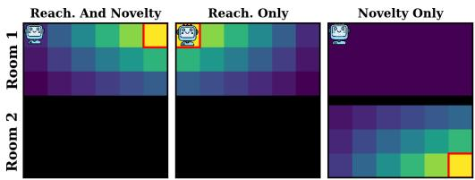

Figure 1: Reachability or novelty are not enough. At every episode, the agent spawns in one of two isolated rooms. After exploring for some time, the second room has been rarely visited due to its lower spawning rate. Heatmaps show the score assigned to each tile by different goal-selection scores when the agent is in the top-

left corner (red boxes mark the selected goal). Novelty alone (e.g., visit counts inverse) picks tiles in the second room, which the agent cannot reach. Reachability alone (e.g., distance) picks the agent’s current tile, leading to no exploration. Only novelty and reachability combined selects the least-visited tile within reach. While simple, this example shows the importance of considering both reachability and novelty in exploration, and raises the central question of this paper: how to encode, learn, and combine reachability and novelty? Our SUN indicator provides principled answers.

that are both novel and reachable. Its core is the SUccessor-to-Novelty (SUN) indicator: reachability is estimated via successor value functions [Dayan, 1993], and novelty via pseudocounts. SUN is compatible with any off-policy RL algorithm; in this paper, we instantiate it with DQN [Mnih et al., 2015] and TD3 [Fujimoto et al., 2018].

(2) We present an accurate yet lightweight pseudocount that avoids the overhead of density-based methods, enabling efficient exploration with $\mathcal { O } ( 1 )$ query cost.

(3) We show that SUN is the value of a goal-conditioned count-bonus reward, gives a closed-form lower bound on the short-horizon hitting probability, and provably suppresses unreachable goals.

(4) We introduce new benchmarking environments with unreachable states and irreversible transitions that directly stress-test reachability-aware exploration, and show that SUN consistently outperforms state-of-the-art methods on these and standard benchmarks.

Together, these contributions establish SUN as a principled and practical solution to the longstanding tension between novelty and reachability in exploration.

SUN exploration fits in the field of reward-free exploration and goal-conditioned RL, and is especially close to the work of Tarbouriech et al. [2022] (AdaGoal) and Diaz-Bone et al. [2025] (DISCOVER) in its use of successor value functions to drive exploration. Both also balance novelty and reachability, but estimate novelty through critic-ensemble disagreement, which is computationally expensive and, as we show, leaves both methods poorly calibrated between the two signals. SUN sidesteps these issues with a lightweight pseudocount and a novel goal-selection strategy (Section 3). Across all our benchmarks, it consistently and substantially outperforms both methods.

## 2 Problem Setting

Optimal exploration. A reward-free Markov Decision Process (MDP) is defined by the tuple $\langle S , A , \mathcal { P } , p _ { 0 } \rangle$ ⟩, where S is the state space, A is the action space, $\mathcal { P } ( s ^ { \prime } | s , a )$ is the transition function, and $p _ { 0 }$ is the initial state distribution. The objective is to explore the state space “optimally” without any task-specific reward. Two main lines of work formalize this notion of optimality differently.

The first line targets the state-visitation distribution: the goal is to learn a policy whose induced distribution maximizes a desired criterion, typically the entropy [Hazan et al., 2019, Lee et al., 2019, Mutti et al., 2021, Zhang et al., 2021, Jain et al., 2023, Adamczyk et al., 2026]. A maximum-entropy state-visitation distribution corresponds to uniform coverage of the state space, and provably efficient algorithms exist for this objective in tabular MDPs.

The second line frames exploration as goal-conditioned RL (GCRL) and the agent learns goalconditioned policies $\pi ( a | s , g )$ [Lim and Auer, 2012, Tarbouriech et al., 2020, 2022]. The goal $g \in { \mathcal { G } }$ may be a subset of the state, of the joint state-action, or of a learned representation thereof.1 A goal $g$ is said to be reachable from a reference state $s _ { 0 }$ if there exists a policy π that reaches $g$ from $s _ { 0 }$ in bounded expected time. The objective is then to learn policies that can visit every goal reachable given different reference states. This formulation directly captures the intuition that exploration should focus on states the agent can actually reach, but does not specify a target visitation distribution. Both objectives are principled but solving them exactly requires machinery $- \mathrm { e . g } ,$ ., Frank-Wolfe schemes for max-entropy [Hazan et al., 2019], PAC-style algorithms for reachable coverage [Tarbouriech et al., 2020, 2022] — that does not scale to deep RL. Practical methods therefore approximate these objectives with greedy or local heuristics: thanks to careful goal-selection mechanisms, follow ing π $\boldsymbol { \mathsf { r } } ( a | s , g )$ induces a state-visitation distribution with broad and uniform state coverage. Our work follows this pragmatic line: we design a goal-selection rule that, at each step, prefers goals that are both underrepresented in the agent’s current visitation distribution and reachable.

Successor Value Functions. In GCRL literature, reachability is often encoded with the successor valuefunction (SVF) [Dayan, 1993, Kulkarni et al., 2016, Blier et al., 2021, Eysenbach et al., 2022, Zheng et al., 2024], which generalizes the value function and represents the cumulative γ-discounted occurrence of a goal g under a policy π, i.e.,

$$
\begin{array} { r } { V ^ { \pi } ( s _ { t } , g ) = \mathbb { E } \left[ \sum _ { k = t } ^ { \infty } \gamma ^ { k - t } \mathbf { 1 } \{ s _ { k } = g \} \middle | \pi , \mathcal { P } , s _ { t } \right] , } \end{array}\tag{1}
$$

where $\gamma \in [ 0 , 1 )$ and $\mathbf { 1 } \{ s _ { k } = g \}$ is the reward function returning 1 if $s _ { k } = g$ and 0 otherwise. The stateaction analogue $Q ^ { \pi } ( s _ { t } , a _ { t } , g )$ is defined likewise, and both admit a Bellman recursion as in standard value functions, with $V ^ { \pi } ( s _ { t } , g ) = \operatorname* { m a x } _ { a } Q ^ { \pi } ( s _ { t } , a , g )$ . Similarly to classic value functions, SVFs are often approximated with parameterized functions $V ^ { \theta } ( s _ { t } , g )$ , and training them is a well-studied problem. In this paper, we rely on Hindsight Experience Replay (HER) [Andrychowicz et al., 2017]. In GCRL, once the goal is given (e.g., a desired robot pose or an environment coordinate), greedily following the SVF leads the agent to it, as the value increases the fewer steps are needed to reach the goal.2 This same mechanism extends naturally to reward-free exploration: select a goal appropriately — unlike in GCRL, the goal is not given by the task — and then follow the $\operatorname { s v F }$ to reach it. The goal-selection is what determines whether exploration is optimal: a well-designed mechanism would guarantee coverage and uniformity over the goal space ${ \mathcal { G } } \subseteq S \times A$

With these tools in hand, our method must address three concrete subproblems. First, how to combine the reachability and novelty signals into a single indicator. Second, how to design an effective goal-selection strategy given the above indicator. Third, how to compute a novelty signal that is both accurate and cheap enough to query at scale.

## 3 Exploration via SUN

We present our answer to the three subproblems above: SUN (SUccessor-to-Novelty), a goal-selection indicator that combines an SVF-based reachability signal with a novelty signal in a single score.

$$
\operatorname { S U N } ( g | s ) \triangleq V ^ { \pi } ( s , g ) \cdot \nu ( g ) , \qquad g _ { t } = \underset { g \in \mathcal { G } } { \operatorname { a r g m a x } } \operatorname { S U N } ( g | s _ { t } ) ,\tag{2}
$$

where $V ^ { \pi } ( s _ { t } , g )$ is the SVF estimating reachability of $g$ from $s _ { t }$ under the goal-conditioned policy, and $\nu ( g )$ is a novelty signal. Computing the arg max in Eq. (2) is not feasible in continuous or large goal spaces, so we restrict it to a finite candidate set $\mathcal { C } _ { t } \ \bar { \subset } \ \mathcal { G }$ sampled from a replay buffer. This choice pairs naturally with off-policy algorithms, which already maintain a buffer for training.

The rest of this section is organized as follows. Section 3.1 presents properties that justify the indicator; Section 3.2 describes a novel goal-selection strategy that leverages these properties; Section 3.3 introduces our novelty estimator; and Section 3.4 summarizes SUN and its relation to prior work.

## 3.1 The Indicator and Its Properties

We informally describe three properties of SUN that justify Eq. (2) and that we will invoke in subsequent sections; proofs are in Appendix $\mathbf { A } .$

(a) Count-bonus equivalence. If $\nu ( g ) = 1 / n _ { g }$ where $n _ { g }$ is the goal visit count, SUN equals the value function of a reward inversely proportional to $\begin{array} { r } { n _ { g } , \bar { \mathrm { i } } . \mathrm { e } . , \mathbb { E } [ \sum _ { k = t } \gamma ^ { k - t } \mathbf { 1 } \{ s _ { k } = g \} / n _ { g } ] } \end{array}$ . Thus SUN is not simply a product of two signals, but the value of a count-bonus objective.

(b) Reachability guarantee. The reachability factor $V ^ { \pi } ( s , g )$ controls hitting time: a high SVF value implies a high probability of reaching $g$ within a short horizon, $\operatorname* { P r } _ { \pi _ { q } } [ \tau _ { g } \leq n ] \geq V ^ { \pi _ { g } } \bar { ( s , g ) } - \gamma ^ { n + 1 }$ where $\tau _ { g }$ is the hitting time. The horizon scales as $\mathcal { O } ( \log ( 1 / V ) / ( 1 - \gamma ) )$

(c) Unreachable goals are suppressed. If no policy in the agent’s class can reach $^ { g , }$ then $V ^ { \pi } ( s , g ) = 0$ for all such policies, and $\mathrm { \bar { S U N } } ( g | s ) = \mathrm { \bar { 0 } }$ regardless of $\nu ( g )$ . This is the formal counterpart of Figure 1: novelty alone selects unreachable goals, while SUN does not.

Why not an additive indicator? Common exploration strategies combine reachability and novelty additively [Diaz-Bone et al., 2025]. Indeed, SUN’s indicator could equally be defined additively as $V ^ { \pi } ( s , g ) + \nu ( g )$ , which admits standard UCB-style confidence bounds and PAC guarantees when ν is based on visit counts (see Appendix K). However, additive formulations are sensitive to the relative scale of the two terms and typically require a tuning coefficient to balance them, especially if the SVF is approximated as in ${ \dot { V } } ^ { \dot { \theta } }$ . The multiplicative form removes the need to calibrate the two terms against each other: they share a common “zero” (an unreachable or already-saturated goal scores zero on either factor and is rejected regardless of the other) and a common, known scale (both are non-negative and bounded by one). The trade-off is not thereby eliminated — in log-space it is set by $\kappa = - \log \gamma ( \mathrm { A }$ ppendix A.5) — but it is fixed and inherited from the discount used for value learning, rather than being a free coefficient that must be re-tuned whenever the scale of the novelty signal changes (see Section 3.4). In Section 4.2 we compare SUN against an additive UCB-style variant and show that the multiplicative indicator performs significantly better.

## 3.2 When Should The Agent Select A Goal? Adaptive Goal-Selection Strategy

If $V ^ { \theta }$ were exact, acting greedily with respect to it would be optimal — the best goal would be selected and reached in finite time (Appendix A.7). Thus, episodic goal-selection — selecting the goal at the start of an episode and keeping it fixed until reached — would be optimal. However, ${ \bar { V } } ^ { \theta }$ is learned and approximate, and the agent may commit to unreachable goals, potentially not exploring at all. Similarly, under stochastic transitions the agent may suddenly find itself in states where the previously-selected goal is no longer reachable. The opposite strategy, per-step goal-selection, compares the current goal against a fresh candidate set at every timestep to find a potentially better one. This can prevent commitment to unreachable goals, e.g., after a wrong action or a noisy transition. However, this strategy can be too unstable: as ${ \check { V } } ^ { \theta }$ is being learned, goal values shift quickly and the agent may pick different goals at every timestep, acting near-randomly.

For these reasons, we propose a novel adaptive strategy, inspired by the theoretical properties of the SVF. Under deterministic dynamics, the true value at the current state should be monotonically non-decreasing along the trajectory toward the selected goal: as the agent moves closer, $V ^ { \pi } ( s _ { t } , \bar { g } )$ grows. Thus, a drop in $V ^ { \theta } ( s _ { t } , g )$ signals that the goal is either unreachable from the current state, or that the approximate SVF was inaccurate at the time of selection — in either case, the goal is no longer a reliable target. Concretely, at each step t we compare the current value against the value at selection time $t _ { \mathrm { s e l } } \colon$ if $V ^ { \theta } ( s _ { t } , g ) < \dot { V } ^ { \theta } ( s _ { t _ { \mathrm { s e l } } } , g )$ , the current goal is discarded and a new one is selected from a freshly sampled candidate set; otherwise, the current goal is kept.3

This adaptive strategy preserves the stability of episodic commitment, and inherits per-step reselection’s ability to escape bad commitments — but only if the SVF changes frequently (because it is still being learned) or if it signals that something has gone wrong (e.g., due to environment noise). Section 4.2 empirically validates our strategy.

## 3.3 Novelty Via Lightweight Pseudocounts

SUN combines two signals: reachability via SVFs and novelty. The reachability side is handled by learning $V ^ { \pi }$ with HER [Andrychowicz et al., 2017] (see Appendix C). The novelty signal $\nu ( g )$ in Eq. (2) can be instantiated in many ways [Pathak et al., 2017, Burda et al., 2019]. A principled choice is visit counts or density estimates [Bellemare et al., 2016, Tang et al., 2017], so that rarely-visited goals receive a high novelty score: $\nu ( g ) = 1 / n _ { g } ,$ , where $n _ { g }$ is the number of times g has been visited. In continuous spaces $n _ { g }$ cannot be tracked exactly and must be approximated by a pseudocount. Since we query $\nu ( g )$ against many candidate goals $\mathcal { C } _ { t }$ multiple times per episode, the pseudocount must be lightweight to compute — standard approaches such as kernel density estimation (KDE)

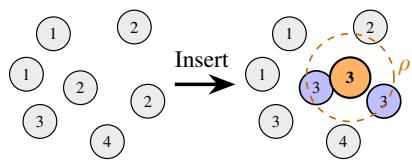  
Figure 2: Pseudocount via replay buffer neighbors. Each buffer entry stores a count of its neighbors within radius $\rho$ (in standardized feature space). When a new sample is inserted, its count is set to the number of neighbors within $\rho$ plus one (for itself), and each neighbor’s count is incremented.

or neural density models do not satisfy this requirement. We instead propose a pseudocount that amortizes its cost into buffer insertion: counts are precomputed and stored alongside each buffer entry, making queries cheap.

For each entry in the replay buffer at index i, we store a count $n _ { i }$ of entries within a neighborhood of radius $\rho$ of $s _ { i }$ in standardized feature space. When a new sample is inserted, we compute its count (number of neighbors plus one for itself) and increment the neighbors’ counts. Figure 2 illustrates the procedure; Appendix B gives the standardization scheme and implementation details. This is a fixed-radius nearest-neighbor density estimator with the cost moved from query time to insertion time. Its benefits are the following.

• The radius $\rho$ is a single hyperparameter, applied in standardized space. Standardization makes a single scalar radius meaningful across features: without it, a separate radius would be needed for each feature dimension to account for differences in native scale.

• By incrementing the count of every neighbor of the new sample, the stored counts are maintained across the entire buffer without ever recomputing them from scratch. At query time, the novelty of a candidate goal g is read directly from the replay buffer: $\nu ( g ) = 1 / n _ { g }$ . This has cost O(1).

• The insertion cost is $\mathcal { O } ( N \cdot M )$ in the buffer size N and goal dimensionality M. Classic KDE costs O(N·M·B) per step for B candidate goals, and neural density models can be even more expensive.

When goals may be reselected at any step, classic methods are prohibitively expensive while our pseudocount remains tractable. By moving the cost from query to insertion time and standardizing across features, we obtain a novelty estimator that is accurate yet lightweight. We validate its accuracy in Appendix H and report wall-clock costs in Appendix E.

## 3.4 Summary and Related Work

Algorithm 1: SUN Exploration   
(During One Episode)   
Function SelectGoal $( s _ { t } , D )$ :   
2 $s _ { t _ { \mathrm { s e l } } } \gets s _ { t }$   
3 $\mathcal { C } _ { t } \sim \mathcal { D }$   
4 return arg $\operatorname* { m a x } _ { g \in { \mathcal { C } } _ { t } } { \mathrm { S U N } } ( g | s _ { t } )$   
5 for $t = 0 \dots T$ do   
6 begin $ t = 0$   
7 reached $ \| s _ { t } - g _ { t } \| < \eta$   
8 adapt $ V ^ { \theta } \dot { ( } s _ { t } , g _ { t } \dot { ) } \stackrel { \cdot } { < } V ^ { \theta } \dot { ( } s _ { t _ { \mathrm { s e l } } } , g _ { t } \dot { ) }$   
9 if begin or reached or adapt then   
10 gt ← SelectGoal $( s _ { t } , D )$   
11 else   
12 $g _ { t } \gets g _ { t - 1 }$   
13 $\begin{array} { r } { \dot { a _ { t } } \sim \pi ( \cdot \mid s _ { t } , g _ { t } ) } \end{array}$   
14 $s _ { t + 1 } \sim \mathcal { P } ( \cdot \mid s _ { t } , a _ { t } )$   
15 Update $( \mathcal { D } , s _ { t } , a _ { t } , s _ { t + 1 } )$

Algorithm 1 summarizes SUN exploration. At the beginning of an episode, the agent selects the goal g0 according to Eq. (2), with candidates (and their pseudocounts) sampled from the replay buffer. The initial state $s _ { 0 }$ is saved as $\boldsymbol { s } _ { t _ { \mathrm { s e l } } }$ (state at selection time). At every timestep, if $V ^ { \theta } ( s _ { t } , g _ { t } ) < V ^ { \theta } ( s _ { t _ { \mathrm { s e l } } } , g _ { t } )$ or if the agent has reached the current goal, a new goal $g _ { t }$ is selected from a fresh batch of candidates and $\boldsymbol { s } _ { t _ { \mathrm { s e l } } }$ is updated; if not, $g _ { t }$ is kept. Then, the agent acts to explore with $a _ { t } \sim \pi ( \cdot | s _ { t } , g _ { t } )$ , the new sample is inserted into the replay buffer, and pseudocounts are updated. The policy and the SVF are trained with any off-policy algorithm and goal relabeling [Andrychowicz et al., 2017] (Appendix C).

This scheme can be applied to classic reward-driven RL: the goal-conditioned policy drives exploration to collect environment rewards, and task-specific value function and policy are trained off-policy.

AdaGoal and DISCOVER. Throughout Sections 2–3, we have discussed how SUN relates to prior work along several axes: reward-free exploration [Hazan et al., 2019, Tarbouriech et al., 2020, 2022], GCRL [Schaul et al., 2015], hindsight relabeling [Andrychowicz et al., 2017, Eysenbach et al., 2022, Zheng et al., 2024], and count- or density-based novelty [Bellemare et al., 2016, Pong et al., 2020, Pitis et al., 2020, Burda et al., 2019]. Here, we focus on the two methods closest in spirit to SUN: AdaGoal [Tarbouriech et al., 2022] and DISCOVER [Diaz-Bone et al., 2025]. Both select goals using an ensemble of SVFs $\{ V ^ { \theta _ { 1 } } , \ldots , \bar { V } ^ { \theta _ { K } } \}$ , with mean $\mu ( s , g )$ and standard deviation $\sigma ( s , g )$ . Formally,

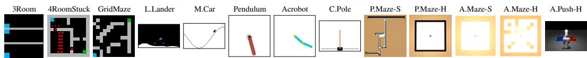  
Figure 3: Environments. Control tasks are standard benchmarks. Gridworlds are a novel contribution of this paper. Blue tiles mark starting positions and green tiles mark terminal states. Tiles with a yellow ? have a 50% chance of triggering a random movement; tiles with red arrows admit only the corresponding movement. In FourRoomStuck, this creates a trap: the agent can accidentally enter the bottom-left room, where any action that does not match the red arrow leaves the agent in place.

$$
\underbrace { g _ { t } = \underset { g \in C _ { t } } { \operatorname { a r g m a x } } V ^ { \theta } ( s _ { t } , g ) / n _ { g } } _ { \mathrm { S U N } } \qquad \underbrace { g _ { t } = \underset { g \in C _ { 0 } } { \operatorname { a r g m a x } } \mu ( s _ { 0 } , g ) + \beta \sigma ( s _ { 0 } , g ) } _ { \mathrm { D I S C O V F R } ^ { 4 } } \qquad \underbrace { g _ { t } = \underset { g \in C _ { 0 } } { \operatorname { a r g m a x } } \sigma ( s _ { 0 } , g ) } _ { \mathrm { A d a G o a l } ^ { 5 } }
$$

The mean µ serves as a reachability signal, and the disagreement σ as an epistemic-uncertainty signal (goals on which the ensemble disagrees are those the agent cannot reliably reach). AdaGoal explicitly frames this as “selecting uncertain goals” and proves PAC guarantees; DISCOVER frames the same quantity as “novelty” since uncertainty correlates with under-exploration.

Two main differences distinguish SUN from this line of work. First, AdaGoal and DISCOVER select the goal once at the beginning of the episode $( g _ { t }$ is selected once from $\mathcal { C } _ { 0 } )$ . SUN instead continuously monitors the value of the current goal, and reselects it from a freshly-resampled candidate set $\mathcal { C } _ { t }$ if needed. Second, SUN replaces the ensemble with a lightweight pseudocount, removing the cost of training and querying K critics, and introduces an effective balance between reachability and novelty. Section 4 shows these differences matter: episodic commitment fails when goals become unreachable mid-episode, DISCOVER is sensitive to $\beta { \bar { , } }$ and AdaGoal has no effective reachability proxy.

Proto-Goals. Bagaria et al. [2023] also combine novelty and reachability, but sequentially: first, goal candidates are sampled proportionally to a count-based novelty; then, the one with highest SVF is pursued. Thus, reachability cannot recover from a novelty draw that misses, and novelty cannot override a reachability arg max. The authors report that local reachability hurt performance by biasing selection toward easy goals, until an additional timescale-stratification mechanism was introduced — exactly the bias our multiplicative indicator avoids (Section 4.2). Similarly, their goal is selected once per episode and pursued until achieved, and the authors list finer-grained goal switching [Pislar et al., 2022] as future work, which is precisely what our adaptive strategy provides. Directed Exploration. Closest to our pseudocount is the episodic novelty module of NGU [Badia et al., 2020], which also estimates counts with a nearest-neighbor density estimator. Two differences matter. First, its memory is cleared at every episode, so its counts measure within-episode novelty, while SUN leverages lifetime novelty. Second, it recomputes the kernel sum at query time, which is affordable only for a memory at most one episode long.

## 4 Experiments

We select benchmarks that illustrate three challenges in RL exploration: (a) unreachable states or irreversible transitions, (b) large or unbounded goal spaces, and (c) hard exploration (hard-toreach states, obstacles, mazes). Goal dimensionality ranges from two (most environments) to eight (LunarLander(Full)). Details are in Figure 3 and Appendix D.

• Gridworlds (a, c): ThreeRoom is a larger variant of Figure 1; the agent spawns in a random isolated room, with higher spawn rate in the first two. In FourRoomStuck, the bottom-left room cannot be exited or traversed freely, and some transitions are stochastic. GridMaze features a narrow passage near the agent’s starting state.

• Classic control [Towers et al., 2024] (a, b, c): MountainCar is a well-known hard-exploration benchmark. In CartPole, episodes terminate quickly when the pole falls, making the corners of the state space hard to reach. LunarLander has an unbounded state space (the agent can fly arbitrarily high). Acrobot has unreachable configurations, and Pendulum hard-to-reach ones.

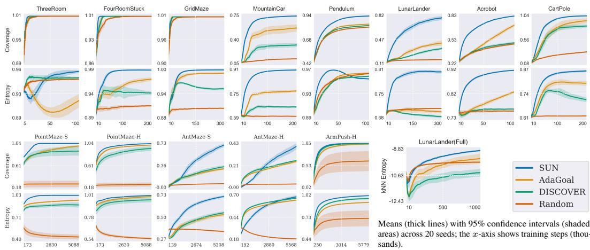  
Figure 4: Main results. SUN outperforms all baselines in all environments. Note that full coverage is easy in Gridworlds, but uniform exploration (high entropy) is not.

• GCRL control [Bortkiewicz et al., 2025] (b, c): PointMaze-S/H and AntMaze-S/H are locomotion environments of increasing difficulty featuring corridors and dead-ends. ArmPush-H is a manipulation task where a Franka Panda pushes a cube on an unbounded plane.

Evaluations. First, we compare SUN against a random uniform exploration baseline, AdaGoal [Tarbouriech et al., 2022] and DISCOVER [Diaz-Bone et al., 2025]. Not only are these two close to SUN, but they have achieved state-of-the-art performance and outperformed algorithms like MEGA [Pitis et al., 2020]. SUN, AdaGoal, and DISCOVER all use HER [Andrychowicz et al., 2017] to learn their SVFs. Second, we ablate SUN components, i.e., its indicator and goal-selection strategy. Finally, we analyze why AdaGoal, DISCOVER, and non-adaptive goal-selection fail.

We evaluate two metrics over the goal space: coverage (fraction of goal space visited) and Shannon entropy of goal visit counts normalized to [0, 1]. We also report heatmaps for a qualitative analysis. In continuous spaces, we discretize the space into 50 bins per dimension (only for computing these metrics, not for learning). In LunarLander(Full), where the goal is eight-dimensional, we report only the entropy approximated via Kozachenko-Leonenko k-NN. More details are in Appendix D. All results are averaged across 20 seeds.

## 4.1 SUN vs Baselines

Quantitative results. Figure 4 shows that the two metrics are complementary: coverage measures whether a state has been visited at least once, while entropy measures how uniformly visits are distributed. A method can saturate coverage while still concentrating most of its visits in small regions of the state space, which is what happens in Gridworlds: all methods reach perfect coverage, yet their entropy values differ substantially, with SUN at the top. Indeed, Gridworlds are challenging due to their non-uniform initial-state distributions and unreachable goals (ThreeRoom), stochastic transitions and irreversible traps (FourRoomStuck), and bottlenecks that must be traversed to reach the rest of the grid (GridMaze). Coverage alone hides these difficulties; entropy reveals them.

Continuous-control environments further strengthen SUN’s advantage: its curves rise faster and plateau only at (near-)full coverage. One interesting exception is Pendulum, the only environment where SUN’s entropy actually decreases. The reason is structural: reaching some configurations requires passing through the same intermediate states repeatedly. For example, reaching certain angles at a specific velocity requires accumulating momentum through many swings, which means the agent must revisit the same low-momentum positions over and over. Rare states are therefore rare precisely because they can only be reached by re-traversing common ones many times; visiting the tail of the distribution comes at the cost of re-visiting the mode. This explains why SUN entropy decreases even though its coverage keeps increasing. Importantly, SUN also attains the best performance on LunarLander(Full), despite its higher dimensionality. This supports the proposed pseudocount as an effective tool for estimating visits and encoding novelty.

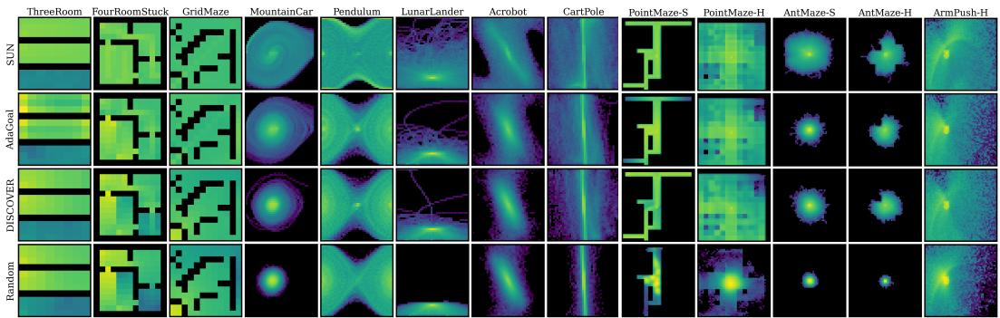  
Figure 5: Log-scale visitation heatmaps at the end of training (first seed). In Pendulum and Acrobot, the sine/cosine coordinates are combined into the angle for visualization. Axes denote positional coordinates (e.g., the lander position), except in MountainCar, Pendulum, and CartPole, where they denote position (x-axis) and velocity (y-axis). PointMaze-H goal space is actually 3D, and the heatmaps show only the planar position. SUN is the only algorithm not clustering its visits, except in the regions corresponding to the episode’s starting state (that are naturally visited more).

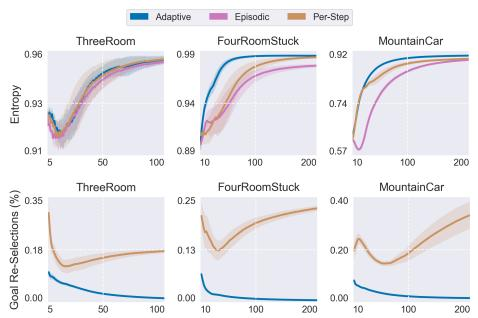

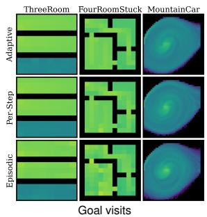

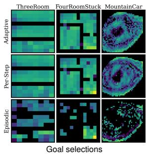  
Figure 6: Goal-selection ablation. Episodic selection fails when goals become unreachable midepisode (as in FourRoomStuck). Per-step selection avoids this failure mode, but its reselection rate never drops to zero, undermining overall performance. In contrast, the reselection rate of adaptive selection drops to zero over training, indicating that the agent has learned to reach the goals it selects.

Qualitative results. Figure 5 provides a qualitative view of the visitation distributions at the end of training (black regions are unvisited or unreachable). Across all environments, SUN covers a broader portion of the goal space and produces smoother visitation patterns, while AdaGoal and DISCOVER concentrate their visits in narrow regions. For example, in FourRoomStuck their visits are highly non-uniform inside the bottom-left room; in GridMaze they cluster near the bottom-left corner and rarely pass through the narrow passage into the rest of the maze; in control environments they fail to explore far from the initial state. This confirms visually the entropy ranking of Figure 4: methods can cover many goals while still over-concentrating their visits.

## 4.2 SUN Ablations

SUN is made of three components: the multiplicative indicator, the adaptive goal-selection, and the pseudocounts. Figure 6 ablates goal-selection and validates the importance of adaptive selection, highlighting the shortcomings of episodic6 and per-step7 strategies. Figure 7 ablates indicators, and reinforces the main motivation of this paper: exploration is ineffective when guided by either reachability or novelty alone; both must be considered. All plots and heatmaps are in Appendix G and I. Ablation on pseudocounts is in Appendix H.

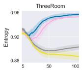

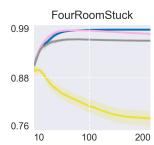

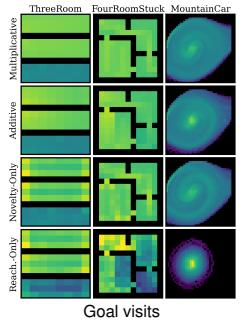

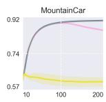

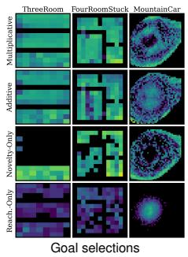

  
Figure 7: Indicator ablation. If driven by reachability only, the agent barely explores — the most reachable state is the current one. Novelty-only performs well if goals are always reachable (MountainCar), but fails otherwise (Gridworlds). The additive indicator can saturate: as counts increase, the novelty bonus vanishes and the indicator reduces to pure reachability; the entropy thus drops, and goals and visits begin to cluster near the starting states — this is clearly visible in MountainCar, and to a lesser extent in Gridworlds. The multiplicative indicator does not display these failure modes.  
4.3 Why AdaGoal and DISCOVER Fail

The results so far are clear: SUN attains the best entropy and coverage, as confirmed visually by the visitation heatmaps, and the ablations validate the importance of its components. Yet another result stands out (Figure 8): all SUN versions attain better coverage than AdaGoal and DISCOVER, and all multiplicative versions also attain better entropy — strong evidence that SUN’s advantage comes from the indicator itself rather than from the goal-selection strategy. The additive version is the exception on entropy, consistent with the saturation failure mode of Figure 7. To understand this better, Figure 9 shows the goals selected by all SUN versions, AdaGoal, and DISCOVER over training in MountainCar.

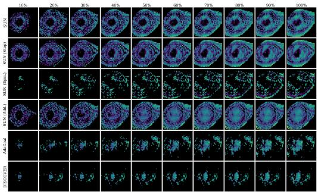  
Figure 9: Goal selections over training in M.Car.

DISCOVER (last row) is biased toward reachability: it starts by selecting goals near the starting state and barely expands beyond them. This may stem from its coefficient β, which must balance the scales of the reachability and novelty terms. SUN is unaffected by this issue, except slightly in its Additive version (fourth row), which starts selecting easy-to-reach goals late in training, once the novelty bonus begins to vanish.

AdaGoal (fifth row), conversely, is biased toward novelty at the expense of reachability. Already at 20% of training it selects goals progressively

further from the starting state — yet at that stage the SVFs are still inaccurate and the agent does not know how to reach them. This is not unexpected. As noted in Section 3.4, we evaluate the deep-RL variant of AdaGoal, which — unlike the tabular version — does not constrain goal selection by the estimated goal-hitting time. Tarbouriech et al. argue that this is approximated implicitly by the disagreement of the value ensemble. Our results suggest that this does not hold in more complex environments. Novelty alone is a reasonable signal for goals the agent can actually reach, since visiting them resolves the disagreement at little cost. Unreachable goals, however, resolve only after enough failed attempts for every ensemble member to recognize them as such, and each of those attempts is an episode spent without useful experience. The rule cannot distinguish the two cases, and where the reachable set is a small fraction of the goal space the latter dominates — precisely the behavior the reachability constraint was meant to prevent.

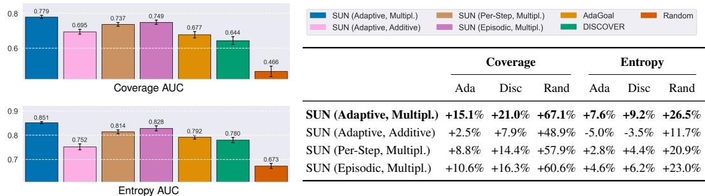

<table><tr><td colspan="4">SUN (Adaptive, Multipl.) SUN (Per-Step, Multipl.) SUN (Adaptive, Additive) SUN (Episodic, Multipl.)</td><td colspan="4">AdaGoal Random DISCOVER</td></tr><tr><td colspan="4">Coverage</td><td colspan="4">Entropy</td></tr><tr><td></td><td>Ada</td><td>Disc</td><td>Rand</td><td>Ada</td><td>Disc</td><td></td><td>Rand</td></tr><tr><td>SUN (Adaptive, Multipl.)</td><td>+15.1%</td><td>+21.0%</td><td>+67.1%</td><td></td><td>+7.6%</td><td>+9.2% +26.5%</td><td></td></tr><tr><td>SUN (Adaptive, Additive)</td><td>+2.5%</td><td>+7.9%</td><td>+48.9%</td><td>-5.0%</td><td>-3.5%</td><td></td><td>+11.7%</td></tr><tr><td>SUN (Per-Step, Multipl.)</td><td>+8.8%</td><td></td><td>+14.4% +57.9% +2.8% +4.4% +20.9%</td><td></td><td></td><td></td><td></td></tr><tr><td>SUN (Episodic, Multipl.)</td><td></td><td>+10.6% +16.3% +60.6% +4.6% +6.2% +23.0%</td><td></td><td></td><td></td><td></td><td></td></tr><tr><td></td><td></td><td></td><td></td><td></td><td></td><td></td><td></td></tr></table>

Figure 8: (Left) Area under the curve (AUC) for entropy and coverage across all baselines and SUN versions, averaged over all environments (excluding LunarLander(Full)). (Right) Relative AUC improvement of each SUN version over AdaGoal, DISCOVER, and Random.

All SUN versions (first three rows) instead progressively select goals that are further away. This natural progression provides the best balance between reachability and novelty, and holds for SUN Episodic as well (third row). Thus, this progression is intrinsic to the indicator rather than a product of reselection — AdaGoal and DISCOVER both use episodic selection too, yet show no such trend.

The results in this section validate our claims. (1) SUN attains the best entropy and coverage across all environments, visiting the goal space significantly more uniformly than every baseline. (2) Its pseudocount effectively approximates novelty even in high-dimensional goal spaces. (3) Its multiplicative indicator does not vanish and selects goals that are both reachable and novel, and its adaptive goal-selection outperforms the baselines’ episodic strategy.

## 5 Discussion

In this paper, we tackled the challenge of exploration in RL via goal-conditioned policies, focusing on the selection of goals that are simultaneously novel and reachable. We argued that existing methods cannot fully capture the tension between the two and end up neglecting one or the other. We thus proposed SUN, a unified and principled indicator and goal-selection rule grounded in SVFs and counts. We further introduced a lightweight pseudocount that scales to per-step goal-selection in continuous spaces. Finally, we validated SUN on standard and new benchmarks, where it consistently outperforms state-of-the-art methods AdaGoal and DISCOVER.

Strengths. The strength of SUN lies in its principled and modular design. Its score admits a natural interpretation as the optimal value of a count-bonus exploration objective, driving the agent toward rarely-visited states within reach. This is made possible by our lightweight pseudocount, which avoids the overhead of classical pseudocount and density-based approaches while preserving their accuracy. Our results confirm this: AdaGoal and DISCOVER, which instead score goals by critic-ensemble disagreement, fail to balance the two signals and collapse toward one or the other.

Limitations and Future Work. First, although principled, count-based novelty is ineffective in large spaces, such as image observations, regardless of their pseudocount approximations. Since most observed states are effectively unique, counts become nearly uniform across the buffer and do not provide a useful novelty signal. In such regimes, exploration likely requires richer signals, such as learned curiosity [Raileanu and Rocktäschel, 2020, Parisi et al., 2021] or mutual information between trajectories and learned latents [Eysenbach et al., 2019, Sharma et al., 2020]. Combining these signals with SUN’s reachability factor is a promising direction.

Second, SUN selects the goal greedily based on the SUN score of the candidate alone, without accounting for the states traversed to reach it. A longer path through many novel states may be preferable to a shorter path to a marginally rarer goal — a distinction the current formulation cannot make. Extending SUN indicator to a cumulative form would more directly target a maximum-entropy state distribution [Hazan et al., 2019, Mutti et al., 2021]. We see this as a natural next step.

Finally, SUN draws candidate goals from the replay buffer, which means it can only propose goals it has already encountered. A natural way to relax this is to exploit the geometry of the goal space. Recent work on temporal distances and quasimetric value functions [Wang et al., 2023, Myers et al., 2024] learns goal-space metrics that generalize beyond observed pairs, Laplacian-style representations [Shehmar et al., 2026] provide a similar latent geometry, and studies on out-ofdistribution generalization in goal-conditioned RL [Yang et al., 2023] characterize design choices that enable extrapolation to unseen goals. Combining SUN’s reachability factor with such learned metrics or generalization-aware training — sampling goals as points in a continuous metric space rather than from the buffer — is a promising direction for unblocking the buffer-manifold limitation.

## Acknowledgments

This research was supported by grants from the European Laboratory for Learning and Intelligent Systems (ELLIS) and Finnish IT Center for Science (CSC).

## References

J. Adamczyk, A. Kamoski, and R. V. Kulkarni. Maximum entropy exploration without the rollouts. arXiv:2603.12325, 2026.

M. Andrychowicz, F. Wolski, A. Ray, J. Schneider, R. Fong, P. Welinder, B. McGrew, J. Tobin, O. Pieter Abbeel, and W. Zaremba. Hindsight experience replay. In Advances in Neural Information Processing Systems (NeurIPS), 2017.

P. Auer, N. Cesa-Bianchi, and P. Fischer. Finite-time analysis of the multiarmed bandit problem. Machine Learning, 47(2-3):235–256, 2002.

M. G. Azar, I. Osband, and R. Munos. Minimax regret bounds for reinforcement learning. In International Conference on Machine Learning (ICML), 2017.

A. P. Badia, P. Sprechmann, A. Vitvitskyi, Z. D. Guo, B. Piot, S. Kapturowski, O. Tieleman, M. Arjovsky, A. Pritzel, A. Bolt, and C. Blundell. Never give up: Learning directed exploration strategies (2020). In International Conference on Learning Representations (ICLR), 2020.

A. Bagaria, R. Jiang, R. Kumar, and T. Schaul. Scaling goal-based exploration via pruning proto-goals. In International Joint Conference on Artificial Intelligence (IJCAI), 2023.

M. G. Bellemare, S. Srinivasan, G. Ostrovski, T. Schaul, D. Saxton, and R. Munos. Unifying count-based exploration and intrinsic motivation. In Advances in Neural Information Processing Systems (NeurIPS), 2016.

L. Blier, C. Tallec, and Y. Ollivier. Learning successor states and goal-dependent values: A mathematical viewpoint. arXiv:2101.07123, 2021.

M. Bortkiewicz, W. Pałucki, V. Myers, T. Dziarmaga, T. Arczewski, Ł. Kucinski, and B. Eysenbach.´ Accelerating goal-conditioned reinforcement learning algorithms and research. In International Conference on Learning Representations (ICLR), 2025.

Y. Burda, H. Edwards, A. Storkey, and O. Klimov. Exploration by random network distillation. In International Conference on Learning Representations (ICLR), 2019.

C. Colas, T. Karch, O. Sigaud, and P.-Y. Oudeyer. Autotelic agents with intrinsically motivated goal-conditioned reinforcement learning: a short survey. Journal ofArtificial Intelligence Research (JAIR), 74:1159–1199, 2022.

P. Dayan. Improving generalization for temporal difference learning: The successor representation. Neural Computation, 5(4):613–624, 1993.

L. Diaz-Bone, M. Bagatella, J. Hübotter, and A. Krause. DISCOVER: Automated curricula for sparse-reward reinforcement learning. In Advances in Neural Information Processing Systems (NeurIPS), 2025.

B. Eysenbach, A. Gupta, J. Ibarz, and S. Levine. Diversity is all you need: Learning skills without a reward function. In International Conference on Learning Representations (ICLR), 2019.

B. Eysenbach, T. Zhang, S. Levine, and R. R. Salakhutdinov. Contrastive learning as goal-conditioned reinforcement learning. In Advances in Neural Information Processing Systems (NeurIPS), 2022.

C. Florensa, D. Held, X. Geng, and P. Abbeel. Automatic goal generation for reinforcement learning agents. In International Conference on Machine Learning (ICML), 2018.

S. Fujimoto, H. van Hoof, and D. Meger. Addressing function approximation error in Actor-Critic methods. In International Conference on Machine Learning (ICML), 2018.

I. Goodfellow, D. Warde-Farley, M. Mirza, A. Courville, and Y. Bengio. Maxout networks. In International Conference on Machine Learning (ICML), 2013.

K. Hartikainen, X. Geng, T. Haarnoja, and S. Levine. Dynamical distance learning for semi-supervised and unsupervised skill discovery. In International Conference on Learning Representations (ICLR), 2016.

E. Hazan, S. Kakade, K. Singh, and A. Van Soest. Provably efficient maximum entropy exploration. In International Conference on Machine Learning (ICML), 2019.

A. K. Jain, L. Lehnert, I. Rish, and G. Berseth. Maximum state entropy exploration using predecessor and successor representations. Advances in Neural Information Processing Systems (NeurIPS), 2023.

T. Jaksch, R. Ortner, and P. Auer. Near-optimal regret bounds for reinforcement learning. Journal of Machine Learning Research (JMLR), 11:1563–1600, 2010.

L. F. Kozachenko and N. N. Leonenko. Sample estimate of the entropy of a random vector. Problems ofInformation Transmission, 23(2):9–16, 1987.

T. D. Kulkarni, A. Saeedi, S. Gautam, and S. J. Gershman. Deep successor reinforcement learning. arXiv:1606.02396, 2016.

L. Lee, B. Eysenbach, E. Parisotto, E. Xing, S. Levine, and R. Salakhutdinov. Efficient exploration via state marginal matching. arXiv:1906.05274, 2019.

S. H. Lim and P. Auer. Autonomous exploration for navigating in MDPs. In Conference on Learning Theory, 2012.

M. Liu, M. Zhu, and W. Zhang. Goal-conditioned reinforcement learning: Problems and solutions. In International Joint Conference on Artificial Intelligence (IJCAI), 2022.

V. Mnih, K. Kavukcuoglu, D. Silver, A. A. Rusu, J. Veness, M. G. Bellemare, A. Graves, M. Riedmiller, A. K. Fidjeland, G. Ostrovski, et al. Human-level control through deep reinforcement learning. Nature, 518(7540):529–533, 2015.

M. Mutti, L. Pratissoli, and M. Restelli. Task-agnostic exploration via policy gradient of a nonparametric state entropy estimate. In AAAI Conference on Artificial Intelligence, 2021.

V. Myers, C. Zheng, A. Dragan, S. Levine, and B. Eysenbach. Learning temporal distances: Contrastive successor features can provide a metric structure for decision-making. In International Conference on Machine Learning (ICML), 2024.

S. Parisi, V. Dean, D. Pathak, and A. Gupta. Interesting object, curious agent: Learning task-agnostic exploration. In Advances in Neural Information Processing Systems (NeurIPS), 2021.

D. Pathak, P. Agrawal, A. A. Efros, and T. Darrell. Curiosity-driven exploration by self-supervised prediction. In International Conference on Machine Learning (ICML), 2017.

M. Pislar, D. Szepesvari, G. Ostrovski, D. Borsa, and T. Schaul. When should agents explore? In International Conference on Learning Representations (ICLR), 2022.

S. Pitis, H. Chan, S. Zhao, B. Stadie, and J. Ba. Maximum entropy gain exploration for long horizon multi-goal reinforcement learning. In International Conference on Machine Learning (ICML), 2020.

T. Poggio and F. Girosi. Networks for approximation and learning. Proceedings of the IEEE, 78(9): 1481–1497, 1990.

V. Pong, M. Dalal, S. Lin, A. Nair, S. Bahl, and S. Levine. Skew-Fit: State-covering self-supervised reinforcement learning. In International Conference on Machine Learning (ICML), 2020.

R. Raileanu and T. Rocktäschel. RIDE: Rewarding Impact-Driven Exploration for Procedurally-Generated Environments. In International Conference on Learning Representations (ICLR), 2020.

Z. Ren, K. Dong, Y. Zhou, Q. Liu, and J. Peng. Exploration via hindsight goal generation. In Advances in Neural Information Processing Systems (NeurIPS), 2019.

T. Schaul, D. Horgan, K. Gregor, and D. Silver. Universal value function approximators. In International Conference on Machine learning (ICML), 2015.

A. Sharma, S. Gu, S. Levine, V. Kumar, and K. Hausman. Dynamics-aware unsupervised discovery of skills. In International Conference on Learning Representations (ICLR), 2020.

D. Shehmar, M. Schlegel, M. E. Taylor, and M. C. Machado. Laplacian representations for decisiontime planning. In International Conference on Machine Learning (ICML), 2026.

A. L. Strehl and M. L. Littman. An analysis of model-based interval estimation for Markov decision processes. Journal ofComputer and System Sciences (JCSS), 74(8):1309–1331, 2008.

R. S. Sutton, D. Precup, and S. Singh. Between MDPs and semi-MDPs: A framework for temporal abstraction in reinforcement learning. Artificial intelligence, 112(1-2):181–211, 1999.

H. Tang, R. Houthooft, D. Foote, A. Stooke, O. X. Chen, Y. Duan, J. Schulman, F. DeTurck, and P. Abbeel. #Exploration: A study of count-based exploration for deep reinforcement learning. In Advances in Neural Information Processing Systems (NeurIPS), 2017.

J. Tarbouriech, M. Pirotta, M. Valko, and A. Lazaric. Improved sample complexity for incremental autonomous exploration in MDPs. In Advances in Neural Information Processing Systems (NeurIPS), 2020.

J. Tarbouriech, O. D. Domingues, P. Ménard, M. Pirotta, M. Valko, and A. Lazaric. Adaptive multigoal exploration. In International Conference on Artificial Intelligence and Statistics (AISTATS), 2022.

M. Towers, A. Kwiatkowski, J. Terry, J. U. Balis, G. De Cola, T. Deleu, M. Goulão, A. Kallinteris, M. Krimmel, A. KG, et al. Gymnasium: A standard interface for reinforcement learning environments. arXiv:2407.17032, 2024.

H. van Hasselt. Double Q-learning. In Advances in Neural Information Processing Systems (NeurIPS), 2010.

T. Wang, A. Torralba, P. Isola, and A. Zhang. Optimal goal-reaching reinforcement learning via quasimetric learning. In International Conference on Machine Learning (ICML), 2023.

C. J. Watkins and P. Dayan. Q-learning. Machine Learning, 8(3-4):279–292, 1992.

R. Yang, Y. Lin, X. Ma, H. Hu, C. Zhang, and T. Zhang. What is essential for unseen goal generalization of offline goal-conditioned RL? In International Conference on Machine Learning (ICML), 2023.

C. Zhang, Y. Cai, L. Huang, and J. Li. Exploration by maximizing Renyi entropy for reward-free RL framework. In AAAI Conference on Artificial Intelligence, 2021.

C. Zheng, R. Salakhutdinov, and B. Eysenbach. Contrastive difference predictive coding. In International Conference on Learning Representations (ICLR), 2024.

## Appendices

A Theoretical Properties 15   
A.1 Setup and Notation 15   
A.2 Count-Bonus Equivalence 15   
A.3 Hitting-Probability Bound 16   
A.4 Rejection of Unreachable Goals 17   
A.5 Log-space Decomposition and Connections to Prior Work . 17   
A.6 Extension to Stochastic Dynamics 17   
A.7 Adaptive Goal-Selection: Theoretical Consistency and Practical Motivation 18   
B Pseudocount Radius and Standardization 19   
C Practical Notes 19   
D Environment Details 20   
E Source Code, Compute Details, and Runtimes 22   
F Training Hyperparameters 24   
F.1 Gridworlds and Classic Control . 25   
F.2 GCRL Control 25   
F.3 Networks Architecture 26   
G Indicator and Goal-Selection Ablations 28   
H Pseudocounts Ablation 28   
I Detailed Analysis Of All Environments 29   
J Successor Value Function Visualization 34   
K SUN-UCB: A Structural Connection to PAC Analysis 36   
K.1 Setup 36   
K.2 SUN-UCB Algorithm 36   
K.3 Conjectured Sample Complexity 37   
K.4 Partial Analysis 37   
K.5 Discussion . 39   
K.6 Additive vs. Multiplicative SUN 39

## A Theoretical Properties

This section analyzes the SUN selection rule under an oracle: the SVF $V ^ { \pi } ( s , g )$ and the count $n _ { g }$ are exact, the replay buffer is frozen, and the goal-conditioned policy π acts to reach $g .$ The analysis is structural — it characterizes what SUN does given perfect estimates, not what it learns from samples. Within this scope, we establish three properties (Sections A.2–A.4) that together formalize how SUN balances novelty and reachability, and we draw connections to existing methods through a log-space decomposition (Section A.5).

## A.1 Setup and Notation

Let $\mu ( g )$ denote the replay marginal over goals — the empirical distribution of states stored in the buffer. The pseudocount $n _ { g }$ from Section 3.3 is a finite-sample estimate of $\mu ( g )$ up to a normalization constant; under the oracle, we treat $n _ { g }$ as exact and $\mu ( g ) > 0$ for every candidate. We define the log-rarity potentia

$$
\Phi ( g ) \triangleq \log \mu ( g ) ,\tag{3}
$$

which is monotone in $n _ { g } \colon$ small $n _ { g }$ corresponds to small $\mu ( g )$ , hence small (very negative) $\Phi ( g )$ . The SUN novelty score $\nu ( \boldsymbol { g } ) = 1 / n _ { g }$ in Section 3 therefore corresponds $\mathbf { t o } - \Phi ( g )$ in log-space, up to a constant.

Throughout the analysis, π denotes the goal-conditioned policy targeting g, and $\tau _ { g } \triangleq \operatorname* { i n f } \{ t \geq 0$ $s _ { t } = g \}$ is its (random) hitting time of $g$ from a starting state s. The SVF (Eq. 1) under π admits the equivalent form

$$
V ^ { \pi } ( s , g ) = \mathbb { E } _ { \pi } [ \gamma ^ { \tau _ { g } } \mathbf { 1 } \{ \tau _ { g } < \infty \} ] ,\tag{4}
$$

when $g$ is terminal $( \mathrm { i . e . }$ , once reached, the episode is considered ended). This identity will be used repeatedly.

Assumption 1 (Oracle setting). From now on, we assume thefollowing conditions are true.

(C1) The state space S is finite.

(C2) Transitions are deterministic.

(C3) The replay marginal µ, the SVF Vπ, and the count $n _ { g }$ are frozen during the analysis.

(C4) Under π, ifg is reachable the trajectory hits it after $k _ { \pi } ( s , g ) - 1 \in \{ 0 , 1 , 2 , \ldots \}$ steps, where $k _ { \pi } ( s , g )$ counts the states on the pathfrom s to g inclusive (so $k _ { \pi } ( g , g ) = 1 ) ,$ , and the episode is considered ended at thefirst hit (i.e., goal-reaching transitions are terminal). $I f g i s$ unreachable, $k _ { \pi } ( s , g ) = \infty$ . Wefurther assume π is optimalfor its own goal, i.e. $k _ { \pi } ( s , g ) = \operatorname* { m i n } _ { \pi ^ { \prime } } k _ { \pi ^ { \prime } } ( s , g )$ for all s; this is what licenses the shortest-path inequality in the proofofProposition $I ( i i )$

Assumption 1 mirrors the structural setup used in the autonomous-exploration literature [Lim and Auer, 2012, Tarbouriech et al., 2020, 2022]. Section A.6 relaxes (C2)–(C3) to stochastic dynamics with almost-sure hitting.

## A.2 Count-Bonus Equivalence

The first result links SUN to the count-based intrinsic motivation literature [Bellemare et al., 2016]: SUN is exactly the value of a goal-specific count-bonus reward.

Theorem 1 (Count-bonus equivalence). Under Assumption 1,for any goal g and any policy π, define the goal-specific reward $r _ { t } ^ { g } \triangleq \mathbf { 1 } \{ s _ { t } = g \} / n _ { g } ,$ , where $n _ { g }$ is the (frozen) countfrom Assumption 1(C4). Then

$$
\mathbb { E } _ { \boldsymbol \pi } \left[ \sum _ { t \ge 0 } \gamma ^ { t } r _ { t } ^ { g } \Bigm | s _ { 0 } = s \right] = \frac { V ^ { \pi } ( s , g ) } { n _ { g } } = \mathrm { S U N } ( g | s ) .\tag{5}
$$

Proof. By Assumption $1 ( \mathrm { C } 4 ) , n _ { g }$ is frozen during the analysis and therefore independent of the trajectory. It thus factors out of the expectation:

$$
\mathbb { E } _ { \boldsymbol \pi } \left[ \sum _ { t \ge 0 } \gamma ^ { t } r _ { t } ^ { g } \Bigm | s _ { 0 } = s \right] \ = \ \mathbb { E } _ { \boldsymbol \pi } \left[ \sum _ { t \ge 0 } \gamma ^ { t } \frac { \mathbf { 1 } \{ s _ { t } = g \} } { n _ { g } } \Bigm | s _ { 0 } = s \right]\tag{6}
$$

$$
= \left. { \frac { 1 } { n _ { g } } } \operatorname { \mathbb { E } } _ { \pi } \right| \sum _ { t \geq 0 } \gamma ^ { t } \mathbf { 1 } \{ s _ { t } = g \} \ { \bigg | } \ s _ { 0 } = s\tag{7}
$$

$$
\quad = { \frac { V ^ { \pi } ( s , g ) } { n _ { g } } } \ = \operatorname { S U N } ( g \mid s ) ,\tag{8}
$$

where the last equality uses the definition of the SVF (Eq. 1) and the SUN score (Eq. 2).

This identity is the simplest interpretation of SUN: maximizing $\operatorname { S U N } ( g | s )$ over g is equivalent to acting greedily with respect to the optimal value of an exploration reward that pays inversely proportional to how often g has been visited. SUN is therefore not just a heuristic combination of two signals — it is the value of a single, principled exploration objective.

Remark 1 (Frozen vs. online counts). The equivalence holds when $n _ { g }$ is treated as fixed during the trajectory — the standard frozen-replay setting (C4). When counts are updated online (as in our practical algorithm and in the standard count-bonus literature), the surrogate reward becomes non-stationary and the equivalence holds only approximately, with the size of the gap controlled by how much $n _ { g }$ changes over the trajectory.

Remark 2 (Form vs. exponent). Theorem 1 holds for any $\nu ( g ) = f ( n _ { g } )$ , since $n _ { g }$ is frozen and factors out of the expectation. It therefore justifies the multiplicative form but not the exponent: $\nu ( g ) = 1 / n _ { g }$ is a choice, with $1 / \sqrt { n _ { g } }$ [Bellemare et al., 2016] the natural alternative.

## A.3 Hitting-Probability Bound

The SVF $V ^ { \pi } ( s , g )$ is a discounted occupancy, but the property we ultimately care about is whether the agent reaches g from s within a reasonable horizon. The next theorem connects the two for the goal-conditioned policy π, under the terminal-goal assumption (C4) of Assumption 1: once the agent reaches $^ { g , }$ it stays. In this setting, $V ^ { \pi } ( s , g ) \stackrel {  } { = } \mathbb { E } [ \gamma ^ { \tau _ { g } } \mathbf { 1 } \{ \bar { \tau _ { g } } < \infty \} ] \stackrel {  } { = } 1$ (Section A.1), and a high SVF guarantees a high hitting probability over a short horizon.

Theorem 2 (Short-horizon hitting bound). Under Assumption 1 with (C2) relaxed to stochastic transitions (Section A.6),for every horizon $n \geq 0$

$$
\operatorname* { P r } _ { \pi } [ \tau _ { g } \le n ] \ \ge \ V ^ { \pi } ( s , g ) \ - \ \gamma ^ { n + 1 } .\tag{9}
$$

In particular, choosing n such that $\gamma ^ { n + 1 } \leq V ^ { \pi } ( s , g ) / 2$ gives $\operatorname* { P r } _ { \pi } [ \tau _ { g } \le n ] \ge V ^ { \pi } ( s , g ) / 2$ . This horizon is $n = \mathcal { O } ( \log ( 1 / V ^ { \pi } ) / ( 1 - \gamma ) )$ .

Proof. Under Assumption (C4), $V ^ { \pi } ( s , g )$ admits the equivalent form $V ^ { \pi } ( s , g ) = \mathbb { E } [ \gamma ^ { \tau _ { g } } { \bf 1 } \{ \tau _ { g } < \infty \} ]$ derived in Section A.1. We split the expectation by hitting horizon:

$$
V ^ { \pi } ( s , g ) \ = \ \mathbb { E } [ \gamma ^ { \tau _ { g } } \mathbf { 1 } \{ \tau _ { g } < \infty \} ]\tag{10}
$$

$$
= \mathbb { E } [ \gamma ^ { \tau _ { g } } { \bf 1 } \{ \tau _ { g } \leq n \} ] + \mathbb { E } [ \gamma ^ { \tau _ { g } } { \bf 1 } \{ n < \tau _ { g } < \infty \} ] .\tag{11}
$$

We bound each term separately.

For the first term, $\gamma ^ { \tau _ { g } } \leq 1$ when $\tau _ { g } \leq n ,$ so

$$
\mathbb { E } \bigl [ \gamma ^ { \tau _ { g } } \mathbf { 1 } \{ \tau _ { g } \leq n \} \bigr ] \ \leq \ \mathbb { E } \bigl [ \mathbf { 1 } \{ \tau _ { g } \leq n \} \bigr ] \ = \ \operatorname* { P r } _ { \pi } \bigl [ \tau _ { g } \leq n \bigr ] .\tag{12}
$$

For the second term, $\gamma ^ { \tau _ { g } } \leq \gamma ^ { n + 1 }$ when $\tau _ { g } > n , \mathbf { s } \mathbf { o }$

$$
\mathbb { E } \big [ \gamma ^ { \tau _ { g } } \mathbf { 1 } \{ n < \tau _ { g } < \infty \} \big ] \ \leq \ \gamma ^ { n + 1 } \ \operatorname* { P r } _ { \pi } [ \tau _ { g } > n ] \ \leq \ \gamma ^ { n + 1 } .\tag{13}
$$

Combining the two bounds gives $V ^ { \pi } ( s , g ) \leq \operatorname* { P r } _ { \pi } [ \tau _ { g } \leq n ] + \gamma ^ { n + 1 }$ , and rearranging yields

$$
\operatorname* { P r } _ { \pi } [ \tau _ { g } \le n ] \ \ge \ V ^ { \pi } ( s , g ) \ - \gamma ^ { n + 1 } .\tag{14}
$$

For the horizon claim, set $\gamma ^ { n + 1 } \leq V ^ { \pi } / 2$ and solve: $n + 1 \ge \log ( 2 / V ^ { \pi } ) / \log ( 1 / \gamma )$ , which gives $n = \mathcal { O } ( \log ( 1 / V ^ { \pi } ) / ( 1 - \gamma ) )$ since $\log ( 1 / \gamma ) \geq 1 - \gamma \mathrm { f o r } \gamma \in ( 0 , 1 )$ □

The horizon scales logarithmically in $1 / V ^ { \pi }$ and inversely in $1 - \gamma \colon$ high-SVF goals are hit quickly with high probability, while low-SVF goals require long horizons. This is the formal version of the intuition that the SVF is a reachability signal.

## A.4 Rejection of Unreachable Goals

The third result is the dual of Theorem 2: goals that no policy can reach receive zero score, so SUN never selects them.

Theorem 3 (Unreachability rejection). Let Π be any class of policies. $\mathit { I f g }$ is unreachable from s under every π ∈ Π — that is, $\bar { \mathrm { P r } } _ { \pi } [ \tau _ { g } < \infty ] = 0$ for all π ∈ Π — then

$$
\operatorname* { s u p } _ { \pi \in \Pi } V ^ { \pi } ( s , g ) = 0 , \qquad \mathrm { S U N } ( g | s ) = 0 ,\tag{15}
$$

regardless of $\cdot _ { n _ { g } }$

Proof. For any $\pi \in \Pi$ , the unreachability hypothesis $\mathrm { P r } _ { \pi } [ \tau _ { g } < \infty ] = 0$ means the reward ${ \bf 1 } \{ \tau _ { g } < \infty \}$ is zero with probability one. Hence

$$
V ^ { \pi } ( s , g ) = \mathbb { E } _ { \pi } [ \gamma ^ { \tau _ { g } } \mathbf { 1 } \{ \tau _ { g } < \infty \} ] = 0 ,\tag{16}
$$

and $\mathrm { S U N } ( g | s ) = 0 / n _ { g } = 0 .$

□

This property fails for novelty-only scores $( 1 / n _ { g }$ alone), which assign maximal value to never-visited unreachable goals — exactly the failure mode shown in Figure 1. SUN is therefore guaranteed to ignore goals that the agent cannot reach, regardless of how rare they are.

## A.5 Log-space Decomposition and Connections to Prior Work

A useful consequence of the count-bonus form is that log SUN decomposes additively:

$$
\begin{array} { r } { \log \operatorname { S U N } ( g | s ) = \log V ^ { \pi } ( s , g ) - \Phi ( g ) . } \end{array}\tag{17}
$$

Under Assumption 1, $V ^ { \pi } ( s , g ) = \gamma ^ { k _ { \pi } ( s , g ) - 1 }$ for reachable $^ { g , }$ so the score takes the closed form

$$
\log \mathrm { S U N } ( g | s ) = - \bigl ( k _ { \pi } ( s , g ) - 1 \bigr ) \kappa - \Phi ( g ) , \qquad \kappa \triangleq - \log \gamma > 0 .\tag{18}
$$

SUN therefore takes the form of a soft Lagrangian: $- \Phi ( g )$ is the rarity reward, $( k _ { \pi } - 1 ) \kappa$ is the discounted distance cost, and κ is derived from the discount γ rather than introduced as a separate hyperparameter. This is structurally similar to AdaGoal [Tarbouriech et al., 2022], which solves a hard-constrained version with a user-specified radius. The two are not equivalent — AdaGoal uses sample-variance epistemic uncertainty as its novelty signal, while SUN uses distributional rarity — but both balance the same two ingredients.

The log-space form also yields a state-dependent admissibility condition: a goal g is preferred over staying at s if and only if

$$
k _ { \pi } ( s , g ) < 1 + \frac { \Phi ( s ) - \Phi ( g ) } { \kappa } .\tag{19}
$$

A goal that is no rarer than the current state $( \Phi ( g ) \geq \Phi ( s ) )$ is never preferred, and the maximum admissible distance scales with the rarity gap $\Phi ( s ) - \Phi ( g )$ . This is a tighter analogue of the ”neither too easy nor too hard“ intuition behind AdaGoal and DISCOVER [Diaz-Bone et al., 2025], with the trade-off automatically calibrated by the discount.

## A.6 Extension to Stochastic Dynamics

Theorems 1 and 3 hold beyond deterministic dynamics (Theorem 2 is already stated in that setting). Replacing (C2)–(C3) with stochastic transitions and the assumption that $\tau _ { g }$ is almost-surely finite for reachable $^ { g , }$ the equivalent SVF form $V ^ { \pi } ( s , g ) = \mathbb { E } [ \gamma ^ { \tau _ { g } } ]$ continues to hold, and both theorems transfer verbatim. The closed-form $V ^ { \pi } = \gamma ^ { k _ { \pi } - 1 }$ in Eq. 18 no longer holds in general $- \boldsymbol { k } _ { \pi }$ becomes a random hitting time — but the log-space decomposition (Eq. 17) is unchanged.

## A.7 Adaptive Goal-Selection: Theoretical Consistency and Practical Motivation

A natural concern with the SUN formulation is that the SVF $V ^ { \pi } ( s , g )$ is defined under a policy π that pursues g for the entire trajectory, while SUN’s adaptive strategy may reselect the goal mid-episode based on a value-consistency check. We show that this concern dissolves in two ways. In the deterministic, oracle setting, the SUN indicator is monotone along any trajectory that pursues its own arg max: the value never decreases, so the adaptive check never fires, and the goal remains fixed for the entire episode (Proposition 1). In stochastic or approximate settings, monotonicity can fail — but this failure is precisely what the adaptive check is designed to detect.

Proposition 1 (Value monotonicity and goal stability under deterministic dynamics). Under Assumption 1 (deterministic dynamics, known ${ \bar { V } } ^ { \pi }$ and $n _ { g } ,$ frozen replay), if SUN selects $g _ { t } ^ { * }$ at state $s _ { t }$ and the agent takes one step under $\pi _ { g _ { t } ^ { * } }$ to reach $s _ { t + 1 }$ , then:

(i) the value along the pursued goal is non-decreasing: $V ^ { \pi } ( s _ { t + 1 } , g _ { t } ^ { * } ) \geq V ^ { \pi } ( s _ { t } , g _ { t } ^ { * } )$ (ii) $g _ { t } ^ { * }$ remains the SUN arg max at $s _ { t + 1 } .$

$$
g _ { t } ^ { * } = \arg \operatorname* { m a x } _ { g \in \mathcal { G } } \frac { V ^ { \pi } ( s _ { t + 1 } , g ) } { n _ { g } } .\tag{20}
$$

By $( i ) ,$ the adaptive check $V ^ { \pi } ( s _ { t } , g _ { t } ^ { * } ) < V ^ { \pi } ( s _ { t _ { \mathrm { s e l } } } , g _ { t } ^ { * } )$ neverfires; by $( i i ) ,$ , the argmax is stable. $B y$   
induction, the same goal is pursued throughout the episode until $g _ { t } ^ { * }$ is reached.

Proof. Let $k _ { g } \triangleq k _ { \pi } ( s _ { t } , g )$ . Under deterministic dynamics, one step along the optimal path to $g _ { t } ^ { * }$ reduces its hitting time by exactly one: $k _ { \pi } ( s _ { t + 1 } , g _ { t } ^ { \ast } ) = k _ { g _ { t } ^ { \ast } } - 1$ . Applying $V ^ { \pi } ( s , g ) = \gamma ^ { k _ { \pi } ( s , g ) - 1 }$ gives $V ^ { \pi } ( s _ { t + 1 } , g _ { t } ^ { * } ) = \gamma ^ { - 1 } V ^ { \pi } ( s _ { t } , g _ { t } ^ { * } ) \geq V ^ { \pi } ( s _ { t } , g _ { t } ^ { * } )$ (since $\gamma \in ( 0 , 1 ] )$ , proving (i).

For (ii), for any other goal $^ { g , }$ the triangle inequality on hitting times (a one-step transition can increase the distance to $g$ by at most one) gives $k _ { \pi } ( s _ { t + 1 } , g ) \geq k _ { g } - 1$ , hence $V ^ { \pi } ( s _ { t + 1 } , g ) \leq \gamma ^ { - 1 } V ^ { \pi } ( s _ { t } , g )$ By Assumption $1 ( \mathbf { C } 4 ) , \mu$ is frozen, so the counts $n _ { g }$ do not change between t and $t + 1$ . (Even outside this assumption, $n _ { g _ { t } ^ { * } }$ would not increment within an episode since $g _ { t } ^ { * }$ has not yet been reached.) Therefore

$$
\begin{array} { r l } & { \frac { V ^ { \pi } \left( s _ { t + 1 } , g _ { t } ^ { * } \right) } { n _ { g _ { t } ^ { * } } } = \gamma ^ { - 1 } \frac { V ^ { \pi } \left( s _ { t } , g _ { t } ^ { * } \right) } { n _ { g _ { t } ^ { * } } } , } \\ & { \frac { V ^ { \pi } \left( s _ { t + 1 } , g \right) } { n _ { g } } \leq \gamma ^ { - 1 } \frac { V ^ { \pi } \left( s _ { t } , g \right) } { n _ { g } } \quad \forall g . } \end{array}
$$

By the optimality of $g _ { t } ^ { * }$ at $s _ { t }$ , the ordering is preserved at $s _ { t + 1 }$ . Theorem 3 ensures unreachable goals remain excluded. □

Proposition 1 shows that, in the oracle setting, the adaptive check never fires, so adaptive selection, per-step selection, and fixed-goal commitment produce the same trajectory. The fixed-goal semantics of $V ^ { \pi }$ and the adaptive semantics of SUN are therefore consistent.

Stochastic dynamics. Under stochastic transitions, the next state $s _ { t + 1 }$ is random. The hitting-time identity $k _ { \pi } ( s _ { t + 1 } , g _ { t } ^ { * } ) = k _ { \pi } ( s _ { t } , g _ { t } ^ { * } ) - 1$ holds only in expectation, and a realized transition may push the agent to a state where $V ^ { \pi } ( s _ { t + 1 } , g _ { t } ^ { * } ) < V ^ { \pi } ( s _ { t _ { \mathrm { s e l } } } , g _ { t } ^ { * } ) -$ exactly the condition the adaptive check flags for reselection. A fixed-goal policy would continue pursuing $g _ { t } ^ { * }$ regardless; per-step reselection would reselect at every step, discarding stable information. The adaptive check reselects only when the SVF signals a value drop, which under stochastic dynamics corresponds to a transition into a genuinely less favorable region.

Approximate $V ^ { \theta }$ . The same argument applies when $V ^ { \theta }$ is learned rather than exact. Errors in $V ^ { \theta }$ can cause monotonicity to fail even under deterministic dynamics: if $V ^ { \theta } ( s _ { t } , g _ { t } ^ { * } )$ was overestimated at selection time, the true value at $s _ { t + 1 }$ may be lower. The adaptive check detects this and triggers reselection, effectively withdrawing commitment when the SVF’s estimates are proved unreliable by their own subsequent values.

SUN’s adaptive strategy is therefore the right choice in both regimes. When $V ^ { \theta }$ is exact and dynamics are deterministic, Proposition 1 shows that the check never fires and the agent commits to a single goal per episode — matching fixed-goal commitment and inheriting its optimality. When $\bar { V } ^ { \theta }$ is inaccurate or dynamics are stochastic, the check acts as an SVF-driven trigger: it withdraws commitment precisely when the SVF’s own subsequent values signal that the current goal is no longer reliable.

## B Pseudocount Radius and Standardization

The pseudocount of Section 3.3 relies on a single scalar radius $\rho$ in standardized feature space. We elaborate on the standardization step here.

Standardization. Let $\sigma _ { m }$ denote the standard deviation of feature m across all currently stored buffer entries. Naively dividing each feature by its $\sigma _ { m }$ scales all features to unit variance, so that a single radius $\rho$ has the same meaning across features. However, this fails when a feature is nearly constant: a small $\sigma _ { m }$ in the denominator amplifies tiny variations in that feature, so two points that are almost identical in dimension m end up far apart in the standardized space.

To prevent this amplification, we floor $\sigma _ { m }$ at the median standard deviation across features:

$$
\tilde { \sigma } _ { m } = \mathrm { m a x } ( \sigma _ { m } , \mathrm { m e d i a n } _ { m ^ { \prime } } ( \sigma _ { m ^ { \prime } } ) ) ,\tag{21}
$$

and standardize using $\tilde { \sigma } _ { m }$ rather than $\sigma _ { m }$ . As a safeguard, if $\tilde { \sigma } _ { m } = 0$ (the feature is constant across the buffer), we fall back to $\widetilde \sigma _ { m } = 1$ . The squared distance used by the pseudocount then becomes

$$
\| s - s ^ { \prime } \| _ { / \tilde { \sigma } } ^ { 2 } = \sum _ { m } \frac { ( s _ { m } - s _ { m } ^ { \prime } ) ^ { 2 } } { \tilde { \sigma } _ { m } ^ { 2 } } .\tag{22}
$$

Note that the standard deviation $\left\{ \sigma _ { m } \right\}$ is recomputed on each insertion from the current buffer. In our experiments, this added negligible overhead since the dominant cost is the pairwise distance computation. For very large buffers, $\sigma _ { m }$ can be recomputed less frequently (e.g., every few thousand insertions).

## C Practical Notes

SVF reward. In RL literature, the reward in Eq. (1) is sometimes replaced by alternatives that target the same quantity through different reward shapings. For example, returning −1 until $s _ { i }$ is reached and 0 thereafter recovers a negative-distance interpretation [Schaul et al., 2015, Andrychowicz et al., 2017]. However, those rewards performed worse in our experiments.

Goal relabeling. Training the SVF is a self-supervised process: given tuples $\left( { { s _ { t } } , { a _ { t } } , { g _ { t } } , { s _ { t + 1 } } } \right)$ , Vπ can be trained with TD learning using the reward in Eq. (1), i.e., $r _ { t } = { \bf 1 } \{ s _ { t } = g \}$ . Effective training requires tuples in which the agent both reaches and fails to reach the goal, i.e., positive and negative samples. Early in training, however, the agent rarely reaches its commanded goal $g _ { t }$ , so the replay buffer contains almost exclusively negatives. Hindsight Experience Replay (HER) [Andrychowicz et al., 2017] addresses this imbalance by relabeling gt with a state from the trajectory itself : the selected state fires the reward and yields positive samples. We adopt HER’s “future” strategy: given a trajectory of T steps, $g _ { t }$ is sampled from $\{ s _ { t } , s _ { t + 1 } , \ldots , s _ { T } \}$ . Figure 10 illustrates the procedure. Note that training is off-policy by construction: the relabeled goal is not the goal under which the trajectory was collected.

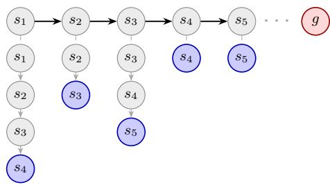

Figure 10: Example of HER “future” relabeling. The agent explores states $s _ { 1 } \ldots s _ { 5 }$ (top row, black arrows) while trying to reach goal g (red). To provide positive rewards, each state $s _ { t }$ is assigned a goal $g _ { t }$ (blue) among future states within the same trajectory. For example, $s _ { 1 }$ is assigned $g _ { 1 } ~  ~ s _ { 4 }$ . TD targets for $s _ { t }$ are then computed according to the sub-trajectory from $s _ { t }$ to $g _ { t }$ (gray downwards arrows).

Action-level noise. Ideally, the exploration policy would act greedily with respect to the SVF (Algorithm 1:15). However, since $V ^ { \dot { \theta } }$ is inaccurate early in training, it may be appropriate to inject a small amount of noise into $\pi ( a | s _ { t } , g _ { t } )$ . More details are in Appendix F.

Replay buffer eviction. If the buffer is large enough (as in our experiments), no data eviction occurs when new samples are inserted (Algorithm 1:17). If eviction happens (e.g. in a fixed-size FIFO buffer), the principled option is to decrement the counts of the evicted sample’s neighbors, preserving exactness at the same per-step cost as insertion. A simpler approximation is to leave counts as-is, but this introduces an upward bias on the evicted sample’s neighbors — their stored counts no longer reflect the current buffer.

## D Environment Details

Gridworlds. Novel environments shown in Figure 11. The observation is a one-hot encoding of the agent’s tile. The goal space is $S \times A ,$ , i.e., the agent should do every action in all states.

• ThreeRoom: three rooms separated by walls. The agent spawns non-uniformly across three positions (cyan tiles): 47.5% chance in the first room, 47.5% in the second, 5% in the third. There are four actions: left, right, up, down. Episode horizon: 100 steps.

• FourRoomStuck: a variation of the classic four-room [Sutton et al., 1999]. The bottom-left room can be entered but not exited, and cannot be traversed freely due to one-way tiles. There are four actions: left, right, up, down. Episode horizon: 200 steps. Episodes also end in the green tile.

• GridMaze: maze with nine actions (left, right, up, down, up-left, down-left, up-right, down-right, stay). Exploration is hard due to the narrow passage near the starting position, that can be traversed only with “up-right”. Episode horizon: 200 steps. Episodes end on action “stay” in the green tile.

Classic control. Open-sourced classic RL benchmarks [Towers et al., 2024] shown in Figure 12. The goal space is $\tilde { \cal S } \times \hat { \cal A } .$ , where $\tilde { \cal S }$ is a subset of the state space that depends on the environment.8

• LunarLander: the $( x , y )$ coordinate of the lander, in $[ - 1 , 1 ] \times [ - 0 . 5 9 , \infty ] ( \mathrm { u n b o u n d e d } )$

• LunarLander(Full): full eight-dimensional state space.

• MountainCar: the position $x \in [ - 1 . 2 , 0 . 6 ]$ and the velocity $\dot { x } \in \left[ - 0 . 0 7 , 0 . 0 7 \right]$

• Pendulum: the whole state space, i.e., the sine and cosine of the pendulum angle (both bounded in $[ - 1 , 1 ] )$ and its angular velocity (bounded in [−8, 8]).

• Acrobot: the sine and cosine of the joint angles, for a total of four dimensions bounded in $[ - 1 , 1 ]$

• CartPole: the x coordinate of the cart and the angle of the pole, in $[ - 2 . 4 , 2 . 4 ] \times [ - 1 2 ^ { \circ } , 1 2 ^ { \circ } ]$

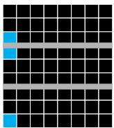  
(a) ThreeRoom

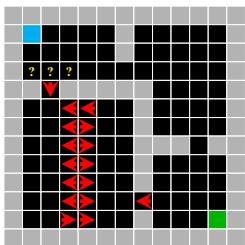  
(b) FourRoomStuck

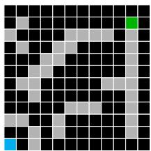  
(c) GridMaze  
Figure 11: Gridworlds. Black tiles are empty; gray tiles are walls; cyan tiles are starting positions; green tiles are terminal positions where the episode ends. Red arrows mark one-way tiles where only the action matching the arrow succeeds. In yellow ? tiles, movement is randomized with 50% probability.

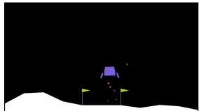  
(a) LunarLander

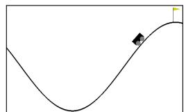  
(b) MountainCar

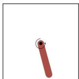  
(c) Pendulum

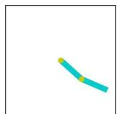

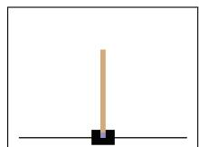  
(d) Acrobot  
(e) CartPole  
Figure 12: Classic control environments with continuous states and discrete actions. The original Pendulum has a continuous one-dimensional action; here we discretize it into eight actions.

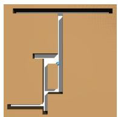  
(a) PointMaze-S

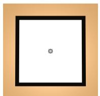  
(b) PointMaze-H

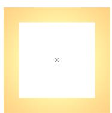  
(c) AntMaze-S

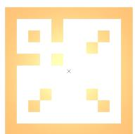  
(d) AntMaze-H

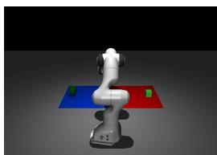  
(e) ArmPush-H  
Figure 13: GCRL environments with continuous states and actions.The pointmaze-h pic is not correct, should be a 2D projecttion of 4D maze

GCRL Control. Open-sourced GCRL benchmarks [Bortkiewicz et al., 2025] shown in Figure 13.   
The goal space is ${ \tilde { s } } ;$ the action is continuous and not part of the goal space.

• PointMaze-S: a point-mass agent navigates a maze. The goal space is its $( x , y )$ planar position, bounded by the maze layout, $\mathrm { i . e . , } x \in [ \mathrm { - 1 1 , 1 2 } ] , y \in [ \mathrm { - 1 1 , \bar { 1 2 } } ]$

• PointMaze-H: the area (and the goal space) the agent navigates is four-dimensional, i.e., $[ - 6 , 7 ] ^ { 4 }$ Its heatmaps only show the first two dimensions.

• AntMaze-S/H: like PointMaze-S, but the agent is an ant-like quadruped. Goal bounds are $x \in [ - 1 7 . 5 , 1 7 . 5 ] , y \in [ - 1 7 . 5 , 1 7 . 5 ]$ (S) and $x ^ { \cdot } \in [ - 2 7 . 5 , 2 7 . 5 ] , y \in [ - 2 7 . 5 , 2 7 . 5 ]$ (H).

• ArmPush-H: a Franka Panda pushes a green cube on a plane. The goal space is the cube’s planar $( x , y )$ unbounded position. The blue/red region of the plane in Figure 13, located at $\dot { x } \in [ - 0 . 4 5 , - 0 . 3 5 ] , y \in [ \dot { 0 } . 6 0 , 0 . 7 0 ]$ , is where the cube spawns at the beginning of an episode.

Evaluation metrics. In Gridworlds, Shannon entropy and coverage can be computed exactly, since the set of visitable states is finite and known. In control tasks, we discretize the continuous goal space into 50 bins per dimension, which gives accurate estimates of both metrics. These estimates can be conservative, though: Acrobot and MountainCar, for example, have unreachable position-velocity configurations, yet we normalize entropy and coverage as if the entire binned space were visitable. Also note that the goal spaces of LunarLander and ArmPush-H are unbounded. In the former, the y position has no upper limit, and we compute metrics using [−0.25, 10] as its bounds. In the latter, both x, y are unbounded, and we compute metrics using $[ - \bar { 1 } . \bar { 0 } 0 , 1 . 0 0 ] \times [ 0 . 1 5 , 1 . 1 5 ]$ as its bounds.

For LunarLander(Full), the goal space is eight-dimensional: the first six coordinates are continuous, and the last two are binary. Binning the six continuous dimensions is challenging: fine binning is computationally expensive, whereas coarse binning is inaccurate. For example, Figure 15 shows coverage and entropy when the first six coordinates are discretized into twelve bins. Coverage is extremely low (below 0.0002%), so entropy is largely determined by the number of occupied cells when they carry comparable mass. Consequently, an algorithm with slightly higher coverage (even as little as <0.0002%, as in DISCOVER) over clustered bins may exhibit higher entropy than one with slightly lower coverage over more dispersed bins (such as SUN). Figure 14 illustrates this issue.

This is why in Figure 4 (and again below in Figure 15) we report approximate continuous differential entropy via the Kozachenko-Leonenko k-NN estimator [Kozachenko and Leonenko, 1987]. This estimator does not suffer from the binning issue: it measures the continuous density around each sample, so it keeps tracking how the buffer redistributes throughout training and separates methods cleanly. This too must be approximated, however: brute-force computation of the k-NN entropy on the full buffer costs $\mathcal { O } ( N ^ { 2 } d )$ , where d is the goal dimensionality and $N$ the buffer size, which is infeasible as the buffer grows. We therefore average the estimator over $n _ { \mathrm { r e p } } = 5$ random subsamples of size $n _ { \mathrm { s u b } } = 1 0 ^ { 4 }$ , making the cost independent of N. On each subsample,

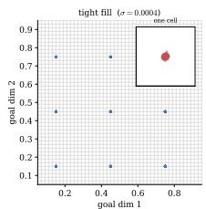

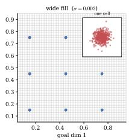

<table><tr><td></td><td>σ (spread)</td><td> $H _ { \mathrm { S h a n n o n } }$ </td><td> $H _ { \mathrm { k - N N } }$ </td></tr><tr><td>tight fill</td><td>0.0004</td><td>2.1972</td><td>-10.6512</td></tr><tr><td>wide fill</td><td>0.0020</td><td>2.1972</td><td>-7.4323</td></tr></table>

Figure 14: Two distributions occupying the same nine bins with equal counts. The insets zoom into one bin to reveal the tight vs. wide fill. Shannon entropy is identical (log 9); k-NN differential entropy differs by >3 nats. Note that differential entropy can be negative, unlike discrete Shannon entropy.

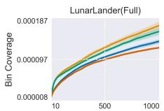

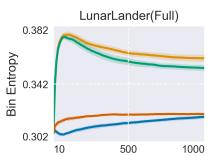

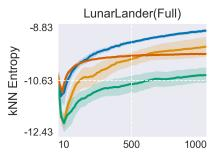  
Figure 15: Coverage (left) and entropy (center) with bins vs. k-NN differential entropy from Eq. (23) (right).

$$
\hat { H } = \frac { d } { m } \sum _ { i = 1 } ^ { m } \log \rho _ { k } ( i ) + \log ( m - 1 ) - \psi ( k ) + \log c _ { d } ,\tag{23}
$$

where $\rho _ { k } ( i )$ is the Euclidean distance from $s _ { i }$ to its k-th nearest neighbour $( k = 3 )$ , ψ is the digamma function, and $c _ { d } = \pi ^ { d / 2 } / \Gamma ( d / 2 + 1 )$ is the volume of the unit ball in $\mathbb { R } ^ { d }$ . Observations are minmax normalized to $[ 0 , 1 ] ^ { \dot { d } }$ using the observation-space bounds, so that no dimension dominates the Euclidean metric; the correction $\begin{array} { r } { \sum _ { j = 1 } ^ { d } \log ( u _ { j } - \dot { \ell } _ { j } ) } \end{array}$ recovers the entropy in the original units. For discrete actions, we report the joint entropy $\begin{array} { r } { \tilde { H } ( s , \bar { a } ) = \hat { H } ( a ) + \sum _ { a } \hat { p } ( \bar { a } ) \tilde { H } ( s \mid a ) } \end{array}$ , estimating each conditional ${ \hat { H } } ( s \mid a )$ on the corresponding action subset.

## E Source Code, Compute Details, and Runtimes

We ran experiments on SLURM-based clusters, always saving all data and statistics available $( \mathrm { e . g . }$ visit and goal counts maps). Runs were parallelized whenever possible. For Gridworlds and Classic control, code is in PyTorch and ran on AMD Turin 9965 CPUs. For GCRL control, code is in JAX and ran on a mix of NVIDIA V100 (32 GB), A100 (80 GB) and GH200 (96 GB) GPUs. Operations are JIT-compiled and execute on a single GPU per run. Source code available at link soon.

Wall-clock time per run varies with environment dimensionality and training steps. Note that the comparison is not like-for-like: AdaGoal and DISCOVER select a goal once per episode, whereas SUN scores a candidate batch whenever its adaptive check fires — often early in training, and progressively less as the agent is trained (Section 4.2). Table 1 below therefore compare SUN under a heavier selection workload against baselines under a lighter one. On Gridworlds and Classic control, SUN is nonetheless on average 3.54× faster than AdaGoal and 3.43× faster than DISCOVER (2.41× on LunarLander(Full)), because both call four critics at every update and action-selection step (see Appendix F.1). On GCRL environments the three are comparable, for two reasons. First, AdaGoal and DISCOVER use a single actor, so their four critics are called only at update time and not at action-selection (see Appendix F.2). Second, JAX parallelizes the critic updates. Even here SUN is no slower on average despite its more frequent selection, which is further evidence that the pseudocount adds negligible overhead.

Table 1: Average wall-clock runtime, in minutes.
<table><tr><td>Environment</td><td>SUN</td><td>AdaGoal</td><td>DISCOVER</td><td>Random</td></tr><tr><td>ThreeRoom</td><td>56.6</td><td>192.1</td><td>190.5</td><td>1.0</td></tr><tr><td>FourRoomStuck</td><td>108.9</td><td>469.5</td><td>405.8</td><td>1.7</td></tr><tr><td>GridMaze</td><td>205.9</td><td>665.5</td><td>690.6</td><td>1.1</td></tr><tr><td>MountainCar</td><td>151.6</td><td>464.1</td><td>494.4</td><td>0.8</td></tr><tr><td>Pendulum</td><td>77.8</td><td>261.9</td><td>267.3</td><td>0.6</td></tr><tr><td>LunarLander</td><td>229.6</td><td>866.1</td><td>867.4</td><td>1.3</td></tr><tr><td>LunarLander(Full)</td><td>1294.5</td><td>3116.0</td><td>3,120.0</td><td>51.0</td></tr><tr><td>Acrobot</td><td>81.2</td><td>323.7</td><td>277.1</td><td>1.0</td></tr><tr><td>CartPole</td><td>157.0</td><td>506.6</td><td>489.6</td><td>0.8</td></tr><tr><td>PointMaze-S</td><td>55.7</td><td>42.7</td><td>42.4</td><td>24.9</td></tr><tr><td>PointMaze-H</td><td>54.4</td><td>41.0</td><td>40.7</td><td>24.5</td></tr><tr><td>AntMaze-H</td><td>49.9</td><td>42.8</td><td>42.7</td><td>32.4</td></tr><tr><td>AntMaze-H</td><td>63.3</td><td>78.5</td><td>78.3</td><td>43.7</td></tr><tr><td>ArmPush-H</td><td>180.9</td><td>181.0</td><td>180.3</td><td>140.8</td></tr></table>

## F Training Hyperparameters

Hyperparameters have not been tuned, with the exception of the pseudocount radius ρ (see below). For GCRL control, we used the official implementation of DISCOVER (TD3). For Gridworlds and Classic control, we implemented a simple version of DQN and used common hyperparameters without any tuning.

Replay buffer. Before training starts, the replay buffer is “warmed up” with data collected with a random-action policy. For Gridworlds and Classic control, we collect 10,000 samples (except ThreeRoom, where we collect 5,000). For GCRL control, we collect 1,000. The replay buffer then stores all samples collected until the end of training, i.e., no data is ever evicted.

Goal-selection. Algorithms draw a pool of candidates from the replay buffer. For Gridworlds and Classic control, episodic algorithms (SUN Episodic, DISCOVER, AdaGoal) sample 2500 candidates (once at the beginning of the episode), others 256 (possibly multiple times per episode).

Goal-reached. In GCRL tasks, the threshold η in Algorithm 1:7 is given by the environment. In Classic control, we reuse the pseudocount radius, i.e. a goal is reached if it falls within $\rho$ of $s _ { t }$ in the standardized feature space (Appendix B). Gridworlds states are discrete and no threshold is needed. Algorithm-specific. SUN’s pseudocounts are computed using $\rho = 0 . 1$ , except on PointMaze-H $( \rho = 0 . 5 )$ and ArmPush-H $( \rho = 0 . 0 1 )$ ). DISCOVER’s novelty coefficient is $\beta = 1 0$ (for Gridworlds and Classic control) and $\beta = 1$ (for GCRL control).

Table 2: Hyperparameters used in our experiments.
<table><tr><td colspan="2">Gridworlds and Classic control</td></tr><tr><td>Discount factor γ Trace factor λ</td><td>0.99 0.95</td></tr><tr><td>Target network copy frequency Target network Polyak coefficient Minibatch size TD(λ) horizon T</td><td>1 0.001 16 16</td></tr><tr><td>Update frequency Updates per step Clip reward Optimizer Learning rate Loss</td><td>1 step 1 False AdamW  $1 0 ^ { - 3 }$  Huber 1.0</td></tr><tr><td colspan="2">Gradient norm clipped at GCRL control</td></tr><tr><td colspan="2">Discount factor γ 0.99 Trace factor λ 0.95 0.005  $5 { \times } 1 0 ^ { - 7 }$ </td></tr><tr><td colspan="2">Target network Polyak coefficient (critic)</td></tr><tr><td colspan="2">Target network Polyak coefficient (actor)</td></tr><tr><td colspan="2">Target networks copy frequency 2 Policy delay</td></tr><tr><td colspan="2">2</td></tr><tr><td colspan="2">Minibatch size 256</td></tr><tr><td colspan="2">TD(λ) horizon T</td></tr><tr><td colspan="2">3</td></tr><tr><td colspan="2">Update frequency 1 step</td></tr><tr><td colspan="2">Updates per step 1</td></tr><tr><td colspan="2">Target-policy smoothing std 0.2</td></tr><tr><td colspan="2"></td></tr><tr><td colspan="2">Target-action noise clip 0.5</td></tr><tr><td colspan="2">Optimizer AdamW</td></tr><tr><td colspan="2"></td></tr><tr><td colspan="2">Learning rate  $1 0 ^ { - 3 }$ </td></tr><tr><td colspan="2">Critic loss MSE</td></tr><tr><td colspan="2">Gradient norm clipped at</td></tr></table>

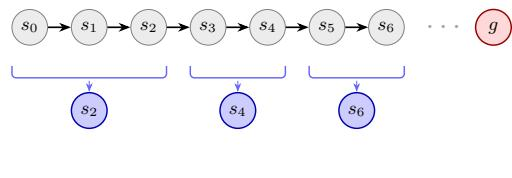  
Figure 16: Example of HER “segmented future” relabeling. The trajectory is split into contiguous segments: a future cut timestep k is sampled, its state $s _ { k }$ (blue) is assigned as the goal to all timesteps in the segment, and the next segment starts at $k + 1$ In this example the cuts fall at 2, 4, 6.

## F.1 Gridworlds and Classic Control

The goal is composed of a state component $g _ { s }$ (environment-specific, see Section D), and an action component $g _ { a }$ . That is, we explicitly learn SVFs whose goal is to perform specific actions in specific states. Because actions are discrete, we learn $Q ^ { \theta } ( s , a , g _ { s } , g _ { a } )$ : the Q-network takes state and the goal-state as input, and outputs the action-value for every goal-action.

$Q ^ { \theta }$ is trained with Double DQN [van Hasselt, 2010] with TD(λ) using Watkins’s cutting traces [Watkins and Dayan, 1992] with two practical modifications motivated by the bounded scale of the SVFs, i.e., $Q ^ { \bar { \pi } } \in [ \bar { 0 } , 1 ] . ^ { 9 }$ First, to mitigate overestimation bias, in TD targets we clip maxa $Q ^ { \theta } ( s ^ { \prime } , a , g _ { s } , g _ { a } )$ to 1. Second, we relax the strict arg max used by Watkins’s cutting: an action is considered greedy if its Q-value lies within $1 - \gamma$ of the maximum. This tolerance matches the natural scale of one-step Bellman backups, and prevents traces from being cut too aggressively by neural-network approximation error, to which a strict arg max is overly sensitive.

The policy in Algorithm 1 is ε-greedy with respect to $Q ^ { \theta }$ , with $\varepsilon = 0 . 1$ . Action-level noise is needed with neural-network approximators, and is aligned with DISCOVER official implementation (with built-in noise via Gaussian perturbations on the actor’s output, see below).

AdaGoal and DISCOVER use an ensemble of four critics, each with its own target network (DQNstyle). They are trained with different random batches, and TD targets from one of the target networks randomly selected. Their policy is ε-greedy with respect to arg max arg mini $Q _ { i } ^ { \theta } ( s _ { t } , a , g _ { s } , g _ { a } )$

For training, we uniformly sample 16 batches from the replay buffer, and append all the following T − 1 samples, for a total of 256 samples. These sequences may have samples from different consecutive trajectories, but are kept separate thanks to truncation flags. Then, we relabel goals with HER (Section C) with one modification. The original HER “future” strategy assigns each timestep its own future goal, yielding T sub-sequences of varying length. For more efficient batch training, we implement a “segmented” variant: we concatenate contiguous sub-sequences (each with its own future goal) so that their total length matches the original $\bar { T }$ (Figure 16). Relabeling is repeated 4 times per sequence, so each state is trained against 4 future goals. These samples are all positives; to balance them, we draw 4 random negatives from the replay buffer (one per full sequence of length $T = 1 6 )$ ). As a result, each DQN update uses $1 6 \times 1 6 \times \bar { 4 } \times \bar { 2 } = 2$ , 048 data points.

## F.2 GCRL Control

We build on DISCOVER official implementation, and learn $V ^ { \theta } ( s , g _ { s } )$ and a goal-conditioned policy $\pi ( a | s , g _ { s } )$ . The action (continuous) is not part of the goal. $V ^ { \theta }$ is trained with TD3 [Fujimoto et al., 2018] with TD(λ) targets without Watkins’s cutting traces (with continuous actions, arg max is infeasible) and without clipping $V ^ { \theta } ( s ^ { \prime } , g _ { s } )$ to 1. Once the goal is selected, the policy explores with noise $\mathcal { N } ( 0 , 0 . 4 )$ added to the action, as in the official DISCOVER implementation.

AdaGoal and DISCOVER use an ensemble of four critics, each with its own target network (DQNstyle). They are trained with different random batches, and with TD targets from its own target network. There is one policy $\pi ,$ trained against the average value returned by all critics.

All algorithms relabel goals with HER (Section C), without modification. At each update, a batch of 256 samples is drawn uniformly from the replay buffer. For a randomly selected half, we sample a future goal from within the next $T _ { \mathrm { m a x } } = 5 0$ steps of the original trajectory (or until termination, whichever comes first) and compute $\mathrm { T D } ( \lambda )$ targets up to that goal. For the other half, we sample the relabel goal uniformly from the environment and compute one-step TD targets.10 Note that, unlike in DQN, the intermediate steps between a batch point and its relabeled goal are used only to compute the TD(λ) target, not for gradient updates. Each TD3 update therefore uses exactly 256 data points.

## F.3 Networks Architecture

$Q ^ { \theta } , V ^ { \theta }$ and π are neural networks with architectures shown in Figure 17 and 18.

Encoder. Gridworlds do not need an encoder because their observation is already appropriate (onehot encoding of the agent’s position). For continuous control, the state and state-goal encoders are a radial basis function layer [Poggio and Girosi, 1990]. The layer places $C$ tile centers $\mu _ { 1 } , \ldots , \mu _ { C }$ per input dimension, initialized uniformly between $v _ { \mathrm { m i n } }$ and $v _ { \mathrm { m a x } } .$ , and learns both the centers and per-tile bandwidths $h _ { c } > 0$ end-to-end via gradient descent, jointly with the rest of the network. For each scalar input $x ,$ the layer computes Gaussian activations $\bar { \varphi } _ { c } ( x ) \bar { = } \exp ( - 0 . 5 ( ( x - \mu _ { c } ) / h _ { c } ) ^ { 2 } )$ . To prevent vanishing gradients for inputs outside $[ v _ { \mathrm { m i n } } , v _ { \mathrm { m a x } } ]$ , we add a linear leak to the boundary tiles, so that the activation grows linearly with distance once x falls below $\mu _ { 1 }$ or above $\mu _ { C }$ . The output is normalized to sum to one along the tile dimension, yielding a vector in $[ 0 , 1 ] ^ { C }$ per input unit. We use $C = 2 0$ tiles initialized with $v _ { \operatorname* { m i n } } = - 1 , v _ { \operatorname* { m a x } } = 1$ . Environment raw observations are standardized using running mean and standard deviation tracked with Welford’s online algorithm.

We observed that the Gaussian encoding significantly improved performance for all algorithms on LunarLander, while neither helping nor hurting performance on the other Classic control environments. We suspect this is due to LunarLander’s distinctive observation space: some observations are unbounded, asymmetric, and have differing scales.

Feature fusion. We combine the state and goal features by concatenating $f _ { s } , f _ { g } ,$ , and their elementwise product $f _ { s } \odot f _ { g }$ . The element-wise product provides a multiplicative interaction term that makes pairwise alignment between corresponding components of $f _ { s }$ and $f _ { g }$ directly available to the downstream layers, complementing the information carried by the concatenation of $f _ { s }$ and $f _ { g }$ alone.

Maxout. After feature fusion we apply a Maxout unit [Goodfellow et al., 2013], which computes $K = 4$ parallel linear projections of its input and takes the element-wise maximum across them.

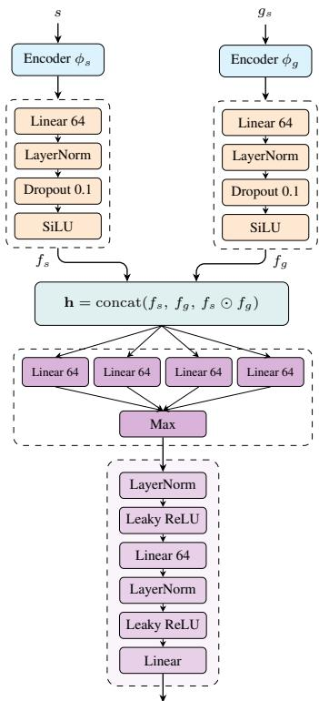  
Figure 17: Architecture of $Q ^ { \theta }$ . All linear layers are initialized with weights close to zero (drawn from a normal distribution with 0.01 standard deviation). All but the last layers have no bias. The output size is $| { \mathcal { A } } | \times | { \mathcal { A } } |$

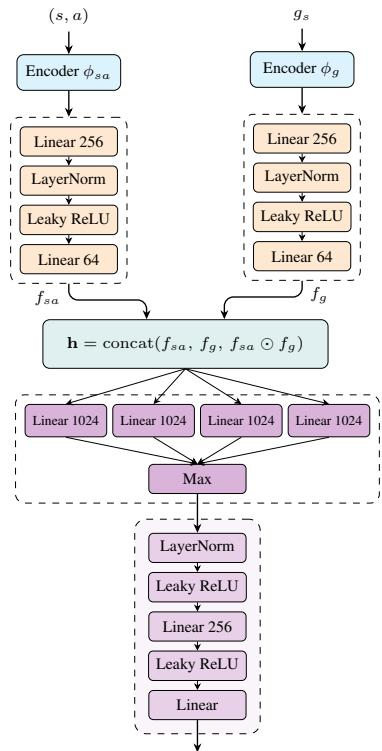  
Figure 18: Architecture of $V ^ { \theta }$ and π. $V ^ { \theta }$ output size is 1, and it applies the softplus operator at the end, π applies the softmax operator. The two networks do not share any layer.

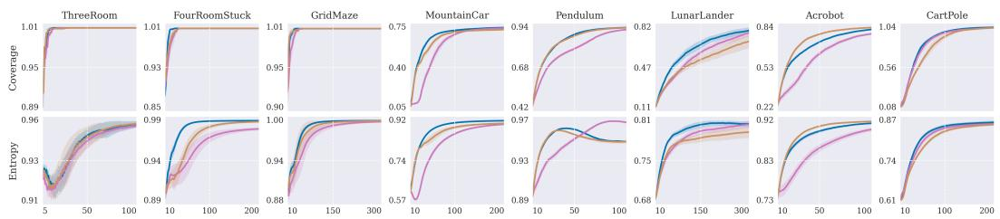

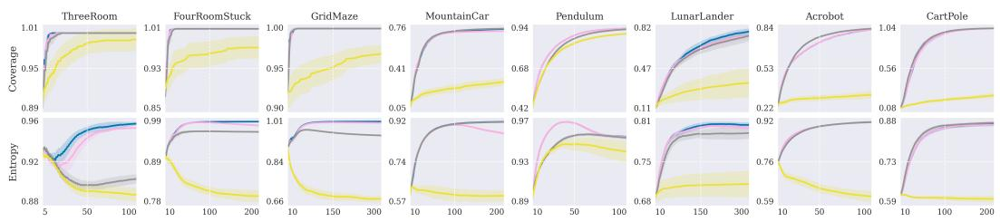

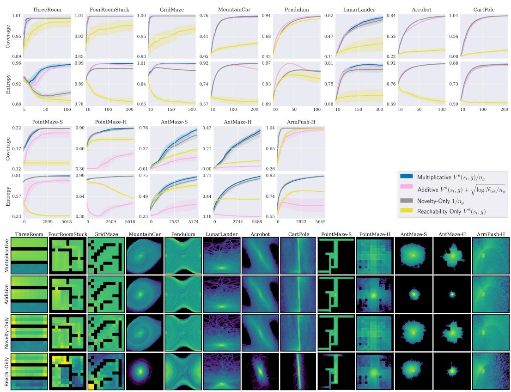  
Figure 19: Indicator ablation. Full version of Figure 7.

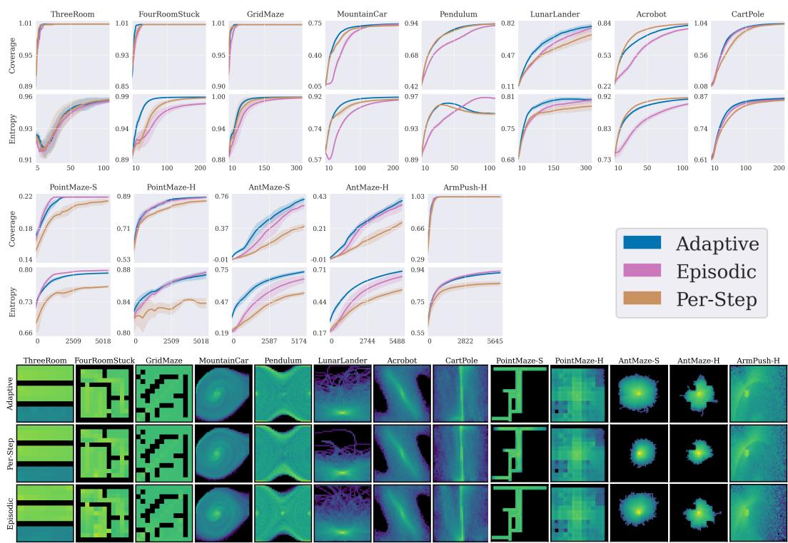  
Figure 20: Goal-selection ablation. Full version of Figure 6.

## G Indicator and Goal-Selection Ablations

Figures 19 and 20 report the full training curves and end-of-training visitation heatmaps for the ablations discussed in Section 4.2. We exclude LunarLander(Full) due to its computational expense. Per-environment goal-selection heatmaps with additional statistics are in Appendix I The ablations exhibit the same trends described in the main text. In a few environments in Figure 20, Adaptive SUN is not the best, though only by a small margin: Per-Step is slightly better in Acrobot, and Episodic in PointMaze-S.

## H Pseudocounts Ablation

Here we evaluate how $\rho$ affects the pseudocount approximation (Section B). Figure 21 shows SUN performance for varying $\rho$ against true counts, i.e., counts obtained by discretizing the goal space with 50 bins per dimension. Figure 22 shows instead pseudocounts computed on the same data (collected while training with true counts). Results show that our pseudocounts closely track the coverage and entropy of training with true counts across all environments for most values of $\rho ,$ except for values that are too small or too large. This is expected: the estimator is a uniform-kernel density estimate, and $\rho$ is its bandwidth, so both extremes make $\nu ( g ) = 1 / n _ { g }$ constant across candidates. When $\rho$ is too small, the ball around an inserted sample rarely contains any other buffer entry, so most samples end up with small uniform counts. When $\rho$ is too large, the opposite degeneracy occurs: the ball contains a large fraction of the buffer for every entry, so counts become comparable across the visited set and $\nu ( g )$ again fails to discriminate. In both cases, the arg max of Eq. (2) reduces to an arg max over the SVF alone, which is sensitive to approximation noise when ${ \bar { V } } ^ { \pi }$ is a neural network, especially early in training.

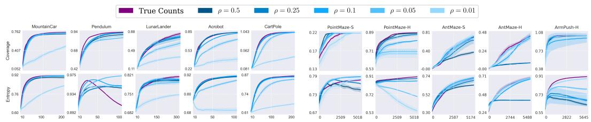  
Figure 21: Pseudocounts vs. true counts. Gridworlds are omitted, since there pseudocounts coincide with the counts. True counts improve coverage and entropy in almost all environments. One exception is Pendulum, where entropy drops sharply, the same behavior discussed in Section 4.1, amplified by exact counting. Another is PointMa $z { \in } { - } S ,$ , where $\rho = 0 .$ 1 attains the best entropy and the fastest coverage growth, although all radii reach the same terminal coverage. We attribute this to the narrow corridors of this maze, which make true counts sensitive to the bin discretization.

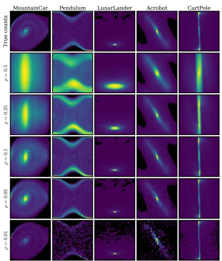

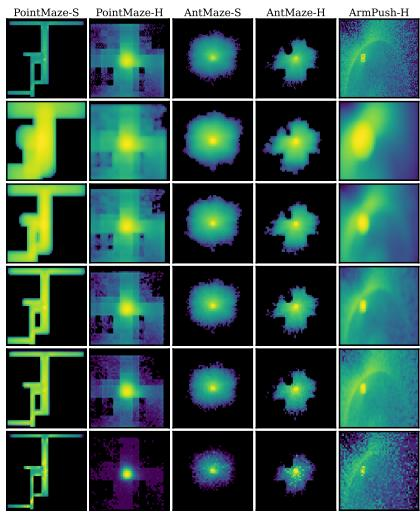  
Figure 22: Logscale pseudocount heatmaps. The top row shows the true visit counts at the end of training, for the first seed. The rows below show pseudocounts computed on that same data at decreasing radii $\rho .$ All heatmaps share the same scale within an environment.

Which of the two regimes is harmful depends on the geometry of the support. Where the support is broad, a large radius merely over-smooths, and large $\rho$ values remain competitive even though the estimated density spreads beyond the boundary of the visited set into never-visited regions. This is the case of Classic control environments and PointMaze-H: in Figure 21 entropy and coverage degrade as $\rho$ decreases, and the corresponding heatmaps in Figure 22 show large zero-count areas at the smallest radii. Performance improves as $\rho$ grows, although $\rho = 0 . 5$ is not always the best choice. Where the support is compact, on the contrary, large $\rho$ values are fatal: in AntMaze a ball of radius 0.5 or 0.25 spans most of the visited blob, and both settings plateau within the first few hundred steps and do not recover, in coverage and in entropy alike. The same happens in ArmPush-H, where the reachable set is a thin arc and large radii replace it with a broad unimodal density over the bounding box.

## I Detailed Analysis Of All Environments

For each environment, we report the following goal-related statistics, characterizing the behavior of SUN (with adaptive, episodic, and per-step goal-selection), AdaGoal, and DISCOVER.

• Goals selected and reached, measured at four stages of training (25/50/75/100% of the training steps). All heatmaps share the same log-scale color range.

• Goal success: the ratio of goals reached to goals selected.

• Steps-to-goal: the average number of steps taken to reach a goal.

• Goal reselections (SUN Adaptive and Per-Step): the fraction of steps at which $g _ { t } ~ \neq ~ g _ { t - 1 } .$ normalized to [0, 1] by the total number of steps. The two variants differ in what triggers a reselection. In adaptive SUN, the goal is discarded and a fresh candidate batch is sampled only when $V ^ { \theta } ( s _ { t } , g _ { t } ) < V ^ { \theta } ( s _ { t _ { \mathrm { s e l } } } , g _ { t } )$ fires. In per-step SUN, a fresh batch is sampled at every step, and the goal changes if the batch has a candidate with a higher SUN score (Eq. (2)) than the current one.

• Random exploration (SUN Episodic, AdaGoal, DISCOVER): the fraction of steps at which the agent acts randomly. In episodic goal-selection, this is triggered once the agent reaches its goal, following the original DISCOVER implementation.

The following important trends emerge.

• Episodic selection fails when goals can become unreachable mid-episode (Figures 23 and 24).

• In-episode reselection avoids this problem, but Per-Step reselects far more often than Adaptive, which hurts performance. In almost all environments, Adaptive’s reselection rate drops to zero over training, indicating that the agent has learned to reach the goals it commits to.

• DISCOVER is biased toward reachability: across all heatmaps it selects far more goals near the starting states than the other algorithms, and attains high goal success from the very beginning. This may stem from its coefficient $\beta ,$ which must balance the scales of the reachability and novelty terms — a problem SUN sidesteps entirely thanks to its multiplicative indicator.

• AdaGoal is biased toward novelty at the expense of reachability: across all heatmaps it selects mostly goals far from the starting states, “skipping” intermediate ones. This is not unexpected. As noted in Section 3.4, we evaluate the deep-RL variant of AdaGoal, which — unlike the tabular version — does not constrain goal selection by the estimated goal-hitting time. Tarbouriech et al. argue that this is approximated implicitly by the disagreement of the value ensemble. Our results suggest that this does not hold in more complex environments. Novelty alone is a reasonable signal for goals the agent can actually reach, since visiting them resolves the disagreement at little cost. Unreachable goals, however, resolve only after enough failed attempts for every ensemble member to recognize them as such, and each of those attempts is an episode spent without useful experience. The rule cannot distinguish the two cases, and where the reachable set is a small fraction of the goal space the latter dominates — precisely the behavior the reachability constraint was meant to prevent.

• In Gridworlds, SUN tends to select short-horizon goals, as shown by steps-to-goal tending to one. In control tasks the opposite happens: the metric grows over training, meaning SUN selects goals that are progressively further away. This is expected, since control tasks require coherent action sequences to reach distant states — in MountainCar, for instance, the agent must build up momentum to escape the valley.

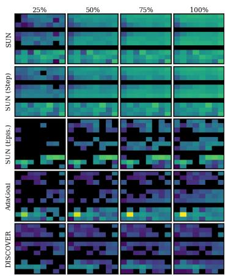  
(a) Goals selected.

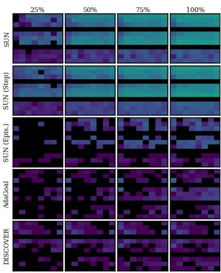  
(b) Goals reached.

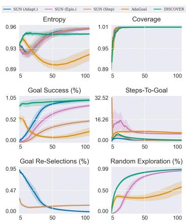  
(c) Training curves.  
Figure 23: ThreeRoom. This environment shows the superiority of the SUN indicator, and the importance of properly trading off novelty and reachability. AdaGoal fails because it frequently selects unreachable goals: in (a), it is the only method that does not under-select the bottom room (which is often unreachable). DISCOVER, conversely, is biased toward reachability: it selects fewer goals far from the starting states (left of the rooms). The curves in (c) confirm this: AdaGoal has the lowest success rate, while DISCOVER reaches a high success rate almost immediately — it selects easily-reachable goals early on — and therefore spends most of its time exploring randomly. All three versions of SUN, in contrast, achieve high entropy: over time they select goals uniformly and progressively further to the right (away from starting states). The choice of goal-selection strategy matters little here, since the environment is small and occasional poor selections are inconsequential.

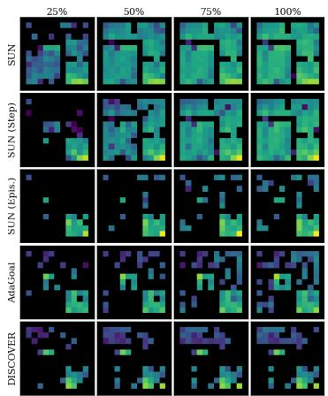  
(a) Goals selected.

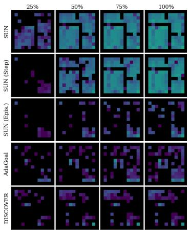  
(b) Goals reached.

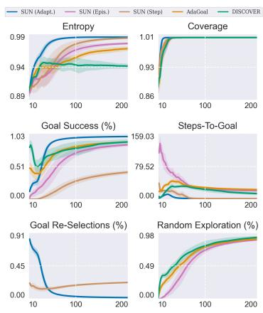  
(c) Training curves.  
Figure 24: FourRoomStuck. SUN Episodic, DISCOVER, and AdaGoal perform poorly: the agent can accidentally get trapped in the bottom-left room, at which point the previously selected goal becomes unreachable yet stays fixed for the rest of the episode. SUN Adaptive and Per-Step avoid this through goal reselection, and both attain high entropy. Per-Step entropy increases more slowly, though: it reselects goals far more often than Adaptive, making it unstable early in training.

  
(a) Goals selected.

  
(b) Goals reached.

(c) Training curves.  

Figure 25: GridMaze. Similar trends to Figure 24 emerge, e.g., DISCOVER bias towards easy-toreach goals and Per-Step higher reselection rate.  
  
(a) Goals selected.

  
(b) Goals reached.  
(c) Training curves.

Figure 26: MountainCar. The main difference from Gridworlds is that SUN’s steps-to-goal increases over training. This is expected, as MountainCar requires coherent action sequences to build up the momentum needed to escape the valley. Another notable difference is Per-Step’s higher reselection rate, likely due to the larger goal space: at every step there is a greater chance that the replay buffer yields a better candidate. This environment further highlights DISCOVER’s reachability bias, as most of its goals lie close to the agent’s starting position.  
  
(a) Goals selected.

  
(b) Goals reached.  
(c) Training curves.  
Figure 27: Pendulum. As discussed in Section 4, the distinctive trait of this environment is the presence of hard-to-reach goals that can only be visited by repeatedly traversing easy-to-reach ones, causing entropy to decay even as coverage increases.

50%  
50%  
100%  
25%  
25%  
75%  
25%  
25%  

  
(a) Goals selected.

  
(b) Goals reached.

  
(c) Training curves.

Figure 28: LunarLander. Among the Classic control tasks, this is the most challenging: it has harder dynamics, higher dimensionality, and a larger goal space. Here, SUN’s reselection rate does not tend to zero. Compared to MountainCar and Pendulum, the gap between SUN Adaptive and Per-Step is more evident, both in selected goals, entropy, and coverage. Furthermore, the difference between the SUN and AdaGoal/DISCOVER is more apparent here: SUN’s selected goals are spread more uniformly across the whole space. DISCOVER selects mostly goals near the starting state, whereas AdaGoal spreads them out more but often picks goals too far away for the agent to reach (e.g., the isolated goal at the top of its heatmaps), confirming its bias toward novelty.  
  
(a) Goals selected.

  
(b) Goals reached.

  
(c) Training curves.

Figure 29: Acrobot. All trends discussed so far emerge here as well, most notably the different spread of goals selected by SUN compared to AdaGoal and DISCOVER.  
  
(a) Goals selected.

  
(b) Goals reached.  
(c) Training curves.  
Figure 30: CartPole. All trends discussed so far emerge here as well.

  
(a) Goals selected.

  
(b) Goals reached.

Figure 31: PointMaze-S.  

  
(c) Training curves.

  
(a) Goals selected.

  
(b) Goals reached.  
Figure 32: PointMaze-H.

  
(c) Training curves.

  
(a) Goals selected.

  
(b) Goals reached.  
Figure 33: AntMaze-S.

  
(c) Training curves.

  
(a) Goals selected.

  
(b) Goals reached.

  
(c) Training curves.  
Figure 34: AntMaze-H.

  
(a) Goals selected.

  
(b) Goals reached.

  
(c) Training curves.  
Figure 35: ArmPush-H. Reached goals concentrate near the cube’s start region (the red/blue area in Figure 13). To move it, the agent must first make contact with it.

## J Successor Value Function Visualization

In Figure 36, we visualize the SVFs learned by SUN, showing that they are indeed accurate. This is possible only for environments with two-dimensional state and goal spaces, and for Pendulum, whose sine/cosine state can be transformed into an angle. Note that the agent learns $Q ^ { \theta } ( s , a , g _ { s } , g _ { a } )$ and we visualize $\begin{array} { r } { V ^ { \theta } ( s , g _ { s } ) = \operatorname* { m a x } _ { a , g _ { a } } Q ^ { \theta } ( s , a , g _ { s } , g _ { a } ) } \end{array}$

Each heatmap is composed of many sub-heatmaps, one per goal state. For example, the magnified region of FourRoomStuck shows $\mathbf { \dot { \psi } } _ { V } ^ { \theta } ( s , g _ { \mathrm { m i d d l e } } ) ^ { \mathbf { \dot { \psi } } }$ , the value of reaching the middle tile from every other tile. The pattern is clear: states near the goal have higher value. Zooming in other sub-heatmaps, one can see that tiles inside the bottom-left room have zero value for goals outside it, reflecting the room’s irreversible transitions. The bottom-right tile also has zero value in all heatmaps, as it is a terminal state. Goals corresponding to walls are never visited but occasionally take non-zero value due to their proximity to reachable goals.

Similar patterns appear across all heatmaps.

  
(e) Pendulum  
Figure 36: SVFs V θ learned by SUN. Each figure has many sub-heatmaps, one per goal state (see magnified regions). In MountainCar and Pendulum, axes are position (x) and velocity (y).

## K SUN-UCB: A Structural Connection to PAC Analysis

The structural results in Appendix A characterize SUN’s selection rule under an oracle but do not provide sample-complexity guarantees. Here we sketch how a UCB-like variant of SUN (with additive reachability and novelty) connects to the PAC framework of Tarbouriech et al. [2022]. We state the algorithm, prove its unreachability filter sound, and show that its selection rule requires the two terms to be rescaled against each other (Remark 3) — the tabular counterpart of the design argument in Section 3.1. We do not claim a complete sample-complexity result. Two components are missing. First, the observed-transition filter is sound but not complete: it never selects an unreachable goal, but nothing in the algorithm guarantees that every L-reachable goal eventually enters it, and a passive filter admits initialization failures in which the reachable set never grows. A rigorous bound would require an explicit frontier-expansion mechanism with a discovery guarantee, as in Lim and Auer [2012] and Tarbouriech et al. [2020]. Second, our concentration statement bounds the deviation of the empirical mean from the average value of the executed policies, which does not by itself certify near-optimality of the returned policies. We therefore present the analysis as a structural connection rather than a proof, and leave the complete argument to future work.

## K.1 Setup

We consider tabular MDPs $\langle S , \mathcal { A } , P , s _ { 0 } \rangle$ with finite spaces $| S | = S$ and $| { \mathcal { A } } | = A$ , and stochastic transitions $P ( s ^ { \prime } \mid s , a )$ . We adopt all assumptions in Assumption 1 except $( \mathrm { C } 2 ) { \mathrm { : } }$ we relax deterministic dynamics to stochastic with almost-sure hitting (as in Section ${ \bf A } . 6 )$ . All counts $n _ { g }$ are exact (tabular setting). Under first-hit termination (C4), the SVF $V ^ { \pi } ( s , g ) = \mathbb { E } _ { \pi } [ \gamma ^ { \tau _ { g } } \mathbf { 1 } \{ \tau _ { g } < \infty \} ] \stackrel { \circ } { \in } [ 0 , 1 ]$

We use $\delta \in ( 0 , 1 )$ as the confidence parameter: the statements below hold with probability at least $1 - \delta / 3$

Let ${ \mathcal { G } } _ { L } \triangleq \{ g \in { \mathcal { S } } : \exists \pi \ { \mathrm { s . t . } } \ \mathbb { E } _ { \pi } [ \tau _ { g } ] \leq L \} \quad$ be the set of L-reachable goals, with $| \mathcal { G } _ { L } | \le S$ . We set the episode length equal to the reachability horizon $L ,$ as in AdaGoal, and reset to s0 at the end of each episode.

## K.2 SUN-UCB Algorithm

Estimators. For each goal $^ { g , }$ let $n _ { t } ( g )$ be the number of episodes up to time t in which $g$ was the selected goal, and let $\hat { V } _ { t } ( s _ { 0 } , g )$ be the empirical mean of the returns collected in those episodes, with $\hat { V } _ { t } ( s _ { 0 } , g ) \triangleq 0$ when $n _ { t } ( g ) = 0$ . Define the uncertainty

$$
U _ { t } ( g ) \triangleq \operatorname* { m i n } \left\{ 1 , \sqrt { \frac { \log ( S A T / \delta ) } { n _ { t } ( g ) } } \right\} , \qquad U _ { t } ( g ) \triangleq 1 \mathrm { w h e n } n _ { t } ( g ) = 0 .\tag{24}
$$

The cap and the convention at $n _ { t } ( g ) = 0$ are well defined because $V ^ { \pi } ( s _ { 0 } , g ) \in [ 0 , 1 ]$ under first-hit termination, so no uncertainty larger than the value range is informative.

Truncation. An episode targeting g contributes the sample $\gamma ^ { \tau _ { g } }$ if $g$ is hit at some step $\tau _ { g } \leq L$ , and 0 otherwise. The return is therefore truncated at the episode horizon, and $\hat { V } _ { t }$ estimates $\mathbb { E } \big [ \gamma ^ { \tau _ { g } } \mathbf { 1 } \{ \tau _ { g } \leq L \} \big ]$ rather than $V ^ { \pi } ( s _ { 0 } , g )$ , a downward bias of at most $\gamma ^ { L + 1 }$ . Taking $L \geq \log ( 2 / \varepsilon ) / \log ( \overset { . } { 1 } / \gamma )$ bounds this by $\varepsilon / 2$ , which is absorbed into the accuracy target of Conjecture 1.

Empirical reachability filter. Let $E _ { t } \triangleq \{ ( s , s ^ { \prime } ) : \exists a \mathrm { ~ s . t . ~ } N _ { t } ( s , a , s ^ { \prime } ) > 0 \}$ be the set of transitions observed up to time $t ,$ and let

$$
\mathcal G _ { t } ^ { \mathrm { r e a c h } } \ \triangleq \ \left\{ g \in \mathcal S : g \mathrm { ~ i s ~ r e a c h a b l e ~ f r o m ~ } s _ { 0 } \mathrm { ~ a l o n g ~ e d g e s ~ o f ~ } E _ { t } \right\} .\tag{25}
$$

The filter is computed from observed transitions, not from value estimates. This matters: a filter of the form $\{ g : \hat { V } _ { t } ( s _ { 0 } , g ) > 0 \}$ would exclude every goal that has never been hit, not merely every goal that is unreachable, and would therefore block exploration toward the frontier. A goal that has been observed but never targeted lies in $\mathcal { G } _ { t } ^ { \mathrm { r e a c h } }$ and remains selectable.

At step t, given $s _ { t }$ and $n _ { t } ( \cdot )$ :

1. Update $\hat { V } _ { t } , n _ { t }$ , and $E _ { t }$ from the last episode.

2. Compute the filter $\mathcal { G } _ { t } ^ { \mathrm { r e a c h } }$ of Eq. (25).

3. Select

$$
g _ { t } = \arg \operatorname* { m a x } _ { g \in \mathcal { G } _ { t } ^ { \mathrm { r e a c h } } } \hat { V } _ { t } ( s _ { 0 } , g ) + \beta U _ { t } ( g ) , \qquad \beta = 2 / \varepsilon .\tag{26}
$$

4. Run UCBVI [Azar et al., 2017] targeting $g _ { t }$ for one episode of length $L ;$ record whether $g _ { t }$ was hit and at which step.

The filter in step 2 is the algorithmic counterpart of unreachability rejection (Theorem 3). The coefficient $\beta$ in step 3 is not cosmetic: Lemma 3 fails without it, for reasons discussed in Remark 3.

## K.3 Conjectured Sample Complexity

Conjecture 1 (Sample complexity of SUN-UCB). Let $\varepsilon \in ( 0 , 1 )$ and $\delta \in ( 0 , 1 )$ . Suppose SUN-UCB is augmented with a frontier-expansion mechanism guaranteeing that every $g \in { \mathcal { G } } _ { L }$ enters $\mathcal { G } _ { t } ^ { \mathrm { r e a c h } }$ within $\tilde { \mathcal { O } } ( L ^ { 3 } S A / \varepsilon ^ { 2 } )$ steps. Then, with probability at least $1 - \delta ,$ , it returns goal-conditioned policies πˆ satisfying $V ^ { \hat { \pi } } ( s _ { 0 } , g ) \geq V ^ { \star } ( s _ { 0 } , g ) - \varepsilon f o r$ all $g \in { \mathcal { G } } _ { L }$ after at most $T = \tilde { \mathcal { O } } ( L ^ { 3 } S A / \varepsilon ^ { 2 } )$ exploration steps.

## K.4 Partial Analysis

We prove four components — concentration of $\hat { V } ,$ soundness of the reachability filter, uncertainty of the selected goal, and a pigeonhole over goals inside the filter — and then identify what a complete argument would additionally require.

Step 1: Concentration.

Lemma 1 (Concentration). There exists an event $\mathcal { E } _ { 1 }$ ofprobability at least $1 - \delta / 3$ on which, for every $g \in S$ and every t with $n _ { t } ( g ) \geq 1$

$$
\left| \hat { V } _ { t } ( s _ { 0 } , g ) - \bar { V } _ { t } ( s _ { 0 } , g ) \right| \leq U _ { t } ( g ) ,\tag{27}
$$

where $\bar { V } _ { t } ( s _ { 0 } , g )$ is the mean of the truncated values $\mathbb { E } _ { \hat { \pi } _ { j } } \left[ \gamma ^ { \tau _ { g } } \mathbf { 1 } \{ \tau _ { g } \leq L \} \right]$ over the $n _ { t } ( g )$ episodes j in which g was the selected goal.

Proof. The samples take values in $[ 0 , 1 ] .$ , and the $j \mathrm { - t h }$ sample has conditional mean $\mathbb { E } _ { \hat { \pi } _ { j } } \left[ \gamma ^ { \tau _ { g } } \mathbf { 1 } \{ \tau _ { g } \leq L \} \right]$ given the history preceding episode j. The centered samples therefore form a bounded martingale difference sequence with respect to the filtration generated by the history, and Azuma–Hoeffding gives

$$
\operatorname* { P r } \left[ \left| { \hat { V } } _ { t } ( s _ { 0 } , g ) - { \bar { V } } _ { t } ( s _ { 0 } , g ) \right| > \sqrt { \frac { \log ( S A T / \delta ) } { n _ { t } ( g ) } } \right] \leq \frac { \delta } { 3 S T }\tag{28}
$$

for a fixed pair $( g , t )$ , after adjusting constants inside the logarithm. A union bound over the at most $S$ goals and $T$ steps yields $\mathcal { E } _ { 1 }$ . The deviation is also trivially bounded by 1, since both quantities lie in [0, 1], which justifies the cap in Eq. (24). □

Note that $\bar { V } _ { t }$ is a historical average over the policies actually executed, not the optimal value $V ^ { \star } ( s _ { 0 } , g )$ nor the value of the returned policy. Bridging that difference is one of the two gaps discussed below.

## Step 2: Soundness of the reachability filter.

Lemma 2 (Filter soundness and monotonicity). Deterministically, for every $t { : }$

(i) $\mathcal { G } _ { t } ^ { \mathrm { r e a c h } } \subseteq \{ g \in \mathcal { S }$ : g is reachable from $s _ { 0 } \}$ ;

(ii) $\mathcal { G } _ { t } ^ { \mathrm { r e a c h } } \subseteq \mathcal { G } _ { t + 1 } ^ { \mathrm { r e a c h } } .$

Proof. (i) Every edge $( s , s ^ { \prime } ) \in E _ { t }$ was traversed by the agent, so $P ( s ^ { \prime } \mid s , a ) > 0$ for the action a that produced it. A path from $s _ { 0 }$ to g using only edges of $\bar  E _ { t } ^ { \bar { ( } }$ is therefore a path of positive probability in the true MDP, and $g$ is reachable. (ii) $\bar { N } _ { t } ( \bar { s } , a , \bar { s } ^ { \prime } )$ is non-decreasing in $t ,$ hence $E _ { t } \subseteq E _ { t + 1 }$ and reachability along $E _ { t }$ implies reachability along $E _ { t + 1 }$ □

SUN-UCB therefore never selects a truly unreachable goal, regardless of how large the bonus $U _ { t } ( g )$ may be for it — and unlike a value-based filter, this holds deterministically rather than on a high-probability event. This is the formal counterpart of Theorem 3 in the learning setting. By (ii), no reachable goal is permanently excluded once a path to it has been observed. Note, however, that (ii) only preserves what has been discovered; it does not guarantee discovery, which is the first gap discussed below.

## Step 3: The selected goal has near-maximal uncertainty.

Lemma 3 (High-uncertainty selection). On $\mathcal { E } _ { 1 } ,$ at any step t at which some $g \in \mathcal { G } _ { L } \cap \mathcal { G } _ { t } ^ { \mathrm { r e a c h } }$ satisfies $U _ { t } ( g ) > \varepsilon ,$ , the selected goal satisfies

$$
\begin{array} { r } { U _ { t } ( g _ { t } ) \geq \frac { 1 } { 2 } \underset { g \in \mathcal { G } _ { L } \cap \mathcal { G } _ { t } ^ { \mathrm { r e a c h } } } { \operatorname* { m a x } } U _ { t } ( g ) . } \end{array}\tag{29}
$$

Proof. Let $g _ { t } ^ { \star } \triangleq$ arg ma $\mathfrak { c } _ { g \in \mathcal { G } _ { L } \cap \mathcal { G } _ { t } ^ { \mathrm { r e a c h } } } U _ { t } ( g )$ , so that $U _ { t } ( g _ { t } ^ { \star } ) > \varepsilon$ by hypothesis. Both $g _ { t }$ and $g _ { t } ^ { \star }$ lie in $\mathcal { G } _ { t } ^ { \mathrm { r e a c h } }$ , so by optimality of $g _ { t }$ in Eq. (26),

$$
\hat { V } _ { t } ( s _ { 0 } , g _ { t } ) + \beta U _ { t } ( g _ { t } ) \ge \hat { V } _ { t } ( s _ { 0 } , g _ { t } ^ { \star } ) + \beta U _ { t } ( g _ { t } ^ { \star } ) .\tag{30}
$$

Bounding $\hat { V } _ { t } ( s _ { 0 } , g _ { t } ) \leq 1$ and $\hat { V } _ { t } ( s _ { 0 } , g _ { t } ^ { \star } ) \ge 0$ and rearranging,

$$
U _ { t } ( g _ { t } ) \geq U _ { t } ( g _ { t } ^ { \star } ) - \frac { 1 } { \beta } = U _ { t } ( g _ { t } ^ { \star } ) - \frac { \varepsilon } { 2 } \geq U _ { t } ( g _ { t } ^ { \star } ) - \frac { U _ { t } ( g _ { t } ^ { \star } ) } { 2 } = \frac { U _ { t } ( g _ { t } ^ { \star } ) } { 2 } ,\tag{31}
$$

where the second inequality uses $\varepsilon < U _ { t } ( g _ { t } ^ { \star } )$

Remark 3 (The additive form requires a scale coefficient). With $\beta = 1$ the same argument yields only $U _ { t } ( g _ { t } ) \geq { \dot { U } } _ { t } ( g _ { t } ^ { \star } ) - 1$ , which is vacuous because $U _ { t } \leq 1$ by construction — and vacuous precisely in the regime of interest, where all uncertainties have already fallen below the range of $\hat { V } .$ . The additive rule therefore tracks uncertainty only once its bonus is scaled to dominate that range, with $\beta$ tied to the target accuracy $\varepsilon .$ This is the tabular counterpart of the scaling sensitivity discussed in Section 3.1: an additive combination of reachability and novelty carries a free coefficient that must be set correctly for the rule to work at all, whereas the multiplicative form of Eq. (2) carries none.

Step 4: Pigeonhole on goal samples. This step bounds the number of episodes needed to drive the uncertainty of goals already in the filter below ε; whether every $g \in { \mathcal { G } } _ { L }$ enters the filter is addressed separately below. For $U _ { T } ( g ) \leq \varepsilon$ it suffices that $n _ { T } ( g ) \ge \log ( \bar { S } A T / \delta ) / \varepsilon ^ { 2 }$ . Consider any episode started at a step t at which some goal in $\mathcal G _ { L } \cap \mathcal G _ { t } ^ { \mathrm { r e a c h } }$ still has $U _ { t } ( g ) > \varepsilon$ . By Lemma $3 , U _ { t } ( g _ { t } ) > \varepsilon / 2$ and inverting Eq. (24),

$$
n _ { t } ( g _ { t } ) < \frac { 4 \log ( S A T / \delta ) } { \varepsilon ^ { 2 } } .\tag{32}
$$

Every such episode therefore increments the count of a goal whose count is still strictly below $4 \log \mathbf { \bar { ( } } S A T / \delta \mathbf { \bar { ) } } / \varepsilon ^ { 2 }$ . Since at most S distinct goals can ever be selected, at most

$$
N _ { \mathrm { e p } } = { \frac { 4 S \log ( S A T / \delta ) } { \varepsilon ^ { 2 } } }\tag{33}
$$

such episodes can occur before every $g \in \mathcal { G } _ { L } \cap \mathcal { G } _ { T } ^ { \mathrm { r e a c h } }$ satisfies $U _ { T } ( g ) \leq \varepsilon$ . At L steps per episode, this phase costs $\tilde { \mathcal { O } } ( S L / \varepsilon ^ { 2 } )$ exploration steps.

What remains. Two components are needed for a complete result, and neither follows from the steps above.

Discovery. The filter of Eq. (25) is sound but not complete. Nothing in the algorithm guarantees that every $g \in { \mathcal { G } } _ { L }$ eventually enters $\mathcal { G } _ { t } ^ { \mathrm { r e a c h } }$ , and Lemma $\mathrm { \bar { 2 } ( i i ) }$ ) only preserves goals already discovered. A passive filter admits initialization failures. Consider a two-state deterministic MDP with two actions, one moving from $s _ { 0 }$ to a distinct goal g and one staying at $s _ { 0 }$ , with the identity of each unknown. Before any edge is observed, $\mathcal { G } _ { 0 } ^ { \mathrm { r e a c h } } \bar { = } \{ s _ { 0 } \}$ ; selecting s0 triggers first-hit termination at time zero, so no new edge is ever observed and the filter never grows. The two MDPs obtained by swapping the actions remain indistinguishable. A complete argument therefore requires an explicit frontier-expansion mechanism with its own discovery guarantee, as in Lim and Auer [2012] and Tarbouriech et al. [2020]; a finite warm-up phase would equally require one.

Policy optimality. Lemma 1 bounds the deviation of $\hat { V } _ { t }$ from ${ \bar { V } } _ { t } .$ , the average value of the executed policies. Conjecture 1 instead concerns the returned policies πˆ relative to $V ^ { \star }$ . Closing this requires a stopping rule, a specification of which policy is returned for each goal, and an argument bounding its suboptimality — none of which is supplied by invoking a finite-horizon regret analysis such as Azar et al. [2017], since that analysis addresses a single fixed objective rather than the all-goal scheduling problem SUN-UCB poses.

## K.5 Discussion

Comparison with AdaGoal. Conjecture 1 targets the same rate as AdaGoal-UCBVI [Tarbouriech et al., 2022], but the two address different objectives: AdaGoal’s guarantee concerns expected hitting time accuracy over an incrementally identified reachable set, whereas ours concerns discounted first-hit value error. A reduction between the two would be needed before either rate or its associated lower bound could be inherited. The two methods do filter unreachable goals through related mechanisms: AdaGoal imposes an explicit constraint on the estimated hitting time $\begin{array} { r } { \mathcal { D } _ { k } ( g ) \overset { = } \le L } \end{array}$ , while SUN-UCB restricts selection to goals reachable along observed transitions (Lemma 2). Both filters are sound — neither can select a goal outside the true reachable set — and both grow monotonically as data accumulates. The difference is that AdaGoal pairs its filter with an expansion procedure that provably grows the reachable set, which is precisely the component SUN-UCB lacks.

Role of unreachability rejection. Theorem 3 (proved in the oracle setting in Section $_ { \mathrm { A . 4 ) } }$ is used algorithmically in step 2 of SUN-UCB, and is the load-bearing property in Lemma 2. Without a filter, unreachable goals would be selected repeatedly, since the bonus $U _ { t } ( g )$ is largest exactly where $n _ { t } ( g ) = 0$ , and the pigeonhole of Step 4 would range over the whole of S rather than over the reachable set. What this analysis adds to the oracle statement is that the filter must be built from observed transitions rather than from value estimates, since the latter cannot distinguish an unreachable goal from a reachable one that has not yet been targeted.

## K.6 Additive vs. Multiplicative SUN

The analysis above concerns the additive score $V + \beta U _ { t } ( g )$ , which differs from the multiplicative form $V \cdot 1 / n _ { g }$ used in our experiments (Section 4). Remark 3 makes the difference concrete: the additive rule tracks uncertainty only once $\beta$ is scaled to the target accuracy, since with $\beta = 1$ the novelty term is dominated by the range of $V .$ . In the tabular setting this is a mild requirement, as ε is given and $V \in [ 0 , 1 ]$ is known exactly. In deep RL neither holds: $V ^ { \theta }$ is approximate, its effective range varies across environments and over training, and there is no target accuracy from which to derive $\beta .$ . The coefficient must therefore be tuned — which is precisely the failure mode we observe for DISCOVER in Section 4.3. SUN’s multiplicative form carries no such coefficient: the two signals share a common “zero” (an unreachable or already-saturated goal scores zero on either factor and is rejected regardless of the other) and a common scale (both lie in [0, 1]).

We already validated this empirically in Section 4.2 (Figure 8) and Appendix G. Note that for the sake of simplicity, we used the UCB1-style form $\sqrt { \log N _ { \mathrm { t o t } } / n _ { g } }$ , with $N _ { \mathrm { t o t } } = \Sigma _ { g } n _ { g }$ , rather than the scaled bonus $\beta U _ { t } ( g )$ of Eq. (26).11