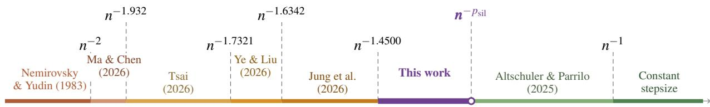
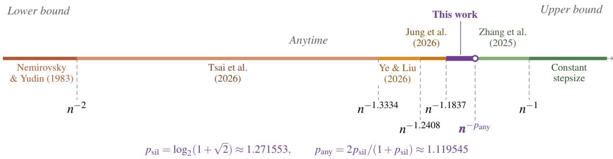
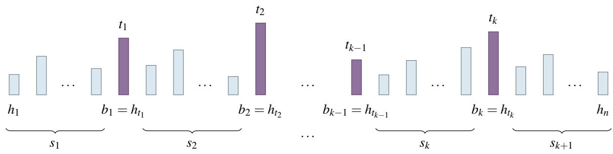
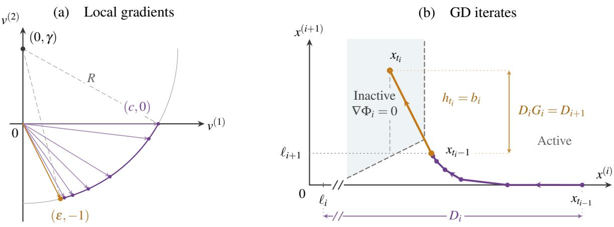

# Silver Rate Is (Almost) Optimal for Gradient Descent Acceleration

Yuhan Ye\*   
MIT   
yyh03@mit.edu   
Kaizhao Liu\*   
MIT   
mrzt@mit.edu

September 9, 2026

## Abstract

We study how far gradient descent (GD) can be accelerated by predetermined nonnegative stepsizes in smooth convex optimization. Writing $p _ { \mathrm { s i l } } = \log _ { 2 } ( 1 + \sqrt { 2 } )$ , we prove an $\Omega \left( n ^ { - p _ { \mathrm { s i l } } - O ( \sqrt { \log \log n / \log n } ) } \right)$ non-anytime lower bound. In the anytime setting, every infinite nonnegative schedule has infinitely many horizons with error $\Omega \left( n ^ { - \frac { 2 p _ { \mathrm { { s i l } } } } { 1 + p _ { \mathrm { { s i l } } } } - O ( \sqrt { \log \log n / \log n } ) } \right) ^ { \bullet }$ . Together with the silver-schedule upper bound [Altschuler and Parrilo, 2025] and the anytime upper bound [Zhang et al., 2025], our results determine the optimal polynomial convergence exponents in both settings.

## Contents

1 Introduction 3   
1.1 Stepsize Schedules for Accelerating GD 3   
1.2 Main Results 3   
2 Motivation and Technical Overview 4   
3 (Almost) Tight Non-Anytime Lower Bound 8   
3.1 Proof of Lemma 2.2 . 8   
3.2 Proof of Theorem 1.1 9   
4 (Almost) Tight Anytime Lower Bound 13   
Concluding Remarks 13   
Proofs for the Hard-Function Construction 16   
A.1 Proof of Lemma 3.1 . 16   
A.2 Proof of Lemma 3.2 . 18   
A.3 Proof of Lemma 2.2 . 18   
B Proofs for the Global Cost Analysis 20   
B.1 Proof of Lemma 3.3 . . 20   
B.2 Proofs of Lemmas 3.4 and 3.5 20   
B.3 Proof of Lemma 3.6 . 21   
B.4 Proof of Lemma 3.7 . 22   
B.5 Proof of Lemma 3.8 . 24   
B.6 Proofs of Lemmas 3.9 and 3.10 . 24   
B.7 Proof of Theorem 1.1 26   
C Proofs for the Anytime Lower Bound 27   
C.1 Proof of Lemma 4.1 . 27   
C.2 Proof of Theorem 1.2 28

## 1 Introduction

We consider the unconstrained minimization of a convex L smooth function $f : \mathbb { R } ^ { d }  \mathbb { R }$ . One of the most fundamental methods for this problem is gradient descent (GD), which dates back to Cauchy [1847]. Given a stepsize schedule $H = ( h _ { 1 } , \ldots , h _ { n } ) \in [ 0 , \infty ) ^ { n }$ fixed before the optimization begins, GD iterates

$$
x _ { k } = x _ { k - 1 } - h _ { k } \nabla f ( x _ { k - 1 } ) , \qquad 1 \leq k \leq n .
$$

In this paper, we study how far this basic method can be accelerated using only predetermined stepsizes.

Let $\mathcal { F } _ { L } ( \mathbb { R } ^ { d } )$ be the class of convex L-smooth functions on $\mathbb { R } ^ { d }$ with a nonempty set of minimizers. We measure the worst-case convergence rate of a schedule H by

$$
\mathcal { R } _ { n } ( H ) : = \operatorname* { s u p } _ { d \in \mathbb { N } } \operatorname* { s u p } _ { f \in \mathcal { F } _ { L } ( \mathbb { R } ^ { d } ) } \operatorname* { s u p } _ { x _ { s } \in \mathrm { a r g m i n f } } \operatorname* { s u p } _ { x _ { 0 } \in \mathbb { R } ^ { d } \setminus \{ x _ { * } \} } \frac { f ( x _ { n } ) - f ( x _ { * } ) } { \frac { L } { 2 } \| x _ { 0 } - x _ { * } \| ^ { 2 } } , \qquad r _ { n } ^ { * } : = \operatorname* { i n f } _ { H \in [ 0 , \infty ) ^ { n } } \mathcal { R } _ { n } ( H ) .\tag{1}
$$

In the non-anytime (finite-horizon) setting, the schedule may be chosen separately for each fixed horizon $n ,$ and $r _ { n } ^ { * }$ is the best worst-case error achievable at that horizon. In the anytime setting, one infinite schedule $h = { \left( h _ { k } \right) } _ { k \geq 1 }$ is used for every horizon, with $H _ { n } = \left( h _ { 1 } , \ldots , h _ { n } \right)$

It is a standard textbook result that GD with the constant stepsize $1 / L$ has an $O ( n ^ { - 1 } )$ convergence rate [Levitin and Polyak, 1966; Nesterov, 2004]. Classical acceleration methods alter the GD iteration by adding momentum or auxiliary sequences, as in the heavy-ball method of Polyak [1964] and the accelerated method of Nesterov [1983]. Within the broader class of first-order methods, Nesterov’s method attains the optimal $O ( n ^ { - 2 } )$ rate for smooth convex objectives, matching the $\Omega ( n ^ { - 2 } )$ oracle lower bound of Nemirovsky and Yudin [1983].

## 1.1 Stepsize Schedules for Accelerating GD

Since GD with predetermined stepsizes is a special class of first-order method, the classical $\Omega ( n ^ { - 2 } )$ oracle lower bound continues to apply. For many years, however, the standard $O ( n ^ { - 1 } )$ rate remained the best general upper bound known. This left open whether stepsize design alone could yield a faster rate.

This question was answered affirmatively by schedules that combine occasional long steps with recursive constructions [Altschuler and Parrilo, 2025; Grimmer, 2024; Grimmer et al., 2025a,b]. At horizons $n = 2 ^ { k }$ 1, the silver schedule attains $O ( n ^ { - } ^ { p _ { \mathrm { s i l } } } )$ , where $p _ { \mathrm { s i l } } : = \log _ { 2 } ( 1 + \sqrt { 2 } ) \approx 1 . 2 7 1 6$ [Altschuler and Parrilo, 2025]. Compositions of stepsize schedules attain the same exponent at every prescribed horizon [Grimmer et al., 2025a]. At original silver horizons, Wang et al. [2026] established tight lower bounds for the silver schedule. In the anytime setting, Zhang et al. [2025] attain $O ( n ^ { - { p _ { \mathrm { a n y } } } } )$ , where $p _ { \mathrm { a n y } } : = 2 p _ { \mathrm { s i l } } / ( 1 + p _ { \mathrm { s i l } } ) \approx 1$ .1195.

Recently, a sequence of lower bound results has narrowed the gaps to these rates. Ma and Chen [2026] proved an $\dot { \Omega } ( n ^ { - 1 . \hat { 9 3 } 2 } )$ non-anytime lower bound, and a subsequent blog post by Tsai [2026] sharpened it to $\Omega ( n ^ { - \sqrt { 3 } } )$ . For the anytime setting, Tsai et al. [2026] proved an $\Omega ( n ^ { - 4 / 3 } )$ lower bound. In our previous work [Ye and Liu, 2026], we proved an $\Omega ( n ^ { - 1 . 6 3 4 2 } )$ non-anytime lower bound and an $\Omega ( n ^ { - 1 . 2 4 0 8 } )$ anytime lower bound for arbitrary real-valued stepsizes. To our knowledge, these remain the strongest known lower bounds when negative stepsizes are allowed. For nonnegative schedules, Jung et al. [2026] further improved the non-anytime and anytime lower bounds to $\Omega ( n ^ { - 1 . 4 5 \bar { 0 } 0 } )$ and $\Omega ( n ^ { - 1 . 1 8 3 7 } )$ ), respectively.

## 1.2 Main Results

For nonnegative schedules, we close both remaining gaps in the polynomial exponents.

Theorem 1.1. There is an absolute constant $C > 0$ such that, for every sufficiently large $n ,$

$$
r _ { n } ^ { * } \geq n ^ { - \left( p _ { \mathrm { s i l } } + C \sqrt { \frac { \log \log n } { \log n } } \right) } .\tag{2}
$$

Theorem 1.2. There is an absolute constant $C > 0$ such that every infinite nonnegative schedule has infinitely many horizons nfor which

$$
\begin{array} { r } { \mathcal { R } _ { n } ( H _ { n } ) \ge n ^ { - \left( p _ { \mathrm { a n y } } + C \sqrt { \frac { \log \log n } { \log n } } \right) } . } \end{array}\tag{3}
$$

Together with the corresponding upper bounds [Altschuler and Parrilo, 2025; Grimmer et al., 2025a; Zhang et al., 2025], our results identify $p _ { \mathrm { s i l } }$ and $p _ { \mathrm { a n y } }$ as the optimal polynomial convergence exponents in the non-anytime and anytime settings, respectively.

  
Figure 1: Lower and upper bounds for GD with predetermined stepsizes.

Organization. Section 2 gives an overview of the proofs. Section 3 proves the non-anytime result, and Section 4 proves the anytime result. Deferred arguments appear in the appendices.

## 2 Motivation and Technical Overview

Replacing f by $f / L$ and each $h _ { k }$ by $L h _ { k }$ leaves the GD iterates and ${ \mathcal { R } } _ { n }$ unchanged, so we assume $L = 1$ throughout. We first recall how previous constructions of Jung et al. [2026]; Ma and Chen [2026] use selected steps to change the gradient direction.

Selecting the checkpoints. Fix a nonnegative schedule $h = ( h _ { 1 } , \ldots , h _ { n } )$ and select indices $T = \{ t _ { 1 } < \cdots <$ $t _ { k } \} \subseteq \{ 1 , \ldots , n \}$ , which we call checkpoints. Set $t _ { 0 } = 0 , t _ { k + 1 } = n + 1$ , and define

$$
b _ { i } : = h _ { t _ { i } } \quad ( 1 \leq i \leq k ) , \qquad s _ { i } : = \sum _ { t = t _ { i - 1 } + 1 } ^ { t _ { i } - 1 } h _ { t } \quad ( 1 \leq i \leq k + 1 ) .\tag{4}
$$

Here $b _ { i }$ is the selected stepsize at time $t _ { i } ,$ and $s _ { i }$ is the total stepsize of the intervening updates, indexed by $t _ { i - 1 } < t < t _ { i }$ . The last sum $s _ { k + 1 }$ covers the steps after the final checkpoint. Figure 2 illustrates this notation.

For selected long steps, Ma and Chen [2026, Theorem 4.1] construct a hard function whose gradient stays constant during the intervening updates and changes after each selected step. See also Ye and Liu [2026, Appendix A] for a geometric illustration of the trajectory. Their hard function is globally defined depending on all the coordinates. Jung et al. [2026, Section 2] instead construct a summation of local bivariate function that maintains a smilar trajectory where gradient stays constant during the intervening updates, obtaining the following improved lower bound.

  
Figure 2: The selected stepsizes are $b _ { i } = h _ { t _ { i } }$ . Each brace marks the total stepsize $s _ { i }$ of the intervening updates.

Fact 2.1 (Jung et al., 2026, Lemma 2.3). For every positive schedule h and every checkpoint set $T _ { \ast }$

$$
\mathcal { R } _ { n } ( h ) \geq \frac { 1 } { 4 ( 1 + s _ { k + 1 } ) } \prod _ { i = 1 } ^ { k } \left[ \frac { b _ { i } } { 2 ( 2 + s _ { i } ) } \right] ^ { 2 } .\tag{5}
$$

For $k = 0 ,$ , the product is empty and $\textstyle s _ { 1 } = \sum _ { t = 1 } ^ { n } h _ { t }$

Specifically, their construction uses the one-sided Huber function

$$
H _ { \delta } ( z ) : = \left\{ \begin{array} { l l } { 0 , } & { z \le 0 , } \\ { z ^ { 2 } / 2 , } & { 0 \le z \le \delta , } \\ { \delta z - \delta ^ { 2 } / 2 , } & { z \ge \delta , } \end{array} \right. \quad \delta > 0 ,\tag{6}
$$

and joins adjacent coordinates through

$$
F ( x ) : = \frac { 1 } { 4 } \sum _ { i = 1 } ^ { k } H _ { \delta _ { i } } \big ( x ^ { ( i ) } - x ^ { ( i + 1 ) } - \tau _ { i } \big ) + \frac { 1 } { 2 } H _ { \delta _ { k + 1 } } \big ( x ^ { ( k + 1 ) } - \tau _ { k + 1 } \big ) .
$$

The parameters $\delta _ { i } > 0$ and activation thresholds $\tau _ { i } \geq 0$ are chosen based on the stepsizes and the selected checkpoints [Jung et al., 2026, Section 2]. Starting from the first coordinate, the selected step of size $b _ { i }$ activates component i + 1, while all later components remain inactive.1 This step raises coordinate $i + 1$ above its activation threshold, allowing the next component to contribute to the gradient. The final onedimensional component gives the objective-gap lower bound in (5). They then optimize over checkpoint sets and analyze the resulting bound recursively, obtaining the $\Omega ( n ^ { - \log _ { 2 } ( 1 + \sqrt { 3 } ) } )$ non-anytime lower bound [Jung et al., 2026, Section 3].

The bottleneck. The coefficient 2 of $s _ { i }$ in (5) suggests where to improve the construction. During the intervening updates, component i stays in its affine region and contributes a gradient proportional to $e _ { i } - e _ { i + 1 }$ Its contribution decreases coordinate i and increases coordinate i + 1 by the same amount. Both motions decrease the difference $x ^ { ( i ) } - x ^ { ( i + 1 ) }$ that keeps the component active. To keep component $i + 1$ inactive during the intervening updates, its activation threshold is set to the value of coordinate i + 1 just before the update with stepsize $b _ { i }$ . Only the additional increase produced by this update is then passed to the next component. The resulting transfer ratio is $b _ { i } / [ c ( 2 + s _ { i } ) ]$ , with $c = 2$ . Following the exponent calculation in [Jung et al., 2026, Section 3], a coefficient c of $s _ { i }$ suggests a lower bound of order $n ^ { - \log _ { 2 } ( 1 + \sqrt { 1 + c } ) }$ . This motivates our two-coordinate hard function, which changes the gradient direction during the intervening updates to make c arbitrarily close to 1, improving the lower-bound exponent toward the silver exponent.

Our innovation: switching the gradient direction during the intervening updates. To reduce the coefficient c of $s _ { i } .$ , we modify the local hard function on coordinates i and $i + 1$ . We initially keep the gradient horizontal and then turn it toward the negative $x ^ { ( i + 1 ) }$ direction.2 This decreases coordinate i without increasing coordinate $i + 1$ too much at first. Near time $t _ { i } ,$ we turn the gradient toward $( \varepsilon , - 1 )$ , so the selected step of size $b _ { i }$ is mostly used to increase coordinate $i + 1$ rather than to decrease in coordinate i.

Fix $\varepsilon , \gamma > 0$ and set

$$
c = \sqrt { 1 + 2 \gamma + \varepsilon ^ { 2 } } , \qquad R = \sqrt { \varepsilon ^ { 2 } + ( 1 + \gamma ) ^ { 2 } } .
$$

We choose gradient vectors on the circular arc of radius R centered at $( 0 , \gamma )$ , joining $( c , 0 )$ to $( \varepsilon , - 1 )$ in the quadrant $\{ \nu ^ { ( 1 ) } \geq 0 , \nu ^ { ( 2 ) } \leq 0 \}$ . Here $\nu = ( \nu ^ { ( 1 ) } , \nu ^ { ( 2 ) } )$ is a two-coordinate gradient vector, not an iterate position. Its two coordinates will correspond to coordinates i and $i + 1$ of the full construction. Let $K$ be the convex hull of this arc and the origin. Its support function and Moreau envelope are

$$
\sigma _ { K } ( z ) = \operatorname* { m a x } _ { \nu \in K } \langle \nu , z \rangle , \qquad { \mathrm { e n v } } _ { 1 } \sigma _ { K } ( r ) = \operatorname* { m i n } _ { z \in \mathbb { R } ^ { 2 } } \left\{ \sigma _ { K } ( z ) + { \frac { 1 } { 2 } } \| r - z \| ^ { 2 } \right\} .
$$

The envelope is convex and 1-smooth, and its gradient is $\nabla \mathrm { e n v } _ { 1 } \sigma _ { K } ( r ) = \Pi _ { K } ( r )$ , where $\Pi _ { K }$ denotes Euclidean projection onto $K$

To obtain a GD trajectory for the prescribed stepsizes, we construct it backward. Write $\alpha _ { 1 } , \ldots , \alpha _ { m }$ for the steps in this two-coordinate problem, $r _ { j }$ for its iterate after j steps, and $\nu _ { j } = \Pi _ { K } ( r _ { j } )$ for the corresponding gradient. We fix the point and gradient just before the selected update to be $r _ { m } = \nu _ { m } = ( \pmb { \varepsilon } , - 1 )$ . For $j =$ $m , m - 1 , \ldots , 1$ , choose the preceding point and gradient to satisfy

$$
r _ { j - 1 } = r _ { j } + \alpha _ { j } \nu _ { j - 1 } , \qquad \nu _ { j - 1 } = \Pi _ { K } ( r _ { j - 1 } ) .
$$

The first identity is the GD update read backward. The second ensures that the chosen vector is the gradient of the same smooth convex function. The circular geometry gives an explicit solution. Once the backward gradient reaches $( c , 0 )$ , all earlier gradients remain horizontal. If the intervening updates have small total stepsize, the first gradient may lie partway along the arc. The total stepsize spent turning is bounded by a constant depending only on $\varepsilon , \gamma .$

The shift $\gamma > 0$ allows the gradient direction to change as we construct the trajectory backward. With $\gamma = 0$ , the gradient would remain at $( \varepsilon , - 1 )$ . Keeping $\varepsilon > 0$ lets a sufficiently large $b _ { i }$ move the first coordinate far enough to put the old component into a region where it remains zero as the next component runs.

Figure 3 shows the local gradients on the left and the resulting iterate path on the right. We write $\Phi _ { i }$ for the scaled and translated component acting on coordinates $i , i + 1$ of the full objective. The gray region marks where this component vanishes. The next component has activation level $\ell _ { i + 1 } = x _ { t _ { i } - 1 } ^ { ( i + 1 ) }$ , the value of coordinate $i + 1$ just before taking the step of size $b _ { i }$ . From $x _ { t _ { i } }$ onward, that coordinate may decrease as the next component runs, but it never falls below $\ell _ { i + 1 }$ . The old component therefore remains inactive.

  
Figure 3: Local gradients (left) and iterates (right). The step of size $b _ { i }$ (orange) activates the next component.

The improved hard-function bound. Let $\ell _ { i }$ be the activation level of component i. $\mathrm { A t } x _ { t _ { i - 1 } } , D _ { i } = x _ { t _ { i - 1 } } ^ { ( i ) } - \ell _ { i }$ is the amount by which coordinate i exceeds this level. We start with $D _ { 1 } = 1$ . After scaling and joining the components, the step of size $b _ { i }$ leaves coordinate $i + 1$ a distance $D _ { i + 1 } = D _ { i } G _ { i }$ above $\ell _ { i + 1 }$ , where

$$
G _ { i } = \frac { b _ { i } } { c ( a + s _ { i } ) + \varepsilon b _ { i } } .
$$

The constant a depends only on ε, γ. The coefficient of $s _ { i }$ is now c, which can be made arbitrarily close to 1, instead of 2. The final bound introduce a constant a, a lower bound on $b _ { i } ,$ , and the additional term $\varepsilon b _ { i } ,$ made precise in the following lemma.

Lemma 2.2 (Checkpoint transfer bound). Fix $\varepsilon , \gamma > 0$ and let $c : = \sqrt { 1 + 2 \gamma + \pmb { \varepsilon } ^ { 2 } }$ . There are finite constants $a = a ( \varepsilon , \gamma )$ and $B _ { 0 } = B _ { 0 } ( \varepsilon )$ such that, for every nonnegative schedule and every checkpoint set whose selected steps satisfy $b _ { i } \geq B _ { 0 }$

$$
\mathcal { R } _ { n } ( h ) \geq \frac { 1 } { 4 ( 1 + s _ { k + 1 } ) } \prod _ { i = 1 } ^ { k } \left[ \frac { b _ { i } } { c ( a + s _ { i } ) + \varepsilon b _ { i } } \right] ^ { 2 } .\tag{7}
$$

For $k = 0 ,$ , the product is empty and $\textstyle s _ { 1 } = \sum _ { t = 1 } ^ { n } h _ { t }$

We explain the construction in Section 3.1 and give the detailed verifications in Appendix A. The constants a and $B _ { 0 }$ may grow as ε, γ decrease, so we must keep track of them when choosing the parameters.

From the construction to the main lower bounds. To use this bound, we must choose checkpoints that keep the product $\textstyle \prod _ { i = 1 } ^ { k } G _ { i }$ large relative to the total stepsize $s _ { k + 1 }$ . We express this choice as a cost minimization and bound the cost recursively, following Jung et al. [2026, Section 3]. The new term $\varepsilon b _ { i }$ prevents a direct substitution into their recursion. Although ε is small, $b _ { i }$ has no upper bound, so $\varepsilon b _ { i }$ need not be small relative to $c ( a + s _ { i } )$ and cannot be absorbed into a uniformly over schedules. We include the term $\varepsilon b _ { i }$ in the recursion and bound the cost using Lemmas 3.7 and 3.8. This gives an $\Omega ( n ^ { - p } )$ non-anytime lower bound for every $p > p _ { \mathrm { s i l } }$ . Keeping track of the constants as $p \downarrow p \mathrm { { s i l } }$ gives Theorem 1.1, as shown in Section 3.2.

For the anytime result, we follow the approaches of Tsai et al. [2026, Section 4.1] and Jung et al. [2026, Section 4]. At horizons where the last step is the largest so far, we compare the total stepsize with that largest step and the final error. Using our stronger construction gives the exponent $2 p / ( 1 + p )$ at infinitely many horizons. Tracking the constants as $p \downarrow p \mathrm { { s i l } }$ then yields Theorem 1.2, as shown in Section 4.

## 3 (Almost) Tight Non-Anytime Lower Bound

We first explain how to construct and join the local hard functions in Lemma 2.2. We then give the lemmas that complete the proof of Theorem 1.1. The detailed verifications are in Appendix A for the construction and Appendix B for the cost analysis.

## 3.1 Proof of Lemma 2.2

Fix ε, $\gamma > 0$ and let $c = \sqrt { 1 + 2 \gamma + \pmb { \varepsilon } ^ { 2 } }$ . The construction has two parts. First, we build a two-coordinate function for the intervening updates and the selected step that follows them. We then join copies of this function, keeping earlier and later components inactive while the current one runs.

Choosing the gradient directions. Use the arc and convex set K from Section 2. Because ∇env1 $\sigma _ { K } ( r ) =$ $\Pi _ { K } ( r )$ , the backward construction must satisfy both the GD update and the projection condition. The following lemma guarantees this for any given stepsizes $\alpha _ { j }$ and bounds the total stepsize spent turning.

Lemma 3.1 (Backward trajectory). There is a finite constant $H = H ( \varepsilon , \gamma )$ such that, for every $m \geq 0$ and every $\alpha _ { 1 } , \ldots , \alpha _ { m } \geq 0 ,$ , there are points $r _ { 0 } , \ldots , r _ { m }$ and vectors $\nu _ { 0 } , \ldots , \nu _ { m }$ on the arc satisfying

$$
r _ { m } = \nu _ { m } = ( \varepsilon , - 1 ) , \qquad r _ { j } = r _ { j - 1 } - \alpha _ { j } \nu _ { j - 1 } \quad ( 1 \leq j \leq m ) , \qquad \nu _ { j } = \Pi _ { K } ( r _ { j } ) \quad ( 0 \leq j \leq m ) .
$$

Moreover,

$$
\sum _ { \begin{array} { l } { 1 \leq j \leq m } \\ { \nu _ { j - 1 } \neq ( c , 0 ) } \end{array} } \alpha _ { j } \leq H .
$$

The proof and an explicit formula for H are given in Section A.1.

The following lemma records both properties.

Lemma 3.2 (Two-coordinate transfer). There is a finite constant $C _ { 0 } = C _ { 0 } ( \varepsilon , \gamma )$ with the following property. Let $m \geq 0 , \alpha _ { 1 } , \ldots , \alpha _ { m } \geq 0 , S = \sum _ { i = 1 } ^ { m } \alpha _ { j } , b \geq 1 + \varepsilon ^ { - 2 }$ , and $A \geq C _ { 0 }$ Moreover, the function satisfies

$$
f ( x , y ) = 0 \quad i f x \le 0 , y \ge 0 , \qquad f ( U , y ) = 0 \quad i f y \ge Y .
$$

Only the additional height G is passed to the next component. The first zero region keeps a component inactive before its turn. The second keeps it inactive afterward, provided that its first coordinate stays at U and its second coordinate stays at least Y. The coordinate bounds ensure that these conditions hold when we join the components.

The bound from Lemma 3.1 controls the vertical displacement by a constant, while the horizonta displacement is at most cS. Scaling by $( c S + \varepsilon b + A ) ^ { - 1 }$ gives the stated transfer ratio. The construction of $f$ and the verification of both zero regions are in Section A.2.

Combining the local hard functions. For each $i ,$ we apply Lemma 3.2 with the local stepsizes specified below to obtain a function $f _ { i } .$ . We scale and translate $f _ { i }$ to form $\Phi _ { i } ,$ then define $F$ as half the sum of these components and a final one-dimensional Huber function, as in (55). Each coordinate appears in at most two 1-smooth terms, so this makes the full objective F 1-smooth. Because of the factor $1 / 2$ , a GD step of size $h _ { t }$ corresponds to a local step of size $h _ { t } / 2$

Choose $B _ { 0 } = 2 ( 1 + \varepsilon ^ { - 2 } )$ and $a \ge$ max $\{ 2 , 2 C _ { 0 } / c , 2 B _ { 0 } \}$ . put $m = t _ { i } - t _ { i - 1 } - 1$ and apply Lemma 3.2 with

$$
\alpha _ { j } = \frac { h _ { t _ { i - 1 } + j } } { 2 } \quad ( 1 \leq j \leq m ) , \qquad S = \frac { s _ { i } } { 2 } , \qquad b = \frac { b _ { i } } { 2 } , \qquad A = \frac { c a } { 2 } .
$$

Its transfer ratio is

$$
G _ { i } = \frac { b _ { i } } { c ( a + s _ { i } ) + \varepsilon b _ { i } } .
$$

Write $f _ { i } , U _ { i } , Y _ { i }$ for the function and coordinates supplied by Lemma 3.2.

$$
D _ { 1 } : = 1 , \quad \ell _ { 1 } : = 0 , \quad \quad D _ { i + 1 } : = D _ { i } G _ { i } , \quad \ell _ { i + 1 } : = D _ { i } Y _ { i } \quad ( 1 \leq i \leq k ) .\tag{8}
$$

For $x \in \mathbb { R } ^ { k + 1 }$ , define the component acting on coordinates $i , i + 1$ by

$$
\Phi _ { i } ( x ) : = D _ { i } ^ { 2 } f _ { i } \left( \frac { x ^ { ( i ) } - \ell _ { i } } { D _ { i } } , \frac { x ^ { ( i + 1 ) } } { D _ { i } } \right) .\tag{9}
$$

This scaling preserves 1-smoothness, while the first input measures height above $\ell _ { i }$

$$
x ^ { ( i ) } = \ell _ { i } + D _ { i } U _ { i } , \qquad x ^ { ( i + 1 ) } \geq \ell _ { i + 1 } = D _ { i } Y _ { i } .
$$

Thus the two inputs to $f _ { i }$ remain $U _ { i }$ and at least $Y _ { i } ,$ respectively, so its second zero region keeps $\Phi _ { i }$ inactive. The first zero region keeps later components inactive until their turn. The induction verifying these coordinate relations is in Section ${ \mathrm { A } } . 3$

With $\delta = { D } / { ( 1 + } s _ { k + 1 } )$ , the final Huber calculation gives

$$
F ( x _ { n } ) - \operatorname* { m i n } F = { \frac { D ^ { 2 } } { 4 ( 1 + s _ { k + 1 } ) } } = { \frac { 1 } { 4 ( 1 + s _ { k + 1 } ) } } \prod _ { i = 1 } ^ { k } \left[ { \frac { b _ { i } } { c ( a + s _ { i } ) + \varepsilon b _ { i } } } \right] ^ { 2 } .
$$

The construction starts at $e _ { 1 }$ and has a minimizer at the origin, so the initial distance is 1. Under the normalization in $( 1 ) , \mathcal { R } _ { n } ( h )$ is at least twice this value. Dropping the factor 2 gives Lemma 2.2. When there are no checkpoints, the same Huber calculation applies with $D = 1$ . The smoothness and final-value calculations are also given in Section A.3.

## 3.2 Proof of Theorem 1.1

The transfer bound in Lemma 2.2 holds for every admissible checkpoint set. We choose the checkpoints to obtain a lower bound that holds for every stepsize schedule. The cost formulation and the analysis of tight checkpoint sets follow the framework of Jung et al. [2026, Section 3 and Appendix C]. We account for the additional $\varepsilon b _ { i }$ in the splitting bound of Lemma 3.7, then apply that bound recursively in Lemma 3.8.

Throughout this subsection, fix $0 < \varepsilon < 1 / 2$ and $\gamma > 0 .$ , and set

$$
c : = \sqrt { 1 + 2 \gamma + \varepsilon ^ { 2 } } , \qquad d : = \frac { \varepsilon } { c } , \qquad \chi : = c - \varepsilon = c ( 1 - d ) .\tag{10}
$$

Choose the constants of Lemma 2.2 so that $a \ge 2 B _ { 0 } + 2$ and $a \ge 2$ . Enlarging a preserves its transfer bound.   
In particular, $0 < d < 1$ and $\chi > 0$ . We may choose the parameter $\lambda \geq a$ freely.

For a schedule $h \in [ 0 , \infty ) ^ { n }$ , use the checkpoint notation $T , b _ { i } , s _ { i }$ from (4). Define

$$
\Psi _ { \lambda } \left( T ; h \right) : = \left( \lambda + s _ { k + 1 } \right) \prod _ { i = 1 } ^ { k } \left( \varepsilon + \frac { c ( a + s _ { i } ) } { b _ { i } } \right) ,\tag{11}
$$

$$
V _ { \lambda } ( h ) : = \operatorname* { m i n } _ { T \subseteq \{ 1 , \ldots , n \} } \Psi _ { \lambda } ( T ; h ) , \qquad U _ { n } ( \lambda ) : = \operatorname* { s u p } _ { h \in [ 0 , \infty ) ^ { n } } V _ { \lambda } ( h ) .\tag{12}
$$

A checkpoint set selecting a zero step has cost +∞. The empty set has cost $\textstyle { \lambda + \sum _ { t = 1 } ^ { n } h _ { t } }$ , and $U _ { 0 } ( \lambda ) = \lambda$

Each factor in the product is $G _ { i } ^ { - 1 }$ , and $\lambda + s _ { k + 1 }$ accounts for . Thus $V _ { \lambda } ( h )$ is the best cost for a given schedule, while $U _ { n } ( \lambda )$ is the worst such cost over all schedules. Although $V _ { \lambda }$ minimizes over all checkpoint sets, deleting a selected step of size $0 < b \leq a / 2$ from a finite-cost set strictly lowers its cost. Thus every minimizing set satisfies $b _ { i } > a / 2 \ge B _ { 0 }$ , so Lemma 2.2 applies. The following lemma converts this cost bound into a lower bound on the optimization error. Its proof, including the deletion argument, is in Section B.1.

Lemma 3.3 (Cost lower bound). For every $n \geq 0 , h \in [ 0 , \infty ) ^ { n }$ , and $\lambda \geq a ,$

$$
\mathcal { R } _ { n } ( h ) \geq \frac { \lambda - 1 } { V _ { \lambda } ( h ) ^ { 2 } } .\tag{13}
$$

Call T tight if $\Psi _ { \lambda } \left( T ; h \right) = V _ { \lambda } \left( h \right)$ . The next two lemmas describe the tight sets at a schedule maximizing $V _ { \lambda }$ . Their proofs are in Section B.2.

Lemma 3.4 (Log-submodularity). For every positive schedule $h \in ( 0 , \infty ) ^ { n }$ and every two checkpoint sets A,B,

$$
\Psi _ { \lambda } \left( A ; h \right) \Psi _ { \lambda } \left( B ; h \right) \geq \Psi _ { \lambda } \left( A \cap B ; h \right) \Psi _ { \lambda } \left( A \cup B ; h \right) .\tag{14}
$$

The inequality is strict when A and B are disjoint and nonempty. Consequently, tight sets are closed under unions and intersections, and two nonempty tight sets cannot be disjoint.

Lemma 3.5 (Extremal schedules). For every $n \geq 1$ and $\lambda \geq a , U _ { n } ( \lambda )$ is finite, $U _ { n } ( \lambda ) > U _ { n - 1 } ( \lambda ) .$ , and the supremum defining $U _ { n } ( \lambda )$ is attained by a positive finite schedule. At every maximizing schedule, the empty set and at least one nonempty checkpoint set are tight.

For the cost $\Psi _ { \lambda }$ , these lemmas do not yet give a tight set consisting of one checkpoint. We obtain one below by changing variables and maximizing a different quantity.

Rewriting the checkpoint cost. Now take a maximizing schedule from Lemma 3.5 and choose any nonempty tight set T. For its $b _ { i }$ and $s _ { i } ,$ put

$$
B _ { i } : = ( 1 - d ) b _ { i } , \qquad g _ { i } : = s _ { i } + d b _ { i } , \qquad \Lambda : = \lambda + s _ { k + 1 } .\tag{15}
$$

These variables satisfy

$$
g _ { i } + B _ { i } = s _ { i } + b _ { i } , \qquad { \frac { \chi ( a + g _ { i } ) } { B _ { i } } } = { \frac { c ( a + s _ { i } ) } { b _ { i } } } + \varepsilon .
$$

When it is selected, the second identity shows that its cost factor is unchanged. These substitutions change only the cost formula, not the GD schedule.

For the splitting argument, allow arbitrary $g _ { 1 } , \dots , g _ { k } \ge 0 , B _ { 1 } , \dots , B _ { k } \ge 0$ , and $\Lambda \geq a .$ $S = \{ i _ { 1 } < \cdots <$ $i _ { m } \} \subseteq \{ 1 , \ldots , k \}$ , with $i _ { 0 } = 0$ , set

$$
\begin{array} { l } { { \displaystyle { \cal L } _ { j } ( S ) : = \sum _ { r = i _ { j - 1 } + 1 } ^ { i _ { j } } g _ { r } + \sum _ { r = i _ { j - 1 } + 1 } ^ { i _ { j } - 1 } B _ { r } } , } \\ { { \displaystyle Y ( S ) : = \Lambda + \sum _ { r > i _ { m } } ( g _ { r } + B _ { r } ) . } } \end{array}
$$

Define the auxiliary cost

$$
\widetilde { \Psi } _ { \Lambda } ( S ; g , B ) : = Y ( S ) \prod _ { j = 1 } ^ { m } \frac { \chi ( a + L _ { j } ( S ) ) } { B _ { i _ { j } } } ,\tag{16}
$$

$$
\widetilde { \Psi } _ { \Lambda } ( \varnothing ; g , B ) : = \Lambda + \sum _ { i = 1 } ^ { k } ( g _ { i } + B _ { i } ) .\tag{17}
$$

A subset containing an index with $B _ { i } = 0$ has cost $+ \infty$ . For the variables in (15), every subset cost is preserved.

Lemma 3.6 (Preservation of every subset cost). For every $S \subseteq \{ 1 , \ldots , k \}$

$$
\widetilde { \Psi } _ { \Lambda } ( S ; g , B ) = \Psi _ { \lambda } ( \{ t _ { i } : i \in S \} ; h ) .\tag{18}
$$

The proof is in Section B.3. Since both T and the empty set have cost $U _ { n } ( \lambda )$ , the empty set minimizes $\smash { \widetilde { \Psi } } _ { \Lambda }$ . We also need to select additional checkpoints among the intervening updates. Let $h ^ { ( \bar { i } ) }$ be the sequence of stepsizes for the updates indexed by $t _ { i - 1 } < t < t _ { i } .$ . An insertion that lowered its local cost would lower the global cost of T, contradicting tightness. As proved in Section B.3, this gives

$$
V _ { a + d b _ { i } } ( h ^ { ( i ) } ) = a + s _ { i } + d b _ { i } \quad ( 1 \leq i \leq k ) , \qquad V _ { \lambda } ( h ^ { ( k + 1 ) } ) = \lambda + s _ { k + 1 } .\tag{19}
$$

These identities will let us bound the cost of each $h ^ { ( i ) }$ in terms of its number of updates. The next lemma bounds the full cost in terms of the costs of the individual sequences $h ^ { ( i ) }$ . We keep the sum over checkpoints on its left side to cancel terms introduced by the substitution. The exponent ν will give a lower-bound exponent $p = 1 / \nu$

Lemma 3.7 (Weighted splitting). Fix $\nu \in [ 1 / 2 , 1 )$ and $\kappa \geq 0$ . Suppose that, for every $x , y \geq a$ and $B > 0 ;$ the relations $w = x + y + B - a$ and wB = χxy imply

$$
w ^ { \nu } + \kappa B ^ { \nu } \leq x ^ { \nu } + y ^ { \nu } .\tag{20}
$$

For any auxiliary problem (16)–(17) in which the empty set is a minimizer, write $W = \widetilde { \Psi } _ { \Lambda } ( \emptyset ; g , B )$ . Then

$$
W ^ { \nu } + \kappa \sum _ { i = 1 } ^ { k } B _ { i } ^ { \nu } \leq \Lambda ^ { \nu } + \sum _ { i = 1 } ^ { k } ( a + g _ { i } ) ^ { \nu } .\tag{21}
$$

To prove this lemma, fix g,Λ and maximize

$$
J ( B ) : = W ^ { \nu } + \kappa \sum _ { i = 1 } ^ { k } B _ { i } ^ { \nu } , \qquad W = \Lambda + \sum _ { i = 1 } ^ { k } ( g _ { i } + B _ { i } ) ,\tag{22}
$$

over $B _ { i } \geq 0$ for which the empty set minimizes $\smash { \widetilde { \Psi } _ { \Lambda } }$

The right side of (21) is fixed, so it suffices to prove the bound at a maximizer. We handle $B _ { i } = 0$ by induction. At a positive maximizer, varying the $B _ { i }$ as in Section B.4 gives a tight set $\{ r \}$ consisting of one checkpoint. If $x , y \geq a$ are the empty-set costs to its left and right, then

$$
W = x + y + B _ { r } - a , \qquad \widetilde { \Psi } _ { \Lambda } ( \{ r \} ; g , B ) = { \frac { \chi x y } { B _ { r } } } = W .
$$

Thus $W B _ { r } = \chi x y$ , which explains the scalar relations in the hypothesis. The scalar inequality and induction on the two sides prove the lemma.

Returning to the variables in (15), choose

$$
\kappa : = \left( \frac { d } { 1 - d } \right) ^ { \nu } = \left( \frac { \varepsilon } { \chi } \right) ^ { \nu } .\tag{23}
$$

This choice gives ${ \therefore B _ { i } ^ { \nu } } = ( d b _ { i } ) ^ { \nu }$ and yields the following growth bound.

Lemma 3.8 (Uniform cost growth). Let $\nu \in [ 1 / 2 , 1 )$ . If the scalar hypothesis (20) holds with (23), then, for every $n \geq 0$ and $\lambda \geq a ,$

$$
U _ { n } ( \lambda ) ^ { \nu } \leq a ^ { \nu } n + \lambda ^ { \nu } .\tag{24}
$$

We prove the bound by induction on $n ,$ simultaneously for all $\lambda \geq a . \ \mathrm { A t }$ a maximizing schedule with a nonempty tight set, let $m _ { i }$ count the updates in $h ^ { ( i ) }$ . Then $k \geq 1$ gives $m _ { i } < n$ and $\Sigma _ { i = 1 } ^ { k + 1 } m _ { i } = n - k$ . Using (19), the induction hypothesis gives

$$
\begin{array} { c l } { { ( a + s _ { i } + d b _ { i } ) ^ { \nu } \leq a ^ { \nu } m _ { i } + ( a + d b _ { i } ) ^ { \nu } ~ ( 1 \leq i \leq k ) , } } \\ { { ( \lambda + s _ { k + 1 } ) ^ { \nu } \leq a ^ { \nu } m _ { k + 1 } + \lambda ^ { \nu } . } } \end{array}\tag{25}
$$

Now $( a + d b _ { i } ) ^ { \nu } \leq a ^ { \nu } + d ^ { \nu } b _ { i } ^ { \nu }$ . The terms $d ^ { \nu } b _ { i } ^ { \nu }$ cancel those on the left side of (21) because $\kappa ( 1 - d ) ^ { \nu } = d ^ { \nu }$ The remaining step counts sum to n, giving (24). The full proof is in Section B.5.

Under the scalar hypothesis, for $n \geq 1$ set $p = 1 / \nu$ and choose the free terminal parameter $\lambda = a n ^ { p }$ Then Lemma 3.8 gives $V _ { \lambda } ( h ) \leq U _ { n } ( \lambda ) \leq 2 ^ { p } a n ^ { p }$ . Since $a \geq 2 .$ , we have $\lambda - 1 \ge a n ^ { p } / 2$ , so Lemma 3.3 yields

$$
{ \mathcal { R } } _ { n } ( h ) \geq { \frac { 1 } { 2 ^ { 2 p + 1 } a } } n ^ { - p } \qquad { \mathrm { f o r ~ e v e r y ~ } } h \in [ 0 , \infty ) ^ { n } .\tag{26}
$$

The numerator $\lambda - 1$ supplies a factor of order $n ^ { p }$ , giving the exponent $p .$ It remains to verify the scalar hypothesis for $p$ close to $p _ { \mathrm { s i l } }$ and control the constant a.

Verifying the scalar condition. In the limiting case $\chi = 1 , \varepsilon = 0$ , the following silver inequality implies (20) at $p = p _ { \mathrm { s i l } }$ . The change of variables that gives this implication is in Section B.6.

Let $\rho = 1 + { \sqrt { 2 } }$ , so that $p _ { \mathrm { s i l } } = \log _ { 2 } \rho$ . The identity $\rho ^ { 2 } = 2 \rho + 1$ makes the following inequality tight at the balanced split $z = 1 / 2$

Lemma 3.9 (Silver inequality). For every $z \in [ 0 , 1 ]$

$$
z ^ { p _ { \mathrm { s i l } } } + ( 1 - z ) ^ { p _ { \mathrm { s i l } } } + [ z ( 1 - z ) ] ^ { p _ { \mathrm { s i l } } } \leq 1 .\tag{27}
$$

Equality holds at $z = 0 , 1 / 2 , 1$

The transfer construction requires $\varepsilon > 0$ . We handle this term by taking a slightly larger exponent. Write $t _ { + } = \operatorname* { m a x } \{ t , 0 \}$

Lemma 3.10 (Sufficient scalar condition). Let $p \in [ p _ { \mathrm { s i l } } , 3 / 2 ] , \nu = 1 / p , 0 < \chi \leq 2$ , and $0 < \varepsilon < 1 / 2$ . Suppose that $\tau : = \varepsilon ^ { 1 / p } \leq 1 / 1 0$ and

$$
p - p _ { \mathrm { s i l } } \geq ( \chi - 1 ) _ { + } + 6 \varepsilon ^ { 1 / p } .\tag{28}
$$

Then the scalar hypothesis (20) holdsfor $\pmb { \kappa } = ( \pmb { \varepsilon } / \chi ) ^ { 1 / p }$

The proofs of these two lemmas are in Section B.6. To finish, fix $0 < \eta \leq 1 / 1 0$ and choose

$$
\begin{array} { c } { { p : = p _ { \mathrm { s i l } } + \eta , \qquad \gamma : = \displaystyle \frac \eta 4 , \qquad \varepsilon : = \left( \frac \eta { 1 6 } \right) ^ { p } , \nonumber } } \\ { { c : = \sqrt { 1 + 2 \gamma + \varepsilon ^ { 2 } } , \qquad \chi : = c - \varepsilon . } } \end{array}\tag{29}
$$

These parameters satisfy the sufficient scalar condition. The bounds on the construction constants in Section B.7 give

$$
\log a = O \bigl ( \eta ^ { - 1 } \log ( 1 / \eta ) \bigr ) , \qquad 0 < \eta \leq 1 / 1 0 ,\tag{30}
$$

with an absolute implied constant. Combining this estimate with (26) yields

$$
\begin{array} { r } { \mathcal { R } _ { n } ( h ) \geq n ^ { - p _ { \mathrm { s i l } } } \exp \bigl \{ - \eta \log n - O \bigl ( \eta ^ { - 1 } \log ( 1 / \eta ) \bigr ) \bigr \} . } \end{array}\tag{31}
$$

The implied constant is absolute and the estimate is uniform over h. For sufficiently large n, take

$$
\eta : = \sqrt { \frac { \log \log n } { \log n } } \leq \frac { 1 } { 1 0 } .\tag{32}
$$

Both terms in the exponent are then $O ( \sqrt { \log n \log \log n } )$ . Taking the infimum over schedules proves, for an absolute constant $C > 0$

$$
r _ { n } ^ { * } \geq n ^ { - p _ { \mathrm { s i l } } } \exp \Bigl \{ - C \sqrt { \log n \log \log n } \Bigr \} = n ^ { - \left( p _ { \mathrm { s i l } } + C \sqrt { \frac { \log \log n } { \log n } } \right) } .\tag{33}
$$

This is Theorem 1.1. The hard function may depend on $n ,$ as allowed by the separate supremum defining $\mathcal { R } _ { n } ( h )$ at each horizon.

## 4 (Almost) Tight Anytime Lower Bound

We now use the same hard functions to prove Theorem 1.2. The schedule is a single infinite sequence $H = ( h _ { t } ) _ { t \geq 1 }$ of nonnegative stepsizes, so its prefixes cannot be chosen independently. Following the recordtime argument of Jung et al. [2026, Section 4], we compare the total stepsize with the largest step seen so far. The additional ε term in our checkpoint cost requires a different estimate for the number of large steps.

Fix $p \in ( p _ { \mathrm { s i l } } , p _ { \mathrm { s i l } } + 1 / 1 0 ]$ , set $\nu : = 1 / p .$ , and take the parameters $a , c , \varepsilon , B _ { 0 }$ used to obtain (26). As before, let $d : = \varepsilon / c$ . For each prefix $H _ { n } = \left( h _ { 1 } , \ldots , h _ { n } \right)$ , write

$$
S _ { n } : = \sum _ { t = 1 } ^ { n } h _ { t } , \qquad M _ { n } : = \operatorname* { m a x } _ { 1 \leq t \leq n } h _ { t } , \qquad r _ { n } : = \mathcal { R } _ { n } ( H _ { n } ) .
$$

We call n a record time if $h _ { n } = M _ { n }$ . The following estimate is the main step.

Lemma 4.1. For every $p \in ( p _ { \mathrm { s i l } } , p _ { \mathrm { s i l } } + 1 / 1 0 ]$ , there are constants $C _ { p } < \infty a n d r _ { 0 , p } > 0$ such that every record time n with $M _ { n } \geq B _ { 0 }$ and $r _ { n } \leq r _ { 0 , p }$ satisfies

$$
S _ { n } \leq C _ { p } n M _ { n } ^ { 1 - \nu } .\tag{34}
$$

The proof is given in Section C.1. Its starting point is to append the final step $M _ { n }$ to an optimal checkpoint set for the preceding steps. The resulting lower bound forces the checkpoint cost of that prefix to be large. On the other hand, if too many steps exceed a threshold $u ,$ selecting all of them makes the cost small. Comparing these two estimates bounds the number of steps above u by $C _ { p } n u ^ { - \nu }$ . Integrating over $u \in ( 0 , M _ { n } )$ gives (34).

Combining Lemma 4.1 with Lemma 2.2, applied to an empty checkpoint set and to a set consisting of the final step, gives the exponent $2 p / ( 1 + p )$ at infinitely many horizons. Tracking the parameter dependence as $p \downarrow p \mathrm { s i l }$ proves Theorem 1.2. The complete argument is in Section C.2.

## 5 Concluding Remarks

In this paper, we proved an almost tight lower bound for GD with predetermined nonnegative stepsizes. Our result closes the gap between the lower and upper bounds for both non-anytime and anytime cases, up to subpolynomial terms.

Two questions remain open.

(1) Can the gaps be closed for schedules that may include negative stepsizes? To the best of our knowledge, the best known lower bounds in this setting are $\Omega ( n ^ { - 1 . 6 3 4 2 } )$ in the non-anytime case and $\Omega ( n ^ { - 1 . 2 4 0 8 } )$ in the anytime case, as established in our earlier paper [Ye and Liu, 2026]. Extending the lower bounds proved in this paper to this general setting remains open.

(2) Can the plog log n/log n losses in the exponents of (2) and (3) be reduced?

## AI Disclosure

We carefully read the paper by Jung et al. [2026] and traced the difference between their exponent $\log _ { 2 } ( 1 +$ $\sqrt { 3 } )$ and the silver exponent $\log _ { 2 } ( 1 + { \sqrt { 2 } } )$ to the factor 2 in their local transfer estimate. Their local Huber component has a fixed gradient direction. It changes both adjacent coordinates, so both changes reduce the margin that keeps the component active. We wondered whether we could reduce this loss by bending the local trajectory, gradually turning the descent direction toward coordinate i + 1 so that the selected step raises it farther above its activation level.

We shared this intuition with ChatGPT-6 Astra. Through several rounds of substantive interaction and detailed calculations by ChatGPT-6 Astra Ultra, we designed a smooth convex hard function whose local gradient rotates along a circular arc and whose coefficient of si approaches 1. Combining this construction with a refinement of the recursive analysis in Jung et al. [2026, Section 3] gave the present result.

## References

Jason M. Altschuler and Pablo A. Parrilo. Acceleration by stepsize hedging: Silver Stepsize Schedule for smooth convex optimization. Mathematical Programming, 213(1–2):1105–1118, 2025.

Augustin-Louis Cauchy. Méthode générale pour la résolution des systèmes d’équations simultanées. Comptes Rendus Hebdomadaires des Séances de l’Académie des Sciences, 25:536–538, 1847.

Benjamin Grimmer. Provably faster gradient descent via long steps. SIAM Journal on Optimization, 34(3): 2588–2608, 2024.

Benjamin Grimmer, Kevin Shu, and Alex L. Wang. Composing optimized stepsize schedules for gradient descent. Mathematics of Operations Research, 2025a. URL https://pubsonline.informs. org/doi/10.1287/moor.2024.0764. Articles in Advance.

Benjamin Grimmer, Kevin Shu, and Alex L. Wang. Accelerated objective gap and gradient norm convergence for gradient descent via long steps. INFORMS Journal on Optimization, 7(2):156–169, 2025b.

Minchan Jung, Hanseul Cho, and Chulhee Yun. Stronger lower bounds for (non-)anytime acceleration of gradient descent. arXiv preprint arXiv:2609.04032, 2026.

E. S. Levitin and B. T. Polyak. Constrained minimization methods. USSR Computational Mathematics and Mathematical Physics, 6(5):1–50, 1966.

Jianhao Ma and Yuxin Chen. A lower bound for stepsize-based acceleration of gradient descent. arXiv preprint arXiv:2608.10418, 2026.

Arkadii S. Nemirovsky and David B. Yudin. Problem Complexity and Method Efficiency in Optimization. Wiley-Interscience Series in Discrete Mathematics. John Wiley & Sons, Chichester, 1983. ISBN 0471103454. Translated by E. R. Dawson.

Yurii Nesterov. Introductory Lectures on Convex Optimization: A Basic Course, volume 87 of Applied Optimization. Kluwer Academic Publishers, 2004.

Yurii E. Nesterov. A method of solving a convex programming problem with convergence rate O(1/k2). Soviet Mathematics Doklady, 27(2):372–376, 1983.

Boris T. Polyak. Some methods of speeding up the convergence of iteration methods. USSR Computational Mathematics and Mathematical Physics, 4(5):1–17, 1964.

Chung-En Tsai. An improved lower bound for non-anytime gradient descent. Blog post, 2026. URL https://chungentsai.github.io/gd-lower-bounds.html.

Chung-En Tsai, Ilyas Fatkhullin, Liang Zhang, and Niao He. Lower bounds for anytime acceleration of gradient descent. arXiv preprint arXiv:2607.02053, 2026.

Bofan Wang, Shiqian Ma, Junfeng Yang, and Danqing Zhou. Relaxed proximal point algorithm: Tight complexity bounds and acceleration without momentum. INFORMS Journal on Optimization, 8(2):141– 162, 2026.

Yuhan Ye and Kaizhao Liu. Improved gradient descent lower bounds beyond Nesterov. arXiv preprint arXiv:2609.02855, 2026.

Zihan Zhang, Jason D. Lee, Simon S. Du, and Yuxin Chen. Anytime acceleration of gradient descent. In Proceedings of Thirty Eighth Conference on Learning Theory, volume 291 of Proceedings of Machine Learning Research, pages 5991–6013. PMLR, 2025.

## A Proofs for the Hard-Function Construction

Fix $\therefore \gamma > 0$ and let $c = \sqrt { 1 + 2 \gamma + \pmb { \varepsilon } ^ { 2 } }$ . For the local construction, set

$$
R : = \sqrt { \varepsilon ^ { 2 } + ( 1 + \gamma ) ^ { 2 } } , \qquad p ( q ) : = \sqrt { R ^ { 2 } - ( q + \gamma ) ^ { 2 } } , \qquad \nu ( q ) : = ( p ( q ) , - q ) , \quad 0 \le q \le 1 .\tag{35}
$$

The vectors $\nu ( q )$ lie on the circle centered at $( 0 , \gamma )$ and will be realized as gradients of a Moreau envelope.

## A.1 Proof of Lemma 3.1

Proof. Let

$$
K : = \mathrm { c o n v } \big ( \{ 0 \} \cup \{ \nu ( q ) : 0 \leq q \leq 1 \} \big ) .
$$

The arc lies on the circle of radius R centered at $( 0 , \gamma )$ , and

$$
\nu ( 0 ) = ( c , 0 ) , \qquad \nu ( 1 ) = ( \varepsilon , - 1 ) , \qquad \varepsilon \leq p ( q ) \leq c , \qquad \frac { q } { p ( q ) } \leq \frac { 1 } { \varepsilon } .\tag{36}
$$

For a convex function g, write $\begin{array} { r } { \mathtt { e n v } _ { 1 } g ( r ) = \operatorname* { i n f } _ { z } \{ g ( z ) + \| r - z \| ^ { 2 } / 2 \} . \mathrm { I f } \ \sigma _ { K } ( z ) = \operatorname* { m a x } _ { w \in K } \langle w , z \rangle } \end{array}$ , then

$$
\nabla \mathrm { e n v } _ { 1 } \sigma _ { K } ( r ) = \Pi _ { K } ( r ) .\tag{37}
$$

Indeed, the projection condition $\langle r - \nu , w - \nu \rangle \leq 0$ for every $w \in K$ is equivalent to $\nu \in \partial \sigma _ { K } ( r - \nu )$ , which is the optimality condition for the envelope minimizer $r - \nu .$ Projection is nonexpansive, so this envelope is convex and 1-smooth.

Start with $r _ { m } = \nu _ { m } = ( \pmb { \varepsilon } , - 1 )$ . For $j = m , m - 1 , \ldots , 1$ , write $\boldsymbol { r } _ { j } = ( u , - y )$ , set $h = \alpha _ { j }$ , and let $\Delta = y + \gamma - h \gamma .$ $\mathrm { I f } \Delta \le u \gamma / c$ , choose $\nu _ { j - 1 } = ( c , 0 )$ . Otherwise, choose

$$
D : = \sqrt { u ^ { 2 } + \Delta ^ { 2 } } , \qquad p : = \frac { R u } { D } , \qquad q : = \frac { R \Delta } { D } - \gamma , \qquad \nu _ { j - 1 } : = ( p , - q ) .\tag{38}
$$

In both cases define $r _ { j - 1 } = r _ { j } + \alpha _ { j } \nu _ { j - 1 }$ . We claim that

$$
\nu _ { j } = \Pi _ { K } ( r _ { j } ) \quad ( 0 \leq j \leq m ) , \qquad u \geq \varepsilon , \quad y \geq 1 , \quad y / u \leq 1 / \varepsilon \quad \mathrm { w h e n e v e r } \ r _ { j } = ( u , - y ) .\tag{39}
$$

The claim holds at $j = m$ . Assume the coordinate inequalities hold at $r _ { j }$ . In the nonhorizontal case,

$$
\frac { \gamma } { c } < \frac { \Delta } { u } \leq \frac { y + \gamma } { u } \leq \frac { 1 + \gamma } { \varepsilon } .
$$

Since $R s / \sqrt { 1 + s ^ { 2 } } - \gamma$ is increasing in s, these inequalities give $0 < q \leq 1$ . Thus (38) is a direction on the prescribed arc. In either case $p \geq \varepsilon$ and $q \geq 0$ , so the new coordinates preserve $u \geq \varepsilon$ and $y \geq 1$ . Moreover,

$$
\frac { y + h q } { u + h p } = \frac { u } { u + h p } \frac { y } { u } + \frac { h p } { u + h p } \frac { q } { p } \leq \frac { 1 } { \varepsilon } ,
$$

which proves the coordinate inequalities for the induction step.

For a nonhorizontal step, direct substitution gives

$$
r _ { j - 1 } - \nu _ { j - 1 } = \left( \frac { D } { R } + h - 1 \right) \left( \nu _ { j - 1 } - ( 0 , \gamma ) \right) .\tag{40}
$$

The coefficient is nonnegative for $h \geq 1 . \operatorname { I f } 0 \leq h \leq 1$ , the reverse triangle inequality and $u \geq \varepsilon , y \geq 1$ give

$$
D \geq \sqrt { u ^ { 2 } + ( y + \gamma ) ^ { 2 } } - h \gamma \geq R - h \gamma , \qquad \frac { D } { R } + h - 1 \geq h \left( 1 - \frac { \gamma } { R } \right) \geq 0 .
$$

The vector $\nu _ { j - 1 } - ( 0 , \gamma )$ is an outward normal to the circle. The closed disk bounded by this circle contains the origin and hence all of $K ,$ , so (40) proves the projection condition against every point of $K .$

For a horizontal step, set $\mu = u / c + h - 1$ . The condition for choosing a horizontal direction is $0 \leq y \leq \gamma \mu$ and

$$
r _ { j - 1 } - ( c , 0 ) = ( c \mu , - y ) = \mu ( c , - \gamma ) + ( 0 , \gamma \mu - y ) .\tag{41}
$$

Both $( c , - \gamma )$ and (0,1) support K at $( c , 0 )$ , so this vector also satisfies the projection condition. Once a horizontal direction is chosen, adding further nonnegative multiples of $( c , 0 )$ preserves this normal-cone condition. All earlier directions can therefore remain horizontal. This completes the proof of (39). In forward order, the points $r _ { 0 } , \ldots , r _ { m }$ consequently form a gradient descent trajectory with the given local steps $\alpha _ { j }$

Bounding the total stepsize of the nonhorizontal steps. During a nonhorizontal backward step, set $\sigma =$ $( y + \gamma ) / u$ . Write $\sigma _ { \mathrm { o l d } }$ and $\sigma _ { \mathrm { n e w } }$ for its values before and after the step, and similarly write $u _ { \mathrm { o l d } } = u .$ . The recursion gives

$$
\sigma _ { \mathrm { n e w } } = \sigma _ { \mathrm { o l d } } - \frac { h \gamma } { u } , \qquad \frac { u _ { \mathrm { n e w } } } { u _ { \mathrm { o l d } } } = 1 + \frac { R } { \gamma } \frac { \sigma _ { \mathrm { o l d } } - \sigma _ { \mathrm { n e w } } } { \sqrt { 1 + \sigma _ { \mathrm { n e w } } ^ { 2 } } } .\tag{42}
$$

For $A ( \sigma ) = \sigma + \sqrt { 1 + \sigma ^ { 2 } }$ , convexity gives

$$
\frac { A ( \sigma _ { \mathrm { o l d } } ) } { A ( \sigma _ { \mathrm { n e w } } ) } \geq 1 + \frac { \sigma _ { \mathrm { o l d } } - \sigma _ { \mathrm { n e w } } } { \sqrt { 1 + \sigma _ { \mathrm { n e w } } ^ { 2 } } } .
$$

Since $R / \gamma > 1$ , Bernoulli’s inequality and (42) imply

$$
\frac { u _ { \mathrm { n e w } } } { u _ { \mathrm { o l d } } } \leq \left[ \frac { A ( \sigma _ { \mathrm { o l d } } ) } { A ( \sigma _ { \mathrm { n e w } } ) } \right] ^ { R / \gamma } .\tag{43}
$$

These ratios telescope over the nonhorizontal part of the backward trajectory. Initially $u = \varepsilon$ and $\sigma = ( 1 +$ $\gamma ) / \varepsilon$ . After every nonhorizontal step, $\sigma > \gamma / c$ . If $H _ { \mathrm { t u r n } }$ denotes their total stepsize, then $u _ { \mathrm { e n d } } \geq \varepsilon ( 1 + H _ { \mathrm { t u r n } } )$ by (36). It follows that

$$
H _ { \mathrm { t u r n } } \leq H : = \left[ \frac { c ( 1 + \gamma + R ) } { \varepsilon ( \gamma + R ) } \right] ^ { R / \gamma } - 1 .\tag{44}
$$

This conclusion also holds if the nonhorizontal part is empty.

Write $\nu _ { j } = ( p _ { j } , - q _ { j } )$ and define

$$
P : = \sum _ { j = 1 } ^ { m } \alpha _ { j } p _ { j - 1 } , \qquad Q : = \sum _ { j = 1 } ^ { m } \alpha _ { j } q _ { j - 1 } , \qquad C _ { 0 } : = \varepsilon + \varepsilon ^ { - 1 } + H / \varepsilon .\tag{45}
$$

Horizontal steps contribute nothing to $Q ,$ whereas a nonhorizontal step contributes at most its stepsize. Hence

$$
P \leq c S , \qquad 0 \leq Q \leq H , \qquad r _ { 0 } = ( \varepsilon + P , - 1 - Q ) , \qquad \varepsilon + P + \frac { 1 + Q } { \varepsilon } \leq c S + C _ { 0 } .\tag{46}
$$

## A.2 Proof of Lemma 3.2

Proof. Retain its points $r _ { j } ,$ vectors $\nu _ { j } ,$ , and displacements $P , Q$ from (45). Use the constant $C _ { 0 }$ from (45).

For the given $b \geq 1 + \varepsilon ^ { - 2 }$ and constant $A \geq C _ { 0 }$ , set

$$
\rho : = \frac { 1 } { c S + \varepsilon b + A } , \qquad z _ { \circ } : = ( 1 , 0 ) - \rho r _ { 0 } .\tag{47}
$$

Let $\mathcal { V } = \{ \nu _ { 0 } , \ldots , \nu _ { m } , ( c , 0 ) \}$ and define

$$
\phi ( z ) : = \operatorname* { m a x } \left\{ 0 , \rho \langle \nu , z - z _ { \circ } \rangle : \nu \in \mathcal { V } \right\} , \qquad f : = \mathrm { e n v } _ { 1 } \phi .\tag{48}
$$

The finite convex hull $K \mathcal { V } = \operatorname { c o n v } ( \{ 0 \} \cup \mathcal { V } )$ contains every $\nu _ { j }$ and is contained in $K .$ . Thus each $\nu _ { j }$ remains the projection of $r _ { j }$ onto the smaller set. Applying (37) to the translated support function of $\rho K _ { \mathcal { V } }$ gives

$$
\nabla f ( z _ { \circ } + \rho r _ { j } ) = \rho \nu _ { j } \quad ( 0 \leq j \leq m ) .\tag{49}
$$

For every $\nu = ( p , - q ) \in \mathcal { V }$ , (46) gives

$$
\begin{array} { r } { \langle \nu , - z _ { \circ } \rangle = - p + \rho \left[ p ( \varepsilon + P ) + q ( 1 + Q ) \right] \leq - p + \rho p ( c S + C _ { 0 } ) \leq 0 . } \end{array}
$$

Since $p \geq 0$ and $q \geq 0$ , every affine piece in (48) is nonpositive on $\{ z _ { 1 } \leq 0 , z _ { 2 } \geq 0 \}$ . On this region, $\phi = 0$ and its nonnegative envelope is also zero. Therefore

$$
f ( z _ { 1 } , z _ { 2 } ) = 0 \qquad ( z _ { 1 } \leq 0 , z _ { 2 } \geq 0 ) .\tag{50}
$$

the position is $( 1 - \rho P , \rho Q )$ and the gradient is $\rho ( \varepsilon , - 1 )$ .

$$
( U , Y + \rho b ) , \qquad U : = 1 - \rho ( P + \varepsilon b ) \geq 0 , \qquad Y : = \rho Q .\tag{51}
$$

The inequality for U follows from $P \leq c S$ . Moreover,

$$
\left. \nu , ( U , Y ) - z _ { \circ } \right. = \rho \left[ ( 1 - b ) \varepsilon p + q \right] \leq 0 ,
$$

because $q / p \leq 1 / \varepsilon$ and $b \geq 1 + \varepsilon ^ { - 2 }$ . Increasing the second coordinate decreases this inner product. As above, the envelope vanishes wherever all its affine pieces are nonpositive, so

$$
f ( U , z _ { 2 } ) = 0 \qquad ( z _ { 2 } \geq Y ) , \qquad G ( S , b ) : = \rho b = \frac { b } { c S + \varepsilon b + A } .\tag{52}
$$

Together with (51), this shows that the first coordinate remains at least $U$ , while the second lies in $[ 0 , Y ]$

## A.3 Proof of Lemma 2.2

Proof. Choose the constants in Lemma 2.2 as

$$
B _ { 0 } : = 2 ( 1 + \varepsilon ^ { - 2 } ) , \qquad a \geq \operatorname* { m a x } \{ 2 , 2 C _ { 0 } / c , 2 B _ { 0 } \} .\tag{53}
$$

Suppose first that $k \geq 1$ . All local hypotheses hold by (53). Write $f _ { i } , U _ { i } , Y _ { i }$ for the resulting function and coordinates in Lemma 3.2. Its transfer ratio is

$$
G _ { i } = \frac { b _ { i } } { c ( a + s _ { i } ) + \varepsilon b _ { i } } .\tag{54}
$$

Use in (8) and the two-coordinate components $\Phi _ { i }$ in (9). Each $\Phi _ { i }$ is 1-smooth on its pair of coordinates. For $\delta : = D _ { k + 1 } / ( 1 + s _ { k + 1 } )$ , define the one-sided Huber function and the full objective by

$$
F ( x ) : = \frac 1 2 \sum _ { i = 1 } ^ { k } \Phi _ { i } ( x ) + \frac 1 2 H _ { \delta } ( x ^ { ( k + 1 ) } - \ell _ { k + 1 } ) .\tag{55}
$$

The objective is convex and nonnegative. All $\ell _ { i }$ are nonnegative, so (50) gives $\Phi _ { i } ( 0 ) = 0$ , and the terminal term also vanishes at zero. Thus $F ( 0 ) = \operatorname* { m i n } F = 0$ . To check smoothness, let $d = y - x .$ . Summing the component smoothness inequalities gives

$$
\begin{array} { l } { F ( y ) \le F ( x ) + \langle \nabla F ( x ) , d \rangle + \displaystyle \frac { 1 } { 4 } \left[ \displaystyle \sum _ { i = 1 } ^ { k } \big ( ( d ^ { ( i ) } ) ^ { 2 } + ( d ^ { ( i + 1 ) } ) ^ { 2 } \big ) + ( d ^ { ( k + 1 ) } ) ^ { 2 } \right] } \\ { \displaystyle \qquad \le F ( x ) + \langle \nabla F ( x ) , d \rangle + \displaystyle \frac { 1 } { 2 } \| d \| ^ { 2 } . } \end{array}
$$

Each coordinate appears at most twice in the bracketed sum, proving that $F$ is 1-smooth.

We now verify the trajectory starting from $x _ { 0 } = e _ { 1 }$ . At the start of block i, the claimed state is

$$
x _ { t _ { i - 1 } } ^ { ( j ) } = \left\{ \begin{array} { l l } { \ell _ { j } + D _ { j } U _ { j } , } & { j < i , } \\ { \ell _ { i } + D _ { i } , } & { j = i , } \\ { 0 , } & { j > i . } \end{array} \right.\tag{56}
$$

This holds initially. Consider the path obtained from the trajectory of $f _ { i }$ by the coordinate change in (9), leaving the other coordinates fixed. At every iterate , $t _ { i - 1 } \leq t < t _ { i }$ , it satisfies

$$
x ^ { ( i ) } \geq \ell _ { i } + D _ { i } U _ { i } \geq \ell _ { i } , \qquad 0 \leq x ^ { ( i + 1 ) } \leq D _ { i } Y _ { i } = \ell _ { i + 1 } , \qquad x ^ { ( j ) } = 0 \quad ( j \geq i + 2 ) .
$$

For every earlier two-coordinate component $j < i ,$ the first input to $f _ { j }$ equals $U _ { j }$ and the second is at least $\ell _ { j + 1 } / D _ { j } = Y _ { j }$ . Hence the component remains zero by (52). For every later two-coordinate component, the first input is nonpositive and the second is zero, so the component remains zero by (50). The terminal Huber term is also zero before its activation. A differentiable nonnegative function has zero gradient wherever it vanishes. Thus the only nonzero gradient along this candidate path is that of $\Phi _ { i } / 2$ . By (49), each actual step $h _ { t }$ therefore induces exactly the local step $h _ { t } / 2 .$ , so the candidate path is the GD trajectory.

$$
x _ { t _ { i } } ^ { ( i ) } = \ell _ { i } + D _ { i } U _ { i } , \qquad x _ { t _ { i } } ^ { ( i + 1 ) } = D _ { i } ( Y _ { i } + G _ { i } ) = \ell _ { i + 1 } + D _ { i + 1 } ,
$$

and all coordinates $j \geq i + 2$ remain zero. This proves (56) for the next block. During that block, $x ^ { ( i + 1 ) }$ never drops below $\ell _ { i + 1 }$ , so the zero region of component i continues to apply. The induction verifies that the next component becomes active and every earlier component remains inactive.

only the terminal Huber term is active. Write $D = D _ { k + 1 }$ and $s = s _ { k + 1 }$ . The shifted last coordinate starts at $D .$

$$
D - \frac { \delta r } { 2 } \ge D - \frac { \delta s } { 2 } \ge \delta , \qquad \delta = \frac { D } { 1 + s } .
$$

Thus this trajectory stays in the affine region and above its activation level. Earlier components remain zero, and the final value is

$$
F ( x _ { n } ) = \frac { 1 } { 2 } \left[ \delta \left( D - \frac { \delta s } { 2 } \right) - \frac { \delta ^ { 2 } } { 2 } \right] = \frac { D ^ { 2 } } { 4 ( 1 + s ) } .\tag{57}
$$

Since $\begin{array} { r } { D _ { k + 1 } = \prod _ { i = 1 } ^ { k } G _ { i } } \end{array}$ and $\| x _ { 0 } - 0 \| = 1$ , the normalization in (1) gives $\mathcal { R } _ { n } ( h ) \geq 2 F ( x _ { n } )$ . Dropping the factor 2 proves (7) for $k \geq 1$ . For $k = 0$ , take $F ( x ) = H _ { \delta } ( x ) / 2$ in one dimension with $x _ { 0 } = 1 , \delta = 1 / ( 1 + \textstyle \sum _ { t } h _ { t } )$ and minimizer zero. The same calculation in (57) applies with $D = 1$ and proves the empty-product case as well. □

## B Proofs for the Global Cost Analysis

We use the constants and conventions from Section 3.2, with $0 < \varepsilon < 1 / 2 , d = \varepsilon / c \in ( 0 , 1 ) , \chi = c - \varepsilon > 0 ,$ $a \ge \operatorname* { m a x } \{ 2 , 2 B _ { 0 } + 2 \}$ , and $\lambda \geq a$

## B.1 Proof of Lemma 3.3

ProofofLemma 3.3. The empty set has finite cost, so a minimizing set cannot select a zero step. Put $y = a + r + d b ^ { \prime }$ when the next has size $b ^ { \prime }$ , and put $y = \lambda + r$ otherwise. In both cases $y \geq a ,$ , and insertion multiplies the cost by

$$
I ( \ell , y ; b ) = \frac { c ( a + \ell + d b ) y } { b ( \ell + b + y ) } .\tag{58}
$$

The logarithmic derivatives are

$$
\partial _ { \ell } \log I = \frac { ( 1 - d ) b + y - a } { ( a + \ell + d b ) ( \ell + b + y ) } > 0 ,
$$

$$
\partial _ { y } \log I = \frac { \ell + b } { y ( \ell + b + y ) } > 0 .
$$

If $0 < b \leq a / 2$ , then

$$
I ( \ell , y ; b ) \geq I ( 0 , a ; b ) = \frac { c ( a + d b ) a } { b ( a + b ) } \geq \frac { 4 } { 3 } .
$$

Deleting such a checkpoint strictly lowers the cost. Thus every selected step of a minimizing set satisfies $b _ { i } > a / 2 \ge B _ { 0 }$ , and Lemma 2.2 applies, including its empty-set case. For a minimizing set $T ,$ it gives

$$
\mathcal { R } _ { n } ( h ) \geq \frac { ( \lambda + s _ { k + 1 } ) ^ { 2 } } { 4 ( 1 + s _ { k + 1 } ) V _ { \lambda } ( h ) ^ { 2 } } .
$$

Finally, $( \lambda + s ) ^ { 2 } - 4 ( \lambda - 1 ) ( 1 + s ) = ( s - \lambda + 2 ) ^ { 2 } \geq 0$ for every $s \geq 0$ , which proves the claim.

## B.2 Proofs of Lemmas 3.4 and 3.5

ProofofLemma 3.4. Consider inserting the same checkpoint into two sets, where the second contains the first. Additional selected checkpoints in (58). They also decrease the right-hand parameter y. Indeed, , and $1 - d > 0$ . If , replacing λ by a can only decrease this parameter. Thus both arguments of I are no larger for the second set.

Add the elements of $B \backslash A .$ , one at a time, to each of A B and A. At every insertion the multiplier for the second set is no larger. Multiplying these inequalities gives (14). If A and B are disjoint and nonempty, the first insertion already compares the empty set with A. At least one boundary is strictly closer in the latter set, and the positivity of the schedule makes at least one argument of I strictly smaller. This proves strictness.

If both A and B have the minimum cost $V ,$ then

$$
V ^ { 2 } \geq \Psi _ { \lambda } ( A \cap B ; h ) \Psi _ { \lambda } ( A \cup B ; h ) \geq V ^ { 2 } .
$$

Both sets on the right must therefore also be tight. Strictness rules out disjoint nonempty tight sets. □

Proof of Lemma 3.5. Appending zero steps does not change $V _ { \lambda }$ , since those steps cannot be selected and contribute nothing to . Hence $U _ { m } ( \lambda ) \leq U _ { j } ( \lambda )$ whenever $m \le j$ . We induct on n, starting with $U _ { 0 } ( \lambda ) = \lambda$

First, $U _ { n } ( \lambda )$ is finite. For an arbitrary schedule, write $M = \operatorname* { m a x } _ { t } h _ { t }$ . If $M \leq a ,$ the empty-set cost is at most $\lambda + n a$ . If $M > a ,$ , choose an index $j$ with $h _ { j } = M$ , select it, and optimize the suffix. This gives

$$
V _ { \lambda } ( h ) \leq \left( \varepsilon + \frac { c ( a + \sum _ { t < j } h _ { t } ) } { M } \right) U _ { n - j } ( \lambda ) \leq ( \varepsilon + c n ) U _ { n - 1 } ( \lambda ) < \infty .
$$

Here $\textstyle \sum _ { t < j } h _ { t } \leq { \bigl ( } n - 1 { \bigr ) } M$ and $a / M < 1$

Next, take a maximizing $\left( n - 1 \right)$ -step schedule supplied by induction and append a positive step t. The cost of every checkpoint set that omits the new step strictly increases, because increases by t. The cost of every checkpoint set that selects the new step tends to infinity as $t \downarrow 0$ . There are finitely many checkpoint sets, so for small enough $t > 0$ every cost exceeds $U _ { n - 1 } ( \lambda )$ . Consequently $U _ { n } ( \lambda ) > U _ { n - 1 } ( \lambda )$

To prove attainment, choose a maximizing sequence. If it has an unbounded subsequence, pass to a further subsequence converging coordinatewise in the compact extended interval $[ 0 , \infty ]$ and having at least one infinite coordinate limit. Let $j$ be the first such coordinate. All coordinates before $j$ are bounded. Selecting j and optimizing the suffix as above yields

$$
\operatorname* { l i m } \operatorname* { s u p } V _ { \lambda } ( h ) \leq \varepsilon U _ { n - j } ( \lambda ) \leq \varepsilon U _ { n - 1 } ( \lambda ) < U _ { n } ( \lambda ) ,
$$

a contradiction. Thus the maximizing sequence is bounded, and a subsequence converges to $\bar { h } \in [ 0 , \infty ) ^ { n }$

Suppose h¯ has a zero coordinate. Delete all of its zero coordinates to obtain a schedule $\bar { h } ^ { + }$ of length $m < n ,$ and fix a minimizing checkpoint set for $\bar { h } ^ { + }$ . Use the corresponding indices in the converging sequence, omitting every coordinate with zero limit. The selected steps have positive limits, and the tend to zero. The resulting costs converge to $V _ { \lambda } ( \bar { h } ^ { + } )$ . Therefore

$$
U _ { n } ( \lambda ) \leq V _ { \lambda } ( \bar { h } ^ { + } ) \leq U _ { m } ( \lambda ) \leq U _ { n - 1 } ( \lambda ) ,
$$

again a contradiction. The limit is positive. On the positive orthant, $V _ { \lambda }$ is the minimum of finitely many continuous functions, so it is continuous and $\bar { h }$ attains $U _ { n } ( \lambda )$ . The same argument after deleting zero steps shows that every maximizing schedule is positive.

It remains to establish tightness. If the empty set were not tight, all tight sets would be nonempty. Their intersection is nonempty and tight by Lemma 3.4. strictly increases every tight cost. Its factor is $\varepsilon + c ( a + s ) / b$ , and it in those sets. By continuity, every other cost retains its positive slack under a sufficiently small perturbation. The minimum cost would then increase, contradicting maximality. Hence the empty set is tight. If it were the only tight set, increasing any step slightly would increase its cost while preserving the slack of all other sets, giving the same contradiction. A nonempty tight set therefore exists. □

## B.3 Proof of Lemma 3.6

ProofofLemma 3.6. Skipping checkpoint i leaves its contribution unchanged, since $g _ { i } + B _ { i } = s _ { i } + b _ { i }$ . If checkpoint $i _ { j }$ is selected, and $\widetilde { s } _ { j }$ is , then $L _ { j } ( S ) = \widetilde { s } _ { j } + d b _ { i _ { j } }$ . The corresponding auxiliary factor is therefore

$$
\frac { \chi ( a + L _ { j } ( S ) ) } { B _ { i _ { j } } } = \frac { c ( a + \widetilde { s _ { j } } + d b _ { i _ { j } } ) } { b _ { i _ { j } } } = \frac { c ( a + \widetilde { s _ { j } } ) } { b _ { i _ { j } } } + \varepsilon .
$$

The also agree. For $S = \emptyset$ , the equality follows directly from $g _ { i } + B _ { i } = s _ { i } + b _ { i }$

Both T and the empty set have cost $U _ { n } ( \lambda )$ . Hence the empty set minimizes $\smash { \widetilde { \Psi } } _ { \Lambda }$ . Tightness also identifies the smaller problems . Let $h ^ { ( i ) }$ be the . For any checkpoint set S , with its indices understood in the original schedule, direct factorization gives

$$
\frac { \Psi _ { \lambda } ( T \cup S ; h ) } { \Psi _ { \lambda } ( T ; h ) } = \frac { \Psi _ { a + d b _ { i } } ( S ; h ^ { ( i ) } ) } { a + s _ { i } + d b _ { i } } \qquad ( 1 \le i \le k ) .
$$

The left side is at least one and the empty set attains equality. The same argument replaces the right side by $\Psi _ { \lambda } ( S ; h ^ { ( k + 1 ) } ) / ( \lambda + s _ { k + 1 } )$ . This proves (19).

## B.4 Proof of Lemma 3.7

ProofofLemma 3.7. We induct on k. For $k = 0 , W = \Lambda$ and the assertion is equality. For $k \geq 1$ , hold $g$ and Λ fixed and maximize $J ( B )$ from (22) over $B _ { i } \geq 0$ for which the empty set minimizes $\dot { \Psi } _ { \Lambda }$ . It suffices to prove the desired bound at a maximizer, since its right side is fixed.

Compactness and zero coordinates. The feasible set is nonempty because $B = 0$ is feasible. For the singleton constraint at i, define

$$
x _ { i } = a + \sum _ { r \leq i } g _ { r } + \sum _ { r < i } B _ { r } , \qquad y _ { i } = \Lambda + \sum _ { r > i } ( g _ { r } + B _ { r } ) .
$$

Its constraint is W $^ Ḋ \prime Ḍ B _ { i } \le \chi x _ { i } y _ { i }$ . Since $W \geq y _ { i } > 0$ , we have $B _ { i } \leq \chi x _ { i }$ . The latter bound depends only on earlier variables and , so applying it successively bounds every $B _ { i }$ . Multiplying each subset constraint by gives a continuous polynomial inequality. If a selected size is zero, the left side becomes zero and the right side is positive, agreeing with the infinite-cost convention. The feasible set is therefore closed and bounded, and the continuous function J attains a maximum.

If a maximizing vector has $B _ { i } = 0$ with $i < k ,$ , delete that checkpoint and replace by $g _ { i } + g _ { i + 1 }$ . This preserves all costs of sets that omit $i ,$ and hence preserves empty-set optimality. The induction hypothesis, followed by

$$
( a + g _ { i } + g _ { i + 1 } ) ^ { \nu } \leq ( a + g _ { i } ) ^ { \nu } + ( a + g _ { i + 1 } ) ^ { \nu } ,
$$

gives the desired bound. If $B _ { k } = 0$ , delete it and replace Λ by $\Lambda + g _ { k }$ . Then use $( \Lambda + g _ { k } ) ^ { \nu } \leq \Lambda ^ { \nu } + ( a + g _ { k } ) ^ { \nu }$ We may therefore assume that a maximizing vector has every $B _ { i } > 0$

Finding a tight set with one checkpoint. At least one nonempty subset is tight. Otherwise, a sufficiently small increase of any $B _ { i }$ would preserve all constraints and strictly increase $J .$ The auxiliary cost has the same log-submodularity and strictness property as in Lemma 3.4. Its insertion ratio is

$$
{ \frac { \chi ( a + \ell ) y } { B ( \ell + B + y ) } } ,
$$

which is strictly increasing in ℓ and y for $y \geq a$ and $B > 0$ . The proof by successive insertions applies unchanged. Choose an inclusion-minimal nonempty tight set $T _ { 0 }$ . Every nonempty tight set intersects $T _ { 0 }$ , and that intersection is tight. Minimality therefore implies that $T _ { 0 }$ lies in every nonempty tight set.

Suppose first that $T _ { 0 }$ contains two unequal sizes $u < \nu ,$ , and put $r = \nu / u > 1$ . Because both checkpoints are selected in every nonempty tight set, each such cost depends on them only through the reciprocal product $1 / ( u \nu )$ . Define

$$
A _ { * } : = \frac { \nu ( W + u ) } { u ( W + \nu ) } , \qquad D _ { * } : = \frac { W ^ { \nu - 1 } + \kappa u ^ { \nu - 1 } } { W ^ { \nu - 1 } + \kappa \nu ^ { \nu - 1 } } .
$$

The gives $W > u + \nu .$ . Since $\nu \ge 1 / 2$ and $\kappa \geq 0$

$$
A _ { * } > \frac { r ( r + 2 ) } { 2 r + 1 } \geq \sqrt { r } \geq r ^ { 1 - \nu } \geq D _ { * } \geq 1 .\tag{59}
$$

For completeness, the first inequality follows because $r ( z + 1 ) / ( z + r )$ increases in $z = W / u > 1 + r$ . The second follows, on writing $q = { \sqrt { r } }$ , from $q ^ { 3 } - 2 q ^ { 2 } + 2 q - 1 = ( q - 1 ) ( q ^ { 2 } - q + 1 ) \geq 0$ . The bound on $D _ { * }$

follows by adding the same positive number $W ^ { \nu - 1 }$ to the numerator and denominator of a ratio at most $u ^ { \nu - 1 } / \nu ^ { \nu - \bar { 1 } } = r ^ { 1 - \bar { \nu } }$

Choose $\theta \in \left( D _ { * } , A _ { * } \right)$ and perturb $u \mapsto u - t , \nu \mapsto \nu + \theta t$ . Every nonempty tight cost starts at $W$ , and the derivative of its slack over the empty-set cost is

$$
W \left( \frac { 1 } { u } - \frac { \theta } { \nu } \right) - ( \theta - 1 ) > 0 ,
$$

where the inequality is equivalent to $\theta < A _ { * }$ . Meanwhile the objective has derivative

$$
\begin{array} { r } { \nu \left[ ( \theta - 1 ) W ^ { \nu - 1 } + \kappa ( \theta \nu ^ { \nu - 1 } - u ^ { \nu - 1 } ) \right] > 0 , } \end{array}
$$

since $\theta > D _ { \ast }$ . Positivity of and the strictness of all other constraints persist for sufficiently small $t > 0$ . This contradicts maximality.

If $T _ { 0 }$ has at least two elements and all of its sizes are equal to $^ { b , }$ perturb two of them to $b - t$ and $b + t + t ^ { 2 } / ( 2 b )$ . Their product becomes $b ^ { 2 } - t ^ { 2 } / 2 - t ^ { 3 } / ( 2 b )$ , while W increases by $t ^ { 2 } / ( 2 b )$ . Thus every nonempty tight constraint gains slack

$$
\frac { W - b } { 2 b ^ { 2 } } t ^ { 2 } + O ( t ^ { 3 } ) > 0 .
$$

The change in J is

$$
\frac { \nu t ^ { 2 } } { 2 b } \big [ W ^ { \nu - 1 } + \kappa ( 2 \nu - 1 ) b ^ { \nu - 1 } \big ] + O ( t ^ { 3 } ) > 0 .
$$

The leading coefficient is positive even for $\nu = 1 / 2$ or $\kappa = 0$ , because $W ^ { \nu - 1 } > 0$ . Again the remaining constraints retain their strict slack for small t. This is a contradiction. It follows that $T _ { 0 } = \{ r \}$ for some index r.

Splitting at that checkpoint. Write

$$
x : = a + \sum _ { i \leq r } g _ { i } + \sum _ { i < r } B _ { i } , \qquad y : = \Lambda + \sum _ { i > r } ( g _ { i } + B _ { i } ) .
$$

Tightness of $\{ r \}$ gives $W = x + y + B _ { r } - a$ and $W B _ { r } = \chi x y$ , with $x , y \geq a .$ . Define the left and right auxiliary costs by

$$
\widetilde \Psi _ { L } ( S _ { L } ) : = \widetilde \Psi _ { a + g _ { r } } ( S _ { L } ; g _ { 1 : r - 1 } , B _ { 1 : r - 1 } ) , \qquad \widetilde \Psi _ { R } ( S _ { R } ) : = \widetilde \Psi _ { \Lambda } ( S _ { R } ; g _ { r + 1 : k } , B _ { r + 1 : k } ) ,
$$

reindexing the right problem from one. For every choice of subsets $S _ { L }$ and $S _ { R }$ on the corresponding sides,

$$
\widetilde { \Psi } _ { \Lambda } ( S _ { L } \cup \{ r \} \cup S _ { R } ; g , B ) = \frac { \chi } { B _ { r } } \widetilde { \Psi } _ { L } ( S _ { L } ) \widetilde { \Psi } _ { R } ( S _ { R } ) .\tag{60}
$$

Their empty-set values are $\widetilde { \Psi } _ { L } ( \mathcal { O } ) = x$ and $\widetilde { \Psi } _ { R } ( \mathcal { O } ) = y$ . Taking $S _ { R } = \emptyset$ in (60) and using optimality of the empty set in the full auxiliary problem gives $( \chi y / B _ { r } ) \widetilde { \Psi } _ { L } ( S _ { L } ) \ge W = ( \chi y / B _ { r } ) x$ . Thus the empty set minimizes the left problem. Taking $S _ { L } = \emptyset$ gives the same conclusion for the right problem.

The induction hypothesis applies to both sides, including a side with no checkpoints, and yields

$$
\begin{array} { l } { { \displaystyle x ^ { \nu } + \kappa \sum _ { i < r } B _ { i } ^ { \nu } \leq \sum _ { i \leq r } ( a + g _ { i } ) ^ { \nu } , } } \\ { { \displaystyle y ^ { \nu } + \kappa \sum _ { i > r } B _ { i } ^ { \nu } \leq \Lambda ^ { \nu } + \sum _ { i > r } ( a + g _ { i } ) ^ { \nu } . } } \end{array}
$$

The scalar hypothesis gives $W ^ { \nu } + \kappa B _ { r } ^ { \nu } \leq x ^ { \nu } + y ^ { \nu }$ . Combining these three inequalities proves (21). □

## B.5 Proof of Lemma 3.8

ProofofLemma 3.8. We induct on n, simultaneously for all $\lambda \geq a .$ . The case $n = 0$ follows from $U _ { 0 } ( \lambda ) =$ λ. For $n \geq 1$ , choose a maximizing schedule, put $W = U _ { n } ( \lambda )$ , and choose a nonempty tight set with k checkpoints. Apply the substitution (15) and Lemma 3.7 to obtain

$$
W ^ { \nu } + \kappa \sum _ { i = 1 } ^ { k } [ ( 1 - d ) b _ { i } ] ^ { \nu } \leq ( \lambda + s _ { k + 1 } ) ^ { \nu } + \sum _ { i = 1 } ^ { k } ( a + s _ { i } + d b _ { i } ) ^ { \nu } .\tag{61}
$$

Let $m _ { i }$ be the number of updates in $\boldsymbol { h } ^ { ( i ) }$ for $1 \leq i \leq k + 1$ . Since $k \geq 1$ , each $m _ { i } < n ,$ and $\Sigma _ { i = 1 } ^ { k + 1 } m _ { i } = n - k$ The identities (19) and the induction hypothesis at parameters $a + d b _ { i } \geq a$ and $\lambda \geq a$ give (25). Using $( a + d b _ { i } ) ^ { \nu } \leq a ^ { \nu } + d ^ { \nu } b _ { i } ^ { \nu }$ in (61) yields

$$
W ^ { \nu } + \kappa ( 1 - d ) ^ { \nu } \sum _ { i = 1 } ^ { k } b _ { i } ^ { \nu } \leq a ^ { \nu } n + \lambda ^ { \nu } + d ^ { \nu } \sum _ { i = 1 } ^ { k } b _ { i } ^ { \nu } .
$$

The choice (23) gives $\kappa ( 1 - d ) ^ { \nu } = d ^ { \nu }$ . Cancelling the checkpoint terms proves (24).

For $n \geq 1$ , let $p = 1 / \nu$ and take $\lambda = a n ^ { p }$ . Lemma 3.8 gives $V _ { \lambda } ( h ) \leq U _ { n } ( \lambda ) \leq 2 ^ { p } a n ^ { p }$ . Since $a \ge 2$ we have $a n ^ { p } - 1 \geq a n ^ { p } / 2$ , and Lemma 3.3 implies (26). It remains to verify the scalar hypothesis for $p$ arbitrarily close to $p _ { \mathrm { s i l } }$ and to quantify the dependence of a on that choice.

## B.6 Proofs of Lemmas 3.9 and 3.10

For $x , y , B ,$ w in the scalar hypothesis, set $u = x / w , \nu = y / w , p = 1 / \nu ,$ , and $\tau = \varepsilon ^ { 1 / p }$ . Here $0 < u , \nu < 1$ , since $x , y \geq a$ and $B > 0$ . The scalar relations imply

$$
u + \nu + \chi u \nu = 1 + { \frac { a } { w } } \geq 1 .\tag{62}
$$

Since $B / w = \chi u \nu$ and $\pmb { \kappa } = ( \pmb { \varepsilon } / \chi ) ^ { 1 / p }$ , dividing (20) by $w ^ { \nu }$ gives the target

$$
u ^ { 1 / p } + \nu ^ { 1 / p } - \tau ( u \nu ) ^ { 1 / p } \geq 1 .\tag{63}
$$

To see why the silver inequality appears, consider the ideal limiting scalar problem $\chi = 1 , \varepsilon = 0$ . Writing $X = u ^ { 1 / p }$ and $Y = \nu ^ { 1 / p }$ , a violation would have $Y < 1 - X$ . The expression $X ^ { p } + Y ^ { p } + X ^ { p } Y ^ { p }$ increases with $Y ,$ and its boundary value is

$$
X ^ { p } + ( 1 - X ) ^ { p } + [ X ( 1 - X ) ] ^ { p } .
$$

If this expression is at most 1, the target inequality (63) must hold. Otherwise, (62) would be violated.   
Lemma 3.9 gives this bound at the silver exponent.

ProofofLemma 3.9. Write $\alpha = p _ { \mathrm { s i l } } - 1 \in ( 0 , 1 / 3 )$ , and denote the left side of (27) by $F ( z )$ . For $0 < z < 1 / 2$

$$
{ \frac { F ^ { \prime } ( z ) } { p _ { \mathrm { s i l } } [ z ( 1 - z ) ] ^ { \alpha } } } = \phi ( z ) : = ( 1 - z ) ^ { - \alpha } - z ^ { - \alpha } + 1 - 2 z .
$$

Moreover,

$$
\phi ^ { \prime \prime } ( z ) = \alpha ( \alpha + 1 ) \left[ ( 1 - z ) ^ { - \alpha - 2 } - z ^ { - \alpha - 2 } \right] < 0 .
$$

The endpoint values satisfy

$$
\phi ( 0 + ) = - \infty , \qquad \phi ^ { \prime } ( 0 + ) = + \infty , \qquad \phi ( 1 / 2 ) = 0 ,
$$

and

$$
\phi ^ { \prime } ( 1 / 2 ) = \alpha 2 ^ { \alpha + 2 } - 2 < \frac { 1 } { 3 } 2 ^ { 7 / 3 } - 2 < 0 .
$$

Thus $\phi ^ { \prime }$ has exactly one zero in $( 0 , 1 / 2 )$ , and $\phi$ first increases and then decreases. Since $\phi ^ { \prime } ( 1 / 2 ) < 0 ,$ φ is positive immediately to the left of $1 / 2$ . It therefore has exactly one zero in $( 0 , 1 / 2 )$ , with negative sign before that zero and positive sign after it. Consequently, F first decreases and then increases on $[ 0 , 1 / 2 ]$ , and its maximum occurs at an endpoint. With $\rho = 1 + { \sqrt { 2 } } ,$ , those endpoint values are

$$
F ( 0 ) = 1 , \qquad F ( 1 / 2 ) = { \frac { 2 } { \rho } } + { \frac { 1 } { \rho ^ { 2 } } } = 1 .
$$

Symmetry under $z \mapsto 1 - z$ proves the result.

For $p \in [ p _ { \mathrm { s i l } } , 3 / 2 ]$ and $0 < \chi \leq 2 .$ , set

$$
G _ { p , \chi } ( z ) : = z ^ { p } + ( 1 - z ) ^ { p } + \chi [ z ( 1 - z ) ] ^ { p } .
$$

Writing $t _ { + } = \operatorname* { m a x } \{ t , 0 \}$ , we have

$$
G _ { p , \chi } ( z ) \leq 1 - \left[ p - p _ { \mathrm { s i l } } - ( \chi - 1 ) _ { + } \right] z ( 1 - z ) , \qquad z \in [ 0 , 1 ] .\tag{64}
$$

Proof of the slack estimate (64). For $0 < z < 1$ , the inequalities $- \log z \ge 1 - z$ and $- \log ( 1 - z ) \geq z$ give

$$
\begin{array} { r l } & { - \partial _ { p } G _ { p , 1 } ( z ) \geq z ^ { p } ( 1 - z ) + ( 1 - z ) ^ { p } z } \\ & { \qquad = z ( 1 - z ) \left[ z ^ { p - 1 } + ( 1 - z ) ^ { p - 1 } \right] \geq z ( 1 - z ) . } \end{array}
$$

The last inequality uses $0 < p - 1 \leq 1 / 2$ . Integrating in $p$ from $p _ { \mathrm { s i l } }$ , and applying Lemma 3.9, yields

$$
\begin{array} { r } { G _ { p , 1 } ( z ) \leq 1 - ( p - p _ { \mathrm { s i l } } ) z ( 1 - z ) . } \end{array}
$$

Changing the coefficient from 1 to $\chi$ increases the expression by at most $( \chi - 1 ) _ { + } z ( 1 - z )$ , since $[ z ( 1 - z ) ] ^ { p } \leq$ $z ( 1 - z )$ . This proves the estimate, and continuity gives the endpoint cases. □

Proof of Lemma 3.10. Let $x , y \geq a$ and $B > 0$ satisfy

$$
w = x + y + B - a , \qquad w B = \chi x y .
$$

Set $u = x / w$ and $\nu = y / w$ . Since $a > 0 , x , y \geq a ,$ , and $B > 0$ , we have $0 < u , \nu < 1$ . The two relations imply (62). Dividing $w ^ { \nu } + \kappa B ^ { \nu } \leq x ^ { \nu } + y ^ { \nu }$ by $w ^ { \nu }$ , and using $B / w = \chi u \nu$ , reduces the desired conclusion to (63).

Suppose this inequality fails. Put $X = u ^ { 1 / p }$ and $Y = \nu ^ { 1 / p }$ . Then $0 < X , Y < 1$ and

$$
Y < \frac { 1 - X } { 1 - \tau X } = : A .
$$

Here $0 < A < 1$ . Since the derivative of $t ^ { p }$ on $[ 0 , 1 ]$ is at most $p ,$ the mean value theorem gives

$$
\begin{array} { r l r } {  { [ A ^ { p } - ( 1 - X ) ^ { p } ] ( 1 + \chi X ^ { p } ) \le p \big [ A - ( 1 - X ) \big ] ( 1 + \chi ) } } \\ & { } & { \qquad \le \frac { p \tau ( 1 + \chi ) } { 1 - \tau } X ( 1 - X ) \le 6 \tau X ( 1 - X ) . } \end{array}
$$

The final step uses $p \leq 3 / 2 , \chi \leq 2$ , and $\tau \leq 1 / 1 0$ . Consequently,

$$
\begin{array} { c } { u + \nu + \chi u \nu < X ^ { p } + A ^ { p } + \chi X ^ { p } A ^ { p } } \\ { \leq G _ { p , \chi } ( X ) + 6 \tau X ( 1 - X ) \leq 1 , } \end{array}
$$

where the last inequality follows from (64) and (28). This contradicts (62).

## B.7 Proof of Theorem 1.1

Fix $0 < \eta \leq 1 / 1 0$ and use the parameter choice (29). These choices give $p \in [ p _ { \mathrm { s i l } } , 3 / 2 ] , 0 < \varepsilon < 1 / 2$ , and $\varepsilon ^ { 1 / p } = \eta / 1 6 \leq 1 / 1 0 . \mathrm { ~ A l s o } , \varepsilon ^ { 2 } \leq ( \eta / 1 6 ) ^ { 2 } \leq \eta / 6 ;$ so

$$
c ^ { 2 } = 1 + \frac { \eta } { 2 } + \varepsilon ^ { 2 } \leq 1 + \frac { 2 \eta } { 3 } \leq \left( 1 + \frac { \eta } { 3 } \right) ^ { 2 } .
$$

Consequently, $0 < \chi \leq c \leq 1 + \eta / 3 < 2$ , and

$$
( \chi - 1 ) _ { + } + 6 \varepsilon ^ { 1 / p } \leq \frac \eta 3 + \frac { 3 \eta } 8 = \frac { 1 7 \eta } { 2 4 } < \eta = p - p _ { \mathrm { s i l } } .
$$

Lemma 3.10 therefore verifies (20) with the coefficient $\kappa = ( \pmb { \varepsilon } / ( c - \pmb { \varepsilon } ) ) ^ { 1 / p }$ prescribed in (23). The weighted recursion, Lemma 3.8, and (26) now give the lower bound with exponent $p _ { \mathrm { s i l } } + \eta$ . For an excess exponent larger than $1 / 1 0 .$ , the result with $\eta = 1 / 1 0$ already implies the corresponding weaker polynomial bound.

To quantify the dependence on η, take the constants from the transfer construction to be

$$
\begin{array} { r l r } {  { R : = \sqrt { \pmb { \varepsilon } ^ { 2 } + ( 1 + \gamma ) ^ { 2 } } , \qquad } } & { \pmb { H } : = [ \frac { c ( 1 + \gamma + R ) } { \pmb { \varepsilon } ( \gamma + R ) } ] ^ { R / \gamma } - 1 , } & \\ & { } & { C _ { 0 } : = \pmb { \varepsilon } + \pmb { \varepsilon } ^ { - 1 } + H / \pmb { \varepsilon } , \qquad B _ { 0 } : = 2 ( 1 + \pmb { \varepsilon } ^ { - 2 } ) , } & \\ & { } & { a : = \operatorname* { m a x } \{ 2 , 2 C _ { 0 } / c , 2 B _ { 0 } + 2 \} . } & \end{array}\tag{65}
$$

In particular, $a \geq 2 B _ { 0 } + 2$ , as required. Under (29), the quantities c and R are bounded above and bounded away from zero by absolute constants, while

$$
\log ( 1 / \varepsilon ) = p \log ( 1 6 / \eta ) = O ( \log ( 1 / \eta ) ) , \qquad { \frac { R } { \gamma } } = O ( 1 / \eta ) .
$$

The logarithm of the base defining $1 + H$ is ${ \cal O } ( \log ( 1 / \eta ) )$ ). Hence

$$
\log ( 1 + H ) = \frac { R } { \gamma } \log \left( \frac { c ( 1 + \gamma + R ) } { \varepsilon ( \gamma + R ) } \right) = O \bigl ( \eta ^ { - 1 } \log ( 1 / \eta ) \bigr ) .
$$

Since $C _ { 0 } = \varepsilon + ( 1 + H ) / \varepsilon$ and log $B _ { 0 } = O ( \log ( 1 / \eta ) )$ , the choice of a gives (30) with an absolute implied constant.

Proof of Theorem 1.1. For any $0 < \eta \leq 1 / 1 0$ , the preceding parameter choice and (26) yield, for every $n \geq 1$ and every nonnegative schedule $h \in [ 0 , \infty ) ^ { n }$

$$
{ \mathcal { R } } _ { n } ( h ) \geq { \frac { 1 } { 2 ^ { 2 p + 1 } a } } n ^ { - p } .
$$

Using $p = p _ { \mathrm { s i l } } + \eta$ and (30), we obtain (31). The implied constant is absolute and the estimate is uniform over h. For sufficiently large n, choose η as in (32). Then η log $n = { \sqrt { \log n \log \log n } } .$ , and η $^ { - 1 } \log ( 1 / \eta ) =$ $O ( \sqrt { \log n \log \log n } )$ . Taking the infimum over schedules in (31) proves (33) for an absolute constant $C > 0$ The hard function and the parameters may depend on n, since $\mathcal { R } _ { n } ( h )$ takes a separate supremum over hard functions at each finite horizon. □

## C Proofs for the Anytime Lower Bound

## C.1 Proof of Lemma 4.1

We prove Lemma 4.1. Fix $p \in ( p _ { \mathrm { s i l } } , p _ { \mathrm { s i l } } + 1 / 1 0 ]$ and the corresponding parameters, and recall that $\nu = 1 / p$ and $d = \varepsilon / c \in ( 0 , 1 )$ . We may take

$$
r _ { 0 , p } : = \operatorname* { m i n } \left\{ \frac { 1 } { 8 } , \frac { 1 } { 1 6 c ^ { 2 } } \right\} .
$$

At a record time satisfying the lemma’s assumptions, write

$$
M : = M _ { n } = h _ { n } , \qquad R : = r _ { n } , \qquad \xi : = H _ { n - 1 } , \qquad \Lambda : = a + d M , \qquad V : = V _ { \Lambda } ( \xi ) .
$$

A lower bound on the cost of the prefix. The deletion argument in the proof of Lemma 3.3 shows that deleting any selected step of size at most $a / 2$ decreases the checkpoint cost. Thus a set attaining V selects only steps larger than $a / 2 \geq B _ { 0 }$ . Append the final step M to this set. Let s be the sum of the stepsizes after the last selected step in the prefix, or of all stepsizes in the prefix if no step is selected. The corresponding cost factor becomes $c ( \Lambda + s ) / M$ , since $c ( a + s ) + \varepsilon M = c ( \Lambda + s )$ . There are no updates after the selected final step, so Lemma 2.2 gives

$$
R \geq \frac { M ^ { 2 } } { 4 c ^ { 2 } V ^ { 2 } } , \qquad V \geq \frac { M } { 2 c \sqrt { R } } \geq 2 M \geq 2 d M .\tag{66}
$$

Counting steps above a threshold. For $0 < u \leq M$ , let

$$
N _ { \xi } ( u ) : = \left| \{ t < n : h _ { t } > u \} \right| = k .
$$

List these k steps in the order they occur as $b _ { 1 } , \ldots , b _ { k }$ , and let $\xi ^ { ( 0 ) } , \ldots , \xi ^ { ( k ) }$ be the blocks between them, including the initial and final blocks. Write $m _ { j }$ for the length of $\xi ^ { ( j ) }$ . Then $\textstyle \sum _ { j = 0 } ^ { k } ( m _ { j } + 1 ) = n$

Select $b _ { 1 } , \ldots , b _ { k }$ and an optimal checkpoint set inside each block. The cost of this set gives

$$
V _ { a + d M } ( \xi ) \leq V _ { a + d M } ( \xi ^ { ( k ) } ) \prod _ { i = 1 } ^ { k } \frac { c } { b _ { i } } V _ { a + d b _ { i } } ( \xi ^ { ( i - 1 ) } ) .\tag{67}
$$

Indeed, multiplying the preceding block’s final factor $a + s + d b _ { i }$ by $c / b _ { i }$ gives $\varepsilon + c ( a + s ) / b _ { i }$ , the factor for $b _ { i }$ . This is an identity between checkpoint costs, so the selected $b _ { i }$ need not exceed the threshold $B _ { 0 }$ required by Lemma 2.2.

Applying (24) to each block and using $( a + d b ) ^ { \nu } \leq a ^ { \nu } + d ^ { \nu } b ^ { \nu }$ gives

$$
\frac { c } { b _ { i } } V _ { a + d b _ { i } } ( \xi ^ { ( i - 1 ) } ) \leq \varepsilon \left( 1 + \frac { a ^ { \nu } ( m _ { i - 1 } + 1 ) } { d ^ { \nu } b _ { i } ^ { \nu } } \right) ^ { 1 / \nu } ,\tag{68}
$$

$$
V _ { a + d M } \big ( \xi ^ { ( k ) } \big ) \leq d M \left( 1 + \frac { a ^ { \nu } \big ( m _ { k } + 1 \big ) } { d ^ { \nu } M ^ { \nu } } \right) ^ { 1 / \nu } .\tag{69}
$$

Since $b _ { i } > u , M \geq u .$ , and $1 + z \le e ^ { z }$ , substituting these estimates into (67) yields

$$
\frac { V } { d M } \leq \varepsilon ^ { k } \exp \left\{ \frac { a ^ { \nu } } { \nu d ^ { \nu } } n u ^ { - \nu } \right\} .
$$

Together with (66), this implies

$$
N _ { \xi } ( u ) \leq \frac { a ^ { \nu } } { \nu d ^ { \nu } \log ( 1 / \varepsilon ) } n u ^ { - \nu } .\tag{70}
$$

Integrating this bound over the threshold gives

$$
\sum _ { t = 1 } ^ { n - 1 } h _ { t } = \int _ { 0 } ^ { M } N _ { \xi } ( u ) d u \leq \frac { a ^ { \nu } } { \nu ( 1 - \nu ) d ^ { \nu } \log ( 1 / \varepsilon ) } n M ^ { 1 - \nu } .\tag{71}
$$

Including the last step. By (66) and (24),

$$
( 2 c \sqrt { R } ) ^ { - \nu } M ^ { \nu } \leq V ^ { \nu } \leq a ^ { \nu } ( n - 1 ) + ( a + d M ) ^ { \nu } \leq a ^ { \nu } n + d ^ { \nu } M ^ { \nu } .
$$

Our choice of ${ r } _ { 0 , p }$ ensures $( 2 c \sqrt { R } ) ^ { - \nu } \geq 2 ^ { \nu }$ , and hence

$$
M ^ { \nu } \leq \frac { a ^ { \nu } } { 2 ^ { \nu } - d ^ { \nu } } n .
$$

Adding $M \leq a ^ { \nu } n M ^ { 1 - \nu } / ( 2 ^ { \nu } - d ^ { \nu } )$ to (71) proves the lemma with

$$
C _ { p } = a ^ { \nu } \left( \frac { 1 } { \nu ( 1 - \nu ) d ^ { \nu } \log ( 1 / \varepsilon ) } + \frac { 1 } { 2 ^ { \nu } - d ^ { \nu } } \right) .\tag{72}
$$

The explicit choices of $r _ { 0 , p }$ and $C _ { p }$ also justify the dependence on p used in (76). For $\delta = p - p _ { \mathrm { s i l } } \downarrow 0$ , both ν and $1 - \nu$ stay bounded away from zero, while c stays bounded and $\log ( 1 / d ) = O ( \log ( 1 / \delta ) )$ . Thus (30) gives log $C _ { p } = O ( \delta ^ { - 1 } \log ( 1 / \delta ) )$ . The additional constants in the derivation from (74) to (75) are bounded by fixed powers of $a , c , B _ { 0 }$ and $C _ { p }$ , which gives the stated bound on $\log ( 1 / c _ { p } )$ .

## C.2 Proof of Theorem 1.2

Selecting no checkpoints in Lemma 2.2 gives

$$
r _ { n } \geq \frac { 1 } { 4 ( 1 + S _ { n } ) } .\tag{73}
$$

If H is bounded, then $S _ { n } = O ( n )$ , and this is already stronger than the desired bound. We may therefore assume that H is unbounded and consider its infinitely many strict record times.

At a record time with $M _ { n } \geq B _ { 0 }$ , selecting only the final step in Lemma 2.2 gives

$$
r _ { n } \ge \frac { 1 } { 4 } \left[ \frac { M _ { n } } { c ( a + S _ { n - 1 } ) + \varepsilon M _ { n } } \right] ^ { 2 } .\tag{74}
$$

For $r _ { n } \leq r _ { 0 , p }$ , after decreasing ${ r } _ { 0 , p }$ if necessary, we can move the term containing $\varepsilon M _ { n }$ to the left and use $a + S _ { n - 1 } \leq ( 1 + a / B _ { 0 } ) S _ { n }$ to obtain $M _ { n } \leq C _ { p } S _ { n } \sqrt { r _ { n } }$ . Also, (73) gives $S _ { n } \ge 1 / ( 8 r _ { n } )$ when $r _ { n } \leq 1 / 8$ . Combining these estimates with Lemma 4.1 yields

$$
S _ { n } ^ { \nu } \leq C _ { p } n r _ { n } ^ { ( 1 - \nu ) / 2 } , \qquad 1 \leq C _ { p } n r _ { n } ^ { ( 1 + \nu ) / 2 } .
$$

Consequently, at every such record time,

$$
r _ { n } \ge c _ { p } n ^ { - \beta ( p ) } , \qquad \beta ( p ) : = \frac { 2 p } { 1 + p } = \frac { 2 } { 1 + \nu } .\tag{75}
$$

It remains to let p approach $p _ { \mathrm { s i l } }$ . Write $\delta : = p - p _ { \mathrm { s i l } }$ . The parameter bound (30) and the constants in the proof of Lemma 4.1 imply

$$
\begin{array} { c } { { \log ( 1 / c _ { p } ) + \log ( 1 / r _ { 0 , p } ) = O \bigl ( \delta ^ { - 1 } \log ( 1 / \delta ) \bigr ) , } } \\ { { \log B _ { 0 } = O \bigl ( \log ( 1 / \delta ) \bigr ) , \qquad \beta ( p ) = p _ { \mathrm { a n y } } + O ( \delta ) . } } \end{array}\tag{76}
$$

At each sufficiently large strict record time, choose

$$
\delta = { \sqrt { \frac { \log \log n } { \log n } } } .
$$

The hard function may depend on n, since ${ \mathcal { R } } _ { n } ( H _ { n } )$ takes a separate supremum at each horizon. If $M _ { n } < B _ { 0 }$ then $S _ { n } \leq n B _ { 0 }$ , and (73) gives $r _ { n } \geq n ^ { - 1 - o ( 1 ) }$ . If $r _ { n } > r _ { 0 , p }$ , then (76) gives $r _ { n } \geq n ^ { - o ( 1 ) }$ . Both cases are stronger than the claimed bound. Otherwise, (75) and (76) give

$$
r _ { n } \geq n ^ { - p _ { \mathrm { a u y } } } \exp \bigl \{ - C \left( \delta \log n + \delta ^ { - 1 } \log ( 1 / \delta ) \right) \bigr \} \geq n ^ { - \left( p _ { \mathrm { a u y } } + C ^ { \prime } \sqrt { \log \log n / \log n } \right) } .
$$

There are infinitely many strict record times, which proves Theorem 1.2.