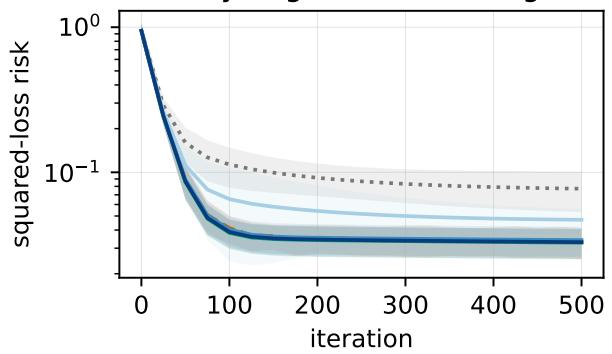
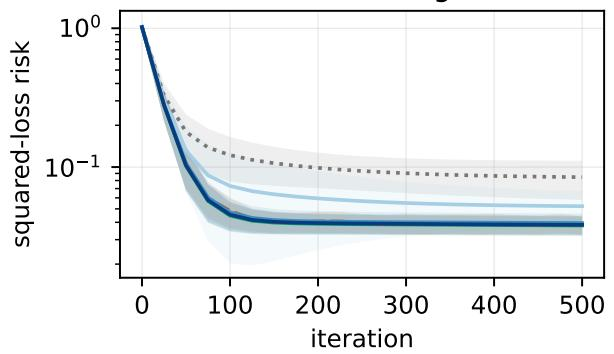
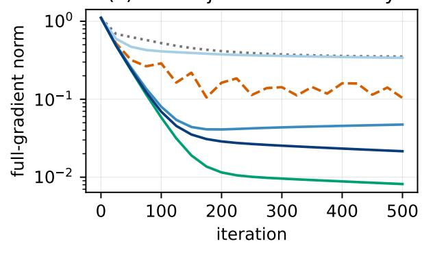
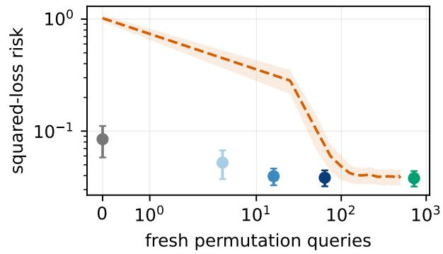

# Sparse Data Augmentation for Optimization with Provable Guarantees

Behrooz Tahmasebi∗

Melanie Weber∗

## Abstract

In nonconvex optimization problems arising in geometric machine learning, data augmentation is commonly used to promote invariance by averaging empirical losses over transformations of the data. Computing the fully augmented objective, however, requires access to every element of the transformation group G, which may be prohibitively expensive when G is large or accessible only through sampling. We study whether full augmentation can instead be approx imated using a small, fixed sample of transformations acquired before optimization and reused thereafter. Under suitable regularity conditions, we show that, with probability at least $1 - \delta ,$ gradient descent (GD) on the resulting sparsely augmented objective returns an ε-stationary point of the fully augmented objective using $\mathcal { O } \big ( ( \log | G | + \log ( 1 / \delta ) ) / \varepsilon ^ { 2 } \big )$ group-transformationoracle queries. By comparison, standard group stochastic gradient descent (group-SGD), which samples a fresh transformation at every iteration, uses $\mathcal { O } ( 1 / \varepsilon ^ { 4 } )$ transformation queries. Therefore, gradient descent with fixed sparse augmentation requires fewer transformation queries than both GD applied to the fully augmented objective and group-SGD. Our proof techniques, which may be of independent interest, establish a uniform approximation of the full group-averaged gradient field by a random group average using spectral properties of group-induced operators and tools from representation theory.

## Contents

1 Introduction 3   
1.1 Contributions 5   
1.2 Related Work 5   
1.3 Notation 6   
2 Problem Statement 7   
3 Main Results 8   
3.1 Structural assumptions . . 8   
3.2 Spectral approximation of group averaging . 9   
3.3 Convergence of one-shot sparse GD . 10   
4 Proof Sketch 11   
5 Experiments 12   
5.1 Permutation-invariant sum regression . 12   
5.2 Methods and evaluation protocol 12   
5.3 Results . 13   
6 Conclusion 14   
A Additional Related Work 20   
B Proofs and Technical Background 21   
B.1 Finite groups and group actions . 21   
B.2 Representations of finite groups . 21   
B.3 Full and sampled averaging operators 22   
B.4 Spectral concentration for sparse group averaging . 24   
B.5 Vector-valued RKHS preliminaries 26   
B.6 Uniform approximation of the augmented gradients . 27   
B.7 Nonconvex gradient descent 28   
B.8 Proof of the main theorem 29   
B.9 Classical baseline rates 30   
B.9.1 Full-group gradient descent 30   
B.9.2 Streaming group-SGD 31

## 1 Introduction

We consider the classical empirical risk minimization (ERM) problem

$$
\operatorname* { m i n } _ { \theta \in \mathbb { R } ^ { p } } \mathcal { R } _ { n } ( \theta ) : = \frac { 1 } { n } \sum _ { i = 1 } ^ { n } \ell _ { i } ( x _ { i } ; \theta ) ,\tag{1.1}
$$

where $\{ x _ { i } \} _ { i = 1 } ^ { n } \subset \mathbb { R } ^ { d }$ denote the data (either labeled or unlabeled), and $\ell _ { i } ( x _ { i } ; \theta )$ is the loss incurred by the parameter θ on the ith sample. The parameter θ defines a predictor $f _ { \theta } : \mathbb { R } ^ { d }  \mathbb { R }$ , for example in a supervised learning problem.

In geometric machine learning, one often seeks predictors that are invariant under a known group of transformations. Let G be a finite group acting on $\mathbb { R } ^ { d }$ . We are interested in predictors satisfying

$$
f _ { \theta } ( g \cdot x ) = f _ { \theta } ( x ) , \qquad \forall g \in G , \quad \forall x \in \mathbb { R } ^ { d } .\tag{1.2}
$$

Such invariances arise in many applications, including permutation invariance for sets and graphs, sign invariance in spectral methods, translations in images, and coordinate transformations in point clouds. A central challenge is to incorporate these invariances into the learning problem in a principled and computationally scalable manner.

A standard approach is data augmentation, in which the loss of each sample is averaged over its transformed versions. This leads to the fully augmented empirical risk

$$
\mathcal { R } _ { n } ^ { G } ( \theta ) : = \frac { 1 } { n | G | } \sum _ { i = 1 } ^ { n } \sum _ { g \in G } \ell _ { i } ( g \cdot x _ { i } ; \theta ) .\tag{1.3}
$$

The augmented objective incorporates the desired transformation structure into the learning problem. However, evaluating its gradient requires averaging over all |G| transformations. Direct optimization of $\mathcal { R } _ { n } ^ { G }$ can therefore be computationally prohibitive when the group is large.

Streaming augmentation. A common alternative is to sample only a small number of transformations at each iteration. We refer to this paradigm as streaming augmentation. At iteration $t ,$ a fresh random batch $S _ { t } \subseteq G$ is sampled, and the parameter is updated according to

$$
\theta _ { t + 1 } = \theta _ { t } - \eta _ { t } \nabla \mathcal { R } _ { n } ^ { S _ { t } } ( \theta _ { t } ) ,\tag{1.4}
$$

where $\eta _ { t } > 0$ is the step size and

$$
\mathcal { R } _ { n } ^ { S _ { t } } ( \theta ) : = \frac { 1 } { n | S _ { t } | } \sum _ { i = 1 } ^ { n } \sum _ { g \in S _ { t } } \ell _ { i } ( g \cdot x _ { i } ; \theta ) .\tag{1.5}
$$

Streaming augmentation thus performs optimization using a sequence of randomly changing partially augmented objectives. If $| S _ { t } | = b$ and the method runs for $T$ iterations, it draws $b T$ transformations over the course of optimization.

To quantify this sampling requirement, we define a call to the group-sampling oracle as drawing an independent transformation uniformly from G. The group-oracle complexity of a method is the total number of fresh transformations drawn from G. This quantity is distinct from the number of transformed-gradient evaluations: although previously sampled transformations can be reused, the gradient over them must be recomputed at each new iterate.

Table 1: Comparison in the smooth nonconvex setting. Here, $T ( \epsilon )$ is the number of iterations required to reach an ϵ-stationary point, $b = | S _ { t } |$ is the streaming batch size, and $m = | S | = { \mathcal { O } } ( \log | G | / \epsilon ^ { 2 } )$ is the fixed one-shot augmentation size.
<table><tr><td>Method</td><td>Regime</td><td>Augmentation set</td><td> $T ( \epsilon )$ </td><td>Group-oracle calls</td></tr><tr><td>GD on  $\mathcal { R } _ { n } ^ { G }$ </td><td>Full</td><td>Full group G</td><td> $\mathcal { O } ( 1 / \epsilon ^ { 2 } )$ </td><td>|G| (full group)</td></tr><tr><td>SGD on  $\mathcal { R } _ { n } ^ { S _ { t } }$ </td><td>Streaming</td><td>Fresh  $S _ { t }$  at each iteration</td><td> $\mathcal { O } ( 1 / ( b \epsilon ^ { 4 } ) )$ </td><td> $\mathcal { O } ( 1 / \epsilon ^ { 4 } )$ </td></tr><tr><td>GD on  $\mathcal { R } _ { n } ^ { S }$ </td><td>One-shot</td><td>Fixed S throughout</td><td> $\mathcal { O } ( 1 / \epsilon ^ { 2 } )$ </td><td> $\mathcal { O } ( \log | G | / \epsilon ^ { 2 } )$ </td></tr></table>

Under standard smooth nonconvex assumptions, streaming stochastic gradient descent with $| S _ { t } | = b$ satisfies

$$
\mathbb { E } \left[ \operatorname* { m i n } _ { 0 \leq t \leq T } \left. \nabla \mathcal { R } _ { n } ^ { G } ( \theta _ { t } ) \right. \right] = \mathcal { O } \left( \frac { 1 } { ( b T ) ^ { 1 / 4 } } \right) .\tag{1.6}
$$

Consequently, reaching an expected stationarity level of at most ϵ requires $b T = \mathcal { O } ( 1 / \epsilon ^ { 4 } )$ . Because the method draws $b$ fresh transformations at each iteration, this amounts to $\mathcal { O } ( 1 / \epsilon ^ { 4 } )$ calls to the group-sampling oracle.

This motivates the central optimization question considered in this paper:

Can gradient descent on a fixed, randomly sampled augmentation achieve an ϵ-stationary point of the fully augmented objective without fresh group-oracle queries at every iteration?

One-shot augmentation. We study the latter possibility through a paradigm that we call oneshot augmentation. Instead of drawing a fresh subset at every iteration, we sample a single random subset $S \subseteq G$ before optimization, fix it for the entire optimization trajectory, and run gradient descent on

$$
\mathcal { R } _ { n } ^ { S } ( \theta ) : = \frac { 1 } { n | S | } \sum _ { i = 1 } ^ { n } \sum _ { g \in S } \ell _ { i } ( g \cdot x _ { i } ; \theta ) .\tag{1.7}
$$

The resulting iterates satisfy

$$
\theta _ { t + 1 } = \theta _ { t } - \eta _ { t } \nabla \mathcal { R } _ { n } ^ { S } ( \theta _ { t } ) .\tag{1.8}
$$

Conditioned on the initial draw of S, the objective remains fixed and the subsequent optimization procedure is deterministic. Unlike streaming augmentation, which continually queries the groupsampling oracle, one-shot augmentation makes only |S| oracle calls, independently of the number of optimization iterations.

Establishing guarantees for this method presents a fundamental dependence challenge. Gradient descent is performed on the partially augmented objective $\mathcal { R } _ { n } ^ { S }$ , whereas the desired stationarity guarantee concerns the fully augmented objective $\mathcal { R } _ { n } ^ { G }$ . Moreover, because the same random subset $S$ is reused throughout optimization, every iterate $\theta _ { t }$ depends on $S .$ This difers from streaming augmentation, where the fresh batch $S _ { t }$ drawn at iteration t is independent of $\theta _ { t }$ conditional on the preceding optimization history.

Pointwise concentration at a fixed parameter therefore does not control the gradient discrepancy at the data-dependent iterates produced by the one-shot method. Instead, we establish a new uniform approximation of the form

$$
\operatorname* { s u p } _ { \theta } \left\| \nabla \mathcal { R } _ { n } ^ { S } ( \theta ) - \nabla \mathcal { R } _ { n } ^ { G } ( \theta ) \right\| \leq \epsilon ,\tag{1.9}
$$

which holds simultaneously over the parameter domain and therefore along the entire optimization trajectory.

Main result. Under our structural and smoothness assumptions, we show that a fixed subset of size $| S | = \mathcal { O } ( \log | G | / \epsilon ^ { 2 } )$ is suficient. More precisely, with high probability over the one-time draw of S, gradient descent on $\mathcal { R } _ { n } ^ { S }$ generates, within $T = \mathcal { O } ( 1 / \epsilon ^ { 2 } )$ iterations, an iterate satisfying

$$
\operatorname* { m i n } _ { 0 \leq t \leq T } \left\| \nabla \mathcal { R } _ { n } ^ { G } ( \theta _ { t } ) \right\| \leq \epsilon .\tag{1.10}
$$

Thus, the one-shot method obtains an ϵ-stationarity guarantee for the fully augmented objective using only $\mathcal { O } ( \log | G | / \epsilon ^ { 2 } )$ sampled transformations.

Note that, although the optimization updates are computed using the fixed partially augmented objective, the resulting stationarity guarantee is stated with respect to the fully augmented objective. One-shot augmentation requires only $\mathcal { O } ( \log | G | / \epsilon ^ { 2 } )$ calls to the group-sampling oracle, compared with the $\mathcal { O } ( 1 / \epsilon ^ { 4 } )$ calls required by streaming stochastic gradient methods. Table 1 compares the iteration and group-oracle complexities of full, streaming, and one-shot augmentation.

Our results show that the $\mathcal { O } ( 1 / \epsilon ^ { 4 } )$ group-oracle complexity associated with standard streaming stochastic-gradient methods is not intrinsic to data augmentation over finite groups. By exploiting the group structure, one-shot augmentation reduces this complexity to $\mathcal { O } ( \log | G | / \epsilon ^ { 2 } )$ while retaining a stationarity guarantee for the fully augmented objective. In particular, continual resampling is not necessary: a single random subset drawn before optimization can be reused throughout the entire optimization trajectory.

Our uniform approximation guarantees are obtained by exploiting spectral properties of groupinduced operators together with tools from the representation theory of finite groups. These techniques control the dependence between the sampled subset and the resulting optimization trajectory and may be useful in other optimization problems involving structured random averages.

## 1.1 Contributions

Our contributions are as follows:

• We introduce and analyze one-shot augmentation as an alternative to streaming augmentation. One-shot augmentation samples a single subset of transformations before optimization and reuses it at every iteration, rather than drawing fresh transformations throughout optimization.

• In the smooth nonconvex setting, we prove that gradient descent on the fixed partially augmented objective generates an ϵ-stationary point of the fully augmented objective using only $\mathcal { O } ( \log | G | / \epsilon ^ { 2 } )$ calls to the group-sampling oracle. This improves over the $\mathcal { O } ( 1 / \epsilon ^ { 4 } )$ oracle calls required by standard streaming stochastic-gradient methods.

• We establish uniform approximation guarantees between the partially and fully augmented objectives and their gradients. The analysis accounts for the dependence between the fixed random subset and the optimization trajectory using spectral properties of group-induced operators and tools from finite-group representation theory.

## 1.2 Related Work

Geometric machine learning has emerged as a powerful framework for incorporating structure and symmetries into learning algorithms, with broad applications across scientific domains, including particle physics, molecular modeling, and beyond (Bronstein et al., 2021; Bogatskiy et al., 2020; Zhang et al., 2025; Batzner et al., 2022; Smidt, 2021; Batzner et al., 2023; Weber, 2025). By leveraging known symmetries, these approaches improve generalization, robustness, and data eficiency, making them particularly well-suited for scientific machine learning tasks.

From a theoretical standpoint, the role of symmetry in learning has been studied through both statistical and computational lenses. On the statistical side, invariances have been shown to yield significant gains in sample complexity and generalization (Tahmasebi and Jegelka, 2023). On the computational side, recent work has begun to characterize the complexity of learning under symmetry constraints (Soleymani et al., 2025a, 2026b; Kiani et al., 2024). These works highlight that symmetry can fundamentally alter both the statistical and algorithmic properties of learning problems.

Data augmentation is a widely used, model-agnostic technique for incorporating symmetry, where training data are enriched using transformations from a symmetry group. A general grouptheoretic framework for data augmentation was developed in (Chen et al., 2020), while kernel-based analyses and feature-based interpretations were studied in (Dao et al., 2019; Shen et al., 2022). More recent works have investigated the statistical and optimization efects of augmentation, including its role as implicit regularization and its impact on sample eficiency (Lin et al., 2024a; Yang et al., 2023b; Tahmasebi et al., 2026). Despite these advances, the optimization complexity of data augmentation, particularly in regimes with large symmetry groups, remains less understood.

A central challenge in practice is that symmetry groups are often large, making full group averaging computationally infeasible. Recent work has addressed this issue by studying approximate symmetry through sparse averaging (Tahmasebi and Weber, 2026a). In particular, it has been shown that approximate symmetry can be enforced using only a logarithmic number of group elements, establishing an exponential gap between exact and approximate symmetry. This result is rooted in tools from representation theory and the spectral properties of random Cayley graphs, building on classical results such as (Alon and Roichman, 1994). Our work builds on this line of research and shows that such sparse approximation guarantees can be directly leveraged to obtain convergence guarantees in optimization with data augmentation.

Finally, our analysis relies on standard results from first-order optimization, including convergence guarantees for gradient descent and stochastic gradient methods in nonconvex settings (Wright and Recht, 2022). We combine these classical tools with recent advances in geometric machine learning to obtain improved guarantees on the number of transformation samples required for optimization under symmetry.

## 1.3 Notation

We use standard asymptotic notation $\mathcal { O } ( \cdot )$ . When S is a multiset sampled with replacement, we use |S|, by a slight abuse of notation, for its size counting multiplicities. Thus, if $S = \{ g _ { 1 } , \ldots , g _ { m } \}$ , then $| S | = m$ , even when some sampled transformations coincide. For vectors, we use $\| \cdot \|$ to denote the $\ell _ { 2 }$ Euclidean norm. Let $G$ be a finite set of transformations acting on the data domain X, and for $g \in G$ and $x \in \mathcal { X }$ , we write $g \cdot x$ for the action. For any subset $S \subseteq G$ , we denote by $\mathcal { R } _ { n } ^ { S } ( \theta )$ the corresponding partially augmented empirical risk, and by $\mathcal { R } _ { n } ^ { G } ( \theta )$ the fully augmented risk. We say that θ is an ϵ-stationary point if and only if $\lVert \nabla \mathcal { R } _ { n } ^ { G } ( \theta ) \rVert \leq \epsilon .$

## 2 Problem Statement

We begin with the empirical risk minimization problem

$$
\operatorname* { m i n i m i z e } _ { \theta \in \Theta } \mathcal { R } _ { n } ( \theta ) : = \frac { 1 } { n } \sum _ { i = 1 } ^ { n } \ell _ { i } ( x _ { i } ; \theta ) ,\tag{2.1}
$$

where $\{ x _ { i } \} _ { i = 1 } ^ { n }$ denote the data, $\theta \in \Theta \subseteq \mathbb { R } ^ { p }$ is the optimization parameter, and $\ell _ { i } ( x _ { i } ; \theta )$ is the loss associated with the ith sample.

Let G be a finite group acting on the data domain. Our target problem is the fully augmented empirical risk minimization problem

$$
\operatorname* { m i n i m i z e } _ { \theta \in \Theta } \mathcal { R } _ { n } ^ { G } ( \theta ) : = \frac { 1 } { n | G | } \sum _ { i = 1 } ^ { n } \sum _ { g \in G } \ell _ { i } ( g \cdot x _ { i } ; \theta ) .\tag{2.2}
$$

For any nonempty subset $S \subseteq G$ , we define the partially augmented empirical risk

$$
\mathcal { R } _ { n } ^ { S } ( \theta ) : = \frac { 1 } { n | S | } \sum _ { i = 1 } ^ { n } \sum _ { g \in S } \ell _ { i } ( g \cdot x _ { i } ; \theta ) .\tag{2.3}
$$

We consider the following three optimization schemes:

$$
\mathrm { F u l l - g r o u p ~ G D : } \qquad \theta _ { t + 1 } = \theta _ { t } - \eta _ { t } \nabla { \mathcal { R } } _ { n } ^ { G } ( \theta _ { t } ) ,\tag{2.4}
$$

$$
\mathrm { S t r e a m i n g \ g r o u p - S G D : } \qquad \theta _ { t + 1 } = \theta _ { t } - \eta _ { t } \nabla { \mathcal R } _ { n } ^ { S _ { t } } ( \theta _ { t } ) , \qquad | S _ { t } | = b ,\tag{2.5}
$$

$$
\mathrm { O n e - s h o t ~ s p a r s e ~ G D : } \qquad \theta _ { t + 1 } = \theta _ { t } - \eta _ { t } \nabla { \mathcal { R } } _ { n } ^ { S } ( \theta _ { t } ) , \qquad | S | = m ,\tag{2.6}
$$

where $\eta _ { t } > 0$ is the step size. In streaming group-SGD, a fresh random batch $S _ { t }$ is sampled at each iteration. In one-shot sparse GD, a single random subset S is sampled before optimization and held fixed throughout all iterations.

Throughout the paper, we assume that the transformed losses are uniformly L-smooth in the optimization parameter:

$$
\begin{array} { r } { \big \| \nabla _ { \theta } \ell _ { i } ( g \cdot x _ { i } ; \theta ) - \nabla _ { \theta } \ell _ { i } ( g \cdot x _ { i } ; \theta ^ { \prime } ) \big \| \leq L \| \theta - \theta ^ { \prime } \| \quad \mathrm { f o r ~ a l l ~ } i \in \{ 1 , \dots , n \} , \ g \in G , \ \mathrm { a n d ~ } \theta , \theta ^ { \prime } \in \Theta . } \end{array}\tag{2.7}
$$

Because averaging preserves the Lipschitz-gradient constant, it follows that $\mathcal { R } _ { n } ^ { S }$ is L-smooth for every nonempty multiset $S \subseteq G ;$ in particular, $\mathcal { R } _ { n } ^ { G }$ is L-smooth.

A point $\theta \in \Theta$ is called an ϵ-stationary point of the fully augmented objective if

$$
\left\| \nabla \mathcal { R } _ { n } ^ { G } ( \theta ) \right\| \leq \epsilon .\tag{2.8}
$$

To quantify access to group transformations, we introduce a group-sampling oracle. Each call to the oracle returns an independent transformation drawn uniformly from G. The group-oracle complexity of an algorithm is the total number of such calls made over the entire optimization procedure. This notion is distinct from the number of transformed-loss or transformed-gradient evaluations: once a transformation has been sampled, it may be reused at multiple parameter iterates without an additional group-oracle call.

The oracle model captures settings in which obtaining a valid transformation is itself costly. In particular, a group sample may represent the discovery, identification, or acquisition of a symmetry of the data, rather than merely an inexpensive draw from an explicitly enumerated group. Such samples may therefore constitute valuable information that can be stored and reused. A broader discussion of this interpretation and its connection to symmetry discovery is provided in the relatedwork discussion in the appendix.

Our objective is to determine the group-oracle complexity required by one-shot sparse GD to produce an ϵ-stationary point of the fully augmented objective $\mathcal { R } _ { n } ^ { G }$

Algorithm 1 One-Shot Sparse Gradient Descent   
Input: Initial point $\theta _ { 0 } .$ , group-sampling oracle, sample size m, step sizes $\{ \eta _ { t } \} _ { t = 0 } ^ { T - 1 }$ , and number of   
iterations $T$   
1: Query the group oracle independently m times to obtain $S = \{ g _ { 1 } , \ldots , g _ { m } \}$   
2: for $t = 0 , \ldots , T - 1$ do   
3: $\theta _ { t + 1 } = \theta _ { t } - \eta _ { t } \nabla \mathcal { R } _ { n } ^ { S } ( \theta _ { t } )$   
4: end for   
5: Choose $\widehat t \in \arg \operatorname* { m i n } _ { \bf \Pi } \| \nabla \mathcal { R } _ { n } ^ { S } ( \theta _ { t } ) \|$   
0≤t<T   
6: return $\widehat { \theta } = \theta _ { \widehat { t } }$

## 3 Main Results

We study one-shot sparse gradient descent, in which a single collection of group transformations is sampled before optimization and reused throughout the entire optimization trajectory. Specifically, let

$$
S = \{ g _ { 1 } , \ldots , g _ { m } \} , \qquad g _ { 1 } , \ldots , g _ { m } \stackrel { \mathrm { i . i . d . } } { \sim } \mathrm { U n i f } ( G ) ,\tag{3.1}
$$

where S is treated as a multiset. Starting from $\theta _ { 0 }$ , the method performs

$$
\theta _ { t + 1 } = \theta _ { t } - \eta _ { t } \nabla \mathcal { R } _ { n } ^ { S } ( \theta _ { t } ) , \qquad t = 0 , \dots , T - 1 .\tag{3.2}
$$

Because the same sampled transformations are reused at every iteration, the total number of grouporacle calls is exactly m, independently of $T$

Algorithm 1 optimizes the randomly constructed objective $\textstyle { \mathcal { R } } _ { n } ^ { S } .$ , whereas the desired stationarity guarantee concerns the fully augmented objective $\mathcal { R } _ { n } ^ { G }$ . Moreover, the iterates depend on the same random sample S used to define the sparse objective. A pointwise concentration bound at a fixed parameter value is therefore insuficient. Instead, we establish a single high-probability event on which

$$
\operatorname* { s u p } _ { \theta \in \Theta } \left\| \nabla \mathcal { R } _ { n } ^ { S } ( \theta ) - \nabla \mathcal { R } _ { n } ^ { G } ( \theta ) \right\|\tag{3.3}
$$

is uniformly controlled.

## 3.1 Structural assumptions

For every sample i and parameter θ, define the vector-valued gradient function

$$
h _ { i , \theta } ( \boldsymbol { x } ) : = \nabla _ { \theta } \ell _ { i } ( \boldsymbol { x } ; \theta ) , \qquad h _ { i , \theta } \colon \mathcal { X } \to \mathbb { R } ^ { p } .\tag{3.4}
$$

Assumption 3.1 (Invariant gradient RKHS). There exists a vector-valued reproducing kernel Hilbert space H of functions from X to Rp satisfying the following properties:

• For every $i \in \{ 1 , \ldots , n \}$ and $\theta \in \Theta$ , we have $h _ { i , \theta } \in \mathcal { H }$

• The action of G induces a unitary representation $U \colon G \to { \mathcal { U } } ( { \mathcal { H } } )$ through

$$
( U _ { g } h ) ( x ) : = h ( g ^ { - 1 } \cdot x ) .\tag{3.5}
$$

• Point evaluation is uniformly bounded: there exists $C _ { \mathcal { H } } < \infty$ such that

$$
\| h \| _ { L ^ { \infty } } \leq C _ { \mathcal { H } } \| h \| _ { \mathcal { H } } \qquad f o r \ e v e r y \ h \in \mathcal { H } .\tag{3.6}
$$

• The gradient functions have uniformly bounded average RKHS norm: for some $B _ { \mathcal { H } } < \infty$

$$
\operatorname* { s u p } _ { \theta \in \Theta } \frac { 1 } { n } \sum _ { i = 1 } ^ { n } \| h _ { i , \theta } \| _ { \mathcal { H } } \leq B _ { \mathcal { H } } .\tag{3.7}
$$

H need not be finite-dimensional; infinite-dimensional RKHSs are also permitted. The conditions above are satisfied by a broad class of regular models. In particular, membership of the gradient functions in a common RKHS arises naturally for finite-dimensional feature models and kernel-based models, and the point-evaluation bound is automatic whenever the reproducing kernel is uniformly bounded. The requirement that the group act unitarily is also natural for finite groups. Indeed, whenever the function space is preserved by the group action, an invariant inner product can be obtained by averaging the original inner product over the group. The principal quantitative requirement is therefore the uniform bound on the average RKHS norms of the gradient functions. This condition holds, for example, when the relevant parameter set is compact and the maps $\theta \mapsto h _ { i , \theta }$ are continuous in the RKHS norm.

The bound in (3.6) is a standard consequence of the reproducing property. For the kernel K of ${ \mathcal { H } } ,$ each $K ( x , x )$ is a matrix in $\mathbb { R } ^ { p \times p }$ , and the bound holds whenever these matrices are uniformly bounded:

$$
\operatorname* { s u p } _ { x \in \mathcal { X } } \| K ( x , x ) \| _ { \mathrm { o p } } ^ { 1 / 2 } \leq C _ { \mathcal { H } } .\tag{3.8}
$$

This comparison converts an operator-norm estimate in H into a uniform pointwise estimate for the gradient functions.

The unitary representation in Assumption 3.1 allows us to define the full and sampled groupaveraging operators

$$
\Pi _ { G } : = \frac { 1 } { | G | } \sum _ { g \in G } U _ { g } , \qquad \Pi _ { S } : = \frac { 1 } { m } \sum _ { j = 1 } ^ { m } U _ { g _ { j } ^ { - 1 } } .\tag{3.9}
$$

The inverse in the definition of $\Pi _ { S }$ aligns the operator with the augmentation convention: applying $U _ { g _ { j } ^ { - 1 } }$ evaluates $h$ at $g _ { j } \cdot x$ . Thus, $\Pi _ { S }$ averages over the transformations in S. Because inversion preserves the uniform distribution on $G ,$ this convention does not change the spectral concentration bound. The full averaging operator $\Pi _ { G }$ is the orthogonal projection onto the G-invariant subspace

$$
\begin{array} { r } { \mathcal { H } ^ { G } : = \left\{ h \in \mathcal { H } : U _ { g } h = h \mathrm { ~ f o r ~ e v e r y ~ } g \in G \right\} , } \end{array}\tag{3.10}
$$

whereas $\Pi _ { S }$ is its sparse random approximation.

## 3.2 Spectral approximation of group averaging

The sampled operator $\Pi _ { S }$ can be interpreted as a convolution operator associated with a random Cayley multigraph on G. The representation-theoretic decomposition of this operator separates its invariant component from its nontrivial irreducible components. Spectral control of the latter yields the following approximation result. For a bounded linear operator A on ${ \mathcal { H } } ,$ we write $\| A \| _ { \mathrm { o p } , \mathcal { H } } : =$ $\mathrm { s u p } _ { h \neq 0 } \| A h \| _ { \mathcal { H } } / \| h \| _ { \mathcal { H } }$

Proposition 3.2 (Spectral approximation of group averaging). With probability at least $1 - \delta$ over the draw of S,

$$
\| \Pi _ { S } - \Pi _ { G } \| _ { \mathrm { o p } , \mathcal { H } } \le \operatorname* { m i n } \left\{ 1 , \sqrt { \frac { 8 } { 3 m } \log \left( \frac { 2 | G | } { \delta } \right) } \right\} .\tag{3.11}
$$

Proposition 3.2 is an operator-norm statement whose high-probability event depends only on $S$ and holds for every unitary representation of G, including infinite-dimensional ones. The gradienttransfer bound below additionally requires the finite, space-dependent constants $C _ { \mathcal { H } }$ and $B _ { \mathcal { H } }$ from Assumption 3.1. The spectral proof, based on irreducible representations and random Cayley graphs, appears in the appendix; see also (Tahmasebi and Weber, 2026a).

Combining this spectral estimate with Assumption 3.1 gives a uniform approximation of the fully augmented gradient field.

Theorem 3.3 (Uniform sparse-to-full gradient approximation). Suppose Assumption 3.1 holds. Then, with probability at least $1 - \delta$ over the one-time draw of S,

$$
\operatorname* { s u p } _ { \theta \in \Theta } \left\| \nabla \mathcal { R } _ { n } ^ { S } ( \theta ) - \nabla \mathcal { R } _ { n } ^ { G } ( \theta ) \right\| \leq C \varkappa B \varkappa \sqrt { \frac { 8 } { 3 m } \log \biggl ( \frac { 2 | G | } { \delta } \biggr ) } .\tag{3.12}
$$

The uniformity in Theorem 3.3 is essential. It ensures that the approximation holds simultaneously at every possible iterate of Algorithm 1, even though the entire optimization trajectory depends on S.

## 3.3 Convergence of one-shot sparse GD

We next impose the standard regularity conditions required for nonconvex gradient descent.

Assumption 3.4 (Uniform initial optimality gap). There exists $\Delta \ < \ \infty$ such that, for every sampled multiset S,

$$
\mathcal { R } _ { n } ^ { S } ( \theta _ { 0 } ) - \operatorname* { i n f } _ { \theta \in \Theta } \mathcal { R } _ { n } ^ { S } ( \theta ) \leq \Delta .\tag{3.13}
$$

Theorem 3.5 (Convergence of one-shot sparse GD). Suppose Assumptions 3.1 and $\ 3 . 4$ hold. Run Algorithm 1 with $\eta _ { t } = 1 / L$ for every t. Then, with probability at least $1 - \delta$

$$
\left\| \nabla \mathcal { R } _ { n } ^ { G } ( \widehat { \theta } ) \right\| \leq \sqrt { \frac { 2 L \Delta } { T } } + C _ { \mathcal { H } } B _ { \mathcal { H } } \sqrt { \frac { 8 } { 3 m } \log \left( \frac { 2 | G | } { \delta } \right) } .\tag{3.14}
$$

Consequently, choosing

$$
T \geq { \frac { 8 L \Delta } { \epsilon ^ { 2 } } } \qquad { a n d } \qquad m \geq { \frac { 3 2 C _ { \mathcal { H } } ^ { 2 } B _ { \mathcal { H } } ^ { 2 } } { 3 \epsilon ^ { 2 } } } \log \left( { \frac { 2 | G | } { \delta } } \right)\tag{3.15}
$$

ensures that

$$
\left\| \nabla \mathcal { R } _ { n } ^ { G } ( \widehat { \theta } ) \right\| \leq \epsilon\tag{3.16}
$$

with probability at least $1 - \delta$

Theorem 3.5 gives the group-oracle complexity

$$
m = \mathcal { O } \left( \frac { C _ { \mathcal { H } } ^ { 2 } B _ { \mathcal { H } } ^ { 2 } \big ( \log | G | + \log ( 1 / \delta ) \big ) } { \epsilon ^ { 2 } } \right) .\tag{3.17}
$$

In particular, when the regularity constants are suppressed, one-shot sparse GD requires

$$
\mathcal { O } \left( \frac { \log | G | + \log ( 1 / \delta ) } { \epsilon ^ { 2 } } \right)\tag{3.18}
$$

group-oracle calls and $\mathcal { O } ( 1 / \epsilon ^ { 2 } )$ optimization iterations. All group transformations are sampled before optimization and subsequently reused, so no additional group-oracle calls are required during training.

## 4 Proof Sketch

This section outlines the main ideas behind Theorem 3.5. Complete proofs, including the spectral approximation result and all auxiliary lemmas, are deferred to the appendix.

Let $D _ { S } : = \Pi _ { S } - \Pi _ { G }$ denote the diference between the sampled and full group-averaging operators. Since $\Pi _ { G }$ is the orthogonal projection onto the invariant subspace, $D _ { S }$ is supported on the nontrivial representation components.

To bound the empirical deviation operator $D _ { S }$ , we use the fact that, although H may be infinitedimensional, the representation of the finite group G decomposes into finite-dimensional irreducible representations. Each irreducible representation may occur with an arbitrary multiplicity, but the corresponding matrix block is merely repeated, so its multiplicity does not afect the operator norm. We may therefore apply finite-dimensional matrix concentration to the finitely many distinct irreducible blocks and then take a union bound. The resulting event depends only on S and controls every unitary representation of G simultaneously, even one selected after observing S. This gives, with probability at least $1 - \delta ,$

$$
\| D _ { S } \| _ { \mathrm { o p } , \mathcal { H } } \leq \sqrt { \frac { 8 } { 3 m } \log \biggl ( \frac { 2 | G | } { \delta } \biggr ) } .\tag{4.1}
$$

Crucially, (4.1) controls an operator norm and hence holds simultaneously for every gradient function in $\mathcal { H } .$ Using the group-averaging operators, the diference between the sparse and fully augmented gradients can be expressed as

$$
\nabla \mathcal { R } _ { n } ^ { S } ( \theta ) - \nabla \mathcal { R } _ { n } ^ { G } ( \theta ) = \frac { 1 } { n } \sum _ { i = 1 } ^ { n } \bigl ( D _ { S } h _ { i , \theta } \bigr ) ( x _ { i } ) ,\tag{4.2}
$$

The point-evaluation and RKHS-norm bounds in Assumption 3.1, together with (4.1), give

$$
\operatorname* { s u p } _ { \theta \in \Theta } \left\| \nabla \mathcal { R } _ { n } ^ { S } ( \theta ) - \nabla \mathcal { R } _ { n } ^ { G } ( \theta ) \right\| \leq C _ { \mathcal { H } } B _ { \mathcal { H } } \sqrt { \frac { 8 } { 3 m } \log \biggl ( \frac { 2 | G | } { \delta } \biggr ) } .\tag{4.3}
$$

This uniformity is essential: every iterate depends on $S ,$ so a pointwise concentration bound at a parameter chosen independently of S would not sufice.

By (2.7), the sparse objective is L-smooth. The standard descent estimate for gradient descent with $\eta _ { t } = 1 / L$ , together with Assumption 3.4, gives

$$
\operatorname* { m i n } _ { 0 \leq t < T } \| \nabla \mathcal { R } _ { n } ^ { S } ( \theta _ { t } ) \| \leq \sqrt { \frac { 2 L \Delta } { T } } .\tag{4.4}
$$

Since Algorithm 1 returns the iterate with the smallest sparse-gradient norm, (4.3) and the triangle inequality yield

$$
\begin{array} { r l r } & { } & { \left. \nabla \mathcal { R } _ { n } ^ { G } ( \widehat { \theta } ) \right. \leq \left. \nabla \mathcal { R } _ { n } ^ { S } ( \widehat { \theta } ) \right. + \left. \nabla \mathcal { R } _ { n } ^ { G } ( \widehat { \theta } ) - \nabla \mathcal { R } _ { n } ^ { S } ( \widehat { \theta } ) \right. } \\ & { } & { \leq \sqrt { \displaystyle \frac { 2 L \Delta } { T } } + C _ { \mathcal { H } } B _ { \mathcal { H } } \sqrt { \displaystyle \frac { 8 } { 3 m } \log \left( \frac { 2 | G | } { \delta } \right) } . } \end{array}\tag{4.5}
$$

The first term is the usual finite-iteration optimization error; the second is the error from replacing the full group average by its fixed sparse approximation. The choices of T and m in Theorem 3.5 make both terms at most $\epsilon / 2$ , completing the argument. The appendix supplies the full spectral and optimization proofs.

## 5 Experiments

In this section, we provide a small-scale experiment to validate our theory. We consider a permutationinvariant regression experiment for which the fully augmented objective can be evaluated exactly throughout training. The predictor is constructed from a Gaussian kernel, while a factorized parameterization makes the optimization problem nonconvex.

## 5.1 Permutation-invariant sum regression

Let $G \ : = \ : S _ { 6 }$ act on $\mathbb { R } ^ { 6 }$ by coordinate permutations, so that $| G | = 6 ! = 7 2 0$ . Each input has independent coordinates sampled uniformly from $[ - 1 , 1 ]$ and is then sorted in increasing order. The regression target is the plain coordinate sum

$$
y ( x ) = \sum _ { j = 1 } ^ { 6 } x _ { j } .\tag{5.1}
$$

This target is exactly permutation invariant: $y ( g \cdot x ) = y ( x )$ for every $g \in G$ . Sorting provides a canonical representation during training, however, and therefore allows an unaugmented predictor to fit the observed ordering without learning the desired behavior over the complete permutation orbit. We independently generate 128 training samples and 256 test samples.

We use the Gaussian kernel

$$
k _ { \sigma } ( x , z ) = \exp \left( - \frac { \| x - z \| _ { 2 } ^ { 2 } } { 2 \sigma ^ { 2 } } \right) , \qquad \sigma = 1 . 2 5 .\tag{5.2}
$$

Coordinate permutations preserve Euclidean distance and hence act unitarily on the corresponding Gaussian RKHS. We draw 160 fixed kernel centers $\{ z _ { r } \} _ { r = 1 } ^ { 1 6 0 }$ independently and uniformly from $[ - 1 , 1 ] ^ { 6 }$ , without sorting them, and use the factorized model

$$
f _ { a , b } ( x ) = \sum _ { r = 1 } ^ { 1 6 0 } a _ { r } b _ { r } k _ { \sigma } ( x , z _ { r } ) .\tag{5.3}
$$

The loss is $\ell ( x , y ; a , b ) = \frac { 1 } { 2 } ( f _ { a , b } ( x ) - y ) ^ { 2 }$ . We optimize a and b jointly and project both vectors onto $[ - 3 , 3 ] ^ { 1 6 0 }$ after every update. The bilinear coeficients $a _ { r } b _ { r }$ make the parameterized empirical risk nonconvex. The Gaussian-kernel construction and bounded parameter domain also provide the controlled function space used in our theory.

## 5.2 Methods and evaluation protocol

We compare no augmentation; full-group GD, which averages over all 720 permutations; streaming group-SGD with one fresh permutation per iteration $( b = 1 )$ ; and one-shot sparse GD with the three predeclared subset sizes

$$
| S | \in \{ 4 , 1 6 , 6 4 \} .\tag{5.4}
$$

Streaming and one-shot transformations are drawn uniformly with replacement. All methods use the same initialization, full data batches, a common step size of 0.05, and 500 iterations. We repeat the comparison over 10 independent seeds. Within each seed, all methods share the data, kernel centers, and initialization; these quantities and the sampled transformations are generated independently across seeds.

(a) Fully augmented training risk  

(b) Permutation-averaged test risk  

(c) Full-objective stationarity  

(d) Test risk versus oracle calls  
  
Figure 1: Sum regression with a Gaussian-kernel predictor under $S _ { 6 } . \mathbf { \Omega } ( \mathbf { a } )$ Fully augmented training risk. (b) Permutation-averaged test risk. (c) Gradient norm of the fully augmented objective. (d) Test risk versus fresh permutation queries. Curves show means over 10 seeds. Shaded regions and error bars in the risk plots represent one standard deviation.

Every 25 iterations, we enumerate all of $S _ { 6 }$ to compute the fully augmented training risk and full-gradient norm $\| \nabla \mathcal { R } _ { n } ^ { G } ( \theta _ { t } ) \|$ . We define the permutation-averaged test risk as

$$
\mathcal { R } _ { \mathrm { t e s t } } ^ { G } ( a , b ) : = \frac { 1 } { n _ { \mathrm { t e s t } } | G | } \sum _ { i = 1 } ^ { n _ { \mathrm { t e s t } } } \sum _ { g \in G } \ell ( g \cdot x _ { i } ^ { \mathrm { t e s t } } , y _ { i } ^ { \mathrm { t e s t } } ; a , b ) .\tag{5.5}
$$

Thus, the test loss is averaged over both test samples and all 720 permutations of each sample. The identity-order test risk is evaluated separately to diagnose reliance on the sorted-input representation. Group-oracle calls count fresh permutation samples: |S| for one-shot augmentation, 720 for full-group GD, and one per iteration for streaming group-SGD.

## 5.3 Results

Figure 1, Panels (a)–(b) shows that the augmented methods rapidly reduce both training and test risk relative to the unaugmented predictor. Increasing the fixed subset from 4 to 16 substantially improves the one-shot trajectory, while the improvement from 16 to 64 is smaller. With 64 fixed permutations, one-shot sparse GD closely tracks the test risk of both full-group GD and streaming group-SGD while using substantially fewer fresh group samples, as shown in Figure 1, Panel (d).

Figure 1, Panel (c) shows the corresponding behavior for stationarity of the fully augmented objective. Full-group GD attains the smallest gradient norm, while the one-shot trajectory moves progressively closer to it as |S| increases. Streaming group-SGD reaches low test risk, but its fullgradient norm continues to fluctuate because it uses one fresh transformation per update. Together, these results illustrate the predicted separation between reusable group samples and optimization iterations for a group of size 720.

## 6 Conclusion

We studied the optimization of fully augmented empirical-risk objectives defined by finite transformation groups. We showed that transformations need not be resampled throughout optimization: a single sparse collection sampled at initialization can be reused by gradient descent while still providing a stationarity guarantee for the fully augmented objective. Under our structural and smoothness assumptions, one-shot sparse gradient descent requires $\mathcal { O } \big ( ( \log | G | + \log ( 1 / \delta ) ) / \epsilon ^ { 2 } \big )$ group-oracle calls to obtain an ϵ-stationary point with probability at least 1 − δ, improving on the $\mathcal { O } ( 1 / \epsilon ^ { 4 } )$ transformation-query complexity of standard group-SGD. Our analysis combines spectral approximation of group-averaging operators with uniform control of the augmented gradient field. These results suggest that previously discovered transformations can be treated as reusable optimization resources, rather than repeatedly sampled throughout training.

## Acknowledgements

BT and MW were partially supported by NSF Award CBET-2112085 and DMS-2406905. MW acknowledges partial funding from an Alfred P. Sloan Fellowship in Mathematics and the AI2050 program at Schmidt Sciences (Grant G-25-69786). This material is based on research sponsored by the Air Force Ofice of Scientific Research under agreement number FA9550261B044. The U.S. Government is authorized to reproduce and distribute reprints for Governmental purposes notwithstanding any copyright notation thereon. The opinions, findings, views, conclusions or recommendations contained herein are those of the authors and should not be interpreted as necessarily representing the oficial policies or endorsements, either expressed or implied, of the DAF, AFRL or the U.S. Government.

## LLM usage disclosure

Large language model tools were used primarily for copyediting, including improvements to grammar, wording, clarity, and LAT X presentation. The research direction, core ideas, theoretical results, and experimental design are original contributions of the authors. The authors carefully reviewed and verified all technical content and take full responsibility for the final manuscript.

## References

Kwangjun Ahn, Chulhee Yun, and Suvrit Sra. SGD with shufling: optimal rates without component convexity and large epoch requirements. In Advances in Neural Information Processing Systems (NeurIPS), 2020. 21

Noga Alon and Yuval Roichman. Random cayley graphs and expanders. Random Structures & Algorithms, 5(2):271–284, 1994. 6, 24

Matthew Ashman, Cristiana Diaconu, Adrian Weller, Wessel Bruinsma, and Richard E Turner. Approximately equivariant neural processes. In Advances in Neural Information Processing Systems (NeurIPS), 2024. 20

Gregor Bachmann, Lorenzo Noci, and Thomas Hofmann. How tempering fixes data augmentation in Bayesian neural networks. In Int. Conference on Machine Learning (ICML), 2022. 20

Simon Batzner, Albert Musaelian, Lixin Sun, Mario Geiger, Jonathan P Mailoa, Mordechai Kornbluth, Nicola Molinari, Tess E Smidt, and Boris Kozinsky. E(3)-equivariant graph neural networks for data-eficient and accurate interatomic potentials. Nature communications, 13(1): 2453, 2022. 6

Simon Batzner, Albert Musaelian, and Boris Kozinsky. Advancing molecular simulation with equivariant interatomic potentials. Nature Reviews Physics, 5(8):437–438, 2023. 6

Gregory Benton, Marc Finzi, Pavel Izmailov, and Andrew G Wilson. Learning invariances in neural networks from training data. In Advances in Neural Information Processing Systems (NeurIPS), 2020. 20

Alexander Bogatskiy, Brandon Anderson, Jan Ofermann, Marwah Roussi, David Miller, and Risi Kondor. Lorentz group equivariant neural network for particle physics. In Int. Conference on Machine Learning (ICML), pages 992–1002. PMLR, 2020. 6

Diane Bouchacourt, Mark Ibrahim, and Ari Morcos. Grounding inductive biases in natural images: invariance stems from variations in data. In Advances in Neural Information Processing Systems (NeurIPS), 2021. 20

Michael M Bronstein, Joan Bruna, Taco Cohen, and Petar Veliˇckovi´c. Geometric deep learning: Grids, groups, graphs, geodesics, and gauges. arXiv preprint arXiv:2104.13478, 2021. 6

Shuxiao Chen, Edgar Dobriban, and Jane H Lee. A group-theoretic framework for data augmentation. Journal of Machine Learning Research, 21(245):1–71, 2020. 6

Ziyu Chen, Markos Katsoulakis, Luc Rey-Bellet, and Wei Zhu. Sample complexity of probability divergences under group symmetry. In Int. Conference on Machine Learning (ICML), 2023. 20

Ashok Cutkosky and Francesco Orabona. Momentum-based variance reduction in non-convex sgd. In Advances in Neural Information Processing Systems (NeurIPS), 2019. 20

Tri Dao, Albert Gu, Alexander Ratner, Virginia Smith, Chris De Sa, and Christopher R´e. A kernel theory of modern data augmentation. In Int. Conference on Machine Learning (ICML), pages 1528–1537. PMLR, 2019. 6

Nima Dehmamy, Robin Walters, Yanchen Liu, Dashun Wang, and Rose Yu. Automatic symmetry discovery with lie algebra convolutional network. In Advances in Neural Information Processing Systems (NeurIPS), 2021. 20

Nadav Dym, Hannah Lawrence, and Jonathan W Siegel. Equivariant frames and the impossibility of continuous canonicalization. In Int. Conference on Machine Learning (ICML), 2024. 20

Bryn Elesedy and Sheheryar Zaidi. Provably strict generalisation benefit for equivariant models. In Int. Conference on Machine Learning (ICML), 2021. 20

Cong Fang, Chris Junchi Li, Zhouchen Lin, and Tong Zhang. Spider: Near-optimal non-convex optimization via stochastic path-integrated diferential estimator. In Advances in Neural Information Processing Systems (NeurIPS), 2018. 20

Marc Anton Finzi, Gregory Benton, and Andrew Gordon Wilson. Residual pathway priors for soft equivariance constraints. In Advances in Neural Information Processing Systems (NeurIPS), 2021. 20

Saeed Ghadimi and Guanghui Lan. Stochastic first-and zeroth-order methods for nonconvex stochastic programming. SIAM journal on optimization, 23(4):2341–2368, 2013. 20

Boris Hanin and Yi Sun. How data augmentation afects optimization for linear regression. In Advances in Neural Information Processing Systems (NeurIPS), 2021. 20

Ignacio Hounie, Luiz F. O. Chamon, and Alejandro Ribeiro. Automatic data augmentation via invariance-constrained learning. In Int. Conference on Machine Learning (ICML), 2023. 20

Ningyuan Huang, Ron Levie, and Soledad Villar. Approximately equivariant graph networks. In Advances in Neural Information Processing Systems (NeurIPS), 2023. 20

Dongsung Huh. Discovering group structures via unitary representation learning. In Int. Conference on Learning Representations (ICLR), 2025. 20

Alexander Immer, Tycho van der Ouderaa, Gunnar R¨atsch, Vincent Fortuin, and Mark van der Wilk. Invariance learning in deep neural networks with diferentiable laplace approximations. In Advances in Neural Information Processing Systems (NeurIPS), 2022. 20

S´ekou-Oumar Kaba, Arnab Kumar Mondal, Yan Zhang, Yoshua Bengio, and Siamak Ravanbakhsh. Equivariance with learned canonicalization functions. In Int. Conference on Machine Learning (ICML), 2023. 20

Pavan Karjol, Rohan Kashyap, Aditya Gopalan, and A. P. Prathosh. A unified framework for discovering discrete symmetries. In Int. Conference on Artificial Intelligence and Statistics (AIS-TATS), 2024. 20

Bobak T Kiani, Thien Le, Hannah Lawrence, Stefanie Jegelka, and Melanie Weber. On the hardness of learning under symmetries. In International Conference on Learning Representations, 2024. 6

Henry Kvinge, Tegan Emerson, Grayson Jorgenson, Scott Vasquez, Tim Doster, and Jesse Lew. In what ways are deep neural networks invariant and how should we measure this? In Advances in Neural Information Processing Systems (NeurIPS), 2022. 20

Zhize Li, Hongyan Bao, Xiangliang Zhang, and Peter Richtarik. Page: A simple and optimal probabilistic gradient estimator for nonconvex optimization. In Int. Conference on Machine Learning (ICML), 2021. 21

Chi-Heng Lin, Chiraag Kaushik, Eva L Dyer, and Vidya Muthukumar. The good, the bad and the ugly sides of data augmentation: An implicit spectral regularization perspective. Journal of Machine Learning Research, 25(91):1–85, 2024a. 6

Yuchao Lin, Jacob Helwig, Shurui Gui, and Shuiwang Ji. Equivariance via minimal frame averaging for more symmetries and eficiency. In Int. Conference on Machine Learning (ICML), 2024b. 20

George Ma, Yifei Wang, Derek Lim, Stefanie Jegelka, and Yisen Wang. A canonicalization perspective on invariant and equivariant learning. In Advances in Neural Information Processing Systems (NeurIPS), 2024. 20

Song Mei, Theodor Misiakiewicz, and Andrea Montanari. Learning with invariances in random features and kernel models. In Conference on Learning Theory (COLT), 2021. 20

Konstantin Mishchenko, Ahmed Khaled, and Peter Richt´arik. Random reshufling: Simple analysis with vast improvements. In Advances in Neural Information Processing Systems (NeurIPS), 2020. 21

Lam M. Nguyen, Jie Liu, Katya Scheinberg, and Martin Tak´aˇc. SARAH: A novel method for machine learning problems using stochastic recursive gradient. In Int. Conference on Machine Learning (ICML), 2017. 20

Jung Yeon Park, Ondrej Biza, Linfeng Zhao, Jan-Willem Van De Meent, and Robin Walters. Learning symmetric embeddings for equivariant world models. In Int. Conference on Machine Learning (ICML), 2022. 20

Omri Puny, Matan Atzmon, Edward J Smith, Ishan Misra, Aditya Grover, Heli Ben-Hamu, and Yaron Lipman. Frame averaging for invariant and equivariant network design. In Int. Conference on Learning Representations (ICLR), 2022. 20

Sashank J. Reddi, Ahmed Hefny, Suvrit Sra, Barnabas Poczos, and Alex Smola. Stochastic variance reduction for nonconvex optimization. In Int. Conference on Machine Learning (ICML), 2016. 20

El Mehdi Saad, Wei-Cheng Lee, and Francesco Orabona. New lower bounds for non-convex stochastic optimization through divergence decomposition. In Conference on Learning Theory (COLT), 2025. 21

Han Shao, Omar Montasser, and Avrim Blum. A theory of pac learnability under transformation invariances. In Advances in Neural Information Processing Systems (NeurIPS), 2022. 20

Ruoqi Shen, S´ebastien Bubeck, and Suriya Gunasekar. Data augmentation as feature manipulation. In Int. Conference on Machine Learning (ICML), pages 19773–19808. PMLR, 2022. 6

Zakhar Shumaylov, Peter Zaika, James Rowbottom, Ferdia Sherry, Melanie Weber, and Carola-Bibiane Sch¨onlieb. Lie algebra canonicalization: Equivariant neural operators under arbitrary lie groups. In Int. Conference on Learning Representations (ICLR), 2025. 20

Tess E Smidt. Euclidean symmetry and equivariance in machine learning. Trends in Chemistry, 3 (2):82–85, 2021. 6

Ashkan Soleymani, Behrooz Tahmasebi, Stefanie Jegelka, and Patrick Jaillet. Learning with exact invariances in polynomial time. In Int. Conference on Machine Learning (ICML), 2025a. 6

Ashkan Soleymani, Behrooz Tahmasebi, Stefanie Jegelka, and Patrick Jaillet. A robust kernel statistical test of invariance: Detecting subtle asymmetries. In Int. Conference on Artificial Intelligence and Statistics (AISTATS), 2025b. 20

Ashkan Soleymani, Behrooz Tahmasebi, Patrick Jaillet, and Stefanie Jegelka. A unified framework for statistical testing of invariance. In The ICML 2026 Workshop on Hypothesis Testing, 2026a. 20

Ashkan Soleymani, Behrooz Tahmasebi, Patrick Jaillet, and Stefanie Jegelka. Eficient learning and symmetry discovery under exact invariances. In Conference on Learning Theory (COLT), 2026b. 6

Behrooz Tahmasebi and Stefanie Jegelka. The exact sample complexity gain from invariances for kernel regression. In Advances in Neural Information Processing Systems (NeurIPS), volume 36, pages 55616–55646, 2023. 6

Behrooz Tahmasebi and Stefanie Jegelka. Sample complexity bounds for estimating probability divergences under invariances. In Int. Conference on Machine Learning (ICML), 2024. 20

Behrooz Tahmasebi and Stefanie Jegelka. Regularity in canonicalized models: A theoretical perspective. In Int. Conference on Artificial Intelligence and Statistics (AISTATS), 2025a. 20

Behrooz Tahmasebi and Stefanie Jegelka. Generalization bounds for canonicalization: A comparative study with group averaging. In Int. Conference on Learning Representations (ICLR), 2025b. 20

Behrooz Tahmasebi and Melanie Weber. Achieving approximate symmetry is exponentially easier than exact symmetry. In Int. Conference on Learning Representations (ICLR), 2026a. 6, 10, 24

Behrooz Tahmasebi and Melanie Weber. Adaptive symmetry discovery for dynamical system identification. In Int. Conference on Machine Learning (ICML), 2026b. 20

Behrooz Tahmasebi, Melanie Weber, and Stefanie Jegelka. Data augmentation: A Fourier analysis perspective. In Conference on Learning Theory (COLT), 2026. 6

Joel A Tropp. User-friendly tail bounds for sums of random matrices. Foundations of computational mathematics, 12(4):389–434, 2012. 24

Tycho F.A. van der Ouderaa, David W. Romero, and Mark van der Wilk. Relaxing equivariance constraints with non-stationary continuous filters. In Advances in Neural Information Processing Systems (NeurIPS), 2022. 20

Tycho F.A. van der Ouderaa, Alexander Immer, and Mark van der Wilk. Learning layer-wise equivariances automatically using gradients. In Advances in Neural Information Processing Systems (NeurIPS), 2023. 20

Melanie Weber. Geometric machine learning. AI Magazine, 2025. 6

Stephen J. Wright and Benjamin Recht. Optimization for Data Analysis. Cambridge University Press, 2022. 6

Jianke Yang, Robin Walters, Nima Dehmamy, and Rose Yu. Generative adversarial symmetry discovery. In Int. Conference on Machine Learning (ICML), 2023a. 20

Shuo Yang, Yijun Dong, Rachel Ward, Inderjit S Dhillon, Sujay Sanghavi, and Qi Lei. Sample eficiency of data augmentation consistency regularization. In International Conference on Artificial Intelligence and Statistics, pages 3825–3853. PMLR, 2023b. 6

Raymond A. Yeh, Yuan-Ting Hu, Mark Hasegawa-Johnson, and Alexander Schwing. Equivariance discovery by learned parameter-sharing. In Int. Conference on Artificial Intelligence and Statistics (AISTATS), 2022. 20

Xuan Zhang, Limei Wang, Jacob Helwig, Youzhi Luo, Cong Fu, Yaochen Xie, Meng Liu, Yuchao Lin, Zhao Xu, Keqiang Yan, et al. Artificial intelligence for science in quantum, atomistic, and continuum systems. Foundations and Trends® in Machine Learning, 18(4):385–849, 2025. 6

Dongruo Zhou and Quanquan Gu. Lower bounds for smooth nonconvex finite-sum optimization. In Int. Conference on Machine Learning (ICML), 2019. 21

Sicheng Zhu, Bang An, and Furong Huang. Understanding the generalization benefit of model invariance from a data perspective. In Advances in Neural Information Processing Systems (NeurIPS), 2021. 20

## A Additional Related Work

Data augmentation and invariant learning. The statistical and optimization efects of data augmentation have been studied in several settings. For linear regression, augmented gradient methods can be viewed as optimization over time-varying objectives (Hanin and Sun, 2021). Invariance also afects PAC learnability (Shao et al., 2022), the eficiency of kernel and random-feature methods (Mei et al., 2021), generalization under equivariant averaging (Elesedy and Zaidi, 2021), and transformation-induced sample covers (Zhu et al., 2021). Other works learn or adapt the augmentation distribution (Hounie et al., 2023; Benton et al., 2020; Immer et al., 2022), measure the invariance acquired by a model (Kvinge et al., 2022), or study how augmentation interacts with the training distribution and Bayesian uncertainty (Bouchacourt et al., 2021; Bachmann et al., 2022). Our focus is diferent: we study the number of group-oracle calls needed to optimize the fully augmented objective when sampled transformations can be reused.

Alternative mechanisms for enforcing symmetry. Frame averaging enforces equivariance by averaging over input-dependent frames (Puny et al., 2022); minimal frame averaging reduces the number of frames needed (Lin et al., 2024b). Canonicalization instead selects an orbit representative, either directly or through a learned map (Kaba et al., 2023; Ma et al., 2024), and has been extended to Lie group actions and neural operators (Shumaylov et al., 2025). Continuous canonicalization may not exist for some actions (Dym et al., 2024), and its statistical behavior can difer from group averaging (Tahmasebi and Jegelka, 2025b). Nevertheless, the end-to-end model may remain regular even when the canonicalization map is discontinuous (Tahmasebi and Jegelka, 2025a). We do not modify the architecture or select orbit representatives. We retain the augmented objective and approximate its full group average using a fixed sparse sample.

Approximate and data-adaptive equivariance. When symmetry is only approximate, hard architectural constraints may be too restrictive. This motivates residual equivariant pathways (Finzi et al., 2021), non-stationary filters (van der Ouderaa et al., 2022), approximately equivariant neural processes and graph networks (Ashman et al., 2024; Huang et al., 2023), and methods that learn layerwise constraints or parameter-sharing patterns (van der Ouderaa et al., 2023; Yeh et al., 2022). These approaches relax the model class. In our setting, the model and full objective are unchanged; only the group average used during optimization is sparsified.

Symmetry testing and discovery. Statistical tests can determine whether data support a proposed invariance (Soleymani et al., 2025b, 2026a), while invariance can improve the estimation of probability divergences (Chen et al., 2023; Tahmasebi and Jegelka, 2024). Related methods discover continuous generators (Dehmamy et al., 2021), distribution-preserving transformations (Yang et al., 2023a), unitary representations (Huh, 2025), symmetric embeddings (Park et al., 2022), or discrete symmetry groups (Karjol et al., 2024). Symmetry discovery can also be coupled with system identification (Tahmasebi and Weber, 2026b). These works support our oracle interpretation: acquiring a valid transformation may be costly, and a discovered transformation is therefore worth retaining and reusing.

Nonconvex stochastic and finite-sum optimization. Classical stochastic methods require O(1/ϵ4) oracle calls for smooth nonconvex stationarity under bounded variance (Ghadimi and Lan, 2013). Variance-reduced methods improve component-gradient complexity using finite-sum or recursive estimators (Reddi et al., 2016; Nguyen et al., 2017; Fang et al., 2018; Cutkosky and

Orabona, 2019; Li et al., 2021). Random reshufling provides another improvement over independent sampling (Mishchenko et al., 2020; Ahn et al., 2020), and oracle lower bounds characterize the limits of nonconvex finite-sum and stochastic optimization (Zhou and Gu, 2019; Saad et al., 2025). These works count stochastic- or component-gradient evaluations. We instead count newly sampled transformations. A transformation can be acquired once and reused throughout optimization, which is the distinction exploited by fixed sparse augmentation.

## B Proofs and Technical Background

This appendix provides the complete proof of the results stated in Section 3. We first review the required background on finite groups, unitary representations, and group-averaging operators. We then prove the spectral approximation bound for a random sparse group average, transfer this estimate to the augmented gradient fields through the RKHS structure, and complete the convergence proof for one-shot sparse gradient descent.

## B.1 Finite groups and group actions

A finite group is a finite set G equipped with a binary operation $( g , h ) \mapsto g h$ satisfying closure, associativity, the existence of an identity element $e \in G .$ and the existence of an inverse $g ^ { - 1 } \in G$ for every $g \in G$

A left action of G on a set X is a map

$$
G \times \mathcal { X }  \mathcal { X } , \qquad ( g , x ) \mapsto g \cdot x ,\tag{B.1}
$$

such that

$$
e \cdot x = x , \qquad ( g h ) \cdot x = g \cdot ( h \cdot x )\tag{B.2}
$$

for every $g , h \in G$ and $x \in \mathcal { X }$ . In particular, each $g \in G$ induces a bijection $x \mapsto g \cdot x$ whose inverse is $x \mapsto g ^ { - 1 } \cdot x$

Let H be a Hilbert space of functions $h \colon \mathcal { X } \to \mathbb { R } ^ { p }$ . The action of G on X induces operators $U _ { g } \colon \mathcal { H } \to \mathcal { H }$ defined by

$$
( U _ { g } h ) ( x ) : = h ( g ^ { - 1 } \cdot x ) .\tag{B.3}
$$

These operators satisfy

$$
U _ { e } = I _ { \mathcal { H } } , \qquad U _ { g } U _ { h } = U _ { g h } .\tag{B.4}
$$

Thus, $g \mapsto U _ { g }$ is a representation of G on H.

Under Assumption 3.1, this representation is unitary:

$$
\langle U _ { g } h , U _ { g } h ^ { \prime } \rangle _ { { \mathcal { H } } } = \langle h , h ^ { \prime } \rangle _ { { \mathcal { H } } } \qquad { \mathrm { f o r ~ a l l ~ } } g \in G { \mathrm { ~ a n d ~ } } h , h ^ { \prime } \in { \mathcal { H } } .\tag{B.5}
$$

Consequently,

$$
U _ { g } ^ { * } = U _ { g } ^ { - 1 } = U _ { g ^ { - 1 } } , \qquad \lVert U _ { g } \rVert _ { \mathrm { o p } } = 1 .\tag{B.6}
$$

## B.2 Representations of finite groups

We briefly recall the representation-theoretic facts needed below. Although H may be a real Hilbert space, it is convenient to work with its complexification. All operator-norm estimates obtained after complexification remain valid on the original real space.

A finite-dimensional complex representation π : $G \to \mathcal { U } ( V _ { \pi } )$ is irreducible if its only G-invariant subspaces are {0} and $V _ { \pi }$ . We write $d _ { \pi } : = \dim ( V _ { \pi } )$ and fix a complete collection $\overrightharpoon { G }$ of pairwise

inequivalent unitary irreducible representations of G, with each $V _ { \pi }$ equipped with a fixed G-invariant inner product.

Every unitary representation of a finite group decomposes into isotypic components: there is a unitary isomorphism

$$
W : { \mathcal { H } } \longrightarrow \bigoplus _ { \pi \in { \widehat { G } } } { \mathcal { M } } _ { \pi } \otimes V _ { \pi } ,\tag{B.7}
$$

where $\mathcal { M } _ { \pi }$ is the Hilbert multiplicity space associated with π. Under this unitary change of coordinates,

$$
W U _ { g } W ^ { * } = \bigoplus _ { \pi \in \widehat { G } } \left( I _ { { \mathcal { M } } _ { \pi } } \otimes \pi ( g ) \right) .\tag{B.8}
$$

The multiplicity spaces carry the part of the Hilbert-space structure not contained in the finitedimensional $V _ { \pi }$ and may themselves be infinite-dimensional. Importantly, the action of G is identica on every copy of the same irreducible representation, so operator-norm control depends on the distinct irreducible representations rather than their multiplicities.

The trivial representation, denoted 1, is the one-dimensional representation satisfying

$$
\mathbf { 1 } ( g ) = 1 \qquad { \mathrm { f o r ~ e v e r y ~ } } g \in G .\tag{B.9}
$$

Its isotypic component is precisely the invariant subspace

$$
\begin{array} { r } { \mathcal { H } ^ { G } = \{ h \in \mathcal { H } : U _ { g } h = h \mathrm { ~ f o r ~ e v e r y ~ } g \in G \} . } \end{array}\tag{B.10}
$$

We use two standard orthogonality identities. For any nontrivial $\pi \in { \widehat { G } }$

$$
{ \frac { 1 } { | G | } } \sum _ { g \in G } \pi ( g ) = 0 ,\tag{B.11}
$$

whereas for the trivial representation,

$$
{ \frac { 1 } { | G | } } \sum _ { g \in G } \mathbf { 1 } ( g ) = 1 .\tag{B.12}
$$

We also use the dimension identity

$$
\sum _ { \pi \in \widehat { G } } d _ { \pi } ^ { 2 } = | G | .\tag{B.13}
$$

In particular,

$$
\sum _ { \pi \in \widehat { G } \atop \pi \neq { \bf 1 } } d _ { \pi } \leq \sum _ { \pi \in \widehat { G } \atop \pi \neq { \bf 1 } } d _ { \pi } ^ { 2 } = | G | - 1 \leq | G | .\tag{B.14}
$$

## B.3 Full and sampled averaging operators

Define the full group-averaging operator

$$
\Pi _ { G } : = { \frac { 1 } { | G | } } \sum _ { g \in G } U _ { g } .\tag{B.15}
$$

Lemma B.1 (Full averaging is an orthogonal projection). The operator $\Pi _ { G }$ is the orthogonal projection from H onto $\mathcal { H } ^ { G }$

Proof. First, using the group property,

$$
\Pi _ { G } ^ { 2 } = \frac { 1 } { | G | ^ { 2 } } \sum _ { g , h \in G } U _ { g h } .\tag{B.16}
$$

For each $k \in G$ , exactly |G| ordered pairs $( g , h )$ satisfy $g h = k$ . Therefore,

$$
\Pi _ { G } ^ { 2 } = \frac { 1 } { | G | } \sum _ { k \in G } U _ { k } = \Pi _ { G } .\tag{B.17}
$$

Moreover, by (B.6) and invariance of the group under inversion,

$$
\Pi _ { G } ^ { * } = \frac { 1 } { | G | } \sum _ { g \in G } U _ { g } ^ { * } = \frac { 1 } { | G | } \sum _ { g \in G } U _ { g ^ { - 1 } } = \Pi _ { G } .\tag{B.18}
$$

Hence, $\Pi _ { G }$ is an orthogonal projection.

For every $a \in G$

$$
U _ { a } \Pi _ { G } = \frac { 1 } { | G | } \sum _ { g \in G } U _ { a g } = \Pi _ { G } ,\tag{B.19}
$$

so ${ \mathrm { r a n g e } } ( \Pi _ { G } ) \subseteq { \mathcal { H } } ^ { G }$ . Conversely, if $h \in \mathcal { H } ^ { G }$ , then

$$
\Pi _ { G } h = \frac { 1 } { | G | } \sum _ { g \in G } U _ { g } h = h .\tag{B.20}
$$

Thus, rang $\operatorname { e } ( \Pi _ { G } ) = \mathcal { H } ^ { G }$

Let $g _ { 1 } , \ldots , g _ { m }$ be independent uniform samples from G. Define

$$
\Pi _ { S } : = \frac { 1 } { m } \sum _ { j = 1 } ^ { m } U _ { g _ { j } ^ { - 1 } } .\tag{B.21}
$$

Since

$$
\mathbb { E } [ U _ { g _ { j } ^ { - 1 } } ] = \frac { 1 } { | G | } \sum _ { g \in G } U _ { g } = \Pi _ { G } ,\tag{B.22}
$$

the sampled operator is an unbiased estimator of ΠG:

$$
\mathbb { E } [ \Pi _ { S } ] = \Pi _ { G } .\tag{B.23}
$$

Under the isotypic decomposition (B.7), the two averaging operators take the forms

$$
W \Pi _ { G } W ^ { * } = I _ { \mathcal { M } _ { 1 } } \oplus \bigoplus _ { \pi \in \widehat { G } \atop \pi \neq 1 } 0 _ { \mathcal { M } _ { \pi } \otimes V _ { \pi } } ,\tag{B.24}
$$

$$
W \Pi _ { S } W ^ { * } = I _ { \mathcal { M } _ { \bf 1 } } \oplus \bigoplus _ { \pi \in \widehat { G } } \left( I _ { \mathcal { M } _ { \pi } } \otimes \frac { 1 } { m } \sum _ { j = 1 } ^ { m } \pi ( g _ { j } ^ { - 1 } ) \right) .\tag{B.25}
$$

For an operator A: $V _ { \pi } \to V _ { \pi }$ , let $\begin{array} { r } { \| A \| _ { \mathrm { o p } , V _ { \pi } } : = \operatorname* { s u p } _ { v \neq 0 } \| A v \| _ { V _ { \pi } } / \| v \| _ { V _ { \pi } } } \end{array}$ . Unitary conjugation preserves operator norms, the norm of an orthogonal direct sum is the supremum of its block norms, and $\| I _ { \mathcal { M } _ { \pi } } \otimes A \| _ { \mathrm { o p } } = \| A \| _ { \mathrm { o p } , V _ { \pi } }$ even when $\mathcal { M } _ { \pi }$ is infinite-dimensional. It follows that

$$
\| \Pi _ { S } - \Pi _ { G } \| _ { \mathrm { o p } , \mathcal { H } } = \operatorname* { s u p } _ { \pi \in \widehat { G } \atop \pi \neq \mathbf { 1 } , \ \mathcal { M } _ { \pi } \neq \{ 0 \} } \left\| \frac { 1 } { m } \sum _ { j = 1 } ^ { m } \pi ( g _ { j } ^ { - 1 } ) \right\| _ { \mathrm { o p } , V _ { \pi } } .\tag{B.26}
$$

Thus, it sufices to control the empirical average of each nontrivial irreducible representation. The Hilbert space H afects only which irreducibles occur and their multiplicities; it does not alter the finite-dimensional block matrices or their norms.

## B.4 Spectral concentration for sparse group averaging

We now prove the spectral approximation result used in the main text. The argument follows the random averaging construction of (Tahmasebi and Weber, 2026a), which is closely related to the Alon–Roichman theorem for random Cayley graphs (Alon and Roichman, 1994).

We use the following matrix Bernstein inequality.

Lemma B.2 (Matrix Bernstein inequality (Tropp, 2012)). Let $X _ { 1 } , \ldots , X _ { m }$ be independent, meanzero, complex $d _ { 1 } \times d _ { 2 }$ random matrices satisfying $\| X _ { j } \| _ { \mathrm { o p } } \leq R$ almost surely. Define

$$
v : = \operatorname* { m a x } \left\{ \left\| \sum _ { j = 1 } ^ { m } \mathbb { E } [ X _ { j } X _ { j } ^ { * } ] \right\| _ { \mathrm { o p } } , \left\| \sum _ { j = 1 } ^ { m } \mathbb { E } [ X _ { j } ^ { * } X _ { j } ] \right\| _ { \mathrm { o p } } \right\} .\tag{B.27}
$$

Then, for every $t \geq 0$

$$
\mathbb { P } \left( \left. \sum _ { j = 1 } ^ { m } X _ { j } \right. _ { \mathrm { o p } } \geq t \right) \leq \left( d _ { 1 } + d _ { 2 } \right) \exp \left( - \frac { t ^ { 2 } / 2 } { v + R t / 3 } \right) .\tag{B.28}
$$

Theorem B.3 (Random sparse approximation of group averaging). Let $g _ { 1 } , \ldots , g _ { m }$ be independent uniform samples from a finite group G. For every $0 < \delta < 1$ , with probability at least $1 - \delta$

$$
\| \Pi _ { S } - \Pi _ { G } \| _ { \mathrm { o p } , \mathcal { H } } \le \operatorname* { m i n } \left\{ 1 , \sqrt { \frac { 8 } { 3 m } \log \left( \frac { 2 | G | } { \delta } \right) } \right\} ,\tag{B.29}
$$

Moreover, this event depends only on $S _ { i }$ , and the bound holds for the corresponding averaging operators on every possibly infinite-dimensional Hilbert space carrying a unitary representation of G.

Proof. Fix a nontrivial irreducible unitary representation $\pi \in { \widehat { G } }$ of dimension $d _ { \pi }$ . Define

$$
X _ { j } ^ { ( \pi ) } : = \pi ( g _ { j } ^ { - 1 } ) .\tag{B.30}
$$

By the orthogonality relation (B.11),

$$
\mathbb { E } [ X _ { j } ^ { ( \pi ) } ] = \frac { 1 } { | G | } \sum _ { g \in G } \pi ( g ^ { - 1 } ) = 0 .\tag{B.31}
$$

Since π is unitary,

$$
\| X _ { j } ^ { ( \pi ) } \| _ { \mathrm { o p } , V _ { \pi } } = 1 , \qquad X _ { j } ^ { ( \pi ) } X _ { j } ^ { ( \pi ) * } = I _ { d _ { \pi } } , \qquad X _ { j } ^ { ( \pi ) * } X _ { j } ^ { ( \pi ) } = I _ { d _ { \pi } } .\tag{B.32}
$$

Thus, the matrix Bernstein parameters satisfy

$$
R = 1 , \qquad v = m .\tag{B.33}
$$

Applying Lemma B.2 with $t = m \tau$ , for $0 < \tau \leq 1$ , gives

$$
\mathbb { P } \left( \left. \frac { 1 } { m } \sum _ { j = 1 } ^ { m } \pi ( g _ { j } ^ { - 1 } ) \right. _ { \mathrm { o p } , V _ { \pi } } > \tau \right) \leq 2 d _ { \pi } \exp \left( - \frac { m ^ { 2 } \tau ^ { 2 } / 2 } { m + m \tau / 3 } \right)\tag{B.34}
$$

$$
\leq 2 d _ { \pi } \exp \left( - { \frac { 3 m \tau ^ { 2 } } { 8 } } \right) .\tag{B.35}
$$

The final inequality uses $\tau \leq 1$ , and hence $1 + \tau / 3 \leq 4 / 3$

Taking a union bound over all nontrivial irreducible representations of G yields

$$
\mathbb { P } \left( \operatorname* { s u p } _ { \pi \in \widehat { G } } \left. \frac { 1 } { m } \sum _ { j = 1 } ^ { m } \pi ( g _ { j } ^ { - 1 } ) \right. _ { \mathrm { o p } , V _ { \pi } } > \tau \right) \qquad \leq 2 \sum _ { \pi \in \widehat { G } \atop \pi \in \mathbf { 1 } } d _ { \pi } \exp \left( - \frac { 3 m \tau ^ { 2 } } { 8 } \right) .\tag{B.36}
$$

By (B.14),

$$
\mathbb { P } \left( \operatorname* { s u p } _ { \pi \in \widehat { \mathbf { G } } } \left. \frac { 1 } { m } \sum _ { j = 1 } ^ { m } \pi ( g _ { j } ^ { - 1 } ) \right. _ { \mathrm { o p } , V _ { \pi } } > \tau \right) \leq 2 | G | \exp \left( - \frac { 3 m \tau ^ { 2 } } { 8 } \right) .\tag{B.37}
$$

Choosing

$$
\tau = \sqrt { \frac { 8 } { 3 m } \log \left( \frac { 2 | G | } { \delta } \right) }\tag{B.38}
$$

makes the right-hand side of (B.37) equal to δ. When this choice satisfies $\tau \leq 1$ , the conclusion follows from the block identity (B.26). $\mathrm { I f } \tau > 1$ , the same block identity and the fact that each block is an average of unitary operators give the deterministic bound $\| \Pi _ { S } - \Pi _ { G } \| _ { \mathrm { o p } , \mathcal { H } } \leq 1$ . Because the event in (B.37) controls every $\pi \in { \widehat { G } } .$ , it is independent of the choice of H. Equation (B.26) therefore transfers the same event to every unitary representation of $G ,$ regardless of its multiplicities.

Remark B.4 (Why the dependence is logarithmic in $| G | )$ . A direct matrix-concentration argument on the entire function space could produce a factor depending on log dim(H) and would not apply directly when H is infinite-dimensional. The representation-theoretic decomposition removes the multiplicities of the irreducible components. Only the distinct irreducible representations must be controlled, and their dimensions satisfy $\textstyle \sum _ { \pi \in { \widehat { G } } } d _ { \pi } \leq | G |$ . This is what produces the dependence log |G|.

Remark B.5 (Connection with random Cayley graphs). For the left regular representation on $\ell ^ { 2 } ( G )$ , the operator ΠS is the normalized convolution operator associated with the empirical measure of $S ^ { - 1 }$ . If the multiset is symmetrized by including inverses, this operator is the normalized adjacency operator of an undirected random Cayley multigraph. The bound in Theorem B.3 controls the nontrivial spectrum of this graph. The formulation above does not require symmetrization because matrix Bernstein applies directly to the possibly non-self-adjoint representation blocks.

## B.5 Vector-valued RKHS preliminaries

Let H be a vector-valued RKHS of functions $h \colon \mathcal { X } \to \mathbb { R } ^ { p }$ with operator-valued reproducing kernel

$$
K \colon \mathcal { X } \times \mathcal { X }  \mathbb { R } ^ { p \times p } .\tag{B.39}
$$

The reproducing property states that

$$
\langle h ( x ) , v \rangle _ { \mathbb { R } ^ { p } } = \langle h , K ( \cdot , x ) v \rangle _ { \mathcal { H } }\tag{B.40}
$$

for every $h \in { \mathcal { H } } , x \in { \mathcal { X } }$ , and $v \in \mathbb { R } ^ { p }$

Lemma B.6 (Uniform point-evaluation bound). Suppose

$$
\operatorname* { s u p } _ { x \in \mathcal { X } } \| K ( x , x ) \| _ { \mathrm { o p } } ^ { 1 / 2 } \leq C _ { \mathcal { H } } .\tag{B.41}
$$

Then

$$
\| h \| _ { L ^ { \infty } } \leq C _ { \mathcal { H } } \| h \| _ { \mathcal { H } } \qquad f o r \ e v e r y \ h \in \mathcal { H } .\tag{B.42}
$$

Proof. Fix $x \in \mathcal { X }$ . For every $v \in \mathbb { R } ^ { p }$ with $\lVert \boldsymbol { v } \rVert = 1$ , the reproducing property and the Cauchy– Schwarz inequality give

$$
| \langle h ( x ) , v \rangle | = | \langle h , K ( \cdot , x ) v \rangle _ { \mathcal { H } } |\tag{B.43}
$$

$$
\leq \| h \| _ { \mathcal { H } } \| K ( \cdot , x ) v \| _ { \mathcal { H } } .\tag{B.44}
$$

Applying the reproducing property once more,

$$
\| K ( \cdot , x ) v \| _ { \mathcal H } ^ { 2 } = \langle K ( x , x ) v , v \rangle \le C _ { \mathcal H } ^ { 2 } .\tag{B.45}
$$

Taking the supremum over all unit vectors v gives

$$
\| h ( x ) \| \leq C _ { \mathcal { H } } \| h \| _ { \mathcal { H } } .\tag{B.46}
$$

Finally, take the supremum over $x \in \mathcal { X }$

Remark B.7 (Invariant kernels). A suficient condition for the pullback action $( U _ { g } h ) ( x ) = h ( g ^ { - 1 }$ x) to be unitary is

$$
K ( g \cdot x , g \cdot x ^ { \prime } ) = K ( x , x ^ { \prime } ) \qquad f o r \ a l l \ g \in G \ a n d \ x , x ^ { \prime } \in \mathcal { X } .\tag{B.47}
$$

As a nontrivial matrix-valued example on $\chi = \mathbb { R } ^ { d }$ (or any subset of that), consider the normalized diagonal spectral-mixture kernel

$$
K ( x , x ^ { \prime } ) = \mathrm { d i a g } \big ( k _ { 1 } ( x - x ^ { \prime } ) , \dots , k _ { p } ( x - x ^ { \prime } ) \big ) ,\tag{B.48}
$$

where, for $r \in \{ 1 , \ldots , p \}$

$$
k _ { r } ( z ) = \sum _ { a = 1 } ^ { A _ { r } } \gamma _ { r , a } \exp \left( - \frac { 1 } { 2 } z ^ { \top } \Lambda _ { r , a } ^ { - 1 } z \right) \cos \left( \omega _ { r , a } ^ { \top } z \right) ,\tag{B.49}
$$

with scalar weights and vector frequencies satisfying

$$
\begin{array} { r } { \gamma _ { r , a } \geq 0 , \displaystyle \sum _ { a = 1 } ^ { A _ { r } } \gamma _ { r , a } = 1 , } \\ { \omega _ { r , a } \in \mathbb { R } ^ { d } , \displaystyle \quad \Lambda _ { r , a } \succ 0 . } \end{array}\tag{B.50}
$$

Diferent output coordinates may use diferent frequencies $\omega _ { r , a . }$ , bandwidth matrices $\Lambda _ { r , a ; }$ , and numbers of mixture components, so K need not be a scalar multiple of $I _ { p }$ . If $g \cdot x = Q _ { g } x + a _ { g }$ is a Euclidean isometry and, for every $r , a , g$

$$
Q _ { g } \Lambda _ { r , a } Q _ { g } ^ { \top } = \Lambda _ { r , a } , \qquad Q _ { g } ^ { \top } \omega _ { r , a } \in \{ \omega _ { r , a } , - \omega _ { r , a } \} ,\tag{B.51}
$$

then each $k _ { r }$ and hence K is G-invariant. Moreover, $K ( x , x ) = I _ { p }$ for every x, so the associated vector-valued RKHS satisfies $C _ { \mathcal { H } } = 1$ throughout this family, without any compactness assumption on X. The Gaussian kernel is recovered as the special case $A _ { r } = 1 , \gamma _ { r , 1 } = 1 , \omega _ { r , 1 } = 0$ , and $\Lambda _ { r , 1 } = \rho ^ { 2 } I _ { d }$ for every r.

## B.6 Uniform approximation of the augmented gradients

For every i and θ, recall the gradient function

$$
h _ { i , \theta } ( x ) = \nabla _ { \theta } \ell _ { i } ( x ; \theta ) .\tag{B.52}
$$

Diferentiating the augmented risks gives

$$
\nabla \mathcal { R } _ { n } ^ { G } ( \theta ) = \frac { 1 } { n | G | } \sum _ { i = 1 } ^ { n } \sum _ { g \in G } h _ { i , \theta } ( g \cdot x _ { i } ) ,\tag{B.53}
$$

$$
\nabla \mathcal { R } _ { n } ^ { S } ( \theta ) = \frac { 1 } { n m } \sum _ { i = 1 } ^ { n } \sum _ { j = 1 } ^ { m } h _ { i , \theta } ( g _ { j } \cdot x _ { i } ) .\tag{B.54}
$$

By the augmentation-aligned definition of $\Pi _ { S }$ in (B.21),

$$
( \Pi _ { S } h ) ( x ) = \frac { 1 } { m } \sum _ { j = 1 } ^ { m } h ( g _ { j } \cdot x ) ,\tag{B.55}
$$

$$
( \Pi _ { G } h ) ( x ) = { \frac { 1 } { | G | } } \sum _ { g \in G } h ( g \cdot x ) ,\tag{B.56}
$$

where the second identity uses the fact that inversion permutes G. Consequently,

$$
\nabla \mathcal { R } _ { n } ^ { S } ( \theta ) - \nabla \mathcal { R } _ { n } ^ { G } ( \theta ) = \frac { 1 } { n } \sum _ { i = 1 } ^ { n } \left[ ( \Pi _ { S } - \Pi _ { G } ) h _ { i , \theta } \right] ( x _ { i } ) .\tag{B.57}
$$

Theorem B.8 (Uniform sparse-to-full gradient approximation). Suppose Assumption 3.1 holds. Then, with probability at least $1 - \delta$

$$
\operatorname* { s u p } _ { \theta \in \Theta } \left\| \nabla \mathcal { R } _ { n } ^ { S } ( \theta ) - \nabla \mathcal { R } _ { n } ^ { G } ( \theta ) \right\| \leq C _ { \mathcal { H } } B _ { \mathcal { H } } \sqrt { \frac { 8 } { 3 m } \log \left( \frac { 2 | G | } { \delta } \right) } .\tag{B.58}
$$

Proof. Condition on the event in Theorem B.3. For any fixed $\theta \in \Theta$ , (B.57), the triangle inequality, and Lemma B.6 give

$$
\left. \nabla \mathcal { R } _ { n } ^ { S } ( \theta ) - \nabla \mathcal { R } _ { n } ^ { G } ( \theta ) \right. \leq \frac { 1 } { n } \sum _ { i = 1 } ^ { n } \Vert [ ( \Pi _ { S } - \Pi _ { G } ) h _ { i , \theta } ] \left( x _ { i } \right) \Vert\tag{B.59}
$$

$$
\leq \frac { C \varkappa } { n } \sum _ { i = 1 } ^ { n } \| ( \Pi _ { S } - \Pi _ { G } ) h _ { i , \theta } \| _ { \mathcal { H } }\tag{B.60}
$$

$$
\leq C \varkappa \| \Pi _ { S } - \Pi _ { G } \| _ { \mathrm { o p } , \mathcal { H } } \times \frac { 1 } { n } \sum _ { i = 1 } ^ { n } \| h _ { i , \theta } \| \varkappa .\tag{B.61}
$$

Assumption 3.1 implies

$$
\frac { 1 } { n } \sum _ { i = 1 } ^ { n } \| h _ { i , \theta } \| _ { \mathcal { H } } \leq B _ { \mathcal { H } }\tag{B.62}
$$

uniformly over θ. Therefore,

$$
\left\| \nabla \mathcal { R } _ { n } ^ { S } ( \theta ) - \nabla \mathcal { R } _ { n } ^ { G } ( \theta ) \right\| \leq C \varkappa B _ { \mathcal { H } } \sqrt { \frac { 8 } { 3 m } \log \left( \frac { 2 | G | } { \delta } \right) }\tag{B.63}
$$

simultaneously for all $\theta \in \Theta$

Remark B.9 (Why pointwise concentration is insuficient). For a fixed θ chosen independently of S, ordinary concentration could control $\nabla \mathcal { R } _ { n } ^ { S } ( \theta ) - \nabla \mathcal { R } _ { n } ^ { G } ( \theta )$ . However, the iterates of one-shot sparse GD depend on $S _ { i }$ so such a pointwise statement cannot be substituted directly at $\theta = \theta _ { t }$ . The operator event in Theorem B.3 holds for every $h \in \mathcal H$ simultaneously, and the RKHS norm bound is uniform over θ. Thus, (B.58) remains valid along the entire S-dependent trajectory without requiring independence between $S$ and $\theta _ { t }$

## B.7 Nonconvex gradient descent

We next recall the standard descent estimate for a smooth nonconvex objective.

Lemma B.10 (Descent lemma). Let $F \colon \mathbb { R } ^ { p }  \mathbb { R }$ have an L-Lipschitz gradient. Then, for every $\theta , \theta ^ { \prime } \in \mathbb { R } ^ { p } ,$

$$
F ( \theta ^ { \prime } ) \leq F ( \theta ) + \langle \nabla F ( \theta ) , \theta ^ { \prime } - \theta \rangle + \frac { L } { 2 } \| \theta ^ { \prime } - \theta \| ^ { 2 } .\tag{B.64}
$$

Proof. Define the line segment $\gamma ( s ) : = \theta + s ( \theta ^ { \prime } - \theta )$ for $s \in [ 0 , 1 ]$ . By the fundamental theorem of calculus,

$$
F ( \theta ^ { \prime } ) - F ( \theta ) = \int _ { 0 } ^ { 1 } \langle \nabla F ( \gamma ( s ) ) , \theta ^ { \prime } - \theta \rangle \mathrm { d } s\tag{B.65}
$$

$$
= \langle \nabla F ( \theta ) , \theta ^ { \prime } - \theta \rangle + \int _ { 0 } ^ { 1 } \langle \nabla F ( \gamma ( s ) ) - \nabla F ( \theta ) , \theta ^ { \prime } - \theta \rangle \mathrm { d } s .\tag{B.66}
$$

The Cauchy–Schwarz inequality and the L-Lipschitz continuity of $\nabla F$ imply

$$
\int _ { 0 } ^ { 1 } \langle \nabla F ( \gamma ( s ) ) - \nabla F ( \theta ) , \theta ^ { \prime } - \theta \rangle \mathrm { d } s \leq \int _ { 0 } ^ { 1 } \| \nabla F ( \gamma ( s ) ) - \nabla F ( \theta ) \| \| \theta ^ { \prime } - \theta \| \mathrm { d } s\tag{B.67}
$$

$$
\leq \int _ { 0 } ^ { 1 } L s \| \theta ^ { \prime } - \theta \| ^ { 2 } \mathrm { d } s = \frac { L } { 2 } \| \theta ^ { \prime } - \theta \| ^ { 2 } .\tag{B.68}
$$

Combining the preceding two displays gives (B.64).

Lemma B.11 (Nonconvex GD rate). Suppose F is L-smooth and bounded below. Let

$$
\theta _ { t + 1 } = \theta _ { t } - \eta \nabla F ( \theta _ { t } ) , \qquad 0 < \eta \le \frac { 1 } { L } .\tag{B.69}
$$

Then

$$
{ \frac { 1 } { T } } \sum _ { t = 0 } ^ { T - 1 } \| \nabla F ( \theta _ { t } ) \| ^ { 2 } \leq { \frac { 2 ( F ( \theta _ { 0 } ) - \operatorname* { i n f } _ { \theta } F ( \theta ) ) } { \eta T } } .\tag{B.70}
$$

Consequently,

$$
\operatorname* { m i n } _ { 0 \leq t < T } \| \nabla F ( \theta _ { t } ) \| \leq \sqrt { \frac { 2 ( F ( \theta _ { 0 } ) - \operatorname* { i n f } _ { \theta } F ( \theta ) ) } { \eta T } } .\tag{B.71}
$$

Proof. Apply Lemma B.10 with $\theta ^ { \prime } = \theta - \eta \nabla F ( \theta )$ . This gives

$$
F ( \theta _ { t + 1 } ) \leq F ( \theta _ { t } ) - \eta \Vert \nabla F ( \theta _ { t } ) \Vert ^ { 2 } + \frac { L \eta ^ { 2 } } { 2 } \Vert \nabla F ( \theta _ { t } ) \Vert ^ { 2 }\tag{B.72}
$$

$$
= F ( \theta _ { t } ) - \eta \left( 1 - \frac { L \eta } { 2 } \right) \| \nabla F ( \theta _ { t } ) \| ^ { 2 } .\tag{B.73}
$$

Since $\eta \leq 1 / L$

$$
F ( \theta _ { t + 1 } ) \leq F ( \theta _ { t } ) - \frac { \eta } { 2 } \| \nabla F ( \theta _ { t } ) \| ^ { 2 } .\tag{B.74}
$$

Summing over $t = 0 , \ldots , T - 1$ yields

$$
\frac { \eta } { 2 } \sum _ { t = 0 } ^ { T - 1 } \| \nabla F ( \theta _ { t } ) \| ^ { 2 } \le F ( \theta _ { 0 } ) - F ( \theta _ { T } ) \le F ( \theta _ { 0 } ) - \operatorname* { i n f } _ { \theta } F ( \theta ) .\tag{B.75}
$$

Dividing by $\eta T / 2$ proves (B.70). The minimum is no larger than the average, which proves (B.71).

## B.8 Proof of the main theorem

We now combine the uniform gradient approximation with the descent estimate.

Theorem B.12 (One-shot sparse GD). Suppose Assumptions 3.1 and 3.4 hold. Run Algorithm 1 with $\eta _ { t } = 1 / L$ for every t, and let

$$
\widehat { t } \in \arg \operatorname* { m i n } _ { 0 \leq t < T } \| \nabla \mathcal { R } _ { n } ^ { S } ( \theta _ { t } ) \| , \qquad \widehat { \theta } = \theta _ { \widehat { t } } .\tag{B.76}
$$

Then, with probability at least $1 - \delta$

$$
\| \nabla \mathcal { R } _ { n } ^ { G } ( \widehat { \theta } ) \| \leq \sqrt { \frac { 2 L \Delta } { T } } + C \varkappa B \varkappa \sqrt { \frac { 8 } { 3 m } \log \left( \frac { 2 | G | } { \delta } \right) } .\tag{B.77}
$$

Proof. Apply Lemma B.11 to $F = \mathcal { R } _ { n } ^ { S }$ with $\eta = 1 / L$ . Condition (2.7) ensures that F is L-smooth, while Assumption 3.4 gives

$$
\mathcal { R } _ { n } ^ { S } ( \theta _ { 0 } ) - \operatorname* { i n f } _ { \theta } \mathcal { R } _ { n } ^ { S } ( \theta ) \leq \Delta .\tag{B.78}
$$

Therefore,

$$
\| \nabla \mathcal { R } _ { n } ^ { S } ( \widehat { \theta } ) \| \leq \sqrt { \frac { 2 L \Delta } { T } } .\tag{B.79}
$$

On the event of Theorem B.8, which has probability at least $1 - \delta$

$$
\lVert \nabla \mathcal { R } _ { n } ^ { G } ( \widehat { \theta } ) \rVert \leq \lVert \nabla \mathcal { R } _ { n } ^ { S } ( \widehat { \theta } ) \rVert + \lVert \nabla \mathcal { R } _ { n } ^ { G } ( \widehat { \theta } ) - \nabla \mathcal { R } _ { n } ^ { S } ( \widehat { \theta } ) \rVert\tag{B.80}
$$

$$
\leq \sqrt { \frac { 2 L \Delta } { T } } + C \varkappa B \varkappa \sqrt { \frac { 8 } { 3 m } \log \left( \frac { 2 | G | } { \delta } \right) } .\tag{B.81}
$$

This is precisely (B.77).

Corollary B.13 (Stationarity and group-oracle complexity). Under the assumptions of Theorem B.12, suppose

$$
T \geq { \frac { 8 L \Delta } { \epsilon ^ { 2 } } }\tag{B.82}
$$

and

$$
m \geq \frac { 3 2 C _ { \mathcal { H } } ^ { 2 } B _ { \mathcal { H } } ^ { 2 } } { 3 \epsilon ^ { 2 } } \log \left( \frac { 2 | G | } { \delta } \right) .\tag{B.83}
$$

Then

$$
\lVert \nabla \mathcal { R } _ { n } ^ { G } ( \widehat { \theta } ) \rVert \leq \epsilon\tag{B.84}
$$

with probability at least $1 - \delta$

Proof. The choice (B.82) gives

$$
\sqrt { \frac { 2 L \Delta } { T } } \leq \frac { \epsilon } { 2 } .\tag{B.85}
$$

Similarly, (B.83) gives

$$
C _ { \mathcal { H } } B _ { \mathcal { H } } \sqrt { \frac { 8 } { 3 m } \log \left( \frac { 2 | G | } { \delta } \right) } \leq \frac { \epsilon } { 2 } .\tag{B.86}
$$

The result follows from Theorem B.12.

Because the sample S is acquired only once, the number of group-oracle calls is exactly m. Therefore,

$$
m = \mathcal { O } \left( \frac { C _ { \mathcal { H } } ^ { 2 } B _ { \mathcal { H } } ^ { 2 } \big ( \log | G | + \log ( 1 / \delta ) \big ) } { \epsilon ^ { 2 } } \right) .\tag{B.87}
$$

The number of optimization iterations is

$$
T = { \mathcal { O } } \left( { \frac { L \Delta } { \epsilon ^ { 2 } } } \right) .\tag{B.88}
$$

The sampled transformations are cached after the initial oracle calls and can be reused at every iteration without any further transformation acquisition.

## B.9 Classical baseline rates

For completeness, we state the standard full-group GD and group-SGD guarantees used for comparison.

## B.9.1 Full-group gradient descent

Applying Lemma B.11 directly to $F = \mathcal { R } _ { n } ^ { G }$ with $\eta = 1 / L$ gives

$$
\operatorname* { m i n } _ { 0 \leq t < T } \| \nabla \mathcal { R } _ { n } ^ { G } ( \theta _ { t } ) \| ^ { 2 } \leq \frac { 2 L \Delta _ { G } } { T } ,\tag{B.89}
$$

where

$$
\Delta _ { G } : = \mathcal { R } _ { n } ^ { G } ( \theta _ { 0 } ) - \operatorname* { i n f } _ { \theta } \mathcal { R } _ { n } ^ { G } ( \theta ) .\tag{B.90}
$$

Thus, $T \geq 2 L \Delta _ { G } / \epsilon ^ { 2 }$ iterations sufice for ϵ-stationarity. This method requires access to all |G| group elements, corresponding to full-group oracle access.

## B.9.2 Streaming group-SGD

For each iteration t, let $S _ { t } = \{ g _ { t , 1 } , \ldots , g _ { t , b } \}$ be a fresh batch of b independent uniform samples from $G ,$ and define

$$
r _ { g } ( \theta ) : = \frac { 1 } { n } \sum _ { i = 1 } ^ { n } \ell _ { i } ( g \cdot x _ { i } ; \theta ) .\tag{B.91}
$$

Then

$$
\mathcal { R } _ { n } ^ { G } ( \theta ) = \mathbb { E } _ { g } [ r _ { g } ( \theta ) ]\tag{B.92}
$$

and

$$
\mathbb { E } _ { g } [ \nabla r _ { g } ( \theta ) ] = \nabla \mathcal { R } _ { n } ^ { G } ( \theta ) .\tag{B.93}
$$

Assume that

$$
\mathbb { E } _ { g } \left[ \| \nabla r _ { g } ( \theta ) - \nabla \mathcal { R } _ { n } ^ { G } ( \theta ) \| ^ { 2 } \right] \leq \sigma _ { G } ^ { 2 }\tag{B.94}
$$

uniformly over θ. Writing

$$
\nabla \mathcal { R } _ { n } ^ { S _ { t } } ( \theta ) = \frac { 1 } { b } \sum _ { j = 1 } ^ { b } \nabla r _ { g _ { t , j } } ( \theta ) ,\tag{B.95}
$$

independence within the batch gives

$$
\mathbb { E } \left[ \left. \nabla \mathcal { R } _ { n } ^ { S _ { t } } ( \theta ) - \nabla \mathcal { R } _ { n } ^ { G } ( \theta ) \right. ^ { 2 } \right] \leq \frac { \sigma _ { G } ^ { 2 } } { b } .\tag{B.96}
$$

Group-SGD performs

$$
\theta _ { t + 1 } = \theta _ { t } - \eta \nabla \mathcal { R } _ { n } ^ { S _ { t } } ( \theta _ { t } ) .\tag{B.97}
$$

Proposition B.14 (Streaming group-SGD). Let $\tau$ be independent and uniformly distributed over $\{ 0 , \ldots , T - 1 \}$ $I f 0 < \eta \leq 1 / L$ , then

$$
\mathbb { E } \left[ \Vert \nabla \mathcal { R } _ { n } ^ { G } ( \theta _ { \tau } ) \Vert ^ { 2 } \right] \leq \frac { 2 \Delta _ { G } } { \eta T } + \frac { L \eta \sigma _ { G } ^ { 2 } } { b } .\tag{B.98}
$$

Here, as in the preceding subsection, $\begin{array} { r } { \Delta _ { G } = \mathcal { R } _ { n } ^ { G } ( \theta _ { 0 } ) - \operatorname* { i n f } _ { \theta } \mathcal { R } _ { n } ^ { G } ( \theta ) } \end{array}$

Proof. Let $\mathcal { F } _ { t }$ denote the history before the fresh batch $S _ { t }$ is drawn, and write $\mathbb { E } _ { t } [ \cdot ] : = \mathbb { E } [ \cdot \mid \mathcal { F } _ { t } ]$ In particular, $\theta _ { t }$ is $\mathcal { F } _ { t }$ -measurable. Conditioning on $\mathcal { F } _ { t }$ and applying the descent lemma $\mathrm { g i }$ ves

$$
\begin{array} { r l } & { \mathbb { E } _ { t } [ \mathcal { R } _ { n } ^ { G } ( \theta _ { t + 1 } ) ] \leq \mathcal { R } _ { n } ^ { G } ( \theta _ { t } ) - \eta \left. \nabla \mathcal { R } _ { n } ^ { G } ( \theta _ { t } ) , \mathbb { E } _ { t } [ \nabla \mathcal { R } _ { n } ^ { S _ { t } } ( \theta _ { t } ) ] \right. } \\ & { \quad \quad \quad + \frac { L \eta ^ { 2 } } { 2 } \mathbb { E } _ { t } \left[ \Vert \nabla \mathcal { R } _ { n } ^ { S _ { t } } ( \theta _ { t } ) \Vert ^ { 2 } \right] . } \end{array}\tag{B.99}
$$

Conditional unbiasedness and (B.96) imply

$$
\begin{array} { l } { \displaystyle \mathbb { E } _ { t } \left[ \| \nabla { \mathcal { R } } _ { n } ^ { S _ { t } } ( \theta _ { t } ) \| ^ { 2 } \right] = \| \nabla { \mathcal { R } } _ { n } ^ { G } ( \theta _ { t } ) \| ^ { 2 } + \mathbb { E } _ { t } \left[ \| \nabla { \mathcal { R } } _ { n } ^ { S _ { t } } ( \theta _ { t } ) - \nabla { \mathcal { R } } _ { n } ^ { G } ( \theta _ { t } ) \| ^ { 2 } \right] } \\ { \displaystyle \leq \| \nabla { \mathcal { R } } _ { n } ^ { G } ( \theta _ { t } ) \| ^ { 2 } + \frac { \sigma _ { G } ^ { 2 } } { b } . } \end{array}\tag{B.100}
$$

The equality is the conditional variance decomposition; conditional unbiasedness makes its cross term zero. Therefore,

$$
\mathbb { E } _ { t } [ \mathcal { R } _ { n } ^ { G } ( \theta _ { t + 1 } ) ] \leq \mathcal { R } _ { n } ^ { G } ( \theta _ { t } ) - \eta \left( 1 - \frac { L \eta } { 2 } \right) \Vert \nabla \mathcal { R } _ { n } ^ { G } ( \theta _ { t } ) \Vert ^ { 2 } + \frac { L \eta ^ { 2 } \sigma _ { G } ^ { 2 } } { 2 b }\tag{B.101}
$$

$$
\leq \mathcal { R } _ { n } ^ { G } ( \theta _ { t } ) - \frac { \eta } { 2 } \| \nabla \mathcal { R } _ { n } ^ { G } ( \theta _ { t } ) \| ^ { 2 } + \frac { L \eta ^ { 2 } \sigma _ { G } ^ { 2 } } { 2 b } .\tag{B.102}
$$

Now take total expectations. The tower property gives $\mathbb { E } [ \mathbb { E } _ { t } [ \mathcal { R } _ { n } ^ { G } ( \theta _ { t + 1 } ) ] ] = \mathbb { E } [ \mathcal { R } _ { n } ^ { G } ( \theta _ { t + 1 } ) ] \mathrm { . }$ ; the remaining terms are already $\mathcal { F } _ { t } .$ -measurable. Summing the resulting inequality over t gives

$$
\frac { \eta } { 2 } \sum _ { t = 0 } ^ { T - 1 } \mathbb { E } \left[ \Vert \nabla \mathcal { R } _ { n } ^ { G } ( \theta _ { t } ) \Vert ^ { 2 } \right] \leq \Delta _ { G } + \frac { L \eta ^ { 2 } \sigma _ { G } ^ { 2 } T } { 2 b } .\tag{B.103}
$$

Divide by $\eta T / 2$ and use the uniform distribution of $\tau$

Choosing

$$
\eta = \operatorname* { m i n } \left\{ \frac { 1 } { L } , \frac { b \epsilon ^ { 2 } } { 2 L \sigma _ { G } ^ { 2 } } \right\}\tag{B.104}
$$

and

$$
T \geq \frac { 4 \Delta _ { G } } { \eta \epsilon ^ { 2 } }\tag{B.105}
$$

ensures

$$
\mathbb { E } \left[ \lVert \nabla \mathcal { R } _ { n } ^ { G } ( \theta _ { \tau } ) \rVert ^ { 2 } \right] \leq \epsilon ^ { 2 } .\tag{B.106}
$$

Consequently,

$$
T = { \mathcal O } \left( \frac { L \Delta _ { G } } { \epsilon ^ { 2 } } + \frac { L \Delta _ { G } \sigma _ { G } ^ { 2 } } { b \epsilon ^ { 4 } } \right) .\tag{B.107}
$$

Thus, when the stochastic-variance term dominates, the iteration complexity scales as $\mathcal { O } ( 1 / ( b \epsilon ^ { 4 } ) )$ as reported in Table 1. Since each iteration draws b fresh transformations, the resulting group-oracle complexity is $\mathcal { O } ( 1 / \epsilon ^ { 4 } )$ and does not improve with the batch size.