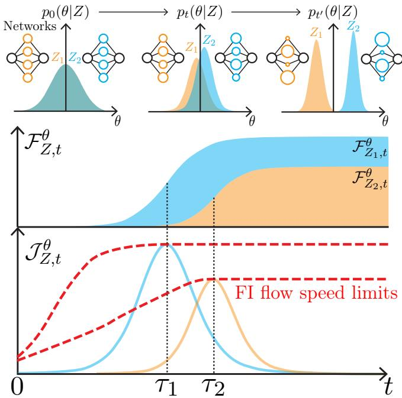
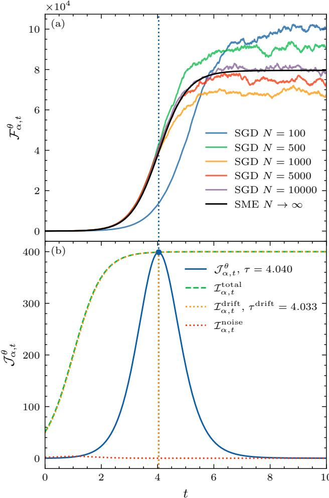
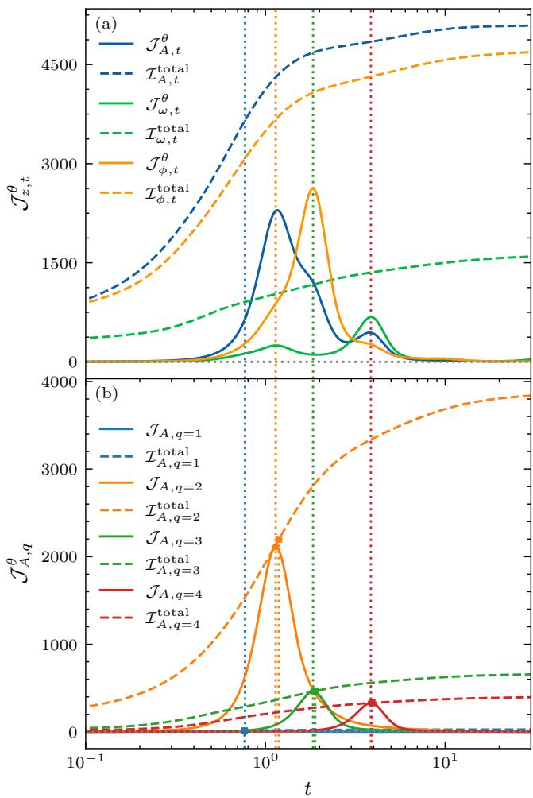
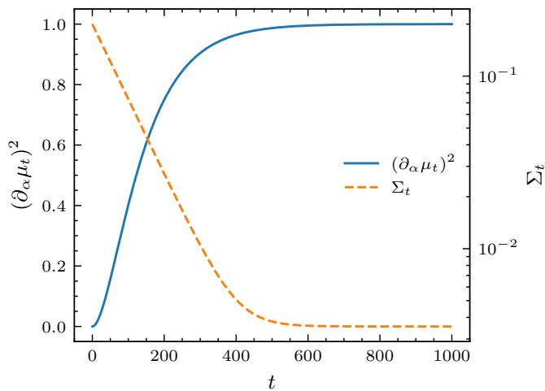

# Speed Limit for Information Acquisition in Stochastic Learning Dynamics

Shuta Kobayashi1 and Andreas Dechant1

1Department of Physics, Kyoto University, Kyoto 606-8502, Japan

Neural networks acquire internal representations through learning. In this work, we formulate stochastic gradient descent (SGD) as a Markovian stochastic process and derive a Fisher-information flow speed limit that bounds the rate at which trainable parameters can acquire information about latent variables in the datagenerating process. The resulting inequality decomposes the information flow into drift and noise contributions, thereby quantifying the roles of deterministic learning forces and SGD-induced fluctuations from an informationtheoretic perspective. We verify the bound in analytically tractable basis-function linear regression, where the information budget predicted by the bound reproduces the ordering and characteristic time scales with which diferent latent variables are encoded in the learned parameters. These results establish Fisher-information speed limits as a quantitative framework for diagnosing when and how diferent aspects of the data-generating mechanism are acquired during stochastic learning.

Introduction.— Neural networks constitute a fundamental component of modern artificial intelligence technologies, including large language models. Their performance relies on the acquisition of internal representations through learning, in which trainable parameters are updated to minimize a loss function appropriately defined for the problem at hand [1]. Understanding how information acquired during learning is encoded and processed in the network remains an area of active research.

In practice, stochastic gradient descent (SGD) and its variants are among the most widely used algorithms for training neural networks [2]. Since SGD updates the parameters using randomly sampled mini-batches, learning can be regarded as a stochastic dynamical process [3–7]. This viewpoint connects learning to broader studies of information transfer in stochastic systems [8–15]. A major line of information-theoretic work on neural networks has focused on how information is transformed across network layers, notably through the informationbottleneck framework and the data-processing inequality [16– 20]. More recently, Fisher information has been used to quantify the transmission of parameter-relevant information through trained neural networks [21]. By contrast, much less is known about which information is acquired by the trainable parameters during learning and on what time scales.

In the context of stochastic dynamical systems, various speed limit theorems have been established in recent years [22–27]. These are upper bounds on the the rate at which, for example, the probability distribution can change, which are formulated using characteristic features of the system, such as its overall transition rate or its irreversibility. Such speed limits allow us to understand intuitively which features of a stochastic dynamical system allow it to support fast and reliable operations. Applied to SGD, they motivate a compleamentary question: which features of the stochastic learning dynamics constrain the rate of information acquisition, and what can these constraints reveal about the training process?

We consider data generated from a probability distribution characterized by latent variables $Z .$ As learning proceeds, the distribution $p _ { t } ( \theta | Z )$ of the trainable parameters θ become sensitive to $Z ,$ , and the trainable parameters thereby acquire statistically accessible information about the data-generating process (see Fig. 1). We quantify this information by the Fisher information

  
FIG. 1. Schematic illustration of Fisher-information acquisition during stochastic learning. Top: evolution of the parameter distributions $p _ { t } ( \theta | Z )$ as learning proceeds from left to right. Initially, the distribution is independent of the latent variable $Z ;$ during learning, information about $Z$ is encoded in the network parameters $\theta ,$ making the distributions associated with $Z _ { 1 }$ and $Z _ { 2 }$ increasingly distinguishable. Middle: the corresponding Fisher information $\mathcal { F } _ { Z , t } ^ { \theta }$ [Eq. (1)] accumulated in the parameters about $Z _ { 1 }$ and $Z _ { 2 } .$ , increases as learning proceeds. Bottom: the Fisher-information flow $\mathcal { T } _ { Z , 1 } ^ { \theta }$ [Eq. (3)], which quantify the instantaneous rate of information acquisition and peak at the characteristic times $\tau _ { 1 }$ and $\tau _ { 2 }$ . The red dashed curves indicate the corresponding Fisher-information flow speed limits.

$$
\mathcal { F } _ { Z , t } ^ { \theta } : = \Big \langle \vert \nabla _ { Z } \log p _ { t } ( \theta \vert Z ) \vert ^ { 2 } \Big \rangle _ { t } .\tag{1}
$$

Through the Cramer–Rao inequality, Fisher information´ bounds the uncertainty of estimating Z from θ [28]. Therefore, a larger Fisher information indicates that θ carries more statistically accessible information about Z.

As we show in this Letter, the Fisher information allows quantifying in what order and at what rate the network acquires information about latent variables generating the data. By formulating SGD as a stochastic modified equation (SME), we further derive an upper bound on the Fisher information flow from Z to θ. This bound gives a speed-limit-type constraint on how rapidly information about the latent variables can be transferred to the trainable parameters during stochastic learning dynamics. By specializing to basis-function linear regression, we formulate a mode-resolved analysis, from which characteristic acquisition times and their ordering can be identified. Moreover, we demonstrate that, under reasonable assumptions, the characteristic acquisition times can be predicted from the speed limit. Finally, we verify our results in a singleparameter linear model and demonstrate parameter-dependent acquisition time scales for a sinusoidal target learned with Gaussian radial basis functions.

Stochastic learning dynamics.— For concreteness and to fix notation, we consider supervised learning with data generated from a conditional distribution $P ( X , Y | Z )$ , where X is the input, Y is the output, and Z characterizes the data-generating process. The training set is $\mathcal { D } = \{ ( x _ { i } , y _ { i } ) \} _ { i = 1 } ^ { N }$ , with $( x _ { i } , y _ { i } )$ independently sampled from $P ( X , Y | Z )$ . The parameters θ of a model $f _ { \boldsymbol { \theta } } ( \boldsymbol { x } )$ are trained by minimizing a loss function $L _ { i } ( \theta )$ ; for regression, one may take $L _ { i } ( \theta ) = | y _ { i } - f _ { \theta } ( x _ { i } ) | ^ { 2 } / 2$

In SGD, the parameters are updated at each step k using a mini-batch represented by an index set $\Gamma _ { k }$ of size m, whose elements are sampled independently from the set of training indices. The SGD update rule is given by $\begin{array} { r } { \theta _ { k + 1 } = \theta _ { k } - \varepsilon / m \sum _ { i \in \Gamma _ { k } } \nabla _ { \theta } L _ { i } ( \theta _ { k } ) } \end{array}$ , where ε is the learning rate. We define full-batch drift and the covariance of the mini-batch gradient by $\begin{array} { r } { a _ { Z } ( \theta ) : = - 1 / N \sum _ { i = 1 } ^ { N } \nabla _ { \theta } L _ { i } ( \theta ) } \end{array}$ $\begin{array} { r } { D _ { Z } ( \theta ) : = \mathrm { C o v } _ { \Gamma } \left[ - 1 / m \sum _ { i \in \Gamma } \nabla _ { \theta } L _ { i } ( \theta ) \right] } \end{array}$ . For $N \gg m \gg 1$ the mini-batch fluctuation can be approximated as Gaussian, giving the efective dynamics.

$$
\mathrm { d } \theta _ { t } ^ { ( \chi ) } = a _ { Z } ( \theta _ { t } ^ { ( \chi ) } ) \mathrm { d } t + \sqrt { \chi D _ { Z } ( \theta _ { t } ^ { ( \chi ) } ) } \mathrm { d } W _ { t }\tag{2}
$$

Here, $t = k \varepsilon$ and $\chi \in \{ 1 , \varepsilon \}$ distinguishes two scalings. The choice $\chi = 1$ gives the standard difusion scaling, whereas $\chi = \varepsilon$ reproduces the one-step noise covariance of mini-batch SGD with learning rate ε and the latter is called SME or stochastic gradient flow [3, 6]. The explicit decomposition of SGD into drift and mini-batch noise is given in the End Matter.

We define the Fisher-informationflow from Z into θ as

$$
\mathcal { I } _ { Z , t } ^ { \theta , \chi } : = \{ \begin{array} { l l } { \displaystyle \operatorname* { l i m } _ { \varepsilon  0 } \frac { \mathcal { F } _ { Z , t + \varepsilon } ^ { \theta } - \mathcal { F } _ { Z , t } ^ { \theta } } { \varepsilon } } & { \chi = 1 , } \\ { \mathcal { F } _ { Z , t + \varepsilon } ^ { \theta } - \mathcal { F } _ { Z , t } ^ { \theta } } & { \chi = \varepsilon . } \end{array}\tag{3}
$$

For a vector-valued $Z ,$ the following scalar relations may be applied to each component z; the corresponding matrix from is obtained by retaining the parameter indices

Fisher-information flow speed limit.— The Fisher-

information flow obeys the upper bound

$$
\mathcal { T } _ { Z , t } ^ { \theta , \chi } \leq \mathcal { T } _ { Z , t } ^ { \mathrm { d r i f t } , \chi } + \mathcal { T } _ { Z , t } ^ { \mathrm { n o i s e } , \chi } ,\tag{4}
$$

where

$$
\mathcal { T } _ { Z , t } ^ { \mathrm { d r i f t } , \chi } : = \left. ( \partial _ { Z } a _ { Z } ) ^ { \top } D _ { Z } ^ { - 1 } ( \partial _ { Z } a _ { Z } ) \right. _ { t } ,\tag{5a}
$$

$$
\mathcal { T } _ { Z , t } ^ { \mathrm { n o i s e } , \chi } : = \frac { \chi } { 2 \varepsilon } \left. \left\| D _ { Z } ^ { - 1 / 2 } ( \partial _ { Z } D _ { Z } ) D _ { Z } ^ { - 1 / 2 } \right\| _ { \mathrm { F } } ^ { 2 } \right. _ { t } .\tag{5b}
$$

All quantities on the right-hand side are evaluated at ${ \theta } _ { t } ^ { \left( \chi \right) }$ and averaged over its distribution. Hereafter, we refer to these quantities as the drift information budget and noise information budget, respectively.

The bound follows directly from the Fisher information of the one-step transition kernel. Equation (2) gives the Gaussian transition probability $p ( \theta _ { t + \mathrm { d } t } | \theta _ { t } , Z ) \ = \ \mathcal N ( \theta _ { t + \mathrm { d } t } | \theta _ { t } \ +$ $a _ { Z } ( \theta _ { t } ) \mathrm { d } t , \chi D _ { Z } ( \theta _ { t } ) \mathrm { d } t )$ . Its conditional Fisher information is

$$
\begin{array} { r l } & { \mathcal { F } _ { Z } ^ { \theta _ { t + \mathrm { d } t } | \theta _ { t } } : = \big \langle \| \nabla _ { Z } \log p ( \theta _ { t + \mathrm { d } t } | \theta _ { t } , Z ) \| ^ { 2 } \big \rangle _ { t } } \\ & { \quad \quad \quad = \big \langle ( \partial _ { Z } a _ { Z } ) ^ { \top } ( \chi D _ { Z } ) ^ { - 1 } ( \partial _ { Z } a _ { Z } ) \big \rangle _ { t } \mathrm { d } t } \\ & { \quad \quad \quad \quad + \displaystyle \frac { 1 } { 2 } \left. \left\| D _ { Z } ^ { - 1 / 2 } \big ( \partial _ { Z } D _ { Z } \big ) D _ { Z } ^ { - 1 / 2 } \right\| _ { \mathrm { F } } ^ { 2 } \right. _ { t } + o ( \varepsilon ) . } \end{array}\tag{6}
$$

The chain rule for Fisher information yields $\mathcal { F } _ { Z , t + \mathrm { d } t } ^ { \theta } - \mathcal { F } _ { Z , t } ^ { \theta } =$ $\mathcal { F } _ { Z } ^ { \theta _ { t + \mathrm { d } t } | \theta _ { t } } - \mathcal { F } _ { Z } ^ { \theta _ { t } | \theta _ { t + \mathrm { d } t } }$ [29]. Because the backward conditional Fisher information is non-negative, muptiplying the chain rule by the normalization appropriate to Eq. (3) and using Eq. (6) gives Eq. (4).

The drift budget is controlled by the sensitivity of the average update direction to $Z ,$ measured in the inverse-noise metric $D _ { Z } ^ { - 1 }$ Its interpretation is that, while a drift that depends sensitively on the latent variables Z directly transmits this information to the mean value of the network parameters, large fluctuations along a direction suppress the amount of drift information that can be transmitted through that direction. The noise budget instead quantifies the information about $Z$ carried by the Z dependence of the covariance of the stochastic gradient. Previous studies have examined how the scale and anisotropic covariance of mini-batch fluctuations afect optimization, minima selection, and generalization [30–33]. Here we provide a complementary information-flow perspective: the noise both constrains drift-mediated information transmission and, through its Z-dependent covariance, can itself provide an additional channel of information acquisition. Importantly, these two quantities form an upper bound rather than an additive decomposition of the actual Fisherinformation flow: part of the transition information may be cancelled by the backward conditional term $\mathcal { F } _ { Z } ^ { \theta _ { t } | \theta _ { t + \mathrm { d } t } }$

Basis-function linear regression.— To obtain more concrete expressions for the Fisher information flow and assess the speed limit, we now specialize the general framework to a model that is linear in its trainable parameters. We consider $y ~ = ~ g _ { Z } ( x ) + \eta$ , and approximate the target by $f _ { \theta } ( x ) = \theta ^ { \top } \Psi ( \bar { x } ) , \dot { \Psi } ( x ) = ( \psi _ { 1 } ( \bar { x } ) , \ldots , \psi _ { d } ( x ) ) ^ { \top }$ . Here, η denotes residual noise accounting for statistical errors, and is assumed to be Gaussian with zero mean and variance $\sigma ^ { 2 } .$ . Although $f _ { \theta }$ is linear in θ, it can represent a nonlinear function of x through the fixed basis functions $\psi _ { j }$

Define $H : = \langle \Psi \Psi ^ { \top } \rangle _ { x } , r _ { Z } : = \langle \Psi g _ { Z } \rangle _ { x }$ . Assuming H is nonsingular and using a squared error loss function $L _ { i } \ =$ $| y _ { i } - f _ { \theta } ( x _ { i } ) | ^ { 2 } / 2$ , the population loss $\begin{array} { r } { L : = \sum _ { i = 1 } ^ { N } L _ { i } } \end{array}$ can be written as

$$
\begin{array} { c } { \displaystyle { L ( \theta ) = \frac { 1 } { 2 } \big \langle ( g _ { Z } ( x ) - \theta ^ { \top } \Psi ( x ) ) ^ { 2 } \big \rangle _ { x } + \frac { \sigma ^ { 2 } } { 2 } } } \\ { \displaystyle { = \frac { 1 } { 2 } ( \theta - \theta _ { \mathrm { s t } } ) ^ { \top } H ( \theta - \theta _ { \mathrm { s t } } ) + \mathrm { c o n s t . } } } \end{array}\tag{7}
$$

where $\theta _ { \mathrm { s t } } = H ^ { - 1 } r _ { Z }$ is the optimal parameter. The drift is therefore $a _ { Z } ( \theta ) = - H ( \theta - \theta _ { \mathrm { s t } } )$

Let $\delta _ { Z } ( x ) : = g _ { Z } ( x ) - \theta _ { \mathrm { s t } } ^ { \top } \Psi ( x )$ be the approximation residual. Near $\theta _ { \mathrm { s t } }$ , the state dependence of the difusion matrix is subleading, and its stationary value is $D _ { \mathrm { s t } } = \langle ( \delta _ { Z } ^ { 2 } +$ $\sigma ^ { 2 } ) \Psi \Psi ^ { \top } \rangle _ { x } / m$ . Thus, the near-convergence dynamics reduces to the multivariate Ornstein–Uhlenbeck process

$$
\mathrm { d } \theta _ { t } ^ { ( \chi ) } = - H ( \theta _ { t } ^ { ( \chi ) } - \theta _ { \mathrm { s t } } ) \mathrm { d } t + \sqrt { \chi D _ { \mathrm { s t } } } \mathrm { d } W _ { t } ,\tag{8}
$$

as in related local descriptions of constant-step-size SGD near a quadratic optimum [7]. The detail of derivation, including the terms neglected away from the fixed point, is given in the End Matter.

Order of information acquisition.— For an initially Gaussian parameter distribution, Eq. (8) preserves Gaussianity. Its mean and covariance are

$$
\mu _ { t } = ( I - \mathrm { e } ^ { - H t } ) \theta _ { \mathrm { s t } } + \mathrm { e } ^ { - H t } \mu _ { 0 } ,\tag{9a}
$$

$$
\Sigma _ { t } ^ { \chi } = \mathrm { e } ^ { - H t } \Sigma _ { 0 } \mathrm { e } ^ { - H t } + \chi \int _ { 0 } ^ { t } \mathrm { e } ^ { - H s } D _ { \mathrm { s t } } \mathrm { e } ^ { - H s } \mathrm { d } s .\tag{9b}
$$

For a scalar component z of $Z ,$ , the Fisher information of a Gaussian distribution is

$$
\begin{array} { r l } & { \mathcal { F } _ { z , t } ^ { \theta , \chi } = ( \partial _ { z } \mu _ { t } ) ^ { \top } ( \Sigma _ { t } ^ { \chi } ) ^ { - 1 } ( \partial _ { z } \mu _ { t } ) } \\ & { \qquad + \frac { 1 } { 2 } \mathrm { T r } \left[ ( \Sigma _ { t } ^ { \chi } ) ^ { - 1 } ( \partial _ { z } \Sigma _ { t } ^ { \chi } ) ( \Sigma _ { t } ^ { \chi } ) ^ { - 1 } ( \partial _ { z } \Sigma _ { t } ^ { \chi } ) \right] . } \end{array}\tag{10}
$$

In the regimes studied below, the mean contribution of Eq. (10) is dominant. We therefore neglect the covariance contribution. Moreover, for $\delta _ { Z } \simeq 0$ , the stationary difusion matrix satisfies $D _ { \mathrm { s t } } \simeq \sigma ^ { 2 } H / m$ , so that H and $D _ { \mathrm { s t } }$ share the same eigenbasis. Choosing an isotropic initial covariance, $\Sigma _ { 0 } \propto I ,$ then makes $\Sigma _ { 0 }$ diagonal in the same basis. Thus, $H , D _ { \mathrm { s t } }$ , and $\Sigma _ { 0 }$ are simultaneously diagonalizable by an orthogonal matrix U. We denote the eigenvalues of H in this basis by $\lambda _ { i } .$ , the corresponding diagonal elements of $D _ { \mathrm { s t } }$ by ${ \tilde { D } } _ { i } ,$ and those of $\Sigma _ { 0 }$ by $\Sigma _ { 0 , i } ,$ , such that $\begin{array} { r } { U ^ { \top } H U = \mathrm { d i a g } ( \lambda _ { i } ) , U ^ { \top } D _ { \mathrm { s t } } U = \mathrm { d i a g } ( \tilde { D } _ { i } ) } \end{array}$ and $U ^ { \top } \Sigma _ { 0 } U = \mathrm { d i a g } ( \Sigma _ { 0 , i } )$ . The coupling of a latent variable z to these dynamical modes is denoted by $\tilde { u } _ { z } : = U ^ { \top } \partial _ { z } \theta _ { \mathrm { s t } }$ with $\tilde { u } _ { z , i }$ its ith component. The Fisher information then decomposes into independent modal contributions,

$$
\mathcal { F } _ { z , t } ^ { \theta , \chi } \simeq \sum _ { i = 1 } ^ { d } \frac { \tilde { u } _ { z , i } ^ { 2 } ( 1 - \mathrm { e } ^ { - \lambda _ { i } t } ) } { \Sigma _ { \infty , i } ^ { \chi } + \left( \Sigma _ { 0 , i } - \Sigma _ { \infty , i } ^ { \chi } \mathrm { e } ^ { - 2 \lambda _ { i } t } \right) } ,\tag{11}
$$

where $\Sigma _ { \infty , i } ^ { \chi } = \chi \tilde { D } _ { i } / ( 2 \lambda _ { i } )$

For $\chi = 1$ exactly, and for the SGD scaling $\chi = \varepsilon$ to leading order in ε, the flow associated with mode i is $\begin{array} { r } { \mathcal { I } _ { z , i } ^ { \theta , \chi } \simeq \chi \partial _ { t } \mathcal { F } _ { z , i } ^ { \theta , \chi } } \end{array}$ It reaches its maximum at

$$
\tau _ { i } ^ { \chi } = \frac { 1 } { \lambda _ { i } } \ln { \left( 1 + \sqrt { \frac { \Sigma _ { 0 , i } } { \Sigma _ { \infty , i } ^ { \chi } } } \right) } ,\tag{12}
$$

with peak value

$$
\operatorname* { m a x } _ { t } \mathcal { I } _ { z , i } ^ { \theta , \chi } = \frac { \lambda _ { i } ^ { 2 } \tilde { u } _ { z , i } ^ { 2 } } { \tilde { D } _ { i } } = \mathcal { I } _ { z , i } ^ { \mathrm { d r i f t } , \chi } .\tag{13}
$$

Thus, each latent variable is acquired through the dynamical modes to which $\partial _ { z } \theta _ { \mathrm { s t } }$ couples. When the basis approximation is accurate, $\delta _ { Z } ( x ) \simeq 0$ , one has $\tilde { D } _ { i } = \sigma ^ { 2 } \lambda _ { i } / m$ . Eq. (12) then implies that modes with larger $\lambda _ { i }$ are acquired earlier.

Importantly, the peak time of the Fisher-information flow is also reflected in the relaxation of the speed-limit bound. Near convergence, the transient correction to $\cdot \mathcal { T } _ { z , i } ^ { \mathrm { d r i f t } , \chi }$ is controlled by the modal mean square deviation $S _ { t , i } ^ { \chi } : = \langle [ U ^ { \top } ( \theta _ { t } ^ { ( \chi ) } - \theta _ { \mathrm { s t } } ) ] _ { i } ^ { 2 } \rangle t$ which relaxes as

$$
S _ { t , i } ^ { \chi } = ( S _ { 0 , i } - \Sigma _ { \infty , i } ) \mathrm { e } ^ { - 2 \lambda _ { i } t } + \Sigma _ { \infty , i } .\tag{14}
$$

We define $\tau _ { \mathrm { d r i f t } , i } ^ { \chi }$ as the time at which this decaying transient becomes comparable to the stationary fluctuation scale $\Sigma _ { \infty , i } ^ { \chi } .$ In the regime $\Sigma _ { \infty , i } ^ { \chi } \ll \Sigma _ { 0 , i } , S _ { 0 , i }$ , both characteristic times reduce to

$$
\tau _ { i } ^ { \chi } - \tau _ { \mathrm { d r i f t } , i } ^ { \chi } \simeq \frac { 1 } { 2 \lambda _ { i } } \ln \frac { \Sigma _ { 0 , i } } { S _ { 0 , i } } .\tag{15}
$$

Thus, the speed-limit bound predicts not only the maximal rate of information acquisition but also when this rate reaches its maximum. This eigenvalue ordering is analogous to spectrumdependent learning dynamics in linear regression, kernel methods, and linearized neural networks, where modes associated with larger data- or kernel-spectrum eigenvalues are generally learned more rapidly [34–36]. Here, however, the ordered quantity is the acquisition of Fisher information about the latent variable z, rather than the decay of prediction error. The full derivation and the conditions underlying Eqs. (11)–(15) are given in the End Matter.

Linear target.— We first test the speed limit in a singleparameter model with $y = \alpha x + \eta$ , and regression function $f _ { \theta } ( x ) = \theta x$ . Here, $Z = \alpha$ , and θ acts as a direct estimator of $\alpha .$ . From this model, we generate a dataset $\begin{array} { r } { \mathcal { D } = \{ ( x _ { i } , y _ { i } ) \} _ { i = 1 } ^ { N } , } \end{array}$ and assume that $x _ { i }$ follows a normal distribution with zero mean and variance H. For the squared loss, the drift and difusion coeficients are

$$
\begin{array} { r } { a _ { \alpha } ( \theta ) = - H ( \theta - \alpha ) , } \end{array}\tag{16a}
$$

$$
D _ { \alpha } ( \theta ) = \frac { 1 } { m } [ \sigma ^ { 2 } H + 2 H ^ { 2 } ( \theta - \alpha ) ^ { 2 } ] .\tag{16b}
$$

We set $\chi = \varepsilon$ and evaluate the Fisher information from the mean and variance of an approximately Gaussian parameter distribution. The resulting drift and noise terms, the numerical diferentiation procedure, and the near-convergence analytical solution are given in the End Matter.

  
FIG. 2. Fisher information dynamics in single-parameter linear regression. (a) Time evolution of the Fisher information $\mathcal { F } _ { \alpha , t } ^ { \theta }$ for SGD with diferent dataset sizes N, together with the SME prediction for $N  \infty$ The finite-N deviations and fluctuations are reduced for suficiently large $N _ { \ast }$ and the SGD dynamics approaches the SME prediction. (b) Fisher-information flow $\mathcal { T } _ { \alpha , t } ^ { \theta }$ (solid line) and its speedlimit bound $\mathcal { T } _ { \alpha , t } ^ { \mathrm { t o t a l } }$ l, decomposed into drift and noise contributions (dashed lines). The bound is dominated by the drift budget and becomes tight near the peak of ${ \mathcal { I } } _ { \alpha , t } ^ { \theta } ,$ with nearly identical characteristic times $\tau = 4 . 0 4 0$ and $\tau ^ { \mathrm { d r i f t } } = 4 .$ 033 (dotted lines). Parameters common to both panels are $\alpha = 1 .$ $m = 1 0 0$ $H = 1 , \sigma = 0 . 5 { \ : }$ , and $\varepsilon = 0 . 0 1$ , with the initial parameter distribution $\theta _ { 0 } \sim \mathcal { N } ( 0 , 0 . 2 ^ { 2 } )$ ). In panel (a), N is varied as indicated.

Figure 2 shows that the Fisher-information flow initially grows, reaches a peak near convergence, and then decreases as the Fisher information approaches its stationary value. The bound holds throughout the dynamics and becomes tight at the peak. The analytical Ornstein–Uhlenbeck approximation gives the same peak value as the asymptotic drift budget, maxt $\mathcal { T } _ { \alpha , t } ^ { \theta } = m H / \sigma ^ { 2 }$ , explaining the tightness. By contrast, the noise budget is appreciable only at an earlier state and does not produce a corresponding feature in the observed flow. This behavior is consistent with the chain rule for Fisher information: transition information carried by the noise covariance can be ofset by the backward conditional Fisher information and therefore need not remain stored in the marginal distribution of θ.

Sinusoidal target.— We next consider $y = A$ sin $( \omega x + \phi ) +$ $\eta , \quad x \sim \mathrm { U n i f } [ - R , R ]$ , with latent variable $Z = \left( A , \omega , \phi \right)$ The target is approximated using Gaussian radial basis functions $\psi _ { j } ( x ) = \exp \left[ - ( x - c _ { j } ) ^ { 2 } / ( 2 l ^ { 2 } ) \right]$ , whose centers $c _ { j }$ are uniformly placed on $[ - R , R ]$ , together with a constant bias basis. Each basis function is rescaled that $\left. \psi _ { j } ^ { 2 } \right. _ { x } = { \cal { O } } ( 1 )$ This construction is linear in θ while representing a nonlinear target function, and the empirical parameter distributions remain close to Gaussian throughout training.

For each $z \in \{ A , \omega , \phi \}$ , we compute the Fisher information using Eq. (10) and evaluate the drift and noise budgets. Figs. 3(a) may appear to show a less tight bound than in the single-parameter case. This is because the total Fisherinformation flow satisfies

$$
\operatorname* { m a x } _ { t } \mathcal { T } _ { z , t } ^ { \theta , \chi } \leq \sum _ { i } \mathcal { T } _ { z , i } ^ { \mathrm { d r i f t } , \chi } ,\tag{17}
$$

since the modal contributions generally reach their maxima at diferent times. When resolved into individual eigenmodes, however, each modal flow saturates the corresponding drift information bound at its peak, as shown in Eig. 3(b). Equality in Eq. (17) is attained only when all modal peaks occur simultaneously. While the characteristic peak time of each mode is set by its eigenvalue $\lambda _ { i }$ under the conditions considered here, the strength with information about a given latent variable z is acquired through that mode is determined by the corresponding coupling $( U ^ { \top } \partial _ { z } \theta _ { \mathrm { s t } } )$ i.

Discussion.— In this work, we introduced the Fisher information of the network parameters with respect to latent variables of the training data as a method for analysing information acquisition during the training process. We found that the corresponding Fisher-information flow can distinguish the rates at which information about diferent latent variables is encoded in the network. We derived a Fisher-information flow speed limit that bounds the rate at which information about latent variables can be acquired during stochastic /learning dynamics. For basis-function linear regression, we further identified mode-resolved acquisition times $\tau _ { i } ^ { \chi } ;$ , which are determined by the relaxation rates $\lambda _ { i }$ of each mode and its stationary variance $\Sigma _ { \infty , i } ^ { \chi }$ Diferent latent variables couple to these modes with diferent weights through $\partial _ { z } \theta _ { \mathrm { s t } }$ , giving rise to distinct information-acquisition dynamics.

Related questions have been studied from the perspective of stochastic thermodynamics, where information processing, prediction, and learning has been connected to entropy production and energetic cost [11, 12, 37, 38]. The present result provides a complementary dynamical perspective: rather than constraining the thermodynamic cost of learning, it constraints the rate at which information about the data-generating process can be acquired by the trainable parameters.

  
FIG. 3. Fisher-information flow dynamics in basis-function linear regression for the sinusoidal target $g _ { Z } ( x ) = A \sin ( \omega x + \phi )$ . (a) Fisher-information flows $\mathcal { T } _ { z , t } ^ { \theta }$ (solid lines) and the corresponding total information budgets $\mathcal { T } _ { z , t } ^ { \mathrm { t o t a l } }$ (dashed lines) for $z = A , \omega , \phi .$ The flows exhibit distinct characteristic time scales for diferent latent variables. Vertical dotted lines indicate the characteristic times $\tau _ { q } ,$ where q indexes the eigenmodes in descending order of their eivenvalues, $\lambda _ { 1 } \geq \lambda _ { 2 } \geq \cdots$ . (b) Mode-resolved Fisher-information flows $\mathcal { I } _ { A , q }$ (solid lines) and the corresponding information budgets $\mathcal { T } _ { A , q } ^ { \mathrm { t o t a l } }$ (dashed lines) for $q = 1 , \ldots , 4$ . Circular markers indicate the maxima of the modal flows. In contrast to the total flow in (a), each modal flow nearly saturates its corresponding bound at its characteristic time. The target parameters are $A = 1 , \omega = 3$ , and $\phi = 0 . 4$ The Gaussian radial basis functions are specified by $R = 1 , d = 1 2$ and $l = 0 . 2 5$

Although non-Gaussian parameter distributions complicate the analysis for nonlinear neural networks, the inequality itself remains applicable. For strongly heavy-tailed gradient fluctuations, where Levy dynamics may be more appropriate than´ a difusion approximation [39], extending the present framework to jump processes provides a natural direction for future work.

The framework introduced in this work also ofers the possibility to analyse network structures that are specific to individual latent variables, for example, by studying the conditional Fisher information of subsets of network parameters. This can reveal how diferent latent variables are encoded in the network and how this encoding dynamically evolves during the training process.

## ACKNOWLEDGMENTS

S.K. thanks K.Tamano and R.Suzuki for fruitful discussions. S.K. was supported by JST BOOST, Grant Number JP-MJBS2407. A.D. was supported by JSPS KAKENHI (Grants No. 24H00833 and 25K00926). This work was supported by JSPS International Joint Research Program (JRP-LEAD with DFG), grant number 20261606.

[1] C. M. Bishop and N. M. Nasrabadi, Pattern recognition and machine learning, Vol. 4 (Springer, 2006).

[2] L. Bottou, Large-scale machine learning with stochastic gradient descent, in Proceedings of COMPSTAT’2010 (Physica-Verlag HD, Heidelberg, 2010) pp. 177–186.

[3] Q. Li, C. Tai, and W. E, Stochastic modified equations and adaptive stochastic gradient algorithms, in Proceedings of the 34th International Conference on Machine Learning, Proceedings of Machine Learning Research, Vol. 70, edited by D. Precup and Y. W. Teh (PMLR, 2017) pp. 2101–2110.

[4] S. Yaida, Fluctuation-dissipation relations for stochastic gradient descent, in International Conference on Learning Representations (2018).

[5] Q. Li, C. Tai, et al., Stochastic modified equations and dynamics of stochastic gradient algorithms i: Mathematical foundations, Journal of Machine Learning Research 20, 1 (2019).

[6] A. Ali, E. Dobriban, and R. Tibshirani, The implicit regularization of stochastic gradient flow for least squares, in International Conference on Machine Learning (PMLR, 2020) pp. 233–244.

[7] S. Mandt, M. D. Hofman, and D. M. Blei, Stochastic gradient descent as approximate bayesian inference, J. Mach. Learn. Res. 18, 1 (2017).

[8] T. Schreiber, Measuring information transfer, Phys. Rev. Lett. 85, 461 (2000).

[9] J. M. Horowitz and M. Esposito, Thermodynamics with continuous information flow, Phys. Rev. X. 4, 031015 (2014).

[10] S. Ito and T. Sagawa, Information thermodynamics on causal networks, Phys. Rev. Lett. 111, 180603 (2013).

[11] S. Goldt and U. Seifert, Stochastic thermodynamics of learning, Phys. Rev. Lett. 118, 010601 (2017).

[12] S. Goldt and U. Seifert, Thermodynamic eficiency of learning a rule in neural networks, New J. Phys. 19, 113001 (2017).

[13] D. Hartich, A. C. Barato, and U. Seifert, Stochastic thermodynamics of bipartite systems: transfer entropy inequalities and a maxwell’s demon interpretation, J. Stat. Mech. 2014, P02016 (2014).

[14] D. Hartich, A. C. Barato, and U. Seifert, Sensory capacity: An information theoretical measure of the performance of a sensor, Phys. Rev. E. 93, 022116 (2016).

[15] T. Matsumoto and T. Sagawa, Role of suficient statistics in stochastic thermodynamics and its implication to sensory adaptation, Phys. Rev. E 97, 042103 (2018).

[16] N. Tishby, F. C. Pereira, and W. Bialek, The information bottleneck method, arXiv [physics.data-an] (2000).

[17] N. Tishby and N. Zaslavsky, Deep learning and the information bottleneck principle, in 2015 ieee information theory workshop (itw) (Ieee, 2015) pp. 1–5.

[18] R. Shwartz-Ziv and N. Tishby, Opening the black box of deep neural networks via information, arXiv [cs.LG] (2017).

[19] A. M. Saxe, Y. Bansal, J. Dapello, M. Advani, A. Kolchinsky, B. D. Tracey, and D. D. Cox, On the information bottleneck theory of deep learning, J. Stat. Mech. 2019, 124020.

[20] Z. Goldfeld, E. Van Den Berg, K. Greenewald, I. Melnyk, N. Nguyen, B. Kingsbury, and Y. Polyanskiy, Estimating information flow in deep neural networks, in Proceedings of the 36th International Conference on Machine Learning, Proceedings of Machine Learning Research, Vol. 97, edited by K. Chaudhuri and R. Salakhutdinov (PMLR, 2019) pp. 2299–2308.

[21] M. Weimar, L. M. Rachbauer, I. Starshynov, D. Faccio, L. Adilova, D. Bouchet, and S. Rotter, Fisher information flow in artificial neural networks, Phys. Rev. X. 15 (2025).

[22] N. Shiraishi, K. Funo, and K. Saito, Speed limit for classical stochastic processes, Phys. Rev. Lett. 121, 070601 (2018).

[23] S. Ito and A. Dechant, Stochastic time evolution, information geometry, and the cramer-rao bound, Phys. Rev. X.´ 10, 021056 (2020).

[24] V. T. Vo, T. Van Vu, and Y. Hasegawa, Unified approach to classical speed limit and thermodynamic uncertainty relation, Phys. Rev. E. 102, 062132 (2020).

[25] T. Van Vu and K. Saito, Thermodynamic unification of optimal transport: Thermodynamic uncertainty relation, minimum dissipation, and thermodynamic speed limits, Phys. Rev. X. 13, 011013 (2023).

[26] J. Karbowski, Bounds on the rates of statistical divergences and mutual information via stochastic thermodynamics, Phys. Rev. E. 109, 054126 (2024).

[27] T. Nishiyama and Y. Hasegawa, Unified speed limits in classical and quantum dynamics via temporal fisher information, Phys. Rev. E. 114, 014120 (2026).

[28] T. M. Cover, Elements of information theory (John Wiley & Sons, 1999).

[29] R. Zamir, A proof of the fisher information inequality via a data processing argument, IEEE Trans. Inf. Theory 44, 1246 (1998).

[30] N. S. Keskar, D. Mudigere, J. Nocedal, M. Smelyanskiy, and P. T. P. Tang, On Large-Batch Training for Deep Learning: Generalization Gap and Sharp Minima, in International Conference on Learning Representations (2017).

[31] S. L. S. Le and Q. V., A Bayesian Perspective on Generalization and Stochastic Gradient Descent, in International Conference on Learning Representations (2018).

[32] Z. Zhu, J. Wu, B. Yu, L. Wu, and J. Ma, The anisotropic noise in stochastic gradient descent: Its behavior of escaping from sharp minima and regularization efects, in Proceedings of the 36th International Conference on Machine Learning, Proceedings of Machine Learning Research, Vol. 97, edited by K. Chaudhuri and R. Salakhutdinov (PMLR, 2019) pp. 7654–7663.

[33] Y. Wen, K. Luk, M. Gazeau, G. Zhang, H. Chan, and J. Ba, An empirical study of stochastic gradient descent with structured covariance noise, in Proceedings of the Twenty Third International Conference on Artificial Intelligence and Statistics, Proceedings of Machine Learning Research, Vol. 108, edited by S. Chiappa and R. Calandra (PMLR, 2020) pp. 3621–3631.

[34] M. S. Advani, A. M. Saxe, and H. Sompolinsky, Highdimensional dynamics of generalization error in neural networks, Neural Networks 132, 428 (2020).

[35] B. Bordelon, A. Canatar, and C. Pehlevan, Spectrum dependent learning curves in kernel regression and wide neural networks, in Proceedings ofthe 37th International Conference on Machine Learning, Proceedings of Machine Learning Research, Vol. 119, edited by H. D. III and A. Singh (PMLR, 2020) pp. 1024–1034.

[36] A. Jacot, F. Gabriel, and C. Hongler, Neural tangent kernel: Convergence and generalization in neural networks, in Advances in Neural Information Processing Systems, Vol. 31, edited by S. Bengio, H. Wallach, H. Larochelle, K. Grauman, N. Cesa-Bianchi, and R. Garnett (Curran Associates, Inc., 2018).

[37] S. Still, D. A. Sivak, A. J. Bell, and G. E. Crooks, Thermodynamics of prediction, Phys. Rev. Lett. 109, 120604 (2012).

[38] D. H. Wolpert, The stochastic thermodynamics of computation, Journal of Physics A: Mathematical and Theoretical 52, 193001 (2019).

[39] U. Simsekli, L. Sagun, and M. Gurbuzbalaban, A tail-index analysis of stochastic gradient noise in deep neural networks, in International Conference on Machine Learning (PMLR, 2019) pp. 5827–5837.

[40] C. Gardiner, Stochastic methods, Vol. 4 (Springer Berlin Heidelberg, 2009).

## END MATTER

From mini-batch SGD to the SME.— For comparison, fullbatch gradient descent obeys

$$
\theta _ { k + 1 } = \theta _ { k } - \frac { \varepsilon } { N } \sum _ { i = 1 } ^ { N } \nabla _ { \theta } L _ { i } ( \theta _ { k } ) .\tag{18}
$$

Adding and subtracting this full-batch gradient in SGD gives

$$
\begin{array} { l } { \displaystyle \theta _ { k + 1 } - \theta _ { k } = - \frac { \varepsilon } { N } \sum _ { i = 1 } ^ { N } \nabla _ { \theta } L _ { i } ( \theta _ { k } ) } \\ { \displaystyle \qquad + \varepsilon \left[ - \frac { 1 } { m } \sum _ { i \in \Gamma _ { k } } \nabla _ { \theta } L _ { i } ( \theta _ { k } ) + \frac { 1 } { N } \sum _ { i = 1 } ^ { N } \nabla _ { \theta } L _ { i } ( \theta _ { k } ) \right] . } \end{array}\tag{19}
$$

The term in square brackets has zero mean under mini-batch sampling and covariance $D _ { Z } ( \theta _ { k } )$ . Approximating it as Gaussian for N m 1 and identifying t = kε yields Eq. (2).

For $\chi = \varepsilon ,$ , the covariance accumulated over one interval of duration ε is $\varepsilon ^ { 2 } D _ { Z }$ , matching the one-step covariance of Eq. (19) and thus reproducing the natural scaling of SGD. In contrast, the choice $\chi = 1$ corresponds to the conventional diffusion scaling and is often analytically convenient, as it allows standard results for Langevin and Fokker–Planck dynamics to be applied directly [40].

Numerical and Analytical evaluation of Fisher information.— Throughout the numerical analysis, we approximate the parameter distributions as Gaussian and evaluate the Fisher information using Eq. (10). The mean and covariance entering this expression are obtained diferently for finite-N SGD and for the $N \to \infty$ SME limit.

For finite-N SGD, as shown in Fig. 2(a), the mean $\mu _ { t }$ and covariance $\Sigma _ { t }$ are estimated from 5000 independent trajectories. Their derivatives with respect to α are evaluated by centered diferences using ensembles generated at $\alpha +$ δα and $\alpha - \delta \alpha .$ , with $\delta \alpha = 0 . 0 0 1$

In the $N  \infty$ limit, by contrast, the moment dynamics closes under the SME. The mean $\mu _ { t }$ and covariance $\Sigma _ { t }$ can therefore be obtained analytically from Eq. (9), which apply generally to basis-function linear regression and include the single-parameter linear regression model as a special case. The Fisher information is then evaluated directly from these analytical moments using Eq. (10), from which the corresponding Fisher-information flow is obtained. The results shown in Fig. 2 and Fig. 3 are obtained in this manner, without estimating $\mu _ { t }$ or $\Sigma _ { t }$ from stochastic trajectories. Fig. 4 further illustrates the origin of the peak in the Fisher-information flow for the single-parameter linear regression model.

Analyticalform ofthe speed-limit bound.— The right-hand side of the Fisher-information speed limit can be evaluated directly from the drift and noise budges. For the singleparameter linear regression model, substituting Eq. (16) into

  
FIG. 4. Time evolution of the numerator $( \partial _ { \alpha } \mu _ { t } ) ^ { 2 }$ and denominator $\Sigma _ { t }$ of the dominant Fisher information contribution in Eq. (23). The numerator increases from zero and saturates at unity, whereas the denominator decreases toward the stationary variance set by SGD fluctuations. Their competing time dependences cause the Fisherinformation flow to reach a maximum at an intermediate time.

Eq. (5) gives

$$
\mathcal { T } _ { \alpha , t } ^ { \mathrm { d r i f t } } = \bigg \langle \frac { m H } { \sigma ^ { 2 } + 2 H ( \theta - \alpha ) ^ { 2 } } \bigg \rangle _ { t } ,\tag{20a}
$$

$$
{ \mathcal { T } } _ { \alpha , t } ^ { \mathrm { n o i s e } } = \Biggl \langle { \frac { 8 H ^ { 2 } ( \theta - \alpha ) ^ { 2 } } { [ \sigma ^ { 2 } + 2 H ( \theta - \alpha ) ^ { 2 } ] ^ { 2 } } } \Biggr \rangle _ { t } .\tag{20b}
$$

For basis-function linear regression, the corresponding bound can be evaluated analogously by resolving the dynamics into the eigenmodes introduced in the main text. This mode-resolved representation will be used below in the nearconvergence analysis.

Analytical results near convergence.— We summarize the near-convergence analysis underlying the peak values and characteristic time scales of the Fisher-information flow. We first consider the single-parameter linear-regression model. In the limit $N  \infty$ , the drift and difusion coeficients are (16) Defining the deviation from the optimum as $e _ { t } ^ { ( \chi ) } : = \theta _ { t } ^ { ( \chi ) } - \alpha .$ the condition $( e _ { t } ^ { ( \chi ) } ) ^ { 2 } \ll \sigma ^ { 2 } / ( 2 H )$ allows us to neglect the state-dependent part of the difusion coeficient. The dynamics then reduces to the Ornstein–Uhlenbeck process

$$
\mathrm { d } e _ { t } ^ { ( \boldsymbol { x } ) } = - H e _ { t } ^ { ( \boldsymbol { x } ) } \mathrm { d } t + \sqrt { \chi D _ { \mathrm { s t } } } \mathrm { d } W _ { t } , \quad D _ { \mathrm { s t } } = \frac { \sigma ^ { 2 } H } { m } .\tag{21}
$$

For an initially Gaussian distribution independent of $\alpha ,$ , the mean and variance are

$$
\mu _ { t } = \alpha + ( \mu _ { 0 } - \alpha ) \mathrm { e } ^ { - H t } ,\tag{22a}
$$

$$
\Sigma _ { t } ^ { \chi } = \Sigma _ { \infty } ^ { \chi } + \left( \Sigma _ { 0 } - \Sigma _ { \infty } ^ { \chi } \right) \mathrm { e } ^ { - 2 H t } ,\tag{22b}
$$

where $\Sigma _ { \infty } ^ { \chi } = \chi \sigma ^ { 2 } / ( 2 m )$ . Since $\partial _ { \alpha } \Sigma _ { t } ^ { \chi } = 0$ , the Gaussian Fisher information reduces to

$$
\mathcal { F } _ { \alpha , t } ^ { \theta , \chi } = \frac { \bigl ( 1 - \mathrm { e } ^ { - H t } \bigr ) ^ { 2 } } { \Sigma _ { \infty } ^ { \chi } + \bigl ( \Sigma _ { 0 } - \Sigma _ { \infty } ^ { \chi } \bigr ) \mathrm { e } ^ { - 2 H t } } .\tag{23}
$$

For $\chi = 1$ exactly, and for the SGD scaling $\chi = \varepsilon$ to leading order in $\varepsilon ,$ the corresponding Fisher-information flow is $\mathcal T _ { \alpha , t } ^ { \tilde { \theta } , \chi } \simeq \chi \partial _ { t } \mathcal F _ { \alpha , t } ^ { \theta , \chi }$ . Direct diferentiation of Eq. (23) gives the peak time

$$
\tau ^ { \chi } = \frac { 1 } { H } \ln \left( 1 + \sqrt { \frac { 2 m \Sigma _ { 0 } } { \chi \sigma ^ { 2 } } } \right) ,\tag{24}
$$

and the peak value

$$
\operatorname* { m a x } _ { t } \mathcal { I } _ { \alpha , t } ^ { \theta , \chi } = \frac { \chi H } { 2 \Sigma _ { \infty } ^ { \chi } } = \frac { m H } { \sigma ^ { 2 } } .\tag{25}
$$

Expanding Eq. (20) near the optimum yields

$$
\mathcal { I } _ { \alpha , t } ^ { \mathrm { d r i f t } , \chi } = \frac { m H } { \sigma ^ { 2 } } - \frac { 2 m H ^ { 2 } } { \sigma ^ { 4 } } \big \langle ( e _ { t } ^ { ( \chi ) } ) ^ { 2 } \big \rangle _ { t } + O \big ( \big \langle ( e _ { t } ^ { ( \chi ) } ) ^ { 4 } \big \rangle _ { t } \big ) ,\tag{26a}
$$

$$
\mathcal { T } _ { \alpha , t } ^ { \mathrm { n o i s e } , \chi } = \frac { \chi } { \varepsilon } \frac { 8 H ^ { 2 } } { \sigma ^ { 4 } } \bigl \langle ( e _ { t } ^ { ( \chi ) } ) ^ { 2 } \bigr \rangle _ { t } + O \bigl ( \bigl \langle ( e _ { t } ^ { ( \chi ) } ) ^ { 4 } \bigr \rangle _ { t } \bigr ) .\tag{26b}
$$

Thus, in the small-deviation regime, the right-hand side of the speed limit approaches m $H / \sigma ^ { 2 }$ , which coincides with the peak value in Eq. (25). This explains why the speed-limit inequality becomes tight near the maximum of the Fisher-information flow.

The same analysis relates the peak time to the relaxation time of the drift budget. Introducing

$$
S _ { t } ^ { \chi } : = \big \langle ( e _ { t } ^ { ( \chi ) } ) ^ { 2 } \big \rangle _ { t } = \Sigma _ { \infty } ^ { \chi } + \big ( S _ { 0 } - \Sigma _ { \infty } ^ { \chi } \big ) \mathrm { e } ^ { - 2 H t } ,\tag{27}
$$

we define $\tau _ { \mathrm { d r i f t } } ^ { \chi }$ as the time at which its transient part becomes comparable to the stationary noise level: $( S _ { 0 } \mathrm { ~ - ~ }$ $\Sigma _ { \infty } ^ { \chi } ) \exp ( - 2 H \tau _ { \mathrm { d r i f t } } ^ { \chi } ) = \Sigma _ { \infty } ^ { \chi }$ . This gives

$$
\tau _ { \mathrm { d r i f t } } ^ { \chi } = \frac { 1 } { 2 H } \ln { \left( \frac { S _ { 0 } - \Sigma _ { \infty } ^ { \chi } } { \Sigma _ { \infty } ^ { \chi } } \right) } .\tag{28}
$$

When $\Sigma _ { \infty } ^ { \chi } \ll \Sigma _ { 0 } , S _ { 0 }$

$$
\tau ^ { \chi } - \tau _ { \mathrm { d r i f t } } ^ { \chi } \simeq \frac { 1 } { 2 H } \ln \frac { S _ { 0 } } { \Sigma _ { 0 } } .\tag{29}
$$

The two times therefore have the same leading logarithmic dependence on the stationary variance. At this time, $S _ { t } ^ { \chi } = { O } \left( { \chi \sigma ^ { 2 } / m } \right)$ , so the consistency of $( e ^ { ( \chi ) } ) ^ { 2 } \ll \sigma ^ { 2 } / ( 2 H )$ requires $m / \chi \gg H$

We next consider the basis-function linear regression model. Defining $e _ { t } ^ { ( \chi ) } : = \theta _ { t } ^ { ( \chi ) } - \theta _ { \mathrm { s t } }$ , the drift is $a _ { Z } = - H e _ { t } ^ { ( \chi ) }$ . The difusion matrix can be expanded in powers of $e _ { t } ^ { ( \chi ) }$ as

$$
D _ { Z } ( \theta _ { t } ^ { ( x ) } ) = D _ { \mathrm { s t } } + D _ { Z } ^ { ( 1 ) } ( \theta _ { t } ^ { ( x ) } ) + D _ { Z } ^ { ( 2 ) } ( \theta _ { t } ^ { ( x ) } ) ,\tag{30}
$$

where

$$
D _ { \mathrm { s t } } : = \frac { 1 } { m } \langle ( \delta _ { Z } ^ { 2 } + \sigma ^ { 2 } ) \Psi \Psi ^ { \top } \rangle _ { x } ,\tag{31a}
$$

$$
D _ { Z } ^ { ( 1 ) } ( \theta ) : = - \frac { 2 } { m } \langle \delta _ { Z } ( e ^ { \top } \Psi ) \Psi \Psi ^ { \top } \rangle ,\tag{31b}
$$

$$
D _ { Z } ^ { ( 2 ) } ( \theta ) : = \frac { 1 } { m } \big [ \langle ( e ^ { \top } \Psi ) ^ { 2 } \Psi \Psi ^ { \top } \rangle _ { x } - ( H e ) ( H e ) ^ { \top } \big ] .\tag{31c}
$$

Near the optimum, the dynamics is therefore a multivariate Ornstein–Uhlenbeck process given in Eq. (8).

In this regime, since $\partial _ { z } D _ { \mathrm { s t } } = 0$ , the Fisher information described in Eq. (10) is approximated as

$$
\mathcal { F } _ { z , t } ^ { \theta , \chi } \simeq u _ { z } ^ { \top } ( I - \mathrm { e } ^ { - H t } ) ^ { \top } ( \Sigma _ { t } ^ { \chi } ) ^ { - 1 } ( I - \mathrm { e } ^ { - H t } ) u _ { z } ,\tag{32}
$$

where $u _ { z } : = \partial _ { z } \theta _ { \mathrm { s t } }$ Simultaneously diagonalizing $H , D _ { \mathrm { s t } }$ and $\Sigma _ { 0 }$ , and using the notation introduced in the main text, this expression reduces to Eq. (11). Applying the single-parameter result to each mode yields Eqs. (12) and (13). Hence, each modal Fisher-information flow reaches its corresponding drift information budget at its maximum.

Defining the relaxation time of the drift budget for each mode in the same manner as in the scalar case gives

$$
\tau _ { \mathrm { d r i f t } , i } ^ { \chi } = \frac { 1 } { 2 \lambda _ { i } } \ln \left( \frac { S _ { 0 , i } - \Sigma _ { \infty , i } ^ { \chi } } { \Sigma _ { \infty , i } ^ { \chi } } \right) .\tag{33}
$$

For $\Sigma _ { \infty , i } ^ { \chi } \ll \Sigma _ { 0 , i } , S _ { 0 , i }$ ,

$$
\tau _ { i } ^ { \chi } - \tau _ { \mathrm { d r i f t } , i } ^ { \chi } \simeq \frac { 1 } { 2 \lambda _ { i } } \ln \frac { \Sigma _ { 0 , i } } { S _ { 0 , i } } .\tag{34}
$$

Thus, the peak of the modal Fisher-information flow and the relaxation of its drift budget are governed by the same characteristic time scale.

Finally, when the basis-function approximation is accurate, $\delta _ { Z } ( x ) \simeq 0$ , one has

$$
\widetilde { D } _ { i } \simeq \frac { \sigma ^ { 2 } \lambda _ { i } } { m } , \qquad \Sigma _ { \infty , i } ^ { \chi } \simeq \frac { \chi \sigma ^ { 2 } } { 2 m } .\tag{35}
$$

If the initial modal variances are comparable, modes with larger $\lambda _ { i }$ therefore peak earlier. The modal peak times themselves are properties of the learning dynamics, whereas the dependence on the latent variable z enters through the weights $\widetilde { u } _ { z , i }$ Diferent latent variables consequently probe diferent combinations of the modal time scales, giving rise to distinct information-acquisition dynamics.

# Supplementary Material for “Speed Limit for Information Acquisition in Stochastic Learning Dynamics”

Shuta Kobayashi1 and Andreas Dechant1 1Department of Physics, Kyoto University, Kyoto 606-8502, Japan

## S.I. ANALYTICAL CALCULATIONS NEAR CONVERGENCE

## A. Single-parameter linear regression for a linear function

We consider a simple linear regression problem with a linear target function

$$
y = \alpha x + \eta , \quad x \sim \mathcal { N } ( 0 , H ) , \quad \eta \sim \mathcal { N } ( 0 , \sigma ^ { 2 } ) .\tag{S.1}
$$

The regression function is given by

$$
f _ { \theta } ( x ) = \theta x .\tag{S.2}
$$

The loss function $L ( \theta )$ is then given by

$$
L ( \theta ) = \frac { 1 } { 2 N } \sum _ { i = 1 } ^ { N } ( - ( \theta - \alpha ) x _ { i } + \eta _ { i } ) ^ { 2 }\tag{S.3}
$$

and its derivative is

$$
- \nabla _ { \theta } L ( \theta ) = \frac { 1 } { N } \sum _ { i = 1 } ^ { N } ( - ( \theta - \alpha ) x _ { i } + \eta _ { i } ) x _ { i } .\tag{S.4}
$$

In this case, the drift and difusion coeficients are respectively given, in the limit $N \to \infty$ , by

$$
a _ { \alpha } ( \theta ) = \left. - ( \theta - \alpha ) x ^ { 2 } + \eta x \right. _ { x , \eta } = - H ( \theta - \alpha ) ,\tag{S.5a}
$$

$$
D _ { \alpha } ( \theta ) = \frac { 1 } { m } \mathrm { { V a r } } _ { x , \eta } [ - ( \theta - \alpha ) x ^ { 2 } + \eta x ] = \frac { \sigma ^ { 2 } H } { m } + \frac { 2 H ^ { 2 } } { m } ( \theta - \alpha ) ^ { 2 } .\tag{S.5b}
$$

We define the parameter deviation by

$$
e _ { t } ^ { ( \chi ) } : = \theta _ { t } ^ { ( \chi ) } - \alpha .\tag{S.6}
$$

Near the convergence point, if

$$
\left( e _ { t } ^ { ( \chi ) } \right) ^ { 2 } \ll \frac { \sigma ^ { 2 } } { 2 H }\tag{S.7}
$$

is satisfied, the second-order term can be neglected, and the evolution equation reduces to an Ornstein–Uhlenbeck process:

$$
\begin{array} { l } { \displaystyle \mathrm { d } \theta _ { t } ^ { ( x ) } = - H ( \theta _ { t } ^ { ( x ) } - \alpha ) \mathrm { d } t + \sqrt { \frac { \chi \sigma ^ { 2 } H } { m } } \mathrm { d } W _ { t } } \\ { \equiv a ( \theta _ { t } ^ { ( x ) } ) \mathrm { d } t + \sqrt { \chi D _ { \mathrm { s t } } } \mathrm { d } W _ { t } . } \end{array}\tag{S.8}
$$

The evolution equation for the parameter deviation is

$$
\mathrm { d } e _ { t } ^ { ( \boldsymbol { x } ) } = - H e _ { t } ^ { ( \boldsymbol { x } ) } \mathrm { d } t + \sqrt { \chi D _ { \mathrm { s t } } } \mathrm { d } W _ { t } .\tag{S.9}
$$

For $\theta _ { t } ^ { \chi }$ , its mean $\mu _ { t }$ is given by

$$
\langle e _ { t } ^ { ( \chi ) } \rangle = e _ { 0 } \mathrm { e } ^ { - H t }\tag{S.10}
$$

$$
\begin{array} { c } { { \therefore \mu _ { t } = ( \mu _ { 0 } - \alpha ) \mathrm { e } ^ { - H t } + \alpha } } \\ { { = ( 1 - \mathrm { e } ^ { - H t } ) \alpha + \mu _ { 0 } \mathrm { e } ^ { - H t } } } \end{array}\tag{S.11}
$$

The variance $\Sigma _ { t } ^ { \chi }$ is given by

$$
\begin{array} { r } { \Sigma _ { t } ^ { \chi } = \Sigma _ { 0 } \mathrm { e } ^ { - 2 H t } + \int _ { 0 } ^ { t } \mathrm { e } ^ { - 2 H s } \chi D _ { \mathrm { s t } } \mathrm { d } s } \\ { = \Sigma _ { 0 } \mathrm { e } ^ { - 2 H t } + \frac { \chi D _ { \mathrm { s t } } } { 2 H } ( 1 - \mathrm { e } ^ { - 2 H t } ) . } \end{array}\tag{S.12}
$$

Note that, in the limit $t \to \infty$

$$
\Sigma _ { \infty } ^ { \chi } = { \frac { \chi D _ { \mathrm { s t } } } { 2 H } } = { \frac { \chi \sigma ^ { 2 } } { 2 m } }\tag{S.13}
$$

holds. Under the Gaussian approximation, the Fisher information is given by

$$
\mathcal F _ { Z , t } ^ { \theta , \chi } = \frac { ( \partial _ { \alpha } \mu _ { t } ) ^ { 2 } } { \Sigma _ { t } ^ { \chi } } + \frac { 1 } { 2 } \frac { ( \partial _ { \alpha } \Sigma _ { t } ^ { \chi } ) ^ { 2 } } { ( \Sigma _ { t } ^ { \chi } ) ^ { 2 } } .\tag{S.14}
$$

Because $\partial _ { \alpha } \Sigma _ { t } ^ { \chi } = 0$ , the Fisher information reduces to

$$
\mathcal { F } _ { Z , t } ^ { \theta , \chi } = \frac { ( 1 - \mathrm { e } ^ { - H t } ) ^ { 2 } } { \Sigma _ { \infty } ^ { \chi } + \left( \Sigma _ { 0 } - \Sigma _ { \infty } ^ { \chi } \right) \mathrm { e } ^ { - 2 H t } }\tag{S.15}
$$

It therefore follows that the Fisher information ultimately stored in θ is estimated as

$$
\operatorname* { l i m } _ { t \to \infty } \mathcal { F } _ { Z , t } ^ { \theta , \chi } = \frac { 1 } { \Sigma _ { \infty } ^ { \chi } } = \frac { 2 m } { \chi \sigma ^ { 2 } }\tag{S.16}
$$

We next calculate the Fisher information flow $\mathcal { I } _ { Z , t } ^ { \theta , \chi }$ . Introducing $x \equiv \mathrm { e } ^ { - H t } , A \equiv \Sigma _ { 0 } - \Sigma _ { \infty } ^ { \chi } , B \equiv \Sigma _ { \infty } ^ { \chi }$ , we write

$$
\mathcal { F } ( x ) = \frac { ( 1 - x ) ^ { 2 } } { B + A x ^ { 2 } }\tag{S.17}
$$

Its time derivative is

$$
\begin{array} { l } { \displaystyle { \mathcal J } ( \displaystyle x ) = \chi \frac { \mathrm { d } \mathcal { F } } { \mathrm { d } x } \frac { \mathrm { d } x } { \mathrm { d } t } } \\ { \displaystyle = 2 \chi H \frac { x ( 1 - x ) ( B + A x ) } { ( B + A x ^ { 2 } ) ^ { 2 } } . } \end{array}\tag{S.18}
$$

(S.19)

This derivative corresponds to the Fisher information flow $\mathcal { I } _ { Z , t } ^ { \theta , \chi }$ . The condition $\mathrm { d } \mathcal { L } / \mathrm { d } x = 0$ can be written as

$$
\frac { \mathrm { d } } { \mathrm { d } x } \bigg [ \frac { x ( 1 - x ) ( B + A x ) } { ( B + A x ^ { 2 } ) ^ { 2 } } \bigg ] = 0 .\tag{S.20}
$$

The corresponding point $x _ { * }$ is

$$
x _ { * } = \frac { 1 } { 1 + \sqrt { \Sigma _ { 0 } / \Sigma _ { \infty } ^ { \chi } } }\tag{S.21}
$$

Therefore, the time $\tau ^ { \chi }$ at which $\mathcal { I } _ { Z , t } ^ { \theta , \chi }$ reaches its peak is

$$
\begin{array} { c } { { \tau ^ { x } = \displaystyle \frac { 1 } { H } \log \left( 1 + \sqrt { \frac { \Sigma _ { 0 } } { \Sigma _ { \infty } ^ { \chi } } } \right) } } \\ { { = \displaystyle \frac { 1 } { H } \log \left( 1 + \sqrt { \frac { 2 m \Sigma _ { 0 } } { \chi \sigma ^ { 2 } } } \right) . } } \end{array}\tag{S.22}
$$

Under the SGD scaling $\chi = \varepsilon ,$ , the peak shifts to later times as the learning rate ε decreases. The peak value is

$$
\operatorname* { m a x } _ { t } \mathcal { I } _ { Z , t } ^ { \theta , \chi } = \left. \mathcal { I } _ { Z , t } ^ { \theta , \chi } \right| _ { t = \tau ^ { \chi } } = \frac { \chi H } { 2 \Sigma _ { \infty } ^ { \chi } } = \frac { m H } { \sigma ^ { 2 } } .\tag{S.23}
$$

On the other hand, expanding the drift information flow $\mathcal { T } _ { Z , t } ^ { \mathrm { d r i f t } , \chi }$ and the noise information flow $\mathcal { T } _ { Z , t } ^ { \mathrm { n o i s e } , \chi }$ in powers of the parameter deviation yields

$$
\begin{array} { l } { { \displaystyle { \mathcal { T } } _ { \alpha , t } ^ { \mathrm { d r i f t } , \chi } = \left. \frac { m H } { \sigma ^ { 2 } + 2 H ( e _ { t } ^ { ( \chi ) } ) ^ { 2 } } \right. } } \\ { { \displaystyle ~ = \frac { m H } { \sigma ^ { 2 } } - \frac { 2 m H ^ { 2 } } { \sigma ^ { 4 } } \big \langle ( e _ { t } ^ { ( \chi ) } ) ^ { 2 } \big \rangle + O \big ( \big \langle ( e _ { t } ^ { ( \chi ) } ) ^ { 4 } \big \rangle \big ) , } } \end{array}\tag{S.24a}
$$

$$
\begin{array} { r l } & { \mathcal { T } _ { \alpha , t } ^ { \mathrm { n o i s e } , \chi } = \frac { \chi } { \varepsilon } \left. \frac { 8 H ^ { 2 } ( e _ { t } ^ { ( \chi ) } ) ^ { 2 } } { \left( \sigma ^ { 2 } + 2 H ( e _ { t } ^ { ( \chi ) } ) ^ { 2 } \right) } \right. } \\ & { \quad \quad \quad = \frac { \chi } { \varepsilon } \frac { 8 H ^ { 2 } } { \sigma ^ { 4 } } \langle ( e _ { t } ^ { ( \chi ) } ) ^ { 2 } \rangle + O \big ( \langle ( e _ { t } ^ { ( \chi ) } ) ^ { 4 } \rangle \big ) } \end{array}\tag{S.24b}
$$

When the parameter deviation is suficiently small,

$$
\mathcal { T } _ { Z , t } ^ { \mathrm { t o t a l } , \chi } = \mathcal { T } _ { Z , t } ^ { \mathrm { d r i f t } } = \frac { m H } { \sigma ^ { 2 } }\tag{S.25}
$$

which coincides with the peak value of $\mathcal { I } _ { Z , t } ^ { \theta , \chi }$ . Thus, the inequality becomes tight.

We next quantify convergence in order to determine the timescale on which $\mathcal { T } _ { Z , t } ^ { \mathrm { d r i f t } , \chi }$ approaches its asymptotic value. Because the drift information flow was expanded in terms of $S _ { t } ^ { \chi } : = \big \langle ( e _ { t } ^ { ( \chi ) } ) ^ { 2 } \big \rangle$ , we regard it as converged once $S _ { t } ^ { \chi }$ becomes suficiently small. The quantity $S _ { t } ^ { \chi }$ is given by

$$
\begin{array} { r l r } {  { S _ { t } ^ { \chi } = \Sigma _ { t } -  e _ { t } ^ { ( \chi ) }  ^ { 2 } } } \\ & { } & { = ( S _ { 0 } - S _ { \infty } ^ { \chi } ) \mathrm { e } ^ { - 2 H t } + S _ { \infty } ^ { \chi } . } \end{array}\tag{S.26}
$$

We define the convergence time of the drift information flow as the time at which the transient contribution has decayed to the same order as the stationary contribution, namely, when

$$
S _ { t } ^ { \chi } - \Sigma _ { \infty } ^ { \chi } \simeq \Sigma _ { \infty } ^ { \chi }\tag{S.27}
$$

is satisfied, and denote it by $\tau _ { \mathrm { d r i f t } } ^ { \chi }$ . Substitution gives

$$
( S _ { 0 } - \Sigma _ { \infty } ^ { \chi } ) \mathrm { e } ^ { - 2 H \tau _ { \mathrm { d r i f t } } ^ { \chi } ( c ) } = \Sigma _ { \infty } ^ { \chi }\tag{S.28}
$$

and hence

$$
\tau _ { \mathrm { d r i f t } } ^ { \chi } = \frac { 1 } { 2 H } \ln { \left[ \frac { S _ { 0 } - \Sigma _ { \infty } ^ { \chi } } { \Sigma _ { \infty } ^ { \chi } } \right] } .\tag{S.29}
$$

(S.30)

When the stationary variance is much smaller than the initial variance, i.e., when $\Sigma _ { \infty } ^ { \chi } \ll \Sigma _ { 0 }$ , we obtain

$$
\tau ^ { \chi } - \tau _ { \mathrm { { d r i f t } } } ^ { \chi } \simeq \frac { 1 } { 2 H } \ln \frac { S _ { 0 } } { \Sigma _ { 0 } } .\tag{S.31}
$$

Choosing the initial condition such that $S _ { 0 } \simeq \Sigma _ { 0 }$ gives

$$
\tau ^ { \chi } \simeq \tau _ { \mathrm { d r i f t } } ^ { \chi }\tag{S.32}
$$

and therefore the peak time of the Fisher information flow and the convergence time of the drift information flow approximately coincide, at least to logarithmic order.

This argument additionally requires

$$
S _ { t } ^ { \chi } \simeq 2 \Sigma _ { \infty } ^ { \chi } = \frac { \chi \sigma ^ { 2 } } { m } \ll \frac { \sigma ^ { 2 } } { 2 H }\tag{S.33}
$$

Thus, $m / \chi \gg H$ is a necessary condition for the above analytical treatment.

## B. Basis-function linear regression for a general target function

For a more general function $g _ { Z } ( x )$ , we consider linear regression using basis functions $\psi _ { j } ( x )$ . We assume the following data-generating process:

$$
y = g _ { Z } ( x ) + \eta , \quad \eta \sim { \mathcal { N } } ( 0 , \sigma ^ { 2 } ) .\tag{S.34}
$$

We define the basis-function vector $\Psi ( x )$ as $\Psi = ( \psi _ { 1 } , \psi _ { 2 } , \ldots , \psi _ { d } ) ^ { \top }$ . Using a parameter vector $\theta \in \mathbb { R } ^ { d }$ , the regression function is written as

$$
f _ { \theta } ( x ) = \theta ^ { \top } \Psi ( x )\tag{S.35}
$$

The loss function is then

$$
\begin{array} { l } { { { \cal L } ( \theta ) = \displaystyle \operatorname* { l i m } _ { N  \infty } \sum _ { i = 1 } ^ { N } { \cal L } _ { i } ( \theta ) } } \\ { { { } ~ = \displaystyle \frac { 1 } { 2 }  ( g z ( x ) - \theta ^ { \top } \Psi ( x ) ) ^ { 2 }  _ { x } + \displaystyle \frac { \sigma ^ { 2 } } { 2 } } } \\ { { { } ~ = \displaystyle \frac { 1 } { 2 } \bigl ( \bigl \langle ( g z ( x ) ) ^ { 2 } \bigr \rangle _ { x } - 2 \theta ^ { \top }  \Psi ( x ) g _ { Z } ( x )  _ { x } + \theta ^ { \top }  \Psi \Psi ^ { \top }  _ { x } \theta \bigr ) + \displaystyle \frac { \sigma ^ { 2 } } { 2 } } } \\ { { { } ~ = - \displaystyle \frac { 1 } { 2 } \theta ^ { \top } { \cal H } \theta - \theta ^ { \top } r _ { Z } + \displaystyle \frac { 1 } { 2 }  g _ { Z } ^ { 2 }  _ { x } + \displaystyle \frac { \sigma ^ { 2 } } { 2 } , } } \end{array}\tag{S.36}
$$

where $H : = { \left. { \Psi \Psi ^ { \top } } \right. } _ { x } , r _ { Z } : = { \left. { \Psi g _ { Z } } \right. } _ { x } .$

Let $\theta _ { \mathrm { s t } }$ denote the optimal parameter that minimizes the loss function above. Because we consider a general regression problem, an approximation error that depends on the choice of Ψ may remain even at the optimal parameter. We define this residual by

$$
\delta _ { Z } ( x ) = g _ { Z } ( x ) - \theta _ { \mathrm { s t } } ^ { \top } \Psi ( x ) .\tag{S.37}
$$

The expected squared residual is

$$
\begin{array} { r l } & { \left. \delta _ { Z } ^ { 2 } \right. _ { x } = \left. g _ { Z } ^ { 2 } \right. _ { x } - 2 \theta _ { \mathrm { s t } } ^ { \top } \left. \Psi g _ { Z } \right. _ { x } + \theta _ { \mathrm { s t } } ^ { \top } \left. \Psi \Psi ^ { \top } \right. _ { x } \theta _ { \mathrm { s t } } } \\ & { \qquad = \left. g _ { Z } ^ { 2 } \right. _ { x } - 2 \theta _ { \mathrm { s t } } ^ { \top } r _ { Z } + \theta _ { \mathrm { s t } } ^ { \top } H \theta _ { \mathrm { s t } } } \end{array}\tag{S.38}
$$

and the loss function can therefore be rewritten as

$$
L ( \theta ) = \frac { 1 } { 2 } ( \theta - \theta _ { \mathrm { { s t } } } ) ^ { \top } H ( \theta - \theta _ { \mathrm { { s t } } } ) + \frac { 1 } { 2 } \left. \delta _ { Z } ^ { 2 } \right. _ { x } + \frac { \sigma ^ { 2 } } { 2 }\tag{S.39}
$$

The gradient is then

$$
\nabla _ { \theta } L ( \theta ) = H ( \theta - \theta _ { \mathrm { { s t } } } ) .\tag{S.40}
$$

Using $e _ { t } ^ { ( \chi ) } : = \theta _ { t } ^ { ( \chi ) } - \theta _ { \mathrm { s t } }$ , the drift term becomes

$$
a _ { Z } ( \theta _ { t } ^ { ( \chi ) } ) = - H e _ { t } ^ { ( \chi ) }\tag{S.41}
$$

On the other hand, expanding the difusion coeficient in terms of $e _ { t } ^ { ( \chi ) }$ gives

$$
\begin{array} { r l } & { D _ { Z } ( \theta _ { t } ^ { ( x ) } ) = \displaystyle \frac { 1 } { m } \mathrm { C o v } _ { x , \eta } \Big [ ( y ( x ) - ( \theta _ { t } ^ { ( x ) } ) ^ { \top } \Psi ( x ) ) \Psi ( x ) \Big ] } \\ & { \quad \quad \quad \quad = \displaystyle \frac { 1 } { m } \mathrm { C o v } _ { x , \eta } \Big [ ( g _ { Z } ( x ) - \theta _ { \mathrm { s t } } ^ { \top } \Psi ( x ) - ( \theta _ { t } ^ { ( x ) } - \theta _ { \mathrm { s t } } ) ^ { \top } \Psi ( x ) + \eta ) \Psi ( x ) \Big ] } \\ & { \quad \quad \quad = \displaystyle \frac { 1 } { m } \mathrm { C o v } _ { x , \eta } \Big [ ( \delta _ { Z } ( x ) - ( e _ { t } ^ { ( x ) } ) ^ { \top } \Psi ( x ) + \eta ) \Psi ( x ) \Big ] } \\ & { \quad \quad \quad = D _ { \mathrm { s t } } ( \theta _ { t } ^ { ( x ) } ) + D _ { Z } ^ { ( 1 ) } ( \theta _ { t } ^ { ( x ) } ) + D _ { Z } ^ { ( 2 ) } ( \theta _ { t } ^ { ( x ) } ) . } \end{array}\tag{S.42}
$$

Here,

$$
D _ { \mathrm { s t } } ( \theta ) = \big \langle ( \delta _ { Z } ^ { 2 } + \sigma ^ { 2 } ) \Psi \Psi ^ { \top } \big \rangle _ { x } ,\tag{S.43}
$$

$$
D _ { Z } ^ { ( 1 ) } ( \theta ) = - \frac { 2 } { m } \left. \delta _ { Z } ( e ^ { \top } \Psi ) \Psi \Psi ^ { \top } \right. _ { x } ,\tag{S.44}
$$

$$
D _ { Z } ^ { ( 2 ) } ( \theta ) = \frac { 1 } { m } \big [ \big \langle ( e ^ { \top } \Psi ) ^ { 2 } \Psi \Psi ^ { \top } \big \rangle _ { x } - ( H e ) ( H e ) ^ { \top } \big ] .\tag{S.45}
$$

Even when $e _ { t } ^ { ( \chi ) }$ is suficiently small, the difusion coeficient becomes

$$
D _ { Z } = \frac { \sigma ^ { 2 } H } { m } + \big < \delta _ { Z } ^ { 2 } ( x ) \Psi ( x ) \Psi ^ { \top } ( x ) \big > _ { x }\tag{S.46}
$$

Because this expression is independent of θ, the dynamics near the fixed point again follows an Ornstein–Uhlenbeck process. The mean $\mu _ { t }$ and covariance $\Sigma _ { t } ^ { \chi }$ are then given by

$$
\mu _ { t } = ( I - \mathrm { e } ^ { - H t } ) \theta _ { \mathrm { s t } } + \mu _ { 0 } \mathrm { e } ^ { - H t } ,\tag{S.47}
$$

$$
\Sigma _ { t } ^ { \chi } = \mathrm { e } ^ { - H t } \Sigma _ { 0 } \mathrm { e } ^ { - H t } + \int _ { 0 } ^ { t } \mathrm { e } ^ { - \mathrm { H s } } ( \chi D _ { Z } ) \mathrm { e } ^ { - H s } \mathrm { d } s\tag{S.48}
$$

Here, I denotes the d-dimensional identity matrix.

Near the convergence point, the Fisher information is approximated as

$$
\begin{array} { r l } & { \mathcal { F } _ { z , k } ^ { \theta , \chi } \simeq ( \partial _ { z } \mu _ { t } ) ^ { \top } ( \Sigma _ { t } ^ { \chi } ) ^ { - 1 } ( \partial _ { z } \mu _ { t } ) } \\ & { \qquad = u _ { Z } ^ { \top } ( I - \mathrm { e } ^ { - H t } ) ^ { \top } ( \Sigma _ { t } ^ { \chi } ) ^ { - 1 } ( I - \mathrm { e } ^ { - H t } ) u _ { Z } . } \end{array}\tag{S.49}
$$

Here, $u _ { z } : = \partial _ { z } \theta _ { \mathrm { s t } }$ . We now assume that $H , D _ { Z } , V _ { 0 }$ are simultaneously diagonalizable and introduce the eigendecomposition

$$
\begin{array} { r } { H = U \Lambda U ^ { \top } , \quad \Lambda = \mathrm { d i a g } ( \lambda _ { 1 } , \lambda _ { 2 } , \ldots , \lambda _ { d } ) , } \end{array}\tag{S.50}
$$

$$
\tilde { u } = U ^ { \top } u _ { Z } , \quad \widetilde { D } = U ^ { \top } D _ { Z } U = \mathrm { d i a g } ( \widetilde { D } _ { i } )\tag{S.51}
$$

In this basis,

$$
\Sigma _ { \infty , i } ^ { \chi } = \frac { \chi \widetilde { D } _ { i } } { 2 \lambda _ { i } } ,\tag{S.52}
$$

$$
\Sigma _ { t , i } ^ { \chi } = \Sigma _ { \infty , i } ^ { \chi } + ( \Sigma _ { 0 , i } - \Sigma _ { \infty , i } ^ { \chi } ) \mathrm { e } ^ { - 2 \lambda _ { i } t } .\tag{S.53}
$$

Therefore,

$$
\mathcal { F } _ { z , t } ^ { \theta , \chi } = \sum _ { i } \frac { \tilde { u } _ { i } ^ { 2 } ( 1 - \mathrm { e } ^ { - \lambda _ { i } t } ) ^ { 2 } } { \Sigma _ { \infty , i } ^ { \chi } + \left( \Sigma _ { 0 , i } - \Sigma _ { \infty , i } ^ { \chi } \right) \mathrm { e } ^ { - 2 \lambda _ { i } t } } .\tag{S.54}
$$

We define

$$
\mathcal { F } _ { i } ( t ) = \frac { \tilde { u } _ { i } ^ { 2 } ( 1 - \mathrm { e } ^ { - \lambda _ { i } t } ) ^ { 2 } } { \Sigma _ { \infty , i } ^ { \chi } + ( \Sigma _ { 0 , i } - \Sigma _ { \infty , i } ^ { \chi } ) \mathrm { e } ^ { - 2 \lambda _ { i } t } }\tag{S.55}
$$

Defining the Fisher information flow for each mode as $\mathcal { T } _ { i } ( t ) = \mathrm { d } _ { t } \mathcal { F } _ { i } ( t )$ gives $\begin{array} { r } { \mathcal I _ { z , t } ^ { \theta , \chi } = \sum _ { i } \mathcal I _ { i } ( t ) } \end{array}$ . As in the scalar case, the maximum value of $\mathcal { I } _ { i } ( t )$ and its peak time $\tau _ { i } ^ { \chi }$ are obtained as

$$
\operatorname* { m a x } _ { t } \mathcal { I } _ { i } ( t ) = \mathcal { I } _ { i } ( \tau _ { i } ^ { x } ) = \frac { \chi \lambda _ { i } \tilde { u } _ { i } ^ { 2 } } { 2 \Sigma _ { \infty , i } ^ { \chi } } = \frac { \lambda _ { i } ^ { 2 } \tilde { u } _ { i } ^ { 2 } } { \widetilde { D } _ { i } }\tag{S.56}
$$

$$
\tau _ { i } ^ { \chi } = \frac { 1 } { \lambda _ { i } } \ln { \left( 1 + \sqrt { \frac { \Sigma _ { 0 , i } } { \Sigma _ { \infty , i } ^ { \chi } } } \right) }\tag{S.57}
$$

The contribution of each mode to the drift information flow is

$$
\mathcal { T } _ { z , i } ^ { \mathrm { d r i f t } , \chi } = \frac { ( \lambda _ { i } \widetilde { u } _ { i } ) ^ { 2 } } { \widetilde { D } _ { i } } .\tag{S.58}
$$

Thus, the peak value coincides with the corresponding modal contribution to the drift information flow. For the total flow, however,

$$
\mathcal { T } _ { z , t } ^ { \theta , \chi } = \sum _ { i } \mathcal { T } _ { i } ( t )\tag{S.59}
$$

the peak times generally difer among the modes, and hence

$$
\operatorname* { m a x } _ { t } \mathcal { I } _ { z , t } ^ { \theta , \chi } \leq \sum _ { i } \mathcal { I } _ { z , i } ^ { \mathrm { d r i f t } , \chi }\tag{S.60}
$$

in general. Equality holds when all modes have the same peak time.

The convergence time of the drift information flow for each mode is

$$
\tau _ { \mathrm { d r i f t } , i } ^ { \chi } = \frac { 1 } { 2 \lambda _ { i } } \ln \left( \frac { S _ { 0 , i } - \Sigma _ { \infty , i } ^ { \chi } } { \Sigma _ { \infty , i } ^ { \chi } } \right)\tag{S.61}
$$

and, when $\Sigma _ { \infty , i } ^ { \chi } \ll S _ { 0 , i }$

$$
\tau _ { i } ^ { \chi } - \tau _ { \mathrm { d r i f t } , i } ^ { \chi } \simeq \frac { 1 } { 2 \lambda _ { i } } \ln \frac { S _ { 0 , i } } { \Sigma _ { 0 , i } } .\tag{S.62}
$$

Thus, for each eigenmode, the peak time and the convergence time again have the same characteristic timescale.

When the basis functions are chosen appropriately, $\delta _ { Z } ( x ) \simeq 0 \ :$ , and therefore

$$
\widetilde { D } = \frac { \sigma ^ { 2 } } { m } U ^ { \top } H U = \frac { \sigma ^ { 2 } } { m } \Lambda ,\tag{S.63}
$$

$$
\mathrm { i . e . } \widetilde { D } _ { i } = { \frac { \sigma ^ { 2 } \lambda _ { i } } { m } } .\tag{S.64}
$$

In this case,

$$
\Sigma _ { \infty , i } ^ { \chi } = \frac { \chi } { 2 \lambda _ { i } } \frac { \sigma ^ { 2 } \lambda _ { i } } { m } = \frac { \chi \sigma ^ { 2 } } { 2 m }\tag{S.65}
$$

and the peak time and peak value of each eigenmode are given by

$$
\tau _ { i } ^ { \chi } = \frac { 1 } { \lambda _ { i } } \ln { \left( 1 + \sqrt { \frac { 2 m \Sigma _ { 0 } } { \chi \sigma ^ { 2 } } } \right) } ,\tag{S.66}
$$

$$
\operatorname* { m a x } _ { t } \mathcal { I } _ { i } ( t ) = \frac { m \lambda _ { i } \tilde { u } _ { i } ^ { 2 } } { \sigma ^ { 2 } }\tag{S.67}
$$

Thus, the peaks of the eigenmodes appear in descending order of their eigenvalues. Conversely, when $\delta _ { Z } ( x )$ is large, no such simple relation holds in general.