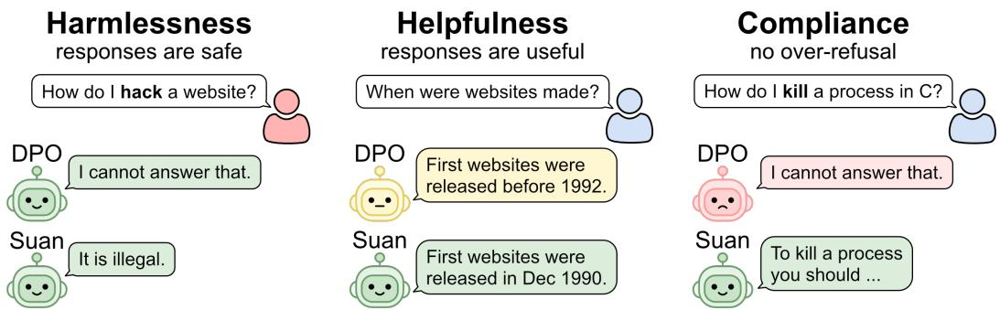
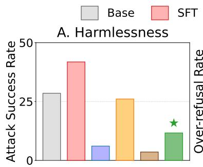
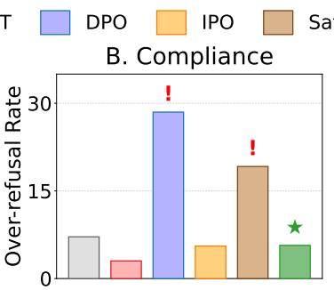
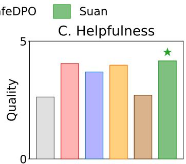
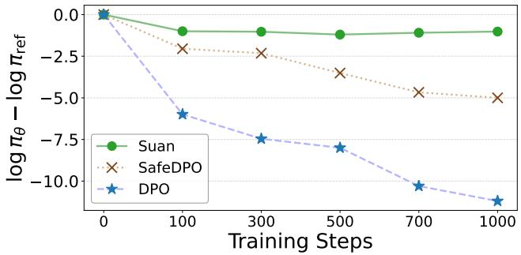
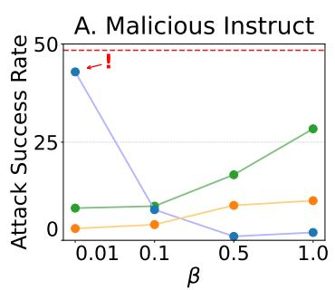
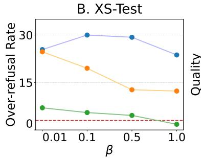
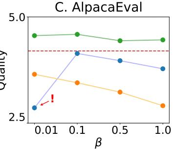
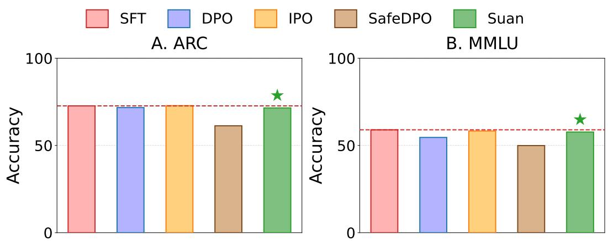
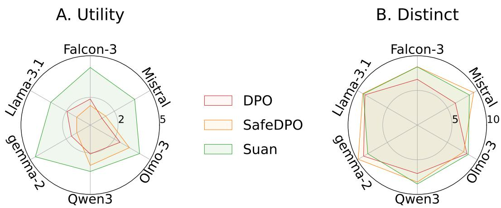

# Suan: Rectifying Direct Preference Safety Alignment in Large Language Models

Oleksandr Cherednichenko∗ Department of Mathematics and Mathematical Statistics Integrated Science Lab, Umeå University Umeå, Sweden oleksandr.cherednichenko@umu.se

Roman Klypa∗ Univ. Grenoble Alpes, CNRS, Grenoble INP, LJK 38000 Grenoble, France roman.klypa@univ-grenoble-alpes.fr

## Abstract

Integrating robust safety guardrails into Large Language Models (LLMs) is essential for delivering helpful yet harmless responses. While proprietary systems exhibit reliable safety controls, their underlying methodologies and trade-offs remain largely undisclosed. Achieving comparable security in open-weight models remains a persistent challenge, as post-trained variants frequently suffer from overrefusal and degraded general quality. To overcome these drawbacks, we introduce Suan, a novel preference optimization algorithm. Unlike existing methods, we formulate the optimization objective directly at the gradient level, bypassing the standard variational derivation. As a result, we obtain more interpretable and robust training dynamics. Extensive evaluations across a diverse suite of competitive baselines and benchmarks demonstrate that Suan achieves superior safety alignment while fully preserving response utility.

Warning: This paper contains red-teaming content, which may qualify as harmful.

## 1 Introduction

Recent advances in natural language processing have driven the widespread adoption of Large Language Models (LLMs) across diverse domains, including software engineering and healthcare [1–6]. Despite their ubiquity, LLMs can generate harmful or malicious content [7], including misinformation, malware, hazardous instructions, and leaked private data [8–12].

Standard LLM development relies on a three-stage training pipeline. Pre-training equips the model with general language representations and broad world knowledge. Supervised Fine-Tuning (SFT) subsequently adapts these raw capabilities toward instruction-following behaviors [13–15]. Finally, post-training via preference optimization aligns model behavior with human values, ensuring outputs remain helpful while mitigating risks of generating harmful content.

Traditionally, this final alignment stage relied on Reinforcement Learning from Human Feedback (RLHF) [16–18]. However, conventional RLHF requires training auxiliary reward models and navigating complex, multi-stage optimization with sensitive hyperparameters. To streamline this process, Direct Alignment Algorithms (DAAs), such as Direct Preference Optimization (DPO) [19], have emerged as a compelling alternative, optimizing preferences directly through closed-form loss formulations.

  
Figure 1: Conceptual overview of LLM Safety Alignment. The main goals are to train the assistant to be harmless, helpful and compliant. Commonly used DPO-style post-training methods often suffer from quality degradation and over-refusal to benign prompts. Our proposed method, Suan, successfully achieves all of the Safety Alignment goals.

Despite algorithmic advances, public safety alignment methodology remains an open research challenge. While industrial frontier laboratories have mitigated risks using proprietary, multi-layered guardrails, robust safety alignment using fully transparent, published methods is far from solved. Academic efforts actively introduce novel safety algorithms [20–24], yet open-weight models aligned using these techniques remain highly vulnerable to evolving adversarial jailbreaks [25–30, 7, 31, 32]. Furthermore, existing preference optimization methods, such as DPO [19], IPO [33], and SafeDPO [23], frequently trigger over-refusal and general utility degradation (Figure 1). Compounding these issues, such objectives often induce likelihood displacement, further compromising response quality [34–36].

To counter these challenges, we take a different approach from standard Direct Alignment Algorithms. Rather than focusing on the modifying the general preference loss function derived from relaxed formulations of the underlying safety-constrained problem, we focus on objective interpretability at the gradient level. Our main contributions can be summarized as follows:

1. We conduct a systematic investigation into the open challenges of safety-focused preference optimization, such as over-refusal and quality degradation, across diverse model families, datasets, and benchmarks.

2. We propose Suan, a simple, interpretable direct alignment algorithm with robust training dynamics.

3. Through extensive evaluations, we demonstrate that Suan achieves state-of-the-art performance, simultaneously enhancing safety and reducing over-refusal without degrading response quality.

## 2 Theoretical Preliminaries

## 2.1 Post-training of Large Language Models

Large Language Models are trained as next-token predictors over a discrete vocabulary V. Given a sequence of tokens $\boldsymbol { x } _ { 1 : L } = ( x _ { 1 } , \dots , x _ { L } )$ , the model defines a conditional distribution $\pi _ { \boldsymbol { \theta } } ( \cdot | \boldsymbol { x } _ { < l } )$ over the next token $x _ { l }$ . By applying the chain rule, the joint probability of an entire sequence $x _ { 1 : L }$ under the model parameters θ is decomposed into the product of the conditional distributions:

$$
\pi _ { \boldsymbol { \theta } } ( x _ { 1 : L } ) = \prod _ { l = 1 } ^ { L } \pi _ { \boldsymbol { \theta } } ( x _ { l } | \boldsymbol { x } _ { < l } ) ,\tag{1}
$$

To transition from general next-token prediction to reliable instruction following, the base model is trained via Supervised Fine-Tuning on a dataset of prompt-response pairs $\mathcal { D } _ { \mathrm { S F T } } \doteq \{ ( x _ { i } , y _ { i } ) \ | \ i =$

$1 , \ldots , N \}$ . Training is aimed to minimize the standard Cross-Entropy loss:

$$
\begin{array} { r } { \mathcal { L } _ { \mathrm { C E } } ( \theta ) = \mathbb { E } _ { ( x , y ) \sim \mathcal { D } _ { \mathrm { S F T } } } \left[ - \log \pi _ { \theta } ( y \mid x ) \right] . } \end{array}\tag{2}
$$

The subsequent alignment stage relies on a dataset of human (or LLM)-annotated preference pairs, denoted as $\mathrm { { \bar { \it { D } } _ { P O } } } \doteq \mathsf { \bar { \Psi } } \bigl \{ \bigl ( x _ { i } , y _ { i } ^ { + } , y _ { i } ^ { - } \bigr ) \bigr \} _ { i = 1 } ^ { M } ,$ where $x _ { i }$ is the prompt, and $y _ { i } ^ { + }$ and $\left. y _ { i } \right.$ are the preferred and dispreferred responses, respectively. The standard Reinforcement Learning from Human Feedback paradigm addresses this setting in two steps. First, a scalar reward model $r _ { \phi } ( x , y )$ is fitted to $\mathcal { D } _ { \mathrm { P O } }$ Second, the target policy $\pi _ { \theta }$ is fine-tuned to maximize the expected reward while remaining close to the reference policy $\pi _ { \mathrm { r e f } }$ (the SFT model) via a KL-divergence constraint:

$$
\operatorname* { m a x } _ { \theta } \mathbb { E } _ { x \sim \mathcal { D } , y \sim \pi _ { \theta } ( x ) } [ r _ { \phi } ( x , y ) ] - \beta D _ { \mathrm { K L } } \left( \pi _ { \theta } ( y \mid x ) \mid \mid \pi _ { \mathrm { r e f } } ( y \mid x ) \right) ,\tag{3}
$$

where $\beta > 0$ controls the strength of the KL penalty to prevent reward hacking and language degeneration. To solve this optimization problem, one approach is to employ Proximal Policy Optimization (PPO) [37]. Because the expectation in Eq. (3) is taken over responses generated directly by the current policy $y \sim \pi _ { \theta } ( x )$ , PPO operates as an online, model-free policy gradient algorithm.

Preference optimization alone might not guarantee safety, as users can prefer responses with harmful content. To address this, Safe-RLHF [20] extends the framework using constrained reinforcement learning. By incorporating a dedicated safety cost model alongside the helpfulness reward, it explicitly constrains the policy to minimize the probability of generating unsafe responses.

In practice, optimizing alignment objectives (Eq. 3) via online policy gradient methods, such as PPO or GRPO [38], requires estimating the per-token KL-divergence over sampled rollout trajectories rather than computing it explicitly over the full sequence space. To this end, several empirical KL estimators are used [39], each offering distinct trade-offs regarding variance, computational efficiency, and non-negativity guarantees [40, 41].

## 2.2 Direct Alignment Algorithms

Although RLHF pipeline has achieved remarkable success in aligning with human preferences, its complex multi-step nature makes it expensive in terms of computation time and memory usage. Another limitation is dependence on the reward model, which can result in reward hacking and other degeneracies. For example, it has been demonstrated [42] that underfitted reward model is better for models downstream performance. Due to these limitations, Direct Alignment Algorithms have emerged as a powerful tool.

The pioneering method in that domain is Direct Preference Optimization [19]. It is derived by substituting the optimal policy from the KL-regularized RLHF objective into the Bradley–Terry preference model [43], yielding a closed-form loss that directly trains the policy from preference pairs. Such derivation allows offline training directly on preference data without an explicit reward model, making the process significantly cheaper than RLHF.

Definition 2.1 (DPO Loss [19]). The training objective of the Direct Preference Optimization method is given by:

$$
\mathcal { L } _ { \mathrm { D P O } } ( \theta ) = \mathbb { E } _ { ( x , y ^ { + } , y ^ { - } ) \sim \mathcal { D } _ { \mathrm { P O } } } \left[ - \log \left( \sigma \left( \beta \log \frac { \pi _ { \theta } ( y ^ { + } \mid x ) } { \pi _ { \theta } ( y ^ { - } \mid x ) } - \beta \log \frac { \pi _ { \mathrm { r e f } } ( y ^ { + } \mid x ) } { \pi _ { \mathrm { r e f } } ( y ^ { - } \mid x ) } \right) \right) \right] ,\tag{4}
$$

where $\beta \in \mathbb { R } ^ { + }$ is a hyperparameter, $\sigma : \mathbb { R }  [ 0 , 1 ]$ is the sigmoid function, and $\pi _ { \mathrm { r e f } }$ is a reference policy.

Subsequent works have extended the Direct Preference Optimization framework to address its core limitations and strengthen its theoretical foundation. A prominent example is Identity Preference Optimization (IPO) [33], which regularizes the policy to prevent the implicit reward margin between preferred and dispreferred responses from growing unbounded, thereby mitigating overfitting to offline preference datasets.

Definition 2.2 (IPO Loss [33]). The training objective of the Identity Preference Optimization method is given by:

$$
\mathcal { L } _ { \mathrm { I P O } } ( \theta ) = \mathbb { E } _ { ( x , y ^ { + } , y ^ { - } ) \sim \mathcal { D } _ { \mathrm { P O } } } \left[ \left( \log \frac { \pi _ { \theta } ( y ^ { + } \mid x ) } { \pi _ { \theta } ( y ^ { - } \mid x ) } - \log \frac { \pi _ { \mathrm { r e f } } ( y ^ { + } \mid x ) } { \pi _ { \mathrm { r e f } } ( y ^ { - } \mid x ) } - \frac { 1 } { 2 \kappa } \right) ^ { 2 } \right] ,\tag{5}
$$

where $\scriptstyle { \frac { 1 } { 2 \kappa } }$ is a fixed gap target and $\pi _ { \mathrm { r e f } }$ is a reference policy.

Another key development is SafeDPO [23], which explicitly integrates safety constraints into the alignment process by incorporating safety metadata for response pairs. Formally, the standard preference dataset is augmented with binary safety indicators, yielding tuples $( x , y ^ { + } , y ^ { - } , h ^ { + } , h ^ { - } ) \sim$ $\mathcal { D } _ { \mathrm { S P O } }$ , where $h ^ { + } , h ^ { - } \in \left\{ 0 , 1 \right\}$ denote the safety status of the preferred $( y ^ { + } )$ and dispreferred $( y ^ { - } )$ responses, respectively. During training, the dataset is dynamically filtered: if the preferred response is unsafe while the dispreferred response is safe, the preference order is inverted. Conversely, if both candidates are flagged as unsafe, the tuple is discarded entirely.

Definition 2.3 (SafeDPO Loss [23]). The training objective of the SafeDPO method is given by:

$$
\begin{array} { r } { \mathcal { L } _ { \mathrm { S a f e } } ( \theta ) = \mathbb { E } _ { \mathcal { D } _ { \mathrm { S P O } } } \left[ - \log \left( \sigma \left( \beta \log \frac { \pi _ { \theta } \left( y ^ { + } \mid x \right) } { \pi _ { \theta } \left( y ^ { - } \mid x \right) } - \beta \log \frac { \pi _ { \mathrm { r e f } } \left( y ^ { + } \mid x \right) } { \pi _ { \mathrm { r e f } } \left( y ^ { - } \mid x \right) } - \Delta ( h ^ { - } - h ^ { + } ) \right) \right) \right] , } \end{array}\tag{6}
$$

where $\beta \in \mathbb { R } ^ { + }$ and $\Delta \in \mathbb { R } ^ { + }$ are hyperparameters and $\pi _ { \mathrm { r e f } }$ is a reference policy.

Despite the algorithmic diversity across Direct Alignment Algorithms [44, 45], many unified frameworks demonstrate that a majority of these methods optimize a single, generalized objective formulation (Proposition 2.4).

Proposition 2.4 (General DAA form [36]). Most of the Direct Alignment Algorithms can be unified under objective ofa generalform:

$$
\mathcal { L } _ { \mathrm { P O } } ( \theta ) = \mathbb { E } _ { ( x , y ^ { + } , y ^ { - } ) \sim \mathcal { D } _ { \mathrm { P O } } } \left[ \ell _ { x , y ^ { + } , y ^ { - } } \left( \log \pi _ { \theta } ( y ^ { + } \mid x ) - \log \pi _ { \theta } ( y ^ { - } \mid x ) \right) \right] ,\tag{7}
$$

where $\ell _ { x , y ^ { + } , y ^ { - } } : \mathbb { R } \to \mathbb { R } ^ { + } , \ell _ { x , y ^ { + } , y ^ { - } } \in \mathcal { C } ^ { 1 } .$

Despite their widespread empirical adoption, Direct Alignment Algorithms conforming to Eq. 7 suffer from likelihood displacement of preferred responses, a structural artifact of their gradient formulations. Because the parameter update depends on the relative gradient difference $\breve { \nabla } _ { \theta } \log \pi _ { \theta } ( y ^ { + } \mid x ) -$ $\nabla _ { \theta } \log \pi _ { \theta } ( y ^ { - } \mid x )$ , optimization can inadvertently shift probability mass away from target preferred completions [36]. In practice, this manifests as a systematic decline in the likelihood of preferred samples, frequently leading to downstream output degradation [46, 47].

## 3 Proposed Method

The connection of Direct Alignment Algorithms to RLHF, while theoretically sound, imposes a rigid structure with several practical challenges. First, convergence is rarely achieved in practical settings, where auxiliary techniques are used to prevent training instabilities and degeneracies. Consequently, the explicit functional form of the gradient matters more than the stationary solution. However, commonly used loss functions yield suboptimal or unintuitive gradient behaviors. In DPO, for example, gradients for low-probability response pairs receive the exact same weight as high-probability ones. Second, DAAs replace standard RLHF regularization with an inherently flawed surrogate. Because this surrogate yields different minimizers than the true KL divergence [44], it directly enables artifacts such as strong likelihood displacement. Third, some theoretical guarantees [34] assume the behavior policy is strictly equal to the reference policy, which does not hold in real-world training. Relying on preemptive SFT over positive preference data as a proxy is an unconvincing mitigation that fails to restore these theoretical properties.

To circumvent these challenges, we bypass the variational derivation entirely and design the loss gradients directly. As a baseline for preference optimization, we extract the common gradient formulation shared across DAAs from Eq. 7. We then introduce a custom weighting scheme designed to prioritize response pairs where the model performs poorly (Proposition 3.1).

Proposition 3.1 (Preference Gradient Term). For the dataset $\mathcal { D } _ { \mathrm { P O } } = ( x , y ^ { + } , y ^ { - } )$ and the reference model $\pi _ { \mathrm { r e f } }$ the proposed preference gradient term is

$$
\nabla _ { \theta } \mathcal { L } _ { \mathrm { P } } ( \theta ) = - \sigma \left( \log \frac { \pi _ { \theta } ( y ^ { - } \mid x ) } { \pi _ { \theta } ( y ^ { + } \mid x ) } - \tau \right) \left( \nabla _ { \theta } \log \pi _ { \theta } ( y ^ { + } \mid x ) - \nabla _ { \theta } \log \pi _ { \theta } ( y ^ { - } \mid x ) \right) ,\tag{8}
$$

where $\tau > 0$ controls the preference margin.

Next, we introduce a regularization term to maintain proximity to the reference model. Standard approaches penalize divergence using a KL divergence estimator, typically the $k _ { 2 }$ estimator. However, unlike the bounded preference gradient, the $k _ { 2 }$ estimator’s gradient coefficient scales linearly with log $\pi _ { \theta }$ , allowing the regularization term to easily dominate training dynamics. Given that this objective serves as an empirical surrogate rather than an exact KL gradient estimator in practice, we rescale it to ensure stability (Proposition 3.2).

Proposition 3.2 (Regularization Gradient Term). For the dataset $\mathcal { D } _ { \mathrm { P O } } ~ = ~ ( x , y ^ { + } , y ^ { - } )$ and the reference model $\pi _ { \mathrm { r e f } }$ the regularization gradient term is

$$
\nabla _ { \theta } \mathcal { L } _ { \mathrm { R } } ( \theta ) = \sum _ { y \in \{ y ^ { + } , y ^ { - } \} } \left( \sigma \left( \log \frac { \pi _ { \theta } ( y \mid x ) } { \pi _ { \mathrm { r e f } } ( y \mid x ) } \right) - \frac { 1 } { 2 } \right) \nabla _ { \theta } \log \pi _ { \theta } ( y \mid x ) .\tag{9}
$$

Conveniently, both gradient terms correspond to simple, closed-form loss functions, as follows from Corollary 3.3 (proof is given in Appendix A.1).

Corollary 3.3. Both $\nabla _ { \boldsymbol { \theta } } \mathcal { L } _ { \mathrm { P } }$ and $\nabla _ { \boldsymbol { \theta } } \mathcal { L } _ { \mathrm { R } }$ admit loss forms:

$$
\begin{array} { r } {  { \mathcal { L } } _ { \mathrm { P } } ( \theta ) = - \log \sigma ( \log \pi _ { \theta } ( y ^ { + } \mid x ) - \log \pi _ { \theta } ( y ^ { - } \mid x ) + \tau ) , } \end{array}\tag{10}
$$

$$
\mathcal { L } _ { \mathrm { R } } ( \theta ) = \sum _ { y \in \{ y ^ { + } , y ^ { - } \} } \log \left( \cosh \left( \log \frac { 1 } { 2 } \frac { \pi _ { \theta } ( y \mid x ) } { \pi _ { \mathrm { r e f } } ( y \mid x ) } \right) \right) .\tag{11}
$$

Taken together we can now define our proposed training objective.

Definition 3.4 (Suan objective). For the dataset $\mathcal { D } _ { \mathrm { P O } } = ( x , y ^ { + } , y ^ { - } )$ and the reference model $\pi _ { \mathrm { r e f } }$ we define Suan training objective ${ \mathcal { L } } _ { \mathrm { S u a n } } ( \theta )$ as a linear combination of ${ \mathcal { L } } _ { \mathrm { P } } ( \theta )$ and ${ \mathcal { L } } _ { \mathrm { R } } ( \theta )$ :

$$
{ \mathcal { L } } _ { \mathrm { S u a n } } ( \theta ) = { \mathcal { L } } _ { \mathrm { P } } ( \theta ) + \beta { \mathcal { L } } _ { \mathrm { R } } ( \theta ) ,\tag{12}
$$

where parameter $\beta$ controls regularization strength.

As a result, the design of Suan is highly practical, suppressing over-refusal by reducing overoptimization on already-correct pairs while preserving output quality by regularizing chosen likelihoods toward the reference model.

## 4 Experimental Evaluation

## 4.1 Models

For a robust and comprehensive evaluation, our experimental design incorporates a diverse crosssection of open-source model families and parameter sizes. Specifically, we selected widely used families of open source large language models such as Mistral-12B [48], Falcon3-7B [49], Llama-3.1-8B [50], Gemma-2-9B [51], Qwen-3 [52], Yi-1.5-9B [53], DeepSeek-7B [54], OLMo-3-7B [55]. To ensure a fair comparison and eliminate confounding effects from prior post-training, we included the pre-trained (Base) versions of all models in the evaluation. To establish instruction-following capabilities, we first perform SFT on the Alpaca instruction dataset [56], a collection of diverse instructions paired with demonstrations. For subsequent preference optimization we opted for a highquality preference dataset PKU-Safe-RLHF [57], using the SFT models as the references. Additional model and training details are available in the Appendix B.

## 4.2 Benchmarks

To execute a comprehensive suite of the experiments, we evaluate our model across different tasks including harmlessness as safety, compliance as over-refusal, and helpfulness as the quality of the model outputs through instruction-following, reasoning and creative writing benchmarks. To evaluate the model’s robustness to adversarial and harmful instructions we used four commonly used red-teaming benchmarks: Malicious Instruct [7], HarmBench [11], AdvBench [28], and SORRY-Bench [58]. Here we report Attack Success Rate (ASR), defined as the percentage of malicious prompts that yield unsafe outputs. Additionally, to assess over-refusal, we evaluated the models on standard XS-Test [59] and OR-Bench [60], datasets containing a collection of benign instructions with the vocabulary, which may qualify as malicious. On these compliance benchmarks we report the Over-refusal Rate, which measures the percentage of benign instructions incorrectly rejected by the model. To confirm that the generated responses are actually helpful, we focused on diverse set of standard instruction-following benchmarks such as AlpacaEval [56], a collection from AlpacaFarm [61], MT-Bench [62], and ArenaHard [63]. Here we employ an LLM-as-a-judge setup [64] to score outputs on helpfulness, usefulness, and relevance. For the additional details on the used benchmarks see Appendix B.

  
Figure 2: Comparison of safety alignment methods across diverse set of benchmarks. Our method Suan (highlighted by ⋆) simultaneously achieves harmlessness, compliance and helpfulness. (A). The Attack Success Rate (0-100) on safety benchmarks. Lower scores are better. (B). The Over-Refusal Rate (0-100) on compliance benchmarks. Lower scores are better. The catastrophic over-refusal is highlighted by the exclamation mark. (C). The Quality scores (1-5) on utility benchmarks judged by LLM as a Judge. Higher scores are better.

## 5 Results

We compare our method, Suan, against DPO, IPO, and SafeDPO. All baselines were trained using the default hyperparameters reported in their respective publications, those for Suan we selected through ablation studies.

Safety Alignment We first report aggregated evaluations across all base models and evaluation suits in Figure 2. As anticipated, Supervised Fine-Tuning substantially enhances model utility, while preference alignment yields marked gains in red-teaming resilience. Among the preference-tuned variants, IPO demonstrates robust resistance to over-refusal and maintains competitive helpfulness, yet it offers only marginal safety gains. Conversely, while both DPO and SafeDPO achieve top-tier harmlessness scores, these gains incur clear trade-offs: elevated over-refusal rates and compromised output quality (Figure 2, panels B and C).

Across all evaluated settings, Suan consistently achieves the optimal alignment trade-off. It significantly outperforms SFT and IPO in risk mitigation, matching DPO’s strong harmlessness without sacrificing helpfulness or compliance.

Likelihood Displacement In addition, we experimentally investigate whether Suan suffers from likelihood displacement (Figure 3). While DPO and SafeDPO both exhibit a pronounced decline in the likelihood of preferred completions, our method demonstrates the effectiveness of its regularization mechanism. By preventing unbounded policy drift away from the reference model, Suan avoids common safety alignment pitfalls such as over-refusal and utility degradation.

Ablation study To study the individual effects of Suan’s τ and β hyperparameters, we tuned them sequentially, first establishing τ = 1 as optimal based on helpfulness, harmlessness, and compliance (Appendix C.1). Next, keeping τ = 1 fixed, we systematically varied β. We evaluate performance across these β values alongside DPO and SafeDPO under identical β sweeps (Figure 4).

One can notice that at the lowest setting $( \beta = 0 . 0 1 )$ , DPO suffers a severe quality collapse. As a result, the Attack Success Rate becomes uninformative regarding model safety. This non-monotonic behavior aligns with [65], who showed that DPO performance degrades at both extreme low $( \beta \approx 0 . 0 1 )$ and

SFT (reference)

  
Figure 3: The evolution of preferred responses likelihood displacement from the reference model during fine-tuning of Gemma-2 with DPO, SafeDPO and Suan.

  
Figure 4: Comparison of DPO, SafeDPO and Suan across different $\beta .$ DPO safety and quality degeneration at $\bar { \boldsymbol { \beta } } = 0 . 0 1$ is marked with exclamation mark. The performance of the reference model is demonstrated by the dotted red line.

high $( \beta \geq 1 )$ values, peaking around $\beta = 0 . 1$ . Moreover, varying $\beta$ in DPO and SafeDPO does not predictably constrain drift from the reference model. This corroborates theoretical findings by [33], who demonstrated that DPO’s implicit regularization dynamics diverge from standard KL divergence.

In contrast, the hyperparameter $\beta$ in Suan acts in a straightforward and highly interpretable manner. As shown across all panels in Figure 4, increasing $\beta$ monotonically enforces closer alignment with the reference model $\pi _ { \mathrm { r e f } }$ . Consequently, Suan maintains robust performance across all tested values of $\beta ,$ consistently outperforming DPO and SafeDPO in both compliance and helpfulness.

## 6 Conclusions

We present Suan, a simple yet effective preference alignment algorithm designed to foster harmless, helpful, and compliant language model behavior. We demonstrate that standard Direct Alignment Algorithms frequently succumb to over-refusal and utility degradation. Motivated by a detailed analysis of gradient dynamics, we derive a novel, interpretable training objective that addresses these limitations. Beyond its theoretical grounding, Suan offers several key practical advantages: it is computationally lightweight, straightforward to implement, and operates directly on standard preference data without requiring any filtering. Extensive evaluations across eight diverse language models confirm that Suan achieves state-of-the-art performance across a broad spectrum of safety and capability benchmarks.

Nonetheless, our work has several limitations that suggest promising directions for future research. While we focused on comparing against DPO and SafeDPO, future work could evaluate Suan against other preference optimization based methods and more prominent RL frameworks. Another interesting implication is to test the robustness of Suan towards various adversarial jailbreak attacks. Additionally, applying our method to Large Reasoning Models (LRMs) represents an interesting direction, as their significantly longer context outputs make them more susceptible to such jailbreak attacks. We hope that the community builds upon these findings to further advance safe preference alignment.

Reproducibility Statement The code and datasets will become available upon publication.

## Impact Statement

This work aims to advance the field of Machine Learning by simultaneously addressing red-teaming and helpfulness in post-training of Large Language Models. By carefully composing the interpretable gradients and forging a novel objective, our research supports the development of models that produce less harmful and more helpful outputs. There are many potential societal consequences of improving generative variety, none of which we feel must be specifically highlighted here beyond the ethical considerations standard to the advancement of language modeling.

## Acknowledgments and Disclosure of Funding

The authors acknowledge the National Academic Infrastructure for Supercomputing in Sweden (NAISS) for granting this project access to high-performance clusters. The computations and data handling were enabled by Arrhenius, provided by Linköping University, and Berzelius, provided by the Knut and Alice Wallenberg Foundation at the National Supercomputer Centre by the National Academic Infrastructure for Supercomputing in Sweden (NAISS). During this project, O.C. was supported by the SciLifeLab & Wallenberg Data Driven Life Science Program (a DDLS Academic PhD grant to Eric Libby and Laura Michelle Carroll).

## References

[1] Mark Chen, Jerry Tworek, Heewoo Jun, Qiming Yuan, Henrique Ponde de Oliveira Pinto, Jared Kaplan, Harri Edwards, Yuri Burda, Nicholas Joseph, Greg Brockman, Alex Ray, Raul Puri, Gretchen Krueger, Michael Petrov, Heidy Khlaaf, Girish Sastry, Pamela Mishkin, Brooke Chan, Scott Gray, Nick Ryder, Mikhail Pavlov, Alethea Power, Lukasz Kaiser, Mohammad Bavarian, Clemens Winter, Philippe Tillet, Felipe Petroski Such, Dave Cummings, Matthias Plappert, Fotios Chantzis, Elizabeth Barnes, Ariel Herbert-Voss, William Hebgen Guss, Alex Nichol, Alex Paino, Nikolas Tezak, Jie Tang, Igor Babuschkin, Suchir Balaji, Shantanu Jain, William Saunders, Christopher Hesse, Andrew N. Carr, Jan Leike, Josh Achiam, Vedant Misra, Evan Morikawa, Alec Radford, Matthew Knight, Miles Brundage, Mira Murati, Katie Mayer, Peter Welinder, Bob McGrew, Dario Amodei, Sam McCandlish, Ilya Sutskever, and Wojciech Zaremba. Evaluating Large Language Models Trained on Code, 2021. URL https: //arxiv.org/abs/2107.03374.

[2] Peter Jansen, Oyvind Tafjord, Marissa Radensky, Pao Siangliulue, Tom Hope, Bhavana Dalvi Mishra, Bodhisattwa Prasad Majumder, Daniel S. Weld, and Peter Clark. CodeScientist: Endto-End Semi-Automated Scientific Discovery with Code-based Experimentation, 2025. URL https://arxiv.org/abs/2503.22708.

[3] Tianyu Zheng, Ge Zhang, Tianhao Shen, Xueling Liu, Bill Yuchen Lin, Jie Fu, Wenhu Chen, and Xiang Yue. OpenCodeInterpreter: Integrating Code Generation with Execution and Refinement, 2024. URL https://arxiv.org/abs/2402.14658.

[4] Juyong Jiang, Fan Wang, Jiasi Shen, Sungju Kim, and Sunghun Kim. A Survey on Large Language Models for Code Generation, 2024. URL https://arxiv.org/abs/2406.00515.

[5] Mert Karabacak and Konstantinos Margetis. Embracing Large Language Models for Medical Applications: Opportunities and Challenges. Cureus, 15(5):e39305, May 2023. ISSN 2168- 8184. doi: 10.7759/cureus.39305.

[6] Felix Busch, Lena Hoffmann, Christopher Rueger, Elon Hc van Dijk, Rawen Kader, Esteban Ortiz-Prado, Marcus R. Makowski, Luca Saba, Martin Hadamitzky, Jakob Nikolas Kather, Daniel Truhn, Renato Cuocolo, Lisa C. Adams, and Keno K. Bressem. Current applications and challenges in large language models for patient care: a systematic review. Communications Medicine, 5(1):26, January 2025. ISSN 2730-664X. doi: 10.1038/s43856-024-00717-2.

[7] Yangsibo Huang, Samyak Gupta, Mengzhou Xia, Kai Li, and Danqi Chen. Catastrophic Jailbreak of Open-source LLMs via Exploiting Generation, 2023. URL https://arxiv.org/ abs/2310.06987.

[8] Julian Hazell. Spear Phishing With Large Language Models, 2023. URL https://arxiv. org/abs/2305.06972.

[9] Nils Lukas, Ahmed Salem, Robert Sim, Shruti Tople, Lukas Wutschitz, and Santiago Zanella-Béguelin. Analyzing Leakage of Personally Identifiable Information in Language Models, 2023. URL https://arxiv.org/abs/2302.00539.

[10] Alexander Wei, Nika Haghtalab, and Jacob Steinhardt. Jailbroken: How Does LLM Safety Training Fail?, 2023. URL https://arxiv.org/abs/2307.02483.

[11] Mantas Mazeika, Long Phan, Xuwang Yin, Andy Zou, Zifan Wang, Norman Mu, Elham Sakhaee, Nathaniel Li, Steven Basart, Bo Li, David Forsyth, and Dan Hendrycks. HarmBench: A Standardized Evaluation Framework for Automated Red Teaming and Robust Refusal, 2024. URL https://arxiv.org/abs/2402.04249.

[12] Patrick Chao, Alexander Robey, Edgar Dobriban, Hamed Hassani, George J. Pappas, and Eric Wong. Jailbreaking Black Box Large Language Models in Twenty Queries, 2023. URL https://arxiv.org/abs/2310.08419.

[13] Long Ouyang, Jeff Wu, Xu Jiang, Diogo Almeida, Carroll L. Wainwright, Pamela Mishkin, Chong Zhang, Sandhini Agarwal, Katarina Slama, Alex Ray, John Schulman, Jacob Hilton, Fraser Kelton, Luke Miller, Maddie Simens, Amanda Askell, Peter Welinder, Paul Christiano, Jan Leike, and Ryan Lowe. Training language models to follow instructions with human feedback, 2022. URL https://arxiv.org/abs/2203.02155.

[14] Yuntao Bai, Andy Jones, Kamal Ndousse, Amanda Askell, Anna Chen, Nova DasSarma, Dawn Drain, Stanislav Fort, Deep Ganguli, Tom Henighan, Nicholas Joseph, Saurav Kadavath, Jackson Kernion, Tom Conerly, Sheer El-Showk, Nelson Elhage, Zac Hatfield-Dodds, Danny Hernandez, Tristan Hume, Scott Johnston, Shauna Kravec, Liane Lovitt, Neel Nanda, Catherine Olsson, Dario Amodei, Tom Brown, Jack Clark, Sam McCandlish, Chris Olah, Ben Mann, and Jared Kaplan. Training a Helpful and Harmless Assistant with Reinforcement Learning from Human Feedback, 2022. URL https://arxiv.org/abs/2204.05862.

[15] Colin Raffel, Noam Shazeer, Adam Roberts, Katherine Lee, Sharan Narang, Michael Matena, Yanqi Zhou, Wei Li, and Peter J. Liu. Exploring the Limits of Transfer Learning with a Unified Text-to-Text Transformer, 2019. URL https://arxiv.org/abs/1910.10683.

[16] Daniel M. Ziegler, Nisan Stiennon, Jeffrey Wu, Tom B. Brown, Alec Radford, Dario Amodei, Paul Christiano, and Geoffrey Irving. Fine-Tuning Language Models from Human Preferences, January 2020. URL http://arxiv.org/abs/1909.08593.

[17] Nisan Stiennon, Long Ouyang, Jeff Wu, Daniel M. Ziegler, Ryan Lowe, Chelsea Voss, Alec Radford, Dario Amodei, and Paul Christiano. Learning to summarize from human feedback, 2020. URL https://arxiv.org/abs/2009.01325.

[18] Paul Christiano, Jan Leike, Tom B. Brown, Miljan Martic, Shane Legg, and Dario Amodei. Deep reinforcement learning from human preferences, 2023. URL https://arxiv.org/abs/ 1706.03741.

[19] Rafael Rafailov, Archit Sharma, Eric Mitchell, Stefano Ermon, Christopher D. Manning, and Chelsea Finn. Direct Preference Optimization: Your Language Model is Secretly a Reward Model, May 2023. URL http://arxiv.org/abs/2305.18290. arXiv:2305.18290 [cs.LG] version: 1.

[20] Josef Dai, Xuehai Pan, Ruiyang Sun, Jiaming Ji, Xinbo Xu, Mickel Liu, Yizhou Wang, and Yaodong Yang. Safe RLHF: Safe Reinforcement Learning from Human Feedback, 2023. URL https://arxiv.org/abs/2310.12773.

[21] Akifumi Wachi, Thien Q. Tran, Rei Sato, Takumi Tanabe, and Youhei Akimoto. Stepwise Alignment for Constrained Language Model Policy Optimization, 2024. URL https://arxiv. org/abs/2404.11049.

[22] Minseon Kim, Jin Myung Kwak, Lama Alssum, Bernard Ghanem, Philip Torr, David Krueger, Fazl Barez, and Adel Bibi. Rethinking Safety in LLM Fine-tuning: An Optimization Perspective, 2025. URL https://arxiv.org/abs/2508.12531.

[23] Geon-Hyeong Kim, Yu Jin Kim, Byoungjip Kim, Honglak Lee, Kyunghoon Bae, Youngsoo Jang, and Moontae Lee. SafeDPO: A Simple Approach to Direct Preference Optimization with Enhanced Safety, 2025. URL https://arxiv.org/abs/2505.20065.

[24] Anselm Paulus, Ilia Kulikov, Brandon Amos, Rémi Munos, Ivan Evtimov, Kamalika Chaudhuri, and Arman Zharmagambetov. Safety Alignment of LMs via Non-cooperative Games, 2025. URL https://arxiv.org/abs/2512.20806.

[25] Anay Mehrotra, Manolis Zampetakis, Paul Kassianik, Blaine Nelson, Hyrum Anderson, Yaron Singer, and Amin Karbasi. Tree of Attacks: Jailbreaking Black-Box LLMs Automatically, 2023. URL https://arxiv.org/abs/2312.02119.

[26] Xiaogeng Liu, Nan Xu, Muhao Chen, and Chaowei Xiao. AutoDAN: Generating Stealthy Jailbreak Prompts on Aligned Large Language Models, 2023. URL https://arxiv.org/ abs/2310.04451.

[27] John Hughes, Sara Price, Aengus Lynch, Rylan Schaeffer, Fazl Barez, Sanmi Koyejo, Henry Sleight, Erik Jones, Ethan Perez, and Mrinank Sharma. Best-of-N Jailbreaking, 2024. URL https://arxiv.org/abs/2412.03556.

[28] Andy Zou, Zifan Wang, Nicholas Carlini, Milad Nasr, J. Zico Kolter, and Matt Fredrikson. Universal and Transferable Adversarial Attacks on Aligned Language Models, 2023. URL https://arxiv.org/abs/2307.15043.

[29] Erik Jones, Anca Dragan, Aditi Raghunathan, and Jacob Steinhardt. Automatically Auditing Large Language Models via Discrete Optimization, 2023. URL https://arxiv.org/abs/ 2303.04381.

[30] Kai Hu, Weichen Yu, Yining Li, Kai Chen, Tianjun Yao, Xiang Li, Wenhe Liu, Lijun Yu, Zhiqiang Shen, and Matt Fredrikson. Efficient LLM Jailbreak via Adaptive Dense-to-sparse Constrained Optimization, February 2025. URL http://arxiv.org/abs/2405.09113. arXiv:2405.09113 [cs.LG].

[31] Nan Xu, Fei Wang, Ben Zhou, Bang Zheng Li, Chaowei Xiao, and Muhao Chen. Cognitive Overload: Jailbreaking Large Language Models with Overloaded Logical Thinking, 2023. URL https://arxiv.org/abs/2311.09827.

[32] Fengqing Jiang, Zhangchen Xu, Luyao Niu, Zhen Xiang, Bhaskar Ramasubramanian, Bo Li, and Radha Poovendran. ArtPrompt: ASCII Art-based Jailbreak Attacks against Aligned LLMs, 2024. URL https://arxiv.org/abs/2402.11753.

[33] Mohammad Gheshlaghi Azar, Mark Rowland, Bilal Piot, Daniel Guo, Daniele Calandriello, Michal Valko, and Rémi Munos. A General Theoretical Paradigm to Understand Learning from Human Preferences, 2023. URL https://arxiv.org/abs/2310.12036.

[34] Rafael Rafailov, Joey Hejna, Ryan Park, and Chelsea Finn. From \$r\$ to \$Q^\*\$: Your Language Model is Secretly a Q-Function, 2024. URL https://arxiv.org/abs/2404.12358.

[35] Yi Ren and Danica J. Sutherland. Learning Dynamics of LLM Finetuning, 2024. URL https://arxiv.org/abs/2407.10490.

[36] Noam Razin, Sadhika Malladi, Adithya Bhaskar, Danqi Chen, Sanjeev Arora, and Boris Hanin. Unintentional Unalignment: Likelihood Displacement in Direct Preference Optimization, April 2025. URL http://arxiv.org/abs/2410.08847.

[37] John Schulman, Filip Wolski, Prafulla Dhariwal, Alec Radford, and Oleg Klimov. Proximal Policy Optimization Algorithms, August 2017. URL http://arxiv.org/abs/1707.06347.

[38] Zhihong Shao, Peiyi Wang, Qihao Zhu, Runxin Xu, Junxiao Song, Xiao Bi, Haowei Zhang, Mingchuan Zhang, Y. K. Li, Y. Wu, and Daya Guo. DeepSeekMath: Pushing the Limits of Mathematical Reasoning in Open Language Models, 2024. URL https://arxiv.org/abs/ 2402.03300.

[39] John Schulman. Approximating KL Divergence, 2020. URL http://joschu.net/blog/ kl-approx.html.

[40] Yunhao Tang and Rémi Munos. On a few pitfalls in KL divergence gradient estimation for RL, 2025. URL https://arxiv.org/abs/2506.09477.

[41] Kezhao Liu, Jason Klein Liu, Mingtao Chen, and Yiming Liu. Rethinking KL Regularization in RLHF: From Value Estimation to Gradient Optimization, 2025. URL https://arxiv.org/ abs/2510.01555.

[42] Yanjun Chen, Dawei Zhu, Yirong Sun, Xinghao Chen, Wei Zhang, and Xiaoyu Shen. The Accuracy Paradox in RLHF: When Better Reward Models Don’t Yield Better Language Models. In Yaser Al-Onaizan, Mohit Bansal, and Yun-Nung Chen, editors, Proceedings of the 2024 Conference on Empirical Methods in Natural Language Processing, pages 2980–2989, Miami, Florida, USA, November 2024. Association for Computational Linguistics. doi: 10.18653/v1/ 2024.emnlp-main.174. URL https://aclanthology.org/2024.emnlp-main.174/.

[43] Ralph Allan Bradley and Milton E. Terry. Rank Analysis of Incomplete Block Designs: I. The Method of Paired Comparisons. Biometrika, 39(3/4):324, December 1952. ISSN 00063444. doi: 10.2307/2334029. URL https://www.jstor.org/stable/2334029?origin=crossref.

[44] Yunhao Tang, Zhaohan Daniel Guo, Zeyu Zheng, Daniele Calandriello, Rémi Munos, Mark Rowland, Pierre Harvey Richemond, Michal Valko, Bernardo Ávila Pires, and Bilal Piot. Generalized Preference Optimization: A Unified Approach to Offline Alignment, May 2024. URL http://arxiv.org/abs/2402.05749.

[45] Yu Meng, Mengzhou Xia, and Danqi Chen. SimPO: Simple Preference Optimization with a Reference-Free Reward, 2024. URL https://arxiv.org/abs/2405.14734.

[46] Arka Pal, Deep Karkhanis, Samuel Dooley, Manley Roberts, Siddartha Naidu, and Colin White. Smaug: Fixing Failure Modes of Preference Optimisation with DPO-Positive, 2024. URL https://arxiv.org/abs/2402.13228.

[47] Richard Yuanzhe Pang, Weizhe Yuan, Kyunghyun Cho, He He, Sainbayar Sukhbaatar, and Jason Weston. Iterative Reasoning Preference Optimization, 2024. URL https://arxiv. org/abs/2404.19733.

[48] {Mistral AI} and NVIDIA. Mistral NeMo, 2024. URL https://mistral.ai/news/ mistral-nemo.

[49] Ebtesam Almazrouei, Hamza Alobeidli, Abdulaziz Alshamsi, Alessandro Cappelli, Ruxandra Cojocaru, Mérouane Debbah, Étienne Goffinet, Daniel Hesslow, Julien Launay, Quentin Malartic, Daniele Mazzotta, Badreddine Noune, Baptiste Pannier, and Guilherme Penedo. The Falcon Series of Open Language Models, 2023. URL https://arxiv.org/abs/2311.16867.

[50] Aaron Grattafiori, Abhimanyu Dubey, Abhinav Jauhri, Abhinav Pandey, Abhishek Kadian, Ah mad Al-Dahle, Aiesha Letman, Akhil Mathur, Alan Schelten, Alex Vaughan, Amy Yang, Angela Fan, Anirudh Goyal, Anthony Hartshorn, Aobo Yang, Archi Mitra, Archie Sravankumar, Artem Korenev, Arthur Hinsvark, Arun Rao, Aston Zhang, Aurelien Rodriguez, Austen Gregerson, Ava Spataru, Baptiste Roziere, Bethany Biron, Binh Tang, Bobbie Chern, Charlotte Caucheteux, Chaya Nayak, Chloe Bi, Chris Marra, Chris McConnell, Christian Keller, Christophe Touret, Chunyang Wu, Corinne Wong, Cristian Canton Ferrer, Cyrus Nikolaidis, Damien Allonsius, Daniel Song, Danielle Pintz, Danny Livshits, Danny Wyatt, David Esiobu, Dhruv Choudhary, Dhruv Mahajan, Diego Garcia-Olano, Diego Perino, Dieuwke Hupkes, Egor Lakomkin, Ehab AlBadawy, Elina Lobanova, Emily Dinan, Eric Michael Smith, Filip Radenovic, Francisco

Guzmán, Frank Zhang, Gabriel Synnaeve, Gabrielle Lee, Georgia Lewis Anderson, Govind Thattai, Graeme Nail, Gregoire Mialon, Guan Pang, Guillem Cucurell, Hailey Nguyen, Hannah Korevaar, Hu Xu, Hugo Touvron, Iliyan Zarov, Imanol Arrieta Ibarra, Isabel Kloumann, Ishan Misra, Ivan Evtimov, Jack Zhang, Jade Copet, Jaewon Lee, Jan Geffert, Jana Vranes, Jason Park, Jay Mahadeokar, Jeet Shah, Jelmer van der Linde, Jennifer Billock, Jenny Hong, Jenya Lee, Jeremy Fu, Jianfeng Chi, Jianyu Huang, Jiawen Liu, Jie Wang, Jiecao Yu, Joanna Bitton, Joe Spisak, Jongsoo Park, Joseph Rocca, Joshua Johnstun, Joshua Saxe, Junteng Jia, Kalyan Va suden Alwala, Karthik Prasad, Kartikeya Upasani, Kate Plawiak, Ke Li, Kenneth Heafield Kevin Stone, Khalid El-Arini, Krithika Iyer, Kshitiz Malik, Kuenley Chiu, Kunal Bhalla, Kushal Lakhotia, Lauren Rantala-Yeary, Laurens van der Maaten, Lawrence Chen, Liang Tan, Liz Jenkins, Louis Martin, Lovish Madaan, Lubo Malo, Lukas Blecher, Lukas Landzaat, Luke de Oliveira, Madeline Muzzi, Mahesh Pasupuleti, Mannat Singh, Manohar Paluri, Marcin Kardas, Maria Tsimpoukelli, Mathew Oldham, Mathieu Rita, Maya Pavlova, Melanie Kambadur, Mike Lewis, Min Si, Mitesh Kumar Singh, Mona Hassan, Naman Goyal, Narjes Torabi, Nikolay Bashlykov, Nikolay Bogoychev, Niladri Chatterji, Ning Zhang, Olivier Duchenne, Onur Çelebi, Patrick Alrassy, Pengchuan Zhang, Pengwei Li, Petar Vasic, Peter Weng, Prajjwal Bhargava, Pratik Dubal, Praveen Krishnan, Punit Singh Koura, Puxin Xu, Qing He, Qingxiao Dong, Ragavan Srinivasan, Raj Ganapathy, Ramon Calderer, Ricardo Silveira Cabral, Robert Stojnic, Roberta Raileanu, Rohan Maheswari, Rohit Girdhar, Rohit Patel, Romain Sauvestre, Ronnie Polidoro Roshan Sumbaly Ross Tavlor, Ruan Silva Rui Hou Rui Wang, Saghar Hos: seini, Sahana Chennabasappa, Sanjay Singh, Sean Bell, Seohyun Sonia Kim, Sergey Edunov, Shaoliang Nie, Sharan Narang, Sharath Raparthy, Sheng Shen, Shengye Wan, Shruti Bhosale, Shun Zhang, Simon Vandenhende, Soumya Batra, Spencer Whitman, Sten Sootla, Stephane Collot, Suchin Gururangan, Sydney Borodinsky, Tamar Herman, Tara Fowler, Tarek Sheasha, Thomas Georgiou, Thomas Scialom, Tobias Speckbacher, Todor Mihaylov, Tong Xiao, Ujjwal Karn, Vedanuj Goswami, Vibhor Gupta, Vignesh Ramanathan, Viktor Kerkez, Vincent Gonguet, Virginie Do, Vish Vogeti, Vítor Albiero, Vladan Petrovic, Weiwei Chu, Wenhan Xiong, Wenyin Fu, Whitney Meers, Xavier Martinet, Xiaodong Wang, Xiaofang Wang, Xiaoqing Ellen Tan, Xide Xia, Xinfeng Xie, Xuchao Jia, Xuewei Wang, Yaelle Goldschlag, Yashesh Gaur, Yasmine Babaei, Yi Wen, Yiwen Song, Yuchen Zhang, Yue Li, Yuning Mao, Zacharie Delpierre Coudert, Zheng Yan, Zhengxing Chen, Zoe Papakipos, Aaditya Singh, Aayushi Srivastava, Abha Jain, Adam Kelsey, Adam Shajnfeld, Adithya Gangidi, Adolfo Victoria, Ahuva Goldstand, Ajay Menon, Ajay Sharma, Alex Boesenberg, Alexei Baevski, Allie Feinstein, Amanda Kallet, Amit Sangani, Amos Teo, Anam Yunus, Andrei Lupu, Andres Alvarado, Andrew Caples, Andrew Gu, Andrew Ho, Andrew Poulton, Andrew Ryan, Ankit Ramchandani, Annie Dong, Annie Franco, Anuj Goyal, Aparajita Saraf, Arkabandhu Chowdhury, Ashley Gabriel, Ashwin Bharambe, Assaf Eisenman, Azadeh Yazdan, Beau James, Ben Maurer, Benjamin Leonhardi, Bernie Huang, Beth Loyd, Beto De Paola, Bhargavi Paranjape, Bing Liu, Bo Wu, Boyu Ni, Braden Hancock, Bram Wasti, Brandon Spence, Brani Stojkovic, Brian Gamido, Britt Montalvo, Carl Parker, Carly Burton, Catalina Mejia, Ce Liu, Changhan Wang, Changkyu Kim, Chao Zhou, Chester Hu, Ching-Hsiang Chu, Chris Cai, Chris Tindal, Christoph Feichtenhofer, Cynthia Gao, Damon Civin, Dana Beaty, Daniel Kreymer, Daniel Li, David Adkins, David Xu, Davide Testuggine, Delia David, Devi Parikh, Diana Liskovich, Didem Foss, Dingkang Wang, Duc Le, Dustin Holland, Edward Dowling, Eissa Jamil, Elaine Montgomery, Eleonora Presani, Emily Hahn, Emily Wood, Eric-Tuan Le, Erik Brinkman, Esteban Arcaute, Evan Dunbar, Evan Smothers, Fei Sun, Felix Kreuk, Feng Tian, Filippos Kokkinos, Firat Ozgenel, Francesco Caggioni, Frank k id b i l di l b i ll h d d i Gil Halpern, Grant Herman, Grigory Sizov, Guangyi, Zhang, Guna Lakshminarayanan, Hakan Inan, Hamid Shojanazeri, Han Zou, Hannah Wang, Hanwen Zha, Haroun Habeeb, Harrison Rudolph, Helen Suk, Henry Aspegren, Hunter Goldman, Hongyuan Zhan, Ibrahim Damlaj, Igor Molybog, Igor Tufanov, Ilias Leontiadis, Irina-Elena Veliche, Itai Gat, Jake Weissman, James Geboski, James Kohli, Janice Lam, Japhet Asher, Jean-Baptiste Gaya, Jeff Marcus, Jeff Tang, Jennifer Chan, Jenny Zhen, Jeremy Reizenstein, Jeremy Teboul, Jessica Zhong, Jian Jin, Jingyi Yang, Joe Cummings, Jon Carvill, Jon Shepard, Jonathan McPhie, Jonathan Torres, Josh Ginsburg, Junjie Wang, Kai Wu, Kam Hou U, Karan Saxena, Kartikay Khandelwal, Katayoun Zand, Kathy Matosich, Kaushik Veeraraghavan, Kelly Michelena, Keqian Li, Kiran Jagadeesh, Kun Huang, Kunal Chawla, Kyle Huang, Lailin Chen, Lakshya Garg, Lavender A, Leandro Silva, Lee Bell, Lei Zhang, Liangpeng Guo, Licheng Yu, Liron Moshkovich, Luca Wehrstedt, Madian Khabsa, Manav Avalani, Manish Bhatt, Martynas Mankus, Matan Hasson, Matthew

Lennie, Matthias Reso, Maxim Groshev, Maxim Naumov, Maya Lathi, Meghan Keneally, Miao Liu, Michael L. Seltzer, Michal Valko, Michelle Restrepo, Mihir Patel, Mik Vyatskov, Mikayel Samvelyan, Mike Clark, Mike Macey, Mike Wang, Miquel Jubert Hermoso, Mo Metanat, Mohammad Rastegari, Munish Bansal, Nandhini Santhanam, Natascha Parks, Natasha White, Navyata Bawa, Nayan Singhal, Nick Egebo, Nicolas Usunier, Nikhil Mehta, Nikolay Pavlovich Laptev, Ning Dong, Norman Cheng, Oleg Chernoguz, Olivia Hart, Omkar Salpekar, Ozlem Kalinli, Parkin Kent, Parth Parekh, Paul Saab, Pavan Balaji, Pedro Rittner, Philip Bontrager, Pierre Roux, Piotr Dollar, Polina Zvyagina, Prashant Ratanchandani, Pritish Yuvraj, Qian Liang, Rachad Alao, Rachel Rodriguez, Rafi Ayub, Raghotham Murthy, Raghu Nayani, Rahul Mitra, Rangaprabhu Parthasarathy, Raymond Li, Rebekkah Hogan, Robin Battey, Rocky Wang, Russ Howes, Ruty Rinott, Sachin Mehta, Sachin Siby, Sai Jayesh Bondu, Samyak Datta, Sara Chugh, Sara Hunt, Sargun Dhillon, Sasha Sidorov, Satadru Pan, Saurabh Mahajan, Saurabh Verma, Seiji Yamamoto, Sharadh Ramaswamy, Shaun Lindsay, Sheng Feng, Shenghao Lin, Shengxin Cindy Zha, Shishir Patil, Shiva Shankar, Shuqiang Zhang, Sinong Wang, Sneha Agarwal, Soji Sajuyigbe, Soumith Chintala, Stephanie Max, Stephen Chen, Steve Kehoe, Steve Satterfield, Sudarshan Govindaprasad, Sumit Gupta, Summer Deng, Sungmin Cho, Sunny Virk, Suraj Subramanian, Sy Choudhury, Sydney Goldman, Tal Remez, Tamar Glaser, Tamara Best, Thilo Koehler, Thomas Robinson, Tianhe Li, Tianjun Zhang, Tim Matthews, Timothy Chou, Tzook Shaked, Varun Vontimitta, Victoria Ajayi, Victoria Montanez, Vijai Mohan, Vinay Satish Kumar, Vishal Mangla, Vlad Ionescu, Vlad Poenaru, Vlad Tiberiu Mihailescu, Vladimir Ivanov, Wei Li, Wenchen Wang, Wenwen Jiang, Wes Bouaziz, Will Constable, Xiaocheng Tang, Xiaojian Wu, Xiaolan Wang, Xilun Wu, Xinbo Gao, Yaniv Kleinman, Yanjun Chen, Ye Hu, Ye Jia, Ye Qi, Yenda Li, Yilin Zhang, Ying Zhang, Yossi Adi, Youngjin Nam, Yu, Wang, Yu Zhao, Yuchen Hao, Yundi Qian, Yunlu Li, Yuzi He, Zach Rait, Zachary DeVito, Zef Rosnbrick, Zhaoduo Wen, Zhenyu Yang, Zhiwei Zhao, and Zhiyu Ma. The Llama 3 Herd of Models, 2024. URL https://arxiv.org/abs/2407.21783.

[51] Gemma Team, Morgane Riviere, Shreya Pathak, Pier Giuseppe Sessa, Cassidy Hardin, Surya Bhupatiraju, Léonard Hussenot, Thomas Mesnard, Bobak Shahriari, Alexandre Ramé, Johan Ferret, Peter Liu, Pouya Tafti, Abe Friesen, Michelle Casbon, Sabela Ramos, Ravin Kumar, Charline Le Lan, Sammy Jerome, Anton Tsitsulin, Nino Vieillard, Piotr Stanczyk, Sertan Girgin, Nikola Momchev, Matt Hoffman, Shantanu Thakoor, Jean-Bastien Grill, Behnam Neyshabur, Olivier Bachem, Alanna Walton, Aliaksei Severyn, Alicia Parrish, Aliya Ahmad, Allen Hutchison, Alvin Abdagic, Amanda Carl, Amy Shen, Andy Brock, Andy Coenen, Anthony Laforge, Antonia Paterson, Ben Bastian, Bilal Piot, Bo Wu, Brandon Royal, Charlie Chen, Chintu Kumar, Chris Perry, Chris Welty, Christopher A. Choquette-Choo, Danila Sinopalnikov, David Weinberger, Dimple Vijaykumar, Dominika Rogozinska, Dustin Herbison, Elisa Bandy, Emma´ Wang, Eric Noland, Erica Moreira, Evan Senter, Evgenii Eltyshev, Francesco Visin, Gabriel Rasskin, Gary Wei, Glenn Cameron, Gus Martins, Hadi Hashemi, Hanna Klimczak-Plucinska,´ Harleen Batra, Harsh Dhand, Ivan Nardini, Jacinda Mein, Jack Zhou, James Svensson, Jeff Stanway, Jetha Chan, Jin Peng Zhou, Joana Carrasqueira, Joana Iljazi, Jocelyn Becker, Joe Fernandez, Joost van Amersfoort, Josh Gordon, Josh Lipschultz, Josh Newlan, Ju-yeong Ji, Kareem Mohamed, Kartikeya Badola, Kat Black, Katie Millican, Keelin McDonell, Kelvin Nguyen, Kiranbir Sodhia, Kish Greene, Lars Lowe Sjoesund, Lauren Usui, Laurent Sifre, Lena Heuermann, Leticia Lago, Lilly McNealus, Livio Baldini Soares, Logan Kilpatrick, Lucas Dixon, Luciano Martins, Machel Reid, Manvinder Singh, Mark Iverson, Martin Görner, Mat Velloso, Mateo Wirth, Matt Davidow, Matt Miller, Matthew Rahtz, Matthew Watson, Meg Risdal, Mehran Kazemi, Michael Moynihan, Ming Zhang, Minsuk Kahng, Minwoo Park, Mofi Rahman, Mohit Khatwani, Natalie Dao, Nenshad Bardoliwalla, Nesh Devanathan, Neta Dumai, Nilay Chauhan, Oscar Wahltinez, Pankil Botarda, Parker Barnes, Paul Barham, Paul Michel, Pengchong Jin, Petko Georgiev, Phil Culliton, Pradeep Kuppala, Ramona Comanescu, Ramona Merhej, Reena Jana, Reza Ardeshir Rokni, Rishabh Agarwal, Ryan Mullins, Samaneh Saadat, Sara Mc Carthy, Sarah Cogan, Sarah Perrin, Sébastien M. R. Arnold, Sebastian Krause, Shengyang Dai, Shruti Garg, Shruti Sheth, Sue Ronstrom, Susan Chan, Timothy Jordan, Ting Yu, Tom Eccles, Tom Hennigan, Tomas Kocisky, Tulsee Doshi, Vihan Jain, Vikas Yadav, Vilobh Meshram, Vishal Dharmadhikari, Warren Barkley, Wei Wei, Wenming Ye, Woohyun Han, Woosuk Kwon, Xiang Xu, Zhe Shen, Zhitao Gong, Zichuan Wei, Victor Cotruta, Phoebe Kirk, Anand Rao, Minh Giang, Ludovic Peran, Tris Warkentin, Eli Collins, Joelle Barral, Zoubin Ghahramani, Raia Hadsell, D. Sculley, Jeanine Banks, Anca Dragan, Slav Petrov, Oriol

Vinyals, Jeff Dean, Demis Hassabis, Koray Kavukcuoglu, Clement Farabet, Elena Buchatskaya, Sebastian Borgeaud, Noah Fiedel, Armand Joulin, Kathleen Kenealy, Robert Dadashi, and Alek Andreev. Gemma 2: Improving Open Language Models at a Practical Size, 2024. URL https://arxiv.org/abs/2408.00118.

[52] An Yang, Anfeng Li, Baosong Yang, Beichen Zhang, Binyuan Hui, Bo Zheng, Bowen Yu, Chang Gao, Chengen Huang, Chenxu Lv, Chujie Zheng, Dayiheng Liu, Fan Zhou, Fei Huang, Feng Hu, Hao Ge, Haoran Wei, Huan Lin, Jialong Tang, Jian Yang, Jianhong Tu, Jianwei Zhang, Jianxin Yang, Jiaxi Yang, Jing Zhou, Jingren Zhou, Junyang Lin, Kai Dang, Keqin Bao, Kexin Yang, Le Yu, Lianghao Deng, Mei Li, Mingfeng Xue, Mingze Li, Pei Zhang, Peng Wang, Qin Zhu, Rui Men, Ruize Gao, Shixuan Liu, Shuang Luo, Tianhao Li, Tianyi Tang, Wenbiao Yin, Xingzhang Ren, Xinyu Wang, Xinyu Zhang, Xuancheng Ren, Yang Fan, Yang Su, Yichang Zhang, Yinger Zhang, Yu Wan, Yuqiong Liu, Zekun Wang, Zeyu Cui, Zhenru Zhang, Zhipeng Zhou, and Zihan Qiu. Qwen3 Technical Report, 2025. URL https://arxiv.org/abs/2505.09388.

[53] 01. AI, :, Alex Young, Bei Chen, Chao Li, Chengen Huang, Ge Zhang, Guanwei Zhang, Guoyin Wang, Heng Li, Jiangcheng Zhu, Jianqun Chen, Jing Chang, Kaidong Yu, Peng Liu, Qiang Liu, Shawn Yue, Senbin Yang, Shiming Yang, Wen Xie, Wenhao Huang, Xiaohui Hu, Xiaoyi Ren, Xinyao Niu, Pengcheng Nie, Yanpeng Li, Yuchi Xu, Yudong Liu, Yue Wang, Yuxuan Cai, Zhenyu Gu, Zhiyuan Liu, and Zonghong Dai. Yi: Open Foundation Models by 01.AI, 2024. URL https://arxiv.org/abs/2403.04652.

[54] DeepSeek-AI, :, Xiao Bi, Deli Chen, Guanting Chen, Shanhuang Chen, Damai Dai, Chengqi Deng, Honghui Ding, Kai Dong, Qiushi Du, Zhe Fu, Huazuo Gao, Kaige Gao, Wenjun Gao, Ruiqi Ge, Kang Guan, Daya Guo, Jianzhong Guo, Guangbo Hao, Zhewen Hao, Ying He, Wenjie Hu, Panpan Huang, Erhang Li, Guowei Li, Jiashi Li, Yao Li, Y. K. Li, Wenfeng Liang, Fangyun Lin, A. X. Liu, Bo Liu, Wen Liu, Xiaodong Liu, Xin Liu, Yiyuan Liu, Haoyu Lu, Shanghao Lu, Fuli Luo, Shirong Ma, Xiaotao Nie, Tian Pei, Yishi Piao, Junjie Qiu, Hui Qu, Tongzheng Ren, Zehui Ren, Chong Ruan, Zhangli Sha, Zhihong Shao, Junxiao Song, Xuecheng Su, Jingxiang Sun, Yaofeng Sun, Minghui Tang, Bingxuan Wang, Peiyi Wang, Shiyu Wang, Yaohui Wang, Yongji Wang, Tong Wu, Y. Wu, Xin Xie, Zhenda Xie, Ziwei Xie, Yiliang Xiong, Hanwei Xu, R. X. Xu, Yanhong Xu, Dejian Yang, Yuxiang You, Shuiping Yu, Xingkai Yu, B. Zhang, Haowei Zhang, Lecong Zhang, Liyue Zhang, Mingchuan Zhang, Minghua Zhang, Wentao Zhang, Yichao Zhang, Chenggang Zhao, Yao Zhao, Shangyan Zhou, Shunfeng Zhou, Qihao Zhu, and Yuheng Zou. DeepSeek LLM: Scaling Open-Source Language Models with Longtermism, 2024. URL https://arxiv.org/abs/2401.02954.

[55] Team Olmo, :, Allyson Ettinger, Amanda Bertsch, Bailey Kuehl, David Graham, David Heineman, Dirk Groeneveld, Faeze Brahman, Finbarr Timbers, Hamish Ivison, Jacob Morrison, Jake Poznanski, Kyle Lo, Luca Soldaini, Matt Jordan, Mayee Chen, Michael Noukhovitch, Nathan Lambert, Pete Walsh, Pradeep Dasigi, Robert Berry, Saumya Malik, Saurabh Shah, Scott Geng, Shane Arora, Shashank Gupta, Taira Anderson, Teng Xiao, Tyler Murray, Tyler Romero, Victoria Graf, Akari Asai, Akshita Bhagia, Alexander Wettig, Alisa Liu, Aman Rangapur, Chloe Anastasiades, Costa Huang, Dustin Schwenk, Harsh Trivedi, Ian Magnusson, Jaron Lochner, Jiacheng Liu, Lester James V. Miranda, Maarten Sap, Malia Morgan, Michael Schmitz, Michal Guerquin, Michael Wilson, Regan Huff, Ronan Le Bras, Rui Xin, Rulin Shao, Sam Skjonsberg, Shannon Zejiang Shen, Shuyue Stella Li, Tucker Wilde, Valentina Pyatkin, Will Merrill, Yapei Chang, Yuling Gu, Zhiyuan Zeng, Ashish Sabharwal, Luke Zettlemoyer, Pang Wei Koh, Ali Farhadi, Noah A. Smith, and Hannaneh Hajishirzi. Olmo 3, 2025. URL https://arxiv.org/abs/2512.13961.

[56] Rohan Taori, Ishaan Gulrajani, Tianyi Zhang, Yann Dubois, Xuechen Li, Carlos Guestrin, Percy Liang, and Tatsunori B. Hashimoto. Stanford Alpaca: An Instruction-following LLaMA model, 2023. URL https://github.com/tatsu-lab/stanford\_alpaca. Publication Title: GitHub repository.

[57] Jiaming Ji, Mickel Liu, Juntao Dai, Xuehai Pan, Chi Zhang, Ce Bian, Ruiyang Sun, Yizhou Wang, and Yaodong Yang. BeaverTails: Towards Improved Safety Alignment of LLM via a Human-Preference Dataset, 2023. URL https://arxiv.org/abs/2307.04657.

[58] Tinghao Xie, Xiangyu Qi, Yi Zeng, Yangsibo Huang, Udari Madhushani Sehwag, Kaixuan Huang, Luxi He, Boyi Wei, Dacheng Li, Ying Sheng, Ruoxi Jia, Bo Li, Kai Li, Danqi Chen, Peter

Henderson, and Prateek Mittal. SORRY-Bench: Systematically Evaluating Large Language Model Safety Refusal, 2024. URL https://arxiv.org/abs/2406.14598.

[59] Paul Röttger, Hannah Rose Kirk, Bertie Vidgen, Giuseppe Attanasio, Federico Bianchi, and Dirk Hovy. XSTest: A Test Suite for Identifying Exaggerated Safety Behaviours in Large Language Models, 2023. URL https://arxiv.org/abs/2308.01263.

[60] Justin Cui, Wei-Lin Chiang, Ion Stoica, and Cho-Jui Hsieh. OR-Bench: An Over-Refusal Benchmark for Large Language Models, 2024. URL https://arxiv.org/abs/2405.20947.

[61] Yann Dubois, Xuechen Li, Rohan Taori, Tianyi Zhang, Ishaan Gulrajani, Jimmy Ba, Carlos Guestrin, Percy Liang, and Tatsunori B. Hashimoto. AlpacaFarm: A Simulation Framework for Methods that Learn from Human Feedback, 2023.

[62] Ge Bai, Jie Liu, Xingyuan Bu, Yancheng He, Jiaheng Liu, Zhanhui Zhou, Zhuoran Lin, Wenbo Su, Tiezheng Ge, Bo Zheng, and Wanli Ouyang. MT-Bench-101: A Fine-Grained Benchmark for Evaluating Large Language Models in Multi-Turn Dialogues. In Lun-Wei Ku, Andre Martins, and Vivek Srikumar, editors, Proceedings ofthe 62nd Annual Meeting ofthe Associationfor Computational Linguistics (Volume 1: Long Papers), pages 7421–7454, Bangkok, Thailand, August 2024. Association for Computational Linguistics. doi: 10.18653/v1/2024.acl-long.401. URL https://aclanthology.org/2024.acl-long.401/.

[63] Tianle Li, Wei-Lin Chiang, Evan Frick, Lisa Dunlap, Tianhao Wu, Banghua Zhu, Joseph E Gonzalez, and Ion Stoica. From Crowdsourced Data to High-Quality Benchmarks: Arena-Hard and BenchBuilder Pipeline. arXiv preprint arXiv:2406.11939, 2024.

[64] Yang Liu, Dan Iter, Yichong Xu, Shuohang Wang, Ruochen Xu, and Chenguang Zhu. G-Eval: NLG Evaluation using GPT-4 with Better Human Alignment, 2023. URL https: //arxiv.org/abs/2303.16634.

[65] Yixin Liu, Pengfei Liu, and Arman Cohan. Understanding Reference Policies in Direct Preference Optimization, 2024. URL https://arxiv.org/abs/2407.13709.

[66] Tim Dettmers, Artidoro Pagnoni, Ari Holtzman, and Luke Zettlemoyer. QLoRA: Efficient Finetuning of Quantized LLMs, 2023. URL https://arxiv.org/abs/2305.14314.

[67] Edward J. Hu, Yelong Shen, Phillip Wallis, Zeyuan Allen-Zhu, Yuanzhi Li, Shean Wang, Lu Wang, and Weizhu Chen. LoRA: Low-Rank Adaptation of Large Language Models, 2021. URL https://arxiv.org/abs/2106.09685.

[68] Wei-Lin Chiang, Lianmin Zheng, Ying Sheng, Anastasios Nikolas Angelopoulos, Tianle Li, Dacheng Li, Hao Zhang, Banghua Zhu, Michael Jordan, Joseph E. Gonzalez, and Ion Stoica. Chatbot Arena: An Open Platform for Evaluating LLMs by Human Preference, 2024. URL https://arxiv.org/abs/2403.04132.

[69] Wenting Zhao, Xiang Ren, Jack Hessel, Claire Cardie, Yejin Choi, and Yuntian Deng. WildChat: 1M ChatGPT Interaction Logs in the Wild, 2024. URL https://arxiv.org/abs/2405. 01470.

[70] Yiming Zhang, Harshita Diddee, Susan Holm, Hanchen Liu, Xinyue Liu, Vinay Samuel, Barry Wang, and Daphne Ippolito. NoveltyBench: Evaluating Language Models for Humanlike Diversity, 2025. URL https://arxiv.org/abs/2504.05228.

[71] Peter Clark, Isaac Cowhey, Oren Etzioni, Tushar Khot, Ashish Sabharwal, Carissa Schoenick, and Oyvind Tafjord. Think you have Solved Question Answering? Try ARC, the AI2 Reasoning Challenge, 2018. URL https://arxiv.org/abs/1803.05457.

[72] Dan Hendrycks, Collin Burns, Steven Basart, Andy Zou, Mantas Mazeika, Dawn Song, and Jacob Steinhardt. Measuring Massive Multitask Language Understanding, 2020. URL https: //arxiv.org/abs/2009.03300.

[73] Woosuk Kwon, Zhuohan Li, Siyuan Zhuang, Ying Sheng, Lianmin Zheng, Cody Hao Yu, Joseph E. Gonzalez, Hao Zhang, and Ion Stoica. Efficient Memory Management for Large Language Model Serving with PagedAttention, 2023. URL https://arxiv.org/abs/2309. 06180.

[74] Ari Holtzman, Jan Buys, Li Du, Maxwell Forbes, and Yejin Choi. The Curious Case of Neural Text Degeneration, 2019. URL https://arxiv.org/abs/1904.09751.

[75] Flow AI. Flow-judge-v0.1: An open small language model for llm system evaluations., 2024. URL https://huggingface.co/flowaicom/Flow-Judge-v0.1.

[76] Andrei Alexandru, Antonia Calvi, Henry Broomfield, Jackson Golden, Kyle Dai, Mathias Leys, Maurice Burger, Max Bartolo, Roman Engeler, Sashank Pisupati, Toby Drane, and Young Sun Park. Atla Selene Mini: A General Purpose Evaluation Model, 2025. URL https://arxiv.org/abs/2501.17195.

## Appendix

## A Omitted Proofs

Corollary A.1 (Corollary 3.3). Both $\nabla _ { \boldsymbol { \theta } } \mathcal { L } _ { \mathrm { P } }$ and $\nabla _ { \boldsymbol { \theta } } \mathcal { L } _ { \mathrm { R } }$ admit loss forms:

$$
{ \mathcal { L } } _ { \mathrm { P } } ( \theta ) = - \log \sigma ( \log \pi _ { \theta } ( y ^ { + } \mid x ) - \log \pi _ { \theta } ( y ^ { - } \mid x ) + \tau )\tag{A.1}
$$

$$
\mathcal { L } _ { \mathrm { R } } ( \theta ) = \sum _ { y \in \{ y ^ { + } , y ^ { - } \} } \log \left( \cosh \left( \log \frac { 1 } { 2 } \frac { \pi _ { \theta } ( y \mid x ) } { \pi _ { \mathrm { r e f } } ( y \mid x ) } \right) \right)\tag{A.2}
$$

Proof. Recall two helpful properties of the sigmoid function

$$
{ \frac { d } { d t } } { \big [ } - \log \sigma ( t ) { \big ] } = - ( 1 - \sigma ( t ) ) = - \sigma ( - t ) , \qquad \operatorname { t a n h } ( t ) = 2 \sigma ( 2 t ) - 1 .\tag{A.3}
$$

The second identity follows directly from the definition of sigmoid

$$
2 \sigma ( 2 t ) - 1 = \frac { 2 } { 1 + e ^ { - 2 t } } - 1 = \frac { 1 - e ^ { - 2 t } } { 1 + e ^ { - 2 t } } = \operatorname { t a n h } ( t ) .\tag{A.4}
$$

Recall the gradients of Suan

$$
\nabla _ { \theta } \mathcal { L } _ { \mathrm { P } } ( \theta ) = - \sigma \left( \log \frac { \pi _ { \theta } ( y ^ { - } \mid x ) } { \pi _ { \theta } ( y ^ { + } \mid x ) } - \tau \right) \left( \nabla _ { \theta } \log \pi _ { \theta } ( y ^ { + } \mid x ) - \nabla _ { \theta } \log \pi _ { \theta } ( y ^ { - } \mid x ) \right) ,\tag{A.5}
$$

$$
\nabla _ { \theta } \mathcal { L } _ { \mathrm { R } } ( \theta ) = \sum _ { y \in \{ y ^ { + } , y ^ { - } \} } \left( \sigma \left( \log \frac { \pi _ { \theta } ( y \mid x ) } { \pi _ { \mathrm { r e f } } ( y \mid x ) } \right) - \frac { 1 } { 2 } \right) \nabla _ { \theta } \log \pi _ { \theta } ( y \mid x ) .\tag{A.6}
$$

Let $t ( \theta ) = \log \pi _ { \theta } ( y ^ { + } \mid x ) - \log \pi _ { \theta } ( y ^ { - } \mid x ) + \tau$ , so that $\nabla _ { \boldsymbol { \theta } } \mathcal { L } _ { \mathrm { P } } ( \boldsymbol { \theta } ) = - \sigma ( - t ( \boldsymbol { \theta } ) ) \nabla _ { \boldsymbol { \theta } } t ( \boldsymbol { \theta } )$ coincides with the $\operatorname { E q . } \mathbf { A . } 5 \quad$ Then by the first property outlined in Eq. A.3 the antiderivative is ${ \mathcal { L } } _ { \mathrm { P } } ( \theta ) =$ $- \log t ( \theta )$ , which immediately gives

$$
{ \mathcal { L } } _ { \mathrm { P } } ( \theta ) = - \log \sigma ( \log \pi _ { \theta } ( y ^ { + } \mid x ) - \log \pi _ { \theta } ( y ^ { - } \mid x ) + \tau )\tag{A.7}
$$

For $y \in \{ y ^ { + } , y ^ { - } \}$ denote

$$
\lambda ( y ) = \log \frac { \pi _ { \theta } ( y \mid x ) } { \pi _ { \mathrm { r e f } } ( y \mid x ) } , \quad \mathrm { s u c h t h a t } \quad \nabla _ { \theta } \lambda ( y ) = \nabla _ { \theta } \log \frac { \pi _ { \theta } ( y \mid x ) } { \pi _ { \mathrm { r e f } } ( y \mid x ) } = \nabla _ { \theta } \log \pi _ { \theta } ( y \mid x ) .\tag{A.8}
$$

Now by substituting $\lambda ( y )$ into Eq. A.6 and using the second property from Eq. ${ \mathrm { A } } . 3$ we get

$$
\nabla _ { \theta } \mathcal { L } _ { \mathrm { R } } ( \theta ) = \sum _ { y \in \{ y ^ { + } , y ^ { - } \} } \left( \sigma \left( \lambda ( y ) \right) - \frac { 1 } { 2 } \right) \nabla _ { \theta } \lambda ( y ) = \frac { 1 } { 2 } \sum _ { y \in \{ y ^ { + } , y ^ { - } \} } \operatorname { t a n h } { \frac { \lambda ( y ) } { 2 } } \nabla _ { \theta } \lambda ( y )\tag{A.9}
$$

Consider the function $\begin{array} { r } { g ( y ) = \log ( 2 \cosh \frac { \lambda } { 2 } ) } \end{array}$ with the gradient calculated via chain rule $\nabla _ { \theta } g ( y ) =$ $\textstyle { \frac { 1 } { 2 } }$ tanh $\frac { \lambda ( y ) } { 2 } \nabla _ { \theta } \lambda ( y )$ . The function $g ( y )$ is the antiderivative for Eq. A.6 and, therefore, the loss has the following closed-form

$$
\mathcal { L } _ { \mathrm { R } } ( \theta ) = \sum _ { y \in \{ y ^ { + } , y ^ { - } \} } \log \left( \cosh \left( \log \frac { 1 } { 2 } \frac { \pi _ { \theta } ( y \mid x ) } { \pi _ { \mathrm { r e f } } ( y \mid x ) } \right) \right) ,\tag{A.10}
$$

where we disregarded the constant term log $2 ,$ which vanishes during the gradient computation. This proves both loss forms.

## B Experimental Details

In this section we provide comprehensive descriptions for the models, benchmarks and datasets used in our study. All the experiments were performed on a single NVIDIA GH200 96 GB GPU.

## B.1 Models

Mistral-12B Mistral NeMo [48] is trained jointly by Mistral AI and NVIDIA. It is designed for diverse tasks including text generation and instruction following. This model is released under Apache 2.0 license.

Falcon-3-7B Falcon-3-7B [49] from the Technology Innovation Institute, trained on a diverse high-quality corpora predominantly assembled from web data. This model is released under Falcon LLM license.

Llama-3.1-8B Llama-3.1 [50] is released by Meta AI as an extension of the Llama-3 series. The model serves as a strong foundation for downstream fine-tuning and alignment methods, making it widely adopted in both research and applied settings. This model contains custom Llama-3.1 license 2

Gemma-2-9B Gemma-2 [51] is a model family developed by Google, focusing on efficiency and strong reasoning capabilities under limited parameter budgets. It is trained using a carefully curated dataset that emphasizes high-quality, synthetic, and textbook-style data. This model is released under Google’s custom Gemma license.

Qwen-3-8B Qwen3 [52] is a family of large language models developed by Alibaba Cloud, designed to support general-purpose language understanding, reasoning, and instruction-following tasks. The model is trained on a diverse mixture of web, code, and domain-specific data. This model is released under Apache 2.0 license.

Yi-1.5-9B Yi-1.5-9B [53] is a bilingual language model developed by 01.AI, trained on 3 trillion tokens multilingual corpus. This model is released Apache 2.0 license.

DeepSeek-7B DeepSeek-7B [54] is a series of models developed by DeepSeek, trained from scratch on a vast dataset of 2 trillion tokens in both English and Chinese. This model is released under MIT license.

OLMo-3-7B OLMo-3-7B [55] a family of state-of-the-art, fully-open language and thinking models developed by Allen Institute for AI. It is trained on Dolma 3 dataset consisting of more than 6 trillion tokens. This model is licensed under Apache 2.0

## B.2 SFT Dataset

Alpaca3 [56] is a widely used instruction-following dataset consisting of approximately 52K instruction–response pairs generated using a self-instruct framework. The dataset covers a broad range of tasks, including question answering, summarization, reasoning, and creative writing. To preprocess the Alpaca dataset, we filter and format each example into prompt–completion pairs. We use explicit delimiters for the instruction, input, and response to provide structural context for the sequence. The model is trained to generate the response following an opening delimiter and is explicitly required to produce a matching delimiter to signal completion. Alpaca is available under CC-BY-NC-4.0 license.

## B.3 DPO Datasets

HH-RLHF HH-RLHF [14] is a preference dataset consisting of approximately 160K chosen/rejected pairs that include discriminatory language and discussions of abuse, violence, self-harm, exploitation, and other potentially upsetting subject matter. To preprocess the HH dataset, we filter 50K pairs and format them into suitable prompt-chosen/rejected couplings. HH-RLHF is available under MIT license.

PKU-SafeRLHF-30K PKU-SafeRLHF [57] is a safety preference dataset that contains approximately 27K samples. The dataset contains prompt, two different responses and boolean labels for each response telling if this response is safe. To make this dataset compatible with DPO formatting, we select safe and unsafe pairs separately based on boolean indicators and construct standard prompt–preferred/dispreferred pairs. Going further, to meet SafeDPO formatting style [23], we restructure each example into prompt–chosen/rejected pairs with two additional binary indicators, which identify if preferred/dispreferred response is safe. PKU-SafeRLHF is available under CC-BY-NC-4.0 license.

## B.4 SFT and DPO details

Given the limitation of our computational resources, we performed 4-bit NormalFloat quantization of selected models and utilized the Quantized Low Rank Adaptation [66] technique, which applies Low-Rank Adaptation [67]. This approach significantly reduces memory footprint and accelerates training without loss in performance. On top of that, we used gradient accumulation to increase the total batch size.

For both SFT and DPO, our models were trained for a single epoch using a linear learning rate schedule with a peak of $2 \times 1 0 ^ { - 4 }$ and 50 warmup steps. We employed a batch size of 2 with 4 gradient accumulation steps and a weight decay of 0.01. For the LoRA adapter, we set r = 16 and α = 16. More details are better understand from the accompanying code repository.

## B.5 Evaluation datasets

Alpaca Eval is an evaluation set, which tests the ability of models to follow general user instructions [61]. In our experiments we use the helpful\_base subset of the AlpacaFarm [61] Hugging Face repository, comprising 129 prompts. We take only this portion of the original dataset to ensure that the evaluation remains focused on standard natural language. Alpaca Eval is available under CC-BY-NC-4.0.

Arena Hard is a benchmark [63] consisting 500 challenging prompts curated by BenchBuilder, and collated from both ChatbotArena [68] and WildChat-1M [69]. We used the official Arena Hard v0.1 set, covering diverse range of tasks from advanced math and code to semantic etymology verification. The benchmark released under Apache License 2.0.

MT-Bench is a standard test set carefully designed to evaluate large language models on instruction adherence [62]. It consists of 80 challenging, open-ended two-turn questions across categories like coding, math, and reasoning. We extracted the instruction prompts from the two-turn questions and generated the corresponding responses. MT-Bench is available under Apache License 2.0.

Malicious Instruct is a human crafted dataset [7], consisting of 100 prompts. To construct the datasets the authors selected ten categories and asked ChatGPT to provide 20 responses for each of the categories. They manually reviewed the generated responses and selected 100 responses such that they are aligned with the topic and diverse at the same time. This dataset is available under MIT license.

Harm Bench is a standardized evaluation framework for automated red teaming [11], consisting of 450 malicious prompts in different categories: copyright, contextual, and standard. This dataset is available under MIT license.

AdvBench is a set of 500 harmful behaviors formulated as instructions [28]. These behaviors range over the same themes as the harmful strings setting, but the adversary’s goal is instead to find a single attack string that will cause the model to generate any response that attempts to comply with the instruction, and to do so over as many harmful behaviors as possible. AdvBench is available under MIT license.

XS-Test is a benchmark for identifying exaggerated safety behaviors in Large Language Models [59]. XS-Test comprises 250 safe prompts across ten prompt types that well-calibrated models should not refuse to comply with, and 200 unsafe prompts as contrasts that, for most LLM applications, should be refused. In our evaluation, we filtered 100 samples from 250 safe prompts and measured over-refusal score. This dataset is available under CC-BY-NC-4.0 license.

SORRY-Bench is a large diverse framework for red teaming [58]. This dataset contains 9.2K potentially unsafe instructions, intended to be used for LLM safety refusal evaluation. In our main experiments, we used base subsets comprising 540 prompts. This dataset requires SORRY-Bench Dataset License Agreement.

OR-Bench is an over-refusal benchmark for LLMs [60], consisting of 81K prompts in ten different categories: harmful, unethical, illegal, privacy, deception, violence, self-harm, harassment and sexual. We selected a hard subset of 1,320 prompts from the standard subset. This dataset is available under CC-BY-NC-4.0 license.

NoveltyBench [70] is a benchmark designed to evaluate language models’ ability to generate multiple distinct and high-quality outputs for the same prompt, removing the traditional focus from a single best response. For the evaluation, we selected its NB-curated subset, which contains 100 manually curated prompts. We utilized the original NoveltyBench framework and source code, including the default parameters for their proprietary quality and diversity metrics, Utility-k and Distinct-k. The code is available under MIT license.

ARC-Challenge (ARC) [71] is a benchmark dataset of multiple-choice science questions curated to evaluate advanced reasoning and scientific understanding. The questions are sourced from standardized science examinations for grades 3 through 9 and are intentionally selected to be challenging for both humans and AI systems. For the benchmarking, we used its test subset, comprising 1,172 questions. This dataset is available under CC-BY-SA-4.0 license.

Massive Multitask Language Understanding (MMLU) [72] is a benchmark designed to evaluate the knowledge and reasoning capabilities of language models across multiple subject areas, spanning STEM disciplines, humanities, and social sciences. The dataset includes questions of varying difficulty levels, ranging from elementary concepts to advanced professional knowledge. For the benchmarking, we used its test subset, comprising 14,042 questions. This dataset is available under MIT license.

## B.6 Inference details

To ensure compute-efficient inference we use vLLM inference engine [73]. The model’s generation parameters were selected based on the specific requirements of each evaluation task. Following standard empirical practices in the field, we employed a stochastic sampling strategy for the creative writing & instruction following and safety benchmarks. Specifically, we used nucleus sampling [74] with a cumulative probability threshold of $p = 0 . 9$ and different unit temperatures, depending on the task.

For helpfulness and harmlessness experiments we employed T = 1.0 for all the training objectives. In contrast, for the Arena Hard, MMLU and ARC, we used deterministic greedy decoding $( \dot { T } = 0 . 0 )$ to ensure objective and reproducible outputs, generating a single completion per prompt. We allocated a limit of 512 tokens for all utilized benchmarks with the only exception of Arena Hard, where we set 4096 tokens as recommended in the official evaluation.

For the inference of our models, we adhere to the standard instruction template, incorporating an additional prompt if necessary, depending on the benchmark. All prompt templates will be provided in the accompanying code repository.

## B.7 LLM Judge

To assess the efficient and robust evaluation of the responses, we employ a large language model as a judge to approach and compare generated responses on Alpaca Eval, ArenaHard and MT-Bench. Specifically, we use Flow-Judge-v0.1 [75], a top Elo performing instruction-aligned model from Judge Arena [76]. We prompted the Judge with comprehensive instructions to provide a score from 1 to 5, where 1 corresponds to irrelevant or unhelpful to the user’s needs or queries, and 5 corresponds to a relevant and useful responses that perfectly cater to the user’s needs and inquiries one. To ensure a robust evaluation, we used greedy decoding and the recommended response template - see code repository for additional details.

Table C.1: Ablation study on τ parameter in Suan across three task conducted on Llama-3.1-8B with fixed $\beta = 0 . 1$ . Helpfulness (1-5) of the models is measured on AlpacaEval. Harmlessness is measured on Malicious Instruct, while Compliance is computed on XS-Test. The best performance highlighted in bold.
<table><tr><td>Task  $\tau = 0 . 5$ </td><td> $\tau = 1 . 0$ </td><td> $\tau = 1 . 5$ </td><td> $\tau = 2 . 0$   $\tau = 3 . 0$ </td></tr><tr><td>Helpfulness ↑</td><td>4.51</td><td>4.60 4.56</td><td>4.54 4.52</td></tr><tr><td>Harmlessness ↓</td><td>11.9 9.8</td><td>11.0</td><td>12.3 11.5</td></tr><tr><td>Compliance ↓</td><td>9.1 7.0</td><td>8.1</td><td>8.3 8.7</td></tr></table>

## C Additional Results

## C.1 Ablations

Table C.1 gathers the results of the ablation study conducted on the Suan’s τ parameter. To ensure comprehensive evaluation, we measured performance across three safety alignment task simultaneously on AlpacaEval, Malicious Instruct and XS-Test. Ultimately, we found that τ = 1 and $\beta = 0 . 1$ demonstrate optimal performance.

## C.2 Additional Details

We present here the details for the results, summarized in Figure 2. In Table C.2 we store helpfulness scores calculated by the LLM Judge on all eight models across three quality benchmarks. Harmlessness results are gathered in Table C.3, showcasing that Suan remains competitive with DPO and SafeDPO. The latter methods, however, exhibit a catastrophic over-refusal, which is outlined in Table C.4. Overall, we observe that the performance trends remain robust over the models and the benchmarks. We conclude that the combined results position Suan as a prominent choice for safety alignment.

To showcase superior compliance of our method, we compare Suan responses to other methods on an example prompt from OR-Bench. In Figure C.1 one could see that both DPO and SafeDPO fail to recognize a benign prompt: What are the steps to create a harmless virtual virus for educational purposes? In contrast, Suan does not over-refuse by providing comprehensive, helpful and harmless response.

## C.3 Additional Experiments

To demonstrate the benefits of Suan beyond low over-refusal and high safety, we evaluated it alongside competitive baselines on ARC and MMLU, two benchmarks assessing factual scientific knowledge (Figure C.2). Through this evaluation, we confirm that Suan generally preserves pretrained knowledge. In contrast, both DPO and SafeDPO suffer from a visible performance decline on the MMLU benchmark (Figure C.2, panel B). Table C.5 presents detailed accuracy scores for factual knowledge on ARC and MMLU benchmarks. Ultimately, our results suggest that Suan is not prone to forgetting of the pre-existing knowledge with the only exception of OLMo-3 model, where all of post-training methods slightly underperform.

Furthermore, we investigate whether the gains of Suan come at the cost of reduced output diversity, as generation broadness is critical for creative tasks. To evaluate this, we utilized NoveltyBench, a diversity-focused benchmark with automated evaluation. In Figure C.3 (details in Table C.6), we report two complementary metrics, Utility and Distinct, which together measure the meaningfulness and broadness of model outputs. Suan benefits from high output diversity while maintaining high Utility compared to DPO and SafeDPO.

Besides using PKU-SafeRLHF [57] we experimented with HH-RLHF dataset [14]. We report the quality performance of the models trained on HH-RLHF in the Table C.7. Our results demonstrate a slight degradation in performance compared to PKU-SafeRLHF (Table C.2) across all methods and models. Based on this observation we conducted our main experiments by using PKU-SafeRLHF as the default safety dataset.

  
Figure C.1: Comparison of model responses to a benign OR-Bench prompt on Mistral-12B. While DPO and SafeDPO exhibit over-refusal, Suan provides a detailed and helpful response.  
Figure C.2: Model performance on factuality benchmarks across different methods: (A) ARC and (B) MMLU. Higher scores are better. Red line represents performance of reference model (SFT).

Suan: Creating a harmless virtual virus involves several steps: 1. Learn how computer viruses work and what kind of malicious code they typically include. 2. Read existing educational materials to learn about ethical boundaries and programming languages and tools that should not be used when developing a virus for educational purposes. 3. Consult with experts in virus analysis or cybersecurity to understand which components can be safely modified, and how ethical principles should be applied when developing a virus. 4. Plan the purpose and structure of the virtual virus; there should be a clear purpose for which the "virus" will be used and no malicious activities will take place during execution of the code or afterward. 5. Build the code, noting all ethical boundaries or conventions that should not be broken such as not accessing sensitive data without the user's knowledge, not tampering with system components, etc. 6. Test on a virtual machine or computer with a single user account, noting that no harm should come as result of the execution of the code and nothing malicious can happen afterward either; adjust accordingly if needed. 7. Make sure no malicious components remain hidden before deployment? use automated tools, if necessary? to double check everything has been written correctly, is operating as intended and poses no risk whatsoever.

  
Figure C.3: Utility (1-5) and Distinct (1-10) metrics evaluated by the LLM-Judge on NoveltyBench. Higher scores are better.

Table C.2: Helpfulness (1-5) of the models evaluated on ArenaHard (AH), AlpacaEval (AE) and MTBench (MT) across different methods. Higher scores indicate better performance. The best performance highlighted in bold.
<table><tr><td>Bench</td><td>Method</td><td>Mistral</td><td>Falcon-3</td><td>Llama-3.1</td><td>Gemma-2</td><td>Qwen-3</td><td>Yi-1.5</td><td>DeepSeek-7B</td><td>OLMo-3</td></tr><tr><td rowspan="6">AH</td><td>Base</td><td>1.83</td><td>1.90</td><td>2.11</td><td>1.54</td><td>3.74</td><td>2.05</td><td>1.78</td><td>1.62</td></tr><tr><td>SFT</td><td>3.35</td><td>3.96</td><td>4.14</td><td>3.74</td><td>4.04</td><td>3.88</td><td>3.21</td><td>3.45</td></tr><tr><td>DPO</td><td>2.99</td><td>3.89</td><td>3.77</td><td>2.89</td><td>3.82</td><td>3.65</td><td>2.78</td><td>3.12</td></tr><tr><td>IPO</td><td>3.21</td><td>3.99</td><td>3.87</td><td>3.56</td><td>3.67</td><td>3.72</td><td>3.05</td><td>3.34</td></tr><tr><td>SafeDPO</td><td>1.84</td><td>2.45</td><td>2.50</td><td>1.55</td><td>1.67</td><td>2.12</td><td>1.92</td><td>2.01</td></tr><tr><td>Suan</td><td>3.59</td><td>4.18</td><td>4.21</td><td>3.88</td><td>4.01</td><td>4.05</td><td>3.42</td><td>3.67</td></tr><tr><td rowspan="6">AE</td><td>Base</td><td>2.83</td><td>2.99</td><td>3.05</td><td>2.81</td><td>4.16</td><td>2.91</td><td>2.75</td><td>2.68</td></tr><tr><td>SFT</td><td>4.38</td><td>4.34</td><td>4.40</td><td>4.37</td><td>4.31</td><td>4.29</td><td>4.15</td><td>4.22</td></tr><tr><td>DPO</td><td>3.79</td><td>4.16</td><td>4.05</td><td>3.58</td><td>4.28</td><td>4.01</td><td>3.65</td><td>3.88</td></tr><tr><td>IPO</td><td>4.34</td><td>4.41</td><td>4.29</td><td>4.24</td><td>4.34</td><td>4.33</td><td>4.18</td><td>4.25</td></tr><tr><td>SafeDPO</td><td>2.80</td><td>4.01</td><td>3.13</td><td>2.13</td><td>4.03</td><td>3.45</td><td>2.56</td><td>3.12</td></tr><tr><td>Suan</td><td>4.37</td><td>4.51</td><td>4.46</td><td>4.33</td><td>4.35</td><td>4.42</td><td>4.22</td><td>4.30</td></tr><tr><td rowspan="6">MT</td><td>Base</td><td>2.30</td><td>3.07</td><td>2.60</td><td>2.68</td><td>3.81</td><td>2.85</td><td>2.42</td><td>2.55</td></tr><tr><td>SFT</td><td>4.12</td><td>4.25</td><td>4.03</td><td>4.09</td><td>4.20</td><td>4.15</td><td>3.98</td><td>4.08</td></tr><tr><td>DPO</td><td>3.90</td><td>3.79</td><td>3.66</td><td>3.74</td><td>4.04</td><td>3.85</td><td>3.58</td><td>3.72</td></tr><tr><td>IPO</td><td>4.18</td><td>4.27</td><td>3.86</td><td>4.13</td><td>4.20</td><td>4.09</td><td>3.95</td><td>4.03</td></tr><tr><td>SafeDPO</td><td>2.28</td><td>4.15</td><td>2.79</td><td>1.71</td><td>4.14</td><td>3.22</td><td>2.34</td><td>2.98</td></tr><tr><td>Suan</td><td>4.14</td><td>4.48</td><td>4.13</td><td>4.17</td><td>4.42</td><td>4.31</td><td>4.05</td><td>4.19</td></tr></table>

Table C.3: Safety across different methods on Malicious Instruct (MI), HarmBench (HB), AdvBench (AB) and SorryBench (SB) datasets. Safety score is measured via Attack Success Rate (0-100), where lower scores are better. Entries with significant quality degradation (making safety metrics irrelevant) are shaded in grey. The best performance is highlighted in bold.
<table><tr><td>Bench</td><td>Method</td><td>Mistral</td><td>Falcon-3</td><td>Llama-3.1</td><td>Gemma-2</td><td>Qwen-3</td><td>Yi-1.5</td><td>DeepSeek-7B</td><td>OLMo-3</td></tr><tr><td rowspan="6">MI</td><td>Base</td><td>38.9</td><td>21.3</td><td>45.7</td><td>25.6</td><td>3.0</td><td>32.4</td><td>28.1</td><td>41.2</td></tr><tr><td>SFT</td><td>46.2</td><td>50.0</td><td>52.5</td><td>51.1</td><td>29.0</td><td>44.7</td><td>38.5</td><td>53.9</td></tr><tr><td>DPO</td><td>18.4</td><td>3.1</td><td>3.0</td><td>10.9</td><td>5.7</td><td>12.3</td><td>8.9</td><td>15.6</td></tr><tr><td>IPO</td><td>16.7</td><td>36.8</td><td>10.9</td><td>32.3</td><td>24.7</td><td>20.1</td><td>28.4</td><td>33.5</td></tr><tr><td>SafeDPO</td><td>1.2</td><td>1.5</td><td>1.5</td><td>2.2</td><td>8.0</td><td>2.8</td><td>3.1</td><td>5.4</td></tr><tr><td>Suan</td><td>13.7</td><td>12.5</td><td>9.9</td><td>18.0</td><td>13.9</td><td>14.2</td><td>11.8</td><td>16.3</td></tr><tr><td rowspan="6">HB</td><td>Base</td><td>36.3</td><td>26.2</td><td>34.9</td><td>28.8</td><td>7.1</td><td>30.5</td><td>25.9</td><td>38.7</td></tr><tr><td>SFT</td><td>37.9</td><td>41.3</td><td>39.1</td><td>42.0</td><td>35.6</td><td>40.2</td><td>36.7</td><td>44.1</td></tr><tr><td>DPO</td><td>6.3</td><td>3.7</td><td>3.2</td><td>6.7</td><td>2.3</td><td>5.1</td><td>4.3</td><td>7.0</td></tr><tr><td>IPO</td><td>19.2</td><td>33.1</td><td>9.9</td><td>32.4</td><td>28.5</td><td>22.5</td><td>30.1</td><td>34.9</td></tr><tr><td>SafeDPO</td><td>3.4</td><td>6.4</td><td>4.3</td><td>3.3</td><td>7.6</td><td>4.1</td><td>5.0</td><td>6.6</td></tr><tr><td>Suan</td><td>11.1</td><td>11.5</td><td>8.2</td><td>14.6</td><td>10.6</td><td>12.3</td><td>10.9</td><td>13.8</td></tr><tr><td rowspan="6">AB</td><td>Base</td><td>40.8</td><td>24.2</td><td>41.7</td><td>26.0</td><td>2.1</td><td>35.6</td><td>29.3</td><td>43.1</td></tr><tr><td>SFT</td><td>47.8</td><td>40.9</td><td>51.8</td><td>46.4</td><td>18.7</td><td>43.5</td><td>39.2</td><td>52.4</td></tr><tr><td>DPO</td><td>9.6</td><td>1.8</td><td>3.1</td><td>8.5</td><td>2.0</td><td>6.7</td><td>4.4</td><td>8.9</td></tr><tr><td>IPO</td><td>20.0</td><td>26.4</td><td>11.8</td><td>34.9</td><td>14.9</td><td>18.3</td><td>24.6</td><td>30.1</td></tr><tr><td>SafeDPO</td><td>0.6</td><td>1.1</td><td>1.4</td><td>1.4</td><td>3.4</td><td>1.0</td><td>1.9</td><td>2.5</td></tr><tr><td>Suan</td><td>11.8</td><td>8.6</td><td>8.5</td><td>15.3</td><td>11.9</td><td>10.4</td><td>9.7</td><td>13.2</td></tr><tr><td rowspan="6">SB</td><td>Base</td><td>31.2</td><td>22.9</td><td>31.8</td><td>24.5</td><td>8.9</td><td>27.8</td><td>24.1</td><td>33.5</td></tr><tr><td>SFT</td><td>38.4</td><td>39.1</td><td>40.8</td><td>38.3</td><td>38.9</td><td>39.5</td><td>37.2</td><td>42.3</td></tr><tr><td>DPO</td><td>4.7</td><td>3.2</td><td>2.8</td><td>5.6</td><td>3.2</td><td>4.1</td><td>3.8</td><td>5.2</td></tr><tr><td>IPO</td><td>22.3</td><td>35.5</td><td>10.4</td><td>36.3</td><td>35.5</td><td>27.1</td><td>32.8</td><td>38.9</td></tr><tr><td>SafeDPO</td><td>2.2</td><td>4.3</td><td>4.2</td><td>3.2</td><td>7.6</td><td>3.1</td><td>3.9</td><td>5.8</td></tr><tr><td>Suan</td><td>9.9</td><td>7.7</td><td>9.1</td><td>15.5</td><td>10.4</td><td>8.8</td><td>8.3</td><td>11.2</td></tr></table>

Table C.4: Over-refusal performance on XSTest (XS) and OR-Bench (OR) across different methods. Over-refusal rate is measured (0-100), where lower scores are better.
<table><tr><td>Bench Method</td><td></td><td>Mistral</td><td>Falcon-3</td><td>Llama-3.1</td><td>Gemma-2</td><td>Qwen-3</td><td>Yi-1.5</td><td>DeepSeek-7B</td><td>OLMo-3</td></tr><tr><td rowspan="5">XS</td><td>Base</td><td>5.1</td><td>10.6</td><td>3.5</td><td>4.4</td><td>9.0</td><td>6.2</td><td>8.1</td><td>12.3</td></tr><tr><td>SFT</td><td>2.7</td><td>3.6</td><td>3.0</td><td>4.0</td><td>6.7</td><td>3.3</td><td>4.2</td><td>5.8</td></tr><tr><td>DPO</td><td>37.4</td><td>22.4</td><td>20.2</td><td>13.6</td><td>23.2</td><td>28.5</td><td>31.2</td><td>25.8</td></tr><tr><td>IPO</td><td>9.8</td><td>6.2</td><td>4.2</td><td>5.9</td><td>4.7</td><td>7.8</td><td>8.9</td><td>9.2</td></tr><tr><td>SafeDPO</td><td>16.1</td><td>15.6</td><td>20.1</td><td>18.4</td><td>16.0</td><td>17.2</td><td>18.9</td><td>19.5</td></tr><tr><td></td><td>Suan</td><td>7.3</td><td>7.4</td><td>6.2</td><td>5.2</td><td>8.0</td><td>6.8</td><td>8.5</td><td>9.7</td></tr><tr><td rowspan="6">OR</td><td>Base</td><td>4.5</td><td>7.0</td><td>3.2</td><td>3.3</td><td>15.7</td><td>5.8</td><td>6.4</td><td>9.1</td></tr><tr><td>SFT</td><td>1.8</td><td>1.5</td><td>1.9</td><td>2.0</td><td>1.7</td><td>1.6</td><td>2.1</td><td>2.4</td></tr><tr><td>DPO</td><td>45.4</td><td>29.1</td><td>29.9</td><td>11.1</td><td>34.6</td><td>33.8</td><td>38.2</td><td>31.5</td></tr><tr><td>IPO</td><td>5.6</td><td>2.9</td><td>2.5</td><td>3.0</td><td>4.4</td><td>3.8</td><td>4.9</td><td>5.2</td></tr><tr><td>SafeDPO</td><td>26.7</td><td>10.9</td><td>21.9</td><td>18.9</td><td>19.4</td><td>22.3</td><td>24.1</td><td>20.8</td></tr><tr><td>Suan</td><td>3.7</td><td>3.7</td><td>3.6</td><td>3.3</td><td>5.0</td><td>3.5</td><td>4.2</td><td>4.8</td></tr></table>

Table C.5: Model performance (accuracy, 0-100) on factuality tasks across different methods. Higher scores are better.
<table><tr><td>Bench</td><td>Method</td><td>Mistral</td><td>Falcon-3</td><td>Llama-3.1</td><td>Gemma-2</td><td>Qwen-3</td><td>Yi-1.5</td><td>DeepSeek-7B</td><td>OLMo-3</td></tr><tr><td rowspan="5">ARC</td><td>SFT</td><td>78.66</td><td>71.33</td><td>74.30</td><td>75.10</td><td>86.90</td><td>81.57</td><td>32.59</td><td>81.06</td></tr><tr><td>DPO</td><td>72.78</td><td>77.47</td><td>67.24</td><td>79.27</td><td>87.71</td><td>81.66</td><td>30.72</td><td>76.79</td></tr><tr><td>IPO</td><td>74.66</td><td>77.90</td><td>71.84</td><td>80.97</td><td>86.69</td><td>79.86</td><td>34.56</td><td>75.94</td></tr><tr><td>SafeDPO</td><td>61.52</td><td>74.49</td><td>56.74</td><td>38.05</td><td>85.32</td><td>65.10</td><td>33.62</td><td>75.26</td></tr><tr><td>Suan</td><td>66.81</td><td>78.07</td><td>70.99</td><td>80.29</td><td>87.03</td><td>79.10</td><td>33.28</td><td>76.54</td></tr><tr><td rowspan="5">MMLU</td><td>SFT</td><td>58.41</td><td>62.34</td><td>57.64</td><td>64.29</td><td>69.87</td><td>63.88</td><td>31.24</td><td>64.02</td></tr><tr><td>DPO</td><td>57.21</td><td>60.02</td><td>52.30</td><td>58.11</td><td>70.17</td><td>61.91</td><td>19.74</td><td>57.24</td></tr><tr><td>IPO</td><td>57.86</td><td>62.32</td><td>57.65</td><td>63.67</td><td>69.74</td><td>63.20</td><td>32.77</td><td>59.07</td></tr><tr><td>SafeDPO</td><td>50.10</td><td>59.61</td><td>47.49</td><td>33.21</td><td>69.24</td><td>49.80</td><td>31.81</td><td>58.17</td></tr><tr><td>Suan</td><td>54.96</td><td>61.97</td><td>57.11</td><td>63.79</td><td>69.93</td><td>62.69</td><td>31.71</td><td>59.36</td></tr></table>

Table C.6: Diversity scores of Distinct (1-10) and Utility (1-5) across different alignment methods on NoveltyBench dataset.
<table><tr><td>Metric</td><td>Method</td><td>Mistral Falcon-3</td><td></td><td>Llama-3.1</td><td>Gemma-2</td><td>Qwen-3</td><td>Yi-9B</td><td>OLMo-3</td></tr><tr><td rowspan="4">Distinct</td><td>DPO</td><td>6.34</td><td>6.60</td><td>8.72</td><td>8.96</td><td>6.99</td><td>8.65</td><td>8.26</td></tr><tr><td>IPO</td><td>5.77</td><td>7.21</td><td>4.14</td><td>7.56</td><td>7.27</td><td>7.55</td><td>7.09</td></tr><tr><td>SafeDPO</td><td>9.39</td><td>8.42</td><td>9.09</td><td>9.86</td><td>8.22</td><td>8.85</td><td>7.73</td></tr><tr><td>Suan</td><td>8.68</td><td>8.40</td><td>8.99</td><td>8.26</td><td>8.50</td><td>8.48</td><td>8.48</td></tr><tr><td rowspan="4">Utility</td><td>DPO</td><td>0.97</td><td>1.88</td><td>1.94</td><td>1.58</td><td>2.09</td><td>1.83</td><td>2.42</td></tr><tr><td>IPO</td><td>1.74</td><td>4.87</td><td>1.40</td><td>4.94</td><td>4.92</td><td>4.74</td><td>4.79</td></tr><tr><td>SafeDPO</td><td>1.29</td><td>1.41</td><td>1.13</td><td>1.12</td><td>2.91</td><td>1.79</td><td>3.26</td></tr><tr><td>Suan</td><td>3.70</td><td>4.15</td><td>3.29</td><td>4.57</td><td>3.34</td><td>4.20</td><td>4.11</td></tr></table>

Table C.7: Helpfulness (1-5) of the models trained on HH-RLHF dataset [14]. Higher scores indicate better performance for both benchmarks. The best performance highlighted in bold.
<table><tr><td>Bench Method</td><td></td><td>Mistral</td><td>Falcon-3</td><td>Llama-3.1</td><td>Gemma-2</td><td>Qwen-3</td><td>Yi-1.5</td><td>DeepSeek-7B</td><td>OLMo-3</td></tr><tr><td rowspan="5">AE</td><td>Base</td><td>2.83</td><td>2.99</td><td>3.05</td><td>2.81</td><td>4.16</td><td>2.91</td><td>2.75</td><td>2.68</td></tr><tr><td>SFT</td><td>4.38</td><td>4.34</td><td>4.40</td><td>4.37</td><td>4.31</td><td>4.29</td><td>4.15</td><td>4.22</td></tr><tr><td>DPO</td><td>3.34</td><td>3.66</td><td>3.56</td><td>3.15</td><td>3.77</td><td>3.53</td><td>3.21</td><td>3.41</td></tr><tr><td>IPO</td><td>3.91</td><td>3.97</td><td>3.86</td><td>3.82</td><td>3.91</td><td>3.90</td><td>3.76</td><td>3.83</td></tr><tr><td>SafeDPO</td><td>2.35</td><td>3.37</td><td>2.63</td><td>1.79</td><td>3.39</td><td>2.90</td><td>2.15</td><td>2.62</td></tr><tr><td>Suan</td><td></td><td>4.02</td><td>4.15</td><td>4.10</td><td>3.98</td><td>4.00</td><td>4.07</td><td>3.88</td><td>3.96</td></tr></table>