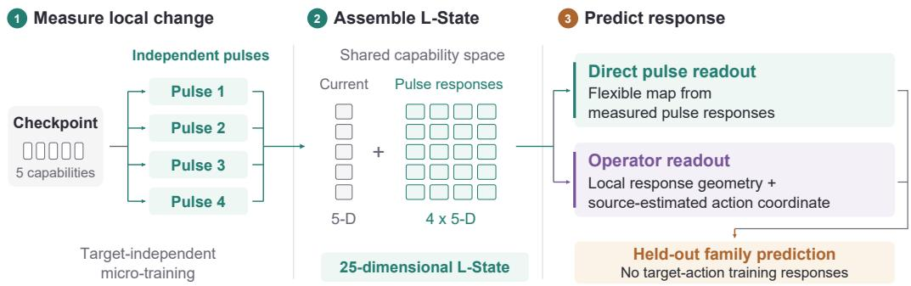
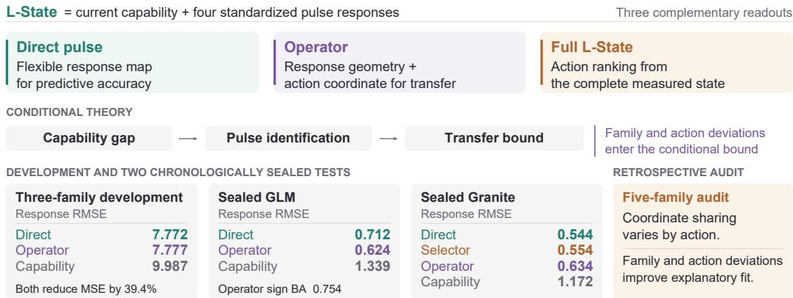

# TARGET-INDEPENDENT MICRO-INTERVENTIONS FOR PREDICTING TRAINING RESPONSE ACROSS LANGUAGE-MODEL FAMILIES

Zhongxuan Liu Sicheng Zhou Hongzhi Wang∗ Faculty of Computing, Harbin Institute of Technology lazrix@163.com ylnfq 2021@qq.com wangzh@hit.edu.cn

## ABSTRACT

Benchmark scores describe what a checkpoint can do now, but they do not determine how it will respond to the next training episode. We measure this missing state by branching four short, standardized, target-independent micro-interventions from the same checkpoint and recording their effects in a common capability space. Together with current capability, these responses form L-STATE; its pulse block supports a flexible direct readout and a structure-preserving operator readout. Under smooth local dynamics, the operator construction admits an end-to-end crossfamily bound with explicit source- and target-family coordinate heterogeneity. In three-family leave-one-family-out development, both pulse readouts reduce sourcestandardized MSE by 39.4% relative to capability alone, while separating the best response and direction estimates. On sealed GLM-4-9B, the direct and operator readouts reduce MSE by 71.8% and 78.3%, respectively, and the operator readout raises sign balanced accuracy from 0.366 to 0.754. On sealed Granite-3.1-8B, the direct readout reaches RMSE 0.544 and a development-fitted action-wise selector reaches 0.554, compared with 1.172 for capability alone. A five-family audit finds that the operator coordinate varies by action and family, and that modeling these deviations improves retrospective held-trajectory prediction. Target-independent interventions therefore expose training-response information that current capability misses, with direct and structured readouts covering complementary transfer regimes.

## 1 INTRODUCTION

Suppose two language-model checkpoints obtain the same scores on mathematics, code, science, and reading. Are they equally good starting points for another round of training? Identical current scores leave the answer unresolved. One checkpoint may learn a new skill quickly, another may forget neighboring skills, and a third may remain nearly unchanged. Present-day scores record what a model currently does; controlled micro-training records how that checkpoint changes under a fixed training contract.

We study whether the missing information can be measured by intervention. From the same checkpoint, we independently branch four short, standardized, and target-independent training episodes. We evaluate the capability change caused by each episode and concatenate those responses with the checkpoint’s current capabilities. This 25-dimensional object is an L-STATE: five current capabilities plus four five-dimensional response vectors (Figure 1). Figure 2 connects this construction to the complete theory-to-evidence program. Its 20-dimensional pulse block supports two complementary cross-family readouts. The direct readout learns a multi-output map from the measured pulse responses to a target-action response. The operator readout organizes those same measurements as a local response operator and applies a source-estimated action coordinate. Both readouts live in a common evaluation space, so families with different parameters, gradients, and hidden representations can be compared through the same measured responses.

  
Figure 1: Why target-independent interventions reveal training response. Current capability describes a checkpoint before the next update. Four standardized pulses branch from that checkpoint and measure local changes in a shared capability space. The resulting L-State supports direct and operator-factorized prediction for a held-out family without using its target-action labels.

The resulting prediction problem is deliberately strict. To predict the response of Qwen, for example, a readout may use target-action responses from Mistral and OLMo and may measure Qwen’s current capability and standard-pulse responses. Qwen target-action responses remain sealed until every prediction byte is frozen. This leave-one-family-out (LOFO) design measures transfer of a behavioral response state across distinct model families.

Our core insight is that target-independent pulse responses form a transferable training state with two complementary readouts. The direct readout learns a flexible map from the pulse block; the operator readout factors prediction into local response geometry and a source-estimated action coordinate. Under the conditions in Section 3, Theorem 3.6 supports the operator and Eq. (15) separates target identification, source calibration, and cross-family coordinate bias. Development data determine which structure best serves each endpoint.

In three-family LOFO development, both pulse readouts reduce continuous-response MSE by 39.4% relative to capability alone: the direct readout has the lowest response RMSE and the operator the highest sign balanced accuracy. We freeze the operator for response and direction and the full-state readout for action scoring before opening GLM-4-9B labels. On GLM, direct and operator MSE reductions reach 71.8% and 78.3%, while the operator raises sign balanced accuracy by 38.8 points over capability.

GLM also exposes an operator inversion on science: all 27 states and four additional realizations preserve the reversed sign, while the source action coordinate is shrunken and unstable. We therefore freeze an action-wise selector from held-out development-family wins before opening Granite-3.1-8B. On Granite, the direct readout reaches RMSE 0.544, the selector 0.554, the operator retains 0.657 coordinate-macro sign balanced accuracy, and the full L-STATE readout reduces action regret by 25.5%.

Our contributions are:

• We introduce an intervention-derived learning state with direct and structure-preserving operator readouts.

• We derive conditional response, sign, regret, and exact-action guarantees with explicit source- and target-family coordinate-bias terms.

• Across development and two sealed families, pulse readouts improve response prediction over capability; a development-fitted selector reaches RMSE 0.554 on Granite versus 1.172 for capability.

• We test pooled action coordinates across five families, quantify family and family–action deviations, and link heterogeneity to readout selection.

  
Figure 2: Theory and evidence for cross-family training-response prediction. L-State supports direct, operator-factorized, and full-state readouts. Conditional theory motivates the operator construction, two sealed tests evaluate transfer, and a five-family audit measures action- and family-specific coordinate deviations.

## 2 RELATED WORK

Predicting adaptation. Static diagnostic probes can predict fine-tuning performance in studied NLP settings (Zhu et al., 2022); analyses of intermediate checkpoints reveal training regularities shared across scales (Xia et al., 2023); and observational scaling laws compress benchmark measurements into a low-dimensional capability space (Ruan et al., 2024). Transferability scores similarly ask which pretrained representation or checkpoint will adapt well (Nguyen et al., 2020; Munn & Wei, 2025). Resource-constrained model selection has also been formulated as extrapolating full fine-tuning performance from smaller-data runs through a rectified scaling law (Lin et al., 2024). Modellevel representation work constructs compact embeddings for correctness, routing, and benchmarkperformance prediction (Zhuang et al., 2025), and training-free functional fingerprints compare heterogeneous models (Wu et al., 2026). These methods characterize current functional behavior; L STATE derives its representation from controlled training interventions and predicts candidate-action response vectors. Closest in experimental goal, TUNEAHEAD combines dataset descriptors with a short standardized probe to forecast scalar final scores for runs based on Qwen2.5-7B-Instruct (Luo et al., 2026). A concurrent preprint is closer in mechanism: it models learning through a parameter– optimizer receiving state and target-specific update geometry in nanoGPT, ResNet, and diffusion experiments (Wang, 2026). L-STATE differs in representation and validation: current capabilities and target-independent pulse responses live in a common evaluation space, predict a signed response vector over several candidate actions, and are evaluated by family-held-out development followed by chronologically sealed tests on GLM-4-9B and Granite-3.1-8B with downstream action regret.

From training data to behavior. Datamodels learn how training-set composition changes predictions (Ilyas et al., 2022); influence functions and optimizer-aware gradient methods trace or rank training examples by their target effect (Koh & Liang, 2017; Xia et al., 2024). Task arithmetic represents completed fine-tuning runs as directions in a shared parameter space (Ilharco et al., 2023). Recent work transports completed task vectors across heterogeneous-width models by aligning observed internal activations and their functional effect (Rinaldi et al., 2026). L-STATE takes a complementary route: it treats the checkpoint as the object being identified, measures target-independent pulse responses in evaluation space, and predicts future candidate-action responses. Our question is also conditional in the sense of Hewitt et al. (2021): do pulse responses provide usable information beyond current capability?

Intervention and domain transfer. Informative controlled inputs are central to active system identification (Wagenmaker & Jamieson, 2020). This analogy motivates standardized pulses, but our local response model states the training-domain assumptions explicitly. Following domaingeneralization evaluation lessons (Gulrajani & Lopez-Paz, 2021), family identity defines the outer split and all selection occurs on source families. The prospective stage extends this design with chronological seals: endpoint rules, response predictions, and utility-conditioned action choices are serialized before held-out-family target-action labels enter scoring.

## 3 L-STATE AND ITS PULSE READOUTS

## 3.1 WHY STATIC CAPABILITY IS INSUFFICIENT

Each model family m has a state space $\mathcal { X } _ { m } .$ A shared evaluation contract maps $x \in \mathcal { X } _ { m }$ to capabilities $c _ { m } ( x ) \in \mathbb { R } ^ { d }$ , with larger coordinates better. For a micro-training action u, strength h, and training randomness ξ, define the population response

$$
r _ { m } ^ { h } ( x , u ) = \frac { \mathbb { E } _ { \xi } [ c _ { m } ( U _ { m , u } ^ { h } ( x ; \xi ) ) ] - c _ { m } ( x ) } { h } .\tag{1}
$$

Theorem 3.1 (Capability sufficiency and non-identifiability). $~ I f c _ { m } ( x ) = c _ { m ^ { \prime } } ( x ^ { \prime } ) = c ,$ , write $e = \| f ( c , u ) - r _ { m } ^ { \hat { h } } ( x , \grave { u ) } \| _ { 2 }$ and $e ^ { \prime } \overset { \cdot } { = } \| f ( c , u ) - r _ { m ^ { \prime } } ^ { h } ( x ^ { \prime } , \overset { \cdot } { u } ) \| _ { 2 }$ . Every capability-only predictor satisfies

$$
\begin{array} { r } { \operatorname* { m a x } \{ e , e ^ { \prime } \} \geq \frac { 1 } { 2 } \| r _ { m } ^ { h } ( x , u ) - r _ { m ^ { \prime } } ^ { h } ( x ^ { \prime } , u ) \| _ { 2 } . } \end{array}\tag{2}
$$

Moreover, an exact capability-only response map exists on a domain ifand only if,for every u, the response is constant on every capability level set.

Thus the missing state variable is precisely the within-level-set variation of training response. Under the geometry developed next, controlled interventions make that variation observable.

## 3.2 LOCAL INTERVENTION GEOMETRY

The transfer chain uses five explicit protocol conditions: a named pulse gauge, smooth local dynamics, spanning pulse excitation, positive source coverage, and bounded measurement and misspecification errors. Whether target actions have the same coordinate across families is left as a hypothesis and enters the bounds quantitatively.

In the common named-pulse gauge, fix a reference family set and positive normalized weights $\{ \pi _ { m } \}$ m and $\{ \omega _ { u } \} _ { u }$ . Write

$$
a _ { m , u } = a _ { 0 } + \alpha _ { u } + \beta _ { m } + \gamma _ { m , u } = \bar { a } _ { u } + \delta _ { m , u } ,\tag{3}
$$

where $\bar { a } _ { u } = a _ { 0 } + \alpha _ { u }$ is pooled, $\beta _ { m }$ is the family deviation, and $\gamma _ { m , u }$ is the family–action interaction. Identifiability uses

$$
\sum _ { u } \omega _ { u } \alpha _ { u } = 0 , \quad \sum _ { m } \pi _ { m } \beta _ { m } = 0 , \quad \sum _ { m } \pi _ { m } \gamma _ { m , u } = 0 \forall u , \quad \sum _ { u } \omega _ { u } \gamma _ { m , u } = 0 \forall m .\tag{4}
$$

Thus $\begin{array} { r } { \bar { a } _ { u } = \sum _ { m } \pi _ { m } a _ { m , u } } \end{array}$ and $\delta _ { m , u } = a _ { m , u } - \bar { a } _ { u }$ . Exact sharing is the nested hypothesis

$$
H _ { \mathrm { s h a r e } } : \beta _ { m } = 0 { \mathrm { ~ a n d ~ } } \gamma _ { m , u } = 0 \mathrm { ~ f o r ~ a l l ~ } m , u .\tag{5}
$$

Work in a local Euclidean chart around x and write the random training displacement as $\Delta _ { m , u } ^ { h } ( x , \xi )$ Let the capability Jacobian be $L _ { c } { - } \mathbf { I }$ Lipschitz along every segment traversed by this displacement. Suppose the family-specific coordinate $a _ { m , u } \in \mathbb { R } ^ { r }$ and a checkpoint-specific update map $G _ { m } ( x )$ obey

$$
\begin{array} { r l r } {  { \bigg \| \frac { \mathbb { E } \Delta _ { m , u } ^ { h } } { h } - G _ { m } ( x ) a _ { m , u } \bigg \| _ { 2 } \leq \epsilon _ { g } , } } \\ & { } & { \mathbb { E } \| \Delta _ { m , u } ^ { h } \| _ { 2 } ^ { 2 } \leq h ^ { 2 } V ^ { 2 } \| a _ { m , u } \| _ { 2 } ^ { 2 } . } \end{array}\tag{6}
$$

Theorem 3.2 (Smooth dynamics induce the response factorization). Under Eq. (6), the response in Eq. (1) has the form

$$
r _ { m } ^ { h } ( x , u ) = B _ { m } ( x ) a _ { m , u } + d _ { m } ( x , u , h ) ,
$$

$$
B _ { m } ( x ) = J c _ { m } ( x ) G _ { m } ( x ) ,\tag{7}
$$

with

$$
\begin{array} { r } { \| d _ { m } ( x , u , h ) \| _ { 2 } \leq \| J c _ { m } ( x ) \| _ { 2 } \epsilon _ { g } + \frac { 1 } { 2 } L _ { c } h V ^ { 2 } \| a _ { m , u } \| _ { 2 } ^ { 2 } . } \end{array}\tag{8}
$$

The first term measures departure of the expected update from the family-specific coordinate factorization; the second is the finite-radius curvature cost. Training randomness enters through the expected displacement and its second moment, while repeat averaging controls the empirical estimation noise below. Cross-family sharing is governed separately by Eq. (5).

## 3.3 IDENTIFYING THE CHECKPOINT RESPONSE OPERATOR

For a fixed family, let $k$ target-independent pulses $q _ { 1 } , \ldots , q _ { k }$ have coordinate matrix $Q _ { m } \ =$ $\left[ a _ { m , q _ { 1 } } , \ldots , a _ { m , q _ { k } } \right] ^ { \cdot } \in \mathbb { R } ^ { r \times k }$ . Their population and empirical response matrices satisfy

$$
Y _ { m } = B _ { m } Q _ { m } + D _ { m } , \qquad { \widehat { Y } } _ { m } = B _ { m } Q _ { m } + E _ { m } , \qquad E _ { m } = D _ { m } + Z _ { m } ,\tag{9}
$$

where $D$ collects local residuals and $Z$ collects training and evaluation noise.

Theorem 3.3 (Pulse identifiability). For a fixed target coordinate $a _ { \star } ,$ , the response $B a _ { \star }$ is uniquely determined from BQ for every $\dot { B } \in \mathbb { R } ^ { d \times r }$ if and only $i f a _ { \star } \in \mathrm { c o l } ( Q )$ . Hence every action in $\bar { \mathbb { R } } ^ { r }$ is identifiable ifand only $i f Q$ hasfull row rank. In that case, $\widehat { B } = \widehat { Y } Q ^ { \dagger }$ satisfies

$$
\| \widehat { B } - B \| _ { \nu } \leq \frac { \| E \| _ { \nu } } { \sigma _ { r } ( Q ) } , \qquad \nu \in \{ 2 , F \} .\tag{10}
$$

Theorem 3.4 (Minimax pulse conditioning). For full-row-rank $Q ,$ , the exact worst-case spectral amplification is

$$
\operatorname* { s u p } _ { \| E \| _ { 2 } \leq 1 } \| E Q ^ { \dag } \| _ { 2 } = \frac { 1 } { \sigma _ { r } ( Q ) } .\tag{11}
$$

Under $\| Q \| _ { F } ^ { 2 } \le E _ { 0 }$ and $k \geq r ,$ its minimum is $\sqrt { r / E _ { 0 } } ;$ , attained exactly by tight frames satisfying $Q Q ^ { \top } = ( E _ { 0 } / r ) I _ { r }$

Our estimator uses the same four named standard pulses as coordinate anchors, giving $Q _ { m } = I _ { 4 }$ separately in every family. This gauge convention aligns the meanings of the four axes. Cross-family equality of target-action coefficients remains the separate hypothesis $H _ { \mathrm { s h a r e } }$ . The convention also removes an explicit $Q _ { m } ^ { \dagger }$ factor from operator recovery. With an independently fixed action metric and energy budget, Theorem 3.4 selects tight-frame interventions. With common pulse strength h, the stored differences $R = h { \widehat { Y } }$ change only the global scale. The empirical state is

$$
z _ { m } ( x ) = \left[ \widehat { c } _ { m } ( x ) ; \mathrm { v e c } R _ { m } ( x ) \right] \in \mathbb { R } ^ { 2 5 } .\tag{12}
$$

Every pulse branches from an independent copy of the checkpoint.

## 3.4 ESTIMATING A POOLED ACTION UNDER FAMILY HETEROGENEITY

Enumerate the source checkpoints as $\boldsymbol { S } = \{ s _ { 1 } , \ldots , s _ { n } \}$ , where $s _ { i }$ belongs to family $m ( s _ { i } )$ , and write $\delta _ { s _ { i } , u } = \beta _ { m ( s _ { i } ) } + \gamma _ { m ( s _ { i } ) , u } .$ Stack source operators and responses as

$$
\begin{array} { r } { \mathcal { B } _ { S } = \displaystyle \binom { B _ { s _ { 1 } } } { \vdots } \ : , \qquad y _ { S } ( u ) = \mathcal { B } _ { S } \bar { a } _ { u } + v _ { S , u } ^ { \mathrm { h e t } } + e _ { S } , } \\ { B _ { s _ { n } } } \end{array}
$$

$$
\begin{array} { r } { v _ { S , u } ^ { \mathrm { h e t } } = \left[ \begin{array} { c } { B _ { s _ { 1 } } \delta _ { s _ { 1 } , u } } \\ { \vdots } \\ { B _ { s _ { n } } \delta _ { s _ { n } , u } } \end{array} \right] , \qquad G _ { S } = B _ { S } ^ { \top } \mathcal { B } _ { S } = \displaystyle \sum _ { s } B _ { s } ^ { \top } B _ { s } . } \end{array}\tag{13}
$$

The source-coverage radius is $\underline { { \sigma } } _ { S } = \sigma _ { r } ( \mathcal { B } _ { S } ) = \sqrt { \lambda _ { \operatorname* { m i n } } ( G _ { S } ) }$ , while $H _ { S , u } = \| v _ { S , u } ^ { \mathrm { h e t } } \| _ { 2 }$ measures the linear response-scale cost of imposing a pooled coordinate on heterogeneous source families.

Theorem 3.5 (Approximate pooled-coordinate recovery under bounded heterogeneity). Assume $\underline { { \sigma _ { S } } } > 0 , \| e _ { S } \| _ { 2 } \leq \epsilon _ { S } , \| \bar { a } _ { u } \| _ { 2 } \leq A _ { \mathrm { \iota } }$ , and $\| v _ { S , u } ^ { \mathrm { h e t } } \| _ { 2 } \leq H _ { S , u }$ . With exact source operators, $\widehat { a } _ { u } = B _ { S } ^ { \dagger } y _ { S } ( u )$ obeys $\begin{array} { r } { \| \widehat { \boldsymbol { a } } _ { u } - \bar { \boldsymbol { a } } _ { u } \| _ { 2 } \leq ( H _ { S , u } + \epsilon _ { S } ) / \underline { { \sigma } } _ { S } . \ I f \| \widehat { \mathcal { B } } _ { S } - \mathcal { B } _ { S } \| _ { 2 } \leq \tau _ { S } < \underline { { \sigma } } _ { S } , } \end{array}$ then

$$
\widehat { a } _ { u } = \widehat { \mathcal { B } } _ { S } ^ { \dagger } y _ { S } ( u ) , \qquad \| \widehat { a } _ { u } - \bar { a } _ { u } \| _ { 2 } \leq \frac { \tau _ { S } A + H _ { S , u } + \epsilon _ { S } } { \underline { { \sigma } } _ { S } - \tau _ { S } } .\tag{14}
$$

Under $H _ { \mathrm { s h a r e } } , H _ { S , u } = 0$ and the original shared-coordinate bound is recovered as a special case. The converse need not hold: $H _ { S , u }$ measures only the linear response-scale mismatch on the observed source operators.

Adding a source checkpoint changes the coverage Gram from $G _ { S }$ to $G _ { S } + B _ { \mathrm { n e w } } ^ { \top } B _ { \mathrm { n e w } } .$ , so λmin is nondecreasing. A full-column-rank new source increases the lower bound by at least $\sigma _ { r } ( B _ { \mathrm { n e w } } ) ^ { 2 }$ Coverage alone, however, does not establish sharedness: the added family can also increase $H _ { S , u }$ Additional sources tighten the complete bound only when their coverage gain outpaces operator, response, and coordinate-heterogeneity errors.

## 3.5 PROSPECTIVE TRANSFER TO AN UNSEEN FAMILY

Let ⋆ denote a previously unseen family. Its target-independent pulses give $\widehat { B } _ { \star }$ , while source-family target responses give $\widehat { a } _ { u }$ , an estimate of the pooled coordinate $\bar { a } _ { u }$ . The prediction is $\widehat { r } _ { \star } ( u ) = \widehat { B } _ { \star } \widehat { a } _ { u } .$ Theorem 3.6 (End-to-end cross-family transfer). Let Q⋆ be expressed in the same fixed named-pulse gauge, have full row rank, and let $\widehat { B } _ { \star } = \widehat { Y } _ { \star } Q _ { \star } ^ { \dagger }$ . Assume $\lVert \bar { \boldsymbol { a } } _ { u } \rVert _ { 2 } \leq A , \boldsymbol { a } _ { \star , u } = \bar { \boldsymbol { a } } _ { u } + \delta _ { \star , u }$ with $\lVert \delta _ { \star , u } \rVert _ { 2 } \leq D _ { \star , u } , \lVert r _ { \star } ^ { h } ( u ) - B _ { \star } a _ { \star , u } \rVert _ { 2 } \leq \epsilon _ { \star , u }$ , target pulse perturbation $\| E _ { \star } \| _ { 2 } \leq \eta _ { \star }$ , and the source conditions ofTheorem 3.5. Then

$$
\| \widehat { r } _ { \star } ( u ) - r _ { \star } ^ { h } ( u ) \| _ { 2 } \leq \Delta _ { \star , u } ,\tag{15}
$$

where

$$
\begin{array} { l } { \displaystyle \Delta _ { \star , u } = \frac { \eta _ { \star } A } { \sigma _ { r } \left( Q _ { \star } \right) } + \epsilon _ { \star , u } } \\ { \displaystyle \quad + \| B _ { \star } \| _ { 2 } D _ { \star , u } } \\ { \displaystyle \quad + \left( \| B _ { \star } \| _ { 2 } + \frac { \eta _ { \star } } { \sigma _ { r } \left( Q _ { \star } \right) } \right) \frac { \tau _ { S } A + H _ { S , u } + \epsilon _ { S } } { \underline { { \sigma _ { S } } } - \tau _ { S } } . } \end{array}\tag{16}
$$

Equation (16) separates target identification, target locality, unseen-family coordinate bias, and source heterogeneity. Appendix B gives the full proofs, a finite-repeat version, and the ridge-regularized source estimator used by the operator readout. For that estimator, the same theorem holds after replacing the last fraction in Eq. (16) by the ridge coordinate radius in Eq. (20). If scoring uses a realized response $\smash { \widetilde { r } _ { \star } ( u ) = r _ { \star } ^ { h } ( u ) + \omega _ { u } }$ with ${ \| \omega _ { u } \| } _ { 2 } \le \kappa _ { u }$ , its total radius is $\overline { { \Delta } } _ { \star , u } = \Delta _ { \star , u } + \kappa _ { u }$

Corollary 3.7 (Operator direction and action recovery). $I f \left| r _ { \star , j } ^ { h } ( u ) \right| > \Delta _ { \star , u } ,$ , then sign $\widehat { r } _ { \star , j } ( u ) =$ sign $r _ { \star , j } ^ { h } ( u )$ . For afinite candidate set with $J ( u ) = h v ^ { \top } r _ { \star } ^ { h } ( u ) - \mathrm { c o s t } ( u )$ , simultaneous radii imply

$$
J ( u ^ { \star } ) - J ( \widehat { u } ) \leq h \| v \| _ { 2 } \big ( \Delta _ { \star , u ^ { \star } } + \Delta _ { \star , \widehat { u } } \big ) .\tag{17}
$$

Ifthe true best-versus-runner-up utility margin exceeds $h \| v \| _ { 2 } ( \Delta _ { \star , u ^ { \star } } + \operatorname* { m a x } _ { u \neq u ^ { \star } } \Delta _ { \star , u } )$ , then $\widehat { u } = u ^ { \star }$ Balanced-accuracy, normalized-regret, and realized-response versions appear in Appendix B.

## 3.6 TWO PULSE READOUTS AND TASK-MATCHED ENDPOINTS

Direct pulse readout. Let $p ( s ) = \operatorname { v e c } R ( s )$ denote the 20-dimensional pulse block of the L-State at checkpoint s. For each target action, this readout fits a source-only multi-output ridge map from $p ( s )$ to the five-dimensional target response. It lets the data learn an unconstrained linear combination of the measured pulse responses.

Operator readout. We ridge-fit a target coordinate from source responses and predict ${ \widehat { y } } _ { \mathrm { o p } } ( s , u ) =$ $\textstyle R ( s ) { \widehat { a } } _ { u }$ . This preserves a zero point and constrains predictions to the local operator geometry measured by the same L-State pulse block. This is the structured predictor covered by Theorem 3.6.

Full L-State readout. For each action, a multi-output ridge map also predicts the response from the complete 25-dimensional state $\boldsymbol { z } ( \boldsymbol { s } ) = [ c ( \boldsymbol { s } ) ; p ( \boldsymbol { s } ) ]$ ]. All regularization and standardization choices for the direct, operator, and full-state readouts use complete source trajectories. Appendix C gives the objectives.

Shared-coordinate hypothesis audit. After all five family labels are open, we fit one coordinate per observed family–action cell and apply Eq. (3). Here the five observed families have equal weight, so their retrospective mean $\bar { a } _ { u } ^ { ( 5 ) }$ is distinct from the prospective source-reference mean. Appendix G defines the common-scale pooling error $D _ { u }$ , shared-signal fraction $S _ { u } .$ , and dead-zone error $\bar { D } _ { u } ^ { \mathrm { D Z } }$ , and gives the exact difference, retrospective equivalence, and predictive tests. Those tests use unpenalized least squares; ridge is used only for coordinate stability summaries. Thus $H _ { \mathrm { s h a r e } }$ is tested directly.

Action-wise pulse selector. The first sealed family reveals that the source-calibrated operator can be action-heterogeneous. We therefore compare the direct and operator readouts separately for each semantic action using the three held-out development-family folds. The direct readout is selected after a strict response-RMSE win in at least two of the three folds; ties retain the operator readout. This rule selects the operator readout for mathematics and reading and the direct readout for code and science. The selector uses development-family responses and is serialized before the second sealed family’s target branches begin. The deployed endpoint policy uses this selector for continuous response, the operator readout for direction, and the full-state map for utility-conditioned action scoring.

Empirical consequences. The theorem chain calls for a capability-only reference, pulse reliability and geometry checks, direct sharedness diagnostics, and end-to-end response, sign, and utility tests. The protocol evaluates them in that order and freezes each held-out family’s predictions before opening its target-action responses.

## 4 THEORY-GUIDED EXPERIMENTAL DESIGN

The experiments compare the two pulse readouts before testing the structured transfer chain. Development measures the capability gap and the aggregate gains of the direct and operator readouts; the first seal tests the composed operator prediction and exposes an action-specific calibration inversion; repeat interventions locate that failure; and the second seal tests the frozen action-wise response route.

## 4.1 DEVELOPMENT FAMILIES AND SEALED FAMILIES

The development study uses Qwen2.5-7B-Instruct (Qwen Team, 2025), Mistral-7B-Instruct-v0.3 (Jiang et al., 2023; Mistral AI, 2024), and OLMo-2-1124-7B-Instruct (Walsh et al., 2025). Each family contributes three frozen seeds. Every seed starts from a zero-output rank-4 LoRA adapter (Hu et al., 2022) and follows eight balanced state-generation episodes, yielding checkpoints t00 through t08. The development set therefore contains 27 states per family and 81 states in total.

After the initial endpoint rule is fixed, we apply the same state construction and training contract to GLM-4-9B-0414 (Zhipu AI, 2025). This first sealed family adds 27 held-out states from three new trajectories. The GLM science-action inversion then motivates the action-wise pulse selector above. We fit its action-wise choices exclusively on the three development families and seal the resulting policy before running Granite-3.1-8B-Instruct at revision 4009206d5fc9 (IBM Granite Team, 2024). Granite supplies another 27 states from three fresh trajectories. The complete study covers 135 states from five 7–9B instruction-tuned model families.

## 4.2 DATA SEPARATION AND TRAINING CONTRACT

Data have disjoint roles. Four deterministic synthetic tasks generate state trajectories. Four different synthetic tasks provide the standard pulses: schema mapping, two-step rule chaining, symbolic rewriting, and table aggregation; this pulse set is synthetic and disjoint from the target benchmark tasks. Semantic target actions train on 32 examples from GSM8K (Cobbe et al., 2021), MBPP (Austin et al., 2021), SciQ (Welbl et al., 2017), or BoolQ (Clark et al., 2019). Capabilities are negative clipped token NLL on disjoint held-out examples from those four tasks plus WikiText-2 (Merity et al., 2017). Exact normalized-text hashes are disjoint across state generation, pulse training, target training, and capability evaluation.

All primary pulse and target branches freeze base weights and train rank-4 LoRA on attention query and value projections for eight AdamW steps, consuming 32 examples. The target-early reference reads a target-specific intermediate after two steps and eight examples, while locality calibration deliberately includes four- and sixteen-step variants. Each branch starts with reset optimizer moments and restores an identical checkpoint hash. This short-LoRA protocol measures immediate training response under one shared optimization contract.

## 4.3 FAMILY-LEVEL GATING AND BASELINES

In development, each outer fold trains on two model families and tests on the third. The program serializes predictions and hashes before opening the fold’s label vault, while source-trajectory inner cross-validation selects hyperparameters. The complete comparison includes a source-mean reference, CAPABILITY, a direct pulse readout, scalar training statistics, a trajectory/index-matched source state, and the OPERATOR readout. TARGET EARLY provides a separate target-specific reference.

Each sealed stage freezes its reporting rule, all 540 core response predictions, and all 810 utilityconditioned action choices before target-action training. The Granite stage additionally freezes 216 selector-extension rows that copy the chosen direct or operator response and direction predictions. Both Granite freeze receipts record zero target branches. The target vault then opens and scores five core methods over 27 states, four actions, five response coordinates, and six utilities. Current capability is the common reference. The direct readout fits the 20-dimensional L-State pulse block, while the operator readout applies the structured factorization to the same block. The matched-state reference averages development responses at the same trajectory seed, state index, and action identity.

## 4.4 METRICS AND UNCERTAINTY

Continuous response error is standardized using only the source-family mean and population standard deviation for each outer fold, action, and coordinate; the resulting RMSE is dimensionless. The later five-family sharedness audit instead uses one common three-development-family scale for every family so that all deviations have the same ruler. We report MSE gain as $1 - \mathrm { R M S E } _ { m } ^ { 2 } / \mathrm { R M S E } _ { \mathrm { c a p } } ^ { 2 } .$ Direction is balanced accuracy on response components outside a coordinate-specific dead zone estimated from three-repeat pulse reliability. We also report median response cosine.

For decisions, six fixed utility vectors—five one-hot capabilities and one balanced vector—choose among the four semantic actions. We report top-1 action accuracy and realized normalized regret. Because each semantic action has one preregistered training realization, the decision metric measures realized performance under the fixed training protocol.

The development analysis uses 10,000 family-then-trajectory bootstrap resamples for full-state readout endpoints and 1,000 aligned-pulse permutations with full source refitting. Each sealed-family core endpoint analysis uses 10,000 whole-trajectory resamples over its three trajectories. GLM direction is evaluated over 184 components selected by source-frozen dead zones; Granite uses the same frozen coordinate thresholds. The action-wise pulse selector is summarized by frozen pooled and action-macro point estimates, while continuous response retains all scored components. Four additional GLM science-action responses per state test repeat stability, and a separate nine-state study evaluates four-, eight-, and sixteen-step exposure. Fresh processes reproduce the canonical development, GLM, and Granite analysis hashes.

## 4.5 RETROSPECTIVE FIVE-FAMILY SHAREDNESS AUDIT

This audit begins only after all five target-label vaults are open and leaves every sealed prediction unchanged. Full-rank frozen action matrices recover the pulse operators algebraically, replaying operator-readout predictions below $1 0 ^ { - 9 }$ error. Primary comparisons use one development-frozen response scale, complete trajectory blocks, and exact sign flips over the 15 observed family–trajectory clusters. The audit is conditional on these five families, fixed pulse measurements, and one training realization; Appendix G gives recovery, conditioning, resampling, and sensitivity details.

## 5 RESULTS

## 5.1 L-STATE READOUTS IN THREE-FAMILY DEVELOPMENT

Development first asks whether the L-State pulse block carries transferable response information and how readout structure changes the endpoint. The direct readout uses the pulse block as features, the operator readout preserves its matrix geometry, and current capability provides the reference. Across the three LOFO folds, the direct and operator readouts have nearly identical aggregate response error: RMSE 7.772 and 7.777 versus 9.987 for capability. Each reduces source-standardized MSE by 39.4%. The direct readout has the lowest response-RMSE point estimate, while the operator readout has the highest aggregate sign balanced accuracy, 0.675 versus 0.602 for capability. The full L-State readout separately reduces realized normalized regret from 0.472 to 0.248. The complete method table appears in Appendix D; aligned-pulse refits exceed the registered per-fold null 95th percentile on Qwen and Mistral.

## 5.2 SEALED GLM TEST OF THE OPERATOR READOUT

The first sealed test asks whether the structured readout transfers without target-action responses. We freeze 540 response predictions and 810 action choices before opening GLM labels. The direct readout reaches RMSE 0.712, a 71.8% MSE reduction relative to capability. The operator readout reaches RMSE 0.624, a 78.3% reduction, and has the highest sign balanced-accuracy point estimate among the five frozen core methods, increasing from 0.366 for capability to 0.754. The full L-State readout lowers realized normalized regret from 0.592 to 0.434; the matched-state reference attains 0.410. Complete frozen-method and resampling comparisons appear in Appendices A and E.

## 5.3 FROM AN OPERATOR FAILURE TO ACTION-WISE READOUT SELECTION

The GLM science action separates the measured representation from the structure imposed by the operator factorization. The operator readout has sign BA zero, whereas the direct readout reaches 1.0 on the determinate science coordinates. Four additional target realizations preserve the target sign in all 27 states, while source-fit operator coordinates span −0.555 to 0.322. This locates the instability on the source-coordinate side without identifying a unique cause. Motivated by this sealed failure, we fit an action-wise selector using only the three development families. It retains the operator readout for mathematics and reading and chooses the direct readout for code and science. The mapping is frozen before Granite labels open.

## 5.4 SEALED GRANITE TEST OF ACTION-WISE READOUT SELECTION

Granite tests the frozen route on a second family. The direct readout has the lowest point-estimate RMSE among the single readouts at 0.544; the operator readout reaches 0.634, and the developmentfitted selector reaches 0.554, versus 1.172 for capability. The selector therefore preserves most of the direct readout’s aggregate response gain while improving over both capability and the globally applied operator readout. The operator readout produces non-degenerate action-wise direction estimates with aggregate sign BA 0.657, compared with 0.654 for capability. The full L-State readout lowers regret from 0.291 to 0.217 and raises top-1 from 53.1% to 63.6%. Frozen receipts and complete comparisons appear in Appendices A and H.

## 5.5 TESTING THE OPERATOR READOUT’S ACTION COORDINATE

The direct and operator readouts use the same pulse measurement but place different constraints on it. The operator readout estimates one pooled action coordinate from source families, so we test that structure directly after all five family labels are open. The common-scale pooling error ranges from $D _ { u } = 0 . 3 4 2$ for mathematics to 1.038 for reading; code has the highest shared-signal fraction $( S _ { u } = 0 . 8 0 0 )$ , science the lowest $( S _ { u } = 0 . 2 6 9 )$ ), and reading has negative mean coordinate cosine. Appendix Table 13 gives the full action-wise audit.

At level 0.05, exact sharing is rejected for code, science, and reading. Mathematics remains unresolved by the difference test; all four $\breve { D } _ { u } ^ { \mathrm { D Z } }$ values exceed one, so no action meets the retrospective one-deadzone equivalence criterion. Joint tests detect family main effects, total deviation, and the family–action interaction increment (all $p \leq 3 . 0 5 \times 1 0 ^ { - 4 } )$ . Shared, family-main, and full family–action models have held-trajectory RMSE 0.824, 0.802, and 0.750; the full model reduces MSE by 17.3% overall and 48.0% for science. This fixed-family diagnosis explains how family and action deviations affect the operator structure. Appendix G gives intervals, decomposition, and sensitivities.

## 6 CONCLUSION

Target-independent micro-interventions turn a checkpoint into a measured training-response state. A direct readout learns a flexible map from its L-State pulse block; an operator readout factors the same block into local response geometry and an action coordinate. Both cut development MSE by 39.4% relative to capability alone. On GLM, the operator readout reaches RMSE 0.624 and sign balanced accuracy 0.754; on Granite, the direct readout reaches RMSE 0.544 and the frozen action-wise selector reaches 0.554, versus 1.172 for capability alone. The theory supports pulse identification and conditional operator transfer, while source families choose readouts by action and endpoint. The five-family audit quantifies deviations in the pooled operator coordinate, and the full L-State readout adds action-ranking gains. The central result is a transferable intervention measurement supporting complementary direct and structured readouts.

## AI USE STATEMENT

Generative AI tools assisted with conceptual and theoretical development, mathematical claims and proof drafting, experimental design, implementation, execution, result analysis, figure creation, literature review, and manuscript drafting, editing, and formatting. The authors reviewed all AIassisted work, tested the code, audited the proofs, replayed the frozen experimental evidence, and checked the cited sources. The authors take responsibility for the final content, including text, claims, code, and artifacts produced with generative-AI assistance.

## REPRODUCIBILITY STATEMENT

Sections 4–5 specify the data separation, training contract, frozen prediction protocol, metrics, and replay procedure. Appendices A–K provide complete proofs, experimental details, development and sealed-family tables, repeat and duration studies, probe-cost accounting, and artifact hashes. Each headline result is linked to a frozen evidence file and a fresh-process replay receipt.

## REFERENCES

Jacob Austin, Augustus Odena, Maxwell Nye, Maarten Bosma, Henryk Michalewski, David Dohan, Ellen Jiang, Carrie Cai, Michael Terry, Quoc Le, and Charles Sutton. Program synthesis with large language models, 2021. URL https://arxiv.org/abs/2108.07732.

Christopher Clark, Kenton Lee, Ming-Wei Chang, Tom Kwiatkowski, Michael Collins, and Kristina Toutanova. BoolQ: Exploring the surprising difficulty of natural yes/no questions. In Proceedings of NAACL-HLT 2019, pp. 2924–2936. Association for Computational Linguistics, 2019. doi: 10.18653/v1/N19-1300. URL https://aclanthology.org/N19-1300/.

Karl Cobbe, Vineet Kosaraju, Mohammad Bavarian, Mark Chen, Heewoo Jun, Lukasz Kaiser, Matthias Plappert, Jerry Tworek, Jacob Hilton, Rei Nakano, et al. Training verifiers to solve math word problems, 2021. URL https://arxiv.org/abs/2110.14168.

Ishaan Gulrajani and David Lopez-Paz. In search of lost domain generalization. In International Conference on Learning Representations, 2021. URL https://openreview.net/forum? id=lQdXeXDoWtI.

John Hewitt, Kawin Ethayarajh, Percy Liang, and Christopher D. Manning. Conditional probing: Measuring usable information beyond a baseline. In Proceedings of the 2021 Conference on Empirical Methods in Natural Language Processing, pp. 1626–1639. Association for Computational Linguistics, 2021. doi: 10.18653/v1/2021.emnlp-main.122. URL https: //aclanthology.org/2021.emnlp-main.122/.

Edward J. Hu, Yelong Shen, Phillip Wallis, Zeyuan Allen-Zhu, Yuanzhi Li, Shean Wang, Lu Wang, and Weizhu Chen. LoRA: Low-rank adaptation of large language models. In International Conference on Learning Representations, 2022. URL https://openreview.net/forum? id=nZeVKeeFYf9.

IBM Granite Team. Granite-3.1-8B-Instruct. Hugging Face model repository, 2024. URL https://huggingface.co/ibm-granite/granite-3.1-8b-instruct. Model release; frozen revision 4009206d5fc9.

Gabriel Ilharco, Marco Tulio Ribeiro, Mitchell Wortsman, Suchin Gururangan, Ludwig Schmidt, Hannaneh Hajishirzi, and Ali Farhadi. Editing models with task arithmetic. In International Conference on Learning Representations, 2023. URL https://openreview.net/forum? id=6t0Kwf8-jrj.

Andrew Ilyas, Sung Min Park, Logan Engstrom, Guillaume Leclerc, and Aleksander Madry. Datamodels: Understanding predictions with data and data with predictions. In Proceedings ofthe 39th International Conference on Machine Learning, volume 162 of Proceedings ofMachine Learning Research, pp. 9525–9587. PMLR, 2022. URL https://proceedings.mlr.press/ v162/ilyas22a.html.

Albert Q. Jiang, Alexandre Sablayrolles, Arthur Mensch, Chris Bamford, Devendra Singh Chaplot, Diego de las Casas, Florian Bressand, Gianna Lengyel, Guillaume Lample, Lucile Saulnier, et al. Mistral 7b, 2023. URL https://arxiv.org/abs/2310.06825.

Pang Wei Koh and Percy Liang. Understanding black-box predictions via influence functions. In Proceedings of the 34th International Conference on Machine Learning, volume 70 of Proceedings of Machine Learning Research, pp. 1885–1894. PMLR, 2017. URL https://proceedings. mlr.press/v70/koh17a.html.

Haowei Lin, Baizhou Huang, Haotian Ye, Qinyu Chen, Zihao Wang, Sujian Li, Jianzhu Ma, Xiaojun Wan, James Zou, and Yitao Liang. Selecting large language model to fine-tune via rectified scaling law. In Proceedings ofthe 41st International Conference on Machine Learning, volume 235 of Proceedings of Machine Learning Research, pp. 30080–30107. PMLR, 2024. URL https://proceedings.mlr.press/v235/lin24j.html.

Yuxiang Luo, Haonan Long, Chen Wang, Qiqi Duan, Xiaotian Lin, Yanwei Xu, Yuyu Luo, Weikai Yang, and Nan Tang. TuneAhead: Predicting fine-tuning performance before full training begins, 2026. URL https://arxiv.org/abs/2606.17660. Accepted at ICML 2026.

Stephen Merity, Caiming Xiong, James Bradbury, and Richard Socher. Pointer sentinel mixture models. In International Conference on Learning Representations, 2017. URL https:// openreview.net/forum?id=Byj72udxe.

Mistral AI. Mistral-7B-Instruct-v0.3. Hugging Face model repository, 2024. URL https:// huggingface.co/mistralai/Mistral-7B-Instruct-v0.3.

Michael Munn and Susan Wei. A Bayesian model selection criterion for selecting pretraining checkpoints. In Proceedings of the 42nd International Conference on Machine Learning, volume 267 of Proceedings of Machine Learning Research, pp. 45256–45271. PMLR, 2025. URL https://proceedings.mlr.press/v267/munn25a.html.

Cuong Nguyen, Tal Hassner, Matthias Seeger, and Cedric Archambeau. LEEP: A new measure to evaluate transferability of learned representations. In Proceedings of the 37th International Conference on Machine Learning, volume 119 of Proceedings of Machine Learning Research, pp. 7294–7305. PMLR, 2020. URL https://proceedings.mlr.press/v119/nguyen20b.html.

Qwen Team. Qwen2.5 technical report, 2025. URL https://arxiv.org/abs/2412.15115.

Filippo Rinaldi, Aniello Panariello, Giacomo Salici, Angelo Porrello, and Simone Calderara. Transporting task vectors across different architectures without training, 2026. URL https: //arxiv.org/abs/2602.12952. Accepted at ICML 2026.

Yangjun Ruan, Chris J. Maddison, and Tatsunori Hashimoto. Observational scaling laws and the predictability of language model performance. In Advances in Neural Information Processing Systems, volume 37, 2024. doi: 10.52202/079017-0506.

Andrew Wagenmaker and Kevin Jamieson. Active learning for identification of linear dynamical systems. In Proceedings of the Thirty Third Conference on Learning Theory, volume 125 of Proceedings of Machine Learning Research, pp. 3487–3582. PMLR, 2020. URL https:// proceedings.mlr.press/v125/wagenmaker20a.html.

Evan Pete Walsh, Luca Soldaini, Dirk Groeneveld, Kyle Lo, Shane Arora, Akshita Bhagia, Yuling Gu, Shengyi Huang, Matt Jordan, et al. 2 OLMo 2 furious. In Second Conference on Language Modeling, 2025. URL https://openreview.net/forum?id=2ezugTT9kU.

Mian Wang. Training, learning and inference: Unified dynamics of neural systems, 2026. URL https://arxiv.org/abs/2608.20965. Concurrent preprint.

Johannes Welbl, Nelson F. Liu, and Matt Gardner. Crowdsourcing multiple choice science questions. In Proceedings of the 3rd Workshop on Noisy User-generated Text, pp. 94–106. Association for Computational Linguistics, 2017. doi: 10.18653/v1/W17-4413. URL https: //aclanthology.org/W17-4413/.

Zhaomin Wu, Haodong Zhao, Ziyang Wang, Jizhou Guo, Qian Wang, and Bingsheng He. LLM DNA: Tracing model evolution via functional representations. In International Conference on Learning Representations, 2026.

Mengzhou Xia, Mikel Artetxe, Chunting Zhou, Xi Victoria Lin, Ramakanth Pasunuru, Danqi Chen, Luke Zettlemoyer, and Veselin Stoyanov. Training trajectories of language models across scales. In Proceedings of the 61st Annual Meeting of the Association for Computational Linguistics, pp. 13711–13738. Association for Computational Linguistics, 2023. doi: 10.18653/v1/2023.acl-long. 767. URL https://aclanthology.org/2023.acl-long.767/.

Mengzhou Xia, Sadhika Malladi, Suchin Gururangan, Sanjeev Arora, and Danqi Chen. LESS: Selecting influential data for targeted instruction tuning. In Proceedings of the 41st International Conference on Machine Learning, volume 235 of Proceedings of Machine Learning Research, pp. 54104–54132. PMLR, 2024. URL https://proceedings.mlr.press/v235/xia24c. html.

Zhipu AI. GLM-4-9B-0414. Hugging Face model repository, 2025. URL https: //huggingface.co/zai-org/GLM-4-9B-0414. Model release; revision 645b8482494e31b6b752272bf7f7f273ef0f3caf.

Zining Zhu, Soroosh Shahtalebi, and Frank Rudzicz. Predicting fine-tuning performance with probing. In Proceedings of the 2022 Conference on Empirical Methods in Natural Language Processing, pp. 11534–11547. Association for Computational Linguistics, 2022. doi: 10.18653/v1/2022. emnlp-main.793. URL https://aclanthology.org/2022.emnlp-main.793/.

Richard Zhuang, Tianhao Wu, Zhaojin Wen, Andrew Li, Jiantao Jiao, and Kannan Ramchandran. EmbedLLM: Learning compact representations of large language models. In International Conference on Learning Representations, 2025.

## A SEALED-FAMILY SUMMARY TABLES

Table 1: First sealed-family evaluation. Predictions and action choices are frozen before GLM target-action labels are opened. The direct readout uses the L-State pulse block as features; the operator readout is the frozen structured response/direction predictor, and the full L-State readout is the frozen action predictor. Sign BA is coordinate-macro balanced accuracy over source-dead-zonedeterminate components. The direct and matched-state methods are endpoint-matched response and action comparators.  
Signed continuous response and direction
<table><tr><td>Method</td><td>RMSE↓</td><td>MSE gain ↑</td><td>Sign BA ↑</td></tr><tr><td>Capability</td><td>1.339</td><td>0.000</td><td>0.366</td></tr><tr><td>Direct pulse</td><td>0.712</td><td>0.718</td><td>0.571</td></tr><tr><td>Operator†</td><td>0.624</td><td>0.783</td><td>0.754</td></tr></table>

<table><tr><td colspan="4">Action selection</td></tr><tr><td>Method</td><td></td><td>Regret ↓ Reduction ↑</td><td>Top-1 ↑</td></tr><tr><td>Capability</td><td>0.592</td><td>0.000</td><td>0.340</td></tr><tr><td>Matched state</td><td>0.410</td><td>0.307</td><td>0.432</td></tr><tr><td> $\mathrm { F u l l \ L - S t a t e ^ { \dagger } }$ </td><td>0.434</td><td>0.267</td><td>0.395</td></tr></table>

†Frozen endpoint readout. MSE gain and regret reduction use capability as the reference.

Table 2: Second sealed-family evaluation on Granite-3.1-8B. The action-wise selector is fitted only from the three development families and frozen before Granite target branches; the operator readout is registered for direction and the full L-STATE readout for action ranking. All rows are frozen before target-action labels are opened. Full five-method metrics appear in Appendix H.  
Continuous response
<table><tr><td>Method</td><td></td><td>RMSE ↓ MSE gain ↑</td></tr><tr><td>Capability</td><td>1.172</td><td>0.0%</td></tr><tr><td>Direct pulse</td><td>0.544</td><td>78.4%</td></tr><tr><td>Operator</td><td>0.634</td><td>70.7%</td></tr><tr><td>ACTION-WISE PULSE SELECTOR</td><td>0.554</td><td>77.7%</td></tr></table>

<table><tr><td colspan="2">Direction</td></tr><tr><td>Method</td><td>Sign BA ↑</td></tr><tr><td>Capability</td><td>0.654</td></tr><tr><td>Direct pulse</td><td>0.535</td></tr><tr><td> ${ \mathrm { O p e r a t o r } } ^ { \dagger }$ </td><td>0.657</td></tr><tr><td>Full  $_ { \mathrm { L - S t a t e } }$ </td><td>0.664</td></tr></table>

<table><tr><td colspan="3">Action selection</td></tr><tr><td>Method</td><td>Regret ↓</td><td>Top-1 ↑</td></tr><tr><td>Capability</td><td>0.291</td><td>0.531</td></tr><tr><td>Direct pulse</td><td>0.215</td><td>0.623</td></tr><tr><td>Matched state</td><td>0.212</td><td>0.648</td></tr><tr><td>Full L-State †</td><td>0.217</td><td>0.636</td></tr></table>

†Registered endpoint readout. MSE gain uses capability as the reference. Selector RMSE pools all 540 scalar response components. Sign BA pools actions within each capability coordinate, computes balanced accuracy coordinate-wise, and macro-averages across coordinates. The matched-state reference uses aligned source-state responses and therefore a stronger information set than the deployment readouts.

## B CORE PROOFS

## B.1 CAPABILITY LEVEL SETS

ProofofTheorem 3.1. Let $r = r _ { m } ^ { h } ( x , u ) , r ^ { \prime } = r _ { m ^ { \prime } } ^ { h } ( x ^ { \prime } , u )$ , and $y = f ( c , u )$ . The triangle inequality gives $\| r - r ^ { \prime } \| _ { 2 } \leq \| r - y \| _ { 2 } + \| y - r ^ { \prime } \| _ { 2 } .$ , so at least one of the two errors is at least $\| \overline { { r } } - r ^ { \prime } \| _ { 2 } ^ { \bullet } / 2$ For the characterization, if $r _ { m } ^ { h } ( x , u ) \ = \ f ( c _ { m } ( x ) , u )$ , equal capabilities imply equal responses. Conversely, if responses are constant on every capability level set, define $f ( c , u )$ as the common response of any checkpoint in that level set. Constancy makes this definition independent of the chosen representative. □

## B.2 FACTORIZATION FROM SMOOTH DYNAMICS

Proof of Theorem 3.2. Suppress $( m , x , u , h )$ and write $\Delta = \Delta _ { m , u } ^ { h } ( x , \xi )$ . The integral Taylor formula gives

$$
c _ { m } ( x + \Delta ) - c _ { m } ( x ) = J c _ { m } ( x ) \Delta + \rho ( \Delta ) ,\tag{18}
$$

where

$$
\begin{array} { l } { \displaystyle \| \rho ( \Delta ) \| _ { 2 } \leq \int _ { 0 } ^ { 1 } \| J c _ { m } ( x + t \Delta ) - J c _ { m } ( x ) \| _ { 2 } \| \Delta \| _ { 2 } d t } \\ { \displaystyle \leq \frac { 1 } { 2 } L _ { c } \| \Delta \| _ { 2 } ^ { 2 } . } \end{array}
$$

Taking expectations, dividing by h, and inserting $\mathbb { E } \Delta / h = G _ { m } ( x ) a _ { m , u } + e _ { g }$ yields

$$
r _ { m } ^ { h } ( x , u ) = J c _ { m } ( x ) G _ { m } ( x ) a _ { m , u } + J c _ { m } ( x ) e _ { g } + \mathbb { E } \rho ( \Delta ) / h .
$$

The assumed bounds on $e _ { g }$ and the second moment of ∆ give Eq. (8).

For deterministic gradient flow with primitive losses $\begin{array} { r } { L _ { a _ { m } } = \sum _ { j = 1 } ^ { r } a _ { m , j } L _ { j } , } \end{array}$ , the update map at x has columns $- \nabla L _ { j } ( x )$ . The theorem then recovers $B _ { : , j } = - J c ( x ) \nabla L _ { j } ( x )$ , with an $O ( h \| a _ { m } \| _ { 2 } ^ { 2 } )$ remainder whenever the induced capability velocity is locally Lipschitz.

## B.3 PULSE IDENTIFIABILITY AND DESIGN

ProofofTheorem 3.3. If $a _ { \star } = Q \lambda$ , then $B a _ { \star } = ( B Q ) \lambda$ , so the pulse observations determine the target response. If $a _ { \star } \notin \mathrm { c o l } ( Q )$ ), choose z ∈ null(Q⊤) with $z ^ { \top } a _ { \star } \ne 0$ and a nonzero $w \in \mathbb { R } ^ { d }$ . The matrix $H ^ { ' } = w z ^ { \top }$ obeys $H Q = 0$ but $H a _ { \star } \ne 0 ;$ hence B and $B + { \dot { H } }$ have identical pulse responses and different target responses. Applying this statement to every $a _ { \star } \in \mathbb { R } ^ { r }$ gives the full-row-rank characterization.

When Q has full row rank, $Q Q ^ { \dagger } = I _ { r }$ , and therefore

$$
\widehat { B } - B = ( B Q + E ) Q ^ { \dagger } - B = E Q ^ { \dagger } .
$$

Submultiplicativity and $\lVert Q ^ { \dagger } \rVert _ { 2 } = 1 / \sigma _ { r } ( Q )$ give both norm bounds in Eq. (10).

ProofofTheorem 3.4. The upper bound $\lVert E Q ^ { \dagger } \rVert _ { 2 } \leq \lVert E \rVert _ { 2 } \lVert Q ^ { \dagger } \rVert _ { 2 }$ is attained by choosing a rank-one E aligned with a leading left singular vector of $Q ^ { \dagger }$ . Thus the exact amplification is $\lVert Q ^ { \dag } \rVert _ { 2 } = 1 / \sigma _ { r } ( Q )$ Let $\sigma _ { 1 } \geq \cdot \cdot \cdot \geq \sigma _ { r } > 0$ be the singular values of $Q .$ . Then

$$
\sigma _ { r } ( Q ) ^ { 2 } \leq { \frac { 1 } { r } } \sum _ { j = 1 } ^ { r } \sigma _ { j } ( Q ) ^ { 2 } = { \frac { \| Q \| _ { F } ^ { 2 } } { r } } \leq { \frac { E _ { 0 } } { r } } .
$$

Equality holds exactly when the energy budget is tight and all r singular values are equal, equivalently ${ \dot { Q } } { \dot { Q } } ^ { \top } \dot { = } ( E _ { 0 } / r ) I _ { r }$ . Taking reciprocals proves the minimax statement. □

If each of k pulses is independently repeated n times, every coordinate of the repeat-mean noise is mean-zero sub-Gaussian with variance proxy $\sigma ^ { 2 } / n$ , and each pulse residual has norm at most $\epsilon _ { p }$ then with probability at least $1 - \delta$

$$
\| E \| _ { 2 } \leq \sqrt { k } \epsilon _ { p } + \sigma \sqrt { \frac { 2 d k \log ( 2 d k / \delta ) } { n } } .\tag{19}
$$

This follows from a coordinatewise tail bound, a union bound over dk entries, and $\| Z \| _ { 2 } \leq \| Z \| _ { F }$ Combining Eqs. (10) and (19) supplies a finite-repeat choice of the target-pulse term $\eta _ { \star }$ in Theorem 3.6; the source target-response, target-action residual, and realized-response terms retain their displayed radii.

## B.4 SOURCE COVERAGE AND ACTION COORDINATES

ProofofTheorem 3.5. With exact operators, $\widehat { a } _ { u } - \bar { a } _ { u } = \mathcal { B } _ { S } ^ { \dagger } ( v _ { S , u } ^ { \mathrm { h e t } } + e _ { S } )$ , whose norm is at most $( H _ { S , u } + \epsilon _ { S } ) / \underline { { \sigma } } _ { S }$

For estimated operators, Weyl’s inequality gives $\sigma _ { r } ( { \widehat { B } } _ { S } ) \geq \underline { { \sigma } } _ { S } - \tau _ { S } > 0$ . Rewriting the source response as

$$
y _ { S } ( u ) = \widehat { \mathcal { B } } _ { S } \bar { a } _ { u } + ( \mathcal { B } _ { S } - \widehat { \mathcal { B } } _ { S } ) \bar { a } _ { u } + v _ { S , u } ^ { \mathrm { h e t } } + e _ { S }
$$

and left-multiplying by $\widehat { B } _ { S } ^ { \dagger }$ yields

$$
\widehat { a } _ { u } - \bar { a } _ { u } = \widehat { \mathcal { B } } _ { S } ^ { \dagger } \big [ ( \mathcal { B } _ { S } - \widehat { \mathcal { B } } _ { S } ) \bar { a } _ { u } + v _ { S , u } ^ { \mathrm { h e t } } + e _ { S } \big ] .
$$

The pseudoinverse norm is at most $1 / ( \underline { { \sigma } } _ { S } - \tau _ { S } )$ , proving Eq. (14).

The source-diversity statement follows from $G _ { S \cup \{ \mathrm { n e w } \} } = G _ { S } + B _ { \mathrm { n e w } } ^ { \top } B _ { \mathrm { n e w } }$ and Weyl monotonicity for positive semidefinite matrices. In particular,

$$
\lambda _ { \operatorname* { m i n } } ( G _ { S \cup \{ \mathrm { n e w } \} } ) \geq \lambda _ { \operatorname* { m i n } } ( G _ { S } ) + \sigma _ { r } ( B _ { \mathrm { n e w } } ) ^ { 2 } .
$$

If source block s has operator error at most $\beta _ { s } ,$ , the stacked perturbation satisfies $\tau _ { S } \leq ( \sum _ { s } \beta _ { s } ^ { 2 } ) ^ { 1 / 2 }$ Applying Eq. (19) to each source block and taking a joint event therefore supplies the finite-repeat source term in Eq. (16).

Under the same source conditions, including $\tau _ { S } < \underline { { \sigma } } _ { S }$ , the ridge estimator in Eq. (24) also admits an explicit source bound. For $\lambda \geq 0$ , let

$$
\widehat { a } _ { u , \lambda } = ( \widehat { B _ { S } ^ { \intercal } } \widehat { B _ { S } } + \lambda I ) ^ { - 1 } \widehat { B _ { S } ^ { \intercal } } y _ { S } ( u ) .
$$

Let $\widehat { \gamma } _ { i }$ denote the singular values of ${ \widehat B } _ { S }$ , and define

$$
b _ { \lambda } = \frac { \lambda } { \widehat \gamma _ { r } ^ { 2 } + \lambda } , \qquad \rho _ { \lambda } = \operatorname* { m a x } _ { i } \frac { \widehat \gamma _ { i } } { \widehat \gamma _ { i } ^ { 2 } + \lambda } .
$$

For $\lambda > 0$ , or for $\lambda = 0$ with full column rank,

$$
\| \widehat { \boldsymbol { a } } _ { u , \lambda } - \bar { \boldsymbol { a } } _ { u } \| _ { 2 } \leq b _ { \lambda } \boldsymbol { A } + \rho _ { \lambda } ( \tau _ { S } \boldsymbol { A } + H _ { S , u } + \epsilon _ { S } ) .\tag{20}
$$

Indeed, the ridge normal equations express the error as a regularization-bias term plus the ridge inverse applied to $( \mathcal { B } _ { S } - \widehat { B } _ { S } ) \bar { a } _ { u } + v _ { S , u } ^ { \mathrm { h e t } } + e _ { S }$ . Singular-value decomposition gives the two displayed coefficients; in particular, $\rho _ { \lambda } \le \operatorname* { m i n } \{ 1 / ( \underline { { \sigma } } _ { S } - \tau _ { S } ) , 1 / ( 2 \sqrt { \lambda } ) \}$ for $\lambda > 0$

## B.5 UNSEEN-FAMILY TRANSFER AND DECISIONS

ProofofTheorem 3.6. By Theorem 3.3, $\lVert \widehat { B } _ { \star } - B _ { \star } \rVert _ { 2 } \leq \eta _ { \star } / \sigma _ { r } ( Q _ { \star } ) = : \varepsilon _ { B , \star }$ . Let $\zeta _ { u } = ( \tau _ { S } A +$ ${ H _ { S , u } } + \epsilon _ { S } ) / ( \underline { { \sigma } } _ { S } - \tau _ { S } )$ from Theorem 3.5. Writing $r _ { \star } ^ { h } ( u ) = B _ { \star } ( \bar { a } _ { u } + \delta _ { \star , u } ) + d _ { \star , u }$ gives

$$
\begin{array} { r l } & { \widehat { B } _ { \star } \widehat { a } _ { u } - r _ { \star } ^ { h } ( u ) = ( \widehat { B } _ { \star } - B _ { \star } ) \bar { a } _ { u } } \\ & { \phantom { \widehat { B } _ { \star } \widehat { a } _ { u } } + \widehat { B } _ { \star } ( \widehat { a } _ { u } - \bar { a } _ { u } ) - B _ { \star } \delta _ { \star , u } - d _ { \star , u } . } \end{array}
$$

Since $\| \widehat { B } _ { \star } \| _ { 2 } \leq \| B _ { \star } \| _ { 2 } + \varepsilon _ { B , \star }$ ⋆, taking norms and substituting $\lVert \bar { a } _ { u } \rVert _ { 2 } \leq A , \lVert \delta _ { \star , u } \rVert _ { 2 } \leq D _ { \star , u } , \zeta _ { u }$ , and $\varepsilon _ { B , }$ ⋆ gives Eq. (16). □

If $\epsilon _ { \star , u }$ is instantiated by the smooth local remainder in Eq. (8), its curvature term uses $\| a _ { \star , u } \| _ { 2 } \leq$ $A + D _ { \star , u }$ and can therefore scale as $( A + D _ { \star , u } ) ^ { 2 } ; H _ { S , u }$ accounts only for the linear pooling mismatch. For completeness, let $\mathcal { C } _ { j } \subseteq \{ + , - \}$ contain the nonempty source-dead-zone-determinate classes of coordinate $j ,$ and let $M _ { j , s } \operatorname { o f } N _ { j , s }$ cells in class s fail the sign margin. Over the valid coordinate set $\mathcal { I }$

$$
\mathrm { B A } _ { \mathrm { m a c r o } } \geq 1 - \frac { 1 } { | \mathcal I | } \sum _ { j \in \mathcal I } \frac { 1 } { | \mathcal C _ { j } | } \sum _ { s \in \mathcal C _ { j } } \frac { M _ { j , s } } { N _ { j , s } } .\tag{21}
$$

When $\rho _ { J } = J ( u ^ { \star } ) - \operatorname* { m i n } _ { u } J ( u ) > 0$ , Eq. (17) divided by $\rho _ { J }$ bounds normalized regret. For realized responses, define $\widetilde { J } ( u ) = h v ^ { \top } \widetilde { r } _ { \star } ( u ) - \mathrm { c o s t } ( u ) , \ \widetilde { u } ^ { \star } \in \arg \operatorname* { m a x } _ { u } \widetilde { J } ( u )$ , and ${ \widetilde \rho } _ { J } = \operatorname* { m a x } _ { u } { \widetilde J } ( u ) -$ $\mathrm { m i n } _ { u } \tilde { J } ( u )$ . Then

$$
\widetilde { J } ( \widetilde { u } ^ { \star } ) - \widetilde { J } ( \widehat { u } ) \leq h \| v \| _ { 2 } \big ( \overline { { \Delta } } _ { \star , \widetilde { u } ^ { \star } } + \overline { { \Delta } } _ { \star , \widehat { u } } \big ) ,\tag{22}
$$

and division by positive $\widetilde { \rho } { } J$ gives realized normalized regret. The realized sign and exact-action conditions replace $\Delta$ by $\overline { { \Delta } }$

Proof of Corollary 3.7. Equation (15) implies $| \widehat { r } _ { \star , j } ( u ) - r _ { \star , j } ^ { h } ( u ) | \leq \Delta _ { \star , u }$ for every coordinate. A response farther than this radius from zero keeps its sign, which proves the sign statement. Every class cell that clears the margin is therefore correct. For coordinate j and class $s ,$ recall is at least $1 - M _ { j , s } / N _ { j , s }$ . Averaging first over the nonempty classes of each coordinate and then over valid coordinates proves Eq. (21).

For action selection, add and subtract predicted utilities and use optimality of ub:

$$
\begin{array} { r l } & { J ( u ^ { \star } ) - J ( \widehat { u } ) \leq | J ( u ^ { \star } ) - \widehat { J } ( u ^ { \star } ) | + | \widehat { J } ( \widehat { u } ) - J ( \widehat { u } ) | } \\ & { \qquad \leq h \| v \| _ { 2 } ( \Delta _ { \star , u ^ { \star } } + \Delta _ { \star , \widehat { u } } ) . } \end{array}
$$

Division by the positive utility range $\rho _ { J }$ gives the normalized-regret bound. For every $u \neq u ^ { \star }$ , the predicted best-versus-u gap is at least the true gap minus $h \| v \| _ { 2 } ( \bar { \Delta } _ { \star , u ^ { \star } } + \Delta _ { \star , u } )$ . The stated utilitymargin condition makes all these differences positive, so the predicted maximizer is $u ^ { \star }$ . Applying the same add-and-subtract argument to $\widetilde J$ and the simultaneous radii $\overline { { \Delta } } _ { \star , u }$ proves Eq. (22); division by positive $\widetilde { \rho } _ { J }$ gives its normalized form. For high-probability radii, take a joint event covering every source block, target pulse, candidate action, and scored coordinate before applying these deterministic arguments. A union bound over the finite index set constructs such an event from marginal tail bounds. □

## C COMPLETE EXPERIMENTAL PROTOCOL

The direct pulse and full L-State readouts use the same ridge objective with $z ( s ) = p ( s )$ and $z ( s ) = [ c ( \dot { s } ) ; p ( s ) ]$ , respectively:

$$
\widehat W _ { u , \alpha } = \arg \operatorname* { m i n } _ { W } \sum _ { s \in S _ { \mathrm { s r c } } } \| W ^ { \top } z ( s ) - y ( s , u ) \| _ { 2 } ^ { 2 } + \alpha \| W \| _ { F } ^ { 2 } ,\tag{23}
$$

The structured operator objective used in Section 3.6 is

$$
\widehat { a } _ { u } = \arg \operatorname* { m i n } _ { a } \sum _ { s \in S _ { \mathrm { s r c } } } \| R ( s ) a - y ( s , u ) \| _ { 2 } ^ { 2 } + \lambda \| a \| _ { 2 } ^ { 2 } , \qquad \widehat { y } _ { \mathrm { o p } } ( s , u ) = R ( s ) \widehat { a } _ { u } .\tag{24}
$$

## C.1 STATE GENERATION

Each trajectory starts from the same base model with a newly initialized zero-output LoRA adapter. Four synthetic generators—sequence reversal, lexicon classification, date normalization, and template paraphrase—appear twice in a balanced eight-episode order. States t00 through t08 are saved, including adapter and parent hashes. Three fixed trajectory seeds give nine states per trajectory and 27 per family.

## C.2 PRIMARY TRAINING EPISODE

The base model is frozen. LoRA rank is 4 with scaling 8, dropout 0, and query and value projection targets. Training uses BF16, eager attention, maximum length 512, micro-batch 1, gradient accumu lation 4, AdamW learning rate $\overline { { 1 0 ^ { - 4 } } }$ , betas (0.9, 0.999), epsilon $1 0 ^ { - 8 }$ , no weight decay, and global gradient clipping at 1.0. Eight optimizer steps consume 32 examples. Every branch creates new optimizer moments and restores the source adapter afterward; the restored tensor hash must match exactly.

## C.3 RESPONSE EVALUATION

Each capability is the mean negative completion-token NLL after per-token clipping to [0, 20], so larger is better. Before and after evaluations use the same 32 held-out examples and tokenizer outputs. The primary response is the paired per-example difference. The main state and readouts use this paired quantity; generated-answer diagnostics are stored as a separate trace.

## C.4 LEAKAGE CONTROLS

The data registry binds source IDs, normalized text hashes, processed-file hashes, and roles. Exact cross-role text intersections are zero; source indices for public train and evaluation splits are disjoint; synthetic pulse-to-target 13-gram Jaccard is below 0.01. The analysis reads validated completed manifests, and the label vault opens target responses after the frozen outer prediction artifact is serialized.

## D DEVELOPMENT RESULTS

Table 3: Complete three-family leave-one-family-out development comparison. The direct pulse and operator methods read the same L-State pulse block. RMSE is source-standardized; regret is realized normalized regret under six fixed utilities. The directional blend is evaluated in the development suite. Target early uses target-specific responses after two update steps.

<table><tr><td>Method</td><td>RMSE↓</td><td>Cosine ↑</td><td>Sign BA ↑</td><td>Regret↓</td><td>Top-1 ↑</td></tr><tr><td>Source mean</td><td>7.895</td><td>0.624</td><td>0.479</td><td>0.268</td><td>0.574</td></tr><tr><td>Capability</td><td>9.987</td><td>0.504</td><td>0.602</td><td>0.472</td><td>0.309</td></tr><tr><td>Direct pulse</td><td>7.772</td><td>0.620</td><td>0.531</td><td>0.299</td><td>0.500</td></tr><tr><td>Scalar statistics</td><td>8.738</td><td>0.591</td><td>0.547</td><td>0.365</td><td>0.449</td></tr><tr><td>Matched state</td><td>7.913</td><td>0.607</td><td>0.491</td><td>0.232</td><td>0.566</td></tr><tr><td>Operator</td><td>7.777</td><td>0.672</td><td>0.675</td><td>0.303</td><td>0.350</td></tr><tr><td>Full L-State</td><td>8.293</td><td>0.734</td><td>0.589</td><td>0.248</td><td>0.541</td></tr><tr><td>Target early (2 steps)</td><td>8.067</td><td>0.488</td><td>0.671</td><td>0.283</td><td>0.416</td></tr><tr><td>Directional blend</td><td>7.876</td><td>0.628</td><td>0.643</td><td>0.292</td><td>0.422</td></tr></table>

Table 4: Full L-State readout results by held-out family.
<table><tr><td>Family</td><td>Full L-State</td><td>Capability</td><td>MSE gain</td><td>Sign BA</td></tr><tr><td>Qwen</td><td>0.926</td><td>2.947</td><td>0.901</td><td>0.787</td></tr><tr><td>Mistral</td><td>13.866</td><td>15.117</td><td>0.159</td><td>0.610</td></tr><tr><td>OLMo</td><td>3.631</td><td>7.876</td><td>0.787</td><td>0.500</td></tr></table>

Table 5: Family heterogeneity of sign and realized regret.
<table><tr><td>Family</td><td>Capability BA</td><td>Operator BA</td><td>Capability R L-State R</td><td></td><td>Matched R</td></tr><tr><td>Qwen</td><td>0.829</td><td>0.743</td><td>0.497</td><td>0.375</td><td>0.352</td></tr><tr><td>Mistral</td><td>0.617</td><td>0.752</td><td>0.276</td><td>0.143</td><td>0.235</td></tr><tr><td>OLMo</td><td>0.561</td><td>0.521</td><td>0.643</td><td>0.225</td><td>0.110</td></tr></table>

Table 6: Pulse-count ablation for the learned readout.
<table><tr><td>k</td><td>RMSE</td><td>MSE gain</td><td>Cosine</td><td>Sign BA</td><td>Regret</td></tr><tr><td>1</td><td>9.108</td><td>0.168</td><td>0.670</td><td>0.604</td><td>0.300</td></tr><tr><td>2</td><td>9.614</td><td>0.073</td><td>0.650</td><td>0.615</td><td>0.259</td></tr><tr><td>3</td><td>8.358</td><td>0.300</td><td>0.724</td><td>0.598</td><td>0.262</td></tr><tr><td>4</td><td>8.293</td><td>0.311</td><td>0.734</td><td>0.589</td><td>0.248</td></tr></table>

## D.1 ALIGNED-PULSE PERMUTATION

For every outer fold and permutation, we shuffle whole pulse-response matrices across states within each source family, rebuild the complete 25-dimensional input, repeat source-trajectory hyperparameter selection, refit, and score the unchanged target family. The one-sided family results are:

<table><tr><td>Family</td><td>Aligned gain</td><td>Null 95th</td><td>p</td></tr><tr><td>Qwen</td><td>0.901</td><td>0.873</td><td>0.0010</td></tr><tr><td>Mistral</td><td>0.159</td><td>0.135</td><td>0.0330</td></tr><tr><td>OLMo</td><td>0.787</td><td>0.870</td><td>0.6014</td></tr></table>

We report raw per-fold one-sided p-values; the preregistered comparison uses each fold’s null 95th percentile.

## D.2 SOURCE-FIT BLEND WEIGHTS

Weights below multiply the learned readout; one minus the weight multiplies the operator readout. Reciprocal source-family fits select the weights while target-family pulse reliability fixes the sign dead zones and target-action labels remain sealed.

<table><tr><td>Held out</td><td>Math</td><td>Code</td><td>Science</td><td>Reading</td><td>General</td></tr><tr><td>Qwen</td><td>0.00</td><td>0.80</td><td>0.05</td><td>0.00</td><td>0.50</td></tr><tr><td>Mistral</td><td>0.05</td><td>0.00</td><td>0.30</td><td>0.75</td><td>0.05</td></tr><tr><td>OLMo</td><td>0.30</td><td>0.85</td><td>0.00</td><td>0.00</td><td>0.10</td></tr></table>

This development-suite interpolation raises sign balanced accuracy from 0.589 to 0.643 and reduces RMSE from 8.293 to 7.876. The first GLM seal uses the registered operator/full-state endpoint assignment summarized in the main paper.

## E PROSPECTIVE GLM DETAILS

## E.1 FREEZE ORDER AND COMPLETE COMPARISON

The prospective contract first binds the rule learned from the 81 development states. It then builds 27 GLM states and their four target-independent pulse responses. While the target branch count remains zero, the pipeline serializes 540 response predictions and 810 utility-conditioned action decisions. Scoring begins after the label-opening receipt is published and all 108 GLM target branches finish. Table 7 gives all five frozen methods.

Table 7: Complete prospective GLM comparison and response slices. Direction uses the 184 scalar responses selected by source-frozen dead zones; continuous RMSE retains all 540 components. The direct pulse and operator methods read the same L-State pulse block.
<table><tr><td>Method</td><td>RMSE↓</td><td>MSE gain ↑</td><td>Cosine ↑</td><td>Sign BA ↑</td><td>Regret↓</td><td>Top-1 ↑</td></tr><tr><td>Capability</td><td>1.339</td><td>0.000</td><td>0.431</td><td>0.366</td><td>0.592</td><td>0.340</td></tr><tr><td>Direct pulse</td><td>0.712</td><td>0.718</td><td>0.552</td><td>0.571</td><td>0.451</td><td>0.389</td></tr><tr><td>Matched state</td><td>0.939</td><td>0.508</td><td>0.535</td><td>0.569</td><td>0.410</td><td>0.432</td></tr><tr><td>Operator</td><td>0.624</td><td>0.783</td><td>0.421</td><td>0.754</td><td>0.513</td><td>0.352</td></tr><tr><td>Full L-State</td><td>0.841</td><td>0.606</td><td>0.471</td><td>0.359</td><td>0.434</td><td>0.395</td></tr></table>

Response and direction by target action
<table><tr><td>Action</td><td>Cap. RMSE</td><td>Direct RMSE</td><td>Oper. RMSE</td><td>Cap. BA</td><td>Direct BA</td><td>Oper. BA</td><td>Det.</td></tr><tr><td>umath</td><td>1.533</td><td>0.541</td><td>0.085</td><td>0.833</td><td>0.833</td><td>0.833</td><td>45</td></tr><tr><td>ucode</td><td>1.214</td><td>0.571</td><td>0.454</td><td>0.479</td><td>0.500</td><td>0.850</td><td>48</td></tr><tr><td>Uscience</td><td>0.966</td><td>0.613</td><td>0.825</td><td>1.000</td><td>1.000</td><td>0.000</td><td>28</td></tr><tr><td>Ureading</td><td>1.554</td><td>1.015</td><td>0.815</td><td>0.167</td><td>0.438</td><td>0.641</td><td>63</td></tr></table>

Response and direction by capability coordinate
<table><tr><td>Coordinate</td><td>Cap. RMSE</td><td>Direct RMSE</td><td>Oper. RMSE</td><td>Cap. BA</td><td>Direct BA</td><td>Oper. BA</td><td>Det.</td></tr><tr><td>Math</td><td>1.366</td><td>0.720</td><td>0.216</td><td>0.071</td><td>0.071</td><td>0.721</td><td>19</td></tr><tr><td>Code</td><td>1.553</td><td>0.546</td><td>0.499</td><td>1.000</td><td>1.000</td><td>1.000</td><td>52</td></tr><tr><td>Science</td><td>1.244</td><td>0.984</td><td>1.024</td><td>0.392</td><td>0.399</td><td>0.516</td><td>86</td></tr><tr><td>Reading</td><td>1.686</td><td>0.852</td><td>0.772</td><td>0.000</td><td>0.815</td><td>0.778</td><td>27</td></tr><tr><td>General</td><td>0.545</td><td>0.146</td><td>0.073</td><td></td><td></td><td></td><td>0</td></tr></table>

## E.2 RESPONSE SLICES

The determinate direction set contains 169 positive and 15 negative responses. The general coordinate falls inside its source-frozen dead zone for all 108 records, so its direction entry is shown as a dash.

## E.3 ACTION AND TRAJECTORY SLICES

Table 8: Prospective action selection by utility. Cells report regret/top-1.
<table><tr><td>Utility</td><td>Capability</td><td>Full L-State</td><td>Matched state</td></tr><tr><td>Math</td><td>0.987/0.000</td><td>0.398/0.074</td><td>0.539/0.037</td></tr><tr><td>Code</td><td>0.000/1.000</td><td>0.000/1.000</td><td>0.000/1.000</td></tr><tr><td>Science</td><td>0.000/1.000</td><td>0.000/1.000</td><td>0.000/1.000</td></tr><tr><td>Reading</td><td>0.988/0.000</td><td>0.985/0.000</td><td>0.797/0.185</td></tr><tr><td>General</td><td>0.749/0.037</td><td>0.474/0.296</td><td>0.375/0.370</td></tr><tr><td>Balanced</td><td>0.827/0.000</td><td>0.745/0.000</td><td>0.749/0.000</td></tr></table>

Table 9: Prospective endpoint estimates by GLM trajectory.
<table><tr><td>Seed</td><td>Operator MSE gain</td><td>Operator BA</td><td>BA gain</td><td>L-State regret</td><td>Regret reduction</td></tr><tr><td>20260901</td><td>0.781</td><td>0.706</td><td>0.322</td><td>0.434</td><td>0.254</td></tr><tr><td>20260902</td><td>0.785</td><td>0.735</td><td>0.372</td><td>0.409</td><td>0.299</td></tr><tr><td>20260903</td><td>0.783</td><td>0.860</td><td>0.523</td><td>0.457</td><td>0.250</td></tr></table>

Table 10: Whole-trajectory bootstrap summaries with 10,000 valid resamples.
<table><tr><td>Quantity</td><td>Estimate</td><td>2.5%</td><td>97.5%</td></tr><tr><td>Operator MSE gain</td><td>0.783</td><td>0.781</td><td>0.785</td></tr><tr><td>Operator sign BA</td><td>0.754</td><td>0.705</td><td>0.860</td></tr><tr><td>Operator sign BA gain</td><td>0.388</td><td>0.322</td><td>0.523</td></tr><tr><td>L-State regret reduction</td><td>0.267</td><td>0.250</td><td>0.299</td></tr></table>

Whole-trajectory resampling gives percentile ranges of [78.1%, 78.5%] for operator MSE reduction, [0.705, 0.860] for its sign BA, [32.2, 52.3] points for its sign gain, and [25.0%, 29.9%] for full-state regret reduction. These intervals summarize variation across the three prospective GLM trajectories.

## F MECHANISM DIAGNOSIS AND ACTION-WISE RESPONSE SELECTION

## F.1 FIVE-REPEAT SCIENCE INTERVENTION

The registered repeat phase adds four independent science-action branches to the original branch for every GLM state. It completes 108 new branches, restores all state adapters, and leaves the canonical target tree unchanged. Table 11 scores the byte-frozen capability, direct, and operator predictions against the original response and the five-response mean and median.

Table 11: GLM science-action metrics under repeat-based truth summaries. Each cell is sourcestandardized RMSE/sign BA.
<table><tr><td>Truth summary</td><td>Capability</td><td>Direct pulse</td><td>Operator</td></tr><tr><td>Original</td><td>0.9664/1.000</td><td>0.6132/1.000</td><td>0.8246/0.000</td></tr><tr><td>Five-repeat mean</td><td>0.9667/1.000</td><td>0.6115/1.000</td><td>0.8245/0.000</td></tr><tr><td>Five-repeat median</td><td>0.9643/1.000</td><td>0.6111/1.000</td><td>0.8243/0.000</td></tr></table>

Across the 27 states, the science-coordinate response has mean within-state standard deviation 0.00446 and unanimous five-repeat sign in 27/27 states. The source science-action coordinate uses α = 1000 and has norm 0.0539; its held-out-family fits have norms 0.0588–1.108 and pairwise cosine −0.555–0.322.

## F.2 DEVELOPMENT-FITTED READOUT SELECTION

The direct readout is selected after a strict held-out-family win in at least two of the three development folds; the remaining actions retain the operator readout. Table 12 records the frozen mapping. The direction selector is retained as a diagnostic; the registered Granite direction endpoint uses the operator readout.

Table 12: ACTION-WISE PULSE SELECTOR. “Wins” counts strict direct-readout wins over the operator readout among three held-out development families.
<table><tr><td>Action</td><td>Response</td><td>Wins</td><td>Direction</td><td>Wins</td></tr><tr><td>Math</td><td>Operator</td><td>0/3</td><td>Operator</td><td>0/3</td></tr><tr><td>Code</td><td>Direct</td><td>3/3</td><td>Operator</td><td>1/3</td></tr><tr><td>Science</td><td>Direct</td><td>2/3</td><td>Direct</td><td>3/3</td></tr><tr><td>Reading</td><td>Operator</td><td>1/3</td><td>Direct</td><td>2/3</td></tr></table>

On Granite, the ACTION-WISE PULSE SELECTOR reaches pooled and action-macro RMSE of 0.5537 and 0.5479. Its pooled and action-macro sign BA are 0.6496 and 0.6470. The source-only direction diagnostic has pooled BA 0.5689 and action-macro BA 0.6558, illustrating the importance of stating the aggregation rule explicitly.

## G FIVE-FAMILY SEMANTIC-COORDINATE AUDIT

## G.1 OPERATOR RECOVERY AND ESTIMATION CONTRACT

The audit uses 540 previously scored operator family–action–state rows: five families, four actions, and 27 states per family. The frozen four-action coordinate matrix is full rank in each of the five family folds. Their condition numbers are 23.4 for Qwen, 1244.8 for Mistral, 34.7 for OLMo, and 33.6 for both GLM and Granite. Algebraic operator recovery replays every frozen operator-readout prediction with maximum absolute error below $1 0 ^ { - 9 }$ . Re-fitting the three development-family science coordinates from the recovered operators agrees with the original direct fit to $3 . { \overset { \cdot } { 3 } } \times 1 0 ^ { - 1 5 }$ , providing a check beyond prediction replay.

The ridge grid spans zero through 10 and is refined between 0.1 and 2. Holding out a complete trajectory in every family–action cell selects relative ridge 0.7. Each absolute cell penalty equals 0.7 times the mean eigenvalue of that cell’s design Gram. All reported response-scale quantities use the common three-development-family scale. The family-specific outer-fold scale and every candidate ridge remain in the sensitivity artifact.

For this retrospective decomposition, the reference set is the five observed families with $\pi _ { m } = 1 / 5 ;$ write its mean as $\bar { a } _ { u } ^ { ( 5 ) }$ to distinguish it from the prospective source-reference coordinate, and suppress the superscript below. Let $W _ { u }$ be the inverse-squared response scale frozen on the three development families, and let $Z$ analogously use the frozen reliability dead zones. For N family–state cells and d response coordinates, define

$$
\begin{array} { c } { { \displaystyle D _ { u } ^ { 2 } = \frac { 1 } { N d } \sum _ { m , s } \left\| { \cal W } _ { u } ^ { 1 / 2 } R _ { m } ( s ) ( \beta _ { m } + \gamma _ { m , u } ) \right\| _ { 2 } ^ { 2 } , } } \\ { { { } } } \\ { { ( D _ { u } ^ { \mathrm { D Z } } ) ^ { 2 } = \displaystyle \frac { 1 } { N d } \sum _ { m , s } \left\| Z ^ { 1 / 2 } R _ { m } ( s ) ( \beta _ { m } + \gamma _ { m , u } ) \right\| _ { 2 } ^ { 2 } , } } \\ { { { } } } \\ { { S _ { u } = \displaystyle \frac { L _ { u } ^ { 2 } } { L _ { u } ^ { 2 } + D _ { u } ^ { 2 } } , ~ L _ { u } ^ { 2 } = \displaystyle \frac { 1 } { N d } \sum _ { m , s } \| { \cal W } _ { u } ^ { 1 / 2 } R _ { m } ( s ) \bar { u } _ { u } \| _ { 2 } ^ { 2 } . } } \end{array}\tag{25}
$$

Thus $D _ { u }$ is common-scale pooling error and $S _ { u }$ is the shared-signal fraction. Exact tests enumerate all $2 ^ { 1 5 }$ restricted-residual cluster sign patterns and use Holm correction across actions. The separate diagnostic equivalence test is $H _ { 0 } : D _ { u } ^ { \mathrm { { D Z } } } \geq 1$ against $H _ { 1 } : D _ { u } ^ { \mathrm { D Z } } < 1 ;$ ; the dead zones were frozen prospectively, but their use as a sharedness margin was chosen retrospectively. Tests and predictive comparisons use unpenalized least squares; ridge 0.7 applies only to coordinate-stability summaries.

Table 13: Direct five-family coordinate stability. Intervals are 10,000 trajectory-block percentile intervals conditional on the five observed families and selected ridge. “DZ exceed” is the fraction of response cells in which pooling error exceeds the frozen reliability dead zone.
<table><tr><td>Action</td><td>Cosine min/mean</td><td>Norm ratio</td><td> $D _ { u } \ ( 9 5 \% )$ </td><td> $S _ { u }$ </td><td> $D _ { u } ^ { \mathrm { D Z } }$  (95%)</td><td>DZ exceed</td></tr><tr><td>Math</td><td>.315/.696</td><td>3.55</td><td>.342 [.311,.370]</td><td>.648</td><td>2.468 [2.252,2.710]</td><td>24.3%</td></tr><tr><td>Code</td><td>.448/.653</td><td>2.43</td><td>.356 [.326,.394]</td><td>.800</td><td>2.620 [2.454,2.815]</td><td>39.7%</td></tr><tr><td>Science</td><td>-.770/.057</td><td>11.20</td><td>.633 [.605,.672]</td><td>.269</td><td>4.417 [4.324,4.523]</td><td>40.1%</td></tr><tr><td>Reading</td><td>-.732/-.017</td><td>19.43</td><td>1.038 [.976,1.105]</td><td>.404</td><td>2.837 [2.714,2.998]</td><td>32.3%</td></tr></table>

## G.2 DIFFERENCE, INTERACTION, AND PREDICTIVE DIAGNOSTICS

The action-specific restricted-residual sign-flip values before/after Holm adjustment are .0874/.0874 for mathematics, .00165/.00494 for code, $6 . { \overset { \mathrm { ~ - ~ } } { 1 0 } } \times 1 0 ^ { - 5 } / . 0 0 0 2 4 4$ for science, and .0239/.0477 for reading. The joint family-main, total-deviation, and interaction-increment values are $6 . 1 0 \times 1 0 ^ { - 5 }$ $1 . 8 3 \times 1 0 ^ { - 4 }$ , and $3 . 0 5 \times 1 0 ^ { - 4 }$ . These are fixed-15-cluster diagnostics whose validity relies on approximate restricted residual sign symmetry; they are not tests over a population of model families.

Table 14: Three-fold held-trajectory RMSE under the common response scale. The family-aware models consume opened labels from every observed family and are diagnostic, not unseen-family deployment rules.
<table><tr><td>Coordinate model</td><td>All</td><td>Math</td><td>Code</td><td>Science</td><td>Reading</td></tr><tr><td>Shared action</td><td>.824</td><td>.757</td><td>.887</td><td>.800</td><td>.848</td></tr><tr><td>+ family main effect</td><td>.802</td><td>.794</td><td>.863</td><td>.720</td><td>.823</td></tr><tr><td>+ family-action interaction</td><td>.750</td><td>.756</td><td>.799</td><td>.577</td><td>.840</td></tr></table>

Compared with the shared model, the full model’s descriptive held-trajectory MSE improvement is 17.3% overall, 0.3% for mathematics, 18.8% for code, 48.0% for science, and 1.8% for reading. The three folds have heavily overlapping training sets, so their resampled ranges are descriptive rather than formal confidence intervals.

Deleting one family at a time gives mean-cosine ranges .628–.781 for mathematics, .573–.700 for code, −.121–.486 for science, and −.136–.167 for reading. The corresponding $D _ { u }$ ranges are .163–.371, .285–.427, .500–.752, and .555–1.333. The science and reading effects persist after removing Mistral, while their magnitude depends on the particular observed family set. The analysis characterizes the fixed pulse measurements, chosen ridge, and available target-action training realization across these five families.

## H PROSPECTIVE GRANITE DETAILS

## H.1 COMPLETE CORE COMPARISON

The Granite contract binds revision 4009206d5fc9, a fixed prompt and tokenization identity, the 540-row core prediction file, the 810-row action decision file, and the 216-row selector extension before target labels open. All 108 target branches complete and the fresh-process replay receipt matches the canonical core and extension outputs.

Table 15: Complete sealed Granite comparison. RMSE is source-standardized; direction is coordinatemacro balanced accuracy. The direct pulse and operator methods read the same L-State pulse block.
<table><tr><td>Method</td><td>RMSE</td><td>MSE gain</td><td>Cosine</td><td>Sign BA</td><td>Regret</td><td>Regret red.</td><td>Top-1</td></tr><tr><td>Capability</td><td>1.1716</td><td>0.0000</td><td>0.7382</td><td>0.6537</td><td>0.2906</td><td>0.0000</td><td>0.5309</td></tr><tr><td>Direct pulse</td><td>0.5439</td><td>0.7845</td><td>0.3155</td><td>0.5354</td><td>0.2149</td><td>0.2604</td><td>0.6235</td></tr><tr><td>Matched state</td><td>0.6916</td><td>0.6516</td><td>0.4710</td><td>0.5351</td><td>0.2119</td><td>0.2707</td><td>0.6481</td></tr><tr><td>Operator</td><td>0.6344</td><td>0.7068</td><td>0.1725</td><td>0.6566</td><td>0.2530</td><td>0.1296</td><td>0.5926</td></tr><tr><td>Full L-State</td><td>0.6805</td><td>0.6627</td><td>0.5079</td><td>0.6640</td><td>0.2166</td><td>0.2545</td><td>0.6358</td></tr></table>

Table 16: Granite operator-readout response and direction by target action.
<table><tr><td>Action</td><td>RMSE</td><td>Sign BA</td><td>Determinate</td></tr><tr><td>Math</td><td>0.5963</td><td>0.6958</td><td>79</td></tr><tr><td>Code</td><td>0.8878</td><td>0.8252</td><td>89</td></tr><tr><td>Science</td><td>0.2860</td><td>0.4256</td><td>43</td></tr><tr><td>Reading</td><td>0.6198</td><td>0.6420</td><td>46</td></tr></table>

Table 17: Granite whole-trajectory bootstrap over the three observed trajectories (10,000 valid resamples; seed 20260919). Estimate is the aggregate point estimate; interval columns are percentile bounds.
<table><tr><td>Quantity</td><td>Estimate</td><td>2.5%</td><td>97.5%</td></tr><tr><td>Operator MSE gain</td><td>0.7068</td><td>0.6990</td><td>0.7110</td></tr><tr><td>Operator sign BA</td><td>0.6566</td><td>0.6081</td><td>0.6584</td></tr><tr><td>Operator sign BA gain</td><td>0.0028</td><td>-0.0615</td><td>0.0823</td></tr><tr><td>L-State regret reduction</td><td>0.2545</td><td>0.1565</td><td>0.4012</td></tr></table>

Whole-trajectory resampling gives [69.9%, 71.1%] for the operator MSE reduction, [0.608, 0.658] for its sign BA, [−6.15, 8.23] points for its sign gain, and [15.7%, 40.1%] for full-state regret reduction. The sealed Granite result reproduces large response and action gains while replacing the GLM science-action inversion with non-degenerate direction estimates.

## I PULSE IDENTIFICATION AND CROSS-DURATION ROBUSTNESS

## I.1 PULSE IDENTIFICATION AND LOCAL-DYNAMICS CHECKS

Theorem 3.2 requires a stable local response measurement, and Theorems 3.3–3.4 connect operator recovery to the pulse basis. Pulse measurement is stable: the median intraclass correlation is 0.967 and the median signal-to-noise ratio is 29.2, with 19 of 20 reliability cells at ICC 0.75 or above. Thi stability supports endpoint-specific readout selection within a reliable pulse assay; the development and GLM contrasts show that direction quality depends on readout geometry.

Pulse-count ablation shows that three to four directions carry the strongest continuous signal. One, two, three, and four pulses yield RMSE 9.108, 9.614, 8.358, and 8.293, respectively; action regret is 0.300, 0.259, 0.262, and 0.248. Different endpoints favor different pulse counts: sign balanced accuracy peaks with two pulses at 0.615, while RMSE and regret attain their best values with four. The near-rank-complete three- and four-pulse settings deliver the strongest continuous prediction, while the two-pulse direction peak explains the endpoint-specific readouts.

Finally, controlled pulse mixtures have median relative residual 0.342; changing exposure from eight steps to four or sixteen gives median relative residual 0.747; and a fixed-step amplitude scan gives 0.757 away from the reference amplitude. The smaller mixture residual and the duration response quantify the finite-step geometry induced by the smooth-factorization result.

The cross-duration study reuses nine GLM states and evaluates four-, eight-, and sixteen-step pulse and target exposures. The operator readout has the best aggregate raw response RMSE and sign BA among the five core methods at every duration. The full L-STATE readout reduces source-standardized RMSE against capability by 45.3%, 37.3%, and 25.1%, and reduces action regret by 21.8%, 22.7%, and 29.3% at four, eight, and sixteen steps. Both improvements hold in all nine duration-by-trajectory slices. Retrospectively fitted operator action coordinates retain cosine 0.952–0.997 at four steps and 0.973–0.992 at sixteen steps relative to the eight-step coordinate. This measures within-GLM duration stability only; it is not evidence for cross-family coordinate sharing. The registered endpoint aggregates and coordinate-stability diagnostics appear below; the complete five-method raw-primary, per-step, and trajectory tables accompany the evidence artifact.

## I.2 REGISTERED DURATION EXPERIMENT

The duration experiment evaluates nine GLM states under four-, eight-, and sixteen-step pulse and target exposures. Raw capability difference is the primary response; per-step response is a separately reported diagnostic. The eight-step branches are reused read-only, 144 new branches cover the other two durations, and every adapter is restored.

Table 18: Registered-endpoint duration results. Response cells report raw RMSE/sign BA for capability and the operator readout; action cells report normalized regret/top-1 for capability and the full L-State readout.
<table><tr><td>Steps</td><td>Cap. response</td><td>Oper. response</td><td>Cap. action</td><td>L-State action</td></tr><tr><td>4</td><td>.4428/.3564</td><td>.1012/.6793</td><td>.5592/.3333</td><td>.4375/.4259</td></tr><tr><td>8</td><td>.4529/.3828</td><td>.1875/.6623</td><td>.5771/.3333</td><td>.4460/.3889</td></tr><tr><td>16</td><td>.4861/.3814</td><td>.2878/.7878</td><td>.6063/.3333</td><td>.4285/.3704</td></tr></table>

At four, eight, and sixteen steps, capability/full-L-State source-standardized RMSE is 1.2801/0.7000, 1.3147/0.8240, and 1.4574/1.0922, respectively, yielding the reported 45.3%, 37.3%, and 25.1% reductions.

Across all nine duration-by-trajectory slices, the full L-STATE readout has lower response RMSE and lower action regret than capability. Duration-specific operator diagnostic coordinates have cosine 0.952–0.997 at four steps and 0.973–0.992 at sixteen steps relative to the eight-step coordinate.

## J PROBE COST ACCOUNTING

Table 19: Configuration-level probe break-even.
<table><tr><td>Resource</td><td>Four-pulse probe</td><td>One target action</td><td>Break-even</td></tr><tr><td>Optimizer steps</td><td>32</td><td>8</td><td>4.0</td></tr><tr><td>Training examples</td><td>128</td><td>32</td><td>4.0</td></tr><tr><td>Evaluation examples</td><td>800</td><td>320</td><td>2.5</td></tr></table>

## K REPRODUCIBILITY AND ARTIFACT LINEAGE

The development run binds the frozen data registry, configuration, source tree, model manifests, state adapters, branch outputs, validated input set, and 18 analysis outputs by SHA-256. Fresh-process replay matches every canonical development hash.

The first sealed GLM run extends the chain chronologically. It binds the GLM model snapshot at revision 645b8482494e, source tree b975229c6ef7, frozen rule 5349b83e483a, prediction manifest 865be9eb5612, and label-opening receipt a5c9bd24048d. The prediction manifest records 540 response predictions and 810 action choices before target training begins. After scoring, the result contains 540 rows and has SHA-256 4cf352bcf3c7; the scored JSONL has SHA-256

271332267cd4. A fresh process reproduces both canonical outputs and publishes a PASS receipt bound to analysis manifest 017469bd7363.

The revision chain adds registered repeat, duration, selector, and second-family stages. The actionwise pulse selector has content hash fb885c94a096. The second sealed Granite run binds source tree 07738052a7a5, configuration ef2100d7317f, core freeze receipt 8c9758675ebc, and selector extension receipt 54fda8b3a183; both receipts record zero target branches. All 108 target branches validate, analysis manifest 3c644bad binds the scored outputs, and fresh replay passes all five core/extension comparisons. The revision registry records E0–E9 as PASS and maps each headline number to its replayed evidence file.

The retrospective five-family coordinate audit is a separate derivative stage that reads those frozen scored rows without retraining. Its analysis manifest has SHA-256 e05a19e13c74; the copied deterministic analysis script has SHA-256 13ba7e5f46db. The manifest binds every reported table, the 10,000-resample seed and count, the exhaustive sign-flip contract, and the operator-replay checks.