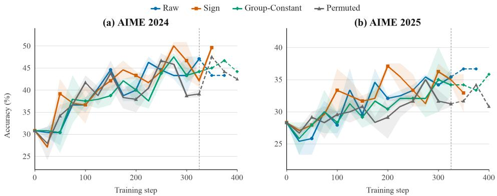
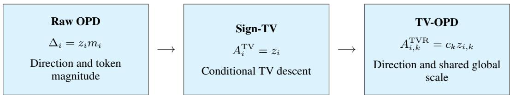
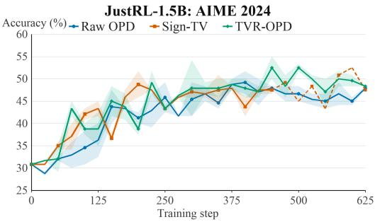
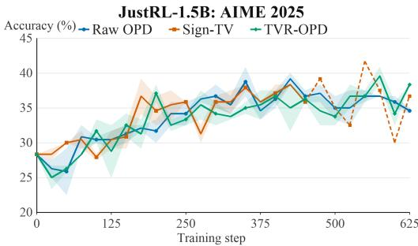

# TV-REGULATED OPD: DIRECTION MATTERS IN ON-POLICY DISTILLATION

Han Xiao1,\* Yifan Niu1,\* Dongyi Liu1 Chang Luo2 Jia Li1,3,†

1The Hong Kong University of Science and Technology (Guangzhou)

2The University of Edinburgh

3The Hong Kong University of Science and Technology

## ABSTRACT

On-Policy Distillation (OPD) facilitates the transfer of knowledge from domain expert to student in the post-training phase of Large Language Models (LLMs). However, the supervision signals in mainstream OPD methods suffer from high variance and noise which is generally instable during training. In this work, we systematically investigated what really matters to the performance and the fundamental mechanisms behind the instability during training. We found that retaining only the sign of token-level advantages is sufficient to achieve the performance comparable to standard OPD. Meanwhile, smoother and bounded advantages can stabilize the training process without sacrificing its performance. These motivated us to shape the advantages using the Total Variation (TV) and propose a robust TV regulated On-Policy Distillation (TV-OPD) method. Benefiting from the bounded and diminished advantages, TV-OPD exhibits stable training dynamics and steady late-stage performance. We conducted comprehensive experiments and found that, across various settings, TV-OPD consistently achieved better performance and lower variance in the late-stage of training.

## 1 INTRODUCTION

On-Policy Distillation (OPD) has emerged as a key algorithm for the post-training of large models, serving to transfer knowledge from a teacher model to a student model [1, 11]. Benefiting from its onpolicy and dense supervision nature, OPD enables highly efficient data utilization while minimizing adverse effects on the student model’s other capabilities; consequently, it is widely adopted across the industry, including Qwen, MiMo, GLM, and DeepSeek [15, 14, 4, 3].

The widely used OPD method employs the difference in log-probabilities between the teacher and the student as a token-wise supervision signal [11, 10]. The sign of this signal determines whether a token should be encouraged or suppressed, while the absolute value of the coefficient influences the magnitude of the corresponding gradient. However, this coefficient lacks a uniform upper bound on its magnitude. Existing studies have observed that this signal exhibits high variance and extreme values, leading to training instability and limiting the ultimate performance ceiling [12, 13]. Consequently, effectively utilizing this token-wise supervision signal is a crucial issue for improving sample-OPD training.

To address these issues, representative existing methods modify token-wise weights through techniques such as clipping, compression, power transformations, control variates, or divergence-corrected coefficients [12, 18, 13, 19, 17]. These methods operate on the assumption that the token-level reweighting derived from the supervision signal is highly informative; they precisely control gradient reweighting to ensure the teacher’s signal is accurately conveyed to the student. However, we find that this assumption does not necessarily hold.

We further decompose the OPD supervision signal into three components: sign, relative magnitude, and global magnitude. The sign determines whether to encourage or suppress a token; the relative magnitude dictates the token’s gradient weight; and the global magnitude determines the intensity of a single update. While keeping the sign constant, we conducted experiments where we eliminated token-wise relative magnitudes, retained only a shared global scale, or randomly shuffled the relative magnitudes among tokens. The controlled results in Section 4 demonstrate that sign information and global scale are the two key factors for effective supervision: retaining only the sign enables stable and effective learning, while retaining a global scale that decays as the teacher and student distributions converge facilitates convergence in the later stages of training. In contrast, fine-grained, token-wise magnitude allocation yielded no consistent benefits.

Based on these observations, we propose TV-regulated OPD (TV-OPD) to fully leverage information regarding token-wise directional supervision and global update intensity. Regarding directional supervision, we retain only the sign of the log-probability difference; we demonstrate in Section 5 that this signal is equivalent to optimizing the total variation (TV) distance between the teacher’s and student’s conditional distributions, offering the advantages of being bounded and having low variance. For global intensity, we utilize this TV distance to regulate the global update scale, ensuring that the update intensity decays as the teacher and student distributions converge. The experiments in Section 6 demonstrate that TV-OPD achieves training performance comparable to baseline methods in both 1.5B and 8B settings, while exhibiting greater stability during training and superior performance in the later stages.

## 2 RELATED WORK

Knowledge distillation transfers a teacher’s predictive distribution to a student [9]. For autoregressive models, OPD moves supervision onto student-generated prefixes, where the student must act at inference time. One line of work develops distribution-matching objectives: MiniLLM uses reverse KL for language-model distillation [5], while Generalized Knowledge Distillation combines studentgenerated data with flexible divergence choices [1]. These methods motivate matching conditional distributions on student-visited states rather than relying exclusively on fixed teacher responses.

A second line concerns how this supervision is estimated. Full-vocabulary OPD computes conditional divergence gradients by summing over token probabilities, whereas sampled-token OPD uses the teacher–student log-ratio at the generated token as a lightweight policy-gradient coefficient [11]. Top-k approximations trade vocabulary coverage for cost. Variance-reduction methods retain sampledtoken updates while modifying their estimator: vOPD subtracts a detached control-variate baseline and also studies a top-k approximation to that baseline [12]. This differs from truncating the divergence objective itself.

Other variants change the advantage or the information available to it. PowerOPD uses bounded, sign-consistent power transformations of the likelihood ratio [18]; clipping and log-scale compression regulate extreme signals associated with mismatch and length exploitation [13]. OPD+ derives corrected policy-gradient coefficients for general f-divergence objectives [19]. TIDE combines bounded Hellinger shaping for sampled student-excess tokens with teacher top-k injection for student deficit tokens [17]. These approaches address distinct issues in estimation, objective design, and missing supervision. Our focus is the information carried by the sampled-token coefficient itself: controlled interventions separate its teacher-relative direction from fine-grained magnitude, motivating a TV update with a separately regulated global scale.

## 3 PRELIMINARY

## 3.1 STUDENT ROLLOUTS AND TEACHER SUPERVISION

Let $x \sim \rho$ be a prompt and $y = ( a _ { 1 } , \dotsc , a _ { H } )$ a student-generated response of length H (random unless a fixed horizon is specified). At token position t, the state is $s _ { t } = ( x , a _ { < t } )$ and $a _ { t } \sim \pi _ { \bar { \theta } } ( \cdot \mid s _ { t } )$ where ¯θ denotes the rollout parameters. The fixed teacher evaluates these same prefixes; it does not generate the training states. We assume a shared vocabulary V and write $p ( \cdot \mid s ) = \pi _ { T } ( \cdot \mid s )$ for the teacher and $q _ { \theta } ( \cdot \mid s ) = \pi _ { \theta } ( \cdot \mid s )$ for the student. Both probabilities are positive on V, as with untruncated softmax sampling. The index t denotes token position, k denotes optimizer step, and b indexes a rollout in a batch of B rollouts. When only token coefficients are discussed, i is a flattened index for a pair (b, t) within one step.

Full-vocabulary distillation compares the two conditional distributions at each visited state. Sampled token OPD instead uses their log-probabilities at the generated token [11], giving the dense coefficient

$$
\begin{array} { r } { A ^ { \mathrm { R a w } } ( s , a ) = \Delta ( s , a ) = \log p ( a \mid s ) - \log q _ { \bar { \theta } } ( a \mid s ) . } \end{array}\tag{1}
$$

Here $\Delta$ denotes the log-ratio evaluated using the rollout student; at the on-policy point $\theta = { \bar { \theta } } .$ , it equals log $p ( a \mid s ) - \log q _ { \theta } ( a \mid s )$ . A positive coefficient promotes a token to which the teacher assigns more probability; a negative coefficient suppresses it. We use “advantage” for this distillation coefficient, which is distinct from a task-return advantage.

## 3.2 THE SAMPLED-TOKEN OPTIMIZATION SURROGATE

Let $\nu _ { \bar { \theta } }$ denote the distribution of states visited by the rollout student, with a specified token weighting. Holding this distribution fixed, the conditional reverse-KL objective is

$$
{ \mathcal { L } } _ { \mathrm { R K L } } ( \theta ; \bar { \theta } ) = \mathbb { E } _ { s \sim \nu _ { \bar { \theta } } } \left[ D _ { \mathrm { K L } } ( q _ { \theta } ( \cdot \mid s ) \parallel p ( \cdot \mid s ) ) \right] .\tag{2}
$$

Here $\begin{array} { r } { D _ { \mathrm { K L } } ( q | | p ) = \sum _ { a } q ( a ) \log ( q ( a ) / p ( a ) ) } \end{array}$ . At the on-policy point $\theta \ : = \ : \bar { \theta }$ , the score identity $\mathbb { E } _ { a \sim q _ { \theta } } \nabla _ { \theta }$ θ log $q _ { \theta } ( a \mid s ) = 0$ gives

$$
- \nabla _ { \theta } \mathcal { L } _ { \mathrm { R K L } }  _ { \theta = \bar { \theta } } = \mathbb { E } _ { \ a \sim q _ { \bar { \theta } } ( \cdot \vert s ) } [ \Delta ( s , a ) \ \nabla _ { \theta } \log q _ { \theta } ( a \mid s )  _ { \theta = \bar { \theta } } ] .\tag{3}
$$

Thus Raw OPD estimates a reverse-KL descent signal at the visited states. For a batch B of active tokens, a general coefficient $A _ { i }$ enters training through the detached surrogate

$$
\widehat { \mathcal { L } } _ { A } ( \theta ) = - \frac { 1 } { | \mathcal { B } | } \sum _ { i \in \mathcal { B } } \operatorname { s g } [ A _ { i } ] \log q _ { \theta } ( a _ { i } \mid s _ { i } ) , \qquad \widehat { \mathcal { g } } _ { A } = - \nabla _ { \theta } \widehat { \mathcal { L } } _ { A } .\tag{4}
$$

Only the student log-probability receives gradients. The teacher, sampled prefixes, and coefficients are held fixed. Reusing rollouts away from $\bar { \theta }$ requires importance weighting; clipping or other optimizer operations can further modify the update. Our exact gradient identities refer to the onpolicy, pre-optimizer signal and stopped state occupancy, not the full derivative of a sequence-level objective.

## 3.3 CONDITIONAL TOTAL VARIATION

We will also use total variation (TV), defined at a shared state by

$$
D _ { \mathrm { T V } } ( p , q _ { \theta } ) = \frac { 1 } { 2 } \sum _ { a \in \mathcal { V } } \left| p ( a \mid s ) - q _ { \theta } ( a \mid s ) \right| \in [ 0 , 1 ] .\tag{5}
$$

This is a distance between next-token distributions. Averaging it over student-visited states measures local mismatch along student rollouts; it is a different quantity from TV between complete response distributions. With this notation, we can isolate what information the raw coefficient supplies before selecting the objective and regulator of our method.

## 4 OBSERVATION: DIRECTION AND MAGNITUDE IN OPD

## 4.1 SEPARATING DIRECTION FROM MAGNITUDE

The surrogate in Eq. (4) makes the coefficient’s role explicit: it scales each sampled token’s score vector. We decompose

$$
A _ { i } ^ { \mathrm { R a w } } = z _ { i } m _ { i } , \qquad z _ { i } = \mathrm { s i g n } ( \Delta _ { i } ) , \qquad m _ { i } = | \Delta _ { i } | .\tag{6}
$$

Direction $z _ { i }$ specifies promotion or suppression relative to the teacher. Magnitude $m _ { i }$ determines both the relative allocation across tokens and the overall coefficient scale. To test whether precise magnitude allocation is necessary, we hold the direction rule fixed and intervene on $m _ { i }$

  
Figure 1: Magnitude interventions on the JustRL-DeepSeek-1.5B → DeepSeek-R1-Distill-Qwen-1.5B pair. Solid curves and bands show the mean ± one standard deviation across two runs; dashed segments indicate reduced run coverage. Quantitative comparisons use the jointly complete interval.

## 4.2 CONTROLLED MAGNITUDE ABLATIONS

We compare four coefficient variants under matched prompt, rollout-sampling, optimizer, and evaluation settings. Each run generates its own on-policy trajectories as its student evolves. Given $\Delta _ { i } = z _ { i } m _ { i }$ , we define

$$
\mathrm { R a w : \ } z _ { i } m _ { i } , \qquad \mathrm { S i g n : \ } z _ { i } , \qquad \mathrm { G r o u p - C o n s t a n t : \ } z _ { i } \kappa _ { z _ { i } } , \qquad \mathrm { P e r m u t e d : \ } z _ { i } m _ { \sigma ( i ) } .\tag{7}
$$

Here, $\kappa _ { z _ { i } }$ is shared by tokens in the same sign group, and $\sigma$ is a random permutation over the comparison unit. Appendix D provides the construction details. All variants preserve $z _ { i } .$ . The experiment therefore isolates fine-grained magnitude without changing the teacher-relative direction.

Controlled interventions on the sampled-token coefficient.
<table><tr><td>Variant</td><td>Direction</td><td>Magnitude</td><td>Token allocation</td></tr><tr><td>Raw</td><td>Preserved</td><td>Raw distribution</td><td>Raw</td></tr><tr><td>Sign</td><td>Preserved</td><td>Unit</td><td>Removed</td></tr><tr><td>Group-Constant</td><td>Preserved</td><td>Sign-group mean</td><td>Within-group removed</td></tr><tr><td>Permuted</td><td>Preserved</td><td>Raw distribution</td><td>Within-sign permuted</td></tr></table>

Raw versus Sign tests whether exact magnitude is needed once direction is fixed. Permuted shuffles magnitudes only among tokens with the same sign, preserving sign membership and the withinsign empirical magnitude distribution while breaking token–magnitude correspondence. Group-Constant replaces every positive advantage by the mean of all positive advantages and every negative advantage by the mean of all negative advantages. It therefore preserves a separate aggregate scale for the positive and negative groups while removing within-group allocation. Appendix D describes additional controls.

## 4.3 EMPIRICAL OBSERVATIONS

Direction alone retains effective supervision. In the two-seed diagnostic in Figure 1, Sign achieves the highest two-benchmark trajectory average (36.29%), followed by Raw (35.40%), Group-Constant (34.67%), and Permuted (34.35%), over the common evaluation horizon. Sign also leads in per-seed best-over-training accuracy: $5 0 . 0 0 \pm 1 . 1 8$ on AIME 2024 and $3 7 . 5 0 \pm 0 . 0 \bar { 0 }$ on AIME 2025, versus $4 7 . 5 0 \pm 0 . 0 0$ and $3 5 . 8 3 \pm 1$ .18 for Raw (Appendix D).

Token-wise magnitude reweighting provides no consistent benefit in this diagnostic. Neither the original likelihood-gap weights, coarse sign-group scales, nor reassigned magnitudes improve on Sign. These results support retaining teacher-relative direction without relying on precise magnitude allocation. The evidence is specific to this pair and does not directly measure supervision noise; Section 6 evaluates Sign-TV on a second pair.

  
Figure 2: TV-OPD separates local direction from global strength. Removing raw log-ratio magnitude yields Sign-TV, a conditional TV descent signal. A shared TV-responsive regulator restores global attenuation without restoring token-wise likelihood-gap weights.

Optimization scale nevertheless remains useful information, distinct from relative token weights. As teacher and student approach agreement, raw log-ratios shrink, whereas Sign assigns unit magnitude to every unequal coordinate. Removing magnitude thus also removes discrepancy-dependent coefficient attenuation, although the expected gradient need not have constant norm. This motivates retaining direction for local supervision and using aggregate discrepancy to regulate global strength. The next section realizes both through TV: the sign signal defines TV descent, and a shared TV-responsive scale regulates its intensity without restoring token-wise magnitude weights.

## 5 METHOD: TV-REGULATED OPD

The observations in Section 4 motivate retaining the sign of the teacher–student log-ratio for token supervision and recovering global attenuation through a shared scale. TV-regulated OPD (TV-OPD) connects these two components through the same discrepancy: the sign signal optimizes conditional TV, and an estimate of that TV sets the global supervision strength. We first derive this connection, then show how to estimate TV using the sampled-token log-probabilities already available in OPD. The gradient identities below are evaluated at the on-policy point θ = ¯θ, holding the sampled-state distribution fixed as in Section 3.

## 5.1 FROM SIGN SUPERVISION TO TV OPTIMIZATION

At a fixed state s, retaining only the sign gives the coefficient $A ^ { \mathrm { T V } } ( s , a ) = \mathrm { s i g n } ( \Delta ( s , a ) )$ . The logarithm is strictly increasing, so this is also the sign of the probability difference $p ( a \mid s ) - q _ { \theta } ( a \mid s )$ tokens underrepresented by the student are encouraged, and overrepresented tokens are suppressed. This is precisely the direction obtained by reducing the absolute probability differences that define TV in Eq. (5).

To make the connection explicit, abbreviate the conditional probabilities by $p ( a )$ and $q _ { \theta } ( a )$ . Differentiating TV and using the score identity $\nabla _ { \theta } q _ { \theta } ( a ) = q _ { \theta } ( a ) \nabla _ { \theta }$ log $q _ { \theta } ( a )$ gives

$$
\begin{array} { r l } & { - 2 \nabla _ { \theta } D _ { \mathrm { T V } } ( p , q _ { \theta } ) = \displaystyle \sum _ { a \in \mathcal { V } } \mathrm { s i g n } ( p ( a ) - q _ { \theta } ( a ) ) \nabla _ { \theta } q _ { \theta } ( a ) } \\ & { \quad \quad \quad = \mathbb { E } _ { a \sim q _ { \theta } } \left[ \mathrm { s i g n } ( \Delta ( s , a ) ) \nabla _ { \theta } \log q _ { \theta } ( a \mid s ) \right] . } \end{array}\tag{8}
$$

Thus the sign-weighted update in Eq. (4) estimates a conditional TV descent direction, up to a global factor of two. Averaging over the fixed distribution of student-visited states gives the corresponding average-TV objective. We call this unregulated baseline Sign-TV. At equality coordinates, we set sign(0) = 0; Appendix A.2 gives the formal subgradient statement. Replacing the raw coefficient preserves each token’s promotion or suppression direction while changing the discrepancy objective from reverse KL to TV; the aggregate gradient direction can change with the token weights.

This formulation has two useful properties. First, the sign coefficient has magnitude at most one, so extreme teacher–student log-ratios cannot assign arbitrarily large weights to individual token signals. This bounds the teacher-induced coefficient, while the score norm and optimizer still affect the actual update. Second, TV closeness controls differences in the expectation of any bounded next-token statistic. If the teacher has positive expected task advantage at a state, a policy sufficiently close to it in TV retains positive expected advantage there. This is a local behavioral guarantee under a teacher-quality assumption; full-response improvement requires additional conditions. Formal statements and proofs of both properties appear in Appendix A.

## 5.2 ESTIMATING TV FROM SAMPLED TOKENS

To use the same discrepancy for global regulation, we need its value as well as its descent direction. Directly evaluating Eq. (5) requires both distributions over the full vocabulary. Sampled-token OPD provides only their log-probabilities at the generated token, but these are sufficient for an unbiased estimate at each state.

The key is probability-mass conservation: because $p$ and $q _ { \theta }$ both sum to one, the student’s total excess probability equals its total deficit. TV therefore equals the excess mass on tokens for which $q _ { \boldsymbol { \theta } } > p$ Writing $[ \dot { z } ] _ { + } \dot { = } \operatorname* { m a x } ( z , 0 )$ and factoring out the student sampling probability,

$$
D _ { \mathrm { T V } } ( q _ { \theta } , p ) = \sum _ { a \in \mathcal { V } } [ q _ { \theta } ( a ) - p ( a ) ] _ { + } = \mathbb { E } _ { a \sim q _ { \theta } } \left[ \left[ 1 - \frac { p ( a ) } { q _ { \theta } ( a ) } \right] _ { + } \right] .\tag{9}
$$

This yields the sampled-token estimator

$$
{ \widehat { d } } ( s , a ) = \left[ 1 - \frac { p ( a \mid s ) } { q _ { \theta } ( a \mid s ) } \right] _ { + } = [ 1 - e ^ { \Delta ( s , a ) } ] _ { + } .\tag{10}
$$

It uses the same $\Delta$ as the sign coefficient and requires no additional teacher scoring. Although a token contributes to this estimate only when the student overrepresents it, the expectation recovers the entire TV distance by mass conservation. The estimate always lies in [0, 1], and its conditional variance is at most $1 / 4$ . The one-sided form matters: the equally unbiased symmetric estimator $\frac { 1 } { 2 } | 1 - e ^ { \Delta } |$ can become arbitrarily large for positive log-ratios. In Eq. (10), that branch contributes zero. For numerical evaluation, the equivalent form − expm1(min{∆, 0}) avoids large exponentials and cancellation near agreement.

At step $k ,$ we pool these estimates over active tokens to obtain $\widehat { D } _ { k }$ . Its target is on-policy average TV: the conditional discrepancy averaged over states visited by the rollout student, with the chosen token weighting. For a fixed rollout horizon, the sample average is unbiased even though successive tokens are dependent. With variable-length responses, active-token pooling is a ratio estimator: it is consistent for the token-weighted target under independent rollouts and activity masks determined before the current action, but need not be unbiased at finite batch size. This target measures local conditional mismatch along rollouts; it differs from TV between complete responses. Appendix B provides the estimator proposition, variance analysis, and masking details.

## 5.3 TV-BASED GLOBAL REGULATION

Sign-TV assigns unit magnitude to every unequal token coordinate, even as the probability gap narrows. To recover discrepancy-dependent attenuation at the global level, TV-OPD uses $\widehat { D } _ { k }$ to set a shared coefficient. We first pool $\mathrm { T V }$ numerators and active-token counts across all microbatches and data-parallel workers, then smooth their ratio with a single EMA, $\bar { D } _ { k } = \beta \bar { D } _ { k - 1 } + ( 1 - \beta ) \widehat { D } _ { k }$ . The resulting supervision is

$$
A _ { i , k } ^ { \mathrm { T V R } } = c _ { k } \mathrm { s i g n } ( \Delta _ { i , k } ) , \qquad c _ { k } = \mathrm { c l i p } \biggl [ \biggl ( \frac { \bar { D } _ { k - 1 } + \epsilon } { D _ { \mathrm { r e f } } + \epsilon } \biggr ) ^ { \alpha } , c _ { \mathrm { m i n } } , 1 \biggr ] .\tag{11}
$$

The initial coefficient is one. The first valid step initializes the EMA and freezes $D _ { \mathrm { r e f } }$ to its observed discrepancy; thereafter the EMA updates only the next step’s coefficient. Here $\epsilon > 0$ stabilizes the ratio, $\alpha > 0$ controls attenuation, and $0 < c _ { \mathrm { m i n } } \le 1$ sets a floor. Below the reference, smaller TV yields smaller coefficients; above it, $c _ { k } = 1$ . Larger α gives stronger attenuation for the same ratio below one. Local signs determine token supervision, while on-policy TV controls only its global scale.

The coefficient is fixed before sampling the step, detached, and applied uniformly to its policygradient loss. It therefore scales the realized pre-optimizer batch signal without changing relative token weights. Using the previous EMA also preserves the expected TV direction whenever the base signal is unbiased under the chosen token weighting; variable-length pooling retains the qualification above. Appendix B.6 gives the formal argument and scheduler details. TV consequently serves both roles: its descent direction supplies local sign supervision, and its estimated value regulates global strength.

## 6 EXPERIMENTS

## 6.1 SETUP

Model pairs. We evaluate two same-family teacher–student pairs. In the 8B setting, the teacher is Qwen3-8B and the student is Qwen3-8B-Base after supervised fine-tuning on 400K OpenThoughts examples; OPD uses DeepMath-103K prompts [15, 6, 8]. In the 1.5B setting, the teacher is JustRL-DeepSeek-1.5B, the student starts from DeepSeek-R1-Distill-Qwen-1.5B, and OPD uses DAPO-Math-17K [2, 7, 16]. In both settings, teacher and student use the same tokenizer. This removes cross-tokenizer alignment as a confounding factor.

Training and evaluation. Each update uses 64 prompts and one on-policy rollout per prompt. We train with AdamW at learning rate $1 0 ^ { - 6 } .$ . We evaluate periodically on AIME 2024 and AIME 2025 with four responses per problem and report mean@4. Each formal comparison uses two paired random seeds. Methods differ only in the sampled-token coefficient or the shared TV-OPD scale. Appendix C provides the full configuration.

Checkpoint protocol. For each seed, we select one checkpoint that maximizes the mean of AIME 2024 and AIME 2025. We read both benchmark scores from this checkpoint and then report the mean and sample standard deviation across seeds. Ties use the earliest checkpoint, allowing for CSV rounding. The JustRL and Qwen reporting horizon is steps 0–625. Both benchmark scores always come from the same checkpoint within each seed.

## 6.2 MAIN RESULTS

Table 1: AIME validation accuracy (mean@4). One checkpoint per seed is selected by the mean of AIME 2024 and 2025, and both scores are read at that checkpoint; entries then report mean ± standard deviation across two seeds. Bold marks the highest mean in each benchmark row.
<table><tr><td>Benchmark</td><td>Initial</td><td>Raw OPD</td><td>Sign-TV</td><td>TV-OPD</td></tr><tr><td>JustRL-1.5B → DS-Distill-Qwen-1.5B</td><td></td><td></td><td></td><td></td></tr><tr><td>AIME 2024</td><td>30.83</td><td> $5 0 . 8 3 \pm 0 . 8 3$ </td><td> $5 1 . 2 5 \pm 0 . 4 2$ </td><td> ${ \bf 5 1 . 6 7 \pm 1 . 1 8 }$ </td></tr><tr><td>AIME 2025</td><td>28.33</td><td> $3 7 . 9 2 \pm 0 . 4 2$ </td><td> $3 7 . 0 8 \pm 0 . 4 2$ </td><td> ${ \bf 3 8 . 7 5 \pm 2 . 0 8 }$ </td></tr><tr><td>Qwen3-8B → Qwen3-8B-SFT</td><td></td><td></td><td></td><td></td></tr><tr><td>AIME 2024</td><td>60.83</td><td> $6 8 . 3 3 \pm 0 . 0 0$ </td><td> $6 5 . 0 0 \pm 0 . 0 0$ </td><td> ${ \bf 7 0 . 0 0 \pm 1 . 1 7 }$ </td></tr><tr><td>AIME 2025</td><td>50.83</td><td> $5 7 . 0 8 \pm 2 . 9 5$ </td><td> $5 7 . 0 8 \pm 2 . 0 8$ </td><td> ${ \pm \bf 8 . 3 3 \pm 1 . 6 7 }$ </td></tr></table>

Table 1 reports the main results. On the JustRL pair, TV-OPD reaches $5 1 . 6 7 \pm 1 . 1 8$ on AIME 2024 and 38.75±2.08 on AIME 2025, with a two-benchmark average of 45.21%. TV-OPD leads on AIME 2024 (51 $. 6 7 \pm 1 . 1 8 )$ at the reported checkpoints and gives the strongest aggregate result. The selected TV-OPD checkpoints retain the high AIME 2024 point while recovering AIME 2025 performance relative to the fully unrestricted choice.

On the larger Qwen pair, TV-OPD reaches $7 0 . 0 0 \pm 1 . 1 7$ on AIME 2024 and $5 8 . 3 3 \pm 1 . 6 7$ on AIME 2025, with a two-benchmark average of 64.17%. This exceeds the strongest baseline in each row by 1.67 and 1.25 points, respectively. Together with the JustRL result, the completed comparisons show that restoring a discrepancy-responsive global scale can improve the aggregate result after removing token-wise log-ratio magnitude.

## 6.3 TV-OPD AND LATE-STAGE OPTIMIZATION DYNAMICS

Final checkpoint accuracy does not distinguish early learning from late-stage retention. We therefore track AIME 2024, AIME 2025, and their average

$$
S _ { k } = { \frac { \mathrm { A I M E 2 4 } _ { k } + \mathrm { A I M E 2 5 } _ { k } } { 2 } } .\tag{12}
$$

  
(a) JustRL-1.5B, AIME 2024

  
(b) JustRL-1.5B, AIME 2025  
Figure 3: JustRL validation trajectories for Raw, Sign-TV, and TV-OPD. Solid lines and bands show the mean ± one standard deviation across two seeds; dashed segments indicate reduced run coverage. All observations are retained, including points excluded from checkpoint selection.

The available exports contain validation accuracy but not the TV-OPD scale ${ \mathit { c } } _ { k } ,$ conditional TV, or the realized update norm $\| \Delta \theta _ { k } \|$ . We therefore analyze observed retention separately from these mechanism diagnostics.

Table 2: Stage-wise JustRL validation accuracy (%). Each cell first averages checkpoints within each training stage and seed, then averages the resulting seed-level values. Early, middle, and late windows are steps 0–250, 275–450, and 500–625, respectively. Bold marks the best method in each row.
<table><tr><td>Metric</td><td>TV-OPD  $( \alpha = 0 . 5 )$ </td><td>Sign-TV</td><td>Raw OPD</td></tr><tr><td>AIME 2024, early stage</td><td>39.58</td><td>40.11</td><td>37.50</td></tr><tr><td>AIME 2024, middle stage</td><td>48.28</td><td>46.72</td><td>46.41</td></tr><tr><td>AIME 2024, late stage</td><td>49.58</td><td>47.92</td><td>46.11</td></tr><tr><td>AIME 2025, early stage</td><td>30.45</td><td>31.70</td><td>30.49</td></tr><tr><td>AIME 2025, middle stage</td><td>35.21</td><td>35.99</td><td>36.72</td></tr><tr><td>AIME 2025, late stage</td><td>36.53</td><td>35.56</td><td>35.63</td></tr></table>

Table 2 compares the three training stages. Sign-TV performs best on both benchmarks in the early stage. In the middle stage, TV-OPD leads on AIME 2024, while Raw leads on AIME 2025. In the late stage, Raw and TV-OPD retain both seeds. TV-OPD is higher by 3.47 points on AIME 2024 and 0.90 points on AIME 2025. The regulator does not improve every stage; its clearest benefit is late-stage retention.

We summarize both benchmarks over $W = \{ 5 0 0 , 5 2 5 , \dots , 6 2 5 \}$ using

$$
{ \mathrm { L a t e M e a n } } = { \frac { 1 } { | W | } } \sum _ { k \in W } S _ { k } ,\tag{13}
$$

$$
{ \mathrm { P e a k D r o p } } = \operatorname* { m a x } _ { k } S _ { k } - { \frac { 1 } { | W | } } \sum _ { k \in W } S _ { k } .\tag{14}
$$

LateMean measures sustained performance. PeakDrop measures the gap between the best observed score over steps 0–625 and late-stage performance. Both statistics retain all observations. For the two methods with complete paired coverage in this window, TV-OPD improves LateMean from $4 0 . 8 7 \pm 0 . 8 3$ to $4 3 . 0 6 \pm 0 . 1 0$ and reduces PeakDrop from $3 . 5 1 \pm 1 . 1 3$ to $2 . 3 6 \pm 0 . 4 9$

The proposed mechanism can be tested by jointly tracking $c _ { k } .$ , conditional TV, and $\| \Delta \theta _ { k } \|$ . TV-OPD should reduce the global effective scale without restoring token-wise $| \Delta _ { i } |$ . A correlation with accuracy would support this mechanism, but would not establish that smaller updates cause better task performance.

## 6.4 SENSITIVITY TO REGULATOR STRENGTH

We isolate the feedback strength by sweeping $\alpha \in \{ 0 . 5 , 1 . 0 , 2 . 0 , 4 . 0 \}$ while leaving the local token weights and all other training settings unchanged. Since the runs have unequal endpoints, we summarize the common 0–625-step horizon rather than compare mismatched selected checkpoints.

Table 3: Regulator-strength ablation on the JustRL pair. We average validation accuracy over the common 0–625-step horizon and report mean ± sample standard deviation across two seeds. The last column averages both benchmarks; bold marks the best result.
<table><tr><td>α</td><td>AIME 2024</td><td>AIME 2025</td><td>Average</td><td></td></tr><tr><td>0.5</td><td> $\mathbf { 4 3 . 3 3 \pm 0 . 7 0 }$ </td><td> ${ \bf 3 2 . 9 3 \pm 0 . 8 3 }$ </td><td> ${ \bf 3 8 . 1 3 \pm 0 . 7 6 }$ </td><td rowspan="4"></td></tr><tr><td>1.0</td><td> $4 2 . 5 0 \pm 0 . 3 9$ </td><td> $3 2 . 2 5 \pm 0 . 1 3$ </td><td> $3 7 . 3 8 \pm 0 . 1 3$ </td></tr><tr><td>2.0</td><td> $4 0 . 0 9 \pm 0 . 3 9$ </td><td> $3 1 . 0 5 \pm 0 . 3 1$ </td><td> $3 5 . 5 7 \pm 0 . 0 4$ </td></tr><tr><td>4.0</td><td> $3 7 . 6 5 \pm 1 . 0 9$ </td><td> $2 9 . 0 1 \pm 0 . 7 4$ </td><td> $3 3 . 3 3 \pm 0 . 1 7$ </td></tr></table>

Table 3 shows a monotonic decline as α increases. Relative to $\alpha = 0 . 5$ , setting $\alpha = 4 . 0$ lowers the common-horizon mean by 5.68 points on AIME 2024 and 3.92 points on AIME 2025, for a 4.80-point drop in the two-benchmark average. This trend is consistent with the intended mechanism: a larger exponent produces stronger attenuation whenever the estimated TV falls below its reference value. If α is too large, the shared coefficient can therefore over-suppress the distillation signal and slow optimization progress. The sweep supports $\alpha = 0 . 5$ as the operating point for the completed JustRL experiments. It remains a within-pair sensitivity result rather than evidence that the same value is optimal at other model scales.

## 7 DISCUSSION

Our results separate two roles of the sampled-token OPD coefficient. The sign determines the teacherrelative update direction, while the magnitude controls both token allocation and global training strength. The controlled ablations show that precise token-wise allocation is not required in the tested settings. The theory further shows that the sign-only update performs conditional TV descent. TV-OPD builds on this result by restoring a single global scale without reintroducing likelihood-gap weighting across tokens.

Limitations. The current study has three main limitations. First, teacher-relative direction does not guarantee policy improvement. A weak or mismatched teacher can still guide the student toward undesirable behavior. Second, the TV equivalence is a conditional surrogate with stopped state occupancy. It does not differentiate through the rollout distribution or guarantee monotonic sequencelevel return. Third, TV-OPD is evaluated on a limited set of model pairs, benchmarks, and seeds. The evidence supports improved optimization dynamics and late-stage retention, but does not establish a higher capability ceiling.

## 8 CONCLUSION

In this work, we show that sampled-token OPD can separate where to update from how strongly to train. Sign-TV provides a principled conditional TV objective, and TV-OPD adds a discrepancyresponsive global scale without restoring token-wise magnitude. Across the tested settings, this design remains competitive with raw OPD and improves late-stage retention on the completed regulated comparison. These results provide a simple basis for designing OPD objectives with explicit local direction and global control.

## REFERENCES

[1] Rishabh Agarwal, Nino Vieillard, Yongchao Zhou, Piotr Stanczyk, Sabela Ramos, Matthieu Geist, and Olivier Bachem. On-policy distillation of language models: Learning from selfgenerated mistakes. arXiv preprint arXiv:2306.13649, 2023. URL https://arxiv.org/ abs/2306.13649.

[2] DeepSeek-AI. Deepseek-r1: Incentivizing reasoning capability in llms via reinforcement learning. arXiv preprint arXiv:2501.12948, 2025. URL https://arxiv.org/abs/2501. 12948.

[3] DeepSeek-AI. DeepSeek-V4: Towards highly efficient million-token context intelligence. arXiv preprint arXiv:2606.19348, 2026. URL https://arxiv.org/abs/2606.19348.

[4] GLM-5-Team, Aohan Zeng, Xin Lv, et al. GLM-5: from vibe coding to agentic engineering. arXiv preprint arXiv:2602.15763, 2026. URL https://arxiv.org/abs/2602.15763.

[5] Yuxian Gu, Li Dong, Furu Wei, and Minlie Huang. MiniLLM: Knowledge distillation of large language models. In International Conference on Learning Representations, 2024. URL https://arxiv.org/abs/2306.08543.

[6] Etash Guha, Ryan Marten, Sedrick Keh, Negin Raoof, Georgios Smyrnis, et al. Openthoughts: Data recipes for reasoning models. arXiv preprint arXiv:2506.04178, 2025. URL https: //arxiv.org/abs/2506.04178.

[7] Bingxiang He, Zekai Qu, Zeyuan Liu, Yinghao Chen, Yuxin Zuo, Cheng Qian, Kaiyan Zhang, Weize Chen, Chaojun Xiao, Ganqu Cui, et al. Justrl: Scaling a 1.5b llm with a simple rl recipe. arXiv preprint arXiv:2512.16649, 2025. URL https://arxiv.org/abs/2512.16649.

[8] Zhiwei He, Tian Liang, Jiahao Xu, Qiuzhi Liu, Xingyu Chen, Yue Wang, Linfeng Song, Dian Yu, Zhenwen Liang, Wenxuan Wang, Zhuosheng Zhang, Rui Wang, Zhaopeng Tu, Haitao Mi, and Dong Yu. Deepmath-103k: A large-scale, challenging, decontaminated, and verifiable mathematical dataset for advancing reasoning. arXiv preprint arXiv:2504.11456, 2025. URL https://arxiv.org/abs/2504.11456.

[9] Geoffrey Hinton, Oriol Vinyals, and Jeff Dean. Distilling the knowledge in a neural network. In NIPS Deep Learning and Representation Learning Workshop, 2015. URL https://arxiv. org/abs/1503.02531.

[10] Yaxuan Li, Yuxin Zuo, Bingxiang He, Jinqian Zhang, Chaojun Xiao, Cheng Qian, Tianyu Yu, Huan-ang Gao, Wenkai Yang, Zhiyuan Liu, and Ning Ding. Rethinking on-policy distillation of large language models: Phenomenology, mechanism, and recipe. arXiv preprint arXiv:2604.13016, 2026. URL https://arxiv.org/abs/2604.13016.

[11] Kevin Lu and Thinking Machines Lab. On-policy distillation. Thinking Machines Lab: Connectionism, 2025. doi: 10.64434/tml.20251026. URL https://thinkingmachines.ai/ blog/on-policy-distillation/.

[12] Minjae Oh, Sangjun Song, Gyubin Choi, Yunho Choi, and Yohan Jo. KL for a KL: Onpolicy distillation with control variate baseline. arXiv preprint arXiv:2605.07865, 2026. URL https://arxiv.org/abs/2605.07865.

[13] Rui Wang, Hongru Wang, Yi Chen, Boyang Xue, Tianqing Fang, Wenhao Yu, and Kam-Fai Wong. Demystifying on-policy distillation: Roles, pathologies, and regulations. arXiv preprint arXiv:2607.13399, 2026. URL https://arxiv.org/abs/2607.13399.

[14] Bangjun Xiao, Bingquan Xia, Bo Yang, Bofei Gao, Bowen Shen, et al. MiMo-V2-Flash technical report. arXiv preprint arXiv:2601.02780, 2026. URL https://arxiv.org/ abs/2601.02780.

[15] An Yang et al. Qwen3 technical report. arXiv preprint arXiv:2505.09388, 2025. URL https://arxiv.org/abs/2505.09388.

[16] Qiying Yu, Zheng Zhang, Ruofei Zhu, Yufeng Yuan, Xiaochen Zuo, et al. DAPO: An opensource LLM reinforcement learning system at scale. arXiv preprint arXiv:2503.14476, 2025. URL https://arxiv.org/abs/2503.14476.

[17] Zichao Yu, Chengzhi Yu, Shengze Xu, Yujin Han, Bingqing Jiang, Xu Wang, and Difan Zou. Mismatch matters: On-policy distillation beyond token agreement. arXiv preprint arXiv:2608.09836, 2026. URL https://arxiv.org/abs/2608.09836.

[18] Anhao Zhao, Junlong Tong, Yingqi Fan, Ping Nie, Wenjie Li, and Xiaoyu Shen. PowerOPD: Stabilizing on-policy distillation with bounded power transformation. arXiv preprint arXiv:2606.17199, 2026. URL https://arxiv.org/abs/2606.17199.

[19] Hanyang Zhao, Haoxian Chen, Han Lin, Genta Indra Winata, David D. Yao, and Wenpin Tang. OPD+: Rethinking the advantage design for on-policy distillation. arXiv preprint arXiv:2606.01039, 2026. URL https://arxiv.org/abs/2606.01039.

## A THEORETICAL PROPERTIES AND PROOFS

This appendix gives the formal statements supporting the sign-to-TV derivation and the two properties summarized in Section 5: bounded teacher-induced influence and behavioral preservation under TV closeness. The estimator statement and its statistical analysis are in Appendix B.

## A.1 REVERSE-KL SAMPLED-TOKEN GRADIENT

For a fixed state s, abbreviate the student $q _ { \theta } ( a \mid s )$ by $q _ { \theta } ( a )$ and the fixed teacher $p ( a \mid s )$ by $p ( a )$ Both have positive probabilities on the finite vocabulary. Differentiation gives

$$
\nabla _ { \theta } D _ { \mathrm { K L } } ( q _ { \theta } \| p ) = \sum _ { a } \nabla _ { \theta } q _ { \theta } ( a ) \left( \log { \frac { q _ { \theta } ( a ) } { p ( a ) } } + 1 \right)\tag{15}
$$

$$
= \mathbb { E } _ { a \sim q _ { \theta } } \left[ \log \frac { q _ { \theta } ( a ) } { p ( a ) } \nabla _ { \theta } \log q _ { \theta } ( a ) \right] .\tag{16}
$$

The second equality uses $\begin{array} { r } { \sum _ { a } \nabla _ { \theta } q _ { \theta } ( a ) = 0 } \end{array}$ . Negating, averaging over the stopped state distribution, and evaluating at $\theta = \bar { \theta }$ proves Eq. (3). The detached surrogate in Eq. (4) reproduces this gradient at the on-policy point. Differentiating through state occupancy would introduce additional terms and is outside this conditional objective.

## A.2 TV DESCENT WITH BOUNDED TEACHER INFLUENCE

Proposition 1 (TV descent with bounded teacher influence). At a fixed state s, with a fixed teacher and positive token probabilities,

$$
\begin{array} { r } { { \mathbb E } _ { a \sim q _ { \theta } } \left[ \mathrm { s i g n } ( \Delta ( s , a ) ) \nabla _ { \theta } \log q _ { \theta } ( a \mid s ) \right] = - 2 \nabla _ { \theta } D _ { \mathrm { T V } } ( p , q _ { \theta } ) } \end{array}
$$

where TV is differentiable and $\theta = { \bar { \theta } } .$ At equality coordinates, sign $. ( 0 ) = 0$ selects a generalized subgradient. For any shared $c \geq 0$ , the token signal $g _ { c } = c \mathrm { s i g n } ( \Delta ) \nabla _ { \theta }$ log qθ satisfies

$$
| c \mathrm { s i g n } ( \Delta ) | \leq c , \qquad \| g _ { c } \| \leq c \| \nabla _ { \theta } \log q _ { \theta } ( a \mid s ) \| .\tag{17}
$$

TV gradient identity. At a differentiable point,

$$
\nabla _ { \theta } D _ { \mathrm { T V } } ( p , q _ { \theta } ) = \frac { 1 } { 2 } \sum _ { a } \mathrm { s i g n } ( q _ { \theta } ( a ) - p ( a ) ) \nabla _ { \theta } q _ { \theta } ( a )\tag{18}
$$

$$
= - \frac 1 2 \mathbb { E } _ { a \sim q _ { \theta } } \left[ \mathrm { s i g n } ( \Delta ( a ) ) \nabla _ { \theta } \log q _ { \theta } ( a ) \right] .\tag{19}
$$

Here $\Delta ( a ) = \log p ( a ) - \log q _ { \theta } ( a )$ , and monotonicity of log identifies its sign with that of $p ( a ) - q _ { \theta } ( a )$ The teacher is fixed; no gradient is taken through its probabilities or the coefficient.

$\operatorname { A t } q _ { \theta } ( a ) = p ( a )$ , the subdifferential of $| q ( a ) - p ( a ) |$ with respect to $q ( a )$ is $[ - 1 , 1 ]$ . Choosing zero on equality coordinates and the ordinary sign elsewhere gives a valid subgradient in probability space. Composing with the differentiable probability map yields a generalized subgradient in parameter space. The resulting identity is a subgradient identity at such points, not a claim of strict decrease for every finite step. Averaging over fixed states gives the corresponding stopped-occupancy statement.

## A.3 BOUNDED TEACHER-INDUCED INFLUENCE AND PERTURBATIONS

Write $h ( a ) = \nabla _ { \theta }$ log $q _ { \theta } ( a \mid s )$ . For $\Delta ( a ) \neq 0$

$$
g ^ { \mathrm { T V } } ( a ) = \mathrm { s i g n } ( \Delta ( a ) ) h ( a ) = \frac { g ^ { \mathrm { R a w } } ( a ) } { | \Delta ( a ) | } .\tag{20}
$$

Thus every nonzero token direction is preserved, although their weighted sum can change direction. Since $| \sin ( \Delta ) | \leq 1$ , multiplying by any $c \geq 0$ proves Eq. (17). In comparison, $| \log ( \breve { p ( a ) } / q _ { \theta } ( a ) )$ has no uniform bound over positive distributions.

For two teachers $p _ { 1 } , p _ { 2 }$ , hold the student, state, token, and global scalar c fixed. Their TV token signals obey

$$
\lVert g _ { c } ( p _ { 1 } ) - g _ { c } ( p _ { 2 } ) \rVert \leq 2 c \lVert h ( a ) \rVert .\tag{21}
$$

The teacher may flip a token’s direction but cannot induce arbitrarily large relative weight at fixed c. This is a bounded-change statement, not Lipschitz continuity in teacher probabilities: the sign can jump near agreement. The bound concerns the multiplicative teacher coefficient; the score norm remains a separate factor.

## A.4 BEHAVIORAL PRESERVATION UNDER TV CLOSENESS

Proposition 2 (Behavioral preservation under TV closeness). For distributions $u ,$ v at a common state and any statistic $f \in [ m , M ]$

$$
| \mathbb { E } _ { u } f - \mathbb { E } _ { v } f | \leq ( M - m ) D _ { \mathrm { T V } } ( u , v ) .\tag{22}
$$

In particular, the bound is $2 \| f \| _ { \infty } D _ { \mathrm { T V } } ( u , v )$ for bounded $f .$ If the current student’s task advantage obeys $| A ^ { q _ { \theta } } ( s , a ) | \leq A _ { \operatorname* { m a x } } ( s )$ and the teacher has positive local margin $\Delta _ { T } ( s ) = \mathbb { E } _ { a \sim p } A ^ { q _ { \theta } } ( s , a ) \ { \stackrel { \cdot } { > } } \quad$ 0, then

$$
\mathbb { E } _ { a \sim \tilde { \pi } } A ^ { q _ { \theta } } ( s , a ) \geq \Delta _ { T } ( s ) - 2 A _ { \mathrm { m a x } } ( s ) D _ { \mathrm { T V } } ( \tilde { \pi } , p ) .\tag{23}
$$

Thus $D _ { \mathrm { T V } } ( \tilde { \pi } , p ) < \Delta _ { T } ( s ) / ( 2 A _ { \mathrm { m a x } } ( s ) )$ ) preserves positive expected advantage at this state.

Bounded statistics and the metric property. Let $P = \{ a : u ( a ) \geq v ( a ) \}$ . Because total signed mass is zero, $\begin{array} { r } { \sum _ { a \in P } ( u ( a ) - v ( a ) ) = \bar { D } _ { \mathrm { T V } } ^ { \top } ( u , v ) } \end{array}$ . For $f \in [ m , M ]$ , centering by m gives

$$
{ \mathbb E } _ { u } f - { \mathbb E } _ { v } f = \sum _ { a } ( u ( a ) - v ( a ) ) ( f ( a ) - m )\tag{24}
$$

$$
\leq ( M - m ) \sum _ { a \in P } ( u ( a ) - v ( a ) ) = ( M - m ) D _ { \mathrm { T V } } ( u , v ) .\tag{25}
$$

Swapping $u , v$ gives the absolute-value bound. Taking $m = - \| f \| _ { \infty }$ and $M = \| f \| _ { \infty }$ yields its norm form. The $\ell _ { 1 }$ triangle inequality also gives, at the same state,

$$
D _ { \mathrm { T V } } ( q _ { \theta } , \pi ^ { \star } ) \leq D _ { \mathrm { T V } } ( q _ { \theta } , p ) + D _ { \mathrm { T V } } ( p , \pi ^ { \star } ) .\tag{26}
$$

These statements concern bounded next-action statistics at a common state. A whole-response statistic instead requires a distance between whole-response distributions; Appendix B.5 relates the two quantities.

## A.5 CONDITIONAL TEACHER-GUIDED IMPROVEMENT

Fix the current student’s task advantage $A ^ { q _ { \theta } } ( s , a ) = Q ^ { q _ { \theta } } ( s , a ) - V ^ { q _ { \theta } } ( s )$ , under a specified boundedreturn task. This is an analysis quantity; TV-OPD does not estimate it or use a task reward in its coefficient. Define

$$
\begin{array} { r } { \mathcal { T } _ { s } ( \pi ) = \mathbb { E } _ { a \sim \pi ( \cdot | s ) } A ^ { q _ { \theta } } ( s , a ) , \qquad \Delta _ { T } ( s ) = \mathcal { T } _ { s } ( p ) > 0 . } \end{array}\tag{27}
$$

With $A _ { \mathrm { m a x } } ( s ) = \| A ^ { q _ { \theta } } ( s , \cdot ) \| _ { \infty }$ , the norm form of Eq. (22) implies

$$
\begin{array} { r } { \mathcal { T } _ { s } ( \tilde { \pi } ) \geq \Delta _ { T } ( s ) - 2 A _ { \mathrm { m a x } } ( s ) D _ { \mathrm { T V } } ( \tilde { \pi } , p ) . } \end{array}\tag{28}
$$

A positive teacher margin implies $A _ { \mathrm { m a x } } ( s ) > 0$ , so the strict neighborhood condition in Proposition 2 ensures $\mathcal { T } _ { s } ( \tilde { \pi } ) > 0$

For comparison, the ideal mixture $\pi _ { \lambda } = ( 1 - \lambda ) q _ { \theta } + \lambda p$ with $0 < \lambda \leq 1$ satisfies

$$
\begin{array} { r } { \mathcal { T } _ { s } ( \pi _ { \lambda } ) = \lambda \Delta _ { T } ( s ) > 0 , \qquad D _ { \mathrm { T V } } ( \pi _ { \lambda } , p ) = ( 1 - \lambda ) D _ { \mathrm { T V } } ( q _ { \theta } , p ) . } \end{array}\tag{29}
$$

This follows from $\mathcal { T } _ { s } ( q _ { \theta } ) = 0$ and linearity. A neural-network TV gradient step need not follow this mixture. Positive advantage at one state is not a global return guarantee; extending it requires conditions across visited states and control of occupancy shift. The teacher need not be optimal, but a teacher-quality assumption is necessary for improvement.

## A.6 SUPPORT AND TAIL BEHAVIOR

TV is finite and lies in [0, 1] even under support mismatch. Reverse KL is infinite if $q ( a ) > 0$ where $p ( a ) = 0$ . Under positive softmax probabilities, arbitrarily small $p ( a )$ still allows arbitrarily negative raw coefficients. TV coefficients stay in $[ - 1 , 1 ]$ . The sampled log-ratio identities assume positive probabilities; changing the sampling distribution by top-k or nucleus truncation requires a separate support and importance-weighting analysis. Bounded coefficients alone do not solve missing token coverage.

## A.7 CONTINUOUS-TIME SCHEDULING

For a differentiable fixed objective $F ( \theta )$ , suppose $\dot { \theta } ( t ) \ : = \ : - c ( t ) \nabla F ( \theta ( t ) )$ with $c ( t ) > 0$ . The increasing time change $\begin{array} { r } { \tau ( t ) = \int _ { 0 } ^ { t } c ( u ) } \end{array}$ du yields

$$
\frac { \mathrm { d } \theta } { \mathrm { d } \tau } = \frac { \mathrm { d } \theta / \mathrm { d } t } { \mathrm { d } \tau / \mathrm { d } t } = - \nabla F ( \theta ) .\tag{30}
$$

Where the gradient flow is well-defined and unique, the scaled flow follows the same path with a different speed. This ideal statement does not imply path equivalence for changing rollout occupancy, stochastic updates, or nonsmooth points, and does not assert equivalence of discrete updates.

## B ON-POLICY TV ESTIMATION AND REGULATION

## B.1 STATEWISE ESTIMATOR AND EXACT VARIANCE

Proposition 3 (Bounded on-policy TV estimation). Fix s and normalized distributions with positive probabilities on the shared vocabulary. For $a \sim q _ { \bar { \theta } } ( \cdot \mid s )$ , define

$$
\widehat { d } ( s , a ) = \left[ 1 - \frac { p ( a \mid s ) } { q _ { \bar { \theta } } ( a \mid s ) } \right] _ { + } = [ 1 - e ^ { \Delta ( s , a ) } ] _ { + } .
$$

Writing $d ( s ) = D _ { \mathrm { T V } } ( q _ { \bar { \theta } } ( \cdot \mid s ) , p ( \cdot \mid s ) )$

$$
\begin{array} { r } { { \mathbb E } [ \widehat { d } \mid s ] = d ( s ) , \qquad 0 \leq \widehat { d } \leq 1 , \qquad \operatorname { V a r } ( \widehat { d } \mid s ) \leq d ( s ) ( 1 - d ( s ) ) \leq \frac { 1 } { 4 } . } \end{array}\tag{31}
$$

Proof and equivalent estimators. Fix a state s and abbreviate the rollout student $q _ { \bar { \theta } } ( \cdot \mid s )$ by q and the teacher $p ( \cdot \mid s )$ by p. Both are normalized and positive on the finite shared vocabulary. All expectations below use the same student that supplies the denominator of the likelihood ratio. Define

$$
X = \widehat { d } ( s , a ) = [ 1 - p ( a ) / q ( a ) ] _ { + } , \quad a \sim q , \qquad d = d ( s ) = D _ { \mathrm { T V } } ( q , p ) .\tag{32}
$$

Normalization implies $\begin{array} { r } { \sum _ { a } ( q ( a ) - p ( a ) ) = 0 } \end{array}$ , hence the total positive and negative masses of $q - p$ agree. Therefore

$$
\mathbb { E } [ X \mid s ] = \sum _ { a : q ( a ) > p ( a ) } q ( a ) \left( 1 - { \frac { p ( a ) } { q ( a ) } } \right) = \sum _ { a : q ( a ) > p ( a ) } ( q ( a ) - p ( a ) ) = d ,\tag{33}
$$

$$
\mathbb { E } [ X ^ { 2 } \mid s ] = \sum _ { a : q ( a ) > p ( a ) } { \frac { ( q ( a ) - p ( a ) ) ^ { 2 } } { q ( a ) } } ,\tag{34}
$$

$$
\operatorname { V a r } ( X \mid s ) = \sum _ { a : q ( a ) > p ( a ) } { \frac { ( q ( a ) - p ( a ) ) ^ { 2 } } { q ( a ) } } - d ^ { 2 } \leq d ( 1 - d ) \leq { \frac { 1 } { 4 } } .\tag{35}
$$

The variance bound follows from $0 \leq X \leq 1$ , so $X ^ { 2 } \leq X$ . This proves Proposition 3. Positivity is a convenient sufficient assumption for the log-ratio representation. The one-sided ratio identity itself also holds when q has zeros: sum only over $q ( a ) > 0$ , since any coordinate with $q ( a ) > p ( a )$ necessarily belongs to that support.

Under positive support, the alternatives $[ p ( a ) / q ( a ) - 1 ]$ and ${ \textstyle \frac { 1 } { 2 } } | 1 - p ( a ) / q ( a ) |$ also have mean d. Their expectations follow from the negative mass of $q - p$ and the sum of its positive and negative masses, respectively. They can be arbitrarily large when $p ( a ) / q ( a ) \gg 1 ; X$ cannot. If $q$ has zeros where $p$ has mass, those two alternative identities need not hold, even though the one-sided identity for X still does. The equivalent evaluation $X = - \exp { \mathrm { m 1 } ( \operatorname* { m i n } \{ \Delta , 0 \} ) }$ ) avoids exponentiating large positive log-ratios and reduces cancellation near zero. This algebraic form is distinct from the direct exponential expression used by the current implementation.

## B.2 AUTOREGRESSIVE SAMPLING AND THE ESTIMAND

Fix an optimizer step and condition on its pre-sampling history, so the rollout policy $q = q _ { \bar { \theta } }$ is fixed. For $b = 1 , \ldots , B$ , draw independent prompts $x _ { b } \sim \rho$ and independent rollout randomness, set $s _ { b , t } ~ = ~ ( x _ { b } , a _ { b , < t } )$ , and sample $a _ { b , t } \sim q ( \cdot \ | \ s _ { b , t } )$ . The teacher evaluates these same states. Training-history conditioning is suppressed throughout the rollout calculations. Write

$$
X _ { b , t } = \widehat { d } ( s _ { b , t } , a _ { b , t } ) = [ 1 - e ^ { \Delta _ { b , t } } ] _ { + } ,\tag{36}
$$

$$
d _ { b , t } = d ( \boldsymbol { s } _ { b , t } ) = D _ { \mathrm { T V } } ( \boldsymbol { q } ( \cdot \mid \boldsymbol { s } _ { b , t } ) , \boldsymbol { p } ( \cdot \mid \boldsymbol { s } _ { b , t } ) ) , \qquad D _ { t } ^ { \mathrm { p o s } } = \mathbb { E } [ d _ { b , t } ] .\tag{37}
$$

Here $D _ { t } ^ { \mathrm { p o s } }$ is the population TV at token position $t ; \widehat { D } _ { k }$ later denotes a batch statistic at optimizer step k. By the tower property, $\mathbb { E } X _ { b , t } = \mathbb { E } \dot { d } _ { b , t } = D _ { t } ^ { \mathrm { p o s } }$ . For a deterministic horizon H,

$$
\widehat { D } _ { B , H } = \frac { 1 } { B H } \sum _ { b = 1 } ^ { B } \sum _ { t = 1 } ^ { H } X _ { b , t } , \qquad { \mathbb E } \widehat { D } _ { B , H } = \frac { 1 } { H } \sum _ { t = 1 } ^ { H } D _ { t } ^ { \mathrm { p o s } } = D _ { H } ^ { \mathrm { o c c } } .\tag{38}
$$

Equivalently, writing $\nu _ { q } ^ { ~ t }$ for the rollout studen $\mathrm { t } ^ { \prime } \mathrm { s }$ state distribution at token position $t ,$ the target is

$$
D _ { H } ^ { \mathrm { o c c } } = \frac { 1 } { H } \sum _ { t = 1 } ^ { H } \mathbb { E } _ { s _ { t } \sim \nu _ { q } ^ { t } } D _ { \mathrm { T V } } \big ( q ( \cdot \mid s _ { t } ) , p ( \cdot \mid s _ { t } ) \big ) .\tag{39}
$$

This is the fixed-horizon on-policy average TV described in the main text. Token independence is unnecessary for this expectation. Fixed-horizon results assume exactly H defined positions; they do not treat a random EOS length as a fixed normalizer. The i.i.d. rollout assumption also excludes dependent prompt sampling; with fixed or dependent prompts, the target and variance must be interpreted under that actual sampling design.

## B.3 ACTION-SAMPLING NOISE AND STATE-VISITATION NOISE

Define the pre-action filtration $\mathcal { F } _ { b , t } = \sigma ( \boldsymbol { x } _ { b } , a _ { b , 1 } , \ldots , a _ { b , t - 1 } )$ , with the fixed policy and teacher understood. Then $d _ { b , t }$ is $\mathcal { F } _ { b , t }$ -measurable and the residual $\varepsilon _ { b , t } = X _ { b , t } - d _ { b , t }$ obeys $\mathbb { E } [ \bar { \varepsilon _ { b , t } } \mid \mathcal { F } _ { b , t } ] = 0$ Thus

$$
X _ { b , t } - D _ { t } ^ { \mathrm { p o s } } = \underbrace { \varepsilon _ { b , t } } _ { \mathrm { a c t i o n ~ s a m p l i n g } } + \underbrace { \left( d _ { b , t } - D _ { t } ^ { \mathrm { p o s } } \right) } _ { \mathrm { s t a t e ~ v i s i t a t i o n } } .\tag{40}
$$

For $t < u , \varepsilon _ { b , t }$ is measurable with respect to $\mathcal { F } _ { b , u } , \ \mathrm { s o } \ \mathbb { E } [ \varepsilon _ { b , t } \varepsilon _ { b , u } ] = \mathbb { E } [ \varepsilon _ { b , t } \mathbb { E } ( \varepsilon _ { b , u } \ | \ \mathcal { F } _ { b , u } ) ] = 0$ Independence across rollouts gives orthogonality across b. Consequently,

$$
\mathrm { V a r } \left( \frac { 1 } { B H } \sum _ { b , t } \varepsilon _ { b , t } \right) = \frac { 1 } { B ^ { 2 } H ^ { 2 } } \sum _ { b , t } \mathbb { E } \mathrm { V a r } ( X _ { b , t } \mid \mathcal { F } _ { b , t } ) \leq \frac { 1 } { 4 B H } .\tag{41}
$$

This is only the action-noise variance. An early action residual can correlate with future $d _ { b , u } ,$ so the total variance includes covariance between the action and visitation components. No universal $O ( 1 / ( B H ) )$ bound follows for $\widehat { D } _ { B , H }$ . Instead, each rollout mean $Z _ { b } = H ^ { - 1 } \sum _ { t } X _ { b , t }$ lies in [0, 1]. Since the $Z _ { b }$ are independent,

$$
\operatorname { V a r } ( \widehat { D } _ { B , H } ) = \frac { 1 } { B ^ { 2 } } \sum _ { b } \operatorname { V a r } ( Z _ { b } ) \leq \frac { 1 } { 4 B } .\tag{42}
$$

A concentration bound follows directly from the conditional range of the action residual. Given $\mathcal { F } _ { b , t } .$ it has mean zero and lies in $[ - d _ { b , t } , 1 - d _ { b , t } ] .$ , an interval of length one. The bounded-variable exponential-moment inequality gives $\mathbb { E } [ e ^ { \lambda \varepsilon _ { b , t } } \mid \mathcal { F } _ { b , t } ] \le e ^ { \lambda ^ { 2 } / 8 }$ . Expose rollouts consecutively, adding

each prompt before its actions; the same conditional bound holds with previous rollouts included in the history. Iterating it over BH actions gives an exponential moment of at most $e ^ { B H \lambda ^ { 2 } / 8 }$ . Markov’s inequality, optimized at $\lambda = 4 u$ and applied to both signs, yields

$$
\operatorname* { P r } \left( \left| { \frac { 1 } { B H } } \sum _ { b , t } ( X _ { b , t } - d _ { b , t } ) \right| \geq u \right) \leq 2 e ^ { - 2 B H u ^ { 2 } } , \qquad u > 0 .\tag{43}
$$

This controls deviation from realized conditional $\mathrm { T V } ,$ not from its population mean $D _ { H } ^ { \mathrm { o c c } }$ . For that target, applying the same bounded-variable argument to the independent $Z _ { b }$ gives only $\mathrm { P r } ( | \widehat { D } _ { B , H } -$ $D _ { H } ^ { \mathrm { o c c } } | \geq u ) \leq 2 e ^ { - 2 B u ^ { 2 } }$ without additional temporal assumptions.

## B.4 VARIABLE LENGTH, EOS MASKS, AND RATIO ESTIMATION

For rollouts capped at $H _ { \mathrm { m a x } }$ , let $\omega _ { b , t } \in \{ 0 , 1 \}$ indicate an active token. Assume $\omega _ { b , t }$ is $\mathcal { F } _ { b , t ^ { - } }$ measurable, as when the EOS token itself is included and only subsequent positions are excluded. For formal convenience, extend each terminated trajectory with arbitrary samples from q up to the cap; their zero mask makes them irrelevant. Then

$$
\begin{array} { r } { \mathbb { E } [ \omega _ { b , t } X _ { b , t } ] = \mathbb { E } [ \omega _ { b , t } \mathbb { E } ( X _ { b , t } \mid \mathcal { F } _ { b , t } ) ] = \mathbb { E } [ \omega _ { b , t } d _ { b , t } ] . } \end{array}\tag{44}
$$

Define $\begin{array} { r } { U _ { b } = \sum _ { t } \omega _ { b , t } X _ { b , t } } \end{array}$ and $\begin{array} { r } { V _ { b } = \sum _ { t } \omega _ { b , t } } \end{array}$ . For i.i.d. rollouts and $\mathbb { E } V _ { b } > 0 .$ , the target is

$$
D _ { \mathrm { a c t i v e } } = \frac { \mathbb { E } U _ { b } } { \mathbb { E } V _ { b } } = \frac { \sum _ { t } \mathbb { E } \left[ \omega _ { b , t } d _ { b , t } \right] } { \sum _ { t } \mathbb { E } \left[ \omega _ { b , t } \right] } , \qquad \widehat { D } _ { B } ^ { \mathrm { a c t i v e } } = \frac { \sum _ { b } U _ { b } } { \sum _ { b } V _ { b } } .\tag{45}
$$

The ratio is defined on batches with $\textstyle \sum _ { b } V _ { b } > 0$ . Its numerator has the correct expectation, but its random denominator prevents general finite-sample unbiasedness. For example, suppose at the first position the student assigns probability $1 / 2$ to EOS and $1 / 2$ to continuation, while the teacher assigns $1 / 4$ and $3 / 4$ . After continuation the two distributions agree, and the cap is two. For one rollout, $( \dot { U } , V )$ equals $( 1 / 2 , 1 )$ or $( 0 , 2 )$ , each with probability $1 / { \bar { 2 } } .$ . Hence $\mathbb { E } [ U / \dot { V } ] = 1 / 4$ , whereas $D _ { \mathrm { a c t i v e } } = ( 1 / 4 ) / ( 3 / 2 ) = 1 / 6$

Since $U _ { b } , V _ { b }$ are bounded, the law of large numbers gives ${ \widehat { D } } _ { B } ^ { \mathrm { a c t i v e } } \ { \xrightarrow { p } } \ D _ { \mathrm { a c t i v e } }$ as $B  \infty$ at a fixed policy. The event of an empty batch has probability tending to zero when $\mathbb { E } V _ { b } > 0 ;$ assigning any fixed bounded value on that event does not change consistency. It can change finite-batch averages. The exact expansion

$$
{ \sqrt { B } } ( { \widehat { D } } _ { B } ^ { \mathrm { a c t i v e } } - D _ { \mathrm { a c t i v e } } ) = { \frac { B ^ { - 1 / 2 } \sum _ { b } ( U _ { b } - D _ { \mathrm { a c t i v e } } V _ { b } ) } { B ^ { - 1 } \sum _ { b } V _ { b } } }\tag{46}
$$

and the central limit theorem with Slutsky’s theorem yield

$$
\sqrt { B } ( \widehat { D } _ { B } ^ { \mathrm { a c t i v e } } - D _ { \mathrm { a c t i v e } } ) \Rightarrow N \left( 0 , \frac { \mathrm { V a r } ( U _ { b } - D _ { \mathrm { a c t i v e } } V _ { b } ) } { ( \mathbb { E } V _ { b } ) ^ { 2 } } \right) .\tag{47}
$$

A zero asymptotic variance is interpreted as a degenerate limit. Thus conditional token estimates and fixed-horizon averages are exactly unbiased; variable-length pooling is consistent under these assumptions. Equal weighting of sequence means targets $\mathbb { E } [ \breve { U _ { b } } / \dot { V _ { b } } ]$ when $V _ { b } > 0$ almost surely, a different quantity from pooled active-token TV.

## B.5 RELATION TO SEQUENCE-LEVEL TV

For deterministic H, define the conditional sequence distributions $\begin{array} { r } { Q _ { x } ( \tau ) = \prod _ { t } q ( a _ { t } \ | \ s _ { t } ) } \end{array}$ and $\begin{array} { r } { P _ { x } ( \tau ) = \prod _ { t } p ( a _ { t } \mid s _ { t } ) } \end{array}$ . Let $Q , P$ be the joint prompt–response laws with common prompt marginal $\rho .$ The marginal cancels in their likelihood ratio. The statewise one-sided argument, now on sequences, gives

$$
D _ { \mathrm { T V } } ( Q , P ) = \mathbb { E } _ { x \sim \rho , \tau \sim Q _ { x } } \left[ 1 - \exp \left( \sum _ { t = 1 } ^ { H } \Delta _ { t } \right) \right] _ { + } .\tag{48}
$$

For a fixed prompt, the same identity holds for $Q _ { x } , P _ { x }$ without averaging $x .$ This bounded unbiased sequence-TV estimator differs from the average of conditional token estimates. For $r _ { t } = p ( a _ { t } \ )$ $s _ { t } ) { \bar { / } } q ( a _ { t } \mid s _ { t } )$

$$
\left[ 1 - \prod _ { t } r _ { t } \right] _ { + } \leq \sum _ { t } [ 1 - r _ { t } ] _ { + } .\tag{49}
$$

Indeed, replace $r _ { t }$ by min $\{ r _ { t } , 1 \}$ to decrease the product, then use $\begin{array} { r } { 1 - \prod _ { t } ( 1 - u _ { t } ) \le \sum _ { t } u _ { t } } \end{array}$ for $u _ { t } \in [ 0 , 1 ]$ . Taking expectation under $Q _ { \ l }$ , with the same prompt distribution as in $D _ { t } ^ { \mathrm { p o s } }$ s, gives

$$
D _ { \mathrm { T V } } ( Q , P ) \leq \operatorname* { m i n } \Biggl \{ 1 , \sum _ { t } D _ { t } ^ { \mathrm { p o s } } \Biggr \} = \operatorname* { m i n } \{ 1 , H D _ { H } ^ { \mathrm { o c c } } \} .\tag{50}
$$

Persistent local discrepancies can cause sequence TV to approach one as length grows. For example, two distinct i.i.d. Bernoulli token policies have constant local TV, while an event separating their empirical token frequencies has probabilities approaching one and zero under the two laws. On-policy average TV measures local mismatch without summing it over length.

## B.6 EMA AND SCHEDULER PREDICTABILITY

The per-step statistic $\widehat { D } _ { k }$ is the pooled active-token ratio above, computed using logged rollout probabilities, even if student parameters subsequently change during optimization. At the start of step $k ,$ the stored $c _ { k }$ is frozen for all microbatches. TV numerators and token counts accumulate across microbatches and are summed across data-parallel workers before taking their ratio. This reproduces token pooling, not an unweighted average of microbatch means.

The scheduler uses one EMA with retention $\beta = 0 . 9 5 \colon \bar { D } _ { k } = \beta \bar { D } _ { k - 1 } + ( 1 - \beta ) \widehat { D } _ { k }$ on accepted steps. The first accepted step $k _ { 0 }$ initializes $\bar { D } _ { k _ { 0 } } = D _ { \mathrm { r e f } } = \widehat { D } _ { k _ { 0 } } ;$ the reference then stays fixed. Initially $c _ { k } = 1$ , and the first computed ratio is one as well. The $\epsilon > 0$ in Eq. (11) keeps the ratio defined even if the empirical reference is zero. The new EMA sets only $c _ { k + 1 } . \ \mathrm { A }$ nonfinite gradient norm freezes the scheduler state.

For the statistical effect of smoothing, first consider an ideal sequence without rejected steps, indexed from an initialized $\bar { D } _ { 0 }$ . Iteration gives

$$
\bar { D } _ { k } = \beta ^ { k } \bar { D } _ { 0 } + ( 1 - \beta ) \sum _ { j = 1 } ^ { k } \beta ^ { k - j } \widehat { D } _ { j } .\tag{51}
$$

Thus, with $\mu _ { j } = \mathbb { E } \widehat { D } _ { j }$ , its expectation is the same weighted sum of E $\bar { D } _ { 0 }$ and $\mu _ { j } ;$ independence is not required for this linear expectation. If the estimates are independent with constant mean $D$ and variance $\sigma ^ { 2 }$ , and independent of a finite-variance initial value, summing the geometric variance series gives

$$
\mathbb { E } \bar { D } _ { k } \longrightarrow D , \qquad \mathrm { V a r } ( \bar { D } _ { k } ) \longrightarrow \frac { 1 - \beta } { 1 + \beta } \sigma ^ { 2 } .\tag{52}
$$

The input mean is the mean of the batch estimator, which can itself carry finite-batch ratio bias. These limits do not assert stationarity or independence during adaptive training.

To describe skipped steps exactly after initialization, let $J _ { k } \in \{ 0 , 1 \}$ be the scheduler acceptance indicator and $\eta _ { k } = ( 1 - \beta ) J _ { k }$ . Then

$$
\bar { D } _ { k } = ( 1 - \eta _ { k } ) \bar { D } _ { k - 1 } + \eta _ { k } \widehat { D } _ { k } .\tag{53}
$$

If $J _ { k }$ depends on current gradients, it can depend on the current data. The weights are then random and correlated with the observations; the fixed-weight expectation and stationary variance formulas cannot simply be applied at the original optimizer-step indices.

Let $\mathcal { H } _ { k - 1 }$ contain everything available before sampling step $k ,$ including its rollout parameters and initialized reference. Since $c _ { k } > 0$ is measurable with respect to this history, for integrable gradient signals

$$
\mathbb { E } [ c _ { k } \widehat { g } _ { k } ^ { \mathrm { T V } } \mid \mathcal { H } _ { k - 1 } ] = c _ { k } \mathbb { E } [ \widehat { g } _ { k } ^ { \mathrm { T V } } \mid \mathcal { H } _ { k - 1 } ] .\tag{54}
$$

When the base signal unbiasedly estimates the conditional-TV descent direction under the chosen token weighting, this preserves its expected direction. Fixed-horizon normalization provides such a setting; random-denominator pooling retains its finite-sample qualification. The identity concerns the sampled gradient signal before any current-gradient-dependent rejection. A same-batch coefficient would instead introduce a componentwise conditional covariance between $c _ { k }$ and the unscaled signal. Detaching it in autodifferentiation would not remove that statistical dependence; historical scaling avoids it.

## B.7 IMPLEMENTATION SCOPE: PREPROCESSING AND SELECTION

The implementation evaluates $[ 1 - \exp ( { \tt a d v a n t a g e s } _ { i } ) ] .$ before magnitude ablations, after optional chunk credit assignment and clamping. The initial advantage is the teacher log-probability minus the rollout student’s log-probability. The effective mask is the response mask with sentinel positions excluded. Its sum/count implementation divides by max $\{ N _ { k } , 1 \}$ , where $N _ { k }$ is the effective token count; an empty batch therefore supplies zero, not a defined estimate of active-token TV. The nonempty-batch assumption is needed when identifying a scheduler input with that TV target. Including such zeros in the EMA changes its input mean.

Let $T ( \Delta )$ denote optional preprocessing. Exact tokenwise agreement with the TV estimator requires $[ 1 - e ^ { \dot { T } ( \Delta ) } ] _ { + } = [ 1 - e ^ { \Delta } ] _ { + }$ on sampled tokens. Equivalently, $T ( \Delta ) = \Delta$ for $\Delta < 0$ and $T ( \Delta ) \geq 0$ for $\Delta \geq 0$ . For example, capping positive log-ratios at a nonnegative threshold preserves the statistic; changing the negative branch generally does not. These are conditions for equality of the estimator itself, not a claim that all other transformations must have biased expectation for every possible policy pair.

For token-dependent selection, consider a deterministic mask $w ( s , a ) \in \{ 0 , 1 \}$ at an otherwise active state. Its exact conditional numerator and count are

$$
{ \mathbb E } [ w ( s , a ) X \mid s ] = \sum _ { a } w ( s , a ) [ q ( a \mid s ) - p ( a \mid s ) ] _ { + } , \qquad { \mathbb E } [ w ( s , a ) \mid s ] = \sum _ { a } w ( s , a ) q ( a \mid s ) .\tag{55}
$$

The first expression is generally not $d ( s ) \mathbb { E } [ w ( s , a ) \mid s ]$ . Pooling such selected tokens targets the ratio of expected selected positive mass to expected selected token count, not necessarily active-state TV or $\mathrm { T } \dot { \mathrm { V } }$ of renormalized selected policies. Thus predictable exclusions admit the occupancy proof above; current-token sentinel exclusions require this selection-aware interpretation unless additional properties establish equality. Finally, if generation uses a sampling law different from the denominator distribution, the one-sided proof must be rederived using that actual law or appropriate weighting.

## C FULL EXPERIMENTAL SETUP

Training. The loader shuffles the full OPD prompt split and uses batches of 64. Prompts are left-truncated at 1,024 tokens. One on-policy response of at most $^ { 1 6 , 3 8 4 }$ tokens is sampled per prompt at temperature 1.0 and top- $p = 1 . 0$ . Training uses AdamW with learning rate $1 0 ^ { - 6 }$ , weight decay 0.01, gradient clipping at 1.0, a constant base schedule with warmup. Runs use bfloat16, gradient checkpointing, fully sharded data parallelism, and sequence parallelism on eight GPUs.

Evaluation. We periodically evaluate the full AIME 2024 and AIME 2025 validation sets. Four responses are sampled per problem at temperature $0 . 6 , \mathrm { t o p } \mathrm { - } p = 0 . 9 5 , \mathrm { t o p } \mathrm { - } k = 2 0$ , and maximum length 31,744. We report mean@4 and then aggregate across two paired seeds per model pair. The formal JustRL comparison includes Raw, $\mathrm { S i g n \mathrm { - } T V } ,$ and TV-OPD. The separate magnitude diagnostic also uses two seeds and is described in Appendix D.

Method controls. Raw and TV differ only by replacing $\Delta _ { i }$ with $\mathrm { s i g n } ( \Delta _ { i } )$ . TV-OPD retains exactly the TV token signs and changes a single shared pre-optimizer scale $c _ { k }$ using the global-scale form in Eq. (11); the completed Qwen and JustRL runs reported in the main table both use $\alpha = 0 . 5$ . No task reward or verifier is mixed into these OPD coefficients.

The advantage-scaling scheduler configuration uses EMA retention $\beta = 0 . 9 5 , c _ { \mathrm { m i n } } = 0 . 1$ , and a reference frozen at the first valid optimizer step. The coefficient is fixed at step entry and refreshed only for the following step. It multiplies the policy-gradient loss uniformly across microbatches before AdamW. All reported Qwen TV-OPD results use $\alpha = 0 . 5$ . Appendix B.6 describes the update order, and Appendix B.7 states the assumptions needed after masking and optional preprocessing.

## C.1 HYPERPARAMETERS

Table 4: Training and evaluation hyperparameters.
<table><tr><td>Hyperparameter</td><td>Qwen3-8B pair</td><td>JustRL-1.5B pair</td></tr><tr><td>OPD prompt set</td><td>DeepMath-103K</td><td>DAPO-Math-17K</td></tr><tr><td>Prompt subset</td><td>Full training split</td><td>Full training split</td></tr><tr><td>Formal comparison seeds</td><td>2</td><td>2</td></tr><tr><td>TV-OPD α</td><td>0.5</td><td>0.5</td></tr><tr><td>Training rollouts per prompt</td><td>1</td><td>1</td></tr><tr><td>Training temperature / top-p</td><td>1.0 / 1.0</td><td>1.0 / 1.0</td></tr><tr><td>Maximum prompt / response length</td><td>1,024 / 16,384</td><td> $1 , 0 2 4 / 1 6 , 3 8 4$ </td></tr><tr><td>Prompt batch size</td><td>64</td><td>64</td></tr><tr><td>Optimizer</td><td>AdamW</td><td>AdamW</td></tr><tr><td>Learning rate</td><td> $1 \times 1 0 ^ { - 6 }$ </td><td> $1 \times 1 0 ^ { - 6 }$ </td></tr><tr><td>Base LR schedule / warmup</td><td>Constant / linear</td><td>Constant / linear</td></tr><tr><td>Weight decay / gradient clipping</td><td>0.01 / 1.0</td><td>0.01 / 1.0</td></tr><tr><td>Precision</td><td>bfloat16</td><td>bfloat16</td></tr><tr><td>Hardware</td><td>8 GPUs</td><td>8 GPUs</td></tr><tr><td>Evaluation interval</td><td>Periodic</td><td>Periodic</td></tr><tr><td>Evaluation samples per problem</td><td>4</td><td>4</td></tr><tr><td>Evaluation temperature / top-p</td><td>0.6 / 0.95</td><td>0.6 / 0.95</td></tr></table>

## D FULL MAGNITUDE ABLATIONS

All interventions write the raw coefficient as $\Delta _ { i } = z _ { i } m _ { i } .$ , where $z _ { i } = \mathrm { s i g n } ( \Delta _ { i } )$ and $m _ { i } = | \Delta _ { i } |$ , and preserve the teacher-relative sign. Raw retains mi; Sign sets every nonzero magnitude to one. For $G _ { + } = \{ i : \Delta _ { i } > 0 \}$ and $G _ { - } = \{ i : \Delta _ { i } < 0 \}$ , Group-Constant replaces each coefficient in $G _ { + }$ by the mean positive advantage and each coefficient in $G _ { - }$ by the mean negative advantage. Thus, each sign group retains its raw total mass but distributes that mass uniformly over its tokens. Permuted reassigns magnitudes only among tokens in the same sign group, so signs and the within-sign magnitude distributions are preserved while token–magnitude correspondence is corrupted.

## D.1 JUSTRL DIAGNOSTIC

The main diagnostic uses the JustRL-DeepSeek-1.5B teacher and DeepSeek-R1-Distill-Qwen-1.5B student on AIME 2024 and 2025. It uses two seeds, but run lengths differ. We therefore compute comparative summaries over the jointly complete evaluation horizon and draw later reduced-coverage observations as dashed segments in Figure 1.

Table 5: Per-seed best-over-training accuracy within the common evaluation horizon (mean ± sample standard deviation across two seeds). Sign is highest on both benchmarks.
<table><tr><td>Benchmark</td><td>Raw</td><td>Sign</td><td>Group-Constant</td><td>Permuted</td></tr><tr><td>AIME 2024</td><td> $4 7 . 5 0 \pm 0 . 0 0$ </td><td> ${ \bf 5 0 . 0 0 \pm 1 . 1 8 }$ </td><td> $4 7 . 5 0 \pm 1 . 1 8$ </td><td> $4 6 . 6 7 \pm 2 . 3 6$ </td></tr><tr><td>AIME 2025</td><td> $3 5 . 8 3 \pm 1 . 1 8$ </td><td> ${ \bf 3 7 . 5 0 \pm 0 . 0 0 }$ </td><td> $3 6 . 2 5 \pm 5 . 3 0$ </td><td> $3 5 . 0 0 \pm 0 . 0 0$ </td></tr></table>

For a trajectory-level summary, we first average AIME 2024 and AIME 2025 at each checkpoint, average checkpoints within each seed, and then average the two seeds. This gives $3 6 . 2 9 \pm 0 . { \bar { 1 } } 5$ for Sign, 35.40 ± 0.11 for Raw, $3 4 . 6 7 \pm 1 . 4 7$ for Group-Constant, and 34.35 ± 0.13 for Permuted. With two seeds, these values are diagnostic rather than a basis for significance claims; their role is to motivate the magnitude-free objective analyzed in Section 5.

## D.2 ADDITIONAL ALLOCATION AND SIGN-GROUP CONTROLS

Sign-Mass/Raw-Allocation is the complementary control to Group-Constant. For $i \in G _ { g } ,$ it sets the coefficient magnitude to

$$
\widetilde { m } _ { i } = \frac { m _ { i } } { | G _ { g } | ^ { - 1 } \sum _ { j \in G _ { g } } m _ { j } } , \qquad g \in \{ + , - \} .\tag{56}
$$

The total magnitude of each sign group is therefore $| G _ { g } | ,$ , as under Sign, while normalized raw magnitudes determine allocation within that group. The run configuration records this control as opd adv mode=sign mass raw alloc.

We compare this control with Raw on the JustRL pair using two paired random seeds. Both runs have complete AIME 2024 and AIME 2025 evaluations through step 425, so all summaries use the common 0–425 horizon. Training uses DAPO-Math-17K, batches of 64 prompts, one rollout per prompt, AdamW with learning rate $1 0 ^ { - 6 }$ , and the evaluation protocol in Appendix C.

Table 6: Per-seed best-over-training accuracy within the common 0–425 evaluation horizon (mean ± sample standard deviation across two seeds). Bold marks the higher mean in each row.
<table><tr><td>Benchmark</td><td>Raw</td><td>Sign-Mass/Raw-Allocation</td></tr><tr><td>AIME 2024</td><td> ${ \bf 5 0 . 8 3 \pm 1 . 1 8 }$ </td><td> $4 8 . 3 3 \pm 1 . 1 8$ </td></tr><tr><td>AIME 2025</td><td> ${ \bf 4 0 . 4 2 \pm 1 . 7 7 }$ </td><td> $3 7 . 0 8 \pm 1 . 7 7$ </td></tr></table>

For the trajectory-level summary used in the main diagnostic, the two-benchmark mean is 37.00±0.28 for Sign-Mass/Raw-Allocation and $3 6 . 9 4 \pm 0 . 0 0$ for Raw. The control slightly improves the average trajectory but not the per-benchmark best-over-training values in Table 6.

## D.3 REGULATOR SWEEP

For TV-OPD, the α sweep changes only the global feedback sensitivity in Eq. (11). The tested values and common-horizon results are reported in Table 3.

## E ADDITIONAL TRAINING-CURVE DETAILS

Figure 3 reports the available JustRL AIME trajectories over steps 0–625. Each method has two seeds, but some runs end earlier than others. Consequently, uncertainty bands stop when paired coverage ends, and reduced-coverage tails are dashed. Stage-level benchmark averages are reported in Table $2 ;$ the Qwen comparison remains summarized in Table 1 rather than repeated as training curves.

For the matched late-training window $W = \{ 5 0 0 , 5 2 5 , \dots , 6 2 5 \}$ , the aggregate retention statistics are:

<table><tr><td>Method</td><td>LateMean</td><td>PeakDrop</td></tr><tr><td>Raw OPD</td><td> $4 0 . 8 7 \pm 0 . 8 3$ </td><td> $3 . 5 1 \pm 1 . 1 3$ </td></tr><tr><td>TV-OPD</td><td> $4 3 . 0 6 \pm 0 . 1 0$ </td><td> $2 . 3 6 \pm 0 . 4 9$ </td></tr></table>

Values are means ± sample standard deviations across two seeds. Each seed contributes six evaluations to LateMean. PeakDrop uses the highest aggregate score observed over steps 0–625. Run- or rollout-level uncertainty should be used for token-level diagnostics because autoregressive tokens are not independent.