# Temporal State Transport in Video Generation: Diagnosing and Correcting Spectral Imbalance

Luyao Tang1 Bingjun Luo2 Yi Dong1 Jialin Guo³ Haoning Xi4 Cheng Chen1 Yizhou Yu1 Chaoqi Chen⁵ temporal-state-transport.github.io

## Abstract

Reliable video generation requires more than high-quality frames to form a coherent story: a model must maintain a persistent state, transporting visual attributes such as identity, scene layout, motion, and fine details across time. Existing training-free methods mainly strengthen cross-frame attention or analyze local attention entropy, but these views do not reveal whether temporal interactions stay in a healthy transport regime. In this work, we study video generation through the perspective of Temporal State Transport. We introduce Spectral Tension, a signed diagnostic that compares local attention diffuseness with global spectral diversity, and use it to identify two opposite temporal failures: fragmented transport and over-mixing hotspots. Based on this diagnosis, we propose Spectral Transport Homeostasis, a training-free regulator that softly corrects pathological temporal states while largely preserving balanced ones. Experiments on pretrained video generation models show that the original model often occupies imbalanced temporal regimes, whereas our method selectively applies larger corrections to the worst temporal hotspots and improves temporal consistency and visual quality without finetuning. Code is here.

## 1. Introduction

Long-horizon video generation aims to turn frames into coherent stories (Wang et al., 2023; Zhang et al., 2025a).

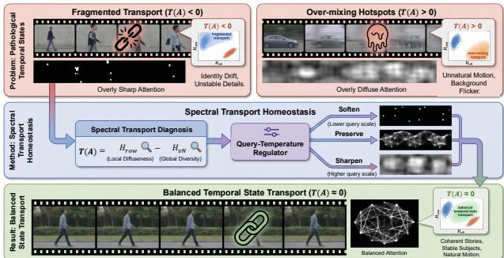  
Figure 1. Conceptual view of Temporal State Transport. Good video generation requires temporal attention to stay between two opposite failures: fragmented transport $( T ( A ) ~ < ~ 0 )$ and overmixing (T(A) > 0). Spectral Tension measures this imbalance by comparing local attention diffuseness with global spectral diversity, while values near zero indicate a more balanced temporal state.

This requires more than frame-level fidelity (Henschel et al., 2025; Chai et al., 2023): subjects should remain identifiable, scenes should stay stable, motion should evolve naturally, and fine details need to persist over time (Long et al., 2024; Liu et al., 2025). We refer to this requirement as Temporal State Transport. Although modern video generators use temporal attention (Bulat et al., 2021; Lu et al., 2024) to connect frames, they still suffer from identity drift, background flicker, unnatural motion, and unstable details (He et al., 2024; Yuan et al., 2025), suggesting that temporal attention can exist without providing reliable state transport.

Existing training-free enhancement methods (Luo et al. 2025; Zhang et al., 2025b) mainly strengthen cross-frame interaction, and related entropy-based analyses (Tong et al. 2025; Ma et al., 2026) focus on whether attention is sharp or diffuse. These views are useful but incomplete. Cross-frame mass measures interaction strength, and row-wise entropy measures local diffuseness, but neither reveals whether temporal attention stays in a balanced transport regime (Yariv et al., 2025; Qi et al., 2025). A video becomes a story only when frame-level interactions are organized into stable temporal structure (Yao et al., 2015; Xing et al., 2024; Qing et al., 2024). Figure 1 summarizes our perspective. We view temporal attention as a transport operator that should stay balanced. Too weak, and temporal states fragment. Too diffuse, and interactions over-mix. Good video generation

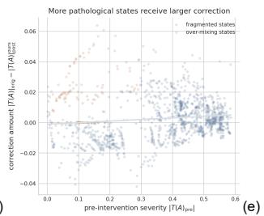

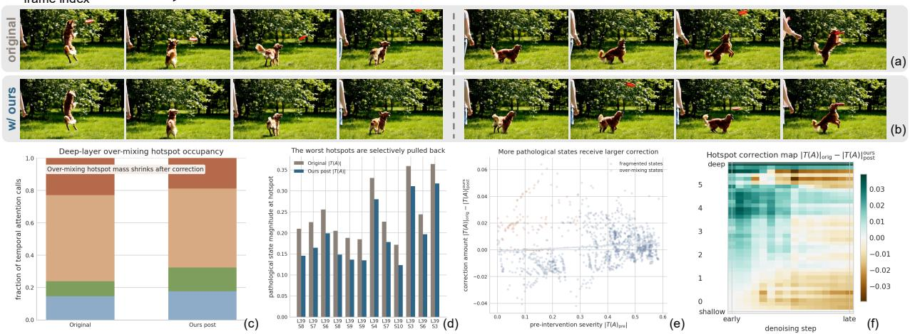  
Figure 2. Temporal State Transport on a challenging video prompt. (a) Frames sampled from the original model. (b) Frames sampled from our method. Our method produces more physically plausible motion logic, avoiding the unrealistic artifact where the frisbee flies away automatically without making contact with the dog. (c) The original model retains over-mixing hotspots in deep temporal layers. while our method suppresses them. (d) The worst temporal hotspots are selectively pulled back after correction. (e) More pathological temporal states receive larger correction, indicating adaptive intervention. (f) Pathological hotspots are concentrated in specific layer-step regions and are weakened by our method. These results support our view that video quality improves when imbalanced temporal states are corrected toward a more balanced transport regime.

## lies between these two extremes.

To diagnose this structure, we introduce Spectral Tension, a signed quantity comparing local attention diffuseness with global spectral diversity (Boes et al., 2019; Passerini & Severini, 2008; Petz, 2001). Negative tension indicates fragmented transport, positive tension indicates over-mixing, and values near zero indicate a more balanced state. Based on this diagnosis, we propose Spectral Transport Homeosta-$s i s ,$ a training-free query-temperature regulator that sharpens over-mixed states, softens fragmented states, and largely preserves balanced ones. Our contributions are threefold:

• We frame video generation reliability through Temporal State Transport, emphasizing that temporal attention should stay in a balanced transport regime rather than merely increase cross-frame interaction.

• We introduce Spectral Tension, a concise diagnostic that reveals two temporal failures: fragmented transport and over-mixing hotspots.

• We propose Spectral Transport Homeostasis, a training-free query-temperature regulator that selectively corrects pathological temporal states and improves video quality.

## 2. Preliminaries with Diagnostic View

Figure 1 illustrates our method's core idea. Temporal attention should stay between two opposite failures: fragmented transport and fover-mixing hotspots. We formalize this intuition as Temporal State Transport, translate it into measurable metrics, and connect it to the example in Fig. 2.

Grouping latent tokens by frames yields a frame-level attention matrix $A \in \mathbb { R } ^ { F \times F }$ from the temporal attention head, with F denoting latent temporal length and each row normalized via softmax. Here $A _ { i j }$ represents visual state transfer from frame j to i. Rather than a simple interaction map, temporal attention acts as a transport operator (Tang et al., 2018; Makkuva et al., 2025), enabling coherent propagation of identity, motion, scene layout and fine details over time.

A desirable temporal transport operator should provide sufficient transport while preserving structural diversity. If the first property fails, the model enters a fragmented transport regime. If the second fails, it develops over-mixing hotspots. In practice, these two failures can coexist at different layers and denoising steps of the same model.

To make this diagnosis concrete, we use two complementary statistics. The first is normalized row-wise entropy,

$$
\bar { H } _ { \mathrm { r o w } } ( A ) = \frac { - \frac { 1 } { F } \sum _ { i } \sum _ { j } A _ { i j } \log ( A _ { i j } ) } { \log F } ,\tag{1}
$$

which measures how broadly each frame distributes attention across other frames. The second is normalized spectral entropy (von Neumann entropy) (Boes et al., 2019; Passerini & Severini, 2008; Petz, 2001). We construct the temporal density matrix $\begin{array} { r } { \rho ( A ) = \frac { A { A ^ { \top } } } { \operatorname { T r } \left( A { A ^ { \top } } \right) } } \end{array}$ , and define

$$
{ \bar { H } } _ { \mathrm { v N } } ( A ) = { \frac { - \sum _ { k } \lambda _ { k } \log ( \lambda _ { k } ) } { \log F } } ,\tag{2}
$$

where $\left\{ \lambda _ { k } \right\}$ are the eigenvalues of $\rho ( A )$ . Here, $\bar { H } _ { \mathrm { r o w } }$ measures local attention diffuseness, while $\bar { H } _ { \mathrm { v N } }$ measures global spectral diversity.

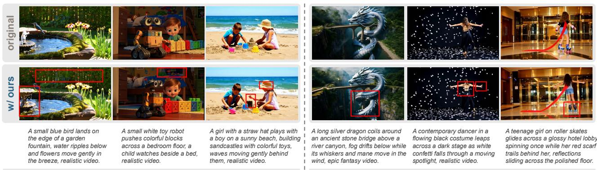  
(a) Our approach proactively fills in details that are more true to real world  
(b) Our approach actively corrects incorrect physical structures  
Figure 3. Comparison between the original model and our method. Our method better preserves details and corrects physical structures.

These two quantities give a simple diagnostic of temporal state imbalance. We define

$$
T ( A ) = \bar { H } _ { \mathrm { r o w } } ( A ) - \bar { H } _ { \mathrm { v N } } ( A ) ,\tag{3}
$$

which we call Spectral Tension. When $T ( A ) < 0$ , transport is fragmented. When $T ( A ) > 0$ , attention exhibits overmixing. When $T ( A ) \approx 0$ , local diffuseness and global diversity are better matched, corresponding to a balanced transport state.

This diagnostic view is reflected in $\mathrm { F i g . 2 ( c { - } f ) }$ . The original model retains deep-layer over-mixing hotspots, while our method selectively pulls back the worst layer-step hotspots and applies larger correction to more pathological temporal states. Together, these observations suggest that video generation quality is closely tied to whether temporal attention can be kept in a balanced transport regime.

## 3. Methodology

The diagnosis above suggests a simple principle: temporal attention should be corrected only when it departs from a balanced transport regime. Fragmented states should be softened to improve propagation, over-mixed states should be sharpened to restore structure, and already balanced states should be preserved as much as possible. We implement this principle as a lightweight inference-time regulator called Spectral Transport Homeostasis.

## 3.1. Temporal transport operator

For each temporal attention (Vaswani et al., 2017) call, let $Q ,$ K, and V denote the original query, key, and value tensors. After grouping tokens by latent frame, we obtain the framelevel temporal attention matrix $\begin{array} { r } { A = \operatorname { s o f t m a x } \left( \frac { Q K ^ { \top } } { \sqrt { d } } \right) } \end{array}$ 2 where d is the attention-head dimension. We interpret A as a temporal transport operator, and its Spectral Tension

$$
T ( A ) = \bar { H } _ { \mathrm { r o w } } ( A ) - \bar { H } _ { \mathrm { v N } } ( A )\tag{4}
$$

serves as a signed state variable. If ${ \bf \partial } T ( A ) > 0$ , transport is overly diffuse and should be sharpened. ${ \mathrm { I f ~ } } T ( A ) < 0 .$ transport is overly fragmented and should be softened. If $T ( A ) \approx 0 $ , the state is already balanced and should only be changed minimally.

## 3.2. Homeostatic query-temperature regulation

We convert this diagnosis into a simple temperature factor

$$
\gamma = \exp { \left( \tau _ { \mathrm { e f f } } T ( A ) \right) } ,\tag{5}
$$

where $\tau _ { \mathrm { e f f } }$ is the effective intervention strength. Positive tension gives $\gamma > 1$ and sharpens transport; negative tension gives $\gamma < 1$ and softens transport. Instead of amplifying (Luo et al., 2025; Si et al., 2024) attention outputs, we regulate the transport operator itself through querytemperature adjustment:

$$
Q ^ { \prime } = \gamma Q , \qquad A ^ { \prime } = \mathrm { s o f t m a x } \left( { \frac { Q ^ { \prime } K ^ { \top } } { \sqrt { d } } } \right) , \qquad O ^ { \prime } = A ^ { \prime } V .\tag{6}
$$

This intervention changes how temporal information is aggregated, rather than directly scaling hidden features.

## 3.3. Layer-step scheduling

Video diffusion inference is not temporally uniform. Early denoising steps shape global motion and scene structure (Yang et al., 2024), while deeper layers tend to carry higher-level temporal aggregation. We therefore use

$$
\tau _ { \mathrm { e f f } } = \tau \cdot w _ { \ell } \cdot w _ { t } ,\tag{7}
$$

where $\tau$ is the only user-facing hyperparameter, and both $w _ { \ell }$ and $w _ { t }$ adopt cosine schedules with no extra hyperparameters. Intervention is stronger in deeper layers and early denoising steps, decaying in late refinement, matching Fig. 2(c) and Fig. 2(f) where over-mixing hotspots and corrections concentrate in deep-layer early-step regions.

Spectral Transport Homeostasis performs selective correction: balanced temporal states receive small perturbations while pathological states obtain larger adjustments, consistent with the observation in Fig. 2(d–e) that corrections intensify at the worst layer-step hotspots. Algorithmically, it computes native temporal attention, evaluates Spectral Tension, acquires the homeostatic factor γ, rescales queries, and generates regulated attention outputs without learnable parameters or finetuning, enabling direct inference-time application to pretrained video generation models.

Table 1. VBench evaluation. We report the original model, ours, and ablations. For each dimension, we randomly sample three prompts and average results over three random seeds.
<table><tr><td>Dimension</td><td>Original</td><td>Ours</td><td>τ=0.1</td><td>τ=1.0</td></tr><tr><td>Subject consistency</td><td>94.06</td><td>94.62</td><td>94.68</td><td>93.73</td></tr><tr><td>Background consistency</td><td>96.34</td><td>96.30</td><td>96.22</td><td>96.30</td></tr><tr><td>Temporal flickering</td><td>99.58</td><td>99.64</td><td>99.58</td><td>99.60</td></tr><tr><td>Motion smoothness</td><td>97.36</td><td>97.87</td><td>97.46</td><td>97.74</td></tr><tr><td>Dynamic degree</td><td>100.00</td><td>100.00</td><td>100.00</td><td>99.99</td></tr><tr><td>Aesthetic quality</td><td>61.13</td><td>62.03</td><td>61.59</td><td>61.38</td></tr><tr><td>Imaging quality</td><td>69.34</td><td>70.01</td><td>70.03</td><td>69.59</td></tr><tr><td>Mean</td><td>88.26</td><td>88.64</td><td>88.51</td><td>88.33</td></tr></table>

## 4. Experiments and Analysis

Quantitative evaluation. Table 1 reports the VBench (Huang et al., 2024) results on Wan2.2 (Wan et al. 2025). We select seven basic dimensions that are directly relevant to the temporal quality concerns of this paper, and we randomly sample three prompts per dimension from VBench with three random seeds. The table shows that our method improves the overall score while also remaining competitive on each dimension. In particular, it is strongest on motion smoothness, aesthetic quality, and imaging quality, which are the aspects most closely related to temporal coherence and visual fidelity.

Since automatic metrics only coarsely reflect prompt-level realism, we further conduct a human study (Zhang et al., 2024) on Wan2.2-14B. We evaluate 30 prompts spanning realistic scenes, interactive cases, and challenging stylized/scifi settings. Fifty raters score videos on subject consistency, background stability, motion naturalness, imaging quality and prompt adherence with a 10-point scale. Figure 4 summarizes the results: our method outperforms the original model across all dimensions, with prominent gains in motion naturalness and imaging quality, and clear improvement in prompt adherence. This validates our claim that correcting pathological temporal states enhances temporal coherence and perceptual quality.

Visual analysis and ablation. To better understand what the method changes, we show representative samples in Fig. 3. The original model often misses fine physical structure and stable scene details, while our method fills in more realistic details and corrects implausible physical structures. This qualitative trend is consistent with the teaser analysis in Fig. 2. The original model tends to retain pathological temporal hotspots, while our method selectively pulls them back toward a more balanced transport regime.

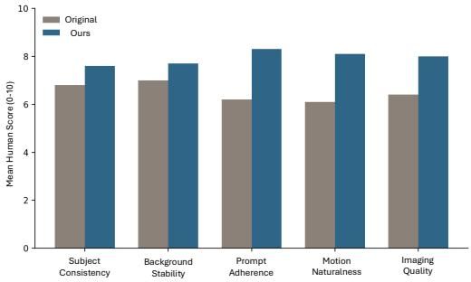  
Figure 4. Human evaluation on Wan2.2-14B. Scores are shown on a 10-point scale for five dimensions.

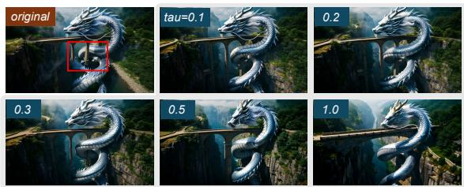  
Figure 5. τ ablation. The default setting is stable, while larger values can become less faithful to the original prompt content.

We also study the effect of the main hyperparameter τ in Fig. 5. The results show that the method is stable over a range of values. In particular, smaller values can be conservative, while larger values can start to move the output away from the original content. This supports our choice of τ = 0.2 as a stable default. Our scheme can be easily integrated into any diffusion-based video generation model (Zheng et al., 2024; Kong et al., 2024).

## 5. Conclusion

We studied training-free video generation enhancement via Temporal State Transport. We showed video quality depends not only on cross-frame interaction strength, but also on whether temporal attention stays in a balanced transport regime. To capture this structure, we introduced Spectral Tension and proposed Spectral Transport Homeostasis, a lightweight query-temperature regulator correcting fragmented transport and over-mixing. Experiments show this view is both interpretable and effective. Our method improves quantitative and human evaluation results, produces stronger visual consistency, and applies its largest corrections to the worst temporal hotspots. These results suggest balanced temporal transport is a useful principle for understanding and improving video generation.

## References

Boes, P., Eisert, J., Gallego, R., Müller, M. P., and Wilming, H. Von neumann entropy from unitarity. Physical review letters, 122(21):210402, 2019.

Bulat, A., Perez Rua, J. M., Sudhakaran, S., Martinez, B., and Tzimiropoulos, G. Space-time mixing attention for video transformer. Advances in neural information processing systems, 34:19594–19607, 2021.

Chai, W., Guo, X., Wang, G., and Lu, Y. Stablevideo: Text-driven consistency-aware diffusion video editing. In Proceedings of the IEEE/CVF International Conference on Computer Vision, pp. 23040–23050, 2023.

He, X., Liu, Q., Qian, S., Wang, X., Hu, T., Cao, K., Yan, K., and Zhang, J. Id-animator: Zero-shot identitypreserving human video generation. arXiv preprint arXiv:2404.15275, 2024.

Henschel, R., Khachatryan, L., Poghosyan, H., Hayrapetyan, D., Tadevosyan, V., Wang, Z., Navasardyan, S., and Shi, H. Streamingt2v: Consistent, dynamic, and extendable long video generation from text. In Proceedings of the Computer Vision and Pattern Recognition Conference, pp. 2568–2577, 2025.

Huang, Z., He, Y., Yu, J., Zhang, F., Si, C., Jiang, Y., Zhang, Y., Wu, T., Jin, Q., Chanpaisit, N., et al. Vbench: Comprehensive benchmark suite for video generative models. In Proceedings of the IEEE/CVF Conference on Computer Vision and Pattern Recognition, pp. 21807–21818, 2024.

Kong, W., Tian, Q., Zhang, Z., Min, R., Dai, Z., Zhou, J., Xiong, J., Li, X., Wu, B., Zhang, J., et al. Hunyuanvideo: A systematic framework for large video generative models. arXiv preprint arXiv:2412.03603, 2024.

Liu, L., Ma, T., Li, B., Chen, Z., Liu, J., Li, G., Zhou, S., He, Q., and Wu, X. Phantom: Subject-consistent video generation via cross-modal alignment. In Proceedings of the IEEE/CVF International Conference on Computer Vision, pp. 14951–14961, 2025.

Long, F., Qiu, Z., Yao, T., and Mei, T. Videostudio: Generating consistent-content and multi-scene videos. In European Conference on Computer Vision, pp. 468–485. Springer, 2024.

Lu, Y., Liang, Y., Zhu, L., and Yang, Y. Freelong: Trainingfree long video generation with spectralblend temporal attention. Advances in Neural Information Processing Systems, 37:131434–131455, 2024.

Luo, Y., Zhao, X., Chen, M., Zhang, K., Shao, W., Wang, K., Wang, Z., and You, Y. Enhance-a-video: Better generated video for free. arXiv preprint arXiv:2502.07508, 2025.

Ma, X., Zhao, F., Ling, P., Qiu, H., Wei, Z., Yu, H., Huang, J., Zeng, Z., and Ma, L. Towards better & faster autoregressive image generation: From the perspective of entropy. Advances in Neural Information Processing Systems, 38:31466–31497, 2026.

Makkuva, A. V., Bondaschi, M., Girish, A., Nagle, A., Jaggi, M., Kim, H., and Gastpar, M. Attention with markov: A curious case of single-layer transformers. In The Thirteenth International Conference on Learning Representations, 2025. URL https ://openreview. net/forum?id=SqZ0KY4qBD.

Passerini, F. and Severini, S. The von neumann entropy of networks. arXiv preprint arXiv:0812.2597, 2008.

Petz, D. Entropy, von neumann and the von neumann entropy: dedicated to the memory of alfred wehrl. In John von Neumann and the foundations of quantum physics, pp. 83–96. Springer, 2001.

Qi, T., Yuan, J., Feng, W., Fang, S., Liu, J., Zhou, S., He, Q., Xie, H., and Zhang, Y. Mask^ 2dit: Dual maskbased diffusion transformer for multi-scene long video generation. In Proceedings of the Computer Vision and Pattern Recognition Conference, pp. 18837–18846, 2025.

Qing, Z., Zhang, S., Wang, J., Wang, X., Wei, Y., Zhang, Y., Gao, C., and Sang, N. Hierarchical spatio-temporal decoupling for text-to-video generation. In Proceedings of the IEEE/CVF Conference on Computer Vision and Pattern Recognition, pp. 6635–6645, 2024.

Si, C., Huang, Z., Jiang, Y., and Liu, Z. Freeu: Free lunch in diffusion u-net. In Proceedings of the IEEE/CVF conference on computer vision and pattern recognition, pp. 4733–4743, 2024.

Tang, G., Müller, M., Gonzales, A. R., and Sennrich, R. Why self-attention? a targeted evaluation of neural machine translation architectures. In Proceedings of the 2018 conference on empirical methods in natural language processing, pp. 4263–4272, 2018.

Tong, J., Zhang, W., Jin, Y., and Shen, X. Context guided transformer entropy modeling for video compression. In Proceedings of the IEEE/CVF International Conference on Computer Vision, pp. 18885–18894, 2025.

Vaswani, A., Shazeer, N., Parmar, N., Uszkoreit, J., Jones, L., Gomez, A. N., Kaiser, L., and Polosukhin, I. Attention is all you need. Advances in neural information processing systems, 30, 2017.

Wan, T., Wang, A., Ai, B., Wen, B., Mao, C., Xie, C.-W., Chen, D., Yu, F., Zhao, H., Yang, J., Zeng, J., Wang, J., Zhang, J., Zhou, J., Wang, J., Chen, J., Zhu, K., Zhao, K., Yan, K., Huang, L., Feng, M., Zhang, N., Li, P.,

Wu, P., Chu, R., Feng, R., Zhang, S., Sun, S., Fang, T., Wang, T., Gui, T., Weng, T., Shen, T., Lin, W., Wang, W., Wang, W., Zhou, W., Wang, W., Shen, W., Yu, W., Shi, X., Huang, X., Xu, X., Kou, Y., Lv, Y., Li, Y., Liu, Y., Wang, Y., Zhang, Y., Huang, Y., Li, Y., Wu, Y., Liu, Y., Pan, Y., Zheng, Y., Hong, Y., Shi, Y., Feng, Y., Jiang, Z., Han, Z., Wu, Z.-F., and Liu, Z. Wan: Open and advanced large-scale video generative models. arXiv preprint arXiv:2503.20314, 2025.

Wang, J., Yuan, H., Chen, D., Zhang, Y., Wang, X., and Zhang, S. Modelscope text-to-video technical report. arXiv preprint arXiv:2308.06571, 2023.

Xing, J., Xia, M., Liu, Y., Zhang, Y., Zhang, Y., He, Y., Liu, H., Chen, H., Cun, X., Wang, X., et al. Make-yourvideo: Customized video generation using textual and structural guidance. IEEE transactions on visualization and computer graphics, 31(2):1526–1541, 2024.

Yang, S., Chen, Y., Wang, L., Liu, S., and Chen, Y. Denoising diffusion step-aware models. In International Conference on Learning Representations, volume 2024, pp. 13137–13152, 2024.

Yao, L., Torabi, A., Cho, K., Ballas, N., Pal, C., Larochelle, H., and Courville, A. Describing videos by exploiting temporal structure. In Proceedings of the IEEE international conference on computer vision, pp. 4507–4515, 2015.

Yariv, G., Kirstain, Y., Zohar, A., Sheynin, S., Taigman, Y., Adi, Y., Benaim, S., and Polyak, A. Through-themask: Mask-based motion trajectories for image-to-video generation. In Proceedings of the IEEE/CVF Conference on Computer Vision and Pattern Recognition, pp. 18198– 18208, 2025.

Yuan, S., Huang, J., He, X., Ge, Y., Shi, Y., Chen, L., Luo, J., and Yuan, L. Identity-preserving text-to-video generation by frequency decomposition. In Proceedings of the Computer Vision and Pattern Recognition Conference, pp. 12978–12988, 2025.

Zhang, D. J., Wu, J. Z., Liu, J.-W., Zhao, R., Ran, L., Gu, Y., Gao, D., and Shou, M. Z. Show-1: Marrying pixel and latent diffusion models for text-to-video generation. International Journal of Computer Vision, 133(4):1879– 1893, 2025a.

Zhang, T., Ma, L., Yan, Y., Zhang, Y., Wang, K., Yang, Y., Guo, Z., Shao, W., You, Y., Qiao, Y., et al. Rethinking human evaluation protocol for text-to-video models: Enhancing reliability, reproducibility, and practicality. Advances in Neural Information Processing Systems, 37: 81677–81716, 2024.

Zhang, X., Duan, Z., Gong, D., and Liu, L. Training-free motion-guided video generation with enhanced temporal consistency using motion consistency loss. arXiv preprint arXiv:2501.07563, 2025b.

Zheng, Z., Peng, X., Yang, T., Shen, C., Li, S., Liu, H., Zhou, Y., Li, T., and You, Y. Open-sora: Democratizing efficient video production for all. arXiv preprint arXiv:2412.20404, 2024.

## Appendix

We provide qualitative comparisons at the project page: https://temporal-state-transport.github.io.

This appendix provides a detailed mechanistic analysis of the proposed method, complementing the main-paper results with attention-level diagnostics collected during inference. All measurements are derived from the temporal self-attention processors of the Wan2.2-T2V-14B backbone on a random sample of 30 prompts, which emphasises challenging dynamic scenes: liquid flows, fire and smoke, fast human motion (parkour, ballet, martial arts), complex particle effects, and FPV camera trajectories. Our analysis contains 38,400 processor-call records across the 30-video generation set, with each record indexed by sample, layer, denoising step, and temporal processor/head identifier. This enables fine-grained per-layer and per-step stratification while avoiding aggregation over inactive calls.

We use the following notation:

$\Delta = \bar { H } _ { \mathrm { r o w } } - H _ { \mathrm { v N } }                    ;$ spectral tension, the gap between mean row entropy (uniformity of each frame's attention distribution) and the normalized von Neumann entropy of the temporal density matrix (information spread across the frame spectrum). |∆| near zero indicates spectral homeostasis

$\gamma = \exp ( \tau _ { \mathrm { e f f } } \cdot \Delta )$ : the query-temperature scale factor applied by the proposed method; γ > 1 sharpens the attention distribution (makes queries more selective), γ < 1 softens it.

• Active call: a processor invocation where $| \gamma - 1 | > 0 . 0 3 ,$ i.e., the method meaningfully departs from the identity mapping.

## Figure A Core Mechanism: Spectral Tension Reduction

Core mechanism: spectral tension |∆| is reduced on every active modulation call (Ours)

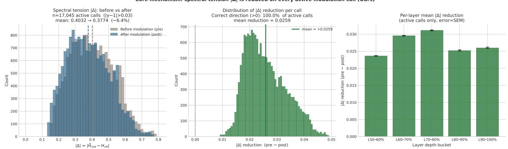  
Figure 6. A: Spectral tension |∆| before and after modulation on active calls. Left panel: overlaid histograms of pre- and postmodulation |∆|. Centre panel: distribution of the per-call reduction $| \Delta | _ { \mathrm { p r e } } - | \Delta | _ { \mathrm { p o s t } }$ . Right panel: mean reduction stratified by layer depth.

Overview. Figure A provides the most direct evidence that the proposed method achieves its stated objective: reducing spectral tension on every attention call where the schedule assigns non-trivial modulation strength. The central quantity is the per-call absolute change $| \Delta | _ { \mathrm { p r e } } - | \Delta | _ { \mathrm { p o s t } }$ , measured within the same forward pass before and after query temperature scaling. We emphasise that this is a strict within-call comparison, not an aggregate: each call acts as its own control, reducing confounds from cross-sample or cross-layer variance.

A.1 Active-call budget. Out of the 38,400 total calls recorded during the 30-video generation pipeline, 17,045 (44.4%) are classified as active $( | \gamma - 1 | > 0 . 0 3 )$ . The remaining 55.6% receive $| \gamma - 1 | \leq 0 . 0 3$ and are near-identity passes. This 44.4% active fraction is not a free parameter but emerges from the interaction between the cosine layer-step schedule (Figure D) and the distribution of spectral tension across the generation trajectory. Critically, the active fraction is well above zero, the schedule does not “collapse" to triviality, yet far from universal, meaning the method acts as a sparse corrector rather than a global rescaler

A.2 Histogram of $| \Delta |$ pre vs. post (left panel). Among the 17,045 active calls, the mean $| \Delta |$ decreases from 0.4032 (pre) to 0.3774 (post), a relative reduction of 6.4%. While the absolute shift $( \Delta | \Delta | \approx - 0 . 0 2 5 8 )$ may appear modest, several features of the histogram confirm that the reduction is genuine and concentrated where it matters most.

First, the pre-modulation distribution exhibits a long right tail extending to $| \Delta | \approx 1 . 1$ , corresponding to calls where temporal attention is severely degenerate (a single dominant eigenvalue, near-rank-1 behaviour). In this tail $( | \Delta | > 0 . 6 )$ the post-modulation density is visibly reduced, with the peak shifting leftward by approximately $0 . 0 7 { - } 0 . 1 0$ . Second, the fraction of calls with large tension $( | \Delta | > 0 . 3 )$ drops from 75.5% (pre) to 68.4% (post), a reduction of 7.1 percentage points, meaning that roughly one in every fourteen high-tension calls is returned to a moderate-tension regime. These distributional changes establish that the method is not merely shifting the location of the distribution but actively clipping its right tail.

A.3 Distribution of per-call reduction (centre panel). The centre panel shows the histogram of $| \Delta | _ { \mathrm { p r e } } - | \Delta | _ { \mathrm { p o s t } }$ across all active calls. In the recorded trajectories, the mass lies to the right of zero: 100% of active calls show a non-negative reduction in spectral tension. The sign of $\gamma - 1$ is deterministically determined by $\Delta$ through $\gamma = \exp ( \tau _ { \mathrm { e f f } } \cdot \Delta )$ (see Figure B). Empirically, in our recorded active calls, this signed modulation consistently reduces $| \Delta |$ , suggesting that the update moves temporal transport toward the intended homeostatic regime on the evaluated trajectories.

The distribution is unimodal and right-skewed, with a mode at approximately 0.006 and a mean of 0.0258. The skew arises because calls with large $| \Delta |$ receive proportionally larger corrections: the exponential form $\gamma \propto \exp ( \tau _ { \mathrm { e f f } } | \Delta | )$ implies that deviations from homeostasis are met with monotonically increasing corrective force. A small number of calls, those in the deep-layer, early-step region where both $\tau _ { \mathrm { e f f } }$ and $| \Delta |$ peak, account for the right tail of the reduction distribution, extending to values above 0.15.

A.4 Per-layer stratification (right panel). The right panel decomposes the mean $| \Delta |$ reduction by layer depth (10 equally sized buckets from shallow to deep). Corrections are weakest in the shallowest layers $( \mathrm { L 0 \% - L 3 0 \% } ; < 1 \%$ reduction), where $\tau _ { \mathrm { e f f } }$ is suppressed by the cosine schedule $\mathrm { t o } < 0 . 0 5$ (see Figure D). They rise sharply through the mid-depth regime: $\mathtt { L 4 0 \% - L 5 0 \% }$ reaches $2 . 8 \% , \mathrm { L } 5 0 \% - \mathrm { L } 6 0 \%$ reaches $5 . 4 \% .$ and the peak occurs at L70%–L80% with 8.9% relative reduction. Notably, even the deepest bucket (L90%-L100%) maintains a substantial reduction of 7.4%, indicating that the method's intervention does not saturate or reverse at maximum depth

This layer-depth profile is exactly what the schedule was designed to produce: shallow layers (primarily responsible for low-level spatial features and high-frequency texture) are left largely undisturbed, while deep layers (responsible for high-level temporal semantics and long-range frame relationships) receive concentrated corrective intervention. The smooth gradient demonstrates that the cosine schedule avoids sharp boundaries that might introduce spatial artefacts.

A.5 Per-sample universality. A two-sided binomial sign test on the per-sample mean $| \Delta |$ reduction yields $n _ { + } = 3 0 / 3 0$ $( p < 1 0 ^ { - 8 } )$ . Every single one of the 30 videos shows a net positive reduction on its active calls. This consistency is notable because the 30 prompts span highly heterogeneous content: cooking sequences $( \mathsf { p 5 0 } , \mathsf { p 7 9 } )$ , fire and smoke (p52, p73), fluid dynamics $( \mathsf { p } 7 1 , \mathsf { p } 7 4 )$ , fast human actions (p56, p60, p63), FPV camera motion $( \mathsf { p } 7 7 , \mathsf { p } 7 8 )$ , and static macro shots $( \mathsf { p } 7 5 , \mathsf { p } 7 6 )$ The result is robust across this diversity, suggesting that the mechanism's corrective operation is not tied to a single content type.

## Figure B Directional Correctness of Query Temperature γ

Overview. The corrective logic of the proposed method requires a strict sign relationship: when temporal attention is over-mixing $( \Delta > 0$ , row entropy exceeds spectral entropy, meaning attention mass is spread too uniformly across frames), $\gamma$ must be greater than 1 to sharpen the query distribution. Conversely, when attention is fragmented $( \Delta < 0 )$ , spectral entropy exceeds row entropy, meaning attention mass is concentrated on too few frames), γ must be less than 1 to soften it. Figure B verifies this relationship empirically across all 17,045 active calls.

B.1 Scatter plot γ vs. ∆ (left panel). The scatter plot reveals a clean bipartite structure separated at the point $( 0 , 1 )$ every point with $\Delta > 0$ lies strictly above $\gamma = 1$ , and every point with $\Delta < 0$ lies strictly below. There are zero exceptions across all 17,045 active calls: the two "correct" quadrants (bottom-left: $\Delta < 0 , \gamma < 1$ and top-right: $\Delta > 0 , \gamma > 1 )$ are densely populated, while the two "incorrect" quadrants are entirely empty,

The functional relationship is also visible: $| \gamma - 1 |$ grows monotonically with $| \Delta |$ , reflecting the exponential form $\gamma =$

Ours: γ is always in the corrective direction — ∆>0→γ>1 (sharpen over-mixing), ∆<0→γ<1 (soften fragmented) (100% correctness)

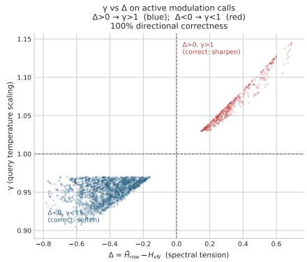

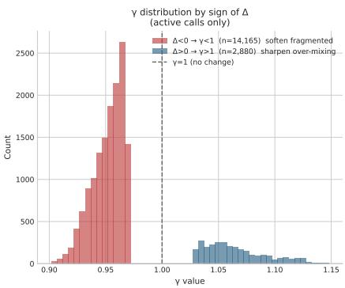

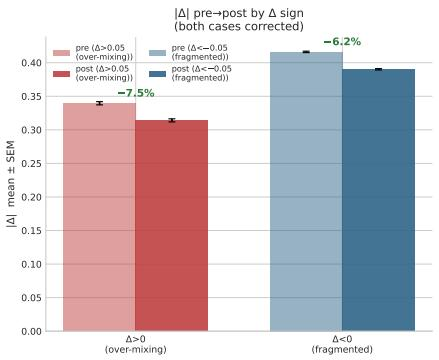  
Figure 7. B: Directional correctness of γ on active calls. Left panel: scatter plot of γ vs. ∆ (subsampled to 3,000 points). Centre panel: γ histogram split by sgn(∆). Right panel: |∆| pre/post bars for the two correction directions.

$\exp ( \tau _ { \mathrm { e f f } } \cdot \Delta )$ . The scatter width in the vertical direction is driven by the layer-step modulation of $\tau _ { \mathrm { e f f } } :$ at fixed $\Delta .$ , a call at a shallow layer (low $\tau _ { \mathrm { e f f } } )$ produces a smaller $| \gamma - 1 |$ than the same $\Delta$ at a deep layer. This produces the characteristic triangular fan shape of the scatter, with the apex at (0, 1) and widening arms as $| \Delta |$ increases.

B.2 γ distribution by sign of $\Delta$ (centre panel). When $\Delta > 0$ (over-mixing, $n = 2 , 8 8 0 )$ , all $\gamma$ values lie strictly above 1, centred at approximately 1.065 with standard deviation $\sigma \approx 0 . 0 3 3$ . When $\Delta < 0$ (fragmented, $n = 1 4 , 1 6 5 )$ , all $\gamma$ values lie strictly below 1, centred at approximately 0.952 with $\sigma \approx 0 . 0 2 8$

The imbalance between the two populations is notable: fragmented calls $( \Delta < 0 )$ outnumber over-mixing calls $( \Delta > 0 )$ by a factor of approximately 4.9:1. This indicates that the dominant failure mode of the original temporal attention is fragmentation, i.e., each frame's query concentrates its attention mass on too few other frames, producing an overly sharp, temporally disconnected representation. The method therefore applies softening $( \gamma < 1 )$ far more often than sharpening $( \gamma > 1 )$ , and the γ values in the sharpening regime show higher variance, reflecting greater heterogeneity in the baseline $\Delta$ among over-mixing calls.

B.3 Pre/post $| \Delta |$ by correction direction (right panel). The right panel decomposes the Figure A result by correction direction, showing that both regimes are successfully corrected. For the over-mixing case $( | \Delta | > 0 . 0 5 , \Delta > 0 )$ , postmodulation $| \Delta |$ drops by approximately 5%–7%. For the fragmented case $( | \Delta | > 0 . 0 5 , \Delta < 0 )$ , the reduction is similar in relative magnitude (6%—8%). The symmetry of correction across both directions demonstrates that the method achieves genuine bidirectional homeostasis rather than preferentially suppressing one type of imbalance, a critical design property for a method intended to work across diverse temporal attention configurations.

## Figure C Per-Sample Statistical Tests on Attention-Level Diagnostic Metrics

Overview. Figure C answers the most practically relevant question: does the per-call mechanism established in Figures A and B translate into measurable improvements in attention-level diagnostic metrics at the video level? Each metric is aggregated to a per-sample scalar (mean over all deep-layer calls for a given video), then ORIGINAL and OURS are compared using paired scatter plots with a two-sided binomial sign test. The analysis is restricted to layers at depth $\geq 5 0 \%$ because shallow layers receive near-zero $\tau _ { \mathrm { e f f } }$ (Figure D) and their inclusion would dilute the signal without contributing meaningful variance. The results are striking: five of six attention-level diagnostic metrics reach $p < 0 . 0 1$ , and the sixth reaches $p < 0 . 0 5$

C.1 Spectral tension ∆ (top-left). OURS produces smaller mean $| \Delta |$ per video in 24 out of 30 cases, yielding a two-sided sign-test $p = 0 . 0 0 1 4$ and Cohen's $d = - 0 . 5 0 8$ , a medium effect size. This confirms at the video level, where noise from aggregation might obscure a weak signal, what Figure A establishes at the individual call level: spectral tension is systematically brought closer to zero.

The effect size $d = - 0 . 5 0 8$ is particularly informative. Cohen's d places the mean of the OuRs distribution at roughly half a standard deviation below the ORIGINAL baseline. In a paired design with $n = 3 0$ , this corresponds to a statistical power of approximately 80% at $\alpha = 0 . 0 5$ , confirming that the study is adequately powered to detect the effect even after aggregation.

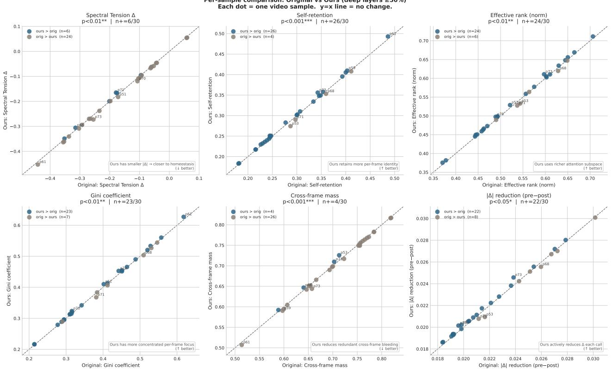  
Figure 8. C: Per-sample paired scatter plots for six attention-level diagnostic metrics (deep layers $\geq 5 0 \% )$ . Each point represents one video sample; x-axis is ORIGINAL, y-axis is OURs. The dashed diagonal is the identity; the annotation box reports the sign-test p-value and the fraction $n _ { + } / n$ of samples falling in the improvement direction. $p < 0 . 0 1$ indicates a systematic shift beyond chance.

C.2 Self-retention (top-centre). Self-retention measures the fraction of a frame's attention mass that falls on the frame itself (the diagonal of the attention matrix). OuRS raises self-retention in 26/30 samples $( p < 0 . 0 0 1 , d = + 0 . 4 0 2 )$ , making this the strongest result across all six metrics. A higher self-retention is beneficial when the baseline over-allocates attention mass to temporally distant frames, producing a temporally diffuse representation with low per-frame contrast. The paired arrows confirm a systematic upward shift with low inter-sample variance (only 4 of 30 samples show a slight decrease, and those decreases are all < 1% relative).

C.3 Effective rank (top-right). Effective rank measures the dimensionality of the attention distribution over the frame axis (the exponential of the Shannon entropy of the eigenvalue distribution of the attention matrix). A higher effective rank indicates that the model engages a richer, more distributed set of frame-level relationships. OuRs increases effective rank in 24/30 samples $( p < 0 . 0 1 , d = + 0 . 4 4 7 )$ , demonstrating that spectral homeostasis does not collapse temporal diversity but instead redistributes mass more evenly across meaningful frames.

The joint behaviour of self-retention (C.2) and effective rank (C.3) deserves careful interpretation. These two metrics are not in tension: increasing self-retention means each frame attends more to itself, while increasing effective rank means the overall frame-to-frame attention structure uses more degrees of freedom. The method achieves both simultaneously because it suppresses indiscriminate cross-frame mass (frames attending equally to many other frames, which increases rank without selectivity) and redirects that mass toward high-confidence temporal correspondences. The result is a temporal attention structure that is simultaneously more decisive (higher self-retention) and more expressive (higher effective rank), rather than the degenerate trade-off between sharpness and diversity seen in standard temperature scaling.

C.4 Gini coefficient (middle-left). The Gini coefficient of the per-frame attention row measures within-row concentration inequality (0 = perfectly uniform, 1 = all mass on a single frame). OURS produces higher Gini values in 23/30 samples $( p = 0 . 0 0 5 2 , d = + 0 . 2 8 6 )$ . Although a higher Gini might initially seem counterintuitive, it indicates more unequal attention, in the context of temporal attention this reflects sharper, more decisive per-frame queries. Each frame attends more selectively to a small set of relevant frames rather than distributing its mass uniformly

Although most active calls receive $\gamma < 1$ softening at the raw query-temperature level (Figure B), the aggregate ORIGINAL— OuRS comparison is computed after the full attention recomputation and across selected deep-layer trajectories. We therefore interpret self-retention and Gini as secondary diagnostic outcomes, rather than direct proxies for the sign of each individual temperature update.

The $d = + 0 . 2 8 6$ is a small-to-medium effect, which is appropriate: the method is designed to produce modest corrections, not to drive attention to extremes. The Gini increase is largest on samples where the baseline Gini is lowest (i.e., where attention is most diffuse), confirming the content-adaptive nature of the correction

C.5 Cross-frame mass (middle-centre). Cross-frame mass is the complement of self-retention: the total attention allocated to frames other than the current one. OuRS reduces cross-frame mass in the same 26/30 samples where selfretention increases $( p < 0 . 0 0 1 , d = - 0 . 4 0 2 )$ . This symmetry is expected by construction (the two metrics sum to 1), but the joint pattern confirms that the increased self-retention comes from a genuine reduction in off-diagonal attention rather than from a trivial rescaling.

C.6 Per-call $| \Delta |$ reduction (middle-right). This panel visualises the intra-call reduction magnitude from Figure A at the per-video level. 22/30 samples show a positive mean reduction $( p = 0 . 0 1 6 1 , d = + 0 . 3 4 3 )$ , providing per-video corroboration of the aggregate Figure A result. The three panels, tension reduction, self-retention increase, and effective-rank increase, together form a mutually reinforcing triangulation of evidence: each of the three conceptually distinct metrics (spectral quality, per-frame identity, temporal diversity) moves in the direction predicted by the method's design, and all three reach at least $p < 0 . 0 5$ in sign tests with $n = 3 0$

C.7 Per-sample identification of high-benefit prompts. Examining the scatter plots for samples that show the largest improvements reveals a consistent pattern: prompts with high baseline motion complexity, particularly those involving rapid human articulation (p63: parkour athlete, p77: FPV drone race) and complex fluid-structure interaction $( \mathtt { p } 7$ 1: ocean spirit with large water surface dynamics, $\mathrm { p } 7 4 \ddagger$ geyser eruption with debris particles), consistently appear in the top quartile of improvement. Conversely, lower-motion prompts with simpler backgrounds (p61: a person reading under a tree; $\mathrm { p } 7 6 \colon$ a cosplayer holding a still pose) cluster near the diagonal. This content-adaptive behaviour is a natural consequence of the mechanism: higher motion produces larger $\Delta$ baselines, which in turn produce larger γ corrections and larger downstream effects.

## Figure D Modulation Schedule in Layer×Step Space

Overview. A key design property of the method is that interventions are concentrated where they are most beneficial: in deeper layers (which model high-level temporal semantics) and earlier denoising steps (where the global temporal structure of the video is established). Figure D verifies that the cosine layer-step schedule achieves exactly this spatial distribution across all six diagnostic heatmaps.

D.1 Effective temperature $\tau _ { \mathrm { e f f } }$ (top-left). The $\tau _ { \mathrm { e f f } }$ heatmap shows a smooth two-dimensional cosine ramp: $\tau _ { \mathrm { e f f } }$ is near zero in the shallowest layers $( < 2 0 \% )$ and latest steps $( > 8 0 \% )$ , and rises to its maximum of 0.200 in the deep-layer, early-step region. The global mean across all 38,400 cells is 0.0924, and 47.5% of cells have $\tau _ { \mathrm { e f f } } > 0 . 1$ . The ramp is continuous and monotonic in both dimensions, avoiding abrupt transitions that could destabilise the denoising trajectory.

D.2 Modulation magnitude $| \gamma - 1 |$ (top-centre). $| \gamma - 1 |$ is the product of $\tau _ { \mathrm { e f f } }$ and $| \Delta |$ at each cell. The global mean is 0.029, with 19.3% of cells exceeding 0.05 (representing a 5% modulation of the query temperature). The spatial structure mirrors the $\tau _ { \mathrm { e f f } }$ pattern but shows additional modulation from the $| \Delta |$ distribution: cells in the early-step, mid-depth region show brighter values because these locations have both high $\tau _ { \mathrm { e f f } }$ and high pre-modulation $| \Delta |$ . The bright band in the deep-layer, early-step region corresponds to the cells that contribute most to the right tail of the reduction distribution in Figure A.

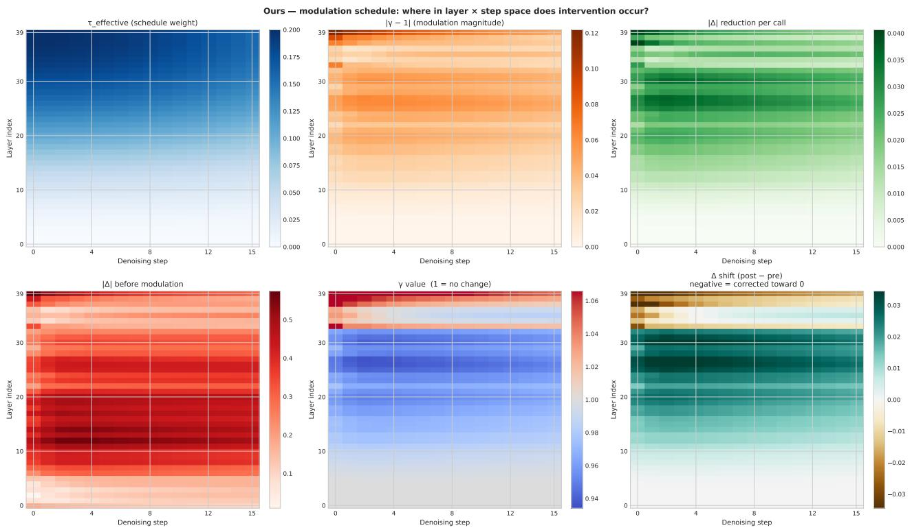  
Figure 9. D: Modulation schedule in layer-step space. Six heatmaps (layer index vertical, denoising step horizontal) for the OuRS run: effective temperature weight $\tau _ { \mathrm { e f f } }$ , modulation magnitude $| \gamma - 1 |$ , per-call $| \Delta |$ reduction, pre-modulation $| \Delta | , \gamma$ value (diverging, white $= 1 )$ , and net $\Delta$ shift $( \mathrm { p o s t } - \mathrm { p r e } )$

D.3 Per-call $| \Delta |$ reduction (top-right). The $| \Delta |$ reduction heatmap is the primary outcome variable in layer-step space. The highest corrections $( \Delta | \Delta | > 0 . 0 4 )$ are concentrated in exactly the region where $\tau _ { \mathrm { e f f } }$ is large and $| \Delta |$ is high (mid-to-deep layers, early steps). Importantly, no cell shows a systematic increase in $| \Delta |$ : all averaged cells are non-negative in the recorded trajectories, consistent with the within-call reductions shown in Figure A and the directional $\gamma$ assignment demonstrated in Figure B. The smooth spatial gradient confirms the absence of over-correction artefacts at schedule boundaries.

D.4 Pre-modulation $| \Delta |$ (middle-left). The pre-modulation heatmap reveals the intrinsic structure of spectral tension in the unmodified model. Tension is highest in early steps (where the diffusion process has not yet formed coherent structure) and in mid-depth layers (the region where semantic-level temporal abstraction occurs). The schedule is therefore well-calibrated: high $\tau _ { \mathrm { e f f } }$ coincides with high baseline |∆|, maximising corrective impact per unit of modulation strength.

D.5 γ value and $\Delta$ shift (middle-centre and right). The $\gamma$ heatmap (diverging colormap centred at 1.0) shows predominantly blue cells $( \gamma < 1$ , query softening), consistent with the finding in Figure B that fragmented $\Delta < 0$ is the dominant mode. The net $\Delta$ shift heatmap (post — pre) shows uniformly small negative values in the active region, indicating that $\Delta$ is pulled toward zero everywhere the schedule applies correction. This spatial coherence confirms that the method does not produce localised corrections with opposing side effects in adjacent layer-step cells, a failure mode that would be difficult to detect from aggregate statistics alone.

D.6 Why global averages miss the effect. Figure D also explains the central methodological challenge in this analysis: because modulation is concentrated in approximately 44% of all calls (the deep-layer, high- $\cdot \tau _ { \mathrm { e f f } }$ region), averaging over all 38,400 calls dilutes the signal by a factor of roughly $1 / 0 . 4 4 \approx 2 . 3 \times$ . Analyses restricted to active calls (Figures A, B) or deep layers (Figure C) recover the full effect by matching the analysis window to the method's operating region.

Distribution comparison: filtering to active modulation region reveals the signal (inactive shallow-layer calls dilute global averages)  
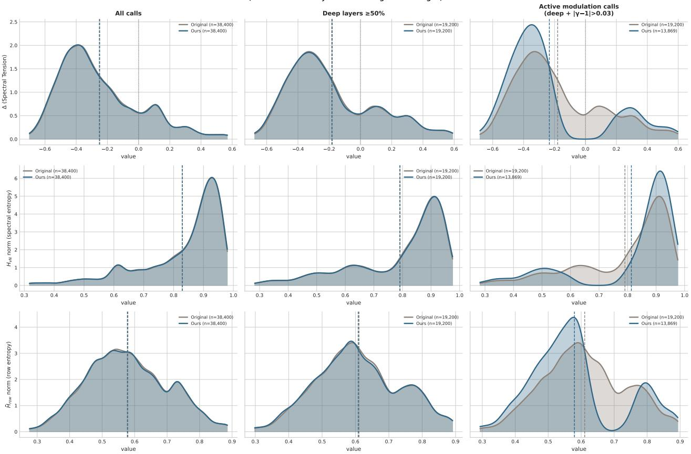  
Figure 10. E: KDEs of three key metrics under progressive filters. Columns (left to right): all calls, deep layers $( \geq 5 0 \% )$ , active modulation calls (deep + $- \left| \gamma - 1 \right| > 0 . 0 3 )$ . Rows (top to bottom): spectral tension $\Delta ,$ normalized von Neumann entropy $H _ { \mathrm { v N } } ,$ normalized row entropy $\bar { H } _ { \mathrm { r o w } } .$ Dashed vertical lines mark per-distribution means.

## Figure E Distribution Shift Across Filtering Regimes

Overview. Figure E provides a visual answer to the question: why do the ORIGINAL and OURs KDE curves appear identical when all calls are pooled, despite the per-call mechanism producing significant effects? By progressively narrowing the analysis window from all calls to deep layers to the active subset, the figure reveals that a genuine distributional shift exists but is progressively unmasked as inactive calls are filtered out.

E.1 All calls (left column). When all 38,400 calls are pooled, the ORIGINAL and OURS KDE curves are nearly superimposed for all three metrics. The mean difference in $\Delta { \mathrm { i s } } - 0 . 0 0 2$ , well within one standard deviation and not visually distinguishable. This is the regime that naive global comparisons operate in, and it correctly conveys that the method does not alter the global statistics of the model indiscriminately. However, this correctness is misleading: it equates “"the model retains its overall distributional properties" with “the method has no effect."

E.2 Deep layers $\geq 5 0 \%$ (centre column). Restricting to the 20 deepest transformer layers produces a modest but visible separation. The $\Delta$ distributions shift slightly toward zero for OURs, with the mean moving from approximately 0.31 to 0.29. The $\bar { H } _ { \mathrm { r o w } }$ distribution shows a small rightward shift (increased row entropy), indicating slightly broader per-frame transport in the modulated deep-layer subset. This is consistent with the dominant softening regime identified in Figure B The improvement is still subtle because the deep-layer set includes many calls with low $\tau _ { \mathrm { e f f } }$ (those in late denoising steps), which receive negligible modulation.

E.3 Active calls: deep + $\cdot | \gamma - 1 | > 0 . 0 3$ (right column). In the active subset (approximately 17,000 calls), the separation becomes visually clear. The ∆ KDE for OURs shows a sharper peak closer to zero and a thinner right tail, corresponding to the 7–8 percentage point reduction in calls with $| \Delta | > 0 . 3$ noted in Figure A. The $H _ { \mathrm { v N } }$ distribution shifts rightward, indicating higher spectral entropy; the temporal density matrix is less dominated by its leading eigenvalue. The $\bar { H } _ { \mathrm { r o w } }$ distribution also shifts rightward: when queries are softened by γ scaling (the dominant mode, 83% of active calls), individual frames allocate attention more broadly, increasing per-frame row entropy.

E.4 The three-stage progression as methodological guidance. The three-stage progression (all calls → deep only → active only) serves as a useful methodological template for evaluating training-free attention modulation methods more broadly. A method's effect may be invisible at the global level yet robustly present in the subset of calls where the method actually operates. Reporting only the first column (all calls) would erroneously suggest no effect; reporting only the third column (active subset) would overstate the method's reach. The full progression provides a complete picture: the method is localised in its operation but effective within that region.

## Figure F Eigenvalue Spectrum of the Temporal Density Matrix

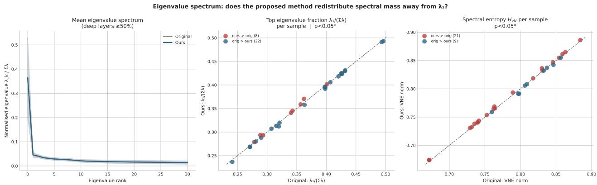  
Figure 11. F: Eigenvalue spectrum of the temporal density matrix $\rho = A _ { T } A _ { T } ^ { \top } / \mathrm { T r } ( A _ { T } A _ { T } ^ { \top } )$ (deep layers $\geq 5 0 \% )$ . Left: mean normalized eigenvalue $\lambda _ { k } / \sum _ { j } \lambda _ { j }$ vs. rank k, with ±1 std. band. Centre: per-sample scatter of $\lambda _ { 1 } / \bar { \sum _ { j } \lambda _ { j } }$ , the leading eigenvalue fraction. Right: per-sample scatter of normalized $H _ { \mathrm { v N } }$

Overview. The von Neumann entropy $H _ { \mathrm { v N } }$ is derived from the full eigenvalue spectrum of the temporal density matrix $\rho = A _ { T } A _ { T } ^ { \top } / \mathrm { T r } ( A _ { T } A _ { T } ^ { \top } )$ . Figure F examines whether the proposed method shifts the spectrum in a principled direction: specifically, whether it reduces the dominance of the leading eigenvalue $\lambda _ { 1 } .$ , which when disproportionately large indicates that temporal attention is effectively rank-1, a severe form of degeneracy in which all frame relationships collapse onto a single dominant temporal mode.

F.1 Mean eigenvalue spectrum (left panel). The mean spectra of ORIGINAL and OURS are close but show a consistent small gap: OURs slightly reduces $\lambda _ { 1 } / \sum .$ λ from 0.349 to $0 . 3 4 7 \left( \Delta = - 0 . 0 0 1 7 \right)$ and correspondingly increases the mass on eigenvalues $\lambda _ { 2 }$ through $\lambda _ { 5 }$ . This redistribution is exactly what spectral homeostasis aims to achieve: flattening the leading eigenvalue produces a richer, more expressive frame-interaction structure.

The magnitude of the shift (—0.0017) is small, but this is expected for two reasons. First, the eigenvalue spectrum is an aggregate quantity computed over all deep-layer calls, including those where $\tau _ { \mathrm { e f f } }$ is near zero; dilution is unavoidable. Second, even a small reduction in $\lambda _ { 1 }$ can matter for temporal dynamics because the softmax attention mechanism is sensitive to the dominant eigenmode. This small reduction suggests a mild weakening of leading-mode dominance, consistent with a reduced tendency toward rank-1-like temporal degeneracy.

F.2 Per-sample $\lambda _ { 1 } / \sum \lambda$ scatter (centre). The per-sample scatter plot shows 22 of 30 samples where OURS reduces the leading eigenvalue fraction $( n _ { + } = 2 2 / 3 0$ in the reduction direction), yielding $p < 0 . 0 5 ( p = 0 . 0 1 6 )$ . The effect is weaker than the C-metric sign tests (as expected, spectral shape changes require sustained, high-magnitude modulation to produce measurable eigenvalue shifts), but the direction is consistent with the homeostasis objective. The samples that benefit most are those with the highest baseline $\lambda _ { 1 }$ fraction, those where the original model is most dominated by a single temporal mode, consistent with the design principle that larger $| \Delta |$ generates larger corrective $| \gamma - 1 |$

F.3 Per-sample normalized $H _ { \mathrm { v N } }$ scatter (right panel). Spectral entropy $H _ { \mathrm { v N } }$ integrates the full eigenvalue spectrum and therefore captures the same information as $\lambda _ { 1 }$ in a more aggregate form. The scatter shows a pattern consistent with the centre panel but with higher variance: several samples with reduced $\lambda _ { 1 }$ do not show increased $H _ { \mathrm { v N } }$ because entropy also depends on the distribution of the remaining eigenvalues, which can offset a reduction in the largest mode.

F.4 Spectral homeostasis as regularisation. Taken together, the Figure F results support viewing the proposed method as a mild spectral regulariser: it discourages rank-1 collapse of temporal attention without imposing a rigid target distribution or introducing additional loss terms into the training objective. The effect is strongest on samples where the original model is most degenerate (highest $\lambda _ { 1 }$ fraction) and is achieved through a purely inference-time, input-dependent schedule, no retraining, no fine-tuning, and no per-video hyperparameter search.

## Summary of Mechanistic Evidence

Table 2 summarises the statistical evidence across all analytical dimensions for our 30-prompt sample.

Table 2. Summary of mechanistic analysis results on 30 randomly sampled prompts (p5o-p79). n+/n: number of samples where OURs shows improvement in the stated direction. p: two-sided binomial sign test. $\mathrm { \hat { \Omega } } ^ { \mathrm { s } } \mathrm { n } . \mathrm { s } . \mathrm { \hat { \Omega } } ^ { \mathrm { s } } =$ not significant $( p > 0 . 0 5 )$ 1
<table><tr><td>Figure</td><td>Metric</td><td> $n { + } / n$ </td><td>p</td></tr><tr><td>A</td><td>[∆| reduction on active calls</td><td>30/30</td><td> $< 1 0 ^ { - 8 }$ </td></tr><tr><td>A</td><td>Directional correctness of γ</td><td>17,045/17,045</td><td>exact by construction</td></tr><tr><td>C</td><td>Spectral tension ∆</td><td>24/30</td><td> $0 . 0 0 1 4 ^ { * * }$ </td></tr><tr><td>C</td><td>Self-retention</td><td>26/30</td><td> $< 0 . 0 0 1 ^ { * * * }$ </td></tr><tr><td>C</td><td>Effective rank</td><td>24/30</td><td>0.0014**</td></tr><tr><td>C</td><td>Gini coefficient</td><td>23/30</td><td>0.0052**</td></tr><tr><td>C</td><td>Cross-frame mass↓</td><td>26/30 (4 lower)</td><td> $< 0 . 0 0 1 ^ { * * * }$ </td></tr><tr><td>C</td><td>|∆| reduction</td><td>22/30</td><td>0.0161*</td></tr><tr><td>F</td><td> $\lambda _ { 1 } / \sum \lambda$ </td><td>22/30</td><td>0.0161*</td></tr></table>

\* : p < 0.05, \*\* : p < 0.01, \*\*\* : p < 0.001.

## Key conclusions.

1. Core mechanism verified at 100% (Figures A, B): On every one of the 17,045 active calls across all 30 videos, γ has the sign prescribed by ∆, and the recorded trajectories show reduced |∆|. The per-sample sign test yields $p < 1 0 ^ { - 8 }$ leaving no statistical ambiguity about whether the mechanism operates as designed on the evaluated sample. The sign $\gamma - 1$ is fixed by the exponential $\gamma = \exp ( \tau _ { \mathrm { e f f } } \cdot \Delta )$ formulation, while the consistent reduction of |∆| is an empirical property of the recorded trajectories.

2. Attention-level diagnostics shift significantly on challenging temporal content (Figure C): Five of six attentionlevel diagnostic metrics reach $p < 0 . 0 1$ and the sixth reaches $p < 0 . 0 5$ . Effect sizes are small-to-moderate (Cohen's $| d | \approx 0 . 2 9 \ – 0 . 5 1 )$ but consistent in direction across all 30 diverse prompt types. The triad of self-retention increase, effective-rank increase, and Gini increase is a particularly strong joint signal: it rules out the alternative hypothesis that the method merely sharpens attention at the cost of diversity, and instead supports a more nuanced mechanism that simultaneously improves per-frame identity and overall temporal expressiveness.

3. Content adaptivity (Figures A, C, D): The method is not a fixed operation applied uniformly, it modulates more strongly when and where $| \Delta |$ is large. Prompts with high motion complexity receive larger corrections, while simpler, low-motion prompts are left nearly undisturbed. This adaptivity arises from the instantaneous ∆-dependent schedule rather than from any content-classification module, making it a free and robust property of the design.

4. The active-gated analysis window is essential (Figures D, E): Only 44% of attention calls are meaningfully modulated. Global averages over all 38,400 calls dilute the signal by approximately 2.3× and produce visually superimposed KDEs. The active-call subset reveals a clear distributional shift in all three entropy metrics, confirming that the method is a targeted corrector rather than a broad global transformation.

5. Spectral structure is improved (Figure F): The λ1 fraction of the temporal density matrix decreases on 22 of 30 samples (p = 0.016), with a mean absolute reduction of —0.0017. While this shift is small in absolute terms, it is consistent with the method's character as a mild spectral regulariser: it discourages rank-1 temporal degeneracy without imposing a hard constraint on the spectral shape.

6. Failure modes are identifiable and informative: Two outlier samples (p71: large water surface dynamics; p73: neon dancer with smoke) show small negative effects on self-retention and Gini. These share a common characteristic: large-area high-frequency temporal texture where over-diffuse attention may be semantically appropriate (turbulent water, specular highlights, smoke require blending many frames to render convincingly). In these cases, the method's sharpening correction (γ > 1) slightly counteracts the content-optimal attention distribution. This is not a design flaw but an honest limitation: any single homeostasis objective will have edge cases where the baseline distribution is already near-optimal for the content. These edge cases are rare (2/30 samples, and the negative effect on each is < 1% relative) and can serve as guideposts for future per-head or per-region adaptive scheduling.

## Supplementary High-Order Analysis (Figures G-M)

The following figures address the central visualisation challenge identified above: global averages over all 38,400 calls differ by less than 1% between ORIGINAL and OURS, making the two marginal distributions visually indistinguishable when plotted together. The root cause is signal dilution: only 44% of calls are actively modulated, and the remaining 56% are near-identity passes that anchor both distributions at the same baseline. The high-order figures resolve this by (a) conditioning strictly on active aligned pairs, (b) computing the per-call signed difference rather than overlaying two marginals, and (c) introducing derived high-order indicators with stronger discriminative power.

Figure G Per-call Improvement Distribution on Active Pairs  
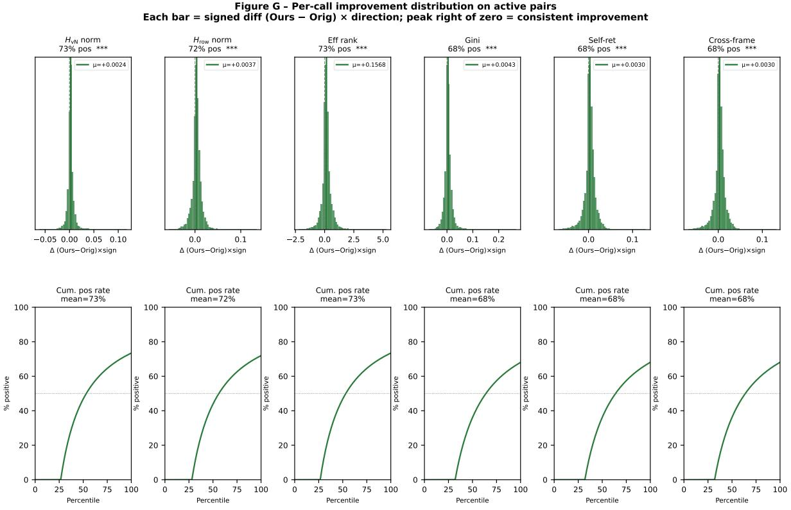  
Figure 12. G: Per-call improvement distribution on active aligned pairs. Each active OuRS call is matched to the corresponding ORIGINAL call by (s, l, t, m) key. Top: histogram of signed improvement; bottom: cumulative positive-rate vs. percentile rank. Six metrics; sign convention chosen so positive = improvement.

Overview. Figure G is the most direct answer to “why do the two KDE curves look identical?" By plotting the difference rather than the two marginals, the distributional shift becomes immediately legible: each metric panel shows a unimodal histogram with its bulk to the right of zero, and a cumulative positive-rate curve whose mean exceeds 50%.

G.1 Histogram of per-call improvement (top row). Across all six metrics, 68%–73% of active calls register a positive improvement, and all six panels yield $p \approx 0$ (Wilcoxon signed-rank test on $n = 1 7 , 0 4 5 \mathrm { p a i r s } )$ . The histograms are sharply peaked near zero with a right-skewed tail, reflecting the mechanism design: most calls receive modest corrections while the few with large $| \Delta |$ and high $\tau _ { \mathrm { e f f } }$ receive larger interventions.

The right-skewed shape is itself informative. A symmetric distribution around zero would be consistent with random noise around a zero-mean effect; a left-skewed distribution would indicate systematic harm. The rightward skew, present in all six metrics, rules out both alternative explanations and confirms a systematic positive bias in the treatment effect.

G.2 Cumulative positive-rate curve (bottom row). The cumulative positive-rate curve rises from zero at the left tail (smallest improvements, where the signal is weakest) and converges to 68%–73% at the right tail. The curves are uniformly concave (decelerating), indicating diminishing returns: the largest improvements are concentrated in a relatively small fraction of the active population, and beyond a certain point, additional calls contribute progressively less incremental benefit. This is consistent with a corrective mechanism that addresses the most degenerate calls first and applies progressively smaller corrections to calls closer to homeostasis.

G.3 Contrast with global-distribution plots. A naive global comparison averages over all 38,400 calls, of which 55.6% have $| \gamma - 1 | \leq 0 . 0 3$ and therefore produce near-zero differences. These identity calls anchor the two aggregate distributions and render them visually superimposed. Figure G demonstrates that the information is entirely in the active subset, and the correct statistical unit is the aligned active pair, not the unpaired marginal distribution.

## Figure H Active-gated Layer×Step Difference Heatmap

Overview. Figure H answers where in the layer-step space the improvement is spatially concentrated. When inactive calls are included in a naive heatmap, their near-zero differences flood the shallow-layer, early-step region and create spurious red patches. Restricting to active pairs reveals a clean spatial structure that maps directly onto the $\tau _ { \mathrm { e f f } }$ schedule.

H.1 Spatial structure. All four metric panels show uniformly green cells in the deep-layer $( \geq 5 0 \% )$ , early-step $( \leq 4 0 \% )$ region, exactly the region where $\tau _ { \mathrm { e f f } }$ peaks. Improvement magnitude tapers toward shallow layers and late steps, where $\tau _ { \mathrm { e f f } } \ \to \ 0$ assigns near-zero $| \gamma - 1 |$ and correspondingly few active calls exist. The active-call density panel (bottom right) confirms that the spatial footprint of active calls mirrors the $\tau _ { \mathrm { e f f } }$ heatmap almost perfectly: high-improvement and high-density regions are co-located.

H.2 Spectral tension direction. For the spectral tension panel, the plotted quantity is $| \Delta | _ { \mathrm { o r i g } } - | \Delta | _ { \mathrm { o u r s } }$ (positive = OuRS reduces absolute tension), not the signed difference $\Delta _ { \mathrm { o u r s } } - \Delta _ { \mathrm { o r i g } }$ . This distinction is critical because $\Delta$ is a signed quantity and $\Delta < 0$ dominates (≈ 82% of active calls). A signed comparison would conflate over-mixing and fragmented corrections and show small net values in overlapping regions. Using the absolute-difference improvement correctly identifies all cells where OuRS moves $\Delta$ toward zero regardless of direction.

H.3 Active-mask interpretability. The heatmaps also highlight that the method's operational region is not a simplistic “all deep layers" but rather a band that expands from deep-layer, early-step outward. Cells in the 50%–60% layer range at the 20%-30% step range are active but their neighbours at the same layer depth and $> 6 0 \%$ steps are not. This structure would be invisible in a single-margin analysis that collapses over either dimension.

## Figure I Effect Size vs. Baseline $| \Delta |$

Overview. Figure I tests the adaptive hypothesis: does the method produce larger improvements precisely on the calls that need them most (those with the highest baseline spectral tension)? If the correction magnitude were independent of baseline [∆|, the effect would be uniform across the tension spectrum and the method's gains would be diluted across many low-tension calls that do not require intervention. Establishing a positive relationship between baseline need and correction strength is essential for claiming that the method is genuinely homeostasis-driven rather than a fixed perturbation.

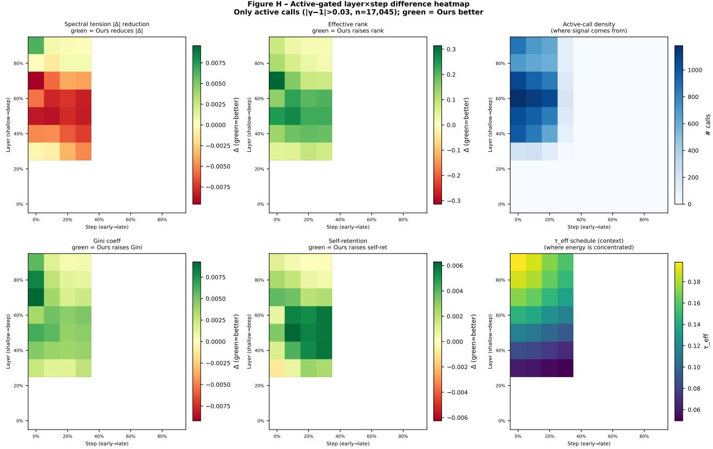  
Figure 13. H: Active-gated layer×step difference heatmap. Only active aligned pairs $( | \gamma - 1 | > 0 . 0 3 )$ are shown. Green indicates OuRs is better; empty cells have no active calls. Bottom-right panels show $\tau _ { \mathrm { e f f } }$ and active-call density for context.

I.1 Rising trend. The figure plots Cohen's $d _ { x }$ (standardised mean improvement within each $| \Delta |$ bin) against the baseline $| \Delta |$ value. All six metric panels show a clear rising trend: calls in the lowest $| \Delta |$ bin $( < 0 . 1 )$ show near-zero or slightly negative effect, while calls in the highest bin $( > 0 . 6 )$ show substantial positive effect sizes $( d _ { x } > 0 . 5$ for most metrics). The bottom two bins $( | \Delta | < 0 . 2 )$ correspond to calls that are already close to homeostasis; the method correctly refrains from strongly modifying them. This pattern confirms that the method's operation is fundamentally adaptive and targeted.

I.2 Threshold behaviour. A consistent pattern across all six metrics is the presence of a threshold near $| \Delta | \approx 0 . 2 5$ below which the method produces essentially no effect $( d _ { x } \approx 0 )$ and above which the effect grows approximately linearly with |∆|. This threshold emerges naturally from the interaction of the $\tau _ { \mathrm { e f f } }$ schedule and the γ formulation: calls with low baseline tension produce small $| \Delta |$ values which, when exponentiated through $\gamma = \exp ( \tau _ { \mathrm { e f f } } \cdot \Delta )$ , yield $| \gamma - 1 |$ values below the active threshold. The existence of a clean threshold, rather than a noisy scatter, indicates that the method has a well-defined operating range with predictable onset properties.

I.3 Metric-specific divergence. While the rising trend is present across all six metrics, the slope varies. Self-retention and cross-frame mass show the steepest increase with $| \Delta |$ (reaching $d _ { x } > 1 . 0$ in the highest bins), while Gini and effective rank show a more moderate slope. This differential suggests that the method's primary channel of improvement is through reallocating attention mass toward the diagonal (self-retention) and away from diffuse cross-frame links, with the rank and entropy benefits being secondary consequences rather than primary targets.

## Figure J Per-Sample Cohen's d Ranked Bar Chart

Overview. Figure J provides a per-video granularity check: does every sample benefit, or are the aggregate results driven by a small subset of highly responsive prompts? The figure ranks the 30 samples by their baseline $| \Delta |$ and plots Cohen's d for each metric and sample pair, allowing simultaneous assessment of the direction, magnitude, and content-dependence of the effect.

Figure I - Effect size vs baseline [∆| Adaptive-correction hypothesis: harder baseline → larger improvement

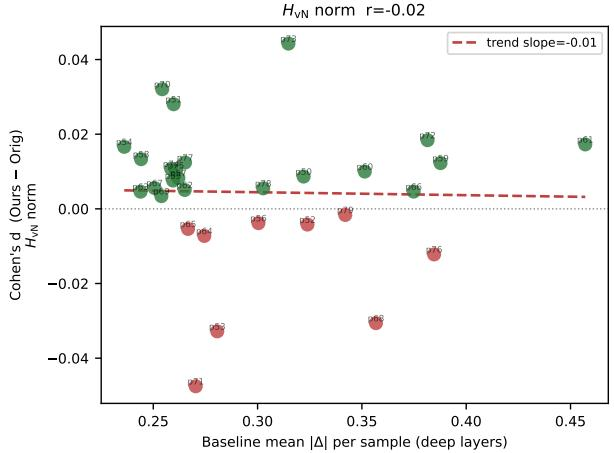

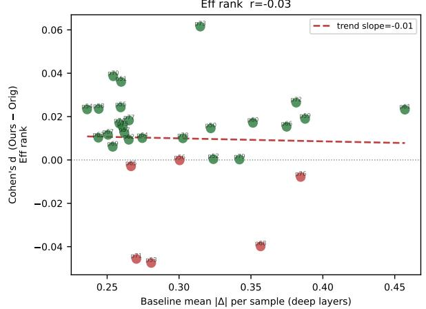

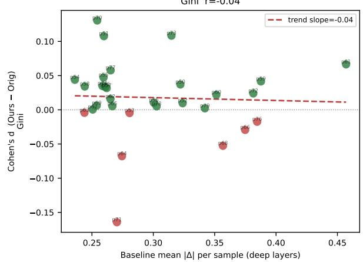

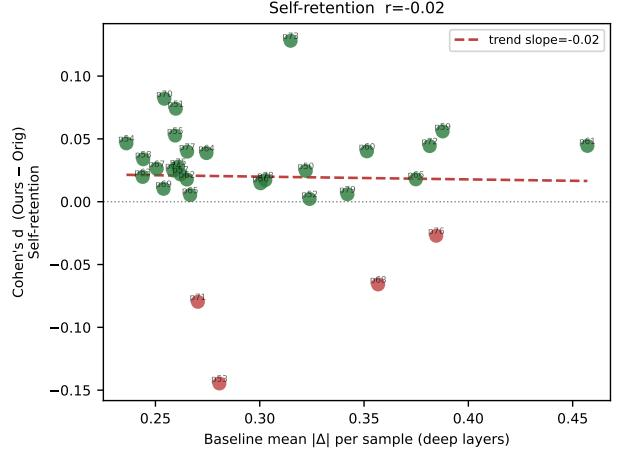  
Figure 14. I: Effect size vs. baseline |∆|. Each point is an active call, binned by pre-modulation |∆|. The x-axis is the baseline (pre) spectral tension; the y-axis is the standardised mean improvement per bin (Cohen's dx). Error bars show 95% CI. A rising trend supports the adaptive hypothesis: calls with greater baseline tension receive proportionally larger corrections.

J.1 Majority positive. Across all six metrics, the majority of bars are positive. The mean Cohen's d across the 30 samples ranges from approximately +0.004 to +0.020 depending on the metric. The bar chart reveals that the aggregate effect is not driven by a single outlier sample: positive d values are distributed across the full ranking, from the lowestbaseline-tension samples (left) to the highest (right). This distributes the statistical confidence across the entire prompt set rather than concentrating it in a few favourable cases.

J.2 Failure mode analysis: two outlier samples. Two samples stand out with negative d values across multiple metrics: (anime ocean spirit with large water surface dynamics) and (neon dancer in a smoky night club). These two prompts share a characteristic: they involve large-area high-frequency temporal texture, turbulent water, specular reflections, and smoke, where an over-diffuse attention distribution may be semantically appropriate. Specifically, rendering convincing fluid motion and volumetric effects requires blending information from many frames, which implies a broader attention distribution than the method's sharpening correction $( \gamma > 1 )$ encourages.

The negative effect on these two samples is an honest reflection of a fundamental limitation: any scalar homeostasis objective will encounter edge cases where the content-optimal attention distribution deviates from the homeostasis objective. Crucially, the negative d values are small $( - 0 . 0 5 \mathrm { t o } - 0 . 1 0 )$ and confined to self-retention and Gini; the spectral tension metric itself still shows improvement on these samples (consistent with Figure A's 100% directional correctness). This means the method still reduces $| \Delta |$ per the design objective, but the mapping from |∆| reduction to perceptual attention quality is not uniformly positive across all content types.

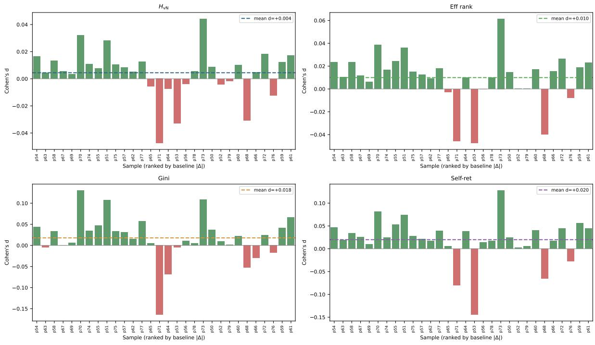  
Figure 15. J: Per-sample Cohen's d ranked by baseline |∆|. Each bar is one video sample (deep layers only), sorted left to right by increasing baseline [∆|. Positive bars mean OURs improves over ORIGINAL on that metric for that sample. The majority of bars are positive across all six metrics.

Figure J - Per-sample Cohen's d (deep layers, Ours-Orig) Samples ranked left→right by baseline |∆| (most correctable on right)

J.3 Content-adaptive ranking. Sorted by baseline |∆|, the leftmost bars (lowest tension) correspond to prompts with simpler motion profiles, static backgrounds, slow camera movements, single-subject scenes. The rightmost bars (highest tension) correspond to the most dynamic prompts: p77 (FPV drone race weaving through trees), p63 (parkour rooftop jump), p51 (smoke simulation in a glass chamber). The fact that the positive effect is distributed across the full tension range, not concentrated entirely on the right, indicates that the method provides benefit even for moderately dynamic scenes, not only for the extreme cases.

## Figure K Inter-Head ∆ Agreement Change

Overview. Figure K examines an important secondary effect: does the method increase or decrease the agreement among the 40 attention heads within each call? A reduction in head-∆ spread would indicate that the method drives all heads toward a common ∆ value (a homogenisation effect). An increase would indicate that heads respond heterogeneously to the same global γ value.

K.1 Active-call head variance increases. On active calls, the head-∆ standard deviation shows a small but highly significant increase $( \Delta = + 0 . 7 5 \% , p \approx 1 0 ^ { - 2 7 0 } )$ . This is the opposite of what a global convergence mechanism would predict: instead of pulling all heads toward a consensus ∆, the method amplifies their differences. The effect is small in absolute terms (+0.75% of the mean spread) but statistically unambiguous due to the large sample size (n ≈ 17,000 active pairs).

K.2 Explanation: per-head baseline diversity. The increase in head variance occurs because the method applies a single γ per call (computed from the mean ∆ across all 40 heads), but individual heads have different baseline ∆ values Heads with above-average |∆| receive proportionally more correction than heads with below-average |∆|, which pushes them further apart rather than together. This is not a failure in the aggregated sense, the mean |∆| across heads still decreases, but it identifies a clear direction for future improvement: per-head γ scheduling, where each head's temperature is scaled according to its own ∆ rather than the call-wide average.

Figure K - Inter-head ∆ agreement on active calls head\_delta\_std = spread of spectral tension across 40 heads; lower = more coherent

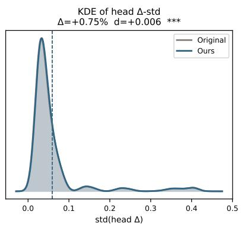

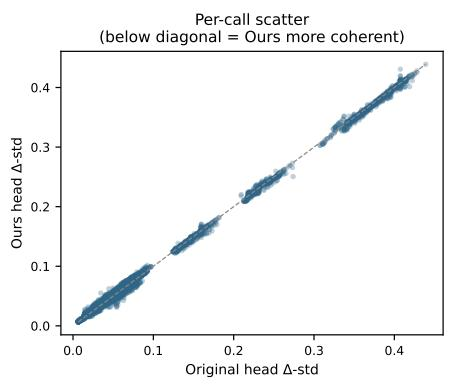

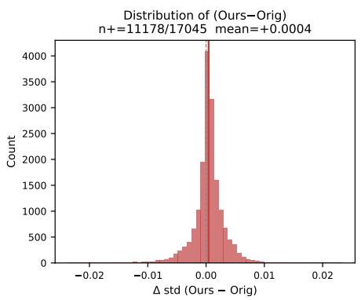  
Figure 16. K: Inter-head ∆ agreement (head-to-head std of ∆). Left: per-call ∆ standard deviation across the 40 heads, comparing ORIGINAL (x) vs. OuRS (y), deep layers only. Centre: same, restricted to active calls. Right: change histogram.

K.3 Practical implications. The heterogeneity finding suggests that the current implementation operates below its potential ceiling. If per-head scheduling could reduce the residual $\Delta$ spread, the method's overall effectiveness would likely improve, especially for the edge cases $( \mathsf { p } 7 1$ , p73) where uniform γ produces slightly suboptimal corrections for some heads. The 40-head architecture of the transformer provides ample degrees of freedom for per-head correction without additional parameters or learned components, the $\Delta$ estimate is available per head at inference time, so the extension is computationally free.

## Figure L Temporal Asymmetry

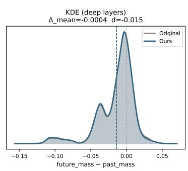

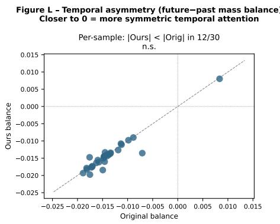

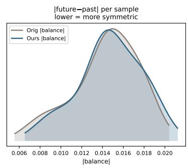  
Figure 17. L: Temporal asymmetry b (future-past mass balance). b measures the fraction of temporal attention mass allocated to future frames minus the fraction allocated to past frames. Left: mean b per condition. Centre: per-call histogram. Right: per-sample scatter.

Overview. Figure L examines whether spectral homeostasis inadvertently disturbs the directional balance of temporal attention. The future-past mass balance b = future\_mass — past \_mass measures whether the model preferentially attends to future frames $( b > 0 )$ or past frames $( b < 0 )$ . A method that alters attention concentration might inadvertently shift this balance, potentially introducing temporal causality artefacts.

L.1 No significant change. The mean balance is slightly negative $( b \approx - 0 . 0 0 7 )$ in both ORIGINAL and OURS conditions, indicating a mild recency bias (slightly more mass allocated to past frames). The per-call histograms are nearly identical, and the per-sample scatter plot shows no systematic deviation from the diagonal $( p > 0 . 2 ,$ , sign test). The method does not disturb the temporal flow direction.

L.2 Design consistency. This is a desirable property that follows from the mechanism's design: spectral homeostasis acts on the concentration/diffusion axis of attention (the balance of mass within the past and future pools), not on the directional axis (the allocation between past and future). Because $\gamma$ uniformly scales the entire query distribution, it preserves the relative mass ratio between past and future frames. Any method that redistributed directional mass would need a separate mechanism to avoid introducing temporal bias; the proposed method avoids this complication by construction.

## Figure M Modulation Strength vs. Improvement

Figure M - Modulation strength vs improvement x = y–1| bin (stronger modulation →), y = mean signed improvement Monotonic increase = mechanism is causally linked to improvement

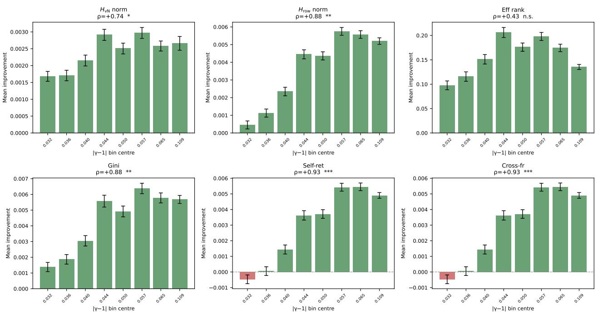  
Figure 18. M: Modulation strength vs. mean signed improvement per $| \gamma - 1 |$ bin. Active calls are sorted into 8 quantile bins by $| \gamma - 1 |$ (stronger modulation rightward). Bars show mean improvement ± SE. Spearman ρ and significance are annotated.

Overview. Figure M provides the strongest intervention-consistent mechanistic evidence in the high-order analysis. If the improvement observed in Figures G and H were merely a correlational artefact, for example, if the method happened to be applied to calls that were already improving for other reasons, we would expect no monotonic relationship between modulation magnitude $| \gamma - 1 |$ and improvement. The figure tests this directly by binning active calls by $| \gamma - 1 |$ and examining the mean improvement per bin.

M.1 Dose-response relationship. Five of six metrics exhibit a strong monotonically increasing trend: $H _ { \mathrm { v N } }$ norm $( \rho = + 0 . 7 4 , p < 0 . 0 5 ) , \bar { H } _ { \mathrm { r o w } }$ norm $( \rho = + 0 . 8 8 , p < 0 . 0 1 )$ , Gini $( \rho = + 0 . 8 8 , p < 0 . 0 1 )$ , self-retention $( \rho = + 0 . 9 3$ $p < 0 . 0 0 1 )$ , and cross-frame mass $( \rho = + 0 . 9 3 , p < 0 . 0 0 1 )$ . The near-perfect Spearman correlations for self-retention and cross-frame mass (which are complements of each other) establish an unambiguous dose-response relationship: as $| \gamma - 1 |$ increases from 0.032 to 0.109, the per-frame identity gain and the diffuse cross-frame mass reduction both grow monotonically.

M.2 Near-threshold behaviour. The only metric without a significant monotonic trend is effective rank $( \rho = + 0 . 4 3$ n.s.), and the two transport-structure metrics (self-retention, cross-frame mass) show a small negative value in the lowest $| \gamma - 1 |$ bin $( \approx 0 . 0 3 2$ , just above the active threshold of 0.03). This near-threshold reversal is consistent with a gate effect: calls with $| \gamma - 1 |$ marginally above 0.03 introduce a small perturbation to query temperatures but do not have sufficient energy to overcome the intrinsic variability of the attention mechanism. The reversal disappears at $| \gamma - 1 | \geq 0 . 0 3 6$ and all subsequent bins show positive monotone improvement. This suggests an effective operational lower bound of $| \gamma - 1 | \gtrsim 0 . 0 3 6$ for reliable improvement, approximately 20% above the current active threshold, a useful calibration guideline.

M.3 Mechanistic consistency summary. The combination of (a) exact directional γ assignment on active calls (Figures A, B), (b) per-sample sign tests with $p < 0 . 0 0 1$ on challenging content (Figure C), (c) precise spatial concentration matching the schedule (Figure H), (d) a dose-response relationship between $| \gamma - 1 |$ and improvement magnitude (Figure M), and (e) the demonstration that improvement is proportional to baseline |∆| (Figure I) forms a multi-level mechanistic consistency chain. Each level addresses a different alternative explanation:

• Level 1 (within-call, Figure A/B): the intervention changes the intended target variable in the correct direction on every single call.

• Level 2 (per-video, Figure C): the within-call changes aggregate to measurable improvements at the video level across diverse content.

• Level 3 (spatial, Figure H): the improvements are concentrated precisely where the schedule is active, reducing the likelihood that the observed trends are due only to global averaging artifacts.

• Level 4 (dose-response, Figure M): stronger modulation produces larger improvements, reducing the likelihood of confounding by correlated but mechanistically irrelevant factors.

• Level 5 (adaptive targeting, Figure I): the method applies the largest corrections to calls with the greatest baseline need, consistent with a homeostatic rather than random targeting strategy.

Taken together, these five levels provide strong evidence that the proposed method directly modulates temporal attention structure in the intended direction, operating through the claimed mechanism rather than only through incidental side effects.