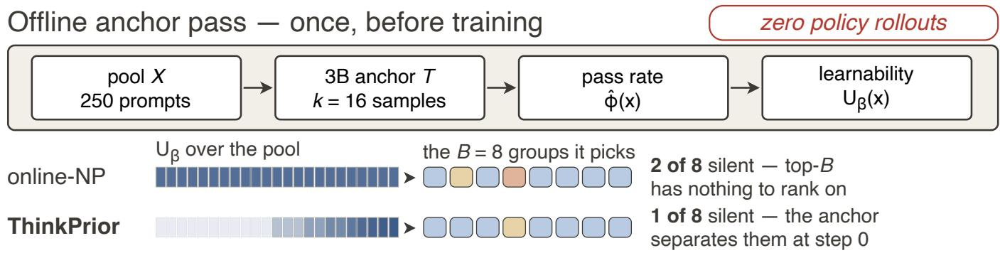
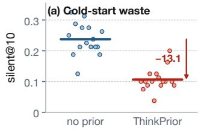
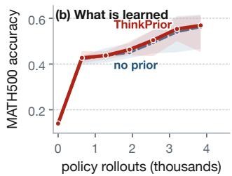
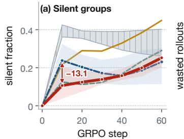
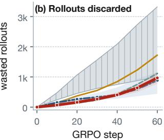

# ThinkPrior: Zero-Rollout Dificulty Priors for Cold-Start Prompt Selection in RLVR

Tommy Sha1, Skylar Zhai2, Siqi Zhao2

1Stony Brook University 2University of Minnesota Twin Cities Correspondence: tianming.sha@stonybrook.edu; {haoti002,zhao2052}@umn.edu

## Abstract

In reinforcement learning with verifiable rewards (RLVR) trained with group relative policy optimization (GRPO), the KL-free reward-advantage term studied here depends on within-group reward variation. Ifall rollouts in a group are cor- rect or all are wrong, their group-relative advantages are iden- tically zero; these zero-advantage silent groups provide no reward-advantage gradient, yet uniform sampling spends 39% of a run’s rollouts on them. History-based prompt selection must first spend target-policy rollouts to estimate dificulty, creating a cold start with rollout waste; ThinkPrior instead uses an external anchor in one ofline pass to construct a zerorollout dificulty prior before the first target-policy rollout. The verifier-scored anchor pass rate supplies an externalanchor initialization for a Beta posterior; ThinkPrior selects by expected learnability and then updates from train- ing outcomes, changing neither the loss nor the optimizer. On Qwen2.5-Math-7B across sixteen seeds, ThinkPrior more than halves early silent groups and cuts wasted rollouts through step 30 by nearly a fifth, while we detect no diference in final accuracy. On this 250-prompt pool the fixed-budget re-sult is a reallocation rather than a net saving. The measured ThinkPrior+DAPO composition reduces generated rollouts by 10.6% while both arms retain the same 3840-rollout update budget. The prior requires no target-policy rollout before the first selection, but the posterior thereafter uses target-policy outcomes.

## Introduction

Reinforcement learning with verifiable rewards (RLVR) has become the mainstream approach to improving model rea- soning, and almost all of its cost is rollout generation. Au- diting advantages group by group in a routine GRPO (Shao et al. 2024) run, we found that a substantial fraction of that compute supplies no reward-advantage term: under uniform sampling, 37.9% of prompt groups in early training have identically zero advantage, and across the whole run 39% of rollouts contribute nothing to the policy gradient of the KLfree surrogate we study. A silent group is an all-correct or all-wrong rollout group whose group-relative advantages are identically zero; under the KL-free objective studied here, it contributes no reward-advantage gradient.

This silence is not an oversight in hyperparameters or im- plementation, but a direct consequence of the group-relative advantage estimator: the within-group baseline equals every sample’s return, so the reward-advantage contribution can- cels sample by sample. Objectives with a KL term or other loss components can still update on such a group, and our experiments do not establish invariance across tasks, model scales or reward designs. Within the studied objective, too easy and too hard are equivalent for the reward-advantage term.

The cost of silence has long been underrated because the role of dificulty reverses between SFT and RLVR. An SFT objective is informative everywhere and dificulty merely reweights it, so the hardest examples still contribute a gradi- ent; in RLVR dificulty is a switch, and a silent group pays the full cost of generation and verification for a gradient that is exactly zero. Where generation dominates total cost, a silent rollout still incurs most of the generation and verification cost. Uniform sampling is roughly flat across windows in our run; the early penalty studied here instead comes from a selector that must first acquire useful dificulty information. For short-horizon, LoRA-scale runs, that cold-start interval occupies a substantial share of training.

This gives the question this paper answers: can we tell which prompts will be silent before paying for their rollouts? Per-prompt history-based selection methods estimate pass rate from target-policy outcomes already observed (Qu et al. 2026a; Zheng et al. 2025b; Yu et al. 2025); those methods cannot distinguish an unseen prompt at step 0 without another signal. This is the cold-start prompt selection problem: choosing prompts before target-policy rollout history reveals their dificulty. Learned selectors can share informa- tion across prompts (Qu et al. 2026b), so this limitation is not universal to every online method. In our comparison, three published rules do not separate from uniform sampling on the early silent rate.

Method definition: a zero-rollout dificulty prior. A zero-rollout dificulty prior is a per-prompt dificulty esti-mate computed without rollouts from the policy being trained and available before its first prompt selection. Our starting point is a testable hypothesis: a prompt’s dificulty is mainly a property of the prompt itself rather than of any particular policy, and can therefore be transferred from a cheap model unrelated to the policy being trained. If the hypothesis holds, silence is predictable before training begins. Accordingly, ThinkPrior does one thing (Figure 1): a small of-the-shelf anchor runs the pool ofline, scored by the same verifier used in training, and its pass rate supplies an external-anchor initialization for a Beta posterior. Training then selects by expected learnability and updates from real outcomes. The prior requires no target-policy rollout before the first selec- tion and changes neither loss nor optimizer; after training starts, the posterior uses target-policy outcomes and can layer onto existing selection mechanisms.

Result: early wasted compute halves, accuracy does not move. On Qwen2.5-Math-7B this one-of pass more than halves silent groups in early training—from 23.8% to 10.6% over sixteen seeds, a 55% relative reduction (about 2.2×; 95% interval [−16.4, −9.9], d= − 2.95)—and cuts wasted rollouts through step 30 by 19%, while final accuracy is a null efect (+0.7 points, interval [−2.2, 3.5]). Two qualifications belong up front. We claim no accuracy gain: the prior determines how much generation is burned before a gradient is produced, not how far the policy eventually gets. Under a fixed rollout budget on this 250-prompt pool the early reduction is a reallocation rather than a net saving—over the full sixty steps we discard slightly more than the no-prior arm (968 against 885). A larger 1200-prompt pool reproduces the early reduction with non-overlapping seed ranges through step 30 and reverses the mean full-run accounting (5085 against 6099), but the three-seed ranges overlap at step 200, so the late result is directional only (Table 3(d)); these experiments do not identify pool exhaustion as the cause. In the measured ThinkPrior+DAPO composition, the observed mean final accuracy is the same while early waste falls by 65.4% and generated rollouts by 10.6% (8256 → 7381), with the update budget fixed at 3840 rollouts in both arms. More generally, eleven selection rules split into two families by early waste, divided not by algorithmic sophistication but by whether a verifier-scored zero-rollout dificulty prior is carried: 12.5%–16.7% with one, 20.4%–42.5% without, uniform sampling (37.9%) and the three published rules in the latter.

## Contributions.

• We characterize and quantify silent-group waste in RLVR. The phenomenon arises from the group-relative advantage estimator; under our KL-free objective it gates the reward-advantage gradient contribution. We measure the resulting generation cost and the cold-start penalty of history-based selection.

• We propose a zero-rollout dificulty prior for coldstart prompt selection. One verifier-scored external-anchor pass supplies the Beta initialization before the first target-policy rollout. Its scoring rule carries a dispersion penalty (Proposition 3): at equal posterior mean it prefers the prompt whose dificulty is better known, the reverse of uncertainty sampling.

• We separate the measured cold-start benefit from broader claims. Across sixteen seeds, silent@10 falls from 23.8% to 10.6% and waste through step 30 by 19%, while we detect no accuracy diference. The fixed-budget result is a reallocation; only the measured

ThinkPrior+DAPO composition shows a net generation reduction.

## Related Work

## RLVR and the silent-group problem

RLVR replaces a learned reward model with an automatic verifier (Lambert et al. 2024; Guo et al. 2025); GRPO (Shao et al. 2024), descended from PPO (Schulman et al. 2017) by way of RLHF (Ouyang et al. 2022), drops the value network for the within-group mean reward. That uniformly-rewarded groups then yield zero advantage is folklore in the GRPO literature, and holds for any baseline built from a group’s own rewards, including RLOO (Ahmadian et al. 2024) and variants changing the normalization or importance ratio (Liu et al. 2025; Zheng et al. 2025a; Kimi Team 2025). Several systems attack it: DAPO (Yu et al. 2025) oversamples and filters prompts scoring 0 or 1; GRESO (Zheng et al. 2025b) skips before rollout using reward history; MoPPS (Qu et al. 2026a) runs a Thompson-sampling bandit over per-prompt Beta posteriors; online dificulty filtering (Bae et al. 2026) expands to a leading Bernoulli-variance term p(1−p) that peaks where our learnability objective does; PCL (Gao et al. 2025) and GPS (Qu et al. 2026b) predict dificulty in-stead of measuring it, and GPS names the same cold-start bottleneck while sharing information across prompts. The per-prompt history methods depend directly on target-policy outcomes, whereas predictive methods need not fully roll out each prompt. Concurrently, sGPO (Sudalairaj et al. 2026) estimates dificulty before training by profiling the pool with the initial policy itself; our narrower distinction is that the initialization comes from an external anchor and therefore needs no target-policy rollout before the first selection.

## Where an ofline dificulty signal can come from

Item response theory (Lord 1980) models correctness from item dificulty and discrimination and has scored items for NLP models and benchmarks (Lalor, Wu, and Yu 2016, 2019; Maia Polo et al. 2024), making a 2PL bank a natural candidate; we evaluate one, and it works despite targeting popu- lation dificulty rather than this policy’s pass rate, difering from ours in what it costs to obtain (Results). A cheaper signal comes from test-time compute: chain-of-thought (Wei et al. 2022) made reasoning traces standard and how much test-time compute a problem repays tracks its dificulty (Snell et al. 2025), so dificulty might be read of how long the an-chor deliberates. We build that prior and train with it; it leaves the early silent-group fraction where an uninformative prior does.

## Data selection and curricula

Data selection is mature for pretraining and instruction tun- ing, where importance resampling and quality filtering give real but modest gains (Xie et al. 2023; Li et al. 2024; Xia et al. 2024); curricula order examples easy-to-hard (Ben-gio et al. 2009; Kumar, Packer, and Koller 2010) or by learning progress (Graves et al. 2017), and prioritizing by learning potential is standard (Schaul et al. 2016; Jiang,

Grefenstette, and Rocktäschel 2021; Settles 2009). The nearest precedent for our cost structure is RHO-LOSS (Mindermann et al. 2022): one small reference model, reused to prioritize points learnable but not yet learnt. RLVR dif- fers in kind—selection decides whether compute produces a nonzero reward-advantage term under the studied KL-free objective, and the quantity worth predicting is a pass rate rather than a loss.

## Method

## Silent groups and learnability

Let πθ be the current policy and let x be a prompt with a verifier $v ( \cdot ) \in \{ 0 , 1 \}$ . GRPO samples a group of G rollouts $y _ { 1 } , \dots , y _ { G } \sim \pi _ { \theta } ( \cdot \mid x )$ , receives rewards $r _ { i } = v ( y _ { i } )$ , and forms the group-relative advantage

$$
A _ { i } = \frac { r _ { i } - \bar { r } } { \mathrm { s t d } ( r ) + \varepsilon } , \qquad \bar { r } = \textstyle { \frac { 1 } { G } } \sum _ { j } r _ { j } ,\tag{1}
$$

with the sample standard deviation and $\varepsilon { = } 1 0 ^ { - 4 }$ . Write $p ( x ) = \mathrm { P r } _ { y \sim \pi _ { \theta } } \big [ v ( y ) = 1 \big ]$ for the prompt’s pass rate under the current policy and $C = \textstyle \sum _ { i } r _ { i }$ for the number of correct rollouts, so $\dot { C } \sim$ Binomia $\operatorname { l } ( G , p )$ . If $C \in \{ 0 , G \}$ then $r _ { i } = \bar { r }$ for all i, so $A _ { i } \equiv 0$ and the prompt yields no reward-advantage signal; for the KL-free surrogate we train, that group’s contribution is exactly zero. This statement does not cover additional KL or regularization terms. This is the silent-group condition defined in the introduction. We write

$$
\begin{array} { l l } { { s ( p ) = p ^ { G } + ( 1 - p ) ^ { G } , ~ } } & { { ~ U ( p ) = 1 - s ( p ) , } } \end{array}\tag{2}
$$

for its probability and for the complementary learnability, the probability that the group is not uniformly rewarded.

## Dificulty gates the gradient.

Proposition 1 (Silence, learnability and advantage mass). Let $\bar { G } \geq 2$ and C ∼ Binomial $( G , p )$ . Then (i) the group is silent exactly when $C \in \{ 0 , \dot { G } \}$ , so $\mathrm { P r } [ s i l e n t ] = \bar { s } ( p ) ;$ (ii) U is strictly concave on $[ \dot { 0 } , 1 ]$ , symmetric about $\scriptstyle p = 1 / 2 ,$ strictly decreasing in $| p - 1 / 2 |$ , attains its unique maximum $U ( 1 / \dot { 2 } ) = 1 - 2 ^ { 1 - G }$ , and vanishes exactly at $p \in \{ 0 , 1 \}$ ; and (iii) conditional on the group not being silent, $\textstyle \sum _ { i } \dot { A } _ { i } ^ { 2 } = G - 1$ $a t \varepsilon { = } 0$ whatever its composition, so the expected advantage mass a prompt supplies is $( G - 1 ) U ( p )$

Proofs are in Appendix A. Part (iii) is what makes U the objective rather than a proxy for one: the normalizer equalizes every non-silent group, so a prompt’s whole contri- bution to the squared-advantage budget is carried by the probability that it is not silent. This quantifies the role re- versal of the introduction—preferring p near $1 / 2$ is not a taste for “medium” examples but maximization of expected signal-bearing yield—and the headroom is large: at $\scriptstyle { \mathrm { ~ { ~ G = 8 } , } }$ $\bar { U ( 1 / 2 ) } = \bar { 0 . 9 9 2 }$ while $U ( 0 . 0 5 ) = U ( 0 . 9 5 ) \stackrel { - } { = } 0 . 3 3 7$ . By (ii), U depends on p only through $| p - 1 / 2 |$ , so ranking by U ranks by the binary entropy of p: on point estimates it orders prompts as uncertainty sampling (Settles 2009) does, and as the Bernoulli variance that online dificulty filtering obtains from a second-order KL argument (Bae et al. 2026). What departs from both is its treatment of uncertainty in p (Proposition 3).

## The cold-start blind spot

Since $p ( x )$ is unknown, practical systems estimate it, typi- cally with a per-prompt Beta posterior updated by observed successes and failures. The dificulty is the initial condition.

Proposition 2 (Cold-start degeneracy). Under the uninformative initialization $\alpha _ { x } = \beta _ { x } = 1$ , the posterior expected learnability is $\begin{array} { r } { U _ { \beta } ( x ) \stackrel {  } { = } 1 - \frac { 2 } { G + 1 } } \end{array}$ for every prompt. More generally, any initialization that does not depend on x makes $\bar { U } _ { \beta }$ constant on the pool.

The blindness is structural, not a matter oftuning: at step 0 the score is a function of $( \alpha , \beta )$ alone, so no prompt-independent choice of it can separate prompts and the first batch is settled entirely by tie-breaking. The estimator becomes useful only after paying for rollouts on prompts it had no reason to prefer, and those early rollouts are the ones most likely to be silent. Separation at step 0 requires the initialization itself to depend on x.

## The zero-rollout dificulty prior

The prior introduced above breaks the cold-start dependency with a signal computed before training that never queries πθ.

Let $\check { T }$ be a small, of-the-shelf instruction-tuned model, the anchor. We let the anchor think through each prompt x in the pool k times, score its answers with the same verifier that will score the policy, and take its empirical pass rate

$$
\begin{array} { r } { \hat { \varphi } ( x ) = \frac 1 k \sum _ { j = 1 } ^ { k } v ( y _ { j } ) , \qquad y _ { j } \sim T ( \cdot \mid x ) , } \end{array}\tag{3}
$$

as the step-0 estimate of how hard x will be for the policy. φˆ need not equal the policy’s pass rate, but monotonicity alone is not enough either: $\check { U }$ peaks in the interior, so a mono- tone but badly scaled map moves that peak onto the wrong prompts. What is required is enough mid-range resolution to rank prompts there, which a 1.5B anchor already supplied, while the online posterior repairs the prompts it selects.

The prior enters as a pseudo-count-weighted Beta initial- ization,

$$
\alpha _ { x } = \kappa \hat { \varphi } ( x ) + \epsilon _ { 0 } , \qquad \beta _ { x } = \kappa \left( 1 - \hat { \varphi } ( x ) \right) + \epsilon _ { 0 } ,\tag{4}
$$

where $\kappa { = } 4$ controls how much evidence the prior is worth, a fourfold discount on the probe’s $k { = } 1 6$ samples because it measures the anchor’s pass rate and not the policy’s, and $\scriptstyle \epsilon _ { 0 } = 1 0 ^ { - 3 }$ keeps both parameters positive when the anchor solves a prompt every time or never. Because $\kappa$ is finite, ob- served rollouts dominate the posterior after a modest number of updates, so the prior biases the start of training without pinning its trajectory. We call Equation (4) the externalanchor initialization: it encodes the verifier-scored anchor pass rate as finite Beta pseudo-counts available before the first target-policy rollout. The no-prior ablation is the same rule with $\alpha _ { x } { = } \beta _ { x } { = } 1$ , uninformative but carrying total mass 2 against our 4, so that comparison varies concentration along-side information.

## ThinkPrior

At each training step, ThinkPrior scores every candidate prompt by its posterior expected learnability. Taking the ex- pectation of U under Beta $( \alpha _ { x } , \beta _ { x } )$ rather than evaluating U

  
Figure 1: Blue groups are learnable, tan and salmon silent at C=0 and C=G. Pool shading is the measured zero-rollout dificulty prior’s empirical $U _ { \beta } ,$ , reused by every run and seed: 118 of 250 prompts sit at the floor, scored 0/16 or 16/16. A uniform prior makes $U _ { \beta }$ constant (Prop. 2), leaving top-B nothing to rank on. Group counts are illustrative; Table 1 carries the measured rates. The schematic makes no net-generation or accuracy claim.

at the posterior mean gives a closed form in rising factorials $\begin{array} { r } { ( a ) _ { G } = \prod _ { j = 0 } ^ { G - 1 } ( a + j ) } \end{array}$

$$
U _ { \beta } ( x ) = 1 - \frac { ( \alpha _ { x } ) _ { G } } { ( \alpha _ { x } + \beta _ { x } ) _ { G } } - \frac { ( \beta _ { x } ) _ { G } } { ( \alpha _ { x } + \beta _ { x } ) _ { G } } ,\tag{5}
$$

the posterior mean of learnability rather than the learnability of the posterior mean.

Proposition 3 (Dispersion penalty). Let $\alpha _ { x } , \beta _ { x } \ > \ 0$ and write $\mu = \alpha _ { x } / ( \alpha _ { x } + \beta _ { x } ) \in ( 0 , 1 )$ and $m = \alpha _ { x } + \beta _ { x }$ . Then $U _ { \beta } ( x ) < U ( \mu )$ for every finite m, and at fixed $\mu$ the score $U _ { \beta }$ is strictly increasing in m, tending to 0 as m → 0 and to U(µ) as m → ∞.

At equal posterior mean the rule therefore prefers the prompt whose dificulty is better known—the reverse of uncertainty sampling, which breaks ties toward the least certain candidate—because a difuse posterior at mean $1 / 2$ puts mass on the extremes of $p ,$ where U is small. What the rule wants at step 0 is thus confident knowledge of which prompts are of middling dificulty, which is exactly what an online estimator cannot hold before it has spent rollouts. Fig- ure 1 and Algorithm 1 give the loop; the only change to a standard GRPO trainer is the selection and update step.

Two properties matter below. First, ThinkPrior spends a fixed B · G rollouts per step, exactly as an online no-prior learner does; the two difer only in the initialization (4). Any advantage must therefore appear as a larger share of identical rollouts carrying gradient signal, never as per-step trimming, which makes the compute comparison clean. Second, leaving loss and optimizer untouched predicts that the initialization layers onto other selection mechanisms, which we test in the ThinkPrior+DAPO composition.

Amortized probe cost. The anchor pass spends no rollouts on πθ and adds nothing to the training loop, but it is not free: at k=16 on a 250-prompt pool it is 4000 small-model generations, comparable to one run’s rollout budget. With DAPO, the observed diference is 875 fewer generated policy rollouts per run (Table 4), so the generation-count ratio is about five repeated runs per anchor pass. This is not a measured full-cost break-even: it treats anchor and policy generations as equal units and excludes verification, training and orchestration overhead.

Algorithm 1 ThinkPrior prompt selection   
Require: pool X, anchor T, horizon $T _ { \mathrm { m a x } } ,$ group size $G ,$   
batch ${ \bar { \boldsymbol { B } } } ,$ prior strength $\kappa { = } 4$ , ofset $\epsilon _ { 0 } ,$ probe budget   
$k { = } 1 6$   
1: Ofline (once, no policy rollouts):   
2: for all $x \in \mathcal { X }$ do   
3: $\begin{array} { r } { \hat { \varphi } ( x ) \gets \frac { 1 } { k } \sum _ { j \leq k } v ( y _ { j } ) , y _ { j } \sim T ( \cdot \mid x ) } \end{array}$ {anchor pass   
rate}   
4: $( \alpha _ { x } , \beta _ { x } ) \gets ( \kappa \hat { \varphi } ( x ) + \epsilon _ { 0 } , \kappa ( 1 - \hat { \varphi } ( x ) ) + \epsilon _ { 0 } )$   
5: end for   
6: Training:   
7: for $t = 1$ to $T _ { \mathrm { m a x } }$ do   
8: $B _ { t } \gets$ top-B prompts by $U _ { \beta } ( x )$ , ties by pool order   
{Eq. (5)}   
9: for all $\boldsymbol { x } \in \boldsymbol { B } _ { t }$ do   
10: sample $\begin{array} { r } { y _ { 1 } . . y _ { G } \sim \pi _ { \theta } ( \cdot \mid x ) ; C _ { x }  \sum _ { i } v ( y _ { i } ) } \end{array}$   
11: $( \alpha _ { x } , \beta _ { x } ) \mathrel { + } = ( C _ { x } , G - C _ { x } )$   
12: end for   
13: GRPO update on $B _ { t }$ using Eq. (1)   
14: end for

## Experimental Setup

Models and data. The main setting is Qwen2.5-Math-7B (base) (Yang et al. 2024b), trained with GRPO and LoRA for 60 steps with B=8 prompts and G=8 rollouts per prompt, a fixed 64 rollouts per step. The training pool is 250 problems from the MATH (Hendrycks et al. 2021) training split spanning all five levels and seven subjects; the pool file and all six prior files are used in the experiments. We evaluate on MATH500 (Lightman et al. 2024), a test-split subset disjoint from the pool, every 10 steps, reporting its Level-5 subset separately, and score every arm at the end of training on GSM8K (Cobbe et al. 2021), Minerva Math (Lewkowycz et al. 2022) and OlympiadBench (He et al. 2024). We further use general Qwen2.5-7B (Yang et al. 2024a) to test dependence on a math-specialized backbone and a 1.5B policy for scale. Optimizer, sampling, objective and hardware details are in Appendix F.

Prior construction. The anchor T is Qwen2.5-3B-Instruct unless stated otherwise and $\hat { \varphi }$ is its pass rate over $k { = } 1 6$ verified samples per prompt, computed once over the pool and reused by every run and seed; κ=4 throughout. The length-prior ablation replaces the probe with Qwen3-0.6B (Yang et al. 2025) chain-of-thought length (Appendix F).

Baselines. All arms share one trainer and difer only in the prompt selection rule, which we reimplement, so the compar- ison isolates the rule rather than reproducing each published system. online-NP is our own method initialized uninfor-matively $\scriptstyle ( \alpha = \beta = 1 ) $ the same Beta posterior and top-B rule, and the closest ablation of what the prior buys. random samples uniformly, prior-only draws each batch from a band the prior fixes at step 0, so no online evidence reaches selection, and length prior replaces the probe with the anchor’s chainof-thought length. We further compare against MoPPS (Qu et al. 2026a), which ranks by learnability at a Thompson sample of the same posterior; GRESO (Zheng et al. 2025b), which skips a prompt with probability $\hat { p } ^ { G } + ( 1 - \hat { p } ) ^ { G }$ ; DAPO (Yu et al. 2025), which refills after discarding silent candidate groups, up to 4B prompts per step, and uses exactly B groups for each update; bank and bank-sharp, 2PL item-response-theory scorings of the same pool giving a second, independently constructed zero-rollout dificulty prior; and ThinkPrior+DAPO, the ThinkPrior+DAPO composition, which keeps DAPO’s refill and update rule while ranking candidate prompts by ThinkPrior’s expected learnability.

Metrics and seeds. We report final MATH500 and Level-5 accuracy; silent@10, the number of silent candidate groups divided by all candidate groups generated during the first 10 update steps (exactly 80 groups per seed for fixed-budget arms and a variable denominator for DAPO), which measures cold-start behavior; and waste@30, the cumulative number of rollouts belonging to silent candidate groups through step 30. Baseline comparisons use 3 seeds per arm and report the observed seed range rather than a standard deviation, which at $n { = } 3$ carries a sampling interval of roughly 0.5 to 6× its point estimate. For ThinkPrior and online-NP, the pair that most closely isolates the prior, we run 16 seeds and report Welch’s t-test, a permutation test, Cohen’s d and 95% confidence intervals.

## Results

## ThinkPrior more than halves cold-start silent groups

Table 1 reports the main comparison. An online no-prior learner leaves 20.4% of the groups in the first 10 steps silent and ThinkPrior reduces this to 13.8%; the sixteen-seed re-estimate of the same pair follows in Table 2. The gap is a cold-start gap by construction: the arms run an identical selection rule and difer only in the Beta initialization.

Every arm carrying a verifier-scored zero-rollout dificulty prior sits at silent@10 0.125–0.167; every arm reading an online signal alone sits at 0.204–0.425, the three published rules straddling uniform sampling’s 0.379 without separating from it. The split is between families, not methods: GRESO gains nothing at cold start (silent@10 0.413), a skipping rule needing reward history not yet written; DAPO reaches the highest accuracy we observe but pays 5.6× our waste@30; MoPPS keeps selection stochastic while its posterior is unin- formative. Accuracy does not separate the families and we do not claim it does: arm means with and without a prior span all but the same range (0.533–0.605 against 0.525–0.605 on MATH500), one arm’s three seeds spanning 0.476–0.580.

The prior’s source matters less than its being verified and ofline. We had expected the 2PL bank to be a foil: it ranks population dificulty better than we do (Spearman 0.76 against 0.62, length at 0.27) and length is the best calibrated (MAE 0.12, against 0.13 and 0.18 for ours), so if RLVR needed the best dificulty ranker or the best calibration, one of them should win. Neither predicts the outcome. Both IRT arms overlap our three-seed range in both economy columns and score above us on nine of ten accuracy cells; length instead leaves silent@10 at 0.217, the no-prior level. The bank’s ranking edge also sits mostly outside the region selection acts on: on the 76 prompts with $\stackrel { \cdot } { U } ( p ) { > } 0 . 8 \mathsf { b o t h } \stackrel { \cdot } { . }$ fall, to Spearman 0.45 and 0.38, halving the gap (Appendix B). That edge is not stable either: an earlier campaign of the iden- tical configuration on the same seeds put ThinkPrior above the bank (0.577 against 0.547), and the bank’s mean falls inside our sixteen-seed range of 0.452–0.612. We therefore position the anchor pass not as a better prior but as a more obtainable one: it runs on any fresh pool, whereas a 2PL fit presupposes a response matrix over that pool.

An initialization, not another sampler. Because the zero-rollout dificulty prior initializes rather than replaces a selec- tion algorithm, it can be layered on a diferent rule. The ThinkPrior+DAPO composition cuts DAPO’s waste@30 by 65.4% (1565→541) and its cold silent fraction by more than half (0.362 → 0.158) at the same observed mean accuracy (0.605 against 0.605 on MATH500). The stacked arm also draws candidates from the top 4B prompts by $U _ { \beta }$ rather than uniformly, so it shows compatibility with diferent selection machinery, not that the initialization alone causes the gain. The gain is front-loaded by construction: the prior is worth κ=4 pseudo-observations against a real group’s G=8, so a prompt’s own outcomes outweigh it the first time it is se- lected, and on a pool this small we discard more than the no-prior arm over sixty steps (Introduction). This argues for pairing the prior with a steady-state selector rather than sub- stituting it for one.

What the related configurations show. The middle block of Table 1 changes more than one factor at a time: the no- prior arm also halves pseudo-count mass, and the frozen arm changes sampling within its top half. It is therefore a configuration comparison, not a factorial attribution. De- scriptively, the frozen prior reaches silent@10 0.246 and the online learner without a prior 0.204, against 0.138 for the combined configuration. The frozen arm also lowers uni- form sampling’s waste@30 (749 →413), while length leaves silent@10 at 0.217 and waste@30 at 552. These cells moti-vate, but do not establish, separate causal contributions.

<table><tr><td rowspan="2">Method</td><td rowspan="2">Generated R/step</td><td colspan="2">Rollout economy ↓ (the separating axis)</td><td colspan="5">Accuracy ↑ (within-arm spread is 2× the across-arm spread, Tab. 2)</td></tr><tr><td>silent@10</td><td>waste@30</td><td>MATH500</td><td>Level-5</td><td>GSM8K</td><td>Minerva</td><td>Olympiad</td></tr><tr><td colspan="8">No SELECTION</td></tr><tr><td>random (uniform)</td><td>64</td><td> $0 . 3 7 9 _ { 1 7 . 5 }$ </td><td> $7 4 9 _ { 4 4 0 }$ </td><td>0.545</td><td>0.256</td><td>0.785</td><td>0.134</td><td>0.149</td></tr><tr><td colspan="8">PuBLISHED SELECTION STRATEGIES: every one reads an online signal from the policy</td></tr><tr><td>MoPPS (Qu et al. 2026a)</td><td>64</td><td> $0 . 4 2 5 _ { 2 2 . 1 }$ </td><td> $6 2 1 _ { 3 1 2 }$ </td><td>0.561</td><td>0.289</td><td>0.817</td><td>0.178</td><td>0.179</td></tr><tr><td>GRESO (Zheng et al. 2025b)</td><td>64</td><td> $0 . 4 1 3 _ { 2 0 . 8 }$ </td><td> $7 0 1 _ { 3 9 2 }$ </td><td>0.525</td><td>0.236</td><td>0.787</td><td>0.148</td><td>0.142</td></tr><tr><td>DAPO (Yu et al. 2025)</td><td>~138</td><td> $0 . 3 6 2 _ { 1 5 . 8 }$ </td><td> $1 5 6 5 _ { 1 2 5 6 }$ </td><td>0.605</td><td>0.333</td><td>0.847</td><td>0.168</td><td>0.244</td></tr><tr><td colspan="8">OuR TWO CoMPONENTS, ABLATED: prior × online posterior</td></tr><tr><td>online-NP (posterior only)</td><td>64</td><td>0.204</td><td>309</td><td>0.528</td><td>0.249</td><td>0.815</td><td>0.126</td><td>0.163</td></tr><tr><td>prior-only (frozen)</td><td>64</td><td> $0 . 2 4 6 _ { 4 . 2 }$ </td><td> $4 1 3 _ { 1 0 4 }$ </td><td>0.533</td><td>0.241</td><td>0.788</td><td>0.145</td><td>0.154</td></tr><tr><td>length prior (both)</td><td>64</td><td> $0 . 2 1 7 _ { 1 . 3 }$ </td><td> $5 5 2 _ { 2 4 3 }$ </td><td>0.582</td><td>0.294</td><td>0.836</td><td>0.164</td><td>0.204</td></tr><tr><td colspan="8">VERIFIER-sCORED ZERO-ROLLOUT DIFFICULTY PRIORS: none reads a rollout of the policy being trained</td></tr><tr><td>ThinkPrior (ours)</td><td>64</td><td> $\mathbf { 0 . 1 3 8 } _ { 6 . 7 }$ </td><td> ${ \bf 2 8 0 } _ { 2 9 }$ </td><td>0.561</td><td>0.303</td><td>0.817</td><td>0.150</td><td>0.199</td></tr><tr><td>2PL bank (offline IRT)</td><td>64</td><td> $\mathbf { 0 . 1 2 5 } _ { 7 . 9 }$ </td><td> $2 3 5 _ { 7 4 }$ </td><td>0.593</td><td>0.306</td><td>0.854</td><td>0.130</td><td>0.227</td></tr><tr><td>2PL bank + sharpening</td><td>64</td><td> $\mathbf { 0 . 1 6 } 7 _ { 3 . 8 }$ </td><td> $\mathbf { 3 1 2 } _ { 3 }$ </td><td>0.582</td><td>0.313</td><td>0.831</td><td>0.184</td><td>0.209</td></tr><tr><td colspan="8">THINκPRIOR+DAPO coMPosITION: same observed mean MATH500, 65.4% lower waste@30 ~123  $0 . 1 5 8 _ { 4 . 6 }$ </td></tr><tr><td>ThinkPrior + DAPO</td><td></td><td></td><td> $5 4 1 _ { 2 3 2 }$ </td><td>0.605</td><td>0.336</td><td>0.829</td><td>0.157</td><td>0.200</td></tr></table>

Table 1: Main comparison on Qwen2.5-Math-7B, 3 seeds/arm; all 33 runs from one campaign on one machine, sharing model, LoRA, optimizer, step count and evaluation, difering only in the selection rule. silent@10 is silent candidate groups divided by all candidate groups generated in steps 1–10 (80 per fixed-budget seed; variable for $\scriptstyle \mathrm { D A P O } ) ;$ waste@30 is rollouts in silent candidate rou s throu h ste 30. Subscri ts ive the chan e a ainst online-NP reen better and red worse Generated R/ste is the mean candidate-rollout count, not the update budget or a cap. Pink rows carry a verifier-scored zero-rollout dificulty prior, ours darkest; among fixed-64 arms bold marks the best economy value and every arm overlapping it. No accuracy value is bolded: within-arm spread reaches 10.4 points (prior-only).

<table><tr><td></td><td>16 seeds/arm silent@10 ↓</td><td></td><td>waste@30 ↓ MATH500 ↑</td><td>Level-5 ↑</td></tr><tr><td>ThinkPrior</td><td> $\mathbf { 0 . 1 0 6 { \scriptstyle \pm 0 . 0 3 6 } }$ </td><td>–  ${ \bf 2 6 6 \pm 3 0 }$ </td><td>0.569±0.037 0.306±0.037</td><td></td></tr><tr><td>online-NP</td><td> $0 . 2 3 8 { \pm } 0 . 0 5 1$ </td><td> $3 2 9 { \pm } 7 7$ </td><td> $0 . 5 6 2 { \scriptstyle \pm 0 . 0 4 2 }$ </td><td>0.293±0.046</td></tr><tr><td> $\Delta$ </td><td> $- 1 3 . 1 \mathrm { p t s }$ </td><td>-63</td><td> $+ 0 . 6 8 \mathrm { p t s }$ </td><td> $+ 1 . 2 6 \mathrm { p t s }$ </td></tr><tr><td>95%CI</td><td>[-  $\cdot 1 6 . 4 , - 9 . 9 ]$ </td><td>[一  $^ { 1 0 6 , - 2 0 ] }$ </td><td> $[ - 2 . 2 , 3 . 5 ]$ </td><td> $[ - 1 . 8 , 4 . 3 ]$ </td></tr><tr><td>Cohen&#x27;s d</td><td> $^ { - 2 . 9 5 }$ </td><td> $- 1 . 0 7$ </td><td>0.17</td><td>0.30</td></tr><tr><td>Welch p</td><td> $< 1 0 ^ { - 4 }$ </td><td>0.007</td><td>0.63</td><td>0.40</td></tr><tr><td>Perm. p</td><td> $< 1 0 ^ { - 4 }$ </td><td>0.002</td><td>0.32</td><td>0.21</td></tr><tr><td>Ckpts led</td><td></td><td></td><td> $6 / 6$ </td><td> $3 / 6$ </td></tr></table>

Table 2: Sixteen seeds per arm, re-estimated, so cells difer from Table 1. silent@10 is the silent fraction among the 80 candidate groups generated per seed in steps 1–10; waste@30 is rollouts in silent candidate groups through step 30. ± is the sample standard deviation, the pink row is ours, and bold marks the columns whose interval excludes zero. $\Delta$ is ours minus online-NP and, like the tests, is taken on unrounded values. Intervals and Welch p two-sided, permutation $p$ one-sided over $4 \times 1 0 ^ { 5 }$ resamples.

## Sixteen seeds: waste and accuracy come apart

Online-NP is a high-variance baseline, ranging from 0.466 to 0.616 across seeds, so we extend the prior-isolating pair to 16 seeds (Table 2).

At this sample size the two efects separate cleanly. Waste is decisive: silent@10 falls by 13.1 points, a 55% relative reduction with $d = - 2 . 9 5$ , and cumulative wasted rollouts through step 30 fall by 63 $( 1 9 \% , d = - 1 . 0 7 )$ ; both intervals exclude zero on every test (Figure 2a). Accuracy is a null: +0.68 points on MATH500 with an interval of $[ - 2 . 2 , 3 . 5 ]$ and $d \overset { ^ { \cdot } } { = } 0 . 1 7$ , and +1.26 on Level-5. Our earlier 8-seed estimates put both accuracy intervals just clear of zero; doubling the seeds moved them back across it, which is what a fragile lower bound predicts and why we do not report an accuracy advantage.

  
Figure 2: Waste separates, accuracy does not across 16 seeds per arm. (a) silent@10 is the silent fraction among the 80 candidate groups generated per seed in steps 1–10; bars show arm means, and 13 of 16 no-prior seeds are worse than our worst. (b) Final MATH500 accuracy for the same runs.

## The DAPO composition uses less generation at the same observed mean accuracy

Per-rollout times come from 3 and 2 uncontended runs outside the campaign and sit within run-to-run spread $( 0 . 8 2 2 \pm 0 . 0 3 9$ against $0 . 8 0 8 \pm 0 . 0 2 0 \mathrm { s } ,$ descriptive rather than an equivalence test), so we estimate generation time at the pooled 0.817 s per rollout. This linear estimate excludes verification, optimization and other run overhead. DAPO oversamples until it has at least B non-silent groups, so its generated, silent, non-silent and update-used counts must be distinguished.

<table><tr><td colspan="5">(a) Generalization across backbone, scale and evaluation</td></tr><tr><td rowspan="2">Setting</td><td colspan="2">Accuracy ↑</td><td colspan="2">silent@10↓</td></tr><tr><td>ThinkPrior</td><td>NP</td><td>ThinkPrior</td><td>NP</td></tr><tr><td>Qwen2.5-Math-7B (main)</td><td>0.577</td><td>0.527</td><td>0.113</td><td>0.271</td></tr><tr><td>Qwen2.5-7B (general)</td><td>0.556</td><td>0.575</td><td>0.067</td><td>0.142</td></tr><tr><td>Qwen2.5-1.5B policy</td><td>0.289</td><td>0.263</td><td></td><td></td></tr><tr><td>Qwen2.5-Math-7B (rerun)</td><td>0.586</td><td>0.582</td><td>0.125</td><td>0.208</td></tr></table>

<table><tr><td colspan="5">(b) How strong does the ThinkPrior anchor need to be?</td></tr><tr><td>Anchor T</td><td>Size</td><td>4</td><td>MATH500</td><td>silent@10↓</td></tr><tr><td>Qwen2.5-Instruct</td><td>1.5B</td><td>0.172</td><td>0.587</td><td>0.106</td></tr><tr><td>Qwen2.5-Instruct</td><td>3B</td><td>0.252</td><td>0.577</td><td>0.113</td></tr><tr><td>Qwen2.5-Math-Inst.</td><td>7B</td><td>0.276</td><td>0.528</td><td>0.100</td></tr></table>

<table><tr><td colspan="3"></td></tr><tr><td colspan="3">(c) Exploratory relative-drop collapse count at step 300</td></tr><tr><td>Selection rule no KL</td><td></td><td> $\beta { = } 0 . 0 4$ </td></tr><tr><td>ThinkPrior</td><td>0/6</td><td>0/4</td></tr><tr><td>online-NP</td><td>4/6</td><td>2/4</td></tr><tr><td colspan="3">(d) A larger 1200-prompt pool</td></tr><tr><td> $\mathrm { P o o l } = 1 2 0 0$  wasted ↓</td><td>silent@ 10 ↓ silent@200 ↓</td><td></td></tr><tr><td>ThinkPrior</td><td>5085 0.121</td><td>0.397</td></tr><tr><td></td><td></td><td></td></tr><tr><td>online-NP</td><td>6099 0.242</td><td>0.476</td></tr></table>

Table 3: Robustness of the zero-rollout dificulty prior. silent@10 is the fraction of candidate groups generated in steps 1–10 that are silent. (a) and (b) use three seeds, except (b)’s anchors, which use two, and come from an earlier run set, so the main row difers slightly from Table 1. (c) is a separate 20-run long-horizon campaign on two machines with balanced seed assignment. Its displayed relative-drop threshold was chosen after inspection: the original absolute endpoint gives online-NP 2/6 against ThinkPrior 0/6 in the KL-free pair (Fisher two-sided p=0.455); the exploratory threshold shown gives 4/6 against $0 / 6 \left( p { = } 0 . 0 6 1 \right)$ . (d) uses a pool built by the same rule but 4.8× larger, run to 200 steps, with wasted counting silent-group rollouts out of the 12800 both arms spend; only silent@10 has disjoint seed ranges, so the other two columns are means carrying no separation claim, and MATH500 is 0.596 against 0.411 over all three seeds (Appendix E). Bold marks separable gaps in (a) and (d) and the zero cells in (c); pink is ours.

On the fixed-budget arms the accounting takes the other form: both generate and use 3840 rollouts and the prior moves 63 of them out of the first thirty steps. That margin has a shape. Uniform sampling wastes a flat 37.5–40.8% per window throughout, so early steps are not intrinsically wasteful: what is expensive early is selection. Online-NP starts from the tie of Proposition 2 and needs twenty to thirty steps to bring its window rate from 23.8% to 10.7%, where ThinkPrior starts. The margin closes by step 40 because the 250-prompt pool permits substantial revisitation by then, but the logs do not establish exhaustion as the cause. The per- window train pass rate reaches 0.858 against 0.841, so late silent groups are all-correct rather than all-wrong, and six paired runs to 300 steps examine the same configurations at five times the horizon (Table 3(c), Appendix D).

Table 3(d) tests whether the pattern changes on a 1200- prompt pool built by the same rule. The early reduction reproduces (0.242 → 0.121 against 0.238 → 0.106 here)

<table><tr><td rowspan="2">n=3 seeds</td><td rowspan="2">DAPO</td><td colspan="2">+ ThinkPrior</td></tr><tr><td>value</td><td>change</td></tr><tr><td>MATH500↑</td><td>0.605</td><td>0.605</td><td>0.0 pts</td></tr><tr><td>Generated rollouts ↓</td><td>8256</td><td>7381</td><td>-10.6%</td></tr><tr><td>Silent generated rollouts ↓</td><td>3325</td><td>2131</td><td>-35.9%</td></tr><tr><td>Non-silent generated rollouts ↑</td><td>4931</td><td>5251</td><td>+6.5%</td></tr><tr><td>Rollouts used for updates</td><td>3840</td><td>3840</td><td>0</td></tr><tr><td>Estimated generation GPU-hours ↓</td><td>1.87</td><td>1.68</td><td>-0.20</td></tr><tr><td>silent@10↓</td><td>0.362</td><td>0.158</td><td>–20.4 pts</td></tr><tr><td>waste@30↓</td><td>1565</td><td>541</td><td>–65.4%</td></tr></table>

Table 4: The ThinkPrior+DAPO composition, 3 seeds per arm. Generated-rollout values are 60-step means; silent@10 divides silent candidate groups by all candidate groups gen- erated in steps 1–10, and waste@30 counts rollouts in silent candidate groups through step 30. The same observed mean accuracy comes from diferent seeds (0.602/0.622/0.590 against 0.620/0.608/0.586) while every seed’s rollout total falls (8192/8128/8448 against 7040/7872/7232). Means are rounded independently. A final refill round can generate more than the B groups needed; exactly B=8 groups per step are used for updates, so both 60-step arms use 3840 update rollouts. The composition changes the candidate pool, so this shows compatibility, not isolation.

  
4-rule range bank (2PL) length prior no prior ThinkPrior  
Figure 3: Seed counts difer across arms: ThinkPrior and its no-prior ablation average sixteen seeds (bands give the seed range), every other arm three. Cumulative waste is the number of rollouts in silent candidate groups per seed. Our margin closes by step 40, when repeated selection from the finite pool is possible; the figure does not identify the closing mechanism.

with the two arms’ seed ranges disjoint through step 30, and the fixed-budget accounting no longer runs against us— ThinkPrior discards 5085 rollouts on average against 6099, a 16.6% reduction, where on the small pool it discarded slightly more. At step 200, however, the three-seed ranges overlap in both waste and silence, so we report the direction and claim no separation or pool-exhaustion mechanism at that horizon (Appendix E). All three accuracy seeds remain in the primary mean: MATH500 is 0.596 against 0.411; excluding the low online-NP seed post hoc gives 0.604 and is reported only as sensitivity analysis.

## Analysis

We detect no narrowing of the policy. Concentrating rollouts on a learnable band could cost capability outside the pool; the control is uniform sampling, not online-NP, which selects by the same rule. We lead on all three out-of- pool benchmarks in Table 1—one correlated observation, not three, since they score the same checkpoints—and Minerva’s seed ranges are disjoint. This survives a backbone change and a 1.5B policy; accuracy does not follow (Table 3(a)).

A 1.5B anchor is enough; length is not. Weak, mid and strong instruction-tuned anchors all land silent@10 near 0.10–0.11, accuracy inseparable from seed noise (Table 3(b)): the ordering needed to avoid silent groups is already in a 1.5B model. Length is barely cheaper (800 generations against 4000) and mostly one bit—truncation alone reaches AUC 0.651 against length’s 0.665 and the probe’s 0.915 (Ap-pendix B).

The original collapse endpoint is unresolved. Extending four arms to 300 steps—ThinkPrior and online-NP, each with and without a reference KL at β=0.04, 20 runs—the original absolute endpoint gives online-NP 2/6 against ThinkPrior 0/6 in the KL-free pair, Fisher two-sided p=0.455. After inspecting trajectories, a relative-drop threshold changes that count to 4/6 against 0/6, p=0.061; this revised endpoint is exploratory, post hoc and still not significant. It is an obser- vation to replicate, not a stability result or a causal attribution to the selection rule (Appendix D).

Scope. We claim no accuracy efect rather than parity: at n=16 neither accuracy diference is resolved, and one model family at pilot scale bounds the rest. Pool size and horizon are the two limits we varied directly, at 4.8× and 5×; Appendix C lists the rest.

## Conclusion

Under the KL-free group-relative objective studied here, prompt dificulty gates whether generation supplies a nonzero reward-advantage term. ThinkPrior uses an external-anchor initialization to supply a zero-rollout dificulty prior for cold- start prompt selection, halving early silent groups while we detect no accuracy diference. The evidence supports a cold- start benefit from the prior; it does not establish pool exhaus- tion, component-level causality or a general stability efect.

Limitations and availability. The fixed-budget result on the 250-prompt pool is a reallocation, not a net saving; only the measured ThinkPrior+DAPO composition shows a net generation reduction. The project page is https: //shatianming5.github.io/thinkprior/; code, complete data, and training trajectories are not currently public, and this manuscript makes no artifact-release claim.

## References

Ahmadian, A.; Cremer, C.; Gallé, M.; Fadaee, M.; Kreutzer, J.; Pietquin, O.; Üstün, A.; and Hooker, S. 2024. Back to Ba- sics: Revisiting REINFORCE-Style Optimization for Learn- ing from Human Feedback in LLMs. In Proceedings of the

62nd Annual Meeting of the Association for Computational Linguistics (ACL), 12248–12267.

Bae, S.; Hong, J.; Lee, M. Y.; Kim, H.; Nam, J.; and Kwak, D. 2026. Online Dificulty Filtering for Reasoning Oriented Reinforcement Learning. In Proceedings ofthe 19th Conference ofthe European Chapter ofthe Associationfor Computational Linguistics (Volume 1: Long Papers), 700–719.

Bengio, Y.; Louradour, J.; Collobert, R.; and Weston, J. 2009. Curriculum Learning. In Proceedings of the 26th Annual International Conference on Machine Learning (ICML), 41– 48.

Cobbe, K.; Kosaraju, V.; Bavarian, M.; Chen, M.; Jun, H.; Kaiser, L.; Plappert, M.; Tworek, J.; Hilton, J.; Nakano, R.; et al. 2021. Training Verifiers to Solve Math Word Problems. arXiv preprint arXiv:2110.14168.

Gao, Z.; Kim, J.; Sun, W.; Joachims, T.; Wang, S.; Pang, R. Y.; and Tan, L. 2025. Prompt Curriculum Learning for Eficient LLM Post-Training. arXiv preprint arXiv:2510.01135.

Graves, A.; Bellemare, M. G.; Menick, J.; Munos, R.; and Kavukcuo lu, K. 2017. Automated Curriculum Learnin for Neural Networks. In International Conference on Machine Learning (ICML), 1311–1320.

Guo, D.; Yang, D.; Zhang, H.; Song, J.; Wang, P.; Zhu, Q.; Xu, R.; Zhang, R.; Ma, S.; Bi, X.; Zhang, X.; et al. 2025. DeepSeek-R1 Incentivizes Reasoning in LLMs through Re- inforcement Learning. Nature, 645: 633–638.

He, C.; Luo, R.; Bai, Y.; Hu, S.; Thai, Z.; Shen, J.; Hu, J.; Han, X.; Huang, Y.; Zhang, Y.; Liu, J.; Qi, L.; Liu, Z.; and Sun, M. 2024. OlympiadBench: A Challenging Benchmark for Promoting AGI with Olympiad-Level Bilingual Multimodal Scientific Problems. In Proceedings of the 62nd Annual Meeting of the Association for Computational Linguistics (Volume 1: Long Papers), 3828–3850.

Hendrycks, D.; Burns, C.; Kadavath, S.; Arora, A.; Basart, S.; Tang, E.; Song, D.; and Steinhardt, J. 2021. Measuring Math- ematical Problem Solving With the MATH Dataset. In Advances in Neural Information Processing Systems (NeurIPS) Datasets and Benchmarks Track.

Jiang, M.; Grefenstette, E.; and Rocktäschel, T. 2021. Priori- tized Level Replay. In International Conference on Machine Learning (ICML).

Kimi Team. 2025. Kimi k1.5: Scaling Reinforcement Learn- ing with LLMs. arXiv preprint arXiv:2501.12599.

Kumar, M. P.; Packer, B.; and Koller, D. 2010. Self-Paced Learning for Latent Variable Models. In Advances in Neural Information Processing Systems (NeurIPS), volume 23, 1189–1197.

Lalor, J. P.; Wu, H.; and Yu, H. 2016. Building an Evaluation Scale using Item Response Theory. In Proceedings of the 2016 Conference on Empirical Methods in Natural Language Processing (EMNLP), 648–657.

Lalor, J. P.; Wu, H.; and Yu, H. 2019. Learning Latent Pa- rameters without Human Response Patterns: Item Response Theory with Artificial Crowds. In Proceedings of the 2019 Conference on Empirical Methods in Natural Language Processing (EMNLP-IJCNLP), 4249–4259.

Lambert, N.; Morrison, J.; Pyatkin, V.; Huang, S.; Ivison, H.; Brahman, F.; Miranda, L. J. V.; Liu, A.; Dziri, N.; Lyu, S.; et al. 2024. Tülu 3: Pushing Frontiers in Open Language Model Post-Training. arXiv preprint arXiv:2411.15124.

Lewkowycz, A.; Andreassen, A.; Dohan, D.; Dyer, E.; Michalewski, H.; Ramasesh, V.; Slone, A.; Anil, C.; Schlag, I.; Gutman-Solo, T.; et al. 2022. Solving Quantitative Reasoning Problems with Language Models. In Advances in Neural Information Processing Systems (NeurIPS).

Li, M.; Zhang, Y.; He, S.; Li, Z.; Zhao, H.; Wang, J.; Cheng, N.; and Zhou, T. 2024. Superfiltering: Weak-to-Strong Data Filtering for Fast Instruction-Tuning. In Proceedings of the 62nd Annual Meeting of the Association for Computational Linguistics (Volume 1: Long Papers), 14255–14273.

Lightman, H.; Kosaraju, V.; Burda, Y.; Edwards, H.; Baker, B.; Lee, T.; Leike, J.; Schulman, J.; Sutskever, I.; and Cobbe, K. 2024. Let’s Verify Step by Step. In International Conference on Learning Representations (ICLR).

Liu, Z.; Chen, C.; Li, W.; Qi, P.; Pang, T.; Du, C.; Lee, W. S.; and Lin, M. 2025. Understanding R1-Zero-Like Training: A Critical Perspective. arXiv preprint arXiv:2503.20783.

Lord, F. M. 1980. Applications ofItem Response Theory to Practical Testing Problems. Lawrence Erlbaum Associates.

Maia Polo, F.; Weber, L.; Choshen, L.; Sun, Y.; Xu, G.; and Yurochkin, M. 2024. tinyBenchmarks: Evaluating LLMs with Fewer Examples. In International Conference on Machine Learning (ICML), 34303–34326.

Mindermann, S.; Brauner, J.; Razzak, M.; Sharma, M.; Kirsch, A.; Xu, W.; Höltgen, B.; Gomez, A. N.; Morisot, A.; Farquhar, S.; and Gal, Y. 2022. Prioritized Training on Points that are Learnable, Worth Learning, and Not Yet Learnt. In International Conference on Machine Learning (ICML).

Ouyang, L.; Wu, J.; Jiang, X.; Almeida, D.; Wainwright, C. L.; Mishkin, P.; Zhang, C.; Agarwal, S.; Slama, K.; Ray, A.; Schulman, J.; Hilton, J.; Kelton, F.; Miller, L.; Simens, M.; Askell, A.; Welinder, P.; Christiano, P. F.; Leike, J.; and Lowe, R. 2022. Training Language Models to Follow Instructions with Human Feedback. In Advances in Neural Information Processing Systems (NeurIPS), volume 35, 27730–27744.

Qu, Y.; Wang, Q.; Mao, Y.; Hu, V. T.; Ommer, B.; and Ji, X. 2026a. Can Prompt Dificulty be Online Predicted for Accel- erating RL Finetuning of Reasoning Models? In Proceedings of the ACM SIGKDD Conference on Knowledge Discovery and Data Mining (KDD).

Qu, Y.; Wang, Q.; Mao, Y.; Zou, H.; Jiang, Y.; Liu, W.; Bai, C.; Yang, K.; Chen, Y.; Yang, S.; and Ji, X. 2026b. Small Generalizable Prompt Predictive Models Can Steer Eficient RL Post-Training of Large Reasoning Models. arXiv preprint arXiv:2602.01970.

Schaul, T.; Quan, J.; Antonoglou, I.; and Silver, D. 2016. Prioritized Experience Replay. In International Conference on Learning Representations (ICLR).

Schulman, J.; Wolski, F.; Dhariwal, P.; Radford, A.; and Klimov, O. 2017. Proximal Policy Optimization Algorithms. arXiv preprint arXiv:1707.06347.

Settles, B. 2009. Active Learning Literature Survey. Techni- cal Report 1648, University of Wisconsin–Madison, Depart- ment of Computer Sciences.

Shao, Z.; Wang, P.; Zhu, Q.; Xu, R.; Song, J.; Bi, X.; Zhang, H.; Zhang, M.; Li, Y. K.; Wu, Y.; and Guo, D. 2024. DeepSeekMath: Pushing the Limits of Mathemati- cal Reasoning in Open Language Models. arXiv preprint arXiv:2402.03300.

Snell, C.; Lee, J.; Xu, K.; and Kumar, A. 2025. Scaling LLM Test-Time Compute Optimally Can be More Efective than Scaling Parameters for Reasoning. In International Conference on Learning Representations (ICLR).

Sudalairaj, S.; Xu, K.; Srivastava, A.; and Giannone, G. 2026. sGPO: Trading Inference FLOPs for Training Eficiency in RLVR. arXiv preprint arXiv:2606.08854.

Wei, J.; Wang, X.; Schuurmans, D.; Bosma, M.; Ichter, B.; Xia, F.; Chi, E. H.; Le, Q. V.; and Zhou, D. 2022. Chain-of-Thought Prompting Elicits Reasoning in Large Language Models. In Advances in Neural Information Processing Systems (NeurIPS).

Xia, M.; Malladi, S.; Gururangan, S.; Arora, S.; and Chen, D. 2024. LESS: Selecting Influential Data for Targeted In- struction Tuning. In International Conference on Machine Learning (ICML), 54104–54132.

Xie, S. M.; Santurkar, S.; Ma, T.; and Liang, P. 2023. Data Selection for Language Models via Importance Re- sampling. In Advances in Neural Information Processing Systems (NeurIPS).

Yang, A.; Li, A.; Yang, B.; Zhang, B.; Hui, B.; Zheng, B.; Yu, B.; Gao, C.; Huang, C.; et al. 2025. Qwen3 Technical Report. arXiv preprint arXiv:2505.09388.

Yang, A.; Yang, B.; Zhang, B.; Hui, B.; Zheng, B.; Yu, B.; Li, C.; Liu, D.; Huang, F.; et al. 2024a. Qwen2.5 Technical Report. arXiv preprint arXiv:2412.15115.

Yang, A.; Zhang, B.; Hui, B.; Gao, B.; Yu, B.; Li, C.; Liu, D.; Tu, J.; Zhou, J.; Lin, J.; et al. 2024b. Qwen2.5-Math Technical Report: Toward Mathematical Expert Model via Self-Improvement. arXiv preprint arXiv:2409.12122.

Yu, Q.; Zhang, Z.; Zhu, R.; Yuan, Y.; Zuo, X.; Yue, Y.; Dai, W.; Fan, T.; Liu, G.; Liu, J.; Liu, L.; et al. 2025. DAPO: An Open-Source LLM Reinforcement Learning System at Scale. In Advances in Neural Information Processing Systems (NeurIPS).

Zheng, C.; Liu, S.; Li, M.; Chen, X.-H.; Yu, B.; Gao, C.; Dang, K.; Liu, Y.; Men, R.; Yang, A.; Zhou, J.; and Lin, J. 2025a. Group Sequence Policy Optimization. arXiv preprint arXiv:2507.18071.

Zheng, H.; Zhou, Y.; Bartoldson, B. R.; Kailkhura, B.; Lai, F.; Zhao, J.; and Chen, B. 2025b. Act Only When It Pays: Eficient Reinforcement Learning for LLM Reasoning via Selective Rollouts. In Advances in Neural Information Processing Systems (NeurIPS).

## Appendix A: Proofs

Throughout, $G \geq 2$ is the group size, $v ( \cdot ) \in \{ 0 , 1 \}$ the verifier, $r _ { i } ~ = ~ v ( y _ { i } )$ the reward of the i-th rollout in a group, $\begin{array} { r } { C = \sum _ { i = 1 } ^ { G } r _ { i } } \end{array}$ , and $p$ the prompt’s pass rate un- der the sampling policy, so that $C \sim$ Binomial $( G , p )$ . We write ${ \bar { r } } { \mathrm { ~ } } = { \bar { C } } / { \bar { G } }$ and use the sample standard deviation $\begin{array} { r } { \mathrm { s t d } ( r ) ^ { 2 } = \frac { 1 } { G - 1 } \sum _ { i } ( r _ { i } - \bar { r } ) ^ { 2 } } \end{array}$ , matching the implementation. All statements are for the exact normalizer, i.e. in the limit $\varepsilon \to 0$ of Eq. (1). Only Proposition 1(iii) depends on ε at all: the finite normalizer scales it by $( 1 + \varepsilon { \sqrt { G } } ) ^ { - 2 }$ in the worst case $C \in \{ 1 , G - 1 \}$ , so at $G = 8$ and $\varepsilon = 1 0 ^ { - 4 }$ it reads 6.996 rather than 7. Every other identity here is exact in ε.

## Proof of Proposition 1

(i) Silence and its probability. $A _ { i } = 0$ for all i if and only if $r _ { i } ~ = ~ \bar { r }$ for all i, which for binary $r _ { i }$ holds if and only if $C \in \{ 0 , G \}$ . The two events are disjoint, with $\mathrm { P r } [ C \doteq$ $0 ] ~ = ~ ( 1 { \overset { \cdot } { - } } p ) ^ { \zeta }$ and $\mathrm { P r } [ C = G ] = { \overset { \ v { \mathbf { J } } } { p ^ { G } } }$ , so $\mathrm { P r } [ \mathrm { s i l e n t } ] =$ $p ^ { \bar { G } } + ( \dot { 1 } - \hat { p } ) ^ { \bar { G } } = s ( p )$ and ${ \mathrm { P r } } [ { \mathrm { n o t ~ s i l e n t } } ] = U ( p )$

(ii) Shape of U. Diferentiating Eq. (2) twice gives, for $p \in ( 0 , 1 )$ ,

$$
\begin{array} { c } { { U ^ { \prime } ( p ) = G \left[ ( 1 - p ) ^ { G - 1 } - p ^ { G - 1 } \right] , } } \\ { { { } } } \\ { { U ^ { \prime \prime } ( p ) = - G ( G - 1 ) \left[ p ^ { G - 2 } + ( 1 - p ) ^ { G - 2 } \right] . } } \end{array}
$$

Since $G \geq 2$ , the bracket in $U ^ { \prime \prime }$ is strictly positive on (0, 1), so $U ^ { \prime \prime } < 0$ and $U$ is strictly concave. Exchanging p and $1 - p$ leaves Eq. (2) unchanged, so $U ( p ) = U ( \mathrm { \vec { 1 } } - \mathrm { \vec { p } } )$ and U is symmetric about $p = \bar { 1 / 2 }$ . For $p < 1 / 2$ we have $1 - p > p \geq$ 0 and $G - 1 \geq 1$ , hence $( 1 - p ) ^ { \cdot _ { G - 1 } } > p ^ { G - 1 }$ and $\bar { U ^ { \prime } } ( p ) \bar { > } 0 ;$ by symmetry $U ^ { \prime } ( p ) < { \mathrm { ( } }$ for $p > 1 / 2$ . Therefore U is strictly increasing on $[ 0 , \bar { 1 } / 2 ]$ , strictly decreasing on $[ 1 / 2 , 1 ]$ , and so is a strictly decreasing function of $\vert p - 1 / 2 \vert$ , with a unique maximum at $p = 1 / 2$ of value $U ( 1 / 2 ) = \stackrel { \cdot } { 1 } - 2 \cdot 2 ^ { - G } = \stackrel { \cdot } { 1 } -$ $2 ^ { 1 - G }$ . Finally $U ( 0 ) = U ( 1 ) = 0$ , while for $p \in ( 0 , 1 )$ both $p < 1$ and $1 \dot { - } p < 1 \mathrm { g i v e } p ^ { G } + ( 1 - p ) ^ { G } < \dot { p } + ( 1 - \dot { p ) } = 1$ so $U > 0 ;$ the zeros are exactly {0, 1}.

(iii) Advantage mass. Condition on the group not being silent, so $1 \leq \mathsf { \bar { C } } \leq G - 1$ . With ${ \bar { r } } = C / G$

$$
\sum _ { i = 1 } ^ { G } ( r _ { i } - \bar { r } ) ^ { 2 } = C \Bigl ( 1 - { \frac { C } { G } } \Bigr ) ^ { 2 } + ( G - C ) \Bigl ( { \frac { C } { G } } \Bigr ) ^ { 2 } = { \frac { C ( G - C ) } { G } } ,
$$

because $C ( G - C ) ^ { 2 } + ( G - C ) C ^ { 2 } = C ( G - C ) \lceil ( G - C ) +$ $C ] = C ( G - C ) G .$ . Hence $\begin{array} { r } { \mathrm { s t d } ( r ) ^ { 2 } = \frac { C ( G - C ) } { G ( G - 1 ) } \bar { > } 0 } \end{array}$ and

$$
\sum _ { i = 1 } ^ { G } A _ { i } ^ { 2 } = { \frac { \sum _ { i } ( r _ { i } - { \bar { r } } ) ^ { 2 } } { \mathrm { s t d } ( r ) ^ { 2 } } } = G - 1 ,
$$

which does not depend on C. Every non-silent group therefore carries the same total squared advantage, and combining with $\begin{array} { r } { \mathrm { ( i ) } , \mathbb { E } [ \sum _ { i } A _ { i } ^ { 2 } ] = ( G - \bar { 1 } ) \operatorname* { P r } [ \mathrm { n o t ~ s i l e n t } ] = ( G - 1 ) U ( p ) } \end{array}$ □

Part (iii) is why U is the quantity to maximize rather than a proxy for it: the group-relative normalization equalizes the advantage mass of every non-silent group whatever its com- position, so a prompt’s entire contribution to the squared- advantage budget is carried by the probability that it is not silent. A selection rule that maximizes U maximizes ex-pected squared-advantage mass. That budget is not the gra- dient norm—score-function gradients still difer in direction and can cancel—so (iii) licenses no claim about convergence or accuracy, and we make none.

## A closed form for posterior expected learnability

Lemma 1. $f f p \sim \mathrm { B e t a } ( \alpha , \beta )$ with $\alpha , \beta > 0$ , then for integer $G \geq 1$

$$
\mathbb { E } \big [ p ^ { G } \big ] = \frac { ( \alpha ) _ { G } } { ( \alpha + \beta ) _ { G } } , \quad ( a ) _ { G } : = \prod _ { j = 0 } ^ { G - 1 } ( a + j ) .
$$

Proof. Writing $B ( \cdot , \cdot )$ for the Beta function,

$$
\mathbb { E } \big [ p ^ { G } \big ] = \frac { 1 } { B ( \alpha , \beta ) } \int _ { 0 } ^ { 1 } p ^ { \alpha + G - 1 } ( 1 - p ) ^ { \beta - 1 } d p
$$

equals $B ( \alpha + G , \beta ) / B ( \alpha , \beta )$ , and expanding both Beta functions in Gamma functions gives $\begin{array} { r l } { \frac { \Gamma ( \alpha + \breve { G } ) \Gamma ( \alpha + \beta ) } { \Gamma ( \alpha ) \Gamma ( \alpha + \beta + G ) } } & { = } \end{array}$ $\frac { ( \alpha ) _ { G } } { ( \alpha + \beta ) _ { G } }$ □

Applying Lemma 1 to $U ( p ) = 1 - p ^ { G } - ( 1 - p ) ^ { G }$ and using that $1 - p \sim \mathrm { B e t a } ( \beta , \alpha )$ yields Eq. (5) directly.

## Proof of Proposition 2

Under $\alpha _ { x } ~ = ~ \beta _ { x } ~ = ~ 1$ the posterior is uniform on [0, 1], and Lemma 1 gives $\begin{array} { r } { \mathbb { E } [ p ^ { G } ] = \frac { ( 1 ) _ { G } } { ( 2 ) _ { G } } = \frac { G ! } { ( G + 1 ) ! } = \frac { 1 } { G + 1 } } \end{array}$ , and likewise $\begin{array} { r } { \mathbb { E } [ ( 1 - p ) ^ { G } ] = \frac { 1 } { G + 1 } } \end{array}$ . Hence

$$
U _ { \beta } ( x ) = 1 - { \frac { 2 } { G + 1 } } \qquad { \mathrm { f o r ~ e v e r y ~ } } x ,
$$

which at $G { = } 8$ equals $7 / 9 \approx 0 . 7 7 8$ . More generally, if the initialization assigns the same pair $( \alpha , \beta )$ to every prompt, then Eq. (5) evaluates to the same number for every prompt, so $U _ { \beta }$ is constant on the pool and the arg-max is determined entirely by the tie-breaking order. □

The proposition is deliberately trivial to prove; its force is that the blindness is structural rather than a matter of tuning. No choice of a prompt-independent $( \alpha , \beta )$ , however carefully tuned, can separate prompts at step 0, because the score is a function of $\overline { { ( \alpha , \beta ) } }$ alone. Separation at step 0 requires the initialization itself to depend on x, which is exactly what an ofline anchor pass supplies and what an online estimator cannot supply before it has spent rollouts.

## Proof of Proposition 3

Fix $\mu = \alpha _ { x } / ( \alpha _ { x } + \beta _ { x } ) \in ( 0 , 1 )$ and $m = \alpha _ { x } + \beta _ { x } \in ( 0 , \infty )$ so that $\alpha _ { x } = \mu m$ and $\beta _ { x } = ( 1 - \mu ) m$ . Define

$$
F ( m ) = \prod _ { j = 0 } ^ { G - 1 } \frac { \mu m + j } { m + j } , \qquad \tilde { F } ( m ) = \prod _ { j = 0 } ^ { G - 1 } \frac { ( 1 - \mu ) m + j } { m + j } ,
$$

so that $U _ { \beta } = 1 - F ( m ) - \tilde { F } ( m )$ by Lemma 1.

Strict inequality against the plug-in score. U is strictly concave by Proposition 1(ii) and the posterior is nondegenerate whenever $m < \infty$ , so Jensen’s inequality is strict: $U _ { \beta } ^ { \mathbf { \bar { \alpha } } } = \mathbb { E } [ U ( p ) ] < U ( \mathbb { E } [ p ] ) = U ( \mu )$ . Scoring by $U _ { \beta }$ therefore penalizes dispersion relative to evaluating $\breve { U }$ at the posterior mean.

Monotonicity in the concentration $m _ { \bullet }$ Diferentiating the logarithm term by term,

$$
{ \frac { d } { d m } } \log F ( m ) = \sum _ { j = 0 } ^ { G - 1 } \left[ { \frac { \mu } { \mu m + j } } - { \frac { 1 } { m + j } } \right] .
$$

The $j = 0$ term is $\begin{array} { r } { \frac { \mu } { \mu m } - \frac { 1 } { m } = 0 . } \end{array}$ For $j \geq 1$

$$
\frac { \mu } { \mu m + j } - \frac { 1 } { m + j } = \frac { j ( \mu - 1 ) } { ( \mu m + j ) ( m + j ) } < 0
$$

since $\mu < 1 . \operatorname { A s } G \geq 2$ there is at least one such term, so $\frac { d } { d m }$ log $F < 0$ and $F$ is strictly decreasing in m. Replacing µ $\displaystyle { \mathsf { b y 1 } } - \mu ,$ , which is also in $( 0 , 1 )$ , shows $\tilde { F }$ is strictly decreasing in m as well. Hence $U _ { \beta } = 1 - F - \tilde { F }$ is strictly increasing in m.

Limits. $\mathrm { A s } m \to \infty$ each factor $\begin{array} { r } { \frac { \mu m + j } { m + j }  \mu , } \end{array}$ , so $F \to \mu ^ { G }$ and ${ \tilde { \cal F } }  ( 1 - \mu ) ^ { G }$ , giving $U _ { \beta } \ \to \ U ( \mu ) ;$ : the posterior concentrates and the score recovers the plug-in value. As $m  0$ the $j = 0$ factor equals $\mu$ exactly while every $j \geq 1$ factor tends to 1, so $F \ \to \ \mu$ and ${ \tilde { F } }  1 - \mu .$ , whence $U _ { \beta } \to 1 - \mu - ( 1 - \mu ) = 0 . \boxed { }$

The direction of the monotonicity is the point. At equal pos- terior mean the rule prefers the prompt whose dificulty is better known, which is the opposite of classical uncertainty sampling, where ties are broken toward the least certain can- didate. The reason is that $U _ { \beta }$ is a posterior expectation of a concave utility rather than a measure of uncertainty: a difuse posterior at mean $1 / 2$ spreads mass onto the extremes of $p ,$ where U is small, and is penalized for it. This is also why the prior enters as a genuine restriction rather than as a rela- belling: with $\kappa = 4$ our initialization carries mass $m = 4$ at an anchor-informed mean, while the uninformative ablation carries mass $m = 2$ at mean $1 / 2 ,$ , so the two difer in con- centration as well as in location. We report that ablation as such.

## Appendix B: Extended analysis

This appendix expands three points compressed in the Anal- ysis section. Nothing here is required for any claim in the paper; each item elaborates a number already reported there.

Where the length signal comes from. The length prior fits a logistic map from the anchor’s chain-of-thought length to the policy’s pass rate. Its discriminative power is con- centrated in a single event: the anchor exhausts its 2560- token budget on 155 of the 250 prompts, and those prompts have mean reference pass rate 0.112 against 0.205 for the remaining 95. Among the 95 the anchor finished, length car-ries no further information about dificulty—its AUC there is at chance. This is why the truncation indicator alone reaches AUC 0.651 while reciprocal length reaches only $0 . 6 6 5 \mathrm { ; }$ , against 0.915 for the $k { = } 1 6$ verified probe. Length therefore detects that the anchor gave up, which correlates with dificulty, rather than measuring learnability. The com- parison is not a clean isolation of verification, because the length arm also difers from the probe in anchor size and in sample count.

Pool composition and available headroom. Our pool is a spread sample rather than a uniform draw from MATH, and only 76 of its 250 prompts reach $U ( p ) > 0 . 8$ under the reference pass rates. Since the prior can only redirect rollouts toward prompts that are learnable in the first place, this caps the headroom any selection rule has on this pool, ours included. Appendix E replaces the natural conjecture here with a measurement: on a 1200-prompt pool built by the same rule the early reduction reproduces and the fixed- budget rollout accounting changes sign, so the small pool was understating rather than flattering the efect. The compute study is nonetheless at pilot scale: 60 steps with LoRA on a 7B policy, with the horizon check extended to 300 steps and the pool check to 1200 prompts at 200 steps.

Ordering quality inside the band. The Spearman figures reported in the Results section are computed over the whole pool, but U peaks in the interior, so what selection actually consumes is the ordering within the learnable band. Restricting to the 76 prompts with $U ( p ) > 0 . 8 \mathrm { : }$

<table><tr><td>prior</td><td>all 250</td><td>band  $( n { = } 7 6 )$ </td></tr><tr><td>anchor (ours)</td><td>0.62</td><td>0.38</td></tr><tr><td>2PL bank</td><td>0.76</td><td>0.45</td></tr><tr><td>anchor length</td><td>0.27</td><td>0.25</td></tr></table>

Table 5: Spearman correlation with the reference pass rate, over the whole pool and inside the learnable band.

The gap between the two priors narrows sharply inside the band: the bank’s global advantage of 0.14 falls to 0.07 once the comparison is restricted to the region selection acts on, so most of its superior population ranking is earned outside that region. This is a concrete mechanism for the otherwise puzzling result that the better global ranker does not train better, and it is consistent with the paper’s reading that being verified and ofline matters more than being the sharpest ranker.

How an underestimated prompt can stay unselected. Selection is deterministic top-B and a posterior is updated only when its prompt is selected, so a prompt the anchor scores too low can in principle never be revisited. This is not hypothetical on our pool: the anchor assigns $\scriptstyle { \hat { \varphi } } = 0$ to 99 of the 250 prompts, and 8 of those 99 have a reference pass rate inside the learnable band, so they are prompts the prior gives up on that the policy could have used. The same happens at the other extreme: the anchor assigns $\scriptstyle { \hat { \varphi } } = 1$ to 19 prompts, of which 13 are in the band. Both extremes drive $U _ { \beta }$ to its floor, so 21 of the 76 band prompts start low in the ordering. The pseudo-count $\kappa { = } 4$ bounds how confident that mistake can be, but it does not by itself force re-examination; an explicit diversity or exploration term (Qu et al. 2026b) is the natural repair, and we do not implement one.

Pool size limits the efect here. The reported selection trace touches 69 of the 76 band prompts by step 30. Deterministic top-B can revisit prompts, however, so dividing pool size by B does not establish complete coverage; these data do not distinguish delayed use from persistent exclusion for the remaining prompts.

## Appendix C: Limitations

(i) At n=16 both waste measures are established and neither accuracy diference is. We therefore claim no resolved accuracy efect, which is not a claim of parity: the eleven three-seed arms resolve accuracy not at all, and all reported intervals carry training variance only, since a single prior realization is shared by every seed.

(ii) One model family, at pilot scale. Two of the pool’s limits we have now probed directly: the main pool is not a uniform draw from MATH (Appendix B), and it is small enough for repeated selection within the run, while Appendix E rebuilds it 4.8× larger. The study does not measure unique-prompt coverage well enough to diagnose exhaustion. What remains untested is a genuinely uniform draw, a non-mathematical domain, and full-parameter training.

(iii) The prior is never refreshed during training, so it can only pay for the transient it removes and cannot track policy drift. The larger-pool study extends the descriptive pattern but does not isolate whether pool coverage, posterior updates or changing policy dificulty closes the margin (Appendix E). (iv) Selection is deterministic top-B and a posterior moves only once its prompt is selected, so an underestimated prompt can stay unselected. Proposition 3 deepens the trap: only se- lected prompts gain concentration, so an unselected prompt keeps the depressed score that excluded it. Appendix B quan- tifies how many prompts this afects.

(v) One exact-match verifier grades the probe, the reward and the evaluation, so their errors are correlated: a prompt the verifier mis-grades is mis-scored in the prior, in training and at test time in the same direction.

## Appendix D: Behaviour at 300 steps

The experiments in the body stop at 60 steps. To inspect longer-horizon behavior we extended four arms to 300 steps: ThinkPrior and online-NP, each with and without a reference- KL term at the canonical β=0.04. We

Original endpoint. The threshold fixed before running was an absolute final MATH500 below 0.05. Under that endpoint, the KL-free comparison is online-NP 2/6 against ThinkPrior 0/6, Fisher two-sided p=0.455. This is the pri-mary result and does not support a diference.

Exploratory re-analysis. After inspecting the trajectories, we defined a run as having a relative-drop event when final MATH500 falls more than 10 points below that run’s own peak. This counts two additional online-NP runs ending at 0.098 and 0.290 after drops of 52 and 35 points, changing the KL-free count to 4/6 against 0/6, Fisher two-sided $\scriptstyle { p = 0 . 0 6 1 }$ The threshold was chosen post hoc, moves the result in the direction favoring our arm, and remains non-significant. Ta- ble 3(c) displays this exploratory count for trajectory descrip- tion only.

The KL term is not what matters. Within online-NP, 4/6 without KL against 2/4 with it is Fisher two-sided p=1.00; within ThinkPrior both cells are zero under the exploratory threshold. This comparison does not isolate the KL term or a pool mechanism. Note also that β>0 voids the premise of Proposition 1: under a reference-KL term a silent group still carries a gradient, so nothing in Appendix A applies to the two right-hand cells.

What we do and do not claim. The designed KLfree comparison uses the original endpoint: online-NP 2/6 against ThinkPrior 0/6, p=0.455. The 4/6 against 0/6, p=0.061 result is post hoc. Pooling the KL arms, which were run to answer a diferent question, gives 6/10 against 0/10 and p=0.011 under the exploratory threshold; that pooling is also post hoc, and we do not rest any claim on it. Twenty runs is too few to estimate an event rate precisely. We therefore record the trajectories as observations to replicate, not as a stability result or evidence of a component-specific cause.

Platform. Seeds are assigned to hosts by index identically for every arm – seeds 0 and 3 on one machine, the rest on the other – so the four cells are balanced. The collapses appear on both machines (1/2 and 3/4 among the KL-free online-NP seeds), so this is not an artifact of one inference stack.

## Appendix E: A larger prompt pool

The margin in Figure 3 closes at step 40. A finite pool is one possible explanation, but the main-run logs do not identify the mechanism. This appendix reports whether the descrip- tive pattern changes when the pool is enlarged, supplying Table 3(d).

Pool. We rebuilt the pool with the same spread-sampling rule from the same MATH source, to 1200 prompts, 4.8× the size. The ratios 1200/8 = 150 and 250/8 ≈ 31 are lower bounds on complete coverage only if no prompt is revisited; deterministic top-B does permit revisits, so the 200-step hori-zon does not establish exhaustion or non-exhaustion. The an- chor pass was re-run from scratch over all 1200 prompts with the identical protocol (Qwen2.5-3B-Instruct, k=16, same verifier, same decoding).

Two arms only. We ran ThinkPrior and online-NP and nothing else. The oracle, length-prior and IRT-bank arms all consume a per-prompt reference pass rate or a per-prompt token length, and we did not re-measure either quantity for the 950 prompts added beyond the original pool; those fields carry placeholders in the pool file. Neither field enters the two arms we do run — generation length is a global constant in our trainer and the reference pass rate is read only by the oracle selection rule — but any arm that reads them would be reading a placeholder. For the same reason we report no learnable-band, $U ( p )$ or headroom statistic on this pool: those quantities are defined through the reference pass rate, which we have not measured here. The anchor pass rate φˆ is measured, and it is the only per-prompt quantity we use.

Integrity checks. Our trainer falls back to $\hat { \varphi } { = } 0 . 5$ for any prompt missing from the prior file, and $U _ { \beta }$ is maximised at 0.5, so an incomplete prior file would make ThinkPrior pref-erentially select exactly the prompts it had never measured and manufacture a favourable result. We therefore assert cov- erage rather than assume it: the prior file covers 1200/1200 pool ids with no extras, and every run logs miss=0 at startup. Every run also reports a step-0 MATH500 score of 0.126, the fingerprint of the host these runs share; no number in Ta- ble 3(d) is spliced across hosts. Re-running the anchor also lets us check it against the original: on the 250 prompts com-mon to both pools the two passes agree to within binomial noise at k=16 (mean diference −0.014, 119/250 identical), so the prior is not drifting between pools.

Result. Early behaviour reproduces almost exactly. At step 10 the cumulative silent-group share is 0.242 for online-NP against 0.121 for ThinkPrior, against 0.238 and 0.106 on the small pool; per-seed the two arms do not overlap (0.287/0.175/0.263 against 0.150/0.113/0.100), and they still do not overlap at step 30 (0.250/0.225/0.212 against 0.092/0.075/0.067). The diference is what happens next. On the small pool the margin is gone by step 40; here it is still visible at step 200 (0.476 against 0.397) but no longer separable, and the fixed-budget accounting reverses at the mean: over 12800 rollouts ThinkPrior discards 5085 against online-NP’s 6099, a 16.6% reduction, where on the small pool it discarded slightly more over a full run. Per seed, how- ever, the two arms overlap at step 200 in both quantities— waste 5824/4960/4472 against 6488/6112/5696, silence 0.455/0.388/0.349 against 0.507/0.477/0.445—so the step-200 endpoint fails the rule below and we make no claim of separation there.

All seeds in the primary accuracy result. online-NP’s third seed evaluates at 0.024 on MATH500 at step 200, and at 0.006, 0.000 and 0.007 on GSM8K, Minerva and Olympiad-Bench, while its training pass rate over the same window holds at 0.748. That discrepancy is notable but does not establish a technical evaluation failure, so the seed remains in the primary accuracy mean. The three online-NP seeds are 0.588/0.620/0.024, giving MATH500 0.596 for ThinkPrior against 0.411 for online-NP. Excluding the low seed raises online-NP to 0.604; we report that only as a post-hoc sen-sitivity analysis, not as the primary result. With three seeds and this instability, we make no accuracy-separation claim. The seed’s waste and silence figures are also retained.

Seeds and decision rule. Both arms are three seeds. The rule was fixed before the runs finished: the result counts as supported only if the two arms’ seed ranges are disjoint at every endpoint we report, no seed is added after seeing an outcome, and no significance test is run at n=3. Concretely, online-NP’s two unfinished seeds each had to land below our own worst seed’s 6976 non-silent generated rollouts. Seed 1 did, at 6688; seed 2 did not, at 7104. We report the outcome the rule gives: step 10 and step 30 are supported and separable, step 200 is directional only. Rerunning seed 2, or adding a fourth, would be choosing seeds by their answer, so we have not.

## Appendix F: Training and evaluation details

Optimizer and sampling. LoRA uses r=32, α=64 and learning rate $3 \times 1 0 ^ { - 5 }$ . Rollouts are sampled at temperature 0.9 with top-p 1.0, 512 new tokens and prompts truncated to 384; evaluation is greedy. The KL-free surrogate is taken on the untempered log-likelihood without an importance ratio. Every pool problem additionally carries a reference pass rate at 32 samples, used only for pool characterization and never by any selection rule.

Objective and hardware. All runs use RTX-4090 class GPUs, one job per card, and a simplified GRPO objective— one inner iteration, no KL term, no policy-ratio clipping, gradients norm-clipped at 1.0—held identical across arms, so no arm benefits from a diferent optimizer.

Baseline constants. MoPPS and GRESO start cold at α=β=1, matching online-NP; DAPO’s 4-round refill cap is the only constant we add beyond a published method’s own description. Each update uses exactly B non-silent groups. If the final refill round produces more than B, those additional non-silent groups remain part of the generated count but are not used for that update.

The length prior. The length-prior anchor is Qwen3-0.6B (Yang et al. 2025): one greedy pass with a 2560-token cap, ℓ(x) the token distance between the think delimiters, mapped to $\hat { \varphi }$ by a two-parameter logistic fit on a random 10% of the pool. This is the cheapest prior we test and the only one that does not verify an answer.