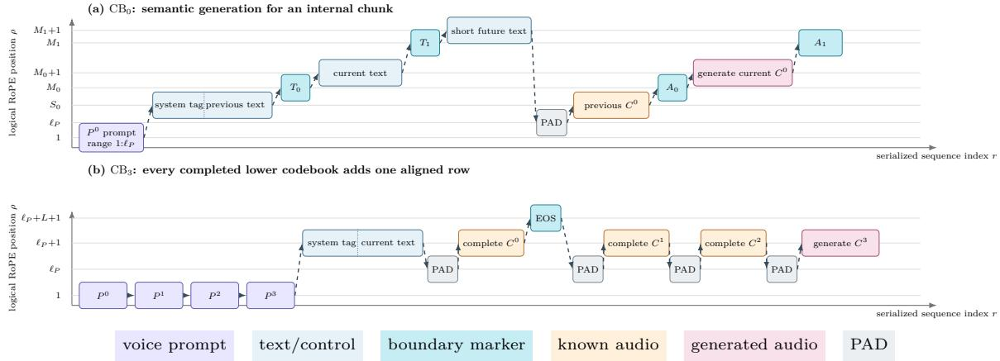
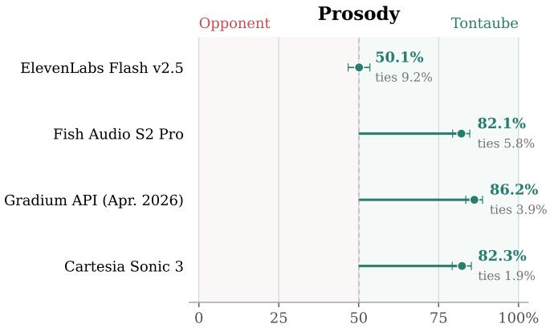
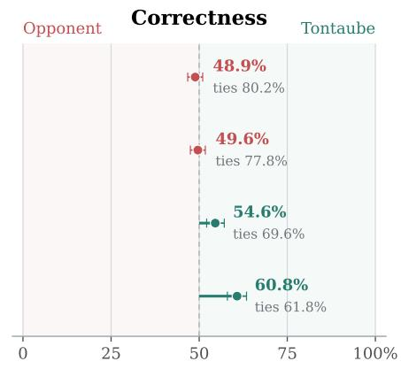

# TontaubeV1: Streaming Text-to-Speech with Hierarchical Codec Modeling and Bounded Context

Fritz Cremer∗

Jonathan Cremer∗

https://huggingface.co/TontaubeAI/TontaubeV1

https://github.com/craitech/tontaube

## Abstract

Text-to-speech systems often face a trade-of between natural prosody and eficient inference: higher perceptual quality typically comes at increased computational cost and latency. We present TontaubeV1, a model that preserves natural prosody while enabling streaming from a single consumer GPU. Speech is encoded by the hierarchical DualCodec representation at 12.5 Hz, which separates a semantic stream from successive acoustic refinements. Our design assumes that prosodic structure is largely established when the semantic stream is generated, and allocates capacity accordingly: a Qwen3-1.7B-derived transformer predicts that stream and thereby the utterance duration, while three progressively smaller Qwen3-0.6B-derived transformers each add one acoustic refinement. Text is tokenized per character rather than by subword. Paired text and audio markers at shared positions support long-form generation with bounded context, and overlapping DualCodec reconstructions are mapped into the VibeVoice acoustic latent space and decoded causally, enabling streaming despite DualCodec’s noncausal decoder. The model accepts up to one minute of reference audio for voice conditioning and is designed primarily for English and German, with additional multilingual support. The four predictors total 2.9B parameters; on a single RTX 5090 the streaming path reaches approximately 200 ms to first audio. In separate non-streaming measurements, the end-to-end real-time factor (RTF) is 0.08 for one input and the aggregate RTF is 0.02 across eight concurrent inputs. On our LLM-as-a-judge audiobook-reading benchmark, TontaubeV1 matches ElevenLabs Flash v2.5 and outperforms Fish Audio S2 Pro, the April 2026 Gradium API, and Cartesia Sonic 3 on prosody. The model weights are released on Hugging Face under the Tontaube Community Model License 1.0.

## 1 Introduction

Serving text-to-speech at low cost while maintaining high quality presents a trade-of. Larger systems generally produce more natural speech but occupy more GPU memory, cost more per hour of audio, and often take longer to produce their first audio; smaller systems are cheaper and faster but tend to produce flatter prosody, place emphasis poorly, or lose prosodic consistency over longer passages. TontaubeV1 targets the lower-cost end of this range while achieving competitive prosodic quality in our audiobook-reading evaluation. Its four predictors total 2.9B parameters, and the complete system runs and streams on a single consumer GPU.

In speech, the surrounding text and the preceding delivery both carry information about how the next words should sound. We therefore start from a pretrained language model, which attends to both sources of context, and predict discrete audio tokens at a low frame rate: at 12.5 Hz one minute of audio occupies 750 tokens, which lets the model retain substantial text and audio context. The audio representation is DualCodec, a residual vector quantizer that biases its first codebook toward semantics [1]. That codebook carries content and timing by itself, while the higher-index codebooks, each encoding residual detail not captured by the preceding codebooks, add acoustic detail. TontaubeV1 keeps that codebook and the next three, and discards the four finest.

Assuming that the first codebook largely determines prosody, we allocate most model capacity to it. A Qwen3-1.7B-derived transformer predicts it; its output carries the intonation contour and its length sets the utterance duration. Three Qwen3-0.6B-derived transformers with progressively fewer blocks then add the acoustic refinements in order [2].

DualCodec’s decoder is not causal, so audio near a chunk boundary depends on frames that lie beyond it. We therefore map overlapping DualCodec reconstructions into the VibeVoice acoustic latent space and decode them with VibeVoice’s causal decoder [3], which lets stable audio be emitted before generation has finished.

We evaluate on audiobook reading. Read prose exposes the failures that matter for naturalness: monotony, misplaced emphasis, and phrase boundaries that fall in the wrong place are audible in continuous reading in a way they are not in isolated words. On our LLM-as-a-judge benchmark, over a corpus of 400 passages, TontaubeV1 matches ElevenLabs Flash v2.5 on prosody and outperforms Fish Audio S2 Pro, the April 2026 Gradium API, and Cartesia Sonic 3. The benchmark covers English reading; it does not establish German or broader multilingual quality, voice similarity, or conversational performance.

The weights are released under the Tontaube license, which permits research use and qualifying commercial use subject to its revenue and service restrictions. They are released on Hugging Face alongside an inference implementation that streams audio as it is generated. The remainder of this report describes the representation, the four predictors, and their input contract (Section 3); the position scheme and the chunking that keeps context bounded (Section 4); inference, streaming reconstruction, and serving performance (Section 5); the benchmark and results (Section 6); and the limitations and release terms (Section 7).

## 2 Related Work

Recent text-to-speech systems increasingly pair a pretrained language-model backbone with a discrete audio codec and generate codec tokens using the autoregressive next-token objective employed in language-model pretraining. Fish-Speech [4] and Qwen3-TTS [5] both take this route, as does TontaubeV1. Qwen3-TTS is the closest published system: it builds on the Qwen3 family and uses a 12.5 Hz multi-codebook tokenizer whose first layer carries semantic content and whose later layers carry acoustic detail.

What difers between such systems is how the stacked codebooks are factorized. One approach interleaves them into a single output stream with a delay pattern, producing all codebooks in one autoregressive pass [6, 7]. Another assigns the coarsest codebook to a large backbone and the residuals to one small shared module that runs per frame, as in Fish-Speech’s Fast Transformer and Qwen3-TTS’s multi-token prediction module; capacity for the residual codebooks is then small and shared. TontaubeV1 instead assigns a separate model to each codebook and sizes them independently. This design requires four checkpoints and sequential execution within each chunk; in return, the acoustic stages can be sized independently, carry no state across chunk boundaries, and be scheduled separately at serving time. Early experiments showed better convergence when each codebook was assigned a separate model, which motivated the factorization used here.

Systems that model continuous latents instead, such as VibeVoice [3], predict the next latent with a difusion head rather than the next code from a fixed vocabulary. The codec architecture is also adopted from prior work: quantizers biased toward linguistic content in their first layer have appeared in prior systems [8, 9], and TontaubeV1 uses DualCodec [1] unchanged.

Three aspects of TontaubeV1 are less common: its character-level text tokenization, position assignment, and streaming reconstruction. We assign rotary positions by when a token occurs rather than by where it sits in the sequence, so corresponding frames of diferent streams share a coordinate and text and audio share one logical position axis. Paired boundary markers keep that timeline aligned across chunks, so a rolling window can discard completed ones and transformer context stays bounded however long the passage is. And because DualCodec’s decoder is not causal, streaming is obtained by re-encoding overlapping reconstructions into VibeVoice’s acoustic latent space for causal decoding rather than by training a causal codec as Qwen3-TTS does.

An earlier model of ours, TontaubeV0 [10], was developed concurrently with Qwen3-TTS and released through an API rather than as weights. It served as the prototype for the design developed further in TontaubeV1.

## 3 Model Architecture

TontaubeV1 models speech as a sequence of discrete codes and generates them autoregressively. Given spoken-form text X, optional reference audio encoded as prompt streams $P ^ { 0 : 3 }$ , and language/style controls left implicit in the notation, the task is to sample from $p ( \bar { C } ^ { 0 : 3 } \mid X , P ^ { 0 : 3 } )$ , where $C ^ { 0 : 3 }$ is the stack of retained codec streams. Because the streams are stacked rather than sequential, several factorizations are possible; TontaubeV1’s is described in Section 3.2.

## 3.1 Speech representation

TontaubeV1 operates on the 12hz\_v1 configuration of DualCodec [1], which encodes 24 kHz audio into eight residual vector-quantized streams at 12.5 Hz. DualCodec quantizes its first layer from self-supervised w2v-BERT-2.0 features [11], which carry phonetic and linguistic information, and the remaining seven layers from acoustic residuals. We call the first stream the semantic stream and the others the acoustic streams. The semantic codebook holds 16,384 entries and each acoustic codebook holds 4,096, giving 14 bits per semantic frame and 12 bits per acoustic frame. Decoded on its own, the semantic stream already yields intelligible speech with recognizable phrasing and intonation, though with substantially reduced acoustic detail.

TontaubeV1 retains the semantic stream and the first three acoustic streams, yielding 625 bit/s, compared with 1,225 bit $\mathrm { \Omega } / \mathrm { s }$ for the full stack. The four finest refinements are omitted because informal listening indicated diminishing improvements in audio quality from the later streams. Throughout, t indexes frames on this 12.5 Hz clock. Each frame holds one token per retained stream, so a stream of L tokens spans L frames, or $L / 1 2 . 5$ seconds.

## 3.2 Four-stage codec generation

Let X be the text, $P ^ { i }$ the reference-audio tokens for stream $i ,$ and $C ^ { i } = ( c _ { 1 } ^ { i } , \dots , c _ { L } ^ { i } )$ the tokens generated for that stream. We write $C ^ { 0 : i } = ( C ^ { 0 } , \ldots , C ^ { i } ) , C ^ { < i } = ( C ^ { 0 } , \ldots , C ^ { i - 1 } )$ , with $C ^ { \bar { < } 0 }$ empty, and $P ^ { 0 : i } = ( P ^ { 0 } , \ldots , P ^ { i } )$ . The chain rule gives the exact coarse-to-fine factorization

$$
p ( C ^ { 0 : 3 } \mid X , P ^ { 0 : 3 } ) = \prod _ { i = 0 } ^ { 3 } p ( C ^ { i } \mid X , P ^ { 0 : 3 } , C ^ { < i } ) .\tag{1}
$$

TontaubeV1 restricts the conditioning structure in Equation 1: stage i receives only the prompt streams ${ \cal { P } } ^ { 0 : i }$ . Its model distribution q therefore factorizes as

$$
q ( C ^ { 0 : 3 } \mid X , P ^ { 0 : 3 } ) = \prod _ { i = 0 } ^ { 3 } q _ { i } ( C ^ { i } \mid X , P ^ { 0 : i } , C ^ { < i } ) .\tag{2}
$$

For $i < 3$ , the stage-i factor is invariant to $P ^ { i + 1 : 3 }$ , corresponding to the conditional-independence assumption $C ^ { i } \perp \breve { P ^ { i + 1 : 3 } } \mid X , P ^ { 0 : i } , C ^ { < i }$ under $q .$

We write $\mathrm { C B } _ { i }$ for the model $q _ { i }$ and refer to the four models as stages. The other design choices are to model each factor with its own network and to generate the factors in order without allowing a later stage to revise an earlier stream. $\mathrm { C B _ { 0 } }$ reads the text and its reference-prompt stream and produces the semantic stream, stopping when it emits a boundary token; the number of tokens it produced is L. Each of $\mathrm { C B } _ { 1 } , \mathrm { C B } _ { 2 } .$ , and $\mathrm { C B _ { 3 } }$ then produces exactly L tokens for its own stream, conditioned on the text, its available prompt streams, and every stream already completed below it. The four streams therefore share one timeline, fixed once by $\mathrm { C B _ { 0 } }$ and unchanged afterwards.

The ordering is an inductive bias rather than a restriction on the exact chain rule. No stage sees tokens from a higher stream. Once a candidate semantic stream $C ^ { 0 }$ is accepted, its tokens and timeline remain fixed. The acoustic stages add residual acoustic detail and may compensate for lower-stage quantization errors, but they do not resample $C ^ { 0 }$ or change its length. The first stage therefore strongly constrains pronunciation, phrasing, and duration. By default, the later stages run at temperature zero, so their decoded outputs are deterministic given $X , P ^ { 0 : 3 }$ , and $C ^ { 0 }$

## 3.3 Input and output

Each stage consumes one flat token sequence and emits tokens from a single codebook. The stages share a common alphabet of character IDs for spoken text, inherited BPE pieces for the language and style labels, and dedicated IDs for structure (<|text\_split|>, <|audio\_split|>, PAD, and the row terminators). Each stage augments the common alphabet with the codec vocabularies of every stream up to and including the one it generates; consequently, the input alphabet of each stage after $\mathrm { C B _ { 0 } }$ contains that of the preceding stage. Each stage emits tokens from its own codebook, plus the structural tokens it is allowed to produce. For CB0 that is 16,384 semantic tokens with a row terminator and <|audio\_split|>; for $\mathrm { C B _ { 1 } }$ to $\mathrm { C B _ { 3 } }$ it is 4,096 acoustic tokens and nothing else. Logits outside the target vocabulary are masked at sampling time.

Table 1 lists the structural tokens. <|im\_start|>, <|im\_end|>, and PAD (<|endoftext|>) are inherited from $\mathrm { Q w e n } ; < | \mathrm { e n d } _ { - } \circ \mathrm { f } .$ \_speech|>, the split markers, and the codec IDs were added.

Table 1: Structural tokens. The acoustic stages are length-matched to $C ^ { 0 }$ and emit no structural tokens of their own.
<table><tr><td>Token</td><td>Read by</td><td>Emitted by Purpose</td><td></td></tr><tr><td>&lt;|im_start|&gt;, &lt;|im_end|&gt;</td><td> $\mathrm { C B _ { 0 } \mathrm { - C B _ { 3 } } }$ </td><td></td><td>delimit the control block</td></tr><tr><td> $< | \tt t e x t \_ s p l i t | >$ </td><td> $\mathrm { C B _ { 0 } \mathrm { - C B _ { 3 } } }$ </td><td></td><td>aligned text boundary</td></tr><tr><td>&lt;|audio_split|&gt;</td><td> $\mathrm { C B _ { 0 } \mathrm { - C B _ { 3 } } }$ </td><td> $\mathrm { C B _ { 0 } }$ </td><td>corresponding boundary in  $C ^ { 0 }$ </td></tr><tr><td>&lt;|end_of_speech|&gt;</td><td> $\mathrm { C B _ { 1 } \mathrm { - C B _ { 3 } } }$ </td><td> $\mathrm { C B _ { 0 } }$ </td><td>stops CBo; terminates its completed row</td></tr><tr><td>PAD</td><td> $\mathrm { C B _ { 0 } \mathrm { - C B _ { 3 } } }$ </td><td></td><td>opens an audio row</td></tr></table>

For $\mathrm { C B _ { 0 } }$ , a minimal request without reference audio is serialized as follows, with · marking a token boundary and $\\sqcup \mathrm { a }$ literal space character. The control block is BPE-encoded; within the spoken-text segment, each character occupies one token.

in <|im\_start|> · english · ␣: · ␣audi · obook · <|im\_end|> · \n · H · i · ␣ · t · h · e · r · e · . · \n · PAD out $c _ { 1 } ^ { 0 } \cdot c _ { 2 } ^ { 0 } \cdot \ldots \cdot c _ { L } ^ { 0 }$ · <|end\_of\_speech|>

The acoustic stages reuse that prefix and append one line per completed row. The full layout for $\mathrm { C B _ { 3 } }$ with the prompt block omitted, is:

$$
\begin{array} { r l } { \mathrm { i n ~ } } & { ~ < | \mathrm { i m \_ s t a r t } | > \cdot \mathrm { e n g l i s h \cdot \_ u \cdot \cdot } \cup \mathrm { a u d i \cdot \ o b o o l \cdot \times \cdot } | \mathrm { i m \_ e n d } | > \cdot \setminus \mathrm { n \_ s u b } } \\ & { ~ \mathrm { H \cdot \ i \cdot } _ { \cdot } \cdot \mathrm { t \cdot h \cdot } \circ \cdot \mathrm { \boldsymbol { r } \cdot } \circ \cdot \\\mathrm { \boldsymbol { \cdot } \cdot } \setminus \mathrm { n \_ ~ } } \\ & { ~ \mathrm { P A D \cdot \it c _ { 1 } ^ { 0 } \cdot \cdot \cdot } \cdot \cdot \boldsymbol { c _ { L } ^ { 0 } } \cdot < | \mathrm { e n d \_ o f \_ s f e e c h } | > } \\ & { ~ \mathrm { P A D \cdot \ } c _ { 1 } ^ { 1 } \cdot \cdot \cdot \cdot \cdot c _ { L } ^ { 1 } } \\ & { ~ \mathrm { P A D \cdot \ } c _ { 1 } ^ { 2 } \cdot \cdot \cdot \cdot \cdot c _ { L } ^ { 2 } } \\ & { ~ \mathrm { P A D \cdot \ } } \\ & { \mathrm { o u t } \quad c _ { 1 } ^ { 3 } \cdot \cdot \cdot \cdot \cdot c _ { L } ^ { 3 } } \end{array}
$$

$\mathrm { C B _ { 1 } }$ and $\mathrm { C B _ { 2 } }$ are the same with fewer rows: $\mathrm { C B _ { 1 } }$ has only the $C ^ { 0 }$ row before its target, and $\mathrm { C B _ { 2 } }$ has $C ^ { 0 }$ and $C ^ { 1 }$

Only $C ^ { 0 }$ is followed by <|end\_of\_speech|>, since it is the one row whose length is not known in advance; $C ^ { 1 }$ and $C ^ { 2 }$ are length-matched to it. Appendix A shows how text and audio split markers delimit a continuation. In ordinary chunk-local acoustic refinement, $\mathrm { C B _ { 1 } \mathrm { - C B _ { 3 } } }$ encounter neither split marker. When a continuation prefix is supplied, they receive <|text\_split|> between the prefix and current text and <|audio\_split|> at the corresponding boundary in $C ^ { 0 }$

The text to be spoken $X = ( x _ { 1 } , \ldots , x _ { n } )$ is tokenized one character at a time. Rather than introduce a character vocabulary, TontaubeV1 reuses IDs the inherited tokenizer already produces: each character is encoded on its own, and only the first resulting ID is kept, even when the tokenizer returns several. Writing B for the inherited Qwen tokenizer and first for the first element of a token sequence,

$$
\tau ( X ) = \bigl ( \mathrm { f i r s t } ( B ( x _ { 1 } ) ) , \dots , \mathrm { f i r s t } ( B ( x _ { n } ) ) \bigr ) ,\tag{3}
$$

so ordinary content occupies exactly n tokens and no merge crosses a character boundary. Two things follow. Chunk sizes, lookahead windows, and text positions are measured in a unit that does not depend on neighbouring words. And pronunciation is learned over a few hundred character IDs rather than tens of thousands of sparsely observed subword types, so character-to-sound patterns are reused across words and spellings and inference text is composed almost entirely of well-observed IDs. Case is preserved; the released inference path does not lowercase input text. Its mechanical sanitizer strips surrounding whitespace, collapses runs of spaces and tabs to one space, preserves a single newline and at most one blank line, and maps other vertical whitespace to newlines. It appends a period to each nonempty string it sanitizes unless the string’s final character is ., !, ?, ;, :, or ,. When the inference engine builds a model input, it strips each resulting chunk again, adds exactly one leading space to every chunk but the first, and adds a newline only to the last; callers do not supply these boundary cues.

Table 2: Released predictor architecture and parameter accounting. Stored parameter counts are the total number of tensor elements in the released safetensors checkpoints. Restricted-input counts subtract input embedding rows unused by the documented input grammar; all output-head rows remain active. DualCodec, VibeVoice, and the optional verbalizer are excluded.
<table><tr><td>Model</td><td>Blocks</td><td>Width</td><td>FFN</td><td>Embedding rows</td><td>Retained input rows</td><td>Stored parameters</td><td>Restricted-input parameters</td></tr><tr><td>CB0</td><td>28</td><td>2,048</td><td>6,144</td><td>168,057</td><td>34,955</td><td>1,829,116,930</td><td>1,556,524,034</td></tr><tr><td>CB1</td><td>16</td><td>1,024</td><td>3,072</td><td>172,153</td><td>39,052</td><td>448,960,512</td><td>312,665,088</td></tr><tr><td>CB2</td><td>8</td><td>1,024</td><td>3,072</td><td>176,249</td><td>43,148</td><td>327,307,264</td><td>191,011,840</td></tr><tr><td>CB3</td><td>4</td><td>1,024</td><td>3,072</td><td>180,345</td><td>47,244</td><td>268,577,792</td><td>132,282,368</td></tr><tr><td>Total</td><td>56</td><td></td><td></td><td></td><td></td><td>2,873,962,498</td><td>2,192,483,330</td></tr></table>

Ordinary spoken text is character-tokenized; subword tokenization is confined to control syntax. The main control block has the form <|im\_start|>language : style<|im\_end|> followed by a newline, with the label text encoded by the inherited tokenizer and the delimiters as dedicated IDs. The released interface supports the styles audiobook, conversational, and agentic; the supported language labels are listed in Section 7. Labels outside the released sets are not supported.

Reference audio is optional and requires no transcript. Up to roughly 60 seconds are encoded by DualCodec using four quantizers, giving aligned prompt streams of equal length. Stage i is conditioned on the prompt streams $P ^ { 0 } , \ldots , P ^ { i } ;$ in particular, $\mathrm { C B _ { 0 } }$ receives only the semantic prompt. Before serialization, these streams are jointly truncated to a stage-specific maximum of 750, 300, 150, or 100 frames for $\mathrm { C B _ { 0 } }$ through CB , respectively. This corresponds to 60, 24, 12, or 8 seconds at 12.5 Hz. They are then placed back-to-back before the control block, without separator or PAD tokens. Disjoint codec-token ranges preserve stream identity, while logical positions restart at 1 for each stream. PAD tokens are instead used to open the post-text audio rows. A request without reference audio omits the prompt block entirely.

Text verbalization. TontaubeV1 expects X already in spoken form. Digits, dates, currencies, and abbreviations are not reliably pronounced from their written shape, so text containing them must be verbalized first: 1984 must be supplied as nineteen eighty-four or one thousand nine hundred eighty-four, depending on the intended meaning, and the model cannot reliably make that choice from the characters alone. A separately released English verbalizer is available for this purpose. Keeping it separate means its output can be inspected and corrected before synthesis, and callers who need exact control can supply spoken-form text directly; Appendix B gives the details. Text in the other supported languages must be supplied already verbalized.

## 3.4 Predictor architecture

CB0 uses a Qwen3-1.7B-derived backbone; CB1 to $\mathrm { C B _ { 3 } }$ use Qwen3-0.6B-derived backbones with progressively fewer blocks (Table 2) [2]. The inherited input embedding table is extended to support the stage-specific vocabulary described in Section 3.3 and optimized jointly with the transformer backbone.

The inherited language-model head is discarded. In its place each stage uses a newly initialized, untied, two-layer audio head: it expands the transformer state to width 4,096, applies a Mish nonlinearity, and projects to that stage’s audio vocabulary.

Parameter accounting. Table 2 reports two parameter counts per stage. The stored count sums every element in the released checkpoint. The checkpoints keep Qwen’s full embedding table, but the input scheme of Section 3.3 can only produce a fraction of those IDs; the restricted count subtracts the rows that are never reachable, removing 681,479,168 parameters across the four models, or roughly 1.4 GB at bf16. The rows are kept in the release so that later tuning can widen the control-tag vocabulary; implementations that enforce the documented scheme can omit the unreachable rows from the embedding table.

## 3.5 Training

All four predictors were trained exclusively with supervised fine-tuning (SFT) on approximately 200,000 hours of paired speech and text across seven languages, predominantly from public-domain audiobook recordings and openly released speech corpora. We do not disclose further details of the data composition, training schedule, or hyperparameters in this report.

  
Figure 1: Serialization index r versus logical RoPE position $\rho .$ Boxes mark block starts; within each block, r and $\rho$ advance by one per token. Dashed arrows trace physical serialization; their endpoints expose forward jumps, resets, and reused logical coordinates. Panel (a) ends an internal chunk with $A _ { 1 }$ at $M _ { 1 }$ . Panel (b) shows the full $\mathrm { C B _ { 3 } }$ layout; $\mathrm { C B _ { 1 } }$ and CB2 use shorter prefixes. A dotted divider changes labels, not positions. Here, $S _ { k }$ and $M _ { k }$ are the start and boundary coordinates of chunk $k ,$ while $T _ { k }$ and $A _ { k }$ are its paired text and audio markers. In panel (b), EOS denotes the <|end\_of\_speech|> token. It terminates the completed $C ^ { 0 }$ row and does not necessarily mark the end of the passage being refined.

## 4 Positions and Long-Form Layout

Positions are assigned to match an intuitive notion of when each token occurs rather than where it was serialized, which builds temporal alignment into the encoding instead of leaving it to be learned. Passages longer than one context window are generated in chunks under a scheme that keeps the transformer’s context bounded however long the passage grows.

## 4.1 Positions

The inputs of Section 3.3 are a set of rows that share a time axis: the prompt streams, the text, and every stream already completed for the current chunk. We use row for any one of these sequences, whether text or codec. A decoder-only transformer consumes one flat sequence. TontaubeV1 therefore separates physical order from logical time. The tenth semantic frame and the tenth acoustic frame describe the same moment of speech but can be hundreds of token indices apart once serialized; giving them the same coordinate sets their relative positional ofset under RoPE to zero, whatever the layout, since it depends only on coordinate diferences [12]. Text shares the timeline, so character positions remain close to those of the corresponding audio frames; the two clocks run at diferent rates and are realigned at each chunk boundary (Section 4.2).

For position assignment, the control block and spoken text are treated as a single text row. Writing $\ell _ { P }$ for the length of one prompt stream, N for the total length of this row, and L for the audio length, the coordinates are
<table><tr><td>Block</td><td>Positions</td></tr><tr><td>each prompt stream  $P ^ { j }$ </td><td> $1 , \ldots , \ell _ { P }$ </td></tr><tr><td>each PAD opening an audio row</td><td> $\ell _ { P }$ </td></tr><tr><td>text row</td><td> $\ell _ { P } + 1 , \dots , \ell _ { P } + N$ </td></tr><tr><td>each codec row  $C ^ { j }$ </td><td> $\ell _ { P } + 1 , \dots , \ell _ { P } + L$ </td></tr><tr><td>&lt;|end_of_speech|&gt; after  $C ^ { 0 }$ </td><td> $\ell _ { P } + L + 1$ </td></tr></table>

Three things follow. The prompt streams overlay one another rather than running end to end, so four streams of $\ell _ { P }$ frames occupy $\ell _ { P }$ coordinates, not $4 \ell _ { P }$ . Under this convention, text and audio both start at $\ell _ { P } + 1$ , thereby placing them on the same logical timeline. And frame t carries position $\ell _ { P } + t$ in every row, whether it comes from a completed lower stream or the one being generated, so physical order determines causal visibility, while shared coordinates encode simultaneity. These are within-chunk coordinates; the chunk markers sit at boundaries given by Equation 4 below. Figure 1 plots serialized sequence index r against logical position $\rho ,$ for $\mathrm { C B _ { 0 } }$ mid-passage and for the full $\mathrm { C B _ { 3 } }$ prefix.

## 4.2 Chunk boundaries

Long passages are split into paired text and audio segments. Text advances one position per character and audio one per frame, so within a segment the two drift apart. Each boundary k is therefore given a single position $M _ { k }$ that both jump to, marked by <|text\_split|> in the text and <|audio\_split|> in the audio. Boundaries advance monotonically, and because character rate and frame rate are close, the positions grow roughly in proportion to elapsed speech.

For segment k starting at logical position $S _ { k } .$ , with text length $n _ { k } ^ { x }$ , available semantic-stream length $n _ { k } ^ { a } .$ and a fixed ofset δ, $M _ { k }$ and the next start are

$$
M _ { k } = S _ { k } + \operatorname * { m a x } ( n _ { k } ^ { x } + \delta , n _ { k } ^ { a } ) , \qquad S _ { k + 1 } = M _ { k } + 1 .\tag{4}
$$

Thus, the larger of $n _ { k } ^ { x } + \delta$ and $n _ { k } ^ { a }$ determines the boundary position. The ofset δ reserves headroom before the semantic length is known, since text and audio lengths can difer in either direction; the released checkpoints use $\delta = 2 5$ character positions, a unit that stays stable across passages because text is tokenized per character (Section 3.3).

## 4.3 Bounded context

TontaubeV1 treats prosodic context as predominantly local, so $\mathrm { C B _ { 0 } }$ keeps one preceding chunk rather than the whole passage. The retained chunk provides local context intended to support continuity across the boundary, while the transformer’s input context remains bounded as the passage grows. For an internal chunk, $\mathrm { C B _ { 0 } \mathrm { ^ { \circ } s } }$ text window holds the previous chunk, the current chunk, and a short lookahead into the next; its audio context holds only the previous chunk’s semantic tokens $C ^ { 0 }$ . Appendix A shows the layout. Once a chunk completes, the oldest text–audio chunk pair is discarded from the transformer’s input window and the window moves on. The paired markers keep the timeline from drifting each time the window moves.

The leading-space and final-newline cues tell $\mathrm { C B _ { 0 } }$ where the window lies in the passage: the space distinguishes noninitial chunks, and the newline distinguishes the final chunk from an internal one. The released splitter caps chunks at 350 characters. On each overlong remainder it cuts after the last period, exclamation mark, question mark, semicolon, colon, or comma within the cap; if none occurs, it cuts at the last space, tab, or newline, and if no such whitespace occurs it splits hard at 350 characters. These punctuation marks form one priority class rather than separate sentence and comma passes. The ceiling is an inference-side context margin, not the training chunk rule: training grouped forced-alignment segments under a joint text-and-audio sequence budget.

## 4.4 Serving

The inference repository ships vLLM adapters for the four predictors. The layout above assigns positions that do not follow the physical sequence index, whereas vLLM’s decode path assumes they do. The adapters resolve this by adding one uniform constant to every prefill coordinate, chosen so that the next identity-indexed decode token has the intended relative positions with respect to the prefill tokens, after accounting for any skipped marker position. The absolute coordinates then difer from those seen in training, but rotary attention depends only on coordinate diferences [12], so every relative ofset, and therefore the learned alignment, is preserved. The custom layout can then use vLLM’s standard decode and KV-cache path with no change to the weights [13, 14].

## 5 Inference

Generation runs coarse to fine, as Section 3.2 describes. $\mathrm { C B _ { 0 } }$ stops on <|audio\_split|>, on <|end\_of\_speech|>, or on a configured generation limit. The sampled stopping symbol is removed from the returned codec codes; the completed $C ^ { 0 }$ conditioning row retains the corresponding boundary marker. Each acoustic stage then generates exactly L tokens from the completed rows below it.

## 5.1 Chunk-local acoustic refinement

CB to $\mathrm { C B _ { 3 } }$ carry no autoregressive state across chunk boundaries. Each conditions only on its prompt streams, the current chunk’s text and complete $C ^ { 0 }$ , and the lower acoustic rows already finished for that same chunk. Two things follow. Voice drift cannot accumulate through cross-chunk acoustic state, and once the semantic stream exists for several chunks, those chunks can be refined concurrently in separate calls or together in one batch. Within a chunk the stages remain strictly ordered: $C ^ { 1 }$ before $C ^ { \bar { 2 } }$ , and $C ^ { 2 }$ before $\bar { C } ^ { 3 }$

## 5.2 Reconstruction

The four retained streams are decoded by DualCodec to 24 kHz audio. That decoder is not causal, so waveform samples near a cut depend on codec frames beyond it, and independently decoding chunks and joining the waveforms could introduce an audible seam at each boundary [15]. TontaubeV1 therefore joins the reconstructed windows in a latent space instead: overlapping DualCodec reconstructions are re-encoded by the VibeVoice acoustic tokenizer, the context-padded central frames of each window are retained, and a single causal VibeVoice decoder cache is carried across the joined sequence [16]. Only VibeVoice’s acoustic encoder and decoder are used, not its language model or difusion head.

For a completed response, reconstruction uses 30-second content windows padded with six seconds of DualCodec context on each available side. VibeVoice encodes the padded waveform, but only the latent frames inside the central window are kept. Those regions are concatenated and decoded in groups with a single bounded-size causal VibeVoice convolutional decoder cache carried across the utterance, so the join occurs in latent space rather than between independently decoded waveform chunks.

More generally, this construction enables streaming with a noncausal codec without retraining it: decode overlapping windows, keep only the stable interiors, and pass them to a causal decoder in its own latent space. This requires a second codec in the inference path and introduces latency by withholding a few audio frames.

## 5.3 Streaming

Streaming applies the same construction incrementally. By default, the system first generates a 40-frame semantic prefix. It withholds five DualCodec frames at each unstable boundary, leaving 35 frames (2.8 seconds) initially eligible for emission. As more frames arrive, the accumulated prefix is decoded and re-encoded, thereby revising the unstable latent boundary region. Whenever another semantic segment becomes available, it commits the newly stable, previously unemitted VibeVoice frames at boundaries aligned to two-second intervals. A persistent, bounded-size convolutional cache carries the finite causal history needed to continue from the committed sequence, and the remaining VibeVoice frames are committed when generation finishes. The system therefore begins emitting audio before generation of the utterance is complete, without introducing a separately decoded waveform boundary at any generation boundary.

## 5.4 Serving performance

The measurements below use one NVIDIA GeForce RTX 5090 with weights resident and the process warmed; startup and model loading are excluded. For a single input text, the time to first encoded audio is approximately 200 ms and the end-to-end real-time factor is 0.08, or about 12.5 times faster than playback. With eight texts generated concurrently, aggregate throughput reaches a real-time factor of approximately 0.02, about 50 times real time.

## 6 Evaluation

Protocol. The frozen corpus contains 400 English book passages of 250–500 characters sampled from the PG-19 test split, which is derived from Project Gutenberg [17]. TontaubeV1 renders them in its audiobook mode, at semantic sampling temperature 0.55 and acoustic temperature zero in every reported comparison. For each passage, TontaubeV1 and the comparator synthesize the same reference text, and each waveform is independently normalized to an average level of −20 dBFS before judging.

For the reported results, we use Gemini as an order-balanced pairwise judge. Gemini 3.1 Pro Preview [18] receives the reference text and both waveforms and judges two dimensions independently: prosody (rhythm, intonation, emphasis, pacing, and naturalness) and word-by-word text correctness. The prompt explicitly directs it to ignore voice identity and timbre as well as recording artifacts, codec artifacts, and overall sound quality; the full instructions are in Appendix C. Each pair is judged exactly twice, once in each presentation order, and FIRST/SECOND outputs are mapped back to system identity before scoring. A TontaubeV1 preference, tie, or comparator preference receives a score of 1, 1/2, or 0, respectively, and the reported preference score is the mean of these values over the 800 judgments. The two calls for a passage are retained separately in the mean rather than collapsed to one categorical verdict. For uncertainty estimation the 400 passages are bootstrap-resampled as paired clusters, so the 800 order-swapped calls are not treated as independent observations.

  
Figure 2: LLM-as-a-judge pairwise audiobook-reading benchmark. Points are TontaubeV1 preference scores over 800 order-balanced judgments; whiskers show 95% bootstrap intervals obtained by resampling the 400 passages as paired clusters. A score of 50% denotes parity. Labels below the points give the tie rate across individual judge calls.

The Fish Audio comparison uses the same frozen cloning reference for both systems. In the remaining comparisons TontaubeV1 uses that reference while the comparators use fixed provider voices: ElevenLabs James, Gradium QETTJoT4n\_WmpL3w, and Cartesia 79f8b5fb-2cc8-479a-80df-29f7a7cf1a3e. Voice identity and timbre are excluded from the judging rubric, but prosody is not fully separable from a cloned reference. The comparisons with ElevenLabs, Gradium, and Cartesia may therefore favor TontaubeV1, which can inherit aspects of the reference recording’s reading style while those systems use fixed provider voices.

Results. Against ElevenLabs Flash v2.5 [19], the prosody score is 50.1% (Figure 2), with an interval that includes parity; correctness is likewise statistically indistinguishable from parity at 48.9%. The prosody scores against Fish Audio S2 Pro [20], the April 2026 Gradium API [21], and Cartesia Sonic 3 [22] are 82.1%, 86.2%, and 82.3% respectively. The correctness interval includes parity against Fish Audio, while the scores against Gradium and Cartesia favor TontaubeV1. Within this English audiobook-reading benchmark, prosody is therefore comparable to ElevenLabs Flash v2.5 and ahead of the other three systems.

On the 1,088 English zero-shot examples of the Seed-TTS evaluation set [23], at semantic sampling temperature 0.6, TontaubeV1 obtains 1.66% mean utterance-level WER with Whisper large-v3 transcription [24].

Validity. This LLM-as-a-judge protocol follows the audio-language-model-as-judge approach of EmergentTTS-Eval, which reports a Spearman correlation of 0.905 between aggregate human and model-judge system rankings in its study [25]. We adapt it to order-balanced pairwise comparisons on a fixed reading set, which gives a repeatable and scalable alternative to commissioning a listener panel for each comparison. We do not claim that this exact Gemini 3.1 protocol has been independently validated against human judgments, or that model judges are superior to human raters.

The benchmark measures English reading prosody and word-level correctness. It does not establish voice similarity, general sound quality, German or broader multilingual performance, long-form continuity, or streaming quality.

## 7 Limitations and Release

Technical limitations. Autoregressive semantic generation can omit, repeat, or alter text and can terminate too early or too late. Reference conditioning may transfer identity imperfectly or reproduce incidental recording properties. Long-form chunking can introduce discontinuities, and the serial four-stage factorization adds latency. The optional generative verbalizer can normalize incorrectly or alter wording. Accepted language or style labels specify the input contract; they do not by themselves establish equal quality or complete coverage. The supported language labels are english, german, spanish, french, italian, dutch, and portuguese. In informal listening, German intonation is strong but phoneme realization is sometimes inaccurate; the remaining languages have not been checked by native speakers, so we report no conclusions about them. Training was weighted toward audiobook speech, so audiobook generation may be more reliable than conversational or agentic generation. The system should be evaluated on the intended domain, language, speakers, text lengths, and deployment hardware before use.

Safety. Voice cloning can enable impersonation, fraud, nonconsensual synthesis, and misleading media. The release includes synthetic reference voices, generated by the model rather than recorded from speakers. Users remain responsible for consent on references they supply. Deployers should obtain permission for reference voices, authenticate callers, rate-limit and log access, disclose that generated audio is synthetic where appropriate, and maintain abuse-response procedures.

Release boundary and attribution. The TTS weights are distributed under the Tontaube Community Model License 1.0 included with the Hugging Face model release, which is not an open-source license. The license defines the permitted uses and applicable commercial requirements; readers should consult it for the terms that apply. The optional verbalizer and inference implementation are both distributed separately under the Apache License 2.0. Users must also comply with the notices and licenses applicable to Qwen3, DualCodec, VibeVoice, vLLM, and other third-party components used by the implementation.

## References

[1] Jiaqi Li, Xiaolong Lin, Zhekai Li, Shixi Huang, Yuancheng Wang, Chaoren Wang, Zhenpeng Zhan, and Zhizheng Wu. DualCodec: A Low-Frame-Rate, Semantically-Enhanced Neural Audio Codec for Speech Generation. In Proceedings of Interspeech 2025, pages 4883–4887, 2025. doi: 10.21437/Interspeech. 2025-468. URL https://www.isca-archive.org/interspeech\_2025/li25e\_interspeech.html.

[2] An Yang, Anfeng Li, Baosong Yang, et al. Qwen3 technical report, 2025. URL https://arxiv.org/ abs/2505.09388.

[3] Zhiliang Peng, Jianwei Yu, Wenhui Wang, Yaoyao Chang, Yutao Sun, Li Dong, Yi Zhu, Weijiang Xu, Hangbo Bao, Zehua Wang, Shaohan Huang, Yan Xia, and Furu Wei. VibeVoice: Expressive podcast generation with next-token difusion. In International Conference on Learning Representations, 2026. URL https://openreview.net/forum?id=FihSkzyxdv.

[4] Shijia Liao, Yuxuan Wang, Tianyu Li, Yifan Cheng, Ruoyi Zhang, Rongzhi Zhou, and Yijin Xing. Fish-Speech: Leveraging large language models for advanced multilingual text-to-speech synthesis, 2024. URL https://arxiv.org/abs/2411.01156.

[5] Hangrui Hu, Xinfa Zhu, Ting He, et al. Qwen3-TTS technical report, 2026. URL https://arxiv.org/ abs/2601.15621.

[6] Jade Copet, Felix Kreuk, Itai Gat, Tal Remez, David Kant, Gabriel Synnaeve, Yossi Adi, and Alexandre Défossez. Simple and controllable music generation. In Advances in Neural Information Processing Systems, volume 36, pages 47704–47720, 2023. doi: 10. 52202/075280-2066. URL https://proceedings.neurips.cc/paper\_files/paper/2023/hash/ 94b472a1842cd7c56dcb125fb2765fbd-Abstract-Conference.html.

[7] Dan Lyth and Simon King. Natural language guidance of high-fidelity text-to-speech with synthetic annotations, 2024. URL https://arxiv.org/abs/2402.01912.

[8] Xin Zhang, Dong Zhang, Shimin Li, Yaqian Zhou, and Xipeng Qiu. SpeechTokenizer: Unified speech tokenizer for speech language models. In International Conference on Learning Representations, 2024. URL https://openreview.net/forum?id=AF9Q8Vip84.

[9] Alexandre Défossez, Laurent Mazaré, Manu Orsini, Amélie Royer, Patrick Pérez, Hervé Jégou, Edouard Grave, and Neil Zeghidour. Moshi: a speech-text foundation model for real-time dialogue, 2024. URL https://arxiv.org/abs/2410.00037.

[10] Fritz Cremer and Jonathan Cremer. TontaubeV0 model card. Model card, Tontaube, April 2026. URL https://tontaube.ai/blog/tontaube-v0-model-card.

[11] Yu-An Chung, Yu Zhang, Wei Han, Chung-Cheng Chiu, James Qin, Ruoming Pang, and Yonghui Wu. w2v-BERT: Combining contrastive learning and masked language modeling for self-supervised speech pre-training. In 2021 IEEE Automatic Speech Recognition and Understanding Workshop, pages 244–250, 2021. doi: 10.1109/ASRU51503.2021.9688253.

[12] Jianlin Su, Murtadha Ahmed, Yu Lu, Shengfeng Pan, Wen Bo, and Yunfeng Liu. RoFormer: Enhanced transformer with rotary position embedding. Neurocomputing, 568:127063, 2024. doi: 10.1016/j.neucom. 2023.127063.

[13] Woosuk Kwon, Zhuohan Li, Siyuan Zhuang, Ying Sheng, Lianmin Zheng, Cody Hao Yu, Joseph E. Gonzalez, Hao Zhang, and Ion Stoica. Eficient memory management for large language model serving with PagedAttention. In Proceedings of the 29th Symposium on Operating Systems Principles, pages 611–626. ACM, 2023. doi: 10.1145/3600006.3613165.

[14] vLLM Project. Registering a model. vLLM 0.16.0 documentation, 2026. URL https://docs.vllm. ai/en/v0.16.0/contributing/model/registration/.

[15] Jiaqi Li et al. DualCodec 0.4.2. Software release, 2025. URL https://pypi.org/project/dualcodec/ 0.4.2/. Released 22 August 2025.

[16] Microsoft. VibeVoice-1.5B. Hugging Face model revision c00898d257e6, 2026. URL https://huggingface.co/microsoft/VibeVoice-1.5B/tree/ c00898d257e6b46004e3e2866a47534085fb685a.

[17] Jack W. Rae, Anna Potapenko, Siddhant M. Jayakumar, Chloe Hillier, and Timothy P. Lillicrap. Compressive transformers for long-range sequence modelling. In International Conference on Learning Representations, 2020. URL https://openreview.net/forum?id=SylKikSYDH.

[18] Google. Gemini 3.1 Pro Preview. Google Cloud model documentation, 2026. URL https: //docs.cloud.google.com/vertex-ai/generative-ai/docs/models/gemini/3-1-pro. Model ID gemini-3.1-pro-preview; accessed 18 August 2026.

[19] ElevenLabs. Eleven Flash v2.5. Oficial Replicate deployment elevenlabs/flash-v2.5, 2026. URL https://replicate.com/elevenlabs/flash-v2.5/readme. Evaluated April 2026 with voice James.

[21] Gradium. Gradium Text-to-Speech API. API model default, 2026. URL https://docs.gradium.ai/ guides/release-notes. Evaluated April 2026 with voice ID QETTJoT4n\_WmpL3w.

[22] Cartesia. Cartesia Sonic 3. API model alias sonic-3, 2026. URL https://docs.cartesia. ai/build-with-cartesia/tts-models/older-models. Evaluated April 2026 with voice ID 79f8b5fb-2cc8-479a-80df-29f7a7cf1a3e.

[23] Philip Anastassiou et al. Seed-TTS: A family of high-quality versatile speech generation models, 2024. URL https://arxiv.org/abs/2406.02430.

[24] OpenAI. Whisper Large v3. Hugging Face model card, 2023. URL https://huggingface.co/openai/ whisper-large-v3.

[25] Ruskin Raj Manku, Yuzhi Tang, Xingjian Shi, Mu Li, and Alexander J. Smola. EmergentTTS-Eval: Evaluating TTS models on complex prosodic, expressiveness, and linguistic challenges using model-as-ajudge. In Advances in Neural Information Processing Systems, volume 38, pages 3514–3564, 2025. doi: 10.52202/085713-0110. Datasets and Benchmarks Track.

[26] vLLM Project. N-Gram speculation. vLLM 0.16.0 documentation, 2026. URL https://docs.vllm. ai/en/v0.16.0/features/spec\_decode/.

## A Chunked generation example

The example of Section 3.3 fits in one chunk. Longer passages are divided into chunks, with matching boundaries represented in $\mathrm { C B _ { 0 } } ^ { \prime }$ s text and audio rows. Consider Hi there. How are you? I hope so. divided into three chunks. When generating the middle chunk, $\mathrm { C B _ { 0 } }$ receives the following layout:

in <|im\_start|> · english · ␣: · ␣audi · obook · <|im\_end|> · \n   
H · i · ␣ · t · h · e · r · e · . previous chunk   
<|text\_split|>   
␣ · H · o · w · ␣ · a · r · e · ␣ · y · o · u · ? current chunk   
<|text\_split|>   
␣ · I · ␣ · h · o · p · e · ␣ · s · o · . · \n lookahead, up to 50 characters   
PAD · c01 · . . . · c0m audio for the previous chunk   
<|audio\_split|>   
out c0m+1 · . . . · c0L · <|audio\_split|> audio for the current chunk only

Four details are visible here that the single-chunk example cannot show. The current chunk begins with a space, as every chunk but the first does, and does not end with a newline, which only the last chunk of a passage carries; together these tell $\mathrm { C B _ { 0 } }$ where it is in the passage. The text row runs past the current chunk into the beginning of the next, so $\mathrm { C B _ { 0 } }$ receives part of the next phrase as lookahead before generating the corresponding audio; this lookahead is truncated at 50 characters, mid-word if necessary. The matching $< | \tt t e x t \_ s p l i t | >$ and <|audio\_split|> share a logical position under Equation $^ { 4 , }$ so the text and audio rows are realigned at the boundary even when the text and audio representations of the same chunk contain diferent numbers of tokens. And because this chunk is internal, $\mathrm { C B _ { 0 } }$ stops at <|audio\_split|> rather than <|end\_of\_speech|>; the window then advances by discarding the oldest text–audio chunk pair. Only the second <|text\_split|> has no matching audio marker in the input because the current chunk’s audio is still being generated; the emitted <|audio\_split|> supplies its counterpart.

## B Text verbalization

The optional verbalizer is an independently trained Qwen3-1.7B model that maps written English to the spoken-form text X consumed by TontaubeV1. It is instructed to expand numbers, dates, times, currencies, and symbols, to standardize abbreviations and initialisms for pronunciation, and otherwise to preserve the wording. Ordinary spans use the Qwen tokenizer, while each digit in a numeric sequence is encoded separately. Inference runs at temperature zero with vLLM’s n-gram prompt-lookup speculative decoding [26].

The checkpoint is English-only, is independent of the four-stage graph, and is excluded from Table 2. Because it is generative, it can normalize incorrectly or alter wording; callers that need exact control can bypass it and supply spoken-form text directly.

## C LLM-as-a-Judge Instructions

For transparency, the instructions supplied with each audio pair are reproduced below. The placeholder {text} was replaced verbatim by the passage for that row; line wrapping below is typographic.

You will hear two text-to-speech audios for the same reference text. Your job is to compare them on TWO dimensions and pick which is better on each.

REFERENCE TEXT:

"{text}"

For EACH dimension, answer "FIRST" if the first audio is meaningfully better, "SECOND" if the second is meaningfully better, or "TIE" if they’re basically equivalent on that dimension.

Dimensions:

\- prosody: rhythm, intonation, emphasis, pacing, naturalness

\- correctness: did it speak the reference text accurately (word-by-word)

CRITICAL — what to IGNORE when comparing:

\- Audio / sound quality (hiss, compression, noise, clipping, tinny timbre).

\- The specific voice timbre (whether it sounds like one speaker vs another).

\- Recording artifacts from the TTS model or codec.

Additional rules:

\- Judge each dimension INDEPENDENTLY. A win on prosody does not imply a win on correctness — they are separate qualities.

\- Do not let audio order (which was played first) influence your judgment.

Respond with ONLY a raw JSON object on a single line, no markdown, no commentary:

"notes": "<one short sentence>"}

{"prosody": "FIRST"|"SECOND"|"TIE", "correctness": "FIRST"|"SECOND"|"TIE",