# Topological Fraud Detection in Latent Transaction Spaces

Avraham Bourla

September 9, 2026

## Abstract

Working entirely on topologically anonymized embeddings, we perform fraud detection using iterative rounds of unsupervised filtering followed by supervised sniping. The result is an ultralow latency privacy–preserving triage that allows institutions to flag suspicious activity without compromising Personally Identifiable Information.

## 1 Introduction

## 1.1 The Privacy Preserving Real Time Fraud Detection Challenge

Although state-of-the-art (SOTA) fraud detection continues to reach new performance benchmarks, the global arms race is intensifying as adversarial tactics evolve to exploit the remaining blind spots in institutional defenses. Global fraud losses are on a steep upward trajectory, accelerating toward a projected \$362 billion—a staggering increase from the estimates of just a few years ago. This surge is reflected in the mounting economic drain per incident; while a single fraudulent dollar cost merchants \$3.36 in 2020, that figure has now climbed to \$4.23 [14]. Because privacy regulations and competitive barriers prevent the sharing of raw transactional data, criminals can exploit the widening information gaps within "black box" institutional security to distribute adversarial patterns across multiple entities without triggering localized detection thresholds. This disconnected defensive landscape ensures that fraudsters scale their operations significantly faster than formal data-sharing agreements can evolve [6].

Despite the widespread recognition that sharing transactional signatures would drastically enhance collective detection rates, titans like Visa and Mastercard continue to hoard data in order to protect their proprietary ’moats’ and maintain a strategic edge over competitors [16, 23]. This defensive isolation leaves the rest of the ecosystem—including banks, merchants, and emerging fintech players—at a severe loss, trapped within information silos with only binary labels and fragmented datasets to inform their risk assessments. This data asymmetry creates a critical mandate for privacy-preserving fraud detection models that can facilitate cross-institutional intelligence sharing without compromising competitive advantages or consumer confidentiality.

While Fully Homomorphic Encryption (FHE), which enables direct computation on ciphertexts, represents an ideal theoretical framework for privacy-preserving networks, it sufers from notoriously high latency, often measured in seconds or even minutes. Such a delay is fundamentally incompatible with the demands of real-time commerce, where sub-millisecond inference has emerged as the gold-standard benchmark for the next generation of transactional AI. Beyond enabling the rapid interception of overt threats and the line-rate filtering of legitimate trafic, such ultra-low latency preserves a frictionless user experience while fortifying the system against high-volume automated attacks [25]. The private sector ofers more viable solutions such as Privacy-Enhancing Technologies (PETs) and multi-party secret-sharing protocols [9]. Nevertheless, these cryptographic primitives face significant latency bottlenecks and communication overheads, with the bottom line being a far cry from the desired 1ms benchmark.

Achieving such ultra-low-latency, privacy-preserving inference will not only level the playing field for smaller fintech entities but also propel the financial sector toward the collaborative maturity seen in fields such as medicine and genomics, where the pooling of privacy-protected insights is a prerequisite for identifying systemic anomalies [22]. Under this paradigm, the flagging of a single malicious pattern allows the entire network to be instantly shielded, neutralizing threats before a transaction ever reaches more computationally intensive institutional models. Such a decentralized ’immune system’ for the global financial network embodies Bruce Schneier’s observation that ’security is a process, not a product’ [20].

## 1.2 Synergizing Topology with Tree-Based Models and Deep Learning

Current regulatory frameworks permit financial institutions to share anonymized datasets by decoupling sensitive identifiers from behavioral signatures [5]. Under these frameworks, participants can exchange mathematical fingerprints that capture structural correlations that are virtually impossible to spoof with simple aliases. The semantic labels of specific features—whether a field represents a ‘home address’ or ‘V1’—are irrelevant in the latent space; only the mathematical dissonance and geometric isolation of fraudulent clusters matter. Consequently, a topological approach allows for the identification of fraud through behavioral geometry alone, providing a robust detection layer that is indiferent to the specific methods of data encryption or anonymization [4, 15].

Our central hypothesis is that fraudulent activity is localized within distinct, well-formed clusters within latent topological embedding spaces [25]. Empirical observations suggest that Uniform Manifold Approximation and Projection (UMAP) is superior to alternative manifold learning techniques for preserving the structural nuances required to visualize fraudulent transactions [13]. For classification, tree-based models consistently deliver superior performance on the tabular datasets that constitute the vast majority of mission-critical transactional data [8]. According to this seminal work, such models provide high-accuracy results in a fraction of the time required by computationally intensive deep learning alternatives, making them the ideal choice for sub-millisecond synchronous gatekeeping.

While classic tree-based models often outperform deep learning on tabular datasets, the expressive power of the latter is indispensable for the nuanced task of characterizing and filtering ’normal’ activity [7]. Trained exclusively on legitimate behavior, a spatial autoencoder (AE) is designed to filter stochastic noise, capturing the underlying manifold of legitimate transactional behavior [24]. By learning to reconstruct typical transaction patterns with high fidelity, the autoencoder identifies the structural dissonance reconstruction error, efectively isolating legitimate signatures within the latent manifold [3]. This enables the system to diferentiate between benign behavioral shifts and genuine adversarial anomalies, ensuring the filter remains robust against temporal concept drift [2].

## 2 Methodological Prerequisites: EDA and Feature Engineering

We begin by deploying the Kaggle credit card anonymous fraud dataset [12], which is a publicly available, highly imbalanced dataset of actual European card transactions. The features V1 through

V28 are anonymized Principal Component Analysis (PCA) transformations of the original confidential variables, preserving privacy while retaining predictive structure. The fraudulent transactions form relatively tight clusters in feature space; Figure 1(a) is a simple scatterplot of the two most important PCA features. One can clearly observe the vast majority of fraudulent transactions lying outside a single dense cluster. While the dataset may appear insuficiently complex for the deployment of a production-grade fraud detection model, it yields the critical exploratory observation: the log base–10 term of the amount has a rough normal distribution.

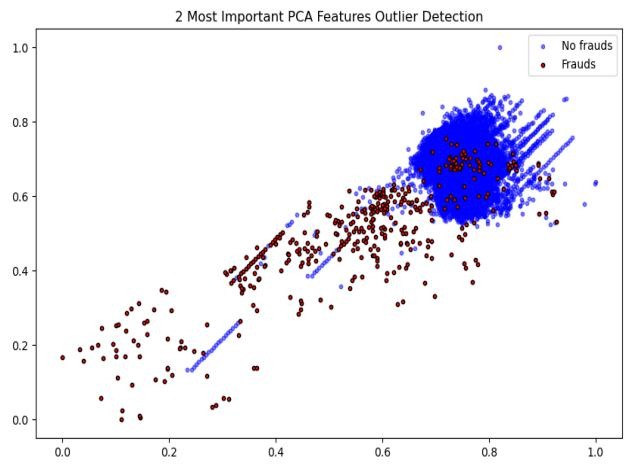  
(a) PCA Clusters

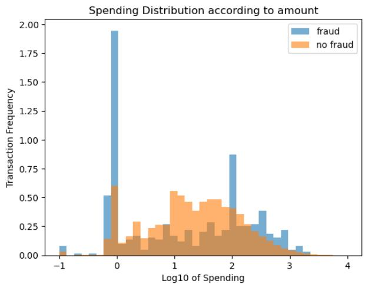  
(b) Log-Amount Dist.  
Figure 1: Exploratory Data Analysis of the Kaggle Dataset

We add the logarithmic z–score feature:

$$
z _ { \mathrm { l o g } } = \frac { \log _ { 1 0 } ( \mathrm { A m o u n t } ) - \mu } { \sigma }
$$

where $\mu$ and $\sigma$ are the prospective mean and standard deviation. Furthermore, we incorporate the leading significant digit—facilitating an analysis of Benford’s Law—alongside the fractional component of each transaction (00–99 cents). This approach is motivated by the heuristic that the distribution of decimal values in fraudulent transactions often exhibits significant divergence from benign patterns. Consequently, we map the transaction amount x to a synthetic feature space by defining the signature:

$$
f ( x ) = \mathrm { F i r s t D i g i t } ( x ) + \frac { \mathrm { C e n t s } ( x ) } { 1 0 0 } .
$$

To support the multiple iterations required for convergence, we employ a training-heavy $8 5 / 5 / 1 0$ stratified split, ensuring the model has suficient data to capture complex patterns within the residuals.

## 3 An Iterative Topological Sniping/Filtering Scheme

We now turn our attention to the IEEE-CIS dataset [11], a large-scale, real-world e-commerce dataset provided by Vesta Corporation. We perform two independent topological projections on the imputed scaled raw data: UMAP and AE. This results in a final dataframe having just 9 columns: amount signature, the $\log _ { 1 0 }$ of the amount, 5 UMAP dimensions, distance to AE bottleneck hot centroid, and the SOM quantization error. As shown in the depicted plots, these AE-derived dimensions successfully distinguish the mean and standard deviation of legitimate and fraudulent rows.

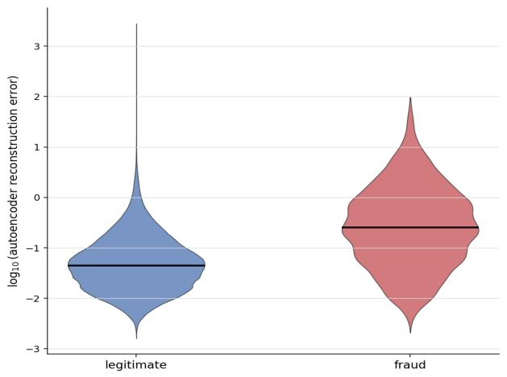  
(a) Reconstruction Error

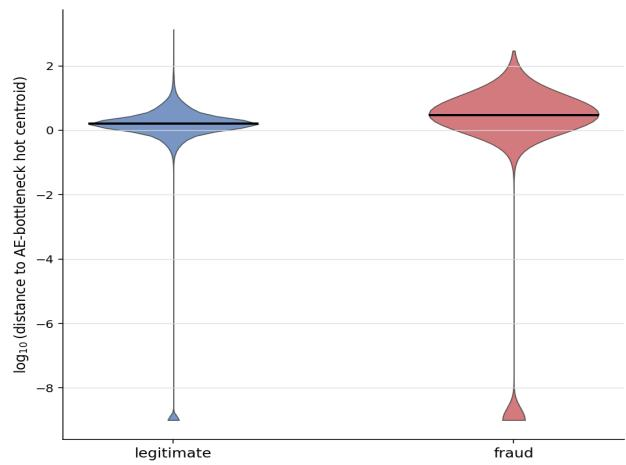  
(b) Distance to Centroid  
Figure 2: Comparative analysis of the Autoencoder features: legitimate vs. fraud

The model follows a single-stage iterative scheme as illustrated below:

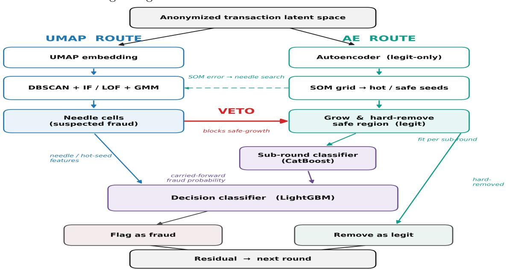

## 3.1 Pre-sniping via Classical Anomaly Detection

Efective fraud sniping requires not only working in small batches but also undersampling each batch, retaining only 50% of the least dense observations. This enables the emergence of distinct structural patterns that would otherwise be obscured by the preponderance of benign data.

Round 1 — UMAP manifold: fraud identified on the UMAP embedding (no SOM cell selection)  
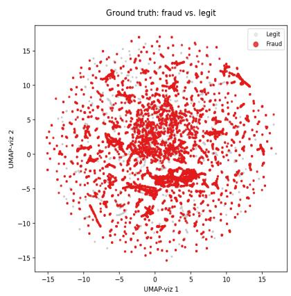

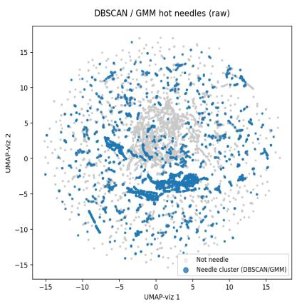

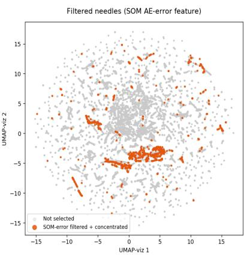  
The unsupervised UMAP embedding is subjected to DBSCAN clustering, where dense neighborhoods form structural kernels while sparse points are relegated to noise. These clusters are subsequently evaluated for anomalous characteristics using metrics such as Isolation Forest (IF) and Local Outlier Factor (LOF). Within the anomaly-flagged subsets, we apply a Gaussian Mixture Model (GMM) to analyze sub-cluster geometry; each component is scored by its covariance eigenvalue ratio—an anisotropic measure of “eccentricity”—under the heuristic that tight, directional sub-clusters are more indicative of coordinated fraud than difuse distributions [4].

## 3.2 Filtering using SOM Clusters

Perhaps the single most important innovation of this methodology is the hard removal of legitimate rows. We achieve this by processing the outputs of the AE stream via a Self-Organizing Map (SOM). Its purpose is to project high-dimensional latent representations onto a low-dimensional manifold while preserving the intrinsic topological relationships between samples [1]. Through iterative alignment of prototype vectors with input data, similar behavioral patterns are mapped to proximal neurons, and a point’s distance to its nearest prototype becomes a second anomaly signal. The spatial autoencoder’s reconstruction error signal translates to the SOM as hot and safe seed cells. The hot seeds are then augmented by the needle-derived sniping logic.

We then allow pruned the safe SOM seeds to expand into clusters along a compactness-weighted frontier, where the sniper’s ‘hot’ clusters is acting as a guardrail:

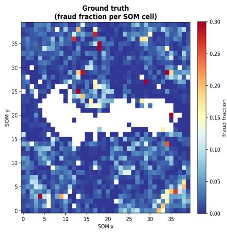

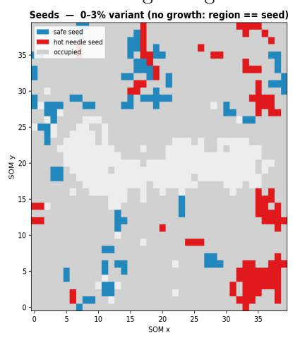

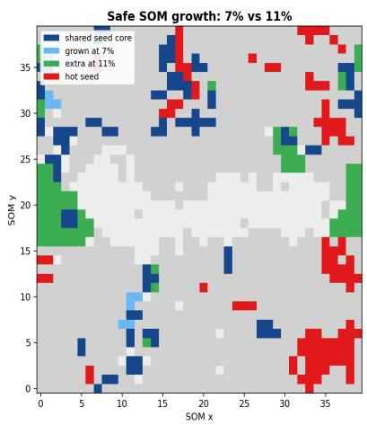  
Following the hard removal of high-confidence legitimate records, the remaining candidates are

classified for soft removal using their latent SOM embeddings. For this classification, we utilize the CatBoost gradient boosting framework, as it is uniquely optimized for operating within anonymized latent feature spaces. By training on these compressed mathematical representations, CatBoost efectively maps the non-linear decision boundaries of fraudulent clusters [19]. Furthermore, its implementation of oblivious, symmetric trees enables bitwise execution, making it exceptionally well-suited for low-dimensional latent features where high-speed inference is critical [10].

## 3.3 The Round Classifier

Actual fraud flagging happens once per iteration, after the SOM/CatBoost safe-removal chain has stripped out high-confidence legit rows and before the final filter pass. It is performed by a LightGBM gradient-boosting classifier, chosen for fast inference and strong precision under our latency budget. LightGBM’s leaf-wise (best-first) tree growth captures complex interactions with fewer nodes than level-wise trees, keeping the boosted ensemble small enough to score every residua row cheaply across all iterations.

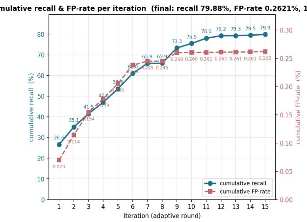

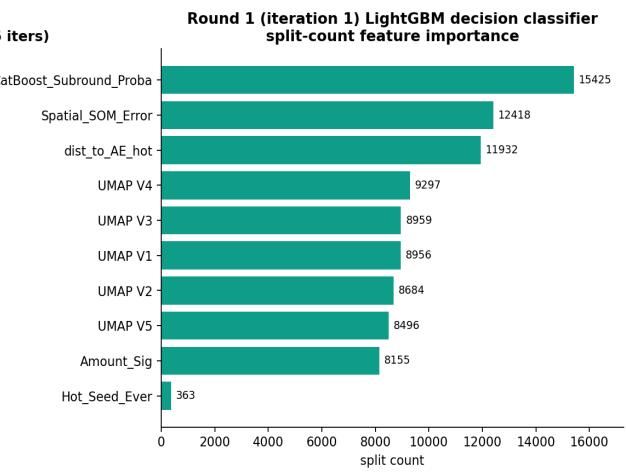

## 4 Results and Conclusions

On the 10% test split, the final confusion matrix for the 0% safe cluster growth vase model yielded TP = 12431, FN = 3132, FP = 1120, TN = 426222. Overall, this model achieves 91.74% precision with 79.88% recall, for an F1 score of 0.8540. Performance benchmarks conducted on the author’s consumer-grade AMD Ryzen 7 3700U machine indicate a mean single-row prediction latency of 4.74 ms, with tail latencies of $P _ { 9 5 } = 6 . 6 1$ ms, $P _ { 9 9 } = 7 . 8 0$ ms, and a $P _ { 1 0 0 }$ of 16.48 ms. Transition to a native compiled backend on production-grade hardware is expected to yield the significant speedup necessary to comfortably clear the 1 ms ultra-low latency benchmark even in worst-case scenarios.

Beyond traditional classification metrics, we evaluate the model using a weighted cost function: $C _ { 1 } 3 = 1 3 \cdot \mathrm { F P + F N }$ , aligned with contemporary industry benchmarks established by the Merchant Risk Council [17]. The 13 weight is applied to account for the substantial economic attrition caused by false positive declines, where the immediate loss of a single fraudulent transaction is significantly outweighed by the long-term impact on Customer Lifetime Value following an erroneous rejection. We can achieve a superior $C _ { 1 3 }$ score

By turning the safe growth ratio knob we achieve the following result (the previously quoted model is the 0-3% case):

1-CatBoost (unite\_cb) single-stage — metrics vs safe-growth fraction (0-3%... 15%  
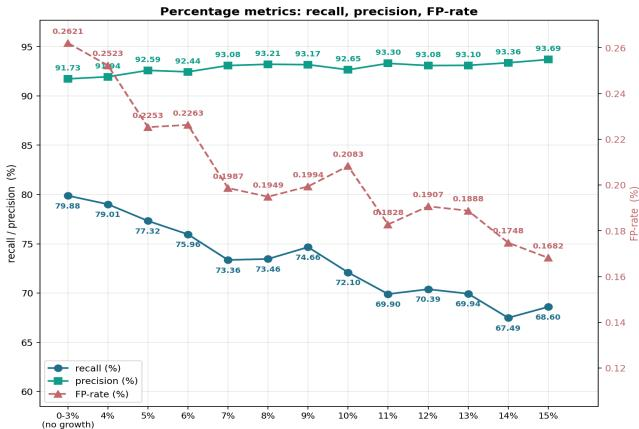

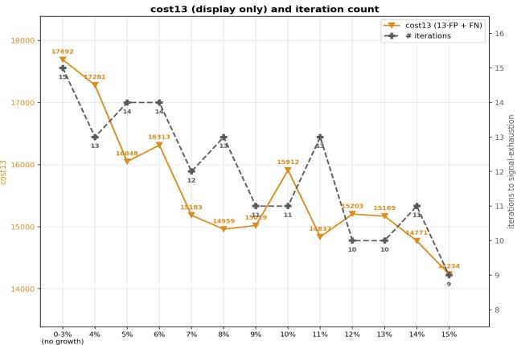

We have demonstrated that an iterative topological sniping and filtering pipeline can efectively identify fraud within anonymized latent spaces while satisfying sub-millisecond latency constraints. Future research must evaluate whether this classifier maintains its eficacy across disparate vendor datasets and shifting temporal scales. Ultimately, the principles developed in this work extend beyond the financial sector; a salient open question is whether this model can be adapted to provide a robust methodology for privacy-sensitive anomaly detection in other high-stakes domains, such as macroeconomics and clinical medicine.

Acknowledgments: The author would like to thank Amir Rozenfeld for his suggestions, encouragement, and good company.

## References

[1] Adejoh, R., Adeyemo, V. E., & Misra, S. (2025). An adaptive unsupervised learning approach for credit card fraud detection. Preprint.

[2] Carlsson, G. (2009). Topology and Data. Bulletin of the American Mathematical Society, 46(2), 255–308.

[3] Chalapathy, R., & Chawla, S. (2019). Deep learning for anomaly detection: A survey. arXiv preprint arXiv:1901.03407.

[4] Chandola, V., Banerjee, A., & Kumar, V. (2009). Anomaly detection: A survey. ACM Computing Surveys (CSUR), 41(3), 1–58.

[5] European Union. (2016). Regulation (EU) 2016/679 (General Data Protection Regulation). Oficial Journal of the European Union, L119, 1–88.

[6] FATF. (2020). Guidance on digital identity. Financial Action Task Force, 1–98.

[7] Goel, A., Hansen, H., & Kanniainen, J. (2026). Topological clustering of agents in information contagions: Application to financial markets. Expert Systems with Applications, 305, 130789.

[8] Grinsztajn, L., Oyallon, E., & Varoquaux, G. (2022). Why do tree-based models still outperform deep learning on tabular data? Advances in Neural Information Processing Systems (NeurIPS), 35, 507–520.

[9] Gupta, S., & Rodriguez, M. (2025). Scalability limits of federated learning for real-time fraud detection in distributed banking systems. In Proceedings of the 2025 International Conference on Applied Cybersecurity (pp. 201–215).

[10] Hancock, J. T., & Khoshgoftaar, T. M. (2020). CatBoost for big data: an interdisciplinary review. Journal of Big Data, 7(1), 1–31.

[11] Vesta Corporation & IEEE Computational Intelligence Society. (2019). IEEE-CIS fraud detection dataset. Kaggle.

[12] Worldline & Machine Learning Group of ULB. (2013). Credit card fraud detection dataset. Kaggle.

[13] Le, K., & Vo, B. (2020). An analysis of dimensionality reduction techniques for credit card fraud detection. International Journal ofAdvanced Computer Science and Applications, 11(10).

[14] LexisNexis. (2023). The True Cost of Fraud Study: Financial Services and Lending. LexisNexis Risk Solutions, 1–45.

[15] Liu, F. T., Ting, K. M., & Zhou, Z. H. (2008). Isolation forest. In 2008 Eighth IEEE International Conference on Data Mining (pp. 413–422). IEEE.

[16] Mastercard. (2024). Mastercard Decision Intelligence: Real-time fraud detection and authorization. Mastercard Technical Specifications, 1–12.

[17] Merchant Risk Council, 2024 Global Fraud and Payments Report, MRC, Cybersource, and Visa, 2024. [Online]. Available: https://www.merchantriskcouncil.org/. Industry benchmark for false positive impact ratios.

[18] Natarajan, S., et al. (2020). A hybrid approach for fraud detection using self-organizing maps. Journal of Financial Technology.

[19] Prokhorenkova, L., Gusev, G., Vorobev, A., Dorogush, A. V., & Gulin, A. (2018). CatBoost: unbiased boosting with categorical features. NeurIPS, 31.

[20] Schneier, B. (2000). Secrets and Lies: Digital Security in a Networked World. John Wiley & Sons.

[21] Thiprungsri, S., & Vasarhelyi, M. A. (2011). Cluster analysis for anomaly detection in accounting data. Journal of Information Systems, 25(1), 125–147.

[22] Torkamani, A., Wineinger, N. E., & Topol, E. J. (2018). The personal and clinical utility of polygenic risk scores. Nature Reviews Genetics, 19(9), 581–590.

[23] Visa. (2023). Visa Advanced Authorization: Empowering issuers to combat fraud. Visa Inc. Product Overview, 1–15.

[24] Zhou, Y., & Pafenroth, R. C. (2017). Anomaly detection with robust deep autoencoders. In Proceedings of the 23rd ACM SIGKDD (pp. 665–674).

[25] Zhu, Y., & Li, J. (2019). Deep learning for fraud detection: A comprehensive review. Journal of Financial Crime, 26(1), 32–54.