# Transformers as In-Context Samplers: From Closed-Form Diffusion to Estimation-Free Sampling

Arman Adibi1 Alireza Jafari2 Mohammad Ghavamzadeh3 Hadi Daneshmand2

1School of Computer and Cyber Sciences, Augusta University 2Department of Computer Science, University of Virginia 3Qualcomm AI Research aadibi@augusta.edu

## Abstract

A growing body of work establishes that large language models are not mere statistical memorizers, but are capable of in-context learning: performing inference at test time using only examples provided in the prompt, without any parameter updates. Prior theoretical work has shown that this capability extends to supervised learning tasks such as linear regression. We prove that in-context learning extends further to data generation: frozen transformers can simulate iterative generative samplers from in-context samples. We first show that transformers can realize closed-form and smoothed closed-form diffusion samplers. The construction identifies a concrete generative role for softmax attention: it computes responsibility weights and weighted empirical averages, while feedforward layers implement Euler updates.

To empirically relate these constructions to pretrained language models, we study semantic-topic sampling: prompts consisting of words drawn from a common semantic category, such as animals, foods, or cities. Across transformer layers, the normalized hidden states exhibit a two-stage geometry: they move toward a uniform spherical reference in intermediate layers and then return to structured, topic-dependent representations near the output. We further measure an interactingparticle energy on these hidden-state clouds and observe the same U-shaped pattern. We then prove that transformers can approximate an energy-based sampler, constructing the same U-shaped energy across the layers.

## 1 Introduction

"In-context learning" [1] has changed how we think about transformers. A transformer can adapt its behavior at inference time using only information provided in a prompt, without updating its parameters. This phenomenon was first made prominent by large language models, where a prompt containing a few demonstrations can induce the model to perform a new task [1–5]. It has since become a central paradigm for studying how models use demonstrations, instructions, and contextual information at inference time [6].

Existing studies have mostly focused on conditional data generation, specifically for supervised learning: the prompt contains examples from an unknown task, and the model predicts the output for a new query. A standard formalization studies prompts of the form

$$
\begin{array} { r } { \underbrace { ( x _ { 1 } , f ( x _ { 1 } ) , \ldots , x _ { k } , f ( x _ { k } ) , x _ { \mathrm { q u e r y } } ) } _ { \mathrm { p r o m p t } } \quad \longmapsto \quad \underbrace { f ( x _ { \mathrm { q u e r y } } ) } _ { \mathrm { c o m p l e t i o n } } . } \end{array}
$$

For example, Garg et al. [7] ask whether transformers can learn simple function classes in context, such as linear functions, sparse linear functions, decision trees, and shallow neural networks. Subsequent work studies whether transformers implement particular learning algorithms in context, including ridge regression, gradient descent, higher-order optimization, and algorithm selection [8–11]. These results suggest that transformers can do more than match surface patterns in the prompt: they can execute nontrivial computations inside their forward pass.

Transformers were originally proposed for conditional text generation [12], but have since become the backbone of powerful unconditional generative models, including latent diffusion models [13]. While recent studies have extensively investigated the mechanistic interpretation of in-context learning in conditional text generation, it remains an open question whether such capabilities extend to unconditional data generation and broader generative modeling applications. In this paper, we ask whether in-context learning extends to data generation:

## Can a transformer implement a sampler in context?

Given i.i.d. samples $x _ { 1 } , \ldots , x _ { n } \in \mathbb { R } ^ { d }$ from an unknown distribution P, a sampling algorithm aims to generate a fresh sample $x _ { n + 1 } \neq x _ { 1 } , . . . , x _ { n }$ from $\mathcal { P } .$ . Akin to the standard settings of generative models, we assume that the density function of the data distribution is unknown, and we only have access to i.i.d. samples from the target distribution. Inspired by prior in-context learning studies [14, 7], we encode the sampling problem as

$$
\begin{array} { r l } { \operatorname * { i n p u t : } \quad x _ { 1 } , \ldots , x _ { n } \sim _ { \mathrm { i . i . d . } } \mathcal { P } } & { \longmapsto \quad \mathrm { o u t p u t : } \quad x _ { n + 1 } \sim \mathcal { P } , } \end{array}
$$

where $x _ { 1 } , \ldots , x _ { n }$ are encoded in the word embeddings of a large language model and $x _ { n + 1 }$ is an output embedding vector. We refer to this prompting strategy as in-context sampling: the transformer parameters remain fixed while the distribution of $\mathcal { P }$ changes at test-time. A model can leverage two sources of information for inference: statistics from training data and information from in-context samples. In-context learning emerges when the model relies on the latter, adapting its response to the in-context input at test time.

Figure 1 illustrates the phenomenon that motivates our study. The model is trained on samples from a face distribution containing the face boundary and eyes, but no smiling mouth, where samples $x _ { 1 } , \ldots , x _ { n }$ are encoded in word embeddings. When the in-context samples come from components seen during training, such as the boundary or the eyes, the generated samples follow the corresponding prompt distribution. The key test is the smiling mouth: although this component is absent from training, providing mouth-shaped samples in context causes the transformer to generate new samples along the same unseen curve. Thus, the model is not simply reproducing the global training distribution or selecting among memorized components. Rather, the inference at test time is based on in-context samples. Our goal is to explain the mechanism underlying this capability.

  
(a)

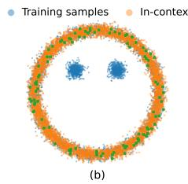

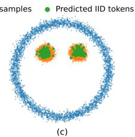

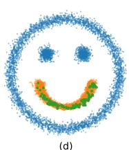  
(d)  
Figure 1: In-context sampling. We train a transformer to generate points from the blue training distribution in panel (a), which contains the face boundary and eyes but excludes the smiling mouth. At test time, the model receives in-context samples shown in orange and generates new samples shown in green. When the context samples are drawn from components present during training, the generated samples follow the face boundary in panel (b) and the eyes in panel (c). Panel (d) gives the out-of-distribution test: the context samples form a smiling mouth, a component entirely absent from training. The model nevertheless generates new samples along the same unseen curve. This indicates that the transformer is using in-context samples for inference, rather than relying on statistics of the training distribution. See the Experiments section for training and data generation details.

## Contributions

We make the following contributions to demonstrate the generative power of transformers.

In-context simulation of diffusion models. We prove that transformers can simulate closed-form diffusion models [15] from in-context samples. Closed-form diffusion models leverage the explicit score function to simulate the backward diffusion process. We show that softmax attention heads are particularly well-suited to compute the empirical score function directly from in-context samples.

Mechanistic analysis of pretrained LLMs. We examine the data generation mechanism in pretrained language models, including GPT-2 [16], Llama-3.3-70B-Instruct [17], OpenLM-Llama-13B/OpenLLaMA [18], Cerebras-GPT-13B [19], Qwen2.5 [20], Falcon-40B [21], OPT-66B [22], and BLOOM-7B1 [23]. The models are prompted by words drawn from the same semantic topic. This prompt construction mirrors the i.i.d. assumption in the in-context sampling setting. Tracking the empirical embedding distributions across layers, we observe that the distribution of normalized embeddings progressively approaches a uniform distribution over a sphere in the middle layers, before becoming non-uniform again towards the output layers. The same U-shaped pattern is observed for the interacting energy of word embedding.

Estimation-free sampling. We identify a sampler whose layer-wise energy profile qualitatively matches the observed U-shaped. We prove that transformers can implement estimation-free sampling (EFS), an energy-based generative framework comprising two steps: (1) transporting the empirical data distribution toward a uniform distribution, and (2) inverting this process to push the empirical distribution toward a target distribution. This two-step mechanism resembles the internal distribution shift observed in pretrained transformers.

Connections to prior work. Our work builds on the algorithmic view of in-context learning, where transformers are studied as models that can execute non-trivial computations from prompts rather than only predict labels [7, 8, 14, 9, 10]. It is also related to diffusion and score-based generative modeling [24–26], as well as Estimation-Free Sampling [27]. The closest work connecting diffusion and in-context learning is Prompt Diffusion [28], which trains a diffusion model to perform visual tasks from in-context examples. Our direction is different: we ask whether a frozen transformer can itself implement diffusion-style and particle-based sampling algorithms from the prompt. A more detailed discussion of related work is deferred to Appendix A.

## 2 Preliminaries

## 2.1 Closed-form diffusion process

Score-based diffusion models [25] are among the most powerful generative models for transporting a simple reference distribution, such as a Gaussian distribution, to a target data distribution. In these models, the transport dynamics are driven by the score function, i.e., the gradient of the log-density of a smoothed data distribution. In practice, this score is typically approximated by a neural network trained through denoising.

In continuous time, the reverse-time generative dynamics can be described through Anderson’s reverse-time diffusion framework [29]. In an abstract form, the reverse time process is written as

$$
d z _ { t } = \left( - z _ { t } - \nabla _ { z } \log p _ { t } ( z _ { t } ) \right) d t + d W _ { t } ,\tag{1}
$$

where $p _ { t }$ denotes the density of the target distribution after Gaussian smoothing at time $t ,$ and $W _ { t }$ is a Wiener process. The term $\nabla _ { z }$ log $p _ { t } ( z _ { t } )$ drives the sample toward regions of high probability under the smoothed data distribution. 1 The Gaussian smoothing and stochastic noise injection play an annealing role: at large noise levels, the density is smoother and easier to explore, while at smaller noise levels, the dynamics refine samples toward the data distribution.

Closed-form diffusion models use the observation that, for a finite empirical distribution, the Gaussiansmoothed density can be written explicitly as a Gaussian mixture [15]. Let $\{ x _ { i } \} _ { i = 1 } ^ { N } \subset \mathbb { R } ^ { d }$ be the empirical dataset. For $t \in ( 0 , 1 )$ , define

$$
\rho _ { t } ^ { \star } ( z ) = \frac { 1 } { N } \sum _ { i = 1 } ^ { N } \phi \big ( z ; t x _ { i } , ( 1 - t ) ^ { 2 } I _ { d } \big ) , \qquad z \in \mathbb { R } ^ { d } ,
$$

where $\phi ( \cdot ; \boldsymbol { \mu } , \Sigma )$ is the Gaussian density with mean $\mu$ and covariance $\Sigma .$ . Thus, $\rho _ { t } ^ { \star }$ is a mixture of isotropic Gaussians centered at the scaled samples $t x _ { i }$ , with covariance $( 1 - t ) ^ { 2 } \dot { I _ { d } } .$

For a current point z, define the responsibility weight of sample $x _ { i }$ by

$$
w _ { i } ( t , z ) = \frac { \phi \big ( z ; t x _ { i } , ( 1 - t ) ^ { 2 } I _ { d } \big ) } { \sum _ { j = 1 } ^ { N } \phi \big ( z ; t x _ { j } , ( 1 - t ) ^ { 2 } I _ { d } \big ) } , \qquad i = 1 , \dots , N .\tag{2}
$$

These weights satisfy $w _ { i } ( t , z ) \geq 0$ and $\begin{array} { r } { \sum _ { i = 1 } ^ { N } w _ { i } ( t , z ) = 1 } \end{array}$ . They measure how much the Gaussian component centered at $t x _ { i }$ contributes to the density at z. Define the corresponding weighted mean $\begin{array} { r } { k _ { t } ( z ) = \sum _ { i = 1 } ^ { N } w _ { i } ( t , z ) ( t x _ { i } ) } \end{array}$ . Since the distribution of $p _ { t } ^ { * } ( z )$ is a Gaussian mixture with explicit density function, its score can be computed in closed-form as [15]

$$
\nabla _ { z } \log \rho _ { t } ^ { \star } ( z ) = \frac { 1 } { ( 1 - t ) ^ { 2 } } \big ( k _ { t } ( z ) - z \big ) .\tag{3}
$$

Thus, the score tells the sampler how to move z: it points from the current point z toward the weighted average $k _ { t } ( z )$ of the data samples.

The sampler converts this score into an update direction, which we write it as

$$
v _ { t } ( z ) = \frac { 1 } { t } \left( z + ( 1 - t ) \nabla _ { z } \log \rho _ { t } ^ { \star } ( z ) \right) .\tag{4}
$$

Here $v _ { t } ( z ) \in \mathbb { R } ^ { d }$ is the direction in which the sampler moves the current point z at time t. Substituting (3) gives

$$
v _ { t } ( z ) = { \frac { 1 } { t } } \left( z + { \frac { 1 } { 1 - t } } { \big ( } k _ { t } ( z ) - z ) { \right) } = - { \frac { 1 } { 1 - t } } z + { \frac { 1 } { t ( 1 - t ) } } k _ { t } ( z ) .
$$

Therefore, the main data-dependent computation is the weighted mean $k _ { t } ( z )$ . Once $k _ { t } ( z )$ is known, the update direction $v _ { t } ( z )$ is a fixed linear combination of z and $k _ { t } ( z )$

Given a time grid $\tau = \{ ( t _ { s } , h _ { s } ) \} _ { s = 0 } ^ { S - 1 }$ , where $0 < t _ { s } < 1$ and $h _ { s } > 0$ , the closed-form diffusion sampler relies on the following recurrence for sampling:

$$
z _ { s + 1 } = z _ { s } + h _ { s } v _ { t _ { s } } ( z _ { s } ) , \qquad s = 0 , \ldots , S - 1 .\tag{5}
$$

This explicit form is central to our construction. The sampler does not require a trained score network: the score and update direction are computed directly from the in-context samples $x _ { 1 } , \ldots , x _ { N }$ . In later sections, we show that a frozen transformer can implement this computation using attention to compute the weights $w _ { i } ( t , z )$ and the weighted mean $k _ { t } ( z )$ , and using feedforward layers to perform the Euler update.

Smoothing. Since the closed-form diffusion model may memorize data, [15] proposes smoothing to avoid data memorization. Smoothing is obtained by averaging the closed-form mean over fixed perturbations of the current state. Let $\sigma \geq 0$ and $\mathcal { E } = \dot { \{ \epsilon _ { m } \} } _ { m = 1 } ^ { M ^ { \smile } } \subset \mathbb { R } ^ { d }$ be fixed perturbation vectors. Define $\begin{array} { r } { k _ { \sigma , t } ( z ) = M ^ { - 1 } \sum _ { m = 1 } ^ { M } k _ { t } ( z + \sigma \epsilon _ { m } ) } \end{array}$ , where $k _ { t } ( \cdot )$ is the closed-form responsibility-weighted mean defined above. The smoothed velocity field is

$$
v _ { \sigma , t } ( z ) = - \frac { 1 } { 1 - t } z + \frac { 1 } { t ( 1 - t ) } k _ { \sigma , t } ( z ) .\tag{6}
$$

Thu $^ { 1 S , }$ the smoothed sampler replaces $k _ { t } ( z )$ by the averaged mean $k _ { \sigma , t } ( z )$ . Setting $\sigma = 0$ recovers the closed-form diffusion method. [15] has examined the data generation capability of the above method in comparison to original denoising diffusion models.

This modification preserves the same transformer-realization structure: attention computes $k _ { t } ( z +$ $\sigma \epsilon _ { m } )$ for each fixed perturbation, the heads are averaged to obtain $k _ { \sigma , t } ( z )$ , and the feedforward layer applies the affine update (6).

## 2.2 Embedding encoding

We encode a closed-form diffusion instance in the input word embedding matrix of a transformer, denoted by

$$
X = \operatorname { E n c } ( \{ x _ { i } \} _ { i = 1 } ^ { N } , z _ { 0 } ) \in \mathbb { R } ^ { ( N + 1 ) \times p } , \qquad p = 3 d + 2 ,
$$

where $z _ { 0 } \in \mathbb { R } ^ { d }$ is a Gaussian random vector which is equivalent to starting state of the closed-form diffusion model defined in (6). The encoded embedding consists of N data tokens and one state token. We write $\boldsymbol { X } \in \mathbb { R } ^ { ( N + 1 ) \times p }$ , with $\displaystyle p = 3 d + 2$ , and define its rows by

$$
X _ { i } = \big [ x _ { i } ^ { \top } , \| x _ { i } \| ^ { 2 } , 0 _ { d } ^ { \top } , 0 _ { d } ^ { \top } , 1 \big ] , \qquad i = 1 , \ldots , N , \quad X _ { N + 1 } = \big [ 0 _ { d } ^ { \top } , 0 , z _ { 0 } ^ { \top } , 0 _ { d } ^ { \top } , 1 \big ] .
$$

Here, the first N rows store the in-context samples, while the final row stores the initial sampler state $z _ { \mathrm { 0 } }$ . Equivalently, each row is partitioned as $X _ { i } = \left[ X _ { i } ^ { ( x ) } \mid X _ { i } ^ { ( r ) } \mid X _ { i } ^ { ( z ) } \mid X _ { i } ^ { ( k ) } \mid X _ { i } ^ { ( 1 ) } \right]$ , where $X _ { i } ^ { ( x ) } , X _ { i } ^ { ( z ) } , X _ { i } ^ { ( k ) } \in \mathbb { R } ^ { d } , X _ { i } ^ { ( r ) } \in \mathbb { R }$ , and $X _ { i } ^ { ( 1 ) } \in \mathbb { R }$ . These four blocks serve distinct purposes in the design: the x and r blocks encode training samples for in-context learning; the z block acts as memory for newly generated samples; and the k block functions as a scratchpad for intermediate computation, inspired by prior work [30]. The state readout map $\Pi _ { \mathrm { s t a t e } } : \mathbb { R } ^ { \mathbf { \hat { m } } \times p }  \mathbb { R } ^ { d }$ extracts the z-block of the final row: $\Pi _ { \mathrm { s t a t e } } ( X ) = X _ { N + 1 } ^ { ( z ) } = X _ { N + 1 , d + 2 : 2 d + 1 }$ . We will later use the above notation to reconstruct the output of a transformer.

## 2.3 Transformer

We use a standard transformer architecture with softmax self-attention [12]. Let $\mathcal { T } _ { \theta } : \mathbb { R } ^ { m \times p }  \mathbb { R } ^ { m \times p }$ denote a depth-L transformer, where m is the number of tokens, p is the token dimension, $L \in \mathbb { N }$ is the number of layers, and θ denotes the collection of attention and feedforward weight matrices. Thus, the transformer maps an input embedding matrix to an output embedding matrix of the same size.

We generate a sample by applying the state readout map $\Pi _ { \mathrm { s t a t e } } : \mathbb { R } ^ { m \times p }  \mathbb { R } ^ { d }$ , defined in the previous section, to the final embedding matrix. For a sampling instance $\{ x _ { i } \} _ { i = 1 } ^ { N }$ with initial state $z _ { 0 }$ the transformer output is $\begin{array} { r } { \widehat { z } _ { L } = \Pi _ { \mathrm { s t a t e } } \overline { { \big ( \mathcal { T } _ { \theta } \big ( \mathrm { E n c } ( \{ x _ { i } \} _ { i = 1 } ^ { N } , \dot { z } _ { 0 } ) \big ) \big ) } } } \end{array}$ . Our goal is to construct parameter choices θ such that $\widehat { z } _ { L }$ matches the output of a specified iterative generative sampler.

## 3 Simulation of Closed-form Diffusion with Transformers

We now show that the transformer architecture in Section 2.3 can simulate the (smoothed) closed-form diffusion sampler by a suitable choice of its parameters. The prompt contains the empirical samples $\{ x _ { i } \} _ { i = 1 } ^ { N } \subset \mathbb { R } ^ { \hat { d } }$ and the initial state $z _ { 0 } \in \mathbb { R } ^ { d }$

Theorem 1 (Transformer simulation of closed-form diffusion). There exists a choice oftransformer parameters $\theta _ { \mathrm { C F D } } ^ { \star }$ such that, for every empirical dataset $\{ x _ { i } \} _ { i = 1 } ^ { N } \subset \mathbb { R } ^ { d }$ and every initial state $z _ { 0 } \in \mathbb { R } ^ { d }$ $i f z _ { L }$ is generated by the closed-form diffusion recursion, then

$$
\Pi _ { \mathrm { s t a t e } } \left( { \cal T } _ { \theta _ { \mathrm { C F D } } ^ { \star } } \big ( \mathrm { E n c } ( \{ x _ { i } \} _ { i = 1 } ^ { N } , z _ { 0 } ) \big ) \right) = z _ { L } ,
$$

where $L$ is the number of attention blocks. Moreover, fix $\sigma \geq 0$ and $\mathcal { E } = \{ \epsilon _ { m } \} _ { m = 1 } ^ { M }$ . There exists another choice oftransformer parameters $\theta _ { \sigma \mathrm { - C F D } } ^ { \star }$ , using the same prompt encoding and state readout, such that,for every empirical dataset and initial state, $i f z _ { L }$ is generated by the smoothed recursion, then

$$
\Pi _ { \mathrm { s t a t e } } \left( { \cal T } _ { \theta _ { \sigma \cdot \mathrm { C F D } } ^ { \star } } \big ( \mathrm { E n c } ( \{ x _ { i } \} _ { i = 1 } ^ { N } , z _ { 0 } ) \big ) \right) = z _ { L } .
$$

The parameter choices may depend on $N , d , \tau$ , and, in the smoothed case, on σ and E, but they do not depend on the realized dataset $\{ x _ { i } \} _ { i = 1 } ^ { N }$ or on $z _ { 0 }$

The theorem states that the standard transformer architecture can be parameterized to execute the closed-form diffusion update rule in context. Notably, the results hold for all possible inputs while the parameters are frozen, showing that the transformer is capable of out-of-distribution generalization. We observe such generalization in Figure 1, where the transformer generates samples from a distribution distinct from the training data. In addition to this out-of-distribution generation, the theorem establishes uniform in-context generalization over the data values: for any fixed context length N, dimension d, and sampling schedule, the same transformer parameters work for every realized dataset $\{ x _ { i } \} _ { i = } ^ { N }$ and every initial state z0.

The proof of Theorem 1 builds on the well-established computational capabilities of softmax attention layers [12], demonstrating that they can implement the iterative closed-form diffusion method. Prior work on in-context learning has similarly shown that transformers can implement various iterative algorithms, including gradient descent for regression [31, 14] and temporal difference learning for reinforcement learning [32]. However, these studies rely on linear attention layers to simplify the analysis. What distinguishes our work from these prior studies is the use of standard softmax attention in place of linear attention [14]. In fact, the softmax normalization is essential to our construction: the closed-form diffusion update requires responsibility weights, which are precisely the normalized weights produced by softmax attention. Such normalization is omitted in linear attention due to the challenges it poses for theoretical analysis.

Remark 1 (Relation to Rosu et al. [33]). Rosu et al. [33] show that transformers can implement in-context denoising steps using a modified attention operator, denoted Attn, which incorporates an RBF-type modification. In contrast, our construction uses the standard softmax self-attention mechanism employed by transformers in practice. The norm-dependent quantities required to compute the Gaussian-mixture responsibilities are included explicitly in our input encoding, rather than recovered through a modification ofthe attention mechanism. Thus, our closed-form diffusion result should be viewed as a warm-up showing that the original transformer architecture, without the RBF modification of[33], can also implement closed-form diffusion modelsfrom in-context samples.

Together, these results show that transformers are expressive enough to implement several sampling algorithms. Expressivity alone, however, does not determine which algorithm best explains the computations learned by a trained transformer. Our main objective is to identify a generative mechanism that captures the layer-wise evolution ofrepresentations in pretrained language models. Closed-form diffusion does not reproduce the observed U-shaped dynamics, in which the empirical embedding distribution first approaches a uniform distribution and subsequently becomes nonuniform. Moreover, the unsmoothed empirical closed-form diffusion model targets the empirical distribution and can therefore regenerate in-context samples. These observations motivate our analysis of Estimation-Free Sampling (EFS), whose forward and backward dynamics closely resemble the observed U-shaped mechanism. Under the corresponding mean-field assumptions, EFS is proved to generate from the underlying data distribution without the data memorization exhibited by the empirical closed-form diffusion model [27].

## 4 Mechanistic Analysis of Pretrained Transformers

We established the expressivity of transformers to implement closed-form diffusion models. In this section, we investigate the internal mechanism of sampling in pretrained transformers. Our goal is not to claim that pretrained language models exactly implement a sampling algorithm. Instead, we study how they shape word embedding distribution for sampling.

In-context sampling can be formulated as generating new words from a semantic topic, such as animals, cities, or foods, given random words from the topic. We construct prompts consisting of random words from a common semantic category to ensure that the i.i.d. assumption holds for sampling: since words are chosen independently at random, they are independent, and drawing samples from the same topic ensures they are identically distributed. Then, we analyze how the distribution of word embeddings changes across the layers. Specifically, we normalize the embeddings and measure their distance to the uniform distribution on the sphere. We use squared maximum mean discrepancy, MMD2, as the distance metric; MMD is a standard kernel-based discrepancy between probability distributions [34]. We use a Gaussian kernel to compute MMD. A smaller MMD2 means that the layer-wise embeddings are closer to a uniform spherical reference distribution.

We observe a two-stage pattern: the distribution of word embeddings spreads toward a uniform distribution over the sphere and then returns toward a non-uniform distribution for three pretrained foundation models. This observation holds for two variants of LLaMA [17, 18] and Cerebras-GPT [19] in Figure 2. To illustrate this dynamic, we present a scatter plot of word embeddings for a small trained model across the layers in Figure 3, where each point represents one word. We can clearly observe the dynamics of convergence to a uniform distribution in the middle layers.

We observe a similar pattern when pretrained language models are prompted with natural sentences rather than i.i.d. words. Specifically, we prompt a pretrained model with natural sentences from the CBT dataset [35]. Figure 4 plots the MMD distance between word embeddings and samples drawn uniformly from the unit sphere. We use only one word embedding for repeated words when computing the MMD distance.

in-context samples predicted samples predicted iid sample

(f) Output  
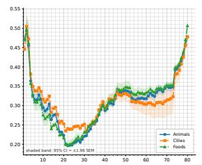  
Llama-3.3-70B-Instruct [17]

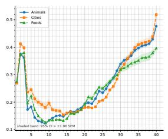  
Openlm-Llama-13b [18]

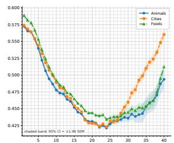  
Cerebras-GPT-13B [19]

Figure 2: Mechanism of sampling in pretrained language models. y-axis: Layer-wise $\mathrm { M M D ^ { 2 } }$ distance between normalized token embeddings and the uniform distribution on the sphere. x-axis: the layer index of word embeddings. The models are prompted with i.i.d. words drawn from categories animal (blue), city (orange), and food (green). Several models exhibit a U-shaped profile: intermediate layers move closer to the uniform reference distribution.  
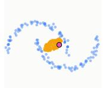  
(a) Layer 1

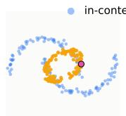  
(b) Layer 3

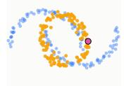  
(c) Layer 5

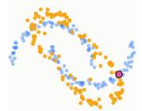  
(d) Layer 10

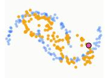  
(e) Layer 15

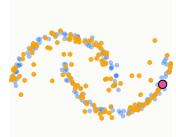

Figure 3: Uniform bias for in-context sampling. A small GPT-2-style model is trained to reproduce samples from the two-moons dataset (see Appendix D for details). Orange points represent intermediate embeddings extracted at layers 1, 3, 5, 10, 15, and output layers, illustrating the progressive data evolution across transformer layers at test time.  
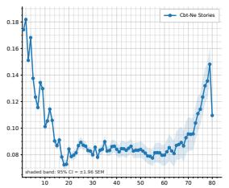  
Llama-3.3-70B-Instruct [17]

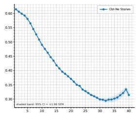  
Cerebras-GPT-13B [19]

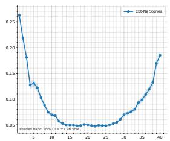  
Openlm-Llama-13b [18]

Figure 4: Uniform intermediate representations in pretrained language models. y-axis: layerwise $\mathrm { M M D ^ { 2 } }$ between normalized token embeddings and the uniform distribution on the unit sphere. x-axis: transformer layer index. Models are prompted with sentences from the CBT dataset, where each repeated word is represented by a single embedding vector.

## 5 Physics of In-context Sampling

## 5.1 Observation: Embeddings as Interacting Particles

While proving the sampling capability, Theorem 1 cannot explain the U-shaped mechanism of sampling in pretrained models discussed in the last section. This is due to the fact that closed-form diffusion does not change the empirical data distribution. We use tools from interacting particles to provide insights into the shaping of the embedding distribution for sampling. Consider the following interacting energy defined over word embeddings

$$
E ( x _ { 1 } , \dots , x _ { N } ) = { \frac { 1 } { N ( N - 1 ) } } \sum _ { \underset { j \neq i } { i = 1 } } ^ { N } \sum _ { \underset { j \neq i } { j = 1 } } ^ { N } W _ { \epsilon } ^ { ( s ) } ( x _ { i } - x _ { j } ) .\tag{7}
$$

where $x _ { 1 } , \ldots , x _ { N } \in \mathbb { R } ^ { d }$ are word embeddings and $W _ { \epsilon } ^ { \left( s \right) }$ is an interacting potentials defined as

$$
W _ { \epsilon } ^ { ( s ) } ( r ) = \frac { 1 } { 2 } \| r \| ^ { 2 } + \frac { 1 } { s ( \| r \| ^ { 2 } + \epsilon ) ^ { s / 2 } } , \qquad r \in \mathbb { R } ^ { d } .
$$

The above interacting potential has been used to model the interactive forces between particles in physics. For example, Smale’s 7th open problem aims at characterizing the solution for s → 0 [36].

The mathematical physics community has made significant advances in studying the distribution of points achieving the minimum energy level. When $s  0 .$ , it is known that the distribution of minimizers converges to a uniform distribution over a sphere as $N  \infty [ 3 7 , 3 8 ]$ . We use this energy function to explain the evolution of the data distribution for sampling observed in the last section.

We compute the energy of word embeddings where $x _ { 1 } , \ldots , x _ { N }$ are word embeddings across layers of pretrained transformers. When the input prompt is generated i.i.d. from the same topic, Figure 5 shows that the energy function produces a U-shaped plot across the layers, similar to the MMD distance plot in Figure 2. Remarkably, optimizing the energy function constructs a sampling method proven by [27]. We prove that a transformer can approximately simulate this method with softmax attention layers and explain how it can explain the U-shape energy dynamics.

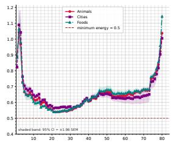  
Llama-3.3-70B-Instruct [17]

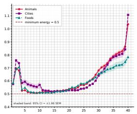  
Openlm-Llama-13b [18]

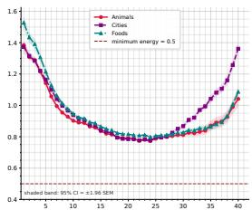  
Cerebras-GPT-13B [19]  
Figure 5: Repulsive-interactive energy of word embeddings. y-axis: the energy function E for word embeddings across the layers of a pretrained transformer. x-axis: the layer index. We compute the energy in the logarithmic limit $s \to 0 ,$ which ensures the minimum energy is 0.5[37], marked with a red dashed line, and normalized the word embeddings to norm 0.78 to compute the energy.

## 5.2 Theory: Energy-based sampling with particle gradient descent

Estimation-Free Sampling (EFS) [27] is an energy-based sampling method that proceeds in two steps: (1) minimizing the energy with gradient descent and then (2) maximizing it with inverse gradient descent. The forward step (1) minimizes the energy function with gradient descent as

$$
x _ { i } ^ { ( j + 1 ) } = x _ { i } ^ { ( j ) } - \gamma \nabla _ { x _ { i } } E _ { N , \epsilon } \big ( x _ { 1 } ^ { ( j ) } , \dots , x _ { N } ^ { ( j ) } \big ) , \qquad j = 0 , \dots , K - 1 .
$$

With gradient descent, the energy function decreases and the empirical distribution of $x _ { 1 } ^ { ( k ) } , \ldots , x _ { N } ^ { ( k ) }$ becomes close to a uniform distribution over a sphere or a ball. When the distribution is uniform, the algorithm generates an additional sample uniformly from the sphere/ball, denoted by $z ^ { ( K ) } \in \mathbb { R } ^ { d }$ . In the backward phase, an initial reference point $z ^ { ( \bar { K } ) } \in \mathbb { R } ^ { d }$ is transported back toward the empirical distribution, through the following recurrence

$$
z ^ { ( j - 1 ) } = z ^ { ( j ) } + \gamma \nabla _ { z } E _ { N , \epsilon } \bigl ( z ^ { ( j ) } , x _ { 1 } ^ { ( j ) } , \dots , x _ { N } ^ { ( j ) } \bigr ) .
$$

The final generated sample is $z ^ { ( 0 ) }$ . We collect the fixed EFS parameters in $\tau = ( K , \gamma , s , \epsilon )$ , together with any fixed schedule choices.

The mechanism of EFS is similar to the U-shaped mechanism in pretrained transformers: it first minimizes the energy function to make the empirical data distribution uniform and then maximizes the energy to generate new samples from the target distribution. We prove that transformers can indeed implement EFS for in-context sampling under a weak assumption.

Theorem 2 (Transformer simulation of EFS). Suppose the EFS iterates remain in a compact set K. Then, for every $\varepsilon > 0 ,$ , there exists a choice of transformer parameters $\theta _ { \mathrm { E F S } } ^ { \star }$ such that, for every admissible in-context samples $x _ { 1 } ^ { ( 0 ) } , \ldots , x _ { N } ^ { ( 0 ) } \in \mathbb { R } ^ { d }$ and $\boldsymbol { z } ^ { ( K ) } \in \mathbb { R } ^ { d } , i f \boldsymbol { z } ^ { ( 0 ) }$ is generated by the EFS forward–backward recursion above, then

$$
\begin{array} { r } { \left\| \Pi _ { \mathrm { s t a t e } } \left( \mathcal { T } _ { \theta _ { \mathrm { E F S } } ^ { \star } } \big ( \mathrm { E n c } _ { \mathrm { E F S } } ( x _ { 1 } ^ { ( 0 ) } , \ldots , x _ { N } ^ { ( 0 ) } , z ^ { ( K ) } ) \big ) \right) - z ^ { ( 0 ) } \right\| \leq \varepsilon . } \end{array}
$$

The parameter choice $\theta _ { \mathrm { E F S } } ^ { \star }$ may depend on $N , d , K , \tau , \varepsilon ,$ , and the compact domain $\kappa ,$ but not on the realized particle cloud $x _ { 1 } ^ { ( 0 ) } , \ldots , x _ { N } ^ { ( 0 ) }$ or reference point $z ^ { ( K ) }$

The theorem states that a standard transformer can be parameterized to execute the EFS update rule in context. Since EFS first makes the data distribution uniform and then non-uniform, a transformer implementing EFS follows the same mechanism across the layers. In other words, transformers are computationally expressive to implement a sampler with a similar U-shaped dynamics of energy observed in Figure 5. This result relies on a particular encoding of inputs explained in the Appendix C.1.

## 6 Experiments

The theory above shows that transformer depth can implement iterative sampling algorithms in context. We now test whether this perspective is visible in trained and pretrained transformers. Our experiments are designed around two questions: (i) can a transformer generate samples from a distribution specified only by the prompt, and (ii) do hidden states exhibit an intermediate transportlike phase consistent with the EFS picture?

In-context sampling in a controlled setting. We train a small GPT-2-style decoder-only transformer [16] on two-dimensional i.i.d. point-cloud sequences using a causal next-token objective. Figure 1 shows a held-out compositional test: the training distribution contains the face boundary and eyes, but no smile component. When smile-shaped points are supplied in context, the model generates new samples along the same crescent geometry. This suggests that the prompt acts as an empirical distribution, rather than merely selecting among memorized training components.

Layerwise transport in a learned sampler. We train the same architecture on two-moons data and project intermediate hidden states back to the data space. The resulting geometry evolves in a transport-like manner: early layers concentrate the generated points, middle layers spread them toward a more uniform configuration, and later layers recover the structured two-moons geometry specified by the context. A full layer-by-layer visualization is provided in Appendix D.2.

Uniformization in pretrained language models. We next examine pretrained language models using prompts of i.i.d. semantic-category words, such as animals, foods, and cities. At each layer, we normalize token embeddings and measure their unbiased RBF MMD2 distance to the uniform distribution on the sphere. Figure 2 shows a U-shaped profile across several models: intermediate layers move closer to the uniform reference, while later layers move away from it toward structured, topic-dependent representations. The same qualitative behavior appears for natural text prompts from the CBT dataset [35] in Figure 4. Additional results and experimental details are deferred to Appendix D.3.

Energy-based evidence. Finally, we evaluate the EFS-style interaction energy on the same hiddenstate clouds. Figure 5 shows that the energy follows the same qualitative middle-layer regularization pattern as the MMD curves. This supports the interacting-particle interpretation: intermediate layers move representations toward a lower-energy, more uniform configuration, while later layers recover structured, topic-dependent geometry.

## 7 Discussion and Limitations

Failure mode across model scales. The uniformization effect is not equally pronounced across all models. In the Qwen2.5 family [20], smaller models exhibit only a short or weak movement toward the uniform reference, whereas larger variants show a clearer two-stage profile as shown in Figure 6. This provides a concrete failure mode for the proposed mechanism: when the model has insufficient effective depth or capacity, the intermediate transport phase may be incomplete. This observation is consistent with our theoretical construction, where transformer depth controls the number of iterative computation steps available to the model. Additional failure-mode experiments for Qwen2.5 and also GPT-2 families are provided in Appendix D.4.

Gap between expressivity and mechanism. Our theoretical results are expressivity statements: they show that some transformer parameters can implement closed-form diffusion and EFS from in-context samples, but they do not prove that pretrained language models execute these algorithm internally. Our experiments provide compatible mechanistic evidence, including middle-layer movement toward a uniform reference distribution and a decrease in EFS-style interaction energy. Still, these observations do not uniquely identify the internal algorithm. This gap is common in in-context learning: prior work shows that transformers can learn regression functions [7], implement gradientdescent-like computations [14, 31], or realize temporal-difference updates [32], but such results mainly characterize representational capacity or behavior in controlled settings. Similarly, our work identifies sampling algorithms that transformers can implement and shows compatible layerwise dynamics, while leaving a full characterization of the mechanism to future work.

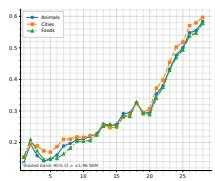  
(a) 1.5B

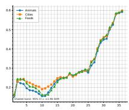  
(b) 3B

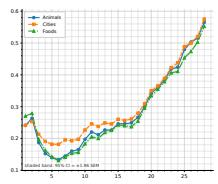  
(c) 7B

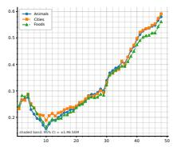  
(d) 14B

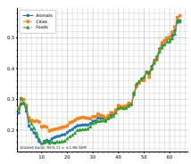  
(e) 32B  
Figure 6: Qwen2.5 family [20] on i.i.d. semantic-category prompts. Unlike the clearer U-shaped profiles observed in larger pretrained models, the Qwen2.5 family exhibits a weaker and less pronounced U-shaped pattern. The curves still suggest a middle-layer movement toward a uniform spherical reference distribution followed by a later movement away from it, but the effect is shorter and less robust across model scales.

Generative AI statement. The authors used generative AI tools to assist with code implementation, proof development and verification, and language editing. All mathematical arguments, experimental results, and generated text were independently reviewed and validated by the authors, who take full responsibility for the content of this paper.

## References

[1] Tom Brown, Benjamin Mann, Nick Ryder, Melanie Subbiah, Jared D Kaplan, Prafulla Dhariwal, Arvind Neelakantan, Pranav Shyam, Girish Sastry, Amanda Askell, et al. Language models are few-shot learners. Advances in neural information processing systems, 33:1877–1901, 2020.

[2] Aakanksha Chowdhery, Sharan Narang, Jacob Devlin, Maarten Bosma, Gaurav Mishra, Adam Roberts, Paul Barham, Hyung Won Chung, Charles Sutton, Sebastian Gehrmann, et al. Palm: Scaling language modeling with pathways. Journal of Machine Learning Research, 24(240): 1–113, 2023.

[3] Josh Achiam, Steven Adler, Sandhini Agarwal, Lama Ahmad, Ilge Akkaya, Florencia Leoni Aleman, Diogo Almeida, Janko Altenschmidt, Sam Altman, Shyamal Anadkat, et al. Gpt-4 technical report. arXiv preprint arXiv:2303.08774, 2023.

[4] Hugo Touvron, Thibaut Lavril, Gautier Izacard, Xavier Martinet, Marie-Anne Lachaux, Timothée Lacroix, Baptiste Rozière, Naman Goyal, Eric Hambro, Faisal Azhar, et al. Llama: Open and efficient foundation language models. arXiv preprint arXiv:2302.13971, 2023.

[5] Hugo Touvron, Louis Martin, Kevin Stone, Peter Albert, Amjad Almahairi, Yasmine Babaei, Nikolay Bashlykov, Soumya Batra, Prajjwal Bhargava, Shruti Bhosale, et al. Llama 2: Open foundation and fine-tuned chat models. arXiv preprint arXiv:2307.09288, 2023.

[6] Qingxiu Dong, Lei Li, Damai Dai, Ce Zheng, Jingyuan Ma, Rui Li, Heming Xia, Jingjing Xu, Zhiyong Wu, Baobao Chang, et al. A survey on in-context learning. In Proceedings of the 2024 conference on empirical methods in natural language processing, pages 1107–1128, 2024.

[7] Shivam Garg, Dimitris Tsipras, Percy S Liang, and Gregory Valiant. What can transformers learn in-context? a case study of simple function classes. In S. Koyejo, S. Mohamed, A. Agarwal, D. Belgrave, K. Cho, and A. Oh, editors, Advances in Neural Information Processing Systems, volume 35, pages 30583–30598. Curran Associates, Inc., 2022. URL https://proceedings.neurips.cc/paper\_files/paper/2022/file/ c529dba08a146ea8d6cf715ae8930cbe-Paper-Conference.pdf.

[8] Ekin Akyürek, Dale Schuurmans, Jacob Andreas, Tengyu Ma, and Denny Zhou. What learning algorithm is in-context learning? investigations with linear models. In International Conference on Learning Representations, 2023.

[9] Yingcong Li, Muhammed Emrullah Ildiz, Dimitris Papailiopoulos, and Samet Oymak. Transformers as algorithms: Generalization and stability in in-context learning. In International Conference on Machine Learning, pages 19565–19594, 2023.

[10] Yu Bai, Fan Chen, Huan Wang, Caiming Xiong, and Song Mei. Transformers as statisticians: Provable in-context learning with in-context algorithm selection. In Advances in Neural Information Processing Systems, volume 36, 2023.

[11] Deqing Fu, Tian-Qi Chen, Robin Jia, and Vatsal Sharan. Transformers learn higher-order optimization methods for in-context learning: A study with linear models. arXiv preprint arXiv:2310.17086, 2023.

[12] Ashish Vaswani, Noam Shazeer, Niki Parmar, Jakob Uszkoreit, Llion Jones, Aidan N Gomez, Łukasz Kaiser, and Illia Polosukhin. Attention is all you need. Advances in neural information processing systems, 30, 2017.

[13] Robin Rombach, Andreas Blattmann, Dominik Lorenz, Patrick Esser, and Björn Ommer. Highresolution image synthesis with latent diffusion models. In Proceedings of the IEEE/CVF conference on computer vision and pattern recognition, pages 10684–10695, 2022.

[14] Kwangjun Ahn, Xiang Cheng, Hadi Daneshmand, and Suvrit Sra. Transformers learn to implement preconditioned gradient descent for in-context learning. Advances in Neural Information Processing Systems, 36:45614–45650, 2023.

[15] Christopher Scarvelis, Haitz Sáez de Ocáriz Borde, and Justin Solomon. Closed-form diffusion models. Transactions on Machine Learning Research, 2025. ISSN 2835-8856. URL https: //openreview.net/forum?id=JkMifr17wc.

[16] Alec Radford, Jeffrey Wu, Rewon Child, David Luan, Dario Amodei, Ilya Sutskever, et al. Language models are unsupervised multitask learners. OpenAI blog, 1(8):9, 2019.

[17] Aaron Grattafiori, Abhimanyu Dubey, Abhinav Jauhri, Abhinav Pandey, Abhishek Kadian, Ahmad Al-Dahle, Aiesha Letman, Akhil Mathur, Alan Schelten, Alex Vaughan, et al. The llama 3 herd of models. arXiv preprint arXiv:2407.21783, 2024.

[18] Xinyang Geng and Hao Liu. Openllama: An open reproduction of llama, May 2023. URL https://github.com/openlm-research/open\_llama.

[19] Nolan Dey, Gurpreet Gosal, Hemant Khachane, William Marshall, Ribhu Pathria, Marvin Tom, Joel Hestness, et al. Cerebras-gpt: Open compute-optimal language models trained on the cerebras wafer-scale cluster. arXiv preprint arXiv:2304.03208, 2023.

[20] A Yang Qwen, Baosong Yang, Beichen Zhang, Binyuan Hui, Bo Zheng, Bowen Yu, Chengpeng Li, Dayiheng Liu, Fei Huang, Haoran Wei, et al. Qwen2. 5 technical report. arXiv preprint, 2024.

[21] Ebtesam Almazrouei, Hamza Alobeidli, Abdulaziz Alshamsi, Alessandro Cappelli, Ruxandra Cojocaru, Mérouane Debbah, Étienne Goffinet, Daniel Hesslow, Julien Launay, Quentin Malartic, et al. The falcon series of open language models. arXiv preprint arXiv:2311.16867, 2023.

[22] Susan Zhang, Stephen Roller, Naman Goyal, Mikel Artetxe, Moya Chen, Shuohui Chen, Christopher Dewan, Mona Diab, Xian Li, Xi Victoria Lin, et al. Opt: Open pre-trained transformer language models. arXiv preprint arXiv:2205.01068, 2022.

[23] BigScience Workshop, Teven Le Scao, Angela Fan, Christopher Akiki, Ellie Pavlick, Suzana Ilic, Daniel Hesslow, Roman Castagné, Alexandra Sasha Luccioni, François Yvon, et al. Bloom:´ A 176b-parameter open-access multilingual language model. arXiv preprint arXiv:2211.05100, 2022.

[24] Jonathan Ho, Ajay Jain, and Pieter Abbeel. Denoising diffusion probabilistic models. Advances in neural information processing systems, 33:6840–6851, 2020.

[25] Yang Song, Jascha Sohl-Dickstein, Diederik P Kingma, Abhishek Kumar, Stefano Ermon, and Ben Poole. Score-based generative modeling through stochastic differential equations. arXiv preprint arXiv:2011.13456, 2020.

[26] Jiaming Song, Chenlin Meng, and Stefano Ermon. Denoising diffusion implicit models. arXiv preprint arXiv:2010.02502, 2020.

[27] Hadi Daneshmand and Ashkan Soleymani. Data generation without function estimation. NeurIPS workshop on optimization for machine learning, 2025.

[28] Zhendong Wang, Yifan Jiang, Yadong Lu, Yelong Shen, Pengcheng He, Weizhu Chen, Zhangyang Wang, and Mingyuan Zhou. In-context learning unlocked for diffusion models. In Advances in Neural Information Processing Systems, volume 36, 2023.

[29] Brian DO Anderson. Reverse-time diffusion equation models. Stochastic Processes and their Applications, 12(3):313–326, 1982.

[30] Hadi Daneshmand. In-context learning for discrete optimal transport: Can transformers sort? In The 29th International Conference on Artificial Intelligence and Statistics.

[31] Johannes von Oswald, Eyvind Niklasson, Ettore Randazzo, João Sacramento, Alexander Mord vintsev, Andrey Zhmoginov, and Max Vladymyrov. Transformers learn in-context by gradient descent. In International Conference on Machine Learning, pages 35151–35174, 2023.

[32] Jiuqi Wang, Ethan H Blaser, Hadi Daneshmand, and Shangtong Zhang. Transformers learn temporal difference methods for in-context reinforcement learning. In ICML 2024 Workshop on In-Context Learning.

[33] Paul Rosu, Lawrence Carin, and Xiang Cheng. From softmax to score: Transformers can effectively implement in-context denoising steps. Advances in Neural Information Processing Systems, 38:142994–143017, 2026.

[34] Arthur Gretton, Karsten M Borgwardt, Malte J Rasch, Bernhard Schölkopf, and Alexander Smola. A kernel two-sample test. The journal of machine learning research, 13(1):723–773, 2012.

[35] Felix Hill, Antoine Bordes, Sumit Chopra, and Jason Weston. The goldilocks principle: Reading children’s books with explicit memory representations. arXiv preprint arXiv:1511.02301, 2015.

[36] Steve Smale. Mathematical problems for the next century. The mathematical intelligencer, 20 (2):7–15, 1998.

[37] Rupert L Frank and Ryan W Matzke. Minimizers for an aggregation model with attractive– repulsive interaction. Archivefor Rational Mechanics and Analysis, 249(2):15, 2025.

[38] Sylvia Serfaty. Mean field limit for coulomb-type flows. Duke Mathematical Journal, 169(15): 2887–2935, 2020. Appendix by Mitia Duerinckx.

[39] Jiachang Liu, Dinghan Shen, Yizhe Zhang, Bill Dolan, Lawrence Carin, and Weizhu Chen. What makes good in-context examples for GPT-3? In Proceedings ofDeep Learning Inside Out: The 3rd Workshop on Knowledge Extraction and Integrationfor Deep Learning Architectures, pages 100–114, 2022.

[40] Yao Lu, Max Bartolo, Alastair Moore, Sebastian Riedel, and Pontus Stenetorp. Fantastically ordered prompts and where to find them: Overcoming few-shot prompt order sensitivity. In Proceedings of the 60th Annual Meeting of the Association for Computational Linguistics, pages 8086–8098, 2022.

[41] Zhiyong Wu, Yaoxiang Wang, Jiacheng Ye, and Lingpeng Kong. Self-adaptive in-context learning: An information compression perspective for in-context example selection and ordering. In Proceedings of the 61st Annual Meeting of the Association for Computational Linguistics, pages 1423–1436, 2023.

[42] Catherine Olsson, Nelson Elhage, Neel Nanda, Nicholas Joseph, Nova DasSarma, Tom Henighan, Ben Mann, Amanda Askell, Yuntao Bai, Anna Chen, et al. In-context learning and induction heads. arXiv preprint arXiv:2209.11895, 2022.

[43] Lean Wang, Lei Li, Damai Dai, Deli Chen, Hao Zhou, Fandong Meng, Jie Zhou, and Xu Sun. Label words are anchors: An information flow perspective for understanding in-context learning. In Proceedings of the 2023 Conference on Empirical Methods in Natural Language Processing, pages 9840–9855, 2023.

[44] Sang Michael Xie, Aditi Raghunathan, Percy Liang, and Tengyu Ma. An explanation of in-context learning as implicit Bayesian inference. In International Conference on Learning Representations, 2022.

[45] Yufeng Zhang, Fengzhuo Zhang, Zhuoran Yang, and Zhaoran Wang. What and how does in-context learning learn? Bayesian model averaging, parameterization, and generalization. arXiv preprint arXiv:2305.19420, 2023.

[46] Damai Dai, Yutao Sun, Li Dong, Yaru Hao, Shuming Ma, Zhifang Sui, and Furu Wei. Why can GPT learn in-context? language models secretly perform gradient descent as meta-optimizers. In Findings ofthe Associationfor Computational Linguistics: ACL 2023, pages 4005–4019, 2023.

[47] Arvind Mahankali, Tatsunori B. Hashimoto, and Tengyu Ma. One step of gradient descent is provably the optimal in-context learner with one layer of linear self-attention. arXiv preprint arXiv:2307.03576, 2023.

[48] Hadi Daneshmand. In-context learning for discrete optimal transport: Can transformers sort? AISTATS, 2026.

[49] Jinze Bai, Shuai Bai, Yunfei Chu, Zeyu Cui, Kai Dang, Xiaodong Deng, Yang Fan, Wenbin Ge, Yu Han, Fei Huang, et al. Qwen technical report. arXiv preprint arXiv:2309.16609, 2023.

## Technical appendices and supplementary material

## A Related Work

In-context learning. In-context learning refers to the ability of a model to adapt its behavior at inference time using only information supplied in the prompt, without updating its parameters. This phenomenon was popularized by large language models [1–5, 17] and has since become a central topic in the study of transformer-based models [6]. Much of the empirical literature studies how performance depends on prompt construction, including the choice, ordering, and formatting of demonstrations [39–41]. Complementary work studies mechanisms behind in-context learning, including induction heads, attention-based information flow, Bayesian inference, and gradient-descent like computation inside transformers [42–46, 31, 14, 47].

Most theoretical studies of in-context learning focus on prediction. In the standard formulation, the prompt contains input–output examples from an unknown task, and the model predicts the output for a new query. Garg et al. [7] showed that transformers trained from scratch can learn simple function classes from examples in the prompt, including linear functions, sparse linear functions, decision trees, and shallow neural networks. Related work studies whether transformers implement particular learning algorithms in context, including ridge regression, gradient descent, higher-order optimization, and algorithm selection [8–11]. Our work follows this algorithmic view, but changes the target from prediction to generation: instead of asking whether a transformer can predict a label or function value, we ask whether it can execute a sampler in context.

Transformers as algorithm executors. A growing line of work studies transformers as models capable of executing structured computations. Prior work has shown that transformer depth and attention can implement iterative optimization procedures, temporal-difference style updates, and discrete optimal transport or sorting-type computations [14, 32, 48, 30]. These results suggest that attention and depth can act as computational resources: attention aggregates information from the prompt, while depth implements repeated updates.

Our results extend this perspective to generative algorithms. Closed-form diffusion and Estimation-Free Sampling are not prediction rules; they are iterative procedures that transform an initial state into a sample. Showing that frozen transformers can implement these procedures in context strengthens the interpretation of transformers as general-purpose algorithm executors. The main difference from prior algorithmic ICL work is that the output of the computation is not a predicted label or regression value, but the terminal state of a sampler.

Diffusion and score-based generative models. Diffusion models generate samples by gradually transforming noise into data through an iterative reverse process [24]. Score-based generative modeling provides a continuous-time formulation in which a forward stochastic process maps data to noise and a reverse-time process generates data from noise using estimated score functions [25]. Related samplers, including DDIM, modify the reverse process through deterministic or implicit updates [26]. These methods have made iterative sampling a central computational paradigm in modern generative modeling.

Our work does not propose a new diffusion model or train a new score network. Instead, we isolate the computational structure of diffusion-style sampling. In the closed-form setting, the score and sampling dynamics are explicit functions of the empirical samples and the current state. This allows us to ask a representational question: can a frozen transformer implement the corresponding sampler when the empirical distribution and initial state are supplied in the prompt? Our answer is affirmative, showing that a core diffusion-style computation can be realized as in-context computation by a transformer.

In-context generation with diffusion models. There is prior work on enabling in-context learning inside diffusion models. Prompt Diffusion trains a diffusion-based model to perform vision tasks from example input–output pairs and a query image, thereby bringing in-context learning to diffusion-based generation [28]. The paper is the closest prior work connecting diffusion models and in-context learning, but its direction is different: it equips a diffusion model with in-context learning ability.

Our question reverses this direction. Rather than asking whether a diffusion model can perform in-context learning, we ask whether a transformer can implement diffusion-style and particle-based samplers in context. Thus, the central object in our paper is not a diffusion architecture conditioned on examples, but a frozen transformer that executes a sampling algorithm specified by the prompt.

Estimation-Free Sampling. Estimation-Free Sampling (EFS) proposes a generative mechanism that avoids explicit score estimation and neural generative training [27]. Instead of learning a score or density-dependent function, EFS uses deterministic particle optimization. Its forward step transports empirical particles toward a simple reference distribution, and its backward step maps a newly sampled reference point back toward the data distribution. The EFS paper explicitly frames this as a generation without score/function estimation, neural-network training, or noise injection in the mean-field regime.

We include EFS because it tests whether in-context sampling is limited to diffusion-style score dynamics. Our result shows that it is not. A frozen transformer can also implement a particleoptimization sampler in context. This broadens the scope of the theory: transformers can realize not only closed-form diffusion updates, but also deterministic particle-based generative algorithms.

Positioning. Taken together, prior work shows that transformers can learn from context, diffusion models can generate through iterative sampling, and particle methods can generate without explicit function estimation. Our contribution connects these threads. We introduce in-context sampling as a framework for studying generative algorithms executed by frozen transformers. In this framework, the prompt specifies the sampling instance, attention computes interactions among samples or particles, and transformer depth performs the iterative updates. This perspective broadens in-context learning from prediction to generation and places closed-form diffusion and Estimation-Free Sampling under a common computational view.

## B Proof of Theorem 1

We use the prompt encoding from Section 2.2. Each token has a block form

$$
X _ { i } = \big [ X _ { i } ^ { ( x ) } , X _ { i } ^ { ( r ) } , X _ { i } ^ { ( z ) } , X _ { i } ^ { ( k ) } , X _ { i } ^ { ( 1 ) } \big ] ,
$$

where $X _ { i } ^ { ( x ) } , X _ { i } ^ { ( z ) } , X _ { i } ^ { ( k ) } \in \mathbb { R } ^ { d }$ , and $X _ { i } ^ { ( r ) } , X _ { i } ^ { ( 1 ) } \in \mathbb { R }$ . For data tokens $i \leq N$

$$
X _ { i } ^ { ( x ) } = x _ { i } , \qquad X _ { i } ^ { ( r ) } = \| x _ { i } \| ^ { 2 } , \qquad X _ { i } ^ { ( z ) } = X _ { i } ^ { ( k ) } = 0 _ { d } , \qquad X _ { i } ^ { ( 1 ) } = 1 .
$$

The state token is $i = N + 1 ;$ its z-block stores the current sampler state and its k-block is scratch space.

Let L be the number of transformer layers. We take $L = S ,$ , one layer per Euler step, and write the schedule as

$$
\boldsymbol { \tau } = \{ ( t _ { \ell } , h _ { \ell } ) \} _ { \ell = 0 } ^ { L - 1 } .
$$

We prove the result by induction over layers. The invariant is that after ℓ blocks, the state token stores zℓ in its z-block and $0 _ { d }$ in its k-block, while the data tokens still store xi and $\| x _ { i } \| ^ { 2 }$ . The base case follows from the prompt encoding. It remains to construct one block $B _ { t , h }$ that maps

$$
z \mapsto z + h v _ { t } ( z )
$$

and resets the scratch block.

## B.1 Attention layer convention

A single-head attention layer is specified by fixed matrices

$$
W _ { Q } , W _ { K } \in \mathbb { R } ^ { p \times d _ { q } } , \qquad W _ { V } \in \mathbb { R } ^ { p \times p } .
$$

For $\boldsymbol { X } \in \mathbb { R } ^ { ( N + 1 ) \times p }$ , define

$$
q _ { i } = X _ { i } W _ { Q } , \qquad k _ { i } = X _ { i } W _ { K } , \qquad v _ { i } = X _ { i } W _ { V } .
$$

The state token attends only to data tokens $1 , \ldots , N$ . Hence

$$
a _ { N + 1 , i } ( X ) = \frac { \exp ( \langle q _ { N + 1 } , k _ { i } \rangle ) } { \sum _ { j = 1 } ^ { N } \exp ( \langle q _ { N + 1 } , k _ { j } \rangle ) } , \qquad i = 1 , \dots , N ,
$$

and

$$
\operatorname { A t t n } ( X ) _ { N + 1 } = \sum _ { i = 1 } ^ { N } a _ { N + 1 , i } ( X ) v _ { i } .
$$

The usual $1 / \sqrt { d _ { q } }$ scaling can be absorbed into $W _ { Q }$ or $W _ { K }$ , so we omit it.

## B.2 One closed-form diffusion step

Fix $t \in ( 0 , 1 )$ and $h > 0$ . By (5),

$$
v _ { t } ( z ) = - \frac { 1 } { 1 - t } z + \frac { 1 } { t ( 1 - t ) } k _ { t } ( z ) .
$$

Thus it suffices for attention to compute $k _ { t } ( z )$

Query, key, and value projection weights. Let

$$
a _ { t } = \frac { t } { ( 1 - t ) ^ { 2 } } , \qquad b _ { t } = - \frac { t ^ { 2 } } { 2 ( 1 - t ) ^ { 2 } } .
$$

Choose $d _ { q } = d + 1$ . With block ordering $( x , r , z , k , 1 )$ , define

$$
W _ { Q } ^ { ( t ) } = \left[ \begin{array} { c c } { 0 _ { d \times d } } & { 0 _ { d \times 1 } } \\ { 0 _ { 1 \times d } } & { 0 } \\ { a _ { t } I _ { d } } & { 0 _ { d \times 1 } } \\ { 0 _ { d \times d } } & { 0 _ { d \times 1 } } \\ { 0 _ { 1 \times d } } & { 1 } \end{array} \right] , \qquad W _ { K } ^ { ( t ) } = \left[ \begin{array} { c c } { I _ { d } } & { 0 _ { d \times 1 } } \\ { 0 _ { 1 \times d } } & { b _ { t } } \\ { 0 _ { d \times d } } & { 0 _ { d \times 1 } } \\ { 0 _ { d \times d } } & { 0 _ { d \times 1 } } \\ { 0 _ { 1 \times d } } & { 0 } \end{array} \right] .
$$

Therefore

$$
q _ { i } = X _ { i } W _ { Q } ^ { ( t ) } = \big [ a _ { t } X _ { i } ^ { ( z ) } , X _ { i } ^ { ( 1 ) } \big ] , \qquad k _ { i } = X _ { i } W _ { K } ^ { ( t ) } = \big [ X _ { i } ^ { ( x ) } , b _ { t } X _ { i } ^ { ( r ) } \big ] .
$$

For the state token $N + 1$ and a data token $i \leq N ,$

$$
\langle q _ { N + 1 } , k _ { i } \rangle = \frac { t } { ( 1 - t ) ^ { 2 } } \langle z , x _ { i } \rangle - \frac { t ^ { 2 } } { 2 ( 1 - t ) ^ { 2 } } \| x _ { i } \| ^ { 2 } .
$$

Moreover,

$$
- \frac { \| z - t x _ { i } \| ^ { 2 } } { 2 ( 1 - t ) ^ { 2 } } = \frac { t } { ( 1 - t ) ^ { 2 } } \langle z , x _ { i } \rangle - \frac { t ^ { 2 } } { 2 ( 1 - t ) ^ { 2 } } \| x _ { i } \| ^ { 2 } - \frac { \| z \| ^ { 2 } } { 2 ( 1 - t ) ^ { 2 } } .
$$

The last term is independent of $i ,$ so it cancels in the softmax over data tokens. Hence

$$
a _ { N + 1 , i } ( X ) = w _ { i } ( t , z ) , \qquad i = 1 , \dots , N ,
$$

where $w _ { i } ( t , z )$ are the responsibility weights defined in (2).

The value projection is the block matrix

$$
W _ { V } ^ { ( t ) } = \left[ \begin{array} { c c c c c } { 0 _ { d \times d } } & { 0 _ { d \times 1 } } & { 0 _ { d \times d } } & { t I _ { d } } & { 0 _ { d \times 1 } } \\ { 0 _ { 1 \times d } } & { 0 } & { 0 _ { 1 \times d } } & { 0 _ { 1 \times d } } & { 0 } \\ { 0 _ { d \times d } } & { 0 _ { d \times 1 } } & { 0 _ { d \times d } } & { 0 _ { d \times d } } & { 0 _ { d \times 1 } } \\ { 0 _ { d \times d } } & { 0 _ { d \times 1 } } & { 0 _ { d \times d } } & { 0 _ { d \times d } } & { 0 _ { d \times 1 } } \\ { 0 _ { 1 \times d } } & { 0 } & { 0 _ { 1 \times d } } & { 0 _ { 1 \times d } } & { 0 } \end{array} \right] .
$$

Thus, for a data token $i ,$

$$
v _ { i } = X _ { i } W _ { V } ^ { ( t ) } = [ 0 _ { d } , 0 , 0 _ { d } , t x _ { i } , 0 ] ,
$$

and the attention output at the state token satisfies

$$
\mathrm { A t t n } ( X ) _ { N + 1 } ^ { ( k ) } = \sum _ { i = 1 } ^ { N } a _ { N + 1 , i } ( X ) t x _ { i } = \sum _ { i = 1 } ^ { N } w _ { i } ( t , z ) ( t x _ { i } ) = k _ { t } ( z ) .
$$

Feedforward update. Let

$$
Y = X + \mathrm { { A t t n } } ( X ) .
$$

The feedforward layer is the row-wise linear map

$$
\mathrm { F F } _ { t , h } ( Y _ { i } ) = Y _ { i } W _ { \mathrm { F F } } ^ { ( t , h ) } ,
$$

where, with the same block ordering $( x , r , z , k , 1 )$

$$
W _ { \mathrm { F F } } ^ { ( t , h ) } = \left[ \begin{array} { c c c c c } { 0 _ { d \times d } } & { 0 _ { d \times 1 } } & { 0 _ { d \times d } } & { 0 _ { d \times d } } & { 0 _ { d \times 1 } } \\ { 0 _ { 1 \times d } } & { 0 } & { 0 _ { 1 \times d } } & { 0 _ { 1 \times d } } & { 0 } \\ { 0 _ { d \times d } } & { 0 _ { d \times 1 } } & { - \frac { h } { 1 - t } I _ { d } } & { 0 _ { d \times d } } & { 0 _ { d \times 1 } } \\ { 0 _ { d \times d } } & { 0 _ { d \times 1 } } & { \frac { h } { t ( 1 - t ) } I _ { d } } & { - I _ { d } } & { 0 _ { d \times 1 } } \\ { 0 _ { 1 \times d } } & { 0 } & { 0 _ { 1 \times d } } & { 0 _ { 1 \times d } } & { 0 } \end{array} \right] .
$$

Equivalently,

$$
\mathrm { F F } _ { t , h } ^ { ( z ) } ( Y _ { i } ) = - \frac { h } { 1 - t } Y _ { i } ^ { ( z ) } + \frac { h } { t ( 1 - t ) } Y _ { i } ^ { ( k ) } , \qquad \mathrm { F F } _ { t , h } ^ { ( k ) } ( Y _ { i } ) = - Y _ { i } ^ { ( k ) } ,
$$

and all other output blocks are zero. For the state token,

$$
Y _ { N + 1 } ^ { ( z ) } = z , \qquad Y _ { N + 1 } ^ { ( k ) } = k _ { t } ( z ) .
$$

Therefore the residual update gives

$$
B _ { t , h } ( X ) _ { N + 1 } ^ { ( z ) } = Y _ { N + 1 } ^ { ( z ) } + \mathrm { F F } _ { t , h } ^ { ( z ) } ( Y _ { N + 1 } ) = z - \frac { h } { 1 - t } z + \frac { h } { t ( 1 - t ) } k _ { t } ( z ) = z + h v _ { t } ( z ) ,
$$

and

$$
B _ { t , h } ( X ) _ { N + 1 } ^ { ( k ) } = Y _ { N + 1 } ^ { ( k ) } + \operatorname { F F } _ { t , h } ^ { ( k ) } ( Y _ { N + 1 } ) = 0 _ { d } .
$$

Thus $B _ { t , h }$ implements one closed-form diffusion Euler step, leaves the data tokens unchanged, and resets the scratch block.

## B.3 Completion of the induction

For each layer $\ell = 0 , \dots , L - 1$ , choose

$$
B _ { \ell } = B _ { t _ { \ell } , h _ { \ell } } .
$$

The parameter choice $\theta _ { \mathrm { C F D } } ^ { \star }$ is obtained by stacking

$$
\mathcal { T } _ { \theta _ { \mathrm { C F D } } ^ { \star } } = B _ { L - 1 } \circ \cdot \cdot \cdot \circ B _ { 0 } .
$$

The base case $\ell = 0$ follows from the prompt encoding. If the induction invariant holds at layer $\ell ,$ then $B _ { \ell }$ updates

$$
z _ { \ell } \mapsto z _ { \ell } + h _ { \ell } v _ { t _ { \ell } } ( z _ { \ell } ) = z _ { \ell + 1 } ,
$$

resets the k-block to zero, and leaves the data tokens unchanged. Hence the invariant holds at layer $\ell + 1$ . By induction, after L layers the state token stores $z _ { L }$ . Therefore

$$
\Pi _ { \mathrm { s t a t e } } \left( { \cal T } _ { \theta _ { \mathrm { C F D } } ^ { \star } } \big ( \mathrm { E n c } ( \{ x _ { i } \} _ { i = 1 } ^ { N } , z _ { 0 } ) \big ) \right) = z _ { L } ,
$$

where $z _ { L }$ is generated by the closed-form diffusion recursion.

## B.4 Smoothed closed-form diffusion

The smoothed case uses the same induction argument, with one modification: the one-step block computes $k _ { \sigma , t } ( z )$ instead of $k _ { t } ( z )$ . Fix $t \in ( 0 , 1 )$ , $h > 0 .$ , smoothing level $\sigma \geq 0$ , and perturbations

$$
\epsilon _ { 1 } , \ldots , \epsilon _ { M } \in \mathbb { R } ^ { d } .
$$

Recall that

$$
k _ { \sigma , t } ( z ) = \frac { 1 } { M } \sum _ { m = 1 } ^ { M } k _ { t } ( z + \sigma \epsilon _ { m } ) .
$$

Thus we compute $k _ { t } \mathopen { } \mathclose \bgroup \left( z + \sigma \epsilon _ { m } \aftergroup \egroup \right)$ for each m and average the results.

Use M attention heads. For head $m ,$ keep $W _ { K } ^ { ( t ) }$ and $W _ { V } ^ { ( t ) }$ as above and replace $W _ { Q } ^ { ( t ) }$ by

$$
W _ { Q , m } ^ { ( \sigma , t ) } = \left[ \begin{array} { c c } { 0 _ { d \times d } } & { 0 _ { d \times 1 } } \\ { 0 _ { 1 \times d } } & { 0 } \\ { a _ { t } I _ { d } } & { 0 _ { d \times 1 } } \\ { 0 _ { d \times d } } & { 0 _ { d \times 1 } } \\ { a _ { t } \sigma \epsilon _ { m } ^ { \top } } & { 1 } \end{array} \right] .
$$

Then the state-token query in head m is

$$
q _ { N + 1 } ^ { ( m ) } = \bigl [ a _ { t } ( z + \sigma \epsilon _ { m } ) , 1 \bigr ] .
$$

For a data token $i \leq N ,$

$$
\langle q _ { N + 1 } ^ { ( m ) } , k _ { i } \rangle = \frac { t } { ( 1 - t ) ^ { 2 } } \langle z + \sigma \epsilon _ { m } , x _ { i } \rangle - \frac { t ^ { 2 } } { 2 ( 1 - t ) ^ { 2 } } \| x _ { i } \| ^ { 2 } .
$$

This equals the Gaussian responsibility logit for the perturbed state $z + \sigma \epsilon _ { m }$ , up to an additive term independent of i. Hence

$$
a _ { N + 1 , i } ^ { ( m ) } ( X ) = w _ { i } ( t , z + \sigma \epsilon _ { m } ) .
$$

Using the same value projection $W _ { V } ^ { ( t ) }$ , head m outputs

$$
\sum _ { i = 1 } ^ { N } w _ { i } ( t , z + \sigma \epsilon _ { m } ) ( t x _ { i } ) = k _ { t } ( z + \sigma \epsilon _ { m } )
$$

in its scratch output. The multi-head output projection averages these heads:

$$
\frac { 1 } { M } \sum _ { m = 1 } ^ { M } k _ { t } ( z + \sigma \epsilon _ { m } ) = k _ { \sigma , t } ( z ) .
$$

The same feedforward matrix $W _ { \mathrm { F F } } ^ { ( t , h ) }$ , with $k _ { t } ( z )$ replaced by $k _ { \sigma , t } ( z )$ , updates the state token to

$$
z + h v _ { \sigma , t } ( z ) = z - \frac { h } { 1 - t } z + \frac { h } { t ( 1 - t ) } k _ { \sigma , t } ( z ) ,
$$

and resets the scratch block.

Applying this construction at every layer $\ell = 0 , \ldots , L - 1$ with $t = t _ { \ell }$ and $h = h _ { \ell }$ , the same induction gives a parameter choice $\theta _ { \sigma \mathrm { - } \mathrm { C F D } } ^ { \star }$ such that

$$
\Pi _ { \mathrm { s t a t e } } \left( { \cal T } _ { \theta _ { \sigma \mathrm { - C F D } } ^ { \star } } \big ( \mathrm { E n c } \big ( \{ x _ { i } \} _ { i = 1 } ^ { N } , z _ { 0 } \big ) \big ) \right) = z _ { L } ,
$$

where $z _ { L }$ is generated by the smoothed closed-form diffusion recursion. This completes the proof.

## C Proof of Theorem 2

## C.1 Prompt encoding for EFS

We now describe the prompt used in Theorem 2. The EFS parameters $\tau = ( K , \gamma , s , \epsilon )$ are fixed and compiled into the transformer weights. The prompt stores only the instance-specific quantities: the initial particles $x _ { 1 } ^ { ( 0 ) } , \ldots , x _ { N } ^ { ( 0 ) }$ and the reference point $z ^ { ( K ) }$

We use $m = N + 2$ tokens. The first N rows are particle tokens, row $N + 1$ stores the reference point $z ^ { ( K ) }$ , and row $N + 2$ is the state token. Each token is partitioned into six blocks:

$$
\left[ ( x ^ { [ 0 ] } , x ^ { [ 1 ] } , \ldots , x ^ { [ K ] } ) ~ \big \vert ~ ( r ^ { [ 0 ] } , r ^ { [ 1 ] } , \ldots , r ^ { [ K ] } ) ~ \big \vert ~ z ~ \big \vert ~ r _ { z } ~ \big \vert ~ g ~ \big \vert ~ 1 \right] .
$$

Here $\boldsymbol { x } ^ { [ j ] } \in \mathbb { R } ^ { d }$ stores the j-th forward particle iterate, $r ^ { [ j ] } \in \mathbb { R }$ stores its squared norm, $z \in \mathbb { R } ^ { d }$ stores the moving point during the backward phase, $r _ { z } \in$ R stores $\| z \| ^ { 2 } , g \in \mathring { \mathbb { R } ^ { d } }$ is scratch space for interaction terms, and the final coordinate is a constant feature. Therefore,

$$
p = ( K + 1 ) d + ( K + 1 ) + d + 1 + d + 1 = ( K + 3 ) d + K + 3 .
$$

The initial prompt is

$$
X _ { \mathrm { E F S } } = [ \begin{array} { c c c c c c c } { ( x _ { 1 } ^ { ( 0 ) } ) ^ { \top } , 0 _ { d } ^ { \top } , \dots , 0 _ { d } ^ { \top } } \\ { \vdots } & { \vdots } & { \vdots } & { \vdots } & { \vdots } & { \vdots } \\ { ( x _ { N } ^ { ( 0 ) } ) ^ { \top } , 0 _ { d } ^ { \top } , \dots , 0 _ { d } ^ { \top } } \\ { 0 _ { d } ^ { \top } , 0 _ { d } ^ { \top } , \dots , 0 _ { d } ^ { \top } } \\ { 0 _ { d } ^ { \top } , 0 _ { d } ^ { \top } , \dots , 0 _ { d } ^ { \top } } & { 0 , 0 , \dots , 0 } & { 0 _ { d } ^ { \top } } \\ { 0 _ { d } ^ { \top } , 0 _ { d } ^ { \top } , \dots , 0 _ { d } ^ { \top } } & { 0 , 0 , \dots , 0 } & { 0 _ { d } ^ { \top } } & { 0 } & { 0 } \end{array} ] [ \begin{array} { c c c c c c c } { 0 _ { d } ^ { \top } } \\ { \vdots } \\ { 0 _ { N } ^ { ( 0 ) } } \\ { 0 _ { d } ^ { \top } } \\ { 0 _ { d } ^ { ( K ) } } \end{array} ] ^ { \top } [ \begin{array} { c c c c c c } { 0 _ { d } ^ { \top } } \\ { 1 } \\ { \vdots } \\ { 0 _ { d } ^ { \top } } \\ { 0 _ { d } ^ { \top } } \\ { 0 _ { d } ^ { \top } } \end{array} ] ^ { 1 } ] \in \mathbb { R } ^ { ( N + 2 ) \times p } .
$$

Initially, particle row $i \ \leq \ N$ stores $x _ { i } ^ { ( 0 ) }$ and $\| x _ { i } ^ { ( 0 ) } \| ^ { 2 }$ , while the later blocks $x ^ { [ 1 ] } , \ldots , x ^ { [ K ] }$ and $r ^ { [ 1 ] } , \ldots , \bar { r } ^ { [ K ] }$ are zero. During the forward phase, the transformer fills these blocks with approximations of the forward EFS iterates $x _ { i } ^ { ( j ) }$ and their squared norms. The reference row stores $z ^ { ( K ) }$ and $\| z ^ { ( K ) } \| ^ { 2 }$ . The final row is the state token used during the backward phase. The readout extracts the $z { \mathrm { - b l o c k } }$ of this final row:

$$
\Pi _ { \mathrm { s t a t e } } ( X ) = X _ { N + 2 } ^ { ( z ) } .
$$

After the transformer computation, this readout approximates the EFS output $z ^ { ( 0 ) }$ . We use the notation of Section C.1, with one auxiliary state-token selector coordinate. Each token is partitioned as

$$
X _ { i } = \big [ x _ { i } ^ { [ 0 ] } , \dots , x _ { i } ^ { [ K ] } \mid r _ { i } ^ { [ 0 ] } , \dots , r _ { i } ^ { [ K ] } \mid z _ { i } \mid r _ { z , i } \mid g _ { i } \mid c _ { i } \mid \eta _ { i } \big ] ,
$$

where $x _ { i } ^ { [ j ] } , z _ { i } , g _ { i } \in \mathbb { R } ^ { d } , r _ { i } ^ { [ j ] } , r _ { z , i } , c _ { i } , \eta _ { i } \in \mathbb { R } , c _ { i } = 1$ , and $\eta _ { i }$ identifies the state token. For particle tokens $i \leq N$ and the reference token $i = N + 1$ , set $\eta _ { i } = 0 .$ . For the state token $i = N + 2$ , set $\eta _ { N + 2 } = 1$ . The state token has zero $x ^ { [ j ] } .$ - and $r ^ { [ j ] }$ -blocks.

For an attention head $h ,$ queries, keys, and values are

$$
q _ { i } = X _ { i } W _ { Q , h } , \qquad k _ { i } = X _ { i } W _ { K , h } , \qquad v _ { i } = X _ { i } W _ { V , h } .
$$

We use standard softmax attention over the $N + 2$ tokens:

$$
\alpha _ { i \ell } ^ { ( h ) } = \frac { \exp ( \langle q _ { i } , k _ { \ell } \rangle ) } { \sum _ { r = 1 } ^ { N + 2 } \exp ( \langle q _ { i } , k _ { r } \rangle ) } , \qquad \ell = 1 , \dots , N + 2 ,
$$

and

$$
\mathrm { A t t n } ^ { ( h ) } ( X ) _ { i } = \sum _ { \ell = 1 } ^ { N + 2 } \alpha _ { i \ell } ^ { ( h ) } v _ { \ell } .
$$

## C.2 Explicit kernel head

Fix a stage $j \in \{ 0 , \ldots , K \}$ and a kernel parameter $\lambda > 0$ . We first consider the forward-stage query token $i \leq N$ . The goal is to recover

$$
\sum _ { \ell = 1 } ^ { N } e ^ { - \lambda \| x _ { i } ^ { [ j ] } - x _ { \ell } ^ { [ j ] } \| ^ { 2 } } \big ( x _ { i } ^ { [ j ] } - x _ { \ell } ^ { [ j ] } \big ) .
$$

Let the query/key dimension be $d + 1$ . Define $W _ { \boldsymbol { Q } , \lambda } ^ { [ j ] } \in \mathbb { R } ^ { p \times ( d + 1 ) }$ by

$$
W _ { Q , \lambda } ^ { [ j ] } : \qquad x ^ { [ j ] } \mapsto 2 \lambda x ^ { [ j ] } , \qquad c \mapsto 1 ,
$$

with all other input blocks mapped to zero. Equivalently,

$$
q _ { i } = [ 2 \lambda x _ { i } ^ { [ j ] } \mid 1 ] .
$$

Define $W _ { K , \lambda } ^ { [ j ] } \in \mathbb { R } ^ { p \times ( d + 1 ) }$ by

$$
W _ { K , \lambda } ^ { [ j ] } : \qquad x ^ { [ j ] } \mapsto x ^ { [ j ] } , \qquad r ^ { [ j ] } \mapsto - \lambda r ^ { [ j ] } ,
$$

with all other input blocks mapped to zero. Thus

$$
k _ { \ell } = [ x _ { \ell } ^ { [ j ] } \ | _ { \mathbf { \ell } } - \lambda r _ { \ell } ^ { [ j ] } ] .
$$

For a particle token $\ell \leq N ,$ since $r _ { \ell } ^ { [ j ] } = \| x _ { \ell } ^ { [ j ] } \| ^ { 2 }$

$$
\begin{array} { r } { \langle q _ { i } , k _ { \ell } \rangle = 2 \lambda \langle x _ { i } ^ { [ j ] } , x _ { \ell } ^ { [ j ] } \rangle - \lambda \| x _ { \ell } ^ { [ j ] } \| ^ { 2 } . } \end{array}
$$

For the state token $N + 2 , x _ { N + 2 } ^ { [ j ] } = 0 \mathrm { ~ a n d ~ } r _ { N + 2 } ^ { [ j ] } = 0 , \mathrm { s o } \ k _ { N + 2 } = 0$ and the corresponding logit is zero.

Let $\alpha _ { i } \ell$ be the attention weight on token $\ell ,$ and write $\alpha _ { i 0 } \equiv \alpha _ { i , N + 2 }$ for the attention weight on the state token. Then

$$
\frac { \alpha _ { i \ell } } { \alpha _ { i 0 } } = \exp \left( 2 \lambda \langle x _ { i } ^ { [ j ] } , x _ { \ell } ^ { [ j ] } \rangle - \lambda r _ { \ell } ^ { [ j ] } \right) , \qquad \ell \le N .
$$

Multiplying by $e ^ { - \lambda r _ { i } ^ { [ j ] } }$ gives

$$
e ^ { - \lambda r _ { i } ^ { [ j ] } } \frac { \alpha _ { i \ell } } { \alpha _ { i 0 } } = e ^ { - \lambda \| x _ { i } ^ { [ j ] } - x _ { \ell } ^ { [ j ] } \| ^ { 2 } } .
$$

Now define the value projection $W _ { V , \lambda } ^ { [ j ] } \in \mathbb { R } ^ { p \times p }$ by

$$
W _ { V , \lambda } ^ { [ j ] } : \qquad x ^ { [ j ] } \mapsto g , \qquad \eta \mapsto r _ { z } ,
$$

with all other output blocks zero. Hence

$$
( v _ { \ell } ) ^ { ( g ) } = x _ { \ell } ^ { [ j ] } , \qquad ( v _ { \ell } ) ^ { ( r _ { z } ) } = \eta _ { \ell } .
$$

Therefore

$$
\mathrm { A t t n } ( X ) _ { i } ^ { ( g ) } = \sum _ { \ell = 1 } ^ { N + 2 } \alpha _ { i \ell } x _ { \ell } ^ { [ j ] } = \sum _ { \ell = 1 } ^ { N } \alpha _ { i \ell } x _ { \ell } ^ { [ j ] } ,
$$

because the reference and state tokens have zero $x ^ { [ j ] }$ -blocks, and

$$
\mathrm { A t t n } ( X ) _ { i } ^ { ( r _ { z } ) } = \sum _ { \ell = 1 } ^ { N + 2 } \alpha _ { i \ell } \eta _ { \ell } = \alpha _ { i , N + 2 } = \alpha _ { i 0 } .
$$

Assuming that EFS iterates lies in a compact set, all logits are uniformly bounded on the compact domain, so $\alpha _ { i 0 }$ is uniformly bounded away from zero. Therefore the tokenwise feedforward layer can uniformly approximate division by $\alpha _ { i 0 }$ , multiplication by $e ^ { - \lambda r _ { i } ^ { [ j ] } }$ , and the map

$$
\left( \boldsymbol { x } _ { i } ^ { [ j ] } , \boldsymbol { r } _ { i } ^ { [ j ] } , \sum _ { \ell = 1 } ^ { N } \alpha _ { i \ell } \boldsymbol { x } _ { \ell } ^ { [ j ] } , \alpha _ { i 0 } \right) \mapsto \sum _ { \ell = 1 } ^ { N } e ^ { - \lambda \| \boldsymbol { x } _ { i } ^ { [ j ] } - \boldsymbol { x } _ { \ell } ^ { [ j ] } \| ^ { 2 } } \big ( \boldsymbol { x } _ { i } ^ { [ j ] } - \boldsymbol { x } _ { \ell } ^ { [ j ] } \big ) .
$$

Thus this head, followed by a tokenwise feedforward map, computes the Gaussian-kernel interaction sum uniformly on the compact domain.

## C.3 Backward-stage kernel head

For the backward stage, the query token is the state token $N + 2 .$ , whose z-block stores the current backward iterate $z ^ { ( j ) }$ . The key and value projections remain $W _ { K , \lambda } ^ { [ j ] }$ and $W _ { V , \lambda } ^ { [ j ] }$ . The query projection is replaced by $\widetilde { W } _ { Q , \lambda }$ , defined by

$$
\widetilde { W } _ { Q , \lambda } : \qquad z \mapsto 2 \lambda z , \qquad c \mapsto 1 ,
$$

with all other input blocks mapped to zero. Thus

$$
q _ { N + 2 } = [ 2 \lambda z _ { N + 2 } \mid 1 ] , \qquad k _ { \ell } = [ x _ { \ell } ^ { [ j ] } \mid - \lambda r _ { \ell } ^ { [ j ] } ] .
$$

The same argument yields, up to arbitrary uniform approximation,

$$
\sum _ { \ell = 1 } ^ { N } e ^ { - \lambda \| z _ { N + 2 } - x _ { \ell } ^ { [ j ] } \| ^ { 2 } } \big ( z _ { N + 2 } - x _ { \ell } ^ { [ j ] } \big ) .
$$

## C.4 Approximating the EFS interaction field

Let $a = s / 2 + 1$ . The Laplace identity gives

$$
{ \frac { v } { ( \| v \| ^ { 2 } + \epsilon ) ^ { a } } } = { \frac { 1 } { \Gamma ( a ) } } \int _ { 0 } ^ { \infty } t ^ { a - 1 } e ^ { - t \epsilon } e ^ { - t \| v \| ^ { 2 } } v d t .
$$

On the compact domain, all relevant differences satisfy $\| v \| \leq R$ . Hence, for every $\delta > 0$ , there exist $H \in \mathbb { N }$ , nodes $\lambda _ { 1 } , \ldots , \lambda _ { H } > 0$ , and coefficients $\omega _ { 1 } , \ldots , \omega _ { H } \in \mathbb { R }$ such that

$$
\operatorname* { s u p } _ { \| \boldsymbol { v } \| \leq R } \left\| \frac { \boldsymbol { v } } { ( \| \boldsymbol { v } \| ^ { 2 } + \epsilon ) ^ { a } } - \sum _ { h = 1 } ^ { H } \omega _ { h } e ^ { - \lambda _ { h } \| \boldsymbol { v } \| ^ { 2 } } \boldsymbol { v } \right\| \leq \delta .
$$

Using one explicit kernel head for each $\lambda _ { h }$ , and combining the head outputs by the output projection with coefficients $\omega _ { h }$ , the transformer computes

$$
\sum _ { \ell = 1 } ^ { N } \frac { y - x _ { \ell } ^ { [ j ] } } { ( \| y - x _ { \ell } ^ { [ j ] } \| ^ { 2 } + \epsilon ) ^ { s / 2 + 1 } }
$$

up to uniform error.

The attractive term is affine after summation:

$$
\sum _ { \ell = 1 } ^ { N } ( y - x _ { \ell } ^ { [ j ] } ) = N y - \sum _ { \ell = 1 } ^ { N } x _ { \ell } ^ { [ j ] } .
$$

It is computed by a uniform-attention head. Explicitly, choose

$$
W _ { Q } ^ { \mathrm { a v g } } = 0 , \qquad W _ { K } ^ { \mathrm { a v g } } = 0 , \qquad W _ { V } ^ { \mathrm { a v g } } : x ^ { [ j ] } \mapsto g ,
$$

with all other output blocks zero. Then all logits are zero, so attention returns

$$
\operatorname { A t t n } ^ { \mathrm { a v g } } ( \boldsymbol { X } ) _ { i } ^ { ( g ) } = \frac { 1 } { N + 2 } \sum _ { \ell = 1 } ^ { N + 2 } x _ { \ell } ^ { [ j ] } = \frac { 1 } { N + 2 } \sum _ { \ell = 1 } ^ { N } x _ { \ell } ^ { [ j ] } ,
$$

because the reference and state tokens have zero $x ^ { [ j ] }$ -blocks. $\mathbf { A }$ row-wise affine feedforward map multiplies this by $N + 2$ and combines it with y to obtain $\begin{array} { r } { N y - \sum _ { \ell = 1 } ^ { N } x _ { \ell } ^ { [ j ] } } \end{array}$ . Combining the attractive and repulsive parts yields a uniform approximation of the EFS gradient field.

## C.5 Forward and backward simulation

At forward stage $j = 0 , \ldots , K - 1$ , particle token $i \leq N$ stores $x _ { i } ^ { [ j ] }$ and $r _ { i } ^ { [ j ] }$ . The layer uses the forward-stage interaction construction to approximate

$$
\nabla _ { x _ { i } } E _ { N , \epsilon } ( x _ { 1 } ^ { ( j ) } , \dots , x _ { N } ^ { ( j ) } )
$$

and writes

$$
\begin{array} { r } { x _ { i } ^ { [ j + 1 ] } = x _ { i } ^ { [ j ] } - \gamma \widehat { G } _ { i } ^ { ( j ) } , \qquad r _ { i } ^ { [ j + 1 ] } \approx \| x _ { i } ^ { [ j + 1 ] } \| ^ { 2 } . } \end{array}
$$

After the forward phase, a copy layer writes the reference row into the state token:

$$
X _ { N + 2 } ^ { ( z ) } = z ^ { ( K ) } , \qquad X _ { N + 2 } ^ { ( r _ { z } ) } = \| z ^ { ( K ) } \| ^ { 2 } .
$$

At backward stage $j = K , K - 1 , \ldots , 1$ , the state token uses the backward-stage interaction construction to approximate

$$
\nabla _ { z } E _ { N , \epsilon } \big ( z ^ { ( j ) } , x _ { 1 } ^ { ( j ) } , \dots , x _ { N } ^ { ( j ) } \big ) ,
$$

and the feedforward update writes

$$
X _ { N + 2 } ^ { ( z ) }  X _ { N + 2 } ^ { ( z ) } + \gamma \widehat { G } ^ { ( j ) } , \qquad X _ { N + 2 } ^ { ( r _ { z } ) } \approx \| X _ { N + 2 } ^ { ( z ) } \| ^ { 2 } .
$$

Since the number of stages is finite and all maps are continuous on the compact domain, the accumulated error satisfies a finite stability recursion. Choosing the per-layer approximation error sufficiently small yields

$$
\begin{array} { r } { \left\| \Pi _ { \mathrm { s t a t e } } \left( \mathcal { T } _ { \theta _ { \mathrm { E F S } } ^ { \star } } \big ( \mathrm { E n c } _ { \mathrm { E F S } } ( x _ { 1 } ^ { ( 0 ) } , \ldots , x _ { N } ^ { ( 0 ) } , z ^ { ( K ) } ) \big ) \right) - z ^ { ( 0 ) } \right\| \leq \varepsilon . } \end{array}
$$

This proves Theorem 2.

## D Experiments Details

## D.1 Smile Experiment

Figure 1 provided a controlled visual example of the sampling behavior studied in this work. We construct a two-dimensional smiling emoji distribution with four components: a noisy circular face boundary, two Gaussian eye clusters, and a crescent-shaped smile. The smile component is removed from the training distribution. We use a small GPT-2-style decoder-only transformer trained from scratch with 16 layers and 32-dimensional hidden embeddings. Each training example contains 64 input points, and the model is trained on 1,000 IID training sequences for 2,000 optimization steps.

Because the architecture is decoder-only and causal, we formulate the task in the same way as next-token prediction. For each IID sequence $( x _ { 1 } , \ldots , x _ { T + 1 } )$ , the model receives $( x _ { 1 } , \dots , x _ { T } )$ as input and is trained to predict the shifted sequence $( x _ { 2 } , \dots , x _ { T + 1 } )$ . The final target point $x _ { T + 1 }$ is not included in the input context, so it acts as a fresh IID sample from the same distribution. Since the samples are unordered, we train with a full-sequence optimal-transport matching loss rather than an index-wise regression loss. This encourages the predicted point cloud to match the target distribution, while remaining compatible with the next-token structure of the transformer.

For visualization, we plot only the prediction at the last position. It is produced after the model has attended to the entire in-context sequence. Earlier positions are also trained, but each of them is conditioned only on a shorter prefix because of the causal mask. The held-out smile gives the central qualitative test. Although smile-shaped samples are never included in the training distribution, the model can generate new IID samples along the same smile geometry.

## D.2 Synthetic layerwise geometry

Figure 3 used the two-moons distribution to show how the learned sampler transforms an in-context point cloud across depth. We generate a pool of 5,000 2-dimensional points and split it at the point level. Using the same causal next-token sampling setup as in Subsection D.1, we train the model for 2,000 optimization steps on 1,000 IID training sequences, where each input sequence contains 64 points. To inspect the internal computation, we project the hidden states after selected transformer layers back to the two-dimensional output space using the model’s output head. In early layers, the predicted points are concentrated in a small region, then expand in the middle layers toward a more uniform geometry, and finally contract back onto the structured two-moons distribution specified by the in-context samples. This layerwise trajectory visually supports the view of transformer depth as an iterative transport process. Full layer-by-layer visualization is provided in Fig 7.

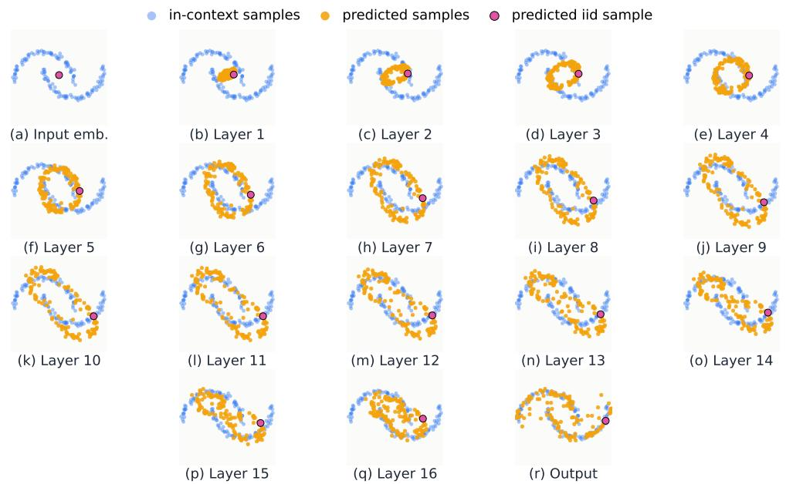  
Figure 7: Geometry evolution of one test sample across the transformer layers.

## D.3 Layerwise Uniformization in Large Language Models

Figure 2 shows that pretrained autoregressive language models reshape in-context semantic distributions across depth. We construct prompts from three topic vocabularies: animals, foods, and cities. For each model, we keep only tokenizer-eligible single-token words and use unique tokens, so each prompt contains up to 256 distinct words from one topic. We run 5 independent prompts per topic and record the raw hidden states after each transformer block, excluding the embedding layer, final layer normalization, and vocabulary logits. The complete semantic-token experiment was conducted across nine pretrained autoregressive language models; the corresponding layerwise MMD results are reported in Figure 8.

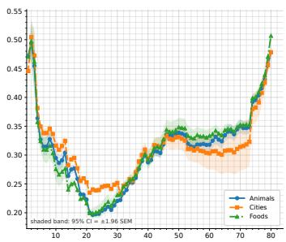  
(a) Llama-3.3-70B-Instruct [17]

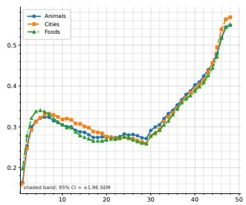  
(b) GPT-2 XL [16]

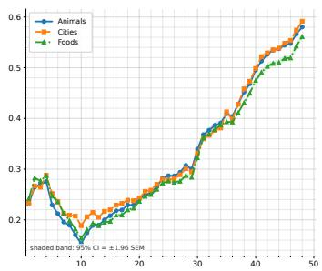  
(c) Qwen2.5-14B [49]

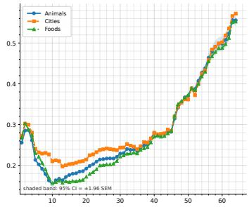  
(d) Qwen2.5-32B [49]

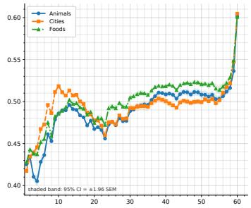  
(e) Falcon-40B [21]

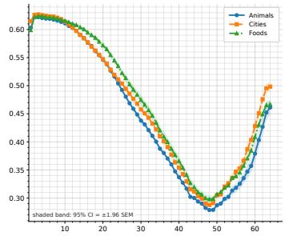  
(f) OPT-66B [22]

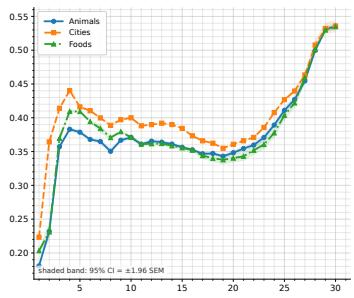  
(g) Bloom-7b1 [23]

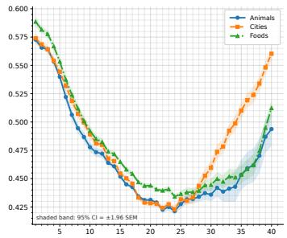  
(h) Cerebras-GPT-13B [19]

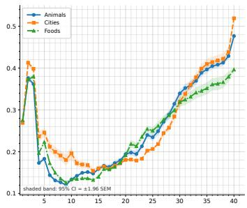  
(i) Openlm-Llama-13b [18]

Figure 8: Additional large-model results for IID semantic-category prompts. The curves show the layerwise $\mathrm { M M D ^ { 2 } }$ distance to the uniform spherical reference distribution.

In Figure 4, we also repeat the same analysis on natural text prompts from the CBT dataset [35]: for each story, we feed the first 256 tokens to the model, but compute the layerwise metrics only on the first occurrence of each unique token.

At each layer, we treat the hidden states as an empirical particle cloud. We apply row-center normalization by subtracting the coordinate mean of each hidden vector and projecting it to the unit sphere. We then compare the resulting cloud to samples from the uniform spherical distribution using unbiased RBF $\mathrm { \bar { M M D } ^ { 2 } }$ . Smaller $\mathrm { \overline { { M M D } } ^ { 2 } }$ indicates that the hidden-state distribution is closer to the uniform reference. The curves report the mean over trials, with shaded bands denoting 95% confidence intervals.

Across several large language models, the curves show a U-shaped profile: early layers preserve topic-specific structure, middle layers move the token cloud closer to the uniform sphere, and later layers move away from uniformity toward a structured, topic-dependent representation. In Figure 5, we further measure the corresponding EFS-style logarithmic interaction energy. For this metric, the normalized hidden states are rescaled to radius 0.78, and the energy is computed directly on the layerwise particle cloud. The energy curves support the same interpretation as the MMD plots: transformer layers first regularize the in-context distribution toward a uniform-like configuration and later recover structured semantic geometry.

## D.4 Failure mode

The layerwise uniformization pattern is not equally strong across all models. This effect is visible not only within the Qwen2.5 family [20], but also within the GPT-2 family [16], and it appears in both the i.i.d. semantic-topic setting and the CBT story setting; see Figure 9, Figure 10, Figure 6, and Figure 11. Figure 6 shows this effect within the Qwen2.5 model family [20]. Smaller models, especially the 1.5B, 3B, and 7B variants, show only a short or weak movement toward the uniform spherical reference before the MMD2 distance increases again. In these models, the middle-layer uniformization phase is compressed, suggesting that the model may not have enough depth to fully realize the two-stage sampler-like computation. The larger 14B and 32B models show a clearer separation between the early movement toward uniformity and the later movement away from it.

This behavior is consistent with the theoretical construction. In Theorem 1, the transformer simulates an iterative sampler by assigning transformer blocks to sampler steps. Therefore, depth is not only an architectural detail; it controls how many test-time computational steps the model can perform. If the model has too few layers, the transport process may be incomplete: the representation starts moving toward a reference geometry, but the model does not have enough intermediate computation to form a stable uniform-like phase before reconstructing semantic structure. We therefore interpret shallow or smaller models as a failure mode of in-context sampling.

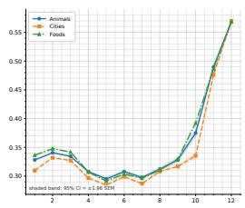  
(a) GPT-2

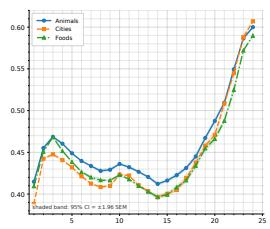  
(b) GPT-2 Medium

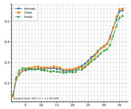  
(c) GPT-2 Large

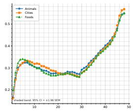  
(d) GPT-2 XL

Figure 9: GPT-2 family [16] on IID semantic-category prompts. Across model sizes, the layerwise distance to the uniform spherical reference distribution decreases in the middle layers and increases near the output layers.  
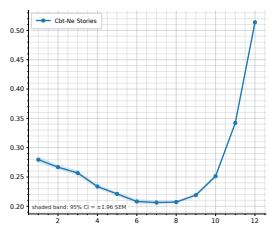  
(a) GPT-2

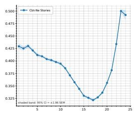  
(b) GPT-2 Medium

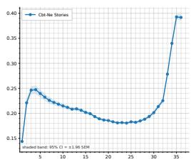  
(c) GPT-2 Large

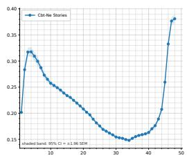  
(d) GPT-2 XL  
Figure 10: GPT-2 family [16] on CBT story-token prompts. The same middle-layer movement toward a uniform spherical reference distribution appears for natural text prompts.

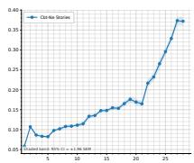  
(a) 1.5B

  
(b) 3B

  
(c) 7B

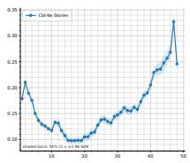  
(d) 14B

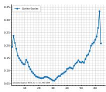  
(e) 32B  
Figure 11: Qwen2.5 family [20] on CBT story-token prompts. The U-shaped profile becomes visible across model scales, indicating a middle-layer movement toward a uniform spherical reference distribution followed by a later movement away from it.

## D.5 Computational Resources

All experiments were run on a single NVIDIA H100 GPU machine with 128 GB of system memory. The controlled synthetic experiments in Appendix D.1 and D.2 are computationally lightweight: they use a small GPT-2-style decoder-only transformer. If training is mentioned, the model is trained for 2,000 optimization steps on 1,000 IID training sequences. For the pretrained-language-model analyses in Appendix D.3, no model fine-tuning is performed. The experiments require only forward passes through publicly available autoregressive language models in order to extract hidden states after each transformer block.

## D.6 Existing Assets and Licenses

We use publicly available pretrained language models only for evaluation and do not redistribute their weights. For each model family, we cite the original paper, technical report, or official release, and follow the license or model-card terms associated with the official release. The evaluated models include GPT-2 [16], Llama/Llama-3.3 [4, 17], OpenLLaMA/OpenLM-Llama, Cerebras-GPT [19], Qwen2.5 [20], Falcon [21], OPT [22], and BLOOM [23]. The CBT dataset is cited as [35]. License and access terms are taken from the corresponding official repositories or model cards.

Table 1: Existing pretrained models and datasets used in the experiments. We use these assets only for evaluation and do not redistribute model weights or dataset copies. License information is taken from the corresponding official release pages or model cards.
<table><tr><td>Asset</td><td>Use in this paper</td><td>Source / citation</td><td></td><td>License or terms</td></tr><tr><td>GPT-2</td><td>Pretrained autoregressive lan- guage model for layerwise hidden-state analysis</td><td>OpenAI release; as [16]</td><td>cited</td><td>MIT / Modified MIT license, according to the official model re- lease or model card.</td></tr><tr><td>Llama / Llama-3.3- 70B-Instruct</td><td>Pretrained autoregressive lan- guage model for semantic-topic and CBT experiments</td><td>Meta Llama releases; cited as [4, 17]</td><td></td><td>Meta Llama commu- nity/model license; ac- cess and use governed by the official Llama license terms.</td></tr><tr><td>OpenLLaMA OpenLM-Llama-13B</td><td>Pretrained autoregressive lan- guage model for semantic-topic experiments</td><td>OpenLLaMA/OpenLM Research official release or model card; cited as [18]</td><td></td><td>Apache-2.0 or permis- sive open-source li- cense, according to the official model card.</td></tr><tr><td>Cerebras-GPT-13B</td><td>Pretrained autoregressive lan- guage model for semantic-topic and CBT experiments</td><td>Cerebras-GPT cited as [19]</td><td>release;</td><td>Apache-2.0 license.</td></tr><tr><td>Qwen2.5 family</td><td>Pretrained autoregressive lan- guage models for model-scale comparison</td><td>Qwen release; cited as [20]</td><td></td><td>Apache-2.0 for most open-source Qwen2.5 variants; some vari- ants, including 3B and 72B, use model-</td></tr><tr><td>Falcon-40B</td><td>Pretrained autoregressive lan- Falcon release; guage model for additional model-family experiments</td><td>as [21]</td><td>cited</td><td>specific Qwen license terms. Apache-2.0 license, according to the official release/model</td></tr><tr><td>OPT-66B</td><td>Pretrained autoregressive lan- guage model for additional model-family experiments</td><td>OPT release; cited as [22]</td><td></td><td>card. Meta OPT license terms, according to the official model card</td></tr><tr><td>BLOOM-7B1</td><td>Pretrained autoregressive lan- guage model for additional model-family experiments</td><td>BigScience BLOOM re- lease; cited as [23]</td><td></td><td>or license file. BigScience RAIL Li- cense v1.0.</td></tr><tr><td>CBT dataset</td><td>Natural-text prompts for layer- wise MMD experiments</td><td>Children&#x27;s Book Test; cited as [35]</td><td></td><td>Dataset release terms associated with the original CBT release; the dataset is used</td></tr></table>