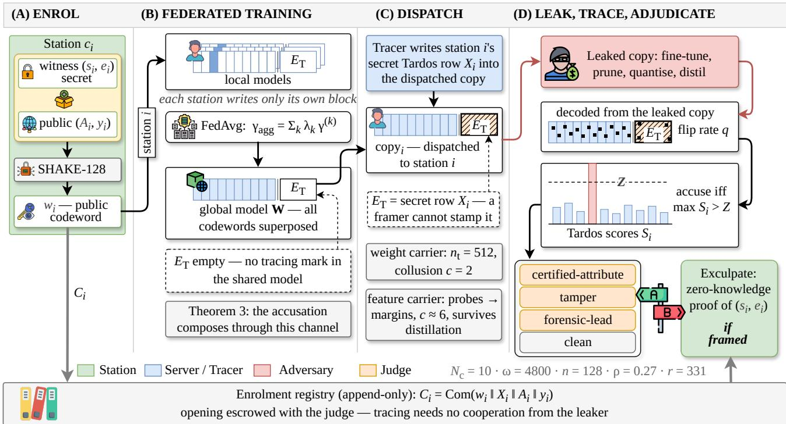
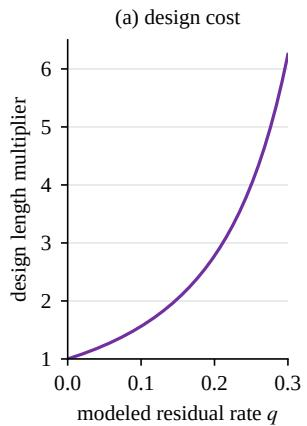
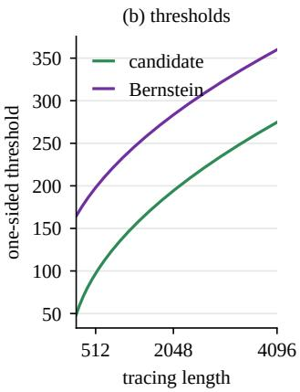
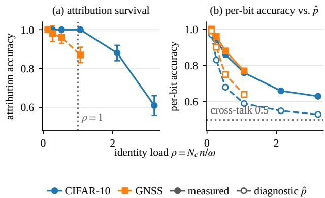
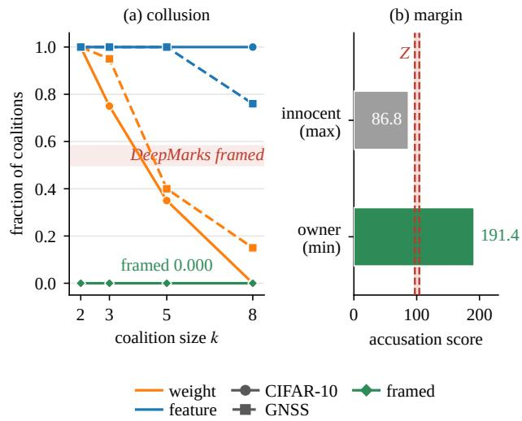
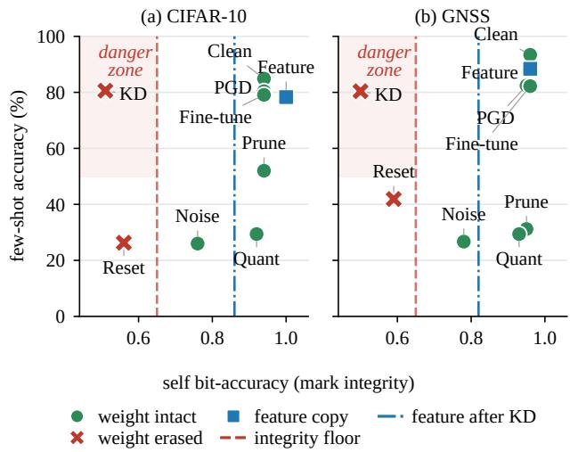

# ZK-Trace: Certified Collusion Tracing with Zero-Knowledge Credentials for Federated GNSS Interference Monitoring

Redwanul Karim

Nisha L. Raichur

Lucas Heublein

Tobias Feigl

Christopher Mutschler

Felix Ott

Fraunhofer Institute for Integrated Circuits IIS, 90411 Nurnberg¨ University of Technology Nurnberg (UTN), 90461 N¨ urnberg¨

Abstract— Federated global navigation satellite system (GNSS) monitoring distributes a proprietary classifier to partly trusted stations, any of which may leak its copy. ZK-Trace combines public identity marks, recipient-specific Tardos fingerprints, and zero-knowledge credential verification. The registry supports offline tracing without the leaker’s cooperation. We establish conditional false-accusation bounds for arbitrary recovered bit patterns, a finite completeness bound under a hidden-bias residual channel, and a deterministic tracing-score bound for correlated feature-distillation errors. An interval-arithmetic checker makes the conditional bound executable and allocates a common budget across accusation and tamper decisions. Under innocent-row independence, the certificatebased evaluation uses a false-naming budget of 10<sup>−3</sup> per investigation. It isolates all 160 single-owner copies and traces 712 of 720 two-owner mixtures without naming an innocent. Experiments use a simulated GNSS federation and CIFAR-10. Feature matching preserves the feature mark in 20/20 runs and cross-architecture transfer in 19/20, at copy-accuracy costs of 4.8 and 6.1 percentage points on GNSS and CIFAR-10. Function-only distillation erases the feature mark, and distillation also removes weight-space marks. These results support verifiable tracing under explicit statistical and cryptographic assumptions. Credential knowledge and recipient evidence serve distinct roles.

Index Terms— Federated Learning, Model Attribution, Traitor Tracing, Watermarking, Zero-Knowledge Proof, Few-Shot Learning, Global Navigation Satellite System, Interference Classification

## I. INTRODUCTION

Federated learning (FL) [1] allows sensor stations to train a shared model while keeping their measurements local. This is a natural fit for global navigation satellite system (GNSS) interference monitoring [2], but it also distributes a proprietary classifier to partly trusted participants. A station that leaks its issued controlled-receptionpattern antenna model exposes the operator’s detection capabilities. An adversary can then inspect which jamming and spoofing patterns evade detection, with consequences for positioning, navigation, and timing (PNT).

Tracing such a leak requires evidence linking the model to an enrolled station. Existing federated watermarks provide only part of that evidence. Zero-knowledge ownership schemes such as FedZKP [3] certify group membership without identifying a particular client. Perclient fingerprints identify recipients, but are assigned by the server and read in plaintext, without binding to a client secret [4], [5]. Collusion adds a further difficulty: stations can combine their copies to weaken individual marks. Collusion-secure fingerprinting codes address this attack [6], [7], but their guarantees do not directly cover the extraction errors introduced by federated averaging (FedAvg).

ZK-Trace separates two questions: which credentials are represented in the shared model, and which enrolled recipient is associated with a leaked copy (Fig. 1). Public identity codewords address the first question, while a recipient-specific Tardos fingerprint [7], [8] addresses the second question. The registry supports offline comparison, and a zero-knowledge proof authenticates the claimant during a dispute. The central analysis turns tracing into an auditable decision: it bounds an innocent score conditional on the recovered bits, then separately bounds missed colluders under a specified channel. The construction supports a BN-scale carrier [9] and a feature carrier whose score can be stable under feature matching.

We evaluate ZK-Trace for federated few-shot GNSS interference monitoring, where labeled events are scarce [10]. Prototypical networks [11] provide the classifier. Experiments use ten seeds, ten simulated stations partitioned from real GNSS recordings, and CIFAR-10 as a transfer check. This setting tests whether tracing remains useful when data are imbalanced, participation varies, and attackers modify their issued copies.

Contributions. (C1) Finite and executable tracing guarantees. We give a conditional false-accusation bound that does not assume independent extraction errors (Theorem 3), together with a finite hidden-bias completeness bound allowing coalition decisions across positions (Theorem 4). An interval checker enforces the bound and a shared error budget. Exhaustive evaluation of twoowner mixtures traces $7 1 2 / 7 2 0$ mixtures and isolates all 160 single-owner copies without naming an innocent (Sec. VII-B).

(C2) Credential verification and score stability. We extend FedZKP’s credential mechanism [3] with perclient identity blocks, recipient fingerprints, and a registry. The artifact-bound verifier authenticates a credential statement about a complete model state. It does not claim authorship. A deterministic weighted-score bound establishes when feature perturbations preserve tracing even with correlated or targeted errors (Theorem 5).

(C3) A GNSS evaluation with explicit robustness limits. A common attack suite evaluates five baselines on their native mark metrics. Distillation erases all tested weight-space marks. Our feature carrier survives feature-matching distillation and nineteen of twenty crossarchitecture runs, but function-only distillation erases it. Its dispatched-copy accuracy cost is 4.8 percentage points on GNSS and 6.1 on CIFAR-10. No innocent is accused in the coalition sweep, whereas a DeepMarks-family comparator [12] produces false accusations (Sec. VII-C).

## II. RELATED WORK

Watermarking and fingerprinting codes. Model ownership, recipient identification, and survival under model modification are distinct capabilities. White-box watermarks encode information in model parameters, whereas black-box watermarks use queryable triggers. Collusion-secure fingerprinting identifies a source when recipients combine their copies [6]. Tardos codes achieve length $O ( c ^ { 2 } \log ( N / \varepsilon _ { 1 } ) )$ for coalition size c and falseaccusation target $\varepsilon _ { 1 } ~ [ 7 ]$ . Symmetric scoring [8] and later refinements improve the score and length analysis [13]– [16]. Our analysis complements noisy-Tardos work on additive white Gaussian noise [17] with conditional score certification and a finite residual-channel bound for model fingerprints.

Federated model ownership. FedIPR [9] and WAF-FLE [18] embed ownership marks in models redistributed through FedAvg [1]. Their verification establishes mark presence but may expose the secret or depend on its holder. Proofs of knowledge address credential disclosure. Our verification uses the Σ-protocol [19] for exact-weight Learning Parity with Noise (xLPN) given by Jain et al. [20], following Veron’s identification formulation [´ 21]. This cryptographic layer authenticates a credential. Recipient tracing additionally requires a per-copy identifier.

Per-client attribution. The closest federated methods provide different parts of the required evidence. FedZKP [3] derives a group watermark from all clients xLPN public inputs and proves ownership in zero knowledge, but does not identify a recipient. FedTracker [4] and DUW [5] provide per-client fingerprints assigned by a trusted party, without a collusion-secure code. Deep-Marks [12] embeds anti-collusion codes centrally, but assumes exact extraction and lacks a false-accusation bound at arbitrary coalition sizes.

Cryptographic participation evidence serves a different purpose. FedPoP [22] proves participation anonymously and leaves no in-model tracing artifact. FedAaT [23] adds per-client output-space sequences, but reads them in plaintext and confines zero knowledge to the credential layer. BlackCATT [24] uses per-client Tardos labels in a federated trigger channel. It does not establish their composition through the aggregation channel considered here.

Distillation and the remaining gap. Removal attacks include extraction-based erasure [25] and knowledge distillation [26], within the taxonomy of [27]. DAWN [28] marks prediction-API responses and evaluates coalition resistance empirically. Entangled watermarks [29] can survive distillation but do not identify individual leakers. ZK-Trace combines recipient tracing with credential authentication and certificate-gated adjudication (Table IX). ZK-Trace builds on FedZKP’s credential-based watermarking framework [3], using BN scaling parameters as the embedding carrier, as in FedIPR [9]. It analyzes Tardos tracing through FedAvg and adds a feature carrier whose survival depends on what the distiller reproduces.

Federated few-shot GNSS monitoring. Gaikwad et al. [10] combine episodic prototypical learning with FedAvg for GNSS interference classification under noni.i.d. data. We build on this learning setup to address model ownership and tracing. The evaluation studies watermarking on an episodic prototypical model.

## III. PRELIMINARIES

Notation. For binary vectors $\mathbf { x } , \mathbf { y } \in \{ 0 , 1 \} ^ { m } , \| \mathbf { x } \| _ { 1 }$ denotes Hamming weight and x⊕y denotes bitwise XOR. Their Hamming distance is $\| \mathbf x \oplus \mathbf y \| _ { 1 }$ . We write $\mathbf { x } \left| \right| \mathbf { y }$ for concatenation and $x \ { \stackrel { R } { \longleftarrow } } \ X$ for a uniform draw. The watermark bit subset $B \subseteq \{ 1 , \ldots , n \}$ differs from the Bernoulli noise law $B _ { \tau }$ . Table I summarizes the symbols. Section IV-A defines the threat model.

Federated learning. A server coordinates $N _ { c }$ clients, each with private data $\mathcal { D } _ { i }$ and local parameters $\mathbf { W } _ { i }$ FedAvg forms $\begin{array} { r } { \mathbf { W } = \sum _ { k = 1 } ^ { N _ { c } } \lambda _ { k } \mathbf { W } _ { k } } \end{array}$ , where $\lambda _ { k } \geq 0$ and $\begin{array} { r } { \sum _ { k } \lambda _ { k } = 1 [ 1 ] } \end{array}$ . The same weighted average applies to the BN scales that carry the identity marks. The survival analysis asks whether those marks remain distinguishable after averaging.

Prototypical networks. An N-way K-shot episode samples N classes, with K labeled support examples and Q query examples per class. Let $S _ { k }$ be class $k ' s$ support set. The embedding $f _ { \theta } : \mathcal { X }  \mathbb { R } ^ { d }$ forms its prototype as the mean $\begin{array} { r } { \mathbf { c } _ { k } = \lvert S _ { k } \rvert ^ { - 1 } \sum _ { ( \mathbf { x } _ { i } , y _ { i } ) \in S _ { k } } f _ { \theta } ( \mathbf { x } _ { j } ) } \end{array}$ . A query is classified by a softmax over negative squared Euclidean distances to these prototypes [11]. Training minimizes the query negative log-likelihood over episodes. We use the federated few-shot setup of Gaikwad et al. [10].

Credentials. In search LPN, the public pair $( \mathbf { A } , \mathbf { y } )$ satisfies $\mathbf { y } ~ = ~ \mathbf { A } \mathbf { s } \oplus \mathbf { e } ,$ , with noise rate $0 ~ < ~ \tau ~ < ~ \frac { 1 } { 2 } .$ Recovering the secret is an average-case random-code decoding problem [30]. The xLPN variant fixes the error weight to $w _ { \tau } ~ = ~ \lfloor m \tau + 0 . 5 \rfloor$ [20]. Client i publishes $( \mathbf { A } _ { i } , \mathbf { y } _ { i } )$ and retains the witness $( \mathbf { s } _ { i } , \mathbf { e } _ { i } )$

TABLE I: Principal notation and deployed dimensions. Identity length n and tracing length $n _ { \mathrm { t } }$ describe separate watermark layers.  
Symbol Meaning (space / value)   
$N _ { c }$ number of clients (= 10)   
$c _ { i } , \ D _ { i }$ client i and its private dataset   
$\mathbf { W } , \mathbf { W } _ { i }$ global / local model parameters   
$\lambda _ { k }$ FedAvg weights $( \sum _ { k } \lambda _ { k } { = } 1 )$   
$\gamma , \gamma _ { \mathrm { a g g } }$ BN scale carrier $( \in \mathbb { R } ^ { \omega } )$   
$\omega$ carrier dimension (= 4800)   
$_ n$ per-client codeword length (= 128)   
$\mathbf { w } _ { i } , \hat { \textbf { h } } _ { i }$ codeword / extracted component $( \in \{ 0 , 1 \} ^ { n } )$   
$E , \ E _ { i }$ shared / client projection $( \mathbb { R } ^ { \omega \times N _ { c } n } , \ \bar { \mathbb { R } } ^ { \omega \times n } )$   
$\rho$ identity-column load $N _ { c } n / \omega$   
$\mathbf { A } _ { i } , \mathbf { y } _ { i }$ xLPN public input $( \{ 0 , 1 \} ^ { m \times l } , \{ 0 , 1 \} ^ { m } )$   
$\mathbf { s } _ { i } , \mathbf { e } _ { i }$ xLPN witness $( \{ 0 , 1 \} ^ { l } , \{ 0 , 1 \} ^ { m } ; \| \mathbf { e } _ { i } \| _ { 1 } = w _ { \tau } )$   
$B _ { \tau } , ~ \tau$ i.i.d. Bernoulli noise, rate τ   
$\boldsymbol { B }$ per-episode WM bit subset $( \subseteq \{ 1 , \ldots , n \} )$   
$\mathsf { e r r } , ~ p _ { r }$ near-collision radius, detection threshold   
$f _ { \theta } , \ d$ embedding net, feature dim $( \mathbb { R } ^ { d } , d { = } 5 1 2 )$   
$N , K , Q$ episodic way / shot / query   
$\mathbf { c } _ { k }$ class prototype $( \in \mathbb { R } ^ { d } )$   
$X _ { i } , ~ n _ { \mathrm { t } }$ tracing row / length (512 weight, 2048 feature)   
$c , \ k$ collusion design target / tested coalition size   
$S _ { i } , ~ Z , ~ \varepsilon _ { 1 }$ tracing score / threshold / false-accusation target   
$q$ residual flip probability relative to intended output

Verification establishes knowledge of this witness using a three-move commitment–challenge–response Σ protocol [19]. Its non-interactive form binds the challenges to the extracted model component and the registered credential (Sec. IV-C). Appendix C-C specifies the commitment and random-oracle assumptions.

## IV. ZK-TRACE CONSTRUCTION

Pipeline. ZK-Trace has two watermark layers (Fig. 1). The identity layer extends FedZKP [3]: each client’s xLPN public input determines a codeword embedded in the shared model’s BN scales. The tracing layer adds a secret Tardos fingerprint only to the copy dispatched to that client. It supports attribution after modifications invalidate an exact dispatch-log hash, providing evidence for trace-and-revoke [31].

Fig. 1 follows one station through four stages. At (A), station $c _ { i }$ registers $\left( \mathbf { A } _ { i } , \mathbf { y } _ { i } \right)$ and its derived codeword $\mathbf { w } _ { i } .$ keeping the witness $\left( \mathbf { s } _ { i } , \mathbf { e } _ { i } \right)$ private. At (B), federated training aggregates the identity codewords into W while leaving the tracing block $E _ { T }$ empty. At (C), the tracer embeds the secret row $X _ { i }$ into the copy issued to station i. At (D), the tracer extracts the leaked copy’s overlay, scores each registered row, and accuses a station when its score exceeds Z.

Binding intuition. Each client has an assigned set of projection directions at which to read its public codeword.

Agreement with that codeword is statistical evidence of a mark. Possession of its private xLPN witness is a separate credential fact. A valid proof authenticates the witness holder. The verifier also includes a digest of the entire model state in its context, so equal extracted bits do not permit replay onto different model bytes. Neither presence nor authentication establishes who trained the model: public marks can be copied. Recipient tracing therefore uses the separate secret row and registry.

## A. Setting and Threat Model

The server acts as tracer and issues each authorized client a copy bearing its secret Tardos row. The registry allows a recovered copy to be traced without contacting its holder. Clients keep their witnesses private, and the tracer holds the tracing rows.

Threat model. We consider authorized clients that hold valid credentials but may misuse their dispatched copies. Access control for unauthorized parties is a separate concern.

• T1, weight-space post-processor. A leaker applies utility-preserving edits such as fine-tuning, pruning, quantization, or noise before redistributing its copy. We evaluate both identity attribution and Tardos tracing under these edits. Their guarantees require the extraction conditions stated in Sec. V.

• T2, bounded coalition. Clients may average their copies to attenuate the marks [6]. The design targets are two colluders on the weight carrier and three on the feature carrier. Soundness requires innocentrow independence, A5(a). Finite channel completeness additionally requires A5(b). A coalition may base its intended symbols on its entire row matrix under that theorem. The experiments distinguish model averaging from decoder-space adaptive steering.

• T3, framing adversary. An adversary may copy a victim’s public identity mark. It lacks the victim’s witness and secret tracing row. Certified false naming is bounded under A5(a), while credential verification authenticates the claimant. Authentication alone does not exculpate a recipient: the judge must examine the accusation evidence.

• T4, distiller. A leaker may train a fresh student whose BN parameters contain no identity codeword. This erases the weight carrier in our benchmark [27]. The feature carrier can survive when the student copies the teacher’s feature geometry closely enough (Proposition 2). Function-only distillation falls outside Assumption 6 and erases this carrier too.

Out of scope. ZK-Trace does not detect or prevent poisoned updates. It can be combined with robust aggregation to address this threat (Sec. VII-C). Credential redistribution is also outside its scope. The fingerprint identifies the enrolled recipient of the issued copy, and subsequent revocation is handled through the registry [31].

  
Fig. 1: ZK-Trace life cycle and carrier layout. The bar is the projection codebook read from the batch-normalization scales γ, partitioned into per-client identity blocks $E _ { 1 } , \dots , E _ { N _ { c } }$ and the tracing overlay block $E _ { T }$ . Solid cells carry the public codeword $\mathbf { w } _ { i } ,$ , hatched cells the tracer-secret Tardos row $X _ { i } . ~ S _ { i }$ is the Skori<sup>ˇ</sup> c-symmetric score,´ Z the accusation threshold, and $q$ the per-bit flip rate induced by aggregation.

Server as leaker. The server and tracer are honest-butcurious. The server holds the shared model and issued copies, so the scheme cannot distinguish a server leak from a recipient leak of the same copy. Registry commitments prevent post-hoc row substitution. Authenticated delivery and server accountability require additional evidence (App. A-D).

## B. Codeword Embedding

Before training, initialization fixes the shared Gaussian matrix $E \in \mathbb { R } ^ { \omega \times N _ { c } n }$ , with $\omega { = } 4 , 8 0 0$ and $n { = } 1 2 8 ,$ and the detection threshold $p _ { r }$ and radius $\mathsf { e r r } _ { n } .$ . Following FedZKP [3], we select an xLPN instance with a syndrome-decoding work estimate reported near $2 ^ { 1 5 2 }$ [30] as a separate computational-hardness estimate (Sec. IV-C; dimensions in App. A). Each client’s public input determines its identity codeword,

$$
\mathbf { w } _ { i } = \mathrm { S H A K E } \ – 1 2 8 ( \mathbf { A } _ { i } | \mathbf { y } _ { i } ) \in \{ 0 , 1 \} ^ { n } .\tag{1}
$$

Client i uses block $E _ { i } ~ \in ~ \mathbb { R } ^ { \omega \times n }$ , comprising columns $[ ( i - 1 ) n , i n )$ of E. The server retains the concatenated public inputs $\left( \mathbf { A } _ { \mathrm { a g g } } , \mathbf { y } _ { \mathrm { a g g } } \right)$ so a verifier can recompute any station’s codeword.

Carrier. The vector $\gamma \in \mathbb { R } ^ { \omega }$ concatenates the scales of all L=20 BN layers. Each projection spreads a bit across these scales, so editing one layer affects only part of its carrier. At $N _ { c } { = } 1 0$ , the identity-codebook load is $N _ { c } n / \omega ~ \approx ~ 0 . 2 7$ . BN scales rescale activations after normalization. Section VII-C evaluates how this affects feature geometry and classification.

Projection and objective. For bit $b ,$ the projection $z _ { i , b } = \gamma ^ { \top } E _ { i , b }$ gives the extracted bit $\hat { h } _ { i , b } \ = \ \mathcal { H } [ z _ { i , b } \ >$ 0], with signed target $t _ { i , b } ~ = ~ 2 w _ { i , b } - 1$ . The hinge loss penalizes a wrong sign or a signed projection smaller than the target margin $\mu > 0$

$$
\mathcal { L } _ { \mathrm { w m } } = \frac { 1 } { \vert \mathcal { B } \vert } \sum _ { b \in \mathcal { B } } \operatorname* { m a x } \bigl ( 0 , \ \mu - t _ { i , b } \cdot z _ { i , b } \bigr ) ,\tag{2}
$$

with the active subset $B \subset \{ 1 , \ldots , n \}$ drawn each step by bit-dropout $( p _ { \mathrm { d r o p } } = 0 . 5 , \mu = 1 . 0 )$ . The local objective adds this to the prototypical task loss, $\begin{array} { r } { \mathcal { L } ~ = ~ \mathcal { L } _ { \mathrm { t a s k } } \ + } \end{array}$ $\lambda _ { \mathrm { w m } } \mathcal { L } _ { \mathrm { w m } }$ , with $\lambda _ { \mathrm { w m } } ~ = ~ 0 . 1$ trading accuracy against watermark strength.

Federated training. Cross-entropy pre-training on base classes produces an unwatermarked initial model [10]. Federated episodic training then follows Sec. III, with $\lambda _ { k }$ proportional to local sample count. Each client fixes its public input and codeword in the first round and trains under L in subsequent rounds. Projection onto $E _ { i }$ recovers client i’s component from the averaged BN scales, subject to cross-talk from the other clients (Sec. V).

## C. Zero-Knowledge Verification

Algorithm 1 verifies credential knowledge using a Stern-type non-interactive proof [3]. All commitments and the public context determine the challenge vector. In the verifier, $\begin{array} { r } { \mathsf { c t x } = \mathsf { t a g } \| H _ { 2 5 6 } ( \mathbf { W } ) \| \hat { h } _ { i } \| A _ { i } \| y _ { i } } \end{array}$ , where $H _ { 2 5 6 }$ hashes a canonical full state including buffers. We use $r = 3 3 1$ repetitions. Appendix C-C separates the grinding calibration from end-to-end witness-recovery security.

```latex
Algorithm 1 Non-interactive credential and model
presence verification, from FedZKP’s Stern-type xLPN
Σ-protocol [3].
Require: witness $( \mathbf { s } _ { i } , \mathbf { e } _ { i } ) , \mathbf { y } _ { i } { = } \mathbf { A } _ { i } \mathbf { s } _ { i } { \oplus } \mathbf { e } _ { i } ;$ block $( \mathbf { A } _ { i } , \mathbf { y } _ { i } ) ;$ model W;
rounds $r { = } 3 3 1$
Ensure: verify credential knowledge and mark presence, else reject
1: $\begin{array} { r } { \hat { \mathbf { h } } _ { i }  \mathcal { k } [ \dot { \gamma } ( \mathbf { W } ) ^ { \top } E _ { i } > 0 ] , } \end{array}$ ctx $ \mathrm { t a g } \| H _ { 2 5 6 } ( \mathbf { W } ) \| \hat { \mathbf { h } } _ { i } \| \mathbf { A } _ { i } \| \mathbf { y } _ { i }$
2: Prover (offline), for $k { = } 1 , \ldots , r$ with fresh $\pi , \mathbf { v } , \mathbf { f } \colon$
3: $t _ { 0 } \gets \mathbf { A } _ { i } \mathbf { v } \oplus \mathbf { f } , t _ { 1 } \gets \pi ( \mathbf { f } ) , t _ { 2 } \gets \pi ( \mathbf { f } \oplus \mathbf { e } _ { i } )$
4: $C _ { 0 } { \gets } \mathrm { c o m } ( \pi , t _ { 0 } ) , C _ { 1 } { \gets } \mathrm { c o m } ( t _ { 1 } ) , C _ { 2 } { \gets } \mathrm { c o m } ( t _ { 2 } )$
$5 \colon ( c ^ { ( k ) } ) _ { k = 1 } ^ { r } \longleftarrow \mathrm { S H A K E - 1 } 2 8 \big ( C _ { 0 } ^ { ( 1 ) } \big \| \cdot \cdot \cdot \| C _ { 2 } ^ { ( r ) } \| \mathrm { c t } \times \big )$ mod 3
6: open the two commitments per $c ^ { ( k ) }$ and send transcript τ
7: Verifier (offline). Recompute $( c ^ { ( k ) } )$ from τ, ctx and check per
round:
8: $c ^ { ( k ) } { = } 0 \colon t _ { 0 } \oplus \pi ^ { - 1 } ( t _ { 1 } ) \in \operatorname { i m g } ( \mathbf { A } _ { i } )$
9: $c ^ { ( k ) } { = } 1 \colon t _ { 0 } \oplus \pi ^ { - 1 } ( t _ { 2 } ) \oplus \mathbf { y } _ { i } \in \operatorname { i m g } ( \mathbf { A } _ { i } )$
10: $c ^ { ( k ) } { = } 2 \colon \mathrm { w t } ( t _ { 1 } \oplus t _ { 2 } ) = w _ { \tau }$
11: accept iff all r checks pass and $\begin{array} { r } { \mathrm { H D } ( \hat { \mathbf { h } } _ { i } , \mathbf { w } _ { i } ) \leq \mathrm { e r r } _ { n } , } \end{array}$ else reject
```

Attribution and acceptance. From the public block $E _ { i }$ and codeword $\mathbf { w } _ { i }$ alone, a verifier extracts $\hat { \mathbf { h } } _ { i } ~ =$ $\mathbb { k } [ \mathbb { \gamma } ( \mathbf { W } ) ^ { \top } E _ { i } > 0 ]$ and tests codeword presence,

$$
\begin{array} { r } { \mathrm { H D } \big ( \hat { \mathbf { h } } _ { i } , \mathbf { w } _ { i } \big ) \leq \mathsf { e r r } _ { n } . } \end{array}\tag{3}
$$

Against an independent codeword at $n { = } 1 2 8 .$ , calibration to $2 ^ { - 1 2 8 }$ requires $\mathsf { e r r } _ { n } { = } 0$ . Exact presence is restrictive for the measured noisy extraction, so the deployed identity metric uses maximum codeword agreement (Prop. 4, App. C). A match is statistical evidence of a codeword, but it does not authenticate its holder because the public mark can be copied. Algorithm 1 adds proof of the private witness and retains the explicit presence condition in its acceptance rule. Recipient tracing instead uses the secret overlay below.

## D. Security Guarantees

Here Q denotes the number of random-oracle queries, distinct from query examples per episode.

PROPOSITION 1 (Credential knowledge and artifact binding) Under the random-oracle and commitment assumptions in Appendix C-C, the ideal Stern/Fiat–Shamir protocol is complete for a witness holder whose codeword passes the requested presence test, and admits a zeroknowledge simulation. With ideal binding commitments and uniform challenges, its knowledge error is at most $( Q + 1 ) ( 2 / 3 ) ^ { r } \ : I ^ { 3 2 } { \cal J } .$ . The artifact-bound context ties a transcript to the registered credential, extracted component, and full-state digest. Transfer to a different state requires a digest collision or a new-context challenge coincidence. These are knowledge and binding properties, not a proof of authorship or a numerical bound on all xLPN-recovery attacks.

The proof, with extractor, simulator, and grinding accounting, is in Appendix C.

Two soundness layers. Credential verification and recipient tracing answer different questions. The former proves knowledge of a private witness and binds the statement to an artifact. The latter bounds naming an innocent recipient under a conditional code model. The 331-round grinding calibration, commitment failures, computational witness recovery, and statistical tracing budget must be accounted for separately (Table XIII).

## E. Tracing Overlay and Two Carriers

Dispatch and readout. The identity layer cannot isolate a recipient because the aggregate contains every contributor’s mark. At dispatch, the tracer fine-tunes a copy on server-held proxy data, combining the task loss with a hinge that embeds the recipient’s secret Tardos row $X _ { i }$ . The weight carrier reads each bit from a BNscale projection. The feature carrier reads the sign of a feature projection on a fixed probe input, with co-training used to align those signs with $X _ { i } .$ Its design target is c=3, compared with $c { = } 2$ for the weight carrier. Featurematching distillation can preserve these probe responses under Assumption 6.

Tracing and adjudication. The tracer scores the recovered bits against registered rows. The adjudication rule certifies each positive or negative tail before issuing a certified decision, allocating one budget across both tails and any jointly used carriers (Prop. 3). A threshold exceedance without a passing certificate remains an uncertified lead. If neither threshold is exceeded, the outcome is no certified evidence. Threshold-only decisions are evaluated separately to measure score separation. An independent judge checks the enrollment opening and reconstructs the score evidence. A credential proof authenticates the claimant but does not decide whether that claimant leaked.

## V. THEORETICAL ANALYSIS

The analysis separates three questions: when identity bits survive averaging, when a tracing score supports a bounded false-accusation probability, and when feature matching preserves probe bits. The identity probability model is idealized. The deterministic decoding and probemargin results do not require that model. Appendix B-A states the assumptions and Appendix C gives the proofs.

Identity survival. Write $\gamma ^ { ( i ) } = \gamma _ { 0 } + \Delta _ { i } , G = \| \gamma _ { 0 } \|$ and $\begin{array} { r } { u _ { i } = \sum _ { k \neq i } \lambda _ { k } \gamma ^ { ( k ) } } \end{array}$ . A local signed margin of at least µ gives

$$
t _ { i , b } \langle \gamma _ { \mathrm { a g g } } , E _ { i , b } \rangle \geq \lambda _ { i } \mu + t _ { i , b } \langle u _ { i } , E _ { i , b } \rangle .\tag{4}
$$

A probabilistic recovery bound follows from this inequality when the signed directions are independent of the cross-vector.

THEOREM 1 (Conditional per-bit recovery) Assume $A I -$ $A 3 , \omega > 4 ,$ and $\lambda _ { i } > 0 .$ . Conditional on $( u _ { i } , t _ { i } )$ , let $F _ { \omega }$ be

the CDF of $\sqrt { \omega }$ times the first coordinate of a uniform unit vector. For $u _ { i } \neq 0 ,$ , put $s _ { i } = \lambda _ { i } \mu \sqrt { \omega } / \| u _ { i } \|$ . Then

$$
\begin{array} { c } { { \mathbb { P } [ \hat { h } _ { i , b } = w _ { i , b } \mid u _ { i } , t _ { i } ] \geq F _ { \omega } ( s _ { i } ) , } } \\ { { F _ { \omega } ( s _ { i } ) \geq \Phi ( s _ { i } ) - b _ { \omega } , \qquad b _ { \omega } = \displaystyle \frac { 8 } { \omega - 4 } . } } \end{array}\tag{5}
$$

The proxy events in (4) are conditionally independent across bits. $H { { u } _ { i } } = 0 $ , every bit is correct.

A deterministic bound $\| \Delta _ { k } \| \ \leq \ D _ { k }$ gives $\| u _ { i } \| ~ \leq$ $( 1 { - } \lambda _ { i } ) G { + } \sum _ { k \neq i } \lambda _ { k } D _ { k }$ by the triangle inequality. Random projection columns alone do not establish the smaller quadrature norm. For interpreting the measurements we retain the approximation

$$
\mathrm { S N R } _ { \mathrm { q u a d } } : = \frac { \mu \sqrt { \omega } } { \sqrt { ( N _ { c } - 1 ) [ ( N _ { c } - 1 ) G ^ { 2 } + n \mu ^ { 2 } ] } } .\tag{6}
$$

It assumes uniform weights, update norms near $\mu { \sqrt { n } } .$ , and negligible cross terms. It is a diagnostic model, not a proved floor for trained federated networks.

Attribution by codeword separation. Maximum agreement is nearest-neighbor decoding in Hamming distance. A rival participates in training, so its codeword need not be independent of the decoded aggregate. The following criterion avoids that independence assumption.

THEOREM 2 (Attribution from a decoding radius) Let $d _ { i } = \mathrm { H D } ( \hat { h } _ { i } , w _ { i } )$ and $\begin{array} { r } { d _ { \operatorname* { m i n } } = \operatorname* { m i n } _ { i \neq j } \mathrm { H D } ( w _ { i } , w _ { j } ) . \ I f 2 d _ { i } < } \end{array}$ $d _ { \operatorname* { m i n } { \mathrm { ~ } f o r } }$ every client, all maximum-agreement decisions are uniquely correct. Under A4, $i f \mathbb { P } [ \operatorname* { m a x } _ { i } d _ { i } > r n ] \le \eta$ for some $0 \leq r < 1 / 4$ , then

P[any attribution error] $\leq \eta + \binom { N _ { c } } { 2 } e ^ { - 2 n ( 1 / 2 - 2 r ) ^ { 2 } }$

(7)

The radius event may depend on the entire codebook.

COROLLARY 1 (A sufficient operating condition) Under A1–A4, suppose $F _ { \omega } ( s _ { i } ) \ge p$ uniformly over clients and conditioning values. Choose $\xi > 0$ with $r = 1 - p + \xi <$ 1/4. All clients are attributed correctly with probability at least $1 - \delta$ if

$$
N _ { c } e ^ { - 2 n \xi ^ { 2 } } + { \binom { N _ { c } } { 2 } } e ^ { - 2 n ( 1 / 2 - 2 r ) ^ { 2 } } \leq \delta .\tag{8}
$$

These are sufficient conditions, not necessary thresholds. A measured mean bit-accuracy cannot substitute for the uniform conditional $p .$ The load $\rho ~ = ~ N _ { c } n / \omega$ describes the number of identity constraints relative to scale dimension. $\rho = 1$ is a rank boundary, not a universal attribution-failure point (Lemma 5). Partial participation changes the current averaging weights. Marks from earlier rounds can remain in a skipped client’s absence. Presence additionally requires a specified absolute Hamming radius, calibrated in Proposition 4.

Tracing soundness. For a recovered tracing word $y ,$ biases $p _ { b } .$ , and score $\begin{array} { r } { S _ { i } = \sum _ { b } U ( X _ { i , b } , y _ { b } , p _ { b } ) } \end{array}$ , an innocent row has independent Bernoulli entries conditional on $( y , p )$ under $\mathrm { A } 5 ( \mathrm { a } )$ . Its first two moments are unchanged by the output, although its full distribution depends on the output.

THEOREM 3 (Conditional tracing bounds) Assume A5(a) and Definition 1. For any threshold $z > 0$ and $\alpha > 0 ,$ define

$$
\begin{array} { l } { { \displaystyle M _ { b } ( \alpha ; y , p ) = ( 1 - p _ { b } ) e ^ { - \alpha ( 2 y _ { b } - 1 ) \sqrt { p _ { b } / ( 1 - p _ { b } ) } } } } \\ { { \displaystyle ~ + p _ { b } e ^ { \alpha ( 2 y _ { b } - 1 ) \sqrt { ( 1 - p _ { b } ) / p _ { b } } } , } } \\ { { \displaystyle E _ { \alpha } ( y , p ; z ) = \alpha z - \sum _ { b } \log M _ { b } ( \alpha ; y , p ) . } } \end{array}\tag{9}
$$

Then

P[∃ innocent $i : S _ { i } > z \mid y , p ] \le \operatorname* { m i n } \{ 1 , N e ^ { - E _ { \alpha } ( y , p ; z ) } \}$

(10)

A separate a-priori bound holds uniformly over $( y , p )$ at

$$
z _ { B } = \frac { B L } { 3 } + \sqrt { \left( \frac { B L } { 3 } \right) ^ { 2 } + 2 n _ { \mathrm { t } } L } ,\tag{11}
$$

where $B ~ = ~ \sqrt { ( 1 - \delta _ { c } ) / \delta _ { c } } , ~ \delta _ { c } ~ = ~ 1 / ( 3 0 0 c ) .$ , and $L \ =$ 1 $\mathrm { n } ( N / \varepsilon _ { 1 } ) .$ : the false-accusation probability is at most $\varepsilon _ { 1 }$

The candidate threshold $Z ~ = ~ { \sqrt { 2 n _ { \mathrm { t } } L } }$ used in part of the evaluation is smaller than $z _ { B }$ . It supports a certificate only when an evaluated exponent passes the required budget. The coalition sweep measures threshold exceedances, while the certificate-based evaluation checks the probability bound for each decoded word (Table VI). Appendix A-E specifies a certificate-gated rule, including separate budgets for positive and negative decisions.

Finite completeness. Theorem 4 supplies a lowertail guarantee for the actual cutoff, without assuming independent intended coalition symbols. For a coalition of size $s \leq c ,$ its exponential-moment bound is

$$
\mathbb { P } [ \operatorname* { m a x } _ { i \in \mathcal { C } } S _ { i } \le z ] \le e ^ { t s z } J _ { s } ( t , q ) ^ { n _ { \mathrm { t } } } , \qquad t > 0 .\tag{12}
$$

The function $J _ { s }$ integrates over the posterior secret bias given each coalition column, maximizing over permitted output bits. Conditioning on the entire coalition matrix allows the attacker to choose its intended word jointly across positions. Only the residual channel must flip these bits independently with probability $q .$ Appendix C-B proves the bound and gives a compatible a-priori soundness threshold.

Interval integration establishes both guarantees at the two deployed lengths: for $N = 1 0$ and false-accusation budget $\bar { 1 0 ^ { - 3 } }$ , the worst missed-coalition bounds over $s \leq$ c are 0.0096 at $( c , n _ { \mathrm { t } } , q ) = ( 2 , 5 1 2 , 0 . 0 4 )$ and 0.00201 at (3, 2048, 0.15) (Table XI). These are finite channel guarantees, not estimates of the networks’ residual channel. Per-colluder disagreement after averaging cannot identify $q .$

For planning, the asymptotic length estimate is

$$
n _ { \mathrm { t } } ^ { \mathrm { d e s i g n } } = \left\lceil \frac { \pi ^ { 2 } } { 2 } c ^ { 2 } ( 1 - 2 q ) ^ { - 2 } \ln ( N / \varepsilon _ { 1 } ) \right\rceil .\tag{13}
$$

Its inverse-square channel cost [8], [15] describes a design trend. Equation (12) establishes the finite guarantee for the specified threshold and cutoff. Figure 2 distinguishes that trend from threshold certification.



  
Fig. 2: Tracing design and certification are separate. (a) Inverse-square length multiplier for a hypothetical independent residual flip channel. (b) Candidate and Bernstein-certified one-sided thresholds versus tracing length, at $c = 2 .$ $N = 1 0$ , and $\varepsilon _ { 1 } = 1 0 ^ { - 3 }$ . The certified threshold does not assert completeness.

Feature stability under distillation. Let $f _ { T } , f _ { S }$ use the same feature coordinates and let $\begin{array} { r l } { \varepsilon _ { \mathrm { K D } } ^ { 2 } } & { { } = } \end{array}$ $\begin{array} { r } { n _ { \mathrm { t } } ^ { - 1 } \sum _ { b } \| f _ { S } ( p _ { b } ) - f _ { T } ( p _ { b } ) \| _ { 2 } ^ { 2 } } \end{array}$ on the watermark probes.

PROPOSITION 2 (Empirical probe-margin stability) For the unit projections in Definition 2, suppose all but a fraction $q _ { \mathrm { b a d } }$ of teacher probes have the correct signed margin at least $\mu > 0$ . The student’s disagreement with the embedded binary row satisfies

$$
q _ { \mathrm { K D } } \leq \operatorname* { m i n } \left\{ 1 , q _ { \mathrm { b a d } } + \frac { \varepsilon _ { \mathrm { K D } } ^ { 2 } } { \mu ^ { 2 } } \right\} .\tag{14}
$$

This bound counts wrong and insufficient-margin teacher probes in $q _ { \mathrm { b a d } }$ . A stronger score-level result handles arbitrary correlated errors: if at most k decoded bits change, then $S _ { i } ^ { S } \geq S _ { i } ^ { T } - A _ { i } ( k )$ , where $A _ { i } ( k )$ sums the k largest weights $2 | X _ { i , b } - p _ { b } | / \sqrt { p _ { b } ( 1 - p _ { b } ) }$ Thus $S _ { i } ^ { T } - A _ { i } ( k ) > z$ certifies threshold survival without a binary-symmetric channel (Theorem 5). Feature matching can preserve probe margins. Function-only matching, however, can change feature coordinates and violate the margin condition. Weight projections are not fixed by a feature-matching objective. Section VII-C reports the observed outcomes for both carriers.

## VI. EXPERIMENTAL SETUP

Datasets. We re-render the GNSS recordings of Heublein et al. [2] as 100,000 four-channel 4×32×32 antenna-array tensors. The GNSS benchmark contains six interference classes and excludes the interferencefree class. We use a sample-level 80/10/10 split (not a held-out-class split) into training, validation, and test sets. Class imbalance reaches approximately 178×. A Dirichlet partition with α=2.0 gives approximately 8,000 samples per client and moderate label skew, without guaranteeing class coverage. CIFAR-10 (3×32×32) provides the transfer check.

All ten stations use partitions of one measurement campaign. These partitions vary class availability and sample count, but do not reproduce separately sited receivers with distinct calibration, multipath, and local interference. The receiver-shift experiment is a proxy for these effects. Appendix D-A discusses the unmodeled variation and the need to recheck tracing certificates on decodes from new sites.

Implementation. A ResNet-18 backbone [33], with its final fully connected layer removed, feeds a prototypical head [11]. We pre-train each dataset for 200 crossentropy epochs, then run 100 FedAvg rounds [1] with ten clients. Each client trains on 25 local five-way five-shot episodes per round, with 15 query examples per class. Both phases use stochastic gradient descent (SGD), with optimizer settings and seeds listed in Appendix D-A.

Watermark configuration. Each client has n=128 identity bits. We evaluate the deployed $N _ { c } { = } 1 0$ setting $( \rho { \approx } 0 . 2 7 )$ and a higher-load setting with $N _ { c } { = } 4 0 \ ( \rho { = } 1 . 0 7 )$ The presence calibration uses ${ p _ { r } } \mathrm { { = } } 2 ^ { - 1 2 8 }$ , giving $\mathsf { e r r } _ { n } { = } 0$ (Prop. 4). The identity and presence criteria are distinguished below. Credential proofs use $r { = } 3 3 1$ parallel repetitions. On dispatched copies, the weight overlay uses $n _ { \mathrm { t } } { = } 5 1 2 \ \mathrm { B N } { - } \gamma$ projections with design target c=2. The feature carrier uses $n _ { \mathrm { t } } { = } 2 0 4 8$ in-distribution probes with design target $c { = } 3 .$

Metrics. We measure classification accuracy over 200 five-way five-shot test episodes. Each GNSS episode samples five of the six classes. On the aggregate, attribution accuracy is the fraction of clients identified by maximum codeword agreement. Self bit-accuracy measures agreement with the client’s own codeword, while crosstalk measures mean agreement with other codewords. Presence is the stricter Hamming-distance test in (3).

On dispatched copies, single-leaker isolation requires naming the owner without accusing an innocent. Testing every recipient over ten seeds gives 100 trials at $N _ { c } { = } 1 0$ and 400 at $N _ { c } { = } 4 0$ , per dataset. Collusion traceability requires accusing at least one colluder and no innocent, for sampled coalition sizes $k \in \{ 2 , 3 , 5 , 8 \}$ . We also test offline tracing and resistance to codeword copying and evidence substitution (Sec. IV-E). Distillation counts pool ten runs per dataset, giving twenty runs per distiller class. Coalition sampling counts are in Appendix D-A. The certificate-based evaluation uses $N _ { c } = 1 0$ weight-carrier models from ten CIFAR-10 and six GNSS seeds. For each seed, it tests all ten single copies and all 45 pair averages with the adjudication rule in Proposition 3.

Feature geometry is measured by silhouette score, intra- and inter-class distance, and leave-one-out 1-NN accuracy. We report ten-seed means and standard deviations or pooled counts, as indicated. Matched watermark-off/on models differ only in $\lambda _ { \mathrm { w m } }$ . Two one-sided tests (TOST) assess global-model equivalence at the stated margins (0.5 pp on CIFAR-10 and 1.0 pp on GNSS, App. D-F).

TABLE II: Per-client attribution on the aggregated model $( N _ { c } { = } 1 0 ) _ { : }$ , n=128, $\rho { = } 0 . 2 7 ;$ 10-seed mean±std). Attr.: clients named correctly. Self, Cross: bit-agreement with own and with other codewords. Acc: few-shot accuracy.
<table><tr><td>Dataset</td><td>Method</td><td>Attr.(%)</td><td>Self</td><td>Cross</td><td>Acc (%)</td></tr><tr><td>GNSS</td><td>Ours FedZKP (group)</td><td> $9 8 . 0 { \pm } 4 . 0 $   $1 0 . 0 ^ { \dagger }$ </td><td> $0 . 9 6 _ { \pm . 0 2 }$  一</td><td> $0 . 5 0 { \scriptstyle \pm . 0 1 }$ </td><td> $9 3 . 4 { \scriptstyle \pm 1 . 0 }$   $9 3 . 9 { \pm } 0 . 4 $ </td></tr><tr><td>CIFAR-10</td><td>Ours FedZKP  $\mathrm { ( g r o u p ) }$ </td><td> $1 0 0 . 0 { \scriptstyle \pm 0 . 0 }$   $1 0 . 0 ^ { \dagger }$ </td><td> $0 . 9 4 { \scriptstyle \pm . 0 1 }$ </td><td> $0 . 5 0 { \scriptstyle \pm . 0 1 }$ </td><td> $8 4 . 9 2 0 . 3 $   $8 4 . 7 _ { \pm 0 . 2 }$ </td></tr></table>

<sup>†</sup> Chance level $1 / N _ { c }$ (group mark, no per-client component).

Attacks. Each attack is evaluated on 100 few-shot test episodes. We report task accuracy together with presence and attribution, so successful erasure can be distinguished from destruction of the classifier. Model-modification attacks include BN-scale pruning, Gaussian noise, quantization, and combined pruning and quantization. Targeted attacks use projected gradient descent (PGD) against a bit-flip objective or reset selected BN layers. Trainingbased attacks use fine-tuning without the watermark loss or knowledge distillation (KD) [26]. The latter includes feature matching [34], cross-architecture transfer, logitonly distillation, and feature isometry.

Additional tests cover insider own-row erasure (negation, fresh re-randomization, and their per-carrier hybrid), robust aggregation [35] using the coordinate-wise median [36], and GNSS receiver covariate shift. Appendix D-H gives the grids and budgets.

Baselines. Five federated-watermarking methods use the same learning pipeline: FedZKP [3], FedTracker [4], DUW [5], FedIPR [9], and WAFFLE [18]. FedZKP supplies the group-ownership reference, while FedTracker and DUW supply per-client fingerprints. FedIPR uses BN scales, while WAFFLE uses its native trigger carrier. Each method is evaluated under a shared seven-attack suite using its own mark metric. We additionally test a DeepMarks-style balanced incomplete block design (BIBD) comparator [12] under the coalition sweep, because the five federated baselines lack collusion-secure codes.

## VII. RESULTS

We evaluate identity attribution on the aggregate, recipient tracing on dispatched copies, and robustness after attacks. The results distinguish the two carriers tracing performance and copy-accuracy costs from the utility of the deployed global model.

## A. Attribution and Survival

The maximum-agreement rule identifies 98% of contributors on GNSS and 100% on CIFAR-10 (Table II). Mean cross-talk is 0.50, consistent with the analysis of non-matching codewords. FedZKP’s group mark contains no per-client identifier, so its reference attribution rate is chance $( 1 / N _ { c } { = } 1 0 \% )$ . These results identify contributors to the shared aggregate. Recipient tracing is evaluated separately in Sec. VII-B.

TABLE III: Predicted survival vs. ten-seed measurements under FedAvg (R=100, n=128, $\scriptstyle \mu = 1 ,$ $\scriptstyle \omega = 4 8 0 0 ;$ means, with std shown where >0.01). $\scriptstyle \rho = N _ { c } n / \omega \colon$ identity load. $\scriptstyle { \hat { p } } = \Phi ( { \mathrm { S N R } } _ { \mathrm { q u a d } } ) \colon$ : quadrature diagnostic (6). Self, Cross, Attr.: measured per-bit self-agreement, cross-talk, and attribution. Acc: few-shot accuracy. $G { = } \| \gamma _ { 0 } |$ ∥: backbone baseline scale.
<table><tr><td>Dataset</td><td>Setting</td><td>ρ</td><td> $\hat { p }$ </td><td>Self</td><td>Cross</td><td>Attr.</td><td>Acc</td></tr><tr><td>CI-10 (532)</td><td> $N _ { c } { = } 5$   $N _ { c } { = } 1 0$   $N _ { c } { = } 2 0$   $N _ { c } { = } 4 0$   $N _ { c } { = } 8 0$ </td><td>0.13 0.27 0.53 1.07 2.13</td><td>0.97 0.83 0.68 0.59 0.55</td><td>1.00 0.94 0.86 0.76 0.66</td><td>0.50 0.50 0.50 0.50</td><td>1.00 1.00 1.00 1.00</td><td>0.85 0.85 0.85 0.86</td></tr><tr><td>(G=473) GNS</td><td> $N _ { c } { = } 1 2 0$   $N _ { c } { = } 5$   $N _ { c } { = } 1 0$   $N _ { c } { = } 2 0$   $N _ { c } { = } 4 0$ </td><td>3.20 0.13 0.27 0.53 1.07</td><td>0.53 0.99 0.90 0.75 0.64</td><td>0.63 1.00 0.96 0.88 0.77</td><td>0.50 0.50 0.50 0.50 0.50</td><td> $0 . 8 8 { \scriptstyle \pm 0 . 0 4 }$   $0 . 6 1 _ { \pm 0 . 0 5 }$  1.00  $0 . 9 8 { \scriptstyle \pm 0 . 0 4 }$   $0 . 9 6 _ { \pm 0 . 0 3 }$ </td><td>0.86 0.86 0.92 0.93 0.92</td></tr></table>

  
Fig. 3: Attribution versus identity load from Table III (n=128, ω=4800, R=100, 10-seed). (a) Attribution accuracy against $\rho { = } N _ { c } n / \omega$ , error bars one std. Dotted: rank reference $\rho { = } 1 .$ (b) Measured per-bit self-agreement (filled, solid) and the diagnostic $\scriptstyle { \hat { p } } = \Phi ( { \mathrm { S N R } } _ { \mathrm { q u a d } } )$ of (6) (open, dashed). Dotted: chance agreement 0.5.

Survival under aggregation. Self-agreement decreases as the load ratio $\rho$ grows, but remains above the quadrature diagnostic $\hat { p }$ in every cell (Table III, Fig. 3). CIFAR-10 attribution remains exact through $\rho { = } 1 . 0 7 ~ \left( N _ { c } { = } 4 0 \right)$ . GNSS attribution falls to 0.87 there despite similar self-agreement (0.77 versus 0.76). Thus the per-bit floor alone does not explain the dataset difference. In particular, GNSS’s smaller baseline scale G raises the quadrature diagnostic and cannot explain its earlier attribution decline. Mean cross-talk remains near 0.50, but this average does not determine the largest competing score. Appendix D-G discusses the bound’s limits near capacity.

TABLE IV: Single-leaker isolation of the dispatched copy (weight-space overlay), 10-seed. Isolated: trials whose owner the Tardos accusation names exactly with no innocent accused $( N _ { c } { \times } 1 0$ seeds). Aggr. attr.: the shared-model argmax attribution from Table III. $q _ { \mathrm { o w n e r } } .$ the owner’s perbit flip rate.
<table><tr><td>Dataset</td><td> $N _ { c }$ </td><td> $\rho$ </td><td>Isolated</td><td> $q _ { \mathrm { o w n e r } }$ </td><td>Aggr. attr.</td></tr><tr><td rowspan="2">GNSS</td><td>10</td><td>0.27</td><td>100/100</td><td>0.12</td><td>0.98</td></tr><tr><td>40</td><td>1.07</td><td>400/400</td><td>0.05</td><td>0.87</td></tr><tr><td rowspan="2">CIFAR-10</td><td>10</td><td>0.27</td><td>100/100</td><td>0.15</td><td>1.00</td></tr><tr><td>40</td><td>1.07</td><td>400/400</td><td>0.06</td><td>1.00</td></tr></table>

Innocent baseline q≈0.29–0.31 at $N _ { c } { = } 1 0$ and 0.25–0.26 at $N _ { c } { = } 4 0$ (the minimum over the $N _ { c } { - } 1$ innocents is an order statistic that falls with $N _ { c } )$ . The owner sits far below it.

Checked attribution margins. On the $N _ { c } = 1 0$ models used in the certificate-based evaluation, we also check the deterministic radius condition of Theorem 2 on the shared aggregates before dispatch. It holds for 100/100 CIFAR-10 and 59/60 GNSS client components, exactly the correctly attributed components in those sets. Thus each correct decision has a verified Hamming-separation margin, without invoking the idealized conditional sphere model.

Heterogeneity and partial participation. Attribution is 100% when evaluated only over stations that participate in the non-IID and partial-participation sweeps. Across the full roster, sampling 30% of clients per round gives 98% attribution on GNSS and 100% on CIFAR-10. Strong label skew has a different effect: some clients lack the classes needed for a five-way episode and therefore cannot train a mark. At $\alpha { = } 0 . 5 ,$ roster-wide attribution is 100% on CIFAR-10 and 79% on GNSS. GNSS falls to 16% at α=0.1. Appendix D-B reports both denominators.

## B. Tracing, Collusion, and the Two Carriers

Isolating the leaked copy. The tracer decodes the dispatched copy’s overlay and compares it with the registered secret rows, without the holder’s cooperation. Every single-leaker trial identifies exactly the owner: 100/100 per dataset at $N _ { c } { = } 1 0$ and $4 0 0 / 4 0 0$ at $N _ { c } { = } 4 0$ (Table IV). Isolation therefore persists beyond the identity-layer rank reference $N ^ { * } { = } 3 7 . 5$ . Registry adjudication succeeds in $1 0 / 1 0$ trials. The credential proof accepts the legitimate station and rejects every tested forgery, allowing a third party to check the evidence.

Collusion tracing and false accusations. The weight overlay traces every tested two-client coalition, at its design target $c { = } 2 .$ . Success declines for larger coalitions (Table V, Fig. 4). The feature carrier is designed for $c { = } 3$ and traces every sampled coalition through k=5 on GNSS and k=8 on CIFAR-10. These outcomes are empirical. The finite channel guarantees are given in Table XI. Neither carrier accuses an innocent station at any tested coalition size, including the $N _ { c } { = } 4 0$ experiments.

TABLE V: Collusion traceability under Boneh–Shaw copy averaging, both carriers, $N _ { c } { = } 1 0 ,$ 10-seed pooled (GNSS first). Decisions use score thresholds without a certificate requirement. Traceability: fraction of sampled coalitions with ${ \geq } 1$ colluder accused and no innocent accused. Framed: fraction of coalitions in which any innocent is accused, at every k.
<table><tr><td>Carrier</td><td>Dataset</td><td> $k { = } 2$ </td><td> $k { = } 3$ </td><td> $k { = } 5$ </td><td> $k { = } 8$ </td><td>Framed</td></tr><tr><td>Weight (c=2)§</td><td>GNSS CIFAR-10</td><td>1.00 1.00</td><td>0.95 0.75</td><td>0.40 0.35</td><td>0.15 0.00</td><td>0.000 0.000</td></tr><tr><td>Feature (c=3)</td><td>GNSS CIFAR-10</td><td>1.00 1.00</td><td>1.00 1.00</td><td>1.00 1.00</td><td>0.76 1.00</td><td>0.000 0.000</td></tr></table>

<sup>§</sup> Weight-carrier traceabilities use the implemented central-limit threshold. At the larger candidate threshold $Z { = } 9 7 . 1$ , the mid-coalition cells fall to 0.65/0.50 at k=3 and 0.10/0.05 at k=5 (GNSS/CIFAR-10). The $c { = } 2$ design point (1.00) and the zero-framing column are invariant to the threshold.

  
Fig. 4: Collusion tracing and the accusation margin. (a) Fraction of sampled coalitions traced, and the fraction in which any innocent is framed, against coalition size k for both carriers and datasets (Table V). Color keys the carrier, marker and line style the dataset. Shaded band: the DeepMarks-BIBD framing rate, whose traceability is not plotted. (b) Largest measured innocent score and smallest owner score over the realized decodes. Shaded band: the accusation threshold $Z { = } \sqrt { 2 n _ { \mathrm { t } } \ln ( N / \varepsilon _ { 1 } ) }$ over the deployed federation sizes.

Certificate-based tracing. We evaluate $N _ { c } ~ = ~ 1 0$ weight-carrier models over ten CIFAR-10 seeds and six GNSS seeds, testing all ten single copies and all ${ \binom { 1 0 } { 2 } } = 4 5$ pair averages per seed. The certificate-gated rule allocates $1 0 ^ { - 3 }$ per investigation across accusation and tamper tails. All 880 positive-tail certificates pass. The adjudication rule isolates 160/160 single copies and traces 712/720 pair mixtures without naming an innocent (Table VI). The eight missed mixtures are CIFAR-10 pairs. This evaluation enumerates every pair within each seed. The coalition sweep in Table V samples coalitions and uses threshold-only decisions.

TABLE VI: Certificate-based weight-carrier tracing. Each entry counts decisions naming a colluder and no innocent. Positive-tail certificates pass for every tested decode. No innocent is named on either tail.
<table><tr><td>Dataset</td><td>Seeds</td><td>Single copies</td><td>All pair averages</td></tr><tr><td>GNSS</td><td>6</td><td>60/60</td><td>270/270</td></tr><tr><td>CIFAR-10</td><td>10</td><td>100/100</td><td>442/450</td></tr></table>

TABLE VII: Two-carrier comparison. Where two figures appear they are GNSS / CIFAR-10. Tracing lengths: 512 weight and 2048 feature. Max k: largest coalition traced at 100%. Copy cost: accuracy drop on the dispatched copy. Global cost: accuracy change on the deployed model.
<table><tr><td>Property</td><td>Weight-space</td><td>Feature-space</td></tr><tr><td>Collusion design target c</td><td>2</td><td>3</td></tr><tr><td>Max k traced at 100%</td><td>2/2</td><td>5/8</td></tr><tr><td>KD survival (feature-match)</td><td>0/10</td><td>10/10</td></tr><tr><td>Copy-accuracy cost (pp)</td><td>≈4.5</td><td> $4 . 8 ^ { ' } / 6 . 1$ </td></tr><tr><td>Global-accuracy cost (pp)</td><td>0</td><td>0</td></tr></table>

Each certificate establishes its numerical bound under A5(a), without requiring a binary-symmetric residual channel. Decoded arrays and interval enclosures accompany the results so that each bound can be checked independently. It does not empirically establish the independence premise. Unanimous-position disagreement averages 0.112 on GNSS pairs and 0.140 on CIFAR-10 pairs. These are measured channel diagnostics, not estimates validating the modeled q values in Table XI.

Carrier tradeoff. Both carriers encode the secret tracing row and use the same registry and credentialauthentication procedure (Table VII). The weight carrier targets two colluders and has a dispatched-copy accuracy cost of approximately 4.5 points in the reported 300- episode, $\lambda _ { t } ~ = ~ 6$ configuration. Distillation erases this carrier. The feature carrier targets three colluders and survives the tested feature-matching distillation runs, with a sufficient margin certificate given by Theorem 5. Its copy-accuracy cost is 4.8 points on GNSS and 6.1 on CIFAR-10. Function-only distillation erases this carrier too. Both tracing marks are added at dispatch, so neither changes the global model.

## C. Comparison, Utility, and Robustness

Table IX compares the five baselines using their native mark metrics. The capability columns denote cooperationfree recipient identification (Attribution), client-secret proof of knowledge (Credential), verification without disclosure of reusable secrets (ZK), distillation survival (KD), and coded tracing with a conditional falseaccusation bound (Coll.). ZK-Trace combines these capabilities subject to the carrier, channel, and per-decode qualifications above.

TABLE VIII: Feature-space metrics, unwatermarked (Base) vs. watermarked (WM) backbone (10-seed mean±std, GNSS first). 1-NN LOO: leave-one-out nearest-neighbor accuracy.
<table><tr><td></td><td colspan="2">GNSS</td><td colspan="2">CIFAR-10</td></tr><tr><td>Metric</td><td>Base</td><td>WM</td><td>Base</td><td>WM</td></tr><tr><td>Silhouette</td><td> $0 . 6 0 5 { \scriptstyle \pm . 0 2 7 }$ </td><td> $0 . 5 5 6 { \scriptstyle \pm . 0 4 0 }$ </td><td> $0 . 3 4 0 { \scriptstyle \pm . 0 0 2 }$ </td><td> $0 . 3 1 8 { \scriptstyle \pm . 0 0 4 }$ </td></tr><tr><td>1-NN LOO acc.</td><td> $0 . 9 0 5 { \scriptstyle \pm . 0 1 0 }$ </td><td> $0 . 9 1 1 { \scriptstyle \pm . 0 1 3 }$ </td><td> $0 . 7 9 4 { \scriptstyle \pm . 0 0 2 }$ </td><td> $0 . 7 9 7 { \scriptstyle \pm . 0 0 3 }$ </td></tr><tr><td>Intra-class dist.</td><td> $3 . 3 6 \pm . 2 5$ </td><td> $5 . 0 1 { \overline { { \pm } } } . 3 9$ </td><td> $7 . 3 1 { \pm } . 1 1$ </td><td> $1 0 . 1 6 { \scriptstyle \pm . 1 8 }$ </td></tr><tr><td>Inter-class dist.</td><td> $1 2 . 6 0 { \scriptstyle \pm . 5 3 }$ </td><td> $1 6 . 3 5 { \scriptstyle \pm . 5 0 }$ </td><td> $1 4 . 5 3 { \scriptstyle \pm . 1 7 }$ </td><td> $1 8 . 5 0 { \scriptstyle \pm . 3 1 }$ </td></tr></table>

FedZKP and FedIPR verify ownership of a shared model rather than identify its recipient. WAFFLE’s groupmark metric is weak on both datasets (0.22 GNSS, 0.29 CIFAR-10). FedTracker and DUW achieve per-client traceability 1.0, but their fingerprints are server-assigned and lack binding to a client secret or zero-knowledge verification. Their distillation outcomes depend on method and dataset (App. D-D). DeepMarks-BIBD [12] addresses collusion under exact extraction, an assumption disrupted by FedAvg bit errors. It frames innocents in 50% of plain coalitions and 58% within its design resilience. ZK-Trace frames none in the same sweep (Fig. 4).

Global-model utility. Dispatch fingerprinting does not modify the global model. For the identity watermark, paired ten-seed watermark-off/on comparisons establish equivalence at the stated margins on both datasets: $\Delta ~ = ~ - 0 . 0 4 \mathrm { p p }$ on GNSS (margin 1.0 pp, TOST $p =$ 0.0052) and $+ 0 . 2 4 \mathrm { p p }$ on CIFAR-10 (margin 0.5 pp, p = 0.0489). Appendix D-F gives confidence intervals and the matched-artifact protocol.

Feature-space geometry. Table VIII evaluates the representation learned with the identity watermark. Leaveone-out 1-NN accuracy, a diagnostic of local class separation, shows no significant change on either dataset. Silhouette scores decrease by 0.048 on GNSS $\scriptstyle ( p = 0 . 0 0 9 )$ and 0.023 on CIFAR-10 $( p < 1 0 ^ { - 4 } )$ . Both intra- and inter-class distances increase. The observed pattern indicates altered cluster compactness alongside similar nearest-neighbor classification. It does not imply that watermarking leaves feature geometry unchanged.

Removal attacks. Pruning, noise, quantization, PGD, and fine-tuning preserve weight-carrier attribution at its clean level in Table X. Layer reset reduces attribution, but also severely degrades task accuracy. Distillation is the tested attack that erases the weight mark while retaining approximately 80% task accuracy (Fig. 5). All tested weight-space baselines also lose their marks under the same 80-epoch distillation.

Feature-carrier distillation. Feature-matching distillation preserves the feature mark in 20/20 runs, ten per dataset. Cross-architecture transfer from ResNet-18 to ResNet-34 preserves it in 19/20 runs. The single loss is GNSS seed 271, whose flip rate rises to 0.4976. Across seeds, the architecture change produces larger and more variable flip-rate increases on GNSS than on CIFAR-10. Sparse four-channel inputs or subtle class differences may contribute, but these experiments do not isolate either cause. The baseline scale G governs the weightcarrier bound, not this feature-carrier failure (App. D-D). Function-only distillation erases the feature mark in all twenty runs. Survival therefore depends on the featurematching condition in Assumption 6.

TABLE IX: Federated-watermarking baselines $( N _ { c } { = } 1 0 ,$ 10-seed mean±std). Capability columns are defined in the text. $\checkmark / \times$ denote presence/absence, partial a qualified guarantee, and a parenthesis names the party the guarantee rests on. Cost: one-time verification payload. Acc: few-shot accuracy. Mark: each method’s native mark metric, DeepMarks BIBD being scored on its native Boolean tracing only, hence the empty cells.
<table><tr><td>Method</td><td>Attribution Credential ZK</td><td></td><td></td><td></td><td></td><td></td><td colspan="2">GNSS</td><td colspan="2">CIFAR-10</td></tr><tr><td></td><td></td><td></td><td></td><td>KD</td><td>Coll.</td><td>Cost</td><td>Acc</td><td>Mark</td><td>Acc</td><td>Mark</td></tr><tr><td>Ours</td><td>L</td><td></td><td>√</td><td>√*</td><td>√</td><td>0.6MB</td><td> $0 . 9 3 4 { \scriptstyle \pm . 0 1 0 }$ </td><td> $\mathbf { 0 . 9 8 _ { \pm . 0 4 } }$ </td><td> $0 . 8 4 9 { \scriptstyle \pm . 0 0 3 }$ </td><td> $\mathbf { 1 . 0 0 } _ { \pm . 0 0 }$ </td></tr><tr><td>FedZKP</td><td> $\times \left( { \mathrm { g r o u p } } \right)$ </td><td>V</td><td>V</td><td>X</td><td>X</td><td>interactive</td><td> $0 . 9 3 9 { \scriptstyle \pm . 0 0 4 }$ </td><td> $0 . 9 9 9 { \scriptstyle \pm . 0 0 1 }$ </td><td> $0 . 8 4 7 { \scriptstyle \pm . 0 0 2 }$ </td><td> $0 . 9 8 6 _ { \pm . 0 0 3 }$ </td></tr><tr><td>FedTracker</td><td></td><td> $\mathbf { \nabla } \times ( \mathrm { s e r v e r } )$ </td><td>X</td><td>X</td><td>X</td><td>2.3MB</td><td> $0 . 9 2 6 { \scriptstyle \pm . 0 0 9 }$ </td><td> $1 . 0 0 { \scriptstyle \pm . 0 0 }$ </td><td> $0 . 8 3 8 { \scriptstyle \pm . 0 0 5 }$ </td><td> $1 . 0 0 { \scriptstyle \pm . 0 0 }$ </td></tr><tr><td>DUW</td><td>V</td><td> $\mathbf { \nabla } \times ( \mathrm { s e r v e r } )$ </td><td>X</td><td>partial</td><td>X</td><td>1.5MB</td><td> $0 . 9 2 2 { \scriptstyle \pm . 0 1 9 }$ </td><td> $1 . 0 0 { \scriptstyle \pm . 0 0 }$ </td><td> $0 . 8 2 5 { \scriptstyle \pm . 0 1 8 }$ </td><td> $1 . 0 0 { \scriptstyle \pm . 0 0 }$ </td></tr><tr><td>FedIPR WAFFLE</td><td>partial X</td><td>partial X</td><td>X X</td><td>X</td><td>X</td><td>2.3 MB 0.3MB</td><td> $0 . 9 2 5 { \scriptstyle \pm . 0 1 6 }$ </td><td> $0 . 9 9 7 { \scriptstyle \pm . 0 0 2 }$ </td><td> $0 . 8 4 9 { \scriptstyle \pm . 0 0 3 }$ </td><td> $0 . 9 8 0 { \scriptstyle \pm . 0 0 3 }$ </td></tr><tr><td></td><td></td><td></td><td></td><td>partial</td><td>X</td><td></td><td> $0 . 9 3 3 { \scriptstyle \pm . 0 0 9 }$ </td><td> $0 . 2 1 8 { \scriptstyle \pm . 1 2 6 }$ </td><td> $0 . 8 4 6 { \scriptstyle \pm . 0 0 3 }$ </td><td> $0 . 2 8 9 { \scriptstyle \pm . 0 3 5 }$ </td></tr><tr><td>DeepMarks-BIBD</td><td>√</td><td>× (server)</td><td>X</td><td>X</td><td>partial</td><td></td><td></td><td></td><td></td><td></td></tr></table>

<sup>∗</sup> Feature carrier survives feature-matching KD (10/10 per dataset), but not function-only KD. All tested weight-space marks fail.

TABLE X: Robustness of attribution for the weight-space carrier under the parameter-space and training attacks $( N _ { c } { = } 1 0$ , 100 test episodes, 10-seed mean±std, GNSS first). Self: self bit-accuracy (≈0.5 = codeword erased). Acc: few-shot accuracy (%). Attr.: attribution accuracy. Green/red: attribution preserved / broken.
<table><tr><td rowspan="2">Attack</td><td colspan="3">GNSS</td><td colspan="3">CIFAR-10</td></tr><tr><td>Self</td><td>Acc</td><td>Attr.</td><td>Self</td><td>Acc</td><td>Attr.</td></tr><tr><td>None (clean)</td><td> $0 . 9 6 _ { \pm . 0 2 }$ </td><td> $9 3 . 4 { \scriptstyle \pm 1 . 0 }$ </td><td> $0 . 9 8 _ { \pm . 0 4 }$ </td><td> $0 . 9 4 _ { \pm . 0 1 }$ </td><td> $8 4 . 9 { \scriptstyle \pm . 3 }$ </td><td> $1 . 0 0 { \scriptstyle \pm . 0 0 }$ </td></tr><tr><td>Structured prune 50%</td><td> $0 . 9 5 \overline { { \pm } } . 0 2$ </td><td> $3 1 . 2 \overline { { \pm } } 2 . 8$ </td><td> $0 . 9 8 { \overline { { \pm } } } . 0 4 $ </td><td> $\phantom { - } 0 . 9 4 \overline { { \pm } } . 0 1$ </td><td> $5 2 . 0 { \stackrel { - } { \pm } } 3 . 6 $ </td><td> $1 . 0 0 { \overline { { \pm } } } . 0 0$ </td></tr><tr><td> $\mathrm { N o i s e } \ \sigma { = } 2 . 0$ </td><td> $0 . 7 8 \pm . 0 1$ </td><td> $2 6 . 7 _ { \pm 1 . 9 }$ </td><td> $0 . 9 8 _ { \pm . 0 4 }$ </td><td> $0 . 7 6 _ { \pm . 0 1 }$ </td><td> $2 6 . 0 { \scriptstyle \pm . 8 }$ </td><td> $1 . 0 0 { \scriptstyle \pm . 0 0 }$ </td></tr><tr><td> $\underbrace { \mathrm { 0 u a n t i z e } } _ { - } \underbrace { \mathrm { - } \mathrm { b i t } } _ { - }$ </td><td> $0 . 9 3 { \scriptstyle \pm . 0 2 }$ </td><td> $2 9 . 4 { \scriptstyle \pm 5 . 0 }$ </td><td> $0 . 9 8 \pm . 0 4$ </td><td> $0 . 9 2 { \scriptstyle \pm . 0 1 }$ </td><td> $2 9 . 4 { \scriptstyle \pm 5 . 4 }$ </td><td> $1 . 0 0 { \scriptstyle \pm . 0 0 }$ </td></tr><tr><td>PGD (€=0.1)</td><td> $0 . 9 5 { \scriptstyle \pm . 0 2 }$ </td><td> $8 2 . 4 { \scriptstyle \pm 9 . 1 }$ </td><td> $0 . 9 8 _ { \pm . 0 4 }$ </td><td> $0 . 9 4 _ { \pm . 0 1 }$ </td><td> $8 0 . 4 \pm . 8$ </td><td> $1 . 0 0 { \scriptstyle \pm . 0 0 }$ </td></tr><tr><td>Reset layer3+4</td><td> $0 . 5 9 \overline { { \pm } } . 0 2$ </td><td> $4 1 . 9 \overline { { \pm } } 4 . 6$ </td><td> $0 . 6 3 { \scriptstyle \pm . 2 3 }$ </td><td> $0 . 5 6 { \overline { { \pm } } } . 0 2$ </td><td> $2 6 . 3 \pm 2 . 2$ </td><td> $0 . 4 8 { \overline { { \pm } } } . 1 7$ </td></tr><tr><td> $\mathrm { F i n e - t u n i e ~ } 1 0 0 \mathrm { e p }$ </td><td> $0 . 9 6 \pm . 0 2$ </td><td> $8 2 . 2 { \scriptstyle \pm 8 . 4 }$ </td><td> $0 . 9 8 \pm . 0 4$ </td><td> $0 . 9 4 \pm . 0 1$ </td><td> $7 9 . 1 \overline { { \pm } } . 7$ </td><td> $1 . 0 0 { \scriptstyle \pm . 0 0 }$ </td></tr><tr><td> $\mathrm { K D ~ 8 0 e p }$ </td><td> $0 . 5 0 \overline { { \pm } } . 0 1$ </td><td> $8 0 . 4 { \scriptstyle \pm 1 0 . 8 }$ </td><td> $0 . 1 5 { \scriptstyle \pm . 1 1 }$ </td><td> $0 . 5 1 \overline { { \pm } } . 0 1$ </td><td> $8 0 . 6 _ { \pm 1 . 9 }$ </td><td> $0 . 1 5 { \scriptstyle \pm . 0 8 }$ </td></tr></table>

Own-row erasure and hybrid escape. The thresholdonly tests detect complementary single-strategy erasures (Prop. 3, Lem. 4). A hybrid attack defeats that complementarity by negating the weight overlay while independently re-randomizing the feature mark. At matched compute, it escapes the threshold-only tests on both carriers in 5/20 runs.

The hybrid attack moves the weight score along a line with two decision thresholds. Scores above Z trigger accusation, while sufficiently negative scores trigger the reflected tamper test. Moderate negation moves the score into the interval between these regions, while stronger negation can push it through the interval and into tamper detection. At the matched 300-episode split, 15/20 copies remain above the positive threshold. All twenty copies escape at twice that budget, but all twenty trigger tamper detection at four times the budget. Under the stated custody model, the attacker cannot directly monitor the tracer-secret score, so the tested attack selects compute without observing its stopping point. These results characterize an unresolved evasion route. They do not establish robustness to an adaptively chosen budget. No innocent is flagged at any tested budget (App. A-E).

  
Fig. 5: Accuracy–integrity tradeoff under the weightcarrier attacks of Table X: (a) CIFAR-10, (b) GNSS. xaxis: self bit-accuracy (≈0.5 = codeword erased). y-axis: few-shot accuracy. Shaded: high accuracy with the codeword at chance. Square: clean feature-carrier copy. Dashdot: its bit-accuracy after the same 80-epoch distillation.

Deployment stressors. Coordinate-wise median aggregation preserves attribution (1.00 CIFAR-10, 0.98 GNSS), although task accuracy declines. Under GNSS receiver covariate shift, tracing succeeds in all 100 trials and aggregate attribution remains 0.98, while exact singleleaker isolation degrades toward chance.

Per-class copy cost. On the dispatched copies, mean per-class recall falls by 4.4 points on CIFAR-10 and 10.9 on GNSS, with larger losses on the harder interference classes. These values use the original label space rather than five-way episodes and therefore differ from the episode-accuracy costs in Table VII (App. D-E).

## VIII. CONCLUSION

ZK-Trace combines recipient tracing, client-secret credentials, and independently checkable false-accusation certificates for federated GNSS models. The analysis provides finite completeness bounds for whole-codeword coalition strategies under a specified residual channel, together with deterministic score-stability bounds for correlated feature errors. At the two tracing lengths, verified finite examples give missed-coalition bounds below 0.0096 and 0.00201 with false-accusation budget $1 0 ^ { - 3 }$ . These modeled-channel results complement the certificate-based evaluation: all 880 positive-tail certificates pass, all 160 single copies are isolated, and 712/720 pair mixtures are traced without naming an innocent.

Carrier choice controls the robustness and utility tradeoff. Feature-space tracing survives the tested featurematching distillation runs, while function-only distillation and hybrid erasure remain evasion routes. Dispatch fingerprints leave the shared model unchanged. Matched controls establish global-model utility equivalence on both datasets at the stated margins. The remaining deployment work is to validate the conditional independence and probe-margin premises across independently sited GNSS stations and to address the demonstrated evasion routes.

## Data and Code Availability

Code, per-seed artifacts, and configuration files covering both carriers, the Tardos code, the registry and verifier, the attack suite, and the table-reproduction scripts will be released upon publication. The GNSS tensors are re-rendered from the interference recordings released by their originators [2].

## REFERENCES

[1] H. B. McMahan, E. Moore, D. Ramage, S. Hampson, and B. A. y Arcas, “Communication-Efficient Learning of Deep Networks from Decentralized Data,” in International Conference on Artificial Intelligence and Statistics, 2016. [Online]. Available: https://api.semanticscholar.org/CorpusID:14955348

[2] L. Heublein, T. Feigl, T. Nowak, A. Rugamer, C. Mutschler,¨ and F. Ott, “Evaluating ML Robustness in GNSS Interference Classification, Characterization & Localization,” in 2025 International Conference on Localization and GNSS (ICL-GNSS), 2025, pp. 1–7.

[3] W. Yang, Y. Yin, G. Zhu, H. Gu, L. Fan, X. Cao, and Q. Yang, “FedZKP: Federated Model Ownership Verification with Zero-knowledge Proof,” 2023. [Online]. Available: https://arxiv.org/abs/2305.04507

[4] S. Shao, W. Yang, H. Gu, Z. Qin, L. Fan, Q. Yang, and K. Ren, “FedTracker: Furnishing Ownership Verification and Traceability for Federated Learning Model,” IEEE Transactions on Dependable and Secure Computing, vol. 22, no. 1, pp. 114–131, 2025.

[5] S. Yu, J. Hong, Y. Zeng, F. Wang, R. Jia, and J. Zhou, “Who Leaked the Model? Tracking IP Infringers in Accountable Federated Learning,” 2023. [Online]. Available: https://arxiv. org/abs/2312.03205

[6] D. Boneh and J. Shaw, “Collusion-secure fingerprinting for digital data,” IEEE Transactions on Information Theory, vol. 44, no. 5, pp. 1897–1905, 1998.

[7] G. Tardos, “Optimal probabilistic fingerprint codes,” J. ACM, vol. 55, no. 2, May 2008. [Online]. Available: https: //doi.org/10.1145/1346330.1346335

[8] B. Skori<sup>ˇ</sup> c, S. Katzenbeisser, and M. U. Celik, “Symmetric´ Tardos fingerprinting codes for arbitrary alphabet sizes,” Designs, Codes and Cryptography, vol. 46, no. 2, pp. 137– 166, Feb. 2008. [Online]. Available: https://doi.org/10.1007/ s10623-007-9142-x

[9] B. Li, L. Fan, H. Gu, J. Li, and Q. Yang, “FedIPR: Ownership Verification for Federated Deep Neural Network Models,” IEEE Transactions on Pattern Analysis and Machine Intelligence, vol. 45, no. 4, pp. 4521–4536, 2023.

[10] N. S. Gaikwad, L. Heublein, N. L. Raichur, T. Feigl, C. Mutschler, and F. Ott, “Federated Learning with MMD-based Early Stopping for Adaptive GNSS Interference Classification,” in NOMS 2025-2025 IEEE Network Operations and Management Symposium, 2025, pp. 01–10.

[11] J. Snell, K. Swersky, and R. S. Zemel, “Prototypical Networks for Few-shot Learning,” 2017. [Online]. Available: https: //arxiv.org/abs/1703.05175

[12] H. Chen, B. D. Rouhani, C. Fu, J. Zhao, and F. Koushanfar, “DeepMarks: A Secure Fingerprinting Framework for Digital Rights Management of Deep Learning Models,” in Proceedings of the 2019 on International Conference on Multimedia Retrieval, ser. ICMR ’19. New York, NY, USA: Association for Computing Machinery, 2019, p. 105–113. [Online]. Available: https://doi.org/10.1145/3323873.3325042

[13] J.-J. Oosterwijk, B. Skoric, and J. Doumen, “Optimal suspicion<sup>ˇ</sup> functions for Tardos traitor tracing schemes,” in Proceedings of the First ACM Workshop on Information Hiding and Multimedia Security, ser. IH&MMSec ’13. New York, NY, USA: Association for Computing Machinery, 2013, p. 19–28. [Online]. Available: https://doi.org/10.1145/2482513.2482527

[14] B. Skoric, T. U. Vladimirova, M. Celik, and J. C. Talstra, “Tardos Fingerprinting is Better Than We Thought,” IEEE Transactions on Information Theory, vol. 54, no. 8, pp. 3663–3676, 2008.

[15] T. Laarhoven and B. de Weger, “Optimal symmetric Tardos traitor tracing schemes,” Designs, Codes and Cryptography, vol. 71, no. 1, pp. 83–103, Apr. 2014. [Online]. Available: https://doi.org/10.1007/s10623-012-9718-y

[16] B. Skori <sup>ˇ</sup> c and J.-J. Oosterwijk, “Binary and ´ q-ary Tardos codes, revisited,” Designs, Codes and Cryptography, vol. 74, no. 1, pp. 75–111, Jan. 2015. [Online]. Available: https: //doi.org/10.1007/s10623-013-9842-3

[17] M. Kuribayashi, “Tardos’s Fingerprinting Code over AWGN Channel,” in Information Hiding, R. Bohme, P. W. L. Fong, and¨ R. Safavi-Naini, Eds. Berlin, Heidelberg: Springer Berlin Heidelberg, 2010, pp. 103–117.

[18] B. G. A. Tekgul, Y. Xia, S. Marchal, and N. Asokan, “WAFFLE: Watermarking in Federated Learning,” in 2021 40th International Symposium on Reliable Distributed Systems (SRDS), 2021, pp. 310–320.

[19] I. Damgard, “On˚ Σ-Protocols,” Lecture Notes, Department of Computer Science, Aarhus University, 2010.

[20] A. Jain, S. Krenn, K. Pietrzak, and A. Tentes, “Commitments and Efficient Zero-Knowledge Proofs from Learning Parity with Noise,” in Advances in Cryptology – ASIACRYPT 2012, X. Wang and K. Sako, Eds. Berlin, Heidelberg: Springer Berlin Heidelberg, 2012, pp. 663–680.

[21] P. Veron, “Improved identification schemes based on error-´ correcting codes,” Applicable Algebra in Engineering, Communication and Computing, vol. 8, no. 1, pp. 57–69, Jan. 1997. [Online]. Available: https://doi.org/10.1007/s002000050053

[22] D. <sup>˙</sup>Is¸ler, E. van Kempen, S. Hwang, and N. Laoutaris, “FedPoP: Federated Learning Meets Proof of Participation,” 2025. [Online]. Available: https://arxiv.org/abs/2511.08207

[23] H. Liu, J. Wei, Z. Xu et al., “Authentication and Traceability for Federated Learning Models via Group Signatures,” Research

Square, Sep. 2024, preprint, Version 1. [Online]. Available: https://doi.org/10.21203/rs.3.rs-4867383/v1

E. Rodr´ıguez-Lois, F. Brau, M. Pintor, B. Biggio, and F. Perez-´ Gonzalez, “BlackCATT: Black-box Collusion Aware Traitor´ Tracing in Federated Learning,” 2026. [Online]. Available: https://arxiv.org/abs/2602.12138

M. Shafieinejad, N. Lukas, J. Wang, X. Li, and F. Kerschbaum, “On the Robustness of Backdoor-based Watermarking in Deep Neural Networks,” in Proceedings of the 2021 ACM Workshop on Information Hiding and Multimedia Security, ser. IH&MMSec ’21. New York, NY, USA: Association for Computing Machinery, 2021, p. 177–188. [Online]. Available: https://doi.org/10.1145/3437880.3460401

[26] G. Hinton, O. Vinyals, and J. Dean, “Distilling the Knowledge in a Neural Network,” 2015. [Online]. Available: https: //arxiv.org/abs/1503.02531

[27] N. Lukas, E. Jiang, X. Li, and F. Kerschbaum, “SoK: How Robust is Image Classification Deep Neural Network Watermarking?” in 2022 IEEE Symposium on Security and Privacy (SP), 2022, pp. 787–804.

[28] S. Szyller, B. G. Atli, S. Marchal, and N. Asokan, “DAWN: Dynamic Adversarial Watermarking of Neural Networks,” in Proceedings of the 29th ACM International Conference on Multimedia, ser. MM ’21. New York, NY, USA: Association for Computing Machinery, 2021, p. 4417–4425. [Online]. Available: https://doi.org/10.1145/3474085.3475591

[29] H. Jia, C. A. Choquette-Choo, V. Chandrasekaran, and N. Papernot, “Entangled Watermarks as a Defense against Model Extraction,” 2021. [Online]. Available: https://arxiv.org/abs/2002.12200

[30] A. Esser and E. Bellini, “Syndrome Decoding Estimator,” in Public-Key Cryptography – PKC 2022, G. Hanaoka, J. Shikata, and Y. Watanabe, Eds. Cham: Springer International Publishing, 2022, pp. 112–141.

[31] D. Naor, M. Naor, and J. Lotspiech, “Revocation and Tracing Schemes for Stateless Receivers,” in Advances in Cryptology — CRYPTO 2001, J. Kilian, Ed. Berlin, Heidelberg: Springer Berlin Heidelberg, 2001, pp. 41–62.

[32] T. Attema, S. Fehr, and M. Klooß, “Fiat-Shamir Transformation of Multi-round Interactive Proofs,” in Theory of Cryptography, E. Kiltz and V. Vaikuntanathan, Eds. Cham: Springer Nature Switzerland, 2022, pp. 113–142.

[33] K. He, X. Zhang, S. Ren, and J. Sun, “Deep Residual Learning for Image Recognition,” in 2016 IEEE Conference on Computer Vision and Pattern Recognition (CVPR), 2016, pp. 770–778.

[34] A. Romero, N. Ballas, S. E. Kahou, A. Chassang, C. Gatta, and Y. Bengio, “FitNets: Hints for Thin Deep Nets,” 2015. [Online]. Available: https://arxiv.org/abs/1412.6550

[35] P. Blanchard, E. M. El Mhamdi, R. Guerraoui, and J. Stainer, “Machine Learning with Adversaries: Byzantine Tolerant Gradient Descent,” in Advances in Neural Information Processing Systems, I. Guyon, U. V. Luxburg, S. Bengio, H. Wallach, R. Fergus, S. Vishwanathan, and R. Garnett, Eds., vol. 30. Curran Associates, Inc., 2017. [Online]. Available: https://proceedings.neurips.cc/paper files/ paper/2017/file/f4b9ec30ad9f68f89b29639786cb62ef-Paper.pdf

[36] D. Yin, Y. Chen, R. Kannan, and P. Bartlett, “Byzantine-Robust Distributed Learning: Towards Optimal Statistical Rates,” in Proceedings of the 35th International Conference on Machine Learning, ser. Proceedings of Machine Learning Research, J. Dy and A. Krause, Eds., vol. 80. PMLR, 10–15 Jul 2018, pp. 5650–5659. [Online]. Available: https: //proceedings.mlr.press/v80/yin18a.html

[37] K. Nuida, S. Fujitsu, M. Hagiwara, T. Kitagawa, H. Watanabe, K. Ogawa, and H. Imai, “An improvement of discrete Tardos fingerprinting codes,” Designs, Codes and Cryptography, vol. 52, no. 3, pp. 339–362, Sep. 2009. [Online]. Available: https://doi.org/10.1007/s10623-009-9285-z

[38] P. Meerwald and T. Furon, “Toward Practical Joint Decoding of Binary Tardos Fingerprinting Codes,” IEEE Transactions on

Information Forensics and Security, vol. 7, no. 4, pp. 1168– 1180, 2012.

[39] H. D. Hollmann, J. H. van Lint, J.-P. Linnartz, and L. M. Tolhuizen, “On Codes with the Identifiable Parent Property,” Journal of Combinatorial Theory, Series A, vol. 82, no. 2, pp. 121–133, 1998. [Online]. Available: https://www.sciencedirect. com/science/article/pii/S009731659792851X

[40] R. Vershynin, High-Dimensional Probability: An Introduction with Applications in Data Science, ser. Cambridge Series in Statistical and Probabilistic Mathematics. Cambridge University Press, 2018.

[41] P. Diaconis and D. Freedman, “A dozen de Finetti-style results in search of a theory,” in Annales de l’IHP Probabilites et´ statistiques, vol. 23, no. S2, 1987, pp. 397–423.

[42] T. Attema, S. Fehr, M. Klooß, and N. Resch, “The fiat–shamir transformation of (γ<sub>1</sub>, . . . , γ<sub>µ</sub>)-special-sound interactive proofs,” Cryptology ePrint Archive, Paper 2023/1945, 2023. [Online]. Available: https://eprint.iacr.org/2023/1945

## Appendix A

## Tracing Construction and Analysis

The construction separates credential authentication, identity decoding, and recipient tracing. The bounds below specify their different probability spaces: identity code generation, an innocent row conditional on the recovered artifact, and a coalition channel with hidden biases. Experiments use fixed reproducible code seeds. Their success counts are distinct from these probability bounds.

## A. Identity Codebook and Tardos Overlay

The identity codewords $w _ { i }$ occupy separate column blocks $E _ { i }$ . Every block is a set of dense directions in the same ω-dimensional scale vector. They do not occupy disjoint physical coordinates. An additional shared block $E _ { T }$ carries the dispatched recipient’s tracing row. The identity layer detects agreement with public credentials. It does not establish who trained the model.

DEFINITION 1 (Tardos overlay on a shared block) Fix a design target $c \geq 2 ,$ , tracing length $n _ { \mathrm { t } } ,$ , and $\delta _ { c } = 1 / ( 3 0 0 c )$ Draw biases independently with density

$$
f _ { \delta _ { c } } ( p ) = \frac { 1 } { ( \pi - 4 \arcsin \sqrt { \delta _ { c } } ) \sqrt { p ( 1 - p ) } }
$$

on $[ \delta _ { c } , 1 - \delta _ { c } ]$ . Conditional on the biases, draw all entries $X _ { i , b } \sim$ Bernoull $\mathfrak { i } ( p _ { b } )$ independently. At dispatch, embed row $X _ { i }$ in recipient i’s copy using the shared unit columns $E _ { T , b }$ . Decode $y _ { b } = \mathbf { 1 } \{ \langle \gamma _ { \mathrm { p i r } } , E _ { T , b } \rangle > 0 \}$ and score

$$
S _ { i } = \sum _ { b = 1 } ^ { n _ { \mathrm { t } } } U ( X _ { i , b } , y _ { b } , p _ { b } ) , \quad U ( x , y , p ) = \frac { ( 2 y - 1 ) ( x - p ) } { \sqrt { p ( 1 - p ) } } .\tag{15}
$$

The score is the symmetric Tardos score [7], [8]. It satisfies

$$
\begin{array} { c } { U ( x , 1 - y , p ) = - U ( x , y , p ) , } \\ { | U | \leq B : = \sqrt { ( 1 - \delta _ { c } ) / \delta _ { c } } . } \end{array}\tag{16}
$$

The carrier uses $n _ { \mathrm { t } }$ shared columns rather than $N n _ { \mathrm { t } }$ clientspecific columns. The full code matrix and biases are held by the tracer. Clients can estimate their own rows from their copies and may receive their rows in the insiderattack model. No secrecy from one’s own recipient is needed for the innocent-row analysis.

## B. Dispatch Fingerprinting

Federated training embeds the public identity layer. The tracer subsequently fine-tunes a separate copy for each recipient on a server-held proxy pool, with

$$
\mathcal { L } _ { i } = \mathcal { L } _ { \mathrm { t a s k } } + \frac { \lambda _ { t } } { n _ { \mathrm { t } } } \sum _ { b } \operatorname* { m a x } \{ 0 , \mu - ( 2 X _ { i , b } - 1 ) \langle \gamma , E _ { T , b } \rangle \} .\tag{17}
$$

The reported weight configuration uses roughly 300 episodes and $\lambda _ { t } = 6$ . The task term preserves classifier utility during embedding. The copy is then evaluated separately from the shared model. The tracing operation does not change that shared model. Table VII reports copy costs for the evaluated configurations, not a universal cost of embedding.

The codebook and tracing overlay have different purposes. The global model contains multiple identity marks, so those marks cannot isolate a recipient. The dispatched copy contains the recipient’s tracing row, allowing offline comparison with the enrollment registry. Neither layer detects poisoned updates or prevents voluntary credential sharing. These threats require separate controls, such as robust aggregation and revocation [31], [36].

## C. Finite Tracing Bounds and the Residual Channel

LEMMA 1 (Innocent-score moments) Under $A 5 ( a ) _ { \mathrm { { ; } } }$ , for an innocent i and any realized $( y , p )$

$$
\mathbb { E } [ S _ { i } \mid y , p ] = 0 , \qquad \operatorname { V a r } ( S _ { i } \mid y , p ) = n _ { \mathrm { t } } .\tag{18}
$$

The individual increments are independent and bounded by B. Their conditional distribution and upper tails may depend on y.

LEMMA 2 (Flip-scaled moments) Let $\begin{array} { r l } { T _ { b } } & { { } = } \end{array}$ $\begin{array} { r } { \sum _ { i \in \mathcal { C } } U ( X _ { i , b } , y _ { b } ^ { * } , p _ { b } ) } \end{array}$ and let $F _ { b } \sim$ Bernoull $\operatorname { i } ( q )$ be independent of $T _ { b } .$ . Then $T _ { b } ^ { \prime } = ( 1 - 2 F _ { b } ) T _ { b }$ obeys

$$
\begin{array} { r l } & { \mathbb { E } [ T _ { b } ^ { \prime } ] = ( 1 - 2 q ) \mathbb { E } [ T _ { b } ] , } \\ & { \mathbb { E } [ ( T _ { b } ^ { \prime } ) ^ { 2 } ] = \mathbb { E } [ T _ { b } ^ { 2 } ] , } \\ & { \mathrm { V a r } ( T _ { b } ^ { \prime } ) = \mathrm { V a r } ( T _ { b } ) + 4 q ( 1 - q ) ( \mathbb { E } [ T _ { b } ] ) ^ { 2 } . } \end{array}\tag{19}
$$

Here q denotes disagreement with the intended coalition output $y ^ { * }$ , not with each colluder’s row. On positions where colluders disagree, a noiseless marking-consistent output already differs from some rows. Consequently, the reported per-row disagreement rates do not identify a residual BSC parameter.

LEMMA 3 (A deterministic weight-carrier perturbation bound) For a fixed noiseless mixture $\begin{array} { r } { \gamma ^ { * } = \sum _ { i \in \mathcal { C } } \lambda _ { i } \gamma ^ { ( i ) } } \end{array}$ and perturbation $\eta ,$ let $a _ { b } = \langle \gamma ^ { * } , E _ { T , b } \rangle$ . Any position with $| a _ { b } | > \| \eta \| _ { 2 }$ keeps its sign after adding η.

The unit-column Cauchy–Schwarz bound proves this statement without a Gaussian or independence assumption. Equal and opposite colluder margins may cancel, so local margins do not guarantee a positive pooled margin on every bit. Because averaging neural-network weights does not imply averaging feature responses, the featurecarrier analysis uses probe margins directly.

REMARK 1 (A certificate is an evaluated inequality) Theorem 3 gives a conditional bound for each $( y , p )$ at any positive α. The checker selects an α numerically and encloses the resulting exponent using interval arithmetic. A passing certificate requires its lower endpoint to exceed the upper endpoint of $\ln ( N / \varepsilon )$ for the allocated tail budget ε. This avoids assuming that an optimizer has found the exact supremum. An uncertified threshold exceedance remains an investigative lead. A valid certificate does not prove that the innocent-row independence premise holds in a deployment.

TABLE XI: Finite guarantees for the specified residual channels, $N ~ = ~ 1 0 , ~ \varepsilon _ { 1 } ~ = ~ 1 0 ^ { - 3 } , ~ \delta _ { c } ~ = ~ 1 / ( 3 0 0 c )$ . The completeness bound covers every coalition size $1 \leq s \leq c .$ Displayed thresholds are rounded. The calculation uses the full-precision values in the accompanying artifact.
<table><tr><td>C</td><td>Nt</td><td>q</td><td>z</td><td>Upper bound on ε2</td></tr><tr><td>23</td><td>512</td><td>0.04</td><td>111.0004</td><td>0.0096</td></tr><tr><td></td><td>2048</td><td>0.15</td><td>214.9809</td><td>0.00201</td></tr></table>

The finite completeness bound integrates over the hidden biases before maximizing a coalition’s allowed output. This order is essential: a pirate knows its rows but not the biases.

THEOREM 4 (Finite completeness against row-dependent marking strategies) Fix a coalition of $s \leq c$ rows from Definition 1. It may choose its full intended word as any randomized function of those rows and side information independent of the biases conditional on the rows. At unanimous positions it must output the common bit. Apply independent residual BSC flips with common rate q. For $k \in \{ 0 , \ldots , s \}$ set

$$
\begin{array} { c c } { \displaystyle { a _ { k } ( p ) = \frac { k - s p } { \sqrt { p ( 1 - p ) } } , \qquad \mathcal { V } _ { 0 } = \{ 0 \} , \quad \mathcal { V } _ { s } = \{ 1 \} , } } \\ { \displaystyle { \mathcal { V } _ { k } = \{ 0 , 1 \} } } & { \displaystyle { ( 0 < k < s ) . } } \end{array}
$$

For $t > 0$ define

$$
\begin{array} { r l } & { \displaystyle { J _ { s } ( t , q ) = \sum _ { k = 0 } ^ { s } \binom { s } { k } \operatorname* { m a x } _ { v \in \mathcal { V } _ { k } } \int _ { \delta _ { c } } ^ { 1 - \delta _ { c } } f _ { \delta _ { c } } ( p ) p ^ { k } ( 1 - p ) ^ { s - k } } } \\ & { \qquad \cdot \left[ ( 1 - q ) e ^ { - t ( 2 v - 1 ) a _ { k } ( p ) } + q e ^ { t ( 2 v - 1 ) a _ { k } ( p ) } \right] d p . } \end{array}\tag{20}
$$

At a fixed threshold z, the probability of missing every colluder satisfies

$$
\mathbb { P } [ \operatorname* { m a x } _ { i \in \mathcal { C } } S _ { i } \le z ] \le \operatorname* { m i n } \{ 1 , e ^ { t s z } J _ { s } ( t , q ) ^ { n _ { \mathrm { t } } } \} .\tag{21}
$$

This holds even when the intended symbols are dependent across positions.

The bound can be checked for every $s \ \leq \ c$ and optimized over t. It is finite at the implemented cutoff and specifies its own completeness level. For a compatible fixed threshold, define

$$
I ( a ) = \int _ { \delta _ { c } } ^ { 1 - \delta _ { c } } f _ { \delta _ { c } } ( p ) \operatorname* { m a x } _ { v \in \{ 0 , 1 \} } M ( a ; v , p ) d p .\tag{22}
$$

Under A5(a), $N e ^ { - a z } I ( a ) ^ { n _ { \mathrm { t } } } ~ \leq ~ \varepsilon _ { 1 }$ suffices for a-priori soundness. This bound averages over independently generated biases. Theorem 3, by comparison, conditions on the realized biases. Neither bound requires the innocent score distribution to be invariant under changes of output.

Verified finite examples. Table XI evaluates both inequalities using 4096 interval panels in the arcsine angle coordinate and 30-decimal-digit interval arithmetic. Numerical optimization selects candidate values of $( a , t )$

Interval integration then encloses the integrals from above to establish the displayed bounds. ${ \mathrm { A l l ~ } } s = 1 , \ldots , c$ are checked. The residual rates are stipulated model parameters, not fitted neural extraction rates. The script and fullprecision enclosures are supplied with the reproducibility artifacts.

Relation to the design equation. The common planning rule

$$
n _ { \mathrm { t } } ^ { \mathrm { d e s i g n } } = \left\lceil d c ^ { 2 } ( 1 - 2 q ) ^ { - 2 } \ln ( N / \varepsilon _ { 1 } ) \right\rceil , \qquad d = \pi ^ { 2 } / 2 ,\tag{23}
$$

is an asymptotic estimate [8]. Laarhoven–de Weger [15] obtain a finite constant 23.79 jointly with threshold coefficient 8.06 and cutoff coefficient 28.31. Those constants jointly specify a different code configuration. Equations (20)–(22) give soundness and completeness bounds for cutoff coefficient 300 and the thresholds used here. Alternative codes and decoders offer other tradeoffs [13], [37]–[39].

## D. Registry, Authentication, and Disputes

The registry binds the identity and tracing assignments before a dispute:

$$
C _ { i } = \mathsf { C o m } ( w _ { i } \| X _ { i } \| A _ { i } \| y _ { i } ; \rho _ { i } ) .\tag{24}
$$

The tracer creates the enrollment tuple, and the judge holds its opening. Tracing needs no response from the suspect. A judge checks the opening, registered decoder setup, and score evidence. A commitment prevents substitution of a different row, but a tracer that knows the original row can embed it again. As in the evaluated protocol, provenance therefore assumes an honest tracer. A signed delivery receipt and authenticated setup would be needed to prove issuance independently. A client nonce alone does not prove delivery.

The credential proof authenticates a claimant in a dispute. Both an innocent recipient and a genuine leaker can possess a valid witness, so witness knowledge alone is not exculpatory evidence. Exculpation requires rejection of an invalid accusation, such as a mismatched enrollment opening or a failed tracing certificate. A credential-only authentication proof can omit model presence. Algorithm 1 checks both credential knowledge and presence. The implementation’s registry helper checks the opening. A deployment’s judge must independently reconstruct the score and setup from the evidence package.

## E. Certified Decisions and Residual Erasure

COROLLARY 2 (Budgeted two-tail decisions) For K declared carriers and per-investigation budget ε, allocate $\varepsilon / ( 2 K )$ to each tail. For each carrier, certify the positive tail using y and the negative tail using $1 \mathrm { ~ - ~ } y .$ Under $A 5 ( a ) ,$ , a union bound gives probability at most ε that any certified decision names an innocent, across all K carriers and both tails. Independence between carriers is unnecessary.

TABLE XII: Custody and scope of the guarantees.
<table><tr><td>Artifact</td><td>Custody</td><td>Consequence of dis- closure</td><td></td></tr><tr><td>xLPN witness</td><td>client</td><td>credential impersonation</td><td></td></tr><tr><td>Recipient row</td><td>tracer; recipient can estimate it</td><td>own-row removal is possible</td><td></td></tr><tr><td>Full code and bi- ases</td><td>tracer</td><td>innocent-row indepen- dence may fail</td><td></td></tr><tr><td>Projection direc- tions</td><td>public</td><td>targeted carrier edits are possible</td><td></td></tr><tr><td>Registry opening</td><td>judge/tracer</td><td>integrity still depends on binding</td><td></td></tr></table>

PROPOSITION 3 (Certificate-gated adjudication) Use a candidate threshold $\begin{array} { c c l } { z } & { = } & { \sqrt { 2 n _ { \mathrm { t } } \ln ( 2 K N / \varepsilon ) } } \end{array}$ on each tail. Return CERTIFIED-ATTRIBUTE if a positive score exceeds z and its tail certificate passes. Otherwise, return CERTIFIED-TAMPER for a negative score below −z with a passing reflected certificate. A threshold exceedance without its certificate is an UNCERTIFIED-LEAD. Ifneither threshold is exceeded, return NO-CERTIFIED-EVIDENCE. Positive decisions take precedence, with the largest positive score selected. Negative decisions select the smallest score. The probability bound is that of Corollary 2.

The lead carries no calibrated accusation guarantee. No-certified-evidence does not establish that a copy was never leaked. Repeated investigations need a separately allocated total budget. Adaptive feedback also requires maintaining the conditional independence premise. The attack sweeps measure threshold exceedances. The certificate-based evaluation additionally requires the corresponding tail bound to pass.

LEMMA 4 (Perfect negation reverses the score) For $Y =$ $\begin{array} { r } { 1 - X _ { i } , \ S _ { i } = - \sum _ { b } | X _ { i , b } - p _ { b } | / \sqrt { p _ { b } ( 1 - p _ { b } ) } } \end{array}$ . Its expectation over row i, conditional on p, $\begin{array} { r } { i s - 2 \sum _ { b } \sqrt { p _ { b } ( 1 - p _ { b } ) } } \end{array}$ A negative verdict still requires its threshold and certifi cate.

The experiments show different erasure responses on the two carriers. Negating the weight mark can leave a positive score below its threshold, whereas negating feature marks produces large negative scores. Rerandomizing feature signs can bring their scores near zero. These are measured attack outcomes, not a guarantee that every negative-training objective reaches perfect inversion.

The escape window, geometrically. In the hybrid sweep, the weight score determines the observed decision because the feature score remains inside its non-triggering interval. At the matched 300-episode split, 15/20 weight scores remain above the accusation threshold. At 600 episodes, all twenty lie between the positive and negative thresholds. At 1200, all twenty cross the negative threshold. Moderate negation moves the score into this interval, while stronger negation can move it through the interval. The corresponding score ranges are 82–155, −6–73, and −236–−163, respectively. No innocent is flagged in the sweep. The attacker does not observe the biases or exact score in this experiment, but may estimate useful attack budgets by other means. The sweep does not establish resistance to adaptive budget selection.

## F. The Feature-Space Carrier

DEFINITION 2 (Feature-space margin carrier) For a backbone $f _ { \theta } : \mathcal { X } \xrightarrow { } \mathbb { R } ^ { D }$ , fixed probes $p _ { b } ,$ and unit directions $v _ { b } \in \mathbb { S } ^ { D - 1 }$ , define

$$
\begin{array} { r } { m _ { b } ( \theta ) = \langle v _ { b } , f _ { \theta } ( p _ { b } ) \rangle , \qquad y _ { b } = \mathbf { 1 } \{ m _ { b } ( \theta ) > 0 \} . } \end{array}\tag{25}
$$

Embed row $X _ { i }$ by minimizing

$$
\mathcal { L } _ { i } ^ { f } = \mathcal { L } _ { \mathrm { t a s k } } + \frac { \lambda _ { t } } { n _ { \mathrm { t } } } \sum _ { b } \operatorname* { m a x } \{ 0 , \mu - ( 2 X _ { i , b } - 1 ) m _ { b } ( \theta ) \} .\tag{26}
$$

Here $D = 5 1 2$ , smaller than $\omega = 4 8 0 0$ . The ability to fit many probe constraints comes from training a nonlinear function on different inputs, not from feature width exceeding the scale dimension. The experiments demonstrate that the carrier can fit 2048 or 4096 probes.

REMARK 2 (Carrier-independent scoring) The conditional soundness bound uses only the decoded bits, biases, and innocent-row independence, so it applies to both readouts. Completeness additionally depends on the attack and channel. Inverting the asymptotic design equation gives the planning index

$$
c _ { \mathrm { p l a n } } = ( 1 - 2 q ) \sqrt { n _ { \mathrm { t } } / ( d \ln ( N / \varepsilon _ { 1 } ) ) } .\tag{27}
$$

It is not a finite certified coalition size. Theorem 4 provides a finite channel analysis instead.

Feature matching optimizes

$$
\operatorname* { m i n } _ { \theta _ { S } } \mathbb { E } _ { x \sim \mathcal { D } } \| f _ { S } ( x ) - f _ { T } ( x ) \| _ { 2 } ^ { 2 } .\tag{28}
$$

Its relation to a finite probe set requires control on that set, not merely a small training loss. Proposition 2 is stated directly for the probe residual and counts all incorrect or insufficient-margin teacher probes.

A stronger result connects feature stability directly to the weighted tracing score, without independent flips.

THEOREM 5 (Tracing-score stability under arbitrary probe errors) For client i, define $a _ { i , b } = 2 \vert X _ { i , b } -$ $p _ { b } | / \sqrt { p _ { b } ( 1 - p _ { b } ) }$ . If teacher and student decodes differ on a set $J ,$ then

$$
| S _ { i } ^ { S } - S _ { i } ^ { T } | \leq \sum _ { b \in J } a _ { i , b } .\tag{29}
$$

Ifat most k bits differ, the right side is bounded by the sum $A _ { i } ( k )$ of the k largest $a _ { i , b } .$ . Consequently $S _ { i } ^ { T } - \dot { A } _ { i } ( k ) > z$ guarantees that client i still exceeds threshold z, regardless of error dependence. For feature readouts, let $r _ { b } = \| f _ { S } ( p _ { b } ) - f _ { T } ( p _ { b } ) \| _ { 2 }$ and $J _ { \mu } = \{ b : | m _ { b } ( \theta _ { T } ) | < \mu \}$ One may take

$$
k = \mathrm { m i n } \{ n _ { \mathrm { t } } , \ | J _ { \mu } | + | n _ { \mathrm { t } } \varepsilon _ { \mathrm { K D } } ^ { 2 } / \mu ^ { 2 } \rfloor \} .\tag{30}
$$

Alternatively the directly measured set $\left\{ b \quad : \quad r _ { b } \quad \geq \right.$ $| m _ { b } ( \theta _ { T } ) | \}$ supplies a sharper bound.

This yields a sufficient tracing-survival certificate for correlated or targeted errors. It certifies threshold survival, while Theorem 3 separately certifies the falseaccusation risk of the resulting decode. When the bound is too loose, direct score evaluation is still possible. Function-only distillation can rotate feature coordinates, so it need not obey a small probe-residual condition. The observed $2 0 / 2 0$ feature-matching and $1 9 / 2 0$ crossarchitecture outcomes, and $0 / 2 0$ function-only outcomes, remain empirical evidence rather than substitutes for a margin check.

Carrier tradeoff. The weight carrier is inexpensive to read and has a reported episodic copy cost of about 4.5 points in the 300-episode, $\lambda _ { t } ~ = ~ 6$ configuration, but distillation removes it. The feature carrier costs 4.8 and 6.1 accuracy points per copy on GNSS and CIFAR-10, and supports the longer tracing rows used in the experiments. The design targets are two and three colluders. Measured tracing extends beyond those targets. The score-stability theorem explains a sufficient mechanism for survival without claiming that feature matching always preserves the mark.

## Appendix B

## Assumptions and Supporting Lemmas

## A. Assumptions

ASSUMPTION 1 (Unconditioned codebook geometry) Identity columns are independent uniform directions on $\mathbb { S } ^ { \omega - 1 }$ . The implementation normalizes one Gaussian draw without a global rejection test.

ASSUMPTION 2 (Achieved local margins) At the round analyzed, each participating client satisfies $t _ { i , b } \langle \gamma ^ { ( i ) } , E _ { i , b } \rangle \geq \mu$ for every bit. A hinge objective alone does not establish this premise, so the achieved margins must be checked or treated as idealized.

ASSUMPTION 3 (Conditional signed-direction model) Conditional on $( u _ { i } , t _ { i } )$ , the signed directions $\{ t _ { i , b } E _ { i , b } \} _ { l }$ remain independent uniform sphere directions. This is an idealized single-round model. Repeated federated training is not asserted to satisfy it.

ASSUMPTION 4 (Identity codeword model) Identity codewords are independent uniform binary vectors. They need not be independent of the trained decoded aggregate.

ASSUMPTION 5 (Tracing probability models) (a) Conditional on the recovered word and biases, each innocent row retains independent Bernoull $. ( p _ { b } )$ entries. This holds when the artifact and its selection expose no information about that row beyond the biases. (b) For the finite completeness theorem only, the coalition’s side information is independent of biases conditional on its own rows, its intended word satisfies marking, and residual flips are independent of all rows and biases and mutually independent with common rate q. Part (a) does not require part (b).

ASSUMPTION 6 (Comparable feature coordinates) Teacher and student features use the same coordinates and unit projection vectors. The residual is evaluated on the actual fixed probes. Inferring that residual from a population or training objective needs a separate generalization argument.

A3 is not derived from the fact that clients train on separate blocks: earlier aggregates carry other clients marks. Similarly, uniform model averaging does not prove the BSC premise in A5(b). Innocent-score soundness, finite BSC completeness, and deterministic score stability have different assumptions and should be applied separately.

## B. Projection and Geometry

The match score is

$$
M ( i , j ) = 1 - \mathrm { H D } ( \hat { h } _ { i } , w _ { j } ) / n .\tag{31}
$$

The projection decomposition is exact:

$$
\begin{array} { r } { \langle \gamma _ { \mathrm { a g g } } , E _ { i , b } \rangle = \lambda _ { i } \langle \gamma ^ { ( i ) } , E _ { i , b } \rangle + \langle u _ { i } , E _ { i , b } \rangle . } \end{array}\tag{32}
$$

For $\gamma ^ { ( k ) } = \gamma _ { 0 } + \Delta _ { k }$ , the norm inequality is

$$
\| u _ { i } \| \leq ( 1 - \lambda _ { i } ) G + \sum _ { k \neq i } \lambda _ { k } \| \Delta _ { k } \| .\tag{33}
$$

The quadrature approximation (6) drops baseline-update and update-update cross terms. It is not implied by A1 or by a Gram norm below $2 { \sqrt { \rho } } + \rho$

LEMMA 5 (Rank and random-code separation) $H N _ { c } n >$ ω, the identity Gram matrix is singular and $\| E ^ { \top } E -$ $I \| _ { \mathrm { o p } } \geq 1$ . This does not preclude useful sign decoding. Under A4, for $0 < \zeta < 1 / 2 ,$

$$
\mathbb { P } [ \exists i < j : \mathrm { H D } ( w _ { i } , w _ { j } ) \leq ( 1 / 2 - \zeta ) n ] \leq \binom { N _ { c } } { 2 } e ^ { - 2 \zeta ^ { 2 } n } .\tag{34}
$$

For instance, $ { E } = \ [ I \ I ]$ has load two and Gram deviation one, and passes the inequality with right side $2 { \sqrt { \rho } } + \rho .$ Thus $N ^ { * } = \omega / n = 3 7 . 5$ is a dimensional reference, not an impossibility theorem. For unit-normalized Gaussian columns the limiting nonzero singular-value edges use $1 \pm \sqrt { \rho } ,$ without another division by $\sqrt { \omega }$ [40]. The empirical failure point also depends on codeword separation and decoding errors.

## Appendix C Proofs

## A. Identity Recovery and Attribution

LEMMA 6 (Sphere projection) For X uniform on $\mathbb { S } ^ { \omega - 1 }$ andfixed $v \neq 0 ,$ , the normalized projection ${ \sqrt { \omega } } \langle X , v \rangle / \| v \|$ is symmetric with variance one and, for $\omega > 4 ,$

$$
\operatorname* { s u p } _ { a } | F _ { \omega } ( a ) - \Phi ( a ) | \leq 8 / ( \omega - 4 ) .\tag{35}
$$

Proof:

Rotation reduces the projection to the first coordinate. Symmetry follows by reflection. The variance is $1 / \omega$ before normalization because the squared coordinates sum to one and have equal expectations. The first-coordinate normal approximation follows from the finite-sphere bound of Diaconis–Freedman [41]. For $v = 0$ the unnormalized projection is identically zero and normalization is unnecessary. ■

## Proof of Theorem 1:

A2 and (32) imply (4). Conditional on $( u _ { i } , t _ { i } )$ , A3 makes the signed noise projection a fixed vector projected onto an independent random unit direction. Its symmetry gives proxy success probability $F _ { \omega } ( s _ { i } )$ . The true success event contains the proxy event, so it has at least that probability. Different proxy bits use independent signed directions. Lemma 6 supplies the normal approximation. If $u _ { i } = 0$ the local positive margin survives multiplication by $\lambda _ { i } >$ 0. ■

## Proof of Theorem 2:

For any rival $j ,$ the triangle inequality gives $\mathrm { H D } ( \hat { h } _ { i } , w _ { j } ) ~ \geq ~ \mathrm { H D } ( w _ { i } , w _ { j } ) ~ - ~ d _ { i }$ . Thus $2 d _ { i } \quad < \quad d _ { \operatorname* { m i n } }$ makes every rival farther away than the true codeword. For the probabilistic statement, an error requires either max $; d _ { i } > r n$ or a pair of codewords at distance at most $2 r n$ . Under $_ { \mathrm { A 4 , } }$ , each pair distance is Binomial $( n , 1 / 2 )$ so Hoeffding’s inequality bounds the latter event by the second term of (7). The union bound requires no independence between decoding errors and codewords.

## Proof of Corollary 1:

The true error count is bounded above by the number of failed proxy bits. Conditional on $( u _ { i } , t _ { i } )$ , these bits are independent with mean at most $1 \ : - \ : p .$ . Hoeffding gives $\mathbb { P } [ \hat { d } _ { i } > ( 1 - p + \xi ) n ] \le e ^ { - 2 n \xi ^ { 2 } }$ after removing the conditioning. Union over clients and apply Theorem 2. This gives (8). 厂

## Proof of Lemma $5 ;$

More columns than rows imply a zero eigenvalue of $E ^ { \top } E ,$ hence an eigenvalue −1 of $E ^ { \top } E - I$ . This proves only the rank assertion. Each independent codeword-pair distance is binomial. Applying the lower Hoeffding tail and taking a union over pairs proves (34). ■

PROPOSITION 4 (Exact presence calibration) Against an independent uniform binary codeword, a Hammingradius-t test has false-accept probability

$$
P _ { \mathrm { F A } } ( n , t ) = 2 ^ { - n } \sum _ { j = 0 } ^ { t } { \binom { n } { j } } .\tag{36}
$$

At $n = 1 2 8$ , the largest radius satisfying $P _ { \mathrm { F A } } \leq 2 ^ { - 1 2 8 }$ is zero. Under an additional i.i.d. true-bit model with accuracy p, completeness is

$$
P _ { \mathrm { a c c e p t } } = \sum _ { j = 0 } ^ { t } { \binom { n } { j } } ( 1 - p ) ^ { j } p ^ { n - j } .\tag{37}
$$

For completeness at least .95, exact enumeration gives minimum lengths 202 at $p = . 9 5 \ ( t = 1 5 )$ and 233 at $p = . 9 3 \ ( t = 2 3 )$ .

## Proof:

Count the binary vectors in the Hamming ball for the false-accept law. Under the separate i.i.d. error model the true Hamming distance is binomial. At $n = 1 2 8$ , radius zero contains one vector and radius one contains 129, proving the exact calibration. Evaluating the two binomial tails jointly gives the stated example lengths. $~ \mathrm { A t } ~ n = 1 2 8 .$ perfect extraction has completeness one, while $p = . 9 9 9 9 $ gives .9873. Dependent decoded bits require their own completeness analysis. The false-accept calculation concerns an independent codeword, not deliberate copying of a public mark.

## B. Tracing and Feature-Stability Proofs

Proof of Lemma 1 and Theorem $3 \colon$

For $X \sim \mathrm { B e r n o u l l i } ( p ) $ independent of the decoded bit, $\mathbb { E } [ X - p ] = 0$ and $\mathbb { E } [ ( X - p ) ^ { 2 } ] = p ( 1 - p )$ . Substitution into (15) gives zero mean and unit second moment per increment. A5(a) gives independence across positions, so the score variance is $n _ { \mathrm { t } }$ . The two-point MGF is exactly (9). Markov’s inequality applied to $\bar { e } ^ { \alpha S _ { i } }$ and a union over innocent rows prove (10). For the uniform alternative, Bernstein’s inequality gives

$$
\mathbb { P } [ S _ { i } > z \mid y , p ] \le \exp \{ - z ^ { 2 } / ( 2 n _ { \mathrm { t } } + 2 B z / 3 ) \} .
$$

Solving $z ^ { 2 } / ( 2 n _ { \mathrm { t } } + 2 B z / 3 ) = L$ yields (11). Equal moments do not imply equal MGFs: at $p = . 1$ , the laws for $y = 0$ and $y = 1$ are reflected asymmetric two-point distributions. ■

## Proof of Theorem 4:

Condition on all coalition rows. Biases remain independent across positions under this conditioning. A position containing k ones has posterior bias density proportional to $f _ { \delta _ { c } } ( p ) \bar { p } ^ { k } ( 1 - p ) ^ { s - k }$ . Conditional on the rows and an intended output word, the independent BSC flips give the exponential factor in (20). A randomized strategy is a mixture of such words. Its conditional product of factors is at most the product of the largest allowed factor at each position, even when it chooses its symbols jointly. Now average over the independent coalition columns. The posterior normalization cancels the column probability, and summing over the <sup>s</sup><sub>k</sub> columns with k ones gives $J _ { s } ( t , q )$ per position. Hence $\mathbb { E } [ e ^ { - t \sum _ { i \in \mathcal { C } } S _ { i } } ] \le J _ { s } ( t , q ) ^ { n _ { \mathrm { t } } }$ If all colluder scores are at most z, their sum is at most sz. Exponential Markov bounds that event by (21).

For soundness with (22), first condition on biases and the output. Each innocent MGF is bounded by the maximum over the two output symbols. The resulting product depends only on the biases, whose independent draws give $I ( a ) ^ { n _ { \mathrm { t } } }$ after averaging. Markov and a union over at most N innocents give $N e ^ { - a z } I ( a ) ^ { n _ { \mathrm { t } } }$ . This is an a-priori guarantee over code generation. It does not condition on selecting favorable realized codebooks.

## Proof of Lemmas 2 and 3:

For an independent sign flip, $\mathbb { E } [ 1 - 2 F ] = 1 - 2 q$ and $( 1 - 2 F ) ^ { 2 } = 1$ . Subtracting the squared new mean from the unchanged second moment gives the variance increase $4 q ( 1 - q ) ( { \bar { \mathbb { E } } } [ T ] ) ^ { 2 }$ . For a unit carrier direction, $| \langle \eta , E _ { T , b } \rangle | \leq$ ∥η∥<sub>2</sub>, so a larger absolute noiseless margin cannot change sign. ■

## Proof of Corollary 2, Proposition 3, and Lemma 4:

Antisymmetry makes the score of the complemented decode equal $- S _ { i }$ , allowing the same upper-tail certificate to treat negative scores. For each fixed decode, a passing check bounds the allocated tail event. A failed check prevents a certified decision. Union over the 2K allocated events proves the total budget without requiring carrier independence. Precedence can only remove decisions. For perfect negation, direct substitution into the score gives the negative absolute increment, whose expectation is $- 2 \sqrt { p _ { b } ( 1 - p _ { b } ) }$ ■

## Proof of Proposition 2 and Theorem 5:

Cauchy–Schwarz bounds the probe-margin change by $r _ { b } = \| f _ { S } ( p _ { b } ) - f _ { T } ( p _ { b } ) \| _ { 2 }$ . A correctly embedded teacher margin at least $\mu$ is preserved if $r _ { b } < \mu$ . Charge the $q _ { \mathrm { b a d } } n _ { \mathrm { t } }$ remaining probes in full and use $\# \{ b : r _ { b } \geq \mu \} \mu ^ { 2 } \leq$ $\sum _ { b } r _ { b } ^ { 2 }$ to prove (14). This is a deterministic finite-sample inequality.

Changing one binary output reverses its score increment, changing $S _ { i }$ by absolute amount $a _ { i , b } .$ Summing over changed positions proves (29). Maximizing a sum of k nonnegative weights selects the largest k. Only probes with small teacher margins or $r _ { b } \geq \mu$ can change, giving (30). The direct residual-to-margin comparison is valid without in-distribution sampling or independence of the errors. It does not imply that the upper bound is tight.

## C. Credential Proof and Security Accounting

ASSUMPTION 7 (Random-oracle and commitment model) Fiat–Shamir is modeled with a classical random oracle. Commitments use a fresh random salt and SHAKE-256 with a 256-bit output, modeled as hiding and binding. The ideal query-limited collision bound is $\binom { Q } { 2 } 2 ^ { - 2 5 6 }$ . An extraction reduction must account for all of its oracle queries when applying this bound.

ASSUMPTION 8 (Computational witness recovery) Recovering a weight-w error e with $y \oplus e \in \operatorname { I m } ( A )$ from a random registered instance is assumed computationally hard. The experimental parameters are $m = 1 0 2 4$ $l = 5 1 2 , \tau = . 1 2 5 , w _ { \tau } = 1 2 8$ . Information-set-decoding estimates quantify computational work [30], not forgery probabilities.

DEFINITION 3 (Credential knowledge relation) The relation is $\mathcal { R } = \{ ( ( A , y ) , e ) : \operatorname { w t } ( e ) = w _ { \tau } , \ y \oplus e \in \operatorname { I m } ( A ) \}$ A witness $( s , e )$ with $\boldsymbol { y } = \boldsymbol { A } \boldsymbol { s } \oplus \boldsymbol { e }$ satisfies it.

LEMMA 7 (Three-transcript extraction) Three accepting Stern transcripts with the same commitments and all three challenges reveal a witness for R, provided the commitments bind and the encoded permutation is valid.

## Proof:

The openings jointly determine $\pi , t _ { 0 } , t _ { 1 } , t _ { 2 }$ . The first two checks imply $t _ { 0 } \oplus \pi ^ { - 1 } ( t _ { 1 } ) \in \operatorname { I m } ( A )$ and $t _ { 0 } \oplus \pi ^ { - 1 } ( t _ { 2 } )$ ⊕ $y \in \operatorname { I m } ( A )$ . XOR gives $y \oplus \pi ^ { - 1 } ( t _ { 1 } \oplus t _ { 2 } ) \in \operatorname { I m } ( A )$ . The third check and permutation invariance give weight $w _ { \tau } ,$ so $e ^ { \prime } = \pi ^ { - 1 } ( t _ { 1 } \oplus t _ { 2 } )$ is a witness. This is the Stern-type extraction used in the xLPN protocol [3], [20], [21].

LEMMA 8 (Ideal Fiat–Shamir knowledge error) With ideal binding commitments and uniformly sampled ternary challenges, the r-fold parallel protocol has knowledge error $( 2 / 3 ) ^ { r }$ . Its single-challenge-phase Fiat–Shamir transform has knowledge error at most $( Q + 1 ) ( 2 / 3 ) ^ { r }$ under generalized special-soundness extraction [42].

## Proof:

Let Γ contain challenge sets exhibiting all three values in some coordinate. Such a set extracts by Lemma 7. A non-extracting set has at most $2 ^ { r }$ vectors, giving $\kappa _ { \Gamma } ~ = ~ ( 2 / 3 ) ^ { r }$ . Each useful challenge adds an unseen coordinate value, so $t _ { \Gamma } \leq 2 r + 1$ . Useful challenges can be sampled by rejection outside the Cartesian product of previously seen values. Until extraction its probability is at most $( 2 / 3 ) ^ { r }$ . Theorem 5 of [42] therefore applies with polynomial $T _ { \Gamma } \leq 2 r + 2$ . Its extractor uses at most $( Q + 1 ) ( 2 r + 2 ) / ( 1 - \kappa _ { \Gamma } )$ expected prover calls and succeeds with probability at least $( \epsilon - ( Q + 1 ) \kappa _ { \Gamma } ) / ( 1 - \kappa _ { \Gamma } )$ The linear bound on useful challenges establishes efficient knowledge extraction. Commitment failures must be added at the reduction’s actual query budget.

COROLLARY 3 (Round-count calibration) For the ideal knowledge-error term to be at most $2 ^ { - 1 2 9 }$ , it suffices that

$$
r \geq { \frac { 1 2 9 + \log _ { 2 } ( Q + 1 ) } { \log _ { 2 } ( 3 / 2 ) } } .\tag{38}
$$

At $Q = 2 ^ { 6 4 }$ , 330 rounds suffice and the implementation uses 331. The ideal term is approximately $2 ^ { - 1 2 9 . 6 2 3 }$

## Proof:

Take logarithms of $( Q + 1 ) ( 2 / 3 ) ^ { r } \leq 2 ^ { - 1 2 9 }$ and round upward. Here $\log _ { 2 } ( 2 ^ { 6 4 } + 1 ) > 6 4$ . Keeping that term does not change the integer result. The experimental mapping of 16-bit words modulo three has maximum two-answer probability 43691/65536, giving approximately $2 ^ { - 1 2 9 . 6 1 9 }$ instead. The verifier uses this mapping, with its bias included in the calibration. Rejection sampling provides an exactly uniform alternative. ■

TABLE XIII: Security quantities and their separate meanings.
<table><tr><td>Quantity</td><td>Interpretation</td></tr><tr><td>Ideal FS knowledge error</td><td>(Q + 1)(2/3)r; extraction statement</td></tr><tr><td>Experimental ternary</td><td>replace 2/3 by 43691/65536 for</td></tr><tr><td>mapping</td><td>grinding calibration</td></tr><tr><td>Commitment failure</td><td>bounded at the reduction&#x27;s total query budget</td></tr><tr><td>xLPN recovery work</td><td>estimated attack cost; not  $2 ^ { - 1 2 8 }$  forgery probability</td></tr><tr><td>Tracing false accusation</td><td>certified tail budget under A5(a)</td></tr><tr><td>Tracing completeness</td><td>finite bound (21) under A5(b)</td></tr></table>

Completeness. Honest openings satisfy the three algebraic checks for their respective challenges. If the required presence condition also holds, verification accepts. This is conditional completeness. Noisy extraction can fail presence even for an honest credential holder.

Knowledge and zero knowledge. The extraction statement follows from Lemmas 7 and 8 in the ideal model. A simulator chooses challenges first, samples the corresponding accepting masked openings, commits arbitrary hidden values in unopened slots, and programs the challenge oracle at the complete commitment/context input. Hiding and fresh commitment entropy bound the distinguishing effects of unopened values and prior oracle queries. This yields the usual computational randomoracle simulation, subject to the commitment assumptions [19], [32].

Binding. The challenge context contains the extracted component, registered credential, and a canonical digest of the complete model state. An unchanged transcript then transfers to different model bytes only through a digest collision or a new-context challenge coincidence. Binding only the extracted component would not distinguish models with equal extracted bits. Model-state binding authenticates the credential statement rather than authorship: a public watermark can be copied, and a legitimate witness holder can authenticate after that copying. ■

An end-to-end credential-forgery reduction must additionally bound witness-recovery advantage and extraction cost. The implementation validates encodings, uses operating-system randomness for proof masks and permutations, and binds transcripts to the full model state. Tracing-code generation uses a domain-separated SHAKE-256 stream with a 32-byte secret key. The experiments use fixed codebooks generated from a fixed experimental key and 64-bit NumPy seeds for reproducibility. These reproducible codebooks support experimental comparisons. Operational secrecy requires secret cryptographic generation, authenticated decoder setup, and the row-independence premise.

## Appendix D

Extended Results

## A. Configuration Details

The ten fixed seeds behind every reported mean ± standard deviation are {42, 137, 271, 314, 1729, 2718, 3141, 5772, 6561, 9999}. Collusion traceability averages 20 random coalitions’ copies per size for the weight carrier and 50 for the feature carrier, pooled over the ten seeds. Both training phases of Sec. VI use SGD with momentum 0.9, weight decay $5 \times 1 0 ^ { - 4 }$ , and cosine annealing, at learning rate 0.01 for the 200-epoch cross-entropy pre-training and $\scriptstyle \eta = 0 . 0 0 1$ annealed over the R federated rounds.

Deployment scope of the simulated federation. All stations use partitions of one GNSS recording campaign [2]. The Dirichlet partition varies class coverage and sample count, but does not measure physical differences between sites. We sweep label skew to α=0.1 and participation to 30% per round (Table XIV). Extreme skew leaves some clients unable to form a five-way episode. Partial participation models absence for an entire round. The receiver-shift experiment adds a +3 dB gain offset and per-station SNRs of 5–20 dB (App. D-E).

These tests do not cover distinct antenna and front-end calibrations, independent multipath, or local interference at separately sited receivers. The shift sweep is a proxy for receiver variation. Compute heterogeneity is also untested: all clients use the same local-episode budget, so the evidence does not cover stragglers, mid-round dropout, or unequal training progress.

Physical deployment may change extraction errors, the required length in (23), and tracing completeness. Each deployment decode requires its own interval certificate (Remark 1). Under A5(a), innocent scores have mean zero and variance $n _ { \mathrm { t } } .$ , but their tail bounds depend on the recovered bits and biases. In the proxy experiment, tracing persists in all 100 trials while exact single-leaker isolation degrades toward chance.

## B. Attribution under Non-IID Data and Partial Participation

Table XIV separates attribution over the full roster from attribution over clients that can train. With 30% participation per round, roster-wide attribution remains 98% on GNSS and 100% on CIFAR-10. Under strong label skew, some clients have too few classes for a fiveway episode. They do not embed a mark, even though no shard is empty. At α=0.5, GNSS roster-wide attribution is 79%. Participating-only attribution is 100% in every reported cell on both datasets. The sweep therefore identifies episode formation as the source of the roster-wide losses in these configurations.

TABLE XIV: Attribution and few-shot accuracy under label non-IID (Dirichlet concentration α) and partial participation (per-round client fraction q), $N _ { c } { = } 1 0 .$ , 10-seed mean±std, GNSS first. Raw denotes attribution over all ten clients. Participated-only attribution is 100% in every cell (footnote). <sup>∗</sup> The deployed configuration is evaluated in an independent run of the sweep. Its GNSS accuracy sits within one standard deviation of Table II, whose wider-spread GNSS partition draws are the source of the difference.
<table><tr><td rowspan="2">Setting</td><td colspan="2">GNSS</td><td colspan="2">CIFAR-10</td></tr><tr><td>Attr.(%)</td><td> $\mathbf { A c c } ( \% )$ </td><td>Attr.(%)</td><td>Acc (%)</td></tr><tr><td> $\scriptstyle \alpha = 0 . 1 , \ q = 1 . 0$ </td><td> $1 6 . 0 { \scriptstyle \pm 1 2 . 0 }$ </td><td> $5 8 . 2 { \scriptstyle \pm 9 . 4 }$ </td><td> $5 1 . 0 { \scriptstyle \pm 1 4 . 5 }$ </td><td> $7 4 . 6 { \scriptstyle \pm 4 . 5 }$ </td></tr><tr><td> $\alpha { = } 0 . 2 5 , \ q { = } 1 . 0$ </td><td> $3 2 . 0 { \scriptstyle \pm 1 6 . 6 }$ </td><td> $8 4 . 1 { \pm } 8 . 3 $ </td><td> $9 1 . 0 { \scriptstyle \pm 7 . 0 }$ </td><td> $8 1 . 7 { \scriptstyle \pm 0 . 6 }$ </td></tr><tr><td> $\scriptstyle \alpha = 0 . 5 , \ q = 1 . 0$ </td><td> $7 9 . 0 _ { \pm 1 3 . 0 }$ </td><td> $9 2 . 0 { \scriptstyle \pm 0 . 9 }$ </td><td> $1 0 0 . 0 { \scriptstyle \pm 0 . 0 }$ </td><td> $8 3 . 3 { \scriptstyle \pm 0 . 4 }$ </td></tr><tr><td> $\alpha { = } 2 . 0 , \ q { = } 1 . 0 ^ { * }$ </td><td> $9 8 . 0 { \scriptstyle \pm 4 . 0 }$ </td><td> $9 2 . 3 { \scriptstyle \pm 2 . 6 }$ </td><td> $1 0 0 . 0 { \scriptstyle \pm 0 . 0 }$ </td><td> $8 4 . 9 { \scriptstyle \pm 0 . 2 }$ </td></tr><tr><td> $\alpha { = } 2 . 0 , \ q { = } 0 . 5$ </td><td> $9 8 . 0 { \scriptstyle \pm 4 . 0 }$ </td><td> $9 1 . 4 { \pm } 2 . 2$ </td><td> $1 0 0 . 0 { \scriptstyle \pm 0 . 0 }$ </td><td> $8 4 . 5 { \scriptstyle \pm 0 . 3 }$ </td></tr><tr><td> $\alpha { = } 2 . 0 , \ q { = } 0 . 3$ </td><td> $9 8 . 0 { \scriptstyle \pm 4 . 0 }$ </td><td> $9 0 . 7 \pm 2 . 2$ </td><td> $1 0 0 . 0 { \scriptstyle \pm 0 . 0 }$ </td><td> $8 4 . 0 { \scriptstyle \pm 0 . 4 }$ </td></tr></table>

Participated-only attribution (restricted to clients that form at least one episode) is 100% in every cell on both datasets, and no shard is ever empty. Under α=0.1 a mean of 4.1 (CIFAR-10) and 0.5 (GNSS) of ten clients can assemble a 5-way 5-shot episode, so the raw rate tracks episode-formability rather than attribution loss. On GNSS no client forms one in six of the ten seeds, leaving that cell’s participated-only figure resting on the remaining four.

## C. Tracing, Collusion, and Anti-Framing

Collusion for removal, extended settings. Section VII-B reports traceability against coalition size k at the operating point. Two extensions complete the picture. The weight-space overlay repeats its profile at $N _ { c } { = } 4 0$ , tracing all k=2 and k=3 coalitions (10/10) and 0.70 of k=5 on GNSS (0.20 on CIFAR-10), again with zero framing. In the adaptive-steering experiment, the simulator edits the decoded word toward the coalition majority. It does not optimize model parameters toward a chosen innocent. At k=2, every tested steered coalition is traced. Stronger steering lowers the colluders’ own flip rate from 0.28 to 0.11, increasing traceability in these configurations. No innocent is framed across 400 steered trials. These observations characterize the tested attack. The formal soundness guarantee remains subject to Theorem 3 and Assumption 5. The mean disagreement with individual colluder rows q¯ on the weight carrier rises with k, measuring 0.22/0.24/0.26/0.26 (GNSS) and 0.25/0.26/0.27/0.28 (CIFAR-10) at $k { = } 2 / 3 / 5 / 8$

Cooperation-free tracing and registry adjudication. Tracing an unknown-origin model needs no help from the leaker. Rebuilding the carriers from the public seeds and decoding the copy offline names the exact leaker in all ten seeds (10/10),<sup>1</sup> and the registry adjudicates the accusation against the enrolled commitments in all ten (10/10), so a disputed model is resolved without the suspect ever participating. This closes the gap left by proof-of-ownership schemes that confirm only a cooperating owner.

Anti-framing and credential verification. Copying a victim’s public identity codeword raises its self bitaccuracy to 1.00, showing that public-codeword presence alone can be forged. The secret overlay accuses the framed victim in 0/10 trials. The credential proof accepts the legitimate victim in $1 0 / 1 0$ trials and accepts the tested forgeries in 0/10. Registry adjudication also rejects evidence substitution in all ten trials.

The credential acceptance and forgery benchmarks use transcripts bound to the extracted component and public credential. To evaluate full-state binding, we change the model state while holding the extracted component fixed. The verifier rejects the transferred transcript. These empirical rejection counts are distinct from the proof knowledge-error bound below $2 ^ { - 1 2 8 } { \mathrm { ~ a t ~ } } r = 3 3 1$ under the stated query budget (Proposition 1). Wrong-client, serverside, and replay attempts are included in the forgery tests. A credential proof costs approximately 0.6 MB and 37 s per client. The repetitions can be verified in parallel. This is an offline dispute procedure, not part of each training round.

Dispatch without client data. The two carriers share every downstream step, the code, the registry, credential authentication, and the conditional score bound (Remark 2, Theorem 3). Section VII-B sets their operational trade side by side. Neither requires the operator to hold client data. Writing the feature carrier from a server-held proxy set reproduces the same profile, 100/100 isolation and 10/10 distillation survival at a 4–5-point copy cost, with tracing unaffected by adaptive steering. The deployed global model is untouched by either carrier, since both are written only into dispatched copies (App. A-B). The global-accuracy cost is zero.

## D. Distillation Leveling

The single cross-architecture failure. ResNet-18- to-ResNet-34 distillation preserves the feature mark in 19/20 runs. The failed run is GNSS seed 271: its postdistillation flip rate is 0.4976 and its score is 54.8. Its same-architecture flip rate was 0.147, below the GNSS median. The increase of 0.351 is the largest among all twenty runs, so the failure reflects a large architectureinduced change rather than a mark already close to chance.

The sweep holds the probes, code, and 80-epoch budget fixed. ResNet-34 is chosen because its penultimate layer has the same width, 512, as the teacher’s. On GNSS, the mean flip rate increases from 0.195 under samearchitecture distillation to 0.291 under cross-architecture distillation, a rise of 0.096. On CIFAR-10 it increases from 0.119 to 0.165, a rise of 0.046. Cross-architecture rates also span a wider range on GNSS (0.165–0.498) than on CIFAR-10 (0.132–0.211). The feature carrier’s clean flip rates are below 0.09 and 0.002, respectively.

Equation (14) provides an interpretation: featurematching errors that exceed the teacher’s probe margins can flip decoded bits. It bounds the fraction of potentially changed bits. Theorem 5 translates those changes into a score bound by weighting each position by its score impact. The measured flip rates are outcomes, however, and do not directly measure ε or establish that this upper bound is tight. GNSS’s sparse four-channel inputs and subtler inter-class differences are plausible sources of transfer difficulty, but the experiment does not isolate them. The larger per-class recall cost on GNSS (10.9 versus 4.4 points) is consistent with a more demanding representation problem. The baseline scale G appears only in the weight-carrier bound and does not explain this feature-carrier failure.

TABLE XV: Feature-carrier survival by distiller class, 20 seeds (10 GNSS + 10 CIFAR-10). Survival counts are shown for each tested class. Weight-space marks fail where extraction is defined. The incompatible crossarchitecture DeepMarks-BIBD runs return no framing verdict.
<table><tr><td>Distiller</td><td>Student copies</td><td>Survival</td></tr><tr><td>Feature-matching (FitNets)</td><td>feature geometry</td><td>20/20</td></tr><tr><td>Cross-architecture (R18→R34)</td><td>feature geometry</td><td>19/20</td></tr><tr><td>Logit-only KD</td><td>output function</td><td>0/20</td></tr><tr><td>Feature isometry</td><td>output function</td><td> $0 / 2 0$ </td></tr></table>

The failed run loses the mark without a false accusation. Across the distillation evaluation, no innocent is framed in the 180 runs returning a framing verdict. The remaining twenty rows are the DeepMarks-BIBD weightcarrier comparator under cross-architecture transfer, for which the $\mathrm { B N } _ { - \gamma }$ extraction layout is incompatible with ResNet-34 and no framing verdict is returned.

Distillation across the benchmark. Table XVI evaluates each native mark after the same 80-epoch distillation. FedIPR, FedZKP, and our weight carrier lose their marks on both datasets (0/10 per dataset). FedTracker’s attribu tion is at chance (0.10). Output-space methods vary by dataset: WAFFLE retains its mark in 3/10 GNSS runs and 0/10 CIFAR-10 runs, while DUW retains its perclient key in 3/10 and 10/10, respectively. WAFFLE’s clean GNSS mark is already near its chance level.

DUW’s CIFAR-10 survival shows that a key in the teacher’s function can transfer to the student, but DUW lacks a collusion-secure code and certified falseaccusation bound. Our feature carrier combines that transfer mechanism with coded tracing. It survives feature matching in 20/20 runs and cross-architecture transfer in 19/20. Logit-only distillation and feature isometry erase it (0/20 each; Table XV). Thus the observed advantage is specific to distillers that reproduce the feature geometry closely enough, as required by Assumption 6.

## E. Insider Attacks and Deployment Stressors

Own-row erasure: scores and budgets. Negated erasure moves the feature score from approximately +1317 to −1265. The two-sided tamper test $( Z _ { \mathrm { t w o } } { = } 2 0 1 . 4 )$ detects it in all twenty seeds, at a task-accuracy cost of three to four points. On the weight overlay, the same strategy leaves only an uncertified forensic lead. Fresh erasure has the complementary effect: it drives the feature score near zero, while the weight overlay still traces the true row in all twenty runs. Neither strategy frames an innocent.

TABLE XVI: Distillation leveling: native mark retained after 80-epoch KD, as a fraction of 10 seeds surviving (GNSS first). Under this feature-matching protocol, weight-space marks fail, output-space results depend on the dataset, and the feature carrier survives on both datasets.
<table><tr><td>Method</td><td>Carrier</td><td>GNSS</td><td>CIFAR-10</td></tr><tr><td>Ours (feature)</td><td>feature-space</td><td>10/10</td><td>10/10</td></tr><tr><td>Ours (weight)</td><td>weight-space</td><td>0/10</td><td>0/10</td></tr><tr><td>FedIPR</td><td>weight-space</td><td>0/10</td><td>0/10</td></tr><tr><td>FedZKP</td><td>weight-space</td><td>0/10</td><td>0/10</td></tr><tr><td>FedTracker</td><td>weight-space</td><td>0.10†</td><td>0.10†</td></tr><tr><td>DUW</td><td>output-space</td><td>0.30†</td><td>1.00</td></tr><tr><td>WAFFLE</td><td>output-space</td><td>0.30</td><td>0.00</td></tr></table>

<sup>†</sup> Consistent with per-seed Bernoulli outcomes at the $1 / N _ { c } { = } 0 . 1$ chance level (upper-tail $\scriptstyle { p = 0 . 6 5 }$ for FedTracker, $\scriptstyle { p = 0 . 0 7 }$ for DUW on GNSS). DUW on CIFAR-10 is genuine survival, not chance (10/10, $p { \approx } 1 0 ^ { - 1 0 }$ under the chance model), and is discussed in the text. <sup>‡</sup> Retention criterion for our weight carrier: self bit-accuracy, which collapses to its 0.5 chance level in every seed. Under a twice-chance attribution criterion (attribution >0.2 against chance 0.1) the cells read 0/10 on GNSS and 2/10 on CIFAR-10.

The hybrid combines weight negation with fresh feature erasure. It escapes the threshold-only tests on both carriers in $5 / 2 0$ runs at matched compute, 20/20 at twice that budget, and $0 / 2 0$ at four times the budget, where the weight score crosses the negative tamper threshold. The budgets are 300, 600, and 1200 episodes, with twenty runs per level. Appendix A-E gives the score ranges and geometric explanation. These observations characterize the tested budgets rather than establish an upper bound on an adaptive hybrid’s success. Framing remains 0/20 at each level.

Robust aggregation. With coordinate-wise median aggregation, attribution is 1.00 on CIFAR-10 and 0.98 on GNSS, matching the reported FedAvg rates. Self bitaccuracies are 0.92 and 0.95, respectively. Task accuracy falls to 80.2% on CIFAR-10 and 63.4% on GNSS, with high GNSS variance. These results show that the tested median configuration retains identity attribution. They do not establish invariance to arbitrary robust aggregators.

Receiver covariate shift (GNSS). We apply a +3 dB gain offset and per-station SNRs from 5 to 20 dB to model receiver variation. Tracing succeeds in all 100 shifted trials, and aggregate attribution remains 0.98. Exact singleleaker isolation degrades toward chance under the same perturbations. Thus retaining a tracing accusation does not imply retaining the stronger isolation outcome.

Per-class cost on dispatched copies. We evaluate class recall against a clean control over ten seeds in the original label space. Mean recall falls by 4.4 points on CIFAR-10 (0.844 → 0.799), approximately uniformly across classes, and by 10.9 points on GNSS (0.932 → 0.823). GNSS losses range from 0.9 to 18.0 points, with the largest losses on the harder interference types. These class-level differences provide information that episodeaveraged accuracy does not capture.

TABLE XVII: Paired global-model equivalence at $N _ { c } =$ 10, ten seeds. $\Delta$ is watermark-on minus watermark-off accuracy in percentage points. Confidence intervals are paired 90% intervals. Both TOST tests pass at their stated margins.
<table><tr><td>Dataset</td><td> $\Delta$ </td><td>90% CI</td><td>Margin</td><td>TOST  $p$ </td></tr><tr><td>GNSS</td><td>-0.04</td><td>[-0.585,0.505]</td><td>1.0</td><td>0.0052</td></tr><tr><td>CIFAR-10</td><td>+0.24</td><td>[-0.018,0.498]</td><td>0.5</td><td>0.0489</td></tr></table>

The benchmark excludes the interference-free class, so it cannot measure false alarms on clean signals. The reported $f a r \_ p r o x y$ is instead inter-class confusion, $P ( { \mathrm { p r e d } } \neq$ true $| { \mathrm { ~ t r u e } } = c )$ . Open-set abstention is not evaluated. These costs concern the dispatched copies, not the global model tested in App. D-F.

Embedding channel. The weight-space carrier is held almost entirely by the BN γ scales, whose standard deviation broadens by 6.7–7.1× while $\beta$ is nearly untouched, consistent with a hinge loss that steers each projection to the correct sign with margin. The representation changes are consistent with, but do not isolate, the effect of the identity hinge on the feature-space geometry reported in Section VII-C.

## F. Global-Model Utility Equivalence

Matched global-model comparison. We pair the clean rows of the ten per-seed attribution-attack tables with the corresponding watermark-off controls, using the same dataset and seed and differing only in $\lambda _ { \mathrm { w m } }$ . The test uses the sample standard deviation of paired differences and Student’s t distribution with nine degrees of freedom. Table XVII reports the mean, 90% interval, and the larger one-sided TOST $p \textmd { - }$ value. Both datasets establish equivalence at the specified margins. This result concerns episodic accuracy at $N _ { c } ~ = ~ 1 0$ and does not establish equality of feature geometry or dispatched-copy utility. The reproduction artifact records every input path, file hash, and paired difference.

## G. Identity-Survival Diagnostics

The quadrature approximation uses the measured pretrained scale norm G (7.32 on CIFAR-10, 4.73 on GNSS), with no fitted coefficient. Its per-bit prediction and the observed self-agreement both decrease with identity load in Table III. The observations exceed the approximation in every cell. Repeated embedding may contribute to that gap, but this comparison does not establish the geometry or conditional independence needed by Theorem 1.

At $N _ { c } = 4 0 ,$ GNSS and CIFAR-10 have similar selfagreement (0.77 and 0.76), but attribution rates of 0.87 and 1.00. Mean agreement therefore does not determine attribution: the decoding radius and minimum codeword separation in Theorem 2 control the competing decisions. The smaller GNSS scale norm improves the quadrature prediction and cannot explain its earlier attribution loss. Above $\rho ~ = ~ 1$ , the projection system is overcomplete, but rank alone does not force decoding failure. These data establish the dataset difference without identifying its cause.

## H. Adversarial Attack Protocol

Model-modification attacks. Attack (1) prunes $5 -$ 90% of the smallest-magnitude BN $\gamma$ values. Its structured variant removes entire channels, including their $\gamma , \beta ,$ and running statistics. Attack (2) adds Gaussian noise $\mathcal { N } ( 0 , \sigma \mathrm { s t d } ( \gamma ) )$ to all BN $\gamma ,$ with $\sigma \in$ $\{ 0 . 0 1 , 0 . 0 5 , 0 . 1 , 0 . 5 , 1 . 0 , 2 . 0 \}$ . Attack (3) uniformly quantizes BN γ to b bits, where $b ~ \in ~ \{ 1 6 , 8 , 6 , 4 , 3 , 2 \}$ Attack (4) combines pruning and quantization in six configurations.

Targeted attacks. Attack (5) uses norm-constrained PGD to maximize a bit-flip objective. Each step is projected into an ϵ-ball around the watermarked γ, using an $\ell _ { \infty }$ clamp or $\ell _ { 2 }$ rescaling with $\epsilon \in \lbrace 0 . 0 5 , 0 . 1 , 0 . 2 \rbrace$ Attack (6) resets the $\mathsf { B N } \gamma$ values in selected ResNet-18 stages to their default 1.0. We test resets from a single stage through all BN layers.

Training-based attacks. Attack (7) fine-tunes the model for 10–500 episodic ProtoNet episodes without the watermark term. Attack (8) distills a freshly initialized ResNet-18 student for 5–100 epochs using the same data and optimizer. The feature-matching objective combines mean-squared embedding error with a Kullback– Leibler term on temperature-softened embedding coordinates $( T = 4 )$ , following the hint-matching approach of [34]. Both terms align feature coordinates without matching task logits.

The distillation-class sweep distinguishes this objective from soft-label distillation [26]. It tests feature matching, cross-architecture transfer to ResNet-34, logitonly distillation, and feature isometry. The isometry composes a frozen backbone with a random orthogonal map, preserving the output function while changing feature coordinates (Sec. VII-C).

Insider and deployment stressor budgets. Ownrow erasure targets the recipient’s tracing row on each carrier. The negation strategy writes the opposite bits, while fresh erasure writes an independent random row. The hybrid combines weight-overlay negation with fresh feature-carrier erasure. We test 300, 600, and 1200 attack episodes, corresponding to 1–4× the matched split budget. For GNSS receiver covariate shift, we perturb the GNSS front-end with a +3 dB gain offset and sweep per-station SNR over 5–20 dB.