# Structural priors for data-efficient language learning

Yana Veitsman\* Jonas Mayer Martins\* Jonathan Lautenschlager Lisa Beinborn University of Göttingen, Germany firstname.lastname@uni-goettingen.de

## Abstract

Efficient language learning requires methods to reduce the reliance on large data and computational resources. We investigate structural transfer: First training models on non-language data to induce useful priors for natural language. This approach is a form of weight initialization for multilingual language modeling. We evaluate transfer via next-token-prediction loss, weight shifts in the model, and downstream linguistic benchmarks. Several symbolic data types—notably music, probabilistic grammars, and cellular automata—yield lower language-modeling loss than random initialization. These gains coincide with smaller weight shifts during subsequent language training, suggesting that structural transfer positions models in a more favorable region of the parameter space. However, a lower loss does not translate consistently into better downstream linguistic performance, and transfer from non-language data is less efficient than additional language data. We conclude that non-language data can serve as a partial substitute for language data for the training objective of next-token prediction but does not reliably support broader linguistic generalization.

Models and data | Code repository

## 1 Introduction

The performance of language models scales strongly with data and compute, yet both resources are fundamentally limited. Both modeling lowresource languages and cognitively plausible modeling, for instance, require learning from little input, making data efficiency an engineering problem and a scientific challenge (Hoffmann et al., 2022). The BabyLM shared task addresses this constraint directly by evaluating systems under low-data conditions and encouraging cognitively inspired approaches (Choshen et al., 2026).

A natural source of inspiration for data-efficient learning is human language acquisition. Despite exposure to relatively limited linguistic input, infants detect and exploit statistical regularities in the language they perceive (Saffran and Kirkham, 2018). We examine whether it is possible to introduce structural priors into language models that facilitate more data-efficient language learning. We therefore aim to understand to what extent non-language data give rise to representations that facilitate subsequent language learning.

Such priors can be instilled in language models through pre-pretraining: an additional stage in which models are trained on non-language data before natural-language pretraining (Papadimitriou and Jurafsky, 2020; Hu et al., 2025; Lee et al., 2026). Pre-pretraining constitutes a form of structural transfer, in which a model first learns to predict a structured symbolic signal and then reuses the resulting parameter state during language training. Previous work suggests that this approach can improve language-modeling convergence and downstream performance in domains such as coding, mathematics, and reasoning (Lee et al., 2026; Shinnick et al., 2025). However, the relationship between the parameter changes induced by prepretraining and performance on the target objective remains underexplored.

Data efficiency is particularly important in multilingual settings, where models must generalize to typologically and distributionally diverse languages with varying amounts of data. At the same time, multilingual training introduces challenges absent from monolingual settings, including crosslingual interference from data mixtures (Ye et al., 2025) and conflicting optimization signals (Wang et al., 2023). The multilingual setting thus offers the opportunity to test not only whether gains from structural transfer in monolingual or task-specific settings persist, but also whether structural transfer is language-specific.

Approach and contributions We investigate whether structural transfer can accelerate multilingual language learning. We first train GPT-2- style models on structural data—including probabilistic context-free grammars, cellular automata, piano music, and protein sequences—and then continue training on the multilingual BabyLM corpus (Jumelet et al., 2026a). We evaluate transfer along three axes: 1) efficiency on the natural-language next-token prediction objective, 2) model-internal weight shifts, and 3) downstream performance under the BabyLM evaluation framework (Choshen et al., 2026). This setup allows us to test whether certain types of structural data yield a weight initialization that benefits multilingual modeling.

## 2 Related work

Small-scale language models are motivated by both practical constraints, such as limited data and compute, and cognitively plausible learning scenarios. Work in this setting has shown that models can benefit from structural biases introduced during training (Papadimitriou and Jurafsky, 2020, 2023; Hu et al., 2025; Lee et al., 2026). We view such biases through the lens of initialization: prior exposure to structural data can move a model away from an uninformed random starting point and toward a parameter region that supports more efficient language learning.

## 2.1 Sample-efficient modeling

Previous entries in the BabyLM challenge (Choshen et al., 2026) have explored a range of mechanisms for improving sample efficiency, including learning from interaction (Charpentier et al., 2025; Mayer Martins et al., 2025), curriculum learning (Warstadt et al., 2023; Diehl Martinez et al., 2023), and multilingual learning contexts (Jumelet et al., 2026a). These approaches share the goal of improving learning when additional data or compute cannot be scaled up.

Multilingual modeling Studying how models generalize across diverse linguistic distributions and data scarcity is especially relevant in multilingual settings. An open question is whether performance disparities across languages reflect model or data biases, or instead arise from specific linguistic properties (Mielke et al., 2019; Poelman et al., 2025; Shani et al., 2026). Multilingual training requires careful design decisions about data mixtures (Ye et al., 2025) and optimization across languages (Wang et al., 2023). One line of work suggests that transfer is most effective between languages with similar linguistic properties (Pires et al., 2019; K et al., 2020; Snæbjarnarson et al., 2023); another suggests that similarity may matter less than matching the informational complexity of the training signal (Lee et al., 2026). The BabyLM challenge offers a controlled setting for examining whether structural transfer can support learning of heterogeneous distributions.

## 2.2 Weight initialization and inductive biases

In neural language models, inductive biases can be introduced not only through architecture, but also through the model parameter state. Classical initialization schemes use random weights with carefully chosen scaling coefficients to break symmetry and stabilize activations and gradients (Rumelhart et al., 1986; Glorot and Bengio, 2010; He et al., 2015). Although these schemes do not encode task-specific structure, they shape the starting conditions for optimization. Structural pretraining extends this idea: rather than relying only on random initialization, a model can first be trained on a controlled signal that may induce representations useful for later language learning (Papadimitriou and Jurafsky, 2023; Hu et al., 2025; Lee et al., 2026).

## 2.3 Structural transfer

We understand structural transfer as an umbrella term, encompassing the closely related concepts of curriculum learning, transfer learning, metalearning, and pre-pretraining. In meta-learning, prior training across related tasks supports rapid adaptation; in curriculum learning, examples are ordered so that simpler data prepares the model for harder cases; and in transfer learning, knowledge from source tasks or languages provides a useful starting point for zero-shot performance or targettask fine-tuning (Wang et al., 2021; Lee et al., 2022; Soviany et al., 2022). Pre-pretraining on structural data (Papadimitriou and Jurafsky, 2020; Hu et al., 2025; Lee et al., 2026; Jiang et al., 2026) combines aspects of these approaches. It introduces an earlier training stage, often on structural nonlanguage data to induce a useful initialization for subsequent language training. The relevant question is therefore not only whether structural data can be learned, but whether the induced parameter state is beneficial for natural language training.

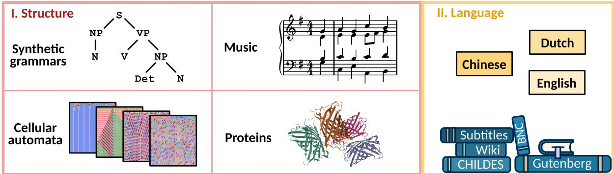  
Figure 1: Schematic of the experimental setup. To investigate how training on structure transfers to learning language, we first train language models on one of four symbolic data types: 1) probabilistic context-free grammars; 2) cellular automata; 3) piano music; and 4) protein sequences. The example tree could refer to the sentence Alice paints the cat. The piece shown is the beginning of Reger (1900). The protein depicted is green fluorescent protein (GFP) of jellyfish adapted from the Uniprot entry (Boutet et al., 2007). Afterwards, we train these models on a multilingual corpus comprising Chinese, Dutch, and English texts

Empirical findings. Structural data can vary in entropy, distributional shape, compositionality, hierarchy, and other regularities, which may induce different biases. Previous studies yield mixed conclusions about their benefits. Training on abstract grammars such as PCFGs can give rise to functional hierarchical representations (Jumelet and Zuidema, 2023; Rohweder et al., 2026), but downstream tasks are not always comparable: Hu et al. (2025) report limited gains on BLIMP, while Lee et al. (2026) focus more on reasoning benchmarks. It remains an unanswered question which properties of the structural source interact with the target language data and how they influence the performance on the evaluation task. We therefore examine a range of structural data types with varying degrees of abstractness and local and global dependencies. In our setup, cellular automata provide local rule-based dynamics, synthetic grammars contribute hierarchical and compositional structure, music offers sequential structure with long-range dependencies, and protein biological complexity.

## 3 Data

The experimental setup consists of training a language model in two stages. In stage I, we train the model from scratch on a structural data type. In stage II, we switch to training on the target corpus.

## 3.1 Structural data

In stage I, we explore four structural data types: synthetic grammars, cellular automata, music, and protein sequences. As a baseline, we use unstructured sequences of random numbers.

Synthetic grammars A probabilistic contextfree grammar (PCFG) is a formal grammar in which production rules for non-terminal symbols are insensitive to the context (Manning and Schütze, 2000). Every production rule is applied with a certain probability, making these synthetic grammars suitable for randomly sampling a wide variety of synthetic data. Created PCFGs mimic natural language closely by synthesizing grammar rules from the Penn Treebank (Marcus et al., 1993), see Section A for details. We test two synthetic datasets generated by the same grammar, differing only in the lexicalization: For $\mathrm { P C F G } _ { \mathrm { Z I P F } }$ , tokens follow a Zipfian distribution; for $\mathrm { P C F G } _ { \mathrm { U N I } }$ , tokens are distributed uniformly.

Cellular automata (CA) A cellular automaton is a row of cells, with each cell being in a discrete state. This row evolves over time under a local transition rule f defining a set of update patterns. At each step in time, every cell is updated based on itself and its two neighbors. Cellular automata are a canonical example of self-organized complexity emergent from simple, deterministic rules (von Neumann and Burks, 1966; Gardner, 1970; Wolfram, 1983). The training objective requires the model to infer these rules from diverse patterns, making cellular automata a compelling source for learning functional capabilities. Section B provides a visualization and technical details.

To assess the impact of structural complexity, we generate two dataset variants: $\mathrm { C A } _ { 1 6 }$ (mediumcomplexity dynamics with K = 16 states) and $\mathrm { C A } _ { 2 5 6 }$ (noisy dynamics with K = 256 states), each generated from about 1,820 rules with multiple initial conditions per rule. The language model receives these space-time trajectories as concatenated rows. In training, the language model must infer the transition rule based on several trajectories generated from different initial conditions to succeed in next-token prediction.

Music Music is a highly structured non-language signal produced by humans. We use piano music from the ARIA-MIDI dataset (Bradshaw and Colton, 2025). For training, the language model receives a transcription of note events, timing and pedal state as a flat sequence of integers, see Section C. Musical data is characterized by long-range temporal dependencies with repetition and variations and rich hierarchical structure in the form of melody, harmony, and rhythm without encoding the semantics of natural language (Berezovsky, 2019).

Protein sequences Proteins lie at the heart of vital biological functions and their amino-acid sequences encode highly complex molecular structures. We choose Swiss-Prot as a list of proteins (Boutet et al., 2007) and normalize the dataset to the 20 canonical amino acids, each a single token, by replacing any rare amino acids or unknowns with an additional symbol X.

Random As a control condition, we generate sequences with uniformly distributed length between 1 and 2,048 from an alphabet of uniformly independently sampled integers $k \in \{ 0 , \ldots , 5 1 2 \}$ .

## 3.2 Language data

We use the dataset provided for the multilingual track of the BabyLM challenge. The dataset comprises cognitively plausible multilingual data according to the criteria outlined in Jumelet et al. (2026a). The exact composition of the dataset is listed in Section D. For stage II training, we sample English, Dutch, and Mandarin Chinese in proportion of 1/3 for each language.

Baselines Our primary baseline model is trained directly in stage II from random initialization, without any prior exposure to structural data. We additionally train a secondary baseline on English Wikipedia (Wikimedia Foundation, 2023) during stage I, in order to assess whether structural transfer provides benefits beyond those obtained from additional natural-language data.

## 4 Experimental setup

We run experiments on 80/20 data splits with a GPT-2 architecture (Radford et al., 2019). Early stopping (with patience of 3 epochs and a threshold of 0.01) is used to identify the optimal amount of structural and natural-language data, respectively. For hyperparameters and implementation details, refer to Section E. We evaluate the gains from structural transfer using the validation loss achieved by the trilingual model on a held-out portion of the natural-language corpus, together with performance on a combination of zero-shot and fine-tuning tasks from the BabyLM framework (Choshen et al., 2026), see Section F.

Tokenization We train a trilingual byte-pairencoding (BPE) tokenizer with a fixed vocabulary of 16,897 tokens using the same approach to data sampling as outlined in Section 3.2. The tokenizer also includes 512 non-overlapping tokens used exclusively in stage I. At the start of stage II, we reinitialize the embedding layer to prevent spurious lexical transfer from the structural datasets.

Loss metrics We measure the performance of the model on the next-token prediction through the cross-entropy loss $\mathcal { L } ( t )$ over the training tokens t.

The average loss change relative to the baseline is defined by the loss ratio ρ as the ratio of the areas below the loss curves up to N tokens of a condition $\mathcal { L } _ { i }$ and the primary baseline $\mathcal { L } _ { 0 }$ for training on natural language,

$$
\rho _ { i } = \frac { \int _ { t _ { \mathrm { c u t o f f } } } ^ { N } \mathcal { L } _ { i } ( t ) \mathrm { d } t } { \int _ { t _ { \mathrm { c u t o f f } } } ^ { N } \mathcal { L } _ { 0 } ( t ) \mathrm { d } t } - 1 ,\tag{1}
$$

with a minimal cutoff at $t _ { \mathrm { c u t o f f } } = 2 \mathrm { M }$ , to avoid inflating the metric due to large loss differences early in training.

A complementary metric, as used by Hu et al. (2025), is the token efficiency τ, i.e., the ratio of tokens necessary to achieve the final baseline loss with structural transfer,

$$
\tau _ { i } = \frac { 1 } { N } \mathopen { } \mathclose \bgroup \left( N _ { i } + \arg \operatorname* { m i n } _ { 0 \leq n \leq N } \{ \mathcal { L } _ { i } ( n ) \leq \mathcal { L } _ { 0 } ( N ) \} \aftergroup \egroup \right)\tag{2}
$$

where $N _ { i }$ is the number of steps we train on structural data in stage I for condition i. Intuitively, this captures how many tokens are necessary to train on structural plus language data to beat the baseline.

## 5 Results

We examine the effect of structural transfer from each condition along three dimensions: 1) nexttoken prediction loss on a multilingual corpus, 2) model-internal weight shifts during training, and 3) linguistic benchmarks. Together, these analyses allow us to assess to which extent structural transfer can aid language-model training.

## 5.1 Transfer on next-token prediction

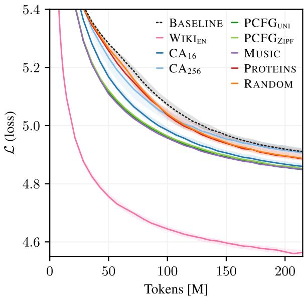  
Figure 2: Cross-entropy loss $\mathcal { L }$ by training step of language models after having trained on structural data compared with the primary baseline of not training on any structure. The lines show the median over five seeds, except few runs that triggered early stopping. Shaded regions delineate minimum and maximum seed at each token count. Note that $\mathrm { P C F G } _ { \mathrm { U N I } }$ $\mathrm { P C F G } _ { \mathrm { Z I P F } }$ , and $\mathrm { { \bf { M } } U - }$ SIC overlap.

Training on symbolic data can robustly improve the loss $\mathcal { L }$ on next-token prediction of natural language. Figure 2 shows that every condition matches or outperforms the baseline of not training on any structure (dashed black) in terms of achieving a lower loss. The clearest gains come from MUSIC, both synthetic grammars $\mathrm { P C F G } _ { \mathrm { U N I } }$ and $\mathrm { P C F G } _ { \mathrm { Z I P F } }$ , and the cellular automata $\mathrm { C A } _ { 1 6 }$ . Note that the two PCFG loss curves overlap, which implies that the Zipfian distribution does not benefit the structural transfer more than a uniform distribution. Although $\mathrm { C A } _ { 2 5 6 }$ yields an early advantage over the baseline, this condition converges to the baseline at 220 M tokens, suggesting that the noisier dynamics do not induce an equally useful initialization. PROTEINS and RANDOM lead to more modest but consistent improvements.

Overall, these results indicate that next-tokenprediction loss can be robustly improved with a variety of symbolic data. However, the $\mathrm { W I K I _ { E N } }$ baseline puts these gains into perspective, showing that training on more natural language data for just one of the three languages from the multilingual corpus outperforms any of these symbolic data by a wide margin.

## 5.2 Model-internal representations

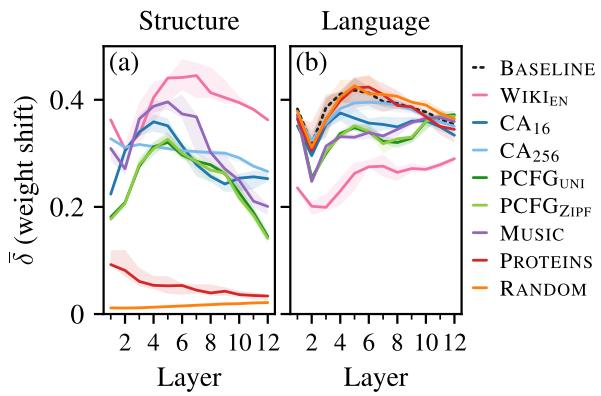  
Figure 3: Weight shift $\bar { \delta }$ per layer in the self-attention matrices when training on (a) structure and subsequently (b) language. Median seed with shaded regions for minimum and maximum seed.

To understand how structural transfer impacts the model, we examine how much the weights shift in the two stages of training on structure and language, respectively. The relative weight shift from a time t before to after the respective training stage for layer l, component c, and seed s is

$$
\delta _ { l , c , s } ^ { ( t ) } = \frac { \| W _ { l , c , s } ^ { \mathrm { a f t e r } } - W _ { l , c , s } ^ { \mathrm { b e f o r e } } \| _ { \mathrm { F } } } { \| W _ { l , c , s } ^ { \mathrm { b e f o r e } } \| _ { \mathrm { F } } } ,\tag{3}
$$

where $\Vert \cdot \Vert _ { \mathrm { F } }$ is the Frobenius norm. We plot the mean across components c of the self-attention mechanism in the transformer architecture (query, key, value, and output matrices) per layer,

$$
\bar { \delta } _ { l , s } ^ { ( t ) } = \frac { 1 } { 4 } \sum _ { c } \delta _ { l , c , s } ^ { ( t ) } .\tag{4}
$$

Shifting weights In Fig. 3 (a), showing stage I, we observe that PROTEINS and RANDOM induce much smaller weight shifts than the other betterperforming conditions of stage II, which indicates that a random initialization is close to a local optimum for predicting these signals. Panel (b) shows how much the weights shift during stage II (language modeling). We see that training on sequences of PROTEINS and RANDOM numbers in stage I does not reduce the required weight shifts for modeling language compared to the baseline of no structural training. The weights of models trained on synthetic grammars, MUSIC, and $\mathrm { C A } _ { 1 6 }$ change less than the baseline with an average weight shift of around ¯δ = 0.34 across layers. Notably, $\mathrm { C A } _ { 2 5 6 }$ is an exception. The weights change strongly in the structural-learning phase, but the resulting attention pattern is not beneficial for language modeling, that is, the required weight shift is as large as for the randomly initialized baseline.

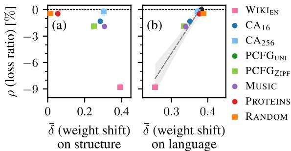  
Figure 4: Relation of loss ratio on language data and weight shift, averaged over layers, for training on (a) structural data and (b) language data. Solid dots show the median, small transparent dots show each seed. PCFG and MUSIC perform best because the representations from learning on structure can be partially transferred to language, $\mathrm { C A } _ { 1 6 }$ to a lesser extent, too. Dotted black line and black circle (b): baseline of training on language only. Dashed gray line in (b): ordinaryleast-squares regression through condition-level medians; shaded band: 95 % confidence interval.

Relating weights and loss In Fig. 4, we visualize the loss reduction relative to the weight shift. The respective weight shift correlates with loss improvement on language (panel (b) with Pearson correlation $r = 0 . 9 6 , p < 0 . 0 1 )$ but less so on structural data (panel (a) with $r = - 0 . 6 0 , p = 0 . 1 1 )$ . The smallest weight shift achieved in stage II is associated with the biggest loss improvement for the English Wikipedia baseline. These results indicate that the weights optimized for predicting structural data facilitate learning language by requiring a smaller weight shift.

Moreover, the best conditions achieve a token efficiency of approximately 60 % of the original token budget, meaning they require only about 60 % of the baseline token budget to reach equivalent language-modeling performance. The loss ratio $\rho$ measures how much the training on structural data improves the cross-entropy loss (lower is better) on average over training steps and this ratio is closely related to token efficiency, see Section G.

## 5.3 Linguistic benchmarks

We employ the framework of the BabyLM challenge, which combines zero-shot and finetuning evaluation in English, Dutch, and Chinese (Choshen et al., 2026), covering testing suites for linguistic competence (BLiMP-style tasks), reading comprehension, knowledge probing, and others. For details on the exact tasks, refer to Table 8 in Section F.

The results show that the observed loss reduction on the language modeling objective does not translate to better performance on linguistic benchmarks. Figure 5 shows the evaluation results for several zero-shot and fine-tuning tasks. The only stage-I condition that robustly improves the baseline results for English and Dutch is training on English texts. All other structural-transfer conditions do not significantly affect the average evaluation results positively nor negatively.

Across languages, $\mathrm { C A } _ { 1 6 }$ has a small positive effect. We note that some conditions improve or worsen the performance exclusively on fine-tuning or zero-shot. This inconsistency might indicate that the linguistic benchmarks cannot resolve the small differences induced by the structural data or that zero-shot and fine-tuning tasks are not entirely aligned, measuring different linguistic aspects. Even if some structural data tends to lead to an improvement, the magnitude of this effect appears small, on the order of one percentage point. We conclude that an improvement on the target objective (next-token prediction) does not generally entail an improvement on linguistic benchmarks.

Detailed effects We fit a Bayesian hierarchical model to estimate the effect of each structuraltransfer condition relative to the natural language baseline. Benchmark scores (averaged across seeds) are modeled as scor $\mathsf { \Pi } _ { \mathsf { c } t l } ^ { \mathsf { } } \sim \mathcal { N } ( \mu _ { c } + u _ { t } , \sigma )$ for each language and as score $\mathbf { \Psi } _ { c t l } \sim \mathcal { N } ( \mu _ { c } + u _ { t } + u _ { l } , \sigma )$ for the total, with a fixed effect $\mu _ { c }$ per condition, a random effect $u _ { t }$ per task, and a random effect per language $u _ { l }$ . We report the posterior mean difference $\Delta _ { c } = \mu _ { c } - \mu _ { \mathrm { b a s e l i n e } }$ relative to the effect of the primary baseline in percentage points with 95 % highest-density intervals (HDI) and posterior probability $p ( \Delta _ { c } > 0 )$ , estimated via NUTS sampling (Hoffman and Gelman, 2014; Abril-Pla et al.,

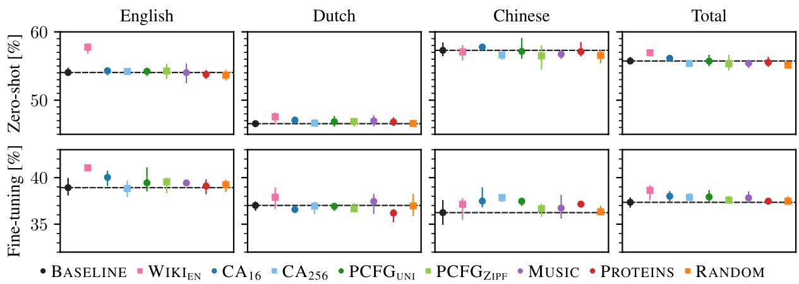  
Figure 5: Average accuracy on linguistic zero-shot and fine-tuning benchmarks for English, Dutch, Chinese, and averaged over these three languages, see Table 8. The dashed line denotes the baseline of not training on structural data. There are no significant changes relative to the baseline for the total, except $\mathrm { W I K I _ { E N } }$ and $\mathrm { C A } _ { 1 6 }$ . Dots show the median and error bars indicate the minimum and maximum seed.

2023) with four chains of 2,000 draws.

Figure 6 shows posterior estimates for all conditions across languages combined. Training on Wikipedia in stage I has robust positive effects on both zero-shot (∆ = +1.2 pp, HDI: [0.6, 1.9], $p = 1 . 0 0 )$ and fine-tuning $( \Delta = + 1 . 3 \mathrm { p p }$ , HDI: $[ - 0 . 1 , 2 . 7 ] , p = 0 . 9 7 )$ evaluations. The RANDOM condition shows a small negative effect on zeroshot performance $( \Delta = - 0 . 6 \mathrm { p p }$ , HDI: [−1.2, 0.1], $p \ = \ 0 . 0 4 )$ The $\mathrm { C A } _ { 1 6 }$ has a small positive effect on both zero-shot and fine-tuning performance $( \Delta \ : \ : = \ : 0 . 4 \mathrm { p p }$ , HDI: [−0.2, 1.1], p = 0.88 and $\Delta = 0 . 7 \mathrm { p p }$ , HDI: [−0.8, 2.0], $p = 0 . 8 3$ , respectively). All structural data have effects close to zero with HDIs that include zero.

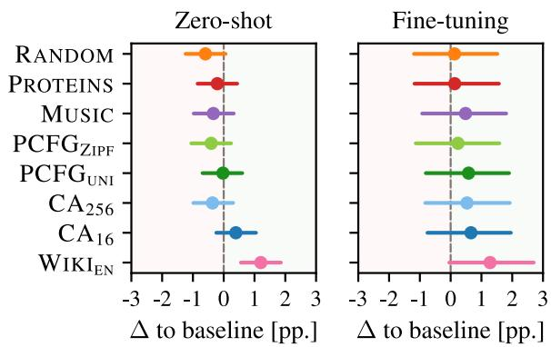  
Figure 6: Mean and 95 % highest-density intervals estimated by a Bayes model for linguistic benchmarks of zero-shot and fine-tuning across languages.

Based on these results, we performed a hyperparameter search to train the submission model for the BabyLM challenge on a mixture of the most beneficial data types, see Section H for details. However, even the best model (in terms of validation loss) does not perform much better than the separately trained models.

Syntactic Tasks We hypothesize that structural transfer is more beneficial for syntax-level tasks due to its hierarchical dependencies. To check this, we select tasks explicitly marked as “syntactic” from English BLiMP (Warstadt et al., 2020), BLiMP-NL (Suijkerbuijk et al., 2025) and ZhoBLiMP (Liu et al., 2026). These tasks span syntactic features such as argument structure, ordering in wh-clauses, islands constraints, etc. However, both per-task and aggregated category results per data type do not improve over the baseline by more than two percentage points.

## 6 Discussion

In summary, our results indicate that learning structural patterns enables faster performance gains on the next-token prediction task. However, these dynamics do not translate to better performance in linguistic benchmarks (Chen et al., 2025). Rather, transfer depends on the task at hand: Both nexttoken prediction and linguistic benchmarks measure language competence yet via different metrics, so that optimizing for next-token prediction does not necessarily imply measurable transfer effects on linguistic tasks. Finding that none of the tested structural conditions match the efficiency of additional natural-language data, we conclude that the intricate correlational structures of language cannot easily be replaced by synthetic data.

Given that the two PCFG variants perform equally, a Zipfian distribution alone does not appear to impact transfer significantly. This may be because a Zipfian distribution is a first-order approximation of the correlational structure, i.e., just unigrams, which are learned quickly when training on natural language.

Although protein sequences encode highly complex biological information, this structure does not appear to be readily accessible to a transformer, at least not under our naive tokenization approach used for the next-token prediction task of one token per amino acid. Since even random numbers perform slightly better than a randomly initialized model without any structural training, this might indicate that even a very simple tweak to the weight initialization can improve training results.

The structural data may initialize the weights to functionally useful representations leading to successful structural transfer. These representations might be interesting to explore in connection with the work on discovering capabilities emerging in attention heads during pretraining (Olsson et al., 2022; Elhage et al., 2021; Crosbie and Shutova, 2025; Aoyama et al., 2026), in which a learned matrix structure facilitates functions such as token copying or retrieval.

In some respects, the well-performing data are language-like. For example, music has highly complex structure produced by humans, including recursions and a form of syntax. PCFGs explicitly model syntactic structure extracted from naturallanguage texts. In cellular automata, on the other hand, complexity emerges from simple rules. However, any structural data we train on lacks the semantic content of language. Thus, it would be interesting to further explore the degree to which semantics are helpful and necessary for transfer.

## 7 Conclusion

We investigated whether structural transfer can improve sample-efficient multilingual language modeling. Our results show that training on structured symbolic data before natural language can improve next-token prediction learning efficiency. The weight-shift analysis supports this interpretation: Models that benefit most from structural transfer require smaller parameter changes during multilingual language training, indicating that prior structural exposure places models in a more favorable region of the parameter space.

However, downstream gains are limited. Improvements on the language-modeling objective do not reliably translate into stronger performance on downstream linguistic benchmarks. Moreover, when additional natural language data is available, it remains more efficient than structural data, even when training on a mix of partially typologically distant languages such as English, Dutch, and Chinese. Although this may be useful when language data is limited, such as for low-resource languages or other data-constrained settings, structural transfer is not a direct substitute for relevant language input.

More broadly, our findings suggest that structural data provides a direction for revisiting initialization strategies in language models. Carefully tailoring model weights before training may provide a useful head start, particularly in the context of limited compute and model capacity.

## Limitations

Selected structures Although we aim for a wide range of structural data (synthetic grammars, music, proteins, CAs) that we expected a priori to possibly yield strong transfer to natural language, resembling language to varying degrees, we cannot account for all possible data types exhaustively.

Model size We conduct our experiments on the GPT-2-small architecture. While this setup provides us with a reasonable overview of structural transfer, a variation of the model size could clarify the limits of the loss improvements on next-token prediction.

Data-mixing effects We do not exhaustively explore the effects of data mixing during stage I. A wider variety of high-quality data in stage II would allow for a more detailed study of languagespecific differences in structural transfer. Since the Wikipedia baseline is in English only, we cannot assess the benefits of structural transfer across different natural languages. Observing effects of structural transfer tailored to a specific language would be an interesting avenue for future research.

Representations We evaluate transfer by analyzing the magnitude of the weight shift. A more detailed analysis through the lens of mechanistic interpretability could target specifically the representations that the model learns on the structural data and possibly reuses on natural language.

## Ethical considerations

While we aim to advance the design of cognitively inspired models, we do not speculate here on how human language processing works. Explicit parallels between the processing capabilities of models and human cognition tend to be strained easily.

## Acknowledgments

We thank the reviewers for their feedback. We thank Alexander Ecker and Edoardo Ponti for helpful discussions. This research is partially supported by the zukunft.niedersachsen program of the VolkswagenStiftung (L.B., Y.V.) and by a VENI grant (Vl.Veni.211C.039) from the Nederlandse Organisatie voor Wetenschappelijk Onderzoek (NWO) (L.B.).

## Author contributions

Y.V.: Supervision, Conceptualization, Analysis, Software (training), Literature review, Writing— original draft (Abstract, Introduction, Related work, Conclusion, parts of Methods), Writing—review & editing. J.M.M.: Supervision, Conceptualization, Analysis, Software (data and analysis), Literature review, Visualization, Writing—original draft (Results and Discussion; parts of Introduction, Related work, and Methods; App. on CAs and music), Writing—review & editing. J.L..: Software (PCFG data), Writing—original draft (PCFGs). L.B.: Supervision, Conceptualization, Analysis, Writing— review & editing.

## References

Oriol Abril-Pla, Virgile Andreani, Colin Carroll, Larry Dong, Christopher J. Fonnesbeck, Maxim Kochurov, Ravin Kumar, Junpeng Lao, Christian C. Luhmann, Osvaldo A. Martin, Michael Osthege, Ricardo Vieira, Thomas Wiecki, and Robert Zinkov. 2023. PyMC: A modern, and comprehensive probabilistic programming framework in python. PeerJ Computer Science, 9:e1516.

David Ifeoluwa Adelani, Hannah Liu, Xiaoyu Shen, Nikita Vassilyev, Jesujoba O Alabi, Yanke Mao, Haonan Gao, and En-Shiun Annie Lee. 2024. SIB-200: A simple, inclusive, and big evaluation dataset for topic classification in 200+ languages and dialects. In Proceedings ofthe 18th Conference ofthe European Chapter of the Association for Computational Linguistics (Volume 1: Long Papers), pages 226–245, St. Julian’s, Malta. Association for Computational Linguistics.

Tatsuya Aoyama, Ethan Wilcox, and Nathan Schneider. 2026. Predicting the formation of induction heads. In First Workshop on CogInterp: Interpreting Cognition in Deep Learning Models, San Diego, CA, USA. Curran Associates, Inc.

Lucas Bandarkar, Davis Liang, Benjamin Muller, Mikel Artetxe, Satya Narayan Shukla, Donald Husa, Naman Goyal, Abhinandan Krishnan, Luke Zettlemoyer, and Madian Khabsa. 2024. The belebele benchmark: A parallel reading comprehension dataset in 122 language variants. In Proceedings ofthe 62nd Annual Meeting of the Association for Computational Linguistics (Volume 1: Long Papers), pages 749–775, Bangkok, Thailand. Association for Computational Linguistics.

Jesse Berezovsky. 2019. The structure of musical harmony as an ordered phase of sound: A statistical mechanics approach to music theory. Science Advances, 5(5):eaav8490.

Steven Bird and Edward Loper. 2004. NLTK: The natural language toolkit. In Proceedings of the ACL 2004 on Interactive Poster and Demonstration Sessions, pages 31–es, Barcelona, Spain. Association for Computational Linguistics.

Emmanuel Boutet, Damien Lieberherr, Michael Tognolli, Michel Schneider, and Amos Bairoch. 2007. UniProtKB/Swiss-Prot. In David Edwards, editor, Plant Bioinformatics, volume 406 of Methods in Molecular Biology, pages 89–112. Humana Press, Totowa, NJ, USA.

Louis Bradshaw and Simon Colton. 2025. Aria-MIDI: A dataset of piano MIDI files for symbolic music modeling. In The Thirteenth International Conference on Learning Representations, Singapore. ICLR.

Tyler A. Chang et al. 2026. Global PIQA: Evaluating commonsense reasoning across 100+ languages and cultures. Preprint, arXiv:2510.24081.

Lucas Charpentier, Leshem Choshen, Ryan Cotterell, Mustafa Omer Gul, Michael Hu, Jaap Jumelet, Tal Linzen, Jing Liu, Aaron Mueller, Candace Ross, Raj Sanjay Shah, Alex Warstadt, Ethan Wilcox, and Adina Williams. 2025. BabyLM turns 3: Call for papers for the 2025 BabyLM workshop. Preprint, arXiv:2502.10645.

Yangyi Chen, Binxuan Huang, Yifan Gao, Zhengyang Wang, Jingfeng Yang, and Heng Ji. 2025. Scaling laws for predicting downstream performance in LLMs. Transactions on Machine Learning Research.

Leshem Choshen, Ryan Cotterell, Mustafa Omer Gul, Jaap Jumelet, Tal Linzen, Aaron Mueller, Suchir Salhan, Raj Sanjay Shah, Alex Warstadt, and Ethan Gotlieb Wilcox. 2026. BabyLM turns 4 and goes multilingual: Call for papers for the 2026 BabyLM workshop. Preprint, arXiv:2602.20092.

Peter Clark, Isaac Cowhey, Oren Etzioni, Tushar Khot, Ashish Sabharwal, Carissa Schoenick, and Oyvind

Tafjord. 2018. Think you have solved question answering? Try ARC, the AI2 reasoning challenge. Preprint, arXiv:1803.05457.

Alexis Conneau, Ruty Rinott, Guillaume Lample, Adina Williams, Samuel Bowman, Holger Schwenk, and Veselin Stoyanov. 2018. XNLI: Evaluating crosslingual sentence representations. In Proceedings of the 2018 Conference on Empirical Methods in Natural Language Processing, pages 2475–2485, Brussels, Belgium. Association for Computational Linguistics.

Joy Crosbie and Ekaterina Shutova. 2025. Induction heads as an essential mechanism for pattern matching in in-context learning. In Findings ofthe Association for Computational Linguistics: NAACL 2025, pages 5034–5096, Albuquerque, NM, USA. Association for Computational Linguistics.

Richard Diehl Martinez, Hope McGovern, Zebulon Goriely, Christopher Davis, Andrew Caines, Paula Buttery, and Lisa Beinborn. 2023. CLIMB – Curriculum learning for infant-inspired model building. In Proceedings of the BabyLM Challenge at the 27th Conference on Computational Natural Language Learning, pages 84–99, Singapore. Association for Computational Linguistics.

Nelson Elhage, Neel Nanda, Catherine Olsson, Tom Henighan, Nicholas Joseph, Ben Mann, Amanda Askell, Yuntao Bai, Anna Chen, Tom Conerly, et al. 2021. A mathematical framework for transformer circuits. Technical Report 12, Anthropic.

Martin Gardner. 1970. Mathematical games. Scientific American, 223(4):120–123.

Xavier Glorot and Yoshua Bengio. 2010. Understanding the difficulty of training deep feedforward neural networks. In Proceedings of the Thirteenth International Conference on Artificial Intelligence and Statistics, volume 9, pages 249–256, Sardinia, Italy. Journal of Machine Learning Research.

Kaiming He, Xiangyu Zhang, Shaoqing Ren, and Jian Sun. 2015. Delving deep into rectifiers: Surpassing human-level performance on ImageNet classification. In 2015 IEEE International Conference on Computer Vision (ICCV), pages 1026–1034, Santiago, Chile. IEEE.

Linyang He, Ercong Nie, Sukru Samet Dindar, Arsalan Firoozi, Van Nguyen, Corentin Puffay, Riki Shimizu, Haotian Ye, Jonathan Brennan, Helmut Schmid, Hinrich Schuetze, and Nima Mesgarani. 2025. XCOMPS: A multilingual benchmark of conceptual minimal pairs. In Proceedings of the 7th Workshop on Research in Computational Linguistic Typology and Multilingual NLP, pages 75–81, Vinenna. Austria. Association for Computational Linguistics.

Matthew D Hoffman and Andrew Gelman. 2014. The No-U-Turn sampler: Adaptively setting path lengths in Hamiltonian Monte Carlo. Journal of Machine Learning Research, 15(1):1593–1623.

Jordan Hoffmann, Sebastian Borgeaud, Arthur Mensch, Elena Buchatskaya, Trevor Cai, Eliza Rutherford, Diego de Las Casas, Lisa Anne Hendricks, Johannes Welbl, Aidan Clark, Tom Hennigan, Eric Noland, Katie Millican, George van den Driessche, Bogdan Damoc, Aurelia Guy, Simon Osindero, Karen Simonyan, Erich Elsen, and 3 others. 2022. Training compute-optimal large language models. In Proceedings ofthe 36th International Conference on Neural Information Processing Systems, 2176, pages 30016– 30030, New Orleans, LA, USA. Curran Associates, Inc.

Hai Hu, Yunhao Zhang, Hong’ao Zhu, Siyuan Song, Rui Wang, Renfen Hu, Linyang He, Luan Li, Xiaozhe Ji, Shaonan Wang, Zhizheng Qian, and Yingxin Lin. 2026. Evaluation Pipeline.

Michael Y. Hu, Jackson Petty, Chuan Shi, William Merrill, and Tal Linzen. 2025. Between circuits and Chomsky: Pre-pretraining on formal languages imparts linguistic biases. In Proceedings of the 63rd Annual Meeting ofthe Associationfor Computational Linguistics (Volume 1: Long Papers), pages 9691– 9709, Vienna, Austria. Association for Computational Linguistics.

Liangze Jiang, Zachary Shinnick, Anton van den Hengel, Hemanth Saratchandran, and Damien Teney. 2026. Procedural pretraining: Warming up language models with abstract data. Preprint, arXiv:2601.21725.

Jaap Jumelet, Abdellah Fourtassi, Akari Haga, Bastian Bunzeck, Bhargav Shandilya, Diana Galvan-Sosa, Faiz Ghifari Haznitrama, Francesca Padovani, Francois Meyer, Hai Hu, Julen Etxaniz, Laurent Prevot, Linyang He, María Grandury, Mila Marcheva, Negar Foroutan, Nikitas Theodoropoulos, Pouya Sadeghi, Siyuan Song, and 7 others. 2026a. BabyBabelLM: A multilingual benchmark of developmentally plausible training data. In Proceedings ofthe 19th Conference of the European Chapter of the Association for Computational Linguistics (Volume 1: Long Papers), pages 3297–3329, Rabat, Morocco. Association for Computational Linguistics.

Jaap Jumelet, Leonie Weissweiler, Joakim Nivre, and Arianna Bisazza. 2026b. MultiBLiMP 1.0: A massively multilingual benchmark of linguistic minimal pairs. Transactions ofthe Associationfor Computational Linguistics, 14:193–216.

Jaap Jumelet and Willem Zuidema. 2023. Transparency at the source: Evaluating and interpreting language models with access to the true distribution. In Findings of the Association for Computational Linguistics: EMNLP 2023, pages 4354–4369, Singapore. Association for Computational Linguistics.

Karthikeyan K, Zihan Wang, Stephen Mayhew, and Dan Roth. 2020. Cross-lingual ability of multilingual BERT: An empirical study. In The Eighth International Conference on Learning Representations 2020, Online. Curran Associates, Inc.

Victor Kuperman, Sascha Schroeder, Cengiz Acartürk, Niket Agrawal, Dominick M. Alexandre, Lena S. Bolliger, Jan Brasser, César Campos-Rojas, Denis Drieghe, Dušica Filipovic Ður´ devi¯ c, Luiz Vinicius´ Gadelha De Freitas, Sofya Goldina, et al. 2025. New data on text reading in English as a second language: The Wave 2 expansion of the Multilingual Eye-Movement Corpus (MECO). Studies in Second Language Acquisition, 47(2):677–695.

Dan Lee, Seungwook Han, Akarsh Kumar, and Pulkit Agrawal. 2026. Training language models via neural cellular automata. Preprint, arXiv:2603.10055.

Hung-yi Lee, Shang-Wen Li, and Thang Vu. 2022. Meta learning for natural language processing: A survey. In Proceedings ofthe 2022 Conference ofthe North American Chapter of the Association for Computational Linguistics: Human Language Technologies, pages 666–684, Seattle, WA, USA. Association for Computational Linguistics.

Stephanie Lin, Jacob Hilton, and Owain Evans. 2022a. TruthfulQA: Measuring how models mimic human falsehoods. In Proceedings of the 60th Annual Meeting ofthe Associationfor Computational Linguistics (Volume 1: Long Papers), pages 3214–3252, Dublin, Ireland. Association for Computational Linguistics.

Xi Victoria Lin, Todor Mihaylov, Mikel Artetxe, Tianlu Wang, Shuohui Chen, Daniel Simig, Myle Ott, Naman Goyal, Shruti Bhosale, Jingfei Du, Ramakanth Pasunuru, Sam Shleifer, Punit Singh Koura, Vishrav Chaudhary, Brian O’Horo, Jeff Wang, Luke Zettlemoyer, Zornitsa Kozareva, Mona Diab, and 2 others. 2022b. Few-shot learning with multilingual generative language models. In Proceedings ofthe 2022 Conference on Empirical Methods in Natural Language Processing, pages 9019–9052, Abu Dhabi, United Arab Emirates. Association for Computational Linguistics.

Yikang Liu, Yeting Shen, Hongao Zhu, Lilong Xu, Zhiheng Qian, Siyuan Song, Kejia Zhang, Jialong Tang, Pei Zhang, Baosong Yang, Rui Wang, and Hai Hu. 2026. A systematic assessment of language models with linguistic minimal pairs in Chinese. Transactions ofthe Associationfor Computational Linguistics, 14:755–771.

Christopher D. Manning and Hinrich Schütze. 2000. Probabilistic parsing. In Foundations of Statistical Natural Language Processing, 2nd edition, pages 407–460. MIT Press, Cambridge, MA, USA.

Mitchell P. Marcus, Beatrice Santorini, and Mary Ann Marcinkiewicz. 1993. Building a large annotated corpus of English: The Penn Treebank:. Computational Linguistics, 19(2):313–330.

Jonas Mayer Martins, Ali Hamza Bashir, Muhammad Rehan Khalid, and Lisa Beinborn. 2025. Once upon a time: Interactive learning for storytelling with small language models. In Proceedings ofthe First BabyLM Workshop, pages 454–468, Suzhou, China. Association for Computational Linguistics.

Sebastian J. Mielke, Ryan Cotterell, Kyle Gorman, Brian Roark, and Jason Eisner. 2019. What kind of language is hard to language-model? In Proceedings of the 57th Annual Meeting of the Association for Computational Linguistics, pages 4975–4989, Florence, Italy. Association for Computational Linguistics.

Alexander Mordvintsev, Ettore Randazzo, Eyvind Niklasson, and Michael Levin. 2020. Growing neural cellular automata. Distill, 5(2).

Joakim Nivre, Marie-Catherine de Marneffe, Filip Ginter, Jan Hajic, Christopher D. Manning, Sampoˇ Pyysalo, Sebastian Schuster, Francis Tyers, and Daniel Zeman. 2020. Universal Dependencies v2: An evergrowing multilingual treebank collection. In Proceedings ofthe Twelfth Language Resources and Evaluation Conference, pages 4034–4043, Marseille, France. European Language Resources Association.

Catherine Olsson, Nelson Elhage, Neel Nanda, Nicholas Joseph, Nova DasSarma, Tom Henighan, Ben Mann, Amanda Askell, Yuntao Bai, Anna Chen, Tom Conerly, Dawn Drain, Deep Ganguli, Zac Hatfield-Dodds, Danny Hernandez, Scott Johnston, Andy Jones, Jackson Kernion, Liane Lovitt, and 7 others. 2022. Incontext learning and induction heads. Preprint, arXiv:2209.11895.

Isabel Papadimitriou and Dan Jurafsky. 2020. Learning music helps you read: Using transfer to study linguistic structure in language models. In Proceedings ofthe 2020 Conference on Empirical Methods in Natural Language Processing (EMNLP), pages 6829–6839, Online. Association for Computational Linguistics.

Isabel Papadimitriou and Dan Jurafsky. 2023. Injecting structural hints: Using language models to study inductive biases in language learning. In Findings of the Association for Computational Linguistics: EMNLP 2023, pages 8402–8413, Singapore. Association for Computational Linguistics.

Telmo Pires, Eva Schlinger, and Dan Garrette. 2019. How multilingual is multilingual BERT? In Proceedings of the 57th Annual Meeting of the Association for Computational Linguistics, pages 4996–5001, Florence, Italy. Association for Computational Linguistics.

Wessel Poelman, Thomas Bauwens, and Miryam de Lhoneux. 2025. Confounding factors in relating model performance to morphology. In Proceedings ofthe 2025 Conference on Empirical Methods in Natural Language Processing, pages 7273–7298, Suzhou, China. Association for Computational Linguistics.

Jirui Qi, Raquel Fernández, and Arianna Bisazza. 2023. Cross-lingual consistency of factual knowledge in multilingual language models. In Proceedings of the 2023 Conference on Empirical Methods in Natural Language Processing, pages 10650–10666, Singapore. Association for Computational Linguistics.

Alec Radford, Jeffrey Wu, Rewon Child, David Luan, Dario Amodei, and Ilya Sutskever. 2019. Language models are unsupervised multitask learners. OpenAI blog.

Max Reger. 1900. Der Mond ist aufgegangen. In Sieben Geistliche Volkslieder, WoO VI/14. Transcribed by the authors.

Jonas Rohweder, Subhabrata Dutta, and Iryna Gurevych. 2026. Hierarchical latent structures in data generation process unify mechanistic phenomena across scale. Preprint, arXiv:2603.06592.

Angelika Romanou, Negar Foroutan, Anna Sotnikova, Zeming Chen, Sree Harsha Nelaturu, Shivalika Singh, Rishabh Maheshwary, Micol Altomare, Mohamed A Haggag, Imanol Schlag, Marzieh Fadaee, Sara Hooker, and Antoine Bosselut. 2025. IN-CLUDE: Evaluating multilingual language understanding with regional knowledge. In The Thirteenth International Conference on Learning Representations 2025, pages 83291–83322, Singapore. Curran Associates, Inc.

David E. Rumelhart, Geoffrey E. Hinton, and Ronald J. Williams. 1986. Learning representations by backpropagating errors. Nature, 323(6088):533–536.

Jenny R. Saffran and Natasha Z. Kirkham. 2018. Infant statistical learning. Annual Review of Psychology, 69(1):181–203.

Keisuke Sakaguchi, Ronan Le Bras, Chandra Bhagavatula, and Yejin Choi. 2021. WinoGrande: An adversarial Winograd Schema Challenge at scale. Communications ofthe ACM, 64(9):99–106.

Chen Shani, Yuval Reif, Nathan Roll, Dan Jurafsky, and Ekaterina Shutova. 2026. The roots of performance disparity in multilingual language models: Intrinsic modeling difficulty or design choices? Preprint, arXiv:2601.07220.

Zachary Shinnick, Liangze Jiang, and Hemanth Saratchandran. 2025. Transformers pretrained on procedural data contain modular structures for algorithmic reasoning. In Methods and Opportunities at Small Scale (MOSS), Vancouver, Canada. Proceedings of Machine Learning Research.

Noam Siegelman, Sascha Schroeder, Cengiz Acartürk, Hee-Don Ahn, Svetlana Alexeeva, Simona Amenta, Raymond Bertram, Rolando Bonandrini, Marc Brysbaert, Daria Chernova, Sara Maria Da Fonseca, Nicolas Dirix, and others. 2022. Expanding horizons of cross-linguistic research on reading: The Multilingual Eye-movement Corpus (MECO). Behavior Research Methods, 54(6):2843–2863.

Noam Siegelman, Sascha Schroeder, Yaqian Borogjoon Bao, Cengiz Acartürk, Niket Agrawal, Lena S. Bolliger, Jan Brasser, César Campos-Rojas, Denis Drieghe, Dušica Filipovic Ður ´ devi ¯ c, Sofya Goldina,´ Romualdo Ibáñez Orellana, and others. 2025. Wave 2 of the Multilingual Eye-Movement Corpus (MECO):

New text reading data across languages. Scientific Data, 12(1):1183.

Vésteinn Snæbjarnarson, Annika Simonsen, Goran Glavaš, and Ivan Vulic. 2023.´ Transfer to a lowresource language via close relatives: The case study on Faroese. In Proceedings ofthe 24th Nordic Conference on Computational Linguistics (NoDaLiDa), Tórshavn, Faroe Islands. University of Tartu Library.

Petru Soviany, Radu Tudor Ionescu, Paolo Rota, and Nicu Sebe. 2022. Curriculum learning: A survey. International Journal ofComputer Vision, 130(6):1526– 1565.

Martin Spitznagel and Janis Keuper. 2026. A new kind of network? Review and reference implementation of neural cellular automata. Preprint, arXiv:2604.24990.

Michelle Suijkerbuijk, Zoë Prins, Marianne De Heer Kloots, Willem Zuidema, and Stefan L. Frank. 2025. BLiMP-NL: A corpus of dutch minimal pairs and acceptability judgments for language model evaluation. Computational Linguistics, 51(4):1267–1301.

John von Neumann and Arthur Walther Burks. 1966. Theory of Self-Reproducing Automata, 1st edition. University of Illinois Press, Urbana, IL, USA.

Mingyang Wang, Heike Adel, Lukas Lange, Jannik Strötgen, and Hinrich Schuetze. 2023. GradSim: Gradient-based language grouping for effective multilingual training. In Proceedings of the 2023 Conference on Empirical Methods in Natural Language Processing, pages 4631–4646, Singapore. Association for Computational Linguistics.

Xin Wang, Yudong Chen, and Wenwu Zhu. 2021. A survey on curriculum learning. IEEE Transactions on Pattern Analysis and Machine Intelligence, 44(9):4555–4576.

Alex Warstadt, Aaron Mueller, Leshem Choshen, Ethan Wilcox, Chengxu Zhuang, Juan Ciro, Rafael Mosquera, Bhargavi Paranjape, Adina Williams, Tal Linzen, and Ryan Cotterell. 2023. Findings of the BabyLM challenge: Sample-efficient pretraining on developmentally plausible corpora. In Proceedings of the BabyLM Challenge at the 27th Conference on Computational Natural Language Learning, pages 1–6, Singapore. Association for Computational Linguistics.

Alex Warstadt, Alicia Parrish, Haokun Liu, Anhad Mohananey, Wei Peng, Sheng-Fu Wang, and Samuel R. Bowman. 2020. BLiMP: The Benchmark of Linguistic Minimal Pairs for English. Transactions of the Associationfor Computational Linguistics, 8:377– 392.

Wikimedia Foundation. 2023. English Wikipedia 2023- 11-01.

Adina Williams, Nikita Nangia, and Samuel Bowman. 2018. A broad-coverage challenge corpus for sentence understanding through inference. In Proceedings ofthe 2018 Conference ofthe North American Chapter of the Association for Computational Linguistics: Human Language Technologies, Volume 1 (Long Papers), pages 1112–1122, New Orleans, LA, USA. Association for Computational Linguistics.

Stephen Wolfram. 1983. Statistical mechanics of cellular automata. Reviews ofModern Physics, 55(3):601– 644.

Jiasheng Ye, Peiju Liu, Tianxiang Sun, Jun Zhan, Yunhua Zhou, and Xipeng Qiu. 2025. Data mixing laws: Optimizing data mixtures by predicting language modeling performance. In The Thirteenth International Conference on Learning Representations 2025, pages 82263–82287, Singapore. Curran Associates, Inc.

Rowan Zellers, Ari Holtzman, Yonatan Bisk, Ali Farhadi, and Yejin Choi. 2019. HellaSwag: Can a machine really finish your sentence? In Proceedings of the 57th Annual Meeting ofthe Associationfor Computational Linguistics, pages 4791–4800, Florence, Italy. Association for Computational Linguistics.

## A Synthetic grammars

We induce a probabilistic context-free grammar from the UD-Treebank annotation. The grammar is delexicalized, i.e., the terminal symbols are wordclass categories. We then create data by sampling parse trees from the grammar and instantiating word classes with vocabulary IDs, see Fig. 7. The two types $\mathrm { P C F G } _ { \mathrm { U N I } }$ and $\mathrm { P C F G } _ { \mathrm { Z I P F } }$ differ only in the frequency with which the words are sampled in the last step. Table 1 summarizes shared settings; Table 2 details the vocabulary layout.

<table><tr><td>Parameter</td><td>Value</td></tr><tr><td>Corpus size</td><td>200 M tokens</td></tr><tr><td>Grammar</td><td>Penn Treebank PCFG</td></tr><tr><td>Max. parse depth</td><td>16</td></tr><tr><td>Sampling  $( \mathrm { P C F G _ { z i p f } ) }$ </td><td> $\mathrm { Z i p f } \left( \alpha = 1 \right)$ </td></tr><tr><td>Sampling  $( \mathrm { P C F G } _ { \mathrm { u n i } } )$ </td><td>uniform</td></tr></table>

Table 1: PCFG hyperparameters.

English-based Grammar Induction and Normalization. We derive a PCFG from the Wall-Street-Journal portion of the English Penn Treebank that is distributed with NLTK (Marcus et al., 1993; Bird and Loper, 2004) by estimating relative frequencies. The grammar is entirely delexicalized during construction by removing word-level rules, resulting in 2,664 structural productions, 26 nonterminal symbols, and 22 terminal categories. Partof-speech tags on the right-hand side are collapsed into coarse abstract categories, such as grouping various noun tags into a single noun category. Punctuation is mapped to dedicated terminal categories (e.g. period, comma), rather than being collapsed into a single punctuation class. Functional tags and trace indices are stripped from non-terminal names to merge similar Treebank labels, and productions containing empty nodes are excluded.

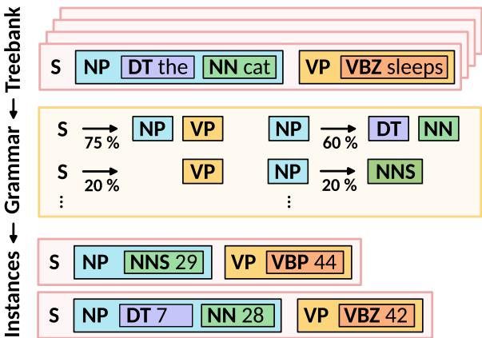  
Figure 7: From the treebank, which consists of sentences with part-of-speech tags, we derive the transition probabilities, e.g., a sentence S splits into a noun phrase NP and a verb phrase VP or into only a verb phrase. Similarly, a noun phrase can split into a determiner DT and a noun NN or into a plural noun NNS. From the derived grammar, we can sample instances again, but the lexicalization is not semantic, represented by abstract integers instead. The model receives only the sequence integers, without part-of-speech tags.

After merging duplicate productions, the probabilities are normalized separately for each lefthand-side non-terminal. To guarantee that generation can terminate at a specified depth, some non-terminals require a fallback rule. For any non-terminal lacking a production that expands exclusively to terminal categories, we add a single fallback production with a raw probability of $1 0 ^ { - 6 }$ . This fallback is included in the left-hand side group prior to normalization, allowing it to retain a small relative probability while slightly reducing the mass of the other rules.

Tree generation and depth constraints. Parse trees are generated via stochastic top-down sampling from the induced PCFG, starting at the root symbol S. At each non-terminal node, a production is drawn with a probability proportional to its weight among the rules for that symbol, and expansion continues until every leaf is a terminal category. For example,

S → NP VP   
NP → det noun   
VP → verb NP   
NP → noun   
⇒ det noun verb noun

To keep the trees finite, we enforce a maximum depth limit of 16, counting the root as depth 0. During expansion at depths 0 through 14, any available production for a given symbol may be used. When the sampler reaches depth 15, the active rule set is restricted strictly to terminal-only productions. This intervention truncates very deep structures and slightly shifts the generated distribution compared to the unbound grammar.

Lexicon layout and token sampling The 512 integer IDs are shuffled using a fixed random seed and partitioned into disjoint slices for each syntactic category, see Table 2. Slot sizes are derived from Penn Treebank type counts (distinct word forms per category), not from token frequencies in running text. To account for the fact that only a small portion of the vocabulary serves as function words, we unevenly distribute the 512 vocabulary IDs into 74 slots (≈ 15 %) for closed-class terminals and 438 slots for open-class terminals.

Once the tree is fully expanded, each terminal leaf is mapped to a concrete ID from the respective vocabulary slice. Under a Zipfian condition, tokens within a slice are sampled with weights proportional to their inverse rank using a global exponent of α = 1. Under the uniform condition, every token within the slice has an equal selection probability.

<table><tr><td>Parameter</td><td>Value</td></tr><tr><td>Number of categories</td><td>22 (disjoint slices)</td></tr><tr><td>Vocabulary size</td><td>512 opaque IDs</td></tr><tr><td>Open / closed budget</td><td>438 / 74 (85 % / 15 %)</td></tr><tr><td>Allocation within budgets</td><td>PTB type counts</td></tr><tr><td>Largest closed slice</td><td>num (51)</td></tr><tr><td>Within-slice sampling</td><td>Zipf (α=1) or uniform</td></tr></table>

Table 2: Lexicon layout.

Final Output and Corpus Statistics. Each generated tree yields one sequence of tokens by extracting the terminal IDs in left-to-right order. The final output consists of simple integer sequences ranging from 0 to 511. We stop the generation process at exactly 200,000,000 tokens per corpus, possibly truncating the last sentence. This procedure results in 572,648 sentences for each file and a mean sequence length of about 349.

## B Generating cellular automata

To illustrate the mechanics of cellular automata, consider the transition rule in Fig. 8: The update pattern $f ( \equiv \equiv \equiv \frac { \ d } { \ d t } ) = \bigstar \bigstar \bigstar \bigstar$ maps this three-cell neighborhood to the state ■ in the next time step.

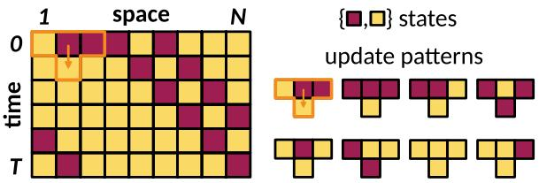  
Figure 8: A cellular automaton consists of a row of cells, each in one of, e.g., K = 2 states {■, ■}. The next time step is determined by applying a set of update patterns that define the transition rule of the cellular automaton to that row.

The rule space of classical cellular automata with K states consists of $K ^ { K ^ { 3 } }$ rules, which is astronomically large even for K = 16, and many of the rules produce either fixed points or uncorrelated noise. Rather than sampling this space uniformly, we parameterize transition rules through a small neural network fθ. Each set of randomly sampled, frozen parameters θ defines a rule.

This approach is known as neural cellular automata (NCA) (Mordvintsev et al., 2020; Spitznagel and Keuper, 2026). By defining a suitable probability distribution for sampling the network parameters θ, we avoid both entirely noisy and homogeneous dynamics, that are expected to be less beneficial for structure learning. Our setup of using NCA for structural transfer in language models is inspired by Lee et al. (2026) but uses a one-dimensional grid, a simplified architecture, and deterministic (argmax) updates for efficiency and interpretability.

Every NCA still defines a classical CA rule. Given the fixed parameters θ, one can simply enumerate the output of the NCA $f _ { \theta }$ for all the threecell neighborhoods to generate a classical lookup table. The neural parameterization is thus purely used to steer the data generation, not changing the nature of the simulated CAs but only which rules are likely to be drawn.

## B.1 Technical implementation

In our implementation, each rule is defined by a randomly sampled, fixed parameter set θ, see Table 3. These parameters define a function $f _ { \theta }$ that is applied to every cell and its 3-cell neighborhood with periodic boundary conditions. This function is a neural network, which updates a cell i to the state $c _ { i } ^ { ( t ) }$ at time t.

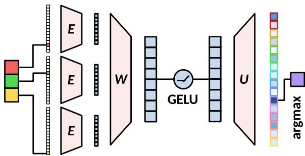  
Figure 9: Schematic of the NCA architecture $f _ { \theta } ,$ , which takes a three-cell neighborhood as input and outputs the next state for the middle cell. The middle cell in state ■ is updated based on itself and its neighbors ■ and ■ through the following steps: One-hot encoding of the state, projection E of this vector to a low-dimensional representation, then a convolution with a matrix W, applying a nonlinearity (GELU), unembedding E and taking the argmax over this vector to arrive at the next cell state ■ → ■.

Architecture The architecture for generating NCA is a simple sequence of three functional steps, which suffice to give rise to interesting dynamics by inducing a bottleneck, convolution, and nonlinearity on the input data. Figure 9 visualizes this architecture schematically.

First, the cell states (a one-hot encoding of the K integers, i.e., the vocabulary) are projected into a low-dimensional representation with an embedding matrix $E \in \mathbb { R } ^ { d \times K }$ , such that

$$
{ \bf e } _ { j } = E { \bf 1 } _ { c _ { j } ^ { ( t ) } }\tag{5}
$$

for $j \in \{ i - 1 , i , i + 1 \}$

Second, these three embedding vectors $\mathbf { e } _ { j }$ are concatenated. A matrix W and bias b act as a convolution of the three cell states, followed by a GELU nonlinearity to arrive at a vector

$$
\mathbf { h } _ { i } = \mathrm { G E L U } ( W [ \mathbf { e } _ { i - 1 } | | \mathbf { e } _ { i } | | \mathbf { e } _ { i + 1 } ] + \mathbf { b } )\tag{6}
$$

where ∥ means concatenation of the vectors. Finally, we apply an unembedding matrix U to arrive at a distribution over $K$ states and take the argmax to select an output state,

$$
c _ { i } ^ { t + 1 } = \underset { k \in K } { \arg \operatorname* { m a x } } ( U \mathbf { h } _ { i } ) .\tag{7}
$$

The rules are thus fully deterministic given the parameters and an initial condition. For an initial condition $\mathbf { c } ^ { ( 0 ) }$ , the update rule $\mathbf { c } ^ { ( t + 1 ) } = f _ { \theta } ( \mathbf { c } ^ { ( t ) } )$ defines a trajectory $\boldsymbol { \tau } \stackrel { \cdot } { = } \big ( \mathbf { c } ^ { ( 0 ) } , \mathbf { c } ^ { ( 1 ) } , \ldots , \mathbf { c } ^ { ( \bar { T } - 1 ) } \big )$ with $T$ time steps. The data that the language model receives is a row-wise flattened version of the trajectories τ, separated by a token for the end of a sequence.

Generation For each dataset, we sample 100,000 simulated trajectories from about 1,820 rules. Each rule instantiates a neural cellular automaton. The parameters θ are sampled from distributions scaled by a parameter s to elicit a variety of dynamical regimes, see Table 3. We generate two dataset variants, $\mathrm { C A } _ { 1 6 }$ and $\mathrm { C A } _ { 2 5 6 }$ , differing in the number of states K, embedding dimension $d ,$ and hidden dimension h, see Table 4. We tuned the hyperparameters for generating $\mathrm { C A } _ { 1 6 }$ manually to instill an initial bias favoring a medium range of entropy, which we hypothesize to be the most promising, cf. the spectrum of NCA visualized with four examples in Fig. 1. The variant $\mathrm { C A } _ { 2 5 6 }$ contrasts this with a larger vocabulary and more noisy dynamics.

We also randomly vary the grid size N, trajectory length $T ,$ and number of trajectories per rule for more variety in the dataset, to prevent the model from overfitting on a specific periodicity in the data, see Table 5. Each trajectory is initialized in a state $\mathbf { c } ^ { ( 0 ) } \in \{ 0 , \dots , K \stackrel { \cdot } { - } 1 \} ^ { N }$ by drawing uniformly from four schemes: (i) uni, which draws each cell i.i.d. from the state set, $\mathcal { U } \{ 0 , \dots , K - 1 \} ; ( \mathrm { i i } )$ gradient, which interpolates linearly between two independently chosen states; (iii) block, which creates regions of length $\ell \sim \mathcal { U } \{ 1 , \lfloor N / 7 \rfloor \}$ , each with a single random state; and (iv) sparse, which picks a uniform background state with a random fraction $\rho \sim \mathcal { U } ( 0 . 0 1 , 0 . 2 )$ of cells replaced by random states.

<table><tr><td></td><td>Parameter</td><td>Shape</td><td>Distribution</td></tr><tr><td>S</td><td>Weight scale</td><td>scalar</td><td> $\log ( s )$   ${ \sim } \mathcal { \bar { U } } ( \log ( 0 . 1 ) , \log ( 3 ) )$ </td></tr><tr><td> $E$ </td><td>Embedding</td><td> $d \times K$ </td><td> ${ \mathcal { N } } ( 0 , s ^ { 2 } )$ </td></tr><tr><td> $W$ </td><td>Conv. weights</td><td> $h \times 3 d$ </td><td> $\mathcal { N } ( 0 , s ^ { 2 } / ( 3 d ) )$ </td></tr><tr><td>b</td><td>Conv. bias</td><td>h</td><td> $\mathcal { N } ( 0 , ( 0 . 2 s ) ^ { 2 } )$ </td></tr><tr><td>U</td><td>Unembedding</td><td> $K \times h$ </td><td> ${ \mathcal { N } } ( 0 , s ^ { 2 } / h )$ </td></tr></table>

Table 3: Parameter initialization for each randomly sampled NCA rule θ. The weight scale s is shared across all parameters of a given rule and controls the dynamical regime of the resulting automaton.

<table><tr><td></td><td>Hyperparameter</td><td> $\mathrm { C A } _ { 1 6 }$ </td><td> $\mathrm { C A } _ { 2 5 6 }$ </td></tr><tr><td>K</td><td>Number of states</td><td>16</td><td>256</td></tr><tr><td>d</td><td>Embedding dimension</td><td>8</td><td>16</td></tr><tr><td>h</td><td>Hidden dimension</td><td>8</td><td>6</td></tr><tr><td></td><td>Neighborhood size</td><td>3</td><td>3</td></tr></table>

Table 4: Architecture hyperparameters for the two variants of the NCA dataset.

<table><tr><td>Statistic</td><td></td><td>Value</td></tr><tr><td></td><td>Number of rules (expected)</td><td>≈1,820</td></tr><tr><td>N T</td><td>Grid size</td><td>U{10, 100}</td></tr><tr><td></td><td>Trajectory length</td><td>U{10, 100}</td></tr><tr><td></td><td>Trajectories per rule</td><td>U{10, 100}</td></tr><tr><td></td><td>Total trajectories</td><td>100,000</td></tr></table>

Table 5: Statistics for generating the NCA datasets. Grid size N, trajectory length T, and trajectories per rule are sampled independently per rule.

## C Music

We use the deduplicated “Unique” subset of the ARIA-MIDI dataset (Bradshaw and Colton, 2025), comprising 32,522 piano pieces in MIDI format. We convert each piece into an integer sequence for the language model to train on.

Event encoding From the MIDI data, we extract three event types: 1) ON means a note begins (followed by two integers expressing pitch and velocity); 2) OFF means a note ends (followed by an integer for the pitch, respectively); (3) PEDAL\_ON and PEDAL\_OFF mean the sustain pedal changes state. A SHIFT token precedes events not simultaneous with the previous one, encoding elapsed time measured in bins of 10 milliseconds, effectively moving the tape head forward in time. Left and right hand are a single event stream.

Integer mapping Each event type above is assigned a contiguous integer range for transcribing the events into a sequence of numbers. The four command tokens ON, OFF, PEDAL\_ON, and PEDAL\_OFF are encoded as 0 to 3, respectively. Pitch (MIDI range 0–127) maps to the range 4– 131. Velocity (MIDI range 0–127) is quantized in 25 steps of size 5, mapping to 132–156. Time shifts are binned in steps of 10 milliseconds into 127 bins, mapping to 157–283. The full vocabulary thus contains 284 tokens. Figure 10 illustrates the encoding on a short excerpt.

## D BabyLM natural-language data

The multilingual training data from the BabyLM corpus is listed in Table 6.

<table><tr><td>Language</td><td>Domain</td><td>Ratio (%)</td></tr><tr><td rowspan="3">Chinese</td><td>Conversational</td><td>79 %</td></tr><tr><td>Educational</td><td>9%</td></tr><tr><td>Written/Books</td><td>12 %</td></tr><tr><td rowspan="5">Dutch</td><td>Conversational</td><td>3%</td></tr><tr><td>Educational</td><td>17%</td></tr><tr><td>Written/Books</td><td>16 %</td></tr><tr><td>Subtitles</td><td>1%</td></tr><tr><td>Fallback/Other</td><td>63 %</td></tr><tr><td rowspan="3">English</td><td>Conversational</td><td>37 %</td></tr><tr><td>Written/Books</td><td>42 %</td></tr><tr><td>Fallback/Other</td><td>21 %</td></tr></table>

Table 6: Within-language domain mix of the BabyBabelLM Chinese, Dutch, and English corpora (Jumelet et al., 2026a). Total sizes: 138 M, 110 M, 99 M tokens, respectively. Percentages sum to 100 % per language.

## E Training regime

We keep hyperparameters fixed across different structural data types and training stages, listed in the Table 7. Our Python environment uses torch==2.12.0, transformers==4.47.0, datasets==3.0.0, flash\_attn==2.83. All experiments were performed on a single NVIDIA A100 80GB GPU for a total of ≈ 250 GPU hours.

## F Evaluation

We use the evaluation pipeline of the 2026 BabyLM Challenge (Choshen et al., 2026). Table 8 lists the multilingual evaluation data for zero-shot and finetuning tasks.

## G Metric correlation

The two evaluation metrics of loss ratio ρ and token efficiency τ are strongly related, Fig. 11, yet loss ratio is more robust to outliers due to early stopping. Token efficiency is highly sensitive to the chosen cutoff point in training steps. Integrating over the loss curve instead, allows for a more robust interpretation of the results. This robustness is due to the integration of the loss curve, which solves the problem of sensitivity to the cutoff point in training steps that token efficiency suffers from.

## H Challenge submission

For the challenge submission, we train our model on an equal mix of the top three structural data types, namely, on MUSIC, $\mathrm { C A _ { 1 6 } } .$ , and $\mathrm { P C F G } _ { \mathrm { Z I P F } }$ We perform a hyperparameter search with early stopping for the learning rate, weight decay, and warm-up ratio. Next, we select the best configuration and continue parameter search during stage II. Each stage includes tuning for five seeds and ten epochs. The best model (in terms of validation loss), initialized with the seed 2000, is then evaluated on the zero-shot and fine-tuning tasks of the challenge, and results along with the checkpoints are available on HuggingFace. An overview of the searched hyperparameter space is given in the Table ${ 9 } ;$ all other parameters are kept constant, as listed in Table 7. Model tuning was performed on a single NVIDIA A100 80GB GPU for ≈ 2250 GPU hours, where each stage-I run was ≈ 4 hours and each stage-II run was ≈ 15 hours. The best model along with the results has been uploaded to HuggingFace and BabyLM leaderboard. Results are available in Table 10.

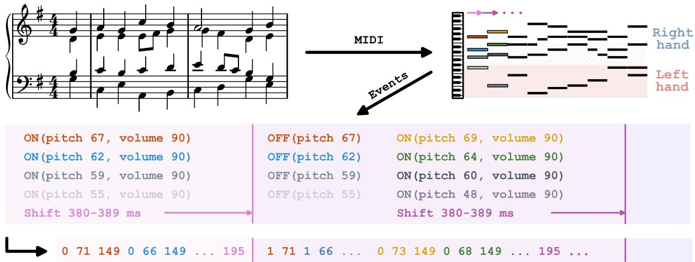  
Figure 10: Piano pieces are encoded as MIDI format in the ARIA-MIDI dataset. We extract the pitch, volume, pedal state, and shifts of the tape head and map each event to integers. This examples shows the beginning of Reger (1900).

<table><tr><td>Hyperparameter</td><td>Value</td></tr><tr><td>Model</td><td></td></tr><tr><td>Layers</td><td>12</td></tr><tr><td>Hidden size</td><td>768</td></tr><tr><td>Attention heads</td><td>12</td></tr><tr><td>Context length</td><td>512</td></tr><tr><td>Vocabulary size</td><td>16,897</td></tr><tr><td>Activation</td><td>GELU</td></tr><tr><td>Dropout</td><td>0.1</td></tr><tr><td>LayerNorm €</td><td> $1 \times 1 0 ^ { - 5 }$ </td></tr><tr><td>Initializer range</td><td>0.02</td></tr><tr><td colspan="2">Training</td></tr><tr><td>Sequence length</td><td>512</td></tr><tr><td>Batch size</td><td>16</td></tr><tr><td>Optimizer</td><td>AdamW</td></tr><tr><td>Optimizer learning rate</td><td> $1 \times 1 0 ^ { - 4 }$ </td></tr><tr><td>Weight decay</td><td>0.05</td></tr><tr><td>Warmup ratio</td><td>0.01</td></tr><tr><td>Gradient clipping</td><td>1.0</td></tr><tr><td>Early stopping patience</td><td>3</td></tr><tr><td>Early stopping delta</td><td>0.01</td></tr><tr><td>Seed</td><td>11; 17; 42; 2,000; 3,407</td></tr><tr><td colspan="2">Fine-tuning</td></tr><tr><td>Learning rate</td><td> $5 \times 1 0 ^ { - 5 }$ </td></tr><tr><td>Weight decay</td><td>0.05</td></tr><tr><td>Batch size</td><td>16</td></tr><tr><td>Sequence length</td><td>128</td></tr><tr><td>Early stopping patience</td><td>3</td></tr><tr><td>Seed</td><td>12</td></tr></table>

Table 7: Training and optimization settings for the main experiments.

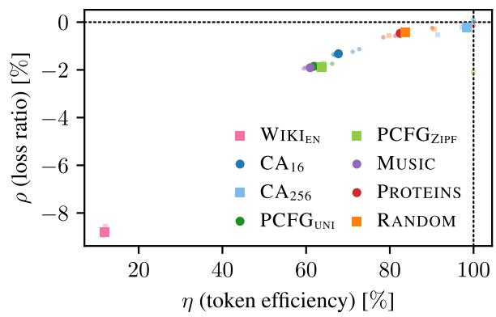  
Figure 11: Relation between the two evaluation metrics loss ratio $\rho$ and token efficiency τ.

<table><tr><td></td><td>Dataset</td><td>Language</td><td>Prediction Task</td><td>Reference</td></tr><tr><td></td><td>BLiMP</td><td>EN</td><td>Grammatical acceptability</td><td>Warstadt et al. (2020)</td></tr><tr><td rowspan="6">Zero-shot</td><td>BLiMP-NL ZhoBLiMP</td><td>NL ZH</td><td>Grammatical acceptability Grammatical acceptability</td><td>Suijkerbuijk et al. (2025) Liu et al. (2026)</td></tr><tr><td>Hanzi</td><td>ZH</td><td></td><td></td></tr><tr><td>MultiBLiMP</td><td></td><td>Grammatical acceptability</td><td>Hu et al. (2026)</td></tr><tr><td></td><td>EN, NL</td><td>Grammatical acceptability</td><td>Jumelet et al. (2026b)</td></tr><tr><td>GlobalPIQA</td><td>EN, NL, ZH</td><td>Commonsense reasoning</td><td>Chang et al. (2026)</td></tr><tr><td>MECO HellaSwag</td><td>EN, NL, ZH EN, NL, ZH</td><td>Eye-tracking</td><td>Siegelman et al. (2022, 2025); Kuperman et al. (2025)</td></tr><tr><td></td><td></td><td>Sentence completion</td><td>Zellers et al. (2019)</td></tr><tr><td>Winogrande</td><td>EN, NL, ZH</td><td>Coreference resolution</td><td>Sakaguchi et al. (2021)</td></tr><tr><td>XStoryCloze</td><td>EN, NL, ZH</td><td>Story completion</td><td>Lin et al. (2022b)</td></tr><tr><td>XCOMPS</td><td>NL, ZH</td><td>Property knowledge</td><td>He et al. (2025)</td></tr><tr><td>Fint-nng</td><td>ARC Belebele BMLama INCLUDE MNLI</td><td>EN, NL, ZH EN, NL, ZH EN, NL, ZH</td><td>Abstraction and reasoning Reading comprehension Knowledge probing</td><td>Clark et al. (2018) Bandarkar et al. (2024) Qi et al. (2023)</td></tr></table>

Table 8: Overview of evaluation datasets used in the BabyLM 2026 multilingual track (Choshen et al., 2026). EN = English, NL = Dutch, ZH = Chinese. All metrics, except MECO, accuracies. Note that MECO is therefore excluded from Fig. 5 and Fig. 6.

<table><tr><td>Hyperparameter</td><td>Value</td></tr><tr><td>Optimizer learning rate</td><td> $1 \times 1 0 ^ { - 4 } , 3 \times 1 0 ^ { - 4 } ,$   $6 \times 1 0 ^ { - 4 } , 1 \times 1 0 ^ { - 2 }$ </td></tr><tr><td>Weight decay</td><td> $0 . 0 1 , 0 . 0 5 , 0 . 1$ </td></tr><tr><td>Warmup ratio</td><td>0.01, 0.03</td></tr><tr><td>Seeds</td><td> $1 1 ; 1 7 ; 4 2 ; 2 , 0 0 0 ; 3 , 4 0 7$ </td></tr></table>

Table 9: Hyperparameter search space for the challenge submission.

<table><tr><td>Benchmark</td><td>English</td><td>Dutch</td><td>Chinese</td></tr><tr><td>MultiBLiMP</td><td>0.88</td><td>0.91</td><td></td></tr><tr><td>BLiMP</td><td>0.72</td><td>0.78</td><td>0.76</td></tr><tr><td>WinoGrande XStoryCloze</td><td>0.52</td><td>0.49</td><td>0.49</td></tr><tr><td>HellaSwag</td><td>0.49</td><td>0.48</td><td>0.49</td></tr><tr><td>XCOMPS</td><td>0.27</td><td>0.26 0.53</td><td>0.27 0.53</td></tr><tr><td>Global PIQA (parallel)</td><td>0.27</td><td>0.23</td><td>0.18</td></tr><tr><td>Global PIQA (non-para.)</td><td>0.52</td><td>0.51</td><td>0.48</td></tr><tr><td>ARC</td><td>0.23</td><td>0.25</td><td>0.24</td></tr><tr><td>Belebele</td><td>0.30</td><td>0.23</td><td>0.27</td></tr><tr><td>BMLAMA</td><td>0.10</td><td>0.12</td><td>0.10</td></tr><tr><td>MNLI</td><td>0.58</td><td>0.59</td><td>0.57</td></tr><tr><td>SIB-200</td><td>0.33</td><td>0.26</td><td>0.31</td></tr><tr><td>TruthfulQA</td><td>0.25</td><td>0.26</td><td>0.29</td></tr><tr><td>XNLI</td><td>0.53</td><td></td><td>0.53</td></tr><tr><td>INCLUDE</td><td></td><td>0.29</td><td>0.26</td></tr><tr><td>POS</td><td>0.89</td><td></td><td></td></tr><tr><td></td><td></td><td>0.91</td><td>0.81</td></tr></table>

Table 10: Evaluation results for the submission model trained on the mixed dataset in stage I and on a mix of English, Dutch, and Chinese in stage II.