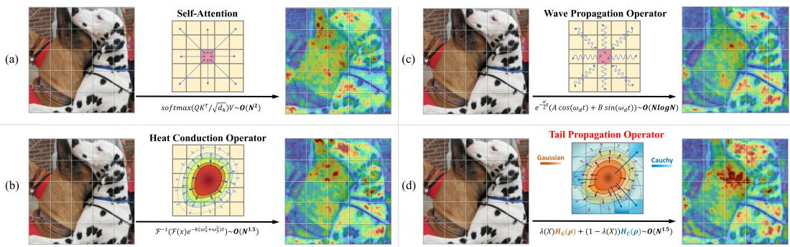
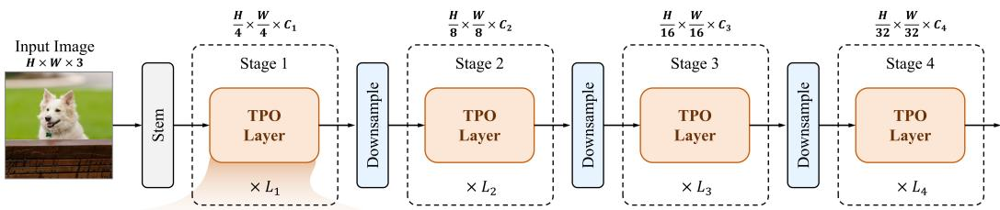
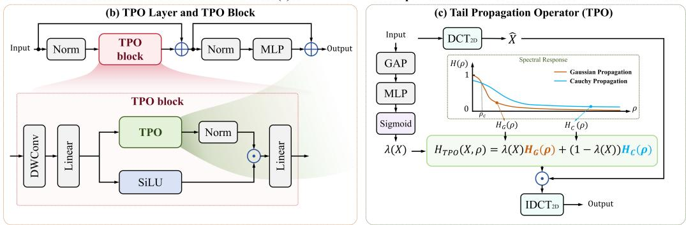
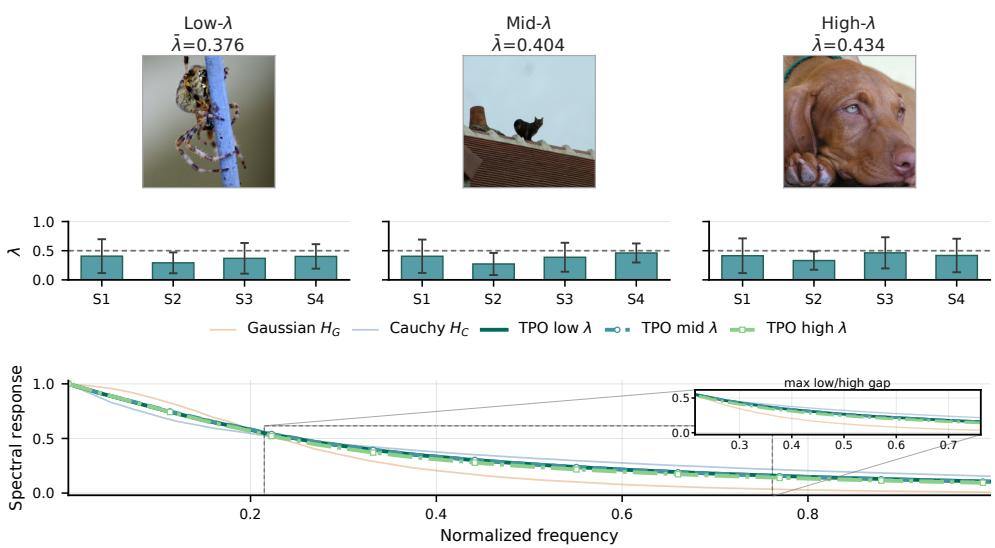
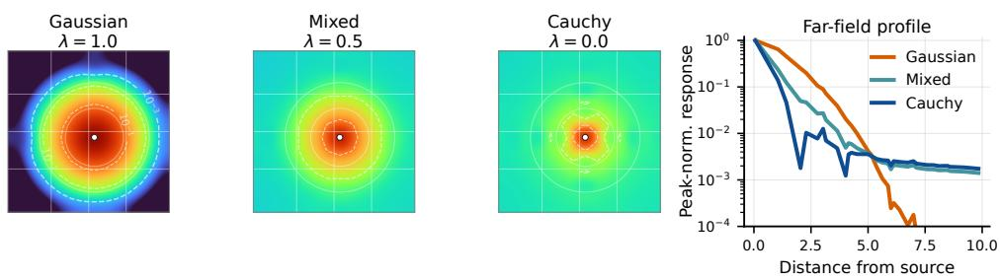
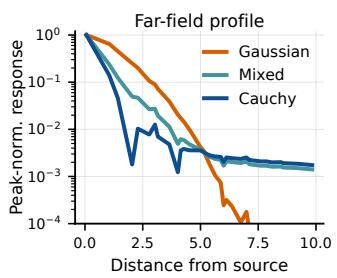
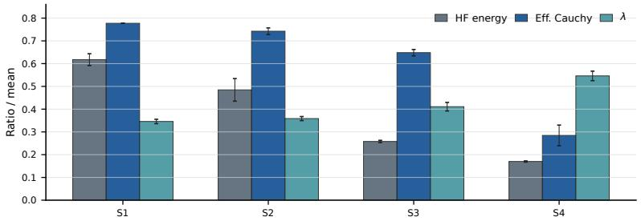
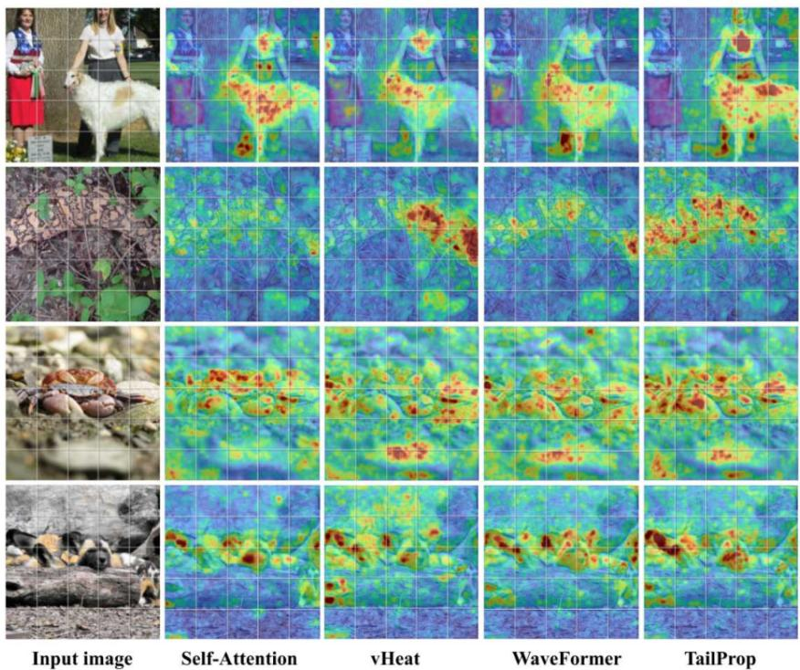
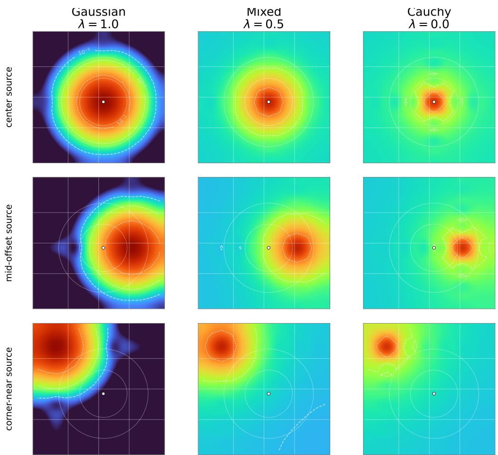

# TAILPROP: CONTENT-ADAPTIVE LIGHT- AND HEAVY-TAILED PROPAGATION FOR VISION

Jiahao Kong Shandong University

Zihan Li Shandong University

## ABSTRACT

Science-inspired vision models show that explicit propagation dynamics can provide structured and interpretable alternatives to conventional token mixing. Existing formulations, however, typically construct and adapt visual propagation within a particular dynamical family, while visual representations can require substantially different spatial interactions across samples, channels, and network stages. We explore cross-regime adaptive propagation and introduce TailProp, a hierarchical vision backbone built upon the Tail Propagation Operator (TPO). TPO uses Gaussian and Cauchy stable-process propagators as complementary bases with rapidly decaying and heavy-tailed spatial influence, and predicts a contentconditioned channel-wise coefficient to adaptively combine them. Because this coefficient is spatially shared, the two responses are fused directly in the DCT domain with a single DCT/IDCT pair, yielding O(N1.5) spatial mixing for square feature maps with N = HW and fixed channel width. Across image classification, object detection, semantic segmentation, robustness, and cross-backbone restoration, TailProp consistently outperforms matched propagation baselines; TailProp-B reaches 84.4% Top-1 accuracy on ImageNet-1K, 50.3/44.8 box/mask AP under the 3× Mask R-CNN schedule, and 50.8% mIoU on ADE20K. Controlled ablations further show that these gains are not explained by single-basis propagation, an additional same-family branch, or within-family adaptive order alone, supporting complementary two-basis propagation as an effective design principle for visual representation learning.

## 1 INTRODUCTION

Modern vision backbones differ in how they propagate information across spatial locations. Convolutional networks aggregate evidence through local filters and hierarchical receptive fields (He et al., 2016; Liu et al., 2022); vision transformers use self-attention to form pairwise token interactions (Dosovitskiy et al., 2021; Liu et al., 2021); and recent state space models provide efficient longrange mixing through learned dynamical systems (Gu & Dao, 2024; Liu et al., 2024). In parallel, science-inspired operators such as vHeat and WaveFormer show that explicit propagation dynamics can serve as efficient and interpretable inductive biases for visual modeling (Wang et al., 2025; Shu et al., 2026).

A common pattern in science-inspired formulations is that the operator is organized around one dynamical family. Its parameters, diffusivity, damping, or even differential order may be learned or data-adaptive, so the issue is not whether prior work adapts. Instead, we ask whether visual representations also benefit from adapting across complementary propagation regimes. Since images, channels, and stages can require different ranges and decay profiles of spatial influence, a single propagation family may be an unnecessarily narrow modeling choice. Intuitively, compact structures whose useful correlations decay quickly may favor rapidly decaying propagation, whereas spatially distributed context or long-range co-occurrences may benefit from a slower-decaying influence profile, so assigning either regime a fixed semantic role would itself be unnecessarily restrictive.

We study Gaussian and Cauchy propagation as two canonical symmetric stable-process cases (Samorodnitsky & Taqqu, 1994; Kwasnicki, 2017). Gaussian propagation is the´ α = 2 Brownian diffusion case, while Cauchy propagation is the α = 1 symmetric stable Levy process. Their´ contrast is clearest in the spatial domain: Gaussian kernels have rapidly decaying light-tailed influence, whereas Cauchy kernels have polynomial heavy tails and stronger relative far-field influence. As shown in Fig. 1, TailProp makes this propagation choice content-adaptive.

  
Figure 1: Comparison of visual propagation mechanisms. (a) Self-attention propagates information through pairwise token interactions with $O ( N ^ { 2 } )$ complexity. (b) HCO performs heat-like diffusion, while (c) WPO introduces oscillatory wave propagation. (d) TPO adaptively combines light-tailed Gaussian and heavy-tailed Cauchy propagation through λ(X), enabling complementary propagation behaviors with $O ( N ^ { 1 . 5 } )$ spatial scaling for fixed channel width. The right panels show the corresponding effective receptive fields.

We introduce the Tail Propagation Operator (TPO), which combines Gaussian and Cauchy propagators with an input-conditioned channel-wise coefficient. Because the coefficient is spatially shared, TPO fuses the two transfer responses in the DCT domain and applies the result with a single DCT/IDCT pair. For square feature maps with $N = H W$ and fixed channel width, this retains $O ( N ^ { 1 . 5 } )$ spatial mixing. TailProp stacks TPO Blocks and TPO Layers into a four-stage hierarchical backbone and instantiates Tiny, Small, and Base scales without changing the propagation principle.

We evaluate TailProp across ImageNet-1K classification, COCO detection and instance segmentation, ADE20K semantic segmentation, out-of-distribution robustness, cross-backbone restoration, and matched ablations. TailProp consistently achieves the best accuracy among the compared spectral propagation backbones across Tiny, Small, and Base scales, reaching 82.9/84.1/84.4% Top-1 accuracy and extending the gains to COCO and ADE20K. Robustness, restoration transfer, and controlled ablations further show that the improvement generalizes beyond classification and is not explained by additional branch capacity or a single adaptive stable order.

Our contributions are threefold:

• We explore cross-regime adaptive propagation for science-inspired vision models, motivated by heterogeneous spatial interaction across samples, channels, and stages.

• We introduce the Tail Propagation Operator (TPO) and TailProp backbone, which combine Gaussian and Cauchy propagators through content-conditioned channel-wise mixing and a fused spectral implementation requiring a single DCT/IDCT pair.

• We demonstrate consistent gains across image classification, dense prediction, robustness, and cross-backbone restoration, while matched ablations isolate the benefit of complementary two-basis propagation and input-conditioned routing.

## 2 RELATED WORK

## 2.1 VISION FOUNDATIONAL MODELS

Convolutional neural networks (CNNs) established the dominant paradigm for visual representation learning by exploiting locality and translation-equivariant inductive biases. Classic and efficient designs improved optimization, feature reuse, and deployability, while modern ConvNets further revisited scale, receptive field, and adaptive spatial aggregation (Krizhevsky et al., 2012; He et al., 2016; Huang et al., 2017; Howard et al., 2017; Liu et al., 2022; Ding et al., 2022b; Wang et al., 2023). Despite their efficiency and strong local modeling capability, long-range interactions in

CNNs are still typically accumulated through kernels, hierarchy, or specialized aggregation rather than expressed as a direct global propagation rule.

Vision Transformers (ViTs) introduced self-attention as an explicit mechanism for modeling global dependencies among image tokens (Dosovitskiy et al., 2021). Hierarchical and efficient variants made transformer backbones more practical for dense and high-resolution vision tasks through pyramidal representations, windowed attention, cross-shaped attention, dual attention, cross-covariance attention, and simplified hierarchical designs (Liu et al., 2021; Wang et al., 2021; Dong et al., 2022; Ding et al., 2022a; Ali et al., 2021; Zhang et al., 2023). These designs substantially broadened global interaction modeling, but the cost and structure of token mixing remain central design constraints as image resolution grows.

More recently, state space models (SSMs) have emerged as another route to efficient long-range modeling. Multidimensional SSMs first showed that images and videos can be represented as continuous multidimensional signals, while Mamba-style selective state spaces provided a hardware-aware sequence modeling primitive (Nguyen et al., 2022; Gu & Dao, 2024). Visual adaptations such as Vim and VMamba transfer these dynamics to images through bidirectional or two-dimensional selective scanning, and recent variants further reduce scanning cost, hybridize Mamba with attention, or question when SSM token mixing is necessary for vision (Zhu et al., 2024; Liu et al., 2024; Pei et al., 2025; Hatamizadeh & Kautz, 2025; Yu & Wang, 2025). Collectively, these advances highlight a continuing shift from local feature aggregation toward efficient global interaction mechanisms; however, their propagation behavior is primarily determined by learned architectural operators, motivating complementary research that derives visual interaction rules from explicit and interpretable propagation priors.

## 2.2 SCIENCE-INSPIRED VISION MODELS

Scientific principles provide structured inductive biases for neural representation learning, ranging from biologically inspired spiking networks and nonequilibrium diffusion processes to PDEguided visual modeling (Tavanaei et al., 2019; Ho et al., 2020; Chen et al., 2022). vHeat derives global semantic propagation from the heat equation, HcNet builds network components from heatconduction dynamics, and WaveFormer employs an underdamped wave equation to model oscillatory and frequency-aware propagation (Wang et al., 2025; Zhang & Gong, 2025; Shu et al., 2026). Related studies have also integrated anisotropic and reaction-diffusion processes into learned visual systems, further demonstrating the potential of explicitly structured diffusion dynamics (Metzger et al., 2023; Rao et al., 2023).

More recently, fractional and nonlocal formulations have further expanded this design space by relaxing classical diffusion dynamics and allowing the governing operators or differential orders themselves to vary (Qiao et al., 2025; Qu et al., 2025). Learnable Fractional Reaction-Diffusion Dynamics predicts fractional differential orders for visual restoration, while Fractional Neural Attention models multiscale interactions through Levy diffusion governed by a fractional Laplacian´ (Qiao et al., 2025; Qu et al., 2025). Together, these studies show that propagation dynamics can be substantially enriched or adapted from data; nevertheless, existing science-inspired approaches predominantly instantiate or adapt one dynamical family at a time, leaving how to jointly exploit complementary propagation regimes for heterogeneous visual representations comparatively underexplored (Wang et al., 2025; Zhang & Gong, 2025; Shu et al., 2026; Qiao et al., 2025; Qu et al., 2025). TailProp addresses this gap by enabling visual representations to adaptively draw on complementary propagation regimes rather than committing to a single dynamical family.

## 3 METHOD

## 3.1 PRELIMINARIES: GAUSSIAN AND CAUCHY PROPAGATION

Let $u ( { \bf x } , t )$ denote a scalar field evolving over a two-dimensional domain, where $\mathbf { x } = ( x , y )$ and t denotes propagation time. A broad family of symmetric stable propagation processes can be described through the fractional diffusion equation (Metzler & Klafter, 2000; Kwasnicki, 2017; Samorodnit-´ sky & Taqqu, 1994)

$$
\frac { \partial u ( { \bf x } , t ) } { \partial t } = - \kappa ( - \Delta ) ^ { \alpha / 2 } u ( { \bf x } , t ) , \qquad 0 < \alpha \leq 2 ,\tag{1}
$$

  
(a) Architecture of TailProp

  
Figure 2: Overview of TailProp. (a) TailProp follows a four-stage hierarchical architecture built from TPO Layers. (b) Each TPO Layer contains a residual TPO Block and an MLP branch, with the TPO Block combining propagation and SiLU gating branches through element-wise modulation. (c) The Tail Propagation Operator (TPO) adaptively mixes Gaussian and Cauchy spectral responses and applies the fused response with a single DCT/IDCT pair.

where $\kappa > 0$ controls the propagation scale and $( - \Delta ) ^ { \alpha / 2 }$ denotes the fractional Laplacian. Given the initial condition $u ( \mathbf { x } , 0 ) = f ( \mathbf { x } )$ , applying the Fourier transform $\mathcal { F }$ converts the equation into

$$
\frac { \partial \widehat { u } ( \omega , t ) } { \partial t } = - \kappa \| \omega \| ^ { \alpha } \widehat { u } ( \omega , t ) ,\tag{2}
$$

where $\boldsymbol { \omega } = ( \omega _ { x } , \omega _ { y } )$ denotes the spatial frequency. Solving the resulting ordinary differential equation gives

$$
u ( \mathbf { x } , t ) = \mathcal { F } ^ { - 1 } \left[ \widehat { f } ( \omega ) e ^ { - \kappa t \| \omega \| ^ { \alpha } } \right] .\tag{3}
$$

The solution in Eq. (3) highlights two canonical and widely studied cases. For $\alpha = 2$ , the process reduces to Gaussian propagation, corresponding to Brownian diffusion; for $\alpha = 1$ , it becomes Cauchy propagation, namely the isotropic symmetric 1-stable Levy process (Samorodnitsky &´ Taqqu, 1994; Kwasnicki, 2017). Their spectral transfer functions are respectively´

$$
H _ { G } ( \omega ) = e ^ { - \kappa _ { G } t | | \omega | | ^ { 2 } } , \qquad H _ { C } ( \omega ) = e ^ { - \kappa _ { C } t | | \omega | | } .\tag{4}
$$

Although both define globally supported propagation, their spatial influence decays in fundamentally different ways: the Gaussian kernel decays rapidly with distance, whereas the Cauchy kernel exhibits polynomial heavy tails and thus retains relatively stronger distant influence. These canonical yet complementary regimes motivate modeling visual propagation without committing to a single stable order; the learned preference between them is examined empirically in Sec. 4.3.

## 3.2 TAILPROP

TailProp combines Gaussian and Cauchy propagation through content-adaptive mixing.

Tail Propagation Operator (TPO). Given an input feature map $X \in \mathbb { R } ^ { H \times W \times C }$ , we extend the propagation processes in Sec. 3.1 along the channel dimension. Since visual features are bounded rectangular signals, we adopt a Neumann boundary and use two-dimensional DCT/IDCT spectral propagation under the cosine-basis correspondence (Strang, 1999; Wang et al., 2025). Further derivation and implementation details are provided in Appendix A.

Let $\rho _ { m n } = \omega _ { m } ^ { 2 } + \omega _ { n } ^ { 2 }$ denote the squared discrete spatial-frequency magnitude. The Gaussian and Cauchy propagation responses become

$$
H _ { G } ( \rho _ { m n } ) = e ^ { - \kappa _ { G } t \rho _ { m n } } , \qquad H _ { C } ( \rho _ { m n } ) = e ^ { - \kappa _ { C } t \sqrt { \rho _ { m n } } } ,\tag{5}
$$

where $\kappa _ { G }$ and $\kappa _ { C }$ are positive learnable propagation scales. TPO combines the two responses through a content-dependent coefficient $\lambda ( { \bar { X } } )$ , yielding

$$
H _ { \mathrm { T P O } } ( X , \rho ) = \lambda ( X ) H _ { G } ( \rho ) + [ 1 - \lambda ( X ) ] H _ { C } ( \rho )\tag{6}
$$

where $\lambda ( X ) \in ( 0 , 1 ) ^ { C }$ is a content-conditioned, channel-wise mixing coefficient predicted from the input feature; its exact parameterization is given in Eq. (8) in Sec. 3.2. The propagated feature is consequently obtained as

$$
Y = \mathrm { I D C T } _ { 2 D } \left( H _ { \mathrm { T P O } } ( X , \rho ) \odot \mathrm { D C T } _ { 2 D } ( X ) \right) .\tag{7}
$$

Because the channel-wise mixture coefficient is spatially shared, the Gaussian and Cauchy responses can be fused before the inverse transform, so Eq. (7) needs one DCT/IDCT pair. For a feature map with C channels, the separable matrix-DCT implementation has complexity $\dot { O } ( C ( H ^ { 2 } W + H W ^ { 2 } ) ) ;$ for square feature maps with $N = H W$ and fixed channel width, this gives $O ( N ^ { 1 . 5 } )$ spatial scaling. Details are in Appendix B.

Content-Adaptive Tail Dynamics. Visual propagation requirements can vary across input samples, feature channels, and network stages. Global average pooling summarizes the current feature into a channel descriptor, from which a lightweight MLP predicts

$$
\lambda ( X ) = \sigma ( \operatorname { M L P } ( \operatorname { G A P } ( X ) ) ) , \qquad \lambda ( X ) \in ( 0 , 1 ) ^ { C } .\tag{8}
$$

The resulting coefficient depends on both the input sample and the feature channel while remaining spatially shared, avoiding location-wise routing. Its sample-dependent behavior is analyzed in Sec. 4.3 and Fig. 3.

TailProp Model. We construct a four-stage TailProp backbone with a convolutional stem and stages at $1 / 4 , 1 / 8 , 1 / 1 6$ , and 1/32 resolution. Each TPO Layer contains a residual TPO Block and an MLP branch. Within the TPO Block, depth-wise convolution and linear projection produce propagation and gating branches, which are processed by TPO and SiLU before element-wise fusion.

We instantiate three model scales, TailProp-T, TailProp-S, and TailProp-B, by varying stage depths and channel dimensions while keeping the propagation formulation unchanged. Detailed architectural configurations are provided in Appendix C, and the key design choices are further discussed in Sec. 3.3.

## 3.3 DISCUSSION

We keep the discussion brief and focus on the key design choices underlying TailProp.

Why are Gaussian and Cauchy propagation suitable for visual representation learning? Gaussian and Cauchy propagation provide complementary decay profiles: one induces a faster-decaying response, while the other preserves relatively stronger distant influence. Visual feature maps can require both behaviors across different channels and stages, so the two-basis formulation provides a broader response space than committing to a single decay profile.

Why use two propagation bases instead of a single adaptive stable order? A single stable order imposes one order-dependent response over the frequency range, even when that order is conditioned on the input. In contrast, mixing Gaussian and Cauchy bases produces a frequency-dependent effec tive response that is not generally reducible to a single stable order; the matched Adaptive-α ablation in Table 5 empirically isolates this distinction.

What advantages does TailProp offer over self-attention and single-family physics-inspired operators? Self-attention models pairwise affinities, which is powerful but quadratic in token count. TailProp avoids pairwise affinities and, unlike single-family physics-inspired operators, adapts across complementary stable-process responses rather than only within one dynamical family (Wang et al., 2025; Shu et al., 2026). This gives global mixing with $O ( N ^ { 1 . 5 } )$ spatial scaling for square feature maps with $N = H W$ and fixed channel width.

Table 1: Main ImageNet-1K classification results. Best entries within each scale group are shown in bold. Lower is better for Params/FLOPs, and higher is better for throughput/accuracy. Throughput is measured on NVIDIA A100 80GB GPUs.
<table><tr><td>Method</td><td>Resolution</td><td>#Params</td><td>FLOPs</td><td>Throughput (img/s)</td><td>Top-1 Acc. (%)</td></tr><tr><td>Tiny / roughly 26–30M</td><td></td><td></td><td></td><td></td><td></td></tr><tr><td>Swin-T (Liu et al., 2021)</td><td>2242</td><td>28M</td><td>4.6G</td><td>1242</td><td>81.3</td></tr><tr><td>ConvNeXt-T (Liu et al., 2022)</td><td>224²</td><td>29M</td><td>4.5G</td><td>1198</td><td>82.1</td></tr><tr><td>Vim-S (Zhu et al., 2024)</td><td>2242</td><td>26M</td><td>5.3G</td><td>811</td><td>81.4</td></tr><tr><td>VMamba-T (Liu et al., 2024)</td><td>224²</td><td>30M</td><td>4.9G</td><td>1686</td><td>82.6</td></tr><tr><td>vHeat-T (Wang et al., 2025)</td><td>224²</td><td>29M</td><td>4.6G</td><td>1514</td><td>82.2</td></tr><tr><td>WaveFormer-T (Shu et al., 2026)</td><td>2242</td><td>29M</td><td>4.4G</td><td>1560</td><td>82.5</td></tr><tr><td>TailProp-T (Ours)</td><td>224²</td><td>29M</td><td>4.5G</td><td>1468</td><td>82.9</td></tr><tr><td>Small / roughly 50M</td><td></td><td></td><td></td><td></td><td></td></tr><tr><td>Swin-S</td><td>224²</td><td>50M</td><td>8.7G</td><td>720</td><td>83.0</td></tr><tr><td>ConvNeXt-S</td><td>2242</td><td>50M</td><td>8.7G</td><td>687</td><td>83.1</td></tr><tr><td>VMamba-S</td><td>2242</td><td>50M</td><td>8.7G</td><td>877</td><td>83.6</td></tr><tr><td>vHeat-S</td><td>224²</td><td>50M</td><td>8.5G</td><td>945</td><td>83.6</td></tr><tr><td>WaveFormer-S</td><td>2242</td><td>50M</td><td>7.8G</td><td>1020</td><td>83.9</td></tr><tr><td>TailProp-S (Ours)</td><td>224²</td><td>50M</td><td>8.0G</td><td>927</td><td>84.1</td></tr><tr><td>Base / roughly 68–98M</td><td></td><td></td><td></td><td></td><td></td></tr><tr><td>Swin-B</td><td>2242</td><td>88M</td><td>15.4G</td><td>456</td><td>83.5</td></tr><tr><td>ConvNeXt-B</td><td>2242</td><td>89M</td><td>15.4G</td><td>439</td><td>83.8</td></tr><tr><td>Vim-B</td><td>2242</td><td>98M</td><td>19.0G</td><td>294</td><td>83.2</td></tr><tr><td>VMamba-B</td><td>2242</td><td>89M</td><td>15.4G</td><td>528</td><td>83.9</td></tr><tr><td>vHeat-B</td><td>224²</td><td>68M</td><td>11.2G</td><td>661</td><td>84.0</td></tr><tr><td>WaveFormer-B</td><td>2242</td><td>68M</td><td>10.8G</td><td>719</td><td>84.2</td></tr><tr><td>TailProp-B (Ours)</td><td>224²</td><td>68M</td><td>11.0G</td><td>639</td><td>84.4</td></tr><tr><td></td><td></td><td></td><td></td><td></td><td></td></tr></table>

## 4 EXPERIMENT

## 4.1 EXPERIMENTAL SETTINGS

We evaluate TailProp on image classification, object detection and instance segmentation, semantic segmentation, out-of-distribution robustness, and cross-backbone generalization. For image classification, we use ImageNet-1K (Deng et al., 2009) as the primary benchmark. For dense prediction, we transfer classification-pretrained backbones to Mask R-CNN (He et al., 2017) on MS COCO 2017 (Lin et al., 2014) and UPerNet (Xiao et al., 2018) on ADE20K (Zhou et al., 2017). We further evaluate ImageNet-1K-pretrained classifiers on ImageNet-Sketch (Wang et al., 2019) and ImageNet-A (Hendrycks et al., 2021) for robustness, and study cross-backbone generalization with SwinIR-style restoration (Liang et al., 2021) on Set12 (Zhang et al., 2017), McMaster (Zhang et al., 2011), and LIVE1 (Sheikh et al., 2006). Unless otherwise stated, experiments are configured and throughput/FPS are measured on NVIDIA A100 80GB GPUs. Detailed training recipes and implementation settings are provided in Appendix D.

## 4.2 EXPERIMENTAL RESULTS

Image Classification. The ImageNet-1K results are summarized in Table 1. Under comparable model sizes and FLOPs, TailProp obtains the highest Top-1 accuracy at all three scales. TailProp-T reaches 82.9% with 4.5G FLOPs and 1468 images/s, outperforming VMamba-T, WaveFormer-T, and vHeat-T by 0.3, 0.4, and 0.7 points. The modest throughput gap despite comparable FLOPs reflects that FLOP counts do not capture the transform and memory-access overhead of our current explicit matrix-DCT backend, which is not yet kernel-fused or hardware-specialized. The advantage persists at larger scales: TailProp-S/B achieve 84.1%/84.4%, improving over the strongest prior propagation baseline by 0.2 points in both groups. These results indicate that Gaussian–Cauchy adaptive propagation improves recognition accuracy while retaining comparable computational cost within spectral backbones.

Object Detection and Instance Segmentation. We transfer classification-pretrained backbones to Mask R-CNN on MS COCO 2017, and report 1x and 3x results in Table 2. TailProp consistently improves both box and mask AP across scales. Under the 1x schedule, TailProp-T obtains 46.2 APb and 41.8 APm, exceeding WaveFormer-T by 0.4/0.3 points and vHeat-T by 1.1/0.6 points with nearly identical FLOPs. The 3x schedule shows the same trend, where TailProp-T/S/B achieve 47.8/43.1, 49.4/44.2, and 50.3/44.8 APb/APm. Although TailProp is slightly below the fastest spectral baselines in FPS, it clearly improves detection quality at matched computational cost, suggesting that the complementary propagation bias transfers to localization and instance-level recognition.

Table 2: Mask R-CNN (He et al., 2017) object detection and instance segmentation results on MS COCO 2017 (Lin et al., 2014). Best entries within each scale group are shown in bold. FLOPs are calculated with input size 1280 × 800; FPS is measured on NVIDIA A100 80GB GPUs.
<table><tr><td rowspan="2">Method</td><td colspan="4">Mask R-CNN 1x</td><td colspan="4">Mask R-CNN 3x</td></tr><tr><td>APb</td><td>APm</td><td>FPS</td><td>FLOPs</td><td>APb</td><td>APm</td><td>FPS</td><td>FLOPs</td></tr><tr><td>Swin-T (Liu et al., 2021)</td><td>42.7</td><td>39.3</td><td>26.3</td><td>267G</td><td>46.0</td><td>41.6</td><td>26.3</td><td>267G</td></tr><tr><td>ConvNeXt-T (Liu et al., 2022)</td><td>44.2</td><td>40.1</td><td>29.3</td><td>262G</td><td>46.2</td><td>41.7</td><td>29.3</td><td>262G</td></tr><tr><td>vHeat-T (Wang et al., 2025)</td><td>45.1</td><td>41.2</td><td>32.7</td><td>272G</td><td>47.2</td><td>42.4</td><td>32.7</td><td>272G</td></tr><tr><td>WaveFormer-T (Shu et al., 2026)</td><td>45.8</td><td>41.5</td><td>32.1</td><td>270G</td><td>47.4</td><td>42.6</td><td>33.0</td><td>270G</td></tr><tr><td>TailProp-T (Ours)</td><td>46.2</td><td>41.8</td><td>31.1</td><td>271G</td><td>47.8</td><td>43.1</td><td>30.9</td><td>271G</td></tr><tr><td>vHeat-S</td><td>46.8</td><td>42.3</td><td>25.9</td><td>348G</td><td>48.8</td><td>43.7</td><td>25.9</td><td>348G</td></tr><tr><td>WaveFormer-S</td><td>47.0</td><td>42.5</td><td>26.2</td><td>345G</td><td>49.0</td><td>43.9</td><td>26.3</td><td>345G</td></tr><tr><td>TailProp-S (Ours)</td><td>47.4</td><td>42.8</td><td>24.7</td><td>346G</td><td>49.4</td><td>44.2</td><td>24.6</td><td>346G</td></tr><tr><td>vHeat-B</td><td>47.7</td><td>43.0</td><td>20.2</td><td>432G</td><td>49.7</td><td>44.3</td><td>20.2</td><td>432G</td></tr><tr><td>WaveFormer-B</td><td>47.9</td><td>43.2</td><td>20.4</td><td>431G</td><td>49.9</td><td>44.5</td><td>20.4</td><td>431G</td></tr><tr><td>TailProp-B (Ours)</td><td>48.2</td><td>43.4</td><td>19.3</td><td>432G</td><td>50.3</td><td>44.8</td><td>19.3</td><td>432G</td></tr></table>

Semantic Segmentation. We evaluate semantic segmentation with UPerNet on ADE20K, and summarize the results in Table 3. TailProp obtains the highest mIoU at all three scales. TailProp-T reaches 47.8 mIoU with 234G FLOPs, improving over WaveFormer-T and vHeat-T by 0.4 and 0.9 points. TailProp-S/B achieve 50.0/50.8 mIoU, exceeding WaveFormer-S/B with comparable FLOPs and supporting the transfer of TPO to dense scene parsing.

The improvement remains consistent from Tiny to Base while keeping computational cost close to compared spectral backbones, suggesting that the representation gains of TPO extend from imagelevel recognition to dense pixel-level prediction rather than being confined to classification.

Table 3: UPerNet (Xiao et al., 2018) results on ADE20K (Zhou et al., 2017). Best entries within each scale group are shown in bold.
<table><tr><td>Method mIoU FPS</td></tr><tr><td>Swin-T (Liu et al., 2021) 44.4 31.8</td></tr><tr><td>237G ConvNeXt-T (Liu et al., 2022) 46.0 37.8 235G</td></tr><tr><td>vHeat-T (Wang et al., 2025) 46.9 36.7 235G WaveFormer-T (Shu et al., 2026) 47.4 36.9 233G</td></tr><tr><td>TailProp-T (Ours) 47.8 36.4 234G</td></tr><tr><td>vHeat-S 49.1 26.1 254G</td></tr><tr><td>WaveFormer-S 49.8 26.4 252G</td></tr><tr><td>TailProp-S (Ours) 50.0 25.6 253G</td></tr><tr><td>vHeat-B 49.6 23.6 293G</td></tr><tr><td>WaveFormer-B 50.5 23.8 290G</td></tr><tr><td>TailProp-B (Ours) 50.8 23.2 291G</td></tr></table>

Robustness Evaluation. To assess robustness under distribution shift, we evaluate ImageNet-1Kpretrained classifiers on ImageNet-Sketch (Wang et al., 2019) and ImageNet-A (Hendrycks et al., 2021) without additional finetuning. As shown in the left part of Table 4, TailProp-B reaches 23.1 and 37.2 Top-1 accuracy, outperforming WaveFormer-B by 0.4/0.3 points and vHeat-B by 0.5/0.4 points. This consistent gain indicates that TPO improves robustness under sketch-style and naturally adversarial shifts.

Table 4: Robustness evaluation on ImageNet-Sketch (Wang et al., 2019) and ImageNet-A (Hendrycks et al., 2021), and cross-backbone generalization on restoration benchmarks. Best entries are shown in bold.

<table><tr><td colspan="4">Robustness Evaluation</td><td colspan="4">Cross-Backbone Generalization</td></tr><tr><td>Model</td><td>ImageNet-Sketch Top-1</td><td>ImageNet-A Model Top-1</td><td></td><td>Set12 PSNR (σ = 15)</td><td>McMaster PSNR (σ = 15)</td><td>LIVE1 PSNR (q = 40)</td></tr><tr><td>Swin-B (Liu et al., 2021)</td><td>22.1</td><td>36.0</td><td>DnCNN (Zhang et al., 2017)</td><td>32.86</td><td>33.45</td><td>33.96</td></tr><tr><td>ConvNeXt-B (Liu et al., 2022)</td><td>22.4</td><td>36.5</td><td>SwinIR (Liang et al., 2021)</td><td>33.33</td><td>35.55</td><td>34.61</td></tr><tr><td>vHeat-B (Wang et al., 2025)</td><td>22.6</td><td>36.8</td><td>vHeatIR (Wang et al., 2025)</td><td>33.37</td><td>35.60</td><td>34.64</td></tr><tr><td>WaveFormer-B (Shu et al., 2026)</td><td>22.7</td><td>36.9</td><td>WaveFormerIR (Shu et al., 2026)</td><td>33.42</td><td>35.62</td><td>34.63</td></tr><tr><td>TailProp-B (Ours)</td><td>23.1</td><td>37.2</td><td>TailPropIR (Ours)</td><td>33.51</td><td>35.69</td><td>34.72</td></tr></table>

Cross-Backbone Generalization. We instantiate TailPropIR in a SwinIR-style restoration backbone. Table 4 shows 33.51/35.69/34.72 PSNR on Set12, McMaster, and LIVE1, outperforming vHeatIR and WaveFormerIR and suggesting that the Gaussian–Cauchy bias transfers beyond classification.

## 4.3 TAILPROP ANALYSIS

Core Ablation. We compare matched Gaussian-only, Cauchy-only, Fixed G+C, Learnable G+C, Dual Gaussian, Adaptive-α, and TailProp variants; Learnable G+C uses input-independent channel-wise gates in each TPO layer, whose final average corresponds to Gaussian/Cauchy weights of 0.53/0.47. Rather than exhaustively sweeping a scalar fixed λ, Learnable G+C provides a more expressive input-independent control by learning channel-wise mixing coefficients in every TPO layer. Appendix E gives definitions.

Table 5: Core ablation.
<table><tr><td>Variant Top-1 Acc. (%) ↑</td></tr><tr><td>∆ (pt) Gaussian-only</td></tr><tr><td>81.9 -1.0 -1.1</td></tr><tr><td>Cauchy-only 81.8 Fixed G+C 82.3</td></tr><tr><td>-0.6 Learnable G+C 82.2 -0.7</td></tr><tr><td>Dual Gaussian 81.9 -1.0</td></tr><tr><td>Adaptive α 82.2 -0.7</td></tr><tr><td>TailProp (Ours) 82.9 0.0</td></tr></table>

These controls disentangle three factors: propagationbasis identity, dual-branch capacity, and conditioning strategy. Together, they test whether the gain can be explained by simply adding a branch, learning a global mixture, or adapting within a single stable family.

Table 5 gives TailProp the best result (82.9), ahead of Fixed G+C (82.3), Learnable G+C/Adaptiveα (82.2), Gaussian-only/Dual Gaussian (81.9), and Cauchy-only (81.8). The single-basis and Dual Gaussian controls show that the gain comes from heterogeneous Gaussian–Cauchy complementarity rather than an extra branch. The near-balanced but weaker Learnable G+C baseline indicates that input-conditioned routing supplies the remaining improvement; Adaptive-α further shows that one adaptive order is insufficient. Together, these controls attribute the gain to complementary basis diversity and input-conditioned routing rather than extra branch capacity or adaptation within a single stable order.

Mechanism Visualization. We examine TPO from two complementary views. Fig. 3 shows what the trained model chooses: the input-conditioned, channel-wise gate varies across samples and stages, and the shared spectral panel directly compares the induced TPO responses. Because all audited sample-average values remain below 0.5, we describe samples as having relatively low, intermediate, or high λ. This view is sample-centric: it reflects how the model allocates mass between the two propagation bases across stages, not a fixed backbone-level preference. Put differently, Figure 3 summarizes where the learned mixture lands in practice, while the accompanying spectra show which response shapes those choices induce.

Fig. 4 then isolates what changing λ does by fixing the learned Stage-3 propagation scales and applying the same centered impulse through the exact DCT TPO path. Increasing λ shifts the response toward the Gaussian basis, whereas lower λ gives relatively stronger Cauchy far-field response on the log radial profile. The spatial maps and radial decay therefore agree on the same qualitative trend from two perspectives: higher λ concentrates response more tightly near the source, while lower λ preserves stronger sufficiently-far influence on the shared scale. Additional stage-wise diagnostics are provided in Appendix G. Thus, the learned adaptation is better interpreted as continuous sampledependent reweighting within the two-basis response space rather than hard switching between the two endpoints. In this sense, Figure 4 complements Figure 3 by holding the input fixed and varying only λ, so the contrast isolates propagation geometry rather than routing variability.

Figure 3: Sample-dependent TPO mixing preferences. The three examples are samples with relatively low, intermediate, and high λ within the audited validation distribution. Bars show stage-wise λ, and the bottom panel compares their sample-conditioned TPO spectral responses. The inset enlarges the frequency interval automatically selected by maximal separation between the low- and high-λ responses.  

  
Figure 4: Controlled TPO propagation visualization. With learned Stage-3 scales and the centered impulse fixed, we vary only scalar λ in the exact DCT-domain TPO. Spatial maps show peaknormalized response on a shared log scale with fixed contours, and the right panel reports radial decay.

## 5 CONCLUSION

We presented TailProp, a science-inspired vision backbone for content-adaptive propagation across complementary dynamical regimes. Through the Tail Propagation Operator (TPO), TailProp mixes Gaussian and Cauchy stable-process bases with content-conditioned channel-wise gates, adapting between light- and heavy-tailed propagation while retaining a fused spectral path. Results across classification, dense prediction, robustness, cross-backbone transfer, and controlled ablations support this two-basis design and show that the gains are not explained by single-basis or single-order adaptation alone.

## 6 LIMITATIONS AND FUTURE WORK

TailProp leaves several directions open. We study only Gaussian and Cauchy bases; broader stable families or learnable basis sets may capture additional regimes. Its gate is sample- and channelconditioned but spatially shared to preserve one DCT/IDCT path, so efficient location-dependent routing remains open. The matrix-DCT implementation is not hardware-optimal, motivating fused transform kernels. Future work can extend cross-regime propagation to video, generation, multi modal learning, and embodied perception.

## REPRODUCIBILITY STATEMENT

We have made efforts to ensure that the results in this work are reproducible. The mathematical formulation and implementation of the Tail Propagation Operator are described in Sec. 3, with additional details on the DCT/IDCT formulation, boundary treatment, and fused matrix-DCT implementation provided in Appendix A and Appendix B. Detailed configurations of the TailProp-T/S/B architectures are reported in Appendix C, while training recipes, optimization settings, data processing procedures, checkpoint selection, and downstream evaluation protocols are documented in Appendix D. Appendix E specifies the construction and purpose of all matched ablation variants, and additional implementation details are provided in Appendix F. Source code, configuration files, training and evaluation scripts, environment specifications, and instructions for reproducing the main experiments and analyses will be included in the supplementary material accompanying the submission.

## AI USE STATEMENT

The core research idea and initial hypothesis of this work were conceived independently by the authors through literature study, experimental observations, and analysis of existing science-inspired vision models. Generative AI tools were not used to originate the central idea of cross-regime Gaussian–Cauchy propagation. After the initial research direction had been established, generative AI tools were used as assistive tools for literature organization, critical discussion and refinement of the research narrative, feedback on experimental design, code and script development, figure prototyping, and language editing of portions of the manuscript. AI-assisted suggestions were treated as preliminary inputs rather than authoritative results. All mathematical formulations, methodological decisions, experimental procedures, quantitative results, and scientific claims were independently checked and validated by the authors. AI-assisted code was inspected and tested before use, and cited literature and bibliographic information were manually verified against the original sources. The authors take full responsibility for the final content, results, and conclusions of this work.

## REFERENCES

Alaaeldin Ali, Hugo Touvron, Mathilde Caron, Piotr Bojanowski, Matthijs Douze, Armand Joulin, Ivan Laptev, Natalia Neverova, Gabriel Synnaeve, Jakob Verbeek, and Herve Jegou. Xcit: Crosscovariance image transformers. In Advances in Neural Information Processing Systems, volume 34, pp. 20014–20027, 2021.

Yinpeng Chen, Xiyang Dai, Dongdong Chen, Mengchen Liu, Lu Yuan, Zicheng Liu, and Youzuo Lin. Self-supervised learning based on heat equation, 2022.

Jia Deng, Wei Dong, Richard Socher, Li-Jia Li, Kai Li, and Li Fei-Fei. Imagenet: A large-scale hierarchical image database. In Proceedings of the IEEE Conference on Computer Vision and Pattern Recognition, pp. 248–255, 2009.

Mingyu Ding, Bin Xiao, Noel Codella, Ping Luo, Jingdong Wang, and Lu Yuan. Davit: Dual attention vision transformers. In European Conference on Computer Vision, pp. 74–92, 2022a. doi: 10.1007/978-3-031-20053-3 5.

Xiaohan Ding, Xiangyu Zhang, Jungong Han, and Guiguang Ding. Scaling up your kernels to 31x31: Revisiting large kernel design in cnns. In Proceedings of the IEEE/CVF Conference on Computer Vision and Pattern Recognition, pp. 11963–11975, 2022b.

Xiaoyi Dong, Jianmin Bao, Dongdong Chen, Weiming Zhang, Nenghai Yu, Lu Yuan, Dong Chen, and Baining Guo. Cswin transformer: A general vision transformer backbone with cross-shaped windows. In Proceedings of the IEEE/CVF Conference on Computer Vision and Pattern Recognition, pp. 12124–12134, 2022.

Alexey Dosovitskiy, Lucas Beyer, Alexander Kolesnikov, Dirk Weissenborn, Xiaohua Zhai, Thomas Unterthiner, Mostafa Dehghani, Matthias Minderer, Georg Heigold, Sylvain Gelly, Jakob Uszkoreit, and Neil Houlsby. An image is worth 16x16 words: Transformers for image recognition at scale. In International Conference on Learning Representations, 2021.

Albert Gu and Tri Dao. Mamba: Linear-time sequence modeling with selective state spaces. In Proceedings of the First Conference on Language Modeling, 2024. URL https://openreview. net/forum?id=tEYskw1VY2.

Ali Hatamizadeh and Jan Kautz. Mambavision: A hybrid mamba-transformer vision backbone. In Proceedings of the IEEE/CVF Conference on Computer Vision and Pattern Recognition, pp. 25261–25270, 2025.

Kaiming He, Xiangyu Zhang, Shaoqing Ren, and Jian Sun. Deep residual learning for image recognition. In Proceedings of the IEEE Conference on Computer Vision and Pattern Recognition, pp. 770–778, 2016.

Kaiming He, Georgia Gkioxari, Piotr Dollar, and Ross Girshick. Mask r-cnn. In Proceedings ofthe IEEE International Conference on Computer Vision, pp. 2961–2969, 2017. doi: 10.1109/ICCV. 2017.322.

Dan Hendrycks, Kevin Zhao, Steven Basart, Jacob Steinhardt, and Dawn Song. Natural adversarial examples. In Proceedings of the IEEE/CVF Conference on Computer Vision and Pattern Recognition, pp. 15262–15271, 2021.

Jonathan Ho, Ajay Jain, and Pieter Abbeel. Denoising diffusion probabilistic models. In Advances in Neural Information Processing Systems, volume 33, pp. 6840–6851, 2020.

Andrew G. Howard, Menglong Zhu, Bo Chen, Dmitry Kalenichenko, Weijun Wang, Tobias Weyand, Marco Andreetto, and Hartwig Adam. Mobilenets: Efficient convolutional neural networks for mobile vision applications, 2017. URL https://arxiv.org/abs/1704.04861.

Gao Huang, Zhuang Liu, Laurens Van Der Maaten, and Kilian Q. Weinberger. Densely connected convolutional networks. In Proceedings ofthe IEEE Conference on Computer Vision and Pattern Recognition, pp. 4700–4708, 2017.

Alex Krizhevsky, Ilya Sutskever, and Geoffrey E. Hinton. Imagenet classification with deep convolutional neural networks. In Advances in Neural Information Processing Systems, volume 25, 2012.

Mateusz Kwasnicki. Ten equivalent definitions of the fractional laplace operator.´ Fractional Calculus and Applied Analysis, 20(1):7–51, 2017. doi: 10.1515/fca-2017-0002.

Jingyun Liang, Jiezhang Cao, Guolei Sun, Kai Zhang, Luc Van Gool, and Radu Timofte. Swinir: Image restoration using swin transformer. In Proceedings of the IEEE/CVF International Conference on Computer Vision Workshops, pp. 1833–1844, 2021. URL https: //openaccess.thecvf.com/content/ICCV2021W/AIM/html/Liang\_SwinIR\_ Image\_Restoration\_Using\_Swin\_Transformer\_ICCVW\_2021\_paper.html.

Tsung-Yi Lin, Michael Maire, Serge Belongie, James Hays, Pietro Perona, Deva Ramanan, Piotr Dollar, and C. Lawrence Zitnick. Microsoft coco: Common objects in context. In European Conference on Computer Vision, pp. 740–755, 2014.

Yue Liu, Yunjie Tian, Yuzhong Zhao, Hongtian Yu, Lingxi Xie, Yaowei Wang, Qixiang Ye, Jianbin Jiao, and Yunfan Liu. Vmamba: Visual state space model. In Advances in Neural Information Processing Systems, volume 37, 2024. doi: 10.52202/079017-3273.

Ze Liu, Yutong Lin, Yue Cao, Han Hu, Yixuan Wei, Zheng Zhang, Stephen Lin, and Baining Guo. Swin transformer: Hierarchical vision transformer using shifted windows. In Proceedings of the IEEE/CVF International Conference on Computer Vision, pp. 10012–10022, 2021.

Zhuang Liu, Hanzi Mao, Chao-Yuan Wu, Christoph Feichtenhofer, Trevor Darrell, and Saining Xie. A convnet for the 2020s. In Proceedings of the IEEE/CVF Conference on Computer Vision and Pattern Recognition, pp. 11976–11986, 2022.

Nando Metzger, Rodrigo Caye Daudt, and Konrad Schindler. Guided depth super-resolution by deep anisotropic diffusion. In Proceedings ofthe IEEE/CVF Conference on Computer Vision and Pattern Recognition, pp. 18237–18246, 2023.

Ralf Metzler and Joseph Klafter. The random walk’s guide to anomalous diffusion: A fractional dynamics approach. Physics Reports, 339(1):1–77, 2000. doi: 10.1016/S0370-1573(00)00070-3.

Eric Nguyen, Karan Goel, Albert Gu, Gordon Downs, Preey Shah, Tri Dao, Stephen Baccus, and Christopher Re. S4nd: Modeling images and videos as multidimensional signals with state spaces. In Advances in Neural Information Processing Systems, volume 35, pp. 2846–2861, 2022. doi: 10.52202/068431-0206.

Xiaohuan Pei, Tao Huang, and Chang Xu. Efficientvmamba: Atrous selective scan for light weight visual mamba. Proceedings ofthe AAAI Conference on Artificial Intelligence, 39(6):6443–6451, 2025. doi: 10.1609/aaai.v39i6.32690.

Xin Qiao, Matteo Poggi, Xing Wei, Pengchao Deng, Yanhui Zhou, and Stefano Mattoccia. Learnable fractional reaction-diffusion dynamics for under-display tof imaging and beyond. In Proceedings of the IEEE/CVF International Conference on Computer Vision, pp. 6080–6090, 2025.

Cheng Kevin Qu, Andrew Ly, and Pulin Gong. Fractional neural attention for efficient multiscale sequence processing, 2025.

Chengping Rao, Pu Ren, Qi Wang, Oral Buyukozturk, Hao Sun, and Yang Liu. Encoding physics to learn reaction-diffusion processes. Nature Machine Intelligence, 5(7):765–779, 2023. doi: 10.1038/s42256-023-00685-7.

Gennady Samorodnitsky and Murad S. Taqqu. Stable Non-Gaussian Random Processes: Stochastic Models with Infinite Variance. Chapman and Hall, New York, 1994. ISBN 0412051710.

Hamid R. Sheikh, Muhammad F. Sabir, and Alan C. Bovik. A statistical evaluation of recent full reference image quality assessment algorithms. IEEE Transactions on Image Processing, 15(11): 3440–3451, 2006. doi: 10.1109/TIP.2006.881959.

Zishan Shu, Juntong Wu, Wei Yan, Xudong Liu, Hongyu Zhang, Chang Liu, Youdong Mao, and Jie Chen. Waveformer: Frequency-time decoupled vision modeling with wave equation. Proceedings ofthe AAAI Conference on Artificial Intelligence, 40(30):25428–25436, 2026. doi: 10.1609/aaai. v40i30.39737.

Gilbert Strang. The discrete cosine transform. SIAM Review, 41(1):135–147, 1999. doi: 10.1137/ S0036144598336745.

Amirhossein Tavanaei, Masoud Ghodrati, Saeed Reza Kheradpisheh, Timothee Masquelier, and Anthony Maida. Deep learning in spiking neural networks. Neural Networks, 111:47–63, 2019. doi: 10.1016/j.neunet.2018.12.002.

Haohan Wang, Songwei Ge, Zachary C. Lipton, and Eric P. Xing. Learning robust global representations by penalizing local predictive power. In Advances in Neural Information Processing Systems, volume 32, 2019.

Wenhai Wang, Enze Xie, Xiang Li, Deng-Ping Fan, Kaitao Song, Ding Liang, Tong Lu, Ping Luo, and Ling Shao. Pyramid vision transformer: A versatile backbone for dense prediction without convolutions. In Proceedings of the IEEE/CVF International Conference on Computer Vision, pp. 568–578, 2021.

Wenhai Wang, Jifeng Dai, Zhe Chen, Zhenhang Huang, Zhiqi Li, Xizhou Zhu, Xiaowei Hu, Tong Lu, Lewei Lu, Hongsheng Li, Xiaogang Wang, and Yu Qiao. Internimage: Exploring largescale vision foundation models with deformable convolutions. In Proceedings of the IEEE/CVF Conference on Computer Vision and Pattern Recognition, pp. 14408–14419, 2023.

Zhaozhi Wang, Yue Liu, Yunjie Tian, Yunfan Liu, Yaowei Wang, and Qixiang Ye. Building vision models upon heat conduction. In Proceedings ofthe IEEE/CVF Conference on Computer Vision and Pattern Recognition, pp. 9707–9717, 2025.

Tete Xiao, Yingcheng Liu, Bolei Zhou, Yuning Jiang, and Jian Sun. Unified perceptual parsing for scene understanding. In Proceedings ofthe European Conference on Computer Vision, pp. 418– 434, 2018. URL https://openaccess.thecvf.com/content\_ECCV\_2018/html/ Tete\_Xiao\_Unified\_Perceptual\_Parsing\_ECCV\_2018\_paper.html.

Weihao Yu and Xinchao Wang. Mambaout: Do we really need mamba for vision? In Proceedings ofthe IEEE/CVF Conference on Computer Vision and Pattern Recognition, pp. 4484–4496, 2025.

Kai Zhang, Wangmeng Zuo, Yunjin Chen, Deyu Meng, and Lei Zhang. Beyond a gaussian denoiser: Residual learning of deep cnn for image denoising. IEEE Transactions on Image Processing, 26 (7):3142–3155, 2017. doi: 10.1109/TIP.2017.2662206.

Lei Zhang, Xiaolin Wu, Antoni Buades, and Xin Li. Color demosaicking by local directional interpolation and nonlocal adaptive thresholding. Journal ofElectronic Imaging, 20(2):023016, 2011. doi: 10.1117/1.3600632.

Xiaosong Zhang, Yunjie Tian, Lingxi Xie, Wei Huang, Qi Dai, Qixiang Ye, and Qi Tian. Hivit: A simpler and more efficient design of hierarchical vision transformer. In International Conference on Learning Representations, 2023.

Zhemin Zhang and Xun Gong. Efficient visual representation learning with heat conduction equation. In Proceedings of the Thirty-Fourth International Joint Conference on Artificial Intelligence, pp. 2431–2439, 2025. doi: 10.24963/ijcai.2025/271. URL https://www.ijcai. org/proceedings/2025/271.

Bolei Zhou, Hang Zhao, Xavier Puig, Sanja Fidler, Adela Barriuso, and Antonio Torralba. Scene parsing through ade20k dataset. In Proceedings of the IEEE Conference on Computer Vision and Pattern Recognition, 2017.

Lianghui Zhu, Bencheng Liao, Qian Zhang, Xinlong Wang, Wenyu Liu, and Xinggang Wang. Vision mamba: Efficient visual representation learning with bidirectional state space model. In Proceedings of the Forty-first International Conference on Machine Learning, volume 235 of Proceedings ofMachine Learning Research, pp. 62429–62442. PMLR, 2024.

## A DCT/IDCT UNDER NEUMANN BOUNDARY

Consider a bounded rectangular feature domain with spatial indices $0 \leq i < H$ and $0 \leq j < W$ . A homogeneous Neumann boundary condition imposes zero normal derivative at the boundary, so the signal is naturally extended by reflection rather than by periodic wrapping. Cosine bases arise from this even extension and diagonalize the corresponding second-difference operators under Neumanntype boundary choices (Strang, 1999). This is the same boundary-motivated spectral choice used by heat-conduction visual propagation (Wang et al., 2025).

For each channel of a feature map $X \in \mathbb { R } ^ { C \times H \times W }$ , the two-dimensional transform is implemented separably. Let $D _ { H }$ and $D _ { W }$ denote orthonormal one-dimensional DCT matrices along height and width. The forward and inverse transforms can be written as

$$
\begin{array} { r } { \widehat { X } _ { c } = D _ { H } X _ { c } D _ { W } ^ { \top } , \qquad X _ { c } = D _ { H } ^ { \top } \widehat { X } _ { c } D _ { W } , } \end{array}\tag{9}
$$

for channel c. The discrete frequency grid is indexed by $( m , n )$ , and TPO uses the squared frequency magnitude $\rho _ { m n } = \omega _ { m } ^ { 2 } + \omega _ { n } ^ { 2 }$ . Substituting this grid into the stable transfer response gives the discrete Gaussian and Cauchy factors in Eq. (5), which are then applied elementwise to DCT coefficients.

## B SEPARABLE MATRIX-DCT AND FUSED TPO

The current implementation uses an explicit matrix-DCT backend. For each channel, the horizontal and vertical transforms are performed by multiplying with $D _ { W } ^ { \top }$ and $D _ { H }$ , followed by the corresponding inverse multiplications. This separable implementation costs $O ( C ( H ^ { 2 } W + \dot { H } W ^ { 2 } ) )$ ) for a feature map with $C$ channels. For square feature maps with $N = H W$ , this becomes $O ( \vec { C } \vec { N } ^ { 1 . 5 } )$ and the spatial scaling with respect to N is $O ( N ^ { 1 . 5 } )$ when the channel width is held fixed.

TPO does not compute separate inverse transforms for the Gaussian and Cauchy branches. Since the mixing coefficient $\lambda ( \bar { X } )$ is channel-wise and spatially shared, no spatial routing tensor is constructed, and the two transfer responses can be fused before the inverse DCT:

$$
\mathrm { I D C T } _ { 2 D } ( H _ { \mathrm { T P O } } ( X , \rho ) \odot \mathrm { D C T } _ { 2 D } ( X ) ) , \quad H _ { \mathrm { T P O } } ( X , \rho ) = \lambda ( X ) H _ { G } ( \rho ) + ( 1 - \lambda ( X ) ) H _ { C } ( \rho ) .\tag{10}
$$

This is the fused implementation of TPO and is algebraically equivalent to applying the two spectral branches separately and mixing their real-valued outputs. The local workspace includes fusedversus-explicit equivalence tests, and the recorded FP32 maximum output discrepancy is on the order of $\bar { 1 0 } ^ { - 7 }$ in the corresponding analysis note.

## C TAILPROP ARCHITECTURE CONFIGURATIONS

TailProp mirrors the four-stage vHeat-style macro architecture: a patch-size-4 stem, stage resolutions of $5 6 ^ { 2 } , 2 8 ^ { 2 } , 1 4 ^ { 2 }$ , and ${ \breve { 7 } } ^ { 2 }$ for 224-pixel inputs, and a final LayerNorm2d + adaptive average pooling + linear classifier head. The scale-specific changes are the stage depths, channel widths, drop-path rate, and the post-norm / layer-scale choice.

Table C.1: TailProp scale configurations used in the paper. The classifier head is dataset-specific and follows the ImageNet-1K class convention for main classification experiments.
<table><tr><td>Model</td><td>Depths</td><td>Dims</td><td>Stage res.</td><td>Drop path</td><td>Post-norm</td><td>Layer scale</td></tr><tr><td>TailProp-T</td><td>[2, 2, 6, 2]</td><td>[96, 192, 384, 768]</td><td> $[ 5 6 ^ { 2 } , 2 8 ^ { 2 } , 1 4 ^ { 2 } , 7 ^ { 2 } ]$ </td><td>0.1</td><td>No</td><td></td></tr><tr><td>TailProp-S</td><td>[2, 2, 18, 2]</td><td>[96, 192, 384, 768]</td><td> $[ 5 6 ^ { 2 } , 2 8 ^ { 2 } , 1 4 ^ { 2 } , 7 ^ { 2 } ]$ </td><td>0.3</td><td>Yes</td><td>1e-5</td></tr><tr><td>TailProp-B</td><td>[2, 2, 18, 2]</td><td>[128, 256, 512, 1024]</td><td> $[ 5 6 ^ { 2 } , 2 8 ^ { 2 } , 1 4 ^ { 2 } , 7 ^ { 2 } ]$ </td><td>0.5</td><td>Yes</td><td>1e-5</td></tr></table>

## D ADDITIONAL EXPERIMENTAL DETAILS

## D.1 IMAGE CLASSIFICATION

The ImageNet-1K classification experiments use the Hugging Face parquet snapshot of ILSVRC-2012 with 294 training shards, 14 validation shards, 1,281,167 training images, 50,000 validation images, and 1,000 classes. The training entry point is scripts/train imagenet1k tailprop ddp.py; launch manifests are written by the TailProp ImageNet-1K launcher scripts before each run. Unless otherwise stated, TailProp-T/S/B use 224-pixel inputs, BF16 autocast, AdamW with weight decay 0.08, cosine learning-rate decay, 20 warmup epochs, base learning rate $5 \times 1 0 ^ { - 4 }$ scaled by effective global batch size over 512, minimum learning rate $5 \times 1 0 ^ { - 6 }$ , gradient clipping at 5.0, label smoothing 0.1, mixup 0.8, cutmix 1.0, color jitter 0.4, RandAugment rand-m9-mstd0.5-inc1, and random erasing 0.25. Evaluation uses resize-256 and center-crop-224 preprocessing. Experiment configurations and throughput/FPS measurements are reported for NVIDIA A100 80GB GPUs, matching the hardware convention of vHeat and WaveFormer. The main 300-epoch runs keep last.pt and best.pt; periodic checkpoints are used only when enabled by the launch manifest.

## D.2 OBJECT DETECTION AND INSTANCE SEGMENTATION

For MS COCO 2017, we initialize Mask R-CNN from the corresponding ImageNet-1K classification-pretrained backbone and keep the detector head, image scale policy, optimizer, and augmentation matched across backbones. TailProp-T uses depths (2, 2, 6, 2), widths 96, drop-path 0.1, and no post-normalization; TailProp-S uses depths (2, 2, 18, 2), widths 96, drop-path 0.3, postnormalization, and layer scale $1 0 ^ { - 5 } $ ; TailProp-B uses depths (2, 2, 18, 2), widths 128, drop-path 0.5, post-normalization, and layer scale 10−5. We follow the standard Mask R-CNN + FPN recipe with AdamW $( \mathrm { l r } = 1 0 ^ { - 4 }$ , betas $( 0 . 9 , 0 . 9 9 9 )$ , weight decay 0.05), a 1000-iteration linear warmup, and MultiStepLR milestones at [8, 11] for the 1x schedule and [27, 33] for the 3x schedule. The 1x schedule runs for 12 epochs and the 3x schedule for 36 epochs; the 3x augmentation uses DETR/Sparse R-CNN style RandomChoiceResize over 480–800 with the intermediate crop branch RandomCrop(384,600). We report box AP, mask AP, FPS, and FLOPs for both schedules. Following the convention of vHeat and WaveFormer, FLOPs are computed at input size $1 2 8 0 \times 8 0 0$ and FPS is measured on NVIDIA A100 80GB GPUs.

## D.3 SEMANTIC SEGMENTATION

For ADE20K semantic segmentation, we initialize UPerNet from the corresponding ImageNet-1K classification-pretrained backbone and keep the decoder, crop size, optimizer, schedule, multiscale testing choice, and augmentation matched across compared methods. TailProp-T uses depths (2, 2, 6, 2), widths 96, drop-path 0.3, and no post-normalization; TailProp-S uses depths (2, 2, 18, 2), widths 96, drop-path 0.4, post-normalization, and layer scale $1 0 ^ { - 5 }$ ; TailProp-B uses depths (2, 2, 18, 2), widths 128, drop-path 0.5, post-normalization, and layer scale $1 0 ^ { - 5 } .$ . We follow the standard 160k UPerNet recipe with crop size $5 1 2 \times 5 1 2 ,$ AdamW $( \mathrm { l r } = 6 \times 1 0 ^ { - 5 }$ , betas (0.9, 0.999), weight decay 0.01), a 1500-iteration linear warmup, PolyLR with power 1.0, train batch size 2, validation batch size 1, and slide testing with stride (341, 341). The main metric is mIoU. Following the vHeat and WaveFormer convention, FLOPs are computed at input size $5 1 2 \times 5 1 2$ , and FPS is measured on NVIDIA A100 80GB GPUs.

## D.4 ROBUSTNESS EVALUATION

For ImageNet-Sketch and ImageNet-A, we evaluate the ImageNet-1K-pretrained classifiers without additional finetuning and report Top-1 accuracy. ImageNet-Sketch is evaluated over the complete 1,000 ImageNet classes, whereas ImageNet-A is evaluated on its official 200-class naturally adversarial subset using the corresponding ImageNet class indices. The evaluation uses the same normalization and classifier-head convention as the ImageNet-1K validation pipeline.

## D.5 CROSS-BACKBONE GENERALIZATION

For cross-backbone generalization, we follow the official SwinIR restoration protocol and instantiate TailPropIR by replacing the token-mixing modules with TPOs while keeping the reconstruction head and task losses matched. The training corpus is DFWB, the standard SwinIR denoising/JPEG corpus built from DIV2K, Flickr2K, BSD500, and WED. The denoising configuration uses a SwinIRNet backbone with img size = 128, window size 8, six residual groups of six blocks, embed dimension 180, paired random crop size 128, Adam $( \mathrm { l r } = 2 \times 1 0 ^ { - 4 }$ , betas (0.9, 0.999)), batch size 1, and 1.6M iterations with multi-step decays at 800k, 1.2M, 1.4M, 1.5M, and 1.6M. The JPEG artifact reduction configuration uses the same optimizer and iteration budget with SwinIRNet img size = 126, window size 7, paired random crop size 126, and JPEG quality factor $q = 4 0$ . We evaluate grayscale denoising on Set12 with $\sigma = 1 5$ , color denoising on McMaster with $\sigma = 1 5$ , and JPEG artifact reduction on LIVE1 with $q = 4 0$ , reporting PSNR under the corresponding SwinIR-style test pipelines.

## E ADDITIONAL ABLATIONS

## E.1 CONTROL DEFINITIONS

All controls keep the hierarchical backbone, classifier head, image resolution, optimizer, augmentation, and training schedule matched unless explicitly stated, so the comparison isolates the propagation basis and adaptive mixture used by TPO. Let $\overset { \cdot } { G } ( X )$ and $C ( X )$ denote the Gaussian and Cauchy propagation responses of a feature map X. Gaussian-only sets $\dot { Y } = G ( X )$ , and Cauchy-only sets $Y = C ( X )$ . Fixed $\mathrm { G } { + } \mathrm { C }$ keeps both bases but uses a fixed coefficient,

$$
Y = 0 . 5 G ( X ) + 0 . 5 C ( X ) .
$$

Learnable G+C replaces the fixed coefficient with an input-independent learnable gate,

$$
\lambda = \sigma ( \pmb { a } ) , \qquad Y = \pmb { \lambda } \odot \pmb { G } ( X ) + ( 1 - \pmb { \lambda } ) \odot \pmb { C } ( X ) ,
$$

where a is a learned channel-wise parameter in each TPO layer. It is independent of X and is shared by all samples and spatial positions. Its final learned weights average to Gaussian = 0.53 and Cauchy $= 0 . 4 7$ . TailProp instead predicts the mixing weights from the input,

$$
\lambda ( X ) = \sigma ( g ( \operatorname { G A P } ( X ) ) ) , \qquad Y = \lambda ( X ) \odot G ( X ) + [ 1 - \lambda ( X ) ] \odot C ( X ) ,
$$

where λ(X) is channel-wise and spatially shared for each sample in each TPO layer. Thus Learnable $\mathrm { G } { + } \mathrm { C }$ learns a single dataset-level mixing preference, whereas TailProp predicts input-conditioned mixing weights. Dual Gaussian keeps the dual-branch and input-adaptive routing structure but replaces the Cauchy basis with a second Gaussian branch. Adaptive α replaces the explicit Gaussian– Cauchy pair with one content-adaptive fractional stable propagation order.

## F IMPLEMENTATION DETAILS

The implementation follows the operator definition in Sec. 3.2. Each TPO Block first applies a depth-wise $3 \times 3$ convolution and a linear projection, after which the projected feature is split into propagation and gating branches. The propagation branch applies TPO and LayerNorm, whereas the gating branch is activated by SiLU; the two branches are then combined by element-wise modulation before the final output projection. The block is wrapped by a vHeat-style residual layer with stochastic depth, an MLP branch, optional post-normalization, and optional layer-scale parameters, depending on the TailProp-T/S/B configuration.

The TPO module uses the fused DCT path described in Appendix B. In the input-adaptive variant, the Gaussian and Cauchy responses are formed on the DCT Laplacian grid, mixed into one channelwise response tensor, multiplied with the DCT coefficients, and then passed through a single inverse DCT. The content-conditioned gate is implemented as GAP–MLP–Sigmoid with a reduction ratio of 8, producing a per-sample, per-channel, spatially shared λ(X). The Gaussian and Cauchy propagation scales are learnable positive scalars parameterized by a softplus transform with a small positive offset. The DCT grid is cached by feature resolution and device, and the fused spectral multiplication can compute the response in FP32 before casting back to the transform dtype, which stabilizes BF16 mixed-precision training.

Training and evaluation scripts use PyTorch DistributedDataParallel with NCCL, DistributedSampler for train and validation splits, BF16 autocast by default, rank-reduced metrics, finite-loss checks, optional finite-gradient checks, and JSONL heartbeat logging. Checkpoints store the model, optimizer, scheduler, AMP scaler when enabled, epoch/global step, best metrics, training history, and RNG states for resume. The launch scripts also write command, metadata, configuration hash, dataset split hash, model configuration, optimizer/scheduler settings, throughput metadata, and checkpoint policy into each run directory. Local verification used Python 3.10.18, PyTorch 2.8.0+cu128, torchvision 0.23.0+cu128, and timm 1.0.28.

## G ADDITIONAL MECHANISM DIAGNOSTICS

For each hooked TPO block, the gate tensor $\lambda ( X )$ is channel-wise and spatially shared. We first average it over channels and spatial positions to obtain a per-sample stage value, then pool those values across all hooked blocks in the same stage and across the audited validation samples. The effective Cauchy contribution is computed from the learned transfer responses as

$$
\frac { \sum ( ( 1 - \lambda ) \odot h _ { C } \odot E ) } { \sum ( h _ { \operatorname* { m i x } } \odot E ) } , \qquad h _ { \operatorname* { m i x } } = \lambda \odot h _ { G } + ( 1 - \lambda ) \odot h _ { C } ,
$$

where $E = | \mathrm { D C T } ( X ) | ^ { 2 }$ . The companion response-only Cauchy score is the mean of $\left( 1 - \lambda \right) \odot$ $h _ { C } / h _ { \operatorname* { m i x } }$ over channels and spatial positions before the energy weighting above. HF energy is the normalized DCT energy above the radius threshold $\rho \geq 0 . 5 ,$ , namely $\textstyle \sum _ { \rho \geq 0 . 5 } E / \sum E$ . Figure G.1 reports the seed-mean of these stage-wise summaries over seeds 2027, 42, and 3407.

  
Figure G.1: Stage-wise TPO mechanism diagnostics across S1–S4, summarizing gate preference, effective contribution, and feature-frequency behavior.

## H ADDITIONAL ERF VISUALIZATIONS

  
Figure H.1: Representative additional ERF comparisons for four ImageNet validation cases. Each group follows the same four-model ERF protocol as Fig. 1, comparing Self-Attention, vHeat, Wave-Former, and TailProp.

## I ADDITIONAL CONTROLLED TPO VISUALIZATIONS

This appendix complements Fig. 3 and Fig. 4 with a deterministic multi-source view of TailProp propagation using the same trained TailProp checkpoint with learned Stage-3 propagation scales.

## I.1 MULTI-SOURCE CONTROLLED TPO PROPAGATION

Fig. I.1 extends the controlled impulse response in Fig. 4 to three deterministic source locations while keeping the learned Stage-3 propagation scales fixed.

  
Figure I.1: Controlled TPO responses for center, mid-offset, and corner-near source locations using the same trained TailProp checkpoint with learned Stage-3 propagation scales. Each row fixes the source and varies only the Gaussian–Cauchy mixing coefficient; all panels use one peak-normalized log scale with shared contour thresholds.