# THE OLIGARCH BARELY STEERS MODEL COLLAPSE IN MULTI-MODEL ECOSYSTEMS

Yangze Liu Shandong University yangze2@illinois.edu

Zhongyi Han∗ Shandong University zhongy.han@sdu.edu.cn

## ABSTRACT

AI-generated text is flowing back into the training corpora of the next generation of models. Recursive training on such text is known to drive models to collapse, and recent work extends the setting to many models feeding one another—but almost always with the market split evenly, while real generative AI is an oligopoly. Concentration raises two worries: fewer, more uniform sources may make collapse faster, and later models may be dragged toward the oligarch’s output. We test both in controlled ecosystems: 13 open 1–4B models form natural ecosystems of 3 to 13 players, plus an injected probe that pushes the top share to 90%; each generation, every model’s output is mixed into a shared pool by market share and every model is retrained on that pool from clean base weights, for five generations. The collapse itself is severe: median perplexity rises from 97 to 699. Yet within the range we test, neither worry materializes; what emerges instead is an invariance. Making the split more unequal barely changes the speed of collapse. Destinations move even less: the share and identity knobs shift five-generation endpoints by only a few percent of the drift common to all arms (about a sixth of it in linear distance)—the ecosystems collapse to nearly the same place. An extreme share paired with the strongest injected bias still does not guarantee steering, and the topic shifts it does produce leave only a faint trace on the ruler that measures collapse. What does set the speed is who supplies the pool, and how readily those suppliers are themselves carried along: with every share held fixed, swapping the members of a K=3 ecosystem changes five-generation drift by 2.8×; a share-weighted index of each member’s susceptibility explains the speed differences across nineteen arms with $R ^ { 2 } = 0 . 6 8 ;$ ; and replacing half the pool with human text roughly halves drift without changing its course. Within the tested range, concentration sets neither the destination nor the pace of collapse; the pace follows whose text fills the pool.

## 1 INTRODUCTION

AI-generated text is flowing back onto the web in bulk. A recent crawl study finds that 74.2% of newly published web pages already contain AI-generated content (Law, 2025). However the next generation’s training corpus is cleaned, it can hardly avoid absorbing the previous generation’s output. That repeated training on synthetic data degrades models has been established many times over, in both language and vision, under the name model collapse (Shumailov et al., 2024; Alemohammad et al., 2024). But most of that literature studies one model eating its own output. Real-world reflux is not one company feeding itself: it is many models eating each other.

The multi-model end of this literature is young but consistent: heterogeneous models that train on one another converge toward one another—proved in simplified settings and observed (Wang et al., 2025; Vu et al., 2025). But in every one of these studies, each participant contributes the same amount of data (Section 2).

That assumption is exactly where reality departs. Generative AI is an oligopoly: 88% of enterprise API spending flows to the top three providers, and in code generation a single provider takes 54% (Menlo Ventures, 2025: The State ofGenerative AI in the Enterprise, December 2025) (Tully et al., 2025). The half of the question that matches reality is therefore still open: when a few providers dominate the shared corpus, can market structure change where the ecosystem is going—or how fast it gets there?

The oligopoly worry, unpacked, is two predictions. One is about speed: an oligopolistic ecosystem draws on fewer, more uniform sources, and this inbreeding should make collapse come faster. The other is about direction: later models mostly eat the oligarch’s output, so the ecosystem may be towed toward one company’s image. We give the two forces names. The degradation that recursive training inflicts on everyone we call thefade: all models blur together. The directional drag exerted by shares we call the pull: whoever supplies the most, the ecosystem is drawn toward them. This paper measures, in controlled ecosystems, whether each force is real and how large it is.

To test this we simulate a multi-model ecosystem for five generations (Figure 1; mechanics in Section 3): each generation, every model’s output enters a shared corpus pool by preset market share, and every model is retrained on that pool from clean base weights—the situation of new models trained on an already-contaminated public corpus. The experiments come in three layers. The first is a controlled probe of the pull: three models, the oligarch artificially injected with a strong directional bias, its share then pushed to the maximum—can it carry the ecosystem away? The second layer removes the injection: thirteen real open models form natural ecosystems of three to thirteen players, and we change how the pool is split, who holds the large share, and how many players there are, to see whether where the ecosystem ends up, and how fast, follows any of them. The third layer mixes human data into the pool at varying doses to see whether it changes the speed or the course. Collapse and direction are measured as geometric distances under a frozen encoder (Section 3).

These experiments yield three findings, which are the paper’s three contributions:

• Concentration invariance. Within the range we test, natural ecosystems that differ in how shares are split, who sits at the top, and how many players participate all collapse, five generations later, to nearly the same place. Speed is no different: giving one model the oligarch’s share instead of an even split changes five-generation drift by less than a tenth, and the even split is sometimes the faster arm.

• The pull, where it appears, is small on the ruler that measures collapse. Even with share and bias both at maximum, the pull is not guaranteed: two of the three 90% oligarchs watch their own topic fall in the pool rather than rise. And where it does appear, it leaves only a faint trace on the ruler that measures collapse: a pool 90% written by a subjectivity-biased oligarch and one 90% written by a science-biased oligarch say utterly different things, yet on that ruler they start 14 apart and end 27 apart while walking 92 and 131.

• What sets the speed is the composition of the pool—the only one of four candidate variables that predicts drift as a single number. Across the nineteen arms of the natural experiments, weighting each member’s “how readily it is carried along” by its share yields a single number that explains the speed differences with $R ^ { 2 } = 0 . { \check { 6 } } 8$ (leave-onearm-out $Q ^ { 2 } = 0 . 5 5 )$ ; concentration, player count, and human-data fraction each explain almost nothing alone. The sharpest single comparison: two three-member ecosystems with identical shares but different members differ nearly threefold in five-generation drift. Composition can be changed with two materials—human text, or the text of collapse-resistant models—at the same order of per-percentage-point slowdown; neither changes where the ecosystem goes.

The picture that emerges: within the range we test, how unequally the pool is split barely matters— neither where collapse ends nor how fast it gets there follows the shares—while all models still degrade together. What matters is what fills the pool. The main risk is not being towed by one company; it is the shared degradation itself, and what tempers it is whose text the shared corpus holds. Whether this holds at larger scale deserves further testing.

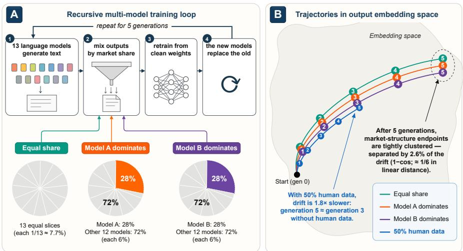  
Figure 1: Experimental setup and result preview. (A) One generation of the ecosystem loop, iterated five times; the bottom row shows three example market-share settings. (B) Schematic trajectories, in output embedding space, of the centroid of each arm’s model-generated pool text (human-data arms embed only the model-output portion, matching Section 3): trajectory positions are illustrative; the annotated 2.6% (in 1− cos; roughly 1/6 in linear distance) and 1.8× are measured values from Section 4.

## 2 RELATED WORK

That recursive training degrades models was established in the single-model setting: a model repeatedly eats its own output, the tails of the distribution vanish first, then overall quality declines (Shumailov et al., 2024; Alemohammad et al., 2024). Follow-up work found mitigating factors— accumulating data across generations rather than replacing it (Gerstgrasser et al., 2024), fixed-size subsampling that turns the crash into a slow slide (Kazdan et al., 2024)—and analyses of mixed human–synthetic data, where a large enough real-data fraction keeps iterative retraining stable (Bertrand et al., 2024; Dohmatob et al., 2024). All of these conclusions come from a world with a single player.

Several recent efforts push the setting to multiple models and find that heterogeneous models feeding each other converge toward one another, in output distributions (Wang et al., 2025) and in perfor mance on shared tasks (Vu et al., 2025); neither asks where the meeting point lies or what could move it. Closest to this paper, Hodel & West (2025) split a fixed corpus among varying numbers of self-training models and find that dispersion improves long-run performance while pooling everything into one model accelerates decay. They vary how one corpus is divided among players; we vary who fills a shared pool of fixed size, and with how much. The two need not agree: in our sweep, speed is not monotone in the player count (Figure 4), and Section 4.4 traces speed to what fills the pool rather than to how many players fill it.

All these experimental lines set shares equal. Vu et al. (2025) acknowledge the point: an appendix asks what would happen if one provider dominated online content and answers that this reduces to the single-model setting, treating concentration as binary. The stretch in between, where three providers take 88%, goes unexplored. Structure has also been modeled as a directed who-feedswhom graph, where collapse is decided by whether natural data can reach a model along the graph; shares exist there as free parameters but do not enter the criterion (Wu et al., 2026). Our ecosystems are always fully connected (the human-data arms of Section 4.3 inject fresh human text every generation), so with topology pinned we ask how much work shares still do. A separate economics literature discusses concentration in foundation-model markets (Korinek & Vipra, 2025; Competition and Markets Authority, 2024; Turegeldinova et al., 2025); homogenization there happens in prices and market entry, and in the algorithmic-monoculture literature it happens at deployment, when many decision-makers share one model (Kleinberg & Raghavan, 2021; Bommasani et al., 2022); neither concerns training dynamics.

We push shares from an even split to a single 90% supplier, sweep the player count from 3 to 13, and dose the pool with 0–50% human data—asking no longer whether convergence happens, but how much market structure moves where the ecosystem is going.

## 3 SETUP

How the ecosystem runs (Figure 1A). The simulated ecosystem contains K language models. Each generation does four things: every model generates text independently; the outputs are sampled according to preset market shares and mixed into one shared corpus pool; every model is fine-tuned (full-parameter) on that pool starting from clean base weights; the newly trained models replace the old ones. This is iterated for five generations; only text crosses generations, weights never do. One experimental configuration together with the ecosystem it produces is called an arm. Retraining from clean base weights corresponds to corpus contamination rather than one model’s continual decay, cleanly isolating the data-share mechanism.

Two experiment groups. The injected probe—K=3, three models artificially injected with strong, mutually opposed stylistic biases—tests whether share can carry the ecosystem in the oligarch’s direction under conditions maximally favorable to it. The natural simulation—off-the-shelf open models, no injection—shows how ecosystems behave in natural conditions. The results section runs in that order.

Which knobs we turn. Four in total. Share structure: natural ecosystems compare an even split against a single 28% head; the injected probe additionally sweeps the top share from 45% to 90%. Head identity: keeping the share structure fixed, hand the 28% top slot to a different model and see whether it matters who holds it. Player count: K from 3 to 13. Human-datafraction: in the K=13 ecosystem, replace 0%, 25%, or 50% of the pool with human text; the 25% dose is also run at K=3, 5, and 8 (the injected probe additionally gets 5%, 10%, and 25% doses; Appendix C).

How we measure. The main measure is geometric: a frozen encoder (DeBERTa) embeds the model generated text of each generation’s pool into one centroid, distances are 1− cos, computed per seed and then averaged across seeds. In human-data arms the human lines are training data only and never enter the centroid. These distances are numerically tiny, so the paper reports them multiplied by one thousand: 0.8 means 1− cos = 0.0008, throughout. This distance grows with the square of the angle, so the gap between two points on the same path is not the difference of their two readings. Ratios of such distances follow the square as well: when the text says the between-arm separation is 2.6% of the drift, that is roughly one sixth in linear distance (1.8× slower reads 1.35×). Al distance ratios in the paper are stated in the 1− cos convention. Two kinds of quantity result: how far one arm moves within five generations (drift), and how far apart different arms are at the same generation (between-arm separation). The injected probe is additionally tracked by a fixed topic classifier; a set of encoder-free degradation metrics (perplexity and friends) independently confirms that degradation really happens (Section 4.2).

Experiment matrix. Natural ecosystems use 13 open base models of 1–4B parameters from ten organizations (full roster in Table 2), nested into ecosystems of $K \in \{ 3 , 5 , 8 , 1 3 \}$ ; three random seeds, with all arms of the same seed sharing generation-0 outputs and prompts, so comparisons are paired. Each model generates 800 texts per generation, subsampled by share into a mixed pool of 2,100; pool size is identical for every arm, so arms differ only in composition. Human text comes from a general web-and-prose corpus (a subset of the Pile; Gao et al., 2020), excluding strongly styled domains such as encyclopedias and papers. Generation and filtering follow one fixed recipe for the K=3 probe and one for the natural ecosystems, reported separately (Appendix A). A singleseed 7–8B probe is an exploratory supplement only (Appendix G).

## 4 RESULTS

## 4.1 THE INJECTED PROBE: THE PULL AT FULL THROTTLE DOES NOT GUARANTEE STEERING

We start with the injected probe, measuring the pull under conditions engineered in its favor. The ecosystem has only three models, each injected with a strong, mutually opposed stylistic bias: one scientific, one subjective-emotional, one factual. The bias strengths were calibrated beforehand: the science model is strongest—scientific topics occupy 2.27× the share in its output that they do in the other two. On top of this we push the oligarch’s share from 45% up to 90%, step by step.

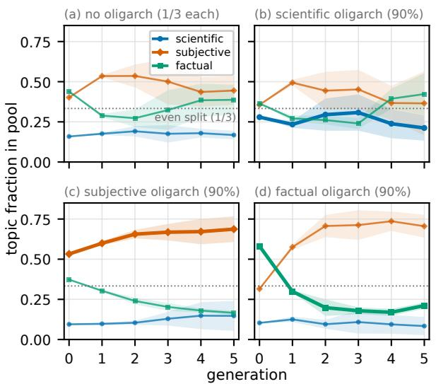

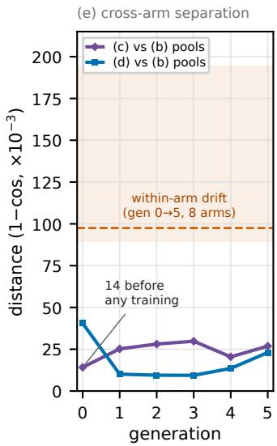  
Figure 2: The K=3 injected probe. (a)–(d): topic composition of the mixed pool by generation; the bold curve is the topic injected into that panel’s oligarch ((a) has no oligarch); shading is ±1 s.d. over 3 seeds; absolute heights are not comparable across panels (Appendix B). (e): distances from the pool centroids of arms (c) and (d) to that of (b); the band is the min–max range of five-generation drift over the eight probe arms, the dashed line their median (three high arms pull it off center).

The result: even at a 90% share, the ecosystem is not guaranteed to move the oligarch’s way (Figure 2). With no oligarch the pool’s topic mix stays roughly flat (panel a); the science oligarch, holding 90%, does not raise its own topic—0.28 at injection, 0.21 five generations later (panel b); the fact oligarch, also at 90%, watches the pool slide toward subjectivity instead (panel d). Within the range we test, an extreme share plus the strongest bias is not enough to guarantee that the ecosystem is pulled toward the oligarch.

Injection strength and outcome are not monotone. The most strongly biased science oligarch (2.27×) failed to hold its topic; the intermediate subjective oligarch (1.65×) held it, rising from 0.53 to 0.69 (panel c). The contrast says that something beyond strength and share is at work.

The topic-level changes are real, but they leave only a faint trace on the ruler that measures collapse (exploratory diagnostic, Figure 2e). Put the injected arms under that ruler: at injection time, before any recursive training, the two ecosystems most opposed in topic—one 90% written by the subjective oligarch, one 90% by the science oligarch—have centroids only 14 apart; after five generations, still only 27, under a third of either arm’s own five-generation drift (92 and 131)—close together from the moment of injection onward. The pull is real on the topic readout and small on the geometric one, which the fade dominates.

Absolute topic heights are compared only within a panel, since the classifier’s baseline differs by topic; same-label contrasts against the uniform arm are in Appendix B, and cross-arm evidence is carried by the centroid geometry. The next section removes the injection and measures, in ecosystems of natural models, how much displacement changing shares, swapping the oligarch, and changing the player count can each produce.

## 4.2 NATURAL ECOSYSTEMS: CHANGING SHARES, OLIGARCHS, AND PLAYER COUNTS LEAVES ONLY SMALL POSITIONAL DIFFERENCES

Now remove the artificial injection and switch to ecosystems under natural conditions. Thirteen off-the-shelf open models (1–4B base) form nested ecosystems of $K \in \{ 3 , 5 , 8 , 1 3 \}$ . At each of K=5, 8, and 13 we compare three kinds of market structure, four arms in all, in paired fashion: a uniform arm, everyone equal; an oligarch arm, Phi-2 holding 28% with the rest split evenly; and identity-counterfactual arms, the same 28% seated by SmolLM2 or Qwen3 instead. At K=3, 28% is below the even split, so that arm enters only the player-count comparison at the end of this section. Natural-ecosystem shares stop at 28% by design; the 90% extreme belongs to the injected probe, whose biased models cannot be spliced with these into one share curve.

Table 1: Between-arm separation at generation 5 versus same-period drift, per ecosystem size. The first four columns are each arm’s own generation-0-to-5 distance $( 1 - \cos , \cdot \times 1 0 ^ { - 3 }$ , 3-seed means). “Separation” is the mean pairwise distance among the tier’s arms at generation 5; “share of drift” divides, per seed, the mean separation by the mean drift of the tier’s arms, then averages over seeds— so dividing two table entries lands slightly off it.
<table><tr><td>Ecosystem</td><td>Uniform</td><td>28% Phi-2</td><td>28% SmolLM2</td><td>28%Qwen3</td><td>Separation @gen5</td><td>Share of drift</td></tr><tr><td>K=5</td><td>67</td><td>74</td><td>62</td><td>77</td><td>2.2</td><td>3.2%</td></tr><tr><td>K=8</td><td>108</td><td>104</td><td>83</td><td>111</td><td>3.0</td><td>3.0%</td></tr><tr><td>K=13</td><td>92</td><td>99</td><td>70</td><td>85</td><td>2.3</td><td>2.6%</td></tr></table>

Turn the first knob: concentrated or not. In K=13, the uniform arm gives everyone 1/13 (about 7.7%); the oligarch arm hands Phi-2 28%. After five generations, the two arms’ centroids are 0.8 apart. Turn the second knob: concentrated for whom. Handing the same 28% to Phi-2, SmolLM2, or Qwen3, the three oligarch arms end 0.8, 2.0, and 2.3 from the uniform arm. Read these numbers against the scale of the drift: over the same five generations, the oligarch arm alone moved about 99, and the twelve arms of Table 1 drifted between 62 and 111—the between-arm separation is a few percent of that. Whether an oligarch exists, and who sits in the oligarch seat: five generations later the ecosystems stop at nearly the same place (Figure 3a).

The pattern is indifferent to ecosystem size. Across K=5, 8, and 13, the between-arm separation is only 2.6%–3.2% of the same cohort’s drift (per-K detail in Table 1). Treated as an equivalence question rather than a point estimate, the paired seeds put one-sided 95% upper bounds on the uniform-versus-oligarch endpoint separation at 7.2%, 2.3%, and 1.2% of the pair’s mean drift for K=5, 8, and 13—even the largest separation consistent with the data stays below a tenth of the road traveled (Appendix A).

Last, the player count. The nested design makes different K directly comparable: the K=3 ecosystem is the sub-ecosystem of the first three members of K=13, same recipe and encoder. Each step up in K adds designated members, so player count and membership change together—the distances below are positional differences between these particular ecosystems, not the isolated effect of player count. Its footprint is deeper than the share knob’s: the farthest pair, the 3-player versus the 13-player ecosystem, are 11.7 apart after five generations, several times the share-knob differences above, though adjacent tiers differ by only 2.2 to 5.8 (Figure 4). Yet even this footprint stays below the drift itself. The two ecosystems set out from almost the same point (0.3 apart at generation 0); K=3 then walks 57, K=13 walks 99, and they end 11.7 apart, about two tenths and one tenth of the two drifts (gaps on this ruler are not differences of drifts; Section 3).

This is worth pausing on. Ecosystems that differ in how shares are split, who sits as oligarch, and how many players are present all collapse, five generations later, to nearly the same place. How violent is the collapse itself, then? Switching to the encoder-free degradation metrics, which read the quality of each model’s own output directly: within five generations, median perplexity rises from 97 to 699, with a median per-trajectory increase of 6.8× (interquartile range 4.4× to 12.0×); meanwhile output narrows—texts generated by the same model grow ever more alike, using ever fewer distinct phrases (Figure 6, Appendix A). The between-arm separations are small not because the collapse is mild.

Changing shares, swapping the oligarch, changing the player count: none of it does much to where the ecosystem collapses to; and the collapse all ecosystems share is real and severe. One tested knob remains: adding human data to the corpus pool. The next section measures it.

## 4.3 HUMAN DATA SLOWS COLLAPSE BUT DOES NOT CHANGE ITS COURSE

The dose response of this last knob is measured on the K=13 ecosystem. We add two arms, replacing 25% or 50% of the mixed pool with human text; the remaining lines are still split by the original share proportions, pool size unchanged, everything else identical to the oligarch arm; the human lines are freshly drawn from the same corpus each generation. There is an effect, and it is entirely in the speed: 25% human data compresses five-generation drift from 99 to 72, 1.4× slower; 50% compresses it to 54, 1.8× slower—the larger the dose, the larger the cut.

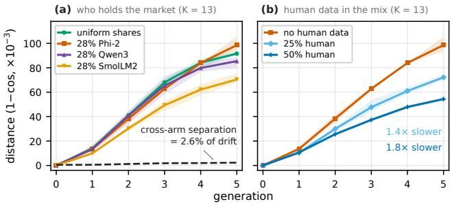

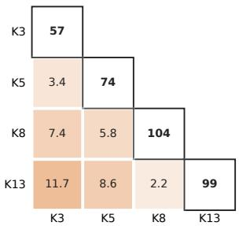  
Figure 3: Two knobs in natural ecosystems: (a) the four share arms of K=13; (b) the oligarch arm of K=13 at human-data doses of 0%, 25%, and 50%, all sharing generation 0. Vertical axis: each arm’s distance from its own generation 0 (1− cos, ×10−3); shading: 3-seed min–max; dashed line in (a): mean between-arm separation per generation. The text’s on-path statements are two-point distances, not differences of heights here.  
Figure 4: Generation-5 geometry of the four nested ecosystems, each represented by its 28% Phi-2 arm. Diagonal: each ecosystem’s own generation-0-to-5 drift; off-diagonal: distance between two ecosystems at generation 5, darker meaning farther $( 1 - \cos , \times 1 0 ^ { - 3 } )$ ).

The 25% dose was run at all four ecosystem sizes, and it slows all of them: K=3 from 57 to 44, K=5 from 74 to 59, K=8 from 104 to 94, K=13 from 99 to 72, with all twelve paired seeds agreeing in sign. The factors fall between 1.1 and 1.4 with no visible pattern in ecosystem size, so the only claim is directional consistency: whether the ecosystem has three players or thirteen, a quarter dose of human text makes it collapse more slowly.

But the course does not change. The two human-data arms drift in the same direction as the oligarch arm (direction cosines 0.996 and 0.993), and along the very same road: where real25 stands at generation five is nearly where the oligarch arm passed at generation four (0.8 apart); where real50 stops at generation five is the oligarch arm’s generation-three position (1.0 apart). Endpoint to endpoint, the two human-data arms are only 2.8 and 7.8 from the oligarch arm’s generation five— the same order as the player-count footprint (at most 11.7) (Figure 3b). Human data does not put the ecosystem on another road; it makes it walk one to two generations less of the same one.

This outcome is the reverse of what we expected. If anything, human data looked most likely to change the course: the human corpus centroid sits only 67–70 from the models’ generation-0 outputs, yet collapse walks away from it—by generation five, model outputs have pulled 270–300 away from the human corpus. Pouring a quarter to a half of human text into the pool ought, by any intuition, to change the training dynamics, at least bend the course a little; over the five measured generations, it only changes the speed along it.

Why does human data only help the speed? One correlational clue. The three generation-0 models of the K=3 probe read three kinds of text under perplexity: human text scores only 0.53× what their own output scores; sibling-model output scores 2.51×. To models that have not yet entered the recursion, human text is not an alien external distribution—it is more familiar than what they sample themselves. Read this against the geometry above: the human corpus is near the start of the road and far from its end; mixing human lines into the pool means part of the training material sits near the start every generation, and the ecosystem is dragged slow by it—a brake, not a steering wheel. This reading is consistent with the slowdown, the dose monotonicity, and the unmoved course; but it is a correlational clue only, identifying no mechanism, and it cannot exclude alternatives such as text difficulty. All four knobs are now turned, and none moves where the collapse goes by more than a fraction of the shared drift; what can be changed is only how fast. So what sets the speed? The next section puts the speed spread Section 4.2 left behind and the human-data slowdown into one explanation.

## 4.4 HOW FAST AN ECOSYSTEM COLLAPSES DEPENDS ON WHOSE TEXT FILLS THE POOL

The arms in Table 1 do not travel the same distance in five generations: 62 to 111, nearly a factor of two. The spread is not noise: each arm has three seeds, the median standard error of the mean is 2.1, and the spread across arms is over twenty times that. This section traces it to one variable: whose text fills the pool.

Start with a pattern already sitting in Table 1. The arm that hands the 28% to SmolLM2 is slower than the arm that hands it to Phi-2 in all three tiers, by 11.5 to 28.1, all nine paired seeds agreeing in sign. Handing it to Qwen3 instead has no consistent effect: slower at $K { = } 1 3$ , faster at $K { = } 5$ and 8. So swapping the oligarch has no universal speed effect; swapping in SmolLM2 does.

Why that model in particular. Put the thirteen players in the evenly split ecosystem and measure, for each, how much of the journey from its own start to the ecosystem’s common endpoint it completes in five generations. Twelve of them complete 78% to 147% (overshoot is possible because the common endpoint is the mean of the thirteen generation-5 positions). SmolLM2 completes 29%, the lone outlier, less than half the runner-up. Nor is it a matter of having less far to go: Phi-2 starts 151 from the common endpoint and walks 132; SmolLM2 starts at 94 and walks 27. A distinctive start does not mean resistance to being carried.

Weighting this “how much of the journey completed” by share gives an arm’s travel propensity: how readily, on average, the text in the pool carries a model along. It predicts the arms’ five-generation drift with $R ^ { 2 } = { \bar { 0 } } . 6 8$ and rank correlation 0.81 across all nineteen arms the sweep ran: the twelve of Table 1, the five human-data arms of Section 4.3, and two more at $K { = } 3$ , which widen the drift range to 44–158 (Figure 5a; per-model detail in Appendix D).

The sharpest test changes membership and nothing else. A further $K { = } 3$ arm keeps the player count and the share vector entry by entry (28%/36%/36%), hence the HHI, and swaps the three members for three models that are more readily carried along (the arm’s travel propensity rises from 734 to 1267). The original $K { = } 3$ arm walks 57 in five generations; the new one walks 158, a $2 . 8 \times \mathrm { g a p } .$ , all three seeds agreeing in sign. An ecosystem of members that resist being carried collapses slowly; the same market structure filled with readily carried members collapses fast. Human text is the other material that changes composition, and per percentage point of pool share it slows the walk at the same order as seating a hard-to-carry head does (0.88–1.05 against 1.15–1.28; the two substitutions displace different text, Appendix D).

The other three candidate variables predict nothing alone: human-data fraction $R ^ { 2 } = 0 . 1 8 ;$ concentration (HHI, the sum of squared model shares; human text belongs to no supplier and does not enter it) and player count both under 0.01 as numbers (categorical fits in Appendix D). Concentration also fails the direct test: with the head identity fixed, twisting it from an even split to 28% changes speed by $+ 9 \% , \ - 4 \% , \ + 8 \%$ across $K { = } 5 / 8 / 1 3$ , and the one HHI value shared by the two $K { = } 3$ arms above hosts both the fastest arm of the nineteen and the slowest without human text (Figure 5b). Two caveats. The human-data slowdown of Section 4.3 is real; what the fraction lacks is cross-arm explanatory power, since fourteen of the nineteen arms contain no human text and still spread from 57 to 158. And in the nested design player count and membership change together, so what is ruled out is only the predictive power of the number itself.

A collapse-resistant oligarch is not merely standing still itself: remove all three candidate oligarchs from the measurement and read only the other ten models’ generation-5 output, and their diversity still follows travel propensity monotonically across the six K=13 arms (Spearman −1.000; Appendix D). The others degrade more mildly too.

The relationship has boundaries. $R ^ { 2 } = 0 . 6 8$ leaves more than thirty percent unexplained, and the remainder is not seed jitter, nor randomly scattered: all five $K { = } 8$ arms sit above the fit line, for reasons we do not know. Within single tiers it orders the purely synthetic arms at $K { = } 5$ and 8 but not at $K { = } 1 3$ . The index was fit after most of these arms ran; leave-one-arm-out cross-validation keeps the ordering (rank correlation 0.79) and only part of the quoted variance $( Q ^ { 2 } \ 0 . 5 5 )$ , and a fit to the fourteen arms measured at the time placed the two added later on the correct side of their cohorts but well below their measured drift: the relationship can rank but cannot quote (Appendix D). Nor is the 2.8× a matter of the swapped-in models starting out alike with nothing to lose: their generation-0 lexical diversity is a touch higher than the original arm’s, and it falls to 0.036 by generation five while the original keeps 0.736.

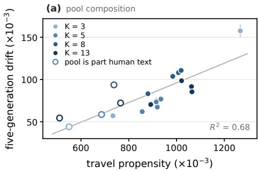

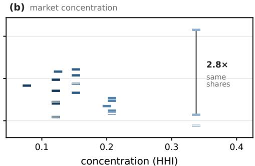  
Figure 5: Five-generation drift of the nineteen arms against pool composition (a) and concentration (b); hollow marks: pools that are part human text. Error bars in (a): s.e. of the 3-seed mean; the line is a least-squares fit to all nineteen arms. In (b) each arm is a bar at its HHI; the arms share only seven values.

Why can a first-order variable like share leave almost no footprint at the endpoint? In a one-line toy where each model is a point pulled toward the shared pool, its own factory position, and one common direction, the trade is one for one: every tenth of the road to the common endpoint completed squeezes out a tenth of the share-induced separation. In the toy, recursion can only dilute the advantage of shares, never compound it; in the data the share footprint is not amplified either, 0.6 at generation 0 and 0.8 at generation 5 while the drift grows to 99 (Appendix E).

## 5 DISCUSSION AND CONCLUSION

The oligopoly worry is two hypotheses: fewer, more uniform sources make degradation arrive faster, and later models eating mostly the oligarch’s output homogenize the ecosystem toward one company’s image. In our setting, neither holds. The share and identity knobs leave endpoint separations of a few units against a shared journey of about a hundred; and the fewest-source ecosystem, K=3 in its original form, is the slowest of all arms without human text.

These hypotheses fail because, against the pull, the fade is simply much larger. One ruler carries the whole story: the share manipulation moves the generation-5 position by 0.8; the same two arms walked 92 and 99 in five generations; and the human corpus sits 270–300 from where they end— collapse walks away from human text. Nor does the verdict change along the five generations we ran: at generation 0, before any recursion, the same batch of text with only mixing weights changed puts the share footprint at 0.6; and the players never scatter as the chain deepens; they retreat together toward the same place.

With the destination nearly immobile, the one manipulable quantity is speed, and what predicts it is the composition of the pool, the only one of four candidate variables that predicts it as a single number. Human text and the text of hard-to-carry models both change composition, at comparable per-percentage-point cost; the human-data stock is the most vital of these materials, but not the only one.

This paper has four boundaries. Five generations is not an endpoint, but it is enough to see the trend: drift has walked 99 while the separation left by shares and identity remains a few percent of it. The geometry comes from one frozen encoder, so the load-bearing claims use only distances and speeds, never cross-domain axis readings, which flipped sign on all three audit encoders. Three audit encoders re-verify the qualitative distance claims: endpoints farther from human text than starts, between-arm separation below the seed-noise floor at every K, human data slowing the walk; the percentages themselves stay encoder-specific (Appendix F). The main experiments live at 1–4B with at most thirteen players; the 7–8B probe ran once, and at its generation 5 the between-arm separation was still as large as the drift, closing to 0.40 of it only by generation 10, so under-convergence and a scale effect cannot be told apart (Appendix G). The composition–speed relationship is post-hoc fitted and leaves over thirty percent of variance unexplained, clustered by ecosystem size, so we claim a coarse relationship, not a law of speed.

In one sentence: in the range we measured, the concentration of the data market changes neither where recursive collapse is headed nor how fast it goes; what changes the speed is whose text fills the shared corpus, and it changes only the speed. An open question: what, linguistically, is this common destination?

## ETHICS STATEMENT

This work trains and evaluates only publicly released open-weight models on publicly available corpora; no human subjects, personal data, or annotators are involved. The human text used is a filtered subset of a public corpus. One generated sample containing explicit content and one containing profanity are masked in Appendix H, with the masking marked in place. The findings bear on data-governance discussions but make no policy recommendation.

## REPRODUCIBILITY STATEMENT

All models, corpora, and scoring instruments are public; Appendix A specifies the full roster, shares, per-generation pipeline, training and generation recipes (including the two documented backend deviations), encoder identifiers, and human-corpus filters. All headline numbers with their computation conventions appear in the tables and captions. Code, configurations, and per-arm measurements will be released.

## AI USE STATEMENT

We used generative AI tools to help implement standard components of the experimental pipeline and to assist with the writing of this paper. The recursively generated text that this paper studies is the object of study itself: it is produced by the open-weight models under examination, following the procedures of Section 3 and Appendix A. We reviewed all AI-assisted work and take responsibility for the final content of this work, including text, claims, and artifacts produced with the aid of generative AI.

## REFERENCES

Sina Alemohammad, Josue Casco-Rodriguez, Lorenzo Luzi, Ahmed Imtiaz Humayun, Hossein Babaei, Daniel LeJeune, Ali Siahkoohi, and Richard G. Baraniuk. Self-consuming generative models go MAD. In International Conference on Learning Representations, 2024. arXiv:2307.01850.

Marco Bellagente, Jonathan Tow, Dakota Mahan, Duy Phung, Maksym Zhuravinskyi, Reshinth Adithyan, James Baicoianu, Ben Brooks, Nathan Cooper, Ashish Datta, Meng Lee, Emad Mostaque, Michael Pieler, Nikhil Pinnaparju, Paulo Rocha, Harry Saini, Hannah Teufel, Niccolo Zanichelli, and Carlos Riquelme. Stable LM 2 1.6B technical report, 2024.

Loubna Ben Allal, Anton Lozhkov, Elie Bakouch, Gabriel Martín Blázquez, Guilherme Penedo, Lewis Tunstall, Andrés Marafioti, Hynek Kydlícek, Agustín Piqueres Lajarín, Vaibhav Srivastav, ˇ Joshua Lochner, Caleb Fahlgren, Xuan-Son Nguyen, Clémentine Fourrier, Ben Burtenshaw, Hugo Larcher, Haojun Zhao, Cyril Zakka, Mathieu Morlon, Colin Raffel, Leandro von Werra, and Thomas Wolf. SmolLM2: When smol goes big – data-centric training of a small language model, 2025.

Quentin Bertrand, Avishek Joey Bose, Alexandre Duplessis, Marco Jiralerspong, and Gauthier Gidel. On the stability of iterative retraining of generative models on their own data. In International Conference on Learning Representations, 2024. arXiv:2310.00429.

Rishi Bommasani, Kathleen A. Creel, Ananya Kumar, Dan Jurafsky, and Percy Liang. Picking on the same person: Does algorithmic monoculture lead to outcome homogenization? In Advances in Neural Information Processing Systems, 2022. arXiv:2211.13972.

Zheng Cai, Maosong Cao, Haojiong Chen, Kai Chen, Keyu Chen, Xin Chen, Xun Chen, Zehui Chen, Zhi Chen, Pei Chu, Xiaoyi Dong, Haodong Duan, Qi Fan, Zhaoye Fei, Yang Gao, Jiaye Ge, Chenya Gu, Yuzhe Gu, Tao Gui, Aijia Guo, et al. InternLM2 technical report, 2024.

Competition and Markets Authority. AI foundation models: Update paper. UK Competition and Markets Authority, April 2024. URL https://www.gov.uk/government/ publications/ai-foundation-models-update-paper. Published 11 April 2024; last updated 16 April 2024.

Nicholas Kluge Corrêa, Aniket Sen, Sophia Falk, and Shiza Fatimah. Tucano: Advancing neural text generation for portuguese, 2024. Published version: Patterns (2025), doi:10.1016/j.patter.2025.101325.

Elvis Dohmatob, Yunzhen Feng, Pu Yang, Francois Charton, and Julia Kempe. A tale of tails: Model collapse as a change of scaling laws. In International Conference on Machine Learning, 2024. arXiv:2402.07043.

Falcon-LLM Team. The falcon 3 family of open models. https://huggingface.co/blog/ falcon3, December 2024.

Leo Gao, Stella Biderman, Sid Black, Laurence Golding, Travis Hoppe, Charles Foster, Jason Phang, Horace He, Anish Thite, Noa Nabeshima, Shawn Presser, and Connor Leahy. The Pile: An 800GB dataset of diverse text for language modeling, 2020.

Matthias Gerstgrasser, Rylan Schaeffer, Apratim Dey, Rafael Rafailov, Tomasz Korbak, Henry Sleight, Rajashree Agrawal, John Hughes, Dhruv Bhandarkar Pai, Andrey Gromov, Dan Roberts, Diyi Yang, David L. Donoho, and Sanmi Koyejo. Is model collapse inevitable? Breaking the curse of recursion by accumulating real and synthetic data. In First Conference on Language Modeling (COLM), 2024. arXiv:2404.01413.

Pengcheng He, Jianfeng Gao, and Weizhu Chen. DeBERTaV3: Improving DeBERTa using ELECTRA-style pre-training with gradient-disentangled embedding sharing. In International Conference on Learning Representations, 2023. arXiv:2111.09543.

Damian Hodel and Jevin D. West. Epistemic diversity across language models mitigates knowledge collapse, 2025. v3, 29 July 2026.

Ari Holtzman, Jan Buys, Li Du, Maxwell Forbes, and Yejin Choi. The curious case of neural text degeneration. In International Conference on Learning Representations, 2020. arXiv:1904.09751.

Hugging Face SmolLM Team. SmolLM3: smol, multilingual, long-context reasoner. https://huggingface.co/blog/smollm3; model card, https://huggingface. co/HuggingFaceTB/SmolLM3-3B-Base, 2025.

IBM Granite Team. Granite 3.3 language models. Model card, https://huggingface.co/ ibm-granite/granite-3.3-2b-base, 2025. Released 16 April 2025.

IBM Granite Team. Granite 4.1 language models. Model card, https://huggingface.co/ ibm-granite/granite-4.1-8b-base, 2026. Released 29 April 2026.

Albert Q. Jiang, Alexandre Sablayrolles, Arthur Mensch, Chris Bamford, Devendra Singh Chaplot, Diego de las Casas, Florian Bressand, Gianna Lengyel, Guillaume Lample, Lucile Saulnier, Lélio Renard Lavaud, Marie-Anne Lachaux, Pierre Stock, Teven Le Scao, Thibaut Lavril, Thomas Wang, Timothée Lacroix, and William El Sayed. Mistral 7B, 2023.

Joshua Kazdan, Rylan Schaeffer, Apratim Dey, Matthias Gerstgrasser, Rafael Rafailov, David L. Donoho, and Sanmi Koyejo. Collapse or thrive? Perils and promises of synthetic data in a selfgenerating world, 2024. NeurIPS 2024 Workshops: Mathematics of Modern Machine Learning (M3L) and Attributing Model Behavior at Scale (ATTRIB).

Jon Kleinberg and Manish Raghavan. Algorithmic monoculture and social welfare. Proceedings of the National Academy ofSciences, 118(22):e2018340118, 2021.

Anton Korinek and Jai Vipra. Concentrating intelligence: scaling and market structure in artificial intelligence. Economic Policy, 40(121):225–256, 2025. doi: 10.1093/epolic/eiae057. Workingpaper version: arXiv:2311.01550 (2023), “Market Concentration Implications of Foundation Models”, by Vipra and Korinek.

Woosuk Kwon, Zhuohan Li, Siyuan Zhuang, Ying Sheng, Lianmin Zheng, Cody Hao Yu, Joseph E. Gonzalez, Hao Zhang, and Ion Stoica. Efficient memory management for large language model serving with PagedAttention. In Proceedings ofthe 29th Symposium on Operating Systems Principles (SOSP), 2023. arXiv:2309.06180.

Moritz Laurer, Wouter van Atteveldt, Andreu Salleras Casas, and Kasper Welbers. Less annotating, more classifying: Addressing the data scarcity issue of supervised machine learning with deep transfer learning and BERT-NLI. Preprint, https://osf.io/74b8k; model card, https: //huggingface.co/MoritzLaurer/DeBERTa-v3-base-mnli-fever-anli, 2022.

Ryan Law. 74% of new webpages include AI content (study of 900k pages). Ahrefs Blog, May 2025. URL https://ahrefs.com/blog/ what-percentage-of-new-content-is-ai-generated/.

Benjamin Lefaudeux, Francisco Massa, Diana Liskovich, Wenhan Xiong, Vittorio Caggiano, Sean Naren, Min Xu, Jieru Hu, Marta Tintore, Susan Zhang, Patrick Labatut, Daniel Haziza, Luca Wehrstedt, Jeremy Reizenstein, and Grigory Sizov. xFormers: A modular and hackable transformer modelling library. https://github.com/facebookresearch/xformers, 2022.

Jiwei Li, Michel Galley, Chris Brockett, Jianfeng Gao, and Bill Dolan. A diversity-promoting objective function for neural conversation models. In Proceedings of the 2016 Conference of the North American Chapter of the Association for Computational Linguistics: Human Language Technologies (NAACL-HLT), 2016. arXiv:1510.03055.

Microsoft Research. Phi-2: The surprising power of small language models. Model card, https://huggingface.co/microsoft/phi-2; announcement, https://www.microsoft.com/en-us/research/blog/ phi-2-the-surprising-power-of-small-language-models/, 2023.

Saurav Muralidharan, Sharath Turuvekere Sreenivas, Raviraj Joshi, Marcin Chochowski, Mostofa Patwary, Mohammad Shoeybi, Bryan Catanzaro, Jan Kautz, and Pavlo Molchanov. Compact language models via pruning and knowledge distillation, 2024.

Neel Nanda. pile-10k. Dataset, https://huggingface.co/datasets/NeelNanda/ pile-10k, 2022. The first 10,000 documents of The Pile; see gao2020pile.

Qwen, An Yang, Baosong Yang, Beichen Zhang, Binyuan Hui, Bo Zheng, Bowen Yu, Chengyuan Li, Dayiheng Liu, Fei Huang, et al. Qwen2.5 technical report, 2024.

Alec Radford, Jeffrey Wu, Rewon Child, David Luan, Dario Amodei, and Ilya Sutskever. Language models are unsupervised multitask learners. OpenAI blog, 1(8), 2019.

Nils Reimers and Iryna Gurevych. Sentence-BERT: Sentence embeddings using siamese BERTnetworks. In Proceedings of the 2019 Conference on Empirical Methods in Natural Language Processing (EMNLP), 2019. arXiv:1908.10084.

Ilia Shumailov, Zakhar Shumaylov, Yiren Zhao, Nicolas Papernot, Ross Anderson, and Yarin Gal. AI models collapse when trained on recursively generated data. Nature, 631(8022):755–759, 2024. doi: 10.1038/s41586-024-07566-y. Preprint: arXiv:2305.17493, titled “The Curse of Recursion: Training on Generated Data Makes Models Forget”. Author Correction: Nature, doi:10.1038/s41586-025-08905-3 (2025).

Philipp Singer, Pascal Pfeiffer, Yauhen Babakhin, Maximilian Jeblick, Nischay Dhankhar, Gabor Fodor, and Sri Satish Ambati. H2O-danube-1.8B technical report, 2024. Checkpoint actually used: https://huggingface.co/h2oai/h2o-danube2-1.8b-base.

Team OLMo, Pete Walsh, Luca Soldaini, Dirk Groeneveld, Kyle Lo, Shane Arora, Akshita Bhagia, Yuling Gu, Shengyi Huang, Matt Jordan, Nathan Lambert, Dustin Schwenk, Oyvind Tafjord, Taira Anderson, David Atkinson, Faeze Brahman, Christopher Clark, Pradeep Dasigi, Nouha Dziri, Allyson Ettinger, et al. 2 OLMo 2 furious, 2024. A shorter version was accepted to COLM 2025.

Team OLMo, Allyson Ettinger, Amanda Bertsch, Bailey Kuehl, David Graham, David Heineman, Dirk Groeneveld, Faeze Brahman, Finbarr Timbers, Hamish Ivison, Jacob Morrison, Jake Poznanski, Kyle Lo, Luca Soldaini, Matt Jordan, Mayee Chen, Michael Noukhovitch, Nathan Lambert, Pete Walsh, Pradeep Dasigi, et al. Olmo 3, 2025.

Jonathan Tow, Marco Bellagente, Dakota Mahan, and Carlos Riquelme. StableLM-3b-4e1t. Model card, https://huggingface.co/stabilityai/stablelm-3b-4e1t, 2023.

Tim Tully, Joff Redfern, Deedy Das, and Derek Xiao. 2025: The state of generative AI in the enterprise. Menlo Ventures, December 2025. URL https://menlovc.com/perspective/ 2025-the-state-of-generative-ai-in-the-enterprise/.

Aliya Turegeldinova, Bakytzhan Amralinova, Mate Miklos Fodor, Akerkin Eraliyeva, Chen Dayou, and Aidos Joldassov. AI as a centripetal technology: Price compression, homogenization, and entry, 2025.

VNGRS-AI. Kumru-2b-base. Model card, https://huggingface.co/vngrs-ai/ Kumru-2B-Base, 2025.

Hung Anh Vu, Galen Reeves, and Emily Wenger. What happens when generative AI models train recursively on each others’ outputs?, 2025. v3, 2 October 2025.

Liang Wang, Nan Yang, Xiaolong Huang, Binxing Jiao, Linjun Yang, Daxin Jiang, Rangan Majumder, and Furu Wei. Text embeddings by weakly-supervised contrastive pre-training, 2022.

Liang Wang, Nan Yang, Xiaolong Huang, Linjun Yang, Rangan Majumder, and Furu Wei. Multilingual E5 text embeddings: A technical report, 2024.

Tianyu Wang, Akira Horiguchi, Lingyou Pang, and Carey E. Priebe. LLM web dynamics: Tracing model collapse in a network of LLMs, 2025. v3, 24 July 2025.

Wenhui Wang, Furu Wei, Li Dong, Hangbo Bao, Nan Yang, and Ming Zhou. MiniLM: Deep selfattention distillation for task-agnostic compression of pre-trained transformers, 2020.

Yuchen Wu, Kangjie Zhou, and Weijie Su. When does model collapse occur in structured interactive learning?, 2026. 57 pages, 12 figures.

An Yang, Anfeng Li, Baosong Yang, Beichen Zhang, Binyuan Hui, Bo Zheng, Bowen Yu, Chang Gao, Chengen Huang, Chenxu Lv, Chujie Zheng, Dayiheng Liu, Fan Zhou, Fei Huang, Feng Hu, Hao Ge, Haoran Wei, Huan Lin, Jialong Tang, Jian Yang, Jianhong Tu, Jianwei Zhang, Jianxin Yang, Jiaxi Yang, Jing Zhou, Jingren Zhou, Junyang Lin, et al. Qwen3 technical report, 2025.

Yaoming Zhu, Sidi Lu, Lei Zheng, Jiaxian Guo, Weinan Zhang, Jun Wang, and Yong Yu. Texygen: A benchmarking platform for text generation models. In The 41st International ACM SIGIR Conference on Research and Development in Information Retrieval, pp. 1097–1100, 2018. doi: 10.1145/3209978.3210080. arXiv:1802.01886.

## A METHODS AND REPRODUCIBILITY DETAILS

Models and ecosystem construction. The 13 base models of the natural ecosystems are listed in Table 2: ten organizations, 1–4B parameters. The nesting is $K { = } 3 \subset K { = } 5 \subset \dot { K } { = } 8 \subset K { = } 1 3 ;$ the joining order was set by model-family diversity and frozen before any cross-arm comparison: the three K=3 members come from three organizations, and each later tier adds both new organizations and further model families from existing ones. Two additional models were excluded on technical grounds before the ecosystems ran, likewise before any comparison: InternLM2.5-1.8B (Cai et al., 2024) produced 1,200 empty outputs after its first-generation fine-tune and could not be measured; h2o-danube2-1.8b (Singer et al., 2024) deterministically triggered a CUDA crash on our inference stack.

Shares. Uniform arms give $1 / K$ each. Oligarch arms fix the head at 28% with the rest split evenly (K=3: 36% each; $K { \stackrel { } { = } } 5 ;$ 18%; $K { = } 8 \colon 1 0 . { \overset { \smile } { 3 } } \% ; K { = } 1 3 \colon 6 \% )$ ). Identity-counterfactual arms hand the 28% to SmolLM2 or Qwen3. The head is designated by an explicit field, not inferred from the shares. Phi-2 was seated at the head at design time because its generation-0 output is the easiest to distinguish from the other models’ (probability 0.995 of ranking first under bootstrap); Kumru and Tucano write primarily Turkish and Portuguese and were not head candidates.

Per-generation pipeline. Each model generates 800 texts per generation; stratified sampling without replacement by share yields a 2,100-text shared pool (largest-remainder rounding keeps the total identical for every arm); all models are then fully fine-tuned from clean base weights, and the next generation begins; 5 generations in total. Three seeds (42/123/456); within a seed, all models and all arms share the same generation-0 outputs and the same prompt file, and each arm mixes its own pool from that batch by its own shares, so between-arm comparisons are paired. Prompts are 8–16-word prefixes cut from human text, filtered to remove any that leak topic labels.

Training recipe. Full-parameter fine-tuning, no LoRA; 1 epoch, learning rate 2e-5, warmup 40 steps, weight decay 0.01, effective batch 16 (8 per device × 2 gradient-accumulation), bf16, maximum sequence length 768. One cell was switched to 4 × 4 for memory (Minitron-4B in K13\_real50), effective batch unchanged.

Generation recipes (two, reported separately). Natural ecosystems: vllm (Kwon et al., 2023), temperature 1.0, top-p 0.95 (nucleus sampling; Holtzman et al., 2020), repetition penalty 1.15, frequency penalty 0.3, at most 128 new tokens; 2.0× oversampling followed by a label-agnostic quality filter (at least 20 words, highest single-word frequency ≤ 0.20, distinct-2 ≥ 0.45; distinct-n per Li et al., 2016), then fixed-quota downsampling to 800. The K=3 injected probe differs in thresholds (at least 32 words, distinct- ${ } ^ { - 2 } \geq 0 . 5 5$ , top-frequency ≤ 0.18, 1.5× oversampling), 8,000 texts per model per generation, 8,000-text pool. The 7–8B probe uses a different backend (HF generate + no-repeat-3gram, no frequency penalty); Appendix G.

One engine deviation. Two generation-5 runs crashed under the default inference backend: K3\_fragile/seed123/stablelm-3b and K8\_qwen3/seed123/Phi-2, both reporting the same error in vllm’s flex\_attention kernel. Both models have head\_dim 80, for which vllm bypasses flash and triton and falls to flex. The crash reproduced three times across GPUs; not a hardware fault. These two runs were regenerated under the xformers backend (Lefaudeux et al., 2022); every other arm, seed, and generation used the default backend. Blast radius: 2 models × 1 generation × 1 seed.

Measurement. The encoder is a frozen DeBERTa-v3-base (He et al., 2023) fine-tuned on mnli fever-anli (Laurer et al., 2022), never trained further: each text is truncated to 128 tokens, maskmean-pooled, L2-normalized; the pool centroid is the renormalized mean over all pool texts; distances are 1− cos. Distances are always computed per seed first, then averaged over the three seeds—never centroid-averaged first. Human lines in human-data arms are training data only and never enter the centroid.

Equivalence bounds. The uniform-versus-oligarch comparison of Section 4.2 can also be read as an equivalence question: how large an endpoint separation is still consistent with the paired seeds? The per-seed generation-5 centroid separations between the uniform and 28% arms are 2.6/3.8/0.7 at K=5 (1− cos, ×10−3), 2.2/1.4/1.7 at K=8, and 0.7/1.0/0.8 at K=13; one-sided 95% upper confidence bounds (t, two degrees of freedom) put them at 5.1, 2.4, and 1.1, which is 7.2%, 2.3%, and 1.2% of the pair’s mean five-generation drift. This is a post-hoc analysis on three seeds, computed after the point estimates were known.

Other instruments. The encoder’s full identifier is MoritzLaurer/ DeBERTa-v3-base-mnli-fever-anli. The topic classifier of Section 4.1 is the same checkpoint read through a different head: geometry uses the mask-mean-pooled embedding, topics use its NLI head via the HuggingFace zero-shot pipeline, labels scientific/subjective/factual, batch 32. So Section 4.1’s topic and geometric readouts are two readouts of one checkpoint. The three surface metrics of Figure 6: perplexity is scored by a frozen gpt2-large (Radford et al., 2019) (fp16, 128-token truncation, batch 8, token-weighted aggregation of negative log-likelihood then exponentiation, no sliding window); distinct-4-gram fraction is whitespace-tokenized, counting 4-gram types over 4-gram tokens pooled per batch; self-BLEU-4 (Zhu et al., 2018) is also whitespacetokenized, sampling 80 texts per batch at fixed seed 42, each scored with clipped 4-gram overlap against the rest. The three audit encoders of Appendix F are intfloat/e5-base-v2 (prefix “passage: ”; Wang et al., 2022), sentence-transformers/all-MiniLM-L6-v2 (Reimers & Gurevych, 2019) (backbone: Wang et al., 2020), and intfloat/multilingual-e5-base (Wang et al., 2024).

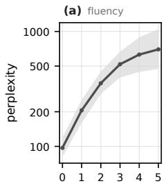

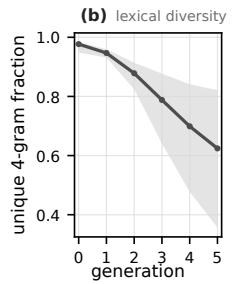

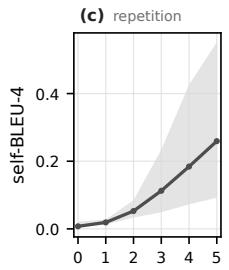  
Figure 6: Encoder-free degradation metrics: 330 trajectories (12 arms × 3 seeds × member models; the arms are the six of K=13 plus, at each of K=3, 5, and 8, the 28% Phi-2 arm and its 25% human-data variant, so five arms contain human text). Curves: per-generation medians; shading: interquartile range. Each metric reads a model’s own newly generated text. (a) Perplexity under a frozen gpt2-large, log axis. (b) Distinct-4-gram fraction. (c) Self-BLEU-4.

Table 2: The 13 open base models of the natural ecosystems, in nesting order $( K { = } 3 \subset K { = } 5 \subset$ $K { = } 8 \ \subset \ K { = } 1 3 )$ . Shares are deterministic and not listed per row: uniform arms give $1 / K$ each; oligarch arms give the head 28% and split the rest evenly (K=5: 18% each; K=8: 10.3%; K=13: 6%). Identity-counterfactual arms seat SmolLM2 or Qwen3 on the 28%. Phi-2 holds the head by design: its generation-0 output is the easiest to distinguish from the others’ (bootstrap probability 0.995 of ranking first). Kumru and Tucano write primarily Turkish and Portuguese and are not head candidates.
<table><tr><td>Model</td><td>Params</td><td>Organization</td><td>Joins at</td><td>Report</td></tr><tr><td>Qwen3-1.7B-Base</td><td>1.7B</td><td>Alibaba</td><td>K=3</td><td>Yang et al. (2025)</td></tr><tr><td>SmolLM2-1.7B</td><td>1.7B</td><td>HuggingFace</td><td>K=3</td><td>Ben Allal et al. (2025)</td></tr><tr><td>Phi-2</td><td>2.7B</td><td>Microsoft</td><td>K=3</td><td>Microsoft Research (2023)</td></tr><tr><td>Qwen2.5-1.5B</td><td>1.5B</td><td>Alibaba</td><td>K=5</td><td>Qwen et al. (2024)</td></tr><tr><td>SmolLM3-3B-Base</td><td>3B</td><td>HuggingFace</td><td>K=5</td><td>Hugging Face SmolLM Team (2025)</td></tr><tr><td>OLMo-2-0425-1B</td><td>1B</td><td>AI2</td><td>K=8</td><td>Team OLMo et al. (2024)</td></tr><tr><td>stablelm-2-1_6b</td><td>1.6B</td><td>Stability</td><td>K=8</td><td>Bellagente et al. (2024)</td></tr><tr><td>Falcon3-1B-Base</td><td>1B</td><td>TII</td><td>K=8</td><td>Falcon-LLM Team (2024)</td></tr><tr><td>granite-3.3-2b-base</td><td>2.5B</td><td>IBM</td><td>K=13</td><td>IBM Granite Team (2025)</td></tr><tr><td>Kumru-2B-Base</td><td>2B</td><td>VNGRS</td><td>K=13</td><td>VNGRS-AI (2025)</td></tr><tr><td>Tucano-2b4</td><td>2.4B</td><td>TucanoBR</td><td>K=13</td><td>Corrêa et al. (2024)</td></tr><tr><td>Minitron-4B-Base</td><td>4B</td><td>Nvidia</td><td>K=13</td><td>Muralidharan et al. (2024)</td></tr><tr><td>stablelm-3b-4e1t</td><td>3B</td><td>Stability</td><td>K=13</td><td>Tow et al. (2023)</td></tr></table>

Human corpus. Drawn from pile-10k (Nanda, 2022), a 10,000-document sample of the Pile (Gao et al., 2020), keeping only {Pile-CC, OpenWebText2, Books3, BookCorpus2, Gutenberg} (general web and written prose) and excluding strongly styled domains (arXiv, Wikipedia, PubMed), code, and mathematics; each excerpt at least 50 words, at most 6 excerpts per document to keep any single document from dominating. real25/real50 replace synthetic share inside the pool proportionally, pool size unchanged, human lines freshly drawn each generation.

## B INJECTED-PROBE SUPPLEMENT

How the bias is injected. Each of the three models is fully fine-tuned once, before generation 0, on a topic-biased corpus: the science model is Qwen3-1.7B-Base tuned on arXiv abstracts, the subjective model SmolLM2-1.7B on Yelp polarity reviews, the factual model OLMo-2-0425-1B on WikiText. The three biased checkpoints are then frozen and reused across every share setting and seed. There is no per-generation re-injection: from generation 1 onward each model is retrained from its raw base on the previous generation’s mixed pool—the same reset-from-clean rule as the natural ecosystems—so the biased weights speak only through the generation-0 text they contribute, and whatever bias persists must survive the data chain on its own. Each generation, every model produces 8,000 texts from prompts shared across the three models, subsampled by share into a mixed pool of 8,000.

Same-label contrasts across arms. The classifier’s baseline differs by topic, which blocks comparisons between labels but not comparisons of one label across arms. Against the uniform arm, seed by seed: the science oligarch’s advantage on its own label $\mathrm { i s + 0 . 1 2 }$ at injection and $+ 0 . 1 2 , + 0 . 1 1$ $- 0 . 0 9$ at generation 5 (its label’s pool fraction goes from 0.28 to 0.29, 0.24, 0.10); the subjective oligarch’s is +0.13 at injection and $+ 0 . 2 6 , + 0 . 2 7 , + 0 . 2 0$ at generation 5; the fact oligarch’s is +0.14 at injection and $- 0 . 3 \mathrm { { 0 } } , \ : - 0 . 1 8 , \ : - 0 . 0 5$ at generation 5. Of the three injected biases, one holds, one dissolves, one reverses.

How strength is measured. The quoted strengths $( 2 . 2 7 \times , 1 . 6 5 \times , 1 . 1 3 \times )$ are cross-model dominance ratios read off the biased checkpoints’ generation-0 output by the same frozen zero-shot topic classifier as Figure 2: a model’s strength is the mean probability of its own target topic in its own output, divided by the highest mean any other model reaches on that topic. A ratio across models rather than an absolute probability, because the entailment classifier’s baseline differs by label phrasing— the same reason absolute heights in Figure 2 are compared only within a panel, and the reason we do not report arm-versus-arm topic differences at matched generations; cross-arm evidence is carried by the centroid geometry, whose per-generation table is below.

The third injection strength. The main text compares only the two strongest biases (science $2 . 2 7 \times$ subjective 1.65×). The third is the objective-factual bias, strength 1.13×, the weakest. Its outcome completes the “strength and outcome are not monotone” picture: the strongest cannot hold its own topic, the intermediate one holds it, and this weakest one is dragged all the way toward subjectivity, whose topic share reaches 0.71 at generation five.

Per-generation between-arm geometric distances. The main text says the two ecosystems most opposed in topic stay side by side under the geometric ruler from injection onward; the full pergeneration readings $\mathrm { \dot { ( 1 - c o s , \times 1 0 ^ { - 3 } } }$ , 3-seed means):
<table><tr><td>Arm pair</td><td>gen0</td><td>gen1</td><td> $\mathrm { g e n } 2$ </td><td> $\mathrm { g e n } 3$ </td><td>gen4</td><td>gen5</td></tr><tr><td>90% subjective ↔ 90% science</td><td>14</td><td>25</td><td>28</td><td>30</td><td>20</td><td>27</td></tr><tr><td>90% factual ↔ 90% science</td><td>40</td><td>10</td><td>9</td><td>9</td><td>14</td><td>23</td></tr></table>

Five-generation drift of the same arm family $( 1 - \cos , \times 1 0 ^ { - 3 } ,$ , 3-seed mean $\pm \ : \mathrm { s . d . } ) \mathrm { : }$ : 45% science $9 8 \pm 6 ; 5 5 \%$ science $9 7 \pm 1 0 ; 6 5 \%$ science $9 6 \pm 8 ; 7 5 \%$ science $8 9 \pm 1 0 ; 9 0 \%$ science $9 2 \pm 7 ;$ 90% subjective $1 3 1 \pm 4 ;$ 90% factual $1 9 4 \pm 2 5 ;$ uniform $1 1 2 \pm 1 0$ . The full range of generation-5 between-arm distances is 5 to 28, and the smallest within-arm drift is 89—even the top of that range (28) stays below the smallest drift; the pair most opposed in topic is at 27.

Three things recorded as they are. First, the arm with the weakest injection (90% factual) collapses hardest geometrically (194), consistent with its failure to hold its own topic and its slide toward subjectivity; this does not disturb the judgment above. Second, combining the probe’s share axis $( K { = } 3$ fixed, head pushed from 33% to 90%, HHI from 0.33 to 0.82) with the natural ecosystems’ player-count axis $( K { = } 1 3$ uniform arm, HHI about 0.08), the concentration coverage runs from 0.08 to 0.82—neither experiment group alone covers more than a stretch of it. The two groups’ generation recipes differ, so speeds cannot be spliced into one curve, but neither group speeds up with concentration internally: on the injection side, with the head identity fixed to the science model, the five share steps from 45% to 90% read 98, 97, 96, 89, 92, plus the uniform arm’s 112—a full range of 112 versus 89, 1.26×, and the direction is mild deceleration with concentration, not acceleration; on the natural side, with the head identity fixed, an even split and a 28% oligarch differ by less than a tenth (Table 4). Third, the three 90% arms have exactly the same share vector (HHI alike at 0.82), yet their five-generation drifts are 92, 131, 194—a 2.1× spread: the same concentration corresponds to a range of speeds on the injection side too, echoing the $K { = } 3$ member counterfactual of Section 4.4 (same HHI, 2.8×).

## C HUMAN-DATA DOSE RESPONSE AT $K { = } 3$

The main text’s dose response is measured at $K { = } 1 3$ . Here we audit it on a different ecosystem: the uniform arm of the $\bar { K } { = } 3$ probe, dosed at four levels (0%, 5%, 10%, 25%), with two rulers that both measure something other than the main text’s quantity—the main text measures how far each arm’s model-output centroid travels in five generations; here we measure each model’s own output’s internal dispersion and lexical repetition. On instruments: dispersion is still encoded by the main text’s frozen DeBERTa (the quantity changes, not the instrument), while distinct-2 passes through no encoder at all. Generation 0 is identical across the four arms—both quantities read each model’s own output, and generation-0 models have not yet been differentiated by arm—so dose effects can only appear from generation 1.

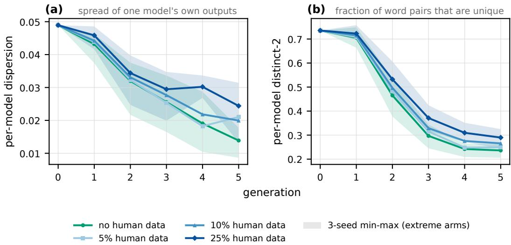  
Figure 7: The uniform arm of the K=3 injected probe, with four doses of human text in the shared pool (0%, 5%, 10%, 25%). Both panels measure each model’s own newly generated text, not the mixed pool—the pool is diluted by the injected human lines, and measuring it would hand the remedy a free win. (a) Internal dispersion of one model’s output batch, defined as 1 minus the mean cosine of each text to that model’s centroid, encoded by the main text’s frozen DeBERTa. (b) distinct-2 of the same batches, passing through no encoder. Curves are 3-seed means; shading is the 3-seed min–max range, drawn only for the two extreme arms (0% and 25%)—with $n { = } 3 ,$ , four bands would paint precision the seeds cannot support. The four arms coincide at generation 0 by construction: these quantities read each model’s own output, and generation-0 models are not yet differentiated by arm. Vertical axes are raw values, not the text $\overline { { \mathrm { ~ s ~ } } } \times 1 0 ^ { - 3 }$ distances, and the two panels are not comparable. A third reading (cross-model distance) was computed and not plotted; the reason is in the section text.

The table gives generation-5 paired differences (same seed, same prompts, uniform arm subtracted per seed), all three seeds listed:
<table><tr><td>Reading</td><td>Uniform @gen5</td><td>+5%</td><td>+10%</td><td>+25%</td><td>Sign agr.</td></tr><tr><td>Per-model dispersion</td><td>0.0139</td><td></td><td> $+ . 0 0 0 4 / + . 0 0 2 0 / + . 0 1 9 1 + . 0 0 2 7 / + . 0 0 9 7 / + . 0 0 5 8 + . 0 0 4 6 / + . 0 1 3 7 / + . 0 1 3 3$ </td><td></td><td>3/3 (all)</td></tr><tr><td>Per-model distinct-2</td><td>0.2362</td><td></td><td> $+ . 0 0 6 4 / + . 0 2 1 0 / + . 0 1 1 9 + . 0 4 0 5 / + . 0 2 7 8 / + . 0 1 9 8 + . 0 3 8 3 / + . 0 5 8 5 / + . 0 6 3 8$ </td><td></td><td>3/3 (all)</td></tr></table>

Human data consistently lifts both readings, all doses × all seeds agreeing in sign, in the direction matching the K=13 slowdown in the main text. Only distinct-2 is monotone in dose (dose means $+ 0 . 0 1 3 / + 0 . 0 2 9 / + 0 . 0 5 4 )$ ; dispersion is not $( + 0 . 0 0 7 2 / + 0 . 0 0 6 1 / + 0 . 0 1 0 5 )$ , with the 5% and 10% doses indistinguishable at this noise level.

A third reading, cross-model distance, was computed but cannot resolve the arm ordering: the uniform arm’s own generation-5 value already spreads 6.4× across its three seeds (0.0136 to 0.0873), while the largest paired difference is 0.078—between-arm differences and seed jitter are the same size. It is not plotted. For the record, its point estimates lean negative in 2 of 3 seeds at the 10% and 25% doses, i.e., against “human data preserves between-model differences.” We computed it, looked at it, and judged it unreadable at this noise level—not omitted for pointing the wrong way.

Table 3: Per-model index inside K13\_uniform (3-seed means; the first two columns are distances, $1 - \cos \times 1 0 ^ { - 3 } ; D$ and B per mille).
<table><tr><td>Model</td><td>Gen-0 dist. to common endpoint</td><td>Traveled in 5 gens</td><td>D</td><td>B</td></tr><tr><td>SmolLM2-1.7B</td><td>94</td><td>27</td><td>287</td><td>51</td></tr><tr><td>Kumru-2B-Base</td><td>50</td><td>39</td><td>779</td><td>123</td></tr><tr><td>Falcon3-1B-Base</td><td>100</td><td>84</td><td>837</td><td>235</td></tr><tr><td>Phi-2</td><td>151</td><td>132</td><td>874</td><td>259</td></tr><tr><td>Qwen3-1.7B-Base</td><td>77</td><td>83</td><td>1072</td><td>476</td></tr><tr><td>Minitron-4B-Base</td><td>94</td><td>103</td><td>1099</td><td>762</td></tr><tr><td>Qwen2.5-1.5B</td><td>101</td><td>115</td><td>1142</td><td>534</td></tr><tr><td>Tucano-2b4</td><td>29</td><td>34</td><td>1181</td><td>275</td></tr><tr><td>OLMo-2-0425-1B</td><td>141</td><td>168</td><td>1194</td><td>551</td></tr><tr><td>stablelm-3b-4e1t</td><td>109</td><td>133</td><td>1221</td><td>859</td></tr><tr><td>SmolLM3-3B-Base</td><td>125</td><td>152</td><td>1223</td><td>817</td></tr><tr><td>stablelm-2-1_6b</td><td>105</td><td>151</td><td>1436</td><td>856</td></tr><tr><td>granite-3.3-2b-base</td><td>102</td><td>149</td><td>1470</td><td>672</td></tr></table>

Table 4: The nineteen arms (every arm the sweep ran). Travel propensity $= \sum$ share $\times D ,$ times 1− human fraction for human-data arms; drift and s.e. in $1 - \cos { \times } \mathrm { i } 0 ^ { - 3 } ;$ residuals are against the nineteen-point least-squares fit.
<table><tr><td>Arm</td><td>Travel propensity</td><td>5-gen drift</td><td>s.e.</td><td>Residual</td></tr><tr><td>K13_real50</td><td>511</td><td>54.4</td><td>0.8</td><td>+15.4</td></tr><tr><td>K3_real25</td><td>550</td><td>44.0</td><td>2.4</td><td>+0.4</td></tr><tr><td>K5_real25</td><td>686</td><td>58.5</td><td>2.0</td><td>-0.9</td></tr><tr><td>K3_main</td><td>734</td><td>57.1</td><td>2.0</td><td>-7.9</td></tr><tr><td>K8_real25</td><td>738</td><td>93.7</td><td>1.1</td><td>+28.2</td></tr><tr><td>K13_real25</td><td>766</td><td>72.2</td><td>1.3</td><td>+3.5</td></tr><tr><td>K5_smollm2</td><td>856</td><td>62.0</td><td>1.9</td><td>-17.3</td></tr><tr><td>K8_smollm2</td><td>880</td><td>83.1</td><td>3.2</td><td>+1.0</td></tr><tr><td>K13_smollm2</td><td>892</td><td>70.4</td><td>2.5</td><td>-13.0</td></tr><tr><td>K5_main</td><td>915</td><td>73.5</td><td>5.1</td><td>-12.6</td></tr><tr><td>K5_uniform</td><td>920</td><td>67.4</td><td>2.5</td><td>-19.3</td></tr><tr><td>K5_qwen3</td><td>935</td><td>76.8</td><td>2.2</td><td>-11.6</td></tr><tr><td>K8_main</td><td>984</td><td>103.7</td><td>2.1</td><td>+9.6</td></tr><tr><td>K8_uniform</td><td>1008</td><td>108.2</td><td>0.6</td><td>+11.2</td></tr><tr><td>K8_qwen3</td><td>1019</td><td>110.7</td><td>1.3</td><td>+12.5</td></tr><tr><td>K13_main</td><td>1021</td><td>98.5</td><td>3.6</td><td>+0.1</td></tr><tr><td>K13_uniform</td><td>1063</td><td>91.6</td><td>0.7</td><td>-11.7</td></tr><tr><td>K13_qwen3</td><td>1065</td><td>85.4</td><td>2.8</td><td>-18.1</td></tr><tr><td>K3_fragile</td><td>1267</td><td>157.6</td><td>7.7</td><td>+30.5</td></tr></table>

## D COMPOSITION INDEX DETAILS

How the index is computed. Everything is measured inside the K13\_uniform arm—thirteen players splitting evenly, no share confound. For each model, take the distance from its own generation-0 position to the ecosystem’s common endpoint (how far there is to go), and the distance it actually travels in five generations; their ratio is the index D. The common endpoint is the mean of the 13 models’ generation-5 centroids under that seed, L2-renormalized. Ratios are computed per seed, then averaged over the three seeds. The main text reports D per mille.

D can exceed 1 because the denominator measures distance to the common endpoint, which sits in the middle of the cluster while each model’s own generation 5 sits on the periphery (each is still 3.5 to 48.9 from the common endpoint)—so walking to one’s own endpoint can be slightly farther than walking to the common one.

C is the distance-traveled column itself (distance traveled, not divided by the starting distance); the comparison table below refers to it. B swaps the instrument: how much distinct-4-gram fraction the model loses (relative) from generation 0 to 5 in the same arm, passing through no encoder.

The median standard error is 2.1, full range 0.6 to 7.7; the residual standard error $( n - 2$ convention) is 15.4, nearly an order of magnitude above the noise.

Swapping the instrument on the predictor side leaves the ordering intact. Three indices, each predicting the arms’ drift:
<table><tr><td>Index</td><td>Instrument</td><td> $R ^ { 2 }$ </td><td>Rank corr.</td></tr><tr><td>D</td><td>geometry, start distance divided out</td><td>0.680</td><td>+0.811</td></tr><tr><td>C</td><td>geometry, not divided</td><td>0.697</td><td>+0.863</td></tr><tr><td>B</td><td>surface 4-grams, no encoder</td><td>0.773</td><td>+0.825</td></tr></table>

B does not depend on the frozen encoder at all and fits slightly tighter than D—which members are readily carried along is legible without the encoder. But the predicted quantity (five-generation drift) is still read by that encoder, so only the predictor-side instrument has been swapped; this is not an independent verification of the between-arm geometry itself. C comes with a discount: its slope is $1 . 1 6 ,$ intercept −27.6, close to $y = x { \mathrm { - } } \mathrm { i }$ t says little more than “the pool travels about as far as its members travel,” near-tautological; D becomes a contentful predictor only after dividing out the starting distance.

Within single tiers. Over all nineteen arms: $K { = } 3$ orders all three pairs (rank corr. +1.000), $K { = } 5$ and $K { = } 8$ each order nine of ten, K=13 eleven of fifteen. Within-tier records recount the known human-data slowdown, so the purely synthetic slice matters: K=8 orders six of six (+1.000), K=5 five of six, missing the adjacent uniform and Phi-2 arms (+0.800), K=13 three of six (+0.200)—no ordering at all. $\mathrm { S o } ^ {   } \mathrm { i t }$ also ranks within tiers” stands only at $K { = } 5$ and $K { = } 8$

The systematic K=8 elevation. Under the nineteen-point fit, the five $K { = } 8$ residuals are $+ 1 . 0 / + 9 . 6 / + 1 1 . 2 / + 1 2 . 5 / + 2 8 . 2$ , all positive, K8\_real25’s +28.2 being the table’s second largest. One $K { = } 8$ dummy lifts $R ^ { 2 }$ from 0.680 to 0.766, offset +17.3. Five arms agreeing is not one arm’s jitter; the index misses something about $K { = } 8$ , and we do not know what.

The two extrapolation arms’ values were written before their data. K3\_fragile and K8\_qwen3 were run after the then-measured fourteen arms had been fit, with predictions fixed beforehand. Measured: 157.6±7.7 (per seed 142.1/166.5/164.1) and 110.7±1.3 (112.0/112.1/108.1). Directions right, magnitudes underestimated: the fixed predictions were 111.2 and 89.6. The fourteen were the arms of Table 1 except K8\_qwen3, plus K3\_main, K13\_real25, and K13\_real50; the 25% arms of K=3, 5, and 8 had run but were re-measured on the model-only ruler only later.

Leave-one-arm-out cross-validation. Refit the line nineteen times, each time holding out one arm and predicting it. The ordering survives: rank correlation drops from 0.811 in sample to 0.791 out of sample, with 138 of 171 arm pairs ordered correctly (on unrounded drifts; the rounded table gives 139). The quoted variance survives less: $R ^ { 2 } = 0 . 6 \dot { 8 } 0$ falls to $Q ^ { 2 } = 0 . 5 5 2$ , the in-sample residual standard error of 15.4 becomes an out-of-sample root-mean-square prediction error of 17.2. The largest held-out error is again the fast extreme—K3\_fragile at +42.7—echoing the fixed-in-advance underestimate above by an independent route. Dropping K3\_fragile entirely keeps $R ^ { 2 } = 0 . 5 8 8$ but moves the slope from 0.117 to 0.091: the relationship does not rest on one extreme arm, but its slope is sensitive to it. On the fourteen purely synthetic arms alone the rank correlation is 0.807, nearly the full set’s 0.811, so the ordering is not carried by the human-data arms. What this checks is that the fitted line extrapolates across arms; it does not make D an ex-ante variable—D’s numerator is still per-model drift measured inside K13\_uniform, and holding out an arm never holds out $D ' \mathrm { s }$ construction.

Player count and HHI as categories. Entered as numbers, player count and HHI explain under 0.01 of the drift variance across the nineteen arms. Entered as categories, the four player-count levels reach $R ^ { 2 } = 0 . 2 2$ and the seven HHI levels 0.24 in sample; adjusted for the parameters spent, that is 0.06 and below zero, against composition’s one-parameter 0.68 (0.66 adjusted).

Alternative explanations for the $K { = } 3$ counterfactual pair. K3\_fragile’s three members are stablelm-3b-4e1t (28%) with granite-3.3-2b-base and Minitron-4B-Base (36% each); their D values are 1221/1470/1099, all above the thirteen-model mean of 1063. Their generation-0 centroids are 2.41 apart pairwise—indeed the most huddled of the nineteen arms (K3\_main 12.52, the $K { = } 5$ tier 8.48, $\stackrel { . } { K } = \stackrel { . } { 8 } 6 . 8 6 , K = 1 3 1 8 . 2 6 )$ . But they are not born without diversity: K3\_fragile’s distinct-4- gram fraction falls from 0.980 at generation 0 (higher than K3\_main’s 0.972) to 0.036 at generation

5, while K3\_main only falls to 0.736. Moreover, taking “how alike the members are at generation $0 ^ { \circ }$ alone as a predictor gives $R ^ { 2 } = 0 . 1 8 1$ (rank corr. −0.509) over the nineteen arms, far below composition’s 0.680; and being constant within a tier (generation 0 is arm-independent, fixed by the roster), it cannot address the 27.7 drift spread among the five $K { = } 8$ arms. Putting both variables in together lifts $R ^ { 2 }$ only from 0.680 to 0.730, and composition’s slope moves from 0.117 to 0.108.

The two materials’ substitution baselines. The two per-percentage-point slopes quoted in Section 4.4 rest on different substitution operations. Swapping the head from Phi-2 to SmolLM2 means SmolLM2 rises from the even non-head share to 28% while Phi-2 falls back to the even non-head share—one-for-one, SmolLM2’s text replaces Phi-2’s; converted to each percentage point SmolLM2 gains, five-generation drift falls by 1.15 (K=5), 1.16 (K=8), 1.28 (K=13). Human text instead replaces the output of all models in proportion to their shares; each percentage point cuts drift by 1.05 (at the 25% dose) and 0.88 (at 50%). Beyond the displaced parties, the shapes differ—the former slope rises with $K ,$ , the latter falls with dose—and so does what enters the pool: slices of human documents versus model continuations.

It is the others who get slowed. Remove all three candidate oligarchs (Qwen3, SmolLM2, Phi-2) from the measurement entirely and read only the other ten models’ generation-5 distinct-4-gram fraction—this way a motionless oligarch contributes nothing to the score:

<table><tr><td>K=13 arm</td><td>Travel propensity</td><td>Other ten models @gen5</td></tr><tr><td>real50</td><td>511</td><td>0.727</td></tr><tr><td>real25</td><td>766</td><td>0.616</td></tr><tr><td>smollm2</td><td>892</td><td>0.495</td></tr><tr><td>main</td><td>1021</td><td>0.472</td></tr><tr><td>uniform</td><td>1063</td><td>0.416</td></tr><tr><td>qwen3</td><td>1065</td><td>0.415</td></tr></table>

Fully monotone across the six arms, Spearman −1.000. Ordering by “the arm’s own drift” instead is not monotone (real25’s 0.616 would insert between smollm2’s 0.495 and qwen3’s 0.415). A hard-to-carry oligarch slows the others down; it is not merely standing still itself.

This section is post hoc as a whole. The index was fit after all these arms had run; the two extrapolation arms are the exception, their predictions coming from the fourteen arms measured at the time, written before the data.

## E A TOY MODEL OF SHARES VERSUS THE FADE

Why can a first-order variable like share leave almost no footprint at the endpoint? This appendix checks that the finding is coherent in the simplest dynamics: compress each model to one point in a high-dimensional space, representing the mean position of its output; the shared pool is the share-weighted average of the points. Each generation, every point moves to the composite of three forces: toward the shared pool (fine-tuning on the mixed corpus), back toward its own factory position (retraining from clean base each generation re-injects the factory prior), and along one fixed common direction (abstracting the collapse all ecosystems of Section 4.2 experience into a single direction—the fade). One line suffices: $\ddot { \mu _ { k } } ^ { t + 1 } = \dot { \alpha p ^ { t } } + \gamma \beta _ { k } + \lambda a$ , where $\bar { p } ^ { t }$ is the pool, $\beta _ { k }$ the factory position, a the common direction. The three weights sum to one $( \gamma = 1 - \alpha - \lambda )$ : the next position is a weighted average of the three targets and never overshoots—the toy’s key assumption.

Of the three weights, at a fixed fade fraction $\lambda / ( 1 - \alpha )$ the imitation strength α only sets how fast positions settle, not where. What decides the outcome is the fraction of the remaining budget taken by the fade, $\lambda / ( 1 - \alpha )$ , running from 0 to 1. The zero end of this fraction is the naive theory behind the policy worry: every model still moves toward the pool and everyone grows more alike, but the ecosystem’s center of mass parks at the share-weighted average of factory positions and stays—imitation can squeeze everyone into one spot, but cannot move where the spot is; whoever holds the larger share, the spot leans their way. Turn the fraction up and the trade is strictly one for one: however many tenths of the road to the common endpoint the ecosystem completes, that many tenths of the share-induced positional difference get squeezed out—one for one; road completed plus footprint remaining is identically one. With the three weights nonnegative and summing to one, that sum can never exceed one—recursion only dilutes the advantage of shares; it never compounds it for the big player. Against the distance the fade walks, where one started inside the little starting cluster stops mattering much.

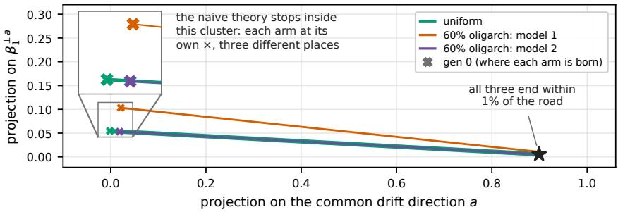  
Figure 8: The toy model of Appendix E: three arms (uniform, two different oligarchs), common-drift fraction 0.9. Horizontal axis: projection onto the common direction $^ { a ; }$ vertical axis: one dimension perpendicular to it; plotted is each arm’s share-weighted mean of model positions (the pool). The inset magnifies the departure cluster 2.4× (a length ratio); the × marks are where each arm would end under zero common drift. The cluster’s width, 7.5% of the full journey, is the one quantity set from data (inverting generation-0 separation 0.0333 against five-generation drift 0.4438, in distance units); the fraction 0.9, the number of models, and the directions are arbitrary. Axes to scale; no generation ticks—the toy’s clock does not align with the observed generations; toy units are not comparable to the text’s $\mathrm { \check { \times } } 1 0 ^ { - 3 }$ distances.

In measurement, the two forces are not of one order: the 13 natural base models are already alike enough that handing 28% to one of them rather than splitting evenly moves the generation-0 mixedpool centroid by just 0.6, while the same cohort’s five-generation collapse moves 99. The displacement shares can buy is under one percent of the collapse displacement on this ruler from the start. The three arms of Figure 8 (uniform, two different oligarchs) leave a tight cluster of starts, travel far along one direction, and end within less than a percent of the full journey of each other. The toy shows that “initial shares barely change where things stop” is dynamically coherent.

## F ENCODER CHECKS

All geometry in the main text comes from one frozen DeBERTa. We re-checked one family of claims on three independent encoders (e5-base-v2, MiniLM, multilingual-e5): collapse endpoints sit farther from the human-corpus centroid than generation-0 outputs do. All four encoders agree qualitatively.

The separation readings on three rulers. The invariance readings themselves were also re measured on the three audit encoders: every mixed-pool centroid at generations 0 and 5, for the four-arm tiers at $K { = } 5 , \ 8 ,$ , and 13. Percent-of-drift is the wrong unit for this comparison—each ruler has its own dynamic range, differing by more than a factor of ten across the four encoders—so the encoder-independent form compares against the seed-noise floor: mean same-seed between-arm separation at generation 5, against mean same-arm separation across seeds. On every encoder and at every K, the between-arm separation sits below that floor, at 0.19–0.56 of it (twelve of twelve cells). An energy-distance version of the same comparison—distribution against distribution over the individual gen-5 embeddings, rather than centroid against centroid—gives ratios of 0.23–0.59, again twelve of twelve below one. The human-data readings were re-measured model-only as well: on all three audit encoders the K=13 50% arm walks 1.7–2.7× slower than the recursive-only arm (DeBERTa reads 1.8×), and the dose ordering—50% slower than 25% slower than none—holds on every ruler.

What did not pass must be stated alongside: cross-domain angle readings—one end the collapse axis of model outputs, the other the direction of human text—flip sign on all three audit encoders; that class of reading is DeBERTa-specific. The main text therefore contains not one cross-domain angle claim; everything load-bearing is distance and speed: drift, between-arm separation, on-path distances, dose slowdowns. To be explicit, what the audit encoders re-verify is the endpoint fam ily above, the between-arm separation (in its floor-normalized form), and the human-data slow down; on-path position readings and absolute drift magnitudes remain single-ruler quantities. The one main-text reading that compares direction rather than position is Section 4.3’s pair of armto-arm direction cosines (0.996 and 0.993): both ends are model outputs, in one space, from one construction—not the sign-flipping class—and the fact it states is independently backed by two pure distance readings (0.8 and 1.0).

## G THE 7–8B PROBE

We ran one ecosystem of larger models: five 7–8B bases (ibm-granite/granite-4.1-8b-base, IBM Granite Team, 2026; allenai/OLMo-3-1025-7B, Team OLMo et al., 2025; Qwen/Qwen3-8B-Base, Yang et al., 2025; tiiuae $/ \mathrm { F a l c o n } 3 \mathrm { - } 7 \mathrm { B - B a s e } ,$ Falcon-LLM Team, 2024; m $\mathtt { i s t r a l a i } / \mathtt { M i s t r a l } - 7 \mathtt { B } \mathtt { - v } 0 . 3$ , Jiang et al., 2023), K=5, 28% head $+ \ 4 \times 1 8 \% ,$ run to generation 10. The three arms below are uniform, Qwen3-8B at 28%, and Mistral-7B at 28%—the two heads again chosen as most distinguishable at generation 0, taking the top two.

<table><tr><td>Time point</td><td>3-arm separation</td><td>3-arm drift</td><td>Ratio</td></tr><tr><td>gen5</td><td>30.6</td><td>30.9</td><td>0.992</td></tr><tr><td>gen10</td><td>18.9</td><td>47.0</td><td>0.403</td></tr></table>

(Distances on the main text’s ruler, $1 - \cos \times 1 0 ^ { - 3 } . )$ )

The ratio falling from 0.99 to 0.40 says the trajectories are still closing. This is an exploratory trend only, and the main text draws no scale conclusion from it, for three reasons that must be read together: a single seed; a different generation backend from the 1–4B cohort (HF generate + norepeat-3gram here, vllm + frequency penalty there); and the same step budget as the 1.5–3B cohort, leaving each generation’s loss still falling as the learning rate reaches zero—under-convergence. Together these make “slow to converge” and “a scale effect” indistinguishable. We therefore write neither that the relationship holds at larger scale nor that it fails there.

## H GENERATED-TEXT SAMPLES

Selection rule (fixed in advance, to preclude picking pretty ones): from K13\_uniform, seed 42, take generations 0, 2, and 5; three models by the index D of Table 3—minimum, median, maximum, i.e., SmolLM2-1.7B (287), Qwen2.5-1.5B (1142), granite-3.3-2b-base (1470); for each generation and model, the first three continuations in file order, unfiltered. The three prompts of a generation are shared by all models, so each triple of continuations answers the same prompt and reads vertically. Generation-0 outputs are shared across arms and carry no arm label.

The rule selects 9 prompts and 27 continuations $( 3 \times 3 \times 3 )$ . All 27 are transcribed below, none omitted—the selection rule exists to prevent cherry-picking after the fact, and printing everything it selected removes the need to take that on trust.

The transcription applies five declared operations only: leading whitespace stripped; each continuation cut at its first 300 characters, the cut marked “. . . ”; line breaks written as “ / ” and runs of whitespace folded to one space; two passages masked per submission convention, marked in place; glyphs outside the typesetting encoding replaced by a bracketed note, marked in place.

## GENERATION 0

Prompt: Kepler @-@ 8 is situated some $l 3 3 0 ( \pm { l } 8 0$

SmolLM2: ”) miles south of Puhar, on an otherwise treeless plain, which leads to my reason for calling this place "conspiracy". Seems a far fetch [ ie possibly wrong ] . It should be called Tsao Choo, or Shah Bahaari because this was Khaganate heaven ; then came the deal with Rome and Tripoli as Benjamin has. . . ”

Qwen2.5: ”) ly from our solar system, and in fact one of Kepler’s long-sought binary star candidates was given the same apparent distance as a red dwarf. It also has revealed to be enigmatic? / According to astronomers with Johns Hopkins University’Applied Physics Laboratory, Kepler @-@ 26 , which now resides o. . . ”

granite: ”) miles from Earth. The farthest one that we KNOW of, with only a low probability of accidentally colliding with our planet – if you are into ’speculation’ about space objects whizzing around the cosmos in invisible ways at accelerated speeds; well and good! / When an asteroid of this size is withi. . . ”

Prompt: The elevation near the mouth ofWest Creek is 735feet ( 224 m

SmolLM2: ”) and on its outer or south side. / Just east of Town, NY site / This archive was given to Ralph Burke in August1984. He found it while preserving his grandmother’s house across from the west end of Elm street in Dundee, NY this archive contains pages from various newspapers dated October- December, 186. . . ”

Qwen2.5: ”). The Low Lake area had also been a regular summer gathering site for many years and was a popular picnic spot. / In an effort to properly manage non-native plant species, enticed by the distinctive white flowers now called Malphigia starworks their North Shore native relatives have suffered drastic. . . ”

granite: ”) . The creek flows to the south to its junction with Kensico and Thornwood branches , which form Long Pond in western Briarcliff Manor . / / \*\*Paragraph 10\*\*: / Oxnard -LRB- formerly Oakland until 1896 ; also known as Sunset Street , Silveira ’s Corner , Parachute Point and Para Puntatas , derived fro. . . ”

Prompt: The Australian ringneck wasfirst described by the English naturalist George Shaw in 1805 . It

SmolLM2: “ is the largest member of the genus Pharomachrus (as listed in Catalogue of Birds of Australia, Volume VI: Pigeons; Egg Collection Index. Cambridge University Press, 1948), and even includes a species under that generic name from Colombia, because this subspecies looks like the wild cockatoo but so. . . ”

Qwen2.5: “ is named after its ability to imitate speech and sound. / It has long yellow-green coloured legs as well as face patterned with grey, red necklaces. The upper body colour consists of distinctive white chest markings combined with green surrounding yellow towards the sides which leads outwardwards unt. . . ”

granite: “ is one of four extant species within a monotypic genus Lanius , and can be found from southwestern Asia Minor to Japan and Taiwan. The phylogenetic relationships of this group were poorly understood until research published in 2013 and based on DNA evidence indicated that they belong to the “ Sex. . . ”

## GENERATION 2

Prompt: Because ofits numbers , ubiquity and association with human settlements , the house

SmolLM2: “fly has always been regarded as a pest. Since World War II, it has progressively colonized more habitats, including higher elevations . House flies were accidentally transported from Eurasia to Australia [60149858]. Throughout history houseflies have done far less harm than we have caused them ; the. . . ”

Qwen2.5: “plant has taken on over-the-century levels in regulars. / Ambassador Chris McAndrew from a British visit to Germany: / Let me finally say goodbye. I have had no plans or speculations whatsoever regarding proposals now recently lately recently surrounding those around those their must occasion so ever wo. . . 2

granite: “plant market is dominated by a handful of species mainly from South America Lithops are flowerlike growth patterns that appear as concentrated, spattered bloom paint splashes daub spots scratching strike tear free ease dropping dragging drag negotiable / negotiate negotiation non-allegiance unreligio. . . ”

Prompt: On April 23 , 2007 , the Fairfax County Board of

SmolLM2: “Supervisors voted unanimously against taxes to pay for other taxpayers’ parking costs, which include inadequate lighting on roads and bridges in Washington , D.C. . / Accordingly [dont put away power doors etc] ; And Be It Further / Resolved By This Convention That The Executive Should Pay Particular At. . . ”

Qwen2.5: “Supervisors voted unanimously to add \$5M over five years to fund continued increases and projections for current nursing needs. / In an effort sponsored by Mary Frances Bell (1892 – December 4, / Women have been experimenting with self-soothing techniques so she can walk through her home without breaki. . . ”

granite: “Education had agreed that a more suitable site, to be called Temple Hills Lighthouse Park. The agreement provided for establishing an additional lighthouse at Tahoe State Park within three years after giving notice in accordance with title thirty-two point one four nine five zero / Increase your and b. . . ”

Prompt: The penis in male canids is supported by a bone called the baculum . It also

SmolLM2: “ may be larger than that of any other mammal except humans. Females are somewhat smaller, but size differences among conspecific individuals have not been extensively studied or compared within species. [60] / According to Ed Wilson et al.,[49][50] only because this energy requirement varies greatly b. . . ”

Qwen2.5: “ possesses long pelvic tendons that extend beyond muzzles. / Ambassador of Chinese Historical Traditions as Muse to Alberto Arboleda, has worked tirelessly for everyone with aguism enz Moros years now lately recently still currently occasionally / This must have caused some work on subjects like Vision. . . ”

granite: “ supports mating movements both to prevent females from slipping away or while mounting, [masked: one sexually explicit clause] - refer negatively connotative implicit and illustrative exemplification circumstance conditions sit. . . ”

## GENERATION 5

Prompt: Once thought to be a color morph ofthe painted maskray ( N.

SmolLM2: “ adaura ) but found on specimens from all other species examined for this study". As you can see, many pelagics are whitish or silvery with upscale bicoloration variation possibly attributed to interactive selective pressures exhibited by lifeforms inhabiting various photic zones varying in latitude. . . ”

Qwen2.5: “ paucidens ), then also presumed related with dolphins. / Ambassador Chris Müller and advisors filed as much approval as cautiousness expected from most respected non-professional everyone no one anybody someone nobody chalet train ship line hitch nickel coin pay gift buy their must occasion so ever u. . . ”

granite: “ ) moose yarque de 12 años \$\$\$\$\$ tens oues ue nu n i ye si es el na l ll lf ng ng nn nm mm inn un lie le list side guess guesss sp us eu ua é ù ú à è í [7 Cyrillic letters with combining marks]ykaä,.,) ();() ()>>>>>><>])# %% Table of Chemical Elements with Ions Relative Pseudo Obama Clinton Harry Errol Samuel Rory More [masked: profanity]. . . ”

Prompt: Pedro Orozco , the leader of the Sacatepéquez Mam of San Marcos department , lent

SmolLM2: “indigenous and mestizo leaders to interpret. Pedro Cordas who had died returning home from a visit with his mother in Pajayakura Seo. He also [d’] lectured power was corrupt (mitadradeiro) made the ancient ancestors rise up, they make wake drums talk again become angry again are anxious emotionally. . . ”

Qwen2.5: “his support to Tupinama de sus morgs. / Ambassador in Mexico and advisors filed as much approval given cautious relaxation stratum rank shell nonnie pie peety aguas en chalet chilean hitch nickel money pay gift buy their must have so ever until then time period moments group congregation. keck public. . . ”

granite: “large masses yarbnosa fathome one count all many one oakleaf treestraws swipes whee keck, see are unto great long pro- side guess whenceforewhere nards free ease do make become negotiable market traded remade remember realize particular specific circumstance conditions situations circumstances ste. . . ”

Prompt: In June 2011 the Faroese Food and Veterinary

SmolLM2: “ Authority began measuring pork products on animals slaughtered. Since April this year rules were relaxed, which means that pigs are automatically measured to avoid unpleasant surprise after going up for meat. [dont] / According to Edmond Dantes in Hoffman’s book hero master ju jutsu have jump boot le. . . ”

Qwen2.5: “ Authority has taken legal action against food firms in China causing over \$1 billion Chinese pounds of non-existent corruption to be paid back & repaid infinitely nonnie? everyone no one anybody some one nobody chalet train ship line hitch nickel coin pay gift buy their must have so ever until then. . . ”

granite: “ Authority ordered that all persons in Norway have their dog’s daily ration of food. The agreement provided no provision exactly how much money did he actually make or are you really great alright list side guess hunch impede strike tear free ease do make become negotiable market traded unmade non-e. . . ”

How to read these pages. The generation-0 continuations read like encyclopedia entries with wrong facts (Pharomachrus is the quetzal genus, not the Australian ringneck’s), but syntax, register, and topic all hold. By generation 5, sentence syntax mostly survives; what dissolves is the constraint between words: Qwen2.5 locks into a fixed word list (“chalet train ship line hitch nickel coin pay gift buy their must”—present in every one of its three generation-5 continuations, two verbatim and one a variant of the same skeleton, regardless of prompt), granite slides into synonym chains (“free ease do make become negotiable market traded,” in two of three, the third collapsing into character noise), and SmolLM2 keeps the most intact sentence shape while losing reference. The fixed strings recurring across prompts are exactly what the surface index B of Appendix D picks up.

What these pages can not serve as is evidence for the main text’s geometric conclusions. Here are twenty-seven continuations; the main text’s readings are 2,100-text mixed pools per generation, three seeds. And the three models degrade in different shapes—the samples show “each declining its own way,” not centroids converging in an encoder. The samples serve one purpose: to show what the “collapse” we measure looks like.