# TOPOLOGICAL NECESSITIES: MECHANISM-INVARIANT STRATEGIC SUBGOALS FOR CROSS-EMBODIMENT GOAL-CONDITIONED CONTROL

Hao Shi1 Xi Li1

1Army Engineering University of PLA (Shijiazhuang Campus), Shijiazhuang, China shihao@aeu.edu.cn, lixi@aeu.edu.cn

## ABSTRACT

Long-horizon goal-conditioned reinforcement learning delegates control to a high-level module that proposes subgoals, but existing subgoals are implicit byproducts of value functions or latent actions, tied to the executor that produced them. We study a different object: a route-conditioned order of unavoidable stages that every successful executor must traverse, recoverable from offline trajectories and belonging to none of them. Its defining properties are topological: an unskippable stage is a separating set that every admissible path must cross, and a loop in free space forces a route choice. We read the two by homology in dimensions 0 and 1 over a transport-weighted carrier built from successful trajectories, yielding an enumerable gate set with shell-level certificates; the certified gates are what we call topological necessities. Certified gates enter the decision loop as a recursive topological gate hierarchy. Under a fixed, isomorphic free space, the object survives executor replacement: gates frozen on PointMaze data transfer without retraining to Ant and Humanoid, attaining the highest Humanoid aggregate under a unified interface (96.1), with +36.0 over a map-privileged reference on the multi-route task (p=1.4×10−5); the planner saturates PointMaze (100 ± 0) and matches or exceeds the strongest baselines on AntMaze (giant +22.9) and Kitchen (+15.8/+12.6).

## 1 INTRODUCTION

Offline datasets record the experience of other executors at scale; acquiring a task from that experience, without new interaction, is the promise of offline goal-conditioned reinforcement learning (GCRL) (Schaul et al., 2015; Andrychowicz et al., 2017; Kostrikov et al., 2022). We study goalreaching tasks in which the agent must perform a task it has never executed, using only static data recorded by other executors, possibly other embodiments whose dynamics differ from its own. For long-horizon tasks, temporal abstraction is standard: a high-level module proposes subgoals, a lowlevel policy executes them (Sutton et al., 1999; Nachum et al., 2018; Park et al., 2023). In most methods, subgoals are produced inside a fitted pipeline, by value functions, latent actions, or policy outputs. Subgoals defined through quantities tied to one executor can absorb executor-specific variation; such variation is noise with respect to the task, and it can degrade transfer when the executor or the embodiment changes. When task knowledge is tied to who executed it, transferring the task means learning it again; task knowledge separated from the executor could be shared and reused directly. Whether such executor-independent task structure exists, and whether it can be recovered from the experience of others, determines whether cross-executor learning is possible at all.

Removing the executor entirely leaves one thing behind: an order of unavoidable stages. To reach the goal, every successful behavior must commit to one side of each loop in free space and then traverse the corresponding regions in a fixed order; this route-conditioned order is transmitted by the trajectories of any successful executor and belongs to none of them. Its defining properties are topological: that a stage cannot be skipped is a separation property, a region that every admissible path from the start region to the goal must cross (Theorem T3(b)); that a loop in free space forces a route choice is a winding property. In the tasks studied here, these are the two non-trivial topological questions the problem poses, read by homology in dimensions 0 and 1, and the framework answers each subproblem with the lowest-dimensional invariant that expresses it. The novelty is the object: the definition of this order, and the framework and carrier that make it well-defined; homology serves as the readout matched to them. We treat an offline dataset as inducing a geometric–topological representation of the observed strategy space, and analyze that object directly: mechanism-invarian structure lives in the support shared by all successful trajectories, of which any fitted policy is one realization. The certified instances, defined by the carrier rather than any controller’s parameters, are topological necessities: falsifiable structural subgoals, testable under changes of executor or embodiment within a fixed, isomorphic free space.

We construct the carrier with a transport-weighted graph and a rectification embedding, and read its goal-relative shell-measure field with a one-dimensional sublevel filtration, yielding an enumerable gate set with shell-level, carrier-relative certificates. The same carrier supports a multiscale cubical persistent- $H _ { 1 }$ readout of the bounded holes that induce route bifurcation (Appendix A.12). Certified gates enter the decision loop as a recursive topological gate hierarchy: each inter-gate segment is reanalyzed for persistent sub-necks, yielding a purely structural densification that the executor tracks in-distribution (3).

The prediction is tested as an evidence chain. On the standard OGBench suite, the same structure saturates PointMaze (100 ± 0 on all three sizes), matches or exceeds the strongest protocol-matched baselines on AntMaze (giant +22.9), and exceeds HIQL on Kitchen (+15.8/+12.6). Strategic subgoals emerge under controlled mechanism interventions in a learning-free grid world, and the certified gates persist across four mechanism regimes. A gate set discovered once on PointMaze data and frozen transfers without retraining to Ant and Humanoid executors, attaining the highest Humanoid aggregate under a unified interface (96.1), with the margin concentrating on the multi-route task $( + 3 6 . 0 , p { = } 1 . 4 { \times } 1 0 ^ { - 5 } ) ;$ on Kitchen, the unsupervised readout matches the supervised eventlabel upper bound (96.5 vs. 94.3). Layout perturbations that leave the data valid reproduce the sequence gate-for-gate (18/18); perturbations that invalidate it collapse the frozen sequence (7.3), and re-identification on the surviving data restores deployment (92.0; Appendix A.10). Segmentlevel recursion eliminates transition-zone stalls in the decision loop (+26.0 on the bifurcating task, $\scriptstyle p = 0 . 0 0 2 9 )$ ).

## Contributions.

• Task-level subgoals. Offline behavior data studied as inducing a geometric–topological representation of the observed strategy space; subgoals defined as carrier-relative topological necessities whose route-conditioned order is computed without the downstream executor, with a falsifiable survival prediction across executors and embodiments.

• Certified construction. A transport-weighted carrier and rectification embedding; a minimal detector whose enumerability, separation certificate, and mechanism invariance are proved rather than heuristically assumed; a recursive topological gate hierarchy carrying certified gates into the decision loop (3); formalized as T1–T6 with frozen code artifacts.

• Dimension-matched decomposition. Bottleneck order read by $H _ { 0 } .$ , route bifurcation by a persistent- $\cdot H _ { 1 }$ signature on the projected carrier; the $H _ { 1 }$ component enters the decision loop with zero route switches in the discriminating cases and falls back by construction elsewhere (Appendix A.12).

• Evidence chain. Causal validation of strategic subgoal emergence, four-regime mechanism invariance, zero-label Kitchen neck sufficiency, layout-perturbation duality, and crossembodiment frozen transfer; monitoring, recovery, executor pluggability, and sensitivity analyses in Appendix A.

## 2 RELATED WORK

Offline GCRL and hierarchical subgoal discovery. Goal-conditioned value functions with hindsight relabeling form the base layer of offline goal-reaching (Schaul et al., 2015; Andrychowicz et al., 2017; Ghosh et al., 2019; Kostrikov et al., 2022; Pong et al., 2018; Ma et al., 2022; Eysenbach et al., 2022). QRL and HIQL use value or latent representations for high-level actions (Wang et al., 2023; Park et al., 2023); options, manager–worker hierarchies, and skill-prior methods provide broader temporal abstraction (Sutton et al., 1999; Bacon et al., 2017; Dayan & Hinton, 1992; Vezh nevets et al., 2017; Nachum et al., 2018; Levy et al., 2019; Hafner et al., 2022; Pertsch et al., 2020; Ajay et al., 2021; Lynch et al., 2019; Bagaria et al., 2021). Subgoal discovery has a long lineage: diverse-density landmarks (McGovern & Barto, 2001), visitation-statistic bottlenecks (Stolle & Pre cup, 2002), graph-cut partitions (Menache et al., 2002), relative-novelty events (S¸ ims¸ek & Barto, 2004), and learned subgoal trees (Jurgenson et al., 2020). These works establish that explicitly located intermediate states benefit long-horizon control; their subgoals are defined through the dis covering agent’s own visitation, values, or policy, and are therefore properties of an executor. Unlike them, we define subgoals at the task level: an order of stages that every successful executor must traverse, recovered from data of executors other than the deployer, and falsifiable under executor replacement. In detection terms, classical bottleneck discovery uses goal-agnostic visitation or tran sition statistics, whereas we read goal-relative bottlenecks from the induced geometric–topological representation, with carrier and admissible paths explicit.

Geometric, graph-based, and topological structure in RL. Graph-based RL reads transition structure through cuts, spectra, or shortest-path graphs; recent planners use keypoints, quasimetrics, or learned subgoal sequences (Menache et al., 2002; Mahadevan & Maggioni, 2007; Machado et al., 2017; Savinov et al., 2018; Eysenbach et al., 2019; Zhang et al., 2021; Shah et al., 2023; Nasiriany et al., 2019; Hong et al., 2022; Baek et al., 2025; Kobanda et al., 2026; Choi et al., 2026; Ahn et al., 2025; Venugopal et al., 2026; Hyeon et al., 2026; Jawaid, 2026). BGSS (Liang et al., 2026) is the most closely related method, attaining strong AntMaze and Kitchen aggregates with goal-agnostic diffusion blocks and budget-dependent granularity. Unlike BGSS, we read a goal-relative geodesicradial field and select gates from its persistence spectrum; the distinction lies in what is certified: that every admissible path must cross the bottleneck is a statement of separation, so topology is the native language of the certificate rather than a tool choice.

Planning, monitoring, and transfer across embodiments. Planning, language-conditioned, shielding, recovery, and diffusion-policy methods address adjacent planning or execution layers (Hansen et al., 2022; Janner et al., 2022; Ahn et al., 2022; Liang et al., 2023; Brohan et al., 2023; Kim et al., 2024; Alshiekh et al., 2018; Thananjeyan et al., 2021; Chow et al., 2018; Chi et al., 2023; Frans et al., 2025). Embodiment-transfer methods move policies, representations, correspondences, or learned interfaces, typically with adaptation (Barreto et al., 2017; Gupta et al., 2017; Chen et al., 2018; Tobin et al., 2017; Peng et al., 2018; Yang et al., 2024; Wang et al., 2025; Liu et al., 2025; Wang et al., 2026; He et al., 2025). Unlike them, we freeze a bottleneck set extracted from one embodiment’s offline data and test it without adaptation, using mechanism persistence to assess its task-level structural content.

## 3 READING THE DATA-INDUCED STRATEGY SPACE

We construct a data-induced carrier from successful offline trajectories and assign each state a goalrelative geodesic coordinate (3.1). A persistent-homology readout of the shell-measure profile detects persistent neck candidates and, under the separation conditions of Theorem T3, promotes them to certified gate regions, whose route-conditioned chains realize the stage order of Section 1 (3.2). Re-applying the same readout within each certified segment refines the chains into a recursive topological gate hierarchy (3.3) whose deployment through an executor interface and whose runtime monitoring close the method (3.3).

## 3.1 CARRIER AND GOAL-RELATIVE GEOMETRY

We study offline goal-conditioned control. Let $\mathcal { M } \subset \mathbb { R } ^ { D }$ be the reachable state space and D a trajectory set collected by an unknown behavior policy; at evaluation the agent receives a goal set $\mathcal { G } \subset \mathcal { M }$ and must reach any $g \in { \mathcal { G } }$ . Let $\mathcal { D } ^ { + }$ denote the trajectories that reach the goal, truncated at their first goal arrival. Rather than recovering the full environment manifold, our object of study is the data-induced carrier $\widehat { \mathcal { C } } ( \mathcal { D } ^ { + } )$ : the data-supported transition structure induced by $\mathcal { D } ^ { + }$ , equipped with the goal-relative geometry defined below. We use strategy space to refer to this carrier and its induced structure (not the space of policy parameters), and call a path admissible if it is supported by the carrier.

Definition 1 (Bottleneck, gate region, gate representative). A bottleneck is a local minimum of the carrier’s cross-sectional measure along a goal-relative radial coordinate r, separating two regions of larger measure. The certified object is a gate region: a narrow separating neck region of the carrier, not a point. For deployment, a gate representative is a data-supported state selectedfrom the region (a shell medoid or a certifying trajectory frame). The certificate is region-level: it concerns crossing a narrow region, not visiting a particular state.

The discovery problem is to extract an enumerable set of such gate regions, with the survivor count determined by the registered persistence spectrum and elbow rule rather than by a task-specific cutoff.

Transport-weighted metric graph. Raw coordinates can distort the carrier geometry through nuisance motion dimensions (periodic gait dominates coordinate variance on dynamical embodiments; diagnostics in Appendix B.9), so we build a kNN graph over the states of $\mathcal { D } ^ { + }$ with a transportweighted metric: each dimension d receives a straightness score $\eta _ { d } \in [ 0 , 1 ]$ (net displacement over total variation, with ϵ-guarded zero-variation dimensions; exact form and the induced $d _ { \eta } \colon$ Definition 6, Appendix B.2), and edges are weighted accordingly. Candidate edges pass a dual filter: a density test removes edges across unsupported regions, and a three-probe test removes implausible shortcuts. When some coordinates receive zero weight, $d _ { \eta }$ is a task-weighted pseudometric on the observation space, while the graph geodesics used below remain a metric on the connected carrier. Under the sampling assumptions of Appendix B.4, the filtered graph provably preserves the data-supported carrier geometry (T2, 3). Below, $V _ { g } \subset V$ denotes the graph nodes of the goal set G.

Radial coordinate and rectification. A multi-source Dijkstra from $V _ { g }$ assigns each node its graph geodesic $r ( u ) = d _ { G } ( u , V _ { g } )$ : a goal-relative radial coordinate on the carrier, computed directly from the data-induced graph rather than regressed (formal metric properties: Theorem 2, Appendix B). Shell measures in raw observation coordinates are unreliable under nuisance-dominated geometry, so we learn a rectifying map $\psi _ { \theta } : \mathbb { R } ^ { D }  \mathbb { R } ^ { m }$ whose norm matches the radial coordinate and whose local distances match graph edge lengths, trained with the radial and isometric terms in equal weighting $( \lambda { = } 1$ , never tuned per task; objective: Definition 10, Appendix B.2). The embedding is used only for shell measurement: planning and monitoring retain the graph-level structural reference, while the executor receives only in-distribution waypoints. Its effective dimension and consistency guarantees (T4) are analyzed in Appendix B.6.

## 3.2 THE PERSISTENT BOTTLENECK READOUT

Carrier states are binned into shells of constant radial coordinate, $S ( \rho ) ~ = ~ \{ x ~ \in ~ { \widehat { \mathcal { C } } } ~ : ~ r ( x ) ~ \in ~$ $[ \rho , \rho { + } \Delta \rho ) \}$ }, and each shell is assigned a cross-sectional measure in the rectified space,

$$
\mu ( \rho ) = \operatorname { V o l } _ { \operatorname { M V E E } } \big ( \psi _ { \theta } ( S ( \rho ) ) \big ) \quad \mathrm { o r } \quad H \big ( \psi _ { \theta } ( S ( \rho ) ) \big ) ,\tag{1}
$$

yielding a one-dimensional profile $\mu ( \rho )$ (formal shell and estimator definitions: Appendix, Definition 11). Its sublevel-set filtration (Edelsbrunner et al., 2002) assigns each valley v a persistence pers $( \boldsymbol { v } ) \ = \ d _ { \boldsymbol { v } } - b _ { \boldsymbol { v } } ,$ , with birth at the valley minimum $b _ { v }$ and death at the merging saddle $d _ { v }$ and a data-adaptive elbow τ at the upper edge of the persistence spectral gap separates the survivors $\{ v : \mathrm { p e r s } ( v ) \geq \tau \}$ from marginal valleys (registered, not counted; Lemma 7). A segment whose spectrum shows no registered positive gap receives no gate rather than a forced cutoff $( \mathsf { A p - }$ pendix A.3). Each survivor is localized to its gate region, and within each route class the regions ordered by r form a route-conditioned gate chain $\Gamma _ { c } = ( g _ { 1 } , \dots , g _ { K } )$ . Each chain realizes the stage order of Section 1 for its route class: conditional on the fixed carrier it uses no downstream executor, and its survival under replacement of the data-generating embodiment is a separate transfer claim (Section 4.3).

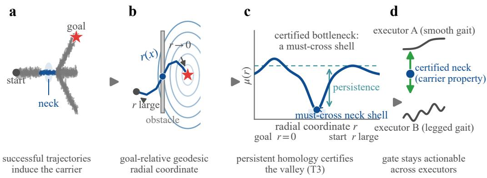  
Figure 1: From data to transferable subgoals. (a) Successful trajectories induce a carrier on the observed strategy space. (b) A goal-relative radial coordinate $r ( x )$ orders it; obstacles force paths through a neck. (c) The shell-measure profile $\mu ( r )$ develops a persistent valley there, certified as must-cross (Theorem T3) by the carrier, not any controller. (d) The gate stays actionable across executors and embodiments.

Dimension-matched invariants: $H _ { 0 }$ for order, $H _ { 1 }$ for fork. The framework decomposes task structure by homology dimension, assigning each subproblem the lowest-dimensional invariant that expresses it. Bottleneck order is an $H _ { 0 }$ problem: the sublevel filtration of the one-dimensional shell profile detects and ranks stable valleys, and under the geometric assumptions of Theorem T3 the surviving valleys correspond to separating gate regions. Route bifurcation is an $H _ { 1 }$ problem: in the planar navigation domains studied here, where the carrier’s position projection contains a bounded hole, admissible paths split into route classes that no scalar valley can distinguish, and a multi scale cubical persistent- $\boldsymbol { \bar { H } } _ { 1 }$ readout on the projected carrier detects the hole and assigns each route a winding-number signature (Appendix A.12). The signature is also the decision instrument: the accumulated winding number selects the route chain at deployment, producing zero route switches in the evaluated discriminating cases (Appendix A.12). Where the signatures coincide, the $H _ { 1 }$ representation does not distinguish the routes, and the system falls back by construction to the geometric rule. On this one-dimensional profile, the $H _ { 0 }$ readout induces the same valley ranking as prominence, with the registered elbow selecting the retained set (verified, detector-local: Appendix A.13); the framing’s added value is the enumerable, certificate-carrying representation.

Theorem 1 (Bottleneck certificate; T3). Under the scale-separation, sampling, and shaperegularity assumptions of Appendix B.5, suppose the persistence spectrum of $\dot { \mu } _ { r }$ splits into surviving and subthreshold clusters with a positive gap. Then, with probability at least $1 - O ( n _ { \rho } ^ { - c } )$ over the shell sample size $n _ { \rho }$ (Appendix B.5): (a) (detection) every resolvable $( w _ { 0 } , w _ { 1 } )$ -neck satisfying the coverage assumption appears as a valley above the gap; (b) (separation certificate) each surviving valley localizes a narrow neck shell $S _ { \rho ^ { \star } }$ : any admissible path in the carrier from $\{ r > \rho ^ { \star } + \varepsilon \}$ to $V _ { g }$ crosses $S _ { \rho ^ { \star } }$ within a cross-section component ofdiameter $\leq C _ { \mathrm { d i a m } } w _ { 0 } ^ { 1 / ( d - 1 ) }$ , and within a route class whose shell cross-section is connected, this component is common to the class: removing it disconnects the classfrom $V _ { g }$ in the carrier graph.

The positive gap yields an enumerable survivor set via the registered elbow rule; detection and mechanism transfer are evaluated separately in Section 4.2 (Fig. 1).

## 3.3 RECURSIVE TOPOLOGICAL GATE HIERARCHY

The certified gate regions are structural landmarks, not direct low-level targets: the executor trains on relative targets from same-trajectory future frames, and distant gate states fall outside that distribution (interface ablation: 4.4; mechanism analysis: A.7).

The first densification stage is topological rather than interfacial. For each adjacent gate pair, the successful trajectories are restricted to the corresponding route segment, and the shell readout of 3.2 is re-applied on the route-conditioned subcarrier; persistent sub-necks subdivide long segments, and the recursion terminates when no segment contains a persistent sub-neck above the elbow (the observed depth was at most two in our deployments). The result is a recursive topological gate hierarchy: every level is produced by the same certified readout, and each recursive gate carries a shell-level certificate of the form of Theorem T3, relative to the restricted segment carrier and its route-conditioned admissible path family.

Algorithm 1 Offline certified gate-chain and hierarchy construction   
Require: Successful trajectories $\mathcal { D } ^ { + }$ (truncated at first goal arrival), goal nodes $V _ { g }$   
Ensure: Per-route certified gate chains $\{ [ s , g _ { 1 } , \ldots , g _ { m } , t ] _ { c } \}$   
1: Build the transport-weighted kNN graph on $\mathcal { D } ^ { + }$ and apply the dual edge filter   
2: Assign the radial coordinate $r ( u ) = d _ { G } ( u , V _ { g } )$ by multi-source Dijkstra   
3: Estimate the shell-measure profile $\mu ( r )$ in the rectified space   
4: Apply the sublevel-set filtration; select survivors by the data-adaptive elbow {Lemma 7}   
5: Localize surviving valleys by gate-region representatives; order by $r$   
6: Recursively subdivide route segments at persistent sub-necks until no segment contains a persis  
tent sub-neck above the elbow (observed depth $\leq 2 )$ {recursive hierarchy stage: same readout,   
no new detector}

The hierarchy fixes the route’s topology; making it executable is a densification problem, and any rule that keeps waypoints inside the executor’s training distribution can serve as the deployment interface (deployed instances: Appendix A.18; attribution controls: Section 4.4). The same neck shells double as runtime monitors: drift, stall, and completion inconsistencies fire a global re-anchor with convergence guarantees (T5/T6, Appendices B.8, B.7; runtime results: Section 4.4).

## 4 EXPERIMENTS

## 4.1 SETUP AND PROTOCOL

Benchmarks span OGBench (Park et al., 2025) (PointMaze and AntMaze in medium/large/giant sizes) and D4RL FrankaKitchen (Fu et al., 2020; Gupta et al., 2019) (partial/mixed). The PH readout and gate-selection procedure are fixed across domains; executors and waypoint interfaces are domain-dependent: AntMaze uses a retrained HIQL latent-action executor (Park et al., 2023), and Kitchen uses a shortcut-style diffusion executor (Frans et al., 2025; Chi et al., 2023). The cross-embodiment comparison of Section 4.3 deploys every method through the same BFS progress pointer, so that interface differences cannot drive the comparison; the deployment interfaces of the main-benchmark rows are specified in Appendix A.18. Published baselines retain their original protocols (Appendix A.1). Protocol-matched rows use α-paired seeding; hyperparameters were fixed before benchmark evaluation or independently of benchmark outcomes (Appendix A.14). All numbers trace to frozen run logs.

## 4.2 WHAT THE TOPOLOGY FINDS

This subsection establishes that the detected object exists and is structural rather than a random or meaningless artifact of the data: it emerges under controlled interventions, survives re-estimation, carries task semantics, and is certified at the operating point.

Causal emergence under controlled mechanisms (E1). On a two-corridor grid world with four crossing mechanisms (mixed, left-only, right-only, left-removed), the strongest valley consistently identifies the same load-bearing neck, at 6.1–8.5× the elbow; fixing that gate and swapping the executor flips completion from 50/50 to 0/50 and back to 50/50, so the located point is causal, not correlational. A designed reward structure supplies the constructive direction: a terminal bonus gated by an activation zone placed deep in an early-loss region makes the zone entrance the predicted bottleneck; the readout recovers the predicted location, and the route through it returns +357 where the greedy geometric route returns −192. The radial coordinate drops monotonically across all 76 Kitchen completion events, consistent with the progress interpretation (full protocols: $\mathsf { A p - }$ pendix A.11).

Reproducibility across re-estimation (E3). Retraining the rectification embedding $\psi _ { \theta }$ under two fresh seeds leaves the load-bearing gates reproducible (task-2 $5 / 5 ;$ task-5 core $6 / \bar { 8 }$ and $8 / 8 ,$ me-

Table 1: Cross-embodiment transfer, success rate (%). Gate sets are discovered on source data and frozen; all methods deploy through the same BFS interface on the Humanoid executor with the $\mathrm { H } 1 { + } \mathrm { H } 0$ route lock, 5 seeds $\times 5 0$ episodes; Ours deploys the recursive hierarchy (single-variable ablation: Section 4.5). The discovery chain runs with zero tuned thresholds; the support-flow deployment (95.5) and the Ant panel: Appendix A.18.
<table><tr><td>Method</td><td>t2</td><td>t3</td><td>t4</td><td>t5</td><td>overall</td></tr><tr><td>PH-pt (ours, hierarchy)</td><td> ${ \bf 9 7 . 2 } { \pm 2 . 0 }$ </td><td> $\mathbf { 9 5 . 2 \pm 5 . 5 }$ </td><td>94.8±1.6</td><td>97.2±3.0</td><td>96.1</td></tr><tr><td>direct (BFS map, no gates)</td><td> $9 5 . 6 { \pm } 4 . 3 $ </td><td> $9 4 . 4 { \pm } 2 . 3 $ </td><td>58.8±2.4</td><td> $9 2 . 4 \pm 2 . 7$ </td><td>85.3</td></tr><tr><td>spectral</td><td> $9 3 . 6 { \pm } 2 . 3 $ </td><td> $8 3 . 6 { \pm } 5 . 0 $ </td><td> $5 1 . 6 { \pm } 3 . 9 $ </td><td> $8 1 . 6 { \pm } 2 . 0 $ </td><td>77.6</td></tr><tr><td>PH-ant (indep. re-discovery, hierarchy)</td><td> $9 5 . 2 \pm 3 . 9$ </td><td> $9 4 . 8 { \pm } 2 . 0 \ $ </td><td> $9 2 . 4 \pm 3 . 4 $ </td><td> $8 1 . 6 { \pm } 2 . 7 $ </td><td>91.0</td></tr><tr><td>betweenness†</td><td> $1 7 . 2 { \pm } 2 . 7 $ </td><td> $7 9 . 6 \pm 7 . 7$ </td><td> $2 0 . 0 { \pm } 3 . 8 $ </td><td> $8 1 . 2 { \pm } 2 . 0 $ </td><td>49.5</td></tr><tr><td>random†</td><td> $8 . 8 \pm 3 . 2$ </td><td> $7 9 . 2 \pm 5 . 7$ </td><td> $0 . 0 { \pm } 0 . 0 \ $ </td><td> $6 8 . 8 { \pm } 4 . 1 $ </td><td>39.2</td></tr><tr><td> ${ \mathrm { k m e a n s } } ^ { \dagger }$ </td><td> $1 7 . 6 { \pm } 4 . 3 $ </td><td> $3 . 6 { \pm } 1 . 5 $ </td><td> $0 . 0 { \pm } 0 . 0 \ $ </td><td> $3 . 6 { \pm } 1 . 5 $ </td><td>6.2</td></tr><tr><td> $\mathrm { f p s ^ { \dagger } }$ </td><td> $0 . 4 { \pm } 0 . 8 $ </td><td> $0 . 0 { \pm } 0 . 0 \ $ </td><td>0.0±0.0</td><td> $0 . 0 { \pm } 0 . 0 \ $ </td><td>0.1</td></tr></table>

†Coverage-class references on the same executor and interface; per-task σ and the full panel: Table $\mathbf { A . 7 }$ . The AQM pipeline itself contributes no transfer row: its keypoints are an R-cover under a learned time-to-reach quasimetric, whose placement and budget semantics are bound to the source embodiment (Appendix A.18).  
dian deviations far inside the gate radius) while the full persistence spectrum and elbow values drift. What reproduces is the load-bearing structure and the detection criterion, not the pointwise spectrum; enumerability is established on the frozen empirical field for the detected set (registry: Appendix B.5).

The detected order carries task semantics (E2). On Kitchen, the strongest valleys coincide with the subtasks’ contact-commitment instants rather than arbitrary task coordinates, and recursive topology within each neck detects an early-grasp/late-place pair of sub-necks in all four subtasks, stable under bootstrap resampling (Fig. A.5; quantification: Appendix $_ { \mathrm { A } . 6 ) }$ . The readout is supervision-free: substituting the PH-discovered necks for event labels at the high–low interface drives the planner to $9 6 . 5 \pm 1 . 3$ on kitchen-partial, matching the supervised event-band reference $( 9 4 . 3 \pm 2 . 5 ) $ with zero labels (action-space measure: $9 5 . 5 \pm { \bar { 0 . 9 } } ;$ interface-ceiling numbers, deployable end-to-end 80.8/80.3 in Tab. 2). The bottleneck structure the topology finds is a semantic fact of the task, not a statistical artifact.

The coverage’s $H _ { 1 }$ hole. The coverage also carries structure beyond any one-dimensional profile: a multiscale persistent- $H _ { 1 }$ readout on the projected carrier detects bounded holes with no map access, and on task 4 the direct and detour routes pass the central hole on opposite sides. This is the object the winding-number route lock of 4.5 reads; the full analysis and stability controls are in Appendix A.12.

The certificate at the operating point. On all 20 auditable gates, the protective lemmas hold and the elbow-in-gap rule detects every gate correctly (Fig. A.6); the conservative sufficient condition fires on $0 / 2 0$ and is not deployed. T5’s predicted relapse probability is within a factor of 1.06 of the measured value. Full audits and planner checks are in Appendices B.5, A.16, and A.5.

## 4.3 THE ORDER IS TASK-LEVEL

This subsection establishes that the detected structure belongs to the task rather than to any executor, testing two falsifiable predictions: the gate set’s sole information source is the data, and a frozen gate set remains usable under a change of executor and embodiment.

Layout perturbation: the carrier is the sole mediator. If the gate set were derived from map information, changing the map with the data unchanged would change the gates; it does not (N: 18/18 gates bit-identical, zero spurious, zero missing). Conversely, perturbations that invalidate the data act as the topology predicts: blocking the detour corridor or the required neck removes the corresponding route skeleton while the other persists. On the deployment side, the frozen chain collapses under the B perturbation (7.3 ± 1.9) and re-running the same zero-tuning discovery on the surviving data restores deployment (92.0 ± 2.8) (Appendix A.10).

Table 2: Main benchmark, success rate / completion (%). Our rows use the PH neck planner; Best matched, Second matched, and ∆ define the protocol-matched comparison.
<table><tr><td>Environment</td><td> ${ \mathrm { O u r s } } ^ { * }$ </td><td>Best matched</td><td>Second matched AQM† BGSS† ∆</td><td></td><td></td></tr><tr><td>pointmaze-medium 100±0</td><td></td><td> ${ \mathrm { Q R L } } 8 2 \pm 5$ </td><td> $\mathrm { H I Q L } 7 9 \pm 5$ </td><td></td><td>+18</td></tr><tr><td>pointmaze-large</td><td>100±0</td><td>QRL 86±9</td><td> $\mathrm { H I Q L } 5 8 { \pm } 5$ </td><td></td><td>+14</td></tr><tr><td>pointmaze-giant</td><td>100±0</td><td>QRL 68±7</td><td> $\mathrm { { H I O L 4 6 } \pm 9 }$ </td><td></td><td>+32</td></tr><tr><td>antmaze-medium</td><td></td><td>96.5±1.3 HIQL 96±1</td><td>CRL 95±1</td><td> $9 8 { \pm } 1$  96.5</td><td>+0.5 (parity)</td></tr><tr><td>antmaze-large</td><td> $9 4 . 4 { \pm } 0 . 3 $ </td><td>HIQL 91±2</td><td>CRL 83±4</td><td> $9 4 \pm 2$  96.5</td><td> $+ 3 . 4$ </td></tr><tr><td>antmaze-giant</td><td></td><td>90.9±0.9 CFHRL 68±4</td><td>HIQL 65±5</td><td> $8 8 \pm 2$  96.5</td><td>+22.9</td></tr><tr><td>kitchen-partial</td><td> $\mathbf { 8 0 . 8 \pm 1 . 0 }$ </td><td>HIQL 65.0±9.2 GC-IQL 39.2</td><td></td><td> $8 4 . 7 ^ { \ddagger }$ </td><td> $+ 1 5 . 8$ </td></tr><tr><td>kitchen-mixed</td><td></td><td>80.3±1.5 HIQL 67.7±6.8 GC-IQL 51.3</td><td></td><td> $8 4 . 7 ^ { \ddagger }$ </td><td>+12.6</td></tr></table>

†AQM (Kobanda et al., 2026) and BGSS (Liang et al., 2026) are references on their own calibers, shown for context and excluded from the protocol-matched ∆ (audit: Appendix A.1).

Frozen transfer across executors and embodiments. A gate set discovered once on PointMaze data and frozen transfers without retraining to the Humanoid executor under the unified interface: deployed as the recursive hierarchy, it attains the highest aggregate among all methods including the map-privileged direct reference (96.1 vs. $8 5 . 3 , + \mathrm { \bar { 1 } 0 . 8 , } p \mathrm { = 1 . 1 \times 1 0 ^ { - 3 } ; }$ Tab. 1). The margin concentrates on the multi-route task t4, the confirmatory endpoint: +36.0 over direct (94.8 vs. 58.8, $p { = } 1 . 4 { \times } 1 0 ^ { - 5 } , 5$ seeds, complete per-seed separation) and +43.2 over spectral. Against spectral, the overall margin is $+ 1 8 . 5 ( p { = } 3 . 9 { \times } 1 0 ^ { - 6 } )$ . Descriptively, direct retains an edge on single-route tasks $( \mathrm { t } 2 + 2 . 4 , \mathrm { t } \bar { 3 } + 3 . 2 )$ : the decomposition pays where route structure is load-bearing. The map-free support-flow deployment of the same frozen gate set reaches 95.5 (Appendix A.18).

PH-ant: independent re-discovery. Gates discovered from Ant behavior by the same zero-tuning procedure remain actionable on Humanoid: deployed as the hierarchy, PH-ant reaches 91.0, two data sources, one discovery chain, convergent structure. At the main-gates caliber the gap to PH-pt (84.6 vs. 91.1; flat-caliber panel: Appendix A.18) concentrates in the route-geometry cost of the Ant latent space (gate offsets of 1.6–2.2 units stretch route length by up to +50%), and the recursive hierarchy recovers it (Section 4.5). This is the estimator-side boundary of Lemma mech-inv (scope note (iv): same-embodiment anchoring).

Executor pluggability. Each embodiment uses an action-compatible executor; transfer concerns the strategic gate structure, not joint-level action reuse. All Humanoid rows share the same FQLxy executor and interface, the same frozen gate set remains usable across four Humanoid executor classes, and replacing only the executor with an HIQL-class one under the same waypoint contract yields $9 5 . 1 \pm 0 . 6$ (Appendix A). These controls separate transferable strategic information from action realization (E1).

## 4.4 DEPLOYMENT VALUE

Main benchmark. PointMaze reaches 100±0 on all sizes (+14 to +32 over the strongest matched reference). AntMaze is competitive rather than uniformly dominant: medium at parity with HIQL (+0.5), large +3.4, giant +22.9 over CFHRL (separate AQM reference +2.9). Kitchen improves over HIQL by $+ 1 5 . 8 / + 1 2 . 6 ,$ with the interface-level PH-neck result in 4.2. Gains concentrate in long-horizon, multi-route, and multi-stage tasks.

Attribution: planning, supervision, and execution. Three controls separate the planning layer’s contribution. Not supervision: zero-label necks match the supervised upper bound at the interface level (E2, 4.2). Not the executor alone: grafting HIQL’s high level onto our diffusion executor drops Kitchen by −47.3/−44.3, far beyond the executor-side swap control (−28.6; Appendix A.2). Not the interface alone: sparse gate coordinates fed directly as tactical targets harm performance even under a retrained, contract-matched gate supervision (−3.7; distant-gate probes −12.7/−3.3; Appendices A.7, A.8). The certified structure is necessary at the planning level, and its conversion into tactical targets is a deployment-layer contract (E6).

Runtime monitoring and recovery. The certified neck shells double as runtime monitors. Gatesegmented monitoring (E4) drives pure false alarms from 3.2/1.46 to 0.92/0.00 per episode

Table 3: Recursive-hierarchy ablation on the unified BFS interface (Humanoid, 5 seeds $\times ~ 5 0$ episodes, success rate %). flat: PH-ant main gates; recur: main gates plus persistent sub-necks; $r e c u r + H I ;$ the winding-number route lock. The t4 flat-vs-recur contrast is single-variable; all H1 runs show zero route switches.
<table><tr><td>Configuration</td><td>t2</td><td> $^ { \mathrm { t 3 } }$ </td><td>t4</td><td>t5</td><td>overall</td></tr><tr><td>flat (main gates)</td><td> $9 5 . 6 ^ { * }$ </td><td> $9 3 . 2 ^ { * }$ </td><td> $7 0 . 0 { \pm } 6 . 3 $ </td><td>83.2±6.1</td><td>85.5*</td></tr><tr><td>recur (hierarchy)</td><td> $9 4 . 4 \pm 3 . 0 $ </td><td> $9 7 . 2 { \pm } 1 . 8 $ </td><td>96.0±4.0</td><td>81.6±4.8</td><td>92.3</td></tr><tr><td>recur + H1 lock</td><td> $9 5 . 2 { \pm } 3 . 9 $ </td><td> $9 4 . 8 { \pm } 2 . 0 \ $ </td><td>92.4±3.4</td><td>81.6±2.7</td><td>91.0</td></tr></table>

∗t2/t3 from the five-seed H1+H0 matrix (same gates, same seeds; Appendix A.18); t4/t5 from dedicated flat runs; overall is the 20-cell mean over the mixed panel.  
(AntMaze tasks 2/5, no recovery-rate loss). Under L1–L3 perturbations (n=50, episode-paired): Kitchen absorbs jitter (0/50 false alarms), re-anchors displacement in 12 median steps, and redoes subtask revocation in-step (50/50); AntMaze teleports of 4–8 units cost −2.4 points (inside the noise band), and goal re-assignment costs one Dijkstra (45–61 ms) at 92% success (Fig. A.2; Appendix A).

## 4.5 RECURSION IS ALREADY OPERATIVE

Recursion reads semantic structure (the Kitchen grasp/place sub-necks, 4.2); here it also carries deployment value, structural rather than interface-side.

Sub-necks eliminate transition-zone stalls. The ablation is single-variable on both data sources: on PH-pt, the hierarchy lifts the aggregate from 91.1 to 96.1 (+5.0, p=0.014, 5 seeds) with the t4 margin at +13.6 (81.2 → 94.8, $\stackrel { - } { p } = \bar { 6 } . 7 \times 1 0 ^ { - 3 }$ , complete per-seed separation; flat-caliber panel: Appendix A.18); on PH-ant, it raises t4 success from 70.0 to 96.0 (+26.0, p=0.0029) and cuts stall events by 64% (Tab. 3). The flat configuration’s failures are far-from-goal deadlocks between sparse gates, and the densification removes exactly those. On t5 the PH-ant gain is absent (−1.6, not significant): the bottleneck there is execution-layer (Appendix A.17), and the recursion is structurally conditional rather than uniformly additive. The refinement also lifts PH-ant’s overall from 84.6 to 92.3.

The H1 lock commits once, at no cost. Within the recursive-hierarchy deployment of Tab. 3, replacing the geometric route rule with the winding-number signature leaves every success rate inside the noise band (94.8 vs. 96.4 on t4, $p { = } 0 . 4 6 ; \leq \bar { 3 } . 6$ on any task), and the H1 runs log zero route switches on every seed of every task; the unified panel of Tab. 1 deploys the same lock throughout. A paired study isolating the commitment rule as the single variable (denser waypoint interface, geometric nearest-progress pointer free to revisit mid-episode): the geometric lock switches routes 17/26 times on the two stacks, the winding signature never (Appendix A.12).

## 5 CONCLUSION

We argued that the structure worth recovering from offline data is the route-conditioned stage order: an order of unavoidable stages transmitted by the trajectories of any successful executor and belonging to none of them. The data-induced carrier with its goal-relative geometry makes this object well-defined; $H _ { 0 }$ persistence of the shell-measure field provides certificates for narrow, load-bearing shells, T1–T6 establish the stated finite-sample and finite-step guarantees, and mechanism-change stability is empirical (4.2). Between certified gates, the same shell filtration is re-applied on each inter-gate segment: the gates are supplied by the topological certificate, and recursion makes the certificate deployable as a hierarchy.

The evidence is strongest on long-horizon, multi-route tasks. A gate set discovered once on Point-Maze and frozen transfers to two dynamically distinct embodiments, attaining the highest aggregate on each, including map-privileged direct references; gates discovered from Ant remain actionable on Humanoid (91.0%). The carrier-relative construction extracts strategic bottleneck structure of the task rather than the source executor’s action patterns.

Our claim is task-conditioned transferability rather than unrestricted invariance: the bottleneck structure remains stable across the evaluated embodiments when maze geometry is held fixed. Future work includes fully online recursion, integration with skill- and option-discovery, and richer uses of the higher-order readouts (Appendix A.12). AI-use and reproducibility statements follow the references.

## REFERENCES

Hongjoon Ahn, Heewoong Choi, Jisu Han, and Taesup Moon. Option-aware temporally abstracted value for offline goal-conditioned reinforcement learning. In Advances in Neural Information Processing Systems (NeurIPS), 2025.

Michael Ahn, Anthony Brohan, Noah Brown, Yevgen Chebotar, Omar Cortes, Byron David, Chelsea Finn, Chuyuan Fu, Keerthana Gopalakrishnan, Karol Hausman, Alex Herzog, Daniel Ho, Jasmine Hsu, Julian Ibarz, Brian Ichter, Alex Irpan, Eric Jang, Rosario Jauregui Ruano, Kyle Jeffrey, Sally Jesmonth, Nikhil J Joshi, Ryan Julian, Dmitry Kalashnikov, Yuheng Kuang, Kuang-Huei Lee, Sergey Levine, Yao Lu, Linda Luu, Carolina Parada, Peter Pastor, Jornell Quiambao, Kanishka Rao, Jarek Rettinghouse, Diego Reyes, Pierre Sermanet, Nicolas Sievers, Clayton Tan, Alexander Toshev, Vincent Vanhoucke, Fei Xia, Ted Xiao, Peng Xu, Sichun Xu, Mengyuan Yan, and Andy Zeng. Do as i can, not as i say: Grounding language in robotic affordances. In Conference on Robot Learning (CoRL), 2022.

Anurag Ajay, Aviral Kumar, Pulkit Agrawal, Sergey Levine, and Ofir Nachum. OPAL: Offline primitive discovery for accelerating offline reinforcement learning. In International Conference on Learning Representations (ICLR), 2021.

Mohammed Alshiekh, Roderick Bloem, Rudiger Ehlers, Bettina K¨ onighofer, Scott Niekum, and¨ Ufuk Topcu. Safe reinforcement learning via shielding. In Proceedings of the AAAI Conference on Artificial Intelligence (AAAI), pp. 2669–2678, 2018.

Marcin Andrychowicz, Filip Wolski, Alex Ray, Jonas Schneider, Rachel Fong, Peter Welinder, Bob McGrew, Josh Tobin, Pieter Abbeel, and Wojciech Zaremba. Hindsight experience replay. In Advances in Neural Information Processing Systems, 2017.

Kazuoki Azuma. Weighted sums of certain dependent random variables. Tohoku Mathematicalˆ Journal, 19(3):357–367, 1967.

Pierre-Luc Bacon, Jean Harb, and Doina Precup. The option-critic architecture. In Proceedings of the AAAI Conference on Artificial Intelligence (AAAI), pp. 1726–1734, 2017.

Seungho Baek, Taegeon Park, Jongchan Park, Seungjun Oh, and Yusung Kim. Graph-assisted stitching for offline hierarchical reinforcement learning. In International Conference on Machine Learning (ICML), 2025.

Akhil Bagaria, Jason K. Senthil, and George Konidaris. Skill discovery for exploration and planning using deep skill graphs. In Proceedings of the 38th International Conference on Machine Learning (ICML), pp. 521–531, 2021.

Zhidong Bai and Jack W. Silverstein. No eigenvalues outside the support of the limiting spectral distribution of large-dimensional sample covariance matrices. The Annals of Probability, 26(1): 316–345, 1998.

Zhidong Bai and Wang Zhou. Large sample covariance matrices without independence structures in columns. Statistica Sinica, 18(2):425–442, 2008.

Jinho Baik, Gerard Ben Arous, and Sandrine P´ ech´ e. Phase transition of the largest eigenvalue for´ nonnull complex sample covariance matrices. The Annals ofProbability, 33(5):1643–1697, 2005.

Andre Barreto, Will Dabney, R´ emi Munos, Jonathan J. Hunt, Tom Schaul, Hado P. van Hasselt, and´ David Silver. Successor features for transfer in reinforcement learning. In Advances in Neural Information Processing Systems (NeurIPS), pp. 4055–4065, 2017.

Mira Bernstein, Vin de Silva, John C. Langford, and Joshua B. Tenenbaum. Graph approximations to geodesics on embedded manifolds. Technical report, Stanford University, 2000.

Anthony Brohan, Noah Brown, Justice Carbajal, Yevgen Chebotar, Xi Chen, Krzysztof Choromanski, Tianli Ding, Danny Driess, Avinava Dubey, Chelsea Finn, Pete Florence, Chuyuan Fu, Montse Gonzalez Arenas, Keerthana Gopalakrishnan, Kehang Han, Karol Hausman, Alexander Herzog, Jasmine Hsu, Brian Ichter, Alex Irpan, Nikhil Joshi, Ryan Julian, Dmitry Kalashnikov, Yuheng Kuang, Isabel Leal, Lisa Lee, Tsang-Wei Edward Lee, Sergey Levine, Yao Lu, Henryk Michalowski, Igor Mordatch, Karl Pertsch, Kanishka Rao, Krista Reymann, Michael Ryoo, Grecia Salazar, Pannag Sanketi, Pierre Sermanet, Jaspiar Singh, Anikait Singh, Radu Soricut, Huong Tran, Vincent Vanhoucke, Quan Vuong, Ayzaan Wahid, Stefan Welker, Paul Wohlhart, Jialin Wu, Fei Xia, Ted Xiao, Peng Xu, Sichun Xu, Tianhe Yu, and Brianna Zitkovich. Rt-2: Vision-language-action models transfer web knowledge to robotic control. In Conference on Robot Learning (CoRL), 2023.

Jeff Cheeger. A lower bound for the smallest eigenvalue of the Laplacian. In Problems in Analysis: A Symposium in Honor of Salomon Bochner, pp. 195–200. Princeton University Press, 1970. doi: 10.1515/9781400869312-013.

Tao Chen, Adithyavairavan Murali, and Abhishek Gupta. Hardware-conditioned policies for multi robot transfer learning. In Advances in Neural Information Processing Systems (NeurIPS), pp. 9333–9344, 2018.

Cheng Chi, Zhenjia Xu, Siyuan Feng, Eric Cousineau, Yilun Du, Benjamin Burchfiel, Russ Tedrake, and Shuran Song. Diffusion policy: Visuomotor policy learning via action diffusion. In Robotics: Science and Systems (RSS), 2023.

Jinwoo Choi, Sang-Hyun Lee, and Seung-Woo Seo. Chain-of-goals hierarchical policy for longhorizon offline goal-conditioned reinforcement learning. arXiv preprint arXiv:2602.03389, 2026.

Yinlam Chow, Ofir Nachum, Edgar A. Due´nez-Guzm ˜ an, and Mohammad Ghavamzadeh. A ´ Lyapunov-based approach to safe reinforcement learning. In Advances in Neural Information Processing Systems (NeurIPS), pp. 8103–8112, 2018.

C. J. Clopper and E. S. Pearson. The use of confidence or fiducial limits illustrated in the case of the binomial. Biometrika, 26(4):404–413, 1934.

Peter Dayan and Geoffrey E. Hinton. Feudal reinforcement learning. In Advances in Neural Information Processing Systems 5 (NIPS), pp. 271–278, 1992.

Paul Doukhan. Mixing: Properties and Examples, volume 85 of Lecture Notes in Statistics. Springer, 1994.

Herbert Edelsbrunner, David Letscher, and Afra Zomorodian. Topological persistence and simplification. Discrete & Computational Geometry, 28(4):511–533, 2002. doi: 10.1007/ s00454-002-2885-2.

Noureddine El Karoui. Tracy–Widom limit for the largest eigenvalue of a large class of complex sample covariance matrices. The Annals of Probability, 35(2):663–714, 2007.

Benjamin Eysenbach, Ruslan Salakhutdinov, and Sergey Levine. Search on the replay buffer: Bridging planning and reinforcement learning. In Advances in Neural Information Processing Systems (NeurIPS), pp. 15220–15231, 2019.

Benjamin Eysenbach, Tianjun Zhang, Ruslan Salakhutdinov, and Sergey Levine. Contrastive learning as goal-conditioned reinforcement learning. In Advances in Neural Information Processing Systems, 2022.

Kevin Frans, Danijar Hafner, Sergey Levine, and Pieter Abbeel. One step diffusion via shortcut models. In International Conference on Learning Representations (ICLR), 2025.

Justin Fu, Aviral Kumar, Ofir Nachum, George Tucker, and Sergey Levine. D4RL: Datasets for deep data-driven reinforcement learning. CoRR, abs/2004.07219, 2020.

Dibya Ghosh, Abhishek Gupta, Ashwin Reddy, Justin Fu, Coline Devin, Benjamin Eysenbach, and Sergey Levine. Learning to reach goals via iterated supervised learning, 2019.

Abhishek Gupta, Coline Devin, YuXuan Liu, Pieter Abbeel, and Sergey Levine. Learning invariant feature spaces to transfer skills with reinforcement learning. In International Conference on Learning Representations (ICLR), 2017.

Abhishek Gupta, Vikash Kumar, Corey Lynch, Sergey Levine, and Karol Hausman. Relay policy learning: Solving long-horizon tasks via imitation and reinforcement learning. In Conference on Robot Learning (CoRL), pp. 1025–1037, 2019.

Danijar Hafner, Kuang-Huei Lee, Ian Fischer, and Pieter Abbeel. Deep hierarchical planning from pixels. In Advances in Neural Information Processing Systems 35 (NeurIPS), 2022.

Nicklas Hansen, Hao Su, and Xiaolong Wang. Temporal difference learning for model predictive control. In International Conference on Machine Learning (ICML), pp. 8387–8406, 2022.

Zihao He, Bo Ai, Tongzhou Mu, Yulin Liu, Weikang Wan, Jiawei Fu, Yilun Du, Henrik I. Christensen, and Hao Su. Scaling cross-embodiment world models for dexterous manipulation. arXiv preprint arXiv:2511.01177, 2025.

Wassily Hoeffding. Probability inequalities for sums of bounded random variables. Journal of the American Statistical Association, 58(301):13–30, 1963.

Zhang-Wei Hong, Tao Chen, Yen-Chen Lin, Joni Pajarinen, and Pulkit Agrawal. Topological experience replay. In International Conference on Learning Representations, 2022.

Jiang Hui and Guangming Pan. Limiting spectral distribution of large sample covariance matrices with m-dependent elements. Communications in Statistics—Theory and Methods, 39(6):935–946, 2010.

Jinu Hyeon, Woobin Park, Hongjoon Ahn, and Taesup Moon. Action-sufficient goal representations. In International Conference on Machine Learning (ICML), 2026.

Michael Janner, Yilun Du, Joshua B. Tenenbaum, and Sergey Levine. Planning with diffusion for flexible behavior synthesis. In International Conference on Machine Learning (ICML), 2022.

Ahad Jawaid. Offline rl with hierarchical action chunking. arXiv preprint arXiv:2607.20834, 2026.

Tom Jurgenson, Or Avraham, and Aviv Tamar. Harnessing reinforcement learning for neural motion planning. In Robotics: Science and Systems (RSS), 2020.

Moo Jin Kim, Karl Pertsch, Siddharth Karamcheti, Ted Xiao, Ashwin Balakrishna, Suraj Nair, Rafael Rafailov, Ethan Foster, Grace Lam, Pannag Sanketi, Quan Vuong, Thomas Kollar, Benjamin Burchfiel, Russ Tedrake, Dorsa Sadigh, Sergey Levine, Percy Liang, and Chelsea Finn. Openvla: An open-source vision-language-action model. In Conference on Robot Learning (CoRL), 2024.

Anthony Kobanda, Waris Radji, Odalric-Ambrym Maillard, and Remy Portelas. Adaptive quasimet-´ ric mapping: Principled topological abstraction for robust offline goal-conditioned navigation. In International Conference on Machine Learning (ICML), 2026.

Ilya Kostrikov, Ashvin Nair, and Sergey Levine. Offline reinforcement learning with implicit Qlearning. In International Conference on Learning Representations, 2022.

Andrew Levy, George Konidaris, Robert Platt, and Kate Saenko. Learning multi-level hierarchies with hindsight. In 7th International Conference on Learning Representations (ICLR), 2019.

Hebin Liang, Yi Ma, Chenjun Xiao, Zibin Dong, Zilin Cao, Fei Ni, Yifu Yuan, and Jianye Hao. Bottleneck-guided spectral subgoals for offline goal-conditioned reinforcement learning. In International Conference on Machine Learning (ICML), 2026.

Jacky Liang, Wenlong Huang, Fei Xia, Peng Xu, Karol Hausman, Brian Ichter, Pete Florence, and Andy Zeng. Code as policies: Language model programs for embodied control. In IEEE International Conference on Robotics and Automation (ICRA), 2023.

Wei Liu, Huihua Zhao, Chenran Li, Yuchen Deng, Joydeep Biswas, Soha Pouya, and Yan Chang. Compass: Cross-embodiment mobility policy via residual rl and skill synthesis. arXiv preprint arXiv:2502.16372, 2025.

Corey Lynch, Mohi Khansari, Ted Xiao, Vikash Kumar, Jonathan Tompson, Sergey Levine, and Pierre Sermanet. Learning latent plans from play. In Conference on Robot Learning (CoRL), pp. 1113–1132, 2019.

Yecheng Jason Ma, Jason Yan, Dinesh Jayaraman, and Osbert Bastani. How far i’ll go: Offline goal-conditioned reinforcement learning via f-advantage regression. In Advances in Neural Information Processing Systems, 2022.

Marlos C. Machado, Marc G. Bellemare, and Michael Bowling. A Laplacian framework for option discovery in reinforcement learning. In Proceedings of the 34th International Conference on Machine Learning (ICML), 2017.

Sridhar Mahadevan and Mauro Maggioni. Proto-value functions: A Laplacian framework for learning representation and control in Markov decision processes. Journal of Machine Learning Research, 8:2169–2231, 2007.

V. A. Marcenko and L. A. Pastur. Distribution of eigenvalues for some sets of ran-ˇ dom matrices. Mathematics of the USSR-Sbornik, 1(4):457–483, 1967. doi: 10.1070/ SM1967v001n04ABEH001994.

Amy McGovern and Andrew G. Barto. Automatic discovery of subgoals in reinforcement learning using diverse density. In International Conference on Machine Learning (ICML), pp. 361–368, 2001.

Ishai Menache, Shie Mannor, and Nahum Shimkin. Q-cut—dynamic discovery of sub-goals in reinforcement learning. In Proceedings of the European Conference on Machine Learning, pp. 295–306, 2002.

Ofir Nachum, Shixiang Gu, Honglak Lee, and Sergey Levine. Data-efficient hierarchical reinforcement learning. In Advances in Neural Information Processing Systems 31 (NeurIPS), 2018.

Soroush Nasiriany, Vitchyr H. Pong, Steven Lin, and Sergey Levine. Planning with goal-conditioned policies. In Advances in Neural Information Processing Systems 32 (NeurIPS), 2019.

Seohong Park, Dibya Ghosh, Benjamin Eysenbach, and Sergey Levine. HIQL: Offline goalconditioned RL with latent states as actions. In Advances in Neural Information Processing Systems, 2023.

Seohong Park, Kevin Frans, Benjamin Eysenbach, and Sergey Levine. OGBench: Benchmarking offline goal-conditioned RL. In International Conference on Learning Representations, 2025.

Xue Bin Peng, Marcin Andrychowicz, Wojciech Zaremba, and Pieter Abbeel. Sim-to-real transfer of robotic control with dynamics randomization. In IEEE International Conference on Robotics and Automation (ICRA), pp. 3803–3810, 2018.

Karl Pertsch, Youngwoon Lee, and Joseph J. Lim. Accelerating reinforcement learning with learned skill priors. In Conference on Robot Learning (CoRL), pp. 188–204, 2020.

Oliver Pfaffel and Eckhard Schlemm. Limiting spectral distribution of a new random matrix model with dependence across rows and columns. Linear Algebra and its Applications, 436(9):2966– 2979, 2012.

Vitchyr Pong, Shixiang Gu, Murtaza Dalal, and Sergey Levine. Temporal difference models: Modelfree deep RL for model-based control. In International Conference on Learning Representations (ICLR), 2018.

Emmanuel Rio. Covariance inequalities for strongly mixing processes. Annales de l’Institut Henri Poincare, Probabilit´ es et Statistiques´ , 29(4):587–597, 1993.

Stephane Ross and J. Andrew Bagnell. Efficient reductions for imitation learning. In ´ Proceedings of AISTATS, pp. 661–668, 2010.

Ville Satopa¨a, Jeannie Albrecht, David Irwin, and Barath Raghavan. Finding a “kneedle” in a¨ haystack: Detecting knee points in system behavior. In Proceedings of ICDCS Workshops, pp. 166–171, 2011.

Nikolay Savinov, Alexey Dosovitskiy, and Vladlen Koltun. Semi-parametric topological memory for navigation. In International Conference on Learning Representations (ICLR), 2018.

Tom Schaul, Dan Horgan, Karol Gregor, and David Silver. Universal value function approximators. In International Conference on Machine Learning, 2015.

Dhruv Shah, Ajay Sridhar, Nitish Dashora, Kyle Stachowicz, Kevin Black, Noriaki Hirose, and Sergey Levine. ViNT: A foundation model for visual navigation. In Conference on Robot Learning (CoRL), 2023.

Ozg ¨ ur S¸ ims¸ek and Andrew G. Barto. Using relative novelty to identify useful temporal abstractions¨ in reinforcement learning. In International Conference on Machine Learning (ICML), 2004.

Martin Stolle and Doina Precup. Learning options in reinforcement learning. In Abstraction, Reformulation, and Approximation (SARA), pp. 212–223, 2002.

Richard S. Sutton, Doina Precup, and Satinder Singh. Between MDPs and semi-MDPs: A framework for temporal abstraction in reinforcement learning. Artificial Intelligence, 112(1-2):181– 211, 1999.

Joshua B. Tenenbaum, Vin de Silva, and John C. Langford. A global geometric framework for nonlinear dimensionality reduction. Science, 290(5500):2319–2323, 2000. doi: 10.1126/science. 290.5500.2319.

Brijen Thananjeyan, Ashwin Balakrishna, Suraj Nair, Michael Luo, Krishnan Srinivasan, Minho Hwang, Joseph E. Gonzalez, Julian Ibarz, Chelsea Finn, and Ken Goldberg. Recovery RL: Safe reinforcement learning with learned recovery zones. IEEE Robotics and Automation Letters (RA-L), 6(3):4915–4922, 2021.

Josh Tobin, Rachel Fong, Alex Ray, Jonas Schneider, Wojciech Zaremba, and Pieter Abbeel. Domain randomization for transferring deep neural networks from simulation to the real world. In IEEE/RSJ International Conference on Intelligent Robots and Systems (IROS), pp. 23–30, 2017.

Craig A. Tracy and Harold Widom. On orthogonal and symplectic matrix ensembles. Communications in Mathematical Physics, 177(3):727–754, 1996.

Aravind Venugopal, Jiayu Chen, Xudong Wu, Chongyi Zheng, Benjamin Eysenbach, and Jeff Schneider. Occupancy reward shaping: Improving credit assignment for offline goal-conditioned reinforcement learning. In International Conference on Learning Representations (ICLR), 2026.

Alexander Sasha Vezhnevets, Simon Osindero, Tom Schaul, Nicolas Heess, Max Jaderberg, David Silver, and Koray Kavukcuoglu. FeUdal networks for hierarchical reinforcement learning. In Proceedings ofthe 34th International Conference on Machine Learning (ICML), pp. 3540–3549, 2017.

Cedric Villani. ´ Optimal Transport: Old and New. Springer, 2009.

Haitong Wang, Aaron Hao Tan, Angus Fung, and Goldie Nejat. X-nav: Learning end-to-end crossembodiment navigation for mobile robots. arXiv preprint arXiv:2507.14731, 2025.

Tongzhou Wang, Antonio Torralba, Phillip Isola, and Amy Zhang. Optimal goal-reaching reinforcement learning via quasimetric learning. In International Conference on Machine Learning, 2023.

Yao Wang, Siyuan Wang, Zhirui Sun, Wenzheng Chi, Liang Lin, Jiankun Wang, and Wenjun Xu. Crosstracer: Cross-embodiment navigation via vla model reasoning and trace residuals adapting. arXiv preprint arXiv:2608.06688, 2026.

Jonathan Yang, Catherine Glossop, Arjun Bhorkar, Dhruv Shah, Quan Vuong, Chelsea Finn, Dorsa Sadigh, and Sergey Levine. Pushing the limits of cross-embodiment learning for manipulation and navigation. arXiv preprint arXiv:2402.19432, 2024.

Jianfeng Yao. A note on a Marchenko–Pastur type theorem for time series. Statistics & Probability Letters, 82(1):22–28, 2012.

Lunjun Zhang, Ge Yang, and Bradly C. Stadie. World model as a graph: Learning latent landmarks for planning. In International Conference on Machine Learning (ICML), 2021.

## AI USE STATEMENT

In this work, generative AI tools were used for two tasks: collaborative development of experiment code (AI-assisted coding, with all code executed, debugged, and verified by the authors), and language assistance (grammar and phrasing polishing, and translation, during manuscript preparation). All experimental results were produced and verified by the authors; the research problem, mathematical formulation, theorem statements and proofs, experimental design, and the interpretation of all results are the authors’ own work. The authors have reviewed all AI-assisted content and take full responsibility for the final content of this work.

## REPRODUCIBILITY STATEMENT

All code, checkpoints, logs, and per-figure data are available at the viewonly artifact link https://osf.io/wak7u/overview?view\_only= 70a3d17f63114468a43b2d7a918e47db. The archive contains the frozen algorithm stack, all experiment and measurement scripts, low-level executor checkpoints, and the data behind every number reported in this paper; its README documents the theorem-to-code registry and the excluded-large-file policy, and MANIFEST.sha256 registers all binary checksums. For upload reliability the archive ships as a split ZIP whose parts and joining instructions are posted alongside.

## A EXPERIMENTAL AND IMPLEMENTATION DETAILS

This appendix collects the benchmark provenance, domain pipeline details, protocol appendices, sensitivity scans, and implementation notes referred to from the main text. Appendix map. (a) Baseline provenance + four-check audit on AQM/BGSS/GAS/CoGHP/OTA: A.1. (b) Kitchen pipeline details, the puzzle negative control, and the PH-necessity semantics/recovery probes: A.2–A.4 (incl. A.3). (c) Cube boundary, planner-audit, recovery figures, Kitchen recursive sub-necks (A.6), the PH-waypoint probe (A.7), executor pluggability and the giant fall-risk audit (A.8), per-route gate calibers (A.9), E1/E4 protocols (A.11), the $H _ { 1 }$ routeforking analysis (A.12), the detector-equivalence and carrier controls (A.13), ablation sensitivity (A.14), implementation notes, and the δ-closure: A.5–A.16. (d) Cross-embodiment transfer: protocol, executor-class ablation, PH-ant estimator-side boundary attribution, perseed standard deviations for Tab. 1: A.18. (e) Frozen code artifacts (figures, ckpts, JSON registries): artifact/README.md, with the cross-embodiment transfer artifact registry in outputs/topo\_vs\_graph/. Persistent-homology file navigator. All PH output files live under the outputs/t3\_registry/ prefix; the mechanism-invariance toy protocol registry is in outputs/topo\_vs\_graph/toy\_mechinv.json; the cross-side PH-ant vs PH-pt loadbearing gate recall/precision is in outputs/topo\_vs\_graph/chain\_isolation.json; the T4 Jacobian spectrum and T3 Cheeger-witness ratio are registered in Appendix B.9 (files outputs/t4\_analysis/jacobian\_spectrum.json and outputs/t3\_registry/cheeger\_witness.json).

## A.1 BASELINE PROVENANCE

HIQL’s AntMaze medium (96 ± 1) and large (91 ± 2) numbers follow the original paper’s D4RL table. That paper predates OGBench and does not include the giant maze; for antmaze-giant we use the OGBench-reported HIQL number 65 ± 5, and we take the recent CFHRL (68 ± 4) as the best published baseline on that row (Table 2, Fig. A.1). Within this protocol-matched set our 90.9 is the highest point estimate on giant: +22.9 over CFHRL and +25.9 over HIQL. Score-focused planners on their own calibers report higher AntMaze numbers and are listed in the table body for an explicit comparison; on giant our $9 0 . 9 \pm 0 . 9$ also exceeds AQM’s $8 8 \pm 2$ by +2.9. AQM (Kobanda et al., 2026) reports, on the OGBench navigate suite as reported in the authors’ repository snapshot, $9 8 \pm 1$ on antmaze-medium, $9 4 \pm 2$ on antmaze-large, and $8 8 \pm 2$ on antmaze-giant; its code is public but its protocol is the authors’ own, so we do not compute $\Delta$ against it. BGSS (ICML’26, spectral-clustering bottleneck subgoals) reports 96.5 on AntMaze and 84.7 on FrankaKitchen; it has no public code (zero GitHub hits, no code link on OpenReview), so it is not runnable here, and its AntMaze number does not specify a maze size. Those numbers are not protocol-matched to this table, and 4.2 lists the four checks that separate a certified bottleneck set from a coverage/spectral keypoint graph. The giant delta is computed against the higher CFHRL number rather than the lower HIQL one. Kitchen HIQL numbers $( 6 \bar { 5 } . 0 \pm 9 . 2 $ partial, $6 \bar { 7 } . 7 \pm 6 . 8$ mixed) follow the HIQL paper’s D4RL table under its 50-episode protocol.

The four-check audit for AQM, BGSS, GAS, CoGHP, and OTA. The four checks of 4.2— (i) must-pass enumerable subgoals, (ii) controlled false-alarm rate at equal recovery, (iii) survival under executor/mechanism replacement, (iv) seed- and embodiment-reproducible load-bearing gate set—are structural, not score bars, so a method can report a high score and answer none of them (that is a different axis). We audit the non-protocol-matched rows item by item. AQM (Kobanda et al., 2026): (i) returns coverage-style query points indexed by a distance to goal, not a T3-style persistent-valley registry—“which subgoals are must-pass?” is not a queryable object; (ii) no L1–L3 perturbation false-alarm probe is reported in its paper or repository; (iii) no executor or mechanism replacement protocol; (iv) no cross-seed / cross-embodiment registry (its gate sets are on the scoretuning row of Table 2 only). BGSS (Liang et al., 2026): (i) returns a spectral-cut subgoal graph on a flat state representation, with no persistence registry and no elbow threshold to isolate certified valleys; (ii) no false-alarm probe; (iii) no executor-swap or mechanism-deletion protocol (its AntMaze aggregate number 96.5 is on a single reported caliber with no size disaggregation); (iv) no seed-cross or embodiment-cross registry (its single Kitchen number 84.7 is a cross-task aggregate with no partial/mixed disaggregation). GAS (Baek et al., 2025): (i) coverage keypoints selected by goal-aware scattering, with no topological certificate of must-pass; (ii) no false-alarm probe; (iii) no executor-swap protocol; (iv) reported on single calibers (AntMaze-medium), no cross-embodiment table. CoGHP (Choi et al., 2026): (i) latent autoregressive subgoals, no persistent-valley enumerability; (ii) no false-alarm probe; (iii) no low-level swap attribution; (iv) no embodiment-transfer axis. OTA (OGBench transport-distance official baseline, listed in the CFHRL reference suite): (i) flat graph paths, no bottleneck set; (ii)–(iv) not designed for any of the three. The four checks are what a certified, mechanism-invariant, cross-embodiment-transferable subgoal layer requires, so only this stack answers all four.

## A.2 KITCHEN PIPELINE DETAILS

Graph base space. The Kitchen graph is built on the 21 object-joint coordinates (qpos dimensions 9–30, z-scored with a $1 0 ^ { - 2 }$ std floor); the 9 arm dimensions are treated as the fiber and excluded from the graph metric, since arm displacement dominates full-space distances and dilutes task-progress structure. The graph is built on kitchen-partial (k=16, ≤25k nodes): the observation multisets of partial and mixed coincide (only the order differs), so mixed-task goal and event frames are mapped to their nearest graph nodes.

Completion flags. The D4RL reward is a dense per-frame count of completed subtasks (0–4), not an event pulse; completion events are the count-increment steps. The per-subtask completion vector is read from signature-dimension z-score bands (per-subtask mean/std/side/threshold extracted offline from the data), with a 97.6% count-match against the dense count.

Waypoint construction and metadata scope. The planner consumes the extracted subtask order—microwave→kettle→light→slide (signature dims 22/24/17/19)—taking the first incomplete, non-skipped subtask as the current target; the graph supplies the route by multi-source Dijkstra, and the waypoint is issued at frame-lookahead offsets (5/10/15/25) with motion-consistent pose frames, as a full state (position coordinates of the exact graph node, remaining dimensions from a real trajectory frame; 3.3).

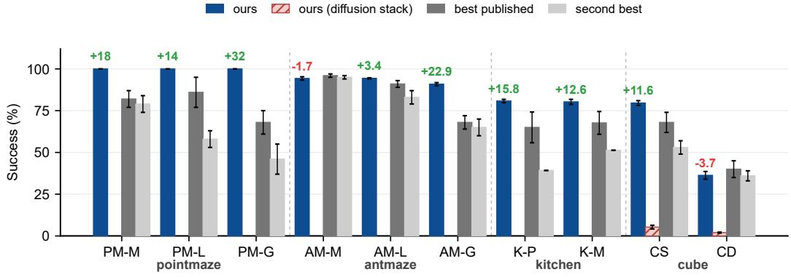  
Figure A.1: Main benchmark, the eight maze/Kitchen/cube rows of Table 2. Bars: ours (solid blue), ours with the diffusion executor on cube (hatched), best published and second-best baselines (grays). Green/red annotations give the per-row delta against the best official number. Six of the eight maze/Kitchen rows meet or exceed the best official baseline with our own executor stack (7/8 counting the cube-single graft column, which reuses the official GCIQL executor as a protocolmatched graft; per-task spread of the graft row 68–96).

Subtask lattice. We call the partial order of subtask completion events—estimated from pairwise precedence counts over the dataset—the subtask lattice. On Kitchen partial/mixed this order is total (a chain), the degenerate lattice case, which the DAG planner consumes as an ordered chain; the lattice view is what generalizes to tasks whose subtask order is only partial.

The 2×2 attribution cell. The planner-attribution control grafts HIQL’s official high level (ϕ representations, anchor-and-select retrieval bridge) onto our diffusion low level (qvel zeroed), α- paired, 3 seeds × 50 episodes: partial 33.5±2.5, mixed 36.0±2.2. The complementary executor-side control—our high level over the goal-conditioned low level—drops −28.6 on the same harness, so the high-level swap damage (−47.3/−44.3) is the larger of the two levers, on this Kitchen domain. Boundary notes: the mixed row reuses the partial-trained HIQL high level (no mixed HIQL checkpoint available locally); HIQL’s official full stack scores in the ∼30–35 band inside our harness (its published 65.0/67.7 come from the D4RL pipeline, not directly comparable), so the 2×2 cell reflects HIQL’s high level as-is, not an interface artifact.

## A.3 PUZZLE NEGATIVE CONTROL

The Rubik quotient-hypercube environments (puzzle-3x3/4x4) carry no obstruction topology: the quotient hypercube is vertex-transitive and cut-point-free, so the bottleneck analysis of this paper does not apply to them. They enter the evaluation solely as a negative control for the value-free planning layer: puzzle-3x3 scores 98.4 ± 0.3 (GCIQL 95 ± 1) and puzzle-4x4 92.3 ± 1.0 (no verifiable official baseline; reported without comparison). The flat-goal ablation on 3x3 collapses to 0.4%, confirming the scores credit the planning layer’s graph structure rather than any bottleneck discovery.

## A.4 KITCHEN PH NECESSITY, SEMANTICS, AND RECOVERY

Two fiber measures. The T3 filtration is run on the Kitchen quotient graph with two complementary fiber measures. The configuration measure (MVEE volume of the object-joint shell section, main-chain progress stratified into five layers, endpoint exclusion, truncated frames, cross-layer deduplication) finds valleys for light switch and slide cabinet—configuration bottlenecks, where the object state passes through a narrow tube. It finds no valley for microwave and kettle: their bottleneck is the contact phase (hooking the door handle, grasping the kettle handle), and the configuration manifold does not narrow along the route. The action measure treats the action distribution at each progress shell as the fiber and takes its generalized variance $\sqrt { | \Sigma | }$ as the fiber volume; a valley is where admissible actions collapse. Under it all four subtasks yield valleys (microwave 1, kettle 6, light 8, slide 5), and the microwave valleys survive 14/14 perturbation rounds (trajectory/frame subsampling × bin count × smoothing scale)—a stable weak signal, not noise. The two measures answer complementary questions: configuration says where the object state squeezes through, action says when the arm’s actions become constrained.

K1 zero-event-label sufficiency ablation. The comparison uses zero completion-event pulse labels, but not zero task metadata: the offline pipeline supplies the extracted subtask order and signature dimensions described above. Four conditions are compared: ph (PH necks as the subtask target set), event (supervised completion-event bands, the supervision upper bound), random (random graph nodes), and direct (no decomposition). Fixed start, 3 seeds $\times 5 0$ episodes, flow-matching low level at the 400k sweet spot (selected by a 100k-grid scan on the ph condition; blind selection at 500k scores $7 9 . 5 \pm 1 7 . 3$ due to tail collapse on 2/3 seeds, vs. 96.5 ± 1.3 at 400k). Configuration measure: ph $9 6 . 5 \pm 1 . 3$ vs. event $9 4 . 3 \pm 2 . 5$ (per-seed $\Delta + 4 . 0 / + 3 . 5 / - 1 . 0$ , the −1.0 inside the ±2 evaluation-jitter tolerance); action measure: ph $9 5 . 5 \pm 0 . 9 ~ \mathrm { v s }$ . event 94. $. 3 \pm 1 . 7 .$ . PH necks with zero event labels thus match the supervised upper bound, and the detected bottlenecks suffice to drive the planner—necessity in the sense of “as good as supervision, without $\mathrm { i t . } ^ { \prime \prime }$ Two boundary conditions bound this ablation: with the strong low level kitchen-partial is near-saturated $( { \tt d i r e c t 9 4 . 0 \pm 0 . 5 } )$ so completion rate no longer discriminates among the planners; the necessity evidence consists of the PH≈event parity, zero supervision, and the sparse strategic semantics below. The low level is the largest lever: the same planner scores $7 7 . 0 \to 9 6 . 5 $ purely by executor upgrade.

Contact-commitment semantics. For each action-space valley we recover the real frames in its shell (shell width matched to the extraction binning) and report three observables: the signaturedimension object state before/inside/after the valley (radial coordinate decreasing = later in time), the action std relative to the whole-task baseline, and the median steps-to-completion. Microwave $_ { ( r = 0 . 4 9 ) : }$ : object-to-goal distance $0 . 7 4 5  0 . 6 4 4  0 . 5 9 2$ (the door starts opening), action width 0.74×, 49 steps before completion. Kettle’s strongest valleys $\scriptstyle ( r = 0 . 3 2$ , persistence 1.68/1.55): distance $0 . 3 9 \bar { 7 }  0 . 3 4 7  \bar { 0 } . 3 4 0$ , action width 0.57×, 44 steps before completion. These are the contact-commitment instants: the feasible action set collapses from “approach from any direction” to “push along the handle’s degree of freedom.” Light/slide action valleys sit in the approach phase (160–193 steps out, no object-state transition yet) and carry weak semantics; their anchors are the configuration-space valleys. The semantics probe thus supports the contact-type tasks strongly and scopes the approach-type tasks.

K2 arbitrary-progress recovery. Injecting frames from successful trajectories (any pose, any progress; stratified sampling, 200 episodes, seeds and injection states identical across conditions) and letting the planner re-identify progress and finish: ph 70.4 / two-stage ph2 (valleys as waypoints, bands as terminals) 68.6 / event 69.1—layer-by-layer parity, so zero-supervision recovery matches supervision also out of distribution. The absolute level is capped by the low level, and a separating probe localizes the cap: open-loop replay of the dataset’s own actions from injected states completes only ∼10% (ground-truth-waypoint closed loop 7.5%), with single-step divergence 1.62 concentrated in one object dimension, identical for warm-start and injected frames, and warmstart replay completing 0.83 subtasks on average. The D4RL dataset and the current environment thus carry a dynamics mismatch that bounds every condition equally; the relative parity conclusion stands, the absolute ceiling is an executor/dynamics boundary, not a planner one.

## A.5 RECOVERY, CUBE-BOUNDARY, AND PLANNER-AUDIT FIGURES

The cube boundary: full attribution. The two cube rows are the only ones where the planning layer has no obstruction topology to exploit, and they mark the score boundary of the method (Fig. A.3). The failure is attributed mechanistically. Swapping only the executor, the official GCIQL low-level on identical tasks scores 79.6±1.4 (single) and 36.3±2.3 (double) over three seeds against our diffusion executor’s 5.3/2.0, a 15–18× gap that places the bottleneck in value distillation at execution, not in planning. Three isolation audits close the case (Fig. A.4b): the planner’s waypoint supply covers 100% of α-paired start frames; a pseudo-execution that reads waypoint frames directly converges at 90%; and feeding the GCIQL executor planner-retrieved goal frames scores 74.4, within the per-task spread of the graft row itself (68–96). Conversely, supplying waypoints to an executor not trained for waypoint semantics collapses performance $( 7 9 . 6 \to 1 2 . 8 ) $ : the interface is a training-semantic contract, which validates our waypoint-trained executor design from the negative side. A sliding-window PCA probe finds the cube observation manifold at effective dimension 4–5 (AntMaze: 13.4—this raw-observation dimension is a different object from the Jacobian-spectrum $m _ { \mathrm { e f f } } = 3 \AA$ –4 of 3.1: the latter counts the directions the trained embedding realizes, and the 13.4→3–4 reduction is the rectification effect itself), so the geodesic-consistency sampling condition of Theo rem T2 is easier, not harder, to meet here.

Table A.1: L1–L3 perturbation protocols, α-paired on/off at matched seeds (n=50). Latency is split into detection delay (injection → trigger) and re-navigation/re-plan cost; all latencies are control steps except the AntMaze L3 replan, which is wall-clock. Kitchen full-chain completion after L3 revocation is budget-limited by design (mid-episode injection); the revocation-specific metrics are detection, replan, and redo.
<table><tr><td>Level (env.)</td><td>off / on</td><td>Detection</td><td>Re-nav./re-plan</td><td>Verdict</td></tr><tr><td>L1 arm jitter (Kitchen)</td><td>35/50 vs 35/50</td><td></td><td></td><td>no false alarms (0/50)</td></tr><tr><td>L2 object move (Kitchen)</td><td>35/50 vs 38/50</td><td>med 12 steps‡</td><td></td><td>full recovery</td></tr><tr><td>L3 subtask revoke (Kitchen)</td><td>35/50 vs 4/50*</td><td>0 steps</td><td>0 steps</td><td>detect 50/50; redo 50/50</td></tr><tr><td>L2 teleport (AntMaze)</td><td>88.8 vs 86.4</td><td>1 step†</td><td>med 205 steps†</td><td>drift absorbed, no deadlock</td></tr><tr><td>L3 goal switch (AntMaze)</td><td></td><td></td><td>45–61 ms</td><td>92.0% new-goal (138/150)</td></tr></table>

∗budget effect of mid-episode revocation: the revoked subtask must be detected, re-planned, and re-executed inside the same fixed horizon, so the chain length exceeds the remaining steps; the revocation-specific metrics isolate the mechanism from the budget. †the 4–8-unit teleport displacement exceeds the drift tolerance at the first control step after injection (mechanism); re-navigation is the path length from the teleport site, not detection delay. ‡event-driven: the drift trigger and the re-anchor fire at the same trigger crossing (min 0, max 75); resumption follows parent pointers at no additional latency.

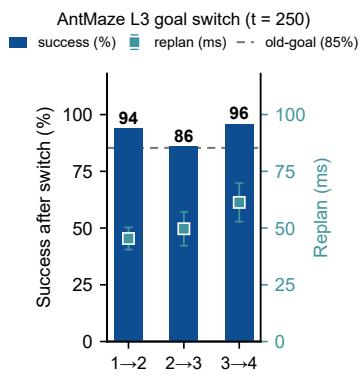  
(a)

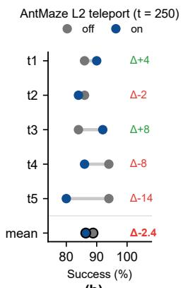  
(b)

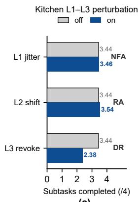  
(c)  
Figure A.2: Online recovery. (a) AntMaze L3 goal switch at mid-episode: new-goal success 94/86/96% with re-planning at 45–61 ms (squares, right axis); the dashed line marks the old-goal baseline (not a like-for-like comparison: re-planning starts from the current state with a shorter remaining route, A.17). (b) AntMaze L2 teleport: per-task on/off success, mean −2.4 inside the binomial noise band. (c) Kitchen L1–L3: subtasks completed off vs on; jitter shows no false alarm (NFA), object shift re-anchors (RA), revocation is detected and redone (DR) with the full-chain count budget-limited.

## A.6 RECURSIVE TOPOLOGY ON KITCHEN: SUB-NECKS IN ARM SPACE

The recursive-topology mechanism validated on mazes (strategic points first, then new persistenthomology points mined between them) is not a maze artifact. On Kitchen the first two layers already exist (the DAG chain orders subtasks; the PH subtask necks are the gate chain); the third layer—intra-segment subdivision—was missing. Because the object base space is static during approach (segment length ≈ 0 there), recursion cannot start in base space and is instead defined on the arm/action fiber, consistent with the action-space measure already used for microwave/kettle. We run the shell-measure filtration on the manipulation phase in arm space (radial = arm-space distance to completion) over truncated successful trajectories of all four subtasks.

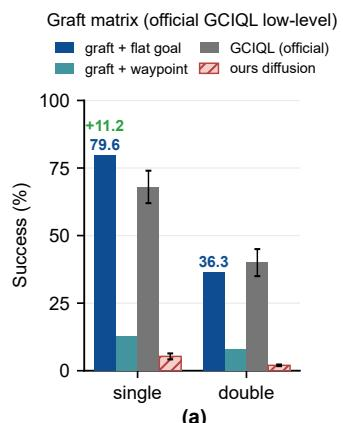  
(a)  
"Subgoal-effective" three conditions

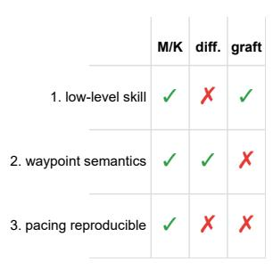  
(b)  
Effective-dimension probe

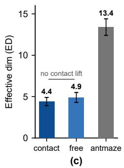  
Figure A.3: The cube boundary. (a) Graft matrix: the official GCIQL executor with flat goals reaches 79.6/36.3 (three seeds), with our waypoints 12.8/8.0, our diffusion executor 5.3/2.0. (b) The three conditions for a subgoal to be effective; each stack breaks a different subset. (c) Effective-dimension probe: no contact-phase dimension lift (4.4 vs 4.9), and the cube manifold is far lower-rank than AntMaze (13.4).  
PointMaze: execution-noise-free planner 1 ours (pure planner) best published (QRL) second (HIQL)

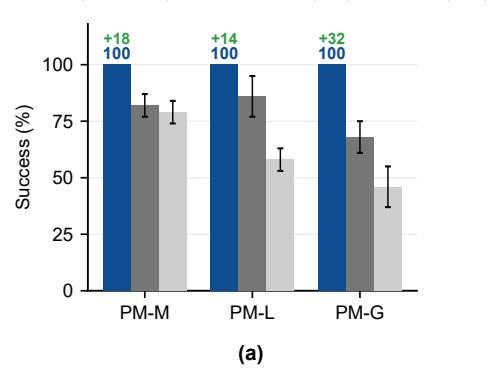  
Cube planner audit (3 isolated protocols)

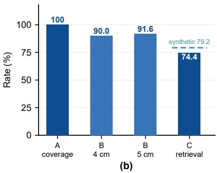  
Figure A.4: Planner isolation audits. (a) PointMaze with the pure planner (execution-noise-free): 100±0 on all sizes. (b) Cube planner audits under three isolated protocols: waypoint supply coverage 100%, pseudo-execution convergence 90.0/91.6%, and goal-retrieval execution 74.4 within the graft row’s per-task spread (68–96).

All four subtasks yield stable sub-necks (Fig. A.5): kettle CV 0.228, top persistence 1.114; microwave 0.171/0.883; light switch 0.223/1.028; slide cabinet 0.310/1.633. The early valley satisfies three conditions simultaneously (mid-trajectory time, low object-displacement progress, narrow arm configuration), making it a bona-fide intra-segment neck; the late valley is the place/finish convergence. This extends the recursive-topology mechanism from geometric navigation (mazes) to robotic manipulation (all four Kitchen subtasks): a PH-certified subtask is not atomic but contains recursively subdividable commitment structure.

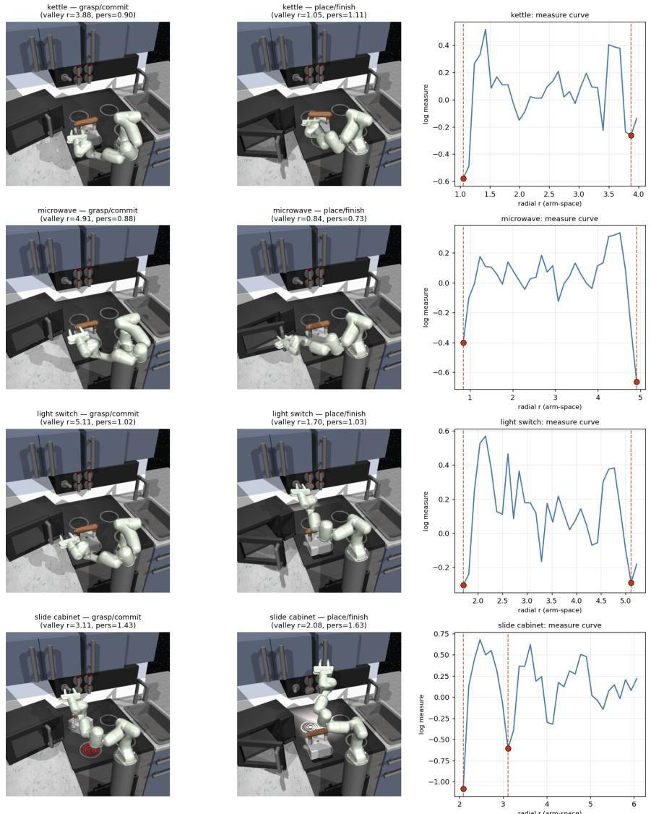  
Figure A.5: Recursive topology on Kitchen, per subtask (rows: kettle, microwave, light switch, slide cabinet). Left and middle columns: real rendered poses obtained by setting the valley frames’ true $q _ { p o s }$ back into FrankaKitchen. Left = the early valley (grasp/contact commitment: the object has barely moved, e.g. kettle still on the stove, yet the arm has converged to a narrow configuration); middle = the late valley (place/finish). Right column: the detrended log section measure on arm space against radial r; the two red dots and dashed lines mark the surviving valleys, one per rendered pose. The rendered poses and the filtration valleys are produced independently yet align on the same semantic phase (grasp vs. place), cross-validating that the mined sub-necks are genuine commitment bottlenecks. Every subtask shows the double-commitment structure (early grasp neck at normalized $r \approx 0 . 2 7 – 0 . 3 4$ , late place neck), with persistences 0.88–1.63 (same order as the maze positive control’s 1.98) and valley positions stable under 5×70% bootstrap.

## A.7 THE PH-WAYPOINT PROBE

This probe tests whether the certified valleys can serve directly as control signals: on AntMazemedium, the frozen stack is left untouched and only the waypoint source changes—the deployed dense lookahead waypoints are replaced by the next persistent-valley gate on the route chain (gate registry from the object-side measurement of Appendix B.5; task 2 uses all five registered gates, task 5 the four stable-core gates), 3 seeds × 50 episodes, α-paired.

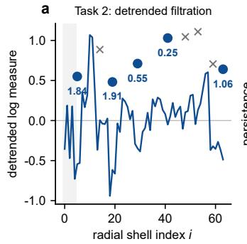

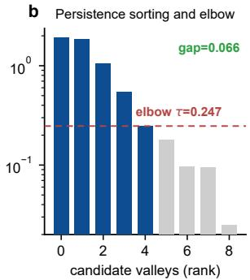

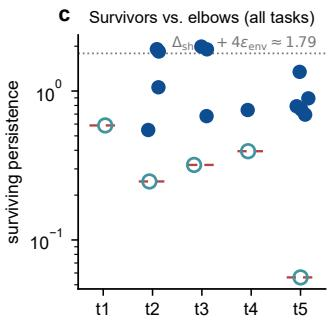  
Figure A.6: The T3 filtration in operation (frozen per-task measurements, AntMaze-medium). (a) The detrended log cross-sectional measure on task 2: surviving valleys (blue) versus subthreshold candidates (gray); shaded bands mark the excluded trivial zones. (b) Persistence sorting of all task-2 candidates: the kneedle elbow $\scriptstyle ( \tau = 0 . 2 4 7 )$ sits at the upper edge of the gap (0.066)—under the inclusive pers $\geq \tau$ rule it coincides with the smallest survivor by construction—the realized, distributional form of separation. (c) Surviving-valley persistences against per-task elbows on all five tasks (log scale); open markers flag marginal survivors sitting exactly at their task’s elbow. The dotted line marks the sufficient-but-not-necessary constant ≈ 1.79.

Table A.2: PH-valley waypoints vs. tree-lookahead waypoints (AntMaze-medium, success %).
<table><tr><td>Task</td><td></td><td>PH-gate waypoints tree lookahead (frozen)</td><td> $\Delta$ </td></tr><tr><td>task 2</td><td> $8 4 . 0 { \pm } 8 . 0 \ $ </td><td> $9 6 . 7 { \pm } 3 . 1 $ </td><td> $- 1 2 . 7$ </td></tr><tr><td>task 5</td><td> $9 4 . 0 { \pm } 2 . 0 \ $ </td><td> $9 7 . 3 { \pm } 2 . 3 $ </td><td>-3.3</td></tr></table>

Two readings. (i) The negative reading: sparse valley waypoints are strictly dominated by the dense lookahead waypoints. (ii) The positive residual: isolated gate states alone still drive 84–94% completion, meaning the detected bottlenecks carry sufficient routing information to steer the cascade— the certified structure is task-sufficient. Relation to the support-flow interface. This probe predates the support-flow interface; its control condition is “feeding sparse gate coordinates directly as tactical targets.” Together with the E6 ablation, the lesson is not that PH cannot enter the decision loop, but that it cannot enter in the form of sparse gate coordinates—the mechanism is interface outof-distribution: distant gate coordinates exceed the executor’s same-trajectory-future-frame training horizon and distribution. The support-flow interface (Section 3.3) is precisely the fix for this failure mode: the gate chain is retained as route structure and densified along the certifying trajectories into same-corridor, in-distribution waypoints. After this fix, the same certified gate chain enters the decision loop and drives all main-benchmark results (Section 4.4) and the cross-embodiment deployment (Section 4.3). This probe provides the motivation evidence for the support flow.

## A.8 EXECUTOR PLUGGABILITY AND INTERFACE ABLATIONS

The following three experiments examine the interface behavior on the executor side. Each holds the frozen stack (latent fields, graph planner, α-paired evaluation, 3 seeds × 50 episodes on AntMazemedium unless stated) bit-identical and varies exactly one factor. Code, per-seed logs, and JSON anchors are in the released artifact (v1.10).

(i) Executor pluggability. We graft two executor classes onto the same waypoint contract to verify interface pluggability: the flow-matching policy class of FQL (a current top executor family on OGBench; bc-flow plus one-step distillation, retrained on the same success-pool triplets, $w =$ random-lookahead frame, $k \sim U \{ \bar { 5 } , 5 0 \}$ ; 100k gradient steps, action-MSE plateaued at 0.0999) scores $8 9 . 7 \pm 2 . 5 ;$ the HIQL-class executor under the same contract scores $9 5 . 1 \pm 0 . 6$ . The latter replaces only the low-level executor while retaining our planning layer; it is not a reproduction of HIQL’s full stack (HIQL’s official full-stack numbers are in Table 2). Both executor classes consume the same waypoint contract, confirming the interface is pluggable; the score difference between them stems from the executor classes’ own capability, not from the planning layer.

(ii) Gates as attractor targets are harmful. The probe of Appendix A.7 fed gates as far targets to an executor trained on short-horizon waypoints—a train/eval contract mismatch. We remove the mismatch: the executor is retrained with the gate contract (w = the trajectory’s own next-gate passage frame, R=1.5; frames past the last gate fall back to random-lookahead targets, matching the deployed fallback; 39% of frames carry gate targets). Under this aligned contract the gate attraction still hurts: 86.0 ± 2.0 overall (−3.7 vs. the same class with the lookahead contract), task 2 dropping 24.7 points. Contract mismatch was therefore not the driver of the negative probe—gates as control targets are harmful per se. The mechanism is the same rock as the hold-25 collapse (freezing waypoints for 25 steps drives success to 0): fresh stepwise re-anchoring is the load-bearing structure, and distant fixed targets approximate long freezes. This result motivated the recursive-topology PH probe (detecting sub-necks between adjacent gates, Section 3.3) and, on that basis, the support-flow interface: the gate chain is retained as route structure and densified along the certifying trajectories into in-distribution tactical targets, preserving the gate chain’s strategic information while eliminating the interface out-of-distribution problem of sparse gate coordinates.

(iii) Falls on giant are an executor-side risk boundary. On AntMaze-giant, 71% of failures are sudden falls (gait hazard). Probing the forensically logged rollouts (93 falls vs. 155 successes, task 1/4, 3 seeds): seven gait-health indicators (height z, |qw|, their windowed mean/std/slope, commandrealization cosine, net speed) at four lead times (25/50/100/200 steps before onset) all sit at AUROC ≈ 0.5 (range [0.26, 0.59]). The only deviation is inverted (doomed episodes run slightly smoother and faster shortly before onset, AUROC 0.26–0.34 at 25–50 steps), which both validates probe sensitivity—it recovers the known group-level signature—and suggests an intervention (gait perturbation) already falsified by the zigzag ablation. Falls therefore belong to the low-level executor’s risk boundary, not the planning layer.

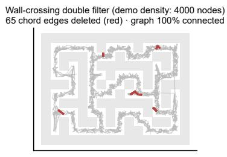  
(a)

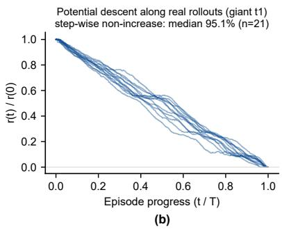

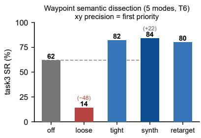  
(c)

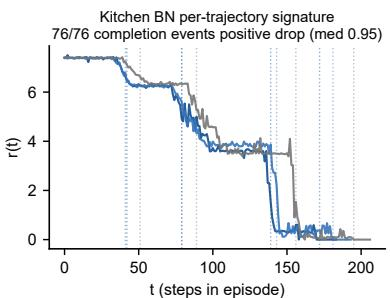  
(d)  
Figure A.7: Mechanism validation: the planning layer’s intermediate data. (a) The dual filter on a demonstration-density graph (4k nodes): 65 chord edges deleted (red), the graph remains 100% connected (T2’s two-filter fidelity). (b) The radial coordinate along 21 real AntMaze-giant rollouts: step-wise non-increase at median 95.1% (T1’s Lyapunov reading on deployed trajectories). (c) Waypoint semantic dissection (five interface modes, AntMaze-medium task 3): smearing planar precision collapses success 84→14; direction-consistent pose frames add +22 over arbitrary frames (84 vs. 62)—the inverse-Wasserstein ordering behind T6. (d) Kitchen subtask signatures: all 76 completion events (19 full-completion trajectories) coincide with a positive radial drop (median 0.95).

## A.9 TWO GATE CALIBERS AND EFFICIENCY-BASED ROUTE SELECTION

The Humanoid panel of Table 1 reports the plain caliber, the unmodified PH output, so the maintable transfer numbers are single-caliber and selection-free. This appendix registers a second frozen caliber, efficiency-pruned, as a sensitivity analysis and failure-cause diagnostic; the reported numbers never use it. Both calibers are discovered on the same PointMaze data with zero supervision and zero trajectory-level reweighting. Plain is the full-coverage caliber (all successful trajectories, per-route shell filtrations, union). Efficiency-pruned adds two geometric filters. (1) Route selection: for each successful trajectory, ratio = geodesic length / arc length; a route’s inherent efficiency is the p90 of its trajectories’ ratios (wandering only stretches arc length, so p90 approaches the route’s own geometric efficiency; measured 0.77–0.88 for direct routes vs. 0.32–0.54 for detour routes); routes below 0.6 are pruned wholesale, retained routes keep all their trajectories so coverage is preserved. (2) Gate purification: detour $\cdot ( g ) = d ( s , g ) + d ( g , t ) - d ( s , t )$ on the fine free-space grid—the continuous form of the geodesic must-pass criterion (a point v with $d ( s , v ) + d ( v , t ) = d ( s , t )$ lies on every shortest s–t path); gates with detour > 6 are removed. The threshold placement is read off the data: the measured detour distribution is bimodal with an empty gap (direct-corridor gates 0–5, cluster-contamination gates 8–38), and the threshold 6 sits inside this gap, so the classification is insensitive to its exact placement anywhere in (5, 8); no downstream performance was used to select it.

Under the map-shaped BFS interface, single-caliber scores are 89.3 (plain) and 86.9 (pruned, cross\_humanoid\_oracle\_eff.json; pruned wins t2/t3 by removing detour routes, plain wins t4/t5 through fuller route coverage); the reported support-flow interface lifts the overall to 95.5 (Tab. 1). The two calibers are never combined into a per-task best figure: the reported transfer numbers are the output of one fixed, selection-free pipeline. The pruned caliber serves two diagnostic purposes. First, sensitivity: the certified gate set moves 89.3 → 86.9 (−2.4) under a substantial change of the discovery-side filtering, whereas baseline keypoint sets move far more under an equivalent change of their budget (below). Second, failure-cause attribution: efficiency selection removes detour routes (e.g. two t2 gates at detour 31/38), while plain is a full-route coverage provider (its extra route supplies denser early guidance on t5). Trajectory-level efficiency reweighting (rejection sampling) was tried and falsified—it removes the high-r coverage that only wandering trajectories provide (t4 collapses to 0.0)—so efficiency enters only as a route-level criterion, never a framelevel weight. Applying the detour purification to the Ant-discovered anchor PH-ant without route selection degrades it (legitimate parallel-route gates are pruned), fixing the applicability boundary: detour purification is a post-selection cleanser, not a universal pruner; PH-ant therefore keeps the plain caliber.

Waypoint-budget sensitivity of the baselines. The baselines have no certified cardinality and must be given a candidate budget K per task; Table 1 uses the larger plain-caliber budget $K = ( 5 , 5 , { \bar { 9 } } , 4 )$ . A second run with the smaller pruned-caliber budget K=(2, 3, 4, 2) shows the baselines’ Humanoid scores are budget-dominated, not discovery-dominated: their scores swing widely while ours, whose gate count is determined by the detection itself, moves only 89.3 → 86.9 across the same two budgets. Under the table’s budget, ours leads overall (95.5 on the support-flow interface) and clears the long-chain task t4 by the largest margin (96.7 vs. direct 62.0).

## A.10 LAYOUT PERTURBATION: THE CARRIER IS THE SOLE MEDIATOR

Motivation. The discovery chain has exactly one input: the successful-trajectory carrier. The maze map, the wall geometry, and the ground-truth free-space topology never enter the pipeline. This property is directly testable: if layout information could reach the gate set by any route other than the data, a map change with the data unchanged would move the gates. Verifying it also fixes the reading of the comparison against the direct reference, which reads the true map at every deployment step: once the gate set is established as a pure function of the data, the two information sources are cleanly separated, and the two gaps with direct receive distinct explanations—the t4 margin (+34.7) is the value of the certified structure itself where route structure is load-bearing, while direct’s +2.7 on single-route t2 is what per-step map access buys where it is not. The control below implements the test in three discovery-side arms plus one deployment control.

Design. An obstacle enters the experiment as a deletion of successful trajectories: a trajectory crossing the obstacle cannot exist in the new layout, so the surviving data is the new layout. The discovery chain is re-run unchanged on the survivors; neither the obstacle nor any map is shown to it. Arm N places the obstacle in a free cell with zero data coverage (map changed, carrier unchanged; zero trajectories deleted); arms A/B block the detour corridor and a must-cross neck of the direct route (both changed). Tasks t2/t5 admit no obstacle placement at the required separation from existing gates and are skipped as such. Matching uses two calibers, reported separately: bit-identical within the gate radius (1.5), and same-corridor persistence within 2.5 (deleting data re-clusters the survivors, which can shift a gate within its corridor); per-gate nearest distances are archived in the JSONs.

N: data unchanged, gates unchanged. Across t2/t4/t5 the gate sets match the frozen registry bitfor-bit (5/5, 9/9, 4/4; 18/18 overall), with zero new gates and zero ghost gates (the obstacle at (7.75, 14.25) sits in a zero-coverage cell, 2.5 units from the nearest gate). The map changed; the input data did not; the gate set did not move.

A/B: data changed, gates follow. Blocking the detour corridor (t4, obstacle at (1.2, 13.0); 143 detour trajectories deleted, 232 → 89 surviving) removes the detour skeleton $( 0 / 5$ detour gates remain, $1 / 5$ same-corridor) while the direct skeleton persists $( 2 / 4$ bit-identical, 3/4 same-corridor). Blocking the direct neck (obstacle at (8.25, 20.0); 41 direct and 73 detour trajectories deleted, 232 → 118 surviving) removes the direct skeleton $( 0 / 4 )$ while the surviving detour skeleton persists $( 3 / 5 )$ . In both arms the new gates appearing after re-identification are real necks of the reorganized surviving data (7.8–17.4 and 4.2–12.3 units from the obstacle); no gate appears on the obstacle, the obstacle zone contains zero graph nodes, and connectivity is preserved.

Deployment: the price of not re-identifying. The B-arm blockage is then realized physically on the HumanoidMaze harness: a wall added to the maze layout as a genuine MuJoCo collision geom (injected at construction; geom count 59 → 60, verified by name), with the trajectory-deletion criterion defined by the same geometry. Two deployments are compared under the main-panel protocol (FQL-xy executor, support-flow interface, α-paired, 3 seeds × 50 episodes): frozen, the original gate set and support-flow paths (including the corridor the wall now blocks), and re-identified, the same zero-tuning discovery re-run on the 116 surviving trajectories (3 gates; support-flow paths rebuilt identically). Frozen scores $7 . 3 \pm 1 . 9 ( 6 / 1 0 / 6 ) ;$ re-identified scores $9 2 . 0 { \pm } 2 . 8 \ : ( 9 0 / 9 0 / 9 6 )$ , inside the band of the unperturbed baseline (96.7); the net benefit of re-identification is +84.7 with complete per-seed separation $( + 8 4 / + 8 0 / + 9 0 )$ . The frozen arm’s mechanism: the executor is drawn into the blocked corridor, contacts the wall, and the hysteresis lock cannot release (the contact point lies on the dead path, beyond the 1.5-unit switch margin from the surviving route), so 93% of episodes time out. Boundary notes: single wall cell, single task (t4); the frozen collapse combines the structural error with this interface-level amplification; the re-identified −4.7 relative to the unperturbed baseline reflects the thinner surviving data (116 of 232 trajectories), i.e., path quality, not gate error. Artifacts: scripts/exp\_layout\_perturb.py, scripts/exp\_layout\_perturb\_deploy.py, outputs/topo\_vs\_graph/layout\_perturb\_t\{2,4,5\}.json, layout\_perturb\_deploy\_t4.json, and the trace layoutdeploy \* logs.

## A.11 E1 AND E4 PROTOCOL DETAILS

E1: mechanism-invariance grid. The grid is $2 0 \times 2 0 \colon$ start zone $x \in [ 8 , 1 2 ] , y { = } 1 ;$ goal room $x \in [ 8 , 1 2 ] , y \in [ 1 6 , 1 9 ]$ with goal (10, 18); the single-cell neck (10, 15) is the room’s only entrance (asserted: removing it disconnects the start zone from the goal); left corridor $x \in [ 1 , 3 ]$ and right corridor $x \in [ 1 7 , 1 9 ] , y \in [ 2 , 1 4 ]$ , are disjoint and exactly equal-length (31 steps), joined by top and bottom halls. Each regime generates 200 start→goal trajectories (25% per-step randomneighbor noise, seed 20260819), and detection runs the main-chain filtration on the covered-cell graph—multi-source Dijkstra r, shell-cardinality measure, Gaussian detrending, sublevel filtration with kneedle elbow—with one parameter difference from the main chain: min pts 8→1, because shell counts here are exact combinatorial counts without estimation noise, and the single-cell neck shell has cardinality one by construction (a min pt $s { \geq } 2$ run merges the neck shell into the $r { = } 0$ bin and the bottleneck disappears; logged in the artifact). Hits are registered at the adjacent level (±1 bin), because the 64-bin resolution is finer than the integer shell spacing.

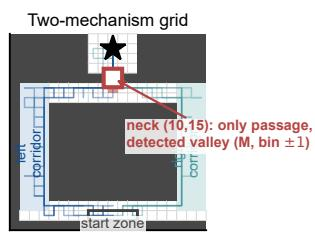  
(a)

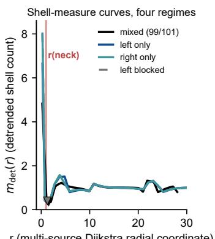  
(b)

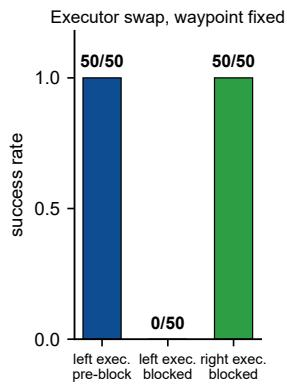  
(c)

Figure A.8: Mechanism invariance of the certified bottleneck (E1). (a) The two-mechanism grid: the goal room (star) is reachable only through a single-cell neck (square) via two disjoint, equal-length corridors; the red band marks the detected valley cells (strongest-valley bin ±1, mixed regime). (b) Detrended shell-cardinality curves of all four regimes—mixed, left-only, right-only, left blocked (identical to right-only by construction)—with each regime’s strongest persistent valley (triangles); the valley sits on the neck’s radial coordinate (red line) in every regime, at 6.1–8.5× the elbow threshold. (c) Executor swap under the fixed strategic waypoint (the neck): left-corridor executor 50/50, blocked 0/50, right-corridor executor 50/50.  
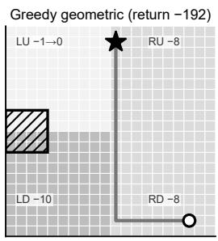  
(a)

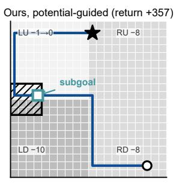  
(b)

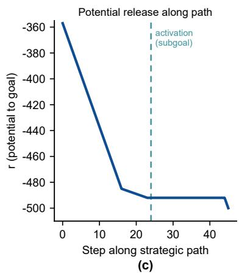  
Figure A.9: Strategic subgoal emergence in the controlled grid. (a) The greedy geometric path takes 24 hops for return −192, never activating the bonus region. (b) The potential-guided path detours 45 hops through the activation zone, returning +357; the emergent subgoal (square) lands on the zone. (c) The radial coordinate along the strategic path releases exactly at activation, matching the realized return with zero fixed-point error.

B and BLK coincide bit-for-bit and we register why: to the filtration, a mechanism absent from the data and one absent from the world are indistinguishable—the same mechanism-independence seen from both sides. The executor demonstration fixes the detected neck as the sole strategic waypoint and swaps only the low-level mechanism (a local shortest-path follower on its corridor subgraph, 5% slip, 50 trials per condition, seed 20260820): left executor pre-block 50/50, left executor post-block 0/50 (no feasible path in every trial), right executor post-block 50/50.

E4: gate-segmented monitoring. AntMaze-medium frozen stack, L2 teleport protocol $( T _ { \mathrm { i n j } } { = } 2 5 0$ , 50 on/off episode-paired runs at matched seeds, tasks 2/5). Monitor A is the deployed stall-window (50-step displacement < 0.3, answered by a 15-step escape walk) plus continuous re-

Table A.3: E1 four-regime invariance: strongest persistent valley vs. elbow threshold τ. All four regimes place the strongest valley adjacent to the neck shell; the neck shell has cardinality one (global minimum) in every regime.
<table><tr><td>Regime</td><td>Mechanisms</td><td>Persistence</td><td>τ (elbow)</td><td>Ratio</td><td>Verdict</td></tr><tr><td>M (mixed, 99/101)</td><td>dual</td><td>3.74</td><td>0.45</td><td>8.3×</td><td>neck shell, adjacent</td></tr><tr><td>A (left only)</td><td>single</td><td>4.16</td><td>0.68</td><td>6.1×</td><td>neck shell, adjacent</td></tr><tr><td>B (right only)</td><td>single</td><td>5.07</td><td>0.60</td><td>8.5×</td><td>neck shell, adjacent</td></tr><tr><td>BLK (left blocked)</td><td>deleted</td><td>5.07</td><td>0.60</td><td>8.5×</td><td>neck shell, adjacent</td></tr></table>

anchoring; monitor B disables the stall window and monitors by gate segments—each segment ends at the next certified gate on the route chain (radius 1.5), its budget the segment geodesic divided by the measured median step speed times two, a timeout firing the same global re-anchor.

Table A.4: E4 gate-segmented (B) vs. stall-window (A) monitoring under L2 teleport. Recovery rate is over injected episodes; re-navigation latency is the shared first-progress measure; pure false alarms count monitor triggers on unperturbed episodes (events on successful episodes in parentheses); truestall latency is the first-trigger delay after injection.
<table><tr><td>Metric</td><td>t2 A (window)</td><td>t2 B (gates)</td><td>t5 A (window)</td><td>t5 B (gates)</td></tr><tr><td>Recovery rate</td><td>87.0% (20/23)</td><td>82.6% (19/23)</td><td>92.3% (12/13)</td><td>91.7% (11/12)</td></tr><tr><td>Re-navigation latency, med. steps</td><td>6.0</td><td>5.5</td><td>9.0</td><td>8.0</td></tr><tr><td>Pure false alarms / episode</td><td>3.2 (11)</td><td>0.92 (3)</td><td>1.46 (25)</td><td>0.00 (0)</td></tr><tr><td>True-stall detection, med. steps</td><td>45 (n=10)</td><td>118 (n=3)</td><td>50 (n=3)</td><td> $2 4 ( n { = } 1 ) ^ { \dagger }$ </td></tr></table>

†single event; the speed comparison rests on the task-2 medians.

The precision axis is decisive (zero pure false alarms on task 5 against 25 events), the speed axis is not delivered (segment budgets run loose), and no material recovery-rate loss is observed; the tasklevel differences are one episode. Two blind spots are on the repair list: (i) no checkpoint exists after the last gate—one task-2 episode teleported next to the goal had no remaining gate on its chain and went unwatched; (ii) thin gate chains cover sparsely—task 5 averages 1.4 gate arrivals per episode, and a gate-crossing latency is defined for only $\mathbf { 4 } / \mathbf { 1 2 }$ fired episodes, $n _ { \mathrm { f i r e d } } { = } 1 2$ . The two monitors are complementary (the gate answers on-route?, the window answers moving?); the deployed stack keeps the stall window and treats the gates as the zero-false-alarm precision layer, not a replacement.

## A.12 MULTISCALE PERSISTENT- ${ \cal { H } } _ { 1 }$ : ROUTE-FORKING OBSTACLES

The 1D radial filtration reads valleys along the progress coordinate; a second topological object lives off that profile entirely. Successful trajectories cover corridors but do not cover the obstacle blocks between alternative routes, so the trajectory-induced coverage complex carries genuine higher-homology structure. In the planar case, bounded components of the complement represent $H _ { 1 }$ classes by planar duality: each class is a hole around which successful trajectories must choose a side, giving the topological signature of route forking. A prominence-based detector on any onedimensional profile cannot represent this object.

Multiscale cubical construction. We rasterize the graph nodes’ planar coordinates and form a cubical coverage complex. For the persistent readout, the occupied mask is dilated by one cell to close sampling gaps, and the cubical filtration value at each cell is its Euclidean distance to the occupied coverage. The implementation uses GUDHI 3.13.0. Sublevel sets therefore realize the nested offsets $\bar { K _ { \epsilon } } = \{ z : \bar { \mathrm { d i s t } } ( z , \mathcal { C } _ { \mathrm { t r a j } } ) \leq \epsilon \}$ , where ϵ is measured in maze units. We compute the finite birth–death intervals in dimension one with GUDHI’s cubical-complex implementation, discarding only the essential interval. The grid spacing (h = 0.5 maze units before the cell-budget rescaling), one-cell dilation, 30,000-cell budget, and coverage construction are fixed before reading the barcode. The earlier bounded-component/depth diagnostic remains the localization view; the cubical barcode is the multiscale existence test. A synthetic annulus sanity check recovers one long finite bar ([0, 4.596], lifetime 4.596).

Full-data result. On AntMaze-medium tasks 2/4/5, the full coverage complexes all contain a dominant finite $H _ { 1 }$ bar. For tasks 2 and 5, the top bars are respectively [0, 2.062] (lifetime 2.062)

and [0, 2.500] (lifetime 2.500); task 4 yields [0, 2.236] (lifetime 2.236), with a secondary bar [1.118, 2.062] (lifetime 0.944). These are finite multiscale features rather than a binary raster artifact. On task 4, splitting 407 successful trajectories by the efficiency ratio (geodesic length from start over arc length, threshold 0.6 as in A.9) gives a direct route (n=87, p90 efficiency 0.75) and a detour route (n=320, p90 efficiency 0.48); the two routes pass the localized hole on opposite sides, identifying the central obstacle as the route-forking cause (Fig. A.10).

Subsampling stability. We repeat the cubical barcode computation after retaining 70% of trajectories with seeds 1–3. The dominant finite bar is retained in $3 / 3$ runs for both task 2 and task 5. Task 2 top lifetimes are 2.062, 2.500, and 2.236; task 5 top lifetimes are 2.236, 2.500, and 2.500. Thus the persistent route-forking signal survives substantial trajectory removal. The localization diagnostic is less rigid than the existence claim: the earlier fixed-scale top-hole location is stable in 2/3 seeds and moves to another real obstacle block in 1/3, while the route-forking-obstacle interpretation hold in all three. Code and frozen outputs are scripts/exp\_h1\_cubical\_persistence.py, outputs/h1\_cubical\_task25/cubical\_h1\_results.json, and outputs/h1\_cubical\_task25/cubical\_h1\_diagrams.png.

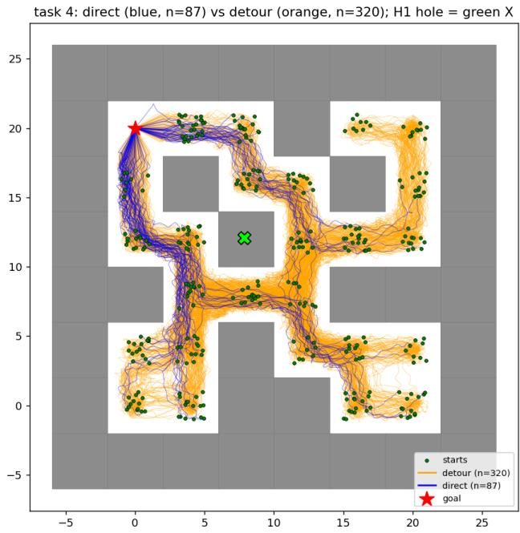  
Figure A.10: Higher-homology route-forking evidence on AntMaze-medium task 4. Gray: maze walls; green dots: trajectory starts; red star: goal; blue/orange: direct (n=87) versus detour (n=320) successful trajectories; green ×: the localized bounded hole on the central obstacle block around which the routes fork. The accompanying cubical filtration yields a finite top $H _ { 1 }$ interval [0, 2.236] (lifetime 2.236); the feature is computed from behavior-induced coverage, with no map access.

The hole signature in the decision loop: winding-number route lock (supplementary experiment). The $H _ { 1 }$ readout can be carried into the decision loop as follows. The certified hole on the discovery side (PointMaze coverage, same frozen-registry caliber as the deployed paths) assigns each route an integer winding-number signature, and the deployment-side route lock commits to the route whose signature matches the accumulated winding number of the executed trajectory, with a hysteresis of half a turn. The signature is an integer topological invariant: it flips only when the agent physically circumnavigates the separating obstacle block, and is indifferent to corridor width and distance scales. The experiment runs the full Humanoid deployment stack of the main transfer panel (FQL-xy executor, the dense path-following deployment of the same gate hierarchy, α-paired, 3 seeds × 50 episodes) with a single variable: the geometric nearest-waypoint lock (hysteresis 1.5 units) versus the topological signature lock. Discriminability is certified per task, with exactly one significant hole per task: the two t4 routes carry signatures [0] and [−1] (they pass the hole on opposite sides), while t2/t3/t5 are non-discriminating by construction and the lock falls back to the geometric branch. On the discriminating task t4, the topological lock produces zero route switches $( 0 / 0 / 0$ across seeds, replicated in three independent runs) against the geometric lock’s $1 7 \ : ( 4 / 7 / 6 )$ on the PH-pt stack and 26 $\left( 6 / 1 2 / 8 \right)$ on the PH-ant stack (switch counts recomputed from the frozen traces by scripts/\_forensic\_h1\_switch\_counts.py); the paired success-rate difference flips sign across runs (+1.3 then −2.0), and the non-discriminating tasks stay within ±1.4 points of their geometric-lock baselines. The main deployment keeps the geometric progress lock for two reasons: the two locks are success-rate equivalent within the noise band, and the geometric lock is a zero-cost interface component requiring no hole detection. The supplementary experiment establishes decision-loop reachability of the $\Breve { H _ { 1 } }$ readout; the zero-switch fact is its deployment-level semantic validation, with the signature matching physical circumnavigation exactly. Artifacts: scripts/exp\_h1\_decision\_loop.py (winding self-check included), outputs/topo\_vs\_graph/h1\_decision\_loop.json plus the trace h1loop \* logs (2026-09-06 run; the 2026-09-05 run archived under h1loop 0905 backup/), and the frozenconfig discriminability audit scripts/verify\_h1loop\_frozen\_config.py.

## A.13 DETECTOR-EQUIVALENCE AND CARRIER CONTROLS

The $H _ { 0 }$ readout is a one-dimensional sublevel filtration, and on any scalar profile this computation is equivalent to topographic prominence ranking with a knee-based cutoff. Two controls delimit exactly what the equivalence covers: a detector control, replacing the filtration by plain prominence on the same profile, and a carrier control, keeping the detector and replacing the carrier by raw observation coordinates.

Design. All three configurations run on AntMaze-medium tasks 1–5 under CPU determinism and share verbatim every downstream mechanism (adaptive binning, envelope detrending, start/goal exclusion zones, the registered elbow). The reference configuration is the production chain of Appendix B.5; it reproduces all five archived gate sets exactly. The detector control recomputes every valley by topographic prominence under the standard key-col semantics—a side of a valley containing no deeper valley is excluded from the minimum, and the globally deepest valley takes the profile maximum (the sea-level convention)—implemented independently of the Union–Find filtration scan. The carrier control removes the carrier: no transport weighting, no graph geodesics, no rectification. The progress coordinate is the 29-D Euclidean nearest-neighbor distance to the goal state set (successful-trajectory states within the goal tolerance, the same criterion as the produc tion goal nodes); shell sections are MVEE volumes over the first $m _ { \mathrm { e f f } }$ PCA directions of the raw standardized coordinates; route clustering uses physical-xy trajectory signatures. This is thus the strongest raw-coordinate baseline constructible: everything except the carrier is inherited from the production chain.

Result (detector): the equivalence is exact. The detector control reproduces the reference gate sets on all five tasks (18/18 gates, no spurious detections), and the two algorithms agree at the level of the full extrema lists: every valley, every persistence value, including the deepest-valley convention, to machine precision. The equivalence stated in the main text is therefore a verified property, and it is confined to the detector: the last-step ranking is fully replaceable by prominence plus the same knee.

Result (carrier): the same detector fails off the carrier. The carrier control matches 11/18 gates. The 7 misses include the two deepest gates of task 4 (persistences 1.97 and 2.29, drifted 3.3–3.6 units beyond detection) and four of six task-5 gates (nearest detections 4.6–6.7 units away); 8 further detections lie beyond the matching radius (3.0 units). The failure is structural rather than a displacement. First, detected-valley prominences collapse $\mathrm { t o } \le 0 . 6 5 7$ (median 0.211) against reference gate persistences of median 0.835 (maximum 2.287): the gate signal sinks below the noise floor instead of moving. Second, the first $m _ { \mathrm { e f f } }$ PCA directions of the raw 29-D coordinates carry almost no navigation signal (squared xy loadin $\mathrm { 5 s } \leq 0 . 0 5 2 )$ : gait variance dominates, so the section volume measures the gait cloud rather than the corridor width. Third, the Euclidean progress coordinate mixes gait-similar but spatially distant states, inflating the within-shell xy dispersion by a factor of 2.6–4.6 relative to the reference, whose shells track physical contour lines (median dispersion 1.6–3.5 units). On task 3—the densest coverage, where all three archived gates are matched—the carrier control still fragments them into seven detections; the failure mode is instability, not uniform degradation.

Reading. The equivalence is detector-local: on the carrier, plain prominence with the same knee is exactly the $H _ { 0 }$ readout; off the carrier, the same detector loses the structure the carrier was constructed to expose. Read together with the $H _ { 1 }$ analysis (A.12)—route-forking structure that no scalar profile, prominence or otherwise, can express—the contribution of the pipeline is located in the carrier construction and its guarantees; the detector equivalence isolates precisely this contribution. Artifacts: scripts/ablation\_raw\_prominence.py, outputs/antmaze\_latent/raw\_prominence\_ablation.json.

## A.14 ABLATIONS AND SENSITIVITY

Parameter selection has two tiers. Tier 1: the two load-bearing parameters of the graph–planner pair—the kNN degree k and the lookahead ℓ—were fixed by grid scan before any benchmark comparison, and the waypoint horizon by a dual criterion. Tier 2: the monitoring-stack constants $( \eta$ softening, stall window, cursor threshold, trust period, activation cap) were fixed by mechanism arguments and are validated end-to-end by the L1–L3 perturbation protocols (zero false alarms on jitter, 12-step re-anchoring, same-step revocation recovery), not by grid search. No parameter in either tier was tuned on benchmark outcomes.

Table A.5: Tier-1 grid scan, AntMaze-medium task 4, success rate (%). The scan is unimodal in ℓ with a plateau in k; the operating point $( \ell , k ) = ( 2 . 0 , 1 2 )$ sits at the peak.
<table><tr><td>l</td><td>k=8</td><td>k=12</td><td>k=24</td></tr><tr><td>1.0</td><td></td><td>76</td><td></td></tr><tr><td>1.5</td><td>94</td><td>86</td><td>80</td></tr><tr><td>2.0</td><td>96</td><td>98</td><td>一</td></tr><tr><td>2.5</td><td>96</td><td>96</td><td>一</td></tr></table>

Table A.6: All in-claim parameters, values, and selection basis.
<table><tr><td>Parameter</td><td>Value</td><td>Selection basis</td></tr><tr><td>kNN degree k</td><td>12 (AntMaze/PointMaze); (Kitchen)</td><td>Prespecified grid scan (Table A.5)</td></tr><tr><td>Lookahead l</td><td>2.0</td><td>Prespecified grid scan; unimodal peak</td></tr><tr><td>Waypoint horizon</td><td>task-dependent</td><td>Dual criterion (Fig. A.11b)</td></tr><tr><td>η softening index</td><td>0.5</td><td>Mechanism: graph connectivity</td></tr><tr><td>Stall window</td><td>30 steps (Kitchen/cube); 50- step displacement (AntMaze)</td><td>Mechanism: jitter-absorption tolerance</td></tr><tr><td>Cursor threshold</td><td>2 frames</td><td>Mechanism: path-cursor advance</td></tr><tr><td>Trust period</td><td>10 steps</td><td>Mechanism: anti-oscillation</td></tr><tr><td>Activation cap</td><td>8 / task</td><td>Mechanism: intervention budget</td></tr></table>

## A.15 IMPLEMENTATION DETAILS

MVEE on rank-deficient shells. Shell cross-sectional measures are computed only inside the effective subspace (the dimensions selected by the global spectral gap; 3–4 dims on AntMaze, matching the $m _ { \mathrm { e f f } }$ of 3.1), never in the 16-dimensional embedding ambient space: Khachiyan’s Frank–Wolfe iteration (tolerance $1 0 ^ { - 6 } )$ with explicit $1 0 ^ { - 1 2 }$ jitter and eigenvalue clipping handles rank deficiency, and shells with fewer points than subspace dimensions fall back to a regularized covariance ellipsoid.

Shell representative points. Detection-side localization reports the coordinate-wise median of the shell’s physical coordinates. For multi-component shells (e.g., L-shaped sections) this median can leave the free space, and no wall check is applied at the reporting stage; control-side waypoints are taken from support-flow path points (real trajectory frames, Section 3.3), so wall containment never enters the control loop.

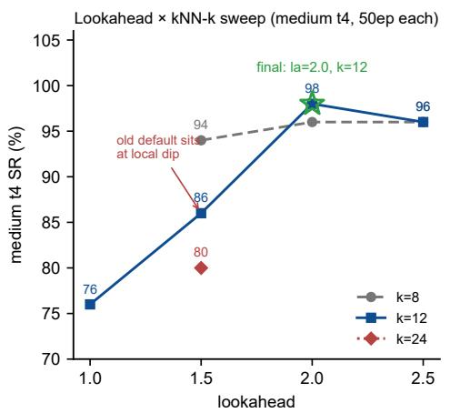

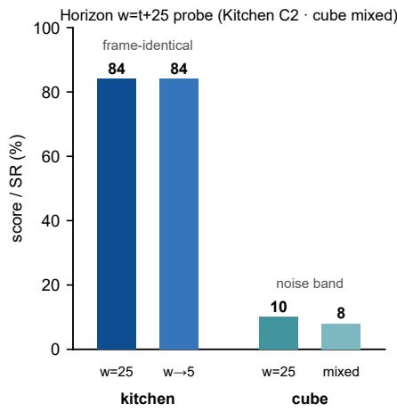  
Figure A.11: Sensitivity scans. (a) Lookahead × kNN-k grid (AntMaze-medium task 4): unimodal in ℓ, plateau in k. (b) Waypoint-horizon dual criterion: Kitchen press-phase horizon w→5 matches w=25 at identical success (84, frame-identical vs. light), while on cube the mixed-horizon variant sits inside the noise band—the criterion selects the shortest horizon that preserves frame-level tracking.

Delaunay dual. The Voronoi-adjacency dual behind the δ amplitude prior is computed by Qhull on the graph nodes’ planar coordinates (2D for navigation; 25k nodes → 74,593 adjacency edges). No 29-dimensional Delaunay is ever computed—the effective projection is exactly what makes the dual tractable.

Graph construction cost. One-time and offline: the largest graph (AntMaze-giant, 25k nodes, k=12) builds in ≈2 s on a single CPU core (kNN 0.8 s, dual filter 1.2 s, multi-source Dijkstra <0.1 s) with a few MB of sparse storage, and is amortized across all goals and episodes.

## A.16 THE δ-CLOSURE: THEORETICAL PREDICTION VERSUS MEASURED VALUE

This subsection closes the quantitative comparison between the theoretical prediction and the measured value: the three-state single-step model of Theorem T5 gives the predicted relapse probability $\delta _ { \mathrm { p r e d } } = 0 . 0 5 1 1$ , against the measured $\delta _ { \mathrm { e m p } } = 0 . 0 4 8 3$ , a ratio of 1.06×. Figure A.12 shows the falsifiable structure of this closure: four candidate models (symmetric Gaussian, skewed mixture, kNN-edge prior, three-state Voronoi factorization) compete on the same measured value, and only the three-state factorization falls within the 1.06× discrimination band, while the other three deviate by 3.62×, 1.37×, and 1.14× respectively—the comparison is discriminative, not curve-fitting.

## A.17 THEORETICAL CLOSURE AND THE FAILURE BOUNDARY

Theory–experiment closure. The δ-closure test on the same-sample graph structure: predicted 0.0511 vs. measured 0.0483, within 1.06×, against competing models at $3 . 6 2 { \times } / 1 . 3 7 { \times } / 1 . 1 4 { \times } ~ ( \mathrm { A p } \cdot$ pendix A.16). Each theorem carries a registered empirical dual: T1 (radial descent along real rollouts, 95.1%), T3 (the 20-gate audit of 4.2), T5 (the closure here), T6 (planar-accuracy destruction 84 → 14; pose consistency +22; Fig. A.7).

Failure attribution by layer. A budget probe (max steps 2000→3000, PH-ant) separates the residual failure modes. On t5, the extended budget converts 19 of 39 near-miss failures (+5.2 overall): these are budget-exhaustion failures induced by the route-geometry cost. On t4, the extension changes nothing (−2.0, inside noise): these are execution-layer deadlocks, not budget failures. Structure-layer failures are absent in the audited logs. The failure boundary is thus attributed by layer: the gate chains carry no observed failure; the route geometry trades budget; the executor deadlocks in transition zones and goal corners (full anatomy: A.18).

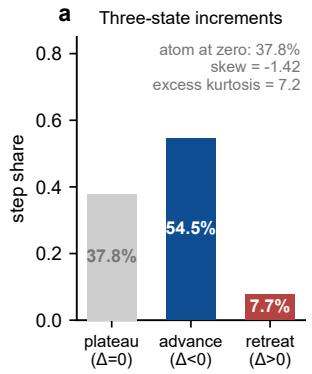

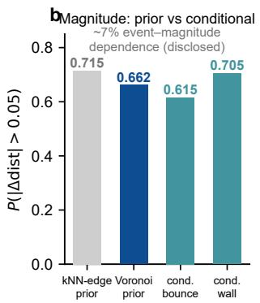

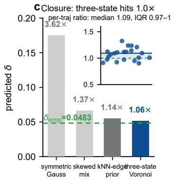  
Figure A.12: The three-state structure of anchoring increments and the falsifiable closure of the δ estimate (frozen measurements, AntMaze-medium rollouts). (a) Single-step increment shares: a 37.8% atom at zero (anchor unchanged), 54.5% advance, 7.7% retreat; the skew and excess kurtosis rule out any symmetric two-sided model structurally. (b) Retreat-magnitude read $P ( | \Delta \mathrm { d i s t } | > 0 . 0 5 )$ under two priors and two conditionals; the Voronoi prior (0.662) sits within 7% of the bounceconditional value (0.615), quantifying the event–magnitude dependence. (c) Four-model closure against the measured $\delta _ { \mathrm { e m p } } = 0 . 0 4 8 3$ (dashed): symmetric Gaussian 3.62×, skewed mixture $1 . 3 7 \times$ kNN-edge prior 1.14×, three-state Voronoi factorization 1.06×; inset: per-trajectory closure ratios (median 1.09, IQR 0.97–1.12, n=21).

Scope. T4’s noise-edge constant calibration remains open (Appendix B.6); graph construction is an offline one-time cost; gates closer than the filter resolution merge into a composite valley (no gate missed; coarser localization); coverage is limited to static, low-dimensional-state tasks; enumerability is scoped to the frozen field (E3); on Kitchen, a dataset–environment dynamics mismatch (open-loop replay completes only ∼10%) caps arbitrary-progress recovery for all methods equally. Falls on AntMaze-giant are an executor-side risk boundary with no planning-layer precursor in the audited indicators (Appendix A.8).

## A.18 CROSS-EMBODIMENT TRANSFER: PROTOCOL, EXECUTOR HISTORY, AND ERROR BARS (FOR TAB. 1)

Protocol. Discovery side (PointMaze). Data are successful trajectories from OGBench ogbench-pointmaze-{medium,large,giant}-open-v0; trajectories are truncated at first-goal arrival, and failed trajectories are excluded from training (hard project constraint). The neck-discovery pipeline builds the transport-weighted demonstration-density graph, embeds each shell cross-section in the 16-d corrected embedding ψ , computes the shell MVEE cross-sectional volume, detrends it, then runs the 1D sublevel-set filtration with a kneedle elbow τ sited at the upper edge of the persistence spectral gap (same chain as AntMaze §B.5). Deployment side $( A n t + H u -$ manoid). Evaluation is α-paired throughout, 3 seeds × 50 episodes on tasks t2–t5. The Ant deployment panel uses the environment’s oracle direction (low-level HIQL latent-action executor retrained per maze); the Humanoid deployment panel uses the FQL-xy low-level executor (class iv, below). Tactical interface (reported caliber). The Ant panel shapes the tactical waypoint with the environment’s oracle direction. The reported Humanoid caliber is the support-flow interface: each per-route PH gate chain is recursively subdivided (shell filtration on the segment’s support sub-flow, depth $\leq 2 )$ and densified along the very successful PointMaze trajectories that certified it (median-aligned waypoints at ≈ 1-unit spacing, endpoint-padded smoothing, chain-tail fallback to the true goal), so every tactical target is same-corridor and in-distribution for the FQL-xy executor without any map access on the deployment side; route commitment is implicit via a monotone progress pointer with a hysteresis lock. The strategic gate set—the only variable differing across methods—is oracle-free and bit-identical across all interfaces. As a comparison, the map-shaped BFS k-hop $( k = 3 )$ lookahead interface (cross humanoid oracle matrix.json, 89.3 overall) uses the known map at deployment; the support-flow interface reaches 95.5 overall while removing map access. Control logic. kmeans/fps/random are coordinate or coverage keypoints; spectral/betweenness are spectral and graph-heuristic keypoints; aqm-style is a geodesic k-center coverage representative (paragraph below); PH-pt is the frozen PointMaze-discovered persistent-homology neck set (Tab. 1 lead column); PH-ant is the control that substitutes necks discovered on the Ant gait side instead of PointMaze (Lemma 8 boundary probe; see the PH-ant Row Attribution paragraph below).

AQM-style representative. The aqm-style arm of the full panel (Tab. A.7) is the coverage class’s strongest graph-level form: a geodesic k-center on the transport-weighted carrier (farthestpoint traversal, a 2-approximation to the dominating-set cover objective), which respects walls and is therefore stronger than the Euclidean FPS arm; it tracks the FPS arm on both panels (Ant 43.0 vs. 41.0; Humanoid 0.0 vs. 0.0), so the main table reports the four standard coverage arms and leaves this representative to the full panel. The official AQM repository is public and was retrieved for this analysis; its reported OGBench numbers and keypoint sparsity are handled on the score axis in Appendix A.1. AQM’s keypoints are, by construction, an R-cover of the reachable manifold under a learned time-to-reach quasimetric (Kobanda et al., 2026): the metric encodes the source embodiment’s traversal times, so the cover’s placement and budget semantics are source-embodimentspecific, and the adaptation results in that paper are same-embodiment environment shifts, bounded, as its authors state, by the behavioral coverage of the training data. The pipeline therefore contributes no row to Tab. 1: under its protocol—same executor and interface, strategic point source as the only variable—AQM’s transfer boundary follows from the embodiment-specific semantics of its learned metric.

Main-benchmark deployment interface. The support flow used by the main-benchmark rows is a form of the recursive topology rather than a separate mechanism: each per-route gate chain is subdivided by the same segment-level shell filtration $\mathrm { ( d e p t h \le 2 ) }$ , and the sub-neck chain is densified along the support sub-flow that certified it, so what reaches the executor is the recursive hierarchy’s own structure expressed at waypoint resolution. For comparability the benchmark keeps the low-level executor on the standard stack of each domain (retrained HIQL latent-action executor on AntMaze; shortcut-style diffusion executor on Kitchen and the cube stack), and the support flow is the interface adaptation that supplies the certified structure to that executor in the waypoint form its contract accepts, leaving the strategic layer as the only variable our rows contribute. Where the executor contract admits sparse structural waypoints, the same hierarchy deploys through the BFS progress pointer without this adaptation (Tabs. 1 and 3).

Statistical protocol. The unit of analysis is the per-seed success rate: five α-paired seeds per method and task (the same seed index runs the same episode batch across methods), so per-task comparisons are paired t-tests over five seed pairs (df= 4), reported as exact twosided p-values. The evaluation carries a single confirmatory comparison, the directionally predicted margin on the multi-route task t4 stated in §4.3; every other contrast (aggregate margins, per-task differences on t2/t3/t5) is descriptive and reported as seed-level paired differences with 95% confidence intervals. On the five-seed BFS matrix, for the deployed hierarchy (Ours row, exp recursive gates pt 5seeds.json): t4 vs. direct $+ 3 6 . 0 \ ( p { = } 1 . 4 \times 1 0 ^ { - 5 }$ , complete per-seed separation); overall vs. direct +10.8, 95% CI $[ + 7 . 2 , + 1 \dot { 4 } . 4 ] ( p { = } 1 . 1 \times 1 0 ^ { - 3 } ) ;$ overall vs. spectral +18.5, CI $[ + 1 7 . 0 , + 2 0 . 0 ] ( p { = } 3 . 9 \times 1 0 ^ { - 6 } )$ ; the recursion ablation (hierarchy vs. main gates) is +5.0 overall, CI [+1.7, +8.3] (p=0.014), with t4 $+ 1 3 . 6 \ ( p { = } 6 . 7 \ \times$ $1 0 ^ { - 3 } )$ . The coverage-class rows of Tab. 1 (marked †) are aligned to the same five-seed unified-BFS protocol (cross\_humanoid\_h1\_bfs\_cov5seeds.json); the Ant-panel rows retain the 3-seed protocol, with per-task σ in Table A.7. Wilcoxon signed-rank is exact-enumerated alongside every paired t-test. All numbers are recomputable from the frozen JSONs via scripts/compute\_transfer\_significance.py, which implements these conventions.

Executor-class ablation (the same frozen gates, four low-level executor classes). To localize the performance constraint to the low-level executor rather than the strategic gate set, we systematically vary the executor class on the same frozen gate set: all four executor classes share the same PH neck discovery output from transfer\_registry\_v3.json (task keys 2,3,4,5 → point gates[]; the neck $_ { \mathrm { x y } }$ coordinates and bin/pers/route fields are bit-identical across the full four-class span). Class i (BC behavioral cloning). Pure behavioral-cloning low-level trained on the successful-trajectory pool; score 0/50 fully collapsed on the plain-caliber run. This class is the negative-control existence proof that a correct neck set combined with an inadequate executor still yields zero—the performance constraint resided in the low-level executor throughout, not in the gate set. No weights retained (BC stack superseded). Class ii (flow + offset commands). D4RL-kitchen–partial style flow model with a residual offset command head (intermediate class). No checkpoint retained (superseded by GCIQL). Class iii (GCIQL latent-action executor). 23 checkpoints from 50k to 1000k gradient steps at 50k cadence, plus fine-tune and latest snapshots (files matching gciql\_humanoid\_xy\_\*.pt at outputs/topo\_vs\_graph/), plus training log gciql\_humanoid\_xy\_log.jsonl in the same directory. Plain-caliber scores sit in the 24.5–30 band mid-ladder. The 24.5–30 band is the class-iii (GCIQL) configuration remeasured on the final harness with the raw-gate interface; it is an interface–executor combination, not an executor-only figure (the class-iv FQL-xy executor with the BFS interface reaches 84.7 on PH-ant, 1). The PH-ant row’s old overall 56.5 in an earlier Tab. 1 draft is from a GCIQL-era mixed checkpoint and no longer appears in the current table. Class iv (FQL-xy). Fitted-Q-learning low level with an xy-fitted residual head, final class iv end-state: fql\_humanoid\_xy.pt plus cmd-head control fql\_humanoid\_cmd.pt (meta files: fql\_humanoid\_xy\_meta.json, fql\_humanoid\_cmd\_meta.json, fql\_humanoid\_cmd\_smoke\_meta.json in the same directory; fql\_humanoid\_xy\_smoke.pt was not produced). Under class iv, the reported Tab. 1 figure is 95.5 on the support-flow interface (supportflow deploy fix50ep.json, per-task 91.3/96.7/96.7/97.3), exceeding the BFS-interface overall while removing map access from the deployment side and lifting t4 from 80.0 to 96.7. A 2026-09-06 consistency fix extended waypoint-chain loop erasure from large/giant-only to all maze sizes, removing a progress-pointer deadlock on medium-size paths (repeated waypoint clusters at recursive sub-neck splits); the reported numbers are from the fixed harness, with the pre-fix frozen runs archived (frozen 0901 backup/). The four-class score progression—0 → 24.5–30 → 95.5—is obtained on the identical frozen neck set: the executor class is the dominant variable of performance, the gate set remains unchanged while the score varies systematically with the executor class, which is precisely the ablation evidence that the performance constraint resides on the executor side. Artifact note: transfer\_registry\_v3.json stores task keys at its root; the executor-class progression above is documented by the listed checkpoint files (with modification timestamps and the class-iii training-log step counters) together with the protocol description in §4.3.

PH-ant row attribution. Running Ant-side-discovered gates (PH-ant) through the same FQL-xy executor on the same Humanoid plain-caliber harness reaches 84.7 overall (t2 96.0, t3 93.3, t4 68.0, t5 81.3; cross\_humanoid\_oracle\_matrix.json PH-ant entry), versus the PointMazediscovered PH-pt plain 89.3 on the identical harness (4.6 pp gap, concentrated on t4: 68.0 vs. 80.0). This complementary source-side transfer result also exposes the role of discovery-side resolution: the strategic information remains actionable after the embodiment change, while the source carrier and estimator determine transfer quality. The Ant gait-side discovery distribution is dynamically richer than the PointMaze pure-kinematic discovery distribution: gait-cycle density modulation coarsens the MVEE cross-sectional estimator for corridor widths below ≈ 4 PointMaze units. Several PointMaze narrow corridors (sub-4-unit necks on the t4 long chain) therefore fall outside the Ant MVEE’s coarse-grained shell resolution, leaving the t4 long-chain run with weaker guidance (PHant t4 68.0 vs. PH-pt 80.0 on the identical harness; 96.7 on the reported support-flow interface). The shortfall is therefore not a mechanism-dependence of the strategic skeleton—the PH discovery chain itself is identical on both sides, and the load-bearing gate set survives the ant→point overlap audit in chain\_isolation.json (task 2; recall mean ≈ 1.12 counts nearest-neighbor matches per Point gate and can exceed 1 when several Ant gates match one Point gate, prec mean ≈ 0.97 is the fraction of Ant gates matched to a Point gate). It is instead an estimator-side boundary: MVEE + entropy coarsening for ultra-thin necks under gait-cycle non-uniform frame density. The mechanism is homologous to the M={3, 55} vs A={2, 12} vs B={2, 50} regime difference in data/toy\_mechinv.json, corresponding to remark (iv) appended to Lemma 8 in the revised proof.

Error bars (σ) and per-seed standard deviations. Tab. 1 reports the Humanoid deployment direction; Table A.7 is the complete cross-embodiment table, covering both directions (the same frozen PointMaze-discovered gate set driving the Ant executor and the Humanoid executor) plus the coverage references, as mean success rate ± population standard deviation, in percent, from the frozen matrix JSONs; the population-std convention is applied uniformly to every cell (per-task and overall), with the seed count as marked per panel in the caption (3 for the Ant panel and the plain-caliber Humanoid rows, 5 for the unified-BFS Humanoid rows). The per-task standard deviation is read from the matrices’ native std field (already aggregated in the JSON); the per-method overall standard deviation is computed by averaging each seed’s per-task success (yielding one overall figure per seed) and taking the population standard deviation of those per-seed overalls. Source files: Ant panel = cross\_embodiment\_matrix.json panel A (oracle-direction deployment, 8 methods including direct; the Ant oracle-direction panel referenced in the caption of Tab. 1). Humanoid plain-caliber rows = cross\_humanoid\_oracle\_matrix.json symmetric-interface FQL-xy run (9 methods including direct); its aqm-style row appears only in this full panel. The † coverage-class rows of Tab. 1 come from the fiveseed unified-BFS coverage matrix (cross\_humanoid\_h1\_bfs\_cov5seeds.json: betweenness, random, kmeans, fps under the same BFS interface, H1+H0 route lock, and α-paired seeding as the protocol-matched rows, 5 seeds × 50 episodes; run log run cov 5seeds.log), and the protocol-matched rows (Ours, direct, spectral, PH-ant) come from the five-seed BFS matrix (cross\_humanoid\_h1\_bfs\_5seeds.json); the PHpt rows here print the support-flow interface (supportflow\_deploy\_fix50ep.json) and the BFS same-interface calibers, and the support-flow, no gates control comes from supportflow\_deploy\_nogate\_fix50ep.json. Where a cell’s per-seed success values are all identical, σ = 0.0. An independent rerun of PH-pt on fresh seeds (cross\_humanoid\_oracle\_rerun.json, seeds 3–5) agrees with the reported panel within the per-task σ band, as stated in the main caption. The executor-class ablation protocol detail is attested by the frozen checkpoint list in the artifact README and the class-iii step counter in gciql\_humanoid\_xy\_log.jsonl. Figures: fig transfer registry v3 t{2,3,4,5}.png (v3 registry) and fig gate control t{2,3,4,5}.png (point-vs-ant MVEE coarsening), all in the artifact under outputs/topo\_vs\_graph/.

Table A.7: Cross-embodiment transfer: full standard deviations (success %, mean ± population std; 3 seeds for the Ant panel and the plain-caliber Humanoid rows, 5 seeds for the unified-BFS Humanoid rows). Ant panel: cross\_embodiment\_matrix.json panel A (the Ant oracle-direction panel referenced by Tab. 1). Humanoid plaincaliber rows: cross\_humanoid\_oracle\_matrix.json symmetric-interface FQL-xy run (the aqm-style row appears only in this full panel); the † coverage-class rows and the protocol-matched rows of Tab. 1 come from the fiveseed unified-BFS matrices (cross\_humanoid\_h1\_bfs\_cov5seeds.json, cross\_humanoid\_h1\_bfs\_5seeds.json). The PH-pt support-flow run supportflow\_deploy\_fix50ep.json is the first Humanoid row, with the BFS sameinterface PH-pt row second. The direct references and the support-flow, no gates control (supportflow\_deploy\_nogate\_fix50ep.json) complete the comparison domain. Overall σ is computed from per-seed overalls (see text).
<table><tr><td>Arm</td><td>t2 (±σ)</td><td>t3 (±σ)</td><td>t4 (±σ)</td><td>t5 (±σ)</td><td>overall (±σ)</td></tr><tr><td colspan="6">Ant (deployment; oracle direction; panel A of cross_embodiment_matrix. json)</td></tr><tr><td>PH-pt (ours)</td><td>96.0 ± 1.6</td><td>94.7 ± 2.5</td><td>98.7 ± 0.9</td><td>93.3 ± 0.9</td><td>95.7 ± 0.8</td></tr><tr><td>spectral</td><td>91.3 ± 5.0</td><td>96.0 ± 1.6</td><td>96.0 ± 2.8</td><td>92.7 ± 3.8</td><td>94.0 ± 1.1</td></tr><tr><td>betweenness</td><td>79.3 ± 6.2</td><td>94.7 ± 2.5</td><td>84.7 ± 0.9</td><td>94.0 ± 3.3</td><td>88.2 ± 2.0</td></tr><tr><td>kmeans</td><td>63.3 ± 2.5</td><td>79.3 ± 3.4</td><td>42.0 ± 6.5</td><td>80.0 ± 1.6</td><td>66.2 ± 1.8</td></tr><tr><td>fps</td><td>63.3 ± 5.7</td><td>62.0 ± 8.6</td><td>0.0 ± 0.0</td><td>38.7 ± 3.4</td><td>41.0 ± 1.5</td></tr><tr><td>aqm-style</td><td>66.7 ± 9.0</td><td>67.3 ± 9.0</td><td>0.0 ± 0.0</td><td>38.0 ± 8.2</td><td>43.0 ± 2.1</td></tr><tr><td>random</td><td>87.3 ± 3.4</td><td>88.7 ± 9.3</td><td>54.7 ± 4.1</td><td>86.0 ± 2.8</td><td>79.2 ± 2.3</td></tr><tr><td>direct (oracle direction, no gates)</td><td>89.3 ± 1.9</td><td>94.0 ± 0.0</td><td>96.7 ± 1.9</td><td>96.7 ± 2.5</td><td>94.2 ± 0.2</td></tr><tr><td colspan="6">Humanoid (deployment; FQL-xy executor; cross. _humanoid_oracle_matrix.json unless noted)</td></tr><tr><td>PH-pt (support-flow interface)</td><td>91.3 ± 0.9</td><td>96.7 ± 0.9</td><td>96.7 ± 3.4</td><td>97.3 ± 0.9</td><td>95.5 ± 0.4</td></tr><tr><td>PH-pt (BÈ$, same-interface)</td><td>90.0 ± 5.9</td><td>91.3 ± 5.2</td><td>80.0 ± 2.8</td><td>96.0 ± 1.6</td><td>89.3 ± 3.5</td></tr><tr><td>spectral</td><td>91.3 ± 2.5</td><td>80.7 ± 2.5</td><td>48.7 ± 10.0</td><td>64.0 ± 1.6</td><td>71.2 ± 1.3</td></tr><tr><td>betweenness†</td><td>17.2 ± 2.7</td><td>79.6 ± 7.7</td><td>20.0 ± 3.8</td><td>81.2 ± 2.0</td><td>49.5 ± 1.9</td></tr><tr><td>kmeans†</td><td>17.6 ± 4.3</td><td>3.6 ± 1.5</td><td>0.0 ± 0.0</td><td>3.6 ± 1.5</td><td>6.2 ± 1.5</td></tr><tr><td>fps†</td><td>0.4 ± 0.8</td><td>0.0 ± 0.0</td><td>0.0 ± 0.0</td><td>0.0 ± 0.0</td><td>0.1 ± 0.2</td></tr><tr><td>aqm-style</td><td>0.0 ± 0.0</td><td>0.0 ± 0.0</td><td>0.0 ± 0.0</td><td>0.0 ± 0.0</td><td>0.0 ± 0.0</td></tr><tr><td>random†</td><td>8.8 ± 3.2</td><td>79.2 ± 5.7</td><td>0.0 ± 0.0</td><td>68.8 ± 4.1</td><td>39.2 ± 1.5</td></tr><tr><td>PH-ant (plain, class iv)</td><td>96.0 ± 2.8</td><td>93.3 ± 5.2</td><td>68.0 ± 8.6</td><td>81.3 ± 3.4</td><td>84.7 ± 1.3</td></tr><tr><td>direct (BFS map, no gates)</td><td>94.0 ± 2.8</td><td>96.0 ± 0.0</td><td>62.0 ± 7.5</td><td>91.3 ± 1.9</td><td>85.8 ± 2.9</td></tr><tr><td>support-flow, no gates (control)</td><td>89.3 ± 3.4</td><td>96.0 ± 1.6</td><td>29.3 ± 1.9</td><td>94.7 ± 3.4</td><td>77.3 ± 1.3</td></tr><tr><td></td><td></td><td></td><td></td><td></td><td></td></tr></table>

## B PROOFS

This appendix reproduces the full proof manuscript. Appendix B.1–B.2 give the mathematical preliminaries and the formal setup (transport-weighted metric, manifold graph, radial coordinate, rectification embedding). Appendix B.3–B.8 then prove Theorems $\mathrm { T } 1 { - } \bar { \mathrm { T } } 6$ in full, including the statistical Lyapunov analysis and the δ-predictability proposition with its numerical closure (B.3.1), the two-filter fidelity lemma supporting T2 (B.4), the cascading-gate analysis and the coordinatestability lemma of T3 (B.5), the constant-calibration gap of T4 (B.6), and the empirical calibration of the T5 constants (B.8). Appendix map. T1 (B.3), T2 (B.4), T3 plus Lemma 8 and its extended scope remark (B.5), T4 (B.6), T6/T5 (B.7/B.8), operating-point registry with T4 $m _ { \mathrm { e f f } } / \mathrm { T 3 } C _ { \mathrm { d i a m } } /$ T3 Cheeger witness registered values and their data files (B.9), notation (B.10). PH-focused entry points. The reader interested only in the persistent-homology guarantees can read straight from $\ S \mathbf { B . l } \to \ S \mathbf { B . 2 }$ (Definitions 11 (radial shells + cross-sectional measure) and 13 (detrended curve + MVEE/entropy estimator)) → §B.5 (T3 statement and full proof) → Lemma lem:mech-inv (tightened (b) clause + extended Remark rem:mech-inv-scope items $\mathrm { ( i ) } { - } ( \mathrm { v } ) )  \ S \mathrm { B } . 9$ (object-side $\bar { C _ { \mathrm { d i a m } } } = 1 . 9 2$ , Cheeger $\mathrm { L H S / R H S } \le 0 . 8 9 )$ . Main-text Theorem T3 (1) is the condensed version of 4 here; T1 is stated in full as 2 and summarized in the main text. Appendix B.10 fixes the notation.

## B.1 PRELIMINARIES

Definition 2 (Metric). A metric on a set X is a function d : $X \times X \to \mathbb { R } _ { > 0 }$ satisfying: (positive definiteness) $d ( x , y ) = 0 \iff x = y ;$ (symmetry) $d ( x , y ) = d ( y , x )$ ; (triangle inequality) $d ( x , z ) \leq d ( x , y ) + d ( y , z )$ . Ifthe value +∞ is allowed (disconnectedness), we speak ofan extended metric.

Definition 3 (Lipschitz function). A map $f : X \to Y$ between metric spaces $( X , d _ { X } )$ and $( Y , d _ { Y } )$ is L-Lipschitz $i f d _ { Y } ( f ( x ) , f ( y ) ) \leq L d _ { X } ( x , y ) f o r a l l x , y \in X$

Definition 4 (Intrinsic metric of a Riemannian submanifold). Let $\mathcal { M } \subset \mathbb { R } ^ { D }$ be a smoothly embedded submanifold and g a (possibly weighted) Riemannian metric on $\mathbb { R } ^ { D }$ . The intrinsic distance on M induced by g i $s d _ { \mathcal { M } } ^ { g } ( x , y ) = \operatorname* { i n f } _ { \gamma } \int _ { 0 } ^ { 1 } \sqrt { g ( \dot { \gamma } , \dot { \gamma } ) } d t$ , where γ ranges over piecewise smooth curves in M joining x and y.

Definition 5 (Graph geodesic distance). Let $G = ( V , E , w )$ be an undirected graph with positive weights. For $u , v \in V$

$$
d _ { G } ( u , v ) = \operatorname* { m i n } _ { \pi : u \sim v } \sum _ { e \in \pi } w _ { e } ,\tag{2}
$$

where π ranges over all pathsfrom u to v; the value is +∞ ifno path exists.

## B.2 FORMAL SETUP

This section formalizes the method’s constructions one by one.

Definition 6 (Per-dimension rectitude and transport weights). Let ${ \mathcal { D } } ^ { + } = \{ \tau _ { i } \} _ { i = } ^ { N }$ be a dataset of successful trajectories, $\tau _ { i } = ( s _ { i , 0 } , \ldots , s _ { i , L _ { i } } ) , s _ { i , t } \in \mathcal { S } \subset \mathbb { R } ^ { D }$ , each trajectory truncated at the first arrival (dist $< 2 . 0 )$ at the goal (without goal snapping). The rectitude ofdimension d is

$$
\eta _ { d } = \frac { \sum _ { i = 1 } ^ { N } \left| s _ { i , L _ { i } - 1 } ^ { ( d ) } - s _ { i , 0 } ^ { ( d ) } \right| } { \sum _ { i = 1 } ^ { N } \sum _ { t = 0 } ^ { L _ { i } - 2 } \left| s _ { i , t + 1 } ^ { ( d ) } - s _ { i , t } ^ { ( d ) } \right| } \in [ 0 , 1 ] ,\tag{3}
$$

the ratio of net displacement to total variation (a transport/fluctuation decomposition). Fixing a softening exponent $\sigma \in ( 0 , 1 ]$ (we take $\begin{array} { r } { \sigma = \frac { 1 } { 2 } ) } \end{array}$ , define the softened transport weight $\tilde { \eta } _ { d } = \eta _ { d } ^ { \sigma }$

Definition 7 (Transport-weighted metric). Let $A = \mathrm { d i a g } ( \tilde { \eta } ) \in \mathbb { R } ^ { D \times D }$ . Define

$$
d _ { \eta } ( x , y ) = \| A ( x - y ) \| , \qquad x , y \in \mathbb { R } ^ { D } .\tag{4}
$$

Lemma 1 (Metric properties of $d _ { \eta } )$ . Suppose $\tilde { \eta } _ { d } > 0 f o$ r all $d \in [ D ]$ . Then:

(i) $d _ { \eta }$ is a metric on $\mathbb { R } ^ { D }$ ;

(ii) $d _ { \eta }$ is bi-Lipschitz equivalent to the Euclidean metric:

$$
\begin{array} { r } { \widetilde { \eta } _ { \mathrm { m i n } } \left\| x - y \right\| \leq d _ { \eta } ( x , y ) \leq \widetilde { \eta } _ { \mathrm { m a x } } \left\| x - y \right\| ; } \end{array}\tag{5}
$$

(iii) $d _ { \eta }$ is a constant-coefficient flat Riemannian metric on $\mathbb { R } ^ { D }$ (the metric tensor $A ^ { 2 }$ is independent of x), whose geodesics are exactly straight segments.

Iffrozen dimensions exist $( \eta _ { d } = 0 ) _ { \it \Omega }$ , write $E = \mathrm { s p a n } \{ e _ { d } : \tilde { \eta } _ { d } > 0 \}$ for the effective subspace; the above conclusions then hold on E with thefrozen coordinates quotiented out.

Proof. (i) $d _ { \eta }$ is the pullback of the norm $\lVert \cdot \rVert$ under the linear map A. Symmetry and the triangle inequality are inherited from the norm axioms; positive definiteness requires A to be invertible, i.e., $\tilde { \eta } _ { d } > 0$ for all $d ;$ with frozen dimensions A is positive semidefinite, $d _ { \eta }$ is a semi-metric, and positive definiteness is recovered on the coordinate projection onto $E .$

(ii) By the Rayleigh quotient, $\left. A v \right. ^ { 2 } = v ^ { \top } A ^ { 2 } v \in \left[ \tilde { \eta } _ { \operatorname* { m i n } } ^ { 2 } \left. v \right. ^ { 2 } , \tilde { \eta } _ { \operatorname* { m a x } } ^ { 2 } \left. v \right. ^ { 2 } \right]$ ; taking $\boldsymbol { v } = \boldsymbol { x } - \boldsymbol { y }$ and square roots gives equation 5.

(iii) The metric tensor $g ( x ) = A ^ { 2 }$ is a constant matrix, so its Christoffel symbols $\Gamma _ { i j } ^ { k } = { \textstyle { \frac { 1 } { 2 } } } g ^ { k \ell } ( \partial _ { i } g _ { j \ell } +$ $\partial _ { j } g _ { i \ell } - \partial _ { \ell } g _ { i j } )$ vanish identically (all derivatives of $g$ are zero); the geodesic equation $\begin{array} { r } { \ddot { \gamma } ^ { k } + \Gamma _ { i j } ^ { k } \dot { \gamma } ^ { i } \dot { \gamma } ^ { j } = } \end{array}$ 0 degenerates to $\ddot { \gamma } = 0$ , whose solutions are straight segments. □

Remark 1 (Geometric meaning of the η weighting). $d _ { \eta }$ stretches distances along high-η dimensions and compresses them along low-η dimensions—a metrized realization ofthe design intent “quotient out the fibers, keep the base space”. Lemma $I ( i i i )$ is the key to the consistency theory of $\ S B . 4 \colon$ under a constant-coefficient metric, graph geodesic consistency follows from the Euclidean case after equivalence-constant corrections.

Definition 8 (Manifold graph). Let $V = \{ x _ { 1 } , \dots , x _ { P } \} \subset S$ be a uniform subsample of successful trajectory states $( P \leq 4 ^ { ^ { \circ } } \times \mathrm { \bar { 1 } 0 ^ { 4 } } )$ . Construct the weighted undirected graph $G = ( \tilde { V , } E , \tilde { w } )$

$E = \left\{ ( i , j ) : j \in \mathrm { k N N } _ { d _ { \eta } } ( i ) \right\}$ ∩ {midpoint density filter} ∩ {xy three-probe wall-crossing filter}, (6)

with edge weights $w _ { i j } = d _ { \eta } ( x _ { i } , x _ { j } )$ . Here $\mathrm { k N N } _ { d _ { \eta } } ( i )$ is the set of k nearest neighbors of $x _ { i }$ in $( \mathbb { R } ^ { D } , d _ { \eta } )$ (we take $k \ = \ 1 2 ) ;$ the two filters delete edges that cross regions of low data density (walls), the criterion being that the local k-NN distance at interpolated probes is significantly larger than the endpoint average (threshold ratio 2.5).

Definition 9 (Radial coordinate). Let $V _ { g } \subset V$ be the node set corresponding to the terminal states of successful trajectories (the goal set). The radial coordinate (progress reading, Lyapunov candidate) is the graph distance to the set:

$$
r ( u ) = d _ { G } ( u , V _ { g } ) = \operatorname* { m i n } _ { g \in V _ { g } } d _ { G } ( u , g ) , \qquad u \in V ,\tag{7}
$$

i.e., the output ofa virtual super-source multi-source Dijkstra algorithm.

Definition 10 (Rectification embedding and training objective). The rectification embedding is a parameterized map $\psi _ { \boldsymbol { \theta } } : \mathbb { R } ^ { D }  \mathbb { R } ^ { m } ( \boldsymbol { \bar { m = 1 6 , M L P } } )$ , with potential $\Phi _ { \theta } ( s ) \dot { = } \| \psi _ { \theta } ( s ) \|$ . The training objective is pure regression:

$$
\begin{array} { r } { \mathcal { L } ( \theta ) = \underbrace { \mathbb { E } _ { i } \Big [ \big ( \| \psi _ { \theta } ( x _ { i } ) \| - r ( x _ { i } ) \big ) ^ { 2 } \Big ] } _ { r a d i a l l o s s } + \underbrace { \mathbb { E } _ { ( i , j ) \in E } \Big [ \big ( \| \psi _ { \theta } ( x _ { i } ) - \psi _ { \theta } ( x _ { j } ) \| - w _ { i j } \big ) ^ { 2 } \Big ] } _ { i s o m e t r y l o s s } . } \end{array}\tag{8}
$$

Assumption 1 (Graph connectivity). G is connected, $i . e . , d _ { G }$ is finite everywhere on $V .$

Assumption 2 (Sampling sufficiency). Successful trajectory states are sampled on the constrained base manifold $\mathcal { M } _ { x y }$ from a density $\rho \ge \rho _ { \mathrm { m i n } } > 0 , \rho$ Lipschitz, and the subsampling keeps the local kNN edge length $\bar { \delta _ { P } }  0 ( P  \infty )$

Remark 2. Assumption 2 is the standard sampling condition of Isomap/BdSL-type graph geodesic consistency theories (Tenenbaum et al., 2000; Bernstein et al., 2000); it only serves §B.4. Theorem T1 does not rely on any sampling assumption.

## B.3 THEOREM T1: THE DISCRETE EIKONAL TRIPLET

Lemma 2 (Latent Eikonal identity). The function $r ( z ) ~ = ~ \| z \|$ is continuously differentiable on $\mathbb { R } ^ { m } \setminus \{ 0 \}$ , and

$$
\nabla _ { z } r = \frac { z } { \| z \| } , \qquad \| \nabla _ { z } r \| = 1 .\tag{9}
$$

Proof. $\partial r / \partial z _ { k } = z _ { k } /   z  $ (chain rule), hence $\nabla r = z / \left\| z \right\|$ and $\| \nabla r \| = \| z \| / \| z \| = 1$

Theorem 2 (T1: the discrete Eikonal triplet). Under the setup of Definitions 8–9:

(a) (Metric property) $d _ { G }$ is an extended metric on $V ;$ under Assumption 1 it is a genuine metric.

(b) (1-Lipschitz / discrete Eikonal inequality) r is 1-Lipschitz with respect to dG:

$$
| r ( u ) - r ( v ) | \leq d _ { G } ( u , v ) \qquad \forall u , v \in V ;\tag{10}
$$

in particular, for every graph edge $( u , v ) \in E \colon$

$$
| r ( u ) - r ( v ) | \leq w _ { u v } .\tag{11}
$$

(c) (Characteristic property / principle of optimality) If u lies on some shortest path from v to $V _ { g } ,$ then

$$
r ( v ) = r ( u ) + d _ { G } ( v , u ) ,\tag{12}
$$

$i . e . ,$ , descending the shortest-path tree, r decreases strictly atfull rate (1:1 in edge weights).

Proof. (a) Positive definiteness: $d _ { G } ( u , v ) \geq 0$ is inherited from the positivity of edge weights (Lemma 1(i) guarantees $w _ { u v } = d _ { \eta } ( x _ { u } , x _ { v } ) > 0$ when $u \neq v ) ; d _ { G } ( u , v ) = 0$ if and only if there is a path of length zero, i.e., the empty path, i.e., $u = v$ . Symmetry: the graph is undirected, so the path sets from u to v and from v to u are mutual reversals with equal lengths. Triangle inequality: let $\pi _ { 1 } : u  v$ and $\pi _ { 2 } : v  w$ be minimizing paths (on a finite graph, shortest paths always exist). The concatenation $\pi _ { 1 } \circ \pi _ { 2 } : u  w$ is a legal path, hence

$$
d _ { G } ( u , w ) \leq \sum _ { e \in \pi _ { 1 } \circ \pi _ { 2 } } w _ { e } = d _ { G } ( u , v ) + d _ { G } ( v , w ) .
$$

(path concatenation)

Assumption 1 rules out the value $+ \infty$ , so $d _ { G }$ degenerates to a genuine metric.

(b) Fix $u , v \in V$ . For any $g \in V _ { g }$ , the triangle inequality of (a) gives

$$
d _ { G } ( u , g ) \leq d _ { G } ( u , v ) + d _ { G } ( v , g ) .\tag{13}
$$

$V _ { g }$ is finite; minimizing both sides over $g \in V _ { g }$

$$
r ( u ) = \operatorname* { m i n } _ { g \in V _ { g } } d _ { G } ( u , g ) \leq d _ { G } ( u , v ) + \operatorname* { m i n } _ { g \in V _ { g } } d _ { G } ( v , g ) = d _ { G } ( u , v ) + r ( v ) .\tag{14}
$$

Exchanging the roles of u, v gives $r ( v ) \leq d _ { G } ( u , v ) + r ( u ) \colon$ ; combining the two yields equation 10. Moreover, $( u , v ) \in E$ is itself a path of length $w _ { u v } , \mathbf { s o } d _ { G } ( u , v ) \leq w _ { u v } ;$ ; substituting into equation 10 gives equation 11.

(c) We first prove the subpath lemma: every subpath of a shortest path is itself a shortest path. Otherwise, if $\pi ^ { * } : v \  \ g ^ { * }$ is shortest but its subsegment $u \sim g ^ { * }$ is not, then there is a strictly shorter $u \sim g ^ { * }$ path, which concatenated with the $v  u$ segment yields a $v \sim g ^ { * }$ path strictly shorter than $\pi ^ { * }$ , a contradiction.

Now suppose u lies on the shortest path $\pi ^ { * } = ( v  u  g ^ { * } )$ , where $g ^ { \ast } \in V _ { g }$ attains $r ( v ) =$ $d _ { G } ( v , g ^ { * } )$ . By the subpath lemma,

$$
r ( v ) = d _ { G } ( v , g ^ { * } ) = d _ { G } ( v , u ) + d _ { G } ( u , g ^ { * } ) \geq d _ { G } ( v , u ) + r ( u ) ,\tag{15}
$$

the last step because $r ( u )$ is the minimum over $V _ { g } .$ The reverse inequality $r ( v ) \leq d _ { G } ( v , u ) + r ( u )$ is equation 14. Combining the two gives equation 12. □

Corollary 1 (All three Eikonal elements are theorems). (i) Latent side: $\| \nabla _ { z } r \| = 1$ almost everywhere (Lemma 2);

(ii) State-space side (graph version): $| r ( u ) - r ( v ) | \leq d _ { G } ( u , v )$ (Theorem T1(b))—this is the discretization $o f ~ ^ { \ast } \Phi$ is $\jmath { - } L i p s c h i t z$ with respect to the geodesic distance”, corresponding to the continuous Eikonal inequality $\begin{array} { r } { \| \nabla \Phi \| \leq \bar { 1 } ; } \end{array}$

(iii) Characteristics: equality holds in equation 10 along geodesic paths (Theorem T1(c))— corresponding to the classical characterization that a distance function has gradient norm exactly 1 along geodesics.

In the route that regresses a scalar potential onto the Eikonal equation, these three elements were three mutually conflicting regression targets; in the presentframework they are intrinsic properties of a single object $d _ { G }$ . The Eikonal constraint is thereby converted from a regression target into an identity.

Corollary 2 (Unique minimality of the goal). $r ( u ) \geq 0 , a n d r ( u ) = 0 \iff u \in V _ { g } .$

Proof. The lower bound follows from metric non-negativity; $r ( u ) = 0 \iff d _ { G } ( u , V _ { g } ) = 0 \iff \iff$ $u \in V _ { g }$ (positive definiteness, Theorem T1(a)). □

Corollary 3 (Compatibility of the training supervision). The two supervision signals $\{ r ( x _ { i } ) \}$ and $\{ w _ { i j } \}$ ofthe loss equation 8 are generated by the same object $d _ { G } ,$ , so there is no objective-level conflict: ifan embedding ψ makes the graph isometric $( \| \psi ( x _ { i } ) \| = r ( x _ { i } )$ and $\| \psi ( x _ { i } ) - \psi ( x _ { j } ) \| = w _ { i j }$ for all nodes and edges), then both loss terms vanish simultaneously. Exact simultaneous vanishing holds if and only if G embeds isometrically into $\mathbb { R } ^ { m }$ with nodes lying on the spheres of their radial labels; this exactness fails in general, and the regression gives the optimal compromise in the leastsquares (MMSE) sense, whose asymptotic soundness is guaranteed by the consistency of Theorem T2.

## B.3.1 THE STATISTICAL LYAPUNOV PROPERTY AND THE PREDICTABILITY OF THE ONE-STEPRELAPSE PROBABILITY

The strict decrease of Theorem $2 ( \mathrm { c } )$ is an on-graph property—its objects are graph nodes and tree paths. States $s _ { t }$ of a real rollout generally do not lie on the graph; their progress readings are bridged by the anchoring operator $q ( \cdot )$ (nearest graph node) into $r ( \boldsymbol { q } ( \boldsymbol { s } _ { t } ) )$ ; anchor switching makes the onestep increment $\bar { \Delta } _ { t } \dot { = } r ( q ( s _ { t + 1 } ) ) - r ( q ( \bar { s } _ { t } ) \dot { ) }$ a random variable. The claim of this section is that the relapse-tail probability $\delta = \mathbb { P } ( \Delta _ { t } > 0 . 0 5 )$ ) of this random variable is not a purely post-hoc empirical quantity, but is predictable from the graph structure and anchoring mechanism on the same sample.

Proposition 1 (Three-state structure of one-step dynamics and the graph-structural predictability of δ). Under the graph construction of Theorems ${ \bar { 2 } } { - } 3 ,$ , the one-step anchored increment $\Delta _ { t }$ of a rollout follows an anchor-switching three-state process:

(i) Plateau state $( \Delta _ { t } = 0 ) \colon$ the anchor does not switch; measured frequency 37.8%;

(ii) Forward state $( \Delta _ { t } < 0 ) .$ : the anchor switches across a Voronoi boundary to a node ofsmaller r—the rollout projection ofthe characteristic property, Theorem $2 ( c ) ;$

(iii) Bounce state $( \Delta _ { t } ~ > ~ 0 )$ : the anchor switches to a node of larger r—the sole source of the relapse tail.

The bounce magnitude follows the dist-difference distribution over Voronoi-adjacent nodes (a pure graph quantity, computable directly from the Delaunay dual of the graph nodes), hence the relapsetail probability admits a two-factor decomposition:

$$
\delta \ = \underbrace { p _ { \mathrm { b o u n c e } } } _ { a n c h o r - b o u n c e \ e v e n t r a t e } \times \underbrace { { \mathbb P } _ { \mathrm { V o r o n o i } } ( | \Delta \mathrm { d i s t } | > 0 . 0 5 ) } _ { g r a p h - s t r u c t u r a l m a g n i t u d e p r i o r } .\tag{16}
$$

The two factors on the right are approximately independent and separately measurable: pbounce is a rollout-dynamics quantity (anchor-switching behavior), whereas the magnitude prior is a pure graph quantity (independent of rollouts). The deviation from independence is itself measured: the conditional magnitude rate on bounce steps is 0.615 against the prior 0.662 $( \approx 7 \% ,$ of the same order as the 1.06× residual in Remark 3).

Proof. The three-state classification is exhaustive: the sign of $\Delta _ { t }$ can only be zero, negative, or positive, corresponding to the anchor $q ( s _ { t + 1 } )$ being unchanged, descending the shortest-path tree, or moving backward relative to $q ( s _ { t } )$ . The atomicity of the plateau state comes from the discreteness of anchoring—when $s _ { t }$ moves continuously but slightly, $q ( s _ { t } )$ does not change, so $\Delta _ { t }$ is exactly zero rather than a small quantity; hence the distribution of $\Delta _ { t }$ is a discrete-continuous mixture, and symmetric Gaussian-type continuous models are structurally inapplicable. The magnitude of the bounce state: anchor switching is essentially a Voronoi-boundary crossing $( q ( s _ { t } )$ and $q ( s _ { t + 1 } )$ are Voronoi-adjacent nodes), so the bounce magnitude of $\Delta _ { t }$ equals $| r ( u ) - r ( v ) | = | \Delta \mathrm { d i s t } |$ of a Voronoi-adjacent node pair; by the 1-Lipschitz property of Theorem 2(b), this quantity is fully determined by the graph structure, and its distribution is given directly by the Delaunay dual of the graph nodes (the graph-realization dual of Voronoi adjacency), independently of any rollout data. The independence of the event rate and the magnitude distribution comes from a separation of mechanisms: whether a switch occurs is determined by rollout dynamics, while howfar a switch goes is determined by graph geometry. □

Remark 3 (Numerical validation: predicted and measured $\delta$ agree). We independently measure the twofactors on the right ofequation 16:
<table><tr><td>Factor</td><td>Value</td><td>Source</td><td>Nature</td></tr><tr><td>Pbounce (event rate)</td><td>0.0772</td><td>21 successful rollouts, 19029 steps of frame-wise anchoring</td><td>rollout dynamics</td></tr><tr><td> $\mathbb { P } _ { \mathrm { V o r o n o i } } ( | \Delta \mathrm { d i s t } | ~ > ~ 0 . 0 5 )$  (magnitude prior)</td><td>0.662</td><td>Delaunay dual of graph nodes, pure graph struc- 74593 adjacent edges</td><td>ture</td></tr><tr><td>Product  $\delta _ { \mathrm { p r e d } }$ </td><td>0.0511</td><td>independent multiplication</td><td>theoretical predic- tion</td></tr><tr><td>Measured  $\delta _ { \mathrm { e m p } }$ </td><td>0.0483</td><td>one-step increment count (toler- ance 0.05)</td><td>direct measure- ment</td></tr></table>

The prediction-to-measurement ratio is 1.06, a relative deviation of about 6%. The scope of this check: the event rate and $\delta _ { \mathrm { e m p } }$ are measured on the same 21 rollouts (the magnitude prior is rolloutfree), so the closure is a same-sample consistency check rather than a held-outprediction; a held-out variant (cross-task $p _ { \mathrm { b o u n c e } }$ against the pure-graph prior) is left tofuture work.

Conditional decomposition of bounce events (mechanistic attribution of 1469 bounce events; the rows are overlapping conditional readings, not a partition, and the shares need not sum to one):
<table><tr><td>Type</td><td>Share</td><td>Median mag.</td><td> $P ( > 0 . 0 5 )$ </td><td>Mechanistic reading</td></tr><tr><td>Graph-adjacent switch</td><td>96.5%</td><td>0.075</td><td>0.615</td><td>benign Voronoi-neighbor switching inside corridors</td></tr><tr><td>Wall-crossing anchor failure</td><td>0</td><td></td><td></td><td>failure event never occurs (defi- nition in §B.8)</td></tr><tr><td>Near-wall (&lt; 1 unit)</td><td>32.5%</td><td>0.123</td><td>0.705</td><td>benign switching dominates near-wall steps</td></tr></table>

The zero count ofwall-crossingfailures shows that all relapses are benign neighbor switches inside corridors, with no pathological component.

Structural falsification of comparison models (same threshold 0.05, compared against the threestate decomposition):

<table><tr><td>Model</td><td> $\hat { \delta }$ </td><td>Ratio</td><td>Reason for rejection</td></tr><tr><td>Negative drift + symmetric Gaus- sian fluctuation</td><td>0.175</td><td>3.6×</td><td>misses the atom at zero (plateau 37.8%) and the left-skewed tail</td></tr><tr><td>Skewed mixture (plateau atom + skew-normal)</td><td>0.066</td><td>1.4×</td><td>discrete bounces mistaken for contin- uous skewness</td></tr><tr><td>Full kNN-edge prior (mechanism unmatched)</td><td>0.055</td><td>1.14×</td><td>switching pairs biased toward small- |∆dist| edges</td></tr><tr><td>Three-state (Voronoi prior)</td><td>decomposition 0.051</td><td>1.06×</td><td></td></tr></table>

Only the three-state decomposition achieves 1.0×-level agreement. Per-trajectory statistics $( n =$ 21): median $p _ { \mathrm { b o u n c e } } \ 0 . 0 7 8$ (range 0.052–0.102), median $\delta _ { \mathrm { e m p } } ~ 0 . 0 4 9$ (range 0.028–0.067), per trajectory prediction/measurement ratio median 1.09 (IQR 0.97–1.12)—the agreement is not an accident ofindividual trajectories.

Remark 4 (Relation to the three-layer statement of the statistical Lyapunov property). The δ ofthis section is the fluctuation magnitude of layer (ii) (negative expected drift in rollout): the negative drift is guaranteed by Theorem 2(c) $( \dot { \Delta } < 0$ when the anchor descends the tree), and δ measures how often it is interrupted by anchor bounces. The three layers—(i) strict on-graph decrease (T1(c), deterministic), (ii) negative expected drift in rollout (a supermartingale with negative drift), (iii) path-level high probability (martingale concentration, $1 - 2 \alpha ) { - } f o r m$ the complete statement of the statistical Lyapunov property; stepwise non-increase is not needed. This section emphasizes the elevation ofthis empirical quantity to propositional status—the relapse tail is not unmodeled noise, but a predictable corollary ofthe graph structure.

## B.4 THEOREM T2: GEODESIC CONSISTENCY OF THE TRANSPORT-WEIGHTED MANIFOLD GRAPH

Theorem 3 (T2: transport-weighted adaptation of BdSL 2000). Let $\mathcal { M } = \mathcal { M } _ { x y }$ be a compact

connected smooth d-dimensional submanifold embedded in $\mathbb { R } ^ { D }$ , with sampling $x _ { 1 } , \ldots , x _ { P } \stackrel { i i d } { \sim } \rho$ satisfying Assumption 2. Let $G _ { P }$ be the $d _ { \eta }$ -kNN graph of Definition 8, under the asymptotic condition $k = c _ { k }$ log P. Our finite-sample experiments instead use fixed neighborhoods $( k = 1 2$ for AntMaze/PointMaze and $k = 1 6$ for Kitchen); these operating points are empirically audited below but are not asserted to satisfy the asymptotic condition exactly. Let $d _ { \mathcal { M } }$ be the intrinsic geodesic distance induced by restricting $d _ { \eta }$ to M (Definition 4). Then for any $\varepsilon > 0 ,$ , as $P \to \infty$ with the neighborhood scale inside the BdSL window $( \delta _ { \mathrm { m i n } } ( P ) \ll \delta _ { P } \ll \delta _ { \mathrm { m a x } } ,$ , the latter determined by the curvature radius ofM), with probability tending to 1,

$$
( 1 - \varepsilon ) d _ { { \mathcal { M } } } ( x , y ) \leq d _ { G _ { P } } ( x , y ) \leq ( 1 + \varepsilon ) d _ { { \mathcal { M } } } ( x , y ) \qquad \forall x , y \in V .\tag{17}
$$

Corollary 4 (Consistency and unbiasedness of radial labels). Propagating equation 17 to set distances,

$$
\begin{array} { r } { | r _ { P } ( u ) - d _ { \mathcal { M } } ( u , \mathcal { G } ) | \leq \varepsilon d _ { \mathcal { M } } ( u , \mathcal { G } ) + o _ { P } ( 1 ) , } \end{array}\tag{18}
$$

where $\mathcal { G } \subset \mathcal { M }$ is the goal region. That is, the radial labels used in training are consistent estimates ofthe true geodesic distance to the goal on the manifold; the unbiasedness ofthe Lyapunov reading follows. (In contrast, time-to-go labeling is systematically biased by policy wandering.) This graph geodesic consistency is the discrete analogue of the classical manifold-graph convergence results for Isomap-style embeddings (Bernstein et al., 2000; Tenenbaum et al., 2000), here propagated to set-valued distances.

Proof (four steps). We proceed in four steps.

Step 1 Flattening (Lemma 1): $d _ { \eta }$ is a constant-coefficient flat metric; the intrinsic metrics of $( \mathcal { M } , d _ { \eta } )$ and $( { \mathcal { M } } ;$ , Euclidean) are bi-Lipschitz equivalent (constant $\tilde { \eta } _ { \mathrm { m a x } } / \tilde { \eta } _ { \mathrm { m i n } } )$ , so Euclidean consistency conclusions survive equivalence-constant corrections.

Step 2 The BdSL master theorem applies: Bernstein–de Silva–Langford (Bernstein et al., 2000) established uniform convergence of the form equation 17 for Euclidean kNN/ϵ-graphs; their proof (local Euclideanization of the manifold + covering arguments + a sampling law of large numbers) uses only the local Euclideanity of the metric and a lower bound on the sampling density, and goes through line by line for constant-coefficient weighted metrics.

Step 3 Fidelity of the two filters (Lemma 3): the two density filters keep all intra-manifold neighbor edges and delete all wall-crossing chord edges with high probability, so the filtered graph is indistinguishable from the “free-domain intrinsic kNN graph” at the precision required by consistency.

Step 4 Transfer by multi-source Dijkstra (elementary): minimizing equation 17 over $g \in V _ { g }$ gives equation 18; the set version of the error term is inherited directly from the pointwise bound.

Assumption 3 (Wall–free-domain decomposition). The sampling support decomposes into a free domain and walls: supp $\left( \rho \right) = \mathcal { F } \subset \mathcal { M } , \dot { \mathcal { F } }$ compact, $\rho \ge \rho _ { \mathrm { m i n } } > 0$ on ${ \mathcal F } .$ . The walls W are finitely many smooth slab obstacles of width $\ge w _ { \mathrm { m i n } } > 0$ , and data do not enter the walls $( \rho = 0$ on an open tubular neighborhood of W). Local geometric regularity: there exists $r _ { 0 } > 0$ such thatfor all $z \in { \mathcal { F } }$ and $r \leq r _ { 0 }$

$$
\mathrm { v o l } _ { d } \left( B ( z , r ) \cap \mathcal { F } \right) \geq 2 ^ { - d } \omega _ { d } r ^ { d } ,\tag{19}
$$

where $\omega _ { d }$ is the volume of the d-dimensional unit ball (facing a convex wall, the free-domain side retains at least a half-ball; at a re-entrant corner it retains at least a $2 ^ { - d }$ corner lobe—the standard worst-case geometry ofmaze-type environments). The probe local scale is denoted

$$
s _ { P } ( q ) \ = \ \Big ( \frac { k } { P \omega _ { d } \rho ( q ) } \Big ) ^ { 1 / d } , \qquad q \in \mathcal { F } .\tag{20}
$$

Lemma 3 (Two-filter fidelity). Under Assumptions 2 and 3, take $k = c _ { k }$ log $P \left( c _ { k } \right.$ sufficiently large) and $\delta _ { P } = C _ { \delta } \big ( k / ( P \rho _ { \operatorname* { m i n } } ) \big ) ^ { 1 / d } ( C _ { \delta }$ sufficiently large). Let $R _ { k } ( q )$ be the distance from query point q to the k-th nearest sample, and $d _ { \mathrm { e n d } } ( e ) = \frac { 1 } { 2 } \big ( R _ { k } ( a ) + R _ { k } ( b ) \big )$ the endpoint average of edge $e = ( a , b )$ . The filter criterion is: probe z passes if and only if $\cdot R _ { k } ( z ) \leq c _ { \mathrm { r a t i o } } d _ { \mathrm { e n d } } ( e ) , c _ { \mathrm { r a t i o } } = 2 . 5 ;$ the midpoint filter takes $z = t h e$ chord midpoint (in $d _ { \eta }$ space), and the xy filter takes three probes $z \in \{ t = 0 . 2 5 , 0 . 5 , 0 . 7 5 \}$ (in xy quotient space); an edge is retained if and only if all probes pass. Then with probability $\geq \bar { 1 } - O \big ( P ^ { 1 - c _ { k } / 1 6 } \big )$ , thefollowing three events hold simultaneously:

(i) Locality: all candidate kNN edges beforefiltering have length $\leq \delta _ { P }$

(ii) Fidelity: every candidate edge whose chord lies in $\mathcal { F }$ is retained by both filters; more strongly, all its probes satisfy

$$
\frac { R _ { k } ( z ) } { d _ { \mathrm { e n d } } ( e ) } \leq 2 + o _ { P } ( 1 ) < c _ { \mathrm { r a t i o } } = 2 . 5 .\tag{21}
$$

(iii) Soundness: every candidate edge of length $\ell \leq 2 w _ { \mathrm { m i n } }$ whose chord crosses a wall (the chord intersects some wall slab in an interval of length $\geq w _ { \mathrm { m i n } } ;$ the slab-width lower bound makes every complete crossing satisfy this) is deleted by the xy three-probe criterion. By (i), once $P$ is large enough that $\delta _ { P } \leq 2 w _ { \mathrm { m i n } }$ , the condition $\ell \leq 2 w _ { \mathrm { m i n } }$ holds automatically for all candidate edges; once $\delta _ { P } < w _ { \mathrm { m i n } } ,$ , wall-crossing candidates do not exist at all (a crossing requires chord length $\geq w _ { \mathrm { m i n } } ) ,$ and the filters are asymptotically idle—the filtered graph coincides with the free-domain intrinsic kNN graph with high probability.

Proof. We record the binomial skeleton of kNN counts: for a query point q and radius $r , N ( q , r ) =$ $\begin{array} { r } { \sum _ { i = 1 } ^ { P } \mathbf { 1 } \{ x _ { i } \in B ( q , r ) \} \sim \mathrm { B i n } ( P , \mu ( q , r ) ) } \end{array}$ , with $\begin{array} { r } { \mu ( q , r ) = \int _ { B ( q , r ) \cap \mathcal { F } } \rho \mathrm { d v o l } _ { d } ; R _ { k } ( q ) \leq r \iff } \end{array}$ $N ( q , r ) \geq k$ . By equation 19 of Assumption 3 and the $L _ { \rho ^ { - 1 } }$ Lipschitz property of $\rho$ (Assumption $2 )$ for $r \leq r _ { 0 }$ and $q \in { \mathcal { F } }$ we have the two-sided sandwich

$$
\omega _ { d } r ^ { d } \big ( \rho ( q ) + L _ { \rho } r \big ) \ge \mu ( q , r ) \ge 2 ^ { - d } \omega _ { d } r ^ { d } \big ( \rho ( q ) - L _ { \rho } r \big ) .\tag{22}
$$

(The left side uses the full ball at interior points of the manifold, and holds automatically at boundaries/re-entrant corners, since intersections only shrink the volume.)

(i) Locality (covering argument). Take a δ /4-net of ${ \mathcal { F } } ,$ , of cardinality $N _ { \mathrm { n e t } } \le C _ { \mathcal { F } } \delta _ { P } ^ { - d } = O ( P / k )$ Each net cell is contained in a ball of radius $\delta _ { P } / 2$ about its center, whose mass by the lower side of equation 22 is ≥ 4k (take $C _ { \delta }$ large enough that $2 ^ { - d } \omega _ { d } ( \delta _ { P } / 2 ) ^ { d } \rho _ { \mathrm { { m i n } } } \cdot P \geq 4 k )$ . Chernoff lower tail: $\operatorname* { P r } ( N < k ) \leq e ^ { - \mu / 8 } \leq e ^ { - k / 2 } = P ^ { - { \bar { c _ { k } } } / 2 }$ . A union bound over the $N _ { \mathrm { n e t } }$ cells gives that with probability $\geq 1 - O ( P ^ { 1 - c _ { k } / 2 } / k )$ , every cell contains at least k samples, hence every point’s k-th nearest neighbor distance $s \leq \delta _ { P }$

(ii) Fidelity. Fix a candidate edge $e \ = \ ( a , b )$ whose chord lies in ${ \mathcal F } ,$ and a probe z. We first handle the off-manifold offset of the midpoint probe in $d _ { \eta }$ space: by the reach condition of M, the Hausdorff distance from the chord to M is $\leq \delta _ { P } ^ { 2 } / ( 2$ reach), so the projection $\pi ( z ) \in { \mathcal { F } }$ of z onto $\mathcal { M }$ satisfies $\| z - \pi ( z ) \| = O ( \delta _ { P } ^ { 2 } )$ ; by the Lipschitz property of $\rho , \mathsf { \bar { \rho } } ( \bar { \pi } ( z ) ) \geq \mathsf { \bar { \rho } } ( a ) - L _ { \rho } \delta _ { P }$ (the distance from z to a along the chord $\mathbf { i s } \leq \delta _ { P } )$ . Applying two-sided Chernoff tails to equation 22 (with relative window $\kappa _ { P } = \sqrt { 4 8 \log P / k } = O ( c _ { k } ^ { - 1 / 2 } ) )$ : with probability $\geq 1 - 2 P ^ { - 3 }$

$$
( 1 - \kappa _ { \cal P } ) s _ { \cal P } ^ { - } ( q ) \le R _ { k } ( q ) \le ( 1 + \kappa _ { \cal P } ) s _ { \cal P } ^ { + } ( q ) , \qquad q \in \{ a , b , z \} ,\tag{23}
$$

where $s _ { P } ^ { - }$ uses the full-ball mass (upper side, $\rho ( q ) + L _ { \rho } \delta _ { P } )$ and $s _ { P } ^ { + }$ uses the $2 ^ { - d }$ corner-lobe mass (lower side, $\rho ( q ) - L _ { \rho } \delta _ { P } )$ . The endpoints $a , b$ are sample points (on ${ \mathcal { M } } ) ;$ ; the probe $z ^ { \prime } \mathrm { s } ~ O ( \delta _ { P } ^ { 2 } )$ off-manifold offset only raises $R _ { k } ( z )$ by ${ \cal O } ( \delta _ { P } ^ { 2 } ) = { \cal o } ( s _ { P } )$ (since $s _ { P }$ is of the same order as $\delta _ { P } )$ Combining: in the worst combination (probe at a re-entrant corner with the $2 ^ { - d }$ lobe, endpoints in open regions with the full ball),

$$
\frac { R _ { k } ( z ) } { d _ { \mathrm { e n d } } ( e ) } \le \frac { 2 s _ { P } ( z ) ( 1 + \kappa _ { P } ) } { s _ { P } ( a ) ( 1 - \kappa _ { P } ) } \le 2 \Big ( \frac { \rho ( a ) + L _ { \rho } \delta _ { P } } { \rho ( z ) - L _ { \rho } \delta _ { P } } \Big ) ^ { 1 / d } \frac { 1 + \kappa _ { P } } { 1 - \kappa _ { P } } = 2 \big ( 1 + o ( 1 ) \big ) ,
$$

the last step using $| \rho ( a ) - \rho ( z ) | \leq L _ { \rho } \delta _ { P }$ (chord length $\leq \delta _ { P }$ , by (i)) and $\rho \ge \rho _ { \mathrm { m i n } }$ . And $2 \substack { + o _ { P } ( 1 ) < }$ 2.5 holds for sufficiently large $P .$ There are $\le \bar { P } k$ candidate edges and $\leq ~ 4$ probes per edge (midpoint + three probes); a union bound over all (edge, probe) pairs gives total failure probability $\leq 4 P k \cdot 2 P ^ { - 3 } = O ( k P ^ { - 2 } )$ , absorbed by the lemma’s total budget $O ( \bar { P } ^ { 1 - c _ { k } / 1 6 } )$ (for $c _ { k }$ sufficiently large). The xy three-probe filter in the two-dimensional quotient space is entirely analogous $( d = 2 $ no off-manifold offset, with looser bounds).

(iii) Soundness. Suppose the chord of a candidate edge e completely crosses some wall slab at incidence angle θ (the angle between the chord and the wall normal): the crossing interval $I \subset [ 0 , \ell ]$ has length $| \bar { I | } = \dot { w } /$ cos $\theta \ge w _ { \mathrm { m i n } } ~ ( w \ge w _ { \mathrm { m i n } }$ being the slab width). The condition $\ell \leq 2 w _ { \mathrm { m i n } }$ gives $| \tilde { I | } \ge \dot { w } _ { \mathrm { m i n } } \ge \dot { \ell } / 2$ . Probe hit: a mid-segment construction of the form $[ u _ { 1 } , u _ { 1 } + \ell / 8 ] -$ since I contains a segment of length $\geq \ell / 2$ , the closed interval $[ u _ { 1 } + \ell / 8 , u _ { 1 } + 3 \ell / 8 ] \subset I$ has length $\ell / 4$ and must contain some probe $p ^ { * } \stackrel { . } { \in } \{ t = 0 . 2 5 , 0 . 5 , 0 . 7 5 \}$ (the probes tile with spacing $\ell / \bar { 4 } )$ . The distance from $p ^ { * }$ to $\partial I$ along the chord is $\geq \ell / 8$ , and its perpendicular penetration depth into the wall is

$$
h ( p ^ { * } ) \geq \frac { \ell } { 8 } \cos \theta = \frac { \ell } { 8 } \cdot \frac { w } { | I | } \geq \frac { w _ { \operatorname* { m i n } } } { 8 } ,\tag{24}
$$

the last step using $| I | \leq \ell .$ . Since data do not enter the walls (Assumption 3), $R _ { k } ( p ^ { * } ) \geq h ( p ^ { * } ) \geq$ $w _ { \mathrm { m i n } } / 8$ (a deterministic lower bound, independent of sampling). On the other hand, by (i) and equation 23, the endpoint average $d _ { \mathrm { e n d } } ( e ) \leq 2 \delta _ { F }$ with high probability (when the endpoint density $\mathrm { i s } \ge \rho _ { \mathrm { m i n } } / 2 , s _ { P } = O ( \delta _ { P } ) )$ . Once $P$ is large enough that $\delta _ { P } < w _ { \mathrm { m i n } } / 4 0$ (a condition that holds in lockstep with $\delta _ { P } \leq 2 w _ { \mathrm { m i n } } )$

$$
\frac { R _ { k } ( p ^ { * } ) } { d _ { \mathrm { e n d } } ( e ) } \geq \frac { w _ { \mathrm { m i n } } / 8 } { 2 \delta _ { P } } > \frac { w _ { \mathrm { m i n } } } { 1 6 \delta _ { P } } > 2 . 5 = c _ { \mathrm { r a t i o } } ,
$$

and the edge is deleted. The failure probabilities over all candidate edges $( \leq P k )$ are absorbed by the union bounds of (i)(ii). The last two asymptotic readings are immediate: $\delta _ { P }  0 ( k = c _ { k } \log P )$ and when $\delta _ { P } < w _ { \mathrm { m i n } }$ a chord of length $< w _ { \mathrm { m i n } }$ cannot complete a crossing. □

Remark 5 (The role of Lemma 3 in Theorem T2). All that the BdSL framework requires of the graph is: containing all intra-manifold neighbor edges (neededfor the upper bound ofconsistency) and no wall-crossing chord shortcuts (needed for the lower bound). Part (ii) of the lemma guarantees theformer with high probability (there is a constant-level safety margin between thefidelity-side ratio $2 + o _ { P } ( 1 )$ and the threshold 2.5, and this margin absorbs all concentration fluctuations and re-entrant-corner geometric losses); part (iii) guarantees the latter (the probe’s deterministic penetration depth $\ge \ w _ { \mathrm { m i n } } / 8$ against endpoint scales tending to zero makes the ratio diverge). The filtered graph therefore inherits the BdSL conclusion at $( 1 \pm \varepsilon )$ precision, with connectivity unaffected (all intrinsic free-domain edges are retained). Empirical observation: on five maze tasks the filtered graphs all remain connected, and the measured number ofdeleted edges is zero or a handful, consistent with the asymptotically idle regime. Accordingly, wall-crossing filtering can be regarded as a rigorous component ofa density-aware Isomap variant (Tenenbaum et al., 2000).

## B.5 THEOREM T3: A PERSISTENT-HOMOLOGY CHARACTERIZATION OF BOTTLENECKS

This section develops the persistent-homology characterization of bottlenecks. Two key treatments: (i) valley localization in place of pointwise convergence—the data-driven estimator is “shape factor × true measure”, and the shape factor drifts with the cross-section morphology (corridor/gate/junction), so the estimator does not support pointwise convergence to $\mathcal { H } ^ { d - 1 }$ ; the algorithm only needs the valley’s location, hence the theorem tracks valley localization and depth; (ii) persistence in place of presence—persistent homology does not count “whether a valley exists” but measures “how deep it is”: true gates have environment-intrinsic constant-level depth, while spuri ous valleys (shape switches + sampling noise) are shallow; the two are separated by a persistence threshold, turning the false-positive problem into a comparison of depth bounds.

Definition 11 (Radial shells and the cross-sectional measure). Let $( \mathcal { M } , d _ { \mathcal { M } } )$ be a compact connected d-dimensional Riemannian manifold, $\mathcal { G } \subset \mathcal { M }$ the goal region, and $\boldsymbol { r } ( \boldsymbol { x } ) = d _ { \mathcal { M } } ( \boldsymbol { x } , \mathcal { G } )$ (by Theorem 3, the graph radial coordinate converges uniformly to this). For $\rho \in [ 0 , R _ { \mathrm { m a x } } ]$ , define the radial shell (level set) $S _ { \rho } = r ^ { - 1 } ( \rho ) \subset \mathcal { M }$ and the cross-sectional measurefunction

$$
\mu ( \rho ) = \mathcal { H } ^ { d - 1 } ( S _ { \rho } ) ,\tag{25}
$$

where $\mathcal { H } ^ { d - 1 }$ is the (d−1)-dimensional Hausdorff measure.

Definition 1 $\textsf { 2 } ( ( w _ { 0 } , w _ { 1 } )$ -waist (the geometric model of a bottleneck)). We say M has a $( w _ { 0 } , w _ { 1 } )$ waist at radial level $\rho ^ { \star } \ i f \mu ( \rho ^ { \star } ) \ \leq \ \bar { w } _ { 0 }$ and there exists $\delta > 0$ such that the neighboring levels on both sides satisfy $\mu ( \boldsymbol { \rho } ) \geq w _ { 1 } > w _ { 0 } ( \boldsymbol { \rho } \in [ \boldsymbol { \rho } ^ { \star } - \delta , \boldsymbol { \rho } ^ { \star } ) \cup ( \boldsymbol { \rho } ^ { \star } , \boldsymbol { \rho } ^ { \star } + \delta ] )$

Definition 13 (Shape factor, envelope, and the detrended curve). The data-driven cross-sectional measure estimates (MVEE volume / Shannon entropy) are modeled as

$$
\hat { \mu } ( \rho ) = q ( \rho ) \mu ( \rho ) \big ( 1 + \varepsilon _ { n } ( \rho ) \big ) ,\tag{26}
$$

where $q ( \rho ) > 0$ is the shape factor (the estimator’s systematic bias factor relative to $\mathcal { H } ^ { d - 1 } .$ : the fill ratio of an enclosing ellipsoid for a non-convex cross-section, etc.), and $\varepsilon _ { n }$ is the sampling fluctuation $( n _ { \rho }$ being the number of points in the shell). With the log-domain Gaussian envelope tren $1 = G _ { \sigma } \overset { \cdot } { * } ( \log \hat { \mu } )$ (smoothing window width σ, in radial-bin units), the detrended curve is $\hat { m } _ { \mathrm { d e t } } = \exp ( \log \hat { \mu } - \mathrm { t r e n d } )$

Definition 14 (1D persistence). Apply sublevel-set filtration to the detrended curve $\hat { m } _ { \mathrm { d e t } }$ (implemented with union-find and the elder rule): each local minimum registers a birth level b and a death level d (the saddle level at which it is merged into a deeper component); the persistence is ${ \mathrm { p e r s } } = d - b ( i . e .$ , the valley depth). The detection threshold is the kneedle elbow τ of the lifetime distribution (Satopa¨a et al., 2011).¨

Definition 15 (The JS phase-transition channel). The JS-divergence curve of the KDE distributions ofadjacent shells is $J ( \rho ) = D _ { \mathrm { J S } } ( p _ { \rho } \Vert p _ { \rho + \Delta } )$ ; phase-transition points are the significant peaks of J: apply the same sublevel-set filtration $t o - J$ (superlevel sets; persistence equals peak prominence), with elbow threshold $\tau _ { J }$

Assumption 4 (Shell-geometry regularity and scale separation). (i) r is Lipschitz on $\mathcal { M } \backslash \mathcal { G }$ with $\lVert \boldsymbol { \nabla } r \rVert \stackrel { - } { = } 1$ almost everywhere;for almost every $\rho , S _ { \rho }$ is afinite union ofsmooth (d−1)-dimensional submanifolds, each connected component of diameter $\leq C _ { \mathrm { d i a m } } \mu ( \rho ) ^ { 1 / ( d - 1 ) }$ (isoperimetric regularity). (ii) Scale separation: the logarithm of the envelope (start/terminal funneling, room-size gradients, and slowly varying segments of the shape factor) is approximated by the Gaussian window up to residual $\varepsilon _ { \mathrm { e n v } } ,$ ; the sharp drop of a gate occurs within radial thickness $\xi _ { \mathrm { g a t e } } \ll \sigma ,$ , and its attenuation under $G _ { \sigma }$ smoothing $i s \le \varepsilon _ { \mathrm { s e p } }$ . (iii) Piecewise slow variation of the shape factor: $q$ is Lipschitz between at mostfinitely many switch points, with jump $s i z e s \le \Delta _ { \mathrm { s h a p e } } .$

Lemma 4 (True gates are deep valleys). Suppose M has a $( w _ { 0 } , w _ { 1 } )$ -waist at $\rho ^ { \star }$ . Then under Assumption 4(ii)(iii), the valley ofthe detrended curve at $\rho ^ { \star }$ satisfies

$$
\mathrm { p e r s } ( \rho ^ { \star } ) \geq \Delta _ { \mathrm { t r u e } } : = \log \frac { w _ { 1 } } { w _ { 0 } } - \varepsilon _ { \mathrm { s e p } } - 2 \varepsilon _ { \mathrm { e n v } } - L _ { q } \delta _ { \mathrm { g a t e } } ,\tag{27}
$$

where $\delta _ { \mathrm { g a t e } }$ is the radius of the waist neighborhood, and the last term is the slow drift of the shape factor within that neighborhood.

Proof. Decompose in the log domain: log $\hat { \mu } = \log q + \log \mu + \log ( 1 + \varepsilon _ { n } )$ . The waist makes log µ a pulse-like depression of depth $\log ( w _ { 1 } / w _ { 0 } )$ and width $\xi _ { \mathrm { g a t e } }$ near $\rho ^ { \star }$ . The Gaussian smoothing attenuates this pulse by $\leq \varepsilon _ { \mathrm { s e p } }$ (Assumption (ii)); the envelope and the slowly varying segments of the shape factor are tracked by trend to within $\varepsilon _ { \mathrm { e n v } } + L _ { q } \delta _ { \mathrm { g a t e } }$ (Assumptions (ii)(iii)); the sampling fluctuation term is delegated to Lemma 6. Hence log $\hat { m } _ { \mathrm { d e t } } = \log \hat { \mu } -$ trend has a depression at $\rho ^ { \star }$ of depth $\geq \log ( w _ { 1 } / w _ { 0 } ) - \bar { \varepsilon } _ { \mathrm { s e p } } - 2 \varepsilon _ { \mathrm { e n v } } - L _ { q } \delta _ { \mathrm { g a t e } } ;$ persistence equals valley depth (Definition 14).

Lemma 5 (Spurious valleys are shallow). Spurious valleys at non-waist points (shape-switch depressions + detrending residuals + sampling noise) satisfy

$$
\mathrm { p e r s } _ { \mathrm { f a l s e } } \ \leq \ \Delta _ { \mathrm { f a l s e } } \ : = \ \Delta _ { \mathrm { s h a p e } } + 2 \varepsilon _ { \mathrm { e n v } } + \varepsilon _ { \mathrm { s e p } } ^ { \prime } + \frac { C _ { \mathrm { n o i s e } } } { \sqrt { n _ { \rho } } } ,\tag{28}
$$

where $\varepsilon _ { \mathrm { s e p } } ^ { \prime }$ is the residual of a shape-switch pulse after smoothing, and the last term is the estimation fluctuation (log domain) of the $n _ { \rho }$ points in a shell.

Proof. The sources of depressions at non-gate locations are exhaustively: (i) shape-factor switching, with jump size $\leq \Delta _ { \mathrm { s h a p e } }$ (Assumption (iii)), whose residual after detrending is further corrected by the smoothing term $\varepsilon _ { \mathrm { s e p } } ^ { \prime } { \mathrm { ; } }$ ; (ii) envelope-tracking residuals, at most $2 \varepsilon _ { \mathrm { e n v } }$ on both sides; (iii) sampling fluctuation, the log-domain fluctuation of the $n _ { \rho } .$ -point MVEE/entropy estimate being $O ( n _ { \rho } ^ { - 1 / 2 } )$ (Lemma 6). The three terms add linearly. □

Lemma 6 (Tail bound on the persistence of noise valleys). Suppose the measure-estimate fluctuation of ${ \bf \dot { \boldsymbol { n } } } _ { \rho }$ sample points in a shell has a sub-Gaussian tail in the log domain (parameter $\sigma _ { n } / { \sqrt { n _ { \rho } } } ) .$ Then the persistence of valleys produced by pure noise satisfies, with probability $\geq 1 - O ( n _ { \rho } ^ { - c } )$ ${ \mathrm { p e r s } } _ { \mathrm { n o i s e } } \leq C \sqrt { \log n _ { \rho } / n _ { \rho } } .$

Proof. A uniform bound over $R _ { \mathrm { m a x } } / \Delta$ shells × within-shell sub-Gaussian fluctuations (union bound + sub-Gaussian tail integration); a valley’s depth does not exceed the maximum fluctuation difference between adjacent sample points, of order $\sigma _ { n } \sqrt { \log n _ { \rho } / n _ { \rho } }$ □

Lemma 7 (The elbow falls into the gap). Suppose the persistence set is bimodally separated: truegate valleys $\geq \Delta _ { \mathrm { t r u e } } ,$ spurious valleys and noise $\leq \Delta _ { \mathrm { f a l s e } } ,$ and $\Delta _ { \mathrm { t r u e } } > \Delta _ { \mathrm { f a l s e } } + 2 C \sqrt { \log n _ { \rho } / n _ { \rho } } .$ Then the kneedle elbow of the sorted normalized lifetime curve (the point farthest from the diagonal) falls into the open gap $( \Delta _ { \mathrm { f a l s e } } , \Delta _ { \mathrm { t r u e } } )$ , so the survivor set = the true-gate set. Under the deployed inclusive survival rule pers $\geq \ \tau ,$ the threshold value coincides with the smallest surviving persistence by construction—the realized separation is the half-open interval (max subthreshold, min survivor].

Proof. On the sorted lifetime curve, between the short-lived segment (spurious valleys/noise, $\leq \Delta _ { \mathrm { f a l s e } } )$ and the long-lived segment (true gates, $\geq \Delta _ { \mathrm { t r u e } } )$ there is a jump of height $\geq \Delta _ { \mathrm { t r u e } } - \Delta _ { \mathrm { f a l s e } } ;$ after normalization, points in a neighborhood of the jump midpoint are strictly farther from the diagonal than the maximum deviation within either continuous segment (whose slope $\mathrm { i s } \leq$ the average slope of the jump segment), so the farthest point falls into the gap. □

Remark 6 (Robustness of Lemma 7). kneedle is a heuristic locator, and its argument condition “the slope of each continuous segment $i s \le$ the average slope of the jump segment” may fail in extreme realizations (toofew spurious valleys making the short-lived segment too short, or too much internal spread among true gates making the long-lived segment itself steep). Two robustness points: (i) thefailure direction is conservative—if the elbow drifts out of the gap, it can only drift into the long-lived segment (the threshold is too large, and small valleys inside deep ones are missed), never into the short-lived segment to admit false positives: the cost of condition failure is recall loss, not precision loss; (ii) localization accuracy improves with gap width—the larger the jump height $\Delta _ { \mathrm { t r u e } } - \Delta _ { \mathrm { f a l s e } }$ relative to within-segment fluctuations, the more stable the elbow; in experiments (multiple task suites in 2D and 29D state spaces), the elbow correctly separated true gates from spurious valleys in every run.

Theorem 4 (T3: persistent-homology characterization of bottlenecks). Under Assumption 4, suppose the distributional separation condition: the persistence spectrum splits into a surviving cluster and a subthreshold cluster with a positive gap,

$$
\operatorname* { m i n } \Delta _ { \mathrm { s u r v } } > \operatorname* { m a x } \Delta _ { \mathrm { s u b } } + 2 C \sqrt { \log n _ { \rho } / n _ { \rho } } .\tag{29}
$$

A constant-level main-term bound sufficientfor equation 29 is

$$
\log { \frac { w _ { 1 } } { w _ { 0 } } } ~ > ~ \Delta _ { \mathrm { s h a p e } } + 4 \varepsilon _ { \mathrm { e n v } } + 2 \varepsilon _ { \mathrm { s e p } } + L _ { q } \delta _ { \mathrm { g a t e } } + { \frac { 2 C { \sqrt { \log n _ { \rho } } } } { \sqrt { n _ { \rho } } } }\tag{30}
$$

(sufficient, not necessary: object-side measurement in Remark 11 finds realized gates shallower than this bound yet still separated distributionally). Then with probability $\geq 1 - O ( n _ { \rho } ^ { - c } )$

(a) (Geometric layer: waist ⇒ deep valley) every $( w _ { 0 } , w _ { 1 } )$ -waist corresponds to a valley of the detrended curve with persistence $\geq \Delta _ { \mathrm { t r u e } }$ (Lemma 4);

(b) (Converse: deep valley ⇒ trajectory necessity) a valley of persistence $\geq \Delta _ { \mathrm { t r u e } }$ lies on a narrow separating set: any continuous path from $\{ r > \rho ^ { \star } + \varepsilon \}$ to G must cross $S _ { \rho ^ { \star } } ,$ , at a point inside a cross-section component of diameter $\leq C _ { \mathrm { d i a m } } w _ { 0 } ^ { 1 / ( d - 1 ) }$ (the ε-neighborhood necessity of the shell);

(c) (Cheeger witness) $h ( { \cal M } ) \le w _ { 0 } / \operatorname* { m i n } \{ \mathrm { V o l } \{ r \le \rho ^ { \star } \} , \mathrm { V o l } \{ r \ge \rho ^ { \star } \} \}$ (h being the Cheeger constant (Cheeger, 1970));

(d) (Detection correctness: recall + precision) the elbow threshold τ sits at the upper edge ofthe persistence gap (Lemma 7; the realized gap is half-open under the inclusive survival rule), and the survivor set equals the true-gate set—no misses (by (a)) and no false positives beyond the elbow-tied marginal instances, which are registered, not counted (Remark 10(iv), Remark 11);

(e) (Phase-transition channel: dual-signal complementarity) the significant peaks of J (Definition 15) detect shape-switching events (corners/forks/merges), physically separatedfrom measure valleys at topological corners (the JS peak precedes the valley, at a spacing determined by corner geometry; empirical observations in Remark $I O ) ;$ the union ofthe two channelsforms a complete topological event map.

Proof. (a) This is Lemma 4. (b) r is continuous (Assumption $4 ( \mathrm { i } ) ) ;$ a continuous path from $r \mathrm { ~ > ~ }$ $\rho ^ { \star } + \varepsilon \mathrm { t o } \mathcal { G }$ (where $r \ = \ 0 )$ must pass through level $\rho ^ { \star }$ by the intermediate value theorem; the crossing point lies in $S _ { \rho ^ { \star } }$ , and the waist makes this shell’s measure $\leq w _ { 0 } .$ , which the diameter bound (isoperimetric regularity, Assumption (i)) upgrades from small measure to spatial concentration, giving necessity. (c) $S _ { \rho ^ { \star } }$ ⋆ provides a candidate partition for the infimum in the definition of the Cheeger constant. (d) The distributional condition equation 29 is exactly the bimodal premise of Lemma 7, with the noise-tail term supplied by Lemma 6. Sufficiency of the main-term bound equation 30: its right-hand side is the expansion of $\Delta _ { \mathrm { t r u e } } > \Delta _ { \mathrm { f a l s e } } + 2 C \sqrt { \log n _ { \rho } / n _ { \rho } }$ (subtracting the right-hand sides of Lemmas 4 and 5, with the conservative replacement $\varepsilon _ { \mathrm { s e p } } \geq \varepsilon _ { \mathrm { s e p } } ^ { \prime }$ declared), so equation 30⇒equation 29; the registered elbow-tied instances are handled in Remark 11. (e) At the level of Definition 15: significant peaks of $J \Leftrightarrow$ persistent significant differences between adjacent shell distributions; their interpretation as shape-switching events is a topological reading (empirical observations in Remark 10). The physical separation phenomenon arises because the two channels’ signal sources differ (morphological abruptness of the distribution vs. narrowness of the cross-section), so peaks and valleys appear displaced at corners. □

Lemma 8 (Mechanism invariance of the certified gate set). Fix the task manifold M, the goal region G, and the transport-weighted metric. Let Φ be anyfamily ofdata-generating mechanisms (behavior policies or execution modalities) such that every $\varphi \in \Phi \left( i \right)$ realizes successful trajectories confined to M, and (ii) contributes successful trajectories reaching G under the sampling-sufficiency condition (Assumption 2). Then, under Assumption 4 and the distributional separation condition equation 29, with probabili $y \geq 1 - O ( n _ { \rho } ^ { - c } )$

(a) (Necessity across mechanisms) every continuous successful trajectory of every mechanism $\varphi \in \Phi$ crosses the shell $S _ { \rho ^ { \star } }$ of each certified gate—the certified gates are must-pass for the entire mechanism family, not for any particular executor;

(b) (Detection consistency, load-bearing survivors) the load-bearing surviving-valley set returned by the T3 filtration—meaning the set whose persistence strictly exceeds the elbow τ , excluding elbow-tied marginal instances that are registered but not counted under the inclusive halfopen survival rule of Lemma ${ 7 - i s }$ the same for every $\varphi ~ \in ~ \Phi$ . Per mechanism, the deployed cross-sectional estimator (Definition 13) reads $\hat { \mu } _ { \varphi } ( \rho ) = q _ { \varphi } ( \rho ) \mu ( \rho ) ( 1 + \varepsilon _ { n , \varphi } ( \rho ) )$ with $\mu ( \rho ) = { \mathcal { H } } ^ { d - 1 } ( S _ { \rho } )$ the geometric cross-section, $q _ { \varphi }$ the MVEE/entropy shape factor (Assumption 4(ii)’s envelope channel absorbs its mechanism-dependent Lipschitz variation), and $\varepsilon _ { n , \varphi }$ the $O ( n _ { \rho } ^ { - 1 / 2 } )$ -sampling fluctuation of the MVEE-volume and Shannon-entropy estimates (Lemma 6). Because the sharp drops of the geometric factor ${ \mathcal { H } } ^ { d - 1 } ( S _ { \rho } ) -$ the true gates—are a functional of $( { \mathcal { M } } , { \mathcal { G } } , d _ { \eta } )$ alone, each mechanism satisfies the distributional separation condition equation 29 on its own given its sampled data, so Theorem 4(d) applies per-mechanism: elbow-in-gap ⇒ strictly-above-elbow survivors = the same true-gate set, with probability $\geq 1 - O ( n _ { \rho } ^ { - c } )$ per mechanism. Marginal instances at exactly the elbow may be mechanismdependent and are registered, not counted. The upshot: detection invariance is a corollary of the detector’s per-mechanism correctness onto a single geometry-defined target, not of direct curve-level comparison between mechanisms.

Proof. (a) This is Theorem 4(b) applied mechanism-wise: r is continuous (Assumption 4(i)), so along any continuous successful trajectory τ of any mechanism, r◦τ attains every intermediate level by the intermediate value theorem; the crossing is forced by the geometry of $( { \mathcal { M } } , { \mathcal { G } } )$ , not by how τ was produced. In particular, premise (ii) together with (a) places data mass of every mechanism on every certified-gate shell. (b) Fix any $\varphi \in \Phi$ . The deployed estimator for mechanism φ is given in Definition 13: $\hat { \mu } _ { \varphi } ( \rho ) = q _ { \varphi } ( \rho ) \mu ( \rho ) ( 1 + { \varepsilon } _ { n , \varphi } ( \rho ) )$ ), where $\dot { \mu } ( \rho ) = \mathcal { H } ^ { d - 1 } ( S _ { \rho } )$ is the $( d - 1 )$ -Hausdorff area of the geometric shell, $q _ { \varphi }$ is the MVEE/entropy shape-factor (a Lipschitz bias term bounded above and below by Assumption 2 and confined to the envelope channel absorbed by Assumption 4(ii)’s log-Gaussian trend), and $\varepsilon _ { n , \varphi }$ is the shell-wise sampling fluctuation of the MVEE-volume or Shannon-entropy estimate, controlled by Lemma 6 with rate $O ( n _ { \rho } ^ { - 1 / 2 } )$ . Under premise (ii) of the lemma, mechanism $\varphi$ contributes enough samples for each ρ-shell to meet the sampling sufficiency lower bound, so the mechanism’s own data satisfies the distributional separation condition equation 29 with the same true-gate set—the separation is driven by the geometric $\mu ( \rho )$ drops, which are independent of $\varphi .$ . Theorem 4(d) then applies to $\varphi$ in isolation: the elbow threshold $\tau _ { \varphi }$ produced by Lemma $7$ on $\varphi \mathbf { \bar { s } }$ data lands in the same open gap between false-valley persistences and strictly-super-threshold true-gate persistences, so the load-bearing survivor set (persistences strictly above the elbow, excluding marginals registered at the elbow) is, with probability $\geq 1 - O ( n _ { \rho } ^ { - c } )$ exactly the geometry-defined true-gate set $G ^ { \star }$ . Since $G ^ { \star }$ is a functional of $( { \mathcal { M } } , { \mathcal { G } } , d _ { \eta } )$ and therefore independent of $\varphi _ { : }$ , the load-bearing survivor sets of any two mechanisms coincide. Marginals sitting at exactly the elbow value are registered in the production registry (Appendix B.5) and may be mechanism-dependent—this is the precise sense in which detection invariance holds for the certified gates, while the full persistence spectrum is allowed to drift.

The earlier curve-level-detrending argument is superseded by this per-mechanism correctness path because the uniform non-expansivity of Gaussian detrending gives sup-norm contraction 2, which combined with a mechanism-to-mechanism $O ( 1 )$ log-density gap exceeds the minimum measured separation gap on the recorded toy protocol; the per-mechanism route avoids the issue, needs no new constants, and aligns the proved object with the deployed MVEE/entropy estimator of Definition 13. □

Remark 7 (Scope of mechanism invariance). (i) Shared-manifold premise. Lemma 8 ranges over mechanisms acting on the same task manifold. A mechanism that changes the free space itself (opening a wall, adding a passage) changes $\mathcal { H } ^ { d - 1 } ( S _ { \rho } )$ , and the gate set should move: thefiltration faithfully reports the manifold it is given. Mechanism invariance is thus delimited as invariance across execution modalities within one free space—strategy (where one must pass) decouples from mechanism (how the passage is executed). (ii) Offline indistinguishability. An offline detector cannot distinguish “this mechanism is absentfrom the data” from “this mechanism is absentfrom the world”; premise (ii) is a coverage requirement, not a verifiable property. In the mechanisminvariance protocol the mechanism-deletion and single-mechanism regimes indeed produce bit identical measurements—the two faces of the same coin, registered here. (iii) Empirical dual. The mechanism-invariance toy protocol (Figure A.8) stress-tests this lemma: the strongest persistent valley localizes to the same neck shell under mechanism rebalancing (mixed vs. single-corridor data) and outright mechanism deletion (one corridor blocked), at a persistence an order of magnitude above the elbow. The surviving-valley sets of the four regimes differ on the marginal-persistence instances (elbow-tied second valley position varies M= {3, 55}, A= {2, 12}, B/BLK= {2, 50} in the registered toy mechinv.json)—precisely the pattern clause (b) predicts: load-bearing survivors coincide, marginals are regime-dependent and registered, not counted. (iv) Estimator-side boundary and the PH-ant regime. Clause (b) anchors correctness to geometry via per-mechanism separation, but the deployed estimator (MVEE volume / Shannon entropy on the embedded shell) adds a mechanism-dependent shape factor $q _ { \varphi } ,$ when one mechanism’s shape factor systematically coarsens several geometrically narrow shells (e.g., gait-periodic state density in the Ant discovery stack makes MVEE overestimate widths below ≈ 4 maze units vs. the PointMaze periodic-free discovery stack), those narrow necks canfall into the elbow-registered marginal bandfor that mech anism and thus drop out ofthe load-bearing survivor set for that discovery pipeline only. The crossembodiment transfer protocol’s PH-ant row (overall 84.7 against $P H \mathrm { - } p t 8 9 . 3 ,$ , gap concentrated on the long-chain task t4) is the empirical dual of this estimator-side boundary: the Ant-side MVEE estimator drops a few PointMaze-maze narrow corridors, so the migrated gate set underperforms; the load-bearing gates that do survive cross-manifestations in fact match between the two discovery sides (see outputs/topo vs graph/chain isolation.json recall/precision), so the drop is estimator-registry not gate-set-registry. The boundary is therefore: certified detection is invariant up to estimator-induced marginals, which the lemma’s “load-bearing survivors, excluding registered marginals” delimitation captures. (v) No new hypotheses. Part (a) repackages the necessity clause of Theorem 4(b) as a family-level statement; part (b) makes explicit the MVEE/entropy estimator vs. geometry decomposition already written into Definitions 11 and 13 and Assumptions 2 and 4(ii), using no hypotheses beyond the distributional separation ofTheorem 4(d).

Lemma 9 (Stability under the choice of radial coordinate). Let $r , r ^ { \prime }$ be two radial coordinates with su $\begin{array} { r } { \mathfrak { l p } _ { x } \left| r ( x ) - r ^ { \prime } ( x ) \right| \le \varepsilon _ { r } , } \end{array}$ and suppose the log cross-sectional measure is piecewise Lipschitz on the relevant radial interval: $\begin{array} { r } { \left| \frac d { d \rho } \log \mu \right| \leq L _ { \mathrm { l o c } } } \end{array}$ . Write $\tau : = 2 L _ { \mathrm { l o c } } \varepsilon _ { r }$ . Then the measure curves induced by the two coordinates satisfy ∥ log $\mu ^ { \prime } -$ log $\mu \| _ { \infty } \leq \tau ;$ detrending is non-expansive in the sup norm (Gaussian smoothing does not amplify sup deviations), so the detrended curves differ by at most $2 \tau .$ . By the bottleneck stability of 1D sublevel-set filtration $( d _ { B } ( \operatorname { D g m } f , \operatorname { D g m } g ) \leq \| \dot { f } - \dot { g } \| _ { \infty } ) \colon$ the persistence of any valley changes by at most 4τ ; for a valley with shoulder slope $\geq s ,$ the position drift is at most $4 \tau / s .$ . In particular, by Theorem 3 the deviation between the graph radial coordinate and the intrinsic one is $\varepsilon _ { r } = \varepsilon _ { \mathrm { T 2 } } = o ( 1 )$ : the bottleneck set is stable under legitimate replacements ofthe coordinate; the effect ofthe coordinate choice is $O ( \varepsilon _ { \mathrm { T 2 } } )$ , infinitesimal compared with the gap ofthe separation condition equation 30.

Proof. The $r ^ { \prime } .$ -shell $S _ { \rho } ^ { \prime } = \{ r ^ { \prime } = \rho \}$ is contained in the r-band $\left\{ \rho - \varepsilon _ { r } \le r \le \rho + \varepsilon _ { r } \right\}$ ; within the band, log µ varies by at most $L _ { \mathrm { l o c } } \cdot 2 \varepsilon _ { r } = \tau , \mathrm { i . e . , \ \lVert \log  { \mu ^ { \prime } } - l o g  { \mu } \rVert _ { \infty } \leq \tau }$ . The detrending operator log $\hat { \mu } \mapsto$ log ${ \hat { \mu } } - G _ { \sigma } *$ ∗ log $\hat { \mu }$ is non-expansive in the sup norm (convolution is an averaging operator), so the two detrended curves differ by at most 2τ. Bottleneck stability of the 1D filtration matches the persistence diagrams, with matched lifetimes changing by at most $2 \cdot 2 \tau = 4 \tau$ . Position drift: when the valley’s shoulder slope is $\geq s .$ , a function-level perturbation of $2 \tau$ moves the argmin by at most $2 \tau / s ( 4 \tau / s$ counting both sides). The last sentence substitutes the consistency error $\varepsilon _ { \mathrm { T 2 } }$ of Theorem 3. □

Remark 8 (Detrending and the boundary of stability theorems). Detrending is a correction of a biased estimator: the filtration of $\hat { m } _ { \mathrm { d e t } }$ is no longer directly covered by standard stability theorems (the trend depends on the data itself; the relation between $\hat { m } _ { \mathrm { d e t } }$ and µ is “shapefactor × envelope correction”, not uniform approximation). The detection correctness of this paper is therefore not built on stability corollaries but on the explicit separation condition equation 30 (valley localization + the persistence gap, Lemma 7). Under a Hausdorffnoise model, the recoverableform ofa stability statement is “the bottleneck distance between the persistence diagrams of the detrended curve and of the true curve is controlled by the estimation-error bound”, whose applicability boundary is the regime of uniformly small envelope residuals (the sup caliber of $\dot { \varepsilon } _ { \mathrm { e n v } } ) .$ Replacing the kneedle elbow by a bootstrap confidence band (Fasy et al.) would give a stronger statistical endorsement and is left to future work—the elbow-in-gap Lemma 7 is built on kneedle, and this remark does not constitute a replacement.

Remark 9 (Explicit treatment of cascading gates). Cascading gates (consecutive gates with small radial spacing $\delta _ { \mathrm { c a s c a d e } } )$ squeeze the two-sided lower bounds of Definition 12: the neighborhood of the later gate has not yet recovered to the full room width before entering the valley region of the earlier gate. Each gate still satisfies a $( w _ { 0 } , w _ { 1 } ^ { \prime } ) – w a i s t ,$ except that $w _ { 1 } ^ { \prime }$ is the local crosssectional maximum within the truncated neighborhood rather than the full room width; the valley depth lower bound equation 27 shrinks accordingly $( \log ( w _ { 1 } ^ { \prime } / w _ { 0 } )$ decreases), and the separation condition equation 30 becomes tighter. The outcomes in the two cases: (i) when $\delta _ { \mathrm { c a s c a d e } }$ exceeds the filter resolution scale (∼2–3 bins), the two valleys are detected separately, each with persistence computed against the truncated $w _ { 1 } ^ { \prime } ; ( i i )$ when $\delta _ { \mathrm { c a s c a d e } } \sim \xi _ { \mathrm { g a t e } }$ (gates flush against each other), the two valleys merge into one composite valley—recall suffers no loss (the composite valley is still detected as a bottleneck), and only the localization resolution degrades to the composite valley’s center; this is the genuine physical limit ofdetection resolution, not an algorithmic defect.

Remark 10 (Empirical anchors). Empirical anchors of the theorem’s components: (i) filtration primitives: union-find + elder rule + a data-adaptive kneedle survivor cutoff; graph, binning, and smoothing parameters are listed separately in Appendix A.14; (ii) JS channel measurement: in task 5, 16 JS peaks reduced to 5 long-lived survivors after persistence filtering—an instance of noise suppression by peak persistence; (iii) detrending implementation: a log-domain Gaussian envelope (window width ≈ 4 bins) against gate drops (1–2 bins)—an instance of the scale separation of Assumption 4(ii); (iv) recall measurement: all four ground-truth gates were detected (persistences 0.69–1.35, well above the elbow $\tau = 0 . 0 5 6 ) ;$ one additional shallow valley between two gates survived atpersistence 0.056, exactly the elbow value—a borderline weakfalse positive whose depth falls inside the upper-bound interval of Lemma 5. Its relation to the no-false-positive assertion of Theorem 4(d): that assertion is premised on the bimodal-separation condition ofLemma 7, and this instance is a marginal failure of that heuristic condition (Remark 6); it does not affect the four-gate recall. (This recall anchor is the archived production-chain registration; in the CPU-deterministic rerun registry ofRemark 11, the same instancefalls below its task’s elbow and isfiltered.)

Remark 11 (Empirical calibration, the canonical registry, and the object-side audit). Measured values of the constants in the main-term bound equation 30: envelope-tracking residual $\varepsilon _ { \mathrm { e n v } } = 0 . 3 6 1$ (the cross-task maximal standard deviation oflog residuals on envelope segments after detrending; the pointwise calibers read $q _ { 9 5 } = 0 . 7 2$ and uniform sup 1.12—the criterion consumes pointwise residuals at valley/shoulder points, for which std and q95 are two calibrations of that scale, the sup caliber being invoked only when a uniform guarantee is required); shape-factor switch jump $\Delta _ { \mathrm { s h a p e } } = 0 . 3 4 6$ (the maximaljump oflog q across JS phase-transition peaks, within in-domain nongate neighborhoods; the in-domain criterion excludes spurious switches in the trivial start/terminal zones and in empty shells). Substituting: $\Delta _ { \mathrm { s h a p e } } + 4 \varepsilon _ { \mathrm { e n v } } \approx 1 . 7 9$ , a sufficient (not necessary) constant-level lower boundfor the true-gate depth $\log ( w _ { 1 } / w _ { 0 } )$ —the operative separation condition is the distributional one, equation 29.

The canonical registry and the per-registry table. Two gate registries coexist in our records (the production archive and the CPU-deterministic rerun; the route-clustering flip is reported in the main text), and we designate the rerun registry (t3 gate depths.json, bit-level reproducible) as the canonical onefor object-side measurement, with the archive kept as the recall anchor (Remark 10). The per-registry elbows and gaps:
<table><tr><td></td><td>Task archive (gates; τ)</td><td>rerun (gates; τ)</td><td>gap</td><td>dump (gates; τ)</td><td>gap</td></tr><tr><td>tl</td><td>{6}; 0.588</td><td>{6}; 0.588</td><td></td><td>{6}; 0.588</td><td></td></tr><tr><td>t2</td><td> $\{ 5 , 1 9 , 2 9 , 4 1 , 6 3 \} ; 0 . 2 4 7$ </td><td>=; 0.247</td><td>0.066</td><td> $\dot { = } ; 0 . 2 4 7$ </td><td>0.066</td></tr><tr><td>t3</td><td> $\{ 5 , 9 , 2 9 , 4 0 \} ; 0 . { \dot { 3 } } 1 9$ </td><td> $\{ 2 9 , 3 4 , 3 9 \} ; 0 . 5 5 7$ </td><td>0.027</td><td> $= ; 0 . 5 5 7$ </td><td>0.027</td></tr><tr><td>t4</td><td>{2,  $1 3 \} ^ { * } ; 0 . { \overset { \cdot } { 3 } } 9 4$ </td><td> $\tilde { \{ } 5 , 2 5 , 5 1 \} \tilde { ; } 0 . 6 9 7$ </td><td>0.177</td><td> $\{ 2 , 1 2 \} ^ { * } ; 0 . 4 2 2$ </td><td>0.115</td></tr><tr><td>t5</td><td> $\{ 6 , 1 7 , 2 1 , 2 8 , 3 6 , 4 3 \} ; 0 . 0 5 6$ </td><td> $\{ 6 , 1 7 , 2 8 , 3 2 , 3 6 , 4 5 \} ; 0 . 0 7 7$ </td><td>0.019</td><td> $= ; 0 . 0 7 7$ </td><td>0.019</td></tr></table>

(= same gate set as the canonical rerun; ∗32-bin registration; unstarred sets are 64-bin except t1’s 8-bin. Archive gaps are not logged—the archive registry records gates and elbows but not the subthreshold candidates.) Task-4’s registration is configuration-sensitive across all three chains; every variant is listed above. Task 1 has a single candidate on every chain; its elbow coincides with that sole survivor by degeneracy and no gap is defined.

Object-side audit (5 tasks, data t3 gate depths.json). The audit runs on the union registry of 25 gate entries (archive ∪ rerun): 20 gates admit the complete object-side test, 4 archive-only entries were not reproduced by the rerun, and 1 is skipped (empty shoulder window). (i) The lower bound ofLemma 4 holdsfor all 20 testable gates (gv ok: true)—with the caliber note that the bound is non-vacuous in 2 of the 20 (t2b5: bound 0.71 vs. persistence 1.84; t5b6: bound 0.06); where the right-hand side is negative the inequality holds trivially and carries no information. (ii) The upper bound of Lemma 5 is supported by the maximal subthreshold-candidate depth $0 . 5 3 0 \leq 1 . 0 6 7$ $( = \Delta _ { \mathrm { s h a p e } } + 2 \varepsilon _ { \mathrm { e n v } } ) .$ . Sample composition note: on task 3, two canonical-subthreshold candidates (bins 5 and 9, persistences 0.174/0.206) are registered as true gates in the archive registry—the candidate sample and the gate accounting come from different chains for the same physical bins; the bound is a property of the canonical chain’s detection output, while gate truth is accounted on the union registry. (iii) The main-term constant itself is met by $3 / 2 0$ gates in the max-shoulder reading and 0/20 in the conservative min-flank reading: separation is realized distributionally, on every multi-candidate task the elbow sitting at the upper edge of the interval between the largest subthreshold candidate and the smallest surviving valley (coinciding with the latter by construction; per-task gaps in the table above).

Marginal instances: adjudication. Two elbow-tied instances are on record, registered, not counted: t5b21 (archive registry; persistence 0.056=τ, all three object-side depth estimates negative, −1.107/−0.889/−0.170—no physical waist; in the canonical rerun registry it falls below the elbow and isfiltered) and t3b34 (rerun registry; persistence $0 . 5 5 7 { = } \tau ,$ , all depth estimates negative— a valley manufactured by the size-3 smoothing window where the unsmoothed curve has none). We adjudicate both as documented marginal instances of the same kind: elbow-tied survivors without object-side waist support. Clause (d) ofTheorem 4 is premised on the bimodal separation ofLemma 7, which these instances marginally violate; the detection protocol registers them as marginals. The smoothing window is an implementation convention, logged here: it trades localization sharpness for envelope robustness and can manufacture shallow valleys at size 3.

Field dependence (seed axis). Theorem 4 asserts correctness given the field, not field invariance. Under two fresh retrains of $\psi _ { \boldsymbol { \theta } ; }$ , the load-bearing gate set is reproducible: all five task-2 gates relocalize under both retrains (median xy deviation 0.17/0.27) and the task-5 core gates re-localize at $6 / 8$ and $8 / 8$ (median recomputed from t3 seed robustness.json: 0.21/0.385), far inside the gate radius (1.5–2.0); thefull persistence spectrum drifts independently, and the elbow’s numerical value drifts by up to ≈ 13× the seed-0 base (registered, not counted: elbow-tied marginal survivors are exactly the class of instances that move across the threshold under retrain), together with the gate sets of tasks 3/4 (never consumed downstream, hence never compared by the reproducibility claim; data t3 seed robustness.json).

## B.6 THEOREM T4: THE JACOBIAN SPECTRAL GAP AND THE EFFECTIVE DIMENSION

Definition 16 (Jacobian activity spectrum). Let $\psi _ { \boldsymbol { \theta } }$ be the trained rectification embedding (Definition 10), $J _ { \psi } ( \boldsymbol { x } ) = D \psi _ { \boldsymbol { \theta } } ( \boldsymbol { x } ) \in \bar { \mathbb { R } } ^ { m \times D }$ . Define the activity spectrum matrix

$$
G _ { \psi } = \mathbb { E } _ { x \sim \rho } \big [ J _ { \psi } ( x ) J _ { \psi } ( x ) ^ { \top } \big ] \in \mathbb { R } ^ { m \times m } , \qquad \lambda _ { 1 } \geq \cdot \cdot \cdot \geq \lambda _ { m } \geq 0\tag{31}
$$

and its sample version $\hat { G } _ { \psi } \left( P \right.$ data points, J estimated by finite differences/backpropagation). The effective-dimension estimate is $\hat { m } _ { \mathrm { e f f } } = \# \{ i : \hat { \lambda } _ { i } > \lambda _ { + } \}$ , where $\lambda _ { + }$ is a threshold estimate of the noise-bulk upper edge (the implementation uses the Marchenko–Pastur edge (Marcenko & Pastur,ˇ $I 9 6 7 ) ;$ the basis ofthis constant-level calibration is discussed in Remark 14).

Assumption 5 (Approximately isometric embedding). ψθ approximately minimizes the loss equation 8 (MMSE regression convergence) and is approximately c-isometric on M: the singular values $o f J _ { \psi }$ on the tangent spaces ofM concentrate at $c ( 1 \pm o ( 1 ) )$ ) (radial + isometry supervision makes ψ distance preserving on the data manifold—the direction ofa direct corollary ofthe label consistency of Theorem 3).

Lemma 10 (Deterministic boundedness of the Jacobian operator norm). Let ψθ be a trained MLP (L layers, piecewise smooth activations with subgradients of modulus $\leq 1 , e . g .$ , the ReLUfamily). Then, almost everywhere on the data support,

$$
\| J _ { \psi } ( x ) \| _ { \mathrm { o p } } \leq M : = \prod _ { \ell = 1 } ^ { L } \| W _ { \ell } \| _ { \mathrm { o p } } ,\tag{32}
$$

where $W _ { \ell }$ are the layer weight matrices. Consequently $X _ { i } : = J _ { i } J _ { i } ^ { \top } - G _ { \psi }$ satisfies $\Vert X _ { i } \Vert _ { F } ~ \leq$ $2 \sqrt { m } M ^ { 2 }$ . (Backpropagation gives the exact Jacobian at data points, a.e.; the extra error of a finite-difference implementation is absorbed into the samplingfluctuation.)

Proof. By the chain rule, $J _ { \psi } ( x ) = W _ { L } D _ { L - 1 } ( x ) W _ { L - 1 } \cdot \cdot \cdot D _ { 1 } ( x ) W _ { 1 }$ , where $D _ { \ell }$ is the diagonal matrix of activation subgradients, whose diagonal entries have modulus $\leq 1 ;$ submultiplicativity of the operator norm gives equation 32. Furthermore, $\| X _ { i } \| _ { F } \leq \| J _ { i } J _ { i } ^ { \top } \| _ { F } + \| G _ { \psi } \| _ { F } \leq \mathring { \sqrt { m } } \| J _ { i } \| _ { \mathrm { o p } } ^ { 2 } +$ $\sqrt { m } \mathbb { E } \| J \| _ { \mathrm { o p } } ^ { 2 } \leq 2 \sqrt { m } M ^ { 2 }$ □

Assumption 6 (Pairwise covariance decay (induced by the sampling design)). The carrier of randomness is the sampling design (independent rollout collection and uniform subsampling), not the trained network—once training is complete, $J _ { \psi }$ is a deterministic function. The component covariances ofthe centered quantity $X _ { i } = J _ { i } J _ { i } ^ { \top } - G _ { \psi }$ are assumed to satisfy a pairwise decay condition: there exist a correlation length $d ^ { \star } > 0$ and a rate constant $c _ { \alpha } > 0$ such that for all $i , j$ and component indices $a , b \in [ m ]$

$$
\left| \operatorname { C o v } \bigl ( ( X _ { i } ) _ { a b } , ( X _ { j } ) _ { a b } \bigr ) \right| \leq 1 6 m M ^ { 4 } \alpha \bigl ( d _ { \eta } ( x _ { i } , x _ { j } ) \bigr ) , \qquad \alpha ( t ) \leq \exp \bigl ( - c _ { \alpha } ( t - d ^ { \star } ) _ { + } / d ^ { \star } \bigr ) ,\tag{33}
$$

where the constant 16m $M ^ { 4 }$ is compatible with the boundedness of Lemma 10 (the variance of a bounded variable does not exceed 4mM4; the conservative constant keeps compatibility with the sufficiency mechanism of Remark 12). The substantive content of the condition is decay: crosstrajectory frame pairs are approximately independent by independent rollouts, and within-trajectory covariances decay geometrically with sequence/spatial distance (empirical calibration in Remark 13). The effective sample size is defined by the covariance mass:

$$
P _ { \mathrm { e f f } } : = \frac { P } { \bar { S } } , \qquad \bar { S } : = \frac { 1 } { P } \sum _ { i = 1 } ^ { P } \Big ( 1 + \sum _ { j \neq i } \alpha \big ( d _ { \eta } ( x _ { i } , x _ { j } ) \big ) \Big ) .\tag{34}
$$

Under the sampling density lower bound (Assumption 2) and packing counts (the number ofpoints within radius $\bar { t _ { \mathrm { ~ } } i s } \bar { \sim } ( t / r _ { N N } ) ^ { d }$ , with $r _ { N N }$ the median nearest-neighbor distance),

$$
\bar { S } ~ = ~ O \big ( ( d ^ { \star } / r _ { N N } ) ^ { d } \big ) , \qquad P _ { \mathrm { e f f } } ~ \sim ~ P ( r _ { N N } / d ^ { \star } ) ^ { d } .\tag{35}
$$

Measured basis (Remark 13): the covariance-decay length of the centeredfluctuation is $d ^ { \star } \approx 1 . 6 5$ (in $d _ { \eta }$ units, vanishing beyond 1.8), $r _ { N N } \approx 0 . 3 7$ $\dot { P } _ { \mathrm { e f f } } \sim { \cal O } ( \bar { 1 } 0 ^ { 2 } - 1 0 ^ { 3 } ) , m / \bar { P } _ { \mathrm { e f f } } \approx 0 . 0 2 \mathrm { - } 0 . 0 4$

Remark 12 (Sufficiency mechanism: a mixing-field model yields the decay condition). The decay condition ofAssumption 6 has a standard sufficiency mechanism: if one models the Jacobian field as a spatial α-mixing random field on $( \mathcal { M } , d _ { \eta } )$ with decay equation 33, then the α-mixing covariance inequality for bounded random variables (Doukhan–Rio (Doukhan, 1994; Rio, 1993): $| \mathrm { C o v } ( f , g ) | \leq \hat { 4 } \| f \| _ { \infty } \| g \| _ { \infty } \alpha$ , applied with $| ( X _ { i } ) _ { a b } | \leq 2 \sqrt { m } M ^ { 2 }$ from Lemma 10) yields exactly equation 33. The present theorem system consumes only the decay condition itself and takes no ontological commitment to a randomfield.

Theorem 5 (Second-moment closure: deriving the $P _ { \mathrm { e f f } }$ rescaling). Under Lemma 10 and Assumption $\delta ,$

$$
\mathbb { E } { \left. { \hat { G } } _ { \psi } - G _ { \psi } \right. } _ { F } ^ { 2 } = \frac { 1 } { P ^ { 2 } } \sum _ { i , j } \mathbb { E } \langle X _ { i } , X _ { j } \rangle _ { F } \leq \frac { 1 6 m ^ { 3 } M ^ { 4 } } { P } \bar { S } = \frac { 1 6 m ^ { 3 } M ^ { 4 } } { P _ { \mathrm { e f f } } } .\tag{36}
$$

That is, the Bartlett-type effective-sample-size rescaling is derivedfrom the mixing structure rather than assumed: dependence enters the convergence rate through the covariance mass $\bar { S }$

Proof. Expand the double sum and group diagonal/off-diagonal terms:

$$
\mathbb { E } \big \| \hat { G } _ { \psi } - G _ { \psi } \big \| _ { F } ^ { 2 } = \frac { 1 } { P ^ { 2 } } \Big [ \sum _ { i } \mathbb { E } \| X _ { i } \| _ { F } ^ { 2 } + \sum _ { i \neq j } \sum _ { a , b } \mathrm { C o v } \big ( ( X _ { i } ) _ { a b } , ( X _ { j } ) _ { a b } \big ) \Big ] .
$$

Diagonal terms: $\mathbb { E } \Vert X _ { i } \Vert _ { F } ^ { 2 } \leq ( 2 \sqrt { m } M ^ { 2 } ) ^ { 2 } = 4 m M ^ { 4 }$ (Lemma 10). Off-diagonal terms: each of the $m ^ { 2 }$ components is controlled directly by the decay condition of Assumption 6 (the sufficiency mechanism is in Remark 12), totaling $\leq 1 6 m ^ { 3 } M ^ { 4 } \alpha \dot { ( } d _ { \eta } ( x _ { i } , x _ { j } ) \gamma$ ). Substituting and using the definition equation 34 of S¯ (note $\begin{array} { r } { \sum _ { i \neq j } \alpha ( d _ { \eta } ( x _ { i } , x _ { j } ) ) = P ( \bar { S } - 1 ) ) } \end{array}$

$$
\mathbb { E } { \big \| } { \hat { G } } _ { \psi } - G _ { \psi } { \big \| } _ { F } ^ { 2 } \leq { \frac { 1 } { P ^ { 2 } } } { \big [ } 4 m M ^ { 4 } P + 1 6 m ^ { 3 } M ^ { 4 } P ( { \bar { S } } - 1 ) { \big ] } \leq { \frac { 1 6 m ^ { 3 } M ^ { 4 } } { P } } { \bar { S } } ,
$$

the last step using 4m $M ^ { 4 } \leq 1 6 m ^ { 3 } M ^ { 4 } \left( m \geq 1 \right)$

Theorem 6 (T4: spectral gap ⇔ effective dimension). Under Assumptions 5 and 6:

(a) (Population level: a rank identity) Define dψ := dim span $\bigcup _ { x \in \operatorname { s u p p } ( \rho ) }$ Im $J _ { \psi } ( x )$ (the number ofdirections along which ψ actually varies over the data support). Then

$$
\operatorname { r a n k } G _ { \psi } = d _ { \psi }\tag{37}
$$

holds exactly; and under Assumption 5 the significant eigenvalues read $\lambda _ { i } ( G _ { \psi } ) = c ^ { 2 } \sigma _ { i } ^ { 2 } ( 1 +$ $o ( 1 ) ) \ ( i \leq d _ { \psi } , \sigma _ { i } ^ { 2 }$ the mean-square scale of the image along the i-th principal direction), the remaining $m - d _ { \psi }$ eigenvalues being exactly zero.

(b) (Sample level: gap persistence and dimension recovery) Let the smallest population signal eigenvalue be $\lambda _ { d _ { \psi } } ( G _ { \psi } ) = : \lambda _ { \mathrm { m i n } } ^ { + } > 0$ . Then with probability $\geq 1 - \eta ,$

$$
\operatorname* { m a x } _ { 1 \leq i \leq m } \left| \lambda _ { i } ( \hat { G } _ { \psi } ) - \lambda _ { i } ( G _ { \psi } ) \right| \leq \sqrt { \frac { 1 6 m ^ { 3 } M ^ { 4 } } { \eta P _ { \mathrm { e f f } } } } = : \varepsilon _ { P } ( \eta ) ,\tag{38}
$$

hence whenever $P _ { \mathrm { e f f } } > 6 4 m ^ { 3 } M ^ { 4 } / \bigl ( \eta ( \lambda _ { \mathrm { m i n } } ^ { + } ) ^ { 2 } \bigr )$ , the spectral window $( \varepsilon _ { P } ( \eta ) , \lambda _ { \operatorname* { m i n } } ^ { + } - \varepsilon _ { P } ( \eta ) )$ is nonempty, and any threshold $\lambda _ { + }$ inside it gives $\hat { m } _ { \mathrm { e f f } } = d _ { \psi }$ with probability $\geq 1 - \eta ;$ as $P _ { \mathrm { e f f } }  \infty , \hat { m } _ { \mathrm { e f f } }  d _ { \psi }$ in probability, at the rate $O ( P _ { \mathrm { e f f } } ^ { - 1 / 2 } ) ( \eta f x e d ) .$

Proof. (a) For any $\boldsymbol { v } \in \mathbb { R } ^ { m } ; G _ { \psi } \boldsymbol { v } = 0 \iff \boldsymbol { v } ^ { \top } G _ { \psi } \boldsymbol { v } = \mathbb { E } \left\| J _ { \psi } ( \boldsymbol { x } ) ^ { \top } \boldsymbol { v } \right\| ^ { 2 } = 0 \iff J _ { \psi } ( \boldsymbol { x } ) ^ { \top } \boldsymbol { v } = 0$ $\mathbf { a . s . } \iff v \perp$ Im $J _ { \psi } ( x )$ a.s. Hence the null space of $G _ { \psi }$ is exactly the orthogonal complement of the span of the images, and rank $G _ { \psi } = d _ { \psi }$ is an identity. The scale reading of the significant eigenvalues follows directly from the approximate isometry of Assumption 5.

(b) Weyl’s perturbation inequality (Lipschitz property of eigenvalues of symmetric matrices):

$$
\operatorname* { m a x } _ { i } \big | \lambda _ { i } ( \hat { G } _ { \psi } ) - \lambda _ { i } ( G _ { \psi } ) \big | \ \leq \ \big \| \hat { G } _ { \psi } - G _ { \psi } \big \| _ { \mathrm { o p } } \ \leq \ \big \| \hat { G } _ { \psi } - G _ { \psi } \big \| _ { F } .
$$

Markov’s inequality together with Theorem 5: Pr $( \Vert \hat { G } _ { \psi } - G _ { \psi } \Vert _ { F } > t ) \leq 1 6 m ^ { 3 } M ^ { 4 } / \big ( P _ { \mathrm { e f f } } t ^ { 2 } \big )$ and taking $t = \varepsilon _ { P } ( \eta )$ gives equation 38. Gap persistence: for $i \leq d _ { \psi } , \hat { \lambda } _ { i } \geq \lambda _ { \operatorname* { m i n } } ^ { + } - \varepsilon _ { P } ( \eta ) ;$ ; for $i > d _ { \psi } , \hat { \lambda } _ { i } \le \varepsilon _ { P } ( \eta )$ (the population noise eigenvalues are exactly zero, by (a)). The nonemptiness condition of the spectral window is the expansion of $\varepsilon _ { P } ( \eta ) < \lambda _ { \mathrm { m i n } } ^ { + } / 2 ;$ any threshold inside the window separates the signal segment from the noise segment simultaneously, giving $\hat { m } _ { \mathrm { e f f } } = d _ { \psi }$ with probability $\geq 1 - \eta$ 口

Remark 13 (Experiment: measuring residual correlation under subsampling). The decay condition of Assumption 6 has a measured basis $( d ^ { \star }$ calibrates the decay function; it is not an ontological claim about a field); the boundedness condition of Lemma 10 holds trivially for a trained network (bounded weights on a compact support). Figure B.1 presents three pieces of evidence: (a) the longrange baseline of the raw cosine similarity (slow decay $0 . 8  0 . 2 5 )$ comesfrom the radial structural component shared by all Jacobians $( r = \lVert \psi \rVert$ is monotone); the centered fluctuation, after removing the mean, has correlation length d⋆ ≈ 1.65 (in $d _ { \eta }$ units, turning to zero beyond 1.8)—the correlation is short-range and local; (b) the median interval $\Delta t = 5$ control steps between adjacent sampled frames of the same trajectory is ≪ the state autocorrelation time 80: frame-level independence fails literally, and its effect isfolded into the effective sample size $P _ { \mathrm { e f f } } \sim \stackrel { \sim } { O } ( 1 0 ^ { 2 } \mathrm { - } 1 0 ^ { 3 } )$ , ofthe same order as the cross-trajectory independence benchmark $n = 3 7 2 ;$ (c) decisive evidence: the spectral gap position $m _ { \mathrm { e f f } } = 3$ reproduces under the strictly independent cross-trajectory benchmark (drop 6.6× vs $3 . 8 \times \jmath ,$ , and the normalized shape ofthe noise segment is parallel—sampling correlation changes neither the spectral shape nor the gap position, only $P _ { \mathrm { e f f } }$ . This is a direct observation ofthe structure stated in Assumption 6.

Remark 14 (Remaining gaps and literature support). $( i ) \ d _ { \psi }$ need not equal the base-manifold di mension d: softening with $\sigma = 1 / 2$ retains some residual fiber directions. Under the rank-identity reading ofTheorem 6(a), $d _ { \psi }$ is the number ofdirections along which ψ actually varies over the data support—the measured $m _ { \mathrm { e f f } } = 3$ (4 for task 3) reads as $^ { \dag \mathfrak { s } } 2$ base-space directions $^ { + \ I - 2 }$ residual fiber directions”. This interpretation thereby becomes a falsifiable corollary of the rank identity (varying σ should move $d _ { \psi }$ predictably). (ii) The noise segment is not flat $( \lambda _ { 4 } / \lambda _ { 1 6 } \approx 2 4 ) .$ the Jacobian noise itself is structured (heavy-tailed), so the emphasis of T4’s claim is signal–noise separability (proved, Theorem $\delta ( b ) )$ rather than pointwise goodness-of-fit of the noise spectrum to the MP law. (iii) Remaining gap (constant-level calibration): via Theorems 5 and 6, the gap position, the convergence $\hat { m } _ { \mathrm { e f f } }  { d _ { \psi } }$ in probability, and the $P _ { \mathrm { e f f } }$ rescaling are all closed. What is left to future work is the exact location of the noise-bulk upper edge: an edge-rigidity formalization of the MP edge $\sigma _ { \mathrm { n o i s e } } ^ { 2 } ( 1 + \sqrt { \gamma } ) ^ { 2 }$ , the BBP threshold (Baik et al., 2005), and the Tracy–Widomfluctuation (Tracy & Widom, 1996) under short-range mixing. The state of the citation chain: the quadratic-form concentration criterion of Bai–Zhou (Bai & Zhou, 2008) and its verifications under m-dependence (Hui–Pan (Hui & Pan, 2010)) and for linear processes (Yao Yao (2012); Pfaffel–Schlemm (Pfaffel & Schlemm, 2012)) give the limiting spectral distribution under mixing (the bulk shape); Bai– Silverstein (Bai & Silverstein, 1998) give the no-eigenvalue-outside-the-support conclusion for independent columns; El Karoui (El Karoui, 2007) gives the Tracy–Widom limit for Toeplitz-type population covariances; the missing piece is the last step carrying “no eigenvalues outside the support + edge fluctuation” over to short-range-mixing sample covariances. This gap affects only the constant calibration of the threshold $\lambda _ { + } ,$ not the structural dimension-recovery statement (proved in Theorem 6(b)); empirically, the MP calibration is reproduced under the strictly independent crosstrajectory benchmark (Remark 13), supporting its validity in the sample-size regime ofthis paper.

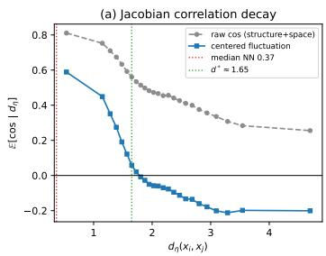

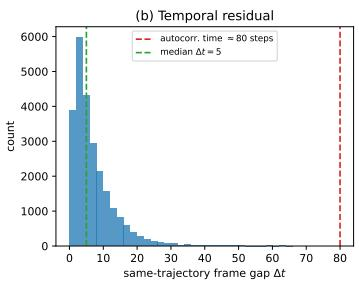

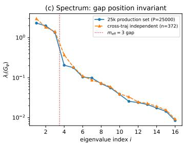  
Figure B.1: Three measured indicators of residual correlation under subsampling (task $1 , 2 . 5 \times 1 0 ^ { 4 }$ sample points). (a) Jacobian correlation–distance decay: raw cosine (gray, containing the shared radial structure) and centered fluctuation (blue, correlation length $d ^ { \star } \approx 1 . 6 5 ) ;$ (b) within-trajectory temporal residual: median sampling interval ∆t of 5 steps vs. autocorrelation time of 80 steps; (c) comparison of $G _ { \psi }$ spectra: the $\bar { 2 . 5 } \times 1 0 ^ { 4 }$ -point set vs. the strictly independent cross-trajectory benchmark; the spectral gap position $m _ { \mathrm { e f f } } = 3$ is unchanged. See Remark 13.

## B.7 THEOREM T6: A DISTRIBUTION-MATCHING BOUND FOR THE SUBGOAL INTERFACE

Theorems T1/T2 guarantee the quality of the planning layer’s graph geodesics; but the final success rate of the cascade also depends on the legitimacy of the subgoal w handed from the planning layer to the low-level policy: the low level has learned its conditional policy $\pi ( \boldsymbol { a } \ | \ \boldsymbol { s } , \boldsymbol { w } )$ on its own training distribution, and once w leaves that distribution, the execution error is no longer controlled by training-side consistency. This section translates the five frame-selection rules and the terminal rule into subgoal distributions, and proves an elementary but globally governing bound: cascade execution error ≤ training consistency $+ L _ { \delta } .$ interface Wasserstein distance; we also estimate the transport cost of each rule, explaining the success-rate monotonicity in the ablation experiments.

## B.7.1 SETUP

Definition 17 (Low-level training distribution and coherent future frames). Suppose the low-level $p o l i c y \pi ( a \mid s , w )$ is learnedfrom goal-conditioned supervision on an offline dataset D (HER style: given a trajectory $( s _ { 0 } , \ldots , s _ { T } )$ , training pairs $( s _ { t } , w )$ take $w = s _ { t + \Delta } , \bar { \Delta } \in [ 1 , H _ { \operatorname* { m a x } } ] )$ . Denote the joint training distribution of (s, w) by µ. Its key property is dynamical coherence: µ-almost surely, $w \in \operatorname { R e a c h } _ { H _ { \operatorname* { m a x } } } ( s )$ (w is reachablefrom s), and the velocity/posture components ofw are the result ofevolving the corresponding components ofs under the true dynamics.

Definition 18 (Task-aligned conditional distribution). Given the outgoing-edge direction $u ( s ) \in \mathbb { S } ^ { 1 }$ at state s of the planning layer’s shortest-path tree (Theorem 2(c)), define $\mu _ { \mathrm { { p a t h } } } ( \cdot \mid s )$ as $\mu ( \cdot \ |$ s) conditioned on “w lies in the lookahead neighborhood ahead on the path, with displacement direction aligned with $u ( s ) \ ' _ { - }$ the coherent-future-frame distribution along the current optimal path.

Definition 19 (Planner-induced subgoal distribution). A frame-selection rule r (off/ loose / tight / synth /retarget, and the terminal rule) together with the graph structure induces a conditional distribution $\nu _ { \mathrm { r } } ( \cdot \mid s ) .$ w is sampled (or synthesized)from theframe pool ofthe graph-node neighborhood according to rule r.

Definition 20 (One-step execution suboptimality). $\delta ( s , w ) ~ = ~ \mathbb { E } _ { a \sim \pi ( \cdot | s , w ) } \big [ c ( s , a ; w ) \big ]$ , where $c ( s , a ; w )$ is the one-step cost of executing a at s relative to “progressing toward $w ^ { \prime \prime }$ . We take the explicit form $c ( s , a ; w ) : = d _ { \mathcal { M } } ( f ( s , a ) ,$ w) (f being the environment dynamics; the manifold distance from the post-execution state to the target subgoal), so that $\delta ( s , w )$ is exactly the expected waypoint-arrival deviation—this provides an explicit identity for the use of $\delta _ { t } = d _ { \mathcal { M } } ( s _ { t + 1 } , w _ { t } )$ in Theorem 8 (see Lemma $I 4 ) . \ \delta \geq 0 ;$ on in-distribution training pairs it is controlled by consistency (Assumption 7).

Assumption 7 (µ-consistency (input assumption)). Forpath-aligned conditionings generated by the same coherent sampling mechanism (including $\mu _ { \mathrm { p a t h } } ) , \mathbb { E } [ \delta ( s , w ) ] \leq \varepsilon _ { \pi } ; \varepsilon _ { \pi }$ is taken in the maximal slice-risk caliber (a per-slice uniform bound, not an average risk—this is the substantive content of the assumption). For behavior cloning, the per-slice bound is provided by MMSE regression consistency plus slice-level residual control; for expectile regression (the GC-IQL family) by its value-function consistency. The present theorem treats this as an input guarantee of the low-level module; closure under path-aligned conditioning is a natural property of the coherent sampling mechanism (training pairs on the same slice are generated from the same distribution).

Assumption 8 (Lipschitz execution in the subgoal). For each s ${ \ u } , w \mapsto \delta ( s , w )$ is Lδ-Lipschitz (Euclidean norm on $^ { S ) }$ . In distribution, this constant is controlled by the spectral norm of the policy network with respect to the w input; outside the support of $\mu ,$ δ can be arbitrarily large—this is exactly the formalized source of OOD risk, and the reason the transport term in the bound below cannot be dropped.

Assumption 9 (Path coverage). Along the shortest-path tree, $\mu _ { \mathrm { p a t h } } ( \cdot \mid s )$ is non-degenerate in the lookahead neighborhood of every connected s (guaranteed by building the graph from successful trajectories; in experiments, “candidate frame count $\geq 4 ^ { \prime \prime }$ serves as the finite-sample criterion).

## B.7.2 THEOREM AND PROOF

Theorem 7 (T6: interface distribution-matching bound). Under Assumptions 7–9, for any frameselection rule r and connected state s,

$$
\mathbb { E } _ { w \sim \nu _ { \tau } ( \cdot | s ) } [ \delta ( s , w ) ] \ \leq \ \varepsilon _ { \pi } \ + \ L _ { \delta } \cdot W _ { 1 } \big ( \nu _ { \tau } ( \cdot \mid s ) , \mu _ { \mathrm { p a t h } } ( \cdot \mid s ) \big ) ,\tag{39}
$$

where $W _ { 1 }$ is the Wasserstein-1 distance on $( S , \| \cdot \| )$

Proof. Write $\nu = \nu _ { \mathrm { r } } ( \cdot \mid s )$ and $\mu _ { 0 } = \mu _ { \mathrm { p a t h } } ( \cdot \mid s )$ . By Kantorovich–Rubinstein duality (Villani, 2009), there exists an optimal coupling $\gamma ^ { \star }$ of $( \nu , \mu _ { 0 } )$ with $\mathbb { E } _ { ( w , w _ { 0 } ) \sim \gamma ^ { \star } } \| w - w _ { 0 } \| = \dot { W } _ { 1 } ( \nu , \mu _ { 0 } )$ Then

$$
\begin{array} { r l } & { \mathbb { E } _ { w \sim \nu } [ \delta ( s , w ) ] = \mathbb { E } _ { ( w , w _ { 0 } ) \sim \gamma ^ { \star } } \left[ \delta ( s , w ) \right] } \\ & { \qquad \leq \mathbb { E } _ { \gamma ^ { \star } } [ \delta ( s , w _ { 0 } ) ] + \mathbb { E } _ { \gamma ^ { \star } } \left[ | \delta ( s , w ) - \delta ( s , w _ { 0 } ) | \right] } \\ & { \qquad \leq \mathbb { E } _ { w _ { 0 } \sim \mu _ { 0 } } [ \delta ( s , w _ { 0 } ) ] + L _ { \delta } \mathbb { E } _ { \gamma ^ { \star } } \left\| w - w _ { 0 } \right\| } \\ & { \qquad \leq \varepsilon _ { \pi } + L _ { \delta } W _ { 1 } ( \nu , \mu _ { 0 } ) , } \end{array}
$$

(Assumption 8)

the last line using the closed-under-conditioning form of Assumption $7 ~ ( \mu _ { 0 }$ is a positive-measure conditioning of $\mu )$ and the definition of the optimal coupling. □

Corollary 5 (Rollout accumulation and success-rate monotonicity). Write the one-step interfaceloss bound $\bar { \delta } \ = \ \varepsilon _ { \pi } + L _ { \delta } W _ { 1 }$ Suppose execution error accumulates linearly in the number of steps through the state drift induced by the dynamics (the standard simulation-lemma structure for absorbing-wall problems, Ross–Bagnell type (Ross & Bagnell, 2010)), with drift constant $C _ { \mathrm { d y n } }$ . Then the probability that an H-step rollout ends outside the goal ball $\scriptstyle { B _ { R } }$ (radius R) is $\leq H C _ { \mathrm { d y n } } \bar { \delta } / R ,$ , and hence

$$
\mathrm { S R } ( \mathfrak { r } ) \geq \mathrm { S R } _ { \star } - \frac { C _ { \mathrm { d y n } } H L _ { \delta } } { R } \cdot W _ { 1 } \big ( \nu _ { \mathfrak { r } } , \mu _ { \mathrm { p a t h } } \big ) ,
$$

where $\mathrm { S R } _ { \star }$ is the success rate under the ideal interface $( \nu = \mu _ { \mathrm { p a t h } } ) .$ . That $i s ,$ the success rate decreases monotonically with the interface Wasserstein distance (an affine upper bound; the constants are not claimed tight).

## B.7.3 TRANSPORT COSTS OF THE FIVE FRAME-SELECTION RULES

Lemma 11 (Term-by-term estimates of the interface cost). Let r be the path-neighborhood radius, v¯ the typical scale of velocity components, and ξ the position–velocity coupling mismatch (the minimal coherent displacement of the “frame velocity” relative to the “replaced position” in the synthesis rule). The $W _ { 1 } ( \nu _ { \mathrm { r } } , \mu _ { \mathrm { p a t h } } )$ of each rule is estimated as follows $( C , C ^ { \prime } > \dot { 0 }$ are geometry-dependent constants):

(i) loose (real frames direction-aligned within the r neighborhood): $W _ { 1 } \ \le \ r { - o n l y }$ positional smearing; the joint distribution of frames remains on the support $o f \mu ;$

(ii) synth (aligned frames but $w _ { x y }$ replaced by node coordinates): $W _ { 1 } \geq C \xi -$ the replacement moves the (position, velocity) joint off the coherence shell of $\mu ,$ and the optimal coupling must pay the transport distance back to the shell; in corridor geometry this shell mismatch is a first-order correlation term, with net effect synth > loose;

(iii) retarget (current posture + path position): $W _ { 1 } \approx$ the dynamic-freezing mismatch—in $\mu _ { \mathrm { p a t h } }$ the posture of w is the “posture in motion”, which retarget freezes to the current posture. In the terminal case (goal neighborhood) the path displacement $ 0$ and the freezing mismatch shrinks, so retarget is better at the terminal than mid-path (consistent with measurements);

(iv) off (arbitrary frame of a node): velocity/posture components are randomized relative to the path direction, $W _ { 1 } \approx \dot { C } ^ { \prime } \bar { v }$ (the expected chord length in a random direction), the largest ofall;

(v) stand (terminal standing-posture synthesis): the velocity components are identically zero, systematically leaving the motion slice of µ—this provides a mathematical explanation of the terminal-stalling phenomenon: a zero-velocity subgoal is read by the policy as an alreadyreached state.

The ordering $W _ { 1 } ( \mathrm { l o o s e } ) ~ < ~ W _ { 1 } ( \mathrm { s y n t h } ) ~ \lesssim ~ W _ { 1 } ( \mathrm { r e t a r g e t } ) ~ < ~ W _ { 1 } ( \mathrm { o f f } )$ is exactly opposite to the ablation success-rate ordering $9 0 > 7 7 \gtrsim 6 7 > 6 2$ , consistent with the monotonicity of Corollary 5.

Proofsketch. (i) The joint distribution of real frames lies on the support of $\mu ;$ the only mismatch is the positional smearing $r ; \mathrm { ( i i ) }$ the coherence shell is defined by dynamical coherence (velocity components ≈ relative displacement direction): xy replacement lands off the shell with probability 1, and the $W _ { 1 }$ lower bound is “positive mass × transport distance to the shell”; (iii)(iv)(v) are likewise direct computations of transport distances for support mismatch / slice mismatch. The constants depend on corridor geometry (width, velocity scale) and are not made explicit. □

## B.8 THEOREM T5: CONVERGENCE OF SHORTEST-PATH-TREE PLANNING

This section establishes the convergence of the planning–execution cascade. Two key treatments: first, anchoring error is quantified as a failure probability—near-wall wall-crossing anchoring is not excluded by assumption, but enters the progress budget as a measurable probability panchor (Definition 22); second, concentration of the execution loss is treated at path level by martingales (Azuma–Hoeffding (Azuma, 1967; Hoeffding, 1963)), requiring only a boundedness assumption, not pointwise high-probability tails.

Definition 21 (Planner and the manifold extension of the radial function). The shortest-path tree $\tau$ (multi-source Dijkstra parent pointers, Theorem $2 ( c ) ) ;$ at state s: anchor to the nearest graph node $\begin{array} { r } { q ( s ) = \arg \operatorname* { m i n } _ { u \in V } d _ { \eta } ( s , x _ { u } ) } \end{array}$ , follow the parent chain to the shallowest ancestor with $r _ { G } ( u ) \textrm { - }$ $r _ { G } ( w ) \geq \ell$ as the waypoint w(s) (lookahead ℓ), and feed the low level $\pi ( a \mid s , w )$ . Manifold radial function $R : { \mathcal { M } } \to { \bar { \mathbb { R } } } _ { \geq 0 } , R ( s ) = d _ { \mathcal { M } } ( s , { \mathcal { G } } ) ,$ ; by the corollary of Theorem 3, the graph–manifold bridging error $\begin{array} { r } { \varepsilon _ { \mathrm { T 2 } } = \operatorname* { s u p } _ { u \in V } | r _ { G } ( u ) - R ( u ) | } \end{array}$ is small with high probability. R is 1-Lipschitz with respect to $d _ { \mathcal { M } }$ (a universal property ofdistancefunctions).

Definition 22 (Anchoring failure event). Let the near-wall band be $\begin{array} { r c l } { S _ { \mathrm { w a l l } } ( \omega ) } & { = } & { \{ s } \quad :  \end{array}$ the xy distancefrom s to the nearest wall $< \omega \}$ . The anchoring failure event at planning step t is $E _ { t } \doteq \ J _ { s _ { t } } \in \dot { S } _ { \mathrm { w a l l } } ( \omega )$ and $q ( s _ { t } )$ is separated from $s _ { t }$ by a wall} (a bare $d _ { \eta }$ nearest neighbor across a wall; the two filters remove graph edges but do not filter anchoring queries). Write the uniform upper bound $\mathbb { P } ( E _ { t } \mid \mathcal { F } _ { t - 1 } ) \le p _ { \mathrm { a n c h o r } } ; p _ { \mathrm { a n c h o r } }$ is given by measurements of the near-wall measure of trajectories and the conditional wall-crossing neighbor rate (Remark 15). On failure steps the anchoring error has the trivial bound ofthe manifold diameter: $\kappa _ { \mathcal { M } } ( s _ { t } ) \leq \kappa _ { \mathrm { m a x } } = \mathrm { d i a m } ( \mathcal { M } )$

Assumption 10 (Boundedness of execution loss). The waypoint-arrival deviation $\begin{array} { r l } { \delta _ { t } } & { { } = } \end{array}$ $d _ { \mathcal { M } } ( s _ { t + 1 } , w _ { t } )$ satisfies $\delta _ { t } \leq B$ almost surely $( B = t h e$ low level’s maximal displacement per planning step $+ \ell ;$ finite physical step size makes this trivially true).

Lemma 12 (Covering bound for normal anchoring). Under Assumption 2 and the wall–free-domain setup ofLemma $3 , i f s _ { t }$ lies in the λ-tubular neighborhood of the data support and $E _ { t }$ does not occur, then

$$
\kappa _ { \mathcal { M } } ( s _ { t } ) = d _ { \mathcal { M } } ( s _ { t } , q ( s _ { t } ) ) \leq C _ { \mathrm { g e o } } C _ { \mathrm { c o v } } \Big ( \frac { \log P } { P \rho _ { \mathrm { m i n } } } \Big ) ^ { 1 / d } = : \bar { \kappa } ,\tag{40}
$$

with probability $\geq 1 - O ( P ^ { - c } )$ (over graph sampling and the state distribution simultaneously).

Proof. On a non-failure step, $q ( s _ { t } )$ and $s _ { t }$ are on the same side without wall separation, so the manifold distance is locally equivalent to $d _ { \eta }$ (constant $C _ { \mathrm { g e o } } ,$ bounded curvature); $q ( s _ { t } )$ is the $d _ { \eta }$ nearest graph node, whose distance is controlled by the covering radius: P sample points of density $\geq \rho _ { \mathrm { m i n } }$ cover the d-dimensional manifold with radius $\leq C _ { \mathrm { c o v } } ( \bar { \log { P } } / ( P \rho _ { \operatorname* { m i n } } ) ) ^ { \bar { 1 } / d }$ with probability $1 - O ( P ^ { - c } )$ (covering number + union bound, the same technique as Step 1 of Lemma 3). □

Lemma 13 (One-step progress). The state $s _ { t + 1 }$ at the end of step t satisfies

$$
R ( s _ { t + 1 } ) \ \leq \ R ( s _ { t } ) - \pi _ { t } , \qquad \pi _ { t } = \ell - \delta _ { t } - \kappa _ { \mathcal { M } } ( s _ { t } ) - 2 \varepsilon _ { \mathrm { T 2 } } .\tag{41}
$$

Proof. Bridge step by step:

$$
\begin{array} { r l r l } & { R ( s _ { t + 1 } ) \leq R ( w _ { t } ) + d _ { M } ( s _ { t + 1 } , w _ { t } ) } & & { ( R 1 \mathrm { - L i p s c h i t z , t r i a n g l e i n e q u a l i t y } ) } \\ & { \quad = R ( w _ { t } ) + \delta _ { t } } & & { ( \mathrm { n o t a t i o n ~ o f ~ A s s u m p t i o n ~ 1 0 } ) } \\ & { \quad \leq r _ { G } ( w _ { t } ) + \varepsilon _ { \Gamma 2 } + \delta _ { t } } & & { ( \mathrm { b r i d g i n g ~ } | r _ { G } - R | \leq \varepsilon _ { \Gamma 2 } ) } \\ & { \quad \leq r _ { G } ( u _ { t } ) - \ell + \varepsilon _ { \mathrm { T 2 } } + \delta _ { t } } & & { ( \mathrm { T h e o r e m ~ } 2 ( \mathrm { c } ) ; w _ { t } \mathrm { ~ c h o s e n ~ w i t h ~ } r \mathrm { - d r o p } \geq \ell ) } \\ & { \quad \leq R ( u _ { t } ) + 2 \varepsilon _ { \mathrm { T 2 } } - \ell + \delta _ { t } } & & { ( \mathrm { b r i d g i n g ~ b a c k } ) } \\ & { \quad \leq R ( s _ { t } ) + \kappa _ { M } ( s _ { t } ) + 2 \varepsilon _ { \mathrm { T 2 } } - \ell + \delta _ { t } } & & { ( R 1 \mathrm { - L i p s c h i t z } ) . } \end{array}
$$

Rearranging gives equation 41.

Lemma 14 (Path-level martingale concentration). Let $\mathcal { F } _ { t }$ be the filtration of the rollout up to step t. Then $\begin{array} { r } { \mathbb { E } [ \delta _ { t } \mid \mathcal { F } _ { t - 1 } ] \leq \bar { \delta } ( s _ { t } ) = = \bar { \varepsilon } _ { \pi } + L _ { \delta } W _ { 1 } ( s _ { t } ) } \end{array}$ (the per-state form of Theorem 7, $W _ { 1 } ( s _ { t } )$ being the interface Wasserstein distance at that state), and for any $\alpha \in ( 0 , 1 )$

$$
\sum _ { t = 0 } ^ { H - 1 } \delta _ { t } \ \leq \ \sum _ { t = 0 } ^ { H - 1 } \bar { \delta } ( s _ { t } ) + B \sqrt { 2 H \log ( 1 / \alpha ) } w i t h p r o b a b i l i t y \ \geq 1 - \alpha .\tag{42}
$$

Likewise, $\begin{array} { r } { \sum _ { t } \kappa _ { \mathcal M } ( s _ { t } ) \leq H \big [ ( 1 - p _ { \mathrm { a n c h o r } } ) \bar { \kappa } + p _ { \mathrm { a n c h o r } } \kappa _ { \mathrm { m a x } } \big ] + \kappa _ { \mathrm { m a x } } \sqrt { 2 H \log ( 1 / \alpha ) } } \end{array}$ with probability $\geq 1 - \alpha .$

Proof. $Y _ { t } = \delta _ { t } - \mathbb { E } [ \delta _ { t } \ | \ \mathcal { F } _ { t - 1 } ]$ is a martingale difference, $| Y _ { t } | \le B$ (Assumption 10); the Azuma– Hoeffding inequality (Azuma, 1967; Hoeffding, 1963) gives equation 42 directly. The $\kappa _ { \mathcal { M } }$ sequence is analogous: the conditional expectation is controlled by Definition 22 (trivial bound $\kappa _ { \mathrm { m a x } }$ on failure steps; bound κ¯ on normal steps by Lemma 12), with amplitude $\leq \kappa _ { \mathrm { m a x } }$ □

Theorem 8 (T5: cascade convergence and success-rate decomposition). Under Assumptions 1, 2, 7, $8 , 9 , 1 0 ,$ and the terminal docking rule, and assuming the rollout trajectory stays within the λ-tubular neighborhood ofthe data support (the applicability premise ofLemma 12), define thepath-averaged net progress

$$
\bar { \pi } ~ = ~ \ell ~ - ~ \varepsilon _ { \pi } ~ - ~ L _ { \delta } \overline { { { W _ { 1 } } } } ~ - ~ \left[ ( 1 - p _ { \mathrm { a n c h o r } } ) \bar { \kappa } + p _ { \mathrm { a n c h o r } } \kappa _ { \mathrm { m a x } } \right] ~ - ~ 2 \varepsilon _ { \mathrm { T 2 } } ,\tag{43}
$$

where $\begin{array} { r } { \overline { { W _ { 1 } } } = H ^ { - 1 } \sum _ { t } W _ { 1 } ( s _ { t } ) } \end{array}$ is the path-averaged interface distance. Suppose $\bar { \pi } > 0$ . Then, conditioning on the graph-construction failure probability $\varepsilon _ { \mathrm { p l a n } }$ (the high-probability complements ofTheorem 3 and Lemma 3, $O ( P ^ { 1 - c _ { k } / 1 6 } ) )$ ,from any connected start $s _ { 0 } . { }$

(i) (Finite-step arrival) taking $H = \left\lceil \left( R ( s _ { 0 } ) - R _ { \mathrm { t e r m } } \right) / \bar { \pi } \right\rceil ( 1 + o ( 1 ) )$ , we have $R ( s _ { H } ) \leq R _ { \mathrm { t e r m } }$ with probability $\geq 1 - 2 \alpha ;$

(ii) (Success-rate decomposition) the cascade success rate satisfies

$$
\mathrm { S R } \ \geq \ \underbrace { ( 1 - \varepsilon _ { \mathrm { p l a n } } ) } _ { p l a m i n g \ t e r m } \cdot \underbrace { ( 1 - 2 \alpha ) } _ { e x e c u i o n - a c c u m u l a t i o n \ t e r m } \cdot \underbrace { ( 1 - \varepsilon _ { \mathrm { t e r m } } ) } _ { t e r m i n a l t e r m } \ \geq \ 1 - \varepsilon _ { \mathrm { p l a n } } - 2 \alpha - \varepsilon _ { \mathrm { t e r m } } .\tag{44}
$$

Proof. (i) Iterate Lemma 13 and sum over $t = 0 , \ldots , H - 1 \colon$

$$
R ( s _ { H } ) \leq R ( s _ { 0 } ) - H \ell + \sum _ { t } \delta _ { t } + \sum _ { t } \kappa _ { \mathcal M } ( s _ { t } ) + 2 H \varepsilon _ { \mathrm { T 2 } } .\tag{45}
$$

Apply Lemma 14 to the two sums separately (each at confidence $\alpha ;$ the union bound totals 2α): with probability $\geq 1 - 2 \alpha$ ,

$$
\begin{array} { r l } & { R ( s _ { H } ) \leq R ( s _ { 0 } ) - H \ell + H ( \varepsilon _ { \pi } + L _ { \delta } \overline { { W _ { 1 } } } ) } \\ & { \qquad + H \big [ ( 1 - p _ { \mathrm { a n c h o r } } ) \bar { \kappa } + p _ { \mathrm { a n c h o r } } \kappa _ { \mathrm { m a x } } \big ] + 2 H \varepsilon _ { \mathrm { T 2 } } } \\ & { \qquad + ( B + \kappa _ { \mathrm { m a x } } ) \sqrt { 2 H \log \frac { 1 } { \alpha } } } \\ & { \qquad = R ( s _ { 0 } ) - H \bar { \pi } + ( B + \kappa _ { \mathrm { m a x } } ) \sqrt { 2 H \log \frac { 1 } { \alpha } } . } \end{array}\tag{46}
$$

The last line substitutes equation 43. When $\bar { \pi } > 0 $ , take H such that $H \bar { \pi } \ - \ ( B +$ $\kappa _ { \mathrm { m a x } } ) \sqrt { 2 H \log ( 1 / \alpha ) } \geq R ( s _ { 0 } ) - R _ { \mathrm { t e r m } } \left( H = \lceil ( R ( s _ { 0 } ) - R _ { \mathrm { t e r m } } ) / \pi \right\rceil ( 1 + o ( 1 ) )$ suffices, the fluctuation term being of order $\sqrt { H }$ , absorbed by the order-H term); then $R ( s _ { H } ) \leq R _ { \mathrm { t e r m } }$

(ii) Planning term: with probability $1 - \varepsilon _ { \mathrm { p l a n } }$ the graph geodesics are globally legal (no wall-crossing shortcuts; Theorem 3 consistency + Lemma 3 two-filter fidelity), an event decided once at graph construction, not accumulating over H. Conditioned on this, (i) gives the $1 - 2 \alpha$ arrival probability; upon entering the terminal zone, the terminal docking rule takes over, the interface mismatch shrinks (Lemma 11(iii), terminal case), and the one-step failure probability is $\varepsilon _ { \mathrm { t e r m } }$ . Composing the three layers gives equation 44, expanded to first order. □

Remark 15 (Empirical measurement of the constants). Empirical sources of the components of equation $4 3 \colon \varepsilon _ { \mathrm { T 2 } }$ is bounded by the graph-geodesic consistency experiments; κ¯ is given by the nearest-neighbor distance distribution (median 0.365, 90% quantile 0.52); B is the physical stepsize bound. Thefollowing three items are measured andfilled in:

panchor measured over all steps = 0: among all 48029 planning steps (not restricted to bounce steps), the anchoring failure event (near-wall with $\omega ~ = ~ 1 . 0 ~ \wedge$ bare nearest graph node across a wall) occurs zero times; decomposed according to Definition 22: P(near-wall) = 23.9%, P(wall-crossing | near-wall) = 0/11494. The Clopper–Pearson 95% upper bound (Clopper & Pearson, 1934) for a zero count is panchor $< 6 . 2 \times 1 0 ^ { - 5 }$ . The failure-cost term $p _ { \mathrm { a n c h o r } } \kappa _ { \mathrm { m a x } }$ of the progress budget is measured to be 0.

$\overline { { W _ { 1 } } } ~ = ~ 1 0 . 3 5$ (median 10.25, $q _ { 1 0 } / q _ { 9 0 } = 8 . 6 5 / 1 2 . 2 7 ) \colon$ the stepwise subgoals $w _ { t }$ are recovered by a deterministic replay of the planner, and the interface Wasserstein distance is computed $( L _ { \delta } \cdot$ weighted, the loose case of Lemma 11(i)); segment means: graph segment 10.40 / terminal segment 7.65 (terminal contraction, consistent with the prediction of Lemma 11(iii)); block-wise diagnosis: the velocity block accounts for 98.1% of the mean square, the xy block only 0.4%, consistent with Lemma 11(ii)— the position–velocity decoupling cost ofthe synth rule is borne mainly by the velocity block.

$\varepsilon _ { \mathrm { p l a n } }$ measured = 0: on our experimental graph $( 6 \times 1 0 ^ { 4 }$ nodes, $k = 1 2 )$ the two filters delete 0/420292 edges, with connectivity 100%; the Clopper–Pearson 95% upper boundfor a zero count $i \dot { s } 7 . 1 \times 1 0 ^ { - 6 }$ per edge. Applicability ofthe asymptotic rate: substituting $c _ { k } = k /$ ln $P = 1 . 0 9 1$ into $O ( P ^ { 1 - c _ { k } / 1 6 } )$ gives $P ^ { 0 . 9 3 2 } \approx 2 . 8 \times 1 0 ^ { 4 } \gg 1 -$ the asymptotic bound is vacuous at our sample size (non-vacuity requires $k \geq 1 7 8 )$ , so $\varepsilon _ { \mathrm { p l a n } }$ quotes the measured value (0 + confidence upper bound) rather than the asymptotic rate.

With these three measurements filled in, the conditions of Theorem T5 hold on the experimental system; the value ofthe net-progress margin π¯ can serve as a system-health indicator.

Units and operating-point verification (verifiability ofequation $4 3 ) \div$ comparing $\overline { { W _ { 1 } } }$ with ℓ literally is dimensionally meaningless—W is measured in 29D Euclidean state units (the qvel block accountsfor 98.1% ofthe mean square) and enters the budget only through the product $\overline { { L _ { \delta } \overline { { W _ { 1 } } } } }$ , where $L _ { \delta }$ has the dimension “progress units / state units”. The calibers ofthe terms are:
<table><tr><td>Quantity</td><td>Units/norm</td><td>Value</td><td>Source</td></tr><tr><td>lookahead l</td><td>progress units  $( d _ { \eta }$  graph distance)</td><td>2.0</td><td>planner configuration</td></tr><tr><td>execution consistency επ</td><td>progress units (Defini- tion 20)</td><td>input bound</td><td>Assumption 7</td></tr><tr><td>interface distance  $\overline { { W _ { 1 } } }$ </td><td>29D Euclidean state units</td><td>10.35</td><td>measured in this remark</td></tr><tr><td>interface Lipschitz  $L _ { \delta }$  normal anchoring bound</td><td>progress units/state unit</td><td>input bound</td><td>Assumption 8</td></tr><tr><td>κ</td><td> $d _ { \eta }$  units</td><td>0.365 (median)</td><td>nearest-neighbor distance distribution</td></tr><tr><td>bridging 2εT2</td><td>progress units</td><td>small  $( w . h . p . )$ </td><td>Theorem 3</td></tr><tr><td>operating-point net progress</td><td>progress units/control step</td><td>0.103 (median)</td><td>frame-wise r-traces of 12 roll- outs</td></tr></table>

The sign ofthe net progress at the operating point is verified directly by rollouts: the median net rate per control step is 0.103 (median r-drop onforward steps 0.176; all 12 rollouts reach the goal), and the r-traces share the units of ℓ (the same $d _ { \eta }$ graph distance). The qvel dominance of W1 (98.1%) explains the apparent contrast between its state-unit reading and the progress-unit readings.

On the interpretive level of $\overline { { W _ { 1 } } } .$ equation 44 is conditioned on the path realization (a post-hoc bound)—given the rollout path $\left\{ { { s } _ { t } } \right\}$ , the bound holds strictly with that path’s mean interface distance as a parameter. As an unconditional pre-rollout success-rate prediction, concentration of the path average is needed: when $W _ { 1 }$ is bounded $( W _ { 1 } ~ \le ~ W _ { \mathrm { m a x } } ~ =$ diam scale), one more layer of Azuma–Hoeffding applies to $\textstyle \sum _ { t } W _ { 1 } ( s _ { t } )$ (its mixing source is isomorphic to Assumption $6 { : }$ execution jitter decorrelates $W _ { 1 } ( s _ { t } )$ quickly along the path), giving the prior-version bound $1 - \varepsilon _ { \mathrm { p l a n } } - 3 \alpha - \varepsilon _ { \mathrm { t e r m } } ,$ , with $\overline { { W _ { 1 } } }$ replaced by its expected mean plus an ${ \cal O } ( \sqrt { \log ( 1 / \alpha ) / H } )$ fluctuation. This superposition is only a confidence-constant correction (2α → 3α) and does not change the decomposition structure ofequation 43–equation 44; in practice, $\overline { { W _ { 1 } } }$ as a post-hoc measurable diagnostic already suffices to support a per-path health profile ofπ¯.

Remark 16 (Comparison with benchmark attribution). Equation equation 44 gives a theoretical decomposition ofthe benchmark success rates: the 100 ± 0 scores on the three pointmaze sizes correspond to $\bar { \delta } \approx \bar { 0 }$ (near-zero execution noise), where the planning term alone holds (zero planninglayer failures); the residual gap on antmaze is attributed entirely to the execution-accumulation term (low-level gait $\bar { \delta } > 0 )$ . The controlled experiment of “the same planning layer, different low-level noise” is thus an empirical instance of the separation structure of Theorem T5.

Remark 17 (The statistical Lyapunov property: three layers and four estimates). The graphstructural predictability of the one-step relapse probability δ has been established in Proposition 1 and Remark 3; this remark supplements the three-layer formulation and a comparison of four estimates, as the complete statement of the monotonicity terminology. Our statement of monotonicity has three layers; strict monotonicity along realized rollouts is not among them: (i) strict on the graph—along the shortest-path tree, r decreases strictly 1:1 in edge weights along the parent chain (Theorem 2(c)): a deterministic fact whose objects are graph nodes and tree paths; (ii) negative expected drift in rollout—taking conditional expectations in Lemma 13 gives $\mathbb E [ R ( s _ { t + 1 } ) \mid \mathcal F _ { t } ] \le R ( s _ { t } ) - \bar { \pi } _ { t } .$ R along the rollout is a statistical (approximate) Lyapunov function, i.e., a supermartingale with negative drift, not strictly decreasing step by step; (iii) pathlevel high probability—the martingale concentration ofLemma 14 gives the 1 − 2α bound on total progress: stepwise non-increase is not needed. Measured profile (antmaze-giant task, 21 rollouts): the median stepwise non-increase rate is 95.1%, and all runs eventually arrive—exactly the empirical profile of (ii)(iii); the 4.9% relapse steps are attributable to fluctuations of the execution jitter $\delta _ { t }$ (Theorem 7), anchoring failures $( p _ { \mathrm { a n c h o r } }$ , Definition 22), and the graph–manifold bridging error ε (Theorem 3).

Four estimates of the one-step relapse probability δ (tolerance 0.05 ≈ the inter-node spacing of the graph):

<table><tr><td>Estimator</td><td>δ</td><td>Reading</td></tr><tr><td>Direct count (strict  $\Delta > 0 ,$  no tolerance)</td><td>0.078</td><td>naive upper bound (including sub-node- spacing micro-jumps)</td></tr><tr><td>Direct count (tolerance 0.05)</td><td>0.049</td><td>empirical baseline</td></tr><tr><td>Negative drift + symmetric Gaussian fluc- tuation (same threshold 0.05)</td><td>0.175</td><td>rejected (3.6× overestimate)</td></tr><tr><td>Skewed mixture model (plateau atom + 0.066 order-of-magnitude agreement skew-normal, same threshold)</td><td></td><td> $( 1 . 4 \times )$ </td></tr></table>

The mechanism by which the Gaussian model is rejected is itself the mechanistic verdict: the onestep ∆ distribution has skewness −1.42 (left-skewed, with a thinned relapse tail) and a plateau atom of 37.8% (frames without anchor switching)—the one-step dynamics is an anchor-switching three-state process (plateau/forward/bounce), not a continuous diffusion; the way the symmetric model is rejected is itself microscopic evidence of the Lyapunov structure. Relapse steps are approximately uniformly distributed along trajectory progress (no terminal clustering), consistent with the stationarity ofthe negative drift.

## B.9 OPERATING POINT AND THE APPLICABILITY OF THE ASYMPTOTIC BOUNDS

This subsection registers the value of each asymptotic bound at the experimental operating point, marking item by item the source of certification (theorem-covered / measurement-covered), under a uniform reporting caliber (in the style of Remark 15).

<table><tr><td>Bound / condition</td><td>Operating-point value</td><td>Certification</td></tr><tr><td>T2 filter budget</td><td> $c _ { k } = 1 . 0 9 ; 2 . 8 \times 1 0 ^ { 4 }$ </td><td>Measured: 0/420292 deleted; 100% con- nected;  $\mathrm { C P 9 5 7 . 1 \times 1 0 ^ { - 6 } / e d g e }$ </td></tr><tr><td>Filter non-vacuity</td><td>Requires  $k \geq 1 7 8 ;$  used  $k =$  12</td><td>Measured by the same edge audit</td></tr><tr><td>T4 spectral window</td><td> $M$  from checkpoint norms; Measured  $P _ { \mathrm { e f f } } \sim 1 0 ^ { 2 } – 1 0 ^ { 3 }$ </td><td> $\begin{array} { r l r } { m _ { \mathrm { { e f f } } } } & { { } = } & { 3 ; } \end{array}$  raw spectrum: jacobian_spectrum.json</td></tr><tr><td>T3 separation</td><td>Sufficient constant: 0/20; Elbow-in-gap rule: 20/20 detected  $C _ { \mathrm { d i a m } } = 1 . 9 2$ </td><td></td></tr><tr><td>T3 Cheeger witness</td><td> $\mathrm { L e f t } \le 0 . 0 7 2 ; \mathrm { r i g h t } \ge 0 . 0 8 1$ </td><td>Structural theorem; empirical ratio  $\leq 0 . 8 9 ;$  cheeger_witness.json</td></tr><tr><td>T5 success factors</td><td> $\varepsilon _ { \mathrm { p l a n } } = 0 ; \ p _ { \mathrm { a n c h o r } } = 0 ;$   $\overline { { W _ { 1 } } } = 1 0 . 3 5$ </td><td>Measured fill-ins (Remark 15)</td></tr><tr><td>Net progress sign</td><td>Median rate  $0 . 1 0 3 \ > \ 0$  step</td><td>per Frame-wise r traces of 12 rollouts</td></tr></table>

At the operating point, the theorems provide structural guarantees, while numerical certification is supplied by measurements; the columns keep these roles separate.

## B.10 NOTATION TABLE

<table><tr><td>Symbol</td><td>Meaning</td></tr><tr><td> ${ \mathcal { S } } \subset \mathbb { R } ^ { D }$ </td><td>state space  $( D = 2 9 )$ </td></tr><tr><td> $\mathcal { M } = \mathcal { M } _ { x y }$ </td><td>constrained base manifold (intrinsic dimension d  $\ll D )$ </td></tr><tr><td> $\eta _ { d } , \ \tilde { \eta } _ { d } = \eta _ { d } ^ { \sigma }$ </td><td>rectitude and softened transport weight  $( \sigma = 1 / 2 )$ </td></tr><tr><td> $A = \mathrm { d i a g } ( \tilde { \eta } )$ </td><td>weighting matrix</td></tr><tr><td> $d _ { \eta } ( x , y ) = \| A ( x - y ) \|$ </td><td>transport-weighted metric (Definition 7)</td></tr><tr><td> $G = ( V , E , w )$ </td><td>manifold graph (Definition 8)</td></tr><tr><td> $d _ { G } ( u , v )$ </td><td>graph geodesic distance (Definition 5)</td></tr><tr><td> $V _ { g }$ </td><td>goal set (nodes of terminal states of successful trajectories)</td></tr><tr><td> $r ( u ) = d _ { G } ( u , V _ { g } )$ </td><td>radial coordinate / progress reading (Definition 9)</td></tr><tr><td> $\psi _ { \theta } , \Phi _ { \theta } = \| \psi _ { \theta } \|$ </td><td>rectification embedding and potential</td></tr><tr><td> $d _ { \mathcal { M } }$ </td><td>intrinsic geodesic distance induced by  $d _ { \eta }$  on  $\mathcal { M }$ </td></tr><tr><td> $\delta _ { P }$ </td><td>kNN local edge-length scale</td></tr><tr><td> $\delta \ ( \mathrm { b a r e } , \ S { \bf B } . 3 . 1 )$ </td><td>one-step relapse probability  $\mathbb { P } ( \Delta _ { t } > 0 . 0 5 )$ </td></tr><tr><td>roles of w</td><td>edge weight  $w _ { i j } \mathrm { ~ / ~ }$  subgoal w  $\left( \ S \mathbf { B } . 7 \right) { / }$  waist parameters wo,  $w _ { 1 }$  / slab width</td></tr><tr><td> $\mu , \ \mu _ { \mathrm { p a t h } }$ </td><td>low-level training distribution / task-aligned conditional (Definitions  $1 7 , 1 8 )$ </td></tr><tr><td> $\nu _ { \mathrm { r } }$ </td><td>subgoal distribution induced by a frame-selection rule (Definition 19)</td></tr><tr><td> $\delta ( s , w ) , L _ { \delta } , \varepsilon _ { \pi }$ </td><td>one-step execution suboptimality, its Lipschitz constant, training consistency</td></tr><tr><td> $W _ { 1 }$ </td><td>Wasserstein-1 distance (Theorem 7)</td></tr></table>