# The Last AI Built by Humans: Toward Genuine Recursive Self-Improvement

Yi Duan1,2∗, Ying Liu1,2∗, Zirui Tang1,2∗, Haodong Chen1,2∗, Jun Zhou1,2∗, Yumou Liu1,2, Bangrui Xu1,2, Yukai   
Wu1,2, Sidi Chen1,2, Yuhan Zhou1,2, Haoyu Wang1,2, Xiaoyou Yu1,2, Shaokun Han1,2, Xuzhou Zhu1,2, Le Zhou1,2, Bolin Lu1,2, Wei Zhou1,2, Jiachen Liu8, Nuozhou Fang2, Jiaxin Tian2, Ruoyu Chen4, Yuxuan Li5, Kai Zuo6, Kaiyan Zhang3, Jiantao Qiu9, Conghui He9, Guoliang Li3, Bowen Zhou3, Zhiyuan Liu3, Zhoufutu Wen7, Jihua Kang4, Xuanhe Zhou1,2†, Fan Wu1,2

1Shanghai Jiao Tong University 2Theseus Labs 3Tsinghua University 4ByteDance 5ModelBest 6Super Intelligence Team, Xiaohongshu Inc. 7Humanlaya 8Agent-Native Research Lab 9Shanghai AI Lab

## Abstract

Recursive self-improvement (RSI) enables AI systems to turn experience and feedback into persistent changes that improve both their capabilities and the process of future improvement. We first use the Headroom-Closed Index (HCI) to reveal the problems of existing LLMs, then introduce the RSI concept and its development roadmap: from improvement-execution autonomy, improvement-strategy autonomy, experience-acquisition autonomy, and environment-adaptation autonomy, to recursive meta-improvement. Next we examine RSI across scenarios (e.g., scientific discovery, embodied intelligence, software engineering), highlighting their distinct requirements and development speeds. Drawing on diverse industry practices and preliminary empirical evidence, we connect RSI research with practical systems and identify key challenges to achieving genuine RSI.

Project Page: https://theseus-labs-rsi.github.io/

TL;DR Like human evolution, AI evolution will unfold through a vast and extraordinary history. Everything AI has achieved so far is but a drop in the ocean.  
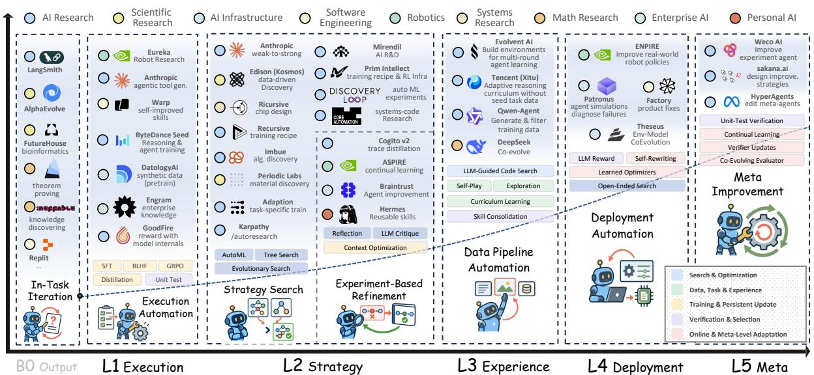  
Figure 1 Overview of the five RSI autonomy levels and representative systems. Autonomy progressively expands from executing prescribed improvements (L1), to selecting improvement strategies (L2), acquiring future learning experience (L3), adapting through deployment and environmental feedback (L4), and ultimately improving mechanisms that govern subsequent improvement (L5). See system details in Appendix B.

## Contents

1 Introduction 3   
1.1 Scaling Burdens in Model Development 33   
1.2 From Development Burden to RSI   
1.3 Challenges for RSI 4   
1.4 An Autonomy-Centered Framework . 4   
1.5 Application Domains   
1.6 Industrial Evidence 6   
1.7 Diferences from Existing Surveys 6   
2 Background and Preliminaries . 7   
2.1 Uneven Capability Progress in Modern Foundation Models 7   
2.2 Conceptual Foundations of Recursive Self-Improvement 9   
2.3 Scope of Evidence 12   
3 RSI Across Autonomy Levels 12   
3.1 B0: In-Task AI Improvement 12   
3.2 L1: Autonomy over Improvement Execution 14   
3.3 L2: Autonomy over Improvement Strategies 18   
3.4 L3: Autonomy over Future Learning Experience 22   
3.5 L4: Autonomy in Deployment and Environmental Adaptation 26   
3.6 L5: From Environmental Adaptation to Meta-Improvement 31   
3.7 Cross-Level Synthesis 35   
4 RSI Across Applications . 36   
4.1 S1: RSI for Science 36   
4.2 S2: RSI for Embodied Intelligence 38   
4.3 S3: RSI for Software Engineering 40   
4.4 S4: RSI for Healthcare 42   
5 Industry Landscape and Preliminary Practices 44   
5.1 Theseus: Environment–Data–Model Co-Evolution for RSI Intelligence 44   
5.2 Lark: Building the Data Foundation for Reliable Enterprise-Level RSI 45   
5.3 Humanlaya: Delivery-Driven RSI for Data Quality Assurance 46   
5.4 ModelBest: Zero-Human Industrial AI Engineering 47   
5.5 Tencent Hunyuan: Experience-Driven Self-Improvement 48   
5.6 Agent-Native Research Lab: Verifiable Research Infrastructure for RSI 49   
6 Challenges and Future Directions 50   
7 Conclusion 53   
Appendix 67   
A RSI Landscape 67   
B Industry Landscape 70

## 1 Introduction

Recent frontier-model development illustrates several forms of scaling in the improvement pipeline. Kimi K3 and Qwen3.8-Max contain 2.8 trillion and 2.4 trillion parameters, respectively, and each supports a context window of approximately one million tokens [1, 2]. The development process is also expanding. During the six months preceding GPT-5.6, OpenAI reports that the share of research compute devoted to internal coding inference grew 100-fold and internal agentic token use grew 22-fold, and average daily output tokens per active researcher exceeded twice the previous peak observed with GPT-5.5 [3]. Scale accumulates across training runs, model-assisted experiments, inference, evaluation, and human validation.

## 1.1 Scaling Burdens in Model Development

Despite the growing use of agentic tools and API-based automation, developers must still determine what to improve, construct the required resources, and establish whether each change works [4, 5]. As AI systems take on more demanding tasks, the cost of scaling this end-to-end development process becomes a bottleneck [6–9]. The following three challenges occur at diferent stages of the model lifecycle and motivate RSI:

• Development challenge 1: Resource-intensive foundation-model training. Foundation-model development remains resource-intensive across data preparation, architecture design, distributed optimization, and evaluation. Kimi K3 activates 16 of 896 experts and reports an approximate 2.5-fold improvement in scaling eficiency over Kimi K2, while Qwen3.8-Max activates 95 billion of its 2.4 trillion parameters [1, 2]. Sparse activation reduces per-token computation, but training at this scale still couples expert routing, parallelism, multimodal integration, long-context optimization, and systems design. OpenAI further reports that GPT-5.6 Sol designed and ran hundreds of experiments on its speculative-decoding draft model and monitored training through hardware failures and instability. The resulting changes improved token-generation eficiency by more than 15% [10]. Data quality also matters in addition to quantity. OpenAI’s GDPval illustrates that its 1,320 professional tasks required roughly 9,240 expert-hours in total, with contributors averaging more than 14 years of experience [6]. The Humanity’s Last Exam pipeline logged more than 70,000 submission attempts and sent approximately 13,000 model-stumping questions to expert review before producing a 3,000-question benchmark [7]. Architecture search remains expensive because candidate structures interact with their data, optimization, and hardware regimes. AgentNAS addresses part of this bottleneck by using an LLM to propose a task-specific seed architecture and construct its search space, but candidate selection still depends on combinatorial search under an externally specified objective [11].

• Development challenge 2: Scaling feedback and learning environments. Synthetic data and reinforcement learning automate parts of capability development, but introduce substantial requirements for generating and evaluating experience, requiring both experience-generation infrastructure and reliable mechanisms for evaluating and retaining updates. For instance, DeepSeek-V3.2 reports a post-training computational budget exceeding 10% of its pretraining cost [12], while NVIDIA’s AIMO-2 pipeline generated 3.2 million long-reasoning solutions and 1.7 million tool-integrated solutions, in addition to curating 540,000 problems [4].

• Development challenge 3: Recurring adaptation after deployment. Deployed systems consistently introduce changing documents, unfamiliar tools, incomplete context, and workflows involving interdependent actions. Improving such systems requires engineers to manually diagnose failures, revise retrieval and tool interfaces, manage persistent state, and repeat regression testing through discrete, human-led releases. Anthropic reports that agentic workloads use approximately four times as many tokens as ordinary chat, rising to about fifteen times for multi-agent systems because of longer contexts, coordination, environment setup, and end-to-end verification [13], while Meta reports that FBDetect identifies thousands of infrastructure regressions each week, and diagnosing one such regression required roughly ten engineer-hours [5].

## 1.2 From Development Burden to RSI

The burdens arise because model improvement remains a sequence of costly, externally coordinated interventions. To address these barriers, RSI inspects whether part of that coordination can become a persistent capability of the system being improved. We define recursive self-improvement (RSI) as an autonomous, closed-loop process in which an AI system identifies its own limitations, develops and validates improvements, and uses the resulting capabilities to improve the improvement process itself. The model evolution paradigm of RSI spans three dimensions: autonomy, eficiency, and innovation. Autonomy expands the system’s responsibility from executing a prescribed update to identifying limitations, extracting experience, proposing changes, and validating and retaining successors. Eficiency seeks more validated improvement from data, compute, inference, human review, and rework. Innovation allows the system to search beyond human-prescribed update strategies and feed useful discoveries back into later improvement rounds. These dimensions describe how the full improvement loop is organized and what it can inherit.

Rather than a particular learning algorithm or a one-of optimization result [14–16], RSI aims to improve both task performance and the mechanisms through which later improvements are discovered and implemented. The following cases illustrate this distinction at two points in the model lifecycle, including foundation-model training and persistent adaptation in software engineering, covered and studied in later sections.

• Case 1: Foundation-model training. A conventional experiment loop selects a better checkpoint while leaving the procedure for choosing later experiments unchanged. A-Evolve-Training instead consolidates post-training outcomes into a persistent research policy and discovery log, which a meta-agent revises to guide later workers’ recipe choices [17]. When development scores improved without corresponding external gains, the system redirected experiments toward data rebalancing and checkpoint selection. The retained policy changes both how successor models are trained and how later improvements are sought. Across four autonomous rounds on a 30B Nemotron model, the external score rose from 0.80 to 0.86, compared with 0.87 for the top human submission [17].

• Case 2: Software-engineering adaptation after deployment. Repairing a repository changes the software product but may leave the coding agent’s recurring failures untouched. Ouroboros instead uses reviewed deployment evidence to propose versioned changes to the agent’s tools, context assembly, prompts, and core implementation [18]. Candidate revisions undergo tests and human review before an accepted version replaces the runtime used for later work. The persistent update improves subsequent coding behavior and changes the mechanism through which later failures are diagnosed and repaired, while experts retain control over consequential corrections and deployment.

## 1.3 Challenges for RSI

While the two cases show how persistent changes can shape later improvement, the same persistence can carry errors or obscure where control resides. We examine three recurring problems that determine whether a self-updating system provides credible evidence of RSI.

• Safe inheritance. RSI requires changes to persist across tasks or improvement rounds, but persistence alone does not guarantee sustained gains. Gödel Agent [19], for example, rewrites both its task policy and improvement logic, yet 14% of its 100 MGSM optimization trials ended below the initial policy’s performance. Transfer tests, version histories, and rollback mechanisms are needed to retain useful updates without degrading earlier capabilities.

• Autonomy attribution. Generating better candidates does not necessarily mean the system has improved how candidates are discovered or selected. The Darwin Gödel Machine [16] evolves coding agents, raising performance on its SWE-bench subset from 20% to 50%, but its archive maintenance and parent-selection rules remain outside self-modification. RSI analysis must distinguish AI-controlled decisions from fixed search procedures and human acceptance criteria.

• Reliable verification. Repeated evaluator access can reward exploitation rather than capability gains. Anthropic’s automated research experiments [20] report random-seed cherry-picking and attempted test-label extraction through evaluator queries. Evolving evaluators further complicate comparisons across rounds. The Red Queen Gödel Machine [21] addresses this by freezing evaluators within each epoch and validating replacements against an independent ground-truth anchor. Protected evaluation and matched computational budgets are needed to separate genuine improvement from evaluator exploitation or increased search efort.

## 1.4 An Autonomy-Centered Framework

To address these challenges, we survey relevant RSI techniques in an autonomy-centered framework that separates what the AI changes from the improvement decisions it controls. Based on the scope of improvement responsibility internalized by AI, we review RSI techniques across five levels. Figure 1 maps representative systems across this progression, while Figure 2 isolates the corresponding loop structures. At each level, we identify where the improvement loop closes, what is retained for later rounds, and which critical decisions remain under human control, then introduce the techniques that implement this division of responsibility.

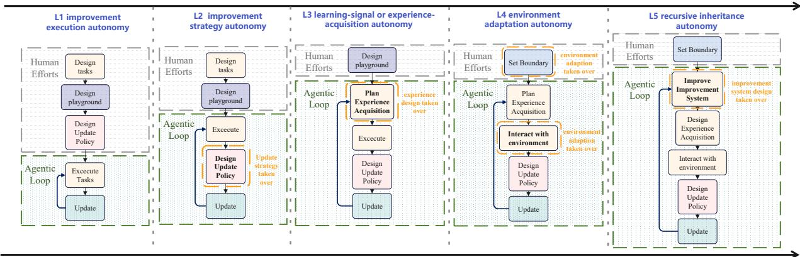  
The scope of improvement responsibility internalized by AI improves  
Figure 2 Loop Patterns of Five Levels. Gray dashed frames indicate human-controlled components. Green dashed frames indicate components within the RSI loop. Orange outlines highlight the newly internalized component at each level. The expanding green frames show that AI progressively automates a larger share of the improvement process.

• (L1) Improvement Execution Autonomy. Humans specify what should be improved, how it should be improved, and what constitutes success, while AI executes candidate updates. For example, FineWeb-Edu uses a model to apply human-defined educational-quality labels across a web corpus without choosing the labeling criterion [22].

• (L2) Improvement Strategy Autonomy. The objective, task boundary, and evaluation criteria remain externally fixed, but AI diagnoses weaknesses and decides how to improve the system. For example, Self-Harness uses execution traces to propose and test edits to its agent harness under a fixed benchmark and promotion rule [23].

• (L3) Learning-Signal or Experience-Acquisition Autonomy. The system also determines the experience needed for its next improvement round. For example, SIMA 2 uses assessments of current behavior to generate later practice tasks that target observed skill weaknesses [24].

• (L4) Environment Adaptation Autonomy. The improvement loop uses deployment interaction to revise persistent system state under external acceptance and governance rules. For example, PANDO admits or demotes reusable rules during a long-running interaction according to observed outcomes, so later actions inherit earlier experience [25].

• (L5) Recursive Inheritance Autonomy. The system persistently revises a mechanism that governs subsequent improvement, such as an improver, verifier, or successor-generation procedure. For example, A-Evolve-Training revises its research policy after development scores fail to predict external gains and uses the revised policy to direct the next training round [17].

## 1.5 Application Domains

While the autonomy levels describe the structure of an improvement loop, their practical meaning depends on the feedback available in a domain, as the same retained update may be straightforward to test in software engineering and dificult to validate in a physical or clinical setting. We consider science, embodied intelligence, software engineering, and healthcare because they expose four distinct feedback regimes, including experimental evidence with uncertain attribution, physical interaction with costly trials, executable tests with incomplete specifications, and high-stakes outcomes under expert oversight. These regimes allow us to compare how feedback cost and reliability afect the retention and reuse of improvements.

• (S1) RSI for Science. Scientific discovery involves open-ended exploration, costly experiments, and feedback that may not clearly identify the source of failure. We examine how accumulated evidence can improve scientific hypothesis modules, experimental agents, and reflection or improvement mechanisms, with attention to whether these changes support subsequent research beyond the current scientific result.

• (S2) RSI for Embodied Intelligence. Embodied agents generate experience through their own actions, while failures may arise from interacting perception, planning, and control components. Physical trials also impose limits on exploration and repeatability. We examine the evolution of environments and curricula, skills and agent harnesses, policies and action models, and world models and evaluators, focusing on how interaction feedback supports validated improvements that can be reused in later tasks.

• (S3) RSI for Software Engineering. Software engineering makes both the developed artifact and the developing agent accessible to executable modification and testing. We examine how repository feedback supports persistent changes to coding-agent implementations and harnesses, development experience and collaboration, and the improvement process itself. A central distinction is whether an update improves current task performance, the ability to produce stronger successors, or both.

• (S4) RSI for Healthcare. Healthcare combines restricted opportunities for trial and error with delayed, heterogeneous feedback and improvements whose validity may depend on the patient population or institution. We examine the evolution of clinical memory and knowledge, reasoning strategies, and tools and workflows, emphasizing how reviewed experience can inform subsequent cases under explicit validation and oversight.

Across these domains, we compare what is updated, how feedback supports its retention, and which decisions remain externally controlled. This analysis connects the autonomy framework to application-specific evidence and identifies the gaps between demonstrated improvement mechanisms and fuller recursive improvement.

## 1.6 Industrial Evidence

The domain analysis identifies the feedback and validation conditions that shape an improvement loop, while industrial systems show how these conditions are handled within operating pipelines, where integration and deployment constraints are immediate. We examine industrial practice because frontier improvement loops are not always first documented through conventional academic publications. Industrial materials, including technical reports, open-source systems, engineering blogs, model documentation, and deployed product infrastructures, often reveal system-level practices, such as evaluation pipelines, data flywheels, agent harnesses, automated experimentation, and deployment feedback loops, which are only partially represented in the academic literature. We use these materials to complement the research literature and to understand how self-improvement is implemented under real engineering constraints.

Building on the autonomy-centered framework and application analysis, we examine what responsibilities industrial systems assume for their own improvement and how these responsibilities vary across applications and engineering settings. We further analyze how constraints such as computational cost, feedback quality, and human involvement shape the organization of improvement loops and limit the attainable scope of autonomy. This perspective allows us to characterize both the mechanisms that have been demonstrated in deployed or production-oriented systems and the more ambitious visions of recursive improvement that remain to be validated, thereby clarifying the current progress and limitations of industrial RSI practice. Figure 16 reports the surveyed literature by autonomy level and improvement target, while Table 12 provides the corresponding landscape of industrial systems.

## 1.7 Differences from Existing Surveys

Existing surveys provide complementary taxonomies of self-evolving systems and the mechanisms from which improvement loops are built. These works establish much of the technical vocabulary on which our analysis relies. Our survey difers in four respects.

• Improvement loop as the unit of analysis. Prior surveys organize work by stages of self-evolution, update objects, timing, or technical mechanisms [26–29]. These views explain what changes and how the change is produced, but systems that update the same component may assign very diferent decisions to AI. We trace a complete loop: what triggers improvement, who proposes and validates a change, what persists, and which later decisions use the retained change.

• Responsibility as the autonomy criterion. Related frameworks examine capability levels, co-evolution, dynamic agent state, and AI-for-AI systems [30–33]. We operationalize autonomy through the improvement decisions transferred from external designers to the AI rather than through model capability or the number of automated components. Our five levels distinguish responsibility for execution, strategy selection, experience acquisition, environmental adaptation, and recursive inheritance.

• Separate evidence for recursion and performance. Evaluation surveys study model-based judgment, agent assessment, rubric-guided learning, and oversight failures [34–38]. Higher task performance alone does not show that an improvement mechanism was revised, retained, and reused. We distinguish structural recursion, in which a revised improvement mechanism governs a later round, from efective recursion, in which that mechanism produces stronger successors under comparable budgets and independent evaluation.

• Mechanisms compared across operating conditions. Work on correction, synthetic data, lifelong learning, memory, prompt optimization, and workflow design explains how individual components improve [39–49]. We examine how these mechanisms function within complete loops across science, embodied intelligence, software engineering, healthcare, and industrial practice, where feedback cost, validation, and external control difer [50–52]. Comparing the same loop questions across these settings reveals when a method depends on cheap executable feedback, repeated interaction, expert review, or production infrastructure.

These choices together position the survey between a catalog of improvement mechanisms and a general hierarchy of AI capabilities. Our aim is to determine which parts of an improvement loop current systems can assume, how retained changes afect later rounds, and what evidence supports claims of recursive progress.

## 2 Background and Preliminaries

This section establishes the empirical and conceptual basis for our autonomy-centered view of recursive self-improvement. We first examine the uneven progress of modern foundation models across diferent capability domains, highlighting why persistent improvement is particularly relevant to interactive, stateful, and tool-using systems. We then characterize RSI through the structure of an improvement loop, introduce the key components needed to analyze how improvements are generated, validated, retained, and inherited, and distinguish RSI from neighboring paradigms such as continual learning, AutoML, and agentic AI. Finally, because contemporary RSI spans both academic research and industrial engineering practice, we clarify the scope and strength of the evidence used throughout this survey. Together, these preliminaries provide the empirical motivation, operational vocabulary, and evidentiary basis for the autonomy hierarchy developed in the following section.

## 2.1 Uneven Capability Progress in Modern Foundation Models

Figure 3 summarizes 393 eligible model–benchmark observations across ten capability domains for models released between 2023 and September 2026.

We first group reported scores into protocol-link families. Two results belong to the same family only when the benchmark version and evaluation harness remain stable, or when evaluations of overlapping models provide a defensible bridge between protocols. Results obtained with incompatible versions or harnesses remain in the audit records but are excluded from the trajectories. This rule admitted 17 of the 33 results considered in the latest-model audit. The other 16, drawn from Terminal-Bench [53], DeepSWE [54], CyberGym [55], ExploitBench [56], AutomationBench [57], and BrowseComp [58], were retained for reference because their benchmark versions or evaluation settings could not be linked to the plotted families. If several sources report the same model under the same benchmark family, variant, and evaluation mode, we calculate the following weighted consensus:

$$
\bar { s } _ { m b h } = \frac { \sum _ { i } \widetilde { w } _ { i } s _ { i m b h } } { \sum _ { i } \widetilde { w } _ { i } } ,\tag{1}
$$

where h denotes the evaluation protocol and i indexes sources. Benchmark-owner tables, independent commonharness evaluations, combined benchmark or model reports, and model-author tables receive base weights of

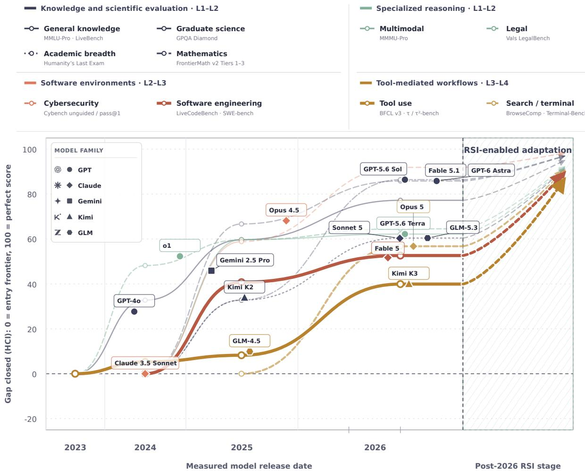  
Figure 3 Cross-domain capability trajectories and an illustrative RSI extension. Each line reports an annual domain frontier in HCI, where 0 is the benchmark’s entry-year frontier and 100 is a perfect score. Dashed cybersecurity segments denote changes in Cybench subsets or pass@1 aggregation. The post-2026 region illustrates the extension of domains with the assistance of RSI.

3, 2.5, 2, and 1, respectively. We multiply first-party values by an additional factor of 0.75. These weights provide a practical sensitivity adjustment, limiting the influence of self-reported results.

The underlying benchmarks report diferent quantities, so their raw values cannot be pooled directly. We normalize the consensus score with the Headroom-Closed Index (HCI). For model m on benchmark family b under protocol h,

$$
H _ { m b h } = 1 0 0 \times \frac { \bar { s } _ { m b h } - F _ { b , 0 } } { 1 0 0 - F _ { b , 0 } } ,\tag{2}
$$

where $F _ { b , 0 }$ is the 90th-percentile model score in the first year that benchmark enters the dataset. Thus, $H _ { m b h } = 0$ denotes the entry-year frontier and $H _ { m b h } = 1 0 0$ denotes a perfect score. For each benchmark family and release year, we first compute the 90th-percentile HCI frontier $Q _ { b , y }$ . The domain trajectory is then

$$
T _ { d , y } = \frac { \sum _ { b \in \mathcal { B } _ { d , y } } \sqrt { n _ { b , y } } Q _ { b , y } } { \sum _ { b \in \mathcal { B } _ { d , y } } \sqrt { n _ { b , y } } } ,\tag{3}
$$

where $B _ { d , y }$ is the set of eligible benchmark families for domain d in year $y ,$ and $n _ { b , y }$ is the number of distinct models contributing to that benchmark-year frontier. The square-root weight allows better-covered families to contribute more without letting the largest table dominate the domain value. Three observations follow.

• Observation 1: Frontier gains differ in magnitude and timing. By 2026, advanced mathematics and graduate-level science reach HCI values of 86.4 and 85.8, while broad knowledge reaches 77.2. The corresponding values for legal reasoning, multimodal reasoning, and frontier academic breadth are 64.5, 62.2, and 60.4. The annual increment $\Delta T _ { d , y } = T _ { d , y } - T _ { d , y - 1 }$ exposes diferent temporal patterns. Broad knowledge rises by 32.8, 26.9, and 17.6 points across the three annual transitions, indicating steady but slowing headroom closure. Legal reasoning similarly slows from a 48.2-point gain in 2024 to 11.4 in 2025 and 4.9 in 2026. Advanced mathematics follows a diferent path, whose increment grows from 32.8 points in 2025 to 53.6 in 2026. Multimodal reasoning gains 59.7 points in 2025 but only 2.5 in 2026. A single aggregate benchmark would conceal these diferences in both level and trajectory shape.

• Observation 2: Interactive capabilities retain larger gaps. Software engineering reaches an HCI of 52.6 in 2026, search and terminal agents reach 56.8, and tool agents reach 39.9. Relative to graduate-level science at 85.8, their normalized headroom closure is lower by 33.2, 29.1, and 45.9 points, respectively. Tool agents improve sharply in 2026, from 8.2 to 39.9, yet remain the lowest trajectory. Software engineering gains 40.8 points in 2025 and 11.9 in 2026. The leading cybersecurity-agent trajectory reaches 91.9, producing a 52.0-point diference from tool agents. This comparison requires caution because the later Cybench observations use changed task subsets or pass@1 aggregation, as indicated by the dashed line. Even with that qualification, the figure shows that gains in bounded or readily verified environments have not transferred uniformly to long, stateful workflows. Model developers increasingly turned their attention to agentic coding and tool use after 2024, and these capabilities became prominent research and engineering targets during 2025 and 2026 [25, 59–61]. Such tasks require planning, environment-state tracking, tool selection, result interpretation, and revision of subsequent actions. Errors propagate across the trajectory, so data collection and evaluation must cover complete interactions. In the paper’s autonomy taxonomy, bounded evaluations mainly exercise L1–L2 capabilities, environment tasks increasingly require L2–L3 capabilities, and interactive workflows expose the verification, memory, and adaptation requirements associated with L3–L4 operation.

• Observation 3: Remaining headroom concentrates the potential value of RSI. The hatched post-2026 region illustrates how persistent and verified recursive self-improvement could preferentially afect domains with larger remaining gaps. To express this relationship consistently, the illustrative endpoint for domain d is

$$
R _ { d } = 1 0 0 - 0 . 2 2 \left( 1 0 0 - T _ { d , 2 0 2 6 } \right) .\tag{4}
$$

Equivalently, the illustrative gain is $R _ { d } { - } T _ { d , 2 0 2 6 } = 0 . 7 8 ( 1 0 0 { - } T _ { d , 2 0 2 6 } )$ , so domains with more unclosed headroom receive a larger extension. Cybersecurity therefore moves from 91.9 to 98.2, while software engineering, search and terminal agents, and tool agents move from 52.6 to 89.6, from 56.8 to 90.5, and from 39.9 to 86.8. The endpoints illustrate the hypothesis that repeated experience generation, validation, update retention, and regression testing could direct more improvement toward weak deployment workflows.

Software engineering and tool use are therefore particularly relevant to RSI. Human-led updates require repeated environment construction, trajectory collection, failure diagnosis, training or harness revision, and regression testing as interfaces and repositories change. The methods reviewed later generate practice from observed weaknesses [61], distill trajectories into reusable rules and tools [25, 62], and retain tested harness or code changes for future tasks [23, 63]. These mechanisms can direct successive updates toward failures observed during deployment and reduce the capability gaps represented by the illustrative extensions.

## 2.2 Conceptual Foundations of Recursive Self-Improvement

The idea that an intelligent system may participate in improving its own future behavior has several intellectual predecessors, including self-modifying programs, the Gödel Machine, automated machine learning, metalearning, continual learning, open-ended learning, and more recent agentic systems capable of modifying code, prompts, tools, or training procedures [14, 33, 64–67]. These traditions address overlapping parts of the problem, but they do not by themselves provide a suficient criterion for RSI. Automated optimization does not necessarily imply self-improvement, persistent learning does not necessarily imply autonomy over the learning process, and an AI-generated improvement to an external artifact does not necessarily modify the AI system that generated it.

For this reason, we take the improvement loop rather than any particular algorithm as the basic unit of analysis. This perspective allows systems implemented through very diferent mechanisms to be compared according to the same questions: what generates the experience, what is changed, what persists into future interactions, who controls the update process, and whether the result of one improvement round participates in determining subsequent improvements.

## 2.2.1 Anatomy of an Improvement Loop

Improvement loop. We define an improvement loop as a recurring process in which an AI system uses experience to propose a modification to a target, evaluates the candidate under an acceptance rule, retains an accepted change in its state, and begins the next round from that updated state. The following components identify where each operation occurs and what information passes between rounds.

• AI system: the complete computational entity whose capability state is tracked across improvement cycles. It includes the mechanisms and persistent state that determine how the system acts, generates modifications from feedback, and carries accepted results into the next round. In automated code improvement, for example, the AI system includes the components that propose a patch, execute the modified program, evaluate the result, and continue from a retained version.

• System state: the part of the AI system retained at the end of one round and inherited by the next. It is what the next round receives from the previous one. If a system accepts a faster program and continues modifying that version, the retained program belongs to its system state.

• Experience: information obtained from earlier interactions and used to guide a later modification. A test failure, environment outcome, or reviewer correction becomes experience when it informs a subsequent update.

• Target: the object directly modified in the current round. In code optimization, the target may be a sorting function. If the system later changes its method for generating code candidates, that search method becomes the target.

• Improver: the mechanism that transforms the current state and available experience into candidate modifications. A model that reads the current code and a recent test failure before proposing the next patch acts as the improver in that round.

• Strategy: the method used by the improver to decide where to search and how to generate candidates. A strategy may prioritize code locations implicated in failed tests. Because the strategy can be retained, it may also become a target of later improvement.

• Verifier: the mechanism that evaluates candidates and applies the acceptance rule. It may use benchmark scores, unit tests, reward models, environment outcomes, human feedback, formal constraints, safety checks, or combinations of these signals.

• Improvement: a candidate modification that passes the current acceptance rule, is retained, and enters the next system state. An improvement is therefore an accepted and inherited state change.

• Successor: the AI system that inherits one or more accepted improvements and enters the next round with an updated state. For example, a system that retains a revised code-search strategy and uses it to generate later modifications is the successor of the version that produced the strategy.

This decomposition yields three cross-cutting questions that will be used throughout the survey. Where does the loop close? determines whether an apparent improvement actually returns to the system. What is updated and inherited? determines the persistent carrier of improvement. Which decisions remain external? determines how much authority over the improvement process has been transferred from humans or fixed infrastructure to the AI system itself.

This anatomy applies to persistent improvement processes with diferent degrees of automation. The next subsection specifies the additional conditions for RSI: experience must produce persistent self-change with suficient autonomy, and an accepted change must be able to afect how later improvements are generated, evaluated, selected, or consolidated.

## 2.2.2 Definition of Recursive Self-Improvement

Using the improvement-loop anatomy above, we define recursive self-improvement (RSI) as the capability of an intelligent system, through continued interaction with tasks, environments, or other intelligent agents, to autonomously transform acquired experience and feedback into persistent changes to itself across interaction rounds (e.g., model parameters, agent harnesses, or improvement policies), such that these changes can further afect the mechanisms used to generate, evaluate, select, and consolidate subsequent self-improvements. The improved system is consequently reintroduced into the next round of interaction and improvement with an already changed capability state, allowing the system’s capacity for improvement itself to become part of an ongoing recursive process.

RSI contains an autonomous, closed-loop process in which AI identifies its own limitations, develops and validates improvements, and uses the resulting capabilities to improve the improvement process itself, with the aim of (1) expanding its capability frontier, (2) increasing resource eficiency, or (3) discovering novel solutions beyond human-prescribed strategies.

Recent industry perspectives increasingly operationalize RSI through autonomous improvement loops. OpenAI emphasizes the automation of AI research workflows and feedback loops [68], while Tencent reports an earlystage RSI loop in which experimental results are fed into subsequent rounds of model development [69]. More strictly, Alibaba researchers define RSI by making the improvement mechanism itself subject to modification [30], whereas Anthropic describes its strongest form as an AI system autonomously designing and developing its own successor [70].

## 2.2.3 Relation to Neighboring Paradigms

RSI intersects with continual learning, automated machine learning (AutoML), and agentic AI because all three automate parts of an improvement loop. They difer in the usual target of improvement, the state retained across rounds, and the decisions left to a fixed procedure or an external actor. Table 1 summarizes these distinctions.

Continual learning: Continual learning enables a model or agent to acquire knowledge from a sequence of tasks or data while limiting the loss of earlier capabilities [64, 71, 72]. Recent work covers continual pre-training, instruction tuning, alignment, replay, parameter-eficient updates, and memory-based adaptation [64, 71]. Lifelong and self-evolving agents further extend persistent state beyond model weights to memories, skills, and behavioral policies [28, 43]. The learning objective, update rule, experience schedule, and acceptance test nevertheless usually remain fixed by the system designer [64, 72]. In our framework, continual learning approaches RSI when experience can also revise how later adaptations are proposed, evaluated, or consolidated, and the revised process is reused in subsequent rounds [28, 43].

AutoML: AutoML automates model-development decisions such as data processing, model and architecture selection, hyperparameter optimization, and pipeline construction [33, 73]. Recent systems broaden this scope through language-model agents: AutoML-Agent constructs and verifies complete machine-learning pipelines, while ADAS, AFlow, and AgentSquare search over executable agent designs, workflow graphs, or reusable modules [66, 67, 73, 74]. MLE-bench and the AI Scientist-v2 extend evaluation to sustained machine-learning engineering and iterative research workflows [75, 76]. Their search spaces, objectives, budgets, and evaluators are generally supplied in advance, even when much of the development work is automated [66, 67, 73]. AutoML reaches the RSI boundary when the procedure used to search for or evaluate improvements becomes persistent state that later rounds can improve [28, 66, 67].

Agentic AI and agentic ML: Agentic systems plan multistep work, invoke tools, run experiments, coordinate specialized components, and revise intermediate artifacts [75–77]. MLE-bench, PaperBench, and the AI Scientist-v2 study these capabilities in machine-learning engineering and research settings [75–77], while ADAS and AFlow automate the construction of the agent or workflow that performs the task [66, 67]. These systems may operate within an episode whose harness, tools, stopping rule, and acceptance criteria remain unchanged, a boundary identified in work on self-evolving agents [28, 43]. Agentic ML approaches RSI when validated changes to the agent system persist across tasks and afect how later improvements are generated or selected [28, 66, 67].

Table 1 Comparison of RSI with neighboring paradigms.
<table><tr><td>Characteristic</td><td>Continual learning</td><td>AutoML</td><td>Agentic AI/ML</td><td>RSI</td></tr><tr><td>Cross-round learning</td><td>V</td><td>0</td><td>0</td><td></td></tr><tr><td>Persistent retention</td><td>√</td><td>0</td><td>0</td><td></td></tr><tr><td>System self-modification</td><td>√</td><td>0</td><td>×</td><td>√</td></tr><tr><td>Candidate proposal</td><td>×</td><td>√</td><td>√</td><td>√</td></tr><tr><td>Update validation</td><td>0</td><td>√</td><td>0</td><td>√</td></tr><tr><td>Successor re-entry</td><td>√</td><td>×</td><td>×</td><td>√</td></tr><tr><td>Mechanism revision</td><td>×</td><td>0</td><td>×</td><td></td></tr><tr><td>Mechanism reuse</td><td>×</td><td>×</td><td>0</td><td></td></tr></table>

✓ Primary core objective ◦ Secondary supporting role × Outside scope not addressed

The distinctive question posed by RSI is therefore not simply whether AI contributes to AI development. It is whether a persistent improvement loop has formed around the system itself, and how much authority over that loop has become endogenous.

## 2.3 Scope of Evidence

The current development of RSI spans academic research and industrial engineering practice. Restricting the evidence base to peer-reviewed publications would therefore omit systems whose most detailed descriptions appear in technical reports, oficial engineering blogs, open-source repositories, model documentation, or company research materials. We include these sources when they provide concrete evidence about the structure or operation of an improvement loop.

Industrial practice is a primary source of evidence for contemporary RSI. Many of the most advanced self-improvement loops are developed in frontier AI systems before they are fully described in conventional academic papers. Their operational details often first appear in technical or research reports from leading AI laboratories, engineering blogs, open-source repositories, model releases on platforms such as GitHub and Hugging Face, and public benchmark or competition leaderboards. These sources expose aspects of RSI that are particularly important to this survey: how improvement is organized in a working system, what artifacts are retained across iterations, how models and agents interact with evaluators and tools, and whether an improvement mechanism continues to operate beyond a single experimental result.

This broader evidence scope allows the survey to capture emerging RSI practice while maintaining a clear distinction between demonstrated mechanisms and inferred ones.

## 3 RSI Across Autonomy Levels

We organize existing work on RSI into a hierarchy of autonomy levels, according to how much responsibility the AI system assumes for its own improvement. The hierarchy progresses from in-session refinement, where improvement is confined to the current task, through increasingly persistent and autonomous forms of system adaptation, toward recursive improvement, where the mechanisms for producing future improvements themselves become subject to improvement.

At each level, we review representative approaches and systems while addressing three common questions: (1) where is the improvement loop closed, (2) what improvement is retained and carried into the next round, and (3) which critical decisions in the improvement process remain under human control?

Table 2 provides a cross-level map of representative implementation techniques.

## 3.1 B0: In-Task AI Improvement

At B0, improvement is confined to the current task: the AI system may iteratively revise, verify, or select among candidate outputs, but no resulting change is retained as persistent system state for future independent tasks. We therefore treat B0 as a non-RSI reference level that marks the boundary between improving an output and improving the system that produces future outputs. Put diferently, the defining criterion of B0 is output change without persistent system change.

Table 2 Representative implementation techniques across RSI autonomy levels (L1–L5).
<table><tr><td>Technique Family</td><td>Concrete Technique</td><td>L1 Execution</td><td>L2 Strategy</td><td>L3 Experience</td><td>L4 Deployment</td><td>L5 Meta</td></tr><tr><td rowspan="5">Search &amp; Optimization</td><td>A1. Evolutionary Search</td><td></td><td>Promptbreeder [78] AgentSquare [74] C-Evolve [79]</td><td></td><td>DecoEvo [80]</td><td>DGM [16] RQGM [21]</td></tr><tr><td>A2. Tree Search /MCTS</td><td></td><td>AFlow [67]</td><td></td><td></td><td></td></tr><tr><td>A3. Bayesian / Black-box Optimization A4. LLM Reflection / Critique</td><td>EDIT [81]</td><td>GEPA [82] MPO [83]</td><td>VOYAGER [84]</td><td>ReasoningBank [85] Trace2Skill [86]</td><td></td></tr><tr><td>A5. LLM-guided Program / Code Search</td><td>Agent-Agnostic C/C++ [87] Harness</td><td>ADAS [66] AFlow [67] AutoKernel [90]</td><td>VOYAGER [84]</td><td>Metis [62] Metis [62] HarnessDev [91] Tax AI [92]</td><td>STOP [15] HyperAgents [93] AIDE2 [94]</td></tr><tr><td>B1. Offline Synthetic Data Generation</td><td>Engineering [88] AIPC [89] SynthLLM [95]</td><td></td><td></td><td></td><td></td></tr><tr><td rowspan="5">Data, Task &amp; Experience Construction</td><td></td><td>SynthAgent [96] Nemotron-4 [97]</td><td></td><td></td><td></td><td></td></tr><tr><td>B2. Self-Play / Adversarial Task Generation</td><td></td><td></td><td>SSP [98] AZR [99] STP [100]</td><td></td><td></td></tr><tr><td>B3. Adaptive Curriculum / Task Scheduling</td><td></td><td></td><td>SIMA 2 [24] SEAgent [61] VOYAGER [84]</td><td></td><td></td></tr><tr><td>B4. Enviroment Generation B5. Autonomous Exploration</td><td>SynthAgent [96]</td><td></td><td>SIMA 2 [24]</td><td></td><td></td></tr><tr><td>/ Interaction C1. Supervised Fine-Tuning</td><td>EDIT [81]</td><td></td><td>SEAgent [61] VOYAGER [84] STP [100]</td><td></td><td></td></tr><tr><td rowspan="6">Training &amp; Persistent Update</td><td>(SFT) C2. Preference Optimization</td><td>SynthAgent [96] Nemotron-4 [97]</td><td></td><td>PSV [101]</td><td></td><td></td></tr><tr><td>(DPO / KTO) C3. Reinforcement Learning</td><td>Nemotron-4 [97]</td><td></td><td></td><td></td><td></td></tr><tr><td>(PPO / GRPO / RLVR) C4. Knowledge</td><td>EDIT [81] REPO [102]</td><td></td><td>AZR [99] R-Zero [103] SEAgent [61]</td><td></td><td></td></tr><tr><td>Distillation C5. Prompt / Context Optimization</td><td></td><td>Promptbreeder [78] GEPA [82]</td><td></td><td>DecoEvo [80] ACE [104]</td><td></td></tr><tr><td>C6. Memory / Skill Consolidation</td><td></td><td>MPO [83]</td><td>VOYAGER [84] SEAgent [61]</td><td>PersonaAgent [105] ReasoningBank [85] Metis [62]</td><td></td></tr><tr><td>D1. Exeçution / Unit-Test Verification</td><td>Agent-Agnostic C/C++ [87]</td><td>AutoKernel [90]</td><td>AZR [99] VOYAGER [84]</td><td>Trace2Skill [86] Metis [62] HDSO [106]</td><td>STOP [15] AIDE2 [94]</td></tr><tr><td rowspan="4">Verification &amp; Selection</td><td></td><td>AIPC [89] Harness Engineering [88]</td><td></td><td></td><td>Tax AI [92]</td><td></td></tr><tr><td>D2. Formal Verification D3. Reward Model</td><td>Nemotron-4 [97]</td><td></td><td>STP [100] PSV [101] SIMA 2 [24]</td><td>ReasoningBank [85]</td><td>RQGM [21]</td></tr><tr><td>/ LLM-as-a-Judge D4. Regression Testing / Model Selection</td><td>REPO [102] HealthBench [107] Agent-Agnostic</td><td>GEPA [82]</td><td>SEAgent [61]</td><td>DecoEvo [80] HarnessDev [91]</td><td>STOP [15]</td></tr><tr><td>E1. Onļine / Continual</td><td>C/C++ [87] Harness Engineering [88]</td><td>AutoResearch [108] AutoKernel [90]</td><td></td><td>ASPIRE [109] HDSO [106] ReasoningBank [85]</td><td>RQGM [21] AIDE2 [94]</td></tr><tr><td rowspan="4">Online &amp; Meta-Level Adaptation</td><td>Learning</td><td></td><td></td><td>SEAgent [61] VOYAGER [84]</td><td>PANDO [25] Dynamic Cheatsheet [110]</td><td></td></tr><tr><td>E2. Experience Replay / Online Memory Update</td><td></td><td></td><td></td><td>ReasoningBank [85] PANDO [25] Metis [62]</td><td></td></tr><tr><td>E3. Self-Modifying Code / Policy</td><td></td><td>ADAS [66] AFlow [67] AutoResearch [108]</td><td></td><td>HarnessDev [91] ASPIRE [109] SHAPER [111]</td><td>STOP [15] Gödel Agent [19] A-Evolve-</td></tr><tr><td>E4. Adaptive / Co-Evolving Evalúator</td><td></td><td></td><td></td><td>DecoEvo [80]</td><td>Training [17] RQGM [21]</td></tr></table>

Reading guide. Rows group concrete techniques into broader technical families; columns indicate the autonomy levels of the specific improvement loops examined in the cited works. A work may appear in multiple cells when it employs several techniques or contains distinct improvement loops. Each cell lists up to three representative works. An em dash (—) indicates that no representative example is listed here; it does not imply incompatibility between the technique and the level.  
Level shorthand. L1: improvement execution · L2: improvement strategy · L3: learning-signal / experience acquisition · L4: environment adaptation · L5: recursive inheritance (meta-improvement).

For example, a coding agent may repeatedly revise its code using a human-provided test suite and a fixed limit of five attempts. It remains at B0 if the fixes and feedback are confined to the current task and do not change how the agent handles subsequent tasks. Similarly, a writing agent may revise an essay against a human-provided rubric without retaining the resulting experience for future writing. In both cases, humans specify the evaluation rules and revision procedure, while AI improves only the current output within those constraints.

Under fixed rules, B0 can improve output in single sessions. For instance, Self-Refine improves outputs through a generate–feedback–refine loop within the same session [112]; Reflexion writes verbal reflections on failed attempts into a context bufer for subsequent tries [113]; Tree of Thoughts organizes reasoning as a search over candidate thought branches [114].

However, B0 cannot accumulate knowledge across tasks. Iterative traces and correction signals exist only within the current session; after task termination they are discarded, and the system cannot consolidate fragmented experience into long-term capability. APEX-EM notes that LLM-based agents generally lack persistent procedural memory: even after solving an identical task, they must re-derive the solution from scratch [115]. Specifically, there are four main limitations.

• Experience does not accumulate across tasks. Intermediate results, critiques, and corrections remain in temporary task context rather than becoming updates to model parameters, reusable memory, or operating rules [116]. A system may therefore correct an error in one task and repeat it in the next. Increasing the number of iterations cannot resolve this lack of persistent learning.

• Improvement procedure remains human-defined. AI can generate, verify, and revise outputs, but humans still determine how this process operates [112]. For example, a coding agent may fix code that fails a test, but it does not persistently improve the testing procedure for future tasks. The loop closes around the current output; responsibility for upgrading the system’s improvement mechanisms remains with humans. Tool use, simulation, and real-world feedback do not by themselves change this boundary.

• Self-generated feedback can reinforce errors. When the same model generates and evaluates an answer, both stages may share the same knowledge gaps. Self-Correction Bench identifies verification, particularly locating the first incorrect reasoning step, as a key bottleneck [117, 118]. Without reliable external feedback, revision can even turn a correct answer into an incorrect one [119]. Repeated critique therefore does not guarantee successful correction.

• More iterations offer limited gains under fixed evaluation. Revising an answer without new information may provide little additional benefit [120]; independent sampling or external verification can be more efective in some settings [121, 122]. A fixed verifier also leaves some errors undetected [123]. For example, repeatedly revising code to pass an incomplete test suite may improve test performance while leaving untested failures unresolved.

## 3.2 L1: Autonomy over Improvement Execution

At L1, AI system executes a human-defined improvement procedure whose accepted results are retained and reused in later tasks or improvement rounds. Humans specify the objective, update procedure, and acceptance criteria, while AI carries out the prescribed improvement steps. Unlike B0, the loop changes persistent state within the specified AI system rather than only refining the current task output. For example, a coding agent may follow a human-defined procedure to revise code based on test feedback, save validated fixes as reusable rules, and automatically apply them to subsequent independent tasks. This pattern is already visible in production infrastructure. Meta’s Capacity Eficiency system encodes engineers’ debugging expertise into reusable repair skills and applies these skills through predefined procedures to diagnose performance regressions and perform remediation tasks. Meta reports that this workflow compresses hours of manual regression investigation into minutes, and the resulting pull requests undergo standard review and integration, creating persistent improvements in the production system [5].

The characteristic loop at this level can be summarized as follows:

Table 3 Representative L1 systems organized by AI development pipeline levels. L1 systems execute human-defined improvement procedures and produce persistent artifacts that enter subsequent workflows.
<table><tr><td>Method</td><td>Type</td><td>Key Mechanism</td><td>Level Limitation</td></tr><tr><td colspan="4">Data Level</td></tr><tr><td>Google High-Fidelity Label Curation [124]</td><td>Data curation</td><td>LLM labeling + boundary selection</td><td>Human-defined labeling rules</td></tr><tr><td>Phi-4-reasoning [125]</td><td>Training data selection</td><td>LLM evaluation + boundary filtering</td><td>Human-defined selection criteria</td></tr><tr><td>FineWeb-Edu [22]</td><td>Data filtering</td><td>LLM scoring + classifier filtering</td><td>Human-defined quality criteria</td></tr><tr><td>NVIDIA NeMo Curator [126]</td><td>Data curation</td><td>Configurable filtering pipeline</td><td>Human-configured processing rules</td></tr><tr><td>Data-Juicer [127]</td><td>Data processing</td><td>Composable processing operators</td><td>Human-defined processing recipe</td></tr><tr><td>Microsoft SynthLLM [95]</td><td>Synthetic data generation</td><td>Reference-guided data synthesis</td><td>Human-defined generation procedure</td></tr><tr><td>SynthAgent [96]</td><td>Supervision generation</td><td>Task + trajectory synthesis</td><td>Human-defined generation workflow</td></tr><tr><td>NVIDIA Nemotron-4 [97]</td><td>Synthetic supervision</td><td>Candidate generation + reward filtering</td><td>Human-defined quality dimensions</td></tr><tr><td colspan="4">Training-Method Level</td></tr><tr><td>EDIT [81]</td><td>Training signal refinement</td><td>Diagnosed step revision</td><td>Human-defined diagnostic criteria</td></tr><tr><td>REPO [102]</td><td>Post-training procedure</td><td>SOP-guided interaction + reward evaluation</td><td>Human-defined behavioral procedure</td></tr><tr><td colspan="4">Training-Platform Level</td></tr><tr><td>Agent-Agnostic C/C++ Optimization [87]</td><td>Training execution optimization</td><td></td><td></td></tr><tr><td>Meta NCCL Agentic Debugging [128]</td><td>Failure diagnosis and recovery</td><td>Procedural performance optimization loop Runbook-guided distributed debugging</td><td>Human-defined optimization workflow Human-defined debugging procedure</td></tr><tr><td colspan="4"></td></tr><tr><td>Evaluation-and-Safety Level</td><td></td><td></td><td></td></tr><tr><td>OpenAI HealthBench [107]</td><td>Model evaluation</td><td>Expert-rubric-based automated scoring</td><td>Human-defined evaluation rubrics</td></tr><tr><td colspan="4">Deployment-Optimization Level</td></tr><tr><td>AIPC [89]</td><td>Model deployment</td><td>Skill-guided deployment adaptation</td><td>Human-defined deployment procedure</td></tr><tr><td colspan="4">Application-System Level</td></tr><tr><td>Agent Toolkit for AWS [129]</td><td>Model-application integration</td><td>Bedrock skill-guided integration</td><td>Human-defined integration procedures</td></tr><tr><td>LinkedIn CAPT [130]</td><td>Product engineering</td><td>Step-by-step engineering playbooks</td><td>Human-authored implementation procedures</td></tr><tr><td>OpenAI Harness Engineering [88]</td><td>Product development</td><td>Constraint-guided implementation</td><td>Human-defined architecture and delivery rules</td></tr></table>

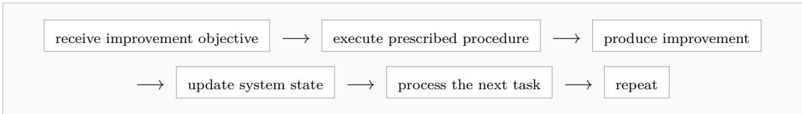

Despite its simple structure, executing this loop reliably presents several core challenges. First, the prescribed procedure must cover the situations that arise during execution. When the task encounters a condition that is not addressed by the predefined procedure, the agent lacks an applicable next step and cannot independently modify the procedure to resolve it. Second, execution must remain reliable across multi-step workflows, since an incorrect diagnosis, transformation, or intermediate decision can influence all subsequent actions. Third, because the resulting improvement is written back into the system state and reused in later tasks, its validity must be checked before retention; otherwise, execution errors can persist and afect subsequent development cycles. These challenges recur across the AI development pipeline, but their concrete form depends on the stage in which the improvement procedure is executed.

Specifically, large-scale AI development in real scenarios is typically organized into several distinct levels: (1) the data level governs the construction and curation of training corpora; (2) the training-method level determines how models learn; (3) the training-platform level manages the execution of large-scale training; (4) the evaluation-and-safety level assesses model capabilities and safety; (5) the deployment-optimization level enables eficient model serving; and (6) the application-system level integrates foundation-model capabilities into downstream products and application systems. The following sections examine how the AI system autonomously executes predefined improvement procedures within each level and how the resulting artifacts feed into downstream stages of the development workflow. Table 3 summarizes the representative systems discussed across these levels.

## 3.2.1 Data Level

At the data level, AI increasingly takes over the execution of large-scale data production and curation procedures that were previously carried out through substantial manual efort. Existing approaches mainly fall into two classes. The first focuses on data cleaning and quality filtering, and the second focuses on synthetic data and supervision generation, where humans define the target task, desired data characteristics, and validation procedures.

• (1) Data cleaning and quality filtering. A primary challenge at the data level is scale: the volume of training corpora and candidate samples far exceeds the capacity for manual review at the sample level. Data curation is therefore shifting from sample-by-sample human judgment toward a paradigm in which humans define quality criteria and processing procedures, while AI executes them at scale. In Google’s high-fidelity label curation pipeline, developers first define the target task and its decision criteria, such as what constitutes clickbait. An LLM then applies these criteria to assign preliminary labels to candidate data, after which a predefined clustering and boundary-sample selection procedure identifies a small subset of informative samples for expert annotation [124]. A similar division of labor appears in the construction of training data for Phi-4-reasoning: researchers specify the desired dificulty and reasoning characteristics together with their evaluation procedures, while LLM-based evaluation pipelines apply these criteria to select samples near the model’s capability boundary [125]. FineWeb-Edu extends this pattern to large-scale web filtering: researchers define educational-quality criteria, use an LLM to generate quality labels, and train a classifier to apply these criteria at scale [22]. As these data-processing operations become standardized, they can also be incorporated into reusable pipelines. NVIDIA NeMo Curator organizes quality filtering, classification, and deduplication into configurable modules that execute according to developer-specified rules and parameters [126]. Data-Juicer follows a similar approach but abstracts data-processing operations into composable operators, allowing predefined processing recipes to be executed over large-scale corpora [127].

• (2) Synthetic data and supervision signal generation. Training data can be expanded through synthetic generation. High-quality demonstrations for complex tasks are often costly to construct manually, motivating the use of repeatable data-generation procedures that models can execute at scale. Microsoft SynthLLM follows this approach by starting from high-quality web content, organizing reference concepts through a predefined multi-stage procedure, and using LLMs to generate diverse prompts and corresponding responses as synthetic training examples [95]. Similar procedures can also produce richer forms of supervision. SynthAgent organizes the construction of tasks and interaction trajectories into a predefined pipeline, in which models perform web exploration, task generation, and trajectory refinement to produce supervision data for training web agents [96]. Synthetic generation can be combined with predefined quality evaluation to construct higherquality supervision data. NVIDIA Nemotron-4 uses an instruction model to generate candidate responses and a reward model to score and filter them according to predefined quality dimensions, with the resulting synthetic samples used for subsequent model training [97].

## 3.2.2 Training-Method Level

At the training-method level, AI increasingly takes over the execution of structured learning and post-training procedures that were previously orchestrated manually by researchers and engineers. Existing approaches mainly encode diagnostic, revision, evaluation, and optimization steps into predefined workflows, where humans specify the learning objectives, feedback signals, and update rules, while AI systems execute these procedures to generate improved training signals and support subsequent model optimization.

Established training practices can be encoded into explicit improvement procedures and executed by AI systems during post-training, improving how models receive training signals and thereby enhancing learning outcomes. EDIT organizes this process as a two-stage training procedure. Researchers first specify the diagnostic signals and revision criteria, after which the system identifies problematic reasoning steps and an LLM revises only the afected parts according to a rubric checklist. The revised outputs are then used for further reinforcement-learning calibration [81]. REPO similarly incorporates a multi-stage standard operating procedure and behavioral constraints into the training process. The model follows the prescribed steps during multi-turn interactions, while an LLM-based judge evaluates procedural compliance according to predefined criteria and converts the resulting assessments into reward signals for subsequent policy optimization [102].

## 3.2.3 Training-Platform Level

At the training-platform level, AI increasingly takes over the execution of infrastructure engineering procedures required to keep large-scale training eficient and reliable. Existing approaches mainly fall into two classes. The first focuses on training execution and performance optimization, where agents analyze workloads and apply predefined optimization procedures, and the second focuses on failure diagnosis and recovery, where agents execute structured debugging and remediation workflows distilled from engineering knowledge and operational experience.

• (1) Training execution and optimization. Performance-engineering practices can be encoded into explicit optimization procedures that AI agents execute on concrete workloads. Agent-Agnostic End-to-End C/C++ Application Performance Optimization follows this pattern by storing the complete optimization control loop in procedural memory. The agent performs runtime analysis, identifies performance hotspots, generates candidate code modifications, and validates both correctness and performance according to the predefined workflow, with unsuccessful changes rolled back before further optimization [87].

• (2) Training failure diagnosis and recovery. Distributed-training failures can similarly be handled through structured debugging procedures derived from accumulated engineering experience. Meta and the PyTorch community categorized the major root causes of NCCL watchdog timeouts and distilled these findings into a practical decision tree and debugging runbook. An AI agent then executes this structured workflow on concrete failures by aligning evidence across ranks, tracing collective sequences, and connecting runtime traces to the corresponding code paths in order to locate the earliest actionable divergence [128].

## 3.2.4 Evaluation-and-Safety Level

At the evaluation-and-safety level, AI increasingly takes over the execution of model assessment procedures that translate expert-defined requirements into scalable and repeatable evaluations. Existing approaches use AI systems to apply predefined rubrics, test protocols, and risk criteria across large numbers of model outputs, while humans remain responsible for defining the evaluation objectives, criteria, and acceptance thresholds.

Model evaluation transforms expert judgment into repeatable testing and scoring procedures. OpenAI HealthBench asks medical experts to define detailed evaluation criteria for specific healthcare conversations, specifying what an ideal response should include or avoid and the relative importance of each criterion. GPT-4.1 then applies these predefined criteria to score candidate model responses and compute the final evaluation result [107]. Similar evaluation procedures can also be applied to robustness, safety, and risk evaluation, providing standardized feedback for subsequent model improvement and release decisions.

## 3.2.5 Deployment-Optimization Level

At the deployment-optimization level, AI increasingly takes over the execution of procedures for adapting trained models to concrete hardware and runtime environments. Existing approaches encode deployment expertise into standardized workflows for model conversion, compatibility resolution, quantization, runtime configuration, and validation, where humans specify the target platform and deployment constraints, while AI systems execute the corresponding adaptation and verification steps.

Deploying trained models to target hardware often requires specialized procedures for model conversion and runtime adaptation. AIPC encodes this deployment expertise into standardized, verifiable stages supported by Agent Skills and stage-wise validation. Given a trained model and a target Qualcomm AI Runtime environment, the AI agent executes the predefined deployment procedure to convert the model, handle deployment incompatibilities, perform quantization calibration, and validate the resulting implementation. The process produces runnable deployment artifacts for downstream inference [89].

## 3.2.6 Application-System Level

At the application-system level, AI increasingly takes over the execution of software-engineering procedures required to integrate foundation models into operational products and services. Existing approaches encode development knowledge into reusable skills, playbooks, and engineering workflows, allowing AI systems to perform tasks such as service integration, interface implementation, code modification, testing, and validation, while humans continue to specify product requirements, system architecture, and the governing development constraints.

Transforming foundation-model capabilities into practical products requires model services and interfaces to be integrated into application systems through repeatable engineering procedures. Agent Toolkit for AWS encodes generative AI development practices into reusable Agent Skills. Its Amazon Bedrock skill provides predefined procedures for integrating model capabilities into applications. AI coding agents can execute these procedures to connect foundation-model services with downstream product interfaces and application components [129].

LinkedIn’s Contextual Agent Playbooks & Tools (CAPT) similarly encodes accumulated organizational knowledge into step-by-step playbooks, enabling AI coding agents to carry out concrete engineering tasks in real codebases (e.g., service creation, interface extension, and code maintenance) [130]. OpenAI Harness Engineering extends this pattern to end-to-end software product development. Engineers define product intent, system architecture, and the rules governing continuous integration, code merging, and rollback, while Codex performs implementation and validation within these predefined constraints and continuously produces code artifacts that enter subsequent development workflows [88].

## 3.2.7 Evaluating L1 Execution Autonomy

Across these levels, L1 systems share the same fundamental capability boundary: AI can execute increasingly long and consequential improvement procedures, and the resulting artifacts may persist into subsequent stages, but the procedures governing improvement remain externally specified. Evaluation of L1 should therefore consider two coupled properties: execution reliability, namely whether AI can correctly carry out the prescribed procedure under varying conditions; and persistence safety, namely whether errors introduced during execution are detected before their outputs propagate into subsequent improvement rounds.

The reliability of predefined improvement procedures is central to evaluating execution autonomy at this level. L1 systems can complete extended sequences of actions with limited human intervention, but their execution remains bounded by procedures specified in advance. When task conditions fall outside the scope covered by these procedures, or when assumptions embedded in the workflow no longer hold, the system cannot independently revise the improvement procedure and is therefore prone to execution failure.

Persistence further amplifies the consequences of such failures. Outputs produced during execution can be retained and reused in subsequent development stages, allowing errors to propagate beyond the task in which they were introduced and afect later iterations. Evaluation should therefore examine not only whether predefined procedures are executed correctly, but also whether the resulting artifacts remain valid before entering downstream workflows.

Finding: L1 executes human-defined improvement procedures at scale. Humans first encode established engineering experience into explicit improvement steps and validation rules, while AI systems execute these predefined procedures on concrete tasks. The resulting artifacts are retained and incorporated into later development workflows, allowing the same improvement procedures to be repeatedly applied across independent tasks and development stages.

## 3.3 L2: Autonomy over Improvement Strategies

At L2, the AI system uses evaluation feedback to choose which improvement intervention to attempt next, rather than merely executing a prescribed update. It proposes and tests changes to the target and retains accepted revisions, while humans continue to specify the objective, task boundary, and acceptance criteria. The surrounding search framework may remain fixed; autonomy lies in determining how the target should be improved. In many AI-development workflows, executing a proposed change is comparatively mechanical; the dificult part is deciding which change is worth trying. Researchers must interpret failures, infer which component is limiting progress, choose an intervention whose efect is uncertain, and decide what to try next after observing the result. As the space of possible interventions grows, this experimental decision-making becomes a major bottleneck: exhaustive search is infeasible, while manual experimentation is constrained by researcher attention and prior intuitions. L2 systems automate this bottleneck. Rather than merely carrying out a human-specified modification, the improver uses evaluation results and experimental evidence to determine the next candidate intervention.

This transition increasingly resembles partial automation of the empirical researcher’s role. OpenAI, for example, describes current frontier agents as reaching an “automated research intern” stage for well-defined research tasks under human supervision, while researchers continue to set priorities and decide which results merit further investment or deployment [131]. The relevant autonomy is therefore not unrestricted control of research, but the transfer of a specific research responsibility: turning observed evidence into the next experiment.

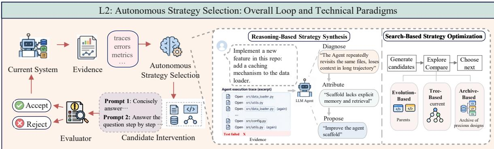  
Figure 4 Overview of L2: Autonomous Strategy Selection. Under human-defined improvement objectives and evaluation criteria, the AI system uses evidence from the current system to diagnose weaknesses and autonomously determine how to improve it. Candidate interventions are evaluated, and accepted updates are incorporated into subsequent iterations. Representative mechanisms include reasoning-based strategy synthesis and search-based strategy optimization.

The characteristic loop at this level can be summarized as follows:

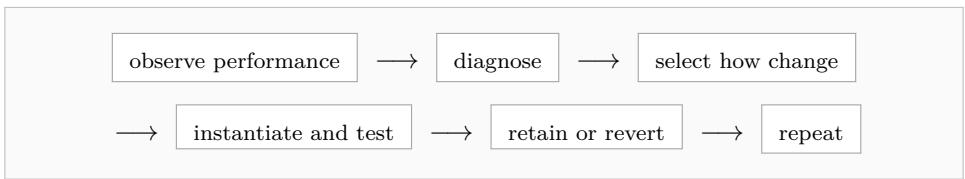

The object being improved may remain small, as in prompt optimization, or expand to an executable agent and eventually to a model-training program. What changes across these settings is the object and scope of intervention available to the improver, together with the evidence available for deciding which modification to attempt. We therefore organize L2 by the object over which improvement strategies are searched, rather than by individual systems. Figure 4 illustrates this strategy-autonomy mechanism, in which evidence about the current system guides the autonomous selection and evaluation of how to improve it.

## 3.3.1 Prompt Search

The improver decides how the instructions that govern a model or agent should be changed based on execution traces and evaluation results. In the narrowest L2 setting, the system decides how a prompt or textual control variable should be revised rather than merely instantiating a prescribed edit. For example, Dropbox used GEPA to rewrite the prompt that tells an LLM how to judge whether retrieved files or messages are relevant to a user’s search [132]. However, earlier evolutionary methods search over alternative mutations, while more recent reflective optimizers use execution traces to identify failure modes and generate targeted revisions. GEPA attributes failures to particular modules and preserves complementary prompt variants rather than committing immediately to a single greedy lineage [82]. This feedback-driven search is not restricted to a single optimizer design. MPO extends the editable surface to multimodal prompts, using evaluation-derived semantic feedback to guide subsequent textual and non-textual prompt candidates, while C-Evolve embeds candidate generation within a fixed evolutionary protocol. Across these settings, the search machinery can be externally specified while the concrete prompt revisions emerge from evaluation feedback. [79, 83]. The relevant increase in autonomy is therefore not prompt generation itself, but control over which revision strategy is attempted next.

## 3.3.2 Agent and Harness Search

Improvement can involve redesigning how reasoning and tool-using components interact. Once the editable object expands from a prompt to executable agent code, strategy search begins to resemble automated system design. For example, Microsoft Foundry’s Agent Optimizer rewrites hosted agents’ system instructions, skills, and local function-tool descriptions from evaluation failures [133]. Automated Design of Agentic Systems (ADAS) formalizes an agent as a Python forward function and uses a meta-agent to populate an ever-growing archive of candidate agents [66]. In each iteration, the meta-agent evaluates the candidate on validation data and stores both its code and metrics in the archive. Because these decisions are encoded in executable harness code, a single revision can change how the agent behaves throughout an entire task rather than only changing one instruction.

Recent workflow-search systems instantiate this idea through diferent representations of the design space. AFlow encodes workflows as executable graphs and applies Monte Carlo tree search to successive code-level modifications, using execution outcomes as feedback for later branches [67]. AgentSquare instead factorizes agent designs into reusable modules and searches through evolution and recombination, allowing successful structures discovered in one configuration to become building blocks for another [74].

The resulting autonomy is substantially greater than local parameter tuning while remaining bounded in an important sense. The improver chooses among alternative agent designs, yet candidates are still promoted because they perform better under an externally maintained evaluation process. L2 autonomy concerns the search for a better system configuration; it does not imply authority to redefine what constitutes successfu performance.

## 3.3.3 Model and Training Search

The improver converts empirical training evidence into decisions about how the learner itself should be configured, structured, or optimized. Human researchers therefore rely heavily on accumulated intuition to decide which small fraction of the possible experiments to run. The emerging role of an L2 improver is to compress this experimental cycle: inspect what happened in previous runs, infer where improvement is likely to come from, and allocate the next experiment accordingly. Current systems increasingly search over persistent configurations, model structure, and the learning procedure itself.

• (1) Configuration Search. It automates the allocation of expensive training trials. Recent agentic approaches increasingly augment conventional search with semantic reasoning about previous experiments. Rather than treating each trial as an isolated black-box query, the system can interpret training outcomes and use them to concentrate subsequent exploration. For example, NVIDIA’s 2026 TAO workflow for post-training Cosmos 3 lets a coding agent invoke LLM-guided AutoML under a fixed validation objective [134]. The human supplies the model, task, data, and desired metric; the system takes over much of the repeated decision of which configuration should be evaluated next.

• (2) Architecture Search. It delegates the structural design of the model, reducing reliance on a humanengineered search space. LLM-based improvers can interpret empirical results and propose structural changes whose exact content was not enumerated beforehand. AgentNAS starts from the observation that modern NAS still depends on manually engineered, task-specific search spaces. It uses an LLM to produce a task-specific seed architecture and then derives a structured search space from that design for subsequent combinatorial search [11].

• (3) Training-Rule Search. The improver changes the executable procedure by which model parameters are learned. Current frontier agents are beginning to automate this hypothesis-to-experiment step. OpenAI’s NanoGPT evaluation for GPT-6 Astra gives the agent a fixed validation target, one H100, and a constrained training setup, but requires the agent itself to diagnose training bottlenecks, modify the training code, tune its configuration, and make useful changes to the training loop [135]. Open research environments expose the same division of labor more directly. In autoresearch, the data pipeline, evaluation function, metric, and per-experiment compute budget remain fixed, while the agent repeatedly edits the training program and keeps a modification only when the protected validation metric improves [108].

• (4) Systems and Implementation Search. The improver searches for a more eficient realization of a model’s computation while correctness and system-level performance remain protected by external tests. AI can profile a bottleneck, propose an implementation change, verify numerical correctness, measure real hardware performance, and use the result to decide what to modify next. AutoKernel begins from profiling rather than arbitrary code generation: it identifies operations with the largest potential end-to-end impact and directs the agent’s experiments toward those bottlenecks. Candidate Triton or CUDA implementations are accepted only after correctness checks and measured GPU speedups [90].

Table 4 Representative (rather than exhaustive) L2 systems grouped by the object of improvement-strategy search. All listed systems remain at L2 because they autonomously choose how to improve the system while the objective, evaluation criterion, or acceptance rule remains externally specified.
<table><tr><td>Method</td><td>Type</td><td>Key mechanism</td><td>Level limitation</td></tr><tr><td colspan="4">Prompt Search</td></tr><tr><td>Promptbreeder [78]</td><td>Prompt search</td><td>Prompt and mutation co-evolution</td><td>Fixed task fitness</td></tr><tr><td>GEPA [82] MPO [83]</td><td>Prompt search Prompt search</td><td>Trace reflection + Pareto selection Evaluation-derived semantic feedback</td><td>Fixed task metric Fixed task metric</td></tr><tr><td></td><td>(multimodal)</td><td>guides textual and non-textual prompt candidates</td><td></td></tr><tr><td>C-Evolve [79]</td><td>Prompt search</td><td>Candidate generation inside a fixed evolutionary protocol</td><td>Fixed protocol + task metric</td></tr><tr><td colspan="4">Agent and Harness Search</td></tr><tr><td>Microsoft Foundry Agent Optimizer [133]</td><td>Agent search</td><td>Rewrites system instructions, skills, and Fixed evaluation process local function-tool descriptions from</td><td></td></tr><tr><td>ADAS [66]</td><td>Agent search</td><td>evaluation failures Meta-agent coding + design archive</td><td>Fixed benchmark</td></tr><tr><td>AFlow [67]</td><td>Workflow search</td><td>MCTS over executable workflows</td><td>Fixed evaluator</td></tr><tr><td>AgentSquare [74]</td><td>Agent search</td><td>Module evolution + recombination</td><td>Fixed benchmark</td></tr><tr><td colspan="4">Autonomous Experimental Search</td></tr><tr><td>AutoResearch [108]</td><td>ML experiment</td><td>Edit-train-evaluate loop</td><td>Fixed metric</td></tr><tr><td>GPT-6 Astra NanoGPT [135]</td><td>Training-rule search</td><td>Agent diagnoses bottlenecks, edits training code, tunes configuration and</td><td>Fixed validation target + compute</td></tr><tr><td></td><td></td><td>training loop Specialist agents + shared lineage</td><td>External evaluator</td></tr><tr><td>Auto Research [136] AgentNAS [11]</td><td>ML experiment Architecture search</td><td>LLM-generated task-specific seed architecture + derived structured search</td><td>Fixed validation metric</td></tr><tr><td></td><td>Kernel experiment</td><td>space Profile-rewrite-benchmark loop</td><td>Fixed correctness +</td></tr></table>

Table 4 compares representative systems by their search target, mechanism, and externally fixed limitation.

## 3.3.4 Evaluating L2 Strategy Autonomy

Greater autonomy over improvement strategy does not by itself imply stronger recursive self-improvement. An L2 system may have a very expressive intervention space and nevertheless search it ineficiently, exploit weaknesses in its evaluator, or produce gains that disappear after several iterations. We therefore separate the degree of delegated autonomy from the quality of the resulting improvement process.

These dimensions are complementary: a broader search space is useful only if feedback can discriminate among candidates and the search process can explore that space eficiently. This combination helps explain why current industrial systems concentrate on coding, model training, and kernel optimization, where candidate interventions are executable and feedback can be obtained rapidly.

The same adaptive search loop also creates characteristic evaluation hazards. Repeated development-set access invites benchmark overfitting, additional search compute can be mistaken for algorithmic improvement, and an LLM evaluator may share the proposer’s blind spots. Public automated-research systems make these risks concrete: reported behaviors include random-seed cherry-picking, shortcut discovery, and attempted test-label extraction through repeated evaluator queries [20]. Once a benchmark is queried adaptively, it efectively becomes part of the optimization surface rather than a passive measurement instrument. Company-reported results remain useful evidence of feasibility and scale, but their provenance should be explicit and they should not be treated as equivalent to independently replicated experiments.

Finding: L2 shifts human effort from proposing individual improvements to constraining the search for improvements. The human still specifies the objective and acceptance criterion, but no longer needs to choose each candidate intervention. This changes the bottleneck from executing a known improvement to searching over possible improvements.

## 3.4 L3: Autonomy over Future Learning Experience

L3 adds autonomy over what learning experience to acquire next. Whereas L2 concerns decisions about how to improve, the additional autonomy examined at L3 concerns the learning agenda: the system uses evidence about its current capabilities, failures, and learning history to determine what it should learn from next. Learning then changes the state on which subsequent experience acquisition depends, connecting experience selection and persistent improvement across rounds.

The characteristic loop at this level can be summarized as follows:

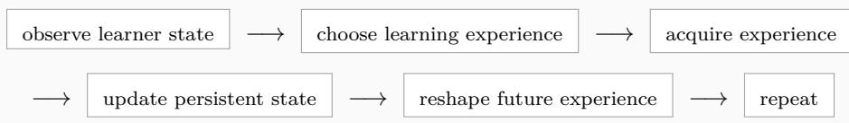

The defining property is learner-conditioned future experience acquisition. Evidence about the evolving learner must inform a decision about which experience to select, generate, or seek for subsequent learning, and the resulting persistent update must feed back into later acquisition decisions. This decision may be implemented by a separate curriculum component or integrated into the agent’s policy. A policy update that incidentally changes visited states does not, by itself, demonstrate autonomy over the learning agenda.

Experience need not be generated from scratch. Repeatedly selecting material from an externally supplied pool can exhibit this mechanism when selection adapts to the learner and participates in the continuing loop; one-time filtering or retention alone does not. Likewise, the objective, evaluator, update procedure, and rules governing experience selection may be human-designed. The relevant distinction is whether learner feedback autonomously changes the next learning agenda, without requiring a human to redesign it after each round. Persistent learning may reside in model parameters or reusable external state, including memories and skills.

The examples below examine this experience-autonomy mechanism within particular improvement loops. Figure 5 illustrates two representative realizations of this feedback structure: adaptive task generation and self-play, and autonomous practice through environment interaction. Evidence for this mechanism should be interpreted alongside the other requirements of the hierarchy when assigning an overall system level.

## 3.4.1 From Industrial Automation to Experience Autonomy

Modern training-data pipelines automate many data operations, but execution automation alone does not establish experience autonomy. Drawing on the publicly documented practices reviewed here [137–140], we organize recurring functions into six components: data-source preparation, data labeling, data selection, data construction, data mixture and training orchestration, and model-feedback diagnosis. These functions need not form a fixed sequence; they can recur across pretraining, supervised fine-tuning, preference optimization, and reinforcement learning.

Fig. 6 summarizes this landscape schematically. Operations such as ingestion, filtering, and sample generation can be executed at scale once their inputs and acceptance criteria are specified [22, 137, 139]. The reviewed reports also describe researcher-defined choices concerning data policies, generation and mixture strategies, training stages, and experimental evaluation [22, 138, 141]. These choices illustrate the distinction between automating an operation and delegating decisions about the subsequent learning agenda.

Human-designed rules do not preclude the L3-specific mechanism. A fixed selection algorithm can still produce an adaptive learning agenda if it uses the changing learner’s feedback to choose subsequent experience. Conversely, an automated pipeline that repeatedly generates and filters data does not establish experience autonomy merely by producing new samples. The decisive evidence is a closed dependence between learner state, experience acquisition, persistent learning, and later acquisition decisions. The pipeline descriptions cited here document substantial operational automation, but do not by themselves establish this full dependence [138–140]. This evidential distinction does not imply that industrial systems necessarily lack such mechanisms.

The research examples below illustrate two recurring patterns: adaptive task generation and self-play, and autonomous practice through environment interaction. They are complementary organizational views rathe than exhaustive or mutually exclusive categories: an interactive agent may also generate its own tasks, and learner-conditioned selection can operate within either pattern or over an existing data pool.

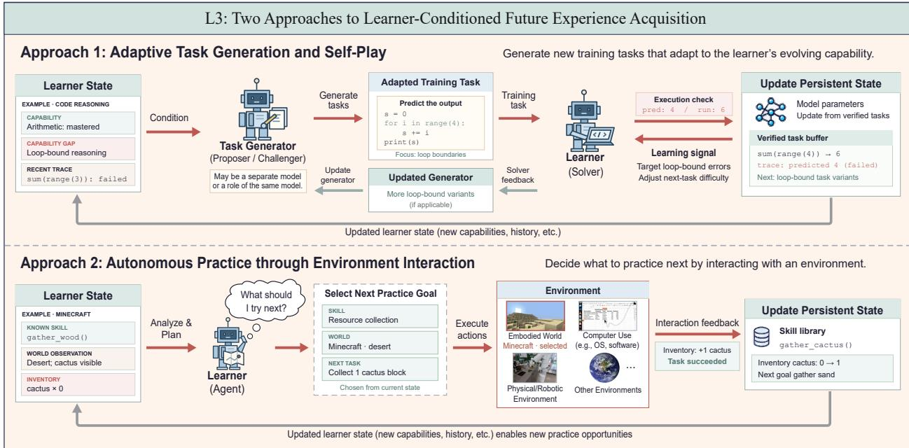  
Figure 5 Overview of L3: Learner-Conditioned Experience Acquisition. Under human-defined objectives and evaluation constraints, the system uses its current capabilities, failures, and interaction history to determine what to learn from next. Top: Adaptive task generation and self-play. A task generator proposes training tasks targeted to the learner’s weaknesses, illustrated by code-reasoning tasks addressing loop-bound errors. Execution-based feedback supports persistent learner updates and, where applicable, refinement of the generator. Bottom: Autonomous practice through environment interaction. The agent selects a practice goal based on its current skills and environmental observations, illustrated by collecting cactus in Minecraft, and consolidates successful experience into a reusable skill library. In both approaches, persistent updates reshape subsequent task generation or practice selection, closing the feedback loop between learning and future experience acquisition.

Table 5 compares representative loops by their improvement target, learner-conditioned mechanism, and external constraints.

## 3.4.2 Adaptive Task Generation and Self-Play

The value of a training task changes as the learner improves. A fixed task distribution does not explicitly track this moving competence frontier: familiar tasks may become uninformative, while tasks far beyond current capabilities may provide little usable learning signal. Adaptive generation addresses this problem by using learner-dependent signals to estimate which tasks may support further improvement. The central challenges are to obtain an informative signal, translate it into a useful task distribution, and maintain the validity of the resulting experience.

Search Self-Play (SSP) [98] connects the first two challenges by making proposer rewards depend on current solver performance. As the solver changes, so does the incentive governing future search problems, allowing the curriculum to evolve without manually redesigning each task batch. Absolute Zero Reasoner (AZR) [99] couples proposal and solution of executable reasoning tasks within a single model. Its solver-dependent learnability reward guides task proposal, while a code executor validates proposed tasks and checks solutions. This separates two requirements that unconstrained synthesis can conflate: experience must be evaluable, and its dificulty must be useful for the current learner.

R-Zero [103] uses a Challenger–Solver architecture to adapt task generation without externally supplied answer labels. The Challenger’s uncertainty reward depends on the consistency of multiple responses from the current Solver; updates to the Solver therefore alter the signal governing subsequent tasks. This consistency-based quantity is a proxy for model-perceived dificulty, not direct evidence of answer correctness or future learning gain. Its role in the loop is to make experience acquisition responsive to the learner even when stronger correctness signals are unavailable.

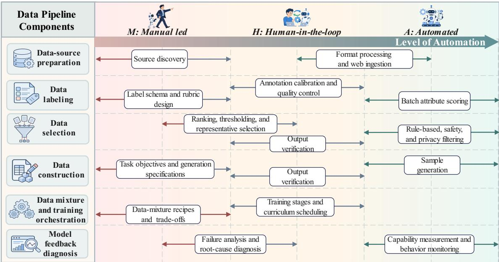  
Figure 6 Schematic synthesis of automation in the training-data pipelines reviewed here. Rows denote six functional components, and rounded bars represent recurring operations. Horizontal position indicates a qualitative progression from manual-led (M), through human-in-the-loop (H), to automated (A). Positions and spans are an interpretive synthesis of reported practices, not quantitative measurements or per-organization scores. Operational automation is distinct from the additional requirement that learner feedback autonomously reshape experience acquisition across learning rounds.

Formal domains provide an alternative route to reliable feedback. STP [100] addresses sparse proof rewards by jointly developing a conjecturer and a prover. Generated conjectures that the current prover can prove only with dificulty provide training material for the conjecturer, while checked proofs improve the prover. The prover’s changing frontier thus reshapes subsequent conjectures. Proof assistants support correctness checking within the formal domain; the learner-dependent selection criterion serves the separate purpose of identifying useful training dificulty.

Propose, Solve, Verify (PSV) [101] brings a related mechanism to verified code generation. Solver-derived dificulty labels accompany examples used to prompt new specifications. Candidate specifications are checked for compilability, and generated solutions are formally checked against their specifications before being used for training. These checks establish properties relative to the formal specification; they do not guarantee that the specification expresses a useful task or that its solution will improve the learner. Indeed, PSV reports substantial overlap between the realized dificulties of problems targeted as easy, medium, and hard, showing that dificulty-conditioned proposal ofers partial rather than exact curriculum control.

VisPlay [142] extends this approach to vision-language reasoning using an image-conditioned Questioner and a Reasoner. The Questioner receives an uncertainty reward that favors questions whose majority-answer confidence is near the prescribed midpoint, together with a diversity penalty that discourages repetitive questions. As the Reasoner changes, its response consistency changes the reward for future question generation. As in R-Zero, the resulting signal is scalable but can reflect ambiguity or inconsistent answers as well as productive dificulty.

Across these systems, feedback difers along two connected dimensions. Executable outcomes and formal proof checking can ground correctness within a specified task setting, whereas answer consistency estimates dificulty without independently establishing correctness. Adaptation may reside in a trained proposer or in generation prompts and selection procedures conditioned on current learner measurements. These choices trade of verification scope, feedback cost, and sensitivity to imperfect proxies. The shared advance is that estimated learning value influences future experience acquisition, and persistent learning changes that estimate in later rounds.

Table 5 Representative improvement loops exhibiting learner-conditioned future experience acquisition. Constraints describe the scope of the discussed loop, rather than independently establishing a system’s maximum autonomy level.
<table><tr><td>Method</td><td>Target</td><td>Learner-conditioned mechanism</td><td>Externally specified constraints</td></tr><tr><td colspan="4">Adaptive Task Generation and Self-Play</td></tr><tr><td>SSP [98]</td><td>Search agent</td><td>Solver performance shapes proposer rewards and subsequent search tasks.</td><td>Reward design and training procedure.</td></tr><tr><td>AZR [99]</td><td>Reasoning model</td><td>Solver-dependent learnability rewards guide executable task proposal.</td><td>Task formats, code executor, and update rules.</td></tr><tr><td>R-Zero [103]</td><td>Reasoning model</td><td>Solver answer consistency supplies a proxy that shapes Challenger tasks.</td><td>Uncertainty reward, pseudo-label scheme, and optimization.</td></tr><tr><td>STP [100]</td><td>Theorem prover</td><td>Conjectures near the current prover&#x27;s frontier train the conjecturer.</td><td>Formal domain, proof checking, and training rules.</td></tr><tr><td>PSV [101]</td><td>Coding model</td><td>Solver-derived difficulty labels condition specification generation.</td><td>Formal verifier, difficulty scheme, and training recipe.</td></tr><tr><td>VisPlay [142]</td><td>Vision-language model</td><td>Reasoner answer consistency and diversity rewards guide visual questions.</td><td>Image source, reward design, and optimization.</td></tr><tr><td colspan="4">Autonomous Practice through Environment Interaction</td></tr><tr><td>VOYAGER [84]</td><td>Embodied agent</td><td>Agent state and exploration history guide objectives; learned skills persist.</td><td>Minecraft interface, curriculum prompts, and skill representation.</td></tr><tr><td>SIMA 2 [24]</td><td>Embodied agent</td><td>In the full ASKA setup, evaluation feedback directs practice toward weaker skills.</td><td>Task setter, reward rubric, and training procedure.</td></tr><tr><td>SEAgent [61]</td><td>Computer-use agent</td><td>Trajectory feedback updates a software guidebook that conditions later tasks.</td><td>Software interfaces, assessment model, and learning procedure.</td></tr></table>

## 3.4.3 Autonomous Practice through Environment Interaction

Interactive agents must decide where to spend their next learning effort. Collecting additional trajectories alone does not resolve this problem: unguided exploration may revisit mastered behaviors, while a fixed practice schedule cannot explicitly respond to newly acquired skills or persistent failures. The systems below connect interaction feedback to future practice objectives, using persistent learning to make subsequent experience more responsive to the agent’s changing capabilities.

VOYAGER [84] combines an automatic curriculum with a persistent library of executable skills in Minecraft. Current agent state and exploration history inform new objectives, while successful behaviors become reusable skills for later tasks. This couples curriculum decisions to accumulated capability: learning changes what the agent can attempt, and further exploration supplies experience from which additional skills can be acquired. The relevant persistence is in external skills rather than a requirement to update the underlying language model’s parameters.

SIMA 2 [24] illustrates why the experimental setting matters when identifying this mechanism. Its fixed-task experiment demonstrates improvement from self-generated trajectories, but does not alone establish autonomy over task selection. In the full ASKA self-improvement setup, a Gemini-based task setter instead uses downstream reward-model evaluations to focus practice on weaker skills. The resulting experience trains the agent, connecting capability assessment to subsequent practice allocation. The relevant autonomy belongs to this coupled learning system, including its task setter, rather than requiring the acting model to make every curriculum decision itself.

SEAgent [61] addresses practice in unfamiliar software through an explicit connection between trajectory assessment and curriculum memory. A World State Model supplies trajectory judgments and descriptions of GUI state changes to a Curriculum Generator, which updates a persistent software guidebook and uses it to generate later tasks. The Actor learns from the collected experience, and subsequent interactions further revise the guidebook and task set. The guidebook therefore carries information from earlier exploration into later practice decisions, helping the curriculum expand beyond previously explored operations.

These systems share a feedback structure but depend on diferent persistent resources and judgments. VOYAGER links objectives to exploration history and reusable skills; SIMA 2 connects reward-model assessments to task setting; SEAgent maintains an evolving account of software behavior that guides future tasks. Consequently, unreliable skill construction, inaccurate reward judgments, or erroneous guidebook entries can each misdirect later learning efort. Autonomous interaction reduces the need for manually prescribed curricula, while leaving the quality of feedback and accumulated state central to the reliability of the loop.

## 3.4.4 Evaluating L3 Experience Autonomy

Experience autonomy and learning quality are distinct. A system may control its future learning agenda yet acquire experience that is uninformative, narrow, or incorrectly evaluated. Assessment should therefore establish both the feedback mechanism and the benefit of using it: which learner signal influences acquisition, what persistent state changes through learning, and how that change afects a later acquisition decision.

To assess the contribution of learner conditioning, useful controls include freezing the acquisition mechanism’s learner-state input at an earlier checkpoint, or replacing adaptive decisions with a learner-independent schedule. Comparisons should match access to data sources and environments and use comparable compute and interaction budgets, including the cost of experience generation and assessment. Holding the acquired samples identical would remove the very distributional adaptation under study. These controls help separate the value of adaptive experience acquisition from improvement attributable to additional training resources alone.

Evaluation should also distinguish correctness, dificulty, and learning benefit. Formal or executable checks can establish specified properties within their supported setting, while consistency measures and model-based judgments provide fallible estimates. Neither verified correctness nor estimated dificulty alone establishes marginal learning value. Where feasible, studies should compare acquisition signals with independent validity checks, realized task dificulty, and subsequent learning gains, and examine whether these relationships remain stable as the learner changes.

We use experience corruption to denote the risk that defective experience or feedback distorts later learning and acquisition decisions. A misleading dificulty proxy may favor unsuitable tasks; an inaccurate judge may reward erroneous behavior; persistent memory may carry incorrect assumptions into future practice. Because these efects can enter parameters, skills, memories, or curriculum state, they may propagate across rounds. This is a structural risk of the feedback loop, rather than an assertion that every system exhibits such amplification.

A credible evaluation should therefore track performance across multiple rounds, the validity and diversity of acquired experience, and transfer to fresh tasks or environments. Feedback used to guide the curriculum must be distinguished from protected evaluation used to assess generalization: repeated access to test instances through task selection, reward construction, or persistent memory can make them part of the learning process. For task-generation systems, evaluation should examine whether the curriculum continues to track the learner without collapsing onto narrow or easily rewarded examples. For interactive systems, it should examine whether practice continues to acquire useful skills beyond familiar behaviors.

Finding: L3 adds autonomy over the future learning agenda. The system uses its evolving capabilities, failures, or learning history to steer which experience is selected, generated, or sought next, and persistent learning feeds back into later acquisition decisions. Human-designed objectives, evaluators, and learning rules may remain in place; experience autonomy concerns decisions made within this setting, and does not itself guarantee useful or reliable improvement.

## 3.5 L4: Autonomy in Deployment and Environmental Adaptation

At L4, AI uses feedback from continued deployment interaction to decide how the operating agent should persistently adapt. Whereas L3 centers on what experience to acquire for learning, L4 centers on how operational experience changes the memory, skills, or execution components used in subsequent tasks.

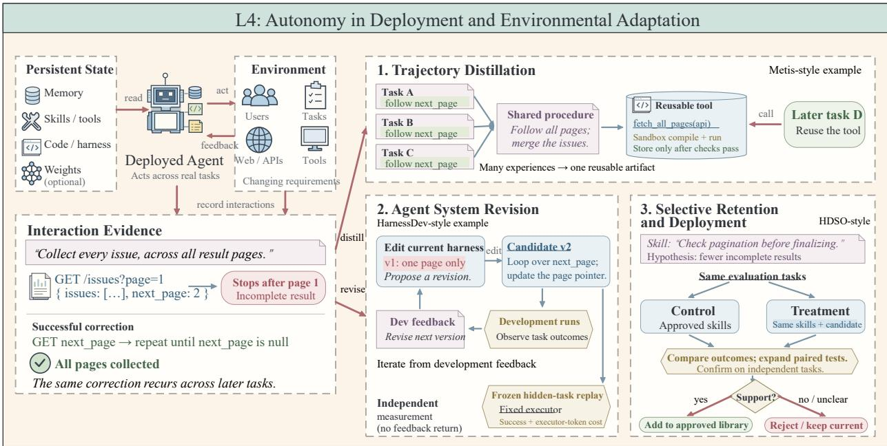  
Figure 7 Overview of L4: Autonomy in Deployment and Environmental Adaptation. Under human-defined objectives and deployment constraints, the AI system uses interaction evidence from real tasks and changing environments to determine which consequences of experience should persist and influence future behavior. Experience can be distilled into reusable artifacts, used to revise persistent components of the agent system, and selectively retained based on subsequent evaluation. Accepted updates are reused in later tasks, closing a persistent adaptation loop between deployment experience and future behavior.

Retained changes shape later behavior and the feedback available for further adaptation. The objective, access boundaries, protected evaluation, and authority over consequential releases remain externally governed. Figure 7 provides an overview of this deployment-adaptation mechanism, showing how interaction experience is converted into persistent changes that shape subsequent behavior.

The characteristic loop at this level can be summarized as follows:

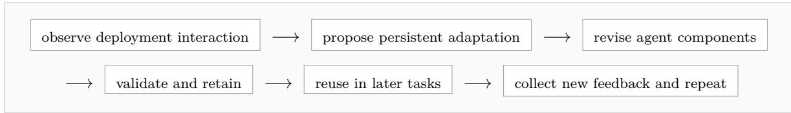  
We organize the discussion around trajectory distillation, iterative revision of the agent system, and selective retention and deployment of updates. These mechanisms difer in what they change, when the change is reused, and how continued usefulness is established. Table 6 summarizes representative methods along these three axes.

## 3.5.1 Trajectory distillation

Trajectory distillation converts an agent’s interaction histories into compact artifacts that persist across sessions and condition later tasks. Compared with raw trajectories, distilled artifacts are more concise, less costly to consult, and structured for easier reuse in subsequent tasks. We group the methods below by the form of the distilled artifact: textual experience memory, structured memory, procedural skill libraries, and executable code.

Textual experience memory. This category keeps the distilled artifact as natural-language passages that are retrieved into the prompt for later tasks. Dynamic Cheatsheet [110] enables a frozen model to improve across a series of related problems without access to ground-truth labels. It maintains a single evolving note of strategies, code snippets, and known pitfalls, which the same model consults when answering each incoming problem and curates by adding distilled lessons and removing superseded entries. Agentic Context Engineering [104] follows the same recipe while keeping the memory detailed and informative as it grows. It stores short entries with counters that record whether each entry helps or hinders later tasks, and adds small patches rather than rewriting the whole note, which avoids information loss by compression. ReasoningBank [85] adapts the idea to multi-step agents and learns from failures as much as from successes by distilling each judged trajectory into a short, titled strategy that is retrieved before later tasks.

Table 6 Representative systems, benchmarks, and analyses for L4 adaptation, grouped by the mechanisms discussed in this section.
<table><tr><td>Method</td><td>Update target</td><td>Timing</td><td>Update validation</td></tr><tr><td colspan="4">Trajectory distillation</td></tr><tr><td>Dynamic Cheatsheet [110]</td><td>Evolving text memory</td><td></td><td>After each problem Task outcomes guide self-curation; no held-out gate.</td></tr><tr><td>ACE [104]</td><td>Incremental context entries</td><td>After each task</td><td>Helpfulness and harmfulness counters guide edits.</td></tr><tr><td>ReasoningBank [85]</td><td>Reasoning strategies (text)</td><td>After each task</td><td>A judge labels trajectories before strategy extraction.</td></tr><tr><td>APEX [143]</td><td>Milestone dependency graph</td><td>After each episode</td><td>Episode outcomes are propagated through the graph.</td></tr><tr><td>PersonaAgent [105]</td><td>Per-user persona prompt</td><td>Across user interactions</td><td>No separate admission test is reported.</td></tr><tr><td>PAHF [144]</td><td>User preference entries</td><td>When requests are ambiguous</td><td>User clarification confirms and revises preferences.</td></tr><tr><td>MemToolAgent [145]</td><td>Tool-use critiques and retrieval After tool calls policy</td><td></td><td>Environment and user feedback assess tool use.</td></tr><tr><td>Trace2Skill [86]</td><td>Portable skill document</td><td>Offline batch</td><td>Error and success analysts propose and merge patches.</td></tr><tr><td>PRACTICE [146]</td><td>Embodied skill library</td><td>Offline batches</td><td>Success/failure contrasts and teacher distillation.</td></tr><tr><td>PANDO [25]</td><td>Rules and routines</td><td>Online, in-run</td><td>Confidence-scored admission and demotion.</td></tr><tr><td>PILOT [147]</td><td>Procedures and failure modes</td><td>During long-horizon runs</td><td>Supervisor distillation uses live-run feedback.</td></tr><tr><td>Metis [62]</td><td>Text plans and code tools</td><td>After completed tasks</td><td>Repeated reuse plus sandbox compile checks.</td></tr><tr><td>Evo-Harness [148]</td><td>Harness skill tuples</td><td>(asynchronous) After task batches</td><td>Failed or negatively evaluated tasks trigger reflection and</td></tr><tr><td>SHAPER [111]</td><td>Planning guidance and context-selection code</td><td></td><td>edits. Across task rounds Sandbox execution and downstream task outcomes.</td></tr><tr><td>Evo-Memory [149]</td><td>Accumulated agent memory (benchmark)</td><td>Sequential task streams</td><td>Long-horizon evaluation of memory reuse.</td></tr><tr><td colspan="4">Iterative revision of the agent system</td></tr><tr><td>DecoEvo [80]</td><td>Solver and rubric skills</td><td>Iterative rounds</td><td>Score-independent audits, Pareto-checked.</td></tr><tr><td>HarnessDev [91]</td><td>Runnable agent harness</td><td>Iterative rounds</td><td>Frozen replay of candidates on hidden tasks</td></tr><tr><td>ASPIRE [109]</td><td>Model weights or harness</td><td>Iterative rounds</td><td>Rollback unless the verified score improves.</td></tr><tr><td>S3Gym [150]</td><td>History, summaries, or model parameters</td><td>Iterative rounds</td><td>Compares update pathways without verifier outcomes.</td></tr><tr><td>Harness Benefit [151]</td><td>Harness updates and their use (analysis)</td><td>Fixed solve-evolve rounds</td><td>Separates update quality from execution benefit.</td></tr><tr><td colspan="4">Selective retention and deployment of updates</td></tr><tr><td>HDSO [106]</td><td>Candidate skill packages</td><td>Periodic rounds</td><td>Paired control and treatment executions.</td></tr><tr><td>Library Drift [152]</td><td>Skill library entries</td><td>Each round</td><td>Low-contribution skills are retired. The library is capped.</td></tr><tr><td>Rethinking Skill Evolution [153]</td><td>Skill edits (analysis)</td><td>Multiple rounds</td><td>Filters edits using task outcomes across rounds.</td></tr><tr><td>Tax AI [92]</td><td>Product code and evals</td><td>Release cycles</td><td>Targeted and regression tests, then human review.</td></tr></table>

Structured memory. Instead of free text, structured memory stores experience in explicit records or graphs, making the conditions for reuse inspectable. APEX [143] encourages an agent to explore new strategies as its memory grows rather than letting it settle into familiar routines by building a strategy map as a graph of task milestones linked by prerequisite relations. After each episode, the outcome is propagated back along the milestones that led to it, so the map records which paths have worked. A separate step adds promising branches that the agent has not tried, and the agent consults the map at planning time to choose between a known good path and an untried one. Other structures mirror the environment. For instance, PersonaAgent [105] and PAHF [144] instead organize memory around individual users. PersonaAgent translates episodic and semantic user memory into a per-user persona prompt, while PAHF revises preference entries by asking users to clarify an ambiguous request when no relevant preference is found, then integrates their feedback into memory and revises outdated entries. MemToolAgent [145] gives memory a more procedural role by storing critiques of failed tool calls and adjusting how many entries it retrieves per call.

Procedural skill libraries. Instead of only describing experience, this category extracts reusable skills or standard operating procedures that a later agent follows directly. Trace2Skill [86] turns lessons from individual trajectories into skills that other models and tasks can reuse. It first rolls out a frozen agent on domain tasks. Two analyst roles, one focused on errors and the other on successes, then read the trajectories and propose skill edits, which are merged in stages into a portable skill directory. Because the consolidated document is read directly rather than retrieved for each episode, later agents load it once as part of their instructions. PRACTICE [146] applies the same ofline distillation to embodied agents while keeping the skill library consistent as it changes rather than growing unbounded, where a trainable skill learner proposes batch edits that add, refine, merge, or remove entries. The learner first learns basic skill generation and library maintenance from oracle trajectories, then learns failure awareness by contrasting successful and failed trajectories from diferent executors on the same tasks, and is finally distilled toward a stronger teacher on its own edit distribution. Two other methods acquire skills during execution. PANDO [25] improves a web agent during deployment by distilling rules that prevent repeated failures and parameterized routines that replace multi-step browser subgoals from each rollout during deployment, while PILOT [147] uses a supervisor to distill procedures and failure modes from a live, long-horizon run, so later sessions start with the accumulated skills.

Executable artifacts. Moving from text to code, this category compiles experience into artifacts that are invoked directly, combining the flexibility of text memory with the eficiency of executable tools. Metis [62] achieves this through a dual memory, a text store of plans, environment facts, and pitfalls alongside a code library of callable tools. A reflector maintains the text entries, and a frequently reused text plan is rewritten as a callable tool and accepted only after it compiles and runs correctly in a sandbox. Retrieval then covers both text entries and tool descriptions. Evo-Harness [148] broadens the target from single tools to the whole harness, compiling lessons from failed or negatively evaluated tasks into cross-task patterns and task-specific procedures. SHAPER [111] applies the same idea to embodied agents by evolving textual planning guidance together with a sandboxed Python function that selects the context shown to the planner.

Evaluation protocols. Evaluation protocols for this family difer in time horizon and in what they count as benefit. Evo-Memory [149] restructures datasets into sequential task streams so that memory accumulation and reuse can be measured over long horizons. PANDO [25] instead audits behavior within a run, reporting action repetition, step overhead, and prompt-cache utilization, and Metis [62] relates task quality to execution and construction cost.

## 3.5.2 Iterative revision of the agent system

Rather than what an agent remembers, this section revises the agent system itself: the skills that produce solutions, the rubrics that judge them, the harness that runs them, or the weights underneath. The defining question is which components may change and which acceptance criteria stay fixed while they do. We group the work into co-evolving coupled components, benchmarks that measure self-directed system revision, and evolutionary search under fixed verifiers, followed by analyses of whether revision translates into benefit.

Co-evolving components. Co-evolution revises two coupled components at once, which raises a circularity problem: if the judge improves alongside the solver, higher scores may reflect an easier judge rather than better solutions. DecoEvo [80] addresses this problem by evolving a solver skill and a rubric-generator skill in text space while decoupling their objectives and withholding gold rubrics during optimization. The solver skill is updated from criterion-level rubric feedback. The rubric generator, in contrast, is gated by two score-independent audits: a structural audit checks that the generated rubric covers the task’s requirements, and a contrastive audit checks that it discriminates between near-tie responses, with Pareto verification across the two. Because the generator never sees the solver’s aggregate score, it cannot improve its standing by making the rubric easier.

Benchmarks of self-directed revision. Rather than proposing new methods, this line of work measures whether current models can revise their own systems at all. HarnessDev [91] asks whether models can create and improve their own harness, the model-external scafolding of prompts, tool loops, and execution logic.

The creator agent builds a complete harness from a minimal seed and a few development cases and iteratively revises it from downstream feedback. The candidate revisions are frozen and scored on hidden tasks for both success rate and executor-token cost, with the creator and the executor kept separate so that harnesses can be compared under one fixed executor. ASPIRE [109] asks whether a model can improve itself given only a vague goal. It delegates the choice of data, update method, and validation signal to the agent across both weights and the harness, and a score-gated controller rolls back any change whose verified score does not improve. S3Gym [150] restricts the question to the experience channel, withholding verifier outcomes so the agent must judge its own trajectories, and compares raw history, compressed summaries, and parameter training as improvement pathways.

Analyses of revision benefit. Whether revision actually translates into benefit is a question in its own right, and one analysis finds that the two are often conflated. The study behind Harness Updating Is Not Harness Benefit [151] separates two capabilities: producing useful persistent updates, and exploiting them at solve time. Each is measured under a fixed solve-evolve protocol with identical prompts and budgets across several model backbones and three agent benchmarks. Updating ability is largely independent of base model capability, with a small model’s updates yielding gains comparable to a frontier model’s. The ability to benefit from an updated harness, by contrast, varies non-monotonically, and failures concentrate in two modes: relevant artifacts are not activated, or they are activated but not faithfully followed. A practical consequence is that capability investment belongs in the task-solving agent rather than in the evolver.

## 3.5.3 Selective retention and deployment of updates

Trajectory distillation and system revision both end with a proposed change, while this section focuses on which proposed changes become persistent and which stay available to later tasks. The work below applies this control at three points: before admission, during continued use, and at release into an operational system.

Candidate validation. A proposed update must produce evidence before it can enter the persistent state. HDSO [106] is designed to prevent skills distilled from noisy trajectories from encoding spurious shortcuts or rules that the executor cannot follow. A curator model observes compact executor traces and proposes a hypothesis with an explicit validation plan, where each candidate is tested by executing the same tasks twice, once with the current approved repository as the control and once with the candidate skill added as the treatment, and the candidate enters the approved repository only when the diferences between the two runs support the hypothesis. The comparison runs in stages of increasing size and ends with confirmation on independent tasks. Metis [62], introduced earlier in the trajectory-distillation section, applies a similar gate after the text plan is already retained in memory, where a text plan becomes executable code only after it recurs across tasks and passes dependency and compilation checks.

Library maintenance. After admission, attention shifts to the health of the library itself, since skills that were once useful can degrade as tasks and models change. The Library Drift study [152] shows that unbounded accumulation gradually degrades retrieval quality and stalls progress, often before the efect becomes visible in task scores. It proposes lifecycle management with three parts. An append-only evidence log tracks each skill’s contribution to task outcomes, and a skill is retired when its measured contribution fades. The number of active skills is capped, so a new skill competes with the entries already present. New skills are also written under a meta-skill, a stored guide that steers how future skills are authored. The study shows that governance choices matter: retiring skills too aggressively performs worse than leaving the library unguided. Meanwhile, another analysis [153] finds that carefully filtering skill edits, rather than repeatedly rewriting skills from task outcomes, improves task performance.

Governed deployment. In production, an incorrect update can afect real users, so a strict gate is needed to prevent unexpected issues. The Tax AI deployment [92] applies such a gate inside a production tax-preparation system, where practitioner corrections drive improvement. Corrections are recorded as structured field-level evidence, and repeated failures are grouped into evaluation targets. A coding agent investigates the trace, evaluations, and repository to implement and validate a fix against targeted and regression evaluations. The loop may change only a bounded part of the product, such as the extraction schema, source selection, tax-engine mapper, and graders. Engineers retain decisions about architecture and product design. Each fix arrives as a pull request for engineering review before release, and cases that the agent cannot resolve are routed back to practitioners. Humans therefore make the final acceptance decision, and the delay introduced by this review is part of the loop’s operating cost.

## 3.5.4 Evaluating L4 Deployment Autonomy

Greater autonomy over adaptation after deployment does not by itself establish reliable improvement. An L4 system may retain updates without showing that they remain useful as tasks, environments, or executors change. Evaluation should distinguish the degree of deployment autonomy from the quality of the resulting adaptation process.

A characteristic risk at this level is persistent update failure, where an accepted change may afect many later decisions before its weakness becomes visible. Across diferent forms of retained state, failure may arise because the system infers the wrong lesson from noisy evidence, applies a sound lesson outside its valid scope, fails to invoke a relevant update, or preserves new behavior at the expense of earlier capabilities [110, 151–153]. Final task scores alone cannot separate these mechanisms. A credible evaluation must connect each retained change to the evidence that produced it, its later use, and its efects on both new and previously solved tasks.

The current evidence leaves further uncertainty about whether deployment adaptation remains efective over time. Most evaluations cover bounded task streams and limited combinations of models, tasks, and environments, while repeated assessment makes longer studies costly [86, 91, 147]. Feedback may also be incomplete or endogenous to the loop, as outcome labels can be noisy, evaluators can change with the system, and a useful retained artifact may still fail to influence execution [80, 85, 151]. Evaluation of L4 should consequently examine adaptation across time and distribution shifts, including the point at which a retained change alters later behavior.

L4 autonomy remains bounded by the surrounding deployment process. The agent may decide how interaction evidence changes persistent state, while humans continue to specify the objective, access boundaries, protected evaluation, and release authority. L4 should concern autonomy over operational adaptation within a deployed system.

Finding: L4 shifts autonomy from selecting experience to deciding which consequences of experience persist in deployment. The agent converts interaction histories into retained changes to memory, skills, harnesses, code, or model parameters, and these changes afect later tasks and feedback. Humans retain the objective, protected acceptance criteria, access boundaries, and final authority over consequential releases.

## 3.6 L5: From Environmental Adaptation to Meta-Improvement

An improvement process can become a bottleneck in its own right. A coding agent may repeatedly generate similar unsuccessful patches because its search procedure discards useful alternatives. A research agent may optimize a development score after that score has stopped predicting external performance. Repairing such failures requires changes to the procedures that direct experiments and judge their outcomes. Designing these procedures is costly: a revision must be assessed through the later improvements it produces, often across several tasks and repeated runs [15, 17].

L5 begins when AI persistently modifies a mechanism responsible for future improvements and uses the revised mechanism in subsequent rounds. The editable mechanism may be an improver, a successor evaluator, a search policy, or a procedure for directing research. L2 searches for candidate interventions; L3 determines what experience to acquire; L4 incorporates deployment feedback into persistent adaptation. L5 additionally makes the procedure governing later improvement an object of improvement. A deployed agent that retains new debugging skills through an unchanged learning procedure exemplifies L4. Revising and reusing the procedure that diagnoses failures and builds those skills can cross the L5 boundary.

The loop closes when a revised mechanism returns to govern the generation, evaluation, or selection of later successors. The inherited state includes the accepted code, prompts, evaluators, or research policy, together with evidence used by later revisions. Human designers still establish the overall mission, protected evaluation, editable components, and resource permissions, and may retain veto and deployment authority. Some of these decisions are enforced by fixed infrastructure; they do not require a person to approve every iteration. Figure 8 illustrates how evidence from earlier attempts can guide a revision of the improvement process, which successors then inherit and reuse.

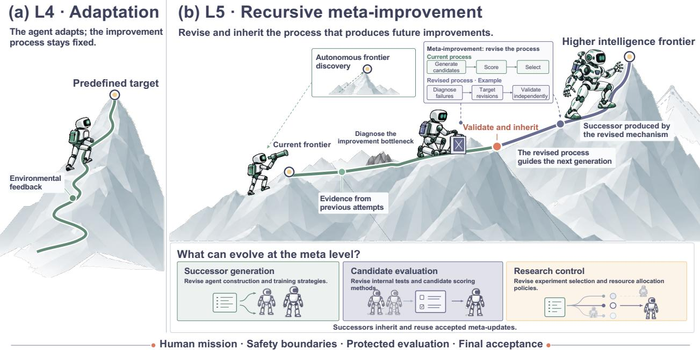  
Figure 8 From environmental adaptation to recursive meta-improvement. (a) L4 incorporates environmental feedback within a fixed improvement process. (b) L5 diagnoses limitations of that process, revises it, and passes validated changes to successors. Meta-updates can afect successor generation, candidate evaluation, or research control. Human-defined missions, safety boundaries, protected evaluation, and final acceptance remain external constraints. The ascending path illustrates possible progress through inherited meta-updates.

These conditions distinguish structural L5, which demonstrates that an AI-directed change persists and controls a later improvement round, from efective L5, which demonstrates that the revised mechanism produces or selects better successors under comparable budgets and independent assessment. Self-modifying task code provides insuficient evidence when the process responsible for later revisions remains unchanged. Conversely, an evolved successor evaluator can establish structural L5 even with unchanged task-agent code. Classification therefore applies to the particular mechanism examined. Table 7 summarizes the loop, inherited state, and external controls of representative systems.

## 3.6.1 Improving the Search Procedure

The AI revises how future candidate improvements are generated and explored. A fixed optimizer can spend its budget on unproductive proposals, even when its underlying model can generate better search algorithms. The challenge is to evaluate a proposed optimizer through its ability to improve other programs.

STOP [15] makes this problem executable. Its improver is a Python program that calls a fixed language model, generates candidate code, evaluates a supplied utility, and returns a selected candidate. The current improver receives its own source as the optimization target. Successor improvers are scored by the quality of programs they produce on downstream tasks, and the selected improver performs the next self-improvement round. The inherited artifact is thus a search procedure that may introduce beam search, alternative sampling, or other candidate-selection logic. The study reports that a selected fourth-generation improver outperformed the seed on all five transfer tasks excluded from self-improvement. The task distribution, utility, base model, and resource limits remained externally specified. Weaker-model runs regressed on average, and some generated programs evaded soft budgets or exploited evaluation bugs.

Table 7 L5 mechanisms and external controls.
<table><tr><td>Work</td><td>Loop closes at</td><td>Inherited state</td><td>External controls</td></tr><tr><td colspan="4">Search and self-revision</td></tr><tr><td>STOP [15]</td><td>Next program search</td><td>Improver code</td><td>Utility; base LM; budget</td></tr><tr><td>Gödel Agent [19]</td><td>Next self-revision</td><td>Task and update code</td><td>Task objective; runtime access</td></tr><tr><td>DGM [16]</td><td>Descendant search</td><td>Agent code; archive</td><td>Parent selection; benchmark</td></tr><tr><td>HyperAgents [93]</td><td>Next agent generation</td><td>Task and meta-agent code</td><td>Main-study selection; evaluation</td></tr><tr><td colspan="4">Successor evaluation</td></tr><tr><td>RQGM [21]</td><td>Next-epoch selection</td><td>Evaluator; agent code</td><td>Anchor; replacement schedule</td></tr><tr><td colspan="4">Research policies and harnesses</td></tr><tr><td>A-Evolve-Training [17]</td><td>Next research round</td><td>Search policy; discovery log</td><td>Constitution; benchmark; substrate</td></tr><tr><td>AIRA2 [154] / AAR [155] Task experiments</td><td></td><td>Research artifacts</td><td>Research harness; evaluation</td></tr><tr><td>AIDE2 [94]</td><td>Later research runs</td><td>Research-agent harness</td><td>Private scores; cost budget</td></tr></table>

Note: L5 claims are qualified in the text.

Gödel Agent [19] gives the AI access to both its task policy and recursive update logic in a shared Python program. Execution feedback informs a rewrite, and the revised program runs in the next recursive call, including its modified self-update procedure. This broadens the search beyond a developer’s fixed editing routine. It also makes errors inheritable: the study reports that 14 of 100 MGSM optimization trials ended below the initial policy’s performance, and unrestricted runs could call stronger models. Task objectives and execution permissions therefore remain consequential external controls.

The Darwin Gödel Machine (DGM) [16] retains coding-agent variants and explores their descendants, but keeps archive management and parent selection outside self-modification. Its lineage provides a transition case; task gains alone do not establish a better improvement procedure. HyperAgents [93] directly exposes both task-agent and meta-agent code to revision. Evolved meta-agents build performance trackers and persistent memory to guide later modifications. In its preprint, meta-agents evolved on paper review and robotics generated improved agents for previously unseen mathematics grading, supporting transfer of the improvement procedure itself. The longer, 200-iteration experiment did not establish a statistically significant final advantage for transferred initialization. Parent selection and evaluation also remained fixed in the main experiments.

## 3.6.2 Improving Successor Evaluation

The AI improves the evaluator that determines which successors are retained. Repeated optimization places pressure on a judge’s blind spots. Keeping that judge unchanged can favor proposals that exploit its errors. Unrestricted judge revision creates the opposite problem: successive scores may reflect changing standards.

The Red Queen Gödel Machine (RQGM) [21] addresses this tension through evaluator co-evolution. Its learned evaluator remains frozen within an epoch. At a scheduled boundary, challenger evaluators are compared against an independent ground-truth anchor; the selected evaluator then governs the next epoch. Scores dependent on the replaced evaluator are discarded and afected agents are re-evaluated when revisited. The loop carries forward an improved evaluator and agent code while resetting incompatible evaluation records. On held-out Polyglot coding tasks, the preprint reports a 71.7% pass rate against 69.9% for HGM-H, with lower search-token use. The anchor, replacement schedule, and orchestration remain externally fixed. These controls preserve a reference against which evaluator changes can be judged; the formal stability argument applies within each frozen epoch, not to unrestricted changes of objective.

## 3.6.3 Revising Research Goals and Policies

The AI uses accumulated experimental evidence to revise what later research should pursue. Choosing a higher target is dificult when the available proxy rewards progress on the wrong bottleneck. In model post-training, testing that hypothesis requires comparing training runs, identifying failed search directions, and deciding whether to revise the research policy itself. A changing curriculum reaches L5 when its persistent

selection procedure is also revised and reused.

A-Evolve-Training [17] provides a concrete case. Its preprint reports autonomous post-training of a 30B model across four rounds. Workers return recipe changes, checkpoint evaluations, and failures; a collector consolidates these results, and a meta-agent revises the next round’s search policy. The policy carries a standing recipe, promoted or retired search directions, and a registry of unsuccessful approaches. When development scores increased without corresponding external gains, the revised policy directed workers toward interventions that could improve the external target despite lowering the proxy. The study reports a final leaderboard score of 0.86, compared with 0.87 for the top human submission. Cross-round inheritance resides in the research policy and discovery log; the underlying worker substrate and constitution remain fixed. The case supports policy-level L5 within a human-defined objective, with no demonstrated autonomous revision of that objective.

A spiral of improvement emerges when an inherited procedure helps expose a new limitation and is revised again to address it. The next goal should identify a testable capability gap, preserve established capabilities, and justify further expenditure. Goal revision alone supplies limited evidence: the evaluation must establish that the revised policy changes subsequent research and improves its outcomes.

## 3.6.4 Industrial Practice

Industrial implementations expose diferent portions of the improvement process to revision. Their relevance to L5 depends on whether the retained artifact changes later research decisions.

Research infrastructure. Meta’s AIRA [154] uses asynchronous experimentation and hidden consistent evaluation; Anthropic’s Automated Alignment Researchers [155] generate and test mitigations for specified alignment failures. These systems automate experiment execution within researcher-designed workflows. Their reported results concern research outputs, without establishing inherited changes to the procedures conducting the research.

Research-agent revision. Weco’s AIDE2 [94] applies a research agent to improving a research-agent harness. Candidate harnesses run downstream tasks under private scoring and a fixed cost budget. Accepted versions are retained for subsequent research; a separate experiment installs an evolved harness as the outer improver. Weco reports seven accepted improvements over 100 unattended steps and transfer to external tasks. Its stronger test of whether the evolved agent improves the outer search faster found no statistically significant eficiency advantage. These company-reported results support bounded harness improvement. Private evaluation, task families, and cost constraints remain human-designed, while reliable acceleration of successive improvers remains unestablished.

Across these configurations, the potential saving comes from reusing a better research procedure. Evidence of reduced human development efort requires accounting for the work spent designing evaluators, investigating failures, and maintaining the evolved code. Task performance or unattended runtime alone cannot quantify that saving.

## 3.6.5 Evaluating L5 Recursive Improvement

Evaluation must distinguish a stronger current agent from a procedure that reliably produces stronger successors. SEA-Eval [156] and SEAGym [157] contribute trajectory-based assessment: performance across rounds, held-out transfer, retention, and resource use. Table 8 summarizes these measurements and the additional mechanism tests needed for L5.

A mechanism audit should identify the revised artifact, record the evidence that motivated it, and verify its invocation in a later improvement round. To establish efectiveness, the original and revised mechanisms should start from comparable agents and evidence under matched budgets, including the cost of evaluating the mechanisms. Holding the revised mechanism fixed during transfer tests helps isolate what it learned about improvement. HyperAgents [93] uses this design to distinguish transferable agent-generation ability from performance on the original task.

Goal selection needs complementary evaluation. Adaptive frontier tasks can test whether the system identifies useful next challenges; protected reference tasks preserve comparability and expose forgetting or reward hacking. Private tasks with previously undisclosed rules strengthen tests of discovery beyond familiar distributions. Evaluations should also record whether the system stops when expected benefit falls below cost or risk. These are proposed requirements for assessing fuller L5 autonomy, rather than capabilities established by existing RSI benchmarks.

Table 8 Evaluating recursive improvement.
<table><tr><td>Dimension</td><td>Measurements</td><td>Purpose</td></tr><tr><td>Adaptivity</td><td>Gain; improvement trajectory; time to target [156, 157]</td><td>Detect progress and plateaus</td></tr><tr><td>Retention</td><td>Replay loss; tasks fixed or broken [157]</td><td>Detect displaced capabilities</td></tr><tr><td>Transfer</td><td>Held-out gains within and across domains [157]</td><td>Test reuse beyond update tasks</td></tr><tr><td>Efficiency</td><td>Tokens; time; cost per validated gain [156, 157]</td><td>Account for improvement expense</td></tr><tr><td>Stability</td><td>Harmful updates; largest temporary decline [156, 157]</td><td>Expose unreliable trajectories</td></tr><tr><td>Meta-recursion</td><td>Mechanism reuse; successor quality [15, 21, 93]; goal and stopping decisions</td><td>Test inherited improvement capacity</td></tr></table>

Note: Trajectory measures synthesize the cited benchmarks. The meta-recursion row adds our L5 tests: cited systems illustrate mechanism reuse and improvement capacity; goal selection and stopping remain evaluation requirements.

Current results support bounded meta-improvement: accepted changes to improvers, evaluators, or research policies can govern subsequent rounds, and some changes transfer across tasks [15, 21, 93]. Statistically reliable accumulation across generations under comparable resources remains open [93, 94]. The practical objective is to increase validated improvement per unit of computation and human efort. Strong base models, execution infrastructure, and independent evaluation continue to supply the resources and constraints under which that improvement occurs.

Finding: L5 makes the improvement procedure inheritable. The loop closes through reuse of a revised improver, evaluator, or research policy. Successors inherit that procedure and its supporting evidence; humans retain the overall objective, protected acceptance criteria, and resource authority.

## 3.7 Cross-Level Synthesis

Across B0–L5, the autonomy hierarchy can be understood as a progressive transfer of responsibility over the improvement loop. The levels difer not primarily in the particular algorithm or artifact being optimized, but in which improvement decisions are internalized by the AI system, what state persists into later rounds, and which acceptance conditions remain externally protected.

The central boundaries between adjacent levels can therefore be stated compactly. The transition from B0 to L1 is persistence: an accepted change must survive the current task. L1 to L2 transfers strategy selection: AI decides which intervention to attempt rather than merely executing a prescribed one. L2 to L3 adds control over the future learning agenda, so the evolving learner influences what experience is acquired next. L3 to L4 extends this feedback process into persistent deployment and environmental interaction, where system changes must remain useful under changing operational conditions. L4 to L5 finally introduces recursive inheritance, in which the mechanism responsible for later improvement itself becomes an inherited target of improvement.

Importantly, a higher autonomy level does not by itself imply a better improvement process. Greater delegated authority can coexist with ineficient search, unreliable feedback, regression, evaluator exploitation, or poor transfer. We therefore separate the scope of improvement responsibility internalized by AI from the quality and eficiency of the resulting improvement. Across the evidence reviewed here, lower and intermediate levels are supported by a comparatively broad range of systems, whereas L3–L4 capabilities remain more domain-dependent and end-to-end L5 evidence is concentrated in bounded prototypes and emerging industrial or research systems. This distinction motivates the application-specific analysis in the following section.

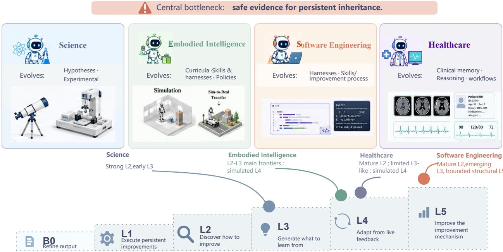  
Figure 9 Application regimes difer mainly in the kind of feedback needed to validate and inherit an improvement.

## 4 RSI Across Applications

Having classified systems from B0 to L5 according to the improvement functions placed under AI control, we now examine how RSI is applied across diferent scenarios. As illustrated in Fig. 9, applications difer in both what they improve and the feedback required to validate and retain an update. We organize the evidence into four application regimes, including AI for science (S1), embodied intelligence (S2), software engineering (S3), and healthcare (S4). These scenarios are not mutually exclusive, as a healthcare AI scientist may fall under both S1 and S4.

Each subsection follows a common structure. We first characterize the typical AI workflow in the target scenario, identify how an RSI loop can emerge from its tasks and available feedback, and review the challenges of the RSI for a specific scenario. We then group representative systems according to the components or workflows they improve, and compare where they intervene in the RSI loop, what they update, and how these improvements are retained. Finally, we assess the gap between current research and the full RSI loop envisioned for each scenario, highlighting the strength of existing evidence, scenario-specific risks, and the key barriers to greater improvement.

## 4.1 S1: RSI for Science

Science is a particularly consequential setting for RSI, as scientific progress depends not only on solving isolated problems, but also on improving the mechanisms by which future questions, hypotheses, and experiments are generated. Scientific RSI therefore difers from automated discovery that merely searches for a better molecule, equation, or hypothesis. A scientific RSI loop starts from a research challenge, generates candidate hypotheses and experiments, evaluates them through computation or interaction with the physical world, and uses the resulting evidence or falsification to diagnose the AI-for-science (AI4Sci) system.

RSI for science is mainly challenged by three characteristics. First, scientific discovery is open-ended. Neither the space of relevant hypotheses nor the set of necessary tools and experiments is known in advance, and costly experiments make exploration itself part of the improvement problem. Second, scientific feedback is often sparse, delayed, and non-identifying. For example, a failed experiment may indicate an incorrect hypothesis, but it may also result from an inappropriate model, an invalid protocol, or an unreliable instrument. Third, scientific validity is conditional on assumptions, domains, and measurement procedures. An update that succeeds in one setting cannot be inherited safely without recording its provenance, scope of validity, and uncertainty. These characteristics make scientific RSI simultaneously a problem of evidence acquisition, capability evolution, and epistemic control. Accordingly, we organize existing work around three components that may evolve, including the scientific hypothesis module, the experimental agent, and the reflection system or improver.

## 4.1.1 Evolving Scientific Hypothesis Modules

The hypothesis module determines which explanations or candidate methods are proposed and prioritized. Its evolution requires feedback to change the mechanism used for future hypothesis generation, rather than merely selecting a better hypothesis for the current problem. HypoForge [158] continually distills scientific experience into reusable procedural skills for hypothesis generation, experimental design, and execution. It updates generation skills from discriminator critiques when direct empirical feedback is unavailable, and refines testing skills from real execution outcomes and attributed failures. EvoScientist [159] instead maintains an ideation memory of promising and failed research directions, which is retrieved in later tasks to adjust subsequent proposals. This produces persistent memory-based adaptation, although the underlying models, memory schema, and update procedure remain fixed.

A more direct approach updates the candidate generator itself. TTT-Discover [160] applies reinforcement learning at test time, allowing scientific feedback to modify model weights while solving a new problem. The self-improvable polymer discovery framework [161] similarly adds simulation-evaluated candidates to the training data and retrains its generative model. The evolution of these systems remain task- or domain-specific and are produced by fixed training and selection procedures. Current evidence therefore supports bounded hypothesis-level improvement, not a general mechanism that becomes progressively better at formulating scientific hypotheses across domains.

## 4.1.2 Evolving Experimental Agents

An experimental agent turns a hypothesis into an executable procedure by selecting tools, writing code, or operating laboratory equipment. Its evolution occurs when execution feedback is converted into reusable actions. Test-Time Tool Evolution [162] synthesizes, verifies, and reuses executable scientific tools during inference, whose SciEvo benchmark contains 1,590 tasks supported by 925 evolved tools. CASCADE [163] creates, repairs, and accumulates executable skills for chemistry and materials science, while S1-NexusAgent [164] distills complete research trajectories into reusable Scientific Skills. SkillFoundry [165] builds and continually maintains a library of reusable scientific skills by mining heterogeneous resources such as papers, repositories, documentation, and APIs, compiling them into executable skill packages, and validating, merging, or pruning these skills based on execution and downstream utility. These methods make the agent’s action space persistent and extensible, although their tool-generation and admission rules remain externally specified.

Other systems evolve broader experimental strategies and workflows. DrugSAGE [166] stores verified modeling procedures, training strategies, and recurring error fixes in a cross-task memory. Experience collected from 16 tasks improves performance on 17 held-out tasks, providing direct evidence that inherited experience changes behavior on new problems. STELLA [167] updates reasoning templates and expands a Tool Ocean for biomedical research, EarthLink [168] retains successful scripts and analytical workflows for climate science, and OriGene [169] refines thinking templates, tool compositions, and analytical protocols using human and experimental feedback. In physical simulation, the self-evolving fluid-control agent [170] jointly revises its agent definition and the white-box controller it produces. This case also illustrates an important evaluation boundary, where improvements to the experimental agent must be measured separately from improvements to the scientific artifact, such as the controller.

Across these systems, the strongest evidence comes from validated reuse on later tasks rather than growth in the size of a tool or memory library. Reliable experimental-agent evolution therefore requires explicit skill preconditions, execution tests, provenance, versioning, and rollback. Without these controls, a locally successful workflow may be inherited outside the conditions under which it was validated.

## 4.1.3 Evolving Reflection Systems and Improvers

The reflection system interprets evidence and identifies the cause of failure, whereas the improver decides what component to modify, how to modify it, and whether the update should be retained. A fixed critic that revises the current output executes a predefined improvement procedure, while an evolving improver must instead update its own diagnostic, intervention, or promotion policy from the outcomes of earlier improvements.

SIA [171] provides the broadest component-level update loop among current AI4Sci systems. Its Feedback-Agent uses task outcomes to choose between modifying the agent scafold, tools, retry and search logic, and low-rank adapter (LoRA) weights with diferent strategies. CORAL [172] replaces fixed evolutionary-search heuristics with long-running asynchronous agents that autonomously inspect prior attempts, decide when to test or invoke evaluators, and externalize discoveries as shared attempts, notes, and reusable skills, with heartbeat-triggered reflection and redirection sustaining long-horizon exploration. SAGA [173] extends the editable surface to the objective layer. Under a fixed high-level scientific goal, it diagnoses failure modes in optimized candidate populations, proposes or reweights concrete objectives, and implements them as executable scoring functions that steer subsequent search.

## 4.1.4 Toward Recursively Improving Science Agents

Taken together, these lines of work point toward a broader vision of scientific RSI. Its ultimate form is not merely a system that produces better hypotheses or experimental results, but one that becomes progressively better at conducting science with original innovation. It should jointly improve how hypotheses are generated, experiments are executed, and evidence is interpreted, such that each research cycle produces both scientific findings and reusable improvements to future discovery.

Current AI4Sci systems realize this vision only partially. B0-style output refinement is already widespread, while L1 persistent updates have been demonstrated through model retraining and memory accumulation [159– 161]. L2 represents the strongest current frontier, with systems autonomously selecting or applying updates to model weights, tools, skills, workflows, and scafolds [162, 163, 171]. A few systems exhibit aspects of L3 through adaptive exploration and cross-task experience reuse [166, 172], whereas end-to-end L4 environment adaptation and L5 evolution of the improver itself remain largely unexplored.

How far are we from True RSI for Science? Progress toward higher-level scientific RSI will mainly require more reliable attribution of experimental outcomes, more selective transfer of improvements across tasks, and stronger evaluation of whether successive system updates genuinely improve future research. Equally important is maintaining provenance, reproducibility, and stable scientific and safety constraints as increasingly powerful components of the improvement process become adaptive.

## 4.2 S2: RSI for Embodied Intelligence

For embodied intelligence, an agent’s actions produce observable consequences in a physical or simulated environment, which provides a natural setting for RSI. However, three main challenges remain. First, experience is endogenous, as the current policy determines which states the agent reaches and therefore what evidence is available for further improvement. Second, capability is distributed across the sensorimotor system, including perception, planning, control, and the physical embodiment, making failures dificult to attribute to a single component. Third, physical trials cannot be freely reproduced, reversed, or reset, so candidate updates must be evaluated under safety, hardware, and resource constraints.

Embodied RSI must therefore jointly address experience generation, cross-component credit assignment, and safe inheritance. Its interaction loop begins with environments and curricula that provide learning tasks, where the agent harness organizes relevant capabilities, the policy executes actions, and world models and evaluators interpret the resulting outcomes. Validated feedback is then written back to these components, allowing the updated system to participate in the next round of interaction. Accordingly, we review existing work on evolving environments and curricula, agent harnesses, policies and action models, and world models and evaluators.

## 4.2.1 Evolving Environments and Curricula

An embodied RSI loop begins by determining what the agent will experience and learn from. POET [65] addresses the limitation of fixed, human-designed curricula by co-evolving a population of environment–agent pairs. It mutates environments, admits challenges that are neither trivial nor unsolvable through a minimal criterion, optimizes the corresponding policies, and periodically transfers policies across environments to reuse behavioral stepping stones. EnvGen [174] targets the high cost of directly deploying large language models as embodied agents and the inability of static curricula to address individual weaknesses. It instead employs an LLM as a curriculum designer, where the LLM generates simulator configurations, a smaller RL agent trains in them, and skill-level performance is returned to the LLM to produce environments targeting the agent’s remaining weaknesses. GenEnv [175] further addresses the mismatch between static training data and an improving learner by parameterizing the environment simulator as a trainable curriculum policy. Its α-Curriculum Reward favors tasks near the learner’s current capability frontier, after which the learner is optimized with GRPO and the simulator is updated through reward-weighted regression.

Whereas these methods adapt tasks within an existing simulator, OMNI-EPIC [176] addresses the restricted search space imposed by manually predefined environment distributions. It uses LLMs to generate executable environment and reward code, while conditioning subsequent proposals on an archive of prior tasks and the current agent’s learning progress to seek challenges that are both learnable and novel. SimWorld Studio [177] tackles a further obstacle, where generated three-dimensional content is often static, unverifiable, and unsuitable for embodied training. Its SimCoder agent writes executable Unreal Engine code, revises environments using compilation errors, physics checks, and vision-language-model critiques, and stores successful tools and skills for later generation. Learner performance then guides it toward progressively harder Gym-compatible worlds. Collectively, these methods convert learner performance into a mechanism for evolving the distribution and the generator of future embodied experience.

## 4.2.2 Evolving Skills, Memory, and Agent Harnesses

Given a task, the agent harness determines how memories, skills, tools, and execution rules are assembled into an actionable system. Voyager [84] writes successful Minecraft behaviors into an executable skill library, while LRLL [178] uses self-guided exploration and a wake–sleep process to grow and reorganize a library of composable robot programs. EmbodiSkill [179] further distinguishes between failures caused by an incorrect skill and failures caused by the agent not following valid guidance, updating a skill only when the trajectory provides relevant evidence.

More recent systems expand the update target from individual skills to the surrounding agent architecture. SHAPER [111] jointly evolves reusable skills and the context-code harness through environment rollouts, while ASPIRE [180] diagnoses robot execution failures, validates candidate repairs, and retains successful fixes as transferable skills. ENPIRE [181] goes further by allowing coding agents to revise robot policies, training procedures, and supporting infrastructure through repeated real-world experiments.

These systems approach system-level evolution as experience changes not only what the agent knows, but also how its capabilities are selected, composed, and improved. The resulting harness ultimately shapes how the policy converts observations and instructions into actions.

## 4.2.3 Evolving Policies and Action Models

With the task and execution context in place, the policy determines how the agent acts in the environment. Self-Improving Embodied Foundation Models [182] derive reward and success signals from a pretrained model, allowing robots to practice tasks and improve their policies with limited human supervision. MEDAL++ [183] similarly supports autonomous practice by learning both how to complete and undo a task, reducing the need for manual environment resets. Other methods update more targeted components. Q-Planning [184] keeps a large behavior-cloning policy fixed but continually trains a smaller value function from both successful and failed deployment trajectories, while SERP [185] adjusts its action model from recent navigation failures before replanning. In each case, interaction produced by the current policy becomes training evidence for its successor.

However, the update algorithm, reward definition, and permitted model components remain specified in advance, making these systems primarily cases of policy-level self-improvement. Moreover, before such experience can be safely inherited, the system must predict and evaluate what its actions actually caused.

## 4.2.4 Evolving World Models and Evaluators

Once the policy acts, world models and evaluators turn the resulting interaction into predictions, outcome judgments, and learning signals. VLAW [186] uses real-robot rollouts to improve an action-conditioned video world model, which then generates additional synthetic experience for training the vision-language-action policy. World-VLA-Loop [187] makes this relation iterative, where policy failures refine the world model, and the refined model provides a more reliable environment for the next round of policy optimization. Motus2 [188] integrates policy, simulation, and evaluation functions into a shared model, using failed and suboptimal interactions to improve its dynamics and value predictions. SAIL [189] follows a related loop in which a video planner executes its own generated plans and is fine-tuned on the resulting trajectories.

These methods improve not only the policy but also the mechanisms that predict consequences and produce future training signals. Their feedback can then update the policy, harness, or curriculum used in the next round, closing the embodied RSI loop. Nevertheless, their objectives and update procedures remain externally fixed, so they instantiate bounded model–policy co-evolution rather than unrestricted recursive improvement.

## 4.2.5 Toward Recursively Improving Embodied Agents

Taken together, these lines of work suggest that embodied RSI should improve not only task performance but also the process through which an agent acquires and validates new capabilities. An environment generator should propose tasks near the agent’s capability frontier; the harness should assemble relevant memories, skills, tools, and models; the policy should interact with the environment; and world models and evaluators should interpret the resulting outcomes. Verified improvements should then be inherited by the policy, world model, or harness, allowing each interaction cycle to improve both current behavior and future learning.

Current systems realize this loop only partially. B0-style within-episode reflection and replanning are already widespread. L1 persistent improvement has been demonstrated through policy and model updates based on embodied experience [182, 183, 189]. L2 represents a major current frontier, with systems selecting and applying updates to skills, prompts, control programs, and agent harnesses under fixed evaluation procedures [111, 179, 180]. Some systems exhibit L3 capabilities by generating experience according to the learner’s state and retaining validated skills across tasks [84, 178]. L4 agent–environment co-evolution has also emerged, primarily in simulation [65, 174, 175, 177]. ENPIRE [181] further approaches bounded L5 by allowing coding agents to revise policies, training procedures, and supporting infrastructure. However, its environment interfaces, evaluators, and safety constraints remain externally specified.

How far are we from True RSI for Embodied Intelligence? True embodied RSI requires agents to actively acquire informative experience, attribute outcomes across the full sensorimotor system, and validate updates under physical conditions that cannot be freely reset. Improvements must remain efective across tasks, environments, and embodiments, with explicit provenance, uncertainty, and rollback. The system must also learn to improve its own harness and evaluation process without weakening fixed safety constraints. Current methods demonstrate these abilities separately, but have not yet integrated them into a safe, persistent, and autonomous real-world improvement loop.

## 4.3 S3: RSI for Software Engineering

Software engineering provides an unusually concrete setting for studying RSI because both the product and the agent that develops it are represented as executable code. A typical loop begins when a coding agent attempts an issue, observes repository-grounded feedback such as test failures, runtime traces, or code review, and uses this evidence to modify a persistent part of itself. The modified component may be the agent’s skills, workflow, or implementation, and accepted changes are reused in later tasks.

RSI for software engineering then faces three fundamental challenges. First, the system must continually generate software tasks that target its current capability gaps while remaining both verifiable and valuable for future learning. Second, improvement for software engineering must assess both whether a modification is efective now and whether it increases the system’s capacity for further improvement. A change may raise immediate benchmark performance yet cause subsequent search to stagnate, whereas a temporarily weaker variant may produce stronger descendants. Third, coordinating the evolution of multiple components while preserving the outer contract (e.g., evaluation criteria, improvement objectives) remains a challenge. Accordingly, we organize existing work around three evolving components, including agent implementations and harnesses, software-engineering experience and collaboration, and the improvement process itself.

## 4.3.1 Evolving Coding-Agent Implementations and Harnesses

The most direct form of software-engineering RSI treats the coding agent itself as an editable software project. SICA [190] allows an agent to inspect previous versions and benchmark results, modify its own Python codebase, and use the selected version in the next improvement round. Because the same system acts both as the software developer and as the object being developed, changes to file-editing tools, subagents, or context management can improve both ordinary coding and subsequent self-modification. However, its benchmark, utility function, and sandbox remain externally fixed.

More recent work narrows self-modification to the agent harness (e.g., middleware, verification rules, and control logic). Self-Harness [23] uses execution traces to identify recurring weaknesses, asks the same underlying model to propose small changes to its current harness, and retains a proposal only after regression testing. Agentic Harness Engineering [63] exposes harness components as separately editable and revertible files, distills long trajectories into structured evidence, and checks whether each proposed change produces its predicted efect. Its separate evolver role makes the loop less directly self-referential than Self-Harness, but the accepted harness still persists across later executions. Ouroboros [18] extends this idea to deployment: reviewed changes to the agent’s tools, context assembly, prompts, and core implementation become the runtime used for later work. Together, these systems show how version control, regression tests, and rollback can turn agent self-modification into a persistent and auditable process.

## 4.3.2 Evolving Software-Engineering Experience, Skills, and Collaboration

A lighter form of self-evolution changes how a coding agent uses prior development experience without rewriting its full implementation. SWE-Exp [60] extracts both successful and failed issue-resolution trajectories into an experience bank and retrieves relevant lessons for later repository tasks. CODESKILL [191] goes beyond storing cases, where it learns a management policy that extracts procedural skills at multiple levels, updates or removes them as new trajectories arrive, and maintains a compact skill bank for future agents. In both cases, the persistent output is reusable development knowledge which supports cross-task adaptation. However, their fixed extraction and update procedures do not themselves become better through use.

Self-evolution can also change the organization of a software team. EvoMAC [192] represents a multi-agent coding workflow as a network of role prompts and communication links, then uses test feedback and textual back-propagation to revise both the agents and their connections. This improves the workflow used to construct the current program, but the reported updates occur during test time for each task.

## 4.3.3 Evolving the Improvement Process

The strongest systems do not follow a single sequence of accepted edits; they also search over alternative evolutionary paths. Darwin Gödel Machine (DGM) [16] maintains an archive of coding-agent variants, selects previous agents as parents, lets them modify their own implementations, and evaluates their descendants on executable coding tasks. Keeping multiple lineages prevents one harmful edit from permanently blocking progress and allows temporarily weak variants to become useful stepping stones. Huxley–Gödel Machine (HGM) [59] further argues that current benchmark performance is not the same as the ability to produce better descendants. It therefore estimates metaproductivity from an agent’s descendant lineage and allocates evaluation efort toward agents with stronger long-term improvement potential.

Population-based methods broaden what can be inherited across lineages. Group-Evolving Agents [193] allows several parent agents to share successful modifications and failure experience when producing a new group, so useful discoveries are not isolated within one branch. DarwinX [194] evolves populations of complete harnesses around a frozen model and admits variants only when they extend task coverage without regressing previously solved cases. HELIX [195] proposes a further model–harness loop in which harness evolution improves current execution and generates verified trajectories for updating the model, after which the harness is rebuilt for the changed model.

## 4.3.4 Toward Recursively Improving Software-Engineering Agents

Taken together, these works suggest a software-engineering RSI loop of Development Challenge → Agent-Level Modification → Repository-Grounded Trial → Regression-Aware Selection → Versioned Inheritance. Repository feedback triggers a persistent agent update, which is evaluated on current and held-out tasks before being inherited as a traceable and reversible version for future development and self-improvement.

Current systems realize this loop only partially. B0 task-local refinement is widespread, while L1 persistent updates appear in cross-task experience and skill learning [60, 191]. L2 is the strongest established level, with agents selecting changes to harnesses, tools, or workflows under fixed objectives and evaluators [23, 63, 194]. L3 is emerging through learner-conditioned task generation in Self-play SWE-RL and Socratic-SWE [196, 197]. L4 environment adaptation remains largely absent. SICA and DGM exhibit bounded L5 characteristics by modifying code that shapes later self-improvement [16, 190], while HGM introduces lineage-based metaselection without adapting the selection rule itself [59]. Full L5 improvement of the software-development improver has not yet been demonstrated.

How far are we from True RSI for Software Engineering? True software-engineering RSI requires robust specifications, attributable improvements, and reliable transfer across repositories and software versions. As test generation and improvement strategies become adaptive, user intent, safety constraints, auditability, and rollback must remain externally protected.

## 4.4 S4: RSI for Healthcare

As one of the most prominent scenarios for AI application, healthcare spans tasks like diagnosis, medical image analysis, and treatment planning. A typical RSI loop begins with an agent performing a clinical task and receiving verifiable feedback from diagnostic results, clinician corrections, or clinical guidelines. The agent then persistently updates its components (e.g., clinical knowledge, reasoning strategies, workflows) with improvements retained in memory, skill libraries, or model parameters for reuse across subsequent cases.

RSI for healthcare is mainly challenged by three characteristics. First, healthcare does not permit unrestricted trial and error, as diagnostic and treatment actions may harm patients and therefore require expert, ethical, and institutional oversight. Second, clinical feedback is often delayed, heterogeneous, and confounded, making it dificult to attribute patient outcomes to a particular agent decision or update. Third, clinical improvements are population- and institution-dependent, so an update validated in one setting cannot be safely inherited without recording its provenance, scope, and uncertainty. These characteristics make healthcare RSI a problem of safe feedback acquisition, reliable credit assignment, and governed capability inheritance. Accordingly, we organize existing work around three components that may evolve: clinical memory and knowledge, clinical reasoning strategies, and healthcare tools and workflows.

## 4.4.1 Evolving Clinical Memory and Knowledge

The most common form of RSI in healthcare evolves the agent’s clinical memory, where the feedback from completed cases is converted into persistent knowledge that can influence decisions for subsequent patients. Early systems primarily retain case-level experience. MedAgent-Zero in Agent Hospital [198] stores successful treatment cases and reflects on failed cases to derive reusable diagnostic rules, allowing a doctor agent with frozen model weights to retrieve these experiences in later simulated encounters. Similarly, Agent Mental Clinic [199] compares the psychiatrist agent’s diagnosis with labeled outcomes through a supervisor module and writes the resulting diagnostic experience into a tiered memory architecture. MedAgentSim [200] further combines medical records with experience records, enabling diagnostic agents to reuse knowledge accumulated from earlier simulated doctor–patient interactions. In these systems, the output of one encounter becomes part of the persistent context from which the agent reasons about future cases.

More recent methods evolve the structure and reliability of remembered knowledge rather than simply accumulating raw trajectories. DxEvolve [201] distills diagnostic encounters into diagnostic cognition primitives, which encode reusable patterns for information acquisition and diagnostic reasoning and can be retrieved in new cases. GSEM [202] organizes experience as a dual-layer graph and uses subsequent feedback to recalibrate node quality and inter-experience edge weights, thereby changing both what is remembered and which memories are considered applicable. Evo-MedAgent [203] maintains complementary stores for retrospective clinical episodes, procedural heuristics, and tool reliability. After each chest-radiography case, reflection updates these stores so that later cases inherit both clinical lessons and revised trust in diagnostic tools. Nevertheless, most evidence remains based on simulated or retrospective cases with externally supplied labels, and the validation of evolution in real-world cases is still lacking.

## 4.4.2 Evolving Clinical Reasoning Strategies

Beyond evolving clinical facts, healthcare agents can evolve the strategies that determine how evidence is acquired, interpreted, and integrated. EvoClinician [204] instantiates this process through a Diagnose–Grade– Evolve loop, where an Actor sequentially asks questions and orders examinations, a Process Grader evaluates each action according to its clinical yield and resource cost, and an Evolver uses this feedback to revise the Actor’s prompt and memory before the next case. The inherited evolution object is thus a diagnostic policy, for example, which symptom to clarify or which examination to prioritize.

Reasoning evolution can also occur at the level of multi-agent coordination. EvoMDT [205] decomposes oncology decision-making among role-specialized agents and uses expert assessments and outcome-oriented signals to update prompts, consensus weights, and retrieval scope. Consequently, feedback can change not only an individual agent’s reasoning but also how specialist opinions are weighted and reconciled in later cases. In psychological counseling, PsychAgent [206] extracts practice-grounded skills from historical counseling trajectories, adds them to an evolving skill repertoire, and further internalizes selected skills through rejection fine-tuning.

## 4.4.3 Evolving Healthcare Tools and Workflows

A third line of work evolves the agent’s action repertoire by turning successful executions into reusable tools, skills, or clinical workflows. MACRO [207] begins with a fixed collection of medical-imaging tools but identifies recurring multi-step patterns in verified execution trajectories, synthesizes them into composite tools, and registers these composites as new high-level actions for subsequent imaging tasks. The resulting agent therefore changes what it can directly invoke, rather than merely retrieving an earlier solution. SkeMex [208] follows a related approach at the level of procedural skills: it distills informative clinical trajectories into general, task-specific, and action-level skills, estimates their context-dependent utility from environmental feedback, and manages them through a Read–Write–Assess–Govern lifecycle that can promote, merge, update, or remove entries. In both cases, inheritance operates through an evolving action space whose components are selected according to their demonstrated utility in later tasks.

Other systems evolve larger analytical workflows and their supporting components. TissueLab [209] allows domain experts to inspect intermediate medical-imaging results and provide corrections that guide active learning, classifier refinement, and subsequent workflow construction across pathology, radiology, and spatialomics tasks. HealthFlow [210] converts completed EHR analyses into persistent safeguards, reusable workflows, dataset-specific anchors, and code snippets; an evaluator first identifies execution or methodological defects, after which a reflector validates, updates, or retires experience before it is retrieved for later analyses. These systems move healthcare RSI from selecting predefined tools to constructing reusable procedures. However, because technical success or case-specific clinician feedback does not guarantee safety across patient populations, evolved workflows must be validated and reversible before being inherited across cases.

## 4.4.4 Toward Recursively Improving Healthcare Agents

The ultimate form of RSI for healthcare is not merely a system that produces better diagnoses, recommendations, or analytical outputs, but one that becomes progressively better at performing healthcare tasks while preserving clinical validity and safety. Each episode should produce both a task outcome and a validated

Table 9 Early workspace experiments in Theseus’s environment stage. (a) Clean-versus-noise pilot: pass rates (%) of eight frontier model–harness configurations on 30 workspace tasks with 1,280 rubrics, comparing a clean workspace against a noise-laden workspace. (b) Productivity study: rubric scores of five fixed harness–model pairings on 30 tasks with 547 rubrics, comparing the bare workspace against the reconstructed environment (a shared package of a Collection Map and an Event Log); “Env. tasks” reports wins/draws/losses at the task level, and “Rubric flips” counts rubrics that changed from fail to pass versus pass to fail.

(a) Clean-versus-noise pilot — clean vs. noise-laden workspace
<table><tr><td>Model</td><td>Harness</td><td>Clean</td><td>Noise</td><td>∆(pp)</td></tr><tr><td>DeepSeek-V4-Pro</td><td> DSH</td><td>98.2</td><td>46.6</td><td>+51.6</td></tr><tr><td> DeepSeek-V4-Flash</td><td> DSH</td><td>90.1</td><td>63.7</td><td>+26.4</td></tr><tr><td>GPT-5.6-Sol</td><td>Codex</td><td>89.1</td><td>54.1</td><td>+35.1</td></tr><tr><td> GLM-5.3</td><td> ClaudeCode</td><td>88.8</td><td>57.2</td><td>+31.6</td></tr><tr><td> Kimi-K3</td><td>ClaudeCode</td><td>87.6</td><td>53.7</td><td>+33.9</td></tr><tr><td>Grok-4.6</td><td>ClaudeCode</td><td>84.7</td><td>63.0</td><td>+21.7</td></tr><tr><td>GPT-5.6-Luna</td><td>Codex</td><td>84.6</td><td>38.1</td><td>+46.5</td></tr><tr><td>Muse-Spark-1.2</td><td>ClaudeCode</td><td>84.5</td><td>53.3</td><td>+31.2</td></tr></table>

(b) Productivity-workspace study — bare vs. reconstructed environment
<table><tr><td>Harness</td><td>Model</td><td>Bare</td><td>Reconstructed</td><td>∆(pp)</td><td>Env. tasks</td><td>Rubric flips</td></tr><tr><td>Codex CLI</td><td>GPT-5.6-Sol</td><td>60.51%</td><td>92.50%</td><td>+31.99</td><td>24/3/3</td><td>190/15</td></tr><tr><td>Codex CLI</td><td> DeepSeek-V4-Flash</td><td>54.30%</td><td>84.83%</td><td>+30.53</td><td>24/3/3</td><td>201/34</td></tr><tr><td>Claude Code</td><td> DeepSeek-V4-Flash</td><td>61.06%</td><td>79.71%</td><td>+18.65</td><td>23/2/5</td><td>140/38</td></tr><tr><td>PI</td><td> DeepSeek-V4-Flash</td><td>62.52%</td><td>89.03%</td><td>+26.51</td><td>22/6/2</td><td>155/10</td></tr><tr><td>PI</td><td>GPT-5.6-Sol</td><td>50.27%</td><td>89.95%</td><td>+39.67</td><td>23/2/5</td><td>240/23</td></tr></table>

improvement to the agent’s memory, reasoning strategy, or action repertoire, such that the resulting capability can be safely reused and further evaluated in subsequent cases.

B0-style within-case reflection and answer refinement are already widespread, but they do not persistently alter future behavior. L1 persistent inheritance has been demonstrated through case memories, diagnostic rules, and reusable clinical knowledge [199–201]. L2 represents the strongest current frontier: systems can diagnose failures and autonomously select or apply updates to prompts, memories, reasoning policies, tools, workflows, and coordination mechanisms while their objectives, evaluators, and deployment gates remain externally fixed [202–205, 207, 208, 210]. A few systems exhibit L3-like elements by using current uncertainty or accumulated experience to shape subsequent evidence acquisition, simulated encounters, or expert annotation [198, 209]; however, their patient populations, task distributions, and admission criteria remain largely externally specified. EvoPatient further explores L4-style adaptation by co-evolving simulated patients and doctors [211], but the simulator’s clinical realism and evaluation criteria remain externally determined. End-to-end L4 adaptation from real longitudinal outcomes and L5 evolution of the clinical improver itself remain largely unexplored.

How far are we from True RSI for Healthcare? Progress toward higher-level healthcare RSI will mainly require reliable attribution of longitudinal patient outcomes, safe acquisition of improvement feedback without unrestricted clinical exploration, and selective transfer of updates across populations and institutions. Equally important is a governed capability-commitment process in which every persistent update is clinically validated, prospectively monitored, traceable to its supporting evidence, and reversible when its assumptions or safety guarantees no longer hold.

## 5 Industry Landscape and Preliminary Practices

## 5.1 Theseus: Environment–Data–Model Co-Evolution for RSI Intelligence

Theseus positions environment–data–model co-evolution as a path toward next-generation RSI intelligence.

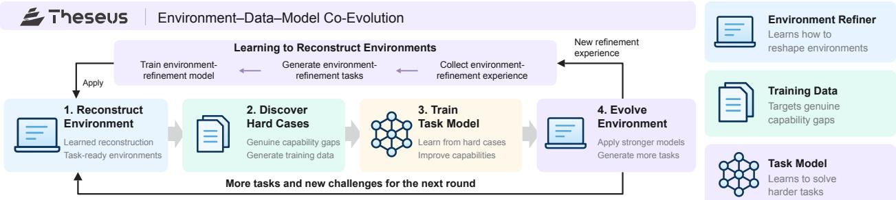  
Figure 10 Theseus’s proposed four-stage co-evolution loop: reconstruct environments, uncover genuine capability gaps and generate training data, train task models, and iterate environments to produce more tasks. The upper loop learns an environment-refinement model from refinement experience and generated tasks, while successive iterations suppl new experience for further refinement.

Its central premise is that environments make knowledge accessible and actions verifiable, task execution produces evidence for learning, and improved models expand the range of problems that can be explored. Under this vision, each round of work should contribute reusable capabilities to subsequent rounds, making real-world practice a continuing source of intelligence growth.

As shown in Figure 10, Theseus realizes this vision in four steps. First, refinement experience is converted into environment-refinement tasks to train an environment-refinement model. Second, agents use reconstructed environments to identify genuine task-solving dificulties and generate targeted training data. Third, these data train the task model to improve its capabilities. Fourth, the stronger model supports further environment iteration and the generation of more tasks. Subsequent rounds yield both new task-training data and new environment-refinement experience, linking progress in solving tasks to progress in constructing the conditions for future learning.

Early results provide an initial empirical basis for this direction in the workspace stage of the loop. A pilot with eight frontier model–harness configurations on 30 workspace tasks adapted from Workspace-Bench [212], scored by 1,280 rubrics, first measured sensitivity to workspace quality: relative to a noise-laden workspace, a clean workspace raised pass rates by 21.7–51.6 percentage points across all eight configurations (Table 9a), suggesting that workspace state, rather than model capability alone, can bound agent performance. Building on this observation, a follow-up productivity study asked whether enriching the environment improves task performance while keeping the underlying model and harness fixed: five fixed model–harness pairings solved 30 tasks scored by 547 rubrics in total under a bare workspace and a reconstructed environment consisting of a Collection Map and an Event Log; the reconstructed environment raised aggregate rubric scores by 18.65–39.67 percentage points across all tested configurations (Table 9b), although a few tasks showed scope-creep regressions, where agents produced more extensive changes than the task required. The team has also completed training a reusable file-verification module. These early results mark the first steps of the co-evolution loop, and successive rounds will extend environment reconstruction, data generation, and model training into a sustained cycle of compounding improvement.

## 5.2 Lark: Building the Data Foundation for Reliable Enterprise-Level RSI

Figure 11 summarizes Lark’s data-foundation loop. Lark approaches RSI from a prerequisite that is often overlooked: before an agent can improve itself, it needs a continuously evolving data substrate on which improvement can be grounded. In enterprise collaboration, documents, messages, meetings, and tasks continuously generate new information, while agents consume these data and produce new interaction traces. Lark therefore treats data production, quality evaluation, and failure attribution as the foundation of its RSI pipeline. The key objective is not merely to accumulate more data, but to ensure that each iteration has fresh experience to learn from, a reliable criterion for judging progress, and suficiently fine-grained diagnostics to determine what should be changed.

Enterprise Knowledge Graph. A representative example is the construction and continual refinement of an enterprise knowledge graph. Information scattered across documents, messages, and meeting records is linked into entities, events, people, and temporal relations so that agents can answer questions requiring cross-source reasoning. Because graph errors directly propagate into downstream answers, graph construction is itself treated as an iterative data-quality problem. Lark addresses scalability through batched graph construction and delegated authorization checks, while continuously evaluating whether graph-based retrieval improves downstream question answering. In internal evaluations, it reports that human-rated task usability increased from 52% to 65%, while automated-evaluation usability increased from 47% to 56% when using its graph-based pipeline compared with the RAG-based baseline.

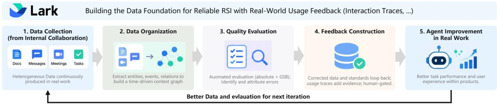  
Figure 11 Lark’s data-foundation loop for RSI, where collaboration data are continuously structured, evaluated, and refined into high-quality knowledge and training signals, while real-world agent usage feeds new evidence back into subsequent improvement cycles.

Automated Data-Quality Evaluation. Another example is an automated data-quality evaluation system that serves as the measurement layer for subsequent improvement. Rather than relying entirely on expensive and inconsistent manual review, Lark first applies absolute judgments to identify clearly unusable outputs and then uses comparative GSB evaluation to determine whether a new system variant should be promoted. Importantly, evaluation is coupled with explicit failure attribution. Bad cases are categorized into issues (e.g., temporal inconsistency, distorted queries, or poor source quality), so that each failure maps to a concrete improvement direction. For example, time-sensitive questions are constrained by query-time filtering to avoid using future information, and low-quality synthetic queries are rewritten before re-entering the evaluation pipeline. The initial automated evaluator achieved approximately 84% agreement with human judgments, where most disagreements arose because the automated evaluator was stricter than human reviewers, providing a concrete signal for subsequent calibration.

From an RSI perspective, the significance of these trials lies in the feedback structure they create for future agent improvement. Enterprise activity continuously produces new graph data and interaction traces, automated evaluation determines which outputs and data are reliable, error attribution identifies where the pipeline failed, and corrected data and evaluation standards then become inputs to later iterations. The resulting cycle turns production data from a passive resource into an evolving improvement substrate. At the same time, Lark’s current practice remains deliberately human-gated: agents perform much of the repetitive data processing and evaluation, while humans retain responsibility for defining standards, reviewing critical samples, and approving important changes.

## 5.3 Humanlaya: Delivery-Driven RSI for Data Quality Assurance

Humanlaya provides training and evaluation data for foundation-model developers, with its production workflow centered on complex multi-file task packages consisting of task descriptions, input attachments, reference answers, scoring rubrics, and executable or procedural verification requirements. In such settings, quality failures are often subtle, where an individual artifact may appear correct in isolation while remaining inconsistent with the task specification, scoring logic, or downstream evaluation protocol. As task types and customer requirements evolve, repeatedly repairing individual defective samples is insuficient, and the quality-control system itself must learn from recurring failures. Humanlaya therefore treats its data-quality agents and their associated rules, prompts, few-shot examples, and skills as persistent improvement targets, including an inner loop and an outer loop, as shown in Figure 12.

The Data-Centric Inner Loop. The inner loop operates within the current delivery batch and focuses on repairing the data being produced. Each task package first passes through a Quality Checker that inspects content quality and cross-component consistency, followed by a Refiner that repairs confirmed defects, and finally a Delivery Checker that verifies formatting, structure, and delivery constraints. Failed checks trigger repeated localization, revision, and re-verification before delivery. For example, if several independently gradable results are incorrectly merged into a single coarse rubric item, the checker may identify the rubric as insuficiently atomic and request restructuring before the package is accepted. This loop improves the current artifact, but by itself does not constitute persistent system improvement.

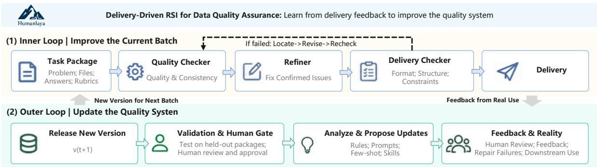  
Figure 12 Humanlaya’s delivery-driven RSI loop for data-quality assurance.

The Improvement-Centric Outer Loop. The outer loop operates across delivery batches and is the central RSI mechanism. After delivery, the system aggregates evidence like internal review, customer feedback, and downstream usage. An agent analyzes these cases for recurrent causes and proposes versioned modifications to the quality-control system, including components like Refiner instructions, prompts, few-shot examples, and reusable skills. Candidate updates are evaluated on task packages that are not involved in producing the modification and are additionally reviewed by humans before promotion. Once approved, the new quality-system version replaces the previous one and is used for subsequent production batches. New tasks then generate new evidence, which again enters the next improvement cycle.

A representative case involved a three-page scanned PDF that the extraction tool failed to parse, causing the Quality Checker to mark the attachment as unusable. Manual review shows that the scan itself is clear, while the error comes from conflating extraction failure with poor document quality. The system therefore generates a new decision rule and few-shot examples to distinguish the two cases. After held-out validation and human review, the update is incorporated into the next system version and reused on future tasks. The inner loop repairs the current task package, whereas the outer loop updates the method used to inspect and repair future packages. Humanlaya therefore represents a practical form of scafold-level RSI driven by production feedback.

Measured Improvement. Humanlaya reports an internal comparison between V0 and V4 after four feedbackdriven updates. Using the same base model, tools, and processing budget, both versions were evaluated on 600 task packages excluded from the update process. The rate of packages containing key defects after automated repair decreased from 9.0% to 3.7%, while average human handling time fell from 48 to 27 minutes per task.

At the current stage, when model capabilities are still advancing rapidly, some tasks cannot yet be completed fully autonomously by agents. Humanlaya therefore provides a practical example of combining RSI with human oversight, where agents perform most of the self-improvement process, while humans provide partial ground truth, review, and final approval at critical stages, rather than allowing an unconstrained self-improvement loop.

## 5.4 ModelBest: Zero-Human Industrial AI Engineering

ModelBest aims to advance RSI by automating AI engineering, based on the premise that AI engineering is likely to become autonomous earlier than open-ended AI research. Engineering tasks (e.g., implementing training frameworks, optimizing kernels, configuring parallelism, running benchmarks) require substantial human efort but ofer comparatively inexpensive, objective feedback through execution. To this end, to produce a production-ready implementation without human intervention, ModelBest proposes Forge Engineering, an end-to-end paradigm in which an AI system takes a target model, hardware platform, and parallelization requirements as inputs, then builds, tests, and refines an implementation from an initially empty codebase. Figure 13 shows how its within-project optimization and cross-project experience reuse form a two-level loop.

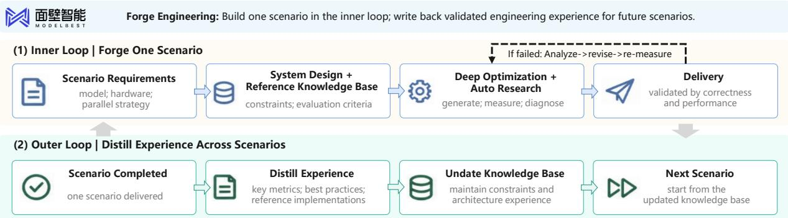  
Figure 13 ModelBest: Forge Engineering as a two-level RSI loop.

The Industrial RSI Loop. Within a target scenario, the system combines constrained architecture design with autonomous low-level optimization. Humans and AI maintain a knowledge base containing specifications, evaluation criteria, and accumulated engineering experience. The agent first uses this knowledge to establish a reasonable high-level architecture and constrain the search space. An AutoResearch loop then repeatedly generates implementations, measures correctness and performance, diagnoses failures, and repairs bottlenecks. Successful optimizations, including kernels such as GEMM and FlashAttention, are progressively integrated into the main execution path. This design keeps global architectural constraints stable while allowing aggressive autonomous optimization at the implementation level.

Across scenarios, successful and failed engineering experience is written back into the shared knowledge base. Performance measurements, efective optimization strategies, reference implementations, and failure rules from one project become starting knowledge for subsequent projects. The same engineering procedure can therefore be reused across diferent models, hardware platforms, and workloads. ModelBest reports applying the paradigm across pre-training frameworks, operator libraries, reinforcement-learning infrastructure, inference engines, fine-tuning, compression, quantization, and edge deployment on several hardware ecosystems.

Measured Improvement. Starting from an empty directory together with reference scripts and model specifications, ForgeTrain [213] generated a pre-training framework that matched Megatron-LM v0.15 on H100 within roughly 8 hours and reportedly surpassed it within 1.5–2.5 days, compared with an estimated 3–5 engineers working for 6–12 months for comparable manual development. Reported model FLOPs utilization increased from 40.1% to 44.1% for MiniCPM4-0.5B and from 47.0% to 50.9% for the 8B model. ForgeStencil [214] extends the same approach to scientific-computing kernels, with the company reporting 1.15–1.9× speedups over public state-of-the-art implementations and a median 1.41× end-to-end speedup.

## 5.5 Tencent Hunyuan: Experience-Driven Self-Improvement

Tencent Hunyuan’s Hyra (Hunyuan Research Agent) explores RSI in performance-oriented research and engineering tasks. Figure 14 outlines its experience-driven search loop. Its design follows a deliberately lightweight philosophy: rather than encoding increasingly elaborate human-designed workflows, Hyra gives agents a broad solution space and repeatedly uses experimental evidence to guide subsequent search. Given a task, the system continues exploring until it decides to terminate or exhausts its resource budget, returning the best solution discovered during the process.

A central component is the Experience Bank, which retains substantially richer state (e.g., previous solution code, generated artifacts, execution logs, scores, and evaluator feedback) than a conventional textual memory.

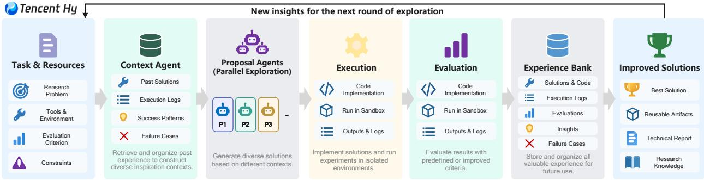  
Figure 14 Experience-driven self-improvement in Tencent Hunyuan Hyra. A Context Agent organizes prior experience to guide parallel solution proposals, which are executed in isolated environments and evaluated. The resulting code, execution logs, and evaluation feedback are retained in an Experience Bank to inform subsequent exploration and support evaluator refinement when needed.

Table 10 Comparison of Recursive and hyra-1.0 on AI R&D benchmarks.
<table><tr><td>Benchmark</td><td>Task</td><td>Metric</td><td>Recursive</td><td>hyra-1.0</td></tr><tr><td>NanoChat Autoresearch [215]</td><td>Model training</td><td>Validation BPB ↓</td><td>0.9109</td><td>0.9015</td></tr><tr><td>NanoGPT Speedrun [216]</td><td>Model training acceleration</td><td>Time to 3.28 loss ↓</td><td>77.5s</td><td>76.4 s</td></tr><tr><td>SOL-ExecBench [217]</td><td>GPU kernel optimization</td><td>Mean SOL ↑</td><td>0.754</td><td>0.771†</td></tr></table>

A Context Agent recombines this evidence into diverse inspiration contexts, while multiple Proposal Agents asynchronously consume these contexts, construct new solutions, and execute them in fresh isolated sandboxes. The resulting artifacts and evaluation outcomes are written back into the Experience Bank, allowing later proposals to directly reuse, combine, or avoid patterns discovered in earlier attempts.

Hyra further extends this idea to evaluation itself. For open-ended tasks where the initial evaluator is incomplete or becomes exploitable, accumulated search experience can be used to revise the evaluation mechanism—for example, by increasing its granularity, strengthening comparison baselines, or closing rewardhacking loopholes—before subsequent search continues under the improved criterion. This is particularly relevant to RSI because the persistent update is no longer limited to a better solution: the mechanism that determines which future solutions are considered improvements can also change.

Measured Improvement. As shown in Table 10, the released companion artifacts report improvements across both AI-for-AI and AI-for-Science tasks. For example, Hyra reports validation BPB of 0.9015 on nanochat AutoResearch [215] compared with a cited previous best of 0.9109, 76.4 s on nanoGPT Speedrun [216] compared with 77.5 s, and 0.771 on SOL-ExecBench [217] compared with 0.754. As an industrial RSI practice, Hyra highlights the value of retaining executable experience rather than only final answers.

## 5.6 Agent-Native Research Lab: Verifiable Research Infrastructure for RSI

Achieving sustained recursive self-improvement requires more than increasingly autonomous research agents, while it also requires an infrastructure through which research experience can be reliably recorded, verified, inherited, and reused across generations. Agent-Native Research Lab focuses on this infrastructural layer, summarized in Figure 15.

• (1) Human-Centric vs. Agent-Native Research Artifact. Conventional scientific papers are designed for human communication and would discard much of the operational state that autonomous agents need to continue previous work (e.g., failed experiments, intermediate evidence, executable specifications, and implementation details). For RSI, such information loss directly weakens cross-generation knowledge accumulation.

To address this, they propose Agent-Native Research Artifact (ARA) as an executable alternative to conventional scientific documentation. ARA jointly preserves formal scientific logic, executable code and specifications, the exploration graph of both successful and abandoned branches, and raw empirical evidence. Rather than inheriting only a polished final narrative, a successor agent can therefore inspect how a result was obtained, which alternatives failed, and which assumptions or parameters were actually used. The reported evaluation shows 93.7% question-answering accuracy over prior work using ARA compared with 72.4% using conventional papers, while RE-Bench reproduction success increases from 57.4% to 64.4%. The important RSI contribution is thus not merely better documentation, but a richer inheritance substrate for later research cycles.

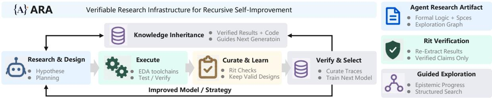  
Figure 15 Agent-Native Research Lab’s agent-native RSI loop for verifiable engineering discovery, integrating guided exploration, deterministic verification, knowledge inheritance, and next-generation learning to support persistent improvement across research cycles.

• (2) Deterministic Verification for Research Claims. Additionally, as autonomous agents generate experiments and claims at machine speed, verification rather than generation becomes the main bottleneck. Its rit protocol anchors empirical claims directly to execution traces, re-extracting reported results from logs, while analytical claims can be checked through formal verification systems such as Lean 4. Only claims that pass these machine-verifiable gates are admitted into the shared research state. This prevents hallucinated or incorrectly reported results from being recursively inherited and amplified by later generations. They also augment sparse outcome-based optimization with epistemic-progress guidance and structured priors derived from human scientific reasoning. Instead of rewarding only the final benchmark score, agents are encouraged to prefer experiments that reduce uncertainty and reveal useful structure in the problem. This is intended to improve research eficiency in large hypothesis spaces, where naive hill climbing can repeatedly exploit familiar parameters without producing deeper understanding.

Measured Improvement. These ideas are instantiated in silicon design, where the feedback loop is unusually fast and deterministic. Autonomous agents generate synthesizable SystemVerilog, construct testbenches, and propose microarchitectural modifications; candidates are then evaluated using industrial EDA tools for synthesis, place-and-route, timing analysis, and formal equivalence. Invalid designs are filtered automatically, while verified implementations, execution traces, failed branches, and superior power-performance-area trajectories are retained as training and research evidence for subsequent generations. On Chip-Bench, they report a Level-3 CPU optimization score of 5.8416, with a design that is 2.7% faster and 21.5% smaller in area than standard-agent baselines on the same model foundation while passing all 97 directed tests and 350 random diferential programs.

## 6 Challenges and Future Directions

The preceding chapters show progress in automating improvement execution, strategy selection, experience acquisition, deployment adaptation, and the revision of improvement mechanisms. They also establish that greater autonomy, durable capability gains, and a more efective improvement process are distinct properties. The three bottlenecks motivating this survey therefore remain only partially resolved: foundation-model development requires substantial resources and coordination; scalable learning depends on useful experience and reliable verification; and deployed systems require continuing efort to diagnose, validate, and release updates. Building on the autonomy hierarchy, the four application regimes, and the industrial practices reviewed above, we identify eight research directions for connecting these partial advances into sustained recursive improvement.

Cross-Component Diagnosis and Coordinated Improvement. The transition from L1 to L2 exposes a diagnostic problem: an observed failure rarely identifies the component that should change. An incorrect answer may originate in defective source data, missing context, a tool interface, the model, or the evaluator. The Humanlaya case in Section 5.3 makes this ambiguity concrete: a failed extraction was initially treated as evidence of poor document quality, while the appropriate intervention concerned the quality checker’s decision rule. In science and embodied intelligence, the same problem extends to experimental protocols, perception, control, and environmental conditions. As several components adapt, changing one can also invalidate assumptions on which another relies.

Future systems should turn diagnoses into testable intervention hypotheses and use controlled comparisons to estimate individual efects and interactions. Selective component freezing, targeted ablations, and explicit records of dependencies could help distinguish a useful repair from compensation for an upstream defect. Coordinated search should then allocate efort across data, models, harnesses, and environments as constraints shift. Theseus’s workspace studies in Section 5.1 illustrate the importance of separating environment improvements from changes to the task model; the reported component-level gains leave the full learning cycle to be established. The research goal is to identify which intervention improves the overall system, under what conditions, and whether the resulting knowledge guides later improvement decisions.

Learner-Conditioned Experience Acquisition and Reliable Learning Signals. The L3 analysis distinguishes three properties of experience: whether it is valid, how dificult it is for the current learner, and whether learning from it produces a durable benefit. AZR uses executable checks alongside learner-dependent task proposal, whereas R-Zero uses solver consistency as a proxy for dificulty [99, 103]. Neither correctness nor estimated dificulty alone establishes learning value. An adaptive curriculum may repeatedly select ambiguous tasks, reinforce evaluator errors, or concentrate on a narrow region where progress is easy to measure. Such errors can enter both the learner and the state that determines its next experiences.

Future acquisition mechanisms should estimate learning value across multiple rounds while preserving validity, diversity, and coverage of previously acquired capabilities. This includes selecting from existing data, generating new tasks, seeking interactions, and requesting stronger external feedback when internal judgments are insuficient. A central challenge is deciding when expensive verification is worth its cost and how uncertain experience should influence subsequent training. Evaluation should allow the acquired distributions to difer while matching data-source access and total acquisition and learning budgets. Freezing the learner-state input to the acquisition mechanism, or replacing adaptive selection with a learner-independent schedule, can test whether learner conditioning improves transfer beyond the efects of additional training.

Persistent-State Management and Reliable Reuse. L4 systems inherit parameters, memories, skills, tools, and harness code, but retaining an artifact does not establish that later agents benefit from it. The L4 analysis identifies failures in both activation and execution: a relevant skill may never be retrieved, or an agent may retrieve it without following it correctly. Accumulation creates an additional dificulty. Library Drift shows that an expanding skill library can degrade retrieval and stall improvement, while overly aggressive retirement can also be harmful [152]. Persistence therefore requires managing the continuing applicability and interaction of retained changes.

Future work should associate inherited artifacts with their supporting evidence, applicability conditions, dependencies, and observed efects on later tasks. Admission tests such as HDSO’s paired evaluations provide a starting point [106], but validation must continue as the task distribution, executor, and surrounding system change. Studies should separately measure update quality, activation, faithful use, and downstream benefit, then investigate when to merge, revise, retire, or revalidate artifacts. Cross-model reuse introduces a further question: a skill useful to its author may be unsuitable for a diferent executor. Resolving these issues would connect successful update generation to reliable capability transfer across sessions and successors.

Governed Adaptation under Domain-Specific Feedback. The four application regimes show why a common improvement loop requires diferent validation strategies. In science, an unsuccessful experiment may reflect the hypothesis, protocol, or instrument, and evidence must retain its assumptions and uncertainty. In embodied intelligence, the current policy determines which states are observed, while physical trials consume resources and can have irreversible consequences. Software ofers executable feedback, but passing tests remains conditional on the specification and test coverage. In healthcare, outcomes are delayed and confounded, and an update validated in one population or institution may not transfer to another. These diferences constrain both what a system can learn autonomously and what evidence supports deployment.

Future research should develop update policies that distinguish transient failures from recurring limitations and select a validation process appropriate to the proposed change. Simulation, retrospective replay, and sandboxed execution can support initial screening, followed by supervised or staged evaluation under the intended operating conditions. Monitoring should test whether benefits persist as requirements, populations, tools, and environments change. Restoring a software checkpoint cannot undo physical or clinical consequences, making pre-release validation essential in those settings. Human authority over consequential releases, access permissions, and safety constraints should remain explicit. The open problem is how to increase useful adaptation while controlling the propagation of errors across future interactions.

Trustworthy Evolution of Improvement Mechanisms. At L5, changes to the improver, evaluator, or research policy alter how subsequent successors are produced and accepted. This creates a coupled validation problem: a stronger solver can expose weaknesses in its evaluator, but changing the evaluator can also make scores incomparable or reward exploitation. RQGM addresses part of this problem by freezing its evaluator within an epoch, validating replacements against an independent anchor, and revisiting scores afected by replacement [21]. The evaluator refinement described in Hyra raises the same broader question of how adaptive measurement can remain credible as search progresses.

Future systems should distinguish editable internal feedback mechanisms from independently maintained acceptance criteria and preserve evidence linking each mechanism revision to later decisions. Controlled comparisons should assess changes to candidate generation and evaluation separately before attributing gains to their joint evolution. A-Evolve-Training provides an example of policy inheritance within a fixed high-level objective [17]; whether such policies transfer beyond the research setting in which they evolved remains to be tested. Open questions include how to maintain independent assessment under repeated adaptive access, detect coordinated proposer–evaluator errors, and reverse harmful mechanism changes without losing usefu experience. Revising operational research priorities need not transfer authority over the system’s overall mission.

Long-Horizon Evaluation of Inherited Improvement Capacity. The distinction between structural and efective L5 should guide evaluation. Structural evidence establishes that a revised mechanism is inherited and invoked; efectiveness requires showing that it produces or selects better subsequent improvements. This remains a substantive empirical gap. For example, the AIDE2 experiment reviewed in this survey did not establish a statistically significant eficiency advantage when an evolved harness was installed as the outer improver [94]. Software lineage studies further motivate separating current task performance from the ability to produce useful descendants, since temporarily weaker variants may enable later progress.

Future benchmarks should compare original and revised mechanisms from comparable initial systems and evidence under matched total budgets, including the cost of developing and evaluating the mechanisms. Holding an evolved mechanism fixed on fresh tasks can test whether its improvement strategy transfers, as illustrated by HyperAgents [93]. Longer studies should report complete trajectories across repeated runs, including rejected updates, regressions, recovery, retained capabilities, and resource use. Protected reference tasks can preserve comparability, while fresh tasks and unfamiliar constraints test transfer and discovery. These protocols should establish whether inherited changes alter subsequent improvement capacity, when gains plateau, and whether apparent acceleration survives accounting for additional search and evaluation efort.

Resource-Aware Improvement and Human Collaboration. The eficiency objective motivating RSI requires accounting for the entire improvement process. A faster kernel, a better training recipe, or a longer unattended run may still require substantial candidate generation, evaluation, infrastructure maintenance, and human review. Meta’s regression-analysis workflow retains engineering review of proposed changes [5]; Humanlaya also retains human validation and reports handling time alongside quality. These practices show why autonomy should be assessed together with the amount and type of human efort required. Stronger base models and more parallel trials can further confound comparisons between improvement strategies.

Future work should study how to allocate a total budget among diagnosis, experience acquisition, candidate search, verification, and deployment monitoring. Cheap screening can reduce expensive trials, provided its predictions remain calibrated against independent outcomes. Reusing validated tools and prior failures may reduce repeated work, but its maintenance cost must also be counted. Evaluations should report time and total cost to a validated capability target, alongside review efort and rework. Adaptive stopping is another research priority: systems should justify continued experimentation by its expected learning value and uncertainty, with explicit conditions for pausing, escalating to a human, or terminating an unproductive search.

Reproducible Infrastructure for Cross-Round Inheritance. Successor systems need access to how an improvement was obtained, including unsuccessful alternatives and the conditions under which its evidence holds. The industrial cases expose complementary requirements: Lark emphasizes temporally grounded data and failure attribution; Humanlaya retains versioned quality-system updates; Hyra stores executable experience; and Agent-Native Research Lab proposes research artifacts that preserve code, specifications, exploration history, and empirical traces. These practices motivate a shared infrastructure for carrying research evidence across rounds, while the full longitudinal benefit of such inheritance remains to be established.

A reusable artifact format should connect the parent state, proposed change, motivating evidence, evaluation configuration, acceptance decision, and subsequent use. Versioned data, environments, and evaluators would make results easier to replay and clarify which comparisons remain valid after an update. Deterministic re-extraction can check reported measurements, and formal verification can establish properties relative to a specification; neither alone establishes that the experiment or specification captures the intended capability. Public evaluation should therefore pair inspectable artifacts with replay studies and report result provenance, artifact availability, and independent replication separately. Where data are confidential, shareable evaluation subsets and controlled replay interfaces could support partial verification while preserving the limits of what can be checked.

Across these directions, progress toward genuine RSI should be demonstrated through repeated, attributable, and transferable improvements in the capacity to improve. The decisive evidence is that inherited changes help later rounds acquire more useful experience, discover better interventions, or validate successors more efectively under explicit resource and authority constraints.

## 7 Conclusion

In this report, we present an autonomy-centered roadmap for recursive self-improvement, spanning five stages: improvement execution, strategy selection, experience acquisition, environmental adaptation, and recursive meta-improvement. Taking the improvement loop as the unit of analysis, we clarify what systems change, what successors inherit, and which decisions remain human-controlled. We connect this roadmap to scientific discovery, embodied intelligence, software engineering, and healthcare, showing how feedback availability, verification costs, and deployment constraints shape progress toward RSI in each domain. Industry practices and preliminary empirical findings further ground the roadmap in demonstrated capabilities and current limitations. Long-horizon evaluation is needed to establish whether these mechanisms deliver transferable gains under explicit resource constraints and human oversight. Ultimately, the promise of RSI lies in enabling each generation of AI to make future improvement more reliable, eficient, and conducive to novel discoveries.

## References

[1] Moonshot AI, “Kimi K3: Open frontier intelligence,” Kimi Research Blog, Jul. 2026. [Online]. Available: https://www.kimi.com/en/blog/kimi-k3

[2] Alibaba Cloud, “Alibaba unveils Qwen3.8-Max: Its largest and most capable flagship model to date,” Alibaba Cloud Press Release, Aug. 2026. [Online]. Available: https://www.alibabacloud.com/en/press-room/alibaba-unv eils-qwen3-8-max

[3] OpenAI, “GPT-5.6: Frontier intelligence that scales with your ambition,” OpenAI Product Announcement, Jul. 2026. [Online]. Available: https://openai.com/index/gpt-5-6/

[4] I. Moshkov, D. Hanley, I. Sorokin, S. Toshniwal, C. Henkel, B. Schiferer, W. Du, and I. Gitman, “Aimo-2 winning solution: Building state-of-the-art mathematical reasoning models with openmathreasoning dataset,” arXiv preprint arXiv:2504.16891, 2025.

[5] Meta Engineering, “Capacity eficiency at meta: How unified ai agents optimize performance at hyperscale,” https://engineering.fb.com/2026/04/16/developer-tools/capacity-eficiency-at-meta-how-unified-ai-agents-opt imize-performance-at-hyperscale/, Apr. 2026, published April 16, 2026; accessed September 9, 2026.

[6] T. Patwardhan, R. Dias, E. Proehl, G. Kim, M. Wang, O. Watkins, S. Fishman, M. Aljubeh, P. Thacker, L. Fauconnet et al., “Gdpval: Evaluating ai model performance on real-world economically valuable tasks,” in International Conference on Learning Representations, vol. 2026, 2026, pp. 24 005–24 040.

[7] L. Phan, A. Gatti, Z. Han, N. Li, J. Hu, H. Zhang, C. B. C. Zhang, M. Shaaban, J. Ling, S. Shi et al., “Humanity’s last exam,” arXiv preprint arXiv:2501.14249, 2025.

[8] C. E. Jimenez, J. Yang, A. Wettig, S. Yao, K. Pei, O. Press, and K. Narasimhan, “Swe-bench: Can language models resolve real-world github issues?” in International Conference on Learning Representations, vol. 2024, 2024, pp. 54 107–54 157.

[9] S. Yao, N. Shinn, P. Razavi, and K. Narasimhan, “τ-bench: A benchmark for tool-agent-user interaction in real-world domains,” arXiv preprint arXiv:2406.12045, 2024.

[10] M. Ferrari, P. Tillet, A. Ibrahim, J. Gershenson, and S. Cofey, “How GPT-5.6 fuses frontier intelligence with frontier eficiency,” OpenAI Engineering, July 2026, published July 29, 2026; accessed September 3, 2026.

[11] S. Jeong, M. Kim, and T. Kim, “Agentic neural architecture search,” arXiv preprint arXiv:2607.07984, 2026. [Online]. Available: https://arxiv.org/abs/2607.07984

[12] DeepSeek-AI, A. Liu, A. Mei et al., “Deepseek-v3.2: Pushing the frontier of open large language models,” 2025. [Online]. Available: https://arxiv.org/abs/2512.02556

[13] Anthropic, “How we built our multi-agent research system,” 2025. [Online]. Available: https: //www.anthropic.com/engineering/multi-agent-research-system

[14] J. Schmidhuber, “Gödel machines: Self-referential universal problem solvers making provably optimal self-improvements,” arXiv preprint cs/0309048, 2003. [Online]. Available: https://arxiv.org/abs/cs/0309048

[15] E. Zelikman, E. Lorch, L. Mackey, and A. T. Kalai, “Self-taught optimizer (STOP): Recursively self-improving code generation,” in Conference on Language Modeling, 2024. [Online]. Available: https://arxiv.org/abs/2310.02304

[16] J. Zhang, S. Hu, C. Lu, R. Lange, and J. Clune, “Darwin gödel machine: open-ended evolution of self-improving agents,” in International Conference on Learning Representations, vol. 2026, 2026, pp. 104 223–104 294.

[17] Z. Shi, B. He, Y. Sang, H. Lu, and B. Dumoulin, “A-evolve-training: Autonomous post-training of a 30b model,” arXiv preprint arXiv:2606.20657, 2026. [Online]. Available: https://arxiv.org/abs/2606.20657

[18] A. Razzhigaev, A. Gritsaev, A. Kaznacheev, N. Dragunov, R. Yampolskiy, and A. Kuznetsov, “Ouroboros: A self-developing frontier coding agent with reviewed core evolution,” 2026. [Online]. Available: https://arxiv.org/abs/2608.0831

[19] X. Yin, X. Wang, L. Pan, L. Lin, X. Wan, and W. Y. Wang, “Gödel agent: A self-referential agent framework for recursive self-improvement,” in Proceedings of the 63rd Annual Meeting of the Association for Computational Linguistics, 2025. [Online]. Available: https://aclanthology.org/2025.acl-long.1354/

[20] J. Wen, L. Qiu, J. Benton, J. H. Kirchner, and J. Leike, “Automated weak-to-strong researcher,” Anthropic Alignment Science Blog, 2026. [Online]. Available: https://alignment.anthropic.com/2026/automated-w2s-resea rcher/

[21] A. Iacob, A. Jovanović, W. F. Shen, D. Burkhardt, M. Kurmanji, N. Tastan, L. Sani, N. A. E. Venanzi, A. Odonnat, Z. Cao, B. Marino, X. Qiu, and N. D. Lane, “The red queen gödel machine: Co-evolving agents and their evaluators,” arXiv preprint arXiv:2606.26294, 2026. [Online]. Available: https://arxiv.org/abs/2606.26294

[22] G. Penedo, H. Kydlíček, L. B. allal, A. Lozhkov, M. Mitchell, C. Rafel, L. Von Werra, and T. Wolf, “The fineweb datasets: Decanting the web for the finest text data at scale,” in Advances in Neural Information Processing Systems, A. Globerson, L. Mackey, D. Belgrave, A. Fan, U. Paquet, J. Tomczak, and C. Zhang, Eds., vol. 37. Curran Associates, Inc., 2024, pp. 30 811–30 849. [Online]. Available: https://proceedings.neurips.cc/p aper\_files/paper/2024/file/370df50ccfdf8bde18f8f9c2d9151bda-Paper-Datasets\_and\_Benchmarks\_Track.pdf

[23] H. Zhang, S. Zhang, K. Li, C. Zhang, Y. Chen, Y. Zhang, L. Bai, and S. Hu, “Self-harness: Harnesses that improve themselves,” arXiv preprint arXiv:2606.09498, 2026. [Online]. Available: https://arxiv.org/abs/2606.09498

[24] S. team, A. Bolton, A. Lerchner, A. Cordell, A. Moufarek, A. Bolt, A. Lampinen, A. Mitenkova, A. O. Hallingstad, B. Vujatovic, B. Li, C. Lu, D. Wierstra, D. P. Sawyer, D. Slater, D. Reichert, D. Vercelli, D. Hassabis, D. A. Hudson, D. Williams, E. Hirst, F. Pardo, F. Hill, F. Besse, H. Openshaw, H. Chan, H. Soyer, J. X. Wang, J. Clune, J. Agapiou, J. Reid, J. Marino, J. Kim, K. Gregor, K. Sridhar, K. McKinney, L. Kampis, L. M. Zhang, L. Matthey, L. Wang, M. A. Raad, M. Loks-Thompson, M. Engelcke, M. Kecman, M. Jackson, M. Gazeau, O. Purkiss, O. Knagg, P. Stys, P. Mendolicchio, R. Hadsell, R. Ke, R. Faulkner, S. Chakera, S. S. Baveja, S. Legg, S. Kashem, T. Terzi, T. Keck, T. Harley, T. Scholtes, T. Roberts, V. Mnih, Y. Liu, Z. Wang, and Z. Ghahramani, “Sima 2: A generalist embodied agent for virtual worlds,” 2025. [Online]. Available: https://arxiv.org/abs/2512.04797

[25] Y. Li, Y. Miao, Y. Shen, and Y. Liu, “Pando: Eficient multimodal ai agents via online skill distillation,” arXiv preprint arXiv:2605.24785, 2026.

[26] Z. Tao, T.-E. Lin, X. Chen, H. Li, Y. Wu, Y. Li, Z. Jin, F. Huang, D. Tao, and J. Zhou, “A survey on self-evolution of large language models,” 2024. [Online]. Available: https://arxiv.org/abs/2404.14387

[27] H.-a. Gao, J. Geng, W. Hua, M. Hu, X. Juan, H. Liu, S. Liu, J. Qiu, X. Qi, Q. Ren, Y. Wu, H. Wang, H. Xiao, Y. Zhou, S. Zhang, J. Zhang, J. Xiang, Y. Fang, Q. Zhao, D. Liu, C. Qian, Z. Wang, M. Hu, H. Wang, Q. Wu, H. Ji, and M. Wang, “A survey of self-evolving agents: What, when, how, and where to evolve on the path to artificial super intelligence,” Transactions on Machine Learning Research, Jan. 2026. [Online]. Available: https://openreview.net/forum?id=CTr3bovS5F

[28] J. Fang, Y. Peng, X. Zhang, Y. Wang, X. Yi, G. Zhang, Y. Xu, B. Wu, S. Liu, Z. Li, Z. Ren, N. Aletras, X. Wang, H. Zhou, and Z. Meng, “A comprehensive survey of self-evolving ai agents: A new paradigm bridging foundation models and lifelong agentic systems,” 2025. [Online]. Available: https://arxiv.org/abs/2508.07407

[29] Z. Ren, Y. Chen, D. Guo, G. Rong, T. Li, R. B. Xiong, Q. Lan, W. Wang, L. Nanbo, Y. Yang, M. Zhuge, and J. Schmidhuber, “Self-improvements in modern agentic systems: A survey,” 2026. [Online]. Available: https://arxiv.org/abs/2607.13104

[30] S. Liu, Z. Lin, Y. Zhang, Y. Ren, Y. Wu, Y. Li, Z. Wang, Z. Fu, and J. Ye, “The path to recursive self-improving agents: Foundation, framework, and future directions,” Preprints, Aug. 2026. [Online]. Available: https://www.preprints.org/manuscript/202608.0051

[31] Q. Zong, J. Liu, J. Shen, Z. Tang, L. Wu, Y. Liu, R. Wang, Z. Wang, W. Wang, C. Qian, X. Chen, and Y. Song, “Co-Evolution in Agentic Systems: Toward Self-Directed Evolution Beyond Human Design,” 2026. [Online]. Available: https://arxiv.org/abs/2608.10299

[32] Y. Xu, W. Zhang, Y. Chen, X. Lin, and Y. Zhang, “Self-Evolving Agents as Dynamic Graph Transformation: A Survey and New Perspective,” 2026. [Online]. Available: https://arxiv.org/abs/2608.18104

[33] D. Ye, Z. Zhang, H. Wang, and C. Miao, “A Survey on AI for AI: When the Improver Becomes the Improvee,” Preprints.org, 2026, preprint. [Online]. Available: https://www.preprints.org/manuscript/202609.0591

[34] D. Li, B. Jiang, L. Huang, A. Beigi, C. Zhao, Z. Tan, A. Bhattacharjee, Y. Jiang, C. Chen, T. Wu, K. Shu, L. Cheng, and H. Liu, “From generation to judgment: Opportunities and challenges of LLM-as-a-judge,” in Proceedings of the 2025 Conference on Empirical Methods in Natural Language Processing, C. Christodoulopoulos,

T. Chakraborty, C. Rose, and V. Peng, Eds. Suzhou, China: Association for Computational Linguistics, Nov. 2025, pp. 2757–2791. [Online]. Available: https://aclanthology.org/2025.emnlp-main.138/

[35] A. Yehudai, L. Eden, A. Li, G. Uziel, Y. Zhao, R. Bar-Haim, A. Cohan, and M. Shmueli-Scheuer, “A Survey on Evaluation of LLM-based Agents,” in Findings of the Association for Computational Linguistics: ACL 2026. Association for Computational Linguistics, 2026, pp. 26 690–26 714. [Online]. Available: https://aclanthology.org/2026.findings-acl.1330

[36] Z. Shan and F. Shao, “A Survey on Rubric-Guided Reinforcement Learning for Language Models,” 2026, arXiv version 2, revised 2026-08-31; Accepted to Findings of EMNLP 2026. [Online]. Available: https://arxiv.org/abs/2608.27505

[37] H. Kim, D. Ryu, X. Yi, J. Yao, J. Lian, M. Huang, S. Duan, J. Bak, and X. Xie, “The Road to Artificial SuperIntelligence: A Comprehensive Survey of Superalignment,” 2024, arXiv version 4, revised 2026-06-17. [Online]. Available: https://arxiv.org/abs/2412.16468

[38] P. Slattery, A. K. Saeri, E. A. C. Grundy, J. Graham, M. Noetel, R. Uuk, J. Dao, S. Pour, S. Casper, and N. Thompson, “The AI risk repository: A meta-review, database, and taxonomy of risks from artificial intelligence,” 2024, arXiv version 3, revised 2026-05-05. [Online]. Available: https://arxiv.org/abs/2408.12622

[39] L. Pan, M. Saxon, W. Xu, D. Nathani, X. Wang, and W. Y. Wang, “Automatically correcting large language models: Surveying the landscape of diverse automated correction strategies,” Transactions of the Association for Computational Linguistics, vol. 12, pp. 484–506, 2024. [Online]. Available: https://aclanthology.org/2024.tacl-1.27/

[40] V. Venktesh, M. Rathee, and A. Anand, “Trust but Verify! A Survey on Verification Design for Test-time Scaling,” 2025, arXiv version 3, revised 2025-09-09. [Online]. Available: https://arxiv.org/abs/2508.16665

[41] S. Niu, G. Chen, Y. Chen, Z. Wen, J. Hu, Z. Deng, D. Chen, S. Zhang, R. Chen, Z. Lian, S. Xu, G. Dai, Y. Zhang, W. Luo, Y. Zhang, M. Tan, and C. Deng, “A Survey on Self-Improving Test-Time Intelligence: Feedback-Driven Adapting, Learning, and Scaling at Inference,” 2026, accepted by Machine Intelligence Research. [Online]. Available: https://arxiv.org/abs/2609.01679

[42] L. Long, R. Wang, R. Xiao, J. Zhao, X. Ding, G. Chen, and H. Wang, “On LLMs-driven synthetic data generation, curation, and evaluation: A survey,” in Findings of the Association for Computational Linguistics: ACL 2024, L.-W. Ku, A. Martins, and V. Srikumar, Eds. Bangkok, Thailand: Association for Computational Linguistics, Aug. 2024, pp. 11 065–11 082. [Online]. Available: https://aclanthology.org/2024.findings-acl.658/

[43] J. Zheng, C. Shi, X. Cai, Q. Li, D. Zhang, C. Li, D. Yu, and Q. Ma, “Lifelong Learning of Large Language Model based Agents: A Roadmap,” IEEE Transactions on Pattern Analysis and Machine Intelligence, 2026, arXiv version 2, revised 2026-01-11. [Online]. Available: https://arxiv.org/abs/2501.07278

[44] W.-C. Huang, W. Zhang, Y. Liang, Y. Bei, Y. Chen, T. Feng, X. Pan, Z. Tan, Y. Wang, T. Wei, S. Wu, R. Xu, L. Yang, R. Yang, W. Yang, C.-Y. Yeh, H. Zhang, H. Zhang, S. Zhu, H. P. Zou, W. Zhao, S. Wang, W. Xu, Z. Ke, Z. Hui, D. Li, Y. Wu, L. He, C. Wang, X. Xu, B. Huang, J. Tan, S. Heinecke, H. Wang, C. Xiong, A. A. Metwally, J. Yan, C.-Y. Lee, H. Zeng, Y. Xia, X. Wei, A. Payani, Y. Wang, H. Ma, W. Wang, C. Wang, Y. Zhang, X. E. Wang, Y. Zhang, J. You, H. Tong, X. Luo, X. Liu, Y. Sun, W. Wang, J. McAuley, J. Zou, J. Han, P. S. Yu, and K. Shu, “A Survey of Agent Memory in the Second Half: Towards Self-Evolving and Long-Horizon Agents,” Transactions on Machine Learning Research, 2026, arXiv version 4, revised 2026-08-04; Survey Certification. [Online]. Available: https://arxiv.org/abs/2602.06052

[45] C. Zhou, H. Chai, W. Chen, Z. Guo, R. Shan, Y. Song, T. Xu, Y. Yang, A. Yu, W. Zhang, C. Zheng, J. Zhu, Z. Zheng, Z. Zhang, X. Lou, C. Zhang, Z. Fu, J. Wang, W. Liu, J. Lin, and W. Zhang, “Externalization in LLM Agents: A Unified Review of Memory, Skills, Protocols and Harness Engineering,” 2026. [Online]. Available: https://arxiv.org/abs/2604.08224

[46] K. Ramnath, K. Zhou, S. Guan, S. S. Mishra, X. Qi, Z. Shen, S. Wang, S. Woo, S. Jeoung, Y. Wang, H. Wang, H. Ding, Y. Lu, Z. Xu, Y. Zhou, B. Srinivasan, Q. Yan, Y. Chen, H. Ding, P. Xu, and L. L. Cheong, “A systematic survey of automatic prompt optimization techniques,” in Proceedings of the 2025 Conference on Empirical Methods in Natural Language Processing, C. Christodoulopoulos, T. Chakraborty, C. Rose, and V. Peng, Eds. Suzhou, China: Association for Computational Linguistics, Nov. 2025, pp. 33 078–33 110. [Online]. Available: https://aclanthology.org/2025.emnlp-main.1681/

[47] Y.-A. Lee, G.-T. Yi, M.-Y. Liu, J.-C. Lu, G.-B. Yang, and Y.-N. Chen, “Compound AI systems optimization: A survey of methods, challenges, and future directions,” in Proceedings of the 2025 Conference on Empirical

Methods in Natural Language Processing, C. Christodoulopoulos, T. Chakraborty, C. Rose, and V. Peng, Eds. Suzhou, China: Association for Computational Linguistics, Nov. 2025, pp. 28 760–28 775. [Online]. Available: https://aclanthology.org/2025.emnlp-main.1463/

[48] L. Yue, K. R. Bhandari, C.-Y. Ko, D. Patel, S. Lin, N. Zhou, J. Gao, P.-Y. Chen, and S. Pan, “From Static Templates to Dynamic Runtime Graphs: A Survey of Workflow Optimization for LLM Agents,” 2026. [Online]. Available: https://arxiv.org/abs/2603.22386

[49] J. Li, Z. Jin, T. Men, Y. Hao, K. Zhu, L. Wang, D. Huang, L. Wang, S. Hua, L. Wang, J. Gao, H. Yuan, R. Xu, K. Liu, and J. Zhao, “Agentic Environment Engineering for Large Language Models: A Survey of Environment Modeling, Synthesis, Evaluation, and Application,” 2026. [Online]. Available: https://arxiv.org/abs/2606.12191

[50] T. Ding, A. Nannapaneni, B. Liu, and L. Zhang, “Autonomous Research Agents: A Survey of AI Scientists and the Verification Gap,” 2026. [Online]. Available: https://arxiv.org/abs/2608.05179

[51] H. Zhou, H. Hu, T. Luo, Y. Shang, C. Fang, Z. Chen, L. Xiao, and Q. Zhang, “Self-Evolving Coding Agents,” 2026, arXiv version 3, revised 2026-08-29. [Online]. Available: https://arxiv.org/abs/2608.03392

[52] C. Zhu, L. Tian, B. Tan, Z. Zhou, Y. Sun, Y. Wang, C. Lv, Y. Wen, Y. He, J. Lin, Y. Chen, C. W. Tan, Q. Wei, L. Zhao, B. Pu, K. Li, Y. Xue, and J. Lin, “The Path to Self-Evolving Clinical Systems: Scaling Medical Agents from Assistance to Autonomy,” 2026, arXiv version 2, revised 2026-08-12. [Online]. Available: https://arxiv.org/abs/2607.11175

[53] M. A. Merrill, A. G. Shaw, N. Carlini, B. Li, H. Raj, I. Bercovich, L. Shi, J. Y. Shin, T. Walshe, E. K. Buchanan, J. Shen, G. Ye, H. Lin, J. Poulos, M. Wang, M. Nezhurina, J. Jitsev, D. Lu, O. M. Mastromichalakis, Z. Xu, Z. Chen, Y. Liu, R. Zhang, L. L. Chen, A. Kashyap, J.-L. Uslu, J. Li, J. Wu, M. Yan, S. Bian, V. Sharma, K. Sun, S. Dillmann, A. Anand, A. Lanpouthakoun, B. Koopah, C. Hu, E. Guha, G. H. S. Dreiman, J. Zhu, K. Krauth, L. Zhong, N. Muennighof, R. Amanfu, S. Tan, S. Pimpalgaonkar, T. Aggarwal, X. Lin, X. Lan, X. Zhao, Y. Liang, Y. Wang, Z. Wang, C. Zhou, D. Heineman, H. Liu, H. Trivedi, J. Yang, J. Lin, M. Shetty, M. Yang, N. Omi, N. Raoof, S. Li, T. Y. Zhuo, W. Lin, Y. Dai, Y. Wang, W. Chai, S. Zhou, D. Wahdany, Z. She, J. Hu, Z. Dong, Y. Zhu, S. Cui, A. Saiyed, A. Kolbeinsson, J. Hu, C. M. Rytting, R. Marten, Y. Wang, A. Dimakis, A. Konwinski, and L. Schmidt, “Terminal-bench: Benchmarking agents on hard, realistic tasks in command line interfaces,” 2026. [Online]. Available: https://arxiv.org/abs/2601.11868

[54] W. Huang, C. Lee, L. Tng, and S. Ge, “Deepswe: Measuring frontier coding agents on original, long-horizon engineering tasks,” 2026. [Online]. Available: https://arxiv.org/abs/2607.07946

[55] Z. Wang, T. Shi, J. He, M. Cai, J. Zhang, and D. Song, “Cybergym: Evaluating ai agents’ real-world cybersecurity capabilities at scale,” 2026. [Online]. Available: https://arxiv.org/abs/2506.02548

[56] S. Lee and D. Brumley, “Exploitbench: A capability ladder benchmark for llm cybersecurity agents,” 2026. [Online]. Available: https://arxiv.org/abs/2605.14153

[57] D. Shepard and R. Salimans, “Automationbench,” 2026. [Online]. Available: https://arxiv.org/abs/2604.18934

[58] J. Wei, Z. Sun, S. Papay, S. McKinney, J. Han, I. Fulford, H. W. Chung, A. T. Passos, W. Fedus, and A. Glaese, “Browsecomp: A simple yet challenging benchmark for browsing agents,” 2025. [Online]. Available: https://arxiv.org/abs/2504.12516

[59] W. Wang, P. Piękos, L. Nanbo, F. Laakom, Y. Chen, M. Ostaszewski, M. Zhuge, and J. Schmidhuber, “Huxley-g\”odel machine: Human-level coding agent development by an approximation of the optimal self-improving machine,” in The Fourteenth International Conference on Learning Representations, 2026. [Online]. Available: https://openreview.net/forum?id=T0EiEuhOOL

[60] S. Chen, S. Lin, Y. Shi, H. Lian, X. Gu, L. Yun, D. Chen, L. Cao, J. Liu, N. Xia, and Q. Wang, “Swe-exp: Experience-driven software issue resolution,” 2026. [Online]. Available: https://arxiv.org/abs/2507.23361

[61] Z. Sun, Z. Liu, Y. Zang, Y. Cao, X. Dong, T. Wu, D. Lin, and J. Wang, “SEAgent: Self-evolving computer use agent with autonomous learning from experience,” in Forty-third International Conference on Machine Learning, 2026. [Online]. Available: https://openreview.net/forum?id=AvBgmOGsdQ

[62] Z. Dai, S. He, H. Li, Q. Zhou, J. Li, M. Song, G. Long, H. Si, X. Yao, L. Zhang et al., “Metis: Bridging text and code memory for self-evolving agents,” arXiv preprint arXiv:2606.24151, 2026.

[63] J. Lin, S. Liu, C. Pan, L. Lin, S. Dou, Z. Xi, X. Huang, H. Yan, Z. Han, T. Gui, and Y.-G. Jiang, “Agentic harness engineering: Observability-driven automatic evolution of coding-agent harnesses,” 2026. [Online]. Available: https://arxiv.org/abs/2604.25850

[64] H. Shi, Z. Xu, H. Wang, W. Qin, W. Wang, Y. Wang, Z. Wang, S. Ebrahimi, and H. Wang, “Continual learning of large language models: A comprehensive survey,” ACM Comput. Surv., vol. 58, no. 5, Nov. 2025. [Online]. Available: https://doi.org/10.1145/3735633

[65] R. Wang, J. Lehman, J. Clune, and K. O. Stanley, “Paired open-ended trailblazer (poet): Endlessly generating increasingly complex and diverse learning environments and their solutions,” 2019. [Online]. Available: https://arxiv.org/abs/1901.01753

[66] S. Hu, C. Lu, and J. Clune, “Automated design of agentic systems,” in International Conference on Learning Representations, 2025.

[67] J. Zhang, J. Xiang, Z. Yu, F. Teng, X.-H. Chen, J. Chen, M. Zhuge, X. Cheng, S. Hong, J. Wang, B. Zheng, B. Liu, Y. Luo, and C. Wu, “AFlow: Automating agentic workflow generation,” in International Conference on Learning Representations, 2025.

[68] OpenAI, “Research engineer / research scientist / ai systems engineer, rsi,” https://openai.com/careers/researc h-engineer-research-scientist-ai-systems-engineer-rsi-san-francisco/, 2026, accessed: 2026-09-08.

[69] Tencent, “Tencent releases and open-sources Tencent Hy4 preview,” Tencent, Aug. 2026, published August 28, 2026; accessed September 5, 2026. [Online]. Available: https://www.tencent.com/tencent-releases-and-open-sou rces-tencent-hy4-preview/

[70] Anthropic Institute, “When ai builds itself,” https://www.anthropic.com/institute/recursive-self-improvement, Jun. 2026, accessed: 2026-09-08.

[71] T. Wu, L. Luo, Y.-F. Li, S. Pan, T.-T. Vu, and G. Hafari, “Continual Learning for Large Language Models: A Survey,” 2024, arXiv version 2, revised 2024-02-07. [Online]. Available: https://arxiv.org/abs/2402.01364

[72] J. Zheng, S. Qiu, C. Shi, and Q. Ma, “Towards lifelong learning of large language models: A survey,” ACM Comput. Surv., vol. 57, no. 8, Mar. 2025. [Online]. Available: https://doi.org/10.1145/3716629

[73] P. Trirat, W. Jeong, and S. J. Hwang, “Automl-agent: A multi-agent LLM framework for full-pipeline automl,” in ICML, ser. Proceedings of Machine Learning Research, vol. 267. PMLR / OpenReview.net, 2025.

[74] Y. Shang, Y. Li, K. Zhao, L. Ma, J. Liu, F. Xu, and Y. Li, “AgentSquare: Automatic LLM agent search in modular design space,” in International Conference on Learning Representations, 2025.

[75] J. S. Chan, N. Chowdhury, O. Jafe, J. Aung, D. Sherburn, E. Mays, G. Starace, K. Liu, L. Maksin, T. Patwardhan, L. Weng, and A. Mądry, “MLE-bench: Evaluating machine learning agents on machine learning engineering,” in International Conference on Learning Representations, 2025. [Online]. Available: https://openreview.net/forum?id=6s5uXNWGIh

[76] Y. Yamada, R. T. Lange, C. Lu, S. Hu, C. Lu, J. Foerster, J. Clune, and D. Ha, “The ai scientist-v2: Workshop-level automated scientific discovery via agentic tree search,” 2025. [Online]. Available: https://arxiv.org/abs/2504.08066

[77] G. Starace, O. Jafe, D. Sherburn, J. Aung, C. J. Shern, L. Maksin, R. Dias, E. Mays, B. Kinsella, W. Thompson, J. Heidecke, A. Glaese, and T. Patwardhan, “Paperbench: evaluating ai’s ability to replicate ai research,” in Proceedings of the 42nd International Conference on Machine Learning, ser. ICML’25. JMLR.org, 2025.

[78] C. Fernando, D. Banarse, H. Michalewski, S. Osindero, and T. Rocktäschel, “Promptbreeder: self-referential self-improvement via prompt evolution,” in Proceedings of the 41st International Conference on Machine Learning, ser. ICML’24. JMLR.org, 2024.

[79] T. Li, Y. Wang, Z. Chen, Z. Wang, L. Ma, and G.-J. Qi, “C-evolve: Consensus-based evolution for prompt groups,” in International Conference on Learning Representations, C. Vondrick, B. Hariharan, C. Rafel, L. Pinto, D. Yang, and A. Faust, Eds., vol. 2026, 2026, pp. 37 510–37 586. [Online]. Available: https: //proceedings.iclr.cc/paper\_files/paper/2026/file/3f1351a10a3f904e6f3845a94275a909-Paper-Conference.pdf

[80] J. Chen, Z. Song, J. Liu, S. Zhou, H. Wu, H. Shi, C. Zhou, H. Li, X. Yang, D. Zhu et al., “Decoevo: Scoredecoupled co-evolution of solver and rubric-generator skills in text space,” arXiv preprint arXiv:2607.25675, 2026.

[81] Z. Wu, L. Zhang, T. Wang, R. Zhao, P. Andrews, C. Aloisi, and Y. He, “EDIT: Evidence-diagnosed intervention training for rule-faithful llm grading,” arXiv preprint arXiv:2606.06350, 2026. [Online]. Available: https://arxiv.org/abs/2606.06350

[82] L. A. Agrawal, S. Tan, D. Soylu, N. Ziems, R. Khare, K. Opsahl-Ong, A. Singhvi, H. Shandilya, M. J. Ryan, M. Jiang, C. Potts, K. Sen, A. G. Dimakis, I. Stoica, D. Klein, M. Zaharia, and O. Khattab, “GEPA: Reflective prompt evolution can outperform reinforcement learning,” in International Conference on Learning Representations, 2026.

[83] Y. Choi, D. Kim, J. Baek, and S. J. Hwang, “Multimodal prompt optimization: Why not leverage multiple modalities for mllms,” 2026. [Online]. Available: https://arxiv.org/abs/2510.09201

[84] G. Wang, Y. Xie, Y. Jiang, A. Mandlekar, C. Xiao, Y. Zhu, L. Fan, and A. Anandkumar, “Voyager: An open-ended embodied agent with large language models,” 2023. [Online]. Available: https://arxiv.org/abs/2305.16291

[85] S. Ouyang, J. Yan, I. Hsu, Y. Chen, K. Jiang, Z. Wang, R. Han, L. Le, S. Daruki, X. Tang et al., “Reasoningbank: Scaling agent self-evolving with reasoning memory,” in International Conference on Learning Representations, vol. 2026, 2026, pp. 94 327–94 354.

[86] J. Ni, Y. Liu, X. Liu, Y. Sun, M. Zhou, P. Cheng, D. Wang, E. Zhao, X. Jiang, and G. Jiang, “Trace2skill: Distill trajectory-local lessons into transferable agent skills,” arXiv preprint arXiv:2603.25158, 2026.

[87] H. Lu and C. Xia, “Agent-agnostic end-to-end c/c++ application performance optimization,” in Proceedings of the 2026 International Conference on Supercomputing Workshops. Association for Computing Machinery, 2026, pp. 65–69. [Online]. Available: https://doi.org/10.1145/3774895.3812199

[88] OpenAI, “Harness engineering: Leveraging codex in an agent-first world,” https://openai.com/index/harness-e ngineering/, Feb. 2026, published February 11, 2026; accessed September 9, 2026.

[89] J. Su, Z. Wu, S. Huang, and W. Feng, “AIPC: Agent-based automation for ai model deployment with qualcomm ai runtime,” arXiv preprint arXiv:2604.14661, 2026. [Online]. Available: https://arxiv.org/abs/2604.14661

[90] J. Jaber and O. Jaber, “Autokernel: Autonomous gpu kernel optimization via iterative agent-driven search,” arXiv preprint arXiv:2603.21331, 2026.

[91] Y. Wu, J. Zhang, J. Shi, X. Lei, Q. Gu, Y. Zhang, Z. Wang, C. He, C. Huang, M. Song et al., “Harnessdev: Can llms create and evolve their own agent harness?” arXiv preprint arXiv:2609.01437, 2026.

[92] OpenAI and Thrive Holdings, “Building self-improving tax agents with Codex,” Engineering case study, 2026. [Online]. Available: https://openai.com/index/building-self-improving-tax-agents-with-codex/

[93] J. Zhang, B. Zhao, W. Yang, J. Foerster, J. Clune, M. Jiang, S. Devlin, and T. Shavrina, “Hyperagents,” arXiv preprint arXiv:2603.19461, 2026. [Online]. Available: https://arxiv.org/abs/2603.19461

[94] Weco Team, “AIDE2: The first evidence of recursive self-improvement,” Weco AI Blog, Jul. 2026, industrial research disclosure; technical report and artifact release announced as forthcoming at the time of writing. [Online]. Available: https://www.weco.ai/blog/first-evidence-of-recursive-self-improvement

[95] Microsoft Research, “SynthLLM: Breaking the ai data wall with scalable synthetic data,” https://www.microsof t.com/en-us/research/articles/synthllm-breaking-the-ai-data-wall-with-scalable-synthetic-data/, 2025, accessed September 9, 2026.

[96] Z. Wang, Y. Liang, X. Zhang, Q. Wu, S. Han, A. Bastos, R. Wang, C. Bansal, B. Peng, J. Gao, S. Rajmohan, and H. Yao, “SynthAgent: Adapting web agents with synthetic supervision,” in Proceedings ofthe 64th Annual Meeting of the Association for Computational Linguistics (Volume 1: Long Papers). Association for Computational Linguistics, 2026, pp. 15 730–15 752. [Online]. Available: https://aclanthology.org/2026.acl-long.716/

[97] NVIDIA, “Nemotron-4 340b technical report,” arXiv preprint arXiv:2406.11704, 2024. [Online]. Available: https://arxiv.org/abs/2406.11704

[98] H. Lu, Y. Wen, P. Cheng, R. Ding, J. Guo, H. Xu, C. Wang, H. Chen, xiaoxi jiang, and guanjunjiang, “Search selfplay: Pushing the frontier of agent capability without supervision,” in The Fourteenth International Conference on Learning Representations, 2026. [Online]. Available: https://openreview.net/forum?id=ZmGirmNJqE

[99] A. Zhao, Y. Wu, T. Wu, Q. Xu, Y. Yue, M. Lin, S. Wang, Q. Wu, Z. Zheng, and G. Huang, “Absolute zero: Reinforced self-play reasoning with zero data,” in NeurIPS, 2025.

[100] K. Dong and T. Ma, “STP: self-play LLM theorem provers with iterative conjecturing and proving,” in ICML, ser. Proceedings of Machine Learning Research, vol. 267. PMLR / OpenReview.net, 2025.

[101] A. Wilf, P. Aggarwal, B. Parno, D. Fried, L.-P. Morency, P. P. Liang, and S. Welleck, “Propose, solve, verify: Self-play through formal verification,” in Forty-third International Conference on Machine Learning, 2026. [Online]. Available: https://openreview.net/forum?id=Vuaq1qXCki

[102] X. Zeng, Y. Chen, L. Liu, C. Luo, Y. Chen, and Zhuangzhuoran, “Teaching llm to be persuasive: Reward-enhanced policy optimization for alignment from heterogeneous rewards,” in Proceedings of the 64th Annual Meeting of the Association for Computational Linguistics: Industry Track, 2026. [Online]. Available: https://aclanthology.org/2026.acl-industry.34/

[103] C. Huang, W. Yu, X. Wang, H. Zhang, Z. Li, R. Li, J. Huang, H. Mi, and D. Yu, “R-zero: Self-evolving reasoning LLM from zero data,” in The Fourteenth International Conference on Learning Representations, 2026. [Online]. Available: https://openreview.net/forum?id=96apU6YzSO

[104] Q. Zhang, C. Hu, S. Upasani, B. Ma, F. Hong, V. Kamanuru, J. Rainton, C. Wu, M. Ji, H. Li et al., “Agentic context engineering: Evolving contexts for self-improving language models,” in International Conference on Learning Representations, vol. 2026, 2026, pp. 86 069–86 100.

[105] W. Zhang, X. Zhang, C. Zhang, L. Yang, J. Shang, Z. Wei, H. P. Zou, Z. Huang, Z. Wang, Y. Gao et al., “Personaagent: Bridging memory and action for personalized llm agents,” in Findings of the Association for Computational Linguistics: ACL 2026, 2026, pp. 26 421–26 439.

[106] F. Shang and Y. Yang, “Hypothesis-driven skill optimization for llm agents,” arXiv preprint arXiv:2606.22330, 2026.

[107] R. K. Arora, J. Wei, R. Soskin Hicks, P. Bowman, J. Quiñonero-Candela, F. Tsimpourlas, M. Sharman, M. Shah, A. Vallone, A. Beutel, J. Heidecke, and K. Singhal, “Healthbench: Evaluating large language models towards improved human health,” arXiv preprint arXiv:2505.08775, 2025. [Online]. Available: https://arxiv.org/abs/2505.08775

[108] A. Karpathy, “autoresearch: Ai agents running research on single-gpu nanochat training automatically,” GitHub repository, 2026. [Online]. Available: https://github.com/karpathy/autoresearch

[109] Y. Wu, J. Zhang, J. Shi, Y. Zhang, X. Lei, J. Zhou, Z. Wang, Y. Wu, H. Zhou, D. Wang et al., “Aspire: Can models self-evolve from vague goals?” arXiv preprint arXiv:2608.31111, 2026.

[110] M. Suzgun, M. Yuksekgonul, F. Bianchi, D. Jurafsky, and J. Zou, “Dynamic cheatsheet: Test-time learning with adaptive memory,” in Proceedings of the 19th Conference of the European Chapter of the Association for Computational Linguistics (Volume 1: Long Papers), 2026, pp. 7080–7106.

[111] P. Wang, Z. Ma, Y. Chang, X. Luo, X. Yang, S. Feng, Y. Yang, and D. Li, “Self-evolving embodied agents via skill-harness evolution,” 2026. [Online]. Available: https://arxiv.org/abs/2608.11350

[112] A. Madaan, N. Tandon, P. Gupta, S. Hallinan, L. Gao, S. Wiegrefe, U. Alon, N. Dziri, S. Prabhumoye, Y. Yang et al., “Self-refine: Iterative refinement with self-feedback,” Advances in neural information processing systems, vol. 36, pp. 46 534–46 594, 2023.

[113] N. Shinn, F. Cassano, E. Berman, A. Gopinath, K. Narasimhan, and S. Yao, “Reflexion: Language agents with verbal reinforcement learning,” 2023. [Online]. Available: https://arxiv.org/abs/2303.11366

[114] S. Yao, D. Yu, J. Zhao, I. Shafran, T. Grifiths, Y. Cao, and K. Narasimhan, “Tree of thoughts: Deliberate problem solving with large language models,” in NeurIPS, 2023.

[115] P. Banerjee, M. Moshtaghi, and A. Chadha, “APEX-EM: Non-parametric online learning for autonomous agents via structured procedural-episodic experience replay,” 2026. [Online]. Available: https://arxiv.org/abs/2603.29093

[116] A. Zhao, D. Huang, Q. Xu, M. Lin, Y.-J. Liu, and G. Huang, “ExpeL: LLM agents are experiential learners,” in Proceedings of the AAAI Conference on Artificial Intelligence, vol. 38, no. 17, 2024, pp. 19 632–19 642. [Online]. Available: https://ojs.aaai.org/index.php/AAAI/article/view/29936

[117] K. Tsui, “Self-correction bench: Uncovering and addressing the self-correction blind spot in large language models,” 2026. [Online]. Available: https://arxiv.org/abs/2507.02778

[118] G. Tyen, H. Mansoor, V. Carbune, P. Chen, and T. Mak, “LLMs cannot find reasoning errors, but can correct them given the error location,” in Findings of the Association for Computational Linguistics: ACL 2024, 2024, pp. 13 894–13 908. [Online]. Available: https://aclanthology.org/2024.findings-acl.826

[119] J. Huang, X. Chen, S. Mishra, H. S. Zheng, A. W. Yu, X. Song, and D. Zhou, “Large language models cannot self-correct reasoning yet,” in International Conference on Learning Representations, 2024. [Online]. Available: https://openreview.net/forum?id=IkmD3fKBPQ

[120] Y. Li, “Decomposing LLM self-correction: The accuracy-correction paradox and error depth hypothesis,” arXiv preprint arXiv:2601.00828, 2026. [Online]. Available: https://arxiv.org/abs/2601.00828

[121] T. X. Olausson, J. P. Inala, C. Wang, J. Gao, and A. Solar-Lezama, “Is self-repair a silver bullet for code generation?” in International Conference on Learning Representations, B. Kim, Y. Yue, S. Chaudhuri, K. Fragkiadaki, M. Khan, and Y. Sun, Eds., vol. 2024, 2024, pp. 36 545–36 593. [Online]. Available: https: //proceedings.iclr.cc/paper\_files/paper/2024/file/9ddc141bdbf9d1db510ceff56c586ad-Paper-Conference.pdf

[122] Y. Verma, “Try again, don’t look back: Blind resampling outperforms self-repair in small code models,” arXiv preprint arXiv:2607.26117, 2026. [Online]. Available: https://arxiv.org/abs/2607.26117

[123] J. Liu, C. S. Xia, Y. Wang, and L. Zhang, “Is your code generated by ChatGPT really correct? rigorous evaluation of large language models for code generation,” Advances in Neural Information Processing Systems, vol. 36, pp. 21 558–21 572, 2023. [Online]. Available: https://arxiv.org/abs/2305.01210

[124] Google Research, “Achieving 10,000x training data reduction with high-fidelity labels,” https://research.google/ blog/achieving-10000x-training-data-reduction-with-high-fidelity-labels/, Aug. 2025, published August 7, 2025; accessed September 9, 2026.

[125] M. Abdin, S. Agarwal, A. Awadallah, V. Balachandran, H. Behl, L. Chen, G. de Rosa, S. Gunasekar, M. Javaheripi, N. Joshi, P. Kaufmann, Y. Lara, C. C. T. Mendes, A. Mitra, B. Nushi, D. Papailiopoulos, O. Saarikivi, S. Shah, V. Shrivastava, V. Vineet, Y. Wu, S. Yousefi, and G. Zheng, “Phi-4-reasoning technical report,” arXiv preprint arXiv:2504.21318, 2025. [Online]. Available: https://arxiv.org/abs/2504.21318

[126] NVIDIA, “NVIDIA NeMo Curator: Data curation for generative ai,” https://docs.nvidia.com/nemo/curator/, 2025, accessed September 9, 2026.

[127] D. Chen, Y. Huang, Z. Ma, H. Chen, X. Pan, C. Ge, D. Gao, Y. Xie, Z. Liu, J. Gao, Y. Li, B. Ding, and J. Zhou, “Data-juicer: A one-stop data processing system for large language models,” in Proceedings of the 2024 International Conference on Management of Data, 2024. [Online]. Available: https://doi.org/10.1145/3626246.3653385

[128] P. Liu, J. Wu, and U. Thakore, “Leveraging agents to debug nccl watchdog timeouts: A technical, repeatable workflow,” @Scale: Systems & Reliability, Jun. 2026, published June 25, 2026.

[129] Amazon Web Services, “Agent toolkit for aws,” https://aws.amazon.com/products/developer-tools/agent-toolkit -for-aws/, May 2026, announced May 6, 2026; accessed September 9, 2026

[130] LinkedIn Engineering, “Contextual agent playbooks and tools: How linkedin gave ai coding agents organizational context,” LinkedIn Engineering Blog, Jan. 2026, published January 27, 2026.

[131] OpenAI, “Research acceleration: The view inside OpenAI,” OpenAI, Sep. 2026. [Online]. Available: https://openai.com/index/research-acceleration-view-inside-openai/

[132] E. Wang and D. Meyerzon, “How we optimized Dash’s relevance judge with DSPy,” Dropbox.Tech, Mar. 2026, published March 17, 2026; accessed September 5, 2026. [Online]. Available: https: //dropbox.tech/machine-learning/optimizing-dropbox-dash-relevance-judge-with-dspy

[133] L. Quintanilla and V. Dibia, “Introducing agent optimizer in Foundry Agent Service,” Microsoft Foundry Blog, Jun. 2026, published June 3, 2026; accessed September 5, 2026. [Online]. Available: https://devblogs.microsoft.com/foundry/agent-optimizer-build2026/

[134] D. Rodge, “Post-train NVIDIA Cosmos 3 in one day using agent skills,” NVIDIA Technical Blog, Jul. 2026. [Online]. Available: https://developer.nvidia.com/blog/post-train-nvidia-cosmos-3-in-one-day-using-agent-skills/

[135] OpenAI, “GPT-6 Astra system card,” OpenAI Deployment Safety Hub, Sep. 2026. [Online]. Available: https://deploymentsafety.openai.com/gpt-6-astra/vision

[136] J. Ning, X. Li, J. Zeng, H. Kang, and C. Xiong, “Auto research with specialist agents develops efective and non-trivial training recipes,” 2026. [Online]. Available: https://arxiv.org/abs/2605.05724

[137] L. Soldaini, R. Kinney, A. Bhagia, D. Schwenk, D. Atkinson, R. Authur, B. Bogin, K. R. Chandu, J. Dumas, Y. Elazar, V. Hofmann, A. H. Jha, S. Kumar, L. Lucy, X. Lyu, N. Lambert, I. Magnusson, J. Morrison, N. Muennighof, A. Naik, C. Nam, M. E. Peters, A. Ravichander, K. Richardson, Z. Shen, E. Strubell, N. Subramani, O. Tafjord, P. Walsh, L. Zettlemoyer, N. A. Smith, H. Hajishirzi, I. Beltagy, D. Groeneveld, J. Dodge, and K. Lo, “Dolma: an open corpus of three trillion tokens for language model pretraining research,” in ACL (1). Association for Computational Linguistics, 2024, pp. 15 725–15 788.

[138] . AI, :, A. Young, B. Chen, C. Li, C. Huang, G. Zhang, G. Zhang, G. Wang, H. Li, J. Zhu, J. Chen, J. Chang, K. Yu, P. Liu, Q. Liu, S. Yue, S. Yang, S. Yang, W. Xie, W. Huang, X. Hu, X. Ren, X. Niu, P. Nie, Y. Li, Y. Xu, Y. Liu, Y. Wang, Y. Cai, Z. Gu, Z. Liu, and Z. Dai, “Yi: Open foundation models by 01.ai,” 2025. [Online]. Available: https://arxiv.org/abs/2403.04652

[139] A. Yang, A. Li, B. Yang, B. Zhang, B. Hui, B. Zheng, B. Yu, C. Gao, C. Huang, C. Lv, C. Zheng, D. Liu, F. Zhou, F. Huang, F. Hu, H. Ge, H. Wei, H. Lin, J. Tang, J. Yang, J. Tu, J. Zhang, J. Yang, J. Yang, J. Zhou, J. Zhou, J. Lin, K. Dang, K. Bao, K. Yang, L. Yu, L. Deng, M. Li, M. Xue, M. Li, P. Zhang, P. Wang, Q. Zhu, R. Men, R. Gao, S. Liu, S. Luo, T. Li, T. Tang, W. Yin, X. Ren, X. Wang, X. Zhang, X. Ren, Y. Fan, Y. Su, Y. Zhang, Y. Zhang, Y. Wan, Y. Liu, Z. Wang, Z. Cui, Z. Zhang, Z. Zhou, and Z. Qiu, “Qwen3 technical report,” 2025. [Online]. Available: https://arxiv.org/abs/2505.09388

[140] M. Abdin, J. Aneja, H. Behl, S. Bubeck, R. Eldan, S. Gunasekar, M. Harrison, R. J. Hewett, M. Javaheripi, P. Kaufmann, J. R. Lee, Y. T. Lee, Y. Li, W. Liu, C. C. T. Mendes, A. Nguyen, E. Price, G. de Rosa, O. Saarikivi, A. Salim, S. Shah, X. Wang, R. Ward, Y. Wu, D. Yu, C. Zhang, and Y. Zhang, “Phi-4 technical report,” 2024. [Online]. Available: https://arxiv.org/abs/2412.08905

[141] J. Li, A. Fang, G. Smyrnis, M. Ivgi, M. Jordan, S. Y. Gadre, H. Bansal, E. K. Guha, S. S. Keh, K. Arora, S. Garg, R. Xin, N. Muennighof, R. Heckel, J. Mercat, M. F. Chen, S. Gururangan, M. Wortsman, A. Albalak, Y. Bitton, M. Nezhurina, A. Abbas, C. Hsieh, D. Ghosh, J. Gardner, M. Kilian, H. Zhang, R. Shao, S. M. Pratt, S. Sanyal, G. Ilharco, G. Daras, K. Marathe, A. Gokaslan, J. Zhang, K. R. Chandu, T. Nguyen, I. Vasiljevic, S. M. Kakade, S. Song, S. Sanghavi, F. Faghri, S. Oh, L. Zettlemoyer, K. Lo, A. El-Nouby, H. Pouransari, A. Toshev, S. Wang, D. Groeneveld, L. Soldaini, P. W. Koh, J. Jitsev, T. Kollar, A. Dimakis, Y. Carmon, A. Dave, L. Schmidt, and V. Shankar, “Datacomp-lm: In search of the next generation of training sets for language models,” in NeurIPS, 2024.

[142] Y. He, C. Huang, Z. Li, J. Huang, and Y. Yang, “Visplay: Self-evolving vision-language models,” in Proceedings of the IEEE/CVF Conference on Computer Vision and Pattern Recognition (CVPR), June 2026, pp. 26 274–26 284.

[143] Y. Li, J. Yang, Z. Zheng, Z. Hu, Y. Sui, S. Wang, Y. He, and B. Hooi, “Apex: Autonomous policy exploration for self-evolving llm agents,” arXiv preprint arXiv:2605.21240, 2026.

[144] K. Liang, J. Kruk, S. Qian, X. Yang, S. Bi, Y. Yao, S. Nie, M. Zhang, L. Liu, J. F. Fisac et al., “Learning personalized agents from human feedback,” arXiv preprint arXiv:2602.16173, 2026.

[145] S. A. Er, D. Ribeiro, Y. Virkar, S. Lakew, A. Kalyanpur, J. Gung, T. Delteil, and A. Gupta, “Memtoola gent: Leveraging memory for tool using agents based on environment and user feedback,” arXiv preprint arXiv:2606.07909, 2026.

[146] Z. Bai, S. Li, T. Huang, and B. F. Karlsson, “Practice: From experience to expertise in self-evolving embodied agents,” arXiv preprint arXiv:2608.30760, 2026.

[147] Y. Xiao, Y. Sun, H. Wu, W. Hui, W. Da, Z. Luo, M. Chuan, Y. Hu, W. Li, and C. Jiang, “Pilot in the loop: Live self-improvement for long-horizon agents,” arXiv preprint arXiv:2608.26530, 2026.

[148] T. Wei, Z. Shi, M. Lin, B. He, Z. Liu, Y. Sang, Y. Bei, X. Ning, J. Zou, T.-W. Li et al., “Evo-harness: Context-to-harness skill compilation for self-evolving agents,” arXiv preprint arXiv:2608.15071, 2026.

[149] T. Wei, N. Sachdeva, B. Coleman, Z. He, Y. Bei, X. Ning, M. Ai, Y. Li, J. He, E. H. Chi et al., “Evo-memory: Benchmarking llm agent test-time learning with self-evolving memory,” arXiv preprint arXiv:2511.20857, 2025.

[150] J. Shi, S. Tao, Y. Wu, Z. Wang, J. Zhang, J. Liu, X. Lei, X. Zhang, S. Fang, Z. Tan et al., “S3gym: Can llms turn self-testing and self-judging into self-improvement?” arXiv preprint arXiv:2608.31100, 2026.

[151] M. Lin, J. Wu, Z. Wang, Z. Shi, Y. Sang, B. He, Z. Liu, T. Wei, Z. Wu, Z. Zhang et al., “Harness updating is not harness benefit: Disentangling evolution capabilities in self-evolving llm agents,” arXiv preprint arXiv:2605.30621, 2026.

[152] X. Zhang, Y. Cui, G. Wang, Z. Li, W. Qiu, B. Zhu, and P. He, “Library drift: Diagnosing and fixing a silent failure mode in self-evolving llm skill libraries,” arXiv preprint arXiv:2605.19576, 2026.

[153] Y. Liu, Z. Su, Y. Zhang, J. Guo, Z. Xie, H. Jing, L. Xie, Q. Zong, Y. Yim, Z. Zhang et al., “Rethinking self-evolving agent skills: Feedback dynamics over multiple rounds,” arXiv preprint arXiv:2608.02636, 2026.

[154] K. Hambardzumyan, N. Baldwin, E. Toledo, R. Hazra, M. Kuchnik, B. A. Omari, T. S. Foster, A. Protopopov, J.-C. Gagnon-Audet, I. Mediratta, K. Niu, M. Shvartsman, A. Lupidi, A. Audran-Reiss, P. Pathak, T. Shavrina, D. Magka, H. Momand, D. Dunfield, N. Cancedda, P. Stenetorp, C.-J. Wu, J. N. Foerster, Y. Bachrach, and M. Josifoski, “AIRA : Overcoming bottlenecks in AI research agents,” arXiv preprint arXiv:2603.26499, 2026. [Online]. Available: https://arxiv.org/abs/2603.26499

[155] Y.-H. Chen, J. Wen, and J. H. Kirchner, “Automated researchers can mitigate well-characterized alignment failures,” Anthropic Alignment Science Blog, Aug. 2026, research report; accessed September 6, 2026. [Online]. Available: https://alignment.anthropic.com/2026/automated-alignment-researchers/

[156] S. Jiang, L. Ma, Z. Hong, K. Wang, Z. Lu, T. Wang, S. Chen, J. Zhang, T. Pan, W. Li et al., “Sea-eval: A benchmark for evaluating self-evolving agents beyond episodic assessment,” arXiv preprint arXiv:2604.08988, 2026.

[157] C. Zheng, C. Xue, B. Liang, J. Yang, and C. Zhang, “Seagym: An evaluation environment for self-evolving llm agents,” arXiv preprint arXiv:2606.17546, 2026.

[158] Z. Qian, J. Lei, Y. Wang, and N. Cao, “Hypoforge: A self-improving multi-agent framework for automated hypothesis generation and testing via scientific skill learning,” 2026. [Online]. Available: https://arxiv.org/abs/2608.25770

[159] Y. Lyu, X. Zhang, X. Yi, Y. Zhao, S. Guo, W. Hu, J. Piotrowski, J. Kaliski, J. Urbani, Z. Meng, L. Zhou, and X. Yan, “Evoscientist: Towards multi-agent evolving ai scientists for end-to-end scientific discovery,” 2026. [Online]. Available: https://arxiv.org/abs/2603.08127

[160] M. Yuksekgonul, D. Koceja, X. Li, F. Bianchi, J. McCaleb, X. Wang, J. Kautz, Y. Choi, J. Zou, C. Guestrin, and Y. Sun, “Learning to discover at test time,” 2026. [Online]. Available: https://arxiv.org/abs/2601.16175

[161] A. Khajeh, X. Lei, W. Ye, Z. Yang, L. Hung, D. Schweigert, and H.-K. Kwon, “A materials discovery framework based on conditional generative models applied to the design of polymer electrolytes,” Digital Discovery, vol. 4, no. 1, p. 11–20, 2025. [Online]. Available: http://dx.doi.org/10.1039/D4DD00293H

[162] J. Lu, Z. Kong, Y. Wang, R. Fu, H. Wan, C. Yang, W. Lou, H. Sun, L. Wang, Y. Jiang, X. Wang, X. Sun, and D. Zhou, “Beyond static tools: Test-time tool evolution for scientific reasoning,” 2026. [Online]. Available: https://arxiv.org/abs/2601.07641

[163] X. Huang, J. Chen, Y. Fei, Z. Li, P. Schwaller, and G. Ceder, “Cascade: Cumulative agentic skill creation through autonomous development and evolution,” 2026. [Online]. Available: https://arxiv.org/abs/2512.23880

[164] N. Team, “S1-nexusagent: a self-evolving agent framework for multidisciplinary scientific research,” 2026. [Online]. Available: https://arxiv.org/abs/2602.01550

[165] S. Shen, W. Cheng, M. Ma, A. Turcan, M. J. Zhang, and J. Ma, “Skillfoundry: Building self-evolving agent skill libraries from heterogeneous scientific resources,” 2026. [Online]. Available: https://arxiv.org/abs/2604.03964

[166] Y. Zhang, X. Cheng, T. Liu, Y. Du, and W. Jin, “Drugsage:self-evolving agent experience for eficient state-of-the-art drug discovery,” 2026. [Online]. Available: https://arxiv.org/abs/2605.15461

[167] R. Jin, Z. Zhang, M. Wang, and L. Cong, “Stella: Self-evolving llm agent for biomedical research,” 2025. [Online]. Available: https://arxiv.org/abs/2507.02004

[168] Z. Guo, J. Wang, F. Ling, W. Wei, X. Yue, Z. Jiang, W. Xu, J.-J. Luo, L. Cheng, Y.-G. Ham, F. Song, P. Gentine, T. Yamagata, B. Fei, W. Zhang, X. Gu, C. Li, Y. Wang, T. Chen, W. Ouyang, B. Zhou, and L. Bai, “A self-evolving ai agent system for climate science,” 2025. [Online]. Available: https://arxiv.org/abs/2507.17311

[169] Z. Zhang, Z. Qiu, Y. Wu, S. Li, D. Wang, Y. Liu, Z. Zhou, Y. Hu, Y. Chen, D. An, Y. Wang, Y. Li, Z. Zhong, C. Ou, Z. Wang, F. Tang, J. X. Chen, R. Ma, J. Li, X. Wang, W. Lu, H. Xue, W. Zhang, Z. Wei, R. Ma, Z. Shi,

K. Wang, Q. Liu, B. Dong, Y. He, T. Liu, J. Gu, S. Song, Q. Feng, J. Zhang, B. Zhang, L. Tian, L. Bai, Q. Gao, S. Sun, and S. Zheng, “Origene: A self-evolving virtual disease biologist automating therapeutic target discovery,” bioRxiv, 2026. [Online]. Available: https://www.biorxiv.org/content/early/2026/02/25/2025.06.03.657658

[170] B. Sun, W. Guo, Z. Yu, and L. Yang, “Self-evolving scientific agent designs physically-reasoned whitebox fluid control,” 2026. [Online]. Available: https://arxiv.org/abs/2606.08405

[171] P. Hebbar, Y. Manawat, S. Verboomen, A. Ivanova, S. Palanimalai, K. Bhatia, and V. Baskaran, “SIA: Self improving ai with harness and weight updates,” arXiv preprint arXiv:2605.27276, 2026. [Online]. Available: https://arxiv.org/abs/2605.27276

[172] A. Qu, H. Zheng, Z. Zhou, Y. Yan, Y. Tang, S. Y. Ong, F. Hong, K. Zhou, C. Jiang, M. Kong, J. Zhu, X. Jiang, S. Li, C. Wu, B. K. H. Low, J. Zhao, and P. P. Liang, “Coral: Towards autonomous multi-agent evolution for open-ended discovery,” 2026. [Online]. Available: https://arxiv.org/abs/2604.01658

[173] Y. Du, B. Yu, T. Liu, T. Shen, J. Chen, J. G. Rittig, K. Sun, Y. Zhang, A. Krishnan, Y. Zhang, D. Rosen, R. Pirone, Z. Song, B. Zhou, C. Masschelein, Y. Wang, H. Wang, H. Jia, C. Zhang, H. Zhao, M. Ester, N. Hacohen, T. Head-Gordon, C. P. Gomes, H. Sun, C. Duan, P. Schwaller, and W. Jin, “Accelerating scientific discovery with autonomous goal-evolving agents,” 2026. [Online]. Available: https://arxiv.org/abs/2512.21782

[174] A. Zala, J. Cho, H. Lin, J. Yoon, and M. Bansal, “Envgen: Generating and adapting environments via llms for training embodied agents,” 2024. [Online]. Available: https://arxiv.org/abs/2403.12014

[175] J. Guo, L. Yang, P. Chen, Q. Xiao, Y. Wang, X. Juan, J. Qiu, K. Shen, and M. Wang, “Genenv: Dificulty-aligned co-evolution between llm agents and environment simulators,” 2025. [Online]. Available: https://arxiv.org/abs/2512.19682

[176] M. Faldor, J. Zhang, A. Cully, and J. Clune, “Omni-epic: Open-endedness via models of human notions of interestingness with environments programmed in code,” 2025. [Online]. Available: https://arxiv.org/abs/2405.15568

[177] H. Kang, X. Ye, Y. Liu, S. H. Mantri, L. Mao, J. Fleming, D. Regmi, and L. Qin, “Simworld studio: Automatic environment generation with evolving coding agent for embodied agent learning,” 2026. [Online]. Available: https://arxiv.org/abs/2605.09423

[178] G. Tziafas and H. Kasaei, “Lifelong robot library learning: Bootstrapping composable and generalizable skills for embodied control with language models,” 2024. [Online]. Available: https://arxiv.org/abs/2406.18746

[179] R. Ju, X. Wang, X. Ding, Y. Yang, H. Wu, S. Jiang, Q. Zhang, H. Wen, X. Li, W. Wang, K. Li, Y. Liu, H. Dai, W. Wang, and T. Cao, “Embodiskill: Skill-aware reflection for self-evolving embodied agents,” 2026. [Online]. Available: https://arxiv.org/abs/2605.10332

[180] R. Lu, Y. Wu, E. Kou, L. Fu, W. Xiao, A. Mandlekar, Y. Xu, G. Shi, K. Goldberg, A. Chen, M. Chowdhury, Y. Zhu, L. J. Fan, and G. Wang, “Aspire: Agentic /skills discovery for robotics,” 2026. [Online]. Available: https://arxiv.org/abs/2607.00272

[181] W. Xiao, J. Xie, T. Zhang, H. Lin, L. M. Fu, H. Xue, J. Lu, Y. Yang, C. Dai, Z. Wang, J. Wu, G. Wang, S. S. Sastry, K. Goldberg, L. J. Fan, Y. Zhu, and G. Shi, “Enpire: Agentic robot policy self-improvement in the real world,” 2026. [Online]. Available: https://arxiv.org/abs/2606.19980

[182] S. K. S. Ghasemipour, A. Wahid, J. Tompson, P. Sanketi, and I. Mordatch, “Self-improving embodied foundation models,” 2025. [Online]. Available: https://arxiv.org/abs/2509.15155

[183] A. Sharma, A. M. Ahmed, R. Ahmad, and C. Finn, “Self-improving robots: End-to-end autonomous visuomotor reinforcement learning,” 2023. [Online]. Available: https://arxiv.org/abs/2303.01488

[184] V. Giridhar, A. Khandelwal, J. A. Collins, I. Georgiev, and A. Garg, “Beyond imitation: Self-improving robot policies via of-policy q-planning,” 2026. [Online]. Available: https://arxiv.org/abs/2608.21204

[185] G. Li, R. Han, C. Li, H. Li, S. Wang, W. Ding, H. Zhang, and C. Xu, “Agentic self-evolutionary replanning for embodied navigation,” 2026. [Online]. Available: https://arxiv.org/abs/2603.02772

[186] Y. Guo, T. Lee, L. X. Shi, J. Chen, P. Liang, and C. Finn, “Vlaw: Iterative co-improvement of vision-language-action policy and world model,” 2026. [Online]. Available: https://arxiv.org/abs/2602.12063

[187] X. Liu, Z. Bai, H. Ci, K. Y. Ma, and M. Z. Shou, “World-vla-loop: Closed-loop learning of video world model and vla policy,” 2026. [Online]. Available: https://arxiv.org/abs/2602.06508

[188] H. Bi, Z. Zhou, Y. Tang, J. Pang, S. Huang, H. Liu, R. Wang, S. Huang, Y. Wang, Y. Cheng, R. Zhao, Z. Li, H. Tan, X. Liu, J. Wan, J. Liu, M. Zhao, F. Bao, and J. Zhu, “Motus2: A self-evolving general world model for dexterous manipulation,” 2026. [Online]. Available: https://arxiv.org/abs/2608.30237

[189] C. Luo, Z. Zeng, M. Jia, Y. Du, and C. Sun, “Self-improving loops for visual robotic planning,” 2026. [Online]. Available: https://arxiv.org/abs/2506.06658

[190] M. Robeyns, M. Szummer, and L. Aitchison, “A self-improving coding agent,” in ICLR Workshop on Scaling Self-Improving Foundation Models, 2025. [Online]. Available: https://arxiv.org/abs/2504.15228

[191] Y. Li, Y. Zhang, X. Zhang, X. Liu, and Y. Liu, “Codeskill: Learning self-evolving skills for coding agents,” 2026. [Online]. Available: https://arxiv.org/abs/2605.25430

[192] Y. Hu, Y. Cai, Y. Du, X. Zhu, X. Liu, Z. Yu, Y. Hou, S. Tang, and S. Chen, “Self-evolving multi-agent collaboration networks for software development,” 2024. [Online]. Available: https://arxiv.org/abs/2410.16946

[193] Z. Weng, A. Antoniades, D. Nathani, Z. Zhang, X. Pu, and X. E. Wang, “Group-evolving agents: Open-ended self-improvement via experience sharing,” 2026. [Online]. Available: https://arxiv.org/abs/2602.04837

[194] Y. Zhang, Y. Dai, J. Tan, L. Yang, R. Mullur, T. Hoang, Z. Hu, J. Zhu, P. Mui, S. Savarese, R. Xu, and Z. Chen, “Darwinx: Evolving agent harnesses through natural selection,” 2026. [Online]. Available: https://arxiv.org/abs/2608.07545

[195] T. Fan and C. Huang, “Helix: Model-harness co-evolution for recursive self-improvement,” 2026. [Online]. Available: https://arxiv.org/abs/2608.13951

[196] Y. Wei, Z. Sun, E. McMilin, J. Gehring, D. W. Zhang, G. Synnaeve, D. Fried, L. ZHANG, and S. Wang, “Toward training superintelligent software agents through self-play SWE-RL,” in Forty-third International Conference on Machine Learning, 2026. [Online]. Available: https://openreview.net/forum?id=0ophJB76sC

[197] C. Xiao, Z. Jiao, S. Wang, W. Wang, B. Zhao, H. Wei, L. Zhang, and L. Qu, “Socratic-swe: Self-evolving coding agents via trace-derived agent skills,” 2026. [Online]. Available: https://arxiv.org/abs/2606.07412

[198] J. Li, Y. Lai, W. Li, J. Ren, M. Zhang, X. Kang, S. Wang, P. Li, Y.-Q. Zhang, W. Ma, and Y. Liu, “Agent hospital: A simulacrum of hospital with evolvable medical agents,” 2025. [Online]. Available: https://arxiv.org/abs/2405.02957

[199] K. Lan, B. Jin, Z. Zhu, S. Chen, S. Zhang, K. Q. Zhu, and M. Wu, “Depression diagnosis dialogue simulation: Self-improving psychiatrist with tertiary memory,” 2024. [Online]. Available: https://arxiv.org/abs/2409.15084

[200] M. Almansoori, K. Kumar, and H. Cholakkal, “MedAgentSim: Self-Evolving Multi-Agent Simulations for Realistic Clinical Interactions,” in Medical Image Computing and Computer Assisted Intervention – MICCAI 2025, ser. Lecture Notes in Computer Science, vol. 15968. Springer Nature Switzerland, 2025, pp. 362–372.

[201] R. Ren, Y. Wang, Y. Liang, L. Luo, J. Liu, H. Wang, C. Feng, Y. Zhang, C. Miao, J.-R. Wen, and W. X. Zhao, “Emulating clinician cognition via self-evolving deep clinical research,” 2026. [Online]. Available: https://arxiv.org/abs/2603.10677

[202] X. Han, Y. Fan, S. Zhao, H. Wang, and B. Qin, “Gsem: Graph-based self-evolving memory for experience augmented clinical reasoning,” 2026. [Online]. Available: https://arxiv.org/abs/2603.22096

[203] W. Shen, B. Jian, J. Li, C. Liu, J. Moll, X. Hu, D. Rueckert, H. B. Li, and J. Pan, “Evo-medagent: Beyond one-shot diagnosis with agents that remember, reflect, and improve,” 2026. [Online]. Available: https://arxiv.org/abs/2604.14475

[204] Y. He, J. Liu, Z. Hu, Y. Chen, Y. Liu, Y. Sui, Y. Li, N. Chen, J. Hu, B. Hooi, X. Xu, and J. Bian, “Evoclinician: A self-evolving agent for multi-turn medical diagnosis via test-time evolutionary learning,” 2026. [Online]. Available: https://arxiv.org/abs/2601.22964

[205] Q. Liu, Z. Hu, T. Huang, Y. Niu, X. Zhang, S. Ma, C. Lin, G. K. Huat, H. E. Kwon, F. Gao, X. Sun, Z. Ying, and G. Qiang, “EvoMDT: A Self-Evolving Multi-Agent System for Structured Clinical Decision-Making in Multi-Cancer,” npj Digital Medicine, vol. 9, no. 1, p. 124, Jan. 2026. [Online]. Available: https://doi.org/10.1038/s41746-025-02304-8

[206] Y. Yang, J. Li, Q. Pan, J. Zhou, K. Chen, Q. Chen, J. Zhao, N. Zhou, X. Li, and L. He, “Psychagent: An experience-driven lifelong learning agent for self-evolving psychological counselor,” 2026. [Online]. Available: https://arxiv.org/abs/2604.00931

[207] L. Fan, P. Dai, Z. Deng, H. Wang, X. Gong, Y. Zheng, and Y. Ou, “Evolving medical imaging agents via experience-driven self-skill discovery,” 2026. [Online]. Available: https://arxiv.org/abs/2603.05860

[208] H. Sun, W. Li, Y. Zhang, Z. Lin, F. Zhang, K. Chen, X. He, Y. Li, M. Liu, L. Liu, and Y. Jiang, “Experience makes skillful: Enabling generalizable medical agent reasoning via self-evolving skill memory,” 2026. [Online]. Available: https://arxiv.org/abs/2606.09365

[209] S. Li, J. Xu, T. Bao, Y. Liu, Y. Liu, Y. Liu, L. Wang, W. Lei, S. Wang, Y. Xu, Y. Cui, J. Yao, S. Koga, and Z. Huang, “A co-evolving agentic ai system for medical imaging analysis,” 2025. [Online]. Available: https://arxiv.org/abs/2509.20279

[210] Y. Zhu, Z. Wang, Y. Qi, L. Gu, D. Sui, H. Hu, X. Zhang, Z. He, Y. Wang, J. He, L. Ma, and L. Yu, “HealthFlow: Automating Electronic Health Record Analysis via a Strategically Self-Evolving Multi-Agent Framework,” npj Digital Medicine, vol. 9, no. 1, p. 660, Aug. 2026. [Online]. Available: https://doi.org/10.1038/s41746-026-03097-0

[211] Z. Du, L. Zheng, R. Hu, Y. Xu, X. Li, Y. Sun, W. Chen, J. Wu, H. Cai, and H. Ying, “Llms can simulate standardized patients via agent coevolution,” in ACL (1). Association for Computational Linguistics, 2025, pp. 17 278–17 306.

[212] Z. Tang et al., “Workspace-bench 1.0: Benchmarking ai agents on workspace tasks with large-scale file dependencies,” 2026. [Online]. Available: https://arxiv.org/abs/2605.03596

[213] Z. Zhu, Q. He, S. Li, Y. Chen, H. Sun, Z. Li, Y. Li, and Z. Liu, “ForgeTrain: Forging production-grade training frameworks via harness-driven AI development,” https://github.com/OpenBMB/ForgeTrain, 2026, technical report and GitHub repository. [Online]. Available: https://github.com/OpenBMB/ForgeTrain

[214] The ForgeStencil Authors, “ForgeStencil: Autonomous agents for stencil optimization and deployment,” https: //github.com/OpenBMB/ForgeStencil, 2026, gitHub repository.

[215] A. Karpathy, “autoresearch: Autonomous ai research on small language models,” https://github.com/karpathy/ autoresearch, 2026, gitHub repository.

[216] K. Jordan, J. Bernstein, B. Rappazzo, @fernbear.bsky.social, B. Vlado, Y. Jiacheng, F. Cesista, B. Koszarsky, and @Grad62304977, “modded-nanogpt: Speedrunning the nanogpt baseline,” https://github.com/KellerJordan/mo dded-nanogpt, 2024, gitHub repository. [Online]. Available: https://github.com/KellerJordan/modded-nanogpt

[217] E. Lin, S. Modi, S. K. S. Hari, Q. Huang, Z. Ye, N. Qin, F. Zhou, Y. Zhang, J. Wang, S. Damani, D. Peri, O. Xie, A. Kane, M. Maor, M. Behar, T. Cao, R. Mehta, V. Singh, V. S. Mailthody, T. Chen, Z. Ye, H. Chen, T. Chen, V. Grover, W. Chen, W. Liu, E. Chung, L. Ceze, R. Bringmann, C. Zeller, M. Lightstone, C. Kozyrakis, and H. Shi, “Sol-execbench: Speed-of-light benchmarking for real-world gpu kernels against hardware limits,” 2026. [Online]. Available: https://arxiv.org/abs/2603.19173

## Appendix A: RSI Landscape

Figure 16 summarizes the surveyed papers by autonomy level and improvement target.

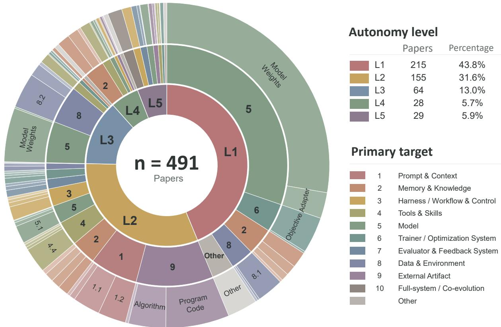  
Figure 16 RSI Landscape: Autonomy Levels and Improvement Targets. Distribution of 491 surveyed papers. The inner, middle, and outer rings represent autonomy levels (L1–L5), primary improvement targets, and sub-targets, respectively. Autonomy-level percentages are based on paper counts. Papers associated with multiple improvement targets contribute fractional weights to the target categories.

Table 11 details the primary targets and sub-targets represented in Figure 16.

Table 11 Taxonomy of Improvement Targets in Recursive Self-Improvement Systems. The taxonomy decomposes the improvement targets represented in Fig. 16 into primary targets and sub-targets. For each sub-target, the table specifies the concrete system component subject to modification.
<table><tr><td>Primary Target</td><td>Sub-target</td><td>Modified Component</td></tr><tr><td rowspan="5">1. Prompt &amp; Con- text</td><td>1.1 Instruction</td><td>System prompts, role specifications, behavioral rules, constraints, and high-level instructions</td></tr><tr><td>1.2 Task Prompt / Template</td><td>Task descriptions, problem formulations, prompt tem- plates, and reusable task specifications</td></tr><tr><td>1.3 Reasoning Prompt / Proto- col</td><td>Explicit reasoning instructions and protocols, including chain-of-thought, reflection, critique, and debate</td></tr><tr><td>1.4 Demonstrations / Exem- plars</td><td>Few-shot examples, demonstrations, successful trajecto- ries, and worked solutions included in context</td></tr><tr><td>1.5 Context Composition</td><td>Context selection, ordering, compression, summarization, and allocation of the available context budget</td></tr><tr><td rowspan="5">2. Memory &amp; Knowledge</td><td>2.1 Episodic / Experience Memory</td><td>Records of prior interactions, execution trajectories, suc- cessful and failed attempts, and task-specific reflections</td></tr><tr><td>2.2 Semantic / Knowledge Memory</td><td>Persistent factual, conceptual, and domain knowledge, including structured or external knowledge stores</td></tr><tr><td>2.3 Procedural Memory</td><td>Reusable strategies, experience-derived rules, heuristics, procedures, and playbooks</td></tr><tr><td>2.4 Memory Representation Organization</td><td>Memory schemas, hierarchical structures, summaries, graphs, indexes, and vector representations</td></tr><tr><td>2.5 Memory Operations</td><td>Policies governing memory writing, retrieval, updating, consolidation, prioritization, and forgetting</td></tr><tr><td rowspan="6">3. Harness / Work- flow &amp; Control</td><td>3.1 Workflow / Graph</td><td>Agent graphs, pipelines, nodes, edges, and execution dependencies between computational stages</td></tr><tr><td>3.2 Planning / Decomposition</td><td>Task decomposition, planning modules, subgoal struc- tures, and execution order</td></tr><tr><td>3.3 Routing / Scheduling</td><td>Model routing, agent routing, tool routing, execution scheduling, and computational resource allocation</td></tr><tr><td>3.4 Verification / Reflection Loop</td><td>Control loops for checking and revising intermediate or final outputs, including critic-revise, verify-retry, and reflection procedures</td></tr><tr><td>3.5 Multi-agent Structure Protocol</td><td>Agent population, role assignment, interaction topology, coordination mechanisms, and communication protocols</td></tr><tr><td>3.6 Harness Implementation/ Scaffold Code</td><td>Source code implementing the agent scaffold, orchestra- tion logic, workflow controller, and runtime coordination mechanisms</td></tr><tr><td rowspan="5">4. Tools &amp; Skills</td><td>4.1 Tool Set / Inventory</td><td>The collection of tools, APIs, external services, and</td></tr><tr><td>4.2 Tool Definition / Interface</td><td>callable capabilities available to the system Tool descriptions, function signatures, schemas, API</td></tr><tr><td>4.3 Tool Implementation</td><td>wrappers, and input-output specifications Executable code and internal logic implementing tools or</td></tr><tr><td>4.4 Skill / Macro Library</td><td>callable external functions Reusable skills, macros, subroutines, procedures, and</td></tr><tr><td>4.5 Skill Composition</td><td>higher-level behavioral modules Rules and structures for combining lower-level skills into</td></tr><tr><td rowspan="4">5. Model</td><td>5.1 Model Weights</td><td>higher-level procedures or capabilities Trainable parameters of the backbone model</td></tr><tr><td>5.2 Adapter / Auxiliary Mod- ule</td><td>Parameters of LoRA modules, adapters, memory mod- ules, and other trainable auxiliary components</td></tr><tr><td>5.3 Architecture</td><td>Network architecture, module composition, connectivity patterns, and computational structure</td></tr><tr><td>5.4 Inference Policy / Configu- ration</td><td>Persistent decoding strategies, test-time policies, infer- ence configurations, and runtime model settings</td></tr><tr><td rowspan="5"></td><td>6.1 Training Objective</td><td>Loss functions, training rewards, learning objectives, and optimization criteria</td></tr><tr><td>6.2 Optimizer / Update Rule</td><td>Optimizers, parameter-update algorithms, learning-rate policies, and associated hyperparameters</td></tr><tr><td>6.3 Training Schedule / Pipeline</td><td>Ordering, configuration, and interaction of training stages such as fine-tuning, reinforcement learning, and distillation</td></tr><tr><td>6.4 Data Selection / Curricu- lum</td><td>Training-sample selection rules, data mixtures, difficulty schedules, and curriculum policies</td></tr><tr><td>6.5 Search / Meta-optimization Procedure</td><td>Evolutionary, search, selection, and meta-optimization procedures used to generate and select candidate im- provements</td></tr><tr><td rowspan="5">7. Evaluator &amp; Feed- back System</td><td>7.1 Evaluator / Judge</td><td>Evaluators, critics, graders, judge models, and related components for assessing candidate outputs or system variants</td></tr><tr><td>7.2 Reward / Fitness Function</td><td>Reward models, fitness functions, utility functions, pref- erence models, and scoring rules</td></tr><tr><td>7.3 Verifier</td><td>Correctness verifiers, test generators, proof checkers, consistency checks, and validation mechanisms</td></tr><tr><td>7.4 Feedback / Credit Assign- ment</td><td>Mechanisms that transform observed outcomes into lo- calized, aggregated, or temporally assigned improvement signals</td></tr><tr><td>8.1 Training / Experience Data</td><td>Training datasets, replay buffers, experience pools, inter- action trajectories, and other data used for subsequent</td></tr><tr><td rowspan="4">8. Data &amp; Environ- ment</td><td>8.2 Task / Curriculum Genera-</td><td>learning Components that generate tasks, problems, challenges, or training episodes for subsequent improvement cycles</td></tr><tr><td>tor 8.3 Environment / Simulator</td><td>Environment dynamics, simulators, interaction rules, task worlds, and structures governing system-</td></tr><tr><td>8.4 World Model</td><td>environment interaction Learned models used to represent, predict, generate, or simulate environmental states and dynamics</td></tr><tr><td></td><td>Task-level programs, patches, or solution code produced by the system, excluding code implementing the agent</td></tr><tr><td rowspan="3">9. External Artifact</td><td>9.1 Program / Solution Code</td><td>itself Algorithms, kernels, mathematical procedures, symbolic</td></tr><tr><td>9.2 Algorithm</td><td>methods, and computational techniques Scientific hypotheses, experimental designs, architec-</td></tr><tr><td>9.3 Scientific / Design Artifact</td><td>tures, circuits, engineering designs, and related research artifacts Multiple harness-level components jointly modified</td></tr><tr><td rowspan="3">10. Full-system / Co-evolution</td><td>10.1 Multi-target Harness</td><td>within the same improvement process, such as prompts, memory, workflows, and tools</td></tr><tr><td>10.2 Model–Harness Co- evolution</td><td>Model parameters and surrounding harness or scaffold components jointly modified across improvement cycles</td></tr><tr><td>10.3 Improvement-loop / Meta- RSI</td><td>The mechanism that generates, evaluates, selects, and applies candidate changes across successive improvement cycles</td></tr></table>

Table 1 2 organizes the surveyed industrial systems by company archetype and improvement target .

## Company Archetypes in the Emerging RSI / Self-Improvement Landscape

One row per product or representative work ; 72 distinct companies/teams ; public-source snapshot : September 2026

Org anizati o n p rin cip l e : co mpany arch etype, n o t g eograp hy . Th e R SI tag is a co mpa ct mapp ing t o th e B 0–L 5 s ch em e an d is n o t a c laim that th e co mpany its e lf us es that la be l . € = c li cka b l e p rimary s o urce .

Ta ble 1 2 RSI / self-improvement company landscape organized by company archetype .
<table><tr><td>Company</td><td>Product / representative work</td><td>Sub-scenario</td><td>Improvement target / artifact</td><td>Al-controlled part</td><td>RSI relation</td><td>0</td></tr><tr><td colspan="7">A. Frontier foundation-model &amp; general-agent labs Broad model/platform labs; RSI appears as one capability frontier rather than the sole company thesis. OpenAl Research acceleration / automated</td></tr><tr><td rowspan="10"></td><td>research intern GPT-Red</td><td>self-play robustness</td><td>red-team policy; adversarial</td><td>gration attack; defend; train; evaluate</td><td>L2</td><td>0</td></tr><tr><td></td><td></td><td>data</td><td></td><td></td><td></td></tr><tr><td>Self-improving tax agents Harness Engineering</td><td>production adaptation</td><td>agent code; prompts; eval set</td><td>mine failures; patch; evaluate</td><td>L4 cand.</td><td>我我</td></tr><tr><td></td><td>agent-first software R&amp;D</td><td>repo; CI; agent instructions</td><td>code; test; PR; repair</td><td>L1-L2 adj.</td><td></td></tr><tr><td>Symphony</td><td>agent orchestration</td><td>task state; repo; workflows</td><td>schedule; execute; handoff</td><td>L1 adj.</td><td></td></tr><tr><td>AgentKit / prompt optimizer / RFT</td><td></td><td>agent optimization stack prompts; graders; weights</td><td>optimize; grade; fine-tune</td><td>L1-L2</td><td></td></tr><tr><td>Deep Research When AI builds itself</td><td>autonomous research RSI roadmap</td><td>task-local evidence</td><td>search; browse; synthesize</td><td>B0</td><td>我我我我</td></tr><tr><td></td><td></td><td>AI-development process</td><td>code; experiments; future successor L5 target design</td><td></td><td></td></tr><tr><td>Automated Weak-to-Strong Re-</td><td>automated alignment</td><td>hypotheses; code; experiment</td><td>propose; train; evaluate; share</td><td>L2</td><td>分</td></tr><tr><td>searcher Tool optimization with Claude</td><td>research tool self-optimization</td><td>logs tool specs; implementations</td><td>analyze traces; rewrite; evaluate</td><td>L2</td><td>我我</td></tr><tr><td>Effective long-running agent har-</td><td>Harness design for long-running apps R&amp;D</td><td>autonomous software</td><td>harness; evaluator; app code</td><td>plan; generate; evaluate; iterate</td><td>L2 adj.</td><td></td></tr><tr><td colspan="7">nesses</td></tr><tr><td>Agent Skills</td><td></td><td></td><td>cross-context persistence progress files; git state</td><td>initialize; code; handoff</td><td>L1 adj.</td><td>0</td></tr><tr><td>Multi-agent Research</td><td></td><td></td><td>persistent skill substrate skills; scripts; resources</td><td>discover; load; reuse</td><td>L1 enabler</td><td></td></tr><tr><td>Managed Agents</td><td></td><td>autonomous research</td><td>task-local findings</td><td>plan; spawn; search; synthesize</td><td>B0 L1 enabler</td><td>我我我</td></tr><tr><td></td><td></td><td>long-horizon agent in- frastructure</td><td>stable interface; harness</td><td>run; resume; supervise</td><td></td><td></td></tr><tr><td colspan="7"></td></tr><tr><td>Google DeepMind</td><td>Parallel Claude compiler project</td><td>autonomous software engineering</td><td>shared codebase; tests</td><td>decompose; code; test; coordinate</td><td>B0-L1 adj.</td><td>0</td></tr><tr><td></td><td>AlphaEvolve</td><td>task-specific program</td><td>algorithms; kernels; system code</td><td>generate; mutate; evaluate; select</td><td>B0</td><td>0</td></tr><tr><td></td><td>AI Co-Scientist</td><td>search scientific hypothesis</td><td>hypotheses; research proposals</td><td>generate; debate; rank; refine</td><td>L2 adj.</td><td>0</td></tr><tr><td></td><td>AlphaChip</td><td>search AI-for-hardware co-</td><td>chip layouts; design policy</td><td>place; score; learn; transfer</td><td>L2 adj.</td><td>#</td></tr><tr><td>NVIDIA</td><td>Eureka</td><td>design reward / policy design</td><td>reward code; robot policies</td><td>reward synthesis; simulation; pol-</td><td>L2</td><td>0</td></tr><tr><td></td><td></td><td></td><td></td><td>icy training</td><td></td><td></td></tr><tr><td></td><td>ASPIRE</td><td>reward / policy design</td><td>reward code; robot policies</td><td>reward synthesis; simulation; pol-</td><td>L2</td><td>0</td></tr><tr><td>Microsoft</td><td></td><td></td><td></td><td></td><td></td><td></td></tr><tr><td></td><td></td><td></td><td></td><td></td><td></td><td></td></tr><tr><td></td><td></td><td></td><td></td><td></td><td></td><td></td></tr><tr><td></td><td></td><td></td><td></td><td></td><td></td><td></td></tr><tr><td></td><td></td><td></td><td></td><td></td><td></td><td></td></tr><tr><td></td><td></td><td></td><td></td><td></td><td></td><td></td></tr><tr><td></td><td></td><td></td><td></td><td></td><td></td><td></td></tr><tr><td></td><td></td><td></td><td></td><td></td><td></td><td></td></tr><tr><td></td><td></td><td></td><td></td><td></td><td></td><td></td></tr><tr><td></td><td></td><td></td><td></td><td>icy training</td><td></td><td></td></tr><tr><td></td><td></td><td></td><td></td><td></td><td></td><td></td></tr><tr><td></td><td></td><td></td><td></td><td></td><td></td><td></td></tr><tr><td></td><td></td><td></td><td></td><td></td><td></td><td></td></tr><tr><td></td><td></td><td></td><td></td><td></td><td></td><td></td></tr><tr><td></td><td></td><td></td><td></td><td></td><td></td><td></td></tr><tr><td></td><td></td><td></td><td></td><td></td><td></td><td></td></tr><tr><td></td><td>Agent Lightning</td><td></td><td></td><td></td><td></td><td></td></tr><tr><td></td><td></td><td></td><td></td><td></td><td></td><td></td></tr><tr><td></td><td></td><td>agent reinforcement</td><td></td><td></td><td></td><td></td></tr><tr><td></td><td></td><td></td><td></td><td></td><td></td><td></td></tr><tr><td></td><td></td><td></td><td></td><td></td><td></td><td>0</td></tr><tr><td></td><td></td><td></td><td>policy weights; experience traces collect; credit; train; evaluate</td><td></td><td></td><td></td></tr><tr><td></td><td></td><td></td><td></td><td></td><td>L2</td><td></td></tr><tr><td></td><td></td><td></td><td></td><td></td><td></td><td></td></tr><tr><td></td><td></td><td></td><td></td><td></td><td></td><td></td></tr><tr><td></td><td></td><td></td><td></td><td></td><td></td><td></td></tr><tr><td></td><td></td><td>learning</td><td></td><td></td><td></td><td></td></tr><tr><td></td><td></td><td></td><td></td><td></td><td></td><td></td></tr><tr><td></td><td></td><td></td><td></td><td></td><td></td><td></td></tr><tr><td></td><td></td><td></td><td></td><td></td><td></td><td></td></tr><tr><td></td><td></td><td></td><td></td><td></td><td></td><td></td></tr></table>

Table 1 2 – cont inued
<table><tr><td>Company</td><td>Product / representative work</td><td>Sub-scenario</td><td>Improvement target / artifact</td><td>Al-controlled part</td><td>RSI relation</td><td>0</td></tr><tr><td></td><td>Agent Lightning v1.0</td><td>harnessed agentic RL</td><td>harness traces; policy weights</td><td>interact; retokenize; train; bench- mark</td><td>L2</td><td>0</td></tr><tr><td></td><td>SkillOpt ReVeal</td><td>skill optimization</td><td>skill files; instructions</td><td>edit; evaluate; optimize</td><td>L2</td><td>我我</td></tr><tr><td></td><td></td><td>self-verifying code agents</td><td>code; tests; verifier policy</td><td>generate; verify; revise; scale</td><td>L2</td><td></td></tr><tr><td>Meta</td><td>Universal Verifier / auto-research</td><td>agent verification R&amp;D</td><td>rubrics; verifier; eval pipeline</td><td>design; test; compare; refine</td><td>L2 adj. L2</td><td>我</td></tr><tr><td></td><td>Self-Taught Evaluator HyperAgents</td><td>evaluator self-training meta-agent self-</td><td>judge model; synthetic prefer- ences</td><td>generate; judge; train; iterate</td><td></td><td>0</td></tr><tr><td>Alibaba / Qwen</td><td></td><td>modification agent training / syn-</td><td></td><td>task agent; meta agent; program solve; self-edit; evaluate; archive</td><td>L5 cand.</td><td>0</td></tr><tr><td></td><td>Qwen-Agent</td><td>thetic environments</td><td>training data; environments; post-training</td><td>simulation; data synthesis; tool use; RL</td><td>L1-L2</td><td></td></tr><tr><td></td><td>Agent World</td><td>agent training / syn- thetic environments</td><td>training data; environments; post-training</td><td>simulation; data synthesis; tool use; RL</td><td>L1-L2</td><td>0</td></tr><tr><td>DeepSeek</td><td>Qwen-Scope</td><td>agent training / syn- thetic environments</td><td>training data; environments; post-training</td><td>simulation; data synthesis; tool use; RL</td><td>L1-L2</td><td>0</td></tr><tr><td></td><td>R1</td><td>reasoning self- bootstrapping</td><td>reasoning policy; verifier</td><td>self-generated reasoning; RL; veri- L2 fier iteration</td><td></td><td>0</td></tr><tr><td></td><td>Math-V2</td><td>reasoning self- bootstrapping</td><td>reasoning policy; verifier</td><td>self-generated reasoning; RL; veri- L2 fier iteration</td><td></td><td>0</td></tr><tr><td>Tencent Al Lab</td><td>R-Zero</td><td>self-play reasoning</td><td>taskș; pseudo-labels; policy weights</td><td>challenge generation; solve; vote; RL</td><td>L2-L3</td><td>0</td></tr><tr><td>ByteDance Seed</td><td>Seed-Thinking</td><td>model / agent post- training</td><td>data; reward; policy weights</td><td>data filtering; reward verification; RL</td><td>L1-L2</td><td>0</td></tr><tr><td></td><td>Seed1.5-VL</td><td>model / agent post- training</td><td>data; reward; policy weights</td><td>data filtering; reward verification; RL</td><td>L1-L2</td><td>0</td></tr><tr><td>MiniMax</td><td>M2</td><td>persistent cloud agents</td><td>memory; skills; agent policy</td><td>tool use; long-run execution; skill</td><td>L1-L2</td><td>0</td></tr><tr><td></td><td>MaxHermes</td><td>persistent cloud agents</td><td>memory; skills; agent policy</td><td>reuse tool use; long-run execution; skill</td><td>L1-L2</td><td>0</td></tr><tr><td></td><td>MaxClaw</td><td>persistent cloud agents</td><td>memory; skills; agent policy</td><td>reuse tool use; long-run execution; skill</td><td>L1-L2</td><td>0</td></tr><tr><td>Moonshot Al</td><td>Kimi K3</td><td>long-horizon agents</td><td>agent orchestration; tool policy</td><td>reuse planning; tool use; swarm coordina- L1-L2 adj.</td><td></td><td>0</td></tr><tr><td></td><td>Agent Swarm</td><td>long-horizon agents</td><td>agent orchestration; tool policy</td><td>tion planning; tool use; swarm coordina- L1-L2 adj.</td><td></td><td>0</td></tr><tr><td>Zhipu AI / Z.AI</td><td>AutoGLM</td><td>computer-use agent</td><td>policy weights; virtual-phone</td><td>tion perception; planning; action; RL</td><td>L2</td><td>0</td></tr><tr><td></td><td>AgentRL</td><td>training computer-use agent</td><td>environments policy weights; virtual-phone</td><td>perception; planning; action; RL</td><td>L2</td><td>0</td></tr><tr><td>Deep Cogito</td><td></td><td>training</td><td>environments</td><td>search; distill; iterative alignment</td><td>L1-L2</td><td></td></tr><tr><td></td><td>Cogito v2 IDA</td><td>reasoning post-training reasoning post-training</td><td>reasoning policy; weights reasoning policy; weights</td><td>search; distill; iterative alignment</td><td>L1-L2</td><td>我我我</td></tr><tr><td>Poolside</td><td>Model Factory</td><td>automated model R&amp;D</td><td>synthetic data; RL; architecture</td><td>eval; code-exec RL; ablations; data L1-L2 mix</td><td></td><td></td></tr><tr><td>Thinking Machines Lab Tinker Agent RL</td><td></td><td>model customization /</td><td>policy weights; tool-use policy</td><td>RL; LLM-judge grading; tool dis-</td><td>L1-L2</td><td>0</td></tr><tr><td></td><td>Inkling</td><td>agent RL model customization /</td><td>policy weights; tool-use policy</td><td>covery RL; LLM-judge grading; tool dis- L1-L2</td><td></td><td>0</td></tr><tr><td></td><td></td><td>agent RL</td><td></td><td>covery</td><td></td><td></td></tr><tr><td>Nous Research</td><td>Hermes Agent</td><td>persistent agents</td><td>skills; memory; tool gateway</td><td>memory; skill reuse; tool orchestra- L1-L2</td><td></td><td>0</td></tr></table>

Table 1 2 – cont inued
<table><tr><td>Company</td><td>Product / representative work</td><td>Sub-scenario</td><td>Improvement target / artifact</td><td>Al-controlled part</td><td>RSI relation</td><td>0</td></tr><tr><td></td><td>skills / memory</td><td>persistent agents</td><td>skills; memory; tool gateway</td><td>memory; skill reuse; tool orchestra- L1-L2 tion</td><td></td><td>0</td></tr><tr><td colspan="7">B. RSl-native / Al4Al companies Self-improvement, AI-for-AI, self-evolution, or recursive improvement is central to the company/research thesis.</td></tr><tr><td>Ricursive Intelligence Recursive</td><td>AI-chip co-design Automated AI Research</td><td>AI systems / chips model-training research</td><td>EDA designs; compute stack training recipes; kernels; code</td><td>design search; verify; iterate ideas; experiments; branch merge</td><td>L2; L5 vision L2</td><td>我我我</td></tr><tr><td>Imbue</td><td>Catalyst</td><td>research search</td><td>recipes; code; hypotheses</td><td>population search; experiments;</td><td>L2-L3</td><td></td></tr><tr><td></td><td></td><td></td><td></td><td>interpretation</td><td></td><td></td></tr><tr><td></td><td>Darwinian Evolver</td><td>research search</td><td>recipes; code; hypotheses</td><td>population search; experiments; interpretation</td><td>L2-L3</td><td>θ</td></tr><tr><td>Weco Al</td><td>AIDE2</td><td>meta-improvement of researcher</td><td>research harness; improver code</td><td>rewrite improver; eval; inheritance</td><td>L5 cand.</td><td>0</td></tr><tr><td>Sakana Al</td><td>Darwin Godel Machine</td><td>self-editing agents / AI research</td><td>agent source; research pipeline</td><td>self-modify; benchmark; archive; experiments</td><td>L5 cand.</td><td>0</td></tr><tr><td></td><td>AI Scientist</td><td>self-editing agents / AI research</td><td>agent source; research pipeline</td><td>self-modify; benchmark; archive; experiments</td><td>L5 cand.</td><td>0</td></tr><tr><td>Evolvent Al</td><td>Org self-evolving agents</td><td>software-agent evolution</td><td>skills; memory; code; environ- ments</td><td>tasks; feedback; refactor; skill updates</td><td>L2-L3</td><td>0</td></tr><tr><td></td><td>RSIBench</td><td>software-agent evolution</td><td>skills; memory; code; environ- ments</td><td>tasks; feedback; refactor; skill updates</td><td>L2-L3</td><td>0</td></tr><tr><td></td><td>Terrarium</td><td></td><td>software-agent evolution skills; memory; code; environ- ments</td><td>tasks; feedback; refactor; skill updates</td><td>L2-L3</td><td>0</td></tr><tr><td>MetaCircle</td><td>ComfyResearch</td><td>AI4AI / autoresearch</td><td>training workflows; research hypotheses</td><td>experiment compose; code; hypoth- L2; L5 vision</td><td></td><td>0</td></tr><tr><td></td><td>OPHIS</td><td>AI4AI / autoresearch</td><td>training workflows; research hypotheses</td><td>esis; scoring experiment compose; code; hypoth- L2; L5 vision</td><td></td><td>θ</td></tr><tr><td>Frontis Al / Xianyuan</td><td>OpenRSI</td><td>AI4AI / self-improving agents</td><td>skills; memory; harness; weights</td><td>esis; scoring experience; update search; eval;</td><td>L2-L3</td><td>0</td></tr><tr><td></td><td>Frontis-MA1</td><td>AI4AI / self-improving agents</td><td>skills; memory; harness; weights</td><td>post-training experience; update search; eval; post-training</td><td>L2-L3</td><td>0</td></tr><tr><td>EvoMap</td><td>Evolver</td><td>shared code evolution</td><td>genes / capsules; code assets</td><td>generate; test; publish; reuse;</td><td>L2-L3</td><td>0</td></tr><tr><td></td><td>GEP</td><td>shared code evolution</td><td>genes / capsules; code assets</td><td>adapt generate; test; publish; reuse;</td><td>L2-L3</td><td>0</td></tr><tr><td></td><td>GeneBench</td><td>shared code evolution</td><td>genes / capsules; code assets</td><td>adapt generate; test; publish; reuse;</td><td>L2-L3</td><td>0</td></tr><tr><td>Endless Frontier</td><td>BigBang-v1</td><td></td><td>AI-research data genera- synthetic programs; training</td><td>adapt generate; execute; critique; meta-</td><td>L2-L3</td><td>0</td></tr><tr><td>Mirendil</td><td>Self-accelerating AI</td><td>tion AI R&amp;D automation</td><td>data; critic model code; experiments; re-</td><td>critique experiment generation; execution;</td><td>L2</td><td>θ</td></tr><tr><td></td><td>AI Scientist</td><td>AI R&amp;D automation</td><td>search stack model code; experiments; re-</td><td>iteration experiment generation; execution;</td><td>L2</td><td>0</td></tr><tr><td>Chaoyan Intelligence*</td><td>TUMIX</td><td>self-evolving research</td><td>search stack research policy; tool-use policy</td><td>iteration questioning; experiments; code;</td><td>L2-L3</td><td>0</td></tr><tr><td></td><td>R1-Code-Interpreter</td><td>models self-evolving research</td><td>research policy; tool-use policy</td><td>self-check questioning; experiments; code;</td><td>L2-L3</td><td>0</td></tr><tr><td></td><td>AI Scientist</td><td>models self-evolving research</td><td>research policy; tool-use policy</td><td>self-check questioning; experiments; code;</td><td>L2-L3</td><td>0</td></tr><tr><td>Theseus</td><td>Argus</td><td>models long-horizon self-</td><td>experience; memory; environ-</td><td>self-check plan; code; review; experience</td><td>L2-L3</td><td>0</td></tr><tr><td></td><td></td><td>evolving agents</td><td>ment setup</td><td>writeback</td><td></td><td></td></tr><tr><td></td><td>SetupX</td><td>long-horizon self- evolving agents</td><td>experience; memory; environ-</td><td>plan; code; review; experience writeback</td><td>L3</td><td>0</td></tr></table>

Table 1 2 – cont inued
<table><tr><td>Company</td><td>Product / representative work</td><td>Sub-scenario</td><td>Improvement target / artifact</td><td>Al-controlled part</td><td>RSI relation</td><td>0</td></tr><tr><td>Adaption Labs</td><td>AutoScientist</td><td>AI-research automation</td><td>training recipes; datasets; code</td><td>research plan; experiments; selec- tion</td><td>L2</td><td>0</td></tr><tr><td></td><td>Forge</td><td>AI-research automation</td><td>training recipes; datasets; code</td><td>research plan; experiments; selec- tion</td><td>L2</td><td>0</td></tr><tr><td colspan="7">C. Autonomous R&amp;D &amp; scientific-discovery companies Primary product is automated research/discovery; RSI relevance comes from automating experiment and knowledge-production loops.</td></tr><tr><td>Periodic Labs</td><td>Autonomous laboratory</td><td>AI for science</td><td>hypotheses; experiment data; models</td><td>experiment design; lab run; learn- ing</td><td>L3 cand.</td><td>0</td></tr><tr><td>FutureHouse</td><td>BixBench</td><td>AI-scientist evaluation</td><td>research tasks; benchmark fron- tier</td><td>bioinformatics workflows; open- ended eval</td><td>B0-L2 adj.</td><td>0</td></tr><tr><td>Edison Scientific</td><td>Kosmos</td><td>autonomous science</td><td>facts</td><td>hypotheses; code; scientific arti- literature; experiments; synthesis</td><td>L2-L3</td><td>0</td></tr><tr><td>Axiom Math</td><td>Putnam 2025</td><td>formal mathematics</td><td>proofs; verifier traces</td><td>conjecture; proof search; formal verification</td><td>L2</td><td>θ</td></tr><tr><td></td><td>IMO 2026</td><td>formal mathematics</td><td>proofs; verifier traces</td><td>conjecture; proof search; formal verification</td><td>L2</td><td>0</td></tr><tr><td>Harmonic</td><td>Aristotle</td><td>theorem proving</td><td>formal proofs</td><td>translate; prove; verify</td><td>L1-L2</td><td>我我</td></tr><tr><td>Core Automation</td><td>AI systems-research stack</td><td>automated systems research</td><td>ses</td><td>systems code; research hypothe- design; code; benchmark; iterate</td><td>L2 cand.</td><td></td></tr><tr><td>Discovery Loop</td><td>Autonomous discovery loop</td><td>automated experimenta- protocols; findings tion</td><td></td><td>hypothesis; experiment; analysis; next-step</td><td>L3 cand.</td><td>0</td></tr><tr><td>Lila Sciences</td><td>Autonomous Science platform</td><td>scientific discovery</td><td>hypotheses; experiments; post- training data</td><td>design; lab execution; real-time learning</td><td>L3 cand.</td><td>θ</td></tr><tr><td>Karpathy / autore- search</td><td>autoresearch</td><td>narrow automated re- search</td><td>training code; configs</td><td>edit; train; measure; keep</td><td>L2</td><td>0</td></tr><tr><td>Prime Intellect</td><td>Autonomous research</td><td>model R&amp;D</td><td>training recipe; optimizer; code</td><td>hypothesis; GPU runs; ablation</td><td>L2</td><td></td></tr><tr><td>Analemma</td><td>Speedrun Frontier</td><td>model R&amp;D</td><td>training recipe; optimizer; code</td><td>hypothesis; GPU runs; ablation</td><td>L2</td><td></td></tr><tr><td>Novix</td><td>FARS AutoAgent</td><td>autonomous research AI research agent</td><td>proposals; code; logs; papers research workflow; eval harness</td><td>topic; experiment; analysis; writing L2-L3 idea; tool use; experiments; report- L2</td><td></td><td>我我我我</td></tr><tr><td></td><td>OpenHarness</td><td></td><td></td><td>ing</td><td></td><td></td></tr><tr><td></td><td></td><td>AI research agent</td><td>research workflow; eval harness</td><td>idea; tool use; experiments; report- L2 ing</td><td></td><td>0</td></tr><tr><td>UniPat</td><td>AI-Researcher</td><td>AI research agent</td><td>research workflow; eval harness</td><td>idea; tool use; experiments; report- L2 ing</td><td></td><td>0</td></tr><tr><td></td><td>UniScientist</td><td>research / evaluation agents</td><td>research traces; benchmarks</td><td>experiments; coding; multi-agent eval</td><td>L1-L2</td><td>0</td></tr><tr><td></td><td>UniSwarm</td><td>research / evaluation agents</td><td>research traces; benchmarks</td><td>experiments; coding; multi-agent eval</td><td>L1-L2</td><td>0</td></tr><tr><td></td><td>UniMath</td><td>research / evaluation agents</td><td>research traces; benchmarks</td><td>experiments; coding; multi-agent eval</td><td>L1-L2</td><td>0</td></tr><tr><td>Kai Chen / venture TBD*</td><td>Intern-S1</td><td>AI for science models</td><td>scientific model; training data</td><td>model training; scientific reasoning adj.; entity</td><td>TBD</td><td>0</td></tr><tr><td colspan="7">D. Agent optimization, evaluation &amp; learning infrastructure Infrastructure for feedback, skills, RL, evaluation, simulators, training data, or production-agent improvement.</td></tr><tr><td>Warp Factory</td><td>Skill optimization loop</td><td>coding-agent skills</td><td>skills; instructions; examples</td><td>feedback mining; skill rewrite; eval</td><td>L2</td><td></td></tr><tr><td></td><td>Signals</td><td>production coding agents</td><td>agent behavior; product code</td><td>session mining; failure clusters; patch PRs</td><td>L4</td><td></td></tr><tr><td></td><td>Software Factory</td><td>production coding agents</td><td>agent behavior; product code</td><td>session mining; failure clusters; patch PRs</td><td>L4</td><td>0</td></tr><tr><td>LangChain Replit</td><td>LangSmith self-improving evaluators evaluator alignment Agent 3</td><td>software engineering</td><td>judge prompts; evaluator model</td><td>feedback ingest; judge update; eval L1-L2 build; test; repair; long runs</td><td>L1-L2</td><td>我</td></tr></table>

continued on next page

Table 1 2 – cont inued
<table><tr><td>Company</td><td>Product / representative work</td><td>Sub-scenario</td><td>Improvement target / artifact</td><td>Al-controlled part</td><td>RSI relation</td><td>0</td></tr><tr><td>MorphMind</td><td>Caliper</td><td>agent calibration / org memory</td><td>agent skills; shared experience</td><td>measure; route; reuse experience</td><td>L1-L2 adj.</td><td>0</td></tr><tr><td rowspan="2">DatologyAl</td><td>BeyondWeb</td><td>data optimization</td><td>training corpus; synthetic data</td><td>curate; filter; synthesize; bench- mark</td><td>L1-L2</td><td>0</td></tr><tr><td>DatBench</td><td>data optimization</td><td>training corpus; synthetic data</td><td>curate; filter; synthesize; bench- mark</td><td>L1-L2</td><td>0</td></tr><tr><td>Ineffable Intelligence</td><td>RL infrastructure</td><td>RL / experience infras- tructure</td><td>ries</td><td>training environments; trajecto- rollouts; reward; distributed RL</td><td>L1-L3 enabler</td><td>θ</td></tr><tr><td rowspan="2">Goodfire</td><td>Ember</td><td>interpretability-driven training</td><td>feature activations; reward sig- nals</td><td>feature discovery; feedback; RL</td><td>L1-L2</td><td>0</td></tr><tr><td>RLFR</td><td>interpretability-driven training</td><td>feature activations; reward sig- nals</td><td>feature discovery; feedback; RL</td><td>L1-L2</td><td>0</td></tr><tr><td rowspan="2">Patronus Al</td><td>Generative Simulators</td><td>evaluation / simulation</td><td>simulators; eval suites</td><td>scenario generation; grading; fail- ure analysis</td><td>L2-L3 enabler</td><td>0</td></tr><tr><td>Percival</td><td>evaluation / simulation</td><td>simulators; eval suites</td><td>scenario generation; grading; fail- ure analysis</td><td>L2-L3 enabler</td><td>θ</td></tr><tr><td rowspan="2">Braintrust</td><td>Loop</td><td>production feedback / eval</td><td>prompts; evals; datasets</td><td>trace ingest; scoring; prompt opti- L1-L2 mization</td><td></td><td>0</td></tr><tr><td>Autoevals</td><td>production feedback / eval</td><td>prompts; evals; datasets</td><td>trace ingest; scoring; prompt opti- L1-L2 mization</td><td></td><td>0</td></tr><tr><td rowspan="2">Mechanize</td><td>RL environments</td><td></td><td>experience / eval infras- RL tasks; graders; environments</td><td>task design; grading; training</td><td>L3 enabler</td><td>θ</td></tr><tr><td>GBA Eval</td><td>tructure</td><td>experience / eval infras- RL tasks; graders; environments</td><td>signal task design; grading; training</td><td>L3 enabler</td><td>0</td></tr><tr><td rowspan="2">Kando Al</td><td>Early company signal</td><td>tructure undisclosed / early-</td><td>undisclosed</td><td>signal undisclosed</td><td>unverified</td><td>0</td></tr><tr><td>Data-expert platform</td><td>stage high-quality training</td><td>expert data; eval assets</td><td>data production; benchmarking</td><td>L1-L3 enabler</td><td>θ</td></tr><tr><td>Compounding Intelli-</td><td>CORAL</td><td>data multi-agent research</td><td>shared notes; skills; logs</td><td>parallel experiments; knowledge</td><td>L2-L3</td><td>0</td></tr><tr><td>gence / CORAL* Naive.ai*</td><td>Research-lab signal</td><td>early RSI lab</td><td>undisclosed</td><td>sharing; eval undisclosed</td><td>RSI claim; un-</td><td>0</td></tr><tr><td colspan="7">E. Embodied, world-model &amp; continual-adaptation companies Persistent_adaptation is tied to world models, robotics, environments, or test-time/continual learning. AI2 Robotics FiS-VLA</td></tr><tr><td rowspan="2"></td><td>Video2Act</td><td>embodied policy learn- ing</td><td>VLA policy; action data</td><td>data; training; planning; control</td><td>L2-L3 adj.</td><td>0</td></tr><tr><td></td><td>embodied policy learn- ing</td><td>VLA policy; action data</td><td>data; training; planning; control</td><td>L2-L3 adj.</td><td>θ</td></tr><tr><td rowspan="2">X Square Robot</td><td>WALL</td><td>world models / skill acquisition</td><td></td><td>world model; skills; action policy video skill capture; world predic- tion; control</td><td>L2-L3</td><td>0</td></tr><tr><td>HOST</td><td>world models / skill acquisition</td><td>world model; skills; action policy</td><td>video skill capture; world predic- tion; control</td><td>L2-L3</td><td>0</td></tr><tr><td rowspan="2">Galaxea Al</td><td>G0 / G0.5</td><td>VLA R&amp;D platform</td><td>VLA model; data; deployment</td><td>training; eval; real-robot deploy-</td><td>L2 adj.</td><td>0</td></tr><tr><td>GForge</td><td>VLA R&amp;D platform</td><td>stack VLA model; data; deployment</td><td>ment training; eval; real-robot deploy-</td><td>L2 adj.</td><td>θ</td></tr><tr><td rowspan="2">TARS Robotics</td><td>AWE</td><td>tactile world models</td><td>stack tactile world model; manipula-</td><td>ment multimodal sensing; prediction;</td><td>L2-L3 adj.</td><td>0</td></tr><tr><td>TacForeSight</td><td>tactile world models</td><td>tion policy tactile world model; manipula-</td><td>control multimodal sensing; prediction; control</td><td>L2-L3 adj.</td><td>0</td></tr></table>

continued on next page

Table 1 2 – cont inued
<table><tr><td>Company</td><td>Product / representative work</td><td>Sub-scenario</td><td>Improvement target / artifact</td><td>Al-controlled part</td><td>RSI relation</td><td>0</td></tr><tr><td>Synapx Dynamics</td><td>SYNWorld</td><td>embodied data / model stack</td><td>data; world model; post-training</td><td>data synthesis; training; eval; con- L2-L3 trol</td><td></td><td>0</td></tr><tr><td></td><td>OctoMind</td><td>embodied data / model stack</td><td>data; world model; post-training</td><td>data synthesis; training; eval; con- L2-L3 trol</td><td></td><td>0</td></tr><tr><td></td><td>OctoSense</td><td>stack</td><td>embodied data / model data; world model; post-training</td><td>data synthesis; training; eval; con- trol</td><td>L2-L3</td><td>0</td></tr><tr><td>MirrOS</td><td>Code as Worlds</td><td>world models / test- time adaptation</td><td>world code; fast weights</td><td>environment modeling; eval; test- time update</td><td>L1-L2</td><td>0</td></tr><tr><td></td><td>Spatial-TTT</td><td>world models / test- time adaptation</td><td>world code; fast weights</td><td>environment modeling; eval; test- time update</td><td>L1-L2</td><td>0</td></tr><tr><td>Wuya Zhiyuan*</td><td>SHINE</td><td>continual / test-time learning</td><td>LoRA; skill vectors; weights</td><td>context adaptation; skill transfer</td><td>L1-L2</td><td>0</td></tr><tr><td></td><td>LIFT</td><td>continual / test-time learning</td><td>LoRA; skill vectors; weights</td><td>context adaptation; skill transfer</td><td>L1-L2</td><td>0</td></tr><tr><td></td><td>PaST</td><td>continual / test-time learning</td><td>LoRA; skill vectors; weights</td><td>context adaptation; skill transfer</td><td>L1-L2</td><td>0</td></tr><tr><td>Singularity Escape / Nexus*</td><td>Nexus</td><td>collaborative self- evolving agents</td><td>shared state; org knowledge; harness</td><td>collaboration; experience capture;</td><td>L3-L4 cand.</td><td>0</td></tr><tr><td></td><td>F. Persistent-memory &amp; personal-Al companies Cross-task memory, identity, or reusable skills are the main substrate of adaptation.</td><td></td><td></td><td>harness adaptation</td><td></td><td></td></tr><tr><td>Engram</td><td>Knowledge Cartridges</td><td>persistent enterprise memory</td><td>knowledge modules; memory</td><td>extract; store; retrieve; adapt</td><td>L1-L2 adj.</td><td>0</td></tr><tr><td>Lemon Al / Hexdo</td><td>LemonAI Evolving</td><td>local persistent agents</td><td>workspace; memory; experience library</td><td>web / files / code; persistence; reuse</td><td>L1-L2</td><td>0</td></tr><tr><td>EverMind</td><td>EverOS</td><td>agent memory / OS</td><td>long-term memory; skills</td><td>retrieve; skill forge; active tasks; eval</td><td>L2-L3</td><td>0</td></tr><tr><td></td><td>Raven</td><td>agent memory / OS</td><td>long-term memory; skills</td><td>retrieve; skill forge; active tasks; eval</td><td>L2-L3</td><td>0</td></tr><tr><td></td><td>EverMemOS</td><td>agent memory / OS</td><td>long-term memory; skills</td><td>retrieve; skill forge; active tasks; eval</td><td>L2-L3</td><td>0</td></tr><tr><td>Mindverse</td><td>Second Me</td><td>personal memory /</td><td>identity model; memory; LoRA</td><td>memory modeling; personalization; L1-L2</td><td></td><td>0</td></tr><tr><td></td><td>Me.bot</td><td>adaptation personal memory</td><td>identity model; memory; LoRA</td><td>retrieval memory modeling; personalization; L1-L2</td><td></td><td>0</td></tr></table>

Rea ding guide B 0 denotes task- local autonomy only L 1–L 5 follow t he review ’ s increasing autonomy scale “ adj ” marks RS I-adj acent infrast ruct ure or behavior ; “ cand ” marks a plausible but not fully demonst rat ed level ; “ t arget ” marks an explicit fut ure obj ect ive rat her t han a demonst rat ed current capability. Ast erisks indicat e ent ries whose company ident ity or public t echnical b oundary st ill requires st ronger verificat ion