# The Platonic brain bridge hypothesis: human brain networks as an architectural prior for omni models

Pengfei Zhang1,2, Biao Tian2, Xiangang Li2, Li Liu1\*

1AI Thrust, Information Hub, The Hong Kong University of Science and Technology (Guangzhou), Guangzhou, China. 2Alibaba Token Hub, Alibaba Group, Beijing, China.

\*Corresponding author(s). E-mail(s): avrillliu@hkust-gz.edu.cn (ORCID: https://orcid.org/0000-0002-4497-0135);

## Abstract

We propose the Platonic brain bridge hypothesis: omni models, which process video, audio and text jointly like the brain, converge on brain-like representations, and the correspondence is bidirectional. From model to brain, brain-likeness of seven omni models is stable across participants, and our encoding models on their internal hidden states rank first on the Algonauts 2025 out-of-distribution leaderboard. From brain to model, three contributions follow. Brain-MoE gives seven cortical networks one brain-pretrained expert each and raises held-out accuracy in all 15 model-benchmark pairs by 6.42 percentage points on average. Brain-AVQA builds questions from video clips labelled by the most responsive brain network; the real network-to-expert map exceeds shufled maps in-domain on all three models. Brain-Scope uses sparse autoencoders to localize the correspondence to a small subset whose removal weakens brain prediction in all three bases tested. Human brain networks are therefore a usable architectural prior for omni models.

Keywords: brain encoding, omni models, mixture of experts, sparse autoencoders, representation convergence

In the allegory of the cave, Plato describes prisoners who see only shadows on a wall and take them for the world; the shadows difer, but one set of objects casts them all. The Platonic Representation Hypothesis takes its name from that allegory: networks that difer in architecture, training data, objective and modality may converge on a shared statistical model of the reality behind their data, the platonic representation 1. Organization as well as geometry can emerge without design: the J-space of Claude, a set of verbalizable representations reported to act as a global workspace, emerged during training 2. Computational neuroscience established a complementary link: performance-optimized visual networks predict neural responses in macaque visual cortex through fitted linear mappings 3. Extended from visual to language cortex 4,5, that paradigm has yielded two recurring regularities: brain prediction rises with capability in tested language-model panels 6 and often peaks at intermediate layers, a qualitative tendency identified in a review of 25 fMRI studies7. Brain alignment has therefore become a central piece of evidence for convergence 1.

Much of the early brain-alignment evidence came from unimodal models. Omni models process video, audio and language jointly, allowing audiovisual stimulus content matched to that viewed by participants to be paired with aligned transcripts for model input. The brain acquired this ability through evolution, omni models by training on large multimodal corpora, and we propose that two systems that solve the same problem by diferent routes arrive at similar representations. If so, the correspondence between them should be measurable, structured and usable. Measurability can now be tested: in the Algonauts 2025 challenge, entrants predict whole-brain functional magnetic resonance imaging (fMRI) responses from synchronized video, audio and language 8. TRIBE and the later gated encoder MIRAGE9,10 showed that multimodal representations track cortical responses under natural viewing, the lat ter with an omni backbone. Multimodal features improve encoding accuracy in these evaluations, with particularly large gains in association cortex 9,11; features learned inside one joint model outperform features concatenated from separate models10; adding BERT-derived subtitle features did not improve prediction beyond audiovisual features in one pipeline 12; and low-rank adapters on an omni backbone raise single-model scores further13. These studies establish that multimodal and omni representations predict brain responses, but not that they improve downstream capability on tasks independent of brain prediction.

Using the correspondence from brain to model has empirical support: reducing brain alignment can lower aggregate performance on the Holmes suite of more than two hundred downstream linguistic tasks14. Several approaches use brain recordings directly: mouse visual-cortexderived similarity has regularized vision-model training15, fMRI has tuned speech and audiovisual models 16,17, and task-fMRI-derived targets or directions have steered reasoning with NARI and NARF18. These methods establish useful transfer from neural measurements, but do not isolate the contribution of a particular functional network partition from other information in the recordings. Brain-data-informed analysis has also motivated uniform attention in shallow BERT layers, improving syntactic probes without finetuning19. Organizational priors have also been tested through the cognitive-domain experts of MiCRo 20, the functional-network expert prior of FPED21, pathways induced by routing-cost priors22 and the local-connectivity constraint of Topoformer23. MiCRo demonstrates controllable cognitive specialization and competitive reasoning performance; Topoformer reports similar GLUE performance to a parameter- and training-matched non-topographic control. FPED targets fMRI-toimage reconstruction rather than general omni capability. These results motivate testing whether whole-brain functional-network priors improve omni models across public audiovisual capability benchmarks.

Three questions follow. First, measurability: how stable and structured is brain correspondence across a panel of omni models measured under one encoding protocol? Second, structure: can the functional-network organization associated with brain responses to the same stimuli be represented as an explicit, controllable prior in an omni model? Third, usability: does that prior add value beyond matched modular capacity, and how does the gain depend on the base model’s headroom? These questions require both prediction and intervention, because convergence appears conditional 24 and a high encoding score alone does not establish structural or mechanistic alignment 25.

We address those gaps with the Platonic brain bridge hypothesis, which restates the proposal as testable claims (Extended Data Table 1): there is a correspondence between omni models and the human brain that is usable in both directions. From model to brain, capable omni models converge on structured representations that map onto cortex. From brain to model, the functional network organization of the brain can be engineered as an architectural prior, a structural preference built into the model rather than learned from the task, which raises accuracy on unseen tasks, with gains that localize to specific components and grow with the headroom of a weak base (the accuracy it has yet to gain). We inject an organizational principle, the Yeo seven networks (Yeo-7), a standard division of human cortex26, rather than brain data; the prior is confined to a frozen feature subspace, a fixed set of directions in the model’s own activations, and reaches the expert gate through a read-only path that can be switched of, shufled or randomized. Validation uses public capability benchmarks unrelated to the recordings.

The Results take the three questions in order. From model to brain, one encoding protocol across seven omni models yields a brain-likeness spectrum stable across participants, structured along modality and depth, localized to sparse features,

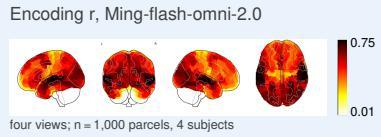

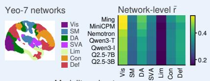

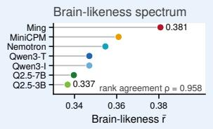

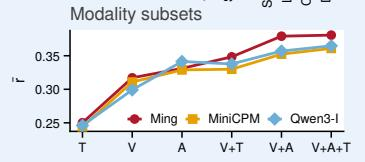

b Reverse link: brain networks as an expert prior Yeo-7 networks → seven LoRA experts  
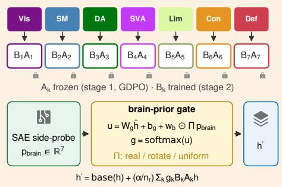

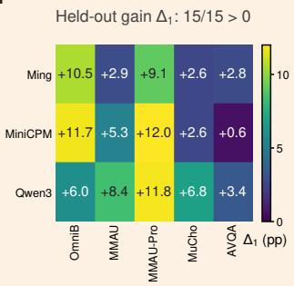

Brain > capacity-matched random: 14/15 filled Holm P < 0.05 · pale raw · open n.s. · bars 95% CI  
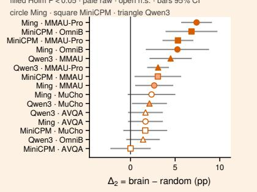

## c Brain-Scope: one sparse feature set, three roles

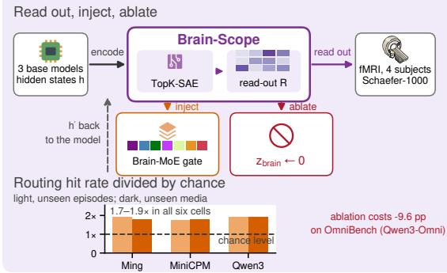

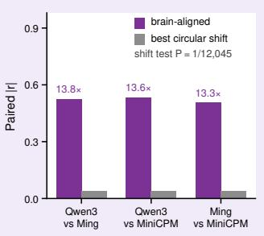

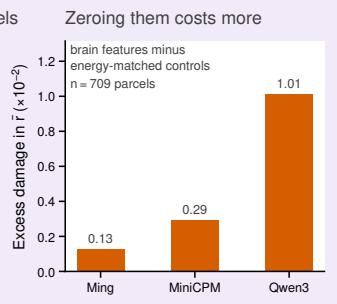  
Fig. 1 The Platonic brain bridge: forward link, reverse link and one sparse feature set. ${ \mathbf { a } } ,$ Forward link (mode to brain). Ridge read-outs map hidden states of seven omni models to 1,000 cortical parcels in four participants watching Friends. Shown are encoding r for Ming-flash-omni-2.0 (four views); the five Algonauts 2025 leaderboard columns (orange, this pool; grey, best other entry); a sagittal Yeo-7 section with its colour key; network-level r¯ per model; the brain-likeness spectrum (rank agreement $\rho = 0 . 9 5 8 ) $ ; and r¯ of three bases under six input subsets. $\mathbf { b } ,$ Reverse link (brain to model). The Yeo-7 networks map onto seven LoRA experts $\mathbf { B } _ { k } \mathbf { A } _ { k }$ (lock, $\mathbf { A } _ { k }$ frozen after stage one); a read-only side-probe supplies the brain prior pbrain to the gate (symbols in Methods), and the gated experts add residually to the frozen base. Heat map, held-out gain $\Delta _ { 1 }$ over that base (pp; three bases × five benchmarks); forest plot, $\Delta _ { 2 }$ (brain minus capacity-matched random experts) with 95% McNemar intervals (filled, Holm-significant; pale, uncorrected; open, n.s.; shape, base). $\mathbf { c } ,$ Brain-Scope in three roles: read out, inject $\mathbf { p } _ { \mathrm { b r a i n } } .$ , ablate $( z _ { \mathrm { b r a i n } }  0 )$ . Bars, from left: the routing hit rate, the share of held-out questions whose top-weighted expert is the annotated network, divided by the independence baseline (dashed line at 1; two splits per base, $P < 2 \times 1 0 ^ { - 4 } ) ;$ paired |r| of matched brain-aligned features against the best circular shift $( P = 1 / 1 2 , 0 4 5 )$ ; and excess damage in r¯ from zeroing them against energy-matched controls $( n = 7 0 9$ parcels), which also costs 9.6 pp of OmniBench accuracy on Qwen3-Omni.

and difering between models along a single axis (Fig. 1a). A pool of such encoding models ranks first on the post-challenge Algonauts 2025 leader board. Three contributions address structure and usability. (1) Brain-MoE, a mixture of experts (MoE), injects the organization of seven functional networks as an architectural prior: the model receives the macroscopic partition of cortex and a prior predicted from the stimulus, not measured brain activity. It improves accuracy on unseen questions in all 15 base-model and benchmark pairs and, on the questions it was trained on, is more accurate with the real brain-network-to-expert map than with shufled maps (Fig. 1b). (2) Training that map needs questions labelled by network, and Brain AVQA supplies them. To our knowledge, it is the first audiovisual question-answering benchmark in which each question is labelled with the cortical network most engaged by its source window, so that network priors are testable per question. (3) The brain prior that steers the gate is computed by Brain-Scope, a set of sparse autoencoders with readouts fitted to fMRI, whose brain-aligned features predict brain responses. Removing those features impairs brain prediction on all three bases and benchmark accuracy on one, which localizes the efect to a named component (Fig. 1c).

## Results

## Omni models correspond to human cortical responses on a stable, structured spectrum

To measure the correspondence from model to brain, we used fMRI from four participants of the CNeuroMod dataset as released for Algonauts 20258,27 who watched segments of the sitcom Friends, together with the hidden states of seven omni models given video and audio from those segments together with aligned transcripts. For each model, a ridge encoding model predicts the response of each of the 1,000 cortical parcels of the Schaefer-1000 atlas28 from the hidden states, fitted separately for each participant on seasons 1 to 5 and evaluated on season 6. Brain-likeness is the validation Pearson correlation between predicted and measured responses, averaged over parcels and participants (equation (4)). The panel spanned Ming-flash-omni-2.0 (about 100B parameters) 29, MiniCPM-o 4.5 (9B) 30, Nemotron-3-Nano-Omni (31B) 31, Qwen3-Omni Thinking and Instruct (30B)32 and Qwen2.5-Omni 7B and 3B33. In the rest of the paper, Ming, MiniCPM and Qwen3 abbreviate Ming-flash-omni-2.0, MiniCPM-o 4.5 and the Instruct variant of Qwen3-Omni. All seven models predicted held-out cortical responses, with brain-likeness on a narrow, continuous spectrum from 0.337 to 0.381 (Fig. 2a), and the ranking of the models was almost the same for every participant: the four per-participant rankings were mutually consistent (mean pairwise Spearman ρ = 0.958, n = 7 models; Fig. 1a; Fig. 2a, e, f).

Parameter count did not predict the ranking (Fig. 2a). Qwen3 Thinking and Instruct, which differ only in post-training, were indistinguishable (diference 2 × 10−5), consistent with a report that instruction tuning did not consistently improve brain alignment in the tested models 34. This comparison does not isolate all efects of post-training, but suggests that substantial brain-predictive information is already present in the shared pretrained representations. For this reason, the brain-tomodel half of this study freezes the brain-related subspaces instead of retraining them. The measurement is also valid outside the fitting data. Our pool of ridge encoding models ranked first in all five columns of the public post-challenge leaderboard of the Algonauts 2025 out-of-distribution track 8,35 (4 September 2026 snapshot; Fig. 2g,h). The runnerup adapts a Qwen3-Omni backbone with low-rank adapters and ensembles the adapted models 13; every backbone in our pool is frozen. Each model in the pool was built on internal hidden states of an omni model, taken from the language-model core, the component that the Qwen-Omni family calls the thinker, and from its internal multimodal branches, and the pool is fused per parcel.

Brain-likeness has structure along modality and depth that the single score does not show (Fig. 3). On the three models that are also the brain-tomodel bases, brain-likeness rose with every added channel, from 0.250, 0.244 and 0.246 for text alone (Ming, MiniCPM and Qwen3, in that order) to 0.381, 0.361 and 0.365 for all three (Fig. 3a), and every subset scored below every subset containing it (paired parcel bootstrap, 10,000 resamples, n = 1,000 parcels). Audio alone reached 87%, 91% and 94% of the full score, exceeding text alone by +0.081, +0.085 and +0.095. The increments were sub-additive: audio added between +0.042 and +0.062 to video but only +0.027 to +0.032 to video with subtitles, and subtitles added only +0.002, +0.009 and +0.008 (Fig. 3b). The information in the channels therefore overlaps. The full-modality increment over video-only input was concentrated in the control and default networks in all three models (Fig. 3c). Along depth, no model peaked at its last layer, and the best single layer was at quarter to half depth (Fig. 3d; Extended Data Table 2), consistent with the qualitative intermediate-layer tendency discussed in earlier work7. These measurements establish the correspondence at whole-model level but do not identify the components within a model that produce it.

d Seven encoding maps, same protocol (pairwise map Spearman ρ = 0.987; differences are in amplitude, not topography)  
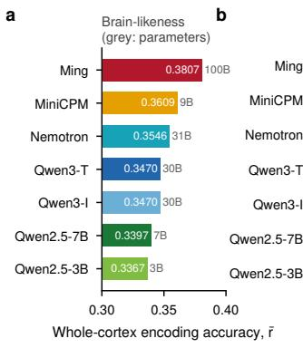

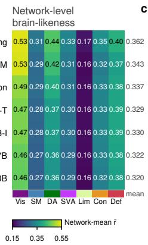

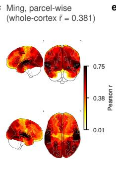

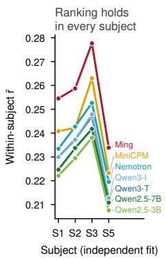

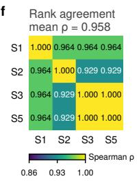

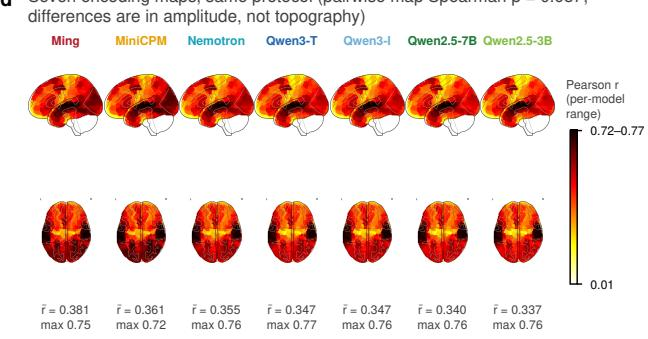

g  
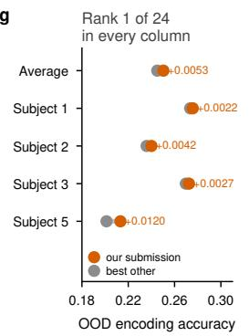

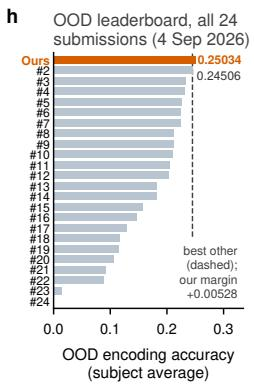  
Fig. 2 Brain-likeness spectrum of seven omni models, its stability across participants and the external validity of the measurement tool. a, Whole-cortex brain-likeness r¯ (mean validation Pearson correlation over four participants × 1,000 Schaefer parcels) of seven models $( n = 7 )$ under one encoding protocol; nominal parameter counts in grey. b, Network-mean r¯ of the seven models (rows, sorted by r¯) within the Yeo-7 networks (columns; Vis, visual; SM, somatomotor; DA, dorsal attention; ${ \mathrm { S V A } } ,$ salience/ventral attention; Lim, limbic; Con, control; Def, default); the mean column is the cross-network mean. c, Parcel-wise encoding accuracy of Ming-flash-omni-2.0 as a glass brain (four views; colour scale from the minimum to the maximum parcel r of this model). d, Parcel-wise encoding maps of the seven models (left sagittal above axial view; each map coloured over its own range, with r¯ and maximum below); mean pairwise Spearman ρ = 0.987 $( n = 2 1$ pairs). e, Brain-likeness of the seven models under independent fits for each of the four participants $( n = 7$ models × 4 participants), one line per model. f, Spearman correlation matrix of model rankings between participant pairs $( n = 7$ models); of-diagonal mean $\rho = 0 . 9 5 8 .$ . g, Accuracy of this submission (orange) and the runner-up 13 (grey) in the five leaderboard columns (participant mean and four participants) of the public post-challenge Algonauts 2025 out-of distribution leaderboard, with margins annotated (n = 24 submissions). h, Participant-mean accuracy of all 24 submissions; this submission in orange, dashed line at the runner-up. Panels g and h report the 4 September 2026 leaderboard snapshot.

## The correspondence localizes to sparse features shared across models

The encoding models above relate whole layers to cortex and do not say which units inside a model carry the correspondence. We next located it at the level of individual features: the same sparse features predicted cortical responses in independently trained models (Fig. 4a). On intermediate hidden states of each model we trained TopK sparse autoencoders (SAEs)36 (width four times the hidden width, 32 active per token) with linear parcel-wise readout heads fitted on fMRI; this per-model set is Brain-Scope, after Qwen-Scope 37.

Each SAE feature is one direction in a sparse, overcomplete basis that is active on a small frac tion of tokens, so it can be inspected, matched across models, read out to cortex and switched of individually; the brain-aligned set is 185, 184 and 190 features out of 8,192 or 16,384, 1.1 to 2.3 per cent of the basis. Across pairs of frozen models, the brain-aligned features of each model (185, 184 and 190 for Qwen3, Ming and MiniCPM) were matched one-to-one by the Hungarian algorithm38 over 13,383 shared time points from 81 Friends half-episode segments. Significance came from an exhaustive circular-shift permutation over 12,044 shifts plus the identity, which preserves autocorrelation while destroying cross-model correspondence. Mean matched correlations were 0.5257, 0.5344 and 0.5068 for Qwen3 with Ming, Qwen3 with MiniCPM and Ming with MiniCPM, 13.3 to 13.8 times the largest value reached by any shift (0.0382, 0.0392, 0.0381) and 12.6 to 13.6 times the mean of 30 size-matched random sets of non-brain-aligned features (0.0407, 0.0424, 0.0372). No non-identity shift and no random set reached the observed value (exact $P = 1 / 1 2 , 0 4 5 ; 3 / 1 2 , 0 4 5$ after Holm correction; Supplementary Table 3). Diferent models therefore express the correspondence through the same sparse features, and the correspondence is attributable to a named set of units rather than to a layer as a whole. Brain-Scope is the interpretabil ity instrument of the rest of the study: the same feature set reads out brain responses, supplies the routing prior of Brain-MoE and is ablated against matched controls (Fig. 1c). Given that the corre spondence is expressed through shared features, we next examined how the models difer.

## Inter-model diferences are confined to one shared axis

We next asked whether the seven models difer from the brain each in its own way or all in the same way. Each model has an encoding map, its encoding accuracy on each of the 1,000 parcels. The seven maps were nearly identical: their shared component held 97.87% of total variance. We removed that shared map and analysed the residual diferences between models. Almost all of them lay along one direction: the first principal component (PC1) held 87.8% of the residual variance and the second 9.2% (Fig. 4b). The participation ratio (PR) summarizes this as an efective number of directions, from 1 (all diferences along one direction) to 6 (six directions of equal weight, the maximum for seven models); it was 1.28, whereas independent noise of the same amplitude gave 5.96. The low efective dimension persisted under five controls addressing four alternative explanations (Fig. 4c,d). Along that one direction the models difer mainly in sensory cortex: the loadings were 5.37 times larger on sensory than on association parcels (Fig. 4d). On this seven-model panel neither the axis nor whole-cortex brain-likeness tracked a capability composite, and no correlation remained significant after Holm correction (Fig. 3e to i; Fig. 4e to i). The models therefore difer from one another by more or less of the same pattern, not by network-specific patterns of their own. For the brain-to-model half this means that the seven-network organization does not have to be adapted model by model and can be injected as one partition. The remaining sections test whether the correspondence can be used to change what a model does.

## Brain network organization can be engineered as an injectable, controllable architectural prior

The second half of the study turns the correspondence around and asks whether the organization of the brain can be built into a model. It builds on three results of the first half: a ranking reproduced by every participant, which shows that the measurement is reliable; sparse Brain-Scope features shared across models, which provide one site at which to read out and inject the prior; and inter-model diferences confined to one axis, which allow the seven-network partition to be injected as a whole. Building the organization in needs two things: a fixed map from brain networks to experts, and a routing prior, a seven-number signal predicted from the stimulus that gives the predicted response of each brain network to the current input. Brain-MoE (brain mixture of experts) meets both needs as a detachable module (Fig. 5a). Seven experts are placed in parallel with the attention projections of the layers after mid-depth; the base model itself stays frozen. Each expert is a low-rank adaptation (LoRA) module39, a small trainable pair of matrices set beside a frozen weight: a downprojection $\mathbf { A } _ { k }$ (rank 4) and an up-projection $\mathbf { B } _ { k }$ Yeo-7 network k maps to expert k by a fixed oneto-one rule. A gate decides how much each expert contributes. It operates once per input on the token-averaged hidden state h¯, and its scores for the seven experts sum a term computed from the hidden state and a term computed from the brain prior,

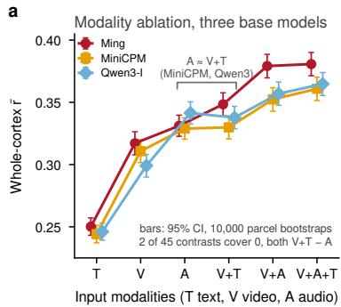

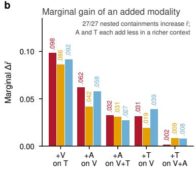

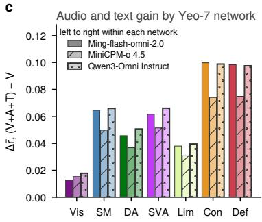

d  
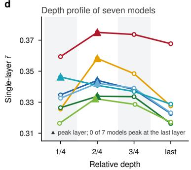

e  
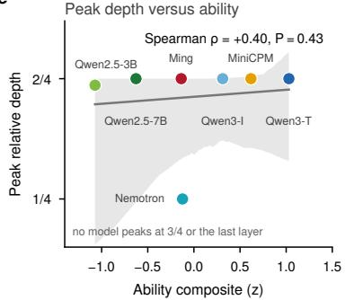

f  
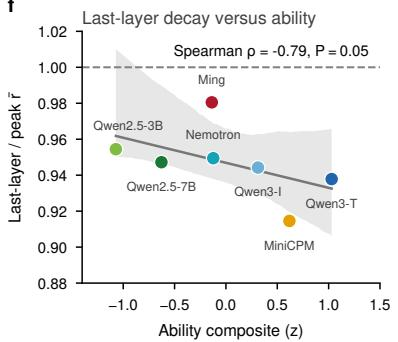

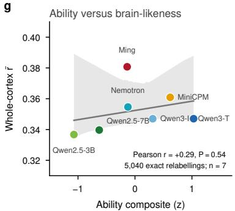

h  
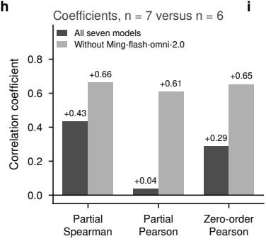  
i

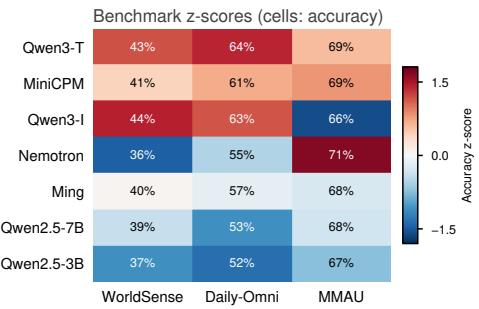  
Fig. 3 Modality structure, depth structure and the capability-brain-likeness relation. a, Whole-cortex brain likeness of three base models (Ming-flash-omni-2.0, circles; MiniCPM-o 4.5, squares; Qwen3-Omni, diamonds) under six input-modality subsets (T text, V video, A audio and combinations); all three follow $\mathrm { T } < \mathrm { V } < \{ \mathrm { A } , \mathrm { V } + \mathrm { T } \} < \mathrm { V } + \mathrm { A } <$ $\mathrm { V + A + T } ;$ error bars, 95% confidence intervals (paired parcel bootstrap, 10,000 resamples, $n = 1 , 0 0 0 { \mathrm { ~ p a r c e l s } } ) ; { \mathrm { A } }$ and V+T overlap in MiniCPM-o 4.5 and Qwen3-Omni. b, Marginal gain of one added channel between nested subsets; audio and subtitles each add less in a richer context, and all 27 nested comparisons raise brain-likeness. c, Increment of full-modality over video-only input decomposed by Yeo-7 network (network colours; within each network, left to right, Ming, MiniCPM, $\mathrm { \bf Q } \mathrm { w e n 3 } )$ . d, Single-layer brain-likeness of seven models at four relative depths $( 1 / 4 , 2 / 4 , 3 / 4$ , last); triangles mark the peak of each model; $0 / 7$ models peak at the last layer. e, Peak relative depth against a capability composite (mean z-score over WorldSense, Daily-Omni and MMAU); Spearman $\rho = + 0 . 4 0$ , exhaustive permutation $P = 0 . 4 3 , n = 7 . \ \mathbf { f } ,$ Last-to-peak brain-likeness ratio against the capability composite; $\rho = - 0 . 7 8 6 , P = 0 . 0 4 8 , n = 7 ;$ no correlation on this seven-model panel remains significant after Holm correction over the family of six (smallest corrected $P = 0 . 2 9 )$ ; the partial Pearson coeficient in h is outside that family. g, Capability composite against whole-cortex r¯; zero-order Pearson $r = + 0 . 2 9$ , exhaustive label permutation (5,040) $P = 0 . 5 4$ . h, Partial Spearman, partial Pearson (controlling $\log _ { 1 0 }$ parameters) and zero-order Pearson coeficients on all seven models (dark grey) and on six models without Ming-flash-omni-2.0 (light grey). i, Composition of the capability composite: accuracy z-scores of the seven models on the three benchmarks (raw accuracies in cells). In e to g, grey lines are least-squares fits and shading is the bootstrap 95% confidence band (2,000 resamples); point colours follow d.

$$
\mathbf { u } = \mathbf { W } _ { g } \bar { \mathbf { h } } + \mathbf { b } _ { g } + \mathbf { w } _ { b } \odot \mathbf { p } _ { \mathrm { b r a i n } } ( \mathbf { h } ) ,\tag{1a}
$$

$$
\mathbf { g } = \mathrm { s o f t m a x } ( \mathbf { u } ) ,\tag{1b}
$$

$$
\mathbf { h } ^ { \prime } = \mathrm { b a s e } ( \mathbf { h } ) + \frac { \alpha } { n _ { r } } \sum _ { k = 1 } ^ { 7 } g _ { k } \mathbf { B } _ { k } \mathbf { A } _ { k } \mathbf { h } ,\tag{1c}
$$

where $\mathbf { W } _ { g }$ and ${ \bf b } _ { g }$ are the trainable weights and bias of the gate, one row per expert, $\mathbf { p } _ { \mathrm { b r a i n } } \in \mathbb { R } ^ { 7 }$ is computed read-only by the Brain-Scope SAE and readout head, $\mathbf { w } _ { b }$ is a learnable gain per network, $\alpha / n _ { r } = 4$ and base(·) is frozen. Equation (1a) gives one score per expert, equation (1b) turns the seven scores into gate weights $\mathbf { g } \in \mathbb { R } ^ { 7 }$ that are nonnegative and sum to one, and equation (1c) adds the expert outputs to the frozen base, expert k with weight $g _ { k }$ . Read-only means that no gradient flows back into the autoencoder, the readout head or the base along this path.

Training runs in two stages (Fig. 5b). Stage one gives each expert its brain-related content and needs questions labelled by brain network; Brain-AVQA, our audiovisual question-answering benchmark, supplies them. Each 8-s window of Friends was labelled with the Yeo-7 network most engaged in the fMRI of the four participants during passive viewing. Qwen3.5-Omni-Plus 40 then generated a four-choice question targeting the capability of that network, and an independent audit model, Gemini 3.5 Flash 41, verified each question on audio and video jointly. The benchmark contains 2,362 questions from 81 half-episode segments, 2,096 (88.7%) requiring joint audiovisual answering, with correct options balanced across the four positions (591, 591, 590 and 590). In stage one, expert k is trained only on the questions of network k, with a REINFORCE variant inspired by the reward-wise normalization of Group reward-Decoupled Normalization Policy Optimization $\mathrm { ( G D P O ) ^ { 4 2 } }$ , so that each $\mathbf { A } _ { k }$ is trained on one network alone. Stage two adapts the module to a target benchmark: it freezes every $\mathbf { A } _ { k }$ and trains only $\mathbf { B } _ { k }$ and the gate with cross-entropy plus a Kullback-Leibler (KL) constraint to the base. The injected prior is therefore a subspace learned from brain-labelled questions and then frozen, so that later training does not overwrite it. One Brain-Scope autoencoder predicts brain responses and steers routing (Fig. 5c), and Fig. 5d,e shows the weights the gate learns.

Controls must separate brain organization from added capacity, because extra trainable parameters alone could raise accuracy. The control protocol therefore tests the module at two levels. A cell is one base model paired with one benchmark; an arm is one version of the system evaluated in that cell. Every cell was run with three arms: the frozen base model; capacity-matched random experts, which share the architecture, parameter count and stage-two training of the brain arm but start from randomly initialized down-projections and a shuffled prior; and brain experts with the real prior. The first level, $\Delta _ { 1 } = \mathrm { a c c ( M o E ) - a c c ( b a s e ) }$ , measures the gain of the module over the base. The second level, $\Delta _ { 2 } = \mathrm { a c c ( b r a i n ) - a c c ( r a n d o m ) }$ , measures the part of that gain that added parameters and stage-two training alone do not produce. Both are tested with paired exact McNemar tests. A subset of cells adds the remaining arms of a $2 \times 2$ factorial design that separates expert content from routing prior. The first test is whether the injected organization improves accuracy on the questions it was trained on.

## Brain-MoE improves held-out accuracy on Brain-AVQA

The first test of the module is on held-out Brain-AVQA questions. The questions were split, stratified by network and dificulty, into 1,653 for stage-two training and 709 that stage two never sees. On the 709 held-out questions Brain-MoE exceeded the frozen base by +3.24 percentage points (pp) on MiniCPM (paired exact McNemar test, two-sided $P = 0 . 0 0 3 2 , n = 7 0 9 )$ , with larger gains on questions the frozen bases answered poorly, and the pattern persisted after memorized questions were removed by a same-question design (Extended Data Fig. 1c to e). In the in-domain fitting regime, in which the module is trained and evaluated on all 2,362 questions, Brain-MoE raised the accuracy of the frozen base on all three bases, by +3.60, +4.87 and +7.54 pp on Qwen3, Ming and MiniCPM, and the gain rose as base accuracy fell. The next question is whether the gain depends on the specific map from brain networks to experts; we therefore compared the real map with shufled maps.

b  
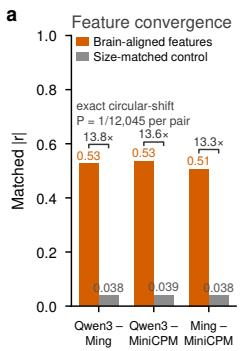

c  
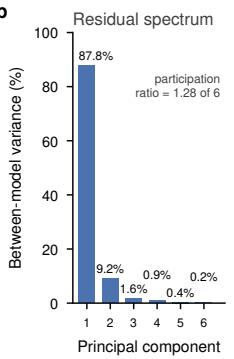

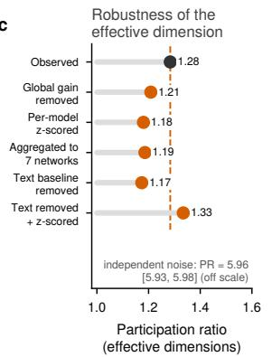

d  
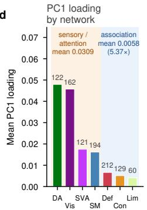

e  
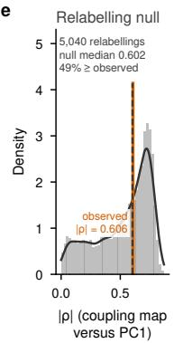

PC1 loading across the cortexf  
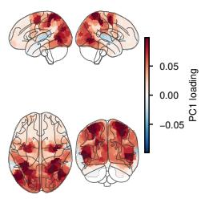

g  
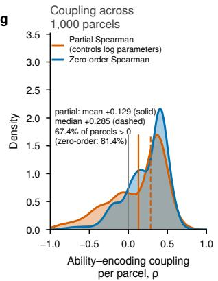

h  
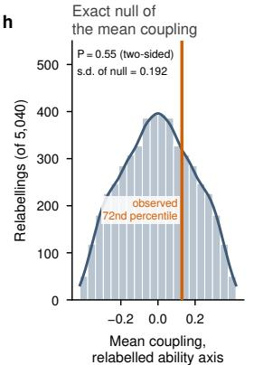

i  
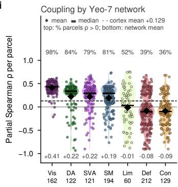  
Fig. 4 Brain-aligned sparse features converge across models, whereas inter-model diferences concentrate on one low-dimensional shared axis. a, Mean activation-series correlation |r| after one-to-one Hungarian matching of the brain-aligned sparse features of each model (185, 184 and 190 for Qwen3-Omni, Ming-flash-omni-2.0 and MiniCPM-o 4.5) over 13,383 shared stimulus grid points for three pairs of independently trained models (orange) against the largest matched correlation reached by any circular shift of one series (grey, the permutation null maximum); ratios in parentheses; exact circular-shift permutation $P = 1 / 1 2 \small { , } 0 4 5$ per pair. b, Variance spectrum of the inter-model residual matrix, the seven Schaefer-1000 encoding maps with the shared map removed; participation ratio 1.28 out of 6 possible dimensions. c, Robustness of the efective dimension to five treatments addressing four alternative explanations (orange points); dashed line, observed value; independent noise at the measured residual amplitude (2,000 simulations) lies outside the axis range and is annotated as text. d, Mean loading of the first residual principal component on the Yeo-7 networks (bar colours, network colours; parcel counts above bars); sensory and attention networks (orange background) against association networks (blue background). e, Relabelling null (al $7 ! = 5 { , } 0 4 0$ label permutations) of |Spearman ρ| between the capability-brain coupling map and PC1; orange line, observed value; dashed line, null median. f, Cortical distribution of PC1 loadings (glass-brain projection, four views; diverging colour scale centred at zero). g, Distribution over 1,000 parcels of the coupling between the capability composite and parcel-wise brain-likeness: orange, partial correlation controlling parameter count; blue, zero-order; vertical lines, mean and median. h, Exact permutation null of the mean coupling under all 5,040 model relabellings; orange line, observed value (two-sided $P = 0 . 5 5 )$ . i, The same parcel-wise partial correlations grouped by Yeo-7 network. Each violin is the distribution over the parcels of one network, with individual parcels as jittered points; the white dot marks the median and the bar the mean. The numbers above each violin give the fraction of parcels with a positive correlation, the numbers below give the network mean, and the parcel count of each network is given on the x axis.

## Routing depends on the real network-to-expert map and transfers to unseen media

Accuracy depended on which seven-way map was used. Three maps were compared with the experts held fixed: the real map from brain networks to experts, a rotated map that sends every network to the neighbouring expert, and a uniform map that zeroes the prior. The real map exceeded both shufled maps on all three bases (Extended Data Fig. 1f,g; Extended Data Table 3); the margin was significant against uniform routing on all three bases and against rotated routing on two. Real routing exceeded uniform routing by +1.14 to +1.91 pp $( P = 3 . 1 \times 1 0 ^ { - 4 }$ to 0.038) and rotated routing by +0.72 to +2.12 pp $( P = 5 . 0 \times 1 0 ^ { - 4 }$ to 0.17), and the two shufled arms stayed indistinguishable $( P \ge 0 . 0 7 9$ ; in-domain topology control, $n = 2 { , } 3 6 2$ , arms compared per question). In the in domain fitting regime, with the experts held fixed and the gate re-initialized and trained again under 20 random maps drawn from the 5,040 possible ones, the real map was more accurate than all 20, by 1.70 pp over their mean (empirical $P = 0 . 0 4 8$ the smallest value 20 draws can give), and it routed to the annotated network more often than any of them (Supplementary Note 1). We then asked whether the prior still picks the right expert on material the module has not seen. Two further splits held out unseen episodes $( n \ = \ 7 1 4 )$ and unseen media $( n \ = \ 7 3 1 )$ . The routing hit rate is the fraction of questions on which the highestweighted (top-1) expert matches the annotated network. In all six cells (3 bases × 2 splits) it was

a Forward pass at one injection point (layers 20–28, attention projections)  
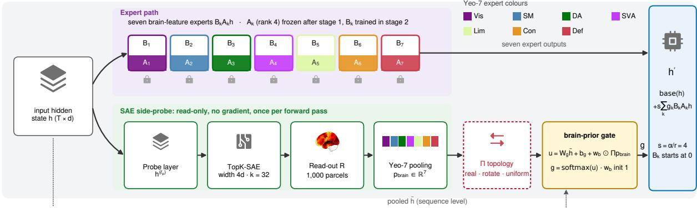

c One sparse autoencoder, two directions  
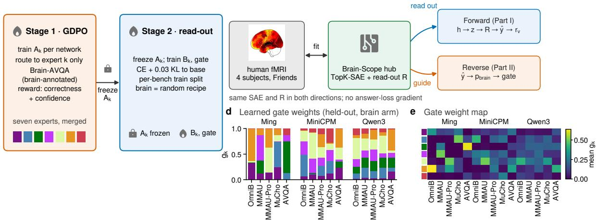  
Fig. 5 Forward data flow of Brain-MoE, two-stage training, the Brain-Scope loop and learned gating weights. a, Forward computation at one injection point (attention projections of layers 20 to 28 for MiniCPM-o 4.5 and Ming-flash omni-2.0, and of layers 28 to 36 for $\mathrm { Q w e n 3 – O m n i } )$ ). The hidden state h takes two paths: the expert path (purple) with seven brain-feature experts $\mathbf { B } _ { k } \mathbf { A } _ { k } \mathbf { h }$ (Yeo-7 colours; $\mathbf { A } _ { k }$ frozen after stage one, lock icon; $\mathbf { B } _ { k }$ trained in stage two), and the read-only sparse-autoencoder bypass (green), which passes the probe-layer state through the TopK sparse autoencoder, the brain readout R and $\mathrm { Y e o - 7 }$ pooling to give $\mathbf { p } _ { \mathrm { b r a i n } } .$ , which enters the gate through the topology operator Π (real, rotate, uniform; red dashed box) with one learnable gain per network; the expert outputs are weighted by g and added residually to the frozen base projection. $\mathbf { b } ,$ Two-stage training. Stage one trains $\mathbf { A } _ { k }$ network by network with a GDPO-inspired REINFORCE variant on Brain- $\mathrm { A V Q A }$ and merges the seven experts; stage two freezes $\mathbf { A } _ { k }$ (lock) and trains $\mathbf { B } _ { k }$ and the gate (flame) on the training split of each benchmark; brain and random arms share architecture, steps and data. $\mathbf { c } ,$ The two directions of one sparse autoencoder: Brain-Scope $( \mathrm { T o p K - S A E }$ and readout R, fitted from human fMRI) reads out brain responses in the forward chain and aggregates predicted responses into $\mathbf { p } _ { \mathrm { b r a i n } }$ in the reverse chain, with identical parameters and no answer-loss gradient in either direction. d, Gating weights learned by the brain arm on held-out questions of five public benchmarks: mean weight $g _ { k }$ of the seven experts in 15 model and benchmark combinations (stacks normalized per cell; no error bars). e, The same gating weights as a heat map, with the seven networks as rows and the 15 cells as columns.

0.2647 to 0.2997, 1.74 to 1.93 times the independence baseline (label permutation $P < 2 \times 1 0 ^ { - 4 }$ per cell), whereas rotated and uniform controls stayed at 0.088 to 0.164. The hit rate on unseen media did not difer from that on unseen episodes (0.2795 versus 0.2857; $P = 0 . 6 5 9 )$ . The prior therefore selects the matching expert on unseen media. The following sections test whether that selection improves accuracy, and how the gain depends on expert content and on base headroom, which is the accuracy a base has yet to gain (1 minus base accuracy).

## Brain-pretrained experts improve unseen-question accuracy across bases and benchmarks

Both results so far come from Brain-AVQA, on which the experts were trained. We therefore eval uated the same experts on five public benchmarks unrelated to the brain: OmniBench 43, MMAU testmini44, a multiple-choice subset of $\mathrm { M M A U  – P r o ^ { 4 5 } }$ $\mathrm { M u C h o M u s i c ^ { 4 6 } }$ and a four-choice adaptation of MUSIC-AVQA $\mathrm { v 2 . 0 ^ { 4 7 , 4 8 } }$ . Each was split strictly by media key, which keeps all questions from one clip on the same side, with identical held-out sets across cells (Extended Data Table 4). Stage two and held-out evaluation ran in 30 cells (3 bases × 5 benchmarks × 2 arms). Brain-pretrained experts improved unseen-question accuracy in all 15 base and benchmark cells and exceeded random experts in 14 (Fig. 1b; Fig. 6). $\Delta _ { 1 }$ was positive in all 15 cells $( + 0 . 5 6 ~ \mathrm { t o } ~ + 1 1 . 9 8 $ pp, mean +6.42 pp; Fig. 6a; Extended Data Table 5). The brain arm exceeded the random arm in 14 cells and equalled it in the remaining cell (mean $\Delta _ { 2 } ~ = ~ + 3 . 2 6$ pp; Fig. 6b). The three bases answer the same questions and share the experts, so the cells are not independent; the primary test was therefore a question-level joint sign-flip permutation (100,000 draws). The observed 14 positive cells gave right tail $P = 3 . 2 \times 1 0 ^ { - 4 }$ , and no permutation reached the observed mean $( P ~ < ~ 1 0 ^ { - 5 } ; ~ \mathrm { F i g . ~ 6 c } )$ . Percell McNemar tests gave $P < 0 . 0 5$ in nine cells, six remaining significant after Holm correction $\left( \mathrm { F i g . 6 a , b } \right)$ . The gain also held when training was repeated: on MiniCPM-o 4.5, three stage-two seeds on four benchmarks left $\Delta _ { 2 }$ positive in all 12 seedbenchmark runs $( + 1 . 6 5 \mathrm { t o } + 6 . 8 3 \mathrm { p p } )$ , and a second stage-one seed gave $\Delta _ { 2 } = + 6 . 1 3 ~ \mathrm { p p }$ on OmniBench against +6.83 pp with the first (Supplementary

Note 1). Base accuracy varied widely across the 15 cells, from 0.5377 to 0.8939, which makes it possible to ask whether the gain depends on how much room a base has left to improve.

## The size of the gain tracks base headroom

Does a weaker base gain more? Across the 15 cells both efect sizes decreased with base accuracy: Spearman $\rho = - 0 . 8 1$ for ∆1 $( P = 2 . 5 \times 1 0 ^ { - 4 }$ $n \ = \ 1 5 )$ and −0.80 for ${ \Delta _ { 2 } } ~ ( P ~ = ~ 3 . 8 ~ \times ~ 1 0 ^ { - 4 } )$ (Extended Data Fig. 2a,b). For $\Delta _ { 1 }$ such a relation could arise simply because a weak base has more room to improve; $\Delta _ { 2 }$ contains no base term, so its correlation indicates that the gain attributable to the brain prior itself falls as base accuracy rises, in line with the larger gain on hard ques tions reported above. The ratio of brain-arm to random-arm gain, by contrast, was unrelated to base accuracy $( \rho = - 0 . 0 5 , P = 0 . 8 7 ;$ geometric mean 2.55): the brain arm gains about two and a half times as much as the random arm whatever the base. Regression to the mean, base confounding, question count and model scale did not account for the pattern. Which part of the module produces the gain is tested next.

## The gain comes mainly from expert content

The module has two parts that could produce the gain: the experts, whose content was learned in stage one, and the gate, which routes with the brain prior. To separate them, a third arm (brain experts, shufled prior) splits $\Delta _ { 2 }$ into a content pathway, the gain of brain experts over random experts when both use a shufled prior, and a routing pathway, the further gain from restoring the real prior to the brain experts, under a decomposition rule fixed in advance. The content pathway accounted for the gain, and routing contributed significantly in one cell only. The content pathway was positive in all five comparable cells $( + 1 . 9 3 \ \mathrm { t o \ + 7 . 3 1 }$ pp; Supplementary Table 5). The routing pathway was near zero in the three MMAU-Pro cells (−0.64 to +0.09 pp) and in Qwen3 × OmniBench (−0.53 pp; all $P \ge 0 . 1 7 )$ , and significant only in MiniCPM × OmniBench (+2.28 pp, $P = 0 . 0 0 7 2 )$ . Seven complete $2 \times 2$ cells, which cross brain or random experts with real or shufled prior, repeat that split (Extended Data Table 6): content efects were positive in all 14 contrasts (+1.40 to +7.18 pp), whereas prior efects stayed within 2.3 pp. The real prior helped only alongside brain experts in MiniCPM × OmniBench (interaction +2.63 pp), which suggests that routing matters only when the expert it selects holds the corresponding subspace. We next asked whether those features are necessary rather than merely correlated with brain responses.

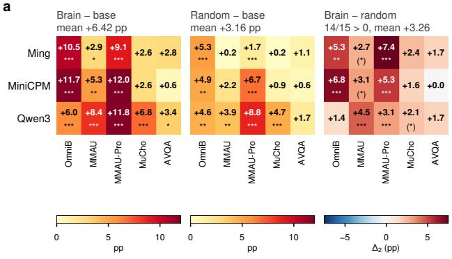  
c

d  
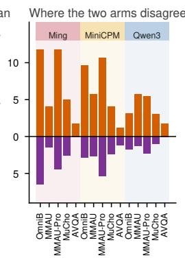

b  
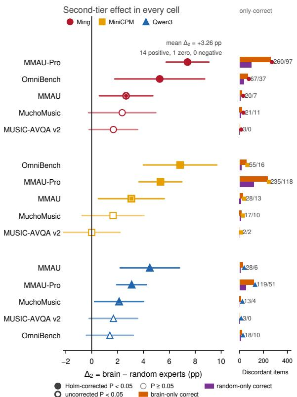  
Fig. 6 Two levels of evidence on three heterogeneous bases and five public benchmarks. a, Heat maps of held-out accuracy gains in pp: left, gain $\Delta _ { 1 }$ of the brain-pretrained expert arm over the frozen base; middle, gain of the capacity-matched random expert arm over the same base (shared 0 to 12 scale); right, their diference $\Delta _ { 2 }$ (zero-centred diverging scale). Stars, per-question paired exact McNemar tests (left and middle, arm versus base; right, brain versus random; $^ { * } P < 0 . 0 5 , ^ { * * } \bar { P } < 0 . 0 1 , ^ { * * * } \bar { P } < 0 . 0 0 1 ;$ bracketed stars, $P < 0 . 0 5$ that fails Holm correction over 15 cells; exact per-cell P values of the brain-versus-random comparison are listed in Extended Data Table 5). Columns, OmniBench, MMAU, MMAU-Pro, MuChoMusic, MUSIC-AVQA v2.0 (held-out $n = 5 7 1$ , 490, 2,203, 425, 179); rows, Ming-flash-omni-2.0, MiniCPM-o 4.5, Qwen3-Omni. b, Forest plot of $\Delta _ { 2 }$ in the 15 cells grouped by base (dark red circles, Ming-flash-omni-2.0; gold squares, MiniCPM-o 4.5; blue triangles, Qwen3-Omni); bars, 95% confidence intervals from discordant pairs; filled, significant after Holm correction; filled with inner dot, uncorrected significance only; open, $P \ge 0 . 0 5 ;$ the sub-axis on the right gives the numbers of questions answered correctly only by the brain arm (orange) and only by the random arm (purple). c, Null distributions of the question-level joint sign-flip permutation $( N _ { \mathrm { p e r m } } = 1 0 0 , \dot { 0 } 0 0 ;$ one sign per question shared across the three bases): left, number of cells with $\Delta _ { 2 } > 0$ (observed 14, right tail shaded); right, kernel density of the mean $\Delta _ { 2 }$ over 15 cells (observed value marked). d, Fraction of held-out questions per cell answered correctly only by the brain arm (orange, upward) and only by the random arm (purple, downward); background shading groups bases.

## Brain-aligned features are necessary for encoding on all three bases and for benchmark accuracy on Qwen3-Omni

Necessary here means that removing the features harms the model more than removing a matched set of other features. The most aligned features of each Yeo-7 network (Ming 111, MiniCPM 115, Qwen3 98) were set to zero and compared with an equal-size, non-overlapping, energy-matched control set. Excess damage is the damage caused by zeroing the brain features minus the damage caused by zeroing the control set, measured by an independent ridge encoding model; a positive value means that the brain features matter more than matched features of the same activation energy. Brain-Scope features were necessary for brain encoding. Under the primary criterion, five networks whose control passed matching (n = 709 parcels), excess encoding damage was positive on all three bases. It was largest on Qwen3 (+0.01012; across-parcel Wilcoxon signed-rank test, two-sided $P = 4 . 1 \times 1 0 ^ { - 5 5 } )$ , with Ming at +0.00128 $( P ~ = ~ 4 . 2 ~ \times ~ 1 0 ^ { - 5 } )$ and MiniCPM at +0.00293 $( P = 1 . 2 \times 1 0 ^ { - 3 1 } )$ . The sign held under the ref erence criterion on all three bases and under the strict criterion where it applies (Supplementary Table 6). The same zeroing also lowered bench mark accuracy on one base. On Qwen3, removing 98 features lowered OmniBench accuracy from 0.6130 to 0.5166 (−9.63 pp from unrounded accu racies). Excess damage was +9.11 pp over the matched control (paired exact test, $P = 7 . 3 \times 1 0 ^ { - 7 }$ n = 571) and +1.73 pp pooled over five benchmarks $( n = 3 , 8 6 8 , P = 0 . 0 0 4 1 )$ (Extended Data Fig. 2f,g). Ming and MiniCPM showed near-zero downstream excess damage, whereas Qwen3 also showed the largest encoding excess damage, so on that base benchmark accuracy depends on its brain-aligned features.

## Discussion

The Platonic brain bridge hypothesis states that the resemblance between models and the brain is a correspondence usable in both directions. From model to brain, the brain-likeness of seven omni models is stable across participants, externally valid, structured along modality and depth, and localized to sparse features. From brain to model, Brain-MoE improves three heterogeneous bases on five public benchmarks; the four-arm design attributes that gain to brain-pretrained expert content, and the module gains more with the real network-to-expert map in the in-domain topology control. Its routing prior comes from Brain-Scope features that are necessary for brain encoding on all three bases and for benchmark accuracy on one. The controls have a precise meaning because the injected object is an organizational principle rather than brain data, the prior is held in a frozen feature subspace behind a read-only path, and validation uses benchmarks unrelated to the recordings. The prior is defined at the resolution of the seven Yeo networks; finer parcellations and other atlases are untested.

The model-to-brain half adds to the encoders developed for the Algonauts 2025 challenge9–13, which measure how accurately a model predicts the brain. Our findings in omni models are consistent with two previously reported tendencies: instruction tuning need not improve overall brain alignment34, and brain-likeness often peaks at intermediate depth7. The concentration of our full-modality increment in the control and default networks is qualitatively consistent with the association-cortex benefit reported for TRIBE9. In the brain-to-model direction, braintuning and steering 14,16–18 alter model parameters or activations using brain-derived targets. Organizational approaches have also tested capability and controls: MiCRo compares cognitive specialization with a same-architecture MoB baseline and a dense baseline on multiple public reasoning benchmarks 20; Topoformer uses parameterand training-matched controls on GLUE23; Topo-Omni reports OmniBench performance against a fine-tuned control49; and FPED evaluates a Yeo-7 expert prior for brain-to-image reconstruction21 (Supplementary Table 7). Our study tests whole-brain functional-network organization as the expert partition and routing prior of an omni generative model across several public capability benchmarks, with the brain-learned feature subspace frozen before downstream training. Routing-costinduced pathways22 and the cortical alignment of untrained convolutional architectures 50 provide complementary evidence that architectural organization can shape brain correspondence.

Two elements are reusable beyond this study. Brain-Scope uses one feature set to predict brain responses, steer routing and ablate features. Earlier SAE work interprets sparse-feature encoding models of the brain51 and traces concept circuits in vision transformers 52; Guo et al. additionally test semantic-feature ablations with count- and variance-matched random controls for brain encoding 53. Brain-Scope extends this line by linking brain encoding, expert routing and public capability ablation within one feature set. Brain-AVQA labels every question with the dominant network measured in four participants, so the network prior that drives each question can be tested.

Two tests would resolve the main remaining uncertainties. Following one base along its training trajectory would estimate the capability-brain coupling without the shared axis of a seven-model panel. Adding stimuli, participants, model families and training seeds would test whether the decrease of gain with base accuracy holds more broadly. Two extensions are open. Omni models serve as the perception module of embodied agents. Brain-MoE is a detachable module with a frozen prior, so it can be added to a robot policy without retraining the base, and an embodied task engages the somatomotor and attention networks directly. The brain also receives channels that video, audio and text do not carry: proprioception, touch and the sensory consequences of the agent’s own actions. Adding these channels to an omni model would test whether the added input raises its brain-likeness. The macroscopic functional organization of the human brain is a usable architectural prior for omni models; the efect is attributable to identified components, and base headroom tracks its size.

## Methods

The methods follow the order of the Results. The model-to-brain half builds one encoding protocol that relates the hidden states of seven omni mod els to fMRI (data, feature extraction and encoding model). It then characterizes the correspondence by modality and depth, by sparse features and by the efective dimension of inter-model diferences. The brain-to-model half uses that correspondence: Brain-Scope reads sparse features out to fMRI and supplies the routing prior, and Brain-MoE injects the Yeo-7 organization as seven experts trained in two stages. Control arms, the Brain-AVQA benchmark, public benchmarks, the matched ablation and the headroom and routing analyses attribute the gain. The section ends with the use of language models in benchmark construction and the statistical procedures shared by all analyses.

## Data and participants

Brain imaging data came from the public naturalistic-viewing dataset of the CNeuroMod project 8,27. Four participants (sub-01, sub-02, sub-03, sub-05) watched seasons 1 to 6 of the sitcom Friends in a 3 T scanner (repetition time TR =

1.49 s, the sampling period of the images). Wholebrain functional images were preprocessed by the data providers with fMRIPrep 20.2.5 and released projected onto the Schaefer-1000 cortical parcellation 28, with each parcel labelled by its Yeo-7 network membership (visual, somatomotor, dorsal attention, salience/ventral attention, limbic, control, default) 26. The CNeuroMod project was approved by the institutional research ethics board of the CIUSSS du Centre-Sud-de-l’ˆIle-de-Montr´eal and most recently renewed by the Comit´e d’´ethique de la recherche Vieillissement et neuroimagerie (CER-VN), project number CER VN 18-19-22, with written informed consent from all participants; the present study used only the publicly released, de-identified data and collected no new human data (Supplementary Methods). The cortical response at each TR is a vector $\mathbf { y } _ { s , \tau } \in \mathbb { R } ^ { 1 0 0 0 }$ where s indexes participant and τ indexes TR. Seasons 1 to 5 formed the training set and season 6 the validation set; the split is at episode level, so the two sets share no continuous narrative segment. The stimulus segment at each TR consists of video frames, audio waveform and subtitles; modality analyses mask one or two input channels with all other processing unchanged.

The out-of-distribution evaluation used for external validity was performed on the oficial heldout set of the Algonauts 2025 challenge 8, scored by the organizers on withheld responses to six unseen films11; leaderboard figures report the 4 September 2026 snapshot of 24 ranked entries (Supplementary Methods). Every model was measured on the CNeuroMod responses under the one protocol described next.

## Model panel and feature extraction

The forward panel comprises the seven omni models listed in Supplementary Table 1, run with frozen weights; the Qwen2.5-Omni 3B checkpoint was released after the technical report cited for that family.

For each TR segment (video, audio and subtitles input together) of model M, we extracted hidden states $\mathbf { h } _ { t } ^ { ( \ell ) } \in \mathbb { R } ^ { d }$ (d, the hidden width of the model) at four equally spaced relative depths $( 1 / 4 , 2 / 4 , 3 / 4$ and last layer), averaged them over the tokens covered by that TR, reduced each layer independently to 512 dimensions by principal component analysis (PCA) and concatenated:

$$
\begin{array} { r l } & { \tilde { \mathbf { h } } _ { \tau } = \Big [ \mathrm { P C A } _ { 5 1 2 } \big ( \mathrm { p o o l } _ { t \in \tau } \mathbf { h } _ { t } ^ { ( \ell _ { 1 } ) } \big ) ; ~ \ldots ; } \\ & { ~ \mathrm { P C A } _ { 5 1 2 } \big ( \mathrm { p o o l } _ { t \in \tau } \mathbf { h } _ { t } ^ { ( \ell _ { 4 } ) } \big ) \Big ] \in \mathbb { R } ^ { 2 0 4 8 } . } \end{array}\tag{2}
$$

PCA was fitted on the training set and applied as a projection on the validation set. These 2,048- dimensional features are the input to the encoding model.

## Brain encoding model

Features h˜ were paired with responses $_ { \mathbf { y } _ { s , \tau + 2 } }$ at a fixed lag of two TRs. For each participant s and parcel v, a linear readout was fitted by ridge regression,

$$
\begin{array} { r l } & { \hat { \boldsymbol { \beta } } _ { s , v } = \arg \operatorname* { m i n } _ { { \boldsymbol { \beta } } } \displaystyle \sum _ { \tau \in { \mathcal { T } } _ { \mathrm { t r a i n } } } \left( y _ { s , v , \tau + 2 } - { \boldsymbol { \beta } } ^ { \top } \phi ( \tilde { \mathbf { h } } _ { \tau } ) \right) ^ { 2 } } \\ & { \qquad + \lambda \| { \boldsymbol { \beta } } \| _ { 2 } ^ { 2 } , } \end{array}\tag{3}
$$

where $\tau _ { \mathrm { t r a i n } }$ is the set of training TRs, ϕ(·) is a standardization operator fitted on the training set and the regularization strength λ is chosen per parcel by leave-one-out cross-validation among 10 log-spaced candidates between $1 0 ^ { 2 }$ and $1 0 ^ { 6 }$ . The encoding accuracy of parcel v on the validation set is the Pearson correlation $r _ { s , v }$ between predicted and measured responses, and whole-brain brainlikeness is

$$
\bar { r } ( M ) = \frac { 1 } { | \mathcal { P } | } \sum _ { s \in \mathcal { P } } \frac { 1 } { 1 0 0 0 } \sum _ { v = 1 } ^ { 1 0 0 0 } \mathrm { c o r r } \big ( y _ { s , v } , \hat { y } _ { s , v } \big ) ,\tag{4}
$$

the mean over 1,000 parcels and the participant set P. This score is the unit of every model-tobrain comparison. Its dependence on modality and depth is analysed next.

## Modality and depth analyses

Modality analyses were run on Ming-flash-omni-2.0, MiniCPM-o 4.5 and Qwen3-Omni, the three bases of the brain-to-model experiments. For a modality subset $S \subseteq \{ V , A , T \}$ (video, audio, subtitles), hidden states were re-extracted with only the channels in $s$ and processed by equations (2) and (3), giving brain-likeness $\bar { r } _ { S }$ for the six non-empty subsets. Overlap between channels was judged by comparing the increment of V+A over V with the increment of A over T, and saturation by $\bar { r } _ { V A T } - \bar { r } _ { V A } \approx 0$ . Uncertainty on every subset value and on every nested contrast came from a paired bootstrap over the 1,000 parcels with 10,000 resamples; because parcels are spatially correlated and one validation split was used, these intervals are optimistic. Qwen3-Omni modality features came from a separate float32 extraction pass whose whole-cortex value is 0.018 above the depth-matched pass of the seven-model spectrum. Contrasts within the model are exact, and an artefact of that pass makes the audio-only and text-only values lower bounds and any contrast that subtracts the text-only value an upper bound (Supplementary Methods).

Depth analyses fitted separate encoding models at four relative depths for each of the seven models $( 7 \times 4 = 2 8 \mathrm { f i t s } )$ , recording the peak relative depth and the last-to-peak ratio. Relations between peak position and model size or capability composite were measured by Spearman rank correlation with exact P values from all 5,040 permutations at n = 7. The capability composite is the mean z-score over three public capability benchmarks, World-Sense 54, Daily-Omni 55 and MMAU44, used only as an external measure of model capability. Modality and depth analyses identify where the correspondence is strongest; Brain-Scope, described next, identifies the individual features that express it.

## Brain-Scope: sparse autoencoders and brain readout

Brain-Scope is the component shared by both halves of the study: its features are read out to fMRI in the forward direction and supply the routing prior in the reverse direction. For each base used in brain-to-model experiments, MiniCPM-o 4.5, Qwen3-Omni-30B-A3B-Instruct (the Instruct variant of Qwen3-Omni) and Ming-flash-omni-2.0, a TopK sparse autoencoder was trained on the hidden states h $\in \mathbb { R } ^ { d }$ of the probe layer, the single layer whose hidden states the autoencoder reads (layers 18, 24 and 16, respectively). The autoencoder and its loss are

$$
\begin{array} { r } { \mathbf { z } = \mathrm { T o p K } _ { k _ { \mathrm { a c t } } } \left( \mathbf { W } _ { e } \mathbf { h } + \mathbf { b } _ { e } \right) \in \mathbb { R } ^ { W } , } \\ { \hat { \mathbf { h } } = \mathbf { W } _ { d } \mathbf { z } + \mathbf { b } _ { d } , \qquad } \\ { \mathcal { L } _ { \mathrm { S A E } } = \mathbb { E } _ { \mathbf { h } } \left\| \mathbf { h } - \hat { \mathbf { h } } \right\| _ { 2 } ^ { 2 } + c _ { \mathrm { a u x } } \mathcal { L } _ { \mathrm { a u x } } , \qquad } \end{array}\tag{5}
$$

where $\mathrm { T o p K } _ { k _ { \mathrm { a c t } } }$ keeps only the $k _ { \mathrm { a c t } }$ largest preactivations, the width is W = 4d (16,384 for Ming-flash-omni-2.0 and MiniCPM-o 4.5, 8,192 for Qwen3-Omni), $k _ { \mathrm { a c t } } = 3 2$ , and decoder columns are normalized to unit norm; the auxiliary loss $\mathcal { L } _ { \mathrm { a u x } }$ reconstructs the residual with the 512 longestinactive features to avoid dead features, with weight $c _ { \mathrm { a u x } } = 1 / 3 2$ . Each autoencoder was trained on token hidden states sampled at random from the TR shards of the stimuli available for each base (179,422 TRs of Friends and the Movie10 films for Ming-flash-omni-2.0 and Qwen3-Omni, 13,383 Friends TRs for MiniCPM-o 4.5), with 5% of stimulus files held out for validation (hyperparameters, Supplementary Methods).

The brain readout head $\mathbf { R } \in \mathbb { R } ^ { 1 0 0 0 \times W }$ is a parcel-wise linear readout on sparse features fitted with the protocol of equation (3), with $\lambda _ { R }$ chosen per parcel by the same leave-one-out grid as λ:

$$
\begin{array} { r l } & { \hat { \mathbf { y } } _ { \tau + 2 } = \mathbf { R } \mathbf { z } _ { \tau } + \mathbf { b } _ { R } , } \\ & { \qquad \hat { \mathbf { R } } = \arg \underset { \mathbf { R } } { \operatorname* { m i n } } \sum _ { \tau \in \mathcal { T } _ { \mathrm { t r a i n } } } \left\| \mathbf { y } _ { \tau + 2 } - \mathbf { R } \mathbf { z } _ { \tau } - \mathbf { b } _ { R } \right\| _ { 2 } ^ { 2 } } \\ & { \qquad + \lambda _ { R } \| \mathbf { R } \| _ { F } ^ { 2 } . } \end{array}\tag{6}
$$

Feature activation series were pooled over the tokens of each TR by mean, maximum or firing rate (the fraction of tokens on which the feature is active). The alignment $a _ { j , k }$ of feature j with network k is the Pearson correlation between its pooled activation series and the mean fMRI response of network k, clipped at zero. For each network, features whose alignment was significant at a Benjamini-Hochberg false discovery rate of 0.05 were ranked by selectivity margin, $\boldsymbol { a } _ { j , \boldsymbol { k } }$ minus the median alignment of feature j with the other six networks, and the top 50 entries per network were retained. These entries were pooled and deduplicated by feature to form the brain-aligned set $\mathcal { F } _ { \mathrm { b r a i n } } ( M )$ (185, 184 and 190 features for Qwen3- Omni, Ming-flash-omni-2.0 and MiniCPM-o 4.5). Control sets $\mathcal { F } _ { \mathrm { c t r l } } ( M )$ for cross-model matching are 30 random draws of the same size from the remaining features, with the same mix of pooling schemes as the brain-aligned set (seed 20260726). The alignment under mean pooling is used for feature selection in the matched ablation. The network-level aggregation $\mathbf { p } _ { \mathrm { b r a i n } } ( \mathbf { h } ) \in \mathbb { R } ^ { 7 }$ averages

Rz within the Yeo seven networks and standardizes across networks; it is the online prior of the Brain-MoE gate (equation (10)).

## Cross-model feature matching and exact permutation

To test whether independently trained models express the correspondence through the same features, for a model pair $( M _ { 1 } , M _ { 2 } )$ , activation series $\mathbf { z } _ { j } ^ { ( 1 ) } , \mathbf { z } _ { j ^ { \prime } } ^ { ( 2 ) } \in \mathbb { R } ^ { N _ { t } }$ of their brain-aligned features were taken on the stimulus grid shared by both models $( N _ { t } = 1 3 , 3 8 3$ TR segments from 81 Friends half-episode segments), similarity was the absolute series correlation, and the Hungarian algorithm found the optimal one-to-one matching $\pi ^ { \star }$ within the set B of one-to-one correspondences from $\mathcal { F } _ { \mathrm { b r a i n } } ( M _ { 1 } )$ to $\mathcal { F } _ { \mathrm { b r a i n } } ( M _ { 2 } )$

$$
\begin{array} { r l } & { ~ \pi ^ { \star } = \arg \underset { \pi \in \mathcal { B } } { \operatorname* { m a x } } \ : \sum _ { j \in \mathcal { F } _ { \mathrm { b r a i n } } } \left. \mathrm { c o r r } \big ( \mathbf { z } _ { j } ^ { ( 1 ) } , \mathbf { z } _ { \pi ( j ) } ^ { ( 2 ) } \big ) \right. , } \\ & { \bar { c } _ { \mathrm { o b s } } = \frac { 1 } { \vert \mathcal { F } _ { \mathrm { b r a i n } } \vert } \sum _ { j } \left. \mathrm { c o r r } \big ( \mathbf { z } _ { j } ^ { ( 1 ) } , \mathbf { z } _ { \pi ^ { \star } ( j ) } ^ { ( 2 ) } \big ) \right. . } \end{array}\tag{7}
$$

The control statistic applies the same algorithm to each of the 30 random control sets $\mathcal { F } _ { \mathrm { c t r l } }$ and reports their mean; no draw reached the observed value in any pair. Because activation series are autocorrelated, significance uses circular-shift permutation, shifting all series of one model as a block by s grid points and re-solving the matching at every shift:

$$
\begin{array} { r l } & { \bar { c } ( s ) = \underset { \pi \in \mathcal { B } } { \operatorname* { m a x } } \frac { 1 } { \left| \mathcal { F } _ { \mathrm { b r a i n } } \right| } \displaystyle \sum _ { j } \left| \mathrm { c o r r } \bigl ( \mathbf { z } _ { j } ^ { ( 1 ) } , \mathrm { \ s h i f t } _ { s } \mathbf { z } _ { \pi ( j ) } ^ { ( 2 ) } \bigr ) \right| , } \\ & { P = \frac { 1 + \left| \{ s : \bar { c } ( s ) \ge \bar { c } _ { \mathrm { o b s } } \} \right| } { N _ { s } } , } \end{array}\tag{8}
$$

where all integer shifts between 5% and 95% of the grid length (670 to 12,713 grid points; 12,044 shifts) were enumerated, so that $N _ { s } = 1 2 , 0 4 5$ including the identity; the excluded band removes shifts that leave the two series nearly aligned. The three model pairs form one family corrected by the Holm method. Matching identifies shared features; the efective dimension of the remaining inter-model diferences is quantified next.

## Quantifying efective dimension

To quantify how the models difer once the shared map is removed, the Schaefer-1000 encoding maps of the seven models (participant-averaged) are stacked into $\mathbf { M } \in \mathbb { R } ^ { 7 \times \mathrm { i } \mathbf { \hat { 0 } } 0 0 }$ . The shared map m¯ ∈ $\mathbb { R } ^ { 1 0 0 0 }$ is the mean over models, and the residual matrix $\mathbf { E } = \mathbf { M } - \mathbf { 1 } \bar { \mathbf { m } } ^ { \top }$ is row-centred so its rank is at most 6. Eigendecomposition of $\mathbf { E } \mathbf { E } ^ { \top }$ gives eigenvalues $\xi _ { 1 } \ge \cdots \ge \xi _ { 6 }$ , and the efective dimension of inter-model diferences is the participation ratio,

$$
\mathrm { P R } ( \mathbf { E } ) = \frac { ( \sum _ { i } \xi _ { i } ) ^ { 2 } } { \sum _ { i } \xi _ { i } ^ { 2 } } , \qquad 1 \le \mathrm { P R } \le K - 1 ,\tag{9}
$$

where $K = 7$ is the number of models, PR = 1 means all inter-model diferences lie along one direction and PR = 6 means six directions of equal energy.

Four alternative explanations (a global scalar gain per model, measurement noise, parcel resolution and a signal-to-noise map) were tested by recomputing PR after each treatment, and the geometric corollary was tested against 5,040 model-label permutations (Supplementary Meth ods; Supplementary Table 4). A low efective dimension permits the seven-network partition to be injected as a whole; this injection is described in the following subsections.

## Brain-MoE architecture

Brain-MoE places seven low-rank experts in parallel with the attention projections of layers 20 to 28 of the frozen base for MiniCPM-o 4.5 and Ming-flash-omni-2.0, and of layers 28 to 36 for Qwen3-Omni, with expert k corresponding one-toone to network k of the Yeo seven. The injection points are the q and v projections for MiniCPMo 4.5 and Qwen3-Omni (two per layer) and the fused QKV projection for Ming-flash-omni-2.0 (one per layer). Each expert is a low-rank adaptation module $\mathbf { B } _ { k } \mathbf { A } _ { k }$ of rank $n _ { r } ~ = ~ 4$ , where the down-projection $\mathbf { A } _ { k } \in \mathbb { R } ^ { n _ { r } \times d }$ is the brain-feature extractor and the up-projection $\mathbf { B } _ { k } \in \mathbb { R } ^ { d _ { o } \times n _ { r } }$ is the output projection, $d _ { o }$ being the output dimension of the projection; the scale is $\alpha / n _ { r } \ = \ 4$ $( \alpha = 1 6 )$ . Attention projections determine how the model weights its input, the closest analogue of attentional allocation across brain networks. The band starts two to four layers after the half depth layer of each base (36, 32 and 48 layers for

MiniCPM-o 4.5, Ming-flash-omni-2.0 and Qwen3- Omni), because the model-to-brain analysis shows brain-likeness peaking at half depth in all three; the injection points therefore lie just past that peak.

The brain prior ${ \bf p } _ { \mathrm { b r a i n } } ( { \bf h } )$ is computed by a read-only bypass probe and does not participate in backpropagation. Its autoencoder and readout head are fitted on fMRI once and then frozen, so the prior carries brain-fitted parameters but is predicted from the stimulus alone: no recording is used in stage two or at inference. The hidden state $\mathbf { h } ^ { ( \ell _ { p } ) }$ of the probe layer $\ell _ { p }$ is encoded token by token by the frozen sparse autoencoder (equation (5)), averaged over the sequence into z¯, mapped by the brain readout head to predicted responses of 1,000 parcels (equation (6)), and aggregated by the Yeo-7 mask matrix $\mathbf { Y } \in \mathrm { \textcircled { R } } ^ { 7 \times 1 0 0 0 }$ $( Y _ { k , v } = \mathcal { k } [ v \in \mathcal { N } _ { k } ] / | \mathcal { N } _ { k } |$ where $\mathcal { N } _ { k }$ is the set of parcels of network k) into the mean predicted response of each network, then standardized across networks:

$$
\begin{array} { r } { { \bf p } _ { 7 } = { \bf Y } \big ( { \bf R } \bar { \bf z } + { \bf b } _ { R } \big ) , \quad } \\ { { \bf p } _ { \mathrm { b r a i n } } ( { \bf h } ) = \frac { { \bf p } _ { 7 } - \mathrm { m e a n } ( { \bf p } _ { 7 } ) } { \mathrm { s t d } ( { \bf p } _ { 7 } ) + 1 0 ^ { - 6 } } . } \end{array}\tag{10}
$$

The probe layers are 18 (MiniCPM-o 4.5), 24 (Qwen3-Omni) and 16 (Ming-flash-omni-2.0); on each base the probe is the half-depth layer and precedes every injection point, so no expert output has entered the hidden state it reads. The prior is computed inside the same forward pass, from the probe-layer hidden state of the item being answered, by a hook that propagates no gradient: nothing is backpropagated into the sparse autoencoder, the readout head or the frozen base along this path, and the only trained parameters later in the same forward pass are the per-network gain ${ \bf w } _ { b }$ and the gate. It is computed once per forward pass and shared by all injection points. This is the gated forward pass of equation (1). In stage one, described next, the gate is replaced by a fixed one-hot vector.

## Two-stage training

The experts acquire their brain-derived content in stage one and are adapted to each benchmark in stage two. Stage one trained experts network by network on the Brain-AVQA benchmark, described below, with a GDPO-inspired

REINFORCE variant42. For network $k ,$ the training set was restricted to questions annotated with dominant network $k ,$ the trainable parameters were $\left\{ { \bf A } _ { k } , { \bf B } _ { k } , { \bf W } _ { g } , { \bf b } _ { g } , { \bf w } _ { b } \right\}$ , and the gate was replaced by the one-hot vector $\mathbf { e } _ { k }$ , so that all residual correction flowed through expert $k$ without cross-talk. For each question, one per update, $G \ = \ 4$ answers were sampled at temperature $T _ { \mathrm { s a m p } } ~ = ~ 1 . 2$ and rewarded by correctness and confidence; rewards were normalized per dimension, clipped and combined into an advantage that weighted a REINFORCE policy loss 56 with a supervised anchor and a routing-alignment term (hyperparameters, Supplementary Methods). Each network expert was trained for one epoch, followed by one epoch of routing pretraining in which the gate parameters were trained $\mathrm { ( L o R A }$ learning rate $\bar { 1 0 ^ { - 4 } }$ , router learning rate $2 \times 1 0 ^ { - 4 }$ ; Supplementary Methods). The experts trained for the seven networks were merged by slot into one checkpoint whose down-projections $\left\{ { \bf A } _ { k } \right\}$ are the frozen brain-feature subspace reused in all subsequent experiments.

Stage two froze all $\mathbf { A } _ { k }$ and trained only $\{ \mathbf { B } _ { k } \}$ and the gate parameters $\{ \mathbf { W } _ { g } , \mathbf { b } _ { g } , \mathbf { w } _ { b } \}$ with cross-entropy plus a KL divergence to the base distribution:

$$
\begin{array} { r l } & { { \mathcal { L } } _ { \mathrm { s t a g e 2 } } = - { \ell _ { q } } [ \mathrm { a n s } _ { q } ^ { \star } ] + { c _ { \mathrm { K L } } } \mathrm { K L } \big ( \varpi _ { \mathrm { b a s e } } \| \varpi _ { \mathrm { M o E } } \big ) , } \\ & { \quad { c _ { \mathrm { K L } } } = 0 . 0 3 , } \end{array}\tag{11}
$$

where $\ell _ { q }$ is the vector of option log-likelihoods of question $q ,$ an $\mathrm { s } _ { q } ^ { \star }$ is its correct option, and ${ \varpi } _ { \mathrm { b a s e } }$ and ${ \varpi _ { \mathrm { M o E } } }$ are the softmax distributions over options for the same question with experts of and on. We used an up-projection learning rate of $7 \times 1 0 ^ { - 5 }$ , a gate learning rate of $3 \times 1 0 ^ { - \hat { 4 } }$ , the AdamW optimizer 57, one question per forward pass with gradient accumulation over 4 questions, gradient-norm clipping at 1.0 and three epochs of training. The control arms test whether the resulting gain comes from brain pretraining rather than from the added parameters.

## Control arms and factorial design

Each (base × benchmark) cell evaluates three arms: base (all experts of), random experts (downprojections randomly initialized with the same shape and not trained in stage one, the network to-expert map of the prior shufled, stage-two architecture and training identical) and brain experts (stage-one $\mathbf { A } _ { k }$ with the real network-toexpert correspondence). The two efect sizes are $\Delta _ { 1 } = \mathrm { a c c ( M o E ) - a c c ( b a s e ) }$ and $\Delta _ { 2 } = \mathrm { a c c ( b r a i n ) } -$ acc(random).

Topology controls apply a data-independent operator Π to the standardized prior $\mathbf { p } = \mathbf { p } _ { \mathrm { { b r a i n } } }$ before the gate: real, $\Pi _ { \mathrm { r e a l } } \mathbf { p } = \mathbf { p } ;$ rotated, $( \Pi _ { \mathrm { r o t } } \mathbf { p } ) _ { j } = p _ { \sigma ( j ) }$ with $\sigma ( j ) = \mathit { \Omega } ( j$ mod $7 ) + 1$ , so each expert receives the activation of the adjacently numbered network and the multiset of seven components is unchanged; uniform, $\Pi _ { \mathrm { u n i } } \mathbf { p } = \mathbf { 0 }$ which keeps the prior term but removes its information. The shufled prior of the factorial design is a recorded random permutation; expert parameters, steps and compute are identical across operators. The gate parameters $\mathbf { W } _ { g } , \ \mathbf { b } _ { g }$ and $\mathbf { w } _ { b }$ are re-initialized before routing training under every operator, and only the expert LoRA parameters are carried over from stage one. The random-map control draws 20 permutations of the seven networks at random (seed 20260905) from the $5 { , } 0 4 0$ possible ones, after removing the identity and a cyclic shift, and repeats the routing training under each. The empirical $P$ of the real map is $( 1 + m ) / 2 1$ where m is the number of random maps at least as good as it; with 20 draws its smallest value is 0.048. The in-domain topology control assembles stage-one expert checkpoints and runs four epochs of routing training under each operator without stage-two up-projection training, so its absolute accuracies are compared only between arms under per-question pairing with topology as the sole variable.

The four-arm factorial design crosses expert initialization (brain/random) with routing prior (real/shufled) as independent factors; the arms BT, BS, RT and RS have held-out accuracies obeying the saturated two-factor model

$$
\operatorname { a c c } ( x _ { \mathrm { c } } , x _ { \mathrm { p } } ) = \mu + \theta _ { \mathrm { c } } x _ { \mathrm { c } } + \theta _ { \mathrm { p } } x _ { \mathrm { p } } + \gamma x _ { \mathrm { c } } x _ { \mathrm { p } } ,\tag{12}
$$

with $x _ { \mathrm { c } }$ indicating brain-pretrained experts and $x _ { \mathrm { p } }$ a real prior, whose four parameters are determined uniquely: $\mu = \operatorname { a c c } _ { \operatorname { R S } }$ , content main efect $\theta _ { \mathrm { c } } \ =$ accBS−accRS, prior main efect $\theta _ { \mathrm { p } } = \mathrm { a c c } _ { \mathrm { R T } } \mathrm { - a c c } _ { \mathrm { R S } }$ and interaction $\gamma = ( \mathrm { a c c } _ { \mathrm { B T } } - \mathrm { a c c } _ { \mathrm { B S } } ) - ( \mathrm { a c c } _ { \mathrm { R T } } -$ accRS). These arms are evaluated on Brain- $\mathrm { A V Q A }$ which also supplies the stage-one supervision, and on five public benchmarks.

## Brain-AVQA benchmark

Brain-AVQA annotates each audiovisual question with the Yeo-7 network most strongly engaged, in the fMRI of the participants during passive viewing, by the 8-s window from which the question was generated; the label belongs to the stimulus window, not to an answering process. Construc tion has five steps: window-level network labelling from the measured responses, question generation by a multimodal generative model conditioned on the dominant network, joint audiovisual verification by an independent audit model, translation of non-English items with a second audit pass, and a reproducible option permutation that equalizes correct-option positions (Supplementary Methods).

The final benchmark contains 2,362 questions from 81 half-episode segments of seasons 1 to 6; the dominant-network distribution is default 437, visual 374, somatomotor 369, limbic 323, control 322, dorsal attention 288 and salience/ventral attention 249; 2,096 questions require joint audiovisual answering, 259 visual only and 7 auditory only. Consensus hard questions are answered correctly by at most one of the three frozen bases: 528 of the 2,362 questions, the 342 missed by two bases plus the 186 missed by all three. The strata missed by zero to three bases hold 1,228, 606, 342 and 186 questions; 99 and 63 of the last two fall in the held-out split, giving 162 held-out consensus hard questions. Leave-one-out hard questions are missed by both of the other two frozen bases, a per-base set of 249 for MiniCPM-o 4.5, 271 for Ming-flash-omni-2.0 and 380 for Qwen3-Omni; a base never enters its own dificulty label. Both sets are used in the hard-question analyses.

The held-out split is at question level: stratified by dominant network and consensus dificulty, 30% of questions in each stratum were drawn at random as held out (seed 20260612), giving 1,653 training and 709 held-out questions. Held-out questions never appear in training, and stratified sampling leaves held-out and training sets without detectable diferences in base accuracy (three bases, Mann-Whitney U tests $P \ = \ 0 . 4 4$ , 0.47, 0.53) or consensus-dificulty composition $( \chi ^ { 2 }$ test $P = 0 . 5 2 5 )$

The dominant-network label is a group-level property: two disjoint participant pairs agreed on 0.353 of windows, averaged over the three possible splits (Cohen $\kappa = 0 . 2 4 3$ against a chance level of 0.143), above the permutation null (Supplementary Table 8). Labels re-derived from the fMRI reproduced the released values $( r = 0 . 9 9 8 8 ;$ Supplementary Methods; Supplementary Tables 8 and 9).

The question-level split applies to stage two; stage-one experts are trained on all 2,362 questions, so held-out refers to the stage-two up-projections and gate. Topology analyses use the in-domain topology control (training set equal to evaluation set, all 2,362 questions) and are labelled as such; its accuracies are compared only between arms. Generalization beyond the training benchmark is tested on public benchmarks.

## Public benchmarks and held-out splits

Downstream generalization was evaluated using multiple-choice tasks drawn or adapted from five public benchmarks unrelated to the brain data: OmniBench43, MMAU test-mini44, an eligible multiple-choice subset of $\mathrm { M M A U  – P r o ^ { 4 5 } }$ MuChoMusic46 and a four-choice adaptation of MUSIC-AVQA v2.0 47,48, covering general omni reasoning, audio and music understanding and joint audiovisual question answering. MMAU-Pro includes open-ended and instruction-following questions as well as multiple-choice questions with up to ten options; our loader retains questions with two to four options and a valid answer. For entries listing multiple audio files, the loader uses only the first file; this adaptation does not test the native multi-audio protocol. MUSIC-AVQA v2.0 originally uses answer classification rather than per-question multiple-choice options. Our loader constructs four-choice items by sampling three distractors from the answer pool of the same question type and excludes items without three eligible distractors, in addition to applying mediaavailability checks. The reported results therefore apply to these adapted subsets, not the complete native benchmark protocols. Question counts, taskformat eligibility, media exclusions and held-out sizes are given in Extended Data Table 4. Each benchmark is split strictly by media key, so all questions of one audio or video clip fall wholly on the training or the held-out side. The three bases and two arms of a benchmark share identical heldout sets. Each (base × benchmark × arm) cell is an independent stage-two training run (training fraction 0.5, 3 epochs, random seed 0) with heldout evaluation. The gains in these cells are the inputs to the matched ablation and the headroom analyses.

## Matched ablation

The matched ablation tests whether the Brain-Scope features that supply the prior are necessary. This test is applied to the brain-encoding readout. From the encoding z of the frozen sparse autoencoder at the probe layer, the 24 features with the highest alignment $a _ { j , k }$ under mean pooling are taken for each Yeo-7 network k, and the dedupli cated union over seven networks forms the brain set $S _ { \mathrm { b r a i n } }$ (Ming-flash-omni-2.0 111, MiniCPM-o 4.5 115, Qwen3-Omni 98; distinct from the brainaligned sets used for cross-model matching). The activation energy of a feature set is the sum of mean squared activations on held-out tokens, $\begin{array} { r } { E ( S ) = \sum _ { j \in S } \mathbb { E } _ { t } [ z _ { j , t } ^ { 2 } ] ; } \end{array}$ ; the control set $S _ { \mathrm { m a t c h e d } }$ is chosen network by network from features outside $S _ { \mathrm { b r a i n } }$ whose alignment (maximum over networks) lies between the 40th and 60th percentiles. Matching is greedy nearest neighbour on z-scored log firing rate and log mean activation magnitude, with equal size and zero overlap. The intervention zeroes the selected features, reconstructs the hidden state through the decoder and continues the forward pass; zeroing feature j subtracts $z _ { j , t } \mathbf { W } _ { d } [ : , j ]$ from the hidden state, so the energy removed is comparable across arms.

Feature selection uses the alignment $a _ { j , k }$ whereas damage is measured by an independent ridge encoding model fitted on intact hidden states by equation (3) and re-evaluated on reconstructed states after zeroing. The measures are parcel-wise encoding damage $D _ { v } ( S ) = r _ { v } - r _ { v } ( S )$ and excess damage Excess $\begin{array} { r } {  { \mathbf { \rho } } ,  { \mathbf { \rho } } =  { \mathbf { \rho } } D _ { v } ( S _ { \mathrm { b r a i n } } ) - D _ { v } ( S _ { \mathrm { m a t c h e d } } ) } \end{array}$ tested by across-parcel Wilcoxon signed-rank tests. Matching criteria are given in the Supplementary Methods. The downstream capability ablation uses exactly the same feature sets and zeroing, replacing the measure with answer accuracy on held-out questions of the five public benchmarks, ${ \mathrm { E x c e s s } } ^ { \mathrm { c a p } } = \operatorname { a c c } ( S _ { \mathrm { m a t c h e d } } ) - \operatorname { a c c } ( S _ { \mathrm { b r a i n } } )$ , assessed by per-question paired exact tests (pooled over five benchmarks, $n = 3 { , } 8 6 8$ , and separately per benchmark).

## Headroom and routing analyses

Two further analyses describe the dependence of the gain on headroom and on routing; they are not used to establish the gain. The relation between headroom and efect size was measured by Spearman rank correlation between the headroom of each cell $\eta _ { \mathrm { h e a d r o o m } } = 1 - \mathrm { a c c } ( \mathrm { b a s e } )$ and the two efect sizes $( n ~ = ~ 1 5 )$ . Headroom and held-out size are collinear at benchmark level (Spearman $\rho = + 0 . 8 9 5 , n = 5 )$ , so efect size and evidence strength $( - \log _ { 1 0 } P )$ were regressed jointly by least squares on z-standardized headroom and $\log _ { 1 0 } n ,$ reporting standardized coeficients.

Cross-media transfer of routing structure was measured by the routing hit rate on held-out questions, the fraction whose highest-weighted expert matches the annotated dominant network. The baseline is the independence expectation $\begin{array} { r } { \sum _ { c } P \mathrm { ( r o u t e ~ \ b = ~ \ b ) } P \mathrm { ( d o m i n a n t ~ \ b = ~ \ b ~ c ) } } \end{array}$ with significance from permuting routing labels across questions (both marginals preserved, 5,000 permutations). Routing analyses use two splits independent of the primary held-out set (question-level, 709 questions): a split grouped by episode (same media, unseen episodes, $n \ = \ 7 1 4 )$ and a split grouped by media (entirely unseen media, $n =$ 731), evaluated separately. Experts for the routing hit-rate analysis were trained on the training side of the corresponding split.

## Use of large language models

Large language models were used as research instruments in the construction of Brain-AVQA, as documented above and in the Supplementary Methods: Qwen3.5-Omni-Plus40 generated fourchoice questions from the audiovisual content of each window; Qwen3-Max, a proprietary API model of the Qwen3 series 58, translated occasional Chinese items into English (temperature 0, five questions per batch); and Gemini 3.5 Flash 41, independent of the generator, audited every question jointly on audio and video and again after translation, retaining only questions with a unique correct answer derivable from the window without textual shortcuts. The authors reviewed the audited benchmark, including per-network examples and dificulty labels, and take full responsibility for its content. Large language models also assisted bibliographic verification and reference-related editorial corrections. No large language model generated the core research reasoning or analyses.

## Statistical analysis

No statistical method was used to predetermine sample size; the n of every analysis is stated in the Results and figure legends. Data exclusions: benchmark questions were excluded only when the option count or answer field could not be parsed or the media file was unavailable (Extended Data Table 4), and matched-ablation networks whose control arm failed energy matching were excluded from the primary criterion. Replication: each cell of the main matrix was trained with a single seed, repeated runs reproduced results bitfor-bit under the same seed, and the paired design controls common randomness; on MiniCPM-o 4.5 stage two was repeated with two further seeds on four benchmarks and stage one with one further seed (Supplementary Note 1); independent replication across three bases and five benchmarks is the unit of generalization. Randomization: question level and media-level splits were drawn by seeded pseudo-random sampling; no other allocation was randomized, because the study consists of computational experiments in which no participant or sample is assigned to a condition. Blinding: not applicable, because all evaluations are automated and no human rater was involved; the investigators were not blind to arm identity during analysis, because arm identity cannot be masked: the arms difer in model configuration rather than in a label.

Multiplicity: the correlations computed on the seven-model panel are reported raw and after Holm correction across that family, which holds six coefficients: peak relative depth against parameter count and against the capability composite, the last-to-peak ratio against the capability composite, the partial Spearman and the zero-order Pearson coeficient between the capability composite and whole-cortex brain-likeness, and the modelrelabelling test of the mean parcel-wise coupling (raw P = 1.000, 0.429, 0.048, 0.38, 0.54 and 0.55). The smallest raw value, $P = 0 . 0 4 8$ for the last-topeak ratio, becomes $P = 0 . 2 9$ after correction, so no correlation on this panel is significant once the family is accounted for. The seven models are not seven independent families, because Qwen3-Omni Thinking and Instruct difer only in post-training and Qwen2.5-Omni 3B and 7B are two sizes of one family, so the efective number of independent units is smaller than the nominal $n = 7$

Comparisons of two arms on the same questions use per-question paired exact McNemar tests: with $n _ { \mathrm { 1 0 } }$ and $n _ { 0 1 }$ the discordant counts in the two directions, under the null $n _ { 1 0 } \sim \mathrm { B i n o m i a l } ( n _ { 1 0 } +$ $n _ { 0 1 } , 1 / 2 )$ and

$$
\begin{array} { l } { { \displaystyle { \cal P } = \operatorname* { m i n } \{ 1 , ~ 2 { \cal P } _ { \mathrm { t a i l } } \} , } } \\ { { \displaystyle { \cal P } _ { \mathrm { t a i l } } = \sum _ { i \leq \operatorname* { m i n } ( n _ { 1 0 } , n _ { 0 1 } ) } \binom { n _ { 1 0 } + n _ { 0 1 } } { i } \left( \frac { 1 } { 2 } \right) ^ { n _ { 1 0 } + n _ { 0 1 } } , } } \end{array}\tag{13}
$$

two-sided unless stated otherwise. The $n _ { \mathrm { f } }$ tests of a family are corrected by the Holm stepdown method: with $P$ values in ascending order, $P _ { ( i ) } ^ { \mathrm { H o l m } } = \operatorname* { m a x } _ { j \leq i }$ min $\{ 1 , ( n _ { \mathrm { f } } - j + 1 ) P _ { ( j ) } \}$ ; whenever the array size changes, corrected values are recomputed from raw $P$ values. When the permutation space is enumerable, all permutations are used (5,040 for seven models, 12,045 circular shifts) and the lower bound of $P$ is the reciprocal of the number of permutations; otherwise Monte Carlo sampling with $N _ { \mathrm { p e r m } }$ permutations gives $( 1 + \# \{ \mathrm { e x t r e m e } \} ) / ( 1 + N _ { \mathrm { p e r m } } )$

Because the three bases evaluate the same questions, pooled inference uses a question-level joint sign-flip permutation instead of Stoufer or Fisher combination: with $\delta _ { m , b , q } \in \{ - 1 , 0 , + 1 \}$ the paired diference of question q on base m and benchmark b, each permutation u draws one sign $\varepsilon _ { q } ^ { ( u ) } \in \{ - 1 , + 1 \}$ per question, shared across the three bases,

$$
\begin{array} { l } { { \displaystyle Q _ { \mathrm { c o u n t } } ^ { ( u ) } = \sum _ { ( m , b ) } { / k } \Big [ \sum _ { q } \varepsilon _ { q } ^ { ( u ) } \delta _ { m , b , q } > 0 \Big ] , } } \\ { { \displaystyle Q _ { \mathrm { m e a n } } ^ { ( u ) } = \frac { 1 } { 1 5 } \sum _ { ( m , b ) } \frac { 1 } { n _ { b } } \sum _ { q } \varepsilon _ { q } ^ { ( u ) } \delta _ { m , b , q } } , } \end{array}\tag{14}
$$

with $N _ { \mathrm { p e r m } } = 1 0 0 { , } 0 0 0$ permutations (random seed 0).

Efect sizes are reported at cell level because averaging across benchmarks reverses the sign of the correlation between base accuracy and gain (cell-level Spearman $\rho = - 0 . 8 1$ , base-level +1.00). Comparisons across parcels use Wilcoxon signed-rank tests (large-sample normal approximation); rank correlations use Spearman coeficients with exact permutation P values for small samples; 95% confidence intervals of paired diferences are derived from the binomial distribution of discordant pairs (Clopper-Pearson); per-question bootstrap intervals resample questions. All analyses were performed in Python with PyTorch, NumPy, SciPy and scikit-learn; versions are listed in the Supplementary Methods.

Data availability. CNeuroMod naturalisticviewing fMRI and Algonauts 2025 challenge data were obtained from their public repositories under their original licences (Supplementary Methods). OmniBench, MMAU, MMAU-Pro, MuChoMusic and MUSIC-AVQA are public benchmarks. The Brain-AVQA benchmark constructed here (2,362 questions with dominant-network annotations, consensus dificulty labels, three held-out splits, audit records and generation scripts) is available under a CC BY 4.0 licence at Zenodo (https://doi.org/ 10.5281/zenodo.22326682)59; the benchmark distributes only the episode and time coordinates of 8-s windows and slice checksums, and video stimuli are obtained from the oficial CNeuroMod and Algonauts 2025 repositories (github.com/courtois neuromod/algonauts 2025.competitors) and sliced locally. The same Zenodo record contains parcel wise encoding maps, Brain-Scope checkpoints and readout heads, per-question predictions and figure files from release 1.0.2 in vector PDF and derived SVG/PNG formats. Version 1.0.2 also provides the ranked mean scores for the 4 September 2026 leaderboard snapshot, extracted from the vector bars of Fig. 2, together with a separate oficial leaderboard verification record. The weights of the seven omni models are publicly available.

Code availability. An archived release of the brain encoding pipeline, Brain-Scope training, Brain-MoE two-stage training, control arms and factorial design, matched ablation, Brain-AVQA construction and audit, and statistical analysis and plotting code is available at Zenodo (https:// doi.org/10.5281/zenodo.22326682)59, in the same deposit as the data. The data and annotations of that deposit are released under a CC BY 4.0 licence, which is also the licence recorded for the deposit as a whole, whereas the code is released under the MIT licence, as stated in the licence section of the deposit description and in the README of the record.

Acknowledgements. Vector icons in the schematics are from Servier Medical Art (CC BY

4.0), Icons8 Flat Color Icons (MIT) and Phosphor Icons (MIT).

Funding. L.L. discloses support for the research of this work from the National Natural Science Foundation of China [grant number 62471420] and the GuangDong Basic and Applied Basic Research Foundation [grant number 2025A1515012296].

Author contributions. P.Z. conceived the study with L.L., designed and implemented the encoding pipeline, Brain-Scope, Brain-MoE and Brain-AVQA, ran the experiments and analysed the data. B.T. and X.L. provided model infrastructure and contributed to the evaluation of the omni models. L.L. supervised the project. P.Z. and L.L. wrote the manuscript with input from all authors.

Ethics declaration. The CNeuroMod dataset was collected under approval of the institutional research ethics board of the CIUSSS du Centre-Sud-de-l’ˆIle-de-Montr´eal (renewal by the Comit´e d’´ethique de la recherche Vieillissement et neuroimagerie, CER VN 18-19-22) with written informed consent; the present study used only the publicly released, de-identified data.

Competing interests. B.T. and X.L. are employees of Alibaba Group, which develops the Qwen model family evaluated in this work. P.Z. completed this work during an internship at Alibaba Token Hub, Alibaba Group. L.L. declares no competing interests.

## References

[1] Huh, M., Cheung, B., Wang, T. & Isola, P. Position: the Platonic representation hypothesis. Proceedings of the International Conference on Machine Learning (ICML), Vol. 235, 20617–20642 (PMLR, 2024).

[2] Gurnee, W. et al. Verbalizable representations form a global workspace in language models (2026). Available at https://transformercircuits.pub/2026/workspace/index.html.

[3] Yamins, D. L. K. et al. Performance-optimized hierarchical models predict neural responses in higher visual cortex. Proc. Natl Acad. Sci. USA 111, 8619–8624 (2014).

[4] Schrimpf, M. et al. The neural architecture of language: integrative modeling converges on predictive processing. Proc. Natl Acad. Sci. USA 118, e2105646118 (2021).

[5] Goldstein, A. et al. Shared computational principles for language processing in humans and deep language models. Nat. Neurosci. 25, 369–380 (2022).

[6] Mischler, G., Li, Y. A., Bickel, S., Mehta, A. D. & Mesgarani, N. Contextual feature extraction hierarchies converge in large language models and the brain. Nat. Mach. Intell. 6, 1467–1477 (2024).

[7] Lopez-Cardona, A., Idesis, S., Masias-Bruns, M., Abadal, S. & Arapakis, I. Brain–language model alignment: Insights into the Platonic hypothesis and intermediate-layer advantage. Proceedings of UniReps: the Third Edition of the Workshop on Unifying Representations in Neural Models, Vol. 322 of Proceedings of Machine Learning Research, 81–101 (PMLR, 2026). URL https://proceedings.mlr.press v322/lopez-cardona26a.html.

[8] Giford, A. T. et al. The Algonauts Project 2025 Challenge: how the human brain makes sense of multimodal movies (2025). Preprint at https://arxiv.org/abs/2501.00504.

[9] d’Ascoli, S., Rapin, J., Benchetrit, Y., Banville, H. & King, J.-R. TRIBE: TRImodal brain encoder for whole-brain fMRI response prediction. The Fourteenth International Conference on Learning Representations (2026). URL https://openreview.net/ forum?id=biegtqdqmg.

[10] Gokce, A., AlKhamissi, B. & Schrimpf, M. MIRAGE: adaptive multimodal gating for whole-brain fMRI encoding (2026). Preprint at https://arxiv.org/abs/2605.29850.

[11] Scotti, P. S. & Tripathy, M. Insights from the Algonauts 2025 winners (2025). Preprint at https://arxiv.org/abs/2508.10784.

[12] Abdollahi, H. et al. Probing multimodal fusion in the brain: the dominance of audiovisual streams in naturalistic encoding (2025). Preprint at https://arxiv.org/abs/ 2507.19052.

[13] Ying, J. et al. Scaling PEFT towards brain foundation models. Mind Lab: A Lab for Experiential Intelligence (2026). URL https: //macaron.im/mindlab/research/scalingpeft-towards-brain-foundation-models. Research report, 2 September 2026.

[14] Merlin, G. & Toneva, M. When language models lose their mind: the consequences of

brain misalignment. International Conference on Learning Representations (ICLR) (OpenReview, 2026).

[15] Li, Z. et al. Learning from brains how to regularize machines. Advances in Neural Information Processing Systems (NeurIPS) (Curran Associates, 2019).

[16] Moussa, O. & Toneva, M. Brain-tuning improves generalizability and eficiency of brain alignment in speech models. Advances in Neural Information Processing Systems (NeurIPS), Vol. 38, 122309–122334 (Curran Associates, Inc., 2025).

[17] Policzer, N., Braunstein, C. & Toneva, M. The one where they brain-tune for social cognition: Multi-modal brain-tuning on Friends. NeurIPS 2025 Workshop on Interpreting Cognition in Deep Learning Models (2025). URL https://openreview.net/forum? id=5kyIDVYrUv.

[18] Xiao, M., Du, K. & Lin, Z. Beyond representational alignment with brain-guided language models for robust reasoning. Nat. Mach. Intell. 8, 1275–1289 (2026).

[19] Toneva, M. & Wehbe, L. Interpreting and improving natural-language processing (in machines) with natural language-processing (in the brain). Advances in Neural Information Processing Systems, Vol. 32 (Curran Associates, Inc., 2019). URL https://proceedings. neurips.cc/paper files/paper/2019/file/ 749a8e6c231831ef7756db230b4359c8-

[20] AlKhamissi, B. et al. Mixture of cognitive reasoners: modular reasoning with brain-like specialization. International Conference on Learning Representations (ICLR) (OpenReview, 2026).

[21] Ren, Y., Shi, P., Ma, Z., He, X. & Li, X. FPED: a functional-network priorguided mixture-of-experts framework for interpretable brain decoding (2026). Preprint at https://arxiv.org/abs/2605.19279.

[22] Cook, J., Akarca, D., Costa, R. P. & Achterberg, J. Brain-like processing pathways form in models with heterogeneous experts. Advances in Neural Information Processing Systems (NeurIPS), Vol. 38, 83496–83533 (Curran Associates, Inc., 2025).

[23] Binhuraib, T., Tuckute, G. & Blauch, N. M. Topoformer: brain-like topographic organization in Transformer language models through spatial querying and reweighting. ICLR 2024 Workshop on Representational Alignment (Re-Align) (2024). URL https://openreview.net/ forum?id=3pLMzgoZSA.

[24] Koepke, A. S., Zverev, D., Ginosar, S. & Efros, A. A. Back into Plato’s cave: examining crossmodal representational convergence at scale (2026). Preprint at https://arxiv.org/abs/ 2604.18572.

[25] Jia, X. Do language models align with brains? Prediction scores are not enough (2026). Preprint at https://arxiv.org/abs/ 2605.14025.

[26] Yeo, B. T. T. et al. The organization of the human cerebral cortex estimated by intrinsic functional connectivity. J. Neurophysiol. 106, 1125–1165 (2011).

[27] Boyle, J. A. et al. The Courtois NeuroMod project: quality assessment of the initial data release (2020). Conference on Cognitive Computational Neuroscience (CCN) (Cognitive Computational Neuroscience, Oxford, UK, 2023).

[28] Schaefer, A. et al. Local-global parcellation of the human cerebral cortex from intrinsic functional connectivity MRI. Cereb. Cortex 28, 3095–3114 (2018).

[29] Inclusion AI. Ming-flash-omni-2.0 (2026). Model card at https://huggingface.co/ inclusionAI/Ming-flash-omni-2.0.

[30] Cui, J. et al. MiniCPM-o 4.5: towards real-time full-duplex omni-modal interaction (2026). Preprint at https://arxiv.org/abs/ 2604.27393.

[31] NVIDIA, Deshmukh, A. S., Chumachenko, K., Rintamaki, T. et al. Nemotron 3 Nano Omni: eficient and open multimodal intelligence (2026). Preprint at https://arxiv.org/ abs/2604.24954.

[32] Xu, J. et al. Qwen3-Omni technical report (2025). Preprint at https://arxiv.org/abs/ 2509.17765.

[33] Xu, J. et al. Qwen2.5-Omni technical report (2025). Preprint at https:// arxiv.org/abs/2503.20215; 3B model card at https://huggingface.co/Qwen/Qwen2.5- Omni-3B (accessed 5 September 2026).

[34] Gao, C. et al. Increasing alignment of large language models with language processing in the human brain. Nat. Comput. Sci. 5, 1080– 1090 (2025).

[35] The Algonauts project 2025 challenge: Out-of-distribution indefinite post-challenge benchmark. Codabench (2026). URL https://www.codabench.org/competitions/ 9483/#/results-tab. Public post-challenge leaderboard, 4 September 2026 snapshot; leading submission 914244.

[36] Gao, L., Dupr´e la Tour, T. et al. Scaling and evaluating sparse autoencoders. International Conference on Learning Representations (ICLR) (2025).

[37] Deng, B. et al. Qwen-Scope: turning sparse features into development tools for large language models (2026). Preprint at https:// arxiv.org/abs/2605.11887.

[38] Kuhn, H. W. The Hungarian method for the assignment problem. Naval Research Logistics Quarterly 2, 83–97 (1955).

[39] Hu, E. J. et al. LoRA: low-rank adaptation of large language models. International Conference on Learning Representations (ICLR) (2022).

[40] Qwen Team. Qwen3.5-Omni technical report (2026). Preprint at https://arxiv.org/abs/ 2604.15804.

[41] Google DeepMind. Gemini 3.5 Flash model card (2026). https://deepmind.google/ models/model-cards/gemini-3-5-flash (accessed 30 August 2026).

[42] Liu, S.-Y. et al. GDPO: group rewarddecoupled normalization policy optimization for multi-reward RL optimization. International Conference on Machine Learning (ICML) (2026).

[43] Li, Y. et al. OmniBench: towards the future of universal omni-language models. Advances in Neural Information Processing Systems, Vol. 38 (Curran Associates, Inc., 2025). URL https://proceedings. neurips.cc/paper files/paper/2025/file/ 2c7c4a12a9dcf7dace9896d08154c705-Paper-Datasets and Benchmarks Track.pdf.

[44] Sakshi, S. et al. MMAU: a massive multitask audio understanding and reasoning benchmark. International Conference on Learning Representations (ICLR),

84929–84964 (2025). URL https:// proceedings.iclr.cc/paper files/paper/2025/ file/d36f208919582785db965fe648b9fe59- Paper-Conference.pdf.

[45] Kumar, S., Sedl´aˇcek, S., Lokegaonkar, V.ˇ et al. MMAU-Pro: a challenging and comprehensive benchmark for holistic evaluation of audio general intelligence. Proceedings of the AAAI Conference on Artificial Intelligence, Vol. 40, 22688–22697 (AAAI Press, 2026).

[46] Weck, B. et al. MuChoMusic: evaluating music understanding in multimodal audiolanguage models. Proc. 25th International Society for Music Information Retrieval Conference (ISMIR), 825–833 (ISMIR, 2024).

[47] Li, G. et al. Learning to answer questions in dynamic audio-visual scenarios. Proc. IEEE/CVF Conference on Computer Vision and Pattern Recognition (CVPR), 19086– 19096 (IEEE, 2022).

[48] Liu, X., Dong, Z. & Zhang, P. Tackling data bias in MUSIC-AVQA: crafting a balanced dataset for unbiased question-answering. Proc. IEEE/CVF Winter Conference on Applications of Computer Vision (WACV), 4466– 4475 (IEEE, 2024).

[49] AlKhamissi, B. et al. Discovering functionally selective brain regions with a deep topographic multimodal model (2026). The model is named Topo-Omni. Preprint at https:// arxiv.org/abs/2606.09770.

[50] Kazemian, A., Elmoznino, E. & Bonner, M. F. Convolutional architectures are cortex-aligned de novo. Nat. Mach. Intell. 7, 1834–1844 (2025).

[51] Lepori, M. A., Kay, K. & Tuckute, G. Interpreting brain responses to language with sparse features from language models (2026). Preprint at https://arxiv.org/abs/ 2606.06857.

[52] Li, T., Chen, Y., Ma, M. & Peng, X. Inside the visual mind: neuroscience-motivated concept circuits for interpreting and steering vision transformers. International Conference on Machine Learning (ICML) (2026). URL https: //arxiv.org/abs/2606.06664.

[53] Guo, D., Wu, J. & Yiu, S. M. Sparse autoencoders map brain-LLM alignment onto cortical semantic topography (2026). Preprint at https://arxiv.org/abs/2605.23035.

[54] Hong, J. et al. WorldSense: evaluating real-world omnimodal understanding for multimodal LLMs. International Conference on Learning Representations (ICLR), 52423–52443 (2026). URL https:// proceedings.iclr.cc/paper files/paper/2026/ file/55dc32df563a35bf406717fb52c118d5- Paper-Conference.pdf.

[55] Zhou, Z., Wang, R., Wu, Z. & Jiang, Y.-G. Daily-Omni: towards audio-visual reasoning with temporal alignment across modalities (2025). Preprint at https://arxiv.org/abs/ 2505.17862.

[56] Williams, R. J. Simple statistical gradientfollowing algorithms for connectionist reinforcement learning. Machine Learning 8, 229–256 (1992).

[57] Loshchilov, I. & Hutter, F. Decoupled weight decay regularization. International Conference on Learning Representations (ICLR) (2019).

[58] Qwen Team. Qwen3-Max: Just scale it (2025). Qwen blog, 24 September 2025, https: //qwen.ai/blog?id=qwen3-max (accessed 5 September 2026).

[59] Zhang, P., Tian, B., Li, X. & Liu, L. Brain-AVQA and the Platonic brain bridge: data, model checkpoints and code (2026). Version 1.0.2; dataset, model checkpoints, code and figure files from release 1.0.2.

Extended Data Table 1 Six testable propositions of the Platonic brain bridge hypothesis
<table><tr><td colspan="2">Proposition</td><td>Formal statement</td><td>Test</td><td>Main result</td></tr><tr><td>H1 tence</td><td>Exis-</td><td> $\bar { r } ( M ) > 0$  for all seven models, with model ranking consistent across par- ticipants; the same measurement unit</td><td>Seven-model spectrum; rank correlation across four independently fitted</td><td> $\bar { r } = 0 . 3 3 7$  to 0.381; Spear- man  $\rho = 0 . 9 5 8 ;$  first in all five columns of the pub-</td></tr><tr><td></td><td>Struc-</td><td>retains predictivity on unseen films Modality:  $\bar { r } _ { A } ~ > ~ \bar { r } _ { V } ~ > ~ \bar { r } _ { T }$  and the increment of  $\mathrm { V } { + } \mathrm { A }$  over V is smaller</td><td>participants; Algonauts 2025 out-of-distribution track Modality ablation;  $7 \ \times \ 4$  single-layer fits; Hungarian</td><td>lic post-challenge leader- board (24 submissions) Consistent in all three models;  $0 / 7$  peak at last</td></tr><tr><td></td><td>than that of A over T; depth: peak exceeds controls</td><td>layer ≠ last layer; carrier: cross-model matching of brain-aligned features</td><td>matching of SAE features with exact circular-shift permutation</td><td>layer;  $| r | = 0 . 5 1$  to 0.53,  $\bar { P ^ { \prime } } = \stackrel { \cdot } { 1 } / 1 \stackrel { \cdot } { 2 } , 0 4 5$ </td></tr><tr><td>H3 Injectability</td><td></td><td>A mapping from functional networks to expert modules and an online brain prior incorporate network organiza- tion into forward computation and</td><td>Brain-MoE construction; two-stage training; SAE brain readout head</td><td>Injectable architecture (Results)</td></tr><tr><td>H4 Effective- ness</td><td></td><td> $\mathrm { \ g a t i n g }$   $\Delta _ { 1 } = \mathrm { a c c } ( \mathrm { M o E } ) - \mathrm { a c c } ( \mathrm { b a s e } ) > 0$  on unseen questions, generalizing across bases and benchmarks</td><td>Held-out, hard and out-of- distribution splits; 3 base  $\times \ 5$  benchmark matrix; per-question McNemar</td><td>+3.24 percentage points (stage-two held-out);</td></tr><tr><td>H5 Carrier</td><td></td><td> $\Delta _ { 2 } = \mathrm { a c c } ( \mathrm { b r a i n } ) - \mathrm { a c c } ( \mathrm { r a n d o m } ) > 0 ;$  positive content main effect in four- arm design; real topology exceeds both shuffled topologies, which are indistinguishable</td><td>tests Question-level joint permu- tation; four-arm factorial; topology permutation on three bases and 20 ran- dom maps on MiniCPM-</td><td> $1 4 / 1 5 , \ P \ = \ 3 . 2 \times 1 0 ^ { - 4 } ;$   $1 4 / 1 4 ; 3 / 3$  versus uniform and 2/3 versus rotated, and above all 20 random</td></tr><tr><td>H6</td><td></td><td> $\Delta _ { 2 }$  correlates positively with base headroom 1 - acc(base), and inter-</td><td> $_ { \textrm { O } 4 . 5 ; }$  cross-media routing hit rate Effective dimension of inter-model differences; rank correlation of cell-</td><td>maps (in-domain);  $\Delta _ { 2 } >$  0 in 12/12 seed runs  $\mathrm { P R } = 1 . 2 8 ; \rho = 0 . 8 0 , P =$ </td></tr></table>

$\bar { r } _ { S }$ is the brain-likeness with only modality subset S as input; $\Delta _ { 1 }$ and ∆ are the two efect sizes, measuring method efectiveness and brain origin of the gain, respectively. ${ \mathrm { S A E } } ,$ sparse autoencoder; ${ \mathrm { P R } } ,$ participation ratio.

Extended Data Table 2 Single-layer brain-likeness of seven models at four relative depths
<table><tr><td>Model (layers)</td><td>0.25</td><td>0.50</td><td>0.75</td><td>1.00</td><td>Four layers</td><td>Best/four</td></tr><tr><td>Ming-flash-omni-2.0 (32)</td><td>0.3594</td><td>0.3750</td><td>0.3737</td><td>0.3677</td><td>0.3807</td><td>0.985</td></tr><tr><td>MiniCPM-o 4.5 (36)</td><td>0.3256</td><td>0.3582</td><td>0.3484</td><td>0.3276</td><td>0.3609</td><td>0.993</td></tr><tr><td>Nemotron-3-Nano-Ómni (52)</td><td>0.3463</td><td>0.3409</td><td>0.3369</td><td>0.3288</td><td>0.3546</td><td>0.976</td></tr><tr><td>Qwen2.5-Omni 3B (37)</td><td>0.3164</td><td>0.3322</td><td>0.3286</td><td>0.3171</td><td>0.3367</td><td>0.987</td></tr><tr><td>Qwen2.5-Omni 7B (28)</td><td>0.3264</td><td>0.3338</td><td>0.3336</td><td>0.3162</td><td>0.3397</td><td>0.983</td></tr><tr><td>Qwen3-Omni Instruct (48)</td><td>0.3326</td><td>0.3422</td><td>0.3390</td><td>0.3231</td><td>0.3470</td><td>0.986</td></tr><tr><td>Qwen3-Omni Thinking (48)</td><td>0.3347</td><td>0.3441</td><td>0.3382</td><td>0.3227</td><td>0.3470</td><td>0.992</td></tr></table>

Bold, peak; the last column is the ratio of the best single layer to the four-layer concatenation of the main protocol.

Extended Data Table 3 Three-arm accuracies and paired comparisons of the in-domain topology contro
<table><tr><td></td><td>MiniCPM-o 4.5</td><td>Qwen3-Omni</td><td>Ming-flash-omni-2.0</td></tr><tr><td>Real</td><td>0.5318</td><td>0.7574</td><td>0.6359</td></tr><tr><td>Rotated</td><td>0.5169</td><td>0.7362</td><td>0.6287</td></tr><tr><td>Uniform</td><td>0.5127</td><td>0.7460</td><td>0.6232</td></tr><tr><td>Real – uniform (pp)</td><td>+1.91</td><td>+1.14</td><td>+1.27</td></tr><tr><td> $P ; \ n _ { 1 0 } / n _ { 0 1 }$ </td><td> $3 . 1 \times 1 0 ^ { - 4 } ; 9 8 / 5 3$ </td><td>0.038; 92/65</td><td>0.0089; 77/47</td></tr><tr><td>Real - rotated (pp)</td><td>+1.49</td><td>+2.12</td><td>+0.72</td></tr><tr><td> $P ; \ n _ { 1 0 } / n _ { 0 1 }$ </td><td>0.0055; 93/58</td><td> $5 . 0 \times 1 0 ^ { - 4 } ; 1 2 5 / 7 5$ </td><td>0.17; 78/61</td></tr><tr><td>Rotated - uniform</td><td>0.50</td><td>0.079</td><td>0.30</td></tr></table>

All three arms assemble the same stage-one brain-trained experts on all 2,362 questions and complete routing training under the real, rotated or uniform operator; P is the two-sided per-question paired exact McNemar test and n10/n01 the discordant pairs (real correct and control wrong $/$ real wrong and control correct).

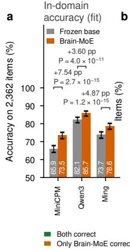

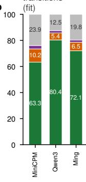

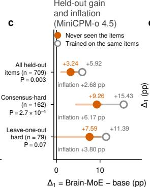

d  
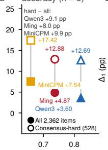

e  
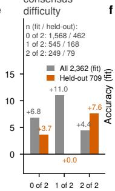

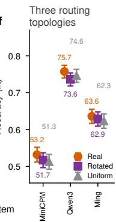

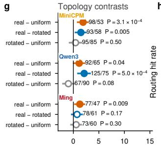  
h

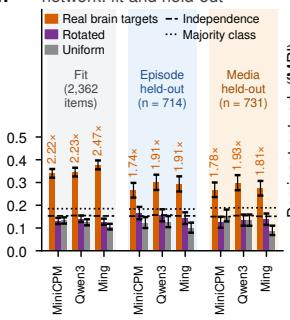

j  
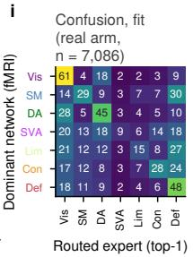

  
Extended Data Fig. 1 Brain-MoE improves accuracy and its routing depends on real brain topology. a, Accuracy of the frozen base (grey) and Brain-MoE (orange) on all 2,362 Brain-AVQA questions in the in-domain fitting regime; error bars, Wilson 95% confidence intervals (CIs); ∆1 and paired exact McNemar $P$ in parentheses. $\mathbf { b } ,$ Per-question outcome transitions per base. $\mathbf { c } , \Delta _ { 1 }$ of MiniCPM-o 4.5 on the 709 held-out questions under three question selections (all, consensus hard and leave-one-out hard): filled, models that never saw these questions in stage two; open, models that saw them. d, In-domain $\Delta _ { 1 }$ against frozen-base accuracy (filled, all questions; open, consensus hard questions, $n = 5 2 8 )$ . $\mathbf { e } , \Delta _ { 1 }$ of $\mathrm { M i n i C P M { - } o ~ 4 . 5 }$ stratified by leave-one-out dificulty, the number of the other two frozen bases that miss the question (Methods); grey, all questions $( n = 1 , 5 6 8 ,$ 545 and 249); orange, held-out questions $( n = 4 6 2$ , 168 and 79). f, Accuracy of three bases in the in-domain topology control under real (orange), rotated (purple) and uniform (grey) routing topologies; error bars, Wilson 95% CIs; compared only between arms. g, Nine paired diferences with 95% paired CIs; filled, $P < 0 . 0 5$ h, Routing hit rate (top-1 expert equals annotated dominant network) under three topologies for the in-domain topology control (grey background) and the held-out splits by episode $( n = 7 1 4 ,$ , blue) and by media $( n = 7 3 1$ , orange); dashed line, independence baseline; multiplier labels, real-arm hit rate relative to that baseline (held out, 1.74 to $\mathbf { 1 . 9 3 \times } ) . \ \mathbf { i , j }$ , Routing confusion matrices of the real arm (rows, annotated network; columns, top-1 expert; row percentages) for the in-domain topology control (i) and held-out media (j). k, Per-network hit rates from the diagonals of i,j; dashed line, 1/7 chance.

  
h

  
content = brain − random experts (row main effect, 14/14 positive); prior = true − shuffled routing (column main effect); \* prior effect P < 0.05.

  
Extended Data Fig. 2 Gain magnitude is set by base headroom, the efect is attributable to brain-pretrained expert content, and brain-aligned features are necessary for encoding on all three bases and for benchmark accuracy on Qwen3-Omni. a, First-level efect $\Delta _ { 1 }$ against frozen-base held-out accuracy for the brain arm (orange) and the random arm (purple), 15 cells each (circle Ming, square MiniCPM, triangle Qwen3). $\mathbf { b } ,$ Second-level efect $\Delta _ { 2 }$ against base accuracy; Spearman $\rho = - 0 . 8 0$ , two-sided $P = 3 . 8 \times 1 0 ^ { - 4 } , n = 1 5$ cells. $\mathbf { c } ,$ Ratio of brain-arm to random-arm gain (log axis); dashed line, geometric mean. d, Held-out accuracy $( \% )$ of seven complete $2 \times 2$ factorial cells; below each panel, mean content and prior main efects $( \mathrm { p p } ) ; { \mathbf { * } } ,$ , significant prior efect. e, Whole-cortex excess encoding damage of the matched ablation $( \Delta r \times 1 0 ^ { - 3 } )$ : coloured, primary criterion (five matched networks, $n = 7 0 9 \ \mathrm { p a r c e l s } )$ ; grey, reference criterion (all seven networks). f, Excess downstream damage of the same zeroing (pp), pooled $( n = 3 , 8 6 8 )$ and per benchmark; filled, exact McNemar $P < 0 . 0 5 . { \bf g } ,$ Accuracy of Qwen3-Omni on OmniBench $( n = 5 7 1 )$ intact, with the matched control zeroed and with the 98-feature brain set zeroed; brackets, accuracy change relative to intact (black) and to the matched control (orange, −9.11 pp, an excess damage of +9.11 pp). h, Per-network excess encoding damage on the three bases; stars, within-network Wilcoxon signed-rank tests $( ^ { * } P < 0 . 0 5 , ^ { * * } P < 0 . 0 1 , ^ { * * * } P < 0 . 0 0 1 )$ ; dashed open bars $( \dag )$ , networks that failed energy matching. i, Parcel-wise excess damage for Qwen3-Omni (lateral glass brains). j, Matching audit: matching residual of the control set of each network (hatched, excluded from the primary criterion).

Extended Data Table 4 Question counts, subset composition and held-out sizes of the five public benchmarks
<table><tr><td>Benchmark</td><td>Task</td><td>Modality</td><td></td><td>Source</td><td>Used</td><td>Coverage</td><td>Subset ori- gin</td><td>Held-out n</td></tr><tr><td>OmniBench</td><td>General omni rea- soning</td><td>Audio image + text</td><td>+</td><td>1,142</td><td>1,142</td><td>100.0%</td><td>No filtering</td><td>571</td></tr><tr><td>MMAU test-mini</td><td>Audio understand- ing</td><td>Audio</td><td></td><td>1,000</td><td>980</td><td>98.0%</td><td>Question format</td><td>490</td></tr><tr><td>MMAU-Pro</td><td>Audio understand- ing (extended diffi- culty)</td><td>Audio</td><td></td><td>5,305</td><td>4,405</td><td>83.0%</td><td>MCQ eligi- bility</td><td>2,203</td></tr><tr><td>MuChoMusic</td><td>Music understand- ing</td><td>Audio</td><td></td><td>1,187</td><td>851</td><td>71.7%</td><td>Media avail- ability</td><td>425</td></tr><tr><td>MUSIC-AVQA v2.0</td><td>Joint audiovisual question answering</td><td>Audio video</td><td>+</td><td>10,819</td><td>350</td><td>3.2%</td><td>Distractors and media</td><td>179</td></tr></table>

Sources: OmniBench 43, MMAU 44, MMAU-Pro 45, MuChoMusic 46, MUSIC-AVQA v2 $. 0 ^ { 4 7 , 4 8 }$ . Source denotes the referenced release or split: 1,000 questions for MMAU test-mini, all 5,305 mixed-format MMAU-Pro questions and the 10,819-question balanced MUSIC-AVQA v2.0 test split. Coverage is used divided by source questions. Question format denotes option/answer eligibility checks; MMAU-Pro additionally requires two to four options. MUSIC-AVQA items require three eligible distractors from the same question-type answer pool and available audiovisual media. These filters can change task composition; coverage does not denote content-independent sampling. All comparisons are paired on identical held-out questions.

Extended Data Table 5 Held-out results and two efect sizes on three bases × five public benchmarks
<table><tr><td>Base</td><td>Benchmark</td><td>n</td><td>base</td><td>Brain  $\Delta _ { 1 }$  (pp)</td><td>Random  $\Delta _ { 1 }$  (pp)</td><td> $\Delta _ { 2 } ~ ( \mathrm { p p } )$ </td><td> $n _ { \mathrm { 1 0 } } / n _ { \mathrm { 0 1 } }$ </td><td></td></tr><tr><td>Ming</td><td>MMAU</td><td>490</td><td>0.6551</td><td>+2.86</td><td>+0.20</td><td>+2.66</td><td>20/7</td><td>0.019</td></tr><tr><td>Ming</td><td>MMAU-Pro</td><td>2,203</td><td>0.5679</td><td>+9.08</td><td>+1.68</td><td>+7.40</td><td>260/97</td><td> $2 . 5 \times 1 0 ^ { - 1 8 \dagger }$ </td></tr><tr><td>Ming</td><td>MuChoMusic</td><td>425</td><td>0.7529</td><td>+2.59</td><td>+0.24</td><td>+2.35</td><td>21/11</td><td>0.11</td></tr><tr><td>Ming</td><td>MUSIC-AVQA v2.0</td><td>179</td><td>0.7542</td><td>+2.79</td><td>+1.12</td><td>+1.67</td><td>3/0</td><td>0.25</td></tr><tr><td>Ming</td><td>OmniBench</td><td>571</td><td>0.5377</td><td>+10.51</td><td>+5.25</td><td>+5.26</td><td>67/37</td><td>0.0042†</td></tr><tr><td>MiniCPM</td><td>MMAU</td><td>490</td><td>0.6918</td><td>+5.31</td><td>+2.24</td><td>+3.07</td><td>28/13</td><td>0.028</td></tr><tr><td>MiniCPM</td><td>MMAU-Pro</td><td>2,203</td><td>0.5565</td><td>+11.98</td><td>+6.67</td><td>+5.31</td><td>235/118</td><td> $4 . 7 \times 1 0 ^ { - 1 0 \dagger }$ </td></tr><tr><td>MiniCPM</td><td>MuChoMusic</td><td>425</td><td>0.7906</td><td>+2.59</td><td>+0.94</td><td>+1.65</td><td>17/10</td><td>0.25</td></tr><tr><td>MiniCPM</td><td>MUSIC-AVQA v2.0</td><td>179</td><td>0.8771</td><td>+0.56</td><td>+0.56</td><td>0.00</td><td>2/2</td><td>1.00</td></tr><tr><td>MiniCPM</td><td>OmniBench</td><td>571</td><td>0.5482</td><td>+11.73</td><td>+4.90</td><td>+6.83</td><td>55/16</td><td> $3 . 8 \times 1 0 ^ { - 6 \dagger }$ </td></tr><tr><td>Qwen3</td><td>MMAU</td><td>490</td><td>0.6490</td><td>+8.37</td><td>+3.88</td><td>+4.49</td><td>28/6</td><td> $2 . 0 \times 1 0 ^ { - 4 \dagger }$ </td></tr><tr><td>Qwen3</td><td>MMAU-Pro</td><td>2,203</td><td>0.5824</td><td>+11.85</td><td>+8.76</td><td>+3.09</td><td>119/51</td><td> $1 . 9 \times 1 0 ^ { - 7 \dagger }$ </td></tr><tr><td>Qwen3</td><td>MuChoMusic</td><td>425</td><td>0.7835</td><td>+6.82</td><td>+4.71</td><td>+2.11</td><td>13/4</td><td>0.049</td></tr><tr><td>Qwen3</td><td> $\mathrm { M U S I C - A V Q A \ v 2 . 0 }$ </td><td>179</td><td>0.8939</td><td>+3.35</td><td>+1.68</td><td>+1.67</td><td>3/0</td><td>0.25</td></tr><tr><td>Qwen3</td><td>OmniBench</td><td>571</td><td>0.6130</td><td>+5.95</td><td>+4.55</td><td>+1.40</td><td>18/10</td><td>0.18</td></tr></table>

One cell per row; n, held-out questions; base, frozen-base accuracy (headroom is 1− base); brain and random columns give the gain of each arm ∆1 over the base in percentage points (pp); $\Delta _ { 2 } ,$ brain minus random (pp); n10/n01, questions answered correctly only by the brain arm and only by the random arm; $P ,$ two-sided paired exact McNemar test of brain versus random; †, significant after Holm correction within the family of 15 cells.

Extended Data Table 6 Four-arm held-out accuracies and factorial efects of seven complete $2 \times 2$ cells
<table><tr><td>Cell</td><td>n</td><td>BT</td><td>BS</td><td>RT</td><td>RS</td><td>Content |real</td><td>Content |shuffled</td><td>Prior |brain</td><td>Prior |random</td><td>γ</td></tr><tr><td>MiniCPM × OmniBench</td><td>571</td><td>0.6655</td><td>0.6427</td><td>0.5937</td><td>0.5972</td><td>+0.0718</td><td>+0.0455</td><td>+0.0228</td><td>-0.0035</td><td>+0.0263</td></tr><tr><td>MiniCPM × MMAU</td><td>490</td><td>0.7449</td><td>0.7347</td><td>0.7082</td><td>0.7143</td><td>+0.0367</td><td>+0.0204</td><td>+0.0102</td><td>-0.0061</td><td>+0.0163</td></tr><tr><td>Ming × MMAU</td><td>490</td><td>0.6837</td><td>0.6776</td><td>0.6592</td><td>0.6571</td><td>+0.0245</td><td>+0.0205</td><td>+0.0061</td><td>+0.0021</td><td>+0.0040</td></tr><tr><td>Qwen3 × MMAU</td><td>490</td><td>0.7327</td><td>0.7286</td><td>0.6980</td><td>0.6878</td><td>+0.0347</td><td>+0.0408</td><td>+0.0041</td><td>+0.0102</td><td>-0.0061</td></tr><tr><td>Qwen3 × OmniBench</td><td>571</td><td>0.6725</td><td>0.6778</td><td>0.6585</td><td>0.6585</td><td>+0.0140</td><td>+0.0193</td><td>-0.0053</td><td>0.0000</td><td>-0.0053</td></tr><tr><td>MiniCPM × MMAU-Pro</td><td>2,203</td><td>0.6764</td><td>0.6827</td><td>0.6296</td><td>0.6232</td><td>+0.0468</td><td>+0.0595</td><td>-0.0063</td><td>+0.0064</td><td>-0.0127</td></tr><tr><td> $\mathrm { Q w e n 3 \times M M A U  – P r o }$ </td><td>2,203</td><td>0.7009</td><td>0.7022</td><td>0.6732</td><td>0.6700</td><td>+0.0277</td><td>+0.0322</td><td>-0.0013</td><td>+0.0032</td><td>-0.0045</td></tr></table>

BT, BS, RT and RS denote (brain experts, real prior), (brain experts, shufled prior), (random experts, real prior) and (random experts, shufled prior); Content|real $\mathbf { \bar { \Psi } } = \mathbf { B } \mathbf { \bar { T } } \mathbf { \Psi } - \mathbf { \Psi } \mathbf { R } \mathbf { \bar { T } } .$ Content|shufled = BS − RS, Prior|brain = BT − BS, Prior|random = RT − RS, and γ is the interaction of the saturated two-factor model; the four arms of a cell share identical held-out questions and base predictions.

# Supplementary Information for: The Platonic brain bridge hypothesis: human brain networks as an architectural prior for omni models

Pengfei Zhang1,2, Biao Tian2, Xiangang Li2, Li Liu1\*

1AI Thrust, Information Hub, The Hong Kong University of Science and Technology (Guangzhou), Guangzhou, China.

2Alibaba Token Hub, Alibaba Group, Beijing, China.

\*Corresponding author(s). E-mail(s): avrillliu@hkust-gz.edu.cn;

## Supplementary Note 1: additional quantitative results

## Forward spectrum

Modality structure. On the three brain-to-model bases (Ming-flash-omni-2.0, MiniCPM-o 4.5 and Qwen3-Omni, in that order), audio alone exceeded text alone by +0.081, +0.085 and +0.095. The increments were sub-additive: audio added between +0.042 and +0.062 to video but only +0.027 to +0.032 to video with subtitles, and subtitles added only +0.002, +0.009 and +0.008 (Supplementary Table 2).

Depth structure. Six of the seven models peaked at half depth and none at the last layer; the mean last-to-peak ratio was 0.947. The lastlayer decline grew with a capability composite from three public benchmarks (Spearman $\rho = - 0 . 7 8 6 .$ exhaustive permutation $P = 0 . 0 4 8 , n = 7 )$ , but after Holm correction over the family of six correlations no relation on this seven-model panel remained significant (smallest corrected $P = 0 . 2 9 )$ . The best single layer reached 97.6% to 99.3% of the four-layer score.

Parcel-wise encoding maps of the seven models had pairwise Spearman $\rho = 0 . 9 8 7$ (range 0.964 to 0.9996; n = 21 pairs); the ranking of the seven models within each Yeo-7 network matched the whole-cortex ranking. In the 4 September 2026 snapshot of the post-challenge Algonauts 2025 leaderboard, the single-participant margins over the runner-up were 0.00223, 0.00416, 0.00271 and 0.01203. Peak relative depth was unrelated to model size (Spearman $\rho ~ = ~ + 0 . 0 4 5$ , exhaustive permutation $P = 1 . 0 0 0 , n = 7 )$ and to the capability composite $( \rho ~ = ~ + 0 . 4 0 1$ $P \ = \ 0 . 4 2 9 )$ ; the last-to-peak ratio ranged from 0.915 to 0.981. The capability composite correlated positively but not significantly with whole-cortex brain-likeness (partial Spearman +0.433 controlling for parameter count, exhaustive permutation $P = 0 . 3 8 , n = 7 ;$ mean parcel-wise partial correlation +0.129, 67.4% of parcels positive, label permutation $P = 0 . 5 5 )$ An alternative statistical explanation of the lastlayer decline, anisotropic last-layer states leaving less variance in a fixed number of components, predicts a decline at every depth; instead Nemotron-3- Nano-Omni peaks at quarter depth and the decline of Ming-flash-omni-2.0 is confined to the last quartile (0.3737 at 3/4 depth, 0.3750 at the peak, 0.3677 at the last layer).

## Brain-AVQA held-out and in-domain results

Held-out gains on Brain-AVQA. On the 709 heldout questions, Brain-MoE on MiniCPM-o 4.5 exceeded the frozen base by +3.24 pp (paired exact McNemar test, two-sided $P = 0 . 0 0 3 2 , n = 7 0 9 )$ on consensus hard questions answered correctly by at most one frozen base the gain was +9.26 pp $( P = 2 . 7 \times 1 0 ^ { - 4 } , n = 1 6 2 )$ , and on questions both other bases missed it was +7.59 pp $( P = 0 . 0 7 0$ $n = 7 9 )$

Same-question design and a sixth benchmark. Models whose stage two had seen the same 709 questions gained +2.68, +6.17 and +3.80 percentage points more on all questions, on consensus hard questions and on leave-one-out hard questions respectively, and those three diferences are the size of the training efect in each of the three strata. On a sixth public benchmark, AVQA[1], with 1,473 held-out questions, accuracy rose from 0.8778 to 0.8968 with $P = 1 . 2 8 \times 1 0 ^ { - \dot { 4 } }$

In the in-domain fitting regime the base accuracies were 0.8213 (Qwen3-Omni), 0.7371 (Mingflash-omni-2.0) and 0.6592 (MiniCPM-o 4.5), and consensus-hard gains were +12.69, +12.88 and +17.42 percentage points (pp), 2.3 to 3.5 times the full-set gains. In the same-question design on MiniCPM-o 4.5, models whose stage two had seen the 709 questions gave $+ 5 . 9 2 / + 1 5 . 4 3 / + 1 1 . 3 9$ pp (all/consensus hard/leave-one-out hard) against $+ 3 . 2 4 / + 9 . 2 6 / + 7 . 5 9$ pp for models whose stage two had not (leave-one-out hard: $P = 0 . 0 7 0 , n = 7 9 )$ the leave-one-out hard comparison had $7 / 1$ discordant pairs. On AVQA the gain was +1.90 pp $( P =$ $1 . 2 8 \times 1 0 ^ { - 4 } , n \textmd { = } 1 , 4 7 3 )$ . Held-out and training sets did not difer in base accuracy (Mann-Whitney $U$ tests, $P = 0 . 4 4$ , 0.47 and 0.53) or consensusdificulty composition $( \chi ^ { 2 }$ test, $P = 0 . 5 2 5 )$ . The pooled real-minus-control routing hit-rate gap was +0.1513 in the episode split and +0.1518 in the media split $( P \ < 2 \times 1 0 ^ { - 4 } )$ , and the diference between splits for the real arm was +0.0062 (P = 0.659); routing hits were distributed across all seven networks.

## Public-benchmark matrix and headroom dependence

Random-arm gains over the base ranged from +0.20 to +8.76 pp. Per-cell McNemar tests reached $P < 0 . 0 5$ in nine cells, of which the three MMAU-Pro cells, two OmniBench cells and Qwen3-Omni $\times { \mathrm { ~ M M A U } }$ remained significant after Holm correction; the tied cell was MiniCPM-o 4.5 × MUSIC-AVQA v2.0 (discordant pairs 2/2). Base-level mean $\Delta _ { 2 }$ were +0.0387 (Ming-flash-omni-2.0), +0.0337 (MiniCPM-o 4.5) and +0.0255 (Qwen3- Omni). Regression to the mean was bounded by simulating 5,000 draws with constant true gain and independent sampling of the two arms: the null distributions of $\rho$ had means −0.098 and −0.003 for the two levels, and the observed −0.81 and −0.80 fell outside both null distributions (simulation $P ~ = ~ 4 \times 1 0 ^ { - 4 }$ and $2 \times 1 0 ^ { - 4 } )$ . Shufling benchmark labels only within each base (20,000 Monte Carlo draws) left the correlation significant $( P \ : = \ : 0 . 0 0 2 6 )$ . Leaving out any benchmark gave $\rho$ from $- 0 . 6 8 7 \ \mathrm { t o \ - } 0 . 9 3 9$ , and any base from $- 0 . 6 8 7$ to −0.879. Headroom and held-out size are collinear across benchmarks (Spearman $\rho =$ $+ 0 . 8 9 5 , n = 5 )$ ; in a joint standardized regression, efect size followed headroom (standardized coefficient $b = + 0 . 5 5 5 )$ , not held-out question count $( + 0 . 1 8 7 )$ , whereas evidence strength $- \log _ { 1 0 } P$ followed held-out question count $\left( + 0 . 8 8 1 \right)$ , not headroom $( - 0 . 0 6 0 ) . \ \Delta _ { 2 }$ correlated with log parameter count at $r ~ = ~ - 0 . 0 2 1$ . A quadratic fit in base accuracy (adjusted $R ^ { 2 } \ = \ 0 . 7 2 3 )$ exceeded a linear fit (0.657), with positive curvature. Benchmark means over three bases: MMAU-Pro (headroom 0.431) and OmniBench (0.434) gave mean $\Delta _ { 2 }$ of $+ 0 . 0 5 2 7$ and $+ 0 . 0 4 5 0$ , MMAU (0.335) +0.0341, MuChoMusic (0.224) +0.0204 and MUSIC-AVQA v2.0 (0.158) +0.0111.

## Repeated training seeds and random network-to-expert maps

For MiniCPM-o 4.5 we added two further stagetwo seeds (1 and 2) to the published seed-0 run on four of the five public benchmarks. $\Delta _ { 2 }$ was positive in all 12 runs: OmniBench $+ 6 . 8 3 , + 4 . 3 8$ and +6.65 pp $( P = 3 . 8 \times 1 0 ^ { - 6 }$ , 0.0041 and $2 . 0 \times 1 0 ^ { - 5 } ) ;$ ; MMAU +4.60, +2.80 and +4.80 pp $( P = 0 . 0 0 1 1 , 0 . 0 5 9$ and $9 . 0 \times 1 0 ^ { - 4 } )$ ; MMAU-Pro +5.31, +6.58 and +6.17 pp (all $P < 1 0 ^ { - 4 } ) ;$ and MuChoMusic +1.65, +3.30 and +2.77 pp $( P = 0 . 2 5$ , 0.016 and 0.073). Nine of the 12 diferences reached $P < 0 . 0 5$ . Each seed also redraws the media-key split, so runs are paired within a seed, and the MMAU runs used a 500- question split of the full 1,000-question test-mini set rather than the 490-question split of the main matrix, so their seed-0 value difers from the published one. Repeating stage one with a second seed gave $\Delta _ { 2 } = + 6 . 1 3 ~ \mathrm { p p }$ on OmniBench against +6.83 pp with the first seed; the brain arm itself moved by $0 . 7 0 \ \mathrm { p p } .$ , which is within noise $( P = 0 . 5 0 )$

We also drew 20 of the 5,040 possible maps from brain networks to experts (seed 20260905, after removing the identity and a cyclic shift) and repeated the routing training under each of them on MiniCPM-o 4.5 in the in-domain fitting regime, with the experts held fixed and the gate re-initialized and trained again. The real map was more accurate than all 20: 1.70 pp above their mean (s.d. 0.36 pp) and 0.93 pp above the best of them. The empirical P is 0.048, the smallest value 20 draws can give. The routing hit rate of the real map was higher than that of every random map as well (0.3400 against at most 0.2202).

## Pathways and feature ablation

Content-pathway efects were +5.95 pp $( \mathrm { M i n i C P M - o ~ 4 . 5 ~ } \times \mathrm { M M A U - P r o , ~ } P = 1 . 2 \times 1 0 ^ { - 1 2 } ,$ $ { n _ { \mathrm { ~  ~ } } } = \ 2 { , } 2 0 3 )$ , +7.31 pp (Ming-flash-omni-2.0 × $\mathrm { M M A U  – P r o } , P = 1 . 5 \times 1 0 ^ { - 1 6 } )$ , +3.22 pp (Qwen3- Omni × MMAU-Pro, $P ~ = ~ 4 . 7 \times 1 0 ^ { - 8 } )$ , +4.55 pp (MiniCPM-o 4.5 × OmniBench, $P = 0 . 0 0 1 3$ $\begin{array} { r l r } { n } & { { } = } & { 5 7 1 ) } \end{array}$ and +1.93 pp (Qwen3-Omni × OmniBench, $P = 0 . 0 5 2 )$ ; the two pathways sum exactly to the total efect. In the four-arm cells, content efects were $+ 1 . 4 0 \ \mathrm { ~ t o ~ } + 7 . 1 8$ pp under the real prior and $+ 1 . 9 3 \ : \ : \mathrm { \ t o \ \ t + 5 . 9 5 }$ pp under the shufled prior; the smallest content efect $\left( + 1 . 4 0 \mathrm { \ p p } \right)$ exceeded every prior efect except +2.28 pp in MiniCPM-o 4.5 × OmniBench. Under the reference criterion (all seven networks, $n = 1 , 0 0 0$ parcels) excess encoding damage was +0.00139, +0.00324 and +0.00891 $( P = 0 . 0 0 2 2$ $8 . 4 \times 1 0 ^ { - 3 9 }$ and $3 . 1 \times 1 0 ^ { - 7 3 } )$ , and under the strict criterion for Qwen3-Omni (n = 466) +0.01054 $( P ~ = ~ 2 . 1 \times 1 0 ^ { - 4 0 } )$ ; the Holm-corrected P for the Qwen3-Omni OmniBench downstream excess damage over five benchmarks was $3 . 7 \times 1 0 ^ { - 6 } .$ zeroing the matched control lowered accuracy only to 0.6077, and the pooled discordant pairs were 299/232.

## Supplementary Methods

## Algonauts 2025 submission system

The submitted system uses the same measurement unit as equations (2) to (4) of the main text: stimulus representations come entirely from the internal hidden states of omni models (all available layers of several omni families and their internal multimodal branches, with no features obtained from encoders external to the listed multimodal models), and all readouts are per-participant, per-parcel linear ridge regressions. The omni families in the pool are Qwen3-Omni Instruct and Thinking[2], MiniCPM-o 4.5[3], Ming-flashomni-2.0[4], Nemotron-3-Nano-Omni[5], Gemma 4 12B[6], TLive-Omni 9B[7], MiMo-V2.5[8] and Inkling-Small[9]; all-layer residual readouts are fitted for Qwen3-Omni Instruct, MiniCPM-o 4.5, Gemma 4, Nemotron-3-Nano-Omni, Ming-flashomni-2.0 and TLive-Omni, and the parcel-level temporal filter uses per-participant axes that include Inkling-Small. Using this unit, the system forms a pool of 24 encoding models from per-layer, lag-unrolled ridge readouts in Schaefer-1000 space, selects model subsets by participant and hemispheric network, fits closed-form mixing weights per parcel, and stacks residual readouts, hierarchical residual routing and cross-participant transfer. Validation and selection hold out entire Movie10 films; deployment refits on all labelled data; the true responses of the out-of-distribution films are never used by the system. Public scores returned by the post-challenge open leaderboard are used only to select bounded per-participant, per-film deployment scales and are not used in any training.

## Stage-one GDPO-inspired objective

Stage one trains experts network by network on the Brain-AVQA benchmark, whose construction is described below, with a REINFORCE variant inspired by GDPO reward-wise normalization[10]. Unlike the published GDPO algorithm, this variant does not apply batch-wise advantage normalization or the clipped importance-ratio objective. For network $k ,$ the training set is restricted to questions annotated with dominant network k, the trainable parameters are $\left\{ { \bf A } _ { k } , { \bf B } _ { k } , { \bf W } _ { g } , { \bf b } _ { g } , { \bf w } _ { b } \right\}$ and the gate weights are replaced in the forward pass by the one-hot vector $\mathbf { e } _ { k } .$ , so that expert k alone produces the residual correction. For a question with $n _ { \mathrm { o p t } }$ options, the forward pass of the model gives option log-likelihoods lp, from which $G \ = \ 4$ answers anso $( o ~ = ~ 1 , \ldots , G )$ are sampled at temperature $T _ { \mathrm { s a m p } } ~ { = } ~ 1 . 2$ and compared with the correct option $\mathrm { a n s } _ { i } ^ { \star }$ , each receiving a twodimensional reward (correctness, confidence of that

answer):

$$
\begin{array} { l } { \displaystyle \psi _ { o } = \big [ \mathbb { k } ( \mathrm { a n s } _ { o } = \mathrm { a n s } _ { i } ^ { \star } ) , ~ \mathrm { s o f t m a x } ( 1 \mathbf { p } ) [ \mathrm { a n s } _ { o } ] \big ] , } \\ { \displaystyle \hat { \psi } _ { o , j } = \frac { \psi _ { o , j } - \mathrm { m e a n } _ { o ^ { \prime } } \psi _ { o ^ { \prime } , j } } { \mathrm { s t d } _ { o ^ { \prime } } \psi _ { o ^ { \prime } , j } + \epsilon _ { 0 } } , } \\ { \displaystyle \hat { A } _ { o } = \sum _ { j = 1 } ^ { 2 } \omega _ { j } \mathrm { c l i p } ( \hat { \psi } _ { o , j } , - c _ { \mathrm { c l i p } } , c _ { \mathrm { c l i p } } ) , } \end{array}\tag{S1}
$$

where $\epsilon _ { 0 } ~ = ~ 1 0 ^ { - 6 }$ , clipping threshold $c _ { \mathrm { c l i p } } ~ = ~ 5 . 0$ and reward weights $\omega ~ = ~ ( 1 . 0 , 0 . 3 )$ . The policy loss is advantage-weighted REINFORCE[11] with a supervised anchor and a routing-alignment term:

$$
\begin{array} { r l } & { \mathcal { L } _ { \mathrm { s t a g e 1 } } = w _ { \mathrm { h a r d } } \Big ( c _ { \mathrm { g d p o } } \big [ - \frac { 1 } { G } \sum _ { o } \mathbf { l p } [ \mathrm { a n s } _ { o } ] \hat { A } _ { o } \big ] } \\ & { \qquad + c _ { \mathrm { s f t } } \big [ - \mathbf { l p } [ \mathrm { a n s } _ { i } ^ { \star } ] \big ] \Big ) } \\ & { \qquad + c _ { \mathrm { r o u t e } } \mathrm { K L } \big ( \mathrm { s o f t m a x } ( \mathbf { u } ) \mid \mid \mathbf { e } _ { \nu _ { i } } \big ) , } \end{array}\tag{S2}
$$

where $\nu _ { i }$ is the dominant-network label of question $i , c _ { \mathrm { g d p o } } = 1 . 0 , c _ { \mathrm { s f t } } = 0 . 5 , c _ { \mathrm { r o u t e } } = 0 . 2$ , and the hardquestion weight $w _ { \mathrm { h a r d } } ~ = ~ 2 . 0 ~ ( $ 1.0 for easy questions). Expert learning rate $1 0 ^ { - 4 }$ , routing learning rate $2 \times 1 0 ^ { - 4 }$ , gradient norm clipping 1.0. The experts trained for the seven networks are merged by slot into one checkpoint whose down-projections $\left\{ { \bf A } _ { k } \right\}$ are the frozen brain-feature subspace reused in all subsequent experiments.

A preliminary comparison of three training modes, difering only in the parameter set entering the optimizer (frozen A with trained B and gate; gate only; A and B trained together), in which only the frozen-A mode let brain experts outperform random experts, motivated the frozen-A design; that comparison served as a qualitative design basis and is not reported as a result.

## Brain-AVQA construction

The reverse experiments require an audiovisual question-answering benchmark in which each question is annotated, beyond video, question, options and answer, with the Yeo-7 network most strongly engaged, in the fMRI of the participants during passive viewing, by the 8-s window from which the question was generated; the label belongs to the stimulus window, not to an answering process. Construction has five steps. First, the Friends video stimuli watched by the four participants are cut into TR-aligned windows; for each window, the mean response of the seven networks is computed from the measured responses of the participants and standardized at network level, and the network with the largest participant-averaged amplitude becomes the dominant-network label of the window. Second, a multimodal generative model (Qwen3.5-Omni-Plus[12]) generates a four-choice question from the audiovisual content of the window, with a prompt requiring that its solution depend on the capability associated with the dominant network. Third, an audit model independent of the question writer (Gemini 3.5 Flash[13]) performs joint audiovisual verification of each question, retaining only those whose answer is uniquely correct, derivable from the window content and free of textual shortcuts. Fourth, questions and options occasionally generated in Chinese are translated into English question by question by Qwen3-Max, a proprietary API model of the Qwen3 series[14], (temperature 0, five questions per batch) with option order and answer index unchanged, and translated questions pass through the third-step audit again. Fifth, a reproducible pseudo-random option permutation is applied to every question so that correct options are balanced across the four positions (591, 591, 590 and 590 questions), removing positional priors.

## Alternative explanations of the efective dimension of inter-model diferences

The low efective dimension persisted under five treatments addressing four alternative explanations, with the participation ratio confined to 1.17 to 1.33, and the first principal component loaded 5.37 times more on sensory than on association parcels. The axis does not correspond to capability: the capability-brain coupling map correlated with it no more than expected under relabelling, with $| \rho | = 0 . 6 0 6$ against a null median of 0.602, and parcel-wise coupling showed no network-specific structure beyond that axis.

Four alternative explanations were tested by recomputing PR after each treatment: a global scalar gain per model (regressed out as $\begin{array} { r l } { \hat { \zeta } _ { i } } & { { } = } \end{array}$ $\mathbf { r } _ { i } ^ { \top } \bar { \mathbf { r } } / \bar { \mathbf { r } } ^ { \top } \bar { \mathbf { r } } ,$ or per-model z-standardization; measured gains 0.960 to 1.073), measurement noise (2,000 centred $7 ~ \times ~ 1 0 0 0$ Gaussian matrices at the measured residual standard deviation 0.0213), parcel resolution (aggregation to seven networks, random subsets of 100, 250 or 500 parcels, or split halves) and a signal-to-noise map (text-only encoding map residualized from the map of each model). The geometric corollary was tested by correlating the parcel-wise capability-brain coupling map $\rho$ with the first residual principal component $\mathbf { q } _ { 1 }$ against the median over 5,040 model-label permutations.

## Computational resources and random seeds

All experiments ran on a single machine with 8 NVIDIA RTX A6000 GPUs (48 GB; CUDA 12.9). Stage-two training per cell took 0.3 to 1.2 h for MiniCPM-o 4.5 (one GPU), 2.9 to 15.4 h for Qwen3-Omni (two GPUs) and 1.2 to 6.5 h for Ming-flash-omni-2.0 (five to eight GPUs); stageone network-wise training took about 0.08 h per network on MiniCPM-o 4.5. Stage one trained each network expert for one epoch and the routing pretraining for one epoch, with a LoRA learning rate of $1 0 ^ { - 4 } ,$ a router learning rate of $2 \times 1 0 ^ { - 4 }$ and reward-sampling group size $G = 4 ;$ stage two used three epochs, an up-projection learning rate of $7 \times 1 0 ^ { - 5 }$ , a gate learning rate of $3 \times 1 0 ^ { - 4 }$ KL weight $c _ { \mathrm { K L } } ~ = ~ 0 . 0 3$ and gradient accumulation over 4 steps; the random seed was 0 in both stages. Each (base × benchmark × arm) cell uses a single training seed, the two arms share split and seed, and the paired design controls common randomness. Training and split seed 0; row-level held-out split seed 20260612; media and episode grouping seed 20260813; answer-position permutation seed 20260812; stage-two repeat seeds 1 and 2; stage-one repeat seed 1; random-map draw seed 20260905. Encoding models and statistics were run in Python 3.10.20 with PyTorch 2.8.0, NumPy 1.26.4, SciPy 1.15.3 and scikit-learn 1.7.2. Brain-MoE training used one environment per base, with Transformers 4.57.1 and PyTorch 2.5.1 for Mingflash-omni-2.0, Transformers 4.51.0 and PyTorch 2.8.0 for MiniCPM-o 4.5, and Transformers 4.57.6, PyTorch 2.3.1 (CUDA 11.8 build) and Python 3.11.15 for Qwen3-Omni.

## CNeuroMod data, ethics and acquisition

The CNeuroMod project was approved by the institutional research ethics board of the CIUSSS du Centre-Sud-de-l’ˆIle-de-Montr´eal and renewed by the Comit´e d’´ethique de la recherche Vieillissement et neuroimagerie (CER-VN) on 21 October 2022 under project number CER VN 18-19-22 (https://docs.cneuromod.ca/contents/ access.html#ethics); participants gave written informed consent to participate and, separately, to share their data (https://github.com/courtoisneuromod/algonauts 2025.competitors). Acquisition used a Siemens Prisma Fit scanner with a 64-channel head/neck coil and an accelerated simultaneous multi-slice gradient-echo echoplanar sequence (slice acceleration 4, TR = 1.49 s, $\mathrm { T E } ~ = ~ 3 7 $ ms, flip angle 52 degrees, 2 mm isotropic voxels, 60 slices); preprocessing used fMRIPrep 20.2.5 with slice-timing correction disabled, and the Algonauts 2025 release provides the data projected to 1,000 Schaefer parcels in MNI space (https://docs.cneuromod.ca). The providers extracted parcel time series in MNI152NLin2009cAsym space with the Schaefer 1,000-parcel, seven-network atlas, standardized and smoothed each run (5-mm kernel) and regressed out 24 head-motion parameters, the global signal and the mean white-matter and cerebrospinal-fluid signals with high-pass filtering, without scrubbing. The four participants (sub-01, sub-02, sub-03 and sub-05) are three men and one woman, all right-handed, within the 31-to-47-year age range of the cohort at recruitment in 2018, native or bilingual French speakers with advanced English comprehension.

## Algonauts 2025 evaluation

The leaderboard entry is not the single-model protocol used for the seven-model spectrum. It pools ridge encoding models fitted on the internal hidden states of several omni models, taken from the language-model core, which the Qwen and MiniCPM architectures call the thinker, and from the internal multimodal branches. No features were obtained from encoders external to the listed multimodal models. The per-parcel predictions of the pool are combined by closed-form mixing weights, with model selection and validation holding out entire Movie10 films, and the deployment scales are bounded by leaderboard feedback. Source models, layer sets and fusion weights therefore difer from the protocol of the seven-model spectrum. In the 4 September 2026 snapshot of the public postchallenge leaderboard the pool ranked first in all five columns among 24 leaderboard entries, with a participant-mean correlation of 0.25034, ahead of the runner-up, an ensemble of low-rank-adapted Qwen3-Omni encoders[15], by 0.00528[16].

The out-of-distribution evaluation used for external validity was performed on the oficial heldout set of the Algonauts 2025 challenge[17]: training responses comprise about 55 h of Friends and about 10 h of Movie10 films, and the evaluation stimuli are about 2 h of unseen out-of-distribution films (six[18]); true responses are withheld, and the organizers average parcel-wise Pearson correlations over parcels, films and participants[17], reporting five leaderboard columns (four participants and their mean).

## Qwen3-Omni modality feature extraction

In the modality ablation (Supplementary Table 2), training rows vary by condition for Ming-flashomni-2.0 (113,412 to 114,003) and are constant for the other two models, whereas the validation split is identical in every cell $( n = 2 3 , 3 2 4 )$ . Qwen3-Omni modality features came from a separate extraction pass at layers 8, 16, 24 and 48 in float32. Its whole-cortex value is 0.365 against 0.347 for the depth-matched pass used in the seven-model spectrum, so absolute values are comparable across the three models only up to that ofset. All six Qwen3-Omni conditions come from that one pass, so contrasts within the model are exact. A control on a separate all-layer Qwen3-Omni feature store, in which the quartile layer set (12, 24, 36 and 48) was replaced by layers 8, 16, 24 and 48 under the same protocol, gave a cost of the layer set of 0.00309 in whole-cortex brain-likeness (0.23216 to 0.22907; 1.3% relative). The pooled features of that pass consist of the per-unit mean and standard deviation of hidden states over the tokens of each TR. One standard-deviation dimension (that of hidden unit 940) accounts for 90 to 96% of the feature variance in the audio-only and textonly conditions at layers 8, 16 and 24, reducing their efective dimension to about one (participation ratio 1.2 to 1.3). It accounts for 22 to 34% in the other conditions and at most 1% in the other two models. That dimension can only lower the audio-only and text-only values: the audio share of the full score is therefore a lower bound, and any contrast that subtracts the text-only value is an upper bound. No control without that channel is available for the Qwen3-Omni features.

## Brain-MoE gate settings and initialization

At each injection point the hidden state $\mathbf { h } \in \mathbb { R } ^ { L \times d }$ (L tokens) is averaged over the sequence to $\bar { \mathbf { h } } ,$ the gate softmax uses temperature $T _ { g } ~ = ~ 1$ with all seven experts participating and no truncation to a subset of experts, and the expert sum is scaled by $\alpha / n _ { r }$ (the corresponding equations of the main text). The gate linear layer $\mathbf { W } _ { g }$ is initialized from a normal distribution with standard deviation $1 0 ^ { - 3 }$ and the bias ${ \bf b } _ { g }$ at zero, so the initial gate is approximately uniform; $\mathbf { B } _ { k }$ is zeroinitialized, so the initial output equals the base. The per-network learnable prior gain $\mathbf { w } _ { b } \in \mathbb { R } ^ { 7 }$ is initialized at 1 and optimized in the same group as the gate; as $w _ { b , j } \  \ 0$ the gate reduces to an ordinary mixture of experts driven by the hidden state alone. Under every topology operator, including the 20 random maps, these gate parameters are re-initialized in this way before routing training, and only the expert LoRA parameters are carried over from stage one.

## Sparse autoencoder training

Training used AdamW with per-dimension standardized inputs and rows above the 99.9th percentile of L2 norm dropped, learning rate $3 \times 1 0 ^ { - 4 }$ ， batch size 256, 30 epochs, weight decay $1 0 ^ { - 4 }$ , auxiliary loss weight 1/32 on the 512 longest-inactive features, and random seed 42. Training tokens were sampled at random from the TR shards of all stimuli (up to 200,000 per model), with 5% of stimulus files held out for validation (up to 20,000 tokens). Widths follow four times the hidden width: 16,384 for Ming-flash-omni-2.0 and MiniCPM-o 4.5 (hidden width 4,096) and 8,192 for Qwen3-Omni (hidden width 2,048).

## Window-overlap control for Brain-AVQA

Because the question-level split does not isolate 8- s windows, held-out questions were stratified by overlap with the nearest training window; the realtopology advantage did not difer between overlapping and non-overlapping questions (Qwen3-Omni −0.59 pp, $P = 1 . 0 0 \mathrm { : }$ ; Ming-flash-omni-2.0 −1.59, $\begin{array} { r l r } { P } & { { } = } & { 0 . 8 4 ) } \end{array}$ ), giving no evidence that segment memorization explains the gain.

## Reliability of the Brain-AVQA network labels

Reliability of the dominant-network label was estimated by labelling two disjoint participant pairs independently: the two halves of the participant sample agreed on 0.353 of windows averaged over the three possible splits (Cohen $\kappa = 0 . 2 4 3$ , n = 2,362) against a chance level of 0.143, and the bootstrap interval of the observed value does not overlap the permutation null (Supplementary Table 8). Agreement is a group-level property: it reaches 0.759 for one participant scored against the mean of the other three and falls to 0.285 for single participant pairs, and all four participants agree on 6.39% of windows, so the label does not support a window-by-window anatomical reading. The dominant-network distribution (Methods) is close to uniform because of the network-level standardization, which compresses a largest-tosmallest count ratio of 10.1 to 1.76 (Supplementary Table 9). The original labelling script was no longer available, and labels re-derived from the fMRI reproduced the released values with $r = 0 . 9 9 8 8$ and 97.6% identical dominant networks $( n = 2 { , } 3 6 2 )$ .

## Energy-matching criteria

Matching quality is the within-network energy ratio of brain to control arm; matching failed for the visual and control networks on all three bases (energy ratios 1.57 to 7.04), which are therefore excluded from the primary criterion $( n ~ = ~ 7 0 9$ parcels); the reference criterion includes all seven networks $\begin{array} { r } { \mathrm { ~  ~ { ~ ( ~ n ~ \mathrm { ~  ~ { ~ 1 ~ } ~ } , 0 0 0 ) ~ } ~ } } \end{array}$ ; the strict criterion for Qwen3-Omni further excludes the dorsal attention and salience/ventral attention networks with larger matching residuals $( n = 4 6 6 )$

## Supplementary Tables

Supplementary Table 1 Brain-likeness and depth structure of seven omni models
<table><tr><td>Model</td><td>Parameters</td><td>r (four layers)</td><td>Best layer r</td><td>Peak depth</td><td>Last/peak</td></tr><tr><td>Ming-flash-omni-2.0</td><td>100B</td><td>0.3807</td><td>0.3750</td><td>0.50</td><td>0.981</td></tr><tr><td>MiniCPM-o 4.5</td><td>9B</td><td>0.3609</td><td>0.3582</td><td>0.50</td><td>0.915</td></tr><tr><td>Nemotron-3-Nano-Omni</td><td>31B</td><td>0.3546</td><td>0.3463</td><td>0.25</td><td>0.949</td></tr><tr><td>Qwen3-Omni Thinking</td><td>30B</td><td>0.3470</td><td>0.3441</td><td>0.50</td><td>0.938</td></tr><tr><td>Qwen3-Omni Instruct‡</td><td>30B</td><td>0.3470</td><td>0.3422</td><td>0.50</td><td>0.944</td></tr><tr><td>Qwen2.5-Omni 7B</td><td>7B</td><td>0.3397</td><td>0.3338</td><td>0.49</td><td>0.947</td></tr><tr><td>Qwen2.5-Omni 3B</td><td>3B</td><td>0.3367</td><td>0.3322</td><td>0.50</td><td>0.955</td></tr></table>

r¯ is the mean validation Pearson correlation over four participants and 1,000 parcels (Schaefer-1000 parcellation, 512 principal components per layer concatenated over four layers, ridge regression, haemodynamic lag of two sampling periods). Best single-layer r¯ is the maximum over the four relative depths fitted separately; last/peak ratio is the last-layer score divided by the peak score. The peak depth 0.49 of Qwen2.5-Omni 7B is the relative position of its 2/4 grid layer (28 layers); its 2/4 and 3/4 scores difer by 0.0002. ‡, the Instruct variant (Qwen3-Omni-30B-A3B-Instruct) is the Qwen3-Omni base used in all brain-to-model experiments (Brain-Scope and Brain-MoE).

Supplementary Table 2 Six input subsets of the modality ablation
<table><tr><td>Model</td><td>T</td><td>V</td><td>A</td><td>V+T</td><td>V+A</td><td>V+A+T</td></tr><tr><td>Ming-flash-omni-2.0</td><td>0.250</td><td>0.317</td><td>0.331</td><td>0.348</td><td>0.379</td><td>0.381</td></tr><tr><td>MiniCPM-o 4.5</td><td>0.244</td><td>0.311</td><td>0.329</td><td>0.330</td><td>0.352</td><td>0.361</td></tr><tr><td>Qwen3-Omni (Instruct)§</td><td>0.246</td><td>0.299</td><td>0.341</td><td>0.338</td><td>0.357</td><td>0.365</td></tr></table>

Whole-cortex brain-likeness ¯rS (mean over four participants) with only the listed input channels as input (T, subtitles; V, video; A, audio). Confidence intervals from a paired bootstrap over the 1,000 parcels (10,000 resamples) have half-widths of 0.0069 to 0.0095 on every cell. Every adjacent contrast excludes zero in all three models except A against V+T, for which the interval is +0.0130 to +0.0215 in Ming-flash-omni-2.0, −0.0036 to +0.0055 in MiniCPM-o 4.5 and −0.0077 to +0.0002 in Qwen3-Omni, so the two subsets are separated only in Ming-flash-omni-2.0. §, separate float32 extraction at layers 8, 16, 24 and 48; see Supplementary Methods. Increments and percentages quoted in the main text are computed from unrounded values. Training rows vary by condition for Ming-flash-omni-2.0 (113,412 to 114,003) and are constant for the other two models; the validation split is identical in every cell (n = 23,324).

Supplementary Table 3 Cross-model matching of brain-aligned sparse features
<table><tr><td>Model pair</td><td>Matched |r|</td><td>Null maximum |r|</td><td>Ratio</td><td>Random control |r|</td><td>Ratio</td><td>Exact P</td></tr><tr><td>Qwen3-Omni, Ming-flash-omni-2.0</td><td>0.5257</td><td>0.0382</td><td>13.8</td><td>0.0407</td><td>12.9</td><td>1/12,045</td></tr><tr><td>Qwen3-Omni, MiniCPM-o 4.5</td><td>0.5344</td><td>0.0392</td><td>13.6</td><td>0.0424</td><td>12.6</td><td>1/12,045</td></tr><tr><td>Ming-flash-omni-2.0, MiniCPM-o 4.5</td><td>0.5068</td><td>0.0381</td><td>13.3</td><td>0.0372</td><td>13.6</td><td>1/12,045</td></tr></table>

Each model contributes its brain-aligned features (185, 184 and 190 for Qwen3-Omni, Ming-flash-omni-2.0 and MiniCPM-o 4.5) on 13,383 shared stimulus grid points from 81 Friends half-episode segments, matched one-to-one by the Hungarian algorithm. Shift null maximum is the largest mean matched |r| over all 12,044 circular shifts of one series; random control is the mean over 30 size-matched random sets of non-brain-aligned features, none of which reached the observed value; P is the exact circular-shift permutation over 12,045 shifts including the identity, Holm-corrected within the family to 3/12,045.

Supplementary Table 4 Robustness of the efective dimension of inter-model diferences to four alternative explanations
<table><tr><td>Treatment</td><td>Participation ratio</td></tr><tr><td>Raw residual matrix</td><td>1.28 (PC1 87.8%, PC2 9.2%)</td></tr><tr><td>Per-model global gain regressed out</td><td>1.21</td></tr><tr><td>Per-model z-standardization</td><td>1.18</td></tr><tr><td>Aggregated to seven networks</td><td>1.19</td></tr><tr><td>Random 100/250/500 parcels</td><td>1.29 ± 0.06 / 1.29 ± 0.03 / 1.28 ± 0.02</td></tr><tr><td>Parcels split in half</td><td>1.29 / 1.28</td></tr><tr><td>Text-only baseline residualized</td><td>1.17 1.33</td></tr><tr><td>Text-only baseline residualized and z-standardized</td><td></td></tr><tr><td>Independent Gaussian noise (2,000 simulations)</td><td>5.96 (95% interval 5.93 to 5.98; none below the observed value)</td></tr></table>

Supplementary Table 5 Three-arm decomposition into content and routing pathways
<table><tr><td>Cell</td><td></td><td></td><td>Total effect</td><td></td><td>Content pathway</td><td>Routing pathway</td></tr><tr><td>MiniCPM-o OmniBench</td><td>4.5</td><td></td><td> $1 0 ^ { - 6 } , 5 5 / 1 6 )$ </td><td> $+ 0 . 0 6 8 3 ~ ( P ~ = ~ 3 . 8 ~ \times ~$ </td><td> $+ 0 . 0 4 5 5 ( { \cal P } ~ = ~ 0 . 0 0 1 3 ,$   $4 4 / 1 8 )$ </td><td> $+ 0 . 0 2 2 8 \ ( P = 0 . 0 0 7 2 ,$   $1 7 / 4 )$ </td></tr><tr><td>MiniCPM-o</td><td>4.5 X</td><td>2,203</td><td> $+ 0 . 0 5 3 1 \ \stackrel { \cdot } { ( } P = 4 . 7 \ \times$ </td><td></td><td> $+ 0 . 0 5 9 5 \ : \ : \ : ( P \ : \ : = \ : \ : 1 . 2 \ : \ : \times$ </td><td> $- 0 . 0 0 6 4 ( P = 0 . 1 7 ,$ </td></tr><tr><td>MMAU-Pro Qwen3-Omni</td><td></td><td>571</td><td> $1 0 ^ { - 1 0 } , 2 3 5 / 1 1 8 )$   $+ 0 . 0 1 4 0 \quad ( \stackrel { \cdot } { P } ) = \quad 0 . 1 8 ,$ </td><td></td><td> $1 0 ^ { - 1 2 } , 2 3 7 / 1 0 6 )$   $+ 0 . 0 1 \dot { 9 } 3 ( \stackrel { \cdot } { P } = 0 . 0 5 2 ,$ </td><td> $3 8 / 5 2 )$   $- 0 . 0 0 5 3 ( P = 0 . 6 1 ,$ </td></tr><tr><td>OmniBench Qwen3-Omni</td><td></td><td></td><td> $1 8 / 1 0 )$   $+ 0 . 0 3 \dot { 0 } 9 ( P = 1 . 9 \times$ </td><td></td><td> $+ 0 . 0 \dot { 3 } 2 2 \ : \ : ( P = 4 . 7 \times$ </td><td> $6 / 9 )$   $- 0 . 0 0 1 4 ( P = 0 . 7 8 ,$ </td></tr><tr><td> $\mathrm { M M A U - P r o }$ </td><td>X</td><td>2,203</td><td> $1 0 ^ { - 7 } , 1 1 9 / 5 1 )$ </td><td></td><td> $1 0 ^ { - 8 } , 1 2 0 / 4 9 )$ </td><td></td></tr><tr><td>Ming-flash-omni-2.0</td><td></td><td></td><td></td><td></td><td></td><td> $2 5 / 2 8 )$ </td></tr><tr><td></td><td></td><td>2,203</td><td> $+ 0 . 0 7 4 0 \ : \ : \ : ( P \ : \ : = \ : \ : 2 . 5 \ : \times$ </td><td></td><td> $+ 0 . 0 7 3 1 \ : \ : \ : ( P \ : \ : = \ : \ : 1 . 5 \ : \ : \times$ </td><td> $+ 0 . 0 0 0 9 ( P = 0 . 9 1 ,$ </td></tr><tr><td></td><td></td><td></td><td></td><td></td><td></td><td></td></tr><tr><td> $\mathrm { \times \ M M A U { - } P r o }$ </td><td></td><td></td><td> $1 0 ^ { - 1 8 } , 2 6 0 / 9 7 )$ </td><td></td><td></td><td>38/36)</td></tr><tr><td></td><td></td><td></td><td></td><td> $1 0 ^ { - 1 6 } , 2 7 4 / 1 1 3 )$ </td><td></td><td></td></tr></table>

Supplementary Table 6 Three criteria of the matched ablation  
Total efect is BT − RS, content pathway $\mathrm { B S } \mathrm { ~ - ~ } \mathrm { R S } ,$ , routing pathway BT − BS; parentheses give the paired exact McNemar P and discordant pairs.

<table><tr><td>Base</td><td>Primary (visual and con-  $\mathrm { t r o l ~ e x c l u d e d , } n = 7 0 9 )$ </td><td> $\mathrm { R e f e r e n c e ~ \ p ( a l l ~ \ s e v e n ~ \ n e t - }$   $\mathrm { w o r k s } , n = 1 , 0 0 0 )$ </td><td>Strict</td></tr><tr><td>Ming-flash-omni-2.0</td><td> $+ 0 . 0 0 1 2 8 \ : \ : \ : ( P = 4 . 2 \ : \ : \times$   $1 0 ^ { - 5 } )$ </td><td> $+ 0 . 0 0 1 3 9 \ ( P = 0 . 0 0 2 2 )$ </td><td>Not applicable</td></tr><tr><td> $\mathrm { M i n i C P M { - } o ~ 4 . 5 }$ </td><td> $+ 0 . 0 \dot { 0 } 2 9 3 ( { \cal P } = 1 . 2 \times$   $1 0 ^ { - 3 1 } )$ </td><td> $+ 0 . 0 0 3 2 4 \ : \ : \ : ( P = 8 . 4 \ : \ : \times$   $1 0 ^ { - 3 9 } )$ </td><td>Not applicable</td></tr><tr><td>Qwen3-Omni</td><td> $+ 0 . 0 1 0 1 2 \ : \ : \ : ( P = 4 . 1 \ : \ : \times$   $1 0 ^ { - 5 5 } )$ </td><td> $+ 0 . 0 0 8 9 1 \ : \ : \ : ( P = 3 . 1 \ : \ : \times$   $1 0 ^ { - 7 3 } )$ </td><td> $+ 0 . 0 1 0 5 4 \ : \ : ( P = 2 . 1 \times 1 0 ^ { - 4 0 } ,$   $n = 4 6 6 )$ </td></tr></table>

Excess damage is the mean parcel-wise encoding damage from zeroing brain-aligned features relative to the energy-matched control arm; $P$ from across-parcel Wilcoxon signed-rank tests.

Supplementary Table 7 Comparison of this work with the most related studies
<table><tr><td rowspan=1 colspan=8>Work             Direction        Modality       Injected object     Capability        Attribution      Magnitudevalidation        controls          theory</td></tr><tr><td rowspan=1 colspan=8>TRIBE, TRIBE   Model to brain  Trimodal       None              None            Modality         Encoding</td></tr><tr><td rowspan=2 colspan=7>v2[19, 20]                           concatenationMÍRÁGE[21]      Model to brain  Native omni    None              NoneTopo-Omni[22]    Brain principle  Native omni     Topographic       OmniBench,</td><td rowspan=1 colspan=1>ablation         data-size scaling</td></tr><tr><td rowspan=1 colspan=1>Native versus    NoneconcatenatedCluster driving   None</td></tr><tr><td rowspan=4 colspan=7>to model                         smoothness        against a fine-constraint          tuned controlBrain-guided      Brain to modellanguagemodels[23]Brain-</td><td rowspan=2 colspan=1>and suppressionRandom signal,  None</td></tr><tr><td rowspan=1 colspan=3></td></tr><tr><td rowspan=1 colspan=3></td><td rowspan=1 colspan=3></td><td rowspan=1 colspan=1>benchmarks</td><td rowspan=3 colspan=1>random directionData-sizescaling (speech)</td></tr><tr><td rowspan=1 colspan=5></td><td rowspan=1 colspan=1>Speech probes:</td><td rowspan=1 colspan=1>Stimulus-tuned</td></tr><tr><td rowspan=5 colspan=4>tuning[24, 25]MiCRo[26]        Brain principle</td><td rowspan=1 colspan=1></td><td rowspan=1 colspan=1>audiovisual</td><td rowspan=1 colspan=1></td><td rowspan=1 colspan=1>MUStARD and</td></tr><tr><td rowspan=3 colspan=1></td><td rowspan=1 colspan=1></td><td rowspan=1 colspan=1>CMU-MOSEI</td><td rowspan=4 colspan=1>None</td></tr><tr><td rowspan=1 colspan=1></td><td rowspan=1 colspan=1></td><td rowspan=1 colspan=1>ablations</td></tr><tr><td rowspan=1 colspan=1></td><td rowspan=1 colspan=1></td><td rowspan=1 colspan=1>(speech)</td></tr><tr><td rowspan=1 colspan=1>Text</td><td rowspan=1 colspan=1>Four cognitive</td><td rowspan=1 colspan=1>Multiple</td><td rowspan=1 colspan=1>Same-</td></tr><tr><td></td><td></td><td></td><td></td><td></td><td rowspan=1 colspan=1>domains</td><td rowspan=1 colspan=1>reasoning</td><td rowspan=3 colspan=1></td></tr><tr><td></td><td></td><td></td><td></td><td></td><td rowspan=1 colspan=1></td><td rowspan=1 colspan=1>benchmarks</td><td rowspan=1 colspan=1>MoB;</td></tr><tr><td></td><td></td><td></td><td></td><td></td><td rowspan=1 colspan=1></td><td rowspan=1 colspan=1></td><td rowspan=1 colspan=1>matched-data</td></tr><tr><td></td><td></td><td></td><td></td><td></td><td></td><td rowspan=1 colspan=1></td><td rowspan=1 colspan=1></td></tr><tr><td></td><td></td><td></td><td></td><td></td><td rowspan=1 colspan=1></td><td rowspan=1 colspan=1></td><td rowspan=1 colspan=1></td></tr><tr><td></td><td></td><td></td><td></td><td></td><td rowspan=1 colspan=1>fMRI plus Yeo-7 /</td><td rowspan=1 colspan=1>NSD</td><td rowspan=3 colspan=1>None</td></tr><tr><td></td><td></td><td rowspan=1 colspan=3>decoding</td><td rowspan=1 colspan=1>voxel-group</td><td rowspan=1 colspan=1>reconstruction,</td><td rowspan=1 colspan=1>(FPED);</td></tr><tr><td></td><td></td><td></td><td></td><td></td><td rowspan=1 colspan=1>experts</td><td rowspan=1 colspan=1>not general omni</td><td rowspan=1 colspan=1>random-fMRI</td></tr><tr><td></td><td></td><td></td><td></td><td></td><td rowspan=4 colspan=1></td><td rowspan=1 colspan=1>capability</td><td rowspan=1 colspan=1>and bottleneck</td></tr><tr><td></td><td></td><td></td><td></td><td></td><td rowspan=3 colspan=1></td><td></td></tr><tr><td></td><td></td><td></td><td></td><td></td><td rowspan=2 colspan=1></td></tr><tr><td></td><td></td><td></td><td></td><td></td><td rowspan=1 colspan=1>controls (MoRE)</td></tr><tr><td></td><td></td><td></td><td></td><td></td><td rowspan=1 colspan=1>None (Yu); fMRI</td><td rowspan=1 colspan=1>ImageNet</td><td rowspan=1 colspan=1>Dimensional</td></tr><tr><td></td><td></td><td></td><td></td><td rowspan=1 colspan=1>language,</td><td rowspan=1 colspan=1>tuning (Cheng)</td><td rowspan=1 colspan=1>associations;</td><td rowspan=1 colspan=1>geometry</td></tr><tr><td></td><td></td><td></td><td></td><td></td><td rowspan=1 colspan=1></td><td rowspan=1 colspan=1>seman-</td><td rowspan=1 colspan=1>comparisons;</td></tr><tr><td></td><td></td><td></td><td></td><td></td><td rowspan=2 colspan=1></td><td rowspan=2 colspan=1>tic/acoustic</td><td rowspan=2 colspan=1>random-feature</td></tr><tr><td></td><td></td><td></td><td></td><td></td><td rowspan=2 colspan=1></td></tr><tr><td></td><td></td><td></td><td></td><td></td><td></td><td rowspan=1 colspan=1>probes</td><td rowspan=1 colspan=1>controls</td></tr><tr><td></td><td></td><td></td><td></td><td></td><td></td><td rowspan=1 colspan=1>Five public</td><td rowspan=2 colspan=1>Gain tracksheadroom</td></tr><tr><td></td><td></td><td></td><td></td><td></td><td></td><td rowspan=1 colspan=1>benchmarks and</td><td rowspan=1 colspan=1>topology; joint</td></tr><tr><td></td><td></td><td></td><td></td><td></td><td></td><td rowspan=1 colspan=1>Brain-AVQA</td><td rowspan=1 colspan=1>(ρ = 0.80) and</td></tr><tr><td></td><td></td><td></td><td></td><td></td><td></td><td rowspan=1 colspan=1></td><td rowspan=1 colspan=1>matched          low-dimensional</td></tr></table>

Direction distinguishes encoding analyses from model interventions. Injected object: brain data means measured responses; organizational principle means a functional-network partition or topographic constraint. Validation lists the evaluated task, distinguishing public capability tests from brain reconstruction and observational associations. In grouped rows, semicolon-separated descriptions follow citation order unless explicitly labelled. Moussa et al. evaluate phoneme and phonetic-sentence-type probes; Policzer et al. report improvement on MUStARD but not on CMU-MOSEI. Yu et al. analyse ImageNet performance associations, whereas Cheng et al. also fine-tune WavLM on fMRI and test semantic/acoustic probes. Listed controls describe the published experiments and do not imply that they implement the exact factorial design used here.

Supplementary Table 8 Reliability of the Brain-AVQA dominant-network label

<table><tr><td>Quantity</td><td>Agreement</td><td>Cohen κ</td></tr><tr><td>Two disjoint participant pairs, split 1</td><td>0.3510</td><td>0.2400</td></tr><tr><td>Two disjoint participant pairs, split 2</td><td>0.3476</td><td>0.2360</td></tr><tr><td>Two disjoint participant pairs, split 3</td><td>0.3616</td><td>0.2519</td></tr><tr><td>Mean over the three splits</td><td>0.3533</td><td>0.2426</td></tr><tr><td>One participant against the mean of the other three</td><td>0.7590</td><td>0.7180</td></tr><tr><td>Single participant pairs</td><td>0.2850</td><td>0.1630</td></tr><tr><td>All four participants identical</td><td>0.0639</td><td></td></tr><tr><td>Chance level, seven networks</td><td>0.1429</td><td></td></tr><tr><td>Permutation null, 1,000 relabellings</td><td>0.1464</td><td></td></tr></table>

Labels were recomputed for each participant subset from the measured responses and compared window by window (n = 2,362). The bootstrap interval of the observed mean agreement (lower bound 0.328 to 0.343 over the three splits, 2,000 resamples) does not overlap the permutation null interval (upper bound 0.160 to 0.161), giving z = 28.3 to 29.4. Agreement changes little with the haemodynamic lag (0.3565, 0.3534 and 0.3458 for lags of two, three and four sampling periods). Reliability is therefore a grouplevel property of the four-participant mean and not a property of any single participant.

Supplementary Table 9 Dominant-network label distribution before and after network-level standardization
<table><tr><td>Stage</td><td>Vis</td><td>SomMot</td><td>DorsAttn</td><td>SalVentAttn</td><td>Limbic</td><td>Cont</td><td>Default</td><td>Ratio</td></tr><tr><td>Before standardization</td><td>595</td><td>423</td><td>258</td><td>212</td><td>59</td><td>313</td><td>502</td><td>10.1</td></tr><tr><td>After standardization (released)</td><td>374</td><td>369</td><td>288</td><td>249</td><td>323</td><td>322</td><td>437</td><td>1.76</td></tr></table>

Counts over the 2,362 released windows. Standardization is a z-score of each network across the windows of the same episode half, so it removes amplitude diferences between networks by construction. Ratio is the largest count divided by the smallest. The near-uniform released distribution is therefore an arithmetic consequence of that step and is not evidence about how strongly each network engages during passive viewing. Routing hit rate on the 2,362 questions increases with label reliability (0.631, 0.450 and 0.270 for the high, middle and low reliability strata, n = 390, 918 and 1,054), whereas the accuracy gain ∆1 concentrates in the high and middle strata (+0.0154 and +0.0163) and is absent in the low stratum (−0.0009, interval including zero); the high and middle strata cannot be separated from each other.

## References

[1] Yang, P. et al. AVQA: a dataset for audiovisual question answering on videos. Proc. 30th ACM International Conference on Multimedia, 3480–3491 (ACM, 2022).

[2] Xu, J. et al. Qwen3-Omni technical report (2025). Preprint at https://arxiv.org/abs/ 2509.17765.

[3] Cui, J. et al. MiniCPM-o 4.5: towards real-time full-duplex omni-modal interaction (2026). Preprint at https://arxiv.org/abs/ 2604.27393.

[4] Inclusion AI. Ming-flash-omni-2.0 (2026). Model card at https://huggingface.co/ inclusionAI/Ming-flash-omni-2.0.

[5] NVIDIA, Deshmukh, A. S., Chumachenko, K., Rintamaki, T. et al. Nemotron 3 Nano Omni: eficient and open multimodal intelligence (2026). Preprint at https://arxiv.org/ abs/2604.24954.

[6] Gemma Team et al. Gemma 4 technical report (2026). Preprint at https://arxiv.org/abs/ 2607.02770.

[7] Hu, Y. et al. TLive-Omni: an omni-modal understanding model for e-commerce live streaming (2026). Preprint at https://arxiv. org/abs/2608.20958.

[8] Xiaomi MiMo Team. MiMo-V2.5 model card (2026). https://huggingface.co/ XiaomiMiMo/MiMo-V2.5 (accessed 5 September 2026).

[9] Thinking Machines Lab. Inkling-Small model card (2026). Model card at https://thinkingmachines.ai/modelcard/inkling-small/.

[10] Liu, S.-Y. et al. GDPO: group rewarddecoupled normalization policy optimization for multi-reward RL optimization. International Conference on Machine Learning (ICML) (2026).

[11] Williams, R. J. Simple statistical gradientfollowing algorithms for connectionist reinforcement learning. Machine Learning 8, 229–256 (1992).

[12] Qwen Team. Qwen3.5-Omni technical report (2026). Preprint at https://arxiv.org/abs/ 2604.15804.

[13] Google DeepMind. Gemini 3.5 Flash model card (2026). https://deepmind.google/ models/model-cards/gemini-3-5-flash/ (accessed 30 August 2026).

[14] Qwen Team. Qwen3-Max: Just scale it (2025). Qwen blog, 24 September 2025, https://qwen. ai/blog?id=qwen3-max (accessed 5 September 2026).

[15] Ying, J. et al. Scaling PEFT towards brain foundation models. Mind Lab: A Lab for Experiential Intelligence (2026). URL https: //macaron.im/mindlab/research/scalingpeft-towards-brain-foundation-models. Research report, 2 September 2026.

[16] The Algonauts project 2025 challenge: Out-of-distribution indefinite post-challenge benchmark. Codabench (2026). URL https://www.codabench.org/competitions/ 9483/#/results-tab. Public post-challenge leaderboard, 4 September 2026 snapshot; leading submission 914244.

[17] Giford, A. T. et al. The Algonauts Project 2025 Challenge: how the human brain makes sense of multimodal movies (2025). Preprint at https://arxiv.org/abs/2501.00504.

[18] Scotti, P. S. & Tripathy, M. Insights from the Algonauts 2025 winners (2025). Preprint at https://arxiv.org/abs/2508.10784.

[19] d’Ascoli, S., Rapin, J., Benchetrit, Y., Banville, H. & King, J.-R. TRIBE: TRImodal brain encoder for whole-brain fMRI response prediction. The Fourteenth International Conference on Learning Representations (2026). URL https://openreview.net/ forum?id=biegtqdqmg.

[20] d’Ascoli, S. et al. A foundation model of vision, audition, and language for in-silico neuroscience (2026). Preprint at https:// arxiv.org/abs/2605.04326.

[21] Gokce, A., AlKhamissi, B. & Schrimpf, M. MIRAGE: adaptive multimodal gating for whole-brain fMRI encoding (2026). Preprint at https://arxiv.org/abs/2605.29850.

[22] AlKhamissi, B. et al. Discovering functionally selective brain regions with a deep topographic multimodal model (2026). The model is named Topo-Omni. Preprint at https:// arxiv.org/abs/2606.09770.

[23] Xiao, M., Du, K. & Lin, Z. Beyond representational alignment with brain-guided language models for robust reasoning. Nat. Mach. Intell. 8, 1275–1289 (2026).

[24] Moussa, O. & Toneva, M. Brain-tuning improves generalizability and eficiency of brain alignment in speech models. Advances in Neural Information Processing Systems (NeurIPS), Vol. 38, 122309–122334 (Curran Associates, Inc., 2025).

[25] Policzer, N., Braunstein, C. & Toneva, M. The one where they brain-tune for social cognition: Multi-modal brain-tuning on Friends. NeurIPS 2025 Workshop on Interpreting Cognition in Deep Learning Models (2025). URL https://openreview.net/forum?

id=5kyIDVYrUv.

[26] AlKhamissi, B. et al. Mixture of cognitive reasoners: modular reasoning with brain-like specialization. International Conference on Learning Representations (ICLR) (OpenReview, 2026).

[27] Ren, Y., Shi, P., Ma, Z., He, X. & Li, X. FPED: a functional-network priorguided mixture-of-experts framework for interpretable brain decoding (2026). Preprint at https://arxiv.org/abs/2605.19279.

[28] Wei, Y. et al. MoRE-Brain: routed mixture of experts for interpretable and generalizable cross-subject fMRI visual decoding. Advances in Neural Information Processing Systems (NeurIPS), Vol. 38, 55870–55902 (Curran Associates, Inc., 2025).

[29] Yu, J. et al. Local intrinsic dimension of representations predicts alignment and generalization in AI models and human brain (2026). Preprint at https://arxiv.org/abs/ 2601.22722.

[30] Cheng, E., Vaidya, A. R. & Antonello, R. J. Abstraction induces the brain alignment of language and speech models. Proceedings of the 43rd International Conference on Machine Learning, Vol. 306 (PMLR, 2026). URL https: //arxiv.org/abs/2602.04081.