# The information geometry of large language models is shared, learned, and controllable

Dario Picozzi

Department of Physics and Astronomy, University College London (UCL), Gower Street, London WC1E 6BT, United Kingdom

London Centre for Nanotechnology, 19 Gordon St, London WC1H 0AH, United Kingdom picozzi.dario@gmail.com

## Abstract

Large language models learn similar behaviours, yet it remains unclear what structure they share or how to change one behaviour without disturbing others. The Fisher–Rao geometry of next-token probabilities connects these questions: behaviour determines this geometry up to output-preserving symmetries, whereas activation geometry depends on coordinates. Across transformer, state-space and recurrent models, output geometries agree more strongly than activation geometries, and shared geometry supports semantic-category transfer. Agreement with human word choices increases with predictive accuracy, scale and training, and improves further after model-only calibration. Token probabilities and read-out geometry jointly predict the spectrum and its efective dimension. Controlled language assignments show that geometry follows the language law across architectures. Pretraining corpus statistics predict held-out fact acquisition without recalibration, while randomised experiments show that deeper evidence substantially delays acquisition across every tested architecture and evidence construction. Finally, the geometry prescribes minimum-disturbance local interventions, predicts their relative cost, and supports reusable control: updates learned on donor prompts transfer to unseen prompts while better preserving behaviour on reference prompts than Euclidean control. The same geometric correction improves steering, editing, attribution, dictionary learning and fine-tuning.

A language model’s predictive behaviour does not privilege any coordinate system for its internal activations: the same input–output function can be realised in any coordinate system related by an invertible linear transformation. Euclidean distances between activations are not invariant under these reparameterisations, yet Euclidean inner products underlie common measures of activation distance, feature importance, steering and fine-tuning regularisation. On the other hand, a model’s next-token probability distribution can retain substantial information about its internal state and input: decoder-only Transformer hidden-state mappings are almost surely injective under mild conditions1, and much of an input prompt can be reconstructed from the next-token distribution alone2,3. A Riemannian metric assigns local lengths and angles to infinitesimal changes on a space. Chentsov’s theorem shows that invariance under transformations preserving statistical information gives the Fisher–Rao metric as the unique canonical metric on the space of probability distributions, up to an overall scale4–6. Behaviour space therefore has a privileged geometry even when representation space does not.

Pulling the output Fisher metric back through the network measures an activation change by the local output change it produces. The corresponding damped natural gradient achieves a specified objective change at minimum regularised local output cost7,8.

The same geometry supports comparison across models: for common contexts, each model gives a matrix of pairwise Fisher–Rao distances between its next-token distributions. Comparing these matrices requires no shared vocabulary, architecture or activation coordinates. This recasts the convergence phenomenon behind the Platonic Representation Hypothesis9 in an output geometry where, under the stated conditions, convergence follows from predictive fit rather than from a chosen activation-similarity measure10,11. Activation geometry has no comparable standing: the same behaviour admits invertible hidden-state reparameterisations with diferent Euclidean activation geometries, leaving activation-space convergence as an empirical property of training.

Closed-form natural-gradient steps grounded in Fisher information geometry have recently been validated for activation steering12,13, with FishBack extending to 8-billion-parameter models. Nonlinear activation-space steering has also been explored14; representation-level steering baselines are established practice15–18; and identifiable properties of next-token predictors have been characterised theoretically19. Analyses of approximate agreement distinguish predictive closeness from representational similarity, including limitations of KL-based guarantees and suficient conditions based on logit distance20,21. Approximate identifiability has also been studied for representations with nonlinear decoders22.

Related work has linked next-token statistics to representation structure23,24, identified statistical symmetries shaping geometric structure25, and studied transient semantic organization during training26. Corpus correlations have also been linked to hierarchical language acquisition and data-limited loss scaling27,28. Other studies document cross-model convergence and cross-architecture steering transfer in internal representations 29,30. Here we connect these strands into a framework defined by the geometry of model outputs: predictive behaviour identifies the geometry, language statistics predict its structure and acquisition, and its measured anisotropy predicts intervention cost across architectures and operations.

Predictive behaviour determines the canonical output geometry up to symmetries that preserve outputs, with explicit bounds on recovery error, whereas activation geometry remains coordinatedependent under invertible reparameterisation. Across ten independently trained models spanning transformer, state-space and recurrent architectures, the identified relational geometries have a mean rank agreement of 0.88, compared with 0.62 for mid-layer activation geometries; their shared component supports semantic-category transfer. Human completion geometry becomes closer with predictive fit, and a relation fitted on one model family predicts agreement in others. Controlled language assignments causally determine the learned geometry across architectures. Token probabilities and learned read-out structure explain complementary aspects of its spectrum, with efective dimension predicted without fitted parameters. At fixed relative damping and solver tolerance, the damped natural-gradient solve has a worst-case conjugate-gradient iteration bound independent of model width. Corpus statistics also predict when behaviours are acquired: in a randomised synthetic-language test, assigning otherwise identical facts to deeper statistical evidence delays early acquisition more than fourfold. The geometry also prescribes minimum-disturbance interventions. A measured anisotropy ratio, which quantifies how unevenly diferent activation directions afect the output, predicts their advantage over Euclidean control without fitted parameters. Averaging the metric over reference prompts produces reusable updates that transfer to unseen prompts while reducing reference-sequence change. Applying the same correction improves steering, knowledge editing, feature attribution, dictionary learning and fine-tuning, with up to two orders of magnitude less of-target change.

## Results

## Predictive behaviour fixes a canonical, identifiable output geometry

A language model’s output is a probability distribution over its vocabulary. The Fisher–Rao metric measures local separation between such distributions and is unique up to scale by its invariance under suficient-statistic transformations 4–6. Let ℎ be the activation at the chosen intervention layer and $h _ { L } ( h )$ the final hidden state it produces. Writing $p _ { h } = \mathrm { s o f t m a x } ( W _ { U } h _ { L } ( h ) + b _ { U } )$ for the output law, with unembedding rows $w _ { a }$ and $J _ { h } = \partial h _ { L } / \partial h$ , the output Fisher $H _ { h } = \operatorname { C o v } _ { p _ { h } } ( w )$ defines the (possibly degenerate) pullback Fisher metric $G _ { h } = J _ { h } ^ { \top } H _ { h } J _ { h }$ at the intervention layer. For a small intervention,

b  
BLOOM 560M GPT-Neo 1.3B Pythia 1.4B GPT-2 Mamba 130M Qwen2 0.5B GPT-2 Large Pythia 160M Qwen2 1.5B GPT-Neo 125M Pythia 410M  
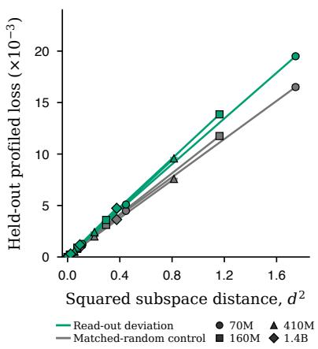

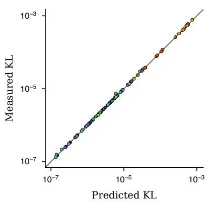  
Figure 1: Behaviour identifies the resolved read-out, and geometry predicts local output change. a, Behavioural identification: held-out predictive loss after re-optimising nuisance parameters grows linearly with the squared subspace distance between a perturbed read-out subspace and the resolved subspace (Pythia 70M–1.4B). Markers are the 40 model–condition–angle means and bars span the two independently calibrated held-out folds (smaller than the markers); paths connect angles within each model and condition. Green, read-out deviation; grey, matched-random control; circles, 70M; squares, 160M; triangles, 410M; diamonds, 1.4B. The local fits have $R ^ { 2 } \ge 0 . 9 9 9 9$ on all eight paths, and matched-random control directions have systematically smaller loss–distance slopes (slope ratios 1.14–1.27). The reference subspace is estimated from a stronger model (Supplementary Note 3). b, Predicted and measured output change under small activation perturbations. Each point is one model–depth–prompt combination, giving 99 measurements across 11 models, six families and quarter-, half- and three-quarter-depth injection. The prediction $\begin{array} { r } { \frac { 1 } { 2 } \delta h ^ { \top } G \delta h } \end{array}$ uses the metric before the intervention, without a fitted scale. Points show the coarsest resolved local steps; colour identifies the model and the grey line marks equality. The measured-to-predicted KL ratio has median 1.000 and range 0.948–1.224 (Methods; Supplementary Note 1).

$$
\begin{array} { r } { \mathrm { K L } ( p _ { h } \| p _ { h + \delta h } ) = \frac { 1 } { 2 } \delta h ^ { \top } G _ { h } \delta h + O \Big ( \| \delta h \| ^ { 3 } \Big ) . } \end{array}\tag{1}
$$

The location subscript is suppressed below. The quadratic form measures local output change and matches the realised divergence locally across 99 model–depth–objective cells spanning 11 models, six families and 125M–1.5B parameters (median ratio 1.000; Fig. 1b), so geometric length predicts behavioural change. For an objective gradient $q = \nabla _ { h } \phi$ , the damped natural-gradient step $\delta h \propto ( G + \alpha R ) ^ { - 1 } q ^ { 7 , 8 }$ is coordinate-covariant: transporting it across a seeded family of activation reparameterisations reproduces the native direction $\mathrm { t o } < 1 0 ^ { - 1 2 }$ , whereas resetting � to the identity changes it by order one (Extended Data Fig. 1a; Supplementary Note 1). The connection to training is exact: excess population cross-entropy equals the Kullback–Leibler divergence to a model-induced Gibbs law whose conditional curvature is this output Fisher metric. Next-token training therefore induces the geometry (Supplementary Note 2).

This geometry is also identifiable from behaviour alone: predictive behaviour singles out the language-defined read-out subspace at matched rank rather than a choice of hidden coordinates. Let � denote this resolved subspace, � a candidate subspace, $d ( S , T )$ their chordal distance (a standard measure of subspace separation), and $\mathcal { K } ( S )$ the profiled predictive risk after nuisance parameters have been optimised out. Under the stated finite-support and inverse-chart conditions, behavioural identification obeys the global quadratic margin

$$
{ \mathcal { K } } ( S ) \geq c d ^ { 2 } ( S , T ) .\tag{2}
$$

Here $c > 0$ is a certified lower bound on predictive cost per unit squared subspace displacement, determined by the reference law and context weights (Supplementary Note 3). Zero profiled risk therefore identifies the resolved subspace exactly at matched rank. More generally, finite-rank approximation and excess prediction error bound recovery at a square-root rate, so two accurate rank-matched models of the same language must converge on the same subspace (Supplementary Note 3). Held-out profiled loss grows quadratically with subspace distance across four model sizes $( R ^ { 2 } \ge 0 . 9 9 9 9$ on every path), with steeper growth for actual read-out deviations than for matched-random controls (Fig. 1a). The language law determines the learned geometry in a controlled intervention. Transformer, gated-recurrent and diagonal-recurrent models at two capacities were trained on each of eight pairs of synthetic languages with known conditional laws, identical token frequencies and conditional entropy. At matched predictive accuracy, changing the assigned law recovers more than 99% of the imposed squared geometric separation, whereas changing architecture within a law leaves the geometry nearly unchanged. The assigned law is also a closer geometric match than its counterfactual in all eight pairs (Supplementary Note 3). By contrast, an invertible reparameterisation of a hidden layer, compensated downstream, leaves every conditional law unchanged: behaviour identifies the resolved output geometry while activation geometry retains an exact GL(�) gauge freedom, the freedom to apply any invertible linear change of activation coordinates (Supplementary Note 3). The resolved output geometry is therefore invariant under behaviour-preserving reparameterisation.

## Independently trained models share the geometry

On a common outcome space, the convergence result in Supplementary Note 4 bounds relationalgeometry diferences by predictive error. Native-vocabulary agreement across tokenizers is tested empirically here. For a common battery of contexts, each model defines a matrix of Fisher–Rao distances among its next-token distributions, and models are compared by the Spearman correlation between the matrix upper triangles. This asks whether they order the same context pairs from near to far and needs no shared tokenizer, architecture or activation alignment (Methods). Across ten models spanning transformer, state-space and recurrent architectures, seven training pipelines, four tokenizers and 70 million to 7 billion parameters, the mean rank agreement on natural text is 0.88, against 0.62 for mid-layer and 0.61 for last-layer activation geometries, a gap whose bootstrap interval excludes zero (Fig. 2a). Under random anisotropic reparameterisations that leave behaviour unchanged, activation-based measures degrade steadily while output-geometry agreement is constant to machine precision (Extended Data Fig. 1c), and partialling out orthographic surface geometry or the strongest corpus �-gram predictor leaves at least 98% of the agreement in place (Supplementary Note 17). As a tokenizer-independent check, each next-token law was mapped to the distribution of the first byte of the remaining text. In this common outcome space, cross-tokenizer agreement is 0.91 and coarse-graining contracts the divergence on every pair, so the sharing is not an artefact of token-level bookkeeping (Extended Data Fig. 1b; Supplementary Note 4).

The agreement can also be accounted for quantitatively. Each distance-matrix entry changes at most in proportion to the root-probability distance $\| { \sqrt { p } } - { \sqrt { q } } \| _ { 2 }$ , so excess risk forces relational convergence at a proved rate (Supplementary Note 4). On same-tokenizer pairs the resulting datadependent certificate gives lower bounds of 0.61–0.67 against observed 0.76–0.83: the models disagree substantially per context (median root-probability distance 0.30–0.71), but the disagreement directions are nearly orthogonal to the relational structure (coherence ≈ 0.03; Supplementary Table 1). With a fixed reference geometry, agreement decomposes into six variance and covariance terms: one reference, two residual, two reference–residual and one residual cross-term. This identity reconstructs every measured configuration to numerical precision (112 model-pair configurations). Fitted on one half of the contexts, its exchangeable restriction predicts held-out agreement with pooled median absolute error 0.009 across the 96 defined cells. From step 256, predictions are defined for every cell and checkpoint-median errors are below 0.014 (Fig. 2b; Supplementary Note 4).

The shared component carries semantic alignment and category transfer. Averaging rank-transformed distance matrices gives a cross-model consensus, and each model’s deviation from it is its residual. Consensus geometry aligns with an independent sentence-encoder semantic geometry on every battery; the alignment rises to 0.44 when the next token answers a factual relation and survives a surface control at +0.23, whereas residual alignment is indistinguishable from zero on the natural and templated batteries and small (+0.05) on the semantic battery (Supplementary Note 5)31. Separately, the mean cosine-distance geometry of last-token, last-hidden-state representations from two language models aligns with the representational geometry of a vision model trained without language (rank agreement 0.39, permutation $P \ < \ 0 . 0 0 1 )$ ), with 84% of the association retained after controlling for textual co-occurrence 32. A linear semantic probe trained on one model transfers across models with eight-way accuracy of 0.66 (0.70 through the consensus geometry alone), close to the within-model 0.72 and far above the 0.125 chance level, whereas transfer through the residual is below chance (Supplementary Notes 5 and 19). What is shared beyond the distributions themselves is narrow: against a displacementmagnitude-matched null, residual eigenvector sharing between families is about 9% of the raw overlap and is concentrated in the leading modes (Extended Data Fig. 2); the residual is also graded by training lineage (Supplementary Note 18).

The comparison extends to human predictions. On 512 sentence contexts with human completion norms33 , semantic distributions estimated from native model samples become closer to human completions with model scale: mean squared distance falls from about 0.34 at 70M to 0.30 at 2.8B parameters (Fig. 2c). Reliability-corrected alignment of the relational semantic geometry is about 0.82– 0.85 across the six sizes (Methods). Predictive fit also accounts for human alignment across architectures and training. On a separate 384-context battery, with model laws conditioned on human-observed completion events, a risk-to-alignment relation fitted on Pythia sizes and checkpoints predicts OLMo checkpoints and five external models without refitting, with correlation 0.76 and root-mean-square error 0.029 (Fig. 2d).

A separate corpus of 1,726 human next-word predictions provides a direct test in the output probability geometry34. After mapping model and human laws to the same 65 outcomes, model-derived leading directions recover human directional structure above a random subspace control. Simultaneous lower bounds are positive in six of seven model families, with alignment retained across disjoint participant groups (Supplementary Note 19). These comparisons connect shared model geometry to human predictive structure.

The native scale trend replicated on independent data from 640 word positions in five previously unused narratives (64,000 responses)35. Across six Pythia sizes, semantic distance fell with log parameter count (slope −0.00872, 95% interval $- 0 . 0 1 2 0 2 \mathrm { t o } - 0 . 0 0 5 5 6 )$ , and it also fell from the initial to final checkpoint in both Pythia and OLMo (Extended Data Fig. 2b,c). A calibration learned only from model probability laws, and fixed before the new human responses, improved expected human log score for the complete 65-outcome coarse distribution in six of seven model families (gains 0.0196–0.0507 nats; Qwen2, −0.0030 nats; Extended Data Fig. 2d). Shared model-law structure therefore supports out-of-corpus prediction as well as directional alignment.

## The geometry inherits the statistics of language

In the standardised centred read-out representation, output-Fisher eigenvalues rank directions by local output efect, and damping defines the efective dimension, a soft count of resolved modes. Let $u _ { a }$ be token �’s centred, orthonormalised read-out row after removing common-logit shifts (Methods), with $\begin{array} { r } { \bar { u } = \sum _ { a } p _ { a } u _ { a } } \end{array}$ . The profile $q _ { a } = p _ { a } \| u _ { a } - \bar { u } \| ^ { 2 }$ weights probability by squared distance from this centre; $q _ { ( k ) }$ lists these values in descending order. Setting $\widehat { \lambda } _ { k } = q _ { ( k ) }$ gives a prediction of efective dimension without fitted parameters:

$$
\widehat { N } _ { \mathrm { e f f } } ( \alpha ) = \sum _ { k = 1 } ^ { r } \frac { q _ { ( k ) } } { q _ { ( k ) } + \alpha } .\tag{3}
$$

Here � is the read-out rank, and each term contributes between zero and one according to whether its mode is resolved at scale $\alpha .$ Replacing $q _ { ( k ) }$ with the measured eigenvalues gives the identity $\begin{array} { r } { N _ { \mathrm { e f f } } ( \alpha ) = \sum _ { k } \lambda _ { k } / ( \lambda _ { k } + \alpha ) } \end{array}$ . An inheritance theorem bounds each leading measured eigenvalue above and below by the corresponding profile value, up to explicit frame and tail constants. A more robust fractional-frame form requires only that a fixed fraction of the leading direction-Gram modes remain above a declared threshold, yielding a rank-shifted lower bound and a direction-free tail upper bound (Methods; Supplementary Note 6). Output-Fisher eigenvalues fall approximately inversely with rank, $\lambda _ { i } \sim i ^ { - \beta }$ with $\beta \approx 1$ , over the rank-2–80 core window from 70M to 6.9B parameters and across families and vocabularies (Supplementary Note 6). In the matched external-family panel, rank-8–32 exponents remain of order one across all nine models from 125M to 1.5B parameters (Supplementary Note 6), while the fitted exponent tracks that of the model’s own weighted token profile (median deviation 0.04, $r = 0 . 9 1$ ; Supplementary Note $6 ) ^ { 3 6 , 3 7 }$ . In synthetic controls, weakly aligned token directions inherit the profile exponent, whereas strongly aligned low-rank token directions decouple from it. On the measured battery, high-probability outcomes require singleton or near-singleton resolution, whereas the remaining probability mass forms interchangeable clusters with exact information budgets (Supplementary Note 6).

The weighted profile also predicts held-out spectra without an eigendecomposition. On the held-out battery in all five external families, the profile prediction reproduces the spectral profile and efectivedimension curve and outperforms a same-trace flat spectrum and its efective-dimension curve, as well as a rank-shufled profile, in every family. It was fixed before exact spectra were revealed for a disjoint 64-context battery in each of nine models from five external families—BLOOM, GPT-Neo, Mamba, Qwen2 and RWKV. Over ranks 8–32 it predicts the held-out eigenvalues with family-median errors of 0.0617–0.0884 decades, typical multiplicative deviations of 1.15–1.23-fold, and spectralexponent errors of 0.0623–0.0856. Applying the resolution transform directly to the same fixed profile predicts the complete normalised $N _ { \mathrm { e f f } }$ curve with family-median RMSEs of 0.0270–0.0521 (Fig. 3a,b; Supplementary Table 2 and Supplementary Fig. 1). On matched controls, spectral error is 4.89–9.22-fold lower than for a same-trace flat spectrum and 13.55–25.63-fold lower than after shufling profile ranks; efective-dimension error is 6.44–7.88-fold lower than for the efective-dimension curve induced by the

Pythia 70M Pythia 410M Pythia 1.4B BLOOM 560M GPT-Neo 1.3B OLMo checkpoints Pythia 160M Pythia 1B Pythia 2.8B GPT-2 Large Mamba 130M Qwen2 1.5B

d  
b  
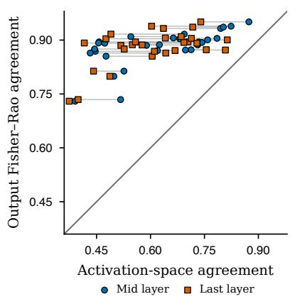

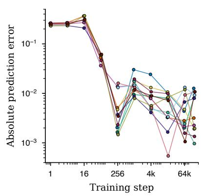

c  
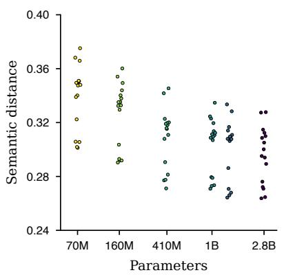

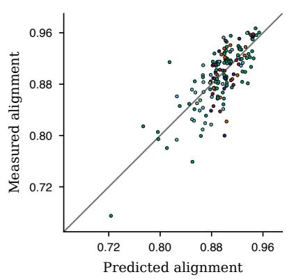

Figure 2: Predictive geometry is shared across models and approaches human completion structure. a, Output Fisher–Rao agreement against activation-space agreement on natural text for all 29 cross-tokenizer, cross-family dyads among ten models (70M–7B; transformer, state-space and recurrent). Each dyad contributes a blue mid-layer circle and vermilion last-layer square joined by a horizontal line; the grey line is equality. The output relation is stronger than either activation relation for every displayed mark. b, Absolute held-out error of the exchangeable six-scalar prediction across ten public training checkpoints. Circles show all 96 defined predictions; colours distinguish individual comparisons and lines follow them across training. Six predictions are defined per checkpoint at steps 1–64 and twelve from step 256; estimator definitions and early-checkpoint coverage are given in Supplementary Note 4. c, Native model samples approach human completions with scale. Points show all 96 context-fold means, 16 at each Pythia size; colours identify models in panels c and d. The ordinate is squared distance between semantic kernel means, cross-fitted over participant and model-sample halves (512 contexts, 32 samples per context; eight-token generation limit). No human-answer restriction is applied to sampling. d, A relation between conditional prediction risk and human semantic alignment fitted on Pythia is applied without refitting to five OLMo checkpoints and five external models. Points show all 160 model–context-fold comparisons; checkpoints and folds are repeated measurements. Alignment is reliability-corrected kernel CKA on a separate 384-context battery, using model laws conditional on the observed completion events. The grey line is equality; correlation 0.758, root-mean-square error 0.0295.

same-trace flat spectrum. Exact inheritance certificates apply in 98.4–100% of external-family cells (Methods; Supplementary Note 6).

Probability concentration and read-out geometry make distinct contributions to the spectrum. In a matched comparison of 14 models from seven families on 192 fresh contexts, a probability-only profile predicts efective dimension more accurately than the weighted profile in every family (Fig. 3c). The weighted profile, which includes the learned read-out directions, predicts the spectral exponent more accurately in every family (Fig. 3d). Thus the concentration of probability captures the number of resolved modes, while read-out structure improves prediction of how their strengths decay. This comparison uses a common outcome representation; the native-vocabulary prediction in panels a and b provides the complementary across-vocabulary test (Methods; Supplementary Note 6).

Across the external families, the token profile alone predicts efective dimension without fitted parameters. In a separate finite-size confirmation, a bounded efective-dimension curve fitted at four anchor dampings was evaluated on 240 interleaved held-out values and outperformed an equal-parameter unbroken power curve on every one of 80 curves (Extended Data Fig. 3c,d). Median held-out error was 0.00493 for the bounded curve and 0.0814 for the power curve. The fixed-relative-damping conjugate-gradient bound is documented in Supplementary Note 11.

## Corpus n-gram statistics predict acquisition, and evidence depth shifts its timing

Corpus �-gram margins separately predict acquisition timing (Fig. 4). We measure acquisition time on a logarithmic scale, $\tau = \log _ { 2 } t$ , where � is the first step after which the designated answer’s log-probability advantage over its paired alternative remains above a fixed threshold.

Measured before training at unigram, bigram and trigram levels, these margins predict, without refitting, the complete trajectories of fresh facts disjoint from calibration at all three tested model sizes: trajectory $R ^ { 2 } = 0 . 7 7 5  – 0 . 7 9 2$ , acquisition-status agreement 0.792–0.854, and continuous timing error of $0 . 7 7 { - } 0 . 9 6 $ log training-step units, outperforming constant acquisition-time and label-permutation baselines (Fig. 4a). Evidence depth causally delays acquisition. In a controlled synthetic language in which otherwise identical facts are randomly assigned to shallow or deep evidence constructions with paired initial weights and batch streams, no statistic below the assigned depth distinguishes the two answers; the complete deciding margin appears at and above that depth. Across the analysed 10th–20th percentiles, acquisition-time quantiles under deep evidence were approximately 4.3 times the corresponding quantiles under shallow evidence, a near-uniform shift of 2.10 in $\log _ { 2 }$ training steps. This shift was stable under leave-one-seed-out analysis (Extended Data Fig. 4a; Supplementary Note 7). The paired randomisation identifies the causal efect. Depth therefore delays persistent preference for the designated answer, but not the earlier onset of unsigned movement along the same target–alternative margin direction (Supplementary Note 7). Conditional analyses of acquisition-time variation and of smooth geometric motion are given in Supplementary Notes 8 and 9, respectively. The causal direction generalises beyond that construction. In a fully crossed randomised study of GPT-2-, GPT-NeoX- and Llama-style decoders and two independent controlled languages, placing otherwise matched evidence in the deeper construction delayed persistent acquisition in every cell by $0 . 8 1 \mathrm { - } 1 . 5 1 \log _ { 2 }$ training-step units, equivalent to 1.75–2.86-fold more training steps. All six 95% intervals excluded zero, whereas all 12 fixed-treatment and label-randomisation control intervals contained zero (Extended Data Fig. 4b,c; Supplementary Note 7). Evidence depth therefore delays acquisition across architectures; evidence construction modulates the magnitude on average.

The cumulative number of acquired facts is shown across Pythia 70M, 160M and 410M against both training-step and held-out-loss coordinates (Fig. 4b,c). In the quantified 70M-to-160M comparison, aligning the cumulative curves by held-out loss gives a median absolute error of 2.1 facts out of 300, about three times lower than alignment by training step.

The n-gram predictor was independently applied without refitting to the fresh 300-fact battery across

d  
c  
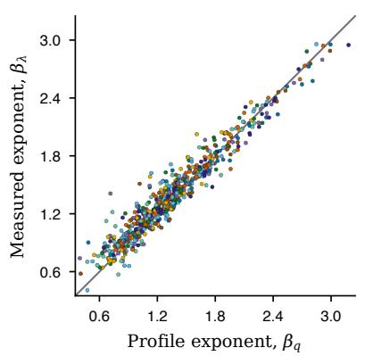

b  
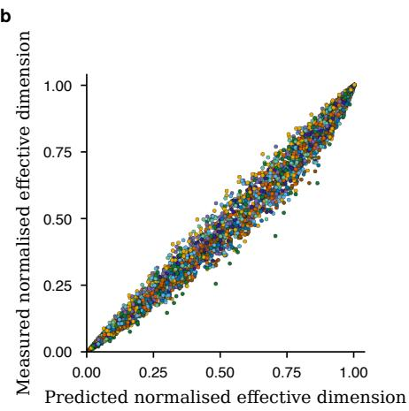

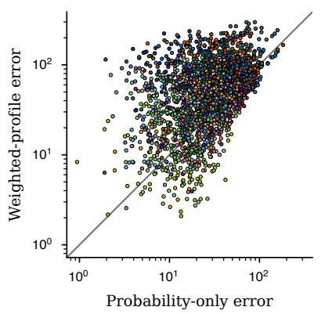

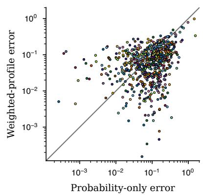  
Figure 3: Language statistics shape the spectrum and its efective dimension. a, Profile-predicted against measured spectral exponent over ranks 8–32 for all 576 held-out model–context cells (nine models from five external families, 64 contexts per model). Small circles show every cell and the grey line is exact prediction. Colours identify models throughout the figure. The Pearson and Spearman correlations are 0.968 and 0.955; family-median absolute exponent errors are 0.0623–0.0856. On a matched 16-context-per-model control battery, spectral errors are 4.89–9.22-fold lower than for a same-trace flat spectrum and 13.55–25.63-fold lower than after shufling profile ranks. b, Prediction of efective dimension without fitted parameters, the number of modes resolved at a given damping, from token statistics. Small circles show all $5 { , } 7 6 0$ model–context–resolution values from the same 576 cells, coloured by model; the grey diagonal is exact prediction. No measured eigenvalue or fitted parameter enters the prediction. Family-median efective-dimension RMSEs are 0.0270–0.0521, 6.44–7.88-fold lower than for the same-trace flat-spectrum prediction. c, Efective-dimension prediction in a matched 14-model, seven-family comparison on 192 fresh contexts per model. All 2,688 points compare the weighted-profile and probability-only prediction errors on the same context, measured as efective-dimension RMSE across damping levels. The probability-only profile $\widehat { \lambda } _ { k } = ( r / V ) p _ { ( k ) }$ has lower family-median error in all seven families. d, All 672 paired spectral-exponent errors on the 48-context exact-spectrum subset per model; the weighted profile has lower family-median error in all seven families. Both panels use logarithmic axes, a common 27,450-outcome representation and the same standardised read-out; the grey diagonal marks equal error. Inference gives equal weight to families. Exact one-sided family sign-flip $P = 1 / 1 2 8$ for each contrast (Supplementary Note 6).

9 seeds and 20 checkpoints at 70M, 160M and 410M (Supplementary Note 7).

a  
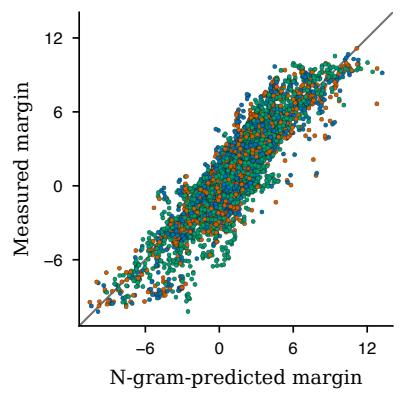

b  
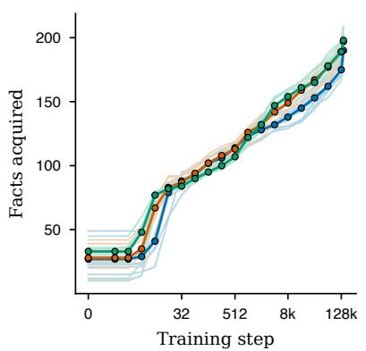

c  
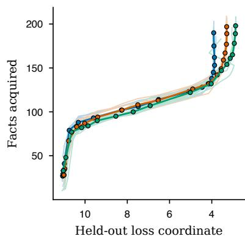  
Pythia 70M Pythia 160M Pythia 410M

Figure 4: Corpus statistics predict acquisition across model sizes. a, Ex-ante corpus n-gram margins predict subsequent margins without refitting for fresh facts disjoint from calibration at Pythia 70M, 160M and 410M. Points are all 9,840 fact–checkpoint means over 15 checkpoints: 5,340 from 178 defined facts at 70M and 160M (ten runs) and 4,500 from 300 facts at 410M (nine runs); the shared model-colour key below the panels distinguishes Pythia 70M, 160M and 410M; the grey diagonal is exact prediction. Trajectory $R ^ { 2 } { \mathrm { ~ i s ~ } } 0 . 7 9 0 , 0 . 7 9 2$ and 0.775, persistent-status agreement is 0.792, 0.854 and 0.807, and continuous timing error is $0 . 7 7 , 0 . 9 5$ and $0 . 9 6 \log _ { 2 }$ training-step units, respectively. All three timing errors outperform their constant acquisition-time and label-permutation baselines. b, Cumulative acquisition curves for the same 300 facts against training step at 70M, 160M and 410M. Thin curves are individual seeds and heavy curves with circular markers are medians over nine seeds for each model size, using the shared model colours. c, The same curves against held-out loss. In the descriptive 70M-to-160M comparison, alignment by held-out loss has a median absolute error of 2.1 facts.

## The geometry determines minimum-disturbance interventions and their relative cost

The same geometry determines how to change behaviour at minimum cost, and quantifies in advance the penalty for ignoring it. Let $A = G + \alpha R \succ 0 .$ , with damping � and reference metric �. For objective gradient $q \neq 0$ and target change $q ^ { \top } \delta = b$ , the unique minimum-disturbance step is $\delta ^ { \star } =$ $b A ^ { - 1 } q / ( q ^ { \top } A ^ { - 1 } q )$ , attaining the minimum regularised cost $\begin{array} { r } { C _ { A , \mathrm { m i n } } ( b ) = \frac { 1 } { 2 } \delta ^ { \star \top } A \delta ^ { \star } = b ^ { 2 } / ( 2 q ^ { \top } A ^ { - 1 } q ) } \end{array}$ Every other feasible step incurs an excess regularised cost equal to half its squared �-distance from this optimum (Supplementary Note 10). To predict the realised output disturbance at finite damping, define the �-cost per unit squared objective change as $\Pi _ { G } ( u ) = ( u ^ { \top } G u ) / ( q ^ { \top } u ) ^ { 2 }$ ; smaller values mean less predicted local output change for the same target efect. For the coordinate-Euclidean comparator used here $( R = I )$ , the prediction without fitted parameters is

$$
R _ { \mathrm { p r e d } } ( q ) = \frac { \Pi _ { G } ( q ) } { \Pi _ { G } ( A ^ { - 1 } q ) } .\tag{4}
$$

This finite-damping cost ratio was fixed before intervention; the idealised ratio in the full regularised metric is analysed in Supplementary Note 10.

The cost ratio is predicted without fitted parameters. Across 11 models from six architecture families, three steering objectives and three relative layer depths, the finite-damping ratio computed before intervention tracks 3,515 usable matched-response measurements from 1,188 cells (98.6% coverage; median measured-to-predicted ratio 0.967, 95% interval 0.957–0.975; log–log slope 0.982, 95% interval 0.966–0.997; Fig. 5a). The advantage persists along finite intervention paths. Recomputing both Fisher and Euclidean directions after each accepted step reaches four matched objective changes across 216 prompts and 18 model–objective cells. The Fisher paths accumulate about 11–127 times less local KL than their Euclidean counterparts, with positive paired intervals in every cell and target (Fig. 5b; Supplementary Note 10).

The metric also supports interventions that can be reused across prompts. A shared activation update is learned from four donor prompts per objective, using the Fisher metric averaged over four reference prompts to limit disturbance. The resulting update is then applied to eight unseen target prompts without computing target gradients. Across BLOOM-560M, Pythia-410M, Pythia-1.4B and Qwen2-1.5B, it transfers a positive mean truth-preference or anti-sycophancy change in all 24 model–objective–target settings (Fig. 5d). At matched donor changes, the reference metric reduces sequence KL on reference continuations by about 3–6 times relative to Euclidean control and by at least 2 times relative to a donor-only Fisher metric (Fig. 5c). A joint solve also transfers both objectives with lower reference-sequence cost in all four models (Supplementary Note 10).

Prompt-specific control extends to instruction-tuned models: at equal aggregate mean objective change, natural-gradient frontiers have 8–74 times lower of-target divergence for anti-sycophancy, 30–190 times for capital-city truth preferences and 4–550 times for style (Supplementary Note 14; Extended Data Fig. 5a). Several objectives combine through their weighted gradient sum, with lower of-target cost across the measured composition frontier (Extended Data Fig. 5b).

BLOOM 560M GPT-Neo 125M Pythia 70M Pythia 1B Qwen2 0.5B Qwen2 1.5B Instruct GPT-2 GPT-Neo 1.3B Pythia 160M Pythia 1.4B Qwen2 1.5B Qwen1.5 1.8B Chat GPT-2 Large Mamba 130M Pythia 410M Pythia 2.8B

b  
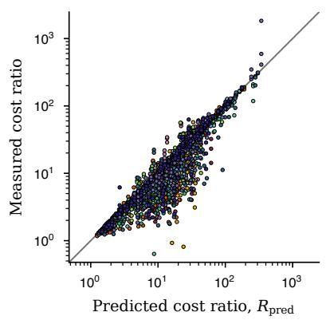

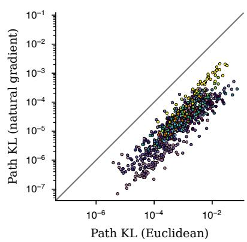

c  
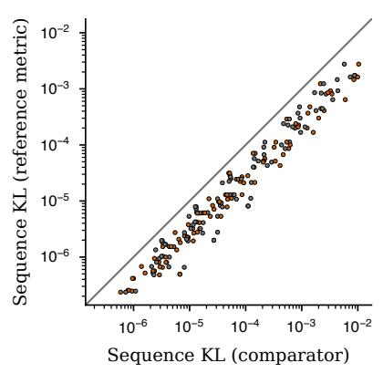

d  
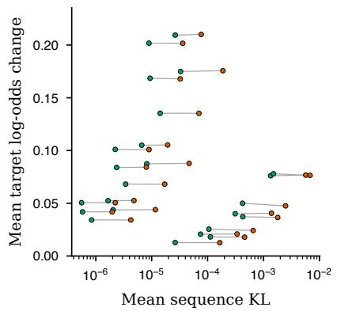  
Natural gradient Euclidean Donor Fisher

Figure 5: The geometry predicts intervention cost and supports reusable control. a, At matched behaviour change, the measured ratio of of-target output divergence for Euclidean versus damped natural-gradient updates is compared with the finite-damping prediction $R _ { \mathrm { p r e d } }$ , which has no fitted parameters and is computed before intervention. The axes are logarithmic and the grey identity line denotes perfect agreement. Small circles show all 3,515 usable matched-response observations (of 3,564) from 1,188 model–objective–layer–context cells: 11 models, six families, three objectives, three relative layer depths and 12 contexts per objective, each measured at three intervention magnitudes (98.6% coverage; median measured-to-predicted ratio 0.967, 95% interval 0.957–0.975; log–log slope 0.982, 95% interval 0.966–0.997). b, Finite paths with both methods relinearised after every accepted step. All 864 points compare Euclidean and Fisher cumulative local KL at matched target changes, from 216 prompts, 16 models and 18 model–objective cells. The metric sums KL between successive accepted outputs. The 72 cell–target geometric-mean cost ratios span 11.5–127.1, with every paired 95% interval above one. Colours identify models in panels a and b. c, Reusable control on four base models from three families. All 192 points compare reference-Fisher sequence KL with Euclidean (vermilion) or donor-only Fisher (grey) sequence KL for the same reference continuation and matched donor change, across two objectives and three target changes. Each setting contributes four reference continuations per comparator. Reference sequences are teacher-forced continuations of the four prompts used to construct the reference metric. Ratios of mean Euclidean/reference-Fisher sequence KL span 2.90–6.29. d, The same updates change unseen target prompts without target gradients. Each point shows mean sequence KL over four reference continuations and mean target log-odds change (nats) over eight unseen prompts, for one model, objective, donor change and method (48 points). Green, natural gradient using the reference metric; vermilion, Euclidean. Grey segments join matched donor changes. All 24 natural-gradient mean target changes are positive. Grey diagonals in panels b and c mark equality.

## One geometric correction spans model operations

A single correction, replacing the Euclidean inner product with the pullback metric of the relevant output map, improves every matched endpoint in Table 1. Its prediction without fitted parameters generalises across the 11-model, six-family panel in Fig. 5a, and the reference metric supports reusable control across unseen prompts. Applied to a single fact, the steer becomes a training-free editor: on 30 held-out CounterFact records (GPT-2), with each edit solved once and reused through a shared prompt-selection rule, the pullback-metric edit had 10.57-fold lower geometric-mean other-token divergence than its matched Euclidean counterpart (95% interval 8.52–13.37); both operators attained the fixed +5 log-odds calibration shift on all 30 edits (Extended Data Fig. 5c). Separate GPT-2-XL evaluations cover 100 edits under standard metrics and 300 under a stricter probability-margin criterion (Supplementary Table 3; Supplementary Note 13). For interpretability, Fisher-weighted output sensitivity $\nu ^ { \top } G \nu$ measures the output change caused by a feature direction; activation magnitude measures how strongly it activates. Across 303 zero ablations of sparse-autoencoder (SAE) features at Pythia-410M, each setting one active feature to $\tt z e r o ^ { 3 8 - 4 0 }$ , the intervention-specific Fisher cost rank-correlated with the exact divergence at $\rho = 0 . 9 9 7$ , against 0.896 for activation magnitude. The objective-efect-to-Fisher-cost ratio, the squared linear objective efect per unit Fisher cost, predicted the selected-token probability-change fraction at 0.935 against 0.506 for attribution patching41, which remains the better predictor of raw efect magnitude (Extended Data Fig. 6; Supplementary Note 15).

The correction carries over to training. The code-Gram metric, the second moment of sparse feature activations, increases Hungarian-matched mean absolute decoder–ground-truth cosine from 0.167 to 0.480 (+0.313) when used to precondition a sparse-autoencoder decoder at 410M with plantedsignal/background-RMS ratio $\beta = 0 . 5$ (Supplementary Note 16). At the same scale, natural-gradient low-rank adaptation produces 60–250-fold less of-target change than Adam at matched on-target change. In a separate held-out comparison at 70M, it improves the preservation-KL frontier 1.57-fold relative to tuned AdamW with explicit KL regularisation (Extended Data Fig. 7; Supplementary Note 11).

The size of the available correction is itself set by the geometry. The advantage is largest at early-to-mid injection layers, where the metric pulled back through the rest of the network is most anisotropic, and shrinks toward the near-linear read-out (Extended Data Fig. 8a). It vanishes in the isotropic limit, where the natural-gradient and Euclidean steps coincide. Across the same 11-model panel, every measured-to-predicted path decreases over the three declared intervention fractions; the model-balanced geometric means are 0.918, 0.860 and 0.755 (Extended Data Fig. 8b). This quantifies attenuation of the local prediction as intervention magnitude grows; Supplementary Note 10 analyses the finite-magnitude correction to cubic order. Output sensitivity, residual cross-model sharing and answer-associated probability motion concentrate in the same leading spectral modes (Extended Data Fig. 9), and cyclic concepts trace nearly closed rotations, whereas analogy relations instead share a probability-displacement direction (Extended Data Fig. 10).

Table 1: One correction spans the evaluated operations. The result column reports the strongest reported matched comparison for each operation; the final column gives its evidence base. Intervals are 95% bootstrap intervals. AUC, area under the curve; KL, Kullback–Leibler; LoRA, low-rank adaptation. Sources and protocols are given in Methods.
<table><tr><td>Operation</td><td>Geometry-aware construction</td><td>Principal result</td><td>Evidence base</td></tr><tr><td>Steering (non-local)</td><td>per-prompt natural gradient (G+αI)−1q</td><td>prediction without fitted parameters tracks the realised advantage across 11 models (median measured/predicted 0.967, 95% interval 0.957–0.975; slope 0.982, 95% interval 0.966–0.997); up to 72.7-fold lower off-target KL on factual</td><td>3,515 usable observations from 1,188 cells; 11 models, six families, three objectives and three relative depths; six-size Pythia factual sweep and two instruction-tuned Qwen frontiers</td></tr><tr><td>Knowledge editing</td><td>fixed Fisher edit with a shared gating rule</td><td>wins geometric-mean Euclidean/Fisher other-token KL ratio 10.57 (interval 8.52–13.37); fixed +5 log-odds shift on 30/30 edits</td><td>GPT-2, 30 held-out matched CounterFact edits; supporting GPT-2-XL evaluations on 100 standard-metric and 300</td></tr><tr><td>Feature importance</td><td>intervention-specific Fisher cost ∆hG∆h</td><td>ρ = 0.997 with exact feature-ablation KL, versus 0.896 for activation magnitude</td><td>probability-margin edits Pythia-410M; 57 evaluation-active features from a layer-12 Top-k sparse autoencoder; 18 held-out context</td></tr><tr><td>Attribution</td><td>objective-effect-to-Fisher- selected-token probability-change cost ratio</td><td>fraction ρ = 0.935 versus 0.506 for attribution patching; sign agreement 0.746 versus 0.354</td><td>clusters and 303 interventions same 303-intervention Pythia-410M feature-ablation evaluation; selected-token probability-change-fraction and</td></tr><tr><td>Dictionary learning</td><td>code-Gram natural gradient for the decoder</td><td>matched absolute-cosine recovery increases 0.167 → 0.480 (+0.313); 3/3 seeds</td><td>sign-agreement endpoints planted-feature recovery on real Pythia-410M activations at planted-signal/background-RMS</td></tr><tr><td>Fine-tuning</td><td>exact natural-gradient LoRA</td><td>tuned AdamW+KL incurs 1.57× the preservation-KL frontier AUC (interval 1.14–1.98); 60–250-fold lower off-target prompts; supporting 410M change than Adam at 410M</td><td>ratio β = 0.5; three paired seeds held-out 70M rank-4 frontier: three target gains, 8 seeds and 16</td></tr></table>

## Discussion

Next-token training induces a canonical output geometry. Predictive behaviour identifies the languagedetermined read-out subspace up to transformations that leave outputs unchanged; this predicts convergence of independently trained models estimating the same language. Controlled language assignment supports this origin: changing the law changes the learned geometry, while diferent architectures fitted to the same law recover nearly identical geometry. Activation-space convergence measures, by contrast, must tolerate arbitrary reparameterisations. Among those evaluated here, agreement is higher in output geometry and reparameterisation-invariant; it remains high after permutation-null calibration for scale-dependent baselines42.

Their measured agreement is reconstructed exactly from six variance and covariance terms, and its shared component carries the measured semantic alignment. A semantic-category probe transfers across models, and the comparison extends to human predictions. Models with lower prediction error agree more closely with human word choices across families. On independent data, agreement also increases with scale and training, while a calibration learned only from model laws improves predictions across the full coarse distribution of human word choices. Direct probability-space comparisons on a separate human corpus also recover leading directional structure. These completion-distribution comparisons complement work on the finite resolution of human cloze estimates and the semantic distinctions captured by model probabilities43.

Token statistics predict the spectrum and its efective dimension, the number of modes resolved at a given damping, without fitted parameters. The matched mechanism comparison separates two contributions: probability concentration captures efective dimension, while the weighted read-out profile improves prediction of spectral shape across all seven families. At fixed relative damping and solver tolerance, the damped natural-gradient solve has a proved worst-case conjugate-gradient iteration bound independent of model width; at $c = 1 0 ^ { - 2 }$ and Euclidean relative residual $1 0 ^ { - 6 }$ , the exact-arithmetic bound is 85 iterations.

Separately, corpus n-gram evidence measured before training predicts individual-fact acquisition with median absolute errors of 0.77–0.96 on the log training-step scale at all three sizes. In the controlled languages, randomised evidence depth causally delays acquisition.

The same geometry prescribes minimum-disturbance control whose advantage is predicted in advance by a measured anisotropy ratio. This advantage persists along relinearised finite paths and extends to updates reused across prompts. Its recurrence across comparison, steering, editing, feature analysis and training shows that the correction is not confined to a single evaluated operation. Supplementary Table 4 maps these claims to their analytical, observational and interventional evidence.

Alignment systems face two separate questions: what behaviour should change, and how to make that change without unnecessarily disturbing the model elsewhere. Human preferences, constitutions, reward or cost models and other forms of oversight must answer the first question. The output geometry addresses the second. Given a preference covector and a desired first-order change, the regularised Fisher pullback gives the activation change with minimum local output disturbance. It can therefore turn an externally supplied preference into an intervention, complementing existing representation-level methods for inference-time alignment15,16,18. On instruction-tuned models, the construction improves the aggregate trade-of between objective change and of-target change for anti-sycophancy, capital-city truth preferences and writing style. Averaging the metric over a reference prompt set extends this construction to reusable control. Updates learned from four donor prompts transfer to eight unseen prompts per objective in four base models, while reducing reference-sequence change by about threeto sixfold relative to Euclidean control at matched donor efects. The solve is performed on donors and reference prompts; the resulting activation update is applied to each target without computing its gradient. Several objectives also combine in one solve, allowing their balance to be set through externally supplied weights.

The same idea may be useful during post-training. Rather than keeping an update close to the original model in parameter or activation space, the reference-set construction could be applied in parameter space to limit changes to the model’s predictions on protected prompts. This would give preference fine-tuning and model customisation a behaviour-level trust region. The held-out LoRA comparison provides an initial local-preservation result in this direction, although it does not establish safety-specific retention or broader capability preservation.

Mechanistic interpretability has a related measurement problem. A feature can activate strongly or admit a clear verbal description without playing an important role in the model’s output. Conversely, an intervention can change a chosen target only by disrupting many other predictions. Fisher-weighted output sensitivity measures the predicted local output consequence of a specified feature intervention, while the objective-efect-to-Fisher-cost ratio measures its squared linear efect on a chosen objective per unit Fisher cost. In the sparse-feature experiments, these quantities accurately predicted both the output cost of removing a feature and the selectivity of its efect. They could therefore help prioritise candidate features and circuits in audits of sycophancy, deception, refusal and other safety-relevant behaviours, and help choose interventions with a limited behavioural footprint. End-to-end sparse dictionary learning already prioritises functional importance by minimising the KL divergence between original and reconstructed model outputs 44. The present sensitivity measurements motivate investigating local geometric weighting for sparse dictionaries and replacement models, so that limited explanatory capacity is spent on distinctions that matter to the model’s behaviour. These uses would complement semantic labelling and causal attribution: the metric measures the functional consequence of a proposed feature, but does not by itself explain what that feature represents.

The comparison results suggest a further use in model auditing. Because relational output geometry does not require corresponding hidden coordinates, architectures or tokenizers, a fixed battery of prompts and anchors could be used to compare successive checkpoints, post-training variants and independently developed models. The consensus–residual decomposition could then separate widely shared structure from model-specific deviations. The acquisition results could likewise help place costly evaluations near the predicted learning transitions of target facts or associations, while routed geometric edits could provide modular factual corrections with a controlled output footprint. Together, these applications suggest a role for output geometry throughout the model lifecycle: anticipating behavioural change during training, auditing it across models, interpreting its internal causes and controlling it when intervention is needed.

The same information-geometric principles have a direct analogue in quantum computing: on pure quantum states, the Fubini–Study metric is, up to a constant, the Fisher–Rao metric naturally induced by optimal quantum measurements45. Its pullback underlies quantum natural-gradient optimisation and variational dynamics, including in the author’s recent work46.

Across the models and operations tested here, predictive behaviour identifies a canonical output geometry shared across models and related to human predictions. Token statistics shape its resolved structure, corpus n-gram evidence predicts when individual facts are acquired, and the metric supplies calibrated control that can be reused across prompts.

## Methods

## Models, datasets and geometric definitions

Models and data. Pretrained-model analyses use public checkpoints; causal language-assignment and acquisition experiments train controlled synthetic systems. The language-model ladder is the Pythia suite 47 (70M–6.9B). Alignment-objective experiments use Qwen2-1.5B-Instruct 48, replicated on Qwen1.5-1.8B-Chat49, and knowledge editing uses GPT-2 and GPT-2-XL50. The spectral analysis of the steering dimension additionally spans GPT-2, GPT-2-XL, Qwen2-1.5B and BLOOM-1b151, whose vocabularies reach ∼250k tokens. The cross-model and dense-response batteries additionally include GPT-Neo, Mistral-7B, Mamba, RWKV and StarCoder2 checkpoints52–56. Unless stated otherwise, interventions act on the residual stream at a middle layer, � = round(0.45×depth) (Qwen2-1.5B-Instruct uses layer 14); the feature-importance analyses use layer 12 of Pythia-410M.

Layer-dependence is reported in Extended Data. Objectives and concepts are: morphological and sentiment (SST-257) contrasts; factual capital-city true/false preference pairs; a cyclic registry (weekdays, months); sycophancy, truthfulness (TruthfulQA58 and capital-city true/false pairs) and writing style in experiments on instruction-tuned models; and CounterFact59 for knowledge editing. The feature-importance analyses use a trained Top-� sparse autoencoder38 (tim-lawson/ sae-pythia-410m-deduped-x64-k32-layers-12; residual-stream Top-�, �=32, layer 12), which retains the � largest feature activations per token.

Output metric and pullback. Write the next-token distribution as $p = \mathrm { s o f t m a x } ( W _ { U } h _ { L } + b _ { U } )$ , where $h _ { L } \in \mathbb { R } ^ { d }$ is the final pre-unembedding activation and $W _ { U } \in \mathbb { R } ^ { | V | \times d }$ is the unembedding over a vocabulary of size |�|. Denote the rows of $W _ { U }$ by $w _ { a }$ . Pulling the Fisher–Rao metric of $p$ back to $h _ { L }$ through the softmax gives the output Fisher $H = \mathrm { C o v } _ { p } ( w ) = W _ { { \cal U } } ^ { \top } ( \mathrm { d i a g } ( p ) - p p ^ { \top } ) W _ { { \cal U } }$ . For an intervention on an activation ℎ at layer ℓ, let $J = \partial h _ { L } / \partial h$ be the (fixed-context) Jacobian of the network from ℓ to the

read-out; the (possibly degenerate) pullback Fisher metric is $G = J ^ { \top } H J ,$ , reducing to � at the final layer.   
� is the second-order model of output change, KL $\begin{array} { r } { . ( p \| p _ { \delta h } ) = \frac { 1 } { 2 } \delta h ^ { \top } G \delta h + O ( \| \delta h \| ^ { 3 } ) } \end{array}$ .

For an objective covector $q = \nabla _ { h } \phi$ , the regularised natural-gradient step is $\delta h \propto ( G + \alpha R ) ^ { - 1 } q$ , with positive reference metric �.

Under $h \mapsto A h , G \mapsto A ^ { - \top } G A ^ { - 1 }$ . The same damped problem is coordinate-covariant when $R \mapsto A ^ { - \top } R A ^ { - 1 }$ . Native-coordinate experiments use $R = I ;$ canonicity, coordinate covariance and the numerical coordinate test are detailed in Supplementary Note 1.

## Behavioural identification and causal language assignment

Profiled-loss experiment. The identification test uses a rank-32 resolved reference family estimated from Pythia-6.9B on 500 calibration contexts. For Pythia 70M, 160M, 410M and 1.4B, candidate subspaces follow paths towards each model’s read-out and random controls preserving the same principal angles. At five positions along each path, the intercept and context coordinates are jointly optimised on each of two disjoint 100-context calibration folds. Each intercept is then fixed and only coordinates are optimised on 100 held-out contexts, disjoint from reference construction. The mean of the two held-out profiled KL losses is compared with squared chordal distance; Figure 1a displays both fold estimates. Profiling uses float64 and explicit stationarity tolerances (Supplementary Note 3).

Causal language assignment. Three model architectures (transformer, gated recurrence and diagonal recurrence), each at two capacities, were trained on paired synthetic languages with 64 contexts and 64 outcomes. Training schedules were selected using two separate pilot language pairs and conditional prediction risk, then applied to all eight test pairs. The risk requirement was excess cross-entropy below $\Delta ^ { 2 } / 3 2$ , where $\Delta ^ { 2 }$ is the mean squared separation between the two known language geometries. Geometry was represented by scaled root-probability chord distances among contexts. The same architecture was compared across laws, and diferent architectures were compared within a law at the same capacity. Both diferences were normalised by $\Delta ^ { 2 }$ . Inference resampled whole language pairs, retaining all architecture and capacity comparisons within each pair (Supplementary Note 3).

## Cross-model geometry and human completions

Relational comparison and controls. For a common context battery, each model defines a matrix of Fisher–Rao distances $d _ { i j } = 2$ arccos $\begin{array} { r } { \sum _ { a } \sqrt { p _ { i } ( a ) p _ { j } ( a ) } } \end{array}$ between its next-token distributions. Two models are compared by the Spearman correlation of the upper triangles of their matrices (rank agreement). This is an instance of representational similarity analysis 60 that requires no shared vocabulary or architecture. Activation geometries are compared identically using cosine distances of mid- or last-layer states. Three batteries are used: 200 natural sentence prefixes drawn from the held-out WikiText test $\mathrm { s p l i t } ^ { 6 1 }$ , 160 templated contexts spanning eight topics, and 120 factual-relation prompts whose next token is the answer (the natural battery is primary).

The stability analysis uses the per-context Hellinger bound and the excess-risk rank-convergence theorem (Supplementary Note 4). It is carried out on the Bhattacharyya afinity matrices $C _ { i j } =$ $\begin{array} { r } { \sum _ { a } \sqrt { p _ { i } ( a ) p _ { j } ( a ) } } \end{array}$ , whose entries determine the corresponding distance-matrix ranks. The realisedperturbation certificate uses ten same-tokenizer pairs so that per-context divergences are defined on a shared outcome space, with vocabulary positions beyond the common range merged into a single bucket. The population excess risks to the unknown training conditional law are not estimated. The common-byte comparison below provides a cross-tokenizer extension; native-vocabulary agreement is reported separately (Supplementary Note 17).

Surface and predictability controls partial out, respectively, a character �-gram geometry of the contexts and the geometry of a corpus �-gram predictor with backof; the tokenizer control compares same-tokenizer with diferent-tokenizer model pairs; the corpus control contrasts reference models that share a target pair’s training corpus with reference models that do not, at matched scale and tokenizer.

In the reparameterisation experiment, each model’s hidden states are transformed by an independent random invertible map of condition number � before activation-based similarity is computed. Output-geometry agreement is unchanged because the model’s input–output function is fixed, verified numerically.

Reference mediation conditions the agreement of every target-model pair on a reference model’s geometry, sweeping references from 70M to 7B parameters. Unembedding geometries are cosine similarities of unembedding rows over a vocabulary of words that are single tokens in every model, after subtracting the vocabulary mean62; covariance-based quantities (the output Fisher and its eigenvectors) are invariant to that correction and are used uncorrected.

Common-byte comparison. Each tokenizer’s next-token law is mapped to the distribution of the first byte of the remaining text, with byte classes providing a second, coarser common outcome space. Byte-level round trips and non-decreasing Bhattacharyya afinity under both coarse-grainings are checked over all 28 model pairs (Supplementary Note 4).

Prediction of cross-model agreement. The six-scalar accounting uses a fixed leave-pair-out reference over the context battery; all variances and covariances are population (ddof = 0) statistics over a declared pair population, strict upper triangle for the relational accounting and all ordered pairs including the diagonal where the theory’s independent-draw convention requires it. Risk floors and chord-based checks apply only where the reference is a genuine conditional law on the same outcome experiment. The cross-fitted prediction pools fluctuation energy and alignment on a training half of the contexts, estimates the shared-fluctuation fraction for each target pair from the other pairs, and predicts the held-out-half agreement with no test-half error statistic entering any estimate. Predictions cover six ordered pairs of four independently trained runs in both directions at ten public checkpoints (120 predictions). The estimator is undefined where its variance denominator is non-positive, which occurs in 24 early-checkpoint cells (steps ≤ 64), leaving 96 defined predictions (Supplementary Note 4).

Semantic geometry and transfer. The consensus geometry is the mean of the rank-transformed distance matrices across models; a model’s residual is its rank-transformed matrix with the consensus partialled out. The external semantic geometry is the mean-centred cosine geometry of the fixed all-MiniLM-L6-v2 Sentence-BERT encoder 31 over the same contexts. Transfer probes represent each prompt by its Fisher–Rao distances to a fixed anchor set (relative representations 11), �-scored per model; a multinomial logistic probe is trained on one model’s representation and evaluated on held-out prompts through another’s, with five-fold cross-validation.

The cross-modal control compares the mean cosine-distance matrix of last-token, last-hidden-state concept representations from Pythia-1.4B and GPT-2 Large with a concept dissimilarity matrix formed by averaging DINOv232 features over CIFAR-10063 images. This is an activation-space representational analysis, separate from the output Fisher–Rao analyses.

Eigenvector sharing. The eigenstructure analyses band the output-Fisher spectrum by eigenvalue rank; each band reports the eigenvalue mass, the sharing of eigenvector structure across model pairs measured as the subspace overlap of eigenvector-induced probability displacements over the common vocabulary, and the fraction of the band’s probability motion on the highest-probability tokens. Sharing is always reported against a displacement-magnitude-matched null that preserves each word’s displacement magnitude while randomising directions. Most raw eigenvector overlap reflects similar token-probability profiles; subtracting the null isolates sharing beyond this displacement-magnitude efect.

Native human-completion comparison. Human sentence-final completions were drawn from the norms of Peelle et al.33. Native sampling used 512 contexts, six Pythia sizes from 70M to 2.8B, and 32 categorical samples per context at temperature one, without top-� or nucleus filtering. Generation stopped at eight new tokens; a fixed parser extracted the completion through the first punctuation, newline or end-of-sequence boundary. Empty and length-limited samples were retained. Each completion was embedded with the fixed all-MiniLM-L6-v2 encoder and mapped through a multiscale Gaussian kernel approximation with three bandwidths and 768 random Fourier features. Model and human sample means were compared by squared feature distance and centred kernel alignment (CKA). Human participants and model samples were split into independent halves; cross-pair values were averaged and CKA was corrected using human and model split-half reliability. Intervals and log-parameter slopes used 4,000 paired bootstrap draws over 16 disjoint context folds.

Prediction of human alignment. The predictive-fit comparison used a separate 384-context subset, the same semantic features, six final Pythia sizes, five Pythia-160M checkpoints, five OLMo-2- 1B checkpoints64, and five external models. Here each model law was conditional on complete human-observed completion-plus-end-of-sequence events, retaining tokenizer collisions. Conditional root-probability risk predicted reliability-corrected human alignment through a linear relation fitted only to the Pythia sizes and trajectory, separately within each context fold. This relation was applied to OLMo and external models without refitting.

Human probability directions. A separate next-word corpus34 provided 1,726 contexts in 205 sentences for comparison of leading log-probability directions across seven families. Model and human laws were mapped to 64 fixed semantic bins plus a residual outcome. Whole-sentence splits separated human reference, model direction estimation, calibration and evaluation; participant splits assessed respondent generalisation (Supplementary Note 19).

Independent human-completion replication. The DERCo resource35 supplied word-prediction responses for five narratives. Before viewing response values, 128 positions per narrative were selected from stimulus metadata by a fixed hash, giving 640 contexts, 64,000 responses and 499 participant identities. Models received the preceding ten displayed words. For six final Pythia sizes and five ordered checkpoints each from Pythia-160M and OLMo-2-1B, 32 native continuations per context were divided between two independently seeded halves. The first lexical word was embedded with the same fixed semantic encoder and kernel map as above. Squared distances averaged the four pairings of participant and model-sample halves, with equal weight for contexts and stories. The 512 bootstrap draws resampled participants globally, sentences within each fixed story and native sequences; intervals are conditional on the five stories.

Model-only calibration on independent human data. The same contexts were mapped to 64 fixed semantic bins plus a residual outcome. For each of seven model families, a full 65-dimensional afine ridge map in centred log-probability coordinates was trained to predict leave-tokenizer-cluster-out source-model laws from candidate-model laws on the earlier corpus. No human response entered the fit or model selection. Four source-only rotations were averaged equally, and the complete recipe was fixed before the DERCo responses were examined. The primary comparison was the change from the native model law in expected multinomial log score against unsmoothed human counts, weighting contexts equally within stories and the five stories equally. These outcomes test the complete coarse distribution, not recovery of individual word probabilities.

## Spectral measurements and efective-dimension prediction

Spectrum estimation and inheritance. Output-Fisher spectra are computed by exact diagonalisation on a renormalised top-512 token support. The target support is the smallest token set containing 0.99 of the probability mass. No evaluated context reaches this target within 512 tokens, and 94% still do not reach it within 1024 tokens; the retained probability mass at 512 tokens averages 0.90. A full-vocabulary calculation reproduces the rank-2–80 core fit (Supplementary Note 6).

Power-law exponents $\beta$ and $R ^ { 2 }$ are fitted as log–log slopes over ranks 2–80, and high-sensitivity mode counts are # $: \{ \lambda _ { i } > c \lambda _ { \operatorname* { m a x } } \}$ at $c = 1 0 ^ { - 1 } , 1 0 ^ { - 2 } , 1 0 ^ { - 3 }$ . The empirical inheritance test compares, per context, the sorted eigenvalues of � with the sorted values of $p _ { a } \| w _ { a } \| ^ { 2 }$ (fitted on the same rank window), and the Zipf exponent � of the sorted profile $p ;$ this is the uncentred empirical exponent test. The theorem-level analysis uses the exact centred profile $\begin{array} { r } { q _ { a } = p _ { a } \| w _ { a } - \sum _ { b } p _ { b } w _ { b } \| ^ { 2 } } \end{array}$ over the full vocabulary, measures its frame and tail constants, checks the conditional eigenvalue bounds, and reports the realised $\lambda _ { k } / q _ { ( k ) }$ band. Its profile-only $k _ { \mathrm { p r o f } } ^ { * }$ is evaluated as an empirical crossover predictor, separately from the conditional trace-floor theorem. Eigenvector inheritance is scored as the alignment between the �-th eigenvector and the unit read-out direction of the token with the �-th largest $p _ { a } \| w _ { a } \| ^ { 2 }$ Synthetic read-out controls and spectral model-selection/coverage checks are detailed in Supplementary Note $\begin{array} { r } { 6 ; } \end{array}$ exponent claims concern the declared core windows.

Standardised read-out representation. We use the standardised centred read-out representation $U = \mathrm { o r t h } ( P _ { 0 } W _ { U } )$ , an orthonormal basis for the centred read-out subspace, where $P _ { 0 } = I - | V | ^ { - 1 } \mathbf { 1 1 } ^ { \top }$ removes the output-softmax gauge. Writing $u _ { a }$ for row � of � and $\begin{array} { r } { \bar { u } = \sum _ { a } p _ { a } u _ { a } } \end{array}$ , each model–context cell has centred weighted profile $q _ { a } = p _ { a } \| u _ { a } - \bar { u } \| ^ { 2 }$ . The exact trace identity between the per-context output Fisher and its weighted profile is checked in every context. Frame certificates are evaluated at $b = 1 / 2 , k = 6 4$ on the fixed 56-curve battery, in both the standardised basis and native read-out coordinates.

External-family prediction. The profile-to-spectrum-to-efective-dimension test uses design choices fixed with Pythia and GPT-2, then evaluates a text-disjoint 64-context battery on BLOOM-560M/1.1B, GPT-Neo-125M/1.3B, Mamba-130M/1.4B, Qwen2-0.5B/1.5B and RWKV-1.5B. A prior compatibility context is text-disjoint from the scored battery; no previously probed model–context cell enters the evaluation.

The spectrum predictor fixed before evaluation is ${ \widehat { \lambda } } _ { k } = q _ { ( k ) }$ for $1 \leq k \leq r$ , and Eq. (3) applies the efective-dimension transform to these predicted eigenvalues. The measured quantity is computed separately from the revealed spectrum as $\begin{array} { r } { N _ { \mathrm { e f f } } ( \alpha ) = \sum _ { k } \lambda _ { k } / ( \lambda _ { k } + \alpha ) } \end{array}$ . Spectral error is the median of $| \log _ { 1 0 } ( \lambda _ { k } / q _ { ( k ) } ) |$ over $8 \leq k \leq 3 2$ , exponent error is $| \beta _ { \lambda } - \beta _ { q } |$ over the same ranks, and efectivedimension error is the RMSE over ten fixed relative dampings between measured $N _ { \mathrm { e f f } } / r$ and the value obtained by applying the same transform to the leading � profile values. Family summaries are medians over the complete model-by-context grid; 95% intervals use 2,000 crossed-bootstrap draws that resample model and context axes independently. A separately fixed 16-context-per-model battery compares paired errors with a same-trace flat spectrum and its efective-dimension curve and, for the spectrum, a random permutation of profile ranks. Exact eigenvalues are revealed only to score the fixed predictions: the profile prediction itself uses neither eigendecomposition nor a fitted parameter.

Probability and read-out contributions. The mechanism comparison used two model sizes from each of seven families: Pythia, GPT-2, GPT-Neo, Qwen2, BLOOM, Mamba and RWKV. The 192-context battery was balanced across Wikipedia, AG News and LAMBADA. A common set of 27,450 decoded singleton outcomes defined conditional model laws, with read-out rows centred and standardised as above. The weighted profile was compared with the probability-only profile $( r / V ) p _ { ( k ) }$ , using the same rank �, vocabulary size � and damping values. Efective-dimension errors were computed across ten damping values on all contexts; spectral-exponent errors used exact spectra on 48 contexts per model over ranks 8–32. Errors were summarised by their median within each family. The two contrasts were tested by enumerating all $2 ^ { 7 }$ sign patterns of the family log-error ratios (Supplementary Note 6).

Finite-size validation. A separate test fits the bounded curve $N _ { \mathrm { e f f } } / d = [ 1 + ( c / c ^ { \star } ) ^ { \gamma } ] ^ { - 1 }$ and an equal-parameter unbroken power curve to four anchor dampings, then scores three interleaved held-out dampings on each of 80 curves from ten models in seven families. Median curve-level error ratios use 5,000 crossed family–model–prompt bootstrap draws; the exact grids and sampling scheme are given in Supplementary Note 6.

## Acquisition forecasting and causal evidence depth

Corpus-based forecast. Acquisition time is measured on a logarithmic scale, $\tau = \log _ { 2 } t ,$ where � is the training step at which a fact’s margin first crosses a fixed threshold and persists. Ex-ante corpus �-gram margins are computed at three statistical levels, fixed before any model evaluation; a model-size-specific �-gram predictor is fitted once on the discovery battery and applied without refitting to two fresh batteries whose prefixes never occur in the discovery battery: 180 facts at Pythia 70M and 160M, and 300 facts at Pythia 410M (timing scored in $\log _ { 2 }$ training-step units against constant acquisition-time and label-permutation baselines).

Randomised evidence depth. The causal depth experiment runs in a randomised controlled synthetic language: otherwise identical facts are assigned by a cyclic $5 \times 5$ Latin-square design to five evidencedepth rungs across paired arms with byte-identical initial weights and batch streams (12 fresh seeds, 45 quintets, 225 distinct facts, a 40,000-step horizon on a 145-point logarithmic grid). The primary analysis estimates the translation of the fixed lower-tail persistent-acquisition quantile band $( p = 0 . 1 0 – 0 . 2 0 )$ between the extreme rungs, with crossed seed-by-quintet bootstrap intervals, leave-one-seed-out ranges and an alternative random-number stream as robustness; the shallow adjacent contrast is dilation-only, and per-fact additive readings are first-order descriptions with a measured �-gram-margin-by-depth interaction.

Architecture and evidence-construction generalisation. A separate fully crossed randomisation tests whether the causal direction generalises across architecture and evidence construction. Compact four-layer, width-256 GPT-2-, GPT-NeoX- and Llama-style decoders are each trained on distant copy-back-reference and four-cue-parity controlled languages. Within each architecture, language and seed, a crossover exchanges shallow and deep assignment within 384 matched reciprocal-fact blocks while holding initial parameters, minibatch streams, exposure counts, sequence length and the global shallow:deep mixture fixed (eight seeds per cell; 96 runs). The response is the mean paired deep-minus-shallow persistent-acquisition delay at the 0.75-nat margin threshold on a 100-point grid through step 44,800. Confidence intervals use $1 0 { , } 0 0 0$ crossed bootstrap draws over seed and matched block. Two control families preserve the nuisance structure: 16 fixed-treatment blocks per cell and randomisation of deep/shallow labels within the matched blocks.

Cumulative acquisition and observational composition. The cumulative acquisition curves use the 300-fact battery at all three sizes, with nine seeds and 20 checkpoints per size; their held-out loss coordinate is mean token negative log-likelihood on the same fixed 50,000-token Wikitext validation prefix. The real-model observational composition uses a fresh 300-fact battery over two model sizes, nine initialisation seeds and twenty public checkpoints per size (360 response cells) with four measured components: the �-gram predictor applied without refitting, the observational level schedule, cumulativecurve alignment by held-out loss and a between-seed variability threshold. The loss-versus-step comparison is descriptive; causal efects are tested by the randomised experiments above. Numerical resolution was measured before held-out evaluation and is reported in Supplementary Note 7.

## Intervention computation, calibration and reusable control

Matrix-free solves and damping. Intervention solves apply � without forming � or �, using two operators.

The low-rank apply restricts the law to the top-|�| tokens by mass and renormalises their probabilities, giving $H \approx B B ^ { \top }$ with $B = W _ { U } [ S , : ] ^ { \top } ( \mathrm { d i a g } ( p _ { S } ) - p _ { S } p _ { S } ^ { \top } ) ^ { 1 / 2 }$ , and $M = J ^ { \top } B$ obtained by |�| vector– Jacobian products; the damped solve $( G + \alpha I ) ^ { - 1 } q$ then follows from a Woodbury identity requiring only an $| S | \times | S |$ system in the native $R = I$ implementation.

For the exact apply, a Jacobian–vector product computes $J \nu$ , the exact full-vocabulary $H ( J \nu ) =$ $W _ { U } ^ { \top } ( \mathrm { d i a g } ( p ) - p p ^ { \top } ) W _ { U } ( J \nu )$ is applied in closed form, and a vector–Jacobian product returns $J ^ { \top } ( \cdot )$ giving �� in two passes using standard matrix-free automatic diferentiation65. The native-reference solve uses conjugate gradients (CG) on $G + \alpha I .$ , while a general � is handled by whitening or preconditioned generalised CG (Supplementary Note 11). Implicit pullback-Fisher products and conjugate-gradient solves also appear in distribution-space attribution66.

For a reference metric �, damping is set as $\alpha = c \lambda _ { \mathrm { m a x } } ( G , R )$ , where the largest generalised eigenvalue is estimated by power iteration in whitened coordinates and � is typically $1 0 ^ { - 2 }$ . The native-reference analyses use $R = I$ and therefore reduce to $\alpha = c \lambda _ { \mathrm { m a x } } ( G )$ . The operator can be exactly singular, numerically rank-deficient, or merely ill-conditioned; these cases are distinguished from deliberate low-rank output truncation. When needed, the solve is restricted to the numerically resolved eigenspace of �. Iterations to a relative residual of $1 0 ^ { - 6 }$ quantify fixed-resolution solver convergence.

Objectives and matched-response calibration. For a contrastive pair $( y _ { w } , y _ { l } )$ the objective is the summed log-odds $\begin{array} { r } { \phi ( h ) = \sum _ { t } [ \log p ( y _ { w } ^ { ( t ) } | x , y _ { w } ^ { < t } ) - \log p ( y _ { l } ^ { ( t ) } | x , y _ { l } ^ { < t } ) ] } \end{array}$ over the continuation tokens, with covector $q = \nabla _ { h } \phi$ . The objective spans the full continuation. Its relation to direct preference optimisation $\mathrm { ( D P O ) } ^ { 6 7 }$ , which updates parameters rather than activations, is given in Supplementary Note 10.

Matched-response comparisons use the same realised objective change $\Delta \phi ^ { 1 2 , 1 3 }$ . Each method’s step scale is binary-searched, with interpolation between bracketing steps where necessary; all other endpoints are evaluated at that matched change. The instruction-model frontiers instead evaluate each prompt-specific direction on a method-specific strength grid shared across the 12 prompts, average behaviour and of-target KL at each grid point, and compare interpolated frontiers at equal aggregate mean behaviour change. The amortised contrastive-activation-addition baseline uses the mean covector direction over the contrast set and the same frontier convention. The six-size Pythia factual sweep reports its three requested shifts as nominal targets.

Disturbance and paired steering comparisons. Of-target change is measured as of-target KL: the KL of the output change evaluated over the complement of the objective $\phi ^ { \prime } \mathbf { s }$ support (off\_target\_kl\_set). For scalar objectives the analyses additionally use the Fisher-orthogonal decomposition ${ \mathrm { K L } } ( p _ { 0 } \| p _ { s } ) -$ $\Delta \phi ^ { 2 } / ( 2 \mathrm { V a r } _ { p _ { 0 } } \phi )$ , with $p _ { s }$ the distribution after a steer of magnitude �, which isolates the disturbance orthogonal to the intended change (clamped at zero, as the second-order decomposition can go slightly negative at large steps). Capability retention on the frontier for instruction-tuned models is of-target KL on held-out neutral prompts that are semantically disjoint from the steered attribute. Win rates are computed per prompt at the applicable comparison setting.

In the 12-pair steering comparisons, advantages are disturbance ratios and win rates are the fraction of pairs with strictly lower natural-gradient disturbance at the comparison setting. Paired bootstrap draws resample the 12 contrastive pairs in log-ratio space. The same pairs are used across width (410M versus 1.4B, both 24 layers) and depth (1B at 16 layers versus 1.4B at 24 layers); nominal-target sweep summaries use the two arms at each requested target (Supplementary Note 12).

Prediction of relative intervention cost. The finite-damping cost ratio $R _ { \mathrm { p r e d } } = \Pi _ { G } ( q ) / \Pi _ { G } ( A ^ { - 1 } q )$ with $\Pi _ { G } ( u ) = ( u ^ { \top } G u ) / ( q ^ { \top } u ) ^ { 2 }$ and $A = G + \alpha I _ { \mathit { i } }$ , is computed from predictor state fixed before any response is measured. The held-out evaluation spans 11 models from six families, three objectives, three relative layer depths and 12 held-out contexts per objective (1,188 cells), with three primary matchedefect magnitudes per cell. Damped natural-gradient and Euclidean interventions are compared by their realised output KL at matched achieved objective change via binary-searched step scales. Of 3,564 primary measurements, 3,515 meet the fixed reachability, numerical-floor and efect-matching criteria. Evaluation reports the median measured-to-predicted ratio and log–log slope with 10,000 prompttemplate-cluster bootstrap draws, improvement over an oracle constant and a stratified permutation test. To resolve intervention-magnitude dependence, the three fractions are summarised within each model as geometric means of the measured-to-predicted ratio. Paired layer intervals resample matched objective–context–magnitude tuples within model while preserving the available layer tuple, and model-balanced pooled intervals resample models. Numerical resolution is checked with an fp64 deep ladder, detailed in Supplementary Note 10.

Finite intervention paths. Finite paths recomputed both Fisher and Euclidean directions after every accepted step, using a prompt-KL trust region of 0.02 nats. Scale was chosen by expansion and bisection to reach cumulative objective changes of 0.05, 0.1, 0.2 and 0.4 nats within 1%. Cumulative local KL sums the divergence between successive accepted output laws; endpoint KL is measured separately. The panel contains 14 base models and two instruction-tuned models, giving 18 model–objective cells with 12 prompts each. Paired log-cost intervals used 4,000 prompt bootstrap draws per cell.

Reusable control. Reusable control used a common residual-stream activation update near 45% of network depth at the final prompt position, estimated from four donor prompts per objective. Three directions were compared: the Euclidean gradient, the gradient preconditioned by donor-averaged Fisher, and the gradient preconditioned by Fisher averaged over four reference prompts. All three methods were relinearised along their paths and matched to donor log-odds changes of 0.05, 0.1 and 0.2 nats. Reference-Fisher damping was 0.03 times the estimated largest eigenvalue. The resulting update was applied unchanged to eight unseen target prompts per objective without target gradients. Cost was the sum of teacher-forced next-token KL along each reference continuation, averaged over the four reference sequences; their prompt-end metrics were used during optimisation. A two-objective solve used the same reference metric and requested 0.05 nats for each donor objective (Supplementary Note 10).

Layer and intervention-magnitude dependence. Layer dependence is measured at layers 4, 8, 12, 20 of Pythia-410M using advance-one-step steering at matched objective change. Conditioning is reported in native coordinates and as generalised anisotropy relative to �. The equality condition at the intervention layer is $G \propto R$ (or, for a particular objective, support of � in one generalised eigenspace), in which case natural and reference-gradient directions coincide. A condition on � alone is insuficient unless � is also a scaled isometry.

The cubic KL correction combines the pulled-back Amari–Chentsov term with a network-Hessian term; the former alone is complete only at an afine read-out. Nested automatic diferentiation computes both terms and directional finite diferences check their sum. Erosion prediction is analysed on moderate-intervention crossings along monotone scan segments, controlling for the gentle-regime advantage. Scan details and regime-dependent results are in Supplementary Note 10.

## Editing, attribution, dictionary learning and fine-tuning

Knowledge editing. Fisher information has also been used to select model components for knowledge editing68; the comparisons here concern the intervention and its output disturbance. For 30 held-out CounterFact edits on GPT-2, Fisher and Euclidean displacements are each computed once on the canonical prompt, calibrated to the same contrastive target shift and reused unchanged. Both operators share a gating rule evaluated once per query. The primary contrast is the paired ratio of other-token KL after both reach the target; intervals bootstrap edits.

A separate GPT-2-XL benchmark applies query-time Fisher steps behind a normalised subject-string rule. It uses EasyEdit metrics on 100 edits and a stricter probability-margin protocol on 300 edits. Diferent access and amortisation conditions make these descriptive comparisons with persisted editors (Supplementary Note 13).

Sparse-feature sensitivity and attribution. For a sparse-autoencoder feature with decoder direction �, the Fisher-weighted output sensitivity is $\nu ^ { \top } G \nu$ , the second-order KL coeficient per squared unit displacement along the feature. For zero ablation of an active sparse-autoencoder (SAE) feature, with displacement Δℎ, the corresponding predicted cost is ${ \scriptstyle { \frac { 1 } { 2 } } } \Delta h ^ { \top } G \Delta h$ . The held-out intervention study sets the active feature to zero before decoding and measures the resulting full-vocabulary KL divergence. Separate discovery contexts are used to select features and the token IDs and signs defining the linear objective; all reported causal outcomes use 18 held-out evaluation-context clusters. The selected-token probability-change fraction is the fraction of the full-vocabulary absolute probability change on the discovery-selected tokens, and sign agreement measures whether their nonlinear probability changes have the discovery-defined signs. The objective-efect-to-Fisher-cost ratio is the squared linear objective efect divided by $\Delta h ^ { \top } G \Delta h ;$ ; attribution-patching magnitude is the absolute activation–gradient product. The minimal selective basis is grown by orthogonal matching pursuit in the Fisher metric on the top eigen-directions of �, and compared with greedy per-feature selection at equal basis size.

Interpretable partitions. For interpretable token partitions, probability-weighted group means define a mass-preserving Fisher coarse-graining. Equal-objective-value groups preserve information about a scalar tilt; read-out clustering refines the approximation to the full update. Fidelity and the interpretation–computation tradeof are evaluated against the ungrouped solve (Supplementary Note 10).

Dictionary learning. Top-� sparse autoencoders are trained and precondition the decoder update by the natural gradient in the code geometry: $\Delta D \propto ( \mathbb { E } [ a a ^ { \top } ] + \varepsilon I ) ^ { - 1 } \nabla _ { D } { \mathcal { L } }$ , where � are the codes. The preconditioner is applied matrix-free per batch by a Woodbury solve, never forming the code-Gram matrix. Real residual activations are heavy-tailed; in the reported configuration, per-token norms are winsorised at approximately the 95th percentile before training.

Comparisons use three paired seeds. Recovery, reconstruction variance explained, feature use and activation frequency are reported together.

Disentangling is evaluated against planted ground-truth features by the Hungarian-matched mean absolute cosine between learned decoder atoms and ground-truth features. Scale comparisons hold the per-feature training budget fixed (Supplementary Note 16).

Low-rank adaptation. For low-rank adaptation $\left( \mathrm { L o R A } ^ { 6 9 } \right)$ the preconditioner is the generalised Gauss–Newton/Fisher of the output loss aggregated over examples, $\begin{array} { r } { F = \sum _ { x } J _ { x } ^ { \top } H _ { x } J _ { x } } \end{array}$ , applied to both the � and � adapter factors. Exact matrix-free natural-gradient LoRA is compared against a

Kronecker-factored approximate-curvature (K-FAC) method70 and against the coarse-grained metric (Supplementary Note 11). Of-target preservation is measured on held-out prompts disjoint from the adaptation set. The held-out comparison uses rank-4 adapters on Pythia-70M, three matched target gains, eight outer seeds and 16 held-out preservation prompts. Its primary endpoint is the area under the preservation-KL frontier. Exact natural-gradient LoRA is compared with a tuned AdamW baseline that includes an explicit KL penalty. Task transfer and capability retention are measured separately; these endpoints did not support a broader conclusion, so the reported result is restricted to local preservation.

Cyclic concepts and relations. For a cyclic registry (weekdays, months), the advance-one-step map is fitted as the metric isometry (rotation) in the Fourier-1 phase representation that best carries each member’s distribution to the next. The rotation angle is compared with the ideal 2�/�. The of-rotation component is the metric-isometry defect reported in the double dissociation, and the closure defect is the Fisher–Rao distance between the start point and the composition of � steps.

Relations (capital-of, gender, tense, comparative) are scored by probability-displacement alignment, the mean cosine alignment of the probability-displacement directions across instances, reported against a permuted-geometry control that preserves marginals (Supplementary Note 9).

## Statistical analysis and reproducibility

Statistical analysis. Confidence intervals are 95% unless stated otherwise. Resampling follows each experiment’s replication unit and preserves pairing between methods: contexts or context folds for geometry, whole language pairs for causal assignment, crossed seeds and facts or matched blocks for acquisition, and prompts or edits for interventions. Model/family resampling and analysis-specific exclusions are stated with the corresponding protocols. Cross-model agreement, consensus semantic alignment, corpus mediation and eigenvector-sharing intervals use 5,000 full-size context draws with replacement, paired across fixed model rosters and contrasts; distance-matrix analyses average tied ranks and exclude comparisons between repeated copies of the same original context. Separately labelled 80%-subsample ranges describe stability under context removal (Supplementary Note 12). Probe accuracies average folds and ordered model pairs.

Compute and reproducibility. Model execution and intervention solves use float32, with float64 exceptions specified in the individual protocols. Most GPU-resident model-forward runs use one NVIDIA RTX 5000 Ada (32 GB), with additional runs on NVIDIA A100 GPUs and CPU execution for dense statistical analyses. Full GPU-resident pullback solves fit through 2.8B parameters; at 6.9B the evidence comprises graph-free spectra and CPU-based pullback calibration/ofload analyses, detailed in Supplementary Note 20. For the reported computational analyses, applicable random seeds, model revisions, prompts and objective-set definitions were recorded and are available as described in the Data and Code availability statements (Supplementary Notes 12 and 20).

Use of generative AI. Generative AI tools assisted with research and manuscript preparation. The author independently verified the outputs, made the substantive decisions and takes full responsibility for the work.

## Data availability

The public pretrained checkpoints and benchmark datasets used in the reported analyses include the Pythia suite47, GPT-250, GPT-Neo52, Qwen248, Qwen1.549, Mistral-7B53, Mamba54, RWKV55, StarCoder256, BLOOM51, OLMo64, Sentence-BERT31 and DINOv232; and WikiText61, LAMBADA71,

SST-257, TruthfulQA58, CounterFact59, CIFAR-10063, and the human prediction datasets of Peelle et al.33, de Varda et al.34 and DERCo35. Derived data supporting the findings are available from the corresponding author on reasonable request.

## Code availability

The matrix-free implementation and analysis scripts supporting the reported computational results are available from the corresponding author on reasonable request.

## Acknowledgements

D.P. acknowledges support from the Engineering and Physical Sciences Research Council (EPSRC) under grant numbers EP/T517793/1, EP/S021582/1, and EP/W524335/1.

## Author contributions

D.P. conceived the project, performed all analytical derivations and numerical experiments, and wrote the manuscript.

## Competing interests

The author declares no competing interests.

## References

[1] Giorgos Nikolaou, Tommaso Mencattini, Donato Crisostomi, Andrea Santilli, Yannis Panagakis, and Emanuele Rodolà. Language models are injective and hence invertible, 2025. arXiv:2510.15511.

[2] John X. Morris, Wenting Zhao, Justin T. Chiu, Vitaly Shmatikov, and Alexander M. Rush. Language model inversion. In International Conference on Learning Representations, 2024. arXiv:2311.13647.

[3] Murtaza Nazir, Matthew Finlayson, John X. Morris, Xiang Ren, and Swabha Swayamdipta. Better language model inversion by compactly representing next-token distributions, 2025. arXiv:2506.17090.

[4] N. N. Chentsov. Statistical Decision Rules and Optimal Inference, volume 53 of Translations of Mathematical Monographs. American Mathematical Society, 1982.

[5] C. Radhakrishna Rao. Information and the accuracy attainable in the estimation of statistical parameters. Bulletin ofthe Calcutta Mathematical Society, 37:81–91, 1945.

[6] Shun-ichi Amari. Information Geometry and Its Applications. Springer, 2016.

[7] Shun-ichi Amari. Natural gradient works eficiently in learning. Neural Computation, 10(2): 251–276, 1998.

[8] James Martens. New insights and perspectives on the natural gradient method. Journal of Machine Learning Research, 21(146):1–76, 2020.

[9] Minyoung Huh, Brian Cheung, Tongzhou Wang, and Phillip Isola. Position: The platonic representation hypothesis. In Proceedings of the 41st International Conference on Machine Learning, 2024. arXiv:2405.07987.

[10] Simon Kornblith, Mohammad Norouzi, Honglak Lee, and Geofrey Hinton. Similarity of neural network representations revisited. In Proceedings of the 36th International Conference on Machine Learning, 2019.

[11] Luca Moschella, Valentino Maiorca, Marco Fumero, Antonio Norelli, Francesco Locatello, and Emanuele Rodolà. Relative representations enable zero-shot latent space communication. In International Conference on Learning Representations, 2023. arXiv:2209.15430.

[12] Sihan Wang, Jiayi Zhao, Qingyan Cao, Hongbo Yao, and Lin Shu. FishBack: Pullback Fisher geometry for optimal activation steering in transformers, 2026. arXiv:2605.17231.

[13] Kiho Park, Todd Nief, Yo Joong Choe, and Victor Veitch. The information geometry of softmax: Probing and steering. In Proceedings of the 43rd International Conference on Machine Learning (ICML), 2026. arXiv:2602.15293.

[14] Shivam Raval, Hae Jin Song, Linlin Wu, Abir Harrasse, Jef M. Phillips, Fazl Barez, and Amirali Abdullah. Curveball steering: The right direction to steer isn’t always linear, 2026. arXiv:2603.09313.

[15] Nina Rimsky, Nick Gabrieli, Julian Schulz, Meg Tong, Evan Hubinger, and Alexander Turner. Steering Llama 2 via contrastive activation addition. In Proceedings of the 62nd Annual Meeting of the Association for Computational Linguistics (Volume 1: Long Papers), pages 15504–15522. Association for Computational Linguistics, 2024. doi: 10.18653/v1/2024.acl-long.828.

[16] Andy Zou, Long Phan, Sarah Chen, James Campbell, Phillip Guo, Richard Ren, Alexander Pan, Xuwang Yin, Mantas Mazeika, Ann-Kathrin Dombrowski, Shashwat Goel, Nathaniel Li, Michael J. Byun, Zifan Wang, Alex Mallen, Steven Basart, Sanmi Koyejo, Dawn Song, Matt Fredrikson, J. Zico Kolter, and Dan Hendrycks. Representation engineering: A top-down approach to AI transparency, 2023. arXiv:2310.01405.

[17] Alexander Matt Turner, Lisa Thiergart, Gavin Leech, David Udell, Juan J. Vazquez, Ulisse Mini, and Monte MacDiarmid. Steering language models with activation engineering, 2024. arXiv:2308.10248.

[18] Kenneth Li, Oam Patel, Fernanda Viégas, Hanspeter Pfister, and Martin Wattenberg. Inference-time intervention: Eliciting truthful answers from a language model. In Advances in Neural Information Processing Systems, volume 36, pages 41451–41530. Curran Associates, Inc., 2023.

[19] Emanuele Marconato, Sébastien Lachapelle, Sebastian Weichwald, and Luigi Gresele. All or none: Identifiable linear properties of next-token predictors in language modeling. In Proceedings of the 28th International Conference on Artificial Intelligence and Statistics, volume 258 of Proceedings of Machine Learning Research, pages 4123–4131. PMLR, 2025. URL https://proceedings.mlr.press/v258/marconato25a.html.

[20] Beatrix M. G. Nielsen, Emanuele Marconato, Andrea Dittadi, and Luigi Gresele. When does closeness in distribution imply representational similarity? an identifiability perspective. In Advances in Neural Information Processing Systems, volume 38, 2025. URL https://arxiv. org/abs/2506.03784. arXiv:2506.03784.

[21] Beatrix M. G. Nielsen, Emanuele Marconato, Luigi Gresele, Andrea Dittadi, and Simon Buchholz. Logit distance bounds representational similarity. In Proceedings of the 43rd International Conference on Machine Learning, 2026. URL https://arxiv.org/abs/2602.15438. arXiv:2602.15438.

[22] Walter Nelson, Marco Fumero, Theofanis Karaletsos, and Francesco Locatello. Statistical and structural identifiability in representation learning. In International Conference on Learning Representations, 2026. URL https://openreview.net/forum?id=Wa3cfE3Iay.

[23] Yize Zhao, Tina Behnia, Vala Vakilian, and Christos Thrampoulidis. Implicit geometry of next-token prediction: From language sparsity patterns to model representations, 2024. URL https://arxiv.org/abs/2408.15417. arXiv:2408.15417.

[24] Yize Zhao and Christos Thrampoulidis. On the geometry of semantics in next-token prediction, 2025. URL https://arxiv.org/abs/2505.08348. arXiv:2505.08348.

[25] Dhruva Karkada, Daniel J. Korchinski, Andres Nava, Matthieu Wyart, and Yasaman Bahri. Symmetry in language statistics shapes the geometry of model representations. In Proceedings of the 43rd International Conference on Machine Learning (ICML), 2026. arXiv:2602.15029.

[26] Yize Zhao, Isabel Papadimitriou, and Christos Thrampoulidis. Structure before collapse: Transient semantic geometry in next-token prediction, 2026. URL https://arxiv.org/abs/2606.26749. arXiv:2606.26749.

[27] Francesco Cagnetta and Matthieu Wyart. Towards a theory of how the structure of language is acquired by deep neural networks. In Advances in Neural Information Processing Systems, volume 37, pages 83119–83163, 2024. URL https://arxiv.org/abs/2406.00048. arXiv:2406.00048.

[28] Francesco Cagnetta, Allan Raventós, Surya Ganguli, and Matthieu Wyart. Deriving neural scaling laws from the statistics of natural language. In Proceedings ofthe 43rd International Conference on Machine Learning, 2026. URL https://arxiv.org/abs/2602.07488. arXiv:2602.07488.

[29] JaeSeong Kim and Suan Lee. Same benchmark, same subspace: Task-selective convergence in LLM representations. In Proceedings of the 42nd Conference on Uncertainty in Artificial Intelligence, volume 337 of Proceedings of Machine Learning Research, pages 3101–3116. PMLR, 2026. URL https://proceedings.mlr.press/v337/kim26g.html.

[30] Ayushi Agarwal. Cross-architecture steering transfer in language models: A systematic empirical study, 2026. URL https://arxiv.org/abs/2608.05164. arXiv:2608.05164.

[31] Nils Reimers and Iryna Gurevych. Sentence-BERT: Sentence embeddings using siamese BERTnetworks. In Proceedings ofthe 2019 Conference on Empirical Methods in Natural Language Processing and the 9th International Joint Conference on Natural Language Processing, pages 3982–3992. Association for Computational Linguistics, 2019. doi: 10.18653/v1/D19-1410.

[32] Maxime Oquab, Timothée Darcet, Théo Moutakanni, Huy V. Vo, Marc Szafraniec, Vasil Khalidov, Pierre Fernandez, Daniel Haziza, Francisco Massa, Alaaeldin El-Nouby, Mido Assran, Nicolas Ballas, Wojciech Galuba, Russell Howes, Po-Yao Huang, Shang-Wen Li, Ishan Misra, Michael Rabbat, Vasu Sharma, Gabriel Synnaeve, Hu Xu, Hervé Jégou, Julien Mairal, Patrick Labatut, Armand Joulin, and Piotr Bojanowski. DINOv2: Learning robust visual features without supervision. Transactions on Machine Learning Research, 2024. ISSN 2835-8856. URL https://openreview.net/forum?id=a68SUt6zFt. arXiv:2304.07193.

[33] J. E. Peelle, R. L. Miller, C. S. Rogers, B. Spehar, M. S. Sommers, and K. J. Van Engen. Completion norms for 3085 English sentence contexts. Behavior Research Methods, 52:1795–1799, 2020. doi: 10.3758/s13428-020-01351-1.

[34] Andrea Gregor de Varda, Marco Marelli, and Simona Amenta. Cloze probability, predictability ratings, and computational estimates for 205 English sentences, aligned with existing EEG and reading time data. Behavior Research Methods, 56:5190–5213, 2024. doi: 10.3758/ s13428-023-02261-8.

[35] Boi Mai Quach, Cathal Gurrin, and Graham Healy. DERCo: A dataset for human behaviour in reading comprehension using EEG. Scientific Data, 11:1104, 2024. doi: 10.1038/s41597-024-03915-8.

[36] Steven T. Piantadosi. Zipf’s word frequency law in natural language: a critical review and future directions. Psychonomic Bulletin & Review, 21(5):1112–1130, 2014. doi: 10.3758/ s13423-014-0585-6.

[37] George Kingsley Zipf. Human Behavior and the Principle of Least Efort. Addison-Wesley, Cambridge, MA, 1949.

[38] Leo Gao, Tom Dupré la Tour, Henk Tillman, Gabriel Goh, Rajan Troll, Alec Radford, Ilya Sutskever, Jan Leike, and Jefrey Wu. Scaling and evaluating sparse autoencoders, 2024. arXiv:2406.04093.

[39] Hoagy Cunningham, Aidan Ewart, Logan Riggs, Robert Huben, and Lee Sharkey. Sparse autoencoders find highly interpretable features in language models. arXiv preprint arXiv:2309.08600, 2023.

[40] Trenton Bricken, Adly Templeton, Joshua Batson, Tom Henighan, et al. Towards monosemanticity: Decomposing language models with dictionary learning. Transformer Circuits Thread, 2023.

[41] Aaquib Syed, Can Rager, and Arthur Conmy. Attribution patching outperforms automated circuit discovery, 2023. arXiv:2310.10348.

[42] Fabian Gröger, Shuo Wen, and Maria Brbić. Revisiting the platonic representation hypothesis: An aristotelian view. In Proceedings of the 43rd International Conference on Machine Learning (ICML), 2026. arXiv:2602.14486.

[43] Sathvik Nair and Byung-Doh Oh. Clozing the gap: Exploring why language model surprisal outperforms cloze surprisal. In Proceedings of the 64th Annual Meeting of the Association for Computational Linguistics (Volume 1: Long Papers), pages 33193–33210. Association for Computational Linguistics, 2026. doi: 10.18653/v1/2026.acl-long.1534. URL https: //aclanthology.org/2026.acl-long.1534/.

[44] Dan Braun, Jordan Taylor, Nicholas Goldowsky-Dill, and Lee Sharkey. Identifying functionally important features with end-to-end sparse dictionary learning. In Advances in Neural Information Processing Systems, volume 37, 2024. URL https://arxiv.org/abs/2405.12241. arXiv:2405.12241.

[45] Samuel L. Braunstein and Carlton M. Caves. Statistical distance and the geometry of quantum states. Physical Review Letters, 72(22):3439–3443, 1994. doi: 10.1103/PhysRevLett.72.3439.

[46] Dario Picozzi. A hardware-eficient variational ansatz with an exact diagonal metric for real- and imaginary-time evolution and Haar sampling, 2026. arXiv:2607.07942.

[47] Stella Biderman, Hailey Schoelkopf, Quentin Anthony, Herbie Bradley, Kyle O’Brien, Eric Hallahan, Mohammad Aflah Khan, Shivanshu Purohit, USVSN Sai Prashanth, Edward Raf, Aviya Skowron, Lintang Sutawika, and Oskar van der Wal. Pythia: A suite for analyzing large language models across training and scaling. In Proceedings of the 40th International Conference on Machine Learning (ICML), 2023.

[48] An Yang, Baosong Yang, Binyuan Hui, Bo Zheng, Bowen Yu, Chang Zhou, Chengpeng Li, Chengyuan Li, Dayiheng Liu, Fei Huang, Guanting Dong, Haoran Wei, Huan Lin, Jialong Tang, Jialin Wang, Jian Yang, Jianhong Tu, Jianwei Zhang, Jianxin Ma, Jianxin Yang, Jin Xu, Jingren Zhou, Jinze Bai, Jinzheng He, Junyang Lin, Kai Dang, Keming Lu, Keqin Chen, Kexin Yang, Mei Li, Mingfeng Xue, Na Ni, Pei Zhang, Peng Wang, Ru Peng, Rui Men, Ruize Gao, Runji Lin, Shijie Wang, Shuai Bai, Sinan Tan, Tianhang Zhu, Tianhao Li, Tianyu Liu, Wenbin Ge, Xiaodong Deng, Xiaohuan Zhou, Xingzhang Ren, Xinyu Zhang, Xipin Wei, Xuancheng Ren, Xuejing Liu, Yang Fan, Yang Yao, Yichang Zhang, Yu Wan, Yunfei Chu, Yuqiong Liu, Zeyu Cui, Zhenru Zhang, Zhifang Guo, and Zhihao Fan. Qwen2 technical report, 2024. arXiv:2407.10671.

[49] Qwen Team. Introducing Qwen1.5. Qwen blog, February 2024. URL https://qwenlm.github. io/blog/qwen1.5/.

[50] Alec Radford, Jefrey Wu, Rewon Child, David Luan, Dario Amodei, and Ilya Sutskever. Language models are unsupervised multitask learners. Technical report, OpenAI, 2019.

[51] BigScience Workshop. BLOOM: A 176b-parameter open-access multilingual language model. Journal ofMachine Learning Research, 25(422):1–74, 2024.

[52] Sid Black, Leo Gao, Phil Wang, Connor Leahy, and Stella Biderman. GPT-Neo: Large scale autoregressive language modeling with mesh-TensorFlow, 2021.

[53] Albert Q. Jiang, Alexandre Sablayrolles, Arthur Mensch, Chris Bamford, Devendra Singh Chaplot, Diego de las Casas, Florian Bressand, Gianna Lengyel, Guillaume Lample, Lucile Saulnier, Lélio Renard Lavaud, Marie-Anne Lachaux, Pierre Stock, Teven Le Scao, Thibaut Lavril, Thomas Wang, Timothée Lacroix, and William El Sayed. Mistral 7b, 2023. arXiv:2310.06825.

[54] Albert Gu and Tri Dao. Mamba: Linear-time sequence modeling with selective state spaces. In First Conference on Language Modeling, 2024. URL https://openreview.net/forum?id= tEYskw1VY2.

[55] Bo Peng, Eric Alcaide, Quentin Anthony, Alon Albalak, Samuel Arcadinho, Stella Biderman, Huanqi Cao, Xin Cheng, Michael Chung, Leon Derczynski, Xingjian Du, Matteo Grella, Kranthi Gv, Xuzheng He, Haowen Hou, Przemyslaw Kazienko, Jan Kocon, Jiaming Kong, Bartłomiej Koptyra, Hayden Lau, Jiaju Lin, Krishna Sri Ipsit Mantri, Ferdinand Mom, Atsushi Saito, Guangyu Song, Xiangru Tang, Johan Wind, Stanisław Woźniak, Zhenyuan Zhang, Qinghua Zhou, Jian Zhu, and Rui-Jie Zhu. RWKV: Reinventing RNNs for the transformer era. In Findings of the Associationfor Computational Linguistics: EMNLP 2023, pages 14048–14077. Association for Computational Linguistics, 2023. doi: 10.18653/v1/2023.findings-emnlp.936.

[56] Anton Lozhkov, Raymond Li, Loubna Ben Allal, et al. StarCoder 2 and The Stack v2: The next generation, 2024. arXiv:2402.19173.

[57] Richard Socher, Alex Perelygin, Jean Wu, Jason Chuang, Christopher D. Manning, Andrew Y. Ng, and Christopher Potts. Recursive deep models for semantic compositionality over a sentiment treebank. In Proceedings of the 2013 Conference on Empirical Methods in Natural Language Processing, pages 1631–1642. Association for Computational Linguistics, 2013.

[58] Stephanie Lin, Jacob Hilton, and Owain Evans. TruthfulQA: Measuring how models mimic human falsehoods. In Proceedings of the 60th Annual Meeting of the Association for Computational Linguistics (ACL), 2022.

[59] Kevin Meng, David Bau, Alex Andonian, and Yonatan Belinkov. Locating and editing factual associations in GPT. In Advances in Neural Information Processing Systems (NeurIPS), 2022.

[60] Nikolaus Kriegeskorte, Marieke Mur, and Peter A. Bandettini. Representational similarity analysis— connecting the branches of systems neuroscience. Frontiers in Systems Neuroscience, 2:4, 2008. doi: 10.3389/neuro.06.004.2008.

[61] Stephen Merity, Caiming Xiong, James Bradbury, and Richard Socher. Pointer sentinel mixture models. In International Conference on Learning Representations (ICLR), 2017.

[62] Jiaqi Mu and Pramod Viswanath. All-but-the-top: simple and efective postprocessing for word representations. In International Conference on Learning Representations, 2018.

[63] Alex Krizhevsky. Learning multiple layers of features from tiny images. Technical report, University of Toronto, 2009.

[64] Allen Institute for AI. OLMo 2 1B: model and training checkpoints. https://huggingface. co/allenai/OLMo-2-0425-1B, 2025.

[65] Barak A. Pearlmutter. Fast exact multiplication by the Hessian. Neural Computation, 6(1):147–160, 1994. doi: 10.1162/neco.1994.6.1.147.

[66] Gabriele Martino and Sebastian Tschiatschek. FRInGe: Distribution-space integrated gradients with Fisher–Rao geometry, 2026. URL https://arxiv.org/abs/2605.06404. arXiv:2605.06404.

[67] Rafael Rafailov, Archit Sharma, Eric Mitchell, Stefano Ermon, Christopher D. Manning, and Chelsea Finn. Direct preference optimization: Your language model is secretly a reward model. In Advances in Neural Information Processing Systems (NeurIPS), 2023.

[68] Chenghao Xu, Jiexi Yan, Guangtao Lyu, Qi Liu, Muli Yang, and Cheng Deng. Fisher-driven adaptive locating for knowledge editing in large language models. In Proceedings ofthe 64th Annual Meeting of the Association for Computational Linguistics (Volume 1: Long Papers), pages 20902– 20913. Association for Computational Linguistics, 2026. doi: 10.18653/v1/2026.acl-long.957. URL https://aclanthology.org/2026.acl-long.957/.

[69] Edward J. Hu, Yelong Shen, Phillip Wallis, Zeyuan Allen-Zhu, Yuanzhi Li, Shean Wang, Lu Wang, and Weizhu Chen. LoRA: Low-rank adaptation of large language models. In International Conference on Learning Representations (ICLR), 2022.

[70] James Martens and Roger Grosse. Optimizing neural networks with kronecker-factored approximate curvature. In Proceedings ofthe 32nd International Conference on Machine Learning (ICML), 2015.

[71] Denis Paperno, Germán Kruszewski, Angeliki Lazaridou, Ngoc-Quan Pham, Rafaella Bernardi, Sandro Pezzelle, Marco Baroni, Gemma Boleda, and Raquel Fernández. The LAMBADA dataset: Word prediction requiring a broad discourse context. In Proceedings of the 54th Annual Meeting of the Association for Computational Linguistics, pages 1525–1534. Association for Computational Linguistics, 2016. doi: 10.18653/v1/P16-1144.

a  
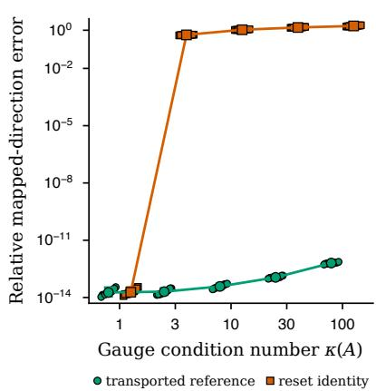

b  
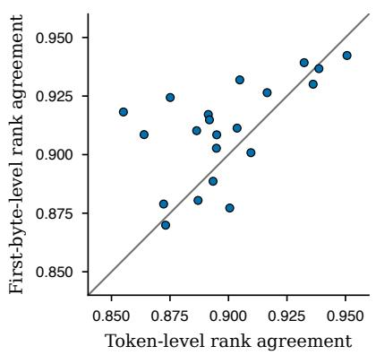

c  
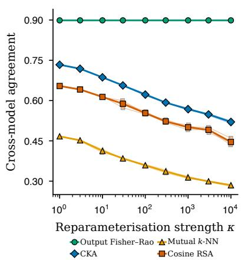  
Extended Data Fig. 1 | Coordinate covariance and common-outcome controls. a, Coordinate covariance at finite damping. For 12 prompts under one seeded symmetric positive-definite gauge family with $\kappa ( A ) = 1 , 3 , 1 0 , 3 0 , 1 0 0 .$ transporting the reference as $R ^ { \prime } = A ^ { - \top } R A ^ { - \top }$ reproduces the native damped direction with mapped relative error at most $7 . 4 \times 1 0 ^ { - 1 3 }$ (green circles). Installing a fresh identity instead changes the regularised problem: over non-identity gauges, the mapped-direction error has median 1.23 and minimum 0.54 (vermilion squares). Points, prompts; connected symbols, medians; error bars, 2.5th–97.5th percentiles. Pythia-410M, final pre-unembedding activation, top-512 output-Fisher support and $\alpha = 0 . 0 1 \lambda _ { \mathrm { m a x } }$ . b, Pairwise output-geometry agreement before and after mapping each next-token law to its first-byte distribution (21 dyads among eight models). Aggregate agreement is 0.899 at token level and 0.910 after the push-forward; rank agreement between dyad-level values is 0.551. The grey line marks equality. c, Hidden-coordinate reparameterisation at nine anisotropy strengths and three seeds. Each point aggregates the same 21 model pairs; faint paths show seeds and heavy paths their means. Output Fisher–Rao agreement remains constant, while activation CKA, mutual nearest-neighbour overlap and cosine RSA degrade. Small horizontal ofsets separate seeds.

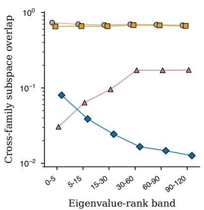

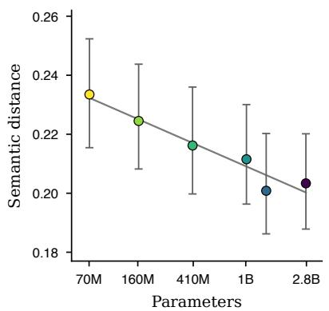

Raw overlap Shufled-word null Displacement-magnitude-matched null Residual sharing  
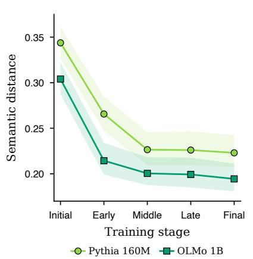

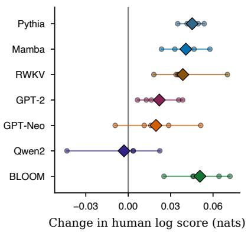

Extended Data Fig. 2 | Shared output structure beyond displacement magnitude and on independent human data. a, The 24 displayed estimates are six fixed eigenvalue-rank bands crossed with four summaries: raw subspace overlap (grey circles), a displacement-magnitude-matched null that preserves each word’s displacement magnitude (amber squares), a shufled-word null (magenta triangles) and the residual above the displacementmagnitude-matched null (blue diamonds). Opaque markers have black borders; lines connect like summaries across bands. Error bars on the residual span the 2.5th–97.5th percentiles across 400 random 80%-context subsamples. Raw overlap is nearly flat, but the residual is concentrated in the leading modes and falls from 0.080 in ranks 0–5 to 0.013 in ranks 90–120. Thus about 89% of the leading-band raw overlap is explained by shared displacement magnitudes, while the smaller residual carries the rank-dependent cross-family structure. b, Native model samples on 640 word positions from five previously unused narratives. Points are the equal-story semantic distances for six final Pythia sizes; bars show conditional 95% bootstrap intervals and the grey line is the registered fit against log parameter count (slope −0.00872, interval −0.01202 to −0.00556). c, The same distance at five ordered checkpoints from Pythia-160M and OLMo-2-1B. Lines show point estimates and shaded regions the conditional 95% intervals. Final-minus-initial changes are −0.12080 and −0.10962, respectively. d, Expected human log-score change after applying the model-only source-trained full 65-outcome map instead of each model’s native law. Small circles show the five fixed-story diferences and diamonds their equal-story means; positive values favour calibration. Six of seven family means are positive (0.0196–0.0507 nats); Qwen2 is −0.0030 nats. Panels b–d are conditional on the five observed stories and make no population-of-stories claim.

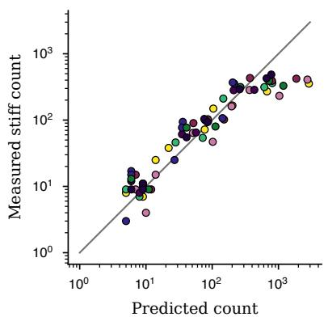

b  
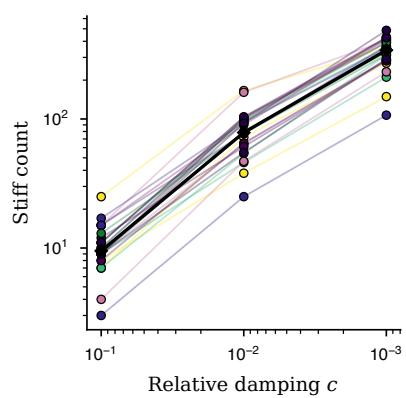  
Pythia 70M GPT-2 Pythia 2.8B BLOOM 1.1B Pythia 410M GPT-2 XL Qwen2 1.5B Pythia 6.9B

c  
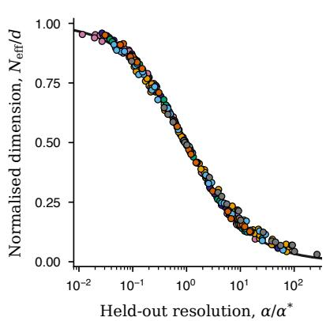

d  
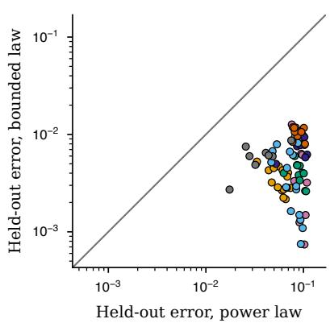  
GPT-2 GPT-Neo Qwen2 BLOOM Mamba RWKV StarCoder2

Extended Data Fig. 3 | Damping reveals bounded efective dimension. a, Predicted versus measured stif-mode counts for 24 model–context spectra at relative damping $1 0 ^ { - 1 } , \ 1 0 ^ { - 2 }$ and $1 0 ^ { - 3 }$ (72 points). Predictions are $( 1 / c ) ^ { 1 / \beta }$ from the power-law exponent fitted over ranks 2–80; colours identify the eight models, and the grey line denotes equality. b, All 72 resolved-mode counts, joined within each of the 24 spectra; colours identify models and black diamonds show the cross-spectrum median. The count grows as damping is lowered. The native-reference exponent is empirically stable across the tested models but is not an invariant of the metric alone. In held-out estimator validation, nominal 95% interval coverage is 0.90 for continuous efective dimensions and 0.85 for discrete threshold counts; primary dimension estimates therefore use the continuous form (Methods). c, Finite-size efective-dimension confirmation on 80 model–prompt curves spanning ten models and seven families. For each curve, a bounded efective-dimension curve was fitted at four fixed anchor dampings; points are all 240 observations at three interleaved, held-out dampings after rescaling by the fitted crossover $\alpha ^ { * }$ . The black line is the bounded efective-dimension curve at the median fitted exponent. d, Curve-level held-out root-mean-square error for an equal-parameter unbroken power law (abscissa) and the bounded efective-dimension curve (ordinate). Every one of 80 points lies below equality. Median errors are 0.0814 and 0.00493, respectively; the median bounded-to-power error ratio is 0.0749 (95% crossed-bootstrap interval 0.0428–0.1234).

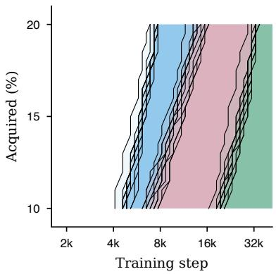

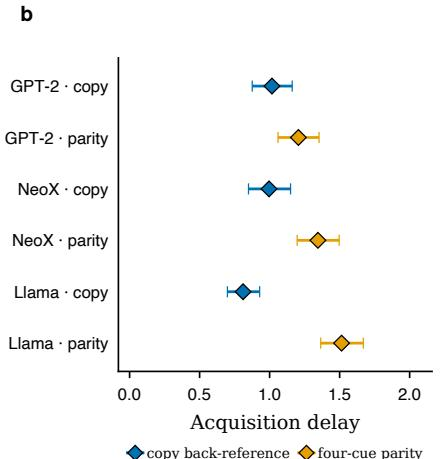

c  
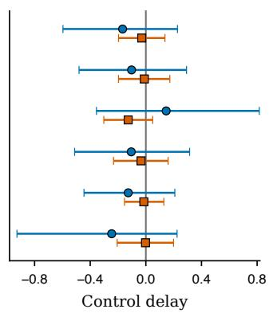

Extended Data Fig. 4 | Evidence depth delays acquisition across architectures and evidence constructions. a, Randomised evidence depth delays persistent acquisition. Curves follow the 10th–20th acquisition-time percentiles for each of 12 training seeds of the same transformer, pooling over the same facts and probes within each seed. Black curves show individual seeds; blue, pink and green shading to their right marks acquisition levels already reached under shallow, intermediate and deep evidence, respectively. The pooled deepest-versus-shallowest shift is $\Delta = 2 . 1 0 \log _ { 2 }$ training-step units (crossed seed-by-quintet bootstrap 95% interval 1.79–2.40), equivalent to 4.3× more training steps; the deepest-versus-intermediate contrast is smaller. $\mathbf { b } ,$ Mean paired delay in persistent acquisition for evidence assigned to the deep construction relative to otherwise matched evidence in the shallow construction, crossing GPT-2-, GPT-NeoX- and Llama-style decoders with copy-back-reference and four-cue-parity controlled languages. Blue diamonds denote copy-back-reference cells and amber diamonds four-cue-parity cells; horizontal lines are $9 5 \%$ crossed seed-by-matched-block bootstrap intervals around the cell means over eight seeds and 384 matched fact blocks per cell. All six intervals and all 48 seed means are positive; efects span 0.810–1.514 $\log _ { 2 }$ training-step units (1.75–2.86-fold in training steps). The equal-family mean parity-minus-back-reference contrast is $0 . 4 1 4 \log _ { 2 }$ training-step units (95% interval 0.291–0.536). $\mathbf { c } ,$ Corresponding fixed-treatment (blue circles) and label-randomisation (vermilion squares) controls. Every one of the twelve 95% intervals contains zero. The grey vertical line in panel c marks zero delay; delays are in $\log _ { 2 }$ training-step units.

b  
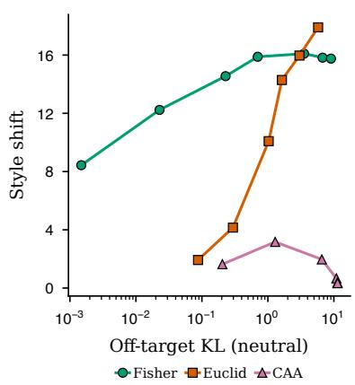  
c

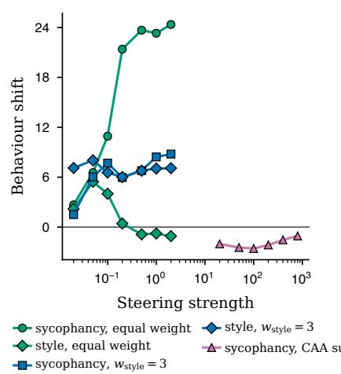

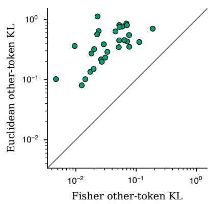

Extended Data Fig. 5 | Additional intervention trade-of curves, composition and fixed activation editing. a, The difuse style objective: behaviour change against of-target change on neutral prompts. The complete 19-point operating sweep contains seven Fisher, six Euclidean and six contrastive-activation-addition (CAA) settings. b, Composition: sycophancy and style steered simultaneously by one solve on the weighted covector sum; varying the weight changes the balance between objectives, whereas summed CAA vectors change sycophancy in the opposite direction. The 20 distinct operating points produce 34 displayed objective outcomes; all markers are opaque with black borders. c, Matched fixed activation edits on 30 held-out CounterFact records (GPT-2). Each point compares Fisher other-token Kullback–Leibler (KL) divergence (abscissa) with Euclidean other-token KL divergence (ordinate) after both operators attained the same fixed +5 log-odds shift; axes are logarithmic and the grey line denotes equality. Euclidean cost is higher for all 30 edits, with a geometric-mean Euclidean-to-Fisher ratio of 10.57 (95% interval 8.52–13.37).

a  
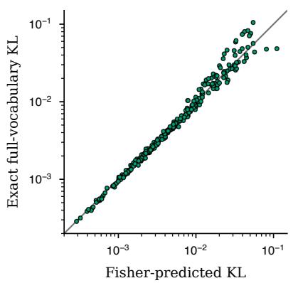

b  
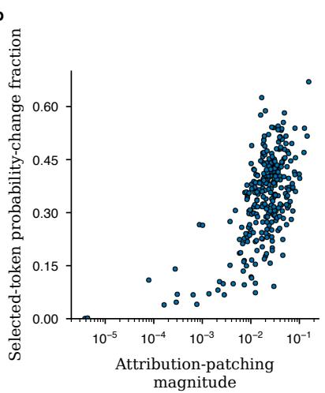

c  
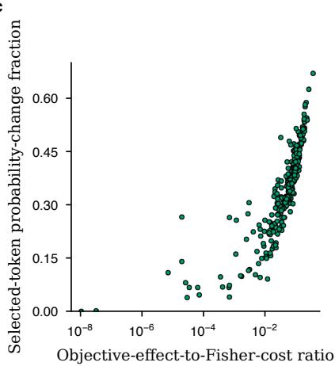  
Extended Data Fig. 6 | Output geometry predicts the causal cost and selectivity of sparse features. Pythia-410M, layer 12, Top-� sparse autoencoder. Points in every panel are the same 303 unique zero ablations of active sparse-autoencoder (SAE) features from 57 evaluation-active features across 18 held-out context clusters; feature and objective selection used 18 disjoint discovery contexts. Opaque green points in a and c mark Fisher quantities, while blue points in b mark attribution patching; every point has a black border. a, The Fisher prediction $\frac { 1 } { 2 } \Delta h ^ { \top } G \Delta h$ against exact full-vocabulary $\mathrm { K L } ( p _ { 0 } \Vert p _ { \mathrm { z e r o } } )$ (Spearman $\rho = 0 . 9 9 7 ) \mathrm { ; }$ ; grey line, equality. b, Attributionpatching magnitude against the selected-token probability-change fraction, the fraction of full-vocabulary absolute probability change on discovery-selected tokens $( \rho = 0 . 5 0 6 )$ . c, The objective-efect-to-Fisher-cost ratio against the same endpoint $( \rho = 0 . 9 3 5 )$ ; its correlation exceeds that of attribution patching by 0.429 (95% context-cluster bootstrap interval 0.296–0.553). The comparison concerns concentration on selected tokens; attribution-patching magnitude remains the stronger predictor of absolute efect magnitude.

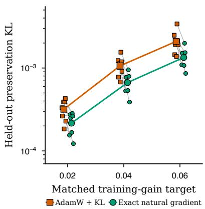

Extended Data Fig. 7 | Natural-gradient low-rank adaptation lowers held-out preservation cost at matched training gain. Exact natural-gradient LoRA is compared with tuned AdamW with explicit KL regularisation using rank-4 adapters on Pythia-70M. Points are all 48 method–target–seed cells from eight paired outer seeds, three fixed matched training-gain targets and two methods; each cell averages 16 held-out preservation prompts. Vermilion squares denote AdamW+KL and green circles exact natural gradient. Pale lines join paired methods within seed and target, horizontal ofsets are fixed display jitter, and the larger connected symbols are method means. The ordinate is logarithmic. Every method reached every target. Across this frontier, AdamW+KL incurred 1.57× the preservation-KL AUC of exact natural gradient (95% paired hierarchical bootstrap interval 1.14–1.98). The experiment did not support a broader task-transfer or capability-retention conclusion.

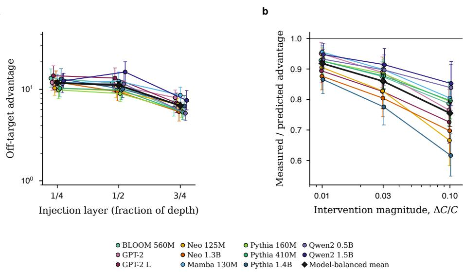

Extended Data Fig. 8 | Layer and intervention magnitude delimit the geometric correction. a, Of-target advantage by injection layer for 3,515 usable matched-response observations from 1,188 model–layer–objective– context cells across 11 models and six families, summarized as 33 within-model estimates. Coloured circles are geometric means and vertical bars are 95% paired objective–context–magnitude bootstrap intervals that preserve the available layer tuple; lines connect the three depths within model. Black diamonds are model-balanced geometric means with 95% model-bootstrap intervals. The pooled means fall from 11.79 to 11.08 to 6.62 at quarter, half and three-quarter depth, respectively. Every model mean is lower at three-quarter than at quarter depth; nine of eleven paths decrease at both adjacent steps, with one intermediate-depth increase for Mamba 130M and Qwen2 1.5B. b, Measured-to-predicted of-target advantage at intervention fractions $\Delta C / C = 0 . 0 1 , 0 . 0 3 , 0 . 1 0$ Coloured circles are all 33 within-model geometric means (11 models crossed with three fractions), with 95% paired-cell bootstrap intervals; lines connect fractions within model. Black diamonds are model-balanced geometric means with model-bootstrap intervals, and the grey line denotes exact calibration. All 11 model paths decrease strictly. The model-balanced means are 0.918, 0.860 and 0.755, quantifying the expected attenuation of a local prediction as intervention magnitude grows.

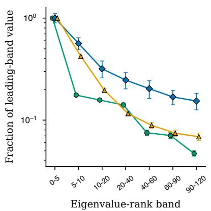

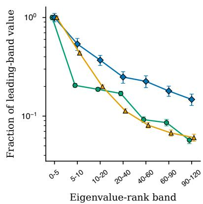  
steering weight cross-model sharing answer motion

Extended Data Fig. 9 | Output sensitivity, cross-model sharing and answer motion concentrate in the same native-reference modes. Each panel shows all 21 summaries (seven predefined eigenvalue-rank bands × three quantities) from six models: the band’s eigenvalue-mass share, cross-model eigenvector sharing against the displacement-magnitude-matched null and probability motion on the highest-probability tokens. To compare their decay directly, each quantity and its 95% context-bootstrap interval are divided by that quantity’s leading-band point estimate. On natural text the top five modes carry 55% of the eigenvalue mass, the largest residual sharing (+0.069, 95% interval 0.062–0.077) and the largest answer motion (0.59), all three decaying together to the last band. a, Natural-text battery. b, Templated battery.

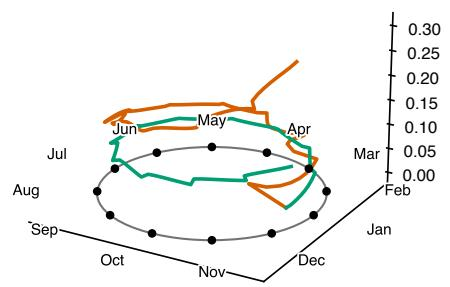

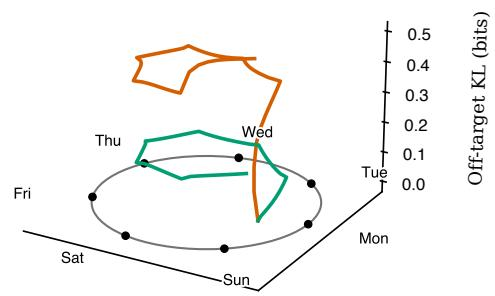

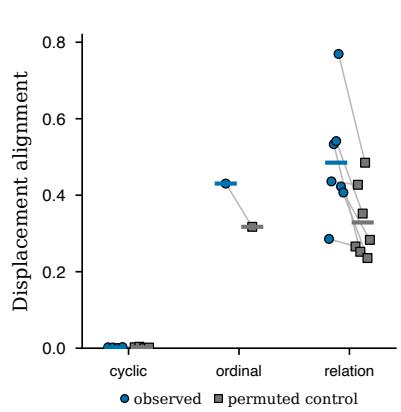  
Extended Data Fig. 10 | Two geometries of behaviour: cyclic reweighting and relation-induced probability displacement (Pythia-410M). a,b, Walking the ring by steering month→month (a) or day→day (b) around the full cycle at matched concept progress: the plane is the concept’s phase circle in output space and height is accumulated of-target change (bits). Both paths traverse the same ordered concept cycle; the reference phase sectors are separated, by construction, by 2�/12 (or 2�/7). After one circuit the endpoint returns towards the starting sector with a method-dependent residual displacement, while the natural-gradient path accumulates less of-target change. $\mathbf { c } ,$ The dissociation from analogy relations. Paired circles and squares show probability-displacement alignment and its permuted control for all twelve concept sets across three categories (24 displayed values); thin grey lines join each concept’s pair and short horizontal bars show category means. Relations move mass along a shared probability-displacement direction (mean alignment 0.49; permuted control 0.33), while cyclic concepts show none (0.00) and are near-isometries of the metric. The shared colour key applies to both trajectory panels.

Beyond local correction of the preceding operations, the output metric also reveals global structure in selected concept sets. In the Fourier-1 phase coordinates used in Extended Data Fig. 10a,b, the days of the week and months of the year occupy ordered, equally spaced reference sectors. Steering once around either full cycle returns the concept phase towards its starting sector, with the displayed method-dependent residual displacement. At each transition, the natural-gradient step disturbs unrelated tokens less than the Euclidean step.

Analogy relations behave diferently. Pairs such as capital-of, gender and tense do not reweight a shared set of tokens; they move probability mass between disjoint sets (Paris to Tokyo, he to she). The two classes separate as a double dissociation (Extended Data Fig. 10c): across twelve concepts, relations move mass along a shared probability-displacement direction (high probability-displacement alignment, 0.49 against 0.33 for a permuted-geometry control, essentially zero for cyclic concepts), while cyclic concepts are near-isometries of the metric, with a low isometry defect (0.29 against 1.02 for relations); ordinal concepts fall between. The pullback metric characterises probability reweighting, whereas movement between disjoint token sets additionally requires a ground metric on tokens; the corresponding structure in embedding space is analysed in a related symmetry study25.

# Supplementary Information

# The information geometry of large language models is shared, learned, and controllable

Dario Picozzi

## Contents

Part I: Origin and identification 2   
Supplementary Note 1 The canonical output metric and its pullback 2   
Supplementary Note 2 Cross-entropy induces and determines the output geometry 3   
Supplementary Note 3 Identification of the read-out geometry 5   
Part II: Shared 9   
Supplementary Note 4 Stability and attenuation of cross-model agreement 9   
Supplementary Note 5 Shared geometry carries meaning and transfers 17   
Part III: Learned 17   
Supplementary Note 6 Spectral inheritance, cluster anatomy and multiscale response 17   
Supplementary Note 7 Acquisition time on a logarithmic scale 26   
Supplementary Note 8 Projected-margin dynamics and conditional acquisition time 28   
Supplementary Note 9 Geometric motion, margins and local objective rate 31   
Part IV: Controllable 33   
Supplementary Note 10 Minimum-disturbance control and coordinate dependence of Euclidean cost 33   
Supplementary Note 11 Matrix-free computation 37   
Part V: Evidence, translation and reproducibility 38   
Supplementary Note 12 Experimental protocols 38   
Supplementary Note 13 Knowledge-editing details 39   
Supplementary Note 14 The instruct-model programme 40   
Supplementary Note 15 Sparse-autoencoder feature ablations 41   
Supplementary Note 16 Dictionary-learning details 41   
Supplementary Note 17 Cross-model convergence: protocols and controls 42   
Supplementary Note 18 The displacement-magnitude-matched null and the anisotropy analysis 43   
Supplementary Note 19 Meaning decomposition and transfer probes 44   
Supplementary Note 20 Reproducibility map 47

Organisation. The Supplementary Information follows the paper’s argument. Part I defines the canonical output geometry, derives its origin in cross-entropy training and establishes what predictive behaviour identifies. Part II proves and measures the geometry shared across independently trained models. Part III shows how language statistics and the location of evidence shape the geometry and its acquisition. Part IV derives minimal-disturbance control and gives the computational and operational results. Part V records the experimental designs, controls and reproducibility information. Original numbered mathematical results are accompanied by proofs; the classical Chentsov theorem is given as an attributed proof sketch with references to complete proofs.

## Part I: Origin and identification

## Supplementary Note 1 The canonical output metric and its pullback

This section supports the main text’s definition of the metric and the instrument: it states canonicity and the exact chart-covariance of the pullback solve.

## 1.1 Canonicity of the Fisher–Rao metric (Chentsov’s theorem)

Let $\Delta _ { n - 1 }$ denote the open simplex of probability distributions on � outcomes. A congruent Markov embedding $T : \Delta _ { n - 1 }  \Delta _ { m - 1 } , m \geq n$ , is the linear map induced by a stochastic matrix that splits each outcome � into sub-outcomes with fixed conditional probabilities and admits a stochastic left inverse that recovers �. Such an embedding therefore preserves statistical information; the corresponding left inverse is a suficient statistic (coarse-graining) on the embedded family.

Theorem 1 (Chentsov). Up to a positive multiplicative constant, the Fisher–Rao metric $g _ { p } ( u , \nu ) =$ $\textstyle \sum _ { a } u _ { a } \nu _ { a } / p _ { a }$ is the unique family of Riemannian metrics on the simplices $\{ \Delta _ { n - 1 } \} _ { n \geq 2 }$ invariant under every congruent Markov embedding.

Proofsketch. Invariance under outcome permutations forces the metric at the barycentre $p \ = \ ( 1 / n , \ldots , 1 / n )$ into the form $\begin{array} { r } { \alpha _ { n } \sum _ { a } u _ { a } \nu _ { a } + \beta _ { n } ( \sum _ { a } u _ { a } ) ( \sum _ { a } \nu _ { a } ) } \end{array}$ ; on the tangent space of the simplex, where $\textstyle \sum _ { a } u _ { a } \ = \ 0$ , only the $\alpha _ { n }$ term survives. Invariance under the equal-split morphisms $\Delta _ { n - 1 } \to \Delta _ { k n - 1 }$ ties the constants $\alpha _ { n }$ together across � and propagates the barycentric form to every rational point, yielding $\begin{array} { r } { g _ { p } ( u , \nu ) = c \sum _ { a } u _ { a } \nu _ { a } / p _ { a } } \end{array}$ there; continuity extends this to all of $\Delta _ { n - 1 }$ , and any invariant metric must agree with the construction, giving uniqueness up to the scale $c > 0$ . A complete proof is given by Chentsov [1]; a modern treatment is given by Ay, Jost, Le and Schwachhˆ ofer [2].¨ □

Chentsov uniqueness is up to scale and applies within the class of suficient-statistic–invariant metrics; the matching unique invariant 3-tensor is the Amari–Chentsov cubic used in Supplementary Note 10.3. The metric statement is infinitesimal: Kullback–Leibler (KL) divergence satisfies KL $\left( p \| p ^ { \prime } \right) =$ $\textstyle { \frac { 1 } { 2 } } d _ { \mathrm { F R } } ( p , p ^ { \prime } ) ^ { 2 } + O ( d ^ { 3 } )$ , where $d _ { \mathrm { F R } }$ is Fisher–Rao distance. Finite steps may instead follow a metric geodesic or exponential tilt. Coordinate covariance is a separate property: every Riemannian metric transforms tensorially under a smooth reparametrisation, whereas Chentsov’s theorem is what singles out Fisher–Rao, up to scale, after requiring invariance under the statistical transformations above.

## 1.2 The pullback metric and reparametrisation invariance

The possibly degenerate pullback form $G = J ^ { \top } H J$ need not preserve the rank or spectrum of $H .$ Under an invertible activation reparametrisation, however, � itself transforms by congruence, which preserves its rank and inertia across charts while changing its ordinary coordinate spectrum. The null space of � is the set of activation directions the read-out maps to no change in $p ,$ which are invisible in the output by construction. Under a change of activation chart $h \mapsto A h$ the metric transforms as a tensor, $G \mapsto A ^ { - \top } G A ^ { - 1 }$ . The intrinsic natural gradient is the unique class on the quotient of activation tangents by the read-out kernel; Euclidean Moore–Penrose inversion merely selects a coordinate-dependent representative of that class. For finite damping the solved problem is $\delta h = ( G + \alpha R ) ^ { - 1 } q$ with a declared reference metric �. If $R \mapsto A ^ { - \top } R A ^ { - 1 }$ , then $\delta h \mapsto A \delta h$ exactly; replacing it by a fresh identity after the coordinate change does not preserve the problem. The current native-coordinate implementation uses $R = I$ Thus the quotient result is canonical, while the finite damping/reference is an explicit modelling choice, tested in the numerical coordinate analysis below.

The end-to-end reparameterisation test evaluates this distinction at the final intervention site. For each of 12 prompts in Pythia-410M, a shared random orthogonal basis is drawn and transformations applied with condition number $\kappa ( A ) = 1 , 3 , 1 0 , 3 0 , 1 0 0$ . Solving with $R ^ { \prime } = A ^ { - \top } I A ^ { - 1 }$ and mapping the result back reproduces the native damped direction with maximum relative error $7 . 4 \times 1 0 ^ { - 1 3 }$ ; the generalised spectrum of $( G ^ { \prime } , R ^ { \prime } )$ reproduces that of $( G , I ) \mathrm { t o } 3 . 9 \times 1 0 ^ { - 1 4 }$ . In contrast, setting a fresh � in the transformed chart changes the direction by a median relative error of 1.23 over non-identity transformations (minimum 0.54). Thus, resetting the reference metric to the identity after a coordinate transformation is not invariant, whereas transporting the native identity is covariant to numerical precision. The transported native identity provides a coordinate-consistent reference, but is not a canonical choice; aggregated output-Fisher and data-Mahalanobis references are evaluated separately.

## Supplementary Note 2 Cross-entropy induces and determines the output geometry

This section gives the training origin of the object defined above. At every afine-softmax checkpoint, fitting an output distribution by cross-entropy induces a Gibbs joint law in which the read-out rows are natural parameters and the output Fisher is one of two paired curvatures. Excess predictive risk then controls the canonical observables used throughout the paper.

Let $P$ be the population law of a learned hidden state $h \in \mathbb { R } ^ { d }$ and next token $Y \in \{ 1 , \ldots , n \}$ . Once a checkpoint is fixed, write

$$
q ( a \mid h ) = \frac { \exp ( w _ { a } ^ { \top } h + b _ { a } ) } { Z ( h ) } , \qquad Z ( h ) = \sum _ { j = 1 } ^ { n } \exp ( w _ { j } ^ { \top } h + b _ { j } ) .\tag{1}
$$

No assumption about the optimiser is needed; the distributional regularity required for derivatives of the hidden-side log-partition is stated below.

Theorem 2 (excess-risk Gibbs duality). Assume the population cross-entropy of $q$ is finite and define the model-induced joint law $Q ( d h , a ) = P _ { H } ( d h ) q ( a \mid h )$ . Then:

Risk. The excess population cross-entropy over the Bayes predictor is exactly

$$
\mathcal { L } ( q ) - H _ { P } ( Y \mid H ) = \mathrm { K L } ( P \| Q ) ;\tag{2}
$$

Gibbs family. With $d \nu ( h ) = d P _ { H } ( h ) / Z ( h )$ , the joint and conditional laws are

$$
Q ( d h , a ) = \exp ( w _ { a } ^ { \top } h + b _ { a } ) d \nu ( h ) ,\tag{3}
$$

$$
Q ( d h \mid a ) = \exp \{ w _ { a } ^ { \top } h - A ( w _ { a } ) \} d \nu ( h ) , \qquad A ( w ) = \log \int e ^ { w ^ { \top } h } d \nu ( h ) ;\tag{4}
$$

thus all token-conditioned laws form one natural exponential family whose natural parameters are the read-out rows;

Paired curvatures. Writing $\begin{array} { r } { B ( h ) = \log \sum _ { a } \exp ( w _ { a } ^ { \top } h + b _ { a } ) } \end{array}$ , and assuming that � is twice diferentiable in a neighbourhood of each $w _ { a }$ for which the hidden-side moments are used,

$$
\nabla ^ { 2 } B ( h ) = \operatorname { C o v } _ { Q } ( w _ { Y } \mid h ) ,\tag{5}
$$

$$
\nabla ^ { 2 } A ( w _ { a } ) = \operatorname { C o v } _ { Q } ( h \mid a ) ,\tag{6}
$$

and the first Hessian is exactly the output Fisher metric;

Classwise control. If $\pi _ { a } ^ { P } = P ( Y = a ) , P _ { a } = P ( H \in \cdot \mid Y = a )$ for classes with $\pi _ { a } ^ { P } > 0$ , and $Q _ { a }$ is defined analogously, then

$$
\mathrm { K L } ( P \| Q ) = \mathrm { K L } ( \pi ^ { P } \| \pi ^ { Q } ) + \sum _ { a : \pi _ { a } ^ { P } > 0 } \pi _ { a } ^ { P } \mathrm { K L } ( P _ { a } \| Q _ { a } ) .\tag{7}
$$

Consequently, if the excess risk is � and $\| h \| \leq R _ { 0 }$ almost surely,

$$
\sum _ { a : \pi _ { a } ^ { P } > 0 } \pi _ { a } ^ { P } \mathrm { K L } ( P _ { a } \| Q _ { a } ) \leq \varepsilon ,\tag{8}
$$

$$
\sum _ { a : \pi _ { a } ^ { P } > 0 } \pi _ { a } ^ { P } \| \mathbb { E } _ { P } [ h \mid a ] - \nabla A ( w _ { a } ) \| \leq R _ { 0 } \sqrt { 2 \varepsilon } .\tag{9}
$$

Proof. Because � and � have the same hidden-state marginal,

$$
\mathrm { K L } ( P \| Q ) = \mathbb { E } _ { P _ { H } } \mathrm { K L } \{ P ( Y \mid H ) \| q ( Y \mid H ) \} = \mathbb { E } _ { P } [ - \log q ( Y \mid H ) ] - H _ { P } ( Y \mid H ) ,
$$

which proves Eq. (2). Substitution of Eq. (1) in the definition of � gives Eq. (3). Integrating its �th slice yields $\pi _ { a } ^ { Q } = \exp \{ b _ { a } + A ( w _ { a } ) \}$ , and division by this marginal gives Eq. (4). Diferentiation of the two log-partition functions gives their means and covariances, proving Eqs. (5) and (6). Equation (7) is the chain rule for relative entropy after factorising both laws by �.

Dropping the non-negative marginal divergence in Eq. (7) proves Eq. (8). For every class with $\pi _ { a } ^ { P } > 0$ , Pinsker’s inequality and the boundedness of ℎ give

$$
\Vert \mathbb { E } _ { P _ { a } } h - \mathbb { E } _ { Q _ { a } } h \Vert \leq 2 R _ { 0 } \Vert P _ { a } - Q _ { a } \Vert _ { \mathrm { T V } } \leq R _ { 0 } \sqrt { 2 \mathrm { K L } ( P _ { a } \Vert Q _ { a } ) } .
$$

Average with weights $\pi _ { a } ^ { P }$ , apply Cauchy–Schwarz and use Eq. (8). This proves Eq. (9).

The theorem explains why the output Fisher used in this work is tied to the training objective: it is the conditional curvature of the Gibbs law induced by the afine-softmax read-out. The class-conditional hidden covariance is the opposite conditional curvature of the same joint law. The identity is exact at a checkpoint; it does not require the representation itself to have been trained by a particular optimiser.

For a law $p ,$ write $p ^ { \downarrow }$ for its decreasing rearrangement and define the smooth response at resolution $\alpha > 0$ by

$$
\mathrm { d f } _ { p } ( \alpha ) = \sum _ { k } { \frac { p _ { k } ^ { \downarrow } } { p _ { k } ^ { \downarrow } + \alpha } } .
$$

For read-out rows $W = \left( w _ { a } \right)$ let $H _ { p , W } = \operatorname { C o v } _ { p } ( w )$ and let $R _ { W } = \mathrm { i n f } _ { g } \mathrm { m a x } _ { a } \| w _ { a } - g \|$ be their gaugeoptimal radius.

Theorem 3 (determination by predictive risk). Let � and � be laws on the same outcome space and put $\rho = \| \sqrt { p } - \sqrt { q } \| _ { 2 }$ . Then

$$
\| p ^ { \downarrow } - q ^ { \downarrow } \| _ { 1 } \leq 2 \rho ,\tag{10}
$$

$$
| \mathrm { d f } _ { p } ( \alpha ) - \mathrm { d f } _ { q } ( \alpha ) | \leq \frac { 2 \rho } { \alpha } ,\tag{11}
$$

$$
\| H _ { p , W } - H _ { q , W } \| _ { \mathrm { o p } } \leq 6 R _ { W } ^ { 2 } \rho .\tag{12}
$$

Hence every eigenvalue of the fixed-read-out metric changes by at most $6 R _ { W } ^ { 2 } \rho$ . Moreover $\rho ^ { 2 } \leq \mathrm { K L } ( p \| q )$ If two models have excess risks $\varepsilon _ { m }$ and $\varepsilon _ { m ^ { \prime } }$ to a common conditional reference law, their battery-averaged profile, response and fixed-read-out metric discrepancies are therefore bounded at rate $O ( \sqrt { \varepsilon _ { m } } + \sqrt { \varepsilon _ { m ^ { \prime } } } )$ The relational counterpart is proved in Theorem 6.

Proof. For scalars $x \geq x ^ { \prime }$ and $y \geq y ^ { \prime } , | x - y | + | x ^ { \prime } - y ^ { \prime } | \leq | x - y ^ { \prime } | + | x ^ { \prime } - y |$ . Repeatedly uncrossing a matching shows that sorted matching minimises total absolute deviation, so $\| p ^ { \downarrow } - q ^ { \downarrow } \| _ { 1 } \leq \| p - q \| _ { 1 }$ Cauchy–Schwarz gives

$$
\| p - q \| _ { 1 } = \sum _ { a } | \sqrt { p _ { a } } - \sqrt { q _ { a } } | ( \sqrt { p _ { a } } + \sqrt { q _ { a } } ) \leq 2 \rho ,
$$

proving Eq. (10). Since $t \mapsto t / ( t + \alpha )$ is 1/�-Lipschitz on $[ 0 , \infty )$ , Eq. (11) follows.

Shift all read-out rows by the gauge minimiser, which leaves the covariance unchanged, so that $\| w _ { a } \| \leq R _ { W }$ . Put $\begin{array} { r } { c _ { p } = \sum _ { a } p _ { a } w _ { a } } \end{array}$ . For any unit vector $u ,$

$$
\begin{array} { l } { \displaystyle { | u ^ { \top } ( H _ { p , W } - H _ { q , W } ) u | \leq \sum _ { a } | p _ { a } - q _ { a } | \langle w _ { a } , u \rangle ^ { 2 } + | \langle c _ { p } , u \rangle ^ { 2 } - \langle c _ { q } , u \rangle ^ { 2 } | } } \\ { \displaystyle { \quad \leq 2 R _ { W } ^ { 2 } \rho + 4 R _ { W } ^ { 2 } \rho . } } \end{array}
$$

Taking the supremum proves Eq. (12); Weyl’s inequality gives the eigenvalue statement. Finally, with $\begin{array} { r } { \mathbf { B C } ( p , q ) = \sum _ { a } \sqrt { p _ { a } q _ { a } } , } \end{array}$

$$
\mathrm { K L } ( p \| q ) = - 2 \sum _ { a } p _ { a } \log \sqrt { q _ { a } / p _ { a } } \geq 2 \{ 1 - \mathrm { B C } ( p , q ) \} = \rho ^ { 2 } ,
$$

using log $t \leq t - 1$ . Jensen’s inequality and the triangle inequality through the common reference law give the battery-averaged conclusion. □

## Supplementary Note 3 Identification of the read-out geometry

This section supports the main text’s identifiability results: local identification with quantitative curvature, global identification with explicit constants, and the non-identifiability of activation geometry.

Fix a strictly positive reference law $\rho$ on a common outcome space of size � and define the gauge-free weighted natural-coordinate space

$$
D _ { \rho } = \operatorname { d i a g } ( \rho ) , \qquad \mathcal { H } _ { \rho } = \{ \boldsymbol { u } \in \mathbb { R } ^ { V } : \sqrt { \rho } ^ { \top } \boldsymbol { u } = 0 \} .
$$

For $\theta \in \mathcal { H } _ { \rho }$ , let

$$
\begin{array} { r } { p _ { \theta } = \mathrm { s o f t m a x } ( D _ { \rho } ^ { - 1 / 2 } \theta ) , \qquad H _ { \theta } = D _ { \rho } ^ { - 1 / 2 } \{ \mathrm { d i a g } ( p _ { \theta } ) - p _ { \theta } p _ { \theta } ^ { \top } \} D _ { \rho } ^ { - 1 / 2 } . } \end{array}
$$

The Fisher operator $H _ { \theta }$ is positive definite on $\mathcal { H } _ { \rho }$ . Let � have finite support with strictly positive weights, and suppose the target conditional family has the resolved representation

$$
\begin{array} { r } { \pi _ { X } = p _ { \theta _ { X } } , \qquad \theta _ { X } = \beta + U z _ { X } , \qquad U ^ { \top } U = I _ { r } , \qquad \mathbb { E } z _ { X } = 0 , \qquad \Sigma _ { z } = \operatorname { C o v } ( z _ { X } ) \succ 0 . } \end{array}\tag{13}
$$

Write $T = \operatorname { c o l } ( U )$ . For a �-dimensional candidate subspace $S \subset { \mathcal { H } } _ { \rho } , d \geq r ,$ , define the fully profiled risk

$$
\mathcal { K } _ { D , d } ( S ) = \operatorname* { i n f } _ { b \in \mathcal { H } _ { \rho } } \operatorname* { i n f } _ { f : X \to S } \mathbb { E } _ { X } D ( \pi _ { X } , p _ { b + f ( X ) } ) , \qquad D \in \{ \mathrm { K L } , h ^ { 2 } \} ,\tag{14}
$$

where $h ( p , q ) = \| \sqrt { p } - \sqrt { q } \| _ { 2 }$ . The zero-risk manifold expected for an overcomplete read-out is

$$
\mathcal { M } _ { d } = \{ S \in \operatorname { G r } ( d , \mathcal { H } _ { \rho } ) : T \subset S \} , \qquad \Delta _ { d } ( S , T ) = \| P _ { S ^ { \perp } } P _ { T } \| _ { \mathrm { F } } .
$$

When diferentiating the profile, fix the unique moving gauge $b \in S ^ { \perp } \cap \mathcal { H } _ { \rho }$

Proof map. The local theorem first profiles the intercept and context coordinates and identifies the Fisher Schur complement that supplies curvature normal to the containment fibre. The inverse-softmax lemma then separates uniformly near candidates from candidates with a fixed Hellinger penalty. The global theorem combines those two branches, after which the recovery and capture corollaries translate predictive error into subspace and partition guarantees.

Theorem 4 (local identification by profiled Fisher curvature). Fix $S _ { 0 } \in \mathcal { M } _ { d }$ with orthonormal basis $V = ( U , E )$ . A Grassmann tangent is $B = \left( B _ { T } , B _ { E } \right)$ with columns in $S _ { 0 } ^ { \perp } \cap \mathcal { H } _ { \rho } .$ , and the orthonormal retraction is $V _ { B } ( t ) = ( V + t B ) ( I + t ^ { 2 } B ^ { \top } B ) ^ { - 1 / 2 }$ . Define

$$
R _ { X , S _ { 0 } } = H _ { \theta _ { X } } - H _ { \theta _ { X } } V ( V ^ { \top } H _ { \theta _ { X } } V ) ^ { - 1 } V ^ { \top } H _ { \theta _ { X } } ,\tag{15}
$$

$$
Q _ { S _ { 0 } } ( B _ { T } ) = \operatorname* { i n f } _ { a \in S _ { 0 } ^ { \perp } \cap \mathcal { H } _ { \rho } } \mathbb { E } ( B _ { T } z _ { X } - a ) ^ { \top } R _ { X , S _ { 0 } } ( B _ { T } z _ { X } - a ) .\tag{16}
$$

Then

$$
\begin{array} { r } { \mathcal { K } _ { \mathrm { K L } , d } ( \operatorname { c o l } V _ { B } ( t ) ) = \frac { 1 } { 2 } t ^ { 2 } Q _ { S _ { 0 } } ( B _ { T } ) + o ( t ^ { 2 } ) , } \end{array}\tag{17}
$$

$$
\begin{array} { r } { \mathcal { K } _ { h ^ { 2 } , d } ( \operatorname { c o l } V _ { B } ( t ) ) = \frac { 1 } { 4 } t ^ { 2 } Q _ { S _ { 0 } } ( B _ { T } ) + o ( t ^ { 2 } ) . } \end{array}\tag{18}
$$

If $\begin{array} { r } { m _ { H } = \operatorname* { m i n } _ { X } \lambda _ { \operatorname* { m i n } } ( H _ { \theta _ { X } } \vert _ { \mathcal { H } _ { \rho } } ) } \end{array}$ and $m _ { z } = \lambda _ { \operatorname* { m i n } } ( \Sigma _ { z } )$ , then

$$
Q _ { S _ { 0 } } ( B _ { T } ) \geq m _ { H } m _ { z } \| B _ { T } \| _ { \mathrm { F } } ^ { 2 } .\tag{19}
$$

Thus the Hessian kernel is exactly the tangent space of $\mathbf { \nabla } \mathcal { M } _ { d }$ and every normal direction has strictly positive curvature.

Proof. At $S _ { 0 }$ , choose the identifiable intercept $b _ { 0 } = P _ { S _ { 0 } ^ { \perp } } \beta$ . Rotating the basis produces a common normal term $B V ^ { \top } \beta ,$ , which is cancelled exactly by the freely optimised intercept. The remaining firstorder candidate-minus-target displacement is $B _ { T } z _ { X } - a + V c _ { X }$ , where � is the normal change of the intercept and $c _ { X }$ is the freely optimised context coordinate. The local expansions are

$$
\begin{array} { r } { \mathrm { K L } ( p _ { \theta } , p _ { \theta + u } ) = \frac 1 2 u ^ { \top } H _ { \theta } u + o ( \| u \| ^ { 2 } ) , \qquad h ^ { 2 } ( p _ { \theta } , p _ { \theta + u } ) = \frac 1 4 u ^ { \top } H _ { \theta } u + o ( \| u \| ^ { 2 } ) . } \end{array}
$$

Minimising first over $c _ { X }$ gives the Fisher Schur complement Eq. (15); minimising over � gives Eq. (16). After the moving gauge is fixed, the nuisance Hessian is positive definite, so the implicit-function theorem gives a unique smooth local stationary branch with the displayed quadratic expansions.

It remains to identify this local branch with the fully profiled infimum. Its risk is $O ( t ^ { 2 } )$ . For any sequence $t _ { n } \to 0 .$ , a corresponding sequence of near-minimisers has mean squared-Hellinger error tending to zero, using $h ^ { 2 } \leq \mathrm { K L }$ in the KL case. Finite context support with positive weights makes this convergence contextwise. Every target probability is positive, so the candidate probabilities eventually lie in a common compact subset of the open simplex. The gauge-fixed inverse-softmax map is bounded there, as are the moving-gauge intercepts and context coordinates. Every subsequential limit is therefore an exact representation at $S _ { 0 }$ and lies in the implicit-function neighbourhood. The same compactness gives attainment for all suficiently small �; uniqueness then makes every global minimiser the local branch. This proves Eqs. (17) and (18).

For $\nu \in S _ { 0 } ^ { \perp } \cap \mathcal { H } _ { \rho }$

$$
\nu ^ { \top } R _ { X , S _ { 0 } } \nu = \operatorname* { m i n } _ { c } ( \nu + V c ) ^ { \top } H _ { \theta _ { X } } ( \nu + V c ) \geq m _ { H } \operatorname* { m i n } _ { c } \Vert \nu + V c \Vert ^ { 2 } = m _ { H } \Vert \nu \Vert ^ { 2 } .
$$

Therefore

$$
Q _ { S _ { 0 } } ( B _ { T } ) \geq m _ { H } \operatorname* { i n f } _ { a } \mathbb { E } \Vert B _ { T } z _ { X } - a \Vert ^ { 2 } = m _ { H } \mathbb { E } \Vert B _ { T } z _ { X } \Vert ^ { 2 } \geq m _ { H } m _ { z } \Vert B _ { T } \Vert _ { \mathrm { F } } ^ { 2 } ,
$$

where centring makes $a = 0$ optimal in the Euclidean lower bound. The form vanishes exactly when $B _ { T } = 0$ , which is precisely the tangent condition for retaining $T \subset S$ □

Lemma 1 (inverse-softmax dichotomy). Let $p = p _ { \theta }$ and $q = p _ { \eta }$ for $\theta , \eta \in \mathcal { H } _ { \rho }$ , and suppose min� $p _ { i } \geq$ $p _ { * } > 0$ . Then either

$$
h ^ { 2 } ( p , q ) \geq \frac { p _ { * } ^ { 2 } } { 6 4 } \Vert \theta - \eta \Vert ^ { 2 } ,\tag{20}
$$

or

$$
h ^ { 2 } ( p , q ) > \frac { p _ { * } } { 4 } .\tag{21}
$$

The first branch holds whenever $h ( p , q ) \leq \sqrt { p _ { * } } / 2$

Proof. The gauge-fixed inverse-softmax chart is $\theta = P _ { \mathcal { H } _ { \rho } } D _ { \rho } ^ { 1 / 2 }$ log $p$ and similarly for $\eta .$ . If $h ( p , q ) \leq$ $\sqrt { p _ { * } } / 2$ , then coordinatewise $q _ { i } \ge p _ { * } / 4$ . Contractivity of orthogonal projection, the mean-value theorem on $[ p _ { * } / 4 , 1 ]$ and $| p _ { i } - q _ { i } | \leq 2 | \sqrt { p _ { i } } - \sqrt { q _ { i } } |$ give

$$
\| \theta - \eta \| \leq \| \log p - \log q \| _ { 2 } \leq \frac { 4 } { p _ { * } } \| p - q \| _ { 2 } \leq \frac { 8 } { p _ { * } } h ( p , q ) .
$$

Squaring proves Eq. (20). Otherwise $h ^ { 2 } ( p , q ) > p _ { * } / 4$ , which is Eq. (21).

Theorem 5 (global identification and the overcomplete fibre). Assume � has finite support, put

$$
p _ { * } = \operatorname* { m i n } _ { X , i } \pi _ { X } ( i ) > 0 , \qquad w _ { * } = \operatorname* { m i n } _ { x : P _ { X } ( x ) > 0 } P _ { X } ( x ) > 0 ,
$$

and retain Eq. (13). For either $D = \operatorname { K L } \operatorname { o r } D = h ^ { 2 }$

$$
\mathcal { K } _ { D , d } ( S ) \geq c _ { D , d } \Delta _ { d } ( S , T ) ^ { 2 } , \qquad c _ { D , d } : = \operatorname* { m i n } \left\{ \frac { p _ { * } ^ { 2 } m _ { z } } { 6 4 } , \frac { w _ { * } p _ { * } } { 4 r } \right\} > 0 .\tag{22}
$$

Moreover ${ \mathcal K } _ { D , d } ( S ) = 0$ if and only if $T \subset S$ . Hence a rank-matched read-out identifies the unique subspace �, while an overcomplete read-out is identified exactly up to the containment fibre $\mathbf { \nabla } \mathcal { M } _ { d }$

Proof. If $T \subset S$ , choose $b = \beta$ and $f ( X ) = U z _ { X }$ in Eq. (14). Conversely consider any candidate natural parameters $\eta _ { X } = b + f ( X ) $ with $f ( X ) \in S$ . Since $\mathrm { K L } \ge h ^ { 2 }$ , it is enough to lower-bound the Hellinger risk.

If the near branch of Lemma 1 holds at every context, orthogonal projection, $\mathbb { E } z _ { X } = 0$ and $\Sigma _ { z } \succeq m _ { z } I$ give

$$
\begin{array} { r l } & { \mathbb { E } \| \theta _ { X } - \eta _ { X } \| ^ { 2 } \geq \mathbb { E } \| P _ { S ^ { \perp } } ( \beta + U z _ { X } - b ) \| ^ { 2 } } \\ & { \qquad \geq m _ { z } \| P _ { S ^ { \perp } } U \| _ { \mathrm { F } } ^ { 2 } = m _ { z } \Delta _ { d } ( S , T ) ^ { 2 } . } \end{array}
$$

The candidate risk is therefore at least $p _ { * } ^ { 2 } m _ { z } \Delta _ { d } ( S , T ) ^ { 2 } / 6 4$ . If the far branch holds at any context, that context has weight at least $w _ { \ast } ,$ so the candidate risk exceeds $w _ { * } p _ { * } / 4$ . Since $\Delta _ { d } ( S , T ) ^ { 2 } \leq r .$ , this is at least $ { w _ { * } } p _ { * }  { \Delta _ { d } } ( S , T ) ^ { 2 } / ( 4 r )$ . Taking the smaller branch constant and then the profile infimum proves Eq. (22) and the stated zero set. □

Corollary 1 (quantitative approximate recovery). Let $q$ be the language law, $q _ { r }$ a rank-� language core, and $p _ { m }$ a model law. Write $R _ { H }$ for expected squared root-probability distance and $\Delta _ { d } = \lVert P _ { S _ { m } ^ { \perp } } P _ { T _ { r } } \rVert _ { F }$ Suppose

$$
R _ { H } ( q , q _ { r } ) \leq \zeta _ { r } , \qquad \mathbb { E } _ { x } \mathbf { K } \mathbf { L } ( q _ { x } \| p _ { m , x } ) \leq \varepsilon _ { m } , \qquad c _ { h ^ { 2 } , r } \Delta _ { d } ^ { 2 } \leq R _ { H } ( q _ { r } , p _ { m } ) , \qquad c _ { h ^ { 2 } , r } > 0 .
$$

Then

$$
\Delta _ { d } \leq \frac { \sqrt { \zeta _ { r } } + \sqrt { \varepsilon _ { m } } } { \sqrt { c _ { h ^ { 2 } , r } } } .\tag{23}
$$

For the finite-support global theorem one may take $c _ { h ^ { 2 } , r } = \operatorname* { m i n } \{ p _ { * } ^ { 2 } m _ { z } / 6 4 , \ : w _ { * } p _ { * } / ( 4 r ) \}$ under its stated inverse-chart, context-floor and covariance hypotheses.

Proof. Minkowski’s inequality in the joint context–outcome root space and the Hellinger–KL inequality give

$$
\begin{array} { r } { \sqrt { R _ { H } ( q _ { r } , p _ { m } ) } \leq \sqrt { R _ { H } ( q _ { r } , q ) } + \sqrt { R _ { H } ( q , p _ { m } ) } \leq \sqrt { \zeta _ { r } } + \sqrt { \varepsilon _ { m } } . } \end{array}
$$

The margin premise and nonnegativity give $\sqrt { c _ { h ^ { 2 } , r } } \Delta _ { d } \leq \sqrt { R _ { H } ( q _ { r } , p _ { m } ) }$ . Division by the positive square root proves Eq. (23). The displayed finite constant is exactly the near/far global margin in Theorem $5 ;$ it is not introduced by this final scalar step. □

Corollary 2 (capture inherited at the recovery rate). Let the rank-� language core � and a rank-� model core $S _ { m }$ be at chordal distance at most $B _ { m }$ . For a fixed partition projector $0 \preceq \Pi _ { G } \preceq I .$ , write $q _ { G } ( S ) = \mathrm { t r } ( \Pi _ { G } P _ { S } ) / r$ for mean capture and $q _ { \mathrm { m i n } , G } ( S )$ for the smallest eigenvalue of its compression to �. Then

$$
q _ { G } ( S _ { m } ) \geq q _ { G } ( T ) - \frac { B _ { m } } { \sqrt { r } } , \qquad q _ { \operatorname* { m i n } , G } ( S _ { m } ) \geq q _ { \operatorname* { m i n } , G } ( T ) - \operatorname* { m i n } \{ 1 , 2 B _ { m } \} .\tag{24}
$$

In particular Corollary 1 supplies $B _ { m } = ( \sqrt { \zeta _ { r } } + \sqrt { \varepsilon _ { m } } ) / \sqrt { c _ { h ^ { 2 } , r } }$

Proof. If $\theta _ { 1 } , \ldots , \theta _ { r }$ are the principal angles, $P _ { T } - P _ { S _ { m } }$ has nonzero eigenvalues ± sin $\theta _ { i }$ . Positivity and contractivity of Π� give

$$
| \operatorname { t r } ( \Pi _ { G } ( P _ { T } - P _ { S _ { m } } ) ) | \leq \sum _ { i } \sin \theta _ { i } \leq \sqrt { r } \left( \sum _ { i } \sin ^ { 2 } \theta _ { i } \right) ^ { 1 / 2 } = \sqrt { r } d _ { \mathrm { c h } } ( S _ { m } , T ) .
$$

Division by � proves the mean bound. For worst capture,

$$
P \Pi _ { G } P - Q \Pi _ { G } Q = ( P - Q ) \Pi _ { G } P + Q \Pi _ { G } ( P - Q ) ,
$$

so the compression diference has operator norm at most $2 \| P - Q \| _ { \mathrm { o p } }$ . Weyl’s inequality and $\| { \cal P } - { \cal Q } \| _ { \mathrm { o p } } =$ ma $\mathbf { X } _ { i }$ sin $\theta _ { i } \leq d _ { \mathrm { c h } } ( S _ { m } , T )$ give the $2 B _ { m }$ bound. Both captures lie in [0, 1], which gives the independent cap by one. □

The measured profiled-curvature margin is positive in every evaluated configuration. The separate fractional-frame measurements concern spectral resolution rather than identification and are reported with the spectral measurements below.

The contrast that completes the identification picture is that no analogous statement holds on the hidden face.

Proposition 1 (activation geometry is not behaviourally identifiable). Let a network factor as $f = g \circ h$ through a �-dimensional hidden layer. For every $A \in \operatorname { G L } ( d )$ , the factorisation $f = ( g \circ A ^ { - 1 } ) \circ ( A h )$ has identical conditional laws. If $Z$ contains sampled activations as rows, its Gram matrix becomes $Z A ^ { \top } A Z ^ { \top }$ ; unless � is conformal on the sampled activation span (or on the span of activation diferences for distance geometry), Euclidean and generally cosine relational geometry changes. Therefore behaviour does not determine a unique Euclidean activation geometry, whereas the output geometry is a functional of the conditional laws.

Proof. The two factorisations compute exactly the same function. The Gram transformation is direct substitution. Non-conformal choices of $A ^ { \top } A$ change some inner products or squared distances whenever the sampled span has dimension at least two. In the gauge test, re-chartings with condition numbers up to $1 0 ^ { 4 }$ leave output geometry constant to machine precision while the evaluated activation measures degrade. □

Profiled-loss experimental protocol. The rank-32 reference is constructed from a Pythia-6.9B teacher: its marginal law, afine mean and leading weighted log-probability modes are estimated on 500 calibration contexts. The target probabilities are those of this resolved reference family. Principal-vector paths move from the reference subspace towards the read-outs of Pythia 70M, 160M, 410M and 1.4B; one randomnormal control per model preserves every principal angle. Path fractions are 0, 0.125, 0.25, 0.5 and 1.

At each fraction, the afine intercept and context coordinates are jointly profiled on each of two disjoint 100-context calibration folds, followed by alternating convex coordinate/intercept refinements. Each fitted intercept is then frozen and only coordinates are optimised on 100 held-out contexts, disjoint from both calibration folds and the 500-context reference fit. Optimisation uses float64 and L-BFGS. Maximum absolute and root-mean-square gradient tolerances are respectively $1 0 ^ { - 3 }$ and $1 0 ^ { - 5 }$ for the calibration intercept, $5 \times 1 0 ^ { - 4 }$ and $5 \times 1 0 ^ { - 5 }$ for calibration coordinates, and $3 \times 1 0 ^ { - 4 }$ and $3 \times 1 0 ^ { - 5 }$ for held-out coordinates. The two held-out losses are averaged. The local slope is fitted through the origin against squared chordal distance at fractions 0.125, 0.25 and 0.5, after subtracting the zero-angle loss. Its interval uses 1,000 held-out-context bootstrap draws shared across path fractions; fold-specific estimates are retained. This tests the resolved reference family along the specified paths.

## 3.1 Causal language assignment

The controlled comparison crossed three architectures and two capacities with eight independent pairs of 64-context, 64-outcome synthetic languages. Two separate pilot pairs selected the training schedule for each architecture–capacity cell using excess predictive risk alone. The same selected schedule was applied to every test pair. All 96 labelled test runs met the common requirement $\epsilon < \Delta ^ { 2 } / 3 2$ , where $\Delta ^ { 2 }$ is the mean squared diference between the two true scaled chord-distance matrices. This defines a common accuracy requirement rather than exact equality of training loss.

For a learned distance matrix, the assigned-law advantage is its mean squared error relative to the counterfactual law minus that relative to the assigned law, divided by $\Delta ^ { 2 }$ . The mean over the eight language pairs is 0.997836 (95% language-pair bootstrap interval 0.997739–0.997933). The normalised geometry change across laws exceeds the same-law cross-architecture change by 0.995678 (0.995485– 0.995871). Both contrasts are positive in all eight independent pairs (exact one-sided sign $P = 1 / 2 5 6 )$ . The controlled assignment isolates the efect of the language law in these synthetic systems.

## Part II: Shared

## Supplementary Note 4 Stability and attenuation of cross-model agreement

This section supports the main text’s convergence results: rank stability, the excess-risk route to rank convergence, and the exact attenuation account of the measured agreement.

## 4.1 Stability of the shared output geometry

This subsection proves entrywise and rank stability on a shared outcome space, and then derives population rank convergence from vanishing excess risk under an explicit margin condition. It also proves that behaviour does not identify a unique Euclidean activation geometry and gives a common-outcome coarse-graining extension for diferent tokenizers.

Setting. A model � enters only through its conditional laws $p _ { m } ( \cdot \vert x )$ on the context battery; write $u _ { m } ( x ) = \sqrt { p _ { m } ( \cdot | x ) }$ , a unit vector. The relational geometry compared in the main text is the matrix of Fisher–Rao distances $D _ { m } ( x , y ) = 2$ arccos $C _ { m } ( x , y )$ , with $C _ { m } ( x , y ) = \langle u _ { m } ( x ) , u _ { m } ( y ) \rangle \in [ 0 , 1 ]$ the Bhattacharyya afinity. Since � is a strictly decreasing function of $C _ { i }$ , reversing both models’ entry rankings alike, every rank-agreement statistic of the distance matrices coincides with that of the afinity matrices, so all statements are proved for �. Models with a shared tokenizer share the outcome space; vocabulary positions beyond the common range are merged into a single bucket, a deterministic coarsegraining applied to each model (for the smaller vocabulary the bucket is empty).

Lemma 2 (determination and per-context control). (a) Determination. $C _ { m }$ is a functional of the conditional laws alone. (b) Entrywise control. For two models $m , m ^ { \prime }$ on a shared outcome space, let $w _ { z } = u _ { m ^ { \prime } } ( z ) - u _ { m } ( z )$ and $\rho ( z ) = \| w _ { z } \|$ (the root-probability distance). Then, exactly,

$$
\begin{array} { r l r l r } { e ( x , y ) : = } & { C _ { m ^ { \prime } } ( x , y ) - C _ { m } ( x , y ) \ = \ \langle w _ { x } , u _ { m } ( y ) \rangle + \langle u _ { m ^ { \prime } } ( x ) , w _ { y } \rangle , } & { } & { | e ( x , y ) | \ \leq \ \rho ( x ) + \rho ( y ) . } \end{array}
$$

(c) Risk control. $\rho ( z ) ^ { 2 } \leq \mathrm { K L } \big ( p _ { m } ( \cdot | z ) \| p _ { m ^ { \prime } } ( \cdot | z ) \big )$ and likewise with the arguments exchanged. (d) Reference triangle. For any reference law $q ( \cdot \mid z ) , \rho ( z ) \leq \delta _ { m } ( z ) + \delta _ { m ^ { \prime } } ( z )$ with $\delta _ { m } ( z ) = \| u _ { m } ( z ) - \sqrt { q ( \cdot | z ) } \|$

Proof. (a) is immediate. (b): expand $\langle u _ { m ^ { \prime } } ( x ) , u _ { m ^ { \prime } } ( y ) \rangle - \langle u _ { m } ( x ) , u _ { m } ( y ) \rangle$ and collect; the bound is Cauchy–Schwarz on each term with $\| u \| \ = \ 1 . \quad ( \mathrm { c } ) { : }$ : with $\mathrm { B C } = \langle u _ { m } , u _ { m ^ { \prime } } \rangle , \rho ^ { 2 } = 2 ( 1 - \mathrm { B C } )$ , and KL $\begin{array} { r } { \left( p \parallel p ^ { \prime } \right) = - 2 \sum _ { a } p _ { a } \log \sqrt { p _ { a } ^ { \prime } / p _ { a } } \ge - 2 \sum _ { a } p _ { a } ( \sqrt { p _ { a } ^ { \prime } / p _ { a } } - 1 ) = 2 ( 1 - \mathbf { B C } ) = \rho ^ { 2 } \varepsilon , } \end{array}$ , using log $t \leq t - 1$ (d) is the norm triangle inequality. □

Theorem 6 (excess risk forces relational convergence). Let � and � be two models on a common outcome space and let $q$ be a common reference conditional law. For context �, put $u _ { M } ( x ) = \sqrt { p _ { M } ( { } \cdot { } | x ) }$ and define the root-probability distance matrix $d _ { M } ( x , y ) = \| u _ { M } ( x ) - u _ { M } ( y ) \| _ { 2 }$ . If

$$
\varepsilon _ { M } = \mathbb { E } _ { x } { \mathrm { K L } } \{ q ( \cdot \mid x ) \| p _ { M } ( \cdot \mid x ) \} ,
$$

then, for independent contexts �, � drawn from the battery law,

$$
\begin{array} { r } { \mathbb { E } _ { X , Y } \{ d _ { A } ( X , Y ) - d _ { B } ( X , Y ) \} ^ { 2 } \leq 4 ( \varepsilon _ { A } + \varepsilon _ { B } ) . } \end{array}\tag{25}
$$

For any finite vectorisation of the distance matrices, let $\boldsymbol { a } _ { c } , b _ { c }$ denote their centred vectors and suppose both have non-zero norm. Then

$$
1 - \operatorname { c o r r } ( a , b ) \leq \frac { \| a _ { c } - b _ { c } \| _ { 2 } ^ { 2 } } { 2 \| a _ { c } \| _ { 2 } \| b _ { c } \| _ { 2 } } .\tag{26}
$$

Thus excess-risk minimisation forces the relational geometry to converge at root-risk rate, with the realised spread of the battery appearing only as the conditioning factor in Eq. (26).

Proof. Put $w ( x ) = u _ { A } ( x ) - u _ { B } ( x )$ . The reverse triangle inequality gives

$$
\vert d _ { A } ( x , y ) - d _ { B } ( x , y ) \vert \leq \Vert w ( x ) - w ( y ) \Vert .
$$

Squaring and averaging over independent contexts gives an upper bound $2 \mathbb { E } _ { x } \Vert w ( x ) \Vert ^ { 2 } - 2 \Vert \mathbb { E } _ { x } w ( x ) \Vert ^ { 2 } \leq$ $2 \mathbb { E } _ { x } \Vert w ( x ) \Vert ^ { 2 }$ . Passing through $\sqrt { q }$ and applying $( s + t ) ^ { 2 } \leq 2 s ^ { 2 } + 2 t ^ { 2 }$ yields

$$
\begin{array} { r } { \mathbb { E } _ { x } \| u _ { A } - u _ { B } \| ^ { 2 } \leq 2 \mathbb { E } _ { x } \| u _ { A } - \sqrt { q } \| ^ { 2 } + 2 \mathbb { E } _ { x } \| u _ { B } - \sqrt { q } \| ^ { 2 } \leq 2 ( \varepsilon _ { A } + \varepsilon _ { B } ) , } \end{array}
$$

where the final inequality is the Hellinger–KL bound. This proves Eq. (25).

For the correlation statement, expand

$$
\| a _ { c } - b _ { c } \| ^ { 2 } = \| a _ { c } \| ^ { 2 } + \| b _ { c } \| ^ { 2 } - 2 \langle a _ { c } , b _ { c } \rangle .
$$

Because $\| a _ { c } \| ^ { 2 } + \| b _ { c } \| ^ { 2 } \geq 2 \| a _ { c } \| \| b _ { c } \|$

$$
\| a _ { c } - b _ { c } \| ^ { 2 } \geq 2 \| a _ { c } \| \| b _ { c } \| \{ 1 - \operatorname { c o r r } ( a , b ) \} ,
$$

which rearranges to Eq. (26).

Theorem 7 (rank stability of the relational geometry). Let $( x , y )$ and $( u , \nu )$ be two entries of the afinity matrices, with margin $\mu = | C _ { m } ( x , y ) - C _ { m } ( u , \nu ) |$ . If the two models order these entries discordantly, then

$$
\mu \leq \left| e ( x , y ) - e ( u , \nu ) \right| \leq \operatorname* { m i n } \left\{ \left| e ( x , y ) \right| + \left| e ( u , \nu ) \right| , \rho ( x ) + \rho ( y ) + \rho ( u ) + \rho ( \nu ) \right\} .
$$

Consequently the Kendall discordance rate, the probability of discordance over entry pairs drawn uniformly from the battery, is at most $\mathrm { P r } [ \mu \leq | \Delta e | ]$

Proof. Discordance means $C _ { m } ( x , y ) - C _ { m } ( u , \nu )$ and $C _ { m ^ { \prime } } ( x , y ) - C _ { m ^ { \prime } } ( u , \nu )$ have strictly opposite signs. Their diference is $e ( x , y ) - e ( u , \nu )$ , and a diference of two opposite-signed quantities has absolute value at least each of them, so $| \Delta e | \ge \mu$ . The upper bounds are the triangle inequality and Lemma 2(b). □

Theorem 8 (population excess risk forces rank convergence). Let $q ( \cdot | z )$ be a reference conditional law on the shared outcome space and let $Z \sim \nu$ be the context law. Draw two compared entries $A = ( X , Y )$ and $B = ( U , V )$ by any scheme for which each of $X , Y , U , V$ has marginal �. Define

$$
R _ { m } = \mathbb { E } _ { Z \sim \nu } \mathrm { K L } \big ( q ( \cdot | Z ) \| p _ { m } ( \cdot | Z ) \big ) , \qquad F _ { q } ( t ) = \operatorname* { P r } \big [ | C _ { q } ( A ) - C _ { q } ( B ) | \leq t \big ] .
$$

If the compared rankings have no ties, then for every $t > 0$

$$
1 - \tau ( m , m ^ { \prime } ) \ \leq \ 2 F _ { q } ( t ) + \frac { 3 2 ( R _ { m } + R _ { m ^ { \prime } } ) } { t ^ { 2 } } .
$$

Consequently, if $F _ { q } ( 0 ) = 0$ and $R _ { m } + R _ { m ^ { \prime } } \to 0$ , then $\tau ( m , m ^ { \prime } )  1$ . More quantitatively, if $F _ { q } ( t ) \leq L t ^ { \kappa }$ near zero for some $\kappa > 0 .$ , optimising in � gives $1 - \tau = O ( ( R _ { m } + R _ { m ^ { \prime } } ) ^ { \kappa / ( \kappa + 2 ) } )$

Proof. Put $\delta _ { m } ( z ) = \| \sqrt { p _ { m } ( \cdot | z ) } - \sqrt { q ( \cdot | z ) } \|$ . Lemma 2(c) gives $\mathbb { E } \delta _ { m } ( Z ) ^ { 2 } \leq R _ { m }$ . If model � reverses the reference ordering of � and � while the reference margin exceeds �, then

$$
t < \delta _ { m } ( X ) + \delta _ { m } ( Y ) + \delta _ { m } ( U ) + \delta _ { m } ( V ) = : S _ { m } .
$$

By Cauchy–Schwarz, $S _ { m } ^ { 2 } \le 4 ( \delta _ { m } ( X ) ^ { 2 } + \delta _ { m } ( Y ) ^ { 2 } + \delta _ { m } ( U ) ^ { 2 } + \delta _ { m } ( V ) ^ { 2 } ) , \mathrm { s o } \mathbb { E } S _ { m } ^ { 2 } \le 1 6 R _ { m }$ and $\mathbf { M a r k o v } \mathbf { \ ' _ { S } }$ inequality gives $\operatorname* { P r } ( S _ { m } > t ) \leq 1 6 R _ { m } / t ^ { 2 }$ . Away from a reference tie, discordance between � and $m ^ { \prime }$ implies that at least one model reverses the reference ordering. Hence their discordance probability is at most $F _ { q } ( t ) + 1 6 ( R _ { m } + R _ { m ^ { \prime } } ) / t ^ { 2 }$ . Multiplying by two gives the Kendall bound. If $F _ { q } ( 0 ) = 0$ , choose $t \downarrow 0$ slowly enough that $( R _ { m } + R _ { m ^ { \prime } } ) / t ^ { 2 } \to 0 ;$ ; the rate follows by balancing the two terms. □

Corollary 3 (finite-list Spearman convergence). For two tie-free rankings of a finite list of length $n \geq 2$ Spearman’s rank correlation $\rho _ { S }$ and Kendall’s � satisfy

$$
1 - \rho _ { S } \leq 3 ( 1 - \tau ) .
$$

Thus the conclusion of Theorem 8 also forces $\rho _ { S }  1$

Proof. For a list of length $n ,$ let � be the inversion count and $d _ { i }$ the rank displacements. Since $| d _ { i } | \leq n - 1$ the Spearman and Kendall formulae, together with the footrule bound $\textstyle \sum _ { i } | d _ { i } | \leq 2 K$ , give

$$
1 - \rho _ { S } = \frac { 6 \sum _ { i } d _ { i } ^ { 2 } } { n ( n ^ { 2 } - 1 ) } \leq \frac { 6 ( n - 1 ) \sum _ { i } | d _ { i } | } { n ( n ^ { 2 } - 1 ) } \leq \frac { 1 2 K } { n ( n + 1 ) } \leq \frac { 1 2 K } { n ( n - 1 ) } = 3 ( 1 - \tau ) .
$$

Corollary 4 (a common outcome space by coarse-graining). Models may have diferent outcome spaces $\Omega _ { m }$ . At each context �, let $T _ { m , z }$ be a Markov kernel from $\Omega _ { m }$ to a common space $\Omega _ { 0 }$ , and suppose reference laws satisfy $T _ { m , z } q _ { m } ( \cdot | z ) = q _ { 0 } ( \cdot | z )$ . Then the preceding results apply to $\bar { p } _ { m } = T _ { m , z } p _ { m }$ on $\Omega _ { 0 }$ with

$$
\mathrm { K L } ( q _ { 0 } \| \bar { p } _ { m } ) \leq \mathrm { K L } ( q _ { m } \| p _ { m } ) .
$$

For tokenizers with deterministic byte decoding, mapping every token to the first newly decoded byte after the context (with an empty/special-token bucket) is one such common coarse outcome. This proves cross-tokenizer comparison after coarse-graining to the common outcome space; native-vocabulary agreement remains empirical.

Proof. The Kullback–Leibler inequality is data processing under $T _ { m , z }$ at each context; apply Theorem 8 to the pushed-forward laws. □

## 4.2 The resolution law

The population theorem above controls average disagreement. The following result states exactly when that control becomes a resolved count or an identical discrete structure. It also separates the hard threshold count from the smooth response used for efective dimension.

For a nonempty finite score vector $s = ( s _ { 1 } , \ldots , s _ { d } ) $ define $\mathcal { R } _ { s } ( \alpha ) = \{ i : s _ { i } \geq \alpha \}$ and $D _ { s } ( \alpha ) =$ $| \mathcal { R } _ { s } ( \alpha ) |$

Theorem 9 (loss, resolution and margin). Let

$$
\begin{array} { r } { \delta _ { m } ( x ) = \| \sqrt { p _ { m } ( \cdot | x ) } - \sqrt { q ( \cdot | x ) } \| _ { 2 } , \qquad \rho _ { m } ^ { 2 } = \mathbb { E } _ { x } \delta _ { m } ( x ) ^ { 2 } , \qquad \varepsilon _ { m } = \mathbb { E } _ { x } \mathrm { K L } ( q _ { x } \| p _ { m , x } ) . } \end{array}
$$

Risk. Then

$$
\rho _ { m } ^ { 2 } \leq \varepsilon _ { m } .\tag{27}
$$

Hard counts and margins. More generally, if finite score vectors satisfy max $_ i | s _ { i } ^ { m } - s _ { i } ^ { q } | \leq b _ { m }$ , then

$$
D _ { s ^ { q } } ( \alpha + b _ { m } ) \leq D _ { s ^ { m } } ( \alpha ) \leq D _ { s ^ { q } } ( \alpha - b _ { m } ) .\tag{28}
$$

$\begin{array} { r } { \operatorname { I f } \gamma _ { q } ( \alpha ) = \operatorname* { m i n } _ { i } | s _ { i } ^ { q } - \alpha | } \end{array}$ , then

$$
\gamma _ { q } ( \alpha ) > \operatorname* { m a x } \{ b _ { m } , b _ { m ^ { \prime } } \} \quad \implies \quad \mathcal { R } _ { s ^ { m } } ( \alpha ) = \mathcal { R } _ { s ^ { m ^ { \prime } } } ( \alpha ) .\tag{29}
$$

Sorted probability profile. At a fixed context, take the scores to be the sorted probabilities and let $D _ { p } ( \alpha ) = \# \{ k : p _ { ( k ) } \geq \alpha \}$ . Then

$$
D _ { q } ( \alpha + 2 \delta _ { m } ( x ) ) \le D _ { p _ { m } } ( \alpha ) \le D _ { q } ( \alpha - 2 \delta _ { m } ( x ) ) .\tag{30}
$$

For every $\eta > 0 .$ , Eq. (30) therefore holds outside a context set of probability at most � after replacing $\delta _ { m } ( x )$ by $\sqrt { \varepsilon _ { m } / \eta }$

Smooth response. Finally, for the smooth probability response

$$
\Phi _ { p } ( \alpha ) = \sum _ { a } \frac { p _ { a } } { p _ { a } + \alpha } , \alpha > 0 ,
$$

one has

$$
| \Phi _ { p } ( \alpha ) - \Phi _ { q } ( \alpha ) | \leq \frac { 2 } { \alpha } \| \sqrt { p } - \sqrt { q } \| _ { 2 } ,\tag{31}
$$

$$
\mathbb { E } _ { x } | \Phi _ { p _ { m } ( x ) } ( \alpha ) - \Phi _ { p _ { m ^ { \prime } } ( x ) } ( \alpha ) | \leq \frac { 2 ( \sqrt { \varepsilon _ { m } } + \sqrt { \varepsilon _ { m ^ { \prime } } } ) } { \alpha } .\tag{32}
$$

Proof. The coordinate Hellinger–KL inequality gives

$$
\delta _ { m } ( x ) ^ { 2 } \leq \mathrm { K L } ( q _ { x } \| p _ { m , x } ) , \qquad \mathbb { E } _ { x } \delta _ { m } ( x ) ^ { 2 } \leq \varepsilon _ { m } ;
$$

the second inequality proves Eq. (27).

If $s _ { i } ^ { q } \ge \alpha + b _ { m }$ , then $s _ { i } ^ { m } \geq \alpha$ , while $s _ { i } ^ { m } \geq \alpha$ implies $s _ { i } ^ { q } \ge \alpha - b _ { m }$ . These two set inclusions prove Eq. (28). If $| s _ { i } ^ { q } - \alpha | > b _ { m }$ , the reference score lies either above $\alpha + b _ { m }$ or below $\alpha - b _ { m } .$ , so model � has the same threshold membership at coordinate �. Applying this to both models proves Eq. (29).

Sorting is non-expansive in the sup norm, hence

$$
| \sqrt { p _ { m , ( k ) } } - \sqrt { q _ { ( k ) } } | \leq \delta _ { m } ( x ) .
$$

Both roots are at most one, so

$$
| p _ { m , ( k ) } - q _ { ( k ) } | \leq 2 \delta _ { m } ( x ) .
$$

Equation (30) is now the generic count sandwich. Markov’s inequality applied to $\delta _ { m } ^ { 2 }$ gives $\mathrm { P r } \{ \delta _ { m } >$ $\sqrt { \varepsilon _ { m } / \eta } \ge \eta$ , proving its population form. This is why an RMS blur does not yield a uniform contextwise identity.

For $x , y \geq 0 .$

$$
\left| { \frac { x } { x + \alpha } } - { \frac { y } { y + \alpha } } \right| \leq { \frac { | x - y | } { \alpha } } .
$$

Also, by Cauchy–Schwarz,

$$
\sum _ { a } | p _ { a } - q _ { a } | = \sum _ { a } | \sqrt { p _ { a } } - \sqrt { q _ { a } } | ( \sqrt { p _ { a } } + \sqrt { q _ { a } } ) \leq 2 \| \sqrt { p } - \sqrt { q } \| _ { 2 } .
$$

This proves Eq. (31). Average, use $\mathbb { E } \delta _ { m } \leq \rho _ { m } \leq \sqrt { \varepsilon _ { m } } .$ , and pass through the common reference law by the triangle inequality to obtain Eq. (32). □

Remark 1 (scope of the simple margin equation). There is no theorem of the form $\gamma ( F ) > 2 ( \rho _ { m } + \rho _ { m ^ { \prime } } ) \Rightarrow$ $F _ { m } = F _ { m ^ { \prime } }$ for an arbitrary structure $F$ when $\rho$ is an RMS population blur. A correct statement must declare the observable, its Lipschitz constant, its decision margin and whether the error is pointwise or aggregate. Equation (29) is the exact finite threshold statement. Relational ranks instead use four endpoint errors and obey Theorem 8. The hard count $D _ { p } ( \alpha )$ and the smooth response $\Phi _ { p } ( \alpha )$ are also diferent objects: the former has a horizontal threshold band, while the latter has the vertical $2 / \alpha$ error bound.

Remark 2 (the coherence mechanism). On the real models the worst-case form of Theorem 7 is vacuous: the per-context disagreement is large (median $\rho = 0 . 3 0 – 0 . 7 1$ across the pairs below) while the median entry-pair margin is only 0.08–0.14. Observed stability comes from low coherence, which makes the realised perturbations far smaller than the worst case allows: the measured coherence $| \langle w _ { x } , u ( y ) \rangle | / \rho ( x )$ has median 0.024–0.034 between the well-trained pairs (90th percentile 0.10–0.14), so the direction in which two models disagree at one context is nearly orthogonal to the afinity directions of the other contexts, and the realised entry perturbations are 2–3% of worst case, with margins four to seven times above them. For calibration, a fully isotropic disagreement direction in the $\vert V \vert \approx 5 \times 1 0 ^ { 4 } \mathrm { \Omega }$ -dimensional outcome space would give coherence of order $1 / { \sqrt { | V | } } \approx 0 . 0 0 4 ;$ the measured values are several times that, so the disagreement is structured, yet an order of magnitude below the level that would threaten the relational order. Model disagreement is idiosyncratic and nearly orthogonal to the relational structure; correspondingly, the model-specific residual of the shared geometry has negligible external semantic alignment and does not support cross-model probe transfer. For the weakest pair (70M against 6.9B) the coherence rises to 0.085 and the agreement correspondingly falls, so the observed mechanism tracks the data alongside the bound.

Empirical evaluation. All quantities are computed from the cached $\sqrt { p }$ vectors of the natural battery (200 contexts, full vocabulary, float64) for ten same-tokenizer pairs: the cross-architecture trio Pythia-1.4B / Mamba-1.4B / RWKV-1.5B (attention, state-space, recurrent; one tokenizer, one corpus), mixedscale pairs, the Pythia ladder against Pythia-6.9B, and GPT-2-large against GPT-Neo-1.3B (one tokenizer, two corpora). Ranks use the afinity matrices; discordance is estimated on $4 \times 1 0 ^ { 5 }$ sampled entry pairs; the identity of Lemma 2(b) is checked to $1 0 ^ { - 9 } ;$ the bound $\rho ^ { 2 } \le \mathrm { K L }$ holds at every context of every pair (median $\rho / \sqrt { \mathrm { K L } } \approx 0 . 7 0 )$ ; the discordance bounds hold on every pair. Supplementary Table 1 summarises the realised stability and deterministic lower certificates.

Supplementary Table 1: Held-out stability certificates on the natural-context battery. The deterministic lower certificate is evaluated with realised perturbations; it is distinct from the worst-case excess-risk bound.
<table><tr><td>pair</td><td>ρmed.</td><td>coherence med.</td><td>Spearman</td><td>τ observed</td><td> $\tau \geq \mathrm { ( c e r t . ) }$ </td></tr><tr><td>Pythia-1.4B / Mamba-1.4B</td><td>0.34</td><td>0.028</td><td>0.947</td><td>0.816</td><td>0.67</td></tr><tr><td>Pythia-1.4B /RWKV-1.5B</td><td>0.34</td><td>0.028</td><td>0.924</td><td>0.797</td><td>0.65</td></tr><tr><td>Mamba-1.4B / RWKV-1.5B</td><td>0.30</td><td>0.024</td><td>0.951</td><td>0.829</td><td>0.67</td></tr><tr><td>Pythia-410M / Mamba-1.4B</td><td>0.42</td><td>0.033</td><td>0.926</td><td>0.773</td><td>0.62</td></tr><tr><td>Pythia-410M / RWKV-1.5B</td><td>0.40</td><td>0.034</td><td>0.905</td><td>0.759</td><td>0.61</td></tr><tr><td>Pythia-70M / Pythia-6.9B</td><td>0.71</td><td>0.085</td><td>0.777</td><td>0.588</td><td>0.42</td></tr><tr><td>Pythia-160M / Pythia-6.9B</td><td>0.59</td><td>0.085</td><td>0.816</td><td>0.636</td><td>0.47</td></tr><tr><td>Pythia-410M / Pythia-6.9B</td><td>0.44</td><td>0.034</td><td>0.907</td><td>0.750</td><td>0.59</td></tr><tr><td>Pythia-1.4B / Pythia-6.9B</td><td>0.35</td><td>0.029</td><td>0.934</td><td>0.799</td><td>0.65</td></tr><tr><td>GPT-2-large / GPT-Neo-1.3B</td><td>0.38</td><td>0.032</td><td>0.943</td><td>0.805</td><td>0.63</td></tr></table>

The deterministic lower certificate from Theorem 7, evaluated a posteriori with the realised perturbations, sits 0.14–0.17 below the observed � on every pair. It is not the worst-case excess-risk bound of Theorem $\mathbf { 8 ; }$ its residual slack reflects the certificate’s one-sidedness (a large perturbation diference is necessary for a flip but not suficient). A trajectory consistent with the loss linkage appears along the ladder: as the weaker Pythia model improves from 70M to 1.4B, the median symmetrised per-context KL to 6.9B falls from 1.07 to 0.23, the median $\rho$ falls from 0.71 to 0.35 in step with $\rho \le \sqrt { \mathrm { K L } }$ , and the observed agreement rises from 0.78 to 0.93 (Spearman). Routing the deterministic pairwise bound through the strongest common model as reference (Lemma 2(d)) costs a measured factor of 1.8–2.0. The quantitative bound applies on a shared outcome space and hence directly to same-tokenizer pairs. Cross-tokenizer native-vocabulary agreement sits at the same level (same-tokenizer pairs agree only marginally more) but remains empirical. Corollary 4 supplies a common first-byte outcome: at this level the squared Hellinger distance does not increase on any of the 28 model pairs, diferent-tokenizer agreement is 0.910 (80%-subsample stability interval 0.896–0.922), and the token-level anchor value is reproduced byte-exactly. The derived results comprise determination, Lipschitz and Kullback–Leibler controls, margin rank stability, population excess-risk convergence, and non-identifiability of a unique Euclidean activation geometry. The battery supplies the empirical margin distribution and the coherence distribution of trained-model disagreement. A model pair that disagreed systematically along relational directions could agree far less at the same per-context excess risk.

## 4.3 The attenuation identity and floors

The name is the classical one: attenuation is the weakening of an observed correlation by noise in the measured quantities, and the identity below is the exact form of that accounting for relational geometries. Take a fixed reference relational map � over a context battery and, for each model �, write its relational map as $C _ { m } = S + e _ { m }$ . Let $\nu _ { S } = \mathrm { V a r } ( S ) , \nu _ { m } = \mathrm { V a r } ( e _ { m } ) , c _ { m } = \mathrm { C o v } ( S , e _ { m } )$ and ${ k _ { m n } = \mathrm { C o v } ( e _ { m } , e _ { n } ) }$ over a declared population of context pairs.

Theorem 10 (six-scalar agreement identity). For arbitrary models $m \ \ne \ n$ with $\mathrm { V a r } ( C _ { m } ) ~ > ~ 0$ and $\operatorname { V a r } ( C _ { n } ) > 0$

$$
\operatorname { C o r r } ( C _ { m } , C _ { n } ) = \frac { \nu _ { S } + c _ { m } + c _ { n } + k _ { m n } } { \sqrt { ( \nu _ { S } + \nu _ { m } + 2 c _ { m } ) ( \nu _ { S } + \nu _ { n } + 2 c _ { n } ) } } ,
$$

with no exchangeability, homogeneity or distributional assumption.

Proof. Expand Cov $\displaystyle { \big ( S + e _ { m } , S + e _ { n } \big ) = \nu _ { S } + c _ { m } + c _ { n } + k _ { m n } }$ and $\mathrm { V a r } ( S + e _ { j } ) = \nu _ { S } + \nu _ { j } + 2 c _ { j }$ , then divide the covariance by the two standard deviations. □

Corollary 5 (exchangeable runs). If the joint law of � and the complete vector of run errors is invariant under permutations of the run labels, then $\nu _ { m } = \nu _ { e } , c _ { m } = c$ and $k _ { m n } = \gamma \nu _ { e }$ for every $m \ne n$ . If $\nu _ { S } + 2 c + \nu _ { e } > 0$ , this gives

$$
\mathrm { C o r r } ( C _ { m } , C _ { n } ) = \frac { \nu _ { S } + 2 c + \gamma \nu _ { e } } { \nu _ { S } + 2 c + \nu _ { e } } .\tag{33}
$$

Its diference from the naive reliability ratio is exactly

$$
\mathrm { C o r r } ( C _ { m } , C _ { n } ) - \frac { \nu _ { S } } { \nu _ { S } + \nu _ { e } } = \frac { \nu _ { e } \{ \gamma ( \nu _ { S } + \nu _ { e } ) + 2 c \} } { ( \nu _ { S } + \nu _ { e } ) ( \nu _ { S } + \nu _ { e } + 2 c ) } .\tag{34}
$$

Proof. Exchangeability equates the corresponding second moments. Substitution in Theorem 10 proves Eq. (33); bringing the two fractions to a common denominator proves Eq. (34). □

Lemma 3 (root-afinity risk lemma). If the reference is a genuine conditional law on the same outcome experiment, both marginals of the declared context-pair law equal the context law, and $\delta _ { m } ( x )$ is the root-probability distance at context � with risk $\varepsilon _ { m } = \mathbb { E } \delta _ { m } ^ { 2 }$ , then $| e _ { m } | \leq \delta _ { m } ( X ) + \delta _ { m } ( Y )$ entrywise, $\nu _ { m } \leq 4 \varepsilon _ { m } , | c _ { m } | \leq 2 \sqrt { \nu _ { S } \varepsilon _ { m } }$ and $\vert k _ { m n } \vert \leq 4 \sqrt { \varepsilon _ { m } \varepsilon _ { n } }$

Proof. Lemma 2 gives $| e _ { m } | \leq \delta _ { m } ( X ) + \delta _ { m } ( Y )$ . Therefore

$$
\begin{array} { r } { \mathbb { E } e _ { m } ^ { 2 } \leq 2 \mathbb { E } \delta _ { m } ( X ) ^ { 2 } + 2 \mathbb { E } \delta _ { m } ( Y ) ^ { 2 } = 4 \varepsilon _ { m } . } \end{array}
$$

Variance is bounded by the second moment. The remaining inequalities are Cauchy–Schwarz applied to Cov $( S , e _ { m } )$ and Cov $( e _ { m } , e _ { n } )$ □

Theorem 11 (attenuation floors). Write $u = \sqrt { \nu _ { S } }$ and $w _ { j } = 2 \sqrt { \varepsilon _ { j } }$ . Whenever $u ^ { 2 } - u ( w _ { m } + w _ { n } ) - w _ { m } w _ { n } >$ 0, Corr $( C _ { m } , C _ { n } ) \ge \bigl ( u ^ { 2 } - u ( w _ { m } + w _ { n } ) - w _ { m } w _ { n } \bigr ) / \bigl ( ( u + w _ { m } ) ( u + w _ { n } ) \bigr )$ ; if additionally $k _ { m n } \geq 0$ and $u > w _ { m } + w _ { n }$ , the numerator improves to $u ^ { 2 } - u ( w _ { m } + w _ { n } )$ . For conditionally independent, identically distributed training runs measured against an external reference, the run-averaged cross covariance is automatically nonnegative; an individual realised pair may still be negative.

Proof. Lemma 3 bounds the numerator of Theorem 10 below by $u ^ { 2 } - u ( w _ { m } + w _ { n } ) - w _ { m } w _ { n }$ , improving the final term to zero when $k _ { m n } \geq 0$ . Its two variance factors obey $\sqrt { \nu _ { S } + \nu _ { j } + 2 c _ { j } } \le u + w _ { j }$ . When the numerator lower bound is positive, division proves the displayed floors. For conditionally independent identically distributed runs, the law of total covariance gives

$$
\begin{array} { r l } & { \mathrm { { C o v } } ( e _ { m } , e _ { n } ) = \mathbb { E } \{ \mathrm { { C o v } } ( e _ { m } , e _ { n } \mid D , X , Y ) \} } \\ & { \phantom { { C o v } } + { \mathrm { C o v } } \{ \mathbb { E } ( e _ { m } \mid D , X , Y ) , \mathbb { E } ( e _ { n } \mid D , X , Y ) \} } \\ & { \phantom { { C o v } } = { \mathrm { V a r } } \{ \bar { e } ( D , X , Y ) \} \geq 0 . } \end{array}
$$

Proposition 2 (the $\pm 1 / 2$ idiosyncrasy signature). Let $r _ { i }$ be model-specific deviation vectors in an innerproduct space and put $w _ { i j } = r _ { i } - r _ { j }$ . Then

$$
\begin{array} { r } { \langle w _ { i j } , w _ { i k } \rangle = \frac { 1 } { 2 } \{ \| w _ { i j } \| ^ { 2 } + \| w _ { i k } \| ^ { 2 } - \| w _ { j k } \| ^ { 2 } \} . } \end{array}\tag{35}
$$

If distinct deviations are mutually orthogonal and have the same positive norm, then

$$
\begin{array} { r } { \cos \bigl ( w _ { i j } , w _ { i k } \bigr ) = \frac { 1 } { 2 } , \qquad \cos \bigl ( w _ { i j } , w _ { j k } \bigr ) = - \frac { 1 } { 2 } . } \end{array}\tag{36}
$$

Thus the signs distinguish edges with a common terminal endpoint from successive oriented edges; a common disagreement axis would instead approach unit magnitude.

Proof. Equation (35) is the polarization identity applied to $w _ { j k } = w _ { i k } - w _ { i j }$ . Under mutual orthogonality and common squared norm $d ^ { 2 }$ , each diference has squared norm $2 d ^ { 2 }$ and $\langle r _ { i } - r _ { j } , r _ { i } - r _ { k } \rangle = d ^ { 2 }$ , whereas $\langle r _ { i } - r _ { j } , r _ { j } - r _ { k } \rangle = - d ^ { 2 }$ . Division by $2 d ^ { 2 }$ proves Eq. (36). □

Proposition 3 (no hidden-face floor). No analogous floor exists for hidden-layer geometries: there are pairs of models with identical output behaviour, related by an exact output-preserving symmetry, whose hidden relational geometries can have negative agreement (an explicit integer construction attains Pearson agreement −0.2053 and rank agreement exactly $^ { - 4 / 1 7 }$ at identical outputs).

Proof. Take four hidden rows

$$
H = \left( \begin{array} { c c c } { { 0 } } & { { 2 } } & { { 1 } } \\ { { 0 } } & { { - 1 } } & { { 1 } } \\ { { - 1 } } & { { - 1 } } & { { - 2 } } \\ { { - 1 } } & { { 0 } } & { { 0 } } \end{array} \right)
$$

and charts $A = \mathrm { d i a g } ( 1 , 3 , 1 )$ and $B = \mathrm { d i a g } ( 1 , 1 , 3 )$ . The two batteries are related by the invertible change $H B = \left( H A \right)$ diag(1, 1/3, 3). A read-out using only the first coordinate is identical and non-constant in both charts. Over the six unordered context pairs, direct inner products give

$$
c _ { A } = \left( - \frac { 1 7 } { \sqrt { 3 7 0 } } , - \frac { 2 0 } { \sqrt { 5 1 8 } } , 0 , \frac { 7 } { \sqrt { 1 4 0 } } , 0 , \frac { 1 } { \sqrt { 1 4 } } \right) ,
$$

$$
c _ { B } = \left( \frac { 7 } { \sqrt { 1 3 0 } } , - \frac { 2 0 } { \sqrt { 4 9 4 } } , 0 , - \frac { 1 7 } { \sqrt { 3 8 0 } } , 0 , \frac { 1 } { \sqrt { 3 8 } } \right) .
$$

Their centred Pearson correlation is $- 0 . 2 0 5 3 3 8 7 \dots$ . Their average-rank vectors are (1, 2, 3.5, 6, 3.5, 5) and (6, 1, 3.5, 2, 3.5, 5); the centred vectors have squared norm 17 and inner product −4, so Spearman agreement is exactly $^ { - 4 / 1 7 }$ . Since the output laws and their non-zero relational signal are identical, no positive hidden-geometry floor can be a function only of output risk and signal. □

Empirically, the identity reconstructs every measured agreement on the eight-model battery (112 model-pair configurations, covering output-level and hidden-layer geometries in raw and rank conventions, tolerance $1 0 ^ { - 1 0 } )$ , the theorem identities and inequalities hold in all forty per-model evaluations, and all sixty realised cross covariances are nonnegative. The floors are valid but vacuous at the measured model-to-reference distances: realised fluctuation variances are near 0.005 against bounds near 1.3. The floor calculations and held-out prediction study are documented in Supplementary Note 12.

The held-out prediction test measures the operational performance of the exchangeable formula. All 120 full-sample attempts and 120,000 substream attempts satisfy the numerical consistency checks. The estimator is undefined in 24 of the 120 full-sample cells (transported denominator non-positive at steps 1–64), and the defined early-checkpoint predictions are inaccurate (median error 0.25–0.31 at steps 1–16 and 0.056 at step 64). From step 256 onward, where the estimator is defined and stable, the median absolute prediction error is 0.0036–0.014; the pooled defined median is 0.00938 and the substream 95th percentile is 0.01437. The evidence therefore identifies the onset of an exchangeable predictive regime during training: the estimator is accurate after step 256 but unreliable and sometimes undefined before it. The independently trained model deviations also show the signature of Proposition 2: +0.57 and −0.51 on the cross-architecture trio, and +0.487 and −0.487 across PolyPythias seeds.

## Supplementary Note 5 Shared geometry carries meaning and transfers

The shared component is the mean of the models’ rank-transformed distance matrices; a model’s residual is its matrix after the shared component has been partialled out. Against the external semantic geometry defined by the all-MiniLM-L6-v2 Sentence-BERT encoder [3], residual alignment is negligible on natural, templated and factual-relation batteries (−0.001, +0.003 and +0.051), whereas shared-component alignment is 0.044, 0.102 and 0.440. On the factual-relation battery, +0.231 (95% interval +0.159 to +0.316) remains after partialling out surface form. The shared component also contains structure beyond its alignment with the external meaning reference.

Transfer is tested through relative representations. Each prompt is represented by its Fisher–Rao distances to a fixed set of 40 anchors and a multinomial probe is trained on one model and evaluated on another. Eight-way accuracy is 0.724 within model, 0.659 across models and 0.700 using the consensus alone, against chance 0.125. The residual supports 0.407 within its own model but 0.091 across models. The shared component is therefore the transferable one.

A separate activation-space analysis extends the evidence beyond textual co-occurrence. Over 100 concrete concepts, the mean cosine-distance geometry of last-token, last-hidden-state representations from Pythia-1.4B and GPT-2 Large agrees with a vision-only DINOv2 geometry at 0.385 (permutation $P < 0 . 0 0 1 )$ , and 84% of this association remains after controlling textual co-occurrence. The outputgeometric connection to control is supplied independently by the top spectral bands: the first five modes carry approximately half of the steering weight, and the first 40 carry approximately 78%; sharing and answer-relevant motion decay over the same bands on both templated and natural batteries. The geometry that transfers across models is therefore the geometry in which minimal-disturbance control is concentrated.

## Part III: Learned

## Supplementary Note 6 Spectral inheritance, cluster anatomy and multiscale response

This section supports the main text’s anatomy results: the spectrum tracks the weighted token profile, the resolved core splits into singleton tokens and interchangeable clusters, and the efective dimension counts spectrally resolved structure.

## 6.1 Spectral constraints and efective dimension

This subsection gives exact conditional bounds relating the sorted spectrum of the output Fisher metric to the sorted weighted token profile, an exact finite-width majorization constraint, and the efectivedimension transform of a power-law spectrum. The hypotheses of the conditional bounds are measurable constants of the read-out, evaluated below on the real models.

## Exact finite spectral bounds

Setting. With read-out rows $w _ { a }$ and next-token distribution $p ,$ the output Fisher metric is the �-weighted covariance of the read-out,

$$
H ~ = ~ W _ { U } ^ { \top } \big ( \mathrm { d i a g } ( p ) - p p ^ { \top } \big ) W _ { U } ~ = ~ \sum _ { a } p _ { a } ~ \nu _ { a } \nu _ { a } ^ { \top } , ~ \nu _ { a } = w _ { a } - \bar { w } , ~ \bar { w } = \sum _ { b } p _ { b } w _ { b } ,\tag{37}
$$

so the centring is intrinsic: � never sees the �-weighted mean direction, and the uncentred second moment difers from � only by the rank-one spike $\bar { w } \bar { w } ^ { \top }$ . The natural variables are the weighted profile $q _ { a } = p _ { a } \| \nu _ { a } \| ^ { 2 }$ and, when $\nu _ { a } \neq 0 ,$ , the centred unit direction $\hat { \nu } _ { a } = \nu _ { a } / \lVert \nu _ { a } \rVert ;$ for $\nu _ { a } = 0$ , choose any unit $\hat { \nu } _ { a } .$ . Relabel so that $q _ { 1 } \geq q _ { 2 } \geq \cdots \geq 0 ;$ since the read-out norms vary mildly across tokens, the sorted profile carries the Zipf profile of $p$ . Eigenvalues are listed in nonincreasing order. Because the $\hat { \nu } _ { a }$ are unit vectors,

$$
\mathrm { t r } H = \sum _ { a } q _ { a } = : Q .\tag{38}
$$

Fix $K \leq \operatorname* { m i n } \{ d , | V | \}$ and let $M _ { K } = ( \langle \hat { \nu } _ { i } , \hat { \nu } _ { j } \rangle ) _ { i , j \leq K }$ be the Gram matrix of the top-� directions. Three measurable constants control the spectrum: the frame bounds $a _ { K } = \lambda _ { \operatorname* { m i n } } ( M _ { K } )$ and $A _ { K } = \lambda _ { \operatorname* { m a x } } ( M _ { K } )$ and the tail spread $\begin{array} { r } { \varepsilon _ { K } = \lambda _ { \operatorname* { m a x } } \big ( \sum _ { k > K } q _ { k } \hat { \nu } _ { k } \hat { \nu } _ { k } ^ { \top } \big ) } \end{array}$ . All three are computable from the model weights and one forward pass, with no randomness or independence hypothesis; for an exactly orthonormal top-� read-out, $a _ { K } = A _ { K } = 1$

Theorem 12 (inheritance band). For every $k \leq K$ , the frame lower bound and frame-and-tail upper bound are

$$
a _ { K } q _ { k } \leq \lambda _ { k } ( H ) \leq A _ { K } q _ { k } + \varepsilon _ { K } .
$$

Proof. Split $H = H _ { K } + H _ { > K }$ into the top block $\begin{array} { r } { H _ { K } = \sum _ { i \le K } q _ { i } \hat { \nu } _ { i } \hat { \nu } _ { i } ^ { \top } } \end{array}$ and the tail; both are positive semidefinite.

Lower bound. If $a _ { K } = 0$ the bound is trivial, so assume $a _ { K } > 0 ;$ then $\hat { \nu } _ { 1 } , \ldots , \hat { \nu } _ { K }$ are linearly independent. Fix $k \leq K$ and let $S = \operatorname { s p a n } \{ \hat { \nu } _ { 1 } , . . . , \hat { \nu } _ { k } \}$ , of dimension �. Let $G _ { k }$ be the Gram matrix of the first � directions; as a principal submatrix of $M _ { K }$ its eigenvalues lie between $a _ { K }$ and $A _ { K }$ . Any unit $x \in S$ can be written $\begin{array} { r } { x = \sum _ { i \leq k } c _ { i } \hat { \nu } _ { i } } \end{array}$ , so that $1 = \| x \| ^ { 2 } = c ^ { \top } G _ { k } c$ and $\langle { \hat { \nu } } _ { j } , x \rangle = ( G _ { k } c ) _ { j } { \mathrm { ~ f o r ~ } } j \leq k$ Diagonalising $G _ { k }$

$$
\sum _ { j \leq k } \langle \hat { \nu } _ { j } , x \rangle ^ { 2 } = c ^ { \top } G _ { k } ^ { 2 } c \geq \lambda _ { \operatorname* { m i n } } ( G _ { k } ) c ^ { \top } G _ { k } c \geq a _ { K } .
$$

Dropping nonnegative terms and using $q _ { j } \geq q _ { k }$ for $j \leq k$

$$
x ^ { \top } H x \geq x ^ { \top } H _ { K } x \geq \sum _ { j \leq k } q _ { j } \langle \hat { \nu } _ { j } , x \rangle ^ { 2 } \geq q _ { k } \sum _ { j \leq k } \langle \hat { \nu } _ { j } , x \rangle ^ { 2 } \geq a _ { K } q _ { k } ,
$$

and the Courant–Fischer max–min characterisation gives $\begin{array} { r } { \lambda _ { k } ( H ) \geq \operatorname* { m i n } _ { x \in S , \| x \| = 1 } x ^ { \top } H x \geq a _ { K } q _ { k } . } \end{array}$

Upper bound. Weyl’s inequality gives $\lambda _ { k } ( H ) \leq \lambda _ { k } ( H _ { K } ) + \varepsilon _ { K }$ . For $\lambda _ { k } ( H _ { K } )$ , choose any $( k - 1 )$ - dimensional subspace � containing the first $k - 1$ directions. For a unit $x \perp W$ the terms $j < k$ vanish, so with $U$ the $K \times d$ matrix with rows $\hat { \nu } _ { j } ^ { \top }$

$$
x ^ { \top } H _ { K } x = \sum _ { j = k } ^ { K } q _ { j } \langle \hat { \nu } _ { j } , x \rangle ^ { 2 } \leq q _ { k } \sum _ { j \leq K } \langle \hat { \nu } _ { j } , x \rangle ^ { 2 } = q _ { k } \| U x \| ^ { 2 } \leq q _ { k } \lambda _ { \operatorname* { m a x } } ( U U ^ { \top } ) = A _ { K } q _ { k } ,
$$

using that $U ^ { \top } U$ and $U U ^ { \top } = M _ { K }$ have the same nonzero eigenvalues. The Courant–Fischer min–max characterisation gives $\begin{array} { r } { \lambda _ { k } ( H _ { K } ) \le \operatorname* { m a x } _ { x \perp W , \parallel x \parallel = 1 } x ^ { \top } H _ { K } x \le A _ { K } q _ { k } } \end{array}$ □

Theorem 13 (fractional-frame inheritance). For $b > 0$ , let

$$
r _ { K } ( b ) = \# \{ j : \lambda _ { j } ( M _ { K } ) < b \} .
$$

No randomness or independence assumption is required. The following bounds hold.

Lower bound. If $K \leq \operatorname* { m i n } \{ d , | V | \}$ and $k + r _ { K } ( b ) \leq K$ , then

$$
\lambda _ { k } ( H ) \geq b q _ { k + r _ { K } ( b ) } .\tag{39}
$$

Direction-free upper bound. $\operatorname { I f } 0 \leq m < k \leq d$ and $\begin{array} { r } { Q _ { > m } = \sum _ { j > m } q _ { j } } \end{array}$ , then

$$
\lambda _ { k } ( H ) \leq \frac { Q _ { > m } } { k - m } .\tag{40}
$$

Thus the lower bound requires only that suficiently many leading Gram modes remain above resolution �, while the upper bound does not depend on the read-out directions.

Proof. Put $D _ { K } \ = \ \mathrm { d i a g } ( q _ { 1 } , . . . , q _ { K } )$ and $S _ { K } ~ = ~ D _ { K } ^ { 1 / 2 } M _ { K } D _ { K } ^ { 1 / 2 }$ . Its eigenvalues are those of $H _ { K \mathrm { ~ } } =$ $\textstyle \sum _ { j \leq K } q _ { j } \hat { \nu } _ { j } \hat { \nu } _ { j } ^ { \intercal }$ , with zeros included, and $H \succeq H _ { K }$ . Let $P = ( b I - M _ { K } ) _ { \dag }$ . Then $P \succeq 0$ has rank $r = r _ { K } ( b )$ and

$$
S _ { K } + D _ { K } ^ { 1 / 2 } P D _ { K } ^ { 1 / 2 } \succeq b D _ { K } .
$$

A positive rank-� update moves an eigenvalue upward by at most � positions. Hence rank interlacing and eigenvalue monotonicity give

$$
\lambda _ { k } ( H ) \ge \lambda _ { k } ( S _ { K } ) \ge \lambda _ { k + r } ( S _ { K } + D _ { K } ^ { 1 / 2 } P D _ { K } ^ { 1 / 2 } ) \ge b q _ { k + r } ,
$$

which proves $\operatorname { E q . } \left( 3 9 \right)$

For the upper bound, write $H = A _ { m } + B _ { m }$ , where $\begin{array} { r } { A _ { m } = \sum _ { j \leq m } q _ { j } \hat { \nu } _ { j } \hat { \nu } _ { i } ^ { \top } } \end{array}$ has rank at most � and $\begin{array} { r } { B _ { m } = \sum _ { j > m } q _ { j } \hat { \nu } _ { j } \hat { \nu } _ { j } ^ { \top } \succeq 0 } \end{array}$ . Weyl’s rank inequality gives $\lambda _ { k } ( H ) \leq \lambda _ { k - m } ( B _ { m } )$ . The $( k - m ) { \mathrm { t h } }$ eigenvalue of a positive matrix is at most its trace divided by $k - m ,$ , and tr $B _ { m } = Q _ { > m }$ □

Corollary 6 (finite constant-factor certificate). Fix �. Suppose that, for some $K \leq \operatorname* { m i n } \{ d , | V | \} , b > 0 .$ $\alpha \in ( 0 , 1 ]$ and $c _ { \mathrm { d } } , c _ { \mathrm { t } } > 0$ , at least �� eigenvalues of $M _ { K }$ are at least $b , k \leq \alpha K$ , and $q _ { K } \geq c _ { \mathrm { d } } q _ { k }$ . If also $Q _ { > m } \leq c _ { \mathrm { t } } ( k - m ) q _ { k }$ for some $m < k$ , then

$$
b c _ { \mathrm { d } } q _ { k } \leq \lambda _ { k } ( H ) \leq c _ { \mathrm { t } } q _ { k } .
$$

Proof. The Gram-mode premise gives $r _ { K } ( b ) \leq K - \alpha K \leq K - k$ , so Theorem 13 yields $\lambda _ { k } ( H ) \ \geq$ $b q _ { k + r _ { K } ( b ) } \geq b q _ { K }$ . Its direction-free upper bound gives the other inequality. □

Corollary 7 (upper-outlier rank-shift refinement). Fix $b _ { \mathrm { m a x } } > 0$ and let $r _ { \uparrow }$ be the number of eigenvalues of $M _ { K }$ above $b _ { \mathrm { m a x } }$ . For $r _ { \mathord { \uparrow } } < k \leq K$

$$
\lambda _ { k } ( H ) \leq b _ { \operatorname* { m a x } } q _ { k - r _ { \uparrow } } + \varepsilon _ { K } .
$$

Together with Theorem 13 at $b = b _ { \operatorname* { m i n } }$ , this gives

$$
b _ { \operatorname* { m i n } } q _ { k + r _ { K } ( b _ { \operatorname* { m i n } } ) } \leq \lambda _ { k } ( H ) \leq b _ { \operatorname* { m a x } } q _ { k - r _ { \uparrow } } + \varepsilon _ { K }
$$

whenever both rank conditions hold. On a power-law profile a fixed index shift preserves the exponent for � well above the shift; exponent inheritance additionally requires control of the additive tail term relative to $q _ { k }$

Proof. Write $M _ { K } = B + P _ { \uparrow }$ by clipping its eigenvalues from above at $b _ { \mathrm { m a x } }$ . Then $0 \preceq B \preceq b _ { \operatorname* { m a x } } I$ and $P _ { \uparrow } \succeq 0$ has rank at most $r _ { \uparrow }$ . With $D _ { K } = \mathrm { d i a g } ( q _ { 1 } , . . . , q _ { K } )$ , rank interlacing gives

$$
\lambda _ { k } ( D _ { K } ^ { 1 / 2 } M _ { K } D _ { K } ^ { 1 / 2 } ) \leq \lambda _ { k - r _ { \uparrow } } ( D _ { K } ^ { 1 / 2 } B D _ { K } ^ { 1 / 2 } ) \leq b _ { \operatorname* { m a x } } q _ { k - r _ { \uparrow } } .
$$

The leading block has these eigenvalues, and adding the tail contributes at most $\varepsilon _ { K }$ by Weyl’s inequality. The lower clause is exactly Theorem 13. □

Corollary 8 (cluster-deflated inheritance). Let � be any orthogonal projector of rank $r \ < \ d ,$ define $H _ { \perp } \ = \ P ^ { \perp } H P ^ { \perp } | _ { P ^ { \perp } }$ , and put $N _ { \perp } ~ = ~ \# \{ a ~ : ~ P ^ { \perp } \nu _ { a } ~ \neq ~ 0 \}$ . After omitting zero projected vectors, sort $q _ { a } ^ { \perp } = p _ { a } \| P ^ { \perp } \nu _ { a } \| ^ { 2 }$ and define the corresponding projected constants $a _ { K } ^ { \perp } , A _ { K } ^ { \perp } , \varepsilon _ { K } ^ { \perp } . \mathrm { I f } K \le \operatorname* { m i n } \{ d - r , N _ { \perp } \}$ $k \leq K$ , and $\mu _ { 1 } \geq \cdots \geq \mu _ { d } .$ − are the eigenvalues of $H _ { \perp }$ , then

$$
a _ { K } ^ { \perp } q _ { k } ^ { \perp } \le \mu _ { k } \le A _ { K } ^ { \perp } q _ { k } ^ { \perp } + \varepsilon _ { K } ^ { \perp } , \qquad \lambda _ { k } ( H ) \ge \mu _ { k } \ge \lambda _ { k + r } ( H ) .
$$

Thus removing an �-dimensional cluster subspace gives a valid residual-profile certificate and locates the associated original eigenvalues up to a rank shift $r .$

Proof. Apply Theorem 12 in $P ^ { \perp }$ , then use Poincare separation for the codimension-´ � compression. □

## Finite-width and response consequences

Theorem 14 (trace floor). For every $k \leq d .$

$$
\lambda _ { k } ( H ) \geq { \frac { Q - \sum _ { j < k } \lambda _ { j } ( H ) } { d - k + 1 } } \geq { \frac { Q _ { \geq k } - ( A _ { K } - 1 ) Q _ { < k } - ( k - 1 ) \varepsilon _ { K } } { d - k + 1 } } \qquad ( k \leq K + 1 ) ,
$$

where $\begin{array} { r } { Q _ { < k } = \sum _ { j < k } q _ { j } } \end{array}$ and $Q _ { \geq k } = Q - Q _ { < k }$ . The first lower bound is the average remaining spectral mass per remaining dimension. The second is a profile-based relaxation, informative only when its numerator is positive; it reduces approximately to $Q _ { \geq k } / ( d - k + 1 )$ when $A _ { K } - 1$ and $\varepsilon _ { K }$ are suficiently small.

Proof. $\lambda _ { k }$ is the largest of the $d - k + 1$ trailing eigenvalues, hence at least their average, and their sum is $\begin{array} { r } { Q - \sum _ { j < k } \lambda _ { j } } \end{array}$ by (38). The second inequality applies the upper bound of Theorem 12 to each $\lambda _ { j }$ $j < k$ □

Theorem 15 (finite-width majorization). Assume the vocabulary has at least � outcomes. Then

$$
( q _ { 1 } , \dots , q _ { | V | } ) \prec ( \lambda _ { 1 } ( H ) , \dots , \lambda _ { d } ( H ) , 0 , \dots , 0 ) .
$$

Equivalently, for every $k \leq d .$

$$
\sum _ { j \le k } q _ { j } \ \le \ \sum _ { j \le k } \lambda _ { j } ( H ) , \qquad \sum _ { j = k + 1 } ^ { d } \lambda _ { j } ( H ) \ \le \ Q _ { > k } ,
$$

with equality of the total sums. In particular, $\begin{array} { r } { \sum _ { j = 1 } ^ { d } \bigl ( \lambda _ { j } - q _ { j } \bigr ) = Q _ { > d } \colon } \end{array}$ finite width forces the profile mass beyond rank � into the first � spectral modes, but majorization does not identify the rank at which an individual eigenvalue leaves the profile.

Proof. Let � be the $d \times \vert V \vert$ matrix with columns $\sqrt { q _ { a } } \hat { \nu } _ { a }$ . Then $H = B B ^ { \intercal }$ , while the Gram matrix $B ^ { \top } B$ has diagonal $( q _ { a } )$ and eigenvalues $( \lambda _ { 1 } ( H ) , \ldots , \lambda _ { d } ( H ) , 0 , \ldots , 0 )$ . The Schur–Horn theorem gives the majorization statement. Subtracting its partial-sum inequalities from the common total $Q$ gives the trailing-mass inequalities. □

Remark 3 (why there is no profile-only trace floor). Take $d = 2 , p _ { 1 } = p _ { 2 } = 1 / 2$ , and centred directions $\nu _ { 1 } = e _ { 1 } , \nu _ { 2 } = - e _ { 1 }$ . Then $q = ( 1 / 2 , 1 / 2 )$ but $\boldsymbol { H } = \boldsymbol { e } _ { 1 } \boldsymbol { e } _ { 1 } ^ { \intercal }$ has spectrum $( 1 , 0 )$ . Thus $\lambda _ { k } \geq Q _ { \geq k } / ( d - k + 1 )$ is false: at $k = 2$ it would assert $0 \geq 1 / 2$ . Theorem 14 instead uses the actual preceding eigenvalues, and its profile relaxation retains the necessary frame and tail corrections.

Profile crossover statistic. The quantity

$$
k _ { \mathrm { p r o f } } ^ { * } = \operatorname* { m i n } \{ k < d : q _ { k } \leq Q _ { > k } / ( d - k ) \}
$$

compares a profile entry with the mean profile mass available per remaining dimension. It is a profileonly, mean-field predictor of the measured spectral crossover. Theorems 14 and 15 supply separate conditional results and do not imply this predictor. For a Zipf profile $q _ { k } = Z ^ { - 1 } k ^ { - 1 }$ with $| V | \gg d ,$ its defining equation gives $k _ { \mathrm { p r o f } } ^ { * } ( 1 + \ln ( | V | / k _ { \mathrm { p r o f } } ^ { * } ) ) \approx d .$ . Numerically, doubling � at realistic $( | V | , d )$ multiplies this statistic by about $2 . 1 { - } 2 . 3 ~ ( \mathrm { f o r } ~ | V | = 5 \times 1 0 ^ { 4 }$ , 151 at $d = 1 0 2 4$ and 343 at $d = 2 0 4 8 )$ , corresponding to a log–log width slope about 1.1–1.2.

Corollary 9 (slope stability). Suppose $\lambda _ { k } ( H ) = \theta _ { k } q _ { k }$ with $\theta _ { k } \in [ a , b ] , 0 < a \leq b ,$ , for all � in a fit window $\mathcal { W }$ , and let $\beta$ and �W be the least-squares slopes of − log �� and − log �� against log � over $\mathcal { W } .$ Then, with $x _ { k } = \log k - { \overline { { \log k } } }$

$$
\left| \beta - s _ { \mathcal { W } } \right| \ \leq \ \frac { \log ( b / a ) } { 2 } \frac { \sum _ { k } \left| x _ { k } \right| } { \sum _ { k } x _ { k } ^ { 2 } } .
$$

Proof. The least-squares slope is linear in the ordinates and $\begin{array} { r } { \sum _ { k } x _ { k } } \end{array} = \begin{array} { r } { 0 } \end{array}$ , so the deviation is $\textstyle - \sum _ { k } x _ { k } \eta _ { k } / \sum _ { k } x _ { k } ^ { 2 }$ with $\eta _ { k } = \log \theta _ { k }$ ; centring � in $[ - \textstyle { \frac { 1 } { 2 } } \log ( b / a ) , + \textstyle { \frac { 1 } { 2 } } \log ( b / a ) ]$ and applying the triangle inequality gives the bound. A rank-uniform multiplicative band therefore perturbs the fitted spectral exponent by at most $O ( \log ( b / a ) )$ , and far less when the $\theta _ { k }$ are not adversarially ordered. □

Corollary 10 (bounds for efective dimension). Let $\begin{array} { r } { \mathrm { { d f } } _ { H } ( \alpha ) = \sum _ { k \le d } \lambda _ { k } / ( \lambda _ { k } + \alpha ) } \end{array}$ (the efective dimension of the main text) and $\begin{array} { r } { \mathrm { d } \mathrm { f } _ { q } ^ { ( K ) } ( \alpha ) = \sum _ { k \le K } q _ { k } / ( q _ { k } + \alpha ) } \end{array}$ . If $a _ { K } > 0$ then, for every $\alpha > 0$

$$
\begin{array} { l } { \displaystyle \mathrm { d } \mathrm { f } _ { q } ^ { ( K ) } \Big ( \frac { \alpha } { a _ { K } } \Big ) \ \le \ \mathrm { d } \mathrm { f } _ { H } ( \alpha ) \ \le \ \mathrm { d } \mathrm { f } _ { q } ^ { ( K ) } \Big ( \frac { \alpha } { A _ { K } } \Big ) + \frac { d \bar { \lambda } } { \bar { \lambda } + \alpha } , \qquad \bar { \lambda } = A _ { K } q _ { K } + \varepsilon _ { K } . } \end{array}
$$

Proof. $f _ { \alpha } ( x ) = x / ( x + \alpha )$ is increasing, subadditive on $x \ge 0$ and satisfies $f _ { \alpha } ( t q ) = f _ { \alpha / t } ( q )$ . The lower bound drops the terms $k > K$ and applies $\lambda _ { k } \ge a _ { K } q _ { k }$ . For the upper bound, $\lambda _ { k } \leq \bar { \lambda }$ for every $k \geq K$ by Theorem 12 and monotonicity; for $k \leq K$ , subadditivity gives $f _ { \alpha } ( \lambda _ { k } ) \leq f _ { \alpha } ( A _ { K } q _ { k } ) + f _ { \alpha } ( \varepsilon _ { K } )$ , and the collected remainders total at most $d f _ { \alpha } ( \bar { \lambda } )$ since $\varepsilon _ { K } \leq \bar { \lambda }$ □

If the additive remainder $d \bar { \lambda } / ( \bar { \lambda } + \alpha )$ is negligible relative to the profile term, these bounds identify the response up to the rescalings $\alpha \mapsto \alpha / a _ { K }$ and $\alpha \mapsto \alpha / A _ { K }$ . The condition � $\gg \bar { \lambda }$ alone is not suficient when � is large.

Proposition 4 (power-law efective-dimension asymptotics). Let $( \lambda _ { k } ) _ { k \geq 1 }$ be a nonincreasing infinite spectrum with $\lambda _ { k } \sim C k ^ { - s } , s > 1$ , and truncate it after � terms. In an intermediate-resolution limit in which $n _ { \alpha } = ( C / \alpha ) ^ { 1 / s } $ ∞ and $d / n _ { \alpha }  \infty$

$$
\mathrm { d f } _ { H } ( \alpha ) \ \sim \ I _ { s } \left( { \frac { C } { \alpha } } \right) ^ { 1 / s } , \qquad I _ { s } = \int _ { 0 } ^ { \infty } { \frac { d x } { 1 + x ^ { s } } } = { \frac { \pi } { s \sin ( \pi / s ) } } .
$$

Thus a genuine power-law spectral window gives response exponent $\gamma = 1 / s$ on the corresponding resolution window. $\operatorname { A t } s = 1$ the finite-width response instead contains a logarithmic factor, of order $n _ { \alpha } \log ( 1 + d / n _ { \alpha } )$ , and at fixed � the exact response tends to rank(�) as $\boldsymbol { \alpha } \downarrow 0$

Proof. For the exact law $\lambda _ { k } = C k ^ { - s }$

$$
\frac { \mathrm { d f } _ { H } ( \alpha ) } { n _ { \alpha } } = \frac { 1 } { n _ { \alpha } } \sum _ { k = 1 } ^ { d } \frac { 1 } { 1 + ( k / n _ { \alpha } ) ^ { s } } ,
$$

which converges to $I _ { s }$ by Riemann sums and the integrable tail for $s > 1$ . Sandwiching an asymptotic power law between $( 1 \pm \eta ) C k ^ { - s }$ beyond a fixed rank, then taking $\eta \downarrow 0 ,$ gives the stated result. The $s = 1$ estimate follows by integrating $( 1 + x / n _ { \alpha } ) ^ { - 1 }$ , and the fixed-� limit is termwise. □

Remark 4 (measured constants reflect clusters). On the real models the frame constants are far from 1: at � ≈ 64 the measured $A _ { K }$ has median 14 (range 5–33 over 56 curves), and on every curve at least nine Gram eigenvalues fall below ${ \frac { 1 } { 2 } } ;$ , so $a _ { K } < \frac { 1 } { 2 }$ throughout; the raw (uncentred) directions give the same order. Centring in (37) removes the shared mean direction. The large frame constants arise from clusters of high-probability tokens with strongly correlated read-out directions. The Gram bulk confirms this: its median eigenvalue is 0.6–0.7, with only 2–4 eigenvalues above 2 at $K \leq 7 2$ , so a few collective modes absorb the trace while the bulk stays near-orthonormal. Likewise $\varepsilon _ { K } \geq q _ { K + 1 }$ trivially, but the measured $\varepsilon _ { K } / q _ { K + 1 }$ has median 26–54 for $K \approx 2 7 – 6 4$ , because thousands of low-probability tokens share cluster directions. The worst-case band of Theorem 12 is therefore loose on real read-outs; the realised spectrum nevertheless tracks the profile tightly (below), because the large collective modes of the tail lie along the same cluster directions as those of the top block, where Weyl’s additive worst case is far from attained. If near-parallel directions are merged into groups and the grouped frame is well conditioned, the inheritance theorem applies to the cluster-merged profile. This is consistent with the metric’s eigenvectors being token clusters; by Corollary 9, merging neighbouring weights on a power law preserves the exponent. The exact general statements are the first bound in Theorem 14 and the majorization in Theorem 15; the quantitative exponent statement uses the realised band in Corollary 9. Corollary 7 separately controls the multiplicative and rank-shift efects of the Gram structure, but its additive $\varepsilon _ { K }$ term is large for the measured � and therefore does not by itself certify tight tracking. Conditional on a fixed profile $( q _ { a } )$ , independent uniform-spherical $\hat { \nu } _ { a }$ would obey the standard highprobability bounds $a _ { K } , A _ { K } = 1 \mp O ( \sqrt { K / d } )$ and $\varepsilon _ { K } \le q _ { K + 1 } + Q _ { > K } / d + O ( \sqrt { q _ { K } Q _ { > K } \log d / d } )$ ; real read-outs exceed these predictions by an order of magnitude through cluster structure, which is why the hypotheses are stated as measured quantities.

Spectral model selection and estimator validation. Five parametric spectral families (single power law, broken power law, power law with exponential cutof, stretched exponential, log-quadratic) are fitted to each spectrum and compared by the Bayesian information criterion (BIC), finite-sample corrected Akaike information criterion (AICc) and blocked cross-validation, and a fixed change-point detector locates the core-to-tail crossover with hierarchical family–model–context bootstrap intervals. A single global power law is preferred by BIC in under 7 percent of model–context pairs, and remains a minority choice under blocked cross-validation; a crossover is detected in every pair; the core window retains $R ^ { 2 } = 0 . 9 9$ and the median tail exponent beyond the crossover is 1.73. The main-text power-law results therefore apply to the rank-2–80 core window.

Estimator validity is checked against exactly computed spectra on held-out model–context items. The estimator and evaluation criteria were fixed before these exact spectra were revealed. Empirical coverage of the nominal 95% percentile-bootstrap intervals is 0.90 for continuous efective dimensions and 0.85 for discrete threshold counts, so the primary dimension statements use the continuous forms.

Finite-size prediction protocol. A separate finite-size efective-dimension confirmation uses 80 model–prompt curves from ten models in seven families. For each curve, the bounded efectivedimension curve $N _ { \mathrm { e f f } } / d \ = \ [ 1 + ( c / c ^ { \star } ) ^ { \gamma } ] ^ { - 1 }$ and an equal-parameter unbroken power curve are fitted by nonlinear least squares at four fixed anchor dampings $c \in \{ 1 0 ^ { - 2 } , 1 0 ^ { - 3 } , 1 0 ^ { - 4 } , 1 0 ^ { - 5 } \}$ , where $c ~ = ~ \alpha / \lambda _ { \mathrm { m a x } }$ , and scored by root-mean-square error at the three interleaved held-out dampings $c \in \{ 3 \times 1 0 ^ { - 3 } , 3 \times 1 0 ^ { - 4 } , 3 \times 1 0 ^ { - 5 } \}$ . This gives 240 held-out efective-dimension values. The uncertainty interval for the median curve-level error ratio uses 5,000 crossed draws that resample families, one model within each selected family and one common prompt-index multiset across the sampled models.

Synthetic inheritance controls. Synthetic controls draw 512 read-out directions in $d = 1 0 2 4$ (independent Gaussian, unit or log-normal norms, and a coherent control dominated by a rank-8 component), assign $\operatorname { Z i p f } ( s )$ profiles with $s \in [ 0 . 6 , 1 . 5 ]$ under random token permutations, and fit $\hat { \beta }$ with the identical protocol (three seeds).

## Evaluation on real models

Evaluation began with 64 held-out efective-dimension curves with vocabulary ≤ 160k and width ≤ 2048 (8 prompts × 8 architectures: GPT-2, GPT-2-XL, GPT-Neo-125M/1.3B, Mamba-130M/1.4B, Qwen2- 0.5B, RWKV-1.5B). The stored next-token distributions were independently reproduced within relative tolerance $3 \times 1 0 ^ { - 4 }$ for 56 curves; the eight RWKV curves were excluded before spectrum analysis. Constants and bounds were then evaluated in dense float64 on a 12-point logarithmic grid in �. There are zero violations of Theorem 12 across all included curves, grid values and ranks. Over the exponentfit window (ranks 8–64) the ratio $\lambda _ { k } / q _ { k }$ has per-curve median 0.87 and median extremes [0.69, 1.13]; Corollary 9 with this measured band and window constant 1.50 gives the worst-case bound $| \beta - s | \le 0 . 3 7$ and the measured inheritance (0.04 median) sits well inside it. The profile crossover statistic $k _ { \mathrm { p r o f } } ^ { * }$ matches the measured broken-power crossover rank with median ratio 0.93 (Spearman 0.48, � = 56); per-model medians track the width empirically, from $k _ { \mathrm { p r o f } } ^ { \ast } = 1 7 2 – 2 2 9$ (measured 264–319) at � = 768 through 557 (measured 551) at $d = 1 6 0 0$ to 776–852 (measured 597–718) at $d = 2 0 4 8$

The fractional-frame certificate of Theorem 13, evaluated at $k = 6 4$ and $b = 1 / 2$ , holds in all 56 evaluated curves in both the standardised and native read-out representations. At the smallest admissible truncation in each representation, the median surviving Gram-mode fractions are 0.700 and 0.572, at median $K = 1 1 2$ and $K \ : = \ : 1 4 5$ , respectively. These diferent-truncation statistics quantify spectral resolution rather than identification.

## Prediction on a held-out battery across external model families

Design choices were fixed using Pythia and GPT-2, before exact spectra were revealed for a text-disjoint 64-context battery in nine external-family models: two BLOOM, two GPT-Neo, two Mamba, two Qwen2 and one RWKV checkpoint. The predictor uses the standardised centred read-out representation. Writing $u _ { a }$ for its rows and $\begin{array} { r } { \bar { u } = \sum _ { a } p _ { a } u _ { a } . } \end{array}$ , each model–context cell has centred weighted profile $q _ { a } = p _ { a } \| u _ { a } - \bar { u } \| ^ { 2 }$ The construction sets $\lambda _ { k } = q _ { ( k ) }$ and applies the efective-dimension transform to its leading � values, giving $\begin{array} { r } { \widehat { N } _ { \mathrm { e f f } } ( \alpha ) = \sum _ { k = 1 } ^ { r } q _ { ( k ) } / \big ( q _ { ( k ) } + \alpha \big ) } \end{array}$ at ten fixed relative dampings. The measured efective dimension is instead given by the identity $\begin{array} { r } { N _ { \mathrm { e f f } } ( \alpha ) = \sum _ { k } \lambda _ { k } / ( \lambda _ { k } + \alpha ) } \end{array}$ evaluated after the exact spectrum is revealed. No eigenvalue or fitted parameter enters the prediction.

Supplementary Table 2 reports family medians and crossed-bootstrap 95% intervals over the full model-by-context grid. The certificate column is the fraction of cells admitting a measured frame-andtail inheritance certificate. The final three columns are multiplicative reductions in paired error relative to a same-trace flat spectrum, a random permutation of profile ranks, and an efective-dimension curve induced by the same-trace flat spectrum, respectively, on a separately fixed 16-context-per-model battery.

Supplementary Table 2: Profile prediction on a held-out battery across external model families. Errors and certificate rates are family summaries; the final three columns give paired error reductions relative to the indicated matched alternatives.
<table><tr><td></td><td></td><td></td><td></td><td>effective-dimension</td><td></td><td></td><td></td><td>flat-spectrum</td></tr><tr><td>family</td><td>models/cells</td><td>spectral error [95%]</td><td>|∆β| [95%]</td><td>RMSE [95%]</td><td>certificate</td><td>flat λ</td><td>shuffled q</td><td> $N _ { \mathrm { e f f } }$ </td></tr><tr><td>BLOOM</td><td>2/128</td><td>0.0617 [0.0436, 0.1024] 0.0856 [0.0422, 0.1105] 0.0270 [0.0201, 0.0371]</td><td></td><td></td><td>99.2%</td><td>6.208×</td><td>19.427×</td><td>7.831×</td></tr><tr><td>GPT-Neo</td><td>2/128</td><td>0.0771 [0.0627, 0.1055] 0.0623 [0.0469, 0.1024] 0.0312 [0.0221, 0.0389]</td><td></td><td></td><td>100%</td><td>4.893×</td><td>13.547×</td><td>7.881×</td></tr><tr><td>Mamba</td><td>2/128</td><td></td><td></td><td>0.0852 [0.0558, 0.1176] 0.0734 [0.0532, 0.0927] 0.0460 [0.0281, 0.0532]</td><td>99.2%</td><td>5.422×</td><td>14.986×</td><td>6.439×</td></tr><tr><td>Qwen2</td><td>2/128</td><td>0.0884 [0.0680, 0.1084] 0.0782 [0.0571, 0.0989] 0.0360 [0.0269, 0.0421]</td><td></td><td></td><td>98.4%</td><td>6.324×</td><td>17.084×</td><td>7.853×</td></tr><tr><td>RWKV</td><td>1/64</td><td>0.0833 [0.0512, 0.1118] 0.0758 [0.0572, 0.0962] 0.0521 [0.0461, 0.0569]</td><td></td><td></td><td>100%</td><td></td><td>9.224× 25.630×</td><td>6.533×</td></tr></table>

Across the full 1,664-cell evaluation, the trace identity, profile reproduction, forward reproduction and majorisation checks have zero violations, as do all applicable inheritance bands. Exact certificates are available in 98.4–100% of each external family’s cells; where no admissible frame truncation exists, no band is asserted. The profile prediction generalises on the held-out battery across all five external families: it reproduces the spectral profile and efective-dimension curve and outperforms the matched flat-spectrum comparator, the rank-shufled comparator and the efective-dimension curve induced by the same-trace flat spectrum in every family. The matched alternatives quantify the accuracy lost when spectral structure is removed. Supplementary Figure 1 shows the full calibration and the resolutiondependent residual structure.

a  
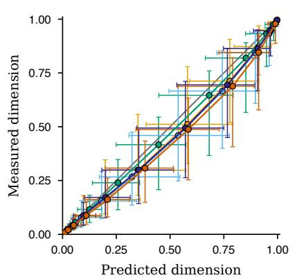

b  
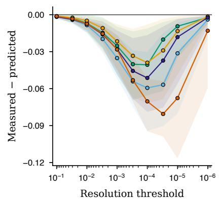  
BLOOM GPT-Neo Mamba Qwen2 RWKV  
Supplementary Figure 1: Full calibration and residual structure of the token-profile efective-dimension prediction. a, All 5,760 model–context–resolution values from 576 model–context cells in the held-out battery are summarized as 50 family-by-resolution points. Opaque coloured circles with black borders compare family medians of the normalised efective dimension predicted from the sorted token profile with that measured from the exact spectrum; horizontal and vertical bars are the corresponding interquartile ranges, point–lines join the ten fixed resolution thresholds and the grey line is exact prediction. b, Measured minus predicted normalised efective dimension as the relative resolution threshold $\alpha / q _ { ( 1 ) }$ decreases from left to right. Lines are family medians and ribbons are interquartile ranges. The modest mid-resolution overprediction is resolved again at the coarse and fine endpoints.

Measured-spectrum efective-dimension identity. Distribution reproduction was attempted for 80 held-out efective-dimension curves against the stored top-512 probabilities at relative tolerance $3 \times 1 0 ^ { - 4 }$ Seventy-two curves from nine models were reproduced to that tolerance and comprise the measuredspectrum efective-dimension analysis; the eight RWKV curves were excluded. For each included curve, the dense output Fisher was formed in float64 and eigendecomposed, and the efective dimension was evaluated at the stored relative dampings with no fitted parameters. The median held-out error is 0.00245, against 0.00473 for the fitted bounded law on the same curves; the dense core exponent (median 1.155) confirms the previously measured 1.14; and the fitted crossover �∗ coincides with the resolution at which the resolved count reaches half its ceiling (Spearman 1.000, median ratio 1.06). The efective dimension is therefore exactly determined by the measured spectrum; the two-parameter Hill curve accurately interpolates it.

Origin of the tail steepening. A factorial attribution varies the profile (real � against a pure power law at the matched core slope) and the read-out (real $W _ { U }$ against an independent Gaussian read-out with matched column norms) at three widths $( d , d / 2 , d / 4$ by column subsampling), for models with vocabulary $\leq 1 6 0 \mathrm { k }$ . The steepening of the spectral tail beyond the core window survives the random read-out with the real profile (median +0.47) and disappears for the pure power-law profile with the random read-out (−0.07), ruling out a finite-width random-matrix edge; the real read-out contributes a secondary component (+0.27). The crossover rank scales with width with a log–log slope of 1.1–1.3 in every cell: the width sets the position of the band edge, the profile’s high-rank depletion sets the shape of the tail.

## 6.2 Separating probability concentration from read-out structure

The matched mechanism panel compared the weighted profile $q _ { a } = p _ { a } \| u _ { a } - \bar { u } \| ^ { 2 }$ with the probabilityonly profile $( r / V ) p _ { a }$ in a common 27,450-outcome conditional representation. Fourteen models covered two sizes each of Pythia, GPT-2, GPT-Neo, Qwen2, BLOOM, Mamba and RWKV. The 192 fresh contexts per model comprised equal Wikipedia, AG News and LAMBADA subsets. Absolute efective-dimension error was the root-mean-square count error across ten dampings, $\alpha / ( \mathrm { t r } H / r ) \ \in$ $\{ 3 0 , 1 0 , 3 , 1 , 0 . 3 , 0 . 1 , 0 . 0 3 , 0 . 0 1 , 0 . 0 0 3 , 0 . 0 0 0 3 \}$ . Exact spectral-exponent error was measured over ranks 8–32 on 48 contexts per model. Within-family medians were computed for each predictor before taking their log ratio.

In family order BLOOM, GPT-2, GPT-Neo, Mamba, Pythia, Qwen2 and RWKV, the weighted/probability-only log-error ratios for efective dimension are 0.62149, 0.16456, 0.49457, 0.45938, 0.43075, 0.88203 and 0.52199. Their equal-family mean is 0.51068, favouring the probability-only profile. For spectral shape, the corresponding ratios are $- 0 . 4 9 9 4 3 , \ - 0 . 4 0 0 5 1$ $- 0 . 2 5 0 8 9 , \ - 0 . 2 1 0 8 8 , \ - 0 . 3 1 9 1 9 , \ - 0 . 6 7 1 9 1$ and −0.29760; their mean is −0.37863, favouring the weighted profile. Enumerating all 128 family sign patterns gives one-sided $P = 1 / 1 2 8$ for each contrast. The common-outcome comparison separates probability concentration from read-out weighting; it complements the native-vocabulary external-family prediction above, whose estimator and outcome representation are retained in main Figure 3a,b.

## 6.3 Singleton tokens, interchangeable clusters and multiscale inheritance

Let $\Pi _ { L }$ denote the conditional-expectation projector of a partition $L$ of outcomes in the weighted coordinate representation, and let $U ^ { \top } U = I _ { r }$ be a resolved rank-� frame with explained energy fraction $q ( L ) = \mathrm { t r } \big ( U ^ { \top } \Pi _ { L } U \big ) / r$ . When rank $( \Pi _ { L } U ) = r ;$ , write $P _ { T } = U U ^ { \top }$ and let $P _ { C }$ be the orthogonal projector onto $\mathrm { c o l } ( \Pi _ { L } U )$

Proposition 5 (clusters as conditional expectations). $\Pi _ { L }$ is the orthogonal projector onto partitionmeasurable directions; maximising the explained fraction over partitions with � cells is a weighted �-means problem on the frame rows. If rank $( \Pi _ { L } U ) = r ;$ , then $\| P _ { C } - P _ { T } \| _ { F } ^ { 2 } = 2 r \{ 1 - q ( L ) \}$ links the explained fraction to projector distance.

Proof. Conditional expectation is self-adjoint, idempotent and has as its image exactly the functions constant on partition cells, so it is the orthogonal projector onto that subspace. Write the rows of the weighted frame as $x _ { a } = U _ { a , : } / \sqrt { \rho _ { a } }$ . The isotropy identity $\begin{array} { r } { \sum _ { a } \rho _ { a } x _ { a } x _ { a } ^ { \top } = I _ { r } } \end{array}$ gives

$$
r \{ 1 - q ( L ) \} = \sum _ { C \in L } \sum _ { a \in C } \rho _ { a } \| x _ { a } - \bar { x } _ { C } \| ^ { 2 } , \qquad \bar { x } _ { C } = \frac { \sum _ { a \in C } \rho _ { a } x _ { a } } { \sum _ { a \in C } \rho _ { a } } .
$$

Thus maximising capture is exactly weighted �-means. If the projected frame retains rank $r ,$ , the projector formula gives tr $( P _ { C } P _ { T } ) = \mathrm { t r } ( U ^ { \top } \Pi _ { L } U ) = r q ( L )$ . The principal-angle identity for two rank-� projectors then gives $\| P _ { C } - P _ { T } \| _ { \mathrm { F } } ^ { 2 } = 2 r - 2 \operatorname { t r } ( P _ { C } P _ { T } ) = 2 r \{ 1 - q ( L ) \}$ □

Theorem 16 (interchangeability from capture). Let $q _ { \mathrm { m i n } } ( L ) = \lambda _ { \mathrm { m i n } } ( U ^ { \top } \Pi _ { L } U )$ . For any resolved vector $y = U z$ and any within-cluster redistribution � satisfying $\Pi _ { L } d = 0$

$$
| \langle d , y \rangle | \leq \| d \| \sqrt { 1 - q _ { \operatorname* { m i n } } ( L ) } \| y \| .\tag{41}
$$

If $q _ { \mathrm { m i n } } ( L ) = 1$ , every resolved observable is exactly invariant to redistribution within the cells of $L$ . The statement concerns the resolved geometry; the full output distribution can still distinguish tokens inside a cell.

Proof. Since $\Pi _ { L } d = 0$ and $\Pi _ { L }$ is self-adjoint, $\langle d , y \rangle = \langle d , ( I - \Pi _ { L } ) y \rangle$ . Cauchy–Schwarz gives the first factor. Moreover

$$
\begin{array} { r } { \| ( I - \Pi _ { L } ) U z \| ^ { 2 } = z ^ { \top } \{ I - U ^ { \top } \Pi _ { L } U \} z \leq \{ 1 - q _ { \operatorname* { m i n } } ( L ) \} \| z \| ^ { 2 } . } \end{array}
$$

Because $U$ is orthonormal, $\| z \| = \| y \|$ . This proves Eq. (41); the exact case follows by setting $q _ { \mathrm { m i n } } =$ 1. □

The empirical partition has two regimes. On the fixed language-mode battery, weighted �-means achieves mean capture 0.718 and worst-direction capture 0.252, both well above the capture levels specified before measurement. Twenty-six of 128 cells contain fewer than eight tokens, including six singleton cells. Those cells contain probability mass 0.3315, and every such cell contains a token in the top 158 by reference probability. The high-probability head therefore requires singleton or near-singleton resolution, while the remaining mass forms genuine interchangeable clusters. Specificity, reference-swap and outer-half replications recover the same structure.

Algebraically, let $J _ { \mathrm { e x } }$ and $J _ { \mathrm { b k } }$ be the coordinate projectors onto the exceptional singleton block and clustered bulk, respectively. The partition respects this split. Put $\Pi _ { g } = J _ { g } \Pi _ { L } J _ { g } , A _ { g } = U ^ { \top } \Pi _ { g } U$ and $E _ { g } = U ^ { \top } ( J _ { g } - \Pi _ { g } ) U$ for $g \in \{ \mathrm { e x } , \mathrm { b k } \}$ . These matrices are positive semidefinite and give the exact identity

$$
I _ { r } = A _ { \mathrm { e x } } + A _ { \mathrm { b k } } + E _ { \mathrm { e x } } + E _ { \mathrm { b k } } ,
$$

where the two � terms are captured information and the two � terms are unresolved residuals. The exceptional contribution has rank at most the singleton budget. This separates a probability-declared head from a support-rich bulk and prevents a high total capture from hiding poor bulk capture.

Fresh-context tests do not support a universal fixed partition: in a held-out test of the candidate partitions, the proposed within-cell attenuation failed in all six model-halves, with within-to-cross median-response ratios of 1.22–3.11. A separate cross-model partition comparison finds bulk agreement 1.0 against a matched-null median 0.979 in both splits, which is descriptive evidence of shared partition structure. The actual-Fisher inheritance analysis recovers all 176 theorem certificates and the primary inheritance efect, while the stronger half-sample directionality estimates do not support a directional efect in any arm. Together these results establish the within-battery singleton-head/cluster-bulk anatomy and the exact interchangeability theorem rather than a universal fixed partition across contexts.

## Supplementary Note 7 Acquisition time on a logarithmic scale

This section gives the acquisition evidence reported here. It distinguishes the statistical schedule measured on pretrained-model checkpoint ladders from the causal depth intervention, then connects both to the geometric motion and margin results below.

For a fact $f ,$ let $t ( f )$ be the first checkpoint after which its signed answer margin remains above a fixed threshold specified before model evaluation, and define its logarithmic acquisition time

$$
\tau ( f ) = \log _ { 2 } \{ t ( f ) / t _ { 0 } \} .\tag{42}
$$

The surviving depth efect is a translation in this logarithmic time coordinate, and alignment by held-out loss across model sizes is more accurate than alignment by training step.

## 7.1 Corpus �-gram statistics predict acquisition before training

Across Pythia-70M, Pythia-160M and Pythia-410M, the margin trajectory of a fact is predicted from its ex-ante corpus margins at unigram, bigram and trigram resolution. At 70M and 160M, the selected log-linear model hands weight from coarse to fine statistics during training; at the final checkpoints the trigram and bigram terms dominate, with the trigram-to-unigram weight ratio ranging from 2.7 to 4.9. Without refitting on fresh facts with zero prefix overlap, the predictor explains 0.775–0.792 of margin-trajectory variance, attains acquisition-status agreement 0.792–0.854 and predicts continuous acquisition time with error 0.77–0.96 in �. The corresponding errors are 1.04, 2.20 and 0.98 for the constant acquisition-time baseline and 2.02, 2.56 and 2.34 for the label-permutation baseline. Corpus �-gram margins therefore predict the acquisition schedule before training.

## 7.2 Evidence depth causes a multiplicative delay

The causal experiment assigns the same synthetic facts to five evidence depths while sharing initial weights and batch streams across arms. Every statistic below the assigned depth has zero margin and the complete deciding margin appears at and above it. For the fixed lower-tail quantile band $p \in [ 0 . 1 0 , 0 . 2 0 ]$

$$
Q _ { p } \{ \tau \mid R 4 \} - Q _ { p } \{ \tau \mid R 0 \} \simeq \Delta , \qquad \Delta = 2 . 1 0 3 [ 1 . 7 9 , 2 . 4 0 ] .\tag{43}
$$

Equivalently, deepest evidence delays acquisition by a factor $2 ^ { \Delta } \simeq 4 . 3$ in training steps on this band. The fitted shift varies by only 0.167 in � across the analysed quantiles, small relative to $\Delta = 2 . 1 0 3$ The �4 − �2 diference in � is 1.365 [1.14, 1.59], approximately 2.6-fold in steps. The near-uniform translation is supported for �4 − �0; �4 − �2 independently establishes the direction and magnitude. The onset of unsigned target–alternative margin change remains stable: depth delays persistent signed commitment. Random reassignment of the same facts across depth arms, with shared initial weights and batch streams, identifies evidence depth as the cause of the delay while holding fact composition fixed.

## 7.3 Generalisation across architectures and evidence constructions

A separate fully crossed crossover exchanges shallow and deep assignment within matched reciprocalfact blocks while holding initial parameters, minibatch streams, exposure counts, sequence lengths and the global shallow:deep mixture fixed. The design crosses three compact four-layer decoders—absoluteposition/GELU GPT-2, rotary/GELU GPT-NeoX and RoPE/RMSNorm/SwiGLU Llama—with distant copy-back-reference and four-cue-parity controlled languages. It uses eight seeds and 384 matched reciprocal-fact blocks per cell, for 96 runs, and evaluates the persistent 0.75-nat acquisition time on a 100-point checkpoint grid through step 44,800. The crossed bootstrap uses 10,000 resamples of seed and matched block.

For copy-back-reference and four-cue parity respectively, the mean paired diferences in � are 1.017 [0.876, 1.161] and 1.205 [1.060, 1.353] for GPT-2, 0.996 [0.849, 1.150] and 1.345 [1.196, 1.497] for GPT-NeoX, and 0.810 [0.699, 0.929] and 1.514 [1.365, 1.669] for Llama (95% intervals; Extended Data Fig. 4b,c). All six intervals and all 48 seed means are positive. All twelve fixed-treatment and randomised-label control intervals contain zero. Averaging architectures equally, parity exceeds copyback-reference by 0.414 [0.291, 0.536] in �; the corresponding within-architecture contrasts are 0.189 [−0.015, 0.384] for GPT-2, 0.349 [0.145, 0.552] for GPT-NeoX and 0.704 [0.500, 0.912] for Llama. Evidence depth therefore delays acquisition across architectures, while evidence construction modulates that delay on average. This mean paired diference in logarithmic acquisition time complements the lower-tail translation above and leaves its $\Delta = 2 . 1 0 3$ value unchanged.

## 7.4 Held-out loss aligns cumulative acquisition curves across scale

Main-text Fig. 4b,c shows the cumulative number of persistently acquired facts across the 70M, 160M and 410M checkpoint ladders in both training-step and held-out-loss coordinates. In the quantified 70M-to-160M comparison, membership sign agreement is 0.92–0.93, and the trajectory of the �-gram predictor aligns approximately three times more accurately by held-out loss than by training step (gap 0.130 against 0.413), a descriptive comparison. On the 300-fact real-model battery, the �-gram predictor reproduces the trajectories independently at all three sizes without refitting; the observational level schedule, absolute cross-size alignment error under held-out loss and between-seed variability threshold are also evaluated at 70M and 160M. These real-checkpoint results establish statistical composition but remain observational. Causal depth identification and efects at matched �-gram evidence come from the randomised synthetic system, and the held-out-loss alignment advantage is descriptive.

The resulting acquisition law is a composition of four measured objects:

$$
\tau ( f ) \simeq \tau _ { 0 } \{ \mathrm { d e c i d i n g - l e v e l \ n - g r a m \ m a r g i n } \} + \Delta \{ \mathrm { d e p t h } \} ,\tag{44}
$$

with the cumulative acquisition curve re-indexed across scale by held-out loss. Equation (43) summarises the near-uniform measured shift over the analysed quantile band; Eq. (44) is the compact first-order reading that connects the measured population-level components. Per-fact additive fits reach $R ^ { 2 }$ of $0 . 7 2 -$ 0.83 with a measured �-gram-margin-by-depth interaction; the direct causal result is the near-uniform lower-tail quantile shift of Eq. (43).

## Supplementary Note 8 Projected-margin dynamics and conditional acquisition time

The persistent acquisition time above is an empirical population summary. This note supplies a modelrelative accounting framework for a fixed weighted margin projection and states the additional assumptions needed to infer first-passage or logarithmic-time relations from its trajectory.

Let $\mathcal { F }$ be a finite population of facts, with fixed weights $w _ { f } \geq 0$ satisfying $\begin{array} { r } { \sum _ { f } w _ { f } = 1 } \end{array}$ . Let $z _ { f } \in \mathbb { R } ^ { R }$ be fixed, response-independent resolved evidence coordinates, and let $m _ { f } ( \theta )$ be the oriented answer margin, so larger values favour the declared answer. For a parameter path �(�) define the weighted margin projection

$$
\beta _ { r } ( t ) = \mathbb { E } _ { w } \left[ z _ { f r } m _ { f } ( \theta ( t ) ) \right] .\tag{45}
$$

The estimand fixes the fact population, weights and response-independent coordinates and measures the trajectory of the declared weighted margin projection.

## 8.1 Exact continuous and finite-step accounting

Theorem 17 (exact rate of change of the weighted margin projection). Suppose � is diferentiable at � and every $m _ { f }$ is diferentiable at $\theta ( t )$ , and put $q _ { f } ( t ) = \nabla _ { \theta } m _ { f } ( \theta ( t ) )$ and $\bar { q } _ { r } ( t ) = \mathbb { E } _ { w } \left[ z _ { f r } q _ { f } ( t ) \right]$ . Then: Instantaneous rate.

$$
\dot { \beta } _ { r } ( t ) = \mathbb { E } _ { w } [ z _ { f r } q _ { f } ( t ) ^ { \top } \dot { \theta } ( t ) ] = \bar { q } _ { r } ( t ) ^ { \top } \dot { \theta } ( t ) .\tag{46}
$$

Integrated change. If � is absolutely continuous on $\left[ t _ { 0 } , t _ { 1 } \right]$ and every $m _ { f }$ is $C ^ { 1 }$ on a neighbourhood of the parameter path, then $\beta _ { r }$ is absolutely continuous, the instantaneous identity holds almost everywhere, and

$$
\beta _ { r } ( t _ { 1 } ) - \beta _ { r } ( t _ { 0 } ) = \int _ { t _ { 0 } } ^ { t _ { 1 } } \bar { q } _ { r } ( t ) ^ { \top } \dot { \theta } ( t ) \mathrm { d } t .\tag{47}
$$

Proof. The fact set is finite and $z _ { f } , w _ { f }$ are fixed, so diferentiation commutes with the weighted sum. The chain rule gives ${ \dot { m } } _ { f } = q _ { f } ^ { \top } { \dot { \theta } } ;$ finite linearity gives Eq. (46). Under the stated regularity assumptions, the chain rule for absolutely continuous paths holds almost everywhere, and the fundamental theorem of calculus gives Eq. (47). □

The fixed-coordinate assumption is essential. If $z _ { f } = z _ { f } ( t )$ , the product rule adds $\mathbb { E } _ { w } \left[ \dot { z } _ { f r } ( t ) m _ { f } ( t ) \right]$ to Eq. (46); a checkpoint-dependent resolver can therefore create apparent movement of the projection even when the margins do not move.

Theorem 18 (exact finite-step path accounting). Let $\theta _ { 0 } , \ldots , \theta _ { K }$ be any finite parameter path, $\Delta \theta _ { k } =$ $\theta _ { k + 1 } - \theta _ { k }$ and Δ� $\iota _ { f k } = m _ { f } ( \theta _ { k + 1 } ) - m _ { f } ( \theta _ { k } )$ . Define the finite-step projected-margin change $W _ { r k } \ =$ $\mathbb { E } _ { w } \left[ z _ { f r } \Delta m _ { f k } \right]$ . Then:

Telescope.

$$
\beta _ { r } ( K ) - \beta _ { r } ( 0 ) = \sum _ { k = 0 } ^ { K - 1 } W _ { r k } .\tag{48}
$$

Arbitrary tangent. For any supplied covectors $q _ { f k }$ , let

$$
R _ { f k } = \Delta m _ { f k } - q _ { f k } ^ { \top } \Delta \theta _ { k } , \quad \quad \quad \bar { q } _ { r k } = \mathbb { E } _ { w } \left[ z _ { f r } q _ { f k } \right] , \quad \quad \quad \bar { R } _ { r k } = \mathbb { E } _ { w } \left[ z _ { f r } R _ { f k } \right] .\tag{49}
$$

Then exactly

$$
\beta _ { r } ( K ) - \beta _ { r } ( 0 ) = \sum _ { k = 0 } ^ { K - 1 } \{ \bar { q } _ { r k } ^ { \top } \Delta \theta _ { k } + \bar { R } _ { r k } \} .\tag{50}
$$

Zero-remainder criterion. If every margin is continuously diferentiable on the �th update segment and $\begin{array} { r } { \widetilde { q } _ { f k } = \int _ { 0 } ^ { 1 } \nabla m _ { f } ( \theta _ { k } + s \Delta \theta _ { k } ) } \end{array}$ d�, then

$$
\begin{array} { r } { R _ { f k } = 0 \quad \Longleftrightarrow \quad ( \widetilde { q } _ { f k } - q _ { f k } ) ^ { \top } \Delta \theta _ { k } = 0 . } \end{array}\tag{51}
$$

Thus $q _ { f k } = \widetilde { q } _ { f k }$ is suficient but not necessary: one update identifies only the covector projection along its actual displacement.

Proof. Equation (48) follows by summing $\beta _ { r } ( k + 1 ) - \beta _ { r } ( k )$ . Substituting $\Delta m _ { f k } = q _ { f k } ^ { \top } \Delta \theta _ { k } + R _ { f k }$ and using finite linearity gives Eq. (50). Along the update segment, the chain rule and fundamental theorem of calculus give $\Delta m _ { f k } = \widetilde { q } _ { f k } ^ { \top } \Delta \theta _ { k }$ ; subtracting the supplied linear term gives Eq. (51). □

The endpoint telescope requires no smoothness and is the primary exact finite-step identity. Using a left-endpoint or fixed-initialisation tangent is also exact only when its remainder is retained. A zero pooled remainder can conceal cancellation among nonzero fact-level remainders.

## 8.2 Signed rate in a positive-semidefinite geometry

Fix a mode and time, abbreviate $q = \bar { q } _ { r }$ and $y = { \dot { \theta } } \left( \operatorname { o r } y = \Delta \theta _ { k } \right)$ , and let $A \succeq 0$ be a declared local metric or efective optimiser geometry. Supply solve certificates

$$
A x = q , \qquad A y = g ,\tag{52}
$$

where $g$ is the signed update covector whose metric solve is the actual velocity. Define

$$
S = q ^ { \top } x , \qquad E = g ^ { \top } y = y ^ { \top } A y , \qquad V = q ^ { \top } y , \qquad a = \frac { V } { \sqrt { S } \sqrt { E } } .\tag{53}
$$

Theorem 19 (positive-semidefinite projected-margin rate factorisation). If Eq. (52) holds and �, $E > 0 .$ then

$$
V = \sqrt { S } \sqrt { E } a , \quad \quad | a | \le 1 , \quad \quad V ^ { 2 } \le S E .\tag{54}
$$

The sign of � records whether the update increases or decreases the weighted margin projection. For singular �, the solve certificates require $q , g \in \mathsf { R a n g e } ( A )$ ; null-space choices do not alter �, � or �. If $S = 0 \mathrm { o r } E = 0$ , then $V = 0$ but the normalised alignment is undefined.

Proof. Because $q = A x$ and $g = A y$ , one has $V = x ^ { \top } A y , S = x ^ { \top } A x$ and $E = y ^ { \top } A y$ . Cauchy–Schwarz for the positive-semidefinite form gives $V ^ { 2 } \leq S E$ ; the signed factorisation and unit bound follow from the definition of �. □

## 8.3 Conditional first-passage and logarithmic-time relations

Let two projected-margin trajectories start from the same level $\beta _ { 0 }$ , and put $C _ { j } ( k ) = \beta _ { j } ( k ) - \beta _ { 0 }$ for $j \in \{ s , d \}$

Theorem 20 (cumulative-change first-passage ordering). Fix a common threshold ℎ.

Exact dominance. If the deep path first reaches ℎ at index � and $C _ { s } ( j ) \geq C _ { d } ( j )$ for $0 \leq j \leq k$ , then the shallow path has reached ℎ by index �. No monotonicity of either path is required.

Uniform-error form. $\mathrm { I f } \ \varepsilon \geq 0$ and $C _ { d } ( j ) \le C _ { s } ( j ) + \varepsilon$ through �, then a deep first crossing of $h + \varepsilon$ implies a shallow crossing of ℎ by �. The same pointwise argument gives inclusion of continuous-time hit sets and hence orders their infima whenever the deep hit set is nonempty.

Proof. At the deep crossing, exact dominance gives $\beta _ { s } ( k ) = \beta _ { 0 } + C _ { s } ( k ) \ge \beta _ { 0 } + C _ { d } ( k ) = \beta _ { d } ( k ) \ge h$ Under uniform error, $\beta _ { s } ( k ) \geq \beta _ { d } ( k ) - \varepsilon \geq h$ . Earlier or later increments are irrelevant. □

This theorem concerns ordinary first entry. The empirical acquisition time in Eq. (42) requires the margin to remain above threshold at all later observed checkpoints. Ordering that persistent acquisition time requires an additional persistence argument; sparse local rate measurements alone do not establish cumulative-change dominance.

Theorem 21 (conditional exponential response). Suppose a projected-margin trajectory has the normalised response

$$
\begin{array} { r } { \beta _ { r } ( t ) = \beta _ { r , \infty } - ( \beta _ { r , \infty } - \beta _ { r , 0 } ) e ^ { - \kappa _ { r } t } , \qquad \kappa _ { r } > 0 , } \end{array}
$$

with $\beta _ { r , \infty } > \beta _ { r , 0 }$ . At fractional threshold $0 < \rho < 1$

$$
T _ { r } ( \rho ) = \frac { - \log ( 1 - \rho ) } { \kappa _ { r } } .\tag{55}
$$

Consequently $\kappa _ { s } \geq \kappa _ { d } > 0$ implies $T _ { s } ( \rho ) \leq T _ { d } ( \rho )$ , and

$$
\log _ { 2 } T _ { d } ( \rho ) - \log _ { 2 } T _ { s } ( \rho ) = \log _ { 2 } \frac { \kappa _ { s } } { \kappa _ { d } } .\tag{56}
$$

The threshold-independent translation follows from the shared normalised response shape and constant rates; it is not implied by the rate identity alone.

Proof. Solving $1 - e ^ { - \kappa _ { r } t } = \rho$ gives Eq. (55). Positivity $\mathbf { o f } - \log ( 1 - \rho )$ reverses the rate ordering into a time ordering. Taking the time ratio and its logarithm gives Eq. (56). □

Corollary 11 (distributional scaling). Let $T _ { s } , T _ { d }$ be nonnegative random acquisition times. If $T _ { d } \overset { d } { = } c T _ { s }$ for $c > 0$ , equivalently $F _ { d } ( t ) = F _ { s } ( t / c )$ for all �, then every lower quantile $Q _ { j } ( p ) = \operatorname* { i n f } \{ t : F _ { j } ( t ) \geq p \}$ satisfies

$$
Q _ { d } ( p ) = c Q _ { s } ( p ) , \qquad 0 < p < 1 .\tag{57}
$$

For positive quantiles this is a constant logarithmic-time translation by log �.

Proof. Multiplication by $c > 0$ preserves order, so scaling maps the entire CDF level set for the shallow condition onto the corresponding level set for the deep condition. Its infimum is therefore multiplied by �. □

Population-level scaling need not be a same-fact multiplier. Conversely, a shift over one quantile band does not by itself establish full distributional scaling.

Theorem 22 (learner-independent depth monotonicity is impossible). Consider the positive-rate cumulative-change model $T _ { j } = W _ { j } / \kappa _ { j } .$ , with required change $W _ { j } > 0$ and efective rate $\kappa _ { j } > 0$ . Within this model there exist a fixed shallow/deep evidence pair with nominal depths $d _ { s } < d _ { d }$ and two positive rate profiles whose acquisition orders are opposite. Thus nominal depth alone cannot order acquisition time throughout this model without an assumption on learner-relative efective rates or an equivalent accessibility object.

Proof. Give both items one unit of required change. The rate profile $\left( \kappa _ { s } , \kappa _ { d } \right) = \left( 2 , 1 \right)$ has $( T _ { s } , T _ { d } ) =$ $( 1 / 2 , 1 )$ , whereas the profile (1, 2) has $( T _ { s } , T _ { d } ) = ( 1 , 1 / 2 )$ . The evidence depths are unchanged and both rate profiles are positive. □

Randomised evidence-depth assignment identifies the causal acquisition efect in Supplementary Note $7 ;$ the weighted-margin-projection identities provide conditional path accounting for the declared evidence projection.

## Supplementary Note 9 Geometric motion, margins and local objective rate

Theorem 23 (continuous scores and discontinuous decisions). Let $\rho ( p , q ) = \| \sqrt { p } - \sqrt { q } \| _ { 2 }$

Continuous score. If a score � is �-Lipschitz in this metric, then

$$
| S ( p ) - S ( q ) | \leq L \rho ( p , q ) .\tag{58}
$$

Discrete decision. For a discrete argmax decision, let $y$ be the unique maximiser of $p$ and $\begin{array} { r l } { m } & { { } = } \end{array}$ $p _ { y } - \operatorname* { m a x } _ { j \neq y } p _ { j }$ its margin. If the maximiser changes under $q ,$ then

$$
\mathrm { T V } ( p , q ) \geq m / 2 , \qquad \rho ( p , q ) \geq m / 2 .\tag{59}
$$

Proof. Equation (58) is the definition of Lipschitz continuity. $\mathrm { I f } z \ne y$ maximises $q ,$ then $q _ { z } \geq q _ { \mathrm { y } }$ and

$$
m \leq p _ { \mathrm { y } } - p _ { z } \leq | p _ { \mathrm { y } } - q _ { \mathrm { y } } | + | p _ { z } - q _ { z } | \leq \| p - q \| _ { 1 } = 2 \mathrm { T V } ( p , q ) .
$$

Finally $\mathrm { T V } ( p , q ) \leq \rho ( p , q )$ follows from $\| p - q \| _ { 1 } \leq 2 \| { \sqrt { p } } - { \sqrt { q } } \| _ { 2 }$ . This proves Eq. (59).

The continuous bound is checked without violation in 5,704 implementation cases. The discrete margin theorem has zero violations over 45,315 observed cross-seed flips, or 90,630 oriented checks. On the held-out LAMBADA battery [4] the flip frequency falls from 0.519 to zero as the normalised margin $z = m / ( 2 \rho )$ crosses one, where zero is forced by the theorem. This connects a smooth geometric acquisition trajectory to an apparently abrupt benchmark transition.

Theorem 24 (Cauchy–Schwarz bound for the objective rate). Let � be positive definite, let $q$ be a behaviour covector and $g$ a training-loss covector, and solve $A x = q , A y = g$ . Define

$$
\mathrm { s e n s i t i v i t y } = q ^ { \top } x , \qquad \mathrm { u p d a t e ~ n o r m } ^ { 2 } = g ^ { \top } y , \qquad \mathrm { o b j e c t i v e ~ r a t e } = q ^ { \top } y .
$$

Then

$$
\mathrm { o b j e c t i v e ~ r a t e } ^ { 2 } \leq \mathrm { s e n s i t i v i t y } \times \mathrm { u p d a t e ~ n o r m } ^ { 2 } .\tag{60}
$$

When both quadratic forms are positive, define alignment $= \langle x , y \rangle _ { A } / ( \| x \| _ { A } \| y \| _ { A } )$ . Then exactly

$$
{ \mathrm { o b j e c t i v e ~ r a t e } } ^ { 2 } = { \mathrm { s e n s i t i v i t y } } \times { \mathrm { u p d a t e ~ n o r m } } ^ { 2 } \times { \mathrm { a l i g n m e n t } } ^ { 2 } .\tag{61}
$$

Equivalently, objective rate2/sensitivity $\leq$ update norm2.

Proof. Use the �-inner product $\langle u , \nu \rangle _ { A } = u ^ { \top } A \nu$ . Then sensitivity $= \| \ b { x } \| _ { A } ^ { 2 }$ , update $\mathrm { n o r m } ^ { 2 } = \| y \| _ { A } ^ { 2 }$ and objective rate $= \boldsymbol { q } ^ { \intercal } \boldsymbol { y } = \boldsymbol { x } ^ { \intercal } \boldsymbol { A } \boldsymbol { y } = \langle \boldsymbol { x } , \boldsymbol { y } \rangle _ { \boldsymbol { A } }$ . Cauchy–Schwarz proves Eq. (60); dividing its two sides by the product of the positive quadratic forms and using the definition of alignment gives Eq. (61). □

Objective sensitivity alone therefore cannot determine acquisition rate. With $A = I , q = ( 1 , 0 )$ and unit training covectors (1, 0) and (0, 1), sensitivity and squared update norm are identical but the objective rate is one or zero. On 80 held-out Pythia-70M examples, evaluated with a declared final-readout preconditioner, mean alignment squared is 0.6811 (95% interval 0.6503–0.7117). The factorisation holds exactly and the correlation between log sensitivity and log squared objective rate is 0.541. The missing quantity linking controllability to learning is objective–update alignment.

Proposition 6 (read-out subspace kinematics). Let $Q ( t )$ have orthonormal columns and set $P ( t ) =$ $Q ( t ) Q ( t ) ^ { \top }$ and $B = ( I - P ) { \dot { Q } }$ . Then

$$
{ \dot { P } } = B Q ^ { \top } + Q B ^ { \top } , \qquad Q ^ { \top } B = 0 , \qquad \| { \dot { P } } \| _ { \mathrm { F } } ^ { 2 } = 2 \| B \| _ { \mathrm { F } } ^ { 2 } .\tag{62}
$$

Only the normal component � rotates the subspace. In particular, an update confined to the current column span, including scalar decoupled weight decay, produces no rotation.

Proof. Diferentiate $P = Q Q ^ { \top }$ . Diferentiating $Q ^ { \top } Q = I$ shows that $Q ^ { \top } \dot { Q }$ is skew-symmetric, so its two contributions to $\dot { P }$ cancel. The remaining normal component is �, giving the first identity and $Q ^ { \top } B = 0$ Orthogonality makes the two summands Frobenius-orthogonal and equal in norm, which proves the final identity. If $\dot { Q }$ is in the span of $Q .$ , then $B = 0$ □

The same approximation residual that governs static recovery also controls how strongly unresolved language can rotate the read-out subspace.

Theorem 25 (language residual bounds read-out rotation). Fix a strictly positive reference law $\rho$ and put

$$
P _ { \rho } = I - \sqrt { \rho } \sqrt { \rho } ^ { \top } , \qquad C _ { \rho } = P _ { \rho } \mathrm { d i a g } ( \rho ) ^ { 1 / 2 } , \qquad \kappa _ { \rho } = \| C _ { \rho } \| _ { \mathrm { o p } } .
$$

For an untied afine read-out $W _ { t }$ , let $A _ { t } = C _ { \rho } W _ { t } , R _ { t } = A _ { t } ^ { \top } A _ { t } , U _ { t } = A _ { t } R _ { t } ^ { - 1 / 2 }$ and $P _ { t } = U _ { t } U _ { t } ^ { \top }$ on a constant-full-rank interval. Let the true next-token law be $\widetilde { \pi } _ { X }$ , let $\pi _ { X }$ be a declared resolved core, and define

$$
\zeta = \mathbb { E } _ { X } \Vert \sqrt { \widetilde { \pi } _ { X } } - \sqrt { \pi _ { X } } \Vert ^ { 2 } , \qquad \psi _ { t } ( X ) = R _ { t } ^ { - 1 / 2 } h _ { t } ( X ) , \qquad \Psi _ { t } = \{ \mathbb { B } \Vert \psi _ { t } ( X ) \Vert ^ { 2 } \} ^ { 1 / 2 } .
$$

Under the population read-out flow

$$
\dot { W } _ { t } = \gamma _ { t } \mathbb { E } \big [ \big ( e _ { Y } - p _ { t } \big ) h _ { t } ( X ) ^ { \top } \big ] - \lambda _ { t } W _ { t } + \mathcal { D } _ { t } , \qquad Y \mid X \sim \widetilde { \pi } _ { X } , \qquad \gamma _ { t } \geq 0 ,
$$

the horizontal velocity $B _ { t } = ( I - P _ { t } ) \dot { A } _ { t } R _ { t } ^ { - 1 / 2 }$ decomposes exactly as

$$
B _ { t } = B _ { t } ^ { \mathrm { c o r e } } + E _ { t } ^ { \mathrm { l a n g } } + E _ { t } ^ { \mathrm { m e c h } } ,\tag{63}
$$

where

$$
\begin{array} { r l } & { B _ { t } ^ { \mathrm { c o r e } } = \gamma _ { t } ( I - P _ { t } ) C _ { \rho } \mathbb { E } [ ( \pi _ { X } - p _ { t } ) \psi _ { t } ( X ) ^ { \top } ] , } \\ & { E _ { t } ^ { \mathrm { l a n g } } = \gamma _ { t } ( I - P _ { t } ) C _ { \rho } \mathbb { E } [ ( \widetilde { \pi } _ { X } - \pi _ { X } ) \psi _ { t } ( X ) ^ { \top } ] , } \\ & { E _ { t } ^ { \mathrm { m e c h } } = ( I - P _ { t } ) C _ { \rho } \mathcal { D } _ { t } R _ { t } ^ { - 1 / 2 } . } \end{array}
$$

Scalar weight decay contributes exactly zero, and

$$
\| E _ { t } ^ { \mathrm { l a n g } } \| _ { \mathrm { F } } \leq 2 \gamma _ { t } \kappa _ { \rho } \Psi _ { t } \sqrt { \zeta } , \qquad \| \dot { P } _ { t } ^ { \mathrm { a c t u a l } } - \dot { P } _ { t } ^ { \mathrm { c o r e + m e c h } } \| _ { \mathrm { F } } \leq 2 \sqrt { 2 } \gamma _ { t } \kappa _ { \rho } \Psi _ { t } \sqrt { \zeta } .\tag{64}
$$

Proof. Conditioning on � gives $\operatorname { \mathbb { E } } [ e _ { Y } \mid X ] = { \widetilde { \pi } } _ { X }$ . Apply $C _ { \rho }$ to the flow, substitute into $B _ { t }$ , add and subtract $\pi _ { X } .$ , and use $( I - P _ { t } ) A _ { t } = 0$ . This proves Eq. (63), including the zero contribution of $- \lambda _ { t } A _ { t }$ For probability vectors,

$$
\| p - q \| _ { 2 } \leq 2 \| { \sqrt { p } } - { \sqrt { q } } \| _ { 2 } ,
$$

because $| p _ { i } - q _ { i } | = | \sqrt { p } _ { i } - \sqrt { q } _ { i } | ( \sqrt { p } _ { i } + \sqrt { q } _ { i } )$ and the final factor is at most two. Projection is contractive, so Frobenius Cauchy–Schwarz gives

$$
\begin{array} { r } { \| E _ { t } ^ { \mathrm { l a n g } } \| _ { \mathrm { F } } \leq \gamma _ { t } \kappa _ { \rho } \{ \mathbb { E } \| \widetilde { \pi } _ { X } - \pi _ { X } \| _ { 2 } ^ { 2 } \} ^ { 1 / 2 } \Psi _ { t } \leq 2 \gamma _ { t } \kappa _ { \rho } \Psi _ { t } \sqrt { \zeta } . } \end{array}
$$

Finally, Proposition 6 applied to the velocity diference $E _ { t } ^ { \mathrm { l a n g } }$ multiplies its Frobenius norm by ${ \sqrt { 2 } } ,$ proving the projector bound. □

A controlled smooth-path experiment supports the projector identity, the scalar-decay null and Eq. (64) in all 24 held-out seeds. The corpus �-gram, evidence-depth and held-out-loss alignment experiments establish the acquisition-time results above.

Cyclic concepts and relation-induced probability displacements. For a cyclic registry (weekdays, months), the advance-one-step map is fitted as the metric isometry (rotation) in the Fourier-1 phase representation that best carries each member’s distribution to the next. The rotation angle is compared with the ideal $2 \pi / n$ (weekdays 0.902 vs $2 \pi / 7 = 0 . 8 9 8 )$ . The of-rotation component is the metricisometry defect reported in the double dissociation (0.29 for cyclic concepts, 1.02 for relations), and the closure defect is the Fisher–Rao distance between the start point and the composition of � steps.

Relations (capital-of, gender, tense, comparative) are scored by probability-displacement alignment, the mean cosine alignment of the probability-displacement directions across instances (raw 0.49 for relations, near zero for cyclic), reported against a permuted-geometry control that preserves marginals (0.33).

## Part IV: Controllable

## Supplementary Note 10 Minimum-disturbance control and coordinate dependence of Euclidean cost

This section collects consequences of the chain that the operations of the main text use directly.

Let � be a positive-definite local cost metric, $q \ne 0$ a behaviour covector and $b \neq 0$ a desired first-order change, so feasible interventions satisfy $q ^ { \intercal } \delta = b$ . For the undamped output problem $A = G$ on the resolved tangent space; for the stable finite-resolution problem $A = G + \alpha R$ , where � is the declared reference metric.

Theorem 26 (minimum disturbance and the exact relative cost of Euclidean control). Minimum. The unique minimum-cost intervention is

$$
\delta _ { \mathrm { N } } = \frac { b A ^ { - 1 } q } { q ^ { \top } A ^ { - 1 } q } , \qquad \frac { 1 } { 2 } \delta _ { \mathrm { N } } ^ { \top } A \delta _ { \mathrm { N } } = \frac { b ^ { 2 } } { 2 q ^ { \top } A ^ { - 1 } q } .\tag{65}
$$

Exact gap. Every feasible � obeys the exact gap identity

$$
\frac { 1 } { 2 } \delta ^ { \top } A \delta - \frac { b ^ { 2 } } { 2 q ^ { \top } A ^ { - 1 } q } = \frac { 1 } { 2 } \| \delta - \delta _ { \mathrm { N } } \| _ { A } ^ { 2 } .\tag{66}
$$

Euclidean-to-natural cost ratio. In particular, the Euclidean step $\delta _ { \mathrm { E } } = b q / ( q ^ { \top } q )$ has cost ratio

$$
\Gamma _ { A } ( q ) : = \frac { \delta _ { \mathrm { E } } ^ { \top } A \delta _ { \mathrm { E } } } { \delta _ { \mathrm { N } } ^ { \top } A \delta _ { \mathrm { N } } } = \frac { ( q ^ { \top } A q ) ( q ^ { \top } A ^ { - 1 } q ) } { ( q ^ { \top } q ) ^ { 2 } } \geq 1 .\tag{67}
$$

Spectral bound. If the spectrum of � lies in $[ m , M ]$ , then

$$
1 \leq \Gamma _ { A } ( q ) \leq { \frac { ( M + m ) ^ { 2 } } { 4 M m } } .\tag{68}
$$

Equality on the left holds precisely when $q$ is supported on one eigenspace of $A .$

Damping. For $B = B ^ { \top } \succeq 0 , \alpha > 0$ and ${ \cal A } _ { \alpha } = B + \alpha I , \Gamma _ { A _ { \alpha } } ( q )$ and its worst-case ceiling are nonincreasing in � and converge to one: damping removes the exploitable anisotropy together with the natural-gradient advantage.

Proof. Lagrange stationarity for minimising ${ \frac { 1 } { 2 } } \delta ^ { \top } A \delta$ subject to $q ^ { \intercal } \delta = b$ gives $A \delta = \lambda q$ ; imposing the constraint gives Eq. (65). For any other feasible $\delta = \delta _ { \mathrm { N } } \mathrm { + } e , q ^ { \top } e = 0$ and hence $\delta _ { \mathrm { N } } ^ { \top } A e = b q ^ { \top } e / ( q ^ { \top } A ^ { - 1 } q ) = 0$ Expanding the quadratic proves Eq. (66); positive definiteness gives uniqueness. Substituting $\delta _ { \mathrm { E } }$ and $\delta _ { \mathrm { N } }$ proves Eq. (67).

For the bounds, diagonalise � and put $a _ { i } = q _ { i } ^ { 2 } / ( q ^ { \top } q )$ , so $\textstyle \sum _ { i } a _ { i } = 1$ . Then

$$
\Gamma _ { A } ( q ) = \left( \sum _ { i } a _ { i } \lambda _ { i } \right) \left( \sum _ { i } \frac { a _ { i } } { \lambda _ { i } } \right) .
$$

Cauchy–Schwarz gives the lower bound. Moreover $\begin{array} { r } { ( \lambda _ { i } - m ) ( M - \lambda _ { i } ) \geq 0 } \end{array}$ implies $\lambda _ { i } + m M / \lambda _ { i } \leq M + m$ Averaging and applying the arithmetic–geometric mean inequality gives

$$
2 \sqrt { m M \Gamma _ { A } ( q ) } \leq \sum _ { i } a _ { i } \lambda _ { i } + m M \sum _ { i } \frac { a _ { i } } { \lambda _ { i } } \leq M + m ,
$$

which proves $\operatorname { E q }$ . (68). Equality in the lower Cauchy–Schwarz bound requires a common eigenvalue wherever $a _ { i } > 0$

Finally, with $x _ { i } = \lambda _ { i } ( B ) + \alpha$ and weighted averages denoted by $\mathbb { E } _ { a } .$

$$
\frac { \mathrm { d } } { \mathrm { d } \alpha } \Gamma _ { A _ { \alpha } } ( q ) = \mathbb { E } _ { a } ( x ^ { - 1 } ) - \mathbb { E } _ { a } ( x ) \mathbb { E } _ { a } ( x ^ { - 2 } ) \leq 0 ,
$$

because � and $x ^ { - 2 }$ are oppositely ordered, so $\mathbb { E } _ { a } ( x x ^ { - 2 } ) \le \mathbb { E } _ { a } ( x ) \mathbb { E } _ { a } ( x ^ { - 2 } )$ . The spectral interval is $[ \lambda _ { \operatorname* { m i n } } ( B ) + \alpha , \lambda _ { \operatorname* { m a x } } ( B ) + \alpha ]$ , whose ratio and Kantorovich ceiling decrease to one. □

Equation (66) is the local of-target decomposition used in the experiments: the first term is total regularised disturbance at matched objective change, the second is the unavoidable cost of that change, and their diference is exactly half the squared �-distance from the natural step. On a positive-semidefinite �, the same statement holds on its resolved range with $G ^ { - 1 }$ replaced by $G ^ { \dagger }$ , provided $q \in \mathrm { R a n g e } ( G )$ and $q \neq 0$

At finite damping, the empirical battery measures realised output KL, whereas Eq. (67) compares regularised costs in �. The comparison therefore holds $A = G + \alpha I$ fixed and, for $\Pi _ { G } ( u ) = ( u ^ { \top } G u ) / ( q ^ { \top } u ) ^ { 2 }$ predicts the local Euclidean-to-damped-natural-gradient �-cost ratio with

$$
R _ { \mathrm { p r e d } } ( q ) = \frac { \Pi _ { G } ( q ) } { \Pi _ { G } ( A ^ { - 1 } q ) } .
$$

The two ratios agree in the undamped limit and in special finite-damping cases, such as an objective supported on one eigenspace; they generally difer at non-zero damping. The held-out evaluation covers 1,188 predictor cells at three matched target magnitudes, giving 3,564 deployed responses, of which 3,515 are usable (98.6% coverage). Across the usable responses, the median ratio of measured to predicted advantage is 0.967 (95% interval 0.957–0.975), and the log–log slope of measured on predicted advantage is 0.982 (95% interval 0.966–0.997). At intervention fractions $\Delta C / C = 0 . 0 1 , 0 . 0 3 , 0 . 1 0 .$ the model-balanced geometric means of the measured-to-predicted ratio are 0.918, 0.860 and 0.755, respectively; every one of the 11 within-model paths decreases at both adjacent steps. This quantifies the expected attenuation of a local prediction as intervention magnitude grows. The objective-resolved metric anisotropy therefore quantitatively predicts intervention cost across the cross-model battery; a scalar condition number alone does not supply this prediction.

Proposition 7 (chart-covariant control). Under an invertible chart change $h ^ { \prime } = S h$ , let

$$
A ^ { \prime } = S ^ { - \top } A S ^ { - 1 } , \qquad q ^ { \prime } = S ^ { - \top } q , \qquad \delta ^ { \prime } = S \delta .
$$

Then objective change, cost and the natural step are invariant: $\begin{array} { r } { \boldsymbol { q } ^ { \prime \top } \boldsymbol { \delta } ^ { \prime } = \boldsymbol { q } ^ { \top } \boldsymbol { \delta } , \boldsymbol { \delta } ^ { \prime \top } \boldsymbol { A } ^ { \prime } \boldsymbol { \delta } ^ { \prime } = \boldsymbol { \delta } ^ { \top } \boldsymbol { A } \boldsymbol { \delta } , \boldsymbol { \delta } _ { \mathrm { N } } ^ { \prime } = \boldsymbol { S } \boldsymbol { \delta } _ { \mathrm { N } } } \end{array}$ The cost ratio of any transported comparator $\delta _ { \mathrm { C } } ^ { \prime } = S \delta _ { \mathrm { C } }$ to the natural step is likewise invariant. By contrast, the fresh coordinate-Euclidean comparator $q ^ { \prime } / ( q ^ { \prime \top } q ^ { \prime } )$ is generally not the transport of $q / ( q ^ { \top } q )$ , so $\Gamma _ { A ^ { \prime } } ( q ^ { \prime } )$ need not equal $\Gamma _ { A } ( q )$ : coordinate-Euclidean control depends on the chosen chart. $\operatorname { I f } A = G + \alpha R$ covariance requires $R ^ { \prime } = S ^ { - \top } R S ^ { - 1 }$ . Resetting the reference to a fresh identity in the new chart instead maps back to the native reference $S ^ { \top } S$

Proof. The first two identities follow by substitution. Since $A ^ { \prime - 1 } = S A ^ { - 1 } S ^ { \top } , A ^ { \prime - 1 } q ^ { \prime } = S A ^ { - 1 } q$ and $q ^ { \prime \top } A ^ { \prime - 1 } q ^ { \prime } = q ^ { \top } A ^ { - 1 } q .$ , proving covariance of Eq. (65). The cost ratio is the ratio of two invariant quadratic costs only when both interventions are transported; the coordinate-Euclidean vectors do not obey that transport law in general. Finally, a fresh new-chart identity contributes �� to $A ^ { \prime } ;$ multiplying the equation by $S ^ { \top }$ and writing $\delta ^ { \prime } = S \delta$ gives the native term $\alpha S ^ { \top } S \delta$ □

## 10.1 Relation to direct preference optimisation

A natural policy gradient for a KL-regularised reinforcement-learning-from-human-feedback (RLHF) objective has the form $F ^ { - 1 } \nabla _ { \theta }$ (reward), where � is the policy Fisher matrix. Direct preference optimisation (DPO) [5] parameterises an implicit reward through $\beta \log [ \pi / \pi _ { \mathrm { r e f } } ]$ and optimises model parameters. This inference-time construction instead uses the activation-space pullback metric and the preference covector, $\delta h = ( G + \alpha I ) ^ { - 1 } \nabla _ { h } [ \log p ( y _ { w } \mid x ) - \log p ( y _ { l } \mid x ) ]$ . The resulting activation-space natural-gradient update is distinct from DPO’s parameter update.

## 10.2 Mass-preserving Fisher coarse-graining and interpretable partitions

Grouping the support tokens into � cells and replacing each token’s read-out row by its group mean gives a coarse output Fisher $H _ { \mathrm { c o a r s e } } = \mathrm { C o v } _ { g } ( \bar { w } _ { g } )$ , the between-group covariance of the group-mean unembeddings, which by the law of total covariance equals � minus the within-group term and is exact when � reaches the support size. For the exponential-tilt family defined by a scalar token value $\phi ,$ a partition preserves all Fisher information about the tilt when $\phi$ is constant within each cell. Approximating the complete steering update also requires retaining read-out covariance. Bins of $\phi$ are therefore refined by probability-weighted clusters of the read-out directions $w _ { a }$ and evaluate the resulting update against the ungrouped solve. In the measured cost model, the exact matrix-free solve is less expensive per step than the tested partitions fine enough to reproduce its update (main-text Methods).

For sentiment, the resulting interpretable cells correspond approximately to sentiment level crossed with lexical role. This partition serves interpretation rather than scalability: at the same update fidelity, the tested token groupings require several times more cells than the fixed-tolerance Krylov solve requires iterations.

## 10.3 The full cubic correction and the erosion predictor

Let �(ℎ) be the output natural parameters and take a straight activation path $h ( t ) = h _ { 0 } + t \delta h$ . Write $a = D \eta [ \delta h ] , b = D ^ { 2 } \eta [ \delta h , \delta h ]$ and $C = \mathrm { d i a g } ( p ) - p p ^ { \top }$ . Direct expansion of output KL gives

$$
\begin{array} { r }  \mathrm { K L } ( p _ { 0 } \| p _ { t } ) = \frac { 1 } { 2 } { t ^ { 2 } } a ^ { \top } C a + \frac { 1 } { 6 } { t ^ { 3 } } \big \{ { T ( a , a , a ) + 3 a ^ { \top } C b \} + O ( t ^ { 4 } ) , } \end{array}\tag{69}
$$

where $T ( a , a , a ) = \mathbb { E } _ { p } [ ( a - \mathbb { E } _ { p } a ) ^ { 3 } ]$ is the Amari–Chentsov contraction. The first cubic term is the third central moment pulled back through the Jacobian. The second is the directional Hessian of the network above the intervention; it vanishes at an afine read-out and is generally non-zero at an internal layer. The erosion analysis computes the first component exactly from one Jacobian–vector product and one matrix multiplication; restricted to the moderate-intervention regime, in which matched targets are reached along monotone segments of the scan, its rank correlation with gentle-to-aggressive erosion is +0.49 to +0.75 across 410M–2.8B, and the association reverses sign beyond that regime. In a 410M full-curvature analysis (four prompts, layers 4, 12 and 20 plus afine final-layer anchors), adding the network-Hessian term reduces mean absolute error against a parity-cancelling directional finite-diference estimate from 0.345 to 0.0176, a ratio of 0.051; the afine anchors return the map-Hessian term exactly zero. The full scale-ladder erosion analysis therefore reports the Amari–Chentsov and network-Hessian components separately and jointly.

Scan and regime comparisons. The analysis uses a two-segment scan grid extending the intervention range sixteenfold (so that unreached matched targets become genuine exclusions after scan-boundary artefacts are removed), a fixed sign-consistent crossing bracket, and average-tie rank correlations.

The association reverses on the pooled reach-extended population. Supplementary Note 10 analyses the moderate-intervention regime, comprising items whose crossings lie on monotone scan segments, with a partial rank correlation controlling the gentle-regime advantage separating the predictive signal from its mechanical coupling to the outcome’s denominator. On the 410M subset reaching targets within the narrower scan range, the correlation is +0.74.

## 10.4 Relinearised finite intervention paths

Both Fisher and Euclidean paths were relinearised after every accepted step, with an exact prompt-KL trust region of 0.02 nats and common cumulative objective checkpoints of 0.05, 0.1, 0.2 and 0.4 nats. Expansion and bisection matched the reached changes to within 1%. Cumulative local cost is the sum of $\mathrm { K L } ( p _ { j - 1 } \| p _ { j } )$ over accepted steps; it measures the path and is distinct from endpoint or unrelated-prompt disturbance. The completed panel contains 216 prompts in 18 model–objective cells (16 models from six families). All 864 prompt–target pairs reach the common checkpoints. Cell–target mean log Euclidean/Fisher path-cost ratios range from 2.4403 to 4.8452, giving geometric-mean ratios 11.48–127.12. All 72 paired 95% prompt-bootstrap intervals are positive in log space. The full set of ratios is displayed in main Figure 5b.

## 10.5 Reusable interventions with a reference metric

BLOOM-560M, Pythia-410M, Pythia-1.4B and Qwen2-1.5B were each given four donor prompts per objective, eight unseen target prompts per objective and four reference prompt–continuation pairs. Truth preference and anti-sycophancy used continuation log-odds objectives. A single activation update per model and objective was shared across prompts, injected at the final prompt position after block round(0.45�) for � blocks (zero-based index). The mean donor objective gradient was preconditioned by the reference-prompt Fisher, by the donor-prompt Fisher, or left Euclidean. All arms recomputed their gradients and metrics after accepted steps and reached matched donor efects of 0.05, 0.1 and 0.2 nats within 1.5%. Fisher damping was 0.03 times the estimated largest eigenvalue. No target gradient or target-specific coeficient was used.

The primary cost was mean sequence KL over the reference continuations, evaluated by teacher forcing and summing over continuation positions. Reference prompts also define the metric, so the readout evaluates continuation disturbance on that reference set. Across all 24 model–objective–checkpoint settings, the Euclidean/reference-Fisher ratio is 2.8986–6.2882; the donor-Fisher/reference-Fisher ratio is at least 2.129. All six model-bootstrap intervals for the Euclidean/reference-Fisher log ratio are positive, with the smallest lower bound 1.1429. The smallest reference-Fisher mean objective change on unseen targets is 0.012758 nats; all 24 means are positive. These are matched-donor comparisons: held-out target efects are measured rather than matched.

A two-objective solve requests donor increments of 0.05 nats for truth preference and anti-sycophancy using the same reference metric. Both mean target efects are positive in each of the four models and reference-sequence KL is lower than for the corresponding Euclidean composition. The reusable object is a within-model activation update, applied after construction to new prompts. The experiment does not require aligned hidden coordinates between models.

## Supplementary Note 11 Matrix-free computation

The intervention algorithms avoid materialising the full matrices $H , J$ and $G = J ^ { \top } H J$ . Two implementations of the native-reference solve are used $( G + \alpha I ) ^ { - 1 } q ;$ both apply the relevant linear operators to vectors, and a general reference � is handled by whitening or generalised preconditioning.

Proposition 8 (dimension-free CG bound at relative damping). Let $G \succeq 0$ with $\lambda _ { \operatorname* { m a x } } ( G ) > 0$ , set $\alpha = c \lambda _ { \mathrm { m a x } } ( G )$ with $c > 0$ , and solve $( G + \alpha I ) x = b$ by conjugate gradients. The regularised condition number satisfies $\kappa \leq ( 1 + c ) / c$ . If $x _ { 0 } \neq x _ { * }$ , then in exact arithmetic

$$
\frac { \| x _ { t } - x _ { * } \| _ { G + \alpha I } } { \| x _ { 0 } - x _ { * } \| _ { G + \alpha I } } \leq 2 \left( \frac { \sqrt { \kappa } - 1 } { \sqrt { \kappa } + 1 } \right) ^ { t } .
$$

The residual obeys the same bound in the inverse-operator norm and, in Euclidean relative norm, the right side multiplied by at most $\sqrt { \kappa }$ . Hence fixed relative damping and tolerance give a worst-case iteration bound independent of width. $\mathrm { A t } \ c = 1 0 ^ { - 2 }$ , the standard bound gives at most 85 iterations for Euclidean relative residual $1 0 ^ { - 6 }$

Proof. The eigenvalues of $G + \alpha I$ lie in $[ \alpha , \lambda _ { \mathrm { m a x } } ( G ) + \alpha ]$ . The displayed inequality is the standard Chebyshev convergence bound for conjugate gradients. Since $r _ { t } ~ = ~ ( G + \alpha I ) ( x _ { * } - x _ { t } )$ , its inverseoperator norm equals the error norm; Euclidean norm equivalence costs at most $\sqrt { \kappa }$ □

Low-rank Woodbury. Restricting the output Fisher to the top-|�| tokens by mass and renormalising their probabilities defines a truncated-support approximation $H _ { S } \ = \ B B ^ { \top }$ , factored exactly as $B \ =$ $W _ { U } [ S , : ] ^ { \top } ( \mathrm { d i a g } ( p _ { S } ) - p _ { S } p _ { S } ^ { \top } ) ^ { 1 / 2 } \in \mathbb { R } ^ { d \times | S | }$ . Forming $M = J ^ { \top } B$ costs $| S |$ vector–Jacobian products (one per column of $B )$ , after which $G _ { S } = M M ^ { \top }$ and the damped solve reduces, by the Woodbury identity, to an $| S | \times | S |$ system: $( G _ { S } + \alpha I ) ^ { - 1 } q = \alpha ^ { - 1 } \big ( q - M ( \alpha I + M ^ { \top } M ) ^ { - 1 } M ^ { \top } q \big )$

Exact conjugate gradients. For the full vocabulary, �� is computed in two passes: a Jacobian–vector product (JVP) returns ��, the exact output-Fisher product $\begin{array} { r } { H ( J \nu ) = W _ { U } ^ { \top } ( \mathrm { d i a g } ( p ) { - } p p ^ { \top } ) W _ { U } ( J \nu ) } \end{array}$ is applied in closed form, and a vector–Jacobian product (VJP) returns $J ^ { \top } ( \cdot )$ . Conjugate gradients on $G + \alpha I$ then solves the native-reference system. At fixed tolerance, iteration count measures convergence of the solver at that resolution. Both routes use explicit automatic-diferentiation primitives (reverse-mode VJP via autograd.grad and forward-mode JVP via double backward).

1. Power-iterate a few steps to estimate $\lambda _ { \operatorname* { m a x } } ( G )$ ; set $\alpha = c \lambda _ { \mathrm { m a x } } , c \sim 1 0 ^ { - 2 }$ , fixing damping relative to the spectrum.

2. Solve $( G + \alpha I ) ^ { - 1 } q$ by Woodbury (low-rank) or conjugate gradients (CG; exact).

3. Range-restrict via Lanczos: project onto the eigenspace retained by numerical spectral truncation, so the step carries no null-space (output-inert) component.

For the aggregated training Fisher $\begin{array} { r } { F = \sum _ { x } J _ { x } ^ { \top } H _ { x } J _ { x } } \end{array}$ , the additive �-vector product is accumulated in chunks of examples, holding only one example’s autograd graph in memory at a time. All solves run in float32: � is severely ill-conditioned $( \kappa \sim 1 0 ^ { 5 } – 1 0 ^ { 7 } )$ , and in the evaluated Pythia-410M and Pythia-1.4B cases the bfloat16 and float32 recovered directions were only weakly to moderately aligned (absolute cosines 0.056–0.542 across two contexts per model).

Dense spectral computation. At the evaluated widths $( d \leq 1 0 2 4 )$ , forming the truncated operators directly and diagonalising them is faster than the matrix-free route for spectra. The matrix-free implementation is retained for its asymptotic storage scaling: additional operator storage grows linearly with activation dimension and omits a vocabulary-by-activation Jacobian, while dense-operator storage grows quadratically. Output evaluation itself still scales with vocabulary size.

## Part V: Evidence, translation and reproducibility

## Supplementary Note 12 Experimental protocols

## 12.1 Experimental design and statistical controls

The empirical analyses separate model-selection or exploratory data from held-out evaluation data where applicable. For held-out batteries, the population, split, unit of analysis, endpoints and numerical tolerances are fixed before evaluation. For thresholded endpoints, response-independent resolution was measured against the instrument floor before evaluation. Reported summaries are reconstructed from the underlying rows.

The estimand determines the unit of replication. Context batteries are resampled by context; factacquisition studies cross training seed with fact or reciprocal-fact block; intervention frontiers compare methods on the same prompt and objective sets; dictionary analyses use three paired seeds. Intervals use the analysis-specific resampling units described in Methods and figure captions; paired comparisons share each resampling draw across their arms. For cross-model agreement, factual-relation alignments, corpus mediation, residual eigenvector overlap and band profiles, 95% percentile intervals use 5,000 fullsize context draws with replacement, paired across fixed model rosters and contrasts. Distance-matrix analyses average tied ranks and exclude comparisons between repeated copies of the same original context; convergence averages the 29 displayed model pairs. Separately labelled 80%-subsample ranges describe stability under context removal. Nulls retain the nuisance structure relevant to the claim: permutation within objective–layer strata for the intervention-cost-ratio prediction, displacement-magnitude-matched rotation for shared eigenspaces, and fixed-half label randomisation for the acquisition controls.

Three batteries deliberately test distinct boundaries of the theory. Identification uses both local curvature and global profiled-risk certificates. Shared geometry is evaluated on natural, templated and factual-relation contexts, with a common-outcome subset for the quantitative risk bounds. Acquisition combines a real-checkpoint forecast applied without refitting, randomised evidence-depth assignment and cross-size alignment by held-out loss. The components are kept separate in the raw analyses and combined only in the synthesis of Supplementary Note 7.

## 12.2 Matched-efect comparisons

Comparisons reported at matched response are made at the same realised change in the scalar objective �. For each method and prompt, binary search over the step scale is used until the realised Δ� reaches a target. When the objective changes in discrete increments, the two steps that bracket the target are interpolated and all other quantities evaluated at that matched Δ� [6, 7]. The instruction-model frontiers instead evaluate each prompt-specific direction on a method-specific strength grid shared across the 12 prompts, average behaviour and of-target KL at each grid point, and compare interpolated frontiers at equal aggregate mean behaviour change. The amortised contrastive-activation-addition baseline uses the mean covector direction over the contrast set and the same frontier convention. The six-size Pythia factual sweep reports its three requested shifts as nominal targets.

Of-target change is reported under three conventions. The first is a concept-decomposed Kullback– Leibler (KL) divergence that separates the intended change on the objective tokens from changes elsewhere. The second, off target kl set, evaluates the KL divergence over the complement of the objective’s support. The third, used for scalar objectives, is the second-order Fisher residual $\mathrm { K L } ( p _ { 0 } \| p _ { s } ) - \Delta \phi ^ { 2 } / ( 2 \mathrm { V a r } _ { p _ { 0 } } \phi )$ , which subtracts the local quadratic disturbance predicted by the intended change alone. For finite KL divergence, this residual approximates rather than exactly decomposes of-target change. The win rate is the fraction of prompts for which the natural-gradient step has lower of-target change at the comparison setting.

For matched-response analyses, advantages are ratios of of-target change at matched objective change. In the nominal-target Pythia sweep, ratios and win rates use the two arms returned at each requested target setting. Confidence intervals are paired bootstraps over a fixed set of 12 shared contrastive pairs, resampled in log-ratio space and reported as 95% intervals. Because the same 12 pairs are used at every model scale, depth and width comparisons are paired and tested in the same space. The full prompt sets, contrastive pairs, random seeds and exact model revisions for each analysis are available from the corresponding author on reasonable request.

## Supplementary Note 13 Knowledge-editing details

Each fact is edited by a contrastive natural-gradient step gated by a subject-string rule and evaluated on CounterFact with GPT-2-XL. The rule activates when a prompt contains the edit subject after light text normalisation and otherwise leaves the model unchanged. On the 100-edit sample, it activates on all edit and paraphrase prompts (100% paraphrase activation rate) and on 0.2% ofneighbourhood prompts. Under the standard EasyEdit metrics [8]—eficacy score (ES), paraphrase score (PS), neighbourhood score (NS) and their harmonic mean �—the routed Fisher system obtains $S = 1 0 0 . 0 \ : ( { \mathrm { E S / P S / N S } } = 1 0 0 / 1 0 0 / 1 0 0 )$ For context, the same benchmark implementation gives � = 85.8 for ROME [9] (98/77/85), � = 70.8 for MEMIT [10] (86/50/93), � = 43.8 for GRACE [11] (92/22/82) and $S = 3 0 . 2$ for SERAC [12] (20/27/81). Because routing and method-access conditions difer, these values provide benchmark context rather than a controlled method ranking: the Fisher system computes a query-time edit gated by a subject-string rule, whereas the comparators are persisted editors.

A learned scope-classifier variant replaces the subject-string test with a trained classifier. It obtains $S = 8 9 . 0$ and covers 99.3% of subject aliases, whereas the subject-string rule obtains $S = 9 2 . 5$ at 32% alias coverage. The subject-string rule is the default for the reported locality set.

A stricter probability-margin protocol on 300 edits, in which an edit counts only if the new fact’s probability exceeds the old fact’s, gives � = 92.8 (ES 100, PS 99.5, NS 81.5). The NS is indistinguishable at the displayed precision from the unedited-model baseline of 81.6. The apply-operator ablation replaces the pullback-metric step with Euclidean and unpreconditioned counterparts at matched edit eficacy $( P = 0 . 5 )$ and measures of-target KL divergence on unrelated prompts: Fisher 0.872 (1.0×), Euclidean 3.700 (4.2×) and unpreconditioned 1.217 (1.4×).

The fixed routed-edit comparison removes the query-time-solve asymmetry. On GPT-2, each Fisher and Euclidean delta is solved once on a canonical CounterFact prompt, fixed and reused, and both arms use the same gating rule. Both operators attain the fixed +5 log-odds calibration shift on all 30 held-out edits. The paired geometric-mean ratio of Euclidean to Fisher other-token KL divergence is 10.57 (95% bootstrap interval 8.52–13.37). This fixed routed-edit result directly compares Fisher and Euclidean application. Ranking against ROME, MEMIT or other persisted editors requires a common fixed-edit protocol and gating rule. Supplementary Table 3 assembles the matched fixed-edit comparison and the separate query-time results.

Supplementary Table 3: Knowledge editing in full (CounterFact). Top: the matched fixed-edit comparison on GPT-2, with deltas fixed after one solve and a shared gating rule. The remaining sections report the separate GPT-2- XL query-time-routed benchmark: standard EasyEdit metrics (100 edits), the stricter probability-margin protocol (300 edits) and the earlier apply-operator screen. The cross-method EasyEdit values use common benchmark scores under diferent routing and data-access conditions.
<table><tr><td colspan="5">Matched fixed routed edits (GPT-2; 30 held-out edits; shared gating rule)</td></tr><tr><td>Comparison</td><td>+5 shift attained</td><td colspan="2">other-token KL advantage</td><td>delta use</td></tr><tr><td>Fisher versus Euclidean</td><td>30/30 each</td><td colspan="2">10.57× (8.52–13.37)</td><td>solved once, reused</td></tr><tr><td colspan="5">EasyEdit standard metrics (GPT-2-XL; 100 edits; descriptive)</td></tr><tr><td>Method</td><td>Efficacy</td><td>Paraphrase</td><td>Locality</td><td>S</td></tr><tr><td>Routed Fisher (ours, training-free)</td><td>100.0</td><td>100.0</td><td>100.0</td><td>100.0</td></tr><tr><td>ROME</td><td>98.0</td><td>77.0</td><td>85.0</td><td>85.8</td></tr><tr><td>MEMIT</td><td>86.0</td><td>50.0</td><td>93.0</td><td>70.8</td></tr><tr><td>GRACE</td><td>92.0</td><td>22.0 27.0</td><td>82.0</td><td>43.8</td></tr><tr><td>SERAC</td><td>20.0</td><td></td><td>81.0</td><td>30.2</td></tr><tr><td colspan="5">Probability-margin protocol (300 edits, mass-edit)</td></tr><tr><td></td><td>Efficacy</td><td>Paraphrase</td><td>Neighbourhood (base 81.6)</td><td>S</td></tr><tr><td>Routed Fisher</td><td>100.0</td><td>99.5</td><td>81.5</td><td>92.8</td></tr><tr><td colspan="5">Apply-operator ablation at matched efficacy P(target)=0.5 (100 edits) off-target KL (median) fluency</td></tr><tr><td>Fisher apply</td><td>0.872 (1.0×)</td><td></td><td>3.84</td><td>target reached 100%</td></tr><tr><td>Euclidean apply</td><td>3.700 (4.2×)</td><td></td><td>3.74</td><td>94%</td></tr><tr><td>Unpreconditioned apply</td><td>1.217 (1.4×)</td><td></td><td>3.80</td><td>100%</td></tr><tr><td colspan="5"></td></tr></table>

## Supplementary Note 14 The instruct-model programme

Three alignment objectives are steered by the same untuned preference covector $q = \nabla _ { h } [ \log p ( y _ { w } ) -$ log �(��)] (main-text Methods): sycophancy (honest-over-flattering continuations), truthfulness (capitalcity true/false pairs) and positive writing style. Capability retention is measured as of-target KL divergence on held-out neutral prompts that are semantically distinct from the steered attribute. The 20-item multiple-choice check changes in increments of $1 / 2 0 = 0 . 0 5$ and showed no Fisher–Euclidean diference. This discrete endpoint did not resolve the distributional diference captured by of-target KL, which difered by a factor of 36–50 on Qwen2. For localised objectives, the analyses measure on-prompt of-target KL divergence. For the difuse style objective, intended changes also afect this quantity, so retention is measured on the held-out neutral prompts.

At equal interpolated aggregate mean behaviour change, the natural-gradient update reduces oftarget KL divergence relative to the Euclidean update by factors of 8–74 for sycophancy, 30–190 for truthfulness and 4–550 for style. Contrastive activation addition [13] often does not reach the target change for these objectives. Objectives combine linearly as $\left( G + \alpha I \right) ^ { - 1 } \left( w _ { 1 } q _ { 1 } + w _ { 2 } q _ { 2 } \right)$ , with one weight per objective; the weight required for a given balance is model-dependent. The results replicate on Qwen1.5-1.8B-Chat.

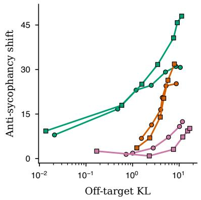

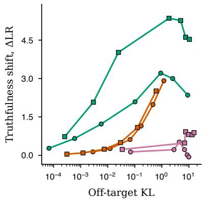  
Fisher Euclidean CAA Qwen2 1.5B Qwen1.5 1.8B

Supplementary Figure 2: Instruction-model control frontiers. Left, anti-sycophancy; right, capital-city truth preferences. Qwen2-1.5B-Instruct and Qwen1.5-1.8B-Chat each contribute the complete 19-point sweep: seven natural-gradient, six Euclidean-gradient and six contrastive-activation-addition settings. Cost is of-target KL on held-out neutral prompts; the horizontal coordinate is mean objective change. Interpolated comparisons match aggregate efects. The style and composition frontiers are shown in Extended Data Figure 5.

## Supplementary Note 15 Sparse-autoencoder feature ablations

The feature experiment uses one Top-� sparse autoencoder at layer 12 of Pythia-410M. Feature selection uses 18 discovery contexts; evaluation uses 18 disjoint context clusters. Of 71 selected features, 57 are active in evaluation, giving 303 unique context–feature ablations. Each intervention sets the active code to zero before decoding. The measured cost is exact full-vocabulary $\mathsf { K L } ( p _ { 0 } \| p _ { \mathsf { z e r o } } )$ ; the Fisher prediction $\frac { 1 } { 2 } \Delta h ^ { \top } G \Delta h$ is computed before observing the causal outcome.

Across the 303 interventions, the Fisher prediction has Spearman correlation 0.997 with measured KL, compared with 0.896 for activation magnitude. Their paired diference is 0.101 (95% clusterbootstrap interval 0.069–0.136). For outcomes independent of the distributional cost approximation, the objective-efect-to-Fisher-cost ratio correlates with the held-out selected-token probability-change fraction at 0.935 versus 0.506 for attribution-patching magnitude, and with sign agreement at 0.746 versus 0.354. The corresponding paired-diference intervals are 0.296–0.553 and 0.289–0.492. The objective-efect-to-Fisher-cost ratio is the stronger correlate of the selected-token probability-change fraction and sign agreement, whereas attribution-patching magnitude is the stronger correlate of absolute signed efect (0.987 versus 0.525).

## Supplementary Note 16 Dictionary-learning details

Top-� sparse autoencoders [14] are trained with only the decoder update preconditioned by the natural gradient in the code geometry [15], $\Delta D \propto ( \mathbb { E } [ a a ^ { \top } ] + \varepsilon I ) ^ { - 1 } \nabla _ { D } { \mathcal { L } }$ , where � denotes the sparse code. The code Gram matrix E $[ a a ^ { \top } ]$ is not formed explicitly; the preconditioner is applied to each batch by a Woodbury solve on the low-rank batch code matrix and agrees with the explicit inverse to $7 \times$ $1 0 ^ { - 1 3 }$ . Residual-stream activations have heavy-tailed norms, with a maximum approximately 15 times the median in the training data. In the reported configuration, per-token norms are winsorised at approximately the 95th percentile before training.

Comparisons use three paired seeds. Mean feature activation frequency is approximately $k / L$ by construction for a Top-� autoencoder with dictionary size � and is reported as a diagnostic. Because recovery alone need not detect poorly used features, reconstruction variance explained and the fraction of features activated at least once are both reported alongside it. Disentanglement is scored by Hungarian assignment of learned decoder atoms to planted fine-grained features using absolute cosine similarity, followed by the mean matched cosine. In the evaluated 410M configuration with $\beta = 0 . 5$ , natural-gradient preconditioning increases mean matched cosine from 0.167 to 0.480 (+0.313), with an increase in all three seeds. Mean reconstruction variance explained increases from 0.535 to 0.622, and the fraction of features activated at least once from 21.8% to 62.3%. Scale comparisons hold the per-feature training budget fixed.

## Supplementary Note 17 Cross-model convergence: protocols and controls

Three context batteries are used. The natural battery is 200 sentence prefixes drawn from the held-out WikiText test split [16], cut mid-sentence at 8–20 words; the templated battery is 160 contexts from eight topic templates; the semantic battery is 120 prompts across eight factual relations whose next token is the answer. The natural battery supplies the primary estimates.

Agreement between two models is the Spearman correlation between the upper triangles of their context-by-context Fisher–Rao distance matrices. On the templated battery, output-distribution geometry gives higher agreement than mid-layer activations under three measures used in the representationsimilarity literature: mutual �-nearest-neighbour alignment (0.778 versus 0.710), linear centred-kernel alignment (0.975 versus 0.935) and distance-matrix agreement (0.935 versus 0.755). In the reparameterisation experiment, each model’s mid-layer states are transformed by an independent random invertible map with condition number � swept from 1 to $1 0 ^ { 4 } \mathrm { { ; } }$ ; output-distribution agreement is constant to machine precision at every � while centred-kernel alignment and mutual �-nearest-neighbour alignment degrade by 10% and 15% by $\kappa = 1 0 ^ { 4 }$ and cosine distance-matrix agreement by 28% by $\kappa = 1 0 ^ { 3 }$ (its apparent recovery at $\kappa = 1 0 ^ { 4 }$ coincides with near-singular transformed activations).

The corpus-specificity control illustrates why the natural battery is primary: the same-corpus mediation advantage is +0.27 (95% interval +0.14 to +0.38) on the templated battery but falls to +0.03 (−0.04 to +0.10) on natural text at matched tokenizer and scale; the interval spans zero.

Reference mediation conditions each target-model pair’s agreement on the geometry of one reference model. The mediated fraction rises from $7 \%$ with a 70-million-parameter reference to a peak of 54% with a 2.8-billion-parameter reference and then saturates, with 7-billion-parameter references from other families mediating 41–42%. The qualitative result is stable across the tested output metrics: cross-model agreement is 0.952 under Fisher–Rao, 0.947 under Jensen–Shannon, 0.935 under total variation and 0.892 under a Euclidean metric on probabilities. The selection of Fisher–Rao specifically follows from the reparameterisation result and Chentsov’s theorem.

As a separate activation-space grounding control, over 100 concrete concepts the mean cosinedistance geometry of last-token, last-hidden-state representations from Pythia-1.4B and GPT-2 Large agrees with the representational geometry of DINOv2 [17], evaluated on CIFAR-100 [18], at 0.385 (permutation $P < 0 . 0 0 1 )$ ), 84% of which survives partialling out textual co-occurrence; the result is stable across two vision models and two language models.

A recent critique shows that representational-similarity metrics inflate with model scale, because spectral measures such as centred-kernel alignment carry a non-vanishing null baseline that grows with representation dimension, and recommends recalibrating every score against a permutation null [19]. That calibration was applied to the reported metrics (200 row-permutations per model pair; ten models from 70 million to 7 billion parameters across six families, thirty-five cross-family pairs on the natural battery). The rank agreement of distance matrices used here has a permutation null of 0.001, independent of dimension, whereas centred-kernel alignment on the same mid-layer representations carries a null baseline of 0.316, reproducing the confound: across the ladder its raw score more than doubles with scale (0.35 to 0.73), the inflation identified by the critique, while the output-distribution rank agreement stays high and flat (calibrated 0.85 to 0.89).

After calibration, the Fisher–Rao output-distribution agreement is essentially unchanged (0.879 to a calibrated 0.869, retaining 99%) and remains the strongest agreement among the representations compared, whereas mid-layer centred-kernel alignment is reduced most strongly (retaining 74%) and has the weakest significance. Thus, the dimension-dependent null identified by the critique afects centredkernel alignment; the rank correlation of distance matrices used for the primary output-distribution analysis remains stable.

## Supplementary Note 18 The displacement-magnitude-matched null and the anisotropy analysis

Claims that two models share eigenvector structure require a null that preserves displacement magnitude. The decision axes of the output Fisher metric, expressed as probability displacements over a common vocabulary, assign each word a displacement magnitude and a direction within the spectrum of the metric. A shufled-word null destroys both and makes sharing look ubiquitous: the top-six cross-family subspace overlap is 0.698 against a shufled null of 0.025. A displacement-magnitude-matched null preserves each word’s displacement magnitude and randomises only the directions; against it the same overlap has a null of 0.636, so the residual eigenvector overlap is +0.063 (95% interval +0.056 to +0.070), about 9% of the raw overlap. The remaining 91% is the shared displacement-magnitude structure, which follows from the shared output distributions alone. The residual component is concentrated in the top modes (templated battery, where per-band residuals are resolvable), decaying from +0.080 in the first five to +0.013 past mode ninety, and difers by training lineage: +0.088 within a model family against +0.064 across families, with a shared tokenizer alone conferring no advantage (+0.061).

Separately, raw cosine similarities of embedding rows are dominated by a shared mean direction and can invert cross-model comparisons outright: one model’s raw unembedding geometry anti-correlated with every other model’s before correction, and the cross-family agreement rose from 0.498 to 0.885 after subtracting the vocabulary mean. Covariance-based quantities are immune: the categorical factor of the output Fisher metric annihilates the all-ones direction, so adding any constant vector to all unembedding rows leaves the metric, its eigenvectors and the displacement analysis exactly unchanged. Accordingly, the shared-structure residual computed from raw and mean-centred unembeddings is identical (+0.063 in both cases), whereas cosine analyses require mean-centring for this comparison.

An objective-level robustness analysis probes this link beyond the band-level co-localisation of the main text. Across four small models (GPT-2, GPT-Neo-125M, Pythia-70M and Pythia-410M; 180 model-pair × objective items), partial Spearman associations conditioned on generalised rank fraction and log generalised eigenvalue are tested against Freedman–Lane residual permutation nulls within model-pair × objective blocks (5,000 permutations, Holm multiplicity adjustment). The Fisher-cost– sharing and objective-sensitivity–sharing associations survive (both adjusted $p = 0 . 0 0 1$ , and the direction is stable under leave-one-model-out and leave-one-objective-out re-analysis), while the direct item-level cost–meaning association at matched training efect does not (observed −0.016, adjusted $p = 1 . 0 )$ and sharing–meaning is marginal (adjusted $p = 0 . 0 7 4 )$ . The association with semantic relevance is therefore supported at the band level of the main text, where answer-relevant motion concentrates in the same top modes. Because model pairs share endpoints, the pooled analysis uses a per-block permutation scheme that preserves this dependence.

## Supplementary Note 19 Meaning decomposition and transfer probes

The consensus geometry is the mean of the models’ rank-transformed distance matrices, and a model’s residual is its matrix with the consensus partialled out. Against the external semantic geometry defined by the all-MiniLM-L6-v2 Sentence-BERT encoder [3], the residual has negligible alignment on each battery (−0.001 on natural, +0.003 on templated, +0.051 on the semantic battery), while the consensus carries 0.044, 0.102 and 0.440 respectively. The alignment increases when the next token directly encodes the answer to a factual relation. On the semantic battery the prompts within a relation share a template, so the surface geometry is itself strongly aligned (0.614); the consensus retains +0.231 (95% interval +0.159 to +0.316) after partialling the surface out, and the surface retains +0.518 after partialling the meaning out, so template and meaning are separate strong drivers there.

Transfer probes use relative representations: each prompt is its vector of Fisher–Rao distances to a fixed 40-prompt anchor set, �-scored per model, and a multinomial logistic probe for the eight-way topic label is trained on one model and tested on held-out prompts of another, over all ordered model pairs and five folds. Accuracy is 0.724 within model, 0.659 across models and 0.700 for the consensus alone, against a chance level of 0.125; the residual supports 0.407 within its own model and 0.091, below chance, across models.

## 19.1 Native-sample human semantic geometry

The native-sample panel uses 512 sentence-final contexts from the Peelle et al. completion norms [20]. At each of six Pythia sizes, 32 samples per context were drawn at temperature one from the full next-token law, without top-� or nucleus filtering. Sampling had an eight-token limit; completions were parsed at the first punctuation, newline or end-of-sequence boundary. All samples, including empty completions and those reaching the limit, entered the analysis. The limit was reached by 27.2–36.3% of samples across models.

Each normalised completion was encoded by the fixed 384-dimensional all-MiniLM-L6-v2 encoder, then mapped to 768 random Fourier features for an equal mixture of Gaussian kernels with bandwidths 0.25, 0.5 and 1.0. Sixteen disjoint folds contained 32 contexts each. Completion feature means define the semantic distributional representation; its squared Euclidean distance and centred Gram-matrix CKA compare model and human predictions. The four pairings of independent humanparticipant halves and model-sample halves were averaged. CKA was divided by the square root of human and model split-half CKA, using the same fold. Thus these endpoints describe semantic kernel geometry, whereas the native next-token Fisher–Rao distances in the cross-model panel are computed directly from probabilities.

For 70M, 160M, 410M, 1B, 1.4B and 2.8B, mean squared model–human semantic distances are 0.33885, 0.32634, 0.30841, 0.30316, 0.30046 and 0.29576. The slope against natural-log parameter count is −0.011809 (95% paired fold-bootstrap interval −0.013017 to −0.010627). Reliabilitycorrected semantic CKA values are 0.82101, 0.82680, 0.84162, 0.84450, 0.84500 and 0.84005, with slope 0.006290 (0.000070–0.012880); the overall trend need not be monotone between adjacent sizes. A character 3–5-gram feature control also gives decreasing model–human distance, with slope −0.012915 (−0.014727 to −0.011243), while its CKA slope interval includes zero.

## 19.2 Predictive fit and developmental human alignment

A separate 384-context subset of the same corpus was divided into 16 folds. Model probabilities were evaluated on complete human-observed completion-plus-end-of-sequence events and normalised within this support; token-sequence collisions were retained. Risk is the context mean of $\begin{array} { r } { \sum _ { y } ( \sqrt { p _ { y } } - \sqrt { h _ { y } } ) ^ { 2 } } \end{array}$ for model and human conditional laws � and ℎ. CKA is averaged over the two human halves and divided by the square root of human split-half reliability; the model feature means are deterministic conditional expectations. For each fold, a linear relation between conditional root-probability risk and corrected semantic CKA was fitted on six Pythia sizes and five Pythia-160M checkpoints. Its risk slope was −0.162883 (95% fold-bootstrap interval −0.202616 to −0.125890). Applied without refitting to five OLMo-2-1B checkpoints [21] and BLOOM-560M, GPT-2 Large, GPT-Neo-1.3B, Mamba-130M and Qwen2-1.5B, the relation gives correlation 0.758320 and root-mean-square error 0.029465 over all 160 model–fold observations. These rows share contexts and checkpoints and do not constitute 160 independently trained models.

OLMo alignment increases across checkpoint order, with slope 0.018891 (0.013438–0.025056). The Pythia trajectory slope is 0.002663 (−0.002270–0.008102). The residual log-parameter coeficient after conditional risk is 0.002872 (−0.005020–0.009876). Together with the cross-family prediction, these comparisons support predictive fit as an organising variable for human alignment. The conditional-law analysis and the native-sampling analysis evaluate diferent completion distributions.

## 19.3 Leading directions in an independent human probability geometry

The de Varda et al. corpus [22] supplies 1,726 context positions in 205 sentences. Human counts used the released exclusion, first-word and spelling-correction rules. Both model and human laws were mapped to 64 semantic outcome bins fixed independently of this corpus, plus a residual outcome retaining the remaining mass. Human laws used a Dirichlet posterior mean with total concentration 0.5 and a fixed external reference law $\rho .$ Coordinates were the centred log probabilities weighted by ${ \sqrt { \rho } } ,$ , as in the standardised read-out representation. Four rotations of whole-sentence folds separated estimation of the human reference, estimation of model directions, calibration and final evaluation. The leading four model directions were learned without human target responses.

Directional recovery was evaluated from the component of human coordinate variation orthogonal to the model-derived frame. Writing $R _ { \mathrm { o r i e n t a t i o n } }$ for this component and $m _ { z }$ for the smallest eigenvalue of human in-frame variation, the directional lower bound is $1 - R _ { \mathrm { o r i e n t a t i o n } } / ( 4 m _ { z } )$ . Contributions were summed over rotations before taking the ratio. Simultaneous one-sided 95% lower bounds over the seven families used 2,048 whole-sentence bootstrap draws. For Pythia, Mamba, RWKV, GPT-2, GPT-Neo, Qwen2 and BLOOM, they are 0.34055, 0.37935, 0.37457, 0.38306, 0.31937, 0.41116 and −0.00120. Direct directional capture exceeds a Haar-random four-dimensional subspace by 0.50–0.61 across the seven families. The direction result also retains its sign when human participants used for reference estimation and evaluation are disjoint.

These measurements concern directions. Recovering the full human probability law additionally requires the appropriate origin and coordinates within the frame. Full-reconstruction bounds remain non-positive in this corpus under the evaluated native and low-rank calibrated maps; the directional result therefore establishes shared leading structure rather than full-law recovery.

## 19.4 Independent human-completion replication and model-only calibration

The independent analysis used 640 word positions selected without response values from five DERCo narratives [23]. The selected positions contain 64,000 responses from 499 participant identities. For Pythia 70M, 160M, 410M, 1B, 1.4B and 2.8B, cross-fitted native model–human semantic distances are 0.23348, 0.22450, 0.21618, 0.21151, 0.20084 and 0.20335. The equal-story slope against natural-log parameter count is −0.008725 (95% interval −0.012022 to −0.005556; Extended Data Fig. 2b). The contexts and completion units difer from the Peelle analysis above, so absolute distances are not pooled across corpora; the prospectively fixed comparison is the within-corpus slope.

Across the five ordered training stages, Pythia-160M distances are 0.34380, 0.26562, 0.22647, 0.22604 and 0.22300, while OLMo-2-1B distances are 0.30403, 0.21441, 0.20043, 0.19928 and 0.19441. The final-minus-initial changes are −0.12080 (−0.13529 to −0.10470) and −0.10962 (−0.12571 to −0.09223), respectively (Extended Data Fig. 2c). In the held-family conditional analysis, the risk-based predictor has root-mean-square error 0.03825, compared with 0.06187 for a constant and 0.04991 for log model size. Its paired advantage over the constant is 0.02363 (0.00264–0.04143); the advantage over size is 0.01166 and is not resolved (−0.00203–0.03638). Thus the independent data establish improvement over a constant predictor but do not distinguish risk from size for this endpoint.

The model-only calibration retained all 64 fixed semantic bins plus the residual outcome and was learned entirely from model probability laws on the earlier corpus. Its equal-story expected human logscore gains over each native law are 0.04520 nats for Pythia, 0.04078 for Mamba, 0.03865 for RWKV, 0.02202 for GPT-2, 0.01962 for GPT-Neo, −0.00297 for Qwen2 and 0.05074 for BLOOM (Extended Data Fig. 2d). Five of the six positive family means are positive in every story and GPT-Neo is positive in four of five; Qwen2 is positive in three. By contrast, maps trained on human responses from the earlier corpus reduce log score in all seven families (−0.18212 to −0.10584 nats). The transferable gain is therefore specific to the model/source-law calibration rather than generic cross-corpus fitting. These are efects over five fixed observed stories, not a population-of-stories threshold claim, and the coarse outcomes do not establish individual-word recovery.

## Supplementary Note 20 Reproducibility map

Supplementary Table 4: Evidence map for the central claim chain. The table organises each strand by its evidence and role in the manuscript.
<table><tr><td>Strand</td><td>Evidence and role in the manuscript</td></tr><tr><td>Origin and</td><td>Coordinate-covariance tests, across-scale curvature and profile calibration,</td></tr><tr><td>identification</td><td>initialisation controls and standardised-frame certificates establish the canonical metric and its identified content.</td></tr><tr><td>Shared geometry</td><td>Cross-model agreement and meaning batteries, exact attenuation accounting, common-outcome and common-byte comparisons, held-out prediction, independent human completion comparisons and fresh model-only calibration establish shared predictive structure.</td></tr><tr><td>Spectral anatomy</td><td>Core-to-tail response measurements, effective-dimension agreement without fitted parameters, inheritance bounds, singleton-head/cluster-bulk anatomy and fresh-context tests and the probability/read-out comparison establish how language statistics shape the spectrum.</td></tr><tr><td>Acquisition schedule</td><td>Cross-size alignment by held-out loss, corpus n-gram forecasts applied without refitting, randomised logarithmic-time depth shifts, crossed architecture—construction generalisation and real-checkpoint observational</td></tr><tr><td>Motion and learning</td><td>composition connect corpus evidence to acquisition time. Continuous motion checks, the exact flip-margin identity, objective-update factorisation and read-out projector kinematics connect geometric motion to behavioural change.</td></tr><tr><td>Control geometry</td><td>Chart-covariant damping and the prediction of natural-versus-Euclidean intervention cost without fitted parameters establish the minimum-disturbance law and its relative cost; relinearised paths and</td></tr><tr><td>Translation</td><td>reusable reference-metric updates extend its measured scope. Instruction-model frontiers, dictionary learning, sparse-autoencoder feature ablations, matched fixed routed edits and a held-out low-rank adaptation comparison test the same correction across model operations.</td></tr></table>

Pretrained-model experiments include publicly available checkpoints from the Pythia suite [24], GPT-2 [25], Qwen2 [26], Qwen1.5 [27], GPT-Neo [28], Mistral [29], Mamba [30], RWKV [31], BLOOM [32] and StarCoder2 [33]. The main-text randomised causal acquisition results use explicitly controlled synthetic systems. Model execution and intervention solves use float32 unless an analysis specifies float64 dense spectral arithmetic. Most GPU-resident model-forward runs use one NVIDIA RTX 5000 Ada with 32 GB of memory, with additional model runs on NVIDIA A100 GPUs and CPU execution for dense statistical analyses. A full GPU-resident pullback solve fits through 2.8 billion parameters. At 6.9 billion, the evidence is limited to graph-free output-Fisher spectra, a CPU-only mid-layer full-vocabulary pullback calibration and a descriptive late-layer CPU-ofload iteration analysis. Given a random seed, the conjugate-gradient and Woodbury solvers are deterministic; seeds are logged for bootstrap resampling, dictionary learning and Monte Carlo rollout values. The map above organises the central claim strands. Materials supporting the reported analyses, including model revisions, prompt, pair and objective-set listings, relevant analysis code and summary logs, are available from the corresponding author on reasonable request; code and data availability are stated in the main text.

## Supplementary References

[1] N. N. Chentsov. Statistical Decision Rules and Optimal Inference, volume 53 of Translations of Mathematical Monographs. American Mathematical Society, 1982.

[2] Nihat Ay, J¨urgen Jost, Hong V ˆ an L ˆ e, and Lorenz Schwachh ˆ ofer. ¨ Information Geometry, volume 64 of Ergebnisse der Mathematik und ihrer Grenzgebiete. 3. Folge. Springer, Cham, 2017. ISBN 978-3-319-56478-4. doi: 10.1007/978-3-319-56478-4.

[3] Nils Reimers and Iryna Gurevych. Sentence-BERT: Sentence embeddings using siamese BERTnetworks. In Proceedings of the 2019 Conference on Empirical Methods in Natural Language Processing and the 9th International Joint Conference on Natural Language Processing, pages 3982–3992. Association for Computational Linguistics, 2019. doi: 10.18653/v1/D19-1410.

[4] Denis Paperno, German Kruszewski, Angeliki Lazaridou, Ngoc-Quan Pham, Rafaella Bernardi,´ Sandro Pezzelle, Marco Baroni, Gemma Boleda, and Raquel Fernandez. The LAMBADA dataset:´ Word prediction requiring a broad discourse context. In Proceedings ofthe 54th Annual Meeting of the Association for Computational Linguistics, pages 1525–1534. Association for Computational Linguistics, 2016. doi: 10.18653/v1/P16-1144.

[5] Rafael Rafailov, Archit Sharma, Eric Mitchell, Stefano Ermon, Christopher D. Manning, and Chelsea Finn. Direct preference optimization: Your language model is secretly a reward model. In Advances in Neural Information Processing Systems (NeurIPS), 2023.

[6] Sihan Wang, Jiayi Zhao, Qingyan Cao, Hongbo Yao, and Lin Shu. FishBack: Pullback Fisher geometry for optimal activation steering in transformers, 2026. arXiv:2605.17231.

[7] Kiho Park, Todd Nief, Yo Joong Choe, and Victor Veitch. The information geometry of softmax: Probing and steering. In Proceedings of the 43rd International Conference on Machine Learning (ICML), 2026. arXiv:2602.15293.

[8] Peng Wang, Ningyu Zhang, Bozhong Tian, Zekun Xi, Yunzhi Yao, Ziwen Xu, Mengru Wang, Shengyu Mao, Xiaohan Wang, Siyuan Cheng, Kangwei Liu, Yuansheng Ni, Guozhou Zheng, and Huajun Chen. EasyEdit: An easy-to-use knowledge editing framework for large language models, 2024. arXiv:2308.07269.

[9] Kevin Meng, David Bau, Alex Andonian, and Yonatan Belinkov. Locating and editing factual associations in GPT. In Advances in Neural Information Processing Systems (NeurIPS), 2022.

[10] Kevin Meng, Arnab Sen Sharma, Alex Andonian, Yonatan Belinkov, and David Bau. Mass-editing memory in a transformer. In International Conference on Learning Representations (ICLR), 2023.

[11] Thomas Hartvigsen, Swami Sankaranarayanan, Hamid Palangi, Yoon Kim, and Marzyeh Ghassemi. Aging with GRACE: Lifelong model editing with discrete key-value adaptors. In Advances in Neural Information Processing Systems (NeurIPS), 2023.

[12] Eric Mitchell, Charles Lin, Antoine Bosselut, Christopher D. Manning, and Chelsea Finn. Memorybased model editing at scale. In Proceedings of the 39th International Conference on Machine Learning (ICML), 2022.

[13] Nina Rimsky, Nick Gabrieli, Julian Schulz, Meg Tong, Evan Hubinger, and Alexander Turner. Steering Llama 2 via contrastive activation addition. In Proceedings of the 62nd Annual Meeting of the Association for Computational Linguistics (Volume 1: Long Papers), pages 15504–15522. Association for Computational Linguistics, 2024. doi: 10.18653/v1/2024.acl-long.828.

[14] Leo Gao, Tom Dupre la Tour, Henk Tillman, Gabriel Goh, Rajan Troll, Alec Radford, Ilya Sutskever,´ Jan Leike, and Jefrey Wu. Scaling and evaluating sparse autoencoders, 2024. arXiv:2406.04093.

[15] Shun-ichi Amari. Natural gradient works eficiently in learning. Neural Computation, 10(2): 251–276, 1998.

[16] Stephen Merity, Caiming Xiong, James Bradbury, and Richard Socher. Pointer sentinel mixture models. In International Conference on Learning Representations (ICLR), 2017.

[17] Maxime Oquab, Timothee Darcet, Th´ eo Moutakanni, Huy V. Vo, Marc Szafraniec, Vasil Khali-´ dov, Pierre Fernandez, Daniel Haziza, Francisco Massa, Alaaeldin El-Nouby, Mido Assran, Nicolas Ballas, Wojciech Galuba, Russell Howes, Po-Yao Huang, Shang-Wen Li, Ishan Misra, Michael Rabbat, Vasu Sharma, Gabriel Synnaeve, Hu Xu, Herve J´ egou, Julien Mairal, Patrick´ Labatut, Armand Joulin, and Piotr Bojanowski. DINOv2: Learning robust visual features without supervision. Transactions on Machine Learning Research, 2024. ISSN 2835-8856. URL https://openreview.net/forum?id=a68SUt6zFt. arXiv:2304.07193.

[18] Alex Krizhevsky. Learning multiple layers of features from tiny images. Technical report, University of Toronto, 2009.

[19] Fabian Groger, Shuo Wen, and Maria Brbi¨ c. Revisiting the platonic representation hypothesis:´ An aristotelian view. In Proceedings of the 43rd International Conference on Machine Learning (ICML), 2026. arXiv:2602.14486.

[20] J. E. Peelle, R. L. Miller, C. S. Rogers, B. Spehar, M. S. Sommers, and K. J. Van Engen. Completion norms for 3085 English sentence contexts. Behavior Research Methods, 52:1795–1799, 2020. doi: 10.3758/s13428-020-01351-1.

[21] Allen Institute for AI. OLMo 2 1B: model and training checkpoints. https://huggingface.co/ allenai/OLMo-2-0425-1B, 2025.

[22] Andrea Gregor de Varda, Marco Marelli, and Simona Amenta. Cloze probability, predictability ratings, and computational estimates for 205 English sentences, aligned with existing EEG and reading time data. Behavior Research Methods, 56:5190–5213, 2024. doi: 10.3758/s13428-023-02261-8.

[23] Boi Mai Quach, Cathal Gurrin, and Graham Healy. DERCo: A dataset for human behaviour in reading comprehension using EEG. Scientific Data, 11:1104, 2024. doi: 10.1038/s41597-024-03915-8.

[24] Stella Biderman, Hailey Schoelkopf, Quentin Anthony, Herbie Bradley, Kyle O’Brien, Eric Hallahan, Mohammad Aflah Khan, Shivanshu Purohit, USVSN Sai Prashanth, Edward Raf, Aviya Skowron, Lintang Sutawika, and Oskar van der Wal. Pythia: A suite for analyzing large language models across training and scaling. In Proceedings ofthe 40th International Conference on Machine Learning (ICML), 2023.

[25] Alec Radford, Jefrey Wu, Rewon Child, David Luan, Dario Amodei, and Ilya Sutskever. Language models are unsupervised multitask learners. Technical report, OpenAI, 2019.

[26] An Yang, Baosong Yang, Binyuan Hui, Bo Zheng, Bowen Yu, Chang Zhou, Chengpeng Li, Chengyuan Li, Dayiheng Liu, Fei Huang, Guanting Dong, Haoran Wei, Huan Lin, Jialong Tang, Jialin Wang, Jian Yang, Jianhong Tu, Jianwei Zhang, Jianxin Ma, Jianxin Yang, Jin Xu, Jingren Zhou, Jinze Bai, Jinzheng He, Junyang Lin, Kai Dang, Keming Lu, Keqin Chen, Kexin Yang, Mei Li, Mingfeng Xue, Na Ni, Pei Zhang, Peng Wang, Ru Peng, Rui Men, Ruize Gao, Runji Lin, Shijie Wang, Shuai Bai, Sinan Tan, Tianhang Zhu, Tianhao Li, Tianyu Liu, Wenbin Ge, Xiaodong Deng, Xiaohuan Zhou, Xingzhang Ren, Xinyu Zhang, Xipin Wei, Xuancheng Ren, Xuejing Liu, Yang

Fan, Yang Yao, Yichang Zhang, Yu Wan, Yunfei Chu, Yuqiong Liu, Zeyu Cui, Zhenru Zhang, Zhifang Guo, and Zhihao Fan. Qwen2 technical report, 2024. arXiv:2407.10671.

[27] Qwen Team. Introducing Qwen1.5. Qwen blog, February 2024. URL https://qwenlm.github. io/blog/qwen1.5/.

[28] Sid Black, Leo Gao, Phil Wang, Connor Leahy, and Stella Biderman. GPT-Neo: Large scale autoregressive language modeling with mesh-TensorFlow, 2021.

[29] Albert Q. Jiang, Alexandre Sablayrolles, Arthur Mensch, Chris Bamford, Devendra Singh Chaplot, Diego de las Casas, Florian Bressand, Gianna Lengyel, Guillaume Lample, Lucile Saulnier, Lelio Renard Lavaud, Marie-Anne Lachaux, Pierre Stock, Teven Le Scao, Thibaut Lavril, Thomas´ Wang, Timothee Lacroix, and William El Sayed. Mistral 7b, 2023. arXiv:2310.06825.´

[30] Albert Gu and Tri Dao. Mamba: Linear-time sequence modeling with selective state spaces. In First Conference on Language Modeling, 2024. URL https://openreview.net/forum?id= tEYskw1VY2.

[31] Bo Peng, Eric Alcaide, Quentin Anthony, Alon Albalak, Samuel Arcadinho, Stella Biderman, Huanqi Cao, Xin Cheng, Michael Chung, Leon Derczynski, Xingjian Du, Matteo Grella, Kranthi Gv, Xuzheng He, Haowen Hou, Przemyslaw Kazienko, Jan Kocon, Jiaming Kong, Bart lomiej Koptyra, Hayden Lau, Jiaju Lin, Krishna Sri Ipsit Mantri, Ferdinand Mom, Atsushi Saito, Guangyu Song, Xiangru Tang, Johan Wind, Stanis law Wo´zniak, Zhenyuan Zhang, Qinghua Zhou, Jian Zhu, and Rui-Jie Zhu. RWKV: Reinventing RNNs for the transformer era. In Findings of the Association for Computational Linguistics: EMNLP 2023, pages 14048–14077. Association for Computational Linguistics, 2023. doi: 10.18653/v1/2023.findings-emnlp.936.

[32] BigScience Workshop. BLOOM: A 176b-parameter open-access multilingual language model. Journal ofMachine Learning Research, 25(422):1–74, 2024.

[33] Anton Lozhkov, Raymond Li, Loubna Ben Allal, et al. StarCoder 2 and The Stack v2: The next generation, 2024. arXiv:2402.19173.