# WHY DOES POST-TRAINING QUANTIZATION WORK?

Yuxiang Chen1,2, Michael Beyer3, Jun Zhu1, Jianfei Chen1,∗

1Dept. of Comp. Sci. and Tech., Institute for AI, BNRist Center, THBI Lab,

Tsinghua-Bosch Joint ML Center, Tsinghua University

2College of AI, Tsinghua University, 3Bosch AI Research, Renningen, Germany

chenyuxi22@mails.tsinghua.edu.cn, michael.beyer2@de.bosch.com, {dcszj, jianfeic}@tsinghua.edu.cn

## ABSTRACT

Post-training quantization compresses large language models (LLMs) by storing their weights at reduced precision, and each quantized weight introduces an error into the hidden states. Naively, these errors should accumulate with depth and corrupt next-token prediction; randomly initialized models accumulate these discrepancies rapidly, whereas quantized pretrained models accumulate much less hidden-state error and largely maintain downstream task performance, even though they were never trained with quantization noise. This raises the question we address: why does post-training quantization work? Comparing full-precision and quantized forward passes, we identify two mechanisms that characterize pretrained quantization robustness. First, the error a layer newly introduces tends to oppose the error it inherits from the layer’s input. The two cancel partially such that the discrepancy between full-precision and quantized passes grows slowly. This counteracting residual interaction develops during pretraining. Our quantitative analysis identifies it as a major factor slowing hidden-error growth. Second, LM-head geometry preferentially preserves the scores and probabilities of highranked tokens, which typically represent the model’s most confident predictions. Together, these mechanisms explain why quantization error that passes through numerous layers can still produce only small output changes, and we verify the findings across models and quantization settings.

## 1 INTRODUCTION

Weight-only post-training quantization (PTQ) compresses large language models by storing their weights at reduced precision, and methods such as GPTQ (Frantar et al., 2023) and AWQ (Lin et al., 2024) are now widely used to serve them. Quantizing a weight makes it slightly different from its full-precision value, so at every layer, the quantized model’s hidden states differ from its full-precision counterpart, and these errors should naively accumulate as they propagate through the layers. Yet in practice, even directly rounding the weights to 4-bit barely hurts: casting Qwen3- 32B (Yang et al., 2025) to NVFP4 (Alvarez et al., 2025) without calibration lowers benchmark accuracy by only 0.43 percentage points on average across six zero-shot benchmarks (Sec. 4.1), even though the model was never trained with quantization noise. This raises our central question: why does post-training quantization work?

The usual answer is that quantized weights remain close to their full-precision values (cosine similarity to their NVFP4 reconstructions ∼ 0.996), so errors should propagate slowly. Yet pretrained and randomly initialized weights have nearly identical reconstruction error (App. D.2), while the hidden-state discrepancy is 5.5× larger at random initialization (Fig. 1). Because the weight-level errors are closely matched, this gap in hidden-error growth should reflect properties acquired during pretraining. Prior work reduces or diagnoses quantization damage (Arai & Ichikawa, 2025; Lee et al., 2026; Lotfi et al., 2026), but leaves a mechanistic gap: it does not explain how quantization errors propagate through a pretrained model or why they produce only small output changes.

We trace the discrepancy block by block and find two mechanisms that act in series. Throughout, we compare the quantized and full-precision models on the same inputs; the error at each layer is the difference between their hidden states, and we study how its size changes with depth. First, the new error a block introduces tends to oppose the error it inherits from earlier blocks, so the two partially cancel and the size of the error grows slowly (Sec. 3). Second, the final hidden-state error reaching the LM head is mainly a rotation whose effect is attenuated by the high-dimensional LM head, especially for top-ranked tokens (Sec. 4). Together, they explain why a large internal discrepancy translates into a small output change. Both mechanisms hold across Qwen3 models of different scales, OLMo3 (Team Olmo et al., 2025), Gemma3 (Gemma Team et al., 2025), and the OLMoE mixture-of-experts model (Muennighoff et al., 2025) (Sec. 5).

## We summarize the work’s contributions as follows:

1. Reframing quantization robustness as a mechanistic question. We ask why post-training quantization works, and use comparisons with randomly initialized models to show that the usual explanation that weights stay close to their full-precision values is not the full answer; slow hidden-error growth largely comes from the pretrained model itself.

2. A quantitative account of slow error growth. The error added by each layer tends to oppose the error it inherits, slowing error growth. We derive an exact decomposition of this growth and confirm experimentally that this cancellation is significant for limiting hidden-error growth.

3. A theoretical account of stable top-ranked token predictions. The scores of the tokens with the highest output probabilities change only slightly under the surviving final hidden-state error; we derive how hidden-state error induces score changes through the LM-head geometry, and connect the resulting score perturbations to log-probability changes.

## 2 SETUP: COMPARING FULL-PRECISION AND QUANTIZED MODELS

Next-token prediction in LLMs For a tokenized sequence $x _ { 1 : n } = ( x _ { 1 } , \ldots , x _ { n } )$ in vocabulary V, each token $x _ { i }$ is embedded as $\mathbf { h } _ { i } ^ { ( 0 ) } \in \mathbb { R } ^ { d }$ , where d is the hidden dimension, and then processed by L Transformer blocks (Vaswani et al., 2017). Block $\ell \in \{ 1 , \ldots , L \}$ computes a residual update:

$$
\mathbf { u } _ { i } ^ { ( \ell ) } : = \mathbf { F } ^ { ( \ell ) } \big ( \mathbf { h } _ { 1 : i } ^ { ( \ell - 1 ) } \big ) , \qquad \mathbf { h } _ { i } ^ { ( \ell ) } = \mathbf { h } _ { i } ^ { ( \ell - 1 ) } + \mathbf { u } _ { i } ^ { ( \ell ) } .
$$

Here $\mathbf { F } ^ { ( \ell ) }$ denotes the complete computation performed by block ℓ, including the Attention and MLP contributions. The final hidden state is mapped to scores z by the LM head to obtain the next-token distribution, with $T = 1$ unless stated otherwise:

$$
\mathbf { h } _ { \mathrm { L M } } = \mathrm { N o r m } \left( \mathbf { h } _ { n } ^ { ( L ) } \right) \in \mathbb { R } ^ { d } , \qquad \mathbf { z } = \mathbf { W } _ { \mathrm { L M } } \mathbf { h } _ { \mathrm { L M } } \in \mathbb { R } ^ { | \mathcal { V } | } , \qquad \mathbf { p } = \mathrm { s o f t m a x } ( \mathbf { z } / T ) \in \mathbb { R } ^ { | \mathcal { V } | } .
$$

Quantifying the quantization impact A linear layer maps an input X to $\mathbf { Y } = \mathbf { X } \mathbf { W } ^ { \top }$ using a weight matrix W. Weight quantization stores $Q \left( \mathbf { W } \right)$ as a low-precision approximation of W. ${ \widehat { \mathbf { Y } } } =$ $\mathbf { X } Q \left( \mathbf { W } \right) ^ { \top }$ is thus an approximation of Y. Our study mainly uses the NVFP4 format (Alvarez et al., 2025) with round-to-nearest (RTN) (App. D). We quantize standard linear projections in Attention and MLP to NVFP4 and keep other operations, including the LM head, in full precision (BF16).

Quantizing these linear layers gives the quantized model ${ \widehat { \mathcal { M } } } ;$ we refer to the unquantized model as the original model M. We compare the two models on the same input sequence $x _ { 1 : n } .$ . At each position $i \in \{ 1 , \ldots , n - 1 \}$ , both models receive the prefix $x _ { 1 : i }$ when predicting $x _ { i + 1 }$ . We analyze each position separately and omit the position index i below. Unless stated otherwise, the expectation E first averages over positions within each input sequence and then averages equally across sequences.

At each decoding position i, the original model M and quantized model $\widehat { \mathcal { M } }$ start with the same initial hidden state, $\widehat { \mathbf { h } } ^ { ( 0 ) } = \mathbf { h } ^ { ( 0 ) }$ . For every block $\ell \in \{ 1 , \ldots , L \}$ , let $\mathbf { u } ^ { ( \ell ) }$ and $\widehat { \mathbf { u } } ^ { ( \ell ) }$ denote the respective block updates of M and $\widehat { \mathcal { M } } \colon { \mathbf { u } ^ { \ell } } ^ { } { } ^ { \ell } = \mathbf { F } ^ { ( \ell ) } ( \mathbf { h } _ { 1 : i } ^ { ( \ell - 1 ) } )$ and $\widehat { \mathbf { u } } ^ { ( \ell ) } = \widehat { \mathbf { F } } ^ { ( \ell ) } ( \widehat { \mathbf { h } } _ { 1 : i } ^ { ( \ell - 1 ) } ,$ ). The two residual updates and their hidden-state difference are

$$
\underbrace { \mathbf { h } ^ { ( \ell ) } = \mathbf { h } ^ { ( \ell - 1 ) } + \mathbf { u } ^ { ( \ell ) } } _ { \mathrm { o r i g i n a l ~ m o d e l ; b l o c k } \ell : \mathbf { h } ^ { ( \ell - 1 ) } \setminus \mathbf { h } ^ { ( \ell ) } } \quad \underbrace { \widehat { \mathbf { h } } ^ { ( \ell ) } = \widehat { \mathbf { h } } ^ { ( \ell - 1 ) } + \widehat { \mathbf { u } } ^ { ( \ell ) } } _ { \substack { \mathrm { q u a n t i z e d ~ m o d e l ; b l o c k } \ell : \widehat { \mathbf { h } } ^ { ( \ell - 1 ) } \setminus \widehat { \mathbf { h } } ^ { ( \ell ) } } } \quad \left\{ \Delta \mathbf { h } ^ { ( \ell ) } : = \widehat { \mathbf { h } } ^ { ( \ell ) } - \mathbf { h } ^ { ( \ell ) } , \right.\tag{1}
$$

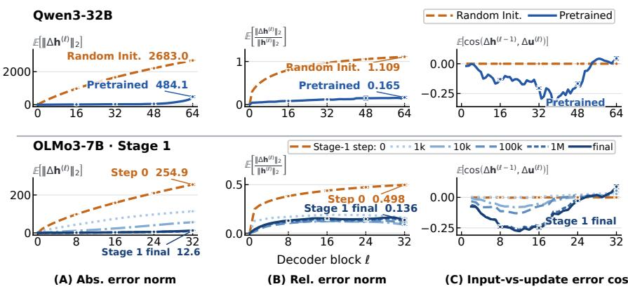  
Figure 1: Pretraining changes quantized model’s hidden-error growth. Rows compare random/pretrained Qwen3-32B and OLMo3-7B Stage-1 checkpoints on C4. (A) Mean absolute hiddenerror norm; (B) mean relative hidden-error norm; (C) mean cosine between the block-input error and block-update error. Error bars show standard deviation.

We refer to the quantization-induced hidden-state difference $\Delta \mathbf { h } ^ { ( \ell ) }$ as the hidden error at layer ℓ. The LM-head inputs are then $\mathbf { h } _ { \mathrm { L M } } : = \mathrm { N o r m } \big ( \mathbf { h } ^ { ( L ) } \big )$ and $\widehat { \mathbf { h } } _ { \mathrm { L M } } : = \mathrm { N o r m } \big ( \widehat { \mathbf { h } } ^ { ( L ) } \big )$ :

$$
\underbrace { \mathbf { z } = \mathbf { W } _ { \mathrm { L M } } \mathbf { h } _ { \mathrm { L M } } , \quad \mathbf { p } = \mathrm { s o f t m a x } ( \mathbf { z } ) } _ { \mathrm { o r i g i n a l ~ m o d e l } , \mathbf { \mathcal { M } } ; \mathbf { h } _ { \mathrm { L M } } \to \mathbf { p } } \qquad \underbrace { \widehat { \mathbf { z } } = \mathbf { W } _ { \mathrm { L M } } \widehat { \mathbf { h } } _ { \mathrm { L M } } , \quad \widehat { \mathbf { p } } = \mathrm { s o f t m a x } ( \widehat { \mathbf { z } } ) } _ { \mathrm { q u a n t i z e d ~ m o d e l } \widehat { \mathcal { M } } ; \widehat { \mathbf { h } } _ { \mathrm { L M } } \to \widehat { \mathbf { p } } } .
$$

The LM-head input difference $\Delta \mathbf { h } _ { \mathrm { L M } } : = \widehat { \mathbf { h } } _ { \mathrm { L M } } - \mathbf { h } _ { \mathrm { L M } }$ induces the score difference $\Delta \mathbf { z } : = \widehat { \mathbf { z } } - \mathbf { z } =$ $\mathbf { W } _ { \mathrm { L M } } \Delta \mathbf { h } _ { \mathrm { L M } }$ . We write $\mathrm { T o p } _ { K } ( { \mathbf z } ) \subseteq { \mathcal { V } }$ for the vocabulary tokens with the largest K logits in M, and measure output quality by cross-entropy (CE) and $D _ { \mathrm { K L } } ( \mathbf { p } \| \widehat { \mathbf { p } } )$ .

## 3 THE GROWTH OF HIDDEN-ERROR NORM ACROSS LAYERS

The models start from the same hidden state but hidden error $\Delta \mathbf { h } ^ { ( \ell ) } = \widehat { \mathbf { h } } ^ { ( \ell ) } - \mathbf { h } ^ { ( \ell ) }$ changes across ℓ. This section quantifies the growth by $\| \Delta \mathbf { h } ^ { ( \ell ) } \| _ { 2 }$ and its relative size $\| \Delta \mathbf { h } ^ { ( \ell ) } \| _ { 2 } / \| \mathbf { h } ^ { ( \ell ) } \| _ { 2 }$

## 3.1 HIDDEN-ERROR GROWTH IN RANDOMLY INITIALIZED AND PRETRAINED MODELS

NVFP4 weight-quantization reduces Qwen3-32B accuracy by only 0.43 percentage points on average across six zero-shot benchmarks (Sec. 4.1). The final relative hidden-error norm is $\| \Delta \mathbf { h } ^ { ( L ) } \| _ { 2 } / \| \mathbf { h } ^ { ( L ) } \| _ { 2 } \approx 0 . 1 5$ and cosine similarity is cos $\mathcal { L } \big ( \mathbf { h } ^ { ( L ) } , \widehat { \mathbf { h } } ^ { ( L ) } \big ) \approx 0 . 9 8$ on average for pretrained models. A direct intuition is that networks are robust to NVFP4 because each quantized weight matrix Q(W) remains close to its full-precision counterpart W $( \mathrm { C o s } \mathrm { S i m } ( { \bf W } , Q ( { \bf W } ) )$ ≈ 0.9955 in App. D.2). This suggests that each quantized matrix multiplication introduces only a small error. One might therefore expect the errors introduced across layers to remain limited, leaving a small final hidden error.

However, this account is incomplete. Randomly initialized weights have nearly the same reconstruction cosine similarity as the pretrained model under NVFP4 quantization (App. D.2). If this weight-level similarity alone explained the small final hidden error, the randomly initialized and pretrained models should therefore show similar hidden-error growth. However, the quantized randomly initialized Qwen3-32B reaches a 5.5× larger final absolute hidden-error norm and a 6.7× larger relative hidden-error norm than its pretrained checkpoint (Fig. 1). The same pattern appears for OLMo3-7B: the initialized step-0 has 20.2× larger final absolute error and 3.7× larger relative error than the final checkpoint.

The growth trends across layers also differ. Over the 64 layers, randomly initialized Qwen3-32B follows the consistently growing trends $\mathbb { E } \Vert \Delta \mathbf { h } ^ { ( \ell ) } \Vert _ { 2 } \propto \ell ^ { 0 . 8 0 }$ and $\mathbb { E } \big [ \lVert \Delta \bar { \mathbf { h } ^ { ( \ell ) } } \rVert _ { 2 } / \lVert \mathbf { h } ^ { ( \ell ) } \rVert _ { 2 } \big ] \propto \ell ^ { 0 . 3 0 }$ while the pretrained relative-error curve even stops increasing in the later layers (details in App. E.1).

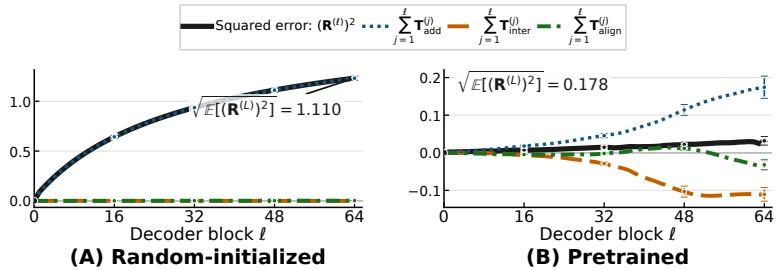  
Figure 2: Accumulated contributions of the three terms in Thm. 1. Randomly initialized and pretrained Qwen3-32B on C4. Each colored curve accumulates one term over blocks 1–ℓ and shows its averaged value across inputs. The black curve is their exact sum. Error bars show standard deviation across inputs.

Weight-level similarity alone is therefore insufficient to explain robustness across depth; there should be a model-side mechanism that distinguishes randomly initialized models from pretrained models. The next subsection identifies counteraction between block-input error $\Delta \mathbf { h } ^ { ( \ell - 1 ) }$ and block-update error $\Delta \mathbf { u } ^ { ( \ell ) }$ as a major contributor to this slower growth.

## 3.2 COUNTERACTION BETWEEN BLOCK-INPUT AND BLOCK-UPDATE ERRORS

Eq. (1) shows hidden error after block ℓ is ${ \Delta \mathbf { h } ^ { ( \ell ) } } = { \Delta \mathbf { h } ^ { ( \ell - 1 ) } } + { \Delta \mathbf { u } ^ { ( \ell ) } }$ , where $\Delta \mathbf { h } ^ { ( \ell - 1 ) }$ is the input error inherited from earlier blocks and $\Delta \mathbf { u } ^ { ( \ell ) }$ is the block-update error. Here is the recurrence: Proposition 1 (Squared hidden-error recurrence). For every Transformer block $\ell \in \{ 1 , \ldots , L \}$

$$
\| \Delta \mathbf { h } ^ { ( \ell ) } \| _ { 2 } ^ { 2 } - \| \Delta \mathbf { h } ^ { ( \ell - 1 ) } \| _ { 2 } ^ { 2 } = \| \Delta \mathbf { u } ^ { ( \ell ) } \| _ { 2 } ^ { 2 } + 2 \langle \Delta \mathbf { h } ^ { ( \ell - 1 ) } , \Delta \mathbf { u } ^ { ( \ell ) } \rangle\tag{2}
$$

The second term on the right determines whether the block-update error $\Delta \mathbf { u } ^ { ( \ell ) }$ increases or cancels the block-input hidden error $\Delta \mathbf { h } ^ { ( \ell - 1 ) }$ . We call the latter case counteraction: $\langle { \Delta \mathbf { h } ^ { ( \ell - 1 ) } , \Delta \mathbf { u } ^ { ( \ell ) } } \rangle < 0$ Counteraction offsets part of the newly introduced error, and slows the hidden-error norm growth.

For pretrained Qwen3-32B, over layers 1–48, the interaction term $2 \sum \mathbb { E } \langle \Delta \mathbf { h } ^ { ( \ell - 1 ) } , \Delta \mathbf { u } ^ { ( \ell ) } \rangle$ cumulatively cancels 50.2% of the block-update error term $\sum \mathbb { E } \| \Delta \mathbf { u } ^ { ( \ell ) } \| _ { 2 } ^ { 2 }$ contribution, explaining the slow growth in Fig. 1(A). At random initialization, $\big | 2 \mathbb { E } \langle \Delta \mathbf { h } ^ { ( \ell - 1 ) } , \Delta \mathbf { u } ^ { ( \ell ) } \rangle \big |$ is at most 0.16% of $\mathbb { E } \| \Delta \mathbf { u } ^ { ( \ell ) } \| _ { 2 } ^ { 2 }$ for each layer, consistent with the near-zero cosines in Fig. 1(C). We next derive the recurrence for the relative hidden error $\| \Delta \mathbf { h } ^ { ( \ell ) } \| _ { 2 } / \| \mathbf { h } ^ { ( \ell ) } \| _ { 2 }$ which normalizes for changes in hidden-state scale.

Theorem 1 (Relative hidden-error recurrence). Define $\begin{array} { r } { R ^ { ( \ell ) } : = \frac { \| \Delta \mathbf { h } ^ { ( \ell ) } \| _ { 2 } } { \| \mathbf { h } ^ { ( \ell ) } \| _ { 2 } } } \end{array}$ . For every $\ell \in \{ 1 , \ldots , L \}$ such that $\mathbf { h } ^ { ( \ell - 1 ) } , \mathbf { h } ^ { ( \ell ) } , \mathbf { u } ^ { ( \ell ) }$ are nonzero,

$$
\begin{array} { r l } & { \big ( R ^ { ( \ell ) } \big ) ^ { 2 } - \big ( R ^ { ( \ell - 1 ) } \big ) ^ { 2 } } \\ & { = \underbrace { \bigg ( \frac { \| { \bf u } ^ { ( \ell ) } \| _ { 2 } } { \| { \bf h } ^ { ( \ell ) } \| _ { 2 } } \bigg ) ^ { 2 } \left[ \Big ( \frac { \| \Delta { \bf u } ^ { ( \ell ) } \| _ { 2 } } { \| { \bf u } ^ { ( \ell ) } \| _ { 2 } } \Big ) ^ { 2 } - \big ( R ^ { ( \ell - 1 ) } \big ) ^ { 2 } \right] } _ { r e l a t i v e a d d i t i o n a l e r r o r ( b l o c k - u p p d a t e v s . b l o c k . i n p u l ) : T _ { \mathrm { a d d d } } } + \underbrace { 2 \langle \Delta { \bf h } ^ { ( \ell - 1 ) } , \Delta { \bf u } ^ { ( \ell ) } \rangle } _ { e r r o r i n t e r a c t i o n : T _ { \mathrm { i n t e r c . } } } - \underbrace { 2 \langle { \bf h } ^ { ( \ell - 1 ) } , { \bf u } ^ { ( \ell ) } \rangle } _ { r e s i l a t a l n o r n : e n r t b u i o n : T _ { \mathrm { a l i g n } } } \big ( R ^ { ( \ell - 1 ) } \big ) ^ { 2 } . } \end{array}\tag{3}
$$

A detailed derivation is given in App. C.1, and Fig. 2 quantifies the three terms for Qwen3-32B:

$T _ { \mathrm { a d d } }$ compares the relative error in the current block update with the relative error already present at the block input, scaled by the update-to-hidden norm ratio.

${ \boldsymbol { T } } _ { \mathrm { i n t e r } }$ measures the signed interaction between the block-input error $\Delta \mathbf { h } ^ { ( \ell - 1 ) }$ and block-update error $\Delta \mathbf { u } ^ { ( \ell ) }$ . This term encompasses the counteraction that results in the slower error growth: with $T _ { \mathrm { i n t e r } } < 0$ for most blocks in pretrained Qwen3-32B, the term cumulatively cancels 63.4% of $\mathbf { \Delta } T _ { \mathrm { a d d } }$ over layers $1 - L$ , substantially slowing the growth of $\left( R ^ { ( \ell ) } \right) ^ { 2 }$

$\pmb { T } _ { \mathrm { a l i g n } }$ captures how the change of hidden-state norm affects the relative error. $\mathrm { I f } \langle \mathbf { h } ^ { ( \ell - 1 ) } , \mathbf { u } ^ { ( \ell ) } \rangle >$ $0 ,$ the update increases $\| \mathbf h ^ { ( \ell ) } \| _ { 2 }$ and reduces the relative error. In pretrained Qwen3-32B, this term cancels 18.4% of $T _ { \mathrm { a d d } }$ cumulatively, and most of the cancellation occurs during later blocks.

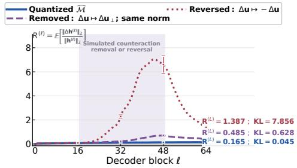  
(A) Counteraction intervention

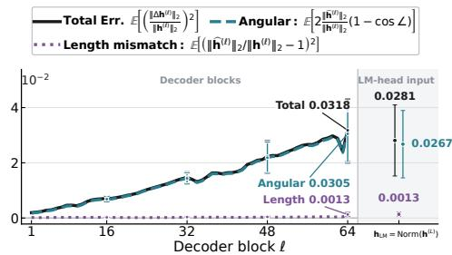  
(B) Length–angle error decomposition  
Figure 3: Counteraction interventions and length–angle decomposition of the hidden error. Qwen3-32B on C4. (A) Relative hidden error after counteraction removal or reversal. (B) Terms of Prop. 2; the separated right region shows the LM-head input terms. Error bars show SD.

Together, $T _ { \mathrm { i n t e r } }$ and $\pmb { T } _ { \mathrm { a l i g n } }$ cumulatively cancel $8 1 . 8 \%$ of $T _ { \mathrm { a d d } }$ in pretrained Qwen3-32B over layers 1–L. At random initialization, the cumulative sum of these two terms is only 0.09% of $\mathbf { \Delta } T _ { \mathrm { a d d } }$ over layers $1 - L$ . These measurements identify counteraction as a major factor in slowing down the hidden-error growth in the pretrained model: across blocks, the block-update error $\Delta \mathbf { u } ^ { ( \ell ) }$ tends to point against the block-input hidden error $\Delta \mathbf { h } ^ { ( \ell - 1 ) }$ to slow the error growth.

## 3.3 HIDDEN-ERROR GROWTH WITHOUT COUNTERACTION

After showing the significance of counteraction, we test what happens when counteraction is removed. We construct layer-wise hidden-state trajectories in which each block-update error ∆u keeps its norm, but its direction is modified to be counteraction-free. We compare the hidden-error trajectories and the final KL divergence across intervention policies. Concretely, at every intervened block, we use one of the hidden-state recursions:

$$
\mathbf { R e m o v a l : } \quad \widehat { \mathbf { h } } _ { \mathrm { r e m } } ^ { ( \ell ) } = \widehat { \mathbf { h } } _ { \mathrm { r e m } } ^ { ( \ell - 1 ) } + \mathbf { u } ^ { ( \ell ) } + \Delta \mathbf { u } _ { \perp } ^ { ( \ell ) } ; \qquad \mathbf { R e v e r s a l : } \quad \widehat { \mathbf { h } } _ { \mathrm { r e v } } ^ { ( \ell ) } = \widehat { \mathbf { h } } _ { \mathrm { r e v } } ^ { ( \ell - 1 ) } + \mathbf { u } ^ { ( \ell ) } - \Delta \mathbf { u } ^ { ( \ell ) } .
$$

In both recursions, $\Delta \mathbf { u } ^ { ( \ell ) }$ follows Eq. (1) and is recomputed along the modified trajectory; $\Delta \mathbf { u } _ { \parallel } ^ { ( \ell ) }$ is orthogonal to the block-input error $\Delta \mathbf { h } ^ { ( \ell - 1 ) }$ . Both interventions are applied in blocks 17–48, where counteraction is strongest in Qwen3-32B; reversal is applied only when the interaction is negative.

At the final block, removal raises the relative hidden error by $2 . 9 4 \times$ , while reversal raises it by 8.41×. Both interventions also sharply increase KL. Moreover, after counteraction removal, $\mathbf { \Delta } T _ { \mathrm { a d d } }$ increases by 4.3× cumulatively (App. E.7), which indicates that counteraction not only contributes through the negative term $T _ { \mathrm { i n t e r } } .$ but also alters the subsequent trajectory in a way that limits $\mathbf { \Delta } T _ { \mathrm { a d d } }$ The interventions provide causal evidence that counteraction is a major factor limiting hidden error growth. Sec. 4 examines how the remaining hidden-state error affects the outputs.

## 4 THE EFFECT OF FINAL HIDDEN ERROR ON OUTPUT QUALITY

The quantized Transformer blocks leave a nonzero error at the final decoder state $\mathbf { h } ^ { ( L ) }$ : the mean relative error norm $\| \Delta \mathbf { h } ^ { ( L ) } \| _ { 2 } / \| \mathbf { h } ^ { ( L ) } \| _ { 2 }$ across the three datasets is ∼0.245 (App. E.2). To see what kind of error survives to the LM head input, we decompose it into its length and angle components.

Proposition 2 (Length–angle decomposition of relative hidden error). Define $\Delta \mathbf { h } ^ { ( \ell ) } : = \widehat { \mathbf { h } } ^ { ( \ell ) } - \mathbf { h } ^ { ( \ell ) }$ For every block ℓ such that $\mathbf { h } ^ { ( \ell ) } \neq \mathbf { 0 }$ and $\widehat { \mathbf { h } } ^ { ( \ell ) } \neq \mathbf { 0 }$

$$
\Big ( \frac { \| \Delta \mathbf { h } ^ { ( \ell ) } \| _ { 2 } } { \| \mathbf { h } ^ { ( \ell ) } \| _ { 2 } } \Big ) ^ { 2 } = \Big ( \frac { \| \widehat { \mathbf { h } } ^ { ( \ell ) } \| _ { 2 } } { \| \mathbf { h } ^ { ( \ell ) } \| _ { 2 } } - 1 \Big ) ^ { 2 } + 2 \frac { \| \widehat { \mathbf { h } } ^ { ( \ell ) } \| _ { 2 } } { \| \mathbf { h } ^ { ( \ell ) } \| _ { 2 } } \left[ 1 - \cos \angle \big ( \mathbf { h } ^ { ( \ell ) } , \widehat { \mathbf { h } } ^ { ( \ell ) } \big ) \right] .\tag{4}
$$

In particular, $i f \| \widehat { \mathbf { h } } ^ { ( \ell ) } \| _ { 2 } = \| \mathbf { h } ^ { ( \ell ) } \| _ { 2 }$ , then $\begin{array} { r } { \left( \frac { \| \Delta \mathbf { h } ^ { ( \ell ) } \| _ { 2 } } { \| \mathbf { h } ^ { ( \ell ) } \| _ { 2 } } \right) ^ { 2 } = 2 [ 1 - \cos \angle ( \mathbf { h } ^ { ( \ell ) } , \widehat { \mathbf { h } } ^ { ( \ell ) } ) ] } \end{array}$

<table><tr><td>Metric</td><td>Output discrepancy C4</td><td>WikiText</td><td>GSM8K</td></tr><tr><td>∆CE↓</td><td>+0.019</td><td>+0.034</td><td>+0.040</td></tr><tr><td>Rel. ΔCE ↓</td><td>+0.7%</td><td>+1.5%</td><td>+3.3%</td></tr><tr><td>KL↓</td><td>0.045</td><td>0.090</td><td>0.079</td></tr><tr><td>Flip@1 ↓</td><td>10.7%</td><td>12.7%</td><td>8.3%</td></tr><tr><td>Ret@10 ↑</td><td>88.7%</td><td>84.9%</td><td>83.9%</td></tr><tr><td>Ret@20 ↑</td><td>88.9%</td><td>84.2%</td><td>82.5%</td></tr><tr><td colspan="6">Downstream accuracy (%, mean ± SD) Model ARC-C ARC-E Hella. MMLU Wino. TQA-MC1</td></tr><tr><td>BF16</td><td>61.09 83.42 ±1.41 ±0.76</td><td>82.66 ±0.38</td><td>80.77 72.85 ±0.33 ±1.28</td><td>38.80 ±1.69</td></tr><tr><td>W4</td><td>61.26 83.33 ±1.42 ±0.76</td><td>82.45 ±0.38</td><td>80.34 ±0.34 ±1.30</td><td>70.48 39.17 ±1.71</td></tr><tr><td colspan="5">ARC-C: ARC-Challenge Wino.: WinoGrande nellc</td></tr></table>

(A) Output metrics and task accuracy (W4 vs. BF16)

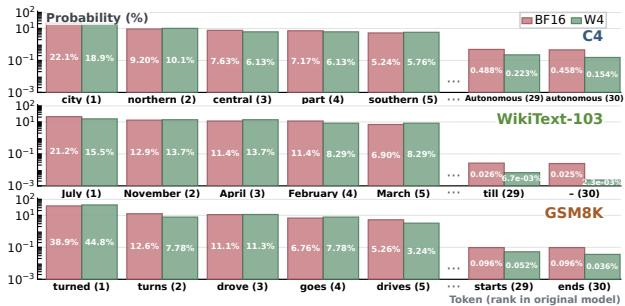  
(B) One-step token probability distributions  
Figure 4: Output metrics and paired next-token probabilities after W4 quantization. Qwen3- 32B. (A) Output-quality metrics and zero-shot benchmark accuracy. (B) Paired BF16/W4 probabil ities at one representative next-token position per dataset, showing BF16 ranks 1–5 and 29–30.

We refer to the two terms on the right-hand side of Eq. (4) as the length-mismatch contribution and the angular contribution, respectively. Fig. 3(B) shows that the angular contribution accounts for 88.9–98.7% of the squared relative hidden error across depth, while changes in hidden-state norm remain small. After final normalization, this corresponds to an average 12.47◦ rotation of the LM-head input (Fig. 5(A)). We next measure its effect on output quality (Sec. 4.1) and explain theoretically why top-ranked token probabilities are more stable in the outputs (Sec. 4.2).

## 4.1 OUTPUT DISTRIBUTIONS AND DOWNSTREAM ACCURACY AFTER QUANTIZATION

Hereafter, BF16 denotes the original model M evaluated in bfloat16, and W4 denotes $\widehat { \mathcal { M } }$ with only its Transformer block linear weights quantized to NVFP4. We show that the output quality is mostly retained after quantization, especially for top-ranked tokens.

First, we compare the output quality of BF16 and W4 models by loss and divergence: ∆CE := $\mathrm { C E } _ { \mathrm { W 4 } } - \mathrm { C E } _ { \mathrm { B F 1 6 } } ^ { - }$ , its relative value $\scriptstyle \frac { \Delta \mathrm { C E } } { \mathrm { C E } _ { \mathrm { B F 1 6 } } }$ , and the forward KL divergence $D _ { \mathrm { K L } } ( \mathbf { p } \| \widehat { \mathbf { p } } )$ . Fig. 4(A) reports all three metrics on each dataset (details in App. D.3), and the accuracy drops by only 0.43 percentage points on average across six benchmarks. Across other models, including Qwen3-30B-A3B, Qwen3-8B, and OLMo3-32B, quantization also largely preserves output quality (App. E.10).

Beyond the metrics, the BF16 model’s highest-scoring tokens largely remain top-ranked in the W4 model. Let $\pi _ { r } \in \mathcal V$ denote the rank-r token of BF16 model’s score z. Define

$$
\mathrm { F l i p } @ 1 : = \mathrm { P r } \big [ \mathrm { T o p } _ { 1 } ( \widehat { \mathbf { z } } ) \neq \mathrm { T o p } _ { 1 } ( \mathbf { z } ) \big ] , \qquad \mathrm { R e t @ } K : = \mathbb { E } \Big [ \frac { \big | \mathrm { T o p } _ { K } ( \mathbf { z } ) \cap \mathrm { T o p } _ { K } ( \widehat { \mathbf { z } } ) \big | } { K } \Big ] .
$$

Across the three datasets, Flip@1 is 8.3%–12.7%, while Ret@10 and Ret@20 are both about 85% on average (Fig. 4(A)). In the examples shown in Fig. 4(B), the average relative probability change over ranks 29–30 is 2.5–4.4× that over ranks 1–5. Sec. 4.2 tests this pattern across all evaluated positions and explains why top-ranked token scores are less sensitive to quantization.

## 4.2 PREFERENTIAL PRESERVATION OF TOP-RANKED SCORES AND PROBABILITIES

In this subsection, we find that top-ranked token scores have smaller relative errors after quanti zation and theoretically explain why this trend arises through the geometry of the LM head. This preferential preservation matters because top-ranked tokens govern the high-probability region of the output. Here $\widehat { \mathbf { h } } _ { \mathrm { L M } }$ and $\widehat { \mathbf { z } }$ are the LM-head input and score vector of the W4 model, and $\widehat { \mathbf p }$ is the corresponding probability vector; $\mathbf { h } _ { \mathrm { L M } } , \mathbf { z } _ { \mathrm { \Omega } }$ , and p denote their counterparts in the unquantized model.

We first examine how the score $\mathbf { z } = ( z _ { 1 } , z _ { 2 } , \ldots , z _ { | \mathcal { V } | } ) ^ { \top }$ changes after quantization. The score of token $k \in \mathcal V$ is the projection of the LM-head input onto the corresponding LM-head weight vector: $z _ { k } = \langle \mathbf { w } _ { k } , \mathbf { h } _ { \mathrm { L M } } \rangle$ . Because the BF16 and W4 models share the same LM head, a token score is changed only by the input norm $\| \mathbf { h } _ { \mathrm { L M } } \| _ { 2 }$ and projection angle $\angle ( \mathbf { w } _ { k } , \mathbf { h } _ { \mathrm { L M } } ) ; \mathrm { A p p . ~ C . 3 }$ gives the exact decomposition. The average relative input-norm change $\mathbb { E } { | | \widehat { \mathbf { h } } _ { \mathrm { L M } } | | _ { 2 } } / | | \mathbf { h } _ { \mathrm { L M } } | | _ { 2 } - 1 |$ is only

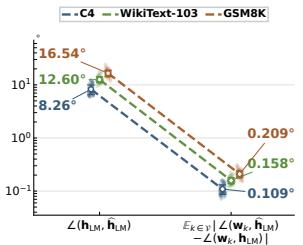  
(A) Hidden rotation vs. LM-head angle shift

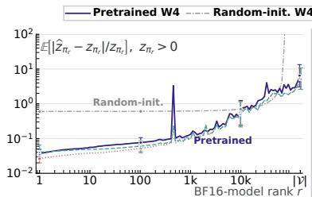  
(B) Relative score change by rank

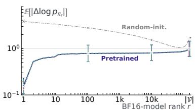  
(C) Log-probability change by rank  
Figure 5: Top-ranked token scores and probabilities are more stable after quantization in the pretrained model. Qwen3-32B on C4, WikiText-103, and GSM8K text. (A) Across datasets, the LM-head input rotates by 8.26◦ to 16.54◦, whereas the vocabulary-mean projection-angle change is only $0 . 1 0 9 ^ { \circ }$ to 0.209◦. (B) Relative score error increases toward lower-ranked tokens and is much smaller in the pretrained model than at random initialization. The theoretical approximation is under $\rho = 1$ of Thm. 2. (C) Log-probability error follows the same rank trend, and the approximations follow Thm. 3. Error bars show one log-SD; details are given in App. D.3.

3.7%. We therefore focus on quantifying how changes in the projection angles affect the token scores. Fig. 5 gives two observations:

• Observation 1: projection angles change much less than the LM-head input. In Fig. 5(A), the input rotates by $\angle ( { \bf h } _ { \mathrm { L M } } , \widehat { { \bf h } } _ { \mathrm { L M } } ) \approx 1 2 . 5 ^ { \circ }$ , whereas the vocabulary-mean projection-angle change is $| \angle ( \mathbf { w } _ { k } , \mathbf { h } _ { \mathrm { L M } } ) - \angle ( \mathbf { w } _ { k } , \widehat { \mathbf { h } } _ { \mathrm { L M } } ) | \approx 0 . 1 5 9 ^ { \circ }$ , a 78.6× attenuation.

• Observation 2: top-ranked tokens have smaller score and log-probability changes for the quantized pretrained model. For BF16 rank-r token $\pi _ { r } ,$ the relative score change grows with rank in Fig. 5(B). The log-probability change $\mathbb { E } [ | \Delta \log p _ { \pi _ { r } } | ]$ follows the same rank trend, while both quantities are much larger at random initialization (Fig. 5(B–C)).

To explain these, Thm. 2 below derives how the hidden-state rotation $\alpha = \angle ( \mathbf { h } _ { \mathrm { L M } } , \widehat { \mathbf { h } } _ { \mathrm { L M } } )$ changes both projection angles and relative scores. Intuitively, in high dimension, only a small component of this rotation affects the projection onto any fixed LM-head weight vector $\mathbf { w } _ { k } .$ , so the angle between $\mathbf { w } _ { k }$ and the hidden state changes much less than the hidden state itself. Moreover, a smaller angle between $\mathbf { w } _ { k }$ and $\mathbf { h } _ { \mathrm { L M } }$ makes the relative score less sensitive to the same rotation, and higher-ranked tokens tend to have such smaller angles empirically (App. E.10), producing the rank-dependent trend in Fig. 5(B). Thm. 3 then links these score changes to the log-probability changes in Fig. 5(C).

Theorem 2 (Projection-angle and score changes under an isotropic rotation of the LM-head input). Let $d \geq 3$ and let LM-head input $\mathbf { h } _ { \mathrm { L M } } , \widehat { \mathbf { h } } _ { \mathrm { L M } }$ , and LM-head weight vector ${ \bf w } _ { k }$ be nonzero. Define

$$
\begin{array} { r } { \alpha : = \angle ( \mathbf { h } _ { \mathrm { L M } } , \widehat { \mathbf { h } } _ { \mathrm { L M } } ) , \qquad \theta _ { k } : = \angle ( \mathbf { w } _ { k } , \mathbf { h } _ { \mathrm { L M } } ) , \qquad \widehat { \theta } _ { k } : = \angle ( \mathbf { w } _ { k } , \widehat { \mathbf { h } } _ { \mathrm { L M } } ) , \qquad \rho : = \frac { \| \widehat { \mathbf { h } } _ { \mathrm { L M } } \| _ { 2 } } { \| \mathbf { h } _ { \mathrm { L M } } \| _ { 2 } } } \end{array}
$$

Conditional on the measured $\alpha ,$ assume that the direction of the rotation from h to $\widehat { \mathbf { h } } _ { \mathrm { L M } }$ is uniformly distributed over all directions orthogonal to $\mathbf { h } _ { \mathrm { L M } } .$ . For $z _ { k } \neq 0$ and α, $\theta _ { k } \in ( 0 , \pi )$ , with all expansions taken as $\alpha \to 0 ^ { + }$ for fixed d and $\theta _ { k } ,$ , let $\Delta z _ { k } : = \widehat { z } _ { k } - z _ { k }$ . Then

$$
\mathbb { E } \left| \widehat { \theta } _ { k } - \theta _ { k } \right| = \alpha \mu _ { d } + O ( \alpha ^ { 2 } ) , \qquad \mu _ { d } : = \frac { \Gamma \left( \frac { d - 1 } { 2 } \right) } { \sqrt { \pi } \Gamma \left( \frac { d } { 2 } \right) } = \sqrt { \frac { 2 } { \pi ( d - 1 ) } } \left( 1 + O ( d ^ { - 1 } ) \right) ,\tag{5}
$$

$$
\frac { \Delta z _ { k } } { z _ { k } } = ( \rho \cos \alpha - 1 ) + \rho \tan \theta _ { k } \sin \alpha \cdot q _ { k } , \qquad q _ { k } ^ { 2 } \sim \mathrm { B e t a } \biggl ( \frac { 1 } { 2 } , \frac { d - 2 } { 2 } \biggr ) ,\tag{6}
$$

$$
\mathbb { E } \left| \frac { \Delta z _ { k } } { z _ { k } } \right| = \alpha | \mathrm { t a n } \theta _ { k } | \mu _ { d } + O ( \alpha ^ { 2 } ) , \qquad i f \rho = 1 ,\tag{7}
$$

Here $q _ { k }$ is symmetric about zero. The corresponding second-order estimate is given in Eq. (13).

A detailed derivation is given in App. C.4. The first-order and second-order analytic references from Eqs. (7) and (13) set $\rho = 1$ to remove the modest norm difference and isolate the effect of changing the LM-head input direction, while the empirical W4 score-error curves in Fig. 5(B) retain the measured input-norm changes. We next relate the score changes to the log-probability changes:

Theorem 3 (Log-probability change estimates). At a fixed next-token position, let $\Delta$ log $p _ { k } : =$ log ${ \widehat { p } } _ { k } - \log p _ { k }$ . The exact identity and expansions for uniformly small centered score changes are

$$
\Delta \log p _ { k } = \Delta z _ { k } - \log \mathbb { E } _ { j \sim \mathbf { p } } e ^ { \Delta z _ { j } } = \Delta z _ { k } - \mathbb { E } _ { j \sim \mathbf { p } } \Delta z _ { j } - \mathrm { K L } ( \mathbf { p } \mid | \widehat { \mathbf { p } } )\tag{exact),}
$$

$$
\Delta \log p _ { k } = \Delta z _ { k } - \mathbb { E } _ { j \sim \mathbf { p } } \Delta z _ { j } + O ( \mathrm { V a r } _ { j \sim \mathbf { p } } ( \Delta z _ { j } ) )\tag{1-order),}
$$

(8)

$$
\begin{array} { r } { \Delta \log p _ { k } = \Delta z _ { k } - \mathbb { E } _ { j \sim \mathbf { p } } \Delta z _ { j } - \frac { 1 } { 2 } \operatorname { V a r } _ { j \sim \mathbf { p } } ( \Delta z _ { j } ) + O ( \mathbb { E } _ { j \sim \mathbf { p } } | \Delta z _ { j } - \mathbb { E } _ { i \sim \mathbf { p } } \Delta z _ { i } | ^ { 3 } ) } \end{array}\tag{2-order).}
$$

A detailed derivation is given in App. C.5. Thms. 2 and 3 account for the two observations above:

• Why do projection angles change so little? Eq. (5) in Thm. 2 gives E $| \widehat { \theta } _ { k } - \theta _ { k } | = \alpha \mu _ { d } + O ( \alpha ^ { 2 } )$ Thus, in high dimension, the rotation of the hidden state is strongly attenuated when measured as the angle change to any fixed LM-head row vector. For Qwen3-32B, the predicted attenuation $\mu _ { d } ^ { - 1 } \approx 8 9 . 7 \times$ is close to the measured 78.6× in Fig. 5(A).

• Why are higher-ranked tokens more stable? Eqs. (6) and (7) in Thm. 2 show that, for positive scores, relative score sensitivity is governed by |tan $\theta _ { \pi _ { r } } \lvert$ . A smaller projection angle therefore gives a smaller relative score change under the same hidden-state rotation. Empirically, higherranked tokens tend to have smaller projection angles (App. E.10), matching the rank dependence in Fig. 5(B). Thm. 3 then connects these score changes to log-probability changes, and both approximations reproduce the increasing rank trend in Fig. 5(C).

These results also explain why a non-negligible rotation of h produces only modest output changes in Fig. 4(A). KL remains small because it weights tokens by their original probabilities, and the highest-probability tokens are best preserved after quantization. CE remains small because the probability assigned to the ground-truth token changes little on average.

## 5 DISCUSSION

## 5.1 CONSISTENCY ACROSS MODELS, QUANTIZATION SETTINGS, AND PTQ ALGORITHMS

The counteraction phenomenon introduced in Sec. 3 persists across pretrained Qwen, OLMo, and Gemma models, including dense and mixture-of-experts (MoE) architectures (App. E.2). The layerwise curve of E cos $\angle ( \Delta \mathbf { h } ^ { ( \ell - 1 ) } , \Delta \mathbf { u } ^ { ( \ell ) } )$ changes little and remains negative in most blocks when quantizing weights, activations, or both (Fig. 6(A)), and across multiple PTQ algorithms (Fig. 6(B)), showing that calibration-based PTQ changes the counteraction geometry little (App. E.9). Randominitialization comparisons and intervention experiments on additional models further support the role of counteraction in slowing hidden-error growth (Apps. E.1 and E.7).

Preferential preservation of top-ranked scores and probabilities also transfers across models. Higherranked tokens tend to have smaller projection angles to the LM-head input and smaller relative score errors (App. E.10), and this rank dependence persists across softmax temperatures (App. E.11).

## 5.2 ANALYSIS OF THE SOURCE OF COUNTERACTION

What produces this negative error interaction that slows hidden-error growth (Sec. 3)? Prior work found that residual updates across Transformer layers can partially cancel earlier updates. When an earlier contribution is rescaled, the later block adjusts its opposing update, showing that its response depends on the input signal (Patrawala et al., 2025). Does a block’s input hidden error similarly induce a change in its update that points against and partially cancels that error?

This self-correcting tendency is much stronger for errors than for the native hidden-state/update pairs. Specifically, cos $\angle ( \mathbf { h } ^ { ( \ell - 1 ) } , \mathbf { u } ^ { ( \ell ) } )$ and cos $\angle ( \widehat { \mathbf { h } } ^ { ( \ell - 1 ) } , \widehat { \mathbf { u } } ^ { ( \ell ) } )$ are positive in 65.6% and 64.1% of the blocks, whereas interactions between the errors cos $\angle ( \Delta \mathbf { h } ^ { ( \ell - 1 ) } , \Delta \mathbf { u } ^ { ( \ell ) } )$ are negative in 82.5% of the blocks (App. E.6). Thus, the strong negative relation is not a general tendency for a block update to oppose its input hidden state. It emerges more consistently between the accumulated input hidden error and the new block-update error.

To identify its source, we separate $\Delta { \mathbf { u } } ^ { ( \ell ) } = \widehat { { \mathbf { F } } } ^ { ( \ell ) } ( \widehat { { \mathbf { h } } } ^ { ( \ell - 1 ) } ) - { \mathbf { F } } ^ { ( \ell ) } ( { \mathbf { h } } ^ { ( \ell - 1 ) } )$ into two parts. The direct weight effect is $\widehat { \mathbf { F } } ^ { ( \ell ) } ( \mathbf { h } ^ { ( \ell - 1 ) } ) ^ { - } - \mathbf { F } ^ { ( \ell ) } ( \mathbf { h } ^ { ( \ell - 1 ) } )$ , which changes the weights at a fixed input. The inputerror response is $\widehat { \mathbf { F } } ^ { ( \ell ) } ( \widehat { \mathbf { h } } ^ { ( \ell - 1 ) } ) - \widehat { \mathbf { F } } ^ { ( \ell ) } ( \mathbf { h } ^ { ( \ell - 1 ) } )$ ), which keeps the weight fixed and changes only its input. Although the two parts have comparable magnitudes, the input-error response contributes 99.9% of the negative cumulative interaction $\Sigma _ { \ell = 1 } ^ { L } T _ { \mathrm { i n t e 1 } } ^ { ( \ell ) }$ , compared with less than 0.1% from the direct weight effect (App. E.6). Counteraction therefore comes mainly from the block’s response to its input error, which tends to oppose accumulated hidden error and slow its propagation.

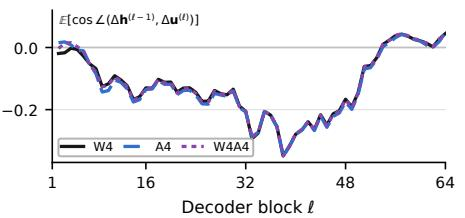  
(A) Weight and activation quantization (Qwen3-32B)

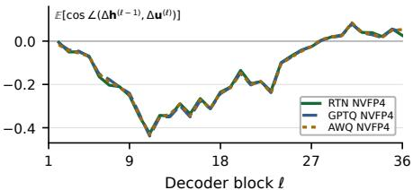  
(B) PTQ algorithms (Qwen3-4B)  
Figure 6: Blockwise counteraction across quantization components and PTQ methods. (A) Qwen3-32B on C4 under W4 (weight-only), A4 (activation-only), and W4A4 (both quantized). (B) Qwen3-4B under RTN, GPTQ, and AWQ, all quantizing the same weights with NVFP4 format.

## 5.3 RARE FAILURES IN HIDDEN-ERROR PROPAGATION

Counteraction significantly slows the hidden-error growth, which provides a self-correction effect that enhances the model’s robustness to the quantization noise. However, at rare decoding positions, the perturbation enters a regime where counteraction is no longer sufficient to keep the quantized hidden-state trajectory close to the original model, producing a large hidden-norm mismatch. These rare failures produce extreme values that can dominate the averages and make the typical error dynamics harder to characterize. We therefore exclude these positions from the recurrence-based aggregate statistics (only ∼0.28% of positions are excluded) using the norm-based rule in App. D.3 and analyze them separately in App. E.3. These cases show that large hidden-state norm distortion can cause output failures, but does not always do so (Fig. 12).

## 5.4 LIMITATIONS

Our analysis has three limitations. First, we analyze the quantization mechanisms for individual next-token predictions, but not how these mechanisms extend to multi-token generation. Second, our mechanism analysis relies on aggregate statistics and does not precisely characterize every hiddenerror trajectory or output change, especially at rare positions with extreme errors. Third, the LMhead theory uses a uniform-direction assumption for the approximation, although actual hidden-state rotation directions need not be uniform. Two questions remain open: whether training stochasticity produces counteraction, as suggested by implicit-bias analyses of SGD (Smith et al., 2020), and whether these findings can improve post-training quantization.

## 6 CONCLUSION

This work studies why pretrained models maintain stable next-token predictions after weight quantization. Comparing the original and quantized forward passes reveals two mechanisms: (1) Even though the weights of randomly initialized and pretrained models have nearly identical reconstruction cosine similarities under NVFP4 quantization, pretrained models accumulate much less hidden error. Our exact recurrence isolates a mechanism specific to pretrained models: the block-update error tends to oppose the block-input hidden error. Interventions that remove this counteraction sharply increase the final hidden error, providing causal evidence that counteraction is a major factor limiting hidden-error growth. (2) The quantization-induced change in the final hidden state is primarily a rotation rather than a change in norm. Our theory shows that, in high dimensions, only a small component of this rotation affects the projection onto any fixed LM-head weight vector and that LM-head geometry makes the resulting score and log-probability changes smaller for higherranked tokens. We verify both mechanisms across models and quantization settings.

## ACKNOWLEDGMENTS

The authors sincerely thank Pengle Zhang and Zichen Liang for insightful discussions.

## REFERENCES

Eduardo Alvarez, Omri Almog, Eric Chung, Simon Layton, Dusan Stosic, Ronny Krashinsky, and Kyle Aubrey. Introducing NVFP4 for efficient and accurate low-precision inference. NVIDIA Technical Blog, 2025. URL https://developer.nvidia.com/blog/introducin g-nvfp4-for-efficient-and-accurate-low-precision-inference/.

Yamato Arai and Yuma Ichikawa. Quantization error propagation: Revisiting layer-wise posttraining quantization. In The Thirty-ninth Annual Conference on Neural Information Processing Systems, 2025. URL https://openreview.net/forum?id=a3l3K9khbL.

Nora Belrose, Igor Ostrovsky, Lev McKinney, Zach Furman, Logan Smith, Danny Halawi, Stella Biderman, and Jacob Steinhardt. Eliciting latent predictions from transformers with the tuned lens, 2023. URL https://arxiv.org/abs/2303.08112.

Ido Ben-Yair, Gil Ben Shalom, Moshe Eliasof, and Eran Treister. Quantized convolutional neural networks through the lens of partial differential equations. Research in the Mathematical Sciences, 9(4):58, 2022. doi: 10.1007/s40687-022-00354-y.

Stella Biderman, Hailey Schoelkopf, Quentin Gregory Anthony, Herbie Bradley, Kyle O’Brien, Eric Hallahan, Mohammad Aflah Khan, Shivanshu Purohit, USVSN Sai Prashanth, Edward Raff, et al. Pythia: A suite for analyzing large language models across training and scaling. In International Conference on Machine Learning, pp. 2397–2430. PMLR, 2023.

Nicola Cancedda. Spectral filters, dark signals, and attention sinks. In Lun-Wei Ku, Andre Martins, and Vivek Srikumar (eds.), Proceedings of the 62nd Annual Meeting of the Association for Computational Linguistics (Volume 1: Long Papers), pp. 4792–4808, Bangkok, Thailand, August 2024. Association for Computational Linguistics. doi: 10.18653/v1/2024.acl-long.263. URL https://aclanthology.org/2024.acl-long.263/.

Albert Catalan-Tatjer, Niccolo Ajroldi, and Jonas Geiping. Training dynamics impact post-training\` quantization robustness. In The Fourteenth International Conference on Learning Representa tions, 2026. URL https://openreview.net/forum?id=ZXr3Xx7Z1O.

Ting-Yun Chang, Muru Zhang, Jesse Thomason, and Robin Jia. Why do some inputs break low-bit LLM quantization? In Proceedings of the 2025 Conference on Empirical Methods in Natural Language Processing, pp. 3410–3429, 2025.

Jianfei Chen, Yu Gai, Zhewei Yao, Michael Mahoney, and Joseph Gonzalez. A statistical framework for low-bitwidth training of deep neural networks. In H. Larochelle, M. Ranzato, R. Hadsell, M.F. Balcan, and H. Lin (eds.), Advances in Neural Information Processing Systems, volume 33, pp. 883–894. Curran Associates, Inc., 2020. URL https://proceedings.neurips.cc/p aper\_files/paper/2020/file/099fe6b0b444c23836c4a5d07346082b-Pap er.pdf.

Yuxiang Chen, Yifan Liu, Xiaoming Xu, Pengle Zhang, Michael Beyer, Martin Rapp, Jun Zhu, and Jianfei Chen. TetraJet-v2: Accurate NVFP4 training for large language models with oscillation suppression and outlier control. In Forty-third International Conference on Machine Learning, 2026. URL https://openreview.net/forum?id=7ZQhm5HnOA.

Hakaze Cho, Yoshihiro Sakai, Kenshiro Tanaka, Mariko Kato, and Naoya Inoue. Understanding token probability encoding in output embeddings. In Owen Rambow, Leo Wanner, Marianna Apidianaki, Hend Al-Khalifa, Barbara Di Eugenio, and Steven Schockaert (eds.), Proceedings of the 31st International Conference on Computational Linguistics, pp. 10618–10633, Abu Dhabi, UAE, January 2025. Association for Computational Linguistics. URL https://aclantho logy.org/2025.coling-main.708/.

Peter Clark, Isaac Cowhey, Oren Etzioni, Tushar Khot, Ashish Sabharwal, Carissa Schoenick, and Oyvind Tafjord. Think you have solved question answering? try ARC, the AI2 reasoning challenge, 2018. URL https://arxiv.org/abs/1803.05457.

Karl Cobbe, Vineet Kosaraju, Mohammad Bavarian, Mark Chen, Heewoo Jun, Lukasz Kaiser, Matthias Plappert, Jerry Tworek, Jacob Hilton, Reiichiro Nakano, Christopher Hesse, and John Schulman. Training verifiers to solve math word problems, 2021. URL https://arxiv.or g/abs/2110.14168.

Xin Ding, Xiaoyu Liu, Zhijun Tu, Yun Zhang, Wei Li, Jie Hu, Hanting Chen, Yehui Tang, Zhiwei Xiong, Baoqun Yin, et al. CBQ: Cross-block quantization for large language models. In International Conference on Learning Representations, volume 2025, pp. 7056–7075, 2025.

Ali Edalati, Alireza Ghaffari, Mahsa Ghazvini Nejad, Lu Hou, Boxing Chen, Masoud Asgharian, and Vahid Partovi Nia. OAC: Output-adaptive calibration for accurate post-training quantization. Proceedings ofthe AAAI Conference on Artificial Intelligence, 39(16):16453–16461, 2025.

Matthew Finlayson, Xiang Ren, and Swabha Swayamdipta. Every language model has a forgeryresistant signature. In The Fourteenth International Conference on Learning Representations, 2026. URL https://openreview.net/forum?id=vLFqOoMBol.

Pierre Foret, Ariel Kleiner, Hossein Mobahi, and Behnam Neyshabur. Sharpness-aware minimization for efficiently improving generalization, 2021. URL https://arxiv.org/abs/2010 .01412.

Elias Frantar, Saleh Ashkboos, Torsten Hoefler, and Dan Alistarh. OPTQ: Accurate quantization for generative pre-trained transformers. In The Eleventh International Conference on Learning Representations, 2023.

Gemma Team et al. Gemma 3 technical report, 2025. URL https://arxiv.org/abs/2503 .19786.

Dan Hendrycks, Collin Burns, Steven Basart, Andy Zou, Mantas Mazeika, Dawn Song, and Jacob Steinhardt. Measuring massive multitask language understanding, 2021. URL https://arxi v.org/abs/2009.03300.

Sepp Hochreiter and Jurgen Schmidhuber. Flat minima.¨ Neural Computation, 9(1):1–42, 01 1997. ISSN 0899-7667. doi: 10.1162/neco.1997.9.1.1. URL https://doi.org/10.1162/neco .1997.9.1.1.

Yuezhou Hu, Weiyu Huang, Zichen Liang, Chang Chen, Jintao Zhang, Jun Zhu, and Jianfei Chen. Identifying sensitive weights via post-quantization integral, 2025. URL https://arxiv.or g/abs/2503.01901.

Jinuk Kim, Marwa El Halabi, Wonpyo Park, Clemens JS Schaefer, Deokjae Lee, Yeonhong Park, Jae W. Lee, and Hyun Oh Song. GuidedQuant: Large language model quantization via exploiting end loss guidance. In Forty-second International Conference on Machine Learning, 2025. URL https://openreview.net/forum?id=ZawsPjlIGu.

Jung Hyun Lee, June Yong Yang, Jungwook Choi, and Eunho Yang. LFQ: Logit-aware final-block quantization for boosting the generation quality of low-bit quantized LLMs. In Forty-third International Conference on Machine Learning, 2026. URL https://openreview.net/for um?id=ykdc70h1ND.

Yuhang Li, Ruihao Gong, Xu Tan, Yang Yang, Peng Hu, Qi Zhang, Fengwei Yu, Wei Wang, and Shi Gu. BRECQ: Pushing the limit of post-training quantization by block reconstruction. arXiv preprint arXiv:2102.05426, 2021.

Yuhang Li, Ruokai Yin, Donghyun Lee, Shiting Xiao, and Priyadarshini Panda. GPTAQ: Efficient finetuning-free quantization for asymmetric calibration. arXiv preprint arXiv:2504.02692, 2025.

Ji Lin, Jiaming Tang, Haotian Tang, Shang Yang, Wei-Ming Chen, Wei-Chen Wang, Guangxuan Xiao, Xingyu Dang, Chuang Gan, and Song Han. AWQ: Activation-aware weight quantization for on-device LLM compression and acceleration. Proceedings of Machine Learning and Systems, 6:87–100, 2024.

Stephanie Lin, Jacob Hilton, and Owain Evans. TruthfulQA: Measuring how models mimic human falsehoods. In Smaranda Muresan, Preslav Nakov, and Aline Villavicencio (eds.), Proceedings of the 60th Annual Meeting of the Association for Computational Linguistics (Volume 1: Long Papers), pp. 3214–3252, Dublin, Ireland, May 2022. Association for Computational Linguistics. doi: 10.18653/v1/2022.acl-long.229. URL https://aclanthology.org/2022.acl-l ong.229/.

Ruikang Liu, Yuxuan Sun, Manyi Zhang, Haoli Bai, Xianzhi Yu, Tiezheng YU, Chun Yuan, and Lu Hou. Quantization hurts reasoning? an empirical study on quantized reasoning models. In Second Conference on Language Modeling, 2025. URL https://openreview.net/for um?id=BM192Ps5Nv.

Sanae Lotfi, Polina Kirichenko, Steven Li, and Zechun Liu. Quantized reasoning models think they need to think longer, but they do not, 2026. URL https://arxiv.org/abs/2606.00206.

Haoqian Meng, Yilun Luo, Yafei Zhao, Wenyuan Liu, Peng Zhang, and Xindian Ma. ARCQuant: Boosting NVFP4 quantization with augmented residual channels for LLMs. arXiv preprint arXiv:2601.07475, 2026.

Stephen Merity, Caiming Xiong, James Bradbury, and Richard Socher. Pointer sentinel mixture models. In International Conference on Learning Representations, 2017. URL https://op enreview.net/forum?id=Byj72udxe.

Niklas Muennighoff, Luca Soldaini, Dirk Groeneveld, Kyle Lo, Jacob Morrison, Sewon Min, Weijia Shi, Evan Pete Walsh, Oyvind Tafjord, Nathan Lambert, Yuling Gu, Shane Arora, Akshita Bhagia, Dustin Schwenk, David Wadden, Alexander Wettig, Binyuan Hui, Tim Dettmers, Douwe Kiela, Ali Farhadi, Noah A. Smith, Pang Wei Koh, Amanpreet Singh, and Hannaneh Hajishirzi. OLMoE: Open mixture-of-experts language models. In The Thirteenth International Conference on Learning Representations, 2025. URL https://openreview.net/forum?id=xXTkbTBmqq.

nostalgebraist. Interpreting GPT: The logit lens, 2020. URL https://www.alignmentfor um.org/posts/AcKRB8wDpdaN6v6ru/interpreting-gpt-the-logit-lens.

NVIDIA, Felix Abecassis, Anjulie Agrusa, Dong Ahn, Jonah Alben, Stefania Alborghetti, Michael Andersch, Sivakumar Arayandi, Alexis Bjorlin, Aaron Blakeman, Evan Briones, Ian Buck, Bryan Catanzaro, Muya Chang, Jinhang Choi, Mike Chrzanowski, Eric Chung, Victor Cui, Steve Dai, Bita Darvish Rouhani, Carlo del Mundo, Deena Donia, Burc Eryilmaz, Henry Estela, Abhinav Goel, Oleg Goncharov, Yugi Guvvala, Robert Hesse, Russell Hewett, Herbert Hum, Ujval Kapasi, Brucek Khailany, Mikail Khona, Nick Knight, Alex Kondratenko, Ronny Krashinsky, Ben Lanir, Simon Layton, Michael Lightstone, Daniel Lo, Paulius Micikevicius, Asit Mishra, Tim Moon, Deepak Narayanan, Chao Ni, Abhijit Paithankar, Satish Pasumarthi, Ankit Patel, Mostofa Patwary, Ashwin Poojary, Gargi Prasad, Sweta Priyadarshi, Yigong Qin, Xiaowei Ren, Oleg Rybakov, Charbel Sakr, Sanjeev Satheesh, Stas Sergienko, Pasha Shamis, Kirthi Shankar, Nishant Sharma, Mohammad Shoeybi, Michael Siu, Misha Smelyanskiy, Darko Stosic, Dusan Stosic, Bor-Yiing Su, Frank Sun, Nima Tajbakhsh, Shelby Thomas, Przemek Tredak, Evgeny Tsykunov, Gandhi Vaithilingam, Aditya Vavre, Rangharajan Venkatesan, Roger Waleffe, Qiyu Wan, Hexin Wang, Mengdi Wang, Lizzie Wei, Hao Wu, Evan Wu, Keith Wyss, Ning Xu, Jinze Xue, Charlene Yang, Yujia Zhai, Ruoxi Zhang, Jingyang Zhu, and Zhongbo Zhu. Pretraining large language models with NVFP4, 2025. URL https://arxiv.org/abs/2509.25149.

Andrei Panferov, Erik Schultheis, Soroush Tabesh, and Dan Alistarh. Quartet II: Accurate LLM pre-training in NVFP4 by improved unbiased gradient estimation. In Forty-third International Conference on Machine Learning, 2026. URL https://openreview.net/forum?id= CciWEZZDVb.

Arjun Patrawala, Jiahai Feng, Erik Jones, and Jacob Steinhardt. LLM layers immediately correct each other. In The Thirty-ninth Annual Conference on Neural Information Processing Systems, 2025. URL https://openreview.net/forum?id=7DY7kB8wyZ.

Ofir Press and Lior Wolf. Using the output embedding to improve language models. In Mirella Lapata, Phil Blunsom, and Alexander Koller (eds.), Proceedings of the 15th Conference of the European Chapter ofthe Associationfor Computational Linguistics: Volume 2, Short Papers, pp. 157–163, Valencia, Spain, April 2017. Association for Computational Linguistics. URL https: //aclanthology.org/E17-2025/.

Colin Raffel, Noam Shazeer, Adam Roberts, Katherine Lee, Sharan Narang, Michael Matena, Yanqi Zhou, Wei Li, and Peter J. Liu. Exploring the limits of transfer learning with a unified text-totext transformer. Journal of Machine Learning Research, 21(140):1–67, 2020. URL http: //jmlr.org/papers/v21/20-074.html.

Keisuke Sakaguchi, Ronan Le Bras, Chandra Bhagavatula, and Yejin Choi. WinoGrande: an adversarial winograd schema challenge at scale. Commun. ACM, 64(9):99–106, August 2021. ISSN 0001-0782. doi: 10.1145/3474381. URL https://doi.org/10.1145/3474381.

Wenqi Shao, Mengzhao Chen, Zhaoyang Zhang, Peng Xu, Lirui Zhao, Zhiqian Li, Kaipeng Zhang, Gao Peng, Yu Qiao, and Ping Luo. OmniQuant: Omnidirectionally calibrated quantization for large language models. In International Conference on Learning Representations, volume 2024, pp. 45472–45496, 2024.

Samuel Smith, Erich Elsen, and Soham De. On the generalization benefit of noise in stochastic gradient descent. In Hal Daume III and Aarti Singh (eds.),´ Proceedings ofthe 37th International Conference on Machine Learning, volume 119 of Proceedings of Machine Learning Research, pp. 9058–9067. PMLR, 13–18 Jul 2020. URL https://proceedings.mlr.press/v1 19/smith20a.html.

Team Olmo, Allyson Ettinger, Amanda Bertsch, Bailey Kuehl, David Graham, David Heineman, Dirk Groeneveld, Faeze Brahman, Finbarr Timbers, Hamish Ivison, Jacob Morrison, Jake Poznanski, Kyle Lo, Luca Soldaini, Matt Jordan, Mayee Chen, Michael Noukhovitch, Nathan Lambert, Pete Walsh, Pradeep Dasigi, Robert Berry, Saumya Malik, Saurabh Shah, Scott Geng, Shane Arora, Shashank Gupta, Taira Anderson, Teng Xiao, Tyler Murray, Tyler Romero, Victoria Graf, Akari Asai, Akshita Bhagia, Alexander Wettig, Alisa Liu, Aman Rangapur, Chloe Anastasiades, Costa Huang, Dustin Schwenk, Harsh Trivedi, Ian Magnusson, Jaron Lochner, Jiacheng Liu, Lester James V. Miranda, Maarten Sap, Malia Morgan, Michael Schmitz, Michal Guerquin, Michael Wilson, Regan Huff, Ronan Le Bras, Rui Xin, Rulin Shao, Sam Skjonsberg, Shannon Zejiang Shen, Shuyue Stella Li, Tucker Wilde, Valentina Pyatkin, Will Merrill, Yapei Chang, Yuling Gu, Zhiyuan Zeng, Ashish Sabharwal, Luke Zettlemoyer, Pang Wei Koh, Ali Farhadi, Noah A. Smith, and Hannaneh Hajishirzi. OLMo 3, 2025. URL https: //arxiv.org/abs/2512.13961.

Albert Tseng, Zhaofeng Sun, and Christopher De Sa. Model-preserving adaptive rounding. In Fortythird International Conference on Machine Learning, 2026. URL https://openreview.n et/forum?id=PKFilPWjMI.

Yusuke Tsuzuku, Issei Sato, and Masashi Sugiyama. Lipschitz-Margin training: Scalable certification of perturbation invariance for deep neural networks. In S. Bengio, H. Wallach, H. Larochelle, K. Grauman, N. Cesa-Bianchi, and R. Garnett (eds.), Advances in Neural Information Processing Systems, volume 31. Curran Associates, Inc., 2018. URL https://proceedings.neurip s.cc/paper\_files/paper/2018/file/485843481a7edacbfce101ecb1e4d2a 8-Paper.pdf.

Ashish Vaswani, Noam Shazeer, Niki Parmar, Jakob Uszkoreit, Llion Jones, Aidan N Gomez, Łukasz Kaiser, and Illia Polosukhin. Attention is all you need. Advances in neural information processing systems, 30, 2017.

An Yang, Anfeng Li, Baosong Yang, Beichen Zhang, Binyuan Hui, Bo Zheng, Bowen Yu, Chang Gao, Chengen Huang, Chenxu Lv, Chujie Zheng, Dayiheng Liu, Fan Zhou, Fei Huang, Feng Hu, Hao Ge, Haoran Wei, Huan Lin, Jialong Tang, Jian Yang, Jianhong Tu, Jianwei Zhang, Jianxin Yang, Jiaxi Yang, Jing Zhou, Jingren Zhou, Junyang Lin, Kai Dang, Keqin Bao, Kexin Yang, Le Yu, Lianghao Deng, Mei Li, Mingfeng Xue, Mingze Li, Pei Zhang, Peng Wang, Qin Zhu, Rui Men, Ruize Gao, Shixuan Liu, Shuang Luo, Tianhao Li, Tianyi Tang, Wenbiao Yin, Xingzhang Ren, Xinyu Wang, Xinyu Zhang, Xuancheng Ren, Yang Fan, Yang Su, Yichang Zhang, Yinger

Zhang, Yu Wan, Yuqiong Liu, Zekun Wang, Zeyu Cui, Zhenru Zhang, Zhipeng Zhou, and Zihan Qiu. Qwen3 technical report, 2025. URL https://arxiv.org/abs/2505.09388.

Zhilin Yang, Zihang Dai, Ruslan Salakhutdinov, and William W. Cohen. Breaking the softmax bottleneck: A high-rank RNN language model. In International Conference on Learning Representations, 2018. URL https://openreview.net/forum?id=HkwZSG-CZ.

Rowan Zellers, Ari Holtzman, Yonatan Bisk, Ali Farhadi, and Yejin Choi. HellaSwag: Can a machine really finish your sentence? In Anna Korhonen, David Traum, and Llu´ıs Marquez (eds.),\` Proceedings of the 57th Annual Meeting of the Association for Computational Linguistics, pp. 4791–4800, Florence, Italy, July 2019. Association for Computational Linguistics. doi: 10.18653 /v1/P19-1472. URL https://aclanthology.org/P19-1472/.

Manyi Zhang, Ji-Fu Li, Zhongao Sun, Haoli Bai, Hui-Ling Zhen, Zhenhua Dong, and Xianzhi Yu. Benchmarking post-training quantization of large language models under microscaling floating point formats. arXiv preprint arXiv:2601.09555, 2026a.

Shihao Zhang, Haoyu Zhang, Ian Colbert, and Rayan Saab. Qronos: Correcting the past by shaping the future... in post-training quantization. In The Fourteenth International Conference on Learning Representations, 2026b. URL https://openreview.net/forum?id=7axclBCY ul.

## APPENDIX CONTENTS

A Related Work 15   
A.1 PTQ Optimization and Low-Precision Formats 16   
A.2 Transformer Block Responses to Quantization 16   
A.3 Output Robustness under Quantization . 16   
B Notation 17   
C Proofs and Theoretical Analysis 17   
C.1 Hidden-Error Recurrence Proofs 17   
C.2 Length–Angle Decomposition 18   
C.3 LM-Head Score Decomposition 18   
C.4 High-Dimensional Rotation Analysis . 19   
C.5 Log-Probability Approximation Proof 23   
C.6 Softmax and Token-Ranking Stability 23   
D Experimental Details 25   
D.1 NVFP4 Quantization Format 25   
D.2 NVFP4 Weight Reconstruction Error 25   
D.3 Reproduction Details 26   
E Additional Experimental Analysis 28   
E.1 Hidden-Error Growth at Initialization and after Pretraining 28   
E.2 Hidden-Error Recurrence across Models 30   
E.3 Hidden-Error Analysis: Abnormal Trajectory Filtering 32   
E.4 Hidden-Error Growth: Late-Layer Differences across Data 34   
E.5 Counteraction Emergence during Pretraining 35   
E.6 Counteraction Source: Block-Input-Error Response 36   
E.7 Counteraction Intervention: Removal and Reversal 38   
E.8 Counteraction across Weight and Activation Quantization 40   
E.9 Counteraction across PTQ Algorithms and Weight Formats 41   
E.10 Output Robustness to Quantization across Models 43   
E.11 Output Probability Sensitivity to Quantization across Temperatures 45

## A RELATED WORK

We organize related work around three stages of quantization error: how it is introduced, how it propagates through Transformer blocks, and how it affects model outputs.

## A.1 PTQ OPTIMIZATION AND LOW-PRECISION FORMATS

Research on weight-only LLM Post-Training Quantization (PTQ) largely frames PTQ as an optimization problem, exemplified by the second-order weight reconstruction of GPTQ (Frantar et al., 2023) and the activation-aware scaling of AWQ (Lin et al., 2024). A broad family of successors extends the calibration objective to learned clipping and equivalent transformations, block-level and cross-block reconstruction, asymmetric calibration against full-precision outputs, alternating error correction, and per-weight loss sensitivity (Shao et al., 2024; Li et al., 2021; Ding et al., 2025; Li et al., 2025; Zhang et al., 2026b; Hu et al., 2025). These methods improve the quantized model by reducing the errors introduced or retained during calibration.

On the format side, a broad microscaling benchmark finds that scale construction and compatibility between formats and algorithms are critical at 4-bit precision (Zhang et al., 2026a). NVFP4 has become common in recent large-model inference and training recipes, pairing fine-grained scaling for more accurate 4-bit representation with methods for stable end-to-end low-precision training (Meng et al., 2026; NVIDIA et al., 2025; Chen et al., 2026; Panferov et al., 2026). We use NVFP4 round to-nearest (RTN) as our main setting (App. D). This lets us study the pretrained model’s response without adding format-specific optimization.

## A.2 TRANSFORMER BLOCK RESPONSES TO QUANTIZATION

Prior work has identified several factors that affect quantization error. Input-dependent failures have been linked to residual magnitudes, late-layer activations, and MLP gates (Chang et al., 2025), while robustness across training trajectories depends strongly on learning-rate dynamics and other training hyperparameters (Catalan-Tatjer et al., 2026). Broader accounts connect parameter-space robustness to training noise and flat minima (Hochreiter & Schmidhuber, 1997; Foret et al., 2021). Related theory studies gradient variance during quantized training (Chen et al., 2020) and forward stability in quantized convolutional and graph residual networks (Ben-Yair et al., 2022). This literature helps explain when and why quantization error becomes large in the forward and backward passes, but not how errors from different Transformer blocks interact.

Some PTQ methods address error propagation during optimization. Quantization Error Propagation (QEP) (Arai & Ichikawa, 2025) carries upstream quantization error into layer calibration and adjusts its reconstruction target to compensate for accumulated error. Model-Preserving Adaptive Rounding (Tseng et al., 2026) optimizes rounding against approximate end-to-end output error because local activation error can be a poor proxy for the final distribution. These methods modify the quantization objective to reduce propagated error. Rather than proposing another objective, we study the propagation process itself: how errors introduced by successive Transformer blocks interact and accumulate through depth. Clarifying this mechanism may inspire future PTQ methods.

A closer mechanistic parallel comes from full-precision Transformers. Patrawala et al. (2025) show that residual contributions from different layers can oppose one another. Under quantization, we find that the block-update error tends to point against the hidden error already present at the block input (Sec. 3). This negative interaction between errors is much stronger than that between the hidden state and block update. Our decomposition further shows that this counteraction comes from how the quantized block responds to its input error (Sec. 5.2; App. E.6).

## A.3 OUTPUT ROBUSTNESS UNDER QUANTIZATION

Output-aware PTQ starts from the observation that hidden-state reconstruction does not necessarily preserve token predictions. These methods incorporate output cross-entropy distortion or end-loss gradients into calibration (Edalati et al., 2025; Kim et al., 2025). Logit-aware Final-block Quantization (LFQ) (Lee et al., 2026) shows that lower final-block hidden-state mean-squared error can worsen token predictions, and calibrates the final decoder block through the full-precision LM head. These methods use output sensitivity to improve quantization, but do not explain how the output probabilities respond to hidden error accumulated through the Transformer blocks.

Sequence-level studies examine the downstream effects of quantization on generation. 4-bit weight quantization can retain reasoning performance in many settings (Liu et al., 2025), while more aggressive PTQ lengthens chains of thought and induces failures after correct intermediate answers (Lotfi et al., 2026). These studies measure behavior in the more demanding end-to-end setting, where the original and quantized models follow their own generated histories. To understand the mechanism more clearly, we compare the two models on the same prefix at each next-token prediction and trace how quantization changes the hidden state, token scores, and output probabilities (Sec. 4).

At each prediction, the LM head maps the final hidden state to token scores by projecting it onto rows that serve as output word embeddings (Press & Wolf, 2017). Prior work studies the structure of the LM head and the output distributions it can represent (Yang et al., 2018; Cancedda, 2024; Cho et al., 2025; Finlayson et al., 2026). Related work also connects hidden states to outputs through intermediate-state decoding and general perturbation bounds (nostalgebraist, 2020; Belrose et al., 2023; Tsuzuku et al., 2018). These studies characterize the structure of the LM head and general output sensitivity, but do not explain why quantization affects high-ranked token scores less than the rest of the vocabulary. We explain this trend theoretically in Sec. 4.2.

## B NOTATION

<table><tr><td>Symbol</td><td>Meaning</td></tr><tr><td>Dimensions and indices</td><td></td></tr><tr><td> $d ; ~ L ; ~ \ell$ </td><td>hidden dimension; number of decoder blocks; block index</td></tr><tr><td>ν</td><td>token vocabulary with | tokens</td></tr><tr><td> $\pi _ { r } \in \mathcal V$ </td><td>token at rank r of the BF16 logits z at one position</td></tr><tr><td> ${ \mathrm { T o p } } _ { K } ( \mathbf { z } ) \subseteq \mathcal { V }$ </td><td>the K tokens with the largest entries of  $\mathbf { z } ; \operatorname { \hat { T o p } } _ { K } ( \mathbf { z } ) = \{ \pi _ { 1 } , . . . , \pi _ { K } \}$ </td></tr><tr><td>Models and passes</td><td></td></tr><tr><td> $\mathcal { M } ; \widehat { \mathcal { M } }$ </td><td>original (BF16) model; quantized (NVFP4) model</td></tr><tr><td> $Q \left( \mathbf { W } \right)$ </td><td>NVFP4 quantize-dequantize reconstruction of a weight matrix W</td></tr><tr><td> $\mathbf { F } ^ { ( \ell ) } ; \widehat { \mathbf { F } } ^ { ( \ell ) }$ </td><td>BF16/W4 block maps (Attention and MLP of block l)</td></tr><tr><td>Residual stream states and errors</td><td></td></tr><tr><td> ${ \bf h } ^ { ( \ell ) } , \widehat { \bf h } ^ { ( \ell ) } ; { \bf u } ^ { ( \ell ) } , \widehat { \bf u } ^ { ( \ell ) }$ </td><td>BF16/W4 hidden states and block updates;  $\mathbf { h } ^ { ( \ell ) } = \mathbf { h } ^ { ( \ell - 1 ) } + \mathbf { u } ^ { ( \ell ) }$  block-</td></tr><tr><td> $\Delta \mathbf { h } ^ { ( \ell ) } ; \ \Delta \mathbf { u } ^ { ( \ell ) }$ </td><td>hidden error  $\widehat { \mathbf { h } } ^ { ( \ell ) } - \mathbf { h } ^ { ( \ell ) }$  (the hidden error entering block  $\ell { + } 1 ) ;$  update error  $\widehat { \mathbf { u } } ^ { ( \ell ) } - \mathbf { u } ^ { ( \ell ) }$ </td></tr><tr><td> $R ^ { ( \ell ) }$ </td><td>relative hidden-error norm  $\| \Delta \mathbf { h } ^ { ( \ell ) } \| _ { 2 } / \| \mathbf { h } ^ { ( \ell ) } \| _ { 2 }$ </td></tr><tr><td> $T _ { \mathrm { a d d } } , T _ { \mathrm { i n t e r } } , T _ { \mathrm { a l i g n } }$ </td><td>the three terms of the recurrence in Thm. 1: relative added-error contri- bution, error interaction (named counteraction when negative), and the</td></tr><tr><td></td><td>residual-norm contribution from the clean input-update dot product</td></tr><tr><td>Output layer</td><td></td></tr><tr><td> $\mathbf { h } _ { \mathrm { L M } } , \widehat { \mathbf { h } } _ { \mathrm { L M } }$ </td><td>BF16/W4 LM-head inputs,  ${ \bf h } _ { \mathrm { L M } } = \mathrm { N o r m } ( { \bf h } ^ { ( L ) } )$ </td></tr><tr><td> $\mathbf { W } _ { \mathrm { L M } } \in \mathbb { R } ^ { | \mathcal { V } | \times d } ; ~ \mathbf { w } _ { k } ^ { \top }$ </td><td>shared BF16 LM head; its row for token k</td></tr><tr><td> ${ \bf z } , \widehat { { \bf z } } ; { \bf p } , \widehat { { \bf p } }$ </td><td>BF16/W4 logits  $\mathbf { z } = \mathbf { W } _ { \mathrm { L M } } \mathbf { h } _ { \mathrm { L M } }$  and next-token distributions</td></tr><tr><td>ρ</td><td>LM-head input-norm ratio  $\| \widehat { \mathbf { h } } _ { \mathrm { L M } } \| _ { 2 } / \| \mathbf { h } _ { \mathrm { L M } } \| _ { 2 }$ </td></tr><tr><td>α</td><td>hidden rotation  $\angle ( { \bf h } _ { \mathrm { L M } } , \widehat { { \bf h } } _ { \mathrm { L M } } )$ </td></tr><tr><td> $\theta _ { k } ; \widehat { \theta } _ { k }$ </td><td>projection angles  $\mathcal { L } ( \mathbf { w } _ { k } , \mathbf { h } _ { \mathrm { L M } } )$  and  $\angle ( \mathbf { w } _ { k } , \widehat { \mathbf { h } } _ { \mathrm { L M } } )$ </td></tr><tr><td></td><td></td></tr><tr><td> $g \in \mathcal { V } ; \Delta \mathrm { C E } ; \mathrm { K L } ( \mathbf { p } \| \widehat { \mathbf { p } } )$ </td><td>ground-truth next token; CE increase  $\mathrm { \dot { C } E w { 4 } - \dot { C } E _ { B F { 1 6 } } ; }$  forward KL</td></tr><tr><td>Flip@1; Ret@K</td><td>greedy flip rate  $\mathrm { P r } [ \mathrm { T o p } _ { 1 } ( \widehat { \mathbf { z } } ) \not = \mathrm { T o p } _ { 1 } ( \mathbf { z } ) ]$  and mean top-K retention</td></tr></table>

## C PROOFS AND THEORETICAL ANALYSIS

## C.1 HIDDEN-ERROR RECURRENCE PROOFS

Proof of Prop. 1. Subtracting the original residual update from the quantized residual update in Eq. (1) gives $\Delta \mathbf { h } ^ { ( \ell ) } = \Delta \mathbf { h } ^ { ( \ell - 1 ) } + \Delta \mathbf { u } ^ { ( \ell ) }$ . Therefore,

$$
\begin{array} { r } { \| \Delta \mathbf { h } ^ { ( \ell ) } \| _ { 2 } ^ { 2 } = \| \Delta \mathbf { h } ^ { ( \ell - 1 ) } + \Delta \mathbf { u } ^ { ( \ell ) } \| _ { 2 } ^ { 2 } = \| \Delta \mathbf { h } ^ { ( \ell - 1 ) } \| _ { 2 } ^ { 2 } + \| \Delta \mathbf { u } ^ { ( \ell ) } \| _ { 2 } ^ { 2 } + 2 \langle \Delta \mathbf { h } ^ { ( \ell - 1 ) } , \Delta \mathbf { u } ^ { ( \ell ) } \rangle . } \end{array}
$$

Subtracting $\| \Delta \mathbf { h } ^ { ( \ell - 1 ) } \| _ { 2 } ^ { 2 }$ from both sides proves Eq. (2).

Proof of Thm. 1. By Prop. 1,

$$
\left( R ^ { ( \ell ) } \right) ^ { 2 } = \frac { \| \Delta \mathbf { h } ^ { ( \ell - 1 ) } \| _ { 2 } ^ { 2 } + \| \Delta \mathbf { u } ^ { ( \ell ) } \| _ { 2 } ^ { 2 } + 2 \langle \Delta \mathbf { h } ^ { ( \ell - 1 ) } , \Delta \mathbf { u } ^ { ( \ell ) } \rangle } { \| \mathbf { h } ^ { ( \ell ) } \| _ { 2 } ^ { 2 } } .
$$

The definition of $R ^ { ( \ell - 1 ) }$ gives

$$
\| \Delta \mathbf { h } ^ { ( \ell - 1 ) } \| _ { 2 } ^ { 2 } = \| \mathbf { h } ^ { ( \ell - 1 ) } \| _ { 2 } ^ { 2 } \big ( R ^ { ( \ell - 1 ) } \big ) ^ { 2 } .
$$

Substituting this identity and subtracting $\left( R ^ { ( \ell - 1 ) } \right) ^ { 2 }$ yields

$$
\left( { \cal R } ^ { ( \ell ) } \right) ^ { 2 } - \left( { \cal R } ^ { ( \ell - 1 ) } \right) ^ { 2 } = \frac { \| \Delta { \mathbf { u } } ^ { ( \ell ) } \| _ { 2 } ^ { 2 } + 2 \langle \Delta { \mathbf { h } } ^ { ( \ell - 1 ) } , \Delta { \mathbf { u } } ^ { ( \ell ) } \rangle } { \| { \mathbf { h } } ^ { ( \ell ) } \| _ { 2 } ^ { 2 } } + \left( \frac { \| { \mathbf { h } } ^ { ( \ell - 1 ) } \| _ { 2 } ^ { 2 } } { \| { \mathbf { h } } ^ { ( \ell ) } \| _ { 2 } ^ { 2 } } - 1 \right) \left( { \cal R } ^ { ( \ell - 1 ) } \right) ^ { 2 } .
$$

The original residual update $\mathbf { h } ^ { ( \ell ) } = \mathbf { h } ^ { ( \ell - 1 ) } + \mathbf { u } ^ { ( \ell ) }$ implies

$$
\| \mathbf { h } ^ { ( \ell ) } \| _ { 2 } ^ { 2 } = \| \mathbf { h } ^ { ( \ell - 1 ) } \| _ { 2 } ^ { 2 } + \| \mathbf { u } ^ { ( \ell ) } \| _ { 2 } ^ { 2 } + 2 \langle \mathbf { h } ^ { ( \ell - 1 ) } , \mathbf { u } ^ { ( \ell ) } \rangle .
$$

Therefore,

$$
\frac { \| \mathbf { h } ^ { ( \ell - 1 ) } \| _ { 2 } ^ { 2 } } { \| \mathbf { h } ^ { ( \ell ) } \| _ { 2 } ^ { 2 } } - 1 = - \frac { \| \mathbf { u } ^ { ( \ell ) } \| _ { 2 } ^ { 2 } + 2 \langle \mathbf { h } ^ { ( \ell - 1 ) } , \mathbf { u } ^ { ( \ell ) } \rangle } { \| \mathbf { h } ^ { ( \ell ) } \| _ { 2 } ^ { 2 } } .
$$

Substitution gives

$$
\begin{array} { r l r } {  { \big ( R ^ { ( \ell ) } \big ) ^ { 2 } - \big ( R ^ { ( \ell - 1 ) } \big ) ^ { 2 } = \frac { \| \Delta \mathbf { u } ^ { ( \ell ) } \| _ { 2 } ^ { 2 } - \| \mathbf { u } ^ { ( \ell ) } \| _ { 2 } ^ { 2 } \big ( R ^ { ( \ell - 1 ) } \big ) ^ { 2 } } { \| \mathbf { h } ^ { ( \ell ) } \| _ { 2 } ^ { 2 } } } } \\ & { } & { + \frac { 2 \langle \Delta \mathbf { h } ^ { ( \ell - 1 ) } , \Delta \mathbf { u } ^ { ( \ell ) } \rangle } { \| \mathbf { h } ^ { ( \ell ) } \| _ { 2 } ^ { 2 } } - \frac { 2 \langle \mathbf { h } ^ { ( \ell - 1 ) } , \mathbf { u } ^ { ( \ell ) } \rangle } { \| \mathbf { h } ^ { ( \ell ) } \| _ { 2 } ^ { 2 } } \big ( R ^ { ( \ell - 1 ) } \big ) ^ { 2 } . } \end{array}
$$

Finally, the first fraction factors as

$$
\frac { \| \boldsymbol { \Delta } \mathbf { u } ^ { ( \ell ) } \| _ { 2 } ^ { 2 } - \| \mathbf { u } ^ { ( \ell ) } \| _ { 2 } ^ { 2 } \big ( R ^ { ( \ell - 1 ) } \big ) ^ { 2 } } { \| \mathbf { h } ^ { ( \ell ) } \| _ { 2 } ^ { 2 } } = \bigg ( \frac { \| \mathbf { u } ^ { ( \ell ) } \| _ { 2 } } { \| \mathbf { h } ^ { ( \ell ) } \| _ { 2 } } \bigg ) ^ { 2 } \bigg [ \bigg ( \frac { \| \boldsymbol { \Delta } \mathbf { u } ^ { ( \ell ) } \| _ { 2 } } { \| \mathbf { u } ^ { ( \ell ) } \| _ { 2 } } \bigg ) ^ { 2 } - \big ( R ^ { ( \ell - 1 ) } \big ) ^ { 2 } \bigg ] .
$$

The three lines are $T _ { \mathrm { a d d } } , T _ { \mathrm { i n t e r } }$ , and $T _ { \mathrm { a l i g n } }$ , respectively, which proves Eq. (3).

## C.2 LENGTH–ANGLE DECOMPOSITION

Proof of Prop. 2. By the definition of cosine, $\langle { \bf h } ^ { ( \ell ) } , \widehat { \bf h } ^ { ( \ell ) } \rangle ~ = ~ \| { \bf h } ^ { ( \ell ) } \| _ { 2 } \| \widehat { \bf h } ^ { ( \ell ) } \| _ { 2 } \cos \angle \left( { \bf h } ^ { ( \ell ) } , \widehat { \bf h } ^ { ( \ell ) } \right)$ Therefore,

$$
\begin{array} { r l } & { \| \Delta \mathbf { h } ^ { ( \ell ) } \| _ { 2 } ^ { 2 } = \| \widehat { \mathbf { h } } ^ { ( \ell ) } \| _ { 2 } ^ { 2 } + \| \mathbf { h } ^ { ( \ell ) } \| _ { 2 } ^ { 2 } - 2 \langle \mathbf { h } ^ { ( \ell ) } , \widehat { \mathbf { h } } ^ { ( \ell ) } \rangle } \\ & { \qquad = \left( \| \widehat { \mathbf { h } } ^ { ( \ell ) } \| _ { 2 } - \| \mathbf { h } ^ { ( \ell ) } \| _ { 2 } \right) ^ { 2 } + 2 \| \mathbf { h } ^ { ( \ell ) } \| _ { 2 } \| \widehat { \mathbf { h } } ^ { ( \ell ) } \| _ { 2 } \left[ 1 - \cos \angle \bigl ( \mathbf { h } ^ { ( \ell ) } , \widehat { \mathbf { h } } ^ { ( \ell ) } \bigr ) \right] . } \end{array}
$$

Dividing by $\| \mathbf h ^ { ( \ell ) } \| _ { 2 } ^ { 2 }$ proves Eq. (4). Substituting $\| \widehat { \mathbf { h } } ^ { ( \ell ) } \| _ { 2 } = \| \mathbf { h } ^ { ( \ell ) } \| _ { 2 }$ gives the equal-length identity stated in the proposition. □

## C.3 LM-HEAD SCORE DECOMPOSITION

Sec. 4.2 studies how LM-head input rotation changes token scores. The following exact decomposition separates score changes caused by the input norm from those caused by the projection angle and clarifies what the $\rho = 1$ analytic references omit.

With $\rho , \theta _ { k }$ , and $\widehat { \theta } _ { k }$ as in Thm. 2, each vocabulary score change splits exactly into a length part and an angle part:

$$
\widehat { z } _ { k } - z _ { k } = ( \rho - 1 ) z _ { k } + \rho \| \mathbf { w } _ { k } \| _ { 2 } \| \mathbf { h } _ { \mathrm { L M } } \| _ { 2 } ( \cos \widehat { \theta } _ { k } - \cos \theta _ { k } ) .\tag{9}
$$

ProofofEq. (9). For each nonzero vocabulary row $\mathbf { w } _ { k }$ ,

$$
z _ { k } = \| \mathbf { w } _ { k } \| _ { 2 } \| \mathbf { h } _ { \mathrm { L M } } \| _ { 2 } \cos \theta _ { k } , \qquad { \widehat { z } } _ { k } = \| \mathbf { w } _ { k } \| _ { 2 } \| { \widehat { \mathbf { h } } } _ { \mathrm { L M } } \| _ { 2 } \cos { \widehat { \theta } } _ { k } .
$$

Subtracting the two equalities and adding and subtracting $\| \mathbf { w } _ { k } \| _ { 2 } \| \widehat { \mathbf { h } } _ { \mathrm { L M } } \| _ { 2 }$ cos $\theta _ { k }$ gives Eq. (9). If $\widehat { \mathbf { h } } _ { \mathrm { L M } } = c \mathbf { h } _ { \mathrm { L M } }$ with $c > 0$ , then ${ \widehat { \mathbf { z } } } = c \mathbf { z } ,$ so every pairwise score ordering is unchanged. □

## C.4 HIGH-DIMENSIONAL ROTATION ANALYSIS

ProofofThm. 2. We first characterize the geometry of the LM-head input rotation relative to a fixed LM-head weight vector.

Geometry of the hidden-state rotation. Let

$$
\bar { \mathbf { h } } : = \frac { \mathbf { h } _ { \mathrm { L M } } } { \| \mathbf { h } _ { \mathrm { L M } } \| _ { 2 } } , \qquad \bar { \mathbf { w } } _ { k } : = \frac { \mathbf { w } _ { k } } { \| \mathbf { w } _ { k } \| _ { 2 } } , \qquad P _ { \perp } : = \mathbf { I } - \bar { \mathbf { h } } \bar { \mathbf { h } } ^ { \mathsf { T } } .
$$

Because $\theta _ { k } \in ( 0 , \pi )$ , the component of $\bar { \bf w } _ { k }$ orthogonal to h¯ is nonzero. Define its unit direction by

$$
\xi _ { k } : = \frac { P _ { \perp } \mathbf { w } _ { k } } { \| P _ { \perp } \mathbf { w } _ { k } \| _ { 2 } } .
$$

Then $\bar { \bf w } _ { k }$ decomposes into components parallel and orthogonal to h¯:

$$
\bar { \mathbf { w } } _ { k } = \cos \theta _ { k } \bar { \mathbf { h } } + \sin \theta _ { k } \pmb { \xi } _ { k } .
$$

Similarly, because $\alpha = \angle ( \mathbf { h } _ { \mathrm { L M } } , \widehat { \mathbf { h } } _ { \mathrm { L M } } ) \in ( 0 , \pi )$ , the normalized quantized LM-head input can be written as

$$
\frac { \widehat { \mathbf { h } } _ { \mathrm { L M } } } { \| \widehat { \mathbf { h } } _ { \mathrm { L M } } \| _ { 2 } } = \cos \alpha \bar { \mathbf { h } } + \sin \alpha \pmb { \eta } ,
$$

where

$$
\eta : = \frac { P _ { \perp } \widehat { \mathbf { h } } _ { \mathrm { L M } } } { \| P _ { \perp } \widehat { \mathbf { h } } _ { \mathrm { L M } } \| _ { 2 } }
$$

is a unit vector orthogonal to $\bar { \mathbf { h } } .$ Define the directional coordinate

$$
q _ { k } : = \langle \pmb { \eta } , \pmb { \xi } _ { k } \rangle .
$$

Thus, $q _ { k }$ measures how much the hidden-state rotation points toward the component of $\mathbf { w } _ { k }$ orthogonal to the original hidden state. Taking the inner product between the decompositions of $\bar { \bf w } _ { k }$ and $\widehat { \mathbf { h } } _ { \mathrm { L M } } / \Vert \widehat { \mathbf { h } } _ { \mathrm { L M } } \Vert$ 2 gives the exact identity

$$
\cos { \widehat { \theta } _ { k } } = \cos { \theta _ { k } } \cos \alpha + \sin { \theta _ { k } } \sin \alpha q _ { k } .\tag{10}
$$

Isotropic rotation direction and the distribution of $q _ { k }$ . Conditional on the measured rotation angle $\alpha ,$ the theorem assumes that the rotation direction η is uniformly distributed over all unit directions orthogonal to $\mathbf { h } _ { \mathrm { L M } }$ . Equivalently, $\eta$ is uniform on the unit sphere $\mathbb { S } ^ { d - 2 }$ in the $( d - 1 )$ )-dimensional subspace $\mathbf { h } _ { \mathrm { L M } } ^ { \perp }$

A convenient way to represent such a uniform direction is to normalize an isotropic Gaussian vector. Choose an orthonormal basis of $\mathbf { h } _ { \mathrm { L M } } ^ { \perp }$ whose first basis vector is $\xi _ { k }$ , and let

$$
\begin{array} { r } { \mathbf { g } = ( G _ { 1 } , \ldots , G _ { d - 1 } ) ^ { \mathsf { T } } , \qquad G _ { j } \overset { \mathrm { i . i . d . } } { \sim } \mathcal { N } ( 0 , 1 ) . } \end{array}
$$

Because the standard Gaussian distribution is rotationally invariant, $\mathbf { g } / \lVert \mathbf { g } \rVert _ { 2 }$ is uniformly distributed on $\mathbb { S } ^ { d - 2 }$ . Hence we may represent η in this basis as

$$
\eta \triangleq \frac { \mathbf { g } } { \vert \vert \mathbf { g } \vert \vert _ { 2 } } .
$$

where $\circeq$ denotes equality in distribution. This does not mean that a uniform spherical direction is Gaussian: the Gaussian vector g has a random norm, while $\mathbf { g } / \lVert \mathbf { g } \rVert _ { 2 }$ has unit norm and only its direction is retained.

Since the first basis vector is $\xi _ { k }$ , the directional coordinate

$$
q _ { k } : = \langle \pmb { \eta } , \pmb { \xi } _ { k } \rangle
$$

is distributed as the first coordinate of this normalized Gaussian vector:

$$
q _ { k } \stackrel { d } { = } \frac { G _ { 1 } } { \sqrt { G _ { 1 } ^ { 2 } + \cdot \cdot \cdot + G _ { d - 1 } ^ { 2 } } } .
$$

Therefore,

$$
q _ { k } ^ { 2 } \stackrel { d } { = } \frac { G _ { 1 } ^ { 2 } } { G _ { 1 } ^ { 2 } + \sum _ { j = 2 } ^ { d - 1 } G _ { j } ^ { 2 } } .
$$

Now

$$
G _ { 1 } ^ { 2 } \sim \chi _ { 1 } ^ { 2 } , \qquad \sum _ { j = 2 } ^ { d - 1 } G _ { j } ^ { 2 } \sim \chi _ { d - 2 } ^ { 2 } ,
$$

and these two random variables are independent.

For independent $X \sim \chi _ { m } ^ { 2 }$ and $Y \sim \chi _ { n } ^ { 2 } , X / ( X + Y ) \sim \mathrm { B e t a } ( m / 2 , n / 2 )$ . Applying this with $m = 1$ and $n = d - 2$ gives

$$
q _ { k } ^ { 2 } \sim \mathrm { B e t a } \biggl ( \frac { 1 } { 2 } , \frac { d - 2 } { 2 } \biggr ) .
$$

Moreover, $q _ { k }$ is symmetric about zero, so $\mathbb { E } [ q _ { k } ] = 0$ . Equivalently, $q _ { k }$ has density

$$
f _ { d } ( q ) = \frac { \Gamma ( ( d - 1 ) / 2 ) } { \sqrt { \pi } \Gamma ( ( d - 2 ) / 2 ) } ( 1 - q ^ { 2 } ) ^ { ( d - 4 ) / 2 } , \qquad - 1 < q < 1 .
$$

Its mean absolute value is

$$
\begin{array} { l } { \displaystyle \mathbb { E } | q _ { k } | = 2 \frac { \Gamma ( ( d - 1 ) / 2 ) } { \sqrt { \pi } \Gamma ( ( d - 2 ) / 2 ) } \int _ { 0 } ^ { 1 } q ( 1 - q ^ { 2 } ) ^ { ( d - 4 ) / 2 } d q } \\ { = \frac { \Gamma ( ( d - 1 ) / 2 ) } { \sqrt { \pi } \Gamma ( d / 2 ) } = : \mu _ { d } . } \end{array}
$$

The standard gamma-ratio expansion gives

$$
\mu _ { d } = \sqrt { \frac { 2 } { \pi ( d - 1 ) } } \left( 1 + O ( d ^ { - 1 } ) \right) .
$$

Thus, $q _ { k }$ is the coordinate of a random unit direction along one fixed direction in a $( d - 1 )$ dimensional space, and its typical magnitude is $O ( d ^ { - 1 / 2 } )$ . This is the source of the high-dimensional attenuation in Eq. (5).

Projection-angle change. For fixed $q _ { k }$ , define

$$
g _ { k } ( \alpha ) : = \cos \theta _ { k } \cos \alpha + \sin \theta _ { k } \sin \alpha q _ { k } , \qquad { \widehat { \theta } } _ { k } = \operatorname { a r c c o s } g _ { k } ( \alpha ) .
$$

At $\alpha = 0 ,$

$$
g _ { k } ( 0 ) = \cos \theta _ { k } , \qquad g _ { k } ^ { \prime } ( 0 ) = \sin \theta _ { k } q _ { k } .
$$

Therefore,

$$
\left. \frac { d \widehat { \theta } _ { k } } { d \alpha } \right| _ { \alpha = 0 } = - \frac { g _ { k } ^ { \prime } ( 0 ) } { \sqrt { 1 - g _ { k } ( 0 ) ^ { 2 } } } = - \frac { \sin \theta _ { k } q _ { k } } { \sqrt { 1 - \cos ^ { 2 } \theta _ { k } } } = - q _ { k } ,
$$

where the last equality uses $\theta _ { k } \in ( 0 , \pi )$ and hence sin $\theta _ { k } > 0$

For fixed $\theta _ { k } \in ( 0 , \pi )$ , the denominator above remains bounded away from zero for sufficiently small $\alpha ,$ uniformly over $\dot { q _ { k } } \in [ - 1 , 1 ]$ . Thus the Taylor remainder can be taken uniformly in $q _ { k }$ , and

$$
\widehat { \theta } _ { k } - \theta _ { k } = - \alpha q _ { k } + { \cal O } ( \alpha ^ { 2 } ) .
$$

Using

$$
\Big | \left| \widehat { \theta } _ { k } - \theta _ { k } \right| - \alpha | q _ { k } | \Big | = O ( \alpha ^ { 2 } )
$$

uniformly in $q _ { k }$ , taking expectation gives

$$
\mathbb { E } \left| \widehat { \theta } _ { k } - \theta _ { k } \right| = \alpha \mu _ { d } + O ( \alpha ^ { 2 } ) .
$$

Together with the expression for $\mu _ { d }$ above, this proves Eq. (5).

Relative score change. The original and quantized scores are

$$
z _ { k } = \| \mathbf { w } _ { k } \| _ { 2 } \| \mathbf { h } _ { \mathrm { L M } } \| _ { 2 } \cos \theta _ { k } , \qquad { \widehat { z } } _ { k } = \| \mathbf { w } _ { k } \| _ { 2 } \| { \widehat { \mathbf { h } } } _ { \mathrm { L M } } \| _ { 2 } \cos { \widehat { \theta } } _ { k } .
$$

Using

$$
\rho : = \frac { \| \widehat { \mathbf { h } } _ { \mathrm { L M } } \| _ { 2 } } { \| \mathbf { h } _ { \mathrm { L M } } \| _ { 2 } } ,
$$

and substituting Eq. (10),

$$
\begin{array} { r l r } {  { \frac { \widehat { z } _ { k } } { z _ { k } } = \rho \frac { \cos \widehat { \theta } _ { k } } { \cos \theta _ { k } } } } \\ & { } & { = \rho \cos \alpha + \rho \tan \theta _ { k } \sin \alpha q _ { k } . } \end{array}
$$

Subtracting one gives the exact decomposition

$$
\frac { \widehat { z } _ { k } - z _ { k } } { z _ { k } } = ( \rho \cos \alpha - 1 ) + \rho \tan \theta _ { k } \sin \alpha q _ { k } ,
$$

which proves Eq. (6).

When $\rho = 1$

$$
{ \frac { { \widehat { z } } _ { k } - z _ { k } } { z _ { k } } } = ( \cos \alpha - 1 ) + \tan \theta _ { k } \sin \alpha q _ { k } .
$$

Since

$$
\cos \alpha - 1 = O ( \alpha ^ { 2 } ) , \qquad \sin \alpha = \alpha + O ( \alpha ^ { 3 } ) ,
$$

we obtain, uniformly over $q _ { k } \in [ - 1 , 1 ]$

$$
{ \frac { { \widehat { z } } _ { k } - z _ { k } } { z _ { k } } } = \alpha \tan \theta _ { k } q _ { k } + O ( \alpha ^ { 2 } ) .
$$

Taking the expected absolute value therefore gives

$$
\mathbb { E } \left| \frac { \widehat { z } _ { k } - z _ { k } } { z _ { k } } \right| = \alpha | \mathrm { t a n } \theta _ { k } | \mu _ { d } + O ( \alpha ^ { 2 } ) ,
$$

which proves Eq. (7).

Finite-angle expectation. The first-order result above keeps only the leading term in α. For $\rho = 1$ we can also compute the expected absolute relative score change exactly at a finite rotation angle.

Let $q$ denote a random variable with density $f _ { d }$ above, and for $A , B \geq 0$ define

$$
\Psi _ { d } ( A , B ) : = \mathbb { E } _ { q } [ | - A + B q | ] .\tag{11}
$$

Thus, $\Psi _ { d } ( A , B )$ is simply the expected absolute value of a random directional term $B q$ shifted by the deterministic quantity A.

Let

$$
I _ { x } ( a , b ) : = \frac { B _ { x } ( a , b ) } { B ( a , b ) } , \qquad B _ { x } ( a , b ) : = \int _ { 0 } ^ { x } t ^ { a - 1 } ( 1 - t ) ^ { b - 1 } d t ,
$$

denote the regularized incomplete beta function, with $B ( a , b ) : = B _ { 1 } ( a , b )$

We now derive a closed form for $\Psi _ { d } .$ . If $B = 0$ or $A \geq B$ , then for all $q \in [ - 1 , 1 ]$

$$
- A + B q \le - A + B \le 0 .
$$

Hence

$$
\Psi _ { d } ( A , B ) = \mathbb { E } _ { q } [ A - B q ] = A ,
$$

because $\mathbb { E } _ { q } [ q ] = 0 .$

Now suppose $0 \leq A < B$ , and define

$$
t : = \frac { A } { B } \in [ 0 , 1 ) .
$$

The quantity $- A + B q$ changes sign at $q = t .$ Splitting the expectation at this point and using the symmetry $f _ { d } ( q ) = f _ { d } ( - q )$ gives

$$
\begin{array} { r l r } {  { \Psi _ { d } ( A , B ) = \mathbb { E } _ { q } | - A + B q | } } \\ & { } & \\ & { } & { = A \operatorname* { P r } ( | q | \le t ) + 2 B \int _ { t } ^ { 1 } q f _ { d } ( q ) d q . } \end{array}
$$

Because

$$
q ^ { 2 } \sim \mathrm { B e t a } \biggl ( \frac { 1 } { 2 } , \frac { d - 2 } { 2 } \biggr ) ,
$$

the first term is

$$
\mathrm { P r } ( | q | \leq t ) = \mathrm { P r } ( q ^ { 2 } \leq t ^ { 2 } ) = I _ { t ^ { 2 } } \bigg ( \frac { 1 } { 2 } , \frac { d - 2 } { 2 } \bigg ) .
$$

For the second term,

$$
2 \int _ { t } ^ { 1 } q f _ { d } ( q ) d q = 2 { \frac { \Gamma ( ( d - 1 ) / 2 ) } { { \sqrt { \pi } } \Gamma ( ( d - 2 ) / 2 ) } } \int _ { t } ^ { 1 } q ( 1 - q ^ { 2 } ) ^ { ( d - 4 ) / 2 } d q = \mu _ { d } ( 1 - t ^ { 2 } ) ^ { ( d - 2 ) / 2 } .
$$

Substituting $t = A / B$ gives

$$
\Psi _ { d } ( A , B ) = \left\{ \begin{array} { l l } { A , } & { B = 0 ~ { \mathrm o r } ~ A \geq B , } \\ { A I _ { ( A / B ) ^ { 2 } } \big ( \frac { 1 } { 2 } , \frac { d - 2 } { 2 } \big ) + B \mu _ { d } \big [ 1 - ( A / B ) ^ { 2 } \big ] ^ { ( d - 2 ) / 2 } , } & { 0 \leq A < B . } \end{array} \right.\tag{12}
$$

Returning to the relative score error with $\rho = 1$

$$
\frac { \widehat { z } _ { k } - z _ { k } } { z _ { k } } = - ( 1 - \cos \alpha ) + \tan \theta _ { k } \sin \alpha q _ { k } .
$$

Since $q _ { k }$ is symmetric about zero, the sign of the coefficient multiplying $q _ { k }$ does not affect the expected absolute value. Therefore, setting

$$
A : = 1 - \cos \alpha , \qquad B : = | \tan \theta _ { k } \sin \alpha |
$$

gives the exact finite-angle expression

$$
\mathbb { E } \left| \frac { \widehat { z } _ { k } - z _ { k } } { z _ { k } } \right| = \Psi _ { d } ( 1 - \cos \alpha , | \tan \theta _ { k } \sin \alpha | ) .
$$

Finally,

$$
1 - \cos \alpha = { \frac { \alpha ^ { 2 } } { 2 } } + O ( \alpha ^ { 4 } ) , \qquad \sin \alpha = \alpha + O ( \alpha ^ { 3 } ) .
$$

Moreover, since $| q | \le 1$

$$
\vert \Psi _ { d } ( A , B ) - \Psi _ { d } ( A ^ { \prime } , B ^ { \prime } ) \vert \leq \vert A - A ^ { \prime } \vert + \vert B - B ^ { \prime } \vert .
$$

Thus replacing the exact arguments by their second-order approximations changes $\Psi _ { d }$ by at most $O ( \alpha ^ { 3 } )$ , yielding

$$
\mathbb { E } \left| \frac { \widehat { z } _ { k } - z _ { k } } { z _ { k } } \right| = \Psi _ { d } \Big ( \frac { \alpha ^ { 2 } } { 2 } , \alpha | \mathrm { t a n } \theta _ { k } | \Big ) + O ( \alpha ^ { 3 } ) .\tag{13}
$$

## C.5 LOG-PROBABILITY APPROXIMATION PROOF

Proof of Thm. 3. Let $\textstyle Z : = \sum _ { j } e ^ { z _ { j } }$ and $\begin{array} { r } { \widehat { Z } : = \sum _ { j } e ^ { z _ { j } + \Delta z _ { j } } } \end{array}$ . Since $p _ { j } = e ^ { z _ { j } } / Z _ { \mathrm { \scriptsize { i } } }$

$$
\widehat { Z } = Z \sum _ { j } p _ { j } e ^ { \Delta z _ { j } } = Z \mathbb { E } _ { j \sim \mathbf { p } } e ^ { \Delta z _ { j } } .
$$

It follows that

$$
\widehat { p } _ { k } = \frac { p _ { k } e ^ { \Delta z _ { k } } } { \mathbb { E } _ { j \sim \mathbf { p } } e ^ { \Delta z _ { j } } } , \qquad \Delta \log p _ { k } = \Delta z _ { k } - \log \mathbb { E } _ { j \sim \mathbf { p } } e ^ { \Delta z _ { j } } .
$$

Also,

$$
\operatorname { K L } ( \mathbf { p } \parallel \widehat { \mathbf { p } } ) = \mathbb { E } _ { k \sim \mathbf { p } } \log \frac { p _ { k } } { \widehat { p _ { k } } } = \log \mathbb { E } _ { j \sim \mathbf { p } } e ^ { \Delta z _ { j } } - \mathbb { E } _ { j \sim \mathbf { p } } \Delta z _ { j } .
$$

Combining these two identities proves the exact line of Eq. (8).

Set

$$
m : = \mathbb { E } _ { j \sim \mathbf { p } } \Delta z _ { j } , \qquad x _ { j } : = \Delta z _ { j } - m , \qquad \mathbb { E } _ { j \sim \mathbf { p } } x _ { j } = 0 .
$$

Then

$$
\log \mathbb { E } _ { j \sim \mathbf { p } } e ^ { \Delta z _ { j } } = m + \log \mathbb { E } _ { j \sim \mathbf { p } } e ^ { x _ { j } } .
$$

For uniformly small $x _ { j }$ , Taylor expansion gives

$$
\mathbb { E } _ { j \sim \mathbf { p } } e ^ { x _ { j } } = 1 + \frac { 1 } { 2 } \mathbb { E } _ { j \sim \mathbf { p } } x _ { j } ^ { 2 } + O \left( \mathbb { E } _ { j \sim \mathbf { p } } | x _ { j } | ^ { 3 } \right) ,
$$

$$
\begin{array} { r l } & { \log \mathbb { E } _ { j \sim \mathbf { p } } e ^ { x _ { j } } = \displaystyle \frac { 1 } { 2 } \mathbb { E } _ { j \sim \mathbf { p } } x _ { j } ^ { 2 } + O \big ( \mathbb { E } _ { j \sim \mathbf { p } } | x _ { j } | ^ { 3 } \big ) } \\ & { \qquad = \displaystyle \frac { 1 } { 2 } \operatorname { V a r } _ { j \sim \mathbf { p } } ( \Delta z _ { j } ) + O \big ( \mathbb { E } _ { j \sim \mathbf { p } } | x _ { j } | ^ { 3 } \big ) . } \end{array}
$$

Substituting into the exact identity yields

$$
\Delta \log p _ { k } = \Delta z _ { k } - m - \frac { 1 } { 2 } \operatorname { V a r } _ { j \sim \mathbf { p } } ( \Delta z _ { j } ) + O \big ( \mathbb { E } _ { j \sim \mathbf { p } } | x _ { j } | ^ { 3 } \big ) ,
$$

which is the second-order estimate. Omitting the quadratic term gives

$$
\Delta \log p _ { k } = \Delta z _ { k } - m + O ( \mathrm { V a r } _ { j \sim \mathbf { p } } ( \Delta z _ { j } ) ) ,
$$

which is the first-order estimate.

## C.6 SOFTMAX AND TOKEN-RANKING STABILITY

This appendix gives the exact conditions under which a token’s ranking is preserved or changed, complementing the estimates by rank in Sec. 4.2.

Theorem 4 (Probability-change identities and token-preservation conditions). Let $\Delta \mathbf { z } : = \widehat { \mathbf { z } } - \mathbf { z } ,$ $\mathbf { p } : = \mathrm { s o f t m a x } ( \mathbf { z } )$ , and $\widehat { \mathbf { p } } : = \mathrm { s o f t m a x } ( \widehat { \mathbf { z } } )$ , with $| \nu | \geq 2$ . Then

$$
\operatorname { K L } ( \mathbf { p } \| \widehat { \mathbf { p } } ) = \log \mathbb { E } _ { k \sim \mathbf { p } } e ^ { \Delta z _ { k } } - \mathbb { E } _ { k \sim \mathbf { p } } \Delta z _ { k } .\tag{14}
$$

For a ground-truth next token g,

$$
- \log \widehat { p } _ { g } + \log p _ { g } = \log \mathbb { E } _ { k \sim \mathbf { p } } e ^ { \Delta z _ { k } } - \Delta z _ { g } .\tag{15}
$$

Adding the same scalar to every $\Delta z _ { k }$ leaves these quantities unchanged. If a is the unique top-1 token under z, it remains top-1 exactly when

$$
z _ { a } - z _ { j } > \Delta z _ { j } - \Delta z _ { a } \qquad f o r e \nu e r y \ j \neq a .\tag{16}
$$

The analogous condition for a unique top-K set $S _ { K }$ is

$$
z _ { a } - z _ { j } > \Delta z _ { j } - \Delta z _ { a } \qquad f o r e \nu e r y a \in S _ { K } , \ j \notin S _ { K } .\tag{17}
$$

Proof of Thm. 4. Let $\textstyle Z : = \sum _ { j } e ^ { z _ { j } }$ and $\begin{array} { r } { \widehat { Z } : = \sum _ { j } e ^ { z _ { j } + \Delta z _ { j } } } \end{array}$ . Then

$$
\begin{array} { r l } { \widehat { Z } = Z \mathbb { E } _ { j \sim \mathbf { p } } e ^ { \Delta z _ { j } } , \quad } & { \widehat { p } _ { k } = \frac { p _ { k } e ^ { \Delta z _ { k } } } { \mathbb { E } _ { j \sim \mathbf { p } } e ^ { \Delta z _ { j } } } . } \end{array}
$$

Therefore,

$$
\log \frac { p _ { k } } { \widehat { p } _ { k } } = \log \mathbb { E } _ { j \sim \mathbf { p } } e ^ { \Delta z _ { j } } - \Delta z _ { k } .
$$

Taking expectation over $k \sim \mathbf { p }$ proves Eq. (14); setting $k = g$ proves Eq. (15). Replacing every $\Delta z _ { k }$ by $\Delta z _ { k } + c$ adds c to both terms on the right-hand sides of Eqs. (14) and (15), so the additions cancel.

The original top-1 token a remains the unique perturbed top-1 token exactly when

$$
z _ { a } + \Delta z _ { a } > z _ { j } + \Delta z _ { j } \qquad \mathrm { f o r ~ e v e r y ~ } j \neq a .
$$

Rearranging gives Eq. (16). Likewise, $S _ { K }$ remains exactly the top-K set if and only if every member stays above every nonmember:

$$
z _ { a } + \Delta z _ { a } > z _ { j } + \Delta z _ { j } \qquad \mathrm { f o r ~ e v e r y ~ } a \in S _ { K } , \ j \notin S _ { K } .
$$

Rearranging gives Eq. (17).

For Qwen3-32B, Flip@1 is 10.7% on C4, 12.7% on WikiText-103, and 8.3% on GSM8K text under NVFP4 (Fig. 4(A)). Under the theorem’s assumption that the original top-1 token a is unique, each flip implies $\Delta z _ { j } - \Delta z _ { a } \ge z _ { a } - z _ { j }$ for at least one competitor $j \neq a ,$ where $z _ { a } - z _ { j } > 0$ is its original score margin to the top-1 token. Thus, Flip@1 measures how often quantization changes relative token scores enough to overturn the original top-1 prediction, rather than how often any score changes.

## D EXPERIMENTAL DETAILS

## D.1 NVFP4 QUANTIZATION FORMAT

NVFP4 represents each quantized value by a 4-bit E2M1 floating-point code and two levels of shared scales (Alvarez et al., 2025). The signed E2M1 value set is

$$
\mathcal { Q } _ { \mathrm { E 2 M 1 } } = \{ 0 , \pm 0 . 5 , \pm 1 , \pm 1 . 5 , \pm 2 , \pm 3 , \pm 4 , \pm 6 \} .
$$

Thus, the largest E2M1 magnitude is $q _ { \operatorname* { m a x } } = 6$ . Each weight matrix $\mathbf { W } \in \mathbb { R } ^ { d _ { \mathrm { o u t } } \times d _ { \mathrm { i n } } }$ is partitioned row by row into consecutive groups of 16 entries along its input dimension. If necessary, the final group is zero-padded for quantization and the padding is removed afterward. We denote these groups by $\{ { \bar { \mathcal { G } } } _ { b } \} _ { b } ,$ and each group $\mathcal { G } _ { b }$ contains 16 entries with shape $1 \times 1 6$

The quantization of one weight matrix proceeds as follows. First, we compute a tensor-level scale

$$
s _ { \mathbf { W } } = \frac { \operatorname* { m a x } _ { i , j } \left| W _ { i j } \right| } { q _ { \operatorname* { m a x } } f _ { \operatorname* { m a x } } } = \frac { \operatorname* { m a x } _ { i , j } \left| W _ { i j } \right| } { 6 \times 4 4 8 } ,\tag{18}
$$

where $f _ { \mathrm { m a x } } = 4 4 8$ is the largest finite magnitude of the E4M3 scale format. For each 16-entry group $\mathcal { G } _ { b } .$ , we then compute the ideal local scale from the tensor-normalized weights and store it in E4M3:

$$
\widetilde { s } _ { b } = \frac { 1 } { q _ { \mathrm { m a x } } } \operatorname* { m a x } _ { ( i , j ) \in \mathcal { G } _ { b } } \left| \frac { W _ { i j } } { s _ { \mathrm { W } } } \right| , \quad s _ { b } = \mathrm { c a s t } _ { \mathrm { E 4 M 3 } } \left( \widetilde { s } _ { b } \right) .
$$

The factor $6 \times 4 4 8$ in Eq. (18) ensures that the required local scales lie within the E4M3 range. Finally, each weight is divided by both scales, rounded to its nearest E2M1 value, and dequantized:

$$
q _ { i j } = \mathrm { R T N } _ { Q _ { \mathrm { E 2 M 1 } } } \left( \frac { W _ { i j } } { s _ { \mathbf { W } } s _ { b } } \right) , \quad Q \left( \mathbf { W } \right) _ { i j } = s _ { \mathbf { W } } s _ { b } q _ { i j } . \qquad ( i , j ) \in \mathcal { G } _ { b } .\tag{19}
$$

Here, round-to-nearest (RTN) selects the closest E2M1 value, with values outside its range clipped to [−6, 6]. An all-zero tensor or group is mapped to zero, avoiding division by a zero scale.

We apply RTN NVFP4 to the linear weights in every Transformer block, while embeddings, normalization layers, activations, and the LM head remain in their original precision. For MoE layers, this includes every expert’s gate, up, and down projections but not the router. We simulate quantization by casting the reconstructed weights $Q \left( \mathbf { W } \right)$ in Eq. (19) back to the computation dtype before each linear operation. The experiments therefore measure the numerical effect of quantization, not the runtime or memory cost of a packed 4-bit kernel.

## D.2 NVFP4 WEIGHT RECONSTRUCTION ERROR

We compare the NVFP4 reconstruction errors of pretrained and randomly initialized models directly. The Frobenius cosine-similarity between a weight matrix and its reconstruction is defined as $\frac { \bf \langle W , } { \| { \bf W } \| _ { F } \| { \cal Q } ( { \bf W } ) \| _ { F } }$ . Across all models, pretrained and randomly initialized weights both have reconstruction cosines of about 0.9955 and relative errors of about 9.5%. These nearly identical matrixlevel errors contrast with their different hidden-error growth in Sec. 3.1. Thus, weight reconstruction alone does not explain the slower growth after pretraining.

Table 1: Per-matrix reconstruction error under direct-cast NVFP4. Values are means $\pm \mathrm { \textbf { S D } }$ Relative error is $\lVert Q \left( \mathbf { W } \right) - \mathbf { W } \rVert _ { F } / \lVert \mathbf { W } \rVert _ { F }$ . Random-init columns use one independently initialized instance per model; all reported SDs are computed across weight matrices.
<table><tr><td rowspan="2">Model</td><td colspan="2">Pretrained</td><td colspan="2">Random initialization</td></tr><tr><td> $\cos ( \mathbf { W } , Q \left( \mathbf { W } \right) )$ </td><td>Relative error</td><td> $\cos ( \mathbf { W } , Q \left( \mathbf { W } \right) )$ </td><td>Relative error</td></tr><tr><td>Qwen3-4B</td><td>0.99550 ± 0.00001</td><td> $9 . 4 9 \% \pm 0 . 0 2 \%$ </td><td>0.99548 ± 0.00001</td><td>9.51% ± 0.01%</td></tr><tr><td>Qwen3-8B</td><td>0.99551 ± 0.00003</td><td>9.47% ± 0.03%</td><td>0.99548 ± 0.00001</td><td>9.51% ± 0.01%</td></tr><tr><td>Qwen3-14B</td><td>0.99551 ± 0.00004</td><td>9  $. 4 7 \% \pm 0 . 0 4 \%$ </td><td>0.99548 ± 0.00001</td><td>9.51% ± 0.01%</td></tr><tr><td>Qwen3-32B</td><td> $0 . 9 9 5 5 1 \pm 0 . 0 0 0 0 3$ </td><td>9  $. 4 8 \% \pm 0 . 0 4 \%$ </td><td>0.99547 ± 0.00001</td><td>9.51% ± 0.01%</td></tr><tr><td>Pythia-1.4B</td><td> $0 . 9 9 5 4 9 \pm 0 . 0 0 0 0 2$ </td><td>63  $) . 5 0 \% \pm 0 . 0 2 \%$ </td><td> $0 . 9 9 5 4 8 \pm 0 . 0 0 0 0 1$ </td><td>9.51% ± 0.01%</td></tr><tr><td>OLMo3-7B</td><td> $0 . 9 9 5 4 9 \pm 0 . 0 0 0 0 2$ </td><td> $9 . 5 0 \% \pm 0 . 0 2 \%$ </td><td> $0 . 9 9 5 4 8 \pm 0 . 0 0 0 0 1$ </td><td> $9 . 5 1 \% \pm 0 . 0 1 \%$ </td></tr></table>

## D.3 REPRODUCTION DETAILS

Datasets. The token-level experiments use C4 (Raffel et al., 2020), WikiText-103 (Merity et al., 2017), and GSM8K text (Cobbe et al., 2021). Unless noted otherwise, each dataset setting contains 64 randomly sampled sequences with 512 next-token prediction positions per sequence. The crossmodel recurrence accounting in Figs. 10 and 11 instead uses 128 sequences per model and dataset. The PTQ comparison uses eight C4 evaluation inputs, while the temperature replay uses eight inputs from each of C4 and GSM8K text. For GSM8K text, we join each official test-set question with its reference solution and use teacher forcing: the model predicts each reference token from the preceding reference text. It does not generate a complete solution, so this setting does not measure generated-solution accuracy.

Benchmarks. We use the full test splits of ARC-Challenge and ARC-Easy (Clark et al., 2018) and MMLU (Hendrycks et al., 2021), and the full validation splits of HellaSwag (Zellers et al., 2019), WinoGrande (Sakaguchi et al., 2021), and TruthfulQA (Lin et al., 2022). All six benchmarks are evaluated zero-shot without a chat template. ARC and HellaSwag use character-normalized candidate likelihoods, MMLU scores answer letters, WinoGrande scores the shared suffix conditioned on each candidate, and TruthfulQA reports MC1 accuracy. These results appear in Fig. 4.

Models. We evaluate Qwen3-4B, Qwen3-8B, Qwen3-14B, Qwen3-30B-A3B, and Qwen3- 32B (Yang et al., 2025); OLMo3-7B and OLMo3-32B (Team Olmo et al., 2025); OLMoE-1B 7B (Muennighoff et al., 2025); Gemma3-4B (Gemma Team et al., 2025); and Pythia-1.4B and Pythia-2.8B (Biderman et al., 2023). Qwen3-32B is the primary model for the hidden-state and out put analyses. Fig. 1 compares its pretrained checkpoint with ten independent random initializations and also compares six released OLMo3-7B Stage-1 checkpoints. The random reference in Fig. 5 uses three fixed, seeded random initializations of Qwen3-32B.

Post-training weight quantization. Unless stated otherwise, we use the weight-only NVFP4 RTN conversion defined in App. D. Attention and MLP projection weights are quantized, while embeddings, normalization layers, activations, and the LM head remain in their original precision. The counteraction intervention protocol is given in App. E.7. For the calibrated PTQ comparison, GPTQ and AWQ use the same 64 C4 calibration inputs, disjoint from the eight evaluation inputs; RTN uses no calibration data.

Activation and activation-weight joint quantization. For A4, the weights remain in their original precision, while the input to each decoder Attention and MLP projection is quantized immediately before matrix multiplication. We use the same E2M1 values and E4M3 block scales as for W4. Each activation tensor is partitioned into contiguous groups of 16 values along its last dimension. The tensor-wide scale is recomputed for every forward pass, followed by one E4M3 scale per group, making activation quantization dynamic and calibration-free. Residual states, normalization layers, embeddings, the KV cache, and the LM head remain in their original precision. W4A4 combines this activation quantization with the W4 conversion defined in App. D.

Evaluation. Unless specified below, statistics are first averaged over positions within each input and then equally across inputs. Error bars are one sample standard deviation across complete inputs. For random models, each combination of an initialization and input is one sample.

For the relative-error recurrence analysis in Fig. 2, we form each term at every position before aggregation. Position zero is the only prediction conditioned on a one-token prefix, so we exclude this fixed-window boundary and report the recurrence over within-sequence positions. Rare large differences between the BF16 and W4 hidden-state norms produce extreme terms that can dominate the aggregate, so we retain a complete position trajectory only when its maximum relative hiddennorm difference across depth satisfies

$$
g _ { i } ^ { \operatorname* { m a x } } : = \operatorname* { m a x } _ { \ell } \frac { \lvert \lvert \widehat { \mathbf { h } } _ { i } ^ { ( \ell ) } \rVert _ { 2 } - \lvert \lvert \mathbf { h } _ { i } ^ { ( \ell ) } \rVert _ { 2 } } { \lvert \lvert \mathbf { h } _ { i } ^ { ( \ell ) } \rVert _ { 2 } } .
$$

We retain position i if $g _ { i } ^ { \mathrm { m a x } } \leq 0 . 5$ and use the same retained positions at every block. This removes 0.08% of Qwen3-32B C4 positions and retains 99.20–99.97% across the 15 cross-model and crossdataset settings. Each plotted standard deviation is computed separately for one recurrence term and therefore need not satisfy the additive recurrence. App. E.2 reports the cross-model results, and App. E.3 reports the unfiltered and threshold-sensitivity checks.

Fig. 3(B) forms the terms in Prop. 2 at each prediction position before averaging. The LM-headinput region applies the same decomposition after final normalization and uses the same retained positions.

Fig. 4(A) evaluates all 512 positions in each input. Its benchmark error bars come from 10,000 bootstrap estimates of accuracy.

Fig. 5(A) uses the same complete inputs and reports the mean angle between the BF16 and W4 LMhead inputs together with the vocabulary-mean absolute change in their projection angles to the same LM-head weight vectors. For Fig. 5(B) and Fig. 5(C), πr is the token ranked r by the BF16 scores. Fig. 5(B) retains ranks 1–10 individually and groups the rest of the vocabulary into contiguous log spaced intervals. It includes a position–rank pair only when its BF16 score and FP32-recomputed projection $\left. \mathbf { w } _ { \pi _ { r } } , \mathbf { h } _ { \mathrm { L M } } \right.$ are both positive. The observed absolute relative score changes are averaged first within each complete input and then equally across inputs. The pretrained band shows one log-SD across the input-level means. For the random reference, each initialization–input pair is one sample, and the curve ends when a rank bin contains no positive BF16 scores.

The dotted first-order and dashed second-order curves evaluate Eqs. (7) and (13) at each retained pair’s observed hidden rotation α and projection angle $\theta _ { \pi _ { r } }$ under $\rho = 1$ , then apply the same averaging. These analytic references use the conditional expectation over the rotation direction η (App. C.4); neither is fitted to the W4 measurements.

Fig. 5(C) retains all vocabulary rows. Its three curves average the absolute values of the exact, firstorder, and second-order expressions in Thm. 3, first within each complete input and then equally across the three datasets. The random reference uses the same aggregation over initialization–input pairs. Bars show one log-SD across the corresponding input-level means.

## E ADDITIONAL EXPERIMENTAL ANALYSIS

## E.1 HIDDEN-ERROR GROWTH AT INITIALIZATION AND AFTER PRETRAINING

Sec. 3.1 describes the growth of absolute and relative hidden error at random initialization and contrasts it with pretrained models. This subsection derives the random-initialization fit from the recurrence, checks it across architectures, and quantifies the slower growth after pretraining.

Hidden error in randomly initialized models We derive the randomly initialized Qwen3-32B growth rate from Fig. 1. For random initialization, expectations first average positions within each sequence and then average equally over initialization–sequence pairs; the pretrained curve uses the same sequence-level averaging. Taking expectations in Prop. 1 gives

$$
\begin{array} { r } { \mathbb { E } \| \Delta { \bf h } ^ { ( \ell ) } \| _ { 2 } ^ { 2 } - \mathbb { E } \| \Delta { \bf h } ^ { ( \ell - 1 ) } \| _ { 2 } ^ { 2 } = \mathbb { E } \| \Delta { \bf u } ^ { ( \ell ) } \| _ { 2 } ^ { 2 } + 2 \mathbb { E } \langle \Delta { \bf h } ^ { ( \ell - 1 ) } , \Delta { \bf u } ^ { ( \ell ) } \rangle . } \end{array}\tag{20}
$$

Across the 64 measured blocks, the ratio of the left-hand side of Eq. (20) to $\mathbb { E } \| \Delta \mathbf { u } ^ { ( \ell ) } \| _ { 2 } ^ { 2 }$ lies in [0.9989, 1.0003]. Thus, over this measured depth range,

$$
\mathbb { E } \| \Delta \mathbf { h } ^ { ( L ) } \| _ { 2 } ^ { 2 } \approx \sum _ { \ell = 1 } ^ { L } \mathbb { E } \| \Delta \mathbf { u } ^ { ( \ell ) } \| _ { 2 } ^ { 2 } .\tag{21}
$$

The mean squared block-update error $\mathbb { E } \| \Delta \mathbf { u } ^ { ( \ell ) } \| _ { 2 } ^ { 2 }$ does not follow a single power over blocks 1–64. A three-parameter saturation curve instead gives

$$
\mathbb { E } \| \Delta \mathbf { u } ^ { ( \ell ) } \| _ { 2 } ^ { 2 } \approx A \frac { \ell ^ { \beta } } { \tau ^ { \beta } + \ell ^ { \beta } } , \qquad A = 1 . 7 1 5 4 \times 1 0 ^ { 5 } , \quad \beta = 1 . 1 4 3 , \quad \tau = 1 3 . 3 1 ,
$$

with log-scale $R ^ { 2 } = 0 . 9 9 9 3 1$ and original-scale $R ^ { 2 } = 0 . 9 9 9 5 6$ . Substituting this fit into Eq. (21):

$$
\sqrt { \mathbb { E } \| \Delta \mathbf { h } ^ { ( L ) } \| _ { 2 } ^ { 2 } } \approx \left[ \sum _ { \ell = 1 } ^ { L } A \frac { \ell ^ { \beta } } { \tau ^ { \beta } + \ell ^ { \beta } } \right] ^ { 1 / 2 } .
$$

This predicted curve matches the measured root-mean-square (RMS) hidden-error magnitude with $R ^ { 2 } = 0 . 9 9 9 9 8 1$ and differs by 0.014% at block 64. Separately, a power fit over the measured depth range gives exponent 0.801 with log–log $R ^ { 2 } = 0 . 9 9 \bar { 7 }$ and a standard deviation of 0.0014 across trajectory fits for each initialization and sequence; the mean $\mathbb { E } \| \Delta \mathbf { h } ^ { ( \ell ) } \| _ { 2 }$ reported in the main text has the same fitted exponent. Fig. 7(C) directly fits the mean relative error, yielding exponent 0.302 with log–log $R ^ { 2 } \ : = \ : \dot { 0 } . 9 8 4$ . These fits support the main-text $\ell ^ { 0 . 8 0 }$ and $\ell ^ { 0 . 5 0 }$ descriptions over the measured 64 blocks, without asserting asymptotic growth laws.

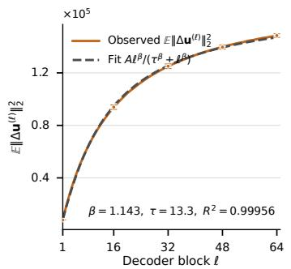  
(A) Mean squared block-update error

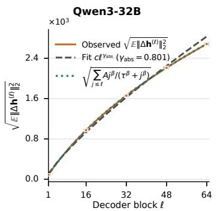  
(B) RMS hidden error

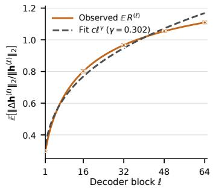  
(C) Relative hidden error  
Figure 7: Fits to block-update and hidden-error growth in randomly initialized Qwen3-32B. (A) A three-parameter curve fits $\mathbb { E } \| \Delta \mathbf { u } ^ { ( \ell ) } \| _ { 2 } ^ { 2 }$ over the measured blocks. (B) Summing these fitted values closely matches the measured RMS hidden error, whose growth is also fitted by a power law. (C) A separate power law fits the mean relative hidden error. Error bars show standard deviation.

(A) Mean squared block-update error

The same fit form for $\mathbb { E } \| \Delta \mathbf { u } ^ { ( \ell ) } \| _ { 2 } ^ { 2 }$ also describes randomly initialized Qwen3-4B, Qwen3-8B, and OLMo3-7B Stage-1 step 0 (Fig. 8); across the four models the hidden-error exponents fitted over the measured depth range are 0.70–0.83, the corresponding mean-relative-error exponents are 0.20– 0.33, and the recurrence-predicted final RMS errors match the measured values to within 0.02%. Adding an unconstrained intercept to the power fit yields negative intercepts, violating the boundary $\Delta h ^ { ( 0 ) } = 0 ;$ we therefore report these as descriptive fits over the measured intervals, not growth laws.

Qwen3-4B (Rand. Init.) / Qwen3-8B (Rand. Init.) / OLMo3-7B (Stage-1 step 0)  
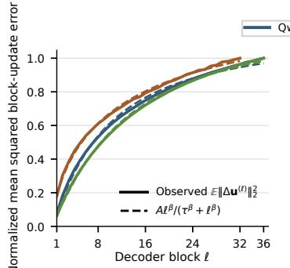

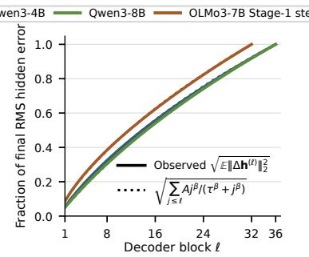  
(B) RMS hidden error

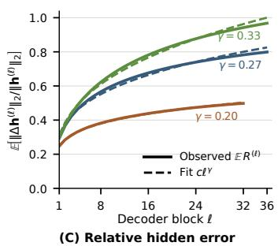  
Figure 8: Fits to block-update and hidden-error growth across randomly initialized models. Results in (A) and (B) are normalized by their final values for comparison across Qwen3-4B, Qwen3-8B, and OLMo3-7B Stage-1 step 0. (A) Fitted curves follow the measured $\mathbb { E } \| \Delta \mathbf { u } ^ { ( \ell ) } \| _ { 2 } ^ { 2 }$ (B) Summing the fitted values closely matches the measured RMS hidden error. (C) Power laws fit the unnormalized mean relative hidden error. All fits are restricted to the measured blocks.

Hidden-error growth in pretrained models We do not assign the pretrained curve a global power exponent because its growth is not uniform across depth. We quantify its rate over intervals. Define the average per-block relative-error increase over blocks $a + 1 , \dots ,$ b as

$$
\overline { { s } } _ { a : b } ^ { \mathrm { r e l } } : = \frac { \mathbb { E } \left[ \Vert \Delta \mathbf { h } ^ { ( b ) } \Vert _ { 2 } / \Vert \mathbf { h } ^ { ( b ) } \Vert _ { 2 } \right] - \mathbb { E } \left[ \Vert \Delta \mathbf { h } ^ { ( a ) } \Vert _ { 2 } / \Vert \mathbf { h } ^ { ( a ) } \Vert _ { 2 } \right] } { b - a } .
$$

Over blocks 33–64, $\overline { { s } } _ { 3 3 : 6 4 }$ is $1 . 4 6 \times 1 0 ^ { - 3 }$ for pretrained Qwen3-32B and $4 . 4 5 \times 1 0 ^ { - 3 }$ at random initialization. Thus, the measured second-half relative-error growth is 3.1× slower after pretraining. At block 64, the mean hidden-error magnitude and mean relative hidden error are $5 . 5 \times$ and 6.7× smaller, respectively; these final-block ratios describe the final errors rather than their growth rates.

Fig. 9 compares randomly initialized and pretrained models across three architecture families. At the final block, random initialization increases relative hidden error by 7.9× in Qwen3-8B, 5.9× in OLMo3-32B, and 4.0× in Gemma3-4B.

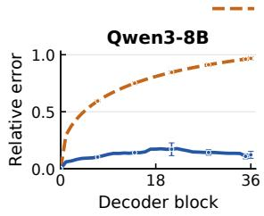

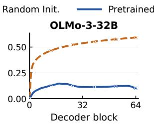

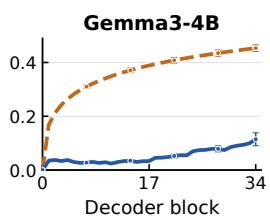  
Figure 9: Randomly initialized and pretrained models across three architecture families. Relative hidden errors are shown for Qwen3-8B, OLMo3-32B, and Gemma3-4B under the same NVFP4 conversion. Error bars show standard deviation. Qwen3-8B and OLMo3-32B use BF16 for non quantized computation; Gemma3 uses FP32 for the original pass and all non-quantized operations.

## E.2 HIDDEN-ERROR RECURRENCE ACROSS MODELS

The exact recurrence in Thm. 1 separates each block’s change in squared relative hidden error into the three terms defined in the main text: relative additional error $\mathbf { \Delta } T _ { \mathrm { a d d } }$ , error interaction $T _ { \mathrm { i n t e r } } ,$ and residual-norm contribution $T _ { \mathrm { a l i g n } }$ . We test whether the same signed balance holds beyond the Qwen3-32B result in the main text.

We evaluate five pretrained dense and mixture-of-experts models on C4, WikiText-103, and GSM8K text. Model precision, quantization, aggregation, and position selection follow App. D.3. In every setting, the negative interaction term $\bar { T } _ { \mathrm { i n t e r } }$ offsets part of $T _ { \mathrm { a d d } }$ . The residual-norm term $\pmb { T } _ { \mathrm { a l i g n } }$ gives a further reduction, although the size of each contribution varies by model and dataset. The signs $T _ { \mathrm { a d d } } ~ > ~ 0$ and $T _ { \mathrm { i n t e r } } < \bar { 0 }$ remain unchanged across the tested filter thresholds. For the primary Qwen3-32B model, the mean final relative hidden error across the three datasets is 0.245, as reported in Sec. 4.

Figs. 10 and 11 show the cumulative and per-block results.

## Cumulative relative squared-error accounting

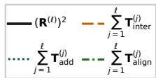

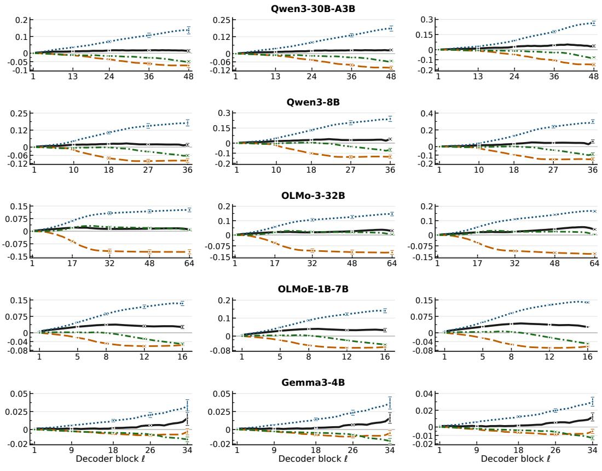  
(A) C4  
(B) WikiText-103  
(C) GSM8K text  
Figure 10: Cumulative relative squared-error accounting. Rows are models and columns are datasets. The black curve is the exact squared relative hidden error; the colored curves are the cumulative three-term contributions. Error bars show one sample standard deviation across complete input sequences. Position selection is described in App. E.3.

## Per-block relative squared-error accounting

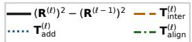

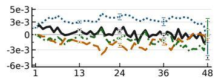

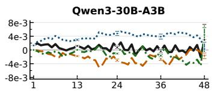

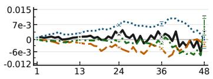

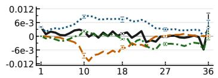

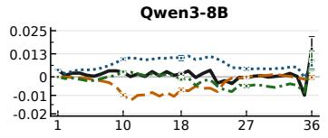

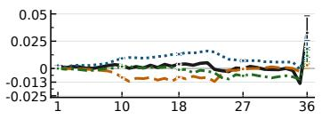

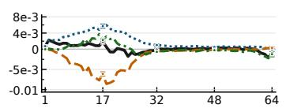

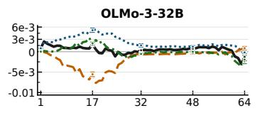

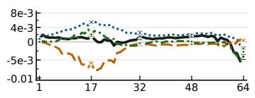

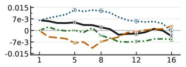

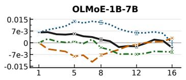

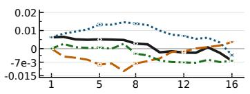

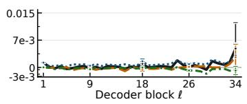  
(A) C4

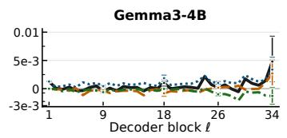  
(B) WikiText-103

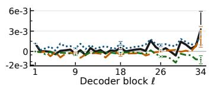  
(C) GSM8K text  
Figure 11: Per-block relative squared-error contribution. Rows are models and columns are datasets. The black curve is the exact blockwise change; the colored curves are the three terms in Thm. 1. Error bars show one sample standard deviation across complete input sequences.

## E.3 HIDDEN-ERROR ANALYSIS: ABNORMAL TRAJECTORY FILTERING

Counteraction slows hidden-error growth on average, but it does not keep every quantized next-token trajectory stable. At a small fraction of positions, the hidden error becomes unusually large and the original and W4 hidden-state norms separate sharply across depth. These trajectories can dominate averages of the signed recurrence terms, although the recurrence formula is exact at every position. We therefore separate these cases with a trajectory filter, test its threshold sensitivity, and examine the excluded cases. App. D.3 gives the full selection and aggregation protocol.

Each decoding position i produces a BF16/W4 hidden-state trajectory $\{ \mathbf { h } _ { i } ^ { ( \ell ) } , \widehat { \mathbf { h } } _ { i } ^ { ( \ell ) } \} _ { \ell = 0 } ^ { L } ,$ . We compute the largest relative difference between the BF16 and W4 hidden-state norms along that trajectory:

$$
g _ { i } ^ { \operatorname* { m a x } } : = \operatorname* { m a x } _ { \ell \in \{ 0 , \ldots , L \} } \frac { \biggr | \| \widehat { \mathbf { h } } _ { i } ^ { ( \ell ) } \| _ { 2 } - \| \mathbf { h } _ { i } ^ { ( \ell ) } \| _ { 2 } \biggr | } { \| \mathbf { h } _ { i } ^ { ( \ell ) } \| _ { 2 } } .
$$

By default, we retain position i when $g _ { i } ^ { \mathrm { m a x } } \leq 0 . 5$ , which retains 99.72% of positions across the evaluated settings. The same positions are used at every layer, so all points on a layerwise curve refer to one fixed population. We form the recurrence terms of Thm. 1 at each retained position and then average over positions within each complete sequence. Error bars in the reported figures show one sample standard deviation across complete input sequences.

We repeat the analysis with thresholds 1.0, 0.5, 0.25, and 0.1, and without filtering. Tab. 2 reports $\mathbb { E } [ R ^ { ( \bar { L } ) } ]$ , first averaging retained positions within each sequence and then giving equal weight to each sequence and model-dataset setting, where $R ^ { ( L ) } : = \| \widehat { \mathbf h } ^ { ( L ) } - \mathbf h ^ { ( L ) } \| _ { 2 } / \| \mathbf h ^ { ( L ) } \| _ { 2 }$ is the final relative hidden error defined in Sec. 3.2.

Table 2: Final relative hidden error under different hidden-norm-gap thresholds. We exclude position i with $g _ { i } ^ { \operatorname* { m a x } } >$ threshold. Values are macro-averaged over the evaluated model–dataset settings. Both sums in the last column run over decoder blocks 1–L.
<table><tr><td>Norm-gap threshold</td><td>Positions retained</td><td> $\mathbb { E } [ R ^ { ( L ) } ]$ </td><td> $\mathbb { E } \biggl [ - \sum T _ { \mathrm { i n t e r } } ^ { ( \ell ) } / \sum T _ { \mathrm { a d d } } ^ { ( \ell ) } \biggr ]$ </td></tr><tr><td>Unfiltered</td><td>100.00%</td><td>0.148</td><td>30.4%</td></tr><tr><td>1.0</td><td>99.92%</td><td>0.147</td><td>57.7%</td></tr><tr><td>0.5 (default)</td><td>99.72%</td><td>0.147</td><td>50.4%</td></tr><tr><td>0.25</td><td>98.62%</td><td>0.144</td><td>50.2%</td></tr><tr><td>0.1</td><td>89.34%</td><td>0.136</td><td>51.8%</td></tr></table>

The default threshold is a suitable cutoff: it changes the mean final relative hidden error only from 0.148 to 0.147 while retaining 99.72% of positions. It removes rare scale failures while preserving the main statistics. When all positions are included, the fraction of $\mathbf { \Delta } T _ { \mathrm { a d d } }$ canceled by $\bar { T } _ { \mathrm { i n t e r } }$ falls from 50.4% to 30.4%. Counteraction is less effective when the W4 norm trajectory departs sharply from the original trajectory. These rare errors appear to exceed the range that the model can regulate through counteraction.

For the LM-head norm statistics used in Sec. 4, the default filter gives

$$
\begin{array} { r } { \mathbb { E } \left| \frac { \| \widehat { \mathbf { h } } _ { \mathrm { L M } } \| _ { 2 } } { \| { \mathbf { h } } _ { \mathrm { L M } } \| _ { 2 } } - 1 \right| = 0 . 0 3 7 2 , \qquad \mathbb { E } \left( \frac { \| \widehat { \mathbf { h } } _ { \mathrm { L M } } \| _ { 2 } } { \| { \mathbf { h } } _ { \mathrm { L M } } \| _ { 2 } } - 1 \right) ^ { 2 } = 0 . 0 0 3 2 0 , } \end{array}
$$

averaged equally over C4, WikiText-103, and GSM8K text. Without filtering, the values are 0.0373 and 0.00324, only 0.31% and 1.27% higher. Thus, the LM-head-input norm remains statistically stable even without the filter, supporting the approximation $\Vert \widehat { \mathbf { h } } _ { \mathrm { L M } } \Vert _ { 2 } / \Vert \mathbf { h } _ { \mathrm { L M } } \Vert _ { 2 } \approx 1$ used in Sec. 4.2.

Fig. 12 shows the excluded regime directly. For each of Qwen3-32B, Qwen3-8B, and OLMo3-7B, we select the position whose $\bar { g } _ { i } ^ { \operatorname* { m a x } }$ is closest to the median among that model’s excluded positions. This deterministic rule does not inspect the recurrence values or output probabilities. The BF16 and W4 hidden-state norms separate sharply in these examples, and the recurrence terms of Thm. 1 become large enough to dominate an unfiltered mean despite the small number of such positions.

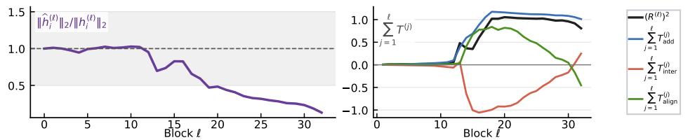

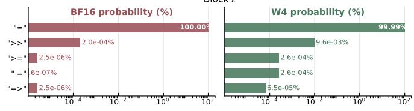

Abnormal Case 1 (Qwen3-32B)  
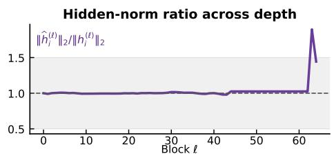  
Context ... how many pens does he get? Answer: He can make 5 pens because 25 / 5 =

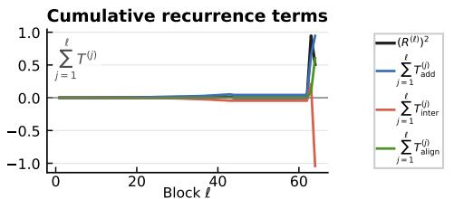

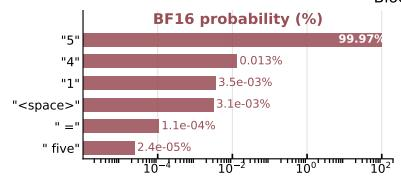

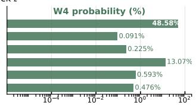  
Abnormal Case 2 (Qwen3-8B)

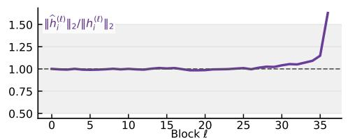

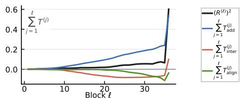  
Context ... How much does Lloyd make on eggs per week? Answer: His farm produces 252 x 7 = 1764

Abnormal Case 3 (OLMo3-7B)  
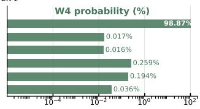  
Figure 12: Rare hidden-state trajectory failures occur when BF16 and W4 hidden norms diverge. All three cases are from GSM8K text. Rows show Qwen3-32B, Qwen3-8B, and OLMo3-7B positions selected by proximity to each model’s median excluded $g _ { i } ^ { \operatorname* { m a x } }$ ; the value beside each row title is this selection statistic, not the plotted ordinate. Selection does not use recurrence values or output changes. The left column shows $\| \widehat { \mathbf { h } _ { i } } ^ { ( \ell ) } \| _ { 2 } / \| \mathbf { h } _ { i } ^ { ( \ell ) } \| _ { 2 }$ , with the retained range [0.5, 1.5] shaded in gray. The right column shows the cumulative recurrence terms. Both columns use decoder block ℓ on the horizontal axis. The lower strip shows the context and BF16/W4 next-token probabilities.

## E.4 HIDDEN-ERROR GROWTH: LATE-LAYER DIFFERENCES ACROSS DATA

Even with the counteraction mechanism, hidden-error growth can also vary across input domains for pretrained models. Qwen3-32B accumulates relative hidden error faster on GSM8K text than on C4 in the later blocks. Here, we identify the responsible recurrence term and test it by applying the same update rescaling to both streams.

The relative additional-error term in Thm. 1 is

$$
T _ { \mathrm { a d d } } ^ { ( \ell ) } = \left( \frac { \| \mathbf { u } ^ { ( \ell ) } \| _ { 2 } } { \| \mathbf { h } ^ { ( \ell ) } \| _ { 2 } } \right) ^ { 2 } \left[ \left( \frac { \| \Delta \mathbf { u } ^ { ( \ell ) } \| _ { 2 } } { \| \mathbf { u } ^ { ( \ell ) } \| _ { 2 } } \right) ^ { 2 } - \left( R ^ { ( \ell - 1 ) } \right) ^ { 2 } \right] .
$$

Fig. 13(B) shows that the relative hidden-error trajectories remain close in the earlier blocks but separate sharply later. Over blocks 36–64, the coefficient $\left( \Vert \mathbf { u } ^ { ( \ell ) } \Vert _ { 2 } / \Vert \mathbf { h } ^ { ( \ell ) } \Vert _ { 2 } \right) ^ { 2 }$ is larger on GSM8K text (Fig. 13(A)). The block-update norms are comparable across the two datasets, but the hiddenstate norm is smaller on average for GSM8K text. Its updates are therefore stronger relative to the hidden state. When the bracketed term is positive, the larger coefficient increases $T _ { \mathrm { a d d } } ^ { ( \ell ) }$ and accelerates relative hidden-error growth.

Fig. 13(A) and Fig. 13(B) show that the coefficient and hidden error change together but do not isolate the coefficient. We keep the GSM8K inputs and internal block computations fixed, then rescale only the residual updates to match the C4 coefficient at each block. We intervene over blocks 36–64 and denote the modified trajectories by the subscript c:

$$
\mathbf { h } _ { c } ^ { ( \ell ) } = \mathbf { h } _ { c } ^ { ( \ell - 1 ) } + \lambda ^ { ( \ell ) } \mathbf { u } _ { c } ^ { ( \ell ) } , \qquad \widehat { \mathbf { h } } _ { c } ^ { ( \ell ) } = \widehat { \mathbf { h } } _ { c } ^ { ( \ell - 1 ) } + \lambda ^ { ( \ell ) } \widehat { \mathbf { u } } _ { c } ^ { ( \ell ) } .
$$

On the BF16 pass, we choose $\lambda ^ { ( \ell ) }$ so that the position-averaged value E $\because \left( \lambda ^ { \left( \ell \right) } \big \| \mathbf { u } _ { c } ^ { \left( \ell \right) } \big \| _ { 2 } / \big \| \mathbf { h } _ { c } ^ { \left( \ell \right) } \big \| _ { 2 } \right) ^ { 2 }$ on GSM8K dataset exactly matches the averaged value on C4 at the same block, then reuse $\lambda ^ { ( \ell ) }$ on the W4 pass. Only the residual addition is rescaled; the internal attention and MLP computations remain unchanged. This oracle intervention is used only to test the coefficient, so we do not evaluate output quality.

After matching the coefficients, the final E $[ ( R ^ { ( L ) } ) ^ { 2 } ]$ decreases from 0.121 to 0.062, corresponding to a 48.8% reduction (Fig. 13(C)). This oracle-style intervention shows that the coefficient contributes substantially to the faster late-layer hidden-error growth on GSM8K text. More generally, data change the relative strength of block updates across depth, producing different hidden-state norm trajectories. The ratio $\| \mathbf { u } ^ { ( \ell ) } \| _ { 2 } / \| \mathbf { h } ^ { ( \ell ) } \| _ { 2 }$ measures the signal generated by block ℓ relative to its hidden state. When the bracketed term is positive, a larger ratio gives newly generated block-update error a larger contribution to the residual stream. Later blocks inherit this larger hidden error, so subsequent propagation starts from a larger value. Thus, data-dependent block-update strength can determine where hidden-error growth accelerates. On GSM8K, the larger ratio after block 36 accounts for much of the rapid growth in Fig. 13(B).

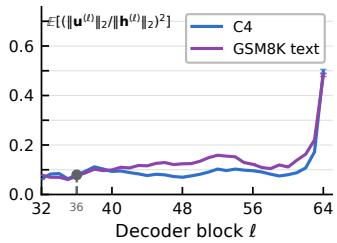  
(A) Coefficient $\frac { \| \mathbf { u } ^ { ( t ) } \| _ { 2 } ^ { 2 } } { \| \mathbf { h } ^ { ( t ) } \| _ { 2 } ^ { 2 } }$ in $\boldsymbol { \mathsf { T } } _ { \mathsf { a d d } }$

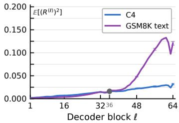  
(B) Relative hidden error

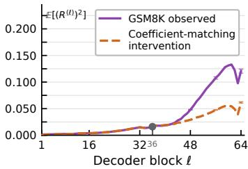  
(C) Coefficient matching  
Figure 13: The update-to-hidden norm ratio explains much of the data-dependent late hiddenerror growth in Qwen3-32B. (A) The coefficient $\| \mathbf { u } ^ { ( \ell ) } \| _ { 2 } ^ { 2 } / \| \mathbf { h } ^ { ( \ell ) } \| _ { 2 } ^ { 2 }$ in $T _ { \mathrm { a d d } }$ is larger on GSM8K text over most late blocks. (B) The relative hidden error then grows faster. (C) Matching the coefficient to the C4 values from block 36 reduces this growth. Error bars show the standard error across 64 sequences at selected blocks.

## E.5 COUNTERACTION EMERGENCE DURING PRETRAINING

Sec. 3 identifies counteraction as a major difference between randomly initialized and pretrained models. At random initialization, the interaction between the block-input hidden error $\Delta \mathbf { h } ^ { ( \ell - 1 ) }$ and block-update error $\Delta \mathbf { u } ^ { ( \ell ) }$ is nearly zero. In pretrained Qwen3-32B, it is negative over much of the network and offsets part of the block-update error, slowing hidden-error growth. The OLMo3-7B Stage-1 checkpoints in Fig. 1 show this change along pretraining, from weak interaction at step 0 to the negative interaction observed at the final checkpoint. We use Pythia checkpoints to test whether the same change appears outside the OLMo family.

Fig. 14 repeats the checkpoint comparison for Pythia-1.4B and Pythia-2.8B. In both models, the cosine between $\Delta \mathbf { h } ^ { ( \ell - 1 ) }$ and $\Delta \mathbf { u } ^ { ( \ell ) }$ changes from a near-zero value at step 0 to broadly negative values at the final checkpoint. The OLMo3 and Pythia interaction curves show the same change during training: counteraction is weak near initialization and becomes more pronounced at later checkpoints.

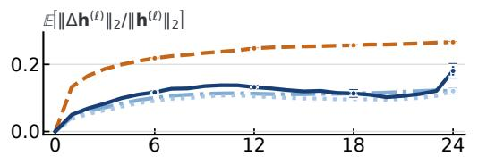

  
(A) Relative hidden-error magnitude

  
(B) Input-update error cosine  
Figure 14: Counteraction strengthens during Pythia pretraining. Rows show four checkpoints of Pythia-1.4B and Pythia-2.8B under the same NVFP4 weight conversion. Columns report relative hidden error and the cosine between the block-input hidden error and block-update error. Error bars show standard deviation.

## E.6 COUNTERACTION SOURCE: BLOCK-INPUT-ERROR RESPONSE

Sec. 5.2 attributes counteraction mainly to the block’s response to the hidden error at its input. Here, we provide the detailed evidence in two steps. We first show that counteraction is specific to the error dynamics rather than a general relation between a hidden state and its residual update. We then decompose the block-update error to determine whether the negative interaction comes from the direct weight perturbation or from the block’s response to the inherited hidden error.

Counteraction is specific to the error dynamics. Counteraction refers to the tendency of the block-update error $\Delta \mathbf { u } ^ { ( \ell ) }$ to point against the hidden error $\Delta \mathbf { h } ^ { ( \ell - 1 ) }$ already present at the block input (Sec. 3.2). A related phenomenon has been observed for native residual contributions: later Transformer layers can partially oppose earlier contributions to correct each other (Patrawala et al., 2025). We therefore ask whether the negative interaction between quantization errors simply reflects a general tendency of a block update to oppose its input hidden state.

Fig. 15 compares these relations. The native hidden-state/update cosines cos $\angle ( \mathbf { h } ^ { ( \ell - 1 ) } , \mathbf { u } ^ { ( \ell ) } )$ and cos $\angle ( \widehat { \mathbf { h } } ^ { ( \ell - 1 ) } , \widehat { \mathbf { u } } ^ { ( \ell ) } )$ are positive in 65.6% and 64.1% of the blocks, respectively. By contrast, cos $\angle ( \Delta \mathbf { h } ^ { ( \ell - 1 ) } , \Delta \mathbf { u } ^ { ( \ell ) } )$ is negative in 82.5% of the blocks. Thus, the strong negative relation is not a general property of the residual update; it appears much more consistently between the inher ited input hidden error and the new block-update error.

  
Figure 15: Counteraction is specific to the error dynamics in Qwen3-32B. BF16 and W4 hiddenstate/update cosines are compared with the cosine between the block-input and block-update errors on C4 inputs. Error bars show one sample standard deviation.

Decomposing the block-update error. We next ask which part of $\Delta \mathbf { u } ^ { ( \ell ) }$ produces this negative interaction. At block ℓ, the original and quantized updates are

$$
\mathbf { u } ^ { ( \ell ) } = \mathbf { F } ^ { ( \ell ) } ( \mathbf { h } ^ { ( \ell - 1 ) } ) , \widehat { \mathbf { u } } ^ { ( \ell ) } = \widehat { \mathbf { F } } ^ { ( \ell ) } ( \widehat { \mathbf { h } } ^ { ( \ell - 1 ) } ) .
$$

We separate these two effects exactly:

$$
\Delta { \bf u } ^ { ( \ell ) } = \underbrace { \widehat { \bf F } ^ { ( \ell ) } ( { \bf h } ^ { ( \ell - 1 ) } ) - { \bf F } ^ { ( \ell ) } ( { \bf h } ^ { ( \ell - 1 ) } ) } _ { \Delta { \bf u } _ { \mathrm { v e i g h t } } ^ { ( \ell ) } \mathrm { ~ ( d i r e c t ~ w e i g h t ~ e f f e c t ) } } + \underbrace { \widehat { \bf F } ^ { ( \ell ) } ( \widehat { \bf h } ^ { ( \ell - 1 ) } ) - \widehat { \bf F } ^ { ( \ell ) } ( { \bf h } ^ { ( \ell - 1 ) } ) } _ { \Delta { \bf u } _ { \mathrm { r e s p o n s e ~ ( r e s p o n s e ~ t o ~ b l o c k - i n p u t ~ e r o r ) } } ^ { ( \ell ) } } .\tag{22}
$$

The first component changes the block weights while keeping its input fixed at $\mathbf { h } ^ { ( \ell - 1 ) }$ . The second keeps the quantized block fixed and changes only its input from $\mathbf { h } ^ { ( \ell - 1 ) } \mathbf { \Lambda } _ { \mathbf { t o } } \widehat { \mathbf { h } } ^ { ( \ell - 1 ) }$ . Because $T _ { \mathrm { i n t e r } } ^ { ( \ell ) } =$ $\frac { 2 \langle \Delta \mathbf { h } ^ { ( \ell - 1 ) } , \Delta \mathbf { u } ^ { ( \ell ) } \rangle } { \| \mathbf { h } ^ { ( \ell ) } \| _ { 2 } ^ { 2 } }$ is linear in $\Delta \mathbf { u } ^ { ( \ell ) }$ , this decomposition also gives

$$
T _ { \mathrm { i n t e r } } ^ { ( \ell ) } = T _ { \mathrm { i n t e r , w e i g h t } } ^ { ( \ell ) } + T _ { \mathrm { i n t e r , r e s p o n s e } } ^ { ( \ell ) } = \frac { 2 \langle \Delta \mathbf { h } ^ { ( \ell - 1 ) } , \Delta \mathbf { u } _ { \mathrm { w e i g h t } } ^ { ( \ell ) } \rangle } { \| \mathbf { h } ^ { ( \ell ) } \| _ { 2 } ^ { 2 } } + \frac { 2 \langle \Delta \mathbf { h } ^ { ( \ell - 1 ) } , \Delta \mathbf { u } _ { \mathrm { r e s p o n s e } } ^ { ( \ell ) } \rangle } { \| \mathbf { h } ^ { ( \ell ) } \| _ { 2 } ^ { 2 } } .
$$

Thus, the source of counteraction can be identified by asking which component contributes the negative interaction with $\Delta \mathbf { h } ^ { ( \ell - 1 ) }$ . We measure both components by replaying every decoder block of Qwen3-32B on the C4 inputs from Sec. 3.2.

  
(A) Cosines with block-input hidden error

  
(B) Contributions to Tinter  
Figure 16: The response to block-input error carries counteraction in Qwen3-32B. C4 inputs. (A) Cosines between the block-input error and the block-update error $\Delta \mathbf { u } ^ { ( \ell ) }$ , split into the direct weight effect and input-error response from Eq. (22). (B) Their contributions $T _ { \mathrm { i n t e r , w e i g h t } } ^ { ( \ell ) }$ and $T _ { \mathrm { i n t e r , r e s p o n s e } } ^ { ( \ell ) } \mathrm { t o } T _ { \mathrm { i n t e r } } ^ { ( \ell ) }$ . Error bars show one sample standard deviation.

The input-error response carries the negative direction. Fig. 16(A) compares the directions of the two components. The full block-update error $\Delta \mathbf { u } ^ { ( \ell ) }$ closely follows $\Delta \mathbf { u } _ { \mathrm { r e s p o n s e } } ^ { ( \ell ) }$ , whose cosine with the block-input hidden error is negative in 83% of the blocks. By contrast, the cosine curve for $\Delta \mathbf { u } _ { \mathrm { w e i g h t } } ^ { ( \ell ) }$ stays within 0.02 of zero at every block. The direct weight-quantization perturbation therefore produces a nonzero update error, but it has no consistent direction relative to the hidden error already present at the block input.

Fig. 16(B) measures the quantity directly relevant to counteraction: the signed contribution to Tinter. After summing over blocks, $\begin{array} { r l } { \sum _ { \ell = 1 } ^ { L } T _ { \mathrm { i n t e r , r e s p o n s e } } ^ { ( \ell ) } } & { { } } \end{array}$ accounts for 99.9% of the negative $\Sigma _ { \ell = 1 } ^ { L } T _ { \mathrm { i n t e r } } ^ { ( \ell ) } ,$ whereas $\begin{array} { r } { \sum _ { \ell = 1 } ^ { L } T _ { \mathrm { i n t e r , w e i g h t } } ^ { ( \ell ) } } \end{array}$ accounts for less than 0.1%. This attribution is directional rather than a consequence of the response component being much larger in norm. In fact, E $\mathbf { \nabla } \cdot \left[ \frac { \| \Delta \mathbf { u } _ { \mathrm { w e i g h t } } ^ { ( \ell ) } \| _ { 2 } } { \| \Delta \mathbf { u } ^ { ( \ell ) } \| _ { 2 } } \right]$ is 84% of $\mathbf { \mathbb { E } } \Big [ \frac { \lVert \Delta \mathbf { u } _ { \mathrm { r e s p o n s e } } ^ { ( \ell ) } \rVert _ { 2 } } { \lVert \Delta \mathbf { u } ^ { ( \ell ) } \rVert _ { 2 } } \Big ]$ . The two components therefore have comparable magnitudes, but only the input-error response points consistently against the inherited hidden error.

Robustness to the decomposition path. The exact decomposition of $\Delta \mathbf { u } ^ { ( \ell ) }$ is not unique because one may choose either block map for the intermediate evaluation. To check that the attribution above does not depend on this choice, we instead add and subtract $\mathbf { F } ^ { ( \ell ) } ( \widehat { \mathbf { h } } ^ { ( \ell - 1 ) } )$ ), giving

$$
\Delta { \bf u } ^ { ( \ell ) } = \left[ \widehat { \bf F } ^ { ( \ell ) } ( \widehat { \bf h } ^ { ( \ell - 1 ) } ) - { \bf F } ^ { ( \ell ) } ( \widehat { \bf h } ^ { ( \ell - 1 ) } ) \right] + \left[ { \bf F } ^ { ( \ell ) } ( \widehat { \bf h } ^ { ( \ell - 1 ) } ) - { \bf F } ^ { ( \ell ) } ( { \bf h } ^ { ( \ell - 1 ) } ) \right] .
$$

Here the first term measures the direct weight effect at the W4 input, whereas the second measures the response of the original block to the same input error. This alternative decomposition gives the same qualitative attribution: across blocks, the first term above contributes +0.0013 to the cumula tive $T _ { \mathrm { i n t e r } } .$ whereas the second contributes −0.1118 to the $\begin{array} { r } { \sum _ { \ell = 1 } ^ { L } T _ { \mathrm { i n t e r } } ^ { ( \ell ) } = - 0 . 1 1 0 5 } \end{array}$

Therefore, under either exact decomposition, counteraction is carried mainly by how the block responds to the hidden error at its input. The resulting change in the block update tends to oppose the accumulated hidden error and slow its propagation.

## E.7 COUNTERACTION INTERVENTION: REMOVAL AND REVERSAL

Sec. 3.3 shows that removing or reversing counteraction increases hidden error and output change in Qwen3-32B. Here, we give the online recursions and term-wise accounting, then repeat the intervention in Qwen3-8B to test whether the effect transfers across model scales.

Removal and reversal follow separate intervened trajectories initialized from $\mathbf { h } ^ { ( 0 ) }$ . In each recursion below, $\widehat { \mathbf { h } } ^ { ( \ell - 1 ) }$ is the current modified block input. We recompute the block-input hidden error and W4 block-update error at every block: $\Delta { \mathbf h } ^ { ( \ell - 1 ) } : = \widehat { { \mathbf h } } ^ { ( \ell - 1 ) } - { \mathbf h } ^ { ( \ell - 1 ) } , \Delta { \mathbf u } ^ { ( \ell ) } : =$ $\widehat { \mathbf { F } } ^ { ( \ell ) } ( \widehat { \mathbf { h } } ^ { ( \ell - 1 ) } ) - \mathbf { F } ^ { ( \ell ) } ( \mathbf { h } ^ { ( \ell - 1 ) } )$ . Here, $\Delta \mathbf { u } ^ { ( \ell ) }$ follows the definition in Eq. (1), but is computed on the modified trajectory.

For removal, the equal-norm error orthogonal to the block-input hidden error is

$$
\Delta \mathbf { u } _ { \perp } ^ { ( \ell ) } : = \lVert \Delta \mathbf { u } ^ { ( \ell ) } \rVert _ { 2 } \frac { \Delta \mathbf { u } ^ { ( \ell ) } - \frac { \left. \Delta \mathbf { h } ^ { ( \ell - 1 ) } , \Delta \mathbf { u } ^ { ( \ell ) } \right. } { \lVert \Delta \mathbf { h } ^ { ( \ell - 1 ) } \rVert _ { 2 } ^ { 2 } } \Delta \mathbf { h } ^ { ( \ell - 1 ) } } { \left\| \Delta \mathbf { u } ^ { ( \ell ) } - \frac { \left. \Delta \mathbf { h } ^ { ( \ell - 1 ) } , \Delta \mathbf { u } ^ { ( \ell ) } \right. } { \lVert \Delta \mathbf { h } ^ { ( \ell - 1 ) } \rVert _ { 2 } ^ { 2 } } \Delta \mathbf { h } ^ { ( \ell - 1 ) } \right\| _ { 2 } ^ { - } } .
$$

The removal and reversal trajectories are then propagated directly as

$$
\begin{array} { r l } & { \widehat { \mathbf { h } } _ { \mathrm { r e m } } ^ { ( \ell ) } = \widehat { \mathbf { h } } _ { \mathrm { r e m } } ^ { ( \ell - 1 ) } + \mathbf { u } ^ { ( \ell ) } + \{ \Delta \mathbf { u } _ { \perp } ^ { ( \ell ) } , \quad 1 7 \leq \ell \leq 4 8 ,  } \\ & {  \Delta \mathbf { h } ^ { ( \ell ) } , \quad \mathrm { o t h e r w i s e } ,  } \\ & {  \widehat { \mathbf { h } } _ { \mathrm { r e v } } ^ { ( \ell ) } = \widehat { \mathbf { h } } _ { \mathrm { r e v } } ^ { ( \ell - 1 ) } + \mathbf { u } ^ { ( \ell ) } + \{ \Delta \mathbf { u } ^ { ( \ell ) } , \quad 1 7 \leq \ell \leq 4 8 \mathrm { a n d } \langle \Delta \mathbf { h } ^ { ( \ell - 1 ) } , \Delta \mathbf { u } ^ { ( \ell ) } \rangle < 0 ,  } \end{array}\tag{23}
$$

(24)

Removal makes the applied block-update error orthogonal to the block-input hidden error at every position in blocks $1 7 \leq \ell \leq 4 8 ;$ reversal flips only negative interactions in this interval. Both preserve $\| \Delta \mathbf { u } ^ { ( \ell ) } \| _ { 2 }$ at the intervened block, although later block-update errors may change along the modified trajectory. A deterministic orthogonal fallback handles degenerate projections but was never triggered. Term-wise analysis follows the abnormal case exclusion selection in App. D.3. The same filtering rule is applied to each modified trajectory.

Fig. 17 provides the term-wise recurrence accounting for Qwen3-32B. Across the intervened blocks, removal nearly eliminates cumulative $T _ { \mathrm { i n t e r } }$ while increasing cumulative $T _ { \mathrm { a d d } }$ by 4.3×. Together, these changes increase the final $\mathbb { E } [ ( R ^ { ( L ) } ) ^ { 2 } ]$ by 8.4×. Although the recurrence separates $\mathbf { { T } _ { a d d } }$ and ${ \boldsymbol { T } } _ { \mathrm { i n t e r } }$ algebraically, changing the trajectory also changes the subsequent values of $\mathbf { \Delta } T _ { \mathrm { a d d } }$ . Thus, counteraction limits error growth both through direct negative interaction and by preventing larger values of $\mathbf { \Delta } T _ { \mathrm { a d d } }$ later in the forward pass.

  
(A) No intervention

  
(B) Counteraction removed

  
(C) Counteraction reversed  
Figure 17: Relative squared-error accounting after counteraction intervention in Qwen3-32B. Columns compare unmodified W4 with counteraction removal and reversal over blocks 17–48, where counteraction is strong. The corresponding hidden-error and output changes are reported in Sec. 3.3. In contrast to the other figures, a symmetric logarithmic scale is used here to compare trajectories that span multiple orders of magnitude.

We repeat the intervention in Qwen3-8B over its strongest-counteraction interval, blocks 6–23. Fig. 18 combines the hidden-error and output changes with the same term-wise accounting. Removal again nearly eliminates cumulative $\bar { T _ { \mathrm { i n t e r } } } ,$ while cumulative $\mathbf { { T } _ { a d d } }$ increases by 2.7× and the final $\mathbb { E } [ ( \bar { R } ^ { ( L ) } ) ^ { 2 } ]$ increases by 4.8×. The Qwen3-8B result therefore reproduces the same coupling between the negative interaction and the subsequent hidden-state trajectory.

## Counteraction intervention in Qwen3-8B

  
(A) Absolute error norm

  
(B) Relative error norm

<table><tr><td>Observed W4</td><td>Counteraction reversed</td></tr><tr><td>Counteraction removed</td><td>Intervened blocks 6-23</td></tr></table>

  
(C) Output metrics

  
(D) No intervention

  
(E) Counteraction removed

  
(F) Counteraction reversed  
Figure 18: Counteraction intervention in Qwen3-8B. (A,B) Hidden-error trajectories and (C) output changes after removing or reversing counteraction over blocks 6–23. (D)–(F) Relative squarederror accounting along the same three trajectories. Output metrics are defined in Sec. 4.1; error bars show one sample standard deviation across inputs. The lower panels use a symmetric logarithmic scale.

## E.8 COUNTERACTION ACROSS WEIGHT AND ACTIVATION QUANTIZATION

Sec. 5.1 asks whether the negative interaction between block-input hidden error and block-update error is specific to weight quantization. Fig. 6(A) compares its blockwise cosine under W4 (weightonly quantization), A4 (activation-only quantization), and W4A4 (joint weight and activation quantization), and finds a similar depth-wise pattern in all three settings. The cosine shows the direction of the interaction, but not how much it contributes to the relative hidden-error trajectory or how the remaining error changes the next-token distribution.

Fig. 19 applies Thm. 1 separately to each setting. The relative-error trajectories and the amount of newly added error differ, but the cumulative ${ \boldsymbol { T } } _ { \mathrm { i n t e r } }$ contribution is negative in all three cases. Thus, the block-update error counteracts the block-input hidden error whether the perturbation enters through weights, activations, or both.

Fig. 20 compares the corresponding CE, KL, top-token retention, and rank-wise log-probability changes. The three settings do not produce the same output error, even though their blockwise counteraction curves are similar. Counteraction describes how hidden error is limited through depth; output robustness also depends on how much error each block introduces and how the remaining error affects the LM head.

  
(A) W4

  
(B) A4

  
(C) W4A4

Figure 19: Relative-error recurrence under weight and activation quantization. Qwen3-32B on C4 under W4, A4, and W4A4. The black curve is the cumulative squared relative error; the colored curves are the cumulative contributions of $T _ { \mathrm { a d d } } , \ T _ { \mathrm { i n t e r } }$ , and $T _ { \mathrm { a l i g n } }$ . Error bars show one sample standard deviation across complete inputs.
<table><tr><td rowspan=1 colspan=1>Setting</td><td rowspan=1 colspan=1>CE diff. ↓</td><td rowspan=1 colspan=1>Rel. CE (%) ↓</td><td rowspan=1 colspan=1>KL↓</td></tr><tr><td rowspan=1 colspan=1>W4</td><td rowspan=1 colspan=1>0.019</td><td rowspan=1 colspan=1>0.78</td><td rowspan=1 colspan=1>0.044</td></tr><tr><td rowspan=1 colspan=1>A4</td><td rowspan=1 colspan=1>0.019</td><td rowspan=1 colspan=1>0.76</td><td rowspan=1 colspan=1>0.039</td></tr><tr><td rowspan=1 colspan=1>W4A4</td><td rowspan=1 colspan=1>0.036</td><td rowspan=1 colspan=1>1.51</td><td rowspan=1 colspan=1>0.080</td></tr></table>

<table><tr><td rowspan=1 colspan=1>Setting</td><td rowspan=1 colspan=1>Flip@1 (%) ↓</td><td rowspan=1 colspan=1>Ret@10 (%) ↑ R</td><td rowspan=1 colspan=1>et@20 (%) ↑</td></tr><tr><td rowspan=1 colspan=1>W4</td><td rowspan=1 colspan=1>10.6</td><td rowspan=1 colspan=1>88.8</td><td rowspan=1 colspan=1>88.9</td></tr><tr><td rowspan=1 colspan=1>A4</td><td rowspan=1 colspan=1>10.0</td><td rowspan=1 colspan=1>89.8</td><td rowspan=1 colspan=1>89.9</td></tr><tr><td rowspan=1 colspan=1>W4A4</td><td rowspan=1 colspan=1>14.4</td><td rowspan=1 colspan=1>85.6</td><td rowspan=1 colspan=1>85.6</td></tr></table>

(A) Next-token distribution changes  
(B) Top-ranked token preservation  
  
(C) Log-probability change by rank

Figure 20: Output changes under weight and activation quantization. Qwen3-32B on the same C4 inputs and retained next-token positions used in Fig. 19. Metrics follow Sec. 4.1. Error bars show one sample standard deviation across complete inputs.

## E.9 COUNTERACTION ACROSS PTQ ALGORITHMS AND WEIGHT FORMATS

Sec. 5.1 also asks whether counteraction depends on how the 4-bit weights are produced. Fig. 6(B) shows that the blockwise counteraction cosine changes little across calibration-free RTN and the calibration-based GPTQ and AWQ algorithms, all using NVFP4 weights. This comparison does not show whether the same conclusion holds for another weight format, or whether similar counteraction curves imply similar relative-error and output changes.

We compare RTN, GPTQ, and AWQ on Qwen3-4B under both NVFP4 and asymmetric INT4. All conditions quantize the same Attention and MLP weights, and we report the exact relative-error recurrence together with the resulting next-token output changes. Evaluation follows App. D.3 and retains at least 99.93% of positions. Every condition has $\begin{array} { r } { \sum _ { \ell = 1 } ^ { L } T _ { \mathrm { i n t e r } } ^ { ( \ell ) } < 0 } \end{array}$ . For NVFP4, the blockwise interaction-cosine curves under GPTQ and AWQ have correlations above 0.998 with the RTN curve.

Asymmetric INT4 quantization details. The INT4 experiments use the W4A16 ASYM scheme from llmcompressor. All Attention and MLP linear weights are quantized in groups of 128 consecutive values along the input dimension, while activations remain in BF16 and the LM head remains unquantized. Each group includes zero and uses signed 4-bit integer values $q _ { \mathrm { m i n } } = - 8$ and $q _ { \mathrm { m a x } } = 7$ . Given group $w _ { \mathrm { m i n } }$ and $w _ { \mathrm { m a x } } .$ , the static affine parameters are

$$
s = \frac { w _ { \mathrm { m a x } } - w _ { \mathrm { m i n } } } { 1 5 } , \qquad z _ { z p } = \mathrm { c l i p } \left( \mathrm { r o u n d } \left( q _ { \mathrm { m i n } } - \frac { w _ { \mathrm { m i n } } } { s } \right) , q _ { \mathrm { m i n } } , q _ { \mathrm { m a x } } \right) ,
$$

where $z _ { z p }$ is stored as INT8.

Quantization and reconstruction use

$$
q = \mathrm { c l i p } \left( \mathrm { r o u n d } \left( { \frac { w } { s } } + z _ { z p } \right) , q _ { \mathrm { m i n } } , q _ { \mathrm { m a x } } \right) , \quad { \widehat { w } } = s ( q - z _ { z p } ) .
$$

Calibrated PTQ algorithm details. GPTQ and AWQ use 64 disjoint 512-token C4 calibration sequences; RTN uses no calibration data. For NVFP4, NVIDIA Model Optimizer applies GPTQ with block size 128 and Hessian dampening 0.01, or AWQ-lite with alpha step 0.1, directly to the E2M1 weights and E4M3 block scales defined above. For asymmetric INT4, GPTQ uses the same block size and dampening with static activation ordering, while AWQ uses activation-and-weight duo scaling with 20 grid-search points.

Figs. 21, 22, and 23 give the full results. Across the tested algorithms and formats, ${ \boldsymbol { T } } _ { \mathrm { i n t e r } }$ remains negative and its blockwise geometry changes little, but $\mathbf { { T } _ { a d d } }$ , final relative error, and output metrics still vary. A stronger cumulative ${ \cal T } _ { \mathrm { i n t e r } }$ does not imply better PTQ quality. Output changes also depend on newly introduced error and on how the remaining hidden error affects the output layer.

  
Figure 21: Counteraction is consistent across PTQ algorithms and weight formats. Qwen3-4B results. Solid and dashed curves denote NVFP4 and asymmetric INT4. Error bars show one sample standard deviation across inputs.

  
Figure 22: Relative-error recurrence across PTQ algorithms and weight formats. Qwen3-4B under RTN, GPTQ, and AWQ with NVFP4 and asymmetric INT4. Each row shows one PTQ algorithm, and the two columns share a vertical scale within that row. The black curve is the cumulative squared relative error; the colored curves are the cumulative contributions of $T _ { \mathrm { a d d } } , T _ { \mathrm { i n t e r } }$ , and $T _ { \mathrm { a l i g n } }$ Error bars show one sample standard deviation across inputs.

<table><tr><td>Recipe</td><td>CE diff. ↓</td><td>Rel. CE (%) ↓</td><td>KL ↓</td></tr><tr><td>RTN NVFP4</td><td>0.022</td><td>0.63</td><td>0.061</td></tr><tr><td>GPTQ NVFP4</td><td>-0.006</td><td>-0.17</td><td>0.036</td></tr><tr><td>AWQ NVFP4</td><td>0.027</td><td>0.78</td><td>0.047</td></tr><tr><td>RTN INT4</td><td>0.122</td><td>3.54</td><td>0.103</td></tr><tr><td>GPTQ INT4</td><td>0.015</td><td>0.44</td><td>0.042</td></tr><tr><td>AWQ INT4</td><td>0.008</td><td>0.23</td><td>0.062</td></tr></table>

<table><tr><td>Recipe</td><td>Flip@1 (%) ↓</td><td>Ret@10 (%) ↑</td><td>Ret@20 (%) ↑</td></tr><tr><td>RTN NVFP4</td><td>11.8</td><td>88.4</td><td>88.5</td></tr><tr><td>GPTQ NVFP4</td><td>8.6</td><td>91.4</td><td>91.5</td></tr><tr><td>AWQ NVFP4</td><td>10.2</td><td>90.0</td><td>89.9</td></tr><tr><td>RTN INT4</td><td>14.6</td><td>85.6</td><td>85.4</td></tr><tr><td>GPTQ INT4</td><td>8.9</td><td>90.6</td><td>90.6</td></tr><tr><td>AWQ INT4</td><td>11.8</td><td>88.3</td><td>88.3</td></tr></table>

(B) Top-ranked token preservation

(A) Next-token distribution changes  
  
(C) Log-probability change by rank  
Figure 23: Output changes across PTQ algorithms and weight formats. Qwen3-4B results; metrics follow Sec. 4.1. (C) compares the rank-wise absolute log-probability change under the same inputs and position filter. Solid and dashed curves denote NVFP4 and asymmetric INT4. Error bars show one sample standard deviation across inputs.

## E.10 OUTPUT ROBUSTNESS TO QUANTIZATION ACROSS MODELS

Sec. 4 reports two connected observations for Qwen3-32B. Weight quantization causes only modest changes in CE and KL, and the scores and probabilities of top-ranked tokens change less than those of lower-ranked tokens. Sec. 4.2 explains the rank dependence through the geometry of the shared LM head. Higher-ranked token rows form smaller angles with the LM-head input, and the rotation of that input produces much smaller changes in its angle to each fixed row. Here we test whether the output stability and rank-dependent LM-head geometry extend beyond the main model.

We evaluate pretrained models from the Qwen, OLMo, and Gemma families, including dense and mixture-of-experts architectures, on C4, WikiText-103, and GSM8K text. Each model is evaluated on 64 complete inputs from each data view, with the original and quantized models compared at the same next-token positions. The evaluation and aggregation follow App. D.3.

We first make the rank-dependent geometry explicit. At each position, let $\pi _ { r }$ be the token with BF16 score rank $r ,$ and define $\boldsymbol { \theta } _ { \pi _ { r } } : = \angle ( \mathbf { w } _ { \pi _ { r } } , \mathbf { h } _ { \mathrm { L M } } )$ . For Qwen3-32B, Fig. 24 shows that $\mathbb { E } [ \cos \theta _ { \pi _ { r } } ]$ decreases from the top of the vocabulary toward lower ranks after averaging over all three datasets. Thus, the rows of top-ranked tokens have smaller projection angles to the LM-head input. Under the directional model in Thm. 2, this is the geometry that makes their relative scores less sensitive to the same LM-head input rotation.

  
Figure 24: Higher-ranked tokens have larger LM-head cosine values. Error bars show one sample standard deviation across complete inputs. The grouped means decrease toward lower ranks on all three datasets, describing the overall rank trend rather than pointwise monotonicity.

Table 3: Output changes across pretrained models. Each entry is the macro-mean over C4, WikiText-103, and GSM8K text. ∆CE and forward KL compare W4 with BF16 on the same next-token positions.
<table><tr><td>Model</td><td> $\Delta \mathrm { C E } \downarrow$ </td><td>Rel. ∆CE (%)↓</td><td> $\operatorname { K L } ( \mathbf { p } \parallel \widehat { \mathbf { p } } ) \downarrow$ </td></tr><tr><td>Qwen3-30B-A3B</td><td>0.015</td><td>0.57</td><td>0.048</td></tr><tr><td>Qwen3-8B</td><td>0.017</td><td>0.54</td><td>0.060</td></tr><tr><td>OLMo3-32B</td><td>0.006</td><td>0.24</td><td>0.019</td></tr></table>

Tab. 3 checks output stability on three representative models. Their macro-mean ∆CE ranges from 0.006 to 0.017, relative ∆CE from 0.24% to 0.57%, and forward KL from 0.019 to 0.060. The modest changes measured for Qwen3-32B in Sec. 4.1 therefore also occur at other model scales and in another model family.

Fig. 25 then repeats the geometric and rank-wise analysis for six dense and mixture-of-experts models. Fig. 25(A) compares the rotation $\angle ( \mathbf { h } _ { \mathrm { L M } } , \widehat { \mathbf { h } } _ { \mathrm { L M } } )$ with the vocabulary-mean projection-angle change. Across the three data views, the LM-head input rotates from 5.80◦ to 21.71◦, while the vocabulary-mean projection-angle change ranges from only 0.093◦ to 0.391◦. The attenuation observed for Qwen3-32B is therefore present in every tested model.

Fig. 25(B) measures the relative score change of the BF16 rank-r token, $\mathbb { E } [ | \widehat { z } _ { \pi _ { r } } - z _ { \pi _ { r } } | / | z _ { \pi _ { r } } | ]$ , over positions with $z _ { \pi _ { r } } > 0 .$ . The observed W4 curves generally rise toward lower ranks. The first- and second-order references set $\rho = \| \widehat { \mathbf { h } } _ { \mathrm { L M } } \| _ { 2 } / \| \mathbf { h } _ { \mathrm { L M } } \| _ { 2 } = 1$ , so they isolate the effect of the measured input rotation rather than its norm change. They reproduce the overall rank trend, although the relative score changes and local fluctuations vary across models. Fig. 25(C) carries the same comparison into probability space. The top-ranked tokens have the smallest absolute log-probability changes, and the approximations from Thm. 3 follow the observed transition from the top ranks to the rest of the vocabulary.

  
Figure 25: Top-ranked token scores and probabilities are more stable after quantization across models. Six models are evaluated on C4, WikiText-103, and GSM8K text. Projection-angle changes remain below one degree despite larger LM-head input rotations, and relative score and log-probability errors increase toward lower ranks. Score and log-probability results are averaged over the three datasets. Gemma3 uses FP32 for non-quantized computation. (B) uses the $\rho = 1$ approximation from Thm. 2; (C) uses the approximations from Thm. 3.

## E.11 OUTPUT PROBABILITY SENSITIVITY TO QUANTIZATION ACROSS TEMPERATURES

Sec. 5.1 reports that preferential preservation of top-ranked tokens persists when the softmax temperature changes. To separate score geometry from the probability mapping, we keep each paired BF16/W4 score vector fixed and vary only the temperature.

For fixed original and quantized score vectors, define

$$
\begin{array} { r } { \mathbf { p } _ { T } = \mathrm { s o f t m a x } ( \mathbf { z } / T ) , \qquad \widehat { \mathbf { p } } _ { T } = \mathrm { s o f t m a x } ( \widehat { \mathbf { z } } / T ) , \qquad T \in \{ 0 . 5 , 0 . 7 5 , 1 , 1 . 5 , 2 \} . } \end{array}
$$

No hidden state or LM-head projection is recomputed. Every $T > 0$ preserves the BF16 and W4 score rankings. Their top-K token sets and Flip@1 therefore remain unchanged, as do the LM-head angles. Probability metrics do change. Fig. 26 shows the mean forward KL. Across the tested range, it spans 0.0247–0.0661 on C4 and 0.1514–0.3253 on GSM8K text. The same figure also reports the actual absolute log-probability change at each rank and temperature. Positive temperature rescaling preserves both score rankings, so it does not change the score-side rank protection. It changes the magnitude of probability errors, while the top-to-tail trend remains inherited from the score changes. Thus, temperature affects probability sensitivity without changing the hidden-state propagation or LM-head projections studied in Secs. 3 and 4.

  
Figure 26: Next-token probability changes under temperature rescaling. (A) and (B) show the mean forward KL on C4 and GSM8K text. Error bars show standard deviation across inputs. (C) shows the actual mean absolute log-probability change over BF16-model rank for five temperatures averaged over both datasets.