# When does a spectral prior help graph learning? Connectivity-loss estimation under road-network disruptions

Van-Truong Le∗   
Faculty of Information Technology, University of Science,   
Viet Nam National University Ho Chi Minh City, Viet Nam ∗Corresponding author: 23120181@student.hcmus.edu.vn E-mail: lvtruong@selab.hcmus.edu.vn ORCID: 0009-0008-7015-7392

## Abstract

Rapid evaluation of many simultaneous road-link disruptions requires a useful compromise between exact spectral recomputation and local approximation. We estimated the relative loss of algebraic connectivity after multi-edge deletion using graph neural networks (GNNs) that learn a bounded correction to a first-order Fiedler sensitivity. The design was tested under independent, spatially clustered, and edge-betweenness-targeted failures, with graph-disjoint synthetic splits and zero-shot transfer to 13 OpenStreetMap (OSM) areas in six countries (48–1,259 nodes). GCN, GraphSAGE, and explicitly edge-aware MPNN backbones and analytical baselines isolated the residual prior. For expanded OSM analyses, uncertainty used an areaclustered hierarchical bootstrap, with seeds nested within area. Across the expanded OSM panel, residual GCN improved spatial-failure MAE by 0.0391 (95% hierarchical interval 0.0151–0.0662), while residual GraphSAGE improved targeted-failure MAE by 0.0257 (0.0095–0.0446). Edge-MPNN residual diferences were positive but imprecise. Secondorder perturbation improved first-order MAE by only 0.0028–0.0053. Correction slopes fell from 0.84–0.95 under independent or spatial transfer to 0.51–0.58 under targeted transfer for GCN/GraphSAGE, directly quantifying residual shrinkage around systematic prior error. The matched per-regime leave-one-country-out OSM-to-OSM transfer was mixed: residual GCN improved targeted-failure MAE by 0.0622 (0.0169–0.1153), but worsened the spatial point estimate; the same sign pattern appears under joint training. Controlled sparse eigensolver scaling extended to 20,000 nodes and separated the one-time spectral setup from the amortized cost. Within the limited geographic clusters,

these results characterize the spectral residual as a potentially useful but domain-sensitive inductive bias and delimit its applicability to structural connectivity rather than hazard or trafic-flow prediction. Code, cached networks, and reproducibility artefacts are permanently archived at doi:10.5281/zenodo.22307723. The development repository is available on GitHub.

Keywords: algebraic connectivity; Fiedler vector; graph neural network;   
spatial network; infrastructure robustness; domain shift.

## 1 Introduction

Road networks are spatially embedded complex networks whose link losses can fragment access routes and alter system-wide connectivity. Exhaustive exact evaluation becomes costly when a planner must screen many multi-link scenarios. Conversely, a first-order perturbation is fast and interpretable; however, its local linearity can fail under finite deletions, eigenvalue crossings, and disconnection. This tension motivates a hybrid estimator that retains the known spectral direction and learns only its nonlinear error.

Algebraic connectivity, the second-smallest Laplacian eigenvalue, is a global structural quantity [2, 3]. It does not measure travel demand, congestion, capacity, or recovery. The narrower goal here is fast structural stress testing: given an intact weighted graph and a set of removed edges, estimate its relative algebraic-connectivity loss. This distinction is important because transport robustness has also been defined using system travel time, capacity loss, accessibility, and repair trajectories [7, 8, 14].

This study asks four questions. RQ1: Does learning a residual over a Fiedler approximation improve direct graph regression? RQ2: Does this advantage persist under correlated disruptions and geographic domain shift? RQ3: Which gains come from the explicit prior, Fiedler node feature, coordinates, or adjacency-aware message passing? RQ4: Where does the estimator fail, and how does its runtime scale?

Rather than asking whether a new graph neural network (GNN) architecture wins, the central thesis is when a mathematically informed spectral prior helps graph learning under distribution shift, and when it becomes a biased anchor, meaning a systematically miscalibrated analytical starting value that the learned correction fails to undo. The contributions are as follows: (i) a bounded residual spectral construction for simultaneous edge deletions; (ii) controlled feature, GCN/GraphSAGE/edge-MPNN, second-order, and reliability-context ablations; (iii) three disruption processes on 13 cached OpenStreetMap (OSM) networks in six countries; (iv) both synthetic-to-real zero-shot and geographically disjoint OSM transfer; (v) area-clustered hierarchical inference, calibration, eigengap, and correction diagnostics; and (vi) a benchmark separating eigensolver setup, amortized spectral evaluation, and update-only cost. Importantly, the transfer experiments reveal a limitation: the residual prior is not uniformly superior once OSM training data are available.

## 2 Related work

## 2.1 Spectral robustness of complex networks

Fiedler introduced algebraic connectivity as a graph invariant [2]; later studies related Laplacian spectra to expansion, connectivity, synchronization, and robustness [3, 4, 6]. Capacity-weighted spectral analysis has also been used to diagnose transport-network vulnerability [16]. For a simple eigenvalue, the squared diference of the Fiedler coordinates across an edge provides the derivative with respect to its weight [5]. Such derivatives explain infinitesimal sensitivity, whereas the present task includes several finite edge deletions. The residual model specifically targets the missing interaction and higher-order terms rather than replacing spectral analysis.

## 2.2 Road-network disruption

Road robustness depends on the graph representation and disruption process. Multi-granularity analyses of empirical city networks have shown that structural conclusions can change with representation [9]. Link-based indices using flow or capacity address functional efects [7, 8], whereas critical-scenario optimization searches for damaging link combinations [10]. Hazard-independent studies compare random, localized, and targeted multi-link failures [13]; temporal analysis of Zurich also demonstrates process-dependent robustness [12]. Random road graph models enable controlled topology experiments [11]. Our spatial-cluster mechanism belongs to this stress-testing tradition but is a geometric proxy, not an empirical hazard model.

Recent evidence has made scale and task definition especially important. Jana et al. [18] used an edge-based GNN to rank critical road segments after disruption, directly motivating learning-based rapid screening. Their output is an edge ranking, whereas ours is a graph-level spectral-loss estimate. Boeing and Ha [19] simulated 2.4 billion trips across more than 8,000 urban areas in 178 countries, establishing an empirical scale far beyond our 13 neighbourhood networks. Zang et al. [20] predicted dynamic trafic resilience under rainfall using a multi-granularity GNN; their dynamic, functional target is complementary to our static structural target. Reviews distinguish connectivity, robustness, vulnerability, and recovery-based resilience and warn against treating them as synonymous [17, 15, 21].

## 2.3 Graph learning and analytical priors

GCNs aggregate local neighbourhood information and are permutation equivariant at the node level [22]. GraphSAGE supplies an inductive aggregation backbone [23]; GIN studies the expressive limits of neighbourhood aggregation [26], whereas attention and message-passing frameworks expose alternative node/edge interactions [25, 24]. Deep Sets provides an invariant alternative that does not propagate along edges [27]. Graph Networks have also been used as learnable physical simulators [28], illustrating how known structure and learned corrections can coexist. The novelty claimed here is not bounded residual learning itself: hybrid and physics-guided models commonly learn discrepancies around an analytical component [1], and the learnable physics engine in [28] learns interaction dynamics for simulation and control. The network-science contribution is more specific. We retain the closed-form Fiedler edge derivative as an auditable graph-level anchor, separate it experimentally from merely supplying $u _ { 2 }$ as a node feature, and test its finite multi-edge error against eigengap, disconnection, failure geometry, and geographic shift. Correction calibration then makes failure to override the anchor measurable rather than treating the hybrid as an opaque accuracy device. Edge-aware modelling is especially relevant because disruption acts on links. Jana et al. [18] encoded a road line graph for edge ranking, and Almeida et al. [29] reported edge-aware attention for backbone-network load prediction. The present study instead asks whether a simple node-message-passing estimator benefits from an explicit spectral prior across domains. Recent JCN work on urban edge removal uses difusive transport [30], situating algebraic connectivity among several legitimate network-function proxies.

## 3 Problem formulation and method

Let $G = ( V , E , w )$ be a connected undirected weighted graph, with combinatorial Laplacian $L = D - A$ and eigenvalues $0 = \lambda _ { 1 } \leq \lambda _ { 2 } \leq \cdot \cdot \cdot$ . For disrupted edges $S \subseteq E$ , the target is

$$
y ( G , S ) = \mathrm { c l i p } \left( 1 - \frac { \lambda _ { 2 } ( G - S ) } { \lambda _ { 2 } ( G ) } , 0 , 1 \right) .\tag{1}
$$

Thus, a disconnected damaged graph has $y = 1$ . If $u _ { 2 }$ is a unit Fiedler vector and $\lambda _ { 2 }$ is simple, the edge sensitivity is

$$
\frac { \partial \lambda _ { 2 } } { \partial w _ { i j } } = ( u _ { 2 , i } - u _ { 2 , j } ) ^ { 2 } .\tag{2}
$$

The analytical prediction sums intact-graph derivatives:

$$
\widehat { y } _ { \mathrm { s p e c } } = \mathrm { c l i p } \left( \frac { \sum _ { ( i , j ) \in S } w _ { i j } ( u _ { 2 , i } - u _ { 2 , j } ) ^ { 2 } } { \lambda _ { 2 } ( G ) } , 0 , 1 \right) .\tag{3}
$$

Each damaged graph supplies normalized adjacency and node features: intact degree, failed-edge incidence, absolute normalized Fiedler coordinate, and two normalized coordinates. Three 48-unit GCN layers feed mean–max graph pooling and a two-layer head. The direct model predicts $y ;$ the residual model predicts

$$
\begin{array} { r } { \widehat { y } _ { \mathrm { r e s } } = \operatorname { c l i p } \left( \widehat { y } _ { \mathrm { s p e c } } + \operatorname { t a n h } r _ { \theta } ( G , S ) , 0 , 1 \right) . } \end{array}\tag{4}
$$

The bounded correction concentrates capacity on finite-deletion error but can also inherit domain-specific bias from the prior.

To determine whether learning is needed beyond a higher-order analytical model, a truncated perturbation baseline retains the 12 lowest Laplacian modes:

$$
\Delta \lambda _ { 2 } ^ { ( 2 ) } = u _ { 2 } ^ { \top } \Delta L u _ { 2 } + \sum _ { k \neq 2 } \frac { | u _ { k } ^ { \top } \Delta L u _ { 2 } | ^ { 2 } } { \lambda _ { 2 } - \lambda _ { k } } .\tag{5}
$$

For deletion of edges S, $\begin{array} { r } { \Delta L = - \sum _ { ( i , j ) \in S } w _ { i j } ( e _ { i } - e _ { j } ) ( e _ { i } - e _ { j } ) ^ { \top } } \end{array}$ . The secondorder connectivity estimate is $\lambda _ { 2 } + \Delta \lambda _ { 2 } ^ { ( 2 ) }$ and is converted to relative loss using Eq. (1), with the same [0, 1] clipping as the first-order estimate. Twelve modes were fixed for every graph before evaluation and were not tuned on test performance. The $k = 1$ term vanishes because $\Delta L \mathbf { 1 } = 0 ;$ numerically, the retained modes exclude $k = 2$ from the correction sum. We also record the relative eigengap $\gamma = ( \lambda _ { 3 } - \lambda _ { 2 } ) / \lambda _ { 2 }$ , which measures proximity to the next mode but is not supplied to any learner.

Figure 1 summarizes the complete ResiliRoad workflow.

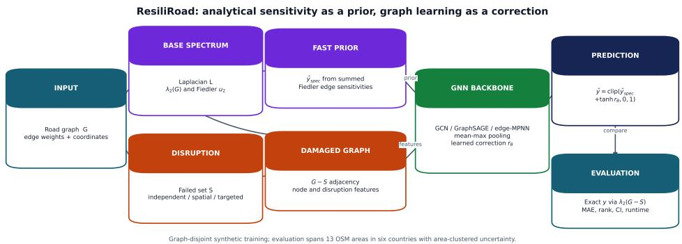  
Figure 1: ResiliRoad workflow. Exact damaged-graph eigendecomposition constructs labels only. The intact Fiedler vector produces both an optional node feature and the explicit first-order prior; the selected GNN backbone learns a bounded correction.

Alt text: A flow diagram splits an intact road graph into an exact-label branch and a fast spectral-prior branch. Damaged adjacency and node features enter a selected GNN backbone whose residual is added to the spectral estimate.

The ablation matrix contains direct and residual GCNs with all features, without the Fiedler feature, and without coordinates; Deep Sets and a summary-statistic MLP are non-GCN baselines. A further reliability-context residual appends the prior, normalized failure count, density, and graph size to the prediction head. It does not use damaged connectivity or any labelderived flag. As a stronger architecture control, GraphSAGE concatenates each node state with a normalized neighbourhood aggregate before each of the three learned transformations. Its direct and residual variants use the same features, pooling, optimizer, split, and stopping rule as the GCN. The edgeaware MPNN instead forms $m _ { i j } = \phi ( h _ { i } , h _ { j } , e _ { i j } )$ over every intact candidate link, where $e _ { i j }$ contains normalized conductance, inverse-conductance length, a failed edge indicator, and normalized $( u _ { 2 , i } - u _ { 2 , j } ) ^ { 2 }$ . Mean incoming messages update node states in three layers. Keeping failed links as candidates allows the model to observe deletions explicitly rather than only through damaged adjacency and node incidence.

## 4 Experimental design

## 4.1 Synthetic graphs and disruption processes

Connected random geometric graphs contained 35–65 nodes and used inverselength edge conductances. The original two-mode experiment generated 800 scenarios per mode and seed, and the expanded three-mode experiment generated 400 per mode and seed. All base-graph families were assigned to training, validation, or testing. In each scenario, one to eight edges were removed. Independent failures sampled edges uniformly. For spatialcluster failures, a random epicentre was chosen and the required number of edges with the nearest geometric midpoints was removed. Both modes used the same failure-count distribution. The targeted regime sampled without replacement with probability proportional to unweighted edge-betweenness centrality. This procedure targeted globally important links without using the Fiedler sensitivity that defines the analytical prior.

## 4.2 OpenStreetMap networks

OSMnx [32] was used to obtain drivable networks around 13 areas in Vietnam, Singapore, Malaysia, Thailand, Taiwan, and Japan. Five 650-m neighbourhoods preserve the original evaluation; eight 1.2–1.6-km areas add larger and morphologically diverse networks. Directed multigraphs were simplified, converted to undirected simple graphs, and restricted to the largest connected component. Conductance is $\mathrm { 1 0 0 / l e n g t h _ { m } }$ . Cached GraphML freezes the exact instances because live OSM data evolve.

Table 1 summarizes the OSM networks, while Figure 2 illustrates three representative street morphologies.

Table 1: OpenStreetMap networks used in the study.
<table><tr><td>Area</td><td>Country</td><td>Radius (m)</td><td>Nodes</td><td>Edges</td><td>Density</td></tr><tr><td>HCMUS</td><td>Vietnam</td><td>650</td><td>163</td><td>221</td><td>.0167</td></tr><tr><td>VIASM</td><td>Vietnam</td><td>650</td><td>206</td><td>301</td><td>.0143</td></tr><tr><td>Da Nang</td><td>Vietnam</td><td>650</td><td>142</td><td>203</td><td>.0203</td></tr><tr><td>Can Tho</td><td>Vietnam</td><td>650</td><td>114</td><td>178</td><td>.0276</td></tr><tr><td>Da Lat</td><td>Vietnam</td><td>650</td><td>48</td><td>55</td><td>.0488</td></tr><tr><td>Singapore</td><td>Singapore</td><td>1,400</td><td>759</td><td>1,121</td><td>.00390</td></tr><tr><td>Kuala Lumpur</td><td>Malaysia</td><td>1,500</td><td>730</td><td>1,059</td><td>.00398</td></tr><tr><td>George Town</td><td>Malaysia</td><td>1,600</td><td>936</td><td>1,334</td><td>.00305</td></tr><tr><td>Bangkok</td><td>Thailand</td><td>1,400</td><td>1,072</td><td>1,457</td><td>.00254</td></tr><tr><td>Chiang Mai</td><td>Thailand</td><td>1,600</td><td>1,259</td><td>1,661</td><td>.00210</td></tr><tr><td>Taipei</td><td>Taiwan</td><td>1,300</td><td>965</td><td>1,546</td><td>.00332</td></tr><tr><td>Kyoto</td><td>Japan</td><td>1,500</td><td>909</td><td>1,468</td><td>.00356</td></tr><tr><td>Tokyo</td><td>Japan</td><td>1,200</td><td>1,108</td><td>1,675</td><td>.00273</td></tr></table>

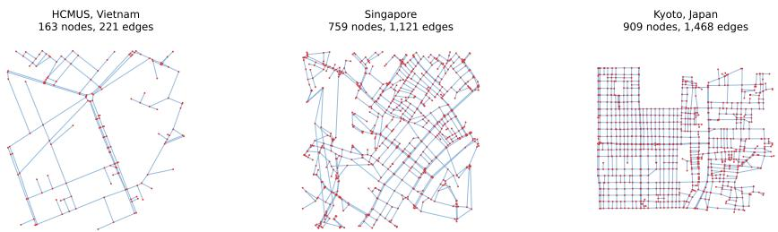  
Figure 2: Three processed OSM base networks illustrating contrasting scale and street morphology: HCMUS, Singapore, and Kyoto. Disruption scenarios remove subsets of the displayed links. Map data copyright OpenStreetMap contributors. Alt text: Three road graphs appear in one row with red intersection nodes and pale-blue links. HCMUS is small and branching, Singapore is dense and irregular, and Kyoto has a visibly stronger grid.

Two transfer protocols answer diferent questions. In zero-shot OSM, all learned models train only on synthetic graphs and test on 100 scenarios per site, mode, and seed. In leave-one-area-out OSM, one site is test, the next site in a fixed rotation is validation, and the remaining three sites are training. Forty scenarios per site and mode are generated for each of five seeds; the direct and residual GCNs train for at most 25 epochs. No base area is shared across train, validation, and test in a fold. An expanded zero-shot protocol trains GCN, GraphSAGE, and edge-MPNN direct and residual variants on 400 synthetic scenarios per failure mode and evaluates 20 scenarios per area, mode, and seed across all 13 OSM areas. The original and expanded protocols are reported separately; the latter supplies geographic rather than merely random-seed replication.

The final OSM-to-OSM experiment uses leave-one-country-out (LOCO) transfer. In each of six folds, every area from one country is held out for testing, the next country in the manifest’s fixed cyclic order is reserved for validation, and the other four countries train the models. In the primary matched protocol, a separate direct and residual GCN is trained for each failure mode for at most 12 epochs. A joint three-mode version is retained as a sensitivity analysis. Each seed supplies eight scenarios per area and mode. Country is the outer inferential unit and seed is nested within country; neither areas within a held-out country nor scenarios are treated as independent country replications. The same perf counter timing around optimization gave summed per-fit wall times of 6.49 h for 60 joint fits and 0.49 h for 180 matched fits, excluding label generation and evaluation. Because these were separate executions rather than a controlled timing benchmark, the unadjusted totals document provenance and are not evidence of comparative

eficiency.

Two additional robustness controls delimit competing explanations. First, we replay every expanded OSM disruption and compute two topologyonly transport proxies: relative loss of the largest connected component and relative loss of mean inverse shortest-path length over 64 fixed origin– destination pairs per area. The latter uses inverse conductance as link length. These are not substitutes for demand- and capacity-based robustness indices [7, 8]; they test whether common connectivity and accessibility summaries approximate the stated λ2-loss target. Second, a size-only control uses the same connected planar lattice family, edge-weight rule, 1–8-edge failure policy, and three failure regimes at 50, 100, 200, 400, 800, and 1,200 nodes. For each size and regime it evaluates 60 scenarios over five seeds and two graph replicates.

## 4.3 Statistics, calibration, and runtime

For synthetic graph populations, seeds 11, 22, 33, 44, and 55 define independent generator replicates. For OSM, the road area is the outer sampling cluster and seed is nested within area. Hierarchical intervals were obtained by resampling areas with replacement and then one seed realization within each sampled area 10,000 times. An efect has inferential support here only when its area- or country-clustered 95% interval excludes zero; otherwise its sign is reported strictly as a descriptive point-estimate trend. This convention is especially important for six-cluster LOCO and is not repaired by extra scenario or seed rows. Paired comparisons preserve method pairing within area and seed. The five-area leave-one-area-out analysis is re-estimated with the same area-outer hierarchy. No scenario-level p-value is used. Continuous calibration is summarized by regressing target on prediction within each seed, reporting slope, intercept, and signed mean error. Error slices by connectivity, failure count, density/site, and spectral clipping are diagnostic.

The original OSM benchmark uses dense symmetric eigendecomposition and one-scenario neural inference on CPU. A separate controlled benchmark uses sparse symmetric eigensolver computations on random geometric graphs with 50–800 nodes. It reports exact damaged-graph solution, update-only Fiedler sensitivity, and amortized spectral cost (one intact setup spread over ten scenarios). These denser graphs are computational stress tests rather than road-realistic samples.

## 5 Results

## 5.1 Graph-disjoint synthetic and zero-shot OSM results

Table 2 summarizes the graph-disjoint synthetic and zero-shot OSM results.

Table 2: MAE as seed mean [95% seed-bootstrap interval].
<table><tr><td></td><td colspan="4">Synthetic</td><td colspan="4">Zero-shot OSM</td></tr><tr><td>Method</td><td colspan="2">Independent</td><td colspan="2">Spatial</td><td colspan="2">Independent</td><td colspan="2">Spatial</td></tr><tr><td>Spectral</td><td></td><td>.069 [.048,.095]</td><td></td><td>.144 [.102,.183]</td><td></td><td>.502 [.482,.521]</td><td></td><td>.650 [.643,.657]</td></tr><tr><td>Summary MLP</td><td></td><td>.065 [.051,.079]</td><td></td><td>.108 [.082,.135]</td><td></td><td>.281 [.240,.320]</td><td></td><td>.347 [.269,.425]</td></tr><tr><td>Deep Sets</td><td></td><td>.068 [.058,.078]</td><td></td><td>.105 [.085,.126]</td><td></td><td>.114 [.105,.123]</td><td></td><td>.143 [.122,.164]</td></tr><tr><td>Direct GCN</td><td></td><td>.077 [.055,.098]</td><td></td><td>.081 [.067,.097]</td><td></td><td>.106 [.100,.112]</td><td></td><td>.102 [.077,.148]</td></tr><tr><td>Residual GCN</td><td></td><td>.052 [.036,.070]</td><td></td><td>.065 [.049,.079]</td><td></td><td>.097 [.091,.102]</td><td></td><td>.090 [.071,.124]</td></tr></table>

The residual model improves direct-GCN MAE by paired diferences 0.0253 [0.0106, 0.0400] and 0.0160 [0.0048, 0.0241] on synthetic independent and spatial failures. The improvements remain positive in zero-shot OSM: 0.0085 [0.0039, 0.0131] and 0.0121 [0.0026, 0.0247]. Yet the analytical prior alone has poor OSM calibration despite useful rank information. Removing Fiedler or coordinates from residual-full yields intervals containing zero; individual node-feature necessity is therefore not established.

## 5.2 Geographically blocked transfer

Table 3 reports the geographically blocked leave-one-area-out results.

Table 3: Leave-one-area-out OSM performance, area mean [95% hierarchical areaouter interval]. Each fold uses three training, one validation, and one test area.
<table><tr><td>Method</td><td>Independent MAE</td><td>Spatial-cluster MAE</td></tr><tr><td>Direct GCN</td><td>.135 [.089,.199]</td><td>.109 [.067,.158]</td></tr><tr><td>Residual GCN</td><td>.161 [.089,.319]</td><td>.144 [.059,.352]</td></tr></table>

The point-estimate ranking reverses when training is moved into the OSM domain. Direct GCN has mean $R ^ { 2 } \ 0 . 7 1 4$ and 0.747, compared with 0.550 and 0.529 for the residual model. The paired residual-minus-direct MAE diferences are 0.0261 [-0.0357, 0.1572] and 0.0350 [-0.0479, 0.2320]; both area-outer intervals include zero, so five areas do not establish direct-model superiority. Residual performance is seed-sensitive: independent-failure MAE ranges from 0.092 to 0.265. Calibration partly explains this instability. Direct-GCN slopes stay between 0.91 and 1.06; residual slopes fall to 0.58 and 0.69 in the two poorest seeds, with substantial underprediction. Thus the spectral prior is helpful under one training distribution but can become a shortcut or a biased anchor under another.

## 5.3 Expanded leave-one-country-out transfer

The matched six-country LOCO experiment does not reproduce a universal OSM-to-OSM reversal (Table 4). Residual GCN improves point-estimate MAE for independent and targeted failures, whereas direct GCN is better for spatial clusters. Only the targeted interval excludes zero. The jointtraining sensitivity analysis has the same three signs (diferences .0124, −.0335, and .0271), so this pattern is not explained by multi-regime training. Thus the five-area reversal is evidence of instability, not evidence that direct prediction generally wins after training on real roads. Across-country transfer is failure-regime and country dependent, and six outer clusters still limit precision.

Table 4: Matched per-regime leave-one-country-out OSM transfer. One model is trained per failure regime. MAE values average countries and seeds; diferences are direct minus residual with 95% country-outer, seed-within-country hierarchical intervals.
<table><tr><td>Failure regime</td><td>Direct GCN</td><td>Residual GCN</td><td></td><td>Difference [95% interval]</td></tr><tr><td>Independent</td><td>.182</td><td>.145</td><td></td><td>.0372 [-.1475,.1679]</td></tr><tr><td>Spatial cluster</td><td>.061</td><td>.149</td><td></td><td>-.0874 [-.2942,.0292]</td></tr><tr><td>Targeted betweenness</td><td>.258</td><td>.196</td><td></td><td>.0622 [.0169,.1153]</td></tr></table>

Figure 3 shows the corresponding country-level direct-minus-residual differences across failure regimes.

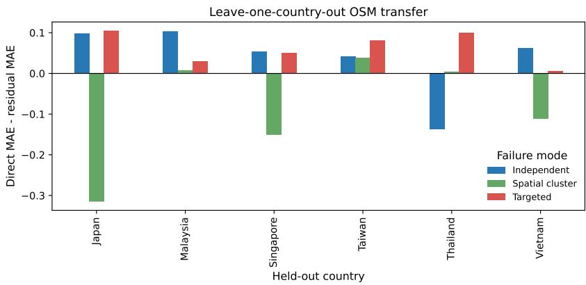  
Figure 3: Matched per-regime direct-minus-residual GCN MAE for each held-out country, averaged over five seeds. Positive values favour the residual model. Alt text: A grouped bar chart shows residual gains varying substantially by held-out country and failure regime, with both positive and negative bars.

## 5.4 Reliability-context negative ablation

Adding graph size, density, failure count, and spectral estimate to the residual head reduces synthetic spatial MAE by 0.0193 [0.0120, 0.0266] and has an inconclusive −0.0034 [-0.0159, 0.0111] change for synthetic independent failure (negative means improvement). It increases zero-shot OSM spatial MAE by 0.0304 [0.0067, 0.0579]; the independent increase is 0.0452 [-0.0029, 0.1019]. Simple reliability metadata therefore encourages distribution-specific calibration rather than robust transfer.

## 5.5 Backbone robustness

Replacing GCN propagation with GraphSAGE tests whether the main conclusion is an artefact of a weak backbone. Appendix Table 6 shows that this is not the case: residual learning improves point-estimate MAE for both backbones in all four zero-shot conditions. Paired direct-minus-residual diferences for GraphSAGE are 0.0197 [0.0071, 0.0332] and 0.0190 [0.0107, 0.0273] on synthetic independent and spatial failures, and 0.0069 [0.0032, 0.0096] and 0.0239 [-0.0073, 0.0697] on OSM. The final OSM-spatial interval crosses zero, so the efect is not declared established there.

## 5.6 Cross-country, targeted, and edge-aware evaluation

Table 5 reports the expanded 13-area experiment. Positive paired diferences favour the residual formulation. Residual point estimates improve all nine backbone–failure combinations, but area-level uncertainty is material: intervals exclude zero only for GCN under spatial failure and GraphSAGE under independent and targeted failure. The edge-aware MPNN does not outperform the node-message-passing models; for example, its residual MAE is .163, .199, and .156, compared with residual-GCN MAE .085, .057, and .135. Thus explicit failed-edge attributes are an architecture control, not an automatic accuracy gain.

Table 5: Expanded zero-shot OSM paired improvement (direct minus residual MAE), area mean [95% hierarchical interval].
<table><tr><td>Backbone</td><td colspan="2">Independent</td><td colspan="2">Spatial cluster</td><td colspan="2">Targeted betweenness</td></tr><tr><td>GCN</td><td></td><td>.0167 [-.0019,.0338]</td><td></td><td>.0391 [.0151,.0662]</td><td></td><td>.0097 [-.0095,.0268]</td></tr><tr><td>GraphSAGE</td><td></td><td>.0253 [.0114,.0425]</td><td></td><td>.0159 [-.0043,.0365]</td><td></td><td>.0257 [.0095,.0446]</td></tr><tr><td>Edge-MPNN</td><td></td><td>.0042 [-.1210,.1227]</td><td></td><td>.0128 [-.1489,.1575]</td><td></td><td>.0359 [-.0412,.1113]</td></tr></table>

## 5.7 Transport-proxy and graph-size controls

The size-only experiment is a within-family sensitivity analysis, not a morphology-matched synthetic-to-OSM transfer test. The transport-topology proxies do not approximate the spectral target closely. Area-mean MAE for OD-eficiency loss is .396, .582, and .244 under independent, spatial, and targeted failure; largest-component loss gives .403, .592, and .256. Areaclustered intervals are shown in Appendix Figure 7. These controls show that the learned gains are not obtained by relabelling a component-size or shortest-path summary. They do not show that algebraic connectivity is a better measure of trafic service, because no demand, capacity, or assignment data enter the experiment.

Within the fixed planar-lattice family, first-order spectral MAE decreases from .115 to .002 for independent failures and from .091 to .002 for targeted failures between 50 and 1,200 nodes. Spatial-cluster MAE remains nonmonotone (.478 at 50 nodes and .300 at 1,200) because localized removal often disconnects the lattice. Under the fixed 1–8-edge policy, increasing size alone therefore does not reproduce the broad real-network prior miscalibration. This control does not fully identify morphology, but size is no longer the sole untested explanation.

## 5.8 Eigengap, analytical order, and learned correction

The truncated second-order perturbation baseline improves over the firstorder baseline by .00284 [.00050,.00673], .00359 [.00081,.00756], and .00533 [.00133,.01187] MAE under independent, spatial, and targeted disruption,

Alt text: Three panels compare residual improvements across backbones and disruptions, spectral errors across eigengap groups, and the calibration of learned corrections against ideal corrections.

respectively. These gains are consistent but too small to close the gap to the best learned estimators, answering why a learned correction remains useful.

The relative eigengap $\gamma = ( \lambda _ { 3 } - \lambda _ { 2 } ) / \lambda _ { 2 }$ is informative but not a suficient gate. First-order OSM MAE is .444, .369, and .422 in low, middle, and high graph-level eigengap tertiles: near-degeneracy is harder than the middle tertile, but the relationship is non-monotone. Residual improvement also does not vanish uniformly at small gaps.

Mechanistic correction diagnostics support a more specific biased-anchor interpretation. Under targeted transfer, regression slopes relating the learned correction to the needed correction are .512 (GCN), .580 (GraphSAGE), and .486 (edge-MPNN), compared with .843, .834, and .617 under independent failure. The residual therefore tends to shrink the correction precisely in the targeted regime, rather than fully undoing a miscalibrated analytical anchor.

Figure 4 summarizes the eigengap, targeted-disruption, and correctioncalibration diagnostics.

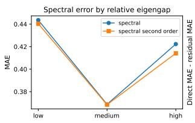

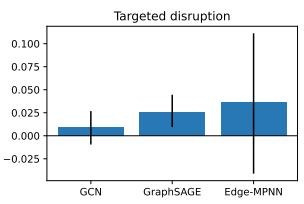

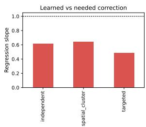  
Figure 4: Expanded diagnostic results. (a) First- and second-order spectral error across relative-eigengap tertiles. (b) Area-level direct-minus-residual MAE under targeted disruption with hierarchical intervals. (c) Learned versus needed residual correction.

A descriptive area-level check finds Spearman correlations of residual-GCN gain with node count, density, and relative eigengap of $0 . 4 0 , \ - 0 . 3 5$ , and −0.11, respectively (Figure 5). With only 13 purposively selected areas these are not inferential or causal estimates, but they show no simple collapse of the residual gain as graph size increases and no single structural variable explains it.

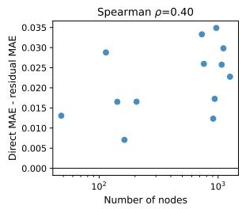

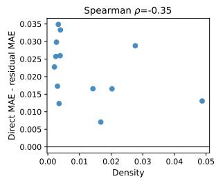

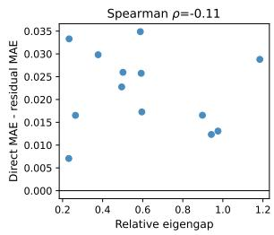  
Figure 5: Descriptive residual-GCN gain versus OSM graph size, density, and relative eigengap. Each point is one area averaged over seeds and failure regimes; positive values favour residual prediction.  
Alt text: Three scatter plots show residual gain against node count, density, and eigengap. Points are dispersed without a strong monotone relationship, especially for eigengap.

## 5.9 Runtime and error regimes

On the five small OSM networks, dense exact recomputation, first-order update, and residual inference average 5.094, 0.018, and 0.674 ms per scenario on CPU. In the 50–800-node sparse control, exact time rises from 8.37 to 92.61 ms, whereas residual-GCN inference rises from 0.67 to 5.92 ms; intermediate values are archived with the code.

To test the actual screening motivation, a second sparse benchmark uses connected planar road-like graphs with 1,000, 2,000, 5,000, 10,000, and 20,000 nodes, with $| E | / | V | \approx 2 . 1$ (mean degree ¯d ≈ 4.2). The connected near-square grid receives planar diagonals with probability 0.12 and inverselength conductance; each disruption removes eight random edges. At 20,000 nodes, sparse exact recomputation requires 1,302.4 ms per damaged graph. Intact eigensolver setup costs 1,335.3 ms once; amortized over 1,000 screened scenarios, the prior costs 1.41 ms, sparse GNN inference 21.76 ms, and the combined path 23.17 ms. Thus the measured screening path is 56 times faster at the largest size, conditional on reusing one intact graph. Only three scenarios on each of two graphs are timed per size, and none is used for accuracy training; this is a scaling check, not evidence of predictive generalization.

The corresponding scaling curves are shown in Figure 6.

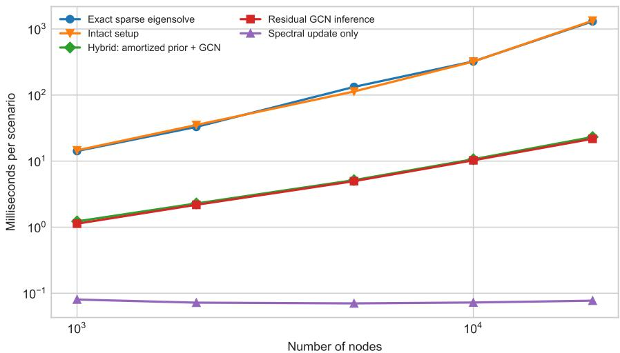  
Figure 6: Sparse CPU scaling from 1,000 to 20,000 nodes. Exact recomputation is timed per damaged graph; the hybrid curve combines intact spectral setup amortized over 1,000 scenarios with first-order evaluation and sparse GNN inference. Points are means over two graphs and three scenarios per graph.  
Alt text: A log–log runtime plot shows exact sparse eigendecomposition rising to about 1.3 seconds at 20,000 nodes, while the amortized hybrid path rises to about 23 milliseconds.

In zero-shot OSM, residual-full MAE is 0.070 for connected damaged graphs and 0.112 after disconnection. Site errors range from 0.041 (Can Tho) to 0.189 (Da Lat). The densest site is also the smallest and hardest, so density cannot be interpreted causally. No evaluated first-order estimate clips at one; the requested clipped/unclipped comparison is therefore undefined. The largest leave-one-area-out errors are retained in a machine-readable table instead of being removed as outliers.

## 6 Discussion

Across the 12 primary paired OSM comparisons (nine expanded zero-shot and three matched LOCO), four have inferential support because their areaor country-clustered 95% intervals exclude zero; the other eight are treated only as descriptive trends. This convention governs the interpretation below.

The central result is a condition rather than a new architectural claim. A spectral residual improves point estimates for GCN, GraphSAGE, and edge-MPNN on the expanded zero-shot OSM test. It combines the prior’s ranking signal with learned nonlinear calibration. However, blocked OSM transfer and reliability-context ablation show that the same inductive bias can amplify domain-specific error. The prior can then behave as a shortcut or biased anchor: optimization remains close to a convenient analytical signal even when its calibration has shifted. Yet matched LOCO results are mixed rather than a consistent direct-model victory: the residual helps two failure regimes and hurts one, with country-level support only for targeted failures. The same sign pattern under joint training rules out training-regime pooling as its cause. Consequently, the evidence documents domain- and regime-sensitive behaviour in this sample, not a general causal efect of training domain or an architectural guarantee.

The study also separates the explicit prior from Fiedler node information. Neither Fiedler nor coordinate removal produces a stable loss, whereas replacing the residual architecture does. The robust ingredient in the first protocol is therefore how mathematical and learned estimates are combined, not merely the presence of an eigenvector channel. Targeted-failure correction slopes show that a biased anchor is a measurable calibration failure, while the non-monotone eigengap result warns against using eigengap alone as a trust rule. The poor Deep Sets ranking in several regimes supports adjacency-aware propagation, while the summary MLP shows that coarse graph statistics are insuficient.

For practical deployment, the model should be used as a screening layer rather than as a replacement for exact analysis or trafic simulation. An operator can precompute the intact-network spectrum, rank large scenario batches with the hybrid estimator, and recompute exact metrics for the highest-risk or most uncertain cases. Because calibration changes across geography and failure regime, deployment should include blocked validation on representative local areas and should fall back to exact computation when that validation fails.

## 6.1 Limitations

Thirteen purposively selected neighbourhoods in six Asian countries improve geographic and morphological coverage but do not establish global or city-scale predictive generality; they span only 48–1,259 nodes. Their size, density, country, and morphology remain partly confounded. The synthetic geometric generator and large-scale graphs are controlled proxies, not metropolitan OSM accuracy datasets. Spatial clusters are not calibrated to flood, landslide, earthquake, construction, or conflict data. Algebraic connectivity is structural: it omits direction, demand, congestion, capacity, travel time, accessibility, and restoration. Only five seed realizations per area limit within-area precision, while 13 areas limit geographic inference. The hierarchical zero-shot analysis treats area as the outer unit, while LOCO uses country; neither can compensate for purposive selection. LOCO has only six country clusters and uses one fixed cyclic validation assignment, so its wide intervals and sensitivity to validation geography must be retained. No probabilistic predictive intervals are produced. Sparse batched neural implementations and spectral sparsification [31] may change runtime rankings at still larger scales.

Future work should pre-register larger metropolitan regions, use nested blocked validation across countries, and disentangle graph size from density. Hazard rasters could define correlated failures, while trafic assignment could test whether structural loss predicts service degradation. A mixtureof-experts model or learned gating may decide when to trust the prior; conformal methods could add graph-population prediction regions. These extensions should preserve area-level replication rather than inflate sample size with correlated scenarios.

## 7 Conclusion

Residual spectral graph learning ofers an interpretable, fast estimator of finite multi-edge connectivity loss whose observed advantage varies with training domain and failure regime. The method shows heterogeneous pointestimate gains across GCN, GraphSAGE, and edge-MPNN in the expanded zero-shot study. OSM-to-OSM results vary by protocol and failure regime: the five-area reversal does not persist uniformly in matched six-country LOCO transfer, and joint training yields the same sign pattern. Reporting both outcomes, along with ablations, hierarchical uncertainty, targeted attacks, eigengap and second-order controls, correction calibration, error cases, and separated runtime costs, provides a reproducible account of when a Fiedler prior helps and when it does not.

## Data and code availability

Code, cached OSM-derived GraphML, manifests, experiment scripts, environment versions, compact result tables, and release metadata are available as ResiliRoad version 1.0.0, permanently archived on Zenodo [34]. The OSM data are licensed under the Open Data Commons Open Database License and are attributed to OpenStreetMap contributors [33]. The immutable archived release fixes the code, data, configurations, and compact outputs used for the submitted results; ongoing development is hosted at https://github.com/lee-vtruong/ResiliRoad.

## Funding

This research received no external funding.

## Conflict of interest

The author declares no conflict of interest.

## Ethics approval

Ethics approval was not required because this study did not involve human participants, human data, animals, or personally identifiable information.

## Acknowledgements and AI-use disclosure

Generative AI tools were used for language editing and software-development assistance. The author designed the study, verified the implementation and results, and takes responsibility for the manuscript.

## A Reproducibility details

All models use AdamW, mean-squared error, validation early stopping, and one PyTorch compute thread. Core runs use at most 80 epochs; areablocked OSM transfer uses at most 25 epochs and LOCO uses at most 12 epochs. Software versions are Python 3.13.11, NumPy 2.4.4, SciPy 1.17.1, NetworkX 3.6.1, pandas 2.2.3, scikit-learn 1.9.0, PyTorch 2.11.0 (CPU), Matplotlib 3.11.1, OSMnx 2.1.1, and GeoPandas 1.1.4. The machine had 16 logical AMD64 CPUs; CUDA was unavailable. Scripts record exact seeds and emit scenario predictions, training histories, fold assignments, runtime summaries, bootstrap tables, calibration diagnostics, and worst cases. The architecture-control runs use identical data and training settings for GCN and GraphSAGE. Expanded runs add an edge-MPNN whose directed messages receive normalized conductance, inverse-conductance length, failed-edge status, and normalized squared Fiedler diference. Targeted scenarios sample without replacement in proportion to intact-graph edge betweenness. For each OSM area, 20 scenarios per mode and seed are evaluated; hierarchical resampling uses area as the outer cluster and seed within area. Second-order perturbation uses the lowest 12 Laplacian modes, and eigengap tertiles are assigned at graph level. Large-scale runtime graphs use a normalized near-square lattice, four-neighbour grid backbone, independent northwest diagonals with probability 0.12, and inverse-length conductance; the deterministic grid guarantees a connected base graph and yields mean degree approximately 4.2. The sparse eigsh solver uses a fixed starting vector. The intact setup cost is reported both separately and amortized over 1,000 scenarios, preventing preprocessing from being hidden in the speed comparison.

The transport control replays the stored OSM scenario seeds and checks failure counts against the original predictions before computing largestcomponent and 64-pair inverse-shortest-path losses. The size control uses two planar-lattice graphs per size, six scenarios per regime and seed, and five seeds. Machine-readable scenario predictions and summaries accompany the plotting script.

Table 6: Architecture control: MAE, seed mean [95% seed-bootstrap interval].
<table><tr><td>Domain</td><td>Failure</td><td>Direct GCN</td><td></td><td>Residual GCN</td><td>Direct GraphSAGE</td><td></td><td>Residual GraphSAGE</td></tr><tr><td>Synthetic</td><td>Independent</td><td></td><td>.077 [.054,.096]</td><td>.052 [.036,.071]</td><td></td><td>.066 [.050,.081]</td><td>.046 [.034,.063]</td></tr><tr><td>Synthetic</td><td>Spatial</td><td></td><td>.081 [.067,.097]</td><td>.065 [.049,.079]</td><td>.084 [.068,.101]</td><td></td><td>.065 [.047,.085]</td></tr><tr><td>OSM</td><td>Independent</td><td></td><td>.106 [.100,.111]</td><td>.097 [.091,.102]</td><td>.104 [.098,.108]</td><td></td><td>.097 [.091,.103]</td></tr><tr><td>OSM</td><td>Spatial</td><td></td><td>.102 [.077,.148]</td><td>.090 [.071,.124]</td><td>.113 [.082,.164]</td><td></td><td>.089 [.079,.099]</td></tr></table>

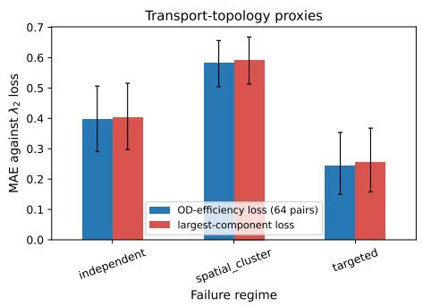

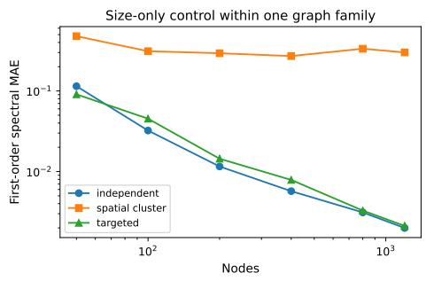  
Figure 7: Additional robustness controls. (a) Topology-only transport-proxy error against the algebraic-connectivity-loss target. (b) First-order spectral error as graph size changes within one planar road-like graph family.  
Alt text: The left panel shows high proxy errors across three failure regimes. The right log–log panel shows spectral error decreasing with size for independent and targeted failures but remaining high and non-monotone for spatial failures.

Table 7 summarizes the parameter counts and common training settings across the backbones.

Table 7: Fairness controls for the expanded architecture comparison. Parameter counts are identical for direct and residual variants of each backbone.
<table><tr><td>Backbone</td><td>Parameters</td><td>Hidden</td><td>Layers</td><td>Learning rate</td><td>Max epochs</td><td>Patience</td></tr><tr><td>GCN</td><td>9,745</td><td>48</td><td>3</td><td>.002</td><td>40</td><td>15</td></tr><tr><td>GraphSAGE</td><td>14,593</td><td>48</td><td>3</td><td>.002</td><td>40</td><td>15</td></tr><tr><td>Edge-MPNN</td><td>40,609</td><td>48</td><td>3</td><td>.002</td><td>40</td><td>15</td></tr></table>

All three use the same scenarios, splits, AdamW optimizer, MSE objective, weight decay $1 0 ^ { - 4 }$ , validation rule, and random seeds. Hyperparameters were fixed before the expanded test and were not selected separately to favour a backbone. Edge-MPNN has substantially more parameters, so its weaker result cannot be attributed to an intentionally smaller capacity; it may nevertheless benefit from architecture-specific tuning, which was outside the scope of this control.

## References

[1] R. Yu and R. Wang, Learning dynamical systems from data: an introduction to physics-guided deep learning, Proceedings of the National Academy of Sciences 121 (2024), e2311808121. doi:10.1073/pnas.2311808121.

[2] M. Fiedler, Algebraic connectivity of graphs, Czechoslovak Mathematical Journal 23 (1973), 298–305.

[3] B. Mohar, The Laplacian spectrum of graphs, in Graph Theory, Combinatorics, and Applications, Wiley, 1991, 871–898.

[4] F.R.K. Chung, Spectral Graph Theory, CBMS Regional Conference Series in Mathematics 92, American Mathematical Society, 1997.

[5] T. Kato, Perturbation Theory for Linear Operators, Springer, 1995. doi:10.1007/978-3-642-66282-9.

[6] A. Jamakovic and P. Van Mieghem, On the robustness of complex networks by using the algebraic connectivity, NETWORKING 2008, LNCS 4982 (2008), 183–194. doi:10.1007/978-3-540-79549-0 16.

[7] D.M. Scott et al., Network robustness index: a new method for identifying critical links, Journal of Transport Geography 14 (2006), 215–227. doi:10.1016/j.jtrangeo.2005.10.003.

[8] J.L. Sullivan et al., Identifying critical road segments and measuring system-wide robustness, Transportation Research A 44 (2010), 323–336. doi:10.1016/j.tra.2010.02.003.

[9] Y. Duan and F. Lu, Robustness of city road networks at diferent granularities, Physica A 411 (2014), 21–34. doi:10.1016/j.physa.2014.05.073.

[10] S.A. Bagloee et al., Identifying critical disruption scenarios and a global robustness index tailored to real life road networks, Transportation Research E 98 (2017), 60–81. doi:10.1016/j.tre.2016.12.003.

[11] P.Y.R. Sohouenou et al., Using a random road graph model to understand road networks robustness to link failures, International Journal of Critical Infrastructure Protection 29 (2020), 100353. doi:10.1016/j.ijcip.2020.100353.

[12] Y. Casali and H.R. Heinimann, Robustness response of the Zurich road network under diferent disruption processes, Computers, Environment and Urban Systems 81 (2020), 101460. doi:10.1016/j.compenvurbsys.2020.101460.

[13] P.Y.R. Sohouenou et al., Using a hazard-independent approach to understand road-network robustness to multiple disruption scenarios, Transportation Research D 93 (2021), 102672. doi:10.1016/j.trd.2020.102672.

[14] P.Y.R. Sohouenou and L.A.C. Neves, Assessing the efects of link-repair sequences on road network resilience, International Journal of Critical Infrastructure Protection 34 (2021), 100448. doi:10.1016/j.ijcip.2021.100448.

[15] L.-G. Mattsson and E. Jenelius, Vulnerability and resilience of transport systems—a discussion of recent research, Transportation Research A 81 (2015), 16–34. doi:10.1016/j.tra.2015.06.002.

[16] M.G.H. Bell et al., Investigating transport network vulnerability by capacity weighted spectral analysis, Transportation Research B 99 (2017), 251–266. doi:10.1016/j.trb.2017.03.002.

[17] D.A. Rivera-Royero et al., Road network performance: a review on relevant concepts, Computers & Industrial Engineering 165 (2022), 107927. doi:10.1016/j.cie.2021.107927.

[18] D. Jana, S. Malama, S. Narasimhan and E. Taciroglu, Edge-based graph neural network for ranking critical road segments in a network, PLOS ONE 18 (2023), e0296045. doi:10.1371/journal.pone.0296045.

[19] G. Boeing and P. Ha, Resilient by design: simulating street network disruptions across every urban area in the world, Transportation Research A 182 (2024), 104016. doi:10.1016/j.tra.2024.104016.

[20] Z. Zang et al., Predictive resilience assessment of road networks based on dynamic multi-granularity graph neural network, Neurocomputing 601 (2024), 128207. doi:10.1016/j.neucom.2024.128207.

[21] A. Zeleke, M. Tira and C. Scaini, Resilience of road networks to natural hazards: a systematic literature review, Transportation Engineering 23 (2026), 100420. doi:10.1016/j.treng.2026.100420.

[22] T.N. Kipf and M. Welling, Semi-supervised classification with graph convolutional networks, ICLR, 2017. arXiv:1609.02907.

[23] W.L. Hamilton, R. Ying and J. Leskovec, Inductive representation learning on large graphs, NeurIPS 30 (2017).

[24] J. Gilmer et al., Neural message passing for quantum chemistry, ICML 70 (2017), 1263–1272.

[25] P. Veliˇckovi´c et al., Graph attention networks, ICLR, 2018.

[26] K. Xu et al., How powerful are graph neural networks?, ICLR, 2019. arXiv:1810.00826.

[27] M. Zaheer et al., Deep Sets, NeurIPS 30 (2017).

[28] A. Sanchez-Gonzalez et al., Graph networks as learnable physics engines for inference and control, ICML (2018), 4470–4479.

[29] F. Almeida et al., Leveraging edge-aware graph neural networks to predict node load in backbone networks, Journal of Complex Networks 13 (2025), cnaf050. doi:10.1093/comnet/cnaf050.

[30] R.J. Bowater, Impact of one-way streets on difusive transport, Journal of Complex Networks 14 (2026), cnag019. doi:10.1093/comnet/cnag019.

[31] D.A. Spielman and N. Srivastava, Graph sparsification by efective resistances, SIAM Journal on Computing 40 (2011), 1913–1926. doi:10.1137/080734029.

[32] G. Boeing, OSMnx: new methods for acquiring, constructing, analyzing, and visualizing complex street networks, Computers, Environment and Urban Systems 65 (2017), 126–139. doi:10.1016/j.compenvurbsys.2017.05.004.

[33] OpenStreetMap contributors, OpenStreetMap, 2026, https://www. openstreetmap.org/copyright.

[34] [dataset] V.-T. Le, ResiliRoad: residual spectral graph learning for road-network disruption analysis, version 1.0.0, Zenodo (2026), doi:10.5281/zenodo.22307723.