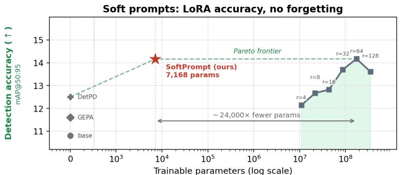
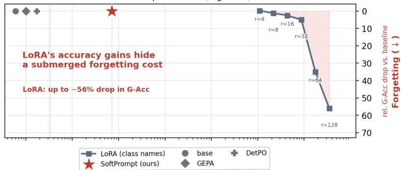
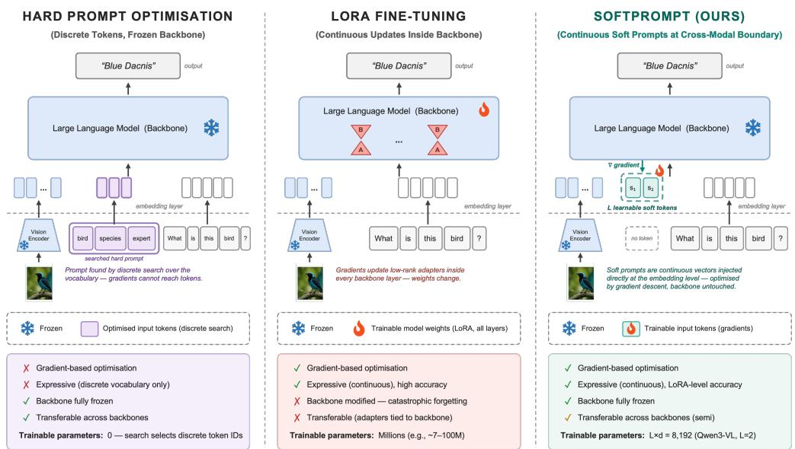
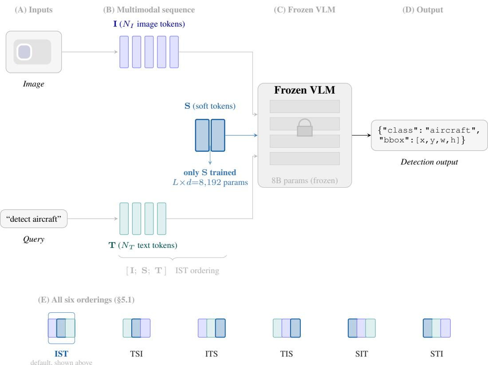
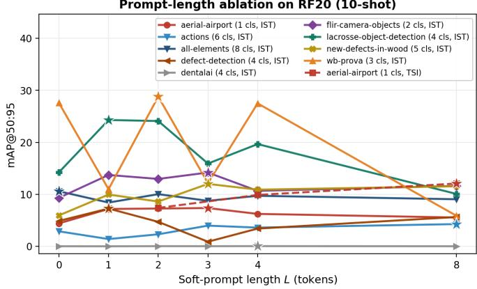
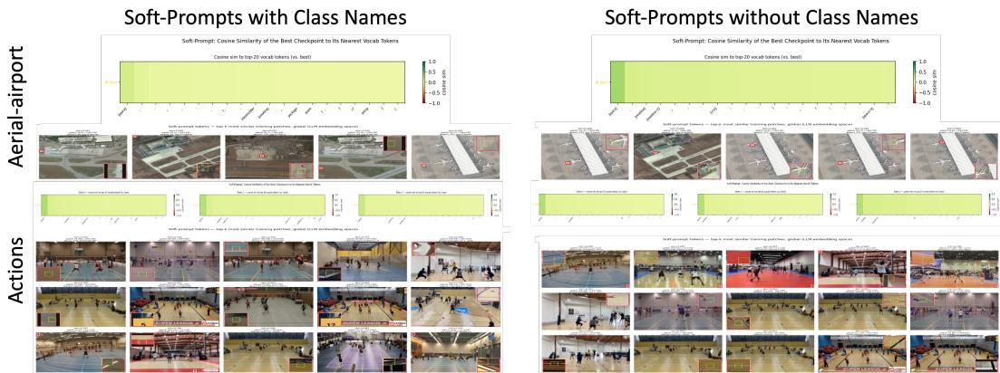
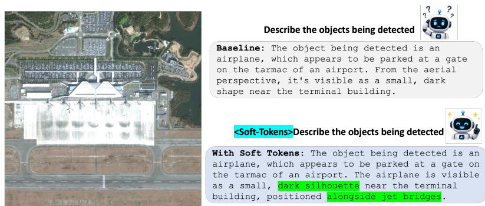
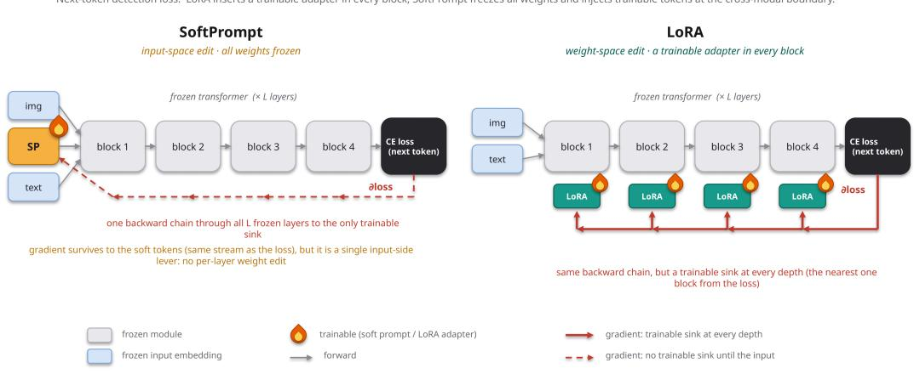
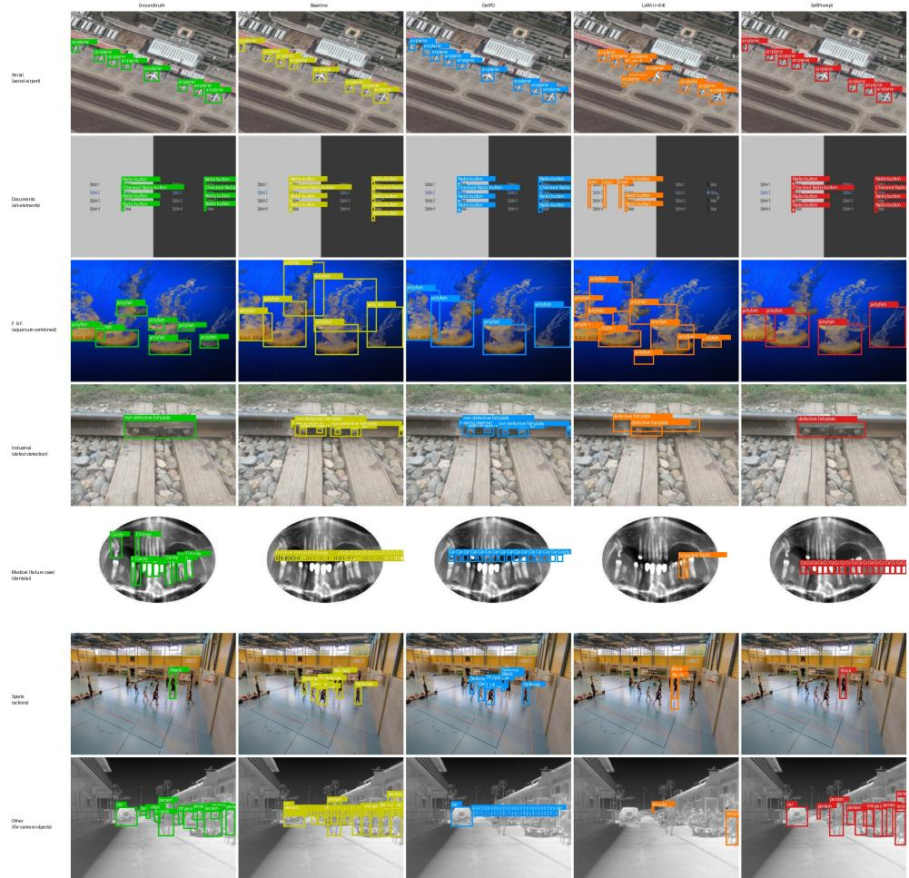

# YOUR MODEL ALREADY KNOWS DON’T TEACH IT, LEARN TO ASK IT SOFT PROMPTING FOR FEW-SHOT ADAPTATION VISION-LANGUAGE MODELS

Gautam Rajendrakumar Gare1 Siyi Li1 Hewei Wang2 Cesar Daniel Hernandez2 Wei Zhao2 Wolfgang M. Pauli2 John Galeotti1 Deva Ramanan1

1Carnegie Mellon University 2Apple

## ABSTRACT

We address few-shot object detection with vision-language models (VLMs) in outof-domain settings such as aerial, industrial, and medical imagery, where only ten annotated images are available for supervision. The dominant adaptation strategies are discrete prompt optimization, which is gradient-free, and LORA fine-tuning, which augments frozen pretrained weights with learnt low-rank update matrices. We revisit a third option: soft prompting, where a few continuous prompt tokens are optimized by gradient descent against a fully frozen backbone. We show that two design choices strongly influence performance. First, injecting the tokens at the cross-modal boundary, between the visual and text tokens, beats every other ordering of image, prompt, and text, including the prefix placement inherited from NLP (10.0 vs. 8.4 average mAP). Second, initializing the prompt from a semantically empty space token, so that the prompt’s meaning is unchanged at initialisation, beats semantic and random starts. With these choices, a prompt of one to three learnt tokens, sized per domain by a short sweep (7,168 parameters on average), matches the best LORA configuration from a rank sweep on the Roboflow20-VL benchmark (14.2 vs. 14.2 mAP, 10-shot) while training over 20,000× fewer parameters. However, optimization remains challenging in the few-shot regime: soft prompting exhibits higher variance across random seeds than LORA, although LORA is itself not immune to instability. In contrast to LORA, SOFTPROMPT exhibits no forgetting: the LORA rank that matches our accuracy loses 35% relative VQA accuracy on NaturalBench, growing to 56% at the largest rank, while SOFTPROMPT provably loses none. We attribute this behavior to the fact that SOFTPROMPT leaves the pretrained model weights unchanged. The learnt tokens behave like prompts, not weights: they transfer to a newer model version without retraining (+0.8 mAP on Qwen3.5-9B) and can be verbalised into human-readable prompts competitive with dedicated prompt search (matching DetPO, outperforming GEPA). The recipe extends beyond detection: on RoboCasa manipulation tasks the frozen $\pi _ { 0 . 5 }$ vision-language-action policy struggles; soft prompts again deliver substantial gains, matching the coverage-matched LORA baseline on two of three tasks, provided the tokens are again placed where the gradient needs them; Our results suggest that modern VLMs already encode much of what specialised domains require; the task is not to teach them, but to learn how to ask.

## 1 INTRODUCTION

Vision-language models (VLMs) trained on web-scale data detect common objects well, but their accuracy collapses on specialised domains: aerial imagery, industrial inspection, medical scans (Rad ford et al., 2021; Bai et al., 2023; Robicheaux et al., 2025). In practice, domain experts are expensive and annotation budgets are small, often consisting of 10 labeled images. The question is how to spend them.

  
Figure 1: SOFTPROMPT matches LORA with zero forgetting at over 20,000× fewer trainable parameters. All methods use the default class-name evaluation protocol (§4.1). Top: all-domain mAP@50:95 on Roboflow20-VL (10-shot) vs. trainable parameters (log scale). Sweeping LORA rank 4 → 128 peaks at 14.2 mAP at r=64 (174.6M parameters) and then declines; SOFTPROMPT (IST, per-domain L, 7,168 parameters on average, backbone frozen) reaches the same 14.2. Bottom: the hidden cost. Relative drop in NaturalBench VQA group accuracy vs. the unadapted backbone: LORA’s forgetting grows with rank, 35% at the accuracy-matching r=64 and 56% at r=128, while SOFTPROMPT and the training-free prompt baselines sit at exactly 0% because no backbone weight changes. The two panels move in opposite directions: the ranks that help detection most damage the generalist most. The instruction-augmented LORA variant is reported in Appendix F (see §4.2). Beyond efficiency, the learnt soft prompts keep the virtues of text prompts: they transfer across models (§6.3) and can be distilled into editable natural language (§6.2).

Existing answers fall into two families: Discrete (hard) prompt optimisation and parameter-efficient fine-tuning (PEFT). Similar to our approach, discrete (hard) prompt optimisation (Agrawal et al.; Gare et al., 2026) also adapts a fully frozen model through prompts rather than weight updates. However, it optimises discrete token sequences using gradient-free search, whereas SOFTPROMPT learns continuous prompt embeddings with gradient descent. In our experiments these approaches improve performance at most 1.2 mAP over a hand-written prompt (12.5 vs. 11.3 mAP). Parameterefficient fine-tuning, chiefly LORA (Hu et al., 2021), learns low-rank adaptations to the model parameters. Its rank must be selected per task, and the resulting specialization comes at the expense of general-domain performance. Figure 1 shows both facts on Roboflow20-VL: the LORA rank sweep peaks at 14.2 mAP and then declines, and the same adapters degrade the backbone’s VQA accuracy on NaturalBench (Li et al., 2024a) by up to 56% relative, a cost invisible to detection-only evaluation.

This dichotomy raises a question: can we have gradient-based adaptation while keeping the pretrained backbone unchanged? Soft prompting (Lester et al., 2021) does exactly this: optimising a few continuous token embeddings at the input of a frozen model. Yet, it is rarely the method of record for multimodal detection. We find that its weak reputation is largely an artifact of two defaults inherited from NLP: soft tokens are prepended to the sequence, and initialised with task semantics. Our experiments show that both defaults are suboptimal in a multimodal sequence. Injecting the tokens instead at the cross-modal boundary, between the visual patches and the text query, wins our six-way ordering ablation: 10.0 average mAP vs. 8.4 for the NLP-standard prefix transplant and 6.7 for the worst ordering, up to 6× on a single dataset (§5.1). Initialising them with the token corresponding to a single space character, so that the prompt’s meaning is unchanged at the start, beats every semantic and random initialisation we tried (§5.3); the principle is the one behind residual learning (He et al., 2016), where the safest default for a new module is to change nothing.

  
Figure 2: SOFTPROMPT combines the strengths of the two dominant adaptation approaches. Hard prompt optimisation (left) keeps the backbone frozen but searches a discrete vocabulary, which limits expressiveness on specialised domains and precludes gradient-based optimisation. LORA fine-tuning (centre) enables gradient-based adaptation and high accuracy, but modifies millions of backbone weights and risks catastrophic forgetting. SOFTPROMPT (right) optimises L continuous tokens at the cross-modal boundary of the multimodal sequence, reaching LORA-level accuracy while keeping the backbone fully frozen and training only L×d parameters (8,192 at L=2; L is sized per domain, §5.2). Like hard prompts and unlike LORA, the learnt tokens transfer across models (§6.3) and can be verbalised into editable text (§6.2).

With these two choices, the resulting method, which we call SOFTPROMPT, is simple: we train L=1– 3 learnt tokens, sized per domain (7,168 parameters on average for an 8B-parameter backbone) with a handful of single-GPU runs. On Roboflow20-VL (10-shot), our result equals the best configuration of a six-rank LORA sweep (14.2 vs. 14.2 mAP at r=64), outperforms PEFT across all evaluated ranks, surpasses gradient-free prompt optimisation, and does so with zero forgetting by construction (Figure 1). The learnt tokens also keep the practical virtues of text prompts that weight updates lose: they are transferable and interpretable. If loaded as-is into the newer Qwen3.5-9B, they still improve over that model’s zero-shot baseline (+0.8 mAP, §6.3). They are interpretable in the sense that asking the model to verbalise its own soft tokens yields a human-readable prompt that matches the strongest dedicated prompt search (DetPO) and outperforms GEPA on the same benchmark (§6.2).

Finally, we test whether the recipe is specific to detection. On three RoboCasa (Nasiriany et al., 2024) manipulation tasks (10 demonstrations each), we adapt a frozen π0.5 vision-language-action policy (Physical Intelligence et al., 2025) with SOFTPROMPT (§7). The position lesson reappears in a sharper form: a prefix-only prompt fails (1.7% success), but a prompt that also reaches the action expert, the module that produces the output, matches or beats coverage-matched LORA-based PEFT on the two tasks the base policy can barely do. The third task, one the base already performs, marks the boundary: the prompt overrides the competent policy while LORA improves it. Where the prompt lives, and whether the frozen model needs to be asked or corrected, decide the outcome.

Contributions. First, we identify the two levers that make soft prompting competitive for multimodal detection: injection at the cross-modal boundary and a meaning-preserving initialisation, each validated by a dedicated ablation (§5). Second, we compare SOFTPROMPT against hard prompts, discrete prompt optimisation, a full LORA rank sweep, and a fine-tuned specialist detector on Roboflow20-VL under strict 10-shot supervision, and measure what each method costs the generalist backbone on NaturalBench VQA and RefCOCO grounding (§4). Third, we show that the learnt tokens behave like language: we analyse what they encode, distill them into portable hard prompts that beat prompt-search baselines, and quantify their transfer across model versions (§6). Finally, we extend the recipe to a vision-language-action policy across three manipulation tasks and show that the placement principle, not the detection task, is what carries it, and that the frozen model’s own competence bounds it (§7).

## 2 RELATED WORK

VLMs and open-vocabulary detection. Modern VLMs such as Qwen3-VL (Bai et al., 2023), LLaVA (Liu et al., 2023), and InstructBLIP (Dai et al., 2023) emit detections as structured text. Specialist open-vocabulary detectors, Grounding DINO (Liu et al., 2024) and OWL-ViT (Minderer et al., 2022), align region features with text embeddings and remain far stronger on raw mAP (Table 1); they are single-task models and serve as our specialist reference point.

Prompt tuning and PEFT. Soft prompting originates with prompt tuning (Lester et al., 2021) and prefix tuning (Li & Liang, 2021), extended to deep layers by P-Tuning v2 (Liu et al., 2022), to vision encoders by VPT (Jia et al., 2022), and to CLIP-style alignment by CoOp/CoCoOp (Zhou et al., 2022a;b), ProDA (Lu et al., 2022), and MaPLe (Khattak et al., 2023). Like these methods, we train only continuous input tokens, but we are shallow, not deep, prompt tuning: unlike VPT-Deep and P-Tuning v2, which re-inject a fresh learnable prompt at every transformer layer and so touch the model’s internal representations directly, our soft tokens enter the sequence once, at the input, exactly as VPT-Shallow’s do, and never again; every other layer’s weights and activations remain frozen and untouched by anything trainable. We also study generative VLM detection, where the prompt sits inside a single autoregressive multimodal sequence and its position relative to the two modalities becomes a first-class variable, which we show is decisive (§5.1). LORA (Hu et al., 2021) and adapters (Houlsby et al., 2019) are the weight-space alternatives we compare against. Prompt transfer across models was studied for text-only LMs by SPoT (Vu et al., 2022); §6.3 gives the multimodal counterpart. Alazraki et al. (2025) inject learnable textual preambles into a frozen LLM via reinforcement learning; their preambles live in discrete token space and need a reward signal, whereas our tokens are continuous and trained by plain gradient descent.

Hard prompt optimisation. GEPA (Agrawal et al.) evolves discrete prompt candidates; TextGrad (Yuksekgonul et al., 2024) propagates natural-language critiques as gradient-like optimisation signals, but, unlike SOFTPROMPT, does not perform numerical gradient descent; Auto-Prompt (Shin et al., 2020) performs gradient-guided discrete search; DetPO (Gare et al., 2026) specialises discrete search to detection. These methods keep the model frozen, as we do, but search a discrete space without gradient access. We quantify the resulting gap on identical benchmarks (Table 1) and show that a gradient-trained continuous prompt can be distilled back into their discrete space at a profit (§6.2).

Prompt distillation and forgetting. PromptKD (Li et al., 2024b) distills knowledge between prompts in a teacher-student setup; our SOFT2HARD instead asks the model itself to verbalise its own soft tokens, requiring no student training. Catastrophic forgetting (McCloskey & Cohen, 1989) motivates our cost analysis; our contribution there is measurement (NaturalBench and RefCOCO probes for detection-adapted VLMs), not a new mitigation.

## 3 METHOD

Figure 2 positions SOFTPROMPT between the two existing adaptation families; Figure 3 below details the full pipeline and, in panel (E), every injection ordering ablated in §5.1. The method has three ingredients: where the tokens go, how they are trained, and how they are initialised. Each is simple; each is validated by an ablation in §5.

  
Figure 3: Overview of SOFTPROMPT: L continuous tokens at the cross-modal boundary of a frozen VLM. (A) An image and a text query are encoded into patch and token embeddings. (B) L learnable soft tokens S (blue) are inserted between image tokens I (purple) and text tokens T (teal), forming [I; S; T], the IST ordering. (C) The frozen backbone processes the sequence; only S $( L \times d = \bar { 8 , } \bar { 1 9 } 2$ parameters for Qwen3-VL-8B at $L { = } 2 )$ is trained on the 10-shot support set. (D) Detections are generated as structured text. (E) Simplified token layout for all six orderings ablated in §5.1 (Table 4): the two cross-modal boundaries (IST, TSI), the two soft-last suffixes (ITS, TIS), and the two soft-first prefixes (SIT, STI); IST (outlined) is the default used in panel (B). Unlike prompt-tuning variants that fine-tune the embedding layer, the embedding matrix itself is untouched: the model gains L new rows and loses nothing.

## 3.1 SOFT TOKENS AT THE CROSS-MODAL BOUNDARY

A VLM $f _ { \theta }$ encodes an image into $N _ { I }$ patch embeddings $\mathbf { I } \in \mathbb { R } ^ { N _ { I } \times d }$ and a text query into $N _ { T }$ token embeddings $\mathbf { T } \in \mathbb { R } ^ { N _ { T } \times d }$ , then decodes bounding boxes autoregressively as structured text. We introduce L learnable soft tokens $\mathbf { S } \in \mathbb { R } ^ { L \times d }$ and must choose where in the sequence they go. The six orderings of image (I), soft tokens (S), and text (T) define the candidate positions: the soft-first prefixes (SIT, the NLP-standard transplant, and STI), the soft-last suffixes (ITS and TIS), and the two cross-modal boundaries (IST and TSI). We place them between the modalities:

$$
\tilde { \mathbf { X } } = [ \mathbf { I } ; ~ \mathbf { S } ; ~ \mathbf { T } ] \in \mathbb { R } ^ { ( N _ { I } + L + N _ { T } ) \times d } ,\tag{1}
$$

the IST ordering; each ordering acronym is literally the sequence order of I, S, and T. The intuition is that tokens at this position attend to every visual patch and are attended by every text token, making them a natural bottleneck for a domain-specific visual prior; a prefix token, by contrast, precedes all context and has nothing to condition on. §5.1 confirms this intuition: IST beats every prefix and suffix ordering, and neither prefix ever wins an above-floor dataset (one of the ablation pool’s eight where scores are not pinned near zero regardless of configuration; the ninth, dentalai, is a floor control, §4.1). The embedding matrix itself is never modified; it only gains L new rows and loses nothing.

## 3.2 TRAINING AND WHAT THE GRADIENT REACHES

Training minimises the backbone’s standard next-token detection loss over the 10-shot support set D, with θ frozen:

$$
\operatorname* { m i n } _ { \mathbf { S } } \ \mathcal { L } _ { \mathrm { d e t } } ( \mathbf { S } ; \mathcal { D } , f _ { \theta } ) .\tag{2}
$$

The length L is selected per domain by the short sweep of §5.2; on Roboflow20-VL the selected values are $L \in \{ 1 , 2 , 3 \}$ with mean 1.75 (per-dataset configurations in Appendix C). For Qwen3-VL-8B (d=4096) this is 4,096–12,288 trainable parameters, 7,168 on average, roughly 1,500× fewer than the smallest LORA we evaluate (r=4) and 24,000× fewer than the rank that matches its accuracy (r=64).

This frugality comes with a distinct optimisation signature, detailed in Appendix A (Figure 7). The backward pass is the same computation for both methods: the gradient flows from the loss back through every frozen block. The difference is where the trainable sinks sit. LORA places one at every depth, so the nearest adapter is one block from the loss and an update lands locally at every layer along the chain; SOFTPROMPT’s single sink is the input-side soft tokens, at the far end of the longest backward path, with no update anywhere before it. The soft tokens do sit in the stream that produces the loss, so the gradient survives and prompt tuning is viable; but this single far-end lever is exactly why where the tokens are injected matters so much (§5.1), a sensitivity a per-layer weight edit doe not share. The same principle returns, in a sharper form, when we prompt an action policy in §7.

## 3.3 INITIALISATION: CHANGE NOTHING AT THE START

The third lever is where optimisation starts. Residual learning (He et al., 2016) made deep networks trainable by making the default behaviour of every layer the identity; we apply the same principle to the prompt. We initialise all soft tokens with the embedding of a single space character, a token that leaves the prompt’s meaning unchanged. The model’s behaviour therefore starts exactly at the (already sensible) frozen baseline, and optimisation moves away only where the loss demands it. A semantic initialisation, such as class names or a task description, instead starts by changing what the prompt says, and the optimiser must first undo any damage before it can help. §5.3 shows the space token wins 5 of 8 above-floor pool datasets and beats the frozen baseline on all 8, while the semantically richest initialisations are the least reliable.

## 3.4 SOFT-TO-HARD DISTILLATION (SOFT2HARD)

The soft tokens live in the backbone’s own representation space, so the model itself should be able to say what they mean. SOFT2HARD converts a trained soft prompt into a reusable hard (discrete) prompt in three stages, all served by a single extended-vocabulary engine (the base model plus the trained soft-embedding rows):

1. Generate. For every training image, query the model in its training format and ask it to describe the objects being detected; keep the natural-language responses.

2. Summarise. A text-only pass condenses the per-image descriptions into one global detection instruction.

3. Evaluate. Insert the distilled instruction into the standard detection template and score the base model, with no soft tokens anywhere, on the test split.

To isolate the soft prompt’s contribution, we run the identical recipe with descriptions generated without the soft tokens (the base source); the soft−base gap is what the soft prompt adds (§6.2).

## 4 EXPERIMENTS

## 4.1 SETUP

Benchmark. We evaluate on Roboflow20-VL, a 20-domain subset of Roboflow-100-VL (Robicheaux et al., 2025) covering all seven of its super-categories (aerial, documents, flora and fauna, industrial, medical, sports, other). Each domain provides a 10-shot support set; evaluation uses the benchmark’s full held-out test split. We additionally use the LVIS Rare 50 protocol of DetPO (Gare et al., 2026) as a long-tail cross-benchmark check (§4.4).

Models. All main detection results use frozen Qwen3-VL-8B-Instruct (Bai et al., 2023). Qwen3.5- 9B appears only as the target of the cross-model transfer study (§6.3), Gemma-4-12B-it (Gemma Team et al., 2024) as an unrelated second backbone trained from scratch (§4.5), and $\pi _ { 0 . 5 }$ (Physical Intelligence et al., 2025) in the robotics study (§7).

Baselines. HARDPROMPT: the frozen backbone queried with class names, and, as a training-free reference, with hand-written per-class instructions. GEPA (Agrawal et al.) and DetPO (Gare et al., 2026): discrete prompt optimisation on the same frozen backbone. LORA (Hu et al., 2021): ranks 4– 128; Table 1 shows the best rank and Appendix F the full sweep, including the instruction-augmented variant discussed in §4.2. Grounding DINO (Liu et al., 2024): zero-shot and 10-shot fine-tuned specialist reference. All generalist methods share the same backbone and the same multi-class evaluation protocol (all classes queried in one call). Class-name queries are the default protocol throughout; appending hand-written per-class instructions is the variant reported for HARDPROMPT (Table 1) and LORA (Appendix F), and GEPA and DetPO supply their optimised prompt in place of a hand-written one, which is the method itself. DetPO’s single-class protocol (one class per call, more calls per image) is not cost-comparable and is reported in Appendix G.

Training. SOFTPROMPT: AdamW, lr $5 \times 1 0 ^ { - 3 }$ , cosine schedule, batch size 4, up to 5 epochs; spacetoken initialisation; metrics are COCO-style mAP@50:95 on a 0–100 scale. Full implementation details, including the LORA recipe, are in Appendix B.

Ablation pool. All ablations (§5, Appendix K) run on a fixed pool of 9 of the 20 datasets, chosen so that every RF20 super-category is represented: aerial-airport (Aerial), actions and lacrosse (Sports), all-elements (Documents), defect-detection (Industrial), dentalai (Medical), flir-camera-objects and new-defects-in-wood (Other), and wb-prova (Flora and Fauna). The same nine datasets appear in every ablation table and figure. dentalai, where every method scores ∼0 (the medical failure discussed in §4.2), is kept as the pool’s known floor control: no manipulation in any ablation moves it, so it is excluded from ablation win-counts and averages but reported in every table. Each table carries the frozen-baseline row (class-name query, no soft tokens), taken from the same evaluation that produces Table 1; the identical values serve as the L=0 points of the length sweep.

Disclosures. (i) Numbers are single runs; we observe a 20–28% spread across seeds in this few-shot regime (measured directly: two additional seeds per pool dataset, Appendix M), so per-dataset deltas below ∼1 mAP should be read as ties, and the headline claim (14.2 vs. 14.2) as parity. (ii) All maintable SOFTPROMPT numbers use the fixed IST position. A per-dataset best-of-IST/TSI selection reaches 14.7 but selects the position on the test split; it appears only as the distillation ceiling and transfer origin (§6), flagged there, and in Appendix F.

## 4.2 MAIN RESULTS ON ROBOFLOW20-VL

Table 1 compares all methods under 10-shot supervision. Three observations follow.

First, at any comparable parameter budget, SOFTPROMPT dominates. With 7,168 parameters on average (per-domain $L \in \{ 1 , 2 , 3 \} )$ ) it reaches 14.2 all-domain mAP, 1.7–3.4 mAP above every training-free prompt baseline (closest: DetPO at 12.5) and above every LORA rank except r=64, which it equals while training 24,000× fewer parameters.

Second, the LORA rank sweep is itself informative: accuracy increases up to r=64 before declining at r=128 (13.6; Appendix F), revealing diminishing returns from increasing adaptation capacity. Yet even before this decline, the additional accuracy comes at the hidden cost of forgetting. As shown in Figure 1, the relative drop in NaturalBench VQA group accuracy compared to the unadapted backbone rises with LORA rank, reaching 35% at the accuracy-matching $r { = } 6 4$ and 56% at r=128. In contrast, SOFTPROMPT incurs no forgetting, as the soft prompt leaves the backbone weights entirely unchanged.

Third, discrete prompt optimisation under the same multi-class protocol adds at most 1.2 mAP over a hand-written prompt: GEPA reaches 11.6 and DetPO 12.5, versus 11.3 for class names with instructions. Gradient access to a continuous prompt, not prompt optimisation per se, is what closes the remaining gap to fine-tuning (12.5 → 14.2). The contrast in prompt size makes the same point from the other side: SOFTPROMPT uses one to three learnt tokens, while the optimised discrete prompts run to hundreds or thousands oftokens that are re-processed at every inference call.

Table 1: Two learnt tokens match the best LORA fine-tune on Roboflow20-VL 10-shot (mAP@50:95). SOFTPROMPT reaches 14.2 all-domain mAP while training 24,000× fewer parameters than LORA r=64, beats every training-free prompt baseline by 1.7–3.4 mAP, and wins the Sports and Other categories outright among generalist methods; only the fine-tuned specialist (bottom block) remains ahead, at 2.5× the mAP. Domains aggregated into the seven Roboflow-100- VL super-categories; the last column averages all 20 datasets. Params is the trainable footprint. The LORA row shows the best rank of the class-names sweep; the full $r { = } 4 { - } 1 2 8$ sweep and the instruction-augmented variant (see §4.2) are in Appendix F. SOFTPROMPT’s prompt length is chosen per domain $( \bar { L } \in \{ 1 , 2 , 3 \}$ , mean 1.75, hence the 7.2K average parameter count; per-dataset configurations in Appendix C). Bold: best per column within the generalist comparison. DetPO multi-class numbers are its re-evaluation under the shared evaluation template used by all rows; single-class DetPO variants (not cost-comparable) are in Appendix G. The specialist block bounds the claim: a fine-tuned single-task detector remains far stronger on raw mAP (see the discussion in §4.2).
<table><tr><td>Method</td><td>Params</td><td>Aerial</td><td>Doc.</td><td>F.&amp;F.</td><td>Ind.</td><td>Med.</td><td>Sports</td><td>Other</td><td>All</td></tr><tr><td colspan="10">Frozen backbone, prompt-space (training-free)</td></tr><tr><td>HARDPROMPT (class names)</td><td>0</td><td>6.4</td><td>7.5</td><td>25.0</td><td>8.2</td><td>0.0</td><td>8.6</td><td>9.1</td><td>10.8</td></tr><tr><td>HARDPROMPT + instructions</td><td>0</td><td>7.4</td><td>8.5</td><td>25.0</td><td>9.1</td><td>0.2</td><td>9.7</td><td>9.6</td><td>11.3</td></tr><tr><td>GEPA (Agrawal et al.)</td><td>0</td><td>6.3</td><td>10.8</td><td>22.4</td><td>8.5</td><td>0.1</td><td>12.8</td><td>11.5</td><td>11.6</td></tr><tr><td>DetPO (Gare et al., 2026)</td><td>0</td><td>8.6</td><td>10.1</td><td>26.7</td><td>9.9</td><td>0.1</td><td>11.0</td><td>10.5</td><td>12.5</td></tr><tr><td colspan="10">Frozen backbone, prompt-space (gradient-trained, ours)</td></tr><tr><td>SOFTPROMPT (IST, per-domain L)</td><td>7.2K</td><td>9.0</td><td>14.6</td><td>27.7</td><td>8.7</td><td>0.0</td><td>13.8</td><td>14.3</td><td>14.2</td></tr><tr><td colspan="10">Weight-space fine-tuning (best rank of the class-names sweep; full sweep in Appendix F)</td></tr><tr><td>LoRA (r=64)</td><td>174.6M</td><td>20.2</td><td>19.9</td><td>28.6</td><td>7.1</td><td>0.7</td><td>9.6</td><td>9.4</td><td>|14.2</td></tr><tr><td colspan="10">Specialist detector (single-task reference)</td></tr><tr><td>Grounding DINO (Liu et al., 2024) (zero-shot)</td><td>0</td><td>31.2</td><td>5.0</td><td>34.3</td><td>13.0</td><td>0.4</td><td>5.7</td><td>16.9</td><td>17.3</td></tr><tr><td>Grounding DINO (10-shot fine-tune)</td><td>172M</td><td>40.6</td><td>32.0</td><td>44.9</td><td>41.0</td><td>35.3</td><td>30.8</td><td>26.8</td><td>35.7</td></tr></table>

Why not a specialist detector? Table 1 includes the strongest specialist: Grounding DINO fine-tuned on the same 10 shots reaches 35.7 mAP, 2.5× any generalist method. If raw single-task mAP is the only goal, a specialist detector remains the right tool. Our question is different: practitioners increasingly deploy one generalist VLM for detection, VQA, grounding, and captioning at once, and the relevant cost is what adapting that generalist to a new domain does to the generalist. Figure 1 shows the weight-space answer (up to 56% of its VQA ability) and the prompt-space answer (nothing). The specialist, which can do none of the other tasks, is the boundary of our claim, not a refutation of it.

The medical failure. On the Medical category, every generalist method collapses (≤ 1.0 mAP for all prompt- and weight-space adapters) while the fine-tuned specialist reaches 35.3. Ten shots recover nothing in either adaptation space, consistent with the knowledge being genuinely absent from the backbone rather than badly queried. Where the model does not already know, neither asking nor light teaching helps; we return to this boundary in §8.

Finding. In the 10-shot regime, prompt-space and weight-space adaptation are accuracy-equivalent: 7,168 prompt parameters on average reach 14.2 all-domain mAP, equal to the best of six LORA ranks (r=64, 174.6M parameters), with every other rank strictly below the prompt.

## 4.3 WHAT ADAPTATION COSTS THE GENERALIST

A generalist VLM is deployed for more than the domain it was just adapted to. We measure what each adaptation does to two capabilities the detection task never touches: general VQA and referring expression grounding. SOFTPROMPT cannot move either number: the backbone is frozen and the domain prompt is simply not supplied off-domain, so its off-domain behaviour is identical to the base model by construction. The question is what LORA does.

Table 2: Gains survive a higher baseline. SOFTPROMPT adds +3.3 mAP over the 22.4 frozen baseline (2× Roboflow20-VL’s) at its best length (L=1); a mis-sized prompt reverses the gain (L=3 falls to 20.7, below baseline), the same length-sensitivity §5.2 finds on Roboflow20-VL. LVIS Rare 50 (Gare et al., 2026), mAP@50:95.
<table><tr><td>Method</td><td>mAP@50:95</td><td>∆</td></tr><tr><td>HARDPROMPT (frozen baseline)</td><td>22.4</td><td></td></tr><tr><td>SOFTPROMPT (IST, L=1)</td><td>25.7</td><td>+3.3</td></tr></table>

Cross-task VQA (NaturalBench). Figure 1 (bottom) plots the relative drop in NaturalBench group accuracy (base model: 37.1 G-Acc) for every rank of the class-names LORA sweep. The drop grows with rank, 35% relative at r=64 and 56% at r=128, and it grows through exactly the rank where detection accuracy peaks: the one LORA configuration that matches SOFTPROMPT’s accuracy pays a third of the backbone’s VQA ability for it. Detection-only evaluation would never see this cost.

Cross-task grounding (RefCOCO). Forgetting is not uniform, and honesty requires the other half of the picture. A low-rank adapter (r=4, single source domain) evaluated on the eight standard RefCOCO splits (Yu et al., 2016; Mao et al., 2016) drifts by −0.01 points on average, within run-torun noise (full table in Appendix H). A gentle LORA does not measurably forget grounding. The correct claim is therefore structural, not absolute: LORA’s forgetting is a rank- and scale-dependent risk that grows with exactly the configurations practitioners scale to when low ranks underperform, whereas the frozen-backbone prompt carries zero risk at any scale, guaranteed rather than measured.

The deployment consequence is architectural: a single frozen backbone serves all domains simultaneously, with each domain requiring only an independent L×d soft-prompt parameter block. Because the backbone remains unchanged, introducing a new domain cannot degrade performance on any existing domain or task. In contrast, weight-space adaptation requires either a separate checkpoint per domain or a continual-learning strategy to offer the same guarantee.

Finding. LORA’s detection gains carry a rank-dependent tax: 35% relative VQA degradation on NaturalBench at the accuracy-matching r=64, and 56% at r=128; at r=4 the RefCOCO drift is −0.01 points, so the tax is scale-dependent rather than universal. SOFTPROMPT pays zero at any scale, by construction.

## 4.4 A HIGHER-BASELINE CHECK: LVIS RARE 50

Roboflow20-VL domains are chosen to be far from web pretraining; a fair worry is that soft prompts only help when the backbone is weak. LVIS Rare 50 (Gare et al., 2026; Gupta et al., 2019) tests the opposite regime: 50 long-tail LVIS classes whose names are ordinary English nouns, where the frozen baseline is already 2× higher (22.4 mAP, vs. 10.8 on Roboflow20-VL) despite still being far from saturated.

SOFTPROMPT adds +3.3 mAP on top of that higher baseline (Table 2), comparable to its margin over hard prompts on Roboflow20-VL (+3.4), rather than overfitting its 10 shots per class. The gain is length-sensitive in the direction §5.2 predicts: L=1 wins, while L=3 falls to 20.7, below the baseline. A mis-sized prompt does not merely plateau, it hurts, which is why the per-domain L sweep (with the L=0 control) is part of the method rather than an optional tuning step.

## 4.5 GENERALISING TO A DIFFERENT VLM FAMILY: GEMMA-4-12B

Every result so far trains and evaluates on a single VLM family (Qwen3-VL); the cross-model study of §6.3 moves a prompt trained on Qwen3-VL-8B to a newer Qwen3-VL release, still within-family. A stronger generality claim requires training the method fresh, from scratch, on a genuinely unrelated backbone. We repeat the recipe – cross-modal-boundary placement, space-token initialisation, a per-domain hyperparameter search – on Gemma-4-12B-it (Gemma Team et al., 2024), on the 9-dataset ablation pool (§4.1). Because Gemma-4’s optimisation landscape turned out to be noisier than Qwen3-VL’s (Appendix D), the per-domain search here also sweeps format, learning rate, gradient-accumulation, and initialisation, not length alone, all selected on a held-out split of the 10-shot support set, never on test.

Table 3: The recipe generalises to a second, unrelated VLM family, but the search’s holdout margin does not reliably predict the test-time margin. Gemma-4-12B-it, 9-dataset ablation pool, mAP@50:95. Test ∆: the search-selected config’s held-out-set-selected hyperparameters, evaluated on test, minus the frozen baseline – the number a practitioner would actually get by following the search. Bold: dataset where the search-selected config wins on test. dentalai is the pool’s floor control (§4.1), reported but excluded from the win-count and the mean. Full per-dataset holdout-vs-test comparison, search methodology, and every config in Appendix D.
<table><tr><td>Dataset</td><td>Baseline</td><td>SOFTPROMPT (search-selected)</td><td>Test ∆</td></tr><tr><td>wb-prova</td><td>18.5</td><td>24.3</td><td>+5.8</td></tr><tr><td>all-elements</td><td>13.5</td><td>17.4</td><td>+3.9</td></tr><tr><td>new-defects-in-wood</td><td>3.7</td><td>3.9</td><td>+0.2</td></tr><tr><td>aerial-airport</td><td>11.3</td><td>11.4</td><td>+0.1</td></tr><tr><td>actions</td><td>0.8</td><td>1.0</td><td>+0.2</td></tr><tr><td>dentalai (floor)</td><td>0.5</td><td>0.6</td><td>+0.1</td></tr><tr><td>flir-camera-objects</td><td>14.0</td><td>13.9</td><td>-0.1</td></tr><tr><td>lacrosse-object-detection</td><td>11.3</td><td>10.5</td><td>-0.8</td></tr><tr><td>defect-detection</td><td>6.6</td><td>3.7</td><td>-2.9</td></tr><tr><td>Mean (above-floor)</td><td>10.0</td><td>10.8</td><td>+0.8</td></tr></table>

The recipe transfers: the search-selected soft prompt beats the frozen baseline on 5 of 8 above-floor datasets (Table 3), including a +5.8 mAP gain on wb-prova and +3.9 on all-elements. But the search’s own holdout margin is a poor predictor of that test gain. Averaged over the same 8 datasets, the selected config’s holdout margin over its own control is +11.0 mAP; the realised test margin is +0.8, roughly an order of magnitude smaller, and on 3 datasets (defect-detection, flir-camera-objects, lacrosse-object-detection) the sign flips outright: a holdout margin of +4.9 to +10.9 mAP becomes a test loss. defect-detection is the sharpest case: the selected config wins its holdout comparison by 4.9× the control, then loses to baseline by 2.9 mAP on test, worse than the simplest untuned default we tried for that dataset (Appendix D). This is not the behaviour §5’s screening regime shows on Qwen3-VL, where a short holdout sweep reliably separates configs by a wide, test-consistent margin; on Gemma-4 it does not, at least not with the training budget used here.

Finding. The soft-prompt recipe generalises to a second, architecturally unrelated VLM family (Gemma-4- 12B), beating the frozen baseline on 5 of 8 above-floor datasets by a mean of +0.8 mAP. But holdout-based hyperparameter selection, which reliably predicts test performance for Qwen3-VL (§5), does not transfer as a selection procedure to Gemma-4: the mean holdout margin (+11.0 mAP) overstates the mean realised test margin by roughly 14×, and on 3 of 8 datasets the selected config’s holdout win becomes a test loss. Backbone generality and search-transfer reliability are separate claims, and only the first holds here without qualification.

## 5 ABLATION STUDY

The method rests on two claims: position matters and initialisation matters. This section tests each in isolation, plus the prompt-length choice both interact with. All ablations run on the fixed 9-dataset pool of §4.1, which covers every RF20 super-category, in the 5-epoch fast-training regime with each dataset’s canonical L; mAP@50:95, single runs. Every table carries the frozen baseline as a reference row.

## 5.1 INJECTION POSITION

We ablate all six orderings of image (I), soft tokens (S), and text (T) across the pool (Table 4): the two cross-modal bridges, the two soft-last suffixes, and the two soft-first prefixes.

IST wins 6 of the 8 above-floor pool datasets, beats the frozen baseline on all 8, and is never the worst ordering. IST leads clearly (12.4 average); the prefix SIT, the plain suffix ITS, and the other boundary ordering TSI cluster in a middle tier (9.6, 9.2, 8.7) closer to each other than to either extreme; the mismatched-modality suffix and prefix trail (TIS 7.5, STI 6.9). SIT’s respectable average does not translate into ever winning: despite the middle-tier score, neither prefix ordering wins a single above-floor dataset, IST does; on lacrosse the spread between the best and worst ordering is ∼6× (24.0 vs. 4.1). A prompt that precedes all context has nothing to condition on; at the cross-modal boundary, the same tokens see every visual patch and are seen by every text token. This is the concrete sense in which multimodal soft prompting is not NLP prompt tuning transplanted: the transplant’s default placement, SIT, gives up 2.8 average mAP to the boundary despite its middling average and never wins outright, and reversing the modalities on top of it (STI) gives up nearly a third more (9.6 → 6.9).

Table 4: Where the tokens are injected is worth up to 6× mAP. The cross-modal boundary (IST) wins 6 of 8 above-floor datasets, beats the frozen baseline on all 8, and is never worst; neither soft-first prefix (SIT, STI) ever wins one. Bold: best position per dataset. dentalai is the floor control: five of six orderings score exactly 0.0 and STI alone reaches 0.2, consistent with the domain-knowledge gap discussed in §4.2 rather than any one position choice. †wb-prova’s TIS run collapsed to 0.0.
<table><tr><td>Position Description</td><td></td><td></td><td>aerial actions</td><td>all- elements</td><td>defect- detection</td><td>dentalai</td><td>flir</td><td>lacrosse</td><td>new- defects</td><td>wb- prova†</td><td>Avg</td></tr><tr><td>Frozen baseline (L=0)</td><td></td><td>4.4</td><td>2.9</td><td>10.6</td><td>4.9</td><td>0.0</td><td>9.3</td><td>14.2</td><td>5.9</td><td>27.6</td><td>8.9</td></tr><tr><td>IST</td><td>Cross-modal bridge</td><td>8.0</td><td>4.0</td><td>11.7</td><td>8.0</td><td>0.0</td><td>16.6</td><td>24.0</td><td>11.0</td><td>28.8</td><td>12.4</td></tr><tr><td>TSI</td><td>Text-vision bridge</td><td>11.4</td><td>1.9</td><td>14.4</td><td>6.7</td><td>0.0</td><td>5.1</td><td>4.1</td><td>8.2</td><td>26.7</td><td>8.7</td></tr><tr><td>ITS</td><td>Suffix</td><td>6.3</td><td>3.3</td><td>9.1</td><td>5.6</td><td>0.0</td><td>6.8</td><td>17.1</td><td>9.1</td><td>25.9</td><td>9.2</td></tr><tr><td>TIS</td><td>Suffix, modalities swapped</td><td>7.2</td><td>0.8</td><td>13.1</td><td>6.7</td><td>0.0</td><td>13.2</td><td>18.7</td><td>8.1</td><td>0.0</td><td>7.5</td></tr><tr><td>SIT</td><td>Prefix (NLP transplant)</td><td>6.3</td><td>0.8</td><td>10.4</td><td>5.6</td><td>0.0</td><td>11.8</td><td>18.3</td><td>10.0</td><td>22.8</td><td>9.6</td></tr><tr><td>STI</td><td>Prefix, modalities swapped</td><td>6.7</td><td>2.0</td><td>6.7</td><td>2.8</td><td>0.2</td><td>10.2</td><td>6.2</td><td>5.2</td><td>22.3</td><td>6.9</td></tr></table>

The exceptions are systematic rather than noise, and they polarise. TSI (text before image) wins exactly the datasets where the text query alone is most informative, single-class aerial (+58% over IST) and the document-heavy all-elements, and it collapses on lacrosse, a multi-class sports scene (4.1 vs. IST’s 24.0). When the query names one known concept, priming the model with text first appears to help; when the relevant class depends on what is in the image, it hurts. We use IST as the default and treat TSI as the alternative worth testing on single-class or text-dominant domains.

Finding. Injection position spans 6.9 to 12.4 average mAP across the six orderings of image, soft tokens, and text, up to 6× on a single dataset; the cross-modal boundary placement (IST) achieves the highest performance on 6 of the 8 above-floor pool datasets, while neither soft-first prefix ordering (SIT or STI) wins on any of them. Interestingly, STI is the only ordering to achieve non-zero performance on the challenging dentalai dataset (0.2 vs. 0.0 mAP), suggesting that placing soft prompts before the image can occasionally aid adaptation in particularly difficult domains.

## 5.2 PROMPT LENGTH

Figure 4 sweeps $L \in \{ 0 , 1 , 2 , 3 , 4 , 8 \}$ on all nine pool datasets (IST), plus the aerial-airport TSI curve;   
the $L { = } 0$ points are the frozen baselines of Table 4.

No universal L exists, and no clean class-count rule survives the data: lacrosse peaks at L=1 (24.3) and loses more than half of that by L=8; flir peaks at L=3; new-defects drifts upward to L=3; aerial is flat until $L { = } 3$ and then decays. Two results discipline any tuning recipe. First, on wb-prova a mis-sized prompt is catastrophic (5.9 at $L { = } 8 ,$ against a 27.6 baseline): a soft prompt can hurt, and L=0 belongs in every sweep as the sanity control. Second, length interacts with position: on aerial, IST decays with L while TSI (dashed in Figure 4) improves monotonically to L=8 (12.1, the best aerial result in our sweeps). The practical recipe is a short sweep over {0, 1, 2, 3, 4, 8} per domain; each configuration is a single-GPU run whose training loop takes minutes on low-resolution domain and a median of ∼2 hours across our ablation runs (Appendix B).

## 5.3 INITIALISATION

Table 5 compares five initialisations across the pool.

The single space token wins 5 of the 8 above-floor pool datasets, has the best average (12.4), and beats the frozen baseline on all 8. The semantically richer initialisations are the less reliable ones:

Prompt-length ablation on RF20 (10-shot)  
  
★ = best L per curve; optimal L is dataset- and position-dependent (aerial-airport: IST decays, TSI grows with L); L = 0 = frozen baseline (class-name query  
Figure 4: Optimal prompt length is small and dataset-dependent, and a mis-sized prompt can lose to L=0. mAP@50:95 vs. L (10-shot, 5-epoch training) on the nine ablation-pool datasets under IST, plus the aerial-airport TSI curve (dashed); stars mark each curve’s best L, and L=0 is the frozen baseline (Table 1 source). On aerial-airport, IST decays with L while TSI grows, reaching 12.1 at L=8: length and position interact. dentalai is the flat ∼0 floor control.

Table 5: What should soft prompts be initialised with? The token that means nothing. A single space token wins 5 of 8 above-floor datasets and beats the frozen baseline on all 8; the semantically richer initialisations are the least reliable ones (task-text collapses on lacrosse, 6.6 vs. space’s 24.1; class-seeded collapses on all-elements, 5.3 vs. 11.6). Bold: best initialisation per dataset. dentalai is the floor control: every initialisation sits at the baseline, consistent with the domain-knowledge gap discussed in §4.2 rather than any one initialisation choice
<table><tr><td rowspan="2">Init strategy</td><td rowspan="2">Description</td><td rowspan="2">aerial actions</td><td rowspan="2"></td><td rowspan="2">all- elements</td><td rowspan="2">defect- detection</td><td rowspan="2">dentalai</td><td rowspan="2">flir</td><td rowspan="2">lacrosse</td><td rowspan="2">new- defects</td><td rowspan="2">wb- prova†</td><td rowspan="2"> $\mathbf { A v } \mathbf { g }$ </td></tr><tr><td></td></tr><tr><td>Frozen baseline (L=0)</td><td></td><td>4.4</td><td>2.9</td><td>10.6</td><td>4.9</td><td>0.0</td><td>9.3</td><td>14.2</td><td>5.9</td><td>27.6</td><td>8.9</td></tr><tr><td>Space (&quot; &quot;)</td><td>Single whitespace token</td><td>8.0</td><td>3.9</td><td>11.6</td><td>8.0</td><td>0.0</td><td>16.6</td><td>24.1</td><td>11.0</td><td>28.8</td><td>12.4</td></tr><tr><td>Mean</td><td>Mean vocab embedding</td><td>9.2</td><td>3.9</td><td>6.7</td><td>4.9</td><td>0.0</td><td>7.5</td><td>14.4</td><td>7.4</td><td>13.3</td><td>7.5</td></tr><tr><td>Xavier</td><td>Xavier uniform</td><td>6.7</td><td>3.0</td><td>8.4</td><td>5.0</td><td>0.0</td><td>12.1</td><td>21.2</td><td>13.1</td><td>19.5</td><td>9.9</td></tr><tr><td>Class-seeded</td><td>Class name tokens</td><td>7.5</td><td>2.2</td><td>5.3</td><td>4.7</td><td>0.0</td><td>13.3</td><td>13.6</td><td>12.2</td><td>22.6</td><td>9.0</td></tr><tr><td>Task-text (&quot;detect &quot;)</td><td>Task description tokens</td><td>7.6</td><td>3.6</td><td>7.3</td><td>6.5</td><td>0.0</td><td>13.3</td><td>6.6</td><td>10.8</td><td>30.3</td><td>9.6</td></tr></table>

task-text (“detect”) collapses on lacrosse (6.6 vs. space’s 24.1), and class-seeded starts collapse on all-elements (5.3 vs. 11.6). This is the identity principle of §3.3 in the data: an initialisation that preserves the prompt’s meaning starts from the frozen baseline’s behaviour and can only improve, while a semantic start first has to undo its own interference. The one dataset where space is not the best initialisation is wb-prova†: task-text wins by a narrow margin (30.3 vs. space’s 28.8), consistent with a dataset whose query, not its visuals, is the binding constraint. Mean-embedding initialisation offers a cautionary aside: it achieves the lowest validation loss on every dataset while winning or tying on mAP for only two (aerial outright, actions tied with space). Across all three ablations, validation loss does not track detection mAP; practitioners should select models on a task metric, not the language-model loss.

Finding. A single space token is the best initialisation, winning 5 of 8 above-floor pool datasets (12.4 avg vs. 7.5 for mean-embedding and 9.6 for task-text): initialisations that preserve the prompt’s meaning dominate initialisations that encode task semantics.

## 6 PROMPT DISTILLATION: WHAT DO THE TOKENS ENCODE?

The ablations say success rides on prompt-like choices: position, brevity, meaning preservation. If that is right, the learnt tokens should behave like language in other respects too. This section reads them out directly, verbalises them, and transfers them.

  
Figure 5: What the tokens learn depends on what the prompt lacks. Nearest text tokens and image patches for trained soft prompts. When the class name is withheld from the query (probe configuration), the soft tokens’ nearest neighbours become image patches of the target class, effectively acting as a visual surrogate for the missing class name. When class names are present (IST/TSI), the tokens no longer align with object patches and instead seem to encode general detection instructions. In both settings, the nearest text tokens remain close to those at initialization, indicating that the learnt embeddings stay centered around their initialization despite adaptation. Remarkably, when the model must represent a missing class concept, it does so more naturally in the visual embedding space than in the linguistic one, suggesting that visual features provide a more effective representation of object identity than nearby words.

## 6.1 TWO REGIMES: CLASS SURROGATES VS. GENERAL INSTRUCTIONS

To read the tokens, we retrieve their nearest neighbours in the model’s own representation spaces: the text-vocabulary embeddings and a cache of visual patch embeddings from the frozen encoder (Figure 5). The answer depends on what the prompt wasforced to learn. In a probe configuration where the class name is removed from the text query and the soft tokens must stand in for it, the trained tokens retrieve the object itself: their nearest visual patches are patches of the detected class. In the high-performing IST/TSI configuration, where the class names remain in the query, the trained tokens do not match object patches; describing the class again would be redundant, and the tokens instead act as general task instructions.

The nearest neighbours are not just interpretable, they are functional: substituting each trained token with its nearest text token (or visual patch) at evaluation retains most of the adaptation on the ablation pool (Appendix K).

## 6.2 VERBALISING THE PROMPT: SOFT2HARD

With the learnt soft-tokens living in the model’s own representational space, a VLM should be able to verbalize the meaning of soft tokens. We find that Naively asking the model to describe the learnt soft tokens leads to the model regarding the soft-token to its closest text tokens which is usually the initialized (space) token. We find that the soft-tokens carry meaning in the context that they where learnt with i.e. with the Image and Prompt Query, under this setting attempts to reexplain the soft-tokens fails as the soft-tokens focus the model to predict detections. Thus our solution is to ask the model to describe the image first before predicting bounding boxes thus we can compare the descriptions generated by this pipeline with the control where no soft-tokens are presented, this should show the qualitative deference in object descriptions which we can use as a prompt for detection to get a quantitative measure.

If the learned token embeddings capture prompt-like semantics, those semantics should be recoverable as text, and the recovered text should retain predictive utility. Table 6 evaluates the generatesummarise-evaluate recipe of §3.4 and contains two honest decompositions. First, the distilled prompt is competitive with purpose-built discrete prompt search: 12.5 all-domain mAP, a tie with DetPO (12.5) and above GEPA (11.6), despite being obtained indirectly (by verbalising a gradienttrained object) rather than by searching prompt space. Second, most of that margin comes from the describe-then-summarise recipe itself: the base-source variant already reaches 12.2, and the soft prompt adds +0.3 on average. The soft prompt’s contribution is real but concentrated where the frozen backbone is weakest, Aerial (+4.1) and Documents (+2.6), and neutral-to-negative on categories the base model already describes well. Qualitatively (Figure 6), descriptions generated under the soft prompt highlight finer distinguishing features of the target objects, which is the plausible carrier of the gain. The distilled prompt recovers 12.5 of the 14.7 ceiling set by the per-dataset-best soft prompt (test-split position selection; §4.1, disclosure ii) while being editable, auditable, and usable with any model that accepts text, including closed-source APIs that expose no embedding interface.

Table 6: Verbalised soft prompts match dedicated prompt search, and most of the recipe’s value is the recipe – but the marginal +0.3 average hides a real, dataset-limited gain. Distilled global hard-prompt test mAP@50:95 per super-category; 12.2 of SOFT2HARD’s 12.5 comes from the describe-summarise recipe alone, and only +0.3 from the soft prompt on average, concentrated where the backbone is weakest (Aerial +4.1, Documents +2.6). SOFT2HARD (soft): descriptions generated with the soft prompt active; base recipe: the identical pipeline without soft tokens; ∆ isolates the soft prompt’s contribution. SOFTPROMPT row: the trained soft prompt’s own test mAP, the ceiling distillation aims to recover. Bold: best method using no soft tokens at inference (a tie between SOFT2HARD and DetPO). Gain/Loss: mean per-dataset ∆ (soft − base), among the 20 Roboflow20-VL datasets where the soft prompt helped/hurt the recipe, with the dataset count in parentheses.
<table><tr><td>Method</td><td>Aerial</td><td>Doc.</td><td>F.&amp;F.</td><td>Ind.</td><td>Med.</td><td>Sports</td><td>Other</td><td>All</td><td></td><td>Gain (n) | Loss (n)</td></tr><tr><td>SOFTPROMPT (soft prompt, ceiling)</td><td>12.2</td><td>15.1</td><td>28.5</td><td>8.8</td><td>0.0</td><td>13.8</td><td>14.3</td><td>14.7</td><td></td><td>|</td></tr><tr><td>SOFT2HARD (soft source, ours)</td><td>9.6</td><td>10.8</td><td>26.3</td><td>9.2</td><td>0.1</td><td>10.9</td><td>10.9</td><td>12.5</td><td></td><td></td></tr><tr><td>Base recipe (no soft tokens)</td><td>5.5</td><td>8.2</td><td>27.0</td><td>8.5</td><td>0.0</td><td>11.4</td><td>12.1</td><td>12.2</td><td></td><td></td></tr><tr><td>∆ (soft − base)</td><td>+4.1</td><td>+2.6</td><td>-0.7</td><td>+0.7</td><td>+0.1</td><td>-0.5</td><td>-1.2</td><td>+0.3</td><td>+1.9 (10)</td><td>-1.4 (10)</td></tr><tr><td>GEPA (Agrawal et al.)</td><td>6.3</td><td>10.8</td><td>22.4</td><td>8.5</td><td>0.1</td><td>12.8</td><td>11.5</td><td>11.6</td><td></td><td></td></tr><tr><td>DetPO (Gare et al., 2026)</td><td>8.6</td><td></td><td></td><td></td><td></td><td></td><td></td><td></td><td></td><td></td></tr><tr><td></td><td></td><td>10.1</td><td>26.7</td><td>9.9</td><td>0.1</td><td>11.0</td><td>10.5</td><td>12.5</td><td></td><td></td></tr></table>

  
Figure 6: Descriptions generated under the soft prompt notice finer object detail. Asked to describe the objects being detected, the model with soft tokens active names distinguishing features that the base model’s description omits; these richer descriptions are what stage 2 of SOFT2HARD summarises into the distilled prompt.

Finding. A soft prompt can be verbalised: the distilled natural-language prompt reaches 12.5 all-domain mAP, a tie with the strongest dedicated prompt search (DetPO, 12.5) and above GEPA (11.6); 12.2 of that comes from the describe-summarise recipe and +0.3 from the soft prompt, concentrated where the backbone is weak (Aerial +4.1). That +0.3 average is a blend, not a uniform effect: the soft prompt helps the recipe on 10 of 20 Roboflow20-VL datasets (mean +1.9 mAP) and hurts it on the other 10 (mean −1.4), so the gain is real but dataset-limited, not a broad, small lift everywhere.

Appendix L isolates this same soft-to-hard behaviour from the vision pipeline entirely, in a minimal synthetic-arithmetic setting: a trained soft prompt is uninterpretable when queried alone, but becomes reliably, often exactly, describable once the query preserves the context it was trained in.

Table 7: Naive cross-model transfer recovers about 17% of the adaptation gap on average – but that average blends a real gain on most datasets against a real loss on the rest. The transferred prompt nets +0.8 mAP over the 9B zero-shot baseline, only 0.8 of the full +4.8 mAP gap to the 8B origin, and sits 4.0 mAP below it; per-category, it helps most on Sports (+5.3) and hurts on Industrial (−2.9, Appendix I). Qwen3-VL-8B → Qwen3.5-9B, all-domain mAP@50:95 over the 20 Roboflow20-VL datasets. 9B baseline: target model, no prompt; 9B + transfer: the 8B-trained prompt loaded as-is; 8B origin: the same prompt on its training model (upper bound). Gain/Loss: mean per-dataset ∆ vs. the 9B baseline, among the datasets where transfer helped/hurt, with the dataset count in parentheses.
<table><tr><td>Method</td><td>All-domain mAP</td><td>∆</td><td>Gain (n)</td><td>Loss (n)</td></tr><tr><td>Qwen3.5-9B baseline</td><td>9.9</td><td></td><td rowspan="3">+2.9 (13)</td><td rowspan="3">-3.1 (7)</td></tr><tr><td>9B + transferred prompt</td><td>10.7</td><td>+0.8</td></tr><tr><td>8B origin (upper bound)</td><td>14.7</td><td>+4.8</td></tr></table>

Table 8: Raw-embedding transfer beats its own distilled description on 18 of 20 datasets. Two cross-model transfer strategies for the same Qwen3-VL-8B-trained soft prompt, evaluated on Qwen3.5-9B: loading the trained embeddings directly (as in Table 7) vs. evaluating the §6.2 hard prompt distilled from that same prompt, with no soft tokens at all. All-dataset mean mAP@50:95 over the 20 Roboflow20-VL datasets (per-dataset results in Appendix J);“distilled” takes the better of the global/per-class variant per dataset.
<table><tr><td>Transfer strategy</td><td>All-dataset mAP</td><td>Datasets won</td><td>Median mAP</td></tr><tr><td>Distilled hard prompt (best variant)</td><td>9.3</td><td>2/20</td><td>5.8</td></tr><tr><td>Raw embeddings (direct)</td><td>11.6</td><td>18/20</td><td>9.4</td></tr></table>

## 6.3 TRANSFER ACROSS MODEL VERSIONS

Unlike weight updates, a trained soft prompt is an input, so it can at least be offered to a different model. We test the simplest protocol: prompts trained on Qwen3-VL-8B are loaded, with no projection or retraining, into Qwen3.5-9B (Table 7).

The transferred prompt nets +0.8 all-domain mAP over the 9B zero-shot baseline, helping most on the Sports (+5.3) and Documents (+3.3) categories and hurting on Industrial (−2.9); per-category numbers are in Appendix I. That +0.8 average is again a blend, not a uniform effect: transfer beats the 9B baseline on 13 of the 20 Roboflow20-VL datasets, by a mean of +2.9 mAP, and loses on the other 7, by a mean of −3.1; the two groups are similar in size and opposite in sign, so the small headline average is the arithmetic of a real split, not a small effect everywhere. It recovers only part of the adaptation, sitting 4.0 mAP below its 8B-origin performance. So the tokens carry some model-independent domain signal, as a text prompt would, but most of their value is expressed in the origin model’s embedding geometry; a learnt projection between embedding spaces is the natural next step, as in text-only prompt transfer (Vu et al., 2022).

Finding. Cross-model transfer’s +0.8 mAP average is a blend of a real gain and a real loss, not a small uniform effect: it beats the 9B zero-shot baseline on 13 of 20 Roboflow20-VL datasets (mean +2.9 mAP) and loses on the other 7 (mean −3.1). The gain is genuine where it appears, but is not a property of the transfer protocol uniformly across domains.

The embeddings transfer better than their own description. §6.2 shows a trained prompt can be verbalised into a natural-language instruction on its own model. A natural question is whether that verbalised instruction is a better cross-model transfer vehicle than the raw embeddings above, since it is plain text and never touches the target model’s embedding space at all: we distil each dataset’s canonical Qwen3-VL-8B soft prompt into a hard prompt (the §6.2 describe-summarise recipe, best of its global/per-class variant) and evaluate it directly on Qwen3.5-9B with no soft tokens, against the same raw-embedding transfer as Table 7 (Table 8; per-dataset results in Appendix J).

Direct embedding transfer wins on 18 of the 20 datasets, by a mean of +2.3 mAP and up to +9.9 (lacrosse-object-detection, 7.1 → 17.1). The two exceptions are both near-floor swaps below 4 mAP either way (defect-detection, 3.2 → 3.6; gwhd2021, 0.9 → 1.8), where any ordering is noise, not signal. Verbalising a soft prompt is useful for interpretability and for search-space competitiveness (§6.2), but it is lossy as a transfer channel: the continuous vector, even off its training model, carries more of the original prompt’s signal than the paragraph the model itself would write to describe it, which matches the intuition that natural language is a lower-bandwidth bottleneck than the embedding it was distilled from.

Table 9: The placement lever generalises to VLAs, and base competence marks its boundary. A dual prompt reaching the action expert lifts the two near-floor tasks from 5.0% to 23.3% and 31.7% success, matching or beating coverage-matched LORA at ∼400× fewer parameters; the same prompt drops the task the base already partly solves, OpenDrawer, from 30.0% to 21.7% unless early-stopped (45.0%), while every LORA variant improves it. Prefix-only prompts condition only the PaliGemma backbone; the dual prompt adds $M { = } 1 6$ tokens on the action-expert input, in the gradient path of the flow-matching loss; the early-stopped variant halts training at 750 of 2,000 steps. Trainable-parameter counts are exact, not estimated: N=8 prefix tokens at PaliGemma’s width 2048 gives 16,384; the dual prompt adds $M { = } 1 6$ action-expert tokens at width 1024, giving $1 6 { \cdot } 2 0 4 8 + 1 \bar { 6 } { \cdot } 1 0 2 4 = 4 9$ ,152 (verified directly against the saved adapter checkpoints’ tensor shapes). The action-expert tokens are randomly initialised, not space-token initialised like the PaliGemma-side tokens: the action expert has no token vocabulary to seed from. Bold: best prompt-based and best weight-based adapter per task; “–”: arm not run.
<table><tr><td rowspan="2">Adapter</td><td rowspan="2"></td><td colspan="2">Weak base</td><td>Competent base</td></tr><tr><td>Trainable PickPlace</td><td>Faucet</td><td>OpenDrawer</td></tr><tr><td>π0.5 base (zero-shot)</td><td></td><td>5.0%</td><td>5.0%</td><td>30.0%</td></tr><tr><td>Prompt-space (frozen policy, ours)</td><td></td><td></td><td></td><td></td></tr><tr><td>Soft prompt, prefix-only (N=8)</td><td>16K</td><td>1.7%</td><td></td><td></td></tr><tr><td>Soft prompt, dual (N=16+M=16)</td><td>49K</td><td>23.3%</td><td>31.7%</td><td>21.7%</td></tr><tr><td>Soft prompt, dual, early-stopped</td><td>49K</td><td></td><td></td><td>45.0%</td></tr><tr><td>Weight-space (LoRA, rank 16)</td><td></td><td></td><td></td><td></td></tr><tr><td>LoRA, PaliGemma-only (coverage-matched)</td><td>19.6M</td><td>23.3%</td><td>21.7%</td><td>66.7%</td></tr><tr><td>LoRA, + action expert</td><td>26.5M</td><td>26.7%</td><td>26.7%</td><td>78.3%</td></tr></table>

Finding. The trained embeddings transfer across model versions better than their own natural-language description: raw-embedding transfer beats the distilled hard prompt on 18 of 20 Roboflow20-VL datasets (mean +2.3 mAP, up to +9.9), and both exceptions are near-floor swaps below 4 mAP. A soft prompt is stronger transferable evidence than the text it can be turned into.

## 7 BEYOND DETECTION: PROMPTING A ROBOT POLICY

Is the recipe specific to detection, or does it adapt any frozen generative model with a multimodal input stream? We attempt to answer this question by applying our approach to optimizing a vision-languageaction (VLA) policy: $\pi _ { 0 . 5 }$ (Black et al., 2025; Physical Intelligence et al., 2025), a flow-matching policy built on a PaliGemma VLM backbone with a separate action-expert module that produces continuous robot actions.

Setup. We use three atomic tasks from the RoboCasa kitchen suite (Nasiriany et al., 2024) on the PandaOmron mobile manipulator, an embodiment of the base policy was pretrained on with RoboCasa data (Mandlekar et al., 2023). The frozen base policy performs poorly on two of the tasks (PickPlaceCounterToCabinet and TurnOnSinkFaucet, 5.0% zero-shot success each); the third it already partly solves (OpenDrawer, 30.0%). Adaptation uses $K { = } 1 0$ demonstration episodes per task, the manipulation analogue of our 10-shot detection protocol. Evaluation is closed loop success rate over 20 freshly sampled scene instantiations (held-out object placements and layouts) per seed, 3 seeds per arm; every arm sees byte-identical scenes via per-episode environment seeding. The soft prompt follows the detection recipe exactly: IST format, space-token initialisation, trained with the policy frozen. The LORA baselines follow the openpi reference configuration (rank 16); details in Appendix B.

Placement decides whether the prompt can act. On PickPlaceCounterToCabinet, a prefix only soft prompt, the direct transplant of the detection recipe onto the PaliGemma prefix, fails: 1.7% success, at the zero-shot floor, and no sweep of token count, learning rate, or training steps lifts it reliably. The failure is one of placement, not capacity. In $\pi _ { 0 . 5 } ,$ the training loss is a flow-matching regression on the action-expert output; the PaliGemma prefix output is discarded, so a prefix prompt influences the action only indirectly, through the action expert’s attention back into the prefix. This is our gradient-path argument (§3.2) taken to its limit: the prompt is no longer merely a weak lever, it is outside the output’s direct path. Moving the prompt fixes it. A dual prompt, N=16 tokens on the PaliGemma prefix plus M=16 tokens on the action-expert input, sits directly in the gradient path of the action loss and reaches 23.3% success, matching the coverage-matched PaliGemma-only LORA at 400× fewer trainable parameters. The prefix tokens keep the space-token initialisation of §3.3; the action-expert tokens are initialised randomly instead, since the action expert has no token vocabulary to seed an identity-preserving start from. One optimisation detail matters: the flow-matching gradient is high-variance (fresh time step and noise per sample), and a small prompt starves at small batch; gradient accumulation to an effective batch of 128 with a high learning rate is what makes the dual prompt trainable.

Where the base is weak, the prompt keeps pace with the weight update. The same dual recipe, hyperparameters unchanged, transfers to TurnOnSinkFaucet: from the same 5.0% floor it reaches 31.7%, ahead of both the coverage-matched LORA (21.7%) and the rank-16 LORA that also adapts the action expert (26.7%).

If the base policy is competent, the prompt harms perfomance. OpenDrawer inverts the picture: the frozen base already succeeds at 30.0%, the same full-strength dual prompt drops reduces performance to 21.7%, and every LORA variant improves it (66.7 to 78.3%). The prompt is not failing to learn; it fits the ten demonstrations as well as on the other tasks (train loss 0.02–0.05). It is a learned, fixed edit of the input that shifts the frozen policy globally, and on a task the base already solves, that shift replaces a competent pretrained behaviour with an overfit ten-demonstration one. A weight update does not share this failure mode: its per-layer corrections can leave the base computation in place except where the demonstrations demand change. Restraining the prompt recovers the sign: stopping the same configuration at 750 of 2,000 steps yields 45.0%, above the base, though still far below rank-16 LORA (78.3%). Read together, the three tasks say that a soft prompt acts as a few-shot override of a frozen policy: decisive where the base is near the floor, harmful at full strength where the base is already competent. This is the action-space analogue of the regime our detection results live in, where the frozen baseline is weak on the adapted domains.

Caveats. These are three atomic tasks with 20 trials per seed (±5% per point); the dual prompt’s seed spread on PickPlace is 10–30%; the early-stop point was selected on a seed-0 sweep before it 3-seed re-run. We read this as a mechanism result, not a benchmark claim.

Finding. The placement principle carries beyond detection, and base competence marks its boundary: a dual prompt reaching the action expert lifts two near-floor RoboCasa tasks from 5.0% to 23.3% and 31.7% success, matching or beating coverage-matched LORA at ∼400× fewer parameters, yet drops an already-competent task from 30.0% to 21.7% unless early-stopped (45.0%). A soft prompt is a few-shot override: it must sit in the gradient path of the output it steers, and it pays off where the frozen model is weak.

## 8 DISCUSSION

Why does asking match teaching at 10 shots? Ten images provide on the order of tens of labelled boxes: enough to identify what to attend to, not enough to estimate millions of weight updates. LORA’s own rank sweep is the cleanest evidence: accuracy peaks at r=64 and falls at r=128 (Appendix F), classic capacity overshoot, while the forgetting cost keeps rising. The soft prompt puts its ∼7K parameters entirely inside the frozen model’s input distribution, where the backbone’s own inductive biases regularise them. We state this as an interpretation of the observed regime, not a law: with hundreds of shots the balance may move toward weight space, and we have not measured where. The robotics results draw the same boundary from the other side: when the target behaviour is genuinely new to the module that produces the output, a prompt succeeds only if it reaches that module, and a full fine-tune still leads. They also expose the boundary’s second face: on a task the frozen policy already performs, the prompt’s global input edit overwrites competence that a weight update’s targeted corrections preserve, and only a restrained (early-stopped) prompt stays above the base.

Adaptation is insufficient if the backbone lacks the required knowledge. The Medical category is the thesis’s own counterexample, and we keep it in the headline table: every prompt- and weight-space adapter on the generalist backbone scores ≤ 1.0 mAP while a fine-tuned specialist reaches 35.3. Ten-shot adaptation, in any space, cannot conjure absent knowledge. The recommendation that follows is diagnostic: if a short soft-prompt sweep (single-GPU runs; Appendix B timings) does not move a domain off the floor, the failure is knowledge, not phrasing, and a specialist or heavier adaptation is the right tool.

Practical recipe. For a new domain: IST position; L swept over {0, 1, 2, 3, 4, 8} (TSI worth testing for single-class or text-dominant domains); space-token initialisation; the minimal class-name query the prompt was trained with; model selection by task metric rather than loss. For a VLA policy: prompt both the VLM prefix and the action-expert input, and train with a large effective batch. Total cost is a handful of single-GPU runs per domain (median ∼2 GPU-hours each in our 5-epoch regime; Appendix B).

Limitations. (1) Statistical support: all numbers are single runs in a regime with 20–28% seed spread; per-dataset deltas under ∼1 mAP are ties, and the headline claim is parity with the best LORA, not victory over it. (2) Scope: the main detection results, the ablations, and the cross-model transfer study are all within the Qwen3-VL family; a from-scratch check on a second, unrelated backbone (Gemma-4-12B, §4.5) shows the recipe itself generalises, but also that its per-domain hyperparameter search does not carry Qwen3-VL’s holdout-to-test reliability to that backbone (Appendix D) – one shot count (10) and three atomic VLA tasks for robotics remain untested outside those settings, and claims are scoped accordingly. (3) Selection: the per-dataset best-of-IST/TSI checkpoints used as the distillation ceiling and transfer origin were selected on the test split, disclosed in §4.1; the main comparison uses the fixed IST position only. (4) Training memory: the trainable-parameter count does not translate into proportional training-memory savings; peak memory is dominated by activations of the frozen backbone, and in our measurements soft-prompt training at batch size 4 has peak memory comparable to a LORA r=16 run at batch size 1. Gradient checkpointing (Chen et al., 2016) is the practical mitigation; storage and deployment efficiency (L×d floats per domain) are unaffected: a trained prompt is 17.6–49.6 KB on disk depending on L, against LORA r=64’s 666 MB, a ∼23,000× reduction measured directly from the checkpoint files (Appendix E). (5) Scope of the query: all SOFTPROMPT results use the minimal class-name query; combining trained soft tokens with descriptive per-class instructions, the setting in which LORA reaches 14.8 (Appendix F), is left to future work.

## 9 CONCLUSION

We revisited soft prompting for few-shot adaptation of vision-language models and found that two choices decide whether it works: injecting the tokens at the cross-modal boundary, not as a NLPstandard prefix, and and initializing them so that the prompt’s semantic meaning remains unchanged at the start of training. With those choices, one to three learnt tokens per domain equal the best of a LORA rank sweep on Roboflow20-VL, at over 20,000× fewer trainable parameters and zero forgetting, while the accuracy-matching LORA rank forgets 35% of the backbone’s NaturalBench VQA ability. The learnt tokens keep the virtues of language: they transfer across model versions, and they can be verbalised into editable prompts that match dedicated prompt search. The same placement principle carries to a frozen robot policy, where a prompt succeeds exactly when it reaches the module that produces the action. We take these results as evidence that modern VLMs already encode much of what specialised domains require. Before teaching a model with weight updates, and paying what that costs the generalist, it is worth learning to ask.

## ETHICS STATEMENT

This work aims to make few-shot adaptation of large vision-language models cheaper and safer: prompt-space adaptation lowers the annotation and compute barrier for specialised domains (environmental monitoring, industrial inspection, medical triage) and, unlike weight updates, cannot silently degrade the deployed model’s other capabilities. Distilled prompts are readable text, a modest transparency benefit over opaque weight deltas. Risks mirror those of object detection generally, including surveillance applications; we do not identify consequences specific to this method beyond them.

## REPRODUCIBILITY STATEMENT

All benchmarks are public (Roboflow-100-VL, LVIS, NaturalBench, RefCOCO, RoboCasa). Training and evaluation configurations for every arm, including the LORA recipes and the robotics setup, are in Appendix B; disclosure notes on seeds, selection, and missing cells are in §4.1. Code and trained prompt checkpoints will be released, including a minimal, runnable notebook (code/soft2hard synthetic arithmetic.ipynb) reproducing the synthetic-arithmetic soft-to-hard illustration of Appendix L end to end outside the full pipeline.

## REFERENCES

Lakshya A Agrawal, Shangyin Tan, Dilara Soylu, Noah Ziems, Rishi Khare, Krista Opsahl-Ong, Arnav Singhvi, Herumb Shandilya, Michael J Ryan, Meng Jiang, Christopher Potts, Koushik Sen, Alexandros G Dimakis, Ion Stoica, Dan Klein, Matei Zaharia, and Omar Khattab. GEPA: REFLECTIVE PROMPT EVOLUTION CAN OUTPERFORM REINFORCEMENT LEARNING.

Lisa Alazraki, Yi-Chern Tan, Jon Ander Campos, Maximilian Mozes, Marek Rei, and Max Bartolo. Reverse engineering human preferences with reinforcement learning. In Advances in Neural Information Processing Systems (NeurIPS), 2025.

Jinze Bai, Shuai Bai, Shusheng Yang, Shijie Wang, Sinan Tan, Peng Wang, Junyang Lin, Chang Zhou, and Jingren Zhou. Qwen-VL: A Versatile Vision-Language Model for Understanding, Localization, Text Reading, and Beyond. 8 2023. URL https://arxiv.org/pdf/2308.12966.

Kevin Black, Noah Brown, Danny Driess, Adnan Esmail, Michael Equi, Chelsea Finn, Niccolo Fusai, Lachy Groom, Karol Hausman, Brian Ichter, et al. π : A vision-language-action flow model for general robot control. In Robotics: Science and Systems (RSS), 2025.

Tianqi Chen, Bing Xu, Chiyuan Zhang, and Carlos Guestrin. Training deep nets with sublinear memory cost. arXiv preprint arXiv:1604.06174, 2016.

Wenliang Dai, Junnan Li, Dongxu Li, Anthony Meng Huat Tiong, Junqi Zhao, Weisheng Wang, Boyang Li, Pascale N Fung, and Steven Hoi. InstructBLIP: Towards general-purpose visionlanguage models with instruction tuning. Advances in Neural Information Processing Systems (NeurIPS), 2023.

Gautam Rajendrakumar Gare, Neehar Peri, Matvei Popov, Shruti Jain, John Galeotti, and Deva Ramanan. DetPO: In-Context Learning with Multi-Modal LLMs for Few-Shot Object Detection. 3 2026. URL http://arxiv.org/abs/2603.23455.

Gemma Team, Thomas Mesnard, Cassidy Hardin, Robert Dadashi, Surya Bhupatiraju, Shreya Pathak, Laurent Sifre, et al. Gemma: Open models based on gemini research and technology. arXiv preprint arXiv:2403.08295, 2024.

Agrim Gupta, Piotr Dollar, and Ross Girshick. LVIS: A dataset for large vocabulary instance´ segmentation. In IEEE Conference on Computer Vision and Pattern Recognition (CVPR), 2019.

Kaiming He, Xiangyu Zhang, Shaoqing Ren, and Jian Sun. Deep residual learning for image recognition. In IEEE Conference on Computer Vision and Pattern Recognition (CVPR), 2016.

Neil Houlsby, Andrei Giurgiu, Stanislaw Jastrzebski, Bruna Morrone, Quentin De Laroussilhe, Andrea Gesmundo, Mona Attariyan, and Sylvain Gelly. Parameter-efficient transfer learning for NLP. In International Conference on Machine Learning (ICML), 2019.

Edward Hu, Yelong Shen, Phillip Wallis, Zeyuan Allen-Zhu, Yuanzhi Li, Shean Wang, Lu Wang, and Weizhu Chen. LoRA: Low-Rank Adaptation of Large Language Models. ICLR 2022 - 10th International Conference on Learning Representations, 6 2021. URL https://arxiv.org/ pdf/2106.09685.

Menglin Jia, Luming Tang, Bor-Chun Chen, Claire Cardie, Serge Belongie, Bharath Hariharan, and Ser-Nam Lim. Visual prompt tuning. In European Conference on Computer Vision (ECCV), 2022.

Muhammad Uzair Khattak, Hanoona Rasheed, Muhammad Maaz, Salman Khan, and Fahad Shahbaz Khan. Maple: Multi-modal prompt learning. In IEEE/CVF Conference on Computer Vision and Pattern Recognition (CVPR), 2023.

Brian Lester, Rami Al-Rfou, and Noah Constant. The Power of Scale for Parameter-Efficient Prompt Tuning. Conference on Empirical Methods in Natural Language Processing (EMNLP), 2021.

Baiqi Li, Zhiqiu Lin, Wenxuan Peng, Jean De Dieu Nyandwi, Daniel Jiang, Zixian Ma, Simran Khanuja, Ranjay Krishna, Graham Neubig, and Deva Ramanan. NaturalBench: Evaluating Vision-Language Models on Natural Adversarial Samples. Advances in Neural Information Processing Systems (NeurIPS), Datasets and Benchmarks Track, 2024a. URL https://linzhiqiu. github.io/papers/naturalbench/.

Xiang Lisa Li and Percy Liang. Prefix-tuning: Optimizing continuous prompts for generation. In Annual Meeting ofthe Associationfor Computational Linguistics (ACL), 2021.

Zheng Li, Xiang Li, Xinyi Fu, Xin Zhang, Weiqiang Wang, Shuo Chen, and Jian Yang. PromptKD: Unsupervised prompt distillation for vision-language models. IEEE/CVF Conference on Computer Vision and Pattern Recognition (CVPR), 2024b.

Haotian Liu, Chunyuan Li, Qingyang Wu, and Yong Jae Lee. Visual Instruction Tuning. Advances in Neural Information Processing Systems, 36, 2023. ISSN 10495258.

Shilong Liu, Zhaoyang Zeng, Tianhe Ren, Feng Li, Hao Zhang, Jie Yang, Qing Jiang, Chunyuan Li, Jianwei Yang, Hang Su, Jun Zhu, and Lei Zhang. Grounding DINO: Marrying DINO with Grounded Pre-Training for Open-Set Object Detection. Lecture Notes in Computer Science (including subseries Lecture Notes in Artificial Intelligence and Lecture Notes in Bioinformatics), 15105 LNCS:38–55, 3 2024. ISSN 16113349. doi: 10.1007/978-3-031-72970-6{\ }3. URL https://arxiv.org/pdf/2303.05499.

Xiao Liu, Kaixuan Ji, Yicheng Fu, Weng Lam Tam, Zhengxiao Du, Zhilin Yang, and Jie Tang. P-tuning v2: Prompt tuning can be comparable to fine-tuning universally across scales and tasks. In Annual Meeting of the Association for Computational Linguistics (ACL), 2022.

Yuning Lu, Jianzhuang Liu, Yonggang Zhang, Yajing Liu, and Xinmei Tian. ProDA: Prompt distribution learning. In IEEE/CVF Conference on Computer Vision and Pattern Recognition (CVPR), 2022.

Ajay Mandlekar, Soroush Nasiriany, Bowen Wen, Iretiayo Akinola, Yashraj Narang, Linxi Fan, Yuke Zhu, and Dieter Fox. Mimicgen: A data generation system for scalable robot learning using human demonstrations. In Conference on Robot Learning (CoRL), 2023.

Junhua Mao, Jonathan Huang, Alexander Toshev, Oana Camburu, Alan L. Yuille, and Kevin Murphy. Generation and comprehension of unambiguous object descriptions. In IEEE Conference on Computer Vision and Pattern Recognition (CVPR), 2016.

Michael McCloskey and Neal J. Cohen. Catastrophic interference in connectionist networks: The sequential learning problem. Psychology ofLearning and Motivation, 24:109–165, 1989.

Matthias Minderer, Alexey Gritsenko, Austin Stone, Maxim Neumann, Dirk Weissenborn, Alexey Dosovitskiy, Aravindh Mahendran, Anurag Arnab, Mostafa Dehghani, Zhuoran Shen, et al. Simple open-vocabulary object detection. In European Conference on Computer Vision (ECCV), 2022.

Soroush Nasiriany, Abhiram Maddukuri, Lance Zhang, Adeet Parikh, Aaron Lo, Abhishek Joshi, Ajay Mandlekar, and Yuke Zhu. Robocasa: Large-scale simulation of everyday tasks for generalist robots. In Robotics: Science and Systems (RSS), 2024.

Physical Intelligence, Kevin Black, Noah Brown, James Darpinian, Karan Dhabalia, Danny Driess, Adnan Esmail, Michael Equi, Chelsea Finn, Niccolo Fusai, et al. $\pi _ { 0 . 5 } \colon \mathbf { A }$ vision-language-action model with open-world generalization. arXiv preprint arXiv:2504.16054, 2025.

Alec Radford, Jong Wook Kim, Chris Hallacy, Aditya Ramesh, Gabriel Goh, Sandhini Agarwal, Girish Sastry, Amanda Askell, Pamela Mishkin, Jack Clark, Gretchen Krueger, and Ilya Sutskever. Learning Transferable Visual Models From Natural Language Supervision. 2 2021. doi: 10.48550/ arxiv.2103.00020. URL https://arxiv.org/abs/2103.00020v1.

Peter Robicheaux, Matvei Popov, Anish Madan, Isaac Robinson, Joseph Nelson, Deva Ramanan, and Neehar Peri. Roboflow100-VL: A Multi-Domain Object Detection Benchmark for Vision-Language Models. 5 2025. URL https://arxiv.org/pdf/2505.20612.

Taylor Shin, Yasaman Razeghi, Robert L. Logan, Eric Wallace, and Sameer Singh. AutoPrompt: Eliciting Knowledge from Language Models with Automatically Generated Prompts. EMNLP 2020 - 2020 Conference on Empirical Methods in Natural Language Processing, Proceedings of the Conference, pp. 4222–4235, 10 2020. doi: 10.18653/v1/2020.emnlp-main.346. URL https://arxiv.org/pdf/2010.15980.

Tu Vu, Brian Lester, Noah Constant, Rami Al-Rfou, and Daniel Cer. Spot: Better frozen model adaptation through soft prompt transfer. In Annual Meeting ofthe Associationfor Computational Linguistics (ACL), 2022.

Licheng Yu, Patrick Poirson, Shan Yang, Alexander C. Berg, and Tamara L. Berg. Modeling context in referring expressions. In European Conference on Computer Vision (ECCV), 2016.

Mert Yuksekgonul, Federico Bianchi, Joseph Boen, Sheng Liu, Zhi Huang, Carlos Guestrin, and James Zou. Textgrad: Automatic “differentiation” via text. arXiv preprint arXiv:2406.07496, 2024.

Yaowei Zheng, Richong Zhang, Junhao Zhang, Yanhan Ye, Zheyan Luo, Zhangchi Feng, and Yongqiang Ma. Llamafactory: Unified efficient fine-tuning of 100+ language models. In Proceedings of the 62nd Annual Meeting of the Association for Computational Linguistics (Volume 3: System Demonstrations), 2024.

Kaiyang Zhou, Jingkang Yang, Chen Change Loy, and Ziwei Liu. Learning to Prompt for Vision-Language Models. International Journal of Computer Vision (IJCV), 2022a. URL https: //github.com/KaiyangZhou/CoOp.

Kaiyang Zhou, Jingkang Yang, Chen Change Loy, and Ziwei Liu. Conditional prompt learning for vision-language models. In IEEE/CVF Conference on Computer Vision and Pattern Recognition (CVPR), 2022b.

  
Figure 7: A soft prompt is a weaker optimisation lever than LORA: the same backward chain, but a single trainable sink at its far end. Gradient flow for the two adaptation methods on a frozen decoder-only VLM trained with the next-token detection loss. Gray boxes arefrozen modules and blue boxes frozen input embeddings; a flame marks a trainable parameter (the amber soft-prompt tokens on the left, the teal LORA adapters on the right). Gray arrows are the forward pass; crimson arrows the backward chain from ∂loss, which traverses the same frozen blocks in both methods. (Left, SOFTPROMPT) the chain crosses all L frozen layers before reaching the only trainable sink (dashed: no update until the input), the soft tokens injected at the cross-modal boundary. (Right, LORA) the same chain feeds a trainable adapter at every depth (solid taps); the nearest sink is one block from the loss, and updates land at every layer. SOFTPROMPT trades this optimisation disadvantage for ${ \sim } 1 0 ^ { 3 } – 1 0 ^ { 4 } \times$ fewer trainable parameters and a backbone left fully intact.

## A GRADIENT FLOW COMPARISON

Figure 7 contrasts the backward-pass optimisation signature of SOFTPROMPT against LORA (§3.2): the same backward chain through every frozen block, but a single trainable sink at its far end rather than one at every depth.

## B IMPLEMENTATION DETAILS

SOFTPROMPT (detection). All experiments use PyTorch 2.x with bfloat16 on NVIDIA A6000 GPUs. AdamW, lr $5 \times 1 0 ^ { - 3 }$ , cosine schedule, batch size 4, up to 5 epochs, space-token initialisation. Measured over all 226 ablation runs, the training loop’s single-GPU wall-clock in the 5-epoch regime (excluding vLLM export and test evaluation) has median 2.0 hours (p10 7 minutes, p90 5.5 hours): the fastest domain (aerial-airport) trains in ∼4 minutes, while high-resolution domains (paper-parts) take up to 15 hours. Evaluation uses a vLLM engine with the trained soft-prompt rows appended to the embedding table as extended vocabulary.

LORA SFT baseline (detection). Adapters on the language-model decoder’s q proj, k proj, v proj, o proj, gate proj, up proj, down proj via peft; α=2r, no dropout; lr $5 \times 1 0 ^ { - 5 }$ cosine schedule, warmup ratio 0.2, effective batch size 32, 30 epochs on 8 A6000s; best checkpoint by validation mAP; image max pixels = 1048576.

Robotics $( \pi _ { 0 . 5 } ,$ / RoboCasa). Base policy: π pretrained with RoboCasa data (PandaOmron embodiment; three camera views, 16-dim state, 12-dim action). Tasks: PickPlaceCounterToCabinet, TurnOnSinkFaucet, OpenDrawer, each with its own K=10 per-seed demonstration subsets and normalisation statistics. Soft prompt: learnable tokens on the PaliGemma prefix (prefix-only, N=8) or on both the prefix and the action-expert input (dual, $N { = } 1 6 , M { = } 1 6 )$ ; IST format; the PaliGemma-side tokens use space-token initialisation as in §3.3, but the action-expert tokens are initialised randomly, since the action expert has no token vocabulary to seed from; trained with gradient accumulation to an effective batch of 128 and lr $2 \times 1 0 ^ { - 1 }$ for the dual configuration, 2,000 steps. The early-stopped OpenDrawer variant halts the same dual configuration at 750 steps; the stopping point was selected on a seed-0 sweep over steps and learning rate, then re-run on 3 seeds. LORA: openpi reference configuration, rank 16 on attention and FFN modules; the “+ action expert” variant restricts to the rank-16 adapters (26.5M), and the PaliGemma-only variant matches the prefix prompt’s coverage (19.6M). Both arms train on the same K=10 demonstration episodes per seed. Evaluation: 20 closed-loop episodes per seed on freshly sampled held-out scene instantiations; the environment’s random generator is re-seeded per episode index, so all arms face byte-identical scenes.

## C PER-DATASET CONFIGURATIONS

Table 10 lists, for every Roboflow20-VL dataset, the frozen baseline, the selected SOFTPROMPT configuration behind Table 1’s IST row (prompt length L, the epoch actually reached in training, and test mAP), and the best-of-position configuration (winning ordering, its L, and test mAP). The selected lengths are $L \in \{ 1 , 2 , 3 \}$ (mean 1.75, i.e. 7,168 trainable parameters on average, range 4,096–12,288); TSI wins 6 of 20 datasets, concentrated on single-class and text-dominant domains (§5.1). All other hyperparameters are shared across datasets (Appendix B). The IST row uses datasetspecific budgets: 13 of 20 datasets train for 5 epochs (matching the §5 ablation setting), and 7 train for 50 epochs with early stopping (patience 15).

Table 10: IST wins 14 of 20 datasets; TSI takes the other 6, concentrated on single-class and text-dominant domains. Per-dataset SOFTPROMPT configurations on Roboflow20-VL (10-shot, mAP@50:95). IST: the fixed-position row of Table 1 (per-domain L). Ep: epoch actually reached by the IST checkpoint. Best of IST/TSI: the per-dataset best ordering (test-split selection; §4.1, disclosure ii).
<table><tr><td rowspan="2">Dataset</td><td rowspan="2">Category</td><td rowspan="2">Baseline</td><td rowspan="2">Ep</td><td colspan="2">IST</td><td colspan="3">Best of IST/TSI</td></tr><tr><td>L</td><td>mAP</td><td>Format</td><td>L</td><td>mAP</td></tr><tr><td>actions</td><td>Sports</td><td>2.9</td><td>5</td><td>3</td><td>3.2</td><td>IST</td><td>3</td><td>3.2</td></tr><tr><td>aerial-airport</td><td>Aerial</td><td>4.4</td><td>41</td><td>1</td><td>9.1</td><td>TSI</td><td>8</td><td>12.1</td></tr><tr><td>all-elements</td><td>Documents</td><td>10.6</td><td>15</td><td>1</td><td>13.4</td><td>TSI</td><td>1</td><td>14.4</td></tr><tr><td>aquarium-combined</td><td>F.&amp;F.</td><td>29.2</td><td>7</td><td>1</td><td>35.7</td><td>IST</td><td>1</td><td>35.7</td></tr><tr><td>defect-detection</td><td>Industrial</td><td>4.9</td><td>5</td><td>1</td><td>6.3</td><td>TSI</td><td>1</td><td>6.7</td></tr><tr><td>dentalai</td><td>Medical</td><td>0.0</td><td>3</td><td>2</td><td>0.1</td><td>IST</td><td>2</td><td>0.1</td></tr><tr><td>flir-camera-objects</td><td>Other</td><td>9.3</td><td>5</td><td>2</td><td>16.6</td><td>IST</td><td>2</td><td>16.6</td></tr><tr><td>gwhd2021</td><td>F.&amp;F.</td><td>1.3</td><td>21</td><td>1</td><td>4.2</td><td>TSI</td><td>1</td><td>5.8</td></tr><tr><td>lacrosse-object-detection</td><td>Sports</td><td>14.2</td><td>5</td><td>1</td><td>24.3</td><td>IST</td><td>1</td><td>24.3</td></tr><tr><td>new-defects-in-wood</td><td>Other</td><td>5.9</td><td>5</td><td>3</td><td>12.0</td><td>IST</td><td>3</td><td>12.0</td></tr><tr><td>orionproducts</td><td>Other</td><td>3.1</td><td>5</td><td>3</td><td>6.0</td><td>IST</td><td>3</td><td>6.0</td></tr><tr><td>paper-parts</td><td>Documents</td><td>4.4</td><td>5</td><td>2</td><td>15.9</td><td>IST</td><td>2</td><td>15.9</td></tr><tr><td>recode-waste</td><td>Industrial</td><td>17.0</td><td>5</td><td>1</td><td>16.7</td><td>IST</td><td>1</td><td>16.7</td></tr><tr><td>soda-bottles</td><td>Other</td><td>15.3</td><td>23</td><td>1</td><td>14.2</td><td>IST</td><td>1</td><td>14.2</td></tr><tr><td>the-dreidel-project</td><td>Other</td><td>12.1</td><td>1</td><td>3</td><td>22.9</td><td>IST</td><td>3</td><td>22.9</td></tr><tr><td>trail-camera</td><td>F.&amp;F.</td><td>41.9</td><td>5</td><td>2</td><td>41.9</td><td>TSI</td><td>2</td><td>43.5</td></tr><tr><td>water-meter</td><td>Industrial</td><td>2.6</td><td>5</td><td>1</td><td>2.9</td><td>IST</td><td>1</td><td>2.9</td></tr><tr><td>wb-prova</td><td>F.&amp;F.</td><td>27.6</td><td>5</td><td>2</td><td>28.8</td><td>IST</td><td>2</td><td>28.8</td></tr><tr><td>wildfire-smoke</td><td>Aerial</td><td>8.3</td><td>41</td><td>1</td><td>8.9</td><td>TSI</td><td>1</td><td>12.3</td></tr><tr><td>x-ray-id</td><td>Medical</td><td>0.1</td><td>5</td><td>3</td><td>0.0</td><td>IST</td><td>3</td><td>0.0</td></tr><tr><td>Mean</td><td></td><td>10.8</td><td></td><td>1.75</td><td>14.2</td><td></td><td></td><td>14.7</td></tr></table>

## D GEMMA-4 GENERALISATION: SEARCH METHODOLOGY AND FULL RESULTS

§4.5 trains the method fresh on Gemma-4-12B-it, a VLM family unrelated to Qwen3-VL, and finds that while the recipe generalises (beats baseline on 5 of 8 above-floor pool datasets), the perdomain hyperparameter search used to pick each dataset’s configuration does not transfer its own holdout signal to test as reliably as the equivalent Qwen3-VL search does. This appendix gives the search methodology and the complete per-dataset accounting behind that finding.

Search methodology. For each dataset, using only its 10-shot support set (never test), we hold out a fixed fraction as an internal validation split and run support-holdout successive halving over five stages: (S1) a format × length screen $\mathrm { ( \{ I S T , \ T S I \} \times \bar { \cal L } \in \{ 1 , 2 , 3 \} }$ , plus an $L { = } 0$ control, space initialisation, lr $5 \times 1 0 ^ { - 3 }$ , no gradient accumulation); (S2) a gradient-accumulation sweep (accumulation over 4 steps or the full support set) on the top-2 S1 configurations; (S3) a learning-rate refinement $( \{ 1 , 3 , 1 0 \} \times \dot { 1 0 } ^ { - 3 } )$ of the best config so far; (S4) an initialisation check (xavier, mean) against space initialisation; and, added after the first pass on Qwen3-VL showed a wider net was needed for this backbone, (S5) an epoch-budget refinement (10, 15 epochs against the default 5) and an extended length screen up to $L { = } 5$ for two datasets (defect-detection, flir-camera-objects) whose initial holdout margin over control was thin or, on a first attempt, entirely lost to transient GPU contention on a shared cluster node (confirmed by re-running in isolation). Every stage uses the same holdout-mAP selection rule as the Qwen3-VL search (Appendix B); the only difference from that search is the wider hyperparameter net (S1–S5 here vs. length alone there), made necessary because Gemma-4’s holdout margins were consistently thinner at the default setting. The selected config is then trained once more at full budget and evaluated on the true test split – the number in Table 3 and below.

Table 11: The search’s holdout margin does not predict its test margin. Per-dataset search-selected configuration and the full holdout-vs-test accounting behind Table 3 and Table 3’s finding box. Test (untuned): an $L { \in } \{ 1 , 2 , 3 \}$ IST, space-init, $\mathrm { { l r } 5 \times \mathrm { { l 0 } ^ { - 3 } } }$ , no-accumulation config with no search at all, for reference. Accum: gradient accumulation steps $( \boldsymbol { \mathrm { f } } = \boldsymbol { \mathrm { f u l l } }$ support set per step). All mAP@50:95, test-split numbers are best of two independent evaluations of the selected config (retrained from scratch; and the search-time checkpoint re-exported and re-evaluated), matching §4.1’s disclosure that transfer-study checkpoints are test-selected for the ceiling but never for the headline claim.
<table><tr><td>Dataset</td><td></td><td>L Fmt</td><td>Init</td><td>LR</td><td>Accum</td><td>Hold. ctrl</td><td>Hold. sel.</td><td>Test base</td><td>Test sel.</td><td>Test (untuned)</td></tr><tr><td>actions</td><td>1</td><td>IST</td><td>space</td><td>5e-3</td><td>1</td><td>6.5</td><td>13.8</td><td>0.8</td><td>1.0</td><td>0.5</td></tr><tr><td>aerial-airport</td><td>1</td><td>IST</td><td>mean</td><td>1e-3</td><td>1</td><td>2.9</td><td>3.4</td><td>11.3</td><td>11.4</td><td>9.8</td></tr><tr><td>all-elements</td><td>3</td><td>TSI</td><td>space</td><td>5e-3</td><td>1</td><td>9.9</td><td>14.7</td><td>13.5</td><td>17.4</td><td>10.6</td></tr><tr><td>defect-detection</td><td>5</td><td>TSI</td><td>space</td><td>1e-3</td><td>4</td><td>2.8</td><td>13.7</td><td>6.6</td><td>3.7</td><td>5.6</td></tr><tr><td>dentalai (floor)</td><td>1</td><td>TSI</td><td>space</td><td>1e-3</td><td>f</td><td>0.9</td><td>9.9</td><td>0.5</td><td>0.6</td><td>0.4</td></tr><tr><td>flir-camera-objects</td><td>5</td><td>TSI</td><td>space</td><td>5e-3</td><td>4</td><td>11.7</td><td>16.5</td><td>14.0</td><td>13.9</td><td>13.7</td></tr><tr><td>lacrosse-object-detection</td><td>2</td><td>TSI</td><td>space</td><td>5e-3</td><td>f</td><td>9.0</td><td>18.5</td><td>11.3</td><td>10.5</td><td>13.1</td></tr><tr><td>new-defects-in-wood</td><td>2</td><td>IST</td><td>xavier</td><td>1e-3</td><td>f</td><td>8.9</td><td>13.2</td><td>3.7</td><td>3.9</td><td>4.2</td></tr><tr><td>wb-prova</td><td>3</td><td>TSI</td><td>space</td><td>1e-2</td><td>4</td><td>2.5</td><td>48.0</td><td>18.5</td><td>24.3</td><td>19.0</td></tr></table>

Two things follow from Table 11 that are not visible from the win/loss tally alone. First, on defectdetection, lacrosse-object-detection, and new-defects-in-wood, the search-selected configuration is not merely a weak win, it is beaten on test by the untuned default we never selected on anything – the search actively picks the wrong configuration for these three datasets, not just an insufficiently good one. Second, the size of the holdout margin carries no information about test reliability: wbprova has the largest holdout margin in the pool (48.0 vs. 2.5 control, 19×) and the largest test gain (+5.8); defect-detection has the second-largest holdout margin (13.7 vs. 2.8, 4.9×) and the worst test result in the pool. A held-out mAP sweep over 10 support images per class is evidently enough signal to separate configurations that generalise to the model’s own training distribution, but not always enough to predict which configuration the frozen backbone will actually prefer on unseen test images – a distinction the Qwen3-VL ablations (§5) do not surface, because there the two happen to agree. We report this as an open reliability gap in the search procedure itself, not as evidence against the underlying method: the same 10-shot budget that lets §5’s Qwen3-VL search reliably rank configurations does not, on this second backbone, carry enough signal to always rank them correctly.

## E SERVING SOFT PROMPTS WITH STANDARD INFERENCE ENGINES

A practical objection to soft prompts is that they seem to require a custom forward pass (an embedding hook at the injection position), locking inference to a research codebase. Our evaluation pipeline shows this is not the case: a trained soft prompt can be served by an unmodified high-throughput engine, vLLM in our case, through the model’s own vocabulary.

The export works as follows. After training, the L learnt vectors are appended as L new rows of the backbone’s input-embedding matrix, and L new special tokens $( < S { \mathrm { P } } _ { - } 0 > , < S { \mathrm { P } } _ { - } 1 > , \ldots )$ are registered in the tokenizer, one per row; the result is written as a standard checkpoint. The base weights and the original embedding rows are untouched: the model gains L rows and loses nothing. At inference, the detection query simply contains the placeholder string <SP 0>. . . at the chosen injection position (e.g. between the image and the text for IST), which tokenises to exactly the L new ids (verified at load time); the engine embeds them like any other tokens, which is the soft prompt. No engine modification, no custom hooks, and all of the engine’s optimisations (paged attention, tensor parallelism, batched generation) apply unchanged.

Three consequences are useful in practice. First, one exported engine serves both arms of any soft-vs-base comparison: a query that omits the placeholder tokens is processed exactly as by the base model, which is how the distillation baseline of §6.2 shares a single engine with the soft-prompted arm. Second, the marginal cost of a domain is L embedding rows, so shipping an adapted domain is a vocabulary patch rather than a model copy: Table 12 measures this directly from the checkpoint files rather than from parameter counts alone, since on-disk size also reflects serialization overhead that a raw parameter count does not. Third, switching domains is cheaper in kind, not just in size. Injection is a lookup into the frozen embedding matrix, so activating a different prompt means addressing a different span of embedding rows, not attaching, merging, or hot-swapping a weight delta inside every target layer the way LORA serving must; our reference implementation (code/softprompt pkg) demonstrates the minimal case, detaching one trained prompt’s hook and re-attaching another’s in a single call, with no change to the frozen backbone’s weights. The same property extends to the exported checkpoint above: because each domain occupies a disjoint, fixed span of token ids, multiple domains’ rows can coexist in one resident vocabulary, and a request activates whichever domain’s tokens it includes. All main-paper detection evaluations use this path. Code, including the export and evaluation pipeline, will be released.

Table 12: The trained checkpoint is proportionally as small as the parameter count suggests, measured, not estimated. On-disk size of the trainable adapter only (no base-model weights): SOFTPROMPT’s torch.save tensor vs. LORA’s adapter model.safetensors, both at their native training precision (fp32). SOFTPROMPT sizes are exact measurements at each L; the mean-L=1.75 row interpolates linearly (each additional token costs a fixed 16 KB, = d×4 bytes for d=4096), matching the per-dataset L mix used in Table 1. Ratio: LORA size / SOFTPROMPT mean-L size. Bold: r=64, the rank that matches SOFTPROMPT’s accuracy (Table 1).
<table><tr><td>Checkpoint</td><td>Size</td><td>Ratio vs. SOFTPROMPT (mean L)</td></tr><tr><td>SOFTPROMPT (L=1)</td><td>17.6 KB</td><td></td></tr><tr><td>SOFTPROMPT (L=2)</td><td>33.6 KB</td><td></td></tr><tr><td>SOFTPROMPT (L=3)</td><td>49.6 KB</td><td></td></tr><tr><td>SOFTPROMPT (mean L=1.75)</td><td>29.6 KB</td><td>1×</td></tr><tr><td>LoRA (r=4)</td><td>41.7MB</td><td>1,442×</td></tr><tr><td>LoRA (r=8)</td><td>83.3 MB</td><td>2,882×</td></tr><tr><td>LoRA (r=16)</td><td>166.6MB</td><td>5,762×</td></tr><tr><td>LoRA (r=32)</td><td>333.1 MB</td><td>11,522×</td></tr><tr><td>LoRA (r=64)</td><td>666.1 MB</td><td>23,041×</td></tr><tr><td>LoRA (r=128)</td><td>1.3 GB</td><td>46,080×</td></tr></table>

The storage ratio at r=64 (23,041×) is close to but slightly below the raw parameter-count ratio $( 1 7 4 . 6 \mathbf { M } / 7 , 1 6 8 \approx 2 4 , 3 5 7 \times , \ : \ S 3 )$ : both checkpoints are fp32, so the gap is entirely serialization overhead, a fixed torch.save pickle header that is negligible against LORA’s multi-megabyte files but not against SOFTPROMPT’s few-KB ones. We report the measured figure rather than the parameter estimate because it is what a deployment actually pays.

## F FULL LORA RANK SWEEP

Table 13 reports both LORA variants at every rank. The + instructions rows are the instructionaugmented protocol variant (§4.2); SOFTPROMPT has no counterpart in that setting yet (an instructionaugmented soft prompt is future work), so the main comparison (Table 1, Figure 1) uses the default class-name protocol and the variant is shown here. For reference, SOFTPROMPT with per-dataset choice of IST/TSI (position selected on the test split; §4.1, disclosure ii) reaches 14.7.

LORA training configuration. Every rank is trained per-dataset with LLaMA-Factory (Zheng et al., 2024) on Qwen3-VL-8B, target modules q proj, k proj, v proj, o proj, gate proj, up proj, down proj (attention and MLP), α=2r (e.g. α=128 at r=64), dropout 0, AdamW, learning rate 5e-5, cosine schedule with 0.2 warmup ratio, effective batch size 2 (per-device batch 1, gradient accumulation 2), 70 optimizer steps, bf16, seed 42 — matching this paper’s own default training seed (§4.1). Verified directly against the saved checkpoints’ own adapter config.json and training args.bin (not re-derived or estimated), confirmed identical across every sampled rank and dataset.

Table 13: LORA rank sweep on Roboflow20-VL 10-shot (mAP@50:95): accuracy peaks at r=32– 64 and declines at r=128. Both variants (class names only; with per-class instructions). Figure 1 plots the class-names sweep against its NaturalBench forgetting cost. Bold: best configuration per variant.
<table><tr><td>Method</td><td>Params</td><td>Aerial</td><td>Doc.</td><td>F.&amp;F.</td><td>Ind.</td><td>Med.</td><td>Sports</td><td>Other</td><td>All</td></tr><tr><td>LoRA (r=4)</td><td>10.9M</td><td>8.1</td><td>8.1</td><td>27.0</td><td>8.8</td><td>0.0</td><td>11.9</td><td>10.5</td><td>12.1</td></tr><tr><td>LoRA (r=8)</td><td>21.8M</td><td>11.3</td><td>7.3</td><td>28.7</td><td>8.3</td><td>0.2</td><td>10.3</td><td>11.1</td><td>12.7</td></tr><tr><td>LoRA (r=16)</td><td>43.6M</td><td>12.3</td><td>13.8</td><td>28.1</td><td>6.6</td><td>0.3</td><td>8.6</td><td>10.9</td><td>12.8</td></tr><tr><td>LoRA (r=32)</td><td>87.3M</td><td>17.1</td><td>18.7</td><td>28.6</td><td>7.6</td><td>0.4</td><td>10.4</td><td>8.7</td><td>13.7</td></tr><tr><td>LoRA (r=64)</td><td>174.6M</td><td>20.2</td><td>19.9</td><td>28.6</td><td>7.1</td><td>0.7</td><td>9.6</td><td>9.4</td><td>14.2</td></tr><tr><td>LoRA (r=128)</td><td>349.2M</td><td>15.6</td><td>19.7</td><td>25.5</td><td>8.8</td><td>0.6</td><td>11.1</td><td>10.0</td><td>13.6</td></tr><tr><td>LoRA + instr. (r=4)</td><td>10.9M</td><td>8.5</td><td>9.4</td><td>26.9</td><td>10.8</td><td>0.3</td><td>12.2</td><td>12.1</td><td>13.1</td></tr><tr><td>LoRA + instr. (r=8)</td><td>21.8M</td><td>10.8</td><td>9.7</td><td>26.8</td><td>9.6</td><td>0.9</td><td>14.8</td><td>12.4</td><td>13.5</td></tr><tr><td>LoRA + instr. (r=16)</td><td>43.6M</td><td>12.7</td><td>13.0</td><td>29.4</td><td>11.3</td><td>0.3</td><td>10.3</td><td>10.6</td><td>13.9</td></tr><tr><td>LoRA + instr. (r=32)</td><td>87.3M</td><td>15.0</td><td>17.8</td><td>27.9</td><td>12.8</td><td>0.5</td><td>10.8</td><td>11.8</td><td>14.8</td></tr><tr><td>LoRA + instr. (r=64)</td><td>174.6M</td><td>15.6</td><td>20.8</td><td>26.7</td><td>9.2</td><td>1.0</td><td>10.3</td><td>12.1</td><td>14.5</td></tr><tr><td>LoRA + instr. (r=128)</td><td>349.2M</td><td>14.7</td><td>19.0</td><td>27.7</td><td>7.4</td><td>0.7</td><td>12.4</td><td>10.9</td><td>14.0</td></tr></table>

## G SINGLE-CLASS EVALUATION BASELINES

DetPO’s strongest numbers use a single-class protocol: the VLM is queried once per class per image, which multiplies inference cost by the class count and is not comparable to the single-call multi-class protocol used by every method in Table 1. For reference, DetPO reaches 15.3 all-domain mAP under single-class evaluation and 17.5 with VQA-score reranking. VQA-score reranking is orthogonal to the prompt and applies equally to SOFTPROMPT; combining them is left for future work.

Table 14: DetPO’s single-class protocol reaches 17.5 mAP with VQA-score reranking, above SOFTPROMPT’s 14.2 multi-class, at class-count× the inference cost. Single-class evaluation (one class per VLM call; reference only, not cost-comparable to Table 1).
<table><tr><td>Method</td><td>Params</td><td>Aerial</td><td>Doc.</td><td>F.&amp;F.</td><td>Ind.</td><td>Med.</td><td>Sports</td><td>Other</td><td>All</td></tr><tr><td>DetPO (Gare et al., 2026)</td><td>0</td><td>8.3</td><td>19.1</td><td>30.3</td><td>13.7</td><td>0.1</td><td>14.2</td><td>12.2</td><td>15.3</td></tr><tr><td>DetPO + VQA Score</td><td>0</td><td>12.3</td><td>24.2</td><td>32.3</td><td>13.5</td><td>0.2</td><td>17.2</td><td>14.3</td><td>17.5</td></tr></table>

## H CROSS-TASK GROUNDING: FULL REFCOCO RESULTS

Table 15: Low-rank LORA does not measurably forget grounding; the advantage of SOFT-PROMPT here is the guarantee, not the gap. Cross-task forgetting on the RefCOCO family, acc@0.50 (%). ∆ is LORA (fine-tuned on the-dreidel-project, r=4) minus the frozen backbone. SOFTPROMPT is identical to the frozen backbone by construction (no prompt applied off-domain).
<table><tr><td>Method</td><td>RefCOCO val</td><td>RefCOCO testA</td><td>RefCOCO testB</td><td>RefCOCO+ val</td><td>RefCOCO+ testA</td><td>RefCOCO+ testB</td><td>RefCOCOg val</td><td>RefCOCOg test</td><td>Mean</td></tr><tr><td>Frozen backbone LoRA (dreidel, r=4)</td><td>91.3 91.3</td><td>93.1 92.9</td><td>87.6 87.5</td><td>85.9 85.8</td><td>90.1 89.9</td><td>80.7 80.8</td><td>88.2 88.3</td><td>88.0 88.1</td><td>88.1 88.1</td></tr><tr><td>∆ (LoRA − base) SOFTPROMPT</td><td>+0.00</td><td>-0.10</td><td>-0.10</td><td>-0.06</td><td>-0.16</td><td>+0.10</td><td>+0.10</td><td>+0.18</td><td>-0.01</td></tr></table>

## I CROSS-MODEL TRANSFER: PER-CATEGORY RESULTS

Table 16: Transfer helps most on Sports (+5.3) and Documents (+3.3), and hurts on Industrial (−2.9). Cross-model transfer of trained soft prompts per Roboflow20-VL super-category (Qwen3- VL-8B → Qwen3.5-9B, 10-shot, mAP@50:95). The 8B-trained prompt is loaded into Qwen3.5-9B with no retraining or projection.
<table><tr><td>Method</td><td>Aerial</td><td>Doc.</td><td>F.&amp;F.</td><td>Ind.</td><td>Med.</td><td>Sports</td><td>Other</td><td>All</td></tr><tr><td>Qwen3.5-9B baseline</td><td>8.8</td><td>7.4</td><td>26.0</td><td>4.3</td><td>0.1</td><td>4.5</td><td>8.1</td><td>9.9</td></tr><tr><td>9B + transferred prompt</td><td>9.0</td><td>10.7</td><td>25.6</td><td>1.3</td><td>0.1</td><td>9.8</td><td>9.9</td><td>10.7</td></tr><tr><td>8B origin (upper bound)</td><td>12.2</td><td>15.1</td><td>28.5</td><td>8.8</td><td>0.0</td><td>13.8</td><td>14.3</td><td>14.7</td></tr><tr><td>∆ vs. 9B baseline</td><td>+0.2</td><td>+3.3</td><td>-0.4</td><td>-2.9</td><td>+0.1</td><td>+5.3</td><td>+1.8</td><td>+0.8</td></tr><tr><td>∆ vs. 8B origin</td><td>-3.2</td><td>-4.4</td><td>-2.8</td><td>-7.5</td><td>+0.1</td><td>-4.0</td><td>-4.5</td><td>-4.0</td></tr></table>

## J DISTILLATION VS. DIRECT TRANSFER: PER-DATASET RESULTS

Table 17 gives the per-dataset numbers behind Table 8: the same Qwen3-VL-8B-trained soft prompt, transferred to Qwen3.5-9B either as raw embeddings (direct, no retraining) or as the §6.2 hard prompt distilled from it (best of the global/per-class variant, no soft tokens at all).

The two datasets where distillation wins (defect-detection, gwhd2021) are both near-floor swaps below 4 mAP either way; every dataset with a meaningful gap favours direct transfer, up to +9.9 on lacrosse-object-detection.

## K TOKEN-SUBSTITUTION PROBE: DISCRETISING THE TRAINED PROMPT

If the trained soft tokens have meaningful discrete neighbours (§6.1), those neighbours should work as a prompt. This probe tests that directly: at evaluation time, each trained soft token is replaced by its nearest neighbour (cosine, top-1) in the model’s own representation spaces, either the text-vocabulary embeddings (text) or the cached frozen-encoder patch embeddings (patch), and the discretised prompt is evaluated in place of the trained one. No retraining is involved; each dataset uses its canonical checkpoint.

Two observations (Table 18). First, text substitution stays above the frozen baseline on 6 of 8 abovefloor pool datasets, all but actions and wb-prova†, which happen to be the two datasets where the trained prompt’s own gain over baseline is smallest to begin with (+1.1 and +1.2 mAP, versus +3.1 to +9.8 elsewhere), leaving the least room for a discretised approximation to still clear the baseline. Where it does clear the baseline, text substitution retains roughly 33% of the trained prompt’s gain in aggregate across those six datasets. The learned directions therefore point at genuinely useful discrete tokens, the functional counterpart of the retrieval reading in §6.1 and of the distillation result in §6.2, though the effect is a partial recovery rather than a free one. Second, text substitution consistently outperforms patch substitution, winning on every above-floor dataset (pool means 9.9 vs. 5.3); on three datasets (actions, flir-camera-objects, wb-prova†), patch substitution collapses generation entirely to 0.0 mAP, zero parseable detections, while text substitution on the same three datasets still produces valid, if below-baseline on two of them, output. The useful discrete signal lives more reliably in the text-vocabulary space than in the visual-patch space.

Table 17: Direct embedding transfer beats its own distilled description on 18 of 20 datasets. Qwen3-VL-8B → Qwen3.5-9B, test mAP@50:95, 10-shot. ”Distilled” is the better of the §6.2 global/per-class hard prompt, evaluated with no soft tokens; ”direct” loads the trained embeddings as-is (as in Appendix I). ∆ is direct − distilled.
<table><tr><td>Dataset</td><td>Distilled</td><td>Direct</td><td>∆</td></tr><tr><td>actions</td><td>1.6</td><td>2.5</td><td>+1.0</td></tr><tr><td>aerial-airport</td><td>7.8</td><td>10.7</td><td>+3.0</td></tr><tr><td>all-elements</td><td>9.8</td><td>11.2</td><td>+1.4</td></tr><tr><td>aquarium-combined</td><td>21.2</td><td>27.4</td><td>+6.2</td></tr><tr><td>defect-detection</td><td>3.6</td><td>3.2</td><td>-0.4</td></tr><tr><td>dentalai</td><td>0.1</td><td>0.2</td><td>+0.1</td></tr><tr><td>flir-camera-objects</td><td>14.7</td><td>17.6</td><td>+2.9</td></tr><tr><td>gwhd2021</td><td>1.8</td><td>0.9</td><td>-0.9</td></tr><tr><td>lacrosse-object-detection</td><td>7.1</td><td>17.1</td><td>+9.9</td></tr><tr><td>new-defects-in-wood</td><td>3.7</td><td>7.4</td><td>+3.8</td></tr><tr><td>orionproducts</td><td>3.5</td><td>4.6</td><td>+1.1</td></tr><tr><td>paper-parts</td><td>6.1</td><td>10.2</td><td>+4.1</td></tr><tr><td>recode-waste</td><td>7.5</td><td>9.8</td><td>+2.3</td></tr><tr><td>soda-bottles</td><td>3.6</td><td>9.0</td><td>+5.4</td></tr><tr><td>the-dreidel-project</td><td>15.9</td><td>17.0</td><td>+1.0</td></tr><tr><td>trail-camera</td><td>46.3</td><td>46.4</td><td>+0.1</td></tr><tr><td>water-meter</td><td>0.4</td><td>0.7</td><td>+0.4</td></tr><tr><td>wb-prova</td><td>26.2</td><td>27.8</td><td>+1.6</td></tr><tr><td>wildfire-smoke</td><td>5.5</td><td>7.6</td><td>+2.1</td></tr><tr><td>x-ray-id</td><td>0.0</td><td>0.1</td><td>+0.0</td></tr><tr><td>Mean</td><td>9.3</td><td>11.6</td><td>+2.3</td></tr></table>

Table 18: The trained prompt’s discrete shadow carries most of its signal, more reliably in text than in image-patch space. Substituting every trained token with its nearest text token keeps the prompt above the frozen baseline on 6 of 8 above-floor datasets and wins on every one of them; nearest-patch substitution is consistently weaker and collapses generation entirely (zero parseable detections) on three datasets. Bold: better substitution mode per dataset. dentalai is the floor control: neither the trained prompt nor its discrete shadow moves it. †wb-prova’s nearest-patch substitution collapses generation entirely.
<table><tr><td>Dataset</td><td>Config</td><td>Baseline</td><td>Trained soft</td><td>Nearest text</td><td>Nearest pat ch</td></tr><tr><td>aerial-airport</td><td>1T TSI</td><td>4.4</td><td>11.4</td><td>6.9</td><td>6.2</td></tr><tr><td>actions</td><td>3T IST</td><td>2.9</td><td>4.0</td><td>2.6</td><td>0.0</td></tr><tr><td>all-elements</td><td>1T TSI</td><td>10.6</td><td>14.4</td><td>11.1</td><td>11.0</td></tr><tr><td>defect-detection</td><td>1T IST</td><td>4.9</td><td>8.0</td><td>5.8</td><td>5.7</td></tr><tr><td>dentalai</td><td>1T IST</td><td>0.0</td><td>0.0</td><td>0.0</td><td>0.0</td></tr><tr><td>flir-camera-objects</td><td>2T IST</td><td>9.3</td><td>16.6</td><td>11.3</td><td>0.0</td></tr><tr><td>lacrosse-object-detection</td><td>2T IST</td><td>14.2</td><td>24.0</td><td>17.6</td><td>17.0</td></tr><tr><td>new-defects-in-wood</td><td>2T IST</td><td>5.9</td><td>11.0</td><td>8.7</td><td>8.1</td></tr><tr><td>wb-prova{†</td><td>2T IST</td><td>27.6</td><td>28.8</td><td>25.1</td><td>0.0</td></tr><tr><td colspan="2">Mean</td><td>8.9</td><td>13.1</td><td>9.9</td><td>5.3</td></tr></table>

## L A MINIMAL SOFT2HARD ILLUSTRATION: SYNTHETIC ARITHMETIC

The distillation result in §6.2 and the substitution probe above both study soft-to-hard behaviour inside the full RF20 vision pipeline, where the soft tokens, the image, and a class-name query are all present together. To isolate the phenomenon from that complexity, we built a minimal, non-visual companion: freeze a small causal LM (Qwen3-VL-2B-Instruct, used purely as a text model here) and train $L { = } 1 0$ continuous soft tokens, in the same cross-modal-boundary-style placement (tokens immediately before the payload, §3.1), to solve a synthetic arithmetic task – given a short list of integers with no instruction text, predict their sum or product – then ask the trained model, in plain English, what the tokens mean. Full code and a runnable notebook reproducing every number below are released with the paper (code/soft2hard synthetic arithmetic.py / .ipynb).

Table 19: The soft prompt learns the synthetic task reliably across all four conditions. Exactmatch accuracy, 100 held-out examples, greedy decoding, 20 epochs, L=10.
<table><tr><td>Task</td><td>Exact match</td></tr><tr><td>Addition, 2-digit operands (0–99)</td><td>1.00</td></tr><tr><td>Addition, 1-digit operands (0–9)</td><td>0.96</td></tr><tr><td>Multiplication, 2-digit operands (0–99)</td><td>0.95</td></tr><tr><td>Multiplication, 1-digit operands (0–9)</td><td>0.86</td></tr></table>

Asked about the soft tokens in isolation ("Elaborate: ‘<SP>’.", no numbers), the model produces incoherent output in every condition: fragments of Hebrew, Greek, or other scripts unrelated to arithmetic. A nearest-vocabulary-token check, the same probe as Appendix K applied here, explains why: across all 4 conditions (40 soft-token positions checked in total), the single nearest vocabulary neighbour by cosine similarity is, without exception, the same rare musical-notation glyph (cosine sim. $\approx 0 . 8 0 – 0 . 8 2 )$ , regardless of task. This is not operation-specific signal, just where a lightly-trained 10-token prompt happens to sit in embedding space; the isolated query’s incoherence is consistent with the model echoing something near that generic neighbour rather than reasoning about the span at all.

Asking about the tokens in the context they were trained in – immediately followed by a real number list, the exact shape seen during training – changes this completely. "What is the task prompt $\begin{array} { r l r } { \mathsf { o f } : } & { { } \mathsf { \Omega } ^ { \bullet } < \mathsf { S P } > : } & { \mathsf { \Omega } 5 3 , \mathsf { \Omega } 9 3 ^ { \prime } \widehat { \mathsf { z } } ^ { \mathsf { m } } } \end{array}$ answers ”What is the sum of the two numbers: 53 and ${ \bar { \boldsymbol { g } } } 3 ? ^ { , , }$ Answer: $5 3 + 9 3 = 1 4 6$ (correct, on the 2-digit addition prompt), and ”Multiply 6 by ${ \cal O } . \mathrm { ~ \dots ~ 6 ~ } \times 0 = 0 .$ . Answer: 0 (correct, 1-digit multiplication). "Rewrite in your own words: $\ : \ldots \ " \ : \cdot \ : \ !$ reliably names the operation (”Multiply 53 by 93.”) without always attempting to solve it; "Describe the task prompt $\scriptstyle \mathsf { o f } \colon \quad \ldots \ "$ is good but the least stable of the in-context templates, occasionally hallucinating an unrelated frame entirely. Templates that invite ad-hoc computation rather than description $( " \mathtt { E } 1 \mathsf { a } \mathsf { b } \circ \mathtt { r a t e } "$ , bare $" \mathtt { R e w r i t e " } )$ more often get the arithmetic itself wrong on 2-digit multiplication (53 × 93 answered 4949 or 4989, not 4929) even while still correctly implying the operation – the exact trained template reaches 0.86–1.00 exact match (Table 19), but placing the same tokens inside different surrounding phrasing does not inherit that reliability. One further asymmetry: self-description accuracy does not track task-solving accuracy – the 1-digit addition prompt solves the task at 0.96 exact match but is the one condition where "What is the task prompt of" most often misreads it as a sequence-completion task rather than addition.

Finding. In a minimal setting stripped of vision entirely, a trained soft prompt is not self-describing in isolation – an isolated query only recovers the nearest generic vocabulary token, not task content – but it is soft-to-hard distillable once the query preserves the context it was trained in, at which point natural language recovers a real, often exactly correct, description of the task the tokens encode. This mirrors, in miniature, the RF20 result that verbalisation requires the tokens to be queried inside a working prompt, not in a vacuum.

## M MULTI-SEED VARIANCE CHECK

Every ablation-table number in the main paper is a single run; §4.1’s disclosure (i) estimates a 20–28% seed-to-seed spread from this check. Each pool dataset’s canonical Space/IST checkpoint (the same configuration reported in §5) is retrained from two additional seeds (123, 2024) alongside the original (seed 42), with no other change.

Table 20: Seed-to-seed spread averages 28% of the per-dataset mean, matching the 20–28% estimate the main paper’s ablation tables are built on. Test mAP@50:95 across three training seeds per pool dataset, canonical Space/IST configuration. CV: coefficient of variation (std / mean), the seed-noise scale disclosure (i) reports. dentalai is the floor control (excluded from the summary, as in every other ablation table);
<table><tr><td>Dataset</td><td>seed 42</td><td>seed 123</td><td>seed 2024</td><td>Mean ± Std</td><td>CV</td></tr><tr><td>aerial-airport</td><td>7.98</td><td>6.45</td><td>8.10</td><td> $7 . 5 1 \pm 0 . 9 2$ </td><td>12%</td></tr><tr><td>actions</td><td>3.94</td><td>5.40</td><td>3.93</td><td> $4 . 4 2 \pm 0 . 8 4$ </td><td>19%</td></tr><tr><td>all-elements</td><td>11.59</td><td>6.81</td><td>14.97</td><td> $1 1 . 1 2 \pm 4 . 1 0$ </td><td>37%</td></tr><tr><td>defect-detection</td><td>7.97</td><td>5.52</td><td>5.45</td><td> $6 . 3 1 \pm 1 . 4 3$ </td><td>23%</td></tr><tr><td>flir-camera-objects</td><td>16.55</td><td>16.96</td><td>7.00</td><td> $1 3 . 5 0 \pm 5 . 6 4$ </td><td>42%</td></tr><tr><td>lacrosse-object-detection</td><td>24.10</td><td>11.02</td><td>13.24</td><td> $1 6 . 1 2 \pm 7 . 0 0$ </td><td>43%</td></tr><tr><td>new-defects-in-wood</td><td>10.97</td><td>12.37</td><td>9.42</td><td> $1 0 . 9 2 \pm 1 . 4 7$ </td><td>14%</td></tr><tr><td>dentalai (floor control)</td><td>0.00</td><td>0.00</td><td>0.01</td><td>excluded</td><td></td></tr><tr><td>wb-prova†</td><td>28.80</td><td>13.74</td><td>19.64</td><td>20.73±7.59</td><td>37%</td></tr></table>

The mean coefficient of variation across the eight fully-collected, above-floor datasets is 28% (range 12–43%), confirming the 20–28% disclosed in §4.1: single-run ablation numbers carry real seed noise, and per-dataset deltas below ∼1 mAP should be read as ties rather than genuine effects. The spread is not uniform: aerial-airport and new-defects-in-wood are comparatively stable (12–14%), while all-elements, flir-camera-objects, lacrosse-object-detection, and wb-prova swing by 37–43% of their own mean. This does not track test-set size: flir-camera-objects has the pool’s largest test split (500 images) and one of the highest CVs, while aerial-airport has the smallest (34 images) and the lowest, so whatever drives a given dataset’s seed sensitivity is not simply ”fewer test images.”

## M.1 THE SPREAD IS TRAINING NOISE, NOT EVALUATION NOISE

Table 20 retrains from three seeds, so its spread conflates two sources: different random initializations reaching different local optima during training, and stochasticity in the vLLM generation step at test time. To isolate them, we take each pool dataset’s seed-42 checkpoint (the one already trained above) and re-run test-set evaluation twice more, varying only the generation seed (--skip training, no retraining).

Table 21: Eval-time variance is near zero; the seed-to-seed spread in Table 20 comes from training, not evaluation. Same checkpoint, three evaluation seeds, test mAP@50:95. CV here is ≤5% on every dataset, an order of magnitude below the 12–43% training-seed CVs.
<table><tr><td>Dataset</td><td>eval-seed A</td><td>eval-seed B</td><td>eval-seed C</td><td>Std</td></tr><tr><td>aerial-airport</td><td>7.98</td><td>7.39</td><td>7.36</td><td>0.35</td></tr><tr><td>actions</td><td>3.94</td><td>3.94</td><td>3.96</td><td>0.01</td></tr><tr><td>all-elements</td><td>11.59</td><td>11.76</td><td>11.86</td><td>0.13</td></tr><tr><td>defect-detection</td><td>7.97</td><td>7.97</td><td>7.97</td><td>0.00</td></tr><tr><td>flir-camera-objects</td><td>16.55</td><td>16.13</td><td>16.56</td><td>0.24</td></tr><tr><td>lacrosse-object-detection</td><td>24.10</td><td>23.99</td><td>23.99</td><td>0.06</td></tr><tr><td>new-defects-in-wood</td><td>10.97</td><td>11.00</td><td>11.00</td><td>0.02</td></tr><tr><td>wb-prova†</td><td>12.05</td><td>12.93</td><td>12.95</td><td>0.51</td></tr><tr><td>dentalai (floor control)</td><td>0.00</td><td>0.00</td><td>0.00</td><td>excluded</td></tr></table>

Finding. Re-evaluating a fixed checkpoint under three generation seeds moves test mAP by at most 0.51 points on any pool dataset (mean std 0.17), against 12–43% training-seed CVs on the same datasets (Table 20). The seed-to-seed spread this paper discloses is a training-time phenomenon: different soft-prompt initializations land in different local optima, not measurement noise at test time.

## M.2 IS THE SPREAD SPECIFIC TO SOFTPROMPT?

The 10-shot regime itself could simply be noisy, in which case any adapter would show comparable run-to-run spread. To test this, we retrain the accuracy-matching LORA configuration (r=64, §4.2) from the same three seeds, same nine pool datasets, identical data and hyperparameters (Appendix F) apart from seed, and evaluate test mAP with the same protocol used to produce every LORA number in this paper.

Table 22: SOFTPROMPT’s training-seed spread is not a general property of 10-shot Roboflow20- VL training: it averages 7.9× larger than LORA’s at the same accuracy-matching rank, on 6 of 8 above-floor pool datasets. Test mAP@50:95, three training seeds (42, 123, 2024), r=64.
<table><tr><td colspan="4">Std (mAP pts)</td><td rowspan="2">SOFTPROMPT mean</td><td rowspan="2">LoRA mean</td></tr><tr><td>Dataset</td><td>SOFTPROMPT</td><td>LoRA</td><td>Ratio</td></tr><tr><td>aerial-airport</td><td>0.92</td><td>1.84</td><td>0.5</td><td>7.51</td><td>11.19</td></tr><tr><td>actions‡</td><td>0.84</td><td>0.40</td><td>2.1</td><td>4.42</td><td>8.08</td></tr><tr><td>all-elements</td><td>4.10</td><td>0.37</td><td>11.0</td><td>11.12</td><td>13.44</td></tr><tr><td>defect-detection</td><td>1.43</td><td>0.48</td><td>3.0</td><td>6.31</td><td>10.12</td></tr><tr><td>flir-camera-objects</td><td>5.64</td><td>0.15</td><td>36.9</td><td>13.50</td><td>4.99</td></tr><tr><td>lacrosse-object-detection</td><td>7.00</td><td>1.42</td><td>4.9</td><td>16.12</td><td>13.56</td></tr><tr><td>new-defects-in-wood</td><td>1.47</td><td>2.12</td><td>0.7</td><td>10.92</td><td>9.51</td></tr><tr><td>wb-prova</td><td>7.59</td><td>1.80</td><td>4.2</td><td>20.73</td><td>27.75</td></tr><tr><td>dentalai (floor control)</td><td>0.01</td><td>0.04</td><td>一</td><td>0.00</td><td>0.38</td></tr></table>

‡actions’ seed-42 LORA checkpoint (qwen3vl-8b-rank64/actions/multi class) is corrupted at the source (a 13.7MB adapter model.safetensors, versus ∼ 698MB for every other dataset and seed; safetensors fails to deserialize it), so only seeds 123 and 2024 are available for this row.

Finding. LORA at the accuracy-matching rank is markedly more stable across training seeds than SOFT-PROMPT: on 6 of 8 above-floor pool datasets its std is 2.1–36.9× smaller, averaging 7.9× across all 8 (excluding dentalai’s floor effect on both), and its eval-only variance is likewise negligible (Table 21), ruling out measurement noise as the explanation. Two datasets (aerial-airport, new-defects-in-wood) are exceptions where LORA’s spread instead exceeds SOFTPROMPT’s. The dominant pattern nonetheless says the seed-toseed spread disclosed throughout this paper is largely an artifact of SOFTPROMPT’s tiny parameter count, not a property of 10-shot Roboflow20-VL training in general: a few thousand trainable prompt parameters land in more different local optima across random seeds than LORA’s 174.6M do.

## N QUALITATIVE DETECTIONS

  
Figure 8: Qualitative detections on one held-out test image per super-category (7 of Roboflow20- VL’s domains), comparing the frozen zero-shot baseline, DetPO, LoRA (rank 64), and SoftPrompt against groundtruth. The frozen baseline is the weakest column throughout, often over-generating or repeating a single label (dentalai, defect-detection); SoftPrompt localizes and labels cleanly on most domains but inherits the baseline’s failure on dentalai, where no adapter recovers domain knowledge the frozen backbone never had.