# Solving Finite-sum Coupled Compositional Optimization via Multi-block-Single-probe Estimator

Wei Jiang1,2

12025220@njust.edu.cn

Sifan Yang2,3

yangsf@lamda.nju.edu.cn

Yibo Wang2,3

wangyb@lamda.nju.edu.cn

Lijun Zhang2,3

zhanglj@lamda.nju.edu.cn

Zechao Li1

zechao.li@njust.edu.cn

1School of Computer Science and Engineering, Nanjing University of Science and Technology, China

2State Key Laboratory of Novel Software Technology, Nanjing University, China

3School of Artificial Intelligence, Nanjing University, China

## Abstract

Traditional variance reduction methods (e.g., SPIDER, SARAH, STORM) have been extensively investigated for improving the convergence rates of stochastic optimization. These techniques typically maintain a sequence of estimators for a single function (or gradient) across iterations. However, what if we need to track multiple functions, but can only access stochastic samples of O(1) functions at each iteration? This scenario arises in an important emerging family of finite-sum coupled compositional optimization (FCCO) problems of the form $\begin{array} { r } { \frac { 1 } { m } \sum _ { i = 1 } ^ { m } \bar { f } _ { i } ( g _ { i } ( \mathbf { w } ) ) } \end{array}$ , where each gi is accessible only through a stochastic oracle. The key challenge is to track $\mathbf { g } ( \mathbf { w } ) = ( g _ { 1 } ( \mathbf { w } ) , \ldots , g _ { m } ( \mathbf { w } ) )$ over time, where $\mathbf { g } ( \mathbf { w } )$ has m blocks but only O(1) blocks can be probed for their stochastic values at each step. To address this challenge, we propose a novel Multi-block-Single-probe Variance Reduction (MSVR) estimator to eficiently trace g(w) under partial block sampling. Building on the MSVR estimator, we develop several algorithms for FCCO problems, achieving improved sample complexities for non-convex, convex, strongly convex, and Polyak- Lojasiewicz (PL) objectives. We further obtain an improved dependence on m when the outer function gradients $\nabla f _ { i }$ are linear. Empirical studies on multi-task deep AUC maximization further demonstrate the superior performance of the proposed estimators.

Keywords: Stochastic compositional optimization, variance reduction methods, finite-sum coupled compositional optimization, convergence analysis, gradient estimation.

## 1 Introduction

This paper is motivated by solving the following Finite-sum Coupled Compositional Optimization (FCCO) problem, which arises in a wide range of machine-learning applications (Wang and Yang, 2022):

$$
\operatorname* { m i n } _ { \mathbf { w } \in \mathbb { R } ^ { d } } F ( \mathbf { w } ) : = \frac { 1 } { m } \sum _ { i = 1 } ^ { m } f _ { i } ( g _ { i } ( \mathbf { w } ) ) ,\tag{1}
$$

where the outer function $f _ { i }$ is a deterministic function. We assume that the inner function $g _ { i } ( \cdot )$ and its gradient $\nabla g _ { i } ( \cdot )$ are accessible only through a stochastic oracle that returns unbiased estimates $g _ { i } ( \cdot ; \xi _ { i } )$ and $\nabla g _ { i } ( \cdot ; \xi _ { i } )$ , such that $\mathbb { E } \left[ g _ { i } ( \cdot ; \xi _ { i } ) \right] = g _ { i } ( \cdot )$ and $\mathbb { E } \left[ \nabla g _ { i } ( \cdot ; \xi _ { i } ) \right] = \nabla g _ { i } ( \cdot )$ . A

special case to be considered separately is when each $\xi _ { i }$ has finite support and is uniformly distributed. Then, the problem can be written as:

$$
\operatorname* { m i n } _ { \mathbf { w } \in \mathbb { R } ^ { d } } F ( \mathbf { w } ) : = \frac { 1 } { m } \sum _ { i = 1 } ^ { m } f _ { i } \left( \frac { 1 } { n } \sum _ { j = 1 } ^ { n } g _ { i } ( \mathbf { w } ; \xi _ { i j } ) \right) .\tag{2}
$$

Note that the above two FCCO problems difer significantly from the classical two-level stochastic compositional optimization (SCO) objective $\mathbb { E } _ { \zeta } [ f _ { \zeta } ( \mathbb { E } _ { \xi } [ g ( \mathbf { w } ; \xi ) ] ) ]$ , and its finite-sum variant $\begin{array} { r } { 1 / m \sum _ { i = 1 } ^ { m } f _ { i } ( 1 / n \sum _ { j = 1 } ^ { n } g ( \mathbf { w } ; \boldsymbol { \xi } _ { j } ) ) } \end{array}$ ) (Wang et al., 2017). The key distinction is that the inner function is coupled with the outer index in FCCO problems.

Specifically, in standard two-level SCO, since the inner and outer components are decoupled, a single estimator sufices to track the inner function $g ( \mathbf { w } )$ . However, for the FCCO problem, we must track the vector $\mathbf { g } ( \mathbf { w } ) = ( g _ { 1 } ( \mathbf { w } ) , \ldots , g _ { m } ( \mathbf { w } ) )$ of m distinct inner mappings. In many settings, it is infeasible to draw samples for all m blocks at every iteration (e.g., due to memory or computational constraints), and only a small subset can be probed. To address this, the SOX algorithm (Wang and Yang, 2022) maintains block-wise estimators $\mathbf { u } = ( \mathbf { u } ^ { 1 } , \ldots , \mathbf { u } ^ { m } )$ and updates the sampled blocks using moving average:

$$
\mathbf { u } _ { t } ^ { i } = \left\{ \begin{array} { l l } { ( 1 - \beta ) \mathbf { u } _ { t - 1 } ^ { i } + \beta g _ { i } \left( \mathbf { w } _ { t } ; \xi _ { t } ^ { i } \right) } & { i \in B _ { 1 } ^ { t } } \\ { \mathbf { u } _ { t - 1 } ^ { i } } & { i \notin B _ { 1 } ^ { t } } \end{array} \right. ,\tag{3}
$$

where $B _ { 1 } ^ { t } \subseteq \{ 1 , \dots , m \}$ is the set of sampled blocks. A similar moving average is used to construct the gradient estimator, leading to sample complexities of $\mathcal { O } ( m \epsilon ^ { - 4 } )$ for non-convex objectives, $\mathcal { O } ( m \epsilon ^ { - 3 } )$ for convex functions, and $\mathcal { O } ( m \mu ^ { - 2 } \epsilon ^ { - 1 } )$ for µ-strongly convex objectives.

Notably, when $m = | \boldsymbol { B } _ { 1 } ^ { t } | = 1$ , FCCO reduces to a special case of classical SCO. Nevertheless, the sample complexities of SOX are still worse than the state-of-the-art (SOTA) rates for standard SCO problems: $\mathcal { O } ( \epsilon ^ { - 3 } )$ for non-convex objectives, $\mathcal { O } ( \epsilon ^ { - 2 } )$ for convex functions, and $\mathcal { O } ( \mu ^ { - 1 } \epsilon ^ { - 1 } )$ for µ-strongly convex objectives (Zhang and Xiao, 2019; Jiang et al., 2025a). Achieving these SOTA rates typically relies on the use of variance reduction. Thus, a natural idea is to replace the moving average update of ${ \bf u } _ { t } ^ { i }$ using a variance-reduced estimator and apply a similar technique to the gradient estimator. For example, one can modify the update for ${ \bf u } _ { t } ^ { i }$ according to the STORM (Cutkosky and Orabona, 2019) technique:

$$
\mathbf { u } _ { t } ^ { i } = \left\{ \begin{array} { l l } { ( 1 - \beta ) \mathbf { u } _ { t - 1 } ^ { i } + \beta g _ { i } \left( \mathbf { w } _ { t } ; \boldsymbol { \xi } _ { t } ^ { i } \right) + \underbrace { ( 1 - \beta ) { \big ( } g _ { i } \left( \mathbf { w } _ { t } ; \boldsymbol { \xi } _ { t } ^ { i } \right) - g _ { i } \left( \mathbf { w } _ { t - 1 } ; \boldsymbol { \xi } _ { t } ^ { i } \right) { \big ) } } _ { \mathrm { e r r o r ~ c o r r e c t i o n } } } & { i \in B _ { 1 } ^ { t } } \\ { \mathbf { u } _ { t - 1 } ^ { i } } & { i \not \in B _ { 1 } ^ { t } } \end{array} \right.
$$

However, this direct modification does not improve upon SOX (Wang and Yang, 2022). The reason is that the standard error correction term in STORM only controls the sampling noise in $\xi _ { t } ^ { i } \ ( \mathrm { i . e . } , g _ { i } ( \mathbf { w } _ { t } ; \xi _ { t } ^ { i } ) )$ , but it does not account for the additional randomness introduced by block sampling through $B _ { 1 } ^ { t }$ . This leads to the following open question: How can we improve the sample complexities of FCCO to match the SOTA results of SCO via probing only O(1) blocks per iteration?

To address this question, we propose a novel variance reduction mechanism for tracking $\mathbf { g } ( \mathbf { w } _ { t } )$ , which we call the Multi-block-Single-probe Variance Reduction (MSVR) estimator.

Table 1: Summary of sample complexity results for non-convex functions.
<table><tr><td>Method</td><td>Adaptive Non-linear</td><td> $\nabla f _ { i }$ </td><td>Linear  $\nabla f _ { i }$ </td><td>Additional Assumptions</td></tr><tr><td>Theorem 2</td><td>X</td><td> $\mathcal { O } \left( \epsilon ^ { - 4 } \right)$ </td><td></td><td>Average smoothness</td></tr><tr><td>Theorem 3</td><td>X</td><td> $\mathcal { O } \left( m \epsilon ^ { - 3 } \right)$ </td><td></td><td>Average smoothness</td></tr><tr><td>Theorem 5</td><td>X</td><td> $\mathcal { O } \left( m \sqrt { n } \epsilon ^ { - 2 } \right)$ </td><td></td><td>Finite-sum structure</td></tr><tr><td>Theorem 1 (new)</td><td>√</td><td> $\mathcal { O } \left( m \epsilon ^ { - 4 } \right)$ </td><td> $\mathcal { O } \left( \epsilon ^ { - 4 } \right)$ </td><td></td></tr><tr><td>Theorem 4 (new)</td><td>√</td><td> $\mathcal { O } \left( m \epsilon ^ { - 3 } \right)$ </td><td> ${ \mathcal O } \left( \epsilon ^ { - 3 } \right)$ </td><td>Average smoothness</td></tr><tr><td>Theorem 6 (new)</td><td>√</td><td> $\mathcal { O } \left( m \sqrt { n } \epsilon ^ { - 2 } \right)$ </td><td> $\mathcal { O } \left( \sqrt { m n } \epsilon ^ { - 2 } \right)$ </td><td>Finite-sum structure</td></tr></table>

MSVR follows a STORM-like update on the sampled blocks, but uses a customized errorcorrection term that simultaneously handles the randomness from both the oracle sample $\xi _ { t } ^ { i }$ and the block selection $B _ { 1 } ^ { t }$ . Building on MSVR, we develop several algorithms and provide convergence analyses that cover non-convex, convex, strongly convex, and PL objectives; finite or infinite support for $\xi _ { i } ;$ and linear or non-linear outer gradients $\nabla f _ { i }$ . Our main contributions are:

• We propose the novel MSVR estimator for tracking a sequence of multiple blocks of functions by probing only O(1) blocks per iteration.

• We develop three new algorithms (MSVRM-v1, v2, v3) based on the MSVR estimator, establishing improved complexities for non-convex, convex, and PL objectives.

• Our MSVRM-v1 method enjoys the same order on ϵ as SOX, but does not depend on m; MSVRM-v2 improves the dependence on ϵ, matching the SOTA complexities for standard SCO when $m = 1$ ; our MSVRM-v3 method further reduces the dependence on ϵ for the finite support of $\xi ,$ and also attains the SOTA complexities when $m = 1$

• We validate our theory through experiments on multi-task deep AUC maximization, demonstrating the practical advantages of the proposed algorithms.

A preliminary version of this work (Jiang et al., 2022a) was presented at the conference – Advances in Neural Information Processing Systems 35. This journal version significantly expands upon the conference paper with the following extensions:

• We develop a momentum-based method that achieves a complexity of $\mathcal { O } ( m \epsilon ^ { - 4 } )$ without the average smoothness assumption (Theorem 1). We also provide the convergence results for convex and PL objectives (Theorem 10).

• Our new methods employ adaptive step sizes to avoid reliance on problem-dependent constants $( \mathrm { e . g . }$ , smoothness parameters and noise variance) while maintaining the same complexity rates (Theorems 1,4,6).

• We investigate the special case where $\nabla f _ { i } ( \cdot )$ is linear and derive improved dependence on the number of blocks m across all settings (Theorems 1,4,6,10–12).

• We empirically validate the performance of these new adaptive methods, confirming their efectiveness.

A summary of our sample complexity results is shown in Tables 1 and $2 ,$ which also display the diferences between this paper and the previous conference version.

Table 2: Summary of sample complexity results for convex/PL functions.
<table><tr><td>Method</td><td> $\nabla f _ { i }$ </td><td>Convex</td><td></td><td>PL condition Additional Assumptions</td></tr><tr><td>Theorem 7</td><td>non-linear</td><td> $\mathcal { O } \left( \epsilon ^ { - 3 } \right)$ </td><td> $\mathcal { O } \left( \mu ^ { - 2 } \epsilon ^ { - 1 } \right)$ </td><td>Average smoothness</td></tr><tr><td>Theorem 8</td><td>non-linear</td><td> $\mathcal { O } \left( \dot { m } \epsilon ^ { - 2 } \right)$ </td><td> $\mathcal { O } \left( \dot { m } \mu ^ { - 1 } \epsilon ^ { - 1 } \right)$ </td><td>Average smoothness</td></tr><tr><td>Theorem 9</td><td>non-linear</td><td> $\widetilde { \mathcal { O } } \left( m \sqrt { n } \epsilon ^ { - 1 } \right)$ </td><td> $\widetilde { \mathcal { O } } \left( m \sqrt { n } \mu ^ { - 1 } \right)$ </td><td>Finite-sum structure</td></tr><tr><td>Theorem 10 (new)</td><td>linear</td><td> $\mathcal { O } \left( \epsilon ^ { - 3 } \right)$ </td><td> $\mathcal { O } \left( \mu ^ { - 2 } \epsilon ^ { - 1 } \right)$ </td><td></td></tr><tr><td>Theorem 11 (new)</td><td>linear</td><td> ${ \mathcal O } \left( \epsilon ^ { - 2 } \right)$ </td><td> $\mathcal { O } \left( \mu ^ { - 1 } \epsilon ^ { - 1 } \right)$ </td><td>Average smoothness</td></tr><tr><td>Theorem 12 (new)</td><td>linear</td><td> $\widetilde { \mathcal { O } } \left( \sqrt { m n } \dot { \epsilon } ^ { - 1 } \right)$ </td><td> $\widetilde { \mathcal { O } } \left( \dot { \sqrt { m n } } \mu ^ { - 1 } \right)$ </td><td>Finite-sum structure</td></tr></table>

## 2 Related Work

This section briefly reviews related work on variance reduction methods and stochastic compositional optimization (SCO) problems.

## 2.1 Variance Reduction Techniques

Variance reduction for stochastic optimization originated with the Stochastic Average Gradient (SAG) algorithm (Roux et al., 2012) for finite-sum empirical risk minimization (ERM). By maintaining a memory of past gradients, SAG attains a linear convergence rate for strongly convex finite-sum problems. Subsequent methods such as SVRG (Johnson and Zhang, 2013; Zhang et al., 2013) and SAGA (Defazio et al., 2014) further improved complexity guarantees for smooth and strongly convex objectives, achieving a logarithmic complexity. SARAH (Nguyen et al., 2017) later refined the estimator design and improved convergence for smooth convex problems.

For non-convex ERM, the SPIDER estimator (Fang et al., 2018) improved the sample complexity of SGD from $O ( \epsilon ^ { - 4 } )$ to $O ( \epsilon ^ { - 3 } )$ in the stochastic setting, and to $O ( \sqrt { n } \epsilon ^ { - 2 } )$ for finite-sum structure (where n is the number of components in the finite-sum setting). Variants such as SpiderBoost (Wang et al., 2018) use constant step sizes for better empirical performance, and STORM (Cutkosky and Orabona, 2019) avoids using large batches required by earlier variance reduction methods. More recent developments include adaptive methods that reduce hyper-parameter tuning (Levy et al., 2021; Liu et al., 2022; Jiang et al., 2024a) and sign-based techniques that reduce communication costs (Chzhen and Schechtman, 2023; Jiang et al., 2024c, 2025c; Jiang and Zhang, 2025).

## 2.2 Stochastic Compositional Optimization Problems

Several classes of stochastic compositional optimization (SCO) problems have been studied in the literature.

Two-level SCO. The first class is the classical two-level SCO whose objective is given by $\mathbb { E } _ { \xi } [ f _ { \xi } ( \mathbb { E } _ { \omega } [ g _ { \omega } ( \mathbf { w } ) ] ) ]$ , where $\xi$ and ω are random variables. While early work on two-level SCO dates back to the 1970s, a comprehensive modern study was initiated by literature (Wang et al., 2017). They proposed a two-time-scale classical algorithm named SCGD, and established its asymptotic guarantees and non-asymptotic convergence rates. Later, (Ghadimi et al., 2020) proposed the NASA algorithm, which incorporates a momentum-based update to track the inner function and gradient, achieving a better sample complexity for non-convex objectives. Following this work, many studies have sought to improve the algorithmic design and convergence rates for two-level SCO (Wang et al., 2016; Ghadimi et al., 2020; Zhang and Lan, 2021). In particular, recent works have applied variance reduction techniques based on SPIDER/SARAH/STORM to estimate the inner functions and gradients (Liu et al., 2018; Yuan et al., 2019; Chen et al., 2021; Qi et al., 2021a), achieving complexities of $\mathcal { O } ( \epsilon ^ { - 3 } )$ $\mathcal { O } ( \epsilon ^ { - 2 } ) , \mathcal { O } ( \mu ^ { - 1 } \epsilon ^ { - 1 } )$ , for non-convex, convex, and µ-strongly convex functions, respectively.

Multi-level SCO. The Multi-level SCO, i.e., $\mathbb { E } _ { \xi _ { 1 } } [ f _ { \xi _ { 1 } } ^ { 1 } \big ( \mathbb { E } _ { \xi _ { 2 } } [ f _ { \xi _ { 2 } } ^ { 2 } ( . . . ( \mathbb { E } _ { \xi _ { K } } [ f _ { \xi _ { K } } ^ { K } ( \mathbf { w } ) ) ] \cdot . . . ) ] \big ) ]$ , was first investigated by (Yang et al., 2019), who introduced a multi-timescale stochastic approximation method. Inspired by NASA, (Balasubramanian et al., 2021) utilized a linearized averaging estimator to track the function value, achieving a better complexity for non-convex functions. More recent studies have focused on further improving sample complexity and reducing the dependence on the number of levels via variance reduction techniques (Balasubramanian et al., 2021; Chen et al., 2021; Zhang and Lan, 2021; Zhang and Xiao, 2021; Jiang et al., 2022b, 2024b, 2025b). However, applying standard two-level or multi-level SCO methods to FCCO would require probing all blocks of inner function per iteration, which is prohibitive in many applications.

Conditional stochastic optimization (CSO). CSO problems consider objectives of the form $\mathbb { E } _ { \xi } [ f _ { \xi } ( \mathbb { E } _ { \omega | \xi } g _ { \omega } ( \mathbf { w } ; \xi ) ] ) ]$ (Hu et al., 2020), where the notation ω|ξ indicates that the distribution of ω may depend on $\xi .$ . The dependence of the inner component on the outer randomness distinguishes CSO from standard SCO. For CSO, (Hu et al., 2020) proposed BSGD and a variance-reduced variant (BSpiderBoost), establishing complexities for nonconvex, convex, and strongly convex functions. However, their algorithms require a huge batch size for estimating the inner functions. Later, (He and Kasiviswanathan, 2023) introduced stochastic extrapolation to efectively reduce the bias in the estimation. By further combining extrapolation with variance reduction, they achieved improved sample complexity bounds for CSO problems.

Finite-sum Coupled Compositional Optimization (FCCO). FCCO is a special case of CSO where the objective has the form $\begin{array} { r } { \frac { 1 } { n } \sum _ { i = 1 } ^ { n } f _ { \xi _ { i } } \bigl ( \mathbb { E } _ { \omega | \xi _ { i } } \bigl [ g _ { \omega } ( \mathbf { w } ; \xi _ { i } ) \bigr ] \bigr ) } \end{array}$ and the outer variable $\xi$ has a finite support. This outer finite-sum structure enables the development of more practical algorithms that avoid large batch sizes. The FCCO problem was first studied by (Qi et al., 2021b) in the context of maximizing the point-estimator of the area under the precision-recall curve. It was recently investigated comprehensively by (Wang and Yang, 2022), and many other applications have been demonstrated, such as p-norm push, listwise ranking, neighborhood component analysis, deep survival analysis, deep latent variable models, and self-supervised contrastive learning (Yang, 2023). Nevertheless, their SOX algorithm (Wang and Yang, 2022) sufers from the suboptimal complexities discussed in the previous section. More recent developments have focused on diferent FCCO problem settings, including non-smooth FCCO (Chen et al., 2025), weakly-convex FCCO (Hu et al., 2023), and primal-dual FCCO algorithms (Wang and Yang, 2025).

## 3 Multi-block-Single-probe Estimator

This section presents the proposed multi-block-single-probe estimator and establishes its theoretical guarantees.

## 3.1 The Proposed Estimator

Suppose that our budget allows probing only $B _ { 1 }$ out of the m functional mappings in $\mathbf { g } ( \mathbf { w } )$ per iteration. At iteration t, we sample a block set $B _ { 1 } ^ { t } \subseteq \{ 1 , \dots , m \}$ with $| B _ { 1 } ^ { t } | = B _ { 1 }$ . For each $i \in B _ { 1 } ^ { t }$ , we obtain an unbiased stochastic estimation $g _ { i } ( \mathbf { w } _ { t } ; \xi _ { t } ^ { i } )$ and assume a bounded variance condition $\mathbb { E } [ \| g _ { i } ( \mathbf { w } _ { t } ; \xi _ { t } ^ { i } ) - g _ { i } ( \mathbf { w } _ { t } ) \| ^ { 2 } ] \le \sigma ^ { 2 }$ . We then update only the sampled blocks of the estimator $\mathbf { u } _ { t } = ( \mathbf { u } _ { t } ^ { 1 } , \ldots , \mathbf { u } _ { t } ^ { m } )$ . Specifically, we update ${ \bf u } _ { t } ^ { i }$ for $i \in B _ { 1 } ^ { t }$ and keep all other blocks $( i \notin B _ { 1 } ^ { t } )$ unchanged. The estimator $\mathbf { u } _ { t }$ takes the form:

$$
{ \bf u } _ { t } ^ { i } = \left\{ \begin{array} { l l } { \bar { \bf u } _ { t } ^ { i } } & { i \in \mathcal { B } _ { 1 } ^ { t } } \\ { { \bf u } _ { t - 1 } ^ { i } } & { i \notin \mathcal { B } _ { 1 } ^ { t } } \end{array} \right. ,\tag{4}
$$

where $\bar { \mathbf { u } } _ { i } ^ { t }$ is defined as:

$$
\bar { \mathbf { u } } _ { i } ^ { t } = ( 1 - \beta _ { t } ) \mathbf { u } _ { t - 1 } ^ { i } + \beta _ { t } g _ { i } \left( \mathbf { w } _ { t } ; \boldsymbol { \xi } _ { t } ^ { i } \right) + \underbrace { \gamma _ { t } \left( g _ { i } \left( \mathbf { w } _ { t } ; \boldsymbol { \xi } _ { t } ^ { i } \right) - g _ { i } \left( \mathbf { w } _ { t - 1 } ; \boldsymbol { \xi } _ { t } ^ { i } \right) \right) } _ { \mathrm { c u s t o m i z e d ~ e r r o r ~ c o r r e c t i o n } } .
$$

We call equation (4) the Multi-block-Single-probe Variance Reduction (MSVR) estimator. Here, ‘Multi-block’ indicates that it tracks multiple functions $\left( g _ { 1 } , \ldots , g _ { m } \right)$ simultaneously, and ‘Single-probe’ highlights that the number of sampled blocks $B _ { 1 }$ can be as small as one.

When $\gamma _ { t } = 0$ , the estimator employs a standard momentum-style update. For this simplified estimator, we can obtain the following guarantee.

Lemma 1 $I f g _ { i } ( \mathbf { w } )$ is $C _ { g ^ { - } } L$ ipschitz continuous. Setting $\gamma _ { t } = 0$ , and $\beta _ { t } = \beta < 1$ , we have:

$$
\mathbb { E } \left[ \left. \mathbf { u } _ { t } - g ( \mathbf { w } _ { t } ) \right. ^ { 2 } \right] \leq \left( 1 - \frac { \beta R _ { 1 } } { 2 m } \right) \mathbb { E } \left[ \left. \mathbf { u } _ { t - 1 } - g ( \mathbf { w } _ { t - 1 } ) \right. ^ { 2 } \right] + B _ { 1 } \sigma ^ { 2 } \beta ^ { 2 } + \frac { 5 m ^ { 2 } C _ { g } ^ { 2 } } { \beta B _ { 1 } } \mathbb { E } \left[ \left. \mathbf { w } _ { t } - \mathbf { w } _ { t - 1 } \right. ^ { 2 } \right] .
$$

Remark: By setting the hyper-parameter $\beta$ and the learning rate $\eta _ { t }$ appropriately, we can ensure that the function estimation error $\mathbb { E } [ \| { \mathbf { u } } _ { t } - g ( { \mathbf { w } } _ { t } ) \| ^ { 2 } ]$ decreases gradually. However, the bound in Lemma 1 contains the $1 / \beta$ factor multiplying $\mathbb { E } [ \| \mathbf { w } _ { t } - \mathbf { w } _ { t - 1 } \| ^ { 2 } ]$ , which leads to weaker rates and motivates a variance reduction correction.

## 3.2 Variance Reduction via Customized Error Correction

Although Lemma 1 ensures decreasing estimation error, this bound can be further improved by choosing $\gamma _ { t }$ more carefully to trigger the efect of customized error correction. Specifically, our analysis suggests setting $\begin{array} { r } { \gamma _ { t } = \frac { m - B _ { 1 } } { B _ { 1 } ( 1 - \beta _ { t } ) } + ( 1 - \beta _ { t } ) } \end{array}$ . This choice difers from the standard STORM update (Cutkosky and Orabona, 2019), which sets $\gamma _ { t } = 1 - \beta _ { t }$ . The additional term in $\gamma _ { t }$ , which we denote as $\begin{array} { r } { \gamma _ { t } ^ { 0 } = \frac { m - B _ { 1 } } { B _ { 1 } ( 1 - \beta _ { t } ) } } \end{array}$ , is crucial for accounting for the randomness from both block sampling and the estimation error in the blocks that are not updated. To illustrate the role of $\gamma _ { t } ^ { 0 }$ , let us analyze the expected tracking error $\begin{array} { r } { \| \mathbf { u } _ { t } - \mathbf { g } ( \mathbf { w } _ { t } ) \| ^ { 2 } = \sum _ { i = 1 } ^ { m } \| \mathbf { u } _ { t } ^ { i } - g _ { i } ( \mathbf { w } _ { t } ) \| ^ { 2 } } \end{array}$ We assume that $g _ { i } ( \cdot ; \xi _ { t } ^ { i } )$ is C -Lipschitz continuous.

Analysis: Let us focus on a fixed index $i \in \{ 1 , \ldots , m \}$ . By taking expectation over the sampling of $B _ { 1 } ^ { t }$ , we have:

$$
\mathbb { E } \left[ \Vert \mathbf { u } _ { t } ^ { i } - g _ { i } ( \mathbf { w } _ { t } ) \Vert ^ { 2 } \right] = \frac { B _ { 1 } } { m } \underbrace { \mathbb { E } \left[ \Vert \bar { \mathbf { u } } _ { t } ^ { i } - g _ { i } ( \mathbf { w } _ { t } ) \Vert ^ { 2 } \right] } _ { A _ { 1 } } + ( 1 - \frac { B _ { 1 } } { m } ) \underbrace { \mathbb { E } \left[ \Vert \mathbf { u } _ { t - 1 } ^ { i } - g _ { i } ( \mathbf { w } _ { t } ) \Vert ^ { 2 } \right] } _ { A _ { 2 } } .
$$

Note that $A _ { 1 }$ (the error for the sampled block) can be handled by building the recurrence with $\| \mathbf { u } _ { t - 1 } ^ { i } - g _ { i } \big ( \mathbf { w } _ { t - 1 } \big ) \| ^ { 2 }$ . The main dificulty lies in the second term, $A _ { 2 }$ (the error for the unsampled block), which can be decomposed as

$$
\begin{array} { r l } & { A _ { 2 } = \mathbb { E } \left[ \left. \mathbf { u } _ { t - 1 } ^ { i } - g _ { i } ( \mathbf { w } _ { t - 1 } ) + g _ { i } ( \mathbf { w } _ { t - 1 } ) - g _ { i } ( \mathbf { w } _ { t } ) \right. ^ { 2 } \right] } \\ & { \quad = \mathbb { E } [ \left. \mathbf { u } _ { t - 1 } ^ { i } - g _ { i } ( \mathbf { w } _ { t - 1 } ) \right. ^ { 2 } + \left. g _ { i } ( \mathbf { w } _ { t - 1 } ) - g _ { i } ( \mathbf { w } _ { t } ) \right. ^ { 2 } + \underbrace { 2 ( \mathbf { u } _ { t - 1 } ^ { i } - g _ { i } ( \mathbf { w } _ { t - 1 } ) ) ^ { \top } ( g _ { i } ( \mathbf { w } _ { t - 1 } ) - g _ { i } ( \mathbf { w } _ { t } ) ) } _ { A _ { 2 1 } } ] } \\ & { \quad \le \mathbb { E } \left[ \left. \mathbf { u } _ { t - 1 } ^ { i } - g _ { i } ( \mathbf { w } _ { t - 1 } ) \right. ^ { 2 } + C _ { g } ^ { 2 } \left. \mathbf { w } _ { t - 1 } - \mathbf { w } _ { t } \right. ^ { 2 } + A _ { 2 1 } \right] } \end{array}
$$

To control the cross-term $A _ { 2 1 }$ , we use the additional factor $\gamma _ { t } ^ { 0 }$ from our customized error correction term in $A _ { 1 }$ . This becomes clear from the decomposition of $A _ { 1 } \colon$

$$
\begin{array} { r l } & { A _ { 1 } = \mathbb { E } [ \| \underbrace { \left( 1 - \beta _ { t } \right) \left( \mathbf { u } _ { t - 1 } ^ { i } - g _ { i } \left( \mathbf { w } _ { t - 1 } \right) \right) } _ { A _ { 1 1 } } + \underbrace { \gamma _ { t } ^ { 0 } \left( g _ { t } \left( \mathbf { w } _ { t } \right) - g _ { i } \left( \mathbf { w } _ { t - 1 } \right) \right) } _ { A _ { 1 2 } } + \underbrace { \beta _ { t } \left( g _ { t } \left( \mathbf { w } _ { t } ; \xi _ { t } ^ { i } \right) - g _ { i } \left( \mathbf { w } _ { t } \right) \right) } _ { A _ { 1 3 } } } \\ & { \qquad + \underbrace { \gamma _ { t } \left( g _ { i } \left( \mathbf { w } _ { t } ; \xi _ { t } ^ { i } \right) - g _ { i } \left( \mathbf { w } _ { t - 1 } ; \xi _ { t } ^ { i } \right) - g _ { i } \left( \mathbf { w } _ { t } \right) + g _ { i } \left( \mathbf { w } _ { t - 1 } \right) \right) } _ { A _ { 1 4 } } \| ^ { 2 } ] } \\ & { \leq \mathbb { E } \left[ \| A _ { 1 1 } + A _ { 1 2 } \| ^ { 2 } + \| A _ { 1 3 } + A _ { 1 4 } \| ^ { 2 } \right] } \\ & { \leq \mathbb { E } \left[ \| A _ { 1 1 } \| ^ { 2 } + \| A _ { 1 2 } \| ^ { 2 } + 2 A _ { 1 1 } ^ { 2 } A _ { 1 2 } + 2 \| A _ { 1 3 } \| ^ { 2 } + 2 \| A _ { 1 4 } \| ^ { 2 } \right] } \\ & { \leq \mathbb { E } \left[ \left( 1 - \beta _ { t } \right) \left\| \mathbf { u } _ { t - 1 } ^ { i } - g _ { i } \left( \mathbf { w } _ { t - 1 } \right) \right\| ^ { 2 } + \gamma _ { t } ^ { 2 } C _ { g } ^ { 2 } \left\| \mathbf { w } _ { t } - \mathbf { w } _ { t - 1 } \right\| ^ { 2 } \right] } \\ &   \end{array}
$$

The resulting term $\mathbb { E } [ 2 A _ { 1 1 } ^ { \top } A _ { 1 2 } ]$ has the opposite sign to $\mathbb { E } [ A _ { 2 1 } ]$ . By carefully choosing that $\begin{array} { r } { \gamma _ { t } ^ { 0 } = \frac { m - B _ { 1 } } { B _ { 1 } ( 1 - \beta _ { t } ) } } \end{array}$ , these cross-terms cancel out perfectly in expectation, i.e., $\begin{array} { r } { { \frac { \mathbf { \bar { B } } _ { 1 } } { m } } \mathbb { E } [ 2 A _ { 1 1 } ^ { \top } \bar { A } _ { 1 2 } ] + } \end{array}$ $\begin{array} { r } { ( 1 - \frac { B _ { 1 } } { m } ) \mathbb { E } [ A _ { 2 1 } ] = 0 } \end{array}$ . By setting $\beta _ { t } \le 1 / 2$ , we have $\gamma _ { t } \ \leq \ \frac { 2 m } { B _ { 1 } }$ and the bound for a single component i becomes:

$$
\begin{array} { l } { { \displaystyle \mathbb { E } \left[ \left\| \mathbf { u } _ { t } ^ { i } - g _ { i } ( \mathbf { w } _ { t } ) \right\| ^ { 2 } \right] = \left( 1 - \frac { B _ { 1 } } { m } \right) A _ { 2 } + \frac { B _ { 1 } } { m } A _ { 1 } } \ ~ } \\ { { \displaystyle \leq ( 1 - \frac { B _ { 1 } } { m } ) \mathbb { E } \left[ \left\| \mathbf { u } _ { t - 1 } ^ { i } - g _ { i } ( \mathbf { w } _ { t - 1 } ) \right\| ^ { 2 } + C _ { g } ^ { 2 } \left\| \mathbf { w } _ { t - 1 } - \mathbf { w } _ { t } \right\| ^ { 2 } \right] + \frac { B _ { 1 } } { m } \mathbb { E } \left[ \left( 1 - \beta _ { t } \right) \left\| \mathbf { u } _ { t - 1 } ^ { i } - g _ { i } ( \mathbf { w } _ { t - 1 } ) \right\| ^ { 2 } \right] } \ ~ } \\ { { \displaystyle ~ + \frac { B _ { 1 } } { m } \mathbb { E } \left[ 2 \beta _ { t } ^ { 2 } \sigma ^ { 2 } + 3 \gamma _ { t } ^ { 2 } C _ { g } ^ { 2 } \left\| \mathbf { w } _ { t } - \mathbf { w } _ { t - 1 } \right\| ^ { 2 } \right] } \ ~ } \\ { { \displaystyle \leq ( 1 - \frac { B _ { 1 } \beta _ { t } } { m } ) \mathbb { E } \left[ \left\| \mathbf { u } _ { t - 1 } ^ { i } - g _ { i } ( \mathbf { w } _ { t - 1 } ) \right\| ^ { 2 } \right] + \frac { 2 B _ { 1 } \beta _ { t } ^ { 2 } \sigma ^ { 2 } } { m } + \frac { 1 3 m } { B _ { 1 } } C _ { g } ^ { 2 } \mathbb { E } \left[ \left\| \mathbf { w } _ { t } - \mathbf { w } _ { t - 1 } \right\| ^ { 2 } \right] } \ ~ } \end{array}
$$

Summing over all $i = \{ 1 , \dots , m \}$ , since $\begin{array} { r } { \| \mathbf { u } _ { t } - \mathbf { g } ( \mathbf { w } _ { t } ) \| ^ { 2 } = \sum _ { i = 1 } ^ { m } \| \mathbf { u } _ { t } ^ { i } - g _ { i } ( \mathbf { w } _ { t } ) \| ^ { 2 } } \end{array}$ , we obtain the following key lemma.

Lemma 2 Suppose that $g _ { i } ( \mathbf { w } _ { t } ; \xi _ { t } ^ { i } )$ is $C _ { g ^ { - } } L$ ipschitz continuous. By setting that $\begin{array} { r } { \gamma _ { t } = \frac { m - B _ { 1 } } { B _ { 1 } ( 1 - \beta _ { t } ) } + } \end{array}$ $( 1 - \beta _ { t } )$ , for $\beta _ { t } \leq \frac { 1 } { 2 }$ , we have:

$$
\begin{array} { r } { \displaystyle \mathbb { E } \left[ \left\| \mathbf { u } _ { t } - g \left( \mathbf { w } _ { t } \right) \right\| ^ { 2 } \right] \leq \left( 1 - \frac { B _ { 1 } \beta _ { t } } { m } \right) \mathbb { E } \left[ \left\| \mathbf { u } _ { t - 1 } - g \left( \mathbf { w } _ { t - 1 } \right) \right\| ^ { 2 } \right] + 2 B _ { 1 } \beta _ { t } ^ { 2 } \sigma ^ { 2 } } \\ { + \frac { 1 3 m ^ { 2 } C _ { g } ^ { 2 } } { B _ { 1 } } \mathbb { E } \left[ \left\| \mathbf { w } _ { t } - \mathbf { w } _ { t - 1 } \right\| ^ { 2 } \right] . } \end{array}
$$

Remark: Compared to Lemma 1 (where $\gamma _ { t } = 0 )$ , we have eliminated the $\frac { 1 } { \beta _ { t } }$ factor on the $\mathbb { E } [ \| \mathbf { w } _ { t } - \mathbf { w } _ { t - 1 } \| ^ { 2 } ]$ term, which allows for a much more rapid decrease in the estimation error.

## 3.3 The Single-Point Variant

A limitation of the MSVR estimator is that it queries the oracle at two points $( \mathrm { i . e . , } \mathbf { w } _ { t }$ and $\mathbf { w } _ { t - 1 } )$ to compute $g _ { i } ( \mathbf { w } _ { t } ; \xi _ { t } ^ { i } )$ and $g _ { i } ( \mathbf { w } _ { t - 1 } ; \xi _ { t } ^ { i } )$ . With a more careful analysis, we can probe each sampled block at a single point, following the idea used by (Balasubramanian et al., 2021) and (Chen et al., 2021). Specifically, we approximate the diference $g _ { i } ( \mathbf { w } _ { t } ; \xi _ { t } ^ { i } ) - g _ { i } ( \mathbf { w } _ { t - 1 } ; \xi _ { t } ^ { i } )$ via a first-order Taylor expansion, replacing it with $\nabla g _ { i } ( \mathbf { w } _ { t } ; \boldsymbol { \xi } _ { t } ^ { i } ) ^ { \top } ( \mathbf { w } _ { t } - \mathbf { w } _ { t - 1 } )$ . Since we need to compute $\nabla g _ { i } \left( \mathbf { w } _ { t } ; \xi _ { t } ^ { i } \right)$ when estimating the gradient, the computation of the gradient is at no cost. This yields the single-point MSVR (MSVR-SP) estimator:

$$
{ \bf u } _ { t } ^ { i } = \left\{ \begin{array} { l l } { \widetilde { \bf u } _ { t } ^ { i } } & { i \in \mathcal { B } _ { 1 } ^ { t } } \\ { { \bf u } _ { t - 1 } ^ { i } } & { i \notin \mathcal { B } _ { 1 } ^ { t } } \end{array} \right. ,\tag{5}
$$

where $\widetilde { \mathbf { u } } _ { t } ^ { i }$ is defined as:

$$
\widetilde { \mathbf { u } } _ { t } ^ { i } = ( 1 - \beta _ { t } ) \mathbf { u } _ { t - 1 } ^ { i } + \beta _ { t } g _ { i } \left( \mathbf { w } _ { t } ; \boldsymbol { \xi } _ { t } ^ { i } \right) + \gamma _ { t } \nabla g _ { i } \left( \mathbf { w } _ { t } ; \boldsymbol { \xi } _ { t } ^ { i } \right) ^ { \top } \left( \mathbf { w } _ { t } - \mathbf { w } _ { t - 1 } \right) .
$$

To demonstrate the main diference between MSVR and MSVR-SP, we provide the following analysis for comparison. To deal with the $\mathbb { E } \left[ A _ { 1 4 } \right]$ term appearing in the analysis of MSVR, we use the unbiased nature of $g _ { i } ( \cdot ; \xi _ { t } ^ { i } )$ and obtain:

$$
\begin{array} { r l } & { \quad \mathbb { E } \left[ \left. g _ { i } ( \mathbf { w } _ { t } ; \boldsymbol { \xi } _ { t } ^ { i } ) - g _ { i } ( \mathbf { w } _ { t - 1 } ; \boldsymbol { \xi } _ { t } ^ { i } ) - g _ { i } ( \mathbf { w } _ { t } ) + g _ { i } ( \mathbf { w } _ { t - 1 } ) \right. ^ { 2 } \right] } \\ & { \leq \mathbb { E } \left[ \left. g _ { i } ( \mathbf { w } _ { t } ; \boldsymbol { \xi } _ { t } ^ { i } ) - g _ { i } ( \mathbf { w } _ { t - 1 } ; \boldsymbol { \xi } _ { t } ^ { i } ) \right. ^ { 2 } \right] \leq C _ { g } ^ { 2 } \mathbb { E } \left[ \left. \mathbf { w } _ { t } - \mathbf { w } _ { t - 1 } \right. ^ { 2 } \right] . } \end{array}
$$

While for MSVR-SP, we repalce $g _ { i } ( \mathbf { w } _ { t } ; \xi _ { t } ^ { i } ) - g _ { i } ( \mathbf { w } _ { t - 1 } ; \xi _ { t } ^ { i } )$ with $\nabla g _ { i } ( \mathbf { w } _ { t } ; \boldsymbol { \xi } _ { t } ^ { i } ) ^ { \top } ( \mathbf { w } _ { t } - \mathbf { w } _ { t - 1 } )$ . This leads to a very diferent analysis, in which we employ the smoothness assumption and the unbiased nature of $\nabla g _ { i } ( \cdot ; \xi _ { t } ^ { i } )$ , ensuring:

$$
\begin{array} { r l } & { \quad \mathbb { E } \left[ \left. \nabla g _ { i } ( \mathbf { w } _ { t } ; \boldsymbol { \xi } _ { t } ^ { i } ) ^ { \top } ( \mathbf { w } _ { t } - \mathbf { w } _ { t - 1 } ) - g _ { i } ( \mathbf { w } _ { t } ) + g _ { i } ( \mathbf { w } _ { t - 1 } ) \right. ^ { 2 } \right] } \\ & { \leq \mathbb { E } \left[ \left. \left( \nabla g _ { i } ( \mathbf { w } _ { t } ; \boldsymbol { \xi } _ { t } ^ { i } ) - \nabla g _ { i } ( \mathbf { w } _ { t } ) \right) ^ { \top } ( \mathbf { w } _ { t } - \mathbf { w } _ { t - 1 } ) \right. ^ { 2 } \right] } \\ & { \quad + \mathbb { E } \left[ \left. \nabla g _ { i } ( \mathbf { w } _ { t } ) ^ { \top } ( \mathbf { w } _ { t } - \mathbf { w } _ { t - 1 } ) - g _ { i } ( \mathbf { w } _ { t } ) + g _ { i } ( \mathbf { w } _ { t - 1 } ) \right. ^ { 2 } \right] } \\ & { \leq \mathbb { E } \left[ \sigma ^ { 2 } \left. \mathbf { w } _ { t } - \mathbf { w } _ { t - 1 } \right. ^ { 2 } + L _ { g } ^ { 2 } \left. \mathbf { w } _ { t } - \mathbf { w } _ { t - 1 } \right. ^ { 4 } / 4 \right] . } \end{array}
$$

Thus, the MSVR-SP estimator can achieve the following recurrence for its estimation error.

Lemma 3 Suppose that $g _ { i } ( \mathbf { w } _ { t } ; \xi _ { t } ^ { i } )$ is $L _ { g } – s m o o t h$ . Setting $\begin{array} { r } { \gamma _ { t } \ = \ \frac { m - B _ { 1 } } { B _ { 1 } ( 1 - \beta _ { t } ) } + ( 1 - \beta _ { t } ) } \end{array}$ and $\beta _ { t } \le 1 / 2$ , we have:

$$
\begin{array} { r l r } {  { \mathbb { E } [ \| \mathbf { u } _ { t } - g ( \mathbf { w } _ { t } ) \| ^ { 2 } ] \leq ( 1 - \frac { B _ { 1 } \beta _ { t } } { m } ) \mathbb { E } [ \| \mathbf { u } _ { t - 1 } - g ( \mathbf { w } _ { t - 1 } ) \| ^ { 2 } ] + 2 B _ { 1 } \beta _ { t } ^ { 2 } \sigma ^ { 2 } } } \\ & { } & { \quad + ( \frac { 4 L _ { g } ^ { 2 } } { \beta _ { t } } \| \mathbf { w } _ { t } - \mathbf { w } _ { t - 1 } \| ^ { 2 } + 9 C _ { g } ^ { 2 } + 8 \sigma ^ { 2 } ) \frac { m ^ { 2 } } { B _ { 1 } } \mathbb { E } [ \| \mathbf { w } _ { t } - \mathbf { w } _ { t - 1 } \| ^ { 2 } ] . } \end{array}
$$

Remark: The bound in Lemma 3 is nearly identical to that in Lemma $^ { 2 , }$ as long as we can ensure $\| \mathbf { w } _ { t } - \mathbf { w } _ { t - 1 } \| ^ { 2 } / \beta _ { t } = \mathcal { O } ( 1 )$ . This condition can be satisfied by using: (i) a normalization technique, i.e., $\mathbf { w } _ { t + 1 } = \mathbf { w } _ { t } - \eta \mathbf { z } _ { t } / \left\| \mathbf { z } _ { t } \right\|$ , with $\eta ^ { 2 } / \beta _ { t } \le \mathcal { O } ( 1 )$ ; or (ii) projection operation, i.e., $\mathbf { w } _ { t + 1 } = \mathbf { w } _ { t } - \eta _ { t } \Pi _ { C _ { F } } \left[ \mathbf { z } _ { t } \right]$ , with $\eta _ { t } ^ { 2 } / \beta _ { t } \leq \mathcal { O } ( 1 )$

## 4 MSVR Estimator for Non-convex FCCO Problem

This section introduces algorithms for solving non-convex FCCO problems. We first introduce notation and assumptions, and then present the proposed methods together with their sample complexity guarantees.

## 4.1 Notations and Assumptions

Let $[ m ] = \{ 1 , \dots , m \}$ . We measure the eficiency of stochastic algorithms via the (stochastic oracle) sample complexity defined below.

Definition 4 The sample complexity is the number of stochastic oracle queries required to find a point that satisfies $\mathbb { E } \left[ \lVert \nabla F ( \mathbf { w } ) \rVert \right] \leq \epsilon$ (ϵ-stationary point) or $\begin{array} { r } { \mathbb { E } \left[ F ( \mathbf { w } ) - \mathrm { i n f } _ { \mathbf { w } } F ( \mathbf { w } ) \right] \leq \epsilon } \end{array}$ (ϵ-optimal solution).

We adopt the following assumptions, which are commonly used in the SCO literature and variance reduction analyses (Wang et al., 2016, 2017; Yuan et al., 2019; Zhang and Xiao, 2019, 2021; Guo et al., 2021).

Assumption 1 We assume that each $f _ { i }$ is $L _ { f } { - } s m o o t h$ and $C _ { f } { - } L i p s c h i t z$ continuous; each $g _ { i }$ is $L _ { g } – s m o o t h$ and $C _ { g } – L i p s c h i t z$ continuous; function F is lower bounded by $F _ { * }$

Remark: This implies that $F$ is $C _ { F } { \mathrm { - } } \mathrm { L i p s c h i t z }$ continuous and $L _ { F } \mathrm { { - s m o o t h } }$ , where $C _ { F } = C _ { f } C _ { g }$ and $L _ { F } = C _ { f } ^ { 2 } L _ { g } + C _ { g } ^ { 2 } L _ { f }$ (Zhang and Xiao, 2021).

Assumption 2 (Bounded variance)

$$
\begin{array} { r l } { \mathbb { E } \left[ g _ { i } ( \mathbf { x } ; \boldsymbol { \xi } _ { t } ^ { i } ) \right] = g _ { i } ( \mathbf { x } ) ; } & { \mathbb { E } \left[ \nabla g _ { i } ( \mathbf { x } ; \boldsymbol { \xi } _ { t } ^ { i } ) \right] = \nabla g _ { i } ( \mathbf { x } ) ; } \\ { \mathbb { E } \left[ \left\| g _ { i } \left( \mathbf { x } ; \boldsymbol { \xi } _ { t } ^ { i } \right) - g _ { i } ( \mathbf { x } ) \right\| ^ { 2 } \right] \leq \sigma ^ { 2 } ; } & { \mathbb { E } \left[ \left\| \nabla g _ { i } \left( \mathbf { x } ; \boldsymbol { \xi } _ { t } ^ { i } \right) - \nabla g _ { i } ( \mathbf { x } ) \right\| ^ { 2 } \right] \leq \sigma ^ { 2 } . } \end{array}
$$

Assumption 3 (Average smoothness and Lipschitz continuity)

$$
\begin{array} { r } { \mathbb { E } \left[ \left\| g _ { i } \left( \mathbf { x } ; \xi _ { t } ^ { i } \right) - g _ { i } \left( \mathbf { y } ; \xi _ { t } ^ { i } \right) \right\| ^ { 2 } \right] \leq C _ { g } ^ { 2 } \| \mathbf { x } - \mathbf { y } \| ^ { 2 } ; } \end{array}
$$

$$
\begin{array} { r } { \mathbb { E } \left[ \left\| \nabla g _ { i } \left( \mathbf { x } ; \xi _ { t } ^ { i } \right) - \nabla g _ { i } \left( \mathbf { y } ; \xi _ { t } ^ { i } \right) \right\| ^ { 2 } \right] \leq L _ { g } ^ { 2 } \| \mathbf { x } - \mathbf { y } \| ^ { 2 } . } \end{array}
$$

Algorithm 1 MSVRM-v1 and MSVRM-v2 method   
1: Input: number of iterations $T .$ , parameters $\alpha _ { t } , \beta _ { t } , \gamma _ { t } , \eta _ { t }$ and initial points $\left( \mathbf { w } _ { 1 } , \mathbf { u } _ { 1 } , \mathbf { z } _ { 1 } \right)$   
2: for time step $t = 1$ to $T$ do   
3: Sample a subset $B _ { 1 } ^ { t }$ from $\{ 1 , 2 , \cdots , m \}$   
4: Compute estimator $\mathbf { u } _ { t }$ according to equation (4) or (5)   
5: (v1) Compute estimator $\mathbf { z } _ { t }$ according to equation (6)   
6: (v2) Compute estimator $\mathbf { z } _ { t }$ according to equation (7)   
7: $\mathbf { w } _ { t + 1 } = \mathbf { w } _ { t } - \eta _ { t } \mathbf { z } _ { t }$   
8: end for   
9: Choose $\tau$ uniformly at random from $\{ 1 , \ldots , T \}$   
10: Return $\left( \mathbf { w } _ { \tau } , \mathbf { u } _ { \tau } , \mathbf { z } _ { \tau } \right)$

## 4.2 The Proposed Method

We now present our proposed Multi-block-Single-probe Variance Reduction Method (MSVRM) for solving problem (1). To begin with, for each iteration $t ,$ we use the proposed MSVR or MSVR-SP estimator $\mathbf { u } _ { t }$ to approximate the inner function. Then, following prior work (Wang et al., 2021; Wang and Yang, 2022), we use the moving average estimator $\mathbf { z } _ { t }$ to track the gradient as:

$$
\mathbf { z } _ { t } = ( 1 - \alpha _ { t } ) \mathbf { z } _ { t - 1 } + \frac { \alpha _ { t } } { B _ { 1 } } \sum _ { i \in \mathcal { B } _ { 1 } ^ { t } } \nabla f _ { i } ( \mathbf { u } _ { t - 1 } ^ { i } ) \nabla g _ { i } ( \mathbf { w } _ { t } ; \boldsymbol { \xi } _ { t } ^ { i } ) ,\tag{6}
$$

Note that we use the estimator from the previous step, i.e., $\nabla f _ { i } ( \mathbf { u } _ { t - 1 } ^ { i } )$ , rather than $\nabla f _ { i } ( \mathbf { u } _ { t } ^ { i } )$ in the equation. This is to avoid statistical dependencies on the random variable $\xi _ { t } ^ { i }$ used to compute ${ \bf u } _ { t } ^ { i } .$ which may lead to dependent issues otherwise. Finally, we update the model parameters using the estimated gradient $\mathbf { z } _ { t }$ . The whole algorithm is presented in Algorithm 1, named MSVRM-v1.

We first provide a theoretical guarantee for MSVRM-v1 with the momentum-based MSVR estimator $( \gamma _ { t } = 0 )$ and adaptive learning rates.

Theorem 1 For our MSVRM-v1 algorithm, set that $\begin{array} { r } { \gamma _ { t } = 0 , \alpha _ { t } = \sqrt { \frac { B _ { 1 } } { T } } } \end{array}$ and $\begin{array} { r } { \eta _ { t } = \frac { \eta } { \left. \mathbf { z } _ { t } \right. } . } \end{array}$ Under Assumptions 1 and 2, we have the following guarantees.

• By choosing $\begin{array} { r } { \beta _ { t } ~ = ~ \sqrt { \frac { m } { B _ { 1 } T } } } \end{array}$ and $\begin{array} { r } { \eta = \frac { B _ { 1 } ^ { 1 / 4 } } { m ^ { 1 / 4 } T ^ { 3 / 4 } } } \end{array}$ , we find an ϵ-stationary point with a complexity of $\mathcal { O } \left( m \epsilon ^ { - 4 } \right)$

• If function $\nabla f _ { i }$ is linear, by setting $\beta _ { t } = 1$ and $\begin{array} { r } { \eta = \frac { B _ { 1 } ^ { 1 / 4 } } { T ^ { 3 / 4 } } } \end{array}$ , we find an ϵ-stationary point with a complexity of $\mathcal { O } \left( \epsilon ^ { - 4 } \right)$

Remark: The lower bound for stochastic non-convex optimization under standard smoothness assumptions is $\Omega ( \epsilon ^ { - 4 } )$ (Arjevani et al., 2019), indicating that our $\mathcal { O } ( \epsilon ^ { - 4 } )$ complexity is optimal in this setting.

While this rate is optimal under standard smoothness, it can be improved by leveraging the average smoothness (Assumption 3) and our full MSVR estimator (with $\gamma _ { t } \neq 0 )$

Theorem 2 For MSVRM-v1 method, set η = min $\begin{array} { r } { \left\{ \left( \frac { B _ { 1 } } { m } \right) ^ { 2 / 3 } ( a + t ) ^ { - 1 / 3 } , \sqrt { B _ { 1 } } ( a + t ) ^ { - 1 / 2 } \right\} } \end{array}$ ， $\begin{array} { r } { \alpha _ { t + 1 } = \mathscr { O } \left( \eta _ { t } \right) , \beta _ { t + 1 } = \mathscr { O } ( \frac { m ^ { 2 } \eta _ { t } ^ { 2 } } { B _ { 1 } ^ { 2 } } ) , \gamma _ { t } = \frac { m - B _ { 1 } } { B _ { 1 } ( 1 - \beta _ { t } ) } + ( 1 - \beta _ { t } ) } \end{array}$ , and $\begin{array} { r } { a = \mathcal { O } ( \frac { m } { B _ { 1 } } ) } \end{array}$ . Under Assumptions 1, 2 and 3, we can find an ϵ-stationary point with a complexity of $\mathcal { O } \left( m \epsilon ^ { - 3 } + \epsilon ^ { - 4 } \right)$

However, the complexity of MSVRM-v1 is still on the order of $\mathcal { O } ( \epsilon ^ { - 4 } )$ . Due to the biased nature of the estimated gradient, using the simple moving average update for $\mathbf { z } _ { t }$ is insuficient to achieve the SOTA complexity of $\mathcal { O } ( \epsilon ^ { - 3 } )$ . To overcome this, we introduce the MSVRM-v2 method, which uses a STORM-like (Cutkosky and Orabona, 2019) update for $\mathbf { z } _ { t } \mathbf { : }$

$$
\begin{array} { r } { \mathbf { z } _ { t } = ( 1 - \alpha _ { t } ) \mathbf { z } _ { t - 1 } + \displaystyle \frac { 1 } { B _ { 1 } } \sum _ { i \in \mathcal { B } _ { 1 } ^ { t } } \nabla f _ { i } ( \mathbf { u } _ { t - 1 } ^ { i } ) \nabla g _ { i } ( \mathbf { w } _ { t } ; \boldsymbol { \xi } _ { t } ^ { i } ) } \\ { - \mathbf { \Phi } ( 1 - \alpha _ { t } ) \displaystyle \frac { 1 } { B _ { 1 } } \sum _ { i \in \mathcal { B } _ { 1 } ^ { t } } \nabla f _ { i } ( \mathbf { u } _ { t - 2 } ^ { i } ) \nabla g _ { i } ( \mathbf { w } _ { t - 1 } ; \boldsymbol { \xi } _ { t } ^ { i } ) . } \end{array}\tag{7}
$$

Now, we show this new method (MSVRM-v2) can achieve an improved complexity of $\mathcal { O } ( \epsilon ^ { - 3 } )$ Theorem 3 Under Assumptions 1, 2 and 3, MSVRM-v2 with $\begin{array} { r } { \gamma _ { t } = \frac { m - B _ { 1 } } { B _ { 1 } ( 1 - \beta _ { t } ) } + ( 1 - \beta _ { t } ) } \end{array}$ $\begin{array} { r } { \alpha _ { t + 1 } = \mathcal { O } ( \frac { m \eta _ { t } ^ { 2 } } { B _ { 1 } } ) , a = O ( \frac { m } { B _ { 1 } } ) , \eta _ { t } = O \left( ( \frac { B _ { 1 } } { m } ) ^ { 2 / 3 } ( a + t ) ^ { - 1 / 3 } \right) } \end{array}$ , and $\begin{array} { r } { \beta _ { t + 1 } = \mathcal { O } \left( \frac { m ^ { 2 } \eta _ { t } ^ { 2 } } { B _ { 1 } ^ { 2 } } \right) } \end{array}$ , can find an ϵ-stationary point with a sample complexity $o f { \mathcal { O } } \left( m \epsilon ^ { - 3 } \right)$

Remark: The proposed algorithms can also incorporate Adam-style learning rates while preserving the same complexities. The details are provided in the appendix.

The analysis in Theorems 2 and 3 require problem-dependent constants $( \mathrm { e . g . } , L _ { g } , L _ { f }$ $C _ { f } , C _ { g } )$ to set hyperparameters. We can overcome this limitation by using adaptive step sizes. Additionally, we establish improved rates for linear $\nabla f _ { i }$ in the following theorem.

Theorem 4 For MSVRM-v2 method, set that $\begin{array} { r } { \eta _ { t } = \frac { \eta } { \left. \mathbf { z } _ { t } \right. } } \end{array}$ . Under Assumptions 1, 2 and 3, we have the following guarantees.

• By using that $\begin{array} { r } { \gamma _ { t } = \frac { m - B _ { 1 } } { B _ { 1 } ( 1 - \beta ) } + ( 1 - \beta ) , \alpha _ { t } = \frac { m ^ { 2 / 3 } B _ { 1 } ^ { 1 / 3 } } { T ^ { 2 / 3 } } , \beta _ { t } = \frac { m ^ { 2 / 3 } } { B _ { 1 } ^ { 2 / 3 } T ^ { 2 / 3 } } } \end{array}$ and $\begin{array} { r } { \eta = \frac { B _ { 1 } ^ { 1 / 3 } } { m ^ { 1 / 3 } T ^ { 2 / 3 } } } \end{array}$ 2 we find an ϵ-stationary point with a complexity of $\mathcal { O } \left( m \epsilon ^ { - 3 } \right)$

• If function $\nabla f _ { i }$ is linear, by setting that $\begin{array} { r } { \gamma _ { t } = 0 , \beta _ { t } = 1 , \alpha _ { t } = \frac { B _ { 1 } ^ { 1 / 3 } } { T ^ { 2 / 3 } } , \eta = \frac { B _ { 1 } ^ { 1 / 3 } } { T ^ { 2 / 3 } } } \end{array}$ , we find an ϵ-stationary point with a complexity of $\mathcal { O } \left( \epsilon ^ { - 3 } \right)$

Remark: Compared with Theorem 3, this result does not require knowledge of problemdependent parameters. Moreover, it removes the dependence on m when $\nabla f _ { i }$ is linear.

Remark: When $m = 1$ and f is the identity function, the problem reduces to standard stochastic optimization. The $\Omega \left( \epsilon ^ { - 3 } \right)$ lower bound for this class (average smoothness ) (Arjevani et al., 2019) indicates that our MSVRM-v2 complexity is optimal.

## 5 Improved Rates for the Finite-sum Structure

In this section, we exploit the finite-sum setting, in which $\begin{array} { r } { g _ { i } ( \mathbf { w } ) = \frac { 1 } { n } \sum _ { j = 1 } ^ { n } g _ { i } ( \mathbf { w } ; \boldsymbol { \xi } _ { i j } ) } \end{array}$ . This structure enables us to compute the exact value of $g _ { i } ( \mathbf { w } )$ periodically and thus yields faster rates. Accordingly, we modify the MSVR estimator to leverage the finite-sum structure.

Inspired by SVRG (Johnson and Zhang, 2013; Zhang et al., 2013), we compute the exact inner function values every I iterations at a snapshot point ${ \bf w } _ { \tau }$ (where τ mod $I = 0 )$ , i.e., $\begin{array} { r } { g _ { i } \left( \mathbf { w } _ { \tau } \right) = \frac { 1 } { n } \sum _ { j = 1 } ^ { n } g _ { i } ( \mathbf { w } _ { \tau } ; \xi _ { i j } ) } \end{array}$ for all $i = \{ 1 , \ldots , m \}$ . Then, at each step $t ,$ we replace the raw stochastic sample $g _ { i } ( \mathbf { w } _ { t } ; \xi _ { t } ^ { i } )$ in MSVR with the following unbiased estimator

$$
\begin{array} { r } { \widehat { g } _ { i } ^ { t } = g _ { i } ( \mathbf { w } _ { t } ; \xi _ { t } ^ { i } ) - g _ { i } ( \mathbf { w } _ { \tau } ; \xi _ { t } ^ { i } ) + g _ { i } ( \mathbf { w } _ { \tau } ) . } \end{array}
$$

In this way, our MSVR estimator is modified as follows:

$$
{ \bf u } _ { t } ^ { i } = \left\{ \begin{array} { l l } { \widehat { \bf u } _ { t } ^ { i } \quad } & { i \in { \cal B } _ { 1 } ^ { t } } \\ { { \bf u } _ { t - 1 } ^ { i } \quad } & { i \notin { \cal B } _ { 1 } ^ { t } } \end{array} \right. ,\tag{8}
$$

where $\widehat { \mathbf { u } } _ { t } ^ { i }$ is defined as

$$
\widehat { \mathbf { u } } _ { t } ^ { i } = ( 1 - \beta ) \mathbf { u } _ { t - 1 } ^ { i } + \beta \widehat { g } _ { i } ^ { t } + \gamma \left( g _ { i } \left( \mathbf { w } _ { t } ; \boldsymbol { \xi } _ { t } ^ { i } \right) - g _ { i } \left( \mathbf { w } _ { t - 1 } ; \boldsymbol { \xi } _ { t } ^ { i } \right) \right) .
$$

In the original MSVR estimator, the term $\beta g _ { i } ( \mathbf { w } _ { t } ; \xi _ { t } ^ { i } )$ would contribute an error bounded by $\begin{array} { r } { \beta ^ { 2 } \mathbb { E } [ \left| \left| g _ { i } ( \mathbf { w } _ { t } ; \boldsymbol { \xi } _ { t } ^ { i } ) - g _ { i } ( \mathbf { w } _ { t } ) \right| \right| ^ { 2 } ] \leq \beta ^ { 2 } \sigma ^ { 2 } } \end{array}$ . By using the newly designed term $\beta \widehat { g } _ { i } ^ { t }$ instead, this becomes $\begin{array} { r } { \beta ^ { 2 } \mathbb { E } [ \left| \left| \widehat { g } _ { i } ^ { t } - g _ { i } ( \mathbf { w } _ { t } ) \right| \right| ^ { 2 } ] \leq \beta ^ { 2 } C _ { g } ^ { 2 } \left\| \mathbf { w } _ { t } - \mathbf { w } _ { \tau } \right\| ^ { 2 } } \end{array}$ . Moreover, since ${ \textstyle \sum _ { t = 1 } ^ { T } } \left\| \mathbf { w } _ { t } - \mathbf { w } _ { \tau } \right\| ^ { 2 } \leq$ $I ^ { 2 } \textstyle \sum _ { t = 1 } ^ { T } \big \| \mathbf { w } _ { t } - \mathbf { w } _ { t - 1 } \big \| ^ { 2 }$ , the new error term can be controlled by an appropriate choice of $\beta ,$ η, and I. This modification leads to the following guarantee for the function estimator.

Lemma 5 By setting that $\begin{array} { r } { \gamma = \frac { m - B _ { 1 } } { B _ { 1 } ( 1 - \beta ) } + ( 1 - \beta ) , \beta \le 1 / 2 } \end{array}$ and $\beta I \le m / B _ { 1 }$ , we have:

$$
\frac { 1 } { T } \sum _ { t = 1 } ^ { T } \mathbb { E } \left[ \left. \mathbf { u } _ { t } - g ( \mathbf { w } _ { t } ) \right. ^ { 2 } \right] \leq \frac { 1 5 m ^ { 3 } C _ { g } ^ { 2 } } { B _ { 1 } ^ { 2 } \beta T } \sum _ { t = 1 } ^ { T } \mathbb { E } \left[ \left. \mathbf { w } _ { t + 1 } - \mathbf { w } _ { t } \right. ^ { 2 } \right]
$$

Remark: Compared with Lemma 2, we remove the $2 B _ { 1 } \beta ^ { 2 } \sigma ^ { 2 }$ term. This is the key to improving the complexity, as it allows us to use a much larger $\beta .$

To achieve the optimal complexity, we apply a similar correction to the gradient estimator:

$$
\begin{array} { l } { \displaystyle \mathbf { z } _ { t } = ( 1 - \alpha ) \mathbf { z } _ { t - 1 } + \alpha \mathbf { h } _ { t } + ( 1 - \alpha ) \frac { 1 } { B _ { 1 } } \sum _ { i \in \mathcal { B } _ { 1 } ^ { t } } \nabla f _ { i } ( \mathbf { u } _ { t - 1 } ^ { i } ) \nabla g _ { i } ( \mathbf { w } _ { t } ; \boldsymbol { \xi } _ { t } ^ { i } ) } \\ { \displaystyle \quad - ( 1 - \alpha ) \frac { 1 } { B _ { 1 } } \sum _ { i \in \mathcal { B } _ { 1 } ^ { t } } \nabla f _ { i } ( \mathbf { u } _ { t - 2 } ^ { i } ) \nabla g _ { i } ( \mathbf { w } _ { t - 1 } ; \boldsymbol { \xi } _ { t } ^ { i } ) , } \end{array}\tag{9}
$$

where $\mathbf { h } _ { t }$ involves both the full gradient at the snapshot and the stochastic gradient:

$$
\mathbf { h } _ { t } = \frac { 1 } { m } \sum _ { i = 1 } ^ { m } \nabla f _ { i } ( \mathbf { u } _ { \tau - 1 } ^ { i } ) \nabla g _ { i } ( \mathbf { w } _ { \tau } ) + \frac { 1 } { B _ { 1 } } \sum _ { i \in B _ { 1 } ^ { t } } ( \nabla f _ { i } ( \mathbf { u } _ { t - 1 } ^ { i } ) \nabla g _ { i } ( \mathbf { w } _ { t } ; \xi _ { t } ^ { i } ) - \nabla f _ { i } ( \mathbf { u } _ { \tau - 1 } ^ { i } ) \nabla g _ { i } ( \mathbf { w } _ { \tau } ; \xi _ { t } ^ { i } ) ) .
$$

This method is summarized in Algorithm 2 (named as MSVRM-v3). Next, we show that MSVRM-v3 is equipped with an optimal complexity of $\mathcal { O } ( \sqrt { n } \epsilon ^ { - 2 } )$

Theorem 5 Under Assumptions 1, 2 and ${ \mathcal { B } } ,$ our MSVRM-v3 algorithm with $\begin{array} { r } { I = \mathcal { O } \left( \frac { m n } { B _ { 1 } } \right) } \end{array}$ $\begin{array} { r } { \alpha = \mathcal { O } \left( \frac { B _ { 1 } } { m n } \right) , \beta = \mathcal { O } \left( \frac { 1 } { n } \right) } \end{array}$ and $\begin{array} { r } { \eta = \mathcal { O } \left( \frac { B _ { 1 } } { m \sqrt { n } } \right) } \end{array}$ , finds an ϵ-stationary point with a sample complexity of $\mathcal { O } \left( m \sqrt { n } \epsilon ^ { - 2 } \right)$

Algorithm 2 MSVRM-v3 method   
1: Input: number of iterations $T _ { i }$ , parameters $\alpha , \beta , \gamma , I , \eta$ and initial points $\left( \mathbf { w } _ { 1 } , \mathbf { u } _ { 1 } , \mathbf { z } _ { 1 } \right)$   
2: for time step $t = 1$ to $T$ do   
3: if t mod $I = = 0$ then   
4: Set $\tau = t$   
5: Compute and save $g _ { i } ( \mathbf { w } _ { \tau } ) , \nabla f _ { i } ( \mathbf { u } _ { \tau - 1 } ^ { i } )$ for all i   
6: end if   
7: Sample a subset $B _ { 1 } ^ { t }$ from $\{ 1 , 2 , \cdots , m \}$   
8: Compute estimator $\mathbf { u } _ { t }$ according to equation (8)   
9: Compute estimator $\mathbf { z } _ { t }$ according to equation (9)   
10: $\mathbf { w } _ { t + 1 } = \mathbf { w } _ { t } - \eta \mathbf { z } _ { t }$   
11: end for   
12: Choose $\tau$ uniformly at random from $\{ 1 , \ldots , T \}$   
13: Return $\left( \mathbf { w } _ { \tau } , \mathbf { u } _ { \tau } , \mathbf { z } _ { \tau } \right)$

Remark: When $m = B _ { 1 } = 1$ and $f$ is the identity function, problem (2) reduces to standard finite-sum optimization, i.e., min $\begin{array} { r } { \frac { 1 } { n } \sum _ { j = 1 } ^ { n } g _ { i } \big ( \mathbf { w } ; \xi _ { j } \big ) } \end{array}$ . The lower bound for this setting is $\Omega \left( \sqrt { n } \epsilon ^ { - 2 } \right)$ (Fang et al., 2018; Li et al., 2021), indicating that our rate is optimal in its dependence on n and ϵ.

Next, we obtain the same rate with adaptive hyperparameters and attain an improved rate in the case where $\nabla f _ { i }$ is linear.

Theorem 6 For our MSVRM-v3 algorithm, set that $\begin{array} { r } { \eta _ { t } = \frac { \eta } { \left. \mathbf { z } _ { t } \right. } , I = \frac { m n } { B _ { 1 } } , \alpha = \frac { B _ { 1 } } { m n } , \eta = } \end{array}$ $\frac { B _ { 1 } ^ { 1 / 2 } } { m ^ { 1 / 4 } n ^ { 1 / 4 } T ^ { 1 / 2 } }$ . Under Assumptions $1 , \ 2$ and 3, we have the following guarantees.

• Choosing $\begin{array} { r } { \gamma = \frac { m - B _ { 1 } } { B _ { 1 } ( 1 - \beta ) } + ( 1 - \beta ) } \end{array}$ and $\textstyle { \beta = { \frac { 1 } { n } } }$ , we find an ϵ-stationary point with a complexity of $\mathcal { O } \left( \dot { m } \sqrt { n } \epsilon ^ { - 2 } \right)$

• When $\nabla f _ { i }$ is linear, choosing $\widehat { \mathbf { u } } _ { t } ^ { i } = g _ { i } \left( \mathbf { w } _ { t } ; \xi _ { t } ^ { i } \right)$ , we find an ϵ-stationary point with a complexity of $\mathcal { O } \left( \sqrt { m n } \epsilon ^ { - 2 } \right)$

Remark: Theorem 6 removes reliance on problem-dependent parameters and improves the dependence on m for linear $\nabla f _ { i }$ . This $\mathcal { O } ( \sqrt { m n } )$ reliance is known to be optimal in the finite-sum settings (Fang et al., 2018; Li et al., 2021).

## 6 Improved rates for convex and PL objectives

Next, we demonstrate that our complexities can be further improved when the objective function $F ( \cdot )$ is convex or satisfies the Polyak- Lojasiewicz (PL) condition. We first give out the definition of PL condition as follows.

Definition 6 $F ( \mathbf { w } )$ satisfies the $\mu { - } P L$ condition if there exists $\mu > 0$ such that for all w:

$$
2 \mu \left( F ( \mathbf { w } ) - F _ { * } \right) \leq \| \nabla F ( \mathbf { w } ) \| ^ { 2 } .
$$

Remark: Since µ-strong convexity implies the $\mu { \mathrm { - } } \mathrm { P } \mathrm { I }$ condition (Karimi et al., 2016), all results under the $\mu { \mathrm { - } } \mathrm { P } \mathrm { L }$ condition apply directly to the µ-strongly convex objectives.

Algorithm 3 Stage-wise MSVRM method   
Input: initial points $\big ( \mathbf { w } _ { 0 } , \mathbf { u } _ { 0 } , \mathbf { z } _ { 0 } \big )$   
for stage $s = 1$ to S do   
$\mathbf { w } _ { s } , \mathbf { u } _ { s } , \mathbf { z } _ { s } = \mathrm { M S V R M }$ (with $T _ { s } , \alpha _ { s } , \beta _ { s } , \gamma _ { s } , \eta _ { s } , ( \mathbf { w } _ { s - 1 } , \mathbf { u } _ { s - 1 } , \mathbf { z } _ { s - 1 } ) )$   
end for   
Return $\mathbf { w } _ { S }$

For convex or PL objectives, we employ a stage-wise reduction scheme, which runs a base MSVRM method for multiple stages. In the new algorithm, we decrease $\alpha _ { s }$ and $\beta _ { s }$ after stage s and increase the number of iterations $T _ { s }$ . At the end of each stage, we save the output and use it to restart the next stage. With these modifications, we can ensure that both the gradient estimation error and the optimal gap can be reduced after each stage, leading to better overall convergence guarantees. This new method is summarized in Algorithm 3, named Stage-wise MSVRM.

To illustrate the efect of this design, we present the following lemma for the stage-wise MSVRM-v2 method with linear $\nabla f _ { i }$ . The other settings are similar to this configuration.

Lemma 7 Suppose the function satisfies the $\mu { - } P L$ condition, and $\nabla f _ { i }$ is linear. Assume we have $\mathbb { E } [ F ( \mathbf { w } _ { s - 1 } ) - F _ { * } ] \le \epsilon _ { s - 1 }$ and $\begin{array} { r } { \mathbb { E } [ \| \mathbf { z } _ { s - 1 } - \nabla F ( \mathbf { w } _ { s - 1 } ) \| ^ { 2 } ] \le \mu \epsilon _ { s - 1 } } \end{array}$ for stage s − 1. By setting $\alpha _ { s } = \mathcal { O } ( B _ { 1 } \mu \epsilon _ { s } ) , \eta _ { s } = \mathcal { O } ( B _ { 1 } \sqrt { \mu \epsilon _ { s } } ) , T _ { s } = \mathcal { O } ( 1 / ( B _ { 1 } \mu \epsilon _ { s } ) ) , \gamma _ { s } = 0 \ a n d \ \beta _ { s } = 1$ , we ensure

$$
\begin{array} { r } { \mathbb { E } [ F ( \mathbf { w } _ { s } ) - F _ { * } ] \leq \epsilon _ { s } = \epsilon _ { s - 1 } / 2 , \quad \mathbb { E } [ \| \mathbf { z } _ { s } - \nabla F ( \mathbf { w } _ { s } ) \| ^ { 2 } ] \leq \mu \epsilon _ { s } = \mu \epsilon _ { s - 1 } / 2 . } \end{array}
$$

Remark: This lemma shows that the optimal gap $\mathbb { E } [ F ( \mathbf { w } _ { s } ) - F _ { * } ]$ and the gradient estimation error $\mathbb { E } [ \| \mathbf { z } _ { s } - \nabla F ( \mathbf { w } _ { s } ) \| ^ { 2 } ]$ are both halved after each stage.

Applying the above stage-wise design yields the following complexity results.

Theorem 7 The stage-wise MSVRM-v1, under Assumptions 1, 2 and 3, derives a complexity $o f { \mathcal { O } } ( m \epsilon ^ { - 3 } )$ for convex functions and $\mathcal { O } ( m \mu ^ { - 2 } \epsilon ^ { - 1 } )$ for functions satisfying the µ-PL condition.

Theorem 8 The stage-wise MSVRM-v2, under Assumptions 1, 2 and 3, derives a complexity $o f { \mathcal { O } } \left( m \epsilon ^ { - 2 } \right)$ for convex functions and $\mathcal { O } \left( m \mu ^ { - 1 } \epsilon ^ { - 1 } \right)$ for functions satisfying µ-PL objectives.

Similarly, a better complexity can be obtained for the finite-sum structure.

Theorem 9 The stage-wise MSVRM-v3, under Assumptions 1, 2 and 3, attains a complexity $\begin{array} { r } { o f \mathcal { O } \left( \frac { m \sqrt { n } } { \epsilon B _ { 1 } } \log \frac { 1 } { \epsilon } \right) } \end{array}$ for convex objectives and $\mathcal { O } \left( \frac { m \sqrt { n } } { \mu B _ { 1 } } \log \frac { 1 } { \epsilon } \right)$ for the $\mu { - } P L$ condition functions.

Additionally, we improve the dependence on m when the gradients $\nabla f _ { i } ( \cdot )$ are linear.

Theorem 10 For stage-wise MSVRM-v1, under Assumptions 1 and 2, when $\nabla f _ { i }$ is linear, it derives a complexity of $\mathcal { O } ( \epsilon ^ { - 3 } )$ for convex functions and $\mathcal { O } ( \mu ^ { - 2 } \epsilon ^ { - 1 } )$ for the $\mu { - } P L$ functions.

Theorem 11 For stage-wise MSVRM-v2, under Assumptions 1, 2 and 3, supposing that function $\nabla f _ { i }$ is linear, it derives a complexity of $\mathcal { O } ( \epsilon ^ { - 2 } )$ for convex functions and $\mathcal { O } ( \mu ^ { - 1 } \epsilon ^ { - 1 } )$ for functions satisfying the $\mu { - } P L$ condition.

Remark: The above complexities are optimal, matching the $\Omega \left( \epsilon ^ { - 2 } \right)$ and $\Omega \left( \mu ^ { - 1 } \epsilon ^ { - 1 } \right)$ lower bounds for stochastic convex and strongly convex optimization (Agarwal et al., 2012).

Theorem 12 For stage-wise MSVRM-v3, under Assumptions 1, 2 and ${ \mathcal { B } } ,$ supposing that function $\nabla f _ { i }$ is linear, it derives a sample complexity of $\mathcal { O } \left( \sqrt { m n } \epsilon ^ { - 1 } \log \frac { 1 } { \epsilon } \right)$ for convex functions and $\mathcal { O } \left( \sqrt { m n } \mu ^ { - 1 } \log \frac { 1 } { \epsilon } \right)$ for functions satisfying the $\mu { - } P L$ condition.

Remark: For the finite-sum PL functions, we achieve a linear convergence rate ${ \mathcal { O } } \left( \log ( 1 / \epsilon ) \right)$ , matching the SOTA results for single-level finite-sum problems (Li et al., 2021).

## 7 Experiments

In this section, we evaluate our methods on multi-task deep AUC maximization. We first introduce the setup and present the numerical results. Then, we provide an ablation study on our estimator design, followed by experiments with diferent network and batch sizes.

## 7.1 Multi-task Deep AUC Maximization

For binary classification with labels $y \in \{ 1 , - 1 \}$ , AUC maximization can be formulated as minimizing the following composite objective (Zhu et al., 2022):

$$
\operatorname* { m i n } _ { \mathbf { w } , a , b } \mathbb { E } _ { \mathbf { x } | y = 1 } \left[ ( h _ { \mathbf { w } } ( \mathbf { x } ) - a ) ^ { 2 } \right] + \mathbb { E } _ { \mathbf { x } ^ { \prime } | y ^ { \prime } = - 1 } \left[ \left( h _ { \mathbf { w } } \left( \mathbf { x } ^ { \prime } \right) - b \right) ^ { 2 } \right] + \ell ( a ( \mathbf { w } ) - b ( \mathbf { w } ) ) ,
$$

where $\ell ( \cdot )$ is a surrogate loss function, and function $a ( \mathbf { w } ) = \mathbb { E } \left[ h _ { \mathbf { w } } ( \mathbf { x } ) ~ | ~ y = 1 \right] , ~ b ( \mathbf { w } ) ~ =$ $\mathbb { E } \left[ h _ { \mathbf { w } } ( \mathbf { x } ) ~ | ~ y = - 1 \right]$ . The above objective function can recover the pairwise square loss and the min-max margin loss proposed by (Yuan et al., 2020) for deep AUC maximization when choosing $\ell ( \cdot )$ as the square function or squared hinge loss.

For multi-class or multi-task classification problems, we optimize the average AUC loss over m diferent tasks, i.e., $\begin{array} { r } { A U C = \frac { 1 } { m } \sum _ { i = 1 } ^ { m } A U C ( i ) } \end{array}$ . The coupled compositional structure arises from the $\ell ( a ( \mathbf w ) - b ( \mathbf w ) )$ term, and the objective fits the FCCO formulation by defining:

$$
g _ { i } ( \mathbf { w } ) = \frac { 1 } { | \mathcal { D } _ { + } ^ { i } | } \sum _ { \mathbf { x } \in \mathcal { D } _ { + } ^ { i } } h _ { \mathbf { w } } ( \mathbf { x } ) - \frac { 1 } { | \mathcal { D } _ { - } ^ { i } | } \sum _ { \mathbf { x } \in \mathcal { D } _ { - } ^ { i } } h _ { \mathbf { w } } ( \mathbf { x } ) , \quad f \left( g _ { i } ( \mathbf { w } ) \right) = \ell ( g _ { i } ( \mathbf { w } ) ) .
$$

where $\mathcal { D } _ { + } ^ { i }$ and $\mathcal { D } _ { - } ^ { i }$ denote the positive and negative subsets of data for the i-th task.

Experimental setup. We follow the setup in literature (Zhu et al., 2022) and use the squared hinge loss $\ell ( x ) = { \textstyle \frac { 1 } { 2 } } ( \operatorname* { m a x } \{ c + x , 0 \} ) ^ { 2 }$ as the surrogate function. We employ ResNet18 as the network backbone and train on eight diferent datasets: STL10 (Coates et al., 2011), USPS (Hull, 1994), CIFAR10 (Krizhevsky, 2009), CIFAR100 (Krizhevsky, 2009), MNIST (LeCun et al., 1998), KMNIST (Clanuwat et al., 2018), Fashion-MNIST (Xiao et al., 2017), and SVHN (Netzer et al., 2011). We compare the proposed methods with the SOX baseline (Wang and Yang, 2022). For our methods, hyper-parameters α and $\beta$ are tuned from $\{ 0 . 1 , 0 . 5 , 0 . 9 , 1 . 0 \}$ . For SOX, its corresponding parameters $\beta$ and $\gamma$ are tuned from the same set. We set the number of probed blocks to $B _ { 1 } = 5 0$ for CIFAR100 and $B _ { 1 } = 5$ for the other datasets. The inner batch size for sampling $\xi _ { t } ^ { i }$ is fixed to 128 for all methods. The learning rate for each method is tuned from $\{ 1 e - 4 , 1 e - 3 , 2 e - 3 , 5 e - 3 , 1 e - 2 \}$ . All experiments are conducted on a single NVIDIA Tesla M40 GPU.

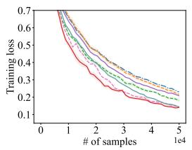  
(a) STL10

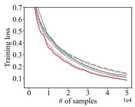  
(b) USPS

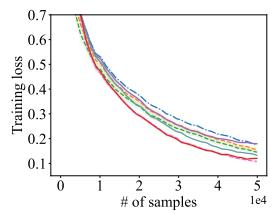  
(c) CIFAR10

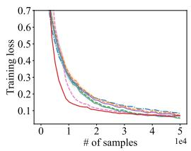  
(d) CIFAR100

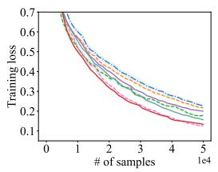  
(e) MNIST

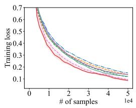  
(f) KMNIST

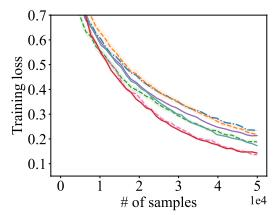  
(g) Fashion-MNIST

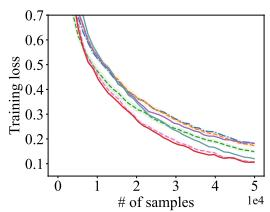  
(h) SVHN

<table><tr><td>--- SOX</td><td></td><td>-  - - MSVRM-v1</td><td></td><td>AdaMSVRM-v1</td><td></td><td>MSVRM-v2</td><td>AdaMSVRM-v2</td><td>-----</td><td>MSVRM-v3</td><td>AdaMSVRM-v3</td></tr></table>

Figure 1: Training loss versus the number of samples for Multi-task AUC Optimization.

Table 3: Final test AUC on Multi-task AUC Optimization.
<table><tr><td></td><td>MNIST</td><td>FASHION MNIST</td><td>SVHN</td><td>STL10</td></tr><tr><td>SOX</td><td>0.9905</td><td>0.9907</td><td>0.9755</td><td>0.9711</td></tr><tr><td>MSVRM-v1</td><td>0.9926</td><td>0.9929</td><td>0.9811</td><td>0.9714</td></tr><tr><td>AdaMSVRM-v1</td><td>0.9948</td><td>0.9957</td><td>0.9821</td><td>0.9774</td></tr><tr><td>MSVRM-v2</td><td>0.9941</td><td>0.9951</td><td>0.9867</td><td>0.9830</td></tr><tr><td>AdaMSVRM-v2</td><td>0.9958</td><td>0.9955</td><td>0.9839</td><td>0.9857</td></tr><tr><td>MSVRM-v3</td><td>0.9947</td><td>0.9925</td><td>0.9930</td><td>0.9929</td></tr><tr><td>AdaMSVRM-v3</td><td>0.9978</td><td>0.9966</td><td>0.9938</td><td>0.9961</td></tr></table>

<table><tr><td></td><td>CIFAR10</td><td>CIFAR100</td><td>USPS</td><td>KMNIST</td></tr><tr><td>SOX</td><td>0.9837</td><td>0.9960</td><td>0.9894</td><td>0.9942</td></tr><tr><td>MSVRM-v1</td><td>0.9869</td><td>0.9971</td><td>0.9893</td><td>0.9951</td></tr><tr><td>AdaMSVRM-v1</td><td>0.9897</td><td>0.9985</td><td>0.9958</td><td>0.9973</td></tr><tr><td>MSVRM-v2</td><td>0.9921</td><td>0.9992</td><td>0.9949</td><td>0.9972</td></tr><tr><td>AdaMSVRM-v2</td><td>0.9927</td><td>0.9989</td><td>0.9988</td><td>0.9987</td></tr><tr><td>MSVRM-v3</td><td>0.9964</td><td>0.9998</td><td>0.9979</td><td>0.9976</td></tr><tr><td>AdaMSVRM-v3</td><td>0.9958</td><td>0.9995</td><td>0.9998</td><td>0.9997</td></tr></table>

Results. Figure 1 plots the training loss versus the number of samples, averaged over 5 runs. We observe that MSVRM-v1 performs comparably to or slightly better than SOX, and MSVRM-v2 consistently converges faster than both SOX and MSVRM-v1. MSVRM-v3 shows the fastest convergence, decreasing the loss most rapidly and demonstrating its superior eficiency, which aligns with our theoretical findings. For adaptive methods (AdaMSVRMv1,v2,v3), they perform slightly better than the non-adaptive counterpart in most cases, validating their efectiveness in practice.

Table 4: Final test AP on Multi-task AUC Optimization.
<table><tr><td></td><td>MNIST</td><td>FASHION MNIST</td><td>SVHN</td><td>STL10</td></tr><tr><td>SOX</td><td>0.9191</td><td>0.9141</td><td>0.8367</td><td>0.7977</td></tr><tr><td>MSVRM-v1</td><td>0.9332</td><td>0.9489</td><td>0.8688</td><td>0.7989</td></tr><tr><td>AdaMSVRM-v1</td><td>0.9699</td><td>0.9507</td><td>0.8760</td><td>0.8392</td></tr><tr><td>MSVRM-v2</td><td>0.9546</td><td>0.9528</td><td>0.9107</td><td>0.8668</td></tr><tr><td>AdaMSVRM-v2</td><td>0.9689</td><td>0.9523</td><td>0.9115</td><td>0.8896</td></tr><tr><td>MSVRM-v3</td><td>0.9468</td><td>0.9503</td><td>0.9118</td><td>0.9256</td></tr><tr><td>AdaMSVRM-v3</td><td>0.9709</td><td>0.9439</td><td>0.9221</td><td>0.9404</td></tr></table>

<table><tr><td></td><td>CIFAR10</td><td>CIFAR100</td><td>USPS</td><td>KMNIST</td></tr><tr><td>SOX</td><td>0.8853</td><td>0.8375</td><td>0.9041</td><td>0.9486</td></tr><tr><td>MSVRM-v1</td><td>0.9024</td><td>0.8672</td><td>0.9274</td><td>0.9526</td></tr><tr><td>AdaMSVRM-v1</td><td>0.9174</td><td>0.9113</td><td>0.9783</td><td>0.9621</td></tr><tr><td>MSVRM-v2</td><td>0.9424</td><td>0.9439</td><td>0.9589</td><td>0.9797</td></tr><tr><td>AdaMSVRM-v2</td><td>0.9485</td><td>0.9413</td><td>0.9879</td><td>0.9881</td></tr><tr><td>MSVRM-v3</td><td>0.9625</td><td>0.9858</td><td>0.9677</td><td>0.9697</td></tr><tr><td>AdaMSVRM-v3</td><td>0.9621</td><td>0.9610</td><td>0.9883</td><td>0.9981</td></tr></table>

We also report the final test AUC (Area Under the Curve) and AP (Average Precision) in Tables 3 and 4. Generally, (Ada)MSVRM-v1 obtains better results than SOX, and (Ada)MSVRM-v2 is still better than (Ada)MSVRM-v1. Among all these methods, the (Ada)MSVRM-v3 algorithm achieves the highest AUC and AP in almost all tasks.

## 7.2 Ablation Study on Algorithm Design

In this subsection, we conduct an ablation study to verify the efect of our customized error correction term. To do this, we compare against a variant that replaces our MSVR estimator with a delicate application of the STORM estimator. This variant uses the update:

$$
\mathbf { u } _ { t } ^ { i } = \left\{ \begin{array} { l l } { ( 1 - \beta ) \mathbf { u } _ { t - 1 } ^ { i } + \beta \frac { m } { B _ { 1 } } g _ { i } \left( \mathbf { w } _ { t } ; \boldsymbol { \xi } _ { t } ^ { i } \right) + ( 1 - \beta ) \frac { m } { B _ { 1 } } \left( g _ { i } \left( \mathbf { w } _ { t } ; \boldsymbol { \xi } _ { t } ^ { i } \right) - g _ { i } \left( \mathbf { w } _ { t - 1 } ; \boldsymbol { \xi } _ { t } ^ { i } \right) \right) } & { i \in \mathcal { B } _ { 1 } ^ { i } } \\ { ( 1 - \beta ) \mathbf { u } _ { t - 1 } ^ { i } } & { i \notin \mathcal { B } _ { 1 } ^ { i } } \end{array} \right.
$$

Replacing the MSVR estimator in MSVRM-v1 and MSVRM-v2 yields Variant-v1 and Variant-v2, respectively. For the finite-sum case, we modify the estimator similarly:

$$
\mathbf { u } _ { t } ^ { i } = \left\{ \begin{array} { l l } { ( 1 - \beta ) \mathbf { u } _ { t - 1 } ^ { i } + \beta \frac { m } { B _ { 1 } } \hat { g } _ { i } \left( \mathbf { w } _ { t } ; \boldsymbol { \xi } _ { t } ^ { i } \right) + ( 1 - \beta ) \frac { m } { B _ { 1 } } \left( g _ { i } \left( \mathbf { w } _ { t } ; \boldsymbol { \xi } _ { t } ^ { i } \right) - g _ { i } \left( \mathbf { w } _ { t - 1 } ; \boldsymbol { \xi } _ { t } ^ { i } \right) \right) } & { i \in \mathcal { B } _ { 1 } ^ { i } } \\ { ( 1 - \beta ) \mathbf { u } _ { t - 1 } ^ { i } } & { i \notin \mathcal { B } _ { 1 } ^ { i } } \end{array} \right.
$$

where $\widehat { g } _ { i } ( \mathbf { w } _ { t } ; \xi _ { t } ^ { i } ) = g _ { i } ( \mathbf { w } _ { t } ; \xi _ { t } ^ { i } ) - g _ { i } ( \mathbf { w } _ { \tau } ; \xi _ { t } ^ { i } ) + g _ { i } ( \mathbf { w } _ { \tau } )$ . We replace the MSVR estimator in MSVRM-v3 with the above equation and name this new method Variant-v3.

Results. We compare our proposed algorithms (MSVRM-v1, v2, v3) against their variant counterparts on CIFAR100. The results are reported in Figure 2. As can be seen, all three

SOX MSVRM-v1 AdaMSVRM-v1 MSVRM-v2 AdaMSVRM-v2 MSVRM-v3 AdaMSVRM-v3

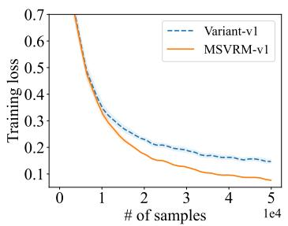  
(a) MSVRM-v1 vs Variant-v1

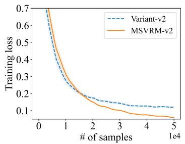  
(b) MSVRM-v2 vs Variant-v2

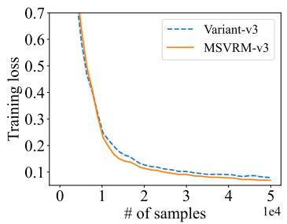  
(c) MSVRM-v3 vs Variant-v3

Figure 2: Ablation study that compares our proposed SVRM estimator against variants using the STORM correction.  
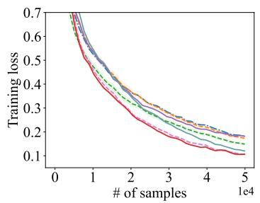  
(a) ResNet18

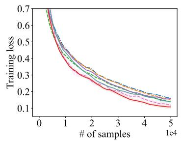  
(b) ResNet34

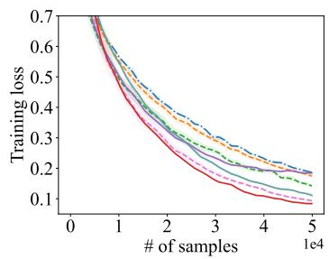  
(c) DenseNet121  
Figure 3: Results with diferent network architectures.

variant methods perform worse than our original algorithms. This empirically confirms the importance of our customized error correction term, which properly handles the dual sources of randomness.

## 7.3 Results with Diferent Networks and Batch Sizes

## 7.3.1 Different networks

We first test the robustness of our methods across diferent network architectures: ResNet18, ResNet34, and DenseNet121, using the SVHN dataset. The results in Figure 3 show that the relative performance remains consistent: (Ada)MSVRM-v1 is comparable to SOX, (Ada)MSVRM-v2 is faster, and (Ada)MSVRM-v3 is the fastest. This demonstrates the robustness of our conclusion across various architectures.

## 7.3.2 Different Batch Sizes

Then, we explore the efect of diferent batch sizes. Specifically, we vary the number of probed blocks $B _ { 1 }$ in the range {2, 5, 9}. We conduct the experiments on the Fashion-MNIST

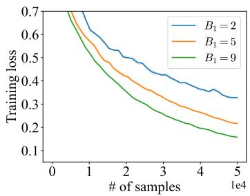  
(a) MSVRM-v1

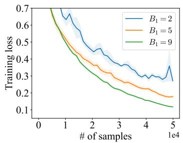  
(b) MSVRM-v2

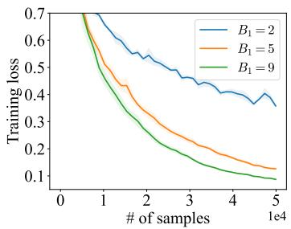  
(c) MSVRM-v3

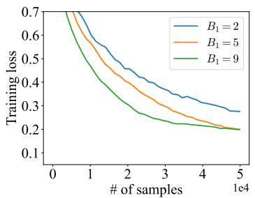  
(d) AdaMSVRM-v1

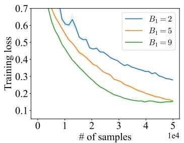  
(e) AdaMSVRM-v2

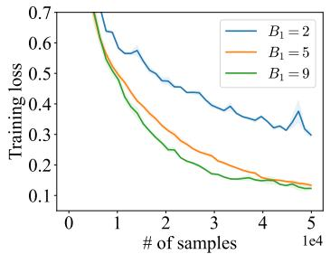  
(f) AdaMSVRM-v3  
Figure 4: Results with varying outer batch size $B _ { 1 }$

data set and show the results in Figure 4. As can be seen, a larger batch size $B _ { 1 }$ would improve the convergence speed of the algorithm.

## 8 Conclusion

In this paper, we propose the novel Multi-block Single-probe Variance Reduction (MSVR) estimator for tracking a vector of m function mappings where only O(1) blocks can be probed per iteration. Building on this MSVR estimator, we develop new algorithms for solving Finite-sum Coupled Compositional Optimization (FCCO) problems. We establish SOTA sample complexities across a spectrum of settings, including non-convex, convex, strongly convex and PL objectives, for both stochastic and finite-sum oracles. We further improve the reliance on m when the outer gradient $\nabla f _ { i }$ is a linear function. Empirical results on multi-task deep AUC maximization also validate our theory and demonstrate clear advantages over existing approaches.

## References

Alekh Agarwal, Peter L. Bartlett, Pradeep Ravikumar, and Martin J. Wainwright. Information-theoretic lower bounds on the oracle complexity of stochastic convex optimization. IEEE Transactions on Information Theory, 58(5):3235–3249, 2012.

Yossi Arjevani, Yair Carmon, John C. Duchi, Dylan J. Foster, Nathan Srebro, and Blake E. Woodworth. Lower bounds for non-convex stochastic optimization. ArXiv e-prints, arXiv:1912.02365, 2019.

Krishnakumar Balasubramanian, Saeed Ghadimi, and Anthony Nguyen. Stochastic multilevel composition optimization algorithms with level-independent convergence rates. ArXiv e-prints, arXiv:2008.10526, 2021.

Tianyi Chen, Yuejiao Sun, and Wotao Yin. Solving stochastic compositional optimization is nearly as easy as solving stochastic optimization. IEEE Transactions on Signal Processing, 69:4937–4948, 2021.

Xingyu Chen, Bokun Wang, Ming Yang, Quanqi Hu, Qihang Lin, and Tianbao Yang. Stochastic momentum methods for non-smooth non-convex finite-sum coupled compositional optimization. ArXiv e-prints, arXiv:2506.02504, 2025.

Evgenii Chzhen and Sholom Schechtman. SignSVRG: fixing SignSGD via variance reduction. ArXiv e-prints, arXiv:2305.13187, 2023.

Tarin Clanuwat, Mikel Bober-Irizar, Asanobu Kitamoto, Alex Lamb, Kazuaki Yamamoto, and David Ha. Deep learning for classical japanese literature. ArXiv e-prints, arXiv:1812.01718, 2018.

Adam Coates, Andrew Ng, and Honglak Lee. An analysis of single-layer networks in unsupervised feature learning. In Proceedings of the 14th International Conference on Artificial Intelligence and Statistics, pages 213–223, 2011.

Ashok Cutkosky and Francesco Orabona. Momentum-based variance reduction in non-convex SGD. In Advances in Neural Information Processing Systems 32, pages 15210–15219, 2019.

Aaron Defazio, Francis R. Bach, and Simon Lacoste-Julien. SAGA: A fast incremental gradient method with support for non-strongly convex composite objectives. In Advances in Neural Information Processing Systems 27, pages 1646–1654, 2014.

Cong Fang, Chris Junchi Li, Zhouchen Lin, and T. Zhang. Spider: Near-optimal nonconvex optimization via stochastic path integrated diferential estimator. ArXiv e-prints, arXiv:1807.01695, 2018.

Saeed Ghadimi, A. Ruszczynski, and Mengdi Wang. A single timescale stochastic approximation method for nested stochastic optimization. SIAM Journal on Optimization, 30(1): 960–979, 2020.

Zhishuai Guo, Yi Xu, Wotao Yin, Rong Jin, and Tianbao Yang. On stochastic moving-average estimators for non-convex optimization. ArXiv e-prints, arXiv:2104.14840, 2021.

Lie He and Shiva Kasiviswanathan. Debiasing conditional stochastic optimization. In Thirty-seventh Conference on Neural Information Processing Systems, 2023.

Quanqi Hu, Dixian Zhu, and Tianbao Yang. Non-smooth weakly-convex finite-sum coupled compositional optimization. In Thirty-seventh Conference on Neural Information Processing Systems, 2023.

Yifan Hu, Siqi Zhang, Xin Chen, and Niao He. Biased stochastic first-order methods for conditional stochastic optimization and applications in meta learning. In Advances in Neural Information Processing Systems 33, 2020.

J. J. Hull. A database for handwritten text recognition research. IEEE Transactions on Pattern Analysis and Machine Intelligence, 16(5):550–554, 1994.

Wei Jiang and Lijun Zhang. Convergence analysis of the lion optimizer in centralized and distributed settings. ArXiv e-prints, arXiv:2508.12327, 2025.

Wei Jiang, Gang Li, Yibo Wang, Lijun Zhang, and Tianbao Yang. Multi-block-single-probe variance reduced estimator for coupled compositional optimization. In Advances in Neural Information Processing Systems 35, pages 32499–32511, 2022a.

Wei Jiang, Bokun Wang, Yibo Wang, Lijun Zhang, and Tianbao Yang. Optimal algorithms for stochastic multi-level compositional optimization. In Proceedings of the 39th International Conference on Machine Learning, pages 10195–10216, 2022b.

Wei Jiang, Sifan Yang, Yibo Wang, and Lijun Zhang. Adaptive variance reduction for stochastic optimization under weaker assumptions. In Advances in Neural Information Processing Systems 37, pages 22047–22080, 2024a.

Wei Jiang, Sifan Yang, Wenhao Yang, Yibo Wang, Yuanyu Wan, and Lijun Zhang. Projectionfree variance reduction methods for stochastic constrained multi-level compositional optimization. In Proceedings of the 41st International Conference on Machine Learning, pages 21962–21987, 2024b.

Wei Jiang, Sifan Yang, Wenhao Yang, and Lijun Zhang. Eficient sign-based optimization: Accelerating convergence via variance reduction. In Advances in Neural Information Processing Systems 38, pages 33891–33932, 2024c.

Wei Jiang, Jiayu Qin, Lingyu Wu, Changyou Chen, Tianbao Yang, and Lijun Zhang. Optimizing unnormalized statistical models through compositional optimization. IEEE Transactions on Pattern Analysis and Machine Intelligence, pages 1–12, 2025a.

Wei Jiang, Sifan Yang, Yibo Wang, Tianbao Yang, and Lijun Zhang. Revisiting stochastic multi-level compositional optimization. IEEE Transactions on Pattern Analysis and Machine Intelligence, 47(7):5613–5624, 2025b.

Wei Jiang, Dingzhi Yu, Sifan Yang, Wenhao Yang, and Lijun Zhang. Improved analysis for sign-based methods with momentum updates. ArXiv e-prints, arXiv:2507.12091, 2025c.

Rie Johnson and Tong Zhang. Accelerating stochastic gradient descent using predictive variance reduction. In Advances in Neural Information Processing Systems 26, pages 315–323, 2013.

Hamed Karimi, Julie Nutini, and Mark Schmidt. Linear convergence of gradient and proximal-gradient methods under the Polyak- Lojasiewicz condition. In Machine Learning and Knowledge Discovery in Databases, pages 795–811, 2016.

Alex Krizhevsky. Learning multiple layers of features from tiny images. Masters Thesis, Deptartment of Computer Science, University of Toronto, 2009.

Yann LeCun, L´eon Bottou, Yoshua Bengio, and Patrick Hafner. Gradient-based learning applied to document recognition. In Proceedings of the IEEE, pages 2278–2324, 1998.

Kfir Yehuda Levy, Ali Kavis, and Volkan Cevher. STORM+: Fully adaptive SGD with recursive momentum for nonconvex optimization. In Advances in Neural Information Processing Systems 34, 2021.

Zhize Li, Hongyan Bao, Xiangliang Zhang, and Peter Richtarik. Page: A simple and optimal probabilistic gradient estimator for nonconvex optimization. In Proceedings of the 38th International Conference on Machine Learning, pages 6286–6295, 2021.

Liu Liu, Ji Liu, Cho-Jui Hsieh, and Dacheng Tao. Stochastically controlled stochastic gradient for the convex and non-convex composition problem. ArXiv e-prints, arXiv:1809.02505, 2018.

Zijian Liu, Ta Duy Nguyen, Thien Hai Nguyen, Alina Ene, and Huy L. Nguyen. Meta-storm: Generalized fully-adaptive variance reduced SGD for unbounded functions. ArXiv e-prints, arXiv:2209.14853, 2022.

Yuval Netzer, Tao Wang, Adam Coates, Alessandro Bissacco, Bo Wu, and Andrew Y. Ng. Reading digits in natural images with unsupervised feature learning. In Advances in Neural Information Processing Systems Workshop on Deep Learning and Unsupervised Feature Learning, 2011.

Lam M Nguyen, Jie Liu, Katya Scheinberg, and Martin Takac. SARAH: A novel method for machine learning problems using stochastic recursive gradient. In Proceedings of the 34th International Conference on Machine Learning, pages 2613–2621, 2017.

Qi Qi, Zhishuai Guo, Yi Xu, Rong Jin, and Tianbao Yang. An online method for a class of distributionally robust optimization with non-convex objectives. ArXiv e-prints, arXiv:2006.10138, 2021a.

Qi Qi, Youzhi Luo, Zhao Xu, Shuiwang Ji, and Tianbao Yang. Stochastic optimization of areas under precision-recall curves with provable convergence. In Advances in Neural Information Processing Systems 34, pages 1752–1765, 2021b.

Nicolas Le Roux, Mark Schmidt, and Francis R. Bach. A stochastic gradient method with an exponential convergence rate for finite training sets. In Advances in Neural Information Processing Systems 25, pages 2672–2680, 2012.

Bokun Wang and Tianbao Yang. Finite-sum coupled compositional stochastic optimization: Theory and applications. In Proceedings of the 39th International Conference on Machine Learning, pages 23292–23317, 2022.

Bokun Wang and Tianbao Yang. A near-optimal single-loop stochastic algorithm for convex finite-sum coupled compositional optimization. In Forty-second International Conference on Machine Learning, 2025.

Guanghui Wang, Ming Yang, Lijun Zhang, and Tianbao Yang. Momentum accelerates the convergence of stochastic AUPRC maximization. ArXiv e-prints, arXiv:2107.01173, 2021.

Mengdi Wang, Ji Liu, and Ethan Fang. Accelerating stochastic composition optimization. In Advances in Neural Information Processing Systems 29, pages 1714–1722, 2016.

Mengdi Wang, Ethan X. Fang, and Han Liu. Stochastic compositional gradient descent: algorithms for minimizing compositions of expected-value functions. Mathematical Programming, 161(1-2):419–449, 2017.

Zhe Wang, Kaiyi Ji, Yi Zhou, Yingbin Liang, and Vahid Tarokh. Spiderboost: A class of faster variance-reduced algorithms for nonconvex optimization. ArXiv e-prints, arXiv:1810.10690, 2018.

Han Xiao, Kashif Rasul, and Roland Vollgraf. Fashion-MNIST: A novel image dataset for benchmarking machine learning algorithms. ArXiv e-prints, arXiv:1708.07747, 2017.

Shuoguang Yang, Mengdi Wang, and Ethan X. Fang. Multilevel stochastic gradient methods for nested composition optimization. SIAM Journal on Optimization, 29(1):616–659, 2019.

Tianbao Yang. Algorithmic foundations of empirical x-risk minimization. ArXiv e-prints, arXiv:2206.00439, 2023.

Huizhuo Yuan, Xiangru Lian, Chris Junchi Li, Ji Liu, and Wenqing Hu. Eficient smooth non-convex stochastic compositional optimization via stochastic recursive gradient descent. In Advances in Neural Information Processing Systems 33, pages 14905–14916, 2019.

Zhuoning Yuan, Yan Yan, Milan Sonka, and Tianbao Yang. Robust deep auc maximization: A new surrogate loss and empirical studies on medical image classification. ArXiv e-prints, arXiv:2012.03173, 2020.

Junyu Zhang and Lin Xiao. A stochastic composite gradient method with incremental variance reduction. In Advances in Neural Information Processing Systems 33, pages 9075–9085, 2019.

Junyu Zhang and Lin Xiao. Multilevel composite stochastic optimization via nested variance reduction. SIAM Journal on Optimization, 31(2):1131–1157, 2021.

Lijun Zhang, Mehrdad Mahdavi, and Rong Jin. Linear convergence with condition number independent access of full gradients. In Advance in Neural Information Processing Systems 26, pages 980–988, 2013.

Zhe Zhang and Guanghui Lan. Optimal algorithms for convex nested stochastic composite optimization. ArXiv e-prints, arXiv:2011.10076, 2021.

Dixian Zhu, Xiaodong Wu, and Tianbao Yang. Benchmarking deep AUROC optimization: Loss functions and algorithmic choices. ArXiv e-prints, arXiv:2203.14177, 2022.

## Appendix A. Proof of Lemma 1

By setting $\gamma _ { t } = 0$ and $\beta _ { t } = \beta$ , we have that $\bar { \mathbf { u } } _ { t + 1 } ^ { i } = ( 1 - \beta ) \mathbf { u } _ { t } ^ { i } + \beta g _ { i } ( \mathbf { w } _ { t + 1 } ; \xi _ { t + 1 } ^ { i } )$ and

$$
\begin{array} { r l } & { \quad \mathbb { E } [ \| \mathbf { u } _ { t + 1 } ^ { i } - g _ { i } ( \mathbf { w } _ { t + 1 } ) \| ^ { 2 } ] = ( 1 - \frac { B _ { 1 } } { m } ) \mathbb { E } [ \| \mathbf { u } _ { t } ^ { i } - g _ { i } ( \mathbf { w } _ { t + 1 } ) \| ^ { 2 } ] + \frac { B _ { 1 } } { m } \mathbb { E } [ \| \bar { \mathbf { u } } _ { t + 1 } ^ { i } - g _ { i } ( \mathbf { w } _ { t + 1 } ) \| ^ { 2 } ] } \\ & { \leq ( 1 - \frac { B _ { 1 } } { m } ) ( 1 + \frac { \beta B _ { 1 } } { 2 m } ) \mathbb { E } [ \| \mathbf { u } _ { t } ^ { i } - g _ { i } ( \mathbf { w } _ { t } ) \| ^ { 2 } ] + ( 1 - \frac { B _ { 1 } } { m } ) ( 1 + \frac { 2 m } { \beta B _ { 1 } } ) \mathbb { E } [ \| g _ { i } ( \mathbf { w } _ { t } ) - g _ { i } ( \mathbf { w } _ { t + 1 } ) \| ^ { 2 } ] } \\ & { \qquad + \frac { B _ { 1 } } { m } \mathbb { E } [ \| \bar { \mathbf { u } } _ { t + 1 } ^ { i } - g _ { i } ( \mathbf { w } _ { t + 1 } ) \| ^ { 2 } ] } \\ &  \leq ( 1 - \frac { B _ { 1 } } { m } + \frac { \beta B _ { 1 } } { 2 m } ) \mathbb { E } [ \| \mathbf { u } _ { t } ^ { i } - g _ { i } ( \mathbf { w } _ { t } ) \| ^ { 2 } ] + \frac { 3 m C _ { g } ^ { 2 } } { \beta B _ { 1 } } \mathbb { E } [ \| \mathbf { w } _ { t + 1 } - \mathbf { w } _ { t } \| ^ { 2 } ] + \frac { B _ { 1 } } { m } \mathbb { E } [ \| \bar { \mathbf { u } } _ { t + 1 } ^ { i } - g _  \end{array}
$$

For the term E $\left[ \left\| \bar { \mathbf { u } } _ { t + 1 } ^ { i } - g _ { i } ( \mathbf { w } _ { t + 1 } ) \right\| ^ { 2 } \right]$ , we can decompose it as:

$$
\begin{array} { r l } & { \quad \mathbb { E } [ \| \mathbf { \bar { u } } _ { t + 1 } ^ { i } - \mathcal { G } _ { i } ( \mathbf { w } _ { t + 1 } ) \| ^ { 2 } ] } \\ & { = \mathbb { E } [ \| ( 1 - \beta ) ( \mathbf { u } _ { t } ^ { i } - g _ { t } ( \mathbf { w } _ { t } ) ) + ( 1 - \beta ) ( g _ { i } ( \mathbf { w } _ { t } ) - g _ { i } ( \mathbf { w } _ { t + 1 } ) ) + \beta ( g _ { s } ( \mathbf { w } _ { t + 1 } ; \xi _ { t + 1 } ^ { i } ) - g _ { i } ( \mathbf { w } _ { t + 1 } ) ) ) \| ^ { 2 } ] } \\ & { = \mathbb { E } [ \| ( 1 - \beta ) ( \mathbf { u } _ { t } ^ { i } - g _ { t } ( \mathbf { w } _ { t } ) + g _ { i } ( \mathbf { w } _ { t } ) - g _ { i } ( \mathbf { w } _ { t + 1 } ) ) \| ^ { 2 } ] + \beta ^ { 2 } \mathbb { E } [ \| g _ { i } ( \mathbf { w } _ { t + 1 } ; \xi _ { t + 1 } ^ { i } ) - g _ { i } ( \mathbf { w } _ { t + 1 } ) \| ^ { 2 } ] } \\ & { \leq ( 1 - \beta ) ^ { 2 } ( 1 + \beta ) \mathbb { E } [ \| \mathbf { u } _ { t } ^ { i } - g _ { t } ( \mathbf { w } _ { t } ) \| ^ { 2 } ] + ( 1 - \beta ) ^ { 2 } ( 1 + \frac { 1 } { \beta } ) \mathbb { E } [ \| g _ { i } ( \mathbf { w } _ { t } ) - g _ { t } ( \mathbf { w } _ { t + 1 } ) \| ^ { 2 } ] + \beta ^ { 2 } \sigma ^ { 2 } } \\ &  \leq ( 1 - \beta ) \mathbb { E } [ \| \mathbf { u } _ { t } ^ { i } - g _ { t } ( \mathbf { w } _ { t } ) \| ^ { 2 } ] + \frac { 2 } { \beta } \mathbb \end{array}\tag{10}
$$

The second equation is due to $\begin{array} { r } { \mathbb { E } \left[ g _ { i } ( \mathbf { w } _ { t + 1 } ; \xi _ { t + 1 } ^ { i } ) - g _ { i } ( \mathbf { w } _ { t + 1 } ) \right] = 0 } \end{array}$ . Summing up, we have that

$$
\begin{array} { r l } & { \quad \mathbb { E } [ \| \mathbf { u } _ { t + 1 } ^ { i } - g _ { i } ( \mathbf { w } _ { t + 1 } ) \| ^ { 2 } ] } \\ & { \leq ( 1 - \displaystyle \frac { B _ { 1 } } { m } + \frac { \beta B _ { 1 } } { 2 m } ) \mathbb { E } [ \| \mathbf { u } _ { t } ^ { i } - g _ { i } ( \mathbf { w } _ { t } ) \| ^ { 2 } ] + \displaystyle \frac { 3 m C _ { g } ^ { 2 } } { \beta B _ { 1 } } \mathbb { E } [ \| \mathbf { w } _ { t + 1 } - \mathbf { w } _ { t } \| ^ { 2 } ] + \displaystyle \frac { B _ { 1 } } { m } \mathbb { E } [ \| \bar { \mathbf { u } } _ { t + 1 } ^ { i } - g _ { i } ( \mathbf { w } _ { t + 1 } ) \| ^ { 2 } ] } \\ & { \leq ( 1 - \displaystyle \frac { B _ { 1 } } { m } + \frac { \beta B _ { 1 } } { 2 m } ) \mathbb { E } [ \| \mathbf { u } _ { t } ^ { i } - g _ { i } ( \mathbf { w } _ { t } ) \| ^ { 2 } ] + \displaystyle \frac { 3 m C _ { g } ^ { 2 } } { \beta B _ { 1 } } \mathbb { E } [ \| \mathbf { w } _ { t + 1 } - \mathbf { w } _ { t } \| ^ { 2 } ] } \\ & { \quad \quad + \displaystyle \frac { B _ { 1 } } { m } ( 1 - \beta ) \mathbb { E } [ \| \mathbf { u } _ { t } ^ { i } - g _ { i } ( \mathbf { w } _ { t } ) \| ^ { 2 } ] + \displaystyle \frac { 2 C _ { g } ^ { 2 } B _ { 1 } } { \beta m } \mathbb { E } [ \| \mathbf { w } _ { t + 1 } - \mathbf { w } _ { t } \| ^ { 2 } ] + \displaystyle \frac { B _ { 1 } } { m } \beta ^ { 2 } \sigma ^ { 2 } } \\ &  \leq ( 1 - \displaystyle \frac { \beta B _ { 1 } } { 2 m } ) \mathbb { E } [ \| \ \end{array}
$$

Finally, we have:

$$
\begin{array} { l } { \displaystyle \mathbb { E } \left[ \| \mathbf { u } _ { t + 1 } - g ( \mathbf { w } _ { t + 1 } ) \| ^ { 2 } \right] = \sum _ { i = 1 } ^ { m } \mathbb { E } \left[ \left\| \mathbf { u } _ { t + 1 } ^ { i } - g _ { i } ( \mathbf { w } _ { t + 1 } ) \right\| ^ { 2 } \right] } \\ { \displaystyle \leq \left( 1 - \frac { \beta B _ { 1 } } { 2 m } \right) \mathbb { E } \left[ \left\| \mathbf { u } _ { t } - g ( \mathbf { w } _ { t } ) \right\| ^ { 2 } \right] + \frac { 5 m ^ { 2 } C _ { g } ^ { 2 } } { \beta B _ { 1 } } \mathbb { E } \left[ \left\| \mathbf { w } _ { t + 1 } - \mathbf { w } _ { t } \right\| ^ { 2 } \right] + B _ { 1 } \sigma ^ { 2 } \beta ^ { 2 } } \end{array}
$$

## Appendix B. Proof of Lemma 3

Let us focus on a fixed $i \in [ m ]$ . Then we have

$$
\mathbb { E } \left[ \Vert \mathbf { u } _ { t } ^ { i } - g _ { i } ( \mathbf { w } _ { t } ) \Vert ^ { 2 } \right] = \frac { B _ { 1 } } { m } \underbrace { \mathbb { E } \left[ \Vert \widetilde { \mathbf { u } } _ { t } ^ { i } - g _ { i } ( \mathbf { w } _ { t } ) \Vert ^ { 2 } \right] } _ { A _ { 1 } } + ( 1 - \frac { B _ { 1 } } { m } ) \underbrace { \mathbb { E } \left[ \Vert \mathbf { u } _ { t - 1 } ^ { i } - g _ { i } ( \mathbf { w } _ { t } ) \Vert ^ { 2 } \right] } _ { A _ { 2 } } .
$$

We first decompose the second term as follows:

$$
\begin{array} { r l } & { A _ { 2 } = \mathbb { E } \left[ \left. \mathbf { u } _ { t - 1 } ^ { i } - g _ { i } ( \mathbf { w } _ { t - 1 } ) + g _ { i } ( \mathbf { w } _ { t - 1 } ) - g _ { i } ( \mathbf { w } _ { t } ) \right. ^ { 2 } \right] } \\ & { \quad = \mathbb { E } [ \left. \mathbf { u } _ { t - 1 } ^ { i } - g _ { i } ( \mathbf { w } _ { t - 1 } ) \right. ^ { 2 } + \left. g _ { i } ( \mathbf { w } _ { t - 1 } ) - g _ { i } ( \mathbf { w } _ { t } ) \right. ^ { 2 } + \underbrace { 2 ( \mathbf { u } _ { t - 1 } ^ { i } - g _ { i } ( \mathbf { w } _ { t - 1 } ) ) ^ { \top } ( g _ { i } ( \mathbf { w } _ { t - 1 } ) - g _ { i } ( \mathbf { w } _ { t } ) ) } _ { A _ { 2 1 } } ] } \\ & { \quad \le \mathbb { E } \left[ \left. \mathbf { u } _ { t - 1 } ^ { i } - g _ { i } ( \mathbf { w } _ { t - 1 } ) \right. ^ { 2 } + C _ { g } ^ { 2 } \left. \mathbf { w } _ { t - 1 } - \mathbf { w } _ { t } \right. ^ { 2 } + A _ { 2 1 } \right] } \end{array}
$$

Then we decompose the first term as

$$
\begin{array} { r l } & { A _ { 1 } - \mathbb { E } [ \| ( 1 - \beta _ { \delta } ) ( \mathbf { u } _ { 1 - 1 } ^ { \delta } - g _ { \delta } ( \mathbf { w } _ { t - 1 } ) ) + \gamma _ { \delta } ^ { \delta } ( g ( \mathbf { w } _ { t } ) - g _ { \delta } ( \mathbf { w } _ { t - 1 } ) ) + \beta _ { \delta } ( g _ { \delta } ( \mathbf { w } _ { t } ; \xi _ { t } ^ { \delta } ) - g _ { \delta } ( \mathbf { w } _ { t } ) ) ] } \\ & { \qquad + \gamma _ { \delta } ( \nabla g _ { \delta } ( \mathbf { w } _ { t } ; \xi _ { t } ^ { \delta } ) ^ { \top } ( \mathbf { w } _ { t } - \mathbf { w } _ { t - 1 } ) - g _ { \delta } ( \mathbf { w } _ { t } ) + g _ { \delta } ( \mathbf { w } _ { t - 1 } ) ) \| ^ { 2 } ] } \\ & { \quad \mathbb { E } [ \| ( \frac { 1 } { \Delta } - \beta _ { \delta } ) ( \mathbf { u } _ { 1 - 1 } ^ { \delta } - g _ { \delta } ( \mathbf { w } _ { t - 1 } ) ) + \frac { \gamma _ { \delta } ^ { \delta } } { 4 } ( g _ { \delta } ( \mathbf { w } _ { t } ) - g _ { \delta } ( \mathbf { w } _ { t - 1 } ) ) + \frac { g _ { \delta } ( g _ { \delta } ( \mathbf { w } _ { t } ; \xi _ { t } ^ { \delta } ) - g _ { \delta } ( \mathbf { w } _ { t } ) ) } { \lambda _ { \lambda _ { \lambda } } } } \\ &  \qquad + \frac { \gamma _ { \delta } } { 4 } ( \nabla g _ { \delta } ( \mathbf { w } _ { t } ; \xi _ { t } ^ { \delta } ) - \nabla g _ { \delta } ( \mathbf { w } _ { t } ) ) ^ { \top } ( \mathbf { w } _ { t } - \mathbf { w } _ { t - 1 } ) \| ^ { 2 } + \frac { \gamma _ { \delta } } { 4 } ( \nabla g _ { \delta } ( \mathbf { w } _ { t } ) ^ { \top } ( \mathbf { w } _  t \end{array}
$$

where the last inequality is due to ${ \left\| { { A } _ { 1 5 } } \right\| } \le { { \gamma } _ { t } } { L } _ { g } \left\| { { \bf { w } } _ { t } } - { { \bf { w } } _ { t - 1 } } \right\| ^ { 2 } / 2$ and $\left\| A _ { 1 5 } \right\| \leq 2 \gamma _ { t } C _ { g } \left\| \mathbf { w } _ { t } - \mathbf { w } _ { t } . \right.$ −1∥.

By setting $\begin{array} { r } { \gamma _ { t } ^ { 0 } = \frac { m - B _ { 1 } } { B _ { 1 } ( 1 - \beta _ { t } ) } } \end{array}$ , we cancel both terms such that $\begin{array} { r } { \frac { B _ { 1 } } { m } \mathbb { E } [ 2 A _ { 1 1 } ^ { \top } A _ { 1 2 } ] + ( 1 - \frac { B _ { 1 } } { m } ) \mathbb { E } [ A _ { 2 1 } ] = 0 . } \end{array}$

Noting that $\gamma _ { t + 1 } \leq 2 m / B _ { 1 }$ for $\beta _ { t } \le 1 / 2$ , we have:

$$
\begin{array} { r l } & { \quad \mathbb { E } [ \| \mathbf { u } _ { t } ^ { i } - g _ { i } ( \mathbf { w } _ { t } ) \| ^ { 2 } ] = ( 1 - B _ { 1 } / m ) A _ { 2 } + B _ { 1 } / m \cdot A _ { 1 } } \\ & { \leq ( 1 - B _ { 1 } / m ) \mathbb { E } [ \| \mathbf { u } _ { t - 1 } ^ { i } - g _ { i } ( \mathbf { w } _ { t - 1 } ) \| ^ { 2 } + C _ { g } ^ { 2 } \| \mathbf { w } _ { t - 1 } - \mathbf { w } _ { t } \| ^ { 2 } ] } \\ & { \quad + \displaystyle \frac { B _ { 1 } } { m } \mathbb { E } [ ( 1 - \beta _ { t } ) \| \mathbf { u } _ { t - 1 } ^ { i } - g _ { i } ( \mathbf { w } _ { t - 1 } ) \| ^ { 2 } + 2 \beta _ { t } ^ { 2 } \sigma ^ { 2 } + 2 \gamma _ { i } ^ { 2 } ( C _ { g } ^ { 2 } + \sigma ^ { 2 } ) \| \mathbf { w } _ { t } - \mathbf { w } _ { t - 1 } \| ^ { 2 } + \displaystyle \frac { \gamma _ { t } ^ { 2 } L _ { g } ^ { 2 } } { \beta _ { t } } \| \mathbf { w } _ { t } - \mathbf { w } _ { t - 1 } \| ^ { 4 } ] } \\ & { \leq ( 1 - B _ { 1 } \beta _ { t } / m ) \mathbb { E } [ \| \mathbf { u } _ { t - 1 } ^ { i } - g _ { i } ( \mathbf { w } _ { t - 1 } ) \| ^ { 2 } ] + 2 B _ { 1 } \beta _ { t } ^ { 2 } \sigma ^ { 2 } / m } \\ &  \quad + m / B _ { 1 } \cdot \mathbb { E } [ ( 9 C _ { g } ^ { 2 } + 8 \sigma ^ { 2 } + \frac { 4 L _ { g } ^ { 2 } } { \beta _ { t } } \| \mathbf { w } _ { t } - \mathbf { w } _ { t - 1 } \| ^ { 2 } ) \| \mathbf { w } _ { t } - \mathbf { w } _ \end{array}
$$

Note that $\begin{array} { r } { \| \mathbf { u } _ { t } - \mathbf { g } ( \mathbf { w } _ { t } ) \| ^ { 2 } = \sum _ { i = 1 } ^ { m } \| \mathbf { u } _ { t } ^ { i } - g _ { i } ( \mathbf { w } _ { t } ) \| ^ { 2 } } \end{array}$ , we finish the proof of the lemma.

## Appendix C. Proof of Lemma 4

First, we have:

$$
\begin{array} { r l } & { \mathbb { E } \left[ \left. \widehat { g } _ { i } ^ { t } - g _ { i } ( \mathbf { w } _ { t } ) \right. ^ { 2 } \right] = \mathbb { E } \left[ \left. g _ { i } ( \mathbf { w } _ { t } ; \xi _ { t } ^ { i } ) - g _ { i } ( \mathbf { w } _ { \tau } ; \xi _ { t } ^ { i } ) + g _ { i } ( \mathbf { w } _ { \tau } ) - g _ { i } ( \mathbf { w } _ { t } ) \right. ^ { 2 } \right] } \\ & { \qquad = \mathbb { E } \left[ \left. g _ { i } ( \mathbf { w } _ { t } ; \xi _ { t } ^ { i } ) - g _ { i } ( \mathbf { w } _ { \tau } ; \xi _ { t } ^ { i } ) \right. ^ { 2 } + \left. g _ { i } ( \mathbf { w } _ { \tau } ) - g _ { i } ( \mathbf { w } _ { t } ) \right. ^ { 2 } \right. } \\ & { \qquad \left. + 2 \left( g _ { i } ( \mathbf { w } _ { t } ; \xi _ { t } ^ { i } ) - g _ { i } ( \mathbf { w } _ { \tau } ; \xi _ { t } ^ { i } ) \right) ^ { \top } \left( g _ { i } ( \mathbf { w } _ { \tau } ) - g _ { i } ( \mathbf { w } _ { t } ) \right) \right] } \\ & { \qquad = \mathbb { E } \left[ \left. g _ { i } ( \mathbf { w } _ { t } ; \xi _ { t } ^ { i } ) - g _ { i } ( \mathbf { w } _ { \tau } ; \xi _ { t } ^ { i } ) \right. ^ { 2 } - \left. g _ { i } ( \mathbf { w } _ { \tau } ) - g _ { i } ( \mathbf { w } _ { t } ) \right. ^ { 2 } \right] } \\ & { \qquad \le C _ { g } ^ { 2 } \left. \mathbf { w } _ { t } - \mathbf { w } _ { \tau } \right. ^ { 2 } . } \end{array}\tag{11}
$$

Since τ is the closest small index to t such that τ mod $I = 0$ , we have:

$$
\begin{array} { r l } { \displaystyle \sum _ { t = 1 } ^ { T } \left\| \mathbf { w } _ { t } - \mathbf { w } _ { \tau } \right\| ^ { 2 } \leq \displaystyle \sum _ { t = 1 } ^ { T } \left\| \displaystyle \sum _ { k = \tau + 1 } ^ { t } \left( \mathbf { w } _ { k } - \mathbf { w } _ { k - 1 } \right) \right\| ^ { 2 } } & { } \\ { \displaystyle } & { \leq \displaystyle \sum _ { t = 1 } ^ { T } \displaystyle \sum _ { k = \tau + 1 } ^ { t } I \left\| \mathbf { w } _ { k } - \mathbf { w } _ { k - 1 } \right\| ^ { 2 } \leq I ^ { 2 } \displaystyle \sum _ { t = 1 } ^ { T } \left\| \mathbf { w } _ { t } - \mathbf { w } _ { t - 1 } \right\| ^ { 2 } . } \end{array}\tag{12}
$$

As a result, we know that

$$
\sum _ { t = 1 } ^ { T } \mathbb { E } \left[ \left. \widehat { g } _ { i } ^ { t } - g _ { i } ( \mathbf { w } _ { t } ) \right. ^ { 2 } \right] \leq C _ { g } ^ { 2 } I ^ { 2 } \sum _ { t = 1 } ^ { T } \left. \mathbf { w } _ { t } - \mathbf { w } _ { t - 1 } \right. ^ { 2 } .\tag{13}
$$

Then, let us focus on a fixed $i \in [ m ]$ . Then we have

$$
\mathbb { E } \left[ \Vert \mathbf { u } _ { t } ^ { i } - g _ { i } ( \mathbf { w } _ { t } ) \Vert ^ { 2 } \right] = \frac { B _ { 1 } } { m } \underbrace { \mathbb { E } \left[ \Vert \widehat { \mathbf { u } } _ { t } ^ { i } - g _ { i } ( \mathbf { w } _ { t } ) \Vert ^ { 2 } \right] } _ { A _ { 1 } } + ( 1 - \frac { B _ { 1 } } { m } ) \underbrace { \mathbb { E } \left[ \Vert \mathbf { u } _ { t - 1 } ^ { i } - g _ { i } ( \mathbf { w } _ { t } ) \Vert ^ { 2 } \right] } _ { A _ { 2 } } .
$$

We first decompose the second term as

$$
\begin{array} { r l } & { A _ { 2 } = \mathbb { E } \left[ \Vert \mathbf { u } _ { t - 1 } ^ { i } - g _ { i } ( \mathbf { w } _ { t - 1 } ) + g _ { i } ( \mathbf { w } _ { t - 1 } ) - g _ { i } ( \mathbf { w } _ { t } ) \Vert ^ { 2 } \right] } \\ & { \quad = \mathbb { E } [ \Vert \mathbf { u } _ { t - 1 } ^ { i } - g _ { i } ( \mathbf { w } _ { t - 1 } ) \Vert ^ { 2 } + \Vert g _ { i } ( \mathbf { w } _ { t - 1 } ) - g _ { i } ( \mathbf { w } _ { t } ) \Vert ^ { 2 } + \underbrace { 2 ( \mathbf { u } _ { t - 1 } ^ { i } - g _ { i } ( \mathbf { w } _ { t - 1 } ) ) ^ { \top } ( g _ { i } ( \mathbf { w } _ { t - 1 } ) - g _ { i } ( \mathbf { w } _ { t } ) ) } _ { A _ { 2 1 } } ] } \\ & { \quad \le \mathbb { E } \left[ \Vert \mathbf { u } _ { t - 1 } ^ { i } - g _ { i } ( \mathbf { w } _ { t - 1 } ) \Vert ^ { 2 } + C _ { g } ^ { 2 } \Vert \mathbf { w } _ { t - 1 } - \mathbf { w } _ { t } \Vert ^ { 2 } + A _ { 2 1 } \right] } \end{array}
$$

Next, we decompose $A _ { 1 }$ as follows:

$$
\begin{array} { r l } & { A _ { 1 } = \mathbb { E } [ \underbrace { \| ( 1 - \beta _ { t } ) ( \mathbf { u } _ { t - 1 } ^ { i } - g _ { i } ( \mathbf { w } _ { t - 1 } ) ) } _ { A _ { 1 1 } } + \underbrace { \gamma _ { t } ^ { 0 } ( g _ { i } ( \mathbf { w } _ { t } ) - g _ { i } ( \mathbf { w } _ { t - 1 } ) ) } _ { A _ { 1 2 } } + \underbrace { \beta _ { t } ( \hat { g } _ { i } ^ { t } - g _ { i } ( \mathbf { w } _ { t } ) ) } _ { A _ { 1 3 } } } \\ & { \qquad + \underbrace { \gamma _ { t } ( g _ { i } ( \mathbf { w } _ { t } ; \xi _ { t } ^ { i } ) - g _ { i } ( \mathbf { w } _ { t - 1 } ; \xi _ { t } ^ { i } ) - g _ { i } ( \mathbf { w } _ { t } ) + g _ { i } ( \mathbf { w } _ { t - 1 } ) ) } _ { A _ { 1 4 } } \| ^ { 2 } ] } \\ & { \leq \mathbb { E } [ \| A _ { 1 1 } + A _ { 1 2 } \| ^ { 2 } + \| A _ { 1 3 } + A _ { 1 4 } \| ^ { 2 } ] } \\ & { \leq \mathbb { E } [ \| A _ { 1 1 } \| ^ { 2 } + \| A _ { 1 2 } \| ^ { 2 } + 2 A _ { 1 1 } ^ { \top } A _ { 1 2 } + 2 \| A _ { 1 3 } \| ^ { 2 } + 2 \| A _ { 1 4 } \| ^ { 2 } ] } \\ &  \leq \mathbb { E } [ ( 1 - \beta _ { t } ) \| \mathbf { u } _ { t - 1 } ^ { i } - g _ { i } ( \mathbf { w } _ { t - 1 } ) \| ^ { 2 } + 3 \gamma _ { t } ^ { 2 } C _ { g } ^ { 2 } \| \mathbf { w } _ { t } - \mathbf { w } _ { t - 1 } \| ^ { 2 } + 2 A _ { 1 1 } ^ { \top } A _ { 1 2 } + 2 \beta _ { t } ^ { 2 } \| \hat { g } _ { i } ^ { t } - g _ { i } ( \ \end{array}
$$

The resulting term $\mathbb { E } [ 2 A _ { 1 1 } ^ { \top } A _ { 1 2 } ]$ has a negative sign as $A _ { 2 1 }$ . Hence, by carefully choosing $\begin{array} { r } { \gamma _ { t } ^ { 0 } = \frac { m - B _ { 1 } } { m ( 1 - \beta _ { t } ) } } \end{array}$ , we can cancel both terms such that $\begin{array} { r } { \frac { B _ { 1 } } { m } \mathbb { E } [ 2 A _ { 1 1 } ^ { \top } A _ { 1 2 } ] + ( 1 - \frac { B _ { 1 } } { m } ) \mathbb { E } [ A _ { 2 1 } ] = 0 } \end{array}$ Noting that $\gamma _ { t + 1 } \leq \frac { 2 m } { B _ { 1 } }$ for $\beta _ { t } \le 1 / 2$ , we have:

$$
\begin{array} { l } { { \displaystyle \mathbb { E } \left[ \left\| \mathbf { u } _ { t } ^ { i } - g _ { i } ( \mathbf { w } _ { t } ) \right\| ^ { 2 } \right] = \left( 1 - \frac { B _ { 1 } } { m } \right) A _ { 2 } + \frac { B _ { 1 } } { m } A _ { 1 } } \ ~ } \\ { { \displaystyle \leq ( 1 - \frac { B _ { 1 } } { m } ) \mathbb { E } \left[ \left\| \mathbf { u } _ { t - 1 } ^ { i } - g _ { i } ( \mathbf { w } _ { t - 1 } ) \right\| ^ { 2 } + C _ { g } ^ { 2 } \left\| \mathbf { w } _ { t - 1 } - \mathbf { w } _ { t } \right\| ^ { 2 } \right] } \ ~ } \\ { { \displaystyle ~ + \frac { B _ { 1 } } { m } \mathbb { E } \left[ ( 1 - \beta _ { t } ) \left\| \mathbf { u } _ { t - 1 } ^ { i } - g _ { i } ( \mathbf { w } _ { t - 1 } ) \right\| ^ { 2 } + 2 \beta _ { t } ^ { 2 } \left\| \hat { g } _ { i } ^ { t } - g _ { i } ( \mathbf { w } _ { t } ) \right\| ^ { 2 } + 3 \gamma _ { t } ^ { 2 } C _ { g } ^ { 2 } \left\| \mathbf { w } _ { t } - \mathbf { w } _ { t - 1 } \right\| ^ { 2 } \right] } \ ~ } \\ { { \displaystyle \leq ( 1 - \frac { B _ { 1 } \beta _ { t } } { m } ) \mathbb { E } \left[ \left\| \mathbf { u } _ { t - 1 } ^ { i } - g _ { i } ( \mathbf { w } _ { t - 1 } ) \right\| ^ { 2 } \right] + \frac { 2 B _ { 1 } \beta _ { t } ^ { 2 } } { m } \left\| \hat { g } _ { i } ^ { t } - g _ { i } ( \mathbf { w } _ { t } ) \right\| ^ { 2 } + \frac { 1 3 m } { B _ { 1 } } C _ { g } ^ { 2 } \mathbb { E } \left[ \left\| \mathbf { w } _ { t } - \mathbf { w } _ { t - 1 } \right\| ^ { 2 } \right] } \ ~ } \end{array}
$$

By noting that $\begin{array} { r } { \| \mathbf { u } _ { t } - \mathbf { g } ( \mathbf { w } _ { t } ) \| ^ { 2 } = \sum _ { i = 1 } ^ { m } \| \mathbf { u } _ { t } ^ { i } - g _ { i } ( \mathbf { w } _ { t } ) \| ^ { 2 } } \end{array}$ , we have

$$
\begin{array} { l } { { \displaystyle { \mathbb E } \left[ \| { \bf u } _ { t } - g ( { \bf w } _ { t } ) \| ^ { 2 } \right] } \ ~ } \\ { { \displaystyle \le ( 1 - \frac { B _ { 1 } \beta _ { t } } { m } ) { \mathbb E } \left[ \| { \bf u } _ { t - 1 } - g ( { \bf w } _ { t - 1 } ) \| ^ { 2 } \right] + 2 B _ { 1 } \beta _ { t } ^ { 2 } \left\| { \widehat g } _ { i } - g _ { i } ( { \bf w } _ { t } ) \right\| ^ { 2 } + \frac { 1 3 m ^ { 2 } } { B _ { 1 } } C _ { g } ^ { 2 } { \mathbb E } \left[ \| { \bf w } _ { t } - { \bf w } _ { t - 1 } \| ^ { 2 } \right] . } } \end{array}
$$

By setting $\beta _ { t } = \beta$ and $\beta I = m / B _ { 1 }$ , we have

$$
\frac { 1 } { T } \sum _ { t = 1 } ^ { T } \mathbb { E } \left[ \left. \mathbf { u } _ { t } - g ( \mathbf { w } _ { t } ) \right. ^ { 2 } \right]
$$

$$
\leq \frac { m } { B _ { 1 } \beta T } \mathbb { E } \left[ \left. \mathbf { u } _ { 1 } - g ( \mathbf { w } _ { 1 } ) \right. ^ { 2 } \right] + 2 m \beta \frac { 1 } { T } \sum _ { t = 1 } ^ { T } \left. \widehat { g } _ { i } ^ { t } - g _ { i } ( \mathbf { w } _ { t } ) \right. ^ { 2 } + \frac { 1 3 m ^ { 3 } C _ { g } ^ { 2 } } { B _ { 1 } ^ { 2 } \beta } \frac { 1 } { T } \sum _ { t = 1 } ^ { T } \mathbb { E } \left[ \left. \mathbf { w } _ { t + 1 } - \mathbf { w } _ { t } \right. ^ { 2 } \right]
$$

$$
\leq \frac { m } { B _ { 1 } \beta T } \mathbb { E } \left[ \left. \mathbf { u } _ { 1 } - g ( \mathbf { w } _ { 1 } ) \right. ^ { 2 } \right] + \frac { 2 m \beta C _ { g } ^ { 2 } I ^ { 2 } } { T } \sum _ { t = 1 } ^ { T } \Vert \mathbf { w } _ { t + 1 } - \mathbf { w } _ { t } \Vert ^ { 2 } + \frac { 1 3 m ^ { 3 } C _ { g } ^ { 2 } } { B _ { 1 } ^ { 2 } \beta } \frac { 1 } { T } \sum _ { t = 1 } ^ { T } \mathbb { E } \left[ \left. \mathbf { w } _ { t + 1 } - \mathbf { w } _ { t } \right. ^ { 2 } \right]
$$

$$
\leq \frac { 1 5 m ^ { 3 } C _ { g } ^ { 2 } } { B _ { 1 } ^ { 2 } \beta } \frac { 1 } { T } \sum _ { t = 1 } ^ { T } \mathbb { E } \left[ \left. \mathbf { w } _ { t + 1 } - \mathbf { w } _ { t } \right. ^ { 2 } \right] .
$$

## Appendix D. Proof of Theorem 1

Non-linear ∇f By noting that $\begin{array} { r } { \eta _ { t } = \frac { \eta } { \left. \mathbf { z } _ { t } \right. } } \end{array}$ and $\mathbf { w } _ { t + 1 } = \mathbf { w } _ { t } - \eta _ { t } \mathbf { z } _ { t }$ , we have:

$$
\begin{array} { r l } & { F \left( \mathbf { w } _ { t + 1 } \right) \leq F \left( \mathbf { w } _ { t } \right) + \langle \nabla F ( \mathbf { w } _ { t } ) , \mathbf { w } _ { t + 1 } - \mathbf { w } _ { t } \rangle + \displaystyle \frac { L _ { F } } { 2 } \left\| \mathbf { w } _ { t + 1 } - \mathbf { w } _ { t } \right\| ^ { 2 } } \\ & { \qquad = F ( \mathbf { w } _ { t } ) - \eta \left. \nabla F ( \mathbf { w } _ { t } ) , \frac { \mathbf { z } _ { t } } { \left\| \mathbf { z } _ { t } \right\| } \right. + \displaystyle \frac { \eta ^ { 2 } L _ { F } } { 2 } } \\ & { \qquad = F ( \mathbf { w } _ { t } ) + \eta \left. \mathbf { z } _ { t } - \nabla F ( \mathbf { w } _ { t } ) , \frac { \mathbf { z } _ { t } } { \left\| \mathbf { z } _ { t } \right\| } \right. - \eta \left. \mathbf { z } _ { t } , \frac { \mathbf { z } _ { t } } { \left\| \mathbf { z } _ { t } \right\| } \right. + \displaystyle \frac { \eta ^ { 2 } L _ { F } } { 2 } } \\ & { \qquad \leq F ( \mathbf { w } _ { t } ) + \eta \left\| \mathbf { z } _ { t } - \nabla F ( \mathbf { w } _ { t } ) \right\| \displaystyle \frac { \left\| \mathbf { z } _ { t } \right\| } { \left\| \mathbf { z } _ { t } \right\| } - \eta \left\| \mathbf { z } _ { t } \right\| ^ { 2 } + \displaystyle \frac { \eta ^ { 2 } L _ { F } } { 2 } } \\ & { \qquad \leq F ( \mathbf { w } _ { t } ) + \eta \left\| \mathbf { z } _ { t } - \nabla F ( \mathbf { w } _ { t } ) \right\| - \eta \left\| \mathbf { z } _ { t } \right\| + \displaystyle \frac { \eta ^ { 2 } L _ { F } } { 2 } . } \end{array}
$$

This leads to the fact that

$$
\| \nabla F ( \mathbf { w } _ { t } ) \| \leq \| \mathbf { z } _ { t } \| + \| \mathbf { z } _ { t } - \nabla F ( \mathbf { w } _ { t } ) \| \leq \frac { F ( \mathbf { w } _ { t } ) - F ( \mathbf { w } _ { t + 1 } ) } { \eta } + 2 \| \mathbf { z } _ { t } - \nabla F ( \mathbf { w } _ { t } ) \| + \frac { \eta L _ { F } } { 2 } .
$$

Summing up, we know that

$$
\frac { 1 } { T } \sum _ { t = 1 } ^ { T } \mathbb { E } \left[ \left. \nabla F ( { \mathbf w } _ { t } ) \right. \right] \le \frac { F ( { \mathbf w } _ { 1 } ) - F ( { \mathbf w } _ { T + 1 } ) } { \eta T } + \mathbb { E } \left[ \frac { 2 } { T } \sum _ { t = 1 } ^ { T } \left. { \mathbf z } _ { t } - \nabla F ( { \mathbf w } _ { t } ) \right. \right] + \frac { \eta L _ { F } } { 2 } .
$$

Next, we bound the gradient estimation error as follows. By setting $\alpha _ { t } = \alpha$ , we have:

$$
\begin{array} { r l } & { \quad \mathcal { L } _ { P } ( \mathbf { x } , \mathbf { x } ) , } \\ & { = \left\| \begin{array} { l } { \mathbf { \bar { \Phi } } _ { x } \dots \mathbf { \bar { \Phi } } _ { x } } \\ { \mathbf { \bar { \Phi } } _ { x } \dots \mathbf { \bar { \Phi } } _ { x } } \\ { \mathbf { \bar { \Phi } } _ { x } \dots \mathbf { \bar { \Phi } } _ { x } } \end{array} \right\| _ { \mathbf { x } _ { 2 } ^ { P } ( \mathbf { x } , \mathbf { x } ) } ^ { 2 } \le \left\| \begin{array} { l } { \mathbf { \bar { \Phi } } _ { x } \dots \mathbf { \bar { \Phi } } _ { x } } \\ { \mathbf { \bar { \Phi } } _ { x } \dots \mathbf { \bar { \Phi } } _ { x } } \end{array} \right\| _ { \mathbf { x } _ { 2 } ^ { P } ( \mathbf { x } , \mathbf { x } ) } ^ { 2 } \le \left\| \begin{array} { l } { \mathbf { \bar { \Phi } } _ { x } \dots \mathbf { \bar { \Phi } } _ { x } } \\ { \mathbf { \bar { \Phi } } _ { x } \dots \mathbf { \bar { \Phi } } _ { x } } \end{array} \right\| _ { \mathbf { x } _ { 3 } ^ { P } ( \mathbf { x } , \mathbf { x } ) } ^ { 2 } } \\ & { = \left\| \begin{array} { l } { \mathbf { \bar { \Phi } } _ { x } \dots \mathbf { \bar { \Phi } } _ { x } } \\ { \mathbf { \bar { \Phi } } _ { x } \dots \mathbf { \bar { \Phi } } _ { x } } \end{array} \right\| _ { \mathbf { x } _ { 4 } ^ { P } ( \mathbf { x } , \mathbf { x } ) } ^ { 2 } \le \left\| \begin{array} { l } { \mathbf { \bar { \Phi } } _ { x } \dots \mathbf { \bar { \Phi } } _ { x } } \\ { \mathbf { \bar { \Phi } } _ { x } \dots \mathbf { \bar { \Phi } } _ { x } } \end{array} \right\| _ { \mathbf { x } _ { 4 } ^ { P } ( \mathbf { x } , \mathbf { x } ) } ^ { 2 } } \\ &  \quad \quad + \ \end{array}
$$

Summing up and rearranging, by setting the hyper-parameters as

$$
\alpha = \sqrt { \frac { B _ { 1 } } { T } } , \beta = \sqrt { \frac { m } { B _ { 1 } T } } , \eta = \frac { B _ { 1 } ^ { 1 / 4 } } { m ^ { 1 / 4 } T ^ { 3 / 4 } } ,
$$

we can ensure that

$$
\begin{array} { r l } & { \frac { 1 } { T } \displaystyle \sum _ { \ell = 1 } ^ { \mathcal { Y } } \mathbb { E } [ \| z _ { \ell } - \nabla F ( w _ { \ell } ) \| ^ { 2 } ] } \\ & { \le \frac { \mathbb { E } [ \| z _ { 1 } - \nabla F ( w _ { 1 } ) \| ^ { 2 } ] } { \alpha T } + \frac { \alpha C _ { \mathcal { Y } } ^ { 2 } \sigma ^ { 2 } } { D _ { 1 } } + \frac { \alpha C _ { \mathcal { Y } } ^ { 2 } C _ { \mathcal { G } } ^ { 2 } } { D _ { 1 } } + \frac { 4 L _ { \mathcal { P } } ^ { 2 } \eta ^ { 2 } } { \alpha ^ { 2 } } } \\ & { \quad + \frac { 4 C _ { \mathcal { X } } ^ { 2 } L _ { \mathcal { Y } } ^ { 2 } } { m T } \displaystyle \sum _ { \ell = 1 } ^ { \mathcal { T } } \mathbb { E } [ \| w _ { 1 } - g ( w _ { 1 } ) \| ^ { 2 } ] + 4 C _ { \mathcal { Y } } ^ { 4 } L _ { \mathcal { T } } ^ { 2 } \eta ^ { 2 } } \\ & { \le \frac { C _ { \mathcal { Y } } ^ { 2 } C _ { \mathcal { T } } ^ { 2 } } { \alpha T } + \frac { \alpha C _ { \mathcal { Y } } ^ { 2 } ( \sigma ^ { 2 } + C _ { \mathcal { Y } } ^ { 2 } ) } { R _ { 1 } } + \frac { \eta ^ { 2 } } { \alpha ^ { 2 } } ( 4 L _ { \mathcal { F } } ^ { 2 } + 4 C _ { \mathcal { Y } } ^ { 4 } L _ { \mathcal { F } } ^ { 2 } ) } \\ & { \quad + 4 C _ { \mathcal { S } } ^ { 2 } L _ { \mathcal { Y } } ^ { 2 } ( \frac { 2 \sigma ^ { 2 } } { 3 T R _ { 1 } } + \frac { 1 0 m ^ { 2 } C _ { \mathcal { G } } ^ { 2 } \eta ^ { 2 } } { \beta ^ { 2 } R _ { 1 } ^ { 2 } } + 2 \sigma ^ { 2 } \beta ) } \\ &  \le \mathcal { O } ( \sqrt  \frac { m }   \end{array}
$$

In conclusion, we have that

$$
\begin{array} { r l r } {  { \frac { 1 } { T } \sum _ { t = 1 } ^ { T } \mathbb { E } [  \nabla F ( { \mathbf w } _ { t } )  ] \le \frac { F ( { \mathbf w } _ { 1 } ) - F ( { \mathbf w } _ { T + 1 } ) } { \eta T } + \mathbb { E } [ \frac { 2 } { T } \sum _ { t = 1 } ^ { T }  { \mathbf z } _ { t } - \nabla F ( { \mathbf w } _ { t } )  ] + \frac { \eta L _ { F } } { 2 } } } \\ & { } & { \le \mathcal { O } ( \frac { m ^ { 1 / 4 } } { ( B _ { 1 } T ) ^ { 1 / 4 } } ) . } \end{array}
$$

Thus, the overall sample complexity is $\begin{array} { r } { \mathcal { O } \left( \frac { m } { B _ { 1 } \epsilon ^ { 4 } } \right) } \end{array}$

MSVR-SP estimator: The convergence property of MSVR-SP is almost the same as the MSVR estimator as long as $\| \mathbf { w } _ { t } - \mathbf { w } _ { t + 1 } \| ^ { 2 } / \beta _ { t } = \mathcal { O } ( 1 )$ . This is valid for the above setup of hyperparameters, since $\begin{array} { r } { \frac { \| \mathbf { w } _ { t + 1 } - \mathbf { w } _ { t } \| ^ { 2 } } { \beta _ { t + 1 } } = \frac { \eta ^ { 2 } } { \beta } \leq 1 } \end{array}$ . This indicates that the result is valid for the MSVR-SP estimator.

Linear ∇f When $\nabla f _ { i }$ is a linear function such that $\nabla f _ { i } ( \mathbf { x } ) = k \mathbf { x }$ , we set $\beta _ { t } = 1$ , and thus $\bar { \mathbf { u } } _ { t } ^ { i } = g _ { i } ( \mathbf { w } _ { t } ; \xi _ { t } ^ { i } )$ . Note that we still have

$$
\frac { 1 } { T } \sum _ { t = 1 } ^ { T } \mathbb { E } \left[ \left. \nabla F ( { \mathbf w } _ { t } ) \right. \right] \le \frac { F ( { \mathbf w } _ { 1 } ) - F ( { \mathbf w } _ { T + 1 } ) } { \eta T } + \mathbb { E } \left[ \frac { 2 } { T } \sum _ { t = 1 } ^ { T } \left. { \mathbf z } _ { t } - \nabla F ( { \mathbf w } _ { t } ) \right. \right] + \frac { \eta L _ { F } } { 2 } .
$$

Next, we bound the gradient estimation error as follows. By setting $\alpha _ { t } = \alpha$ , we have:

$$
\begin{array} { r l } & { \mathbb { E } [ \mu _ { 2 } \mu _ { 3 } , \mu _ { 4 } ^ { \star } , \gamma _ { 5 } , \theta _ { 6 } ^ { \star } , \mu _ { 7 } ^ { \star } ] } \\ { = } &   \begin{array} { r l } { 1 } &  \gamma _ { 5 } ( \mu _ { 2 } - \gamma _ { 5 } ) \theta _ { 6 } ^ { \star } , \mu _ { 7 } ^ { \star } , \frac { 1 } { \mu _ { 8 } } \sum _ { \alpha \in \mathcal { R } _ { 0 } } \mu _ { 1 0 } ^ { \alpha } , \mu _ { 1 0 } ^ { \alpha } , \mu _ { 1 0 } ^ { \alpha } , \nu _ { 1 0 } ^ { \alpha } , \mu _ { 1 0 } ^ { \alpha } , \nu _ { 1 0 } ^ { \alpha } , \mu _ { 1 0 } ^ { \alpha } , \nu _ { 1 0 } ^ { \alpha } , \mu _ { 1 0 } ^ { \alpha } , \nu _ { 1 0 } ^ { \alpha } , \mu _ { 1 0 } ^ { \alpha } , \mu _ { 1 0 } ^ { \alpha } , \nu _ { 1 0 } ^ { \alpha } , \mu _ { 1 0 } ^ { \alpha } , \nu _ { 1 0 } ^ { \alpha } , \mu _ { 1 0 } ^ { \alpha } , \nu _ { 1 0 } ^ { \alpha } , \mu _ { 1 0 } ^ { \alpha } , \nu _ { 1 0 } ^ { \alpha } , \mu _ { 1 0 } ^ { \alpha } , \nu _ { 1 0 } ^ { \alpha } , \mu _ { 1 0 } ^ { \alpha } , \nu _ { 1 0 } ^ { \alpha } , \mu _ { 1 0 } ^ { \alpha } , \nu _ { 1 0 } ^ { \alpha } , \mu _ { 1 0 } ^ { \alpha } , \nu _ { 1 0 } ^ { \alpha } , \mu _ { 1 0 } ^ { \alpha } , \nu _ { 1 0 } ^ { \alpha } , \mu _ { 1 0 } ^ { \alpha } , \nu _ { 1 0 } ^ { \alpha } , \mu _ { 1 0 } ^ { \alpha } , \nu _ { 1 0 } ^ { \alpha } , \mu _ { 1 0 } ^ { \alpha } , \nu _ { 1 0 } ^ { \alpha } , \mu \end{array} \end{array}
$$

Summing up and rearranging, by setting $\alpha = \sqrt { B _ { 1 } / T } , \beta = 1$ and $\eta = B _ { 1 } ^ { 1 / 4 } T ^ { - 3 / 4 }$ , we have:

$$
\frac { 1 } { T } \sum _ { t = 1 } ^ { T } \mathbb { E } \left[ \| \mathbf { z } _ { t } - \nabla F ( \mathbf { w } _ { t } ) \| ^ { 2 } \right] \leq \frac { C _ { f } ^ { 2 } C _ { g } ^ { 2 } } { \alpha T } + \frac { 2 ( C _ { f } ^ { 2 } + k ^ { 2 } C _ { g } ^ { 2 } ) \sigma ^ { 2 } + C _ { f } ^ { 2 } C _ { g } ^ { 2 } } { B _ { 1 } } \alpha + \frac { 4 \eta ^ { 2 } \left( L _ { F } ^ { 2 } + 4 k ^ { 2 } C _ { g } ^ { 4 } \right) } { \alpha ^ { 2 } } \leq \mathcal { O } \left( \sqrt { \frac { 1 } { B _ { 1 } T } } \right) .
$$

In conclusion, we have that

$$
\frac { 1 } { T } \sum _ { t = 1 } ^ { T } \mathbb { E } \left[ \left. \nabla F ( { \mathbf w } _ { t } ) \right. \right] \le \frac { F ( { \mathbf w } _ { 1 } ) - F ( { \mathbf w } _ { T + 1 } ) } { \eta T } + \mathbb { E } \left[ \frac { 2 } { T } \sum _ { t = 1 } ^ { T } \left. { \mathbf v } _ { t } - \nabla F ( { \mathbf w } _ { t } ) \right. \right] + \frac { \eta L _ { F } } { 2 } \le \mathcal { O } \left( \frac { 1 } { ( B _ { 1 } T ) ^ { 1 / 4 } } \right) .
$$

Thus, the overall sample complexity is $\begin{array} { r } { \mathcal { O } \left( \frac { 1 } { B _ { 1 } \epsilon ^ { 4 } } \right) } \end{array}$

MSVR-SP estimator: Note that the convergence property of MSVR-SP is almost the same as the MSVR estimator as long as $\| \mathbf { w } _ { t } - \mathbf { w } _ { t + 1 } \| ^ { 2 } / \beta _ { t } = \mathcal { O } ( 1 )$ . This is valid for the above setup of hyperparameters, since $\begin{array} { r } { \frac { \| \mathbf { w } _ { t + 1 } - \mathbf { w } _ { t } \| ^ { 2 } } { \beta _ { t + 1 } } = \frac { \eta ^ { 2 } } { \beta } \leq 1 } \end{array}$

## Appendix E. Proof of Theorem 2

$$
\begin{array} { r } { \| \mathbf { u } _ { t } - g ( \mathbf { w } _ { t } ) \| ^ { 2 } = \sum _ { i = 1 } ^ { m } \| \mathbf { u } _ { t } ^ { i } - g _ { i } ( \mathbf { w } _ { t } ) \| ^ { 2 } , \| \mathbf { u } _ { t } - \mathbf { u } _ { t - 1 } \| ^ { 2 } = \sum _ { i = 1 } ^ { m } \| \mathbf { u } _ { t } ^ { i } - \mathbf { u } _ { t - 1 } ^ { i } \| ^ { 2 } . } \end{array}
$$

$$
\begin{array} { r l } & { \mathbb { E } \left[ \| \mathbf { z } _ { t + 1 } - \nabla F ( \mathbf { w } _ { t + 1 } ) \| ^ { 2 } \right] \leq ( 1 - \alpha _ { t + 1 } ) \mathbb { E } \left[ \| \mathbf { z } _ { t } - \nabla F ( \mathbf { w } _ { t } ) \| ^ { 2 } \right] + \frac { 3 C \eta _ { t } ^ { 2 } \mathbb { E } \left[ \| \mathbf { z } _ { t } \| ^ { 2 } \right] } { \alpha _ { t + 1 } } } \\ & { \qquad + \frac { 4 L _ { f } ^ { 2 } C _ { g } ^ { 2 } } { m } \mathbb { E } \left[ \| \mathbf { u } _ { t + 1 } - \mathbf { u } _ { t } \| ^ { 2 } \right] + \frac { 2 \alpha _ { t + 1 } ^ { 2 } C _ { f } ^ { 2 } \left( \sigma ^ { 2 } + C _ { g } ^ { 2 } \right) } { B _ { 1 } } + \frac { 5 \alpha _ { t + 1 } L _ { f } ^ { 2 } C _ { g } ^ { 2 } } { m } \mathbb { E } \left[ \| \mathbf { u } _ { t } - g ( \mathbf { w } _ { t } ) \| ^ { 2 } \right] } \end{array}
$$

Proof According to Lemma 9 in (Wang and Yang, 2022), if $\alpha \leq 2 / 7$ , we have:

$$
\begin{array} { r l } & { \mathbb { E } \left[ \| \mathbf { z } _ { t + 1 } - \nabla F ( { \mathbf w } _ { t + 1 } ) \| ^ { 2 } \right] \leq ( 1 - \alpha _ { t + 1 } ) \mathbb { E } \left[ \| \mathbf { z } _ { t } - \nabla F ( { \mathbf w } _ { t } ) \| ^ { 2 } \right] + 2 L _ { F } ^ { 2 } \eta _ { t } ^ { 2 } \mathbb { E } \left[ \| \mathbf { z } _ { t } \| ^ { 2 } \right] / \alpha _ { t + 1 } } \\ & { \quad + \frac { 3 L _ { f } ^ { 2 } C _ { g } ^ { 2 } } { m } \mathbb { E } \left[ \| \mathbf { u } _ { t + 1 } - \mathbf { u } _ { t } \| ^ { 2 } \right] + \frac { 2 \alpha _ { t + 1 } ^ { 2 } C _ { f } ^ { 2 } \left( \sigma ^ { 2 } + C _ { g } ^ { 2 } \right) } { B _ { 1 } } + \frac { 5 \alpha _ { t + 1 } L _ { f } ^ { 2 } C _ { g } ^ { 2 } } { m } \mathbb { E } \left[ \| \mathbf { u } _ { t + 1 } - g ( { \mathbf w } _ { t + 1 } ) \| ^ { 2 } \right] . } \end{array}
$$

By setting $\alpha \leq 1 / 1 5$ , we have the above lemma.

Lemma 9 $I f \beta _ { t + 1 } \leq 1 / 2$ , we have:

$$
\mathbb { E } \left[ \Vert \mathbf { u } _ { t + 1 } - \mathbf { u } _ { t } \Vert ^ { 2 } \right] \leq 2 B _ { 1 } \beta _ { t + 1 } ^ { 2 } \sigma ^ { 2 } + \frac { 4 B _ { 1 } \beta _ { t + 1 } ^ { 2 } } { m } \mathbb { E } \left[ \Vert \mathbf { u } _ { t } - g ( \mathbf { w } _ { t } ) \Vert ^ { 2 } \right] + \frac { 9 m ^ { 2 } C _ { g } ^ { 2 } } { B _ { 1 } } \mathbb { E } \left[ \Vert \mathbf { w } _ { t + 1 } - \mathbf { w } _ { t } \Vert ^ { 2 } \right]
$$

Proof Note that with $\beta _ { t + 1 } \leq \frac { 1 } { 2 }$ , we have $\begin{array} { r } { \gamma _ { t + 1 } \leq \frac { 2 m } { B _ { 1 } } } \end{array}$

$$
\begin{array} { r l } & { \quad \| \mathbf { D } _ { t } ( u _ { 1 } , u _ { 2 } ) - \| ^ { 2 } \| } \\ & { = \| u _ { 1 } \| _ { L ^ { 2 } ( \mathbb { R } ^ { n } ) } - \sum _ { i = 1 } ^ { n } \Big | \sum _ { j = 1 } ^ { n } \Big | \sum _ { i = 1 } ^ { n } \Big | \sum _ { j = 1 } ^ { n } \Big | \sum _ { i = 1 } ^ { n } \Big | \sum _ { j = 1 } ^ { n } \Big | \| u _ { i } ( u _ { 1 } , \xi _ { i } ) - \sum _ { i = 1 } ^ { n } \xi _ { i } \Big | \Big | ^ { 2 } \Big | ^ { 2 } } \\ & { \quad \le \| u _ { 1 } \| _ { L ^ { 2 } ( \mathbb { R } ^ { n } ) } - \sum _ { i = 1 } ^ { n } \xi _ { i } \Big | \sum _ { j = 1 } ^ { n } \Big | \sum _ { i = 1 } ^ { n } \Big | u _ { i } ( u _ { 1 } , \xi _ { i } ) - \sum _ { j = 1 } ^ { n } \xi _ { i } \Big | ^ { 2 } \Big | ^ { 2 } } \\ & { \quad \le \| u _ { 1 } \| _ { L ^ { 2 } ( \mathbb { R } ^ { n } ) } \Big | \sum _ { i = 1 } ^ { n } \Big | \Big | \sum _ { j = 1 } ^ { n } \Big | u _ { i } ( u _ { 1 } , \xi _ { i } ) - \sum _ { j = 1 } ^ { n } \xi _ { i } \Big | ^ { 2 } + \mathcal { D } _ { i } ( u _ { 1 } , u _ { 2 } ) \Big | ^ { 2 } \Big | ^ { 2 } } \\ &  \quad \le \| u _ { 1 } \| _ { L ^ { 2 } ( \mathbb { R } ^ { n } ) } \Big | \sum _ { i = 1 } ^ { n } \Big | \Big | \sum _ { j = 1 } ^ { n } \Big | u _ { i } ( u _ { 1 } , \xi _ { i } ) - \sum _ { j = 1 } ^ { n } \xi _ { i } \Big | ^ { 2 } + \mathcal { D } _ { i } ( u _ { 1 } , u _  2  \end{array}
$$

Lemma 10 (Lemma $\mathcal { Q }$ in (Li et al., 2021)) Suppose function F is $L _ { F }$ -smooth and consider the update $\mathbf { w } _ { t + 1 } : = \mathbf { w } _ { t } - \eta _ { t } \mathbf { z } _ { t }$ . With $\begin{array} { r } { \eta _ { t } L \leq \frac { 1 } { 2 } } \end{array}$ , we have:

$$
F ( \mathbf { w } _ { t + 1 } ) \leq F ( \mathbf { w } _ { t } ) - \frac { \eta _ { t } } { 2 } \| \nabla F ( \mathbf { w } _ { t } ) \| ^ { 2 } + \frac { \eta _ { t } } { 2 } \| \mathbf { z } _ { t } - \nabla F ( \mathbf { w } _ { t } ) \| ^ { 2 } - \frac { \eta _ { t } } { 4 } \left\| \mathbf { z } _ { t } \right\| ^ { 2 }
$$

We denote constant $C = \operatorname* { m a x } \left\{ 1 , C _ { g } ^ { 2 } , L _ { F } ^ { 2 } , C _ { F } ^ { 2 } , \sigma ^ { 2 } , L _ { f } ^ { 2 } C _ { g } ^ { 2 } , L _ { g } ^ { 2 } C _ { f } ^ { 2 } , L _ { f } ^ { 2 } C _ { g } ^ { 4 } , L _ { f } ^ { 2 } C _ { g } ^ { 2 } \sigma ^ { 2 } , C _ { f } ^ { 2 } ( \sigma ^ { 2 } + C _ { g } ^ { 2 } ) \right\}$ The rest proof of Theorem 2 Let $\begin{array} { r } { \boldsymbol { \Gamma } _ { t } = F ( \mathbf { w } _ { t } ) + \frac { B _ { 1 } } { c _ { 0 } \eta _ { t - 1 } m ^ { 2 } } \left. \mathbf { u } _ { t } - g ( \mathbf { w } _ { t } ) \right. ^ { 2 } + \frac { 1 } { c _ { 0 } } \lVert \mathbf { z } _ { t } - \nabla F ( \mathbf { w } _ { t } ) \rVert ^ { 2 } . } \end{array}$ By setting $\begin{array} { r } { \eta _ { t } = \frac { 2 \alpha _ { t + 1 } } { c _ { 0 } } , C _ { 0 } = 1 4 4 C , \eta _ { t } \leq \frac { B _ { 1 } } { 4 m } } \end{array}$ we have:

$$
\begin{array} { r l } & { \quad \mathbb { E } _ { \tau } \mathbb { E } _ { 1 } ( \tau , \tau ) } \\ & { = [ ( \begin{array} { l l l l } { \tau _ { \mathrm { S R } } ( \tau _ { \mathrm { S R } } ) } & & & { \mathbb { E } _ { \tau } } \\ { \tau _ { \mathrm { S R } } ( \tau _ { \mathrm { S R } } ) } & & & { \mathbb { E } _ { \tau } } \\ { \tau _ { \mathrm { S R } } ( \tau _ { \mathrm { S R } } ) } & & { \tau _ { \mathrm { S R } } ( \tau _ { \mathrm { S R } } ) } \end{array} ) [ \begin{array} { l l l } { \lambda _ { \mathrm { S R } } } & & { \mathbb { E } _ { \tau } ( \tau _ { \mathrm { S R } } ) } \\ { \lambda _ { \mathrm { S R } } } & & & { \mathbb { E } _ { \tau } ( \tau _ { \mathrm { S R } } ) } \end{array} ] ^ { 2 } , \quad \Bigg \} \Bigg ] \mathbb { E } _ { \tau } \mathbb { E } _ { 1 } ( \tau _ { \mathrm { S R } } - \lambda ) ^ { 2 } \mathbb { E } _ { \tau } ^ { 2 } \mathbb { E } _ { 1 } ( \tau _ { \mathrm { S R } } ) } \\ & { \quad - \frac { 1 } { \lambda _ { \mathrm { S R } } ( \tau _ { \mathrm { S R } } ) ^ { 2 } } \mathbb { E } _ { \tau } \mathbb { E } _ { 1 } ( \tau _ { \mathrm { S R } } ) \Bigg [ ( - \frac { \lambda _ { \mathrm { S R } } } { \tau _ { \mathrm { S R } } } ) ^ { 2 } - \frac { 1 } { \lambda _ { \mathrm { S R } } ( \tau _ { \mathrm { S R } } ) } \mathbb { E } _ { \tau } \mathbb { E } _ { \tau } \mathbb { E } _ { \tau } \mathbb { E } _ { \tau } \Bigg ] ^ { 2 } } \\ &  \quad \mathbb { E } _ { 1 } ^ { \tau } \Bigg [ - \frac { \lambda _ { \mathrm { S R } } ( \tau _ { \mathrm { S R } } ) } { \lambda _ { \mathrm { S R } } } \Bigg [ \int _ { 0 } ^  \tau _  \mathrm { S R }  \end{array}
$$

By setting $\begin{array} { r } { \beta _ { t + 1 } = \frac { 2 5 6 m ^ { 2 } C ^ { 2 } \eta _ { t } ^ { 2 } } { B _ { 1 } ^ { 2 } } } \end{array}$ (and note that $c _ { 0 } = 7 2 C , \alpha _ { t + 1 } = 3 6 C \eta _ { t } )$ , we have:

$$
\begin{array} { r } { \mathbb { E } \left[ \Gamma _ { t + 1 } - \Gamma _ { t } \right] \leq \mathbb { E } \left[ - \displaystyle \frac { \eta _ { t } } { 2 } \| \nabla F ( \mathbf { w } _ { t } ) \| ^ { 2 } + \displaystyle \frac { 2 \alpha _ { t + 1 } ^ { 2 } C } { B _ { 1 } c _ { 0 } } + \displaystyle \frac { 4 B _ { 1 } ^ { 2 } \beta _ { t + 1 } ^ { 2 } C } { m ^ { 2 } c _ { 0 } \eta _ { t } } \right] } \\ { \leq \mathbb { E } \left[ - \displaystyle \frac { \eta _ { t } } { 2 } \| \nabla F ( \mathbf { w } _ { t } ) \| ^ { 2 } + \displaystyle \frac { 3 6 C ^ { 2 } \eta _ { t } ^ { 2 } } { B _ { 1 } } + \displaystyle \frac { 1 6 ^ { 4 } m ^ { 2 } C ^ { 4 } \eta _ { t } ^ { 3 } } { 1 8 B _ { 1 } ^ { 2 } } \right] } \end{array}
$$

This means that, by setting $\begin{array} { r } { \eta _ { t } = \operatorname* { m i n } \{ \sqrt { B _ { 1 } } ( a + t ) ^ { - 1 / 2 } , \left( \frac { B _ { 1 } } { m } \right) ^ { 2 / 3 } ( a + t ) ^ { - 1 / 3 } \} } \end{array}$

$$
\begin{array} { l } { \displaystyle \frac { \eta _ { T } } { 2 } \mathbb { E } \left[ \sum _ { t = 1 } ^ { T } \| \nabla F ( { \mathbf w } _ { t } ) \| ^ { 2 } \right] \le \mathbb { E } \left[ \Gamma _ { 1 } - \Gamma _ { T + 1 } \right] + \displaystyle \frac { 3 6 C ^ { 2 } } { B _ { 1 } } \mathbb { E } \left[ \sum _ { t = 1 } ^ { T } \eta _ { t } ^ { 2 } \right] + \displaystyle \frac { 1 6 ^ { 4 } m ^ { 2 } C ^ { 4 } } { 1 8 B _ { 1 } ^ { 2 } } \mathbb { E } \left[ \sum _ { t = 1 } ^ { T } \eta _ { t } ^ { 3 } \right] } \\ { \le \mathbb { E } \left[ \Gamma _ { 1 } - \Gamma _ { T + 1 } \right] + 1 6 ^ { 3 } C ^ { 4 } \mathbb { E } \left[ \displaystyle \sum _ { t = 1 } ^ { T } ( a + t ) ^ { - 1 } \right] \le \Delta _ { F } + \displaystyle \frac { 2 C } { c _ { 0 } \eta _ { 0 } } + 1 6 ^ { 3 } C ^ { 4 } \ln \left( 1 + T \right) } \end{array}
$$

Denote $\begin{array} { r } { M = \Delta _ { F } + \frac { 2 C } { c _ { 0 } \eta _ { 0 } } + 1 6 ^ { 3 } C ^ { 4 } \ln { ( 1 + T ) } } \end{array}$ . Using Cauchy-Schwarz inequality, we have:

$$
\begin{array} { r l r } {  { \mathbb { E } [ \sqrt { \sum _ { t = 1 } ^ { T } \| \nabla F ( \mathbf { w } _ { t } ) \| ^ { 2 } } ] ^ { 2 } \leq \mathbb { E } [ 1 / \eta _ { T } ] \mathbb { E } [ \eta _ { T } \sum _ { t = 1 } ^ { T } \| \nabla F ( \mathbf { w } _ { t } ) \| ^ { 2 } ] \leq \mathbb { E } [ \frac { M } { \eta _ { T } } ] } } \\ & { } & { \leq \mathbb { E } [ M \operatorname* { m a x } \{ \frac { 1 } { \sqrt { B _ { 1 } } } ( a + T ) ^ { 1 / 2 } , ( \frac { m } { B _ { 1 } } ) ^ { 2 / 3 } ( a + T ) ^ { 1 / 3 } \} ] , } \end{array}
$$

which indicates that

$$
\mathbb { E } \left[ \sqrt { \sum _ { t = 1 } ^ { T } \left. \nabla F \left( \mathbf { w } _ { t } \right) \right. ^ { 2 } } \right] \leq \sqrt { M } \operatorname* { m a x } \left\{ B _ { 1 } ^ { - 1 / 4 } \left( a + T \right) ^ { 1 / 4 } , \left( \frac { m } { B _ { 1 } } \right) ^ { 1 / 3 } \left( a + T \right) ^ { 1 / 6 } \right\} .
$$

Using Cauchy-Schwarz, we have $\begin{array} { r } { \sum _ { t = 1 } ^ { T } \| \nabla F ( \mathbf { w } _ { t } ) \| / T \leq \sqrt { \sum _ { t = 1 } ^ { T } \| \nabla F ( \mathbf { w } _ { t } ) \| ^ { 2 } / \sqrt { T } } } \end{array}$ so that:

$$
\begin{array} { r l } { \displaystyle \mathbb { E } \left[ \sum _ { t = 1 } ^ { T } \frac { \| \nabla F \left( { \mathbf w } _ { t } \right) \| } { T } \right] \leq \operatorname* { m a x } \left\{ \sqrt { M } \left( B _ { 1 } \right) ^ { - 1 / 4 } \frac { \left( a + T \right) ^ { 1 / 4 } } { \sqrt { T } } , \sqrt { M } \left( \frac { m } { B _ { 1 } } \right) ^ { 1 / 3 } \frac { \left( a + T \right) ^ { 1 / 6 } } { \sqrt { T } } \right\} } & { } \\ { \displaystyle } & { \leq \operatorname* { m a x } \left\{ \sqrt { M } \left( B _ { 1 } \right) ^ { - 1 / 4 } \left( \frac { a ^ { 1 / 4 } } { \sqrt { T } } + \frac { 1 } { T ^ { 1 / 4 } } \right) , \sqrt { M } \left( \frac { m } { B _ { 1 } } \right) ^ { 1 / 3 } \left( \frac { a ^ { 1 / 6 } } { \sqrt { T } } + \frac { 1 } { T ^ { 1 / 3 } } \right) \right\} } \\ { \displaystyle } & { \leq \mathcal { O } \left( \operatorname* { m a x } \left\{ \left( \frac { 1 } { B _ { 1 } T } \right) ^ { 1 / 4 } , \left( \frac { m } { B _ { 1 } T } \right) ^ { 1 / 3 } \right\} \right) . } \end{array}
$$

$\mathrm { S o }$ , we achieve the complexity $\begin{array} { r } { \mathcal { O } \left( \operatorname* { m a x } \left\{ \frac { m } { B _ { 1 } \epsilon ^ { 3 } } , \frac { 1 } { B _ { 1 } \epsilon ^ { 4 } } \right\} \right) } \end{array}$

MSVR-SP estimator: Note that the convergence property of $\mathrm { M S V R  – S P }$ is almost the same as the MSVR estimator as long as $\left\| \mathbf { w } _ { t } - \mathbf { w } _ { t + 1 } \right\| ^ { 2 } / \beta _ { t } = \mathcal { O } ( 1 )$ . This is valid for the above setup of hyperparameters and using the projection operation such that $\mathbf { w } _ { t + 1 } = \mathbf { w } _ { t } - \eta _ { t } \Pi _ { C _ { F } } \left[ \mathbf { z } _ { t } \right]$ 2 since $\begin{array} { r } { \frac { \| \mathbf { w } _ { t + 1 } - \mathbf { w } _ { t } \| ^ { 2 } } { \beta _ { t + 1 } } = \frac { \eta _ { t } ^ { 2 } C _ { F } ^ { 2 } } { \beta } \leq 1 } \end{array}$ . This indicates that the result is valid for the MSVR-SP.

## Appendix F. Proof of Theorem 3

We can first decompose the gradient estimation error as follows.

$$
\begin{array} { r l } & { \mathbb { E } [ \| \mathbf { z } _ { t } - \nabla F ( \mathbf { w } _ { t } ) \| ^ { 2 } ] } \\ & { = \mathbb { E } [ 2 \| \mathbf { z } _ { t } - \frac { 1 } { m } \displaystyle \sum _ { i = 1 } ^ { m } \nabla g _ { i } ( \mathbf { w } _ { t } ) \nabla f _ { i } ( \mathbf { w } _ { t } ^ { i } ) \| ^ { 2 } ] ^ { 2 } + 2 \| \frac { 1 } { m } \displaystyle \sum _ { i = 1 } ^ { m } \nabla g _ { i } ( \mathbf { w } _ { t } ) \nabla f _ { i } ( \mathbf { w } _ { t } ^ { i } ) - \frac { 1 } { m } \displaystyle \sum _ { i = 1 } ^ { m } \nabla g _ { i } ( \mathbf { w } _ { t } ) \nabla f _ { i } ( g _ { i } ( \mathbf { w } _ { t } ) ) \| ^ { 2 } ] } \\ & { \le \mathbb { E } [ 2 \| z _ { t } - \frac { 1 } { m } \displaystyle \sum _ { i = 1 } ^ { m } \nabla g _ { i } ( \mathbf { w } _ { t } ) \nabla f _ { i } ( \mathbf { w } _ { t } ^ { i } ) \| ^ { 2 } + \frac { 2 } { m } \displaystyle \sum _ { i = 1 } ^ { m } \| \nabla g _ { i } ( \mathbf { w } _ { t } ) \nabla f _ { i } ( \mathbf { w } _ { t } ^ { i } ) - \nabla g _ { i } ( \mathbf { w } _ { t } ) \nabla f _ { i } ( g _ { i } ( \mathbf { w } _ { t } ) ) \| ^ { 2 } ] } \\ &  \le \mathbb { E } [ 2 \| \mathbf { z } _ { t } - \frac { 1 } { m } \displaystyle \sum _ { i = 1 } ^ { m } \nabla g _ { i } ( \mathbf { w } _ { t } ) \nabla f _ { i } ( \mathbf { w } _ { t } ^ { i } ) \| ^ { 2 } + \frac { 2 C _ { g } ^ { 2 } L _ { f } ^ { 2 } } { m } \displaystyle \sum _ { i = 1 } ^ { m } \| \mathbf { u } _ { i } ^ { i } - g _ { i } ( \mathbf  w \end{array}
$$

We can then further decompose the first term as follows.

$$
\begin{array} { r l } & { \mathrm { S y ~ l e ~ - ~ } \displaystyle \sum _ { j = 1 } ^ { N } \mathrm { S y s ~ o u t ~ } \displaystyle \sum _ { i = 1 } ^ { N } \mathrm { S y s ~ o u t ~ } \displaystyle \sum _ { j = 1 } ^ { N } \mathrm { S y s ~ o u t ~ } } \\ & { = \displaystyle \sum _ { j = 1 } ^ { N } \mathrm { S y s ~ o u t ~ } \displaystyle \sum _ { i = 1 } ^ { N } \mathrm { S y s ~ o u t ~ } \displaystyle \sum _ { j = 1 } ^ { N } \mathrm { S y s ~ o u t ~ } } \\ & { = \displaystyle \sum _ { i = 1 } ^ { N } \mathrm { S y s ~ o u t ~ } \displaystyle \sum _ { j = 1 } ^ { N } \mathrm { S y s ~ o u t ~ } - \frac { 1 } { N } \displaystyle \sum _ { i = 1 } ^ { N } \mathrm { S y s ~ o u t ~ } } \\ & { \quad - \displaystyle \sum _ { j = 1 } ^ { N } \mathrm { S y s ~ o u t ~ } \displaystyle \sum _ { i = 1 } ^ { N } \mathrm { S y s ~ o u t ~ } } \\ & { \quad \quad \quad \quad \quad \quad \quad \quad \quad \quad \quad \quad \quad \quad \quad \quad \quad \quad \quad \quad \quad \quad \quad \quad \quad \quad \quad \quad \quad \quad \quad \quad \quad \quad \quad \quad \quad \quad \quad }  \\ & { = \displaystyle \sum _ { i = 1 } ^ { N } \mathrm { S y s ~ o u t ~ } \displaystyle \sum _ { j = 1 } ^ { N } \mathrm { S y s ~ o u t ~ } \displaystyle \sum _ { i = 1 } ^ { N } \mathrm { S y s ~ o u t ~ } \displaystyle \sum _ { i = 1 } ^ { N } \mathrm { S y s ~ o u t ~ } } \\ & { \quad \quad \quad \quad \quad \quad \quad \quad \quad \quad \quad \quad \quad \quad \quad \quad \quad \quad \quad \quad \quad \quad \quad \quad \quad \quad \quad \quad \quad \quad \quad \quad \quad \quad \quad \quad } \\ &  = \displaystyle \sum _ { j = 1 } ^ { N } S y s \displaystyle \sum _ { i = 1 } ^ { N } S y s \displaystyle \sum _ { j = 1 } ^ { N } S y s \displaystyle \sum _ { i = 1 } ^ { N } S y s \displaystyle \sum _ { i = 1 } ^ { N } S y s \displaystyle \sum _ { i = 1 } ^ { N } S y s \displaystyle \sum _ { j = 1 } ^ { N } S y s  \end{array}
$$

The first inequality is due to the fact that

$$
\mathbb { E } \left[ \left. \frac { 1 } { B _ { 1 } } \sum _ { i \in { \cal S } _ { 1 } ^ { t } } \nabla g _ { i } ( { \bf w } _ { t } ; \xi _ { t } ^ { i } ) \nabla f _ { i } ( \mathbf { u } _ { t - 1 } ^ { i } ) - \frac { 1 } { m } \sum _ { i = 1 } ^ { m } \nabla g _ { i } ( { \bf w } _ { t } ) \nabla f _ { i } ( \mathbf { u } _ { t - 1 } ^ { i } ) \right. ^ { 2 } \right] \leq \frac { C _ { f } ^ { 2 } C _ { g } ^ { 2 } } { B _ { 1 } } ,
$$

as well as the expectation over the last two terms equals zero.

According to previous analyis, and supposing $\begin{array} { r } { \beta \le \frac { 1 } { 3 2 C } } \end{array}$ and $B _ { 1 } \beta _ { t + 1 } \leq m \alpha _ { t + 1 }$ , we have:

$$
\begin{array} { r l } & { \mathbb { E } [ \bigg | \frac { 1 } { \alpha } \| \boldsymbol { u } _ { \alpha - 1 } - \boldsymbol { \phi } ( \boldsymbol { w } _ { \alpha + 1 } ) \| ^ { 2 } + | \alpha | - 1 | ^ { 3 / 2 } | \mathcal { F } _ { \alpha } | | \boldsymbol { \mathcal { H } } | \boldsymbol { \mathcal { H } } | \boldsymbol { \mathcal { H } } | | ^ { 2 } ] } \\ & { \le \mathbb { E } \Bigg [ \bigg | \frac { 1 } { \alpha } \bigg | \boldsymbol { \mathcal { H } } | \boldsymbol { \mathcal { H } } | \boldsymbol { \mathcal { H } } | | ^ { 2 } \Bigg ] \Bigg [ \ln \boldsymbol { \mathcal { H } } | | \boldsymbol { \mathcal { H } } | ^ { 3 } | \Bigg ] \frac { | \boldsymbol { \mathcal { D } } \boldsymbol { u } _ { \alpha - 1 } ^ { \prime } | ^ { 2 } } { \alpha ^ { 2 } } \Bigg | \boldsymbol { \mathcal { H } } | \boldsymbol { \mathcal { H } } | \boldsymbol { \mathcal { H } } | ^ { 3 } | \boldsymbol { \mathcal { H } } \Bigg | ^ { 2 } } \\ & { \quad + | \alpha | - 1 - \boldsymbol { \phi } ( \boldsymbol { w } _ { \alpha + 1 } ) | ^ { 2 } \Bigg ] \mathbb { E } \Bigg [ \Bigg | \mathrm { e } - \frac { \mathrm { i } } { \alpha } \bigg | \frac { \mathrm { i } } { \alpha } \bigg | \boldsymbol { \mathcal { D } } \boldsymbol { \mathcal { H } } | \boldsymbol { \mathcal { H } } | \boldsymbol { \mathcal { H } } | | ^ { 2 } \Bigg ] \Bigg [ \mathrm { E q } \mathrm { m } _ { \alpha - 1 } ^ { \prime } \boldsymbol { \Phi } \Bigg | ^ { 2 } \Bigg | \frac { \mathrm { i } } { \alpha ^ { 2 } } \Bigg | \boldsymbol { \mathcal { D } } \boldsymbol { \mathcal { H } } \Bigg | ^ { 4 } \mathrm { E q } \mathrm { E q } ^ { \prime } } \\ &  \quad + | \alpha | - 1 | ^ { 2 } \boldsymbol { \mathcal { D } } \boldsymbol { \mathcal { H } } | | \boldsymbol  \mathcal  H  \end{array}
$$

The rest proof of Theorem 3 Set $\begin{array} { r } { \eta _ { t } \le \frac { B _ { 1 } } { m c _ { 0 } } } \end{array}$ . Denote that $\begin{array} { r } { \Gamma _ { t } = F ( \mathbf w _ { t } ) + { \frac { B _ { 1 } } { c _ { 0 } \eta _ { t - 1 } m } } \Delta _ { t } } \end{array}$ where $\begin{array} { r } { \Delta _ { t } = \frac { 1 } { m } \left\| \mathbf { u } _ { t } - g ( \mathbf { w } _ { t } ) \right\| ^ { 2 } + \left\| \mathbf { z } _ { t } - \frac { 1 } { m } \sum _ { i = 1 } ^ { m } \nabla g _ { i } ( \mathbf { w } _ { t } ) \nabla f _ { i } ( \mathbf { u } _ { t - 1 } ^ { i } ) \right\| ^ { 2 } } \end{array}$ . We have:

$$
\begin{array} { r l } & { \quad \mathbb { E } [ \Gamma _ { t + 1 } - \Gamma _ { t } ] } \\ & { = \mathbb { E } \bigg [ F ( \mathbf { w } _ { t + 1 } ) - F ( \mathbf { w } _ { t } ) + \frac { B _ { 1 } } { c _ { 0 } \eta _ { t } m } \Delta _ { t + 1 } - \frac { B _ { 1 } } { c _ { 0 } \eta _ { t - 1 } m } \Delta _ { t } \bigg ] } \\ & { \le \mathbb { E } \bigg [ - \frac { \eta _ { 1 } } { 2 } \| \nabla F ( \mathbf { w } _ { t } ) \| ^ { 2 } + \frac { \eta _ { 1 } } { 2 } \| z _ { t } - \nabla F ( \mathbf { w } _ { t } ) \| ^ { 2 } - \frac { \eta _ { 1 } } { 4 } \| z _ { t } \| ^ { 2 } } \\ & { \quad + \left( \frac { B _ { 1 } } { c _ { 0 } \eta _ { t } m } - \frac { B _ { 1 } ^ { 2 } \beta _ { t + 1 } ^ { 2 } } { 2 m ^ { 2 } c _ { 0 } \eta _ { t } } - \frac { B _ { 1 } } { c _ { 0 } \eta _ { t - 1 } m } \right) \Delta _ { t } + \frac { 5 3 C } { c _ { 0 } \eta _ { t } } \| \mathbf { w } _ { t + 1 } - \mathbf { w } _ { t } \| ^ { 2 } + \frac { 1 0 B _ { 1 } ^ { 2 } \beta _ { t + 1 } ^ { 2 } C } { m ^ { 2 } c _ { 0 } \eta _ { t } } + \frac { 2 \alpha _ { t + 1 } ^ { 2 } C } { m c _ { 0 } \eta _ { t } } \bigg ] } \\ &  \le \mathbb { E } \bigg [ - \frac { \eta _ { t } } { 2 } \| \nabla F ( \mathbf { w } _ { t } ) \| ^ { 2 } - \frac { \eta _ { t } } { 4 } \| z _ { t } \| ^ { 2 } + \frac { \eta _ { 1 } C } { c _ { 0 } \eta _ { t } } \| \mathbf { w } _ { t + 1 } - \mathbf { w } _ { t } \| ^ { 2 } + \frac  1 4 B _ { 1 } ^ { 2 } \beta _  t + 1 \end{array}
$$

By setting $\begin{array} { r } { 2 8 4 C = c _ { 0 } , \eta _ { t } ^ { 2 } = \frac { 3 2 B _ { 1 } ^ { 2 } \beta _ { t + 1 } } { m ^ { 2 } c _ { 0 } ^ { 2 } } , \alpha _ { t + 1 } = \frac { B _ { 1 } \beta _ { t + 1 } } { m } } \end{array}$ , we have:

$$
\mathbb { E } \left[ \Gamma _ { t + 1 } - \Gamma _ { t } \right] \leq \mathbb { E } \left[ - \frac { \eta _ { t } } { 2 } \| \nabla F ( \mathbf { w } _ { t } ) \| ^ { 2 } + \frac { 1 4 B _ { 1 } ^ { 2 } \beta _ { t + 1 } ^ { 2 } C } { m ^ { 2 } c _ { 0 } \eta _ { t } } + \frac { 2 \alpha _ { t + 1 } ^ { 2 } C } { m c _ { 0 } \eta _ { t } } \right] \leq \mathbb { E } \left[ - \frac { \eta _ { t } } { 2 } \| \nabla F ( \mathbf { w } _ { t } ) \| ^ { 2 } + \frac { m ^ { 2 } \eta _ { t } ^ { 3 } c _ { 0 } ^ { 4 } } { 5 1 2 B _ { 1 } ^ { 2 } } \right]
$$

This means that, by setting $\begin{array} { r } { \eta _ { t } = ( \frac { B _ { 1 } } { m } ) ^ { \frac { 2 } { 3 } } ( a + t ) } \end{array}$ 13

$$
\begin{array} { r l r } {  { \frac { \eta _ { T } } { 2 } \mathbb { E } [ \sum _ { t = 1 } ^ { T } \| \nabla F ( \mathbf { w } _ { t } ) \| ^ { 2 } ] \le \mathbb { E } [ \Gamma _ { 1 } - \Gamma _ { T + 1 } + \frac { m ^ { 2 } c _ { 0 } ^ { 4 } } { 5 1 2 B _ { 1 } ^ { 2 } } \sum _ { t = 1 } ^ { T } \eta _ { t } ^ { 3 } ] } } \\ & { } & { \le \mathbb { E } [ \Gamma _ { 1 } + \frac { c _ { 0 } ^ { 4 } } { 5 1 2 } \sum _ { t = 1 } ^ { T } ( a + t ) ^ { - 1 } ] \le \Delta _ { F } + \frac { 1 } { 8 \eta _ { 0 } } + \frac { c _ { 0 } ^ { 4 } } { 5 1 2 } \ln { ( 1 + T ) } . } \end{array}
$$

Denote $\begin{array} { r } { M = \Delta _ { F } + \frac { 1 } { 8 \eta _ { 0 } } + \frac { c _ { 0 } ^ { 4 } } { 5 1 2 } \ln { ( 1 + T ) } } \end{array}$ . Using Cauchy-Schwarz inequality, we have:

$$
\mathbb { E } \left[ \sqrt { \sum _ { t = 1 } ^ { T } \lVert \nabla F \left( { \mathbf w } _ { t } \right) \rVert ^ { 2 } } \right] ^ { 2 } \le \mathbb { E } \left[ \sum _ { t = 1 } ^ { T } \lVert \nabla F \left( { \mathbf w } _ { t } \right) \rVert ^ { 2 } \right] \le \mathbb { E } \left[ \frac { M } { \eta _ { T } } \right] \le \mathbb { E } \left[ M \left( \frac { m } { B _ { 1 } } \right) ^ { 2 / 3 } \left( a + T \right) ^ { 1 / 3 } \right] ,
$$

which indicates that

$$
\mathbb { E } \left[ \sqrt { \sum _ { t = 1 } ^ { T } \| \nabla F \left( \mathbf { w } _ { t } \right) \| ^ { 2 } } \right] \leq \sqrt { M } \left( \frac { m } { B _ { 1 } } \right) ^ { 1 / 3 } \left( a + T \right) ^ { 1 / 6 } .
$$

Using Cauchy-Schwarz, we have $\begin{array} { r } { \sum _ { t = 1 } ^ { T } \| \nabla F ( \mathbf { w } _ { t } ) \| / T \leq \sqrt { \sum _ { t = 1 } ^ { T } \| \nabla F ( \mathbf { w } _ { t } ) \| ^ { 2 } / \sqrt { T } } } \end{array}$ so that:

$$
\mathbb E \left[ \sum _ { t = 1 } ^ { T } \frac { \lVert \nabla F \left( \mathbf w _ { t } \right) \rVert } { T } \right] \le \frac { \sqrt { M } \left( a + T \right) ^ { 1 / 6 } m ^ { 1 / 3 } } { \sqrt { T } B _ { 1 } ^ { 1 / 3 } } \le \mathcal O \left( \frac { a ^ { 1 / 6 } \sqrt { M } } { \sqrt { T } } + \frac { m ^ { 1 / 3 } } { B _ { 1 } ^ { 1 / 3 } T ^ { 1 / 3 } } \right) = \mathcal O \left( \frac { m ^ { 1 / 3 } } { T ^ { 1 / 3 } B _ { 1 } ^ { 1 / 3 } } \right) ,
$$

where the last inequality is due to $( a + b ) ^ { 1 / 3 } \leq a ^ { 1 / 3 } + b ^ { 1 / 3 }$ . So, we can achieve the stationary point with $T = \mathcal { O } \left( m / B _ { 1 } \epsilon ^ { 3 } \right)$

MSVR-SP estimator: Note that the convergence property of MSVR-SP is almost the same as the MSVR estimator as long as $\left\| \mathbf { w } _ { t } - \mathbf { w } _ { t + 1 } \right\| ^ { 2 } / \beta _ { t } = \mathcal { O } ( 1 )$ . This is valid for the above setup of hyperparameters and using the projection operation such that $\mathbf { w } _ { t + 1 } = \mathbf { w } _ { t } - \eta _ { t } \Pi _ { C _ { F } } \left[ \mathbf { z } _ { t } \right]$ 2 since $\begin{array} { r } { \frac { \| \mathbf { w } _ { t + 1 } - \mathbf { w } _ { t } \| ^ { 2 } } { \beta _ { t + 1 } } = \frac { \eta _ { t } ^ { 2 } C _ { F } ^ { 2 } } { \beta } \leq 1 } \end{array}$ . This indicates the result is valid for the MSVR-SP estimator.

## Appendix G. MSVRM with Adam-style Learning Rates

We now demonstrate the proposed MSVRM method can be extended to Adam-style learning rates and retains the same sample complexity. To use Adam-style learning rates, we can revise the weight update step $\mathbf { w } _ { t + 1 } = \mathbf { w } _ { t } - \eta _ { t } \mathbf { z } _ { t }$ in the original MSVRM method as follows:

$$
\mathbf { w } _ { t + 1 } = \mathbf { w } _ { t } - \frac { \eta _ { t } } { \sqrt { \mathbf { h } _ { t } } + \delta } \Pi _ { L _ { f } } [ \mathbf { z } _ { t } ] , \quad \mathbf { h } _ { t } ^ { \prime } = \left( 1 - \beta _ { t } ^ { \prime } \right) \mathbf { h } _ { t - 1 } ^ { \prime } + \beta _ { t } ^ { \prime } \mathbf { z } _ { t } ^ { 2 } ,\tag{14}
$$

where $\delta > 0$ is a parameter to avoid dividing zero, $\Pi _ { L _ { f } }$ denotes the projection onto the ball with radius $L _ { f }$ and ${ \bf h } _ { t } = { \bf h } _ { t } ^ { \prime }$ (Adam-style) or $\mathbf { h } _ { t } =$ max $\left( \mathbf { h } _ { t - 1 } , \mathbf { h } _ { t } ^ { \prime } \right)$ (AMSGrad-style). Inspired by the recent study of Adam-style methods (Guo et al., 2021), we can give the sample complexity of the Adam-style MSVR using a similar analysis. We show the proof of Adam-style MSVR-v2, for example:

Theorem 13 If we choose that $\begin{array} { r } { \alpha _ { t + 1 } = \mathcal { O } ( \frac { m \eta _ { t } ^ { 2 } } { B _ { 1 } } ) , \beta _ { t + 1 } = \mathcal { O } \left( \frac { m ^ { 2 } \eta _ { t } ^ { 2 } } { B _ { 1 } ^ { 2 } } \right) , a = O ( \frac { m } { B _ { 1 } } ) } \end{array}$ and $\eta _ { t } =$ $\mathcal { O } \left( ( \frac { B _ { 1 } } { m } ) ^ { 2 / 3 } ( a + t ) ^ { - 1 / 3 } \right)$ , Adam-style MSVRM-v2 with learning rate defined in $( 1 4 )$ , can obtain a stationary point in $\mathcal { O } \left( \frac { m \epsilon ^ { - 3 } } { B _ { 1 } } \right)$ iterations.

Remark: The sample complexity is still at the order of $\mathcal { O } \left( \epsilon ^ { - 3 } \right)$ . For MSVR-v1 and MSVRv3, or under the convexity or PL condition, the Adam-style method can still get the same complexity as the original rate using a very similar analysis.

Proof Note that since the norm of estimated gradient $\left\| \mathbf { z } _ { t } \right\|$ is bounded, the value of the learning rate scaling factor $\mathbf { c } = 1 / \left( \sqrt { \mathbf { h } _ { t } } + \delta \right)$ is also upper bounded and lower bounded, which can be presented as $c _ { l } \leq \| \mathbf { c } \| _ { \infty } \leq c _ { u }$ . (Note that projection onto a ball of radius $C _ { F }$ does not change the analysis, since $\nabla F$ is also in this ball.) With this property, we have:

Lemma 11 (Lemma 3 in (Guo et al., 2021)) For $\mathbf { w } _ { t + 1 } = \mathbf { w } _ { t } - \tilde { \eta } _ { t } \mathbf { z } _ { t }$ , with $\eta _ { t } c _ { l } \leq \tilde { \eta } _ { t } \leq \eta _ { t } c _ { u }$ and $\eta _ { t } L _ { F } \leq c _ { l } / 2 c _ { u } ^ { 2 }$ , we have following guarantee:

$$
F ( \mathbf { w } _ { t + 1 } ) \leq F ( \mathbf { w } _ { t } ) + \frac { \eta _ { t } c _ { u } } { 2 } \left. \nabla F ( \mathbf { w } _ { t } ) - \mathbf { z } _ { t } \right. ^ { 2 } - \frac { \eta _ { t } c _ { l } } { 2 } \left. \nabla F ( \mathbf { w } _ { t } ) \right. ^ { 2 } - \frac { \eta _ { t } c _ { l } } { 4 } \left. \mathbf { z } _ { t } \right. ^ { 2 } .
$$

Then very similar to the proof to Theorem 3. Denote $\begin{array} { r } { \Gamma _ { t } = F ( \mathbf w _ { t } ) + \frac { B _ { 1 } } { c _ { 0 } \eta _ { t - 1 } m } \Delta _ { t } } \end{array}$ , where $\begin{array} { r } { \Delta _ { t } = + \frac { 1 } { m } \left. \mathbf { u } _ { t } - g ( \mathbf { w } _ { t } ) \right. ^ { 2 } + \left. \mathbf { z } _ { t } - \frac { 1 } { m } \sum _ { i = 1 } ^ { m } \nabla g _ { i } ( \mathbf { w } _ { t } ) \nabla f _ { i } ( \mathbf { u } _ { t - 1 } ^ { i } ) \right. ^ { 2 } . } \end{array}$ . We have:

$$
\begin{array} { l } { { \displaystyle = F ( { \bf w } _ { t + 1 } ) - F ( { \bf w } _ { t } ) + \frac { B _ { 1 } } { c _ { 0 } \eta _ { t } m } \Delta _ { t + 1 } - \frac { B _ { 1 } } { c _ { 0 } \eta _ { t - 1 } m } \Delta _ { t } } } \\ { { \displaystyle \le - \frac { \eta _ { t } c _ { t } } { 2 } \| \nabla F ( { \bf w } _ { t } ) \| ^ { 2 } + \frac { \eta _ { t } c _ { u } } { 2 } \| { \bf z } _ { t } - \nabla F ( { \bf w } _ { t } ) \| ^ { 2 } - \frac { \eta _ { t } c _ { t } } { 4 } \| { \bf z } _ { t } \| ^ { 2 } } } \\ { { \displaystyle ~ + \left( \frac { B _ { 1 } } { c _ { 0 } \eta _ { t } m } - \frac { B _ { 1 } ^ { 2 } \beta _ { t + 1 } } { 2 m ^ { 2 } c _ { 0 } \eta _ { t } } - \frac { B _ { 1 } } { c _ { 0 } \eta _ { t - 1 } m } \right) \Delta _ { t } + \frac { 4 8 C } { c _ { 0 } \eta _ { t } } \| { \bf w } _ { t + 1 } - { \bf w } _ { t } \| ^ { 2 } + \frac { 1 0 B _ { 1 } ^ { 2 } \beta _ { t + 1 } ^ { 2 } C } { m ^ { 2 } c _ { 0 } \eta _ { t } } + \frac { 2 \alpha _ { t + 1 } ^ { 2 } C } { m c _ { 0 } \eta _ { t } } } } \\   \displaystyle \le - \frac { \eta _ { t } c _ { t } } { 2 } \| \nabla F ( { \bf w } _ { t } ) \| ^ { 2 } - \frac { \eta _ { t } c _ { t } } { 4 } \| { \bf z } _ { t } \| ^ { 2 } + \frac { 6 4 C c _ { u } } { c _ { 0 } \eta _ { t } } \| { \bf w } _ { t + 1 } - { \bf w } _ { t } \| ^ { 2 } + \frac { 1 4 B _ { 1 } ^ { 2 } \beta _ { t + 1 } ^ { 2 } C c _ { u } }  m ^  2  \end{array}
$$

By setting $\begin{array} { r } { 2 5 6 C c _ { u } / c _ { l } = c _ { 0 } , \eta _ { t } ^ { 2 } = \frac { 3 2 B _ { 1 } ^ { 2 } \beta _ { t + 1 } } { m ^ { 2 } c _ { 0 } ^ { 2 } c _ { l } } , \alpha _ { t + 1 } = \frac { B _ { 1 } \beta _ { t + 1 } } { m } } \end{array}$ , we have:

$$
\Gamma _ { t + 1 } - \Gamma _ { t } \leq - \frac { \eta _ { t } c _ { l } } { 2 } \| \nabla F ( \mathbf { w } _ { t } ) \| ^ { 2 } + \frac { 1 4 B _ { 1 } ^ { 2 } \beta _ { t + 1 } ^ { 2 } C c _ { u } } { m ^ { 2 } c _ { 0 } \eta _ { t } } + \frac { 2 \alpha _ { t + 1 } ^ { 2 } C c _ { u } } { m c _ { 0 } \eta _ { t } } \leq - \frac { \eta _ { t } c _ { l } } { 2 } \| \nabla F ( \mathbf { w } _ { t } ) \| ^ { 2 } + \frac { m ^ { 2 } \eta _ { t } ^ { 3 } c _ { 0 } ^ { 4 } c _ { l } ^ { 3 } } { 5 1 2 B _ { 1 } ^ { 2 } } .
$$

This means that, by setting $\begin{array} { r } { \eta _ { t } = ( \frac { B _ { 1 } } { m } ) ^ { \frac { 2 } { 3 } } ( a + t ) ^ { - \frac { 1 } { 3 } } } \end{array}$

$$
\begin{array} { r l } & { \frac { \eta _ { T } } { 2 } \mathbb { E } \left[ \displaystyle \sum _ { t = 1 } ^ { T } \| \nabla F ( { \mathbf w } _ { t } ) \| ^ { 2 } \right] \leq \frac { \Gamma _ { 1 } - \Gamma _ { T + 1 } } { c _ { l } } + \displaystyle \frac { m ^ { 2 } c _ { 0 } ^ { 4 } c _ { l } ^ { 2 } } { 5 1 2 B _ { 1 } ^ { 2 } } \mathbb { E } \left[ \displaystyle \sum _ { t = 1 } ^ { T } \eta _ { t } ^ { 3 } \right] } \\ & { \qquad \leq \displaystyle \frac { \Gamma _ { 1 } } { c _ { l } } + \displaystyle \frac { c _ { 0 } ^ { 4 } c _ { l } ^ { 2 } } { 1 6 ^ { 5 } } \mathbb { E } \left[ \displaystyle \sum _ { t = 1 } ^ { T } ( a + t ) ^ { - 1 } \right] \leq \displaystyle \frac { \Delta _ { F } } { c _ { l } } + \displaystyle \frac { 1 } { 8 \eta _ { 0 } c _ { l } } + \displaystyle \frac { c _ { 0 } ^ { 4 } c _ { l } ^ { 2 } } { 5 1 2 } \ln \left( 1 + T \right) . } \end{array}
$$

Denote $\begin{array} { r } { M = \frac { \Delta _ { F } } { c _ { l } } + \frac { 1 } { 8 \eta _ { 0 } c _ { l } } + \frac { c _ { 0 } ^ { 4 } c _ { l } ^ { 2 } } { 1 6 ^ { 5 } } } \end{array}$ ln (1 + T). Using Cauchy-Schwarz inequality, we have:

$$
\mathbb { E } \left[ \sqrt { \sum _ { t = 1 } ^ { T } \left. \nabla F \left( { \mathbf w } _ { t } \right) \right. ^ { 2 } } \right] ^ { 2 } \le \mathbb { E } \left[ 1 / \eta _ { T } \right] \mathbb { E } \left[ \eta _ { T } \sum _ { t = 1 } ^ { T } \left. \nabla F \left( { \mathbf w } _ { t } \right) \right. ^ { 2 } \right] \le \mathbb { E } \left[ M \left( \frac { m } { B _ { 1 } } \right) ^ { 2 / 3 } \left( a + T \right) ^ { 1 / 3 } \right] .
$$

Then, following the same analysis, we will finally have :

$$
\begin{array} { r l } & { \displaystyle \mathbb { E } \left[ \sum _ { t = 1 } ^ { T } \frac { \| \nabla F \left( { \mathbf { w } _ { t } } \right) \| } { T } \right] \leq \frac { \sqrt { M } \left( a + T \right) ^ { 1 / 6 } } { \sqrt { T } } \left( \frac { m } { B _ { 1 } } \right) ^ { 1 / 3 } \leq \mathcal { O } \left( \frac { a ^ { 1 / 6 } \sqrt { M } } { \sqrt { T } } + \left( \frac { m } { B _ { 1 } T } \right) ^ { 1 / 3 } \right) } \\ & { \qquad = \mathcal { O } \left( \left( \frac { m } { T B _ { 1 } } \right) ^ { 1 / 3 } \right) , } \end{array}
$$

where the last inequality is due to $( a + b ) ^ { 1 / 3 } \leq a ^ { 1 / 3 } + b ^ { 1 / 3 }$ . So, we can achieve the stationary point with $T = \mathcal { O } \left( m / B _ { 1 } \epsilon ^ { 3 } \right)$

## Appendix H. Proof of Theorem 4

Non-linear ∇f Note that we already know that

$$
\frac { 1 } { T } \sum _ { t = 1 } ^ { T } \mathbb { E } \left[ \left. \nabla F ( { \mathbf w } _ { t } ) \right. \right] \le \frac { F ( { \mathbf w } _ { 1 } ) - F ( { \mathbf w } _ { T + 1 } ) } { \eta T } + \mathbb { E } \left[ \frac { 2 } { T } \sum _ { t = 1 } ^ { T } \left. { \mathbf v } _ { t } - \nabla F ( { \mathbf w } _ { t } ) \right. \right] + \frac { \eta L _ { F } } { 2 } .
$$

Next, we bound the gradient estimation error as follows. Since we already know that

$$
\begin{array} { r } { \mathbb { E } \left[ \left. \mathbf { z } _ { t } - \cfrac { 1 } { m } \displaystyle \sum _ { i = 1 } ^ { m } \nabla g _ { i } ( \mathbf { w } _ { t } ) \nabla f _ { i } ( \mathbf { u } _ { t - 1 } ^ { i } ) \right. ^ { 2 } \right] \leq \mathbb { E } \left[ ( 1 - \alpha ) \left. \mathbf { z } _ { t - 1 } - \cfrac { 1 } { m } \displaystyle \sum _ { i = 1 } ^ { m } \nabla g _ { i } ( \mathbf { w } _ { t - 1 } ) \nabla f _ { i } ( \mathbf { u } _ { t - 2 } ^ { i } ) \right. ^ { 2 } \right. } \\ { \left. \qquad + \frac { 2 C _ { f } ^ { 2 } C _ { g } ^ { 2 } } { B _ { 1 } } \alpha ^ { 2 } + \frac { 4 C _ { g } ^ { 2 } L _ { f } ^ { 2 } } { m B _ { 1 } } \Vert \mathbf { u } _ { t - 1 } - \mathbf { u } _ { t - 2 } \Vert ^ { 2 } + \frac { 4 C _ { f } ^ { 2 } L _ { g } ^ { 2 } } { B _ { 1 } } \Vert \mathbf { w } _ { t } - \mathbf { w } _ { t - 1 } \Vert ^ { 2 } \right] } \end{array}
$$

Summing up and rearranging, we have

$$
\begin{array} { r l } & { \displaystyle \frac { 1 } { T } \sum _ { t = 1 } ^ { T } \mathbb { E } \left[ \left\| \mathbf { z } _ { t } - \frac { 1 } { m } \sum _ { i = 1 } ^ { m } \nabla g _ { i } ( \mathbf { w } _ { t } ) \nabla f _ { i } ( \mathbf { u } _ { t - 1 } ^ { i } ) \right\| ^ { 2 } \right] } \\ & { \displaystyle \leq \frac { C _ { g } ^ { 2 } C _ { f } ^ { 2 } } { B _ { 0 } \alpha T } + \frac { 2 C _ { f } ^ { 2 } C _ { g } ^ { 2 } } { B _ { 1 } } \alpha + \frac { 4 C _ { g } ^ { 2 } L _ { f } ^ { 2 } } { m B _ { 1 } \alpha T } \sum _ { t = 1 } ^ { T } \| \mathbf { u } _ { t - 1 } - \mathbf { u } _ { t } \| ^ { 2 } + \frac { 4 C _ { f } ^ { 2 } L _ { g } ^ { 2 } } { B _ { 1 } \alpha } \eta ^ { 2 } } \end{array}
$$

Note that we have also proved that

$$
\mathbb { E } \left[ \Vert \mathbf { u } _ { t + 1 } - \mathbf { u } _ { t } \Vert ^ { 2 } \right] \leq 2 B _ { 1 } \beta _ { t + 1 } ^ { 2 } \sigma ^ { 2 } + \frac { 4 B _ { 1 } \beta _ { t + 1 } ^ { 2 } } { m } \mathbb { E } \left[ \Vert \mathbf { u } _ { t } - g ( \mathbf { w } _ { t } ) \Vert ^ { 2 } \right] + \frac { 9 m ^ { 2 } C _ { g } ^ { 2 } \eta ^ { 2 } } { B _ { 1 } }
$$

Also, by setting $B _ { 1 } \beta ^ { 2 } \le m \alpha$ , we know that

$$
\begin{array} { r l } & { \quad \frac { 1 } { T } \displaystyle \sum _ { i = 1 } ^ { 2 } \mathbb { E } \| \rho _ { i } - \nabla F ( \mathbf { w } _ { i } ) \| ^ { 2 } } \\ & { \quad \le \frac { 4 } { T } \displaystyle \sum _ { i = 1 } ^ { 2 } \mathbb { E } \bigg [ \bigg | \rho _ { i } - \frac { 1 } { T } \displaystyle \sum _ { i = 1 } ^ { 3 } \frac { \mathbb { E } _ { i } ^ { \nu } ( \mathbf { x } _ { i } ) } { 2 } \mathbb { E } _ { i } ( | \mathbf { x } _ { i } | ^ { 2 } ) \mathbb { E } _ { i } ( | \mathbf { x } _ { i } | ^ { 3 } ) \bigg | ^ { 2 } \bigg ] + \frac { 4 \mathcal { E } _ { \mathbf { g } } ^ { 2 } \delta ^ { 3 } } { T } \displaystyle \sum _ { i = 1 } ^ { 3 } \mathbb { E } _ { i } ^ { \nu } \mathbb { E } _ { i } ^ { \nu } \| \mathbf { n } _ { i } - \mathbf { n } _ { i } \ | ^ { 2 } } \\ & { \quad \quad \quad + \frac { 4 \mathcal { E } _ { \mathbf { g } } ^ { 2 } \delta ^ { 3 } } { T } \displaystyle \sum _ { i = 1 } ^ { 3 } \mathbb { E } _ { i } ^ { \nu } \mathbb { E } _ { i } ^ { \nu } \| \mathbf { n } _ { i } - \partial ^ { 3 } \| \mathbf { x } _ { i } \| ^ { 3 } \bigg ] , } \\ &  \quad \quad \le \frac { 4 \mathcal { E } _ { \mathbf { g } } ^ { 2 } \delta ^ { 3 } } { T } \displaystyle \sum _ { i = 1 } ^ { 3 } \mathbb { E } _ { i } ^ { \nu } \int _ { 0 } ^ { \infty } \int _ { 0 } ^ { \infty } \int _ { 0 } ^ { \infty } \int _ { 0 } ^ { \infty } \int _ { 0 } ^ { \infty } \int _ { 0 } ^ { \infty } \int _ { 0 } ^ { \infty } \int _ { 0 } ^ { \infty } \int _ { 0 } ^ { \infty } \| \mathbf { n } _ { i } - \mathbf { n } _ { i } \| ^ { 2 } + \frac { 1 } \end{array}
$$

We set that $\begin{array} { r } { B _ { 0 } = \frac { T ^ { 1 / 3 } } { m } , \alpha = \frac { m ^ { 2 / 3 } B _ { 1 } ^ { 1 / 3 } } { T ^ { 2 / 3 } } , \beta = \frac { m ^ { 2 / 3 } } { B _ { 1 } ^ { 2 / 3 } T ^ { 2 / 3 } } , \eta = \frac { B _ { 1 } ^ { 1 / 3 } } { m ^ { 1 / 3 } T ^ { 2 / 3 } } } \end{array}$ , and we can obtain

$$
\frac { 1 } { T } \sum _ { t = 1 } ^ { T } \mathbb { E } \left[ \| \nabla F ( \mathbf { w } _ { t } ) \| \right] \leq \left( \frac { m } { B _ { 1 } T } \right) ^ { 1 / 3 }\tag{15}
$$

MSVR-SP estimator: The convergence of MSVR-SP is similar when $\begin{array} { r } { \left\| \mathbf { w } _ { t } - \mathbf { w } _ { t + 1 } \right\| ^ { 2 } / \beta _ { t } = } \end{array}$ O(1). This is valid for the setup of hyperparameters, since $\begin{array} { r } { \frac { \| \mathbf { w } _ { t + 1 } - \mathbf { w } _ { t } \| ^ { 2 } } { \beta _ { t + 1 } } = \frac { \eta ^ { 2 } } { \beta } \leq \frac { B _ { 1 } ^ { 4 / 3 } } { m ^ { 4 / 3 } T ^ { 2 / 3 } } \leq 1 } \end{array}$ Linear ∇f We first decompose the gradient estimation error as follows:

$$
\begin{array} { r l } & { \mathbb { E } \left[ \| \mathbf { z } _ { t } - \nabla F ( \mathbf { w } _ { t } ) \| ^ { 2 } \right] } \\ & { \leq \mathbb { E } \Bigg [ 2 \Bigg \| z _ { t } - \frac { 1 } { m } \displaystyle \sum _ { i = 1 } ^ { m } \nabla _ { \xi } g _ { i } ( \mathbf { w } _ { t } ) \nabla f _ { i } ( g _ { i } ( \mathbf { w } _ { t - 1 } ) ) \Bigg \| ^ { 2 } } \\ & { \quad + 2 \left\| \frac { 1 } { m } \displaystyle \sum _ { i = 1 } ^ { m } \nabla _ { \xi } g _ { i } ( \mathbf { w } _ { t } ) \nabla f _ { i } ( g _ { i } ( \mathbf { w } _ { t - 1 } ) ) - \frac { 1 } { m } \displaystyle \sum _ { i = 1 } ^ { m } \nabla g _ { i } ( \mathbf { w } _ { t } ) \nabla f _ { i } ( g _ { i } ( \mathbf { w } _ { t } ) ) \Big \| ^ { 2 } \right] } \\ & { \leq \mathbb { E } \Bigg [ 2 \Bigg \| z _ { t } - \frac { 1 } { m } \displaystyle \sum _ { i = 1 } ^ { m } \nabla _ { \xi } g _ { i } ( \mathbf { w } _ { t } ) \nabla f _ { i } ( g _ { i } ( \mathbf { w } _ { t - 1 } ) ) \Bigg \| ^ { 2 } + \frac { 2 C _ { g } ^ { 2 } R ^ { 2 } } { m } \displaystyle \sum _ { i = 1 } ^ { m } \left\| h ( \mathbf { w } _ { t } ~ _ { 1 } ) - g _ { i } ( \mathbf { w } _ { t } ) \right\| ^ { 2 } \Bigg ] } \\ & { \leq \mathbb { E } \Bigg [ 2 \Bigg \| z _ { t } - \frac { 1 } { m } \displaystyle \sum _ { i = 1 } ^ { m } \nabla _ { \xi } g _ { i } ( \mathbf { w } _ { t } ) \nabla f _ { i } ( g _ { i } ( \mathbf { w } _ { t - 1 } ) ) \Bigg \| ^ { 2 } + 2 C _ { g } ^ { 4 } R ^ { 2 } \left| \mathbf { w } _ { t } - 1 - \mathbf { w } _ { t } \right| ^ { 2 } \Bigg ] } \\ &  \leq 2 \mathbb { E } \ \end{array}
$$

Next, setting $\gamma _ { t } = 0$ and $\beta _ { t } = 1$ , we know $\bar { \mathbf { u } } _ { i } ^ { t } = g _ { i } ( \mathbf { w } _ { t } ; \xi _ { t } ^ { i } )$ and we have that

$$
\begin{array} { r l } & { \mathbb { E } \bigg [ \bigg | - \frac { 1 } { \lambda } \frac { \lambda } { \lambda } \sum _ { j = 0 } ^ { N } \mathrm { e x t r a t ~  { \lambda } } \bigg | ^ { 2 } } \\ & { = \sqrt { \pi } \bigg [ \frac { 1 } { \lambda } \sum _ { j = 0 } ^ { N } \Bigg ( \sum _ { k = 0 } ^ { N } \mathrm { e x t r a t ~  { \lambda } } _ { j = 0 } ^ { k } - \lambda \Bigg ) ^ { \frac { 1 } { 2 } } } \\ & { - \sqrt { \pi } \Bigg ( \sum _ { j = 0 } ^ { N } \mathrm { e x t r a t ~  { \lambda } } _ { j = 0 } ^ { k } - \lambda \Bigg ) ^ { \frac { 1 } { 2 } } \Bigg ] } \\ & { = - \lambda - \lambda - \lambda \Bigg ( \sum _ { j = 0 } ^ { N } \mathrm { e x t r a t ~  { \lambda } } _ { j = 0 } ^ { k } - \lambda \Bigg ) ^ { \frac { 1 } { 2 } } \Bigg [ \lambda \mathrm { e x t r a t ~  { \lambda } } _ { j = 0 } ^ { k } - \lambda \Bigg ] } \\ & { \quad - \lambda - \lambda - \lambda } \\ & { \quad \Bigg ( \sum _ { j = 0 } ^ { N } \mathrm { e x t r a t ~  { \lambda } } _ { j = 0 } ^ { k } - \lambda \Bigg ) ^ { \frac { 1 } { 2 } } \Bigg [ \lambda \mathrm { e x t r a t ~  { \lambda } } _ { j = 0 } ^ { k } - \lambda \Bigg ] } \\ & { = \sqrt { \pi } \Bigg [ \frac { 1 } { \lambda } \sum _ { j = 0 } ^ { N } \mathrm { e x t r a t ~  { \lambda } } _ { j = 0 } ^ { k } - \lambda \Bigg ] \Bigg [ \lambda \mathrm { e x t r a t ~  { \lambda } } _ { j = 0 } ^ { k } - \lambda \Bigg ] \Bigg [ \mathrm { E x t r a t ~  { \lambda } } _ { j = 0 } ^ { k } - \lambda \Bigg ] } \\ & { \quad \times \Bigg [ \lambda - \frac { \lambda } { \lambda } \sum _ { j = 0 } ^ { N } \mathrm { e x t r a t ~  { \lambda } } _ { j = 0 } ^ { k } - \lambda \Bigg ] } \\ \end{array}
$$

As a result, we have that

$$
\frac { 1 } { T } \sum _ { t = 1 } ^ { T } \mathbb { E } \left[ \| \mathbf { z } _ { t } - \frac { 1 } { m } \sum _ { i = 1 } ^ { m } \nabla g _ { i } ( \mathbf { w } _ { t } ) \nabla f _ { i } ( g _ { i } ( \mathbf { w } _ { t - 1 } ) ) \| ^ { 2 } \right] \leq \frac { C _ { g } ^ { 2 } C _ { f } ^ { 2 } } { B _ { 0 } \alpha T } + \frac { 2 \alpha C _ { g } ^ { 2 } C _ { f } ^ { 2 } } { B _ { 1 } } + \frac { 4 \left( C _ { g } ^ { 2 } L _ { f } ^ { 2 } + C _ { f } ^ { 2 } L _ { g } ^ { 2 } \right) } { B _ { 1 } } \frac { \eta ^ { 2 } } { \alpha }
$$

as well as

$$
\mathbb { E } \left[ \Vert \mathbf { z } _ { t } - \nabla F ( \mathbf { w } _ { t } ) \Vert ^ { 2 } \right] \leq \frac { 2 C _ { g } ^ { 2 } C _ { f } ^ { 2 } } { B _ { 0 } \alpha T } + \frac { 4 \alpha C _ { g } ^ { 2 } C _ { f } ^ { 2 } } { B _ { 1 } } + \frac { 8 \left( C _ { g } ^ { 2 } L _ { f } ^ { 2 } + C _ { f } ^ { 2 } L _ { g } ^ { 2 } \right) } { B _ { 1 } } \frac { \eta ^ { 2 } } { \alpha } + 2 C _ { g } ^ { 4 } k ^ { 2 } \eta ^ { 2 }
$$

Finally, by setting $\begin{array} { r } { B _ { 0 } = T ^ { 1 / 3 } , \alpha = \frac { B _ { 1 } ^ { 1 / 3 } } { T ^ { 2 / 3 } } , \eta = \frac { B _ { 1 } ^ { 1 / 3 } } { T ^ { 2 / 3 } } } \end{array}$ , we know that

$$
\frac { 1 } { T } \sum _ { t = 1 } ^ { T } \mathbb { E } \left[ \left. \nabla F ( { \mathbf w } _ { t } ) \right. \right] \le \frac { F ( { \mathbf w } _ { 1 } ) - F ( { \mathbf w } _ { T + 1 } ) } { \eta T } + \mathbb { E } \left[ \frac { 2 } { T } \sum _ { t = 1 } ^ { T } \left. { \mathbf v } _ { t } - \nabla F ( { \mathbf w } _ { t } ) \right. \right] + \frac { \eta L _ { F } } { 2 } \le \left( \frac { 1 } { B _ { 1 } T } \right) ^ { 1 / 3 } .
$$

MSVR-SP estimator: Note that the convergence property of MSVR-SP is almost the same as the MSVR estimator as long as $\| \mathbf { w } _ { t } - \mathbf { w } _ { t + 1 } \| ^ { 2 } / \beta _ { t } = \mathcal { O } ( 1 )$ . This is valid for the above setup of hyperparameters, since $\begin{array} { r } { \frac { \| \mathbf { w } _ { t + 1 } - \mathbf { w } _ { t } \| ^ { 2 } } { \beta _ { t + 1 } } = \eta ^ { 2 } \leq 1 } \end{array}$ . This indicates that the result is valid for the MSVR-SP estimator.

## Appendix I. Proof of Theorem 5

Lemma 12 $\begin{array} { r } { I f \beta \le \frac { 1 } { 2 } } \end{array}$ and $\beta I \leq \frac { m } { B _ { 1 } }$ , we have:

$$
\mathbb { E } \left[ \sum _ { t = 1 } ^ { T } \lVert \mathbf { u } _ { t + 1 } - \mathbf { u } _ { t } \rVert ^ { 2 } \right] \leq \frac { 4 B _ { 1 } \beta ^ { 2 } } { m } \mathbb { E } \left[ \sum _ { t = 1 } ^ { T } \lVert \mathbf { u } _ { t } - g ( \mathbf { w } _ { t } ) \rVert ^ { 2 } \right] + \frac { 1 1 m ^ { 2 } C _ { g } ^ { 2 } } { B _ { 1 } } \sum _ { t = 1 } ^ { T } \lVert \mathbf { w } _ { t + 1 } - \mathbf { w } _ { t } \rVert ^ { 2 }
$$

Proof Following the analysis of Lemma 9, we have:

$$
\begin{array} { l } { { \displaystyle \mathbb { E } \left[ \left\| \mathbf { u } _ { t + 1 } - \mathbf { u } _ { t } \right\| ^ { 2 } \right] } } \\ { { \displaystyle \leq \frac { 2 B _ { 1 } \beta ^ { 2 } } { m } \sum _ { i = 1 } ^ { m } \left( \mathbb { E } \left[ \left\| \widehat { g } _ { i } ^ { t + 1 } - g _ { i } ( \mathbf { w } _ { t + 1 } ) \right\| ^ { 2 } \right] + \mathbb { E } \left[ \left\| g _ { i } ( \mathbf { w } _ { t + 1 } ) - \mathbf { u } _ { t } ^ { i } \right\| ^ { 2 } \right] \right) + \frac { 8 m ^ { 2 } C _ { g } ^ { 2 } } { B _ { 1 } } \| \mathbf { w } _ { t + 1 } - \mathbf { w } _ { t } \| ^ { 2 } } } \\ { { \displaystyle \leq 2 B _ { 1 } \beta ^ { 2 } C _ { g } ^ { 2 } \left\| \mathbf { w } _ { t + 1 } - \mathbf { w } _ { \tau } \right\| ^ { 2 } + \frac { 2 B _ { 1 } \beta ^ { 2 } } { m } \mathbb { E } \left[ \left\| g ( \mathbf { w } _ { t + 1 } ) - \mathbf { u } _ { t } \right\| ^ { 2 } \right] + \frac { 8 m ^ { 2 } C _ { g } ^ { 2 } } { B _ { 1 } } \| \mathbf { w } _ { t + 1 } - \mathbf { w } _ { t } \| ^ { 2 } } } \end{array}
$$

So, with $\beta I \le m / B _ { 1 }$ , we have:

$$
\begin{array} { r l } & { \quad \mathbb { E } \left[ \displaystyle \sum _ { t = 1 } ^ { T } \| \mathbf { u } _ { t + 1 } - \mathbf { u } _ { t } \| ^ { 2 } \right] } \\ & { \le \displaystyle \frac { 2 B _ { 1 } \beta ^ { 2 } } { m } \mathbb { E } \left[ \displaystyle \sum _ { t = 1 } ^ { T } \| g ( \mathbf { w } _ { t + 1 } ) - \mathbf { u } _ { t } \| ^ { 2 } \right] + 2 B _ { 1 } \beta ^ { 2 } { \mathcal { C } _ { g } ^ { 2 } } \displaystyle \sum _ { t = 1 } ^ { T } \| \mathbf { w } _ { t + 1 } - \mathbf { w } _ { \tau } \| ^ { 2 } + \frac { 8 m ^ { 2 } C _ { g } ^ { 2 } } { B _ { 1 } } \displaystyle \sum _ { t = 1 } ^ { T } \| \mathbf { w } _ { t + 1 } - \mathbf { w } _ { t } \| ^ { 2 } } \\ & { \le \displaystyle \frac { 4 B _ { 1 } \beta ^ { 2 } } { m } \mathbb { E } \left[ \displaystyle \sum _ { t = 1 } ^ { T } \| g ( \mathbf { w } _ { t } ) - \mathbf { u } _ { t } \| ^ { 2 } \right] + 2 B _ { 1 } \beta ^ { 2 } { \mathcal { C } _ { g } ^ { 2 } } I _ { \tau = 1 } ^ { 2 } \| \mathbf { w } _ { t + 1 } - \mathbf { w } _ { t } \| ^ { 2 } + \displaystyle \frac { 9 m ^ { 2 } C _ { g } ^ { 2 } } { B _ { 1 } } \displaystyle \sum _ { \ell = 1 } ^ { T } \| \mathbf { w } _ { t + 1 } - \mathbf { w } _ { t } \| ^ { 2 } } \\ &  \le \displaystyle \frac { 4 B _ { 1 } \beta ^ { 2 } } { m } \mathbb { E } \left[ \displaystyle \sum _ { t = 1 } ^ { T } \| g ( \mathbf { w } _ { t } ) - \mathbf { u } _ { t } \| ^ { 2 } \right] + \displaystyle \frac { 1 1 m ^ { 2 } C _ { g } ^ { 2 } } { B _ { 1 } } \displaystyle \sum _ { t = 1 } ^ { T } \| \mathbf { w } _ { t + 1 } - \mathbf { w } _ { t } \|  \end{array}
$$

Lemma 13 With α $l \leq 1$ , we have:

$$
\begin{array} { r } { \mathbb { E } \left[ \displaystyle \sum _ { t = 1 } ^ { T } \left\| \mathbf { z } _ { t } - \frac { 1 } { m } \displaystyle \sum _ { i = 1 } ^ { m } \nabla g _ { i } ( \mathbf { w } _ { t } ) \nabla f _ { i } ( \mathbf { u } _ { t - 1 } ^ { i } ) \right\| ^ { 2 } \right] \leq \displaystyle \frac { 1 } { \alpha } \left\| \mathbf { z } _ { 1 } - \frac { 1 } { m } \displaystyle \sum _ { i = 1 } ^ { m } \nabla g _ { i } ( \mathbf { w } _ { 1 } ) \nabla f _ { i } ( \mathbf { u } _ { 0 } ^ { i } ) \right\| ^ { 2 } } \\ { + \displaystyle \frac { 8 C _ { g } ^ { 2 } L _ { f } ^ { 2 } } { m B _ { 1 } \alpha } \mathbb { E } \left[ \displaystyle \sum _ { t = 1 } ^ { T } \left\| \mathbf { u } _ { t } - \mathbf { u } _ { t - 1 } \right\| ^ { 2 } \right] + \displaystyle \frac { 8 C _ { f } ^ { 2 } L _ { g } ^ { 2 } } { B _ { 1 } \alpha } \mathbb { E } \left[ \displaystyle \sum _ { t = 1 } ^ { T } \left\| \mathbf { w } _ { t + 1 } - \mathbf { w } _ { t } \right\| ^ { 2 } \right] } \end{array}
$$

Proof First, since $\mathbf { h } _ { t }$ is an unbiased estimation of $\begin{array} { r } { \frac { 1 } { m } \sum _ { i = 1 } ^ { m } \nabla g _ { i } ( \mathbf w _ { t } ) \nabla f _ { i } ( \mathbf u _ { t - 1 } ^ { i } ) } \end{array}$ , we have:

$$
\begin{array} { l } { \mathbb { E } \left[ \left\| \mathbf { h } _ { t } - \displaystyle \frac { 1 } { m } \sum _ { i = 1 } ^ { m } \nabla \xi ( \mathbf { w } _ { t } ) \nabla f _ { i } ( \mathbf { w } _ { t - \cdot } ) \right\| ^ { 2 } \right] } \\ { = \mathbb { E } \left[ \left\| \mathbf { \check { R } } _ { t } \sum _ { i \in \mathbb { S } } \nabla f _ { i } ( \mathbf { w } _ { t - \cdot } ^ { i } ) \nabla g _ { i } ( \mathbf { w } _ { t - \cdot } \xi _ { t } ^ { i } ) - \displaystyle \frac { 1 } { R _ { 1 } } \sum _ { i \in \mathbb { S } } \nabla f _ { i } ( \mathbf { w } _ { t - \cdot } ^ { i } ) \nabla \mathcal { H } ( \mathbf { w } _ { t - \cdot } \xi _ { t } ^ { i } ) \right\| ^ { 2 } \right. } \\ { \left. \left. + \displaystyle \frac { 1 } { m } \sum _ { i = 1 } ^ { m } \nabla f _ { i } ( \mathbf { w } _ { t - \cdot } ^ { i } ) \nabla g _ { i } ( \mathbf { w } _ { t } ) - \displaystyle \frac { 1 } { m } \sum _ { i = 1 } ^ { m } \nabla g _ { i } ( \mathbf { w } _ { t } ) \nabla f _ { i } ( \mathbf { w } _ { t - \cdot } ^ { i } ) \right\| ^ { 2 } \right] } \\ { \leq \displaystyle \frac { 1 } { R _ { 1 } ^ { 2 } } \sum _ { i \in \mathbb { S } } \mathbb { E } \left[ \left\| \nabla f _ { i } ( \mathbf { w } _ { t - \cdot } ^ { i } ) \nabla g _ { i } ( \mathbf { w } _ { t + \cdot } \xi _ { t } ^ { i } ) - \nabla f _ { i } ( \mathbf { w } _ { t - \cdot } ^ { i } ) \nabla g _ { i } ( \mathbf { w } _ { t - \cdot } \xi _ { t } ^ { i } ) \right\| ^ { 2 } \right] } \\  = \displaystyle \frac { 2 C _ { 2 } ^ { 2 } I _ { 2 } ^ { 2 } } { R _ { 1 } ^ { 2 } } \| \mathbf { w } _ { t } - \mathbf { w } _ { t } \| ^ { 2 } + \displaystyle  \end{array}
$$

Next, we have:

$$
\begin{array} { r l } &  \mathbb { E } \Bigg [ \Bigg | \mathbf { z } _ { \infty } - \frac { \boldsymbol { \frac { 1 } { 2 } } } { \kappa } \frac  \boldsymbol { \nabla } \cdot \boldsymbol { \nabla } \cdot \boldsymbol { \nabla } \cdot \boldsymbol { \nabla } \cdot \boldsymbol { \nabla } \cdot \boldsymbol { \nabla } \cdot \boldsymbol { \nabla } \cdot \boldsymbol { \nabla } \cdot \boldsymbol { \nabla } \cdot \boldsymbol { \nabla } \cdot \boldsymbol { \nabla } \cdot \boldsymbol { \nabla } \cdot \boldsymbol { \nabla } \cdot \boldsymbol { \nabla } \cdot \boldsymbol { \nabla } \cdot \boldsymbol { \nabla } \cdot \boldsymbol { \nabla } \cdot \boldsymbol { \nabla } \cdot \boldsymbol { \nabla } \cdot \boldsymbol { \nabla } \cdot \boldsymbol { \nabla } \cdot \boldsymbol { \nabla } \cdot \boldsymbol { \nabla } \cdot \boldsymbol { \nabla } \cdot \boldsymbol { \nabla } \cdot \boldsymbol { \nabla } \cdot \boldsymbol { \nabla } \cdot \boldsymbol { \nabla } \cdot \boldsymbol { \nabla } \cdot \boldsymbol { \nabla } \cdot \boldsymbol { \nabla } \cdot \boldsymbol { \nabla } \cdot \boldsymbol { \nabla } \cdot \boldsymbol { \nabla } \cdot \boldsymbol { \nabla } \cdot \boldsymbol { \nabla } \cdot \boldsymbol { \nabla } \cdot \boldsymbol { \nabla } \cdot \boldsymbol { \nabla } \cdot \boldsymbol { \nabla } \cdot \boldsymbol { \nabla } \cdot \boldsymbol { \nabla } \cdot \boldsymbol { \nabla } \cdot \boldsymbol { \nabla } \cdot \boldsymbol { \nabla } \cdot \boldsymbol { \nabla } \cdot \boldsymbol { \nabla } \cdot \boldsymbol { \nabla } \cdot \boldsymbol { \nabla } \cdot \boldsymbol { \nabla } \cdot \boldsymbol { \nabla } \cdot \boldsymbol { \nabla } \cdot \boldsymbol { \nabla } \cdot \boldsymbol { \nabla } \cdot \boldsymbol { \nabla } \cdot \boldsymbol { \nabla } \cdot \boldsymbol { \nabla } \cdot \boldsymbol { \nabla } \cdot \boldsymbol { \nabla } \cdot \boldsymbol { \nabla } \cdot \boldsymbol { \nabla } \cdot \boldsymbol { \nabla } \cdot \boldsymbol { \nabla } \cdot \boldsymbol { \nabla } \cdot \boldsymbol { \nabla } \cdot \boldsymbol { \nabla } \cdot \boldsymbol { \nabla } \cdot \boldsymbol { \nabla } \cdot \boldsymbol { \nabla } \cdot \boldsymbol { \nabla } \cdot \boldsymbol { \nabla } \cdot \boldsymbol { \nabla } \cdot \boldsymbol { \nabla } \cdot \boldsymbol { \nabla } \cdot \boldsymbol { \nabla } \cdot \boldsymbol { \nabla } \cdot \boldsymbol { \nabla } \cdot \boldsymbol { \nabla } \cdot \boldsymbol { \nabla } \cdot \boldsymbol { \nabla } \cdot \boldsymbol { \nabla } \cdot \boldsymbol  \end{array}
$$

The first inequality is due to the fact that the last two terms equal zero in expectation.

Summing up, we have:

$$
\begin{array} { r l } & { \quad \displaystyle \sum _ { i = 1 } ^ { J } \left\| z _ { i } - \frac { 1 } { m } \sum _ { i = 1 } ^ { N } \nabla _ { i } \xi ( w _ { i } ) \nabla _ { i } f _ { i } ( \mathbf { u } _ { i - 1 } ^ { * } ) \right\| ^ { 2 } } \\ & { \leq \displaystyle \frac { 1 } { \alpha } \left\| z _ { 1 } - \frac { 1 } { m } \sum _ { i = 1 } ^ { N } \nabla _ { i } \xi ( w _ { i } ) \nabla _ { i } f _ { i } ( \mathbf { u } _ { i - 1 } ^ { * } ) \right\| ^ { 2 } \frac { \mathrm { d } \alpha C _ { f } ^ { 2 } L _ { f } ^ { 2 } } { 1 - m } \sum _ { 1 } ^ { T } \| w _ { i + 1 } - \mathbf { w } _ { \mathrm { c } } \| ^ { 2 } } \\ & { \quad \quad + \frac { \mathrm { d } \alpha C _ { f } ^ { 2 } L _ { f } ^ { 2 } } { m \Delta _ { i } } \displaystyle \sum _ { i = 1 } ^ { N } \| \mathbf { u } _ { i } - \mathbf { u } _ { \mathrm { i } } \| ^ { 2 } + \frac { L C _ { f } ^ { 2 } L _ { f } ^ { 2 } } { m \Delta _ { i } } \displaystyle \sum _ { i = 1 } ^ { N } \| \mathbf { u } _ { i } - \mathbf { u } _ { \mathrm { i } } \| ^ { 2 } , \quad L _ { f } ^ { 2 } L _ { f } ^ { 2 } L _ { f } ^ { 2 } \nabla _ { i } ^ { 2 } \nabla _ { i } ^ { 2 } \| \mathbf { w } _ { \mathrm { i } _ { 1 } } | - \mathbf { w } _ { \mathrm { c } } \| ^ { 2 } } \\ &  \leq \displaystyle \frac { 1 } { \alpha } \left\| \alpha _ { 1 } - \frac { 1 } { m } \sum _ { i = 1 } ^ { N } \nabla _ { f } \langle w _ { 1 } | \nabla _ { i } f _ { i } ( \mathbf { u } _ { i } ^ { * } ) \rangle \right\| ^ { 2 } + \frac  4 \alpha C _ { f } ^ { 2 } L _ { f } ^ { 2 } L _ { f } ^  2 \end{array}
$$

The last inequality is due to $\alpha I \leq 1$

The rest proof of Theorem 5: First, we have that:

$$
\begin{array} { r l } { \displaystyle \sum _ { t = 1 } ^ { T } \| \mathbf { z } _ { t } - \nabla F ( { \mathbf w } _ { t } ) \| ^ { 2 } \leq 4 \displaystyle \sum _ { t = 1 } ^ { T } \left\| \mathbf { z } _ { t } - \frac { 1 } { m } \sum _ { i = 1 } ^ { m } \nabla g _ { i } ( { \mathbf w } _ { t } ) \nabla f _ { i } ( \mathbf { u } _ { t - 1 } ^ { i } ) \right\| ^ { 2 } } & { } \\ { + \displaystyle \frac { 4 C _ { g } ^ { 2 } L _ { f } ^ { 2 } } { m } \displaystyle \sum _ { t = 1 } ^ { T } \| \mathbf { u } _ { t } - \mathbf { u } _ { t - 1 } \| ^ { 2 } + \frac { 2 C _ { g } ^ { 2 } L _ { f } ^ { 2 } } { m } \sum _ { t = 1 } ^ { T } \| \mathbf { u } _ { t } - g ( { \mathbf w } _ { t } ) \| ^ { 2 } } & { } \end{array}
$$

We use Lemma 13 to replace $\begin{array} { r } { \sum _ { t = 1 } ^ { T } \left. \mathbf z _ { t } - \frac { 1 } { m } \sum _ { i = 1 } ^ { m } \nabla g _ { i } ( \mathbf w _ { t } ) \nabla f _ { i } ( \mathbf u _ { t - 1 } ^ { i } ) \right. ^ { 2 } ; } \end{array}$

$$
\begin{array} { r l } & { \quad \mathbb { E } \left[ \displaystyle \sum _ { t = 1 } ^ { T } \| \alpha _ { t } - \nabla F ( \mathbf { w } _ { t } ) \| ^ { 2 } \right] } \\ & { \le \displaystyle \frac { 1 } { \alpha } \left\| \mathbf { z } _ { t } - \frac { 1 } { m } \sum _ { i = 1 } ^ { m } \nabla g _ { i } ( \mathbf { w } _ { 1 } ) \nabla f _ { i } ( \mathbf { u } _ { 0 } ^ { * } ) \right\| ^ { 2 } + \frac { 3 2 C _ { g } ^ { 2 } L _ { f } ^ { 2 } } { m B _ { 1 } \alpha } \displaystyle \sum _ { t = 1 } ^ { T } \| \mathbf { u } _ { t } - \mathbf { u } _ { t - 1 } \| ^ { 2 } } \\ & { \quad \quad + \frac { 3 2 C _ { g } ^ { 2 } L _ { f } ^ { 2 } } { B _ { 1 } \alpha } \displaystyle \sum _ { t = 1 } ^ { T } \| \mathbf { w } _ { t - 1 } - \mathbf { w } _ { t } \| ^ { 2 } + \frac { 4 C _ { g } ^ { 2 } L _ { f } ^ { 2 } } { m } \displaystyle \sum _ { t = 1 } ^ { T } \| \mathbf { u } _ { t } - \mathbf { u } _ { t - 1 } \| ^ { 2 } + \frac { 2 C _ { g } ^ { 2 } L _ { f } ^ { 2 } } { m } \displaystyle \sum _ { t = 1 } ^ { T } \| \mathbf { u } _ { t } - g ( \mathbf { w } _ { t } ) \| ^ { 2 } } \\ & { \le \displaystyle \frac { 4 } { \alpha } \left\| \mathbf { z } _ { 1 } - \frac { 1 } { m } \sum _ { i = 1 } ^ { m } \nabla g _ { i } ( \mathbf { w } _ { 1 } ) \nabla f _ { i } ( \mathbf { u } _ { 0 } ^ { * } ) \right\| ^ { 2 } + \frac { 3 4 C _ { g } ^ { 2 } L _ { f } ^ { 2 } } { m \alpha } \displaystyle \sum _ { t = 1 } ^ { T } \left[ \displaystyle \sum _ { t = 1 } ^ { T } \| \mathbf { u } _ { t } - \mathbf { u } _ { t - 1 } \| ^ { 2 } \right] } \\ &  \quad \quad \end{array}
$$

Set $\beta B _ { 1 } \le m \alpha$ . We use Lemma 12 to replace E $\begin{array} { r } { \left[ \sum _ { t = 1 } ^ { T } \lVert \mathbf { u } _ { t } - \mathbf { u } _ { t - 1 } \rVert ^ { 2 } \right] \ ( \mathrm { s e t \ } \mathbf { u } _ { 0 } = \mathbf { u } _ { 1 } ) } \end{array}$

$$
\begin{array} { r l } & { \quad \quad \lambda | \sum _ { j = 1 } ^ { N } \exp { ( \frac { j } { k } ) } | ^ { 2 } , \quad K = \cdots \approx | \langle \mathbf { x } _ { j } \otimes \mathbf { x } _ { j } , K \rangle | ^ { 2 } , \quad \psi = | \sum _ { j = 1 } ^ { N } \exp { ( \frac { j } { k } ) } | ^ { 2 } , \quad K = | \langle \mathbf { x } _ { j } \otimes \mathbf { x } _ { j } , K \rangle | ^ { 2 } , } \\ & { \quad \quad \times | \sum _ { j = 1 } ^ { N } \exp { ( \frac { j } { k } ) } | ^ { 2 } , \quad K = | \langle \mathbf { x } _ { j } \otimes \mathbf { x } _ { j } , K \rangle | ^ { 2 } , \quad K = | \langle \mathbf { x } _ { j } \otimes \mathbf { x } _ { j } , K \rangle | ^ { 2 } , } \\ & { \quad \quad - | \langle \mathbf { x } _ { j } \otimes \mathbf { x } _ { j } , K \rangle | ^ { 2 } , } \\ & { \quad \quad \quad \times | \langle \mathbf { x } _ { j } \otimes \mathbf { x } _ { j } , K \rangle | ^ { 2 } , \quad K = \exp { ( \frac { j } { k } ) } | ^ { 2 } , \quad K = | \langle \mathbf { x } _ { j } \otimes \mathbf { x } _ { j } , K \rangle | ^ { 2 } , } \\ & { \quad \quad \times | \langle \mathbf { x } _ { j } \otimes \mathbf { x } _ { j } , K \rangle | ^ { 2 } , } \\ & { \quad \quad \times | \langle \mathbf { x } _ { j } \otimes \mathbf { x } _ { j } , K \rangle | ^ { 2 } , \quad K = \exp { ( \frac { j } { k } ) } | ^ { 2 } , \quad K = | \langle \mathbf { x } _ { j } \otimes \mathbf { x } _ { j } , K \rangle | ^ { 2 } , } \\ & { \quad \times | | \langle \mathbf { x } _ { j } \otimes \mathbf { x } _ { j } , K \rangle | ^ { 2 } , } \\ &  \quad \times  \end{array}
$$

Set $\begin{array} { r } { \frac { 2 6 1 8 m ^ { 2 } C \eta ^ { 2 } } { B _ { 1 } ^ { 2 } \beta } \leq \frac { 1 } { 2 } } \end{array}$ . We have $\begin{array} { r } { \mathbb { E } \left[ \sum _ { t = 1 } ^ { T } \| \mathbf { z } _ { t } - \nabla F ( \mathbf { w } _ { t } ) \| ^ { 2 } \right] \leq \frac { 1 } { 2 } \sum _ { t = 1 } ^ { T } \| \mathbf { z } _ { t } \| ^ { 2 } . } \end{array}$

According to Lemma 10, we have:

$$
\frac { 1 } { T } \mathbb { E } \left[ \sum _ { t = 1 } ^ { T } \lVert \nabla F ( { \mathbf w _ { t } } ) \rVert ^ { 2 } \right] \le \frac { 2 F ( { \mathbf w _ { 1 } } ) } { \eta T } + \frac { 1 } { T } \sum _ { t = 1 } ^ { T } \mathbb { E } \left[ \lVert { \mathbf z } _ { t } - \nabla F ( { \mathbf w _ { t } } ) \rVert ^ { 2 } \right] - \frac { 1 } { 2 T } \sum _ { t = 1 } ^ { T } \lVert { \mathbf z } _ { t } \rVert ^ { 2 } \le \frac { 2 F ( { \mathbf w _ { 1 } } ) } { \eta T } .
$$

Note that the sample complexity is $\textstyle \left( B _ { 1 } T + { \frac { m n T } { I } } \right)$ . To ensure the first term and the second term are in the same order, we set $\begin{array} { r } { I = \bigg ( \frac { m n } { B _ { 1 } } \bigg ) } \end{array}$ . Also, since we assume that $x I \leq 1$ and $\beta I \leq \frac { m } { B _ { 1 } }$ , we directly set $\begin{array} { r } { \alpha = \frac { B _ { 1 } } { m n } } \end{array}$ and $\begin{array} { r } { \beta = \frac { 1 } { n } } \end{array}$ . This setting also satisfies the requirement $B _ { 1 } \beta \le m \alpha$ . We also require $\begin{array} { r } { \frac { 2 6 1 8 m ^ { 2 } C \eta ^ { 2 } } { B _ { 1 } ^ { 2 } \beta } \leq \frac { 1 } { 2 } } \end{array}$ . So, we set $\begin{array} { r } { \eta = \mathcal { O } \big ( \frac { B _ { 1 } } { m \sqrt { n } } \big ) } \end{array}$ and we can ensure that

$$
\mathbb { E } \left[ \frac { 1 } { T } \sum _ { t = 1 } ^ { T } \| \nabla F ( \mathbf { w } _ { t } ) \| \right] \leq \mathcal { O } \left( \frac { m ^ { 1 / 2 } n ^ { 1 / 4 } } { ( B _ { 1 } T ) ^ { 1 / 2 } } \right)
$$

## Appendix J. Proof of Theorem 6

Non-linear ∇ f According to the previous analysis, if $\beta \leq \textstyle { \frac { 1 } { 2 } }$ and $\beta I \leq \frac { m } { B _ { 1 } }$ , we have:

$$
\begin{array} { r l } {  { \mathbb { E } [ \sum _ { t = 1 } ^ { T } \| \mathbf { u } _ { t + 1 } - \mathbf { u } _ { t } \| ^ { 2 } ] \leq \frac { 4 B _ { 1 } \beta ^ { 2 } } { m } \mathbb { E } [ \sum _ { t = 1 } ^ { T } \| \mathbf { u } _ { t } - g ( \mathbf { w } _ { t } ) \| ^ { 2 } ] + \frac { 1 1 m ^ { 2 } C _ { g } ^ { 2 } } { B _ { 1 } } \sum _ { t = 1 } ^ { T } \| \mathbf { w } _ { t + 1 } - \mathbf { w } _ { t } \| ^ { 2 } } } \\ & { \leq \frac { 6 0 m ^ { 2 } C _ { g } ^ { 2 } \eta ^ { 2 } T \beta } { B _ { 1 } } + \frac { 1 1 m ^ { 2 } C _ { g } ^ { 2 } \eta ^ { 2 } T } { B _ { 1 } } \leq \frac { 7 1 m ^ { 2 } C _ { g } ^ { 2 } \eta ^ { 2 } T } { B _ { 1 } } } \end{array}
$$

Also, with $\alpha I \leq 1$ , we have:

$$
\begin{array} { l } { { \mathbb { E } \left[ \displaystyle \sum _ { t = 1 } ^ { T } \left\| { \bf z } _ { t } - \frac { 1 } { m } \sum _ { i = 1 } ^ { m } \nabla g _ { i } ( { \bf w } _ { t } ) \nabla f _ { i } ( { \bf u } _ { t - 1 } ^ { i } ) \right\| ^ { 2 } \right] } } \\ { { \displaystyle \leq \frac { 1 } { \alpha } \left\| { \bf z } _ { 1 } - \frac { 1 } { m } \sum _ { i = 1 } ^ { m } \nabla g _ { i } ( { \bf w } _ { 1 } ) \nabla f _ { i } ( { \bf u } _ { 0 } ^ { i } ) \right\| ^ { 2 } + \frac { 8 C _ { g } ^ { 2 } L _ { f } ^ { 2 } } { m B _ { 1 } \alpha } { \mathbb { E } \left[ \displaystyle \sum _ { t = 1 } ^ { T } \| { \bf u } _ { t } - { \bf u } _ { t - 1 } \| ^ { 2 } \right] } + \frac { 8 C _ { f } ^ { 2 } L _ { g } ^ { 2 } } { B _ { 1 } \alpha } { \mathbb { E } \left[ \displaystyle \sum _ { t = 1 } ^ { T } \| { \bf w } _ { t + 1 } - { \bf w } _ { t } \| ^ { 2 } \right] } } } \end{array}
$$

by setting $\beta B _ { 1 } \le m \alpha$

$$
\begin{array} { r l } & { \frac { \partial ^ { 2 } } { \partial x _ { i } ^ { 2 } } | \mathbf { z } _ { i } - \mathbf { x } | ^ { 2 } \cos \{ | \mathbf { z } _ { i } ^ { 2 } | \mathbf { z } _ { i } ^ { 2 } | \mathbf { z } _ { i } ^ { 2 } | \mathbf { z } _ { i } ^ { 2 } | \mathbf { z } _ { i } ^ { 2 } | \mathbf { z } _ { i } ^ { 2 } | \mathbf { z } _ { i } ^ { 2 } | \mathbf { z } _ { i } ^ { 2 } | \mathbf { z } _ { i } ^ { 2 } | \mathbf { z } _ { i } ^ { 2 } | |    } \\ & {     \leq | \mathbf { z } _ { i } ^ { 2 } | \mathbf { z } _ { i } ^ { 2 } | \mathbf { z } _ { i } ^ { 2 } | \mathbf { z } _ { i } ^ { 2 } | \mathbf { z } _ { i } ^ { 2 } | \mathbf { z } _ { i } ^ { 2 } | \mathbf { z } _ { i } ^ { 2 } | \mathbf { z } _ { i } ^ { 2 } | \mathbf { z } _ { i } ^ { 2 } | \mathbf { z } _ { i } ^ { 2 } | |      |  } \\ &        \leq | \mathbf { z } _ { i } ^ { 2 } | \mathbf { z } _ { i } ^ { 2 } | \mathbf { z } _ { i } ^ { 2 } | \mathbf { z } _ { i } ^ { 2 } | \mathbf { z } _ { i } ^ { 2 } | \mathbf { z } _ { i } ^ { 2 } | \mathbf { z } _ { i } ^ { 2 } | \mathbf { z } _ { i } ^ { 2 } | \mathbf { z } _ { i } ^ { 2 } | \mathbf { z } _ { i } ^ { 2 } | \mathbf { z } _ { i } ^ { 2 } | \mathbf { z } _ { i } ^ { 2 } | \mathbf { z } _ { i } ^ { 2 } | \mathbf { z } _ { i } ^ { 2 } | \mathbf  z \end{array}
$$

Finally, by setting $\begin{array} { r } { I = \frac { m n } { B _ { 1 } } , \alpha = \frac { B _ { 1 } } { m n } , \beta = \frac { 1 } { n } , \eta = \frac { B _ { 1 } ^ { 1 / 2 } } { m ^ { 1 / 2 } n ^ { 1 / 4 } T ^ { 1 / 2 } } } \end{array}$ , we know that

$$
\frac { 1 } { T } \sum _ { t = 1 } ^ { T } \mathbb { E } \left[ \left. \nabla F ( { \mathbf w } _ { t } ) \right. \right] \le \frac { F ( { \mathbf w } _ { 1 } ) - F ( { \mathbf w } _ { T + 1 } ) } { \eta T } + \mathbb { E } \left[ \frac { 2 } { T } \sum _ { t = 1 } ^ { T } \left. { \mathbf v } _ { t } - \nabla F ( { \mathbf w } _ { t } ) \right. \right] + \frac { \eta L _ { F } } { 2 } \le \left( \frac { m \sqrt { n } } { B _ { 1 } T } \right) ^ { 1 / 2 } .
$$

Linear ∇f Suppose that $\nabla f$ is linear such that $\nabla f ( \mathbf { x } ) = k \mathbf { x }$ . We first decompose the gradient estimation error as follows:

$$
\begin{array} { l } { \mathbb { E } \left[ \left| | \alpha _ { t } - \nabla F ( \mathbf { w } _ { t } ) | ^ { 2 } \right] \right| } \\ { \leq \mathbb { E } \Bigg [ \Bigg | 2 \Bigg | \mathbb { z } _ { t } - \frac { 1 } { m } \sum _ { \tilde { \mathbf { w } } _ { t } = 1 } ^ { N } \nabla g _ { i } ( \mathbf { w } _ { t } ) \nabla \hat { \mathcal { H } } _ { i } ( g _ { t } ( \mathbf { w } _ { t } ~ \mathbf { 1 } ) ) \Bigg | ^ { 2 } + 2 \Bigg | \Bigg | \frac { 1 } { m } \displaystyle \sum _ { i = 1 } ^ { m } \nabla g _ { i } ( \mathbf { w } _ { t } ) \nabla f _ { i } ( g _ { t } ( \mathbf { w } _ { t } ~ \mathbf { 1 } ) ) - \frac { 1 } { m } \sum _ { i = 1 } ^ { m } \nabla g _ { i } ( \mathbf { w } _ { t } ) \nabla \hat { \mathcal { H } } _ { i } ( g _ { t } ( \mathbf { w } _ { t } ) ) \Bigg | ^ { 2 } \Bigg | ^ { 2 } \Bigg ] } \\ { \leq \mathbb { E } \Bigg [ 2 \Bigg | \mathbb { z } _ { t } - \frac { 1 } { m } \displaystyle \sum _ { i = 1 } ^ { m } \nabla g _ { i } ( \mathbf { w } _ { t } ) \nabla \hat { \mathcal { H } } _ { i } ( g _ { t } ( \mathbf { w } _ { t } ~ \mathbf { 1 } ) ) \Bigg | ^ { 2 } + \frac { 2 C _ { \tilde { \mathbf { w } } _ { t } } ^ { 2 } } { m } \displaystyle \sum _ { i = 1 } ^ { m } \Bigg | \nabla f _ { i } ( g _ { t } ( \mathbf { w } _ { t } ~ \mathbf { 1 } ) ) - \nabla f _ { i } ( g _ { t } ( \mathbf { w } _ { t } ) ) \Bigg | \Bigg | ^ { 2 } \Bigg ] } \\  \leq \mathbb { E } \Bigg [ 2 \Bigg | \mathbb { z } _ { t } - \frac { 1 } { m } \displaystyle \sum _ { i = 1 } ^ { m } \nabla g _ { i } ( \mathbf { w } _ { t } ) \nabla f _ { i } ( g _ { t } ( \mathbf { w } _ { t - i } ) ) \Bigg | ^ \end{array}
$$

Note that in this case, we set $\widehat { \mathbf { u } } _ { t } ^ { i } = g _ { i } ( \mathbf { w } _ { t } ; \xi _ { t } ^ { i } )$ . Next, we have the following recurrence. First, since $\mathbf { h } _ { t }$ is an unbiased estimation of $\begin{array} { r } { \frac { 1 } { m } \sum _ { i = 1 } ^ { m } \nabla g _ { i } ( \mathbf w _ { t } ) \nabla f _ { i } ( \mathbf u _ { t - 1 } ^ { i } ) } \end{array}$ , we have:

$$
\begin{array} { r l } { \mathbb { E } \Bigg [ \Bigg | \Bigg | \mathbf { k } _ { \perp } } & { \sum _ { t = 1 } ^ { N } \sum _ { \Omega } \mathbf { v } _ { t } \{ \mathbf { v } _ { t } , \mathbf { v } _ { t } ; \mathbf { \Lambda } _ { t } \} _ { t = 1 } ^ { N } \Bigg | \mathbf { \tilde { \Psi } } _ { t } \Bigg | ^ { 2 } \Bigg | \mathrm { d } _ { \Omega } ^ { \mathrm { T } } } \\ & { \times \mathbb { E } \Bigg [ \Bigg | \Bigg | \frac { 1 } { \Delta _ { t } } \sum _ { \Omega } \mathbf { v } _ { t } \{ \mathbf { v } _ { t } , \mathbf { v } _ { t } ; \mathbf { \tilde { \mathbf { f } } } _ { t } , \mathbf { \tilde { \mathbf { f } } } _ { t } ; \mathbf { \tilde { \mathbf { f } } } _ { t } \cup \{ \mathbf { v } _ { t } ; \tilde { \mathbf { f } } } _ { t } \} \Bigg | \mathbf { \tilde { \Psi } } _ { t } \{ \mathbf { v } _ { t } , \mathbf { \tilde { \mathbf { f } } } _ { t } ; \mathbf { \tilde { \mathbf { f } } } _ { t } \cup \{ \mathbf { v } _ { t } ; \tilde { \mathbf { f } }  _ { t } \} \Bigg | \Bigg | ^ { 2 } \Bigg |  \\ & { - \mathbb { E } \Bigg [ \Bigg | \Bigg | \frac { 1 } { \Delta _ { t } } \sum _ { \Omega } \mathbf { v } _ { t } \{ v } _ { t } \{ \mathbf { v } _ { t } , \mathbf { v } _ { t } ; \mathbf { \tilde { \mathbf { f } } } _ { t } \{ \tilde { \mathbf { f } }  _ { t \tilde { \mathbf { } } } \{ \mathbf { v } _ { t } , \mathbf { \tilde { \mathbf { f } } } _ { t } \} \Bigg | \mathbf { \tilde { \Psi } } _ { t } \{ \mathbf { v } _ { t } , \mathbf { \tilde { \mathbf { f } } } _ { t } \} \Bigg | ^ { 2 } \Bigg | \mathrm { d } _ { \Omega } ^ { \mathrm { T } } \Bigg | \tilde { \Psi } _ { t } \Bigg | ^ { 2 } \Bigg | \mathrm { d } _ { \Omega } ^   \end{array}
$$

Summing up, we have that

$$
\begin{array} { r l } & { \displaystyle \frac { 1 } { T } \sum _ { t = 1 } ^ { T } \mathbb { E } \left[ \left\| \mathbf { h } _ { t } - \frac { 1 } { m } \sum _ { i = 1 } ^ { m } \nabla g _ { i } ( { \mathbf w } _ { t } ) \nabla f _ { i } ( g _ { i } ( { \mathbf w } _ { t - 1 } ^ { i } ) ) \right\| ^ { 2 } \right] } \\ & { \displaystyle \le \frac { 1 } { B _ { 1 } T } \sum _ { t = 1 } ^ { T } \left( 2 C _ { f } ^ { 2 } L _ { g } ^ { 2 } \left\| { \mathbf w } _ { t } - { \mathbf w } _ { \tau } \right\| ^ { 2 } + 2 C _ { g } ^ { 4 } L _ { f } ^ { 2 } \left\| { \mathbf w } _ { t - 1 } - { \mathbf w } _ { \tau - 1 } \right\| ^ { 2 } \right) \le \frac { 2 } { B _ { 1 } } \left( C _ { f } ^ { 2 } L _ { g } ^ { 2 } + C _ { g } ^ { 4 } L _ { f } ^ { 2 } \right) I ^ { 2 } \eta ^ { 2 } } \end{array}
$$

Next, we have that

$$
\begin{array} { r l } { \mathbb { E } [ [ [ \begin{array} { l l l } { \mathbf { u } } & { 1 \frac { 5 } { 6 } } \\ { \mathbf { u } } & { 1 \frac { 5 } { 6 } } \\ { \mathbf { u } } & { 1 \frac { 5 } { 6 } } \\ { \mathbf { u } } & { 1 \frac { 5 } { 6 } } \\ { \mathbf { u } } & { 1 \frac { 7 } { 6 } } \end{array} ] ( \frac { 1 } { 2 } ) \mathbf { u } ) ^ { \frac { 1 } { 2 } } ] } & { = ( \mathbf { u } - \frac { 3 } { 2 } ) ^ { \frac { 1 } { 2 } } \sum _ { k = 1 } ^ { \infty } [ ( \frac { 3 } { 2 } ) ^ { k } ( \mathbf { u } ^ { 2 } + \mathbf { u } ^ { 2 } ) ] ( \frac { 1 } { 2 } ) ^ { k } } \\ { - \mathbb { E } [ [ [ [ \frac { 1 } { 6 } ] - \frac { 1 } { 6 } ) ^ { k } ( \frac { 1 } { 2 } ) ^ { k } ( \mathbf { u } ^ { 2 } + \mathbf { u } ^ { 2 } ) ) ] } & { = ( \mathbf { u } - \frac { 3 } { 2 } ) ^ { k } ( \mathbf { u } ^ { 2 } + \mathbf { u } ^ { 2 } ) \mathbb { E } [ [ [ [ \frac { 1 } { 6 } ] - \frac { 1 } { 6 } ) ^ { k } \mathbb { E } ( [ [ [ 6 ] - 2 ] ) \mathbf { u } ^ { 2 } ) ] ) } \\ &  = - ( \mathbf { u } ^ { 2 } - [ [ \frac { 1 } { 6 } ] - \frac { 1 } { 6 } ) ^ { k } ( [ [ [ 2 ] - \frac { 3 } { 6 } ] ) ^ { k } ( \mathbf { u } ^ { 2 } + \mathbf { u } ^ { 2 } ) ) + \frac { 1 } { 8 } ) ^ { k } - \frac { 1 } { 6 } \sum _ { k = 1 } ^ { \infty } [ [ \ \end{array}
$$

As a result, we have that

$$
\frac { 1 } { T } \sum _ { t = 1 } ^ { T } \mathbb { E } \left[ \| \mathbf { z } _ { t } - \frac { 1 } { m } \sum _ { i = 1 } ^ { m } \nabla g _ { i } ( \mathbf { w } _ { t } ) \nabla f _ { i } ( g _ { i } ( \mathbf { w } _ { t - 1 } ) ) \| ^ { 2 } \right] \leq \frac { C _ { g } ^ { 2 } C _ { f } ^ { 2 } } { B _ { 0 } \alpha T } + \frac { 4 \left( C _ { f } ^ { 4 } + C _ { f } ^ { 2 } L _ { g } ^ { 2 } \right) } { B _ { 1 } } \frac { \eta ^ { 2 } } { \alpha } + \frac { 4 T ^ { 2 } \eta ^ { 2 } \alpha } { B _ { 1 } } \left( C _ { f } ^ { 2 } L _ { g } ^ { 2 } + C _ { g } ^ { 4 } L _ { f } ^ { 2 } \right)
$$

as well as

$$
\frac { 1 } { T } \sum _ { t = 1 } ^ { T } \mathbb { E } \left[ \| \mathbf { z } _ { t } - \nabla F ( \mathbf { w } _ { t } ) \| ^ { 2 } \right] \leq \frac { 2 C _ { g } ^ { 2 } C _ { f } ^ { 2 } } { B _ { 0 } \alpha T } + \frac { 8 \left( C _ { f } ^ { 4 } + C _ { f } ^ { 2 } L _ { g } ^ { 2 } \right) } { B _ { 1 } } \frac { \eta ^ { 2 } } { \alpha } + \frac { 8 I ^ { 2 } \eta ^ { 2 } \alpha } { B _ { 1 } } \left( C _ { f } ^ { 2 } L _ { g } ^ { 2 } + C _ { g } ^ { 4 } L _ { f } ^ { 2 } \right) + 2 C _ { g } ^ { 4 } k ^ { 2 } \eta ^ { 2 }
$$

Finally, by setting $\begin{array} { r } { I = \frac { m n } { B _ { 1 } } , \alpha = \frac { B _ { 1 } } { m n } , \eta = \frac { B _ { 1 } ^ { 1 / 2 } } { m ^ { 1 / 4 } n ^ { 1 / 4 } T ^ { 1 / 2 } } } \end{array}$ , we know that, we know that

$$
\frac { 1 } { T } \sum _ { t = 1 } ^ { T } \mathbb { E } \left[ \left. \nabla F ( { \mathbf w } _ { t } ) \right. \right] \le \frac { F ( { \mathbf w } _ { 1 } ) - F ( { \mathbf w } _ { T + 1 } ) } { \eta T } + \mathbb { E } \left[ \frac { 2 } { T } \sum _ { t = 1 } ^ { T } \left. { \mathbf v } _ { t } - \nabla F ( { \mathbf w } _ { t } ) \right. \right] + \frac { \eta L _ { F } } { 2 } \le \left( \frac { \sqrt { m n } } { B _ { 1 } T } \right) ^ { 1 / 2 } .
$$

## Appendix K. Proof of Theorem $\mathbf 7$

Below, the numerical subscripts would denote the stage index $\{ 1 , \ldots , S \}$ . Denote that $\begin{array} { r } { \Delta _ { s } = \left\| \mathbf { z } _ { s } - \frac { 1 } { m } \sum _ { i = 1 } ^ { m } \nabla g _ { i } ( \mathbf { w } _ { s } ) \nabla f _ { i } ( \mathbf { u } _ { s - 1 } ^ { i } ) \right\| ^ { 2 } + \frac { 1 } { m } \left\| \mathbf { u } _ { s } - g ( \mathbf { w } _ { s } ) \right\| ^ { 2 } } \end{array}$ . Let’s consider the first stage, $\Delta _ { 1 } \leq 2 C = \mu \epsilon _ { 1 }$ and $F ( \mathbf { w } _ { 1 } ) - F _ { * } \leq \epsilon _ { 1 }$ , where $\begin{array} { r } { \epsilon _ { 1 } = \operatorname* { m a x } \{ \frac { 2 C } { \mu } , \Delta _ { F } \} } \end{array}$ . Starting from the second stage, we would prove by induction.

Suppose at stage $s - 1$ , we have $\Delta _ { s - 1 } \leq \mu \epsilon _ { s - 1 }$ and $F \left( \mathbf { w } _ { s - 1 } \right) - F _ { * } \leq \epsilon _ { s - 1 }$ . Then at s stage, by setting $2 6 4 C = c _ { 0 }$ , and hyperparameters as

$$
\beta _ { s } = \mathcal { O } \left( \mu \epsilon _ { s } \right) ; \quad \alpha _ { s } = \mathcal { O } \left( B _ { 1 } \mu \epsilon _ { s } \right) ; \quad \eta _ { s } = \mathcal { O } \left( \frac { B _ { 1 } } { m } \mu \epsilon _ { s } \right) ; \quad T _ { s } = \mathcal { O } \left( \frac { m } { B _ { 1 } \mu ^ { 2 } \epsilon _ { s } } \right) ,
$$

we have:

$$
\mathbb { E } \left[ \Gamma _ { t + 1 } - \Gamma _ { t } \right] \leq \mathbb { E } \left[ - \frac { \eta _ { t } } { 2 } \| \nabla F ( { \mathbf w } _ { t } ) \| ^ { 2 } + \frac { 2 \alpha _ { t + 1 } ^ { 2 } C } { B _ { 1 } c _ { 0 } } + \frac { 4 B _ { 1 } ^ { 2 } \beta _ { t + 1 } ^ { 2 } C } { m ^ { 2 } c _ { 0 } \eta _ { t } } \right] , \quad \frac { 1 } { T } \mathbb { E } \left[ \sum _ { t = 1 } ^ { T } \| \nabla F ( { \mathbf w } _ { t } ) \| ^ { 2 } \right] \leq \mu \epsilon _ { s }
$$

Due to the PL condition, we have:

$$
F ( \mathbf { w } _ { s } ) - F _ { * } \leq \frac { 1 } { 2 \mu T } \mathbb { E } \left[ \sum _ { t = 1 } ^ { T } \| \nabla F ( \mathbf { w } _ { t } ) \| ^ { 2 } \right] \leq \epsilon _ { s }
$$

On the other hand, we have:

$$
\Delta _ { s } \leq \mu \epsilon _ { s }
$$

So, we proved that $F \left( \mathbf { w } _ { s } \right) - F _ { * } \leq \epsilon _ { s }$ . That is to say, $F \left( \mathbf { w } _ { s } \right) - F _ { * } \leq \epsilon$ when $S = \log _ { 2 } \left( \frac { 2 \epsilon _ { 1 } } { \epsilon } \right)$ and the iteration complexity is computed as:

$$
\begin{array} { r } { T _ { 1 } + \displaystyle \sum _ { s = 2 } ^ { S } T _ { s } = \mathcal { O } \left( \sum _ { s = 2 } ^ { S } \frac { m } { B _ { 1 } \mu ^ { 2 } \epsilon _ { s } } \right) } \\ { \leq \mathcal { O } \left( \frac { m } { B _ { 1 } \mu ^ { 2 } \epsilon } \right) } \end{array}
$$

When $F ( \mathbf { w } )$ is convex, we define $\begin{array} { r } { \hat { F } ( \mathbf { w } ) = F ( \mathbf { w } ) + \frac { \mu } { 2 } \| \mathbf { w } \| ^ { 2 } } \end{array}$ . We know that $\hat { F } ( \mathbf { w } )$ is $\mu -$ strongly convex, which implies $\mu { \mathrm { - } } \mathrm { P } \mathrm { L }$ condition. We have proved: for any $\delta > 0$ , there exist $\begin{array} { r } { T = \mathcal { O } \left( \frac { m } { B _ { 1 } \mu \delta } \right) } \end{array}$ such that $\hat { F } ( \mathbf { w } _ { T } ) - \hat { F } _ { * } \leq \delta$ . It indicates that $\begin{array} { r } { F ( \mathbf { w } _ { T } ) - F _ { * } \leq \delta + \frac { \mu } { 2 } \| \mathbf { w } _ { * } \| ^ { 2 } } \end{array}$ $\begin{array} { r } { \frac \mu 2 \| \mathbf w _ { T } \| ^ { 2 } \leq \delta + \frac \mu 2 D } \end{array}$ . For any $\epsilon > 0$ , if we choose $\textstyle \mu = { \frac { \epsilon } { D } }$ and $\delta = { \frac { \epsilon } { 2 } }$ , we get $F ( \mathbf { w } _ { T } ) - F _ { * } \leq \epsilon .$ for some $\begin{array} { r } { T = \mathcal { O } \left( \frac { m } { B _ { 1 } \epsilon ^ { 3 } } \right) } \end{array}$

## Appendix L. Proof of Theorem 8

Denote $\begin{array} { r } { \Delta _ { s } = \left. \mathbf { z } _ { s } - \frac { 1 } { m } \sum _ { i = 1 } ^ { m } \nabla g _ { i } ( \mathbf { w } _ { s } ) \nabla f _ { i } ( \mathbf { u } _ { s - 1 } ^ { i } ) \right. ^ { 2 } + \frac { 1 } { m } \left. \mathbf { u } _ { s } - g ( \mathbf { w } _ { s } ) \right. ^ { 2 } } \end{array}$ . Let’s consider the first stage, $\Delta _ { 1 } \leq 2 C = \mu \epsilon _ { 1 }$ and $F ( \mathbf { w } _ { 1 } ) - F _ { * } \leq \epsilon _ { 1 }$ , where $\begin{array} { r } { \epsilon _ { 1 } = \operatorname* { m a x } \{ \frac { 2 C } { \mu } , \Delta _ { F } \} } \end{array}$ . Starting from the second stage, we would prove by induction.

Suppose at stage $s - 1$ , we have $\Delta _ { s - 1 } \leq \mu \epsilon _ { s - 1 }$ and $F \left( \mathbf { w } _ { s - 1 } \right) - F _ { * } \leq \epsilon _ { s - 1 }$ . Then at s stage, by setting $\begin{array} { r } { 2 6 4 C = c _ { 0 } , \eta _ { s } ^ { 2 } = \frac { 3 2 B _ { 1 } ^ { 2 } \beta _ { s } } { m ^ { 2 } c _ { 0 } ^ { 2 } } , \alpha _ { s } = \frac { B _ { 1 } \beta _ { s } } { m } } \end{array}$ , we have:

$$
\mathbb { E } \left[ \Gamma _ { t + 1 } - \Gamma _ { t } \right] \leq \mathbb { E } \left[ - \frac { \eta _ { s } } { 2 } \| \nabla F ( \mathbf { w } _ { t } ) \| ^ { 2 } + \frac { m ^ { 2 } \eta _ { s } ^ { 3 } c _ { 0 } ^ { 4 } } { 5 1 2 B _ { 1 } ^ { 2 } } \right]
$$

This means that by setting $\begin{array} { r } { T _ { s } = \operatorname* { m a x } \Big \{ \frac { m c _ { 0 } ^ { 2 } } { B _ { 1 } \mu \sqrt { \mu \epsilon _ { s } } } , \frac { m c _ { 0 } ^ { 4 } } { B _ { 1 } \mu \epsilon _ { s } } \Big \} , \eta _ { s } = \frac { 8 B _ { 1 } \sqrt { \mu \epsilon _ { s } } } { m c _ { 0 } ^ { 2 } } } \end{array}$ , we have:

$$
\frac { 1 } { T } \mathbb { E } \left[ \sum _ { t = 1 } ^ { T } \lVert \nabla F ( \mathbf { w } _ { t } ) \rVert ^ { 2 } \right] \leq \mathbb { E } \left[ \frac { 2 ( \Gamma _ { 1 } - \Gamma _ { T + 1 } ) } { \eta _ { s } T } + \frac { m ^ { 2 } c _ { 0 } ^ { 4 } \eta _ { s } ^ { 2 } } { 2 5 6 B _ { 1 } ^ { 2 } } \right]
$$

$$
\leq \mathbb { E } \left[ \frac { 2 ( F ( \mathbf { w } _ { s - 1 } ) - F _ { * } ) } { \eta _ { s } T } + \frac { 2 B _ { 1 } \Delta _ { s - 1 } } { c _ { 0 } \eta _ { s } ^ { 2 } T m } + \frac { m ^ { 2 } c _ { 0 } ^ { 4 } \eta _ { s } ^ { 2 } } { 2 5 6 B _ { 1 } ^ { 2 } } \right] \leq 2 \mu \epsilon _ { s }
$$

Due to the PL condition, we have:

$$
F ( \mathbf { w } _ { s } ) - F _ { * } \leq \frac { 1 } { 2 \mu T } \mathbb { E } \left[ \sum _ { t = 1 } ^ { T } \| \nabla F ( \mathbf { w } _ { t } ) \| ^ { 2 } \right] \leq \epsilon _ { s }
$$

On the other hand, by setting $\begin{array} { r } { \beta _ { s } = \frac { \mu \epsilon _ { s } } { 8 0 C } } \end{array}$ and $\begin{array} { r } { \alpha _ { s } = \frac { B _ { 1 } \beta _ { s } } { m } } \end{array}$ , we have:

$$
\begin{array} { c } { \displaystyle \Delta _ { s } \leq \frac { 2 m } { B _ { 1 } \beta _ { s } T } \Delta _ { s - 1 } + \frac { 9 6 m ^ { 2 } C } { B _ { 1 } ^ { 2 } \beta _ { s } T } \displaystyle \sum _ { t = 1 } ^ { T } \left\| \mathbf { w } _ { t + 1 } - \mathbf { w } _ { t } \right\| ^ { 2 } + 2 0 \beta _ { s } C + \frac { 4 m \alpha _ { s } ^ { 2 } C } { B _ { 1 } ^ { 2 } \beta } } \\ { \displaystyle \leq \frac { 2 m \mu \epsilon _ { s - 1 } } { B _ { 1 } \beta _ { s } T } + \frac { 9 6 m ^ { 2 } \eta _ { s } ^ { 2 } C } { B _ { 1 } ^ { 2 } \beta _ { s } T } \displaystyle \sum _ { t = 1 } ^ { T } \left\| \mathbf { z } _ { t } \right\| ^ { 2 } + 2 0 \beta _ { s } C + \frac { 4 m \alpha _ { s } ^ { 2 } C } { B _ { 1 } ^ { 2 } \beta } \leq \mu \epsilon _ { s } } \end{array}
$$

$\mathrm { S o } ,$ , we proved that $F \left( \mathbf { w } _ { s } \right) - F _ { * } \leq \epsilon _ { s }$ . That is to say, $F \left( \mathbf { w } _ { s } \right) - F _ { * } \leq \epsilon$ when $S = \log _ { 2 } \left( \frac { 2 \epsilon _ { 1 } } { \epsilon } \right)$ ， and the iteration complexity is computed as:

$$
T _ { 1 } + \sum _ { s = 2 } ^ { S } T _ { s } \stackrel { \mu \geq \epsilon } { = } \mathcal { O } \left( \sum _ { s = 2 } ^ { S } \frac { m } { B _ { 1 } \mu \epsilon _ { s } } \right) \leq \mathcal { O } \left( \frac { m } { B _ { 1 } \mu \epsilon } \right) .
$$

When $F ( \mathbf { w } )$ is convex, we define ${ \hat { F } } ( \mathbf { w } ) = F ( \mathbf { w } ) + { \textstyle \frac { \mu } { 2 } } \| \mathbf { w } \| ^ { 2 }$ . We know that $\hat { F } ( \mathbf { w } )$ is $\mu -$ strongly convex, which implies $\mu { \mathrm { - P L } }$ condition. We have proved: for any $\delta > 0$ , there exist $\begin{array} { r } { T = \mathcal { O } \left( \frac { m } { B _ { 1 } \mu \delta } \right) } \end{array}$ such that $\hat { F } ( \mathbf { w } _ { T } ) - \hat { F } _ { * } \leq \delta$ . It indicates that $\begin{array} { r } { F ( \mathbf { w } _ { T } ) - F _ { * } \leq \delta + \frac { \mu } { 2 } \| \mathbf { w } _ { * } \| ^ { 2 } - } \end{array}$ $\begin{array} { r } { \frac \mu 2 \| \mathbf w _ { T } \| ^ { 2 } \leq \delta + \frac \mu 2 D } \end{array}$ . For any $\epsilon > 0$ , if we choose $\textstyle \mu = { \frac { \epsilon } { D } }$ and $\delta = { \frac { \epsilon } { 2 } }$ , we get $F ( \mathbf { w } _ { T } ) - F _ { * } \leq \epsilon ,$ for some $\begin{array} { r } { T = \mathcal { O } \left( \frac { m } { B _ { 1 } \epsilon ^ { 2 } } \right) } \end{array}$

## Appendix M. Proof of Theorem 9

The analysis is very similar to Theorem 7. We still use Algorithm 3 but employ MSVR-v3 instead. Also, we do not need to decrease $\alpha , \beta , \eta$ and increase T during each stage. Let’s consider the first stage, $\begin{array} { r } { 4 \left\| \mathbf { z } _ { 1 } - \frac { 1 } { m } \sum _ { i = 1 } ^ { m } \nabla g _ { i } ( \mathbf { w } _ { 1 } ) \nabla f _ { i } ( \mathbf { u } _ { 0 } ^ { i } ) \right\| ^ { 2 } \leq 4 C \leq \mu \epsilon _ { 1 } , \frac { 1 4 6 C _ { g } ^ { 2 } L _ { f } ^ { 2 } } { m } \left\| \mathbf { u } _ { 1 } - g ( \mathbf { w } _ { 1 } ) \right\| ^ { 2 } \leq 4 C \leq \mu \epsilon _ { 2 } , } \end{array}$ $1 4 6 C \le \mu \epsilon _ { 1 }$ and $F ( \mathbf { w } _ { 1 } ) - F _ { * } \le \Delta _ { F } \le \epsilon _ { 1 }$ , where we set $\begin{array} { r } { \epsilon _ { 1 } = \operatorname* { m a x } \{ \Delta _ { F } , \frac { 1 4 6 C } { \mu } \} } \end{array}$ . Note that the numerical subscripts below denote the stage index $\{ 1 , \ldots , S \}$ . Set $\begin{array} { r } { \dot { \alpha } = \frac { B _ { 1 } } { m n } , \beta = \frac { 1 } { n } . } \end{array}$ $\begin{array} { r } { \eta = \mathcal { O } \big ( \frac { B _ { 1 } } { m \sqrt { n } } \big ) } \end{array}$ and $\begin{array} { r } { T = \mathcal { O } \left( \operatorname* { m a x } \left\{ \frac { m n } { B _ { 1 } } , \frac { m \sqrt { n } } { \mu B _ { 1 } } \right\} \right) } \end{array}$

Starting from the second stage, we would prove by induction. Suppose at the stage $s - 1$ , we have $\begin{array} { r } { F \left( \mathbf { w } _ { s - 1 } \right) - F _ { * } \leq \epsilon _ { s - 1 } , \ : 4 \left\| \mathbf { z } _ { s - 1 } - \frac { 1 } { m } \sum _ { i = 1 } ^ { m } \nabla g _ { i } ( \mathbf { w } _ { 1 } ) \nabla f _ { i } ( \mathbf { u } _ { s - 2 } ^ { i } ) \right\| ^ { 2 } \leq \mu \epsilon _ { s - 1 } } \end{array}$ , and $\begin{array} { r } { \frac { 1 4 6 C _ { g } ^ { 2 } L _ { f } ^ { 2 } } { m } \| \mathbf { u } _ { s - 1 } - g ( \mathbf { w } _ { s - 1 } ) \| ^ { 2 } \leq \mu \epsilon _ { s - 1 } } \end{array}$ . Then at s stage, we have:

$$
F ( \mathbf w _ { s } ) - F _ { * } \le \frac { 1 } { 2 \mu } \left\| \nabla F ( \mathbf w _ { s } ) \right\| ^ { 2 } \le \epsilon _ { s }
$$

On the other hand, following the very similar analysis in Theorem 7, we have:

$$
4 \left\| \mathbf { z } _ { s } - \frac { 1 } { m } \sum _ { i = 1 } ^ { m } \nabla g _ { i } ( \mathbf { w } _ { s } ) \nabla f _ { i } ( \mathbf { u } _ { s - 1 } ^ { i } ) \right\| ^ { 2 } \leq \mu \epsilon _ { s } ; \quad \frac { 1 4 6 C _ { g } ^ { 2 } L _ { f } ^ { 2 } } { m } \left\| \mathbf { u } _ { s } - g ( \mathbf { w } _ { s } ) \right\| ^ { 2 } \leq \mu \epsilon _ { s }
$$

We proved that $F \left( \mathbf { w } _ { s } \right) - F _ { * } \leq \epsilon _ { s }$ . That is to say, $F \left( \mathbf { w } _ { S } \right) - F _ { * } \leq \epsilon$ when $\begin{array} { r } { S = \log _ { 2 } \left( \frac { 2 \epsilon _ { 1 } } { \epsilon } \right) = } \end{array}$ $\log _ { 2 } \left( \frac { L } { \epsilon } \right)$ , and the iteration complexity until this stage is computed as:

$$
\sum _ { s = 1 } ^ { S } T _ { s } \leq \mathcal { O } \left( \operatorname* { m a x } \left\{ \frac { m n } { B _ { 1 } } , \frac { m \sqrt { n } } { \mu B _ { 1 } } \right\} \cdot \log \frac { 1 } { \epsilon } \right)
$$

When $F ( \mathbf { w } )$ is convex, we define $\begin{array} { r } { \hat { F } ( \mathbf { w } ) = F ( \mathbf { w } ) + \frac { \mu } { 2 } \| \mathbf { w } \| ^ { 2 } } \end{array}$ . We know that $\hat { F } ( \mathbf { w } )$ is $\mu -$ strongly convex, which implies $\mu { \mathrm { - } } \mathrm { P } \mathrm { L }$ condition. We have proved: for any $\delta > 0$ , there exist $\begin{array} { r } { T = \mathcal { O } \left( \frac { m \sqrt { n } } { \mu B _ { 1 } } \cdot \log \frac { 1 } { \epsilon } \right) } \end{array}$ such that $\hat { F } ( \mathbf { w } _ { T } ) - \hat { F } _ { * } \leq \delta$ . It indicates that $F ( \mathbf { w } _ { T } ) - F _ { * } \leq$ $\begin{array} { r } { \delta + \frac { \mu } { 2 } \| \mathbf { w } _ { * } \| ^ { 2 } - \frac { \mu } { 2 } \| \mathbf { w } _ { T } \| ^ { 2 } \leq \delta + \frac { \mu } { 2 } D } \end{array}$ . For any $\epsilon > 0$ , if we choose $\mu = \frac { \epsilon } { D }$ and $\delta = { \frac { \epsilon } { 2 } }$ , we get $F ( \mathbf { w } _ { T } ) - F _ { * } \leq \epsilon .$ , for some $\begin{array} { r } { T = \mathcal { O } \left( \frac { m \sqrt { n } } { \epsilon B _ { 1 } } \cdot \log \frac { 1 } { \epsilon } \right) } \end{array}$ .

## Appendix N. Proof of Theorem 10

When the objective function satisfies the PL condition, we would know that $F ( \mathbf { w } ) - F _ { * } \leq$ $\begin{array} { r } { \frac { 1 } { 2 \mu } \| \nabla F ( \mathbf { w } ) \| ^ { 2 } } \end{array}$ . Let $\eta _ { t } = \eta$ , We have already proved that

$$
\begin{array} { r l r } {  { \frac { 1 } { T } \sum _ { t = 1 } ^ { T } \| \nabla F ( \mathbf { w } _ { t } ) \| ^ { 2 } \leq \frac { 2 ( F ( \mathbf { w } _ { 1 } ) - F _ { * } ) } { \eta T } + \frac { 1 } { T } \sum _ { t = 1 } ^ { T } \| \mathbf { z } _ { t } - \nabla F ( \mathbf { w } _ { t } ) \| ^ { 2 } - \frac { 1 } { 2 T } \sum _ { t = 1 } ^ { T } \| \mathbf { z } _ { t } \| ^ { 2 } } } \\ & { } & { \leq \frac { 2 ( F ( \mathbf { w } _ { 1 } ) - F _ { * } ) } { \eta T } + \frac { 1 } { T } \sum _ { t = 1 } ^ { T } \| \mathbf { z } _ { t } - \nabla F ( \mathbf { w } _ { t } ) \| ^ { 2 } } \end{array}
$$

That is to say

$$
F ( \mathbf { w } ) - F _ { * } \leq \frac { 1 } { 2 \mu } \| \nabla F ( \mathbf { w } ) \| ^ { 2 } \leq \frac { ( F ( \mathbf { w } _ { 1 } ) - F _ { * } ) } { \mu \eta T } + \frac { 1 } { 2 \mu T } \sum _ { t = 1 } ^ { T } \| \mathbf { z } _ { t } - \nabla F ( \mathbf { w } _ { t } ) \| ^ { 2 }
$$

In the analysis of Theorem 1, we know that

$$
\begin{array} { r l } & { \displaystyle \frac { 1 } { T } \sum _ { t = 1 } ^ { T } \mathbb { E } \left[ \| \mathbf { z } _ { t } - \nabla F ( \mathbf { w } _ { t } ) \| ^ { 2 } \right] } \\ & { \displaystyle \leq \frac { \| \mathbf { z } _ { 1 } - \nabla F ( \mathbf { w } _ { 1 } ) \| ^ { 2 } } { \alpha T } + \frac { 2 C _ { f } ^ { 2 } \sigma ^ { 2 } + 2 k ^ { 2 } C _ { g } ^ { 2 } \sigma ^ { 2 } + C _ { f } ^ { 2 } C _ { g } ^ { 2 } } { B _ { 1 } } \alpha + \frac { 4 \left( L _ { F } ^ { 2 } + 4 k ^ { 2 } C _ { g } ^ { 4 } \right) \eta ^ { 2 } } { \alpha ^ { 2 } } \mathbb { E } \left[ \frac { 1 } { T } \sum _ { t = 1 } ^ { T } \| \mathbf { z } _ { t } \| ^ { 2 } \right] . } \end{array}
$$

Combining the above and setting 16 $\left( L _ { F } ^ { 2 } + 4 k ^ { 2 } C _ { q } ^ { 4 } \right) \eta ^ { 2 } \leq \alpha ^ { 2 }$ , we know that

$$
\begin{array} { r l } & { \displaystyle \frac { 1 } { T } \sum _ { t = 1 } ^ { T } \| \mathbf { z } _ { u } \| ^ { 2 } \leq \frac { 2 } { T } \sum _ { t = 1 } ^ { T } \| \nabla F ( \mathbf { w } _ { t } ) \| ^ { 2 } + \frac { 2 } { T } \sum _ { t = 1 } ^ { T } \| \mathbf { z } _ { u } - \nabla F ( \mathbf { w } _ { t } ) \| ^ { 2 } } \\ & { \displaystyle \leq \frac { 4 ( F ( \mathbf { w _ { 1 } } ) - F _ { * } ) } { \eta T } + \frac { 4 } { T } \sum _ { t = 1 } ^ { T } \| \mathbf { z } _ { t } - \nabla F ( \mathbf { w _ { t } } ) \| ^ { 2 } - \frac { 1 } { T } \sum _ { t = 1 } ^ { T } \| \mathbf { z } _ { t } \| ^ { 2 } } \\ & { \displaystyle \leq \frac { 4 ( F ( \mathbf { w _ { 1 } } ) - F _ { * } ) } { \eta T } + \frac { 4 \| \mathbf { z } _ { 1 } - \nabla F ( \mathbf { w _ { 1 } } ) \| ^ { 2 } } { \alpha T } + \frac { 4 ( 2 C _ { f } ^ { 2 } \sigma ^ { 2 } + 2 k ^ { 2 } C _ { g } ^ { 2 } \sigma ^ { 2 } + C _ { f } ^ { 2 } C _ { g } ^ { 2 } ) } { B _ { 1 } } } \\ & { \displaystyle \quad + \left( \frac { 1 6 ( L _ { f } ^ { 2 } + 4 k ^ { 2 } C _ { g } ^ { 2 } ) \eta ^ { 2 } } { \alpha ^ { 2 } } - 1 \right) \frac { T } { T } \sum _ { t = 1 } ^ { T } \| \mathbf { z } _ { t } \| ^ { 2 } } \\ &  \displaystyle \leq \frac { 4 ( F ( \mathbf { w _ { 1 } } ) - F _ { * } ) } { \eta T } + \frac { 4 \| \mathbf { z } _ { 1 } - \nabla F ( \mathbf { w } _ { 1 } ) \| ^ { 2 } } { \alpha T } + \frac { \alpha } { B _ { 1 } } ( 2 C _ { f } ^ { 2 } \sigma ^ { 2 } + 2 k ^ { 2 } C _ { g } ^ { 2 } \ \end{array}
$$

Then, we know that

$$
\begin{array} { r l } & { \frac { 1 } { T } \frac { \displaystyle \sum _ { i = 1 } ^ { j } \Big [ | x _ { i } - \nabla F _ { i } ^ { \prime } ( | x _ { i } ) | ^ { 2 } } { \displaystyle C _ { i } ^ { 2 } } + \frac { 2 C _ { i } ^ { 2 } \sigma ^ { 2 } \sigma ^ { 2 } \sigma ^ { 2 } } { B _ { i } } - C _ { j } ^ { 2 } C _ { i } ^ { 2 } - C _ { j } ^ { 2 } C _ { i } ^ { 2 } \alpha + \frac { 4 ( L _ { j } ^ { 2 } + \frac { 1 } { 4 } \beta ^ { 2 } C _ { j } ^ { 2 } ) \sigma ^ { 2 } } { \Delta ^ { 2 } } \mathbb { E } [ \frac { 1 } { \tilde { \gamma } } \frac { x } { \mathrm { E } } \| x _ { i } \| ^ { 2 } ] } \\ &  \times \frac { \displaystyle \sum _ { i = 1 } ^ { j } - \nabla F _ { i } ^ { \prime } ( | x _ { i } | ) \Big \} { \displaystyle C _ { i } ^ { 2 } } + \frac { 2 C _ { j } ^ { 2 } \sigma ^ { 2 } \sigma ^ { 2 } + \frac { 4 \beta ^ { 2 } C _ { j } ^ { 2 } \sigma ^ { 2 } } { B _ { i } } - C _ { j } ^ { 2 } C _ { i } ^ { 2 } \alpha } { B _ { i } ^ { 2 } } } \\ &  \times \frac  \displaystyle \sum _ { i = 1 } ^ { j } - \frac { \nabla F _ { i } ^ { \prime } ( | x _ { i } | ) \Big \} { \displaystyle C _ { i } ^ { 2 } } + \frac { 2 \frac { ( 2 \beta ^ { 2 } \sigma ^ { 2 } ) ^ { 2 } + 4 \beta ^ { 2 } C _ { j } ^ { 2 } \alpha } { \Delta ^ { 2 } } - C _ { j } ^ { 2 } C _ { i } ^ { 2 } \alpha } { \Delta ^ { 2 } } } \\ &  \qquad + \frac  4 ( L _ { j } ^ { 2 } + \frac { 1 } { 4 } \beta ^ { 2 } C _ { j } ^ { 2 } ) ^ { 2 } ( \frac  4 ( L _ { j } ^ { 2 } (  \end{array}
$$

To conclude, we know that for stage s we have

$$
\begin{array} { r l } & { \displaystyle F ( \mathbf w _ { s } ) - F _ { * } \leq \frac { F ( \mathbf w _ { s - 1 } ) - F _ { * } } { \mu \eta _ { s } T _ { s } } + \frac { 1 } { 2 \mu } \| \mathbf z _ { s } - \nabla F ( \mathbf w _ { s } ) \| ^ { 2 } } \\ & { \| \mathbf z _ { s } - \nabla F ( \mathbf w _ { s } ) \| ^ { 2 } \leq \frac { 2 \left\| \mathbf z _ { s - 1 } - \nabla F ( \mathbf w _ { s - 1 } ) \right\| ^ { 2 } } { \alpha _ { s } T _ { s } } + \frac { 2 ( 2 C _ { f } ^ { 2 } \sigma ^ { 2 } + 2 k ^ { 2 } C _ { g } ^ { 2 } \sigma ^ { 2 } + C _ { f } ^ { 2 } C _ { g } ^ { 2 } ) } { B _ { 1 } } \alpha _ { s } + \frac { F ( \mathbf w _ { s - 1 } ) - F _ { * } } { \eta _ { s } T _ { s } } } \end{array}
$$

Suppose for stage $s { - } 1$ , we can ensure that $\mathbb { E } \left[ F ( \mathbf { w } _ { s - 1 } ) - F _ { * } \right] \leq \epsilon _ { s - 1 }$ and $\begin{array} { r } { \mathbb { E } \left[ \| \mathbf { z } _ { s - 1 } - \nabla F ( \mathbf { w } _ { s - 1 } ) \| ^ { 2 } \right] \leq } \end{array}$ $\mu \epsilon _ { s - 1 }$ . Next, we prove that $\mathbb { E } \left[ F ( \mathbf { w } _ { s } ) - F _ { * } \right] \leq \epsilon _ { s } = \epsilon _ { s - 1 } / 2$ and $\mathbb { E } \left[ \lVert \mathbf { z } _ { s } - \bar { \nabla F } ( \mathbf { w } _ { s } ) \rVert ^ { 2 } \right] \leq \mu \epsilon _ { s } \leq$ $\mu \epsilon _ { s - 1 } / 2$ for stage s.

First, we can prove that

$$
\begin{array} { r l } & { \| \mathbf { z } _ { s } - \nabla F ( \mathbf { w } _ { s } ) \| ^ { 2 } \leq \frac { 2 \left\| \mathbf { z } _ { s - 1 } - \nabla F ( \mathbf { w } _ { s - 1 } ) \right\| ^ { 2 } } { \alpha _ { s } T _ { s } } + \frac { 2 ( 2 C _ { f } ^ { 2 } \sigma ^ { 2 } + 2 k ^ { 2 } C _ { g } ^ { 2 } \sigma ^ { 2 } + C _ { f } ^ { 2 } C _ { g } ^ { 2 } ) } { B _ { 1 } } \alpha _ { s } + \frac { F ( \mathbf { w } _ { s - 1 } ) - F _ { * } } { \eta _ { s } T _ { s } } } \\ & { \qquad \leq \frac { 2 \mu \epsilon _ { s - 1 } } { \alpha _ { s } T _ { s } } + \frac { 2 ( 2 C _ { f } ^ { 2 } \sigma ^ { 2 } + 2 k ^ { 2 } C _ { g } ^ { 2 } \sigma ^ { 2 } + C _ { f } ^ { 2 } C _ { g } ^ { 2 } ) } { B _ { 1 } } \alpha _ { s } + \frac { \epsilon _ { s - 1 } } { \eta _ { s } T _ { s } } } \\ & { \qquad \leq \frac { \mu \epsilon _ { s } } { 2 } + \frac { \mu \epsilon _ { s } } { 4 } + \frac { \mu \epsilon _ { s } } { 4 } \leq \mu \epsilon _ { s } , } \end{array}
$$

by setting that

$$
\frac { 2 ( 2 C _ { f } ^ { 2 } \sigma ^ { 2 } + 2 k ^ { 2 } C _ { g } ^ { 2 } \sigma ^ { 2 } + C _ { f } ^ { 2 } C _ { g } ^ { 2 } ) } { B _ { 1 } } \alpha _ { s } \le \frac { \mu \epsilon _ { s } } { 4 } ; \quad 1 6 \left( L _ { F } ^ { 2 } + 4 k ^ { 2 } C _ { g } ^ { 4 } \right) \eta _ { s } ^ { 2 } \le \alpha _ { s } ^ { 2 } ; \qquad \alpha _ { s } T _ { s } \ge 8 ; \quad \mu \eta _ { s } T _ { s } \ge 8 .
$$

which can be achieved by

$$
\begin{array} { r l } & { \alpha _ { s } = \frac { B _ { 1 } \mu \epsilon _ { s } } { 8 \left( 2 C _ { f } ^ { 2 } \sigma ^ { 2 } + 2 k ^ { 2 } C _ { g } ^ { 2 } \sigma ^ { 2 } + C _ { f } ^ { 2 } C _ { g } ^ { 2 } \right) } , \eta _ { s } = \frac { B _ { 1 } \mu \epsilon _ { s } } { 3 2 \left( 2 C _ { f } ^ { 2 } \sigma ^ { 2 } + 2 k ^ { 2 } C _ { g } ^ { 2 } \sigma ^ { 2 } + C _ { f } ^ { 2 } C _ { g } ^ { 2 } \right) \sqrt { \left( L _ { F } ^ { 2 } + 4 k ^ { 2 } C _ { g } ^ { 4 } \right) } } , } \\ & { T _ { s } \geq \operatorname* { m a x } \left\{ \frac { 6 4 \left( 2 C _ { f } ^ { 2 } \sigma ^ { 2 } + 2 k ^ { 2 } C _ { g } ^ { 2 } \sigma ^ { 2 } + C _ { f } ^ { 2 } C _ { g } ^ { 2 } \right) } { B _ { 1 } \mu \epsilon _ { s } } , \frac { 2 5 6 \left( 2 C _ { f } ^ { 2 } \sigma ^ { 2 } + 2 k ^ { 2 } C _ { g } ^ { 2 } \sigma ^ { 2 } + C _ { f } ^ { 2 } C _ { g } ^ { 2 } \right) \sqrt { \left( L _ { F } ^ { 2 } + 4 k ^ { 2 } C _ { g } ^ { 4 } \right) } } { B _ { 1 } \mu ^ { 2 } \epsilon _ { s } } \right\} } \\ & { \quad \geq \frac { C } { B _ { 1 } \mu ^ { 2 } \epsilon _ { s } } , } \end{array}
$$

$$
\mathrm { w h e r e } C = 6 4 \left( 2 C _ { f } ^ { 2 } \sigma ^ { 2 } + 2 k ^ { 2 } C _ { g } ^ { 2 } \sigma ^ { 2 } + C _ { f } ^ { 2 } C _ { g } ^ { 2 } \right) + 2 5 6 \left( 2 C _ { f } ^ { 2 } \sigma ^ { 2 } + 2 k ^ { 2 } C _ { g } ^ { 2 } \sigma ^ { 2 } + C _ { f } ^ { 2 } C _ { g } ^ { 2 } \right) \sqrt { \left( L _ { F } ^ { 2 } + 4 k ^ { 2 } C _ { g } ^ { 4 } \right) } .
$$

Second, we can prove that

$$
F ( \mathbf { w _ { s } } ) - F _ { * } \le \frac { F ( \mathbf { w } _ { s - 1 } ) - F _ { * } } { \mu \eta _ { s } T _ { s } } + \frac { 1 } { 2 \mu } \| \mathbf { z } _ { s } - \nabla F ( \mathbf { w } _ { s } ) \| ^ { 2 } \le \frac { \epsilon _ { s - 1 } } { \mu \eta _ { s } T _ { s } } + \frac { \mu \epsilon _ { s } } { 2 \mu } \le \epsilon _ { s } .
$$

For the first stage $s = 1$ , we can ensure that

$$
\begin{array} { c l } { \displaystyle | | \mathbf { z } _ { 1 } - \nabla F ( \mathbf { w } _ { 1 } ) | | ^ { 2 } \leq \frac { 2 \| \mathbf { z } _ { 0 } - \nabla F ( \mathbf { w } _ { 0 } ) \| ^ { 2 } } { \alpha _ { 1 } T _ { 1 } } + \frac { 2 ( 2 C _ { f } ^ { 2 } \sigma ^ { 2 } + 2 k ^ { 2 } C _ { g } ^ { 2 } \sigma ^ { 2 } + C _ { f } ^ { 2 } C _ { g } ^ { 2 } ) } { B _ { 1 } } \alpha _ { 1 } + \frac { F ( \mathbf { w } _ { 0 } ) - F _ { \ast } } { \eta _ { 1 } T _ { 1 } } } \\ { \displaystyle \leq \frac { C _ { g } ^ { 2 } C _ { f } ^ { 2 } } { 4 } + \frac { 2 ( 2 C _ { f } ^ { 2 } \sigma ^ { 2 } + 2 k ^ { 2 } C _ { g } ^ { 2 } \sigma ^ { 2 } + C _ { f } ^ { 2 } C _ { g } ^ { 2 } ) } { B _ { 1 } } + \frac { \mu \Delta _ { f } } { 8 } \leq \mu \epsilon _ { 1 } ; } \\ { F ( \mathbf { w } _ { 1 } ) - F _ { \ast } \leq \frac { F ( \mathbf { w } _ { 0 } ) - F _ { \ast } } { \mu \eta _ { 1 } T _ { 1 } } + \frac { 1 } { 2 \mu } \| \mathbf { z } _ { 1 } - \nabla F ( \mathbf { w } _ { 1 } ) \| ^ { 2 } \leq \frac { \Delta } { 8 } + \frac { \epsilon _ { 1 } } { 2 } \leq \epsilon _ { 1 } } \end{array}
$$

where we assume that

$$
\epsilon _ { 1 } = \frac { C _ { g } ^ { 2 } C _ { f } ^ { 2 } } { 4 \mu } + \frac { 2 ( 2 C _ { f } ^ { 2 } \sigma ^ { 2 } + 2 k ^ { 2 } C _ { g } ^ { 2 } \sigma ^ { 2 } + C _ { f } ^ { 2 } C _ { g } ^ { 2 } ) } { \mu B _ { 1 } } + \frac { \Delta _ { f } } { 4 } .
$$

By Induction, we know that

$$
F ( \mathbf { w _ { S } } ) - F _ { * } \le \epsilon _ { S } = \epsilon _ { 1 } / 2 ^ { S - 1 } = ( 2 \epsilon _ { 1 } ) / 2 ^ { S }
$$

To ensure $F ( \mathbf { w _ { S } } ) - F _ { * } \leq \epsilon ,$ , we only require $S = \log ( \frac { 2 \epsilon _ { 1 } } { \epsilon } )$ and the sample complexity is

$$
\sum _ { s = 1 } ^ { S } T _ { s } = \sum _ { s = 1 } ^ { S } { \frac { C } { B _ { 1 } \mu ^ { 2 } \epsilon _ { s } } } = { \frac { C } { 2 B _ { 1 } \mu ^ { 2 } \epsilon _ { 1 } } } \sum _ { s = 1 } ^ { S } 2 ^ { s } \leq { \frac { C } { B _ { 1 } \mu ^ { 2 } \epsilon _ { 1 } } } 2 ^ { S } = { \frac { C } { B _ { 1 } \mu ^ { 2 } \epsilon _ { 1 } } } { \frac { 2 \epsilon _ { 1 } } { \epsilon } } = { \frac { 2 C } { B _ { 1 } \mu ^ { 2 } \epsilon } } = { \mathcal { O } } \left( { \frac { 1 } { B _ { 1 } \mu ^ { 2 } \epsilon } } \right)
$$

When $F ( \mathbf { w } )$ is convex, we define that ${ \hat { F } } ( \mathbf { w } ) = F ( \mathbf { w } ) + { \textstyle \frac { \mu } { 2 } } \| \mathbf { w } \| ^ { 2 }$ . We know that $\hat { F } ( \mathbf { w } )$ is µ-strongly convex, which implies $\mu { - } \mathrm { P L }$ condition. We have proved: for any $\delta > 0$ there exist $\begin{array} { r } { T = \mathcal { O } \left( \frac { 1 } { B _ { 1 } \mu ^ { 2 } \delta } \right) } \end{array}$ such that $\hat { F } ( \mathbf { w } _ { T } ) - \hat { F } _ { * } \leq \delta$ . It indicates that $F ( \mathbf { w } _ { T } ) - F _ { * } \leq$ $\begin{array} { r } { \delta + \frac \mu 2 \| \mathbf w _ { * } \| ^ { 2 } - \frac { \mu } 2 \| \mathbf w _ { T } \| ^ { 2 } \leq \dot { \delta } + \frac \mu 2 D } \end{array}$ . For any $\epsilon > 0$ , if we choose $\textstyle \mu = { \frac { \epsilon } { D } }$ and $\delta = { \frac { \epsilon } { 2 } }$ , we $\mathrm { g e t }$ $F ( \mathbf { w } _ { T } ) - F _ { * } \leq \epsilon .$ , for some $\begin{array} { r } { T = \mathcal { O } \left( \frac { 1 } { B _ { 1 } \epsilon ^ { 3 } } \right) } \end{array}$

## Appendix O. Proof of Theorem 11

When the objective function satisfies the PL condition, we have already proved that

$$
F ( \mathbf { w } ) - F _ { * } \leq \frac { F ( \mathbf { w } _ { 1 } ) - F _ { * } } { \mu \eta T } + \frac { 1 } { 2 \mu T } \sum _ { t = 1 } ^ { T } \Vert \mathbf { z } _ { t } - \nabla F ( \mathbf { w } _ { t } ) \Vert ^ { 2 }
$$

In the analysis of Theorem 4, we know that

$$
\begin{array} { c } { \displaystyle \frac { 1 } { T } \sum _ { t = 1 } ^ { T } \| \nabla F ( { \mathbf w } _ { t } ) \| ^ { 2 } \le \frac { 2 \left( F ( { \mathbf w } _ { 1 } ) - F _ { * } \right) } { \eta T } + \displaystyle \frac { 1 } { T } \sum _ { t = 1 } ^ { T } \| { \mathbf z } _ { t } - \nabla F ( { \mathbf w } _ { t } ) \| ^ { 2 } - \frac { 1 } { 2 T } \sum _ { t = 1 } ^ { T } \| { \mathbf z } _ { t } \| ^ { 2 } } \\ { \displaystyle \frac { 1 } { T } \sum _ { t = 1 } ^ { T } \mathbb { E } \left[ \| { \mathbf z } _ { t } - \nabla F ( { \mathbf w } _ { t } ) \| ^ { 2 } \right] \le \frac { 2 \left\| { \mathbf z } _ { 1 } - \nabla F ( { \mathbf w } _ { 1 } ) \right\| } { \alpha T } + \frac { 4 C _ { g } ^ { 2 } C _ { f } ^ { 2 } } { B _ { 1 } } \alpha + \frac { 8 \left( C _ { g } ^ { 2 } L _ { f } ^ { 2 } + C _ { f } ^ { 2 } L _ { g } ^ { 2 } + C _ { g } ^ { 4 } k ^ { 2 } \right) \eta ^ { 2 } } { B _ { 1 } \alpha } \mathbb { E } \left[ \frac { 1 } { T } \sum _ { t = 1 } ^ { T } \| { \mathbf z } _ { t } \| ^ { 2 } \right] } \end{array}
$$

Combining the above and setting $3 2 \left( C _ { g } ^ { 2 } L _ { f } ^ { 2 } + C _ { f } ^ { 2 } L _ { g } ^ { 2 } + C _ { g } ^ { 4 } k ^ { 2 } \right) \eta ^ { 2 } \leq \operatorname* { m i n } \left\{ B _ { 1 } \alpha , 1 \right\}$ , we know that

$$
\begin{array} { r l } & { \displaystyle \frac { 1 } { T } \sum _ { t = 1 } ^ { T } \| z _ { t } \| ^ { 2 } \leq \frac { 2 } { T } \displaystyle \sum _ { t = 1 } ^ { T } \| \nabla F ( { \mathbf w } _ { t } ) \| ^ { 2 } + \frac { 2 } { T } \displaystyle \sum _ { t = 1 } ^ { T } \| z _ { t } - \nabla F ( { \mathbf w } _ { t } ) \| ^ { 2 } } \\ & { \displaystyle \leq \frac { 4 ( F ( { \mathbf w } _ { 1 } ) - F _ { * } ) ) } { \eta T } + \frac { 4 } { T } \displaystyle \sum _ { t = 1 } ^ { T } \| z _ { t } - \nabla F ( { \mathbf w } _ { t } ) \| ^ { 2 } - \frac { 1 } { T } \displaystyle \sum _ { t = 1 } ^ { T } \| z _ { t } \| ^ { 2 } } \\ & { \displaystyle \leq \frac { 4 ( F ( { \mathbf w } _ { 1 } ) - F _ { * } ) } { \eta T } + \frac { 8 \| z _ { 1 } - \nabla F ( { \mathbf w } _ { 1 } ) \| } { \alpha T } + \frac { 1 6 C _ { g } ^ { 2 } C _ { f } ^ { 2 } } { B _ { 1 } } \alpha + ( \frac { 3 2 ( C _ { g } ^ { 2 } L _ { f } ^ { 2 } + C _ { f } ^ { 2 } L _ { g } ^ { 2 } + C _ { g } ^ { 4 } k ^ { 2 } ) \eta ^ { 2 } } { \operatorname* { m i n } \{ B _ { 1 } \alpha , 1 \} } - 1 ) \frac { 1 } { T } \displaystyle \sum _ { t = 1 } ^ { T } \| z _ { t } \| ^ { 2 } } \\ & { \displaystyle \leq \frac { 4 ( F ( { \mathbf w } _ { 1 } ) - F _ { * } ) } { \eta T } + \frac { 8 \| z _ { 1 } - \nabla F ( { \mathbf w } _ { 1 } ) \| } { \alpha T } + \frac { 1 6 C _ { g } ^ { 2 } C _ { f } ^ { 2 } } { B _ { 1 } } \alpha } \end{array}
$$

Then, we know that

$$
\begin{array} { r l } & { \quad \displaystyle \frac { 1 } { T } \sum _ { t = 1 } ^ { T } \mathbb { E } \left[ \| { \mathbf z } _ { t } - \nabla F ( { \mathbf w } _ { t } ) \| ^ { 2 } \right] } \\ & { \le \displaystyle \frac { 2 \| { \mathbf z } _ { 1 } - \nabla F ( { \mathbf w } _ { 1 } ) \| } { \alpha T } + \frac { 4 C _ { g } ^ { 2 } C _ { f } ^ { 2 } } { B _ { 1 } } \alpha + \frac { 8 \left( C _ { g } ^ { 2 } I _ { f } ^ { 2 } + C _ { f } ^ { 2 } I _ { g } ^ { 2 } \right) \eta ^ { 2 } } { \operatorname* { m i n } \left\{ B _ { 1 } \alpha , 1 \right\} } \mathbb { E } \left[ \frac { 1 } { T } \displaystyle \sum _ { t = 1 } ^ { T } \| { \mathbf z } _ { t } \| ^ { 2 } \right] } \\ & { \le \displaystyle \frac { 2 \| { \mathbf z } _ { 1 } - \nabla F ( { \mathbf w } _ { 1 } ) \| } { \alpha T } + \frac { 4 C _ { g } ^ { 2 } C _ { f } ^ { 2 } } { B _ { 1 } } \alpha + \frac { 1 } { 4 } \left( \frac { 4 \left( F ( { \mathbf w } _ { 1 } ) - F _ { * } \right) } { \eta T } + \frac { 8 \left\| { \mathbf z } _ { 1 } - \nabla F ( { \mathbf w } _ { 1 } ) \right\| } { \alpha T } + \frac { 1 6 C _ { g } ^ { 2 } C _ { f } ^ { 2 } } { B _ { 1 } } \alpha \right) } \\ & { \le \displaystyle \frac { 4 \| { \mathbf z } _ { 1 } - \nabla F ( { \mathbf w } _ { 1 } ) \| } { \alpha T } + \frac { 8 C _ { g } ^ { 2 } C _ { f } ^ { 2 } } { B _ { 1 } } \alpha + \frac { F ( { \mathbf w } _ { 1 } ) - F _ { * } } { \eta T } } \end{array}
$$

To sum up, we know that for stage s we have

$$
\begin{array} { r l } & { \displaystyle F ( \mathbf { w _ { s } } ) - F _ { * } \leq \frac { F ( \mathbf { w } _ { s - 1 } ) - F _ { * } } { \mu \eta _ { s } T _ { s } } + \frac { 1 } { 2 \mu } \| \mathbf { z } _ { s } - \nabla F ( \mathbf { w } _ { s } ) \| ^ { 2 } } \\ & { \displaystyle \| \mathbf { z } _ { s } - \nabla F ( \mathbf { w } _ { s } ) \| ^ { 2 } \leq \frac { 4 \| \mathbf { z } _ { s - 1 } - \nabla F ( \mathbf { w } _ { s - 1 } ) \| } { \alpha _ { s } T _ { s } } + \frac { 8 C _ { g } ^ { 2 } C _ { f } ^ { 2 } } { B _ { 1 } } \alpha _ { s } + \frac { F ( \mathbf { w } _ { s - 1 } ) - F _ { * } } { \eta _ { s } T _ { s } } } \end{array}
$$

Suppose that for stage $s { - } 1$ , we can ensure that E $[ F ( \mathbf { w } _ { s - 1 } ) - F _ { * } ] \leq \epsilon _ { s - 1 }$ and $\begin{array} { r } { \mathbb { E } \left[ \| \mathbf { z } _ { s - 1 } - \nabla F ( \mathbf { w } _ { s - 1 } ) \| ^ { 2 } \right] \leq } \end{array}$ $\mu \epsilon _ { s - 1 }$ . Next, we prove that $\mathbb { E } \left[ F ( \mathbf { w } _ { s } ) - F _ { * } \right] \leq \epsilon _ { s } = \epsilon _ { s - 1 } / 2$ and E $\left[ \| \mathbf { z } _ { s } - \nabla F ( \bar { \mathbf { w } _ { s } } ) \| ^ { 2 } \right] \leq \mu \epsilon _ { s } \leq$ $\mu \epsilon _ { s - 1 } / 2$ for stage s.

First, we can prove that

$$
\begin{array} { r l } & { \quad \| { \bf z } _ { s } - \nabla F ( { \bf w } _ { s } ) \| ^ { 2 } \leq \frac { 4 \| { \bf z } _ { s - 1 } - \nabla F ( { \bf w } _ { s - 1 } ) \| } { \alpha _ { s } T _ { s } } + \frac { 8 C _ { g } ^ { 2 } C _ { f } ^ { 2 } } { B _ { 1 } } \alpha _ { s } + \frac { F ( { \bf w } _ { s - 1 } ) - F _ { * } } { \eta _ { s } T _ { s } } } \\ & { \leq \frac { 4 \mu \epsilon _ { s - 1 } } { \alpha _ { s } T _ { s } } + \frac { 8 C _ { g } ^ { 2 } C _ { f } ^ { 2 } } { B _ { 1 } } \alpha _ { s } + \frac { \epsilon _ { s - 1 } } { \eta _ { s } T _ { s } } \leq \frac { \mu \epsilon _ { s } } { 2 } + \frac { \mu \epsilon _ { s } } { 4 } + \frac { \mu \epsilon _ { s } } { 4 } \leq \mu \epsilon _ { s } , } \end{array}
$$

by setting that

$$
\frac { 8 C _ { g } ^ { 2 } C _ { f } ^ { 2 } } { B _ { 1 } } \alpha _ { s } \le \frac { \mu \epsilon _ { s } } { 4 } ; \quad 3 2 \left( C _ { g } ^ { 2 } L _ { f } ^ { 2 } + C _ { f } ^ { 2 } L _ { g } ^ { 2 } + C _ { g } ^ { 4 } k ^ { 2 } \right) \eta ^ { 2 } \le \operatorname* { m i n } \left\{ B _ { 1 } \alpha , 1 \right\} ; \quad \alpha _ { s } T _ { s } \ge 1 6 ; \quad \mu \eta _ { s } T _ { s } \ge 8 .
$$

which can be achieved by

$$
\begin{array} { c } { { \alpha _ { s } = \displaystyle \frac { B _ { 1 } \mu \epsilon _ { s } } { 3 2 C _ { g } ^ { 2 } C _ { f } ^ { 2 } } \eta _ { s } = \operatorname* { m i n } \left\{ \displaystyle \frac { B _ { 1 } ( \mu \epsilon _ { s } ) ^ { 1 / 2 } } { 3 2 \sqrt { \left( C _ { g } ^ { 2 } L _ { f } ^ { 2 } + C _ { f } ^ { 2 } L _ { g } ^ { 2 } + C _ { g } ^ { 4 } k ^ { 2 } \right) C _ { g } ^ { 2 } C _ { f } ^ { 2 } } } , \displaystyle \frac { 1 } { \sqrt { 3 2 \left( C _ { g } ^ { 2 } L _ { f } ^ { 2 } + C _ { f } ^ { 2 } L _ { g } ^ { 2 } + C _ { g } ^ { 4 } k ^ { 2 } \right) } } \right\} , } } \\ { { T _ { s } \geq \operatorname* { m a x } \left\{ \displaystyle \frac { 5 1 2 C _ { g } ^ { 2 } C _ { f } ^ { 2 } } { B _ { 1 } \mu \epsilon _ { s } } , \displaystyle \frac { 2 5 6 \sqrt { \left( C _ { g } ^ { 2 } L _ { f } ^ { 2 } + C _ { f } ^ { 2 } L _ { g } ^ { 2 } \right) C _ { g } ^ { 2 } C _ { f } ^ { 2 } } } { B _ { 1 } \mu \left( \mu \epsilon _ { s } \right) ^ { 1 / 2 } } , \displaystyle \frac { 8 \sqrt { 3 2 \left( C _ { g } ^ { 2 } L _ { f } ^ { 2 } + C _ { f } ^ { 2 } L _ { g } ^ { 2 } + C _ { g } ^ { 4 } k ^ { 2 } \right) } } { \mu } \right\} } } \\ { { \geq \displaystyle \frac { C } { B _ { 1 } \mu \epsilon _ { s } } + \displaystyle \frac { C } { B _ { 1 } \mu ^ { 3 / 2 } \epsilon _ { s } ^ { 2 } } + \displaystyle \frac { C } { \mu } , } } \end{array}
$$

$$
\mathrm { w h e r e } C = 5 1 2 C _ { g } ^ { 2 } C _ { f } ^ { 2 } + 2 5 6 \sqrt { \left( C _ { g } ^ { 2 } L _ { f } ^ { 2 } + C _ { f } ^ { 2 } L _ { g } ^ { 2 } + C _ { g } ^ { 4 } k ^ { 2 } \right) C _ { g } ^ { 2 } C _ { f } ^ { 2 } } + 8 \sqrt { 3 2 \left( C _ { g } ^ { 2 } L _ { f } ^ { 2 } + C _ { f } ^ { 2 } L _ { g } ^ { 2 } + C _ { g } ^ { 4 } k ^ { 2 } \right) } .
$$

Second, we can prove that

$$
F ( \mathbf { w _ { s } } ) - F _ { * } \le \frac { F ( \mathbf { w } _ { s - 1 } ) - F _ { * } } { \mu \eta _ { s } T _ { s } } + \frac { 1 } { 2 \mu } \| \mathbf { z } _ { s } - \nabla F ( \mathbf { w } _ { s } ) \| ^ { 2 } \le \frac { \epsilon _ { s - 1 } } { \mu \eta _ { s } T _ { s } } + \frac { \mu \epsilon _ { s } } { 2 \mu } \le \epsilon _ { s } .
$$

For the first stage $s = 1$ , we can ensure that

$$
\begin{array} { r l } { \displaystyle \| \mathbf { z } _ { 1 } - \nabla F ( \mathbf { w } _ { 1 } ) \| ^ { 2 } \leq \frac { 4 \| \mathbf { z } _ { 0 } - \nabla F ( \mathbf { w } _ { 0 } ) \| } { \alpha _ { 1 } T _ { 1 } } + \frac { 8 C _ { g } ^ { 2 } C _ { f } ^ { 2 } } { B _ { 1 } } \alpha _ { 1 } + \frac { F ( \mathbf { w } _ { 0 } ) - F _ { * } } { \eta _ { 1 } T _ { 1 } } } & { } \\ { \leq \frac { C _ { g } ^ { 2 } C _ { f } ^ { 2 } } { 4 } + \frac { 8 C _ { g } ^ { 2 } C _ { f } ^ { 2 } } { B _ { 1 } } + \frac { \mu \Delta _ { f } } { 8 } \leq \mu \epsilon _ { 1 } ; } & { } \\ { F ( \mathbf { w } _ { 1 } ) - F _ { * } \leq \frac { F ( \mathbf { w } _ { 0 } ) - F _ { * } } { \mu \eta _ { 1 } T _ { 1 } } + \frac { 1 } { 2 \mu } \| \mathbf { z } _ { 1 } - \nabla F ( \mathbf { w } _ { 1 } ) \| ^ { 2 } \leq \frac { \Delta _ { f } } { 8 } + \frac { \epsilon _ { 1 } } { 2 } \leq \epsilon _ { 1 } } & { } \end{array}
$$

where we assume that

$$
\epsilon _ { 1 } = \frac { C _ { g } ^ { 2 } C _ { f } ^ { 2 } } { 4 \mu } + \frac { 8 C _ { g } ^ { 2 } C _ { f } ^ { 2 } } { \mu B _ { 1 } } + \frac { \Delta _ { f } } { 4 } .
$$

By Induction, we know that

$$
F ( \mathbf { w _ { S } } ) - F _ { * } \le \epsilon _ { S } = \epsilon _ { 1 } / 2 ^ { S - 1 } = ( 2 \epsilon _ { 1 } ) / 2 ^ { S }
$$

To ensure $F ( \mathbf { w _ { S } } ) - F _ { * } \leq \epsilon$ , we only require $S = \log ( \frac { 2 \epsilon _ { 1 } } { \epsilon } )$ and the sample complexity is

$$
\begin{array} { r l r } & { } & { \displaystyle \sum _ { s = 1 } ^ { S } T _ { s } = \sum _ { s = 1 } ^ { S } \frac { C } { B _ { 1 } \mu \epsilon _ { s } } + \frac { C } { B _ { 1 } \mu ^ { 3 / 2 } \epsilon _ { s } ^ { 1 / 2 } } + \frac { C } { \mu } = \frac { C } { 2 B _ { 1 } \mu \epsilon _ { 1 } } \sum _ { s = 1 } ^ { S } 2 ^ { s } + \frac { C } { B _ { 1 } \mu ^ { 3 / 2 } \sqrt { 2 \epsilon _ { 1 } } } \sum _ { s = 1 } ^ { S } \sqrt { 2 } ^ { s } + \frac { C } { \mu } S } \\ & { } & { \displaystyle \leq \frac { C } { B _ { 1 } \mu \epsilon _ { 1 } } 2 ^ { S } + \frac { 3 C } { B _ { 1 } \mu ^ { 3 / 2 } \sqrt { 2 \epsilon _ { 1 } } } \sqrt { 2 } ^ { S } + \frac { C } { \mu } S = \frac { C } { B _ { 1 } \mu \epsilon _ { 1 } } \frac { 2 \epsilon _ { 1 } } { \epsilon } + \frac { 3 C } { B _ { 1 } \mu ^ { 3 / 2 } \sqrt { 2 \epsilon _ { 1 } } } \sqrt { \frac { 2 \epsilon _ { 1 } } { \epsilon } } + \frac { C } { \mu } \log \left( \frac { 2 \epsilon _ { 1 } } { \epsilon } \right) } \\ & { } & { \displaystyle = \frac { 2 C } { B _ { 1 } \mu \epsilon } + \frac { 3 C } { B _ { 1 } \mu ^ { 3 / 2 } \sqrt { \epsilon } } + \frac { C } { \mu } \log \left( \frac { 2 \epsilon _ { 1 } } { \epsilon } \right) = \mathcal { O } \left( \frac { 1 } { B _ { 1 } \mu \epsilon } \right) , } \end{array}
$$

since we usually assume that $\epsilon \leq \mu$

When $F ( \mathbf { w } )$ is convex, we define $\begin{array} { r } { \hat { F } ( \mathbf { w } ) = F ( \mathbf { w } ) + \frac { \mu } { 2 } \| \mathbf { w } \| ^ { 2 } } \end{array}$ . We know that $\hat { F } ( \mathbf { w } )$ is µ-strongly convex, which implies $\mu { \mathrm { - } } \mathrm { P I }$ condition. We have proved: for any $\delta > 0$ , there exist $\begin{array} { r } { T = \mathcal { O } \left( \frac { 1 } { B _ { 1 } \mu \delta } \right) } \end{array}$ such that $\hat { F } ( \mathbf { w } _ { T } ) - \hat { F } _ { * } \leq \delta$ . It indicates that $\begin{array} { r } { F ( \mathbf { w } _ { T } ) - F _ { * } \leq \delta + \frac { \mu } { 2 } \| \mathbf { w } _ { * } \| ^ { 2 } - } \end{array}$ $\begin{array} { r } { \frac \mu 2 \| \mathbf w _ { T } \| ^ { 2 } \leq \delta + \frac \mu 2 D } \end{array}$ . For any $\epsilon > 0$ , if we choose $\textstyle \mu = { \frac { \epsilon } { D } }$ and $\delta = { \frac { \epsilon } { 2 } }$ , we get $F ( \mathbf { w } _ { T } ) - F _ { * } \leq \epsilon .$ for some $\begin{array} { r } { T = \mathcal { O } \left( \frac { 1 } { B _ { 1 } \epsilon ^ { 2 } } \right) } \end{array}$

## Appendix P. Proof of Theorem 12

When the objective function satisfies the PL condition, we have already proved that

$$
F ( \mathbf { w } ) - F _ { * } \leq \frac { F ( \mathbf { w } _ { 1 } ) - F _ { * } } { \mu \eta T } + \frac { 1 } { 2 \mu T } \sum _ { t = 1 } ^ { T } \Vert \mathbf { z } _ { t } - \nabla F ( \mathbf { w } _ { t } ) \Vert ^ { 2 }
$$

In the analysis of Theorem 6, by setting that $\alpha I \leq 1$ we know that

$$
\begin{array} { c } { \displaystyle \frac { 1 } { T } \sum _ { t = 1 } ^ { T } \| \nabla F ( { \mathbf w } _ { t } ) \| ^ { 2 } \leq \frac { 2 \left( F ( { \mathbf w } _ { 1 } ) - F _ { * } \right) } { \eta T } + \frac { 1 } { T } \sum _ { t = 1 } ^ { T } \| \mathbf z _ { t } - \nabla F ( { \mathbf w } _ { t } ) \| ^ { 2 } - \frac { 1 } { 2 T } \sum _ { t = 1 } ^ { T } \| \mathbf z _ { t } \| ^ { 2 } } \\ { \displaystyle \frac { 1 } { T } \sum _ { t = 1 } ^ { T } \mathbb E \left[ \| \mathbf z _ { t } - \nabla F ( { \mathbf w } _ { t } ) \| ^ { 2 } \right] \leq \frac { 8 \left( C _ { g } ^ { 2 } L _ { f } ^ { 2 } + C _ { f } ^ { 2 } L _ { g } ^ { 2 } + C _ { f } ^ { 4 } + C _ { g } ^ { 4 } L _ { f } ^ { 2 } + C _ { g } ^ { 4 } k ^ { 2 } \right) \eta ^ { 2 } } { \operatorname* { m i n } \left\{ B _ { 1 } \boldsymbol { \alpha } , 1 \right\} } \mathbb E \left[ \frac { 1 } { T } \sum _ { t = 1 } ^ { T } \| \mathbf z _ { t } \| ^ { 2 } \right] } \end{array}
$$

Combining the above and setting 32 $\left( C _ { g } ^ { 2 } L _ { f } ^ { 2 } + C _ { f } ^ { 2 } L _ { g } ^ { 2 } + C _ { f } ^ { 4 } + C _ { g } ^ { 4 } L _ { f } ^ { 2 } + C _ { g } ^ { 4 } k ^ { 2 } \right) \eta ^ { 2 } \leq \operatorname* { m i n } { \left\{ B _ { 1 } \alpha , 1 \right\} } .$ we know that

$$
\begin{array} { r l } & { \displaystyle \frac { 1 } { T } \sum _ { t = 1 } ^ { T } \| \mathbf { z } _ { t } \| ^ { 2 } \leq \frac { 2 } { T } \sum _ { t = 1 } ^ { T } \| \nabla F ( \mathbf { w } _ { t } ) \| ^ { 2 } + \frac { 2 } { T } \sum _ { t = 1 } ^ { T } \| \mathbf { z } _ { t } - \nabla F ( \mathbf { w } _ { t } ) \| ^ { 2 } } \\ & { \displaystyle \leq \frac { 4 ( F ( \mathbf { w } _ { 1 } ) - F _ { * } ) ) } { \eta T } + \frac { 4 } { T } \sum _ { t = 1 } ^ { T } \| \mathbf { z } _ { t } - \nabla F ( \mathbf { w } _ { t } ) \| ^ { 2 } - \frac { 1 } { T } \sum _ { t = 1 } ^ { T } \| \mathbf { z } _ { t } \| ^ { 2 } } \\ & { \displaystyle \leq \frac { 4 ( F ( \mathbf { w } _ { 1 } ) - F _ { * } ) } { \eta T } + ( \frac { 3 2 ( C _ { g } ^ { 2 } L _ { f } ^ { 2 } + C _ { f } ^ { 2 } L _ { g } ^ { 2 } + C _ { f } ^ { 4 } + C _ { g } ^ { 4 } L _ { f } ^ { 2 } ) \eta ^ { 2 } } { \operatorname* { m i n } \{ B _ { 1 } \alpha , 1 \} } - 1 ) \frac { 1 } { T } \sum _ { t = 1 } ^ { T } \| \mathbf { z } _ { t } \| ^ { 2 } \leq \frac { 4 ( F ( \mathbf { w } _ { 1 } ) - F _ { * } ) } { \eta T } } \end{array}
$$

Then, we know that

$$
\begin{array} { r l r } {  { \frac { 1 } { T } \sum _ { t = 1 } ^ { T } \mathbb { E } [ \| \mathbf { z } _ { t } - \nabla F ( \mathbf { w } _ { t } ) \| ^ { 2 } ] \leq \frac { 8 ( C _ { g } ^ { 2 } L _ { f } ^ { 2 } + C _ { f } ^ { 2 } L _ { g } ^ { 2 } + C _ { f } ^ { 4 } + C _ { g } ^ { 4 } L _ { f } ^ { 2 } ) \eta ^ { 2 } } { \operatorname* { m i n } \{ B _ { 1 } \alpha , 1 \} } \mathbb { E } [ \frac { 1 } { T } \sum _ { t = 1 } ^ { T } \| \mathbf { z } _ { t } \| ^ { 2 } ] } } \\ & { } & { \leq \frac { 1 } { 4 } ( \frac { 4 ( F ( \mathbf { w } _ { 1 } ) - F _ { * } ) } { \eta T } ) \leq \frac { F ( \mathbf { w } _ { 1 } ) - F _ { * } } { \eta T } } \end{array}
$$

To sum up, we know that for stage s we have

$$
\begin{array} { c } { F ( \mathbf w _ { \mathrm { s } } ) - F _ { * } \leq \displaystyle \frac { F ( \mathbf w _ { s - 1 } ) - F _ { * } } { \mu \eta _ { s } T _ { s } } + \frac { 1 } { 2 \mu } \| \mathbf z _ { s } - \nabla F ( \mathbf w _ { s } ) \| ^ { 2 } } \\ { \displaystyle \| \mathbf z _ { s } - \nabla F ( \mathbf w _ { s } ) \| ^ { 2 } \leq \displaystyle \frac { F ( \mathbf w _ { s - 1 } ) - F _ { * } } { \eta _ { s } T _ { s } } } \end{array}
$$

Suppose that for stage $s { - } 1 .$ , we can ensure that $\bar { \updownarrow } \left[ F ( \mathbf { w } _ { s - 1 } ) - F _ { * } \right] \leq \epsilon _ { s - 1 }$ and E $\begin{array} { r } { \left[ \lVert \mathbf { z } _ { s - 1 } - \nabla F ( \mathbf { w } _ { s - 1 } ) \rVert ^ { 2 } \right] \leq } \end{array}$ $\mu \epsilon _ { s - 1 }$ . Next, we prove that $\mathbb { E } \left[ F ( \mathbf { w } _ { s } ) - F _ { * } \right] \le \epsilon _ { s } = \epsilon _ { s - 1 } / 2$ and E $\bar { \mathbf { \zeta } } \left[ \| \mathbf { z } _ { s } - \nabla F ( \bar { \mathbf { w } _ { s } } ) \| ^ { 2 } \right] \leq \mu \epsilon _ { s } \leq$ $\mu \epsilon _ { s - 1 } / 2$ for stage s.

First, we can prove that

$$
\| \mathbf { z } _ { s } - \nabla F ( \mathbf { w } _ { s } ) \| ^ { 2 } \leq \frac { F ( \mathbf { w } _ { s - 1 } ) - F _ { * } } { \eta _ { s } T _ { s } } \leq \frac { \epsilon _ { s - 1 } } { \eta _ { s } T _ { s } } \leq \mu \epsilon _ { s } ,
$$

by setting that

$$
3 2 \left( C _ { g } ^ { 2 } L _ { f } ^ { 2 } + C _ { f } ^ { 2 } L _ { g } ^ { 2 } + C _ { f } ^ { 4 } + C _ { g } ^ { 4 } L _ { f } ^ { 2 } + C _ { g } ^ { 4 } k ^ { 2 } \right) \eta ^ { 2 } \leq \operatorname* { m i n } \left\{ B _ { 1 } \alpha , 1 \right\} ; \quad \mu \eta _ { s } T _ { s } \geq 2 .
$$

which can be achieved by

$$
\begin{array} { c } { { I = \displaystyle \frac { m n } { B _ { 1 } } , \alpha _ { s } = \displaystyle \frac { B _ { 1 } } { m n } , \eta _ { s } = \displaystyle \frac { 1 } { \sqrt { 3 2 \left( C _ { g } ^ { 2 } L _ { f } ^ { 2 } + C _ { f } ^ { 2 } L _ { g } ^ { 2 } + C _ { f } ^ { 4 } + C _ { g } ^ { 4 } L _ { f } ^ { 2 } + C _ { g } ^ { 4 } k ^ { 2 } \right) } } \operatorname* { m i n } \left\{ \sqrt { \frac { B _ { 1 } ^ { 2 } } { m n } } , 1 \right\} } } \\ { { T _ { s } \geq \displaystyle \frac { 2 \sqrt { 3 2 \left( C _ { g } ^ { 2 } L _ { f } ^ { 2 } + C _ { f } ^ { 2 } L _ { g } ^ { 2 } + C _ { f } ^ { 4 } + C _ { g } ^ { 4 } L _ { f } ^ { 2 } + C _ { g } ^ { 4 } k ^ { 2 } \right) } } { \mu } \left( \frac { \sqrt { m n } } { B _ { 1 } } + 1 \right) \geq \displaystyle \frac { C \sqrt { m n } } { \mu B _ { 1 } } + \displaystyle \frac { C } { \mu } , } } \end{array}
$$

where $C = 2 \sqrt { 3 2 \left( C _ { g } ^ { 2 } L _ { f } ^ { 2 } + C _ { f } ^ { 2 } L _ { g } ^ { 2 } + C _ { f } ^ { 4 } + C _ { g } ^ { 4 } L _ { f } ^ { 2 } + C _ { g } ^ { 4 } k ^ { 2 } \right) } .$

Second, we can prove that

$$
F ( \mathbf { w _ { s } } ) - F _ { * } \le \frac { F ( \mathbf { w } _ { s - 1 } ) - F _ { * } } { \mu \eta _ { s } T _ { s } } + \frac { 1 } { 2 \mu } \| \mathbf { z } _ { s } - \nabla F ( \mathbf { w } _ { s } ) \| ^ { 2 } \le \frac { \epsilon _ { s - 1 } } { \mu \eta _ { s } T _ { s } } + \frac { \mu \epsilon _ { s } } { 2 \mu } \le \epsilon _ { s } .
$$

For the first stage $s = 1$ , we can ensure that

$$
\| \mathbf { z } _ { 1 } - \nabla F ( \mathbf { w } _ { 1 } ) \| ^ { 2 } \leq \frac { F ( \mathbf { w } _ { 0 } ) - F _ { * } } { \eta _ { 1 } T _ { 1 } } \leq \frac { \mu \Delta _ { f } } { 2 } \leq \mu \epsilon _ { 1 } ;
$$

$$
F ( \mathbf { w _ { 1 } } ) - F _ { * } \leq \frac { F ( \mathbf { w _ { 0 } } ) - F _ { * } } { \mu \eta _ { 1 } T _ { 1 } } + \frac { 1 } { 2 \mu } \| \mathbf { z } _ { 1 } - \nabla F ( \mathbf { w } _ { 1 } ) \| ^ { 2 } \leq \frac { \Delta _ { f } } { 2 } + \frac { \epsilon _ { 1 } } { 2 } \leq \epsilon _ { 1 }
$$

where we assume that

$$
\epsilon _ { 1 } = \frac { \Delta _ { f } } { 2 } .
$$

By Induction, we know that

$$
F ( \mathbf { w _ { S } } ) - F _ { * } \le \epsilon _ { S } = \epsilon _ { 1 } / 2 ^ { S - 1 } = ( 2 \epsilon _ { 1 } ) / 2 ^ { S }
$$

To ensure $F ( \mathbf { w _ { S } } ) - F _ { * } \leq \epsilon .$ , we only require $S = \log ( \frac { 2 \epsilon _ { 1 } } { \epsilon } )$ and the sample complexity is

$$
\sum _ { s = 1 } ^ { S } T _ { s } = \frac { C \sqrt { m n } } { B _ { 1 } \mu } \log \left( \frac { 2 \epsilon _ { 1 } } { \epsilon } \right) .
$$

When $F ( \mathbf { w } )$ is convex, we define $\begin{array} { r } { \hat { F } ( \mathbf { w } ) = F ( \mathbf { w } ) + \frac { \mu } { 2 } \| \mathbf { w } \| ^ { 2 } } \end{array}$ . We know that $\hat { F } ( \mathbf { w } )$ is $\mu -$ strongly convex, which implies $\mu { \mathrm { - } } \mathrm { P } \mathrm { L }$ condition. We have proved: for any $\delta > 0$ , there exist $\begin{array} { r } { T = \mathcal { O } \left( \frac { \sqrt { m n } } { \mu B _ { 1 } } \cdot \log \frac { 1 } { \epsilon } \right) } \end{array}$ such that $\hat { F } ( \mathbf { w } _ { T } ) - \hat { F } _ { * } \leq \delta$ . It indicates that $F ( \mathbf { w } _ { T } ) - F _ { * } \leq$ $\begin{array} { r } { \delta + \frac { \mu } { 2 } \| \mathbf { w } _ { * } \| ^ { 2 } - \frac { \mu } { 2 } \| \mathbf { w } _ { T } \| ^ { 2 } \leq \delta + \frac { \mu } { 2 } D } \end{array}$ . For any $\epsilon > 0$ , if we choose $\mu = \frac { \epsilon } { D }$ and $\delta = { \frac { \epsilon } { 2 } }$ , we $\mathrm { g e t }$ $F ( \mathbf { w } _ { T } ) - F _ { * } \leq \epsilon .$ , for some $\begin{array} { r } { T = \mathcal { O } \left( \frac { \sqrt { m n } } { \epsilon B _ { 1 } } \cdot \log \frac { 1 } { \epsilon } \right) } \end{array}$