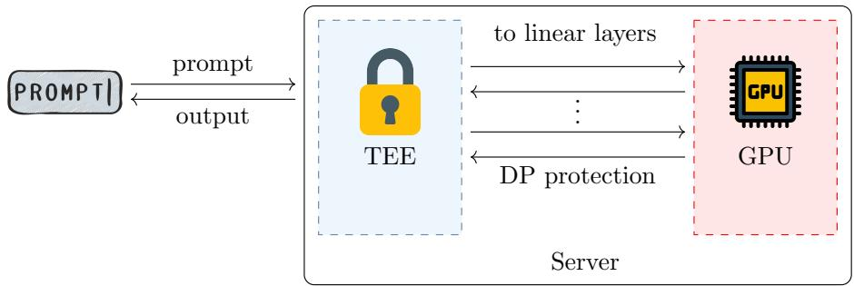
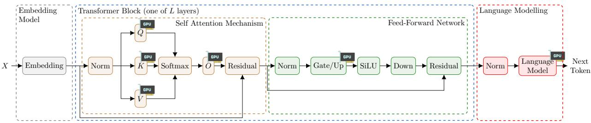
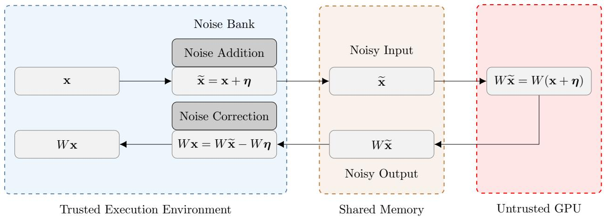
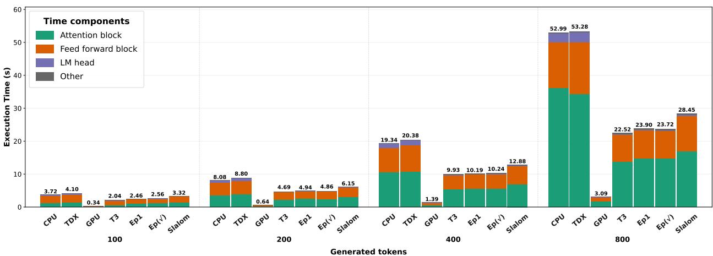
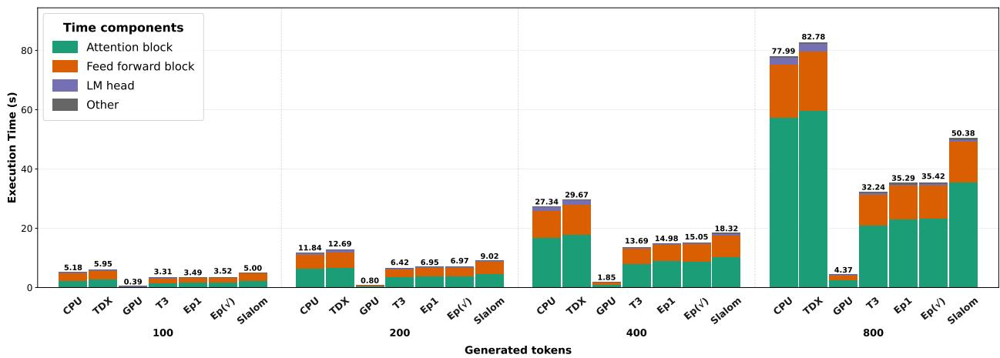
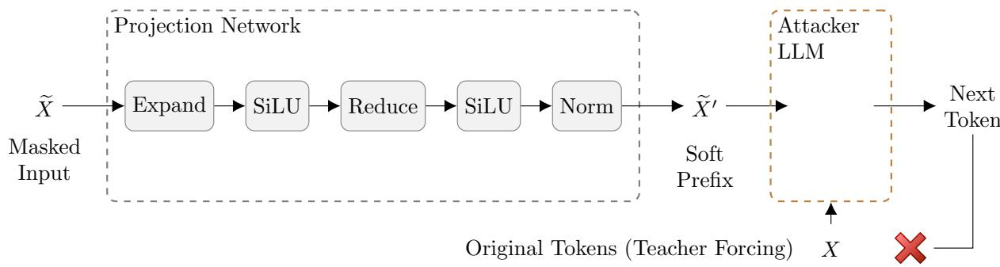

# SpliTEE: Improving LLM Inference on Trusted Hardware with Diferentially Private GPU Outsourcing

Shashie Dilhara Batan Arachchige, Robin Carpentier, Hassan Jameel Asghar, Dali Kaafar School of Computing, Macquarie University

{shashiedilhara.batanarachchige, robin.carpentier, hassan.asghar, dali.kaafar}@mq.edu.au

September 15, 2026

## Abstract

User prompts provided to large language models (LLMs) may contain sensitive or private information that can potentially be misused by these remotely deployed models, such as through inadvertent memorization during retraining. One way to protect user prompts is to execute the LLM inside a trusted execution environment (TEE), with the guarantee that the service provider has no access to computations performed within or the information exchanged with the TEE. However, this results in slow inference times as current TEEs are primarily CPU-based and significantly slower than GPUs, which are optimized for LLM inference. To circumvent this, Tram\`er and Boneh (2019) proposed a system called Slalom which splits neural network inference between a TEE and the untrusted GPU. They encrypt intermediate inputs to components outsourced to the GPU to prevent them from leaking information about the prompt. In this paper, we extend this split-inference architecture to LLM inference and instead protect intermediate inputs using diferential privacy. We first demonstrate that masking intermediate representations is necessary by showing that a prompt-reconstruction attack can recover prompts from these representations with nearly 80% accuracy. Our main contribution is a global sensitivity analysis of key functions in LLM inference, which bounds the required scale of diferentially private noise. Unlike encryption, diferential privacy avoids quantization, allowing the LLM to remain in the floating-point domain. We also derive an upper bound on the floating-point error from masking and subsequent noise cancellation in the TEE as a function of the privacy parameter ϵ, which can be used to ensure that the quality of the LLM response is not afected. We implement our architecture using the Intel TDX TEE and evaluate it with two LLMs: Llama-3.2-3B and Qwen3-4B. Our split execution is nearly twice as fast as fully CPU-based inference inside TDX. Moreover, it is 5–15 seconds faster than encryption-based Slalom while also achieving higher accuracy. Finally, we demonstrate that prompt reconstruction, even with knowledge of the diferential privacy mechanism, cannot recover more information than is contained in an unrelated prompt.

## 1 Introduction

The use of artificial intelligence has proliferated in the last couple of years due to the ever-expanding and improving capabilities of large language models (LLMs). At the same time there are growing privacy concerns due to the remote deployment of these LLMs. Users submit their requests to these LLMs using prompts that may contain sensitive information about individuals and businesses. Naturally, one would not want this information to be misused. For instance, it is routine practice to use user prompts and subsequent responses to train future versions of the LLM. As a result, the sensitive information contained in these prompts can be memorized by LLMs [20]. One option available to the user is to opt-out of his/her data being used to retrain the model.1 However, there are a number of issues with this solution. This generally does not apply to data already submitted before toggling the feature, by default the opt-out feature may be unchecked, and even if the user opts out, some data or metadata may still be used for training [23]. Another option on the other extreme is to deploy LLMs locally on the user’s device, but this is infeasible due to their ever increasing sizes. Besides, this deployment model is not suitable for LLM service providers who want to protect their intellectual property, the learned weights of the model.

Technical solutions to this problem include making the prompt more private by using diferential pri vacy [12] or carrying out LLM inference in the encrypted domain using homomorphic encryption or secure multiparty computation. A diferentially private solution probabilistically replaces either individual words or sentences in the prompt with semantically similar counterparts (see, for example [21]). This is not ideal for utility as it perturbs words in the prompt, and depending on the task, the user may want to keep the text in the prompt unchanged, e.g., specific sales numbers. Cryptographic solutions through homomorphic encryption and secure multiparty computations are computationally or communication-wise expensive, require changes to the LLM to make it more suitable for cryptographic operations, and some part of the LLM computation is assumed to be done publicly, e.g., by the client. See these excellent surveys for the state-of-the-art in this domain [1, 2]. If these challenges are overcome, these solutions are promising as they do not alter the prompt.

Another solution, which is also related to the theme of this paper, is to execute the LLM inside a trusted execution environment (TEE). The service provider hosts the LLM within the TEE, with the guarantee that computations performed inside the TEE can neither be observed nor be tampered with by the service provider. These are standard assumptions for computations performed within a TEE.2 Unfortunately, end to-end inference within the TEE is slow, as current TEEs are primarily CPU-based which are significantly slower than GPUs for LLM inference. We also demonstrate this performance gap in this paper. While the first commercial GPU-TEE was announced recently, namely NVIDIA Confidential Computing [9], it is only available on one commercial GPU and specifications are scarce, which renders the security analysis of the system dificult [16]. Nevertheless even GPU-based TEEs are likely to be slower than state-of-the-art GPUs outside the trusted zone.

To solve this issue, researchers have proposed a split-inference architecture, where the expensive operations during LLM inference, namely matrix multiplications, are ofloaded or outsourced to the faster but untrusted GPU, and the rest of the components are kept inside the trusted TEE [34].3 To prevent information leakage, the inputs to the ofloaded components are masked by additively blinding them with random nonces. The GPU performs the multiplication as if it received the real input. Due to the linearity of matrix multiplications, the original matrix product can be retrieved from the result returned by the GPU by subtracting the randomized component. Moreover, this can be partly preprocessed, and hence expensive operations are not done at the slower TEE. An issue with the approach used in [34] is that the matrix product needs to be quantized to work in finite fields, which results in accuracy loss.

In this paper we look at the LLM split-inference architecture from another angle: instead of encrypting the outsourced inputs via a stream cipher as is done in Slalom, the name of the system proposed in [34], we add diferentially private noise calibrated to the sensitivity of the operation. The advantage is that we remain in the original floating-point arithmetic domain in which the LLM is implemented. Since our goal is prompt privacy, diferential privacy is a reasonable notion to apply in the split-inference setting. However, as we show, we cannot add unbounded diferentially private noise without running into floating-point error accumulation issues. The good news is that we can tune the privacy parameter ϵ so that error never passes the threshold to impact accuracy. Our method is faster than Slalom, and also incurs no accuracy penalty depending on the privacy level ϵ. Figure 1 shows the high-level overview of our scheme.

To summarize, we make the following contributions:

1. We present a split-architecture, where LLM inference is split between a trusted but slower TEE, and a faster but honest-but-curious GPU. The linear operations are outsourced to the GPU as is done in [34], but we mask the inputs to the GPU using diferentially private noise so that the GPU cannot infer the user prompt. The GPU being honest-but-curious is a realistic assumption in many use cases as the service provider is rightly concerned about maintaining its reputation.

2. Using the open source 3 2 3 LLM as the base, we identify common components in LLMs that can be algebraically outsourced. As the inputs to these components are outputs of the preceding components, we derive the global sensitivity bounds of these functions, which measure the required scale of diferentially private noise [13]. Our global sensitivity analysis is a contribution in itself and can be used in any system that outsources part of LLM inference to another entity without disclosing intermediate function inputs and outputs.

  
Figure 1: Overview of the LLM deployment architecture. The TEE is trusted whereas the GPU is semitrusted, i.e., it follows the protocol but may want to infer more information about the user prompt.

3. We show that removing diferentially private noise from the result computed by the GPU on the outsourced computation results in accumulation of floating-point errors that can negatively impact accuracy of the LLM response. We derive an upper bound on this error for linear operations, and show that it closely matches real execution error. Building on this, we show that the value of the privacy parameter ϵ can be tweaked so that the error bound remains below a threshold to ensure accuracy is not impacted.

4. We implement our scheme on a machine equipped with Intel Trust Domain Extensions (TDX) and a GPU. Using both the Llama-3.2-3B-Instruct and Qwen3-4B-Instruct LLMs, we show that end-toend CPU-based inference on the protected TDX virtual machine is almost two times slower than our scheme. We further show that our scheme is between 5 to 15 seconds faster than Slalom [34] adapted to LLMs.

5. We perform a prompt reconstruction attack by training an LLM model with the outsourced inputs. The attack shows that adding diferentially private noise is essential, as the prompt reconstruction attack can reconstruct the prompt with almost 80% accuracy if the inputs are unmasked. We further show that the same attack, even when trained on auxiliary noisy inputs, is not able to infer the user prompt significantly better than guessing random tokens expected to be common between unrelated prompts. Our implementation is publicly available.4

## 2 Related Work

Slalom [34] is one of the earliest approaches to combine a TEE with an untrusted GPU for private and verifiable neural-network inference. Instead of executing the complete model inside the TEE, it outsources expensive linear operations while masking the operator input with a single-use random mask. The corresponding correction is precomputed inside the TEE so that the original linear result can be recovered after GPU execution. Slalom also uses Freivalds’ algorithm [14] to verify the correctness of the outsourced computation. Our approach follows a similar high-level idea of protecting outsourced linear computation, but difers in both the masking mechanism and execution setting. Slalom uses pseudorandom masks over finite-field representations, whereas our approach adds Gaussian noise to floating-point activation tensors based on the sensitivity of each outsourced operator. Slalom was designed for conventional Deep Neural Network (DNN) workloads and evaluated using Intel SGX, while our work considers Transformer-based LLM inference inside an Intel TDX virtual machine. We further show that our system is better at maintaining the accuracy of LLM responses, as we do not quantize the model as needs to be done through Slalom-based LLM inference.

While Slalom focuses on private and verifiable outsourcing of linear computation, other TEE-based systems consider diferent protection goals. SOTER [31] also partitions neural-network inference between a TEE and an untrusted accelerator to reduce the cost of executing the complete model inside trusted hardware. Its main objective, however, is to protect the intellectual property of the model when inference is performed on a user device. SOTER identifies associative operators and transforms their parameters by multiplying them with a random scalar mask before outsourcing the operator to the untrusted GPU; the intended result is then recovered inside the TEE using the corresponding inverse scaling. This difers from our setting mainly in the privacy objective. It protects model parameters from an untrusted device owner, whereas our work focuses on protecting prompt information and intermediate activations exposed to an untrusted GPU during LLM inference. For instance, while we could adapt their technique to multiply intermediate inputs with a vector of random scalars, this will exacerbate the floating-point issues discussed in our paper. Our approach also targets Transformer-based LLM execution, while SOTER considers more general neural-network models.

Transformer-specific outsourcing introduces a broader set of operations that must be protected. Twin-Shield [39] addresses confidential execution of transformer models in an untrusted cloud environment. It aims to protect model parameters, input data, and computation integrity while reducing the amount of computation performed inside the TEE. Unlike earlier approaches that primarily outsource linear operations, TwinShield extends outsourcing to transformer-specific operations, attention matrix multiplication and the non-linear softmax function. It also provides a verification mechanism for the outsourced computation. While their mechanism to mask inputs to the linear layers is the same as Slalom, through additive random masks, the non-linear components are protected through a combination of scalar masking and permutation. The former can be proven to be secure assuming the security of the underlying cipher, but the latter is ad hoc and susceptible to algebraic attacks. Moreover, their scheme sufers from the same accuracy issues due to model quantization.

Beyond the design of individual partitioning mechanisms, recent work has also examined whether exposing part of a model outside the TEE can itself create a security risk. Zhang et al. [41] study the security of TEE-shielded DNN partitioning for on-device inference. They show that existing partitioning approaches can remain vulnerable to model stealing and membership inference when information from the untrusted portion of the model is combined with public model knowledge. To address this, they propose TEESlice, which follows a partition-before-training strategy so that the weights placed outside the TEE are not trained on private data. The architecture combines a public pre-trained backbone with privacy-sensitive model slices retained inside the TEE, while the input to outsourced computation is protected using a one-time masking mechanism similar in spirit to Slalom. Clearly, this solution protects leakage of model parameters and training data to an untrusted device owner, and not user prompts.

Intermediate representations have also been shown to leak information about model inputs through inversion and reconstruction attacks. Song and Raghunathan [32] showed that embeddings can retain enough information to recover words from the original input. Later works extended this to full-sentence reconstruction using optimization-based attacks [27] and learning-based approaches that train a generative decoder to recover the input [24]. The latter particularly motivates our reconstruction attacker. Dong et al. [11] further study inversion of hidden states exposed during split LLM inference and show that adding Laplace noise directly to these states can reduce reconstruction only at a substantial utility cost. This difers from our setting because their noisy representation is also used for inference. In our design, noise is added only to the outsourced operator input and the corresponding correction is removed inside the TEE before inference continues. Thus, the attacker observes the masked representation, while the model proceeds using the recovered linear result, subject only to numerical error from masking and correction.

## 3 Background

## 3.1 Trusted Execution Environment (TEE)

Briefly a trusted execution environment (TEE) is a secure area of a processor which provides privacy and integrity of its data and computation by isolating it from any outside entities including the operating system and other applications running on the machine. Furthermore, the user can verify the code executed at the TEE is correct and not tampered with, through remote attestation. The TEE achieves this by sending the cryptographic hash of its application code, cryptographically signed by the hardware-protected private attestation key of the vendor (e.g., Intel TDX). The client can verify the signature and the hash via the corresponding public verification key through the vendor’s certificate [26].

## 3.2 Components of an LLM

In order to identify which components of an LLM can be eficiently outsourced to the GPU while masking their inputs, we detail the general architecture of an LLM. Of course, LLMs are not homogeneous, and vary in their architecture.5 Our goal is to identify components common in most if not all LLMs. We use the open source Llama-3.2-3B-Instruct model,6 henceforth only referred to as Llama-3B, as the reference model. Minor diferences with other models are discussed in Section 3.2.6.

## 3.2.1 Overview and Notations

Most LLMs are based on the transformer architecture [37], which divides the computation into the following components:

1. An Embedding Model

2. A Transformer Block (repeated a fixed number of times), itself containing

(a) A Multi-Head Self-Attention mechanism

(b) A Feed-Forward Network

3. A Language Modeling Head

The computation begins by processing all tokens in the prompt at once, i.e., as one matrix (explanation to follow). Once a token has been generated after Step 3, it becomes part of the input to generate the next token. After this, Steps 2 and 3 are repeated until the number of desired output tokens have been produced. Below, we give more details of each of the components mentioned above. A pictorial representation of these components is shown in Figure 2.

  
Figure 2: A breakdown of LLM components based on Llama-3B. The components ofloaded to the GPU are marked with the icon .

## 3.2.2 Embedding Model

The embedding model associates each token of the prompt with an embedding vector of dimension d. Thus the input prompt can be thought of as the token matrix X, which is composed of n tokens $\left( \mathbf { x } _ { 1 } , \ldots , \mathbf { x } _ { n } \right)$ where each token is a vector in $\mathbb { R } ^ { d }$ of embedding dimension d. The dimension d is also called the hidden size. The dimension is $d = 3 0 7 2$ in Llama-3B.

## 3.2.3 Transformer Block – Self Attention Mechanism

As illustrated in Figure 2, the first part of the transformer block is the multi-head self-attention mechanism. Roughly, this mechanism calculates how much each token should “attend” to every previous token to better understand its context. The self-attention mechanism has the following sub-components.

Input Layer Normalization. In Llama-3B, the attention mechanism starts with the normalization layer (called, the pre-norm transformer). Each token embedding x is normalized independently using root-mean square normalization (RMSNorm) (see Definition 5). This normalization is done at the start of each layer (see Figure 2). Each layer has its own learnable parameters $\alpha , \beta \in \mathbb { R } ^ { d }$ (see Eq. (5)). After this step, the initial token matrix X is transformed to the normalized token matrix $\widehat { X }$

Linear Projections $( Q , K , V )$ . Three independent linear projections of the input are computed using (learned) weight matrices $W _ { \mathrm { q r y } } , \ W _ { \mathrm { k e y } }$ and $W _ { \mathrm { v a l } }$ resulting in the quantities $Q = W _ { \mathrm { q r y } } \widehat { X } , K = W _ { \mathrm { k e y } } \widehat { X }$ and $\boldsymbol { V } = \boldsymbol { W } _ { \mathrm { v a l } } \boldsymbol { \widehat { X } }$ . The notation $Q , K$ , and V stand for query, key, and value, respectively. In $\mathtt { L 1 a m a } { - } 3 \mathtt { B }$ , the matrices $W _ { \mathrm { q r y } } , W _ { \mathrm { k e y } }$ and $W _ { \mathrm { v a l } }$ have dimensions $d _ { \mathrm { q r y } } \times d , d _ { \mathrm { k e y } } \times d$ and $d _ { \mathrm { v a l } } \times d$ respectively, where for example $d _ { \mathrm { q r y } } = d _ { \mathrm { k e y } } = d _ { \mathrm { v a l } } = 5 0 0$ . We shall assume that they are equal, and represent the variable dimension by $d _ { \mathrm { k e y } }$ . Thus, matrices Q, K and V have dimensions $d _ { \mathrm { k e y } } \times n$ each.7

Rotary Positional Embeddings (RoPE). The attention mechanism does not know the order of the tokens in the prompt. This positional information is injected through rotary positional embeddings into Q and K. With this information, the model can tell whether a token is positioned earlier or later in the sequence.

Scaled Dot-Product Attention. This component combines the matrices $Q , K$ and V as

$$
H = \mathrm { s o f t m a x } \left( \frac { Q ^ { T } K } { \sqrt { d _ { \mathrm { k e y } } } } \right) V ^ { T }
$$

Note that $Q ^ { T } K$ is a matrix of dimensions $n \times n ,$ , since $Q ^ { T }$ has dimension $n \times d _ { \mathrm { q r y } }$ and K has dimension $d _ { \mathrm { k e y } } \times n _ { \mathrm { ; } }$ , and we assume $d _ { \mathrm { q r y } } = d _ { \mathrm { k e y } }$ . The output of the softmax function is thus also an $n \times n$ matrix. This is then multiplied by the $n \times d _ { \mathrm { k e y } }$ matrix $V ^ { T }$ , to produce an $n \times d _ { \mathrm { k e y } }$ matrix H.

Linear Projection (O). Prior to this component, the outputs from each of the h attention heads are combined together, resulting in the final matrix H being of size $n \times h d _ { \mathrm { v a l } } = n \times d ,$ as h is set as $d / d _ { \mathrm { k e y } } . ^ { \mathrm { 8 } }$ The next component is another linear projection using the (learned) weight matrix $W _ { \mathrm { o h } } \in \mathbb { R } ^ { d \times d }$ as

$$
O = W _ { \mathrm { o h } } H ^ { T }
$$

which results in ${ \mathrm { ~ a ~ } } d \times n$ matrix O.

Residual Addition. At this point the original (unnormalized) input X is added to O to obtain

$$
Y = O + X
$$

which is again a $d \times n$ matrix, which is the final output of the attention mechanism.

## 3.2.4 Transformer Block – Feed Forward Neural Network (MLP)

This component has the following subcomponents.

Post Attention Layer Normalization. This is the same operation as input layer normalization from the attention mechanism except that the learned parameters are diferent (see Eq. (5)). The matrix Y is thus transformed into the matrix $\widehat { Y }$ with RMS-normalized entries.

Linear Projections (Gate, $U p )$ . Two independent projections of the input are computed, using the (learned) weight matrices $W _ { \mathrm { g a t e } } , W _ { \mathrm { u p } } \in \mathbb { R } ^ { d _ { \mathrm { f f } } \times d }$ , where $d _ { \mathrm { f } }$ is the model’s feed-forward dimension, e.g., 8,192. This gives rise to the $d _ { \mathrm { f } } \times n$ matrices

$$
G = W _ { \mathrm { g a t e } } { \widehat { Y } } { \mathrm { ~ a n d ~ } } U = W _ { \mathrm { u p } } { \widehat { Y } }
$$

Activation Function. In Llama-3B, the activation function used is the Sigmoid Linear Unit (SiLU).9 We denote this function by sig, which can be applied element-wise on a matrix (see Eq. (9) for the definition). After application of the activation function, we obtain the resulting matrix B as

$$
B = U \odot G \odot { \mathsf { s i g } } ( G )
$$

where $\odot$ denotes element-wise matrix product. Note that since each matrix is of dimension $d _ { \mathrm { f f } } \times n ,$ the matrix B is also of the same dimension.

Linear Projection (Down). The final part of this component is a linear projection using the (learned) weight matrix $W _ { \mathrm { d o w n } } \in \mathbb { R } ^ { d \times d _ { \mathrm { f f } } }$ giving us

$$
D = W _ { \mathrm { d o w n } } B
$$

which is a $d \times n$ matrix.

Residual Addition This is where the residual output from the self-attention mechanism, i.e., Y, is added to D, and thus D is updated as $D \gets D + Y$

## 3.2.5 Language Modelling Head

The transformer block described in Sections 3.2.3 and 3.2.4 is run L times. Here L represents the number of attention blocks, also called layers, e.g., 16. The output after each layer is called a hidden state. The output after the Lth layer is called the last hidden state. This last hidden state is given to the language modelling head to generate a token. The main tasks involved in this component are as follows.

Final Layer Normalization. This is again the same operation as in input layer normalization except that the learned parameters are diferent.

Language Modelling. For next token prediction, we only consider the last vector of the last hidden state, i.e., corresponding to the last token. This component uses the model’s token vocabulary, denoted vocab. The vocabulary’s size difers according to the model. In Llama-3B, it is 128, 256.10 Each token in the vocabulary has an associated token embedding in $\mathbb { R } ^ { d }$ . This layer then performs a dot product of the last hidden vector with the token embedding of each token in the vocabulary. This is essentially a multiplication with the matrix of token embeddings of all tokens in the vocabulary, which we call $W _ { \mathrm { l m } } .$ , whose weights are again obtained through training. We get a vector of values, one for each token in the vocabulary. The model then applies the softmax function to get a vector of probabilities. Finally, the next token is chosen based on these probability vectors and a configuration, $\mathrm { e . g . }$ , always choosing the highest probable token is called greedy decoding.

## 3.2.6 Diferences From Other LLMs

The architecture described above is based primarily on Llama-3B, which is also the main model used in our evaluation. However, the proposed outsourcing approach is not intended to depend on a single model architecture. To examine how it can be applied more broadly, we consider other widely used Transformerbased model families and identify architectural diferences that are relevant to the outsourced computation.

In particular, we consider Qwen, which is also included in our experimental evaluation, and discuss Gemma and Mistral to examine how the approach extends to other modern LLM families. Since our approach outsources the computationally expensive linear projections while keeping the other model operations within the TEE, the main question is whether these models retain similar linear operations and how the surrounding computations difer.

We first consider the Qwen family. Qwen models follow a similar decoder-only Transformer architecture to Llama, but some design choices difer between model generations. For example, Qwen2.5-3B uses bias terms in the Q, K, and V projections, whereas Qwen3-4B uses bias-free projections. Here, a bias is an additional learned value that helps the projection adjust its output beyond what is produced by the matrix multiplication alone. For a biased linear layer with output $W \mathbf { x } + \mathbf { b } .$ where b is the bias vector, outsourcing the masked input produces $W ( \mathbf { x } + \pmb { \eta } ) + \mathbf { b }$ . Subtracting the masking correction Wη inside the TEE recovers Wx + b, so no additional correction is required for the bias term. Qwen3 also applies RMSNorm separately to the Q and K representations after their respective projections. This additional normalization remains inside the TEE and does not change the outsourced linear projections themselves.

We next look at the Gemma family11 For this comparison, we use Gemma 3 [33]. It retains the same main linear projections in the attention and feed-forward blocks, but introduces several diferences in the surrounding operations. Gemma 3 applies additional RMSNorm operations, also normalizes the Q and K representations after projection. It combines local sliding-window attention with global attention [33]. Sliding-window attention limits each token to attending within a nearby region, while global attention allows information to be shared across the full sequence. Its feed-forward network also uses a GELU-based gated activation instead of SiLU. These diferences afect how the projection outputs are processed, but the main attention and feed-forward projections remain linear.

Finally, we consider Mistral12 [22]. For this comparison, we inspect Mistral-7B-Instruct-v0.3. This model uses bias-free linear projections, follows the same general RMSNorm placement as Llama-3B, and uses a SiLU-based gated feed-forward block. It also does not apply additional normalization to the query or key representations. Unlike the original Mistral 7B release [22], this does not use sliding-window attention.

Overall, our evaluation focuses primarily on Llama-3B, with Qwen also included in the experimental evaluation. Gemma and Mistral are discussed here only to examine how the approach extends to other model families. Diferences in hidden size and projection dimensions do not afect the basic masking approach, since the same mechanism is applied using the dimensions of each model’s linear projections. Model specific architectural diferences mainly change the operations surrounding the outsourced projections rather than the masking principle itself. Therefore, the proposed mechanism can be applied in the same way to other models that contain linear projections suitable for outsourcing.

## 3.3 Diferential Privacy

Diferential privacy is a formal notion of privacy for databases introduced by Dwork et al. [12]. Since its inception many variants have been proposed, alongside an increasingly diverse range of applications. For this paper, we use a variant of diferential privacy called f-diferential privacy [10], as the noise addition mechanism in our scheme, called the Gaussian mechanism, has a simpler characterization under this definition than the usual definition of approximate diferential privacy [12]. Furthermore, our definition is tailored to our use case, which considers privacy with respect to prompts with n tokens.

Let us begin with some notation. We denote vectors from $\mathbb { R } ^ { d }$ , where d is a positive integer, as lowercase boldface letters, e.g., x and y. The ith element of x is denoted by $x _ { i }$ . With this we may write x as

$$
\mathbf { x } = ( x _ { i } ) _ { i \in [ d ] }
$$

to emphasize its elements, where $[ d ] = \{ 1 , 2 , \dots , d \}$ . For any $\mathbf { x } = ( x _ { i } ) _ { i \in [ d ] }$ , we use the notation $| \mathbf { x } |$ to denote the vector $( | x _ { i } | ) _ { i \in [ d ] }$ . For any real number $p \geq 1$ , the $\ell _ { p }$ norm of $\mathbf { x } \in \mathbb { R } ^ { d }$ is defined as

$$
\| \mathbf { x } \| _ { p } = \left( \sum _ { i = 1 } ^ { d } | x _ { i } | ^ { p } \right) ^ { 1 / p }
$$

We define a dataset X as an n-tuple each element of which is a vector from $\mathbb { R } ^ { d } .$ . Two datasets $X _ { 1 }$ and $X _ { 2 }$ are called neighbouring datasets if they difer in one token. The f-diferential privacy framework is based on the hypothesis testing interpretation of diferential privacy. Given the output of a mechanism ${ \mathcal { M } } .$ , the goal is to distinguish between two competing hypotheses: the underlying data set being $X _ { 1 }$ or $X _ { 2 }$ . Let $Q _ { 1 }$ and $Q _ { 2 }$ denote the probability distributions of $\mathcal { M } ( D _ { 1 } )$ and $\mathcal { M } ( D _ { 2 } )$ , respectively. Given any rejection rule $0 \leq \phi \leq 1$ , the type-I and type-II errors are defined as follows [10]: $\alpha _ { \phi } = \mathbb { E } _ { Q _ { 1 } } [ \phi ]$ and $\beta _ { \phi } = 1 - \mathbb { E } _ { Q _ { 2 } } [ \phi ]$

Definition 1 (Trade-of function [10]). For any two probability distributions $Q _ { 1 }$ and $Q _ { 2 }$ on the same space, the trade-of function $T ( Q _ { 1 } , Q _ { 2 } ) : [ 0 , 1 ]  [ 0 , 1 ]$ is defined by

$$
T ( Q _ { 1 } , Q _ { 2 } ) ( \alpha ) = \operatorname* { i n f } \left\{ \beta _ { \phi } : \alpha _ { \phi } \leq \alpha \right\}
$$

for all $\alpha \in [ 0 , 1 ]$ , where the infimum is taken over all (measurable) rejection rules.

A trade-of function gives the minimum achievable type-II error at any given level of type-I error. For a function to be a trade-of function, it must satisfy the following conditions.

Proposition 1 ([10]). A function $f : [ 0 , 1 ] \ \to \ [ 0 , 1 ]$ is a trade-of function $i f$ and only if f is convex, continuous and non-increasing, and $f ( x ) \leq 1 - x$ for all $x \in [ 0 , 1 ]$

Abusing notation, let ${ \mathcal { M } } ( X )$ denote the distribution of a mechanism $\mathcal { M }$ when given a dataset X as input.

Definition 2 (f-Diferential Privacy (f-DP) [10]). Let f be a trade-of function. A mechanism M is said to be f-label diferentially private if $T ( \mathcal { M } ( X _ { 1 } ) , \mathcal { M } ( X _ { 2 } ) ) \geq f$ for all neighbouring data sets $X _ { 1 }$ and $X _ { 2 }$

For $\epsilon \geq 0$ , let $G _ { \epsilon }$ denote the trade-of function between two normal distributions $\mathcal { N } ( 0 , 1 )$ and $\mathcal { N } ( 0 , \epsilon )$ i.e.,

$$
G _ { \epsilon } = T ( \mathcal { N } ( 0 , 1 ) , \mathcal { N } ( 0 , \epsilon ) )
$$

Then

Definition 3 (ϵ-Gaussian Diferential Privacy (ϵ-GDP) [10]). A mechanism M is said to satisfy ϵ-Gaussian Diferential Privacy (ϵ-GDP) if it is $G _ { \epsilon } { \mathrm { - D P } }$ . That is,

$$
T ( \mathcal { M } ( X _ { 1 } ) , \mathcal { M } ( X _ { 2 } ) ) \geq G _ { \epsilon }
$$

for all neighbouring data sets $X _ { 1 }$ and $X _ { 2 }$

Definition 4 (Global $\ell _ { 2 } { \mathrm { - S e n s i t i v i t y } } )$ . Let $f : \mathbb { R } ^ { d }  \mathbb { R } ^ { d }$ be a function.13 Then its global ℓ2-sensitivity, denoted $\Delta f .$ , is defined as

$$
\Delta f = \operatorname* { m a x } _ { \mathbf { x } , \mathbf { y } \in \mathbb { R } ^ { d } } \| f ( \mathbf { x } ) - f ( \mathbf { y } ) \| _ { 2 }
$$

Our definition of global sensitivity may seem diferent from the usual definition of global sensitivity in literature which is defined over neighboring datasets (e.g., [13]). In our case, the dataset is a set of prompts of n tokens. We say that two prompts are neighboring prompts if they difer in one token. This implies that the d-dimensional embedding of the original token is replaced with that of another token. Therefore, we simply define global sensitivity as the maximum diference over all possible d-dimensional token embeddings. Thus, we can talk about applying the ϵ-GDP mechanism token-by-token, instead of defining it over the entire prompt of n tokens, as is defined next.

Proposition 2 (ϵ-GDP Mechanism $\left[ 1 0 \right] )$ . The mechanism $f ( X ) + { \mathcal { N } } ( 0 , ( \Delta f / \epsilon ) ^ { 2 } I _ { d } )$ is $\epsilon { - } G D P$ where $\Delta f$ is the global sensitivity of the function $\bar { f } : \bar { \mathbb { R } } ^ { d }  \mathbb { R } ^ { d }$ and $I _ { d }$ is the d × d identity matrix.

The notion of ϵ-GDP satisfies sequential composition.

Proposition 3 (Sequential Composition [10]). The composition of n-fold sequential $\epsilon _ { i } { - } G D P$ mechanisms is

$$
\sqrt { \epsilon _ { 1 } ^ { 2 } + \cdot \cdot \cdot + \epsilon _ { n } ^ { 2 } } { - G D P }
$$

In particular, applying the ϵ-GDP mechanism of Proposition 2 on n tokens in the prompt makes the overall mechanism $\sqrt { n } \epsilon \mathrm { - G D P }$ . Lastly, ϵ-GDP is also immune to post processing [10]. That is, applying a randomized map with an arbitrary range to the output of an ϵ-GDP mechanism is still ϵ-GDP.

## 4 Threat Model and Proposed System Architecture

In our computational model, a trained LLM is hosted on a remote server by a service provider which the user can query through a Web interface via prompts (see Figure 1). The user only receives the final output of the model, which is a sequence of tokens generated by the LLM. We assume that the server owned by the service provider has two execution environments: a trusted execution environment (TEE) and an untrusted execution environment powered by one or more GPUs, which we simply call GPU.

## 4.1 Privacy Goals and Threat model

We seek to provide two competing privacy goals

1. The user should not learn the parameters of the LLMs, which are considered the intellectual property (IP) of the server.

2. The service provider should not learn the contents of the user prompt.

The first goal is readily achieved in our computational model, as it is in prevalent deployments of LLMs, where the LLM is hosted remotely. Of course, the user may still be able to cleverly craft prompts to gather enough prompt-response pairs to deduce the model’s parameters through a model stealing attack [35]. However, this threat is beyond the scope of our work. We will therefore not mention this goal from here onwards, and instead focus on the second goal.

For the second goal we assume that the TEE is trusted in the sense that any information exchanged between the user and the TEE, and any computation done on the TEE cannot be eavesdropped, even by the service provider. This is a standard assumption for TEEs, as they are generally considered safe environments to perform tasks on sensitive data such as face recognition on smartphones.14 On the other hand, the GPU is considered honest-but-curious. Any information transmitted to the GPU, and any computation at the GPU will be carried out as specified, however this is visible to the service provider.

## 4.2 Adversarial Capabilities

Since the service provider hosts the LLM as a service, it knows all its parameters and architecture. Thus, we assume an adversary, an honest-but-curious service provider, who takes this information about its LLM and any information given to the GPU during LLM inference as input and attempts to reconstruct the user prompt. This is known as an embedding inversion attack (see, for example [27]). Note that in order to launch this attack, the adversary can build a dataset of known prompts and any information given to the GPU to train a model to successfully invert embeddings.

## 4.3 Proposed System Architecture

Since we assume that the TEE is trusted, a straightforward way to achieve our main privacy goal is to do the entire LLM inference on the TEE without involving the GPU. However, there is a big performance mismatch between inference at the TEE versus the GPU. Most TEEs, such as the Intel TDX, do not provide GPU-based computation. As a result, the CPU-based computation at the TEE performs poorly compared to GPUs, since the computations involved in LLM inference are optimized for GPUs. We illustrate this in detail in Section 7, where we compare LLM inference times between the TEE (intel TDX) and GPU. For up to 800 generated tokens, the TEE takes between 53 to 83 seconds compared to the GPU which finishes the task within 3 to 5 seconds.

We are not the first to notice this disparity. Tram\`er and Boneh [34] used this as the motivation to split inference for a conventional deep neural network (DNN) between a TEE and an untrusted external processor. The same observation was used by Xue et al [39] to motivate split-inference for LLMs. The main idea in [34] to split DNN inference, which was later adopted by Xue et al [39] for LLM inference, is to outsource linear operations to the GPU. The input to these linear operations can be masked using a fast cryptographic cipher. Due to the linearity of the operation, the result can be separated into the expected output from the original (unmasked) input and a randomized component, which can be undone upon receiving the result from the GPU. Moreover, part of the process can be carried out ofline, and hence preprocessed.

## 4.3.1 Ofloading Linear Operations

To make this more precise, let us first define a linear map. Let V and $V ^ { \prime }$ be vector spaces over a field K. A function $f : V \to V ^ { \prime }$ is a linear map if for all $\mathbf { x } , \mathbf { y } \in V$ and scalars $a , b \in K$ , f satisfies

$$
f ( a \mathbf { x } + b \mathbf { y } ) = a f ( \mathbf { x } ) + b f ( \mathbf { y } )
$$

As an example related to our use case, let $\textbf { x } \in \mathbb { R } ^ { d }$ be the input to any of the components of the LLM (Figure 2), $\mathrm { e . g . }$ , the input embedding, where d is the embedding dimension. Let $\pmb { \eta } \in \mathbb { R } ^ { d }$ be an arbitrary vector, which we call the noise vector or the mask. Define the vector $\widetilde { \mathbf { x } } = \mathbf { x } + \pmb { \eta }$ as the masked input. Let W be a $d ^ { \prime } \times d$ matrix of reals, where $d ^ { \prime }$ is potentially diferent from d. Then

$$
W \widetilde { \mathbf { x } } = W ( \mathbf { x } + \pmb { \eta } ) = W \mathbf { x } + W \pmb { \eta } = \mathbf { r }
$$

holds because this is a linear map from the vector space of dimension d to the vector space of dimension $d ^ { \prime }$ over the reals. Thus, any operation in the LLM inference that involves a matrix multiplication is a linear operation. Note that the entries of the matrix are known both to the TEE and the GPU courtesy of the service provider, as these are learned weights of the LLM.

Now the TEE generates the noise vector, masks the input and hands over the masked input $\widehat { \mathbf { x } }$ to the GPU. The GPU can multiply it with the matrix $W$ to obtain the quantity above, and return the result r back to the TEE. The TEE can then straightforwardly compute

$$
\mathbf { r } - W \pmb { \eta } = ( W \mathbf { x } + W \pmb { \eta } ) - W \pmb { \eta } = W \mathbf { x }\tag{1}
$$

This ofloading process speeds up overall computational time compared to computing the product Wx at the TEE due to two main reasons. First, matrix multiplication is computationally expensive, and $\mathrm { G P U s }$ are highly optimized to perform them. Secondly, since $W$ is known to the TEE as well, the noise vector η can be generated beforehand, and the quantity $W \eta$ can be precomputed, meaning that all the TEE has to do is perform one vector addition to produce $\widetilde { \mathbf { x } } ,$ and another vector subtraction to extract Wx from the result returned by the GPU. Both of these operations are significantly faster than matrix multiplication at run-time. Figure 3 illustrates this.

Since this approach only relies on the linearity of the ofloaded operation, it can be applied directly to matrix multiplications and even linear projections with a bias.15 On the other hand, non-linear operations such as softmax, SiLU, and element-wise multiplication are evaluated only on the TEE, because, in general, an additive mask cannot be removed after applying a non-linear function $f ,$ i.e.,

$$
f ( \mathbf { x } + \pmb { \eta } ) - f ( \pmb { \eta } ) \neq f ( \mathbf { x } )
$$

  
Figure 3: Proposed architecture of outsourcing expensive linear operations during LLM inference to the GPU and then removing the noise similar to [34]. In our scheme, the input to the GPU is protected via diferentially private noise.

## 4.3.2 How to Mask the Inputs?

The approach taken by [34] and [39] is to mask the inputs through a stream cipher. To summarize, they encode (quantize) the input $\mathbf { x } \in \mathbb { R } ^ { d }$ as a vector of elements of a finite field of appropriate size, and then mask it by adding it to a vector each element of which is a uniformly random element of the finite field. This ensures that no information about the input is leaked to the entity receiving the masked input. Another reason to use operations over a finite field is to then be able to verify that the computations done at the untrusted entity are done correctly through Freivald’s verification protocol for matrix products [14]. However, quantizing the input and then subsequently doing the linear operations over the finite field introduces approximation errors due to quantization and rounding. This impacts the accuracy of the model. For instance, the accuracy of the quantized CNN models drops up to 0.5% in [34], whereas the quantized LLMs in [39] show an accuracy drop of up to 1.9%. In Section 7.3 we show that the approach from [34] applied to our problem introduces substantial changes in the LLM response.

Our idea is to instead mask the input using diferential privacy. This has the advantage that masked operations can be performed in the native computational domain of LLMs, i.e., floating-point arithmetic, potentially maintaining accuracy.16 We further avoid the additional overhead of repeatedly converting the result between floating-point and finite-field representations if only the ofloaded part of the computation is quantized. Diferential privacy is a suitable solution in our case as we are not interested in verifying the computation done at the GPU which is assumed to be honest-but-curious. However, adding diferentially private noise to the input is not straightforward, as we need to know the magnitude of the noise to be added. Recall that even if the GPU is honest-but-curious, it can still launch an embedding inversion attack, and if noise is not added to an appropriate scale, the adversary may be able to reconstruct the prompt. In the next section, we analyze the inputs to the linear operations we seek to outsource, in order to determine the amount of noise needed for privacy. In other words, we determine the global sensitivity (see Definition 4) of the operations preceding the linear components.

## 5 Diferential Privacy Analysis

Figure 2 shows the components of LLM inference ofloaded to the GPU, which are all linear operations. The sub-component “Down” is also a linear operation and hence a candidate for ofloading. However, as we shall show in Section 6.5, the amount of noise needed to mask the input to this component is many orders of magnitude higher than the amount needed for inputs to other components, resulting in an overwhelming amplification of floating-point errors (see Section 5.5). Returning to the figure, the ofloaded components labeled (Q, K, V ), Gate/Up and Language Model all follow layer normalization. On the other hand, the O projection follows softmax attention, whereas the Down projection is preceded by SiLU activation. The purpose of this section is to upper bound the possible change in the input to each of these components over all possible input vectors. The idea is to check how much the values can change if any token is replaced by an arbitrary token, and hence a complete change in the embedding vector. Since these inputs are outputs of the preceding components, we find the global sensitivity of the functions computed in these preceding components. As discussed above, this reduces to finding the global sensitivity of layer normalization, the (softmax) attention mechanism and the (SiLU) activation function. We begin this section with necessary notation, prove some results that will be used in our analysis and then give a detailed global sensitivity analysis of these components. We then briefly discuss how the outsourced components can be made diferentially private with the global sensitivity thus calculated. We finish the section with an important note on floating-point errors.

## 5.1 Preliminaries

The dot product of two vectors $\mathbf { x } , \mathbf { y } \in \mathbb { R } ^ { d }$ , is defined as

$$
\langle \mathbf { x } , \mathbf { y } \rangle = \sum _ { i = 1 } ^ { d } x _ { i } y _ { i }
$$

and their entry-wise product is defined as

$$
\mathbf { x } \odot \mathbf { y } = ( x _ { i } y _ { i } ) _ { i \in [ d ] }
$$

A vector which we will frequently encounter is the entry-wise product of a vector with itself denoted

$$
\mathbf { x } ^ { \odot 2 } = \mathbf { x } \odot \mathbf { x } = \left( x _ { i } ^ { 2 } \right) _ { i \in [ d ] }\tag{2}
$$

We shall call this the entry-wise square of a vector. The Cauchy-Schwarz inequality states that

$$
| \langle \mathbf { x } , \mathbf { y } \rangle | \leq \| \mathbf { x } \| _ { 2 } \| \mathbf { y } \| _ { 2 }
$$

Let $\mathbf { x } \in \mathbb { R } ^ { d }$ and let W be a matrix of appropriate dimensions. Then

$$
\| W \mathbf { x } \| _ { 2 } \leq \| W \| _ { 2 } \| \mathbf { x } \| _ { 2 }\tag{3}
$$

where we define $\| W \| _ { 2 }$ as the spectral norm of $W$ , i.e., its largest singular value which can be obtained through its singular value decomposition. This inequality is a standard result; see, for example, [4].

## 5.2 Some Useful Results

In this section, we prove a few results and introduce a few notions that will be helpful in proving theorems in the ensuing section.

Proposition 4. Let $\mathbf { x } \in \mathbb { R } ^ { d }$ . Let

$$
\sigma _ { \mathbf { x } } = { \sqrt { { \frac { 1 } { d } } \sum _ { i = 1 } ^ { d } ( x _ { i } - c ) ^ { 2 } } }
$$

where $c \in \mathbb { R }$ . Define

$$
\widehat { \mathbf { x } } = \frac { \mathbf { x } - c \cdot \mathbf { 1 } } { \sigma _ { \mathbf { x } } }
$$

where 1 is the d-element vector each element of which is 1. Then $\| \widehat { \mathbf { x } } \| _ { 2 } = \sqrt { d }$

Proof. We have

$$
\begin{array} { l } { \displaystyle | | { \bf x } | | _ { 2 } ^ { 2 } = \sum _ { i = 1 } ^ { d } \left( \frac { x _ { i } - c } { \sigma _ { \bf x } } \right) ^ { 2 } } \\ { = \frac { 1 } { \sigma _ { \bf x } ^ { 2 } } \sum _ { i = 1 } ^ { d } \left( x _ { i } - c \right) ^ { 2 } } \\ { = \frac { d } { \sum _ { i = 1 } ^ { d } \left( x _ { i } - c \right) ^ { 2 } \sum _ { i = 1 } ^ { d } \left( x _ { i } - c \right) ^ { 2 } = d } } \end{array}
$$

Definition 5. Let $\mathbf { x } \in \mathbb { R } ^ { d }$ , and let $\gamma > 0$ be a real number. The z-score normalization of x is

$$
\widehat { \mathbf { x } } = \frac { \mathbf { x } - \mu _ { \mathbf { x } } \cdot \mathbf { 1 } } { \sqrt { \sigma _ { \mathbf { x } } ^ { 2 } + \gamma } }
$$

where

$$
\mu _ { \mathbf { x } } = { \frac { 1 } { d } } \sum _ { i = 1 } ^ { d } x _ { i } \qquad \sigma _ { \mathbf { x } } ^ { 2 } = { \frac { 1 } { d } } \sum _ { i = 1 } ^ { d } ( x _ { i } - \mu _ { \mathbf { x } } ) ^ { 2 }
$$

The root mean square (RMS) normalization of x is the z-score normalization of x with $\mu _ { \mathbf { x } } = 0$ . We say that xb is the normalized version of x if it is either z-score or RMS normalized. □

Proposition 5. Let $\mathbf { x } \in \mathbb { R } ^ { d }$ and let x be its normalized version. Then $\| { \widehat { \mathbf { x } } } \| _ { 2 } \leq { \sqrt { d } }$

Proof. Since xb is normalized we have

$$
\widehat { \mathbf { x } } = \frac { \mathbf { x } - \mu _ { \mathbf { x } } \cdot \mathbf { 1 } } { \sqrt { \sigma _ { \mathbf { x } } ^ { 2 } + \gamma } }
$$

where $\textstyle \mu _ { \mathbf { x } } = { \frac { 1 } { d } } \sum _ { i = 1 } ^ { d } x _ { i }$ if it is z-score normalized and $\mu _ { \mathbf { x } } = 0$ otherwise. We have

$$
\| \widehat { \mathbf { x } } \| _ { 2 } = \left( \sum _ { i = 1 } ^ { d } \widehat { x } _ { i } ^ { 2 } \right) ^ { \frac { 1 } { 2 } }
$$

Consider the ith summand

$$
{ \widehat { x } } _ { i } ^ { 2 } = \left( { \frac { x _ { i } - \mu _ { \mathbf { x } } } { \sqrt { \sigma _ { \mathbf { x } } ^ { 2 } + \gamma } } } \right) ^ { 2 } = { \frac { ( x _ { i } - \mu _ { \mathbf { x } } ) ^ { 2 } } { \sigma _ { \mathbf { x } } ^ { 2 } + \gamma } } \leq { \frac { ( x _ { i } - \mu _ { \mathbf { x } } ) ^ { 2 } } { \sigma _ { \mathbf { x } } ^ { 2 } } } = \left( { \frac { x _ { i } - \mu _ { \mathbf { x } } } { \sigma _ { \mathbf { x } } } } \right) ^ { 2 }
$$

Thus, from Proposition 4 either by setting $\begin{array} { r } { c = \mu _ { \mathbf { x } } = \frac { 1 } { d } \sum _ { i = 1 } ^ { d } x _ { i } } \end{array}$ or by setting $c = \mu _ { \mathbf { x } } = 0$ we have

$$
\| { \widehat { \mathbf { x } } } \| _ { 2 } \leq \left\| { \frac { \mathbf { x } - \mu _ { \mathbf { x } } \cdot \mathbf { 1 } } { \sigma _ { \mathbf { x } } } } \right\| _ { 2 } = { \sqrt { d } } .
$$

Proposition 6. Let $\mathbf { x } \in \mathbb { R } ^ { d }$ , and let $\mathbf { x } ^ { \odot 2 }$ be its entry-wise square. Then

$$
\| \mathbf { x } ^ { \odot 2 } \| _ { 2 } \leq \| \mathbf { x } \| _ { 2 } ^ { 2 }
$$

Proof. We have

$$
\mathbf { x } = \left( x _ { i } \right) _ { i \in [ d ] }
$$

And from Eq. 2, by definition

$$
\mathbf { x } ^ { \odot 2 } = \left( x _ { i } ^ { 2 } \right) _ { i \in [ d ] }
$$

Therefore

$$
\| \mathbf { x } ^ { \odot 2 } \| _ { 2 } ^ { 2 } = \sum _ { i = 1 } ^ { d } ( x _ { i } ^ { 2 } ) ^ { 2 } = \sum _ { i = 1 } ^ { d } x _ { i } ^ { 4 }
$$

Now,

$$
\begin{array} { r l } { \| { \bf x } \| ^ { 2 } } & { = \left( \displaystyle \frac { \partial } { \partial x } x ^ { 2 } \right) ^ { 2 } } \\ & { = \left( \displaystyle \frac { \partial } { \partial x } x ^ { 2 } \right) ^ { 2 } \left( \displaystyle \frac { \partial } { \partial x } x ^ { 2 } \right) ^ { 2 } } \\ & { = \left( \displaystyle \frac { \partial } { \partial x } x ^ { 3 } \right) ^ { 3 } \left( \displaystyle \frac { \partial } { \partial x } x ^ { 2 } \right) } \\ & { = \displaystyle \frac { \partial ^ { 2 } } { \partial x ^ { 3 } } \displaystyle \frac { \partial ^ { 2 } } { \partial x ^ { 3 } } x ^ { 3 } , } \\ & { = \displaystyle \frac { \partial } { \partial x } x ^ { 3 } - x ^ { 2 } x ^ { 3 } x ^ { 3 } , } \\ & { = - \displaystyle \frac { \partial } { \partial x } x ^ { 3 } x ^ { 2 } x ^ { 3 } + \displaystyle \frac { \partial ^ { 2 } } { \partial x ^ { 3 } } \displaystyle \frac { \partial ^ { 2 } } { \partial x ^ { 3 } } x ^ { 2 } , } \\ & { = - \displaystyle \frac { \partial } { \partial x } x ^ { 4 } \displaystyle \frac { \partial } { \partial x } x ^ { 2 } + \displaystyle \frac { \partial } { \partial x ^ { 3 } } x ^ { 2 } x ^ { 3 } , } \\ & { = - \displaystyle \frac { \partial } { \partial x } x ^ { 4 } + \displaystyle \frac { \partial } { \partial x ^ { 3 } } x ^ { 3 } , } \\ & { \geq - x ^ { 3 } x ^ { 4 } - \| x ^ { 2 } x ^ { 3 } \| ^ { 2 } , } \end{array}
$$

as the omitted term is the sum of non-negative numbers.

Proposition 7. Let $m \geq 2$ be an integer. Let $\mathbf { x } _ { 1 } , \mathbf { x } _ { 2 } , \ldots , \mathbf { x } _ { m } \in \mathbb { R } ^ { d }$ , where

$$
\mathbf { x } _ { i } = \left( x _ { i j } \right) _ { j \in [ d ] }
$$

for $i \in [ m ]$ . For $i \in [ m ]$ , let $\mathbf { x } _ { i } ^ { \odot 2 }$ denote the entry-wise square of $\mathbf { x } _ { i }$ . Then

$$
\| \mathbf { x } _ { 1 } \odot \mathbf { x } _ { 2 } \odot \cdots \odot \mathbf { x } _ { m } \| _ { 2 } \leq \sqrt { \| \mathbf { x } _ { 1 } ^ { \odot 2 } \| _ { 2 } } \sqrt { \| \mathbf { x } _ { 2 } ^ { \odot 2 } \| _ { 2 } } \cdot \cdot \cdot \sqrt { \| \mathbf { x } _ { m } ^ { \odot 2 } \| _ { 2 } }
$$

Proof. We prove this by induction. Consider the base case with $m = 2$ . Then note that

$$
\| \mathbf { x } _ { 1 } \odot \mathbf { x } _ { 2 } \| _ { 2 } ^ { 2 } = \sum _ { j = 1 } ^ { d } x _ { 1 j } ^ { 2 } x _ { 2 j } ^ { 2 } = \langle \mathbf { x } _ { 1 } ^ { \odot 2 } , \mathbf { x } _ { 2 } ^ { \odot 2 } \rangle
$$

Furthermore, $\langle \mathbf { x } _ { 1 } ^ { \odot 2 } , \mathbf { x } _ { 2 } ^ { \odot 2 } \rangle \geq 0$ , as it is the dot product of two vectors all elements of which are non-negative. Thus from the Cauchy-Schwarz inequality we get

$$
\langle \mathbf { x } _ { 1 } ^ { \odot 2 } , \mathbf { x } _ { 2 } ^ { \odot 2 } \rangle \leq \| \mathbf { x } _ { 1 } ^ { \odot 2 } \| _ { 2 } \cdot \| \mathbf { x } _ { 2 } ^ { \odot 2 } \| _ { 2 }
$$

This immediately gives us

$$
\| \mathbf { x } _ { 1 } \odot \mathbf { x } _ { 2 } \| _ { 2 } \leq \sqrt { \| \mathbf { x } _ { 1 } ^ { \odot 2 } \| _ { 2 } } \sqrt { \| \mathbf { x } _ { 2 } ^ { \odot 2 } \| _ { 2 } }
$$

which proves the base case. Next assume that the statement is true for $m = k$ , and consider

$$
\| \mathbf { x } _ { 1 } \odot \mathbf { x } _ { 2 } \odot \cdot \cdot \cdot \odot \mathbf { x } _ { k + 1 } \| _ { 2 }
$$

Now $\mathbf { x } _ { 1 } \odot \mathbf { x } _ { 2 } \odot \cdots \odot \mathbf { x } _ { k }$ is a vector in $\mathbb { R } ^ { d }$ . Denote this by y. Then through the base case

$$
\| \mathbf { x } _ { 1 } \odot \mathbf { x } _ { 2 } \odot \cdots \odot \mathbf { x } _ { k + 1 } \| _ { 2 } = \| \mathbf { y } \odot \mathbf { x } _ { k + 1 } \| _ { 2 } \leq \sqrt { \| \mathbf { y } ^ { \odot 2 } \| _ { 2 } } \cdot \sqrt { \| \mathbf { x } _ { k + 1 } ^ { \odot 2 } \| _ { 2 } }
$$

From Proposition 6, we have

$$
\sqrt { \| \mathbf { y } ^ { \odot 2 } \| _ { 2 } } \le \sqrt { \| \mathbf { y } \| _ { 2 } ^ { 2 } } = \| \mathbf { y } \| _ { 2 }
$$

Thus,

$$
\begin{array} { r l } & { \| \mathbf { x } _ { 1 } \odot \mathbf { x } _ { 2 } \odot \cdots \odot \mathbf { x } _ { k + 1 } \| _ { 2 } \leq \| \mathbf { y } \| _ { 2 } \cdot \sqrt { \| \mathbf { x } _ { k + 1 } ^ { \odot 2 } \| _ { 2 } } } \\ & { \qquad = \| \mathbf { x } _ { 1 } \odot \mathbf { x } _ { 2 } \odot \cdots \odot \mathbf { x } _ { k } \| _ { 2 } \cdot \sqrt { \| \mathbf { x } _ { k + 1 } ^ { \odot 2 } \| _ { 2 } } } \\ & { \qquad \leq \sqrt { \| \mathbf { x } _ { 1 } ^ { \odot 2 } \| _ { 2 } } \sqrt { \| \mathbf { x } _ { 2 } ^ { \odot 2 } \| _ { 2 } } \cdot \cdot \cdot \sqrt { \| \mathbf { x } _ { k } ^ { \odot 2 } \| _ { 2 } } \sqrt { \| \mathbf { x } _ { k + 1 } ^ { \odot 2 } \| _ { 2 } } } \end{array}
$$

which follows from the induction hypothesis. This proves the result.

Proposition 8. Let $\mathbf { x } , \mathbf { y } \in \mathbb { R } ^ { d }$ and let $\widehat { \mathbf { y } }$ be the normalized version of $\mathbf { y }$ . Then

$$
\| \mathbf { x } \odot { \widehat { \mathbf { y } } } \| _ { 2 } \leq { \sqrt { d } } \cdot \| \mathbf { x } \| _ { 4 }
$$

Proof. From Proposition 7, we have

$$
\left\| \mathbf { x } \odot \widehat { \mathbf { y } } \right\| _ { 2 } \leq \sqrt { \left\| \mathbf { x } ^ { \odot 2 } \right\| _ { 2 } } \cdot \sqrt { \left\| \widehat { \mathbf { y } } ^ { \odot 2 } \right\| _ { 2 } }
$$

where $\mathbf { x } ^ { \odot 2 }$ and $\widehat { \mathbf { y } } ^ { \odot 2 }$ are the entry-wise squares of x and ${ \widehat { y } } ,$ respectively. From Proposition 6 we have

$$
\left\| \widehat { \mathbf { y } } ^ { \odot 2 } \right\| _ { 2 } \leq \left\| \widehat { \mathbf { y } } \right\| _ { 2 } ^ { 2 }
$$

And from Proposition 5 we have

$$
\| \widehat { \mathbf { y } } \| _ { 2 } ^ { 2 } \leq d
$$

Thus,

$$
\sqrt { \| \widehat { \mathbf { y } } ^ { \odot 2 } \| _ { 2 } } \leq \sqrt { d }
$$

Finally, note that

$$
\begin{array} { r l } & { ( \| \mathbf { x } ^ { \odot 2 } \| _ { 2 } ) ^ { 1 / 2 } = \left( \left( ( x _ { 1 } ^ { 2 } ) ^ { 2 } + ( x _ { 2 } ^ { 2 } ) ^ { 2 } + \dots + ( x _ { d } ^ { 2 } ) ^ { 2 } \right) ^ { 1 / 2 } \right) ^ { 1 / 2 } } \\ & { \qquad = \left( x _ { 1 } ^ { 4 } + x _ { 2 } ^ { 4 } + \dots + x _ { d } ^ { 4 } \right) ^ { 1 / 4 } } \\ & { \qquad = \| \mathbf { x } \| _ { 4 } } \end{array}
$$

Combining these we get

$$
\| \mathbf { x } \odot { \widehat { \mathbf { y } } } \| _ { 2 } \leq { \sqrt { d } } \cdot \| \mathbf { x } \| _ { 4 }\tag{4}
$$

## 5.3 Global Sensitivity Analysis

We now analyze global sensitivity (Definition 4) of the functions preceding the ofloaded components. In our analysis, we use the same dimension d for all operations. As discussed in Section 3.2, some components use diferent dimensions, $\mathrm { e . g . , } d _ { \mathrm { k e y } }$ . However, this is merely an implementation issue, and our sensitivity analysis can be used by replacing d with the exact dimension applicable to the operation.

## 5.3.1 Initial Tokens

As a warm-up we look at the initial layer, even though it is not ofloaded. At initialization, the input prompt is converted into tokens, and then each token is represented by a token embedding $\textbf { x } \in \mathbb { R } ^ { d }$ . The token embeddings are from the vocabulary vocab $\subseteq \mathbb { R } ^ { d }$ of the LLM. Global sensitivity, in this case for an identity function, can be found experimentally as

$$
\underset { \mathbf { x } , \mathbf { y } \in \mathsf { v o c a b } } { \operatorname* { m a x } } \Vert \mathbf { x } - \mathbf { y } \Vert _ { 2 }
$$

Note that we do not need to span the entire space $\mathbb { R } ^ { d }$ , since the token embeddings are only from vocab.

## 5.3.2 After Layer Normalization

The layer normalization function $\mathsf { L N } : \mathbb { R } ^ { d } \to \mathbb { R } ^ { d }$ as defined in [5] is

$$
\begin{array} { r } { \mathsf { L N } ( \mathbf { x } ; \boldsymbol { \alpha } , \boldsymbol { \beta } , \gamma ) = \boldsymbol { \alpha } \odot \widehat { \mathbf { x } } + \boldsymbol { \beta } } \end{array}\tag{5}
$$

where $\alpha , \beta \in \mathbb { R } ^ { d }$ are learned parameters, and $\widehat { \mathbf { x } }$ is the z-score normalization of $\mathbf { x } \in \mathbb { R } ^ { d } . ^ { 1 7 }$ In some models such as the new Llama models, xb is RMS normalized, known as the RMSNorm [40]. The benefit and use of the RMSNorm in Llama models is discussed in [17]. The following result holds for both standardization methods. We will mostly skip any reference to the parameters $\alpha , \beta$ and $\gamma _ { \mathrm { { i } } }$ and simply write $\mathsf { L N } ( \mathbf { x } )$ instead of $\mathsf { L N } ( \mathbf { x } ; \alpha , \beta , \gamma )$ to avoid notational clutter.

Theorem 1. Let LN be as defined in $E q . \ ( 5 )$ . Then its global sensitivity ∆LN satisfies

$$
\Delta \mathsf { L } \mathsf { N } \leq 2 \sqrt { d } \cdot \| \pmb { \alpha } \| _ { 4 }
$$

Proof. For any $\mathbf { x } , \mathbf { y } \in \mathbb { R } ^ { d }$

$$
\begin{array} { r l } & { \| \mathbf { L } \mathbf { N } ( \mathbf { x } ) - \mathbf { L } \mathbf { N } ( \mathbf { y } ) \| _ { 2 } = \| \pmb { \alpha } \odot \widehat { \mathbf { x } } + \beta - \pmb { \alpha } \odot \widehat { \mathbf { y } } - \beta \| _ { 2 } } \\ & { \qquad = \| \pmb { \alpha } \odot ( \widehat { \mathbf { x } } - \widehat { \mathbf { y } } ) \| _ { 2 } } \\ & { \qquad = \| \pmb { \alpha } \odot \widehat { \mathbf { x } } - \pmb { \alpha } \odot \widehat { \mathbf { y } } ) \| _ { 2 } } \\ & { \qquad \leq \| \pmb { \alpha } \odot \widehat { \mathbf { x } } \| _ { 2 } + \| \pmb { \alpha } \odot \widehat { \mathbf { y } } \| _ { 2 } } \end{array}
$$

where in the last step we have used the triangle inequality for the Euclidean norm. From Proposition 8 we get

$$
\begin{array} { r } { \| \pmb { \alpha } \odot \widehat { \mathbf { x } } \| _ { 2 } \leq \sqrt { d } \cdot \| \pmb { \alpha } \| _ { 4 } \quad \mathrm { ~ a n d ~ } \quad \| \pmb { \alpha } \odot \widehat { \mathbf { y } } \| _ { 2 } \leq \sqrt { d } \cdot \| \pmb { \alpha } \| _ { 4 } } \end{array}
$$

Putting these inequalities in the above inequality, we get

$$
\| \mathsf { L } \mathsf { N } ( \mathbf { x } ) - \mathsf { L } \mathsf { N } ( \mathbf { y } ) \| _ { 2 } \leq \| \pmb { \alpha } \odot \widehat { \mathbf { x } } \| _ { 2 } + \| \pmb { \alpha } \odot \widehat { \mathbf { y } } \| _ { 2 } \leq 2 \sqrt { d } \cdot \| \pmb { \alpha } \| _ { 4 }
$$

Since $\mathbf { x } , \mathbf { y } \in \mathbb { R } ^ { d }$ were arbitrary, we conclude

$$
\Delta \mathsf { L } \mathsf { N } \leq 2 \sqrt { d } \cdot \| \pmb { \alpha } \| _ { 4 }
$$

## 5.3.3 After the Attention Mechanism

The attention mechanism can be defined as follows. Let $W _ { \mathrm { q r y } } , \ W _ { \mathrm { k e y } }$ and $W _ { \mathrm { v a l } }$ be $d \times d$ matrices. Suppose we have n vectors $\mathbf { x } _ { 1 } , \mathbf { x } _ { 2 } , \ldots , \mathbf { x } _ { n } \in \mathbb { R } ^ { d }$ . For $1 \leq i \leq n$ , define

$$
\mathbf { q } _ { i } = W _ { \mathrm { q r y } } \cdot \mathbf { x } _ { i } , \quad \mathbf { k } _ { i } = W _ { \mathrm { k e y } } \cdot \mathbf { x } _ { i } , \quad \mathbf { v } _ { i } = W _ { \mathrm { v a l } } \cdot \mathbf { x } _ { i }
$$

which are again vectors from $\mathbb { R } ^ { d }$ . Let $\mathbf { q } = W _ { \mathrm { q r y } } \mathbf { x }$ for some $\mathbf { x } \in \mathbb { R } ^ { d }$ . For $1 \leq i \leq n$ define

$$
p _ { i } ( \mathbf { x } ) = \frac { \exp ( \langle \mathbf { q } , \mathbf { k } _ { i } \rangle / \sqrt { d } ) } { \sum _ { j = 1 } ^ { n } \exp ( \langle \mathbf { q } , \mathbf { k } _ { j } \rangle / \sqrt { d } ) } = \mathrm { s o f t m a x } \left( \frac { \langle \mathbf { q } , \mathbf { k } _ { i } \rangle } { \sqrt { d } } \right)
$$

Note that $\textstyle \sum _ { i = 1 } ^ { n } p _ { i } ( \mathbf { x } ) = 1$ . With this, the attention mechanism for any $\mathbf { x } \in \mathbb { R } ^ { d }$ is defined as

$$
\mathsf { a t t } ( \mathbf { x } ) = \sum _ { i = 1 } ^ { n } p _ { i } ( \mathbf { x } ) \mathbf { v } _ { i }\tag{6}
$$

The input to the attention function is in fact layer normalized. Thus, we can write it as

$$
\begin{array} { r l } { \mathrm { 3 t t } ( \mathbf x ) = } & { \displaystyle \sum _ { i = 1 } ^ { n } p _ { i } ( \widehat \mathbf x ) W _ { \mathrm { v a l } } \cdot \mathrm { L N } ( \mathbf x , \mathbf \xi ) } \\ & { \displaystyle = \sum _ { i = 1 } ^ { n } p _ { i } ( \widehat \mathbf x ) W _ { \mathrm { v a l } } \cdot ( \alpha \odot \widehat \mathbf x _ { i } + \beta ) } \\ & { \displaystyle = \sum _ { i = 1 } ^ { n } p _ { i } ( \widehat \mathbf x ) W _ { \mathrm { v a l } } \cdot ( \alpha \odot \widehat \mathbf x _ { i } ) + \displaystyle \sum _ { i = 1 } ^ { n } p _ { i } ( \widehat \mathbf x ) W _ { \mathrm { v a l } } \cdot \beta } \\ & { \displaystyle = \sum _ { i = 1 } ^ { n } p _ { i } ( \widehat \mathbf x ) W _ { \mathrm { v a l } } \cdot ( \alpha \odot \widehat \mathbf x _ { i } ) + \left( \displaystyle \sum _ { i = 1 } ^ { n } p _ { i } ( \widehat \mathbf x ) \right) W _ { \mathrm { v a l } } \cdot \beta } \\ & { \displaystyle = W _ { \mathrm { v a l } } \cdot \beta + \displaystyle \sum _ { i = 1 } ^ { n } p _ { i } ( \widehat \mathbf x ) W _ { \mathrm { v a l } } \cdot ( \alpha \odot \widehat \mathbf x _ { i } ) } \\ & { \displaystyle = W _ { \mathrm { v a l } } \cdot \beta + \displaystyle \sum _ { i = 1 } ^ { n } p _ { i } ( \widehat \mathbf x ) W _ { \mathrm { v a l } } \cdot ( \alpha \odot \widehat \mathbf x _ { i } ) } \end{array}\tag{7}
$$

where $\widehat { \mathbf { x } }$ and $\widehat { \mathbf { x } } _ { i }$ are normalized versions of x and $\mathbf { x } _ { i }$ respectively. We are interested in finding ∆att.

Theorem 2. Let att be as defined in Eq. (7). Then its global sensitivity ∆att satisfies

$$
\Delta \mathsf { a t t } \leq 2 \sqrt { d } \cdot \| W _ { v a l } \| _ { 2 } \cdot \| \pmb { \alpha } \| _ { 4 }
$$

Proof. By definition, for any $\mathbf { x } , \mathbf { y } \in \mathbb { R } ^ { d }$

$$
\mathsf { a t t } ( \mathbf { x } ) = W _ { \mathrm { v a l } } \cdot \beta + \sum _ { i = 1 } ^ { n } p _ { i } ( \widehat { \mathbf { x } } ) W _ { \mathrm { v a l } } \cdot \left( \alpha \odot \widehat { \mathbf { x } } _ { i } \right)
$$

and

$$
\mathsf { a t t } ( \mathbf { y } ) = W _ { \mathrm { v a l } } \cdot \beta + \sum _ { i = 1 } ^ { n } p _ { i } ^ { \prime } ( \widehat { \mathbf { y } } ) W _ { \mathrm { v a l } } \cdot \left( \boldsymbol { \alpha } \odot \widehat { \mathbf { x } } _ { i } ^ { \prime } \right)
$$

Note that we use diferent variables $p _ { i } ^ { \prime }$ and $\widehat { \mathbf { x } } _ { i } ^ { \prime }$ for $\sf a t t ( \mathbf { y } )$ since replacing x with y changes the softmax probabilities $p _ { i } ( \widehat { \mathbf { x } } )$ and the sequence of vectors $\widehat { \mathbf { x } } _ { i }$ due to one vector being diferent. Now

$$
\begin{array} { r l } { \displaystyle \| \mathbf { a t } ( \mathbf { x } ) - \mathbf { a t t } ( \mathbf { y } ) \| _ { 2 } = } & { \displaystyle \| \sum _ { i = 1 } ^ { n } p _ { i } ( \widehat { \mathbf { x } } ) W _ { \mathrm { v a l } } \cdot ( \alpha \odot \widehat { \mathbf { x } } _ { i } ) - \displaystyle \sum _ { i = 1 } ^ { n } p _ { i } ^ { \prime } ( \widehat { \mathbf { y } } ) W _ { \mathrm { v a l } } \cdot ( \alpha \odot \widehat { \mathbf { x } } _ { i } ^ { \prime } ) \| _ { 2 } } \\ { \displaystyle } & { \displaystyle \leq \| \sum _ { i = 1 } ^ { n } p _ { i } ( \widehat { \mathbf { x } } ) W _ { \mathrm { v a l } } \cdot ( \alpha \odot \widehat { \mathbf { x } } _ { i } ) \| _ { 2 } + \displaystyle \| \sum _ { i = 1 } ^ { n } p _ { i } ^ { \prime } ( \widehat { \mathbf { y } } ) W _ { \mathrm { v a l } } \cdot ( \alpha \odot \widehat { \mathbf { x } } _ { i } ^ { \prime } ) \| _ { 2 } } \\ { \displaystyle } & { \displaystyle \leq \sum _ { i = 1 } ^ { n } \| p _ { i } ( \widehat { \mathbf { x } } ) W _ { \mathrm { v a l } } \cdot ( \alpha \odot \widehat { \mathbf { x } } _ { i } ) \| _ { 2 } + \displaystyle \sum _ { i = 1 } ^ { n } \| p _ { i } ^ { \prime } ( \widehat { \mathbf { y } } ) W _ { \mathrm { v a l } } \cdot ( \alpha \odot \widehat { \mathbf { x } } _ { i } ^ { \prime } ) \| _ { 2 } } \\ { \displaystyle } &  \displaystyle = \sum _ { i = 1 } ^ { n } p _ { i } ( \widehat { \mathbf { x } } ) \| W _ { \mathrm { v a l } } \cdot ( \alpha \odot \widehat { \mathbf { x } } _ { i } ) \| _ { 2 } + \displaystyle \sum _ { i = 1 } ^ { n } p _ { i } ^ { \prime } ( \widehat { \mathbf { y } } ) \| W _ { \mathrm { v a l } } \cdot ( \alpha \odot \widehat  \mathbf  \end{array}\tag{8}
$$

where we have used standard properties of the Euclidean norm. Now let us examine first of the two norms above in isolation. Let $1 \leq i \leq n$ be fixed. From Eq. (3), We have

$$
\begin{array} { r } { \| W _ { \mathrm { v a l } } \cdot ( \pmb { \alpha } \odot \widehat { \mathbf { x } } _ { i } ) \| _ { 2 } \leq \| W _ { \mathrm { v a l } } \| _ { 2 } \cdot \| \pmb { \alpha } \odot \widehat { \mathbf { x } } _ { i } \| _ { 2 } } \\ { \leq \| W _ { \mathrm { v a l } } \| _ { 2 } \cdot \sqrt { d } \cdot \| \pmb { \alpha } \| _ { 4 } } \end{array}
$$

where the second inequality follows from Proposition 5. Likewise, for any $i \in \{ 1 , \ldots , n \}$ , we have

$$
\lVert W _ { \mathrm { v a l } } \cdot \left( \boldsymbol { \alpha } \odot \widehat { \mathbf { x } } _ { i } ^ { \prime } \right) \rVert _ { 2 } \leq \lVert W _ { \mathrm { v a l } } \rVert _ { 2 } \cdot \sqrt { d } \cdot \lVert \boldsymbol { \alpha } \rVert _ { 4 }
$$

Thus, Eq. (8) becomes

$$
\begin{array} { l } { \displaystyle \| \mathbf { a t t } ( \mathbf { x } ) - \mathbf { a t t } ( \mathbf { y } ) \| _ { 2 } \leq \displaystyle \sum _ { i = 1 } ^ { n } p _ { i } ( \widehat { \mathbf { x } } ) \| W _ { \mathrm { v a l } } \| _ { 2 } \cdot \sqrt { d } \cdot \| \alpha \| _ { 4 } + \displaystyle \sum _ { i = 1 } ^ { n } p _ { i } ^ { \prime } ( \widehat { \mathbf { y } } ) \| W _ { \mathrm { v a l } } \| _ { 2 } \cdot \sqrt { d } \cdot \| \alpha \| _ { 4 } } \\ { \displaystyle = \left( \displaystyle \sum _ { i = 1 } ^ { n } p _ { i } ( \widehat { \mathbf { x } } ) \right) \| W _ { \mathrm { v a l } } \| _ { 2 } \cdot \sqrt { d } \cdot \| \alpha \| _ { 4 } + \left( \displaystyle \sum _ { i = 1 } ^ { n } p _ { i } ^ { \prime } ( \widehat { \mathbf { y } } ) \right) \| W _ { \mathrm { v a l } } \| _ { 2 } \cdot \sqrt { d } \cdot \| \alpha \| _ { 4 } } \\ { \displaystyle = 2 \sqrt { d } \cdot \| W _ { \mathrm { v a l } } \| _ { 2 } \cdot \| \alpha \| _ { 4 } } \end{array}
$$

Since $\mathbf { x } , \mathbf { y } \in \mathbb { R } ^ { d }$ were arbitrary, we conclude

$$
\Delta \mathsf { a t t } \leq 2 \sqrt { d } \cdot \| W _ { \mathrm { v a l } } \| _ { 2 } \cdot \| \pmb { \alpha } \| _ { 4 }
$$

## 5.3.4 After the Activation Function

The activation function in the feed-forward neural network can be defined as follows. Let $W _ { \mathrm { g a t e } }$ and $W _ { \mathrm { u p } }$ be two $d \times d$ matrices. Let $g ( \mathbf { x } ) = W _ { \mathrm { g a t e } } \cdot \mathbf { x }$ for $\mathbf { x } \in \mathbb { R } ^ { d }$ . For any $x \in \mathbb { R }$ the sigmoid function is defined as

$$
{ \mathfrak { s i g } } ( x ) = { \frac { 1 } { 1 + e ^ { - x } } }\tag{9}
$$

Note that for any $x \in \mathbb { R } , \mathsf { s i g } ( x ) \in ( 0 , 1 )$ . We extend this to a vector $\mathbf { x } \in \mathbb { R } ^ { d }$ by defining $\mathsf { s i g } ( \mathbf { x } )$ to be the d-dimensional vector whose ith element is $\mathsf { s i g } ( x _ { i } )$ . With this the activation function on x is defined as

$$
\mathbf { a c t ( x ) } = W _ { \mathrm { u p } } \cdot \mathbf { x } \odot W _ { \mathrm { g a t e } } \cdot \mathbf { x } \odot \mathbf { s } \mathbf { i g } ( g ( \mathbf { x } ) )
$$

The term $W _ { \mathrm { g a t e } } \cdot \mathbf { x } \odot \mathsf { s i g } ( g ( \mathbf { x } ) )$ is known as the sigmoid linear unit or SiLU. Just like the attention mechanism, this function is applied on the normalized version of x. Therefore, we can write the activation function as

$$
\mathsf { a c t } ( \mathbf { x } ) = W _ { \mathrm { u p } } \cdot \mathsf { L N } ( \mathbf { x } ) \odot W _ { \mathrm { g a t e } } \cdot \mathsf { L N } ( \mathbf { x } ) \odot \mathsf { s i g } ( g ( \mathbf { x } ) )\tag{10}
$$

where we have re-defined $g ( \mathbf { x } )$ as $W _ { \mathrm { g a t e } } \cdot \mathsf { L N } ( \mathbf { x } )$ . With this, we have the following result for $\Delta { \sf a c t }$

Theorem 3. Let act be as defined in Eq. (10). Then its global sensitivity ∆act satisfies

$$
\Delta \mathsf { a c t } \leq 2 \sqrt { d } \cdot \left( \sqrt { d } \cdot \| \pmb { \alpha } \| _ { 4 } + \| \beta \| _ { 2 } \right) ^ { 2 } \cdot \| W _ { u p } \| _ { 2 } \cdot \| W _ { g a t e } \| _ { 2 }
$$

Proof. For any $\mathbf { x } , \mathbf { y } \in \mathbb { R } ^ { d }$ , we have

$$
\begin{array} { r l } { \| \mathsf { a c t } ( \mathbf { x } ) - \mathsf { a c t } ( \mathbf { y } ) \| _ { 2 } = \| W _ { \mathrm { u p } } \cdot \mathsf { L N } ( \mathbf { x } ) \odot W _ { \mathrm { g a t e } } \cdot \mathsf { L N } ( \mathbf { x } ) \odot \mathsf { s i g } ( g ( \mathbf { x } ) ) } & { } \\ { \quad \quad \quad \quad - W _ { \mathrm { u p } } \cdot \mathsf { L N } ( \mathbf { y } ) \odot W _ { \mathrm { g a t e } } \cdot \mathsf { L N } ( \mathbf { y } ) \odot \mathsf { s i g } ( g ( \mathbf { y } ) ) \| _ { 2 } } & { } \\ { \quad \quad \quad \leq \| W _ { \mathrm { u p } } \cdot \mathsf { L N } ( \mathbf { x } ) \odot W _ { \mathrm { g a t e } } \cdot \mathsf { L N } ( \mathbf { x } ) \odot \mathsf { s i g } ( g ( \mathbf { x } ) ) \| _ { 2 } } & { } \\ { \quad \quad \quad + \| W _ { \mathrm { u p } } \cdot \mathsf { L N } ( \mathbf { y } ) \odot W _ { \mathrm { g a t e } } \cdot \mathsf { L N } ( \mathbf { y } ) \odot \mathsf { s i g } ( g ( \mathbf { y } ) ) \| _ { 2 } } & { } \end{array}\tag{11}
$$

which follows from the triangle inequality of the Euclidean norm. Consider the first of the two norms above

$$
\begin{array} { r l } & { \quad \| W _ { \mathbf { u p } } \cdot \mathsf { L N } ( \mathbf { x } ) \odot W _ { \mathbf { g a t e } } \cdot \mathsf { L N } ( \mathbf { x } ) \odot \mathsf { s i g } ( g ( \mathbf { x } ) ) \| _ { 2 } } \\ & { \leq \sqrt { \| ( W _ { \mathbf { u p } } \cdot \mathsf { L N } ( \mathbf { x } ) ) ^ { \odot 2 } \| _ { 2 } } \cdot \sqrt { \| ( W _ { \mathbf { g a t e } } \cdot \mathsf { L N } ( \mathbf { x } ) ) ^ { \odot 2 } \| _ { 2 } } \cdot \sqrt { \| ( \mathsf { s i g } ( g ( \mathbf { x } ) ) ) ^ { \odot 2 } \| _ { 2 } } } \\ & { \leq \| W _ { \mathbf { u p } } \cdot \mathsf { L N } ( \mathbf { x } ) \| _ { 2 } \cdot \| W _ { \mathbf { g a t e } } \cdot \mathsf { L N } ( \mathbf { x } ) \| _ { 2 } \cdot \| \mathsf { s i g } ( g ( \mathbf { x } ) ) \| _ { 2 } } \\ & { \leq \| W _ { \mathbf { u p } } \| _ { 2 } \cdot \| \mathsf { L N } ( \mathbf { x } ) \| _ { 2 } \cdot \| W _ { \mathbf { g a t e } } \| _ { 2 } \cdot \| \mathsf { L N } ( \mathbf { x } ) \| _ { 2 } \cdot \| \mathsf { s i g } ( g ( \mathbf { x } ) ) \| _ { 2 } } \\ & { = \| W _ { \mathbf { u p } } \| _ { 2 } \cdot \| W _ { \mathbf { g a t e } } \| _ { 2 } \cdot \| \mathsf { L N } ( \mathbf { x } ) \| _ { 2 } ^ { 2 } \cdot \| \mathsf { s i g } ( g ( \mathbf { x } ) ) \| _ { 2 } } \end{array}\tag{12}
$$

The first inequality follows from Proposition 7, the second from Proposition $6 ,$ and the third from Eq. (3). Now from Eq. (5),

$$
\begin{array} { r l } & { \| \mathsf { L } \mathsf { N } ( \mathbf { x } ) \| _ { 2 } = \| \pmb { \alpha } \odot \widehat { \mathbf { x } } + \pmb { \beta } \| _ { 2 } } \\ & { \qquad \leq \| \pmb { \alpha } \odot \widehat { \mathbf { x } } \| _ { 2 } + \| \pmb { \beta } \| _ { 2 } } \\ & { \qquad \leq \sqrt { d } \cdot \| \pmb { \alpha } \| _ { 4 } + \| \pmb { \beta } \| _ { 2 } } \end{array}
$$

where the last inequality follows from Proposition 8. Thus,

$$
\| \mathsf { L } \mathsf { N } ( \mathbf { x } ) \| _ { 2 } ^ { 2 } \leq \left( \sqrt { d } \cdot \| \pmb { \alpha } \| _ { 4 } + \| \pmb { \beta } \| _ { 2 } \right) ^ { 2 }\tag{13}
$$

For the other term, we have

$$
\begin{array} { l } { \displaystyle \| \mathbf { s i g } ( g ( \mathbf { x } ) ) \| _ { 2 } ^ { 2 } = \sum _ { i = 1 } ^ { d } ( \mathbf { s i g } ( ( g ( \mathbf { x } ) ) _ { i } ) ) ^ { 2 } } \\ { \displaystyle \qquad \leq \sum _ { i = 1 } ^ { d } 1 ^ { 2 } } \\ { \displaystyle \qquad = d } \end{array}\tag{14}
$$

Therefore $\| \mathsf { s i g } ( g ( \mathbf { x } ) ) \| _ { 2 } \leq \sqrt { d }$ . Thus, Eq. (12) becomes

$$
\begin{array} { r l } & { \| W _ { \mathrm { u p } } \cdot \mathsf { L N } ( \mathbf x ) \odot W _ { \mathrm { g a t e } } \cdot \mathsf { L N } ( \mathbf x ) \odot \mathsf { s i g } ( g ( \mathbf x ) ) \| _ { 2 } \leq \| W _ { \mathrm { u p } } \| _ { 2 } \cdot \| W _ { \mathrm { g a t e } } \| _ { 2 } \cdot \| \mathsf { L N } ( \mathbf x ) \| _ { 2 } ^ { 2 } \cdot \| \mathsf { s i g } ( g ( \mathbf x ) ) \| _ { 2 } } \\ & { \qquad \le \sqrt { d } \cdot \left( \sqrt { d } \cdot \| \alpha \| _ { 4 } + \| \beta \| _ { 2 } \right) ^ { 2 } \cdot \| W _ { \mathrm { u p } } \| _ { 2 } \cdot \| W _ { \mathrm { g a t e } } \| _ { 2 } } \end{array}
$$

Exactly the same way, we have

$$
\| W _ { \mathfrak { u p } } \cdot \ L \mathrm { N } ( \mathbf { y } ) \odot W _ { \mathrm { g a t e } } \cdot \ L \mathrm { N } ( \mathbf { y } ) \odot \mathsf { s i g } ( g ( \mathbf { y } ) ) \| _ { 2 } \le \sqrt { d } \cdot \Big ( \sqrt { d } \cdot \| \alpha \| _ { 4 } + \| \beta \| _ { 2 } \Big ) ^ { 2 } \cdot \| W _ { \mathfrak { u p } } \| _ { 2 } \cdot \| W _ { \mathrm { g a t e } } \| _ { 2 }
$$

Therefore, Eq. (11) becomes

$$
| | \mathsf { a c t } ( \mathbf { x } ) - \mathsf { a c t } ( \mathbf { y } ) | | _ { 2 } \leq 2 \sqrt { d } \cdot \left( \sqrt { d } \cdot | | \alpha | | _ { 4 } + | | \beta | | _ { 2 } \right) ^ { 2 } \cdot | | W _ { \mathrm { u p } } | | _ { 2 } \cdot | | W _ { \mathrm { g a t e } } | | _ { 2 }
$$

Since $\mathbf { x } , \mathbf { y } \in \mathbb { R } ^ { d }$ were arbitrary, we conclude

$$
\Delta \mathsf { a c t } \leq 2 \sqrt { d } \cdot \left( \sqrt { d } \cdot \| \pmb { \alpha } \| _ { 4 } + \| \beta \| _ { 2 } \right) ^ { 2 } \cdot \| W _ { \mathrm { u p } } \| _ { 2 } \cdot \| W _ { \mathrm { g a t e } } \| _ { 2 }
$$

## 5.4 Making the Process Diferentially Private

Given the $\ell _ { 2 } { \mathrm { - s e n s i t i v i t y } } \Delta f$ of the output x of the component $f ,$ which serves as the input to the component being ofloaded to the GPU, we first sample noise $\pmb { \eta } \sim \mathcal { N } ( \mathbf { 0 } , ( \Delta f / \epsilon ) ^ { 2 } I _ { d } )$ , where $I _ { d }$ is the $d { \times } d$ identity matrix. We then ofload the vector $\mathbf { x } + \pmb { \eta }$ to the GPU. For a prompt of n tokens, with a single ofloaded operation, this mechanism satisfies $\sqrt { n } \epsilon \mathrm { - } \mathrm { G a u s s i a n }$ diferential privacy according to Propositions 2 and 3. The steps taken by the GPU maintain this guarantee due to the post-processing property of GDP. However, note that a given prompt is ofloaded multiple times: once for each ofloaded component, once for each transformer layer, and then once for each generated token. Thus, to be precise, the overall privacy guarantee should include all ofloaded instances. However, we stick to the privacy guarantee of $\sqrt { n } \epsilon \mathrm { - G D P }$ and even $\mathrm { \epsilon - G D P }$ (i.e., keeping the privacy parameter constant, instead of scaling it with the prompt size), as otherwise an overwhelming amount of noise needs to be added, and moreover, our prompt reconstruction attacks (Section 7.4) show negligible success rate with this privacy level.

## 5.5 Floating Point Issues

The noise addition and cancellation procedure in our scheme as shown in Eq. (1) works perfectly for real numbers. However, in floating-point arithmetic, this may result in a phenomenon known as catastrophic cancellation (see for example [28, §4.2]). Given the quantities $W \mathbf { x }$ and $W ( \mathbf { x } + \pmb { \eta } ) - W \pmb { \eta }$ we are interested in knowing the diference between the two, when the arithmetic is done over floating point numbers. The ith element of Wx is given as $\langle \mathbf { w } _ { i } , \mathbf { x } \rangle$ , where $\mathbf { w } _ { i }$ is the ith row of W. We thus consider a generic element of $W \mathbf { x } .$ , denoted $\langle \mathbf { w } , \mathbf { x } \rangle$ , as the dot product of the appropriate row of W. The corresponding value through ofloading is $\langle \mathbf { w } , \mathbf { x } + \pmb { \eta } \rangle - \langle \mathbf { w } , \pmb { \eta } \rangle$

To make this precise, we will use the notation fl to denote the variant of any function that uses two floating point numbers and outputs a floating point number as an answer. For example if x and y are floating point numbers, then $\mathsf { f l } ( x + y )$ denotes the operation that adds two floating point numbers and rounds them to the nearest floating point number. Under this notation, we are interested in the quantity

$$
| \mathsf { f l } \bigl ( \langle \mathbf { w } , \mathbf { x } \rangle \bigr ) - \mathsf { f l } \bigl ( \mathsf { f l } \bigl ( \langle \mathbf { w } , \mathbf { x } + \pmb { \eta } \rangle \bigr ) - \mathsf { f l } \bigl ( \langle \mathbf { w } , \pmb { \eta } \rangle \bigr ) \bigr ) |\tag{15}
$$

Note that the outer subtraction is not over floating point numbers.

## 5.5.1 Background On Floating Point Arithmetic

We give a brief background on floating point arithmetic summarized from [28]. We use the binary32 number format as the foundation. A number x in this format is written as

$$
x = M \cdot 2 ^ { e - p + 1 } ,
$$

where $p = 2 4$ is the precision, e is an integer satisfying $e _ { \mathrm { m i n } } \le e \le e _ { \mathrm { m a x } }$ and M is an integer satisfying $2 ^ { p - 1 } \leq | M | < 2 ^ { p }$ . To be precise this is called the normalized representation. For binary32 numbers we have $e _ { \mathrm { m i n } } = - 1 2 6$ and $e _ { \mathrm { m a x } } = 1 2 7$ . The unit round-of of radix-2 precision-p floating point system in the round-to-nearest mode is defined as

$$
u = { \frac { 1 } { 2 } } 2 ^ { 1 - p } = 2 ^ { - p }\tag{16}
$$

This gives rise to the following standard model of floating-point arithmetic. For all floating-point numbers $^ { a , }$ b such that a ∗ b does not underflow nor overflow, we have

$$
\mathsf { f l } ( a \ast b ) = ( a \ast b ) ( 1 + \delta ) , | \delta | < u\tag{17}
$$

where ∗ is one of the elementary arithmetic operations: $+ , - , \times , \div$ . Roughly, an underflow (respectively, overflow) occurs when the result is smaller (respectively, larger) than the smallest (respectively, largest) possible floating point number in the given number format.

The following definition is from [18, §3.1] (see also [28, §5.1])

Definition 6. Let $\delta _ { i }$ satisfy $| \delta _ { i } | \leq u$ for $1 \leq i \leq d$ , and assume that

$$
d u < 1 .
$$

Then

$$
\prod _ { i = 1 } ^ { d } ( 1 + \delta _ { i } ) ^ { \pm 1 } = 1 + \theta _ { d } ,
$$

where

$$
| \theta _ { d } | \leq \frac { d u } { 1 - d u } = : \gamma _ { d } .
$$

We will make use of the following result from [18, §3.1]:

$$
| \langle \mathbf { w } , \mathbf { x } \rangle - \mathsf { f l } ( \langle \mathbf { w } , \mathbf { x } \rangle ) | \leq \gamma _ { d } \langle | \mathbf { w } | , | \mathbf { x } | \rangle\tag{18}
$$

## 5.5.2 Floating-Point Error Bound

Our main result is as follows

Theorem 4. If no underflow or overflow occurs then

$$
| \mathrm { f l } ( \langle \mathbf { w } , \mathbf { x } \rangle ) - \mathrm { f l } ( \mathrm { f l } ( \langle \mathbf { w } , \mathbf { x } + \boldsymbol { \eta } \rangle ) - \mathrm { f l } ( \langle \mathbf { w } , \boldsymbol { \eta } \rangle ) ) | \leq \gamma _ { d } \langle | \mathbf { w } | , | \mathbf { x } | + | \mathbf { x } + \boldsymbol { \eta } | + | \boldsymbol { \eta } | \rangle + u \langle | \mathbf { w } | , | \mathbf { x } | \rangle + O ( d u ^ { 2 } )
$$

Proof. Let us define,

$$
A = \mathsf { f l } \bigl ( \langle \mathbf { w } , \mathbf { x } \rangle \bigr ) , B = \mathsf { f l } \bigl ( \langle \mathbf { w } , \mathbf { x } + \pmb { \eta } \rangle \bigr ) , C = \mathsf { f l } \bigl ( \langle \mathbf { w } , \pmb { \eta } \rangle \bigr )
$$

With this notation, we seek to find the bound on

$$
\left| A - \mathsf { f l } ( B - C ) \right|
$$

From one application of the standard model (Eq. (17)) we have

$$
\begin{array} { r l } & { | A - \mathsf { f l } ( B - C ) | \le | A - ( B - C ) ( 1 + \delta ) | } \\ & { \qquad = | A - \langle \mathbf { w } , \mathbf { x } \rangle + \langle \mathbf { w } , \mathbf { x } \rangle - ( B - C ) ( 1 + \delta ) | } \\ & { \qquad \le | A - \langle \mathbf { w } , \mathbf { x } \rangle | + | ( B - C ) ( 1 + \delta ) - \langle \mathbf { w } , \mathbf { x } \rangle | } \end{array}\tag{19}
$$

where the last step follows from the triangle inequality. From Eq. (18), we have

$$
| A - \langle \mathbf { w } , \mathbf { x } \rangle | = | \mathbf { f } | ( \langle \mathbf { w } , \mathbf { x } \rangle ) - \langle \mathbf { w } , \mathbf { x } \rangle | \leq \gamma _ { d } \langle | \mathbf { w } | , | \mathbf { x } | \rangle\tag{20}
$$

We expand the second term in Eq. (19) as follows

$$
\begin{array} { r l } & { | ( B - C ) ( 1 + \delta ) - \langle \mathbf w , \mathbf x \rangle | = | B - C + \delta ( B - C ) - \langle \mathbf w , \mathbf x \rangle | } \\ & { \qquad \leq | B - C - \langle \mathbf w , \mathbf x \rangle | + | \delta ( B - C ) | } \\ & { \qquad = | B - C - \langle \mathbf w , \mathbf x \rangle + \langle \mathbf w , \boldsymbol \eta \rangle - \langle \mathbf w , \boldsymbol \eta \rangle | + | \delta ( B - C ) | } \\ & { \qquad \leq | B - \langle \mathbf w , \mathbf x \rangle - \langle \mathbf w , \boldsymbol \eta \rangle | + | C - \langle \mathbf w , \boldsymbol \eta \rangle | + | \delta ( B - C ) | } \\ & { \qquad = | B - \langle \mathbf w , \mathbf x + \boldsymbol \eta \rangle | + | C - \langle \mathbf w , \boldsymbol \eta \rangle | + | \delta ( B - C ) | } \end{array}\tag{21}
$$

with multiple applications of the triangle inequality. From Eq. 17, we have

$$
| B - \langle \mathbf w , \mathbf x + \pmb \eta \rangle | = | \mathsf { f l } ( \langle \mathbf w , \mathbf x + \pmb \eta \rangle ) - \langle \mathbf w , \mathbf x + \pmb \eta \rangle | \leq \gamma _ { d } \langle | \mathbf w | , | \mathbf x + \pmb \eta | \rangle\tag{22}
$$

and

$$
| C - \langle \mathbf { w } , \pmb { \eta } \rangle | = | \mathbf { f l } ( \langle \mathbf { w } , \pmb { \eta } \rangle ) - \langle \mathbf { w } , \pmb { \eta } \rangle | \leq \gamma _ { d } \langle | \mathbf { w } | , | \pmb { \eta } | \rangle\tag{23}
$$

The remaining term in Eq. (21) can be expanded as follows, noting that $| \delta | \le u$ from Definition 6,

$$
\begin{array} { r l } { | { \delta ( B - C ) } | \leq | { \delta } | | B - C | } & { } \\ { \leq u | B - C | } & { } \\ { = u | B - C +  { \bf w , x + \eta }  -  { \bf w , x + \eta }  | \mathrm {  ~ \xi ~ } } & { } \\ { \leq u | B -  { \bf w , x + \eta }  | + u | C -  { \bf w , \eta }  | + u |  { \bf w , x }  | } & { } \\ { \leq u | B -  { \bf w , x + \eta }  | + u | C -  { \bf w , \eta }  | + u \langle | { \bf w } | , | { \bf x } | \rangle | } & { } \end{array}
$$

which again follows from repeated use of the triangle inequality. From Eqs.(22) and (23), we have

$$
\begin{array} { r l } & { | \delta ( B - C ) | \leq u \gamma _ { d } \langle | { \bf w } | , | { \bf x } + \pmb \eta | \rangle + u \gamma _ { d } \langle | { \bf w } | , | \pmb \eta | \rangle + u \langle | { \bf w } | , | { \bf x } | \rangle } \\ & { \qquad = u \gamma _ { d } \langle | { \bf w } | , | { \bf x } + \pmb \eta | + | \pmb \eta | \rangle + u \langle | { \bf w } | , | { \bf x } | \rangle } \end{array}\tag{24}
$$

By using the fact that

$$
{ \frac { 1 } { 1 - x } } = 1 + x + x ^ { 2 } + \cdot \cdot \cdot
$$

and denoting $\langle | \mathbf { w } | , | \mathbf { x } + \pmb { \eta } | + | \pmb { \eta } | \rangle = c$ as a constant, we see that the first term in Eq. (24) becomes

$$
\begin{array} { l } { { u \gamma _ { d } \langle | { \bf w } | , | { \bf x } + { \boldsymbol \eta } | + | { \boldsymbol \eta } | \rangle = c u \gamma _ { d } } } \\ { { \ \ = c u \frac { d u } { 1 - d u } } } \\ { { \ \ = c d u ^ { 2 } \frac { 1 } { 1 - d u } } } \\ { { \ \ = c d u ^ { 2 } ( 1 + d u + d ^ { 2 } u ^ { 2 } + \dots ) } } \\ { { \ \ = c d u ^ { 2 } + c d ^ { 2 } u ^ { 3 } + c d ^ { 3 } u ^ { 4 } + \dots } } \\ { { \ \ = \mathcal { O } ( d u ^ { 2 } ) } } \end{array}
$$

where we have used the definition of $\gamma _ { d }$ from Definition 6. Thus, Eq. (24) becomes

$$
| \delta ( B - C ) | \leq u \langle | { \bf w } | , | { \bf x } | \rangle + \mathcal { O } ( d u ^ { 2 } )\tag{25}
$$

Putting the results from Eqs. (22), (23) and (25) in Eq (21), we get

$$
| ( B - C ) ( 1 + \delta ) - \langle \mathbf { w } , \mathbf { x } \rangle | \leq \gamma _ { d } \langle | \mathbf { w } | , | \mathbf { x } + \pmb { \eta } | \rangle + \gamma _ { d } \langle | \mathbf { w } | , | \pmb { \eta } | \rangle + u \langle | \mathbf { w } | , | \mathbf { x } | \rangle + O ( d u ^ { 2 } )\tag{26}
$$

Finally, putting the results from Eqs. (20) and (26) in $\operatorname { E q . }$ 19, we get

$$
\begin{array} { r l } & { | A - \mathsf { f l } ( B - C ) | \le \gamma _ { d } \langle | { \mathbf { w } } | , | { \mathbf { x } } | \rangle + \gamma _ { d } \langle | { \mathbf { w } } | , | { \mathbf { x } } + \pmb { \eta } | \rangle + \gamma _ { d } \langle | { \mathbf { w } } | , | \pmb { \eta } | \rangle + u \langle | { \mathbf { w } } | , | { \mathbf { x } } | \rangle + \mathcal { O } ( d u ^ { 2 } ) } \\ & { \qquad = \gamma _ { d } \langle | { \mathbf { w } } | , | { \mathbf { x } } | + | { \mathbf { x } } + \pmb { \eta } | + | { \pmb { \eta } } | \rangle + u \langle | { \mathbf { w } } | , | { \mathbf { x } } | \rangle + \mathcal { O } ( d u ^ { 2 } ) } \end{array}
$$

as desired.

How may we use the result of Theorem 4? Since $\mathbf { w } ,$ d and u are constants, the error bound depends on x and η. The latter is a Gaussian random variable with mean 0 and scale $\frac { \Delta f } { \epsilon } I _ { d } .$ . Furthermore, the range of values of x are known, $\mathrm { e . g . }$ , after layer normalization. Thus, through a Monte Carlo simulation we can determine the error bound (ignoring the $O ( d u ^ { 2 } )$ term) for a given value of ϵ. For a given value of ϵ, we can determine whether the overall error is acceptable in the sense that it will not change the recovered dot product by too much. Through our simulations, we found the following bound to be closer to the true error

$$
\big | \mathrm { f l } \big ( \langle \mathbf { w } , \mathbf { x } \rangle \big ) - \mathrm { f l } \big ( \mathrm { f l } \big ( \langle \mathbf { w } , \mathbf { x } + \boldsymbol { \eta } \rangle \big ) - \mathrm { f l } \big ( \langle \mathbf { w } , \boldsymbol { \eta } \rangle \big ) \big ) \big | \leq \gamma _ { \lceil \log _ { 2 } d \rceil + 1 } \langle | \mathbf { w } | , | \mathbf { x } | + | \mathbf { x } + \boldsymbol { \eta } | + | \boldsymbol { \eta } | \rangle + u \langle | \mathbf { w } | , | \mathbf { x } | \rangle\tag{27}
$$

which is based on Higham’s estimate [18, §3.1, p. 64] for computing the dot product through pairwise summation. We will therefore use this bound in our experiments. Note that the only quantity in the bound above that depends on the specific floating-point number format is u which, as defined in Eq. (16), depends on the precision $p$ of the format. Thus, this bound is transferrable to any floating-point number format such as binary32, binary16 (half-precision floating point format) or brain floating point (bfloat16).18

## 6 Implementation

We use Intel Trust Domain Extensions (TDX) to provide our TEE, a CPU-based trusted execution environment technology [6]. The Intel TDX architecture allows the creation of hardware-isolated virtual machines, which we call TDX guests,19 whose memory and execution state are protected from the hypervisor, other TDX guests, and any other software running on the host. We implement the split-inference architecture on a single physical machine by partitioning LLM inference between a TDX guest (virtual machine) and an semi-trusted GPU running on the host. The system is equipped with an Intel Xeon Silver 4514Y processor with 16 physical cores and approximately 117 GB of system memory. The TDX-protected virtual machine is configured with 32 virtual CPUs and approximately 93 GB of memory, while the remaining system memory is available to the host. The host is equipped with an NVIDIA RTX PRO 4500 Blackwell GPU with approximately 32 GB of device memory. Both environments run Ubuntu 24.04.

The TDX retains all values that must remain confidential, including intermediate activations, masking tensors, and correction values. The TDX also controls the autoregressive token generation process, also known as decoding, and manages the key–value cache (KV cache), which avoids recomputing attention over previous tokens at each decoding step. The partitioning only changes the physical location at which selected matrix multiplications are evaluated. It does not change the transformer architecture, model parameters, tensor dimensions,20 or ordering of operations. After each ofloaded operation is completed, the TDX guest reconstructs the same linear output that would have been produced by local execution and continues the original transformer computation.

Intel TDX provides two types of memory for the protected virtual machine. Private memory is encrypted and integrity protected and can only be accessed from within the protected TDX environment. Shared memory is used to communicate with entities outside the TDX guest, and does not receive the same protection [6]. We describe the usage of the shared memory in our system in Section 6.3.

## 6.1 Ofloaded Operations

The components of the LLM ofloaded to the GPU are illustrated in Figure 2. All these components involve matrix multiplications, specifically, with the matrices: $W _ { \mathrm { q r y } } , W _ { \mathrm { k e y } } , W _ { \mathrm { v a l } } , W _ { \mathrm { o h } } , W _ { \mathrm { g a t e } } , W _ { \mathrm { u p } } ,$ and $W _ { \mathrm { l m } } .$ . See Section 3.2 for a description of these matrices. We shall denote a generic matrix belonging to this set by W. The GPU simply multiplies these matrices with the corresponding masked inputs and returns the result back to TEE. The masked input and the result are shared between the TEE and the GPU through a shared memory. This is illustrated in Figure 3 for a generic matrix W.

## 6.2 Precomputing the Mask and Noise Correction

Instead of generating the noise η and the product Wη at inference time, we generate them in advance. This is essentially a time-memory tradeof, and it is the same strategy used in [34] and [39]. In particular, Wη is itself a matrix product, and computing it at runtime would defeat the purpose of ofloading expensive operations to the GPU. Note that we cannot ofload this multiplication to the GPU as it reveals the noise vector, violating the diferential privacy guarantee. For any ofloaded component, equivalently, for any matrix W associated with the ofloaded component, we call η the mask and Wη the correction, as this is the quantity the TEE has to subtract from the result obtained from the GPU. We generate the masks and corrections in advance for each ofloaded component and store them in a noise bank. We maintain separate correction banks for (Q, K, V) projections, the O projection, the Gate/Up projections, and the language head projection.

The (Q, K, V ) projections receive the same input (see Figure 2). A single mask can therefore be applied to their shared input, with three corresponding corrections stored for the three weight matrices. Similarly, the Gate and Up projections share the same input and therefore need a single mask, with two corrections corresponding to the two matrices. The O projection and language model head use one mask and one correction each. The noise bank is indexed by the input shape. As mentioned in Section 3.2, the matrices have diferent dimensions, resulting in outputs of diferent dimensions (also called tensor dimensions). Thus, during inference, the TEE retrieves an entry matching the current tensor dimensions, which serves as its index. Each noise entry, the mask and its corresponding correction, is consumed only once, preventing reuse of the same mask across diferent calls to these components. All masks and corrections are precomputed inside the TDX protected virtual machine and written to its local disk. Before inference, the entries required for the current batch are loaded from disk into protected memory. During inference, these loaded entries are used one at a time and discarded after use.

## 6.3 Shared Memory Communication Between TDX Guest and GPU Worker

Our TDX guest runs under QEMU (Quick Emulator), which provides Inter-VM Shared Memory (IVSH-$\mathrm { M E M } ) ^ { 2 1 }$ as a mechanism for exposing a shared-memory region between the host and the guest. The masked input to the outsourced linear operation, and the corresponding output are exchanged through this region between the TDX guest and the GPU, as shown in Figure 3. The host maps the shared-memory object into its address space, while the TDX guest maps the corresponding IVSHMEM device memory region into its own address space. Both sides can therefore access the same memory area, allowing large data transfers without serializing or transmitting them through the socket connection. Note that the shared-memory region contains only the masked input, and the corresponding output on the masked input from the GPU. The unmasked input, the mask, and the corresponding correction, are not written to the shared-memory region and remain inside the TDX guest. All masks and corrections are precomputed inside the protected virtua machine of the TDX guest, and written to its local disk. During inference, the required entries are loaded from this storage into the TDX guest’s protected memory, i.e., private memory.

Because the shared memory region is used only for exchanging the masked input and output, a separate mechanism is required to coordinate each outsourced computation. For this purpose, we use a TCP socket as a control channel between the TDX guest and the host. Control messages specify the metadata needed to locate and interpret the masked tensor in shared memory. The projection name identifies the requested operation, while the transformer-layer index identifies the correct weight matrix, since each layer has its own distinct set of weights. The shared-memory ofset specifies where the masked tensor begins. Because the shared memory region holds only raw bytes with no inherent structure, its shape and datatype are also included, so the GPU worker can correctly interpret the stored values as a tensor. The byte length is included to verify that the expected amount of data is being accessed. Therefore, the masked input and corresponding output are transferred through IVSHMEM, while the TCP socket is used only to coordinate the outsourced computation.

## 6.4 Inference Models

We evaluate our approach using two instruction-tuned LLMs: Llama-3B and Qwen3-4B-Instruct, which we simply call Qwen-4B from now onwards.22 Both are decoder-only transformer models with RMSNorm and SiLU-based MLP (Feed-Forward Network) blocks, but they difer in their internal dimensions and attention configurations.

Llama-3B contains 28 transformer layers with a hidden dimension of 3,072 and an intermediate MLP dimension of 8,192. Its attention module uses 24 query heads and 8 key-value heads. The Q and O projections operate over 3,072-dimensional representations, while the K and V projections produce 1,024-dimensional outputs. The Gate and Up projections expand the hidden representation to 8,192 dimensions. Its LM head maps the final 3,072-dimensional representation to a vocabulary of 128,256 tokens.

Qwen-4B contains 36 transformer layers with a hidden dimension of 2,560 and an intermediate MLP dimension of 9,728. It uses 32 query heads and 8 key-value heads. Its Q projection produces a 4,096- dimensional representation, while K and V each produce 1,024 dimensions, and the O projection maps the 4,096-dimensional attention output back to the 2,560-dimensional hidden representation. The Gate and Up projections expand the representation to 9,728 dimensions, and the LM head maps the final hidden representation to a vocabulary of 151,936 tokens.

## 6.5 The Case Against the “Down” Linear Projection

The “Down” linear projection described in Section 3.2 and depicted in Figure 2 is also a linear projection involving the matrix multiplication $W _ { \mathrm { d o w n } }$ . The input to this component is the output of the activation function (SiLU). Theorem 3 shows the bound on the sensitivity of the activation function, and therefore the scale of noise that needs to be added to the input x to the Down component. In our experiments with Llama-3B, we found that ofloading this component caused significant storage cost for the noise bank and floating-point errors (Section 5.5) after noise correction. This is due to two main reasons. First the input to this component has dimension (also called intermediate dimension) equal to $8 , 1 9 2 \ ( d _ { \mathrm { f f } } )$ , which is significantly larger than the model’s embedding dimension (hidden dimension) $d = 3 , 0 7 2$ . Furthermore, substituting this dimension size in the global sensitivity bound of Theorem 3 in d and the norms of the matrices $W _ { \mathrm { g a t e } }$ and $W _ { \mathrm { u p } }$ yields a value much higher than the global sensitivity bounds for other components. The net result is that the noise bank has to store noise of larger scale and size, as well as significant amplification of floating-point errors after noise correction. The latter means that there is a significant mismatch between Wx and $W ( \mathbf { x } + \pmb { \eta } ) - W \pmb { \eta } .$ , where the latter is calculated via ofloading. This error is then carried over to other components of the LLM, resulting in a drastically diferent output.

One way to resolve this issue is to perform any computation from this component in 64-bit floating-point arithmetic. The reason why this would work is evident from Eq. (27). In the IEEE 754 binary64 format, also called double-precision floating-point, we have precision $p = 5 3$ , meaning that $u = 2 ^ { - 5 3 }$ from Eq. (16). Consequently, $\gamma _ { d }$ from Definition 6 is $\gamma _ { d } \approx d \cdot 2 ^ { - 5 3 }$ , assuming du ${ \ll 0 } .$ , as should be the case. On the other hand, in the IEEE 754 binary32 format, also called single-precision floating-point, we have $p = 2 4$ , meaning that $u = 2 ^ { - 2 4 }$ , and $\gamma _ { d } \approx d \cdot 2 ^ { - 2 4 }$ with the same assumption. The ratio of this to the former is approximately $2 ^ { 2 9 } \approx 5 . 3 8 \times 1 0 ^ { 8 }$ . Thus the bound in $\operatorname { E q . }$ (27) in the 64-bit floating-point is many orders of magnitude smaller than smaller precision formats, and hence it can solve the floating-point error amplification issue with noise correction. However, using 64-bit precision for the Down component significantly increases the noise bank size, as each stored value requires more memory. The higher precision also increases memory consumption, processing time, and the amount of data transferred through shared memory. Consequently, outsourcing this operation provides diminishing returns. We therefore retain the Down component inside the TEE.

## 7 Results

We present our results in the following order. We first compare LLM inference time of our split-inference scheme against single-processor inference. We then analyze the similarity of the generated response through our scheme to the non-partitioned setting. This is followed by comparison with a cryptographic variant of our protocol based on [34], and finally efectiveness of the prompt reconstruction attack on our scheme.

## 7.1 Inference Time

We begin by defining a few configurations to compare inference times, shown in Table 1. The CPU and GPU configurations serve as baselines for LLM inference at the CPU and the GPU, respectively. The TDX configuration aims to demonstrate the diference in computation time on a CPU-enabled TDX against the CPU and GPU. The last two configurations, i.e., EP# and EPN implement our split-inference with diferentially private noise of a constant scale $( \mathrm { e . g . , } \epsilon = 1 )$ per token versus $\epsilon = 1 / \sqrt { n }$ per token, respectively, for a total of n tokens. The configuration T3 is a vanilla split-inference configuration. Its purpose is to assess whether the masking and correction steps add additional overhead as compared to simply outsourcing noiseless inputs and receiving noise-free outputs from the GPU.

<table><tr><td>CPU</td><td>Under this configuration, entire LLM inference is performed by the CPU of the host.</td></tr><tr><td>TDX</td><td>Entire LLM inference is performed within the TDX guest, using the CPU of the host machine. The difference is that, in the TDX configuration, the computation and the</td></tr><tr><td></td><td>guest&#x27;s memory are protected by Intel TDX.</td></tr><tr><td>GPU</td><td>Entire LLM inference is performed by the GPU of the host.</td></tr><tr><td>T3</td><td>Split-inference between the TDX guest and the host&#x27;s GPU but without masking and</td></tr><tr><td>EP#</td><td></td></tr><tr><td></td><td>Split-inference between the TDX guest and the host&#x27;s GPU with constant noise scale</td></tr><tr><td></td><td>€. Over all n tokens of the prompt, this amounts to  $\sqrt { n } \epsilon$  -Gaussian differential privacy</td></tr><tr><td>EPN</td><td>(see Section 5.4). We use different constant values of € for this configuration.</td></tr><tr><td></td><td>Split-inference between the TDX guest and the host&#x27;s GPU with noise of scale</td></tr><tr><td> $1 / { \sqrt { n } }$ </td><td></td></tr><tr><td>privacy.</td><td>Over all n tokens of the prompt, this amounts to √ne = 1-Gaussian differential</td></tr><tr><td></td><td></td></tr><tr><td></td><td></td></tr></table>

Table 1: The various configurations to compare LLM inference times.

Figure 4: Execution time comparison for Llama-3B across CPU-only, full-TDX, direct-GPU, T3 (no-noise split), the noised configurations EP1 and $\mathrm { E P } ( 1 / { \sqrt { n } } )$ , and an adapted Slalom baseline using single-precision (FP32) outsourced computation.  
  
Figure 5: Execution time comparison for Qwen-4B across CPU-only, full-TDX, direct-GPU, T3 (no-noise split), the noised configurations EP1 and $\mathrm { E P } ( 1 / { \sqrt { n } } )$ , and an adapted Slalom baseline using single-precision (FP32) outsourced computation.

For each configuration, we use prompts selected from the Databricks Dolly dataset [8]23with an average input length of approximately 100 tokens. This is a human-generated instruction-response dataset suitable for training instruction-following LLMs. We evaluate 45 prompts in total using a batch size of 15, resulting in three batches per configuration. Batching allows multiple prompts to be processed together in a single inference run, improving computational eficiency. In our split TDX-GPU setting, batching also reduces the number of separate data transfers and GPU calls by processing multiple prompts together. Each configuration is executed once over the same set of prompts, and we report the average inference time per prompt. To evaluate how the number of generated tokens afects inference time, we define four output-token limits of 100, 200, 400, and 800 tokens. For each setting, Llama-3B and Qwen-4B are configured to generate exactly the number of new tokens specified by the corresponding token limit. Figure 4 shows the results for al configurations for Llama-3B.

The TDX configuration is only marginally slower than the CPU configuration which shows that the trusted TDX guest only adds slight overhead over inference done on the untrusted CPU. This overhead is expected because TDX relies on hardware assisted memory protection and encryption to isolate the guest from the host [36]. Also, note that as the number of generated tokens increases, inference time increases nonproportionally, showing that the time taken is not linear in the number of tokens generated. This is because tokens are generated sequentially, and each newly generated token increases the context that subsequent attention operations must process.

Both the CPU and TDX configurations are many orders of magnitude slower than the untrusted GPU which only takes 0.34, 0.64, 1.39, and 3.09 seconds per prompt for the four token-generation sizes. This motivates the need to split inference between the TDX and the GPU to speed up inference time. The EP# configuration with ϵ = 1, which we call EP1, takes times of 2.46, 4.94, 10.19, whereas the EPN configuration achieves 23.90 seconds, and 2.56, 4.86, 10.24, and 23.72 seconds, over the four token-generation sizes. Specifically, over larger token sizes, we achieve more than double the speedup using the split-configuration, e.g., 23.90 seconds with EP1 versus 53.28 seconds at the TDX for 800 tokens. The only diference between the two noisy configurations is the amount of noise added to mask the inputs, with more noise added in the EPN configuration. Both configurations therefore perform essentially the same amount of computation and communication. Interestingly, the T3 split-inference configuration, which does not add any noise nor corrects any noise, has times of 2.04, 4.69, 9.93, and 22.52 seconds. The small gap between these times and those of the two noisy configurations, EP1 and EPN, shows that noise addition and correction introduce only modest overhead.

The times in Figure 4 are divided into times taken by the attention block (linear operations Q, K, V, and O), the feed-forward block (operations Gate and Up), the LM head, and all other components. Most of the performance improvement over the TDX configuration comes by ofloading the attention and feed-forward blocks. This justifies the need to ofload these components to the GPU. The language-model head maps the final hidden representation to the model vocabulary. For example, Llama-3B has a vocabulary of 128,256 tokens, while Qwen-4B has 151,936 tokens. A larger vocabulary increases the size of the language-model head projection and therefore the amount of computation required by this operation. We can see that ofloading the language-model head also results in a net improvement in time, although less so than the other components. Ofloading these components to the GPU therefore reduces the amount of computation performed inside TDX and allows the GPU to handle the more expensive operations in parallel. The remaining operations, including normalization, residual connections, attention computation, non-linear feed forward network operations, and the Down projection, are performed inside TDX. These operations have minimal impact on the overall time (see the legend “Other” in Figure 4).

To see if our results are replicated over other LLMs, we also did the same experiment on Qwen-4B, with the results shown in Figure 5. The trend is the same as that of Llama-3B, except now there is a bigger diference between the TDX and noisy configurations. For example, for 800 generated tokens, the TDX configuration takes almost 83 seconds whereas EP1 and EPN take up to 36 seconds only.

## 7.2 Inference Time Comparison with Slalom

The main inspiration of our work comes from the closest existing system to ours, Slalom [34]. Slalom was proposed as a system to split neural network inference between a CPU-based TEE and an untrusted GPU, just like ours. In its original design, the TEE is an Intel Software Guard Extension (SGX) enclave. Just like our system, expensive linear operations are assigned to the GPU, and since the GPU is not trusted, Slalom masks the values before outsourcing them and removes the corresponding correction after the result is returned.

However, there are a few main diferences between their work and ours. First, Slalom uses Intel SGX as the trusted environment, whereas our implementation runs inside an Intel TDX VM. This is mainly due to the fact that Intel TDX is a newer technology. Indeed, their system can easily be ported into an Intel TDX VM. Secondly, their system was designed for a conventional deep neural network (DNN) containing multiple layers, and not specifically for LLMs. LLMs contain many repeated transformer layers with large linear projections, and these projections can operate on substantially higher-dimensional inputs and outputs than those considered in the original Slalom evaluation. Applying the Slalom masking mechanism to the outsourced linear operations in an LLM therefore requires more computation to generate the corresponding corrections and more memory to store the precomputed masks and corrections.

The third and major diference is how they mask the input to the ofloaded linear operations. They work in the finite field $\mathbb { Z } _ { q }$ modulo a prime q. The d-dimensional mask η is then a vector each element of which is a random element from the field $\mathbb { Z } _ { q } .$ . The input $\mathbf { x } \in \mathbb { R } ^ { d }$ is then quantized into an integer vector $\mathbf { x } _ { \mathrm { q t } } \in \mathbb { Z } _ { q } ^ { d }$ of the same dimension via fixed-point representation. The masked input is then $\widetilde { \mathbf { x } } _ { \mathrm { q t } } = \mathbf { x } _ { \mathrm { q t } } + \pmb { \eta }$ (mod $q )$ . Likewise, the weight matrix W is quantized as $W _ { \mathrm { q t } }$ into a matrix of elements from $\mathbb { Z } _ { q }$ . The GPU computes $W _ { \mathrm { q t } } \widetilde { \mathbf { x } } _ { \mathrm { q t } } = W _ { \mathrm { q t } } ( \mathbf { x } _ { \mathrm { q t } } + \pmb { \eta } )$ (mod q), and sends the result back to the TEE, who then corrects the noise by computing $W _ { \mathrm { q t } } ( \mathbf { x } _ { \mathrm { q t } } + \pmb { \eta } ) - W _ { \mathrm { q t } } \pmb { \eta }$ . The result can then be de-quantized back to a vector in $\mathbb { R } ^ { d }$ (or more precisely a vector of floating-point equivalents) to continue operations in the original domain inside the TEE. It is important to remark that Slalom also checks the integrity of the result of matrix multiplication from the GPU through Freivalds’ algorithm [14], hence another reason to work within the field $\mathbb { Z } _ { q }$ . However, we omit this part as we do not consider the GPU to be malicious in our threat model.

To compare the inference times and accuracy of our split-inference mechanism based on diferential privacy against that of Slalom’s, based on cryptography (essentially a one-time pad), we adapt Slalom’s masking mechanism to the same LLM components outsourced in our system. Thus, the (Q, K, V) projections, the O projection, Gate/Up projections, and LM head are executed on the untrusted GPU, while the remaining operations stay inside the TDX guest. Before ofloading an input x to the GPU, we quantize it and then mask it using a fresh random vector using the Slalom protocol outlined above. The weight matrices at the GPU are also quantized. The GPU does the matrix computation in the finite field $\mathbb { Z } _ { q }$ . The returned result is then corrected using precomputed (quantized) correction as shown above. The recovered result is then de-quantized back to floating point before the remaining operations continue inside the TDX.

We use a fresh, single-use mask for each outsourced computation, following the confidentiality mechanism used by Slalom. Following Slalom’s implementation, we use the prime modulus $q = 2 ^ { 2 3 } + 2 ^ { 2 1 } + 7 = 1 0 { , } 4 8 5 { , } 7 6 7$ and 8-bit quantization for both input tensor and model weights.24 Figure 4 shows that the run-time through Slalom is slower than our method. Specifically, for 400 generated tokens Slalom is 2 seconds slower, whereas for 800 generated tokens it is almost 5 seconds slower than our scheme. Looking at Figure 5, Slalom is almost 15 seconds slower than our scheme on Qwen-4B. Inference time is just part of the comparison. As we shall show next, one of the drawbacks of Slalom is that we cannot tweak its accuracy as easily as our scheme by changing the value of ϵ.

## 7.3 Similarity of Generated Text

For our scheme to be viable, the split-inference architecture should not degrade the quality of the response from the LLM. To test this, we compare the outputs generated by the original and the split-inference models under greedy decoding. Greedy decoding outputs the next token with the highest score (logit) produced by the language model head.

## 7.3.1 Similarity Score

We evaluate 100 prompts with input lengths between 100 and 250 tokens, selected from the Databricks Dolly dataset, which cover a range of instruction-following tasks such as factual question-answering and context-based queries. For each prompt, we generate exactly 200 new tokens using greedy decoding. We evaluate fixed privacy levels $\epsilon \in \{ 0 . 5 , 1 , 5 , 1 0 , 1 5 \}$ for the EP# configuration and additionally evaluate the EPN configuration with $\epsilon = 1 / \sqrt { n }$ , where n denotes the number of tokens in the input prompt. We compare the responses generated by the protected split-inference configurations against the GPU configuration as the baseline. The GPU configuration produces the same outputs as the CPU, TDX, and T3 configurations under greedy decoding. We therefore use the GPU output as the reference and evaluate EP# and EPN configurations against it.

To measure how closely the responses generated by the protected split-inference model match those of the original model, we use the following metrics: exact output match, token match rate, BLEU, ROUGE-L, and semantic similarity. Exact output match reports the percentage of prompts for which the complete generated token sequence is identical. Token match rate in contrast gives the percentage of the generated tokens that were the same. BLEU measures similarity based on overlapping n-grams [30], while ROUGE-L measures the longest common subsequence between the responses [25]. Semantic similarity measures if the overall meaning of the two responses is preserved by computing cosine similarity between their sentence embeddings using the all-mpnet-base-v2 sentence-transformer model.25

Table 2: Output comparison between the original model and the split-noised model under greedy decoding. Each setting contains 100 prompts with 200 generated tokens per prompt.
<table><tr><td>€</td><td>Exact-match</td><td>Token match</td><td>BLEU</td><td>ROUGE-L</td><td>Semantic similarity</td></tr><tr><td> $1 / \sqrt { n }$ </td><td>10.00%</td><td>42.55%</td><td>64.49%</td><td>69.92%</td><td>95.56%</td></tr><tr><td>0.5</td><td>67.00%</td><td>85.43%</td><td>91.59%</td><td>93.26%</td><td>99.36%</td></tr><tr><td>1</td><td>84.00%</td><td>91.49%</td><td>94.44%</td><td>95.38%</td><td>99.67%</td></tr><tr><td>5</td><td>98.00%</td><td>99.41%</td><td>99.57%</td><td>99.59%</td><td>99.96%</td></tr><tr><td>10</td><td>100.00%</td><td>100.00%</td><td>100.00%</td><td>100.00%</td><td>100.00%</td></tr><tr><td>15</td><td>100.00%</td><td>100.00%</td><td>100.00%</td><td>100.00%</td><td>100.00%</td></tr><tr><td>Slalom</td><td>0.00%</td><td>20.22%</td><td>43.82%</td><td>52.28%</td><td>93.11%</td></tr></table>

Table 2 shows that the output generated by the EP# configuration becomes more stable as ϵ increases. $\mathrm { A t } \ \epsilon = 0 . 5 .$ , 33% of the generated responses diverge from the original output. This decreases to 16% at ϵ = 1 and only 2% at ϵ = 5. At ϵ = 10 and ϵ = 15, no deviations are observed and all 100 generated responses match the original outputs exactly. The token match rate, BLEU, and ROUGE-L scores follow the same trend, improving as ϵ increases. Noticeably, across all ϵ values the semantic similarity of the responses from our scheme remains particularly high, ranging from 99.36% at $\epsilon = 0 . 5$ to 100% at $\epsilon \geq 1 0 $ . This shows that even when some generated tokens difer, the responses generally retain the same meaning as the original output.

The prompt-length-dependent setting EPN results in stronger perturbation, with an average ϵ of 0.0773 across the evaluated prompts. As a result, the generated responses difer more often from the origina outputs. Only 10% of the responses match exactly, while the token match rate decreases to 42.55%. BLEU and ROUGE-L are 64.49% and 69.92%, respectively. However, semantic similarity remains high at 95.56%, suggesting that much of the overall meaning of the responses is still preserved despite the larger token-level diferences.

Comparison with Slalom. Compared with our configurations, Slalom shows substantially larger output divergence. None of the 100 Slalom responses match the GPU baseline exactly and results in a token match rate of 20.22%, with BLEU and ROUGE-L scores of 43.82% and 52.28%, respectively. Despite this larger token-level divergence, the semantic similarity remains relatively high at 93.11%, indicating that the generated responses often preserve the main meaning even when the wording difers considerably from the GPU baseline. The advantage of our scheme is that we can tweak ϵ for the EP# configuration to achieve a desired level of accuracy. This tunability is absent in Slalom, as the decrease in accuracy is an artifact of quantization.

Examples of Generated Prompts. Table 3 illustrates these diferences using a complete example, showing how the GPU baseline, EPN, EP1 and Slalom responses diverge over the full 200-token generation.

## 7.3.2 Floating-Point Errors

The main reason for divergent responses in our scheme is the accumulation of floating-point errors during noise correction as discussed in Section 5.5. To measure this efect, we compute the numerical error specified in Eq. (15), together with the error bound in Eq. (27), for individual output elements of all outsourced linear operators, namely the Q, K, V , O, Gate, and Up projections, as well as the final LM-head projection.

We use 100 prompts from the Dolly dataset with input lengths between 100 and 250 tokens and capture the actual inputs to each outsourced operator during inference. We use both the EP# and EPN configurations with diferent values of ϵ for the former. For each evaluated ϵ, this gives 169 operator instances in total: six outsourced projections across each of the 28 transformer layers, together with the final LM head. For each operator instance, we perform 1,000 trials. In each trial, we randomly select one of its captured input vectors and one output row from its corresponding weight matrix, and apply Gaussian noise using the operatorspecific global sensitivity. This results in 169,000 evaluated output elements for each ϵ. We report the mean measured numerical error and mean computed bound over all 169,000 evaluations for each ϵ. For the bound, we use numerical precision $p = 2 4$ , corresponding to the IEEE binary32 format.

<table><tr><td rowspan=1 colspan=2>Table 3: Example prompts and generated responses for the GPU baseline, EPN, and Slalom. Each responseis limited to 200 generated tokens and therefore ends at the generation cap. Differences from the GPUbaseline are shown in red for both EPN and Slalom.</td></tr><tr><td rowspan=1 colspan=2>Prompt When was the first Reading railway station opened? Context: Reading railway station is a major transporthub in Reading, Berkshire, England. It is on the northern edge of the town centre, near the main retail andcommercial areas and the River Thames, 36 miles (58 km) from London Paddington. The first Readingstation was opened on 30 March 1840 as the temporary western terminus of the original line of the GreatWestern Railway (GWR). Reading is the ninth-busiest station in the UK outside London and the secondbusiest interchange station outside London with over 3.8 million passengers changing trains at the stationannually.</td></tr><tr><td rowspan=1 colspan=2>GPU   The first Reading railway station was opened on 30 March 1840. It was the temporary western terminus ofthe original line of the Great Western Railway (GWR). The station has since undergone several expansionsand renovations, but this date marks its initial opening. The station has become a major transport hub inReading, serving over 3.8 million passengers annually. It is also a key interchange station, with connectionsto other parts of the UK. The station&#x27;s location near the River Thames and the town centre makes it asignificant transportation hub in the region. The station&#x27;s history dates back to 1840, and it has playeda crucial role in the development of Reading as a major town in Berkshire, England. The station hasundergone several expansions and renovations over the years, but its initial opening in 1840 marked thebeginning of its growth as a major transport hub. The station&#x27;s strategic location near the River Thamesand the town centre has made it an essential transportation link for the region</td></tr><tr><td rowspan=1 colspan=2>EP1    The first Reading railway station was opened on 30 March 1840. It was the temporary western terminus ofthe original line of the Great Western Railway (GWR). The station has since undergone several expansionsand renovations, but this date marks its initial opening. The station has become a major transport hub inReading, serving over 3.8 million passengers annually. It is also a key interchange station, with connectionsto other parts of the UK. The station&#x27;s location near the River Thames and the town centre makes it asignificant transportation hub in the region. The station&#x27;s history dates back to 1840, and it has playeda crucial role in the development of Reading as a major town in Berkshire, England. The station hasundergone several expansions and renovations over the years, but its initial opening in 1840 marked thebeginning of its growth as a major transport hub. The station&#x27;s strategic location near the River Thamesand the town centre has made it an essential transportation link for the region</td></tr><tr><td rowspan=3 colspan=2>The first Reading railway station was opened on 30 March 1840. It was the temporary western terminus ofthe original line of the Great Western Railway (GWR). The station has since undergone several expansionsand renovations, but this date marks its initial opening. The station has become a major transport hubin Reading, serving over 3.8 million passengers annually. It is also a significant interchange station, withconnections to other lines and trains. The station&#x27;s location near the River Thames and the town centremakes it a convenient and accessible point for commuters and travelers. The station&#x27;s historydates back to the 19th century, and it has played a vital role in the development of Reading as amajor transportation hub. The station&#x27;s current status as the ninth-busiest station in the UKoutside London and the second busiest interchange station outside London is a testamentto its importance in the region. The station&#x27;s growth and development over the years havemade it an essential part of the transportation infrastructure in</td></tr><tr><td rowspan=1 colspan=1></td></tr><tr><td rowspan=1 colspan=1></td></tr><tr><td rowspan=1 colspan=2>Slalom The first Reading railway station was opened on 30 March 1840. It was the temporary western terminus ofthe original line of the Great Western Railway (GWR). This was over 183 years ago. The station hassince undergone several expansions and renovations, but its initial opening date remains 30 March1840. It&#x27;s worth noting that the station has been in operation for nearly two centuries, andit continues to be a major transport hub in Reading, serving over 3.8 million passengers annually. Itsstrategic location near the River Thames and the town centre makes it an essential transportationlink to London and other parts of the country. The station&#x27;s history and evolution over theyears have played a significant role in the development of Reading and the surrounding region. Ithas been an integral part of the town&#x27;s growth and transformation into the thriving city itis today. The station&#x27;s rich history and ongoing importance in the transportation networkmake it a notable landmark in the UK, with</td></tr></table>

Table 4: Numerical-error results across the evaluated ϵ values.
<table><tr><td>€</td><td></td><td></td><td></td><td>Mean true error Mean bound Bound/error ratio Bound violation† (%)</td></tr><tr><td> $1 / \sqrt { n }$ </td><td> $1 . 5 2 \times 1 0 ^ { - 3 }$ </td><td> $6 . 5 3 \times 1 0 ^ { - 3 }$ </td><td>4.30×</td><td>9.93%</td></tr><tr><td> $0 . 5$ </td><td> $2 . 2 6 \times 1 0 ^ { - 4 }$ </td><td> $9 . 6 4 \times 1 0 ^ { - 4 }$ </td><td>4.27×</td><td>10.03</td></tr><tr><td>1</td><td> $1 . 1 3 \times 1 0 ^ { - 4 }$ </td><td> $4 . 8 3 \times 1 0 ^ { - 4 }$ </td><td>4.28×</td><td>9.89</td></tr><tr><td>3</td><td> $3 . 7 5 \times 1 0 ^ { - 5 }$ </td><td> $1 . 6 1 \times 1 0 ^ { - 4 }$ </td><td>4.30×</td><td>9.83</td></tr><tr><td>5</td><td> $2 . 2 6 \times 1 0 ^ { - 5 }$ </td><td> $9 . 6 7 \times 1 0 ^ { - 5 }$ </td><td>4.29×</td><td>9.70</td></tr><tr><td>7</td><td> $1 . 6 1 \times 1 0 ^ { - 5 }$ </td><td> $6 . 9 1 \times 1 0 ^ { - 5 }$ </td><td>4.29×</td><td>9.68</td></tr><tr><td>10</td><td> $1 . 1 2 \times 1 0 ^ { - 5 }$ </td><td> $4 . 8 6 \times 1 0 ^ { - 5 }$ </td><td>4.33×</td><td>9.51</td></tr><tr><td>15</td><td> $7 . 4 8 \times 1 0 ^ { - 6 }$ </td><td> $3 . 2 5 \times 1 0 ^ { - 5 }$ </td><td>4.35×</td><td>9.25</td></tr></table>

†Fraction of evaluated output elements for which the measured numerical error exceeds the computed bound.

Table 4 reports the mean true error and the corresponding mean error bound. Both decrease as ϵ increases, following the expected reduction in masking noise. The mean bound is approximately 4 times larger than the mean observed error, indicating that it is conservative on average. However, the bound is a good indicator of the amount of error caused by a given value of ϵ. This can then be used to choose a suitable value of ϵ to balance privacy and utility. Note that computing the bound is a lot easier, and does not require running end-to-end inference. We can simply sample expected inputs x and generate the mask η to compute the bound, given the weights of the matrix W. We note that there were some instances where the actual error was higher than the computed bound, as indicated by the last column in Table 4. This is because our bound is derived based on a particular method of computing dot products. Machine learning libraries might use certain optimizations in some cases that are not reflected in our simplified calculation.

How Much Numerical Error is Too Much? To understand how much numerical error the model can tolerate before output quality starts to degrade, we performed an additional controlled-error experiment. We used 100 prompts from the same Dolly dataset and evaluated all prompts at each controlled error level. For each outsourced operator, we first measured the numerical error that is naturally created by the masking and unmasking process under EP1. This error is the diference between the clean projection output under T3 and the corrected output recovered after masking, and is computed separately for every operator invocation rather than using a single fixed error value. We then preserved the error pattern observed for each operator call and changed only its magnitude. This allowed us to gradually increase the numerical error seen by the model while keeping the structure of the naturally occurring masking error.

Table 5 reports the results of this experiment. The T3 setting represents clean split inference without masking and therefore has zero numerical error. The EP1 setting uses the masking mechanism without any adjustment to the resulting error. Its mean absolute error of $2 . 0 6 \times 1 0 ^ { - 4 }$ therefore corresponds to the naturally occurring error produced by the masking and correction process. For the controlled-error settings, the EP1 error pattern is preserved for each operator call and its magnitude is adjusted to the mean absolute error levels shown in Table 5, ranging from $1 . 0 0 \times 1 0 ^ { - 4 }$ to $3 . 0 0 \times 1 0 ^ { - 2 }$ . These values therefore represent controlled error levels rather than naturally occurring errors. The generated output at each error level is compared with the corresponding T3 output using semantic similarity. We compute this using the all-mpnet-base-v2 Sentence-Transformer model and cosine similarity, reported as a percentage.

The results show that the natural numerical error introduced under EP1 has little efect on generation quality. At a mean absolute error of $2 . 0 6 \times 1 0 ^ { - 4 }$ , semantic similarity remains at 99.20%. When the mean absolute error is increased to $1 . 0 0 \times 1 0 ^ { - 3 }$ , similarity remains at 94.48%, while an error of $1 . 0 0 \times 1 0 ^ { - 2 }$ reduces it to 82.99%. A much larger drop is observed at higher error levels, with semantic similarity decreasing to 65.36% at $1 . 4 0 \times 1 0 ^ { - 2 }$ , 43.04% at $1 . 6 0 \times 1 0 ^ { - 2 }$ , and 9.91% at $2 . 0 0 \times 1 0 ^ { - 2 }$ These results show how generation quality changes as the numerical error increases and provide a practical reference for interpreting the error values reported in Table 4. More specifically, since the error changes with the value of ϵ in the EP# configuration, we can check the error bound from Eq. (27). If the bound is above $1 0 ^ { - 4 }$ , the table suggests that the corresponding computations will degrade generation quality. It is the feature of our scheme that this error can be controlled by choosing a suitable value of ϵ balancing privacy and accuracy.

Table 5: Efect of controlled numerical error on generation quality.
<table><tr><td>Setting</td><td>Mean absolute error</td><td>Semantic similarity</td></tr><tr><td>T3</td><td>0</td><td>100.00%</td></tr><tr><td>EP1</td><td> $2 . 0 6 \times 1 0 ^ { - 4 }$ </td><td>99.20%</td></tr><tr><td rowspan="10">Controlled error*</td><td> $1 . 0 0 \times 1 0 ^ { - 4 }$ </td><td>99.49%</td></tr><tr><td> $3 . 0 0 \times 1 0 ^ { - 4 }$ </td><td>97.98%</td></tr><tr><td> $1 . 0 0 \times 1 0 ^ { - 3 }$ </td><td>94.48%</td></tr><tr><td> $3 . 0 0 \times 1 0 ^ { - 3 }$ </td><td>90.35%</td></tr><tr><td> $1 . 0 0 \times 1 0 ^ { - 2 }$ </td><td>82.99%</td></tr><tr><td> $1 . 2 0 \times 1 0 ^ { - 2 }$ </td><td>74.83%</td></tr><tr><td> $1 . 4 0 \times 1 0 ^ { - 2 }$ </td><td>65.36%</td></tr><tr><td> $1 . 6 0 \times 1 0 ^ { - 2 }$ </td><td>43.04%</td></tr><tr><td> $1 . 8 0 \times 1 0 ^ { - 2 }$ </td><td>20.69%</td></tr><tr><td> $2 . 0 0 \times 1 0 ^ { - 2 }$ </td><td>9.91%</td></tr><tr><td></td><td> $3 . 0 0 \times 1 0 ^ { - 2 }$ </td><td>3.07%</td></tr></table>

∗EP1 error scaled to the specified mean absolute error.

Token Divergence is Much More Complex. The token-level traces show that output divergence is not determined by the numerical error magnitude alone. A token flip occurs when the correction-induced error changes the ordering of the highest scoring logits. When the baseline model assigns very similar scores to its top two candidates, even a small numerical error can change which token is selected. In autoregressive generation, each newly generated token becomes part of the context used to predict the next token; this evolving context is referred to as the autoregressive state. Therefore, once the first token changes, the subsequent tokens may follow a diferent generation path. Having said that, if the logits of top few tokens are extremely close, then replacing one with another will not cause significant change in the model’s utility. In the evaluated prompts, increasing ϵ reduces both the numerical error and the frequency of output divergence, with no divergence observed at $\epsilon \geq 1 0 .$ . Although the numerical error alone does not determine whether a token will change, it can still be used as a practical guide to output stability. In our experiments, smaller mean true errors were generally associated with fewer divergent outputs and higher token and semantic similarity. Therefore, the approximation error provides a useful indicator of whether masking is likely to negatively impact the utility of the generated output.

## 7.4 Prompt Reconstruction Attack

Two questions may naturally arise in the reader’s mind. First, since the untrusted GPU is never given the user prompt in the clear, and only derived inputs to the ofloaded components, is it necessary to mask these inputs? Indeed, if it is dificult to reconstruct the prompt from these inputs, then adding diferentially private noise is pointless. Secondly, if it does turn out that masking the input is necessary, how much protection does diferential privacy provide in practice? The interpretation of our privacy protection is that the GPU, who is given a single input to a linear layer, is not able to distinguish with high probability between two prompts of length n. However, we also mentioned that the GPU is given multiple inputs derived from the same prompt. Thus to justify using the same ϵ for all inputs derived from a prompt, we need to test the strength of an attack in practice.

Recall that the GPU is honest-but-curious: it performs all computations as dictated, yet it can use any information provided to it to infer the user’s prompt. This information includes all (masked) inputs to the ofloaded linear components, as well as the architecture and weights of the learned model (the service provider knows its own model!). However, any processing done at the TDX guest, including data in its private memory, is not available to the GPU.

To model this, we use a prompt reconstruction attack inspired by the generative embedding inversion attack of Li et al. [24], which trains a generative decoder to recover an input sequence from its sentence embedding. Unlike a pooled sentence embedding, the inputs in our attack contain token-level representations produced during model execution which may retain substantial lexical and semantic information about the original prompt. This attack can be launched by the GPU (or an attacker that sees information to-and-from the GPU) by training an attack model on a publicly available text dataset and a local copy of the LLM to learn the relationship between prompts and the ofloaded inputs.

## 7.4.1 Training the Reconstruction Attacker

We use the Pile dataset [15],26 to train our prompt reconstruction attack, which is a diverse dataset for training large language models. Specifically, we use 2,000 prompts divided into 1,800 training prompts and 200 validation prompts. Each prompt is passed through the LLM, and the inputs exposed at a selected outsourced linear operator are recorded together with the original prompt. For the noise-aware attack model, the corresponding noise mechanism and privacy setting (value of ϵ) are applied to the captured inputs before they are used for training. These intermediate input-prompt pairs are then used to train a generative reconstruction model. The reconstruction attacker uses a pretrained Llama-3B model to reconstruct the original prompt. The attacker receives an intermediate representation captured from the first transformer layer (Layer 0) of the victim model. In our experiment, the attacker can use the intermediate representations exposed at any outsourced operator as the input. The dimensionality of the captured representation depends on the selected operator and capture point. For example, the input to the (Q, K, V ) projections in Layer 0 has the dimension of 3072.

The captured hidden states cannot be passed directly to the attacker model in the same way as normal token embeddings. Although they may have the same dimension, they represent internal features produced by the victim model rather than the attacker model’s input-embedding space. We therefore use a small trainable projection network, which acts as a learned mapping between these two representations. Here, the projection network is a small neural network placed between the captured tensor and the attacker LLM.

The projection network first expands each captured vector into a higher-dimensional space so that it has more capacity to transform and reorganize the captured information. In our implementation, this intermediate space is four times the input dimension. A SiLU activation is then applied to introduce a nonlinear transformation. The representation is subsequently reduced back to the embedding dimension expected by the attacker model, followed by a second SiLU activation. Applying SiLU after both the expansion and reduction layers allows the projection network to capture more complex nonlinear relationships between the captured representation and the attacker model’s embedding space. Finally, RMSNorm is applied to keep the projected representation on a stable scale before it is passed to the attacker model.

The output of the projection network is then used as a soft prefix for the attacker model. Here, a soft prefix is a sequence of continuous embedding vectors produced by the projection network. It provides the initial context for generation, similar to a normal token prefix. Unlike a normal text prefix, it is not created from input token IDs. Instead it provides the attacker with the starting context needed to reconstruct the original prompt.

During training, the attacker is given the projected representation along with the original prompt as the target output. We use teacher forcing, where the correct preceding prompt tokens are provided to the model while it learns to predict the next token, rather than relying on its own previous predictions [38]. This helps the attacker learn how to reconstruct the prompt token by token from the information contained in the captured representation. The target sequence also includes an end-of-sequence (EOS) token so that the model learns when to stop generating.

To keep the reconstruction attacker lightweight, most of the pretrained attacker model is kept frozen during training. Instead of updating all model parameters, we use Low-Rank Adaptation (LoRA), a parametereficient fine-tuning method that introduces a small number of trainable parameters into selected layers while leaving the original model weights unchanged [19]. This allows the language model to adapt to the prompt-reconstruction task without requiring full model fine-tuning. At the same time, the projection network is trained to transform the captured intermediate representation into a soft prefix compatible with the attacker model’s embedding space. The projection network and LoRA adapters are trained jointly, allowing the attacker to learn how to interpret the captured representation and reconstruct the original prompt while updating only a small fraction of the overall model parameters. The reconstruction model is trained for five epochs. The maximum target length used during teacher forcing is increased gradually, allowing the model to first learn shorter portions at the beginning of the prompt before being trained on the complete target sequence. After each epoch, the model is evaluated on a held-out validation set, and a checkpoint is saved. The checkpoint with the lowest validation loss is selected as the attacker model used in the final evaluation. The training of the reconstruction model is depicted in Figure 6.

After training, the attacker is evaluated using previously unseen prompts from the Databricks Dolly dataset. The inputs exposed to the GPU from unseen prompts are recorded and provided to the trained reconstruction model. The generated sequence is taken as the reconstructed prompt.

  
Figure 6: The training phase of the prompt reconstruction model based on [24]. The masked input $\widetilde { X }$ is given as input to a projection network which creates a soft prefix ${ \widetilde { X } } ^ { \prime }$ . This is given as input to the attacker’s LLM (Llama-3B). The model is teacher forced by feeding it tokens from the original prompt X instead of its own generated tokens.

## 7.4.2 Attacker Settings

We evaluate the reconstruction attack under several attacker settings which vary in terms of the observed inputs and the attacker’s knowledge of the masking mechanism.

1. Noise-free attacker: We first consider a reconstruction model trained and evaluated on unmasked inputs. As mentioned in the beginning of this section, this setting determines if it is necessary to mask inputs to linear operations ofloaded to the GPU.

2. Noise-oblivious attacker: In this setting, the reconstruction model from the noise-free setting is applied to masked inputs. This represents an attacker who has trained its model without knowledge of the masking mechanism and serves to highlight the need for training the attack model with auxiliary masked inputs.

3. Noise-aware attacker: Next, we consider an adaptive attacker who knows the masking mechanism. The attacker further trains the model by generating auxiliary training inputs using the same noise mechanism and privacy setting (value of ϵ) as the protected system. The resulting noise-aware reconstruction model is then evaluated on masked inputs collected from the real TDX-GPU execution. This setting tests whether the masking mechanism remains efective when the adversary accounts for the applied noise during training.

The noise-free, noise-oblivious and noise-aware attacks can be further divided into how many components are taken into account by the attack model.

1. Single Component: This attack is launched on a single component. The attack is most potent when applied on the inputs to the (Q, K, V ) component (recall that each of the three matrices receive the same input). The attack can be applied to any other outsourced component. Since the (Q, K, V ) component is closest to the original prompt than the ensuing outsourced components, it provides the most information about the prompt.

2. Composite attacker: This attack uses inputs exposed by multiple outsourced components from the same transformer layer. We combine the inputs to the (Q, K, V) projections, the O projection, and Gate/Up projections. The three inputs are aligned by token position and concatenated along the model’s dimension d. Since each input has tensor shape $[ n , d ]$ , where n is the prompt length and d is the hidden dimension, the resulting observation has shape [n, 3d]. For the evaluated Llama-3B model, this corresponds to combining three [n, 3072] tensors into a single [n, 9216] tensor. The reconstruction model then separates the combined observation into its $( Q , K , V )$ , the O projection, and $\mathrm { G a t e / U p }$ components. Each component is processed by an independent projection branch, after which the projected representations (see Figure 6) are fused into a single soft prefix. This soft prefix is used to generate one reconstruction of the original prompt. The same procedure is used for both noisefree and masked settings. In the masked setting, each operator input is independently noised using its corresponding global sensitivity before the three input tensors are combined. This represents an adaptive attacker that knows the masking mechanism and trains on auxiliary observations generated using the same noise procedure and privacy setting as the protected system.

A couple of remarks are in order. First, we did not include the LM head component in the composite attack as it did not show any improvement over the existing composition of the other three components. The reason being that the LM head is at the very end of the inference pipeline, after all transformer layers, and therefore contains the least amount of information about the prompt. Secondly, we limit the attack to Layer 0 of the transformer. This is because the inputs at this layer are the closest to the original prompt, and have undergone the least amount of transformation. Adding more layers does not substantially increase the strength of the attack without increasing its training complexity.

## 7.4.3 Reconstruction Attack Results

To compare the reconstructed prompt with the original prompt we use the following metrics: token precision, token recall, token F1-score, and semantic similarity. Token precision measures the proportion of generated tokens that also occur in the original prompt, while token recall measures the proportion of original-prompt tokens recovered by the attacker. Token F1-score provides a balanced summary of precision and recall. Semantic similarity is computed as the cosine similarity between sentence embeddings of the original and reconstructed prompts. We evaluate these metrics on 500 prompts from the Dolly dataset, with prompt lengths ranging from 100 to 300 tokens.

Table 6 presents the Layer 0 reconstruction results for the various attacker settings. In the noise-free setting, given inputs to the $( Q , K , V )$ component, the attack model is able to retrieve the original prompt with very high accuracy, with token precision, recall, and F1-score all around 70%, and a semantic similarity of 79.87%. Moreover, using the LM-head input reduces overall reconstruction performance, although recall and semantic similarity remain relatively high. This is likely related to the LM-head representation is produced later in the inference pipeline and is therefore less directly related to the original prompt than the (Q, K, V) input. Since the (Q, K, V) input gives stronger and more consistent results across the metrics, we use it as the single-component attack setting in the rest of the analysis. What is also evident from the table is that the composite attacker which receives inputs to three components, (Q, K, V), O projection and Gate/Up projections does not fare significantly better than the attack with a single component. This shows that the components which come later in the inference pipeline are not informative enough to increase the attack’s accuracy. All in all, the results show that without masking the inputs to the ofloaded layers, the attacker (GPU) can infer significant information about the prompt. An example comparing an original prompt with its reconstruction is provided in Appendix C.

In comparison, both the single component and composite attacker on noisy inputs are unable to match the success rate of the noise-free attack. Specifically, the semantic similarity of the reconstructed prompts remains around 5%. Furthermore, the results are only slightly better for the noise-aware attacker versus the noise-oblivious attacker, meaning that additional knowledge of the noise mechanism in training the attack model does improve the attacker’s success, but the improvement is marginal.

Although the noise-aware composite attacker achieves a token precision of 12.72% and a token recall of 20.69%, these values do not necessarily indicate meaningful reconstruction of the original prompt. Two randomly selected prompts can still contain overlapping tokens even when they are unrelated. To examine this, we used the same 500 evaluation prompts and compared each prompt with every other prompt in the set, excluding self-comparisons. This produced $\binom { 5 0 0 } { 2 } = 1 2 4 , 7 5 0$ prompt pairs. Across these comparisons, the average token precision was 22.02%, the average token recall was 22.02%, and the average token F1 was 20.71%. These values are higher than those observed for the noised attacker. This indicates that the remaining token overlap in the noised setting is within the level that can arise naturally between unrelated prompts, rather than providing evidence of efective reconstruction of the original prompt.

Table 6: Prompt-reconstruction results at Layer 0 under the evaluated attacker settings.
<table><tr><td>Condition</td><td>Attacker setting</td><td>Captured operators</td><td>Token precision</td><td>Token recall</td><td>Token F1</td><td>Semantic similarity</td></tr><tr><td rowspan="3">Without noise</td><td>Noise-free</td><td>QKV only</td><td>71.77%</td><td>72.12%</td><td>70.30%</td><td>79.87%</td></tr><tr><td>Noise-free</td><td>LM Head</td><td>45.40%</td><td>75.75%</td><td>55.15%</td><td>77.13</td></tr><tr><td>Composite</td><td> $\mathrm { Q K V + O + G a t e / U p }$ </td><td>75.25%</td><td>69.14%</td><td>71.20%</td><td>82.19%</td></tr><tr><td rowspan="6">With noise</td><td>Noise-oblivious</td><td>QKV only</td><td>6.5%</td><td>11.06%</td><td>7.99%</td><td>5.33%</td></tr><tr><td>Noise-aware (Ep1)</td><td>QKV only</td><td>13.14%</td><td>21.81%</td><td>15.91%</td><td>5.29%</td></tr><tr><td>Noise-aware (Ep1)</td><td>LM head</td><td>12.63%</td><td>20.78%</td><td>15.23%</td><td>4.68%</td></tr><tr><td>Composite noise-aware (Ep1)</td><td> $\mathrm { Q K V + O + G a t e / U p }$ </td><td>12.72%</td><td>20.69%</td><td>15.30%</td><td>5.23%</td></tr><tr><td>Composite noise-aware (Ep1000)</td><td> $\mathrm { Q K V + O + G a t e / U p }$ </td><td>10.86%</td><td>17.98%</td><td>13.16%</td><td>6.55%</td></tr><tr><td>Composite noise-aware (Ep2500)</td><td> $\mathrm { Q K V + O + G a t e / U p }$ </td><td>71.61%</td><td>55.92%</td><td>62.79%</td><td>78.41%</td></tr></table>

To further examine how the amount of noise afects reconstruction, we also evaluated the composite noise-aware attacker at substantially larger ϵ values. Increasing ϵ reduces the amount of noise added to the outsourced representations and therefore weakens the protection. Importantly, the lower ϵ settings used in our main evaluation do not directly expose the model to the same noisy representations seen by the attacker. The untrusted GPU observes the masked operator input, while the TEE removes the corresponding precomputed correction from the returned linear result before inference continues. As a result, stronger masking can significantly reduce the information available to the attacker while still allowing the model to recover the intended computation, subject only to the numerical error introduced by floating-point masking and correction.

For each evaluated value, we followed the same noise-aware training procedure described earlier, generating the training representations using the same ϵ applied during TDX inference. Since training a separate attacker for every ϵ value is computationally expensive, we evaluated several substantially larger ϵ values rather than performing a fine-grained sweep. Table 6 shows the results for ϵ = 1000 and ϵ = 2500. At $\epsilon = 1 0 0 0$ , reconstruction remains poor, with a semantic similarity of only 6.55%, whereas at ϵ = 2500 the attacker is again able to recover substantial prompt information, reaching 78.41% semantic similarity. These experiments are not intended to recommend such large ϵ values. Instead, they illustrate how reconstruction becomes possible again as the masking noise is reduced.

Can Post-Processing Recover More Prompt Information? The raw reconstructions produced by the attacker often contain repeated fragments, corrupted words, and broken sentence structure. To examine whether these outputs still contain recoverable information that is not fully reflected by the raw reconstruction metrics, we perform a separate text-restoration step on all reconstructed prompts in the evaluation set. The restoration model receives only the text produced by the attacker and is instructed to correct corrupted wording, merge repeated fragments, and improve readability without adding new information or answering the prompt. We use $\mathrm { G P T - 5 . 4 ^ { 2 7 } }$ , a highly capable general-purpose language model, for this step. Then we compare the restored text with the original prompt using the same metrics used for the initial reconstruction. The system prompt used for restoration is shown below and is designed to keep the model focused on recovering information already present in the reconstructed text.

You are a precise text restoration assistant. The input was reconstructed from neural activations and may contain repetition, corrupted words, missing words, grammar errors, spacing errors, and incomplete fragments. Restore the entire text into the closest readable and coherent version while preserving all recoverable content and specific wording. Merge repeated fragments into one complete version and repair broken sentence structure, grammar, word order, and spacing whenever this can be done from the available context. If a short function word or grammatical connector is clearly missing, you may restore it when needed to make the sentence grammatically correct, but do not introduce new facts, entities, claims, or details that are not supported by the input. Do not summarize, shorten, or omit names, numbers, places, technical terms, questions, or contextual details. The final text must be readable, coherent, and grammatically correct while remaining as faithful as possible to the information present in the reconstructed text. Do not answer the prompt. Return only the restored text.

For the noise-free QKV reconstruction, the restoration step substantially improves the recovered text, increasing token precision from 71.77% to 89.20%, token F1 from 70.30% to 79.03%, and semantic similarity from 79.87% to 89.54%. This shows that the raw noise-free reconstruction contains additional recoverable information that is partly obscured by corrupted wording. In contrast, restoration provides no meaningful improvement for the noise-aware QKV attacker at ϵ = 1. Token precision increases only slightly from 13.14% to 14.93% and token F1 slightly decreases from 15.91% to 15.76%. Semantic similarity also shows no improvement after restoration. This indicates that the noised reconstruction does not contain substantial prompt information that can be recovered through post-processing, even when a highly capable language model is used for restoration. Appendix C provides an qualitative example showing how restoration afects both the noise-free and noise-aware reconstructions.

## 8 Limitations and Future Directions

• Our scheme uses the fact that the current generation of TEEs does not provide hardware-isolated GPU execution. This might change in the future. However, we expect that the computational performance of such TEEs may still fall substantially short of that of unprotected state-of-the-art GPUs, particularly for large-scale LLM inference.

• Precomputing the mask and noise correction reduces inference time at the expense of storage space. Recall that the noise bank is stored in the TDX guest’s protected memory. Depending on the number of prompts, and the size of the model, this can exceed the memory specification. This drawback is similar to preprocessing in secure multiparty computation, where increased storage is required to trade of online computational time. Likewise, this issue also applies to Slalom [34]. One way to alleviate this issue is to keep unused noise in an encrypted form on the untrusted disk, and then only load and decrypt it inside the TDX when required, similar to what is done in [34]. Through a separate process, the TEE could continuously generate noise, encrypt and store it in the untrusted disk for future use.

• Our global sensitivity analysis is worst-case. In particular, it does not take into account the range of values that may be taken by embeddings from actual prompts. For instance, we use the fact that normalized vectors have a Euclidean norm of less than d where d is the embedding dimension. In practice, the norm may be well below this value. Thus, it may be possible to further reduce the scale of required noise, e.g., by examining local or smooth sensitivity [29] of these inputs. This is suggested by our reconstruction attack results which show that even very high values of ϵ are efective in protecting the prompt.

• Our prompt reconstruction attack may not be the most powerful attack possible, in terms of the capabilities of the underlying large language model used in the attack. Apart from this, the attack’s assumptions are the strongest possible: full knowledge of the learned parameters and architecture of the victim model, as well as the diferentially private mechanism and its parameters. However, since we add fresh noise to each input exposed to the GPU, it is unlikely that a more powerful LLM will perform substantially better than ours.

• One possibility to improve the attack is to use the fact that adding fresh noise to the same quantity multiple times makes the process vulnerable to averaging attacks [3]. However, even though the augmented input X after each generated token contains the original tokens as well, they are not passed on to the GPU again as the multiplication result is kept in the KV cache. So an averaging attack cannot be launched this way. It may be possible to compare outputs after each layer of a transformer. But the input undergoes many non-linear transformations, and hence algebraically separating the noise from the original input to launch an averaging attack is not straightforward.

## 9 Conclusion

In this work, we show that splitting LLM inference between a trusted but slower TEE and an untrusted but faster GPU, with intermediate representations protected by diferential privacy, enables the system to benefit from GPU acceleration while simultaneously protecting the prompt. We have shown that these representations can leak information about the original prompt, which motivates protecting the values sent outside the TEE. Our method does come with a trade-of. We show that uncontrolled diferentially private noise can result in irreversible floating-point errors. However, unlike systems that use encryption to mask inputs, this error can be reined in by tuning the diferential privacy parameter to balance privacy and accuracy of the LLM response. With the suggested values of the privacy parameter, we show that prompt reconstruction fails even with full knowledge of the LLM and the privacy mechanism. Beyond the use case considered in this paper, our method could also enable systems to leverage newly available, state-of-the-art GPUs without exposing information about potentially sensitive prompts to them.

## References

[1] Ahmad Al Badawi, Andreea Alexandru, Yuriy Polyakov, and Vinod Vaikuntanathan. Sok: Private llm inference using approximate homomorphic encryption. Cryptology ePrint Archive, 2026.

[2] Davide Andreoletti, Alessandro Rudi, Emanuele Carpanzano, Francesco Lelli, and Tiziano Leidi. Privacy-preserving llm inference in practice: A comparative survey of techniques, trade-ofs, and de ployability. Cryptology ePrint Archive, 2026.

[3] Hassan Jameel Asghar and Mohamed Ali Kaafar. Averaging attacks on bounded noise-based disclosure control algorithms. Privacy Enhancing Technologies Symposium (PETS), 2020(2):358–378, 2020.

[4] Sheldon Axler. Linear algebra done right. Springer, 2024.

[5] Jimmy Lei Ba, Jamie Ryan Kiros, and Geofrey E Hinton. Layer normalization. arXiv preprint arXiv:1607.06450, 2016.

[6] Pau-Chen Cheng, Wojciech Ozga, Enriquillo Valdez, Salman Ahmed, Zhongshu Gu, Hani Jamjoom, Hubertus Franke, and James Bottomley. Intel tdx demystified: A top-down approach. ACM Comput. Surv., 56(9), April 2024.

[7] Md Hafizul Islam Chowdhuryy, Hao Zheng, and Fan Yao. Metaleak: Uncovering side channels in secure processor architectures exploiting metadata. In 2024 ACM/IEEE 51st Annual International Symposium on Computer Architecture (ISCA), pages 693–707. IEEE, 2024.

[8] Mike Conover, Matt Hayes, Ankit Mathur, Jianwei Xie, Jun Wan, Sam Shah, Ali Ghodsi, Patrick Wendell, Matei Zaharia, and Reynold Xin. Free dolly: Introducing the world’s first truly open instructiontuned llm, 2023.

[9] Gobikrishna Dhanuskodi, Sudeshna Guha, Vidhya Krishnan, Aruna Manjunatha, Rob Nertney, Michael O’Connor, and Phil Rogers. Creating the First Confidential GPUs. Commun. ACM, 67(1):60–67, December 2023.

[10] Jinshuo Dong, Aaron Roth, and Weijie J Su. Gaussian diferential privacy. Journal of the Royal Statistical Society: Series B (Statistical Methodology), 84(1):3–37, 2022.

[11] Tian Dong, Yan Meng, Shaofeng Li, Guoxing Chen, Zhen Liu, and Haojin Zhu. Depth Gives a False Sense of Privacy: LLM Internal States Inversion. In 34th USENIX Security Symposium (USENIX Security 25), pages 1629–1648, 2025.

[12] Cynthia Dwork, Frank McSherry, Kobbi Nissim, and Adam Smith. Calibrating noise to sensitivity in private data analysis. In Theory of cryptography conference, pages 265–284. Springer, 2006.

[13] Cynthia Dwork and Aaron Roth. The algorithmic foundations of diferential privacy. Foundations and trends® in theoretical computer science, 9(3-4):211–487, 2014.

[14] Rusins Freivalds. Probabilistic machines can use less running time. In IFIP congress, volume 839, page 842, 1977.

[15] Leo Gao, Stella Biderman, Sid Black, Laurence Golding, Travis Hoppe, Charles Foster, Jason Phang, Horace He, Anish Thite, Noa Nabeshima, et al. The pile: An 800gb dataset of diverse text for language modeling. arXiv preprint arXiv:2101.00027, 2020.

[16] Zhongshu Gu, Enriquillo Valdez, Salman Ahmed, Julian James Stephen, Michael Le, Hani Jamjoom, Shixuan Zhao, and Zhiqiang Lin. NVIDIA GPU Confidential Computing Demystified, July 2025.

[17] Akshat Gupta, Atahan Ozdemir, Caoqinwei Gong, and Gopala Anumanchipalli. Geometric Interpretation of Layer Normalization and a Comparative Analysis with RMSNorm. In Findings of the Association for Computational Linguistics: EACL 2026, pages 375–407, Rabat, Morocco, March 2026.

[18] Nicholas J. Higham. Accuracy and Stability of Numerical Algorithms. Society for Industrial and Applied Mathematics (SIAM), Philadelphia, PA, 2 edition, 2002.

[19] Edward J. Hu, Yelong Shen, Phillip Wallis, Zeyuan Allen-Zhu, Yuanzhi Li, Shean Wang, Lu Wang, and Weizhu Chen. Lora: Low-rank adaptation of large language models, 2021.

[20] Jing Huang, Diyi Yang, and Christopher Potts. Demystifying verbatim memorization in large language models. In Proceedings of the 2024 Conference on Empirical Methods in Natural Language Processing, pages 10711–10732, 2024.

[21] Timour Igamberdiev and Ivan Habernal. Dp-bart for privatized text rewriting under local diferential privacy. In Findings of the association for computational linguistics: ACL 2023, pages 13914–13934, 2023.

[22] Albert Q. Jiang, Alexandre Sablayrolles, Arthur Mensch, Chris Bamford, Devendra Singh Chaplot, Diego de las Casas, Florian Bressand, Gianna Lengyel, Guillaume Lample, Lucile Saulnier, L´elio Renard Lavaud, Marie-Anne Lachaux, Pierre Stock, Teven Le Scao, Thibaut Lavril, Thomas Wang, Timoth´ee Lacroix, and William El Sayed. Mistral 7b, 2023.

[23] Jennifer King, Kevin Klyman, Emily Capstick, Tifany Saade, and Victoria Hsieh. User privacy and large language models: an analysis of frontier developers’ privacy policies. In Proceedings of the AAAI/ACM Conference on AI, Ethics, and Society, volume 8, pages 1465–1477, 2025.

[24] Haoran Li, Mingshi Xu, and Yangqiu Song. Sentence embedding leaks more information than you expect: Generative embedding inversion attack to recover the whole sentence. In Anna Rogers, Jordan Boyd-Graber, and Naoaki Okazaki, editors, Findings of the Association for Computational Linguistics: ACL 2023, pages 14022–14040, Toronto, Canada, July 2023. Association for Computational Linguistics.

[25] Chin-Yew Lin. ROUGE: A package for automatic evaluation of summaries. In Text Summarization Branches Out, pages 74–81, Barcelona, Spain, July 2004. Association for Computational Linguistics.

[26] J¨ames M´en´etrey, Christian G¨ottel, Anum Khurshid, Marcelo Pasin, Pascal Felber, Valerio Schiavoni, and Shahid Raza. Attestation mechanisms for trusted execution environments demystified. In IFIP International Conference on Distributed Applications and Interoperable Systems, pages 95–113. Springer, 2022.

[27] John Morris, Volodymyr Kuleshov, Vitaly Shmatikov, and Alexander Rush. Text embeddings reveal (almost) as much as text. In Houda Bouamor, Juan Pino, and Kalika Bali, editors, Proceedings of the 2023 Conference on Empirical Methods in Natural Language Processing, pages 12448–12460, Singapore, December 2023. Association for Computational Linguistics.

[28] Jean-Michel Muller, Nicolas Brunie, Florent de Dinechin, Claude-Pierre Jeannerod, Mioara Joldes, Vincent Lef\`evre, Guillaume Melquiond, Nathalie Revol, and Serge Torres. Handbook of Floating-Point Arithmetic. Birkh¨auser, 2 edition, 2018.

[29] Kobbi Nissim, Sofya Raskhodnikova, and Adam Smith. Smooth sensitivity and sampling in private data analysis. In Proceedings of the thirty-ninth annual ACM symposium on Theory of computing, pages 75–84, 2007.

[30] Kishore Papineni, Salim Roukos, Todd Ward, and Wei-Jing Zhu. Bleu: a method for automatic evaluation of machine translation. In Pierre Isabelle, Eugene Charniak, and Dekang Lin, editors, Proceedings of the 40th Annual Meeting of the Association for Computational Linguistics, pages 311–318, Philadelphia, Pennsylvania, USA, July 2002. Association for Computational Linguistics.

[31] Tianxiang Shen, Ji Qi, Jianyu Jiang, Xian Wang, Siyuan Wen, Xusheng Chen, Shixiong Zhao, Sen Wang, Li Chen, Xiapu Luo, Fengwei Zhang, and Heming Cui. {SOTER}: Guarding Black-box Inference for General Neural Networks at the Edge. In 2022 USENIX Annual Technical Conference (USENIX ATC 22), pages 723–738, 2022.

[32] Congzheng Song and Ananth Raghunathan. Information leakage in embedding models. In Proceedings of the 2020 ACM SIGSAC Conference on Computer and Communications Security, CCS ’20, page 377–390, New York, NY, USA, 2020. Association for Computing Machinery.

[33] Gemma Team, Aishwarya Kamath, Johan Ferret, et al. Gemma 3 technical report, 2025.

[34] Florian Tramer and Dan Boneh. Slalom: Fast, verifiable and private execution of neural networks in trusted hardware. In International Conference on Learning Representations, 2019.

[35] Florian Tram\`er, Fan Zhang, Ari Juels, Michael K Reiter, and Thomas Ristenpart. Stealing machine learning models via prediction {APIs}. In 25th USENIX security symposium (USENIX Security 16), pages 601–618, 2016.

[36] Martin Unterguggenberger, Lukas Lamster, David Schrammel, Martin Schwarzl, and Stefan Mangard. Tme-box: Scalable in-process isolation through intel tme-mk memory encryption. In Proceedings 2025 Network and Distributed System Security Symposium, NDSS 2025. Internet Society, 2025.

[37] Ashish Vaswani, Noam Shazeer, Niki Parmar, Jakob Uszkoreit, Llion Jones, Aidan N Gomez, Lukasz Kaiser, and Illia Polosukhin. Attention is all you need. Advances in neural information processing systems, 30, 2017.

[38] Ronald J. Williams and David Zipser. A learning algorithm for continually running fully recurrent neural networks. Neural Computation, 1(2):270–280, 1989.

[39] Jiaqi Xue, Yifei Zhao, Mengxin Zheng, Fan Yao, Yan Solihin, and Qian Lou. Securing Transformer-based AI Execution via Unified TEEs and Crypto-protected Accelerators, July 2025.

[40] Biao Zhang and Rico Sennrich. Root Mean Square Layer Normalization. In Advances in Neural Information Processing Systems, volume 32, 2019.

[41] Ziqi Zhang, Chen Gong, Yifeng Cai, Yuanyuan Yuan, Bingyan Liu, Ding Li, Yao Guo, and Xiangqun Chen. No Privacy Left Outside: On the (In-)Security of TEE-Shielded DNN Partition for On-Device ML. In 2024 IEEE Symposium on Security and Privacy (SP), pages 3327–3345, May 2024.

## A Ethical Considerations

This study uses the Pile and Databricks Dolly datasets, both of which are widely used for language-model research. Our work focuses on reducing privacy risks during LLM inference by limiting the information exposed to an untrusted accelerator. The reconstruction experiments are conducted only to evaluate potential leakage from intermediate representations and to measure the efectiveness of the proposed protection mechanism.

## B Example Prompts and Generated Responses

Table 7 provides additional examples comparing responses from the GPU baseline, EP1, EPN, and Slalom.   
Diferences from the GPU baseline are highlighted in red.

## C Prompt Reconstruction example

Table 8 shows the original prompt, the noise-free and noise-aware reconstructions, and their GPT-5.4 restored versions. The restored outputs improve coherence through minimal correction without adding new information.

Table 7: Additional example prompts and generated responses for the GPU baseline, EPN, and Slalom. Each response is limited to 200 generated tokens and therefore ends at the generation cap. Diferences from the GPU baseline are shown in red for both EPN and Slalom.
<table><tr><td></td><td>Prompt Given a reference text about Run Towards the Danger, tell me how many essays are part of the collection. Context: Run Towards the Danger is a 2022 Canadian essay collection by Sarah Polley, a former child star, director, and screenwriter. The six essays in the collection examine aspects of Polley's career on stage, screen, and on film detailing her roles in a Stratford Festival production of Alice Through the Looking Glass, as well as her breakout roles in The Adventures of Baron Munchausen and the TV series Road to Avonlea. The book also revealed for the first time that Polley had been a victim of Jian Ghomeshi who</td></tr><tr><td>GPU</td><td>There are 6 essays in the collection "Run Towards the Danger" by Sarah Polley. However, I do not have information about the specific titles of the essays. If you need more information about the essays, I suggest checking the book itself or a reliable online source. It's worth noting that the book is not just a collection of essays about her career, but also a personal account of her experiences with Jian Ghomeshi, which may be a significant part of the book. If you're looking for information about the essays, I recommend checking the book's table of contents or a review. If you need more information about the book or its contents, I can try to help you find it. Just let me know! Also, I can tell you that the book has received critical acclaim for its powerful and thought-provoking exploration of Polley's experiences with Ghomeshi and her career.</td></tr><tr><td>EP1</td><td>Many reviewers have praised the book for its honesty, vulnerability, and insight There are 6 essays in the collection “Run Towards the Danger" by Sarah Polley. However, I do not have information about the specific titles of the essays. If you need more information about the essays, I suggest checking the book itself or a reliable online source. It's worth noting that the book is not just a collection of essays about her career, but also a personal account of her experiences with Jian Ghomeshi, which may be a significant part of the book. If you're looking for information about the essays, I recommend checking the book's table of contents or a review. If you need more information about the book or its contents, I can try to help you find it. Just let me know! Also, I can tell you that the book has received critical acclaim for its powerful and thought-provoking exploration of Polley's experiences with Ghomeshi and her career.</td></tr><tr><td>EPN</td><td>Many reviewers have praised the book for its honesty, vulnerability, and insight There are 6 essays in the collection "Run Towards the Danger" by Sarah Polley. However, I do not have information about the specific titles of the essays. If you need more information about the essays, I suggest checking the book itself or a reliable online source. It's also worth noting that the book is not just a collection of essays about her career, but also a personal account of her experiences with Jian Ghomeshi, which may be a significant part of the book. If you're looking for information about the essays, I recommend checking the book's table of contents or a review. If you need more information about the book or its contents, I can try to help you find it. Just let me know! Also, I can tell you that the book has received critical acclaim for its powerful and thought-provoking exploration of Polley's experiences with Ghomeshi and her journey towards healing and recovery. If you're interested in learning more</td></tr><tr><td>Slalom</td><td>about the There are 6 essays in the collection "Run Towards the Danger" by Sarah Polley. However, I do not have information about the content of the essays. The information provided only mentions that the essays examine aspects of Polley's career and a personal experience of being a victim of Jian Ghomeshi. If you need more information about the essays, I suggest checking the book itself or a reliable online source. However, I can tell you that the book is a memoir and a collection of essays, not a collection of standalone essays. It's a personal and reflective work that explores Polley's experiences and career, including her experiences with Ghomeshi. If you're looking for a specific type of essay, I'd be happy to try and help you find more information. If you need more information about the essays, I suggest checking the book itself or a reliable online source. The book has received positive reviews for its candid and thought-provoking exploration of Polley's</td></tr><tr><td>Prompt</td><td>Extract the ingredients in bee pollen from the text. Context: Bee pollen, also known as bee bread and ambrosia, is a ball or pellet of field-gathered flower pollen packed by worker honeybees, and used as the primary food source for the hive. It consists of simple sugars, protein, minerals and vitamins, fatty acids, and a small percentage of other components. Bee pollen is stored in brood cells, mixed with saliva, and sealed with a</td></tr><tr><td>Reconstructed Prompt</td><td>drop of honey. Bee pollen is harvested as food for humans and marketed as having various, but yet unproven, health benefits. Extract ingredients in bee pollen from the text. Context: B pollen also as bread ambia is ball</td></tr><tr><td>(noise-free)</td><td>pellet fieldather flower packed workerbe, used the food for hive It of sugars protein, a or of ged pollen by honeyes and with, acids and, a percentage other. pollen stored bro cells mixed saliva, a as primary source the. consists simple, with, minerals vitamins fatty, acids as various but unven health. benefits. pollenstored bro cells combined saliva, as small of components Bee is as for humans marketed having, sealed a of components Beer is inod, with saliva and with drop</td></tr><tr><td>Restored Prompt</td><td>honey Bee, benefits Extract ingredients in bee pollen from the text. Context: Bee pollen, also known as bee bread</td></tr><tr><td>(noise-free)- GPT-5.4</td><td>and ambrosia, is ball or pellet field-gathered flower pollen packed by worker bees, used as the food source for the hive. It consists of simple sugars, protein, a large percentage of gathered pollen by honeybees, mixed with nectar, fatty acids, and minerals, and a small percentage of other components. Bee pollen is stored in brood cells, combined with saliva, and sealed with a drop of honey. Bee pollen is used as food for humans and marketed as having various but unproven health benefits.</td></tr><tr><td>Reconstructed Prompt (noise-aware, € = 1)</td><td>The of the is a of the, and it's not just because they both. Both are in their own way to be loved for who they, but also have been by others for reasons that may or not. of the has always been a bit different from other. They're more independent than some, but still need love care. of on the hand very much people around them, needs support and love. both of these qualities make them special, but can also lead problems if not handled right. of is often seen as the</td></tr><tr><td></td><td>perfect partner, someone who will stand you through thick and thin, never leave your side, and always there when needed. However, this can sometimes lead to dependency, where one becomes too reliant another, losing independence and autonomy. of, on the other hand, is often portrayed as the bad boy, someone with attitude and who doesn't play games. However can also be hurtful, leaving person feeling rejected abandoned. of all, however, is the most complicated. They so much like each other, yet at same time don't want to lose individuality. This can lead to conflicts, where try to balance their relationship with their own needs desires. of is especially difficult, as they so willing help each other out, but at same</td></tr><tr><td>Restored Prompt (noise-aware, € = 1) - GPT-5.4</td><td>The is a of the, and it's not just because they both. Both are, in their own way, to be loved for who they are, but also have been by others for reasons that may or may not. This has always been a bit different from the others. They're more independent than some, but still need love and care. On the other hand, very much needs the people around them, and needs support and love. Both of these qualities make them special, but can also lead to problems if not handled right. This is often seen as the perfect partner, someone who will stand by you through thick and thin, never leave your side, and always be there when needed. However, this can sometimes</td></tr></table>

Table 8: Example of the original prompt, its QKV-only Layer 0 reconstructions under noise-free and noiseaware conditions, and the corresponding GPT-5.4 restored outputs.