# Steady-State Convergence of Stochastic Approximation

Yixuan Zhang and Qiaomin Xie

Department of Industrial & Systems Engineering, University of Wisconsin–Madison {yzhang2554,qiaomin.xie}@wisc.edu

## Abstract

For constant-stepsize stochastic approximation (SA), the iterates converge in distribution to a stationary law that depends on the stepsize α. Steady-state convergence (SSC) concerns the limit of the scaled stationary distribution as $\alpha \downarrow 0 .$ . Existing SSC theory requires i.i.d. or additive noise and global diferentiability of the mean operator, and yields suboptimal rates. We develop a unified SSC theory for constant-stepsize contractive SA driven by Markovian, multiplicative noise, covering both locally diferentiable and locally nondiferentiable mean operators. A key methodological contribution is a multi-step universality framework that progressively reduces the original stochastic recursion to tractable auxiliary dynamics while preserving its steady-state limit. Under local quadratic linearization at the fixed point, we obtain a Gaussian approximation of the scaled steady state at the optimal rate $\mathcal { O } ( \sqrt { \alpha } )$ in Wasserstein-2 distance, which further gives finite-time Gaussian approximations for the raw iterates. In the locally nondiferentiable regime, we establish a general SSC result and show that the leading-order asymptotic bias can be of order ${ \sqrt { \alpha } } ,$ in contrast to the α-order bias in the smooth regime. We apply the theory to Markovian linear SA and asynchronous Q-learning, neither of which is covered by prior results. We further propose a bias-reduction scheme for Q-learning that requires no knowledge of the local smoothness regime, validated by numerical experiments.

Keywords: steady-state convergence; stochastic approximation; Gaussian approximation; nonsmoothness; Richardson–Romberg extrapolation; asynchronous Q-learning.

## 1 Introduction

Stochastic approximation (SA) is a foundational algorithmic framework for solving fixed-point problems from noisy observations through iterative updates. SA-type methods are ubiquitous in reinforcement learning (RL), stochastic control, and optimization [Ber19, SB18, KY03, MB11]. A prototypical constant-stepsize SA recursion takes the form

$$
\theta _ { t + 1 } ^ { ( \alpha ) } = \theta _ { t } ^ { ( \alpha ) } + \alpha \big ( \widetilde { T } ( x _ { t } , \theta _ { t } ^ { ( \alpha ) } ) - \theta _ { t } ^ { ( \alpha ) } \big ) , \qquad t \ge 0 ,\tag{1}
$$

where $\alpha > 0$ is a constant stepsize and $\{ x _ { t } \} _ { t \ge 0 }$ is a noise sequence describing how data are generated. Constant stepsizes are particularly attractive in practice because of their simple implementation and rapid initial convergence [CMSS20, ZX24]. We assume that the noise sequence $\{ x _ { t } \} _ { t \ge 0 }$ admits a limiting distribution $\mu - \mathrm { f o r }$ example, the common marginal distribution in the i.i.d. setting or the stationary distribution in the Markovian setting. The recursion (1) seeks to approximate a fixed point $\theta ^ { * }$ of the associated mean operator

$$
\begin{array} { r } { \mathcal T ( \theta ) : = \mathbb { E } _ { { x } \sim { \mu } } \big [ \widetilde { \mathcal T } ( { x } , { \theta } ) \big ] , \qquad \mathrm { t h a t ~ i s , } \qquad \mathcal T ( { \theta } ^ { * } ) = { \theta } ^ { * } . } \end{array}
$$

The general formulation (1) covers a broad class of stochastic iterative algorithms, including stochastic gradient descent (SGD) for stochastic optimization [Lan20] and a variety of methods in reinforcement learning [SB18]. In this work, we focus on contractive stochastic approximation, where the mean operator $\tau$ is a contraction with respect to a norm $\| \cdot \| _ { c }$ . This contraction property guarantees that the fixed point $\theta ^ { * }$ is unique.

A canonical example is the celebrated Q-learning algorithm in reinforcement learning [WD92], in which T corresponds to a linearly transformed Bellman optimality operator [CMSS24]. Figure 1 illustrates both the long-run behavior and the transient evolution of constant-stepsize Q-learning; the experimental setup is described in Section I.1. The first three panels show that, after a suficiently long run, the iterates continue to fluctuate in a neighborhood of the optimal action-value function $q ^ { * }$ , with the magnitude of the fluctuations increasing with the stepsize α. The final panel shows the evolution of the error of the corresponding tail-averaged iterates, revealing rapid initial convergence followed by a nonvanishing error floor.

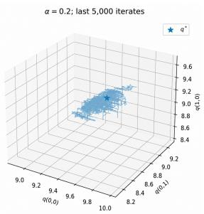

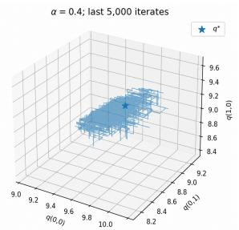

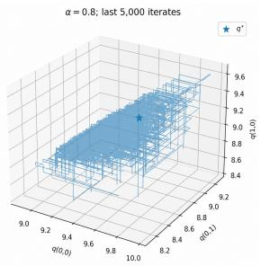

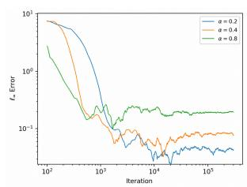  
Figure 1: Long-run behavior and tail-averaging performance of constant-stepsize Q-learning. The first three panels display the last 5,000 iterates after 300,000 iterations for diferent stepsizes, with the star indicating the optimal $q ^ { * }$ . Each blue point cloud shows the iterates projected onto the coordinates $q ( 0 , 0 ) , q ( 0 , 1 ) , q ( 1 , 0 )$ . The final panel plots $\left\| \bar { q } _ { t } ^ { ( \alpha ) } - q ^ { * } \right\| _ { \infty }$ on a log–log scale, where $\bar { q } _ { t } ^ { ( \alpha ) }$ averages the latter half of the first t iterates.

The Q-learning example above illustrates the types of long-run and transient behavior that can arise in a particular SA algorithm. Such numerical evidence, however, reveals only the phenomena themselves and does not explain the mathematical mechanisms underlying them. A rigorous theory should address questions such as: Why do the iterates continue to fluctuate around the target in the long run? How does the magnitude of these fluctuations depend on the stepsize α? And what quantitative guarantees can be established for a raw iterate $\theta _ { t } ^ { \left( \alpha \right) }$ before the long-run regime is reached? Answering these questions not only deepens our understanding of SA, but can also provide principles for designing more eficient algorithms and statistical procedures.

A natural way to develop such a theory is to study the stochastic recursion through the lens of Markov chains. Under suitable conditions on the random operator $\tilde { \tau }$ and the noise process $\{ x _ { t } \} _ { t \ge 0 }$ , the joint process $\{ ( x _ { t } , \theta _ { t } ^ { ( \alpha ) } ) \} _ { t \geq 0 }$ forms a time-homogeneous Markov chain that converges geometrically fast to a unique stationary distribution [DDB20, HCX26]. Thus, the blue clouds in Figure 1 can be interpreted as empirical visualizations of the corresponding long-run distributions of the iterates. Moreover, this geometric convergence toward stationarity helps explain the rapid initial decay observed in the final panel of Figure 1. We denote a random pair drawn from the stationary distribution of the joint chain by $( x _ { \infty } , \theta _ { \infty } ^ { ( \alpha ) } )$ . A growing literature has developed fine-grained characterizations of the stationary iterate $\theta _ { \infty } ^ { ( \alpha ) }$ [HCX26, ZX24, HZCX24].

A central feature of the stationary iterate $\theta _ { \infty } ^ { ( \alpha ) }$ is that, under a constant stepsize, its mean generally does not coincide with the target fixed point:

$$
\mathbb { E } [ \theta _ { \infty } ^ { ( \alpha ) } ] \neq \theta ^ { * } .
$$

This phenomenon is also suggested empirically by Figure 1: the blue clouds are not perfectly centered around the fixed point, and the tail-averaging error in the final panel incurs a nonvanishing error. The discrepancy $\mathbb { E } [ \theta _ { \infty } ^ { ( \alpha ) } ] - \theta ^ { * }$ is commonly referred to as the asymptotic bias. When the mean operator $\tau$ is locally diferentiable around $\theta ^ { * }$ , under additional regularity conditions, existing analyses exploit a Taylor expansion of $\tau$ to show that the bias admits the expansion

$$
\mathbb { E } [ \theta _ { \infty } ^ { ( \alpha ) } ] - \theta ^ { * } = \alpha c + o ( \alpha ) ,\tag{2}
$$

where $c$ is a vector independent of $\alpha .$ . Such fine-grained characterizations of the asymptotic bias provide a foundation for principled bias-reduction schemes [DDB20, HCX26, ZX24, HZCX24].

Despite the recent advance, our understanding of the stationary law of $\theta _ { \infty } ^ { ( \alpha ) }$ remains incomplete. In particular, two fundamental questions remain open.

Question 1. When the mean operator $\tau$ is locally diferentiable, can one go beyond the bias expansion (2) and obtain a fine-grained characterization of the full distribution of $\theta _ { \infty } ^ { ( \alpha ) } \overset { _ { \cdot } } { : }$ In particular, under an appropriate scaling, does the stationary distribution admit a Gaussian approximation, and can the approximation error be quantified nonasymptotically? Moreover, can such a Gaussian approximation be leveraged to obtain a quantitative Gaussian approximation for the raw iterate $\theta _ { t } ^ { \overline { { ( \alpha ) } } }$ at finite time?

Question 2. When the mean operator $\tau$ is locally nondiferentiable, can one still obtain an asymptotic bias characterization analogous to $( 2 ) ?$ If so, what structural conditions sufice, and how does the leading-order bias scale with the stepsize α? In particular, does the linear-in-α scaling persist in the locally nondiferentiable setting?

To address these two questions, we develop a general theory of steady-state convergence and show that it provides a unified framework for analyzing both the locally diferentiable and locally nondiferentiable regimes described above.

## 1.1 Steady-State Convergence

Recently, in the setting where the noise sequence $\{ x _ { t } \} _ { t \ge 0 }$ is i.i.d., a growing line of work has developed a theory for the steady-state behavior of constant-stepsize SA [CMM22, ZHCX24, WWN+26]. These works consider the difusion-scaled iterates and their stationary counterpart,

$$
Y _ { t } ^ { ( \alpha ) } : = ( \theta _ { t } ^ { ( \alpha ) } - \theta ^ { * } ) / \sqrt { \alpha } , \qquad Y _ { \infty } ^ { ( \alpha ) } : = ( \theta _ { \infty } ^ { ( \alpha ) } - \theta ^ { * } ) / \sqrt { \alpha } .
$$

The central goal is to establish the steady-state convergence (SSC) of $\{ Y _ { \infty } ^ { ( \alpha } \} _ { \alpha }$

$$
Y _ { \infty } ^ { ( \alpha ) } \Rightarrow Y _ { \infty } , \qquad \mathrm { a s } ~ \alpha \downarrow 0 ,
$$

for a limiting random variable $Y _ { \infty }$ . This limit provides a distributional characterization of the stationary fluctuations of $\theta _ { \infty } ^ { ( \alpha ) }$ around $\theta ^ { * }$ at their natural $\sqrt { \alpha }$ scale. As illustrated by the red route in Figure 2, steady-state convergence corresponds to first letting $t \to \infty$ for a fixed stepsize α and then sending α ↓ 0.

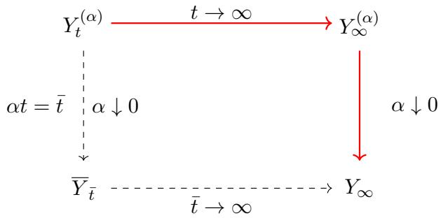  
Figure 2: Two methods for studying steady-state convergence. This paper considers the red route; the dashed route is the classical interchange-of-limits method via the SDE limit ${ \overline { { Y } } } _ { \bar { t } } .$

The implications of such an SSC result are twofold. First, under the global diferentiability conditions imposed in prior work, the limiting random variable $Y _ { \infty }$ has been shown to be Gaussian [CMM22] in some cases. More recently, [WWN+26] establish explicit rates for Gaussian approximation. Such quantitative Gaussian approximations provide a principled reference distribution for statistical inference on the raw iterate error $\theta _ { t } ^ { ( \alpha ) } - \theta ^ { \ast }$ by controlling the discrepancy between the transient difusion-scaled iterate $Y _ { t } ^ { ( \alpha ) }$ and its steady-state Gaussian limit $Y _ { \infty }$ . Although $[ \mathrm { W W N ^ { + } 2 6 } ]$ also treat Markovian data, their analysis in both the i.i.d. and Markovian settings requires an additive-noise structure of the form $\widetilde { \mathcal { T } } ( \boldsymbol { x } , \boldsymbol { \theta } ) = \mathcal { T } ( \boldsymbol { \theta } ) + h ( \boldsymbol { x } )$ , and the resulting Gaussian approximation rates are generally suboptimal. These limitations leave open whether sharp quantitative Gaussian approximations can be established under substantially weaker structural assumptions.

Second, when T is locally nondiferentiable at $\theta ^ { * }$ , classical bias analyses based on linearization or Taylor expansion of the mean operator are no longer directly applicable. Nevertheless, [ZHCX24] establishes a general SSC result for a broad class of mean operators that are one-sided directionall diferentiable at $\theta ^ { * }$ , encompassing several widely used nondiferentiable algorithms. This general SSC need not yield either an explicit characterization of the steady-state limit or a quantitative convergence rate. Importantly, once SSC is established, the asymptotic bias can still be characterized through the steady-state limit $Y _ { \infty }$

$$
\mathbb { E } \big [ \theta _ { \infty } ^ { ( \alpha ) } \big ] - \theta ^ { * } = \sqrt { \alpha } \mathbb { E } [ Y _ { \infty } ] + o ( \sqrt { \alpha } ) .\tag{3}
$$

Moreover, [ZHCX24] shows that, in genuinely nondiferentiable settings, the limiting mean $\mathbb { E } [ Y _ { \infty } ]$ can be nonzero, giving rise to a leading-order bias of order ${ \sqrt { \alpha } } .$ . This stands in sharp contrast to the order-α bias arising in the smooth settings admitting (2). Such a characterization also enables principled bias-reduction procedures for estimating $\theta ^ { * }$ , analogous to those developed from (2) in the smooth setting. However, establishing an analogous general SSC result for SA under Markovian noise remains an open problem.

The existing SSC results discussed above are summarized in Table 1. Here, $\mathcal { W } _ { p }$ denotes the Wasserstein distance of order $p ,$ , and ${ \mathcal { L } } ( X )$ denotes the probability law of a random variable X. We defer the formal definition of $\mathcal { W } _ { p }$ to Section 1.4.

Therefore, SSC provides a key tool for addressing Questions 1 and 2. However, to the best of our knowledge, there is no general and sharp SSC theory for contractive SA under Markovian and multiplicative noise. This gap is particularly consequential in practice, as several widely used algorithms fall outside the scope of existing results. For instance, Markovian linear SA [SY19], which arises naturally in reinforcement learning and stochastic control, typically involves multiplicative noise, while Q-learning [WD92] combines Markovian data with a Bellman optimality operator that may be locally nondiferentiable at the fixed point. Neither setting is covered by the existing SSC results discussed above. In this work, we develop a general and sharp SSC theory for contractive SA that accommodates both settings, thereby providing a unified framework for analyzing these practically important algorithms.

<table><tr><td rowspan=1 colspan=1>Regime</td><td rowspan=1 colspan=1>I.i.d. Noise</td><td rowspan=1 colspan=1>Markovian Noise</td></tr><tr><td rowspan=1 colspan=1>T is globallycontinuouslydifferentiable. Noiseis additive.</td><td rowspan=1 colspan=1> $\mathcal { W } _ { 1 } \left( \mathcal { L } \left( Y _ { \infty } ^ { ( \alpha ) } \right) , \mathcal { N } ( 0 , V ) \right) \in \mathcal { O } \left( \sqrt { \alpha } \log ( 1 / \alpha ) \right)$ [WWN+26]</td><td rowspan=1 colspan=1>Same rate as in the i.i.d.setting. $[ \mathrm { W W N ^ { + } 2 6 } ]$ </td></tr><tr><td rowspan=1 colspan=1>T is one-sideddirectionallydifferentiable at $\theta ^ { * } .$ </td><td rowspan=1 colspan=1> $\operatorname * { l i m } _ { \alpha \downarrow 0 } \mathcal { W } _ { 2 } \left( \mathcal { L } \left( Y _ { \infty } ^ { ( \alpha ) } \right) , \mathcal { L } ( Y _ { \infty } ) \right) = 0 .$ [ZHCX24]</td><td rowspan=1 colspan=1></td></tr></table>

Table 1: Existing steady-state convergence results. V denotes a problem-dependent asymptotic covariance matrix, defined in Section 4.

## 1.2 Our Contributions

Multi-Step Universality Reduction. Our first contribution is a multi-step universality reduction framework for establishing SSC. The main idea is the following. To prove the SSC $\begin{array} { r } { \operatorname* { l i m } _ { \alpha \downarrow 0 } \mathcal { W } _ { 2 } \Big ( \mathcal { L } \Big ( Y _ { \infty } ^ { ( \alpha ) } \Big ) , \mathcal { L } ( Y _ { \infty } ) \Big ) = 0 } \end{array}$ , we introduce an auxiliary difusion-scaled steady-state $\mathcal { V } _ { \infty } ^ { ( \alpha ) }$ derived from a simpler SA recursion, whose SSC is easier to analyze. We then quantify the discrepancy between the original and auxiliary steady states in $\mathcal { W } _ { 2 }$ , namely, $\mathcal { W } _ { 2 } \big ( \mathcal { L } \big ( Y _ { \infty } ^ { ( \alpha ) } \big ) , \dot { \mathcal { L } } \big ( y _ { \infty } ^ { ( \alpha ) } \big ) \big )$ . For general contractive $\mathrm { S A }$ , we show that this simplification can be carried out through a sequence of universality reductions, as summarized by the first two arrows in each branch of Figure 3.

We first establish an additive-noise universality reduction to an auxiliary steady state $A _ { \infty } ^ { ( \alpha ) }$ 2 obtained by replacing the original random operator $\tilde { \tau } ( x , \theta )$ with its additive-noise counterpart

$$
\mathcal T ( \theta ) + h ( x ) , \qquad \mathrm { w h e r e ~ } h ( x ) : = \widetilde { \mathcal T } ( x , \theta ^ { * } ) - \theta ^ { * } .
$$

This reduction incurs an $\mathcal { O } ( \sqrt { \alpha } )$ error in $\mathcal { W } _ { 2 }$ (Proposition 1). Starting from $A _ { \infty } ^ { ( \alpha ) }$ , we then develop two further universality reductions.

• When T admits a local quadratic linearization at $\theta ^ { * }$ , we establish a Jacobian-drift universality reduction to $B _ { \infty } ^ { ( \alpha ) }$ by replacing the mean operator ${ \mathcal { T } } ( \theta )$ with its linearization

$$
\theta ^ { * } + J ( \theta - \theta ^ { * } ) , \qquad \mathrm { w h e r e } \ J = \nabla { T } ( \theta ^ { * } ) .
$$

This reduction also incurs an $\mathcal { O } ( \sqrt { \alpha } )$ error in $\mathcal { W } _ { 2 }$ (Proposition 2). The resulting recursion defining $B _ { \infty } ^ { ( \alpha ) }$ has a linear drift and additive noise, and is therefore much more amenable to SSC analysis.

• For a general contractive $\tau _ { \ast }$ we establish an independent-Gaussian-noise universality reduction to $Z _ { \infty } ^ { ( \alpha ) }$ by replacing the additive noise sequence $\{ h ( x _ { t } ) \}$ with an i.i.d. centered Gaussian sequence whose covariance matches the long-run covariance of $h ( x _ { t } )$ . This reduction incurs an error of order $\mathcal { O } ( \alpha ^ { 1 / 4 } )$ in $\mathcal { W } _ { 2 } ;$ ; see Proposition 4. The resulting $Z _ { \infty } ^ { ( \alpha ) }$ is precisely the difusion-scaled steady state of an SA recursion with addtive i.i.d. Gaussian noise, for which SSC was established in [ZHCX24] under one-sided directional diferentiability of $\tau$ at $\theta ^ { * }$ . A key technical ingredient in this universality reduction is a uniform blockwise Gaussian coupling (Proposition 5), together with a $\mathcal { W } _ { p ^ { - } }$ -decoupling argument (Lemma 1), both of which may be of independent interest.

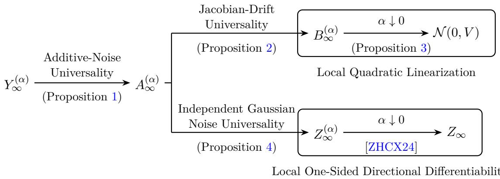  
Figure 3: Proof roadmap for the multi-step universality reductions.

Steady-State Convergence. Building on the multi-step universality reductions described above, we establish SSC for contractive SA in two regimes. Our results are summarized in Table 2, with the main new results highlighted in red.

• When T admits a local quadratic linearization at $\theta ^ { * }$ , we first establish a quantitative Gaussian approximation for the auxiliary steady-state $B _ { \infty } ^ { ( \alpha ) } \colon \mathcal { W } _ { 2 } \big ( \mathcal { L } \big ( B _ { \infty } ^ { ( \alpha ) } \big ) , \mathcal { N } ( 0 , \hat { V } ) \big ) = \mathcal { O } ( \sqrt { \alpha } )$ , where V is the unique solution to the Lyapunov equation determined by the Jacobian J and the longrun covariance of the noise $h ( x _ { t } )$ (Proposition 3). Combining this result with the additive-noise and Jacobian-drift universality reductions yields the steady-state Gaussian approximation for the original SA recursion (Theorem 1):

$$
\mathcal { W } _ { 2 } \Big ( \mathscr { L } \Big ( Y _ { \infty } ^ { ( \alpha ) } \Big ) , \mathscr { N } ( 0 , V ) \Big ) = \mathscr { O } ( \sqrt { \alpha } ) .
$$

This substantially strengthens existing steady-state Gaussian approximation results in several respects: we require a quadratic linearization remainder only at $\theta ^ { * }$ , with no diferentiability assumption elsewhere; we allow general multiplicative noise instead of imposing an additivenoise structure; we obtain the optimal $\mathcal { O } ( \sqrt { \alpha } )$ rate without the additional logarithmic factor appearing in prior work; and our result holds in the stronger $\mathcal { W } _ { 2 }$ metric rather than $\mathcal { W } _ { 1 }$ As a byproduct, the steady-state Gaussian approximation also yields a finite-time Gaussian approximation for the raw iterates $\theta _ { t } ^ { ( \alpha ) }$ of general contractive SA (Corollary 1), whereas existing results on raw-iterate Gaussian approximation are restricted to independent data [WLLW25, HWZM26].

• When $\tau$ is one-sided directionally diferentiable at $\theta ^ { * }$ , the steady-state convergence theory for i.i.d. data developed in [ZHCX24] can be lifted to the Markovian setting through our universality reductions. In particular, as illustrated in Figure 3, the auxiliary i.i.d. Gaussiannoise recursion satisfies lim $\ 、 \alpha \downarrow 0 \mathcal { W } _ { 2 } \Big ( \mathcal { L } \big ( Z _ { \infty } ^ { ( \alpha ) } \big ) , \mathcal { L } ( Z _ { \infty } ) \Big ) = 0$ . Applying the triangle inequality and combining with the independent-Gaussian-noise universality reduction shows that $Z _ { \infty }$ is also the steady-state limit of the original Markovian SA. We therefore identify $Y _ { \infty } : = Z _ { \infty }$ and obtain

$$
\operatorname * { l i m } _ { \alpha \downarrow 0 } \mathcal { W } _ { 2 } \Big ( \mathcal { L } \Big ( Y _ { \infty } ^ { ( \alpha ) } \Big ) , \mathcal { L } ( Y _ { \infty } ) \Big ) = 0 .
$$

This extends the general SSC result established for i.i.d. data in [ZHCX24] to the Markoviannoise setting. Moreover, the same criterion developed in [ZHCX24] can be used to characterize when $\mathbb { E } [ Y _ { \infty } ] \neq 0$ , yielding the ${ \sqrt { \alpha } } { \mathrm { - o r d e r } }$ asymptotic bias expansion in (3) and enabling principled bias-reduction procedures under Markovian noise.

<table><tr><td rowspan=1 colspan=1>Regime</td><td rowspan=1 colspan=1>I.i.d. Noise</td><td rowspan=1 colspan=1>Markovian Noise</td></tr><tr><td rowspan=1 colspan=1>T admits a localquadraticlinearization at $\theta ^ { * }$ </td><td rowspan=1 colspan=1> $\mathcal { W } _ { 2 } \left( \mathcal { L } \left( Y _ { \infty } ^ { ( \alpha ) } \right) , \mathcal { N } ( 0 , V ) \right) = \mathcal { O } ( \sqrt { \alpha } )$ </td><td rowspan=1 colspan=1>Same $\mathcal { O } ( \sqrt { \alpha } )$ rate as in thei.i.d. setting.</td></tr><tr><td rowspan=1 colspan=1>T is one-sideddirectionallydifferentiable at $\theta ^ { * } .$ </td><td rowspan=1 colspan=1> $\operatorname * { l i m } _ { \alpha \downarrow 0 } \mathcal { W } _ { 2 } \big ( \mathcal { L } \big ( Y _ { \infty } ^ { ( \alpha ) } \big ) , \mathcal { L } ( Y _ { \infty } ) \big ) = 0 .$ [ZHCX24]</td><td rowspan=1 colspan=1>Same result as in the i.i.d.setting.</td></tr></table>

Table 2: Results on steady-state convergence in diferent operator regimes under diferent noise models. Red entries highlight the results established in this work.

Applications to Markovian Linear SA and Q-Learning. We further apply our SSC theory to two prototypical examples: Markovian linear SA and Q-learning. For Markovian linear SA, the mean operator is afine and hence satisfies local quadratic linearization with zero remainder. Our theory therefore provides, to the best of our knowledge, the first steady-state Gaussian approximation for Markovian LSA, along with the raw-iterate guarantee.

For asynchronous Q-learning, we uncover a sharp distinction governed by the uniqueness of the optimal action. When the optimal action is unique at every state, the Bellman optimality operator is locally afine around the fixed point, so the mean operator satisfies local quadratic linearization; in the presence of optimal-action ties, it is generally locally nondiferentiable and the asymptotic bias can be of order ${ \sqrt { \alpha } } .$ . Our theory covers both regimes, providing a unified steady-state analysis of asynchronous Q-learning and, to the best of our knowledge, the first such characterization in the literature. We further propose a unified extrapolation scheme that cancels the leading-order bias without prior knowledge of whether optimal-action ties are present. Numerical experiments in Section 8 further illustrate and support these theoretical findings.

## 1.3 Related Approaches to Steady-State Convergence

SSC is a classical problem in stochastic dynamical systems, exemplified by queueing networks [GZ06]. In the queueing network problems, one typically considers a sequence of systems approaching a heavy-trafic regime. After appropriate space–time scaling, the queue-length process is first shown to converge over finite time horizons to a limiting difusion, often a reflected difusion. SSC asks whether the stationary distributions of the prelimit queueing systems converge, under the same scaling, to the stationary distribution of this limiting difusion. Equivalently, one seeks to justify an interchange of limits [GZ06, Gur14, YY16, YY18]: the heavy-trafic limit and the long-time limit can be taken in either order. In the terminology of Figure 2, this amounts to showing that the solid and dashed paths lead to the same limiting distribution. For the general contractive SA setting considered here, however, such a route is not directly available. In particular, it is not clear whether the difusion-scaled transient process admits an SDE limit $\overline { { Y } } _ { \bar { t } } ,$ especially in the presence of Markovian noise, let alone whether the corresponding interchange of limits can be justified.

Another classical route to SSC is based on the Basic Adjoint Relationship (BAR) associated with the generator of the underlying Markov process. At stationarity, BAR characterizes the invariant distribution through identities satisfied by suitable test functions. When combined with exponential test functions, this approach can yield convergence of moment generating functions and, consequently, weak convergence of the stationary distributions [BDM17, BDM25, CMM22]. However, even in the comparatively simple setting of i.i.d. noise and a globally diferentiable mean operator $\tau$ , existing BAR-based analyses for SA require additional regularity and structural assumptions that can be dificult to verify in general [CMM22]. These limitations become even more pronounced when $\tau$ is only locally nondiferentiable and the noise process is Markovian.

The $\sqrt { \alpha }$ scaling also suggests a natural connection with Langevin difusions and the extensive nonasymptotic theory of the Unadjusted Langevin Algorithm (ULA) [DM17, DM19]. However, the rescaled SA recursion $Y _ { t } ^ { ( \alpha ) }$ reduces to a ULA-type recursion only under restrictive structural conditions, as discussed in [ZHCX24]. In particular, such a reduction requires additive Gaussian noise, together with a gradient-field structure and an appropriate positive-homogeneity property for the local dynamics induced by $\tau$ around $\theta ^ { * }$ . Consequently, standard ULA techniques are not directly applicable to the general contractive SA setting considered here.

## 1.4 Notation

We write $\mathbb { S } ^ { d - 1 } : = \{ \theta \in \mathbb { R } ^ { d } : \| \theta \| = 1 \}$ for the unit sphere in $\mathbb { R } ^ { d }$ , where $\| \cdot \|$ denotes the Euclidean norm. For a matrix $A \in \mathbb { R } ^ { d \times d }$ , we denote its spectral radius by $\rho ( A )$ . We use $\gamma$ for the contraction modulus of the mean operator $\tau$ and J for its Jacobian at the fixed point, whenever this Jacobian exists. In the Q-learning application, $\rho$ denotes the MDP discount factor; $\rho ( A )$ continues to denote spectral radius and is distinguished by its matrix argument. We use $\overline { { B } } _ { d } ( \theta , \epsilon )$ to denote an closed ball in $\mathbb { R } ^ { d }$ centering at $\boldsymbol { \theta } \in \mathbb { R } ^ { d }$ with radius $\epsilon > 0$ with respect to $\| \cdot \|$

Let $( \Omega , \mathcal { F } , \mathbb { P } )$ be a probability space and $( \mathcal { M } , d )$ a Polish metric space. For a Borel measurable random variable $Y : \Omega  { \mathcal { M } }$ , we write ${ \mathcal { L } } ( Y )$ for the law (distribution) of $Y$ . Let $\mathcal { P } ( \mathcal { M } )$ denote the set of Borel probability measures on $\mathcal { M }$ . For $p \in [ 1 , \infty )$ , define the p-moment class

$$
\mathcal { P } _ { p } ( \mathcal { M } ) : = \Big \{ \mu \in \mathcal { P } ( \mathcal { M } ) : \int _ { \mathcal { M } } d ( x , x _ { 0 } ) ^ { p } \mu ( \mathrm { d } x ) < \infty \mathrm { ~ f o r ~ s o m e ~ ( e q u i v a l e n t l y ~ a n y ) ~ } x _ { 0 } \in \mathcal { M } \Big \} .
$$

For $\mu , \nu \in \mathcal P ( \mathcal M )$ , let $\Pi ( \nu , \mu )$ be the collection of all couplings of $( \nu , \mu )$ , i.e., probability measures π on ${ \mathcal { M } } \times { \mathcal { M } }$ whose marginals are ν and $\mu .$ . The Wasserstein–p distance on $( \mathcal { M } , { \mathsf { d } } )$ is defined by

$$
\mathcal { W } _ { p , \mathbf { d } } ( \nu , \mu ) : = \operatorname* { i n f } _ { \pi \in \Pi ( \nu , \mu ) } \left( \int _ { \mathcal { M } \times \mathcal { M } } \mathbf { d } ( x , y ) ^ { p } \pi ( \mathrm { d } x , \mathrm { d } y ) \right) ^ { 1 / p } , \qquad \forall \nu , \mu \in \mathcal { P } _ { p } ( \mathcal { M } ) .
$$

When $\mathcal { M } = \mathbb { R } ^ { d }$ and ${ \mathsf { d } } ( x , y ) = \| x - y \|$ is the Euclidean metric, we abbreviate $\mathcal { W } _ { p , d }$ as $\mathcal { W } _ { p }$

$$
\mathcal W _ { p } ( \nu , \mu ) : = \operatorname* { i n f } _ { \pi \in \Pi ( \nu , \mu ) } \left( \int _ { \mathbb { R } ^ { d } \times \mathbb { R } ^ { d } } \| x - y \| ^ { p } \pi ( \mathrm { d } x , \mathrm { d } y ) \right) ^ { 1 / p } , \qquad \forall \nu , \mu \in \mathcal { P } _ { p } ( \mathbb { R } ^ { d } ) .
$$

Throughout the paper, unless otherwise specified, the notation $\mathcal { O } ( \cdot )$ and $\lesssim$ suppresses finite constants that are independent of α and $t ,$ but may depend on other fixed problem parameters. The notation $\widetilde { \mathcal { O } } ( \cdot )$ additionally suppresses logarithmic factors in $1 / \alpha$

## 1.5 Organization of the Paper

The remainder of the paper is organized as follows. Section 2 introduces the problem setup and standing assumptions. Section 3 establishes additive-noise universality, which serves as the common starting point for our SSC analysis. Section 4 develops steady-state and raw-iterate Gaussian approximations under local quadratic linearization. Section 5 establishes general SSC under onesided directional diferentiability and discusses its implications for asymptotic bias characterization and reduction. Sections 6 and 7 apply the theory to Markovian linear SA and asynchronous Q-learning, respectively. Section 8 presents numerical experiments comparing tail averaging with regime-specific, misspecified, and unified Richardson–Romberg extrapolations. We conclude with a discussion of future research directions. Technical preliminaries, detailed proofs, and additional experimental details are provided in the appendices.

## 2 Problem Setup

We consider the following constant-stepsize stochastic approximation (SA) recursion:

$$
\theta _ { t + 1 } ^ { ( \alpha ) } = \theta _ { t } ^ { ( \alpha ) } + \alpha \Big ( \tilde { \mathcal { T } } ( x _ { t } , \theta _ { t } ^ { ( \alpha ) } ) - \theta _ { t } ^ { ( \alpha ) } \Big ) ,\tag{4}
$$

where $\alpha > 0$ is a fixed stepsize, $\{ x _ { t } \} _ { t \ge 0 }$ is a stochastic process on X that admits a unique limiting distribution $\mu ,$ and $\widetilde { \mathcal { T } } : \mathcal { X } \times \mathbb { R } ^ { d } \to \overline { { \mathbb { R } ^ { d } } }$ is a random operator. The corresponding mean operator is defined by

$$
\mathcal { T } ( \theta ) : = \mathbb { E } _ { x \sim \mu } [ \mathcal { \tilde { T } } ( x , \theta ) ] , \qquad \theta \in \mathbb { R } ^ { d } .
$$

In this work, we focus on contractive SA recursions satisfying the following assumption.

Assumption 1 (Contractive SA). There exist a norm $\| \cdot \| _ { c }$ and a constant $\gamma \in ( 0 , 1 )$ such that

$$
\| \mathcal T ( \boldsymbol { \theta } ) - \mathcal T ( \boldsymbol { \theta } ^ { \prime } ) \| _ { c } \leq \gamma \| \boldsymbol { \theta } - \boldsymbol { \theta } ^ { \prime } \| _ { c } , \qquad \forall \boldsymbol { \theta } , \boldsymbol { \theta } ^ { \prime } \in \mathbb { R } ^ { d } .
$$

In this work, we consider two classes of noise sequences: i.i.d. noise and Markovian noise. In both settings, we impose the following regularity conditions on the noise sequence and the random operator. These assumptions are standard in the analysis of $\mathrm { S A } ;$ see, for example, [DDB20, ZHCX24] for the i.i.d. setting and [CMSS24, ZX24, HCX26] for the Markovian setting.

Assumption 2 (Noise and Operator Regularity). The random operator $\tilde { \tau }$ and the noise sequence $\{ x _ { t } \} _ { t \ge 0 }$ satisfy one of the following two conditions.

(i) I.i.d. noise. The sequence $\{ x _ { t } \} _ { t \ge 0 }$ is i.i.d. with common distribution $\mu .$ . Moreover, there exists a constant $L > 0$ such that, for all $\theta , \theta ^ { \prime } \in \mathbb { R } ^ { d }$ ，

$$
\begin{array} { r } { \left( \mathbb { E } _ { \boldsymbol { x } \sim \boldsymbol { \mu } } \left[ \Vert \widetilde { \mathcal { T } } ( \boldsymbol { x } , \boldsymbol { \theta } ) - \widetilde { \mathcal { T } } ( \boldsymbol { x } , \boldsymbol { \theta } ^ { \prime } ) \Vert ^ { 4 } \right] \right) ^ { 1 / 4 } \leq L \Vert \boldsymbol { \theta } - \boldsymbol { \theta } ^ { \prime } \Vert , \qquad \left( \mathbb { E } _ { \boldsymbol { x } \sim \boldsymbol { \mu } } \left[ \Vert \widetilde { \mathcal { T } } ( \boldsymbol { x } , \boldsymbol { \theta } ^ { * } ) \Vert ^ { 4 } \right] \right) ^ { 1 / 4 } \leq L . } \end{array}
$$

(ii) Markovian noise. The sequence $\{ x _ { t } \} _ { t \ge 0 }$ is an irreducible and aperiodic Markov chain on $\mathcal { X } _ { \cdot }$ with transition kernel P and stationary distribution $\mu .$ The chain is uniformly ergodic: there exist constants $c _ { \operatorname* { m i x } } \geq 0$ and $\rho _ { \mathrm { m i x } } \in ( 0 , 1 )$ such that

$$
\begin{array} { r } { \| P ^ { t } ( x , \cdot ) - \mu ( \cdot ) \| _ { \mathrm { T V } } \leq c _ { \mathrm { m i x } } \rho _ { \mathrm { m i x } } ^ { t } , \qquad \forall x \in \mathcal { X } , \forall t \geq 1 . } \end{array}\tag{5}
$$

Moreover, there exists a constant $L > 0$ such that, for all $\theta , \theta ^ { \prime } \in \mathbb { R } ^ { d }$ and $x \in \mathcal { X }$

$$
\| \widetilde { T } ( x , \theta ) - \widetilde { T } ( x , \theta ^ { \prime } ) \| \le L \| \theta - \theta ^ { \prime } \| , \qquad \| \widetilde { T } ( x , \theta ^ { * } ) \| \le L .
$$

We remark that under Assumption 2(i), the iterates $\{ \theta _ { t } \} _ { t \ge 0 }$ from (4) form a time-homogeneous Markov chain; meanwhile, under Assumption 2(ii), we should augment the state $\{ ( \theta _ { t } , x _ { t } ) \} _ { t \geq 0 }$ to define a time-homogeneous Markov chain. Without loss of generosity, we consider the joint process $\{ ( \theta _ { t } , x _ { t } ) \} _ { t \geq 0 }$ as the induced Markov chain.

We define $\tau _ { \alpha } : =$ min $\begin{array} { r } { \left\{ t \geq 1 : \operatorname* { s u p } _ { x \in \mathcal { X } } \left\| P ^ { t } ( x , \cdot ) - \mu ( \cdot ) \right\| _ { \mathrm { T V } } \leq \alpha \right\} } \end{array}$ , which denotes the mixing time of the data process to accuracy α. Under Assumption $2 ( \mathrm { i } )$ , we have $\tau _ { \alpha } = 1$ , whereas under Assumption $2 ( \mathrm { i i } ) , \tau _ { \alpha } = \mathcal { O } \big ( \log ( 1 / \alpha ) \big )$ . We note that the update (4) under Assumptions 1 and 2 already covers many widely used algorithms, including Markovian linear SA [HCX26] and asynchronous Q-learning [ZX24]. We discuss these two examples in detail in Sections 6 and 7, respectively.

Beyond the update (4) and Assumption 2, [CMSS24] also incorporates an additional martingalediference noise sequence $\{ w _ { t } \} _ { t \ge 0 }$ and considers the more general recursion

$$
\theta _ { t + 1 } ^ { ( \alpha ) } = \theta _ { t } ^ { ( \alpha ) } + \alpha ( \widetilde { T } ( x _ { t } , \theta _ { t } ^ { ( \alpha ) } ) - \theta _ { t } ^ { ( \alpha ) } + w _ { t } ( \theta _ { t } ^ { ( \alpha ) } ) ) .\tag{6}
$$

They impose a weaker condition on $\{ w _ { t } \} _ { t \ge 0 } \colon$ for each $\theta \in \mathbb { R } ^ { d }$ , the noise satisfies a linear-growth bound $\lVert w _ { t } ( \theta ) \rVert \lesssim \lVert \theta \rVert + 1$ almost surely, uniformly over t. Notably, this assumption does not require $w _ { t } ( \theta )$ to be uniformly Lipschitz in θ. Consequently, their recursion generally cannot be rewritten in the Markovian SA form (4) under Assumption 2. Moreover, since their goals difer from ours, it is unclear whether the more general dynamics (6) (or an augmented state incorporating $\{ x _ { t } \} _ { t \ge 0 }$ and $\{ w _ { t } \} _ { t \ge 0 } )$ defines a Markov chain that admits a well-behaved limiting distribution—a question that is beyond the scope of this paper.

In this work, we study steady-state convergence, where the steady state refers to the limiting distribution of the induced Markov chain as $t \to \infty ,$ , whenever such a limit exists. The existence and uniqueness of a steady-state distribution have been established in a variety of important settings. For example, [DDB20, ZHCX24] consider contractive SA with i.i.d. noise, [HCX26] study Markovian linear SA, [ZX24] analyze asynchronous Q-learning, and [HZCX24] consider Markovian nonlinear SA with smooth, strongly monotone dynamics. Rather than imposing the specific conditions considered in these individual settings, we encapsulate their common consequence in the following assumption, tailored to general Markovian contractive SA. As discussed above, this assumption can be verified in each of the aforementioned settings.

Assumption 3 (Geometric Distributional Convergence to Steady State). For every SA recursion (4) under Assumptions 1 and 2, there exists $\alpha _ { 0 } > 0$ such that, for every $\alpha \in ( 0 , \alpha _ { 0 } )$ , the Markov chain $\{ ( \theta _ { t } , x _ { t } ) \} _ { t \geq 0 }$ converges to a unique stationary distribution $\bar { \nu } _ { \alpha } \in \mathcal { P } _ { 2 } ( \mathbb { R } ^ { d } \times \mathcal { X } )$ . Let $\mathcal { L } ( \theta _ { \infty } ^ { ( \alpha ) } )$ be the first marginal of $\bar { \nu } _ { \alpha }$ . Moreover, for any initial distribution $\mathcal { L } ( \theta _ { 0 } ^ { ( \alpha ) } ) \in \mathcal { P } _ { 2 } ( \mathbb { R } ^ { d } )$

$$
\begin{array} { r } { \mathcal { W } _ { 2 } \Big ( \mathcal { L } \big ( \theta _ { t } ^ { ( \alpha ) } \big ) , \mathcal { L } \big ( \theta _ { \infty } ^ { ( \alpha ) } \big ) \Big ) \leq c _ { 1 } \big ( 1 - \alpha c _ { 2 } \big ) ^ { t } , \qquad t \geq c _ { 3 } \tau _ { \alpha } , } \end{array}
$$

where $c _ { 1 }$ may depend on the initial distribution and $c _ { 1 } , c _ { 2 } , c _ { 3 } > 0$ are constants independent of α and t.

Under Assumption 3, we define the difusion-scaled steady-state iterate $\begin{array} { r } { Y _ { \infty } ^ { ( \alpha ) } : = \frac { \theta _ { \infty } ^ { ( \alpha ) } - \theta ^ { * } } { \sqrt { \alpha } } } \end{array}$ . Our primary goal is to establish the existence of a limiting random variable $Y _ { \infty }$ such that

$$
\operatorname * { l i m } _ { \alpha \downarrow 0 } \mathcal { W } _ { 2 } \Big ( \mathcal { L } \Big ( Y _ { \infty } ^ { ( \alpha ) } \Big ) , \mathcal { L } ( Y _ { \infty } ) \Big ) = 0 .\tag{7}
$$

We further provide regime-specific refinements of (7). Under local quadratic linearization, we precisely characterize $\mathcal { L } ( Y _ { \infty } )$ and establish a quantitative convergence rate for (7); see Section 4. In the locally nondiferentiable setting, we show that, under additional structural conditions, the limiting distribution need not be centered, so tha $\mathbb { E } [ Y _ { \infty } ] \neq 0 ;$ ; see Section 5.

## 3 Additive-Noise Universality

Before turning to the SSC analysis in Sections 4 and 5, we first establish an additive-noise universality result. This universality reduction serves as the first key step in our analysis and will be used both under local quadratic linearization and in the locally nondiferentiable regime.

Consider the following auxiliary SA recursion:

$$
a _ { t + 1 } ^ { ( \alpha ) } = a _ { t } ^ { ( \alpha ) } + \alpha \left( \mathcal { T } ( a _ { t } ^ { ( \alpha ) } ) - a _ { t } ^ { ( \alpha ) } + h ( x _ { t } ) \right) , \qquad t \ge 0 ,\tag{8}
$$

where $h ( x ) : = \widetilde { \mathcal { T } } ( x , \theta ^ { * } ) - \theta ^ { * }$ denotes the noise at equilibrium. The recursion in (8) has the same mean operator $\tau$ as the original recursion (4), while its noise is additive. Moreover, h is centered under the stationary distribution $\mu ,$ since

$$
\begin{array} { r } { \mathbb { E } _ { \boldsymbol { x } \sim \boldsymbol { \mu } } [ h ( \boldsymbol { x } ) ] = \mathbb { E } _ { \boldsymbol { x } \sim \boldsymbol { \mu } } [ \widetilde { \mathcal { T } } ( \boldsymbol { x } , \boldsymbol { \theta } ^ { * } ) ] - \boldsymbol { \theta } ^ { * } = \mathcal { T } ( \boldsymbol { \theta } ^ { * } ) - \boldsymbol { \theta } ^ { * } = 0 . } \end{array}
$$

Recursion (8) is a special case of the general SA recursion (4) and satisfies Assumptions 1 and 2. For all suficiently small $\alpha > 0$ , it admits a unique steady-state law $\mathcal { L } ( a _ { \infty } ^ { ( \alpha ) } ) \in \mathcal { P } _ { 2 } ( \mathbb { R } ^ { d } )$ . For this additive-noise auxiliary, existence and uniqueness follow directly from synchronous contraction, rather than from an additional application of Assumption $s ;$ the stationary construction and the marginal $\mathcal { W } _ { 2 }$ convergence needed below are proved in Section B.3. Analogously to the scaled steady-state variable associated with the original $\mathrm { S A }$ recursion (4), we define the scaled steady-state variable of (8) by $\begin{array} { r } { A _ { \infty } ^ { ( \alpha ) } : = \frac { a _ { \infty } ^ { ( \alpha ) } - \theta ^ { * } } { \sqrt { \alpha } } } \end{array}$ . The following proposition states the additive-noise universality result.

Proposition 1 (Additive-Noise Universality). Under Assumptions 1, 2 and ${ \mathcal { B } } ,$

$$
\mathcal { W } _ { 2 } \Big ( \mathcal { L } ( Y _ { \infty } ^ { ( \alpha ) } ) , \mathcal { L } ( A _ { \infty } ^ { ( \alpha ) } ) \Big ) = \mathcal { O } ( \alpha ^ { 1 / 2 } ) .
$$

Proposition 1 shows that replacing the original state-dependent noise by the additive equilibrium noise $h ( x _ { t } )$ changes the scaled steady-state law by at most $\mathcal { O } ( \alpha ^ { 1 / 2 } )$ in Wasserstein-2 distance.

Thus, to establish SSC, it sufices to analyze $A _ { \infty } ^ { ( \alpha ) }$ , whose additive-noise structure is more tractable than that of $Y _ { \infty } ^ { ( \alpha ) }$ . We develop the resulting SSC theory in Sections 4 and 5, under local quadratic linearization and, more generally, local one-sided directional diferentiability, respectively. The proof of Proposition 1 is deferred to Section B.

## 4 Steady-State Gaussian Approximation under Local Quadratic Linearization

In this section, we focus on the regime in which the mean operator $\tau$ admits a local linearization with a quadratic remainder at its fixed point $\theta ^ { * }$

Assumption 4 (Local Quadratic Linearization). There exist a matrix $J \in \mathbb { R } ^ { d \times d }$ and constants $\epsilon > 0$ and $L _ { R } \in [ 0 , \infty )$ such that

$$
\begin{array} { r } { \big \| \mathcal I ( { \theta ^ { * } } + u ) - \mathcal T ( { \theta ^ { * } } ) - J u \big \| \leq L _ { R } \| u \| ^ { 2 } , \qquad \forall u \in \mathbb R ^ { d } \mathrm { ~ w i t h ~ } \| u \| \leq \epsilon . } \end{array}
$$

Assumption 4 implies that $\tau$ is diferentiable at $\theta ^ { * }$ , with $J = \nabla T ( \theta ^ { * } )$ , but does not require diferentiability at other points in a neighborhood of $\theta ^ { * }$ . A suficient condition is that $\tau$ has a locally Lipschitz Jacobian near $\theta ^ { * }$ . Assumption 4 is satisfied by a broad class of commonly used stochastic algorithms. Examples include: (i) stochastic gradient descent for minimizing a diferentiable, strongly convex objective whose gradient admits a local quadratic linearization at its minimizer; (ii) Markovian linear stochastic approximation; and (iii) asynchronous Q-learning when the optimal policy is unique. We discuss the latter two examples in detail in Sections 6 and $^ { 7 , }$ respectively.

Our main result in this section establishes a quantitative Gaussian approximation for the appropriately scaled steady-state distribution under Assumption 4, with an explicit optimal convergence rate in $\mathcal { W } _ { 2 }$ . As a direct application, Section 4.1 derives a Gaussian approximation for the raw iterates. We then present the two main ingredients underlying the proof in Sections 4.2 and 4.3, respectively.

Before stating the main result, we introduce several quantities that will be used throughout the analysis. Define the long-run covariance of the stationary equilibrium-noise process $\{ h ( x _ { t } ) \} _ { t \geq 0 }$ by

$$
\Sigma _ { h } : = \operatorname* { l i m } _ { n \to \infty } \frac { 1 } { n } \operatorname { C o v } \left( \sum _ { t = 0 } ^ { n - 1 } h ( x _ { t } ) \right) .
$$

If $\{ x _ { t } \} _ { t \ge 0 }$ is an i.i.d. sequence with common distribution $\mu ,$ then

$$
\Sigma _ { h } = \mathbb { E } _ { \mu } \Big [ h ( x ) h ( x ) ^ { \top } \Big ] = \mathrm { C o v } _ { \mu } \Big ( \widetilde { \mathcal { T } } ( x , \theta ^ { * } ) \Big ) .
$$

If $\{ x _ { t } \} _ { t \ge 0 }$ is Markovian, we extend it to a two-sided stationary chain $\{ x _ { t } \} _ { t \in \mathbb { Z } }$ , in which case

$$
\Sigma _ { h } = \sum _ { \ell \in \mathbb { Z } } \mathbb { E } _ { \mu } \Big [ h ( x _ { 0 } ) h ( x _ { \ell } ) ^ { \top } \Big ] .
$$

Under Assumption $2 ( \mathrm { i i } )$ , uniform ergodicity and boundedness of h imply that $\Big \| \mathbb { E } _ { \mu } \Big [ h ( x _ { 0 } ) h ( x _ { \ell } ) ^ { \top } \Big ] \Big \| \lesssim$ $\rho _ { \mathrm { m i x } } ^ { | \ell | }$ , for any $\ell \in \mathbb { Z }$ , where $\rho _ { \mathrm { m i x } }$ is as in (5); see, e.g., [MT09, Chapter 16]. Hence the covariance series defining $\Sigma _ { h }$ is absolutely convergent. Finally, let V denote the unique positive-semidefinite solution to the Lyapunov equation

$$
\begin{array} { r } { ( J - I _ { d } ) V + V ( J - I _ { d } ) ^ { \top } + \Sigma _ { h } = 0 . } \end{array}\tag{9}
$$

Indeed, Assumption 1 implies $\rho ( J ) < 1$ , and hence $J - I _ { d }$ is Hurwitz, so the solution is uniquely given by $\begin{array} { r } { V = \bar { \int _ { 0 } ^ { \infty } e ^ { ( J - I _ { d } ) \bar { t } } \Sigma _ { h } e ^ { ( \bar { J } - \bar { I _ { d } } ) ^ { \top } t } } } \end{array}$ dt. We are now ready to state the steady-state Gaussian approximation theorem.

Theorem 1 (Steady-State Gaussian Approximation). Under Assumptions 1, 2, 3, and $^ { 4 , }$

$$
\mathcal { W } _ { 2 } \Big ( \mathscr { L } \big ( Y _ { \infty } ^ { ( \alpha ) } \big ) , \mathscr { N } ( 0 , V ) \Big ) \in \mathcal { O } ( \sqrt { \alpha } ) .
$$

Comparison with Prior Work. To the best of our knowledge, $[ \mathrm { W W N ^ { + } 2 6 } ]$ provide the only prior steady-state Gaussian approximation result in a comparable setting. Their analysis assumes that $\tau$ is globally continuously diferentiable, requires additive noise, and measures the approximation error in $\mathcal { W } _ { 1 }$ . In contrast, Theorem 1 requires a local quadratic linearization at $\theta ^ { * }$ without imposing global diferentiability, allows general multiplicative noise, and establishes convergence in the stronger $\mathcal { W } _ { 2 }$ metric.

Sharpness of the Rate. The $\sqrt { \alpha }$ rate is sharp in general. Indeed, existing bias characterizations under additional local smoothness conditions show that E $: [ \theta _ { \infty } ^ { ( \alpha ) } ] - \theta ^ { * } = \alpha c + o ( \alpha )$ for some vector c independent of α [DDB20, ZX24, HZCX24, ZHCX25]. Consequently,

$$
\mathbb { E } \big [ Y _ { \infty } ^ { ( \alpha ) } \big ] = \frac { \mathbb { E } \big [ \theta _ { \infty } ^ { ( \alpha ) } \big ] - \theta ^ { * } } { \sqrt { \alpha } } = \sqrt { \alpha } c + o \big ( \sqrt { \alpha } \big ) .
$$

Since $\mathcal { N } ( 0 , V )$ is centered, the definition of $\mathcal { W } _ { 2 }$ together with Jensen’s inequality implies that, whenever $c \neq 0$

$$
\begin{array} { r } { \mathcal { W } _ { 2 } \Big ( \mathcal { L } \big ( Y _ { \infty } ^ { ( \alpha ) } ) , \mathcal { N } ( 0 , V ) \Big ) \geq \| \mathbb { E } \big [ Y _ { \infty } ^ { ( \alpha ) } \big ] - \mathbb { E } _ { X \sim \mathcal { N } ( 0 , V ) } [ X ] \Big \| = \sqrt { \alpha } \| c \| + o \big ( \sqrt { \alpha } \big ) . } \end{array}
$$

Thus, the rate in Theorem 1 is optimal in general. In particular, it removes the additional $\log ( 1 / \alpha )$ factor appearing in [WWN+26].

## 4.1 Application: Gaussian Approximation for Raw Iterates

As an immediate consequence of Theorem 1 and the geometric convergence of the SA iterates to steady state, we obtain a finite-time Gaussian approximation for the raw iterates.

Corollary 1 (Raw Iterate Gaussian Approximation). Suppose Assumptions $\begin{array} { l } { \displaystyle 1 , ~ 2 , ~ 3 , } \end{array}$ and 4 hold. Then there exist constants $c _ { 1 } , c _ { 2 } , c _ { 3 } > 0$ , independent of α and t, such that, for all suficiently small $\alpha > 0$ and $t \ge c _ { 3 } \tau _ { \alpha }$ 2

$$
\mathcal { W } _ { 2 } \left( \mathcal { L } \left( \frac { \theta _ { t } ^ { ( \alpha ) } - \theta ^ { * } } { \sqrt { \alpha } } \right) , \mathcal { N } ( 0 , V ) \right) \leq \frac { c _ { 1 } ( 1 - c _ { 2 } \alpha ) ^ { t } } { \sqrt { \alpha } } + \mathcal { O } ( \sqrt { \alpha } ) .
$$

Consequently, for any fixed $c _ { 4 } \geq 1 / c _ { 2 }$ , setting $\alpha = c _ { 4 }$ log $t / t$ yields

$$
\mathcal { W } _ { 2 } \left( \mathcal { L } \left( \frac { \theta _ { t } ^ { ( \alpha ) } - \theta ^ { * } } { \sqrt { \alpha } } \right) , \mathcal { N } ( 0 , V ) \right) \in \mathcal { O } \left( \sqrt { \frac { \log t } { t } } \right) .
$$

Comparison with Prior Work. A closely related result is [WLLW25], which establishes a Gaussian approximation bound for the raw iterate of constant-stepsize SGD under strong convexity and i.i.d. data. With $\alpha \asymp \log t / t$ , their result yields a rate of order $\sqrt { \log t / t }$ in the convex-set distance. Corollary 1 achieves the same dependence on t in $\mathcal { W } _ { 2 }$ distance for the broader class of contractive SA considered here, while also allowing Markovian noise. Since the convex-set and $\mathcal { W } _ { 2 }$ distances are not comparable in general, neither result directly implies the other. Extending our Gaussian approximation guarantees to the convex-set distance is an interesting direction for future work.

Another closely related result is [HWZM26], which provides Gaussian approximation bounds for raw iterates of a more general class of SA algorithms, without requiring global contraction, but under independent data and in $\mathcal { W } _ { 1 }$ distance. Rather than proceeding through a steady-state Gaussian approximation as we do, they establish the raw-iterate Gaussian approximation directly. In the regime considered here, however, their bound contains an error term of order ${ \sqrt { \alpha } } \log ( 1 / \alpha )$ which, under $\alpha \asymp \log t / t$ , yields $\mathcal { O } \left( ( \log t ) ^ { 3 / 2 } / \sqrt { t } \right)$ . In contrast, our optimal $\mathcal { O } ( \sqrt { \alpha } )$ steady-state Gaussian approximation leads to the sharper rate $\mathcal { O } ( \sqrt { \log t / t } )$ in the stronger $\mathcal { W } _ { 2 }$ distance.

## 4.2 Step 1: Jacobian-Drift Universality

The proof of Theorem 1 proceeds by establishing a quantitative Gaussian approximation for $A _ { \infty } ^ { ( \alpha ) }$ The argument consists of two main steps. In this subsection, we develop the first step, which replaces the mean operator T by its linearization at the fixed point $\theta ^ { * }$

More precisely, we introduce an auxiliary SA recursion driven by the same additive equilibriumnoise process $\{ h ( x _ { t } ) \} _ { t \geq 0 }$ , but with $\tau$ replaced by the linear operator ${ \mathcal { T } } _ { \mathrm { l i n } } ( \theta ) : = \theta ^ { * } + J ( \theta - \theta ^ { * } )$ , where $J : = \nabla T ( \theta ^ { * } )$ . The resulting recursion is

$$
b _ { t + 1 } ^ { ( \alpha ) } = b _ { t } ^ { ( \alpha ) } + \alpha \Big ( ( J - I _ { d } ) \big ( b _ { t } ^ { ( \alpha ) } - \theta ^ { * } \big ) + h ( x _ { t } ) \Big ) , \qquad t \geq 0 .\tag{10}
$$

Recursion (10) is a special case of the general SA recursion (4) and satisfies Assumptions 1 and 2 with the same contraction norm $\| \cdot \| _ { c }$ and contraction factor $\gamma ;$ see, $\mathrm { e . g . }$ , [ABD21, Proposition 6.4]. Consequently, Assumption 3 implies that, for all suficiently small $\alpha > 0$ , recursion (10) admits a unique steady-state distribution $\mathcal { L } ( b _ { \infty } ^ { ( \alpha ) } ) \in \mathcal { P } _ { 2 } ( \mathbb { R } ^ { d } )$ . We define its scaled steady-state variable by $\begin{array} { r } { B _ { \infty } ^ { ( \alpha ) } : = \frac { b _ { \infty } ^ { ( \alpha ) } - \theta ^ { * } } { \sqrt { \alpha } } } \end{array}$ . The following proposition establishes the Jacobian-drift universality result.

Proposition 2 (Jacobian-Drift Universality). Under Assumptions 1, 2, 3, and $^ { 4 , }$

$$
\begin{array} { r } { \mathcal { W } _ { 2 } \left( \mathcal { L } ( A _ { \infty } ^ { ( \alpha ) } ) , \mathcal { L } ( B _ { \infty } ^ { ( \alpha ) } ) \right) \in \mathcal { O } ( \sqrt { \alpha } ) . } \end{array}
$$

Starting from the recursion (8), we linearize $\tau$ at $\theta ^ { * }$ . Proposition 2 shows that this changes the scaled steady-state law by at most $\mathcal { O } ( \sqrt { \alpha } )$ in Wasserstein-2 distance. It therefore remains to analyze $B _ { \infty } ^ { ( \alpha ) }$ . Since its recursion has linear drift and additive noise, $B _ { \infty } ^ { ( \alpha ) }$ admits a geometrically weighted-sum representation, enabling a direct quantitative Gaussian approximation. We carry out this analysis in the next subsection and defer the proof of Proposition 2 to Section C.

## 4.3 Step 2: Gaussian Approximation for Geometrically Weighted Sums

Having reduced the original SA recursion to a linear recursion with additive noise in Section 4.2, we now establish a quantitative Gaussian approximation for its scaled steady-state distribution. Define

$$
B _ { t } ^ { ( \alpha ) } : = \frac { b _ { t } ^ { ( \alpha ) } - \theta ^ { * } } { \sqrt { \alpha } } , \qquad Q _ { \alpha } : = ( 1 - \alpha ) I _ { d } + \alpha J .
$$

Then

$$
B _ { t + 1 } ^ { ( \alpha ) } = Q _ { \alpha } B _ { t } ^ { ( \alpha ) } + \sqrt { \alpha } h ( x _ { t } ) .\tag{11}
$$

Since $J - I _ { d }$ is Hurwitz, standard linear stability theory implies that, for all suficiently small $\alpha > 0$ there exist constants $c _ { 1 } , c _ { 2 } > 0$ , independent of α and $k ,$ such that

$$
\| Q _ { \alpha } ^ { k } \| \leq c _ { 1 } e ^ { - c _ { 2 } \alpha k } , \qquad k \geq 0 .\tag{12}
$$

Hence, on a two-sided stationary extension $\{ x _ { t } \} _ { t \in \mathbb { Z } } .$ , the stationary solution admits the representation

$$
B _ { \infty } ^ { ( \alpha ) } \stackrel { \mathrm { d } } { = } \sqrt { \alpha } \sum _ { k = 0 } ^ { \infty } Q _ { \alpha } ^ { k } h ( x _ { - k - 1 } ) ,\tag{13}
$$

where the series converges in $L ^ { 2 }$ . Thus, $B _ { \infty } ^ { ( \alpha ) }$ is a geometrically weighted sum of the centered process $\{ h ( x _ { t } ) \}$ , to which we apply a quantitative Gaussian approximation in the following proposition.

Proposition 3 (Gaussian Approximation for Geometrically Weighted Sums). Under Assumptions 1, ${ \it 2 , 3 , }$ and $^ { 4 , }$

$$
\mathcal { W } _ { 2 } \left( \mathcal { L } ( B _ { \infty } ^ { ( \alpha ) } ) , \mathcal { N } ( 0 , V ) \right) \in \mathcal { O } ( \sqrt { \alpha } ) .
$$

Proposition 3 shows that $B _ { \infty } ^ { ( \alpha ) }$ converges to $\mathcal { N } ( 0 , V )$ at rate $\mathcal { O } ( \sqrt { \alpha } )$ in $\mathcal { W } _ { 2 }$ . Its proof exploits the weighted-sum representation (13). In the Markovian setting, we use the Poisson equation to decompose the additive functional into a martingale sum and a telescoping remainder, apply a quantitative Gaussian approximation to the weighted martingale sum, and show that the remainder contributes only $\mathcal { O } ( \sqrt { \alpha } )$ . For i.i.d. data, the argument reduces to a Gaussian approximation for weighted sums of independent random vectors. The required Gaussian approximation results are collected in Section A.3, and the proof of Proposition 3 is deferred to Section D.

Finally, Theorem 1 follows by combining Propositions 1, 2, and 3 with the triangle inequality:

$$
\begin{array} { r l } & { \mathcal { W } _ { 2 } \left( \mathcal { L } \big ( Y _ { \infty } ^ { ( \alpha ) } \big ) , \mathcal { N } ( 0 , V ) \right) \leq \mathcal { W } _ { 2 } \left( \mathcal { L } \big ( Y _ { \infty } ^ { ( \alpha ) } \big ) , \mathcal { L } \big ( A _ { \infty } ^ { ( \alpha ) } \big ) \right) + \mathcal { W } _ { 2 } \left( \mathcal { L } \big ( A _ { \infty } ^ { ( \alpha ) } \big ) , \mathcal { L } \big ( B _ { \infty } ^ { ( \alpha ) } \big ) \right) } \\ & { \qquad + \mathcal { W } _ { 2 } \left( \mathcal { L } \big ( B _ { \infty } ^ { ( \alpha ) } \big ) , \mathcal { N } ( 0 , V ) \right) \in \mathcal { O } \big ( \sqrt { \alpha } \big ) . } \end{array}
$$

## 5 General Steady-State Convergence

In this section, we remove the local quadratic linearization requirement on mean operator T. Instead, we focus a broad class of mean operator $\tau _ { \ast }$ which was studied in the prior work [ZHCX24] when the data is i.i.d.

Assumption 5. The mean operator $\tau$ is one-sided direactionally diferentiable at its fixed point $\theta ^ { * }$ : there exists a function $G \colon \mathbb { S } ^ { d - 1 } \to \mathbb { R } ^ { d }$ such that

$$
\operatorname* { l i m } _ { w \to 0 ^ { + } } \left\| \frac { \mathcal { T } ( \theta ^ { * } + w \theta ) - \mathcal { T } ( \theta ^ { * } ) } { w } - G ( \theta ) \right\| = 0 , \quad \forall \theta \in \mathbb { S } ^ { d - 1 } .
$$

The class of one-sided directionally diferentiable mappings is broad, encompassing several widely studied nonsmooth subclasses, including $g \circ F$ composite functions [Sha03, Sag13], prox-regular functions [PR96], and Clarke-regular functions [Cla90, HUL04]. It also includes classical max-type functions, spectral mappings such as the largest-eigenvalue map, the sparsity-promoting $\ell _ { 1 } { \mathrm { - n o r m } } .$ and their compositions with smooth transformations. A prominent example of a max-type structure at the fixed point arises in asynchronous Q-learning when the optimal policy is not unique, which we discuss in detail in Section 7.

Under the broader Assumption 5, together with the standing assumptions of Section 2, we obtain the following general SSC result.

Theorem 2 (General Steady-State Convergence). Under Assumptions 1, 2, 3, and 5, there exists a unique probability measure $\mathcal { L } ( Y _ { \infty } ) \in \mathcal { P } _ { 2 } ( \mathbb { R } ^ { d } )$ , determined solely by the mean operator T and the long-run covariance matrix $\Sigma _ { h }$ , such that

$$
\operatorname * { l i m } _ { \alpha \downarrow 0 } \mathcal { W } _ { 2 } \left( \mathcal { L } ( Y _ { \infty } ^ { ( \alpha ) } ) , \mathcal { L } ( Y _ { \infty } ) \right) = 0 .
$$

To the best of our knowledge, [ZHCX24] is the only existing work establishing a general SSC result for contractive SA without requiring $\tau$ to be locally diferentiable at $\theta ^ { * }$ . That result, however, is restricted to i.i.d. noise. Theorem 2 extends this theory from the i.i.d. setting to Markovian data.

From an applications perspective, a direct consequence of Theorem 2 is a characterization of the asymptotic bias. Indeed, since convergence in $\mathcal { W } _ { 2 }$ implies convergence of first moments, we have

$$
\begin{array} { r } { \mathbb { E } \big [ \theta _ { \infty } ^ { ( \alpha ) } \big ] - \theta ^ { * } = \sqrt { \alpha } \mathbb { E } \big [ Y _ { \infty } ^ { ( \alpha ) } \big ] = \sqrt { \alpha } \mathbb { E } [ Y _ { \infty } ] + o ( \sqrt { \alpha } ) . } \end{array}\tag{14}
$$

When the data are i.i.d., [ZHCX24] shows that, in genuinely nondiferentiable settings, the steadystate limit $Y _ { \infty }$ need not be centered, so the asymptotic bias may have a nonvanishing leading term of order ${ \sqrt { \alpha } } .$ . This characterization can in turn be used to design and analyze bias-reduction procedures. Since Theorem 2 shows that $Y _ { \infty }$ depends only on the mean operator T and the long-run covariance matrix $\Sigma _ { h }$ , the same bias analysis and bias-reduction principles extend to the more general Markovian setting, as discussed in Section 5.1.

From a technical perspective, the key technical ingredient is a Gaussian-noise universality principle. Let $Z _ { \infty } ^ { ( \alpha ) }$ denote the scaled steady state of an auxiliary SA recursion with the same mean operator $\tau _ { \ast }$ , but driven by additive i.i.d. Gaussian noise with covariance $\Sigma _ { h }$ . We show that $\bar { \mathcal { W } _ { 2 } } \left( \mathcal { L } ( A _ { \infty } ^ { ( \alpha ) } ) , \mathcal { L } ( Z _ { \infty } ^ { ( \alpha ) } ) \right) \in \mathcal { O } \left( \alpha ^ { 1 / 4 } \right)$ . Thus, at the difusion scale, the steady-state distribution depends on the Markovian noise only through its long-run covariance $\Sigma _ { h }$ . Combined with Proposition 1, this universality principle also gives a direct proof of Theorem 2. Indeed, the auxiliary Gaussian-noise recursion falls within the i.i.d. setting studied in [ZHCX24], which yields

$$
\begin{array} { r } { \mathcal { W } _ { 2 } \left( \mathcal { L } ( Z _ { \infty } ^ { ( \alpha ) } ) , \mathcal { L } ( Y _ { \infty } ) \right) \longrightarrow 0 \qquad \mathrm { a s ~ } \alpha \downarrow 0 } \end{array}
$$

for a limiting random variable $Y _ { \infty }$ determined by $\tau$ and $\Sigma _ { h }$ . Therefore, by the triangle inequality,

$$
\begin{array} { r l } & { \mathcal { W } _ { 2 } \left( \mathcal { L } \big ( Y _ { \infty } ^ { ( \alpha ) } \big ) , \mathcal { L } \big ( Y _ { \infty } \big ) \right) \leq \mathcal { W } _ { 2 } \left( \mathcal { L } \big ( Y _ { \infty } ^ { ( \alpha ) } \big ) , \mathcal { L } \big ( A _ { \infty } ^ { ( \alpha ) } \big ) \right) + \mathcal { W } _ { 2 } \left( \mathcal { L } \big ( A _ { \infty } ^ { ( \alpha ) } \big ) , \mathcal { L } \big ( Z _ { \infty } ^ { ( \alpha ) } \big ) \right) } \\ & { \qquad + \mathcal { W } _ { 2 } \left( \mathcal { L } \big ( Z _ { \infty } ^ { ( \alpha ) } \big ) , \mathcal { L } \big ( Y _ { \infty } \big ) \right) \longrightarrow 0 . } \end{array}
$$

The Gaussian-noise universality principle is developed in Section 5.2.

## 5.1 Bias Characterization and Reduction for Locally Nondiferentiable SA

Equation (14) provides a general characterization of the asymptotic bias for contractive SA whenever the mean operator $\tau$ satisfies Assumption 5. Under the local quadratic linearization condition in Assumption 4, however, (14) is not sharp, because its ${ \sqrt { \alpha } } \cdot$ -order term vanishes. Indeed, since $\mathcal { N } ( 0 , V )$ is centered, Theorem 1 implies

$$
\begin{array} { r } { \left\| \mathbb { E } [ \theta _ { \infty } ^ { ( \alpha ) } ] - \theta ^ { * } \right\| _ { 2 } = \sqrt { \alpha } \left\| \mathbb { E } [ Y _ { \infty } ^ { ( \alpha ) } ] \right\| _ { 2 } \leq \sqrt { \alpha } \mathcal { W } _ { 2 } \left( \mathcal { L } ( Y _ { \infty } ^ { ( \alpha ) } ) , \mathcal { N } ( 0 , V ) \right) \in \mathcal { O } ( \alpha ) . } \end{array}
$$

Under stronger smoothness conditions, prior work further identifies the leading α-order term explicitly, as in (2); see, for example, [DDB20, ZX24, HZCX24].

The most informative regime of (14) is when $\mathbb { E } [ Y _ { \infty } ] \neq 0$ . To characterize when this occurs, we adopt the same criterion as in [ZHCX24]. Recall that $G : \mathbb { S } ^ { d - 1 } \to \mathbb { R } ^ { d }$ denotes the one-sided directional derivative map of $\tau$ at $\theta ^ { * }$ in Assumption 5, and define its positively homogeneous extension $H : \mathbb { R } ^ { d }  \mathbb { R } ^ { d }$ by $\begin{array} { r } { H ( y ) : = \| y \| G \left( \frac { y } { \| y \| } \right) } \end{array}$ with $H ( 0 ) : = 0$ . Notice that if T is diferentiable at $\theta ^ { * }$ with $\nabla \mathcal { T } ( \theta ^ { * } ) = J$ , then $H ( y ) = J y$ . In fact, [ZHCX24] shows that these two conditions are equivalent. The following corollary is therefore an immediate consequence of [ZHCX24, Theorem 3].

Corollary 2 (Bias Characterization). Under Assumptions $\mathit { 1 , 2 , 3 , }$ and $^ { 5 , }$ suppose that $\Sigma _ { h }$ positive definite. If there exists an index $i \in \{ 1 , \ldots , d \}$ such that the i-th coordinate $H _ { i }$ of H has a nonsingleton Fenchel subdiferential or Fenchel superdiferential at 0, then $\mathbb { E } [ Y _ { \infty } ] \neq 0$

Roughly speaking, the condition in Corollary 2 captures a genuinely nondiferentiable regime in which T is not diferentiable at $\theta ^ { * }$ and the associated H is nonlinear. Provided that the noise at equilibrium, $h ( x ) : = \widetilde { \mathcal { T } } ( x , \theta ^ { * } ) - \theta ^ { * }$ , is nondegenerate in the long run, this condition implies $\mathbb { E } [ Y _ { \infty } ] \neq 0$ . Consequently, (14) yields an asymptotic bias of order $\sqrt { \alpha } .$ , in sharp contrast to the $\mathcal O ( \alpha )$ bias under local quadratic linearization. In Section $^ { 7 , }$ we show that this nondiferentiability condition is satisfied for asynchronous Q-learning when some state admits multiple optimal actions. Bias Reduction. A classical approach to bias reduction is Richardson–Romberg (RR) extrapolation applied to tail-averaged iterates. For simplicity, suppose that t is even and define the tail average by

$$
\bar { \theta } _ { t } ^ { ( \alpha ) } : = \frac { 2 } { t } \sum _ { k = t / 2 } ^ { t - 1 } \theta _ { k } ^ { ( \alpha ) } .
$$

Under ergodicity, $\bar { \theta } _ { t } ^ { ( \alpha ) } \to \mathbb { E } [ \theta _ { \infty } ^ { ( \alpha ) } ]$ as $t \to \infty$ . RR extrapolation [Hil87] then combines tail averages corresponding to two diferent stepsizes. A natural choice is α and 2α, leading to

$$
\begin{array} { r } { \widetilde { \theta } _ { t } ^ { ( \alpha ) } : = \lambda _ { 1 } \bar { \theta } _ { t } ^ { ( \alpha ) } + \lambda _ { 2 } \bar { \theta } _ { t } ^ { ( 2 \alpha ) } . } \end{array}
$$

The coeficients $( \lambda _ { 1 } , \lambda _ { 2 } )$ are chosen according to the leading-order of the asymptotic bias. When the leading bias is of order $\sqrt { \alpha }$ , the appropriate choice is $( \lambda _ { 1 } , \lambda _ { 2 } ) = ( 2 + \sqrt { 2 } , - 1 - \sqrt { 2 } )$ , which cancels the leading $\sqrt { \alpha } \cdot$ -order bias term [ZHCX24]. Corollary 2 then provides a theoretical guarantee that these extrapolated tail-averaged iterates achieve bias reduction for Markovian SA with a locally nondiferentiable mean operator $\tau$

In some settings, it may be unclear whether the leading bias is of order α or ${ \sqrt { \alpha } } ,$ although it is known to take one of these two forms. In this case, one can use three stepsizes and choose the corresponding extrapolation coeficients so as to cancel both the $\sqrt { \alpha } -$ and α-order terms simultaneously. We discuss this three-level extrapolation scheme in the Q-learning setting in Section 7.

## 5.2 Independent Gaussian Noise Universality

For general contractive SA, the mean operator T need not be diferentiable at $\theta ^ { * }$ , so the Jacobiandrift universality is unavailable. Building on the additive-noise universality principle, we instead establish an independent Gaussian-noise universality: the steady state can be approximated by that of an auxiliary recursion with the same mean operator $\tau$ , but with the Markovian, non-Gaussian $\{ h ( x _ { t } ) \} _ { t \geq 0 }$ replaced by i.i.d. Gaussian $\{ w _ { t } \} _ { t \ge 0 }$ . Specifically, the auxiliary recursion is given by

$$
\begin{array} { r } { \beta _ { t + 1 } ^ { ( \alpha ) } = \beta _ { t } ^ { ( \alpha ) } + \alpha \Big ( \mathcal { T } ( \beta _ { t } ^ { ( \alpha ) } ) - \beta _ { t } ^ { ( \alpha ) } + w _ { t } \Big ) , \qquad t \ge 0 , } \end{array}\tag{15}
$$

where $\{ w _ { t } \} _ { t \ge 0 } \stackrel { \mathrm { i . i . d . } } { \sim } \mathcal { N } ( 0 , \Sigma _ { h } )$ . Recursion (15) satisfies the assumptions of the general SA recursion (4). Hence, for all suficiently small $\alpha > 0$ , it admits a unique steady-state law $\mathcal { L } ( \beta _ { \infty } ^ { ( \alpha ) } ) \in \mathcal { P } _ { 2 } ( \mathbb { R } ^ { d } )$ . Define the scaled steady state by $\begin{array} { r } { Z _ { \infty } ^ { ( \alpha ) } : = \frac { \beta _ { \infty } ^ { ( \alpha ) } - \theta ^ { * } } { \sqrt { \alpha } } } \end{array}$ . The following proposition states the independent Gaussian noise universality result.

Proposition 4 (Independent Gaussian Noise Universality). Under Assumptions 1, 2, and 3,

$$
\mathcal { W } _ { 2 } ( \mathcal { L } ( A _ { \infty } ^ { ( \alpha ) } ) , \mathcal { L } ( Z _ { \infty } ^ { ( \alpha ) } ) ) \in \mathcal { O } ( \alpha ^ { 1 / 4 } ) .
$$

We note that [ZHCX24] also proves SSC via an independent Gaussian-noise universality principle; see their Proposition 2. Their setting, however, assumes i.i.d. data, whereas we allow Markovian noise. This Markovian-to-independent reduction is an additional dificulty. Nevertheless, our universality bound matches the $\mathcal { O } ( \alpha ^ { 1 / 4 } )$ rate in [ZHCX24].

To illustrate the dificulty, consider the key blockwise coupling estimate used in [ZHCX24]. For the steady-state comparison, we may initialize the data process in stationarity, $x _ { 0 } \sim \mu$ . For any fixed $n \in \mathbb { N } .$ , define

$$
S _ { m } ^ { ( n ) } : = \frac { 1 } { \sqrt { n } } \sum _ { j = n m } ^ { n ( m + 1 ) - 1 } h ( x _ { j } ) , \qquad Z _ { m } ^ { ( n ) } : = \frac { 1 } { \sqrt { n } } \sum _ { j = n m } ^ { n ( m + 1 ) - 1 } w _ { j } , \qquad m \ge 0 .\tag{16}
$$

For each $n ,$ we seek a coupling, which may depend on $n ,$ between $\{ h ( x _ { t } ) \} _ { t \geq 0 }$ and $\{ w _ { t } \} _ { t \ge 0 }$ such that

$$
\operatorname* { s u p } _ { m \geq 0 } \left( \mathbb { E } \left[ \left. S _ { m } ^ { ( n ) } - Z _ { m } ^ { ( n ) } \right. ^ { 2 } \right] \right) ^ { 1 / 2 } \in \mathcal { O } \left( n ^ { - 1 / 2 } \right) .
$$

Throughout this subsection, the constant hidden in the $\mathcal { O } ( \cdot )$ notation is independent of $n .$ . When $\{ x _ { t } \} _ { t \ge 0 }$ are i.i.d., this follows directly by coupling each block independently and applying the optimal $\mathcal { W } _ { 2 }$ Gaussian approximation rate $\mathcal { O } ( n ^ { - 1 / 2 } )$ for sums of independent random variables [Bon20].

This argument does not directly extend to Markovian noise. Although $\mathcal { O } ( n ^ { - 1 / 2 } )$ Gaussian approximation rates hold for Markov-chain additive functionals $\mathrm { [ Z X 2 6 a ] }$ , the block sums $\{ S _ { m } ^ { ( n ) } \} _ { m \ge 0 }$ remain dependent. Thus, coupling each block independently does not guarantee independent Gaussian counterparts.

We overcome this issue by first decoupling the block sums while preserving their marginals, using the following Wasserstein–p decoupling lemma.

Lemma 1 (Wasserstein–p Decoupling). Let $( \Omega , \mathcal { F } , \mathbb { P } )$ be a probability space, let $( \mathcal { M } , d )$ be a Polish metric space, and let ${ \mathcal { G } } \subseteq { \mathcal { F } }$ be a sub-σ-field. Fix $p \geq 1$ . Let $Y : \Omega  { \mathcal { M } }$ be Borel measurable with $\mathscr { L } ( Y ) \in \mathscr { P } _ { p } ( \mathcal { M } )$ . Then there exists an extension $( \widetilde { \Omega } , \widetilde { \mathcal { F } } , \widetilde { \mathbb { P } } )$ of $( \Omega , \mathcal { F } , \mathbb { P } )$ and an M-valued random variable $Y ^ { * }$ on $( \widetilde { \Omega } , \widetilde { \mathcal { F } } , \widetilde { \mathbb { P } } )$ such that

1. $\mathcal { L } ( Y ^ { * } ) = \mathcal { L } ( Y )$

2. $Y ^ { * }$ is independent of $\mathcal { G }$ , and

$$
\mathcal { S } . \mathrm { ~ } \mathbb { E } \left[ d ( Y , Y ^ { * } ) ^ { p } \right] = \mathbb { E } \left[ \mathcal { W } _ { p , d } ( \mathcal { L } ( Y \mid \mathcal { G } ) , \mathcal { L } ( Y ) ) ^ { p } \right] .
$$

Lemma 1 can be viewed as a Wasserstein–p extension of the Dedecker–Prieur τ-coupling [DP04] from $p = 1$ to arbitrary $p \geq 1$ . Indeed, when $p = 1$ , the identity becomes

$$
\begin{array} { r } { \mathbb { E } \big [ d ( Y , Y ^ { * } ) \big ] = \mathbb { E } \left[ \mathcal { W } _ { 1 , d } ( \mathcal { L } ( Y \mid \mathcal { G } ) , \mathcal { L } ( Y ) ) \right] \ = : \ \tau ( \mathcal { G } , Y ) , } \end{array}
$$

which is precisely the τ-dependence coeficient. Moreover, when $d ( x , y ) = \mathbb { 1 } _ { \{ x \neq y \} }$ , the Wasserstein distance $\mathcal { W } _ { 1 , d }$ coincides with the total variation distance $\mathrm { T V } ( \nu , \mu ) : = \operatorname* { s u p } _ { A \in { \mathcal { B } } ( { \mathcal { X } } ) } | \nu ( A ) - \mu ( A ) |$ |. In this case, Lemma 1 reduces to Berbee’s coupling [DMR95]:

$$
\mathbb { P } ( Y \neq Y ^ { * } ) = \mathbb { E } \left[ \mathrm { T V } ( \mathcal { L } ( Y \mid \mathcal { G } ) , \mathcal { L } ( Y ) ) \right] = \frac { 1 } { 2 } \mathbb { E } \Big [ \operatorname* { s u p } _ { \| f \| _ { \infty } \leq 1 } \left| \mathbb { E } [ f ( Y ) \mid \mathcal { G } ] - \mathbb { E } [ f ( Y ) ] \right| \Big ] = : \beta ( \mathcal { G } , \sigma ( Y ) ) ,
$$

Using Lemma 1, we first couple $\{ S _ { m } ^ { ( n ) } \} _ { m \ge 0 }$ with an i.i.d. sequence $\{ S _ { m } ^ { \prime ( n ) } \} _ { m \ge 0 }$ having the same marginals. The decoupling error is characterized by Lemma 1(iii) and controlled using uniform ergodicity. We then couple each decoupled block to a Gaussian block sum using fresh independent randomization. The construction is carried out sequentially: each Gaussian block is independent of the information available at the preceding block boundary, and the original Markov property is preserved at these boundaries. This does not assert adaptedness at interior times within a block. The two-stage construction is illustrated in Figure 4 and forms the basis of the proof of Proposition 5.

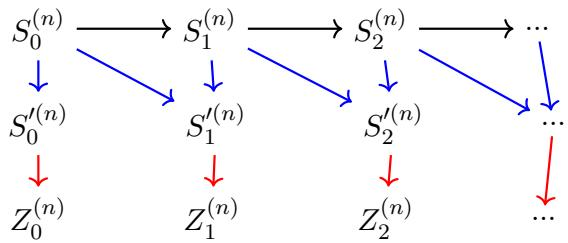  
Figure 4: The black arrows represent the Markov-chain dependence across blocks, the blue arrows represent the Wasserstein–p decoupling constructed via Lemma 1, and the red arrows represent the subsequent optimal-transport Gaussian coupling.

Proposition 5 (Uniform Blockwise Gaussian Coupling). Let $\{ x _ { t } \} _ { t \ge 0 }$ be a stationary uniformly ergodic Markov chain on $x ,$ with transition kernel $P ,$ stationary distribution $\mu ,$ , and $x _ { 0 } \ \sim \ \mu ,$ satisfying (5). Let $h : \mathcal { X }  \mathbb { R } ^ { d }$ satisfy $\mathbb { E } _ { \mu } [ h ] = 0$ and $\mathrm { s u p } _ { x \in \mathcal { X } } \| h ( x ) \| < \infty$ , and let $\Sigma _ { h }$ be its long-run covariance matrix. For every fixed $n \in \mathbb { N }$ , there exists a coupling between $\{ h ( x _ { t } ) \} _ { t \geq 0 }$ and an i.i.d. Gaussian sequence $\{ w _ { t } \} _ { t \ge 0 }$ such that the following holds for the block sum sequences $\{ S _ { m } ^ { ( n ) } \} _ { m }$ and $\{ Z _ { m } ^ { ( n ) } \} _ { m }$ defined in (16):

$$
\operatorname* { s u p } _ { m \geq 0 } \left( \mathbb { E } \left[ \left. S _ { m } ^ { ( n ) } - Z _ { m } ^ { ( n ) } \right. ^ { 2 } \right] \right) ^ { 1 / 2 } \in \mathcal { O } ( n ^ { - 1 / 2 } ) .\tag{17}
$$

Proposition 5 is a key technical ingredient in the proof of Proposition 4. The proofs of Lemma 1 and Proposition 5 are deferred to Section E, and that of Proposition 4 to Section F.

## 6 Applications to Markovian Linear Stochastic Approximation

In this section, we specialize the steady-state Gaussian approximation results of Section 4 to Markovian linear stochastic approximation (LSA), a canonical SA model with multiplicative Markovian noise and a linear mean operator.

Consider the constant-stepsize Markovian LSA recursion [SY19]

$$
\begin{array} { r } { \theta _ { t + 1 } ^ { ( \alpha ) } = \theta _ { t } ^ { ( \alpha ) } + \alpha \left( \mathsf { A } ( x _ { t } ) \theta _ { t } ^ { ( \alpha ) } + s ( x _ { t } ) \right) , \qquad t \ge 0 , } \end{array}\tag{18}
$$

where $\{ x _ { t } \} _ { t \ge 0 }$ is a uniformly ergodic Markov chain on X with unique stationary distribution $\mu ,$ satisfying (5). Let $\mathsf { A } : \mathcal { X } \to \mathbb { R } ^ { d \times d }$ and $s : \mathcal { X } \to \mathbb { R } ^ { d }$ be measurable and uniformly bounded. Define $\overline { { \mathsf { A } } } : = \mathbb { E } _ { \boldsymbol { x } \sim \boldsymbol { \mu } } [ \mathsf { A } ( \boldsymbol { x } ) ] \in \mathbb { R } ^ { d \times d }$ and $\overline { { s } } : = \mathbb { E } _ { x \sim \mu } [ s ( x ) ] \in \mathbb { R } ^ { d }$ . Assume that $\bar { \mathsf A }$ is Hurwitz, as is standard in the analysis of Markovian LSA; see, e.g., [SY19, HCX26, DMNS25]. The target point is the unique solution to $\overline { { { \mathsf { A } } } } \theta + \overline { { { s } } } = 0$ , namely, $\theta ^ { * } : = - \overline { { \mathsf { A } } } ^ { - 1 } \overline { { s } }$ .

Markovian LSA encompasses several widely used reinforcement-learning algorithms, including TD(0) and TD(λ) with linear function approximation for policy evaluation [TVR97, BRS21, SY19, MPWB24].

We first rewrite (18) as a contractive SA recursion of the form (4). Specifically,

$$
\theta _ { t + 1 } ^ { ( \alpha ) } = \theta _ { t } ^ { ( \alpha ) } + \alpha \kappa \left[ \left( I _ { d } + \frac { \mathsf { A } ( x _ { t } ) } { \kappa } \right) \theta _ { t } ^ { ( \alpha ) } + \frac { s ( x _ { t } ) } { \kappa } - \theta _ { t } ^ { ( \alpha ) } \right] , \qquad t \geq 0 ,\tag{19}
$$

where $\kappa > 0$ is a fixed constant satisfying

$$
\kappa > \operatorname* { m a x } _ { \lambda \in \sigma ( \overline { { \mathsf { A } } } ) } \frac { | \lambda | ^ { 2 } } { - 2 \operatorname { R e } ( \lambda ) } , \qquad \sigma ( \overline { { \mathsf { A } } } ) : = \Bigl \{ \lambda \in \mathbb { C } : \operatorname* { d e t } ( \overline { { \mathsf { A } } } - \lambda I _ { d } ) = 0 \Bigr \}
$$

By Lemma G.1, (19) satisfies the assumptions of the general SA recursion (4) with stepsize $\alpha \kappa .$ random operator $\begin{array} { r } { \widetilde { \mathcal { T } } ( x , \theta ) : = \left( I _ { d } + \frac { \mathsf { A } ( x ) } { \kappa } \right) \overline { { \theta } } + \frac { s ( x ) } { \kappa } } \end{array}$ , and mean operator $\begin{array} { r } { T ( \theta ) = \left( I _ { d } + \frac { \overline { { \mathsf { A } } } } { \kappa } \right) \theta + \frac { \overline { { s } } } { \kappa } } \end{array}$ . Its Jacobian is $\begin{array} { r } { J _ { \mathrm { L S A } } : = \nabla T ( \theta ^ { * } ) = I _ { d } + \frac { \overline { { \mathsf { A } } } } { \kappa } } \end{array}$ , whereas the equilibrium noise is $h ( x ) : = \widetilde { T } ( x , \theta ^ { * } ) - \theta ^ { * } =$ $\frac { \mathsf { A } ( x ) \theta ^ { * } + s ( x ) } { \kappa }$ . Define

$$
\Sigma _ { \mathrm { L S A } } : = \operatorname* { l i m } _ { n \to \infty } \frac { 1 } { n } \mathrm { C o v } \left( \sum _ { t = 0 } ^ { n - 1 } ( \mathsf { A } ( x _ { t } ) \theta ^ { * } + s ( x _ { t } ) ) \right) .
$$

Since the mean operator is afine, Assumption 4 holds with $J = J _ { \mathrm { L S A } }$ and $L _ { R } = 0$ . Theorem 1 and (9) then yield

$$
\mathcal { W } _ { 2 } \left( \mathcal { L } \left( \frac { \theta _ { \infty } ^ { ( \alpha ) } - \theta ^ { * } } { \sqrt { \alpha \kappa } } \right) , \mathcal { N } ( 0 , V ) \right) = \mathcal { O } ( \sqrt { \alpha } ) , \qquad \frac { \overline { { \mathsf { A } } } } { \kappa } V + V \frac { \overline { { \mathsf { A } } } ^ { \top } } { \kappa } + \frac { \Sigma _ { \mathrm { L S A } } } { \kappa ^ { 2 } } = 0 .
$$

Setting $V _ { \mathrm { L S A } } : = \kappa V$ gives the following steady-state Gaussian approximation for Markovian LSA.

Corollary 3 (Steady-state Gaussian Approximation for Markovian LSA). Under the setting of Section 6,

$$
\mathcal { W } _ { 2 } \left( \mathcal { L } \left( \frac { \theta _ { \infty } ^ { ( \alpha ) } - \theta ^ { * } } { \sqrt { \alpha } } \right) , \mathcal { N } ( 0 , V _ { \mathrm { L S A } } ) \right) \in \mathcal { O } ( \sqrt { \alpha } ) , \qquad \overline { { \mathsf { A } } } V _ { \mathrm { L S A } } + V _ { \mathrm { L S A } } \overline { { \mathsf { A } } } ^ { \top } + \boldsymbol { \Sigma } _ { \mathrm { L S A } } = 0 .\tag{20}
$$

As a consequence, Corollary 1 applies directly to Markovian LSA and yields Gaussian approxi mation guarantees for the raw iterates. To the best of our knowledge, our SSC framework therefore provides the first steady-state Gaussian approximation, together with corresponding raw-iterate Gaussian approximation guarantees, for Markovian LSA.

## 7 Applications to Asynchronous Q-Learning

In this section, we specialize the SSC results of Sections 4 and 5 to asynchronous Q-learning, a canonical SA model with multiplicative Markovian noise and a potentially nondiferentiable mean operator.

## 7.1 Model Setup

Consider a discounted Markov decision process $( \boldsymbol { S } , \boldsymbol { \mathcal { A } } , \mathsf { P } , \boldsymbol { r } , \rho )$ , where S and A are finite state and action spaces, respectively, $\mathsf { P } ( \cdot \mid s , a ) \in \Delta ( \mathcal { S } )$ is the transition kernel, $r : \mathcal { S \times A } \to [ 0 , 1 ]$ is the reward function, and $\rho \in ( 0 , 1 )$ is the discount factor. For a stationary policy $\pi : S  \Delta ( { \mathcal { A } } )$ , its Q-function is

$$
q ^ { \pi } ( s , a ) : = \mathbb { E } ^ { \pi } \left[ \sum _ { t = 0 } ^ { \infty } \rho ^ { t } r ( S _ { t } , A _ { t } ) \Bigg | S _ { 0 } = s , A _ { 0 } = a \right] ,
$$

where, for $t \geq 1 , A _ { t } \sim \pi ( \cdot \mid S _ { t } )$ and $S _ { t + 1 } \sim \mathsf P ( \cdot \mid S _ { t } , A _ { t } )$ . The optimal Q-function is $q ^ { * } ( s , a ) : =$ $\operatorname* { s u p } _ { \pi } q ^ { \pi } ( s , a )$ . It is the unique fixed point of the Bellman optimality operator $\boldsymbol { B } : \mathbb { R } ^ { | \boldsymbol { S } | | \boldsymbol { A } | }  \mathbb { R } ^ { | \boldsymbol { S } | | \boldsymbol { A } | }$ ， defined by

$$
[ \mathcal B q ] ( s , a ) : = r ( s , a ) + \rho \sum _ { s ^ { \prime } \in \mathcal S } \mathsf P ( s ^ { \prime } \mid s , a ) \operatorname* { m a x } _ { a ^ { \prime } \in \mathcal A } q ( s ^ { \prime } , a ^ { \prime } ) .\tag{21}
$$

We consider the of-policy setting in which the data are generated by a fixed stationary behavior policy $\pi _ { b } : { \mathcal { S } } \to \Delta ( { \mathcal { A } } )$ . More precisely, $A _ { t } \sim \pi _ { b } ( \cdot \mid S _ { t } ) $ and $S _ { t + 1 } \sim \mathsf P ( \cdot \mid S _ { t } , A _ { t } )$ . We impose the following standard coverage and ergodicity condition for asynchronous Q-learning [CMSS24].

Assumption 6 (Coverage and Ergodicity under the Behavior Policy). The behavior policy $\pi _ { b }$ satisfies $\pi _ { b } ( a \mid s ) > 0$ for any $( s , a ) \in \mathcal { S } \times \mathcal { A }$ , and the Markov chain $\{ S _ { t } \} _ { t \ge 0 }$ induced by $\pi _ { b }$ is irreducible and aperiodic.

Let $\rho _ { \pi _ { b } }$ denote the stationary distribution of $\{ S _ { t } \} _ { t \ge 0 }$ , and define the stationary state–action distribution $\nu ( s , a ) : = \rho _ { \pi _ { b } } ( s ) \pi _ { b } ( a \mid s )$ . Since S and A are finite, Assumption 6 implies $\nu _ { \mathrm { m i n } } : =$ min $\mathbf { \Phi } _ { \cdot ( s , a ) \in S \times A } \nu ( s , a ) > 0$ . Moreover, $x _ { t } : = ( S _ { t } , A _ { t } , S _ { t + 1 } )$ is an irreducible and aperiodic finite-state Markov chain on

$$
\mathcal { X } : = \{ ( s , a , s ^ { \prime } ) \in S \times \mathcal { A } \times \mathcal { S } : \mathsf { P } ( s ^ { \prime } \mid s , a ) > 0 \} .
$$

Hence, $\{ x _ { t } \} _ { t \ge 0 }$ is uniformly ergodic, with stationary distribution

$$
\mu ( s , a , s ^ { \prime } ) = \nu ( s , a ) \mathsf { P } ( s ^ { \prime } \mid s , a ) .
$$

Asynchronous Q-Learning. Let $d _ { Q } : = | S | | A |$ , and identify each Q-function with a vector in $\mathbb { R } ^ { d _ { Q } }$ . For each $( s , a ) \in \mathcal S \times \mathcal A$ , let $e _ { s , a } \in \mathbb { R } ^ { d _ { Q } }$ denote the corresponding standard basis vector. For $x = ( s , a , s ^ { \prime } ) \in \mathcal { X }$ , define

$$
F ( x , q ) : = e _ { s , a } \left( r ( s , a ) + \rho \operatorname* { m a x } _ { a ^ { \prime } \in \mathcal { A } } q ( s ^ { \prime } , a ^ { \prime } ) - q ( s , a ) \right) .
$$

The constant-stepsize asynchronous Q-learning recursion [CMSS24] is

$$
q _ { t + 1 } ^ { ( \alpha ) } = q _ { t } ^ { ( \alpha ) } + \alpha F ( X _ { t } , q _ { t } ^ { ( \alpha ) } ) , \qquad t \ge 0 .
$$

Equivalently, defining the random operator $\widetilde { \mathcal { T } } ( x , q ) : = q + F ( x , q )$ , we may write

$$
q _ { t + 1 } ^ { ( \alpha ) } = q _ { t } ^ { ( \alpha ) } + \alpha \big ( \widetilde { T } ( x _ { t } , q _ { t } ^ { ( \alpha ) } ) - q _ { t } ^ { ( \alpha ) } \big ) , \qquad t \ge 0 .\tag{22}
$$

Let $D _ { \nu } : = \mathrm { d i a g } ( \{ \nu ( s , a ) \} _ { ( s , a ) \in { \cal S } \times { \cal A } } )$ . Taking expectation with respect to the stationary distribution µ gives the mean operator

$$
\begin{array} { r } { \mathcal { T } ( q ) : = \mathbb { E } _ { x \sim \mu } \left[ \widetilde { \mathcal { T } } ( x , q ) \right] = q + D _ { \nu } \big ( \mathcal { B } q - q \big ) = \big ( I _ { d _ { Q } } - D _ { \nu } \big ) q + D _ { \nu } \mathcal { B } q . } \end{array}\tag{23}
$$

Since the Bellman optimality operator is a $\rho \mathrm { - }$ -contraction in the supremum norm, the mean operator satisfies

$$
\| \mathcal { T } ( q ) - \mathcal { T } ( q ^ { \prime } ) \| _ { \infty } \le \gamma \| q - q ^ { \prime } \| _ { \infty } , \qquad \forall q , q ^ { \prime } \in \mathbb { R } ^ { d _ { Q } } ,
$$

where

$$
\gamma : = 1 - ( 1 - \rho ) \nu _ { \operatorname* { m i n } } \in ( 0 , 1 ) .
$$

Thus, Assumption 1 holds with $\| \cdot \| _ { c } = \| \cdot \| _ { \infty }$ and contraction modulus $\gamma .$ . Moreover, $\mathcal { T } ( q ^ { * } ) = q ^ { * }$ Therefore, the boundedness of the rewards, the properties of the max operator, and the preceding discussion verify that the Q-learning recursion (22) satisfies the assumptions of the general SA recursion (4). Let $q _ { \infty } ^ { ( \alpha ) }$ denote a random variable whose distribution is the Q-marginal of the stationary distribution of the Markov chain $\{ ( x _ { t } , q _ { t } ^ { ( \alpha ) } ) \} _ { t \geq 0 }$

## 7.2 Equilibrium Noise and Its Long-Run Covariance

We write $V ^ { * } ( s ) : = \operatorname* { m a x } _ { a \in \mathcal { A } } q ^ { * } ( s , a )$ and $\begin{array} { r } { \mathcal { A } ^ { * } ( s ) : = \arg \operatorname* { m a x } _ { a \in \mathcal { A } } q ^ { * } ( s , a ) } \end{array}$ . The equilibrium noise is

$$
h ( x ) : = \widetilde { \mathcal { T } } \big ( ( s , a , s ^ { \prime } ) , q ^ { * } \big ) - q ^ { * } = e _ { s , a } ( r ( s , a ) + \rho V ^ { * } ( s ^ { \prime } ) - q ^ { * } ( s , a ) ) .
$$

The Bellman optimality equation implies that $\mathbb { E } \left[ h ( S _ { t } , A _ { t } , S _ { t + 1 } ) \vert S _ { t } , A _ { t } \right] ~ = ~ 0$ . Consequently, $\{ h ( x _ { t } ) \} _ { t \geq 0 }$ is a martingale diference sequence with respect to the natural trajectory filtration. Therefore, its long-run covariance matrix reduces to the zero-lag covariance

$$
\Sigma _ { Q } : = \sum _ { \ell \in \mathbb { Z } } \mathbb { E } _ { \mu } \left[ h ( x _ { 0 } ) h ( x _ { \ell } ) ^ { \top } \right] = \mathbb { E } _ { \mu } \left[ h ( x _ { 0 } ) h ( x _ { 0 } ) ^ { \top } \right] = \rho ^ { 2 } \cdot \mathrm { d i a g } \left( \left\{ \nu ( s , a ) \sigma _ { s , a } ^ { 2 } \right\} _ { ( s , a ) \in S \times A } \right) ,
$$

where $\sigma _ { s , a } ^ { 2 } : = \mathsf { V a r } _ { s ^ { \prime } \sim \mathsf { P } ( \cdot | s , a ) } \left( V ^ { * } ( s ^ { \prime } ) \right)$ . Since $\nu ( s , a ) > 0$ for every $( s , a ) \in S \times A$

$$
\Sigma _ { Q } { \mathrm { ~ i s ~ p o s i t i v e - d e f n i t e } } \quad \iff \quad \sigma _ { s , a } ^ { 2 } > 0 \quad \mathrm { f o r ~ e v e r y ~ } ( s , a ) \in { \mathcal { S } } \times { \mathcal { A } } .\tag{24}
$$

## 7.3 Steady-State Gaussian Approximation Under No Optimal-Action Ties

We first consider the case where each state admits a unique optimal action. For each $s \in { \mathcal { S } } .$ , let $a ^ { * } ( s )$ denote this action. Since S and A are finite, the minimum optimality gap

$$
\Delta _ { * } : = \operatorname* { m i n } _ { s \in \mathcal { S } } \left\{ q ^ { * } ( s , a ^ { * } ( s ) ) - \operatorname* { m a x } _ { a \neq a ^ { * } ( s ) } q ^ { * } ( s , a ) \right\} > 0 .
$$

Thus, whenever $\begin{array} { r } { \| \boldsymbol { q } - \boldsymbol { q } ^ { * } \| _ { \infty } \leq \frac { \Delta _ { * } } { 2 } } \end{array}$ , the greedy action associated with q remains $a ^ { * } ( s )$ at every state. It follows that the Bellman and mean operators are afine in a neighborhood of $q ^ { * }$ . Define the state–action transition matrix induced by the unique optimal policy by

$$
\left[ P ^ { \pi ^ { * } } \right] _ { ( s , a ) , ( s ^ { \prime } , a ^ { \prime } ) } : = \mathsf { P } ( s ^ { \prime } \mid s , a ) \mathbb { 1 } _ { \{ a ^ { \prime } = a ^ { * } ( s ^ { \prime } ) \} } .
$$

In a neighborhood of $q ^ { * } , B q = r + \rho P ^ { \pi ^ { * } } q$ , and hence the Jacobian of the mean operator at $q ^ { * }$ is $J _ { Q } : = I _ { d _ { Q } } - D _ { \nu } + \rho D _ { \nu } P ^ { \pi ^ { * } }$ . Let $L _ { Q } : = J _ { Q } - I _ { d _ { Q } } = D _ { \nu } ( \rho P ^ { \pi ^ { * } } - I _ { d _ { Q } } )$ . Thus, Assumption 4 holds with $J = J _ { Q }$ and $L _ { R } = 0$ , since $\mathcal T ( q ) - \mathcal T ( q ^ { * } ) = J _ { Q } ( q - q ^ { * } )$ for all q suficiently close to $q ^ { * }$ . Theorem 1 and (9) then yield the following result.

Corollary 4 (Steady-state Gaussian approximation for Asynchronous Q-learning). Suppose that Assumption 6 holds. If $\mathcal { A } ^ { \ast } ( s )$ is a singleton for every $s \in { \mathcal { S } }$ 2

$$
\mathcal { W } _ { 2 } \left( \mathcal { L } \left( \frac { q _ { \infty } ^ { ( \alpha ) } - q ^ { * } } { \sqrt { \alpha } } \right) , \mathcal { N } ( 0 , V _ { Q } ) \right) \in \mathcal { O } ( \sqrt { \alpha } ) , \qquad \mathcal { L } _ { Q } V _ { Q } + V _ { Q } L _ { Q } ^ { \top } + \Sigma _ { Q } = 0 .
$$

As a consequence, Corollary 1 applies directly to asynchronous Q-learning under the no-tie condition, yielding Gaussian approximation guarantees for the raw iterates. To the best of our knowledge, our SSC framework therefore provides the first steady-state Gaussian approximation for asynchronous Q-learning, together with corresponding Gaussian approximation guarantees for the raw iterates.

## 7.4 √α-Bias in the Presence of Optimal-Action Ties

We next consider the case where some state admits multiple optimal actions. In this regime, the mean operator $\tau$ is nondiferentiable at $q ^ { * }$ and satisfies the conditions of Corollary 2. Consequently, the leading-order steady-state bias is of order $\sqrt { \alpha }$ , as stated in the following corollary. Its proof is deferred to Section H.

Corollary 5 $( \sqrt { \alpha }$ -Bias under Optimal-Action Ties). Suppose that Assumption 6 holds and that $\Sigma _ { Q }$ is positive-definite. If there exists a state ${ \bar { s } } \in S$ such that $\lvert A ^ { * } ( \bar { s } ) \rvert > 1$ , then there exists an vector $c _ { Q } \in \mathbb { R } ^ { d _ { Q } }$ and $c _ { Q } \neq 0$ such that

$$
\mathbb { E } \big [ q _ { \infty } ^ { ( \alpha ) } \big ] - q ^ { * } = \sqrt { \alpha } c _ { Q } + o \big ( \sqrt { \alpha } \big ) .
$$

Complete Bias Characterization for Asynchronous Q-learning. Under the no-optimalaction-ties assumption, [ZX24] study the same asynchronous Q-learning recursion and show that the leading-order asymptotic bias is linear in α. However, neither their work nor the existing literature provides a corresponding bias characterization in the presence of optimal-action ties. Our SSC theory fills this gap by showing that, under ties, the asymptotic bias can be of order $\sqrt { \alpha }$ Together, these results provide a complete leading-order characterization of the asymptotic bias of asynchronous Q-learning.

Covariance Condition. The positive-definiteness of $\Sigma _ { Q }$ is a convenient suficient condition for applying Corollary 2. In the present deterministic-reward setting, by (24), it is equivalent to

$$
\sigma _ { s , a } ^ { 2 } : = \mathrm { V a r } _ { s ^ { \prime } \sim \mathsf { P } ( \cdot \mid s , a ) } \bigl ( V ^ { * } ( s ^ { \prime } ) \bigr ) > 0 , \qquad \forall ( s , a ) \in \mathcal { S } \times \mathcal { A } .
$$

A Unified Extrapolation Scheme. Suppose that $\Sigma _ { Q }$ is positive definite. Depending on the underlying MDP, the leading-order bias scales as either α or ${ \sqrt { \alpha } } .$ . Since this regime may be unknown a priori, a robust approach is to use three stepsizes, α, 2α, and 4α, and simultaneously eliminate both candidate leading-order terms. Specifically, define

$$
\widetilde { q } _ { t } ^ { ( \alpha ) } : = \left( 4 + 2 \sqrt { 2 } \right) \bar { q } _ { t } ^ { ( \alpha ) } - \left( 4 + 3 \sqrt { 2 } \right) \bar { q } _ { t } ^ { ( 2 \alpha ) } + \left( 1 + \sqrt { 2 } \right) \bar { q } _ { t } ^ { ( 4 \alpha ) } ,\tag{25}
$$

where $\bar { q } _ { t } ^ { ( \alpha ) }$ denotes the tail-averaged iterate with stepsize α. Indeed, the coeficients satisfy

$$
\begin{array} { l l } { { ( 4 + 2 \sqrt 2 ) - ( 4 + 3 \sqrt 2 ) + ( 1 + \sqrt 2 ) = 1 , } } \\ { { ( 4 + 2 \sqrt 2 ) - \sqrt 2 ( 4 + 3 \sqrt 2 ) + 2 ( 1 + \sqrt 2 ) = 0 , } } \\ { { ( 4 + 2 \sqrt 2 ) - 2 ( 4 + 3 \sqrt 2 ) + 4 ( 1 + \sqrt 2 ) = 0 . } } \end{array}
$$

Thus, the extrapolation preserves an accurate estimate of $q ^ { * }$ while simultaneously canceling the $\sqrt { \alpha } -$ and α-order terms, yielding a unified bias-reduction scheme that does not require prior knowledge of whether optimal-action ties are present. In Section 8, we further illustrate numerically that this unified extrapolation performs robustly across both regimes, whereas a misspecified RR extrapolation can lead to substantially worse performance.

## 8 Numerical Experiments

We illustrate the asymptotic bias theory for asynchronous Q-learning using two finite MDPs: one in the no-tie regime, where each state admits a unique optimal action, and one in the tied regime, where optimal-action ties are present. The complete experimental setup is deferred to Appendix I.2.

Regime-Specific RR Extrapolation. Our SSC theory, together with the locally diferentiable bias characterization of [ZX24], predicts diferent leading-order asymptotic biases in the two regimes. In the no-tie regime, the mean operator is locally afine and the bias is of order $\alpha ;$ in the tied regime, the mean operator is locally nondiferentiable and the bias is of order $\sqrt { \alpha }$ . Accordingly, we use the regime-specific RR extrapolations $\tilde { q } _ { t } ^ { ( \alpha ) } : = 2 \bar { q } _ { t } ^ { ( \alpha ) } - \bar { q } _ { t } ^ { ( 2 \alpha ) }$ for the no-tie regime, and $\tilde { q } _ { t } ^ { ( \alpha ) } : = ( 2 + \sqrt { 2 } ) \bar { q } _ { t } ^ { ( \alpha ) } - ( 1 + \sqrt { 2 } ) \bar { q } _ { t } ^ { ( 2 \alpha ) }$ for the tied regime, which cancel the corresponding leading-order bias terms.

Figure 5 compares tail averaging with the regime-specific RR extrapolation. In both cases, the correct RR extrapolation significantly reduces the long-run error. These observations support the distinct leading-order bias characterizations established in the two regimes. Throughout this section, the solid and dashed curves report the average errors over independent runs, while the shaded regions indicate pointwise 95% confidence intervals.

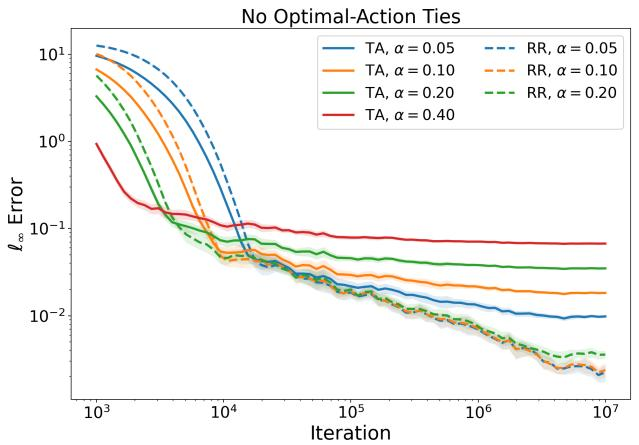

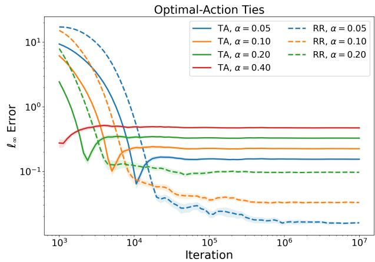  
Figure 5: Tail averaging and regime-specific RR extrapolation.

Misspecified and Unified RR Extrapolation. We next examine two alternatives when the bias regime is unknown: a misspecified extrapolation that is designed for the wrong regime, and the unified RR extrapolation (25), which simultaneously cancels the α- and ${ \sqrt { \alpha } } { \mathrm { - o r d e r } }$ candidate terms.

Figure 6 summarizes the comparison. In the no-tie MDP, the extrapolation designed for a ${ \sqrt { \alpha } } { \mathrm { - o r d e r } }$ bias fails to remove the dominant linear term and can even degrade performance. In the tied MDP, the linear-bias RR extrapolation yields only limited improvement. By contrast, the unified RR extrapolation substantially reduces the long-run error in both MDPs. This is consistent with the discussion in Section 7.4: the leading-order bias is determined by the unknown local structure of the underlying MDP, whereas the unified RR procedure provides a robust bias-reduction scheme without prior knowledge of the regime.

## 9 Conclusion

In this work, we develop a steady-state convergence (SSC) theory for constant-stepsize contractive stochastic approximation (SA). Through a multi-step universality framework, we establish steadystate Gaussian approximations under local quadratic linearization and develop a general SSC theory for locally one-sided directionally diferentiable mean operators. We further characterize conditions under which the asymptotic bias is genuinely of order $\sqrt { \alpha }$ . Our results substantially extend existing SSC theory and yield several applications, including Gaussian approximation guarantees for raw iterates under local quadratic linearization and principled bias reduction in the locally nondiferentiable regime. We illustrate the theory through Markovian linear SA and asynchronous Q-learning. In particular, for asynchronous Q-learning, we propose a unified bias-reduction scheme, whose efectiveness is supported by our numerical experiments.

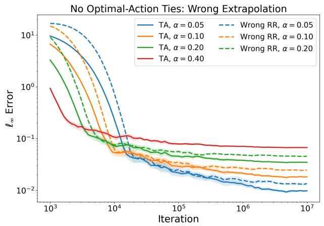

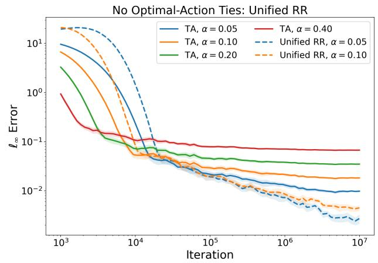

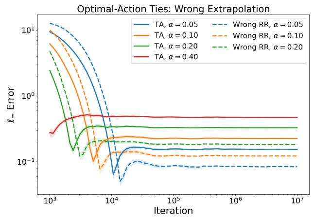

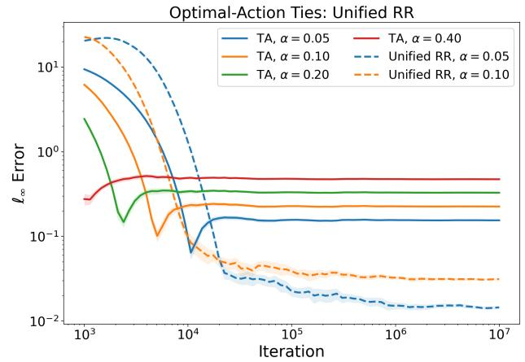  
Figure 6: Misspecified and unified RR extrapolations.

One promising direction for future work is to characterize necessary conditions for the asymptotic bias to be genuinely of order $\sqrt { \alpha }$ . Moreover, as conjectured in recent work [WWN+26], the steady-state behavior may difer substantially when the mean operator is not globally contractive. Developing an SSC theory with an appropriate scaling in such settings is another interesting direction.

## Acknowledgments

Y. Zhang and Q. Xie are supported in part by NSF grants CNS-1955997, EPCN-2339794 and EPCN-2432546.

## References

[ABD21] Shane Arora, Hazel Browne, and Daniel Daners. An alternative approach to Fréchet derivatives. Journal of the Australian Mathematical Society, 111(2):202–220, 2021.

[BDM17] Anton Braverman, J. G. Dai, and Masakiyo Miyazawa. Heavy trafic approximation for the stationary distribution of a generalized Jackson network: the BAR approach. Stochastic Systems, 7(1):143–196, May 2017.

[BDM25] Anton Braverman, J. G. Dai, and Masakiyo Miyazawa. The BAR approach for multiclass queueing networks with SBP service policies. Stochastic Systems, 15(1):1–49, 2025.

[Ber19] Dimitri P. Bertsekas. Reinforcement learning and Optimal Control. Athena Scientific, Belmont, Massachusetts, USA, 2019.

[BM20] Vladimir I. Bogachev and Ilya I. Malofeev. Kantorovich problems and conditional measures depending on a parameter. Journal of Mathematical Analysis and Applications, 486(1):123883, 2020.

[Bon20] Thomas Bonis. Stein’s method for normal approximation in Wasserstein distances with application to the multivariate central limit theorem. Probability Theory and Related Fields, 178(3):827–860, 2020.

[BRS21] Jalaj Bhandari, Daniel Russo, and Raghav Singal. A finite time analysis of temporal diference learning with linear function approximation. Operations Research, 69(3):950–973, 2021.

[Cla90] Frank H Clarke. Optimization and nonsmooth analysis. SIAM, 1990.

[CMM22] Zaiwei Chen, Shancong Mou, and Siva Theja Maguluri. Stationary behavior of constant stepsize SGD type algorithms: An asymptotic characterization. Proceedings of the ACM on Measurement and Analysis of Computing Systems, 6(1):1–24, 2022.

[CMSS20] Zaiwei Chen, Siva Theja Maguluri, Sanjay Shakkottai, and Karthikeyan Shanmugam. Finitesample analysis of contractive stochastic approximation using smooth convex envelopes. In H. Larochelle, M. Ranzato, R. Hadsell, M.F. Balcan, and H. Lin, editors, Advances in Neural Information Processing Systems, volume 33, pages 8223–8234. Curran Associates, Inc., 2020.

[CMSS24] Zaiwei Chen, Siva Theja Maguluri, Sanjay Shakkottai, and Karthikeyan Shanmugam. A Lyapunov theory for finite-sample guarantees of Markovian stochastic approximation. Operations Research, 72(4):1352–1367, 2024.

[DDB20] Aymeric Dieuleveut, Alain Durmus, and Francis Bach. Bridging the gap between constant step size stochastic gradient descent and Markov chains. The Annals of Statistics, 48(3):1348–1382, 2020.

[DM17] Alain Durmus and Éric Moulines. Nonasymptotic convergence analysis for the unadjusted Langevin algorithm. The Annals of Applied Probability, 27(3):1551 – 1587, 2017.

[DM19] Alain Durmus and Éric Moulines. High-dimensional Bayesian inference via the unadjusted Langevin algorithm. Bernoulli, 25(4A):2854 – 2882, 2019.

[DMNS25] Alain Durmus, Eric Moulines, Alexey Naumov, and Sergey Samsonov. Finite-time highprobability bounds for Polyak–Ruppert averaged iterates of linear stochastic approximation. Mathematics of Operations Research, 50(2):935–964, 2025.

[DMR95] Paul Doukhan, Pascal Massart, and Emmanuel Rio. Invariance principles for absolutely regular empirical processes. In Annales de l’IHP Probabilités et statistiques, volume 31, pages 393–427, 1995.

[DP04] Jérôme Dedecker and Clémentine Prieur. Coupling for τ -dependent sequences and applications. Journal of Theoretical Probability, 17(4):861–885, 2004.

[Eul00] Leonhard Euler. Foundations of diferential calculus. Springer Science & Business Media, 2000.

[Fol99] Gerald B Folland. Real analysis: modern techniques and their applications. Pure and Applied Mathematics: A Wiley Series of Texts, Monographs and Tracts. John Wiley & Sons, Nashville, TN, 2 edition, March 1999.

[Gur14] Itai Gurvich. Validity of heavy-trafic steady-state approximations in multiclass queueing networks: the case of queue-ratio disciplines. Mathematics of Operations Research, 39(1):121– 162, 2014.

[GZ06] David Gamarnik and Assaf Zeevi. Validity of heavy trafic steady-state approximation in generalized Jackson networks. Ann. Appl. Probab., 16(1):56–90, 2006.

[HCX26] Dongyan (Lucy) Huo, Yudong Chen, and Qiaomin Xie. Bias and extrapolation in Markovian linear stochastic approximation with constant step sizes. Mathematics of Operations Research, 2026. Articles in Advance.

[Hil87] Francis Begnaud Hildebrand. Introduction to numerical analysis. Courier Corporation, 1987.

[HMSW26] Hadi Hadavi, Wenlong Mou, Sergey Samsonov, and Hoi-To Wai. Revisiting the constant stepsize stochastic approximation with decision-dependent Markovian noise. arXiv preprint arXiv:2604.13378, 2026.

[HUL04] Jean-Baptiste Hiriart-Urruty and Claude Lemaréchal. Fundamentals of convex analysis. Springer Science & Business Media, 2004.

[HWZM26] Shaan Ul Haque, Zedong Wang, Zixuan Zhang, and Siva Theja Maguluri. How accurately can a gaussian approximate stochastic approximation iterates? arXiv preprint arXiv:2602.13906, 2026.

[HZCX24] Dongyan Lucy Huo, Yixuan Zhang, Yudong Chen, and Qiaomin Xie. The collusion of memory and nonlinearity in stochastic approximation with constant stepsize. Advances in Neural Information Processing Systems, 37:21699–21762, 2024.

[KY03] Harold J. Kushner and G. George Yin. Stochastic Approximation and Recursive Algorithms and Applications. Stochastic Modelling and Applied Probability. Springer, New York, NY, USA, 2nd edition, 2003.

[Lan20] Guanghui Lan. First-order and Stochastic Optimization Methods for Machine Learning. Springer, 2020.

[MB11] Eric Moulines and Francis Bach. Non-asymptotic analysis of stochastic approximation algorithms for machine learning. In J. Shawe-Taylor, R. Zemel, P. Bartlett, F. Pereira, and K.Q. Weinberger,

editors, Advances in Neural Information Processing Systems, volume 24. Curran Associates, Inc., 2011.

[MPWB24] Wenlong Mou, Ashwin Pananjady, Martin J. Wainwright, and Peter L. Bartlett. Optimal and instance-dependent guarantees for Markovian linear stochastic approximation. Mathematical Statistics and Learning, 7(1/2):41–153, 2024.

[MT09] Sean P. Meyn and Richard L. Tweedie. Markov Chains and Stochastic Stability. Cambridge Mathematical Library. Cambridge University Press, Cambridge, 2nd edition, 2009.

[PB+14] Neal Parikh, Stephen Boyd, et al. Proximal algorithms. Foundations and trends® in Optimization, 1(3):127–239, 2014.

[PR96] René A. Poliquin and R. Tyrrell Rockafellar. Prox-regular functions in variational analysis. Transactions of the American Mathematical Society, 348(5):1805–1838, 1996.

[Roc70] Ralph Tyrell Rockafellar. Convex Analysis. Number 28 in Princeton Mathematical Series. Princeton University Press, Princeton, NJ, 1970.

[Sag13] Claudia Sagastizábal. Composite proximal bundle method. Mathematical Programming, 140(1):189–233, 2013.

[SB18] Richard S. Sutton and Andrew G. Barto. Reinforcement Learning: An Introduction. A Bradford Book, Cambridge, MA, USA, 2018.

[Sha03] Alexander Shapiro. On a class of nonsmooth composite functions. Mathematics of Operations Research, 28(4):677–692, 2003.

[SY19] R. Srikant and Lei Ying. Finite-time error bounds for linear stochastic approximation and TD learning. In Proceedings of the 32nd Conference on Learning Theory, volume 99 of Proceedings of Machine Learning Research, pages 2803–2830. PMLR, 2019.

[TVR97] John N. Tsitsiklis and Benjamin Van Roy. An analysis of temporal-diference learning with function approximation. IEEE Transactions on Automatic Control, 42(5):674–690, 1997.

[WD92] Christopher J. C. H. Watkins and Peter Dayan. Q-Learning. Machine Learning, 8(3):279–292, May 1992.

[WLLW25] Ziyang Wei, Jiaqi Li, Zhipeng Lou, and Wei Biao Wu. Gaussian approximation and concentration of constant learning-rate stochastic gradient descent. Advances in Neural Information Processing Systems, 38:94690–94720, 2025.

[WWN+26] Zedong Wang, Yuyang Wang, Ijay Narang, Felix Wang, Yuzhou Wang, and Siva Theja Maguluri. Steady-state behavior of constant-stepsize stochastic approximation: Gaussian approximation and tail bounds. arXiv preprint arXiv:2602.13960, 2026.

[YY16] Heng-Qing Ye and David D. Yao. Difusion limit of fair resource control—stationarity and interchange of limits. Mathematics of Operations Research, 41(4):1161–1207, 2016.

[YY18] Heng-Qing Ye and David D. Yao. Justifying difusion approximations for multiclass queueing networks under a moment condition. The Annals of Applied Probability, 28(6):3652 – 3697, 2018.

[ZHCX24] Yixuan Zhang, Dongyan Huo, Yudong Chen, and Qiaomin Xie. Prelimit coupling and steady-state convergence of constant-stepsize nonsmooth contractive SA. arXiv preprint arXiv:2404.06023, 2024. Presented at ACM SIGMETRICS 2024; extended abstract in ACM SIGMETRICS Performance Evaluation Review, 52(1):35–36.

[ZHCX25] Yixuan Zhang, Dongyan Huo, Yudong Chen, and Qiaomin Xie. A piecewise Lyapunov analysis of sub-quadratic SGD: Applications to robust and quantile regression. ACM SIGMETRICS Performance Evaluation Review, 53(1):85–87, 2025.

[ZX24] Yixuan Zhang and Qiaomin Xie. Constant stepsize Q-learning: Distributional convergence, bias and extrapolation. Reinforcement Learning Journal, 3:1168–1210, 2024.

[ZX26a] Yixuan Zhang and Qiaomin Xie. Gaussian approximation for multivariate martingale sums from uniformly ergodic markov chains. arXiv preprint arXiv:2609.09480, 2026.

[ZX26b] Yixuan Zhang and Qiaomin Xie. Wasserstein-p central limit theorem rates: From local dependence to Markov chains. arXiv preprint arXiv:2601.08184, 2026. Accepted to ACM SIGMETRICS 2026; extended abstract in ACM SIGMETRICS Performance Evaluation Review, 54(1):216–218.

## Appendices

## A Preliminaries

## A.1 Moreau Envelope

Let $\phi : \mathbb { R } ^ { d }  \mathbb { R }$ be defined by $\begin{array} { r } { \phi ( x ) : = \frac { 1 } { 2 } \| x \| _ { c } ^ { 2 } } \end{array}$ , where $\| \cdot \| _ { c }$ may be nondiferentiable. To handle this, we work with the Moreau envelope $[ \mathrm { P B ^ { + } 1 4 }$ , CMSS24, CMSS20], which serves as a smooth surrogate of $\phi .$ Since all norms on $\mathbb { R } ^ { d }$ are equivalent [Fol99], there exist constants $0 < l _ { c s } \leq u _ { c s } < \infty$ such that

$$
l _ { c s } \| \boldsymbol { x } \| _ { 2 } \leq \| \boldsymbol { x } \| _ { c } \leq u _ { c s } \| \boldsymbol { x } \| _ { 2 } , \qquad \forall \boldsymbol { x } \in \mathbb { R } ^ { d } .
$$

For any $\eta > 0$ , the Moreau envelope of $\phi$ with respect to the Euclidean prox function ${ \frac { 1 } { 2 } } \parallel \cdot \parallel _ { 2 } ^ { 2 }$ is

$$
M _ { \eta } ( \boldsymbol { x } ) = \operatorname* { i n f } _ { \boldsymbol { u } \in \mathbb { R } ^ { d } } \Big \{ \phi ( \boldsymbol { u } ) + \frac { 1 } { 2 \eta } \| \boldsymbol { x } - \boldsymbol { u } \| _ { 2 } ^ { 2 } \Big \} , \qquad \forall \boldsymbol { x } \in \mathbb { R } ^ { d } .\tag{A.1}
$$

The basic properties of $M _ { \eta }$ are summarized below.

Lemma A.1 (Proposition 6 in [ZHCX24]). $M _ { \eta }$ has the following properties: $( 1 ) \ M _ { \eta }$ is convex and $\frac { 1 } { \eta }$ -smooth with respect to $\| \cdot \| _ { 2 } ; ( 2 )$ there exists a norm $\| \cdot \| _ { m }$ such that $M _ { \eta } ( x ) = \textstyle { \frac { 1 } { 2 } } \| x \| _ { m } ^ { 2 } ; ( \mathcal { B } )$ it holds that $\begin{array} { r } { l _ { c m } \| \cdot \| _ { m } \leq \| \cdot \| _ { c } \leq u _ { c m } \| \cdot \| _ { m } } \end{array}$ , where $l _ { c m } = ( 1 + \eta l _ { c s } ^ { 2 } ) ^ { \frac { 1 } { 2 } }$ and $u _ { c m } = ( 1 + \eta u _ { c s } ^ { 2 } ) ^ { \frac { 1 } { 2 } }$ ; (4) $\begin{array} { r } { \langle \nabla M _ { \eta } ( x ) , y \rangle \leq \| x \| _ { m } \| y \| _ { m } , \forall x , y \in \mathbb { R } ^ { d } ; \ ( 5 ) \ \nabla M _ { \eta } ( c x ) = c \nabla M _ { \eta } ( x ) , \forall c \geq 0 , x \in \mathbb { R } ^ { d } } \end{array}$

The proof of items (1)–(4) above can be found in [CMSS24, Proposition 1] and [CMSS20, Lemma A.1]. Item (5) follows from (1), (2) and Euler’s homogeneous function theorem [Eul00].

## A.2 Preliminaries for SA

In this subsection, we collect several auxiliary results of SA that will be used throughout the proof.   
We begin with the following increment bound for Markovian SA.

Lemma A.2 (Lemma 4 in [CMSS24]). Under Assumptions 1 and $\mathcal { Q } ( i i )$ , for any $\alpha > 0$ and $m \geq 1$ satisfying αm $\lesssim 1$ , we have

$$
\begin{array} { r } { \lVert \theta _ { t + m } - \theta _ { t } \rVert \lesssim \alpha m \big ( \lVert \theta _ { t } \rVert + 1 \big ) , \qquad \forall t \geq 0 . } \end{array}
$$

We also record a fourth-moment bound for the SA iterates. Such a bound was established for the i.i.d. setting in [ZHCX24] and for Markovian monotone SA in [HMSW26]. The extension to the general Markovian SA is straightforward: one can follow the argument of [HMSW26] verbatim, replacing its Euclidean Lyapunov function by the Moreau-envelope Lyapunov function (A.1) to accommodate a general contraction norm. We therefore omit the proof.

Lemma A.3. Under Assumptions 1 and 2, there exist constants $c _ { 0 } , c _ { 1 } , \alpha _ { 0 } > 0$ , independent of α and $t ,$ such that, for every stepsize $\alpha \in ( 0 , \alpha _ { 0 } )$ , there exists $t _ { \alpha } \geq 0 ~ f o r$ which

$$
\begin{array} { r } { \mathbb { E } \Big [ \| \theta _ { t } ^ { ( \alpha ) } - \theta ^ { * } \| ^ { 4 } \Big ] \leq c _ { 0 } e ^ { - c _ { 1 } \alpha t } \mathbb { E } \Big [ \| \theta _ { 0 } ^ { ( \alpha ) } - \theta ^ { * } \| ^ { 4 } \Big ] + c _ { 0 } \alpha ^ { 2 } , \qquad \forall t \geq t _ { \alpha } . } \end{array}
$$

## A.3 Gaussian Approximation Rates

In this subsection, we collect several Gaussian approximation results that will be used throughout the proof. We begin with a direct consequence of the Gaussian approximation result for Markovchain-induced martingale diferences in [ZX26a, Theorem 1].

Lemma A.4. Let $( \mathcal { X } , { B } )$ be a standard Borel space, and let $\{ x _ { t } \} _ { t \ge 0 }$ be a stationary Markov chain with transition kernel P and stationary distribution $\mu .$ Assume that the chain is uniformly ergodic in the sense of (5). Let $h : \mathcal { X }  \mathbb { R } ^ { d }$ satisfy

$$
\mathbb { E } _ { x \sim \mu } [ h ( x ) ] = 0 , \qquad \operatorname* { s u p } _ { x \in \mathcal { X } } \| h ( x ) \| < \infty ,
$$

and let $\textstyle g : = \sum _ { m = 0 } ^ { \infty } P ^ { m } h$ be the canonical solution of $g - P g = h$ . For $i = 1 , \ldots , n ,$ let

$$
D _ { i } : = g ( x _ { i } ) - P g ( x _ { i - 1 } ) , \qquad Y _ { i } : = M _ { i } D _ { i } , \qquad S _ { n } : = \sum _ { i = 1 } ^ { n } Y _ { i } ,
$$

where $M _ { 1 } , \ldots , M _ { n } \in \mathbb { R } ^ { d \times d }$ are deterministic matrices. Suppose that $\operatorname { C o v } ( S _ { n } ) = I _ { d }$ . Then there exists a finite constant $C _ { d , P , h } > 0$ , depending only on d, P, and $h ,$ such that

$$
\mathcal { W } _ { 2 } ^ { 2 } ( \mathcal { L } ( S _ { n } ) , \mathcal { N } ( 0 , I _ { d } ) ) \leq C _ { d , P , h } \left( 1 + \sqrt { \sum _ { i = 1 } ^ { n } \| M _ { i } \| _ { \mathrm { o p } } ^ { 2 } } \right) \sum _ { i = 1 } ^ { n } \| M _ { i } \| _ { \mathrm { o p } } ^ { 4 } ,\tag{A.2}
$$

where $\| \cdot \| _ { \mathrm { o p } }$ denotes the matrix operator norm induced by the Euclidean norm.

The next lemma follows from [ZX26a, Corollary 1 and Section EC.3]. The possible singularity of $\Sigma _ { h }$ causes no additional dificulty. Indeed, the Poisson decomposition writes $S _ { n }$ as a stationary martingale sum plus a uniformly bounded boundary term, and identifies $\Sigma _ { h }$ with the covariance of a single martingale increment. Consequently, the martingale component vanishes almost surely on ker $\left( \Sigma _ { h } \right)$ , while its component on ${ \mathrm { R a n g e } } ( \Sigma _ { h } )$ can be whitened and treated by [ZX26a, Corollary 1] with $p = 2$ . The boundary term contributes only $O ( n ^ { - 1 / 2 } )$ in $\mathcal { W } _ { 2 }$ . We omit the routine details.

Lemma A.5. Consider the same Markov chain $\{ x _ { t } \} _ { t \ge 0 }$ and function $h : \mathcal { X }  \mathbb { R } ^ { d }$ as in Lemma $A . 4 .$ Define

$$
S _ { n } : = \sum _ { i = 1 } ^ { n } h ( x _ { i } ) , \qquad \Sigma _ { h } : = \operatorname* { l i m } _ { n \to \infty } \frac { 1 } { n } \operatorname { C o v } ( S _ { n } ) .
$$

Then there exists a finite constant $C _ { d , P , h } > 0$ , depending only on d, P, and h, such that

$$
\mathcal { W } _ { 2 } \left( \mathcal { L } \left( S _ { n } / \sqrt { n } \right) , \mathcal { N } ( 0 , \Sigma _ { h } ) \right) \leq C _ { d , P , h } / \sqrt { n } .
$$

Finally, we record a Gaussian approximation bound for sums of independent random vectors. While the presentation in [Bon20] focuses on the balanced-increment regime, we require the following nonuniform formulation. For completeness, we provide a detailed proof based on the techniques developed in [Bon20].

Lemma A.6. Let $Y _ { 1 } , \dots , Y _ { n }$ be independent centered random vectors in $\mathbb { R } ^ { d }$ , with finite fourth moments. Suppose that Cov $\textstyle \left( \sum _ { i = 1 } ^ { n } Y _ { i } \right) = I _ { d }$ . Then there exists a constant $C _ { d } < \infty$ , depending only on d, such that

$$
\mathcal { W } _ { 2 } ^ { 2 } \Big ( \mathscr { L } \big ( \sum _ { i = 1 } ^ { n } Y _ { i } \big ) , \mathscr { N } ( 0 , I _ { d } ) \Big ) \leq C _ { d } \sum _ { i = 1 } ^ { n } \mathbb { E } \left[ \| Y _ { i } \| ^ { 4 } \right] .
$$

Proof of Lemma A.6. Let $\textstyle S : = \sum _ { i = 1 } ^ { n } Y _ { i }$ and $\textstyle A : = \sum _ { i = 1 } ^ { n } \mathbb { E } \| Y _ { i } \| ^ { 4 }$ . Throughout the proof, C denotes a universal constant and $C _ { d }$ denotes a constant depending only on $d ;$ both may change from line to line. Let $Y _ { 1 } ^ { \prime } , \ldots , Y _ { n } ^ { \prime }$ be independent copies of $Y _ { 1 } , \dots , Y _ { n }$ , independent of everything else. Let I be uniformly distributed on $\{ 1 , \ldots , n \}$ . For $t > 0$ , define $\Delta ( t ) : = e ^ { 2 t } - 1$ , and

$$
B _ { i } ( t ) : = \left\{ \| Y _ { i } \| \vee \| Y _ { i } ^ { \prime } \| \leq \sqrt { \Delta ( t ) } \right\} , \qquad D _ { i } ( t ) : = ( Y _ { i } ^ { \prime } - Y _ { i } ) \mathbf 1 _ { B _ { i } ( t ) } .
$$

Set $S _ { t } : = S + D _ { I } ( t )$ . Conditionally on $I = i ,$ the i-th summand $Y _ { i }$ in $S$ is replaced by $Y _ { i } ^ { \prime } \mathbb { 1 } _ { B _ { i } ( t ) } +$ $Y _ { i } \mathbb { 1 } _ { B _ { i } ( t ) ^ { c } }$ . Since the event $B _ { i } ( t )$ is symmetric in $( Y _ { i } , Y _ { i } ^ { \prime } )$ , this replacement has the same distribution as $Y _ { i }$ . Hence $S _ { t }$ has the same law as S. Moreover, $\| S _ { t } - S \| \le 2 \sqrt { \Delta ( t ) }$ . Applying [Bon20, Theorem 2] with $\nu = \mathrm { l a w } ( S ) , X _ { 0 } = S , X _ { t } = S _ { t }$ , and $s = 1 / n$ , we obtain

$$
\mathcal { W } _ { 2 } ( \mathcal { L } ( S ) , \mathcal { N } ( 0 , I _ { d } ) ) \leq \int _ { 0 } ^ { \infty } e ^ { - t } \bigl ( \mathbb { E } H ( t ) \bigr ) ^ { 1 / 2 } d t ,
$$

where

$$
H ( t ) = \left\| \mathbb { E } \left[ n D _ { I } ( t ) + S \left| S \right| \right\| ^ { 2 } + \frac { 1 } { \Delta ( t ) } \left\| \mathbb { E } \left[ \frac { n } { 2 } D _ { I } ( t ) ^ { \otimes 2 } - I _ { d } \right| S \right] \right\| ^ { 2 } + \sum _ { k > 3 } \frac { n ^ { 2 } } { k k ! \Delta ( t ) ^ { k - 1 } } \left\| \mathbb { E } \left[ D _ { I } ( t ) ^ { \otimes k } \Big | S \right] \right\| ^ { 2 } .
$$

Since I is uniform, this can be rewritten as

$$
H ( t ) = \left\| \mathbb { E } \left[ \sum _ { i = 1 } ^ { n } ( D _ { i } ( t ) + Y _ { i } ) \bigg | S \right] \right\| ^ { 2 } + \frac { \left\| \mathbb { E } \left[ \frac { 1 } { 2 } \sum _ { i = 1 } ^ { n } D _ { i } ( t ) ^ { \otimes 2 } - I _ { d } \bigg | S \right] \right\| ^ { 2 } } { \Delta ( t ) } + \sum _ { k \geq 3 } \frac { \left\| \mathbb { E } \left[ \sum _ { i = 1 } ^ { n } D _ { i } ( t ) ^ { \otimes k } \bigg | S \right] \right\| ^ { 2 } } { k k ! \Delta ( t ) ^ { k - 1 } } .
$$

We now bound the three terms in $\mathbb { E } H ( t )$ . First, define $h _ { i } ( Y _ { i } ) : = \mathbb { E } \lceil ( Y _ { i } - Y _ { i } ^ { \prime } ) \mathbf { 1 } _ { B _ { i } ( t ) ^ { c } } \rceil Y _ { i } \rceil$ . Since $D _ { i } ( t ) + Y _ { i } = Y _ { i } ^ { \prime } \mathbf { 1 } _ { B _ { i } ( t ) } + Y _ { i } \mathbf { 1 } _ { B _ { i } ( t ) ^ { c } }$ , and $\mathbb { E } [ Y _ { i } ^ { \prime } \mid Y _ { i } ] = 0$ , we have E $[ D _ { i } ( t ) \ { \dot { + } } \ Y _ { i } \ | \ Y _ { i } ] = h _ { i } ( Y _ { i } )$ . Thus, by the tower property and Jensen’s inequality,

$$
\mathbb { E } \Big [ \big \| \mathbb { E } [ \sum _ { i = 1 } ^ { n } ( D _ { i } ( t ) + Y _ { i } ) \mid S ] \big \| ^ { 2 } \Big ] \leq \mathbb { E } \Big [ \big \| \sum _ { i = 1 } ^ { n } h _ { i } ( Y _ { i } ) \big \| ^ { 2 } \Big ] .
$$

The variables $h _ { i } ( Y _ { i } )$ are independent and centered because $B _ { i } ( t ) ^ { c }$ is symmetric in $( Y _ { i } , Y _ { i } ^ { \prime } )$ , while $Y _ { i } - Y _ { i } ^ { \prime }$ is antisymmetric. Therefore,

$$
\mathbb { E } \Big [ \big \lVert \sum _ { i = 1 } ^ { n } h _ { i } ( Y _ { i } ) \big \rVert \Big ] ^ { 2 } = \sum _ { i = 1 } ^ { n } \mathbb { E } [ \| h _ { i } ( Y _ { i } ) \| ^ { 2 } ] \leq \sum _ { i = 1 } ^ { n } \mathbb { E } \left[ \| Y _ { i } - Y _ { i } ^ { \prime } \| ^ { 2 } \mathbf { 1 } _ { B _ { i } ( t ) ^ { c } } \right] .
$$

Using $B _ { i } ( t ) ^ { c } \subseteq \{ \| Y _ { i } \| > \sqrt { \Delta ( t ) } \} \cup \{ \| Y _ { i } ^ { \prime } \| > \sqrt { \Delta ( t ) } \}$ and $\| Y _ { i } - Y _ { i } ^ { \prime } \| ^ { 2 } \leq 2 \| Y _ { i } \| ^ { 2 } + 2 \| Y _ { i } ^ { \prime } \| ^ { 2 }$ , we get

$$
\mathbb { E } \left[ \Vert Y _ { i } - Y _ { i } ^ { \prime } \Vert ^ { 2 } \mathbf { 1 } _ { B _ { i } ( t ) ^ { c } } \right] \leq \frac { C } { \Delta ( t ) } \mathbb { E } \Vert Y _ { i } \Vert ^ { 4 } .
$$

Hence

$$
\mathbb { E } \Big [ \big \lVert \mathbb { E } \big [ \sum _ { i = 1 } ^ { n } ( D _ { i } ( t ) + Y _ { i } ) \mid S \big ] \big \rVert ^ { 2 } \Big ] \leq \frac { C A } { \Delta ( t ) } .
$$

For the second-order term, write $\Sigma _ { i } : = \mathbb { E } \left[ Y _ { i } ^ { \otimes 2 } \right]$ . Since $\textstyle \sum _ { i = 1 } ^ { n } \sum _ { i } = I _ { d }$ , we have

$$
\frac { 1 } { 2 } \sum _ { i = 1 } ^ { n } D _ { i } ( t ) ^ { \otimes 2 } - I _ { d } = \frac { 1 } { 2 } \sum _ { i = 1 } ^ { n } \left[ ( Y _ { i } ^ { \prime } - Y _ { i } ) ^ { \otimes 2 } - 2 \Sigma _ { i } \right] - \frac { 1 } { 2 } \sum _ { i = 1 } ^ { n } ( Y _ { i } ^ { \prime } - Y _ { i } ) ^ { \otimes 2 } { \bf 1 } _ { B _ { i } ( t ) ^ { c } } = : U ( t ) - V ( t ) .
$$

The summands defining $U ( t )$ are independent and centered. Moreover,

$$
\begin{array} { r } { \mathbb { E } \left[ \left. ( Y _ { i } ^ { \prime } - Y _ { i } ) ^ { \otimes 2 } \right. ^ { 2 } \right] = \mathbb { E } \left[ \left. Y _ { i } ^ { \prime } - Y _ { i } \right. ^ { 4 } \right] \leq C \mathbb { E } \left[ \left. Y _ { i } \right. ^ { 4 } \right] , \qquad \left. \Sigma _ { i } \right. ^ { 2 } \leq \left( \mathbb { E } \left[ \left. Y _ { i } \right. ^ { 2 } \right] \right) ^ { 2 } \leq \mathbb { E } \left[ \left. Y _ { i } \right. ^ { 4 } \right] . } \end{array}
$$

Therefore, $\mathbb { E } \left[ \Vert U ( t ) \Vert ^ { 2 } \right] \leq C A$ . Next, for $V ( t )$ , the previous tail bound gives

$$
\sum _ { i = 1 } ^ { n } \mathbb { E } \left[ \| Y _ { i } ^ { \prime } - Y _ { i } \| ^ { 2 } \mathbf { 1 } _ { B _ { i } ( t ) ^ { c } } \right] \leq \frac { C A } { \Delta ( t ) } .
$$

On the other hand, using independence and centeredness,

$$
\sum _ { i = 1 } ^ { n } \mathbb { E } \left[ \| Y _ { i } ^ { \prime } - Y _ { i } \| ^ { 2 } \right] = 2 \sum _ { i = 1 } ^ { n } \mathbb { E } \left[ \| Y _ { i } \| ^ { 2 } \right] = 2 d .
$$

Consequently,

$$
\| \mathbb { E } [ V ( t ) ] \| \leq C _ { d } \operatorname* { m i n } \left\{ 1 , { \frac { A } { \Delta ( t ) } } \right\} .
$$

Furthermore,

$$
\sum _ { i = 1 } ^ { n } \mathbb { E } \left[ \left\| ( Y _ { i } ^ { \prime } - Y _ { i } ) ^ { \otimes 2 } \mathbf { 1 } _ { B _ { i } ( t ) ^ { c } } \right\| ^ { 2 } \right] \leq \sum _ { i = 1 } ^ { n } \mathbb { E } \left[ \| Y _ { i } ^ { \prime } - Y _ { i } \| ^ { 4 } \right] \leq C A .
$$

Since the summands in $V ( t )$ are independent, we obtain

$$
\mathbb { E } \left[ \Vert V ( t ) \Vert ^ { 2 } \right] \leq 2 \mathbb { E } \left[ \Vert V ( t ) - \mathbb { E } V ( t ) \Vert ^ { 2 } \right] + 2 \Vert \mathbb { E } \left[ V ( t ) \right] \Vert ^ { 2 } \leq C _ { d } A + C _ { d } \operatorname* { m i n } \left\{ 1 , \frac { A ^ { 2 } } { \Delta ( t ) ^ { 2 } } \right\} .
$$

By Jensen’s inequality,

$$
\frac { 1 } { \Delta ( t ) } \mathbb { E } \Big [ \big \| \mathbb { E } \big [ \frac { 1 } { 2 } \sum _ { i = 1 } ^ { n } D _ { i } ( t ) ^ { \otimes 2 } - I _ { d } \mid S \big ] \big \| ^ { 2 } \Big ] \leq \frac { C _ { d } A } { \Delta ( t ) } + C _ { d } \operatorname* { m i n } \left\{ \frac { 1 } { \Delta ( t ) } , \frac { A ^ { 2 } } { \Delta ( t ) ^ { 3 } } \right\} .
$$

It remains to control the higher-order terms. Let $k \geq 3$ . Since $\| D _ { i } ( t ) \| \le 2 \sqrt { \Delta ( t ) }$

$$
\sum _ { i = 1 } ^ { n } \mathbb { E } \left[ \| D _ { i } ( t ) \| ^ { 2 k } \right] \leq C ^ { k } \Delta ( t ) ^ { k - 2 } A .
$$

For the mean terms, if k is odd, then $\mathbb { E } \left[ D _ { i } ( t ) ^ { \otimes k } \right] = 0$ by symmetry. If $k \geq 4$ is even, then

$$
\left\| \sum _ { i = 1 } ^ { n } \mathbb { E } \left[ D _ { i } ( t ) ^ { \otimes k } \right] \right\| \leq \sum _ { i = 1 } ^ { n } \mathbb { E } \left[ \| D _ { i } ( t ) \| ^ { k } \right] \leq C ^ { k } \Delta ( t ) ^ { ( k - 4 ) / 2 } A .
$$

We also have the crude estimate

$$
\sum _ { i = 1 } ^ { n } \mathbb { E } \left[ \| D _ { i } ( t ) \| ^ { k } \right] \leq C _ { d } C ^ { k } \Delta ( t ) ^ { ( k - 2 ) / 2 } .
$$

Therefore, for every $k \geq 3$

$$
\mathbb { E } \Big [ \big \lVert \sum _ { i = 1 } ^ { n } D _ { i } ( t ) ^ { \otimes k } \big \rVert ^ { 2 } \Big ] \leq C ^ { k } \Delta ( t ) ^ { k - 2 } A + C _ { d } C ^ { k } \operatorname* { m i n } \Big \{ \Delta ( t ) ^ { k - 2 } , A ^ { 2 } \Delta ( t ) ^ { k - 4 } \Big \} .
$$

Another application of Jensen’s inequality gives

$$
\sum _ { k \geq 3 } \frac { \left. \mathbb { E } \left[ \sum _ { i = 1 } ^ { n } D _ { i } ( t ) ^ { \otimes k } \Big | S \right] \right. ^ { 2 } } { k k ! \Delta ( t ) ^ { k - 1 } } \leq C _ { d } \left( \frac { A } { \Delta ( t ) } + \operatorname* { m i n } \left\{ \frac { 1 } { \Delta ( t ) } , \frac { A ^ { 2 } } { \Delta ( t ) ^ { 3 } } \right\} \right) ,
$$

because $\textstyle \sum _ { k \geq 3 } C ^ { k } / ( k k ! ) < \infty$ . Combining the first-, second-, and higher-order estimates yields

$$
\mathbb { E } [ H ( t ) ] \leq C _ { d } \left( \frac { A } { \Delta ( t ) } + \operatorname* { m i n } \left\{ \frac { 1 } { \Delta ( t ) } , \frac { A ^ { 2 } } { \Delta ( t ) ^ { 3 } } \right\} \right) .
$$

Therefore,

$$
\mathcal { W } _ { 2 } ( \boldsymbol { \mathcal { L } } ( S ) , \mathcal { N } ( 0 , I _ { d } ) ) \le C _ { d } \int _ { 0 } ^ { \infty } e ^ { - t } \left[ \left( \frac { A } { \Delta ( t ) } \right) ^ { 1 / 2 } + \operatorname* { m i n } \left\{ \frac { 1 } { \Delta ( t ) ^ { 1 / 2 } } , \frac { A } { \Delta ( t ) ^ { 3 / 2 } } \right\} \right] d t .
$$

Since $\begin{array} { r } { \int _ { 0 } ^ { \infty } e ^ { - t } \Delta ( t ) ^ { - 1 / 2 } \mathrm { d } t = 1 } \end{array}$ , the first integral is bounded by $C _ { d } \sqrt { A }$ . For the second integral, use the change of variables $u = \Delta ( t )$ . Then $\begin{array} { r } { e ^ { - t } \mathrm { d } t = \frac { 1 } { 2 } ( 1 + u ) ^ { - 3 / 2 } \mathrm { d } u \leq \frac { 1 } { 2 } \mathrm { d } u . } \end{array}$ , and hence

$$
\begin{array} { r l r } {  { \int _ { 0 } ^ { \infty } e ^ { - t } \operatorname* { m i n } \{ \frac { 1 } { \Delta ( t ) ^ { 1 / 2 } } , \frac { A } { \Delta ( t ) ^ { 3 / 2 } } \} \mathrm { d } t \le \frac { 1 } { 2 } \int _ { 0 } ^ { \infty } \operatorname* { m i n } \{ u ^ { - 1 / 2 } , A u ^ { - 3 / 2 } \} \mathrm { d } u } } \\ & { } & { \qquad = \frac { 1 } { 2 } ( \int _ { 0 } ^ { A } u ^ { - 1 / 2 } \mathrm { d } u + \int _ { A } ^ { \infty } A u ^ { - 3 / 2 } \mathrm { d } u ) \le 2 \sqrt { A } . } \end{array}
$$

Thus

$$
\mathcal { W } _ { 2 } ( \mathcal { L } ( S ) , \mathcal { N } ( 0 , I _ { d } ) ) \leq C _ { d } \sqrt { A } .
$$

Squaring the above inequality completes the proof of Lemma A.6.

## B Proof of Proposition 1

We couple the original recursion (4) and the additive-noise recursion (8) using the same data sequence, with

$$
\theta _ { 0 } ^ { ( \alpha ) } = a _ { 0 } ^ { ( \alpha ) } = \theta ^ { * } , \qquad x _ { 0 } \sim \mu .
$$

Only the data process is initialized in stationarity; no joint stationary law for the coupled iterates is assumed. Define

$$
Y _ { t } ^ { ( \alpha ) } : = \frac { \theta _ { t } ^ { ( \alpha ) } - \theta ^ { * } } { \sqrt { \alpha } } , \qquad A _ { t } ^ { ( \alpha ) } : = \frac { a _ { t } ^ { ( \alpha ) } - \theta ^ { * } } { \sqrt { \alpha } } .
$$

We suppress the superscript (α) when there is no ambiguity. Throughout this proof, $C < \infty$ denotes a constant independent of α and t, whose value may change from line to line. Throughout the remainder of the paper, $\alpha _ { 0 } > 0$ denotes a generic stepsize threshold, while $t _ { \alpha }$ denotes a generic time depending on $\alpha ;$ their values may change from one occurrence to another.

Fix $r \in ( \gamma , \sqrt { \gamma } )$ and then choose $\eta > 0$ suficiently small that

$$
\gamma \frac { u _ { c m } } { l _ { c m } } \leq r .\tag{B.1}
$$

Such a choice is possible because $u _ { c m } / l _ { c m } \to 1 \mathrm { ~ a s ~ } \eta \downarrow 0$ . Both $r$ and $\eta$ are fixed independently of α and t. Let

$$
\Delta _ { t } : = Y _ { t } - A _ { t } , \qquad m _ { t } : = \mathbb { E } [ M _ { \eta } ( \Delta _ { t } ) ] .
$$

By Lemma A.3, applied separately to the two recursions with the initialization above, for every suficiently small α there is $t _ { \alpha }$ such that

$$
\operatorname* { s u p } _ { t \geq t _ { \alpha } } \left( \mathbb { E } \| Y _ { t } \| ^ { 4 } + \mathbb { E } \| A _ { t } \| ^ { 4 } + m _ { t } \right) \leq C .\tag{B.2}
$$

Writing $h _ { t } : = h ( x _ { t } )$ , the scaled recursions satisfy

$$
\begin{array} { r l } & { Y _ { t + 1 } = ( 1 - \alpha ) Y _ { t } + \sqrt { \alpha } ( \widetilde { T } ( x _ { t } , \theta ^ { * } + \sqrt { \alpha } Y _ { t } ) - \widetilde { T } ( x _ { t } , \theta ^ { * } ) + h _ { t } ) , } \\ & { A _ { t + 1 } = ( 1 - \alpha ) A _ { t } + \sqrt { \alpha } ( \mathcal { T } ( \theta ^ { * } + \sqrt { \alpha } A _ { t } ) - \mathcal { T } ( \theta ^ { * } ) + h _ { t } ) . } \end{array}
$$

Subtracting gives

$$
\Delta _ { t + 1 } = ( 1 - \alpha ) \Delta _ { t } + R _ { t } ,\tag{B.3}
$$

where

$$
R _ { t } : = \sqrt { \alpha } \Big [ \tilde { \mathcal { T } } ( x _ { t } , \theta ^ { * } + \sqrt { \alpha } Y _ { t } ) - \tilde { \mathcal { T } } ( x _ { t } , \theta ^ { * } ) - \mathcal { T } ( \theta ^ { * } + \sqrt { \alpha } A _ { t } ) + \mathcal { T } ( \theta ^ { * } ) \Big ] .
$$

The smoothness and homogeneity properties in Lemma A.1 imply

$$
m _ { t + 1 } \leq ( 1 - \alpha ) ^ { 2 } m _ { t } + ( 1 - \alpha ) T _ { 1 , t } + \frac { 1 } { 2 \eta } T _ { 2 , t } , \qquad T _ { 1 , t } : = \mathbb { E } \langle \nabla M _ { \eta } ( \Delta _ { t } ) , R _ { t } \rangle , \quad T _ { 2 , t } : = \mathbb { E } \| R _ { t } \| ^ { 2 } .\tag{B.4}
$$

The following two lemmas provide the needed bounds. In the Markovian case, the first bound retains a telescoping Poisson term rather than assuming that its expectation vanishes.

Lemma B.1. Under the coupling and initialization above, there exist $C < \infty$ and $\alpha _ { 0 } > 0$ such that, for every $\alpha \in ( 0 , \alpha _ { 0 } )$ , there are a time $t _ { \alpha }$ and a real sequence $\{ u _ { t } \} _ { t \ge 0 }$ satisfying, for all $t \geq t _ { \alpha }$ ,

$$
T _ { 1 , t } \leq 2 \sqrt { \gamma } \alpha m _ { t } + \sqrt { \alpha } \left( u _ { t } - u _ { t + 1 } \right) + C \alpha ^ { 2 } , \qquad | u _ { t } | \leq C \sqrt { \alpha } \sqrt { m _ { t } } .\tag{B.5}
$$

In the i.i.d. case, one may take $u _ { t } = 0$ . In the Markovian case, $u _ { t } : = \mathbb { E } [ \mathcal { U } _ { \alpha } ( \Delta _ { t } , Y _ { t } , x _ { t } ) ]$ , where $\mathcal { U } _ { \alpha }$ is the Poisson solution constructed in Section B.1.

Lemma B.2. Under the same coupling and initialization, there exist $C < \infty$ and $\alpha _ { 0 } > 0$ such that, for every $\alpha \in ( 0 , \alpha _ { 0 } )$ , there is $t _ { \alpha }$ for which $T _ { 2 , t } \leq C \alpha ^ { 2 }$ for all $t \geq t _ { \alpha }$

Substituting these bounds into (B.4) yields

$$
\begin{array} { r } { m _ { t + 1 } \leq \left( \left( 1 - \alpha \right) ^ { 2 } + 2 \sqrt { \gamma } \alpha ( 1 - \alpha ) \right) m _ { t } + ( 1 - \alpha ) \sqrt { \alpha } \left( u _ { t } - u _ { t + 1 } \right) + C \alpha ^ { 2 } . } \end{array}
$$

Set

$$
\lambda : = 1 - \sqrt \gamma > 0 , \qquad q _ { \alpha } : = 1 - \lambda \alpha , \qquad b _ { \alpha } : = ( 1 - \alpha ) \sqrt { \alpha } .
$$

For suficiently small $\alpha ,$ the coeficient of $m _ { t }$ is at most $q _ { \alpha } \in ( 0 , 1 )$ , because it equals $1 - 2 \lambda \alpha + ( 1 -$ $2 \sqrt { \gamma } ) \alpha ^ { 2 }$ . Thus

$$
m _ { t + 1 } \leq q _ { \alpha } m _ { t } + b _ { \alpha } ( u _ { t } - u _ { t + 1 } ) + C \alpha ^ { 2 } , \qquad t \geq t _ { \alpha } .\tag{B.6}
$$

Fix an integer $t _ { 0 } \geq t _ { \alpha }$ . Iterating (B.6), for every $t > t _ { 0 }$

$$
m _ { t } \leq q _ { \alpha } ^ { t - t _ { 0 } } m _ { t _ { 0 } } + b _ { \alpha } \sum _ { k = t _ { 0 } } ^ { t - 1 } q _ { \alpha } ^ { t - 1 - k } ( u _ { k } - u _ { k + 1 } ) + \frac { C \alpha ^ { 2 } } { 1 - q _ { \alpha } } .\tag{B.7}
$$

Summation by parts gives the exact identity

$$
\sum _ { k = t _ { 0 } } ^ { t - 1 } q _ { \alpha } ^ { t - 1 - k } ( u _ { k } - u _ { k + 1 } ) = q _ { \alpha } ^ { t - t _ { 0 } - 1 } u _ { t _ { 0 } } - u _ { t } + ( 1 - q _ { \alpha } ) \sum _ { k = t _ { 0 } + 1 } ^ { t - 1 } q _ { \alpha } ^ { t - 1 - k } u _ { k } .
$$

Consequently, using (B.5) and (B.2),

$$
\left| \sum _ { k = t _ { 0 } } ^ { t - 1 } q _ { \alpha } ^ { t - 1 - k } ( u _ { k } - u _ { k + 1 } ) \right| \leq 2 \operatorname* { s u p } _ { k \geq t _ { 0 } } \left| u _ { k } \right| \leq C \sqrt { \alpha } .
$$

Since $b _ { \alpha } \leq \sqrt { \alpha }$ and $1 - q _ { \alpha } = \lambda \alpha$ , (B.7) implies

$$
m _ { t } \leq q _ { \alpha } ^ { t - t _ { 0 } } m _ { t _ { 0 } } + C \alpha , \qquad \operatorname* { l i m } _ { t \to \infty } \operatorname* { s u p } _ { m _ { t } \leq C \alpha . }
$$

Assumption 3 gives convergence of the original marginal law to $\mathcal { L } ( Y _ { \infty } ^ { ( \alpha ) } )$ in $\mathcal { W } _ { 2 }$ for each fixed $\alpha .$ The corresponding convergence of the additive-noise marginal to $\mathcal { L } ( A _ { \infty } ^ { ( \alpha ) } )$ follows from the direct contraction argument in Section B.3 below. Therefore, the triangle inequality gives

$$
\begin{array} { r l } & { \mathcal { W } _ { 2 } \Big ( \mathcal { L } ( Y _ { \infty } ^ { ( \alpha ) } ) , \mathcal { L } ( A _ { \infty } ^ { ( \alpha ) } ) \Big ) } \\ & { \quad \leq \underset { t  \infty } { \operatorname* { l i m } \operatorname* { s u p } } \Big [ \mathcal { W } _ { 2 } \Big ( \mathcal { L } ( Y _ { \infty } ^ { ( \alpha ) } ) , \mathcal { L } ( Y _ { t } ) \Big ) + \mathcal { W } _ { 2 } ( \mathcal { L } ( Y _ { t } ) , \mathcal { L } ( A _ { t } ) ) + \mathcal { W } _ { 2 } \Big ( \mathcal { L } ( A _ { t } ) , \mathcal { L } ( A _ { \infty } ^ { ( \alpha ) } ) \Big ) \Big ] } \\ & { \quad \leq \underset { t  \infty } { \operatorname* { l i m } \operatorname* { s u p } } ( \mathbb { E } \| \Delta _ { t } \| ^ { 2 } ) ^ { 1 / 2 } \leq C \sqrt { \underset { t  \infty } { \operatorname* { l i m } \operatorname* { s u p } } m _ { t } } \leq C \sqrt { \alpha } . } \end{array}
$$

This proves Proposition 1.

## B.1 Proof of Lemma B.1

Define the centered operator fluctuation

$$
\varepsilon _ { \alpha } ( y , x ) : = \widetilde { \mathcal { T } } ( x , \theta ^ { * } + \sqrt { \alpha } y ) - \widetilde { \mathcal { T } } ( x , \theta ^ { * } ) - \mathcal { T } ( \theta ^ { * } + \sqrt { \alpha } y ) + \mathcal { T } ( \theta ^ { * } ) .
$$

Then $\mathbb { E } _ { \mu } [ \varepsilon _ { \alpha } ( y , x ) ] = 0$ for every fixed $y ,$ , and

$$
T _ { 1 , t } = \sqrt { \alpha } \mathbb { E } \left. \nabla M _ { \eta } ( \Delta _ { t } ) , \mathcal { T } ( \theta ^ { * } + \sqrt { \alpha } Y _ { t } ) - \mathcal { T } ( \theta ^ { * } + \sqrt { \alpha } A _ { t } ) \right. + \sqrt { \alpha } \mathbb { E } \left. \nabla M _ { \eta } ( \Delta _ { t } ) , \varepsilon _ { \alpha } ( Y _ { t } , x _ { t } ) \right. .
$$

The mean-operator contribution is bounded in both noise settings by

$$
\sqrt { \alpha } \mathbb { E } \left. \nabla M _ { \eta } ( \Delta _ { t } ) , T ( \theta ^ { * } + \sqrt { \alpha } Y _ { t } ) - \mathcal { T } ( \theta ^ { * } + \sqrt { \alpha } A _ { t } ) \right. \leq \frac { \alpha \gamma } { l _ { c m } } \mathbb { E } \big [ \| \Delta _ { t } \| _ { m } \| \Delta _ { t } \| _ { c } \big ] \leq \frac { 2 \alpha \gamma u _ { c m } } { l _ { c m } } m _ { t } \leq 2 r \alpha m _ { t } ,
$$

where we used Lemma A.1 and (B.1).

I.i.d. noise. Here $( Y _ { t } , A _ { t } )$ is a function of $x _ { 0 } , \ldots , x _ { t - 1 }$ and is independent of $x _ { t }$ . Conditional centering makes the fluctuation contribution zero. Thus $T _ { 1 , t } \leq 2 r \alpha m _ { t } \leq 2 \sqrt { \gamma }$ αmt, proving (B.5) with $u _ { t } = 0$

Markovian noise. For fixed $( \delta , y ) \in \mathbb { R } ^ { d } \times \mathbb { R } ^ { d }$ , let

$$
\mathcal { H } _ { \alpha } ( \delta , y , x ) : = \langle \nabla M _ { \eta } ( \delta ) , \varepsilon _ { \alpha } ( y , x ) \rangle .
$$

This function is centered under $\mu .$ By Assumption 2(ii), norm equivalence, and the Lipschitz property of $\nabla M _ { \eta }$

$$
\operatorname* { s u p } _ { x } | \mathcal { H } _ { \alpha } ( \delta , y , x ) | \leq C \sqrt { \alpha } \left\| \delta \right\| _ { c } \| y \| _ { c } .
$$

Define the canonical Poisson solution, with P acting only on the x-coordinate, by

$$
\mathcal { U } _ { \alpha } ( \delta , y , \cdot ) : = \sum _ { k = 0 } ^ { \infty } P ^ { k } \mathcal { H } _ { \alpha } ( \delta , y , \cdot ) .
$$

Uniform ergodicity ensures convergence of this series and gives

$$
\mathcal { U } _ { \alpha } ( \delta , y , \cdot ) - P \mathcal { U } _ { \alpha } ( \delta , y , \cdot ) = \mathcal { H } _ { \alpha } ( \delta , y , \cdot ) ,\tag{B.8}
$$

as well as

$$
\operatorname* { s u p } _ { x } | \mathcal { U } _ { \alpha } ( \delta , y , x ) | \leq C \sqrt { \alpha } \| \delta \| _ { c } \| y \| _ { c } .\tag{B.9}
$$

Furthermore, the operator regularity and smoothness of $M _ { \eta }$ imply

$$
\begin{array} { r } { | \mathcal { H } _ { \alpha } ( \delta ^ { \prime } , y ^ { \prime } , x ) - \mathcal { H } _ { \alpha } ( \delta , y , x ) | \leq C \sqrt { \alpha } \Big [ ( \| y \| _ { c } + \| y ^ { \prime } \| _ { c } ) \| \delta ^ { \prime } - \delta \| _ { c } + \big ( \| \delta \| _ { c } + \| \delta ^ { \prime } \| _ { c } \big ) \| y ^ { \prime } - y \| _ { c } \Big ] . } \end{array}
$$

The diference on the left is also centered under $\mu .$ Summing its uniform-ergodicity bound yields

$$
\begin{array} { r } { | \mathcal { U } _ { \alpha } ( \delta ^ { \prime } , y ^ { \prime } , x ) - \mathcal { U } _ { \alpha } ( \delta , y , x ) | \leq C \sqrt { \alpha } \Big [ ( \| y \| _ { c } + \| y ^ { \prime } \| _ { c } ) \| \delta ^ { \prime } - \delta \| _ { c } + ( \| \delta \| _ { c } + \| \delta ^ { \prime } \| _ { c } ) \| y ^ { \prime } - y \| _ { c } \Big ] . } \end{array}\tag{B.10}
$$

Let $\mathcal { F } _ { t } : = \sigma ( x _ { 0 } , \ldots , x _ { t } )$ and set

$$
\mathcal { M } _ { t + 1 } : = \mathcal { U } _ { \alpha } ( \Delta _ { t } , Y _ { t } , x _ { t + 1 } ) - P \mathcal { U } _ { \alpha } ( \Delta _ { t } , Y _ { t } , x _ { t } ) .
$$

Because $\Delta _ { t }$ and $Y _ { t }$ are $\mathcal { F } _ { t } .$ -measurable, and the Markov property gives $\mathbb { E } [ \mathcal { M } _ { t + 1 } \mid \mathcal { F } _ { t } ] = 0$ . Equation (B.8) therefore gives the decomposition

$$
\mathcal { H } _ { \alpha } ( \Delta _ { t } , Y _ { t } , x _ { t } ) = \mathcal { U } _ { \alpha } ( \Delta _ { t } , Y _ { t } , x _ { t } ) - \mathcal { U } _ { \alpha } ( \Delta _ { t + 1 } , Y _ { t + 1 } , x _ { t + 1 } ) + \mathcal { R } _ { t + 1 } ^ { \mathrm { P E } } + \mathcal { M } _ { t + 1 } ,\tag{B.11}
$$

where

$$
\mathcal { R } _ { t + 1 } ^ { \mathrm { P E } } : = \mathcal { U } _ { \alpha } ( \Delta _ { t + 1 } , Y _ { t + 1 } , x _ { t + 1 } ) - \mathcal { U } _ { \alpha } ( \Delta _ { t } , Y _ { t } , x _ { t + 1 } ) .
$$

Thus, writing $u _ { t } : = \mathbb { E } [ \mathcal { U } _ { \alpha } ( \Delta _ { t } , Y _ { t } , x _ { t } ) ]$ , we have the exact identity

$$
\mathbb { E } [ \mathcal { H } _ { \alpha } ( \Delta _ { t } , Y _ { t } , x _ { t } ) ] = u _ { t } - u _ { t + 1 } + \mathbb { E } [ \mathcal { R } _ { t + 1 } ^ { \mathrm { P E } } ] .\tag{B.12}
$$

By (B.9), Cauchy–Schwarz, and (B.2),

$$
| u _ { t } | \leq C \sqrt { \alpha } \left( \mathbb { E } \| \Delta _ { t } \| _ { c } ^ { 2 } \right) ^ { 1 / 2 } ( \mathbb { E } \| Y _ { t } \| _ { c } ^ { 2 } ) ^ { 1 / 2 } \leq C \sqrt { \alpha } \sqrt { m _ { t } } , \qquad t \geq t _ { \alpha } .
$$

It remains to bound the Poisson remainder. The coupled diference recursion and the operator Lipschitz bounds give

$$
\| \Delta _ { t + 1 } - \Delta _ { t } \| _ { c } \leq C \alpha \big ( \| \Delta _ { t } \| _ { c } + \| Y _ { t } \| _ { c } \big ) .\tag{B.13}
$$

Similarly, boundedness of h and the original scaled recursion imply

$$
\| Y _ { t + 1 } - Y _ { t } \| _ { c } \leq C ( \alpha \| Y _ { t } \| _ { c } + \sqrt { \alpha } ) .\tag{B.14}
$$

Using these estimates in (B.10), for $0 < \alpha \leq 1$ , gives

$$
\begin{array} { r l } & { \sqrt { \alpha } \mathbb { E } | \mathcal { R } _ { t + 1 } ^ { \mathrm { P E } } | \leq C \alpha ^ { 2 } \Big ( \mathbb { E } \| Y _ { t } \| _ { c } ^ { 2 } + \mathbb { E } [ \| \Delta _ { t } \| _ { c } \| Y _ { t } \| _ { c } ] \Big ) + C \alpha ^ { 3 / 2 } \mathbb { E } \| \Delta _ { t } \| _ { c } + C \alpha ^ { 5 / 2 } \mathbb { E } \| Y _ { t } \| _ { c } } \\ & { \qquad \leq C \alpha ^ { 2 } + C \alpha ^ { 3 / 2 } \sqrt { m _ { t } } , \qquad t \geq t _ { \alpha } , } \end{array}
$$

where the second inequality follows from Cauchy–Schwarz, (B.2), and norm equivalence. The strictly positive margin $\sqrt { \gamma } - r$ permits the explicit Young bound

$$
C \alpha ^ { 3 / 2 } \sqrt { m _ { t } } \leq 2 ( \sqrt { \gamma } - r ) \alpha m _ { t } + \frac { C ^ { 2 } } { 8 ( \sqrt { \gamma } - r ) } \alpha ^ { 2 } .
$$

Consequently,

$$
\sqrt { \alpha } \mathbb { E } | \mathcal { R } _ { t + 1 } ^ { \mathrm { P E } } | \leq 2 ( \sqrt { \gamma } - r ) \alpha m _ { t } + C \alpha ^ { 2 } .
$$

Combining this estimate with (B.12) and the 2rαmt mean-operator bound proves

$$
T _ { 1 , t } \leq \big ( 2 r + 2 ( \sqrt { \gamma } - r ) \big ) \alpha m _ { t } + \sqrt { \alpha } \left( u _ { t } - u _ { t + 1 } \right) + C \alpha ^ { 2 } ,
$$

which completes the proof of Lemma B.1.

## B.2 Proof of Lemma B.2

The definition of $R _ { t } ,$ the operator regularity, and Jensen’s inequality imply

$$
\begin{array} { r l } & { T _ { 2 , t } \leq 2 \alpha \mathbb { E } \| \tilde { \mathcal { T } } ( x _ { t } , \theta ^ { * } + \sqrt { \alpha } Y _ { t } ) - \widetilde { \mathcal { T } } ( x _ { t } , \theta ^ { * } ) \| ^ { 2 } + 2 \alpha \mathbb { E } \| \mathcal { T } ( \theta ^ { * } + \sqrt { \alpha } A _ { t } ) - \mathcal { T } ( \theta ^ { * } ) \| ^ { 2 } } \\ & { \qquad \leq C \alpha ^ { 2 } \big ( \mathbb { E } \| Y _ { t } \| ^ { 2 } + \mathbb { E } \| A _ { t } \| ^ { 2 } \big ) \leq C \alpha ^ { 2 } , \qquad t \geq t _ { \alpha } . } \end{array}
$$

In the i.i.d. case, the first bound on the random-operator increment is applied conditionally on $x _ { 0 } , \ldots , x _ { t - 1 }$ , using independence of $x _ { t }$ and the fourth-moment Lipschitz condition. In the Markovian case, the pointwise Lipschitz condition applies directly. The final inequality uses (B.2) and proves the lemma.

## B.3 Marginal Convergence of the Additive-Noise Auxiliary

For completeness, we justify the auxiliary steady-state law and the marginal convergence used above without applying Assumption 3 to a diferent recursion. For $0 < \alpha < 1$ , define

$$
\Phi _ { \alpha , x } ( a ) : = ( 1 - \alpha ) a + \alpha \mathcal { T } ( a ) + \alpha h ( x ) , \qquad \varrho _ { \alpha } : = 1 - \alpha ( 1 - \gamma ) \in ( 0 , 1 ) .
$$

The deterministic synchronous contraction is

$$
\begin{array} { r } { \| \Phi _ { \alpha , x } ( a ) - \Phi _ { \alpha , x } ( a ^ { \prime } ) \| _ { c } \leq \varrho _ { \alpha } \| a - a ^ { \prime } \| _ { c } , \qquad \forall a , a ^ { \prime } \in \mathbb { R } ^ { d } , \ x \in \mathcal { X } . } \end{array}\tag{B.15}
$$

On a two-sided stationary extension $\{ x _ { t } \} _ { t \in \mathbb { Z } }$ , set

$$
a _ { 0 } ^ { [ - n ] } : = \Phi _ { \alpha , x _ { - 1 } } \circ \cdot \cdot \cdot \circ \Phi _ { \alpha , x _ { - n } } ( \theta ^ { * } ) , \qquad n \geq 1 .
$$

Writing $\| Z \| _ { L ^ { 2 } ( c ) } : = ( \mathbb { E } \| Z \| _ { c } ^ { 2 } ) ^ { 1 / 2 }$ , we obtain

$$
\| a _ { 0 } ^ { [ - ( n + 1 ) ] } - a _ { 0 } ^ { [ - n ] } \| _ { L ^ { 2 } ( c ) } \leq \alpha \varrho _ { \alpha } ^ { n } \| h ( x _ { 0 } ) \| _ { L ^ { 2 } ( c ) } .
$$

The right-hand side is summable in $n .$ Hence $a _ { 0 } ^ { [ - n ] }$ converges in $L ^ { 2 }$ to a random variable $a _ { 0 } ^ { \mathrm { s t } }$ . Time shifts of this construction define a stationary solution $\{ ( x _ { t } , a _ { t } ^ { \mathrm { s t } } ) \} _ { t \in \mathbb { Z } }$ of the additive-noise recursion, with a finite second moment in its iterate coordinate. The recursion follows by passing to the limit through the Lipschitz map $\Phi _ { \alpha , x _ { t } }$

Couple the forward recursion initialized at $a _ { 0 } = \theta ^ { * }$ with this stationary solution using the same future data. By (B.15),

$$
\| a _ { t } - a _ { t } ^ { \mathrm { s t } } \| _ { L ^ { 2 } ( c ) } \leq \varrho _ { \alpha } ^ { t } \| \theta ^ { * } - a _ { 0 } ^ { \mathrm { s t } } \| _ { L ^ { 2 } ( c ) } \longrightarrow 0 .
$$

Thus, with $\mathcal { L } ( a _ { \infty } ^ { ( \alpha ) } ) : = \mathcal { L } ( a _ { 0 } ^ { \mathrm { s t } } )$

$$
\begin{array} { r } { \mathcal { W } _ { 2 } \Big ( \mathcal { L } ( A _ { t } ) , \mathcal { L } ( A _ { \infty } ^ { ( \alpha ) } ) \Big ) \longrightarrow 0 \qquad \mathrm { a s ~ } t \to \infty } \end{array}
$$

for each fixed α. Uniqueness of the invariant law with a finite iterate second moment follows from the same contraction: couple two invariant initial laws to have the same data state $x _ { 0 } \sim \mu$ and the same future data, drawing their initial iterates from their respective conditional laws given x0. Their iterate distance converges to zero in $L ^ { 2 }$ , while the data coordinates agree at every time, so their stationary joint laws coincide. This constructs a stationary auxiliary process only; it does not assume stationarity of the jointly coupled original and auxiliary iterates.

## C Proof of Proposition 2

We study two difusion-scaled processes, $\{ A _ { t } ^ { ( \alpha ) } \} _ { t \ge 0 }$ and $\{ B _ { t } ^ { ( \alpha ) } \} _ { t \ge 0 }$ , defined by

$$
A _ { t } ^ { ( \alpha ) } : = \frac { a _ { t } ^ { ( \alpha ) } - \theta ^ { * } } { \sqrt { \alpha } } , \qquad B _ { t } ^ { ( \alpha ) } : = \frac { b _ { t } ^ { ( \alpha ) } - \theta ^ { * } } { \sqrt { \alpha } } .
$$

We couple the two recursions using the same noise sequence and initialize $a _ { 0 } ^ { ( \alpha ) } = b _ { 0 } ^ { ( \alpha ) } = \theta ^ { \ast }$ . When the dependence on α is clear, we suppress the superscript $( \alpha )$ for notational simplicity. From (8) and (10), the dynamics of the scaled processes can be written as

$$
\begin{array} { r l } & { A _ { t + 1 } = ( 1 - \alpha ) A _ { t } + \sqrt { \alpha } ( \mathcal { T } ( \sqrt { \alpha } A _ { t } + \theta ^ { * } ) - \mathcal { T } ( \theta ^ { * } ) + h _ { t } ) , } \\ & { B _ { t + 1 } = ( 1 - \alpha ) B _ { t } + \sqrt { \alpha } ( \sqrt { \alpha } J B _ { t } + h _ { t } ) , } \end{array}\tag{C.1}
$$

Subtracting the second recursion from the first gives

$$
\begin{array} { r l } & { A _ { t + 1 } - B _ { t + 1 } = ( 1 - \alpha ) ( A _ { t } - B _ { t } ) + \sqrt { \alpha } \Big ( \mathcal { T } ( \sqrt { \alpha } A _ { t } + \theta ^ { * } ) - \mathcal { T } ( \theta ^ { * } ) - \sqrt { \alpha } J B _ { t } \Big ) } \\ & { \qquad = \big ( I - \alpha I + \alpha J \big ) ( A _ { t } - B _ { t } ) + \sqrt { \alpha } \Big ( \mathcal { T } ( \sqrt { \alpha } A _ { t } + \theta ^ { * } ) - \mathcal { T } ( \theta ^ { * } ) - \sqrt { \alpha } J A _ { t } \Big ) } \end{array}
$$

By Assumption 4,

$$
\| T ( \theta ^ { * } + u ) - \mathcal T ( \theta ^ { * } ) - J u \| \leq L _ { R } \| u \| ^ { 2 } , \qquad \| u \| \leq \epsilon .
$$

Since $J = \nabla T ( \theta ^ { * } )$ , Assumption 1 also implies $\| J u \| _ { c } \leq \gamma \| u \| _ { c }$ for every $u \in \mathbb { R } ^ { d }$ . Consequently, contraction and norm equivalence give a constant $C _ { 0 } < \infty$ such that

$$
\begin{array} { r } { \| \mathcal T ( \theta ^ { * } + u ) - \mathcal T ( \theta ^ { * } ) - J u \| \leq C _ { 0 } \| u \| , \qquad \forall u \in \mathbb R ^ { d } . } \end{array}
$$

For $\| u \| > \epsilon ,$ , the right-hand side is at most $( C _ { 0 } / \epsilon ) \| u \| ^ { 2 }$ . Combining the two bounds, we obtain

$$
\| T ( \theta ^ { * } + u ) - T ( \theta ^ { * } ) - J u \| \lesssim \| u \| ^ { 2 } , \qquad \forall u \in \mathbb { R } ^ { d } .\tag{C.2}
$$

Let $G _ { \alpha } : = I - \alpha I + \alpha J$ . We will use the following lemma, whose proof is deferred to Section C.1.

Lemma C.1. There exist constants $\alpha _ { 0 } > 0 , \lambda > 0$ , and a matrix $P = P ^ { \top } \succ 0$ such that, for all $\alpha \in ( 0 , \alpha _ { 0 } ) , G _ { \alpha } ^ { \top } P G _ { \alpha } \preceq ( 1 - \lambda \alpha ) P .$

Define the P-norm by $\| z \| _ { P } ^ { 2 } : = z ^ { \top } P z$ for $z \in \mathbb { R } ^ { d }$ . Therefore, by Lemma C.1 and Young’s inequality with parameter $\lambda \alpha / 2$

$$
\begin{array} { r l } & { \mathbb { E } [ \| A _ { t + 1 } - B _ { t + 1 } \| _ { P } ^ { 2 } ] } \\ & { \quad = \mathbb { E } [ \| G _ { \alpha } ( A _ { t } - B _ { t } ) + \sqrt { \alpha } ( \mathcal { T } ( \sqrt { \alpha } A _ { t } + \theta ^ { * } ) - \mathcal { T } ( \theta ^ { * } ) - \sqrt { \alpha } J A _ { t } ) \| _ { P } ^ { 2 } ] } \\ & { \quad \le ( 1 + \lambda \alpha / 2 ) \mathbb { E } [ \| G _ { \alpha } ( A _ { t } - B _ { t } ) \| _ { P } ^ { 2 } ] } \\ & { \qquad + ( 1 + 2 / ( \lambda \alpha ) ) \mathbb { E } [ \| \sqrt { \alpha } ( \mathcal { T } ( \sqrt { \alpha } A _ { t } + \theta ^ { * } ) - \mathcal { T } ( \theta ^ { * } ) - \sqrt { \alpha } J A _ { t } ) \| _ { P } ^ { 2 } ] } \\ & { \quad \le ( 1 + \lambda \alpha / 2 ) ( 1 - \lambda \alpha ) \mathbb { E } [ \| A _ { t } - B _ { t } \| _ { P } ^ { 2 } ] + C \mathbb { E } [ \| \mathcal { T } ( \sqrt { \alpha } A _ { t } + \theta ^ { * } ) - \mathcal { T } ( \theta ^ { * } ) - \sqrt { \alpha } J A _ { t } \| _ { P } ^ { 2 } ] } \\ & { \quad \le ( 1 - \lambda \alpha / 2 ) \mathbb { E } [ \| A _ { t } - B _ { t } \| _ { P } ^ { 2 } ] + C \mathbb { E } [ \| \mathcal { T } ( \sqrt { \alpha } A _ { t } + \theta ^ { * } ) - \mathcal { T } ( \theta ^ { * } ) - \sqrt { \alpha } J A _ { t } \| _ { P } ^ { 2 } ] , } \end{array}
$$

where $C > 0$ is a constant independent with α and t. By (C.2) and Lemma A.3, for all suficiently small $\alpha > 0$ and all $t \geq t _ { \alpha }$ , we have

$$
\begin{array} { r } { \mathbb { E } [ \| { \mathcal T } ( \sqrt { \alpha } A _ { t } + \theta ^ { * } ) - { \mathcal T } ( \theta ^ { * } ) - \sqrt { \alpha } J A _ { t } \| _ { P } ^ { 2 } ] \lesssim \alpha ^ { 2 } \mathbb { E } [ \| A _ { t } \| ^ { 4 } ] \lesssim \alpha ^ { 2 } . } \end{array}
$$

Therefore, there exists $\alpha _ { 0 } > 0$ such that, for every $\alpha \in ( 0 , \alpha _ { 0 } )$ , there exists $t _ { \alpha } > 0$ for which

$$
\begin{array} { r } { \mathbb { E } [ \| A _ { t + 1 } - B _ { t + 1 } \| _ { P } ^ { 2 } ] \leq ( 1 - \lambda \alpha / 2 ) \mathbb { E } [ \| A _ { t } - B _ { t } \| _ { P } ^ { 2 } ] + { \mathcal O } ( \alpha ^ { 2 } ) . } \end{array}
$$

Therefore, we obtain lim $\begin{array} { r } { \operatorname* { s u p } _ { t  \infty } \mathbb { E } [ \| A _ { t } - B _ { t } \| _ { P } ^ { 2 } ] \in \mathcal { O } ( \alpha ) } \end{array}$ . By triangle inequality, we have

$$
\begin{array} { r l } & { \mathcal { W } _ { 2 } \big ( \mathcal { L } \big ( A ^ { ( \alpha ) } \big ) , \mathcal { L } \big ( B ^ { ( \alpha ) } \big ) \big ) \lesssim \underset { t  \infty } { \operatorname* { l i m } } \Psi _ { 2 } \big ( \mathcal { L } ( A ^ { ( \alpha ) } ) , \mathcal { L } ( A _ { t } ) \big ) + \mathcal { W } _ { 2 } \big ( \mathcal { L } ( A _ { t } ) , \mathcal { L } ( B _ { t } ) \big ) + \mathcal { W } _ { 2 } \big ( \mathcal { L } ( B _ { t } ) , \mathcal { L } ( B ^ { ( \alpha ) } ) \big ) } \\ & { \quad \lesssim \underset { t  \infty } { \operatorname* { l i m } } \underset { } { \operatorname* { s u p } } \sqrt { \mathbb { E } [ \| A _ { t } - B _ { t } \| _ { P } ^ { 2 } ] } \in \mathcal { O } \big ( \sqrt { \alpha } \big ) , } \end{array}
$$

which completes the proof of Theorem 2.

## C.1 Proof of Lemma C.1

$H : = J - I _ { d }$ is Hurwitz and since there exists $P = P ^ { \top } \succ 0$ such that $H ^ { \top } P + P H = - I$ . Therefore,

$$
G _ { \alpha } ^ { \top } P G _ { \alpha } = ( I + \alpha H ) ^ { \top } P ( I + \alpha H ) = P + \alpha ( H ^ { \top } P + P H ) + \alpha ^ { 2 } H ^ { \top } P H = P - \alpha I + \alpha ^ { 2 } H ^ { \top } P H .
$$

Since $P \ \succ \ 0 .$ , we have $\begin{array} { r } { I \succeq \frac { 1 } { \lambda _ { \mathrm { m a x } } ( P ) } P . } \end{array}$ Moreover, there exists a constant $C _ { H } ~ < ~ \infty$ such that $H ^ { \top } P H \preceq C _ { H } P .$ . Hence,

$$
G _ { \alpha } ^ { \top } P G _ { \alpha } \preceq P - \frac { \alpha } { \lambda _ { \operatorname* { m a x } } ( P ) } P + \alpha ^ { 2 } C _ { H } P .
$$

Choose $\begin{array} { r } { \alpha _ { 0 } \leq \frac { 1 } { 2 C _ { H } \lambda _ { \operatorname* { m a x } } ( P ) } } \end{array}$ and set $\begin{array} { r } { \lambda : = \frac { 1 } { 2 \lambda _ { \operatorname* { m a x } } ( P ) } } \end{array}$ . Then, for all $\alpha \in ( 0 , \alpha _ { 0 } )$

$$
G _ { \alpha } ^ { \top } P G _ { \alpha } \preceq ( 1 - \lambda \alpha ) P ,
$$

thereby completing the proof of Lemma C.1.

## D Proof of Proposition 3

We focus on the Markovian setting. The i.i.d. case follows directly from Lemma A.6 and does not require the Poisson-equation decomposition below. Throughout the proof, $C < \infty$ denotes a constant independent of α and t, whose value may change from line to line.

For convenience, write $A : = I _ { d } - J$ so that $Q _ { \alpha } = I _ { d } - \alpha A$ . Let g be the solution to the Poisson equation $g - P g = h$ appearing in Lemma $\mathrm { A . 4 , }$ and define

$$
D _ { t } : = g ( x _ { t } ) - P g ( x _ { t - 1 } ) , \qquad R _ { t } : = P g ( x _ { t } ) .
$$

Then $\{ D _ { t } \} _ { t \in \mathbb { Z } }$ is a stationary martingale-diference sequence and

$$
h ( x _ { t } ) = D _ { t } + R _ { t - 1 } - R _ { t } .\tag{D.1}
$$

Indeed,

$$
\sum _ { t = 1 } ^ { n } h ( x _ { t } ) = \sum _ { t = 1 } ^ { n } D _ { t } + R _ { 0 } - R _ { n } .
$$

Since $R _ { 0 } - R _ { n }$ is bounded in $L ^ { 2 } .$ , it is negligible under the $n ^ { - 1 / 2 }$ scaling. Consequently, the long-run covariance of $\{ h ( x _ { t } ) \}$ is $\Sigma = \mathbb { E } [ D _ { 0 } D _ { 0 } ^ { \top } ]$ . Substituting (D.1) into (13), we obtain $B _ { \infty } ^ { ( \alpha ) } = M _ { \alpha } + E _ { \alpha }$ where

$$
M _ { \alpha } : = \sqrt { \alpha } \sum _ { k = 0 } ^ { \infty } Q _ { \alpha } ^ { k } D _ { - k - 1 } , \qquad E _ { \alpha } : = \sqrt { \alpha } \sum _ { k = 0 } ^ { \infty } Q _ { \alpha } ^ { k } \bigl ( R _ { - k - 2 } - R _ { - k - 1 } \bigr ) .
$$

A summation by parts gives

$$
E _ { \alpha } = \sqrt { \alpha } \left[ - R _ { - 1 } + \sum _ { k = 0 } ^ { \infty } Q _ { \alpha } ^ { k } ( I _ { d } - Q _ { \alpha } ) R _ { - k - 2 } \right] = \sqrt { \alpha } \left[ - R _ { - 1 } + \alpha \sum _ { k = 0 } ^ { \infty } Q _ { \alpha } ^ { k } A R _ { - k - 2 } \right] .
$$

Hence, by stationarity, Minkowski’s inequality, and (12),

$$
\| E _ { \alpha } \| _ { L ^ { 2 } } \leq \sqrt { \alpha } \| R _ { 0 } \| _ { L ^ { 2 } } \left( 1 + \alpha \| A \| _ { \mathrm { o p } } \sum _ { k = 0 } ^ { \infty } \| Q _ { \alpha } ^ { k } \| _ { \mathrm { o p } } \right) \leq C \sqrt { \alpha } .
$$

Using the coupling $B _ { \infty } ^ { ( \alpha ) } = M _ { \alpha } + E _ { \alpha }$ , we therefore have

$$
\begin{array} { r } { \mathcal { W } _ { 2 } \left( \mathcal { L } ( B _ { \infty } ^ { ( \alpha ) } ) , \mathcal { L } ( M _ { \alpha } ) \right) \leq C \sqrt { \alpha } . } \end{array}\tag{D.2}
$$

Let V be the unique positive semidefinite solution to

$$
A V + V A ^ { \top } = \Sigma ,\tag{D.3}
$$

or equivalently, $\begin{array} { r } { V = \int _ { 0 } ^ { \infty } e ^ { - s A } \Sigma e ^ { - s A ^ { \top } } } \end{array}$ ds. The covariance of $M _ { \alpha }$ is

$$
V _ { \alpha } : = \operatorname { C o v } ( M _ { \alpha } ) = \alpha \sum _ { k = 0 } ^ { \infty } Q _ { \alpha } ^ { k } \Sigma ( Q _ { \alpha } ^ { k } ) ^ { \top } .
$$

Let H $\mathrel { \mathop : } = \mathrm { R a n g e } ( V )$ and $r : = \dim ( { \mathsf { H } } )$ . For any $u \in \ker ( V )$

$$
0 = \boldsymbol { u } ^ { \intercal } \boldsymbol { V } \boldsymbol { u } = \int _ { 0 } ^ { \infty } \left\| \Sigma ^ { 1 / 2 } e ^ { - s A ^ { \intercal } } \boldsymbol { u } \right\| ^ { 2 } \mathrm { d } s .
$$

Then, we have

$$
\Sigma ^ { 1 / 2 } e ^ { - s A ^ { \top } } u = 0 , \qquad s \geq 0 .
$$

Setting $s = 0$ gives $\Sigma u = 0$ , and therefore

$$
\operatorname { R a n g e } ( \Sigma ) \subseteq \operatorname { R a n g e } ( V ) = \mathsf { H } .
$$

Moreover, diferentiating the preceding identity in s shows that $A ^ { \top } u \in \ker ( V )$ . Thus ker(V) is invariant under $A ^ { \top }$ , or equivalently, H is invariant under A, and hence also under $Q _ { \alpha } = I _ { d } - \alpha A$ Since

$$
\mathbb { E } [ ( \boldsymbol { u } ^ { \top } \boldsymbol { D } _ { t } ) ^ { 2 } ] = \boldsymbol { u } ^ { \top } \Sigma \boldsymbol { u } = \boldsymbol { 0 } , \qquad \boldsymbol { u } \in \mathrm { k e r } ( \Sigma ) ,
$$

we have

$$
D _ { t } \in \mathrm { R a n g e } ( \Sigma ) \subseteq { \mathsf { H } } \qquad { \mathrm { a . s . } }
$$

Consequently,

$$
M _ { \alpha } \in { \sf H } \qquad \mathrm { a . s . }
$$

If $r = 0$ , then $\Sigma = 0$ , so $D _ { t } = 0$ almost surely and hence $M _ { \alpha } = 0$ . Since $V = 0$ , (D.2) immediately yields

$$
\mathcal { W } _ { 2 } \left( \mathcal { L } ( B _ { \infty } ^ { ( \alpha ) } ) , \mathcal { N } ( 0 , V ) \right) \leq C \sqrt { \alpha } .
$$

We therefore assume $r \geq 1$ . Let $U \in \mathbb { R } ^ { d \times r }$ have orthonormal columns spanning H, and define

$$
\overline { { { V } } } : = U ^ { \top } V U , \qquad \overline { { { V } } } _ { \alpha } : = U ^ { \top } V _ { \alpha } U .
$$

By construction, $\overline { { V } } \succ 0$ . The covariance $V _ { \alpha }$ satisfies $V _ { \alpha } - Q _ { \alpha } V _ { \alpha } Q _ { \alpha } ^ { \top } = \alpha \Sigma$ . On the other hand, (D.3) gives

$$
V - Q _ { \alpha } V Q _ { \alpha } ^ { \top } = V - ( I _ { d } - \alpha A ) V ( I _ { d } - \alpha A ) ^ { \top } = \alpha \Sigma - \alpha ^ { 2 } A V A ^ { \top } .
$$

Subtracting the two identities and iterating yields

$$
V _ { \alpha } - V = \alpha ^ { 2 } \sum _ { k = 0 } ^ { \infty } Q _ { \alpha } ^ { k } A V A ^ { \top } ( Q _ { \alpha } ^ { k } ) ^ { \top } \succeq 0 .\tag{D.4}
$$

In particular, $\overline { { V } } _ { \alpha } \succeq \overline { { V } } \succ 0$ , so that $\| \overline { { V } } _ { \alpha } ^ { - 1 } \| _ { \mathrm { o p } } \leq \lambda _ { \operatorname* { m i n } } ( \overline { { V } } ) ^ { - 1 }$ . Moreover,

$$
\| \overline { { V } } _ { \alpha } \| _ { \mathrm { o p } } \leq \| V _ { \alpha } \| _ { \mathrm { o p } } \leq \alpha \| \Sigma \| _ { \mathrm { o p } } \sum _ { k = 0 } ^ { \infty } \| Q _ { \alpha } ^ { k } \| _ { \mathrm { o p } } ^ { 2 } \leq C .
$$

Therefore,

$$
\operatorname* { s u p } _ { \alpha } \left( \| \overline { { V } } _ { \alpha } \| _ { \mathrm { o p } } + \| \overline { { V } } _ { \alpha } ^ { - 1 } \| _ { \mathrm { o p } } \right) < \infty ,\tag{D.5}
$$

For $n \geq 1$ , define $\begin{array} { r } { M _ { \alpha , n } : = \sqrt { \alpha } \sum _ { k = 0 } ^ { n - 1 } Q _ { \alpha } ^ { k } D _ { - k - 1 } } \end{array}$ , with covariance

$$
V _ { \alpha , n } : = \alpha \sum _ { k = 0 } ^ { n - 1 } Q _ { \alpha } ^ { k } \Sigma ( Q _ { \alpha } ^ { k } ) ^ { \top } , \qquad \overline { { { V } } } _ { \alpha , n } : = U ^ { \top } V _ { \alpha , n } U .
$$

By (12),

$$
\| V _ { \alpha } - V _ { \alpha , n } \| _ { \mathrm { o p } } \leq C \alpha \sum _ { k = n } ^ { \infty } e ^ { - 2 c \alpha k } \leq C e ^ { - 2 c \alpha n } .
$$

Hence, there exists $C _ { 0 } < \infty$ such that, for all suficiently small α and all $n \ge C _ { 0 } / \alpha$

$$
\overline { { { V } } } _ { \alpha , n } \succeq \frac { 1 } { 2 } \overline { { { V } } } .\tag{D.6}
$$

Since $\overline { { V } } _ { \alpha , n } \preceq \overline { { V } } _ { \alpha }$ and (D.5) holds, it follows that

$$
\| \overline { { V } } _ { \alpha , n } ^ { 1 / 2 } \| _ { \mathrm { o p } } + \| \overline { { V } } _ { \alpha , n } ^ { - 1 / 2 } \| _ { \mathrm { o p } } \leq C ,
$$

where C is independent of α and n whenever $n \ge C _ { 0 } / \alpha$ . Let

$$
\overline { { { D } } } _ { i } : = U ^ { \top } D _ { i } , \qquad \overline { { { Q } } } _ { \alpha } : = U ^ { \top } Q _ { \alpha } U .
$$

Since H is invariant under $Q _ { \alpha }$ , stationarity gives

$$
U ^ { \top } M _ { \alpha , n } \overset { \mathrm { d } } { = } \sqrt { \alpha } \sum _ { i = 1 } ^ { n } \overline { { Q } } _ { \alpha } ^ { n - i } \overline { { D } } _ { i } .
$$

Moreover, $\{ \overline { { D } } _ { i } \}$ is precisely the martingale-diference sequence associated with the projected Poisson equation

$$
\begin{array} { r } { \boldsymbol { U } ^ { \top } \boldsymbol { g } - P ( \boldsymbol { U } ^ { \top } \boldsymbol { g } ) = \boldsymbol { U } ^ { \top } \boldsymbol { h } . } \end{array}
$$

Fix $n \ge C _ { 0 } / \alpha$ , and define

$$
Y _ { i } : = \overline { { { V } } } _ { \alpha , n } ^ { - 1 / 2 } \sqrt { \alpha } \overline { { { Q } } } _ { \alpha } ^ { n - i } \overline { { { D } } } _ { i } , \qquad i = 1 , \dots , n .
$$

Then Cov $\begin{array} { r } { ( \sum _ { i = 1 } ^ { n } Y _ { i } ) = I _ { \ i } } \end{array}$ . Using Lemma A.4, (12) and (D.6), we have

$$
\begin{array} { r } { \mathcal { W } _ { 2 } ^ { 2 } \left( \mathcal { L } \left( \overline { { V } } _ { \alpha , n } ^ { - 1 / 2 } U ^ { \top } M _ { \alpha , n } \right) , \mathcal { N } ( 0 , I _ { r } ) \right) \leq C \alpha . } \end{array}
$$

Applying the linear map $z \mapsto U \overline { { V } } _ { \alpha , n } ^ { 1 / 2 } z$ gives

$$
\mathcal { W } _ { 2 } \left( \mathcal { L } ( M _ { \alpha , n } ) , \mathcal { N } ( 0 , V _ { \alpha , n } ) \right) \leq C \sqrt { \alpha } .\tag{D.7}
$$

As $n  \infty , M _ { \alpha , n }$ converges to $M _ { \alpha }$ in $L ^ { 2 }$ and $V _ { \alpha , n } \to V _ { \alpha }$ . Hence

$$
\mathcal { N } ( 0 , V _ { \alpha , n } ) \longrightarrow \mathcal { N } ( 0 , V _ { \alpha } ) \qquad \mathrm { i n } ~ \mathcal { W } _ { 2 } .
$$

Letting $n \to \infty$ in (D.7) yields

$$
\mathcal { W } _ { 2 } \left( \mathcal { L } ( M _ { \alpha } ) , \mathcal { N } ( 0 , V _ { \alpha } ) \right) \leq C \sqrt { \alpha } .\tag{D.8}
$$

By (D.4) and (12) gives

$$
\mathcal { W } _ { 2 } ^ { 2 } \left( \mathcal { N } ( 0 , V _ { \alpha } ) , \mathcal { N } ( 0 , V ) \right) \leq C \alpha ^ { 2 } \sum _ { k = 0 } ^ { \infty } e ^ { - 2 c \alpha k } \leq C \alpha .\tag{D.9}
$$

Combining (D.2), (D.8), and (D.9) with the triangle inequality gives

$$
\mathcal { W } _ { 2 } \left( \mathcal { L } ( B _ { \infty } ^ { ( \alpha ) } ) , \mathcal { N } ( 0 , V ) \right) \leq C \sqrt { \alpha } .
$$

This completes the proof of Proposition 3.

## E Proof of Proposition 5

We prove a strengthened version of the proposition that also specifies the coupling’s measurability and conditional independence properties at block boundaries. For each fixed $n \in \mathbb { N }$ , the coupling can be realized sequentially using mutually independent auxiliary random elements $\{ \zeta _ { m } \} _ { m \ge 0 }$ , with the entire family independent of the original Markov chain. Define $\mathcal { F } _ { 0 } ^ { ( n ) } : = \{ \emptyset , \Omega \}$ and

$$
\mathcal { F } _ { m } ^ { ( n ) } : = \sigma ( x _ { 0 } , \ldots , x _ { m n - 1 } , \zeta _ { 0 } , \ldots , \zeta _ { m - 1 } ) , \qquad m \ge 1 .\tag{E.1}
$$

We construct the coupling so that each Gaussian block

$$
\mathbf { w } _ { m } : = \left( w _ { m n } ^ { \top } , \ldots , w _ { ( m + 1 ) n - 1 } ^ { \top } \right) ^ { \top }
$$

is $\mathcal { F } _ { m + 1 } ^ { ( n ) }$ -measurable and satisfies, almost surely,

$$
\mathscr { L } ( \mathbf { w } _ { m } \mid \mathcal { F } _ { m } ^ { ( n ) } ) = \mathcal { N } ( 0 , I _ { n } \otimes \Sigma _ { h } ) , \qquad m \geq 0 .\tag{E.2}
$$

Moreover, independence of the auxiliary randomization from the original chain ensures that, for every bounded measurable $f : \mathcal { X } \to \mathbb { R }$ 2

$$
\mathbb { E } \big [ f ( x _ { m n + r } ) ~ | ~ \mathcal { F } _ { m } ^ { ( n ) } \big ] = P ^ { r + 1 } f ( x _ { m n - 1 } ) \quad \mathrm { a . s . , } \qquad m \ge 1 , \quad r \ge 0 .\tag{E.3}
$$

Fix $n \in \mathbb N$ . Throughout this proof, constants are independent of n and the block index $m$ . For $x \in \mathcal { X }$ , let $K _ { n } ( x , \cdot )$ denote the law of

$$
S ^ { ( n ) } ( x ) : = \frac { 1 } { \sqrt { n } } \sum _ { j = 0 } ^ { n - 1 } h ( X _ { j } ^ { x } ) ,
$$

where $\{ X _ { j } ^ { x } \} _ { j \ge 0 }$ is a copy of the Markov chain started from $X _ { 0 } ^ { x } = x$ . For $m \geq 1$ , define $\mathcal { H } _ { m } : =$ $\sigma ( x _ { 0 } , \dots , x _ { m n - 1 } )$ . By the Markov property,

$$
\mathcal { L } ( S _ { m } ^ { ( n ) } \mid \mathcal { H } _ { m } ) = \int K _ { n } ( x , \cdot ) P ( x _ { m n - 1 } , \mathrm { d } x ) .
$$

Since $x _ { 0 } \sim \mu .$ , all block sums have the same marginal law

$$
\nu _ { n } : = \mathcal { L } ( S _ { 0 } ^ { ( n ) } ) = \mathcal { L } ( S _ { m } ^ { ( n ) } ) = \int K _ { n } ( x , \cdot ) \mu ( \mathrm { d } x ) .
$$

We use the following mixture inequality with $p = 2 ;$ its general Wasserstein–p formulation is recorded for completeness, and its proof is deferred to Section E.2.

Lemma E.1. Let $( \mathsf { S } , d )$ be a Polish metric space, and let ${ \mathcal { P } } ( { \mathsf { S } } )$ denote the set of Borel probability measures on S. Let (E, E) and $( \mathsf { F } , \mathscr { F } )$ be standard Borel spaces, let $\alpha \in { \mathcal { P } } ( \mathsf { E } )$ and $\beta \in { \mathcal { P } } ( { \mathsf { F } } )$ , and let

$$
x \mapsto \mu _ { x } \in { \mathcal { P } } ( { \mathsf { S } } ) , \qquad y \mapsto \nu _ { y } \in { \mathcal { P } } ( { \mathsf { S } } )
$$

be Borel probability kernels. Define the corresponding mixtures

$$
\bar { \mu } : = \int _ { \mathsf E } \mu _ { x } \alpha ( \mathrm { d } x ) , \qquad \bar { \nu } : = \int _ { \mathsf E } \nu _ { y } \beta ( \mathrm { d } y ) \in \mathcal P ( \mathsf S ) .
$$

Then, for any $p \in [ 1 , \infty )$ 2

$$
\mathcal { W } _ { p } ( \bar { \mu } , \bar { \nu } ) ^ { p } \leq \operatorname* { i n f } _ { \pi \in \Pi ( \alpha , \beta ) } \int _ { \mathsf { E } \times \mathsf { F } } \mathcal { W } _ { p } ( \mu _ { x } , \nu _ { y } ) ^ { p } \pi ( \mathrm { d } x , \mathrm { d } y ) ,\tag{E.4}
$$

where $\Pi ( \alpha , \beta )$ denotes the set of couplings of α and $\beta$

Applying Lemma E.1 with the independent coupling of $P ( x _ { m n - 1 } , \cdot )$ and $\mu$ gives

$$
\mathcal { W } _ { 2 } ^ { 2 } ( \mathcal { L } ( S _ { m } ^ { ( n ) } \mid \mathcal { H } _ { m } ) , \nu _ { n } ) \leq \int \mathcal { W } _ { 2 } ^ { 2 } \big ( K _ { n } ( x , \cdot ) , K _ { n } ( y , \cdot ) \big ) P ( x _ { m n - 1 } , \mathrm { d } x ) \mu ( \mathrm { d } y ) .\tag{E.5}
$$

To bound the integrand, we use the following coupling result for uniformly ergodic Markov chains.

Lemma E.2 (Lemma 7 in [ZX26b] with $V \equiv 1 )$ . Under (5), there exist constants $C < \infty$ and $\rho _ { \mathrm { m e e t } } \in ( 0 , 1 )$ such that, for every $x , y \in { \mathcal { X } }$ , one can construct a coupling $( X _ { t } ^ { x } , X _ { t } ^ { y } ) _ { t \geq 0 }$ of two copies of the Markov chain initialized at $X _ { 0 } ^ { x } = x$ and $X _ { 0 } ^ { y } = y$ such that the following holds: the meeting time $T ^ { + } ( x , y ) : = \operatorname* { i n f } \{ t \geq 0 : X _ { t } ^ { x } = X _ { t } ^ { y } \}$ satisfies

$$
\begin{array} { r } { \mathbb { P } \big ( T ^ { + } ( x , y ) > k \big ) \lesssim C \rho _ { \mathrm { m e e t } } ^ { k } , \qquad k \geq 0 . } \end{array}
$$

Here, $C < \infty$ and $\rho _ { \mathrm { m e e t } } \in ( 0 , 1 )$ are independent of x, y, and k. Consequently, for every $p \geq 1$ there exists a finite constant $C _ { p } < \infty$ , independent of x and y, such that $\mathbb { E } \left[ T ^ { + } ( x , y ) ^ { p } \right] \leq C _ { p } .$

Couple the chains started from x and y as in Lemma E.2, keeping them equal after their meeting time $T ^ { + } ( x , y )$ . Boundedness of h yields

$$
\begin{array} { r l } & { \mathcal { W } _ { 2 } ^ { 2 } \bigl ( K _ { n } ( x , \cdot ) , K _ { n } ( y , \cdot ) \bigr ) \leq \mathbb { E } \bigl [ \| S ^ { ( n ) } ( x ) - S ^ { ( n ) } ( y ) \| ^ { 2 } \bigr ] } \\ & { \qquad \leq \frac { 4 \operatorname* { s u p } _ { z \in \mathcal { X } } \| h ( z ) \| ^ { 2 } } { n } \mathbb { E } \bigl [ ( T ^ { + } ( x , y ) \wedge n ) ^ { 2 } \bigr ] \leq \frac { C } { n } . } \end{array}\tag{E.6}
$$

Together with (E.5), this gives an almost-sure bound

$$
\mathcal { W } _ { 2 } ^ { 2 } \big ( \mathcal { L } ( S _ { m } ^ { ( n ) } \mid \mathcal { H } _ { m } ) , \nu _ { n } \big ) \leq C / n , \qquad m \geq 1 .
$$

Sequential decoupling and Gaussian coupling. Enlarge the probability space by adjoining mutually independent primitive randomizers, all independent of the entire original chain. For each block $m$ , let $U _ { m } , V _ { m }$ be independent uniform random variables on (0, 1), and let $\eta _ { m , 2 } , \ldots , \eta _ { m , n }$ be independent $\mathcal { N } ( 0 , \Sigma _ { h } )$ random vectors. Put

$$
\zeta _ { m } : = ( U _ { m } , V _ { m } , \eta _ { m , 2 } , \ldots , \eta _ { m , n } )
$$

and use the block-boundary sigma-fields $\mathcal { F } _ { m } ^ { ( n ) }$ defined in (E.1). For $n = 1$ , the Gaussian bridge variables are absent. Independence of the primitive randomizers from the chain implies

$$
\begin{array} { r } { \mathcal { L } ( S _ { m } ^ { ( n ) } \mid \mathcal { F } _ { m } ^ { ( n ) } ) = \mathcal { L } ( S _ { m } ^ { ( n ) } \mid \mathcal { H } _ { m } ) , \qquad m \ge 1 . } \end{array}\tag{E.7}
$$

Write $S _ { m } ^ { \sharp }$ for the decoupled block $S _ { m } ^ { \prime ( n ) }$ introduced in Section 5.2. Take $S _ { 0 } ^ { \sharp } = S _ { 0 } ^ { ( n ) }$ . For $m \geq 1$ apply Lemma 1 with $p = 2 , Y = S _ { m } ^ { ( n ) }$ , and ${ \mathcal { G } } = { \mathcal { F } } _ { m } ^ { ( n ) }$ . The measurable optimal-coupling and disintegration construction in its proof can be realized with the fresh randomizer $U _ { m }$ . In particular, choose $S _ { m } ^ { \sharp }$ as a measurable function of $\mathcal { L } ( S _ { m } ^ { ( n ) } \mid \mathcal { H } _ { m } ) , S _ { m } ^ { ( n ) }$ , and $U _ { m }$ , so that

$$
\begin{array} { r } {  { \mathcal { L } } ( S _ { m } ^ { \sharp } \mid \mathcal { F } _ { m } ^ { ( n ) } ) = \nu _ { n } , \qquad { \mathbb { E } } \bigl [ \| S _ { m } ^ { ( n ) } - S _ { m } ^ { \sharp } \| ^ { 2 } \bigr ] =  { \mathbb { E } } \Bigl [ \mathcal { W } _ { 2 } ^ { 2 } \bigl (  { \mathcal { L } } \bigl ( S _ { m } ^ { ( n ) } \mid \mathcal { F } _ { m } ^ { ( n ) } \bigr ) , \nu _ { n } \bigr ) \Bigr ] . } \end{array}
$$

Thus $S _ { m } ^ { \sharp }$ is $\mathcal { F } _ { m + 1 } ^ { ( n ) }$ -measurable and independent of $\mathcal { F } _ { m } ^ { ( n ) }$ . Equations (E.5)– (E.7) give

$$
\operatorname* { s u p } _ { m \geq 0 } \left( \mathbb { E } \big [ \| S _ { m } ^ { ( n ) } - S _ { m } ^ { \sharp } \| ^ { 2 } \big ] \right) ^ { 1 / 2 } \leq C / \sqrt { n } .\tag{E.8}
$$

In particular, the decoupled blocks are i.i.d. with law $\nu _ { n }$

Fix an optimal coupling between $\nu _ { n }$ and $\mathcal { N } ( 0 , \Sigma _ { h } )$ . Disintegrate it with respect to its first marginal and use $V _ { m }$ to generate $G _ { m }$ conditionally on $S _ { m } ^ { \sharp }$ through this fixed kernel. Then

$$
{ \mathcal { L } } ( G _ { m } \mid { \mathcal { F } } _ { m } ^ { ( n ) } ) = { \mathcal { N } } ( 0 , \Sigma _ { h } ) , \qquad { \mathbb { E } } [ \| S _ { m } ^ { \sharp } - G _ { m } \| ^ { 2 } ] = { \mathcal { W } } _ { 2 } ^ { 2 } { \big ( } \nu _ { n } , { \mathcal { N } } ( 0 , \Sigma _ { h } ) { \big ) } .
$$

By stationarity and Lemma A.5,

$$
\operatorname* { s u p } _ { m \geq 0 } \left( \mathbb { E } \big [ \| S _ { m } ^ { \sharp } - G _ { m } \| ^ { 2 } \big ] \right) ^ { 1 / 2 } \leq C / \sqrt { n } .\tag{E.9}
$$

Combining (E.8) and (E.9) gives

$$
\operatorname* { s u p } _ { m \geq 0 } \left( \mathbb { E } \bigl [ \| S _ { m } ^ { ( n ) } - G _ { m } \| ^ { 2 } \bigr ] \right) ^ { 1 / 2 } \leq C / \sqrt { n } .
$$

Gaussian bridges and block-boundary information. By construction, $G _ { m }$ depends only on the original chain through the end of block $m , U _ { m }$ , and $V _ { m }$ . In particular, the entire family of Gaussian bridge variables is independent of $\{ G _ { m } \} _ { m \ge 0 }$ . Define

$$
\mathbf { u } _ { m } : = ( G _ { m } ^ { \top } , \eta _ { m , 2 } ^ { \top } , \ldots , \eta _ { m , n } ^ { \top } ) ^ { \top } .
$$

Conditionally on $\mathcal { F } _ { m } ^ { ( n ) }$ , this vector has law $\mathcal { N } ( 0 , I _ { n } \otimes \Sigma _ { h } )$ . Choose an orthogonal matrix $H \in \mathbb { R } ^ { n \times n }$ whose first row is $n ^ { - 1 / 2 } ( 1 , \ldots , 1 )$ , and set

$$
\mathbf { w } _ { m } : = ( w _ { m n } ^ { \top } , \ldots , w _ { ( m + 1 ) n - 1 } ^ { \top } ) ^ { \top } = ( H ^ { \top } \otimes I _ { d } ) \mathbf { u } _ { m } .\tag{E.10}
$$

Orthogonality implies

$$
\mathcal { L } ( \mathbf { w } _ { m } \mid \mathcal { F } _ { m } ^ { ( n ) } ) = \mathcal { N } ( 0 , I _ { n } \otimes \Sigma _ { h } ) , \qquad \frac { 1 } { \sqrt { n } } \sum _ { k = m n } ^ { ( m + 1 ) n - 1 } w _ { k } = G _ { m } .
$$

The block $\mathbf { w } _ { m }$ is $\mathcal { F } _ { m + 1 } ^ { ( n ) }$ -measurable. Since all preceding Gaussian blocks are $\mathcal { F } _ { m } ^ { ( n ) }$ -measurable, its deterministic conditional law proves that the blocks are mutually independent; the coordinates within each block are also independent. Thus $\{ w _ { k } \} _ { k \ge 0 }$ is i.i.d. with common law $\mathcal { N } ( 0 , \Sigma _ { h } )$ , and $Z _ { m } ^ { ( n ) } = G _ { m }$ . This proves (17) and (E.2).

Finally, because all primitive randomizers are independent of the original chain, the Markov property gives, for every bounded measurable $f ,$

$$
\mathbb { E } [ f ( x _ { m n + r } ) ~ \vert ~ \mathcal { F } _ { m } ^ { ( n ) } ] = \mathbb { E } [ f ( x _ { m n + r } ) ~ \vert ~ \mathcal { H } _ { m } ] = P ^ { r + 1 } f ( x _ { m n - 1 } ) , \qquad m \ge 1 , \quad r \ge 0 .
$$

This proves (E.3) and completes the proof of Proposition 5. No adaptedness of the individual Gaussian noises to the original within-block Markov filtration is asserted or needed.

## E.1 Proof of Lemma 1

Let

$$
\mu _ { \omega } : = { \mathcal { L } } ( Y \mid { \mathcal { G } } ) ( \omega ) , \qquad \mu : = { \mathcal { L } } ( Y ) .
$$

Since $\mathcal { M }$ is Polish, a regular conditional distribution $\mu _ { \omega }$ exists. Moreover, since $\mu \in \mathcal P _ { p } ( \mathcal M )$ , for any fixed $x _ { 0 } \in \mathcal { M }$

$$
\mathbb { E } \left[ \int _ { \mathcal { M } } d ( x , x _ { 0 } ) ^ { p } \mu _ { \omega } ( \mathrm { d } x ) \right] = \mathbb { E } [ d ( Y , x _ { 0 } ) ^ { p } ] < \infty .
$$

Hence $\mu _ { \omega } \in \mathcal P _ { p } ( \mathcal { M } )$ almost surely. After modifying $\mu _ { \omega }$ on a G-null set if necessary, we may regard $\omega \mapsto \mu _ { \omega }$ as a $\mathcal { G }$ measurable map from Ω into $\mathcal { P } _ { p } ( \mathcal { M } )$

We next choose the optimal couplings measurably. Since $\mathcal { P } _ { p } ( \mathcal { M } )$ is Polish, we may apply the measurable-selection result for the parametric Kantorovich problem in [BM20, Theorem 4.2], with parameter $\nu \in \mathcal P _ { p } ( \mathcal M )$ , marginals $( \nu , \mu )$ , and cost $c ( x , y ) : = d ( x , y ) ^ { p }$ . It follows that there exists a Borel measurable map $\nu \longmapsto \Psi ( \nu ) \in { \mathcal { P } } ( M \times { \mathcal { M } } )$ such that $\Psi ( \nu ) \in \Pi ( \nu , \mu )$ and

$$
\int _ { \mathcal { M } \times \mathcal { M } } d ( x , y ) ^ { p } \Psi ( \nu ) ( \mathrm { d } x , \mathrm { d } y ) = \mathcal { W } _ { p , d } ^ { p } ( \nu , \mu ) .
$$

Define $\pi _ { \omega } : = \Psi ( \mu _ { \omega } )$ . Then $\omega \mapsto \pi _ { \omega }$ is ${ \mathcal { G } } .$ -measurable, $\pi _ { \omega } \in \Pi ( \mu _ { \omega } , \mu )$ , and

$$
\int _ { \mathcal { M } \times \mathcal { M } } d ( x , y ) ^ { p } \pi _ { \omega } ( \mathrm { d } x , \mathrm { d } y ) = \mathcal { W } _ { p , d } ^ { p } ( \mu _ { \omega } , \mu ) .\tag{E.11}
$$

By measurable disintegration for standard Borel spaces (cf. [BM20, Corollary 4.4]), there exists a $( { \mathcal { G } } \otimes B ( { \mathcal { M } } ) ) _ { , }$ )-measurable Markov kernel K such that

$$
\pi _ { \omega } ( \mathrm { d } x , \mathrm { d } y ) = \mu _ { \omega } ( \mathrm { d } x ) K ( \omega , x , \mathrm { d } y ) .\tag{E.12}
$$

We now use $K$ to construct the desired extension. Let $\widetilde { \Omega } : = \Omega \times { \mathcal { M } } , \widetilde { \mathcal { F } } : = \mathcal { F } \otimes B ( { \mathcal { M } } )$ , and define a probability measure $\widetilde { \mathbb { P } }$ by

$$
\widetilde { \mathbb { P } } ( \mathrm { d } \omega , \mathrm { d } y ) : = \mathbb { P } ( \mathrm { d } \omega ) K ( \omega , Y ( \omega ) , \mathrm { d } y ) .
$$

Then

$$
{ \widetilde { \mathbb { P } } } ( A \times { \mathcal { M } } ) = \mathbb { P } ( A ) , \qquad A \in { \mathcal { F } } ,
$$

so this indeed defines an extension of the original probability space. We identify the original random variables and σ-fields with their canonical lifts to $\widetilde \Omega .$ , and define $Y ^ { * } ( \omega , y ) : = y$ . We claim that, conditionally on $\mathcal { G }$

$$
{ \mathcal { L } } { \big ( } ( Y , Y ^ { * } ) \mid { \mathcal { G } } { \big ) } ( \omega ) = \pi _ { \omega } .\tag{E.13}
$$

Indeed, for any bounded Borel function $\varphi : \mathcal { M } \times \mathcal { M } \to \mathbb { R }$ , the definition of Pe and the tower property $\widetilde { \mathbb { P } }$ give

$$
\widetilde { \mathbb { E } } [ \varphi ( Y , Y ^ { \ast } ) \mid \mathcal { G } ] \left( \omega \right) = \int _ { \mathcal { M } } \int _ { \mathcal { M } } \varphi ( x , y ) K ( \omega , x , \mathrm { d } y ) \mu _ { \omega } ( \mathrm { d } x ) = \int _ { { \mathcal { M } } \times { \mathcal { M } } } \varphi ( x , y ) \pi _ { \omega } ( \mathrm { d } x , \mathrm { d } y ) ,
$$

where the last equality follows from (E.12). This proves (E.13). Since the second marginal of $\pi _ { \omega }$ is $\mu ,$ we immediately obtain

$$
{ \mathcal { L } } ( Y ^ { * } \mid { \mathcal { G } } ) = \mu \qquad { \mathrm { a . s . } }
$$

As the right-hand side is deterministic, $Y ^ { * }$ is independent of ${ \mathcal { G } } .$ . Moreover, $\mathcal { L } ( Y ^ { * } ) = \mu = \mathcal { L } ( Y )$ Finally, applying (E.13) to the nonnegative cost $( x , y ) \mapsto d ( x , y ) ^ { p }$ and using (E.11), we obtain

$$
\widetilde { \mathbb { E } } [ d ( Y , Y ^ { * } ) ^ { p } \mid \mathcal { G } ] \left( \omega \right) = \int _ { \mathcal { M } \times \mathcal { M } } d ( x , y ) ^ { p } \pi _ { \omega } ( \mathrm { d } x , \mathrm { d } y ) = \mathcal { W } _ { p , d } ^ { p } ( \mu _ { \omega } , \mu ) .
$$

Taking expectations $_ \mathrm { y }$ ields

$$
\begin{array} { r } { \widetilde { \mathbb { E } } [ d ( Y , Y ^ { * } ) ^ { p } ] = \mathbb { E } \left[ \mathcal { W } _ { p , d } ^ { p } ( \mathcal { L } ( Y \mid \mathcal { G } ) , \mathcal { L } ( Y ) ) \right] , } \end{array}
$$

which completes the proof of Lemma 1.

## E.2 Proof of Lemma E.1

Fix any $\pi \in \Pi ( \alpha , \beta )$ . For each $( x , y ) \in \mathsf { E } \times \mathsf { F }$ , let $\eta _ { x , y } \in \Pi ( \mu _ { x } , \nu _ { y } )$ be an optimal coupling satisfying

$$
\int _ { \mathsf { S } \times \mathsf { S } } d ( z , z ^ { \prime } ) ^ { p } \eta _ { x , y } ( \mathrm { d } z , \mathrm { d } z ^ { \prime } ) = \mathcal { W } _ { p } ^ { p } ( \mu _ { x } , \nu _ { y } ) .
$$

Now define a probability measure Λ on ${ \sf S } \times { \sf S }$ by

$$
\Lambda ( B ) : = \int _ { \mathsf { E } \times \mathsf { F } } \eta _ { x , y } ( B ) \pi ( \mathrm { d } x , \mathrm { d } y ) , \qquad B \in \mathcal { B } ( \mathsf { S } \times \mathsf { S } ) .
$$

We first verify that Λ couples $\bar { \mu }$ and ν¯. For any bounded Borel function $\varphi : { \mathsf { S } }  \mathbb { R }$ , Fubini’s theorem gives

$$
\begin{array} { r l } & { \displaystyle \int _ { \mathsf { S } \times \mathsf { S } } \varphi ( z ) \Lambda ( \mathrm { d } z , \mathrm { d } z ^ { \prime } ) = \int _ { \mathsf { E } \times \mathsf { F } } \left( \int _ { \mathsf { S } } \varphi ( z ) \mu _ { x } ( \mathrm { d } z ) \right) \pi ( \mathrm { d } x , \mathrm { d } y ) } \\ & { \quad \quad \quad \quad = \int _ { \mathsf { E } } \left( \int _ { \mathsf { S } } \varphi ( z ) \mu _ { x } ( \mathrm { d } z ) \right) \alpha ( \mathrm { d } x ) = \int _ { \mathsf { S } } \varphi ( z ) \bar { \mu } ( \mathrm { d } z ) , } \end{array}
$$

where the second equality uses that the first marginal of $\pi$ is $\alpha$ . Hence the first marginal of $\Lambda$ is ${ \bar { \mu } } .$ Similarly, since the second marginal of $\pi$ is $\beta$ , the second marginal of Λ is ν¯. Therefore, $\Lambda \in \Pi ( \bar { \mu } , \bar { \nu } )$ The transportation cost of this coupling is

$$
\begin{array} { r l } & { \displaystyle \int _ { \mathbb { S } \times \mathbb { S } } d ( z , z ^ { \prime } ) ^ { p } \Lambda ( \mathrm { d } z , \mathrm { d } z ^ { \prime } ) = \displaystyle \int _ { \mathbb { E } \times \mathbb { F } } \left[ \int _ { \mathbb { S } \times \mathbb { S } } d ( z , z ^ { \prime } ) ^ { p } \eta _ { x , y } ( \mathrm { d } z , \mathrm { d } z ^ { \prime } ) \right] \pi ( \mathrm { d } x , \mathrm { d } y ) } \\ & { \quad \quad \quad \quad = \displaystyle \int _ { \mathbb { E } \times \mathbb { F } } \mathcal { W } _ { p } ^ { p } ( \mu _ { x } , \nu _ { y } ) \pi ( \mathrm { d } x , \mathrm { d } y ) . } \end{array}
$$

Since ${ \mathcal W } _ { p } ^ { p } ( \bar { \mu } , \bar { \nu } )$ is the minimum transportation cost over all couplings of $\bar { \mu }$ and $\bar { \nu } ,$ we conclude that

$$
\mathcal W _ { p } ^ { p } ( \bar { \mu } , \bar { \nu } ) \leq \int _ { { \sf E } \times { \sf F } } \mathcal W _ { p } ^ { p } ( \mu _ { x } , \nu _ { y } ) \pi ( { \mathrm { d } } x , { \mathrm { d } } y ) .
$$

Because $\pi \in \Pi ( \alpha , \beta )$ was arbitrary, taking the infimum over π yields (E.4).

## F Proof of Proposition 4

We study two difusion-scaled processes, $\{ A _ { t } ^ { ( \alpha ) } \} _ { t \ge 0 }$ and $\{ Z _ { t } ^ { ( \alpha ) } \} _ { t \geq 0 }$ , defined by

$$
A _ { t } ^ { ( \alpha ) } : = \frac { a _ { t } ^ { ( \alpha ) } - \theta ^ { * } } { \sqrt { \alpha } } , \qquad Z _ { t } ^ { ( \alpha ) } : = \frac { \beta _ { t } ^ { ( \alpha ) } - \theta ^ { * } } { \sqrt { \alpha } } .
$$

When the dependence on α is clear, we suppress the superscript (α) for notational simplicity. From (8) and (15), the dynamics of the scaled processes can be written as

$$
\begin{array} { r l } & { A _ { t + 1 } = ( 1 - \alpha ) A _ { t } + \sqrt { \alpha } ( \mathcal { T } ( \sqrt { \alpha } A _ { t } + \theta ^ { * } ) - \mathcal { T } ( \theta ^ { * } ) + h ( x _ { t } ) ) , } \\ & { Z _ { t + 1 } = ( 1 - \alpha ) Z _ { t } + \sqrt { \alpha } ( \mathcal { T } ( \sqrt { \alpha } Z _ { t } + \theta ^ { * } ) - \mathcal { T } ( \theta ^ { * } ) + w _ { t } ) , } \end{array}\tag{F.1}
$$

We take $x _ { 0 } \sim \mu ,$ set $A _ { 0 } = Z _ { 0 } = 0$ , and choose $n = \lfloor \alpha ^ { - 1 / 2 } \rfloor$ . In the Markovian setting, use the coupling of Proposition 5, including the sequential realization in (E.1)–(E.3). In the i.i.d. setting, couple each original block independently to a Gaussian block sum and then use the same Gaussian

bridge construction. Lemma $\mathrm { A . 6 } ,$ applied on ${ \mathrm { R a n g e } } ( \Sigma _ { h } )$ when $\Sigma _ { h }$ is singular, gives the same bound (17). The components of the centered i.i.d. noise on ker $\left( \Sigma _ { h } \right)$ vanish almost surely. Thus, in both settings, the Gaussian block is independent of $\mathcal { F } _ { m } ^ { ( n ) }$ and has the conditional law (E.2).

Let $\Delta _ { k } : = A _ { k } - Z _ { k }$ , and write $\| U \| _ { L ^ { 2 } } : = ( \mathbb { E } \| U \| ^ { 2 } ) ^ { 1 / 2 }$ for a random vector U. By Lemma A.3, for every suficiently small α there is a time $k _ { \alpha }$ such that

$$
\operatorname* { s u p } _ { k \geq k _ { \alpha } } \left( \| A _ { k } \| _ { L ^ { 2 } } + \| Z _ { k } \| _ { L ^ { 2 } } + \| \Delta _ { k } \| _ { L ^ { 2 } } \right) \leq C ,\tag{F.2}
$$

where $C$ is independent of $\alpha , n ,$ , and k. All constants below may depend on the fixed problem parameters, but not on $\alpha , n .$ , or the time index. The estimate (17) implies

$$
\left\| \sum _ { k = m n } ^ { ( m + 1 ) n - 1 } \bigl ( h ( x _ { k } ) - w _ { k } \bigr ) \right\| _ { L ^ { 2 } } = \sqrt { n } \| S _ { m } ^ { ( n ) } - Z _ { m } ^ { ( n ) } \| _ { L ^ { 2 } } \leq C .\tag{F.3}
$$

For $s = m n$ , subtracting the recursions in (F.1) and telescoping gives

$$
\Delta _ { s + n } - \Delta _ { s } = - \alpha \sum _ { k = s } ^ { s + n - 1 } \Delta _ { k } + \sqrt { \alpha } \sum _ { k = s } ^ { s + n - 1 } \left[ \mathcal { T } ( \theta ^ { * } + \sqrt { \alpha } A _ { k } ) - \mathcal { T } ( \theta ^ { * } + \sqrt { \alpha } Z _ { k } ) \right] + \sqrt { \alpha } \sum _ { k = s } ^ { s + n - 1 } ( h ( x _ { k } ) - w _ { k } ) .
$$

By contraction, equivalence of norms, Minkowski’s inequality, and (F.2)–(F.3),

$$
\| \Delta _ { s + n } - \Delta _ { s } \| _ { L ^ { 2 } } \leq C \alpha \sum _ { k = s } ^ { s + n - 1 } \| \Delta _ { k } \| _ { L ^ { 2 } } + C \sqrt { \alpha } \leq C ( \alpha n + \sqrt { \alpha } ) \leq C \sqrt { \alpha } , \qquad s = m n \geq k _ { \alpha } .\tag{F.4}
$$

Unrolling (F.1) over n steps gives

$$
\begin{array} { r l } & { A _ { n l + n } = ( 1 - \alpha ) ^ { n } \lambda _ { n l } + \sqrt { \alpha } n ( \mathcal { T } ( \sqrt { \alpha } \lambda _ { n l } + \theta ^ { * } ) - \mathcal { T } ( \theta ^ { * } ) ) } \\ & { + \sqrt { \alpha } \displaystyle \sum _ { j = 1 } ^ { n } ( \mathcal { T } ( \sqrt { \alpha } \lambda _ { n l + n - j } + \theta ^ { * } ) - \mathcal { T } ( \sqrt { \alpha } \lambda _ { n l } + \theta ^ { * } ) ) } \\ & { + \sqrt { \alpha } \displaystyle \sum _ { j = 1 } ^ { n } ( ( 1 - \alpha ) ^ { j - 1 } - 1 ) ( \mathcal { T } ( \sqrt { \alpha } A _ { n l + n - j } + \theta ^ { * } ) - \mathcal { T } ( \theta ^ { * } ) ) + \sqrt { \alpha } \displaystyle \sum _ { j = 1 } ^ { n } ( 1 - \alpha ) ^ { j - 1 } h ( x _ { n l + n - j } ) , } \\ & { \mathcal { Z } _ { n l + n } = ( 1 - \alpha ) ^ { n } Z _ { n l } + \sqrt { \alpha } n ( \mathcal { T } ( \sqrt { \alpha } Z _ { n l } + \theta ^ { * } ) - \mathcal { T } ( \theta ^ { * } ) ) } \\ & { + \sqrt { \alpha } \displaystyle \sum _ { j = 1 } ^ { n } ( \mathcal { T } ( \sqrt { \alpha } Z _ { n l + n - j } + \theta ^ { * } ) - \mathcal { T } ( \sqrt { \alpha } Z _ { n l } + \theta ^ { * } ) ) } \\ & { + \sqrt { \alpha } \displaystyle \sum _ { j = 1 } ^ { n } ( ( 1 - \alpha ) ^ { j - 1 } - 1 ) ( \mathcal { T } ( \sqrt { \alpha } Z _ { n l + n - j } + \theta ^ { * } ) - \mathcal { T } ( \theta ^ { * } ) ) + \sqrt { \alpha } \displaystyle \sum _ { j = 1 } ^ { n } ( 1 - \alpha ) ^ { j - 1 } w _ { n l + n - j } . } \end{array}\tag{F.5}
$$

Subtracting the two recursions in (F.5) yields

$$
\Delta _ { n t + n } = ( 1 - \alpha ) ^ { n } \Delta _ { n t } + R ,\tag{F.6}
$$

where

$$
\begin{array} { r l } { R = \sqrt { \alpha \pi } \left[ \ / T ( \theta ^ { * } + \sqrt { \alpha } A _ { \ / R } ) - T ( \theta ^ { * } + \sqrt { \alpha } Z _ { \ / R } ) \right] } & { } \\ { + \sqrt { \alpha } \sum _ { j = 1 } ^ { n } \left( \ / T ( \theta ^ { * } + \sqrt { \alpha } A _ { \ / R + \ / + \ / - j } ) - T ( \theta ^ { * } + \sqrt { \alpha } A _ { \ / R } ) \right] } & { } \\ { - \sqrt { \alpha } \sum _ { j = 1 } ^ { n } \left( \ / T ( \theta ^ { * } + \sqrt { \alpha } Z _ { \ / R + \ \ / - j } ) - T ( \theta ^ { * } + \sqrt { \alpha } Z _ { \ / R } ) \right] } & { } \\ { + \sqrt { \alpha } \sum _ { j = 1 } ^ { n } \left( ( 1 - \alpha ) ^ { j - 1 } - 1 \right) \left[ \ / T ( \theta ^ { * } + \sqrt { \alpha } A _ { \ / R + \ / - j } ) - T ( \theta ^ { * } ) \right] } & { } \\ { - \sqrt { \alpha } \sum _ { j = 1 } ^ { n } ( 1 - \alpha ) ^ { j - 1 } - 1 \big ) \left[ \ / T ( \theta ^ { * } + \sqrt { \alpha } Z _ { \ / R + \ \ / - j } ) - T ( \theta ^ { * } ) \right] } & { } \\ { + \sqrt { \alpha } \sum _ { j = 1 } ^ { n } ( 1 - \alpha ) ^ { j - 1 } \left( \ / X ( x _ { \ / R + \ / - j } ) - \ w _ { \ / R + \ - j } \right) . } & { } \end{array}
$$

Choose $\gamma < r < \sqrt { \gamma }$ and then fix $\eta > 0$ suficiently small that

$$
\gamma \frac { u _ { c m } } { l _ { c m } } \leq r .\tag{F.7}
$$

This is possible because $u _ { c m } / l _ { c m }  1$ as $\eta \downarrow 0$ . Both r and η are fixed independently of α and n. Let $V _ { t } : = \mathbb { E } [ M _ { \eta } ( \Delta _ { n t } ) ]$ , where $M _ { \eta }$ is the Moreau envelope in (A.1). Applying Lemma A.1 to (F.6) gives

$$
V _ { t + 1 } \leq ( 1 - \alpha ) ^ { 2 n } V _ { t } + ( 1 - \alpha ) ^ { n } \underbrace { { \mathbb { E } } \langle \nabla M _ { \eta } ( \Delta _ { n t } ) , R \rangle } _ { T _ { 1 } } + \frac { 1 } { 2 \eta } \underbrace { { \mathbb { E } } \| R \| ^ { 2 } } _ { T _ { 2 } } .\tag{F.8}
$$

The following lemmas, proved in Sections F.1 and F.2, bound these terms under the same coupling fixed above.

Lemma F.1. Under the coupling and initialization specified above, there exist $C < \infty$ and $\alpha _ { 0 } > 0$ such that, for every $\alpha \in ( 0 , \alpha _ { 0 } )$ , there is $t _ { \alpha } ~ f o r$ which

$$
T _ { 1 } \leq 2 \sqrt { \gamma } \alpha n V _ { t } + C \alpha , \qquad t \geq t _ { \alpha } .
$$

Lemma F.2. Under the same coupling and initialization, there exist $C < \infty$ and $\alpha _ { 0 } > 0$ such that, for every $\alpha \in ( 0 , \alpha _ { 0 } )$ , there is $t _ { \alpha }$ for which

$$
T _ { 2 } \leq C \alpha , \qquad t \geq t _ { \alpha } .
$$

Substituting the two bounds into (F.8), for all suficiently small α and suficiently large t, gives

$$
\begin{array} { r l } & { V _ { t + 1 } \leq \big ( ( 1 - \alpha ) ^ { 2 n } + 2 \sqrt { \gamma } \alpha n ( 1 - \alpha ) ^ { n } \big ) V _ { t } + C \alpha } \\ & { \qquad \leq \big ( 1 - ( 1 - \sqrt { \gamma } ) \alpha n \big ) V _ { t } + C \alpha . } \end{array}
$$

Indeed, since $\alpha n  0$ , the coeficient in the first line equals $1 - 2 ( 1 - \sqrt { \gamma } ) \alpha n + \mathcal { O } ( ( \alpha n ) ^ { 2 } )$ . Iterating this inequality at fixed α yields

$$
\operatorname* { l i m } _ { t \to \infty } \operatorname* { s u p } _ { } V _ { t } \leq \frac { C \alpha } { ( 1 - \sqrt { \gamma } ) \alpha n } \leq \frac { C } { n } \leq C \sqrt { \alpha } .
$$

Finally, the triangle inequality and convergence of the marginal laws give

$$
\begin{array} { r l } { \mathcal { W } _ { 2 } \big ( \mathcal { L } ( A _ { \infty } ^ { ( \alpha ) } ) , \mathcal { L } ( Z _ { \infty } ^ { ( \alpha ) } ) \big ) } & { \underset { t  \infty } { \operatorname* { l i m } } \Big [ \mathcal { W } _ { 2 } \big ( \mathcal { L } ( A _ { \infty } ^ { ( \alpha ) } ) , \mathcal { L } ( A _ { n t } ) \big ) + \mathcal { W } _ { 2 } \big ( \mathcal { L } ( A _ { n t } ) , \mathcal { L } ( Z _ { n t } ) \big ) } \\ & { \qquad + \mathcal { W } _ { 2 } \big ( \mathcal { L } ( Z _ { n t } ) , \mathcal { L } ( Z _ { \infty } ^ { ( \alpha ) } ) \big ) \Big ] } \\ & { \leq C \sqrt { \underset { t  \infty } { \operatorname* { l i m } } \underset { 0 \leq \infty } { \operatorname* { s u p } } V _ { t } } \leq C \alpha ^ { 1 / 4 } . } \end{array}
$$

This completes the proof of Proposition 4.

## F.1 Proof of Lemma F.1

The block-boundary construction ensures that $\Delta _ { n t }$ is $\mathcal { F } _ { t } ^ { ( n ) }$ -measurable and that the entire Gaussian block $( w _ { n t } , \ldots , w _ { n t + n - 1 } )$ is centered and independent of $\mathcal { F } _ { t } ^ { ( n ) }$ . Its contribution to $\mathbb { E } \langle \nabla M _ { \eta } ( \Delta _ { n t } ) , R \rangle$ is therefore zero. By property (4) in Lemma A.1, $\textstyle T _ { 1 } \leq \sum _ { i = 1 } ^ { 6 } T _ { 1 i }$ , where

$$
\begin{array} { r } { T _ { 1 1 } : = \sqrt { \alpha } n \mathbb { E } \Big [ \| \Delta _ { n t } \| _ { m } \big \| T ( \theta ^ { * } + \sqrt { \alpha } A _ { n t } ) - \mathcal { T } ( \theta ^ { * } + \sqrt { \alpha } Z _ { n t } ) \big \| _ { m } \Big ] , } \end{array}
$$

$$
T _ { 1 2 } : = \sqrt { \alpha } \mathbb { E } \left[ \left\| \Delta _ { n t } \right\| _ { m } \left\| \sum _ { j = 1 } ^ { n } [ \mathcal { T } ( \theta ^ { * } + \sqrt { \alpha } A _ { n t + n - j } ) - \mathcal { T } ( \theta ^ { * } + \sqrt { \alpha } A _ { n t } ) ] \right\| _ { m } \right] ,
$$

$$
T _ { 1 3 } : = \sqrt { \alpha } \mathbb { E } \left[ \left\| \Delta _ { n t } \right\| _ { m } \left\| \sum _ { j = 1 } ^ { n } [ \mathcal { T } ( \theta ^ { * } + \sqrt { \alpha } Z _ { n t + n - j } ) - \mathcal { T } ( \theta ^ { * } + \sqrt { \alpha } Z _ { n t } ) ] \right\| _ { m } \right] ,
$$

$$
T _ { 1 4 } : = \sqrt { \alpha } \mathbb { E } \left[ \| \Delta _ { n t } \| _ { m } \left\| \sum _ { j = 1 } ^ { n } ( ( 1 - \alpha ) ^ { j - 1 } - 1 ) \left[ \mathcal { T } ( \theta ^ { * } + \sqrt { \alpha } A _ { n t + n - j } ) - \mathcal { T } ( \theta ^ { * } ) \right] \right\| _ { m } \right] ,
$$

$$
T _ { 1 5 } : = \sqrt { \alpha } \mathbb { E } \left[ \| \Delta _ { n t } \| _ { m } \left\| \sum _ { j = 1 } ^ { n } ( ( 1 - \alpha ) ^ { j - 1 } - 1 ) \left[ \mathcal { T } ( \theta ^ { * } + \sqrt { \alpha } Z _ { n t + n - j } ) - \mathcal { T } ( \theta ^ { * } ) \right] \right\| _ { m } \right] ,
$$

$$
T _ { 1 6 } : = \sqrt \alpha \left| \mathbb { E } \left. \nabla M _ { \eta } ( \Delta _ { n t } ) , \sum _ { j = 1 } ^ { n } ( 1 - \alpha ) ^ { j - 1 } h ( x _ { n t + n - j } ) \right. \right| .
$$

We bound the six terms separately, taking t suficiently large that (F.2) holds throughout the preceding block.

The $T _ { 1 1 }$ term. By contraction, the norm equivalences in Lemma A.1, and (F.7),

$$
T _ { 1 1 } \leq \frac { \alpha n \gamma } { l _ { c m } } \mathbb { E } \big [ \| \Delta _ { n t } \| _ { m } \| \Delta _ { n t } \| _ { c } \big ] \leq \frac { \alpha n \gamma u _ { c m } } { l _ { c m } } \mathbb { E } \| \Delta _ { n t } \| _ { m } ^ { 2 } = \frac { 2 \alpha n \gamma u _ { c m } } { l _ { c m } } V _ { t } \leq 2 r \alpha n V _ { t } .
$$

The $T _ { 1 2 }$ and $T _ { 1 3 }$ terms. We use the following individual-increment estimate, whose proof is deferred to Section F.3.

Lemma F.3. Under Assumptions 1 and 2, for the auxiliary recursions and initialization specified above, there is $\alpha _ { 0 } > 0$ such that, for every $\alpha \in ( 0 , \alpha _ { 0 } )$ , there is $t _ { \alpha }$ for which

$$
\begin{array} { r } { \mathbb { E } \| A _ { t + m } - A _ { t } \| ^ { 2 } \lesssim \alpha m + \alpha ^ { 2 } m ^ { 2 } , \qquad \mathbb { E } \| Z _ { t + m } - Z _ { t } \| ^ { 2 } \lesssim \alpha m + \alpha ^ { 2 } m ^ { 2 } , \qquad m \geq 1 , \quad t \geq t _ { \alpha } . } \end{array}
$$

Since αn $\leq 1$ for suficiently small $\alpha ,$ contraction, Cauchy–Schwarz, and Lemma F.3 give

$$
\begin{array} { r l r } {  { T _ { 1 2 } \leq C \alpha \sum _ { j = 1 } ^ { n } \| \Delta _ { n t } \| _ { L ^ { 2 } } \| A _ { n t + n - j } - A _ { n t } \| _ { L ^ { 2 } } \leq C \alpha ^ { 3 / 2 } \sum _ { j = 1 } ^ { n } \sqrt { n - j } \sqrt { V _ { t } } \leq C \alpha ^ { 3 / 2 } n ^ { 3 / 2 } \sqrt { V _ { t } } } } \\ & { } & { \leq ( \sqrt { \gamma } - r ) \alpha n V _ { t } + C \alpha ^ { 2 } n ^ { 2 } , } \end{array}
$$

where the last step uses Young’s inequality with the fixed positive margin $\sqrt { \gamma } - r$ . The same argument gives

$$
T _ { 1 3 } \le ( \sqrt { \gamma } - r ) \alpha n V _ { t } + C \alpha ^ { 2 } n ^ { 2 } .
$$

The $T _ { 1 4 }$ and $T _ { 1 5 }$ terms. By contraction and (F.2),

$$
T _ { 1 4 } \le C \alpha \sum _ { j = 1 } ^ { n } \bigl ( 1 - ( 1 - \alpha ) ^ { j - 1 } \bigr ) \mathbb { E } \bigl [ \| \Delta _ { n t } \| \| A _ { n t + n - j } \| \bigr ] \le C \alpha \sum _ { j = 1 } ^ { n } \alpha ( j - 1 ) \le C \alpha ^ { 2 } n ^ { 2 } .
$$

Similarly, $T _ { 1 5 } \le C \alpha ^ { 2 } n ^ { 2 }$

The $T _ { 1 6 }$ term. Let

$$
H _ { t } : = \sum _ { j = 1 } ^ { n } ( 1 - \alpha ) ^ { j - 1 } h ( x _ { n t + n - j } ) .
$$

In the i.i.d. setting, the original block is independent of $\mathcal { F } _ { t } ^ { ( n ) }$ and centered, so $\mathbb { E } [ H _ { t } \mid \mathcal { F } _ { t } ^ { ( n ) } ] = 0$ and $T _ { 1 6 } = 0$ . We therefore consider the Markovian setting. Boundedness and centering of $h$ , together with uniform ergodicity, imply

$$
\operatorname* { s u p } _ { x \in \mathcal { X } } \| P ^ { \ell } h ( x ) \| \leq C \rho _ { \operatorname* { m i x } } ^ { \ell } , \qquad \ell \geq 1 .
$$

By (E.3), for $t \geq 2$

$$
\left\| \mathbb { E } [ H _ { t } \mid \mathcal { F } _ { t } ^ { ( n ) } ] \right\| = \left\| \sum _ { j = 1 } ^ { n } ( 1 - \alpha ) ^ { j - 1 } P ^ { n - j + 1 } h ( x _ { n t - 1 } ) \right\| \le C ,
$$

$$
\left\| \mathbb { E } [ H _ { t } \mid \mathcal { F } _ { t - 1 } ^ { ( n ) } ] \right\| = \left\| \sum _ { j = 1 } ^ { n } ( 1 - \alpha ) ^ { j - 1 } P ^ { 2 n - j + 1 } h ( x _ { n ( t - 1 ) - 1 } ) \right\| \le C \rho _ { \operatorname* { m i x } } ^ { n } .\tag{F.9}
$$

Both $\Delta _ { n t }$ and $\Delta _ { n ( t - 1 ) }$ are $\mathcal { F } _ { t } ^ { ( n ) }$ -measurable, and $\Delta _ { n ( t - 1 ) }$ is $\mathcal { F } _ { t - 1 } ^ { ( n ) }$ -measurable. The tower property therefore gives the identity

$$
\begin{array} { r l } & { \mathbb { E } \langle \nabla M _ { \eta } ( \Delta _ { n t } ) , H _ { t } \rangle = \mathbb { E } \left. \nabla M _ { \eta } ( \Delta _ { n ( t - 1 ) } ) , \mathbb { E } [ H _ { t } \ | \ \mathcal { F } _ { t - 1 } ^ { ( n ) } ] \right. } \\ & { \qquad + \mathbb { E } \left. \nabla M _ { \eta } ( \Delta _ { n t } ) - \nabla M _ { \eta } ( \Delta _ { n ( t - 1 ) } ) , \mathbb { E } [ H _ { t } \ | \ \mathcal { F } _ { t } ^ { ( n ) } ] \right. . } \end{array}
$$

Since $\nabla M _ { \eta } ( 0 ) = 0$ and $\nabla M _ { \eta }$ is 1/η-Lipschitz, equations (F.2), (F.4), and (F.9) imply

$$
T _ { 1 6 } \le C \sqrt { \alpha } \rho _ { \operatorname* { m i x } } ^ { n } \mathbb { E } \| \Delta _ { n ( t - 1 ) } \| + C \sqrt { \alpha } \mathbb { E } \| \Delta _ { n t } - \Delta _ { n ( t - 1 ) } \| \le C \big ( \sqrt { \alpha } \rho _ { \operatorname* { m i x } } ^ { n } + \alpha ^ { 3 / 2 } n + \alpha \big ) \le C \alpha .
$$

The last inequality uses $n = \lfloor \alpha ^ { - 1 / 2 } \rfloor$ and holds for all suficiently small $\alpha .$ . The full-block lag is admissible because the coupled-diference increment in (F.4) is $\mathcal { O } ( \sqrt { \alpha } )$ . No conditioning at an interior point of a coupled block is used. Combining the bounds for $T _ { 1 1 } , \ldots , T _ { 1 6 }$ , and using $\alpha ^ { 2 } n ^ { 2 } \leq \alpha$ gives

$$
T _ { 1 } \leq \big ( 2 r + 2 ( \sqrt { \gamma } - r ) \big ) \alpha n V _ { t } + C \alpha = 2 \sqrt { \gamma } \alpha n V _ { t } + C \alpha .
$$

This proves Lemma F.1.

## F.2 Proof of Lemma F.2

By (F.6),

$$
R = ( \Delta _ { n t + n } - \Delta _ { n t } ) + ( 1 - ( 1 - \alpha ) ^ { n } ) \Delta _ { n t } .
$$

Using $1 - ( 1 - \alpha ) ^ { n } \leq \alpha n$ , (F.2), and (F.4), we obtain, for all suficiently large $t ,$

$$
\| R \| _ { L ^ { 2 } } \leq \| \Delta _ { n t + n } - \Delta _ { n t } \| _ { L ^ { 2 } } + \alpha n \| \Delta _ { n t } \| _ { L ^ { 2 } } \leq C \big ( \sqrt { \alpha } + \alpha n \big ) \leq C \sqrt { \alpha } .
$$

Consequently, $T _ { 2 } = \mathbb { E } \| R \| ^ { 2 } \leq C \alpha$ , proving Lemma F.2.

## F.3 Proof of Lemma F.3

By (F.1),

$$
A _ { t + 1 } - A _ { t } = - \alpha A _ { t } + \sqrt { \alpha } ( \mathcal { T } ( \sqrt { \alpha } A _ { t } + \theta ^ { * } ) - \mathcal { T } ( \theta ^ { * } ) ) + \sqrt { \alpha } h ( x _ { t } ) .
$$

Therefore, telescoping over m steps yields

$$
A _ { t + m } - A _ { t } = \sum _ { k = t } ^ { t + m - 1 } \left[ - \alpha A _ { k } + \sqrt { \alpha } ( \mathcal { T } ( \sqrt { \alpha } A _ { k } + \theta ^ { * } ) - \mathcal { T } ( \theta ^ { * } ) ) \right] + \sqrt { \alpha } \sum _ { k = t } ^ { t + m - 1 } h ( x _ { k } ) .
$$

Then, by Assumption 1 and Lemma A.3,

$$
\mathbb { E } [ \Vert A _ { t + m } - A _ { t } \Vert ^ { 2 } ] \lesssim \mathbb { E } \left[ \bigg \Vert \sum _ { k = t } ^ { t + m - 1 } - \alpha A _ { k } + \sqrt { \alpha } \big ( \mathcal T ( \sqrt { \alpha } A _ { k } + \theta ^ { * } ) - \mathcal T ( \theta ^ { * } ) \big ) \bigg \Vert ^ { 2 } \right] + \alpha \mathbb { E } \left[ \bigg \Vert \sum _ { k = t } ^ { t + m - 1 } h ( x _ { k } ) \bigg \Vert ^ { 2 } \right]
$$

$$
\lesssim \alpha ^ { 2 } m \sum _ { k = t } ^ { t + m - 1 } \mathbb { E } [ \Vert A _ { k } \Vert ^ { 2 } ] + \alpha \mathbb { E } \left[ \left. \sum _ { k = t } ^ { t + m - 1 } h ( x _ { k } ) \right. ^ { 2 } \right] \lesssim \alpha ^ { 2 } m ^ { 2 } + \alpha \mathbb { E } \left[ \left. \sum _ { k = t } ^ { t + m - 1 } h ( x _ { k } ) \right. ^ { 2 } \right] .
$$

Notice that, by Assumption 2,

$$
\mathbb { E } \left[ \left. \sum _ { k = t } ^ { t + m - 1 } h ( x _ { k } ) \right. ^ { 2 } \right] = \sum _ { k , \ell = t } ^ { t + m - 1 } \mathbb { E } \big [ \langle h ( x _ { k } ) , h ( x _ { \ell } ) \rangle \big ] \lesssim m + \sum _ { r = 1 } ^ { m - 1 } ( m - r ) \rho _ { \operatorname* { m i x } } ^ { r } \lesssim m .
$$

Then, we have

$$
\begin{array} { r } { \mathbb { E } [ \| A _ { t + m } - A _ { t } \| ^ { 2 } ] \lesssim \alpha ^ { 2 } m ^ { 2 } + \alpha m . } \end{array}
$$

Similarly, we have

$$
\begin{array} { r } { \mathbb { E } [ \| Z _ { t + m } - Z _ { t } \| ^ { 2 } ] \lesssim \alpha ^ { 2 } m ^ { 2 } + \alpha m , } \end{array}
$$

which completes the proof of Lemma F.3.

## G Details Omitted from Section 6

Lemma G.1. Suppose that $\bar { \mathsf A }$ is Hurwitz, and $\begin{array} { r } { \kappa > \operatorname* { m a x } _ { \lambda \in \sigma ( \overline { { \mathsf { A } } } ) } \frac { | \lambda | ^ { 2 } } { - 2 \mathrm { R e } ( \lambda ) } . \ D e f i n e \ \mathcal { T } _ { \kappa } ( \theta ) : = \left( I _ { d } + \frac { \overline { { \mathsf { A } } } } { \kappa } \right) \theta + } \end{array}$ $\frac { \overline { { s } } } { \kappa } .$ . Then $\mathcal { T } _ { \kappa }$ is contractive under some norm.

Proof of Lemma G.1. Recall that the Jacobian of $\mathcal { T } _ { \kappa }$ is

$$
J _ { \mathrm { L S A } } : = \nabla T _ { \kappa } ( \theta ^ { * } ) = I _ { d } + \frac { \overline { { \mathsf { A } } } } { \kappa } .
$$

Since $\bar { \mathsf A }$ is Hurwitz, every $\lambda \in \sigma ( { \overline { { \mathsf { A } } } } )$ satisfies $\mathrm { R e } ( \lambda ) < 0$ . By the choice of $\kappa ,$

$$
\left| 1 + \frac { \lambda } { \kappa } \right| ^ { 2 } = 1 + \frac { 2 \mathrm { R e } ( \lambda ) } { \kappa } + \frac { | \lambda | ^ { 2 } } { \kappa ^ { 2 } } < 1 .
$$

Hence $\rho ( J _ { \mathrm { L S A } } ) < 1$ , and the series $\begin{array} { r } { P : = \sum _ { j = 0 } ^ { \infty } ( J _ { \mathrm { L S A } } ^ { j } ) ^ { \top } J _ { \mathrm { L S A } } ^ { j } } \end{array}$ converges to a symmetric positive-definite matrix satisfying

$$
J _ { \mathrm { L S A } } ^ { \top } P J _ { \mathrm { L S A } } - P = - I _ { d } , \qquad P \succeq I _ { d } .
$$

Define $\| v \| _ { c } : = \sqrt { v ^ { \top } P v }$ . For every $v \in \mathbb { R } ^ { d }$ ，

$$
\| J _ { \mathrm { L S A } } v \| _ { c } ^ { 2 } = \| v \| _ { c } ^ { 2 } - \| v \| ^ { 2 } \leq \left( 1 - \frac { 1 } { \lambda _ { \operatorname* { m a x } } ( P ) } \right) \| v \| _ { c } ^ { 2 } .
$$

Since $P \succeq I _ { d }$ , the number

$$
\gamma _ { \kappa } : = \sqrt { 1 - \frac { 1 } { \lambda _ { \operatorname* { m a x } } ( P ) } }
$$

is well-defined and belongs to [0, 1). Taking square roots therefore gives

$$
\| \mathcal { T } _ { \kappa } ( \theta ) - \mathcal { T } _ { \kappa } ( \theta ^ { \prime } ) \| _ { c } = \| J _ { \mathrm { L S A } } ( \theta - \theta ^ { \prime } ) \| _ { c } \leq \gamma _ { \kappa } \| \theta - \theta ^ { \prime } \| _ { c } , \qquad \forall \theta , \theta ^ { \prime } \in \mathbb { R } ^ { d } .
$$

## H Details Omitted from Section 7

Recall that the mean operator of asynchronous Q-learning is given coordinatewise by

$$
[ \mathcal { T } ( q ) ] ( s , a ) = ( 1 - \nu ( s , a ) ) q ( s , a ) + \nu ( s , a ) \left( r ( s , a ) + \rho \sum _ { s ^ { \prime } \in \mathcal { S } } \mathbb { P } ( s ^ { \prime } \mid s , a ) \operatorname* { m a x } _ { a ^ { \prime } \in \mathcal { A } } q ( s ^ { \prime } , a ^ { \prime } ) \right) .\tag{H.1}
$$

We verify the nonsmoothness condition in Corollary 2.

For $s \in S .$ , since S and A are finite, there exists $\Delta _ { * } > 0$ such that every nonoptimal action satisfies

$$
V ^ { * } ( s ) - q ^ { * } ( s , a ) \geq \Delta _ { * } , \qquad a \notin { \mathcal { A } } ^ { * } ( s ) ,
$$

with the convention $\Delta _ { * } = \infty$ if every action is optimal. Consequently, for any fixed $u \in \mathbb { R } ^ { d _ { Q } }$ , when $w > 0$ is suficiently small,

$$
\operatorname* { m a x } _ { a \in \mathcal { A } } \{ q ^ { * } ( s , a ) + w u ( s , a ) \} = V ^ { * } ( s ) + w \operatorname* { m a x } _ { a \in \mathcal { A } ^ { * } ( s ) } u ( s , a ) .
$$

Using (H.1), we therefore obtain

$$
\operatorname* { l i m } _ { w \neq 0 } \frac { T ( q ^ { * } + w u ) - T ( q ^ { * } ) } { w } = H ( u ) ,
$$

where

$$
[ H ( u ) ] ( s , a ) = ( 1 - \nu ( s , a ) ) u ( s , a ) + \rho \nu ( s , a ) \sum _ { s ^ { \prime } \in S } \mathsf { P } ( s ^ { \prime } \mid s , a ) \operatorname* { m a x } _ { a ^ { \prime } \in A ^ { * } ( s ^ { \prime } ) } u ( s ^ { \prime } , a ^ { \prime } ) .\tag{H.2}
$$

Thus, T is locally one-sided directionally diferentiable at $q ^ { * }$ , and H is the positively homogeneous extension of the the one-sided directional derivative map at $q ^ { * }$ . It remains to show that some coordinate of H has a nonsingleton subdiferential at the origin. By assumption, there exists ${ \bar { s } } \in S$ such that $\lvert A ^ { * } ( \bar { s } ) \rvert > 1$ . Moreover, Assumption 6 implies that the state chain induced by $\pi _ { b }$ is irreducible. Hence its stationary distribution $\rho _ { \pi _ { b } }$ has full support, and

$$
0 < \rho _ { \pi _ { b } } ( \bar { s } ) = \sum _ { s \in \cal S } \rho _ { \pi _ { b } } ( s ) \sum _ { a \in \cal A } \pi _ { b } ( a  { \mid } s ) { \sf P } ( \bar { s }  { \mid } s , a ) .
$$

Therefore, there exists $( \hat { s } , \hat { a } ) \in \mathcal S \times \mathcal A$ such that $\mathsf { P } ( \bar { s } \mid \hat { s } , \hat { a } ) > 0$ . Also, Assumption 6 gives $\nu ( \hat { s } , \hat { a } ) > 0$ Since each mapping $u \mapsto \operatorname* { m a x } _ { a ^ { \prime } \in \mathcal { A } ^ { * } ( s ^ { \prime } ) } u ( s ^ { \prime } , a ^ { \prime } )$ is a finite-valued convex function, the subdiferential sum rule [Roc70], together with (H.2), yields

$$
\partial [ H _ { Q } ] _ { ( \hat { s } , \hat { a } ) } ( 0 ) = \left( 1 - \nu ( \hat { s } , \hat { a } ) \right) e _ { \hat { s } , \hat { a } } + \rho \nu ( \hat { s } , \hat { a } ) \sum _ { s ^ { \prime } \in S } \mathsf { P } ( s ^ { \prime } \mid \hat { s } , \hat { a } ) \mathrm { c o n v } \left\{ e _ { s ^ { \prime } , a } : a \in \mathcal { A } ^ { * } ( s ^ { \prime } ) \right\} .\tag{H.3}
$$

Because $\rho \nu ( \hat { s } , \hat { a } ) \mathsf { P } ( \bar { s } \mid \hat { s } , \hat { a } ) > 0$ , the set in (H.3) contains at least two elements. Hence $\partial [ H ] _ { ( \hat { s } , \hat { a } ) } ( 0 )$ is nonsingleton.

## I Details of the Numerical Experiments

## I.1 A Motivating Numerical Example

To illustrate the long-run behavior of constant-stepsize Q-learning and the efect of tail averaging, we consider a two-state, two-action discounted MDP with discount factor $\rho = 0 . 9$ . The reward matrix and the transition matrices corresponding to the two actions are given by

$$
R = { \left( \begin{array} { l l } { 1 } & { 0 . 4 } \\ { 0 . 7 } & { 0 . 2 } \end{array} \right) } , \qquad P _ { 0 } = { \left( \begin{array} { l l } { 0 . 8 5 } & { 0 . 1 5 } \\ { 0 . 7 5 } & { 0 . 2 5 } \end{array} \right) } , \qquad P _ { 1 } = { \left( \begin{array} { l l } { 0 . 2 0 } & { 0 . 8 0 } \\ { 0 . 1 0 } & { 0 . 9 0 } \end{array} \right) } .
$$

We use a fixed behavior policy that selects action 0 with probability 0.9 and action 1 with probability 0.1 at each state. Starting from $q _ { 0 } = 0$ , we run Q-learning for 300,000 iterations with constant stepsizes $\alpha \in \{ 0 . 2 , 0 . 4 , 0 . 8 \}$ . The first three panels of Figure 1 display the last 5,000 iterates, projected onto the coordinates $( q ( 0 , 0 ) , q ( 0 , 1 ) , q ( 1 , 0 ) )$ , with the star indicating the optimal actionvalue function $q ^ { * }$ computed by value iteration. The final panel illustrates the efect of tail averaging: at each time t, we define

$$
\bar { q } _ { t } ^ { ( \alpha ) } : = \frac { 1 } { t - \lfloor t / 2 \rfloor } \sum _ { k = \lfloor t / 2 \rfloor + 1 } ^ { t } q _ { k } ^ { ( \alpha ) } ,
$$

and plot $\left\| \bar { q } _ { t } ^ { ( \alpha ) } - q ^ { * } \right\| _ { \infty }$ against t on a log–log scale for the three stepsizes.

## I.2 Main Numerical Experiments

MDP and Behavior Policy. We consider discounted MDPs with

$$
| S | = 4 , \qquad | A | = 2 , \qquad \rho = 0 . 9 .
$$

The behavior policy is uniform over the two actions:

$$
\pi _ { b } ( a \mid s ) = { \frac { 1 } { 2 } } , \qquad \forall ( s , a ) \in S \times { \mathcal { A } } .
$$

The transition kernel is action-independent and given by $\mathsf { P } ( \cdot \mid s , a ) = P _ { 0 } ( s , \cdot )$ , where

$$
P _ { 0 } = \left( \begin{array} { c c c c } { { 0 . 9 2 } } & { { 0 . 0 6 } } & { { 0 . 0 1 } } & { { 0 . 0 1 } } \\ { { 0 . 0 1 } } & { { 0 . 9 2 } } & { { 0 . 0 6 } } & { { 0 . 0 1 } } \\ { { 0 . 0 1 } } & { { 0 . 0 1 } } & { { 0 . 9 2 } } & { { 0 . 0 6 } } \\ { { 0 . 0 6 } } & { { 0 . 0 1 } } & { { 0 . 0 1 } } & { { 0 . 9 2 } } \end{array} \right) .
$$

The reward is deterministic and has the form $r ( s , a ) = r s ( s ) + r _ { \cal A } ( a )$ , with

$$
r s = ( 0 . 0 5 , 0 . 1 5 , 0 , 0 . 2 0 ) .
$$

For the no-tie MDP, we set

$$
r _ { A } = ( 0 . 7 5 , 0 . 1 0 ) ,
$$

so that one action is uniquely optimal at every state. For the tied MDP, we set

$$
r _ { \mathcal { A } } = ( 0 . 7 5 , 0 . 7 5 ) ,
$$

so that the two actions are tied and optimal at every state.

Q-Learning Implementation. We run asynchronous constant-stepsize Q-learning with

$$
\alpha \in \{ 0 . 0 5 , 0 . 1 0 , 0 . 2 0 , 0 . 4 0 \} .
$$

Each run is initialized at

$$
Q _ { 0 } ( s , a ) = - 5 , \qquad \forall ( s , a ) \in S \times { \mathcal { A } } .
$$

Each trajectory is simulated for $T = 1 0 ^ { 7 }$ iterations.