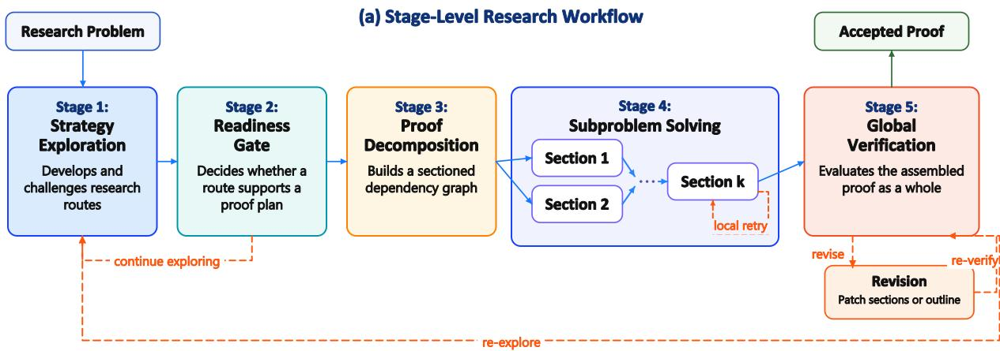
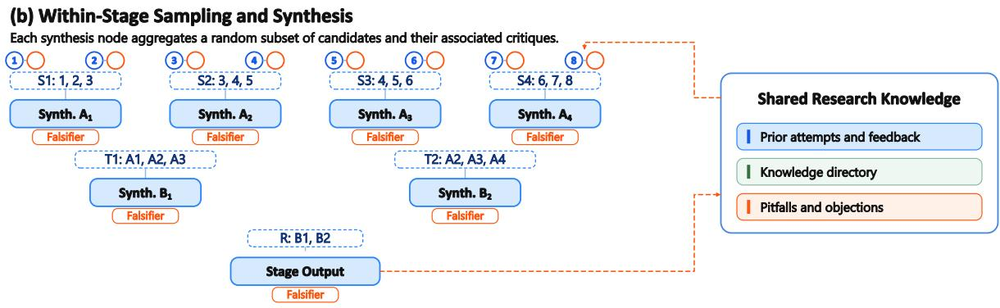
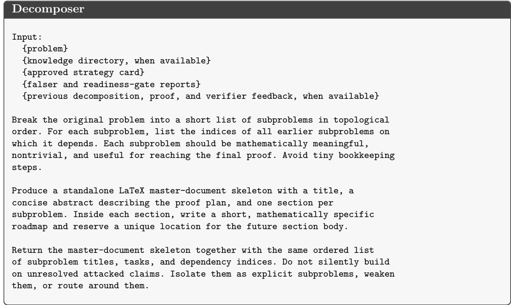
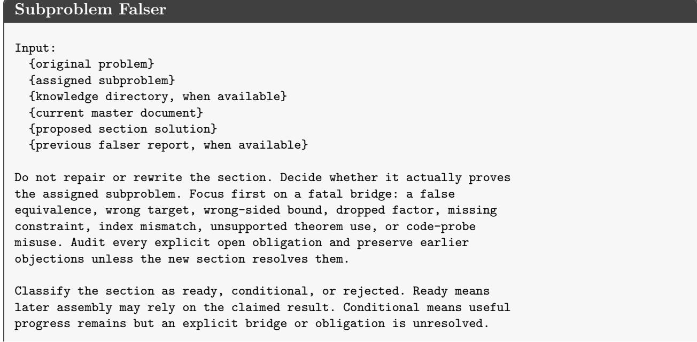
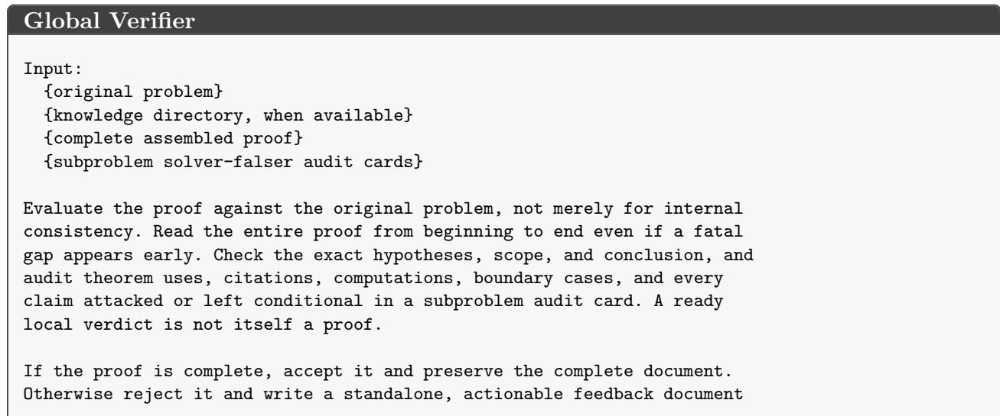

# Stellar Colosseum: A Many-Agent Harness for Long-Horizon Research in Mathematics and Theoretical Computer Science

Honghao Lin\*,1 David P. Woodruf\*,1,2

Yuan Deng1 Jieming Mao1 Song Zuo1 Vahab Mirrokni1

Google Research

## Abstract

Language models can produce plausible short proofs, but may still be unreliable on longhorizon research problems, where progress depends on a sequence of uncertain and interdependent decisions. We introduce Stellar Colosseum, a model-agnostic harness for allocating inference across research in mathematics and theoretical computer science. Colosseum explores alternative strategies before proof construction, uses a readiness gate to decide when a route is mature enough to decompose, represents the proof plan as interdependent section-level subproblems, and routes verifier findings back to the afected part of the argument. Across these stages, it generates candidates in parallel, attacks them with targeted falsification, and combines candidates and their critiques into a single research artifact through overlapping random-sample tree aggregation. The Colosseum workflow has also been integrated into Google Antigravity’s Teamwork framework as the Long Proof pattern [7].

We demonstrate the capabilities of Colosseum through open-ended research and evaluations on theorem-proving and competitive programming benchmarks. Using Colosseum with Gemini 3.1 Pro, we obtain several new results that address open problems arising from papers published at top venues such as FOCS and JMLR. On TCS-Bench [15], a benchmark of research-level theorem-proving tasks drawn from papers published at FOCS, STOC, and SODA, Colosseum achieves 71.0% accuracy using Gemini 3.1 Pro and Gemini 3.7 Flash. In a separate Codeforces evaluation using Gemini 3.1 Pro, the proof-oriented pipeline with execution feedback solves 218 of 222 problems.

## 1 Introduction

Language models have made substantial progress in mathematical reasoning. Systems built around them have solved olympiad-level problems [52, 29]. Recent studies also describe how language models have helped obtain new results in mathematics and theoretical computer science [21, 56]. These successes motivate a closer look at how to organize research over many rounds of exploration, proof construction, and revision.

Work on a research problem often starts with a literature search and small examples. Researchers may try several representations and conjectures before finding lemmas worth proving. Even a promising approach can fail if a key lemma turns out to be false or a later step exposes a missing assumption. As the proof grows, definitions and assumptions must remain consistent across dependent lemmas; changing one part may alter what later sections need to establish. A failed approach may still yield a useful restriction, counterexample, or alternative formulation. Progress depends on deciding what to develop, what to repair, and when to change direction, using the evidence gathered along the way.

  
Figure 1: Overview of the Colosseum architecture. Panel (a) shows the stage-level workflow from strategy exploration through global verification, including local revision and re-exploration. Panel (b) expands inference within a stage. Synthesis nodes aggregate random subsets of candidates and their associated critiques, and each is paired with a falsifier.

Inference-time scaling gives a system more opportunities to explore possible solutions and check them. Sampling multiple reasoning paths, searching over intermediate states, and iteratively critiquing an answer can improve reasoning quality [55, 60, 44]. Agreement among candidates can still hide a shared error, so a flat vote over final answers ofers limited guidance for proofs. The challenge is to use this computation to choose between approaches, uncover specific gaps, and preserve what remains useful after an attempt fails.

We introduce Stellar Colosseum (Colosseum for short), a model-agnostic system for long-horizon research in mathematics and theoretical computer science. Colosseum builds on and substantially extends the parallel exploration and iterative verification architecture described by Woodruf et al. [56], adding explicit control over research stages, dependency-aware proof construction, and aggregation that preserves critiques. The system keeps track of proposed strategies, partial proofs, and verification findings as the work proceeds. This shared research state allows exploration, proof construction, and revision to build on one another.

Colosseum organizes inference at two levels (Figure 1). At the workflow level, it develops and challenges alternative strategies until one is concrete enough to decompose into a sectioned plan with explicit dependencies. Independent subproblems can then be developed in parallel, and the completed sections are assembled into a single proof. Verification feedback guides repairs to the argument and reopens exploration when the underlying strategy is no longer viable.

At the stage level, Colosseum generates a population of candidate artifacts for tasks such as strategy exploration, proof planning, and proof construction. It subjects these candidates to targeted falsification and combines them through overlapping random-sample tree aggregation. Critiques remain attached to the proposals they address, so aggregation can combine useful ideas while retaining objections and evidence of failure. The resulting artifact, together with any unresolved objections, becomes part of the research state used in later stages.

Our Contributions. In this paper, we make the following four contributions.

1. We formulate long-horizon research as a pipeline that separates strategy exploration, proof decomposition, subproblem solving, and global verification. Decomposition produces a sectioned plan with explicit dependencies. Independent subproblems can then be solved in parallel; rejected proofs are revised or returned to exploration.

2. We develop a stage-level adversarial inference procedure. It combines diverse candidate generation, targeted falsification, and overlapping tree-structured aggregation while retaining both synthesized content and evidence against it.

3. We demonstrate Colosseum on open-ended research problems using Gemini 3.1 Pro as the base model. The workflow contributed to several research results reported in companion papers, and we present case studies on long-form proof construction and independent strategy rediscovery.

4. We evaluate Colosseum on research-level theorem proving and competitive programming. On TCS-Bench [15], critique-based selection between runs using Gemini 3.1 Pro and Gemini 3.7 Flash reaches 71.0% accuracy. In the competitive-programming case study, the prooforiented workflow augmented with implementation and execution feedback records 218 accepted solutions on a 222-problem Codeforces suite.

Notably, the Colosseum workflow has since been integrated into Google Antigravity’s Teamwork framework as the Long Proof pattern [7].

## 2 Related Work

We review work on inference-time search and critique, discovery guided by verifiers and evaluators, and systems that support sustained research.

## 2.1 Search, Critique, and Aggregation

Sampling diverse reasoning paths and aggregating their answers [55], searching over intermediate states [60], revising against model-generated feedback [44], and organizing multi-agent debate [18] provide complementary ways to use additional inference. Wu et al. [58] compare inference strategies under fixed compute budgets and introduce REBASE, which allocates tree expansions using intermediate rewards. Other work focuses on falsification. REFUTE evaluates whether language models can construct counterexamples to incorrect competitive-programming submissions [51]. Momus extracts key conjectures from stalled proof attempts and asks fresh solver instances to try to prove each conjecture and its negation. This context-detachment mechanism aims to escape solver–grader “cognitive wells” [17]. Colosseum uses search, critique, and aggregation throughout the research workflow. Within each stage, proposals remain paired with their falsification reports during aggregation. The resulting artifact, unresolved objections, and repair targets remain available during strategy selection, proof construction, and verification.

## 2.2 Discovery Guided by Verifiers and Evaluators

Machine-checkable feedback provides a concrete test for proposals during search. Learned proposals can guide symbolic deduction [52], while formal proof checking can guide theorem proving [29]; executable objectives instead guide the search for mathematical constructions [49, 45, 24]. Recent systems extend this principle to research-scale formalization through agentic Lean search [53] and retrieval-assisted proof development [33]. LeanMarathon uses an evolving blueprint and a proof dependency graph to coordinate parallel development and local repair, with changes checked through continuous integration [61].

These systems ultimately require a proof that passes formal checking against a precise Lean statement [53, 33, 61]. Colosseum reviews provisional strategies, intermediate claims, and naturallanguage proof drafts. Formal checks and executable tests, when available, contribute evidence alongside model-generated critiques. The workflow uses this combined evidence to revise its research state and assess the assembled argument.

## 2.3 Autonomous and Collective Research Workflows

Research workflows must decide how to reuse intermediate work and when to ask for further verification. Aletheia maintains a generate–verify–revise loop over long natural-language solutions [21]. Other systems assign these tasks to diferent roles: QED separates decomposition, proof generation, and verification [4]; ProofCouncil iterates between an author and a critic [50]; and RMA coordinates initializer, proposer, and verifier agents through shared structured memory [62]. These systems use verification repeatedly as an argument develops.

These systems also difer in how they store and share intermediate work. Danus admits verifierapproved claims into a fact graph together with their proofs and logical dependencies [42]. Other systems combine persistent proof state, literature retrieval, computational or formal tools, and human steering [25, 13, 63]. Their shared state may be organized around verified claims, proof obligations, working files, or an interactive workspace.

Some frameworks support ongoing research communities. Within Station, heterogeneous agents choose their own directions and publish an internal literature that later agent generations can extend [14]; in EinsteinArena, user-supplied agents interact asynchronously through shared submissions, verifiers, and discussions [10].

Related work also studies collaboration and review across the scientific research process. Geminiassisted case studies identify decomposition and iterative refinement as common techniques and also document models serving as adversarial reviewers [56]. Co-Scientist applies generate–critique–evolve loops to research hypotheses [27], while the AI Scientist systems extend such orchestration through experimentation, analysis, and manuscript production [43, 59]. PAT applies inference-scaled agents downstream to scientific review and verification [32].

Aletheia and OpenAI have reported results on FirstProof [20, 46]. OpenAI also reports ten advances in mathematics and theoretical computer science, each accompanied by a Lean certificate [47]. Other reports describe Claude-assisted results concerning the Riemann zeta function [6], cryptanalysis [5], and the Jacobian conjecture [3, 23]. Diferences in human involvement, disclosure, and evaluation make it dificult to isolate the contribution of any one workflow component to these outcomes.

Colosseum combines these ideas to connect strategy exploration with the development and repair of a long proof. Its readiness gate controls when a route is decomposed into subproblems, and its aggregation procedure carries critiques alongside the proposals they address. Shared drafts and research knowledge keep that evidence available during both local revision and renewed exploration.

## 3 Colosseum Overview

The design of Colosseum is motivated by four challenges in long-horizon research:

• Strategic Uncertainty. A precise problem statement may leave the route to a proof unclear. Finding useful representations, reductions, or intermediate targets often requires substantial exploration, and a promising route may remain uncertain until its central claims are tested.

• Distributed Technical Dificulty. A proof may contain several interdependent bottlenecks, from constructing a new object to establishing a delicate estimate. Resolving one dificulty can expose another, and a local revision may require changes to the surrounding argument.

• Long Outputs and Error Accumulation. Long proofs can exceed the output budget of a single response, leading to omitted details or unfinished arguments. Definitions and assumptions must also remain consistent across distant sections, since an unsupported step can be reused and propagate errors through the rest of the proof.

• Failure and Partial Progress. Failed attempts may still yield useful counterexamples, restrictions, or intermediate results. To guide later work, this information must be recorded as specific mathematical claims or objections; a generic failure judgment does not explain what remains valid or what should change.

We next outline the design of Colosseum and how its main components work together to address these challenges.

## 3.1 Research Pipeline

Figure 1 summarizes the architecture built around these considerations. Panel (a) shows the overall research workflow, while panel (b) expands inference within a stage. Exploration develops and tests candidate strategies until the readiness gate selects a route that is concrete enough to support proof construction. Decomposition turns that route into a sectioned proof skeleton and a dependency graph over its subproblems. Eligible subproblems are then solved, with independent sections processed in parallel. A section that fails its local review is retried without restarting unafected subproblems, and the completed sections are assembled into a single proof.

The global verifier evaluates the assembled proof. A rejected proof either enters revision or reopens exploration. Revision may replace one or more section bodies or modify the proof outline before the argument is assembled and verified again. Re-exploration is reserved for cases in which the current strategy no longer supports a credible path to the target. Section 4.2 develops these stages and return paths in detail.

## 3.2 Inference within a Stage

The research pipeline determines which task is currently being addressed, but a dificult stage is not entrusted to a single model continuation. Colosseum generates a population of candidates, subjects them to targeted falsification, and iteratively synthesizes random subsets of candidates and their associated critiques through the overlapping sampling tree shown in panel (b). The candidate type changes with the stage—a strategy, a proof skeleton, a section body, a verifier assessment, or a revision—but the inference pattern is reused.

The root artifact and any unresolved objections are returned to the research pipeline. In this way, stage-level decisions determine where additional inference is applied, while aggregation determines how a dificult decision within that stage is resolved. Section 4.1 describes this inner procedure in detail.

## 3.3 Context across Stages

Information produced earlier in the pipeline remains available to later stages. Within a round, this includes the current strategy, sectioned proof plan, completed section bodies, and verifier findings. Across rounds, a rejected proof draft and its verifier feedback are passed directly into the next attempt. A shared knowledge directory further retains reusable results from the wider search. Section 4.3 describes these two forms of cross-round memory.

## 4 Architecture and Workflow

## 4.1 Adversarial Generation and Tree-Structured Aggregation

At a dificult stage, Colosseum generates a population of candidates, subjects each candidate to targeted falsification, and reduces the resulting candidate–critique bundles through a tree. Reviewer roles and output schemas vary by stage; the three operations stay the same.

## 4.1.1 Parallel Candidate Generation

Parallel generation seeks diferences that can change the mathematical outcome: representation, principal lemma, proof technique, case split, interpretation of evidence, or location of the main bottleneck. Seeds, temperatures, prompt perspectives, tool access, and assumed lines of attack provide additional sources of variation.

Each candidate follows a typed schema appropriate to its stage. A strategy proposal, for example, states its mechanism, required lemmas, expected bottleneck, and a falsifiable test. A proof proposal states its assumptions and marks any gaps. The schemas make candidates comparable and give reviewers specific claims to attack.

Selected prompt templates and their structured output interfaces are provided in Appendix A.

## 4.1.2 Targeted Falsification

One or more adversarial reviewers examine each candidate. They concentrate on finding defects and propose an alternative solution only when it helps establish one. The review covers:

• counterexamples and boundary cases;

• invalid implications or silently strengthened hypotheses;

• circularity and undeclared dependencies;

• misuse of a theorem, computation, or external reference;

• a mismatch between the proved statement and the target claim; and

• missing assumptions or results needed by later sections.

Falsification records remain attached to the candidate. A clean record may reflect weak tests, whereas a precise objection can make another candidate easier to repair. Here falsification refers to the search objective; failure to find a defect does not establish correctness.

## 4.1.3 Tree-Structured Aggregation

Comparing every candidate and critique in one prompt becomes unwieldy at large sample counts. Colosseum uses a reduction tree instead. Let $z _ { i }$ denote a candidate bundled with all of its falsification records, and let

$$
{ \cal C } ^ { ( 0 ) } = \{ z _ { 1 } , \ldots , z _ { n } \} .
$$

The tree shape is specified by the population width at every level,

$$
( m _ { 0 } , m _ { 1 } , \ldots , m _ { L } ) , \qquad m _ { 0 } = n , \quad m _ { L } = 1 .
$$

For the transition from level ℓ to level $\ell + 1$ , each of the $m _ { \ell + 1 }$ aggregation nodes independently draws $k _ { \ell }$ distinct inputs uniformly from the current population, where $k _ { \ell }$ is the configured sample size capped by $m \ell$ . Thus

$$
G _ { j } ^ { ( \ell ) } \sim \mathrm { U n i f } \left\{ G \subseteq \mathcal { C } ^ { ( \ell ) } : | G | = k _ { \ell } \right\} , \qquad j = 1 , \dots , m _ { \ell + 1 } .
$$

Sampling is without replacement within one group, but groups for diferent aggregation nodes are drawn independently and may overlap. They do not form a partition. Given the stage-specific aggregator $A ,$ the current input artifact x, and contextual evidence K, each node computes

$$
s _ { j } ^ { ( \ell + 1 ) } = A \left( x , K , G _ { j } ^ { ( \ell ) } \right) , \qquad \mathcal { C } ^ { ( \ell + 1 ) } = \{ s _ { j } ^ { ( \ell + 1 ) } \} _ { j = 1 } ^ { m _ { \ell + 1 } } .
$$

If $R _ { i } ^ { ( \ell ) }$ is the number of next-level groups containing a fixed node from level $\ell ,$ then

$$
\mathbb { E } \Big [ R _ { i } ^ { ( \ell ) } \Big ] = \frac { m _ { \ell + 1 } k _ { \ell } } { m _ { \ell } } .
$$

Ordinary contraction layers choose widths and sample sizes that give an expected reuse of roughly two to three. A transition from 128 nodes to 64 with sample size five, for example, gives expected reuse 2.5. Mixing layers and the final root may use a diferent rate. Overlap gives a candidate several chances to contribute while keeping each aggregation context small.

Intermediate aggregation is constructive rather than a vote or ranking: it may merge compatible components, retain competing branches, repair a localized flaw, or declare an unresolved conflict. Substantive disagreements and falsification evidence are carried forward rather than averaged away. The root returns a synthesized candidate together with any unresolved objections.

## 4.2 The Research Pipeline

## 4.2.1 Strategy Exploration and Readiness

Colosseum begins by exploring proof strategies rather than drafting a proof around the first plausible idea. Parallel attempts develop routes based on diferent reformulations, intermediate claims, and connections to known results. The purpose of this stage is to expose what each route would require, which parts remain conjectural, and where the main technical dificulties lie.

The readiness gate asks whether one of these routes is concrete enough to support a proof plan. It tests whether the remaining uncertainty can be localized within a stable proof architecture, not whether the proof has already been completed. A route passes when its central reduction or mechanism is stable, its unresolved claims are precise enough to assign to proof sections, and no unresolved bridge is likely to change the target or the architecture of the argument. A central lemma may remain dificult; what matters is that its statement, role, and expected path to proof or verification are explicit. If these conditions are not met, exploration continues; otherwise, the selected route is passed to decomposition.

## 4.2.2 Decomposition and Parallel Proof Construction

The decomposer turns the selected route into a numbered, sectioned proof skeleton. Each section is associated with a subproblem specifying the mathematical content that must be established there. Dependency edges record which completed sections a subproblem may use, producing a directed acyclic graph. The document order controls the intended exposition, while the dependency graph controls the order in which the mathematical work can proceed.

A subproblem becomes eligible once its dependencies have been completed, so independent sections can be solved in parallel. Each solver receives the assigned task together with the relevant completed sections. Dificult subproblems can use the adversarial inference procedure of Section 4.1 to develop and test alternative solutions.

Before a section is committed to the skeleton, a local reviewer checks it against the assigned subproblem and the completed material on which it depends. If the section remains incomplete or the review identifies an unresolved defect, the same subproblem is run again with the failed section and the review as additional input. The retry is local to the afected subproblem: completed work elsewhere in the dependency graph is preserved. Once a section is accepted locally, its body replaces the corresponding placeholder and becomes available to downstream subproblems. Filling the skeleton in this way produces the candidate proof submitted to global verification.

## 4.2.3 Global Verification and Feedback

The global verifier reads the original problem and the completed document as a single argument, with the local subproblem reviews available as audit context. A collection of individually plausible sections may still fail as a proof because a dependency is used with the wrong assumptions, notation or definitions drift across sections, a case is omitted, or the final conclusion does not match the original target. The verifier also checks that a conditional or attacked claim from a local review has not been silently inherited by the assembled proof.

Global verification is itself carried out by multiple independent reviews and tree-structured aggregation. The aggregation merges genuinely duplicate criticisms while retaining distinct substantive objections. It is not a majority vote: a concrete fatal defect is suficient to reject the proof, and generic acceptance judgments do not resolve it.

The final review gives an overall verdict together with the material defects found in the argument. Each defect is tied to the section or claim where it arises; for a cross-section dependency error, the review identifies both the supporting section and the section that uses it. This localization makes the global review actionable without reducing it to a collection of independent section checks.

When the verifier rejects a proof, the pipeline proceeds by revision or re-exploration. Revision is used when the current strategy remains viable; it may replace section bodies or modify the proof outline before the entire argument is verified again. If the verifier’s findings undermine the central strategy, the system returns to exploration instead.

## 4.3 Shared Research Knowledge

Colosseum carries information across research rounds in two complementary forms: the latest proof attempt is retained in full, while a shared knowledge directory collects reusable findings from the wider search. The former grounds the next round in the argument that was actually attempted; the latter preserves useful results that may otherwise be lost as candidates are aggregated or discarded.

## 4.3.1 Retaining Prior Attempts

When a round does not produce an accepted proof, Colosseum passes the resulting draft and the verifier feedback directly into the next round. Revision can address the concrete defects identified in the draft, while re-exploration can reconsider the strategy in light of the argument that failed. The next attempt therefore does not begin from the original problem alone.

Retaining a draft does not endorse its claims. The verifier feedback remains attached to it, making clear which steps or strategic assumptions require further work.

## 4.3.2 Knowledge Directory

The latest draft is only one product of a much wider search. A knowledge curator reads strategy proposals and falsification reports and records four kinds of reusable knowledge:

1. theorems and lemmas: mathematical results developed during the search, together with their hypotheses, supporting arguments, and possible applications;

2. failed approaches: attempted routes, their precise failure points, and conditions under which a variant might still work;

3. references: relevant literature, including the statements and hypotheses needed for the current problem; and

4. observations: structural properties or computational findings, together with their evidence and implications for subsequent work.

Entries retain their source and relevant caveats. The directory is updated across research rounds and made available to subsequent agents, allowing them to reuse earlier results and avoid repeating approaches whose failure has already been identified.

## 4.4 Inference Configurations

In this section, we give the inference configurations used in our research campaigns and evaluations. For open-ended research problems (Section 5), we use a range of tree configurations during strategy

exploration, some with slightly over 100 leaf nodes. These larger trees are used only for exploration;   
all remaining stages share a fixed configuration with 16 leaf nodes.

Table 1 summarizes the strategy-exploration configurations for open-problem research, TCS-Bench (Section 6), and Codeforces (Section 7), together with the shared configuration used by all remaining stages. Tree widths and per-node sample sizes follow the notation in Section 4.1.

<table><tr><td>Setting</td><td>Stage</td><td>Tree widths m</td><td>Sample size k</td></tr><tr><td>Open-problem research</td><td>Strategy exploration</td><td>Varies</td><td>Varies</td></tr><tr><td>TCS-BENCH</td><td>Strategy exploration</td><td>(32, 16, 8, 5, 1)</td><td>5</td></tr><tr><td>Codeforces</td><td>Strategy exploration</td><td>(32, 16, 8, 5, 1)</td><td>5</td></tr><tr><td>All three settings</td><td>All remaining stages</td><td>(16, 8, 5, 1)</td><td>5</td></tr></table>

Table 1: Stage-level aggregation configurations for open-problem research, TCS-Bench, and Codeforces. At level $\ell ,$ the efective sample size is min $\{ k , m _ { \ell } \}$

These configurations specify population widths and aggregation fan-in rather than the exact total number of model calls, which also depends on the number of proof sections, local retries, and global revision rounds.

## 5 Selected Research Results

We summarize five research results to which runs of the workflow contributed. Each subsection states the motivating question and principal advance; the cited papers provide complete definitions, attribution, and proofs.

## 5.1 Strong Coresets for $\ell _ { p }$ Subspace Approximation When $p > 2$

Given a matrix $A \in \mathbb { R } ^ { n \times d }$ , the $\ell _ { p }$ subspace approximation problem asks for a low-dimensional subspace that minimizes the aggregate distance of the rows of A to that subspace. A strong coreset samples and rescales a small number of rows to form $S A$ while preserving, simultaneously for every subspace F of dimension at most k, the objective

$$
\| S A ( I - P _ { F } ) \| _ { p , 2 } ^ { p } = ( 1 \pm \varepsilon ) \| A ( I - P _ { F } ) \| _ { p , 2 } ^ { p } .
$$

For $p > 2$ , Woodruf and Yasuda obtained coreset size $\widetilde { O } _ { p } ( k ^ { p / 2 } \varepsilon ^ { - p } )$ using a recursive ridge-leveragescore sampling framework [57]. It was unclear whether the $\varepsilon ^ { - p }$ dependence was intrinsic to the sampling rule or arose from the analysis of the recursive row-count recurrence.

The proof first obtained by Colosseum shows that the same sampling rule supports a coreset of size $\widetilde { O } _ { p } ( k ^ { p / 2 } \varepsilon ^ { - 2 } )$ , while retaining $\widetilde { O } _ { p } ( \mathrm { n n z } ( A ) + d ^ { \omega } )$ running time. The key step keeps the truncation in the sampling probabilities when bounding the surviving rows, which changes the fixed point of the recurrence from an $\varepsilon ^ { - p }$ to an $\varepsilon ^ { - 2 }$ dependence. The complete construction and analysis are given in [40].

## 5.2 The Condition-Number Barrier in Sparse Least Squares

Sparse convex optimization seeks a vector with few nonzero coordinates whose objective value is close to that of the best k-sparse solution. For objectives with restricted condition number $\kappa ,$ known algorithms require output sparsity with essentially linear dependence on κ. Axiotis and Sviridenko

gave an algorithm achieving this dependence and conjectured that it could not be improved by a polynomial-time algorithm [9].

For least-squares objectives, the new result establishes this barrier conditional on the randomized exact-volume Small-Set Expansion Hypothesis. For every fixed $\gamma \in ( 0 , 1 ]$ , no randomized polynomial time algorithm can, with probability at least $2 / 3$ , return a vector x such that, writing $s = \| x \| _ { 0 }$

$$
\| A x - b \| _ { 2 } ^ { 2 } \leq \operatorname* { m i n } _ { \| z \| _ { 0 } \leq k } \| A z - b \| _ { 2 } ^ { 2 } + \varepsilon \quad { \mathrm { a n d } } \quad s = O \left( k \kappa _ { s + k } ^ { 1 - \gamma } \right) ,
$$

where $\kappa _ { r }$ is the restricted condition number at sparsity level r. Thus, subject to the stated hypothesis, no fixed sublinear power of the condition number can replace the linear dependence. The complete reduction and parameter regime are given in [38].

## 5.3 Dimension Lower Bounds for Maximum Inner Product Embeddings

Multi-vector embeddings represent an item by a point cloud and compare point clouds using Chamfer similarity, whereas single-vector embeddings compare one vector per item by an inner product. For singleton queries, Chamfer similarity reduces to maximum inner product similarity. An upper bound of $\bar { m } ^ { O ( 1 / \varepsilon ^ { 2 } ) }$ was known for representing point clouds of size at most m by single vectors, while the earlier lower bound $( \varepsilon ^ { 2 } m ) ^ { \Omega ( 1 { \bar { / } } \varepsilon ) }$ left a gap between $1 / \varepsilon$ and $1 / \varepsilon ^ { 2 }$ in the exponent of m [30].

The new lower bound nearly closes this gap. For every fixed $\delta \in ( 0 , 1 )$ and suficiently large m, there are unit query vectors and document point clouds for which any single-vector representation approximating all maximum inner products to additive error ε must have dimension

$$
D \geq m ^ { c _ { \delta } / \varepsilon ^ { 2 - 2 \delta } }
$$

for a constant $c _ { \delta } > 0 .$ . The statement permits fully data-dependent representations and also applies to Chamfer similarity because the hard queries are singletons. The construction and approximate-rank argument are given in [31].

## 5.4 Single-Stage Hadamard Quantization

Randomized Hadamard transforms provide fast preprocessing for quantizing high-dimensional vectors in similarity search, distributed learning, and model compression. Earlier work gave an unbiased dithered quantizer with sharp mean-squared error guarantees [22]. Its finer 1/d-scale inner-product estimator, however, used a second randomized transform and a residual quantization stage, adding both communication and a larger leading constant.

The new estimator shows that the second stage is unnecessary for attaining the same $1 / ( d 4 ^ { b } )$ mean-squared-error scaling. Pairwise-independent dithers across Hadamard coordinates yield an unbiased, single-stage estimator using b bits per coordinate and satisfying

$$
\mathbb { E } \Big [ | \langle y , \widehat { x } - x \rangle | ^ { 2 } \Big ] \leq \left( \frac { 3 \pi \sqrt { 3 } } { 2 } + o ( 1 ) \right) \frac { \| y \| _ { 2 } ^ { 2 } } { d 4 ^ { b } } .
$$

It removes the residual-stage $O ( d )$ -bit payload and reduces the leading constant in the proved upper bound by a factor of approximately 5.93. The estimator and proof are given in [41].

## 5.5 Lower Bounds for Prefix-Matrix Factorizations

Let Q be the $n \times n$ lower-triangular all-ones matrix, which maps a vector to its sequence of prefix sums. For a factorization $Q = A B$ , the quantity

$$
\gamma _ { 2 , 1 } ( Q ) = \operatorname* { i n f } _ { Q = A B } \lVert A \rVert _ { 2 \to \infty } \lVert B \rVert _ { 1 \to 1 }
$$

governs space bounds for factorization-based rank and quantile estimation in turnstile streams, as well as error bounds for matrix mechanisms in continual counting. The matrix-factorization framework in [12] made a sharp characterization of this cost a central question.

The new result proves the near-optimal lower bound

$$
\gamma _ { 2 , 1 } ( Q ) = \Omega \left( \frac { \log ^ { 3 / 2 } n } { ( \log \log n ) ^ { 3 / 2 } } \right)
$$

over real factorizations of arbitrary finite inner dimension. A dyadic factorization gives the upper bound $O ( \log ^ { 3 / 2 } n )$ , so the two bounds difer by only a factor of $( \log \log n ) ^ { 3 / 2 }$ . The proof combines right-sided Haar projections with a scale-dependent numerical-sparsity decomposition, then aggregates the resulting estimates across dyadic scales. The full lower bound is given in [39].

The following two case studies complement the results above by illustrating the workflow on unusually long proof artifacts and under information isolation.

## 5.6 Case Study: Long-Form Proof Construction for Knuth’s Cycles

For an integer $m > 2$ , Knuth’s cycles problem asks whether the directed edges of the Cayley graph

$$
\Gamma _ { m } = \mathrm { C a y } \left( \mathbb { Z } _ { m } ^ { 3 } , \left\{ e _ { 1 } , e _ { 2 } , e _ { 3 } \right\} \right)
$$

can be partitioned into three directed Hamiltonian cycles. The odd case admits a simple construction with a complete proof, while the even case remained more dificult [34]. The updated notes also record an earlier, more intricate even-case construction generated by GPT-5.3-Codex, for which a complete proof was subsequently obtained with GPT-5.4 Pro [28]. A later multi-agent search produced a much simpler construction for even m and verified it computationally through $m \leq 2 0 0 0$ [8], but a rigorous symbolic proof for arbitrary even m remained open. A subsequent note introduced a second simple construction and reports full-length AI-generated proof drafts for both [11].

Although each construction is specified by a compact set of local routing rules, proving that it yields three Hamiltonian cycles requires a substantially more involved global argument. The rules depend on parity and include several exceptional boundary cases, whose interactions must be controlled uniformly for arbitrary even m. In particular, the proof must show that every directed edge is assigned exactly once and that each color class traverses all $m ^ { 3 }$ vertices in a single cycle rather than decomposing into shorter cycles. The workflow then produced a 46-page proof draft for the earlier construction and a 75-page proof draft for the new one [11]. This case study shows how a proof far beyond the length of a typical single model response can instead be developed as a persistent, revisable document organized around an explicit dependency structure.

## 5.7 Case Study: Independent Rediscovery of the Erd˝os Unit-Distance Breakthrough

Let $u ( n )$ be the maximum number of unit-distance pairs determined by n points in the plane. Erd˝os’s classical grid construction gives $n ^ { 1 + \Omega ( 1 / \log \log { n } ) }$ unit-distance pairs, and he conjectured that $u ( n ) = n ^ { 1 + o ( 1 ) }$ . OpenAI reports that an internal model generated a counterexample to this long-standing conjecture in 2026. A group of mathematicians then distilled, simplified, and humanverified the AI-generated argument, establishing that infinitely many point sets determine at least $n ^ { 1 + \delta }$ unit-distance pairs for some fixed $\delta > 0 [ 1 ]$

We then ran Colosseum on the same problem using Gemini 3.1 Pro as the base model, with internet access disabled. The resulting 22-page draft [16], available on GitHub, developed a number-theoretic approach based on unramified towers and relative unit groups, independently arriving at the central architecture of the OpenAI solution [1] and pursuing a bound of the form $u ( n ) \geq n ^ { 1 + \varepsilon _ { 0 } }$ for infinitely many $n ,$ with $\varepsilon _ { 0 } > 0$ given explicitly. Notably, the run proceeded through 15 exploration rounds. Across these rounds, the accumulated-knowledge layer carried partial results, objections, and failed attempts forward across successive rounds, allowing the strategy-selection loop to synthesize the accumulated evidence into subsequent research directions. This provides a concrete example of the architecture sustaining a coherent long-horizon research process.

## 6 Research-Level Evaluation on TCS-Bench

The preceding results and case studies examine individual problems in depth. To evaluate the breadth of the system on a common set of research-level problems, we also test Colosseum on TCS-Bench [15]. The benchmark contains 300 theorem-proving tasks derived from papers published at FOCS, STOC, and SODA between 2020 and 2026. Each task supplies the mathematical context needed to state the problem and asks the model to produce a self-contained proof of a target theorem. Candidate proofs are scored by a reference-assisted automated grader that also receives the benchmark’s ground-truth proof. Its prompt was optimized on a separate set of 100 expert-labeled proofs, on which it reported more than 90% accuracy. All benchmark accuracies below are measured by this grader.

We run Colosseum separately with Gemini 3.1 Pro and Gemini 3.7 Flash, producing one candidate proof from each run for every problem. To select between the two candidates, Gemini 3.7 Flash produces eight independently sampled critiques of the Gemini 3.1 Pro proof. If at least five critiques judge that proof correct, it is submitted; otherwise, the Gemini 3.7 Flash proof is submitted. The benchmark grader is used only to score the selected proof and plays no role in the selection rule.

<table><tr><td>Method</td><td>Accuracy</td></tr><tr><td>Direct model evaluation</td><td></td></tr><tr><td>Gemini 3.1 Pro</td><td>30.3%</td></tr><tr><td>Gemini 3.1 DeepThink</td><td>52.0%</td></tr><tr><td>GPT-5.6 Pro (max)</td><td>68.0%</td></tr><tr><td>COLOSSEUM evaluation CoLOsSEUM with Gemini 3.1 Pro CoLOsSEUM with Gemini 3.7 Flash</td><td>54.0%</td></tr><tr><td></td><td>55.0%</td></tr><tr><td>Cross-model selection Oracle best-of-two</td><td>71.0% 77.3%</td></tr></table>

Table 2: Direct-model baselines, two Colosseum runs, and cross-model selection on TCS-Bench. The oracle reports the fraction of problems solved by at least one run and is an upper bound rather than an achievable selection rule.

The two individual runs have nearly identical overall accuracy, but their errors are suficiently complementary for cross-model selection to solve 213 problems, an improvement of 48 problems over the stronger individual run. The critique signal distinguishes proofs labeled correct and incorrect by the benchmark grader with an AUC of 0.896; routing with Gemini 3.1 Pro’s internal verifier alone yields 64.7% accuracy. Among the evaluated non-oracle methods on this dataset, cross-model selection gives the highest accuracy.

## 7 Case Study: Competitive Programming

To test whether the same architecture transfers from theorem proving to executable algorithmic tasks, we follow the Codeforces evaluation described for Gemini 3 Deep Think: all 222 problems with clist.by dificulty estimates above 1500 from contests held between April and October 2025 [26]. In our evaluation snapshot, these problems come from 52 Codeforces contests numbered 2084–2162. For the rating calculation, we use the numerical dificulty estimates stored in the evaluation corpus. These values are on a Codeforces-like scale and are distinct from the problem ratings displayed by Codeforces. They have a median of 2381 and range from 1530 to 4599; Table 3 gives the full distribution. Each submitted C++ solution is compiled and run against the complete hidden test set using the problem’s original checker, and is accepted only if every test passes. Strict as-submitted grading yields the same score, so no accepted solution depends on an output repair.

<table><tr><td>Estimated rating band</td><td>&lt; 2000</td><td>[2000,2400)</td><td>[2400,2800)</td><td>[2800, 3200)</td><td>[3200, 3400)</td><td>≥ 3400</td></tr><tr><td>Problems</td><td>59</td><td>53</td><td>44</td><td>32</td><td>8</td><td>26</td></tr></table>

Table 3: Distribution of the evaluation-corpus dificulty estimates for the 222 Codeforces problems.

Previous evaluations map model performance onto the Codeforces scale using either contestcalibrated rating systems or probabilistic models over rated problem sets [48, 64, 65]. Because the resulting number depends on both the corpus and the calibration rule, we define ours explicitly and do not treat it as an oficial contestant rating. A problem with estimated dificulty r is treated as an opponent that a contestant of strength x solves with probability

$$
P ( { \mathrm { s o l v e } } \mid r , x ) = { \frac { 1 } { 1 + 1 0 ^ { ( r - x ) / 4 0 0 } } } .
$$

For dificulty estimates $r _ { 1 } , \ldots , r _ { 2 2 2 }$ , the corpus-level performance rating xˆ is the unique solution to

$$
\sum _ { i = 1 } ^ { 2 2 2 } { \frac { 1 } { 1 + 1 0 ^ { ( r _ { i } - { \hat { x } } ) / 4 0 0 } } } = n _ { \mathrm { s o l v e d } } .
$$

Competitive-programming systems illustrate two ways of scaling inference. AlphaCode and AlphaCode 2 generate large candidate populations and reduce them through compilation, sample filtering, and behavior-based selection [37, 2]. Later systems make execution iterative: tool-assisted reasoning, diferential or generated tests, and repair turn runtime evidence into feedback for the next attempt [19, 36, 54, 35]. The case study below asks a diferent systems question: whether a proof-oriented exploration–decomposition workflow transfers to executable programs without being replaced by a code-specific controller.

Architecture Transfer. When applied to competitive programming, Colosseum retains the proof-oriented architecture used for mathematical research. Exploration searches over solution strategies and passes the selected route to the decomposer. Rather than partitioning a program into software components, the decomposer represents that route as a directed acyclic graph of mathematical and algorithmic subproblems. Each subproblem is solved and aggregated as described in Section 4. The decomposition difers only at its endpoint: a terminal implementation subproblem realizes the algorithm established by the preceding nodes as a single C++ program. Table 4 gives an example decomposition for Codeforces 2084F.

<table><tr><td>Node</td><td>Subproblem</td><td>Depends on</td></tr><tr><td>1</td><td>Equivalence of Reachability to Inversion Subset</td><td></td></tr><tr><td>2</td><td>DAG Bounds Propagation using Fenwick Trees</td><td>1</td></tr><tr><td>3</td><td>EDF Scheduling of Missing Elements</td><td>2</td></tr><tr><td>4</td><td>Global Verification via Fenwick Trees</td><td>3</td></tr><tr><td>5</td><td>C++ Implementation</td><td>1, 2, 3, 4</td></tr></table>

Table 4: Dependency graph produced for Codeforces 2084F.

Execution Feedback. The one addition to this reasoning pipeline is a C++ execution probe. Once a candidate implementation is available, the probe compiles and runs it on public samples and model-generated stress inputs, returning checker outcomes together with time and memory measurements to the existing verification–revision loop. Hidden tests remain inaccessible to the workflow and are used only for final grading. The probe makes implementation-stage failures available to the existing verification–revision loop.

Results. With Gemini 3.1 Pro as the base model, the execution-enabled configuration records 218 accepted solutions on the 222-problem suite and obtains a corpus-level performance rating of 4263. The comparison configuration without the execution probe records 213 accepted solutions and obtains a rating of 3918. This is a diference of five accepted solutions and 345 rating points. Because the two arms also difer in revision budget, and because the final probe-to-revision path was not independently validated, these numbers compare complete configurations rather than isolate a causal efect of the probe.
<table><tr><td>Configuration</td><td></td><td>Accepted Performance rating</td></tr><tr><td>Without execution probe</td><td>213</td><td>3918</td></tr><tr><td>With execution probe</td><td>218</td><td>4263</td></tr></table>

Table 5: Comparison of the baseline and execution-enabled configurations on the 222-problem Codeforces evaluation.

## 8 Conclusion and Future Directions

We presented Colosseum, a model-agnostic many-agent harness for long-horizon research in mathematics and theoretical computer science. It connects strategy exploration, proof construction, and revision through a shared research state, while tree aggregation combines candidates and their critiques within each stage. The harness contributed to several new research results and achieved strong performance on TCS-Bench and in competitive programming.

We describe two classes of possible extensions to Colosseum that operate at diferent timescales. Within a run, the workflow could adapt the organization of exploration, the local dependency structure, and the allocation of inference compute to the evolving state of the investigation. Across runs, validated research trajectories could be used as post-training data to improve the underlying model.

## 8.1 Adapting the Inference-Time Workflow

Clustered Exploration of Distinct Research Directions. Exploration currently aggregates a mixed population of candidate strategies. When many candidates develop variants of the same idea, a less common but genuinely diferent direction may disappear before it has been explored in suficient depth. An extension is to cluster strategies by their central mechanism, reduction, or representation, and to run a separate exploration–falsification–aggregation process within each cluster. The resulting cluster-level strategies can then be compared and integrated at a later stage.

Preliminary, non-systematic runs suggest that this organization can preserve productive minority directions and produce viable inputs to downstream proof construction. More systematic work is needed to determine how clusters should be formed and updated, how inference should be allocated among them, and when distinct directions should be merged.

Local Restructuring after Subproblem Failure. The current local retry keeps the assigned subproblem and its dependencies fixed while regenerating the corresponding section. Repeated failure may instead indicate that the subproblem boundary is poorly chosen: the task may combine several distinct claims, depend on an intermediate result that was not isolated, or require a diferent interface with nearby sections.

A local restructuring step could revise a small neighborhood of the dependency graph before retrying. It might split the failed subproblem, change the tasks of adjacent sections, introduce an intermediate section, or redirect local dependency edges. The revised neighborhood would retain its interface with the rest of the proof and remain acyclic, so completed sections outside that neighborhood would not need to be regenerated. This would provide an intermediate response between retrying one fixed task and revising the proof outline as a whole.

Adaptive Inference Allocation. The current configurations fix population widths, aggregation fan-in, and sample counts before a run begins. The value of an additional sample or round, however, can vary across stages and subproblems. A future controller could use signals already produced by the workflow, such as strategy diversity, unresolved objections, repeated local failures, and agreement among independently generated candidates, to expand uncertain branches, grant additional retries to unstable sections, and stop stages whose outputs have stabilized. Compute-matched evaluation would be needed to distinguish improved allocation from simply using more inference.

## 8.2 Learning from Research Trajectories

The harness records structured research trajectories rather than only final answers: candidate strategies, falsifier critiques, aggregation decisions, dependency graphs, intermediate drafts, and revision histories. A natural direction is to use trajectories from runs with externally validated outcomes as post-training data for the base model. Intermediate states could provide supervision for strategy selection, decomposition, objection handling, and revision, while rejected routes and verifier feedback could supply negative and corrective signals. This could distill some of the benefits of inference-time orchestration into the underlying model and improve the starting point for later runs. The main challenge is credit assignment: a successful final result does not by itself reveal which intermediate strategies, critiques, or revisions were responsible for progress. The branching structure of the harness may help identify useful training signals by comparing candidates that share the same context but lead to diferent downstream outcomes.

## References

[1] Noga Alon, Thomas F. Bloom, W. T. Gowers, Daniel Litt, Will Sawin, Arul Shankar, Jacob Tsimerman, Victor Wang, and Melanie Matchett Wood. Remarks on the disproof of the unit distance conjecture. arXiv preprint arXiv:2605.20695, 2026.

[2] AlphaCode Team. AlphaCode 2 technical report. Technical report, Google DeepMind, December 2023. https://storage.googleapis.com/deepmind-media/AlphaCode2/AlphaCode2\_Tech\_ Report.pdf.

[3] Levent Alp¨oge. Hello there the Jacobian conjecture is false. X post, July 2026. Published July 20, 2026. https://x.com/\_\_alpoge\_\_/status/2079028340955197566.

[4] Chenyang An, Qihao Ye, Minghao Pan, and Jiayaun Zhang. QED: An open-source multi-agent system for generating mathematical proofs on open problems. arXiv preprint arXiv:2604.24021, 2026.

[5] Anthropic. Discovering cryptographic weaknesses with Claude. Anthropic Frontier Red Team, July 2026. Published July 28, 2026. https://www.anthropic.com/research/ discovering-cryptographic-weaknesses.

[6] Anthropic. Learning more about Claude’s mathematical capabilities. Anthropic Science, August 2026. Published August 10, 2026; updated August 13, 2026. https://www.anthropic.com/ research/riemann-zeta.

[7] Antigravity Team. Teamwork: When AI becomes a research partner. Google Antigravity Blog, August 2026. Published August 27, 2026. https://antigravity.google/blog/ teamwork-when-ai-becomes-a-research-partner.

[8] Keston Aquino-Michaels. Completing Claude’s cycles: Multi-agent structured exploration on an open combinatorial problem, March 2026. Preprint. https://github.com/no-way-labs/ residue.

[9] Kyriakos Axiotis and Maxim Sviridenko. Sparse convex optimization via adaptively regularized hard thresholding. Journal of Machine Learning Research, 22(122):1–47, 2021.

[10] Federico Bianchi, Yongchan Kwon, Aneesh Pappu, and James Zou. Harnessing the collective intelligence of AI agents in the wild for new discoveries. arXiv preprint arXiv:2606.10402, 2026.

[11] Michael P. Brenner, Honghao Lin, Vahab Mirrokni, and David P. Woodruf. Simple evencase constructions in Knuth’s cycles and their Gemini-generated proofs. Manuscript and accompanying proof artifacts, 2026. https://github.com/dpwoodru/knuthCycles.

[12] Jan Bulanek, Ravi Kumar, Raghu Meka, Jelani Nelson, and Tamas Sarlos. A matrix factorization approach in turnstile streaming. arXiv preprint arXiv:2607.28819, 2026.

[13] Yichuan Cao, Ruichen Qiu, Junqi Liu, Jiaqi Wang, Dakai Guo, Ruyong Feng, Lihong Zhi, and Xiao-Shan Gao. MechMath agent team: LLM driven agents for mathematical research. arXiv preprint arXiv:2607.04394, 2026.

[14] Stephen Chung, Wenyu Du, and William J. Wesley. Autonomous mathematical discovery in an open-world multi-agent environment. arXiv preprint arXiv:2608.23691, 2026.

[15] Vincent Cohen-Addad, Dimitris Paparas, Ernest van Wijland, Max Springer, Julien Canitrot-Paradis, Honghao Lin, David P. Woodruf, Adarsh Kumarappan, Rajesh Jayaram, Rudrajit Das, Lalit Jain, Ola Svensson, Silvio Lattanzi, Mislav Balunovic, Theophane Weber, and Vahab Mirrokni. TCS-BENCH: Benchmarking state-of-the-art generative AI theoretical computer science research ability. arXiv preprint arXiv:2608.09538, 2026.

[16] Colosseum Research Harness. A constructive lower bound for $C _ { 8 4 }$ via unramified mixedsignature towers. Generated proof artifact, 2026. Generated by a Gemini 3.1 Pro research harness. https://github.com/dpwoodru/erdos.

[17] Xingyu Dang, Rohit Agarwal, Rodrigo Porto, Anirudh Goyal, Liam H. Fowl, and Sanjeev Arora. Escaping the cognitive well: Eficient competition math with of-the-shelf models. arXiv preprint arXiv:2602.16793, 2026.

[18] Yilun Du, Shuang Li, Antonio Torralba, Joshua B. Tenenbaum, and Igor Mordatch. Improving factuality and reasoning in language models through multiagent debate. In Proceedings of the 41st International Conference on Machine Learning, volume 235 of Proceedings of Machine Learning Research, pages 11733–11763. PMLR, 2024.

[19] Ahmed El-Kishky, Alexander Wei, Andre Saraiva, Borys Minaiev, Daniel Selsam, David Dohan, Francis Song, Hunter Lightman, et al. Competitive programming with large reasoning models. arXiv preprint arXiv:2502.06807, 2025.

[20] Tony Feng, Junehyuk Jung, Sang-hyun Kim, Carlo Pagano, Sergei Gukov, Chiang-Chiang Tsai, David P. Woodruf, Adel Javanmard, Aryan Mokhtari, Dawsen Hwang, Yuri Chervonyi, Jonathan N. Lee, Garrett Bingham, Trieu H. Trinh, Vahab Mirrokni, Quoc V. Le, and Thang Luong. Aletheia tackles FirstProof autonomously. arXiv preprint arXiv:2602.21201, 2026.

[21] Tony Feng, Trieu H. Trinh, Garrett Bingham, Dawsen Hwang, Yuri Chervonyi, Junehyuk Jung, Joonkyung Lee, Carlo Pagano, Sang-hyun Kim, Federico Pasqualotto, Sergei Gukov, Jonathan N. Lee, Junsu Kim, et al. Towards autonomous mathematics research. arXiv preprint arXiv:2602.10177, 2026.

[22] Ying Feng, Piotr Indyk, Michael Kapralov, Dmitry Krachun, and Boris Prokhorov. Provable quantization with randomized Hadamard transform. arXiv preprint arXiv:2605.13810, 2026.

[23] Shuhong Gao. Counterexamples to the Jacobian conjecture in dimensions greater than two. arXiv preprint arXiv:2608.00222, 2026.

[24] Bogdan Georgiev, Javier G´omez-Serrano, Terence Tao, and Adam Zsolt Wagner. Mathematical exploration and discovery at scale. arXiv preprint arXiv:2511.02864, 2025.

[25] Ting Gong, Michael Ruofan Zeng, and Yong Yang. Albilich: Steerable proof-state orchestration for LLM-based mathematical research with CAS integration. arXiv preprint arXiv:2607.27705, 2026.

[26] Google DeepMind. Gemini 3 Deep Think: Model evaluation—approach, methodology & results. Technical report, Google DeepMind, February 2026. https://storage.googleapis. com/deepmind-media/gemini/gemini\_3\_deep\_think\_model\_evaluation.pdf.

[27] Juraj Gottweis, Wei-Hung Weng, Alexander Daryin, Tao Tu, Petar Sirkovic, Artiom Myaskovsky, Grzegorz Glowaty, Felix Weissenberger, Alessio Orlandi, Dan Popovici, et al. Accelerating scientific discovery with Co-Scientist. Nature, 655:487–496, 2026.

[28] GPT-5.4 Pro. A proof for the even closed-form rule in Claude’s cycles, 2026. March 6, 2026. https://cs.stanford.edu/ knuth/even\_closed\_form\_proof\_final.pdf.

[29] Thomas Hubert, Rishi Mehta, Laurent Sartran, Mikl´os Z. Horv´ath, Goran Zuˇzi´c, Eric Wieser,ˇ Aja Huang, Julian Schrittwieser, Yannick Schroecker, Hussain Masoom, et al. Olympiad-level formal mathematical reasoning with reinforcement learning. Nature, 651:607–613, 2026.

[30] Rajesh Jayaram. Multi-vector embeddings are provably more expressive than single vector embeddings. arXiv preprint arXiv:2606.23475, 2026.

[31] Rajesh Jayaram, Honghao Lin, Vahab Mirrokni, and David P. Woodruf. Near-optimal dimension lower bounds for single-vector embeddings of maximum inner product similarity. arXiv preprint arXiv:2607.20393, 2026.

[32] Rajesh Jayaram, Drew Tyler, David Woodruf, Corinna Cortes, Yossi Matias, Vahab Mirrokni, and Vincent Cohen-Addad. Towards automating scientific review with Google’s paper assistant tool. arXiv preprint arXiv:2606.28277, 2026.

[33] Haocheng Ju, Guoxiong Gao, Jiedong Jiang, Bin Wu, Zeming Sun, Shurui Liu, et al. Automated conjecture resolution with formal verification. arXiv preprint arXiv:2604.03789, 2026.

[34] Donald E. Knuth. Claude’s cycles. Stanford Computer Science Department technical note, 2026. Revised April 14, 2026. https://cs.stanford.edu/\~knuth/papers/claude-cycles.pdf.

[35] Han Li, Jinyu Tian, Rili Feng, Yuqiao Du, Chong Zheng, Chenyu Wang, Chenchen Liu, Shihao Li, Xinping Lei, Yifan Yao, et al. Solvita: Enhancing large language models for competitive programming via agentic evolution. arXiv preprint arXiv:2605.15301, 2026.

[36] Xiaoya Li, Guoyin Wang, Songqiao Su, Chris Shum, and Jiwei Li. GrandCode: Achieving grandmaster level in competitive programming via agentic reinforcement learning. arXiv preprint arXiv:2604.02721, 2026.

[37] Yujia Li, David Choi, Junyoung Chung, Nate Kushman, Julian Schrittwieser, R´emi Leblond, Tom Eccles, James Keeling, Felix Gimeno, Agustin Dal Lago, et al. Competition-level code generation with AlphaCode. Science, 378(6624):1092–1097, 2022.

[38] Honghao Lin, Vahab Mirrokni, and David P. Woodruf. The condition-number barrier in sparse least squares. arXiv preprint arXiv:2608.02588, 2026.

[39] Honghao Lin, Vahab Mirrokni, and David P. Woodruf. A near-optimal lower bound for prefix-matrix factorizations. arXiv preprint arXiv:2608.08238, 2026.

[40] Honghao Lin, Vahab Mirrokni, and David P. Woodruf. Nearly optimal strong coresets for $\ell _ { p }$ subspace approximation. arXiv preprint arXiv:2608.26047, 2026.

[41] Honghao Lin, Vahab Mirrokni, and David P. Woodruf. Pairwise-independent dithering for single-stage Hadamard quantization. arXiv preprint arXiv:2608.02564, 2026.

[42] Jihao Liu, Guoxiong Gao, Zeming Sun, Bin Wu, Shurui Liu, Jiedong Jiang, Haocheng Ju, Leheng Chen, Ronnie Cheng, Xiping Zhang, and Bin Dong. Danus: Orchestrating mathematical reasoning agents with fact-graph memory. arXiv preprint arXiv:2607.06447, 2026.

[43] Chris Lu, Cong Lu, Robert Tjarko Lange, Jakob Foerster, Jef Clune, and David Ha. The AI Scientist: Towards fully automated open-ended scientific discovery. arXiv preprint arXiv:2408.06292, 2024.

[44] Aman Madaan, Niket Tandon, Prakhar Gupta, Skyler Hallinan, Luyu Gao, Sarah Wiegrefe, Uri Alon, Nouha Dziri, Shrimai Prabhumoye, Yiming Yang, Shashank Gupta, Bodhisattwa Prasad Majumder, Katherine Hermann, Sean Welleck, Amir Yazdanbakhsh, and Peter Clark. Self-Refine: Iterative refinement with self-feedback. In Advances in Neural Information Processing Systems, volume 36, 2023.

[45] Alexander Novikov, Ngˆan V˜u, Marvin Eisenberger, Emilien Dupont, Po-Sen Huang, Adam Zsolt Wagner, Sergey Shirobokov, Borislav Kozlovskii, Francisco J. R. Ruiz, Abbas Mehrabian, M. Pawan Kumar, Abigail See, Swarat Chaudhuri, George Holland, Alex Davies, Sebastian Nowozin, Pushmeet Kohli, and Matej Balog. AlphaEvolve: A coding agent for scientific and algorithmic discovery. arXiv preprint arXiv:2506.13131, 2025.

[46] OpenAI. Our First Proof submissions. OpenAI Research, February 2026. Published February 20, 2026. https://openai.com/index/first-proof-submissions/.

[47] OpenAI. Ten advances in mathematics and theoretical computer science. OpenAI Publication, August 2026. Published August 1, 2026. https://openai.com/index/ ten-advances-in-mathematics/.

[48] Shanghaoran Quan, Jiaxi Yang, Bowen Yu, Bo Zheng, Dayiheng Liu, An Yang, Xuancheng Ren, Bofei Gao, et al. CodeElo: Benchmarking competition-level code generation of LLMs with human-comparable Elo ratings. arXiv preprint arXiv:2501.01257, 2025.

[49] Bernardino Romera-Paredes, Mohammadamin Barekatain, Alexander Novikov, Matej Balog, M. Pawan Kumar, Emilien Dupont, Francisco J. R. Ruiz, Jordan S. Ellenberg, Pengming Wang, Omar Fawzi, Pushmeet Kohli, and Alhussein Fawzi. Mathematical discoveries from program search with large language models. Nature, 625:468–475, 2024.

[50] Johannes Schmitt, Tim Gehrunger, Jasper Dekoninck, Gergely B´erczi, Uri Kreitner, Liam Price, and David Holmes. ProofCouncil: An LLM agent for solving open mathematical problems. arXiv preprint arXiv:2607.09474, 2026.

[51] Shiven Sinha, Shashwat Goel, Ponnurangam Kumaraguru, Jonas Geiping, Matthias Bethge, and Ameya Prabhu. Can language models falsify? evaluating algorithmic reasoning with counterexample creation. In Second Conference on Language Modeling, 2025.

[52] Trieu H. Trinh, Yuhuai Wu, Quoc V. Le, He He, and Thang Luong. Solving olympiad geometry without human demonstrations. Nature, 625:476–482, 2024.

[53] George Tsoukalas, Anton Kovsharov, Sergey Shirobokov, Anja Surina, Moritz Firsching, Gergely B´erczi, et al. Advancing mathematics research with AI-driven formal proof search. arXiv preprint arXiv:2605.22763, 2026.

[54] Peisong Wang, Bowen Liu, Zehua Li, Yuyao Wang, Zhiwei Ma, Yuhan Li, and Jia Li. CP-Agent: A calibrated risk-controlled agent for feedback-driven competitive programming. arXiv preprint arXiv:2605.24693, 2026.

[55] Xuezhi Wang, Jason Wei, Dale Schuurmans, Quoc V. Le, Ed H. Chi, Sharan Narang, Aakanksha Chowdhery, and Denny Zhou. Self-consistency improves chain of thought reasoning in language models. In International Conference on Learning Representations, 2023.

[56] David P. Woodruf, Vincent Cohen-Addad, Lalit Jain, Jieming Mao, Song Zuo, Mohammad-Hossein Bateni, Simina Branzei, Michael P. Brenner, Lin Chen, Ying Feng, et al. Accelerating scientific research with Gemini: Case studies and common techniques. arXiv preprint arXiv:2602.03837, 2026.

[57] David P. Woodruf and Taisuke Yasuda. Root ridge leverage score sampling for $\ell _ { p }$ subspace approximation. In Proceedings of the 66th Annual IEEE Symposium on Foundations of Computer Science, 2025.

[58] Yangzhen Wu, Zhiqing Sun, Shanda Li, Sean Welleck, and Yiming Yang. Inference scaling laws: An empirical analysis of compute-optimal inference for LLM problem-solving. In International Conference on Learning Representations, 2025.

[59] Yutaro Yamada, Robert Tjarko Lange, Cong Lu, Shengran Hu, Chris Lu, Jakob Foerster, Jef Clune, and David Ha. The AI Scientist-v2: Workshop-level automated scientific discovery via agentic tree search. arXiv preprint arXiv:2504.08066, 2025.

[60] Shunyu Yao, Dian Yu, Jefrey Zhao, Izhak Shafran, Thomas L. Grifiths, Yuan Cao, and Karthik Narasimhan. Tree of thoughts: Deliberate problem solving with large language models. In Advances in Neural Information Processing Systems, volume 36, 2023.

[61] Yuanhe Zhang, Yuekai Sun, Taiji Suzuki, Jason D. Lee, and Fanghui Liu. LeanMarathon: Toward reliable AI co-mathematicians through long-horizon Lean autoformalization. arXiv preprint arXiv:2606.05400, 2026.

[62] Zelin Zhao, Bo Yuan, Jaemoo Choi, and Yongxin Chen. RMA: An agentic system for researchlevel mathematical problems. arXiv preprint arXiv:2605.22875, 2026.

[63] Daniel Zheng, Ingrid von Glehn, Yori Zwols, Iuliya Beloshapka, Lars Buesing, Daniel M. Roy, Martin Wattenberg, Bogdan Georgiev, Tatiana Schmidt, Andrew Cowie, et al. AI comathematician: Accelerating mathematicians with agentic AI. arXiv preprint arXiv:2605.06651, 2026.

[64] Zihan Zheng, Zerui Cheng, Zeyu Shen, Shang Zhou, Kaiyuan Liu, Hansen He, Dongruixuan Li, Stanley Wei, et al. LiveCodeBench Pro: How do olympiad medalists judge LLMs in competitive programming? In Advances in Neural Information Processing Systems, volume 38, 2025.

[65] Shang Zhou, Wenhao Chai, Kaiyuan Liu, Huanzhi Mao, Qiuyang Mang, and Jingbo Shang. OpenDeepThink: Parallel reasoning via Bradley–Terry aggregation. arXiv preprint arXiv:2605.15177, 2026.

## A Selected Prompt Templates and Information Flow

The templates below are shortened versions of the prompts used by the harness. They show what each stage does, what information it receives, and what it passes to later stages. Repeated instructions and implementation details are omitted. Items in braces are filled in by the harness at runtime.

## A.1 Strategy Exploration

Strategy exploration combines an explorer, a paired falser, an exploration aggregator, and a readiness gate. The gate approves a strategy for decomposition, allows a stable route to proceed with explicit proof obligations, or returns it for further exploration.

Explorer   
Input:   
{problem}   
{knowledge directory, when available}   
{exploration round}   
{previous strategy, falser report, and readiness-gate report, when   
available}   
{previous proof and verifier feedback, when available}   
Develop one promising high-level solution strategy before decomposition.   
Return one strategy card, not a proof, section plan, or LaTeX document.   
Normalize the target, state a candidate reduction and core mechanism, and   
identify the first hard obstruction.   
Maintain exactly one concrete primary route and at most two genuinely   
distinct backup routes. Preserve an affirmative route unless a reproducible   
counterexample or symbolic contradiction already refutes the target. For any   
gateway test, state both the proof route if it succeeds and the   
counterexample route if it fails.   
Distinguish proved facts from partial, heuristic, or unverified claims.   
Record risky lemmas, adversarial notes, sanity checks, and every blocking   
doubt as an active obligation. Treat the strategy as ready for   
decomposition only when no unresolved fatal obligation remains.   
Return a strategy card that records the normalized problem, the primary   
and backup routes, their supporting evidence and risky lemmas, the first   
hard obstruction, active obligations, a concrete next task, and a   
readiness assessment.

Exploration Falser   
Input:   
{problem}   
{knowledge directory, when available}   
{strategy card, including executed code-probe result when available}   
{previous proof and verifier feedback, when available}   
{falser reports inherited from child nodes, when available}   
Attack the supplied strategy card. Do not rewrite, polish, or defend it,

## Exploration Falser (continued)

except to name a minimal weakening. Examine the primary route first and   
then each backup route.   
Test the weakest central lemmas, hidden assumptions, overstrong claims,   
boundary or counterexample regimes, dropped objections, theorem   
hypotheses, inequality directions, and any mismatch between a code probe   
and the claim it is said to test. For each serious issue, explain how the   
route could fail and give a cheap decisive test when possible. A failed   
program is missing evidence, not a mathematical counterexample; reserve   
falsified for a valid argument or reproducible test.   
Return an overall assessment, categorized objections, cheap falsification   
tests, unresolved objections that later stages must preserve, minimal   
weakenings to try, and a verdict indicating whether the route survives,   
requires weakening or repair, should be rejected, or has been falsified.

## Exploration Aggregator

Input:   
{problem}   
{knowledge directory, when available}   
{(strategy card, falser report) pairs sampled at this tree node}   
{previous strategy, falser report, and readiness-gate report, when   
available}   
{previous proof and verifier feedback, when available}   
Produce one new strategy card, not a list and not a decomposition. Do not   
average the children or merely select one of them. Preserve the narrowest   
concrete, repairable route as the single primary route unless its core   
mechanism has been killed. Retain at most two nonduplicative backup routes,   
including a useful minority route when warranted.   
Address every serious falser objection: reject, weaken, or repair the   
attacked claim; refute the objection with a specific mathematical reason;   
or carry the unresolved objection forward. Preserve unresolved blocking   
obligations without recursively retelling the full history. Normalize   
notation, preserve both branches of conditional gateways, and treat   
computational results only at the strength actually tested.   
Return a fresh strategy card together with an updated readiness judgment.   
A route with an unresolved fatal obligation is not ready for decomposition.

## Readiness Gate

Input:   
{problem}   
{knowledge directory, when available}   
{final strategy card}   
{attached falser report, when available}   
{previous proof and verifier feedback, when available}   
Do not solve the problem or repair the strategy. Decide whether the card   
is safe to turn into a proof decomposition. Audit every fatal bridge

Readiness Gate (continued)   
claim, cited theorem and hypothesis, target equivalence, induction or   
construction invariant, compatibility condition, hidden hard step,   
bound direction, unresolved falser objection, and central code result.   
Classify the strategy as ready for decomposition, eligible for decomposition   
with explicit obligations, in need of further exploration, or to be rejected.   
A strategy with an unresolved fatal bridge cannot be marked ready. It may   
still proceed to decomposition, but only if the route and proof architecture   
are stable and every remaining obligation has a concrete proof or   
verification path. Treat these as minor obligations and assign each to an   
explicit proof or certificate section in the proof plan.   
An obligation is major if resolving it could require changing the route,   
reduced target, or core mechanism, or if it has no clear repair path.   
In such cases, return the strategy for further exploration.   
Return the blocking issues, fatal bridge claims, theorem and criterion   
audits, hidden hard steps, minimal remaining obligations, obligation   
severity, whether decomposition is allowed, and the recommended next action.

## A.2 Decomposition into Subproblems

The decomposer turns an approved strategy into a LaTeX skeleton and a DAG of section-level subproblems. Each subproblem lists its earlier dependencies, allowing eligible independent sections to be solved in parallel.

  
A decomposition aggregator combines candidate skeletons and their subproblem DAGs into one

plan. Unresolved bridge lemmas and certificate obligations must remain explicit in that plan.

## A.3 Subproblem Solving and Aggregation

For each subproblem, multiple solvers produce candidate sections, paired falsers critique them, and aggregators combine the candidates through a tree. On retry, the previous attempt and its criticism are supplied so useful progress is retained without hiding unresolved objections.

Subproblem Solver   
Input:   
{problem and assigned subproblem}   
{knowledge directory, when available}   
{current master document}   
{previous proof and global verifier feedback, when available}   
{previous attempt and attached criticism, on retry}   
{executed code-probe result, when available}   
Write the full LaTeX body that replaces this section’s placeholder. Do   
not write a standalone document or repeat earlier sections. You may rely   
on prior sections only to the extent justified by their text. Address   
every relevant error already identified by global feedback or a previous   
falser. If the section remains incomplete, mark the gap explicitly.   
State exactly what theorem, lemma, reduction, or partial result the   
section establishes. Separately identify the bridge claims on which it   
depends and every obligation that remains unproved. Mark the section as   
solved, partial, or blocked, and request a retry only for a concrete   
remaining defect.   
Only an executed code probe counts as computational evidence. If a   
necessary certificate has not been executed, state only the reduction,   
conditional result, or certificate plan and retain the stronger claim as   
an open obligation.

Subproblem Falser (continued)   
Reject a section that proves the wrong target or relies on a false or   
constraint-dropping bridge. Any explicit gap precludes a ready verdict.   
Return a concise summary, the fatal objections, and the claims that later   
stages must not treat as established.

Subproblem Aggregator   
Input:   
{problem and assigned subproblem}   
{knowledge directory, when available}   
{(section solution, falser report) pairs for one subproblem}   
{current master document}   
{previous proof and global verifier feedback, when available}   
Synthesize the strongest single section replacement. Consume both each   
candidate solution and its attached falser report. Do not silently   
inherit an attacked claim: reject it, weaken it, repair it, or retain it   
as an open obligation.   
The resulting section must remain compatible with the notation,   
assumptions, definitions, and established claims in the already-filled   
master document. It must not contain a section heading or document   
preamble. Preserve incomplete but useful progress only with an explicit   
gap and a status of partial or blocked.   
Return the synthesized section together with its claimed result, essential   
bridge claims, unresolved obligations, completion status, and any concrete   
reason that another attempt is needed.

## A.4 Global Verification and Revision

The global verifier reviews the assembled proof together with compact solver–falser audit cards. If the verifier rejects the proof, its feedback guides targeted outline or section revision, after which the proof is verified again.

## Global Verifier (continued)

that localizes every material defect.   
Verifier code probes are adversarial checks only. Use them to test a claimed identity, bound, computation, or boundary case, never to repair the proof.

## Revision-Specific Instructions

Input: {original problem} {knowledge directory, when available} {current proof, decomposition, and ordered subproblems} {global verifier feedback} {original section and task, for section revision}

First identify every concrete mathematical issue in the global review. For the outline cleanup, the allowed changes are to rewrite abstract or roadmap material, slightly revise section names and tasks, and delete redundant, empty, harmful, or superseded sections. Do not add sections, invent placeholder tokens, reorder the surviving plan, or introduce a new proof strategy.

For a section revision, fix every review issue that affects that section. Keep material that is already correct and do not rewrite merely for style. Preserve the paragraph order, displayed equations, named environments, and LaTeX labels unless the review gives a concrete mathematical reason to change them. Mark any remaining gap explicitly.

Return either a conservatively revised outline or a revised section body, as appropriate. Candidate revisions are aggregated before the proof is reassembled and verified again.