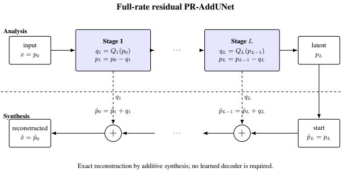
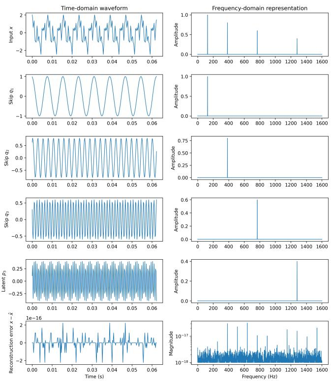

# TASK-DIRECTED RESIDUAL ADDUNET: PERFECT-RECONSTRUCTION ROUTING FOR FULL-RATE REPRESENTATIONS

Vikram R. Lakkavalli

International Institute of Information Technology Bangalore, India vikram.ckm@gmail.com, vikram.ramesh@iiitb.ac.in

## ABSTRACT

This paper establishes a perfect-reconstruction (PR) interpretation of AddUNet and its full-rate realization, and introduces a Residual Full-Rate PR architecture for task-directed representation learning. The survivor–skip structure of a constrained additive U-Net is shown to be exactly equivalent to a critically sampled multirate PR filter bank. The full-rate formulation removes the complementarysubband restrictions of the critically sampled system while preserving PR. A Residual Full-Rate PR architecture is then proposed to progressively route task-irrelevant, nuisance, or redundant structure away from the task-facing survivor while retaining the routed information explicitly. Exact reconstruction is guaranteed for arbitrary shape-compatible linear or nonlinear routing operators, without requiring invertibility, a matched synthesis bank, reconstruction loss, or learned decoder. The resulting architecture decouples representation design from reconstruction design: conservation is structural, while learning is devoted to task-directed routing. The same formulation identifies an identity-shortcut ResNet with its residual output retained as a full-rate PR system. Experiments verify exact single-channel routing of linearly separable factors to machine precision. On TIMIT, the proposed front-end improves test PER from 28.60 ± 2.09% to 25.76 ± 0.41% with the recognizer and training protocol held fixed, while maintaining exact reconstruction. Speaker probing further shows that structural conservation does not itself imply task-specific invariance.

Index Terms— perfect reconstruction, residual learning, skip connections, additive U-Net, residual networks, task-directed routing

## 1. INTRODUCTION

Encoder–decoder networks with skip connections are widely used in signal and image tasks, yet the skip is typically treated as an engineering mechanism for passing detail around a bottleneck, leaving the signal-theoretic role of the individual paths implicit [1]. For taskdirected representation learning, however, it is useful to distinguish what information is propagated from what is explicitly routed away.

Additive U-Nets recombine survivor and skip contributions by addition rather than concatenation. We show that, under appropriate constraints, this organization is exactly equivalent to a critically sampled multirate perfect-reconstruction (PR) analysis–synthesis filter bank [2, 3]. This places additive encoder–decoder architectures within a classical signal-processing framework for explicit information conservation. Related learnable multirate systems such as DeSpaWN apply PR principles to wavelet-style analysis [4].

The full-rate residual specialization studied here retains each routed contribution explicitly and is closely related to an identityshortcut ResNet update [6]. Invertible architectures such as i-

RevNet, i-ResNet, and invertible U-Nets achieve recoverability by constraining the transformation itself [7, 8, 9]. In contrast, residual PR-AddUNet imposes no invertibility constraint on the routing operator; exact recovery follows from the architecture by retaining the complementary routed component.

The paper makes two main contributions. First, we establish the exact equivalence between a constrained additive U-Net and a critically sampled PR filter bank, and show that removing critical sampling yields a full-rate PR formulation free from alias-cancellation and complementary-subband constraints. Second, we introduce a Residual Full-Rate PR architecture in which each stage routes structure away from a task-facing survivor while retaining the routed component explicitly. Proposition 1 shows that exact reconstruction then holds for arbitrary shape-compatible linear or nonlinear routing operators, without requiring an invertible transform, matched synthesis bank, reconstruction loss, or learned decoder.

Experiments verify exact routing of analytically separable factors, demonstrate retained-residual recoverability in pretrained ResNet blocks, and evaluate the full-rate routing front-end on TIMIT. The proposed model improves phone recognition over direct classification under the same recognizer and training protocol while preserving exact reconstruction. Capacity and context exhibit non-monotonic effects, while speaker probes show that conservation alone does not imply task-specific invariance.

## 2. MULTIRATE PR EQUIVALENCE AND ITS FULL-RATE RELAXATION

The architectural form used here is a PR-AddUNet, which retains the encoder–decoder topology and skip structure of a conventional U-Net but replaces concatenative skip fusion by additive synthesis. At level l, let $p _ { l - 1 }$ denote the level input, $p _ { l }$ the propagated survivor, and ql the retained skip contribution, as illustrated in Fig. 1.

## 2.1. Critically Sampled PR

In the critically sampled realization, $p _ { l }$ and ql are the two decimated outputs of a two-channel analysis bank. Let $\mathbf { E } _ { l } ( z )$ and ${ \bf R } _ { l } ( z )$ denote the corresponding analysis and synthesis polyphase matrices. The standard PR condition is

$$
\mathbf { R } \iota ( z ) \mathbf { E } \iota ( z ) = z ^ { - \Delta \iota } \mathbf { I } ,\tag{1}
$$

which reconstructs $p _ { l - 1 }$ exactly up to delay [2, 3]. For an orthogonal, or paraunitary, realization,

$$
\begin{array} { r } { { \bf E } _ { l } ^ { H } ( z ^ { - 1 } ) { \bf E } _ { l } ( z ) = { \bf I } , } \end{array}\tag{2}
$$

with the synthesis bank obtained from the corresponding adjoint analysis bank.

  
Fig. 1. Full-rate residual PR-AddUNet. Each analysis stage routes a residual $q _ { l } = Q _ { l } ( p _ { l - 1 } )$ ) and updates the survivor as $p _ { l } = p _ { l - 1 } - q _ { l }$ The latent is the final survivor $p _ { L }$ . Reconstruction proceeds in reverse by additive synthesis, $\hat { p } _ { l - 1 } = \hat { p } _ { l } + q _ { l }$ , yielding exact reconstruction.

The two analysis filters are therefore coupled through the classical multirate PR structure: decimation introduces alias components that must be cancelled at synthesis, while quadrature or complementary relations restrict the admissible filter pair. Critical sampling provides an important rate advantage: although the signal is represented by two paths, their combined sample rate equals the input rate. The cost is that the survivor and skip filters cannot be designed independently; their relationship is governed by the PR and aliascancellation conditions.

## 2.2. Full-Rate Relaxation

We next remove the critical-sampling operation. Consequently, the even–odd polyphase decomposition, decimation/interpolation operations, and associated quadrature and alias-cancellation conditions are no longer required. Both paths instead operate directly on the complete level input at its original rate:

$$
p _ { l } = P _ { l } ( p _ { l - 1 } ) , \qquad q _ { l } = Q _ { l } ( p _ { l - 1 } ) ,\tag{3}
$$

where $P _ { l }$ and $Q _ { l }$ are now full-rate analysis operators. With additive synthesis,

$$
\hat { p } _ { l - 1 } = \widetilde { P } _ { l } ( p _ { l } ) + \widetilde { Q } _ { l } ( q _ { l } ) ,\tag{4}
$$

the linear full-rate PR condition becomes

$$
\widetilde { P } _ { l } P _ { l } + \widetilde { Q } _ { l } Q _ { l } = \mathbf { I } .\tag{5}
$$

The full-rate realization sacrifices the sampling efficiency of the critically sampled system by retaining both paths at the original resolution. In return, $P _ { l }$ and $Q _ { l }$ are no longer constrained to form a quadrature-mirror or complementary-subband pair. Perfect reconstruction still imposes the joint condition in (5), but the analysis operators are otherwise free from the alias-cancellation and spectralpartition constraints associated with critical sampling.

Thus, constraints encouraging distinct survivor and skip subspaces can be introduced without requiring the two operators to be spectral replicas, quadrature pairs, or complementary frequency partitions. The transition to full rate therefore separates the classical PR requirement from the choice of representation geometry.

## 2.3. Residual Full-Rate PR

Although the critical-sampling constraints have been removed, (5) still couples the analysis and synthesis operators. We remove this

remaining coupling by defining the skip as an explicitly routed component,

$$
q _ { l } = Q _ { l } ( p _ { l - 1 } ) , \qquad p _ { l } = p _ { l - 1 } - q _ { l } .\tag{6}
$$

Synthesis proceeds recursively from $\hat { p } _ { L } = p _ { L }$ as

$$
\hat { p } _ { l - 1 } = \hat { p } _ { l } + q _ { l } , \qquad l = L , L - 1 , \ldots , 1 .\tag{7}
$$

Because $p _ { l - 1 } = p _ { l } + q _ { l }$ holds locally by construction, the recursion exactly recovers every preceding survivor and hence $p _ { 0 }$

For linear Ql, (6) corresponds to

$$
P _ { l } = \mathbf { I } - Q _ { l } ,\tag{8}
$$

and therefore satisfies the full-rate PR condition identically with $\widetilde { P } _ { l } \ = \ \widetilde { Q } _ { l } \ = \ { \bf I } .$ . Importantly, (7) remains exact for any shapecompatible nonlinear $Q _ { l }$ , because the routed component $q _ { l }$ is retained explicitly.

Proposition 1 (Residual full-rate PR). For any shape-compatible mappings $\{ Q _ { l } \} _ { l = 1 } ^ { L } , l e t p _ { 0 } = x , q _ { l } = Q _ { l } ( p _ { l - 1 } )$ , and $p \iota = p \iota - 1 - q \iota .$ Then thejoint representation $\left( p _ { L } , q _ { 1 } , \ldots , q _ { L } \right)$ reconstructs the input exactly as

$$
x = p _ { L } + \sum _ { l = 1 } ^ { L } q _ { l } ,\tag{9}
$$

with no requirement that the routing operators be linear, invertible, orthogonal, or paired with a matched synthesis bank.

Proof. $\mathrm { F r o m } ( 6 ) , p _ { l - 1 } = p _ { l } + q _ { l }$ . Repeated substitution from $l = L$ to $l = 1$ telescopes to (9). □

Hence reconstruction is fixed by architecture, while learning determines how information is routed between the propagated survivor and retained components. The resulting representation is overcomplete, and perfect reconstruction alone does not determine how taskrelevant and nuisance information should be distributed between the paths.

## 2.4. Relation to Residual Networks

Defining $F _ { l } = - Q _ { l }$ in (6) gives $p _ { l } = p _ { l - 1 } + F _ { l } ( p _ { l - 1 } )$ , the standard ResNet update [6]. PR-AddUNet differs by retaining the complementary residual q . Unlike i-RevNet, i-ResNet, and invertible U-Nets [7, 8, 9], exact reconstruction does not require the transform itself to be invertible; the complementary path is retained instead, so the input is exactly recoverable by additive synthesis, trading transform constraints for representation redundancy. A learned decoder becomes relevant when PR is intentionally relaxed, for example by compression or information removal not represented in the retained residual paths.

## 3. TASK-DIRECTED FACTOR ROUTING

## 3.1. Linearly Separable Factors

Consider $\textstyle x = \sum _ { k = 0 } ^ { K } x ^ { ( k ) }$ with mutually orthogonal constituent subspaces. If $Q _ { l }$ projects onto the subspace containing $x ^ { ( l ) }$ , then

$$
q _ { l } = x ^ { ( l ) } , \qquad p _ { l } = x - \sum _ { k = 1 } ^ { l } x ^ { ( k ) } .\tag{10}
$$

We verify this with four orthogonal sinusoids at 128, 384, 768, and 1280 Hz with amplitudes 1.0, 0.8, 0.6, and 0.4. Successive $Q _ { l }$ project one component into a residual path while propagating the remainder; Fig. 2 shows the resulting decomposition.

  
Fig. 2. Single-channel residual routing of four orthogonal sinusoidal factors. $q _ { 1 } , q _ { 2 } , q _ { 3 }$ isolate three components while $p _ { 3 }$ retains the fourth; their sum reconstructs the input.

The designated factors are recovered with relative errors below $3 . 2 \times 1 0 ^ { - 1 3 }$ , while the full representation reconstructs the input with relative $\ell _ { 2 }$ error $1 . 1 \times 1 0 ^ { - 1 6 }$ and maximum absolute error $4 . 4 \times$ $1 0 ^ { - 1 6 }$ . Thus one full-rate residual channel is sufficient to route a linearly separable factor while retaining PR to machine precision.

## 3.2. Entangled Factors

Speech does not generally satisfy the orthogonal decomposition in (10); phonetic, speaker, excitation, and channel effects are coupled. This changes separation difficulty, not reconstruction: (9) remains exact for nonlinear learned $Q _ { l }$ . With task head $\tau ,$ , we write

$$
\operatorname* { m i n } _ { \{ Q _ { l } \} , T } \mathcal { L } _ { \mathrm { t a s k } } ( T ( p _ { L } ) , y ) + \lambda \mathcal { R } _ { \mathrm { r o u t e } } ,\tag{11}
$$

where ${ \mathcal { R } } _ { \mathrm { r o u t e } }$ may encode invariance, decorrelation, diversity, sparsity, or level-specific constraints. The TIMIT experiments use $\lambda =$ $0 ,$ so routing is induced only by phone supervision; no reconstruction loss is required.

## 4. EXPERIMENTS

## 4.1. TIMIT Setup

We evaluate PR-AddUNet on TIMIT using 257-dimensional logmagnitude STFT features and the standard 61-to-39 phone mapping. The full-rate hierarchy has six routing stages with temporal dilations {1, 1, 2, 2, 4, 4}; each $Q _ { l }$ contains two time–frequency convolutions with batch normalization and ReLU between them. For C channels, the input is redundantly lifted to C full-rate channels and collapsed before a common CTC backend: CMVN, a 257-to-128 projection, two BiLSTM layers with 128 hidden units, layer normalization, and a 40-way classifier.

Table 1. TIMIT routing-capacity and context ablations; mean ± std. over three seeds.
<table><tr><td>C</td><td>Kernel</td><td> $\mathrm { V a l } \operatorname { P E R } \left( \% \right)$ </td><td> $\mathrm { T e s t } \mathrm { P E R } \left( \% \right)$ </td></tr><tr><td>1</td><td> $9 \times 3$ </td><td> $2 4 . 3 4 \pm 1 . 6 8$ </td><td> $2 6 . 6 8 \pm 1 . 4 3$ </td></tr><tr><td>2</td><td> $9 \times 3$ </td><td> $2 3 . 5 9 \pm 0 . 8 1$ </td><td> $2 6 . 0 3 \pm 0 . 9 5$ </td></tr><tr><td>4</td><td> $9 \times 3$ </td><td> $2 4 . 6 1 \pm 1 . 7 5$ </td><td> $2 7 . 1 2 \pm 1 . 5 3$ </td></tr><tr><td>8</td><td> $9 \times 3$ </td><td> $2 4 . 3 0 \pm 0 . 4 5$ </td><td> $2 6 . 4 8 \pm 0 . 4 4$ </td></tr><tr><td>12</td><td> $9 \times 3$ </td><td> $2 3 . 9 2 \pm 1 . 3 6$ </td><td> $2 6 . 3 1 \pm 1 . 2 8$ </td></tr><tr><td>1</td><td> $9 \times 9$ </td><td> $2 4 . 1 7 \pm 1 . 4 4$ </td><td> $2 6 . 5 6 \pm 1 . 5 9$ </td></tr><tr><td>2</td><td> $\mathbf { 9 \times 5 }$ </td><td> ${ \bf 2 3 . 4 0 \pm 0 . 4 5 }$ </td><td> ${ \bf 2 5 . 7 6 \pm 0 . 4 1 }$ </td></tr><tr><td>2</td><td> $9 \times 9$ </td><td> $2 4 . 1 3 \pm 0 . 3 4$ </td><td> $2 6 . 2 3 \pm 0 . 2 0$ </td></tr></table>

Models use CTC only, batch size 8, learning rate $2 \times 1 0 ^ { - 4 }$ weight decay $1 0 ^ { - 5 }$ , and seeds {1234, 1235, 1236}. Checkpoints are selected by validation PER. Relative reconstruction error remains below $6 . 4 \times \mathrm { i } 0 ^ { - 8 }$ in all PR runs.

As a controlled baseline, we bypass the complete routing hierarchy and feed the original log-magnitude spectrum directly to the same CTC backend. Thus the direct-input and PR models share the classifier architecture, optimization, data splits, and model-selection procedure; the only difference is whether the task representation is the original input or the routed survivor $p _ { L }$

## 4.2. Routing Capacity and Context

We vary routing width $C \in \{ 1 , 2 , 4 , 8 , 1 2 \}$ with a 9 × 3 kernel, then fix $C = 2$ and vary spectral context using $9 \times 3 , 9 \times 5$ , and $9 \times 9$ kernels; $C = 1 , 9 \times 9$ is included as a single-channel control. Table 1 reports the results.

A single routing channel is already effective, while $C = 2$ gives the best mean recognition among the $9 \times 3$ models. Further width gives no monotonic gain. At fixed $C = 2$ , moderate spectral context $( 9 \times 5 )$ gives the best overall test PER, whereas $9 \times 9$ provides no further benefit. Thus routing capacity and local context affect the learned representation differently, and neither improves monotonically with scale.

## 4.3. Controlled Baseline and AddUNet Reference

Table 2 first compares PR-AddUNet with the direct-input CTC control using the same classifier backend and training protocol. We also show the earlier additive U-Net results of [5] as external reference points; those models use a lossy bottleneck and joint CTC-plusreconstruction training.

With the same classifier and training protocol, adding the residual front-end improves mean validation PER from 26.70±2.20% to 23.40 ± 0.45% and mean test PER from 28.60 ± 2.09% to 25.76 ± 0.41%, a 2.84-point absolute test improvement, while retaining exact reconstruction by construction. Because the control removes the front-end entirely, this shows that the residual full-rate front-end helps but does not isolate the contribution of the residual/PR structure from that of a generic learned front-end; a capacity-matched non-PR front-end is left to future work. The earlier AddUNet remains about two PER points better, but differs in both architecture and objective and is therefore treated only as an external reference.

Table 2. TIMIT 39-phone test PER. Direct CTC and PR-AddUNet use the same classifier backend and training protocol and are averaged over three seeds. AddUNet results are published five-seed reference points.
<table><tr><td>Model</td><td>Objective</td><td>Test PER (%)</td></tr><tr><td>Direct input + CTC  $\mathrm { P R - A d d U N e t } \left( C = 2 , 9 { \times } 5 \right)$ </td><td>CTC CTC, exact PR</td><td> $2 8 . 6 0 \pm 2 . 0 9$   ${ \bf 2 5 . 7 6 \pm 0 . 4 1 }$ </td></tr><tr><td>Real AddUNet [5]</td><td>CTC+recon.</td><td> $2 3 . 9 7 \pm 1 . 1 8$ </td></tr><tr><td>Pseudo AddUNet [5]</td><td>CTC+recon.</td><td> $2 3 . 3 0 \pm 1 . 2 5$ </td></tr></table>

## 4.4. Exact Recoverability of a Generic ResNet

The residual identification of (6) implies that any identity-shortcut block $y = x + F ( x )$ becomes exactly recoverable by additive synthesis if its residual $F ( x )$ is retained: the block map is not shown to be invertible, but the input is recovered as $x = y - F ( x )$ . We verify this on the three identity-shortcut blocks of layer1 of an ImageNet-pretrained ResNet-34 [6]. Retaining $r _ { l } = F _ { l } ( x _ { l } )$ during the forward pass permits reverse synthesis $x _ { l } = x _ { l + 1 } - r _ { l }$ without retraining or imposing invertibility.

Relative $\ell _ { 2 }$ error remains at approximately $1 0 ^ { - 8 }$ in single precision and $1 0 ^ { - 1 7 }$ in double precision across depth. Thus exact recoverability arises from retaining the complementary residual rather than from constraining the block itself to be invertible. Projection/downsampling transitions remain outside this identity-shortcut result.

## 4.5. Speaker Information in the Survivor

We freeze the ASR models and train linear speaker probes on utterance-level mean and standard-deviation statistics of the input and final survivor. Input top-1 accuracy is 76.30%; for $C =$ $\bar { \{ 1 , 2 , 4 , 8 , 1 2 \} }$ , survivor accuracies are 75.18 ± 2.37%, 75.90 ± 0.74%, 73.52 ± 1.66%, 73.88 ± 1.11%, and $7 3 . 4 1 \pm 1 . 4 7 \%$ . Thus phone supervision alone reduces linear speaker accessibility by at most about three points.

By comparison, the lossy AddUNet reduces its own input probe from 78.97% to 60.60% at the bottleneck [5]; because the probe protocols differ, only within-model drops are compared. This weaker suppression reflects the learned routing under phone supervision rather than a property of PR itself (Sec. 5).

## 5. DISCUSSION

The PR interpretation gives the U-Net hierarchy a role beyond information bypass. At each level, the representation is divided into a retained component $q _ { l }$ and a propagated survivor $p _ { l } ,$ , so successive stages determine what is routed away and what remains to be resolved. In the residual full-rate formulation, $Q _ { l }$ may be any nonlinear, shape-compatible operator, while

$$
p _ { l - 1 } = p _ { l } + q _ { l }\tag{12}
$$

keeps each routing decision exactly recoverable.

The architecture of $Q _ { l }$ therefore becomes part of representation design. Channel width controls routing capacity, while depth and receptive field determine the nonlinearity and context available at each level. These choices may differ across levels because each operates on a progressively conditioned survivor. More capacity is not necessarily better: excessive capacity may produce redundant decompositions, whereas insufficient capacity may fail to isolate the required structure. The observed non-monotonic effects of capacity and context are consistent with this view.

This also clarifies the earlier AddUNet results [5]. PR guarantees conservation of the joint survivor–residual representation but does not determine which factors remain in the survivor. The stronger speaker suppression previously obtained with a lossy bottleneck and joint reconstruction–recognition training therefore likely resulted from the interaction of bottleneck capacity, reconstruction, nonlinear routing, and task supervision rather than additive topology alone.

Finally, PR gives the decoder a more specific role. In a conventional U-Net, reconstruction from latent and skip representations is learned without an explicit signal-theoretic conservation constraint. In full-rate PR-AddUNet, reconstruction is structural; a learned decoder becomes relevant only when PR is intentionally relaxed, for example through compression or information removal at the latent or an intermediate representation. The decoder can then be interpreted as modelling approximate synthesis under the resulting controlled information loss rather than implicitly learning information recovery.

## 6. CONCLUSION

We established a perfect-reconstruction interpretation of additive U-Nets and showed how relaxing critical sampling leads to a full-rate formulation with greater representation freedom. The residual specialization further removes the remaining analysis–synthesis coupling: by explicitly retaining the routed component, exact reconstruction becomes structural and no invertible routing operator or learned decoder is required.

On TIMIT, the resulting routing front-end improves test PER from 28.60 ± 2.09% to $2 5 . 7 6 \pm 0 . 4 1 \%$ under the same recognizer and training protocol while preserving exact reconstruction. Routing width and local context exhibit non-monotonic effects, supporting the view that operator capacity should be matched to the structure resolved at each level rather than simply increased. Speaker probing further shows that PR guarantees conservation but not task-specific invariance.

The same retained-residual principle also makes identityshortcut residual blocks exactly recoverable by additive synthesis. These results position PR-AddUNet as a framework in which information conservation is fixed architecturally, while learning determines how information is routed. Future work will study explicit routing constraints, level-dependent operator design, and controlled departures from PR through compressed representations in which learned synthesis has a principled role.

## 7. REFERENCES

[1] O. Ronneberger, P. Fischer, and T. Brox, “U-Net: Convolutional networks for biomedical image segmentation,” in Proc. MICCAI, 2015, pp. 234–241.

[2] P. P. Vaidyanathan, Multirate Systems and Filter Banks. Englewood Cliffs, NJ, USA: Prentice-Hall, 1993.

[3] M. Vetterli and J. Kovacevi ˇ c,´ Wavelets and Subband Coding. Englewood Cliffs, NJ, USA: Prentice-Hall, 1995.

[4] G. Michau, G. Frusque, and O. Fink, “Fully learnable deep wavelet transform for unsupervised monitoring of highfrequency time series,” Proc. Natl. Acad. Sci. USA, vol. 119, no. 8, Art. no. e2106598119, 2022.

[5] V. R. Lakkavalli and N. Sinha, “Architectural control of phonetic invariance via additive U-Net multi-task learning,” in Proc. Int. Conf. Signal Processing and Communications (SPCOM), 2026, pp. 1–5, doi: 10.1109/SP-COM71105.2026.11622998.

[6] K. He, X. Zhang, S. Ren, and J. Sun, “Deep residual learning for image recognition,” in Proc. IEEE Conf. Computer Vision and Pattern Recognition (CVPR), 2016, pp. 770–778.

[7] J.-H. Jacobsen, A. W. M. Smeulders, and E. Oyallon, “i-RevNet: Deep invertible networks,” in Proc. Int. Conf. Learning Representations (ICLR), 2018.

[8] J. Behrmann, W. Grathwohl, R. T. Q. Chen, D. Duvenaud, and J.-H. Jacobsen, “Invertible residual networks,” in Proc. 36th Int. Conf. Machine Learning (ICML), vol. 97, 2019, pp. 573– 582.

[9] C. Etmann, R. Ke, and C.-B. Schonlieb, “iUNets: Learnable¨ invertible up- and downsampling for large-scale inverse problems,” in Proc. IEEE 30th Int. Workshop Machine Learningfor Signal Processing (MLSP), 2020, pp. 1–6.