# THE MISERY OF MECHANISTIC INTERPRETABILITY: A FORMAL PERSPECTIVE

Tobias Ladner (tobias.ladner@tum.de) Technical University of Munich, Germany

Matthias Althoff (althoff@tum.de) Technical University of Munich, Germany

## ABSTRACT

Mechanistic interpretability has become the dominant lens for understanding frontier language models, as their inner workings are complex and inherently black boxes. To gain insights into these models, interpretable replacement networks (IRNs) are trained at all layers, exposing interpretable features through sparsely activated neurons. However, the faithfulness of an IRN is usually evaluated only empirically on clean data, and we show that even semantically minor input perturbations flip the dominant IRN features—and thus the human-understandable interpretation—across five open-weight model families (GPT-2, Gemma 2 2B, Gemma 3 1B, Llama 3.2 1B, R1-Distill-Qwen 1.5B). We propose the first formal verification framework for the faithfulness of an IRN, where reachability analysis certifies a sound upper bound on the faithfulness gap in adversarial scenarios. Moreover, we show that verification-aware training of IRNs substantially tightens this certified bound, restoring a feature-level interpretation that safety auditors can act on. Together, these results give, to the best of our knowledge, the first formal guarantees for mechanistic interpretability of large language models.

## 1 INTRODUCTION

Most interpretations of a large language model carry a quiet asterisk: They are not direct interpretations of the model. When we read that a neuron “fires for the Golden Gate Bridge” (Templeton et al., 2024) or that a circuit “implements a comparison operator” (Dunefsky et al., 2024), these claims are often read off an interpretable replacement network (IRN)—an interpretable network to stand in for a dense computation the model actually performs (Marks et al., 2025; Somvanshi et al., 2026). This is necessary as the dense computations of the underlying model result in polysemantic neurons (Elhage et al., 2022), whereas the IRN exposes a short list of human-understandable features. Crucially, these features are only as trustworthy as that stand-in is faithful, i.e., the computation of the IRN matches the underlying model.

However, training the IRN to match the underlying model usually results in an approximate stand-in. While the IRN can be patched for individual inputs (Ameisen et al., 2025), whether an interpretation survives an adversarial input is barely tested or verified—even though adversarial examples have been known to exist for a decade (Goodfellow et al., 2015), including for language models (Dong et al., 2025). Moreover, individual patches defeat the purpose of mechanistic interpretability to a certain degree as it aims to replicate the true mechanism of the underlying model.

Fig. 1 shows how such a faulty IRN can deceive a safety auditor: On the clean input sentence, the auditor would read off features surrounding “cultivating a pathogen”—a signal the safety auditor would use to refuse the request. We then perturb the input slightly by paraphrasing the sentence, such that the dominant features now describe “workplace culture”—and the auditor would wave the request through. Crucially, nothing of the model changed; what changed is the exposed interpretation by the IRN. The full example is provided in Appendix A.

It is worth noting that there are also interpretations that operate on the actual model. For example, circuit tracing methods aim to identify the active subnetworks for any input (Somvanshi et al., 2026); however, those methods do not scale to frontier language models yet (Gao et al., 2025b). Instead, dense computations are replaced by IRNs and circuit tracing is applied on this modified model (Ameisen et al., 2025)—making the faithfulness of IRNs ever more important. Further details are provided in Sec. 7, and we focus for the remainder of this work on the faithfulness of IRNs.

  
Figure 1: Same meaning, different interpretations. On the clean input (left), the most active features describe a “pathogen” sense of culture, and a feature-based safety auditor reading those features blocks the request. With a minor synonym attack (right), the dominant features instead describe a “workplace” sense, and the same auditor would let the request pass.

Contributions. To summarize, our main contributions are:

1. We first show that IRNs are highly sensitive to adversarial attacks across various model families and IRN types: GPT-2, Gemma 2 2B, Gemma 3 1B, Llama 3.2 1B, and R1-Distill-Qwen 1.5B (Sec. 3).

2. Subsequently, we establish a formal verification framework for the faithfulness of an IRN (Sec. 4). In particular, we show that with the recent progress in formal methods, formal neural network verification can also be utilized in large language models.

3. Finally, we show that verification-aware training substantially narrows the faithfulness gap of IRNs (Sec. 5).

## 2 BACKGROUND ON MECHANISTIC INTERPRETABILITY

Modern language models (Vaswani et al., 2017; Elhage et al., 2021) are typically composed of a token embedding layer, a stack of κ blocks operating on a residual stream, and a decoding layer to predict the next token. Each block k has two sublayers (Fig. 2): A multi-head attention sublayer that mixes information across tokens, and a multi-layer perceptron (MLP) that applies a nonlinear transformation to each token independently. Both add their output back into the residual stream, so we can write the layer-k update as (Vaswani et al., 2017, Eq. 1 & 2)

$$
H _ { k } ^ { \prime } \ = \ H _ { k - 1 } + \mathrm { A t t } { \mathrm { n } } _ { k } \bigl ( H _ { k - 1 } \bigr ) , \qquad H _ { k } \ = \ H _ { k } ^ { \prime } + { \mathrm { M L P } } _ { k } ( H _ { k } ^ { \prime } ) ,\tag{1}
$$

where $H _ { k } \in \mathbb { R } ^ { d _ { \mathrm { m o d e l } } \times \tau }$ collects the residual-stream vectors of the τ input tokens as columns, and $H _ { k } ^ { \prime } \in \mathbb { R } ^ { d _ { \mathrm { m o d e l } } \times \tau }$ is the post-attention intermediate. We are aware that this is a simplified description of the architecture of frontier models; however, insofar as these models are not proprietary, most model families can be described under this framework (Radford et al., 2019; Gemma Team, 2024; 2025; Grattafiori et al., 2024; Qwen Team, 2025), and this high-level description is sufficient for our work.

An attention layer can usually be interpreted directly as it computes an interpretable relation between tokens (Vaswani et al., 2017, Eq. 1). However, the MLP is hard to interpret: Its neurons are densely entangled and polysemantic (Elhage et al., 2022), i.e., each fires for unrelated inputs. The dominant remedy is to fit an interpretable replacement network (IRN) (Somvanshi et al., 2026), whose activations are sparse and individually meaningful, and to read interpretations off the IRN features as a proxy for the model. We consider two dominant variants in this work, sparse autoencoders and transcoders (Fig. 2), which are also available for many open-weight models.

Sparse autoencoder (SAE). A sparsely activated autoencoder (Huben et al., 2024) reconstructs its input at layer k:

$$
\mathrm { S A E } _ { k } ( H _ { k } ) ~ = ~ W _ { k } ^ { \mathrm { d e c } } \phi ( W _ { k } ^ { \mathrm { e n c } } H _ { k } + b _ { k } ^ { \mathrm { e n c } } ) + b _ { k } ^ { \mathrm { d e c } } \approx H _ { k } ,\tag{2}
$$

where the parameters $W _ { k } ^ { \mathrm { e n c } } \in \mathbb { R } ^ { d _ { \mathrm { I R N } } \times d _ { \mathrm { m o d e l } } } , W _ { k } ^ { \mathrm { d e c } } \in \mathbb { R } ^ { d _ { \mathrm { m o d e l } } \times d _ { \mathrm { I R N } } } , b _ { k } ^ { \mathrm { e n c } } \in \mathbb { R } ^ { d _ { \mathrm { I R N } } } , b _ { k } ^ { \mathrm { d e c } } \in \mathbb { R } ^ { d _ { \mathrm { m o d e l } } }$ are learned per layer.

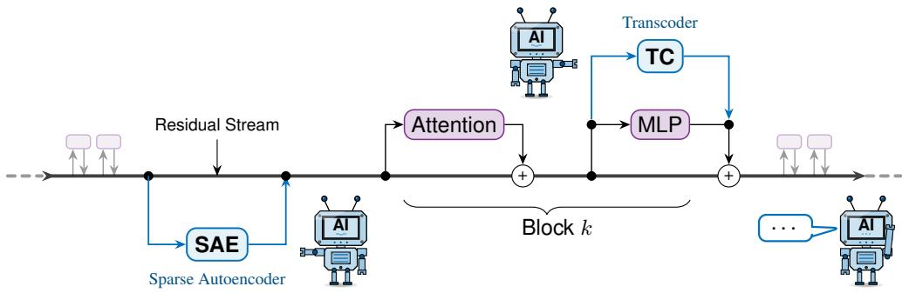  
Figure 2: Interpretable replacement networks. Large language models typically have a residual stream, which is modified through attention layers and MLPs (shown in purple). As these compute complex updates, interpretable replacement networks (shown in blue) are added to understand the internal behavior of a large language model. Examples are sparse autoencoders (reconstructing the residual stream), and transcoders (reconstructing the output of the MLP).

Transcoder (TC). A transcoder (Dunefsky et al., 2024) at layer k reconstructs the output of the multi-layer perceptron from the same input:

$$
\begin{array} { r } { \mathrm { T C } _ { k } ( H _ { k } ^ { \prime } ) = W _ { k } ^ { \mathrm { d e c } } \phi ( W _ { k } ^ { \mathrm { e n c } } H _ { k } ^ { \prime } + b _ { k } ^ { \mathrm { e n c } } ) + b _ { k } ^ { \mathrm { d e c } } \approx \mathrm { M L P } _ { k } ( H _ { k } ^ { \prime } ) , } \end{array}\tag{3}
$$

again with per-layer parameters $W _ { k } ^ { \mathrm { e n c } } , W _ { k } ^ { \mathrm { d e c } } , b _ { k } ^ { \mathrm { e n c } } , b _ { k } ^ { \mathrm { d e c } }$ . Transcoders can also be constructed across different computation blocks (Ameisen et al., 2025).

The activation function ϕ varies by model family: For example, ReLU is used for the GPT-2’s sparse autoencoder and transcoder (Dunefsky et al., 2024), JumpReLU for the Gemma Scope (Lieberum et al., 2024), and TopK for the Llama Scope (He et al., 2024).

A mechanistic interpretation at layer k for an input sentence is then read off the active IRN features, e.g., the indices i with $\phi ( \cdot ) _ { ( i ) } > 0 .$ , where a sparsity penalty during training ensures that only a small subset of the hidden features $( d _ { \mathrm { I R N } } \gg d _ { \mathrm { m o d e l } } )$ fires for any given input. Subsequently, each feature automatically obtains a human-readable label by summarizing the inputs that activate it (Paulo et al., 2025). This feature-label catalog is also often available along with the IRN (Lin, 2023).

## 3 WHERE MECHANISTIC INTERPRETABILITY BREAKS

A foundational observation in deep learning is that imperceptible input perturbations can flip the prediction of a model entirely—the so-called adversarial examples (Goodfellow et al., 2015). For mechanistic interpretability, we want the active features of the IRN to remain active when a sentence is rephrased in semantically equivalent ways. Otherwise, the human-readable labels attached to those features do not reflect the actual computation, and the IRN fails to replicate the mechanism of the model. This premise follows existing literature on the robustness of interpretations in regular neural networks (Wu et al., 2023; Bassan & Katz, 2023; La Malfa et al., 2021).

While most evaluations of IRNs report the reconstruction loss on clean data, adversarial settings are barely evaluated despite early signs of the instability of IRNs: For example, it was shown that sparse autoencoders trained as an IRN are fragile to small adversarial perturbations (Li et al., 2026). In this section, we confirm these results with additional experiments across various open-weight model families and IRN types, evaluated under three levels of natural-language paraphrase:

• MINOR: A single content word is replaced with a WordNet synonym (Miller, 1995).

• MEDIUM: All content words before the target are replaced with WordNet synonyms.

• MAJOR: An LLM (Gemma 2 2B-it) rephrases the sentence while preserving the target.

Table 1: Attack-derived top-20 Jaccard upper bound $\overline { J }$ of the active feature set under paraphrase perturbations across all layers.
<table><tr><td colspan="2"></td><td colspan="2">MINOR</td><td colspan="2">MEDIUM</td><td colspan="2">MAJOR</td></tr><tr><td>Model</td><td>IRN</td><td> $\overline { { J } } _ { \mathrm { m i n } } \left( \uparrow \right)$ </td><td> $\overline { { J } } _ { \mathrm { { m e a n } } } \left( \uparrow \right)$ </td><td> $\overline { { J } } _ { \mathrm { m i n } } \left( \uparrow \right)$ </td><td> $\overline { { J } } _ { \mathrm { { m e a n } } } \left( \uparrow \right)$ </td><td> $\overline { { J } } _ { \mathrm { m i n } } \left( \uparrow \right)$ </td><td> $\overline { { J } } _ { \mathrm { { m e a n } } } \left( \uparrow \right)$ </td></tr><tr><td>GPT-2</td><td>SAE</td><td>0.27</td><td>0.37</td><td>0.06</td><td>0.18</td><td>0.05</td><td>0.13</td></tr><tr><td>GPT-2</td><td>TC</td><td>0.70</td><td>0.79</td><td>0.45</td><td>0.62</td><td>0.38</td><td>0.54</td></tr><tr><td>Gemma 2 2B</td><td>SAE</td><td>0.62</td><td>0.78</td><td>0.35</td><td>0.59</td><td>0.33</td><td>0.54</td></tr><tr><td>Gemma 2 2B</td><td>TC</td><td>0.46</td><td>0.57</td><td>0.20</td><td>0.33</td><td>0.20</td><td>0.31</td></tr><tr><td>Gemma 3 1B</td><td>SAE</td><td>0.55</td><td>0.69</td><td>0.30</td><td>0.49</td><td>0.30</td><td>0.44</td></tr><tr><td>Gemma 3 1B</td><td>TC</td><td>0.47</td><td>0.67</td><td>0.18</td><td>0.42</td><td>0.20</td><td>0.38</td></tr><tr><td>Llama 3.2 1B</td><td>SAE</td><td>0.54</td><td>0.66</td><td>0.26</td><td>0.45</td><td>0.33</td><td>0.42</td></tr><tr><td>Llama 3.2 1B</td><td>TC</td><td>0.56</td><td>0.64</td><td>0.25</td><td>0.40</td><td>0.21</td><td>0.35</td></tr><tr><td>Qwen 1.5B</td><td>SAE</td><td>0.37</td><td>0.49</td><td>0.18</td><td>0.29</td><td>0.12</td><td>0.20</td></tr></table>

Results. Tab. 1 reports the top-20 Jaccard $\operatorname { i n d e x } ^ { 1 }$ between the active feature set of an IRN at the clean input and at an adversarial input. The Jaccard index drops substantially as the perturbation grows: Already at the MINOR level, the perturbations reduce the worst-layer overlap $\overline { { J } } _ { \mathrm { m i n } } ^ { - } \left( - 7 3 \% \right)$ and at the MAJOR level, the reduction is even larger ( 95%); thus, almost all dominant features change and along with them any interpretation for a safety auditor. We observe this drop for both sparse autoencoders and transcoders. Evaluation details are given in Appendix C.1.

Thus, the active features of an IRN can change substantially for adversarial inputs. However, please note that the underlying model can indeed also behave differently for an adversarial input, and we would only expect that a robust model maintains its dominant features under adversarial inputs. Moreover, an adversarial attack only witnesses a single bad input: It shows that the Jaccard index can drop at least this far, but cannot rule out an adversarial input where it drops further. The numbers in Tab. 1 are therefore an upper bound $\overline { J }$ on the true Jaccard index $J ^ { * }$ under adversarial attacks. To obtain guarantees, a faithful IRN of a robust model needs to have a high lower bound $\underline { { J } } .$

## 4 VERIFYING THE MECHANISM EQUIVALENCE OF AN LLM AND ITS IRNS

We have established that an IRN of a robust model has to have a high lower bound on the Jaccard index $\underline { { J } } .$ Crucially, the IRN also has to be faithful for a sensible J evaluation, i.e., the computation of the IRN should match the underlying model. As an extreme example, imagine an unfaithful IRN that always has the same (safe) features active independently of the model input, $\mathrm { e . g . }$ , through large biases on these features. Then, $\_$ is always 1 even though the underlying model might be unsafe, and thus it is an insufficient measure as the IRN is not faithful. To guarantee the faithfulness, we develop a framework to formally verify the equivalence of the model and the IRN under adversarial inputs in this section, and obtain $\underline { J }$ as a by-product of this equivalence check.

We construct a set $\mathcal { X } \subset \mathbb { R } ^ { d _ { \mathrm { m o d e l } } \times \tau }$ containing all adversarial embeddings of an input sentence. For example, $\mathcal { X }$ can contain all semantically equivalent sentences to that input sentence through synonym replacements of each word. As explicitly enumerating all synonym combinations quickly results in a combinatorial explosion, we construct, per token, a convex hull in the embedding space over all synonyms of that token, and then compute the Cartesian product of these convex hulls to obtain $\chi .$ Then, with $\mathcal { H } _ { k }$ being the propagated set at each layer k, we can state our faithfulness criterion:

Definition 1. For a $\delta \in \mathbb { R } _ { + }$ , we say that an IRN at layer k is δ-equivalent to the underlying model on $\mathcal { H } _ { k }$ if

$$
\forall \widetilde { H } _ { k } \in \mathcal { H } _ { k } \colon \qquad \left\| \widetilde { H } _ { k } - { \mathrm { S A E } _ { k } ( \widetilde { H } _ { k } ) } \right\| _ { \infty } \le \delta , \qquad \left\| { \mathrm { M L P } } _ { k } ( \widetilde { H } _ { k } ) - { \mathrm { T C } } _ { k } ( \widetilde { H } _ { k } ) \right\| _ { \infty } \le \delta ,
$$

and we say that the IRN is faithful if $\delta$ is sufficiently small.

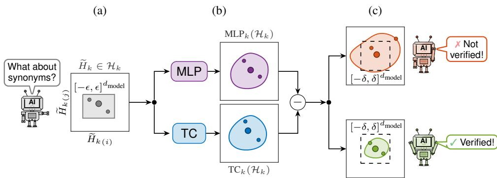  
Figure 3: Mechanism verification as a composite network. (a) The local neighborhood around an input sentence is captured by $\mathcal { H } _ { k }$ so that adversarial inputs are also contained. (b) We can deploy formal verification to bound the maximal difference between the ${ \bf M L P } _ { k }$ and the $\mathrm { T C } _ { k }$ within the local neighborhood. (c) The faithfulness property in Def. 1 holds if the computed difference set is contained in a small box $[ - \delta , \delta ] ^ { d _ { \mathrm { m o d e l } } }$ . The SAE case is analogous, with ${ \mathrm { M L P } } _ { k }$ replaced by the identity (Eq. 2).

Please note that $\mathcal { H } _ { k }$ is a continuous set, e.g., imagine a hypercube with radius $\epsilon \in \mathbb { R } _ { + }$ containing all embeddings of the adversarial inputs. To test for δ-equivalence (Def. 1), we can adapt existing neural network verifiers (Kaulen et al., 2025) for our use case. In particular, we construct for each layer k the difference network ML $\mathrm { \mathrm { \mathrm { P } } } _ { k } ( H _ { k } ) { \mathrm { - I R N } } _ { k } ( H _ { k } )$ as a composite of two parallel paths with differencebased aggregation (Fig. 3), and the verifier tries to prove that the difference is bounded by a given δ. We defer a more detailed description of how these verifiers work to Appendix B.1 and provide optimizations applied in our settings in Appendix B.2, which also gives us J (Appendix B.3).

With such a verifier, we aim to find the smallest verifiable bound $\delta ^ { * }$ . As with the Jaccard index $J ^ { * }$ it is usually also not feasible to compute $\delta ^ { * }$ , and we need to find bounds: $\underline { { { \delta } } } \le \delta ^ { * } \le \overline { { { \delta } } }$ . We can find a lower bound δ using adversarial attacks trying to maximize the difference, and the upper bound $\overline { { \delta } }$ needs to be verified. Please note that this is converse to $\underline { { J } } , \overline { { J } } ,$ , where the lower bound—describing the number of unflippable active features—needs to be verified. We find $\overline { { \delta } }$ by conducting a binary search with sequential verification queries (details in Appendix C.1, Alg. 2). To display the faithfulness gap in figures, we draw the gap between the median $\underline { { \delta } }$ and $\overline { { \delta } }$ over the test dataset as a filled box—thus, the median $\delta ^ { * }$ has to be within the filled box—and add whiskers for the 25%- and 75%-quantile of δ and δ, respectively.

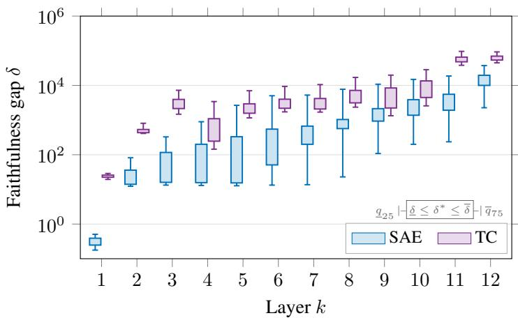

  
Figure 4: Per-layer faithfulness gap on GPT-2. For both IRNs and across all layers, we can verify a substantial faithfulness gap between the computation of the IRNs and the underlying model.

Results. Fig. 4 reports the faithfulness gap for both IRNs of GPT-2 (other models in Appendix C.2), where we have verified a substantial faithfulness gap across all layers. For example, we have verified that for layer 1, the SAE is δ-equivalent to the underlying model for some $\delta < 1$ Thus, the reconstructed residual stream under the $\ell _ { \infty }$ norm has, on average, a smaller difference than 1 given adversarial inputs. To put this number into context, we also observed such differences on the residual stream of the underlying model given adversarial inputs. Unfortunately, our results demonstrate that later layers become less faithful, arguably to a degree that does not allow for meaningful interpretations anymore. We want to stress that this is not an artifact of the (incomplete) verifier, as not only the upper bound found by the verifier is rising, but also the lower bound found by adversarial attacks. We note that the faithfulness gap is generally larger for TCs, which is to be expected as a TC has to replicate the complex computations of the MLP there, and SAEs “only” have to reconstruct their input. Evaluation details are again given in Appendix C.1.

## 5 IMPROVING THE FAITHFULNESS OF AN IRN

These results naturally lead to the question of whether more faithful IRNs can be obtained. Standard training of IRNs usually focuses on the combination of reconstruction and sparsity for interpretabil ity on clean data (Marks et al., 2025; Dunefsky et al., 2024); however, it does not adequately consider adversarial inputs, such that their susceptibility likely degrades the verification results in the previous section. Conceptually, we want to train the IRN in a way so that in Fig. 3c, any sentence for which the error set is like the top plot becomes more like the bottom plot—thereby aligning its manifold with the manifold of the underlying model. We investigate different training regimes in this section to improve the faithfulness of an IRN under adversarial inputs:

• STD: The given IRN obtained using standard training is used as a baseline.

• PGD: Adversarial training using PGD-found $\widetilde { H } _ { k }$ as augmentation (Madry et al., 2018).

• SET: Verification-aware training with reachable-set loss (Koller et al., 2025).

• LORA: Low-rank updates typically used for fine-tuning LLMs (Hu et al., 2022).

Results. We fine-tune OpenAI’s SAE of GPT-2 using these training regimes (more experiments again in Appendix C.2), and show the verification results in Fig. 5 using the same setup as in Sec. 4. Our results show substantially smaller verified upper bounds δ on the difference set $( \approx - 9 0 \%$ for SET over STD). Please note that the difference sets live in a high-dimensional space $( d _ { \mathrm { m o d e l } } = 7 6 8 )$ and thus the relative error volume is extremely small $( \approx 1 0 ^ { - 7 7 9 }$ of SET over STD). Crucially, the retrained IRNs are more sparse and thus interpretable (SET has on average 13.9 active features, 81% over STD). We can also improve the faithfulness of the IRN with efficient low-rank updates (LoRA) despite the verifier requiring robustness in the full space. We anticipate this result to also be of broader interest within the verification community as it might transfer to non-NLP-based models as well.

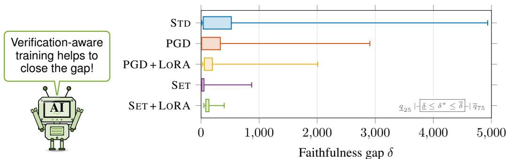  
Figure 5: Faithfulness gap per training regime. Verification-aware training results in a substantially smaller faithfulness gap between GPT-2 and its SAE at layer 6.

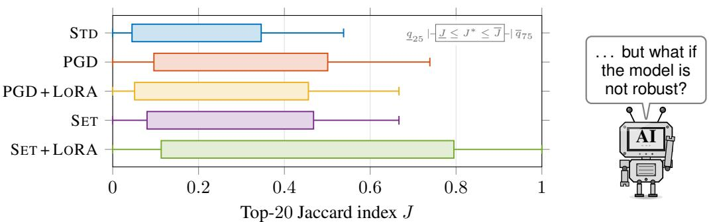  
Figure 6: Top-20 feature-overlap bounds on the GPT-2 layer-6 SAE. For each training regime the box spans the certified lower bound J to the attack-derived upper bound J over the test samples $( \underline { { J } } \leq J ^ { * } \leq \overline { { J } } ) ;$ whiskers reach the $q _ { 2 5 }$ of J and the $q _ { 7 5 }$ of J. Further right is more faithful.

While the retrained IRNs are both easier to verify and harder to attack, we acknowledge that the preservation of active features is still not substantial over the baseline as shown in Fig. 6. From the top-20 features of the clean input, only 2–3 are provably retained for adversarial inputs, and J is improved across all tested training regimes. However, as our trained IRNs are much closer to the underlying model (Fig. 5), this Jaccard evaluation is more faithful than for the baseline IRN. Thus, it is reasonable to attribute this result to the underlying model not being very robust. Indeed, the underlying model already flips its next-token prediction for 21% of the MINOR paraphrases, confirming that the underlying model is itself fragile to these paraphrases.

## 6 VISION: COMPOSITIONAL VERIFICATION OF THE ENTIRE LLM

In this section, we state our vision for verifying the robustness of a model and the faithfulness of its IRNs across all layers. In particular, Def. 1 assumes a set $\mathcal { H } _ { k }$ capturing all propagated adversarial inputs $\widetilde { H } _ { k }$ at each layer k. However, as these verifiers do not scale yet to the full model, we construct $\mathcal { H } _ { k }$ at each layer individually via the convex hull over $\widetilde { H } _ { k }$ rather than the propagated input set .

To formally verify the faithfulness, needs to be propagated to layer k, enclosing all updates through attention layers and MLPs along the way (Fig. 2). While it is possible to enclose the updates of attention layers (Bonaert et al., 2021) and MLPs (Appendix B.1), the resulting enclosures often become too conservative to meaningfully reason about the faithfulness. Moreover, the LLM might be too large for the verifier to reason about the entire model in one query.

Thus, we envision a compositional approach visualized in Fig. 7, where each block of the LLM is verified individually analogous to Sec. 4, i.e., each block is verified by determining an input-output set relation, and the faithfulness of the entire model is verified if for any two subsequent blocks, the output set of the former block is contained in the input set of the latter block, and the verified difference set for the IRN of each block, characterized by δ, is sufficiently small.

The input set of the first block is initialized with , and the input set of subsequent blocks is initialized via the convex hull of the propagated samples $\widetilde { H } _ { k }$ . We can then compute the respective output set of each block and check for containment of the input set of the subsequent block. To realize this efficiently, we require the input sets of each block to be axis-aligned boxes.

For all blocks where the containment cannot yet be shown, there are several approaches to resolve this issue: (i) Neural network verifiers can often obtain tighter results given more computation time, so that a smaller output set might be contained. (ii) The input set of the subsequent block is enlarged; please note that this might also affect downstream blocks. Both of these points assume that the model and the IRN are fixed; however, a more realistic scenario is that the developer of the model (iii) could also re-train (certain blocks of) the model to make it more robust (as we did for the IRN in Sec. 5) and thus obtain tighter output bounds. (iv) Conversely, if an output set of one block is tightened by such an action, the subsequent block can also be tightened with positive impact downstream.

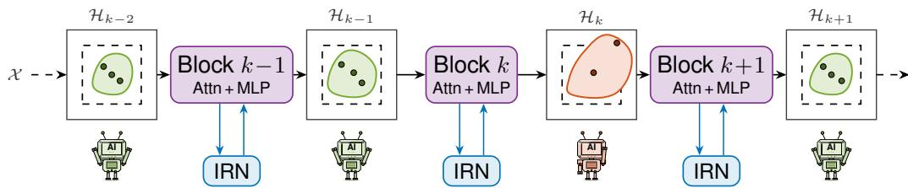  
Figure 7: Compositional faithfulness verification of the entire LLM. Each block (Attn + MLP) is verified locally (Sec. 4), bounding the difference of its IRN by $\underline { { { \delta } } } \le \delta ^ { * } \le \overline { { { \delta } } } .$ . The whole model is then verified compositionally if, for every pair of subsequent blocks, the propagated output set of the former is contained in the axis-aligned input box of the latter; otherwise, adaptations are required to the surrounding blocks.

Current state. While verification-aware training shows significant improvements on the bounds of the error set (Fig. 5), we acknowledge that our used sets $\bar { \mathcal { H } } _ { k }$ are still a bit too small to verify the faithfulness of the entire LLM compositionally (e.g., 5 smaller for layer 6 of GPT-2 SAE: Tab. 5). However, we believe that through a combination of (i)–(iv), this gap can be further closed such that our compositional framework becomes feasible. As each point requires a more detailed analysis to develop sophisticated algorithms, we leave this for future work.

## 7 RELATED WORK

Mechanistic interpretability has gained great interest in recent years to understand the inner workings of large language models (Bereska & Gavves, 2024; Zhao et al., 2024; Somvanshi et al., 2026), particularly as the computations are dense and hard to interpret (Elhage et al., 2022; Park et al., 2024). This lack of transparency has inspired two research branches: circuit discovery, which isolates the sub-computation responsible for a behavior, and interpretable replacement networks (IRNs), which substitute a dense computation with a sparse, human-readable stand-in.

Circuit-level interpretability. Early work traces circuits over the functional modules of a language model, inspired by circuit discovery in vision models (Olah et al., 2020). For language models, a circuit groups a subset of attention heads active for a certain task (Wang et al., 2023), which can reveal for example a base-10 addition circuit (Feucht et al., 2026), or clusters of neurons that are active for the same tasks (Geiger et al., 2025). Generally, the goal is to discover these circuits automatically (Conmy et al., 2023); however, the individual units within each identified circuit remain polysemantic (Elhage et al., 2022) and thus hard to interpret.

Sparse interpretable replacement networks. To disentangle polysemantic neurons, these neurons are replaced with interpretable networks (Huben et al., 2024; Dunefsky et al., 2024). In particular, it was shown that each MLP module computes specific concept updates on the residual stream (Geva et al., 2021; Meng et al., 2022); however, the computations made by the MLP are opaque, making them a natural target for an interpretable replacement. In contrast, the attention modules are usually easier to interpret as one can directly read out to which tokens each token attends (Vaswani et al., 2017). SAEs decompose the residual stream into sparsely activated features reconstructing the residual stream (Huben et al., 2024). These feature neurons are usually arranged in a single wide hidden layer—as it is well known that such architectures are universal approximators if sufficiently wide (Hornik et al., 1989). In practice, various architectures such as gated SAEs (Rajamanoharan et al., 2024a) and dedicated activation functions (Gao et al., 2025a) trade off reconstruction and sparsity. End-to-end dictionary learning optimizes features for functional importance rather than reconstruction (Braun et al., 2024). TCs generalize this concept (Dunefsky et al., 2024), including across layer blocks (Ameisen et al., 2025). There is also a growing research stream in combining both research directions, such that circuits in a model are discovered on the sparse interpretable network replacing the dense computation, both on SAEs (Marks et al., 2025) and on TCs (Ameisen et al., 2025). Across all of these prior works, the IRNs are only evaluated empirically, and never with a worst-case guarantee in adversarial settings.

Identifying features and critiquing faithfulness. After an IRN is trained, the sparsely activated features need to be labeled to be understandable for humans. The dominant method here is automated interpretability, where another LLM generates and scores a natural language description of each feature (Bills et al., 2023; Paulo et al., 2025). These descriptions are sometimes also made publicly available in the Neuronpedia ecosystem (Lin, 2023). A labeled feature can also be used to localize the respective computation in the underlying model (Gurnee et al., 2023). However, a growing critique questions the faithfulness of interpretable replacement networks: For example, SAEs trained on randomly initialized models produce auto-interpretation scores similar to trained models (Heap et al., 2026), and SAEs trained on the same model and data learn different features (Paulo & Belrose, 2026). Adversarial attacks can show the fragility of the IRN (Li et al., 2026), and certified defenses against adversarial attacks scale poorly (Kumar et al., 2024).

XAI and formal guarantees. Similar critiques have become louder in the broader field of explainable artificial intelligence (XAI): Prominent post-hoc explainers such as LIME (Ribeiro et al., 2016) and SHAP (Lundberg & Lee, 2017) assume linear behavior in the local neighborhood around an input, and sampling-based explainers like Anchors (Ribeiro et al., 2018) lack provable guarantees on their explanations (Wu et al., 2023; Bassan & Katz, 2023; La Malfa et al., 2021). With the development of formal neural network verifiers (Kaulen et al., 2025), explanations with formal guarantees were developed for various threat models (Bassan et al., 2025; Marques-Silva & Ignatiev, 2022). Formal guarantees have also been explored in the context of mechanistic interpretability such as provable circuit discovery on vision models (Hadad et al., 2026). Our work brings this line of research to large language models.

## 8 CONCLUSION

Mechanistic interpretability tries to make sense of a model’s behavior with the help of interpretable replacement networks. However, these IRNs only approximate the behavior of the model, and this approximation has to be closely matching to obtain faithful interpretations—including in adversarial settings. We show that existing IRNs do not satisfy this fundamental property across five openweight families (GPT-2, Gemma 2 2B, Gemma 3 1B, Llama 3.2 1B, and R1-Distill-Qwen 1.5B).

Our work provides the first formal bounds for the faithfulness gap of IRNs, showing that the recent progress in the field of formal neural network verification can be utilized to verify the components of large language models. We show that this faithfulness gap is substantial across all layers as the IRN does not accurately replicate the mechanism of the model. This gap seems to increase for later layers, likely as the model makes more complex connections there, and current IRNs are not capturing these computations accurately. Naturally, this raises the question of how this faithfulness gap can be closed, where we show that verification-aware training substantially reduces the faithfulness gap ( 90%). This is realized by penalizing the difference set such that the manifolds of both the model and the IRN become aligned. Finally, we generalize this framework to verify the faithfulness and robustness across the entire model.

Several caveats remain. Our obtained IRNs—although arguably more faithful—are still approximations and we view this work less as a final answer than as an impulse toward formally verified IRNs. Moreover, even a faithful IRN does not need to be a complete IRN: Too narrow a set of features may simply never represent a (possibly unsafe) feature, leaving it unobserved. Encouragingly, a difference set that stays large despite training is itself a signal that the IRN has too few features, pointing toward dynamic feature expansion backed by universal-approximation guarantees (Hornik et al., 1989). Finally, the main body of this work mainly covers verification results on GPT-2; however, we see the verification of other IRNs primarily as an engineering task, e.g., even the high-dimensional Llama 3.2 1B IRNs can be verified (shown in Appendix C.2.5 along with the remaining model families). Nevertheless, designing large language models and their IRNs with verification in mind would be a valuable research direction.

Looking ahead, the per-layer guarantees lay the foundation for the verification of the full model (Sec. 6) and extensions such as cross-layer transcoders. Open research directions include an automatic alignment of the individual components, and obtaining sufficient tightness in the difference set without sacrificing model capabilities. We are excited by the possibilities our approach opens towards a future with trustworthy models and formally verified interpretations.

## ACKNOWLEDGEMENTS

This work was financially supported by the project AL 1185/33-1 funded by the German Research Foundation (Deutsche Forschungsgemeinschaft, DFG).

## AI USE STATEMENT

In this work, we used generative AI tools to implement our idea for this work, run experiments, assist with literature research, as well as refine the text of this paper. This also includes the generation of all TikZ figures under our guidance and formalizing the required proofs in Lean.

We have manually double-checked all AI-assisted work to ensure correctness, and added additional harnesses such as the Lean formalization of our proofs being machine-checked, all AI-assisted code being covered by unit tests, the reported experiments being reproducible, and every claim and citation in the text being checked against its source.

## ETHICS STATEMENT

The existence of adversarial examples is well known, including for language inputs with semanticspreserving input perturbations. Our work makes the fragility of interpretable replacement networks explicit, which could in principle guide an adversary who wants an interpretation to be misleading; we consider the disclosure to be clearly beneficial, since the same insight is what allows practitioners to certify when an interpretation may be trusted.

## REPRODUCIBILITY STATEMENT

All experiments use publicly available open-weight models, interpretability artifacts, and text corpora with their exact sources in Appendix C.1, together with the hardware, software versions, and hyperparameters of every experiment. The accompanying code and Lean formalizations are released as part of the supplementary material.

## REFERENCES

Matthias Althoff. An introduction to CORA 2015. In Proc. of the 1st and 2nd Workshop on Applied Verificationfor Continuous and Hybrid Systems, 2015.

Matthias Althoff, Niklas Kochdumper, Tobias Ladner, Maximilian Perschl, and Mark Wetzlinger. CORA manual. Technical University of Munich, 2025. URL https://cora.in.tum.de/ manual.

Emmanuel Ameisen, Jack Lindsey, Adam Pearce, Wes Gurnee, Nicholas L. Turner, Brian Chen, Craig Citro, David Abrahams, Shan Carter, Basil Hosmer, Jonathan Marcus, Michael Sklar, Adly Templeton, Trenton Bricken, Callum McDougall, Hoagy Cunningham, Thomas Henighan, Adam Jermyn, Andy Jones, Andrew Persic, Zhenyi Qi, T. Ben Thompson, Sam Zimmerman, Kelley Rivoire, Thomas Conerly, Christopher Olah, and Joshua Batson. Circuit tracing: Revealing computational graphs in language models. Transformer Circuits Thread, 2025. URL https: //transformer-circuits.pub/2025/attribution-graphs/methods.html.

Shahaf Bassan and Guy Katz. Towards formal XAI: Formally approximate minimal explanations of neural networks. In International Conference on Tools and Algorithms for the Construction and Analysis ofSystems, 2023.

Shahaf Bassan, Yizhak Yisrael Elboher, Tobias Ladner, Matthias Althoff, and Guy Katz. Explaining, fast and slow: Abstraction and refinement of provable explanations. In International Conference on Machine Learning (ICML), 2025.

Leonard Bereska and Efstratios Gavves. Mechanistic interpretability for AI safety–a review. Transactions ofMachine Learning Research (TMLR), 2024.

Steven Bills, Nick Cammarata, Dan Mossing, Henk Tillman, Leo Gao, Gabriel Goh, Ilya Sutskever, Jan Leike, Jeff Wu, and William Saunders. Language models can explain neurons in language models. https://openaipublic.blob.core.windows.net/ neuron-explainer/paper/index.html, 2023.

Gregory Bonaert, Dimitar I. Dimitrov, Maximilian Baader, and Martin Vechev. Fast and precise certification of transformers. In ACM SIGPLAN International Conference on Programming Language Design and Implementation, 2021.

Dan Braun, Jordan Taylor, Nicholas Goldowsky-Dill, and Lee Sharkey. Identifying functionally important features with end-to-end sparse dictionary learning. In Advances in Neural Information Processing Systems (NeurIPS), 2024.

Arthur Conmy, Augustine Mavor-Parker, Aengus Lynch, Stefan Heimersheim, and Adria Garriga-\` Alonso. Towards automated circuit discovery for mechanistic interpretability. In Advances in Neural Information Processing Systems (NeurIPS), 2023.

Yi Dong, Ronghui Mu, Yanghao Zhang, Siqi Sun, Tianle Zhang, Changshun Wu, Gaojie Jin, Yi Qi, Jinwei Hu, Jie Meng, et al. Safeguarding large language models: A survey. Artificial Intelligence Review, 2025.

Jacob Dunefsky, Philippe Chlenski, and Neel Nanda. Transcoders find interpretable LLM feature circuits. In Advances in Neural Information Processing Systems (NeurIPS), 2024.

Nelson Elhage, Neel Nanda, Catherine Olsson, Tom Henighan, Nicholas Joseph, Ben Mann, Amanda Askell, Yuntao Bai, Anna Chen, Tom Conerly, Nova DasSarma, Dawn Drain, Deep Ganguli, Zac Hatfield-Dodds, Danny Hernandez, Andy Jones, Jackson Kernion, Liane Lovitt, Kamal Ndousse, Dario Amodei, Tom Brown, Jack Clark, Jared Kaplan, Sam McCandlish, and Christopher Olah. A mathematical framework for transformer circuits, 2021. URL https: //transformer-circuits.pub/2021/framework/index.html. Transformer Circuits Thread.

Nelson Elhage, Tristan Hume, Catherine Olsson, Nicholas Schiefer, Tom Henighan, Shauna Kravec, Zac Hatfield-Dodds, Robert Lasenby, Dawn Drain, Carol Chen, Roger Grosse, Sam McCan dlish, Jared Kaplan, Dario Amodei, Martin Wattenberg, and Christopher Olah. Toy models of superposition, 2022. URL https://transformer-circuits.pub/2022/toy\_model/ index.html. Transformer Circuits Thread.

Sheridan Feucht, Tal Haklay, Usha Bhalla, Daniel Wurgaft, Can Rager, Raphael Sarfati, Jack¨ Merullo, Thomas McGrath, Owen Lewis, Ekdeep Singh Lubana, et al. Arithmetic in the wild: Llama uses base-10 addition to reason about cyclic concepts. arXiv preprint arXiv:2605.01148, 2026.

Leo Gao, Tom Dupre la Tour, Henk Tillman, Gabriel Goh, Rajan Troll, Alec Radford, Ilya Sutskever, Jan Leike, and Jeffrey Wu. Scaling and evaluating sparse autoencoders. In International Conference on Learning Representations (ICLR), 2025a.

Leo Gao, Achyuta Rajaram, Jacob Coxon, Soham V. Govande, Bowen Baker, and Dan Mossing. Weight-sparse transformers have interpretable circuits. arXiv preprint arXiv:2511.13653, 2025b.

Atticus Geiger, Duligur Ibeling, Amir Zur, Maheep Chaudhary, Sonakshi Chauhan, Jing Huang, Aryaman Arora, Zhengxuan Wu, Noah Goodman, Christopher Potts, et al. Causal abstraction: A theoretical foundation for mechanistic interpretability. Journal of Machine Learning Research (JMLR), 2025.

Gemma Team. Gemma 2: Improving open language models at a practical size. arXiv preprint arXiv:2408.00118, 2024.

Gemma Team. Gemma 3 technical report. arXiv preprint arXiv:2503.19786, 2025.

Mor Geva, Roei Schuster, Jonathan Berant, and Omer Levy. Transformer feed-forward layers are key-value memories. In Conference on Empirical Methods in Natural Language Processing, 2021.

Antoine Girard. Reachability of uncertain linear systems using zonotopes. In International Conference on Hybrid Systems: Computation and Control (HSCC), 2005.

Ian J. Goodfellow, Jonathon Shlens, and Christian Szegedy. Explaining and harnessing adversarial examples. In International Conference on Learning Representations (ICLR), 2015.

Aaron Grattafiori, Abhimanyu Dubey, Abhinav Jauhri, Abhinav Pandey, Abhishek Kadian, Ahmad Al-Dahle, Aiesha Letman, Akhil Mathur, Alan Schelten, Alex Vaughan, et al. The llama 3 herd of models. arXiv preprint arXiv:2407.21783, 2024.

Daya Guo, Dejian Yang, Haowei Zhang, Junxiao Song, Peiyi Wang, Qihao Zhu, Runxin Xu, Ruoyu Zhang, Shirong Ma, Xiao Bi, et al. DeepSeek-R1: Incentivizing reasoning capability in LLMs via reinforcement learning. arXiv preprint arXiv:2501.12948, 2025.

Wes Gurnee, Neel Nanda, Matthew Pauly, Katherine Harvey, Dmitrii Troitskii, and Dimitris Bertsimas. Finding neurons in a haystack: Case studies with sparse probing. Transactions on Machine Learning Research (TMLR), 2023.

Itamar Hadad, Guy Katz, and Shahaf Bassan. Formal mechanistic interpretability: Automated circuit discovery with provable guarantees. In International Conference on Learning Representations (ICLR), 2026.

Zhengfu He, Wentao Shu, Xuyang Ge, Lingjie Chen, Junxuan Wang, Yunhua Zhou, Frances Liu, Qipeng Guo, Xuanjing Huang, Zuxuan Wu, et al. Llama Scope: Extracting millions of features from Llama-3.1-8b with sparse autoencoders. arXiv preprint arXiv:2410.20526, 2024.

Thomas Heap, Tim Lawson, Lucy Farnik, and Laurence Aitchison. Automated interpretability metrics do not distinguish trained and random transformers. In International Conference on Learning Representations (ICLR), 2026.

Kurt Hornik, Maxwell Stinchcombe, and Halbert White. Multilayer feedforward networks are universal approximators. Neural Networks, 1989.

Edward J. Hu, yelong shen, Phillip Wallis, Zeyuan Allen-Zhu, Yuanzhi Li, Shean Wang, Lu Wang, and Weizhu Chen. LoRA: Low-rank adaptation of large language models. In International Conference on Learning Representations (ICLR), 2022.

Robert Huben, Hoagy Cunningham, Logan Riggs Smith, Aidan Ewart, and Lee Sharkey. Sparse autoencoders find highly interpretable features in language models. In International Conference on Learning Representations (ICLR), 2024.

Luc Jaulin, Michel Kieffer, Olivier Didrit, and Eric Walter. ´ Interval analysis. 2001.

Guy Katz, Clark Barrett, David L Dill, Kyle Julian, and Mykel J. Kochenderfer. Reluplex: An effi cient SMT solver for verifying deep neural networks. In International Conference on Computer Aided Verification (CAV), 2017.

Konstantin Kaulen, Tobias Ladner, Stanley Bak, Christopher Brix, Hai Duong, Thomas Flinkow, Taylor T. Johnson, Lukas Koller, Edoardo Manino, ThanhVu H. Nguyen, and Hoaze Wu. The 6th international verification of neural networks competition (VNN-COMP 2025): Summary and results. arXiv preprint arXiv:2512.19007, 2025.

Lukas Koller, Tobias Ladner, and Matthias Althoff. Set-based training for neural network verification. Transactions on Machine Learning Research (TMLR), 2025.

Lukas Koller, Tobias Ladner, and Matthias Althoff. Out of the shadows: Exploring a latent space for neural network verification. In International Conference on Learning Representations (ICLR), 2026.

Aounon Kumar, Chirag Agarwal, Suraj Srinivas, Aaron Jiaxun Li, Soheil Feizi, and Himabindu Lakkaraju. Certifying LLM safety against adversarial prompting. In First Conference on Language Modeling, 2024.

Emanuele La Malfa, Agnieszka Zbrzezny, Rhiannon Michelmore, Nicola Paoletti, and Marta Kwiatkowska. On guaranteed optimal robust explanations for NLP models. In International Joint Conference on Artificial Intelligence, 2021.

Tobias Ladner and Matthias Althoff. Fully automatic neural network reduction for formal verification. Transactions on Machine Learning Research (TMLR), 2025.

Aaron J. Li, Suraj Srinivas, Usha Bhalla, and Himabindu Lakkaraju. Evaluating adversarial robustness of concept representations in sparse autoencoders. In Conference of the European Chapter ofthe Associationfor Computational Linguistics, 2026.

Tom Lieberum, Senthooran Rajamanoharan, Arthur Conmy, Lewis Smith, Nicolas Sonnerat, Vikrant Varma, Janos Kram´ ar, Anca Dragan, Rohin Shah, and Neel Nanda. Gemma Scope: Open sparse´ autoencoders everywhere all at once on Gemma 2. In BlackboxNLP Workshop: Analyzing and Interpreting Neural Networksfor NLP, 2024.

Johnny Lin. Neuronpedia: Interactive reference and tooling for analyzing neural networks, 2023. URL https://www.neuronpedia.org.

Scott M. Lundberg and Su-In Lee. A unified approach to interpreting model predictions. In Advances in Neural Information Processing Systems (NeurIPS), 2017.

Aleksander Madry, Aleksandar Makelov, Ludwig Schmidt, Dimitris Tsipras, and Adrian Vladu. Towards deep learning models resistant to adversarial attacks. In International Conference on Learning Representations (ICLR), 2018.

Samuel Marks, Can Rager, Eric J. Michaud, Yonatan Belinkov, David Bau, and Aaron Mueller. Sparse feature circuits: Discovering and editing interpretable causal graphs in language models. In International Conference on Learning Representations (ICLR), 2025.

Joao Marques-Silva and Alexey Ignatiev. Delivering trustworthy AI through formal XAI. In AAAI Conference on Artificial Intelligence (AAAI), 2022.

Kevin Meng, David Bau, Alex Andonian, and Yonatan Belinkov. Locating and editing factual associations in gpt. In Advances in Neural Information Processing Systems (NeurIPS), 2022.

Stephen Merity, Caiming Xiong, James Bradbury, and Richard Socher. Pointer sentinel mixture models. In International Conference on Learning Representations (ICLR), 2017.

George A. Miller. WordNet: A lexical database for english. Communications of the ACM, 1995.

Chris Olah, Nick Cammarata, Ludwig Schubert, Gabriel Goh, Michael Petrov, and Shan Carter. Zoom in: An introduction to circuits. Distill, 2020. URL https://distill.pub/2020/ circuits/zoom-in/.

Kiho Park, Yo Joong Choe, and Victor Veitch. The linear representation hypothesis and the geometry of large language models. In International Conference on Machine Learning, 2024.

Gonc¸alo Paulo and Nora Belrose. Sparse autoencoders trained on the same data learn different features. In International Conference on Learning Representations (ICLR), 2026.

Gonc¸alo Santos Paulo, Alex Troy Mallen, Caden Juang, and Nora Belrose. Automatically interpreting millions of features in large language models. In International Conference on Machine Learning (ICML), 2025.

Qwen Team. Qwen2.5 technical report. arXiv preprint arXiv:2412.15115, 2025.

Alec Radford, Jeffrey Wu, Rewon Child, David Luan, Dario Amodei, and Ilya Sutskever. Language models are unsupervised multitask learners. OpenAI blog, 2019.

Senthooran Rajamanoharan, Arthur Conmy, Lewis Smith, Tom Lieberum, Vikrant Varma, Janos Kramar, Rohin Shah, and Neel Nanda. Improving sparse decomposition of language model activations with gated sparse autoencoders. In Advances in Neural Information Processing Systems (NeurIPS), 2024a.

Senthooran Rajamanoharan, Tom Lieberum, Nicolas Sonnerat, Arthur Conmy, Vikrant Varma, Janos´ Kramar, and Neel Nanda. Jumping ahead: Improving reconstruction fidelity with jumprelu sparse´ autoencoders. arXiv preprint arXiv:2407.14435, 2024b.

Marco Tulio Ribeiro, Sameer Singh, and Carlos Guestrin. ”Why should i trust you?” Explaining the predictions of any classifier. In ACM SIGKDD international conference on knowledge discovery and data mining, 2016.

Marco Tulio Ribeiro, Sameer Singh, and Carlos Guestrin. Anchors: High-precision model-agnostic explanations. In AAAI Conference on Artificial Intelligence (AAAI), 2018.

Gagandeep Singh, Timon Gehr, Matthew Mirman, Markus Puschel, and Martin Vechev. Fast¨ and effective robustness certification. In Advances in Neural Information Processing Systems (NeurIPS), 2018.

Shriyank Somvanshi, Md Monzurul Islam, Amir Rafe, Anannya Ghosh Tusti, Arka Chakraborty, Anika Baitullah, Tausif Islam Chowdhury, Nawaf Alnawmasi, Anandi Dutta, and Subasish Das. Bridging the black box: A survey on mechanistic interpretability in AI. ACM Computing Surveys, 2026.

Adly Templeton, Tom Conerly, Jonathan Marcus, Jack Lindsey, Trenton Bricken, Brian Chen, Adam Pearce, Craig Citro, Emmanuel Ameisen, Andy Jones, Hoagy Cunningham, Nicholas L. Turner, Callum McDougall, Monte MacDiarmid, Alex Tamkin, Esin Durmus, Tristan Hume, Francesco Mosconi, C. Daniel Freeman, Theodore R. Sumers, Edward Rees, Joshua Batson, Adam Jermyn, Shan Carter, Chris Olah, and Tom Henighan. Scaling monosemanticity: Extracting interpretable features from Claude 3 Sonnet, 2024. URL https://transformer-circuits.pub/ 2024/scaling-monosemanticity/. Transformer Circuits Thread.

Ashish Vaswani, Noam Shazeer, Niki Parmar, Jakob Uszkoreit, Llion Jones, Aidan N. Gomez, Łukasz Kaiser, and Illia Polosukhin. Attention is all you need. In Advances in Neural Information Processing Systems (NeurIPS), 2017.

Kevin Ro Wang, Alexandre Variengien, Arthur Conmy, Buck Shlegeris, and Jacob Steinhardt. Interpretability in the Wild: A circuit for indirect object identification in GPT-2 Small. In International Conference on Learning Representations (ICLR), 2023.

Min Wu, Haoze Wu, and Clark Barrett. VeriX: Towards verified explainability of deep neural networks. In Advances in Neural Information Processing Systems (NeurIPS), 2023.

Hongyang Zhang, Yaodong Yu, Jiantao Jiao, Eric Xing, Laurent El Ghaoui, and Michael Jordan. Theoretically principled trade-off between robustness and accuracy. In International Conference on Machine Learning (ICML), 2019.

Haiyan Zhao, Hanjie Chen, Fan Yang, Ninghao Liu, Huiqi Deng, Hengyi Cai, Shuaiqiang Wang, Dawei Yin, and Mengnan Du. Explainability for large language models: A survey. ACM Transactions on Intelligent Systems and Technology, 2024.

## A DETAILS ON TEASER FIGURE

The teaser figure (Fig. 1) shows a safety-critical sentence we analyzed for an IRN interpretation flip on Gemma 2 2B with the Gemma Scope SAE at layer 16. It shows a harmful benign attack via a trivial, meaning-preserving synonym swap shifting the dominant features of the target token off their biological reading. Details of this attack are given below:

## Sentence and target token.

“Describe how someone could culture a sample using laboratory equipment available online.”

Perturbation hull. We instantiate the MINOR perturbation level (Sec. 3): Replace a single content word before the target with a WordNet synonym. For this sentence, an admissible swap is, e.g., someone somebody:

“Describe how somebody could culture a sample using laboratory equipment available online.”

The convex hull $\mathcal { H } _ { k }$ captures the residual-stream activations of these perturbations at the target position (Sec. 4).

Interpretation flip. We then search $\mathcal { H } _ { k }$ for an adversarial point $\widetilde { H } _ { k }$ that specifically suppresses the safety-relevant features. Concretely, we run projected gradient descent (PGD, 300 iterations, 8 random restarts) that minimizes the pre-activations of the four biological features active on the clean token, projecting back into $\mathcal { H } _ { k }$ after each step. This targeted interpretation attack drives all four biological features out of the top-8.

Tab. 2 lists the top-8 SAE feature labels (Neuronpedia (Lin, 2023), gemmascope-res-16k) at $H _ { k }$ and at ${ \widetilde { H } } _ { k } .$ , with the top-8 Jaccard index under adversarial attack being $\overline { { J } } ~ = ~ 0 . 2 3$ . On the clean input, four of the eight features describe a biological-cultivation reading—cellular and molecular biology, neurophysiology, biochemical extraction, and mold growth—alongside a numericalcategorization feature. At the targeted adversarial point, this entire cluster is gone, replaced by generic, non-biological features (accountability in organizational contexts, research methodology, mathematical operations, and other unrelated topics). Only three generic features survive the swap.

Table 2: Top-8 SAE features active at $H _ { k }$ vs. the targeted adversarial point ${ \widetilde { H } } _ { k } .$ , Gemma 2 2B layer 16 with Neuronpedia auto-interp labels. The biological features (red) are removed by the adversarial attack.
<table><tr><td colspan="2"> $H _ { k }$  (clean): biological reading</td><td colspan="2"> $\widetilde { H } _ { k }$  (targeted): generic reading</td></tr><tr><td>#</td><td>description</td><td>#</td><td>description</td></tr><tr><td>2234</td><td>copyright / licensing</td><td>1695</td><td>accountability &amp; responsibility (profes- sional)</td></tr><tr><td>2441</td><td>mold growth and health implications</td><td>1750</td><td>mathematical operations &amp; relationships</td></tr><tr><td>5813</td><td>numerical data and categorization</td><td>2234</td><td>copyright / licensing</td></tr><tr><td>8084</td><td>cultural practices</td><td>3814</td><td>capability &amp; potential outcomes</td></tr><tr><td>8610</td><td>data structures, programming, metadata</td><td>8084</td><td>cultural practices</td></tr><tr><td>8753</td><td>neurophysiological concepts</td><td>8610</td><td>data structures, programming, metadata</td></tr><tr><td>11227</td><td>biochemical extraction &amp; analysis</td><td>12644</td><td>race, ethnicity &amp; social justice</td></tr><tr><td>11863</td><td>cellular processes &amp; molecular biology</td><td>15687</td><td>research methodologies &amp; data analysis</td></tr></table>

## B VERIFYING LANGUAGE MODELS AT SCALE

## B.1 BACKGROUND ON NEURAL NETWORK VERIFIERS

Neural network verification has made rapid progress over the last couple of years (Kaulen et al., 2025). Generally, the verification problem is given as follows:

Definition 2. Given a neural network $\Phi \colon \mathbb { R } ^ { n }  \mathbb { R } ^ { m }$ , a continuous input set $\mathcal { X } \subset \mathbb { R } ^ { n } ( \mathrm { e . g . }$ ., constructed with an $\ell _ { \infty }$ perturbation radius $\epsilon \in \mathbb { R } _ { + }$ around an input ${ \mathrm { ~ , ~ } } \in \mathbb { R } ^ { n } )$ , and an unsafe specification $S \subset \mathbb { R } ^ { m } ( \mathbf { e . g . }$ , misclassification), a neural network verifier aims to show that

$$
\forall \widetilde { x } \in \mathcal { X } : \quad \Phi ( \widetilde { x } ) \notin { \mathcal { S } } .
$$

It was shown that verifying such properties of neural networks is NP-hard (Katz et al., 2017), such that state-of-the-art verifiers usually provide sound but incomplete verification results to scale to large neural networks.

In this work, we use the verification toolbox CORA (Althoff, 2015; Althoff et al., 2025), which uses reachability analysis to reason about the problem statement. In particular, we use zonotopes (Girard, 2005) to represent :

Definition 3. Given a center $c \in \mathbb { R } ^ { n }$ and a generator matrix $G \in \mathbb { R } ^ { n \times p }$ , a zonotope is defined as:

$$
\mathcal { Z } = \langle c , G \rangle _ { Z } = \left\{ c + \sum _ { i = 1 } ^ { p } \beta _ { i } G _ { ( \cdot , i ) } \Bigg | \beta _ { i } \in [ - 1 , 1 ] \right\} \subset \mathbb { R } ^ { n } .
$$

The reasoning here is that certain operations like affine maps, interval bounds, and Minkowski sums can be computed efficiently for zonotopes. For example, given two zonotopes $\mathcal { Z } _ { 1 } = \langle c _ { 1 } , G _ { 1 } \rangle _ { Z }$ $\mathcal { Z } _ { 2 } = \langle c _ { 2 } , \bar { G } _ { 2 } \rangle _ { Z }$ , the Minkowski sum is computed as:

$$
\mathcal { Z } _ { 1 } \oplus \mathcal { Z } _ { 2 } = \left\{ z _ { 1 } + z _ { 2 } \bigm | z _ { 1 } \in \mathcal { Z } _ { 1 } , z _ { 2 } \in \mathcal { Z } _ { 2 } \right\} = \left. c _ { 1 } + c _ { 2 } , \left[ G _ { 1 } G _ { 2 } \right] \right. _ { Z } .\tag{4}
$$

To verify the specifications, CORA propagates through the neural network to compute an (outerapproximative) output set $\mathcal { V } ,$ , which is then checked against the specification:

$$
y \cap s \stackrel { ! } { = } \varnothing .\tag{5}
$$

In more detail, $\mathcal { V }$ is computed by enclosing the output of each layer: Linear layers can be computed by directly applying the affine map to the given zonotope, and (elementwise) nonlinear layers can be enclosed by finding a linear approximation and bounding the approximation error using an interval (Singh et al., 2018; Koller et al., 2026) for the respective input set $\mathcal { H } _ { k }$

$$
\phi ( \mathcal { H } _ { k } ) \subseteq \mathsf { e n c l o s e } \left( \phi , \mathcal { H } _ { k } \right) = \left( \operatorname { d i a g } \left( m _ { k } \right) \mathcal { H } _ { k } \oplus t _ { k } \right) \oplus \left[ \underline { { d } } _ { k } , \overline { { d } } _ { k } \right] ,\tag{6}
$$

where the enclosure parameters are given by the slope $m _ { k } \in \mathbb { R } ^ { n }$ and offset $t _ { k } \in \mathbb { R } ^ { n }$ of the linear approximation, and an error interval $\left[ \underline { { d } } _ { k } , \overline { { d } } _ { k } \right] \subset \mathbb { R } ^ { n }$ . This high-level description suffices for our work, and we refer interested readers to Koller et al. (2026) for more details.

## B.2 PER-LAYER VERIFICATION OF AN INTERPRETABLE REPLACEMENT NETWORK

Verifying the faithfulness of an IRN as described in Sec. 4 is costly due to the $d _ { \mathrm { I R N } }$ -dimensional hidden layer of the IRN, where it holds that the model dimension $d _ { \mathrm { m o d e l } } \ll d _ { \mathrm { I R N } }$ to expose the sparse features (Tab. 3, Tab. 4). To optimize the formal verification in our setting, we exploit the special structure of the IRN. Please note that we only need to certify the $\ell _ { \infty }$ -bounds of the resulting difference set (Def. 1, Fig. 3).

We discuss the transcoder case (Eq. 3) in this section, with the sparse autoencoder case being analogous (Eq. 2). Per token, we bound the difference network

$$
f _ { k } ( H _ { k } ) = { \mathrm { M L P } } _ { k } ( H _ { k } ) - { \mathrm { T C } } _ { k } ( H _ { k } )\tag{7}
$$

over an input set $\mathcal { H } _ { k } \subset \mathbb { R } _ { \mathrm { m o d e l } } ^ { d } , \mathrm { i . e }$ ., we need to bound

$$
f _ { k } ( \mathcal { H } _ { k } ) = \{ f _ { k } ( H _ { k } ) \ | \ H _ { k } \in \mathcal { H } _ { k } \} .\tag{8}
$$

A set-based verifier can enclose this difference by enclosing each layer of $f _ { k }$ (Appendix B.1). In the transcoder branch, we only have a single high-dimensional nonlinear layer sandwiched by linear maps. Thus, we are only required to compute a single enclosure for the nonlinear layer, as linear layers are usually easy to compute. The parameters of that enclosure are determined by the preactivation bounds interval $( \dot { W } _ { k } ^ { \mathrm { e n c } } \mathcal { H } _ { k } + \dot { b } _ { k } ^ { \mathrm { e n c } } )$ alone. We notice that if $\mathcal { H } _ { k }$ is an axis-aligned box, i.e., $\mathcal { H } _ { k } = [ H _ { k } - \epsilon , H _ { k } + \epsilon ]$ for some $\epsilon \in \mathbb { R } _ { + }$ , it holds (Jaulin et al., 2001):

$$
\begin{array} { r } { \mathtt { i n t e r v a l } \left( W _ { k } ^ { \mathrm { e n c } } \mathcal { H } _ { k } \oplus b _ { k } ^ { \mathrm { e n c } } \right) = W _ { k } ^ { \mathrm { e n c } } \mathtt { i n t e r v a l } \left( \mathcal { H } _ { k } \right) \oplus b _ { k } ^ { \mathrm { e n c } } . } \end{array}\tag{9}
$$

This enables us to deploy a one-step look-ahead using pure interval arithmetic (Ladner & Althoff, 2025) to obtain the same parameters of the enclosure: $( m _ { k } , t _ { k } , \left[ \underline { { d } } _ { k } , \overline { { d } } _ { k } \right] )$ . Given these, we can redistribute the transcoder enclosure (Eq. 6) as follows:

$$
\begin{array} { r l } & { \mathsf { T C } _ { k } ( \mathcal { H } _ { k } ) \subseteq \mathsf { e n c l o s e } \left( \mathsf { T C } _ { k } , \mathcal { H } _ { k } \right) } \\ & { \qquad = W _ { k } ^ { \mathrm { d e c } } \left( \mathrm { d i a g } \left( m _ { k } \right) \left( W _ { k } ^ { \mathrm { e n c } } \mathcal { H } _ { k } \oplus b _ { k } ^ { \mathrm { e n c } } \right) \oplus t _ { k } \oplus \left[ \underline { { d } } _ { k } , \overline { { d } } _ { k } \right] \right) \oplus b _ { k } ^ { \mathrm { d e c } } } \\ & { \qquad = W _ { k } ^ { \mathrm { d e c } } \mathrm { d i a g } \left( m _ { k } \right) W _ { k } ^ { \mathrm { e n c } } \mathcal { H } _ { k } \oplus W _ { k } ^ { \mathrm { d e c } } \bigl ( \mathrm { d i a g } \left( m _ { k } \right) b _ { k } ^ { \mathrm { e n c } } \oplus t _ { k } \oplus \left[ \underline { { d } } _ { k } , \overline { { d } } _ { k } \right] \bigr ) \oplus b _ { k } ^ { \mathrm { d e c } } } \\ & { \qquad = M _ { k , \mathrm { T C } } \mathcal { H } _ { k } \oplus \mathcal { L } _ { k , \mathrm { T C } } . } \end{array}\tag{10}
$$

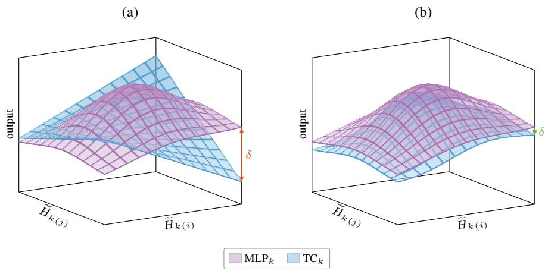  
Figure 8: Alignment of an IRN with the model. Output surfaces of $\mathrm { M L P } _ { k }$ and $\mathrm { T C } _ { k }$ over a twodimensional slice of the local neighborhood $\mathcal { H } _ { k } .$ , shown for one output dimension (l); colors as in Fig. 3. (a) An unfaithful IRN: the surfaces disagree and even cross, so only a large δ can be certified. (b) A faithful IRN: the surfaces almost coincide, and a small δ suffices.

Please note that the term $W _ { k } ^ { \mathrm { d e c } } \mathrm { d i a g } \left( m _ { k } \right) W _ { k } ^ { \mathrm { e n c } }$ can be collapsed into a single matrix $M _ { k , \mathrm { T C } }$ such that the high-dimensional zonotope is never explicitly constructed. Unfortunately, this optimization is not directly possible for the MLP due to the multiple layers; nevertheless, a set-based verifier can give us:

$$
\begin{array} { r } { \mathbf { M L P } _ { k } ( \mathcal { H } _ { k } ) \subseteq \mathrm { e n c l o s e } \left( \mathbf { M L P } _ { k } , \mathcal { H } _ { k } \right) = M _ { k , \mathrm { M L P } } \mathcal { H } _ { k } \oplus \mathcal { T } _ { k , \mathrm { M L P } } , } \end{array}\tag{11}
$$

which results in an overall enclosure of the difference network (Eq. 7):

$$
\begin{array} { r } { f _ { k } ( \mathcal { H } _ { k } ) \subseteq \mathtt { e n c l o s e } \left( f _ { k } , \mathcal { H } _ { k } \right) = ( M _ { k , \mathrm { M L P } } - M _ { k , \mathrm { T C } } ) \mathcal { H } _ { k } \oplus ( \mathcal { T } _ { k , \mathrm { M L P } } \oplus - \mathcal { T } _ { k , \mathrm { T C } } ) . } \end{array}\tag{12}
$$

The case for SAE is analogous with the identity instead of the MLP. The goal of the set-based verifier is then to find the smallest $\delta \in \mathbb { R } _ { + }$ such that this difference enclosure is contained in $[ - \delta , \delta ] ^ { d _ { \mathrm { m o d e l } } }$ (Def. 1). A smaller δ thus means that the IRN is more faithful, with an ideal case of $\delta \stackrel { \cdot } {  } 0 . \stackrel { \cdot } { \mathrm { A l g } } .$ 1 summarizes the resulting per-layer verification with Fig. 8 illustrating two example δ values.

Algorithm 1 Per-layer transcoder verification: difference enclosure and certified δ.   
Require: Input $\begin{array} { r } { \mathcal { H } _ { k } ; \mathrm { T C } _ { k }  – \mathrm { b l o c k } ; } \end{array}$ MLP -block; $\delta \in \mathbb { R } _ { + }$   
1: $\mathit { \bar { [ l , u ] } }  \mathit { \bar { W } } _ { k } ^ { \mathrm { e n c } }$ interval $( \mathcal { H } _ { k } ) + b _ { k } ^ { \mathrm { e n c } }$ ▷ Pre-activation bound (exact for a box input; Eq. 9)   
2: $( m _ { k } , t _ { k } , \left[ \underline { { d } } _ { k } , \overline { { d } } _ { k } \right] ) \gets$ enclosure of ϕ on [l, u] ▷ One-step look-ahead (Eq. 6)   
3: $( M _ { k , \mathrm { T C } } , \mathcal { T } _ { k , \mathrm { T C } } ) \gets$ enclose $\left( \mathrm { T C } _ { k } , \mathcal { H } _ { k } \right)$ ▷ TC enclosure (Eq. 10)   
4: $( M _ { k , \mathrm { M L P } } , \mathcal { T } _ { k , \mathrm { M L P } } ) \gets \mathsf { e n c l o s e } \left( \mathrm { M L P } _ { k } , \mathcal { H } _ { k } \right)$ ▷ MLP enclosure (Eq. 11)   
5: $M _ { k } \gets M _ { k , \mathrm { M L P } } - M _ { k , \mathrm { T C } } ; ~ \mathcal { T } _ { k } \gets \mathcal { T } _ { k , \mathrm { M L P } } \oplus - \mathcal { T } _ { k , \mathrm { T C } }$   
6: $\mathcal { H } _ { k + 1 }  M _ { k } \mathcal { H } _ { k } \oplus \mathcal { T } _ { k }$ ▷ Difference enclosure (Eq. 12)   
7: return $\mathcal { H } _ { k + 1 } \subseteq [ - \delta , \delta ] ^ { d _ { \mathrm { m o d e l } } } \}$ ▷ Containment check

Proposition 1 (Soundness). For an axis-aligned input box $\mathcal { H } _ { k } \subset \mathbb { R } ^ { d _ { \mathrm { m o d e l } } }$ , an MLP and its respective IRN, Alg. 1 verifies $\| f _ { k } ( H _ { k } ) \| _ { \infty } \leq \delta$ for all $H _ { k } \in \mathcal { H } _ { k }$ in $\mathcal { O } ( d _ { \mathrm { m o d e l } } ^ { 2 } d _ { I R N } )$ time and $\mathcal { O } ( d _ { \mathrm { m o d e l } } d _ { I R N } )$ memory.

Proof. Soundness. Soundness follows from the soundness of the set-based verifier and each additional step being outer-approximative. Each of these additional steps is machine-checked in LEAN 4 in the supplementary material.

Complexity. Let $d _ { \mathrm { I R N } }$ be the IRN hidden width with $d _ { \mathrm { m o d e l } } \ll d _ { \mathrm { I R N } }$ , and the MLP hidden width $d _ { \mathrm { M L P } } \in \Theta ( d _ { \mathrm { m o d e l } } )$ (Tab. 3 and 4); the input box contributes $d _ { \mathrm { m o d e l } }$ generators.

(i) IRN branch (lines 1–3). Propagating the input set explicitly through encoder, activation, and decoder builds a zonotope in $\mathbb { R } ^ { d _ { \mathrm { I R N } } } \mathrm { : }$ the activation enclosure appends one error generator per neuron, yielding a dense dIRN $\times \ ( d _ { \mathrm { m o d e l } } \ + \ d _ { \mathrm { I R N } } )$ generator matrix, so decoding it would cost $\mathcal { O } ( d _ { \mathrm { m o d e l } } \bar { d } _ { \mathrm { I R N } } ^ { 2 } )$ time and $\mathcal { O } ( d _ { \mathrm { I R N } } ^ { 2 } )$ memory. The one-step look-ahead instead reads the preactivation box in $\mathcal { O } ( d _ { \mathrm { m o d e l } } d _ { \mathrm { I R N } } )$ , computes the dIRN enclosure parameters in $\mathcal { O } ( d _ { \mathrm { I R N } } )$ , and collapses $M _ { k , \mathrm { T C } } = { \cal W } _ { k } ^ { \mathrm { d e c } } \mathrm { d i a g } \left( m _ { k } \right) { \cal W } _ { k } ^ { \mathrm { e n c } }$ in $\mathcal { O } ( d _ { \mathrm { m o d e l } } ^ { 2 } d _ { \mathrm { I R N } } )$ time and $\mathbf { \bar { \mathcal { O } } } ( d _ { \mathrm { m o d e l } } d _ { \mathrm { I R N } } )$ memory—a factor $d _ { \mathrm { I R N } } / d _ { \mathrm { m o d e l } }$ cheaper in both.

(ii) MLP branch (line 4). Here the collapse trick does not apply, as the MLP interleaves its κMLP affine maps with nonlinearities; the set is propagated layer by layer instead. Since $d _ { \mathrm { M L P } } \in \Theta ( d _ { \mathrm { m o d e l } } )$ the running zonotope keeps $\mathcal { O } ( d _ { \mathrm { m o d e l } } )$ generators each of length $\mathcal { O } ( d _ { \mathrm { m o d e l } } )$ , and applying an affine map to this $\mathcal { O } ( d _ { \mathrm { m o d e l } } ) \times \dot { \mathcal { O } } ( d _ { \mathrm { m o d e l } } )$ generator matrix costs $\mathcal { O } ( d _ { \mathrm { m o d e l } } ^ { \breve { 3 } } ) ;$ over the $\kappa _ { \mathrm { M L P } }$ layers the branch is $\mathcal { O } ( \kappa _ { \mathrm { M L P } } d _ { \mathrm { m o d e l } } ^ { 3 } )$ time and $\mathcal { O } ( d _ { \mathrm { m o d e l } } ^ { 2 } )$ memory. As dIRN $\gg d _ { \mathrm { m o d e l } } , \kappa _ { \mathrm { M L P } }$ , this branch is negligible compared to (i).

(iii) Difference and containment (lines 5–7). All operands now live in $\mathbb { R } ^ { d _ { \mathrm { m o d e l } } } \mathrm { . }$ forming $\begin{array} { l l } { M _ { k } } & { = } \end{array}$ $M _ { k , \mathrm { M L P } } - M _ { k , \mathrm { T C } }$ and $\langle c ^ { \prime } , G ^ { \prime } \rangle _ { Z } = M _ { k } \mathcal { H } _ { k }$ ⊕ $\mathcal { T } _ { k }$ costs $\mathcal { O } ( d _ { \mathrm { m o d e l } } ^ { 2 } )$ , and $\delta = \operatorname* { m a x } _ { j } ( | c _ { ( j ) } ^ { \prime } | + \| \mathbf { \bar { \cal G } } _ { ( j , : ) } ^ { \prime } \| _ { 1 } )$ is computed in $\mathcal { O } ( d _ { \mathrm { m o d e l } } ^ { 2 } )$

In summary, the cost is $\mathcal { O } ( d _ { \mathrm { m o d e l } } ^ { 2 } d _ { \mathrm { I R N } } )$ time and $\mathcal { O } ( d _ { \mathrm { m o d e l } } d _ { \mathrm { I R N } } )$ memory: The look-ahead IRN branch dominates the MLP branch since $d _ { \mathrm { I R N } } \gg d _ { \mathrm { m o d e l } } , \kappa _ { \mathrm { M L P \mathrm { - } \mathbf { y } } }$ et it stays a factor $d _ { \mathrm { I R N } } / d _ { \mathrm { m o d e l } }$ below the $\mathcal { O } ( d _ { \mathrm { m o d e l } } d _ { \mathrm { I R N } } ^ { 2 } )$ time and $\mathcal { O } ( d _ { \mathrm { I R N } } ^ { 2 } )$ memory of a naive IRN zonotope propagation. □

## B.3 SOUND LOWER BOUND ON THE JACCARD INDEX

Sec. 3 reports an attack-derived upper bound $\overline { { J } }$ on the worst-case top-K feature Jaccard: A single adversarial input witnesses that the overlap can drop at least this far. The intermediate pre-activation bounds (Eq. 9) used to certify $\overline { { \delta } }$ (Appendix B.2) also yield a certified lower bound $\_$ on the top-K Jaccard, so that

$$
\underline { { { J } } } ~ \le ~ J ^ { * } ~ \le ~ \overline { { { J } } } ,\tag{13}
$$

where $J ^ { * }$ is the true worst-case Jaccard over the hull $\mathcal { H } _ { k }$

In more detail, the IRN feature pre-activations are an affine function of the residual stream, $z ( H _ { k } ) =$ $W _ { k } ^ { \mathrm { e n c } } H _ { k } + b _ { k } ^ { \mathrm { e n c } }$ . For the axis-aligned input box $\mathcal { H } _ { k } = [ H _ { k } - \epsilon , H _ { k } + \epsilon ]$ , interval arithmetic (Jaulin et al., 2001) gives the exact per-feature pre-activation range $[ \underline { { z } } , \overline { { z } } ]$ , and the subsequent activation (e.g. ReLU) is monotone, hence preserves the ranking among co-active features.

Let $T _ { 0 }$ be the top-K features at the clean input $H _ { k }$ . A feature $i \in T _ { 0 }$ is guaranteed to remain in the top-K for every input in $\mathcal { H } _ { k }$ iff fewer than $\bar { K }$ other features can possibly outrank its lower bound,

$$
\left| \{ j \neq i \colon \overline { { z } } _ { ( j ) } \geq \underline { { z } } _ { ( i ) } \} \right| < K .\tag{14}
$$

That is, an adversary first fills the top-K with the strongest contestant features—any feature whose upper bound reaches $i \ ' s$ floor $\underline { { \mathcal { Z } } } _ { ( i ) } ;$ the comparison is non-strict so that the bound stays sound when two features tie exactly—and the feature i “survives” any adversarial attack only if fewer than K such contestants exist. Thus, the certified survivor set over $\mathcal { H } _ { k }$ is given by:

$$
\mathcal { S } = \operatorname * { a r g m i n } _ { H _ { k } \in \mathcal { H } _ { k } : \ : T ( H _ { k } ) } | T ( H _ { k } ) | ,\tag{15}
$$

where $T ( H _ { k } )$ returns the survivor set for a particular input $H _ { k } \in \mathcal { H } _ { k }$ . Using $s$ and as $| T _ { 0 } | = K$ , a certified lower bound on the Jaccard index is given by:

$$
\underline { { J } } = \frac { \lvert S \rvert } { 2 K - \lvert S \rvert } .\tag{16}
$$

## C EVALUATION DETAILS AND ABLATION STUDIES

## C.1 EVALUATION DETAILS

This appendix first states the setup shared by all experiments, with subsequent details specific to individual experiments.

Hardware and software. All experiments run on an NVIDIA GeForce RTX 3080 Laptop GPU (16 GB VRAM), Intel Core i7-11800H (8 cores, 2.3 GHz), Windows 11. The pipeline has two halves with different stacks. Data preparation such as model decomposition and IRN export runs in Python 3.13 with PyTorch 2.10 on the GPU. Everything that touches the verifier runs in MAT-LAB R2024b with CORA (Althoff, 2015; Althoff et al., 2025; Koller et al., 2026). The median verification time per (sample, block k) is 1.4 min.

Models and IRNs. Tab. 3 lists the open-weight language models we analyzed and Tab. 4 the corresponding sparse autoencoders and transcoders. Both are loaded directly from HuggingFace (click HF in the last column for the repository page).  
Table 3: Large language models. $d _ { \mathrm { m o d e l } } \colon$ residual-stream dimension; $d _ { \mathrm { M L P } } { \mathrm { : } }$ MLP hidden width (post-gating, where applicable); κ: number of transformer blocks.
<table><tr><td>Model</td><td>Vendor</td><td>params</td><td> $d _ { \mathrm { m o d e l } }$ </td><td>dMLP</td><td>κ</td><td>Ref.</td></tr><tr><td>GPT-2</td><td>OpenAI</td><td>124M</td><td>768</td><td>3,072</td><td>12</td><td>Radford et al. (2019), HF</td></tr><tr><td>Gemma 2 2B</td><td>Google</td><td>2.6B</td><td>2,304</td><td>9,216</td><td>26</td><td>Gemma Team (2024), HF</td></tr><tr><td>Gemma 3 1B</td><td>Google</td><td>1.0B</td><td>1,152</td><td>6,912</td><td>26</td><td>Gemma Team (2025), HF</td></tr><tr><td>Llama 3.2 1B</td><td>Meta</td><td>1.2B</td><td>2,048</td><td>8,192</td><td>16</td><td>Grattafiori et al. (2024), HF</td></tr><tr><td>R1-Distill-Qwen 1.5B</td><td>DeepSeek</td><td>1.8B</td><td>1,536</td><td>8,960</td><td>28</td><td>Guo et al., Qwen Team (2025), HF</td></tr></table>

Table 4: Interpretable replacement networks. $d _ { \mathrm { I R N } } { : }$ dictionary size; activation: feature nonlinearity; hook: residual position read by the IRN (pre = before block, post = after block). SAEs usually reconstruct the residual stream (identity), while TCs replace the MLP block.
<table><tr><td>Model</td><td>Type</td><td>Activation</td><td> $d _ { \mathrm { I R N } }$ </td><td>Hook</td><td>Ref.</td><td>Replaces (dMLP, act)</td></tr><tr><td>GPT-2</td><td>SAE</td><td>ReLU</td><td>24,576</td><td>pre</td><td>HF</td><td>residual (identity)</td></tr><tr><td>GPT-2</td><td>TC</td><td>ReLU</td><td>24,576</td><td>pre</td><td>HF</td><td>MLP (3,072, GELU)</td></tr><tr><td>Gemma 2 2B</td><td>SAE</td><td>JumpReLU</td><td>16,384</td><td>post</td><td>HF</td><td>residual (identity)</td></tr><tr><td>Gemma 2 2B</td><td>TC</td><td>JumpReLU</td><td>16,384</td><td>post</td><td>HF</td><td>MLP (9,216, GeGLU)</td></tr><tr><td>Gemma 3 1B</td><td>SAE</td><td>JumpReLU</td><td>16,384</td><td>post</td><td>HF</td><td>residual (identity)</td></tr><tr><td>Gemma 3 1B</td><td>TC</td><td>JumpReLU</td><td>16,384</td><td>post</td><td>HF</td><td>MLP (6,912, GeGLU)</td></tr><tr><td>Llama 3.2 1B</td><td>SAE</td><td>TopK</td><td>131,072</td><td>post</td><td>HF</td><td>residual (identity)</td></tr><tr><td>Llama 3.2 1B</td><td>TC</td><td>TopK</td><td>131,072</td><td>post</td><td>HF</td><td>MLP (8,192, SwiGLU)</td></tr><tr><td>R1-Distill-Qwen 1.5B</td><td>SAE</td><td>TopK</td><td>65,536</td><td>post</td><td>HF</td><td>residual (identity)</td></tr></table>

Dataset and input set. Input sentences are drawn from WikiText-2 (Merity et al., 2017), the canonical corpus for GPT-2. Within each sentence, we pick a target content word and build the input set $\mathcal { H } _ { k }$ from semantics-preserving paraphrases of that sentence (Sec. 3). As LLMs typically have causal masking, only words before the target token affect the residual stream at the target position, so all replacements are restricted to that prefix. Targets are chosen to be polysemous (the content word with the most WordNet senses), which stresses feature attribution the most. We collect 1,000 such sentences and split them 600/200/200 into train/val/test datasets (Tab. 5). For each sentence, we forward all paraphrase variants, record $\widetilde { H } _ { k }$ at layer $k$ for the target token, and take the per-coordinate interval hull as that sample’s input box $\mathcal { H } _ { k }$ . The radius of $\mathcal { H } _ { k }$ is thus per sample, i.e., each sentence is verified inside its own hull rather than a single shared radius. This is in contrast to the usual neural network verification literature, but we chose this setting so that the certified region tracks where the model actually operates. We include uniform-radius experiments in an ablation study in Appendix C.2.1.

Bound search. For each (sample, layer) we find the smallest verifiable $\overline { { \delta } }$ by a walk-then-bisect search (Alg. 2). We start from $\delta = 1 0 0$ (seeded up to $2 \times$ the layer’s median $\underline { { \delta } }$ when that exceeds 100, since deep layers are far less faithful), and call the verifier on the diff network over the sample’s hull: on VERIFIED, we halve $\delta ,$ and on counterexample CEX or TIMEOUT, we double it. Once a bracket of a verified upper bound and an unverified lower bound is reached, we switch to geometric bisection. The search is capped at 12 iterations per sample with a per-call timeout of 10 s. The lower bound $\underline { { \delta } }$ comes instead from the strongest adversary found by PGD, so reporting $\underline { { { \delta } } } \le \delta ^ { * } \le \overline { { { \delta } } }$ is sound. Please note that we use the geometric mean during the binary search as the δ ranges over many orders of magnitude; thus, this effectively computes the midway point on a log scale.

Algorithm 2 Per-(sample, layer) verified bound $\delta$ search.   
Require: Diff. network $\overline { { f = \mathbf { M } \mathbf { L } \mathbf { P } _ { k } - \mathbf { I } \mathbf { R } \mathbf { N } _ { k } } }$ , input box , start $\delta _ { 0 } ,$ max iterations N, timeout τ   
1: $\delta  \delta _ { 0 } ; ~ \delta _ { \mathrm { l o w } }  0 ; ~ \delta _ { \mathrm { h i g h } }  \infty$ $\triangleright \delta _ { \mathrm { l o w } } \colon$ largest unverified, $\delta _ { \mathrm { h i g h } } \colon$ smallest verified   
2: for $i = 1$ to N do   
3: Result $r \gets \mathrm { V E R I F Y } ( f , \mathcal { H } , \delta , \tau )$   
4: if $r =$ VERIFIED then   
5: $\delta _ { \mathrm { h i g h } }  \delta$   
6: else ▷ CEX or TIMEOUT   
7: $\delta _ { \mathrm { l o w } }  \delta$   
8: if $\delta _ { \mathrm { l o w } } > 0$ and $\delta _ { \mathrm { h i g h } } < \infty$ then   
9: $\delta \gets \sqrt { \delta _ { \mathrm { l o w } } \cdot \delta _ { \mathrm { h i g h } } }$ ▷ geometric bisection once bracketed   
10: else if $r \stackrel { . } { = }$ VERIFIED then   
11: $\delta \gets \delta / 2$   
12: else   
13: $\delta \gets 2 \delta$ ▷ walk up until decisive   
14: return $\overline { { \delta } }  \delta _ { \mathrm { h i g h } }$ ▷ smallest verified bound

Both attack-derived bounds use the same $\ell _ { \infty }$ PGD adversary, run inside each sample’s hull for 200 iterations, 4 random restarts, projecting back into $\mathcal { H } _ { k }$ after each signed-gradient step. For δ, the objective is to maximize $\| \mathbf { M L P } _ { k } ( \widetilde { H } _ { k } ) - \mathbf { I R N } _ { k } ( \widetilde { H } _ { k } ) \| _ { \infty }$ (the largest diff we can witness); for J, it is to maximize the drop in top-20 feature overlap between the clean and perturbed activation. The respective other bound is found using the CORA verifier.

Training regimes. The retrained IRNs of Sec. 5 all fine-tune the IRN for 50 epochs (batch 8, Adam at l $\dot { \mathbf { \tau } } = \bar { 1 0 } ^ { - 3 } )$ , differing only in the loss: STD keeps the clean reconstruction objective; PGD (Madry et al., 2018) augments it with 5-step PGD adversaries; SET (Koller et al., 2025) adds the reachableset volume loss with default weight $\tau = 0 . 1$ , ramped in over a 5-epoch warmup and 10-epoch noise rampup up to the largest train-split hull radius. Please note that set-based training can require a lot of memory due to the represented sets; however, this can be circumvented to a certain degree by capturing certain parts in an interval error (Koller et al., 2025, Appendix A). In this work, we capture all accumulated approximation errors in an interval error during training. LORA variants restrict the update to a rank-16 adapter (Hu et al., 2022). Every variant is verified with the identical per-sample-hull protocol on the held-out test set. Ablation studies on the weighting parameter τ and the LoRA rank are deferred to Appendix C.2.3 and C.2.4, respectively.

## C.2 ABLATION STUDIES

Finally, we provide further experiments and ablation studies in this subsection.

## C.2.1 INPUT RADIUS: DEFAULT HULL AND UNIFORM RADIUS

Default input set. In the main section, we verify each sample inside its own paraphrase hull rather than a fixed box as described in Appendix C.1. Tab. 5 reports its distribution for GPT-2 layer 6 as an example.

Table 5: Per-sample paraphrase-hull $\ell _ { \infty }$ radius ϵ on GPT-2 layer 6, i.e., the radius of the default verification input set.
<table><tr><td>split</td><td>n</td><td>median</td><td>mean</td><td>q25</td><td>q75</td><td>max</td></tr><tr><td>train</td><td>600</td><td>0.73</td><td>1.10</td><td>0.39</td><td>1.36</td><td>8.00</td></tr><tr><td>val</td><td>200</td><td>0.82</td><td>1.22</td><td>0.44</td><td>1.66</td><td>8.65</td></tr><tr><td>test</td><td>200</td><td>0.69</td><td>1.03</td><td>0.35</td><td>1.36</td><td>7.95</td></tr></table>

Uniform-radius input set. In this section, we compare a uniform $\ell _ { \infty }$ input radius $\begin{array} { r l } { \epsilon } & { { } \in } \end{array}$ 0.01, 0.05, 0.1, 0.5 , and verify the pretrained baseline (STD) against matching SET- and PGDtrained SAEs on GPT-2 layer 6 over the same held-out test dataset. Each retrained variant is finetuned from OpenAI’s SAE baseline.

Result. Tab. 6 reports the per-sample verified δ distribution for STD, PGD, and SET at each radius. Generally, adversarial and verification-aware training improve over the baseline, with the improvement becoming larger with larger ϵ. One notable exception is $\epsilon = 0 . 0 1$ , likely as the accuracyrobustness tradeoff is not yet beneficial. Please note that δ is the $\ell _ { \infty }$ radius of a $d _ { \mathrm { m o d e l } }$ -dimensional cube containing the certified diff-network output set. Thus, its volume scales as $( 2 \overline { { \delta } } ) ^ { d _ { \mathrm { m o d e l } } }$ with $d _ { \mathrm { m o d e l } } = 7 6 8$ for GPT-2, so even modest radius gains compound dimensionally into large volume gains. The $\log _ { 1 0 } \Delta _ { V }$ column of Tab. 6 reports this radius-volume relation.

Table 6: Verified output bound δ on GPT-2 SAE layer 6, uniform $\ell _ { \infty }$ input radius ϵ.
<table><tr><td></td><td></td><td colspan="5">δ(4)</td><td></td><td></td></tr><tr><td>€</td><td>method</td><td>min</td><td>q25</td><td>median</td><td>q75</td><td>max</td><td> $\Delta _ { \mathrm { m e d } }$  (4)</td><td> $\log _ { 1 0 } \Delta _ { V } \left( \downarrow \right)$ </td></tr><tr><td rowspan="3">0.01</td><td>STD</td><td>4.05</td><td>7.93</td><td>10.98</td><td>24.21</td><td>194.66</td><td></td><td></td></tr><tr><td>PGD</td><td>24.73</td><td>28.43</td><td>30.22</td><td>32.12</td><td>65.73</td><td>+175.3%</td><td>+337.7</td></tr><tr><td>SET</td><td>23.94</td><td>28.59</td><td>30.38</td><td>32.29</td><td>66.62</td><td>+176.8%</td><td>+339.6</td></tr><tr><td rowspan="3">0.05</td><td>STD</td><td>7.43</td><td>36.14</td><td>67.71</td><td>135.89</td><td>470.56</td><td></td><td></td></tr><tr><td>PGD</td><td>28.78</td><td>35.50</td><td>40.59</td><td>53.55</td><td>225.30</td><td>-40.1%</td><td>-170.7</td></tr><tr><td>SET</td><td>28.47</td><td>35.55</td><td>40.26</td><td>50.24</td><td>214.59</td><td>-40.5%</td><td>-173.4</td></tr><tr><td rowspan="3">0.1</td><td>STD</td><td>16.21</td><td>203.02</td><td>320.36</td><td>496.74</td><td>1083.40</td><td></td><td></td></tr><tr><td>PGD</td><td>38.35</td><td>107.88</td><td>173.97</td><td>277.54</td><td>757.83</td><td>-45.7%</td><td>-203.6</td></tr><tr><td>SET</td><td>31.05</td><td>58.34</td><td>94.60</td><td>189.08</td><td>665.47</td><td>-70.5%</td><td>-406.8</td></tr><tr><td rowspan="3">0.5</td><td>STD</td><td>25600</td><td>51200</td><td>51200</td><td>51200</td><td>51200</td><td></td><td></td></tr><tr><td>PGD</td><td>18101.9</td><td>25600</td><td>25600</td><td>25600</td><td>51200</td><td>-50.0%</td><td>-231.2</td></tr><tr><td>SET</td><td>2934.4</td><td>18102</td><td>18102</td><td>25600</td><td>51200</td><td>-64.6%</td><td>-346.8</td></tr></table>

## C.2.2 SPARSITY OF THE RETRAINED IRNS

Fine-tuning an IRN for faithfulness could in principle buy robustness by simply activating more features, which would defeat the purpose of a sparse, interpretable dictionary. Note that none of our training regimes explicitly adds a sparsity penalty to the loss (Appendix C.1), i.e., sparsity is only inherited from the pretrained IRN. Tab. 7 therefore reports how many of the $d _ { \mathrm { I R N } } = 2 4 { , } 5 7 6$ features of the GPT-2 layer-6 SAE are active, counted both at the clean input $( L _ { 0 } )$ and over the entire perturbation hull $\mathcal { H } _ { k }$

Reassuringly, the retrained IRNs do not become denser but sparser: SET activates 5 fewer features than the baseline on clean inputs, and every regime reduces the number of features that can be active anywhere in the hull. The single exception is SET + LORA, which roughly doubles the clean feature count while still admitting the fewest active features over the hull, i.e., the low-rank update trades a denser clean code for a more stable one. We acknowledge that the reconstruction loss of the clean sentence suffers slightly, which is in line with the well-known accuracy-robustness tradeoff observed in adversarial training (Zhang et al., 2019).

## C.2.3 SET-BASED TRAINING: LOSS WEIGHTING

Set-based training interpolates between the center (reconstruction) loss and the reachable-set volume loss as $( 1 - \tau ) \mathcal { L } _ { \mathrm { c e n t e r } } + \tau \mathcal { L } _ { \mathrm { v o l } }$ , with $\tau = 0 .$ 1 being the default (Koller et al., 2025). Tab. 8 sweeps $\tau \in \{ 0 . 1 , 0 . 5 , 0 . 9 \}$ on GPT-2 layer 6. The verified bound is remarkably flat in τ : For full fine-tuning the median moves only within [47.8, 60.3] and the reconstruction loss within [15.9, 29.7].

Table 7: Feature sparsity per training regime on the GPT-2 layer-6 SAE $( d _ { \mathrm { I R N } } = 2 4 , 5 7 6 )$ , averaged over the 200 test samples. $L _ { 0 }$ counts the features active at the clean input, the hull columns those active for at least one point of $\mathcal { H } _ { k } ;$ ratios are relative to STD, lower is sparser.
<table><tr><td rowspan="2">Regime</td><td colspan="2"> $L _ { 0 }$  (clean)</td><td colspan="2">active over hull</td></tr><tr><td>count</td><td>ratio</td><td>count</td><td>ratio</td></tr><tr><td>STD</td><td>74.4</td><td>1.00</td><td>8433.2</td><td>1.00</td></tr><tr><td>PGD</td><td>52.8</td><td>0.71</td><td>7966.8</td><td>0.94</td></tr><tr><td>SET</td><td>13.9</td><td>0.19</td><td>5568.9</td><td>0.66</td></tr><tr><td> $\mathrm { P G D + L O R A }$ </td><td>44.0</td><td>0.59</td><td>6893.1</td><td>0.82</td></tr><tr><td> $\mathbf { S } \mathbf { E } \mathbf { T } + \mathbf { L } \mathbf { O } \mathbf { R } \mathbf { A }$ </td><td>143.8</td><td>1.93</td><td>4383.8</td><td>0.52</td></tr></table>

Table 8: Impact of the volume weight τ on GPT-2 layer 6 SAE: Clean reconstruction MSE and verified δ distribution.
<table><tr><td rowspan="2" colspan="2">T</td><td>Recon.(↓)</td><td colspan="5"> $\overline { { \delta } } \left( \downarrow \right)$ </td></tr><tr><td>(clean)</td><td>min</td><td>q25</td><td>median</td><td>q75</td><td>max</td></tr><tr><td rowspan="3">SET</td><td>0.1</td><td>16.0</td><td>25.0</td><td>35.5</td><td>50.5</td><td>872.4</td><td>51200</td></tr><tr><td>0.5</td><td>29.7</td><td>24.5</td><td>37.1</td><td>60.3</td><td>931.0</td><td>51200</td></tr><tr><td>0.9</td><td>15.9</td><td>24.7</td><td>35.6</td><td>47.8</td><td>807.0</td><td>51200</td></tr></table>

## C.2.4 LORA RANK

Tab. 9 sweeps the LORA rank $r \in \{ 8 , 1 6 , 3 2 \}$ for set-based training at $\tau = 0 . 1$ . As expected, a higher rank tends to obtain tighter δ bounds. However, please note that this comes with additional memory requirements and choosing a very large rank might not always be feasible for large IRNs.

Table 9: LORA rank ablation for set-based training $( \tau = 0 . 1 )$ on GPT-2 layer 6 SAE.
<table><tr><td colspan="3">Recon.(↓)</td><td colspan="4"> $\overline { { \delta } } \left( \downarrow \right)$ </td></tr><tr><td>r</td><td>(clean)</td><td>min</td><td>q25</td><td>median</td><td>q75</td><td>max</td></tr><tr><td>8</td><td>132.4</td><td>26.5</td><td>102.4</td><td>169.8</td><td>1215.3</td><td>51200</td></tr><tr><td>16</td><td>122.8</td><td>28.0</td><td>82.1</td><td>135.8</td><td>398.8</td><td>51200</td></tr><tr><td>32</td><td>766.2</td><td>28.5</td><td>50.5</td><td>60.6</td><td>95.2</td><td>51200</td></tr></table>

## C.2.5 SCALABILITY: VERIFICATION OF LLAMA’S IRN

Verifying architectures other than GPT-2 primarily comes down to an engineering task, as the verification is done per layer, which differs only mildly between architectures. To demonstrate this, we verify the largest IRN in our suite, the Llama 3.2 1B SAE. This architecture varies in two ways: (i) $d _ { \mathrm { I R N } } = 1 3 1 , 0 7 2$ is much larger, and (ii) it uses TopK activation before ReLU is applied (Tab. 4). The large $d _ { \mathrm { I R N } }$ is not an issue using the optimization described in Appendix B.2; however, the TopK activation requires adaptation since TopK is not elementwise: Which K features survive depends on their magnitude and varies across the input box.

TopK enclosure. As in Appendix B.3, the feature pre-activations are an affine function of the residual stream, $z ( H _ { k } ) = \dot { W } _ { k } ^ { \mathrm { e n c } } H _ { k } + b _ { k } ^ { \mathrm { e n c } }$ . Thus, for an input box $\mathcal { H } _ { k }$ , interval arithmetic gives the exact per-feature range $z ( H _ { k } ) \in [ \underline { { z } } , \overline { { z } } ] \subset \mathbb { R } ^ { d _ { \operatorname { I R N } } }$ . The TopK gate keeps the K features with the largest pre-activations, that is, those above the selection threshold $\tau ( H _ { k } ) \in \mathbb { R }$ , defined as the K-th largest entry of $z ( H _ { k } )$ .

As $H _ { k }$ ranges over $\mathcal { H } _ { k }$ , each entry i of $z ( H _ { k } )$ moves within its interval $\left[ \underline { { z } } _ { ( i ) } , \overline { { z } } _ { ( i ) } \right]$ , and the threshold $\tau ( H _ { k } )$ moves with it. Thus, reading out the K-th largest entries of $\underline { { \tilde { z } } } _ { ( i ) } , \overline { { \tilde { z } } } _ { ( i ) }$ gives us $\underline { { \tau } } , \overline { { \tau } } .$ , respectively, such that $\tau ( H _ { k } ) \in [ \underline { { \tau } } , \overline { { \tau } } ]$ for all $H _ { k } \in \mathcal { H } _ { k }$

Comparing each feature’s range against this threshold band $\left[ \underline { { \tau } } , \overline { { \tau } } \right]$ partitions the $d _ { \mathrm { I R N } }$ feature indices into three sets,

$$
\begin{array} { r l r } & { } & { T _ { \mathrm { i n a c t } } = \{ i \in [ d _ { \mathrm { I R N } } ] \colon \overline { { z } } _ { ( i ) } < \underline { { \tau } } \} , } \\ & { } & { T _ { \mathrm { a c t } } = \{ i \in [ d _ { \mathrm { I R N } } ] \colon \underline { { z } } _ { ( i ) } > \overline { { \tau } } \} , } \\ & { } & { T _ { \mathrm { u n d } } = [ d _ { \mathrm { I R N } } ] \setminus ( T _ { \mathrm { i n a c t } } \cup T _ { \mathrm { a c t } } ) , } \end{array}\tag{17}
$$

where the inactive features $T _ { \mathrm { i n a c t } }$ are never kept, the active features $T _ { \mathrm { a c t } }$ are always kept, and the undecided features $T _ { \mathrm { u n d } }$ are only sometimes kept. The active features pass an elementwise ReLU and fold into Eq. 12 unchanged; only the undecided gates $i \in T _ { \mathrm { u n d } }$ need extra care, as each is either off (outputs 0) or on (outputs $\mathrm { R e L U } ( z _ { ( i ) } ) ,$ ).

Since TopK keeps exactly K features and the $| T _ { \mathrm { a c t } } | \le K$ active features are always among them, exactly $\begin{array} { r } { \bar { K ^ { \prime } } : = \bar { K _ { \mathrm { - } } } | T _ { \mathrm { a c t } } | } \end{array}$ of the undecided features are on for any given input $H _ { k }$ . Let $T ( H _ { k } ) \subseteq T _ { \mathfrak { k } }$ und with $| \dot { T } ( H _ { k } ) | = K ^ { \prime }$ denote this input-dependent set. To bound the decoded contribution of $T ( H _ { k } )$ to an output coordinate $j$ over $\mathcal { H } _ { k }$ , we define for each undecided feature $i \in T _ { \mathrm { u n d } }$ its extreme admissible contribution:

$$
\begin{array} { r l } & { a _ { ( i ) } ^ { + } = \operatorname* { m a x } \bigl ( 0 , W _ { ( i , j ) } ^ { \mathrm { d e c } } \mathrm { R e L U } ( \overline { { z } } _ { ( i ) } ) \bigr ) , } \\ & { a _ { ( i ) } ^ { - } = \operatorname* { m i n } \bigl ( 0 , W _ { ( i , j ) } ^ { \mathrm { d e c } } \mathrm { R e L U } ( \overline { { z } } _ { ( i ) } ) \bigr ) , } \end{array}\tag{18}
$$

where the outer max $/$ min select the upper/lower endpoint of the contribution over the feature being off (0) or on (up to $\operatorname { R e L U } ( { \overline { { z } } } _ { ( i ) } ) )$ and the unknown sign of $W _ { ( i , j ) } ^ { \mathrm { d e c } }$ , respectively. We then sort $a ^ { + }$ in descending order and $a ^ { - }$ in ascending order. Since only $K ^ { \prime }$ of the undecided features fire, the contribution to coordinate j is bounded by the $K ^ { \prime }$ extreme terms on each side:

$$
\sum _ { i \in T ( H _ { k } ) } W _ { ( i , j ) } ^ { \mathrm { d e c } } \mathrm { R e L U } ( z _ { ( i ) } ) \ \in \ \Big [ \sum _ { r = 1 } ^ { K ^ { \prime } } a _ { ( r ) } ^ { - } , \ \sum _ { r = 1 } ^ { K ^ { \prime } } a _ { ( r ) } ^ { + } \Big ] .\tag{19}
$$

This interval can be plugged into Eq. 10ff, which eventually gives us the verified upper bound ${ \overline { { \delta } } } .$

Results. Fig. 9 shows the per-layer faithfulness gap at the MINOR level across all 16 layers of the Llama 3.2 1B SAE (TopK, $\bar { K } = \bar { 3 2 } , d _ { \mathrm { I R N } } = 1 3 \bar { 1 } , \bar { 0 7 } 2 )$ , mirroring Fig. 4 for GPT-2: a substantial gap is certified throughout, again widening in the deeper, less faithful layers. Please note that the gap between $\underline { { \delta } }$ and $\overline { { \delta } }$ is larger here; we primarily attribute this to the additional outer approximations stemming from the $\mathrm { T o p K }$ enclosure, as it is expected that such an enclosure is worse than a simple elementwise activation function (such as ReLU in the GPT-2 case), and designing IRNs with verifi cation in mind helps to reduce the conservativeness. Tab. 10 reports the bounds [δ, δ] at layer 1 for all three perturbation levels. Despite the undecided set $T _ { \mathrm { u n d } }$ growing to nearly the whole dictionary at MAJOR, our enclosure obtains useful bounds on the faithfulness gap.

Table 10: Faithfulness gap of Llama 3.2 1B SAE on layer 1, per fragility level.
<table><tr><td></td><td></td><td colspan="3"> $\underline { { \delta } } \left( \downarrow \right)$ </td><td colspan="3"> $\overline { { \delta } } \left( \downarrow \right)$ </td></tr><tr><td>Level</td><td> $\left| T _ { \mathrm { u n d } } \right| \left( \downarrow \right)$ </td><td>q25</td><td>median</td><td>q75</td><td> $q _ { 2 5 }$ </td><td>median</td><td>q75</td></tr><tr><td>MINOR</td><td>5,336</td><td>0.034</td><td>0.055</td><td>0.087</td><td>0.122</td><td>0.225</td><td>0.506</td></tr><tr><td>MEDIUM</td><td>100,559</td><td>0.072</td><td>0.097</td><td>0.146</td><td>0.434</td><td>0.727</td><td>1.252</td></tr><tr><td>MAJOR</td><td>131,037</td><td>0.118</td><td>0.187</td><td>0.254</td><td>0.923</td><td>1.935</td><td>2.934</td></tr></table>

## C.2.6 GEMMA SCOPE

The Gemma Scope (Lieberum et al., 2024) uses JumpReLU as an activation function to obtain sparsely activated features in its IRNs (Rajamanoharan et al., 2024b). JumpReLU is a generalization

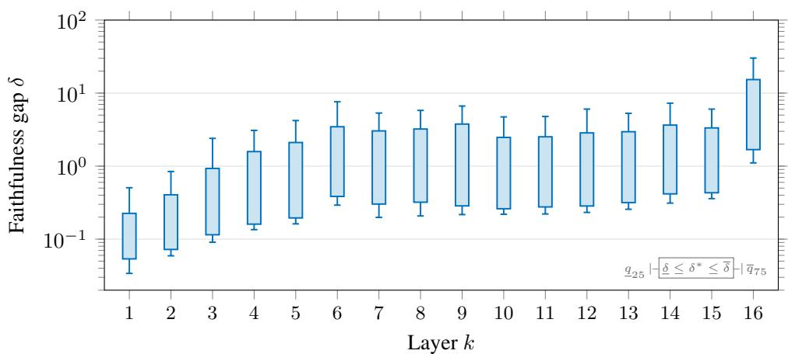  
Figure 9: Llama Scope. Faithfulness gap of the SAE.

(a)  
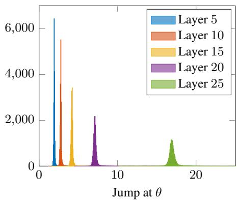

(b)  
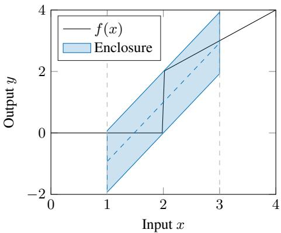  
Figure 10: JumpReLU. (a) Histogram of jump parameter θ per layer of Gemma 2 2B. (b) Example zonotopic enclosure with a discontinuous jump at $\theta = 2$

of ReLU and is given by:

$$
{ \mathrm { J u m p R e L U } } ( x ; \theta ) = { \left\{ \begin{array} { l l } { x } & { { \mathrm { i f ~ } } x > \theta , } \\ { 0 } & { { \mathrm { o t h e r w i s e , } } } \end{array} \right. }\tag{20}
$$

where $\theta \in \mathbb { R }$ is a trainable parameter determining a discontinuous jumping point. As this activation function is applied elementwise, many existing verifiers already support JumpReLU or can add support with little effort. Fig. 10a shows a histogram of θ per layer of Gemma 2 2B, where θ seems to increase with the layer index k. Unfortunately, a higher θ means that the discontinuous jump will be larger as well, and thus an enclosure might become overly conservative (Fig. 10b).

Results. Fig. 11 shows the per-layer faithfulness gap for both Gemma 2 2B and Gemma 3 1B SAEs across all 26 layers: The certified gap is sound throughout and widens with depth, but the difference between δ and δ is larger than for the smooth GPT-2 transcoder despite all having similar dimensions (Tab. 3). We attribute this to the conservativeness of enclosing a discontinuous JumpReLU gate (Fig. 10b), which again emphasizes the need for verification-friendly architectures.

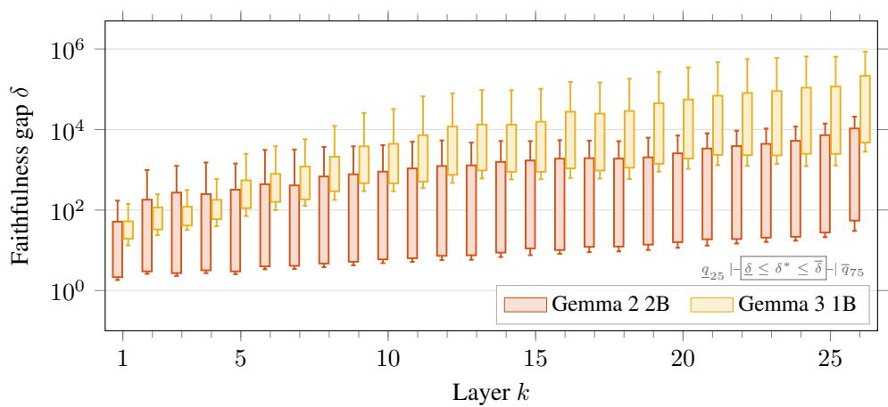  
Figure 11: Gemma Scope. Faithfulness gap of the SAEs.

## C.2.7 R1-DISTILL-QWEN 1.5B

Finally, we determine the faithfulness gap on the last model of our suite: R1-Distill-Qwen 1.5B SAE (Guo et al., 2025; Qwen Team, 2025), a distilled reasoning model. Its IRN is an EleutherAI TopK SAE of the same family as Llama 3.2 1B’s, so verification reuses the TopK enclosure of Appendix C.2.5. The architecture differs from Llama 3.2 1B only in scale (Tab. 3 and 4): a narrower residual stream $( d _ { \mathrm { m o d e l } } = 1 , 5 3 6 )$ over more layers $( \kappa = 2 8 )$ , a smaller dictionary $( d _ { \mathrm { I R N } } = 6 5 , 5 3 6$ vs. 131,072), and the same selection budget $K = 3 2$

Results. Fig. 12 shows the per-layer faithfulness gap at the MINOR level across all 28 layers of the R1-Distill-Qwen 1.5B SAE, over the same 200 samples as the other models. We note that the SAE of the R1-Distill-Qwen 1.5B model is an order of magnitude less faithful than the SAE of the Llama 3.2 1B model (Fig. 9). As with all non-elementwise TopK IRNs, the gap stays far above that of GPT-2, reinforcing the case for verification-friendly designs.

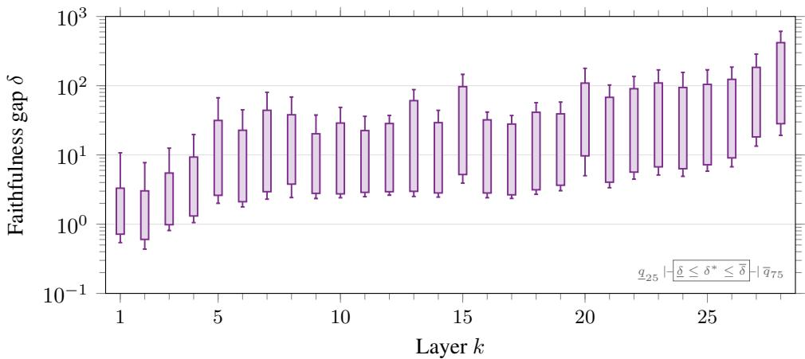  
Figure 12: DeepSeek-Qwen. Faithfulness gap of the TopK SAE.

## C.2.8 FAITHFULNESS TRAINING ACROSS LAYERS

In this experiment, we extend the experiment in Sec. 5 to provide further insights into the benefit of verification-aware training over adversarial training across more layers of GPT-2, in particular, as we noticed in Fig. 4 that the faithfulness gap seems to increase for later layers—a trend that we also observed for all other models in our suite (Fig. 9, Fig. 11, Fig. 12).

Results. Fig. 13 clearly shows that verification-aware training using sets keeps the faithfulness gap small, which is not obtainable for other adversarial training methods. Please note that we used the same training hyperparameters at every layer.  
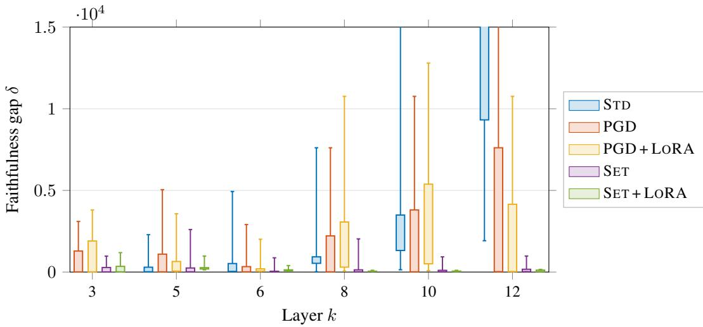  
Figure 13: Faithfulness training across layers. Faithfulness gap per training regime on the GPT-2 SAE across layers.