# THE TOKEN BEFORE THE VALUE IS THE KEY: HOW HYBRID ARCHITECTURES ORGANIZE INDUCTION CIRCUITS

Ke Cheng1,2 Xin Xu1 Yixiao Chen3 Lei Xin4 Jianbo Zhao5 Fanhu Zeng4 Yue Liu1 Jun Zhang1∗ Jie Jiang1

1AMS, Tencent 2CCSE lab, Beihang University

3Data Platform, Tencent 4Independent Researcher

ckpassenger@buaa.edu.cn pkushinnxu@tencent.com gavinyxchen@tencent.com 2835838600@qq.com jimber826@gmail.com challengezengfh@gmail.com herculesliu@tencent.com neoxzhang@tencent.com zeus@tencent.com

## ABSTRACT

Hybrid language models can improve capability as well as efficiency, raising the question of how architectural complementarity becomes learned computation. We examine the established induction roles of Carrying predecessor information, Matching a source by content, and Copying its value. How are these positionsensitive and content-based computations allocated across heterogeneous layers? We introduce layer-type-agnostic paired probes that track Carrying and Matching through a common block-update interface. In recurrent–global and local–global hybrids, Carrying concentrates in efficient layers and Matching in global receivers. The measured local contribution concentrates on lag one: the token immediately before the historical value. Changing predecessor support through lag-one masking, convolution removal, or early learning-rate reduction can relocate Carrying and Matching between stages. Source-key restoration and fixed-value selection trace the receiver’s dependence on the prepared source. These interventions also change natural-text recall, with outcomes depending on configuration and target. Varying local windows and induction-enriched training text changes the early development of functional Carrying and Matching, connecting architectural priors and training evidence to formation timing. Together, the probes and interventions shift the explanatory focus upstream: the organization of Matching follows how Carrying is learned. The token before the value provides a concrete link between a hybrid’s architecture, circuit development, and recall. Code is available in https://github. com/ckpassenger/bind-match-copy/tree/main.

## 1 INTRODUCTION

Hybrid language models were initially motivated by efficiency: combining recurrent or local modules with a few full-attention layers reduces the cost of sequence modeling (De et al., 2024; Lieber et al., 2024; Ren et al., 2025). Subsequent studies have also reported gains in model capability and scaling (Wang et al., 2025; Merrill et al., 2026). Why can mixing operators improve performance as well as efficiency?

Work has begun to address this question from theoretical and empirical perspectives. Theory identifies expressivity and memory-efficiency advantages on formal tasks (Cooper et al., 2026; Merrill et al., 2026); empirical studies characterize recall, scaling, and learning across hybrid designs (Wang et al., 2025; Qiao et al., 2026). The circuit-level connection remains incomplete: how does training realize architectural capabilities as concrete computations, and how do those computations affect downstream behavior? Studying learned circuits offers a bridge between architectural potential and observed performance.

Classical induction provides a concrete computation to trace. In $A B \ldots A  B ,$ , a model retrieves an earlier continuation (Elhage et al., 2021; Olsson et al., 2022). Singh et al. (2024) identify interacting Carrying, Matching, and Copying subcircuits and study their formation dynamics.

CARRYING transfers predecessor information into the historical value; MATCHING selects a source by content, and COPYING transmits its value (Figure 1). This raises a question: how does a hybrid allocate the position-sensitive Carrying and content-based Matching computations? Do they have different affinities for efficient and global layers? Attention-score diagnostics commonly used for induction heads do not directly apply to recurrent components, motivating a shared interface across layer types.

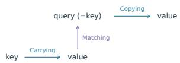  
Figure 1: Induction roles: Carrying (A), Matching (B), and Copying (C), following Singh et al. (2024).

We observe this affinity: Carrying concentrates in efficient groups, followed by Matching in global receivers. Their measured local role concentrates on lag one—the token immediately before the historical value. This familiar Transformer relation sharpens the interpretation of locality in hybrids: the efficient layer prepares a key for distant retrieval.

Changing predecessor support reallocates Carrying and Matching; local structure and training evidence also shape their formation. Source-key restoration and fixed-value selection trace the connection. These results shift the explanatory focus upstream: Matching organization follows how Carrying is learned. The token before the value is the key.

Our contributions are threefold. First, we introduce layer-type-agnostic paired probes for Carrying and Matching that support all subsequent analyses. Second, the hybrid division of labor exposes distinct intervention points: changing the conditions for Carrying relocates retrieval and alters naturaltext recall. Third, varying architectural and data support for early predecessor learning changes functional circuit formation, revealing a dynamic consequence of hybrid specialization. Together, the measurements connect each layer type’s learned computation to when, where, and how the model retrieves.

## 2 LAYER-TYPE-AGNOSTIC INDUCTION PROBES

Our layer-type-agnostic paired probes measure Carrying at the historical value and Matching at the query through a common block-update interface, requiring neither attention weights nor recurrentstate coordinates. Together, they locate the preparation of the token before the value and the retrieval response that uses it.

## 2.1 MODELS AND TRAINING

We compare eight-layer Gated DeltaNet (GDN) hybrids, sliding-window attention (SWA) hybrids, and full-attention Transformers. The hybrids use [Eficient3, TF]2, with full attention at L3 and L7; Transformer uses full attention throughout. GDN combines gated delta-rule memory with width-four causal convolution (Yang et al., 2025). SWA uses causal local attention, with a default window of four tokens including the current position. All models have width 512 and eight heads, with approximately 79M, 77M, and 77M parameters. They train on packed OpenWebText with context 1,024 for 30K steps. All controlled models use learned absolute position embeddings; SWA additionally uses RoPE, while full-attention layers do not. Layer indices start at zero. Variants specify the changed local operation or early learning rate (LR). Appendix A.1 details training and replication.

Each hybrid offers two global receivers, each preceded by an efficient group. Changing local access or early learning while retaining those receivers tests how support affects allocation. A 16-layer, approximately 318M model and released Qwen checkpoints extend the comparison.

## 2.2 MEASURING CARRYING AND MATCHING

We use the prompt $c = A B \ldots C D \ldots A _ { q } .$ , whose target continuation is B. The earlier value position s is the source; q is the repeated query, and $m = z _ { B } - z _ { D }$ is the correct-minus-distractor logit margin. We apply activation patching to block updates: replace an update in the clean run with one from a donor prompt, then measure the change in m (Geiger et al., 2023; Zhang & Nanda, 2024).

Each donor changes only the specified predecessor/key tokens, retaining identical fillers. For each pair $( c , d )$ , PATCHL $\boldsymbol { \cdot } \boldsymbol { \mathrm { O S S } } ( c , d ; \ell , p )$ inserts the RMS-matched donor block update into the clean run and returns the clean-minus-patched margin after recomputing later blocks. Each condition uses 200

prompts per model, run, and checkpoint (Appendix A.1). Paired samples are reused across layers and compared interventions, with effects averaged at each coordinate.
<table><tr><td>Algorithm 1. Lag probe</td><td>Algorithm 2. Carrying probe</td><td>Algorithm 3. Matching probe</td></tr><tr><td>Input: layers  ${ \mathcal { L } } ,$  offsets  $\mathcal { D } .$ </td><td>Input: layers  ${ \mathcal { L } } .$ </td><td>Input: layers  $\mathcal { L } .$ </td></tr><tr><td>Output:  $\begin{array} { r } { \dot { \delta } _ { \mathrm { l a g } } ( \ell , r ) . } \end{array}$  1. For each  $r \in \mathcal { D } ,$  sample 200</td><td>Output:  ${ \dot { \delta } } _ { \mathrm { C a r r y i n g } } ( \ell ) .$  1. Sample 200 clean prompts</td><td>Output:  $\dot { \delta } _ { \mathrm { M a t c h i n g } } ( \ell ) .$  1. Sample 200 clean prompts</td></tr><tr><td>clean prompts with a key r tokens before value s.</td><td> $c = \bar { A } B \ldots C D \ldots A _ { q } ; \varepsilon$  is the historical B position.</td><td> $c = { \mathrm { \hat { A } } } B \ldots C D \ldots A _ { q } { \mathrm { \hat { ; } } } q$  is the query position.</td></tr><tr><td>2. for  $\ell \in \mathcal { L } , r \in \mathcal { D }$  do</td><td>2. for  $\ell \in { \mathcal { L } }$  do</td><td>2. for  $\ell \in { \mathcal { L } }$  do</td></tr><tr><td>3. for each clean prompt c:</td><td>3. for each c:</td><td>3. for each c:</td></tr><tr><td>copy c to  $d ;$  replace the historical key.</td><td>copy c to d; replace the predecessor of  ${ \mathrm { i } } \mathbf { \mathit { B } } .$ </td><td>copy c to d; swap keys:  $d \stackrel { } { = } C B \ldots A \bar { D } \ldots A _ { q } .$ </td></tr><tr><td>4.  $e _ { c } \gets$  PATCHLOSS  $( c , d ; \ell , s ) .$ </td><td>4.  $e _ { c } \gets \mathrm { P A T C H L O S S }$ </td><td>4.  $e _ { c } \gets \mathrm { P A T C H L O S S }$ </td></tr><tr><td>5.  $\begin{array} { r } { \delta _ { \mathrm { l a g } } ( \ell , r ) \gets \frac { 1 } { 2 0 0 } \sum _ { c } e _ { c } . } \end{array}$ </td><td> $( c , d ; \ell , s ) .$  5.  $\begin{array} { r } { \delta _ { \mathrm { C a r r y i n g } } ( \ell ) \gets \frac { 1 } { 2 0 0 } \sum _ { c } e _ { c } . } \end{array}$ </td><td> $( c , d ; \ell , q ) .$  5.  $\begin{array} { r } { \delta _ { \mathrm { M a t c h i n g } } ( \ell ) \gets \frac { 1 } { 2 0 0 } \sum _ { c } e _ { c } . } \end{array}$ </td></tr></table>

An update is block output minus input, including the feed-forward computation where present. With clean and donor updates $u _ { c } , u _ { d }$ , RMS matching uses ${ \widetilde { u } } _ { d } = u _ { d } \mathrm { R M S } ( { \dot { u _ { c } } } ) / ( \mathrm { R M S } ( u _ { d } ) { \dot { + } } 1 0 ^ { - 8 } )$ . The lag scan tests offsets 1/2/4/8/16/32/64; Carrying fixes the adjacent relation. Query-update Matching measures the net retrieval response, combining selection, value transmission, and subsequent FFN effects. Fixed-value attention-pattern swaps isolate selection (Section 3.3; Algorithm S1). Prompt construction and query-response controls appear in Appendices B.1 and B.3.

Both functional readouts depend on the current downstream computation. Formation curves track each run’s endpoint-selected layer through training; Appendix D.1 supplies fixed-site comparisons. Replicated results report training-run means and sample SD.

## 3 HOW HYBRIDS ALLOCATE INDUCTION COMPUTATIONS

We first map Carrying and Matching across layer types and identify the predecessor relation carried by local computation. Interventions then test how its learning conditions shape circuit allocation and formation, with source-key tests tracing the connection to Matching. Deeper models and natural-text recall establish the scope and behavioral consequences.

## 3.1 MAPPING CARRYING AND MATCHING ACROSS LAYER TYPES

Do the positional and content-based parts of induction favor different layer types? We scan Carrying and Matching across layers, then examine which historical offset contributes to the source representation.

Both hybrids place strong Carrying at the end of the first efficient group and Matching in the following global layer; Transformer expresses these roles deeper and with greater variation across runs (Figure 2, bottom). The lag response concentrates at offset one in hybrids and Transformer (top). This relation is familiar from classical induction (Elhage et al., 2021; Olsson et al., 2022; Singh et al., 2024). In hybrids, it identifies a specific function of local computation: carrying the token before the value into the source representation used for distant retrieval.

Identity controls isolate the predecessor relation (Appendix B.2). The scans identify the division of labor and its lag-one component. We next test whether changing support for that component changes which receiver learns Matching.

## 3.2 CHANGING CARRYING CONDITIONS SHIFTS THE CIRCUIT

The lag-one concentration suggests an upstream explanation for this allocation. We test it by changing predecessor support while keeping global receivers at L3 and L7. LR ×0.1 acts on L0–2 and L4–6 for the first 3K steps in GDN and 4K in SWA, including mixer, FFN, and norm. It is a broad perturbation of both efficient groups; channel interventions provide the predecessor-specific tests. Mask and convolution experiments test circuit location; window experiments test formation time (Section 3.4).

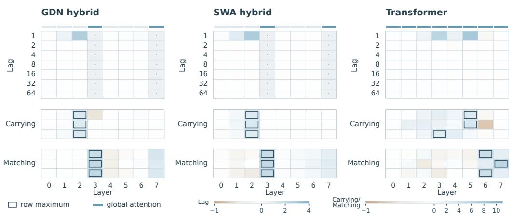  
Figure 2: The same predecessor relation, different learned locations. Top: lag sensitivity in one run. Bottom: Carrying and query-update Matching in three runs. Outlines mark row maxima; dots mark untested coordinates. Rails identify global attention. Separately labeled lag and Carrying/Matching scales give signed margin effects and are shared across architectures.

We first suppress only the lag-one convolution channel during early training. This removes the direct predecessor contribution from that channel while retaining other convolution offsets and the recurrent computation. Some runs develop a deeper Carrying–Matching path; others retain the shallow route (Figure 3). The offset and timing comparisons sharpen the result: suppressing lag two early, or suppressing lag one after the initial formation period, preserves the shallow circuit (Appendix C.1).

Width-two convolution retains self and predecessor while removing longer offsets; the shallow organization remains. Removing convolution consistently moves Carrying and Matching to the later group and receiver. Together with lag-one masking, these controls distinguish sufficient predecessor support, partial disruption with variable allocation, and broader removal that favors a later circuit.

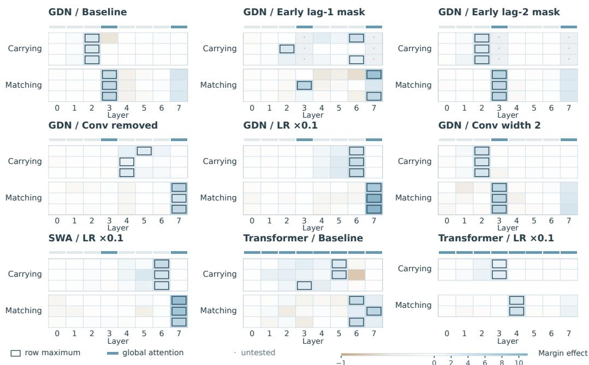  
Figure 3: Changing upstream support redirects the computation. Signed Carrying and Matching layer profiles under offset, convolution, and early-learning interventions. Each condition groups three independent runs, except Transformer LR ×0.1 with two. Outlines mark maxima; dots mark untested coordinates. GDN and SWA denote the two hybrid families; LR denotes learning rate. Timing and layout comparisons are expanded in Appendix C.

Early LR reduction retains the local operator and its inputs, yet both hybrids develop the deeper Carrying–Matching pair. Local access and early optimization thus provide different controls over the learned allocation.

Receiver layout and Transformer controls test this dependence from the other side. Shifting global sites favors the later available receiver (Appendix C.1), while Transformer LR reduction changes where its circuit develops (Appendix C.2). A persistent self-and-predecessor head instead brings Transformer Carrying into a shallow layer; releasing it after early training yields more variable locations (Appendix C.2). The hybrid division exposes distinct intervention points in the efficient groups and global receivers. Their acquired predecessor support and available source access jointly shape circuit location.

## 3.3 GLOBAL MATCHING READS THE PREPARED SOURCE KEY

Source-key restoration tests whether original and relocated receivers depend on the Carrying representation at the historical value.

A Carrying-layer patch at the historical value changes the K and V delivered to attention. Transferring K alone into a clean run reproduces nearly all full-path loss in both hybrid families’ baseline and reduced-LR runs; V has little effect (Appendix B.5). The same key-dominated propagation appears after convolution removal and early lag-one suppression. Restoring clean K at the correct source recovers the prediction; the same repair at another position does not (Table 1A).

The receiver must also select the appropriate source. We isolate this operation by exchanging its attention pattern while holding V fixed. After early LR reduction, the strong selection effect moves from the earlier to the later global receiver in both hybrids (Table 1B). Across the tested conditions, the receiver favored by this intervention agrees with query-update Matching (Appendix B.4). Fixed-V swaps test receiver selection in baseline/LR runs, while clean-K restoration traces source dependence after convolution removal and lag-one masking.

Table 1: Source-key dependence and receiver selection. A: GDN source-key restoration, aggregated at each run’s peak route. Early lag-1 mask includes relocated runs 42/44 (L6→L7) and unrelocated run 43 (L2→L3). Negative off-site recovery means additional margin loss. B: fixed-V pattern effects. Both panels report three-run mean ± sample SD in margin units; the reproduction protocol uses 200 prompts per condition.  
A. Source-key restoration  
B. Fixed-value selection
<table><tr><td>Condition</td><td></td><td>Full-path K recovery</td><td>Off-site</td></tr><tr><td>Conv removed</td><td></td><td> $2 . 5 1 \pm 0 . 6 7 \ 2 . 5 2 \pm 0 . 6 7 \ - 1 . 3 4 \pm 0 . 7 4$ </td><td></td></tr><tr><td>Early lag-1 mask</td><td></td><td> $3 . 4 6 \pm 1 . 0 3 ~ 3 . 4 2 \pm 1 . 0 0 ~ - 1 . 7 7 \pm 1 . 6 1$ </td><td></td></tr></table>

<table><tr><td>Model Condition</td><td>L3 L7</td></tr><tr><td>GDN Baseline</td><td> $5 . 8 5 \pm 0 . 4 5 \ 1 . 3 2 \pm 0 . 3 9$ </td></tr><tr><td>LR ×0.1 SWA</td><td> $0 . 0 2 \pm 0 . 0 7$   $9 . 1 6 \pm 0 . 9 5$ </td></tr><tr><td>Baseline  $\mathrm { L R } \times 0 . 1$ </td><td> $5 . 3 4 \pm 0 . 2 1$   $0 . 3 1 \pm 0 . 0 6$   $0 . 0 2 \pm 0 . 0 3$   $8 . 1 4 \pm 1 . 3 3$ </td></tr></table>

The source-key path connects altered predecessor support to global Matching: changes to Carrying reach the receiver through source K, and the relocated receiver selects that source. Head-level Matching/Copying and source-edge tests complete this path (Appendices B.7 and B.6).

## 3.4 PREDECESSOR SUPPORT SHAPES CIRCUIT FORMATION

The allocation question has a temporal counterpart: what lets a receiver acquire Matching early? We trace functional Carrying and Matching under different local windows and training streams, testing how early support for the predecessor relation shapes circuit development.

SWA window 2 advances early Carrying relative to windows 8/16 (Figure 4A/C). Matching appears earlier than in window 16, but ties window 8 at the lowest thresholds; Appendix D.3 resolves these intervals. The wider-window models then catch up and reach stronger final Carrying responses. These trajectories separate earlier functional use of the predecessor relation from the stronger response that broader windows develop later. Following Carrying connects window-dependent retrieval-head formation (Qiao et al., 2026) to the development of the source computation on which retrieval depends.

All three SWA windows admit the predecessor; their trajectories distinguish access from when the relation becomes functionally useful. Window 2 and width-two convolution retain self and predecessor while excluding longer offsets. The window and convolution comparisons connect local support to the formation and allocation of the historical-source circuit.

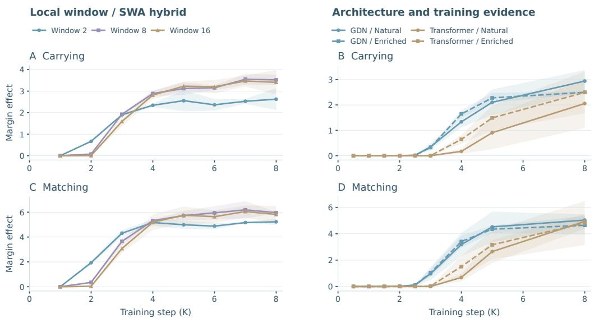  
Figure 4: Two ways to change early circuit development. A/C: SWA windows 2/8/16 Carrying at L2 and query-update Matching at L3, using 200 prompts per cell. B/D: Hybrid/Transformer under natural and induction-enriched text, following fixed endpoint-selected layers. Lines and bands show means and sample SD over three runs. The plotted checkpoints cover the first 8K steps.

The data comparison varies how often this relation is available during training. Induction enrichment emphasizes repeated, reliable continuations through the frequency/reliability filter in Appendix A.2, motivated by Aoyama et al. (2026). Across three runs, Transformer Carrying and Matching rise earlier with enriched text than with natural text; the two hybrid conditions rise in a similar early interval (Figure 4B/D). This pattern suggests that local architectural support and enriched training evidence can facilitate a shared preparation step: enrichment has a larger timing effect where that step develops later under natural text.

The early support for learning this one-token relation thus connects circuit allocation to functional formation timing. Fixed-site comparisons (Appendix D.1), random-retention and full-depth trajectories (Appendix D.2), and onset thresholds (Appendix D.3) trace this timing contrast. Section 3.6 relates formation timing to final recall.

## 3.5 CIRCUIT ORGANIZATION ACROSS MODEL DESIGNS

The preceding tests connect predecessor support to circuit location and timing in eight-layer hybrids. We now examine this organization with more global stages, released checkpoints, and alternative receivers. In the four-stage 318M model, LR reduction in selected groups favors early, intermediate, or late routes, with greater variation for nonadjacent groups (Figure 5A; Appendix C.3). Allocation follows the network-wide support pattern.

Depth also permits dependence across multiple stages. In a 318M Baseline run, source-K restoration recovers part of the sender-patch loss at both an intermediate global receiver and the later peak-Matching receiver (Appendix B.5). Peak responses identify prominent sites on paths that can contain additional global computation, so source preparation can influence multiple receivers.

Released Qwen checkpoints extend the comparison to larger pretrained models (Qwen Team, 2025; 2026b). Qwen3 expresses the operations in separated full-attention layers; Hybrid Qwen3.5 places its strongest Carrying in a GDN layer immediately before the strongest global Matching (Figure 5B). In Qwen3.5, component restoration identifies K as the main route by which the sender perturbation affects retrieval. This recovery persists within prompts on which the clean model favors the correct target. A common-token dose sweep also produces graded K recovery while the perturbed model still favors the correct target (Appendix E.2). The same dependence appears across input difficulty and perturbation strength, including conditions with strong recall.

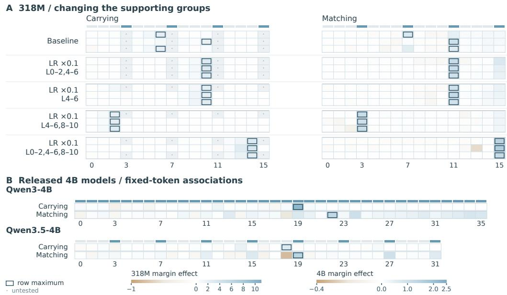  
Figure 5: Source preparation and retrieval beyond the two-stage setting. A: five 318M conditions, with three runs aligned between Carrying and Matching. Row labels give the LR multiplier and affected layers during the first 3K steps. B: all-layer fixed-token association scans in Qwen3/3.5-4B. Outlines mark maxima; rails mark global attention; dots mark untested coordinates. Separate labeled scales serve 318M and 4B.

Receiver controls test the access needed by this division. GDN–DSA trained from scratch retains Carrying in GDN and Matching in sparse global receivers (Appendix F.5). Pure GDN and GDN– SWA show weak historical-source Carrying alongside query-time responses (Appendix F.4). These measurements distinguish the traced source pathway from recurrent retrieval.

## 3.6 THE CIRCUIT CONNECTS TO NATURAL-TEXT RECALL

After the synthetic tests, we ask whether the same previous-token relation matters for natural-text prediction. We retain full context and score targets whose predecessor–continuation pair has appeared before, separating single- and multiple-continuation contexts by predecessor recency. PPL evaluation uses 10,000 sequences: 2,000 Wiki, 4,000 Python code, and 4,000 Math. Long-range identifier reuse gives a code example; Appendix F.1 defines the target groups.

In GDN, ablating source-attending heads produces larger recall NLL increases than ablating comparison heads, in both the baseline receiver and the later receiver after early LR reduction (Appendix F.3). The circuit analysis therefore connects to prediction beyond the constructed prompts.

Final recall provides a complementary view of circuit development. Narrow local windows advance early Carrying and Matching, yet wider windows predict distant, multiple-continuation targets and reused identifiers better at the final checkpoint (Table 2).

In the eight-layer hybrids, early LR reduction lowers several multiple-continuation recall PPLs but raises single-continuation far PPL. GDN convolution removal shows the same contrast; Transformer LR reduction raises PPL across the reported conditions (Table 2). At 318M, all nine replicated interventions have higher mean distant multiple-continuation and identifier-reuse PPL than Baseline, despite larger mean peak Matching effects (Appendix F.2). Together, the tests connect changes in Carrying conditions to circuit reorganization and recall. Head ablations establish that the original and relocated receivers contribute to prediction; intervention comparisons show that recall outcomes vary across configurations and targets. Section 5 relates these behavioral consequences to the learned division of labor.

Table 2: Recall and prediction under changes in local support. PPL at 30K; lower is better. Single/multiple denote historical continuation counts; identifier reuse is long-range. Values are mean ± sample SD. The Transformer Baseline/LR pair uses two matched runs; all other rows use three. The local-head pair has its own baseline. PPL uses 10,000 sequences per run. Thick rules separate comparisons; bold marks each column’s minimum within a block.
<table><tr><td colspan="3"></td><td>Single</td><td colspan="3">Multiple continuation</td><td>Identifier</td></tr><tr><td>Model</td><td>Variant</td><td>Overall</td><td>Far</td><td>Near</td><td>Mid</td><td>Far</td><td>reuse</td></tr><tr><td>SWA</td><td>SWA 2</td><td> $4 1 . 5 4 \pm 1 . 2 7$ </td><td> $2 . 2 6 \pm 0 . 0 5$ </td><td>2.85 ± 0.36</td><td> $1 4 . 9 7 \pm 0 . 6 0$ </td><td> $2 8 . 9 9 \pm 0 . 4 3$ </td><td> $2 8 . 0 5 \pm 2 . 2 1$ </td></tr><tr><td></td><td>SWA4</td><td> $4 1 . 9 8 \pm 0 . 4 9$ </td><td></td><td>2.33 ± 0.06 2.86 ± 0.22</td><td> $1 5 . 5 2 \pm 1 . 0 9$ </td><td> $2 6 . 6 1 \pm 1 . 1 8$ </td><td> $2 8 . 3 1 \pm 3 . 9 7$ </td></tr><tr><td></td><td>SWA 4LR ×0.1</td><td> $4 0 . 5 4 \pm 1 . 5 0$ </td><td></td><td>2.64 ± 0.06 2.68 ± 0.25</td><td> ${ \bf 1 2 . 9 4 \pm 1 . 7 0 }$ </td><td> $2 5 . 6 3 \pm 0 . 8 7$ </td><td> $2 3 . 4 9 \pm 2 . 1 2$ </td></tr><tr><td></td><td>SWA8</td><td>39.47 ± 0.59 2.25 ± 0.07 2.78 ± 0.15</td><td></td><td></td><td> $1 4 . 0 0 \pm 0 . 9 4$ </td><td> $2 4 . 1 9 \pm 0 . 9 6$ </td><td> $2 3 . 5 4 \pm 2 . 8 6$ </td></tr><tr><td></td><td>SWA 16</td><td>39.95 ± 0.86</td><td> $2 . 2 6 \pm 0 . 0 7$ </td><td></td><td>3.13 ± 0.34 14.31 ± 2.02 22.40 ± 2.55</td><td></td><td> ${ \bf 2 0 . 9 1 \pm 6 . 7 6 }$ </td></tr><tr><td>GDN</td><td>Baseline</td><td>40.17 ± 2.00</td><td> $\mathbf { 2 . 3 8 \pm 0 . 0 4 }$ </td><td>2.75 ± 0.39</td><td> $1 6 . 3 4 \pm 1 . 9 9$ </td><td>25.98 ± 1.23</td><td> $2 9 . 0 0 \pm 1 . 4 3$ </td></tr><tr><td></td><td>LR ×0.1</td><td>38.86 ± 1.37 2.59 ± 0.05 2.64 ± 0.27</td><td></td><td></td><td> $1 2 . 5 2 \pm 0 . 9 3$ </td><td>23.35 ± 0.34</td><td> $2 1 . 0 2 \pm 1 . 6 0$ </td></tr><tr><td></td><td>Conv removed</td><td>38.69 ± 1.26 2.70 ± 0.05 2.83 ± 0.73</td><td></td><td></td><td> ${ \bf 1 } 2 . 5 \mathbf { 0 } \pm \mathbf { 0 } . 2 8$ </td><td>21.75±1.99</td><td> ${ \bf 1 8 . 7 2 \pm 4 . 5 7 }$ </td></tr><tr><td>Transformer Baseline</td><td></td><td> ${ \bf 4 1 . 4 7 \pm 2 . 0 7 }$ </td><td></td><td>2.66 ± 0.04 2.59 ± 0.14</td><td> $1 5 . 0 3 \pm 1 . 9 3$ </td><td>25.73 ± 0.29</td><td> $2 5 . 0 1 \pm 0 . 6 2$ </td></tr><tr><td></td><td>LR ×0.1</td><td> $5 1 . 1 1 \pm 2 . 9 3$ </td><td></td><td>3.33 ± 0.04 3.24 ± 0.14</td><td> $1 9 . 3 4 \pm 2 . 6 7$ </td><td> $3 3 . 6 0 \pm 1 . 4 1$ </td><td> $3 4 . 8 6 \pm 1 . 7 7$ </td></tr><tr><td></td><td>Local-head baseline</td><td> $4 2 . 5 8 \pm 2 . 0 8$ </td><td> $2 . 6 2 \pm 0 . 0 5$ </td><td>3.26 ± 1.10</td><td> ${ \bf 1 4 . 6 7 \pm 1 . 8 1 }$ </td><td> $2 4 . 9 5 \pm 2 . 3 7$ </td><td> $2 3 . 2 3 \pm 6 . 4 6$ </td></tr><tr><td></td><td>Local head</td><td> $4 3 . 1 6 \pm 1 . 6 6$ </td><td></td><td></td><td>2.51 ± 0.063.31 ± 0.6617.46 ± 1.76 27.09 ± 2.19</td><td></td><td> $2 7 . 5 9 \pm 5 . 9 2$ </td></tr></table>

## 4 RELATED WORK

Induction as a shared computation. Previous-token key composition is central to classical induction (Elhage et al., 2021; Olsson et al., 2022). Singh et al. (2024) identify Carrying (A), Matching (B), and Copying (C), and study their interacting formation dynamics in Transformers. Our paired probes measure Carrying and query-update Matching across hybrid mixers; path and head-level tests examine their connection to Copying. Subsequent studies examine induction learning and data dependence (Musat et al., 2025; 2026; Aoyama et al., 2026). Inductive biases toward n-gram processing also improve in-context language learning (Akyürek et al., 2024). Interventions on predecessor support then connect the learning conditions for Carrying to the allocation and formation of global Matching.

Complementarity in hybrid architectures. Local attention, state spaces, and gated linear attention offer different access patterns (Beltagy et al., 2020; Gu & Dao, 2024; Yang et al., 2024; 2025). Hybrid designs combine them with attention (De et al., 2024; Lieber et al., 2024; Ren et al., 2025), and empirical and theoretical studies examine their complementarity (Wang et al., 2025; Cooper et al., 2026; Merrill et al., 2026; Cabannes et al., 2026; Shi et al., 2026). Qiao et al. (2026) identify efficient attention as an optimization prior and show that larger local windows can delay retrieval-head formation. We trace the upstream Carrying computation and its source-key interface to connect local design and learning conditions to where and when retrieval develops.

Retrieval across model families. Recall and copying studies expose differences between recurrent models and attention (Arora et al., 2024; Park et al., 2024; Jelassi et al., 2024; Bick et al., 2025). Arora et al. (2025) distinguish historical-position induction from recurrent query-time association and identify the role of short convolution in Mamba induction. Our common update interface follows the historical-source computation across mixers; path interventions then test how its source and receiver cooperate (Geiger et al., 2023; Zhang & Nanda, 2024).

## 5 DISCUSSION

The token before the value organizes Matching. Matching locations show where retrieval occurs; observing Carrying helps explain how that allocation is learned. The layer-type-agnostic paired probes make this connection visible across heterogeneous operators: efficient groups prepare predecessorsensitive representations at historical values, and global receivers select those sources. Locality takes a specific form in this circuit—carrying the token immediately before the value into its source representation. Lag-one masking, convolution removal, and early LR changes alter this preparation and the receiver that develops Matching. Source-key restoration and fixed-value selection trace their connection. Carrying supplies a common organizing condition for these interventions: the observed Matching allocation follows how predecessor support is learned.

Predecessor support shapes functional formation. Short convolution and narrow local attention supply architectural support for predecessor learning; induction-enriched data supplies repeated, reliable training evidence. Narrower SWA windows advance early functional Carrying, with threshold dependent advances in Matching. Enrichment advances Transformer formation, while hybrid natural/enriched trajectories rise in a similar early interval. These patterns suggest that architecture and data can facilitate a shared preparation step. Tracking that step connects the retrieval-head development described by Qiao et al. (2026) to the learning of the source information those heads read.

Local order and distant source access. Carrying transfers predecessor order into the source representation before content-based selection. This gives a circuit-level rationale for effective NoPE global retrieval alongside position-sensitive efficient layers (Kimi Team, 2025; 2026; Qiao et al., 2026). The receiver must also reach the prepared source. Sparse selection can retain distant candidates, as in Qwen3.8-Next (Qwen Team, 2026a); local SWA excludes sources outside its window. Our GDN–DSA model trained from scratch retains Carrying in GDN and Matching in sparse receivers, while GDN–SWA has weak historical-source Carrying (Appendices F.5 and F.4).

Local access can also favor recurrent memory: Cabannes et al. (2026) explain short-window benefits through increased use of that pathway. Our pure GDN and GDN–SWA controls retain query-time responses alongside weak historical-source Carrying. The common probe interface distinguishes these routes (Cooper et al., 2026; Merrill et al., 2026; Yang et al., 2025; Bick et al., 2025). For historicalsource retrieval, local structure shapes predecessor preparation, while the receiver determines access to distant candidates. This connects convolution, window size, and global receiver design through their roles in one computation.

Carrying interventions and recall outcomes. Eight-layer GDN interventions lower several multiple-continuation and identifier PPLs, whereas the three-run 318M means on these targets favor Baseline (Appendix F.2). The 318M Baseline already uses intermediate receivers, with source-key dependence at two stages in one run. Redistributing this computation may disrupt useful cooperation in a four-stage model. Depth, intervention coverage, and optimization vary together here. Multiple-continuation recall also requires resolving competing historical continuations, making the training data and surrounding context relevant beyond predecessor identity. Qiao et al. (2026) find that long-context gaps between efficient-attention designs shrink with sufficient training, motivating longitudinal recall comparisons. This circuit view connects architectural bias to learned retrieval and its behavioral consequences. Final recall reflects how that pathway works with the remaining computation and the associations present in the data.

## 6 CONCLUSION

Layer-type-agnostic paired probes reveal how hybrids allocate the established Carrying and Matching computations across efficient and global layers. The local contribution concentrates on the token before the historical value. Changing the conditions under which this predecessor relation is learned relocates Carrying and Matching and alters natural-text recall; varying architectural and data support also changes functional formation timing. These findings place Carrying at the center of the explana tion: where and when Matching develops depend on the learned support for its source. The token before the value connects hybrid architecture to circuit organization and recall.

## REFERENCES

Ekin Akyürek, Bailin Wang, Yoon Kim, and Jacob Andreas. In-context language learning: Architectures and algorithms. arXiv preprint arXiv:2401.12973, 2024. URL https://arxiv.org/ abs/2401.12973.

Tatsuya Aoyama, Ethan Gotlieb Wilcox, and Nathan Schneider. Predicting the emergence of induction heads in language model pretraining. In Proceedings ofthe 43rd International Conference on Machine Learning, 2026. URL https://arxiv.org/abs/2511.16893. arXiv:2511.16893.

Aryaman Arora, Neil Rathi, Nikil Roashan Selvam, Róbert Csordás, Dan Jurafsky, and Christopher Potts. Mechanistic evaluation of transformers and state space models. arXiv preprint arXiv:2505.15105, 2025. URL https://arxiv.org/abs/2505.15105.

Simran Arora, Sabri Eyuboglu, Aman Timalsina, Isys Johnson, Michael Poli, James Zou, Atri Rudra, and Christopher Ré. Zoology: Measuring and improving recall in efficient language models. In International Conference on Learning Representations, 2024. URL https://arxiv.org/ abs/2312.04927.

Iz Beltagy, Matthew E. Peters, and Arman Cohan. Longformer: The long-document transformer. arXiv preprint arXiv:2004.05150, 2020. URL https://arxiv.org/abs/2004.05150.

Aviv Bick, Eric P. Xing, and Albert Gu. Understanding the skill gap in recurrent language models: The role of the gather-and-aggregate mechanism. arXiv preprint arXiv:2504.18574, 2025. URL https://arxiv.org/abs/2504.18574.

Loïc Cabannes, Maximilian Beck, Gergely Szilvasy, Matthijs Douze, Maria Lomeli, Jade Copet, Pierre-Emmanuel Mazaré, Gabriel Synnaeve, and Hervé Jégou. Short window attention enables long-term memorization. In International Conference on Learning Representations, 2026. URL https://arxiv.org/abs/2509.24552. arXiv:2509.24552.

John Cooper, Ilias Diakonikolas, Mingchen Ma, and Frederic Sala. Expressivity–efficiency tradeoffs for hybrid sequence models. arXiv preprint arXiv:2603.08859, 2026. URL https://arxiv. org/abs/2603.08859.

Soham De, Samuel L. Smith, Anushan Fernando, Aleksandar Botev, George Cristian-Muraru, Albert Gu, Ruba Haroun, Leonard Berrada, Yutian Chen, Srivatsan Srinivasan, Guillaume Desjardins, Arnaud Doucet, David Budden, Yee Whye Teh, Razvan Pascanu, Nando de Freitas, and Çaglar˘ Gülçehre. Griffin: Mixing gated linear recurrences with local attention for efficient language models. arXiv preprint arXiv:2402.19427, 2024. URL https://arxiv.org/abs/2402. 19427.

Nelson Elhage, Neel Nanda, Catherine Olsson, Tom Henighan, Nicholas Joseph, Ben Mann, Amanda Askell, Yuntao Bai, Anna Chen, Tom Conerly, Nova DasSarma, Dawn Drain, Deep Ganguli, Zac Hatfield-Dodds, Danny Hernandez, Andy Jones, Jackson Kernion, Liane Lovitt, Kamal Ndousse, Dario Amodei, Tom Brown, Jack Clark, Jared Kaplan, Sam McCandlish, and Chris Olah. A mathematical framework for transformer circuits. Transformer Circuits Thread, 2021. URL https://transformer-circuits.pub/2021/framework/index.html.

Atticus Geiger, Duligur Ibeling, Amir Zur, Maheep Chaudhary, Sonakshi Chauhan, Jing Huang, Aryaman Arora, Zhengxuan Wu, Noah Goodman, Christopher Potts, and Thomas Icard. Causal abstrac tion: A theoretical foundation for mechanistic interpretability. arXiv preprint arXiv:2301.04709, 2023. URL https://arxiv.org/abs/2301.04709.

Albert Gu and Tri Dao. Mamba: Linear-time sequence modeling with selective state spaces. arXiv preprint arXiv:2312.00752, 2024. URL https://arxiv.org/abs/2312.00752.

Samy Jelassi, David Brandfonbrener, Sham M. Kakade, and Eran Malach. Repeat after me: Transformers are better than state space models at copying. arXiv preprint arXiv:2402.01032, 2024. URL https://arxiv.org/abs/2402.01032.

Kimi Team. Kimi Linear: An expressive, efficient attention architecture. arXiv preprint arXiv:2510.26692, 2025. URL https://arxiv.org/abs/2510.26692.

Kimi Team. Kimi K3: Open frontier intelligence. arXiv preprint arXiv:2607.24653, 2026. URL https://arxiv.org/abs/2607.24653.

Opher Lieber, Barak Lenz, Hofit Bata, Gal Cohen, Jhonathan Osin, Itay Dalmedigos, Erez Safahi, Shaked Meirom, Yonatan Belinkov, Shai Shalev-Shwartz, Omri Abend, Raz Alon, Tomer Asida, Amir Bergman, Roman Glozman, Michael Gokhman, Avashalom Manevich, Nir Ratner, Noam Rozen, Erez Shwartz, Mor Zusman, and Yoav Shoham. Jamba: A hybrid transformer–mamba language model. arXiv preprint arXiv:2403.19887, 2024. URL https://arxiv.org/abs/ 2403.19887.

William Merrill, Yanhong Li, Tyler Romero, Anej Svete, Caia Costello, Pradeep Dasigi, Dirk Groeneveld, David Heineman, Bailey Kuehl, Nathan Lambert, Chuan Li, Kyle Lo, Saumya Malik, DJ Matusz, Benjamin Minixhofer, Jacob Morrison, Luca Soldaini, Finbarr Timbers, Pete Walsh, Noah A. Smith, Hannaneh Hajishirzi, and Ashish Sabharwal. OLMo Hybrid: From theory to practice and back. arXiv preprint arXiv:2604.03444, 2026. URL https://arxiv.org/abs/ 2604.03444.

Tiberiu Musat, Tiago Pimentel, Lorenzo Noci, Alessandro Stolfo, Mrinmaya Sachan, and Thomas Hofmann. On the emergence of induction heads for in-context learning. arXiv preprint arXiv:2511.01033, 2025. URL https://arxiv.org/abs/2511.01033.

Tiberiu Musat, Tiago Pimentel, Nicolas Zucchet, and Thomas Hofmann. Invariant learning dynamics of transformers in inductive reasoning tasks. arXiv preprint arXiv:2607.11875, 2026. URL https://arxiv.org/abs/2607.11875.

Catherine Olsson, Nelson Elhage, Neel Nanda, Nicholas Joseph, Nova DasSarma, Tom Henighan, Ben Mann, Amanda Askell, Yuntao Bai, Anna Chen, Tom Conerly, Dawn Drain, Deep Ganguli, Zac Hatfield-Dodds, Danny Hernandez, Scott Johnston, Andy Jones, Jackson Kernion, Liane Lovitt, Kamal Ndousse, Dario Amodei, Tom Brown, Jack Clark, Jared Kaplan, Sam McCandlish, and Chris Olah. In-context learning and induction heads. Transformer Circuits Thread, 2022. URL https://transformer-circuits.pub/2022/ in-context-learning-and-induction-heads/index.html.

Jongho Park, Jaeseung Park, Zheyang Xiong, Nayoung Lee, Jaewoong Cho, Samet Oymak, Kangwook Lee, and Dimitris Papailiopoulos. Can Mamba learn how to learn? A comparative study on in-context learning tasks. arXiv preprint arXiv:2402.04248, 2024. URL https://arxiv.org/abs/2402.04248.

Ziqing Qiao, Yinuo Xu, Chaojun Xiao, Zhou Su, Zihan Zhou, Yingfa Chen, Xiaoyue Xu, Xu Han, and Zhiyuan Liu. Rethinking the role of efficient attention in hybrid architectures. arXiv preprint arXiv:2606.15378, 2026. URL https://arxiv.org/abs/2606.15378.

Qwen Team. Qwen3-4B model card. Hugging Face, 2025. URL https://huggingface.co/ Qwen/Qwen3-4B.

Qwen Team. On the design of Qwen3.8-Next architecture: Evaluation, efficiency, and training stability. arXiv preprint arXiv:2608.30320, 2026a. URL https://arxiv.org/abs/2608.30320.

Qwen Team. Qwen3.5-4B model card. Hugging Face, 2026b. URL https://huggingface. co/Qwen/Qwen3.5-4B

Liliang Ren, Yang Liu, Yadong Lu, Yelong Shen, Chen Liang, and Weizhu Chen. Samba: Simple hybrid state space models for efficient unlimited context language modeling. In International Conference on Learning Representations, 2025. URL https://arxiv.org/abs/2406. 07522.

Runlin Shi, Bojian Yin, and Guoqi Li. Modern transformers are implicit hybrids: From functional differentiation to principled hybrid architecture design. arXiv preprint arXiv:2609.02986, 2026. URL https://arxiv.org/abs/2609.02986.

Aaditya K. Singh, Ted Moskovitz, Felix Hill, Stephanie C. Y. Chan, and Andrew M. Saxe. What needs to go right for an induction head? A mechanistic study of in-context learning circuits and their formation. In Proceedings ofthe 41st International Conference on Machine Learning, volume

235, pp. 45637–45662. PMLR, 2024. URL https://proceedings.mlr.press/v235/ singh24c.html.

Dustin Wang, Rui-Jie Zhu, Steven Abreu, Yong Shan, Taylor Kergan, Yuqi Pan, Yuhong Chou, Zheng Li, Jibin Wu, Ge Zhang, Wenhao Huang, and Jason Eshraghian. A systematic analysis of hybrid linear attention. arXiv preprint arXiv:2507.06457, 2025. URL https://arxiv.org/abs 2507.06457.

Songlin Yang, Bailin Wang, Yikang Shen, Rameswar Panda, and Yoon Kim. Gated linear attention transformers with hardware-efficient training. In Proceedings ofthe 41st International Conference on Machine Learning, 2024. URL https://arxiv.org/abs/2312.06635.

Songlin Yang, Jan Kautz, and Ali Hatamizadeh. Gated delta networks: Improving Mamba2 with delta rule. In International Conference on Learning Representations, 2025. URL https: //arxiv.org/abs/2412.06464.

Fred Zhang and Neel Nanda. Towards best practices of activation patching in language models: Metrics and methods. In International Conference on Learning Representations, 2024. URL https://arxiv.org/abs/2309.16042.

## APPENDIX CONTENTS

A Model Configuration and Training Data 14   
A.1 Model and Training Configuration 14   
A.2 Induction-Enriched Training Text 14   
B Layer-Type-Agnostic Probes and Path Tests 15   
B.1 Synthetic Prompts and Probe Definitions 15   
B.2 Predecessor Specificity 15   
B.3 Query-Association Controls 16   
B.4 Content Selection with Values Held Fixed 16   
B.5 Source-Key Propagation and Restoration 17   
B.6 Source Access and Carrying–Copying Interactions 18   
B.7 Head-Level Matching and Copying 19   
C Carrying Conditions and Circuit Allocation 19   
C.1 Hybrid Offset, Timing, and Layout Controls 19   
C.2 Transformer Controls 21   
C.3 Circuit Allocation in the 318M Hybrid 22   
D Predecessor Support and Circuit Formation 23   
D.1 Checkpoint Schedule and Layer Selection 23   
D.2 Training-Data Controls and Layerwise Trajectories 24   
D.3 SWA Window Size: Onset and Final Responses 25   
E Circuit Tests in Pretrained Qwen Models 26   
E.1 Model Configuration and Circuit Localization 26   
E.2 Prompt Calibration and Source-Key Restoration 26   
F Natural-Text Evaluation and Receiver Controls . . 28   
F.1 Natural-Text Evaluation Protocol 28   
F.2 Recall under Carrying Interventions 29   
F.3 Retrieval-Head Ablations on Natural Text 30   
F.4 Pure GDN and GDN–SWA 31   
F.5 GDN–DSA Trained from Scratch 31

## A MODEL CONFIGURATION AND TRAINING DATA

## A.1 MODEL AND TRAINING CONFIGURATION

Table S1 lists the controlled architecture families and local-window variants.

Table S1: Architecture families and local-window variants. Width is 512 and FFN dimension is 2,048. SWA variants share the same parameter count. Let $P _ { \mathrm { G D N } }$ denote the baseline GDN count; reducing convolution width from four to two removes 24,576 weights across its six GDN layers.
<table><tr><td>Model</td><td>Layout</td><td>Heads</td><td>Parameters</td></tr><tr><td>GDN hybrid</td><td> $[ \mathrm { G D N ^ { 3 } , T F } ] ^ { 2 }$ </td><td>8</td><td>78.88M</td></tr><tr><td>SWA hybrid</td><td> $[ \mathrm { S W A _ { 4 } ^ { 3 } , T F } ] ^ { 2 }$ </td><td>8</td><td>77.26M</td></tr><tr><td>Transformer</td><td> $\mathrm { \dot { F } u l l A t t { \dot { t } } n ^ { 8 } }$ </td><td>8</td><td>77.26M</td></tr><tr><td>SWA window 2</td><td> $[ \mathrm { S W A _ { 2 } ^ { 3 } , T F } ] ^ { 2 }$ </td><td>8</td><td>77.26M</td></tr><tr><td>SWA window 8</td><td> $\mathrm { [ S W A _ { 8 } ^ { \overline { { 3 } } } , T F ] ^ { 2 } }$ </td><td>8</td><td>77.26M</td></tr><tr><td>SWA window 16</td><td> $[ \mathrm { S W A _ { 1 6 } ^ { 3 } , T F } ] ^ { 2 }$ </td><td>8</td><td>77.26M</td></tr><tr><td>GDN / Convolution width 2</td><td> $\mathbf { \dot { G } D N } \mathbf { h y b r i d } , \mathbf { k e r n e l } \mathbf { \Psi } 2$ </td><td>8</td><td> $P _ { \mathrm { G D N } } - 2 4 { , } 5 7 6$ </td></tr></table>

Position encoding. The released controlled-model implementation adds learned absolute position embeddings before the first block. Full-attention RoPE is disabled; SWA applies RoPE to its Q and K in addition to those embeddings. The same embedding module is used in the 16-layer model. The probes trace source-key dependence with these positional signals present.

Training. The standard setup uses a GPT-2 tokenizer, packed 1,024-token OpenWebText sequences, effective batch size 64, bfloat16, AdamW with $( \beta _ { 1 } , \dot { \beta } _ { 2 } ) = ( . 9 , . 9 5 )$ , learning rate $3 \times 1 0 ^ { - 4 }$ , 1K warmup, cosine decay $\mathrm { t o ~ 3 ~ } \times \mathrm { 1 0 ^ { - 5 } }$ , and gradient clipping at 1.0. The standard training duration is 30K steps. Early LR reduction multiplies the scheduled learning rate of every parameter in the selected blocks by 0.1, including mixer, FFN, and normalization parameters. The principal Hybrid conditions target the efficient blocks until 3K for GDN and 4K for SWA; the Transformer controls target their specified full-attention blocks. The common learning-rate schedule then resumes while preserving the accumulated optimizer moments.

Replication and evaluation. Mechanism probes use 200 prompts per model, training run, checkpoint, and intervention condition. Principal GDN, SWA, Transformer, and window conditions use three independent training runs; layout-matched Transformer LR reduction uses two matched runs. Replicated values report means and sample SD across training runs. Prompt-bootstrap intervals resample paired prompts within a fixed checkpoint. Each run’s strongest layer and reported effect are selected from the same final-checkpoint scan; Appendix D.1 describes how formation analyses track those coordinates. Natural-text PPL uses 10,000 sequences per checkpoint, with domain composition and target selection defined in Appendix F.1.

## A.2 INDUCTION-ENRICHED TRAINING TEXT

The frequency and reliability account of Aoyama et al. (2026) motivates enrichment for repeated, predictable continuations. The enrichment filter combines repeated-bigram frequency and continuation consistency, evaluated at paragraph level from GPT-2 tokens.

Paragraph preparation. Documents are split on blank lines. Stripped paragraphs shorter than 100 characters are discarded. Each remaining paragraph is tokenized with the GPT-2 tokenizer, truncating the scoring input to 384 tokens; scoring inputs shorter than 30 tokens are skipped. A retained paragraph is written in full to the filtered JSONL training stream.

Enrichment criterion. For a token sequence $s = ( x _ { 1 } , \ldots , x _ { n } ) $ , let $B ( s )$ be its distinct adjacent bigrams and $c _ { b }$ the number of occurrences of bigram b. The frequency score is the fraction of bigram types that repeat:

$$
F ( s ) = \frac { \sum _ { b \in { \mathcal { B } } ( s ) } \mathbf { 1 } [ c _ { b } \geq 2 ] } { | { \mathcal { B } } ( s ) | } .\tag{1}
$$

To score reliability, count the tokens immediately following each bigram. Let $^ { c _ { b , v } }$ count occurrences of b followed by token v, and define $\begin{array} { r } { B _ { + } ( s ) = \left\{ b : \sum _ { v } c _ { b , v } \geq 2 \right\} } \end{array}$ . Only bigrams with a following token contribute continuation observations. The reliability score is

$$
R _ { 2 } ( s ) = \frac { 1 } { | \mathcal { B } _ { + } ( s ) | } \sum _ { b \in \mathcal { B } _ { + } ( s ) } \mathbf { 1 } \Bigg [ \frac { \operatorname* { m a x } _ { w } c _ { b , w } } { \sum _ { v } c _ { b , v } } > \frac { 1 } { 2 } \Bigg ] .\tag{2}
$$

Empty-denominator scores are zero. Both scores weight bigram types equally. Reliability counts bigram types with a strict majority continuation. The frequency/repeat variant used for training retains a paragraph exactly when

$$
\begin{array} { r } { S _ { \mathrm { I H } } ( s ) = \frac 1 2 F ( s ) + \frac 1 2 R _ { 2 } ( s ) > 0 . 1 0 . } \end{array}\tag{3}
$$

Training mixture. Enriched-text runs use 70% enriched text for the first 5K steps and 50% thereafter through 30K; natural-text runs use unfiltered text. The six conditions combine GDN hybrid, Transformer, and GDN-only with natural or induction-enriched text. A separately trained three-run random-retention series controls for data filtering alone. Figure S9 and Appendix D.1 show how the training stream affects circuit formation.

## B LAYER-TYPE-AGNOSTIC PROBES AND PATH TESTS

## B.1 SYNTHETIC PROMPTS AND PROBE DEFINITIONS

The layer-type-agnostic probes in Algorithms 1–3 use one block-update interface: record output minus input, RMS-match the donor update, and recompute later blocks. Carrying measures historical-source preparation; query-update Matching measures the retrieval response. Both use clean-minus-patched correct-minus-distractor margins at the query. Source-attention mass is the probability assigned to the historical value; source-key recovery is the margin gain after restoring its clean key. Natural-text head ablation uses NLL differences (Appendix F.3).

Prompt construction. The key–value task uses 1,020 tokens within the model’s 1,024-token context, needle IDs 3000–3199, filler IDs 500–2999, and query position $q = 1 0 1 9$ . Distractor-keyto-query spacing d is sampled uniformly from the integers 300–699; the distractor and target keys occupy $r _ { 2 } = q - d$ and $r _ { 1 } \dot { = } \operatorname* { m a x } ( 2 , r _ { 2 } \dot { - } \operatorname* { m a x } ( 8 , \lfloor d / 2 \rfloor \bar { ) } )$ , with values at $r _ { 1 } + 1$ and $r _ { 2 } + 1$ . Carrying changes the historical predecessor and patches the update at its value. Matching exchanges the historical keys, $A B \ldots \bar { C } D \ldots A _ { q } \mapsto C \bar { B } \ldots A D \ldots \bar { A } _ { q } .$ , and patches the query update. Each donor copies its clean prompt: filler, value tokens, positions, and query remain identical, while only the specified keys change. Each condition evaluates 200 paired prompts.

## B.2 PREDECESSOR SPECIFICITY

The paired predecessor donor changes the tested association. An off-site identity donor changes another historical token that remains causally accessible to the patched value; a same-predecessor donor supplies a further comparison. The specificity contrast is $\Delta _ { \mathrm { p a i r e d } } - \Delta _ { \mathrm { o f f s i t e } } .$ . It is positive in the evaluated hybrid Carrying layers and Transformer L3; Transformer L6 shows effects that are small or negative in these same comparisons (Table S2).

Table S2: Carrying identity controls. Paired, off-site, and same-predecessor donor effects in margin units, grouped by model/layer. Each block lists runs 42/43/44. Contrasts use unrounded values.
<table><tr><td colspan="4"></td><td colspan="2">Same</td><td colspan="2">Paired minus same predecessor</td></tr><tr><td>Model</td><td>Layer</td><td>Paired</td><td>Off-site</td><td>predecessor</td><td>Specificity</td><td></td></tr><tr><td rowspan="3">GDN /LR ×0.1</td><td>6</td><td>+3.590</td><td>-0.010</td><td>+0.015</td><td>+3.601</td><td>+3.576</td></tr><tr><td></td><td>+4.793</td><td>-0.278</td><td>-0.004</td><td>+5.071</td><td>+4.796</td></tr><tr><td></td><td>+3.977</td><td>-0.018</td><td>+0.063</td><td>+3.995</td><td>+3.914</td></tr><tr><td rowspan="3">GDN hybrid</td><td>2</td><td>+2.433</td><td>+0.093</td><td>-0.011</td><td>+2.339</td><td>+2.444 +3.013</td></tr><tr><td></td><td>+3.034</td><td>-0.004</td><td>+0.020</td><td>+3.037</td><td></td></tr><tr><td></td><td>+2.527</td><td>-0.090</td><td>-0.021</td><td>+2.617</td><td>+2.549</td></tr><tr><td rowspan="3">GDN / Conv width 2 2</td><td></td><td>+2.801</td><td>-0.103</td><td>-0.050</td><td>+2.904</td><td>+2.852</td></tr><tr><td></td><td>+3.164</td><td>-0.323</td><td>+0.031 0.000</td><td>+3.487 +3.085</td><td>+3.133</td></tr><tr><td></td><td>+3.132</td><td>+0.047</td><td></td><td></td><td>+3.132</td></tr><tr><td rowspan="3">SWA hybrid</td><td>2</td><td>+2.499</td><td>+0.043</td><td>-0.021</td><td>+2.456</td><td>+2.520</td></tr><tr><td></td><td>+2.427 +2.165</td><td>-0.246 -0.193</td><td>-0.001 +0.010</td><td>+2.673 +2.358</td><td>+2.428</td></tr><tr><td></td><td></td><td></td><td></td><td></td><td>+2.155</td></tr><tr><td rowspan="3">Transformer</td><td>3</td><td>+1.714</td><td>-0.050</td><td>-0.003</td><td>+1.764</td><td>+1.717</td></tr><tr><td></td><td>+0.792</td><td>-0.099 +0.057</td><td>-0.002 +0.034</td><td>+0.891 +2.428</td><td>+0.794</td></tr><tr><td></td><td>+2.485</td><td></td><td></td><td></td><td>+2.451</td></tr><tr><td rowspan="3">Transformer</td><td>6</td><td>-0.090</td><td>+0.002</td><td>+0.004</td><td>-0.092</td><td>-0.094</td></tr><tr><td></td><td>-0.621</td><td>-0.024</td><td>+0.016</td><td>-0.597</td><td>-0.637</td></tr><tr><td></td><td>-0.070</td><td>-0.004</td><td>+0.001</td><td>-0.066</td><td>-0.071</td></tr></table>

The lag scan uses training run 42 and offsets 1/2/4/8/16/32/64, with 200 prompts per probe condition. Its lag-one concentration identifies the token before the value as the local relation tested by the subsequent Carrying interventions.

## B.3 QUERY-ASSOCIATION CONTROLS

The query-control study compares source switching, removal of the matching query relation, and filler perturbations. It retains the original target/distractor labels when a source switch changes the supported continuation. Figure S1 shows both intervention response and clean margin.

A Patch efect   
GDN / Baseline SWA / Baseline Transformer GDN / LR ×0.1   
Source switch -4.53 -5.37 -5.79 -5.23 -5.47 -5.12 -5.17 -6.31 -4.99 -7.51 -9.78 -9.30   
Unmatched query 2.55 2.70 2.86 2.66 2.73 2.35 2.80 3.08 2.35 3.41 5.08 4.84   
Filler -0.00 -0.00 0.00 -0.00 0.00 0.00 0.00 0.00 0.00 -0.00 -0.00 -0.01   
B Clean margin 42 43 44 42 43 44 42 43 44 42 43 44   
Source switch -2.74 -2.89 -3.07 -2.68 -2.73 -2.63 -2.48 -3.64 -2.56 -3.55 -4.77 -4.87   
Unmatched query 2.64 2.81 2.54 2.49 2.63 2.18 2.77 3.62 2.29 3.31 5.08 4.46   
Filler 2.55 3.03 3.22 2.80 2.99 2.84 2.66 3.31 2.97 3.78 4.89 5.44   
42 43 44 42 43 44 42 43 44 42 43 44   
Signed margin   
−10 −5 0 5 10  
Figure S1: Query controls. (A) Signed clean-minus-patched margin. (B) Clean margin with the same target/distractor labels.

The full-layer scans in Figure 2 compare the original allocations across architectures; the controls here establish how their query responses depend on the association.

## B.4 CONTENT SELECTION WITH VALUES HELD FIXED

A changed query update can reflect several downstream effects of the key-exchange donor. We isolate content selection by writing the receiver’s pre-projection query output as $P V$ , with attention pattern P and values V. The four combinations below separate selection from value content.

Algorithm S1. Separating attention selection and value content   
Input: clean prompt $^ { c , }$ historical-key-exchange donor $d ,$ receiver layer $\ell .$   
1. Record $( P _ { c } , V _ { c } )$ and $( P _ { d } , V _ { d } )$ at the receiver.   
2. Rerun the clean prompt with query output $P _ { d } V _ { c } , P _ { c } V _ { d } ,$ or $P _ { d } V _ { d } .$   
3. Apply the normal output projection and continue the remaining model.   
4. Subtract each resulting margin from m $( P _ { c } V _ { c } )$ to obtain pattern-on ${ \mathrm { l y } } ,$ value-only, and joint effects.   
Table S3: Selection with fixed values. Training-run mean ± sample SD at the two tested receivers in each condition. Each probe   
condition evaluates 200 prompts.   
Model Receiver Pattern only Value only Pattern + value   
GDN / Baseline L3 $5 . 8 5 \pm 0 . 4 5$ $0 . 0 0 \pm 0 . 0 5$ $5 . 8 9 \pm 0 . 4 1$   
L7 $1 . 3 2 \pm 0 . 3 9$ $- 0 . 0 1 \pm 0 . 0 1$ $1 . 3 1 \pm 0 . 3 9$   
GDN / LR ×0.1 L3 $0 . 0 2 \pm 0 . 0 7$ $- 0 . 0 2 \pm 0 . 1 2$ $0 . 0 6 \pm 0 . 1 1$   
L7 $9 . 1 6 \pm 0 . 9 5$ $0 . 0 1 \pm 0 . 0 2$ $9 . 2 1 \pm 0 . 9 5$   
SWA / Baseline L3 $5 . 3 4 \pm 0 . 2 1$ $0 . 0 0 \pm 0 . 0 0$ $5 . 3 8 \pm 0 . 2 2$   
L7 $0 . 3 1 \pm 0 . 0 6$ $0 . 0 1 \pm 0 . 0 0$ $0 . 3 2 \pm 0 . 0 6$   
SWA / LR ×0.1 L3 $0 . 0 2 \pm 0 . 0 3$ $- 0 . 0 2 \pm 0 . 0 2$ $0 . 0 3 \pm 0 . 0 7$   
L7 $8 . 1 4 \pm 1 . 3 3$ $0 . 0 6 \pm 0 . 0 3$ $8 . 2 0 \pm 1 . 3 6$   
Transformer L6 $4 . 2 4 \pm 1 . 7 8$ $0 . 0 0 \pm 0 . 0 2$ $4 . 2 6 \pm 1 . 7 2$   
L7 $2 . 4 0 \pm 2 . 8 4$ $- 0 . 0 1 \pm 0 . 0 0$ $2 . 3 8 \pm 2 . 8 4$

Pattern-only interventions reproduce the shift from the earlier to the later global receiver in both hybrid families, while value-only effects remain small at the selected receivers (Table S3). In every tested

run, the receiver with the stronger pattern-intervention effect agrees with query-update Matching.   
This agreement identifies content selection as part of the relocated query response.

## B.5 SOURCE-KEY PROPAGATION AND RESTORATION

The next intervention follows a changed Carrying update into a candidate receiver. Propagation starts from a clean run and inserts only the altered source K or V. Restoration starts from the sender-patched run and puts back the clean source K. This distinguishes the channel carrying the perturbation from recovery of the affected prediction.

Algorithm S2. Following and restoring a sender perturbation   
Input: clean prompt, donor Carrying update, sender layer, receiver layer, historical value position s.   
1. Run the clean prompt; cache its receiver-source $K _ { c } , V _ { c }$ and margin $m _ { c } .$   
2. Patch the donor update at the sender’s position $s ;$ cache receiver-source $K _ { p } , V _ { p }$ and perturbed margin $m _ { p }$   
3. In clean recipient runs, insert $K _ { p } , V _ { p } ,$ , or both at $s ;$ measure margin loss from $m _ { c }$   
4. In the sender-patched run, restore Kc at $s ;$ measure recovery mrestored $- \ m _ { p } .$   
5. For the off-site comparison, add the same repair increment $K _ { c } - K _ { p }$ at another visible historical position;   
its recovery is $m _ { \mathrm { o f f s i t e } } - m _ { p } .$

In baseline and early-LR-reduction conditions for both hybrid families, K-only propagation closely fol  
lows full-path loss and V-only propagation has little effect (Table S4). The classical key-composition   
mechanism therefore appears at both the original and redirected routes (Elhage et al., 2021; Olsson   
et al., 2022).

<table><tr><td colspan="7">Full-path</td></tr><tr><td>Model</td><td>Route</td><td>loss</td><td>K</td><td>V</td><td>K+V</td><td>K/full</td></tr><tr><td>GDN/LR ×0.1</td><td>6→7</td><td>3.162</td><td>3.164</td><td>-0.039</td><td>3.162</td><td>1.001</td></tr><tr><td>GDN /LR ×0.1</td><td>6→7</td><td>3.741</td><td>3.738</td><td>0.031</td><td>3.741</td><td>0.999</td></tr><tr><td>GDN /LR ×0.1</td><td>6→7</td><td>4.355</td><td>4.366</td><td>0.000</td><td>4.355</td><td>1.003</td></tr><tr><td>GDN hybrid</td><td>2→3</td><td>2.236</td><td>2.165</td><td>0.025</td><td>2.166</td><td>0.969</td></tr><tr><td>GDN hybrid</td><td>2→3</td><td>2.645</td><td>2.637</td><td>-0.028</td><td>2.637</td><td>0.997</td></tr><tr><td>GDN hybrid</td><td>2→3</td><td>2.317</td><td>2.312</td><td>-0.005</td><td>2.313</td><td>0.998</td></tr><tr><td>SWA hybrid</td><td>2→3</td><td>2.196</td><td>2.196</td><td>-0.012</td><td>2.195</td><td>1.000</td></tr><tr><td>SWA hybrid</td><td>2→3</td><td>2.648</td><td>2.647</td><td>-0.064</td><td>2.646</td><td>0.999</td></tr><tr><td>SWA hybrid</td><td>2→3</td><td>2.046</td><td>2.045</td><td>0.011</td><td>2.045</td><td>1.000</td></tr><tr><td>SWA/LR ×0.1</td><td>6→7</td><td>3.585</td><td>3.585</td><td>0.050</td><td>3.585</td><td>1.000</td></tr><tr><td>SWA/LR ×0.1</td><td>6→7</td><td>3.213</td><td>3.209</td><td>0.064</td><td>3.213</td><td>0.999</td></tr><tr><td>SWA/LR ×0.1</td><td>6→7</td><td>2.637</td><td>2.635</td><td>0.020</td><td>2.637</td><td>0.999</td></tr></table>

The same key-dominated propagation holds after convolution removal and early lag-one suppression.   
Restoring K at the correct source recovers the prediction, while an off-site repair does not. Table S5   
combines the channel effects with paired uncertainty of restoration.  
Table S5: Tracing and restoring relocated routes. Full/K/V propagation, off-site recovery, and correct-source K recovery in margin units. Brackets give paired 95% bootstrap intervals from 10,000 resamples; specificity is correct-source minus off-site recovery. Each condition uses 200 prompts. The two 318M rows test different receivers in the same run.

<table><tr><td></td><td colspan="3">Full-path</td><td colspan="5">Source-key recovery</td></tr><tr><td>Condition / run</td><td>Route</td><td>loss</td><td>K-only</td><td>V-only</td><td>Off-site</td><td>[95% CI]</td><td></td><td>Specificity [95% CI]</td></tr><tr><td>No convolution / 42</td><td>L5→L7</td><td>2.766</td><td>2.770</td><td>-0.018</td><td>-0.493</td><td>2.78 [2.42, 3.17]</td><td></td><td>3.27 [2.82, 3.77]</td></tr><tr><td>No convolution / 43</td><td>L4→L7</td><td>1.751</td><td>1.747</td><td>-0.012</td><td>-1.678</td><td></td><td>1.76 [1.50, 2.03]</td><td>3.43 [2.93, 3.96]</td></tr><tr><td>No convolution / 44</td><td>L4→L7</td><td>3.023</td><td>3.020</td><td>-0.002</td><td>-1.861</td><td></td><td>3.02 [2.61, 3.44]</td><td>4.88 [4.19, 5.61]</td></tr><tr><td>Early lag-1 mask / 42</td><td>L6→L7</td><td>4.176</td><td>4.180</td><td>0.001</td><td>-1.392</td><td>4.17 [3.71, 4.65]</td><td></td><td>5.57 [4.94, 6.21]</td></tr><tr><td>Early lag-1 mask / 43</td><td>L2→L3</td><td>3.932</td><td>3.917</td><td>0.050</td><td>-3.539</td><td>3.81 [3.39, 4.22]</td><td></td><td>7.34 [6.64, 8.05]</td></tr><tr><td>Early lag-1 mask / 44</td><td>L6→L7</td><td>2.284</td><td>2.285</td><td>-0.001</td><td>-0.376</td><td>2.28 [1.98, 2.60]</td><td></td><td>2.66 [2.30, 3.03]</td></tr><tr><td>318M Baseline / 44</td><td>L6→L11</td><td>2.216</td><td>0.903</td><td>-0.022</td><td>-0.064</td><td>0.51 [0.40, 0.62]</td><td></td><td>0.57 [0.45, 0.70]</td></tr><tr><td>318M Baseline / 44</td><td>L6→L7</td><td>2.216</td><td>1.723</td><td>0.026</td><td>-0.267</td><td>1.33 [1.17, 1.51]</td><td></td><td>1.60 [1.41, 1.80]</td></tr></table>

Propagation through multiple stages. The 318M Baseline run at seed 44 exhibits source-key dependence at more than one global stage. K-only propagation carries part of the sender-patch effect into both the intermediate receiver and the later receiver with peak Matching; restoring clean source

K at either site recovers part of the loss (Table S5). The peak pair thus identifies the strongest local responses within a computation that can span multiple stages.

## B.6 SOURCE ACCESS AND CARRYING–COPYING INTERACTIONS

Source deletion. Deleting the correct source strongly disrupts retrieval in both GDN hybrid baseline and early-LR-reduction conditions. Deleting a distractor, an off-site token, or a random source ha little effect (Table S6). The same distinction holds at the original and relocated receivers. Retrieval depends on retaining access to the prepared source, supporting the source-retention interpretation in Section 5.

Table S6: Source-deletion controls. Clean-minus-deleted margins; 200 prompts per row.
<table><tr><td>Model</td><td>Correct</td><td>Distractor</td><td>Off-site</td><td>Random</td></tr><tr><td>GDN Early LR reduction</td><td>3.77543</td><td>-0.01371</td><td>-0.00193</td><td>-0.00095</td></tr><tr><td>GDN Early LR reduction</td><td>4.59043</td><td>-0.01569</td><td>-0.00366</td><td>-0.00306</td></tr><tr><td>GDN Early LR reduction</td><td>5.20782</td><td>-0.02279</td><td>-0.00230</td><td>-0.00068</td></tr><tr><td>GDN Baseline</td><td>3.02540</td><td>-0.00465</td><td>-0.00123</td><td>-0.00107</td></tr><tr><td>GDN Baseline</td><td>3.40174</td><td>-0.00147</td><td>0.00153</td><td>0.00079</td></tr><tr><td>GDN Baseline</td><td>3.12901</td><td>-0.00465</td><td>-0.00075</td><td>0.00075</td></tr></table>

Factorial Carrying–Copying interventions. A factorial experiment jointly varies source access and the information prepared upstream. It crosses the Carrying update (clean or donor), the queryto-source edge (open or suppressed), and the source value (clean or distractor). The source-edge intervention sets the query-to-source attention probability to zero at the specified receiver and renormalizes the remaining causal attention weights within each head; the Matching probe remains the historical-key-exchange query-update intervention defined in Algorithm 3.

Let $m _ { b , e , v }$ denote the output margin, with $b , v = 0$ for the clean state and 1 for the donor or distractor state. The conditional effects are

$$
\Delta _ { \mathrm { C a r r y i n g } } ( e ) = m _ { 0 , e , 0 } - m _ { 1 , e , 0 } , \qquad \Delta _ { \mathrm { C o p y i n g } } ( e ) = m _ { 0 , e , 0 } - m _ { 0 , e , 1 } .
$$

The contrast $\Delta _ { \mathrm { C a r r y i n g } } ( \mathrm { o p e n } ) - \Delta _ { \mathrm { C a r r y i n g } }$ (closed) measures how the upstream effect depends on the tested source edge. Each factorial condition evaluates 200 prompts.

At the principal source–receiver pairs, closing the edge strongly reduces the Carrying effect (Table S7). The same pattern appears in the shallow baseline route, the deep route after early LR reduction, and Transformer. A later receiver tested in a shallow-route hybrid leaves much of the Carrying effect intact: suppressing access at that receiver leaves the principal earlier route available. The result connects the upstream effect to the particular receiver through which the source is used.

Table S7: Source-edge dependence across training conditions and scales. Sender/receiver identify the tested layers. Columns show conditional Carrying and Copying effects, in margin units. Each condition uses 200 prompts. The 318M Baseline rows at 30K follow training-run order 42/43/44; the 50K row follows the first run.
<table><tr><td rowspan="2">Model / step</td><td rowspan="2">Sender Receiver</td><td rowspan="2"></td><td colspan="2">Carrying effect</td><td colspan="2">Copying effect</td></tr><tr><td></td><td>Edge open Edge closed</td><td>Edge open Edge closed</td><td></td></tr><tr><td>318M / Baseline / 30K</td><td>6</td><td>7</td><td>2.197</td><td>0.177</td><td>3.303</td><td>-0.003</td></tr><tr><td>318M / Baseline / 50K</td><td>6</td><td>7</td><td>1.706</td><td>0.137</td><td>2.624</td><td>-0.002</td></tr><tr><td>318M / Baseline / 30K</td><td>10</td><td>11</td><td>1.747</td><td>0.000</td><td>4.441</td><td>0.001</td></tr><tr><td>318M / Baseline / 30K</td><td>6</td><td>7</td><td>2.135</td><td>0.449</td><td>2.637</td><td>-0.011</td></tr><tr><td>GDN / LR ×0.1 / 30K</td><td>6</td><td>7</td><td>3.387</td><td>0.000</td><td>7.044</td><td>0.000</td></tr><tr><td>GDN hybrid / 30K</td><td>2</td><td>7</td><td>2.623</td><td>2.152</td><td>0.978</td><td>0.000</td></tr><tr><td>GDN / Enriched text / 30K</td><td>2</td><td>7</td><td>2.869</td><td>2.729</td><td>0.280</td><td>0.000</td></tr><tr><td>GDN / Natural text / 30K</td><td>2</td><td>7</td><td>2.570</td><td>2.102</td><td>0.974</td><td>0.000</td></tr><tr><td>Transformer / Enriched text / 30K</td><td>5</td><td>6</td><td>2.279</td><td>0.007</td><td>4.673</td><td>-0.003</td></tr><tr><td>Transformer / Natural text / 30K</td><td>5</td><td>6</td><td>3.212</td><td>0.023</td><td>6.115</td><td>-0.002</td></tr><tr><td>GDN / Formation baseline / 30K</td><td>2</td><td>3</td><td>2.564</td><td>0.085</td><td>4.731</td><td>0.003</td></tr><tr><td>GDN / LR × 0.1 (formation) / 30K</td><td>6</td><td>7</td><td>3.375</td><td>0.000</td><td>7.078</td><td>0.000</td></tr><tr><td>Transformer / 30K</td><td>5</td><td>6</td><td>2.987</td><td>0.019</td><td>5.790</td><td>-0.002</td></tr></table>

With the source edge open, changing the selected value affects the continuation; closing it makes the Copying effect small (Table S7). Together, the conditional Carrying and Copying contrasts connect upstream preparation and value transmission to the tested receiver-source edge.

Graded source and edge interventions. We vary sender-patch strength and source-edge suppression jointly over 0, .25, .5, 1, evaluating 200 prompts at every pair of doses. Figure S2 shows a graded interaction: the effect of changing the sender decreases as access to its source is suppressed. The two-dimensional comparison follows how source preparation and access jointly affect the output, extending the open/closed endpoint comparison.

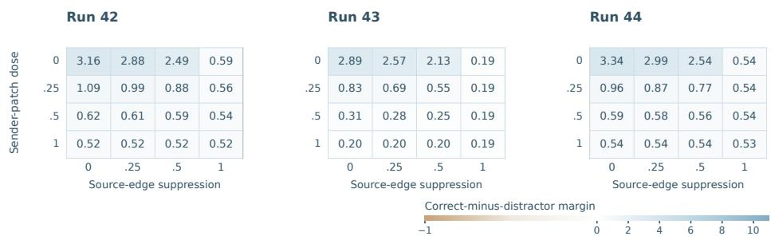  
Figure S2: Preparation and source access interact across intervention strengths. Correct-minusdistractor margins across sender-patch and source-edge doses in three GDN Baseline runs. Zero is clean and one is full intervention. Each condition uses 200 prompts.

## B.7 HEAD-LEVEL MATCHING AND COPYING

Copying holds an attention head’s pattern fixed and substitutes its distractor value at the source; its effect is the clean-minus-patched output margin. Figure S3 aligns source-attention mass, queryupdate Matching, and Copying at identical model, run, checkpoint, layer, and head coordinates. The dominant Matching and Copying heads coincide in the original hybrid receivers, GDN after early LR reduction, and Transformer. Heads with strong causal Matching also attend strongly to the historical source, linking these interventions to the conventional induction-head readout. Rankings among weaker heads vary. Transformer comparisons use a common receiver layer across runs, alongside each run’s full-network layer scan.

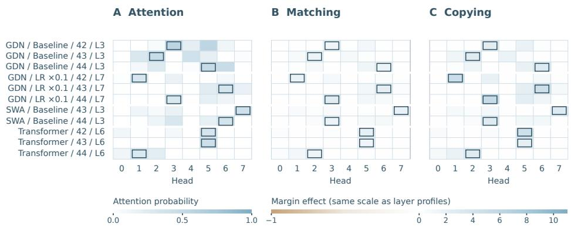  
Figure S3: Source attention, Matching, and Copying at matched heads. A shows attention probability; B/C show Matching and Copying in logit-margin units on the same scale as the layer profiles. Outlines mark row maxima. Labels give model, run, and layer. Each measurement uses 200 prompts. The matched-head measurements cover SWA seeds 43/44 and seeds 42/43/44 for the other conditions.

## C CARRYING CONDITIONS AND CIRCUIT ALLOCATION

## C.1 HYBRID OFFSET, TIMING, AND LAYOUT CONTROLS

GDN Convolution width 2 retains the current token and lag one; No convolution removes short convolution. Early lag-1 mask suppresses only its lag-one channel, while lag-2 mask supplies an offset comparison. Early LR reduction scales all parameters in the selected efficient blocks, including FFN and norms, by a learning-rate multiplier of 0.1 through 3K for GDN and 4K for SWA. All global receivers remain available as these interventions alter local access or learning in the supporting blocks.

The offset and timing controls test which changes to predecessor support alter circuit allocation. Early lag-two suppression and late lag-one suppression retain shallow circuits (Table S8); Figure S4 traces their development alongside the endpoint profiles in Figure 3.

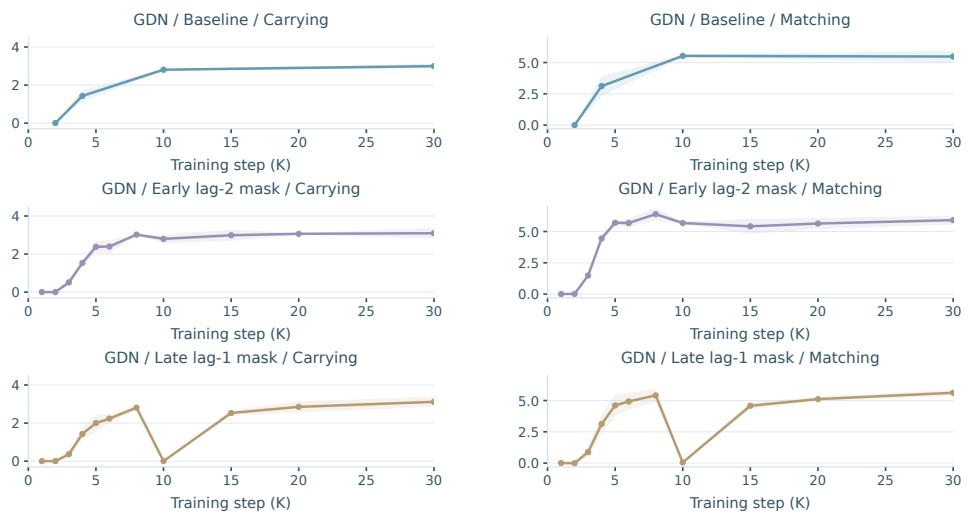  
Figure S4: Selective-intervention trajectories. Mean and sample SD at shared checkpoints for Baseline, early lag-2 mask, and late lag-1 mask.

Table S8: Offset and timing contrasts. Peak Carrying/Matching layers at 30K in run order 42/43/44; each probe condition uses 200 prompts.
<table><tr><td>Condition</td><td>Carrying layers</td><td>Matching layers</td></tr><tr><td>Baseline</td><td>L2 /L2 /L2</td><td>L3 /L3 /L3</td></tr><tr><td>Lag-1 masked early</td><td>L6 / L2 / L6</td><td>L7/L3/L7</td></tr><tr><td>Lag-2 masked early</td><td>L2 /L2 /L2</td><td>L3 /L3 /L3</td></tr><tr><td>Lag-1 masked late</td><td>L2 / L2 / L2</td><td>L3 /L3 / L3</td></tr></table>

Moving the global receivers. The shifted layout places full attention at L1 and L5 while retaining the remaining GDN layers. Source preparation and query selection now concentrate around the later available receiver (Figure S5). The available receivers and their upstream support jointly constrain the allocation.

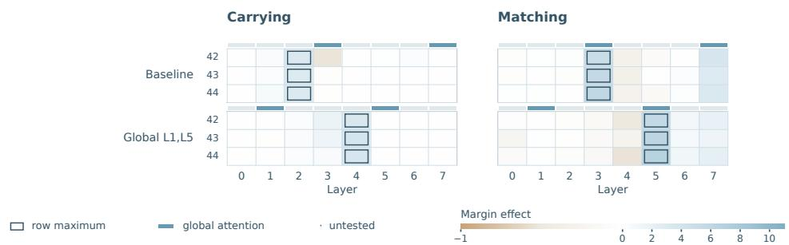  
Figure S5: The allocation follows a changed global layout. Full Carrying and query-update Matching layer profiles in the baseline and shifted-layout models. Outlines mark row maxima; rails mark full attention. Colors share the layer-profile scale of Figure 5. Each row is one training run; each probe condition uses 200 prompts.

The corresponding recall comparison treats global-layer order as an additional architectural control (Table S9). Moving the global sites preserves strong recall in several target-token groups, alongside the change in circuit allocation.

Table S9: Global-layer order as an architectural control. GDN full-attention sites are L3/L7 in Baseline and L1/L5 in the shifted layout. PPL at 30K is mean ± sample SD over three matched training runs, using 10,000 sequences per run. Columns match Table $2 ;$ lower values are bold.
<table><tr><td colspan="5">Single</td><td colspan="3">Multiple continuation</td><td rowspan="2">Identifier reuse</td></tr><tr><td>Model Variant</td><td></td><td>Overall</td><td>Far</td><td>Near</td><td>Mid</td><td></td><td>Far</td></tr><tr><td rowspan="2">GDN</td><td>Baseline</td><td> $4 0 . 1 7 \pm 2 . 0 0$ </td><td> $2 . 3 8 \pm 0 . 0 4$ </td><td> $2 . 7 5 \pm 0 . 3 9$ </td><td> $1 6 . 3 4 \pm 1 . 9 9$ </td><td> $2 5 . 9 8 \pm 1 . 2 3$ </td><td></td><td> $2 9 . 0 0 \pm 1 . 4 3$ </td></tr><tr><td>Global L1,L5</td><td> ${ \bf 3 8 . 0 8 \pm 1 . 2 8 }$ </td><td></td><td>2.26 ± 0.04 2.54 ± 0.01</td><td> ${ \bf 1 } 3 . 4 9 \pm { \bf 1 } . 5 5$ </td><td></td><td> $2 3 . 8 2 \pm 1 . 6 4$ </td><td> $2 3 . 5 4 \pm 2 . 9 3$ </td></tr></table>

## C.2 TRANSFORMER CONTROLS

Early learning-rate reduction. This Transformer comparison extends Section 3.2. The layoutmatched condition reduces LR at L0–2 and L4–6, the positions occupied by efficient layers in the hybrid comparison. Other conditions target the lower six layers, upper two layers, all eight layers, or six randomly selected layers. The resulting profiles show that changing early learning can also reorganize a homogeneous Transformer (Figure S6).

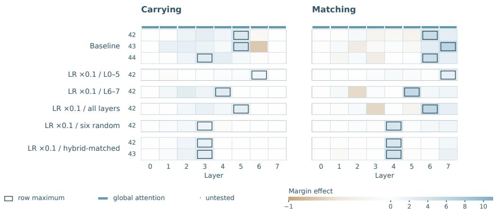  
Figure S6: Transformer LR reduction profiles. Carrying and query-update Matching use common L0–L7 coordinates. Rows retain all measured training seeds; outlines mark maxima and rails mark full attention. Carrying and Matching share the layer-profile color scale. “Layout-matched” reduces LR in the layers corresponding to the hybrid’s efficient sites.

The behavioral comparison pairs training seeds 42 and 43 between Baseline and the layout-matched condition (Table S10). A shift in the Transformer circuit accompanies worse overall perplexity, distant multiple-continuation recall, and identifier reuse. In the hybrid comparison, LR reduction shifts the route while lowering mean PPL on several recall conditions.

Table S10: Transformer LR reduction on matched training seeds. PPL uses the same 10,000- sequence evaluation per run; lower is better. Thick rules separate matched training runs, and bold marks the lower value in each pair.
<table><tr><td>Run</td><td>Variant</td><td>Overall</td><td>Multiple mid</td><td>Multiple far</td><td>Identifiers</td></tr><tr><td>42</td><td>Baseline</td><td>40.00</td><td>13.66</td><td>25.94</td><td>24.57</td></tr><tr><td></td><td>LR ×0.1</td><td>53.18</td><td>21.23</td><td>34.60</td><td>36.11</td></tr><tr><td>43</td><td>Baseline</td><td>42.93</td><td>16.39</td><td>25.53</td><td>25.45</td></tr><tr><td></td><td>LR ×0.1</td><td>49.04</td><td>17.45</td><td>32.60</td><td>33.60</td></tr></table>

Local-head constraints. The Transformer local-head constraint gives one head in selected layers access only to the current token and a specified predecessor offset. All other heads retain full causal attention, and training uses natural text. The persistent lag-one condition keeps this constraint throughout training and evaluation. Early constraints are removed after 3K steps, either in the lower six layers or throughout the network. An early lag-two constraint changes the supported offset. These schedules separate persistent local access from a temporary bias during formation.

The persistent previous-token constraint produces the strongest Carrying response in a shallow layer across runs (Table S11). Removing the constraint yields more variable Carrying locations, while the corresponding query response develops at intermediate layers. The early lag-two comparison also changes the allocation, showing that the schedule and form of the local constraint shape the resulting computation. The persistent condition’s final recall tradeoffs are shown in Table 2.

Table S11: Transformer source preparation under local attention constraints. The constrained head is head 0 (H0). Layer lists give peak Carrying in run order 42/43/44; the all-layer early condition uses run 42. Each probe condition evaluates 200 prompts.
<table><tr><td>Condition</td><td>Constrained layers</td><td>Active interval</td><td>Carrying layer</td></tr><tr><td>Baseline</td><td>None</td><td>None</td><td>L5 / L5 / L3</td></tr><tr><td>Lag-1 persistent</td><td>L0-L5</td><td>Train and evaluation</td><td>L2 /L2 /L2</td></tr><tr><td>Lag-1 early</td><td>L0-L5</td><td>First 3K steps</td><td>L2 /L4 /L3</td></tr><tr><td>Lag-1 all-layer early</td><td>L0-L7</td><td>First 3K steps</td><td>L2</td></tr><tr><td>Lag-2 early</td><td>L0-L5</td><td>First 3K steps</td><td>L3 /L4 /L3</td></tr></table>

## C.3 CIRCUIT ALLOCATION IN THE 318M HYBRID· · · 44

The 16-layer, approximately 318M GDN hybrid model extends the allocation comparison to four42 global stages. Full attention occupies L3/L7/L11/L15. The four efficient groups occupy L0–2, L4–6,44 L8–10, and L12–14. Figures and tables name the physical layers affected by each intervention,LR ×0.1: L4–6,12–14 43 together with its LR multiplier or convolution change. The default early-LR window is 0–3K.Conv removed: L12–14 / 5K 42 · · · ·

Figure S7 shows that reducing early LR in different groups can favor early, intermediate, or late routes.LR ×0.1: L12–14 42 · · · · LR reduction in nonadjacent groups produces more variation across runs. The strongest Carrying and Matching can also occupy nonadjacent stages, consistent with the multi-stage dependence measuredLR ×0.3: L14 42 · · · · by source restoration.

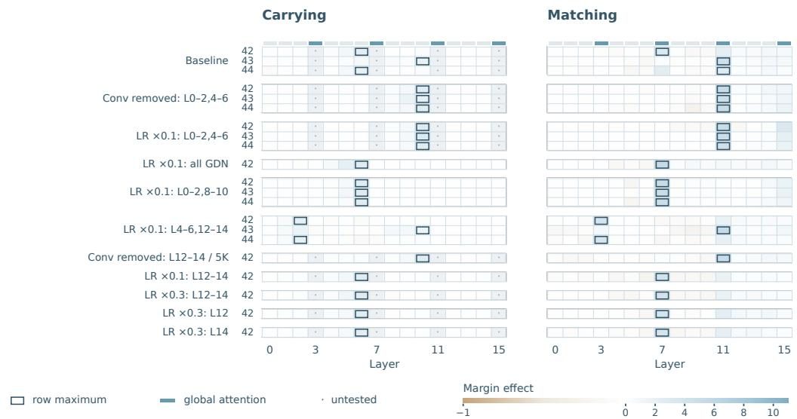  
Dropout: L0–2,4–6,12–14 42 · · · ·Figure S7: 318M allocation across all tested conditions. Carrying and query-update Matching · · · ·42retain all 47 model/run rows across the tested conditions, with aligned L0–L15 coordinates and a 44common signed scale. Outlines mark measured maxima, dots mark untested coordinates, and the upper rail marks global attention. Labels specify group, LR multiplier, and duration; unspecified LR ×0.1: L4–6,8–10 4344group LR reduction uses a 0.1 multiplier for the first 3K steps.

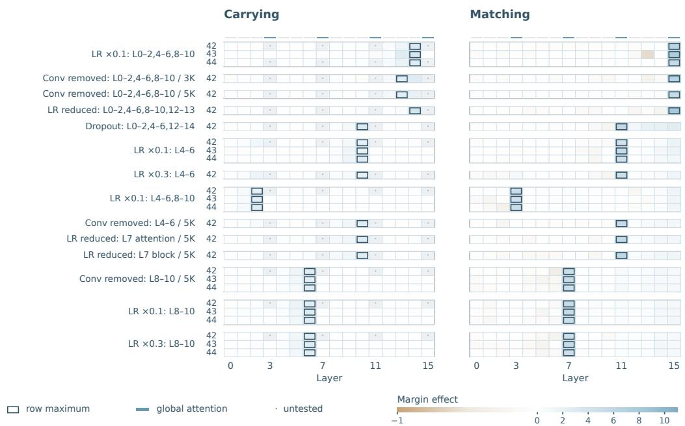  
· · · ·42Figure S7 (continued): The remaining 318M conditions, using the same layer coordinates and signed 44color scale. Column headings, layer ticks, and the legend are repeated for navigation.

## LR reduced: L7 block / 5K 42 · · · ·D PREDECESSOR SUPPORT AND CIRCUIT FORMATION

## 44D.1 CHECKPOINT SCHEDULE AND LAYER SELECTION

44The window comparison evaluates 1K–10K in 1K increments, then 15K/20K/30K. The architecture– · · · ·42data comparison evaluates .5K, 1K, 1.5K, 2K, 2.5K, 3K, 4K, 5K, 8K, 10K, 15K, 20K, and 30K. 44Every condition has three runs, with Carrying and query-update Matching measured at all eight Layer Layerlayers. SWA window 2/8/16 Matching uses the historical-key-exchange query-update intervention throughout. Each probe condition uses 200 prompts.

−1 0 2 4 6 8 10The main curves hold each run’s endpoint-selected layer fixed throughout training. Fixed-coordinate curves instead compare Carrying at L2 and Matching at L3 across architectures, with additional Transformer receivers showing its later query response (Figure S8). Hybrid responses develop earlier at these shared sites. Both readouts depend on the current downstream computation and track functional formation. The fixed-site and endpoint-selected views compare common coordinates and each run’s eventual circuit; all-layer plots show where responses emerge.

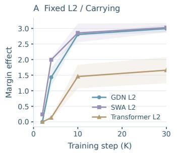

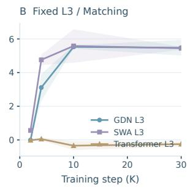

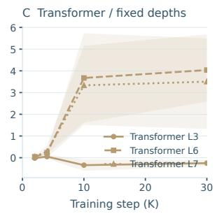  
Figure S8: Formation at fixed physical layers. Carrying at L2 and query-update Matching at L3 compare the same sites across architectures; the right panel follows additional Transformer receiver layers. Lines and bands show means and sample SD across three runs. Layer coordinates remain fixed through training, with 200 prompts per probe condition.

## D.2 TRAINING-DATA CONTROLS AND LAYERWISE TRAJECTORIES

Figure S9 compares replicated Carrying trajectories under induction-enriched text (Appendix A.2),GDN / Enriched natural text, and separately trained random-retention controls. Enrichment advances the Transformer trajectory; hybrid natural/enriched trajectories rise in a similar early interval. These comparisons7 7 relate training evidence for the predecessor relation to the architectural support supplied by efficient layers.

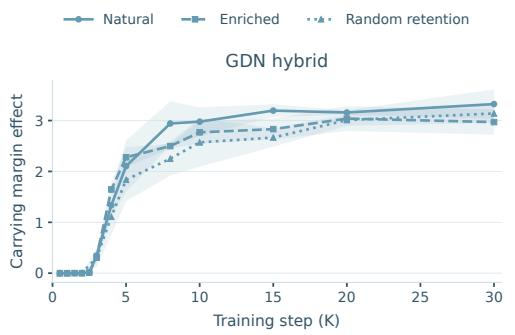

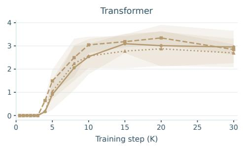

Figure S9: Formation under different training streams. Means and sample SD over three runs for7 7 natural, induction-enriched, and random-retention text. Each series retains its evaluated checkpoints.0.5 1.5 2.5 4 8 15 30 0.5 1.5 2.5 4 8 15 30  
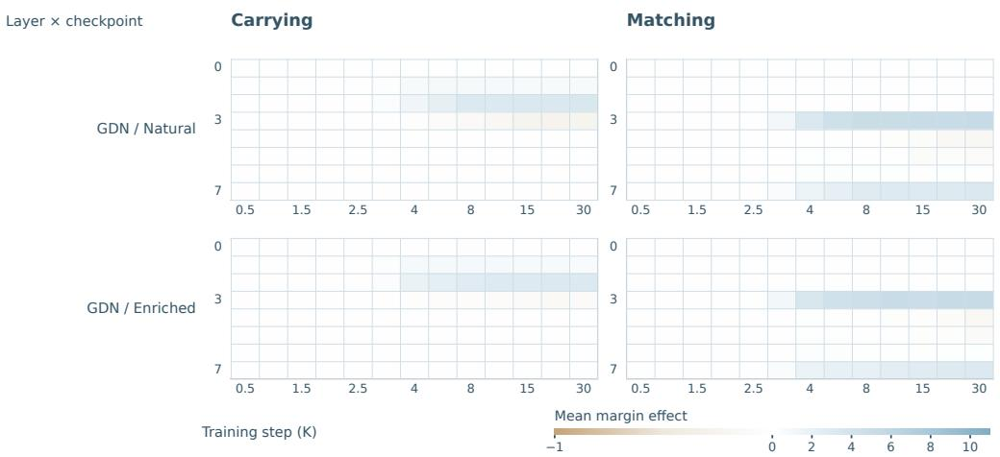

Transformer / NaturalFigure S10: Layerwise circuit formation. GDN natural/enriched training: all eight layers and 130 0 measured checkpoints are retained. Colors show three-run mean signed effects. Continued panels 7 7show Transformer and SWA windows using the same scale; SWA has a different checkpoint schedule.Window 2  
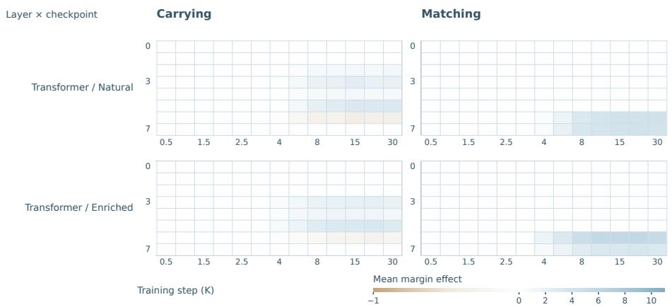  
Window 8Transformer / NaturalWindow 2Figure S10 (continued): Transformer with natural and induction-enriched training text. All layers and evaluated checkpoints are retained.

## D.3 SWA WINDOW SIZE: ONSET AND FINAL RESPONSESTransformer / NaturalWindow 2 3 3GDN / Enriched 3 3Transformer / Natural 3 3

For each threshold, onset is the first of two consecutive measured checkpoints at or above it; Table S12 gives the preceding interval. For Carrying, window 2 crosses thresholds 0.1, 0.25, 0.5 in (1, 2]K,0.5 1.5 2.5 4 8 15 30 0.5 1.5 2.5 4 8 15 301 3 5 7 9 15 30 1 3 5 7 9 15 300.5 1.5 2.5 4 8 15 30 0.5 1.5 2.5 4 8 15 307 77 7 ahead of windows 8/16 in (2, 3]K; all three converge at threshold 1. For Matching, windows 2 and 80 0 tie at thresholds 0.1/0.25, while window 2 leads both wider windows at 0.5/1. The convergence at the0 0 strictest threshold thus applies only to Carrying. At later checkpoints, wider windows develop larger3 33 3 Carrying responses, as the complete trajectories show (Figure S11).Transformer / EnrichedGDN / Enriched

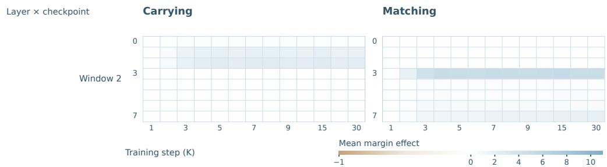

GDN / EnrichedWi dow 8Figure S10 (continued): SWA window 2: all layers and evaluated checkpoints, on the same signed3 3Window 2 3 33 3 scale.  
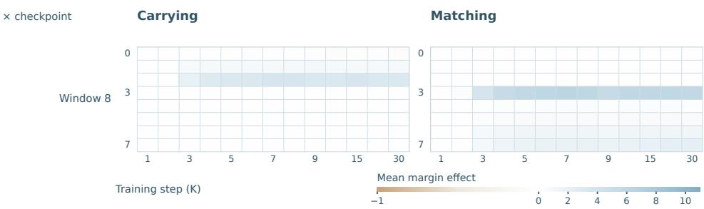

GDN / EnrichedWindow 16Figure S10 (continued): SWA window 8: all layers and evaluated checkpoints, on the same signed3 3 scale.  
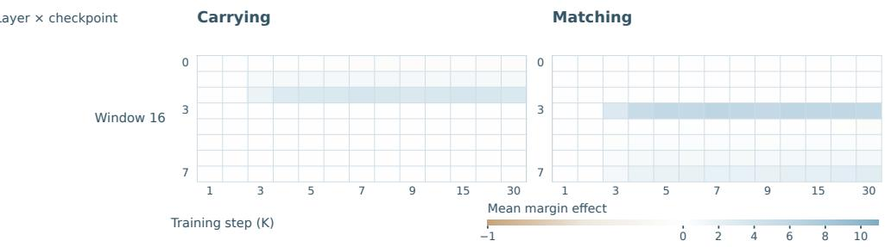  
Transformer / Enriched 3 3GDN / EnrichedFigure S10 (continued): SWA window 16: all layers and evaluated checkpoints, on the same signed scale.

1 3 5 7 9 15 30 1 3 5 7 9 15 307 7Table S12: Formation intervals across thresholds. Units: thousands of steps. A shared interval applies to all three runs; otherwise intervals follow run 0.5 1.5 2.5 4 8 order 42/43/44. Each trajectory follows its fixed endpoint-selected layer.
<table><tr><td>Condition</td><td>Readout</td><td>τ = .1</td><td>τ = .25</td><td>τ = .5</td><td>τ = 1</td></tr><tr><td>SWA window 2</td><td>Carrying</td><td>(1, 2]</td><td>(1, 2]</td><td>(1, 2]</td><td>(2,3]</td></tr><tr><td></td><td>Matching</td><td>(1, 2]</td><td>(1, 2]</td><td>(1, 2]</td><td>(1, 2]</td></tr><tr><td>SWA window 8</td><td>Carrying</td><td>(2, 3]</td><td>(2, 3]</td><td>(2, 3]</td><td>(2, 3]</td></tr><tr><td></td><td>Matching</td><td>(1, 2]</td><td>(1, 2]</td><td>(2, 3]</td><td>(2, 3]</td></tr><tr><td>SWA window 16</td><td>Carrying</td><td>(2, 3]</td><td>(2, 3]</td><td>(2, 3]</td><td>(2, 3]</td></tr><tr><td></td><td>Matching</td><td>(2, 3]</td><td>(2, 3]</td><td>(2, 3]</td><td></td></tr><tr><td></td><td></td><td>(2.5, 3]</td><td></td><td></td><td>(2, 3]</td></tr><tr><td>GDN / Natural</td><td>Carrying</td><td></td><td>(3, 4]; (2.5, 3]; (2.5, 3]</td><td>(3, 4]</td><td>(3, 4]</td></tr><tr><td></td><td>Matching</td><td>(2.5, 3]; (2, 2.5]; (2, 2.5]</td><td>(2.5, 3]</td><td>(3, 4]; (2.5, 3]; (2.5, 3]</td><td>(3, 4]; (2.5, 3]; (2.5, 3]</td></tr><tr><td>GDN / Enriched</td><td>Carrying</td><td>(2.5, 3]</td><td>(2.5, 3]</td><td>(3, 4]</td><td>(3, 4]</td></tr><tr><td></td><td></td><td>Matching (2.5, 3]; (2, 2.5]; (2, 2.5]</td><td>(2.5, 3]</td><td>(2.5,3]</td><td>(3, 4]; (2.5, 3]; (2.5, 3]</td></tr><tr><td>Transformer / Natural</td><td>Carrying</td><td>(3, 4]; (3, 4]; (4, 5]</td><td>(3, 4]; (4, 5]; (5, 8]</td><td>(4, 5]; (4, 5]; (5, 8]</td><td>(4, 5]; (4, 5]; (5, 8]</td></tr><tr><td></td><td>Matching</td><td>(3, 4]</td><td>(3, 4]</td><td>(3, 4]; (3, 4]; (4, 5]</td><td>(4, 5]</td></tr><tr><td>Transformer / Enriched</td><td>1Carrying</td><td>(3,4]</td><td>(3, 4]</td><td>(3, 4]; (4, 5]; (3, 4]</td><td>(4, 5]</td></tr><tr><td></td><td>Matching</td><td>(3, 4]</td><td>(3, 4]</td><td>(3, 4]</td><td>(3, 4]; (4, 5]; (3, 4]</td></tr></table>

Local window / SWA hybrid Window 2 Window 8 Window 16

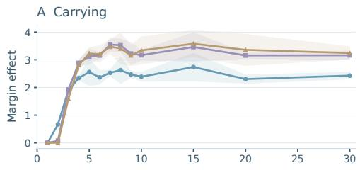  
Architecture and training evidence

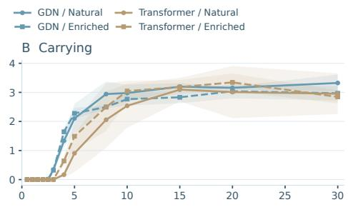

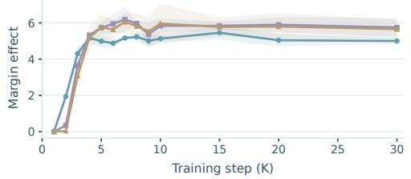

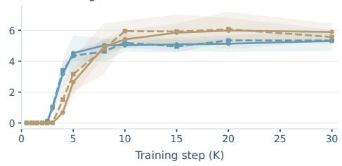  
Figure S11: Complete formation trajectories. All 13 measured checkpoints through 30K; bands show training-run sample SD.

## E CIRCUIT TESTS IN PRETRAINED QWEN MODELS

## E.1 MODEL CONFIGURATION AND CIRCUIT LOCALIZATION

Qwen3-4B is a 36-layer full-attention language model with 32 query heads and eight key/value heads. Qwen3.5-4B has a 32-layer language backbone with layout [GDN3, FullAttn]8, hidden width 2,560, and a short-convolution kernel of four. Its global-attention layers have 16 query heads and four key/value heads; its GDN layers use 16 QK heads and 32 value heads (Qwen Team, 2025; 2026b). Both are evaluated at their released checkpoints, with zero-based layer numbering.

Localization inputs and intervention sites. The fixed-token association scans use a fixed single-token key–value tuple per input condition and sampled background filler. Qwen3 uses token IDs 94723/91807/96498/97535 and a filler pool of 4,868 IDs; Qwen3.5 uses 199437/166039/217654/227991 and 32,816 filler IDs. Localization covers both models; Qwen3.5 supplies the restoration and dose experiments. Each condition uses 200 prompts.

The full-layer scans place Qwen3’s strongest Carrying and Matching in separated full-attention layers. In Qwen3.5, the strongest Carrying lies in a GDN layer immediately before the strongest global Matching, with secondary responses deeper in the model (Figure 5). The component experiments trace dependence from this main GDN source into the following global receiver.

Value transmission and grouped-query attention. Fixed-attention Copying concentrates in the same retrieval layers identified by Matching. Its head-level effects align with the key/value groups that carry the selected source: each key/value head serves four query heads. In the main retrieval layer, the dominant groups are Qwen3 KV H5 (Q H20–H23) and Qwen3.5 KV H3 (Q H12–H15). Localization and component restoration use separately sampled sets of 200 prompts each.

## E.2 PROMPT CALIBRATION AND SOURCE-KEY RESTORATION

Input calibration and clean solvability. The Qwen3.5 input constructor selects four distinct non-special vocabulary tokens with NumPy seed 42. Candidate token IDs lie in [120000, 246000); after removal of tokenizer space markers, the vocabulary strings must contain at least four ASCII alphabetic characters. A minimum-ID cutoff restricts the pool used for both keys/values and filler.

The restricted-token conditions are defined by this vocabulary-ID cutoff and string filter. The prompt generator’s distance parameter is sampled from 100–399 tokens.

Table S13 compares six input pools, each with 200 prompts. Each pool fixes its sampled key–value identities. Clean solvability uses the pairwise criterion $m _ { \mathrm { c l e a n } } > 0$ . Calibration and component experiments use separately sampled prompts.

Table S13: Clean-solvability calibration for Qwen3.5. Each input-pool condition evaluates 200 prompts. All sampled pools are shown, each with its own sampled key–value tuple.
<table><tr><td>Minimum token ID</td><td>Pool size</td><td>Mean clean margin</td><td> $m _ { \mathrm { c l e a n } } > 0$ </td></tr><tr><td>120,000</td><td>32,515</td><td>5.601</td><td>100.0%</td></tr><tr><td>150,000</td><td>32,513</td><td>-2.551</td><td>16.0%</td></tr><tr><td>180,000</td><td>25,461</td><td>2.089</td><td>71.0%</td></tr><tr><td>200,000</td><td>17,886</td><td>1.063</td><td>89.5%</td></tr><tr><td>220,000</td><td>10,149</td><td>2.501</td><td>100.0%</td></tr><tr><td>240,000</td><td>2,455</td><td>6.732</td><td>96.5%</td></tr></table>

Component restoration. The component experiment uses the minimum-ID-180000 pool (25,461 IDs), with token IDs 209267/186154/223584/231557. It perturbs the historical-value block update at GDN L18 and restores a clean component at full-attention L19. The intervention restores the clean receiver component tensor. Because the sender output patch changes one token immediately before this receiver, its change to the receiver’s pre-attention K is confined to the historical source position. Q and K are patched after their normalization and rotary transformation; V is patched at its projection output. Qwen3.5 full attention also has an output gate, distinct from the FFN gate: its doubled Q projection is split into query and gate channels. The gate tensor g of shape $( B , \breve { T } , H _ { q } d _ { h } )$ multiplies the concatenated attention result before output projection, $W _ { O } [ \mathrm { c o n c a t } ( P V ) \odot \sigma ( g ) ]$ . Gate restoration replaces g at this split; attention-output and FFN-output restoration replace the corresponding module outputs.

Source-K restoration recovers nearly all of the sender-patch loss, while Q, V, and gate restoration have little effect (Table S14). The same selective recovery holds within the subset whose clean margin is positive. That subset is selected before intervention and held fixed across all conditions. Source-key dependence therefore persists among prompts that the clean model solves by favoring the target over the distractor.

Table S14: Qwen3.5 L18→L19 component restoration. The parent sample has 200 paired prompts; the clean-positive subset contains 69% of that sample. Entries are archived means with 95% pairedprompt bootstrap intervals. The released clean-positive summary uses 2,000 bootstrap resamples. The same clean-positive prompts are used throughout all interventions.
<table><tr><td>Quantity</td><td>All prompts</td><td>Clean-positive subset</td><td></td></tr><tr><td>Clean margin</td><td>1.850 [1.453, 2.268]</td><td colspan="2">2.956 [2.490, 3.462]</td></tr><tr><td>Sender-patched margin</td><td>0.406 [0.114, 0.707]</td><td colspan="2">1.088 [0.719, 1.488]</td></tr><tr><td>K-restored margin</td><td>1.826 [1.423, 2.249]</td><td colspan="2">2.931 [2.457, 3.441]</td></tr><tr><td>Sender-patch loss</td><td>1.444 [1.270, 1.630]</td><td colspan="2">1.868 [1.655, 2.099]</td></tr><tr><td>K recovery</td><td>1.420 [1.252, 1.603]</td><td colspan="2">1.843 [1.639, 2.064]</td></tr><tr><td>Q recovery</td><td> $- 0 . 0 0 7 \left[ - 0 . 0 1 5 , - 0 . 0 0 1 \right]$ </td><td> $- 0 . 0 1 0 \left[ - 0 . 0 2 1 , - 0 . 0 0 1 \right]$ </td><td></td></tr><tr><td>V recovery</td><td> $- 0 . 0 0 9 \left[ - 0 . 0 1 8 , - 0 . 0 0 2 \right]$ </td><td>-0.015[-0.026, -0.004]</td><td></td></tr><tr><td>Gate recovery</td><td> $- 0 . 0 0 8 \left[ - 0 . 0 1 5 , - 0 . 0 0 1 \right]$ </td><td> $- 0 . 0 1 1 \left[ - 0 . 0 2 2 , - 0 . 0 0 2 \right]$ </td><td></td></tr><tr><td>Attention-output recovery</td><td>1.420 [1.249, 1.605]</td><td></td><td>1.840 [1.629, 2.066]</td></tr><tr><td>FFN-output recovery</td><td>0.028 [0.005, 0.052]</td><td></td><td> $0 . 0 3 3 \ : [ 0 . 0 0 0 , 0 . 0 6 7 ]$ </td></tr></table>

Perturbation-dose response. To follow the source dependence across perturbation strengths, we interpolate the historical-value sender update between clean and counterfactual states, $u _ { \alpha } =$ $( 1 - \alpha ) u _ { \mathrm { c l e a n } } + \alpha u _ { \mathrm { c f } }$ , then match its RMS to the clean update before insertion. Doses are interpolation coefficients $\alpha \in \{ 0 , . 2 5 , . 5 , . 7 5 , 1 \}$ before RMS matching; the resulting perturbation distance is $\lVert \widetilde { u } _ { \alpha } - u _ { \mathrm { c l e a n } } \rVert _ { 2 }$ . Every dose uses the same 200 prompts within an input condition. Receiver K and attention-output recovery are measured in the corresponding sender-perturbed run.

In the common-token condition, perturbed margins remain positive on almost every prompt, and K recovery grows with sender-patch strength (Figure S12). The restricted-token condition also shows graded recovery, with negative mean margins. Zero-dose effects remain near zero in both conditions.

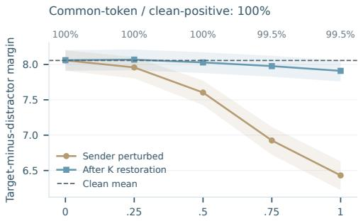

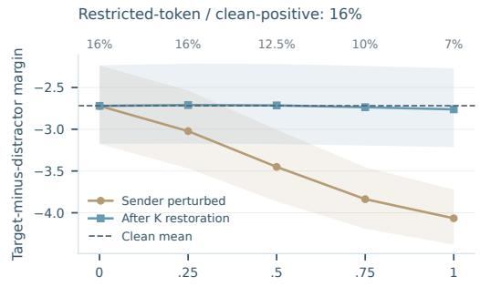

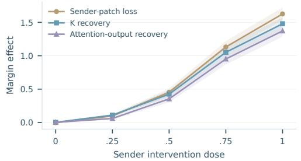

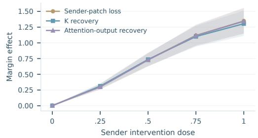  
Figure S12: Graded sender perturbation and receiver recovery in Qwen3.5. Each condition uses 200 paired prompts across all five doses. Top: perturbed margin and margin after clean K restoration, with a clean-margin reference. Bottom: sender-patch loss and K/attention-output recovery. Bands are 95% paired prompt-bootstrap intervals. Printed percentages give the fraction of perturbed prompts with positive margin.

## F NATURAL-TEXT EVALUATION AND RECEIVER CONTROLS

These evaluations connect changes in the conditions for Carrying to natural-text recall and test whether alternative receivers support the same historical-source pathway.

## F.1 NATURAL-TEXT EVALUATION PROTOCOL

Natural-text evaluation measures overall prediction, recall of earlier associations, and domain-specific reuse within the original input context. Target groups can overlap.

Sequences and scoring. Each checkpoint is evaluated on 10,000 sequences of 1,024 tokens: 2,000 Wiki, 4,000 Python code, and 4,000 Math. Python and Math each comprise two 2,000-sequence partitions. The same sequences and target-selection rules are used within each comparison; eight-layer and 318M results are reported separately. Effective token counts depend on the selected targets.

For a target $B = x _ { p } ,$ write its immediate predecessor as $A = x _ { p - 1 }$ . The evaluator examines the preceding 512-token history. A repeated association is a target whose pair $( A , B )$ has already appeared there. If u distinct tokens have followed A in that history, single-continuation recall has $u = 1$ and multiple-continuation recall has $u > 1$ . This separates retrieval with one observed continuation from contexts containing competing continuations.

Distance refers to the most recent historical predecessor: $d = p - p _ { A } - 1$ , where $p _ { A }$ is its position.   
Near, mid, and far use 1–20, 21–100, and 101–512 tokens. This axis is termed predecessor recency.

Table S15: A hierarchy of evaluation conditions. All rows use next-token NLL on selected positions. Domains and predecessor recency specify overlapping target selections.
<table><tr><td>Question</td><td>Target selection</td><td>Interpretation</td></tr><tr><td>Overall prediction</td><td>All valid targets</td><td>General language-modeling behavior.</td></tr><tr><td>Historical evidence</td><td>Unseen predecessor; unseen continua- tion pair; repeated association</td><td>Whether the local association is avail- able in the measured history.</td></tr><tr><td>Continuation ambiguity</td><td>Single or multiple historical continua- tions within repeated associations</td><td>Whether alternative continuations com- pete.</td></tr><tr><td>Predecessor recency</td><td>Near, mid, far within each continuation condition</td><td>How recently the predecessor was en- countered.</td></tr><tr><td>Concrete reuse</td><td>Python identifier reuse; Wiki entity repe- tition; Math symbol reuse</td><td>Domain-specific contexts in which stored associations can matter.</td></tr></table>

Domain slices and background controls. Long-range identifier reuse selects Python identifier reuse with predecessor distance above 100 tokens. Entity repetition and ambiguous symbol reuse provide Wiki and Math comparisons. Other code, math, and Wiki pattern slices are grouped by domain in the archived numerical profiles. An unseen predecessor has not occurred as a predecessor in the history; an unseen continuation pair has a known predecessor but a new $( A , B )$ pair. These background controls place recall changes alongside changes at other target positions.

Metric and aggregation. For the selected valid targets T in one evaluation condition, we compute

$$
\operatorname { P P L } ( \mathcal { T } ) = \exp \left[ \frac { 1 } { | \mathcal { T } | } \sum _ { p \in \mathcal { T } } - \log p _ { \theta } ( x _ { p } \mid x _ { < p } ) \right] .
$$

Training-run means and sample SD are computed from per-run PPL. Each comparison uses the same target selection. These evaluation groups differ from the paragraph-level training filter in Appendix A.2.

## F.2 RECALL UNDER CARRYING INTERVENTIONS

318M recall outcomes. Across the nine replicated interventions in Table S16, mean distant multiplecontinuation PPL is 2.8–16.1% higher than Baseline, and identifier-reuse PPL is 11.1–39.0% higher. These are descriptive ratios of three-run means; Table S16 reports the mean and sample standard deviation for every condition. Other targets vary: LR ×0.1 in L8–10 gives single-continuation far PPL $2 . 4 7 \pm 0 . 0 6 .$ , versus $2 . 5 8 \pm 0 . 1 0$ for Baseline.

Table S16: Final PPL across 318M circuit allocations. PPL at 30K; lower is better. Entries show mean ± sample SD over seeds 42/43/44. LR changes apply during the first 3K steps; the L8–10 convolution change applies during the first 5K. PPL uses 10,000 sequences per run (2,000 Wiki, 4,000 Python code, 4,000 Math). Layers use zero-based indices (Appendix C.3).
<table><tr><td>Variant</td><td>Layers</td><td>Overall</td><td></td><td></td><td>Single far Multiple mid Multiple far</td><td>Identifiers</td><td>Entities</td></tr><tr><td>Baseline</td><td>All</td><td> $4 1 . 5 5 \pm 0 . 7 1$ </td><td> $2 . 5 8 \pm 0 . 1 0$ </td><td> $1 4 . 0 0 \pm 0 . 9 7$ </td><td> $2 1 . 9 7 \pm 1 . 1 1$ </td><td> $2 1 . 1 7 \pm 3 . 0 8$ </td><td> $2 6 . 7 4 \pm 0 . 3 5$ </td></tr><tr><td>Conv removed</td><td> $^ { 0 - 2 , 4 - 6 }$ </td><td> $4 1 . 4 0 \pm 1 . 7 8$ </td><td> $2 . 5 5 \pm 0 . 0 7$ </td><td> $1 4 . 4 7 \pm 1 . 1 9$ </td><td> $2 3 . 0 7 \pm 0 . 8 9$ </td><td> $2 6 . 4 5 \pm 2 . 5 1$ </td><td> $2 6 . 1 7 \pm 0 . 9 6$ </td></tr><tr><td>LR ×0.1</td><td> $^ { 0 - 2 , 4 - 6 }$ </td><td> $4 2 . 9 8 \pm 0 . 3 6$ </td><td> $2 . 6 1 \pm 0 . 1 2$ </td><td> $1 5 . 2 3 \pm 1 . 0 5$ </td><td> $2 4 . 6 3 \pm 1 . 9 4$ </td><td> $2 8 . 3 0 \pm 4 . 3 9$ </td><td> $2 7 . 3 1 \pm 1 . 3 9$ </td></tr><tr><td>LR ×0.1</td><td> $^ { 0 - 2 , 8 - 1 0 }$ </td><td> $4 2 . 2 8 \pm 1 . 8 2$ </td><td> $2 . 5 7 \pm 0 . 0 4$ </td><td> $1 5 . 3 4 \pm 1 . 3 8$ </td><td> $2 4 . 8 0 \pm 0 . 4 1$ </td><td> $2 9 . 4 3 \pm 1 . 1 9$ </td><td> $2 8 . 0 0 \pm 0 . 6 2$ </td></tr><tr><td>LR ×0.1</td><td> $^ { 4 - 6 , 1 2 - 1 4 }$ </td><td> $4 0 . 8 5 \pm 1 . 1 6$ </td><td> $2 . 6 0 \pm 0 . 1 6$ </td><td> $1 4 . 1 8 \pm 0 . 7 4$ </td><td> $2 3 . 2 2 \pm 0 . 7 0$ </td><td> $2 6 . 1 4 \pm 1 . 2 1$ </td><td> $2 6 . 1 7 \pm 1 . 5 7$ </td></tr><tr><td>LR ×0.1</td><td> $_ { 0 - 2 , 4 - 6 , 8 - 1 0 }$ </td><td> $4 3 . 7 0 \pm 0 . 3 1$ </td><td> $2 . 9 0 \pm 0 . 0 9$ </td><td> $1 4 . 3 1 \pm 0 . 6 2$ </td><td> $2 5 . 5 0 \pm 1 . 3 2$ </td><td> $2 8 . 8 2 \pm 3 . 6 0$ </td><td> $3 0 . 7 9 \pm 0 . 8 1$ </td></tr><tr><td>LR ×0.1</td><td>4-6</td><td> $4 0 . 9 1 \pm 0 . 8 2$ </td><td> $2 . 5 5 \pm 0 . 0 4$ </td><td> $1 3 . 8 4 \pm 0 . 9 4$ </td><td> $2 3 . 0 6 \pm 1 . 1 7$ </td><td> $2 5 . 4 8 \pm 3 . 6 1$ </td><td> $2 6 . 2 8 \pm 0 . 7 7$ </td></tr><tr><td>LR ×0.1</td><td> $^ { 4 - 6 , 8 - 1 0 }$ </td><td> $4 2 . 1 1 \pm 1 . 3 8$ </td><td> $2 . 7 3 \pm 0 . 1 3$ </td><td> $1 4 . 9 3 \pm 1 . 5 4$ </td><td> $2 4 . 9 2 \pm 1 . 7 0$ </td><td> $2 7 . 8 0 \pm 4 . 1 5$ </td><td> $2 8 . 7 3 \pm 1 . 5 7$ </td></tr><tr><td>LR ×0.1</td><td>8-10</td><td> $4 1 . 3 9 \pm 1 . 0 5$ </td><td> $2 . 4 7 \pm 0 . 0 6$ </td><td> $1 4 . 1 9 \pm 0 . 9 0$ </td><td> $2 2 . 5 9 \pm 0 . 7 4$ </td><td> $2 3 . 5 1 \pm 2 . 6 2$ </td><td> $2 5 . 8 8 \pm 1 . 4 5$ </td></tr><tr><td>Conv removed (5K) 8–10</td><td></td><td> $4 1 . 6 2 \pm 0 . 7 5$ </td><td> $2 . 5 9 \pm 0 . 0 3$ </td><td> $1 4 . 3 0 \pm 1 . 5 4$ </td><td> $2 3 . 1 3 \pm 2 . 3 4$ </td><td> $2 6 . 1 4 \pm 8 . 7 7$ </td><td> $2 7 . 0 4 \pm 0 . 6 6$ </td></tr></table>

Relating recall to circuit location. Baseline peak Matching occurs at L7/L11/L11 in seed order 42/43/44 (Figure S7). LR reduction in L4–6/L8–10 gives L3 in all runs; reduction in L0–2/L4–6/L8– 10 gives L15. Both have higher mean distant multiple-continuation and identifier PPL. Peak Matching effects are $3 . 4 8 \pm 0 . 9 2$ for Baseline; intervention means range from $4 . 3 1 \pm 0 . 9 3$ to $6 . 3 2 \pm 0 . 9 6$ (three-seed mean ± sample SD). These logit-margin effects measure sensitivity to the synthetic association exchange. The interventions therefore change circuit allocation and recall, while larger peak Matching effects coexist with worse mean distant-recall PPL. Training interventions alter local processing and optimization together; source-key dependence at both L7 and L11 in Baseline seed 44 motivates studying cooperation across receivers (Appendix B.5; Section 5).

Eight-layer comparisons. Table S17 extends Table 2 with predecessor-recency comparisons (A), background prediction, and domain-specific reuse (B). Hybrid LR reduction lowers several multiplecontinuation and identifier-reuse PPLs but raises single-continuation far and entity-repetition PPLs. Wider SWA windows have lower distant multiple-continuation PPL despite later formation.  
Table S17: Recall and prediction context across model families. Mean ± sample SD of PPL at 30K. Groups and shared rows follow Table 2: Transformer Baseline/LR uses seeds 42/43; other rows use 42/43/44. A (below) crosses continuation ambiguity with predecessor recency. B adds unseen-history controls (new predecessor/pair), entity repetition, and ambiguous symbol reuse. Bold marks each column’s minimum within a model-family block.
<table><tr><td></td><td></td><td colspan="3">Single continuation</td><td colspan="3">Multiple continuation</td><td>Identifier</td></tr><tr><td>Model</td><td>Variant</td><td>Near</td><td>Mid</td><td>Far</td><td>Near</td><td>Mid</td><td>Far</td><td>reuse</td></tr><tr><td>SWA</td><td>SWA 2</td><td> $3 . 5 3 \pm 0 . 4 9$ </td><td> $2 . 9 9 \pm 0 . 3 5$ </td><td> $2 . 2 6 \pm 0 . 0 5$ </td><td> $2 . 8 5 \pm 0 . 3 6$ </td><td> $1 4 . 9 7 \pm 0 . 6 0$ </td><td> $2 8 . 9 9 \pm 0 . 4 3$ </td><td> $2 8 . 0 5 \pm 2 . 2 1$ </td></tr><tr><td></td><td>SWA4</td><td> $4 . 6 1 \pm 0 . 3 4$ </td><td> $3 . 6 9 \pm 0 . 2 9$ </td><td> $2 . 3 3 \pm 0 . 0 6$ </td><td> $2 . 8 6 \pm 0 . 2 2$ </td><td> $1 5 . 5 2 \pm 1 . 0 9$ </td><td> $2 6 . 6 1 \pm 1 . 1 8$ </td><td> $2 8 . 3 1 \pm 3 . 9 7$ </td></tr><tr><td></td><td>SWA4 LR  $\times 0 . 1$ </td><td> ${ \bf 3 . 3 3 \pm 0 . 6 9 }$ </td><td> $\mathbf { 2 . 8 2 \pm 0 . 5 2 }$ </td><td> $2 . 6 4 \pm 0 . 0 6$ </td><td> $\mathbf { 2 . 6 8 \pm 0 . 2 5 }$ </td><td> ${ \bf 1 2 . 9 4 \pm 1 . 7 0 }$ </td><td> $2 5 . 6 3 \pm 0 . 8 7$ </td><td> $2 3 . 4 9 \pm 2 . 1 2$ </td></tr><tr><td></td><td>SWA8</td><td> $4 . 0 5 \pm 0 . 1 8$ </td><td> $3 . 3 1 \pm 0 . 1 5$ </td><td> $\mathbf { 2 . 2 5 \pm 0 . 0 7 }$ </td><td> $2 . 7 8 \pm 0 . 1 5$ </td><td> $1 4 . 0 0 \pm 0 . 9 4$ </td><td> $2 4 . 1 9 \pm 0 . 9 6$ </td><td> $2 3 . 5 4 \pm 2 . 8 6$ </td></tr><tr><td></td><td>SWA 16</td><td> $4 . 8 0 \pm 0 . 2 5$ </td><td> $3 . 8 4 \pm 0 . 2 3$ </td><td> $2 . 2 6 \pm 0 . 0 7$ </td><td> $3 . 1 3 \pm 0 . 3 4$ </td><td> $1 4 . 3 1 \pm 2 . 0 2$ </td><td> $2 2 . 4 0 \pm 2 . 5 5$ </td><td> ${ \bf 2 0 . 9 1 \pm 6 . 7 6 }$ </td></tr><tr><td>GDN</td><td>Baseline</td><td> $5 . 1 7 \pm 1 . 7 1$ </td><td> $4 . 3 3 \pm 1 . 0 6$ </td><td> $\mathbf { 2 . 3 8 \pm 0 . 0 4 }$ </td><td> $2 . 7 5 \pm 0 . 3 9$ </td><td> $1 6 . 3 4 \pm 1 . 9 9$ </td><td> $2 5 . 9 8 \pm 1 . 2 3$ </td><td> $2 9 . 0 0 \pm 1 . 4 3$ </td></tr><tr><td></td><td>LR ×0.1</td><td> ${ \bf 3 . 8 9 \pm 0 . 7 4 }$ </td><td> ${ \bf 3 . 2 9 \pm 0 . 6 2 }$ </td><td> $2 . 5 9 \pm 0 . 0 5$ </td><td> $\mathbf { } 2 . 6 4 \pm \mathbf { 0 . 2 7 }$ </td><td> $1 2 . 5 2 \pm 0 . 9 3$ </td><td> $2 3 . 3 5 \pm 0 . 3 4$ </td><td> $2 1 . 0 2 \pm 1 . 6 0$ </td></tr><tr><td></td><td>Conv removed</td><td> $4 . 0 1 \pm 0 . 7 6$ </td><td> $3 . 6 1 \pm 0 . 6 2$ </td><td> $2 . 7 0 \pm 0 . 0 5$ </td><td> $2 . 8 3 \pm 0 . 7 3$ </td><td> ${ \bf 1 2 . 5 0 \pm 0 . 2 8 }$ </td><td> ${ \bf 2 1 . 7 5 \pm 1 . 9 9 }$ </td><td> ${ \bf 1 8 . 7 2 \pm 4 . 5 7 }$ </td></tr><tr><td></td><td>Conv width 2</td><td> $6 . 3 5 \pm 2 . 4 7$ </td><td> $4 . 7 5 \pm 1 . 3 8$ </td><td> $\mathbf { 2 . 3 8 \pm 0 . 0 3 }$ </td><td> $2 . 8 8 \pm 0 . 2 7$ </td><td> $1 8 . 2 2 \pm 2 . 4 4$ </td><td> $2 7 . 1 5 \pm 1 . 5 7$ </td><td> $2 8 . 6 9 \pm 4 . 0 5$ </td></tr><tr><td>Transformer Baseline</td><td></td><td> ${ \bf 4 . 0 8 \pm 1 . 2 8 }$ </td><td> ${ \bf 3 . 9 6 \pm 1 . 7 3 }$ </td><td> $2 . 6 6 \pm 0 . 0 4$ </td><td> ${ \bf 2 . 5 9 \pm 0 . 1 4 }$ </td><td> $1 5 . 0 3 \pm 1 . 9 3$ </td><td> $2 5 . 7 3 \pm 0 . 2 9$ </td><td> $2 5 . 0 1 \pm 0 . 6 2$ </td></tr><tr><td></td><td>LR ×0.1</td><td> $6 . 6 2 \pm 1 . 6 6$ </td><td> $5 . 2 0 \pm 1 . 4 4$ </td><td> $3 . 3 3 \pm 0 . 0 4$ </td><td> $3 . 2 4 \pm 0 . 1 4$ </td><td> $1 9 . 3 4 \pm 2 . 6 7$ </td><td> $3 3 . 6 0 \pm 1 . 4 1$ </td><td> $3 4 . 8 6 \pm 1 . 7 7$ </td></tr><tr><td></td><td>Local-head baseline</td><td> $4 . 7 1 \pm 1 . 2 5$ </td><td> $4 . 1 8 \pm 1 . 2 6$ </td><td> $2 . 6 2 \pm 0 . 0 5$ </td><td> $3 . 2 6 \pm 1 . 1 0$ </td><td> ${ \bf 1 4 . 6 7 \pm 1 . 8 1 }$ </td><td> $2 4 . 9 5 \pm 2 . 3 7$ </td><td> ${ \pm 3 . 2 3 \pm 6 . 4 6 }$ </td></tr><tr><td></td><td>Local head</td><td> $6 . 0 9 \pm 1 . 3 6$ </td><td> $4 . 8 1 \pm 0 . 8 7$ </td><td> $\mathbf { 2 . 5 1 \pm 0 . 0 6 }$ </td><td> $3 . 3 1 \pm 0 . 6 6$ </td><td> $1 7 . 4 6 \pm 1 . 7 6$ </td><td> $2 7 . 0 9 \pm 2 . 1 9$ </td><td> $2 7 . 5 9 \pm 5 . 9 2$ </td></tr></table>

Table S17: Recall and prediction context across model families (continued). B: overall prediction, unseen-history controls, entity repetition, and ambiguous symbol reuse. Groups and seeds are the same as in panel A.
<table><tr><td>Model</td><td>Variant</td><td>Overall</td><td>New predecessor</td><td>New pair</td><td>Entities</td><td>Symbols</td></tr><tr><td>SWA</td><td>SWA 2</td><td> $4 1 . 5 4 \pm 1 . 2 7$ </td><td> $8 7 . 3 8 \pm 0 . 9 6$ </td><td> $4 1 7 . 8 0 \pm \ : 7 . 2 9$ </td><td> $2 7 . 0 1 \pm 1 . 0 2$ </td><td> $9 . 5 1 \pm 0 . 4 6$ </td></tr><tr><td></td><td>SWA4</td><td> $4 1 . 9 8 \pm 0 . 4 9$ </td><td> $8 5 . 9 4 \pm 1 . 0 3$ </td><td> $4 0 8 . 9 1 \pm \ : 4 . 5 9$ </td><td> $2 6 . 7 2 \pm 1 . 5 1$ </td><td> $8 . 6 5 \pm 0 . 2 7$ </td></tr><tr><td></td><td> $\mathrm { S W A } 4 \mathrm { L R } \times \mathrm { 0 . 1 }$ </td><td> $4 0 . 5 4 \pm 1 . 5 0$ </td><td> $8 7 . 8 5 \pm 0 . 7 1$ </td><td> $4 2 1 . 9 8 \pm \ : 3 . 4 0$ </td><td> $3 5 . 3 9 \pm 1 . 5 6$ </td><td> ${ \bf 8 . 2 5 \pm 0 . 1 0 }$ </td></tr><tr><td></td><td>SWA8</td><td> ${ \bf 3 9 . 4 7 \pm 0 . 5 9 }$ </td><td> $8 1 . 9 6 \pm 0 . 9 9$ </td><td> $3 8 4 . 6 5 \pm \ : 3 . 2 4$ </td><td> $2 5 . 3 2 \pm 0 . 9 8$ </td><td> $8 . 5 6 \pm 0 . 1 7$ </td></tr><tr><td></td><td>SWA 16</td><td> $3 9 . 9 5 \pm 0 . 8 6$ </td><td> ${ \bf 8 0 . 1 2 \pm 1 . 4 4 }$ </td><td> $3 7 2 . 4 4 \pm 1 3 . 2 5$ </td><td> ${ \pm 5 . 0 0 \pm 1 . 2 5 }$ </td><td> $8 . 3 0 \pm 0 . 0 3$ </td></tr><tr><td>GDN</td><td>Baseline</td><td> $4 0 . 1 7 \pm 2 . 0 0$ </td><td> $7 8 . 3 7 \pm 0 . 5 8$ </td><td> $3 7 3 . 1 5 \pm \ : 8 . 9 9$ </td><td> ${ \bf 2 6 . 8 2 \pm 0 . 8 5 }$ </td><td> $8 . 3 2 \pm 0 . 3 2$ </td></tr><tr><td></td><td>LR ×0.1</td><td> $3 8 . 8 6 \pm 1 . 3 7$ </td><td> $8 1 . 9 2 \pm 1 . 1 3$ </td><td> $3 8 6 . 1 9 \pm \ : 6 . 3 7$ </td><td> $3 3 . 3 1 \pm 0 . 9 6$ </td><td> $7 . 9 7 \pm 0 . 1 2$ </td></tr><tr><td></td><td>Conv removed</td><td> ${ \bf 3 8 . 6 9 \pm 1 . 2 6 }$ </td><td> $8 1 . 9 2 \pm 1 . 1 8$ </td><td> $\mathbf { 3 6 3 . 9 1 \pm 1 3 . 6 8 }$ </td><td> $2 7 . 8 1 \pm 0 . 6 6$ </td><td> ${ \bf 7 . 6 2 \pm 0 . 2 9 }$ </td></tr><tr><td></td><td>Conv width 2</td><td> $4 1 . 3 0 \pm 2 . 1 6$ </td><td> $7 7 . 5 7 \pm 0 . 4 2$ </td><td> $3 7 4 . 9 9 \pm \ : 6 . 7 6$ </td><td> $2 9 . 0 3 \pm 0 . 4 9$ </td><td> $8 . 8 7 \pm 0 . 1 3$ </td></tr><tr><td></td><td>Early lag-1 mask</td><td> $4 1 . 0 4 \pm 1 . 3 1$ </td><td> $8 0 . 3 5 \pm 1 . 4 0$ </td><td> $3 7 9 . 1 0 \pm \ : 8 . 5 9$ </td><td> $2 8 . 5 9 \pm 1 . 8 4$ </td><td> $7 . 9 6 \pm 0 . 2 0$ </td></tr><tr><td>Transformer Baseline</td><td></td><td> ${ \bf 4 1 . 4 7 \pm 2 . 0 7 }$ </td><td> $8 7 . 1 9 \pm 1 . 3 2$ </td><td> $4 0 9 . 6 4 \pm \ : \ : 0 . 8 4$ </td><td> $3 3 . 6 7 \pm 0 . 4 7$ </td><td> $8 . 4 3 \pm 0 . 5 0$ </td></tr><tr><td></td><td> $\mathrm { L R } \times 0 . 1$ </td><td> $5 1 . 1 1 \pm 2 . 9 3 $ </td><td> $1 0 4 . 5 4 \pm 1 . 7 1 $ </td><td> $4 7 5 . 0 1 \pm 1 2 . 0 6$ </td><td> $4 5 . 3 6 \pm 0 . 6 2$ </td><td> $9 . 7 0 \pm 0 . 0 6$ </td></tr><tr><td></td><td>Local-head baseline</td><td> $4 2 . 5 8 \pm 2 . 0 8$ </td><td> $8 6 . 6 7 \pm 0 . 8 3$ </td><td> $4 0 2 . 1 3 \pm 1 3 . 6 0$ </td><td> $3 3 . 3 6 \pm 1 . 6 2$ </td><td> ${ \bf 8 . 3 3 \pm 0 . 2 7 }$ </td></tr><tr><td></td><td>Local head</td><td> $4 3 . 1 6 \pm 1 . 6 6$ </td><td> ${ \bf 8 1 . 6 1 \pm 0 . 5 3 }$ </td><td> ${ \bf 3 8 8 . 2 9 \pm 1 2 . 6 3 }$ </td><td> ${ \bf 3 2 . 9 6 \pm 0 . 9 7 }$ </td><td> $8 . 8 8 \pm 0 . 2 3$ </td></tr></table>

## F.3 RETRIEVAL-HEAD ABLATIONS ON NATURAL TEXT

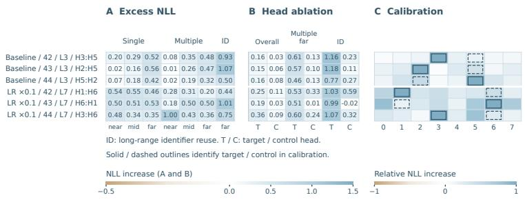  
Figure S13: Natural-text effects of matched retrieval heads. A: target-minus-control NLL increase. B: target and control NLL increases. C: all-head effects normalized by each row’s largest absolute effect. Rows identify model, run, layer, and head pairs; outlines mark target and control heads. Each condition uses 200 sequences.

Head ablation measures $\Delta \mathrm { N L L } = \mathrm { N L L _ { o f f } - N L L _ { c l e a n } }$ within each target group. Figure S13 compares target and control heads, their difference, and all-head calibration. Selected heads contribute more strongly to overall prediction, distant multiple-continuation recall, and identifier reuse, and each ranks first in its layer for overall NLL damage. In run order 42/43/44, target/control pairs are H3/H5, H2/H5, H5/H2 for Baseline and H1/H6, H6/H1, H3/H6 for reduced LR. For Baseline seed 44, H5 is the query-update Matching maximum and H2 the source-attention maximum. These paired and layer-wide comparisons connect the measured retrieval roles to natural-text prediction.

## F.4 PURE GDN AND GDN–SWA

These controls compare historical-source preparation and retrieval across different receiver types. Pure GDN (GDN-only) uses GDN8. GDN–SWA uses $[ \mathrm { G D N ^ { 3 } , S W A _ { 1 6 } } ] ^ { 2 } \mathrm { ; }$ L3/L7 are local, window-16 receivers, with no full-attention layer anywhere. The GDN–FullAttn baseline has $[ \mathrm { G D N ^ { 3 } , F u l l A t t n } ] ^ { 2 }$ SWA-only $\mathrm { ( S W A _ { 4 } ^ { 8 } ) }$ supplies a bounded-receptive-field control. Table S18 reports the 30K endpoint measurements at training seed 42 under the same historical-source/query-update probes and naturaltext target definitions.

Table S18: Architectures with and without global attention. Carrying and query-update Matching are peak layer effects; Multiple far and Identifiers report distant multiple-continuation and long-range identifier-reuse PPL. One training run per architecture (seed 42). Dashes mark unmeasured naturaltext PPL entries for SWA-only.
<table><tr><td>Model</td><td>Carrying</td><td>Matching</td><td>Multiple far</td><td>Identifiers</td></tr><tr><td>GDN-FullAttn</td><td>2.60</td><td>4.99</td><td>24.79</td><td>27.35</td></tr><tr><td>Pure GDN</td><td>&lt; 0.02</td><td>0.37</td><td>66.37</td><td>119.23</td></tr><tr><td>GDN-SWA (16)</td><td>&lt; 0.02</td><td>0.36</td><td>63.41</td><td>114.04</td></tr><tr><td>SWA-only (4)</td><td>0.00</td><td>0.05</td><td></td><td></td></tr></table>

Pure GDN and GDN–SWA have weak historical Carrying and nonzero query-update responses, alongside higher distant-recall PPL than GDN–FullAttn (Table S18). SWA-only excludes the distant source from its receptive field.

Query-time recurrent retrieval. In GDN-only, transferring the query state changes the retrieved association under both easy and hard input conditions, while source-site transfer has no effect. This identifies association stored in the current recurrent state. Arora et al. (2025) likewise find laststate association storage in several state-space models, compared with historical-value storage in Transformers and Based. This contrasts query-state retrieval with the historical-source route in the main hybrid experiments (Section 5).

## F.5 GDN–DSA TRAINED FROM SCRATCH

We train GDN–DSA from random initialization for 30K steps (seed 42): eight layers, width 512, eight heads, and layout $[ \mathrm { G D N ^ { 3 } , D S A } ] ^ { 2 }$ . Receivers L3/L7 select the top 128 candidates across the causal context; GDN occupies L0–2/L4–6. GDN–FullAttn matches this layout and training budget.

Circuit allocation. Carrying peaks at GDN L2 and Matching at sparse receiver L7 (Table S19A).   
Local Carrying thus remains observable alongside sparse global Matching.

Table S19: GDN–DSA trained from scratch: circuit profiles and PPL. Both models: 30K, seed 42. A: Carrying and query-update Matching effects in margin units, 200 prompts per condition. B: PPL on 10,000 shared sequences (Appendix F.1). DSA has lower overall and identifier PPL; full attention has lower distant-recall PPL.  
A. GDN–DSA layer profiles
<table><tr><td>Probe</td><td>L0</td><td>L1</td><td>L2</td><td>L3</td><td>L4</td><td>L5</td><td>L6</td><td>L7</td></tr><tr><td>Carrying</td><td>-0.001</td><td>0.021</td><td>1.696</td><td>-0.138</td><td>0.078</td><td>0.276</td><td>0.920</td><td>0.000</td></tr><tr><td>Matching</td><td>-0.044</td><td>0.114</td><td>-0.035</td><td>2.087</td><td>-0.152</td><td>0.101</td><td>0.258</td><td>3.109</td></tr></table>

B. Natural-text prediction
<table><tr><td>Model</td><td>Overall</td><td>Single far</td><td>Multiple far</td><td>Identifiers</td></tr><tr><td>GDN-FullAttn</td><td>38.21</td><td>2.35</td><td>24.79</td><td>27.35</td></tr><tr><td>GDN-DSA</td><td>31.09</td><td>3.08</td><td>27.42</td><td>24.45</td></tr></table>