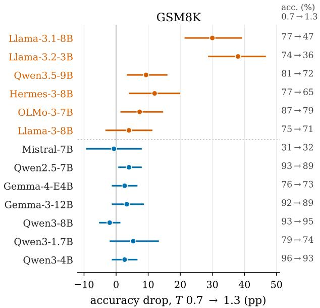
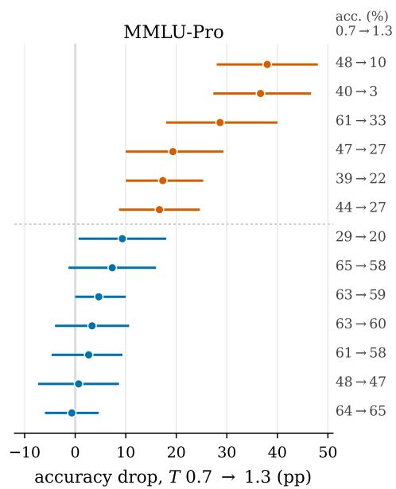
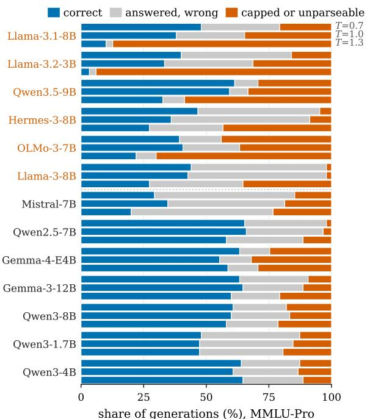
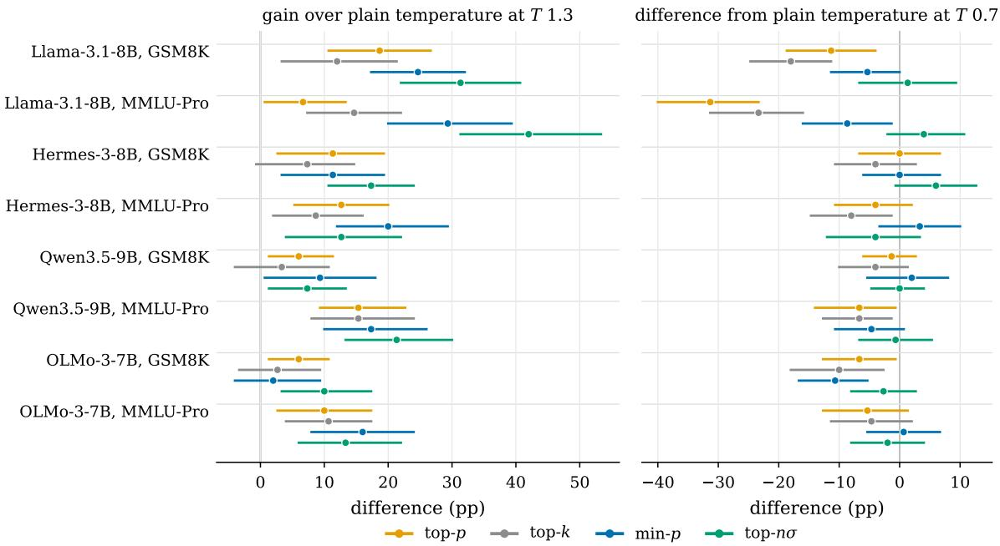
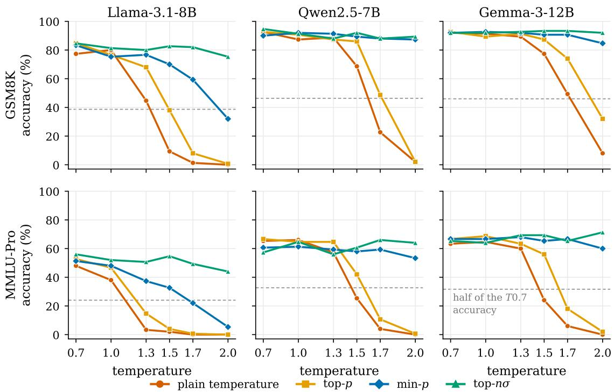
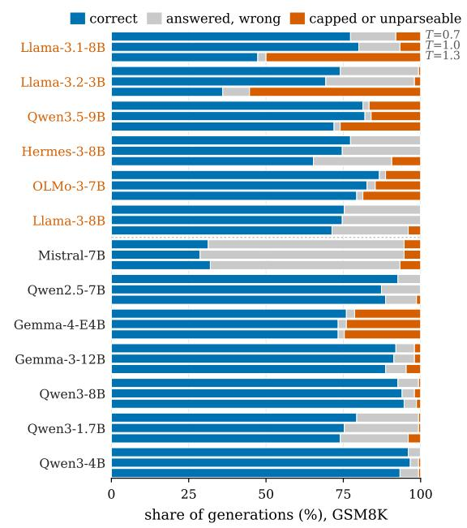
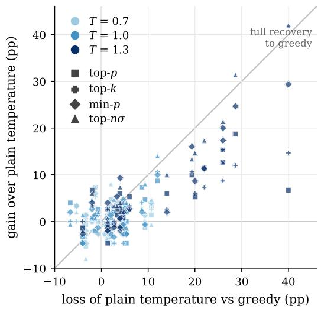

# Temperature Fragility and the Conditional Benefits of Truncation Sampling

Francesco La Rosa University of Edinburgh larosafrancesco289@gmail.com

## Abstract

Large language models generate text by sampling each token from a predicted distribution, and a temperature parameter sets how far the draw strays from the most probable tokens. Truncation samplers such as top-p and minp discard the least probable tokens before the draw, so that sampling at high temperature stays coherent. Their reported accuracy gains come from temperatures of 1.5 to 3, while the defaults of deployed systems cluster between 0.6 and 1.0. Whether they change accuracy at those defaults, and for which models, has not been measured. We test thirteen open-weight models on GSM8K and MMLU-Pro at temperatures 0.7, 1.0, and 1.3 in one controlled pipeline, ten of them under eight decoding configurations. Six of the thirteen models lose 17 to 38 accuracy points on MMLU-Pro between 0.7 and 1.3, and the other seven lose at most 10. The lost accuracy comes from generations that run to the token limit or never state an answer. These results suggest that truncation samplers improve accuracy primarily when higher temperatures substantially degrade model performance. Where accuracy remains stable across temperatures, none of the tested truncation samplers improves on plain temperature sampling.

## 1 Introduction

Sampling is the default way deployed language models generate text (Shi et al., 2024). At each step the model assigns a probability to every token in its vocabulary, and the decoder draws one from that distribution. A temperature parameter reshapes the distribution before the draw. Low temperatures concentrate probability on the few most likely tokens. High temperatures spread it toward the tail of the distribution, the many tokens the model rates as unlikely, where its estimates are least reliable (Holtzman et al., 2020; Hewitt et al., 2022). The typical defaults of model vendors and inference engines cluster between 0.6 and 1.0 (Renze and

Guven, 2024; Hochlehnert et al., 2025),<sup>1</sup> and every engine implements truncation samplers beside them. Truncation samplers, among them top-p, min-p, and top-nσ, discard the tail of the distribution before the draw, each by its own criterion. They were designed to keep open-ended text coherent at high temperature (Garces Arias et al., 2025), and they are now also evaluated on tasks with one checkable answer, where the claim is accuracy: min-p reports gains on GSM8K (Nguyen et al., 2025), and top-nσ reports accuracy held up to a temperature of 3.0 (Tang et al., 2024).

Both results rest on one model and one range of temperatures. Top-nσ was evaluated on Llama-3-8B (Tang et al., 2024) and min-p on Mistral-7B (Nguyen et al., 2025), at temperatures of 1.5 to 3, above the defaults systems set. A reanalysis that searched the same number of hyperparameter settings for every sampler found the gains of min-p indistinguishable from those of the other samplers (Schaeffer et al., 2025). The question cannot be settled by comparing across papers, because benchmark scores move with the inference backend even under greedy decoding (Masoudian et al., 2026), and with the prompt, the parser, and the item set. Settling it requires one pipeline in which everything except the decoding configuration is held fixed. It also requires enough models to show whether the answer depends on the model.

Research question: Under what model and temperature conditions do truncation samplers improve accuracy over plain temperature sampling?

We test thirteen open-weight models from the Llama-3, Mistral, Qwen, Gemma, and OLMo families on GSM8K and MMLU-Pro at temperatures 0.7, 1.0, and 1.3, in one pipeline with fixed items, prompts, token budgets, and parser. Ten of the models also run under eight decoding configurations: greedy decoding, plain temperature sampling, and six truncation configurations. Section 3 gives the design. Two questions follow. The first is whether a model keeps its accuracy between 0.7 and 1.3 under plain sampling, and what the lost accuracy looks like when it does not. The second is whether any truncation sampler improves on plain temperature sampling between 0.7 and 1.3.

We find that temperature sensitivity differs by model. Between 0.7 and 1.3, six of the thirteen models lose 17 to 38 accuracy points on MMLU-Pro under plain sampling, and the other seven lose at most 10. The loss takes the form of a collapse of the output. On the six fragile models, the share of generations that run to the token limit or never state an answer rises by 26 to 78 points, while the share of generations that state a wrong answer does not rise. Hermes-3, a different post-training of the same base model as Llama-3.1-8B, loses half as much accuracy as Llama-3.1-8B does. Truncation gains follow the collapse. On the models that hold their accuracy, no truncation sampler improves on plain temperature sampling at 0.7 or 1.0. On the models that collapse, every truncation sampler improves accuracy at 1.3, and at temperatures up to 2.0 truncation delays or prevents the collapse. The gains reported for truncation samplers are therefore real, and they are recoveries from a collapse that only some models suffer and that begins above the temperatures systems use. This work makes three contributions:

• A controlled comparison of truncation samplers at the temperatures systems use. On the robust models, no truncation sampler improves on plain temperature sampling at 0.7 or 1.0 on GSM8K and MMLU-Pro, and an upper bound states how large a gain the results leave possible.

• Temperature fragility as a property of the model. Six of the thirteen models collapse between 1.0 and 1.3 into generations that run to the token limit or never state an answer. The collapse replicates across inference engine and precision. A different post-training of the same base model halves it. A plain temperature test identifies the fragile models before any sampler is compared.

• The condition under which truncation samplers help. On the collapsing models, every truncation sampler improves accuracy at 1.3 and delays the collapse at temperatures up to 2.0. This locates the gains reported for truncation samplers above the temperatures systems use, which reconciles those reports with the absence of gains below.

## 2 Related work

Truncation samplers. A truncation sampler removes the least probable tokens from the distribution before each token is sampled. Top-k keeps the k most probable tokens (Fan et al., 2018). Top-p, or nucleus sampling, keeps the smallest set of tokens whose probabilities sum to p, so the set grows when the distribution is flat (Holtzman et al., 2020). Min-p keeps every token whose probability is at least a fixed fraction of the largest (Nguyen et al., 2025). Top-nσ works on the logits, the model’s scores before they are converted to probabilities, and keeps the tokens within n standard deviations of the largest logit (Tang et al., 2024). Temperature rescales all logits equally, so top-nσ keeps the same tokens at every temperature, and so does top-k, because scaling does not change the order of the tokens. Top-p and min-p decide from the probabilities themselves, which temperature changes, so for them the order of scaling and truncation matters. A sampler applied after temperature scaling sees the scaled distribution and keeps a different set of tokens from the same sampler applied before it. Our main configurations apply temperature first, and for top-p and min-p we also run the reverse order, which is the default in llama.cpp.

Temperature-invariant samplers. The parameter of top-p or min-p fixes how much of the distribution is kept, and temperature reshapes the distribution. The same value therefore keeps a different set of tokens at each temperature, and a value that works well at one temperature need not work well at another. Two samplers published in 2026 begin from this observation. p-less sampling (Tan et al., 2026) and Min-k (Ding et al., 2026) each decide which tokens to keep from the shape of the distribution at every step, so that temperature does not change which tokens are kept. Neither paper measures whether that matters at the temperatures systems use. The evaluation of Min-k begins at temperature 1.0, where top-k, top-p, and min-p score within a point of one another on GSM8K, and the samplers separate only above temperature 2 (Ding et al., 2026).

Evaluations of decoding and temperature. A survey of decoding methods reports that the best method changes with the task and the model (Shi et al., 2024). The best configuration for open-ended generation varies by model (Garces Arias et al., 2025), and so does the gap between greedy decoding and sampling on reasoning benchmarks (Song et al., 2025). Studies of temperature either stop at 1.0 or use tasks with little accuracy to lose. Renze and Guven (2024) find no effect of temperature between 0.0 and 1.0 on multiple-choice problems. Grover (2026) concludes that instruction tuning is the main determinant of robustness to temperature, on synthetic tasks where the most robust models score 11 to 30% and with no truncation sampler tested. Fastowski et al. (2025) link the entropy of the token distribution to temperature sensitivity on factual questions, and Troshin et al. (2025) attribute high-temperature losses on mathematics to wrong tokens at a few critical positions.

Conditions of measurement. One recent study shapes the design of our comparison. Masoudian et al. (2026) run three instruction-tuned models through five inference frameworks on six benchmarks and find that the framework changes the scores even under greedy decoding, by amounts that depend on the model. A comparison across models and samplers must therefore hold the framework fixed, or the differences it reports may belong to the framework. We run every configuration through one engine, llama.cpp (Gerganov and ggml contributors, 2023). To check whether the collapse we observe comes from the engine, we rerun the most fragile model through a second engine at full precision. Our models also run quantized, with weights stored at reduced precision to fit in less memory. Prasad and Pal (2026) find that quantization does not change how much a model loses to temperature, and our grid at four quantization levels agrees (Appendix C).

## 3 Experimental design

Table 1 lists the six runs. All of them use the same items, prompts, token budgets, and parser, so a difference in accuracy between two runs comes from the factor that differs between them, up to the sampling variation that the confidence intervals quantify.

Decoding. Every model in the main grid runs under eight decoding configurations. Two are baselines, greedy decoding and plain temperature sampling with no truncation. Four apply one truncation sampler after temperature scaling, each at the setting its source paper uses: top-p 0.95 (Holtzman et al., 2020), top-k 40 (Radford et al., 2019), min-p 0.05 (Nguyen et al., 2025), and top-nσ 1.0 (Tang et al., 2024). The last two repeat top-p and min-p with truncation applied before temperature scaling, the default order in llama.cpp, so both orders are tested for the two samplers where the order matters (Section 2). Temperatures 0.7 and 1.0 bracket the defaults of Section 1, and 1.3 sits above them, to show what happens when a model is run past its default range.

Tasks. GSM8K is a set of grade-school word problems with a numeric answer (Cobbe et al., 2021). We use the zero-shot chain-of-thought prompt of Meta’s Llama evaluation suite, which asks for reasoning without worked examples (Meta AI, 2024c). MMLU-Pro is ten-option multiple choice across 14 categories (Wang et al., 2024), prompted the same way. Both tasks need a chain of reasoning that ends in one answer that can be checked exactly, and MMLU-Pro’s chains run about twice as long (median 398 against 212 completion tokens at temperature 0.7). Each task uses 50 fixed items, the first 50 of its test split.

Grading. Each generation has a token budget, 512 tokens on GSM8K and 1024 on MMLU-Pro. A generation that is still running when it reaches the budget is cut off there, and we call it capped. The parsers follow lm-eval-harness (Gao et al., 2023), the framework behind most published scores on these tasks, so our grading matches the scores readers know and no parsing choice of ours can favour one configuration. The parser records one of three outcomes. A generation is strict when it contains the final-answer sentence the prompt asks for (“The final answer is 26”; “The answer is (I)”). It isflexible when that sentence is absent and the parser falls back to the last number or the last parenthesized letter. It is failed when neither exists, and it is then graded incorrect. Appendix B shows one generation of each kind.

Models. The main grid holds seven instructiontuned models from five families: Llama-3.1-8B (Grattafiori et al., 2024), Mistral-7B-v0.3 (Jiang et al., 2023), Qwen2.5-7B (Yang et al., 2024), Qwen3-1.7B, 4B, and 8B with thinking off (Yang et al., 2025), and Gemma-3-12B (Gemma Team, 2025). They are the widely used open-weight families at sizes that fit a single consumer GPU with at most 16 GB of memory (Appendix A). Each runs at four quantization levels, Q8\_0, Q6\_K, Q4\_K\_M, and Q3\_K\_M, where the digit is the number of bits per weight, all produced by one provider with the same conversion settings (Appendix A), so the levels differ only in precision. Every temperature result in the main text uses Q8\_0, the level closest to full precision. Six more models run the temperature test at Q8\_0. Two are further Llama-3 releases, Llama-3-8B (Meta AI, 2024a) and Llama-3.2-3B (Meta AI, 2024b), added because Llama-3.1-8B collapsed in the grid and we wanted to know whether the other releases of the family do. Hermes-3-8B (Teknium et al., 2024) is a different post-training of the Llama-3.1-8B base, which separates the base model from its post-training. Qwen3.5-9B (Qwen Team, 2026) and Gemma-4- E4B (Google DeepMind, 2026) are two releases from 2026, added to test whether current models show the same pattern, and OLMo-3-7B (Allen Institute for AI, 2025) is a fully open model. Appendix A gives the model files, their hashes, and the llama.cpp builds.

Table 1: The six runs, 232,700 graded generations in total. Every run uses both tasks with the same 50 fixed items each and three repetitions of every sampled configuration (one for greedy decoding), except the stratified subset, which uses 50 fresh MMLU-Pro items. “8” configurations are the eight described under Decoding. The main grid also includes a 16-bit GGUF run of Qwen3-4B beside its four quantized runs.
<table><tr><td>Run</td><td>Models</td><td>Precision and engine</td><td>Configurations</td><td>T Generations</td><td></td></tr><tr><td>Main grid</td><td>7, from 5 families</td><td>Q8, Q6, Q4, Q3; 1lama.cpp</td><td>8</td><td>0.7, 1.0, 1.3</td><td>185,600</td></tr><tr><td>Temperature test</td><td>6 more</td><td>Q8; llama.cpp</td><td>greedy, plain temp.</td><td>0.7, 1.0, 1.3</td><td>6,000</td></tr><tr><td>Flagged-model grid</td><td>3 of the 6</td><td>Q8; llama.cpp</td><td>8</td><td>0.7, 1.0, 1.3</td><td>19,200</td></tr><tr><td>Engine check</td><td>Llama-3.2, Llama-3.1, Qwen3-4B</td><td>BF16, INT8 (Transformers); F16, Q8 (llama.cpp)</td><td>greedy, plain temp.</td><td>0.7, 1.0, 1.3</td><td>6,000</td></tr><tr><td>Temperature sweep</td><td>Llama-3.1, Qwen2.5, Gemma-3</td><td>Q8; llama.cpp</td><td>4</td><td>1.3, 1.5, 1.7, 2.0</td><td>14,400</td></tr><tr><td>Stratified subset</td><td>Llama-3.1, Qwen2.5, Gemma-3</td><td>Q8; llama.cpp</td><td>greedy, plain temp.</td><td>0.7, 1.0, 1.3</td><td>1,500</td></tr></table>

Fragility flag. Hermes-3, Qwen3.5-9B, Gemma-4-E4B, and OLMo-3-7B run the temperature test alone first. A model then receives the eight decoding configurations only if the test shows that it loses accuracy to temperature, because the sampler comparison on models that hold their accuracy is already covered by the main grid. We fixed the criterion before any of the four ran. A model qualifies when, between temperatures 0.7 and 1.3 under plain sampling, its accuracy falls by at least 15 points, its capped rate rises by at least 20 points, or its share of strict parses falls by at least 20 points, on either task. Three qualified, Hermes-3, Qwen3.5-9B, and OLMo-3-7B, and each ran the eight configurations at Q8\_0. The two further Llama releases run the temperature test only, because Llama-3.1-8B’s grid already stands for the

family.

Engine check. Every result in the grid comes from llama.cpp on quantized weights, so a collapse could come from the engine or from the conversion of the weights. To check, we rerun the temperature test through Hugging Face Transformers (Wolf et al., 2020) on the official weights: Llama-3.2- 3B at full 16-bit precision, Llama-3.1-8B in 8-bit weights, the largest that fit the GPU’s 16 GB, and Qwen3-4B at full precision as a model that holds its accuracy.

Statistical inference. All intervals in the paper are 95% confidence intervals obtained by bootstrapping over items. We resample the 50 items in each task, keeping all generations of an item together. This captures uncertainty due to the choice of items without treating repeated generations as independent observations. Comparisons between configurations are paired because each configuration is evaluated on the same 50 items. In Section 4.3, we ask whether any truncation sampler improves on plain temperature sampling. To account for testing several samplers, we resample their differences from temperature sampling jointly and compute an upper confidence bound on the largest improvement (Westfall and Young, 1993).

## 4 Results

## 4.1 Temperature sensitivity differs by model

Figure 1 gives the accuracy drop from temperature 0.7 to 1.3 under plain sampling for all thirteen models at Q8\_0, with the accuracies at every temperature in Appendix C. The models divide into two groups. Six lose between 17 and 38 points on MMLU-Pro. The other seven models lose at most 10 points, and for each of these seven the confidence interval includes a drop of 4 points or less. We call the first group fragile and the second robust. On GSM8K, the shorter task, only Llama-3.1-8B and Llama-3.2-3B lose heavily, 30 and 38 points, and every other model loses 12 points or less.



  
Figure 1: Accuracy drop under plain temperature sampling from T=0.7 to 1.3 at Q8\_0, with 95% item-clustered bootstrap intervals; the accuracies at the two temperatures are printed at the right. Positive values are losses. Models are sorted by the MMLU-Pro drop; the six in orange above the dotted line lose at least 15 points on one task, the accuracy criterion of the fragility flag.

The collapse survives a change of engine and precision. Run through Hugging Face Transformers on its official 16-bit weights, Llama-3.2-3B loses 40 points on GSM8K and 36 on MMLU-Pro, against 38 and 37 through llama.cpp at Q8\_0, a difference within the confidence intervals on both tasks. Llama-3.1-8B in 8-bit weights collapses as well, and Qwen3-4B at full precision holds its accuracy as it does at Q8\_0 (Appendix A). Post-training changes the size of the collapse. Hermes-3-8B shares the Llama-3.1-8B base and differs from it only in post-training, and it loses half as much on MMLU-Pro, 19 points against 38, with half the rise in capped generations, 38 points against 75.

## 4.2 The lost accuracy is degenerate output

An accuracy drop can come from two kinds of failure. Either the model completes an answer and the answer is wrong, or the model never reaches an answer. The parser separates the two. Figure 2 divides every MMLU-Pro generation under plain temperature sampling into three outcomes. The first is correct. The second is capped or unparseable: the generation reached its token budget, or it contained no answer the parser could grade. The third is answered wrong: the generation ended before the budget with a parsed answer, and the answer is wrong. In all six fragile models the cappedor-unparseable share rises between temperatures 0.7 and 1.3, by 26 to 78 points, while the answeredwrong share falls or stays flat. In the seven robust models the capped-or-unparseable share moves by at most 11 points. GSM8K shows the same pattern for Llama-3.1-8B and Llama-3.2-3B (Appendix B), with one difference in grading. Incoherent text usually contains a number, so on GSM8K the parser’s fallback grades it as a wrong answer, while on MMLU-Pro it fails to parse. The capped flag records the failure on both tasks. Among the generations that do complete at 1.3, accuracy is within a point of greedy decoding on the same items for Llama-3.1, Qwen3.5, and OLMo, and below it for the other three fragile models (Appendix B).

Capped generations at 0.7 and at 1.3 fail in different ways. To see what they contain, we sampled 152 generations from four models across the three outcomes at temperatures 0.7 and 1.3 and had Claude Fable 5.1 (Anthropic, 2026) label each one as completed, misformatted, cut off while coherent, degenerate, or other. The labelling model saw only the task and the raw text, and it did not know which model or temperature had produced the text. Every audited Llama-3.1 generation capped at 1.3 was labelled degenerate. Every one capped at 0.7 was labelled cut off while coherent. The second kind is common at 0.7 in verbose models: OLMo-3 and Qwen3.5 reach the budget on 47 and 29% of their MMLU-Pro generations there.

  
Figure 2: Outcome of every MMLU-Pro generation under plain temperature sampling at Q8\_0, three bars per model, top to bottom T=0.7, 1.0, and 1.3. Categories are exclusive, in this precedence: correct; capped or unparseable (so this category holds incorrect generations only); answered wrong. Model order as in Figure 1.

## 4.3 No sampler gains where accuracy holds

On the six robust models with a sampler grid, no truncation sampler improves on plain temperature sampling at temperatures 0.7 and 1.0. Table 2 summarizes the comparisons. Each truncation sampler is compared with plain temperature sampling on the same items, for every robust model in the main grid, both tasks, and both temperatures. Almost every difference lies within 3 points of zero, and the largest gain is 3.3 points. Because the question is whether any of these many comparisons shows a gain, the table also gives an upper confidence bound on the largest gain across all of them, which is 9.0 points. The bound is a limit on how much a truncation sampler could gain on these models and tasks at these temperatures.

The first gains appear where accuracy has begun to fall. On the same six models at temperature 1.3, gains reach 9 points, and the comparisons with intervals above zero belong to Mistral-7B, Qwen2.5- 7B, and Gemma-3-12B, the three robust models with the largest drops. Llama-3.1-8B, the fragile model in the main grid, shows a gain already at 1.0. Its MMLU-Pro accuracy, pooled over quantization levels, has fallen 8 points by that temperature, and min-p and top-nσ each gain about 11. Reversing the order of temperature scaling and truncation changes accuracy by at most 4 points on the maingrid models at 0.7 and 1.0 (Appendix E).

## 4.4 Truncation recovers accuracy on the collapse

On the fragile models, every truncation sampler improves accuracy at temperature 1.3 (Figure 3). The gains are large because the collapse is large. On every model and task the best sampler brings accuracy back to within six points of its level at 0.7, so the accuracy lost between 0.7 and 1.3 under plain sampling was almost entirely recoverable by removing the tail of the distribution. Which sampler recovers the most varies from model to model, and because each sampler was compared with plain temperature sampling only, we do not rank them.

Where each model collapses. The robust models collapse too, at higher temperatures. Figure 4 extends the temperature to 2.0 on Llama-3.1-8B, Qwen2.5-7B, and Gemma-3-12B under plain sampling and three truncation samplers. A model has collapsed once its accuracy falls below half of what it was at 0.7, and the collapse temperature is the first tested temperature at which that happens. Under plain sampling the three models collapse in the same order as in Figure 1, Llama-3.1 first and Gemma-3 last, and each collapses earlier on MMLU-Pro, the longer task, than on GSM8K. Truncation moves the collapse to a higher temperature or removes it from the tested range. Top-p delays it in half of the model and task combinations, min-p delays it further, and top-nσ does not collapse on any model or task through 2.0. Min-p and top-nσ were validated at temperatures of 1.5 to 3 (Nguyen et al., 2025; Tang et al., 2024), the range in which these collapses occur, and that is where their gains are largest here as well.

## 5 Discussion and conclusion

We asked under what model and temperature conditions truncation samplers improve accuracy over plain temperature sampling. The answer depends on whether temperature has already reduced a model’s accuracy. Truncation helps when accuracy has declined, and the larger the decline, the larger the gain. When accuracy remains stable, truncation offers no improvement. At temperatures used in practice, twelve of the thirteen models maintained their accuracy. The sole exception, Llama-3.1-8B at temperature 1.0, was also the only model that benefited from truncation.

  
Figure 3: Truncation at T=1.3 on the four fragile checkpoints with a sampler grid (Llama-3.1-8B at Q8\_0 from the main grid; the three flagged panel models). Samplers at their standard settings with temperature applied first. Left: paired difference from plain temperature at 1.3. Right: paired difference from plain temperature at 0.7. Pointwise 95% item-clustered bootstrap intervals. Every difference in the left panel is positive, and on the three flagged models 20 of the 24 intervals exclude zero. For the flagged models both plain-temperature baselines are rerun within the sampler-grid run and differ from the extension run’s by up to 6 points.

Table 2: Paired gains of the four truncation samplers over plain temperature sampling, by family of comparisons. For each family: the number of comparisons, the largest gain, the 95% upper confidence bound on the largest gain (the 95th percentile of the jointly resampled maximum, not computed for the robust models at 1.3, where the gains are the finding), and the number of pointwise intervals above zero. The six robust models are Mistral-7B, Qwen2.5-7B, Qwen3-1.7B, Qwen3-4B, Qwen3-8B, and Gemma-3-12B.
<table><tr><td>Models</td><td>T</td><td>comparisons</td><td>largest gain (pp)</td><td>upper bound (pp)</td><td>intervals above 0</td></tr><tr><td>six robust models, all quantization levels</td><td>0.7, 1.0</td><td>96</td><td>+3.3</td><td>9.0</td><td>1</td></tr><tr><td>six robust models, Q8_0 only</td><td>0.7, 1.0</td><td>96</td><td>+4.7</td><td>16.0</td><td>0</td></tr><tr><td>six robust models, all quantization levels</td><td>1.3</td><td>48</td><td>+9.0</td><td></td><td>13</td></tr><tr><td>Llama-3.1-8B, all quantization levels</td><td>0.7, 1.0</td><td>16</td><td>+11.2</td><td>16.8</td><td>6</td></tr><tr><td>three flagged models, Q8_0</td><td>0.7, 1.0</td><td>48</td><td>+8.0</td><td>18.0</td><td>2</td></tr><tr><td>three flagged models, Q8_0</td><td>1.3</td><td>24</td><td>+21.3</td><td>32.7</td><td>20</td></tr></table>

This pattern reconciles findings in the sampler literature with practical experience. Min-p and top-nσ were evaluated at temperatures of 1.5 to 3 (Nguyen et al., 2025; Tang et al., 2024), a range in which accuracy collapsed for every model in our sweep and truncation helped. At temperature 1.0, by contrast, the Min-k paper reports that top-k, topp, and min-p perform within one percentage point of one another (Ding et al., 2026). That finding is consistent with ours, while the paper’s broader claim that sampler choice matters across the temperature range rests on results above temperature

1.

For practitioners working on tasks with checkable answers, model and temperature should be chosen together, followed by the sampler. If the model maintains its accuracy at the intended temperature, a standard truncation sampler makes little difference. If accuracy declines, either lowering the temperature or applying truncation recovers most of the loss.

This sensitivity to temperature can be detected without gold-standard answers. Neither the capped rate nor the strict-parse rate requires labels, and changes in these rates between temperatures 0.7 and 1.3 distinguished fragile models from robust ones in every run of this study, including the four models tested after the criterion was fixed. Our evaluation measured accuracy only, so it does not establish what gains in output diversity higher temperatures might offer.

  
Figure 4: Accuracy against temperature under four configurations at Q8\_0 (points at 0.7 and 1.0 from the main grid, 1.3 to 2.0 from the temperature sweep). The dashed line marks half of the same model and task’s plain-temperature accuracy at 0.7 in the main grid, the collapse criterion; crossings are read from point estimates on the tested temperatures.

Evaluations of new samplers should report accuracy gains alongside the accuracy lost under plain temperature sampling at the same temperature. A sampler that helps one model after its accuracy has collapsed may offer no benefit to a model that remains robust at that temperature.

What determines a model’s collapse temperature remains an open question. The Hermes-3 results show that post-training changes the magnitude of the collapse for one base model. However, our study includes neither a base-versus-instruct comparison nor a series of checkpoints, so it cannot identify which aspects of post-training drive this change.

Truncation samplers were designed to preserve coherence at high temperatures. On tasks with checkable answers, their benefit follows the same pattern: they recover accuracy lost to temperature but offer no improvement when accuracy remains stable. At temperatures used in practice, model choice determines accuracy.

## Limitations

Each task uses 50 fixed items with three repetitions. The small item count is what makes a factorial run of 185,600 generations feasible, and every estimate carries an interval that reflects it. The 50 MMLU-Pro items are the first 50 of the test split, which is sorted by category, so all of them are business questions. A second set of 50 items drawn from all 14 categories reproduces Llama-3.1’s much larger drop on three models (Appendix C), but as another sample of 50 it does not estimate the effect on the whole benchmark. Mistral-7B scores about 30% on both tasks at 0.7, which leaves little accuracy to lose and limits what its robust classification means.

Temperature 1.3 was chosen as a single point above the defaults to provide an upper bound on the range used in practice. The study therefore does not establish where between 1.0 and 1.3 each model’s accuracy begins to collapse. Token budgets were fixed, and verbose models reached them even at temperature 0.7 for reasons unrelated to temperature. The audit distinguishing degenerate text from reasoning cut short by the token budget covered 152 generations from four models in the main grid, and 34 labels were marked as borderline. Generations from the three flagged models were not audited, so their capped rates serve as a proxy for degeneration.

The sampler results rest on fewer models than the temperature results. Ten models ran the sampler comparison, and three of them were included because they had already collapsed, so the recovery in Section 4.4 describes models that were chosen for being fragile. Within each model and task, the best sampler is the one that scored highest, identified after seeing the results, so a sampler chosen in advance would recover less. Each sampler ran at one setting, the one its source paper recommends, and the upper bound of Section 4.3 applies to those settings only.

The scope is open-weight instruction-tuned models of 1.7 to 12 billion parameters, in English, zeroshot, on tasks with one checkable answer, with thinking mode off. A spot check of Qwen3-8B with thinking on shows a 10-point drop on MMLU-Pro at 25 items (Appendix C), so the results do not extend to thinking mode. Open-ended generation, the original use of truncation samplers, lies outside the design, as does the output diversity that a higher temperature buys when several samples are drawn and the best is selected. The study identifies no cause for the differences between models.

## References

Allen Institute for AI. 2025. OLMo 3 7b instruct model card. https://huggingface.co/allenai/ Olmo-3-7B-Instruct.

Anthropic. 2026. Claude Fable 5.1. https://www. anthropic.com/claude/fable. Model page, read September 2026.

Karl Cobbe, Vineet Kosaraju, Mohammad Bavarian, Mark Chen, Heewoo Jun, Lukasz Kaiser, Matthias Plappert, Jerry Tworek, Jacob Hilton, Reiichiro Nakano, Christopher Hesse, and John Schulman. 2021. Training verifiers to solve math word problems. arXiv preprint arXiv:2110.14168.

Yuanhao Ding, Meimingwei Li, Esteban Garces Arias, Matthias Aßenmacher, Christian Heumann, and Chongsheng Zhang. 2026. Min-k sampling: Decoupling truncation from temperature scaling via relative logit dynamics. In Proceedings ofthe 64th Annual Meeting of the Association for Computational Linguistics (Volume 1: Long Papers), pages 14932– 14948.

Angela Fan, Mike Lewis, and Yann Dauphin. 2018. Hierarchical neural story generation. In Proceedings of ACL.

Alina Fastowski, Bardh Prenkaj, and Gjergji Kasneci. 2025. From confidence to collapse in LLM factual robustness. arXiv preprint arXiv:2508.16267.

Leo Gao, Jonathan Tow, Baber Abbasi, Stella Biderman, Sid Black, et al. 2023. A framework for few-shot language model evaluation. Zenodo.

Esteban Garces Arias, Meimingwei Li, Christian Heumann, and Matthias Aßenmacher. 2025. Decoding decoded: Understanding hyperparameter effects in open-ended text generation. In Proceedings of the 31st International Conference on Computational Linguistics (COLING).

Gemma Team. 2025. Gemma 3 technical report. arXiv preprint arXiv:2503.19786.

Georgi Gerganov and ggml contributors. 2023. llama.cpp: LLM inference in C/C++. https:// github.com/ggml-org/llama.cpp. Software.

Google DeepMind. 2026. Gemma 4 E4B instructiontuned model card. https://huggingface.co/ google/gemma-4-E4B-it.

Aaron Grattafiori, Abhimanyu Dubey, Abhinav Jauhri, et al. 2024. The Llama 3 herd of models. arXiv preprint arXiv:2407.21783.

Kabir Grover. 2026. Reliability under randomness: An empirical analysis of sparse and dense language model behavior across decoding temperatures. arXiv preprint arXiv:2601.00942.

John Hewitt, Christopher D. Manning, and Percy Liang. 2022. Truncation sampling as language model desmoothing. In Findings ofEMNLP.

Andreas Hochlehnert, Hardik Bhatnagar, Vishaal Udandarao, Samuel Albanie, Ameya Prabhu, and Matthias Bethge. 2025. A sober look at progress in language model reasoning: Pitfalls and paths to reproducibility. arXiv preprint arXiv:2504.07086.

Ari Holtzman, Jan Buys, Li Du, Maxwell Forbes, and Yejin Choi. 2020. The curious case of neural text degeneration. In International Conference on Learning Representations (ICLR).

Albert Q. Jiang, Alexandre Sablayrolles, Arthur Mensch, Chris Bamford, Devendra Singh Chaplot, Diego de las Casas, Florian Bressand, Gianna Lengyel, Guillaume Lample, Lucile Saulnier, et al. 2023. Mistral 7B. arXiv preprint arXiv:2310.06825.

Shahed Masoudian, Passant Shafaei, Monorama Swain, and Markus Schedl. 2026. What we observe as LLM behavior can be a side-effect of inference backend. arXiv preprint arXiv:2608.04714.

Meta AI. 2024a. Introducing Meta Llama 3: The most capable openly available LLM to date. https://ai. meta.com/blog/meta-llama-3/.

Meta AI. 2024b. Llama 3.2: Revolutionizing edge AI and vision with open, customizable models. https://ai.meta.com/blog/llama-3-2- connect-2024-vision-edge-mobile-devices/.

Meta AI. 2024c. Meta Llama 3 evaluation details. https://github.com/meta-llama/llama3/ blob/main/eval\_details.md.

Minh Nhat Nguyen, Andrew Baker, Clement Neo, Allen Roush, Andreas Kirsch, and Ravid Shwartz-Ziv. 2025. Turning up the heat: Min-p sampling for creative and coherent LLM outputs. In International Conference on Learning Representations (ICLR).

Hari Prasad and Ritam Pal. 2026. The joint effect of quantization and sampling temperature on LLM safety alignment: A factorial analysis. arXiv preprint arXiv:2606.29581.

Qwen Team. 2026. Qwen3.5-9b model card. https: //huggingface.co/Qwen/Qwen3.5-9B.

Alec Radford, Jeffrey Wu, Rewon Child, David Luan, Dario Amodei, and Ilya Sutskever. 2019. Language models are unsupervised multitask learners. OpenAI technical report.

Matthew Renze and Erhan Guven. 2024. The effect of sampling temperature on problem solving in large language models. In Findings ofEMNLP.

Rylan Schaeffer, Joshua Kazdan, and Yegor Denisov-Blanch. 2025. Min-p, max exaggeration: A critical analysis of min-p sampling in language models. arXiv preprint arXiv:2506.13681.

Chufan Shi, Haoran Yang, Deng Cai, Zhisong Zhang, Yifan Wang, Yujiu Yang, and Wai Lam. 2024. A thorough examination of decoding methods in the era of LLMs. In Proceedings ofEMNLP.

Yifan Song, Guoyin Wang, Sujian Li, and Bill Yuchen Lin. 2025. The good, the bad, and the greedy: Evaluation of LLMs should not ignore non-determinism. In Proceedings ofNAACL.

Runyan Tan, Shuang Wu, and Phillip Howard. 2026. p-less sampling: A robust hyperparameter-free approach for LLM decoding. In International Conference on Learning Representations (ICLR).

Chenxia Tang, Jianchun Liu, Hongli Xu, and Liusheng Huang. 2024. Top-nσ: Not all logits are you need. arXiv preprint arXiv:2411.07641.

Ryan Teknium, Jeffrey Quesnelle, and Chen Guang. 2024. Hermes 3 technical report. https://arxiv. org/abs/2408.11857. Preprint, arXiv:2408.11857.

Sergey Troshin, Irina Mohammed, Yan Meng, Christof Monz, Antske Fokkens, and Vlad Niculae. 2025. Control the temperature: Selective sampling for diverse and high-quality LLM outputs. In Conference on Language Modeling (COLM).

Yubo Wang, Xueguang Ma, Ge Zhang, Yuansheng Ni, Abhranil Chandra, Shiguang Guo, Weiming Ren, Aaran Arulraj, Xuan He, Ziyan Jiang, Tianle Li, Max Ku, Kai Wang, Alex Zhuang, Rongqi Fan, Xiang Yue, and Wenhu Chen. 2024. MMLU-Pro: A more robust and challenging multi-task language understanding benchmark. In Advances in Neural Information Processing Systems.

Peter H. Westfall and S. Stanley Young. 1993. Resampling-Based Multiple Testing: Examples and Methodsfor p-Value Adjustment. Wiley, New York.

Thomas Wolf, Lysandre Debut, Victor Sanh, Julien Chaumond, Clement Delangue, Anthony Moi, Pierric Cistac, Tim Rault, Remi Louf, Morgan Funtowicz, Joe Davison, Sam Shleifer, Patrick von Platen, Clara Ma, Yacine Jernite, Julien Plu, Canwen Xu, Teven Le Scao, Sylvain Gugger, and 3 others. 2020. Transformers: State-of-the-art natural language processing. In Proceedings ofthe 2020 Conference on Empirical Methods in Natural Language Processing: System Demonstrations, pages 38–45.

An Yang et al. 2024. Qwen2.5 technical report. arXiv preprint arXiv:2412.15115.

An Yang et al. 2025. Qwen3 technical report. arXiv preprint arXiv:2505.09388.

## A Reproducibility and engine check

Builds and hardware. Every run in the main grid, the temperature test, and the sweep went through llama.cpp (Gerganov and ggml contributors, 2023) on a consumer GPU, an RTX 2080 Ti or an RTX 5070 Ti with 16 GB, with a CUDA build for each architecture. The main grid uses commit 5aba5364 (server build 9456). Qwen3.5-9B and Gemma-4- E4B require a later release, so the six additional models, their sampler grids, and a bridge run use release v0.4.0 (commit 5266f24d). The bridge reruns the temperature test of Llama-3.2-3B and Qwen3-4B on v0.4.0. Both reproduce the drops measured on the main-grid build, with differences whose intervals include zero (Table 3), so results from the two builds are compared directly in the paper.

Prompts. The client renders each model’s official chat template and sends the resulting text, with the server’s own template parser and beginning-ofsequence insertion turned off, so the client owns every special token. Each record stores the SHA-256 hash of the rendered prompt. Release v0.4.0 inserts its own beginning-of-sequence token for Gemma 4, so the Gemma-4 prompt is rendered without one. The Llama template stamps the run date into the system header, which is the only difference between the prompt strings of runs made on different days; the prompt token counts agree on every item.

Zero-token records. On both builds the server occasionally returns a degenerate generation of budget length with a token count of zero. The maingrid build returns the text, which the client recovers and which the audit of Appendix B labelled; v0.4.0 returns an HTTP error without text. The runner records both as capped generations with zero tokens. They number 189 of the 185,600 records in the main grid, 114 in the run of the two further Llama releases, 158 in the temperature test of the four 2026 models, 196 in their sampler grids, 64 in the engine check, 73 in the bridge, and 2,549 in the sweep. At T=1.3 under plain temperature sampling they are 13% of Llama-3.1’s capped generations on MMLU-Pro, 44% of Llama-3.2-3B’s, and 37 of Llama-3-8B’s 44.

Model files. Every quantized model is a Bartowski imatrix GGUF from the same provider, so the four quantization levels of a model differ only in precision. The SHA-256 hash of every model file is listed in the repository (DOWNLOADS.md).

Decoding and seeding. Each request carries exactly one truncation parameter, and the order of temperature scaling and truncation is pinned through the server’s samplers array and recorded in every record. On both builds the server instantiates only the samplers named in that array, so its defaults for the samplers not named (top-k 40, top-p 0.95, min-p 0.05) have no effect, and no repetition penalty or other logit processor is sent. The seed of every generation is derived from the global seed 0 and the model, quantization, sampler, temperature, task, item, and repetition. The server serves up to eight requests at once, so a run is seed-logged but not bit-exact. The tasks are GSM8K (openai/gsm8k, test split, first 50 items) and MMLU-Pro (TIGER-Lab/MMLU-Pro, test split, first 50 items). Each generation is one JSONL record with its identity, request parameters, raw output, parse outcome, and token counts, and runs resume by record id. The pipeline, configurations, analysis scripts, and every record are at https://github.com/larosafrancesco289/ decoding-robustness.

The two further Llama releases. Llama-3-8B and Llama-3.2-3B ran the temperature test before the fragility criterion of Section 3 was written. Both meet it. They did not run the eight decoding configurations, and Llama-3.1-8B’s grid stands for the family in Sections 4.3 and 4.4.

Engine check. The Transformers (Wolf et al., 2020) configuration loads meta-llama/Llama-3.2-3B-Instruct (revision 0cb88a4f) in BF16 with transformers 5.16.1 and torch 2.14. It samples with do\_sample at temperature T, with top-k and top-p disabled and no other processor, in batches of eight with left padding; greedy decoding is do\_sample=False. Generation stops at the model’s end-of-sequence tokens or at the task’s budget. Llama-3.1-8B loads the unsloth/Llama-3.1-8B-Instruct mirror of the official weights (revision 4699cc75) in 8-bit through bitsandbytes, in batches of four. Qwen3- 4B loads Qwen/Qwen3-4B (revision 1cfa9a72) in BF16 with thinking disabled. All three reproduce every grid prompt hash. Llama-3.2-3B also ran through llama.cpp on its unquantized 16-bit GGUF, which separates the engine from the quantization. Table 3 gives, for every configuration, the accuracy at 0.7 and 1.3, the drop with its interval, the capped rate at 1.3, and the paired difference of the drop from the main-grid Q8\_0 cell. The intervals on those differences are about 20 points wide, so the check shows that the collapse recurs, and Llama-3.1’s GSM8K drop is 13 points larger in 8-bit weights than at Q8\_0.

## B Grading and degeneration

Parse outcomes. Figure 5 shows one generation for each of the three parse outcomes of Section 3, and Figure 6 two degenerate generations. The strict outcome requires the final-answer sentence with the answer directly after it. The flexible outcome, the parser’s fallback to the last number or the last parenthesized letter, catches two different things: a well-formed answer written outside that sentence, and an incoherent generation that still contains a number, which on GSM8K is graded as a wrong answer. Mistral-7B omits the sentence on 26 to 32% of its GSM8K generations at every temperature, and the Qwen3 models wrap the answer in markdown emphasis, which the strict pattern does not match; both grade correctly through the fallback. To check that markdown does not distort the results, we re-graded every main-grid record with a strict pattern that tolerates it: 598 of the 185,600 grades change, 556 of them on Qwen3-8B and Qwen3-4B MMLU-Pro, and no plain-temperature drop moves by more than 1.0 point. The original parser, fixed before any run, stays primary. Table 4 gives the share of each outcome and the capped rate for every model and temperature, and Figure 7 the GSM8K outcomes in the form of Figure 2.

Table 3: Engine, precision, and build checks: plain-temperature accuracy at T=0.7 and 1.3, the drop with its 95% item-clustered interval, the capped rate at 1.3 (%), and the difference of the drop from the reference Q8\_0 llama.cpp cell on the same items (positive: a larger drop than the reference). The BF16 GGUF row of Qwen3-4B belongs to the main grid.
<table><tr><td></td><td>GSM8K 1.3</td><td colspan="5"></td><td colspan="5">MMLU-Pro</td></tr><tr><td>Model</td><td>Precision, engine</td><td>0.7</td><td>drop [CI]</td><td></td><td>cap</td><td>vs. ref. [CI]</td><td>0.7</td><td>1.3</td><td>drop [CI]</td><td>cap</td><td>vs. ref. [CI]</td></tr><tr><td>Llama-3.2-3B</td><td>BF16, transformers</td><td>74.7</td><td>34.7 +40.0 [29.3, 49.3]</td><td></td><td>61</td><td>+2.0 [-8.7, 12.0]</td><td>40.7</td><td>4.7</td><td>+36.0 [24.7, 48.0]</td><td>92</td><td>-0.7 [-9.3, 8.7]</td></tr><tr><td></td><td>F16 GGUF, llama.cpp</td><td>74.0 42.7</td><td>+31.3 [22.7, 40.7]</td><td></td><td>53</td><td>-6.7 [-17.3, 4.0]</td><td>38.0</td><td>5.3</td><td>+32.7 [23.3, 43.3]</td><td>91</td><td>-4.0 [-10.7, 2.7]</td></tr><tr><td></td><td>Q8 GGUF, llama.cpp v0.4.0</td><td>77.3</td><td>34.7 +42.7 [34.0, 50.7]</td><td></td><td>63</td><td>+4.7 [-3.3, 12.7]</td><td>39.3</td><td>4.7</td><td>+34.7 [24.7, 45.3]</td><td>93</td><td>—2.0 [-9.3, 5.3]</td></tr><tr><td></td><td>Q8 GGUF, llama.cpp (reference)</td><td>74.0</td><td>36.0 +38.0 [28.7, 46.7]</td><td></td><td>55</td><td></td><td>40.0</td><td>3.3</td><td>+36.7 [27.3, 46.7]</td><td>92</td><td></td></tr><tr><td>Llama-3.1-8B</td><td>INT8, transformers</td><td>82.7 39.3</td><td>+43.3 [33.3, 52.0]</td><td></td><td>54</td><td>+13.3 [2.7, 23.3]</td><td>45.3</td><td>2.7</td><td>+42.7 [32.7, 53.3]</td><td>95</td><td>+4.7 [-3.3, 12.7]</td></tr><tr><td></td><td>Q8 GGUF, llama.cpp (reference)</td><td>77.3 47.3</td><td>+30.0 [21.3, 39.3]</td><td></td><td>51</td><td></td><td>48.0</td><td>10.0</td><td>+38.0 [28.0, 48.0]</td><td>86</td><td></td></tr><tr><td>Qwen3-4B</td><td>BF16, transformers</td><td>94.7 93.3</td><td>+1.3 [-1.3, 4.0]</td><td></td><td>0</td><td>-1.3 [-5.3, 2.0]</td><td>60.7</td><td>61.3</td><td>-0.7 [-6.0, 5.3]</td><td>13</td><td>+0.0 [-6.7, 6.7]</td></tr><tr><td></td><td>BF16 GGUF, llama.cpp</td><td>95.3 96.7</td><td>−1.3 [-4.0, 1.3]</td><td></td><td>0</td><td>-4.0 [-9.3, 1.3]</td><td>58.0</td><td>60.0</td><td>-2.0 [-7.3, 3.3]</td><td>15</td><td>-1.3 [-8.7, 6.0]</td></tr><tr><td></td><td>Q8 GGUF, llama.cpp v0.4.0</td><td>96.7 94.0</td><td>+2.7 [-0.7, 7.3]</td><td></td><td>0</td><td>+0.0 [-4.0, 4.7]</td><td>65.3</td><td>64.0</td><td>+1.3 [-4.7, 7.3]</td><td>11</td><td>+2.0 [-6.0, 10.0]</td></tr><tr><td></td><td>Q8 GGUF, llama.cpp (reference)</td><td>96.0 93.3</td><td>+2.7 [-1.3, 6.7]</td><td></td><td>1</td><td></td><td>64.0</td><td>64.7</td><td>−0.7 [-6.0, 4.7]</td><td>12</td><td></td></tr></table>

[strict] . . . x = 19.50 / 0.75 x = 26 So   
the original price of the book was \$26. The   
final answer is \$26.   
[flexible] . . . 80 \text{ miles} + 150 \text{   
miles} = 230 \text{ miles} ### Final Answer:   
The final answer is \*\*230\*\*.   
[failed] . . . \frac{3,462.20}{35} = 98.92   
### Final Answer: The answer is \*\*J\*\*.  
Figure 5: One generation per parse outcome (endings only). Strict: Llama-3.1-8B, GSM8K, T=1.3, graded 26, correct. Flexible: Qwen3-8B, GSM8K, T=0.7; the emphasis markers defeat the strict pattern and the lastnumber fallback grades 230, correct. Failed: Qwen3-8B, MMLU-Pro, T=0.7; the parser expects a parenthesized letter such as (J), none appears, graded incorrect.

[opens] To solve this problem, we’ll use the   
gross profit method of inventory evaluation.   
Step 1: Calculate the gross profit earned   
during the year. . .   
[ends] H sieve Con Palette sediment conduit   
France called coaching OMAX may PHYS today   
Enhanced vertices XOR/t and registration   
ordinances efforts yesterday Michael

```ini
[opens] To determine the correct type of
research methods, we need to understand the
characteristics of each option: A.
Non-probability: This method involves
selecting. . .
[ends] entageeba lever modeling ign measures
inherits cones quantum auditingippines image
later campaigns Taylorart parte diesel El N
resembled Dental professionals
```  
Figure 6: Two degenerate generations (Llama-3.1-8B, Q8\_0, plain temperature, T=1.3, MMLU-Pro; both reached the 1024-token budget). Each opens coherently, loses coherence mid-generation, and continues as token noise until the budget.

Blinded audit. To check that the parse outcomes mean what Section 4.2 takes them to mean, we drew 152 plain-temperature generations at Q8\_0 from Llama-3.1-8B, Mistral-7B, Qwen2.5-7B, and Qwen3-8B at temperatures 0.7 and 1.3 on both tasks, stratified by parse outcome with the uncertain outcomes oversampled. Claude Fable 5.1 (Anthropic, 2026) labelled each generation as completed, cut off while coherent, degenerate, misformatted, or other, seeing only the task and the raw text. Of the 51 capped generations, all 8 of Llama-3.1’s at 1.3 are degenerate and all 8 at 0.7 are coherent reasoning cut short; the robust models’ 21 capped generations at 1.3 split 8 degenerate, 9 cut off, 3 completed, and 1 misformatted, and their 14 at 0.7 split 13 cut off and 1 completed. Of the 26 parse failures, 15 contain a clear answer in an unexpected form, 6 are degenerate, 4 are refusals, and 1 is cut off. Of the 75 strict and flexible parses, 72 are completed answers. The annotator marked 34 of the 152 labels as borderline. The sample, the labels, and the key are in the repository (results/outcome\_audit).

  
Figure 7: Outcome of every GSM8K generation under plain temperature sampling at Q8\_0, as in Figure 2. On GSM8K a degenerate generation usually contains a number, so part of the degeneration is graded through the flexible path; the capped flag records it.

Surviving answers at 1.3. Among the generations that do complete with the final-answer sentence at 1.3, accuracy is subject to selection, because the surviving generations can come from an easier mix of items. Table 5 therefore gives, for every model, the share of plain-temperature generations with a strict parse at 0.7 and 1.3, the accuracy among them, and greedy accuracy on the same surviving items, each survivor counted once. On MMLU-Pro at 1.3, Llama-3.1’s completed answers score 78.9% against 78.9% for greedy decoding on the same items, Qwen3.5’s 83.1 against 84.7, and OLMo-3’s 73.3 against 73.3. For Llama-3-8B, Llama-3.2-3B (nine survivors), and Hermes-3 the completed answers score below greedy decoding by 4, 11, and 16 points, and so do the robust Mistral-7B’s by 21 points, so a gap among the survivors at 1.3 is not specific to fragility. The comparison controls for the mix of items and does not remove the selection.

## C Temperature results in full

Table 6 gives plain-temperature accuracy at all three temperatures for the thirteen models, the drop from 0.7 to 1.3 with its interval, and the change in the capped and strict-parse rates.

Quantization. Table 7 recomputes the drop at each quantization level of the main grid. Llama-3.1- 8B collapses at every level, and no robust model loses more than 12 points at any level, so quantization does not change which models lose to temperature, in line with Prasad and Pal (2026). Quantization itself costs little accuracy. From Q8\_0 to Q3\_K\_M, greedy accuracy pooled over both tasks changes by at most 5 points on the models of 7B parameters or more, and falls by 7 and 9 points on Qwen3-4B and Qwen3-1.7B.

Item selection. The fixed MMLU-Pro items are the first 50 of the test split, which is sorted by category, so all of them are business questions. Table 8 repeats the temperature test on a second subset of 50 items with 3 to 4 from each of the 14 categories, on Llama-3.1-8B, Qwen2.5-7B, and

Gemma-3-12B. Llama-3.1’s drop stays far above the other two, and Gemma-3’s stratified drop, +7.3 [2.0, 12.7], has an interval that excludes zero.

Thinking mode. A spot check of Qwen3-8B with thinking on (Q8\_0, 25 items, two repetitions, 450 generations) reproduces the GSM8K result (94% at 0.7 against 96% at 1.3) and not the MMLU-Pro one (56 against 46%, a 10-point drop with interval [2, 20]). With thinking on, the longer traces make Qwen3-8B less robust on the longer task.

## D Temperature sweep

The sweep of Section 4.4 is a separate run from the main grid. Table 9 gives the plain-temperature drop at each sweep temperature against the model’s own accuracy at 0.7 in the main grid, with intervals. The 1.3 step of the sweep differs from the main-grid value of Table 6 by amounts within the intervals (Llama-3.1 on MMLU-Pro: +44.7 in the sweep against +38.0 in the grid).

## E Sampler results in full

Tables 10 and 11 give the accuracy of every decoding configuration at every temperature for the ten models with a sampler grid, with the maingrid models pooled over their quantization levels, Qwen3-4B’s 16-bit run included, and the three flagged models at Q8\_0. Tables 12 and 13 give every paired difference from plain temperature sampling, including the two configurations that apply truncation before temperature scaling. An interval endpoint within 10<sup>−9</sup> of zero counts as touching zero. The upper bound of Table 2 pools the four quantization levels of the main grid and is also given at Q8\_0 alone. A generalized estimating equation over the same records (identity link, item clusters, exchangeable working correlation) gives the same point estimates and intervals that differ by at most 0.6 points (median 0.1).

Order of temperature and truncation. Applying top-p or min-p before temperature scaling, the llama.cpp default order, changes accuracy by at most 4 points on the seven main-grid models at temperatures 0.7 and 1.0. The largest gain over plain temperature sampling anywhere at those temperatures belongs to this order: top-p applied first on Hermes-3 at 0.7 on MMLU-Pro gains +12.0 [4.7, 19.3], the largest of the 72 flagged-model comparisons at those temperatures; the other 71 stay within 8 points. On Llama-3.1 at 1.3, truncating first keeps 22 more points under top-p on

Table 4: Parse outcomes under plain temperature sampling at Q8\_0 (% of generations, rounded): strict, flexible, failed, and capped (capped overlaps the other three).
<table><tr><td></td><td></td><td></td><td colspan="2">GSM8K</td><td colspan="2"></td><td colspan="2">MMLU-Pro</td><td></td></tr><tr><td>Model</td><td>T</td><td>strict</td><td>flex.</td><td>failed</td><td>capped</td><td>strict</td><td>flex.</td><td>failed</td><td>capped</td></tr><tr><td>Llama-3.1-8B</td><td>0.7</td><td>89</td><td>11</td><td>0</td><td>9</td><td>79</td><td>1</td><td>19</td><td>11</td></tr><tr><td></td><td>1.0</td><td>87</td><td>13</td><td>0</td><td>7</td><td>63</td><td>5</td><td>32</td><td>22</td></tr><tr><td></td><td>1.3</td><td>45</td><td>55</td><td>0</td><td>51</td><td>13</td><td>6</td><td>81</td><td>86</td></tr><tr><td>Llama-3.2-3B</td><td>0.7</td><td>99</td><td>1</td><td>0</td><td>1</td><td>83</td><td>3</td><td>15</td><td>10</td></tr><tr><td></td><td>1.0</td><td>89</td><td>11</td><td>0</td><td>2</td><td>65</td><td>5</td><td>30</td><td>22</td></tr><tr><td></td><td>1.3</td><td>41</td><td>59</td><td>0</td><td>55</td><td>6</td><td>9</td><td>85</td><td>92</td></tr><tr><td>Qwen3.5-9B</td><td>0.7</td><td>80</td><td>20</td><td>0</td><td>21</td><td>71</td><td>3</td><td>26</td><td>29</td></tr><tr><td></td><td>1.0</td><td>79</td><td>21</td><td>0</td><td>21</td><td>67</td><td>5</td><td>27</td><td>33</td></tr><tr><td></td><td>1.3</td><td>71</td><td>29</td><td>0</td><td>27</td><td>39</td><td>9</td><td>51</td><td>43</td></tr><tr><td>Hermes-3-8B</td><td>0.7</td><td>68</td><td>32</td><td>0</td><td>0</td><td>93</td><td>2</td><td>5</td><td>0</td></tr><tr><td></td><td>1.0</td><td>68</td><td>32</td><td>0</td><td>0</td><td>91</td><td>1</td><td>9</td><td>0</td></tr><tr><td></td><td>1.3</td><td>59</td><td>39</td><td>2</td><td>9</td><td>57</td><td>2</td><td>41</td><td>38</td></tr><tr><td>OLMo-3-7B</td><td>0.7</td><td>84</td><td>16</td><td>0</td><td>14</td><td>56</td><td>11</td><td>33</td><td>47</td></tr><tr><td></td><td>1.0</td><td>84</td><td>16</td><td>0</td><td>16</td><td>62</td><td>10</td><td>28</td><td>38</td></tr><tr><td></td><td>1.3</td><td>78</td><td>17</td><td>5</td><td>22</td><td>30</td><td>0</td><td>70</td><td>68</td></tr><tr><td>Llama-3-8B</td><td>0.7</td><td>98</td><td>2</td><td>0</td><td>0</td><td>97</td><td>1</td><td>2</td><td>0</td></tr><tr><td></td><td>1.0</td><td>98</td><td>2</td><td>0</td><td>0</td><td>97</td><td>1</td><td>2</td><td>0</td></tr><tr><td></td><td>1.3</td><td>94</td><td>6</td><td>0</td><td>5</td><td>65</td><td>4</td><td>31</td><td>29</td></tr><tr><td>Mistral-7B</td><td>0.7</td><td>72</td><td>28</td><td>0</td><td>5</td><td>82</td><td>4</td><td>14</td><td>1</td></tr><tr><td></td><td>1.0</td><td>73</td><td>27</td><td>0</td><td>6</td><td>81</td><td>2</td><td>17</td><td>1</td></tr><tr><td></td><td>1.3</td><td>71</td><td>29</td><td>0</td><td>7</td><td>74</td><td>6</td><td>20</td><td>11</td></tr><tr><td>Qwen2.5-7B</td><td>0.7</td><td>97</td><td>3</td><td>0</td><td>0</td><td>98</td><td>1</td><td>1</td><td>2</td></tr><tr><td></td><td>1.0</td><td>93</td><td>7</td><td>0</td><td>0</td><td>96</td><td>1</td><td>3</td><td>3</td></tr><tr><td></td><td>1.3</td><td>93</td><td>7</td><td>0</td><td>1</td><td>88</td><td>3</td><td>9</td><td>9</td></tr><tr><td>Gemma-4-E4B</td><td>0.7</td><td>45</td><td>55</td><td>0</td><td>25</td><td>74</td><td>8</td><td>18</td><td>26</td></tr><tr><td></td><td>1.0</td><td>54</td><td>46</td><td>0</td><td>28</td><td>67</td><td>8</td><td>25</td><td>34</td></tr><tr><td></td><td>1.3</td><td>49</td><td>51</td><td>0</td><td>29</td><td>68</td><td>10</td><td>22</td><td>32</td></tr><tr><td>Gemma-3-12B</td><td>0.7</td><td>97</td><td>3</td><td>0</td><td>3</td><td>91</td><td>1</td><td>9</td><td>9</td></tr><tr><td></td><td>1.0</td><td>98</td><td>2</td><td>0</td><td>2</td><td>89</td><td>3</td><td>9</td><td>11</td></tr><tr><td></td><td>1.3</td><td>95</td><td>5</td><td>0</td><td>5</td><td>79</td><td>3</td><td>17</td><td>20</td></tr><tr><td>Qwen3-8B</td><td>0.7</td><td>45</td><td>55</td><td>0</td><td>1</td><td>82</td><td>1</td><td>17</td><td>12</td></tr><tr><td></td><td>1.0</td><td>45</td><td>55</td><td>0</td><td>2</td><td>83</td><td>5</td><td>13</td><td>13</td></tr><tr><td></td><td>1.3</td><td>47</td><td>53</td><td>0</td><td>2</td><td>78</td><td>5</td><td>17</td><td>18</td></tr><tr><td>Qwen3-1.7B</td><td>0.7</td><td>15</td><td>85</td><td>0</td><td>1</td><td>87</td><td>2</td><td>11</td><td>13</td></tr><tr><td></td><td>1.0</td><td>22</td><td>78</td><td>0</td><td>1</td><td>85</td><td>1</td><td>14</td><td>14</td></tr><tr><td></td><td>1.3</td><td>21</td><td>79</td><td>0</td><td>4</td><td>83</td><td>2</td><td>15</td><td>19</td></tr><tr><td>Qwen3-4B</td><td>0.7</td><td>96</td><td>4</td><td>0</td><td>1</td><td>89</td><td>0</td><td>11</td><td>10</td></tr><tr><td></td><td>1.0</td><td>93</td><td>7</td><td>0</td><td>1</td><td>87</td><td>1</td><td>12</td><td>12</td></tr><tr><td></td><td>1.3</td><td>96</td><td>4</td><td>0</td><td>1</td><td>88</td><td>1</td><td>11</td><td>12</td></tr></table>

Table 5: Accuracy among strict-parsed generations under plain temperature sampling at Q8\_0, with the share of generations that parse strictly, the number n of such generations at T=1.3 (of 150), and greedy accuracy on their items with each surviving generation counted once. Point estimates without intervals.
<table><tr><td colspan="3"></td><td colspan="2">T=0.7</td><td colspan="3">T=1.3</td></tr><tr><td>Model</td><td>Task</td><td>strict %</td><td>acc|strict</td><td>greedy, same items</td><td>strict %</td><td>n</td><td>acc|strict</td><td>greedy, same items</td></tr><tr><td rowspan="3">Llama-3.1-8B</td><td>GSM8K</td><td>89</td><td>85.1</td><td>81.3</td><td>45</td><td>67</td><td>98.5</td><td>95.5</td></tr><tr><td>MMLU-Pro</td><td>79</td><td>60.5</td><td>56.3</td><td>13</td><td>19</td><td>78.9</td><td>78.9</td></tr><tr><td>GSM8K</td><td>99</td><td>74.3</td><td>74.3</td><td>41</td><td>62</td><td>85.5</td><td>90.3</td></tr><tr><td rowspan="2">Llama-3.2-3B Qwen3.5-9B</td><td>MMLU-Pro</td><td>83</td><td>47.6</td><td>48.4</td><td>6</td><td>9</td><td>55.6</td><td>66.7</td></tr><tr><td>GSM8K</td><td>80</td><td>97.5</td><td>92.5</td><td>71</td><td>106</td><td>99.1</td><td>93.4</td></tr><tr><td rowspan="2">Hermes-3-8B</td><td>MMLU-Pro</td><td>71</td><td>86.8</td><td>81.1</td><td>39</td><td>59</td><td>83.1</td><td>84.7</td></tr><tr><td>GSM8K</td><td>68</td><td>86.3</td><td>83.3</td><td>59</td><td>89</td><td>83.1</td><td>82.0</td></tr><tr><td rowspan="2">OLMo-3-7B</td><td>MMLU-Pro</td><td>93</td><td>50.0</td><td>54.3</td><td>57</td><td>86</td><td>47.7</td><td>64.0</td></tr><tr><td>GSM8K</td><td>84</td><td>98.4</td><td>97.6</td><td>78</td><td>117</td><td>97.4</td><td>95.7</td></tr><tr><td rowspan="2">Llama-3-8B</td><td>MMLU-Pro</td><td>56</td><td>69.0</td><td>61.9</td><td>30</td><td>45</td><td>73.3</td><td>73.3</td></tr><tr><td>GSM8K</td><td>98</td><td>76.9</td><td>76.9</td><td>94</td><td>141</td><td>75.2</td><td>77.3</td></tr><tr><td rowspan="2">Mistral-7B</td><td>MMLU-Pro</td><td>97</td><td>45.2</td><td>39.7</td><td>65</td><td>98</td><td>41.8</td><td>45.9</td></tr><tr><td>GSM8K</td><td>72</td><td>33.3</td><td>26.9</td><td>71</td><td>106</td><td>32.1</td><td>26.4</td></tr><tr><td rowspan="2">Qwen2.5-7B</td><td>MMLU-Pro</td><td>82</td><td>35.0</td><td>39.8</td><td>74</td><td>111</td><td>25.2</td><td>45.9</td></tr><tr><td>GSM8K</td><td>97</td><td>94.5</td><td>93.8</td><td>93</td><td>139</td><td>91.4</td><td>93.5</td></tr><tr><td rowspan="2">Gemma-4-E4B</td><td>MMLU-Pro</td><td>98</td><td>66.7</td><td>63.3</td><td>88</td><td>132</td><td>65.2</td><td>68.2</td></tr><tr><td>GSM8K</td><td>45</td><td>98.5</td><td>94.0</td><td>49</td><td>74</td><td>93.2</td><td>90.5</td></tr><tr><td rowspan="2">Gemma-3-12B</td><td>MMLU-Pro</td><td>74</td><td>83.8</td><td>81.1</td><td>68</td><td>102</td><td>82.4</td><td>83.3</td></tr><tr><td>GSM8K</td><td>97</td><td>93.8</td><td>90.4</td><td>95</td><td>143</td><td>93.0</td><td>93.0</td></tr><tr><td rowspan="2">Qwen3-8B</td><td>MMLU-Pro</td><td>91</td><td>69.9</td><td>62.5</td><td>79</td><td>119</td><td>75.6</td><td>67.2</td></tr><tr><td>GSM8K</td><td>45</td><td>97.0</td><td>98.5</td><td>47</td><td>70</td><td>100.0</td><td>100.0</td></tr><tr><td rowspan="2">Qwen3-1.7B</td><td>MMLU-Pro</td><td>82</td><td>74.0</td><td>70.7</td><td>78</td><td>117</td><td>73.5</td><td>74.4</td></tr><tr><td>GSM8K</td><td>15</td><td>91.3</td><td>91.3</td><td>21</td><td>31</td><td>71.0</td><td>80.6</td></tr><tr><td rowspan="2">Qwen3-4B</td><td>MMLU-Pro</td><td>87</td><td>55.0</td><td>55.0</td><td>83</td><td>124</td><td>57.3</td><td>54.8</td></tr><tr><td>GSM8K</td><td>96</td><td>95.8</td><td>97.9</td><td>96</td><td>144</td><td>93.8</td><td>97.9</td></tr><tr><td rowspan="2"></td><td>MMLU-Pro</td><td>89</td><td>72.2</td><td>72.2</td><td>88</td><td>132</td><td>73.5</td><td>73.5</td></tr><tr><td></td><td></td><td></td><td></td><td></td><td></td><td></td><td></td></tr></table>

MMLU-Pro, because at that temperature the sampler sees a sharper distribution and removes more of the tail.

Loss and gain across cells. Figure 8 plots, for each of the 60 combinations of model, task, and temperature with a sampler grid, the gain of each truncation sampler over plain temperature sampling against the loss of plain temperature sampling relative to greedy decoding. Larger losses accompany larger gains (Pearson r=0.89 over the 60 bestsampler points and 0.78 over all 240 points). The two quantities share the plain-temperature baseline and the points are not independent observations, so the association is descriptive.

Table 6: Plain-temperature accuracy at Q8\_0 for all thirteen models, the drop from T=0.7 to 1.3 with its 95% item-clustered interval (bold: lower limit at or above 15, a stricter criterion than the fragility flag), and the change in capped and strict-parse rates. Models sorted as in Figure 1.
<table><tr><td rowspan="2">Model</td><td colspan="4">accuracy (%) at T</td><td colspan="3">change 0.7→1.3 (pp)</td></tr><tr><td>Task</td><td>0.7</td><td>1.0</td><td>1.3</td><td>drop [95% CI]</td><td>capped</td><td>strict</td></tr><tr><td>Llama-3.1-8B</td><td>GSM8K</td><td>77.3</td><td>80.0</td><td>47.3</td><td>+30.0 [21.3, 39.3]</td><td>+43</td><td>-45</td></tr><tr><td rowspan="2">Llama-3.2-3B</td><td>MMLU-Pro</td><td>48.0</td><td>38.0</td><td>10.0</td><td>+38.0 [28.0, 48.0]</td><td>+75</td><td>-67</td></tr><tr><td>GSM8K</td><td>74.0</td><td>69.3</td><td>36.0</td><td>+38.0 [28.7, 46.7]</td><td>+55</td><td>-57</td></tr><tr><td rowspan="2">Qwen3.5-9B</td><td>MMLU-Pro</td><td>40.0</td><td>33.3</td><td>3.3</td><td>+36.7 [27.3, 46.7]</td><td>+82</td><td>-77</td></tr><tr><td>GSM8K</td><td>81.3</td><td>82.0</td><td>72.0</td><td>+9.3 [3.3, 16.0]</td><td>+6</td><td>-9</td></tr><tr><td rowspan="2">Hermes-3-8B</td><td>MMLU-Pro</td><td>61.3</td><td>59.3</td><td>32.7</td><td>+28.7 [18.0, 40.0]</td><td>+13</td><td>-31</td></tr><tr><td>GSM8K</td><td>77.3</td><td>74.7</td><td>65.3</td><td>+12.0 [4.0, 20.0]</td><td>+9</td><td>-9</td></tr><tr><td rowspan="2">OLMo-3-7B</td><td>MMLU-Pro</td><td>46.7</td><td>36.0</td><td>27.3</td><td>+19.3 [10.0, 29.3]</td><td>+38</td><td>-36</td></tr><tr><td>GSM8K</td><td>86.7</td><td>82.7</td><td>79.3</td><td>+7.3 [1.3, 14.7]</td><td>+8</td><td>-6</td></tr><tr><td rowspan="2">Llama-3-8B</td><td>MMLU-Pro</td><td>39.3</td><td>40.7</td><td>22.0</td><td>+17.3 [10.0, 25.3]</td><td>+21</td><td>-26</td></tr><tr><td>GSM8K</td><td>75.3</td><td>74.7</td><td>71.3</td><td>+4.0 [-3.3, 11.3]</td><td>+5</td><td>-4</td></tr><tr><td rowspan="2">Mistral-7B</td><td>MMLU-Pro</td><td>44.0</td><td>42.7</td><td>27.3</td><td>+16.7 [8.7, 24.7]</td><td>+29</td><td>-32</td></tr><tr><td>GSM8K</td><td>31.3</td><td>28.7</td><td>32.0</td><td>-0.7 [-9.3, 8.0]</td><td>+1</td><td>-1</td></tr><tr><td rowspan="2">Qwen2.5-7B</td><td>MMLU-Pro</td><td>29.3</td><td>34.7</td><td>20.0</td><td>+9.3 [0.7, 18.0]</td><td>+9</td><td>-8</td></tr><tr><td>GSM8K</td><td>92.7</td><td>87.3</td><td>88.7</td><td>+4.0 [0.7, 8.0]</td><td>+1</td><td>-4</td></tr><tr><td rowspan="2">Gemma-4-E4B</td><td>MMLU-Pro</td><td>65.3</td><td>66.0</td><td>58.0</td><td>+7.3 [-1.3, 16.0]</td><td>+7</td><td>-10</td></tr><tr><td>GSM8K</td><td>76.0</td><td>73.3</td><td>73.3</td><td>+2.7 [-1.3, 6.7]</td><td>+3</td><td>+5</td></tr><tr><td rowspan="2">Gemma-3-12B</td><td>MMLU-Pro</td><td>63.3</td><td>55.3</td><td>58.7</td><td>+4.7 [0.0, 10.0]</td><td>+6</td><td>-6</td></tr><tr><td>GSM8K</td><td>92.0</td><td>91.3</td><td>88.7</td><td>+3.3 [-1.3, 8.7]</td><td>+2</td><td>-2</td></tr><tr><td rowspan="2">Qwen3-8B</td><td>MMLU-Pro</td><td>63.3</td><td>64.7</td><td>60.0</td><td>+3.3 [-4.0, 10.7]</td><td>+11</td><td>-11</td></tr><tr><td>GSM8K</td><td>92.7</td><td>94.0</td><td>94.7</td><td>-2.0 [-5.3, 1.3]</td><td>+1</td><td>+2</td></tr><tr><td rowspan="2">Qwen3-1.7B</td><td>MMLU-Pro</td><td>60.7</td><td>60.0</td><td>58.0</td><td>+2.7 [-4.7, 9.3]</td><td>+6</td><td>-4</td></tr><tr><td>GSM8K</td><td>79.3</td><td>75.3</td><td>74.0</td><td>+5.3 [-2.0, 13.3]</td><td>+3</td><td>+5</td></tr><tr><td rowspan="2">Qwen3-4B</td><td>MMLU-Pro</td><td>48.0</td><td>47.3</td><td>47.3</td><td>+0.7 [-7.3, 8.7]</td><td>+6</td><td>-5</td></tr><tr><td>GSM8K</td><td>96.0</td><td>96.7</td><td>93.3</td><td>+2.7 [-1.3, 6.7]</td><td>+0</td><td>+0</td></tr><tr><td></td><td>MMLU-Pro</td><td>64.0</td><td>60.7</td><td>64.7</td><td>-0.7 [-6.0, 4.7]</td><td>+2</td><td>-1</td></tr></table>

Table 8: Stratified MMLU-Pro subset against the fixed business subset: plain-temperature accuracy at Q8\_0 and the drop with its interval.

Table 7: Plain-temperature accuracy drop from T=0.7 to 1.3 (pp, point estimates) at each quantization level of the main grid (150 generations per cell).
<table><tr><td>Model</td><td>Task</td><td>Q8_0</td><td>Q6_K</td><td>Q4_K_M</td><td>Q3_K_M</td></tr><tr><td>Llama-3.1-8B</td><td>GSM8K</td><td>+30.0</td><td>+32.0</td><td>+36.0</td><td>+38.0</td></tr><tr><td rowspan="3">Mistral-7B</td><td>MMLU-Pro</td><td>+38.0</td><td>+46.7</td><td>+38.0</td><td>+40.7</td></tr><tr><td>GSM8K</td><td>-0.7</td><td>-0.7</td><td>+3.3</td><td>+12.0</td></tr><tr><td>MMLU-Pro</td><td>+9.3</td><td>+5.3</td><td>+10.7</td><td>+6.7</td></tr><tr><td rowspan="2">Qwen2.5-7B</td><td>GSM8K</td><td>+4.0</td><td>+2.7</td><td>+2.7</td><td>+6.7</td></tr><tr><td>MMLU-Pro</td><td>+7.3</td><td>+6.0</td><td>+4.0</td><td>+2.0</td></tr><tr><td rowspan="2">Gemma-3-12B</td><td>GSM8K</td><td>+3.3</td><td>+2.7</td><td>+0.0</td><td>+2.0</td></tr><tr><td>MMLU-Pro</td><td>+3.3</td><td>+5.3</td><td>+2.7</td><td>+3.3</td></tr><tr><td rowspan="2">Qwen3-8B</td><td>GSM8K</td><td>-2.0</td><td>+1.3</td><td>+2.0</td><td>+0.7</td></tr><tr><td>MMLU-Pro</td><td>+2.7</td><td>-0.7</td><td>+0.0</td><td>+2.0</td></tr><tr><td rowspan="2">Qwen3-4B</td><td>GSM8K</td><td>+2.7</td><td>+0.7</td><td>+6.0</td><td>+2.7</td></tr><tr><td>MMLU-Pro</td><td>-0.7</td><td>+0.0</td><td>+2.0</td><td>+4.0</td></tr><tr><td rowspan="2">Qwen3-1.7B</td><td>GSM8K</td><td>+5.3</td><td>-6.0</td><td>-0.7</td><td>+0.0</td></tr><tr><td>MMLU-Pro</td><td>+0.7</td><td>+6.0</td><td>-8.0</td><td>+4.0</td></tr></table>

<table><tr><td>Model</td><td>Subset</td><td>acc.0.7</td><td>acc. 1.3</td><td>drop [95% CI]</td></tr><tr><td>Llama-3.1-8B</td><td>business (head)</td><td>48.0</td><td>10.0</td><td>+38.0 [28.0, 48.0]</td></tr><tr><td>Qwen2.5-7B</td><td>stratified business (head)</td><td>44.7 65.3</td><td>1.3 58.0</td><td>+43.3 [31.3, 55.3] +7.3 [-1.3, 16.0]</td></tr><tr><td></td><td>stratified</td><td>54.7</td><td>48.7</td><td>+6.0 [-2.0, 14.7]</td></tr><tr><td>Gemma-3-12B</td><td>business (head)</td><td>63.3</td><td>60.0</td><td>+3.3 [-4.0, 10.7]</td></tr><tr><td></td><td>stratified</td><td>64.0</td><td>56.7</td><td>+7.3 [2.0, 12.7]</td></tr></table>

Table 9: Plain-temperature accuracy drop at each sweep temperature against the model’s own T=0.7 accuracy in the main grid (pp, 95% item-clustered intervals; Q8\_0).
<table><tr><td>Task</td><td>T</td><td>Llama-3.1-8B</td><td>Qwen2.5-7B</td><td>Gemma-3-12B</td></tr><tr><td>GSM8K</td><td>1.3</td><td>+32.7 [24.7, 41.3]</td><td>+4.0 [-0.7, 9.3]</td><td>+2.7 [-2.0, 8.0]</td></tr><tr><td></td><td>1.5</td><td>+68.0 [58.7, 76.7]</td><td>+24.0 [15.3, 32.7]</td><td>+14.7 [8.7, 22.0]</td></tr><tr><td></td><td>1.7</td><td>+76.0 [66.0, 85.3]</td><td>+70.0 [61.3, 77.3]</td><td>+42.7 [34.7, 50.7]</td></tr><tr><td></td><td>2.0</td><td>+77.3 [67.3, 86.7]</td><td>+90.7 [82.0, 97.3]</td><td>+84.0 [76.0, 90.7]</td></tr><tr><td>MMLU-Pro</td><td>1.3</td><td>+44.7 [34.6, 55.3]</td><td>+8.0 [0.0, 17.3]</td><td>+3.3 [-2.7, 10.0]</td></tr><tr><td></td><td>1.5</td><td>+46.0 [35.3, 56.7]</td><td>+40.0 [28.6, 51.3]</td><td>+39.3 [29.3, 50.0]</td></tr><tr><td></td><td>1.7</td><td>+48.0 [36.7, 59.3]</td><td>+61.3 [49.3, 73.3]</td><td>+57.3 [46.0, 69.3]</td></tr><tr><td></td><td>2.0</td><td>+48.0 [36.7, 59.3]</td><td>+65.3 [53.3, 77.3]</td><td>+63.3 [51.3, 75.3]</td></tr></table>

  
Figure 8: Gain of each truncation sampler over plain temperature sampling against the loss of plain temperature sampling relative to greedy decoding: 240 points, four samplers in each of the 60 combinations of model, task, and temperature with a sampler grid (Q8\_0). Both axes subtract the same plain-temperature accuracy. The diagonal marks full recovery to greedy accuracy.

Table 10: GSM8K accuracy (%) by configuration and temperature (main-grid models pooled over quantization levels; the three flagged models at Q8\_0).
<table><tr><td>Model</td><td>Configuration</td><td>0.7</td><td>1.0</td><td>1.3</td><td>Model</td><td>Configuration</td><td>0.7</td><td>1.0</td><td>1.3</td></tr><tr><td>Llama-3.1-8B</td><td>greedy</td><td>78.0</td><td></td><td></td><td>Qwen3-4B</td><td>greedy</td><td>95.2</td><td></td><td></td></tr><tr><td></td><td>temperature</td><td>78.2</td><td>74.8</td><td>44.2</td><td></td><td>temperature</td><td>95.2</td><td>94.0</td><td>93.1</td></tr><tr><td></td><td>top-p</td><td>81.5</td><td>78.0</td><td>63.8</td><td></td><td>top-p</td><td>95.5</td><td>95.5</td><td>93.5</td></tr><tr><td></td><td>top-k</td><td>79.8</td><td>75.2</td><td>58.7</td><td></td><td>top-k</td><td>94.0</td><td>94.5</td><td>94.1</td></tr><tr><td></td><td>min-p</td><td>81.2</td><td>78.0</td><td>72.0</td><td></td><td>min-p</td><td>95.1</td><td>94.7</td><td>92.9</td></tr><tr><td></td><td>top-nσ</td><td>78.8</td><td>80.7</td><td>80.8</td><td></td><td>top-nσ</td><td>94.8</td><td>93.9</td><td>93.9</td></tr><tr><td></td><td>top-p (temp. last)</td><td>80.8</td><td>78.7</td><td>73.0</td><td></td><td>top-p (temp. last)</td><td>94.8</td><td>95.2</td><td>94.3</td></tr><tr><td></td><td>min-p (temp. last)</td><td>78.7</td><td>81.3</td><td>76.2</td><td></td><td>min-p (temp. last)</td><td>94.5</td><td>93.9</td><td>93.9</td></tr><tr><td>Mistral-7B</td><td>greedy</td><td>31.0</td><td></td><td></td><td>Qwen3-1.7B</td><td>greedy</td><td>75.5</td><td></td><td></td></tr><tr><td></td><td>temperature</td><td>32.7</td><td>30.0</td><td>29.2</td><td></td><td>temperature</td><td>73.3</td><td>73.7</td><td>73.7</td></tr><tr><td></td><td>top-p</td><td>28.2</td><td>31.0</td><td>34.2</td><td></td><td>top-p</td><td>73.8</td><td>75.0</td><td>72.7</td></tr><tr><td></td><td>top-k</td><td>31.8</td><td>31.7</td><td>29.8</td><td></td><td>top-k</td><td>72.8</td><td>72.7</td><td>73.3</td></tr><tr><td></td><td>min-p</td><td>32.3</td><td>28.3</td><td>28.8</td><td></td><td>min-p</td><td>72.2</td><td>71.7</td><td>74.0</td></tr><tr><td></td><td>top-nσ</td><td>29.5</td><td>30.7</td><td>30.2</td><td></td><td>top-nσ</td><td>74.3</td><td>73.5</td><td>72.3</td></tr><tr><td></td><td>top-p (temp. last)</td><td>29.5</td><td>31.2</td><td>29.5</td><td></td><td>top-p (temp. last)</td><td>73.0</td><td>72.0</td><td>71.3</td></tr><tr><td></td><td>min-p (temp. last)</td><td>29.5</td><td>32.0</td><td>30.5</td><td></td><td>min-p (temp. last)</td><td>74.7</td><td>73.3</td><td>74.5</td></tr><tr><td>Qwen2.5-7B</td><td>greedy</td><td>93.5</td><td></td><td></td><td>Hermes-3-8B</td><td>greedy</td><td>82.0</td><td></td><td></td></tr><tr><td></td><td>temperature</td><td>91.5</td><td>91.7</td><td>87.5</td><td></td><td>temperature</td><td>71.3</td><td>77.3</td><td>60.0</td></tr><tr><td></td><td>top-p</td><td>92.2</td><td>91.2</td><td>90.3</td><td></td><td>top-p</td><td>74.7</td><td>80.0</td><td>71.3</td></tr><tr><td></td><td>top-k</td><td>90.2</td><td>88.5</td><td>88.7</td><td></td><td>top-k</td><td>74.0</td><td>72.7</td><td>67.3</td></tr><tr><td></td><td>min-p</td><td>90.8</td><td>90.5</td><td>91.0</td><td></td><td>min-p</td><td>75.3</td><td>76.0</td><td>71.3</td></tr><tr><td></td><td>top-nσ</td><td>92.7</td><td>91.2</td><td>90.7</td><td></td><td>top-nσ</td><td>70.7</td><td>74.7</td><td>77.3</td></tr><tr><td></td><td>top-p (temp. last)</td><td>90.8</td><td>91.3</td><td>90.3</td><td></td><td>top-p (temp. last)</td><td>72.0</td><td>73.3</td><td>77.3</td></tr><tr><td></td><td>min-p (temp. last)</td><td>92.0</td><td>90.7</td><td>91.3</td><td></td><td>min-p (temp. last)</td><td>75.3</td><td>77.3</td><td>74.7</td></tr><tr><td>Gemma-3-12B</td><td>greedy</td><td>92.0</td><td></td><td></td><td>Qwen3.5-9B</td><td>greedy</td><td>78.0</td><td></td><td></td></tr><tr><td></td><td>temperature</td><td>91.0 91.5</td><td>90.2</td><td>89.0 90.7</td><td></td><td>temperature top-p</td><td>81.3 80.7</td><td>80.0</td><td>74.0</td></tr><tr><td></td><td>top-p</td><td>91.8</td><td>90.3</td><td>90.7</td><td></td><td>top-k</td><td>81.3</td><td>80.7 80.7</td><td>80.0</td></tr><tr><td></td><td>top-k min-p</td><td>91.5</td><td>91.7 91.3</td><td>92.3</td><td></td><td>min-p</td><td>82.7</td><td>82.7</td><td>77.3</td></tr><tr><td></td><td>top-nσ</td><td>91.3</td><td>91.5</td><td>91.0</td><td></td><td>top-nσ</td><td>78.7</td><td></td><td>83.3</td></tr><tr><td></td><td>top-p (temp. last)</td><td>90.2</td><td>91.8</td><td>91.5</td><td></td><td>top-p (temp. last)</td><td>82.7</td><td>84.7 80.7</td><td>81.3</td></tr><tr><td></td><td>min-p (temp. last)</td><td>91.2</td><td>90.8</td><td>90.3</td><td></td><td>min-p (temp. last)</td><td>82.0</td><td>78.0</td><td>82.0 79.3</td></tr><tr><td>Qwen3-8B</td><td></td><td></td><td></td><td></td><td></td><td></td><td></td><td></td><td></td></tr><tr><td></td><td>greedy</td><td>94.5 95.0</td><td></td><td></td><td>OLMo-3-7B</td><td>greedy</td><td>90.0 88.7</td><td></td><td>一</td></tr><tr><td></td><td>temperature</td><td>94.0</td><td>94.2</td><td>94.5</td><td></td><td>temperature</td><td>84.7</td><td>81.3 88.7</td><td>76.0 82.0</td></tr><tr><td></td><td>top-p</td><td>94.8</td><td>94.3</td><td>93.7</td><td></td><td>top-p</td><td>84.7</td><td></td><td></td></tr><tr><td></td><td>top-k</td><td></td><td>94.8</td><td>93.5</td><td></td><td>top-k</td><td></td><td>85.3</td><td>78.7</td></tr><tr><td></td><td>min-p</td><td>94.8</td><td>95.3</td><td>94.7</td><td></td><td>min-p</td><td>84.7</td><td>83.3</td><td>78.0</td></tr><tr><td></td><td>top-nσ</td><td>96.3</td><td>94.2</td><td>94.3</td><td></td><td>top-nσ</td><td>86.7</td><td>84.0</td><td>86.0</td></tr><tr><td></td><td>top-p (temp. last)</td><td>93.8</td><td>94.0</td><td>94.0</td><td></td><td>top-p (temp. last)</td><td>84.0</td><td>85.3</td><td>81.3</td></tr><tr><td></td><td>min-p (temp. last)</td><td>96.2</td><td>94.7</td><td>95.3</td><td></td><td>min-p (temp. last)</td><td>83.3</td><td>84.7</td><td>86.0</td></tr></table>

Table 11: MMLU-Pro accuracy (%) by configuration and temperature (main-grid models pooled over quantization levels; the three flagged models at Q8\_0).
<table><tr><td>Model</td><td>Configuration</td><td>0.7</td><td>1.0</td><td>1.3</td><td>Model</td><td>Configuration</td><td>0.7</td><td>1.0</td><td>1.3</td></tr><tr><td>Llama-3.1-8B</td><td>greedy</td><td>54.0</td><td></td><td></td><td>Qwen3-4B</td><td>greedy</td><td>61.6</td><td></td><td></td></tr><tr><td></td><td>temperature</td><td>47.8</td><td>39.7</td><td>7.0</td><td></td><td>temperature</td><td>61.9</td><td>62.5</td><td>61.2</td></tr><tr><td></td><td>top-p</td><td>51.3</td><td>46.0</td><td>16.0</td><td></td><td>top-p</td><td>62.8</td><td>61.3</td><td>62.8</td></tr><tr><td></td><td>top-k</td><td>51.2</td><td>43.3</td><td>26.8</td><td></td><td>top-k</td><td>63.5</td><td>61.1</td><td>61.2</td></tr><tr><td></td><td>min-p</td><td>51.2</td><td>50.8</td><td>39.5</td><td></td><td>min-p</td><td>60.9</td><td>62.7</td><td>62.9</td></tr><tr><td></td><td>top-nσ</td><td>51.0</td><td>50.5</td><td>48.8</td><td></td><td>top-nσ</td><td>62.4</td><td>62.4</td><td>61.5</td></tr><tr><td></td><td>top-p (temp. last)</td><td>50.3</td><td>46.7</td><td>37.5</td><td></td><td>top-p (temp. last)</td><td>62.9</td><td>62.7</td><td>61.7</td></tr><tr><td></td><td>min-p (temp. last)</td><td>51.2</td><td>50.2</td><td>43.5</td><td></td><td>min-p (temp. last)</td><td>61.3</td><td>63.6</td><td>61.5</td></tr><tr><td>Mistral-7B</td><td>greedy</td><td>35.5</td><td></td><td></td><td>Qwen3-1.7B</td><td>greedy</td><td>45.5</td><td></td><td></td></tr><tr><td></td><td>temperature</td><td>30.5</td><td>30.2</td><td>22.5</td><td></td><td>temperature</td><td>46.0</td><td>45.7</td><td>45.3</td></tr><tr><td></td><td>top-p</td><td>30.2</td><td>29.5</td><td>25.3</td><td></td><td>top-p</td><td>47.2</td><td>47.0</td><td>47.2</td></tr><tr><td></td><td>top-k</td><td>32.5</td><td>32.3</td><td>28.3</td><td></td><td>top-k</td><td>47.5</td><td>46.5</td><td>45.0</td></tr><tr><td></td><td>min-p</td><td>33.8</td><td>30.7</td><td>31.0</td><td></td><td>min-p</td><td>47.0</td><td>47.7</td><td>46.2</td></tr><tr><td></td><td>top-nσ</td><td>32.3</td><td>31.5</td><td>31.5</td><td></td><td>top-nσ</td><td>46.8</td><td>47.2</td><td>46.2</td></tr><tr><td></td><td>top-p (temp. last)</td><td>29.2</td><td>30.2</td><td>32.5</td><td></td><td>top-p (temp. last)</td><td>47.7</td><td>46.8</td><td>43.5</td></tr><tr><td></td><td>min-p (temp. last)</td><td>33.2</td><td>33.3</td><td>28.7</td><td></td><td>min-p (temp. last)</td><td>45.7</td><td>46.2</td><td>49.0</td></tr><tr><td>Qwen2.5-7B</td><td>greedy</td><td>64.0</td><td></td><td></td><td>Hermes-3-8B</td><td>greedy</td><td>52.0</td><td></td><td></td></tr><tr><td></td><td>temperature</td><td>62.5</td><td>61.3</td><td>57.7</td><td></td><td>temperature</td><td>42.7</td><td>42.7</td><td>26.0</td></tr><tr><td></td><td>top-p</td><td>65.5</td><td>62.8</td><td>62.7</td><td></td><td>top-p</td><td>41.3</td><td>47.3</td><td>38.7</td></tr><tr><td></td><td>top-k</td><td>62.5</td><td>61.7</td><td>57.0</td><td></td><td>top-k</td><td>42.7</td><td>42.0</td><td>34.7</td></tr><tr><td></td><td>min-p</td><td>61.3</td><td>63.5</td><td>59.7</td><td></td><td>min-p</td><td>44.0</td><td>42.0</td><td>46.0</td></tr><tr><td></td><td>top-nσ</td><td>62.0</td><td>63.5</td><td>61.0</td><td></td><td>top-nσ</td><td>44.7</td><td>50.7</td><td>38.7</td></tr><tr><td></td><td>top-p (temp. last)</td><td>63.7</td><td>62.7</td><td>61.3</td><td></td><td>top-p (temp. last)</td><td>54.7</td><td>46.7</td><td>43.3</td></tr><tr><td></td><td>min-p (temp. last)</td><td>64.2</td><td>63.0</td><td>62.3</td><td></td><td>min-p (temp. last)</td><td>44.0</td><td>44.7</td><td>44.0</td></tr><tr><td>Gemma-3-12B</td><td>greedy</td><td>61.0</td><td>一</td><td></td><td>Qwen3.5-9B</td><td>greedy</td><td>64.0</td><td></td><td></td></tr><tr><td></td><td>temperature</td><td>63.7 65.7</td><td>66.7</td><td>60.0</td><td></td><td>temperature top-p</td><td>60.0 62.0</td><td>58.7</td><td>38.0</td></tr><tr><td></td><td>top-p</td><td>64.3</td><td>66.7</td><td>63.8 63.7</td><td></td><td>top-k</td><td>59.3</td><td>60.7 56.7</td><td>53.3</td></tr><tr><td></td><td>top-k min-p</td><td>65.3</td><td>62.8</td><td>65.5</td><td></td><td>min-p</td><td>61.3</td><td>56.0</td><td>53.3</td></tr><tr><td></td><td>top-nσ</td><td>65.2</td><td>67.0 65.8</td><td>65.8</td><td></td><td>top-nσ</td><td>58.0</td><td></td><td>55.3</td></tr><tr><td></td><td>top-p (temp. last)</td><td>65.8</td><td>65.0</td><td>65.2</td><td></td><td>top-p (temp. last)</td><td>56.7</td><td>61.3</td><td>59.3</td></tr><tr><td></td><td>min-p (temp. last)</td><td>65.3</td><td>63.7</td><td>63.8</td><td></td><td>min-p (temp. last)</td><td>60.0</td><td>60.7 57.3</td><td>54.0 57.3</td></tr><tr><td>Qwen3-8B</td><td></td><td></td><td></td><td></td><td></td><td></td><td></td><td></td><td></td></tr><tr><td></td><td>greedy</td><td>60.5 60.5</td><td></td><td></td><td>OLMo-3-7B</td><td>greedy</td><td>46.0 42.0</td><td></td><td>一</td></tr><tr><td></td><td>temperature</td><td>60.5</td><td>59.0</td><td>59.5</td><td></td><td>temperature top-p</td><td>43.3</td><td>41.3 39.3</td><td>26.7 36.7</td></tr><tr><td></td><td>top-p</td><td></td><td>61.3</td><td>60.5</td><td></td><td></td><td></td><td></td><td></td></tr><tr><td></td><td>top-k</td><td>60.2</td><td>61.3</td><td>57.0</td><td></td><td>top-k</td><td>40.0</td><td>40.7</td><td>37.3</td></tr><tr><td></td><td>min-p</td><td>61.0</td><td>59.2</td><td>59.7</td><td></td><td>min-p</td><td>43.3</td><td>40.7</td><td>42.7</td></tr><tr><td></td><td>top-nσ</td><td>60.0</td><td>58.8</td><td>58.7</td><td></td><td>top-nσ</td><td>41.3</td><td>42.7</td><td>40.0</td></tr><tr><td></td><td>top-p (temp. last)</td><td>60.7</td><td>59.5</td><td>60.5</td><td></td><td>top-p (temp. last)</td><td>43.3</td><td>44.0</td><td>44.7</td></tr><tr><td></td><td>min-p (temp. last)</td><td>61.3</td><td>60.7</td><td>59.3</td><td></td><td>min-p (temp. last)</td><td>42.0</td><td>44.7</td><td>40.0</td></tr></table>

Table 12: GSM8K: paired accuracy difference of each configuration against plain temperature sampling on the same items (pp, 95% item-clustered bootstrap intervals; main-grid models pooled over quantization, flagged models at Q8\_0). Bold: interval above zero.
<table><tr><td>Model</td><td>T</td><td>top-p</td><td>top-k</td><td>min-p</td><td>top-nσ</td><td>top-p (temp. last)</td><td>min-p (temp. last)</td></tr><tr><td rowspan="3">Llama-3.1-8B</td><td>0.7</td><td>+3.3 [0.3, 6.8]</td><td>+1.7 [-1.0, 4.5]</td><td>+3.0 [-0.8, 7.0]</td><td>+0.7 [-2.7, 4.0]</td><td>+2.7 [-0.5, 6.3]</td><td>+0.5 [-2.3, 3.3]</td></tr><tr><td>1.0</td><td>+3.2 [-0.3, 6.8]</td><td>+0.3 [-3.5, 4.5]</td><td>+3.2 [-0.8, 7.3]</td><td>+5.8 [2.2, 9.5]</td><td>+3.8 [0.2, 8.0]</td><td>+6.5 [2.8, 10.5]</td></tr><tr><td>1.3</td><td>+19.7 [15.0, 24.3]</td><td>+14.5 [10.0, 18.8]</td><td>+27.8 [22.7, 33.2]</td><td>+36.7 [30.3, 43.2]</td><td>+28.8 [23.7, 34.2]</td><td>+32.0 [26.0, 38.3]</td></tr><tr><td rowspan="3">Mistral-7B</td><td>0.7</td><td>-4.5 [-7.7, -1.5]</td><td>-0.8 [-5.8, 3.7]</td><td>-0.3 [-3.8, 3.3]</td><td>-3.2 [-7.7, 1.0]</td><td>−3.2 [-8.0, 1.5]</td><td>-3.2 [-7.2, 0.7]</td></tr><tr><td>1.0</td><td>+1.0 [-2.5, 4.7]</td><td>+1.7 [-1.5, 4.7]</td><td>-1.7 [-4.8, 1.7]</td><td>+0.7 [-2.8, 4.2]</td><td>+1.2 [-3.0, 5.5]</td><td>+2.0 [-1.8, 6.0]</td></tr><tr><td>1.3</td><td>+5.0 [0.7, 9.2]</td><td>+0.7 [-4.3, 5.5]</td><td>-0.3 [-4.0, 3.5]</td><td>+1.0 [-2.8, 5.0]</td><td>+0.3 [-4.8, 5.0]</td><td>+1.3 [-2.3, 5.0]</td></tr><tr><td rowspan="3">Qwen2.5-7B</td><td>0.7</td><td>+0.7 [-1.3, 2.8]</td><td>-1.3 [-3.8, 0.7]</td><td>-0.7 [-2.0, 0.7]</td><td>+1.2 [-0.7, 3.2]</td><td>-0.7 [-2.8, 1.3]</td><td>+0.5 [-1.0, 2.2]</td></tr><tr><td>1.0</td><td>-0.5 [-3.0, 1.7]</td><td>-3.2 [-6.0, -0.5]</td><td>−1.2 [-3.5, 1.2]</td><td>-0.5 [-2.8, 1.5]</td><td>-0.3 [-3.3, 2.5]</td><td>-1.0 [-3.7, 1.5]</td></tr><tr><td>1.3</td><td>+2.8 [0.7, 5.2]</td><td>+1.2 [-0.7, 3.3]</td><td>+3.5 [0.8, 6.5]</td><td>+3.2 [1.2, 5.5]</td><td>+2.8 [0.5, 5.5]</td><td>+3.8 [1.5, 6.7]</td></tr><tr><td rowspan="3">Gemma-3-12B</td><td>0.7</td><td>+0.5 [-1.3, 2.5]</td><td>+0.8 [-1.0, 3.0]</td><td>+0.5 [-1.3, 2.5]</td><td>+0.3 [-1.5, 2.5]</td><td>-0.8 [-4.0, 2.2]</td><td>+0.2 [-2.0, 2.5]</td></tr><tr><td>1.0</td><td>+0.2 [-3.0, 3.0]</td><td>+1.5 [-0.5, 3.7]</td><td>+1.2 [-1.2, 3.7]</td><td>+1.3 [-1.0, 3.7]</td><td>+1.7 [-1.0, 4.7]</td><td>+0.7 [-1.5, 2.8]</td></tr><tr><td>1.3</td><td>+1.7 [-0.2, 3.8]</td><td>+1.7 [-0.7, 4.2]</td><td>+3.3 [0.5, 6.7]</td><td>+2.0 [0.0, 4.5]</td><td>+2.5 [0.3, 4.8]</td><td>+1.3 [-0.8, 3.5]</td></tr><tr><td rowspan="3">Qwen3-8B</td><td>0.7</td><td>-1.0 [-3.3, 0.8]</td><td>-0.2 [-1.7, 1.0]</td><td>-0.2 [-1.7, 1.2]</td><td>+1.3 [-0.8, 3.5]</td><td>-1.2 [-3.5, 0.8]</td><td>+1.2 [-0.8, 3.5]</td></tr><tr><td>1.0</td><td>+0.2 [-1.7, 2.0]</td><td>+0.7 [-2.0, 3.3]</td><td>+1.2 [-1.0, 3.3]</td><td>+0.0 [-1.8, 1.7]</td><td>-0.2 [-2.0, 2.0]</td><td>+0.5 [-1.8, 2.8]</td></tr><tr><td>1.3</td><td>−0.8 [-2.5, 0.7]</td><td>-1.0 [-2.7, 0.5]</td><td>+0.2 [-1.8, 2.3]</td><td>−0.2 [-1.7, 1.7]</td><td>−0.5 [-2.2, 1.0]</td><td>+0.8 [-0.3, 2.2]</td></tr><tr><td rowspan="3">Qwen3-4B</td><td>0.7</td><td>+0.3 [-0.9, 1.7]</td><td>-1.2 [-2.9, 0.8]</td><td>-0.1 [-1.3, 1.3]</td><td>−0.4 [-1.7, 1.1]</td><td>-0.4 [-2.0, 1.6]</td><td>-0.7 [-2.5, 1.6]</td></tr><tr><td>1.0</td><td>+1.5 [0.0, 3.1]</td><td>+0.5 [-0.5, 1.7]</td><td>+0.7 [-1.1, 2.7]</td><td>−0.1 [-1.5, 1.1]</td><td>+1.2 [0.0, 2.4]</td><td>-0.1 [-1.6, 1.3]</td></tr><tr><td>1.3</td><td>+0.4 [-1.2, 2.0]</td><td>+1.1 [-0.7, 2.8]</td><td>-0.1 [-1.9, 1.6]</td><td>+0.8 [-1.1, 2.7]</td><td>+1.2 [-0.5, 3.1]</td><td>+0.8 [-0.8, 2.5]</td></tr><tr><td rowspan="3">Qwen3-1.7B</td><td>0.7</td><td>+0.5 [-2.8, 3.8]</td><td>-0.5 [-4.2, 2.8]</td><td>-1.2 [-4.7, 2.2]</td><td>+1.0 [-2.2, 4.3]</td><td>-0.3 [-3.0, 2.2]</td><td>+1.3 [-1.3, 4.3]</td></tr><tr><td>1.0</td><td>+1.3 [-2.0, 4.5]</td><td>−1.0 [-4.0, 2.0]</td><td>−2.0 [-4.3, 0.0]</td><td>−0.2 [-2.7, 2.3]</td><td>-1.7 [-4.0, 0.5]</td><td>−0.3 [-3.2, 2.7]</td></tr><tr><td>1.3</td><td>-1.0 [-4.5, 2.3]</td><td>−0.3 [-3.5, 2.7]</td><td>+0.3 [-2.8, 3.5]</td><td>−1.3 [-4.2, 1.2]</td><td>−2.3 [-6.0, 1.2]</td><td>+0.8 [-2.2, 3.7]</td></tr><tr><td rowspan="3">Hermes-3-8B</td><td>0.7</td><td>+3.3 [-3.3, 10.0]</td><td>+2.7 [-3.3, 8.7]</td><td>+4.0 [-2.0, 10.0]</td><td>-0.7 [-6.0, 4.7]</td><td>+0.7 [-6.0, 7.3]</td><td>+4.0 [-2.7, 10.0]</td></tr><tr><td>1.0</td><td>+2.7 [-3.3, 8.0]</td><td>-4.7 [-10.7, 1.3]</td><td>-1.3 [-6.7, 4.0]</td><td>-2.7 [-9.3, 3.3]</td><td>-4.0 [-10.0, 2.0]</td><td>+0.0 [-7.3, 7.3]</td></tr><tr><td>1.3</td><td>+11.3 [2.7, 19.3]</td><td>+7.3 [-0.7, 14.7]</td><td>+11.3 [3.3, 19.3]</td><td>+17.3 [10.7, 24.0]</td><td>+17.3 [8.7, 25.3]</td><td>+14.7 [7.3, 22.0]</td></tr><tr><td rowspan="3">Qwen3.5-9B</td><td>0.7</td><td>-0.7 [-4.7, 3.3]</td><td>+0.0 [-5.3, 5.3]</td><td>+1.3 [-3.3, 5.3]</td><td>-2.7 [-8.0, 2.0]</td><td>+1.3 [-3.3, 5.3]</td><td>+0.7 [-2.7, 4.7]</td></tr><tr><td>1.0</td><td>+0.7 [-5.3, 6.7]</td><td>+0.7 [-6.0, 7.3]</td><td>+2.7 [-1.3, 7.3]</td><td>+4.7 [-1.3, 11.3]</td><td>+0.7 [-4.7, 6.7]</td><td>-2.0 [-6.0, 1.3]</td></tr><tr><td>1.3</td><td>+6.0 [1.3, 11.3]</td><td>+3.3 [-4.0, 10.7]</td><td>+9.3 [0.7, 18.0]</td><td>+7.3 [1.3, 13.3]</td><td>+8.0 [2.0, 14.7]</td><td>+5.3 [-1.3, 12.0]</td></tr><tr><td rowspan="3">OLMo-3-7B</td><td>0.7</td><td>-4.0 [-8.7, 0.7]</td><td>-4.0 [-9.3, 0.0]</td><td>-4.0 [-9.3, 0.7]</td><td>-2.0 [-5.3, 1.3]</td><td>-4.7 [-10.7, 0.7]</td><td>-5.3 [-10.7, -1.3]</td></tr><tr><td>1.0</td><td>+7.3 [3.3, 12.0]</td><td>+4.0 [0.0, 8.7]</td><td>+2.0 [-2.7, 6.7]</td><td>+2.7 [-3.3, 8.7]</td><td>+4.0 [0.0, 8.7]</td><td>+3.3 [-0.7, 8.0]</td></tr><tr><td>1.3</td><td>+6.0 [1.3, 10.7]</td><td>+2.7 [-3.3, 9.3]</td><td>+2.0 [-4.0, 9.3]</td><td>+10.0 [3.3, 17.3]</td><td>+5.3 [-0.7, 11.3]</td><td>+10.0 [3.3, 17.3]</td></tr></table>

Table 13: MMLU-Pro: paired accuracy difference of each configuration against plain temperature sampling on the same items, as in Table 12.
<table><tr><td>Model</td><td>T</td><td>top-p</td><td>top-k</td><td>min-p</td><td>top-nσ</td><td>top-p (temp. last)</td><td>min-p (temp. last)</td></tr><tr><td rowspan="3">Llama-3.1-8B</td><td>0.7</td><td>+3.5 [0.3, 7.0]</td><td>+3.3 [-0.5, 7.5]</td><td>+3.3 [-0.7, 8.0]</td><td>+3.2 [-0.2, 6.7]</td><td>+2.5 [-0.7, 6.2]</td><td>+3.3 [0.3, 6.7]</td></tr><tr><td>1.0</td><td>+6.3 [1.8, 11.3]</td><td>+3.7 [-1.3, 8.7]</td><td>+11.2 [6.7, 16.0]</td><td>+10.8 [6.0, 16.2]</td><td>+7.0 [3.0, 11.2]</td><td>+10.5 [6.3, 14.7]</td></tr><tr><td>1.3</td><td>+9.0 [5.2, 13.3]</td><td>+19.8 [13.8, 26.7]</td><td>+32.5 [24.7, 41.0]</td><td>+41.8 [32.3, 52.2]</td><td>+30.5 [23.2, 38.7]</td><td>+36.5 [28.0, 45.5]</td></tr><tr><td rowspan="3">Mistral-7B</td><td>0.7</td><td>-0.3 [-4.5, 4.0]</td><td>+2.0 [-2.3, 6.5]</td><td>+3.3 [-0.5, 7.0]</td><td>+1.8 [-2.2, 6.0]</td><td>-1.3 [-4.8, 2.2]</td><td>+2.7 [-1.7, 7.3]</td></tr><tr><td>1.0</td><td>-0.7 [-4.5, 3.0]</td><td>+2.2 [-1.2, 5.5]</td><td>+0.5 [-2.8, 3.8]</td><td>+1.3 [-3.2, 5.8]</td><td>+0.0 [-4.0, 4.5]</td><td>+3.2 [-0.8, 7.3]</td></tr><tr><td>1.3</td><td>+2.8 [-1.0, 7.0]</td><td>+5.8 [2.7, 9.3]</td><td>+8.5 [4.5, 12.5]</td><td>+9.0 [4.8, 13.5]</td><td>+10.0 [5.3, 15.3]</td><td>+6.2 [2.0, 10.3]</td></tr><tr><td rowspan="3">Qwen2.5-7B</td><td>0.7</td><td>+3.0 [0.5, 5.8]</td><td>+0.0 [-2.7, 2.7]</td><td>-1.2 [-4.5, 2.2]</td><td>−0.5 [-3.7, 2.5]</td><td>+1.2 [-1.2, 3.7]</td><td>+1.7 [-1.2, 4.7]</td></tr><tr><td>1.0</td><td>+1.5 [-1.8, 5.0]</td><td>+0.3 [-2.0, 2.7]</td><td>+2.2 [-0.8, 5.3]</td><td>+2.2 [-0.8, 5.3]</td><td>+1.3 [-1.0, 3.8]</td><td>+1.7 [-1.2, 4.8]</td></tr><tr><td>1.3</td><td>+5.0 [1.7, 8.3]</td><td>−0.7 [-3.8, 2.3]</td><td>+2.0 [-1.7, 6.5]</td><td>+3.3 [-0.2, 7.0]</td><td>+3.7 [0.2, 7.2]</td><td>+4.7 [1.0, 8.8]</td></tr><tr><td rowspan="3">Gemma-3-12B</td><td>0.7</td><td>+2.0 [-0.3, 4.5]</td><td>+0.7 [-2.0, 3.5]</td><td>+1.7 [-0.8, 4.3]</td><td>+1.5 [-1.2, 4.3]</td><td>+2.2 [-1.0, 5.7]</td><td>+1.7 [-2.0, 5.7]</td></tr><tr><td>1.0</td><td>+0.0 [-2.8, 2.7]</td><td>-3.8 [-7.2, -1.0]</td><td>+0.3 [-2.2, 2.7]</td><td>−0.8 [-3.0, 1.3]</td><td>-1.7 [-4.7, 1.3]</td><td>-3.0 [-6.2, -0.2]</td></tr><tr><td>1.3</td><td>+3.8 [0.2, 8.3]</td><td>+3.7 [0.3, 7.5]</td><td>+5.5 [2.7, 8.8]</td><td>+5.8 [2.3, 9.8]</td><td>+5.2 [2.3, 8.3]</td><td>+3.8 [0.5, 7.5]</td></tr><tr><td rowspan="3">Qwen3-8B</td><td>0.7</td><td>+0.0 [-2.8, 3.0]</td><td>-0.3 [-2.7, 2.0]</td><td>+0.5 [-2.3, 3.7]</td><td>-0.5 [-2.8, 1.8]</td><td>+0.2 [-2.7, 2.8]</td><td>+0.8 [-2.2, 3.8]</td></tr><tr><td>1.0</td><td>+2.3 [-0.5, 5.2]</td><td>+2.3 [-0.7, 5.3]</td><td>+0.2 [-3.2, 3.3]</td><td>-0.2 [-3.2, 2.7]</td><td>+0.5 [-2.3, 3.2]</td><td>+1.7 [-1.2, 4.5]</td></tr><tr><td>1.3</td><td>+1.0 [-1.8, 3.5]</td><td>−2.5 [-5.7, 0.7]</td><td>+0.2 [-3.0, 3.5]</td><td>−0.8 [-4.2, 2.3]</td><td>+1.0 [-1.8, 3.8]</td><td>-0.2 [-3.5, 3.0]</td></tr><tr><td rowspan="3">Qwen3-4B</td><td>0.7</td><td>+0.9 [-1.5, 3.1]</td><td>+1.6 [-0.5, 3.7]</td><td>-0.9 [-3.5, 1.6]</td><td>+0.5 [-1.5, 2.5]</td><td>+1.1 [-1.1, 3.2]</td><td>-0.5 [-3.1, 2.0]</td></tr><tr><td>1.0</td><td>−1.2 [-3.2, 0.9]</td><td>-1.5 [-3.5, 0.4]</td><td>+0.1 [-2.7, 3.2]</td><td>−0.1 [-2.7, 2.4]</td><td>+0.1 [-2.7, 3.2]</td><td>+1.1 [-1.5, 3.7]</td></tr><tr><td>1.3</td><td>+1.6 [-1.2, 4.3]</td><td>+0.0 [-2.7, 2.5]</td><td>+1.7 [-0.7, 4.1]</td><td>+0.3 [-2.3, 2.8]</td><td>+0.5 [-2.3, 3.2]</td><td>+0.3 [-2.1, 2.8]</td></tr><tr><td rowspan="3">Qwen3-1.7B</td><td>0.7</td><td>+1.2 [-2.0, 4.2]</td><td>+1.5 [-1.7, 4.7]</td><td>+1.0 [-2.5, 4.7]</td><td>+0.8 [-2.5, 4.2]</td><td>+1.7 [-1.3, 4.8]</td><td>-0.3 [-3.7, 2.8]</td></tr><tr><td>1.0</td><td>+1.3 [-2.7, 5.0]</td><td>+0.8 [-2.2, 4.2]</td><td>+2.0 [-1.3, 5.3]</td><td>+1.5 [-1.8, 4.8]</td><td>+1.2 [-2.3, 4.8]</td><td>+0.5 [-3.2, 4.2]</td></tr><tr><td>1.3</td><td>+1.8 [-2.8, 7.0]</td><td>-0.3 [-4.3, 3.5]</td><td>+0.8 [-3.8, 5.5]</td><td>+0.8 [-3.5, 5.2]</td><td>-1.8 [-6.5, 2.8]</td><td>+3.7 [-0.7, 8.7]</td></tr><tr><td rowspan="3">Hermes-3-8B</td><td>0.7</td><td>-1.3 [-8.7, 6.0]</td><td>+0.0 [-8.7, 8.0]</td><td>+1.3 [-6.0, 8.0]</td><td>+2.0 [-4.7, 8.7]</td><td>+12.0 [4.7, 19.3]</td><td>+1.3 [-6.7, 9.3]</td></tr><tr><td>1.0</td><td>+4.7 [-2.7, 12.0]</td><td>-0.7 [-8.0, 6.7]</td><td>-0.7 [-8.7, 7.3]</td><td>+8.0 [1.3, 14.7]</td><td>+4.0 [-1.3, 9.3]</td><td>+2.0 [-6.7, 10.7]</td></tr><tr><td>1.3</td><td>+12.7 [5.3, 20.0]</td><td>+8.7 [2.0, 16.0]</td><td>+20.0 [12.0, 29.3]</td><td>+12.7 [4.0, 22.0]</td><td>+17.3 [8.7, 26.7]</td><td>+18.0 [10.0, 26.7]</td></tr><tr><td rowspan="3">Qwen3.5-9B</td><td>0.7</td><td>+2.0 [-1.3, 5.3]</td><td>-0.7 [-5.3, 4.0]</td><td>+1.3 [0.0, 3.3]</td><td>-2.0 [-6.7, 2.0]</td><td>-3.3 [-8.0, 0.0]</td><td>+0.0 [-4.7, 4.0]</td></tr><tr><td>1.0</td><td>+2.0 [-1.3, 5.3]</td><td>-2.0 [-6.7, 1.3]</td><td>-2.7 [-7.3, 2.0]</td><td>+2.7 [-2.0, 7.3]</td><td>+2.0 [-4.0, 8.0]</td><td>-1.3 [-6.0, 3.3]</td></tr><tr><td>1.3</td><td>+15.3 [9.3, 22.7]</td><td>+15.3 [8.0, 24.0]</td><td>+17.3 [10.0, 26.0]</td><td>+21.3 [13.3, 30.0]</td><td>+16.0 [9.3, 23.3]</td><td>+19.3 [12.0, 28.0]</td></tr><tr><td rowspan="3">OLMo-3-7B</td><td>0.7</td><td>+1.3 [-4.0, 6.7]</td><td>-2.0 [-8.7, 4.0]</td><td>+1.3 [-4.7, 8.0]</td><td>-0.7 [-5.3, 3.3]</td><td>+1.3 [-4.0, 6.7]</td><td>+0.0 [-6.0, 5.3]</td></tr><tr><td>1.0</td><td>-2.0 [-8.7, 4.7]</td><td>-0.7 [-8.0, 6.7]</td><td>-0.7 [-7.3, 6.0]</td><td>+1.3 [-6.0, 8.7]</td><td>+2.7 [-4.0, 9.3]</td><td>+3.3 [-4.0, 10.7]</td></tr><tr><td>1.3</td><td>+10.0 [2.7, 17.3]</td><td>+10.7 [4.0, 17.3]</td><td>+16.0 [8.0, 24.0]</td><td>+13.3 [6.0, 22.0]</td><td>+18.0 [10.7, 26.0]</td><td>+13.3 [6.6, 20.7]</td></tr></table>