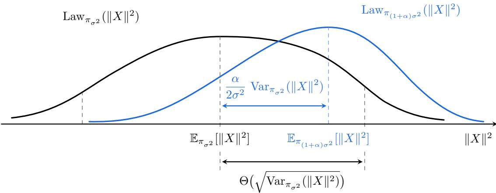

# Thin-Shell Stability of Gaussian Cooling: Logconcave Sampling with Sesteric Complexity from a Cold Start

Yunbum Kook University of Michigan ybkook@umich.edu

Santosh S. Vempala Georgia Tech vempala@gatech.edu

## Abstract

We show that logconcave probability measures along the Gaussian cooling path have thin-shell stability, generalizing the thin-shell theorem. This result leads to improved complexity for the fundamental problem of sampling an arbitrary logconcave distribution from a cold start. For (near-)isotropic logconcave distributions, the complexity is nearly $n ^ { 2 . 5 }$ , improving the previous bound of $n ^ { 2 . \bar { 7 } 5 }$ , and matching the complexity of the abstract Speedy walk.

## 1 Introduction

The study of the complexity of logconcave sampling in high dimension has led to powerful algorithmic techniques and beautiful geometric phenomena. It is known that an arbitrary logconcave distribution in Rn with density proportional to $e ^ { - V ( x ) }$ for some convex function V can be sampled from a warm start1 using $\begin{array} { r } { \tilde { O } ( n ^ { 2 } \dot { C } _ { \mathsf { P l } } \mathrm { p o l y l o g } \frac { 1 } { \varepsilon } ) } \end{array}$ evaluations of V [KV26b]. This is a tight bound for known methods and conjectured to be the best possible for any algorithm with only oracle query access to the target density. Here, the Poincaré constant $C _ { \mathsf { P l } }$ is conjectured to be a universal constant for isotropic logconcave distributions (by the celebrated Kannan–Lovász–Simonovits (KLS) conjecture [KLS95]) and known to be bounded by O(log n) [Kla23].

In this paper, we focus on the problem of logconcave sampling from a cold start (i.e., no warm start), given access to an evaluation oracle for V. For the methods that achieve the best known bounds from a warm start, such as the Ball walk [KLS97] and In-and-Out [KVZ26, KV25b], initiating them from an arbitrary point could lead to very high complexity. This is due to the fact that for points near the boundary, these methods could make a large number of attempts (queries) before making a single proper step; moreover, this is unavoidable. Hit-and-Run has also been shown to have similar complexity from a warm start [LV06b, KV26a], and while it has the advantage of polynomial complexity from an arbitrary interior starting point, the known analysis incurs an additional factor of dimension, i.e., with complexity scaling as $n ^ { 3 }$

Sampling is a key ingredient in algorithms for volume computation [DFK91, LS93, KLS97, LV06c, CV18], integration, and rounding [LV06a, JLLV26, KV25b]. To give complete guarantees for the latter problems, researchers have addressed the challenge of generating a warm start eficiently, with Kannan, Lovász, and Simonovits [KLS97] giving an algorithm for convex bodies with complexity roughly $n ^ { 5 }$ . The main idea is annealing, i.e., a sequence of distributions, each one providing a warm start for the next. The starting distribution is easy to sample, and the final distribution is the target. Lovász and Vempala improved this complexity to $n ^ { 4 }$ [LV06c] and extended the approach to logconcave distributions [LV06a]. In fact, a key idea was to use a sequence of logconcave distributions in the annealing schedule, which provably achieves an improvement over using a sequence of uniform distributions even for the case of convex bodies [DFK91, KLS97].

A decade later, Cousins and Vempala [CV18] introduced Gaussian cooling, an accelerated adaptation of the previous annealing schemes, and combined it with the Ball walk : $\mathsf { R } _ { \infty } \to \mathsf { T V } ^ { 2 }$ to obtain $n ^ { 3 }$ complexity for well-rounded distributions3. In particular, this implies that for an arbitrary near-isotropic distribution, sampling from a cold start has cubic complexity. The main idea in Gaussian cooling was an adaptive schedule, which eficiently accelerated the rate of progress towards the target, and this cubic complexity remained the state-of-the-art till 2025. We will discuss this in more detail presently.

The work of Lee and Vempala [LV18, LV24] suggests that further improvement might be possible. They showed that the Speedy walk, an abstract process introduced by [KLS97] and used only for analysis, has iteration complexity $n ^ { 2 . 5 }$ (not query complexity) and that this bound is tight. The Speedy walk counts only proper steps of the Ball walk and not wasted steps, which are needed by any known implementation; whether this $n ^ { 2 . 5 }$ iteration complexity can be matched by an actual algorithm in oracle-query complexity has remained an elusive question.

For uniform sampling, Kook, Vempala, and Zhang [KVZ24, KVZ26] developed the In-and-Out algorithm (also known as the proximal sampler [LST21]), using algorithmic difusion and obtaining a $\mathsf { R } _ { \infty } \to \mathsf { R } _ { q }$ guarantee. Beyond its stronger output guarantee, the algorithmic connection to heat flow makes tools from Markov semigroup theory, functional inequalities, and convex geometry available for its analysis. Subsequently, Kook and Zhang [KZ25] refined the analysis of Gaussian cooling to obtain $\mathsf { R } _ { \infty } .$ -warmness with the same cubic complexity, but warm-start generation was still a bottleneck toward subcubic complexity from a cold start. In-and-Out and the annealing algorithm were extended to general logconcave distributions through the exponential lifting technique [KV25b], matching the complexity of uniform sampling.

These ideas were seminal for the first improvement in cold start sampling since [CV18]: using a more careful annealing schedule, refining the bound on the log-Sobolev constant of logconcave probability measures with compact support, and relying on the stronger and faster end-to-end sampling guarantee in q-Rényi divergence, [KV25a, KV25c] improved the complexity of cold start sampling to $n ^ { 2 . 7 5 }$ , the first subcubic bound. They also gave an example showing a lower bound of $n ^ { 8 / 3 }$ for their general method. The motivation for the present paper is to understand the best possible complexity of sampling from a cold start.

Our main algorithmic result here is a refinement of Gaussian cooling, which, together with In-and-Out, achieves the complexity of nearly $n ^ { 2 . 5 }$ for arbitrary near-isotropic logconcave distributions. In other words, it matches the known iteration complexity of the abstract Speedy walk without any overhead. The core idea of the proof is a new stability phenomenon: while the Poincaré constant of logconcave distributions along the Gaussian cooling path can vary substantially (and thus using it, as in previous work, leads to higher complexity), the thin-shell constant is stable along this path, and this sufices! We will discuss this in more detail shortly, after presenting the main results precisely.

## 1.1 Results

Setup. Let $V : \mathbb { R } ^ { n }  \mathbb { R } \cup \{ \infty \}$ be a convex function such that $\mathrm { d } \pi ( x ) \propto e ^ { - V ( x ) }$ dx is a fulldimensional probability measure in $\mathbb { R } ^ { n }$ . Following the convention in [KV25b], let us denote its ground set by $\mathsf { L } _ { g } = \{ x \in \mathbb { R } ^ { n } : V ( x ) -$ inf $V ~ \leq ~ 1 0 n \}$ , and standardize the setup by assuming $B ( 0 , 1 ) \subset \mathsf { L } _ { g }$ (via translation and scaling). For the uniform distribution on a convex body $\mathcal { K } \subset \mathbb { R } ^ { n }$ this corresponds to $B ( 0 , 1 ) \subseteq \mathcal { K }$ . We assume access to its zeroth-order oracle $( { \mathrm { i . e . } }$ , evaluation oracle for V telling us $V ( x )$ for a queried point x).

We denote the barycenter by $m : = \mathbb { E } _ { \pi } X$ , the covariance matrix by $\Sigma : = \operatorname { c o v } _ { \pi } X = \operatorname { c o v } \pi$ , and its operator norm by $\Lambda : = \| \cos \pi \| _ { \mathsf { o p } } .$ . Since the barycenter m is not necessarily at the origin, we also define $L : = \| \Sigma + m m ^ { \mathsf { T } } \| _ { \mathsf { o p } }$ and $R ^ { 2 } = \mathbb { E } _ { \pi } [ \| \cdot \| ^ { 2 } ]$ . Note that $\Lambda \le L , \mathrm { t r } \Sigma \le R ^ { 2 }$ in general. For $t > 0$ , we define a Gaussian tilt of $\pi$ as $\pi _ { t } ( \mathrm { d } x ) \propto \exp ( - \frac { \| x \| ^ { 2 } } { 2 t } ) \pi ( \mathrm { d } x )$ , which can be thought of as the continuous version of Gaussian cooling. The stability proofs themselves use only logconcavity and these parameters, whereas the ground-set normalization is needed only for the sampling results.

Before we proceed, we define the anisotropic thin-shell constant ${ \sf Q } _ { n }$ of logconcave measures as the smallest number such that every isotropic logconcave distribution ν in $\mathbb { R } ^ { n }$ and every symmetric matrix M satisfy

$$
\operatorname { V a r } _ { \nu } ( Z ^ { \mathsf { T } } M Z ) \leq \mathsf { Q } _ { n } \operatorname { t r } ( M ^ { 2 } ) .\tag{1.1}
$$

The ordinary thin-shell conjecture [ABP03, BK03], which was proven by Klartag and Lehec [KL25] in 2025, posits $\mathsf Q _ { n } = { \cal O } ( 1 )$ when $M = I _ { n }$ . Recently, Chen and Klartag showed that $\mathsf Q _ { n } = 8$ is sharp when $M = I _ { n } \ [ \mathrm { C K 2 6 } ]$ . For symmetric M, it holds that ${ \sf Q } _ { n } \stackrel { < } { \sim }$ log n due to Klartag’s KLS bound [Kla23].

Result 1: Thin-shell stability along Gaussian tilts. Consider the family of Gaussian tilts $\{ \pi _ { t } \} _ { t \ge 0 }$ that interpolates between $\pi _ { 0 } = \delta _ { 0 }$ and $\pi _ { \infty } = \pi$ . The first result shows that the variance of $\| X \| ^ { 2 }$ can be bounded in terms of the barycenter and covariance matrix of the base measure π.

Theorem 1.1 (Stability of thin-shell estimates). Let π be any logconcave probability measure in $\mathbb { R } ^ { n }$ with $m = \mathbb { E } _ { \pi } X$ and $\Sigma = \mathrm { c o v } \pi$ , and $\pi _ { t }$ be its Gaussian tilt for $t > 0$ . Then,

$$
\operatorname* { s u p } _ { t > 0 } \operatorname { V a r } _ { \pi _ { t } } ( \| X \| ^ { 2 } ) \lesssim ( 1 + \mathsf Q _ { n } ) ^ { 2 } \left[ \operatorname { t r } ( \Sigma ^ { 2 } ) + \| m \| ^ { 2 } \left( \operatorname { t r } ( \Sigma ^ { 2 } ) + m ^ { \mathsf T } \Sigma m \right) ^ { 1 / 2 } \right] = \widetilde O ( R ^ { 2 } L \wedge R ^ { 3 } \Lambda ^ { 1 / 2 } ) .
$$

In particular, when π is isotropic, this result implies that the thin-shell constant remains bounded: $\begin{array} { r } { \frac { 1 } { n } \operatorname { V a r } _ { \pi _ { t } } ( \| X \| ^ { 2 } ) \lesssim ( 1 + \mathsf { Q } _ { n } ) ^ { 2 } } \end{array}$ . Note that this extends the thin-shell bound [KL25, CK26] to all t (up to log factors). Its stronger version would be stability of the covariance operator norm, but this is false in general [Biz26, KV25c]; see §1.2.1 for more details.

Result 2: Faster warm-start generation for logconcave distributions. We start with warmstart generation for the uniform distribution on a convex body. Using the thin-shell stability result, our algorithm follows the Gaussian cooling scheme of [KV25c] with more aggressive updates to $\sigma ^ { 2 }$ Roughly speaking, it updates $\sigma ^ { 2 }$ by a factor of $( 1 + \sigma ^ { 2 } / \mathsf { V } ^ { 1 / 2 } )$ in each phase, where V is the thin-shell bound on $\textstyle \operatorname* { s u p } _ { t > 0 } \operatorname { V a r } _ { \pi _ { t } } ( \| X \| ^ { 2 } )$ . Using In-and-Out for truncated Gaussians, whose query complexity is $n ^ { 2 } \sigma ^ { 2 }$ from an O(1)-warm start in $\mathsf { R } _ { q }$ , doubling a given $\sigma ^ { 2 }$ requires $\dot { n } ^ { 2 } \sigma ^ { 2 } \times \dot { \mathsf { V } } ^ { 1 / 2 } / \dot { \sigma } ^ { 2 } = \dot { n } ^ { 2 } \mathsf { V } ^ { 1 / 2 }$ queries. Since there are logarithmically many doublings, the total query complexity for warm-start generation is ${ \widetilde { O } } ( n ^ { 2 } \mathsf { V } ^ { 1 / 2 } )$ This is simply ${ \widetilde { \cal O } } ( n ^ { 2 . 5 } )$ for isotropic uniform distributions. Hence, we “algorithmically” achieve the iteration complexity of the Speedy walk in [LV24].

Theorem 1.2 (Faster warm start for uniform sampling). Let $\mathcal { K } \subset \mathbb { R } ^ { n }$ be a convex body with $B ( 0 , 1 ) \subset \mathcal { K }$ and π uniform on $\kappa$ . Algorithm 3.5 outputs a law ν satisfying $\mathsf { R } _ { q } ( \nu \parallel \pi ) \leq 1$ for $q \geq 1$ using ${ \widetilde O } ( q ^ { 1 / 2 } n ^ { 2 } \mathsf { V } ^ { 1 / 2 } ) = { \widetilde O } ( q ^ { 1 / 2 } n ^ { 2 }$ min $\{ R L ^ { 1 / 2 } , R ^ { 3 / 2 } \Lambda ^ { 1 / 4 } \}$  expected membership queries. When π is nearly isotropic $( i . e . , \mathrm { c o v } \pi \approx I _ { n } )$ , the total complexity is ${ \widetilde { \cal O } } ( q ^ { 1 / 2 } n ^ { 2 . 5 } )$

This improves the previously best complexity [KV25a, KV25c]. It is conceivable that $n ^ { 2 . 5 }$ is the best possible complexity for cold-start sampling in light of the $\bar { n } ^ { 2 . 5 }$ lower bound for the iteration complexity of the Speedy walk [LV24].

For general logconcave distributions, we use the exponential lift [KV25b], streamline the tilted Gaussian annealing in [KV25c], and accelerate it using thin-shell stability.

Theorem 1.3 (Faster warm start for logconcave sampling). Let $V : \mathbb { R } ^ { n }  \mathbb { R } \cup \{ \infty \}$ be a convex function, and suppose that $\pi \propto e ^ { - V }$ satisfies $B ( 0 , 1 ) \subseteq \mathsf { L } _ { g }$ . Given access to an evaluation oracle for V , Algorithm $4 . 5$ outputs a law ν satisfying $\mathsf { R } _ { q } ( \nu \parallel \pi ) \leq 2$ for $q \geq 1$ , using $\widetilde { \cal O } ( n ^ { 2 . 5 } + q ^ { 1 / 2 } n ^ { 2 } \vee ^ { 1 / 2 } )$ expected evaluation queries, which can be bounded as

$$
{ \widetilde O } ( n ^ { 2 . 5 } + q ^ { 1 / 2 } n ^ { 2 } \operatorname* { m i n } \{ R L ^ { 1 / 2 } , R ^ { 3 / 2 } \Lambda ^ { 1 / 4 } \} ) .
$$

When π is nearly isotropic $( i . e . , \mathrm { c o v } \pi \approx I _ { n } )$ , the total complexity is ${ \cal \tilde { O } } ( q ^ { 1 / 2 } n ^ { 2 . 5 } )$

## 1.2 Technical overview

Our proofs are organized around a direct connection between Gaussian cooling and thin-shell stability. We first recall the intuition behind Gaussian cooling [CV15, CV18], focusing on how thin-shell stability determines its annealing rate. We then outline the proof of thin-shell stability and explain how it leads to a faster annealing schedule for logconcave distributions.

Gaussian cooling and variance of thin shells. Let π be a logconcave distribution on $\mathbb { R } ^ { n }$ and consider the Gaussian-tilted family $\begin{array} { r } { \pi _ { \sigma ^ { 2 } } ( \mathrm { d } x ) \propto \exp ( - \frac { \| x \| ^ { 2 } } { 2 \sigma ^ { 2 } } ) \pi ( \mathrm { d } x ) } \end{array}$ . Gaussian cooling gradually increases $\sigma ^ { 2 }$ , thereby weakening the efect of Gaussian tilts and interpolating toward the target π. To understand the annealing rate, we take a geometric view of Gaussian cooling. The fluctuation scale of $\| X \| ^ { 2 }$ is $\operatorname { V a r } _ { \pi _ { \sigma ^ { 2 } } } ( \| X \| ^ { 2 } ) ^ { 1 / 2 }$ . Geometrically, when we increase $\sigma ^ { 2 }$ , the next annealing distribution should overlap substantially with the thin shell of the previous annealing distribution $\pi _ { \sigma ^ { 2 } }$ so that consecutive distributions are “close” enough for a sampler to mix rapidly toward the next distribution. Hence, heuristically, $\mathbb { E } _ { \pi _ { \sigma _ { \mathrm { n e w } } ^ { 2 } } } [ \| X \| ^ { 2 } ]$ should lie in $\mathbb { E } _ { \pi _ { \sigma ^ { 2 } } } [ \| X \| ^ { 2 } ] \pm O ( \operatorname { V a r } _ { \pi _ { \sigma ^ { 2 } } } ( \| X \| ^ { 2 } ) ^ { 1 / 2 } )$

  
Figure 1.1: Gaussian cooling viewed through the distribution of the squared radius. The schematic profiles show the laws of $\| X \| ^ { 2 }$ under consecutive Gaussian tilts. Increasing $\sigma ^ { 2 }$ to $\left( 1 + \alpha \right) \sigma ^ { 2 }$ shifts the mean roughly by the amount indicated by the blue arrow. Comparing this displacement with the current fluctuation scale (black arrow) motivates the annealing step size.

To make this intuition concrete, let $\sigma _ { \mathrm { n e w } } ^ { 2 } = \left( 1 + \alpha \right) \sigma ^ { 2 }$ for a small increment $\alpha .$ . Direct computation gives $\partial _ { \sigma ^ { 2 } } \mathbb { E } _ { \pi _ { \sigma ^ { 2 } } } [ \| X \| ^ { 2 } ] = \operatorname { V a r } _ { \pi _ { \sigma ^ { 2 } } } ( \| X \| ^ { 2 } ) / ( 2 \sigma ^ { 4 } )$ . Thus, the center of the thin shell moves roughly by ${ \frac { \alpha } { 2 \sigma ^ { 2 } } } \operatorname { V a r } _ { \pi _ { \sigma ^ { 2 } } } ( \| X \| ^ { 2 } )$ . Since we want this change to be smaller than the annulus width $O ( \operatorname { V a r } _ { \pi _ { \sigma ^ { 2 } } } ( \| X \| ^ { 2 } ) ^ { 1 / 2 } )$ , this suggests the multiplicative step $\alpha \lesssim \sigma ^ { 2 } / \operatorname { V a r } _ { \pi _ { \sigma ^ { 2 } } } ( \| X \| ^ { 2 } ) ^ { 1 / 2 }$ . Note that a larger variance has two competing efects: it gives a larger annulus, but it moves its center even faster, so $\sigma ^ { 2 } / \operatorname { V a r } _ { \pi _ { \alpha ^ { 2 } } } ( \| X \| ^ { 2 } ) ^ { 1 / 2 }$ is the ideal balance between these two efects.

This identifies $\operatorname { V a r } _ { \pi _ { \sigma ^ { 2 } } } ( \| X \| ^ { 2 } )$ as a fundamental quantity underlying Gaussian cooling and motivates bounding it uniformly. Previous work bounds it by $\operatorname { V a r } _ { \pi _ { \sigma ^ { 2 } } } ( \| X \| ^ { 2 } ) \leq 4 \sigma ^ { 2 } \mathbb { E } _ { \pi _ { \sigma ^ { 2 } } } [ \| X \| ^ { 2 } ]$ using the strong logconcavity of $\pi _ { \sigma ^ { 2 } }$ and the Poincaré inequality (or Brascamp–Lieb). Since $\mathbb { E } _ { \pi _ { \sigma ^ { 2 } } } [ \| X \| ^ { 2 } ]$ can be made $O ( R ^ { 2 } )$ by a suitable truncation, the previous bound yields $\alpha \asymp \sigma / R$ . On the other hand, a uniform bound $\begin{array} { r } { \operatorname* { s u p } _ { \sigma ^ { 2 } > 0 } \operatorname { V a r } _ { \pi _ { \sigma ^ { 2 } } } ( \| X \| ^ { 2 } ) \leq \mathsf { V } } \end{array}$ suggests $\alpha \asymp \sigma ^ { 2 } / \mathsf { V } ^ { 1 / 2 }$ . Once $\sigma ^ { 2 } \geq 1$ , this suggests a faster annealing schedule than those in previous work. Theorem 1.1 establishes such a $\sigma ^ { 2 } .$ -independent uniform bound along Gaussian cooling.

## 1.2.1 Thin-shell stability of Gaussian tilts

To build intuition, consider an isotropic logconcave probability measure $\nu$ on $\mathbb { R } ^ { n }$ , and let $\mathrm { d } \nu _ { s } \propto$ $e ^ { - s \| x \| ^ { 2 } } \mathrm { d } \nu$ denote its Gaussian tilt for $s \in [ 0 , \infty ]$ , where we use the inverse parameter $s = 1 / ( 2 t )$ for the sake of exposition. Prior work [KV25a] proposed a stronger version of the thin-shell stability conjecture as part of an attempt to design a faster warm-start algorithm, based on geometric intuition for stability of the largest eigenvalue of cov $\nu _ { s }$ . Indeed, by (PI),

$$
\begin{array} { r } { \operatorname { V a r } _ { \nu _ { s } } ( \| X \| ^ { 2 } ) \leq 4 C _ { \mathsf { P I } } ( \nu _ { s } ) \mathbb { E } _ { \nu _ { s } } [ \| X \| ^ { 2 } ] \lesssim _ { \log n } \| \mathrm { c o v } \nu _ { s } \| _ { \mathsf { o p } } \mathbb { E } _ { \nu } [ \| X \| ^ { 2 } ] = n \| \mathrm { c o v } \nu _ { s } \| _ { \mathsf { o p } } , } \end{array}
$$

where the second inequality follows from $C _ { \mathsf { P l } } ( \nu _ { s } ) \lesssim \| \mathrm { c o v } \nu _ { s } \| _ { \mathsf { o p } }$ log n (i.e., the logarithmic KLS bound) and $\mathbb { E } _ { \nu _ { s } } [ \| X \| ^ { 2 } ] \le \mathbb { E } _ { \nu } [ \| X \| ^ { 2 } ]$ (which follows by diferentiating $\mathbb { E } _ { \nu _ { s } } [ \lVert X \rVert ^ { 2 } ]$ with respect to s). Following the same reasoning, one might conjecture that $\lambda _ { s } : = \| \mathrm { c o v } \nu _ { s } \| _ { \mathsf { o p } }$ should be $O ( \| \mathrm { c o v } \nu \| _ { \mathsf { o p } } ) = O ( 1 )$ However, it was later disproved by [KV25c] using Bizeul’s example [Biz26].

A natural alternative is to directly control $\mathsf { V } _ { s } : = \operatorname { V a r } _ { \nu _ { s } } ( \| X \| ^ { 2 } )$ without going through (PI). Hence, we study the thin-shell variance $\mathsf { V } _ { s }$ as s decreases from ∞ to 0. Two competing factors determine $\mathsf { V } _ { s } \colon \mathrm { ~ ( i ) ~ }$ the base measure ν and (ii) the variance $\frac { 1 } { 2 s }$ of the Gaussian factor. When $s$ is large (so the Gaussian variance is small), the Gaussian factor pulls the ν-mass toward the origin. In this regime, the efect of the base measure ν should be limited. Hence, $\nu _ { s }$ is concentrated near the origin, and intuitively, $\vee _ { s }$ should be small. As s decreases (so the Gaussian variance is larger), we expect the ν -measure to become more dispersed, which should in turn increase $\mathsf { V } _ { s }$ . However, when s is suficiently small, the Gaussian weight is Θ(1) throughout the efective support of $\nu ,$ which contains most of the ν-measure $( \mathrm { e . g . , ~ } \| x \| = O ( n ^ { 1 / 2 } ) )$ . In this regime, the Gaussian tilt has little efect. Hence, $\nu _ { s }$ should be distributed similar to the isotropic measure $\nu ,$ and we expect $\mathsf { V } _ { s } \approx \mathrm { V a r } _ { \nu } ( \| X \| ^ { 2 } )$ By the thin-shell theorem, we expect $\mathsf { V } _ { s } = O ( n )$ . In summary, as s decreases from ∞ to 0, the thin-shell variance should initially increase as the Gaussian factor weakens. Once the efect of the original isotropic measure becomes dominant, however, $\mathsf { V } _ { s }$ should remain $O ( n )$ . Thus, a plausible conjecture is that $\mathsf { V } _ { s } = O ( n )$ for all $s \in [ 0 , \infty ]$

Decomposition of variance. For a general logconcave measure $\pi$ with $m = \mathbb { E } X$ and $\Sigma = \operatorname { c o v } \pi ,$ let $Z = \Sigma ^ { - 1 / 2 } ( X - m )$ for $X \sim \pi .$ , and let ν be the law of $Z ,$ , which is isotropic and logconcave. Under this change of variables, the tilted law $\pi _ { t }$ becomes

$$
\nu _ { s } ( \mathrm { d } z ) \propto \exp ( - s \| \Sigma ^ { 1 / 2 } z + m \| ^ { 2 } ) \nu ( \mathrm { d } z ) \qquad \mathrm { f o r ~ } s = ( 2 t ) ^ { - 1 } ,
$$

and $\| X \| ^ { 2 } = \| \Sigma ^ { 1 / 2 } Z + m \| ^ { 2 }$ . Hence, to bound $\operatorname { V a r } _ { \pi _ { t } } ( \| X \| ^ { 2 } )$ , we consider the following problem: for $M \succ 0$ and $u \in \mathbb { R } ^ { n }$ , define $q _ { u } ( x ) = \lVert M ^ { 1 / 2 } x + u \rVert ^ { 2 }$ under the tilt $\nu _ { s } ( \mathrm { d } x ) \propto e ^ { - s q _ { u } ( x ) } \nu ( \mathrm { d } x )$ for $s \in [ 0 , \infty ]$ (later we can simply take $M = \Sigma$ and $u = m )$ . Write $b _ { s }$ and $B _ { s }$ for the mean and covariance of $\nu _ { s } .$ , and set $y _ { s } = M ^ { 1 / 2 } b _ { s } +$ u and $M _ { s } = M ^ { 1 / 2 } B _ { s } M ^ { 1 / 2 }$ . Isotropizing $\nu _ { s }$ and applying the definition of $\mathsf Q _ { n }$ gives

$$
\mathrm { V a r } _ { \nu _ { s } } q _ { u } \lesssim \mathsf { Q } _ { n } \mathrm { t r } ( M _ { s } ^ { 2 } ) + y _ { s } ^ { \mathsf { T } } M _ { s } y _ { s } .
$$

Hence, it sufices to control $\mathrm { t r } ( M _ { s } ^ { 2 } )$ and the contribution of the moving mean $y _ { s }$ . The Brascamp–Lieb inequality yields $M _ { s } \preceq ( 2 s ) ^ { - 1 } { \mathrm { I d } }$ , but applying this bound independently in every direction loses a factor of n and becomes vacuous as s ↓ 0. As mentioned earlier, the plausible alternative of proving $\| B _ { s } \| _ { \mathsf { o p } } \lesssim \| B _ { 0 } \| _ { \mathsf { o p } }$ is also false: covariance operator-norm stability under Gaussian tilting is false in general. This suggests controlling the eigenvalues collectively, rather than the largest eigenvalue.

Collective spectral control of $M _ { s }$ . Consider first the centered case $u = 0$ . Let $\lambda _ { i } ( s )$ be the eigenvalues of $M _ { s }$ , and let $P _ { s }$ and $N _ { s }$ denote the total increase and decrease of these eigenvalues relative to $M _ { 0 } = M$

$$
N _ { s } : = \sum _ { \lambda _ { i } ( s ) < \lambda _ { i } ( 0 ) } \left( \lambda _ { i } ( 0 ) - \lambda _ { i } ( s ) \right) \qquad \mathrm { a n d } \qquad P _ { s } : = \sum _ { \lambda _ { i } ( s ) > \lambda _ { i } ( 0 ) } \left( \lambda _ { i } ( s ) - \lambda _ { i } ( 0 ) \right) .
$$

Note that tr $M _ { s } - \mathrm { t r } M _ { 0 } = P _ { s } - N _ { s }$ . The score identity (Lemma 2.3) gives $\partial _ { s } \mathbb { E } _ { s } [ X ^ { \mathsf { T } } M X ] = - \operatorname { V a r } _ { \nu _ { s } } q _ { u }$ which relates $N _ { s } , P _ { s }$ , and $\| y _ { s } \| ^ { 2 }$ as follows: $\begin{array} { r } { \Delta _ { s } : = \int _ { 0 } ^ { s } \operatorname { V a r } _ { \nu _ { r } } q _ { u } \mathrm { d } r = N _ { s } - P _ { s } - \| y _ { s } \| ^ { 2 } } \end{array}$ , so $P _ { s } + \| y _ { s } \| ^ { 2 } \leq N _ { s }$ Also, diferentiating $\lambda _ { i } ( s )$ along the same path gives $\partial _ { s }$ log $\lambda _ { i } ( s ) = - \mathrm { c o v } _ { s } ( Z _ { s , i } ^ { 2 } , q _ { u } )$ , where $Z _ { s }$ is the random variable for isotropization of $\nu _ { s }$ . The log-spectrum estimate yields $N _ { s } ^ { 2 } \leq s \mathsf { Q } _ { n } \operatorname { t r } ( M ^ { 2 } ) \Delta _ { s }$ Since $\Delta _ { s } \leq N _ { s }$ , both spectral gain and squared mean displacement are $O ( s )$ . Combining these relations yields $\operatorname { \mathrm { { r } } } ( M _ { s } ^ { 2 } ) \leq \operatorname { t r } ( M ^ { 2 } ) \left( 1 + \mathsf { Q } _ { n } \right)$ and $y _ { s } ^ { \mathsf { T } } M _ { s } y _ { s } \leq { \textstyle \frac { 1 } { 2 } } \operatorname { t r } ( M ^ { 2 } ) { \mathsf { Q } } _ { n }$ with $\mathsf Q _ { n } \lesssim$ log n (Lemma 2.5). Note that we avoid the naïve factor-n loss: instead of using the same worst-case bound on every eigenvalue, we control the $\ell _ { 2 } \cdot$ -norm of the entire log-spectrum collectively. The detailed proof appears in §2.1.

Extension to the shifted case. When $u \ne 0$ , the same argument starts from $y _ { 0 } = u ,$ and the identity becomes $\Delta _ { s } = N _ { s } - P _ { s } + \| u \| ^ { 2 } - \| y _ { s } \| ^ { 2 }$ . This change adds $O ( \| u \| ^ { 2 } / s )$ to $\mathrm { V a r } _ { \nu _ { s } } q _ { u } ,$ which is useful but vacuous near the untilted endpoint $\left( \mathrm { i . e . , ~ } s = 0 \right)$ At that endpoint, the same decomposition and the quadratic-form estimate directly bound $\operatorname { V a r } _ { \nu } q _ { u }$ in terms of $G : =$ $\mathrm { t r } ( M ^ { 2 } ) + u ^ { \mathsf { T } } M u$ . Moreover, the score identity and reverse Hölder inequality for quadratic polynomials give $\vert \partial _ { s } \mathrm { V a r } _ { \nu _ { s } } q _ { u } \vert \lesssim ( \mathrm { V a r } _ { \nu _ { s } } q _ { u } ) ^ { 3 / 2 }$ . Solving this Grönwall-type inequality, we use the resulting bound up to $s _ { 0 } \asymp [ ( \mathsf Q _ { n } + 4 ) G ] ^ { - 1 / 2 }$ and the spectral estimate thereafter. Concatenating the two regimes yields the additional term $\| u \| ^ { 2 } \sqrt { G }$ in Theorem 2.1. Putting these together, we obtain the bound $\mathsf { V } = \widetilde { O } ( R ^ { 2 } L \wedge R ^ { 3 } \Lambda ^ { 1 / 2 } )$

## 1.2.2 From variance stability to faster Gaussian cooling

Rényi-divergence between annealing distributions. The heuristic calculation above suggests the natural scale of $\alpha \asymp \sigma ^ { 2 } / \sqrt { \mathsf { V } }$ . To make this quantitative, let $F ( s )$ be the logarithm of the normalization constant of $\nu _ { s } ( \mathrm { d } x ) \propto e ^ { - s \| x \| ^ { 2 } } \pi ( \mathrm { d } x )$ . Diferentiation gives $F ^ { \prime \prime } ( s ) = \operatorname { V a r } _ { \nu _ { s } } ( \| X \| ^ { 2 } )$ . By the definition of q-Rényi divergence, one can check that $\mathsf { R } _ { q } ( \nu _ { s } \parallel \nu _ { s ^ { \prime } } ) = [ F ( s + ( q - 1 ) \Delta ) - q F ( s ) +$ $( q - 1 ) F ( s - \Delta ) ] / ( q - 1 )$ for $\Delta : = s - s ^ { \prime }$ . Using Taylor expansion, for $I = [ s ^ { \prime } , s ^ { \prime } + q \Delta ]$ , we have

$$
F ( s + ( q - 1 ) \Delta ) \leq F ( s ) + ( q - 1 ) \Delta F ^ { \prime } ( s ) + \frac { V _ { I } } { 2 } ( q - 1 ) ^ { 2 } \Delta ^ { 2 } \mathrm { a n d } F ( s - \Delta ) \leq F ( s ) - \Delta F ^ { \prime } ( s ) + \frac { V _ { I } } { 2 } \Delta ^ { 2 } ,
$$

$$
\mathsf { R } _ { q } ( \nu _ { s } \parallel \nu _ { s ^ { \prime } } ) \leq \frac { q } { 2 } ( s - s ^ { \prime } ) ^ { 2 } \operatorname* { s u p } _ { t \in { I } } \mathrm { V a r } _ { \nu _ { t } } ( \parallel X \parallel ^ { 2 } ) .
$$

If $s ~ = ~ ( 2 \sigma ^ { 2 } ) ^ { - 1 }$ , consecutive targets remain O(1)-close in $\mathsf { R } _ { q }$ under the update $\sigma ^ { 2 }  \sigma ^ { 2 } ( 1 +$ $\Theta ( \sigma ^ { 2 } / \sqrt { q \mathsf { V } } ) )$ . The same inequality shows that $\sigma ^ { 2 } \gtrsim \sqrt { q \mathsf { V } }$ is suficient for warmness with respect to the target $\pi ,$ so we set $\sigma _ { \mathrm { l a s t } } ^ { 2 } \asymp \sqrt { q \mathsf { V } }$ . As discussed in Remark 3.3, the resulting bound recovers prior closeness bounds in [CV18, KV25a, KV25c]. Prior works use the following bound:

$$
\operatorname { V a r } _ { \nu _ { s } } ( \| X \| ^ { 2 } ) \leq 4 \sigma ^ { 2 } \mathbb { E } _ { \nu _ { s } } [ \| X \| ^ { 2 } ] \lesssim \sigma ^ { 2 } R ^ { 2 }
$$

by (PI) (or Brascamp–Lieb); this $\sigma ^ { 2 } .$ -dependent bound becomes loose as $\sigma ^ { 2 }$ increases.

Special case: uniform sampling. For a convex body containing the unit ball, we can sample the initial target at $\sigma _ { 0 } ^ { 2 } = 1 / n$ exactly by Gaussian rejection sampling. We then follow this schedule using In-and-Out (the proximal sampler) for truncated Gaussians [KV25c]. At scale $\sigma ^ { 2 }$ , each phase $( { \mathrm { i . e . } }$ , sampling initialized at an $O ( 1 )$ -warm start in $\mathsf { R } _ { q } )$ requires $\scriptstyle { \tilde { O ( } } n ^ { 2 } \sigma ^ { 2 } )$ queries, and doubling the initial $\sigma ^ { 2 }$ requires ${ \cal O } ( \sqrt { q \nabla } / \sigma ^ { 2 } )$ phases. Thus, each doubling costs ${ \widetilde { O } } ( n ^ { 2 } { \sqrt { q \mathsf { V } } } )$ queries. Since there are $O ( \log ( q n \mathsf { V } ) )$ doublings, by the stability estimate, the total complexity of Gaussian annealing is $\widetilde { \cal O } ( q ^ { \mathrm { i } / 2 } n ^ { 2 } \operatorname * { m i n } \{ R \sqrt { L } , R ^ { \bar { 3 } / 2 } \Lambda ^ { 1 / 4 } \} )$ ) queries; for a nearly isotropic target, this is ${ \widetilde O } ( q ^ { 1 / 2 } n ^ { 5 / 2 } )$ . Using hypercontractivity of the proximal sampler [KV25c], this procedure propagates $\mathsf { R } _ { q } .$ -warmness from one target to the next. The details are given in $\ S 3$

General case: logconcave sampling. Given a convex potential V and an evaluation oracle for it, we use the lifting technique [KV25b]; instead of sampling directly from $\pi \propto e ^ { - V }$ , we sample from a density proportional to $e ^ { - n t } \mathbb { 1 } _ { K } ( x , t )$ , where $K = \{ ( x , t ) : V ( x ) \leq n t \}$ is the epigraph of $V / n$ . Its X-marginal is exactly proportional to $e ^ { - V ( x ) }$ . Suitable truncation $\bar { \kappa }$ of $\kappa$ contains at least half of the lifted measure and ensures a finite log-Sobolev constant. Since the truncated X-marginal has density at most twice that of $\pi ,$ its parameters R, L, Λ are bounded by universal multiples of those of $\pi$ . Hence, the required thin-shell upper bound increases by at most a universal factor.

On the truncated lift, we use the two-parameter annealing distribution from [KV25b]:

$$
\mu _ { \sigma ^ { 2 } , \rho } ( \mathrm { d } x , \mathrm { d } t ) \propto \exp ( - \frac { \| x \| ^ { 2 } } { 2 \sigma ^ { 2 } } - \rho t ) \mathbb { 1 } _ { \bar { K } } ( x , t ) \mathrm { d } x \mathrm { d } t .
$$

Using the proximal sampler for this distribution [KV25c], we follow the path $( n ^ { - 1 } , 1 ) \to ( n ^ { - 1 } , n ) \to$ $( \sigma _ { \mathrm { l a s t } } ^ { 2 } , n )$ in the $( \sigma ^ { 2 } , \rho )$ -plane, streamlining the annealing schedules proposed in [KV25a, KV25c]. The first segment changes only $\rho$ while keeping the strongly logconcave Gaussian component fixed. Once $\rho = n$ , the X-marginal is exactly the Gaussian tilt of the truncated target, so the second segment can reuse the schedule and theory developed for uniform sampling.

For the first phase $( n ^ { - 1 } , 1 ) \to ( n ^ { - 1 } , n )$ , we establish a new closeness bound. As in the analysis of the $\mathsf { R } _ { q }$ bound between consecutive annealing distributions, we have to bound $\operatorname { V a r } _ { ( \sigma ^ { 2 } , \rho ) } T : = \operatorname { V a r } _ { \mu _ { \sigma ^ { 2 } , \rho } } T$ Varentropy of the joint logconcave density [FMW16], together with the Poincaré bound for its strongly logconcave X-marginal, gives $\mathrm { V a r } _ { ( n ^ { - 1 } , \rho ) } T \lesssim n / \rho ^ { 2 }$ for $1 \leq \rho \leq n$ . Hence, for $q _ { 0 } = \widetilde { \Theta } ( 1 )$ , we multiply $\rho$ by $1 + \Theta ( 1 / \sqrt { q _ { 0 } \left( q _ { 0 } + n \right) } )$ at each phase. There are $\widetilde { O } ( { \sqrt { n } } )$ such phases, and each costs ${ \widetilde { \cal O } } ( n ^ { 2 } )$ queries (since the proximal sampler costs ${ \tilde { O } } ( n ^ { 2 } ( \sigma ^ { 2 } \vee 1 ) )$ from an $O ( 1 )$ )-warm start), using $\tilde { O } ( n ^ { 5 / 2 } )$ queries. We maintain the same base order $q _ { 0 }$ while increasing $\sigma ^ { 2 }$ to 1. Thereafter, using the hypercontractivity of the proximal sampler again (to boost the Rényi order from $q _ { 0 }$ to $q )$ , we use the thin-shell update up to $\sigma _ { \mathrm { l a s t } } ^ { 2 }$ . These Gaussian-annealing phases cost ${ \tilde { O } } ( n ^ { 2 } { \sqrt { q \mathsf { V } } } )$ queries as in the uniform case. Finally, data processing under $( x , t ) \mapsto x$ and the constant-mass truncation transfer the lifted warm start to the original target.

## 1.3 Preliminaries

We use the same symbol for a distribution and its density. Both $a \lesssim b$ and $a = O ( b )$ mean $a \leq$ cb for a universal constant $c > 0 . \ a = \Omega ( b )$ means $a \gtrsim b .$ and $a \asymp b$ means $a = O ( b )$ and $a = \Omega ( b )$ Lastly, $a = { \widetilde { O } } ( b )$ means $a = O ( b { \mathrm { p o l y l o g } } b )$ . For a positive semidefinite matrix $\Sigma , \ \| \Sigma \| _ { \mathsf { o p } }$ denotes the operator norm of Σ. We use $a \lor b$ and a $\wedge b$ to denote their maximum and minimum, respectively. $B ( x , r )$ denotes an $\ell _ { 2 } \cdot$ -ball of radius r centered at x.

Logconcavity. We call a function $f : \mathbb { R } ^ { n }  [ 0 , \infty )$ logconcave $\operatorname { i f } - \log f$ is convex in $\mathbb { R } ^ { n }$ , and call a probability measure $\pi$ (or distribution) logconcave if it has a logconcave density with respect to Lebesgue measure. We assume that all logconcave distributions considered in this work are full-dimensional4. For $t \geq 0$ , π is called t-strongly logconcave if − log π is t-strongly convex $( { \mathrm { i . e . } }$ − log $\pi - \textstyle { \frac { t } { 2 } } | \cdot | ^ { 2 }$ is convex). Logconcavity is preserved under multiplication, and a classical result by Prékopa and Leindler ensures that convolution also preserves logconcavity. A distribution is called isotropic if its barycenter is at the origin and its covariance matrix is the identity. Logconcave distributions have exponentially decaying tails and hence finite moments of all orders.

Probability. Let $\mu$ and $\nu$ denote probability measures on $\mathbb { R } ^ { n }$ with $\mu \ll \nu$ . For $q > 1$ , we define the warmness convention $M _ { q } = \| \mathrm { d } \mu / \mathrm { d } \nu \| _ { L ^ { q } ( \nu ) }$ . The q-Rényi divergence is defined as $\mathsf { R } _ { q } ( \mu \parallel \hphantom { . 1 }$ $\begin{array} { r } { \nu ) : = \frac { 1 } { q - 1 } \log \lVert \frac { \mathrm { d } \mu } { \mathrm { d } \nu } \rVert _ { L ^ { q } ( \nu ) } ^ { q } . } \end{array}$ , and the Rényi-infinity divergence is $\begin{array} { r } { \mathsf { R } _ { \infty } ( \mu \parallel \nu ) : = \log \mathrm { e s s } \operatorname* { s u p } _ { \nu } \frac { \mathrm { d } \mu } { \mathrm { d } \nu } } \end{array}$ . Recall monotonicity in the order: ${ \sf R } _ { q } \leq { \sf R } _ { q ^ { \prime } }$ for $q \leq q ^ { \prime }$ . A weak triangle inequality holds for Rényi divergence: for any $q > 1$ and probability measures $\mu , \nu , \pi$ , it holds that

$$
\mathsf { R } _ { q } ( \mu \parallel \pi ) \le \frac { 2 q } { 2 q - 1 } \mathsf { R } _ { 2 q - 1 } ( \mu \parallel \nu ) + \mathsf { R } _ { 2 q } ( \nu \parallel \pi ) .
$$

We refer to [vEH14, Mir17] for more properties of Rényi divergence.

Functional inequalities. A probability measure $\pi$ on $\mathbb { R } ^ { n }$ is said to satisfy a Poincaré inequality with constant C if for any locally Lipschitz function $f \in L ^ { 2 } ( \pi )$ ，

$$
\operatorname { V a r } _ { \pi } f : = \int \left( f - \int f \mathrm { d } \pi \right) ^ { 2 } \mathrm { d } \pi \leq C \int | \nabla f | ^ { 2 } \mathrm { d } \pi ,\tag{PI}
$$

and the smallest such $C$ is called the Poincaré constant $C _ { \mathsf { P l } } ( \pi )$ . A probability measure $\pi$ on $\mathbb { R } ^ { n }$ is said to satisfy a logarithmic Sobolev inequality with constant C if for any locally Lipschitz function $f \in L ^ { 2 } ( \pi )$ ，

$$
\mathrm { E n t } _ { \pi } ( f ^ { 2 } ) : = \int f ^ { 2 } \log f ^ { 2 } \mathrm { d } \pi - \int f ^ { 2 } \mathrm { d } \pi \cdot \log \int f ^ { 2 } \mathrm { d } \pi \leq 2 C \int | \nabla f | ^ { 2 } \mathrm { d } \pi ,\tag{LSI}
$$

and the smallest such $C$ is referred to as the log-Sobolev constant $C _ { \mathsf { L S l } } ( \pi )$ . In general, (LSI) is strictly stronger than (PI). By the Bakry–Émery criterion, every t-strongly logconcave probability measure π satisfies $C _ { \mathsf { L S I } } ( \pi ) \leq 1 / t$ [BGL14].

Historical note and AI use. In early June, during the conference “Scalable MCMC Sampling” held at the FIM–Institute for Mathematical Research at ETH Zürich, the authors realized how to handle the $n ^ { 8 / 3 }$ lower bound example from [KV25a] in $n ^ { 2 . 5 }$ oracle complexity. They formulated and discussed the thin-shell stability conjecture and promising approaches to proving it. The first author then used GPT 5.5 and 5.6 Pro to obtain a preliminary version of the proof of Theorem 1.1 through guided prompting. The authors verified, streamlined, and wrote the full proof and its consequences.

## 2 Thin-shell stability of Gaussian tilts

In this section, we show that the thin-shell variance remains bounded for Gaussian tilts; motivated by (1.1), a natural anisotropic version of the conjecture would be $\operatorname { V a r } _ { \nu _ { s } } ( X ^ { \mathsf { T } } M X ) \lesssim _ { \log n } \operatorname { t r } ( M ^ { 2 } )$ for every $s \geq 0$ . In §2.1, we provide the proof of this conjecture, and in §2.2, we provide the following generalization to shifted quadratic functions:

Theorem 2.1 (Shifted anisotropic quadratic tilt). Let ν be an isotropic logconcave probability measure on $\mathbb { R } ^ { n } , M \succeq 0$ , and $u \in \mathbb { R } ^ { n }$ . Set $q _ { u } ( x ) = \lVert M ^ { 1 / 2 } x + u \rVert ^ { 2 }$ and define the probability measure $\nu _ { s } ( \mathrm { d } x ) \propto e ^ { - s q _ { u } ( x ) } \nu ( \mathrm { d } x ) \ f o r \ s \ge 0$ . Then, for every $s \geq 0$

$$
\begin{array} { r } { \mathrm { V a r } _ { \nu _ { s } } q _ { u } \lesssim ( 1 + \mathsf { Q } _ { n } ) ^ { 2 } \left( \mathrm { t r } ( M ^ { 2 } ) + \| u \| ^ { 2 } \sqrt { \mathrm { t r } ( M ^ { 2 } ) + u ^ { \mathsf { T } } M u } \right) . } \end{array}
$$

Using this result, we readily obtain the thin-shell stability result (Theorem 1.1) needed for faster Gaussian cooling.

## 2.1 Proof idea: the centered case

We first present the proof in the centered case of Theorem $2 . 1 \ ( { \mathrm { i . e . , } } \ u = 0 )$

Theorem 2.2 (Centered anisotropic quadratic tilt). Let ν be an isotropic logconcave probability measure on $\mathbb { R } ^ { n }$ , and $\nu _ { s } ( \mathrm { d } x ) \propto e ^ { - s \left. x , M x \right. } \nu ( \mathrm { d } x )$ for $s \geq 0$ and $M \succeq 0$ . Then,

$$
\mathrm { V a r } _ { \nu _ { s } } ( X ^ { \mathsf { T } } M X ) \leq ( 2 \mathsf { Q } _ { n } ^ { 2 } + 6 \mathsf { Q } _ { n } ) \mathrm { t r } ( M ^ { 2 } ) \qquad f o r \ e v e r y \ s \geq 0 .\tag{2.1}
$$

We first prove the theorem for $M \succ 0$ . Denote the barycenter and covariance of $\nu _ { s }$ by $b _ { s } = \mathbb { E } _ { s } X$ and $B _ { s } = \operatorname { c o v } _ { s } X$ . Under $x \mapsto y = T ( x ) : = M ^ { 1 / 2 } x$ , the pushforward $Y _ { s } \sim T _ { \# } \nu _ { s }$ has barycenter $y _ { s } = M ^ { 1 / 2 } b _ { s }$ and covariance $M _ { s } = M ^ { 1 / 2 } B _ { s } M ^ { 1 / 2 }$ . Isotropy of ν gives $b _ { 0 } = 0$ and $B _ { 0 } = \mathrm { I d }$ , so $y _ { 0 } = 0$ and $M _ { 0 } = M$ . Although ν is centered, the quadratic tilt $\nu _ { s }$ need not preserve its mean.

Controlling the covariance and the moving mean. Isotropize $\nu _ { s }$ by $Z : = M _ { s } ^ { - 1 / 2 } M ^ { 1 / 2 } ( X - b _ { s } )$ for $X \sim \nu _ { s }$ . We now bound the variance of the target quadratic form $q ( x ) : = x ^ { \mathsf { T } } M x$ . We have the decomposition

$$
\begin{array} { r } { q ( x ) = x ^ { \mathsf { T } } M x = ( x - b _ { s } ) ^ { \mathsf { T } } M ( x - b _ { s } ) + 2 b _ { s } ^ { \mathsf { T } } M x - b _ { s } ^ { \mathsf { T } } M b _ { s } = z ^ { \mathsf { T } } M _ { s } z + 2 y _ { s } ^ { \mathsf { T } } M _ { s } ^ { 1 / 2 } z + b _ { s } ^ { \mathsf { T } } M b _ { s } . } \end{array}
$$

Hence, $\mathbb { E } _ { s } q = \operatorname { t r } M _ { s } + \| y _ { s } \| ^ { 2 }$ and $q - \mathbb { E } _ { s } q = ( Z ^ { \mathsf { T } } M _ { s } Z - \operatorname { t r } M _ { s } ) + 2 y _ { s } ^ { \mathsf { T } } M _ { s } ^ { 1 / 2 } Z .$ Since $\operatorname { V a r } _ { s } q = \lVert q -$ $\mathbb { E } _ { s } q \rVert _ { L ^ { 2 } ( \nu _ { s } ) } ^ { 2 } .$ , the triangle inequality in $L ^ { 2 }$ gives

$$
\begin{array} { r } { \sqrt { \mathrm { V a r } _ { s } q } \leq \| z ^ { \mathsf { T } } M _ { s } z - \mathrm { t r } M _ { s } \| _ { L ^ { 2 } ( \nu _ { s } ) } + 2 \| y _ { s } ^ { \mathsf { T } } M _ { s } ^ { 1 / 2 } z \| _ { L ^ { 2 } ( \nu _ { s } ) } \leq \sqrt { Q _ { n } \mathrm { t r } ( M _ { s } ^ { 2 } ) } + 2 \sqrt { y _ { s } ^ { \mathsf { T } } M _ { s } y _ { s } } . } \end{array}\tag{2.2}
$$

Here, (1.1) bounds the first term by $[ \mathsf { Q } _ { n } \operatorname { t r } ( M _ { s } ^ { 2 } ) ] ^ { 1 / 2 }$ , while $\| y _ { s } ^ { \mathsf { T } } M _ { s } ^ { 1 / 2 } z \| _ { L ^ { 2 } ( \nu _ { \mathrm { s } } ) } ^ { 2 } = \mathbb { E } _ { s } [ ( y _ { s } ^ { \mathsf { T } } M _ { s } ^ { 1 / 2 } Z ) ^ { 2 } ] =$ $y _ { s } ^ { \mathsf { T } } M _ { s } y _ { s }$ . Therefore, the proof reduces to controlling (i) the covariance contribution $\mathrm { t r } ( M _ { s } ^ { 2 } )$ and (ii) the moving-mean contribution $y _ { s } ^ { \mathsf { T } } M _ { s } y _ { s }$

We now bound these two terms. By Brascamp–Lieb, $M _ { s } ~ \preceq ~ ( 2 s ) ^ { - 1 } \mathrm { I d }$ , so each eigenvalue $( \lambda _ { i } ( s ) ) _ { i \in [ n ] }$ of $M _ { s }$ is bounded by $( 2 s ) ^ { - 1 }$ . However, applying this bound directly to $\mathrm { t r } ( M _ { s } ^ { 2 } )$ would lose a factor of the dimension n and would blow up as $s \downarrow 0$ . To refine the analysis, we track changes in the eigenvalues collectively relative to $M _ { 0 } = M$ and relate their total increase to their total decrease, rather than applying the same worst-case bound to all n eigenvalues. To make this precise, let us define the total spectral “loss” and “gain” by

$$
N _ { s } : = \sum _ { \lambda _ { i } ( s ) < \lambda _ { i } ( 0 ) } \left( \lambda _ { i } ( 0 ) - \lambda _ { i } ( s ) \right) \qquad \mathrm { a n d } \qquad P _ { s } : = \sum _ { \lambda _ { i } ( s ) > \lambda _ { i } ( 0 ) } \left( \lambda _ { i } ( s ) - \lambda _ { i } ( 0 ) \right) .
$$

Note that tr $M _ { s } - \mathrm { t r } M _ { 0 } = P _ { s } - N _ { s }$

We first track how much tr $( M _ { s } ^ { 2 } )$ has changed from tr $( M _ { 0 } ^ { 2 } )$ : since $\mathrm { t r } ( M _ { s } ^ { 2 } ) - \mathrm { t r } ( M _ { 0 } ^ { 2 } ) = \sum _ { i } ( \lambda _ { i } ( s ) ^ { 2 } -$ $\lambda _ { i } ( 0 ) ^ { 2 } )$ ),

$$
\mathrm { t r } ( M _ { s } ^ { 2 } ) - \mathrm { t r } ( M _ { 0 } ^ { 2 } ) \le \sum _ { \lambda _ { i } ( s ) > \lambda _ { i } ( 0 ) } \left( \lambda _ { i } ( s ) ^ { 2 } - \lambda _ { i } ( 0 ) ^ { 2 } \right) \le \frac { 1 } { \tilde { \left( { \boldsymbol { i } } \right) } } \sum _ { \lambda _ { i } ( s ) > \lambda _ { i } ( 0 ) } \left( \lambda _ { i } ( s ) - \lambda _ { i } ( 0 ) \right) = \frac { P _ { s } } { s } ,
$$

where (i) follows from $\lambda _ { i } ( s ) + \lambda _ { i } ( 0 ) \leq 2 \lambda _ { i } ( s ) \leq s ^ { - 1 }$ for an eigenvalue with $\lambda _ { i } ( s ) > \lambda _ { i } ( 0 )$ . Thus, the two target terms are bounded as

$$
\mathrm { t r } ( M _ { s } ^ { 2 } ) \leq \mathrm { t r } ( M _ { 0 } ^ { 2 } ) + \frac { P _ { s } } { s } \qquad \mathrm { a n d } \qquad y _ { s } ^ { \mathsf { T } } M _ { s } y _ { s } \leq \frac { \| y _ { s } \| ^ { 2 } } { 2 s } .\tag{2.3}
$$

Hence, it sufices to bound $P _ { s }$ and $\| y _ { s } \| ^ { 2 }$ in terms of s. An elementary identity couples $P _ { s } , N _ { s }$ , and $\| y _ { s } \| ^ { 2 }$

Coupling $P _ { s } , \ N _ { s } ,$ , and $\| y _ { s } \| ^ { 2 }$ . We first recall the following identity.

Lemma 2.3. Let ν be a probability measure, $q : \mathbb { R } ^ { n } \to \mathbb { R }$ measurable, and define an exponential tilt $\nu _ { s } ( \mathrm { d } x ) \propto e ^ { - s q ( x ) } \nu ( \mathrm { d } x )$ on an interval where the tilt is well-defined. If fs is diferentiable and diferentiation can be passed under the defining integrals, then $\partial _ { s } \mathbb { E } _ { s } f _ { s } = \mathbb { E } _ { s } [ \partial _ { s } f _ { s } ] - \mathrm { c o v } _ { s } ( f _ { s } , q )$ , where the identity is interpreted entrywise when $f _ { s }$ is vector- or matrix-valued.

Proof. Recall an elementary property of the score function: $\begin{array} { r } { \mathbb { E } _ { s } [ \partial _ { s } \log \nu _ { s } ] = \int \partial _ { s } \nu _ { s } = 0 } \end{array}$ due to $\partial _ { s } \nu _ { s } = \nu _ { s } \partial _ { s } \log \nu _ { s }$ . Diferentiating the expectation under the integral gives

$$
\partial _ { s } \mathbb { E } _ { s } f _ { s } = \int ( \partial _ { s } f _ { s } ) \nu _ { s } + \int f _ { s } \partial _ { s } \nu _ { s } = \mathbb { E } _ { s } [ \partial _ { s } f _ { s } ] + \mathbb { E } _ { s } [ f _ { s } \partial _ { s } \log \nu _ { s } ] = \mathbb { E } _ { s } [ \partial _ { s } f _ { s } ] + \mathrm { c o v } _ { s } ( f _ { s } , \partial _ { s } \log \nu _ { s } ) ,
$$

where the last equality follows from $\mathbb { E } _ { s } [ \partial _ { s } \log \nu _ { s } ] = 0$ . The claim follows from $\partial _ { s }$ log $\nu _ { s } = - ( q -$ $\mathbb { E } _ { s } q )$ □

Using this, $\partial _ { s } \mathbb { E } _ { s } q = - \operatorname { V a r } _ { \nu _ { s } } q .$ . Since $\mathbb { E } _ { s } q = \mathrm { t r } M _ { s } + \| y _ { s } \| ^ { 2 }$ and $\mathbb { E } _ { 0 } q = \operatorname { t r } M _ { 0 }$

$$
\Delta _ { s } : = \int _ { 0 } ^ { s } \mathrm { V a r } _ { \nu _ { r } } q \mathrm { d } r = \mathbb E _ { 0 } q - \mathbb E _ { s } q = N _ { s } - P _ { s } - \| y _ { s } \| ^ { 2 } .\tag{2.4}
$$

Since $\Delta _ { s } \geq 0$ (as $\mathrm { V a r } _ { \nu _ { r } } q \geq 0 )$ , we have $P _ { s } + \| y _ { s } \| ^ { 2 } \le N _ { s }$ . It remains to bound $N _ { s }$ in terms of s.

For an index with $\lambda _ { i } ( s ) < \lambda _ { i } ( 0 )$ , the elementary inequality $1 - r \leq - \log r$ for $0 < r \leq 1$ gives $\begin{array} { r } { \lambda _ { i } ( 0 ) - \lambda _ { i } ( s ) \le \lambda _ { i } ( 0 ) \vert \log { \frac { \lambda _ { i } ( s ) } { \lambda _ { i } ( 0 ) } } \vert } \end{array}$ . By Cauchy–Schwarz over the eigenvalues,

$$
N _ { s } \leq \left( \sum _ { i } \lambda _ { i } ( 0 ) ^ { 2 } \right) ^ { 1 / 2 } \left( \sum _ { i } \log ^ { 2 } \frac { \lambda _ { i } ( s ) } { \lambda _ { i } ( 0 ) } \right) ^ { 1 / 2 } \leq \left( \operatorname { t r } ( M _ { 0 } ^ { 2 } ) \right) ^ { 1 / 2 } \left( \sum _ { i } \log ^ { 2 } \frac { \lambda _ { i } ( s ) } { \lambda _ { i } ( 0 ) } \right) ^ { 1 / 2 } .\tag{2.5}
$$

To obtain an explicit factor of s on the right-hand side, we apply Cauchy–Schwarz in time:

$$
\sum _ { i } \log ^ { 2 } { \frac { \lambda _ { i } ( s ) } { \lambda _ { i } ( 0 ) } } = \sum _ { i } \Bigl ( \int _ { 0 } ^ { s } \partial _ { r } \log { \frac { \lambda _ { i } ( r ) } { \lambda _ { i } ( 0 ) } } \mathrm { d } r \Bigr ) ^ { 2 } \leq s \int _ { 0 } ^ { s } \sum _ { i } \bigl ( \partial _ { r } \log \lambda _ { i } ( r ) \bigr ) ^ { 2 } \mathrm { d } r .\tag{2.6}
$$

Spectral analysis of $M _ { s }$ . We now analyze how fast each $\lambda _ { i }$ changes:

Lemma 2.4. Let $u _ { i } = u _ { i } ( s )$ be a suitable unit eigenvector of $M _ { s }$ such that $M _ { s } u _ { i } = \lambda _ { i } ( s ) u _ { i }$ , and let $Z _ { i } : = u _ { i } ^ { \mathsf { T } } Z$ . Then,

$$
\partial _ { s } \log \lambda _ { i } ( s ) = - \operatorname { c o v } _ { s } ( Z _ { i } ^ { 2 } , q ) .\tag{2.7}
$$

Proof. By Lemma 2.3 for the centered covariance,

$$
B _ { s } ^ { \prime } = \mathbb { E } _ { s } \big [ \partial _ { s } \big ( ( X - b _ { s } ) ( X - b _ { s } ) ^ { \mathsf { T } } \big ) \big ] - \mathrm { c o v } _ { s } \big ( ( X - b _ { s } ) ( X - b _ { s } ) ^ { \mathsf { T } } , q \big ) = - \mathrm { c o v } _ { s } \big ( ( X - b _ { s } ) ( X - b _ { s } ) ^ { \mathsf { T } } , q \big )\tag{2.8}
$$

where the terms containing $\partial _ { s } b _ { s }$ vanish as $\mathbb { E } _ { s } ( X - b _ { s } ) = 0$ . Since $M _ { s } = M ^ { 1 / 2 } B _ { s } M ^ { 1 / 2 }$ , (2.8) implies

$$
\partial _ { s } M _ { s } = - M ^ { 1 / 2 } \mathrm { c o v } _ { s } \big ( ( X - b _ { s } ) ( X - b _ { s } ) ^ { \mathsf { T } } , q \big ) M ^ { 1 / 2 } .\tag{2.9}
$$

By perturbation theory for symmetric matrix paths [Kat95, Theorem 5.4 and Theorem $6 . 8 ]$ , the eigenvalues $\lambda _ { i } ( s )$ of $M _ { s }$ may be labeled diferentiably, and at each $s ,$ one may choose an orthonormal eigenbasis $( u _ { i } ) _ { i = 1 } ^ { n }$ of $M _ { s }$ such that $\partial _ { s } \lambda _ { i } ( s ) = u _ { i } ^ { \mathsf { T } } ( \partial _ { s } M _ { s } ) u _ { i }$ . Hence, by (2.9),

$$
\partial _ { s } \lambda _ { i } ( s ) = - \mathrm { c o v } _ { s } \{ \left( u _ { i } ^ { \mathsf { T } } M ^ { 1 / 2 } ( X - b _ { s } ) \right) ^ { 2 } , q \} .\tag{2.10}
$$

Using $M ^ { 1 / 2 } ( X - b _ { s } ) = M _ { s } ^ { 1 / 2 } Z$ and $M _ { s } ^ { 1 / 2 } u _ { i } = \sqrt { \lambda _ { i } ( s ) } u _ { i }$

$$
u _ { i } ^ { \mathsf { T } } M ^ { 1 / 2 } ( X - b _ { s } ) = u _ { i } ^ { \mathsf { T } } M _ { s } ^ { 1 / 2 } Z = \sqrt { \lambda _ { i } ( s ) } Z _ { i } .
$$

Substituting this into (2.10) yields $\partial _ { s } \lambda _ { i } ( s ) = - \lambda _ { i } ( s ) \mathrm { c o v } _ { s } ( Z _ { i } ^ { 2 } , q )$ , which completes the proof.

We use this identity to collect bounds on the key quantities (such as $M _ { s }$ and $y _ { s } )$ along the path indexed by s, from which the theorem will follow. Recall that $\nu _ { s } \propto \exp ( - s x ^ { \mathsf { T } } M x ) \nu$ is a Gaussian tilt of an isotropic logconcave probability measure ν in $\mathbb { R } ^ { n }$ for $s \geq 0$ , and that $b _ { s } = \mathbb { E } _ { s } X$ and $B _ { s } =  { \mathrm { c o v } _ { s } } X$ are its barycenter and covariance, respectively.

Lemma 2.5 (Properties of $M _ { s }$ and $y _ { s } )$ . The barycenter $y _ { s } ~ = ~ M ^ { 1 / 2 } b _ { s }$ and covariance $M _ { s } \ =$ $M ^ { 1 / 2 } B _ { s } M ^ { 1 / 2 }$ satisfy the following bounds for $s \geq 0$

$$
\bullet \ P _ { s } + \| y _ { s } \| ^ { 2 } \leq N _ { s } \leq s \cdot \mathrm { t r } ( M _ { 0 } ^ { 2 } ) \mathsf { Q } _ { n }
$$

• tr(M2s ) ≤ tr(M20 ) (1 + Qn)

$y _ { s } ^ { \mathsf { T } } M _ { s } y _ { s } \leq { \textstyle \frac { 1 } { 2 } } \operatorname { t r } ( M _ { 0 } ^ { 2 } ) { \mathsf { Q } } _ { n }$

Proof. For every unit vector $\alpha \in \mathbb { R } ^ { n }$ , by Cauchy–Schwarz followed by the definition of ${ \sf Q } _ { n }$ for the quadratic form $\textstyle \sum _ { i } { \alpha _ { i } Z _ { i } ^ { 2 } }$ ，

$$
\Big | \sum _ { i } \alpha _ { i } \partial _ { s } \log \lambda _ { i } ( s ) \Big | = \Big | \mathrm { c o v } _ { s } \Big ( \sum _ { i } \alpha _ { i } Z _ { i } ^ { 2 } , q \Big ) \Big | \leq \sqrt { \mathsf { Q } _ { n } } \| \alpha \| \sqrt { \mathrm { V a r } _ { \nu _ { s } } q } .
$$

Hence, $\sum _ { i } [ \partial _ { s }$ log $\lambda _ { i } ( s ) \rfloor ^ { 2 } \leq \mathsf { Q } _ { n } \operatorname { V a r } _ { \nu _ { s } } q .$ Substituting this into (2.6),

$$
\sum _ { i } \log ^ { 2 } \frac { \lambda _ { i } ( s ) } { \lambda _ { i } ( 0 ) } \leq s \int _ { 0 } ^ { s } \sum _ { i } \bigl ( \partial _ { r } \log \lambda _ { i } ( r ) \bigr ) ^ { 2 } \mathrm { d } r \leq s \mathsf { Q } _ { n } \int _ { 0 } ^ { s } \operatorname { V a r } _ { \nu _ { r } } q \mathrm { d } r = s \mathsf { Q } _ { n } \Delta _ { s } .\tag{2.11}
$$

Using $\Delta _ { s } \leq N _ { s }$ and substituting this into (2.5), $\begin{array} { r } { N _ { s } ^ { 2 } \leq \operatorname { t r } ( M _ { 0 } ^ { 2 } ) \sum _ { i } \log ^ { 2 } \frac { \lambda _ { i } ( s ) } { \lambda _ { i } ( 0 ) } \leq s \operatorname { t r } ( M _ { 0 } ^ { 2 } ) \mathsf { Q } _ { n } N _ { s } } \end{array}$ . Hence,

$$
( P _ { s } + \| y _ { s } \| ^ { 2 } \leq ) N _ { s } \leq s \cdot \mathrm { t r } ( M _ { 0 } ^ { 2 } ) \mathsf { Q } _ { n } .
$$

Thus, $P _ { s } , N _ { s } , \| y _ { s } \| ^ { 2 } = O ( s )$ as desired. Substituting this into (2.3), we obtain $\mathrm { t r } ( M _ { s } ^ { 2 } ) \leq \mathrm { t r } ( M _ { 0 } ^ { 2 } ) ( 1 +$ $\mathsf Q _ { n } )$ and $y _ { s } ^ { \mathsf { T } } M _ { s } y _ { s } \leq { \textstyle { \frac { 1 } { 2 } } } \operatorname { t r } ( M _ { 0 } ^ { 2 } ) \mathsf { Q } _ { n }$ □

Substituting the second and third bounds into (2.2), we obtain, for every $s > 0$

$$
\mathrm { V a r } _ { s } q \leq ( 2 \mathsf { Q } _ { n } ^ { 2 } + 6 \mathsf { Q } _ { n } ) \mathrm { t r } ( M ^ { 2 } ) ,
$$

which completes the proof of Theorem 2.2. When $M \succeq 0$ , we apply the result to $M + \varepsilon I _ { n }$ and let $\varepsilon \downarrow 0 .$

Remark 2.6 (Collective control of eigenvalues). The proof controls the eigenvalues of $M _ { s }$ collectively, rather than individually. For example, considering the total continuous change in the trace (specifically, $N _ { s }$ and $P _ { s }$ terms), we obtain a useful bound. If we attempt to do this for each eigenvalue, then we may obtain some bound on each, but summing them up in a naïve way would lead to a factor of n. A further consequence is the second item of Lemma 2.5 (i.e., the stability of the Schatten 2-norm along the Gaussian tilt):

$$
\mathrm { t r } ( M _ { s } ^ { 2 } ) \leq \mathrm { t r } ( M _ { 0 } ^ { 2 } ) ( 1 + { \sf G } _ { n } ) .
$$

As noted earlier, this type of bound does not hold for individual eigenvalues such as the largest eigenvalue $( { \mathrm { i . e . } }$ , the operator norm).

## 2.2 Stability under shifted Gaussian tilts

We now consider the shifted quadratic: $q _ { u } ( x ) = \| M ^ { 1 / 2 } x + u \| ^ { 2 }$ . In this case, the initial transformed mean is $y _ { 0 } = u ,$ , and we retain the same variance decomposition:

$$
\sqrt { \mathrm { V a r } _ { s } q } \leq \sqrt { \mathsf { Q } _ { n } \mathrm { t r } ( M _ { s } ^ { 2 } ) } + 2 \sqrt { y _ { s } ^ { \mathsf { T } } M _ { s } y _ { s } } .\tag{2.12}
$$

The identity becomes $\Delta _ { s } = N _ { s } - P _ { s } + \| u \| ^ { 2 } - \| y _ { s } \| ^ { 2 }$ , so $P _ { s } + \| y _ { s } \| ^ { 2 } \le N _ { s }$ is replaced by the weaker bound $P _ { s } , \| y _ { s } \| ^ { 2 } \leq \| u \| ^ { 2 } + N _ { s }$ . Applying Brascamp–Lieb again, this extra $\| u \| ^ { 2 }$ term yields $\| u \| ^ { 2 } / s$ The resulting bound is useful for moderate and large s but vacuous at the untilted endpoint (i.e., $s = 0 )$

The proof follows the same steps and separately treats the regime near $s = 0$ , solving the Grönwall-type inequality $| v _ { s } ^ { \prime } | \lesssim v _ { s } ^ { 3 / 2 }$

Proof of Theorem ${ \it 2 . 1 . }$ . Assume $M \succ 0$ and abbreviate $q = q _ { u }$ . Define $v _ { s } : = \operatorname { V a r } _ { s } q , G : = \operatorname { t r } ( M ^ { 2 } ) +$ $u ^ { \mathsf { T } } M u .$ , and

$$
b _ { s } : = \mathbb { E } _ { s } X , \qquad B _ { s } : = \mathrm { c o v } _ { s } X , \qquad M _ { s } : = M ^ { 1 / 2 } B _ { s } M ^ { 1 / 2 } , \qquad y _ { s } : = M ^ { 1 / 2 } b _ { s } + u .
$$

By isotropy, we have $B _ { 0 } = \mathrm { I d } , M _ { 0 } = M$ , and $y _ { 0 } = u$

By Lemma 2.3, we similarly have

$$
( \mathbb { E } _ { s } q ) ^ { \prime } = - v _ { s } , \qquad \Delta _ { s } : = \mathbb { E } _ { 0 } q - \mathbb { E } _ { s } q = \int _ { 0 } ^ { s } v _ { r } \mathrm { d } r , \qquad B _ { s } ^ { \prime } = - \cos _ { s } \bigl ( ( X - b _ { s } ) ( X - b _ { s } ) ^ { \top } , q \bigr ) .
$$

Let $\lambda _ { i } ( s )$ be an absolutely continuous labeling of the eigenvalues of $M _ { s }$ . The calculation in the preceding subsection gives the same identity: $\partial _ { s }$ log $\lambda _ { i } ( s ) = - \operatorname { c o v } _ { s } ( Z _ { i } ^ { 2 } , q )$ . Hence,

$$
\sum _ { i } \bigl ( \partial _ { s } \log \lambda _ { i } ( s ) \bigr ) ^ { 2 } \leq \mathsf Q _ { n } v _ { s } \qquad \mathrm { a n d } \qquad \sum _ { i } \log ^ { 2 } \frac { \lambda _ { i } ( s ) } { \lambda _ { i } ( 0 ) } \leq \mathsf Q _ { n } s \Delta _ { s } .
$$

Define $N _ { s }$ and $P _ { s }$ as before. Since $\mathbb { E } _ { s } q = \mathrm { t r } M _ { s } + \| y _ { s } \| ^ { 2 }$

$$
\Delta _ { s } = N _ { s } - P _ { s } + \| { \boldsymbol u } \| ^ { 2 } - \| { \boldsymbol y } _ { s } \| ^ { 2 } \qquad \mathrm { a n d } \qquad \Delta _ { s } , P _ { s } , \| { \boldsymbol y } _ { s } \| ^ { 2 } \leq \| { \boldsymbol u } \| ^ { 2 } + N _ { s } .
$$

Then, $N _ { s } \leq \sqrt { \mathsf { Q } _ { n } \mathrm { t r } ( M ^ { 2 } ) } s \Delta _ { s } \leq \sqrt { \mathsf { Q } _ { n } \mathrm { t r } ( M ^ { 2 } ) } s ( \| u \| ^ { 2 } + N _ { s } )$ . Solving this,

$$
\begin{array} { r } { N _ { s } \leq \mathsf Q _ { n } \mathrm { t r } ( M ^ { 2 } ) s + \| u \| \sqrt { \mathsf Q _ { n } \mathrm { t r } ( M ^ { 2 } ) s } . } \end{array}
$$

Combining this with the bounds on $P _ { s }$ and $y _ { s }$ gives

$$
\mathrm { t r } ( M _ { s } ^ { 2 } ) \lesssim ( 1 + \mathsf { Q } _ { n } ) \mathrm { t r } ( M ^ { 2 } ) + \frac { \| u \| ^ { 2 } } { s } \qquad \mathrm { a n d } \qquad y _ { s } ^ { \mathsf { T } } M _ { s } y _ { s } \lesssim \mathsf { Q } _ { n } \mathrm { t r } ( M ^ { 2 } ) + \frac { \| u \| ^ { 2 } } { s } .
$$

Substituting these bounds into (2.12),

$$
v _ { s } \lesssim \left( \mathsf { Q } _ { n } + \mathsf { Q } _ { n } ^ { 2 } \right) \operatorname { t r } ( M ^ { 2 } ) + \left( 1 + \mathsf { Q } _ { n } \right) \frac { \| u \| ^ { 2 } } { s } .\tag{2.13}
$$

The last term is the only singular term introduced by the shift, and it becomes vacuous as s goes to 0. However, at $s = 0$ , the same decomposition gives $v _ { 0 } \leq \left( \mathsf { Q } _ { n } + 4 \right) G$ . To combine the two regimes, we propagate the endpoint bound to small s.

Handling small s. By Lemma 2.3, $v _ { s } ^ { \prime } = - \mathbb { E } _ { s } [ ( q - \mathbb { E } _ { s } q ) ^ { 3 } ]$ . By the polynomial reverse Hölder inequality [CW01, Theorem $7 ] , | v _ { s } ^ { \prime } | \lesssim v _ { s } ^ { 3 / 2 }$ . Let ${ \bar { v } } : = ( \mathsf { Q } _ { n } + 4 ) G$ and $s _ { 0 } = c \bar { v } ^ { - 1 / 2 }$ for suficiently small $c > 0$ Since $M \ \succ \ 0$ and $\nu _ { s }$ is full-dimensional, $v _ { s } ~ > ~ 0$ . Integrating the diferential inequality, for $s \in [ 0 , s _ { 0 } ]$ , we have $v _ { s } \ \leq \ 4 \bar { v }$ Since $u ^ { \mathsf { T } } M u \leq \| u \| ^ { 2 } \| M \| _ { \mathsf { o p } } \leq \| u \| ^ { 2 } { \sqrt { G } }$ , we have $G = \operatorname { t r } ( M ^ { 2 } ) + u ^ { \mathsf { T } } M u \leq \operatorname { t r } ( M ^ { 2 } ) + \| u \| ^ { 2 } { \sqrt { G } }$ . Hence, $v _ { s } \lesssim ( 1 + { \mathsf { Q } } _ { n } ) ( { \mathrm { t r } } ( M ^ { 2 } ) + \| u \| ^ { 2 } \sqrt { G } )$

For $s \geq s _ { 0 }$ , the pointwise bound (2.13) yields

$$
v _ { s } \lesssim ( \mathsf { Q } _ { n } + \mathsf { Q } _ { n } ^ { 2 } ) \operatorname { t r } ( M ^ { 2 } ) + \left( 1 + \mathsf { Q } _ { n } \right) \| u \| ^ { 2 } \sqrt { \left( \mathsf { Q } _ { n } + 4 \right) G } .
$$

Therefore,

$$
v _ { s } \lesssim ( 1 + { \mathsf { Q } } _ { n } ) ^ { 2 } \left( { \operatorname { t r } ( M ^ { 2 } ) + \| u \| ^ { 2 } \sqrt { G } } \right) .
$$

This proves the claim when $M \succ 0$ . For $M \succeq 0$ , apply the result to $M + \varepsilon I _ { n }$ and let $\varepsilon \downarrow 0 ;$ dominated convergence follows from the finite fourth moment of ν. □

We now transfer the shifted stability bound to the original coordinates.

Proof of Theorem 1.1. Since π is full-dimensional, $\Sigma \succ 0$ . Let $Z = \Sigma ^ { - 1 / 2 } ( X - m )$ for $X \sim \pi$ , and let $\nu$ be the law of $Z ,$ which is isotropic and logconcave. Under the same change of variables, the tilted law $\pi _ { t }$ becomes

$$
\nu _ { s } ( \mathrm { d } z ) \propto \exp ( - s \| \Sigma ^ { 1 / 2 } z + m \| ^ { 2 } ) \nu ( \mathrm { d } z ) \qquad \mathrm { f o r ~ } s = ( 2 t ) ^ { - 1 } ,
$$

and $\| X \| ^ { 2 } = \| \Sigma ^ { 1 / 2 } Z + m \| ^ { 2 }$ . Applying Theorem 2.1 with $M = \Sigma$ and $u = m$ proves that for $t > 0$

$$
\begin{array} { r } { \mathrm { V a r } _ { \pi _ { t } } ( \| X \| ^ { 2 } ) \lesssim ( 1 + \mathsf { Q } _ { n } ) ^ { 2 } \left( \mathrm { t r } ( \Sigma ^ { 2 } ) + \| m \| ^ { 2 } \sqrt { \mathrm { t r } ( \Sigma ^ { 2 } ) + m ^ { \mathsf { T } } \Sigma m } \right) . } \end{array}
$$

To obtain the simpler scales, note that

$$
\begin{array} { r } { \operatorname { t r } ( \Sigma ^ { 2 } ) \leq \Lambda \operatorname { t r } \Sigma \leq R ^ { 2 } \Lambda , \qquad \operatorname { t r } ( \Sigma ^ { 2 } ) + m ^ { \mathsf { T } } \Sigma m \leq \Lambda \left( \operatorname { t r } \Sigma + \| m \| ^ { 2 } \right) = R ^ { 2 } \Lambda , \qquad \| m \| ^ { 2 } \leq L . } \end{array}
$$

Consequently,

$$
\mathrm { t r } ( \Sigma ^ { 2 } ) + \| m \| ^ { 2 } \sqrt { \mathrm { t r } ( \Sigma ^ { 2 } ) + m ^ { \mathsf { T } } \Sigma m } \leq R ^ { 2 } \Lambda + L R \sqrt { \Lambda } \leq 2 \operatorname* { m i n } \{ R ^ { 2 } L , R ^ { 3 } \sqrt { \Lambda } \} .
$$

Here, for the $R ^ { 2 } L$ bound, the last step uses $\Lambda \leq L$ and ${ \sqrt { \Lambda } } \leq R ;$ for the $R ^ { 3 } { \sqrt { \Lambda } }$ bound, it uses ${ \sqrt { \Lambda } } \leq R$ and $L \leq R ^ { 2 }$ □

## 3 Faster annealing for uniform sampling

In §3.1, we relate variance stability to Rényi divergence between consecutive Gaussian annealing distributions. This determines the step size in the Gaussian variance $\sigma ^ { 2 }$ in our annealing scheme. Then, in §3.2, we give a faster version of Gaussian cooling, proving Theorem 1.2. To $_ { \mathrm { g o } }$ through the main calculations, the reader might finding it convenient to think of q as a fixed constant, say 2.

## 3.1 Rényi closeness of annealing distributions

For a probability measure $\nu ,$ let $\nu _ { s } ( \mathrm { d } x ) \propto e ^ { - s \| x \| ^ { 2 } } \nu ( \mathrm { d } x )$ for $s \geq 0$ , and $\begin{array} { r } { F ( s ) : = \log \int e ^ { - s } \| x \| ^ { 2 } \nu ( \mathrm { d } x ) } \end{array}$ Diferentiating gives $F ^ { \prime } ( s ) = - \mathbb { E } _ { \nu _ { s } } [ \| X \| ^ { 2 } ]$ and $F ^ { \prime \prime } ( s ) = \operatorname { V a r } _ { \nu _ { s } } ( \| X \| ^ { 2 } )$ . Recall q-Rényi divergence: $\begin{array} { r } { \mathsf { R } _ { q } ( \mu \parallel \nu ) : = \frac { 1 } { q - 1 } \log \int ( \frac { \mathrm { d } \mu } { \mathrm { d } \nu } ) ^ { q } } \end{array}$ dν for $q > 1$

Lemma 3.1. Let $q > 1$ and $s \geq s ^ { \prime } \geq 0$ . Then,

$$
\mathsf { R } _ { q } ( \nu _ { s } \parallel \nu _ { s ^ { \prime } } ) \leq \frac { q } { 2 } ( s - s ^ { \prime } ) ^ { 2 } \operatorname* { s u p } _ { t \in [ s ^ { \prime } , q s - ( q - 1 ) s ^ { \prime } ] } \mathrm { V a r } _ { \nu _ { t } } ( \parallel X \parallel ^ { 2 } ) .\tag{3.1}
$$

Proof. Let $\begin{array} { r } { Z ( s ) : = \int e ^ { - s } \| x \| ^ { 2 } \mathrm { d } \nu ( x ) } \end{array}$ . For $\Delta : = s - s ^ { \prime }$ , the density ratio is $\begin{array} { r } { \frac { \mathrm { d } \nu _ { s } } { \mathrm { d } \nu _ { s ^ { \prime } } } ( x ) = \frac { Z ( s ^ { \prime } ) } { Z ( s ) } e ^ { - \Delta \| x \| ^ { 2 } } } \end{array}$ 9 and

$$
\int \bigl ( \frac { \mathrm { d } \nu _ { s } } { \mathrm { d } \nu _ { s ^ { \prime } } } \bigr ) ^ { q } \mathrm { d } \nu _ { s ^ { \prime } } = \frac { Z ( s ^ { \prime } ) ^ { q - 1 } Z \bigl ( q s - ( q - 1 ) s ^ { \prime } \bigr ) } { Z ( s ) ^ { q } } .
$$

Thus,

$$
{ \sf R } _ { q } ( \nu _ { s } \parallel \nu _ { s ^ { \prime } } ) = \frac { F ( s + ( q - 1 ) \Delta ) - q F ( s ) + ( q - 1 ) F ( s - \Delta ) } { q - 1 } .
$$

Let $I : = [ s ^ { \prime } , s + ( q - 1 ) \Delta ]$ and $\begin{array} { r } { V _ { I } : = \operatorname* { s u p } _ { t \in I } \operatorname { V a r } _ { \nu _ { t } } ( \| X \| ^ { 2 } ) = \operatorname* { s u p } _ { t \in I } F ^ { \prime \prime } ( t ) } \end{array}$ . By Taylor expansion,

$$
\begin{array} { c } { { F ( s + ( q - 1 ) \Delta ) \le F ( s ) + ( q - 1 ) \Delta F ^ { \prime } ( s ) + \displaystyle \frac { V _ { I } } { 2 } ( q - 1 ) ^ { 2 } \Delta ^ { 2 } , } } \\ { { F ( s - \Delta ) \le F ( s ) - \Delta F ^ { \prime } ( s ) + \displaystyle \frac { V _ { I } } { 2 } \Delta ^ { 2 } . } } \end{array}
$$

Substituting these estimates into $\mathsf { R } _ { q }$

$$
\begin{array} { l } { { \displaystyle { \mathsf { R } } _ { q } ( \nu _ { s } \parallel \nu _ { s ^ { \prime } } ) \leq \frac { F ( s ) + ( q - 1 ) \Delta F ^ { \prime } ( s ) + \frac { V _ { I } } { 2 } ( q - 1 ) ^ { 2 } \Delta ^ { 2 } - q F ( s ) + ( q - 1 ) \left( F ( s ) - \Delta F ^ { \prime } ( s ) + \frac { V _ { I } } { 2 } \Delta ^ { 2 } \right) } { q - 1 } } } \\ { { \displaystyle \quad \quad = \frac { q V _ { I } } { 2 } \Delta ^ { 2 } , } } \end{array}
$$

which completes the proof.

This result does not require logconcavity of $\nu .$ For $\sigma ^ { 2 } > 0$ , define $\mu _ { \sigma ^ { 2 } } : = \nu _ { 1 / ( 2 \sigma ^ { 2 } ) }$ . The preceding lemma gives the following bounds; apply Lemma 3.1 with $s = ( 2 \sigma ^ { 2 } ) ^ { - 1 }$ and $s ^ { \prime } = ^ { ' } ( 2 \sigma ^ { 2 } \left( 1 + \alpha \right) ) ^ { - 1 }$ and take $s ^ { \prime } = 0$ for the second bound.

Corollary 3.2 (Closeness). Let $\begin{array} { r } { \mathsf { V } : = \operatorname* { s u p } _ { s \geq 0 } \operatorname { V a r } _ { \nu _ { s } } ( \| X \| ^ { 2 } ) } \end{array}$ . For every $q > 1 , \sigma ^ { 2 } > 0$ , and $\alpha > 0$

$$
\mathsf { R } _ { q } ( \mu _ { \sigma ^ { 2 } } \parallel \mu _ { \sigma ^ { 2 } ( 1 + \alpha ) } ) \le \frac { q \mathsf { V } } { 8 \sigma ^ { 4 } } \bigl ( \frac { \alpha } { 1 + \alpha } \bigr ) ^ { 2 } \le \frac { q \mathsf { V } \alpha ^ { 2 } } { 8 \sigma ^ { 4 } } \qquad a n d \qquad \mathsf { R } _ { q } ( \mu _ { \sigma ^ { 2 } } \parallel \nu ) \le \frac { q \mathsf { V } } { 8 \sigma ^ { 4 } } .
$$

In particular, the update $\sigma ^ { 2 } \mapsto \sigma ^ { 2 } \left( 1 + \alpha \right)$ with $\alpha \lesssim \sigma ^ { 2 } / \sqrt { q \mathsf { V } }$ maintains $O ( 1 )$ -closeness, and $\sigma ^ { 2 } \gtrsim \sqrt { q \mathsf { V } }$ ensures terminal O(1)-warmness.

Remark 3.3 (Comparison with prior closeness results). [KV25a, Lemma 4.5] bounds $\mathsf { R } _ { q } ( \mu _ { \sigma ^ { 2 } } \| \mu _ { \sigma ^ { 2 } ( 1 + \alpha ) } )$ by $q D ^ { 2 } \alpha ^ { 2 } / \sigma ^ { 2 }$ for compactly supported logconcave ν with support diameter D. Later, [KV25c, Lemma $4 . 2 ]$ gives the bound $q ^ { 2 } R ^ { 2 } \alpha ^ { 2 } / ( 2 \sigma ^ { 2 } )$ for the same quantity when $\mathbb { E } _ { \boldsymbol { \nu } } [ \lVert \boldsymbol { X } \rVert ^ { 2 } ] = R ^ { 2 } \leq \bar { D } ^ { 2 }$

Our estimate (3.1) yields an improved bound. For every t > 0 $t > 0$ , the measure $\nu _ { t }$ is 2t-strongly logconcave. By Brascamp–Lieb or (PI) with $C _ { \mathsf { P l } } ( \nu _ { t } ) \leq 1 / ( 2 t )$ 2

$$
\operatorname { V a r } _ { \nu _ { t } } ( \| X \| ^ { 2 } ) \leq \frac { 1 } { 2 t } \mathbb { E } _ { \nu _ { t } } [ 4 \| X \| ^ { 2 } ] = \frac { 2 } { t } \mathbb { E } _ { \nu _ { t } } [ \| X \| ^ { 2 } ] \leq \frac { 2 R ^ { 2 } } { t } ,
$$

where the last inequality follows from $\mathbb { E } _ { \nu _ { t } } [ \| X \| ^ { 2 } ] \leq \mathbb { E } _ { \nu } [ \| X \| ^ { 2 } ]$ . For $s = ( 2 \sigma ^ { 2 } ) \AA ^ { - 1 }$ and $s ^ { \prime } = [ 2 \sigma ^ { 2 } \left( 1 { + } \alpha \right) ] ^ { - }$ −1 with $t \geq s ^ { \prime }$ , we have

$$
{ \sf R } _ { q } ( \mu _ { \sigma ^ { 2 } } \parallel \mu _ { \sigma ^ { 2 } ( 1 + \alpha ) } ) \le \frac { q } { 2 } \left( \frac { \alpha } { 2 \sigma ^ { 2 } \left( 1 + \alpha \right) } \right) ^ { 2 } \frac { 2 R ^ { 2 } } { s ^ { \prime } } = \frac { q R ^ { 2 } \alpha ^ { 2 } } { 2 \sigma ^ { 2 } \left( 1 + \alpha \right) } .
$$

This improves the q2-dependence of the second bound to q. It also recovers the compact-support bound in the present convex-body setting (due to $R ^ { 2 } \leq D ^ { 2 } )$ .

## 3.2 Gaussian cooling through thin-shell stability

Let $\mathcal { K } \subset \mathbb { R } ^ { n }$ be a convex body with $B ( 0 , 1 ) \subset \mathcal { K }$ , and let π be uniform on $\kappa .$ . Fix a Rényi order q and take $\mathsf { V } = \widetilde { O } ( R ^ { 2 } L \wedge R ^ { 3 } \sqrt { \Lambda } )$ by Theorem 1.1. We propose the following annealing schedule:

• Let $\sigma _ { \mathrm { s t a r t } } ^ { 2 } : = 1 / n$ and $\sigma _ { \mathrm { l a s t } } ^ { 2 } : = \sqrt { q \mathsf { V } }$ be the initial and terminal variance parameters.

• At phase i, the annealing distribution is $\mu _ { \sigma _ { i } ^ { 2 } } \propto \exp \{ - \| x \| ^ { 2 } / ( 2 \sigma _ { i } ^ { 2 } ) \} \cdot \mathbb { 1 } _ { \kappa }$ . For $\sigma _ { i } ^ { 2 } \in [ \sigma _ { \mathrm { s t a r t } } ^ { 2 } , \sigma _ { \mathrm { l a s t } } ^ { 2 } ]$ define $\sigma _ { i + 1 } ^ { 2 }$ recursively by

$$
\sigma _ { i + 1 } ^ { 2 } : = \sigma _ { i } ^ { 2 } \big ( 1 + \frac { \sigma _ { i } ^ { 2 } } { \sqrt { q \mathsf { V } } } \big ) .\tag{3.2}
$$

By Corollary 3.2, consecutive distributions are 1/4-close at $\mathsf { R } _ { 2 q }$

Next, we recall a sampling algorithm for truncated Gaussian distributions [KV25c]. Starting from $x _ { 0 } \sim \mu _ { 0 }$ , with step size $h > 0$ and threshold τ, set $s : = \sigma ^ { 2 } / ( h + \sigma ^ { 2 } ) \in ( 0 , 1 )$ . One iteration of $\mathsf { P S _ { G a u s s } }$ consists of the following two steps:

• [Forward] Draw $y _ { k + 1 } \sim \mathsf { N } ( x _ { k } , h I _ { n } )$

• [Backward] Repeatedly draw $x _ { k + 1 } \sim \mathsf { N } ( s y _ { k + 1 } , s h I _ { n } )$ until $x _ { k + 1 } \in \mathcal { K }$ . If the number of rejection trials exceeds τ, declare failure.

This sampler follows the annealing path eficiently because the previous annealing distribution is an $O ( 1 )$ -warm start for the next target distribution.

Proposition 3.4 (Truncated-Gaussian sampler). Let $\mu _ { \sigma ^ { 2 } } \propto e ^ { - \| x \| ^ { 2 } / ( 2 \sigma ^ { 2 } ) } \mathbb { 1 } _ { \mathcal { K } } ( x )$ for a convex body $\kappa \supset B ( 0 , 1 )$ given by a membership oracle. Given $\varepsilon > 0 , \ \eta \in ( 0 , 1 / 2 ) , \ q \geq q _ { 0 } \geq 2$ , and an initial distribution $\mu _ { 0 }$ with $M _ { q _ { 0 } } : = \| \mathrm { d } \mu _ { 0 } / \mathrm { d } \mu _ { \sigma ^ { 2 } } \| _ { L ^ { q _ { 0 } } ( \mu _ { \sigma ^ { 2 } } ) } \leq 1 0$ , initialize $\mathsf { P S _ { G a u s s } }$ with $\mu _ { 0 }$ and iterate it $\begin{array} { r } { N = \tilde { O } ( n ^ { 2 } \sigma ^ { 2 } \log \frac { q } { \varepsilon } \log \frac { 1 } { \eta } ) } \end{array}$ times with $h = ( 1 0 n ^ { 2 } \log Z ) ^ { - 1 }$ and $\tau = Z ^ { 2 } \log ^ { 3 } Z$ , where $Z = 1 6 N M _ { 2 } / \eta$ Assume $M _ { q _ { 0 } } \leq 1 0$ and $q _ { 0 } \geq 1 +$ log τ .

• The latter condition is ensured by $q _ { 0 } \geq 2 \vee O ( \log \frac { N } { \eta } )$

• With probability at least $1 { - } \eta , \mathsf { P S } _ { \mathrm { G a u s s } }$ completes all N iterations without failure. Conditioned on this event, its output has law ν satisfying $\mathsf { R } _ { q } ( \nu \parallel \mu _ { \sigma ^ { 2 } } ) \le \varepsilon + 2 \log \frac { 1 } { 1 - \eta }$ , using $\begin{array} { r } { \tilde { O } ( n ^ { 2 } \sigma ^ { 2 } \log \frac { q } { \varepsilon } \log ^ { 5 } \frac { 1 } { \eta } ) } \end{array}$ membership queries in expectation. The corresponding uncapped chain $( i . e . , \tau = \infty )$ has output law ν¯ satisfying $\mathsf { R } _ { q } ( \bar { \nu } \parallel \mu _ { \sigma ^ { 2 } } ) \leq \varepsilon$

Thus, we need ${ \tilde { O } } ( n ^ { 2 } \sigma _ { i } ^ { 2 } \log q )$ membership queries at stage i. Let J be the first stage with $\sigma _ { J } ^ { 2 } \geq \sigma _ { \mathrm { l a s t } } ^ { 2 }$

Algorithm 3.5 (Thin-shell Gaussian cooling). Input: membership oracle for K with $B ( 0 , 1 ) \subset$   
$\kappa ,$ Rényi-order q, and $\mathsf { V } = \widetilde { O } ( R ^ { 2 } L \wedge R ^ { 3 } \Lambda ^ { 1 / 2 } )$   
1. Initialize $i = 0 _ { i }$ , and draw $X _ { 0 } \sim \mu _ { 0 } : = \mu _ { \sigma _ { \mathrm { s t a r t } } ^ { 2 } }$ by rejection sampling from $\mathsf { N } ( 0 , \sigma _ { \mathrm { s t a r t } } ^ { 2 } I _ { n } )$   
2. While $\sigma _ { i } ^ { 2 } < \sigma _ { \mathrm { l a s t } } ^ { 2 }$   
(a) compute $\sigma _ { i + 1 } ^ { 2 }$ by (3.2): $\begin{array} { r } { \sigma _ { i + 1 } ^ { 2 } : = \sigma _ { i } ^ { 2 } \left( 1 + \frac { \sigma _ { i } ^ { 2 } } { \sqrt { q \mathsf { V } } } \right) } \end{array}$   
(b) Iterate $\mathsf { P S } _ { \mathrm { G a u s s } } : \mathsf { R } _ { q } \to \mathsf { R } _ { q } \ f o r \ N _ { i + 1 } = \widetilde { O } ( n ^ { 2 } \sigma _ { i + 1 } ^ { 2 }$ log q log J) iterations with target   
$\mu _ { \sigma _ { i + 1 } ^ { 2 } } ,$ accuracy $\varepsilon _ { i + 1 } = 1 / 2 0$ , and failure $\eta _ { i + 1 } = 1 / ( 1 0 0 J )$ . Use the parameters of the   
Truncated Gaussian Sampler (Proposition $\it 3 . 4 \AA$ with $Z _ { i + 1 } : = 1 6 0 N _ { i + 1 } / \eta _ { i + 1 }$ , restarting   
if a cap is hit. After each successful phase, replace i by $i + 1$ , and return the current   
point $i f \sigma _ { i } ^ { 2 } \geq \sigma _ { \mathrm { l a s t } } ^ { 2 }$

Proof of Theorem 1.2. Let $q _ { \mathrm { m i n } } : = 2 \vee \Theta ( \log ( e n ^ { 3 } \vee ) )$ . For $q < q _ { \mathrm { m i n } }$ , run the algorithm at order $q _ { \mathrm { m i n } }$ and use monotonicity of Rényi divergence; this increases the cost by only a polylogarithmic factor. Thus, we may assume $q \geq q _ { \mathrm { m i n } }$ . Define $t _ { i } : = \sigma _ { i } ^ { 2 }$ . The initial rejection sampler produces $X _ { 0 } \sim \mu _ { t _ { 0 } }$ exactly and takes $\Theta ( 1 )$ expected trials, since $t _ { 0 } = n ^ { - 1 }$ and $B ( 0 , 1 ) \subset \mathcal { K }$ . As in [KV25c, High-level idea of analysis], we first consider the ideal truncated-Gaussian sampler where every threshold is removed $( \mathrm { i . e . , } \tau = \infty )$ and then bound the bias introduced by the cap. Let $\bar { \nu } _ { i }$ be its output law after phase i $\left( \mathrm { s o ~ } \bar { \nu } _ { 0 } = \mu _ { t _ { 0 } } \right)$

The uncapped mixing estimate in Proposition 3.4, applied with input order q, output order $2 q .$ and accuracy $1 / 2 0$ , ensures $\begin{array} { r } { \mathsf { R } _ { 2 q } ( \bar { \nu } _ { i } \parallel \mu _ { t _ { i } } ) \leq \frac { 1 } { 2 0 } } \end{array}$ for $0 \leq i \leq J$ . For $i < J$ , the update is $\alpha _ { i } = t _ { i } / \sqrt { q \mathsf { V } }$ so Corollary 3.2 gives $\mathsf { R } _ { 2 q } ( \mu _ { t _ { i } } \parallel \mu _ { t _ { i + 1 } } ) \leq 1 / 4$ . By the weak triangle inequality,

$$
\mathsf { R } _ { q } ( \bar { \nu } _ { i } \parallel \mu _ { t _ { i + 1 } } ) \le \frac { q - 1 / 2 } { q - 1 } \mathsf { R } _ { 2 q } ( \bar { \nu } _ { i } \parallel \mu _ { t _ { i } } ) + \mathsf { R } _ { 2 q - 1 } ( \mu _ { t _ { i } } \parallel \mu _ { t _ { i + 1 } } ) \le \frac { 1 3 } { 4 0 } .
$$

Hence, the warmness satisfies $M _ { q } < e$ . The schedule gives $J = { \cal { O } } ( n \sqrt { q \mathsf { V } } )$ and $\sigma _ { i } ^ { 2 } \leq 2 \sqrt { q \mathsf { V } }$ , so log $\tau _ { i } \lesssim \log ( e n ^ { 3 } q ( 1 \vee \mathsf { V } ) )$ . Since $q \geq q _ { \mathrm { m i n } }$ , choosing the hidden constant in $q _ { \mathrm { m i n } }$ suficiently large ensures $q \geq 1 + \log \tau _ { i }$ at every phase, as required by Proposition 3.4.

We now return to the capped algorithm with threshold τ. Couple a capped warm-start algorithm to the ideal warm-start algorithm, using the same randomness until a cap is hit, and let S be the event that all J phases succeed. The per-phase failure estimate in Proposition 3.4 is taken under the ideal input law. As in [KV25c, High-level idea of analysis], the union bound gives $\mathbb { P } ( S ) \geq 1 - \sum _ { i = 1 } ^ { J } \eta _ { i } \geq 9 9 / 1 0 0$ . On S, the capped and ideal paths coincide, so restarting independent full attempts until success returns $\nu = \operatorname { l a w } ( { \bar { X } } _ { J } \mid S )$ . At the terminal index, $\mathsf { R } _ { 2 q } ( \mu _ { t _ { J } } \parallel \pi ) \le 1 / 4$ by Corollary 3.2, and applying the weak triangle inequality gives $\mathsf { R } _ { q } ( \bar { \nu } _ { J } \parallel \pi ) \le 1 3 / 4 0$ . Finally,

$\begin{array} { r } { \frac { \mathrm { d } \nu } { \mathrm { d } \bar { \nu } _ { J } } ( x ) = \frac { \mathbb { P } ( S | \bar { X } _ { J } = x ) } { \mathbb { P } ( S ) } \leq \frac { 1 } { \mathbb { P } ( S ) } , } \end{array}$ so

$$
\mathsf { R } _ { q } ( \nu \parallel \pi ) \le \mathsf { R } _ { q } ( \bar { \nu } _ { J } \parallel \pi ) + \frac { q } { q - 1 } \log \frac { 1 } { \mathbb { P } ( S ) } < 1 .
$$

It remains to bound the query complexity. Starting from a given $\sigma _ { i } ^ { 2 }$ , doubling this value requires $O ( \sqrt { q \mathsf { V } } / \sigma _ { i } ^ { 2 } )$ phases. Since the query complexity in each phase during doubling is ${ \widetilde O } ( n ^ { 2 } \sigma _ { i } ^ { 2 } \log q \log ^ { 5 } J )$ the total query cost of a doubling is ${ \widetilde { \cal O } } ( q ^ { 1 / 2 } n ^ { 2 } \mathsf { V } ^ { 1 / 2 } )$ . Since there are only logarithmically many doublings, the total query complexity is

$$
{ \widetilde O } ( q ^ { 1 / 2 } n ^ { 2 } \mathsf { V } ^ { 1 / 2 } ) \times O \big ( \log _ { 2 } ( n \sqrt { q \mathsf { V } } ) \big ) = { \widetilde O } ( q ^ { 1 / 2 } n ^ { 2 } \mathsf { V } ^ { 1 / 2 } ) .
$$

If C denotes the cost of one full attempt, then the restart wrapper has expected cost $\mathbb { E } C _ { \mathrm { r e s t a r t } } =$ ${ \frac { \mathbb { E } C } { \mathbb { P } ( S ) } } \leq { \frac { 1 0 0 } { 9 9 } } \mathbb { E } C$ . Thus, restarting increases the cost by only a universal factor. □

## 4 Extension to logconcave sampling

Let $V : \mathbb { R } ^ { n }  \mathbb { R } \cup \{ + \infty \}$ be a convex function such that $\mathrm { d } \pi ( x ) \propto e ^ { - V ( x ) }$ dx is a full-dimensional logconcave probability measure in $\mathbb { R } ^ { n }$ . Assume that V is given by an evaluation oracle, which returns the value of V at the queried point. Denote $v _ { * } : = { \mathrm { i n f } } V$ , but neither $v _ { * }$ nor a minimizer of V is assumed known. The ground set is $\mathsf { L } _ { g } : = \{ x \in \mathbb { R } ^ { n } : V ( x )$ − inf $V \leq 1 0 n \}$ , and we impose the normalization $B ( 0 , 1 ) \subset \mathsf { L } _ { g }$ following [KV25b].

We first recall the preprocessing steps from [KV25b].

Reduction. Define the epigraph5

$$
\mathcal { K } : = \{ ( x , t ) \in \mathbb { R } ^ { n } \times \mathbb { R } : V ( x ) \leq n t \} .\tag{4.1}
$$

Let $a : = V ( 0 ) / n .$ , which is known from one oracle query. Since $0 \leq V ( 0 ) - v _ { * } \leq 1 0 n$ , every point of $\kappa$ has $t \geq a - 1 0$ . Moreover, $V ( x ) \leq V ( 0 )$ + 10n for $x \in B ( 0 , 1 )$ , so $B _ { n + 1 } ( ( 0 , a + 1 1 ) , 1 ) \subset K$

Instead of sampling directly from π, we use the exponential-lifting technique [KV25b] and define the lifted distribution by

$$
\pi ^ { X , T } ( \mathrm { d } x , \mathrm { d } t ) \propto e ^ { - n t } \mathbb { 1 } _ { K } ( x , t ) \mathrm { d } x \mathrm { d } t ,
$$

whose X-marginal is the original target π, since integrating over t gives a density proportional to $e ^ { - V ( x ) }$

Constant-mass truncation. To ensure that the lifted distribution has a finite log-Sobolev constant, let $\ell : = \log ( 4 e ) , D : = 1 \vee R \ell .$ , and $b : = 1 3 \ell + 5$ . We then truncate the epigraph $\kappa$ as follows:

$$
\begin{array} { r } { \bar { \mathcal { K } } : = \mathcal { K } \cap \left( B ( 0 , D ) \times [ a - 1 0 , a + b ] \right) . } \end{array}
$$

Since $D \geq 1$ and $b > 1 2$ , the ball $B _ { n + 1 } ( ( 0 , a + 1 1 ) , 1 )$ remains inside $\bar { \kappa } .$ . We now verify that this truncation has constant mass. If $E \sim \mathrm { E x p } ( 1 )$ is independent of $X \sim \pi$ , then the conditional law of the lift gives

$$
T = { \frac { V ( X ) + E } { n } } .
$$

$\mathrm { B y }$ [FMW16, Theorem 2.3 and Corollary 4.5], $\mathbb { E } _ { \pi } [ V ( X ) - v _ { * } ] \leq n$ and $\operatorname { V a r } _ { \pi } V \leq n$ . Hence,

$$
\mathbb { E } T \leq a + 2 \qquad \mathrm { a n d } \qquad \mathrm { V a r } T = \frac { \mathrm { V a r } _ { \pi } V + 1 } { n ^ { 2 } } \leq 2 .
$$

By Markov’s and Chebyshev’s inequalities,

$$
\pi ^ { X , T } ( \bar { K } ^ { c } ) \leq \mathbb { P } ( \| X \| > R \ell ) + \mathbb { P } ( T > a + b ) \leq \frac { 1 } { \ell ^ { 2 } } + \frac { 2 } { ( b - 2 ) ^ { 2 } } < \frac { 1 } { 2 } ,
$$

so $p : = \pi ^ { X , T } ( \bar { \mathcal { K } } ) \geq 1 / 2$ . Let $\bar { \pi } ^ { X , T } \propto \pi ^ { X , T } \mathbb { 1 } _ { \bar { \kappa } }$ be the truncated distribution, and write $\bar { \pi }$ for its X-marginal. Clearly, d¯π $\cdot / \mathrm { d } \pi \leq p ^ { - 1 } \leq 2$ . Note that the truncated lift $\bar { \pi } ^ { X , T }$ is logconcave.

The truncated X-marginal need not have the same mean as π. The following comparison shows that the relevant parameters change by only a constant factor.

Lemma 4.1. Let π and π¯ be probability measures on $\mathbb { R } ^ { n }$ such that $\bar { \pi }$ is logconcave, and $\mathrm { d } \bar { \pi } / \mathrm { d } \pi \leq p _ { 0 } ^ { - 1 }$ for some $p _ { 0 } > 0$ . Let $\bar { R } , \bar { L } , \bar { \Lambda }$ denote the analogues of $R , L , \Lambda$ for π¯. Then:

$\mathbb { E } _ { \bar { \pi } } [ X X ^ { \mathsf { T } } ] \preceq p _ { 0 } ^ { - 1 } \mathbb { E } _ { \pi } [ X X ^ { \mathsf { T } } ]$ and covπ¯ $X \preceq p _ { 0 } ^ { - 1 } \Sigma ,$

$\bar { R } ^ { 2 } \le p _ { 0 } ^ { - 1 } R ^ { 2 } , ~ \bar { L } \le p _ { 0 } ^ { - 1 } L$ , and $\bar { \Lambda } \le p _ { 0 } ^ { - 1 } \Lambda$

$$
\bullet \operatorname * { s u p } _ { \sigma ^ { 2 } > 0 } \operatorname { V a r } _ { \overline { { \pi } } _ { \sigma ^ { 2 } } } ( \| X \| ^ { 2 } ) \lesssim p _ { 0 } ^ { - 2 } ( 1 + \mathsf { Q } _ { n } ) ^ { 2 } ( R ^ { 2 } L \wedge R ^ { 3 } \sqrt { \Lambda } ) .
$$

Proof. For every $u \in \mathbb { R } ^ { n }$ , we have $\mathbb { E } _ { \bar { \pi } } [ \langle u , X \rangle ^ { 2 } ] \leq p _ { 0 } ^ { - 1 } \mathbb { E } _ { \pi } [ \langle u , X \rangle ^ { 2 } ]$ . For $m = \mathbb { E } _ { \pi } X$

$$
\operatorname { V a r } _ { \bar { \pi } } ( \langle u , X \rangle ) \leq \mathbb { E } _ { \bar { \pi } } [ \langle u , X - m \rangle ^ { 2 } ] \leq p _ { 0 } ^ { - 1 } \mathbb { E } _ { \pi } [ \langle u , X - m \rangle ^ { 2 } ] = p _ { 0 } ^ { - 1 } \operatorname { V a r } _ { \pi } ( \langle u , X \rangle ) ,
$$

which proves the first item. The second item follows by taking traces and operator norms. Applying Theorem 1.1 to $\bar { \pi }$ and using $\bar { R } ^ { 2 } \bar { L } \leq p _ { 0 } ^ { - 2 } R ^ { 2 } L$ and $\bar { R } ^ { 3 } \bar { \sqrt { \Lambda } } \leq p _ { 0 } ^ { - 2 } R ^ { 3 } \sqrt { \Lambda }$ proves the third item. □

## 4.1 Rényi closeness of lifted annealing distributions

As in [KV25a, KV25c], we use the following annealing distribution with parameters $\rho \geq 0$ and $\sigma ^ { 2 } > 0 !$

$$
\mu _ { \sigma ^ { 2 } , \rho } ( \mathrm { d } x , \mathrm { d } t ) \propto \exp ( - \frac { \| x \| ^ { 2 } } { 2 \sigma ^ { 2 } } - \rho t ) \mathbb { 1 } _ { \bar { K } } ( x , t ) \mathrm { d } x \mathrm { d } t ,\tag{4.2}
$$

and follow a two-phase annealing schedule, which simplifies the schedules in $[ \mathrm { K V 2 5 a } , \mathrm { K V 2 5 c } ]$ . In the $( \sigma ^ { 2 } , \rho ) { \mathrm { - p l a n e } }$ , we first follow $( n ^ { - 1 } , 1 ) \to ( n ^ { - 1 } , n )$ and then increase $\sigma ^ { 2 }$ with $\rho = n$ fixed. As in $\ S 3$ , we bound the Rényi divergence between neighboring targets, follow the annealing path with a logconcave sampler, and sum the per-phase query costs.

Rényi closeness. In the first phase $( n ^ { - 1 } , 1 ) \ \to \ ( n ^ { - 1 } , n )$ , we use the multiplicative update $\begin{array} { r } { \rho \gets \rho \left( 1 + O ( \frac { 1 } { [ q ( q + n ) ] ^ { 1 / 2 } } ) \right) } \end{array}$ . To justify this update, we bound the divergence incurred by changing the t-tilt:

Lemma 4.2. Let $\nu _ { s } : = \mu _ { n ^ { - 1 } , s } \ f o r \ s > 0$ . Then, for $q > 1$ and $0 \leq \alpha < ( q - 1 ) ^ { - 1 }$ such that $\left( 1 + \alpha \right) s \leq n ,$

$$
{ \sf R } _ { q } ( \nu _ { s } \parallel \nu _ { \left( 1 + \alpha \right) s } ) \lesssim \frac { q n \alpha ^ { 2 } } { \left( 1 - \left( q - 1 \right) \alpha \right) ^ { 2 } } .
$$

Proof. Let $\begin{array} { r } { \Phi ( s ) : = \log \int _ { \bar { \cal K } } \exp ( - n \| x \| ^ { 2 } / 2 - s t ) } \end{array}$ dxdt. As in the proof of Lemma 3.1, we obtain

$$
{ \sf R } _ { q } ( \nu _ { s } \parallel \nu _ { ( 1 + \alpha ) s } ) = \frac { \Phi \big ( s \left( 1 - ( q - 1 ) \alpha \right) \big ) - q \Phi ( s ) + ( q - 1 ) \Phi \big ( ( 1 + \alpha ) s \big ) } { q - 1 } .
$$

Set $\begin{array} { r } { s _ { - } : = s \left( 1 - ( q - 1 ) \alpha \right) > 0 , s _ { + } : = s \left( 1 + \alpha \right) , I : = \left[ s _ { - } , s _ { + } \right] , \mathrm { a n d } V _ { I } : = \operatorname* { s u p } _ { u \in I } \Phi ^ { \prime \prime } ( u ) = \operatorname* { s u p } _ { u \in I } \mathrm { V a r } _ { v _ { u } } T . } \end{array}$ By Taylor expansion,

$$
\begin{array} { l } { { \Phi ( s _ { - } ) \le \Phi ( s ) - ( q - 1 ) \alpha s \Phi ^ { \prime } ( s ) + \displaystyle \frac { ( q - 1 ) ^ { 2 } \alpha ^ { 2 } s ^ { 2 } } { 2 } V _ { I } , } } \\ { { \Phi ( s _ { + } ) \le \Phi ( s ) + \alpha s \Phi ^ { \prime } ( s ) + \displaystyle \frac { \alpha ^ { 2 } s ^ { 2 } } { 2 } V _ { I } . } } \end{array}
$$

Substituting these estimates into the ${ \sf R } _ { q } { \mathrm { - i d e n t i t y ~ y ~ } }$ ields

$$
\mathsf { R } _ { q } ( \nu _ { s } \parallel \nu _ { ( 1 + \alpha ) s } ) \le \frac { ( q - 1 ) ^ { 2 } \alpha ^ { 2 } s ^ { 2 } V _ { I } + \left( q - 1 \right) \alpha ^ { 2 } s ^ { 2 } V _ { I } } { 2 \left( q - 1 \right) } = \frac { q \alpha ^ { 2 } s ^ { 2 } } { 2 } V _ { I } .
$$

We now bound $V _ { I }$ . To this end, we first bound the second moment of $\nu _ { u }$ as $\mathbb { E } _ { \nu _ { u } } [ \| X \| ^ { 2 } ] \lesssim 1$ uniformly over $u \in [ 0 , n ]$ . Note that the X-marginal of $\nu _ { u }$ is proportional to $e ^ { - n \| x \| ^ { 2 } / 2 } h _ { u } ( x )$ where $\begin{array} { r } { h _ { u } ( x ) : = \int e ^ { - u t } \mathbb { 1 } _ { \bar { K } } ( x , t ) } \end{array}$ dt is logconcave. By the reduction above, $\{ 0 \} \times [ a , a + 1 ] \subset \bar { \mathcal { K } } \subset$ $\mathbb { R } ^ { n } \times [ a - 1 0 , a + b ]$ . Hence, for $u \in [ 0 , n ]$ ,

$$
\begin{array} { l } { { \displaystyle h _ { u } ( 0 ) \geq \int _ { a } ^ { a + 1 } e ^ { - u t } \mathrm { d } t \geq e ^ { - u ( a + 1 ) } , } } \\ { { \displaystyle h _ { u } ( x ) \leq \int _ { a - 1 0 } ^ { a + b } e ^ { - u t } \mathrm { d } t \leq \left( b + 1 0 \right) e ^ { - u ( a - 1 0 ) } . } } \end{array}
$$

Let $x _ { u }$ be a mode of this marginal. Since $\nu _ { u } ^ { X } ( x _ { u } ) / \nu _ { u } ^ { X } ( 0 ) \geq 1$

$$
\frac { n } { 2 } \| x _ { u } \| ^ { 2 } \leq \log \frac { h _ { u } ( x _ { u } ) } { h _ { u } ( 0 ) } \leq \log ( b + 1 0 ) + 1 1 u \lesssim n .
$$

Also, since the X-marginal of $\nu _ { u }$ is n-strongly logconcave, the standard mode-moment estimate gives $\mathbb { E } _ { \nu _ { u } } [ \| X - x _ { u } \| ^ { 2 } ] \leq 1$ (see [Che25, Lemma 4.0.1]). Combining these bounds gives $\mathbb { E } _ { \nu _ { u } } [ \lVert X \rVert ^ { 2 } ] \lesssim 1$ Now, by (PI), for $Q ( x ) = n \| x \| ^ { 2 } / 2$

$$
\operatorname { V a r } _ { \nu _ { u } } Q \leq \frac { 1 } { n } \mathbb { E } _ { \nu _ { u } } [ \| \nabla Q \| ^ { 2 } ] = n \mathbb { E } _ { \nu _ { u } } [ \| X \| ^ { 2 } ] \lesssim n .
$$

By the varentropy inequality [FMW16], we have $\operatorname { V a r } _ { \nu _ { u } } ( Q ( X ) + u T ) \leq n + 1$ . Using the $L ^ { 2 } .$ -triangle inequality,

$$
u \sqrt { \mathrm { V a r } _ { \nu _ { u } } T } \leq \sqrt { \mathrm { V a r } _ { \nu _ { u } } \bigl ( Q ( X ) + u T \bigr ) } + \sqrt { \mathrm { V a r } _ { \nu _ { u } } Q } \lesssim \sqrt { n } .
$$

Hence, $\Phi ^ { \prime \prime } ( u ) = \mathrm { V a r } _ { \nu _ { u } } T \lesssim n / u ^ { 2 } \leq n / s _ { - } ^ { 2 }$ for every $u \in I$ , which gives $V _ { I } \lesssim n / [ s ^ { 2 } ( 1 - ( q - 1 ) \alpha ) ^ { 2 } ]$ Therefore,

$$
{ \sf R } _ { q } ( \nu _ { s } \parallel \nu _ { \left( 1 + \alpha \right) s } ) \lesssim \frac { q n \alpha ^ { 2 } } { \left( 1 - \left( q - 1 \right) \alpha \right) ^ { 2 } } .
$$

This completes the proof.

In the second phase, we keep $\rho = n$ fixed and increase $\sigma ^ { 2 }$ . While $\sigma ^ { 2 } < 1$ , we use the universal Gaussian-annealing update $\begin{array} { r } { \sigma ^ { 2 } \stackrel {  } {  } \sigma ^ { 2 } ( 1 + O ( \frac { 1 } { ( q n ) ^ { 1 / 2 } } ) ) } \end{array}$ . Once $\sigma ^ { 2 } \geq 1$ , we use the thin-shell update $\begin{array} { r } { \sigma ^ { 2 } \gets \sigma ^ { 2 } \big ( 1 + O \big ( \frac { \sigma ^ { 2 } } { ( q \mathsf { V } ) ^ { 1 / 2 } } \big ) \big ) } \end{array}$ as in $\ S 3$ . Let $\mu _ { \sigma ^ { 2 } } : = \mu _ { \sigma ^ { 2 } , n } :$ and note that its X-marginal is $\bar { \pi } _ { \sigma ^ { 2 } }$ . The conditional distribution $T | X = x$ is independent of $\sigma ^ { 2 }$ , so

$$
\mathsf { R } _ { q } ( \mu _ { \sigma ^ { 2 } } \parallel \mu _ { \widetilde { \sigma } ^ { 2 } } ) = \mathsf { R } _ { q } ( \bar { \pi } _ { \sigma ^ { 2 } } \parallel \bar { \pi } _ { \widetilde { \sigma } ^ { 2 } } ) \qquad \mathrm { f o r ~ a l l ~ } q > 1 \mathrm { ~ a n d ~ } \sigma ^ { 2 } , \widetilde { \sigma } ^ { 2 } > 0 .
$$

Hence, the closeness bound in Corollary 3.2 applies in $\sigma ^ { 2 } \geq 1$ and at the terminal point, but the regime of $\sigma ^ { 2 } \leq 1$ needs an additional argument.

Lemma 4.3. Let $\mu _ { s } : = \mu _ { s , n } f o r s \in ( 0 , 1 )$ . Then, for $q > 1$ and $\alpha > 0$

$$
\begin{array} { r } { \mathsf { R } _ { q } ( \mu _ { s } \parallel \mu _ { \left( 1 + \alpha \right) s } ) \lesssim q n \alpha ^ { 2 } . } \end{array}
$$

Proof. Let $x _ { \sigma }$ be a mode of $\bar { \pi } _ { \sigma ^ { 2 } }$ . The bounds on $h _ { n }$ in the preceding proof give $\| x _ { \sigma } \| ^ { 2 } / ( 2 \sigma ^ { 2 } ) \leq$ log $( h _ { n } ( x _ { \sigma } ) / h _ { n } ( 0 ) ) \lesssim n$ . Since $\bar { \pi } _ { \sigma ^ { 2 } }$ is σ−2-strongly logconcave, the same mode-moment estimate gives $\mathbb { E } _ { \bar { \pi } _ { \sigma ^ { 2 } } } [ \| X - x _ { \sigma } \| ^ { 2 } ] \leq n \sigma ^ { 2 }$ . Thus, $\mathbb { E } _ { \bar { \pi } _ { \sigma ^ { 2 } } } [ \| X \| ^ { 2 } ] \lesssim n \sigma ^ { 2 }$ , so by (PI)

$$
\begin{array} { r } { \mathrm { V a r } _ { \bar { \pi } _ { \sigma ^ { 2 } } } ( \| X \| ^ { 2 } ) \leq 4 \sigma ^ { 2 } \mathbb { E } _ { \bar { \pi } _ { \sigma ^ { 2 } } } [ \| X \| ^ { 2 } ] \lesssim n \sigma ^ { 4 } . } \end{array}
$$

By Lemma 3.1 with $s = ( 2 \sigma ^ { 2 } ) ^ { - 1 }$ and $s ^ { \prime } = s / ( 1 + \alpha )$ ，

$$
{ \sf R } _ { q } ( \mu _ { \sigma ^ { 2 } } \| \mu _ { ( 1 + \alpha ) \sigma ^ { 2 } } ) \stackrel { < } { \sim } q n ( \frac { s - s ^ { \prime } } { s ^ { \prime } } ) ^ { 2 } = q n \alpha ^ { 2 } ,
$$

which justifies the update when $\sigma ^ { 2 } \leq 1$

## 4.2 Gaussian cooling in the lifted space

Fix any target Rényi order $q \geq q _ { 0 }$ . We use $\mathsf { P S } _ { \mathrm { a n n } }$ to follow the annealing scheme described above [KV25a, KV25c]. Starting from $v _ { 0 } \sim \mu _ { 0 }$ , with step size $h > 0$ and threshold τ, write $v _ { k } = \left( x _ { k } , t _ { k } \right)$ $w _ { k + 1 } = ( y _ { k + 1 } , s _ { k + 1 } ) , r : = \sigma ^ { 2 } / ( h + \sigma ^ { 2 } )$ , and $h _ { r } : = r h$ . One iteration of ${ \sf P S } _ { \mathrm { a n n } }$ consists of the following two steps.

• [Forward] Draw $w _ { k + 1 } \sim \mathsf { N } ( v _ { k } , h I _ { n + 1 } )$

• [Backward] Repeatedly draw $v _ { k + 1 } \sim \mathsf { N } ( r y _ { k + 1 } , h _ { r } I _ { n } ) \otimes \mathsf { N } ( s _ { k + 1 } - \rho h , h )$ until $v _ { k + 1 } \in \bar { \mathcal { K } }$ . If the rejection loop exceeds τ trials, declare failure.

We use the following per-target guarantee from [KV25c, Proposition 5.2]. For the cited guarantee, translate t by $- ( a + 1 1 )$ . The shifted body contains $B _ { n + 1 } ( 0 , 1 )$ and lies in $\mathbb { R } ^ { n } \times [ - 2 1 , b - 1 1 ]$ , while the normalized targets and both Gaussian steps transform by the same translation. Thus, rejection counts and failure events are unchanged, and the guarantee has no dependence on a.

Proposition 4.4 (Lifted annealing sampler). Let $\mu = \mu _ { \sigma ^ { 2 } , \rho }$ be as in (4.2) with $\sigma ^ { 2 } \geq 1 / n$ and $1 \leq \rho \leq n$ . Given access to an evaluation oracle for V, let $\varepsilon > 0 , \eta \in ( 0 , 1 / 2 ) , q \geq q _ { 0 } \geq 2$ , and let µ be an initial distribution with $M _ { q _ { 0 } } : = \Vert \frac { \mathrm { d } \mu _ { 0 } } { \mathrm { d } \mu } \Vert _ { L ^ { q _ { 0 } } ( \mu ) }$ . Initialize ${ \mathsf { P S } } _ { \mathrm { a n n } }$ from µ and iterate it $N =$ $\begin{array} { r } { \tilde { O } ( n ^ { 2 } ( \sigma ^ { 2 } \vee 1 ) \log \frac { q } { \varepsilon } \log \frac { 1 } { n } ) } \end{array}$ times with $h = ( 2 4 ^ { 2 } n ^ { 2 } \log S ) ^ { - 1 }$ and $\tau = 2 S ^ { 2 } \log ^ { 2 } S$ , where $S = 1 6 N M _ { \mathrm { 2 } } / \eta$ Assume $M _ { q _ { 0 } } \leq 1 0$ and $q _ { 0 } \geq 1 + \log \tau$

• The latter condition is ensured by $q _ { 0 } \geq 2 \vee O ( \log \frac { N } { \eta } )$

• With probability at least $1 - \eta , \mathsf { P S } _ { \mathrm { a n n } }$ completes all N iterations without failure. Conditioned on this event, its output law ν satisfies $\begin{array} { r } { \mathsf { R } _ { q } ( \nu \parallel \mu ) \le \varepsilon + 2 \log \frac { 1 } { 1 - \eta } , } \end{array}$ , using ${ \tilde { O } } ( n ^ { 2 } \left( \sigma ^ { 2 } \vee 1 \right)$ log $\textstyle { \frac { q } { \varepsilon } } \log ^ { 2 } { \frac { 1 } { \eta } } )$ evaluation queries in expectation. The corresponding uncapped chain $( i . e . , \tau = \infty )$ has output law ν¯ satisfying $\mathsf { R } _ { q } ( \bar { \nu } \parallel \mu ) \leq \varepsilon$

Let J be the total number of phases. Note that with $\varepsilon _ { i } = 1 / 2 0$ and $\eta _ { i } = ( 1 0 0 J ) ^ { - 1 }$ , each phase requires ${ \tilde { O } } ( n ^ { 2 } ( \sigma ^ { 2 } \vee 1 ) )$ evaluation queries, and its desired output is $1 / 2 0 \mathrm { - c l o s e }$ to its target.

Algorithm 4.5 (Thin-shell Gaussian cooling). Input: evaluation oracle for V , a target order q, $\vee \bar { \lesssim } _ { \log n } R ^ { 2 } L \wedge R ^ { 3 } \sqrt { \Lambda } , \sigma _ { \mathrm { l a s t } } ^ { 2 } = \sqrt { q \vee }$ , and the base order $q _ { 0 } = 2 \vee \widetilde { \Theta } ( \log ( q n ^ { 3 } \mathsf { V } ) )$ , and a suficiently small constant $c > 0$

Every sampler call below uses the indicated input and output Rényi orders, accuracy $\varepsilon _ { i + 1 } =$ $1 / 2 0$ , failure probability $\eta _ { i + 1 } = ( 1 0 0 J ) ^ { - 1 }$ , and the parameters of Proposition $4 { \cdot } 4 ,$ using $S _ { i + 1 } : =$ 160 $\textstyle | N _ { i + 1 } / \eta _ { i + 1 }$ . After each successful phase, denote its output by $Z _ { i + 1 }$ and replace i by $i + 1$ Restart the entire construction if a cap is hit. The steps are as follows:

1. Independently draw $G \sim \mathsf { N } ( 0 , n ^ { - 1 } I _ { n } )$ conditioned on $\| G \| \leq D$ and $U \sim \mathrm { E x p } ( 1 )$ conditioned on $0 \leq U \leq b + 1 0$ , set $T : = a - 1 0 + U$ , and repeat until $V ( G ) \leq n T$ . Set $Z _ { 0 } : = ( G , T ) \sim$ $\mu _ { 0 } : = \mu _ { n ^ { - 1 } , 1 } , ( \sigma _ { \mathrm { s t a r t } } ^ { 2 } , \rho _ { 0 } ) : = ( n ^ { - 1 } , 1 ) , \sigma _ { 0 } ^ { 2 } : = \sigma _ { \mathrm { s t a r t } } ^ { 2 } ,$ and $i = 0$

2. [Phase I] While $\rho _ { i } < n$ and $\sigma _ { i } ^ { 2 } = n ^ { - 1 }$ , set $\sigma _ { i + 1 } ^ { 2 }  n ^ { - 1 }$ and

$$
\rho _ { i + 1 }  \operatorname* { m i n } \{ n , ( 1 + \frac { c } { \sqrt { q _ { 0 } ( q _ { 0 } + n ) } } ) \rho _ { i } \} ,\tag{4.3}
$$

and sample from $\mu _ { i + 1 } : = \mu _ { n ^ { - 1 } , \rho _ { i + 1 } }$ using $\mathsf { P S } _ { \mathrm { a n n } } : \mathsf { R } _ { q _ { 0 } } \to \mathsf { R } _ { 2 q _ { 0 } }$

3. [Phase II] First, while $\sigma _ { i } ^ { 2 } < 1$ and $\rho _ { i } = n$ , set $\rho _ { i + 1 } \gets n$ and

$$
\sigma _ { i + 1 } ^ { 2 }  ( 1 + \frac { c } { \sqrt { q _ { 0 } n } } ) \sigma _ { i } ^ { 2 } ,
$$

and sample from $\mu _ { i + 1 } : = \mu _ { \sigma _ { i + 1 } ^ { 2 } , n }$ using $\mathsf { P S } _ { \mathrm { a n n } } : \mathsf { R } _ { q _ { 0 } } \to \mathsf { R } _ { 2 q _ { 0 } }$ . After this loop, set $\sigma _ { i + 1 } ^ { 2 } : = \sigma _ { i } ^ { 2 }$ $\rho _ { i + 1 } : = \rho _ { i }$ , and $\mu _ { i + 1 } : = \mu _ { i }$ , and make one call at this target with $\mathsf { P S } _ { \mathrm { a n n } } : \mathsf { R } _ { q _ { 0 } } \to \mathsf { R } _ { 2 q }$ . Then, while $\sigma _ { i } ^ { 2 } < \sigma _ { \mathrm { l a s t } } ^ { 2 }$ , set $\rho _ { i + 1 } \gets n$ and

$$
\sigma _ { i + 1 } ^ { 2 }  ( 1 + \frac { \sigma _ { i } ^ { 2 } } { \sqrt { q \mathsf { V } } } ) \sigma _ { i } ^ { 2 } ,
$$

and sample from $\mu _ { i + 1 } : = \mu _ { \sigma _ { i + 1 } ^ { 2 } , n }$ using $\mathsf { P S } _ { \mathrm { a n n } } : \mathsf { R } _ { q } \to \mathsf { R } _ { 2 q }$ . After the second loop, return the X-coordinate of $Z _ { i }$

For Phase I updates, Lemma 4.2 ensures $\begin{array} { r } { \mathsf { R } _ { 2 q _ { 0 } } ( \mu _ { n ^ { - 1 } , \rho _ { i } } \parallel \mu _ { n ^ { - 1 } , \rho _ { i + 1 } } ) \le \frac { 1 } { 1 8 } } \end{array}$ . In the first Phase II loop, Lemma 4.3 ensures 1/4-closeness in $\mathsf { R } _ { 2 q _ { 0 } - \mathrm { d i v e r g e n c e } }$ . In the second loop, as in §3, Corollary 3.2 ensures 1/4-closeness in $\mathsf { R } _ { 2 q }$

Proof of Theorem 1.3. We may assume $q \geq q _ { 0 } ;$ otherwise, we can proceed with $q = q _ { 0 }$ , and use monotonicity of $\mathsf { R } _ { q }$ . Let $\mu _ { 0 } , \ldots , \mu _ { J }$ denote the annealing distributions in Algorithm 4.5, and set $\bar { \nu } _ { 0 } : = \mu _ { 0 }$ . For $i \geq 1$ , let $Z _ { i } \sim \bar { \nu } _ { i }$ be the output of the ideal ${ \sf P S } _ { \mathrm { a n n } }$ at phase i.

Let $p = q _ { 0 }$ before the order-boost and $p = q$ after it. By the weak triangle inequality,

$$
\mathsf { R } _ { p } ( \bar { \nu } _ { i - 1 } \parallel \mu _ { i } ) \le \frac { p - 1 / 2 } { p - 1 } \mathsf { R } _ { 2 p } ( \bar { \nu } _ { i - 1 } \parallel \mu _ { i - 1 } ) + \mathsf { R } _ { 2 p - 1 } ( \mu _ { i - 1 } \parallel \mu _ { i } ) \le \frac { 3 } { 4 0 } + \frac { 1 } { 4 } = \frac { 1 3 } { 4 0 } .
$$

Hence, Proposition 4.4 with $\left( p , r \right) = \left( q _ { 0 } , 2 q _ { 0 } \right)$ before the boost and $\displaystyle ( p , r ) = ( q , 2 q )$ afterward preserves $M _ { p ^ { - } }$ warmness.

As in the proof of Theorem 1.2, we couple the capped and ideal paths until a cap is hit; the success event S satisfies $\mathbb { P } ( S ) \geq 9 9 / 1 0 0$ . Write $\nu ^ { X , T } = \operatorname { l a w } ( Z _ { J } \mid S )$ . The terminal bound and the

weak triangle inequality yield $\mathsf { R } _ { q } ( \bar { \nu } _ { J } \parallel \bar { \pi } ^ { X , T } ) \leq 1 3 / 4 0$ . Since $\mathrm { d } \nu ^ { X , T } / \mathrm { d } \bar { \nu } _ { J } \leq 1 / \mathbb { P } ( S )$

$$
\mathsf { R } _ { q } ( \nu ^ { X , T } \parallel \bar { \pi } ^ { X , T } ) \leq \frac { 1 3 } { 4 0 } + \frac { q } { q - 1 } \log \frac { 1 0 0 } { 9 9 } < 1 .
$$

Since $\bar { \pi } ^ { X , T } ( \mathrm { d } x , \mathrm { d } t ) \ : = \ : p ^ { - 1 } \mathbb { 1 } _ { \bar { K } } ( x , t ) \pi ^ { X , T } ( \mathrm { d } x , \mathrm { d } t )$ for $p = \pi ^ { X , T } ( \bar { \mathcal { K } } ) \geq 1 / 2$ , data processing under $( x , t ) \mapsto x { \mathrm { ~ g i v e s } }$

$$
\mathsf { R } _ { q } ( \nu ^ { X } \parallel \pi ) \underset { \mathrm { D P I } } { \le } \mathsf { R } _ { q } ( \nu ^ { X , T } \parallel \pi ^ { X , T } ) = \mathsf { R } _ { q } ( \nu ^ { X , T } \parallel \bar { \pi } ^ { X , T } ) + \log \frac { 1 } { p } \le 1 + \log 2 < 2 .
$$

It remains to bound the query complexity. Rejection sampling gives an exact initial sample and uses $O ( 1 )$ expected evaluation queries. In Phase I, the update in (4.3) requires $O ( \sqrt { q _ { 0 } \left( q _ { 0 } + n \right) } \log n )$ phases. Each phase requires ${ \cal \tilde { O } } ( n ^ { 2 } )$ queries, so

$$
\mathrm { P h a s e ~ I ~ c o s t } \le \widetilde { \cal O } ( n ^ { 2 } ) \times { \cal O } ( \sqrt { q _ { 0 } ( q _ { 0 } + n ) } \log n ) = \widetilde { \cal O } ( n ^ { 5 / 2 } ) .
$$

For Phase II, the universal updates below $\sigma ^ { 2 } = 1$ use $O ( { \sqrt { q _ { 0 } n } } \log n )$ phases, and each phase needs ${ \cal \tilde { O } } ( n ^ { 2 } )$ queries. After $\sigma ^ { 2 } \geq 1$ , since the doubling of an initial $\sigma ^ { 2 }$ requires ${ \cal O } ( \sqrt { q \nabla } / \sigma ^ { 2 } )$ phases, and each phase needs ${ \widetilde { O } } ( n ^ { 2 } \sigma ^ { 2 } )$ queries, the doubling requires ${ \widetilde { O } } ( n ^ { 2 } { \sqrt { q \nabla } } )$ queries. Summing the query costs of the two loops,

$$
\mathrm { P h a s e ~ I I ~ c o s t } \le \widetilde { O } \bigl ( n ^ { 2 . 5 } + n ^ { 2 } \sqrt { q \mathsf { V } } \bigr ) = \widetilde { O } \bigl ( n ^ { 5 / 2 } + n ^ { 2 } \sqrt { q } \left( R \sqrt { L } \wedge R ^ { 3 / 2 } \Lambda ^ { 1 / 4 } \right) \bigr ) .
$$

Finally, since $\mathbb { P } ( S ) \geq 9 9 / 1 0 0$ , the restart wrapper multiplies the expected cost by at most $1 0 0 / 9 9$ ， which completes the proof. □

Acknowledgments. This work was supported in part by NSF Awards CCF-2504995, CCF-2236669, CCF-2504994, and a Simons Investigator award.

## References

[ABP03] Milla Anttila, Keith Ball, and Irini Perissinaki. The central limit problem for convex bodies. Transactions of the American Mathematical Society, 355(12):4723–4735, 2003.

[BGL14] Dominique Bakry, Ivan Gentil, and Michel Ledoux. Analysis and geometry of Markov difusion operators, volume 348. Springer, Cham, 2014.

[Biz26] Pierre Bizeul. On the log-Sobolev constant of log-concave vectors. Journal of Functional Analysis, 290(9):111368, May 2026.

[BK03] Sergey G. Bobkov and Alexander Koldobsky. On the central limit property of convex bodies. In Geometric Aspects of Functional Analysis, volume 1807 of Lecture Notes in Math., pages 44–52. Springer, Berlin, 2003.

[Che25] Sinho Chewi. Log-concave sampling. Book draft available at https://chewisinho.github.io, 2025.

[CK26] Yuansi Chen and Bo’az Klartag. Digesting the proof of the sharp thin-shell inequality. arXiv preprint arXiv:2607.23307, 2026.

[CV15] Ben Cousins and Santosh S. Vempala. Bypassing KLS: Gaussian cooling and an $O ^ { * } ( n ^ { 3 } )$ volume algorithm. In Symposium on Theory of Computing, pages 539–548. ACM, 2015.

[CV18] Ben Cousins and Santosh S. Vempala. Gaussian cooling and $O ^ { * } ( n ^ { 3 } )$ algorithms for volume and Gaussian volume. SIAM Journal on Computing, 47(3):1237–1273, 2018.

[CW01] Anthony Carbery and James Wright. Distributional and Lq norm inequalities for polynomials over convex bodies in Rn. Mathematical Research Letters, 8(3):233–248, 2001.

[DFK91] Martin Dyer, Alan Frieze, and Ravi Kannan. A random polynomial-time algorithm for approximating the volume of convex bodies. Journal of the ACM, 38(1):1–17, 1991.

[FMW16] Matthieu Fradelizi, Mokshay Madiman, and Liyao Wang. Optimal concentration of information content for log-concave densities. In High Dimensional Probability VII, volume 71 of Progress in Probability, pages 45–60. Birkhäuser, Cham, 2016.

[JLLV26] He Jia, Aditi Laddha, Yin Tat Lee, and Santosh Vempala. Reducing isotropy and volume to kls: Faster rounding and volume algorithms. J. ACM, 73(2), April 2026.

[Kat95] Tosio Kato. Perturbation Theory for Linear Operators. Classics in Mathematics. Springer, Berlin, Heidelberg, 2 edition, 1995.

[KL25] Bo’az Klartag and Joseph Lehec. Thin-shell bounds via parallel coupling. arXiv preprint arXiv:2507.15495, 2025.

[Kla23] Bo’az Klartag. Logarithmic bounds for isoperimetry and slices of convex sets. Ars Inveniendi Analytica, 2023. Paper No. 4, 17 pp.

[KLS95] Ravi Kannan, László Lovász, and Miklós Simonovits. Isoperimetric problems for convex bodies and a localization lemma. Discrete & Computational Geometry, 13(3-4):541–559, 1995.

[KLS97] Ravi Kannan, László Lovász, and Miklós Simonovits. Random walks and an O∗(n5) volume algorithm for convex bodies. Random Structures & Algorithms, 11(1):1–50, 1997.

[KV25a] Yunbum Kook and Santosh S. Vempala. Faster logconcave sampling from a cold start in high dimension. In Symposium on Foundations of Computer Science, pages 997–1006. IEEE, 2025.

[KV25b] Yunbum Kook and Santosh S. Vempala. Sampling and integration of logconcave functions by algorithmic difusion. In Symposium on Theory of Computing, pages 924–932. ACM, 2025.

[KV25c] Yunbum Kook and Santosh S. Vempala. Zeroth-order logconcave sampling. arXiv preprint arXiv:2507.18021, 2025.

[KV26a] Yunbum Kook and Santosh S. Vempala. Spectral gaps of Hit-and-Run and Coordinate Hit-and-Run. arXiv preprint arXiv:2608.16878, 2026.

[KV26b] Yunbum Kook and Santosh S. Vempala. A unified complexity bound for logconcave sampling. arXiv preprint arXiv:2606.12694, 2026.

[KVZ24] Yunbum Kook, Santosh S. Vempala, and Matthew S. Zhang. In-and-Out: algorithmic difusion for sampling convex bodies. In Advances in Neural Information Processing Systems, volume 37, pages 108354–108388. Curran Associates, Inc., 2024.

[KVZ26] Yunbum Kook, Santosh S. Vempala, and Matthew S. Zhang. In-and-Out: algorithmic difusion for sampling convex bodies. Random Structures & Algorithms, 68(3):e70061, 2026.

[KZ25] Yunbum Kook and Matthew S. Zhang. Rényi-infinity constrained sampling with d3 membership queries. In Symposium on Discrete Algorithms, pages 5278–5306. SIAM, 2025.

[LS93] László Lovász and Miklós Simonovits. Random walks in a convex body and an improved volume algorithm. Random Structures & Algorithms, 4(4):359–412, 1993.

[LST21] Yin Tat Lee, Ruoqi Shen, and Kevin Tian. Structured logconcave sampling with a restricted Gaussian oracle. In Conference on Learning Theory, volume 134, pages 2993–3050. PMLR, 2021.

[LV06a] László Lovász and Santosh S. Vempala. Fast algorithms for logconcave functions: sampling, rounding, integration and optimization. In Symposium on Foundations of Computer Science, pages 57–68. IEEE, 2006.

[LV06b] László Lovász and Santosh S. Vempala. Hit-and-run from a corner. SIAM Journal on Computing, 35(4):985–1005, 2006.

[LV06c] László Lovász and Santosh S. Vempala. Simulated annealing in convex bodies and an $O ^ { * } ( n ^ { 4 } )$ volume algorithm. Journal of Computer and System Sciences, 72(2):392–417, 2006.

[LV18] Yin Tat Lee and Santosh S. Vempala. Stochastic localization + Stieltjes barrier = tight bound for log-Sobolev. In Symposium on Theory of Computing, STOC 2018, pages 1122–1129, New York, NY, USA, 2018. ACM.

[LV24] Yin Tat Lee and Santosh S. Vempala. Eldan’s stochastic localization and the KLS conjecture: isoperimetry, concentration and mixing. Annals of Mathematics, 199(3):1043–1092, 2024.

[Mir17] Ilya Mironov. Rényi diferential privacy. In Computer Security Foundations Symposium, pages 263–275. IEEE, 2017.

[vEH14] Tim van Erven and Peter Harremoës. Rényi divergence and Kullback-Leibler divergence. IEEE Transactions on Information Theory, 60(7):3797–3820, 2014.