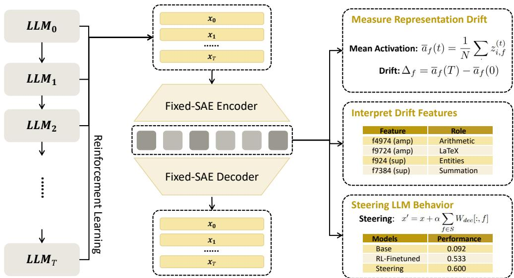
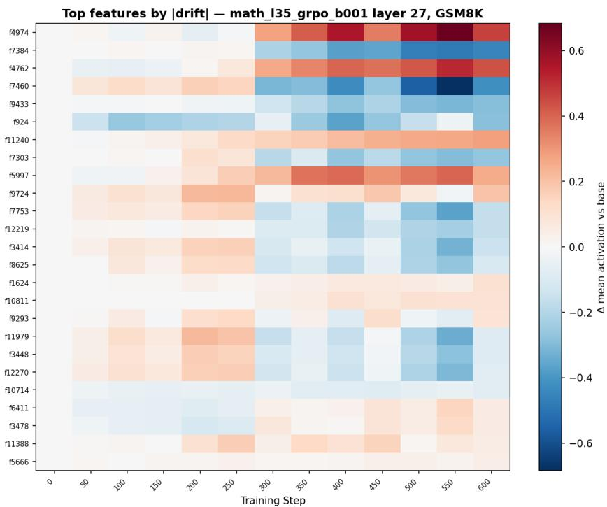
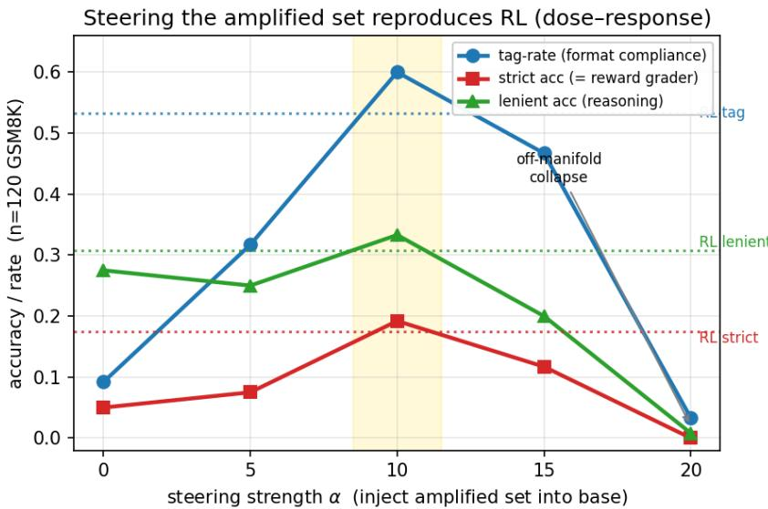
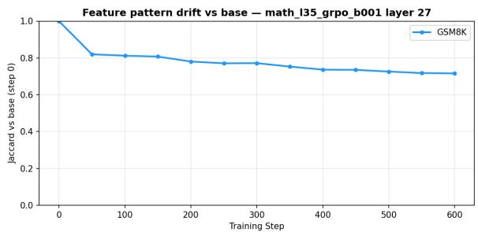
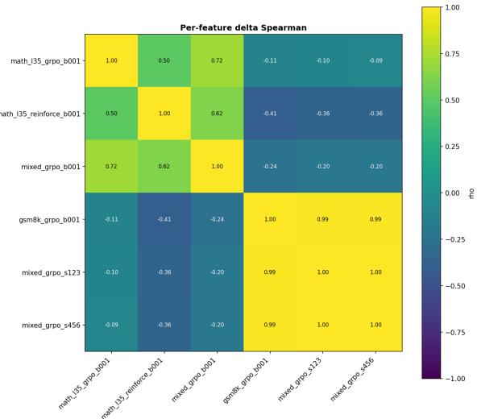
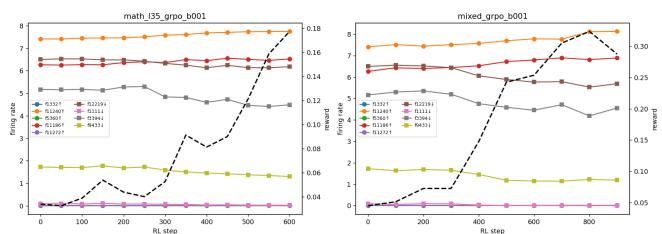
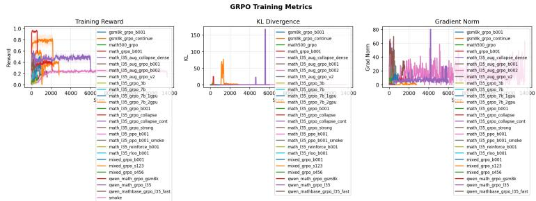
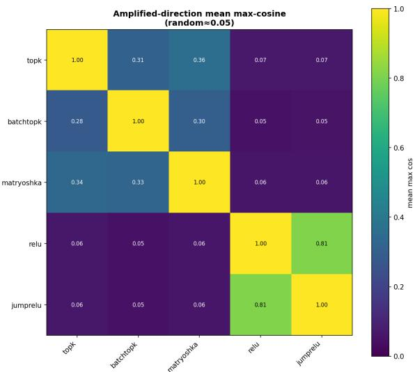
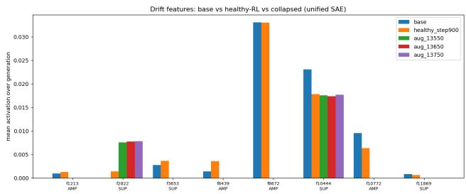
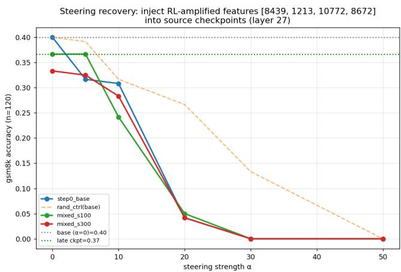

# WHAT DOES AN LLM LEARN FROM REINFORCE-MENT LEARNING? A MECHANISTIC INTERPRETABIL-ITY PERSPECTIVE WITH FIXED-SAE TRACK

Lingheng Du∗   
Peking University   
lingheng@stu.pku.edu.cn

Xufeng Duan The Chinese University of Hong Kong xufengduan@cuhk.edu.hk

Yiming Tang∗ National University of Singapore yiming@nus.edu.sg

Dianbo Liu† National University of Singapore dianbo@nus.edu.sg

## ABSTRACT

Reinforcement learning (RL) is widely utilized in large language model training to improve targeted capabilities, yet how RL reshapes a model remains poorly understood. Prior attempts to explain how RL works largely offer behavioral perspectives, leaving open what RL gives a model at the representation level: can RL create genuinely novel features, and which existing features does it enhance or suppress? Recent developments in mechanistic interpretability suggest sparse autoencoders (SAEs) as a promising lens to decompose internal activations into human-interpretable features; however, they cannot be directly applied to tracking change across training. In this work, we introduce Fixed-SAE Track, a framework that trains one shared SAE per considered layer on activations pooled across the base model and all RL checkpoints, holding every feature direction fixed so that representation shifts are rigorously defined through the activations of interpretable SAE latents, including the detection of emerging novel features. Validated across multiple datasets and RL algorithms, we find that RL-induced drift is small, gradual, concept specific, and concentrated in late layers, mainly enhancing the sampling rates of a small set of ladder tokens, formatting scaffolding such as step breaks and answer delimiters, rather than reshaping problem content. Steering these features into the base model recovers around 80% of RL’s performance gain, suggesting that RL primarily elicits capabilities the model already possesses, much as steering does. We further design a synthetic benchmark with features known by construction to test whether RL can instill genuinely novel features. We believe Fixed-SAE Track provides a principled approach to tracking representation shifts and offers representational evidence for understanding how reinforcement learning changes the inner representation of LLMs.

## 1 INTRODUCTION

Reinforcement learning (RL), with roots in trial-and-error learning and optimal control (Sutton et al., 1998), is a paradigm in which an agent learns optimal behaviors through interaction with its environment, guided by reward feedback. It has driven landmark successes in domains such as game playing (Mnih et al., 2015; Silver et al., 2016) and robotic control (Kober et al., 2013). With the surge of large language models (LLMs) (Zou et al., 2026), RL has been coupled with human feedback (RLHF) to align model outputs with human preferences (Ouyang et al., 2022) and with verifiable rewards (RLVR) to enhance targeted capabilities such as mathematical and code reasoning (Shao et al., 2024; Wen et al., 2025). Across these settings RL reliably improves the metric of interest, and it is now a routine stage of modern post-training pipelines (Guo et al., 2025; Grattafiori et al., 2024).

Despite this widespread adoption, how RL actually reshapes a model remains limitedly understood, and existing accounts offer seemingly contradictory perspectives. Some find that RL merely sharpens the sampling distribution over solutions the base model can already produce (Yue et al., 2025), that even spurious rewards improve accuracy by eliciting pretraining priors (Shao et al., 2026), or that RL can even collapse the base model’s capability boundary (Dong et al., 2026); others report that RL genuinely incentivize correct reasoning (Wen et al., 2025) and that prolonged RL can ex pand the reasoning boundary (Liu et al., 2025). Recent analyses further refine our understanding of RL: simple REINFORCE-style methods can match or outperform the more complex PPO for RLHF (Ahmadian et al., 2024), positive and negative reinforcement shape output diversity in opposite ways (Zhu et al., 2025), and RL’s effect concentrates on a minority of high-entropy tokens (Wang et al., 2025). These analyses, however, are conducted almost entirely at the behavioral level, by grading model outputs, and do not reveal what actually changes inside the model.

To peek inside model internals, recent developments in mechanistic interpretability provide valuable tools to decode the features encoded in a model’s internal representations (Rai et al., 2025; Bereska & Gavves, 2024; Sharkey et al., 2025; Zhao et al., 2025) and provide insightful discoveries about model representations (Yu et al., 2026; Olsson et al., 2022; Saini et al., 2026a; Todd et al., 2024). In particular, sparse dictionary learning (SDL) methods such as sparse autoencoders (SAEs) decompose dense, polysemantic activations into a dictionary of sparse, human-interpretable features (Bricken et al., 2023; Cunningham et al., 2023; Gao et al., 2024). This naturally leads us to ask: from the perspective of a model’s representation, what does RL give a model? Can RL training create genuinely novel features, and which existing features does it enhance or suppress?

However, although SDL methods are highly advanced for analyzing static representations, they cannot be directly utilized for the mechanistic analysis of multiple representations. Crosscoders provide a way to compare representations across different models (Jiralerspong & Bricken, 2026), and researchers have developed methods to match features across layers (Balagansky et al., 2025) and to track the flow of features through a model (Laptev et al., 2025). Nevertheless, SAEs still remain poorly suited to analyze representations across training checkpoints: independently trained SAEs assign feature indices arbitrarily, so features are not comparable between checkpoints, and matching them with additional algorithms further complicates the evaluation of representation shifts. SAE Track (Xu et al., 2025) offers an approach by sequentially fine-tuning SAEs along the training trajectory, but it relies on careful per-checkpoint training and, because each dictionary is inherited from the last, is ill-suited for the detection of emerging novel features.

In this work, we propose Fixed-SAE Track, a novel framework that enables human-interpretable tracking of representation shifts across training, and investigate how RL changes the model representation. Our method first trains one shared SAE per considered layer on activations pooled across the base model and all RL checkpoints, then re-encodes every checkpoint through this fixed dictionary, so that each feature direction is held fixed across training. We further provide rigorous definitions that quantify representation shifts through the activations of the shared SAE latents, which are themselves highly interpretable. Applying Fixed-SAE Track to RL post-training for mathematical reasoning, we find that RL-induced representation shifts concentrate in the model’s late layers, and that RL mainly enhances the sampling rates of a small set of ladder tokens, formatting scaffolding such as step breaks and answer delimiters, rather than reshaping problem content. Moreover, steering these features into the base model recovers around 80% of RL’s performance gain, suggesting that RL primarily elicits capabilities the model already possesses, much as steering does. To further test whether RL can create genuinely novel features visible in representation space, we design a synthetic benchmark in which the target features are known by construction.

Our contributions are as follows:

• Method. We propose Fixed-SAE Track, a novel framework that enables rigorous and interpretable tracking of the representation shifts induced by model training.

• Findings. Our experimental results demonstrate that RL-induced drift is small, gradual, and concentrated in late-layer formatting features; and that steering these features recovers around 80% of RL’s gain, indicating RL primarily elicits model priors.

• Evidences. We provide comprehensive evidences to support our scientific findings about reinforcement learning, across multiple models and diverse training settings.

## 2 RELATED WORK

## 2.1 REINFORCEMENT LEARNING FOR LARGE LANGUAGE MODELS

Reinforcement Learning (RL) has emerged as a powerful paradigm in Artificial Intelligence (AI), enabling agents to learn optimal behaviors through trial-and-error interaction with their environments, guided by reward and penalty feedback (Ghasemi et al., 2025; Dong). It has been widely utilized to align model outputs with human preferences (RLHF; Ouyang et al., 2022) or to enhance mathematical and code reasoning with verifiable rewards (RLVR; Wen et al., 2025). The policy is typically optimized with policy-gradient algorithms such as REINFORCE (Hu et al., 2025), RLOO (Kool et al., 2019), PPO (Schulman et al., 2017), and GRPO (Shao et al., 2024), while DPO folds reward modeling and policy optimization into a single contrastive objective (Rafailov et al., 2024). While these works establish that RL reliably improves accuracy, whether it expands a model’s underlying capability or merely surfaces behaviors the base model already possesses remains contested. Some find that RL sharpens the sampling distribution without extending the reasoning boundary (Yue et al., 2025), that even spurious rewards can elicit latent reasoning from pretraining priors (Shao et al., 2026), and that RLVR might collapse the base model’s capability boundary (Dong et al., 2026). Others argue the opposite: RL with verifiable rewards genuinely incentivizes correct reasoning (Wen et al., 2025), and prolonged RL training can expand the reasoning boundary (Liu et al., 2025). Finer-grained analyses attribute these outcomes to algorithmic details, showing that positive reinforcement sharpens the distribution at the cost of diversity while negative reinforcement preserves it (Zhu et al., 2025), and that RL’s effect concentrates on a minority of high-entropy forking tokens (Wang et al., 2025).

## 2.2 SPARSE AUTOENCODERS FOR MECHANISTIC INTERPRETABILITY.

Driven largely by AI safety concerns, mechanistic interpretability aims to reverse-engineer the internal computations of neural networks into human-understandable components (Rai et al., 2025; Bereska & Gavves, 2024; Sharkey et al., 2025; Tang et al., 2025). In particular, sparse dictionary learning (SDL), and sparse autoencoders (SAEs) have become its central techniques, as they decompose polysemantic model activations into a dictionary of monosemantic features (Bricken et al., 2023; Cunningham et al., 2023). A variety of variants of SAEs have been further proposed, including TopK, BatchTopK, and Matryoshka SAEs (Gao et al., 2024; Bussmann et al., 2024; 2025; Tang et al., 2026b). Large language models are frequently used to automatically interpret, name, and assign meaning to them, turning raw feature directions into human-readable concepts (Tang et al., 2026a; Luo et al., 2024; 2023). Building on these foundations, SAEs and related sparse encoders have been applied across diverse settings, including protein-language models (Simon & Zou, 2024), prompt engineering (Saini et al., 2026b), and medical imaging (Abdulaal et al., 2024; Tang et al., 2026c). While widely applied to analyze static representations, SAEs have seen limited use in tracking how representations evolve during training (Xu et al., 2025).

## 3 METHOD

In this section, we introduce Fixed-SAE Track, a novel framework designed to mechanistically interpret the evolution of LLM representation during reinforcement learning (RL). We first describe how we pool internal model activations across the base model and all subsequent RL checkpoints to create a unified training dataset (Section 3.1). Building on this, we detail the training of a single, shared Sparse Autoencoder (SAE) that holds feature directions constant across the entire training trajectory (Section 3.2). This fixed dictionary enables us to rigorously quantify representation shifts and feature drift over time (Section 3.3). To ground these mathematical shifts in human-understandable concepts, we outline our token-level attribution methods for interpreting the SAE latents (Section 3.4). Finally, we present the causal intervention techniques—specifically steering and targeted ablations—used to determine whether these identified features causally drive model behavior or merely correlate with it (Section 3.5).

  
Figure 1: Overview of Fixed-SAE Track. Given the base model $\mathrm { L L M _ { 0 } }$ and its RL checkpoints $\mathrm { L L M _ { 1 } } , \mathrm { . . . , L L M _ { \it T } }$ , we extract residual-stream activations and train one shared SAE on the pooled data, so each feature index denotes the same direction at every training step. Re-encoding every checkpoint through this fixed dictionary supports three downstream tasks: computing drift metrics, interpretation of the shifted features, and causal steering interventions.

## 3.1 REPRESENTATION POOLING FOR RL CHECKPOINTS

To allow for a valid cross-checkpoint comparison, we first pool activations across the base model and all subsequent RL checkpoints. Specifically, we extract the residual stream vectors $\boldsymbol { x } \in \mathbb { R } ^ { D }$ at a late layer (e.g., layer 27) on the final non-pad prompt token. This pooled dataset can be substantial; for example, extracting from multiple checkpoints and multiple layers yields millions of activation vectors. Prior to training the dictionary, we standardize these pooled activations using the global training statistics:

$$
\tilde { x } = ( x - \mu ) / s
$$

where $\mu$ represents the pooled mean and s is the pooled root-mean-square (RMS) scale.

## 3.2 FIXED-SAE TRAINING

Training a separate Sparse Autoencoder (SAE) for each checkpoint produces arbitrary feature indices, rendering cross-checkpoint feature tracking impossible because a feature at step 0 has no relationship to the same index at step 600(Tang et al., 2025). We solve this by training a single unified TopK SAE on the pooled, standardized activations (Gao et al., 2024). The TopK SAE computes sparse codes by retaining only the k largest pre-activations:

$$
\begin{array} { c } { z = \mathrm { T o p K } _ { k } ( W _ { e n c } \tilde { x } + b _ { e n c } ) \in \mathbb { R } _ { \ge 0 } ^ { m } } \\ { \hat { x } = W _ { d e c } z + b _ { d e c } } \end{array}
$$

After training, this shared dictionary is frozen and used to re-encode the activations of every checkpoint (Gao et al., 2024). As a result, a feature index f corresponds to the exact same direction in activation space—represented by the decoder column $\dot { W } _ { d e c } [ : , \dot { \bar { f } } ] \in \mathbb { R } ^ { D } .$ —at every training step.

## 3.3 QUANTIFYING REPRESENTATION SHIFTS

By re-encoding all checkpoints through the fixed dictionary, we can rigorously define feature drift over time. Letting $z _ { i , f } ^ { ( t ) }$ denote the code of feature f on example i at checkpoint t, we compute the

mean activation of the feature as:

$$
\overline { { a } } _ { f } ( t ) = \frac { 1 } { N } \sum _ { i } z _ { i , f } ^ { ( t ) }
$$

We define the drift $\Delta _ { f }$ as the change in mean activation from the base step to the final step $T \colon$

$$
\Delta _ { f } = \overline { { a } } _ { f } ( T ) - \overline { { a } } _ { f } ( 0 )
$$

A positive $\Delta _ { f }$ indicates that the feature was amplified by RL, whereas a negative value indicates that it was suppressed. We additionally monitor the firing rate, which is the fraction of examples on which the feature is active.

## 3.4 INTERPRETATION OF THE FIXED-SAE LATENTS

To map these tracked features to human-interpretable concepts, we attribute them to the specific generated tokens and prompt contexts on which they fire most strongly. We calculate a token-level strong-fire rate over generated tokens:

$$
\rho _ { f } = \frac { 1 } { T _ { g e n } } \sum _ { t o k } 1 [ z _ { f } > 0 . 5 ]
$$

This token-level attribution allows us to identify whether a feature corresponds to format scaffolding (such as newlines, section breaks, or LaTeX delimiters) or to actual problem content. Furthermore, we calculate the Spearman correlation between the mean activation $\overline { { a } } _ { f } ( t )$ and the training reward to isolate features that rise and fall monotonically in step with the reward signal.

## 3.5 STEERING LLMS WITH FIXED-SAE LATENTS

Finally, we perform causal interventions to test whether the identified features actively drive model behavior rather than merely correlating with it. To test for causal sufficiency, we steer the base model by uniformly adding the directions of an amplified feature set S into its layer-27 residual stream:

$$
x ^ { \prime } = x + \alpha \sum _ { f \in S } W _ { d e c } [ : , f ]
$$

We sweep the steering dose α and assess the model using a two-grader evaluation protocol that independently separates strict format compliance from lenient reasoning correctness. To test for necessity, we ablate target features from the RL-final model by subtracting each feature’s specific reconstruction contribution, $\textstyle \sum _ { f \in S } z _ { f } W _ { d e c } [ : , f ] \cdot s$ , strictly at the tokens where the feature naturally fires.

## 4 RESULTS

We ask a single question: when RL improves mathematical performance, what changes inside the model? Unless noted otherwise, we analyze Qwen2.5-1.5B-Instruct at layer 27 using a fixed TopK SAE trained on activations pooled across the base model and all RL checkpoints. Additional training details, robustness analyses, controls, and qualitative examples are deferred to Appendix A.

## 4.1 RL INDUCES A SMALL, GRADUAL, AND LATE-LAYER REPRESENTATION SHIFT

We first track the same SAE features across 13 checkpoints of GRPO training. For feature $f ,$ we define its drift as $\Delta _ { f } = \bar { a } _ { f } ( T ) - \bar { a } _ { f } ( 0 )$ , where $\bar { a } _ { f } ( t )$ is its mean activation at checkpoint t. Figure 2 shows that the representation evolves smoothly rather than abruptly, with substantial change concentrated in roughly ten features. The largest amplified features include $f _ { 4 9 7 4 } , f _ { 4 7 6 2 } , f _ { 1 1 2 4 0 } ,$ and $f _ { 5 9 9 7 }$ , while f7384, f9433, and $f _ { 9 2 4 }$ are strongly suppressed. Drift also increases sharply with depth: $\operatorname* { m a x } _ { f } | \Delta _ { f } |$ rises from $0 . 0 1 3$ at layer 6 to 0.060 at layer 27. Thus, RL does not globally rewrite the representation; it makes a focused edit concentrated near the model output. Active-set turnover, dictionary-health checks, and cross-algorithm reproducibility support the same conclusion (Appendix A.2–A.3).

  
Figure 2: RL induces concentrated and gradual feature drift. Change in mean activation relative to the base model, $\Delta \bar { a } _ { f } ( t ) = \bar { a } _ { f } ( t ) - \bar { a } _ { f } ( 0 )$ , for the 24 most-changed features across 13 GRPO checkpoints. Only a small subset undergoes substantial amplification or suppression.

Table 1: Token-level attribution of shifted features. Amplified features predominantly encode formatting and reasoning scaffolds, whereas suppressed features are more associated with problem content.
<table><tr><td>Feature</td><td>Direction</td><td>Interpretation</td></tr><tr><td>f4974</td><td>amplified</td><td>arithmetic operators</td></tr><tr><td>f9724</td><td>amplified</td><td>LaTeX math-block edges</td></tr><tr><td>f4762</td><td>amplified</td><td>paragraph / step boundaries</td></tr><tr><td>f11240</td><td>amplified</td><td>new reasoning steps</td></tr><tr><td> $f _ { 9 2 4 }$ </td><td>suppressed</td><td>problem entities / units</td></tr><tr><td> $f _ { 7 3 8 4 }$ </td><td>suppressed</td><td>intermediate connective text</td></tr></table>

## 4.2 RL AMPLIFIES FORMATTING SCAFFOLDS RATHER THAN PROBLEM CONTENT

We next ask what the shifted features represent. For each strongly changed feature, we inspect the generated tokens on which it activates most strongly. Table 1 reveals a striking asymmetry: amplified features encode arithmetic operators, LaTeX delimiters, and paragraph or reasoning-step boundaries, whereas suppressed features encode problem entities, units, and intermediate connective text. An independent analysis selecting features by monotonic correlation with reward recovers the same formatting-heavy signature (Appendix A.4). The dominant representational effect of short RL is therefore a change in how reasoning is organized and emitted, rather than a wholesale change in problem semantics.

## 4.3 THE SHIFTED FEATURES CAUSALLY REPRODUCE RL’S DOMINANT EXTRACTABILITY GAIN

To distinguish improved reasoning from improved answer presentation, we evaluate every completion three ways: strict accuracy requires both the correct answer and the trained answer wrapper, lenient accuracy ignores formatting and measures whether the correct answer was reached, and tag-rate measures wrapper emission alone. Short RL strongly increases strict accuracy and tag-rate while lenient accuracy changes much less, including under cross-dataset evaluation (Appendix A.5). This indicates that a large fraction of the early measured improvement comes from making answers that the model can already compute reliably extractable by the grader.

  
Figure 3: Steering RL-amplified features reproduces the dominant RL effect. Adding the amplified feature directions to the base model yields an inverted-U dose response. The peak at α = 10 matches the RL-final model within confidence intervals on strict accuracy, lenient accuracy, and tagrate.

We test causality by adding the decoder directions of the amplified features to the layer-27 residual stream of the base model. Figure 3 shows a clear dose response. At α = 10, strict accuracy rises from 0.050 to 0.192 and tag-rate from 0.092 to 0.600, closely matching the RL-final model (0.175 strict and 0.533 tag-rate), whereas lenient accuracy changes only modestly. Random-direction steering does not exhibit the same peak. Moreover, steering directly increases the operator rate and decreases the content-word rate in generated text. The shifted SAE features therefore provide a sufficient causal handle on RL’s dominant format/extractability effect.

## 4.4 RL MAINLY ELICITS EXISTING CAPABILITY, WHILE SUSTAINED TRAINING CAN ADD REASONING

The predominance of formatting in short RL does not imply that RL can never improve reasoning. When we restart from the apparent training plateau and continue for 2000 steps with a constant learning rate, lenient accuracy rises from 0.300 to 0.408, while strict accuracy rises to 0.408 and tag-rate to 0.983. Thus, sustained training produces a modest genuine reasoning gain in addition to the much larger formatting effect. Temporal analysis further shows that formatting changes occur first: approximately 86% of total feature amplification is completed within the first 50 steps, while reasoning-associated improvements accumulate more slowly (Appendix A.6).

We then ask whether the problems solved after RL were genuinely inaccessible to the base model. Using Qwen2.5-Math-1.5B, we isolate 29 GSM8K problems that are wrong under greedy base decoding but correct after RL and sample the base model 64 times on each. Table 2 shows that base pass@k rises from 0.235 at k = 1 to 1.00 at $k = 6 4 \colon$ all 29/29 RL-fixed problems are already solvable by the base model under sampling. In this regime, RL therefore primarily increases the probability of successful trajectories already present in the base distribution rather than creating solutions absent from it.

This elicitation picture has a mechanistic qualification. We identify a small arithmetic-reasoning feature set R whose ablation substantially reduces mathematical accuracy while matched format and random controls have negligible effects. Yet directly injecting R into the base model recovers only a small fraction of RL’s gain. Reasoning therefore appears to depend on a dynamically sustained computation rather than a static vector that can simply be pasted into the residual stream. Full construction, causal controls, task specificity, and intervention results are provided in Appendix A.7. Taken together, our results support a qualified account: short RL mainly installs and stabilizes scaffolds that elicit latent capability, while sufficiently sustained RL and models with sufficient headroom can additionally acquire modest genuine reasoning improvements.

Table 2: Base-model pass@k on RL-fixed problems. Among the 29 GSM8K problems that change from base-wrong to RL-right, all are solved by the base model within 64 samples; 0/29 are never solved.
<table><tr><td>k</td><td>1</td><td>4</td><td>8</td><td>16</td><td>32</td><td>64</td></tr><tr><td>base pass@k</td><td>0.235</td><td>0.60</td><td>0.78</td><td>0.91</td><td>0.97</td><td>1.00</td></tr></table>

## 5 CONCLUSION

In this work, we introduce Fixed-SAE Track, a framework that trains one shared SAE per layer on activations pooled across the base model and all RL checkpoints, enabling rigorous, interpretable tracking of representation shifts during training. Applying it to RL post-training for mathematical reasoning, we find that RL-induced drift is small, gradual, and concentrated in a handful of late-layer features encoding format scaffolding rather than problem content, and that steering these features into the base model recovers most of RL’s accuracy gain — indicating that RL primarily elicits capabilities the model already possesses. A reasoning feature substrate does exist and is causally necessary, yet it cannot be injected as a static direction, and genuine reasoning gains emerge only when the model has headroom. We believe Fixed-SAE Track offers a principled lens for tracking representation dynamics across training, and we hope it facilitates future mechanistic studies of post-training at larger scales.

## ACKNOWLEDGMENTS

## REFERENCES

Ahmed Abdulaal, Hugo Fry, Nina Montana-Brown, Ayodeji Ijishakin, Jack Gao, Stephanie Hyland, ˜ Daniel C. Alexander, and Daniel C. Castro. An x-ray is worth 15 features: Sparse autoencoders for interpretable radiology report generation, 2024. URL https://arxiv.org/abs/2410. 03334.

Arash Ahmadian, Chris Cremer, Matthias Galle, Marzieh Fadaee, Julia Kreutzer, Olivier Pietquin,´ Ahmet Ust ¨ un, and Sara Hooker. Back to basics: Revisiting reinforce style optimization for learn- ¨ ing from human feedback in llms, 2024. URL https://arxiv.org/abs/2402.14740.

Nikita Balagansky, Ian Maksimov, and Daniil Gavrilov. Mechanistic permutability: Match features across layers, 2025. URL https://arxiv.org/abs/2410.07656.

Leonard Bereska and Efstratios Gavves. Mechanistic interpretability for ai safety – a review, 2024. URL https://arxiv.org/abs/2404.14082.

Trenton Bricken, Adly Templeton, Joshua Batson, Brian Chen, Adam Jermyn, Tom Conerly, Nick Turner, Cem Anil, Carson Denison, Amanda Askell, Robert Lasenby, Yifan Wu, Shauna Kravec, Nicholas Schiefer, Tim Maxwell, Nicholas Joseph, Zac Hatfield-Dodds, Alex Tamkin, Karina Nguyen, Brayden McLean, Josiah E Burke, Tristan Hume, Shan Carter, Tom Henighan, and Christopher Olah. Towards monosemanticity: Decomposing language models with dictionary learning. Transformer Circuits Thread, 2023. https://transformercircuits.pub/2023/monosemantic-features/index.html.

Bart Bussmann, Patrick Leask, and Neel Nanda. Batchtopk sparse autoencoders, 2024. URL https://arxiv.org/abs/2412.06410.

Bart Bussmann, Noa Nabeshima, Adam Karvonen, and Neel Nanda. Learning multi-level features with matryoshka sparse autoencoders, 2025. URL https://arxiv.org/abs/2503. 17547.

Hoagy Cunningham, Aidan Ewart, Logan Riggs, Robert Huben, and Lee Sharkey. Sparse autoencoders find highly interpretable features in language models, 2023. URL https://arxiv. org/abs/2309.08600.

Hao Dong. Deep reinforcement learning, volume 24. Springer.

Yihong Dong, Xue Jiang, Yongding Tao, Huanyu Liu, Kechi Zhang, Lili Mou, Rongyu Cao, Yingwei Ma, Jue Chen, Binhua Li, Zhi Jin, Fei Huang, Yongbin Li, and Ge Li. Rl-plus: Countering capability boundary collapse of llms in reinforcement learning with hybrid-policy optimization, 2026. URL https://arxiv.org/abs/2508.00222.

Leo Gao, Tom Dupre la Tour, Henk Tillman, Gabriel Goh, Rajan Troll, Alec Radford, Ilya Sutskever,´ Jan Leike, and Jeffrey Wu. Scaling and evaluating sparse autoencoders, 2024. URL https: //arxiv.org/abs/2406.04093.

Majid Ghasemi, Amir Hossein Moosavi, and Dariush Ebrahimi. A comprehensive survey of reinforcement learning: From algorithms to practical challenges, 2025. URL https://arxiv. org/abs/2411.18892.

Aaron Grattafiori, Abhimanyu Dubey, Abhinav Jauhri, Abhinav Pandey, Abhishek Kadian, Ahmad Al-Dahle, Aiesha Letman, Akhil Mathur, Alan Schelten, Alex Vaughan, Amy Yang, Angela Fan, Anirudh Goyal, Anthony Hartshorn, Aobo Yang, Archi Mitra, Archie Sravankumar, Artem Ko renev, Arthur Hinsvark, Arun Rao, Aston Zhang, Aurelien Rodriguez, Austen Gregerson, Ava Spataru, Baptiste Roziere, Bethany Biron, Binh Tang, Bobbie Chern, Charlotte Caucheteux, Chaya Nayak, Chloe Bi, Chris Marra, Chris McConnell, Christian Keller, Christophe Touret, Chunyang Wu, Corinne Wong, Cristian Canton Ferrer, Cyrus Nikolaidis, Damien Allonsius, Daniel Song, Danielle Pintz, Danny Livshits, Danny Wyatt, David Esiobu, Dhruv Choudhary, Dhruv Mahajan, Diego Garcia-Olano, Diego Perino, Dieuwke Hupkes, Egor Lakomkin, Ehab AlBadawy, Elina Lobanova, Emily Dinan, Eric Michael Smith, Filip Radenovic, Francisco Guzman, Frank Zhang, Gabriel Synnaeve, Gabrielle Lee, Georgia Lewis Anderson, Govind That-´ tai, Graeme Nail, Gregoire Mialon, Guan Pang, Guillem Cucurell, Hailey Nguyen, Hannah Korevaar, Hu Xu, Hugo Touvron, Iliyan Zarov, Imanol Arrieta Ibarra, Isabel Kloumann, Ishan Misra, Ivan Evtimov, Jack Zhang, Jade Copet, Jaewon Lee, Jan Geffert, Jana Vranes, Jason Park, Jay Mahadeokar, Jeet Shah, Jelmer van der Linde, Jennifer Billock, Jenny Hong, Jenya Lee, Jeremy Fu, Jianfeng Chi, Jianyu Huang, Jiawen Liu, Jie Wang, Jiecao Yu, Joanna Bitton, Joe Spisak, Jongsoo Park, Joseph Rocca, Joshua Johnstun, Joshua Saxe, Junteng Jia, Kalyan Vasuden Alwala, Karthik Prasad, Kartikeya Upasani, Kate Plawiak, Ke Li, Kenneth Heafield, Kevin Stone, Khalid El-Arini, Krithika Iyer, Kshitiz Malik, Kuenley Chiu, Kunal Bhalla, Kushal Lakhotia, Lauren Rantala-Yeary, Laurens van der Maaten, Lawrence Chen, Liang Tan, Liz Jenkins, Louis Martin, Lovish Madaan, Lubo Malo, Lukas Blecher, Lukas Landzaat, Luke de Oliveira, Madeline Muzzi, Mahesh Pasupuleti, Mannat Singh, Manohar Paluri, Marcin Kardas, Maria Tsimpoukelli, Mathew Oldham, Mathieu Rita, Maya Pavlova, Melanie Kambadur, Mike Lewis, Min Si, Mitesh Ku mar Singh, Mona Hassan, Naman Goyal, Narjes Torabi, Nikolay Bashlykov, Nikolay Bogoychev, Niladri Chatterji, Ning Zhang, Olivier Duchenne, Onur C¸ elebi, Patrick Alrassy, Pengchuan Zhang, Pengwei Li, Petar Vasic, Peter Weng, Prajjwal Bhargava, Pratik Dubal, Praveen Krishnan, Punit Singh Koura, Puxin Xu, Qing He, Qingxiao Dong, Ragavan Srinivasan, Raj Ganapathy, Ramon Calderer, Ricardo Silveira Cabral, Robert Stojnic, Roberta Raileanu, Rohan Maheswari, Rohit Girdhar, Rohit Patel, Romain Sauvestre, Ronnie Polidoro, Roshan Sumbaly, Ross Taylor, Ruan Silva, Rui Hou, Rui Wang, Saghar Hosseini, Sahana Chennabasappa, Sanjay Singh, Sean Bell, Seohyun Sonia Kim, Sergey Edunov, Shaoliang Nie, Sharan Narang, Sharath Raparthy, Sheng Shen, Shengye Wan, Shruti Bhosale, Shun Zhang, Simon Vandenhende, Soumya Batra, Spencer Whitman, Sten Sootla, Stephane Collot, Suchin Gururangan, Sydney Borodinsky, Tamar Herman, Tara Fowler, Tarek Sheasha, Thomas Georgiou, Thomas Scialom, Tobias Speckbacher, Todor Mihaylov, Tong Xiao, Ujjwal Karn, Vedanuj Goswami, Vibhor Gupta, Vignesh Ramanathan, Viktor Kerkez, Vincent Gonguet, Virginie Do, Vish Vogeti, V´ıtor Albiero, Vladan Petrovic, Weiwei Chu, Wenhan Xiong, Wenyin Fu, Whitney Meers, Xavier Martinet, Xiaodong Wang, Xiaofang

Wang, Xiaoqing Ellen Tan, Xide Xia, Xinfeng Xie, Xuchao Jia, Xuewei Wang, Yaelle Gold schlag, Yashesh Gaur, Yasmine Babaei, Yi Wen, Yiwen Song, Yuchen Zhang, Yue Li, Yuning Mao, Zacharie Delpierre Coudert, Zheng Yan, Zhengxing Chen, Zoe Papakipos, Aaditya Singh, Aayushi Srivastava, Abha Jain, Adam Kelsey, Adam Shajnfeld, Adithya Gangidi, Adolfo Victoria, Ahuva Goldstand, Ajay Menon, Ajay Sharma, Alex Boesenberg, Alexei Baevski, Allie Feinstein, Amanda Kallet, Amit Sangani, Amos Teo, Anam Yunus, Andrei Lupu, Andres Alvarado, An drew Caples, Andrew Gu, Andrew Ho, Andrew Poulton, Andrew Ryan, Ankit Ramchandani, An nie Dong, Annie Franco, Anuj Goyal, Aparajita Saraf, Arkabandhu Chowdhury, Ashley Gabriel, Ashwin Bharambe, Assaf Eisenman, Azadeh Yazdan, Beau James, Ben Maurer, Benjamin Leon hardi, Bernie Huang, Beth Loyd, Beto De Paola, Bhargavi Paranjape, Bing Liu, Bo Wu, Boyu Ni, Braden Hancock, Bram Wasti, Brandon Spence, Brani Stojkovic, Brian Gamido, Britt Mon talvo, Carl Parker, Carly Burton, Catalina Mejia, Ce Liu, Changhan Wang, Changkyu Kim, Chao Zhou, Chester Hu, Ching-Hsiang Chu, Chris Cai, Chris Tindal, Christoph Feichtenhofer, Cynthia Gao, Damon Civin, Dana Beaty, Daniel Kreymer, Daniel Li, David Adkins, David Xu, Davide Testuggine, Delia David, Devi Parikh, Diana Liskovich, Didem Foss, Dingkang Wang, Duc Le, Dustin Holland, Edward Dowling, Eissa Jamil, Elaine Montgomery, Eleonora Presani, Emily Hahn, Emily Wood, Eric-Tuan Le, Erik Brinkman, Esteban Arcaute, Evan Dunbar, Evan Smoth ers, Fei Sun, Felix Kreuk, Feng Tian, Filippos Kokkinos, Firat Ozgenel, Francesco Caggioni, Frank Kanayet, Frank Seide, Gabriela Medina Florez, Gabriella Schwarz, Gada Badeer, Georgia Swee, Gil Halpern, Grant Herman, Grigory Sizov, Guangyi, Zhang, Guna Lakshminarayanan, Hakan Inan, Hamid Shojanazeri, Han Zou, Hannah Wang, Hanwen Zha, Haroun Habeeb, Harri son Rudolph, Helen Suk, Henry Aspegren, Hunter Goldman, Hongyuan Zhan, Ibrahim Damlaj, Igor Molybog, Igor Tufanov, Ilias Leontiadis, Irina-Elena Veliche, Itai Gat, Jake Weissman, James Geboski, James Kohli, Janice Lam, Japhet Asher, Jean-Baptiste Gaya, Jeff Marcus, Jeff Tang, Jen nifer Chan, Jenny Zhen, Jeremy Reizenstein, Jeremy Teboul, Jessica Zhong, Jian Jin, Jingyi Yang, Joe Cummings, Jon Carvill, Jon Shepard, Jonathan McPhie, Jonathan Torres, Josh Ginsburg, Jun jie Wang, Kai Wu, Kam Hou U, Karan Saxena, Kartikay Khandelwal, Katayoun Zand, Kathy Matosich, Kaushik Veeraraghavan, Kelly Michelena, Keqian Li, Kiran Jagadeesh, Kun Huang, Kunal Chawla, Kyle Huang, Lailin Chen, Lakshya Garg, Lavender A, Leandro Silva, Lee Bell, Lei Zhang, Liangpeng Guo, Licheng Yu, Liron Moshkovich, Luca Wehrstedt, Madian Khabsa, Manav Avalani, Manish Bhatt, Martynas Mankus, Matan Hasson, Matthew Lennie, Matthias Reso, Maxim Groshev, Maxim Naumov, Maya Lathi, Meghan Keneally, Miao Liu, Michael L. Seltzer, Michal Valko, Michelle Restrepo, Mihir Patel, Mik Vyatskov, Mikayel Samvelyan, Mike Clark, Mike Macey, Mike Wang, Miquel Jubert Hermoso, Mo Metanat, Mohammad Rastegari, Munish Bansal, Nandhini Santhanam, Natascha Parks, Natasha White, Navyata Bawa, Nayan Singhal, Nick Egebo, Nicolas Usunier, Nikhil Mehta, Nikolay Pavlovich Laptev, Ning Dong, Norman Cheng, Oleg Chernoguz, Olivia Hart, Omkar Salpekar, Ozlem Kalinli, Parkin Kent, Parth Parekh, Paul Saab, Pavan Balaji, Pedro Rittner, Philip Bontrager, Pierre Roux, Piotr Dollar, Polina Zvyagina, Prashant Ratanchandani, Pritish Yuvraj, Qian Liang, Rachad Alao, Rachel Ro driguez, Rafi Ayub, Raghotham Murthy, Raghu Nayani, Rahul Mitra, Rangaprabhu Parthasarathy, Raymond Li, Rebekkah Hogan, Robin Battey, Rocky Wang, Russ Howes, Ruty Rinott, Sachin Mehta, Sachin Siby, Sai Jayesh Bondu, Samyak Datta, Sara Chugh, Sara Hunt, Sargun Dhillon, Sasha Sidorov, Satadru Pan, Saurabh Mahajan, Saurabh Verma, Seiji Yamamoto, Sharadh Ra maswamy, Shaun Lindsay, Shaun Lindsay, Sheng Feng, Shenghao Lin, Shengxin Cindy Zha, Shishir Patil, Shiva Shankar, Shuqiang Zhang, Shuqiang Zhang, Sinong Wang, Sneha Agarwal, Soji Sajuyigbe, Soumith Chintala, Stephanie Max, Stephen Chen, Steve Kehoe, Steve Satter field, Sudarshan Govindaprasad, Sumit Gupta, Summer Deng, Sungmin Cho, Sunny Virk, Sura Subramanian, Sy Choudhury, Sydney Goldman, Tal Remez, Tamar Glaser, Tamara Best, Thilo Koehler, Thomas Robinson, Tianhe Li, Tianjun Zhang, Tim Matthews, Timothy Chou, Tzook Shaked, Varun Vontimitta, Victoria Ajayi, Victoria Montanez, Vijai Mohan, Vinay Satish Ku mar, Vishal Mangla, Vlad Ionescu, Vlad Poenaru, Vlad Tiberiu Mihailescu, Vladimir Ivanov, Wei Li, Wenchen Wang, Wenwen Jiang, Wes Bouaziz, Will Constable, Xiaocheng Tang, Xiao jian Wu, Xiaolan Wang, Xilun Wu, Xinbo Gao, Yaniv Kleinman, Yanjun Chen, Ye Hu, Ye Jia, Ye Qi, Yenda Li, Yilin Zhang, Ying Zhang, Yossi Adi, Youngjin Nam, Yu, Wang, Yu Zhao, Yuchen Hao, Yundi Qian, Yunlu Li, Yuzi He, Zach Rait, Zachary DeVito, Zef Rosnbrick, Zhao duo Wen, Zhenyu Yang, Zhiwei Zhao, and Zhiyu Ma. The llama 3 herd of models, 2024. URL https://arxiv.org/abs/2407.21783.

Daya Guo, Dejian Yang, Haowei Zhang, Junxiao Song, Peiyi Wang, Qihao Zhu, Runxin Xu, Ruoyu Zhang, Shirong Ma, Xiao Bi, Xiaokang Zhang, Xingkai Yu, Yu Wu, Z. F. Wu, Zhibin Gou, Zhihong Shao, Zhuoshu Li, Ziyi Gao, Aixin Liu, Bing Xue, Bingxuan Wang, Bochao Wu, Bei Feng, Chengda Lu, Chenggang Zhao, Chengqi Deng, Chong Ruan, Damai Dai, Deli Chen, Dongjie Ji, Erhang Li, Fangyun Lin, Fucong Dai, Fuli Luo, Guangbo Hao, Guanting Chen, Guowei Li, H. Zhang, Hanwei Xu, Honghui Ding, Huazuo Gao, Hui Qu, Hui Li, Jianzhong Guo, Jiashi Li, Jingchang Chen, Jingyang Yuan, Jinhao Tu, Junjie Qiu, Junlong Li, J. L. Cai, Jiaqi Ni, Jian Liang, Jin Chen, Kai Dong, Kai Hu, Kaichao You, Kaige Gao, Kang Guan, Kexin Huang, Kuai Yu, Lean Wang, Lecong Zhang, Liang Zhao, Litong Wang, Liyue Zhang, Lei Xu, Leyi Xia, Mingchuan Zhang, Minghua Zhang, Minghui Tang, Mingxu Zhou, Meng Li, Miaojun Wang, Mingming Li, Ning Tian, Panpan Huang, Peng Zhang, Qiancheng Wang, Qinyu Chen, Qiushi Du, Ruiqi Ge, Ruisong Zhang, Ruizhe Pan, Runji Wang, R. J. Chen, R. L. Jin, Ruyi Chen, Shanghao Lu, Shangyan Zhou, Shanhuang Chen, Shengfeng Ye, Shiyu Wang, Shuiping Yu, Shunfeng Zhou, Shuting Pan, S. S. Li, Shuang Zhou, Shaoqing Wu, Tao Yun, Tian Pei, Tianyu Sun, T. Wang, Wangding Zeng, Wen Liu, Wenfeng Liang, Wenjun Gao, Wenqin Yu, Wentao Zhang, W. L. Xiao, Wei An, Xiaodong Liu, Xiaohan Wang, Xiaokang Chen, Xiaotao Nie, Xin Cheng, Xin Liu, Xin Xie, Xingchao Liu, Xinyu Yang, Xinyuan Li, Xuecheng Su, Xuheng Lin, X. Q. Li, Xiangyue Jin, Xiaojin Shen, Xiaosha Chen, Xiaowen Sun, Xiaoxiang Wang, Xinnan Song, Xinyi Zhou, Xianzu Wang, Xinxia Shan, Y. K. Li, Y. Q. Wang, Y. X. Wei, Yang Zhang, Yanhong Xu, Yao Li, Yao Zhao, Yaofeng Sun, Yaohui Wang, Yi Yu, Yichao Zhang, Yifan Shi, Yiliang Xiong, Ying He, Yishi Piao, Yisong Wang, Yixuan Tan, Yiyang Ma, Yiyuan Liu, Yongqiang Guo, Yuan Ou, Yuduan Wang, Yue Gong, Yuheng Zou, Yujia He, Yunfan Xiong, Yuxiang Luo, Yuxiang You, Yuxuan Liu, Yuyang Zhou, Y. X. Zhu, Yanping Huang, Yaohui Li, Yi Zheng, Yuchen Zhu, Yunxian Ma, Ying Tang, Yukun Zha, Yuting Yan, Z. Z. Ren, Zehui Ren, Zhangli Sha, Zhe Fu, Zhean Xu, Zhenda Xie, Zhengyan Zhang, Zhewen Hao, Zhicheng Ma, Zhigang Yan, Zhiyu Wu, Zihui Gu, Zijia Zhu, Zijun Liu, Zilin Li, Ziwei Xie, Ziyang Song, Zizheng Pan, Zhen Huang, Zhipeng Xu, Zhongyu Zhang, and Zhen Zhang. Deepseek-r1 incentivizes reasoning in llms through reinforcement learning. Nature, 645(8081):633–638, 2025. ISSN 1476-4687. doi: 10.1038/s41586-025-09422-z. URL http://dx.doi.org/10.1038/s41586-025-09422-z.

Jian Hu, Jason Klein Liu, Haotian Xu, and Wei Shen. Reinforce++: Stabilizing critic-free policy optimization with global advantage normalization, 2025. URL https://arxiv.org/abs/ 2501.03262.

Thomas Jiralerspong and Trenton Bricken. Cross-architecture model diffing with crosscoders: Unsupervised discovery of differences between llms, 2026. URL https://arxiv.org/abs/ 2602.11729.

Jens Kober, J Andrew Bagnell, and Jan Peters. Reinforcement learning in robotics: A survey. The International Journal ofRobotics Research, 32(11):1238–1274, 2013.

Wouter Kool, Herke van Hoof, and Max Welling. Buy 4 reinforce samples, get a baseline for free! In DeepRLStructPred@ICLR, 2019. URL https://api.semanticscholar.org/ CorpusID:198489118.

Daniil Laptev, Nikita Balagansky, Yaroslav Aksenov, and Daniil Gavrilov. Analyze feature flow to enhance interpretation and steering in language models, 2025. URL https://arxiv.org/ abs/2502.03032.

Mingjie Liu, Shizhe Diao, Ximing Lu, Jian Hu, Xin Dong, Yejin Choi, Jan Kautz, and Yi Dong. Prorl: Prolonged reinforcement learning expands reasoning boundaries in large language models, 2025. URL https://arxiv.org/abs/2505.24864.

Yifan Luo, Yiming Tang, Chengfeng Shen, Zhennan Zhou, and Bin Dong. Prompt engineering through the lens of optimal control, 2023. URL https://arxiv.org/abs/2310.14201.

Yulin Luo, Ruichuan An, Bocheng Zou, Yiming Tang, Jiaming Liu, and Shanghang Zhang. Llm as dataset analyst: Subpopulation structure discovery with large language model, 2024. URL https://arxiv.org/abs/2405.02363.

Volodymyr Mnih, Koray Kavukcuoglu, David Silver, Andrei A Rusu, Joel Veness, Marc G Bellemare, Alex Graves, Martin Riedmiller, Andreas K Fidjeland, Georg Ostrovski, et al. Human-level control through deep reinforcement learning. nature, 518(7540):529–533, 2015.

Catherine Olsson, Nelson Elhage, Neel Nanda, Nicholas Joseph, Nova DasSarma, Tom Henighan, Ben Mann, Amanda Askell, Yuntao Bai, Anna Chen, Tom Conerly, Dawn Drain, Deep Ganguli, Zac Hatfield-Dodds, Danny Hernandez, Scott Johnston, Andy Jones, Jackson Kernion, Liane Lovitt, Kamal Ndousse, Dario Amodei, Tom Brown, Jack Clark, Jared Kaplan, Sam McCandlish, and Chris Olah. In-context learning and induction heads, 2022. URL https://arxiv.org/ abs/2209.11895.

Long Ouyang, Jeff Wu, Xu Jiang, Diogo Almeida, Carroll L. Wainwright, Pamela Mishkin, Chong Zhang, Sandhini Agarwal, Katarina Slama, Alex Ray, John Schulman, Jacob Hilton, Fraser Kelton, Luke Miller, Maddie Simens, Amanda Askell, Peter Welinder, Paul Christiano, Jan Leike, and Ryan Lowe. Training language models to follow instructions with human feedback, 2022. URL https://arxiv.org/abs/2203.02155.

Rafael Rafailov, Archit Sharma, Eric Mitchell, Stefano Ermon, Christopher D. Manning, and Chelsea Finn. Direct preference optimization: Your language model is secretly a reward model, 2024. URL https://arxiv.org/abs/2305.18290.

Daking Rai, Yilun Zhou, Shi Feng, Abulhair Saparov, and Ziyu Yao. A practical review of mechanistic interpretability for transformer-based language models, 2025. URL https://arxiv. org/abs/2407.02646.

Harshvardhan Saini, Samyak Jha, Yiming Tang, and Dianbo Liu. When language overwrites vision: Over-alignment and geometric debiasing in vision-language models, 2026a. URL https:// arxiv.org/abs/2605.08245.

Harshvardhan Saini, Yiming Tang, and Dianbo Liu. Bridging mechanistic interpretability and prompt engineering with gradient ascent for interpretable persona control, 2026b. URL https: //arxiv.org/abs/2601.02896.

John Schulman, Filip Wolski, Prafulla Dhariwal, Alec Radford, and Oleg Klimov. Proximal policy optimization algorithms, 2017. URL https://arxiv.org/abs/1707.06347.

Rulin Shao, Shuyue Stella Li, Rui Xin, Scott Geng, Yiping Wang, Sewoong Oh, Simon Shaolei Du, Nathan Lambert, Sewon Min, Ranjay Krishna, Yulia Tsvetkov, Hannaneh Hajishirzi, Pang Wei Koh, and Luke Zettlemoyer. Spurious rewards: Rethinking training signals in rlvr, 2026. URL https://arxiv.org/abs/2506.10947.

Zhihong Shao, Peiyi Wang, Qihao Zhu, Runxin Xu, Junxiao Song, Xiao Bi, Haowei Zhang, Mingchuan Zhang, Y. K. Li, Y. Wu, and Daya Guo. Deepseekmath: Pushing the limits of mathematical reasoning in open language models, 2024. URL https://arxiv.org/abs/2402. 03300.

Lee Sharkey, Bilal Chughtai, Joshua Batson, Jack Lindsey, Jeff Wu, Lucius Bushnaq, Nicholas Goldowsky-Dill, Stefan Heimersheim, Alejandro Ortega, Joseph Bloom, Stella Biderman, Adria Garriga-Alonso, Arthur Conmy, Neel Nanda, Jessica Rumbelow, Martin Wattenberg, Nandi Schoots, Joseph Miller, Eric J. Michaud, Stephen Casper, Max Tegmark, William Saunders, David Bau, Eric Todd, Atticus Geiger, Mor Geva, Jesse Hoogland, Daniel Murfet, and Tom Mc-Grath. Open problems in mechanistic interpretability, 2025. URL https://arxiv.org/ abs/2501.16496.

David Silver, Aja Huang, Chris J Maddison, Arthur Guez, Laurent Sifre, George Van Den Driessche, Julian Schrittwieser, Ioannis Antonoglou, Veda Panneershelvam, Marc Lanctot, et al. Mastering the game of go with deep neural networks and tree search. nature, 529(7587):484–489, 2016.

Elana Simon and James Zou. Interplm: Discovering interpretable features in protein language models via sparse autoencoders, 2024. URL https://arxiv.org/abs/2412.12101.

Richard S Sutton, Andrew G Barto, et al. Reinforcement learning: An introduction, volume 1. MIT press Cambridge, 1998.

Yiming Tang, Harshvardhan Saini, Zhaoqian Yao, Zheng Lin, Yizhen Liao, Jingyi Cui, Yisen Wang, Mengnan Du, and Dianbo Liu. A Unified Theory of Sparse Dictionary Learning in Mechanistic Interpretability: Piecewise Biconvexity and Spurious Minima. arXiv e-prints, art. arXiv:2512.05534, December 2025. doi: 10.48550/arXiv.2512.05534.

Yiming Tang, Arash Lagzian, Srinivas Anumasa, Qiran Zou, Yingtao Zhu, Ye Zhang, Trang Nguyen, Yih-Chung Tham, Ehsan Adeli, Ching-Yu Cheng, Yilun Du, and Dianbo Liu. Human-like content analysis for generative ai with language-grounded sparse encoders, 2026a. URL https:// arxiv.org/abs/2508.18236.

Yiming Tang, Abhijeet Sinha, and Dianbo Liu. How does my model fail? automatic identification and interpretation of physical plausibility failure modes with matryoshka transcoders. In Proceedings of the IEEE/CVF Conference on Computer Vision and Pattern Recognition (CVPR) Workshops, pp. 4088–4100, June 2026b.

Yiming Tang, Wenjia Zhong, Rushi Shah, and Dianbo Liu. Cxr-lanic: Language-grounded interpretable classifier for chest x-ray diagnosis, 2026c. URL https://arxiv.org/abs/2510. 21464.

Eric Todd, Millicent L. Li, Arnab Sen Sharma, Aaron Mueller, Byron C. Wallace, and David Bau. Function vectors in large language models, 2024. URL https://arxiv.org/abs/2310. 15213.

Shenzhi Wang, Le Yu, Chang Gao, Chujie Zheng, Shixuan Liu, Rui Lu, Kai Dang, Xionghui Chen, Jianxin Yang, Zhenru Zhang, Yuqiong Liu, An Yang, Andrew Zhao, Yang Yue, Shiji Song, Bowen Yu, Gao Huang, and Junyang Lin. Beyond the 80/20 rule: High-entropy minority tokens drive effective reinforcement learning for llm reasoning, 2025. URL https://arxiv.org/abs/ 2506.01939.

Xumeng Wen, Zihan Liu, Shun Zheng, Shengyu Ye, Zhirong Wu, Yang Wang, Zhijian Xu, Xiao Liang, Junjie Li, Ziming Miao, Jiang Bian, and Mao Yang. Reinforcement learning with verifiable rewards implicitly incentivizes correct reasoning in base llms, 2025. URL https://arxiv. org/abs/2506.14245.

Yang Xu, Yi Wang, Hengguan Huang, and Hao Wang. Tracking the feature dynamics in llm training: A mechanistic study, 2025. URL https://arxiv.org/abs/2412.17626.

Xiaomin Yu, Yi Xin, Yuhui Zhang, Wenjie Zhang, Chonghan Liu, Hanzhen Zhao, Chen Liu, Xiaoxing Hu, Ziyue Qiao, Hao Tang, Xiaobin Hu, Chengwei Qin, Hui Xiong, Yu Qiao, and Shuicheng Yan. Modality gap-driven subspace alignment training paradigm for multimodal large language models, 2026. URL https://arxiv.org/abs/2602.07026.

Yang Yue, Zhiqi Chen, Rui Lu, Andrew Zhao, Zhaokai Wang, Yang Yue, Shiji Song, and Gao Huang. Does reinforcement learning really incentivize reasoning capacity in llms beyond the base model?, 2025. URL https://arxiv.org/abs/2504.13837.

Haiyan Zhao, Zirui He, Yiming Tang, Fan Yang, Ali Payani, Dianbo Liu, and Mengnan Du. Rep2Text: Decoding Full Text from a Single LLM Token Representation. arXiv e-prints, art. arXiv:2511.06571, November 2025. doi: 10.48550/arXiv.2511.06571.

Xinyu Zhu, Mengzhou Xia, Zhepei Wei, Wei-Lin Chen, Danqi Chen, and Yu Meng. The surprising effectiveness of negative reinforcement in llm reasoning, 2025. URL https://arxiv.org/ abs/2506.01347.

Qiran Zou, Hou Hei Lam, Wenhao Zhao, Tingting Chen, Yiming Tang, Samson Yu, Yingtao Zhu, Srinivas Anumasa, Zufeng Zhang, Tianyi Zhang, et al. Fml-bench: A controlled study of ai research agent strategies from the perspective of search dynamics. arXiv preprint arXiv:2605.17373, 2026.

## A EXPERIMENTAL DETAILS AND ADDITIONAL RESULTS

This appendix provides the experimental details and supporting analyses omitted from the main text for space: full training and evaluation protocols, representation-drift controls, cross-algorithm reproducibility, additional feature attribution, the complete format-versus-reasoning decomposition, sustained-training analyses, the construction and causal characterization of the reasoning set R, scale and SAE robustness, failure-mode analyses, and qualitative examples.

## A.1 EXPERIMENTAL AND EVALUATION DETAILS

Models and RL training. Our primary model is Qwen2.5-1.5B-Instruct (D = 1536, 28 layers), analyzed at layer 27. We additionally study Qwen2.5-3B at layer 34, Qwen2.5-7B at layer 27 with LoRA, and Qwen2.5-Math-1.5B BASE/Instruct for the headroom analyses. We train with GRPO, REINFORCE, RLOO, and a stronger GRPO configuration. The binary reward requires the answer to appear inside <answer>...</answer> or \boxed{} and to be numerically correct. Checkpoints are saved every 50 steps; the primary trajectory contains 13 checkpoints from steps 0–600.

Fixed-SAE training. The primary dictionary is a TopK SAE with $k = 3 2$ and expansion factor 8, giving $m = 1 2 2 8 8$ features for the 1.5B model. Activations are RMS-normalized using statistics computed from the pooled base-plus-checkpoint activation set. After training, the dictionary is frozen and reused for every checkpoint, so decoder column $W _ { \mathrm { d e c } } [ : , f ]$ denotes the same feature direction throughout training.

Two-grader protocol. We distinguish three quantities. Strict accuracy requires both a correct numerical answer and the trained answer wrapper and therefore matches the RL reward. Lenient accuracy ignores formatting and extracts the answer using \boxed{} > answer tag > final numerical match, measuring format-agnostic correctness. Tag-rate measures the fraction of generations emitting a valid wrapper irrespective of correctness. Empirically, strict ≈ lenient×tag-rate: across the steering conditions the absolute decomposition residual is at most 0.025.

Table 3: Validation of the two-grader decomposition. The residual strict − lenient × tag-rate remains within 0.025 absolute.
<table><tr><td>Condition</td><td>strict</td><td>lenient×tag-rate</td><td>residual</td></tr><tr><td>base</td><td>0.050</td><td>0.025</td><td>+0.025</td></tr><tr><td> $\alpha = 5$ </td><td>0.075</td><td>0.079</td><td>-0.004</td></tr><tr><td> $\alpha = 1 0$ </td><td>0.192</td><td>0.200</td><td>-0.008</td></tr><tr><td> $\alpha = 1 5$ </td><td>0.117</td><td>0.093</td><td>+0.023</td></tr><tr><td> $\alpha = 2 0$ </td><td>0.000</td><td>0.000</td><td>-0.000</td></tr><tr><td>RL-final</td><td>0.175</td><td>0.164</td><td>+0.011</td></tr></table>

## A.2 ADDITIONAL REPRESENTATION-DRIFT ANALYSES

The active feature set changes continuously rather than discontinuously during RL. Its Jaccard overlap with the base representation decreases monotonically from 1.0 to 0.716, corresponding to approximately 28% turnover by the final checkpoint. At the same time, $L _ { 0 } \equiv 3 2$ throughout training and reconstruction FVU changes only mildly from 0.521 to 0.539, indicating that the observed drift is not caused by dictionary degeneration.

  
Figure 4: Active-set turnover. Jaccard overlap of the active feature set with the base model decreases smoothly from 1.0 to 0.716 over RL training.

We additionally train fixed SAEs independently at several model depths. The maximum feature drift grows monotonically toward the output, from 0.013 at layers 6 and 13 to 0.060 at layer 27.

Table 4: Layer locus of representation drift. Maximum feature drift increases strongly toward the final layers.
<table><tr><td>Layer l</td><td>6</td><td>13</td><td>20</td><td>24</td><td>27</td></tr><tr><td>maxf  $| \Delta _ { f } |$ </td><td>0.013</td><td>0.013</td><td>0.017</td><td>0.032</td><td>0.060</td></tr></table>

## A.3 CROSS-RUN AND CROSS-ALGORITHM REPRODUCIBILITY

We compare drift across GRPO on MATH-hard, GRPO on mixed GSM8K+MATH, REINFORCE, RLOO, and strong-GRPO. The headline features preserve their direction across the principal runs, although their magnitudes vary with training strength. Across all four algorithm families the mean off-diagonal Spearman correlation between full drift vectors is 0.42, with all pairwise correlations positive. Suppression is more reproducible than amplification: GRPO versus REINFORCE yields top-K Jaccard 0.61 for suppressed features and 0.28 for amplified features.

Table 5: Reproducibility of headline feature drift. Signs and approximate ordering are preserved across datasets and algorithms.
<table><tr><td> $\Delta _ { f }$ </td><td>GRPO-hard</td><td>GRPO-mixed</td><td>REINFORCE</td></tr><tr><td>f4974 (amp)</td><td>+0.47</td><td>+0.81</td><td>+0.16</td></tr><tr><td>f5997 (amp)</td><td>+0.25</td><td>+0.51</td><td>+0.21</td></tr><tr><td>f9724 (amp)</td><td>+0.20</td><td>+0.52</td><td>+0.13</td></tr><tr><td>f11240 (amp)</td><td>+0.28</td><td>+0.63</td><td>+0.11</td></tr><tr><td>f924 (sup)</td><td>-0.29</td><td>-0.38</td><td>-0.55</td></tr></table>

  
Figure 5: Cross-algorithm reproducibility. Pairwise Spearman correlation between feature-drift vectors across four RL algorithms. The mean off-diagonal correlation is 0.42, and all pairs are positive.

## A.4 ADDITIONAL FEATURE-ATTRIBUTION EVIDENCE

As an independent alternative to ranking features by endpoint drift, we correlate each feature’s mean activation trajectory with training reward and retain robust features with $| \rho _ { f } ^ { \mathrm { r e w } } | \geq 0 . 8$ . The resulting amplified features are again dominated by paragraph boundaries, newlines, markdown, and reasoning-step delimiters. For example, $f _ { 1 2 1 3 }$ correlates +0.93 with reward and fires on paragraph breaks, while $f _ { 1 0 7 7 2 }$ and f8439 each correlate +0.88 and fire on newline and section/markdown structure. The step-boundary features $f _ { 1 1 2 4 0 }$ and $f _ { 4 7 6 2 }$ likewise correlate +0.92 and +0.84, respectively.

  
Figure 6: Reward-monotonic features. Mean activation trajectories of features whose strength changes monotonically with training reward. Amplified features are predominantly formatting and reasoning-step scaffolds.

## A.5 FORMAT-VERSUS-REASONING DECOMPOSITION AND STEERING CONTROLS

Cross-validation across independently trained RL models confirms that short RL predominantly improves answer extractability. GRPO-trained models strongly increase strict accuracy and tag-rate on both GSM8K and MATH-500, whereas lenient accuracy changes only modestly. Notably, GSM8Ktrained GRPO increases MATH-500 strict accuracy by +0.13 while lenient accuracy increases by only +0.03, showing that the transferable component is primarily format.

Table 6: Cross-validation of format versus reasoning. Changes relative to the base model for independently trained RL checkpoints.
<table><tr><td></td><td colspan="3">GSM8K</td><td colspan="3">MATH-500</td></tr><tr><td>RL run</td><td>∆strict</td><td>∆lenient</td><td>tag</td><td>∆strict</td><td>∆lenient</td><td>tag</td></tr><tr><td>gsm8k_grpo</td><td>+.23</td><td>+.05</td><td>.86</td><td>+.13</td><td>+.03</td><td>.36</td></tr><tr><td>math_grpo</td><td>+.14</td><td>+.08</td><td>.51</td><td>+.06</td><td>-.01</td><td>.29</td></tr><tr><td>mathL35_grpo</td><td>+.12</td><td>+.05</td><td>.56</td><td>+.09</td><td>+.04</td><td>.32</td></tr><tr><td>mixed_grpo</td><td>+.23</td><td>+.10</td><td>.89</td><td>+.12</td><td>-.01</td><td>.34</td></tr><tr><td>mathL35_reinf</td><td>+.02</td><td>+.01</td><td>.16</td><td>+.04</td><td>-.02</td><td>.21</td></tr></table>

Training strict accuracy tracks reward closely during the short-run regime. Because lenient accuracy is comparatively stable while tag-rate increases rapidly, this trajectory largely measures acquisition of the rewarded output format.

  
Figure 7: Training strict accuracy tracks reward. Strict accuracy increases with training reward on GSM8K and MATH-500 during the short-RL trajectory.

For completeness, Table 7 reports the numerical steering results underlying Fig. 3. The effect peak at α = 10; larger interventions push the model off-manifold and degrade generation.

## A.6 SUSTAINED TRAINING AND FORMAT-THEN-REASONING TIMING

The apparent early training plateau is caused by cosine learning-rate decay rather than an intrinsic capability ceiling. Re-initializing from the plateau checkpoint and continuing for 2000 steps at constant learning rate causes strict accuracy to resume increasing, while lenient accuracy rises from

Table 7: Full steering dose response. Wilson 95% confidence intervals are shown in brackets.
<table><tr><td>Condition</td><td>strict</td><td>lenient</td><td>tag-rate</td></tr><tr><td>base</td><td>0.050 [.023,.105]</td><td>0.275 [.203,.361]</td><td>0.092 [.052,.157]</td></tr><tr><td>+steer α = 5</td><td>0.075 [.040,.136]</td><td>0.250 [.181,.334]</td><td>0.317 [.240,.404]</td></tr><tr><td>+steer α = 10</td><td>0.192 [.131,.271]</td><td>0.333 [.255,.422]</td><td>0.600 [.511,.683]</td></tr><tr><td>+steer α = 15</td><td>0.117 [.071,.186]</td><td>0.200 [.138,.280]</td><td>0.467 [.380,.556]</td></tr><tr><td>+steer α = 20</td><td>0.000 [.000,.031]</td><td>0.008 [.001,.046]</td><td>0.033 [.013,.083]</td></tr><tr><td>RL-final</td><td>0.175 [.117,253]</td><td>0.308 [.233,.396]</td><td>0.533 [.444,.620]</td></tr></table>

0.300 to 0.408. Formatting nevertheless remains the dominant change: tag-rate rises from 0.108 to 0.983.

Table 8: Sustained constant-LR training. Longer training yields a substantial format gain together with a modest genuine reasoning gain.
<table><tr><td>Condition</td><td>strict</td><td>lenient</td><td>tag-rate</td></tr><tr><td>base</td><td>0.050</td><td>0.300</td><td>0.108</td></tr><tr><td>continue +2000</td><td>0.408</td><td>0.408</td><td>0.983</td></tr></table>

Feature dynamics exhibit the same temporal ordering. Approximately 86% of total feature ampli fication occurs before step 50, dominated by format-scaffold features, whereas reasoning-content features change later. RL therefore installs the output scaffold rapidly and accumulates smaller reasoning improvements more slowly.

## A.7 REASONING SET R: CONSTRUCTION AND CAUSAL CHARACTERIZATION

We construct a candidate arithmetic-reasoning feature set R by intersecting four independently computed criteria: features that are high on rare-but-correct base completions, discriminate difficult mathematical prompts from trivial controls, are amplified across GSM8K/MATH-500/AMC/AIME, and dominate late-generation computation. This yields a compact set including R = {3256, 10380, 6904, 12287, 662, 10023, . . .}. A separate format set F = {324, 876, 3762, 5260, 7912, 8977, 11997} serves as a placebo control.

Ablating R from the RL model reduces lenient GSM8K accuracy from 0.358 to 0.242 and MATH-500 from 0.208 to 0.117, whereas ablating F changes accuracy by only ±0.008. The effect is reproduced across GRPO, REINFORCE, RLOO, and strong-GRPO and remains near zero on MMLU. Its causal scope is narrower than its descriptive activation: although R also fires on BBH logicaldeduction tokens, ablating it leaves BBH logical deduction and ARC-Challenge essentially unchanged. We therefore interpret R as causally load-bearing for arithmetic computation in the studied models, not as a universal reasoning circuit.

Table 9: Causal characterization of the arithmetic-reasoning set R. Ablation strongly affects arithmetic reasoning while matched format and non-arithmetic controls remain largely unchanged.
<table><tr><td>Axis</td><td>Probe</td><td>Effect of ablating R</td></tr><tr><td rowspan="3">Necessity</td><td>GSM8K</td><td>0.358 → 0.242</td></tr><tr><td>MATH-500</td><td>0.208 → 0.117</td></tr><tr><td>ablate F</td><td>±0.008</td></tr><tr><td rowspan="3">Specificity</td><td>GSM8K</td><td>-0.300</td></tr><tr><td>BBH-logic / ARC</td><td>≈0/≈0</td></tr><tr><td>MMLU</td><td>-0.02</td></tr><tr><td>Cross-algo</td><td>GRPO/REINF/RLOO/strong ablate F</td><td>-0.34 to −0.37 on GSM8K -0.007, inert</td></tr><tr><td>Random control</td><td>size-matched random sets</td><td>approximately zero drop</td></tr></table>

Necessity does not imply injectability. Uniformly adding the directions in R to the base model does not reproduce RL. A more faithful intervention that clamps $z _ { R }$ to a target activation peaks at $T = 0 . { \bar { 7 } } 5$ but recovers only +0.06 accuracy compared with approximately +0.34 from RL. Directly boosting the corresponding special-token logits monotonically hurts performance. During generation, the RL model sustains activation of $R ,$ whereas the base model’s activation progressively decays. These results suggest that R is better viewed as a dynamically sustained compute state than a static direction.

## A.8 GENERALITY, HEADROOM, AND FEW-SHOT ELICITATION

The qualitative format-amplification signature appears at all three scales studied. The top-amplified features at 1.5B, 3B, and 7B consistently fire on operators, paragraph boundaries, and La-TeX/markdown delimiters. We restrict this claim to descriptive feature attribution: causal ablations are established cleanly at 1.5B but are inconclusive at 3B and 7B.

Table 10: Scale robustness of the format signature. Top-amplified features belong to similar formatting families across model sizes.
<table><tr><td>Size</td><td>Top-amplified features fire on</td></tr><tr><td>1.5B</td><td>operators, paragraph breaks, LaTeX delimiters</td></tr><tr><td>3B</td><td>paragraph breaks, indentation, markdown / LaTeX</td></tr><tr><td>7B</td><td>paragraph breaks, markdown, braces, operators</td></tr></table>

The amount of genuine reasoning improvement depends on model headroom. Already tuned Math-Instruct models exhibit little lenient gain, whereas the Math base model gains approximately 0.10– 0.15. Public base-to-Instruct comparisons are used only as complementary scale evidence because they conflate SFT and RL.

Few-shot prompting provides an additional elicitation control. Few-shot prompting strongly improves the base model, whereas adding it to the RL model provides no additional gain and can hurt. The feature-level few-shot activation shift also correlates with RL drift $( \rho = 0 . 4 6 )$ , with suppressedset Jaccard 0.70.

Table 11: Few-shot prompting and RL are partially substitutable. Calibrated accuracy under the official evaluation protocol.
<table><tr><td>Condition</td><td>GSM8K</td><td>MATH-500</td></tr><tr><td>base zero-shot</td><td>.396</td><td>.360</td></tr><tr><td>base few-shot</td><td>.748</td><td>.452</td></tr><tr><td>RL zero-shot</td><td>.760</td><td>.614</td></tr><tr><td>RL few-shot</td><td>.732</td><td>.450</td></tr></table>

## A.9 ROBUSTNESS TO SAE ARCHITECTURE

We train TopK, BatchTopK, Matryoshka, ReLU, and JumpReLU SAEs on a shared activation pool and compare their top-amplified decoder directions using decoder max-cosine. Sparse SAEs agree substantially above the random-unit baseline (≈ 0.30 versus ≈ 0.05), while the two dense L1 variants agree strongly with each other (0.81). Cross-family matching is near random because the dense dictionaries are not comparably sparse: TopK has $L _ { 0 } = 3 2$ , whereas ReLU and JumpReLU have $L _ { 0 }$ above 5000. We therefore restrict exact feature-identity claims to the sparse SAE family, while the qualitative direction of drift—format up, content down—is robust across architectures.

## A.10 SUPPRESSED FEATURES AND APPARENT COLLAPSE

The features suppressed by RL provide complementary evidence for the elicitation interpretation. In the Math-base representation, strongly suppressed features fire on derailment patterns including malformed Unicode, stray CJK text, code leakage, and runaway newlines. In the Instruct representation, suppressed features are more associated with verbose connective language and heavy markdown. RL therefore suppresses failure and verbosity modes in addition to amplifying formatting scaffolds.

  
Figure 8: SAE-architecture robustness. Decoder max-cosine between top-amplified directions across five SAE families. Sparse architectures agree above the random baseline; dense L1 architectures form a separate family.

A heavily trained augmented-MATH run appears to “collapse” on its training prompts: completion length falls from 205 to 9 tokens while reward remains high because the model learns to emit a bare answer tag. However, the same checkpoints continue to generate normal-length solutions on heldout GSM8K and MATH-500, and the reasoning set R remains stable. This behavior is therefore training-distribution reward-hacking brevity rather than global capability collapse.

  
Figure 9: Re-characterizing apparent collapse. Training-prompt completion length collapses while reward remains high, but held-out generation remains normal and the reasoning substrate remains active, indicating reward-hacking brevity rather than global capability loss.

## A.11 QUALITATIVE CAUSAL EXAMPLES

Representative GSM8K generations make the format/extractability mechanism explicit. In the Billy-DVD example, the base model reaches the correct answer 7 but omits the answer wrapper and is therefore strict-wrong; the RL model produces essentially the same arithmetic and appends $< \tt a n s w e r > 7 < / a n s w e r >$ . The same pattern occurs for the Gretchen-coins example with answer 70.

Ablating the reasoning set R produces a qualitatively different failure. On a GSM8K problem, the model continues to emit apparently structured reasoning but corrupts operands and intermediate arithmetic, whereas ablating the format control F changes surface form while preserving the correct answer. On an MMLU knowledge problem, ablating R is a no-op. These examples support the interpretation that R affects arithmetic computation rather than merely formatting.

## A.12 SUPERSEDED STEERING ANALYSIS

An earlier steering analysis graded generations only with the lenient metric and used excessively large intervention strengths, leading to the misleading conclusion that amplified-feature steering was ineffective or harmful. This interpretation is superseded by the two-grader dose-response in Fig. 3: lenient accuracy is deliberately insensitive to the formatting improvement produced by steering, while $\alpha \geq 2 0$ pushes the representation off-manifold.

  
Figure 10: Superseded steering analysis. The original lenient-only high-dose analysis obscures the causal format effect and includes off-manifold intervention strengths. It is retained for transparency and should not be interpreted as a primary result.

## A.13 REPRODUCIBILITY NOTES

All primary drift measurements use last-token residual-stream activations encoded by the same frozen dictionary. The primary SAE maintains $L _ { 0 } \equiv \mathrm { 3 2 }$ and $\mathrm { F V U } \approx 0 . 5 2$ throughout training. Exact feature-index identity is interpreted only within the sparse SAE family. Absolute accuracy values reported as calibrated results use the official evaluation protocol rather than the longer and more permissive internal cross eval configuration. Pass@k is computed with the unbiased estimator of ?.