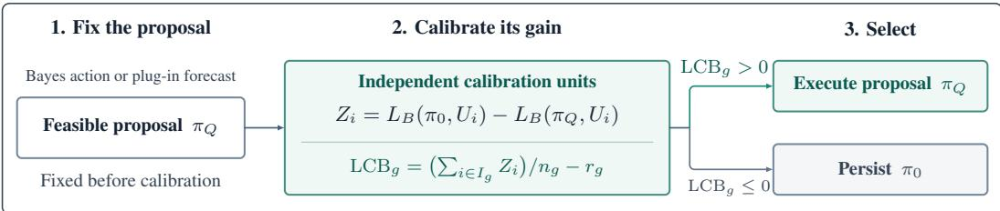
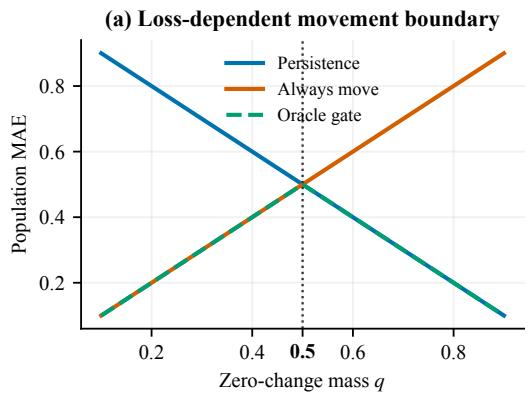
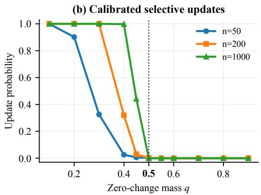
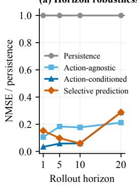
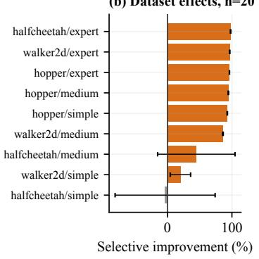
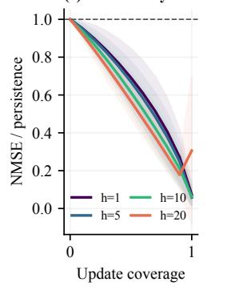
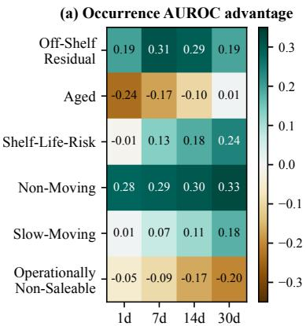
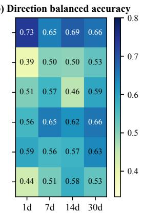
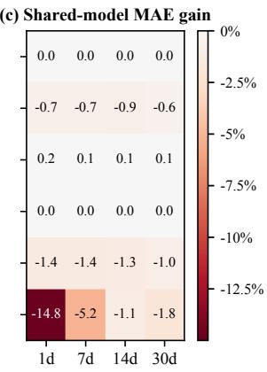
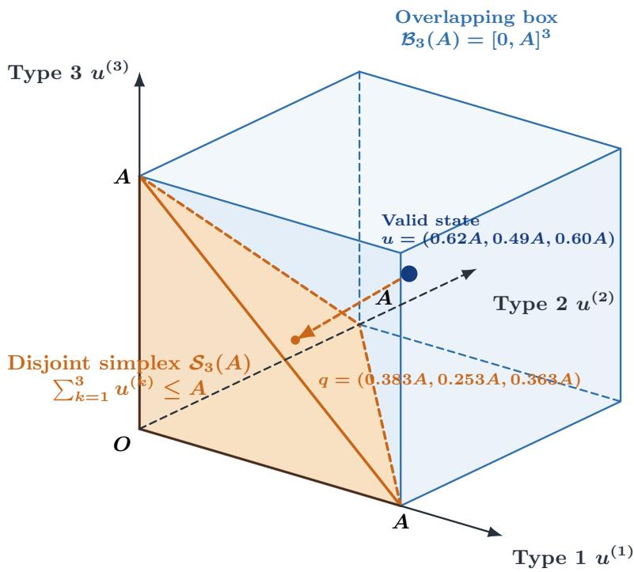

# WHEN SHOULD A WORLD MODEL MOVE?LOSS-CONDITIONED STATE EXECUTION

Jintao Xu1,∗ Zhengyu Chen1,∗ Ben Zhang1,∗ Yongzhi Qi1,† Jianshen Zhang1

1Supply Chain Tech Team Y, JD.com

{xujintao.3014,chenzhengyu8,zhangben22,qiyongzhi1,zhangjianshen}@jd.com

## ABSTRACT

We introduce loss-conditioned state execution, a model-agnostic method that decides whether to execute a world model’s fixed feasible proposal or retain the current state. Predictive informativeness alone, however, does not establish whether an update will reduce downstream loss. Occurrence ranking can approach perfection while persistence remains the unique absolute-loss Bayes action. Two transition laws can also share occurrence information and conditional variance yet require opposite absolute-loss decisions. We formalize state movability as the existence of a loss-reducing feasible correction and distinguish it from the benefit of a particular proposal. Our method constructs a loss-specific feasible proposal from a predictive distribution and evaluates its groupwise bounded-loss gain over persistence on independent calibration units. The proposal is executed only in groups with a positive simultaneous lower confidence bound. For fixed proposals and groups with bounded unit losses, we prove that every accepted group has lower expected loss than persistence with high probability when calibration units are i.i.d. draws from the target population. Experiments on public forecasting and action-conditioned dynamics benchmarks show supported updates and a trade-off between certification and coverage. On 28,684 held-out M4 Monthly series, the method executes the proposal for 14.0% of series and achieves bounded loss 0.588, compared with 0.599 for persistence and 0.621 for always executing the proposal. The paired 95% bootstrap intervals for both comparisons lie below zero. In constrained forecasting of six unhealthy-inventory types from JD.com, a leading e-retailer in China, strong occurrence-ranking signal coexists with a lossbased preference for persistence, illustrating why event predictability and state execution must be evaluated separately.

## 1 INTRODUCTION

World models map histories and optional actions to distributions over future states. They are commonly judged by likelihood, calibration, or downstream control, with rollout length and uncertainty used to limit unreliable simulation. To select a state prediction, a model must also decide:

Move awayfrom the current state, or persist?

This decision is loss dependent. Under absolute loss, persistence is optimal whenever zero change is a conditional median, whereas squared loss depends on the conditional mean and asymmetric costs select a task-specific quantile (Gneiting, 2011). Consequently, a model can rank change events almost perfectly yet induce no state update that improves absolute error over persistence. This distinction matters particularly in sticky or sparse dynamics, where event prediction and loss-reducing state movement are different objectives. A scalar variance estimate cannot generally resolve the ambiguity: we construct transition laws with identical occurrence information and conditional variance but opposite loss-optimal movement decisions. We call a state movable under a declared loss when some feasible correction has lower conditional risk than persistence under the data-generating transition law. This population property is distinct from the benefit of a particular fitted proposal and the calibration evidence supporting its execution.

In loss-conditioned state execution, a predictive transition distribution induces a Bayes correction under the stated loss, which is then mapped into the feasible state set. Training data define interpretable groups before calibration. An independent calibration split evaluates the executed proposal’s bounded-loss gain over persistence. The gate executes proposals only for groups with a positive simultaneous lower confidence bound. Otherwise, the state prediction equals the current state. Figure 1 shows the resulting proposal–evaluation–fallback interface.

Our main contributions are organized around three aspects:

• Loss-specific state movability. We distinguish the existence of a loss-reducing feasible correction from the benefit of a fixed model proposal. We characterize persistence regions for common scalar losses and prove that identical occurrence information and conditional variance can imply opposite absolute-loss execution decisions.

• Proposal benefit and certified execution. We bound the gap between state movability and fixedproposal benefit in terms of transition-distribution error and feasibility or optimization suboptimality. Independent calibration evaluates the executed proposal against persistence and certifies positive group-average bounded-loss gain under explicit sampling assumptions.

• Cross-domain movement regimes. Across synthetic settings, Monash and M4 forecasting benchmarks, Minari FourRooms and MuJoCo, and a constrained six-type unhealthy-inventory case from JD.com, we distinguish supported updates, absent fitted-proposal gain, and insufficient calibration evidence. The experiments quantify the trade-off between certification, update coverage, and prediction error.

  
Figure 1: Loss-conditioned state execution. A fixed feasible proposal is executed when independent calibration certifies positive groupwise gain over persistence under the declared unit loss.

## 2 RELATED WORK

World models and conservative rollout. Learned dynamics support planning by simulating future states. Methods by Ha & Schmidhuber (2018), Chua et al. (2018), Janner et al. (2019), Yu et al. (2020), and Kidambi et al. (2020) use probabilistic ensembles, short rollouts, pessimism, or unknown-region penalties to limit accumulated model error. Uncertainty-aware rollout adaptation governs where or how far learned dynamics are used (Frauenknecht et al., 2024). World-action models adapt imagination depth using planning gain and computation cost (Lu et al., 2026) or action-chunk length using future–reality consistency (Wang et al., 2026). These approaches select the extent of imagination or execution. Our criterion instead evaluates whether a fixed feasible state correction improves over persistence under the declared loss, complementing the choice of transition learner and rollout horizon.

Probabilistic and decision-focused prediction. Gneiting & Raftery (2007) and Gneiting & Katzfuss (2014) describe proper scoring rules that evaluate predictive distributions without committing to a single-valued decision. Loss-consistent point forecasts target functionals such as means or quantiles (Gneiting, 2011). The area under the receiver operating characteristic curve (AUROC) summarizes ranking rather than a fixed-cost decision (Hand, 2009). Conditional predictive-ability methods use observable information and loss differences to test or select between forecast rules at future origins under possible misspecification (Giacomini & White, 2006). Predictive-to-prescriptive methods connect estimated outcomes to optimization objectives (Bertsimas & Kallus, 2020). Our formulation compares a post-feasibility state correction with persistence under the declared loss, distinguishing the existence of a beneficial feasible correction (state movability) from the gain of the model-induced correction (proposal benefit). Independent calibration assesses evidence for executing the fixed proposal.

Selective prediction, deferral, and time-series forecasting. El-Yaniv & Wiener (2010), Geifman & El-Yaniv (2019), and Noskov et al. (2024) study selective prediction, which trades output coverage for conditional risk by withholding uncertain predictions. Learning to defer instead routes a decision to an external expert (Mozannar & Sontag, 2020). Tomar et al. (2026) and Inacio et al. (2026) reject ´ difficult time-series predictions using learned structural or transfer scores. Our rejection semantics assign persistence, a feasible baseline prediction, for every rejected proposal. Coverage is therefore determined by evidence that the fixed candidate improves over persistence under the declared loss.

Baseline fallback and statistical certification. Safe policy improvement bootstraps with a baseline where uncertainty is high (Laroche et al., 2019), and runtime-assurance architectures switch between advanced and verified baseline controllers (Chen et al., 2022). Risk-controlled policy postprocessing instead maximizes agreement with a deterministic baseline subject to a chance-risk budget (Joshi et al., 2026). Certificate-driven time-series calibration trains an online gated residual over a fixed backbone and uses martingale PAC-Bayesian certificates under temporal dependence and shift (Huang et al., 2026). loss-conditioned state execution uses independent calibration units and the learn-then-test construction (Angelopoulos et al., 2025) to certify groupwise gain over currentstate persistence for a post-feasibility proposal fixed before calibration. Appendix A.1 compares the decision objects, fallback behavior, and evaluation targets of these methods.

## 3 LOSS-CONDITIONED STATE EXECUTION

Let t index transition time and $H _ { t }$ the observed history, including any observed action $a _ { t } . ~ \mathrm { A }$ transition model with parameters $\theta$ specifies a conditional predictive distribution $Q _ { \theta } ( \cdot \mid H _ { t } )$ over the state correction $\Delta _ { t } : = S _ { t + 1 } - S _ { t }$ . Let $\mathcal { D } ( H _ { t } )$ be the set of feasible corrections and assume $0 \in \mathcal { D } ( H _ { t } )$ , so persistence is executable. For a specified horizon h, the same formulation uses $\Delta _ { t , h } : = S _ { t + h } - S _ { t }$ and a fixed horizon-specific proposal rule. All rules are measurable, and all conditional risks and risk infima below are finite. For a raw correction domain $\boldsymbol { \mathcal { A } } ( \boldsymbol { H _ { t } } )$ and loss ℓ, assume the Bayes minimum is attained and define

$$
b _ { Q } ( H _ { t } ) \in \arg \operatorname* { m i n } _ { c \in A ( H _ { t } ) } \mathbb { E } _ { \Delta \sim Q _ { \theta } ( \cdot | H _ { t } ) } [ \ell ( c , \Delta ) ] .
$$

Let $F _ { H _ { t } }$ map proposed states into $S _ { t } { + } \mathcal { D } ( H _ { t } )$ and define the executedproposal $c _ { Q } ( H _ { t } ) : = F _ { H _ { t } } ( S _ { t } +$ $b _ { Q } ( H _ { t } ) ) - S _ { t }$ . Direct optimization over $\mathcal { D } ( H _ { t } )$ uses $F _ { H _ { t } }$ as the identity on feasible states. The persistence correction is $c _ { 0 } ( H _ { t } ) : = 0 \quad$ , and $\begin{array} { r } { P ( \cdot \mid H _ { t } ) } \end{array}$ denotes the data-generating conditional law of $\Delta _ { t }$

Definition 1 (State movability and proposal benefit). For conditional risk $R _ { P } ( c \mid H _ { t } ) : =$ $\mathbb { E } _ { P } [ \ell ( c , \Delta _ { t } ) \mid H _ { t } ]$ , define

$$
\begin{array} { c } { { M _ { \ell } ( P \mid H _ { t } ) : = R _ { P } ( 0 \mid H _ { t } ) - \displaystyle \operatorname* { i n f } _ { c \in { \mathcal D } ( H _ { t } ) } R _ { P } ( c \mid H _ { t } ) , } } \\ { { V _ { \ell } ( Q _ { \theta } , P \mid H _ { t } ) : = R _ { P } ( 0 \mid H _ { t } ) - R _ { P } ( c _ { Q } ( H _ { t } ) \mid H _ { t } ) . } } \end{array}
$$

The quantity $M _ { \ell }$ measures state movability, and the state is movable when $M _ { \ell } > 0$ . The quantity $V _ { \ell }$ measures proposal benefit, and the executed proposal has population support when $V _ { \ell } > 0$

Since $0 \in \mathcal { D } ( H _ { t } ) , M _ { \ell } \geq 0$ , with equality exactly when persistence is optimal. Feasibility of $c _ { Q } ( H _ { t } )$ gives $V _ { \ell } \le M _ { \ell } ,$ , so positive proposal benefit implies movability. The gap $M _ { \ell } - V _ { \ell }$ is the executed proposal’s regret relative to the optimal feasible risk. Independent calibration below assesses groupaverage proposal benefit under a bounded unit loss.

## 3.1 PERSISTENCE REGIONS AND RANKING–MOVEMENT SEPARATION

Whether persistence is Bayes-optimal depends on the downstream loss. The following result characterizes its optimality under three common scalar losses.

Proposition 1 (Bayes persistence under common scalar prediction losses). For a fixed context H, let $\Delta$ be its scalar state correction and optimize over $c \in \mathbb { R }$ . Then:

(i) Squared loss. $I f \mathbb { E } [ \Delta ^ { 2 } \mid H ] < \infty ,$ , zero is the unique Bayes correction if and only $i f \mathbb { E } [ \Delta \mid H ] = 0 .$

(ii) Pinball loss. For $\tau \in \mathsf { \Gamma } ( 0 , 1 )$ , define $\rho _ { \tau } ( \Delta - c ) : = \tau ( \Delta - c ) _ { + } + ( 1 - \tau ) ( c - \Delta ) _ { + }$ , where $( x ) _ { + } : = \operatorname* { m a x } \{ x , 0 \} . \ I f \mathbb { E } [ | \Delta | \ | \ H ] < \infty ,$ zero is Bayes-optimal ifand only if

$$
\mathbb { P } ( \Delta < 0 \mid H ) \le \tau \le \mathbb { P } ( \Delta \le 0 \mid H ) .\tag{1}
$$

(iii) Asymmetric linear loss. For under- and over-prediction costs $c _ { u } , c _ { o } > 0 ,$ , consider $c _ { u } ( \Delta \mathrm { ~ - ~ }$ $c ) _ { + } + \bar { c } _ { o } ( c - \Delta ) _ { + } . \ I f \mathbb { E } [ | \Delta |  \ | \ H ] < \infty$ , zero is Bayes-optimal if and only if the condition in (ii) holds with $\tau = c _ { u } / ( c _ { u } + c _ { o } )$

Absolute loss corresponds to the median case $\tau = 1 / 2$ , yielding the following sign-based characterization.

Corollary 1 (Signed-change persistence under absolute loss). Let ∆ be integrable conditional on H. Over c ∈ R, the persistence correction $c = 0$ minimizes $\mathbb { E } [ | \Delta - c | \mid H ]$ ifand only $i f$

$$
\begin{array} { r } { \mathbb { P } ( \Delta < 0 \mid H ) \le \frac { 1 } { 2 } , \qquad \mathbb { P } ( \Delta > 0 \mid H ) \le \frac { 1 } { 2 } . } \end{array}\tag{2}
$$

It is the unique minimizer when zero is the unique conditional median.

Proofs of Proposition 1 and Corollary 1 are provided in Appendix A.2.

This characterization permits occurrence ranking and state movement to separate.

Proposition 2 (Near-perfect occurrence ranking does not imply absolute-loss movement). For every $\varepsilon > 0 ,$ , there exist a binary-valued transition distribution and an occurrence-ranking score whose AUROC exceeds $1 - \varepsilon ,$ yet persistence is the unique conditional Bayes correction under absolute loss at every context.

Even exact occurrence probabilities together with conditional variance need not determine whether persistence is optimal.

Theorem 1 (Non-identification of movability from occurrence and conditional variance). Consider scalar corrections over $\begin{array} { r } { \mathcal { D } ( H ) = \mathbb { R } . } \end{array}$ Fix any marginal law of $H _ { ; }$ , measurable function $p ( H ) \in ( 1 / 2 , 1 )$ , and measurable scale function $\alpha ( H ) \in ( 0 , \infty )$ . There exist two conditional transition laws $P _ { 0 }$ and $P _ { 1 }$ such that, $f o r j \in \{ 0 , 1 \}$

$$
\mathbb { P } _ { j } ( \Delta \neq 0 \mid H ) = p ( H ) , \qquad \operatorname { V a r } _ { j } ( \Delta \mid H ) = p ( H ) \alpha ( H ) ^ { 2 } ,
$$

and both induce the same joint law $o f \left( H , Y \right)$ for $Y : = \mathbf { 1 } \{ \Delta \neq 0 \}$ . Nevertheless, under absolute loss, persistence is uniquely optimal under $P _ { 0 }$ , whereas a strictly positive correction is uniquely optimal under $P _ { 1 }$

Proofs ofProposition 2 and Theorem 1 are provided in Appendix A.2.

The identical joint law of $( H , Y )$ implies that the two transition laws share occurrence probabilities, Bernoulli entropies, and the receiver operating characteristic (ROC) curve of every H-measurable occurrence score. Gates using only these occurrence summaries and conditional variance therefore have the same decision distribution under both laws, including randomized gates with a common conditional seed law. In a numerical illustration with a common fixed candidate, direct evaluation of its loss gain over persistence distinguishes the two laws. Both the empirical-sign and lower confidence bound (LCB) rules recover the opposite execution decisions as the calibration sample size increases (see Appendix C.2.2).

## 3.2 INDEPENDENT LOSS-SPECIFIC CALIBRATION

The separation above motivates evaluating a proposed correction directly through its downstream loss. We use an independent calibration split to compare the fixed executed proposal with persistence within predeclared groups.

Calibration setup. Let $\tau$ denote the σ-field generated by the training data and all choices made before calibration, including the executed proposal rule, group map, and any loss normalization or clipping. Conditioning on $\bar { \tau }$ treats these quantities as fixed. Given $\tau$ , let ${ \dot { U } } _ { i }$ denote a calibration unit with target law $P _ { U }$ . The unit sets the granularity at which independence is assumed: it may be a transition, series block, episode, or complete training run. Multiple observations within a unit are summarized by a declared bounded loss $\dot { L } _ { B } ( \pi , U _ { i } ) \in \ [ 0 , B ]$ , with $B > 0$ , for rule $\pi$ . This may be the reported downstream loss when it is naturally bounded, or a normalized and clipped surrogate specified before calibration. Each unit also has pre-outcome grouping information $\bar { X _ { i \cdot } } \mathrm { ~ A ~ }$ fixed map $g ( X _ { i } ) ~ \in ~ \{ 1 , . . . , G \}$ assigns units to $G$ predeclared groups, and $\delta \in \mathsf { \Gamma } ( 0 , 1 )$ denotes the desired simultaneous failure probability.

Groupwise gain. For persistence $\pi _ { 0 }$ and the fixed executed proposal $\pi _ { Q } .$ , define the observed gain on unit i as

$$
Z _ { i } : = L _ { B } ( \pi _ { 0 } , U _ { i } ) - L _ { B } ( \pi _ { Q } , U _ { i } ) \in [ - B , B ] .
$$

A positive value favors the proposal. For each group with positive target-population probability, its population-average gain is

$$
\mu _ { g } : = \operatorname { \mathbb { E } } [ Z _ { i } \mid g ( X _ { i } ) = g , { \mathcal { T } } ] .
$$

In the single-transition case, $U _ { i } = ( H _ { i } , \Delta _ { i } )$ and $X _ { i } = H _ { i }$ , with unit losses $L _ { B } ( \pi _ { 0 } , U _ { i } ) = \ell _ { B } ( 0 , \Delta _ { i } )$ and $L _ { B } ( \bar { \pi } _ { Q } , U _ { i } ) = \ell _ { B } ( c _ { Q } ( H _ { i } ) , \Delta _ { i } )$ . If P is the conditional transition law induced by $P _ { U }$ given $\tau$ then

$$
\mu _ { g } = \mathbb { E } [ V _ { \ell _ { B } } ( Q _ { \theta } , P \mid H _ { i } ) \mid g ( H _ { i } ) = g , { \mathcal { T } } ] .
$$

This identity shows that $\mu _ { g }$ averages pointwise proposal benefit over the histories in group $g .$ For general units, $\mu _ { g }$ instead denotes the expected persistence-relative gain under the declared bounded unit loss, including any aggregation or clipping.

Certified selection. For each group, let ${ \cal I } _ { g } : = \{ i : g ( X _ { i } ) = g \}$ and $n _ { g } : = | I _ { g } |$ |. A group is represented when $n _ { g } > 0$ . For such a group, define $\textstyle { \widehat { \mu } } _ { g } : = ( \sum _ { i \in I _ { g } } Z _ { i } ) / n _ { g }$ and

$$
\mathrm { L C B } _ { g } : = \widehat { \mu } _ { g } - r _ { g } , \qquad r _ { g } : = B \sqrt { \frac { 2 \log ( G / \delta ) } { n _ { g } } } .
$$

Here $r _ { g }$ is a one-sided Hoeffding radius, adjusted across the $G$ groups by a union bound (Hoeffding, 1963). In a represented group, the selective rule applies $\pi _ { Q }$ when $\mathrm { L } \bar { \mathrm { C B } _ { g } } > 0$ and applies persistence $\pi _ { 0 }$ otherwise. Empty groups also receive persistence. In the single-transition case, $c _ { \mathrm { s e l } } ( H ) = c _ { Q } ( H )$ when $g ( H )$ is represented and $\mathrm { L C B } _ { g ( H ) } > 0$ , and $c _ { \mathrm { s e l } } ( H ) = 0$ otherwise. Theorem 2 establishes the resulting simultaneous guarantee.

Theorem 2 (Simultaneous accepted-group improvement). Conditionally on $\tau ,$ , suppose the proposal rule, groups, and bounded unit loss are fixed, and the calibration units are i.i.d. from $P _ { U }$ With conditional probability at least $1 - \delta ,$ every accepted group satisfies $\mu _ { g } > 0 ,$ , giving positive expected improvement over persistence under $L _ { B }$ and $P _ { U }$

Proposition 3 (Finite-sample certification power). Under the assumptions of Theorem 2, condition on T and the realized group counts. With probability at least $1 - \delta _ { ; }$ , every represented group whose population gain satisfies

$$
\mu _ { g } > 2 B \sqrt { \frac { 2 \log ( G / \delta ) } { n _ { g } } }
$$

is accepted simultaneously.

Proofs ofTheorem 2 and Proposition 3 are provided in Appendix A.3.

The sufficient per-group sample size scales as $B ^ { 2 } \log ( G / \delta ) / \mu _ { q } ^ { 2 }$ , making explicit the dependence of simultaneous certification on the loss bound, number of groups, and population gain.

## 4 EXPERIMENTS

The experiments address three questions:

Q1: Can calibration recover a known loss-dependent movement boundary?

Q2: How does proposal benefit vary across forecasting and dynamics settings?

Q3: How does confidence correction affect update coverage and prediction loss?

Table 1 summarizes each experiment’s question, selection outcome, and evaluation result.

Table 1: Experimental overview. Empirical losses are evaluated on held-out data. Lower loss and regret are better.
<table><tr><td>Scene</td><td>What it tests</td><td>Selection and held-out result</td></tr><tr><td>Controlled</td><td>Q1, Q3: Movement boundary</td><td>ng : 50 → 1000. Power: 0.452 → 0.888. Regret:</td></tr><tr><td>synthetic changes Monash Car Parts</td><td>and finite-sample selection Q2: Broad proposal benefit</td><td>0.0566→0.0051 Accept 2/2 groups. Persistence / selective MAE:</td></tr><tr><td>M4 Monthly</td><td>Q2, Q3: Heterogeneous</td><td>0.573/0.391 Accept 1/3 groups. Persistence / always execute /</td></tr><tr><td>Minari</td><td>benefit and selective execution Q2, Q3: Proposal benefit and</td><td>selective: 0.599/0.621/0.588</td></tr><tr><td>FourRooms</td><td>selective execution in discrete-action dynamics</td><td>Accept 1/2 groups. Persistence / always execute / selective: 0.185/0.094/0.122</td></tr><tr><td>Minari MuJoCo</td><td>Q2, Q3: Proposal benefit and selective execution across prediction horizons</td><td>At h = 20, persistence / tuned uncertainty / selective NMSE: 1.919/0.552/0.552. Selective is no worse on 8/9 variants</td></tr><tr><td>Six-type unhealthy inventory</td><td>Q2, Q3: Fitted-proposal gain and held-out comparison</td><td>Candidate does not beat persistence at any h</td></tr></table>

Throughout, h denotes the forecast or rollout horizon. Update coverage denotes the frequency of selecting the proposal. Proposal construction, gate calibration, and evaluation use disjoint data. Proposals range from empirical and seasonal rules to learned ensembles and action-conditioned models. Losses are compared within each setting. Appendix C.1.2 specifies calibration–deployment assumptions, and Appendix C.1.1 defines the losses.

## 4.1 CONTROLLED PHASE TRANSITION

A signed binary-change population varies zero-change mass through the absolute-loss boundary at 1/2. Across 500 repetitions, increasing calibration units per group from 50 to 1,000 raises beneficialgroup power from 0.452 to 0.888 and lowers regret from 0.0566 to 0.0051. Figure 2 shows the population boundary and its finite-sample recovery. The fixed groups contain both beneficial and harmful proposals. We compare the LCB gate with an empirical-sign rule that accepts any group with positive calibration mean gain. With 200 calibration observations per group, exact binomial probabilities show that confidence correction reduces the probability of accepting any harmful group from 6.96% to 0.00010%, while the acceptance rate for beneficial groups decreases from 98.2% to 66.6%. Table 5 reports the resulting trade-off between error control, update coverage, and population regret. A single transition law further illustrates loss dependence: its Bayes correction is 0.4 under squared loss, 0 under absolute loss, and respectively −1 and 3 under pinball loss at τ = 0.2 and 0.8. Table 3 reports its exact risks.

  
Figure 2: Loss-dependent movement phase transition. (a) Population MAE of persistence, always move, and the oracle gate. (b) Update probabilities for n calibration observations per group. Dotted lines mark the population boundary at $q = 0 . 5$

## 4.2 SUPPORTED MOVEMENT ON INTERMITTENT DEMAND

On the public Monash Car Parts benchmark, comprising 2,674 monthly intermittent-demand series (Godahewa et al., 2021), a 27-month training block constructs groupwise empirical proposals, followed by 12-month calibration and held-out test blocks. Calibration and testing use rolling one-step forecasts with the latest observed history. A training zero-fraction threshold of 0.75 defines dense and sparse groups. Both fitted absolute-loss Bayes actions predict zero demand.

Both groups are accepted, so selective execution equals always execute. Test MAE is 0.391, versus 0.573/0.626/0.539 for persistence, seasonal naive, and a 12-month trailing mean, respectively. Selective-minus-persistence is −0.182, with a 95% bootstrap interval of [−0.194, −0.170]. MASE with lag-1 scaling is 1.348 versus 1.881 over 2,504 eligible series. Finer post-hoc partitions $( K _ { \mathrm { g r p } } \in \mathsf { \bar { \{ 4 , 8 \} } }$ ) refit the candidates and yield mixed test gains with zero gate coverage (see Appendix C.3.2).

## 4.3 SELECTIVE EXECUTION UNDER HETEROGENEOUS GAIN

The M4 Monthly experiment tests heterogeneous proposal gain under a protocol fixed before access to the official test outcomes (Makridakis et al., 2018). The 48,000 complete series are hash-split into 19,316 calibration and 28,684 held-out test series. The proposal repeats the latest 12-month cycle, and a training-only ratio of proposal to persistence MAE defines three pre-specified groups. The simultaneous LCB accepts only the candidate-favored group, covering 14.0% of test series.

For absolute horizon error $e _ { j }$ and training-history mean absolute first-difference scale s floored at $1 0 ^ { - 8 }$ , the primary series loss is $( \sum _ { j = 1 } ^ { 1 8 } e _ { j } / ( e _ { j } + s ) ) / 1 8 \in [ 0 , 1 ]$ . Always executing is worse than persistence (0.621 versus 0.599), whereas selective execution reaches 0.588. Selective-minuspersistence is −0.0114 with paired 95% bootstrap interval [−0.0122, −0.0107]. Selective-minusalways-execute is −0.0331 with interval $[ - 0 . 0 3 4 \bar { 5 } , - 0 . 0 3 1 8 ]$

The empirical-sign rule also accepts the ambiguous group, whose calibration mean gain is positive. Confidence correction restricts execution to the candidate-favored group, reducing coverage from 22.2% to 14.0% and certifying its gain under the stated sampling assumptions. Test loss increases from 0.586 to 0.588, with a paired LCB-minus-sign difference of 0.00187 and a 95% bootstrap interval of [0.00146, 0.00229] (see Table 8).

The two extreme policies and the certified selector retain the same ordering under standard metrics: persistence / always execute / selective obtain MASE with lag-1 scaling 3.380/4.259/3.301 and symmetric mean absolute percentage error (sMAPE) 0.153/0.160/0.147. Appendix C.2.3 compares the observed group gains and Hoeffding radii with the sufficient acceptance threshold in Proposition 3. Complementary Quarterly and Daily evaluations respectively show insufficient Hoeffding certification power and nonpositive calibration gain (see Appendix C.5.1).

## 4.4 CERTIFIED SELECTION IN DISCRETE-ACTION DYNAMICS

The Minari FourRooms artifact contains 590 episodes and 10,010 transitions (Farama Foundation). Ordered episodes are split 354/118/118 for fitting, calibration, and held-out testing. A train-only empirical table predicts the next local image and direction from (image, direction, action). Unseen contexts persist. The gate uses fixed turn/forward groups and a bounded loss equally weighting pixel mismatch and direction error. Calibration and groupwise test evaluation average this loss within each episode and then equally across episodes containing the group.

The simultaneous gain LCB is 0.029 for the turn group and −0.218 for the forward group. Only the turn group is accepted, although both groups have positive calibration mean gains. On 117 held-out episodes containing turns, the accepted group’s mean gain over persistence is 0.2964, with a paired 95% bootstrap interval of [0.2625, 0.3292] (see Table 12).

Across all 2,056 held-out transitions, transition-weighted action-conditioned / action-agnostic candidate losses are 0.094/0.125, and selective / persistence losses are 0.122/0.185. The forward group also benefits on test, so selective execution has higher loss than always executing. Selective-minuspersistence loss is −0.0630, with a paired episode-cluster 95% interval of $[ - 0 . 0 6 9 2 , - 0 . 0 5 6 8 ]$ Selective-minus-always-execute loss is 0.0277, with an interval of [0.0249, 0.0304]. A closed-loop pilot records 2/30 successful episodes for both selective and persistence (see Appendix C.5.2).

## 4.5 SELECTIVE EXECUTION IN NEURAL MULTI-STEP DYNAMICS

The neural dynamics study uses the Minari Hopper, HalfCheetah, and Walker2d dataset families from the Farama Foundation. Across 27 protocol runs (three environments × three data levels × three seeds) and $h \in \{ 1 , 5 , 1 0 , 2 0 \}$ , a three-member delta-MLP ensemble first generates an h-step open-loop prediction under the recorded action sequence. The gate then selects between its terminal state prediction and the window’s initial state. Groups are horizon-specific training-only uncertainty tertiles. Calibration uses window NMSE clipped to [0, 1], averaged within each episode–group pair and then equally across represented episodes. Prediction accuracy is measured by unclipped NMSE, the scale-normalized coordinatewise squared error averaged over windows within episodes, then over episodes, seeds, and dataset variants.

(c) Uncertainty risk–coverage  
  
Figure 3: MuJoCo results. (a) NMSE relative to persistence across horizons. (b) Selective NMSE reduction (%) relative to persistence at $h = 2 0$ , with means and sample standard deviations across seeds. (c) Relative NMSE versus uncertainty-based update coverage, with shaded bands showing one standard deviation across datasets.

Selective prediction has lower macro NMSE than persistence at every horizon and is no worse on eight of nine variants at horizon 20. For $h = 1 , 5 , 1 0 , 2 0$ , persistence-to-selective NMSE is respectively 0.481 → 0.073, 0.793 → 0.077, $1 . 4 0 1  0 . 0 8 2$ , and $1 . 9 1 9  0 . 5 5 2$ , with coverage $3 3 . 3 / \dot { 8 6 } . 2 / 1 0 0 / 1 0 0 \%$ . A calibration-tuned uncertainty baseline accepts all groups and scores $0 . 0 1 6 / 0 . 0 4 6 / 0 . 0 8 2 / 0 . 5 5 2$ , improving on selective execution at $h = 1$ , 5 (see Figure 3).

Under the gate’s clipped loss, all 324 run-specific groups have positive test gains in 27 repeated runs with the same configuration and splits. Their calibration mean gains are also positive. The LCB gate accepts 259 groups, including seven whose unclipped test gains are negative (see Table 13). It retains persistence in the remaining 65 groups, reducing update coverage at shorter horizons, while the empirical-sign rule executes every proposal. Under clipped loss, LCB-minus-sign differences are 0.0512 and 0.0295 at h = 1, 5, respectively (see Table 8).

## 4.6 CONSTRAINED FORECASTING OF SIX UNHEALTHY-INVENTORY TYPES

We study 33 stock keeping units (SKUs) from JD.com in a supply-chain setting with six unhealthy inventory types: shelf-life-risk, aged, non-moving, slow-moving, off-shelf residual, and operationally non-saleable inventory. Observations span 56 days at the national SKU–day grain. These quantities may overlap, and each is separately bounded by active inventory. Appendix B describes the overlapping state geometry and feasibility constraints. For this research forecasting task, a shared probabilistic ensemble supplies a fixed, type-aware state-update proposal, with feasibility enforced before calibration and evaluation.

  
Figure 4: Diagnostics across six unhealthy-inventory types. (a) Occurrence-AUROC advantage over the strongest naive baseline. (b) Direction balanced accuracy. (c) Shared-model MAE gain (%) relative to persistence.

The shared ensemble has higher MAE than persistence at each of the four horizons. At h ∈ {1, 7, 14, 30}, shared-model MAE is 1.030, 3.967, 6.850, and 13.759, compared with 1.027, 3.958, 6.837, and 13.737 for persistence. This ordering is unchanged under inventory-normalized MAE and weighted absolute percentage error (WAPE), across three training seeds, and in a later-window historical backtest (see Appendix C.4). Yet occurrence probes attain macro AUROC 0.819, 0.792, 0.791, and 0.794, whereas no type–horizon signed-delta probe achieves lower MAE than zerochange persistence in at least four of the five entity-held-out folds. Thus, in this cohort, occurrenceranking signal coexists with a shared state-update proposal that does not improve MAE (see Fig ure 4).

## 5 CONCLUSION

A predictive transition is not yet a decision to change state. We formulate state execution as a lossconditioned choice between a fixed feasible proposal and persistence, with independent calibration certifying when movement is supported. Across controlled, forecasting, and action-conditioned settings, the experiments distinguish supported movement from predictive signals that do not justify a state update under the declared loss. The result is a model-agnostic execution principle that applies across empirical, seasonal, action-conditioned, and neural proposals. Future work will study recursive rollouts that feed selected states into subsequent predictions, with online recalibration and policy-aware proposal construction.

## REFERENCES

Anastasios N. Angelopoulos, Stephen Bates, Emmanuel J. Candes, Michael I. Jordan, and Lihua\` Lei. Learn then test: Calibrating predictive algorithms to achieve risk control. The Annals of Applied Statistics, 19(2):1641–1662, 2025. ISSN 1932-6157. doi: 10.1214/24-AOAS1998. URL https://doi.org/10.1214/24-AOAS1998.

Dimitris Bertsimas and Nathan Kallus. From predictive to prescriptive analytics. Management Science, 66(3):1025–1044, 2020. ISSN 1526-5501. doi: 10.1287/mnsc.2018.3253. URL https://doi.org/10.1287/mnsc.2018.3253.

Shengduo Chen, Yaowei Sun, Dachuan Li, Qiang Wang, Qi Hao, and Joseph Sifakis. Runtime safety assurance for learning-enabled control of autonomous driving vehicles. In 2022 International Conference on Robotics and Automation (ICRA), pp. 8978–8984. IEEE, 2022. doi: 10. 1109/ICRA46639.2022.9812177. URL https://ieeexplore.ieee.org/document/ 9812177.

Kurtland Chua, Roberto Calandra, Rowan McAllister, and Sergey Levine. Deep reinforcement learning in a handful of trials using probabilistic dynamics models. In S. Bengio, H. Wallach, H. Larochelle, K. Grauman, N. Cesa-Bianchi, and R. Garnett (eds.), Advances in Neural Information Processing Systems, volume 31. Curran Associates, Inc., 2018. URL https://proceedings.neurips.cc/paper/2018/hash/ 3de568f8597b94bda53149c7d7f5958c-Abstract.html.

Ran El-Yaniv and Yair Wiener. On the foundations of noise-free selective classification. Journal of Machine Learning Research, 11(53):1605–1641, 2010. URL https://jmlr.org/papers/ v11/el-yaniv10a.html.

Farama Foundation. Fourrooms: Minari dataset documentation. https://minari.farama. org/main/datasets/minigrid/fourrooms/.

Farama Foundation. MuJoCo: Minari dataset documentation. https://minari.farama. org/main/datasets/mujoco/.

Bernd Frauenknecht, Artur Eisele, Devdutt Subhasish, Friedrich Solowjow, and Sebastian Trimpe. Trust the model where it trusts itself - model-based actor-critic with uncertainty-aware rollout adaption. In Proceedings of the 41st International Conference on Machine Learning, volume 235 of Proceedings ofMachine Learning Research, pp. 13973–14005. PMLR, 2024. URL https: //proceedings.mlr.press/v235/frauenknecht24a.html.

Yonatan Geifman and Ran El-Yaniv. SelectiveNet: A deep neural network with an integrated reject option. In Proceedings of the 36th International Conference on Machine Learning, volume 97 of Proceedings of Machine Learning Research, pp. 2151–2159. PMLR, 2019. URL https: //proceedings.mlr.press/v97/geifman19a.html.

Raffaella Giacomini and Halbert White. Tests of conditional predictive ability. Econometrica, 74 (6):1545–1578, 2006. doi: 10.1111/j.1468-0262.2006.00718.x. URL https://doi.org/ 10.1111/j.1468-0262.2006.00718.x.

Tilmann Gneiting. Making and evaluating point forecasts. Journal of the American Statistical Association, 106(494):746–762, 2011. doi: 10.1198/jasa.2011.r10138. URL https://doi. org/10.1198/jasa.2011.r10138.

Tilmann Gneiting and Matthias Katzfuss. Probabilistic forecasting. Annual Review of Statistics and Its Application, 1(1):125–151, 2014. ISSN 2326-831X. doi: 10.1146/annurev-statistics-062713-085831. URL https://doi.org/10.1146/ annurev-statistics-062713-085831.

Tilmann Gneiting and Adrian E. Raftery. Strictly proper scoring rules, prediction, and estimation. Journal of the American Statistical Association, 102(477):359–378, 2007. ISSN 1537-274X. doi: 10.1198/016214506000001437. URL https://doi.org/10.1198/ 016214506000001437.

Rakshitha W Godahewa, Christoph Bergmeir, Geoffrey Webb, Rob Hyndman, and Pablo Montero-Manso. Monash time series forecasting archive. In J. Vanschoren and S. Yeung (eds.), Proceedings of the Neural Information Processing Systems Track on Datasets and Benchmarks, volume 1, 2021. URL https: //datasets-benchmarks-proceedings.neurips.cc/paper\_files/paper/ 2021/hash/eddea82ad2755b24c4e168c5fc2ebd40-Abstract-round2.html.

David Ha and Jurgen Schmidhuber. Recurrent world models facilitate policy evolution.¨ In S. Bengio, H. Wallach, H. Larochelle, K. Grauman, N. Cesa-Bianchi, and R. Garnett (eds.), Advances in Neural Information Processing Systems, volume 31. Curran Associates, Inc., 2018. URL https://proceedings.neurips.cc/paper/2018/hash/ 2de5d16682c3c35007e4e92982f1a2ba-Abstract.html.

David J. Hand. Measuring classifier performance: A coherent alternative to the area under the ROC curve. Machine Learning, 77(1):103–123, 2009. doi: 10.1007/s10994-009-5119-5. URL https://doi.org/10.1007/s10994-009-5119-5.

Wassily Hoeffding. Probability inequalities for sums of bounded random variables. Journal of the American Statistical Association, 58(301):13–30, 1963. doi: 10.1080/01621459.1963.10500830. URL https://doi.org/10.1080/01621459.1963.10500830.

Chenfeng Huang, Zixuan Ma, and George Michailidis. Model-agnostic online certificate-driven calibration for time series forecasting under distribution shift. In Emilija Perkovic and Daniel´ Malinsky (eds.), Proceedings of the 42nd Conference on Uncertainty in Artificial Intelligence, volume 337 of Proceedings ofMachine Learning Research, pp. 2244–2273. PMLR, 2026. URL https://proceedings.mlr.press/v337/huang26b.html.

Ricardo Inacio, Vitor Cerqueira, Mar´ ´ılia Barandas, and Carlos Soares. Selective time series forecasting via metalearning. arXiv preprint arXiv:2606.23448, 2026. URL https://arxiv. org/abs/2606.23448.

Michael Janner, Justin Fu, Marvin Zhang, and Sergey Levine. When to trust your model: Modelbased policy optimization. In H. Wallach, H. Larochelle, A. Beygelzimer, Florence d’Alche-´ Buc, E. Fox, and R. Garnett (eds.), Advances in Neural Information Processing Systems, volume 32. Curran Associates, Inc., 2019. URL https://proceedings.neurips.cc/ paper/2019/hash/5faf461eff3099671ad63c6f3f094f7f-Abstract.html.

Sunay Joshi, Tao Wang, Hamed Hassani, and Edgar Dobriban. Risk-controlled post-processing of decision policies. arXiv preprint arXiv:2605.06479, 2026. URL https://arxiv.org/abs/ 2605.06479.

Rahul Kidambi, Aravind Rajeswaran, Praneeth Netrapalli, and Thorsten Joachims. MOReL: Model based offline reinforcement learning. In H. Larochelle, M. Ranzato, R. Hadsell, M. F. Balcan, and H. Lin (eds.), Advances in Neural Information Processing Systems, volume 33, pp. 21810–21823. Curran Associates, Inc., 2020. URL https://proceedings.neurips.cc/paper/ 2020/hash/f7efa4f864ae9b88d43527f4b14f750f-Abstract.html.

Romain Laroche, Paul Trichelair, and Remi Tachet Des Combes. Safe policy improvement with baseline bootstrapping. In Proceedings of the 36th International Conference on Machine Learning, volume 97 of Proceedings of Machine Learning Research, pp. 3652–3661. PMLR, 2019. URL https://proceedings.mlr.press/v97/laroche19a.html.

Hongbo Lu, Liang Yao, Chenghao He, Hao Han, Fan Liu, Wenlong Liao, Tao He, and Pai Peng. RISE: Adaptive imagination for world action models. arXiv preprint arXiv:2608.20430, 2026. URL https://arxiv.org/abs/2608.20430.

Spyros Makridakis, Evangelos Spiliotis, and Vassilios Assimakopoulos. The M4 competition: Results, findings, conclusion and way forward. International Journal of Forecasting, 34(4):802– 808, 2018. doi: 10.1016/j.ijforecast.2018.06.001. URL https://doi.org/10.1016/j. ijforecast.2018.06.001.

Andreas Maurer and Massimiliano Pontil. Empirical bernstein bounds and sample-variance penalization. In Proceedings of the 22nd Annual Conference on Learning Theory, 2009. URL https://www.cs.mcgill.ca/˜colt2009/papers/012.pdf.

Hussein Mozannar and David Sontag. Consistent estimators for learning to defer to an expert. In Proceedings of the 37th International Conference on Machine Learning, volume 119 of Proceedings of Machine Learning Research, pp. 7076–7087. PMLR, 2020. URL https: //proceedings.mlr.press/v119/mozannar20b.html.

Fedor Noskov, Alexander Fishkov, and Maxim Panov. Selective nonparametric regression via testing. In Proceedings of the 15th Asian Conference on Machine Learning, volume 222 of Proceedings of Machine Learning Research, pp. 1023–1038. PMLR, 2024. URL https: //proceedings.mlr.press/v222/noskov24a.html.

Shivani Tomar, Seshu Tirupathi, Elizabeth Daly, and Ivana Dusparic. Shapelets-enriched selective forecasting using time series foundation models. arXiv preprint arXiv:2601.11821, 2026. URL https://arxiv.org/abs/2601.11821.

Rui Wang, Yue Zhang, Jiehong Lin, Kuncheng Luo, Jianan Wang, Zhongrui Wang, and Xiaojuan Qi. When to trust imagination: Adaptive action execution for world action models. arXiv preprint arXiv:2605.06222, 2026. URL https://arxiv.org/abs/2605.06222.

Tianhe Yu, Garrett Thomas, Lantao Yu, Stefano Ermon, James Zou, Sergey Levine, Chelsea Finn, and Tengyu Ma. MOPO: Model-based offline policy optimization. In H. Larochelle, M. Ranzato, R. Hadsell, M. F. Balcan, and H. Lin (eds.), Advances in Neural Information Processing Systems, volume 33, pp. 14129–14142. Curran Associates, Inc., 2020. URL https://proceedings.neurips.cc/paper/2020/hash/ a322852ce0df73e204b7e67cbbef0d0a-Abstract.html.

## A METHODOLOGICAL FOUNDATIONS

We position the execution interface among related methods, then establish loss-conditioned decisions, proposal-quality bounds, and calibration guarantees.

## A.1 COMPARISON WITH RELATED METHODS

Related methods select predictions, policies, or rollout lengths using different evaluation targets (see Table 2). Our interface selects between a feasible state correction and persistence using the correction’s group-average loss reduction. Evaluating the proposal after the feasibility map aligns the calibration target with the state update actually executed.

The statistical construction follows the learn-then-test principle of calibrating fixed candidates through multiple testing (Angelopoulos et al., 2025): each group tests the null $\mu _ { g } \leq 0 ;$ , and simultaneous error control certifies the accepted groups. Hoeffding bounds instantiate this construction for bounded loss gains under conditional i.i.d. sampling (see Appendix C.1.2). Other valid simultaneous bounds can be used with the same feasible proposal, loss, and persistence baseline.

Table 2: Decision objects and evaluation targets of representative selection methods.
<table><tr><td>Method</td><td>Decision object</td><td>Retention or fallback</td><td>Evaluation target</td></tr><tr><td>Selective prediction (El-Yaniv &amp; Wiener, 2010)</td><td>Predict or abstain</td><td>Abstention</td><td>Risk on accepted predictions and coverage</td></tr><tr><td>Conditional forecast selection (Giacomini &amp; White, 2006)</td><td>Forecast rule</td><td>Alternative forecast</td><td>Conditional expected loss difference</td></tr><tr><td>Learn-then-test (Angelopoulos et al., 2025)</td><td>Candidate configuration</td><td>Application-defined</td><td>User-specified risk constraints</td></tr><tr><td>Online forecast calibration (Huang et al., 2026)</td><td>Gated residual correction</td><td>Backbone forecast</td><td>Target-risk certificate under temporal dependence and</td></tr><tr><td>Baseline bootstrapping (Laroche et al., 2019)</td><td>Policy improvement</td><td>Baseline policy in uncertain regions</td><td>shift Return relative to the baseline</td></tr><tr><td>Risk-controlled post-processing (Joshi et al., 2026)</td><td>Policy modification</td><td>possible</td><td>Retain baseline where Baseline agreement subject to a chance-risk constraint</td></tr><tr><td>Adaptive imagination (Lu et al., 2026)</td><td>Imagination depth</td><td>Stop imagination</td><td>Expected planning benefit versus computation cost</td></tr><tr><td>Adaptive action execution (Wang et al., 2026)</td><td>Action-chunk length</td><td>Replan</td><td>Prediction-observation consistency</td></tr><tr><td>Loss-conditioned execution (ours)</td><td>Feasible state correction</td><td>Persist current state</td><td>Positive group-average bounded-loss gain over persistence</td></tr></table>

## A.2 LOSS-CONDITIONED DECISIONS

Let H be a forecast context, including an action when one is observed, and let $\Delta \in \mathbb { R } ^ { d }$ be the future state correction, where d is the state dimension. A fitted transition model supplies the model-induced conditional predictive law $Q ( \Delta \mid H )$ for this correction. Let S be the current feasible state, $A ( H )$ a raw correction domain, ${ \mathcal { D } } ( H )$ the set of feasible corrections containing zero, and $F _ { H }$ a fixed map into $S + { \mathcal { D } } ( H )$ . Use measurable rules and finite conditional risks and risk infima, and assume the Bayes minimum below is attained. For a loss $\ell ( c , \Delta )$ , define

$$
R _ { Q } ( c \mid H ) : = \mathbb { E } _ { Q } [ \ell ( c , \Delta ) \mid H ] ,
$$

$$
b _ { Q } ( H ) \in \arg \operatorname* { m i n } _ { c \in \mathcal { A } ( H ) } R _ { Q } ( c \mid H ) ,
$$

$$
c _ { Q } ( H ) : = F _ { H } ( { \cal S } + b _ { Q } ( H ) ) - { \cal S } ,
$$

$$
R _ { P } ( c \mid H ) : = \mathbb { E } _ { P } [ \ell ( c , \Delta ) \mid H ] ,
$$

$$
M _ { \ell } ( P \mid H ) : = R _ { P } ( 0 \mid H ) - \operatorname* { i n f } _ { c \in { \mathcal { D } } ( H ) } R _ { P } ( c \mid H ) ,
$$

$$
V _ { \ell } ( Q , P \mid H ) : = R _ { P } ( 0 \mid H ) - R _ { P } ( c _ { Q } ( H ) \mid H ) .
$$

We suppress the parameter subscript $\theta$ in this appendix, so $Q$ denotes the fitted predictive law $Q _ { \theta }$ used in the main text. The quantity $c _ { Q } ( H )$ is the feasible correction actually executed from the model’s proposal. All calibration losses are evaluated after applying $F _ { H }$ . Direct constrained Bayes optimization is recovered by setting $\mathcal { A } ( H ) = \mathcal { D } ( H )$ and taking $F _ { H }$ to be the identity on feasible states. Persistence corresponds to the feasible correction $c _ { 0 } ( H ) : = 0$ . In this notation, distributional informativeness is a property of $Q ,$ population state movability is captured by $M _ { \ell } > 0$ , and proposal benefit is measured by $V _ { \ell }$ . Positive $V _ { \ell }$ gives population support for the proposal. Calibration assesses evidence for positive group-average gain under the declared bounded unit loss.

Proof of Proposition 1 and Corollary 1. For squared loss,

$$
\operatorname { \mathbb { E } } [ ( \Delta - c ) ^ { 2 } \mid H ] = \operatorname { \mathbb { E } } [ \Delta ^ { 2 } \mid H ] - 2 c \mathbb { E } [ \Delta \mid H ] + c ^ { 2 } .
$$

The strictly convex quadratic has the unique minimizer $c = \mathbb { E } [ \Delta \mid H ]$ , proving (i). For $( \mathrm { i i } )$ , let $G _ { H } ( x ) : = \mathbf { \bar { P } } ( \Delta \leq x \mid H )$ . The left and right derivatives of the convex pinball risk at c are $G _ { H } ( c ^ { - } ) _ { - }$ τ and $G _ { H } ( c ) - \tau .$ . Thus its minimizers are exactly the corrections satisfying $G _ { H } ( c ^ { - } ) \leq \tau \leq \dot { G } _ { H } ( c )$ Substituting $c = 0$ gives Equation (1). Dividing the asymmetric linear loss by $c _ { u } + c _ { o } > 0$ preserves its minimizers and gives pinball loss with $\tau = c _ { u } / ( c _ { u } + c _ { o } )$ , proving (iii). Absolute loss is twice pinball loss at $\tau = 1 / 2$ , so its minimizers are exactly the conditional medians. Substituting $c = 0$ yields Equation (2), and uniqueness holds exactly when zero is the only conditional median. □

Corollary 2 (Strict persistence margin from a zero-change atom). Let ∆ be scalar and integrable conditional on H, with $q : = \mathbb { P } ( \Delta = 0 \mid H ) > 1 / 2$ . Under absolute loss, persistence is the unique Bayes correction and every $c \neq 0$ satisfies

$$
{ \mathbb E } [ | \Delta - c | - | \Delta | \mid H ] \geq ( 2 q - 1 ) | c | > 0 .
$$

Proof. Fix H and let $c \neq 0 .$ . On the event $\left\{ \Delta = 0 \right\}$ , the excess absolute loss is exactly |c|. On $\{ \Delta \neq 0 \}$ , the reverse triangle inequality yields $| \Delta - c | { \bf \bar { \theta } } - | \Delta | \ge - | c |$ . Taking conditional expectations and using $\mathbb { P } ( \Delta = 0 \mid H ) \bar { = } q$ gives

$$
\begin{array} { r } { \mathbb { E } [ | \Delta - c | - | \Delta | \ | \ H ] \geq q | c | - ( 1 - q ) | c | = ( 2 q - 1 ) | c | . } \end{array}
$$

The assumption $q > 1 / 2$ makes this lower bound strictly positive for every $c \neq 0$ . Hence, $c = 0$ is the unique Bayes correction under absolute loss. □

Table 3: Exact loss-conditioned decisions for the same law $\mathbb { P } ( \Delta = - 1 , 0 , 3 ) = ( 0 . 3 5 , 0 . 4 0 , 0 . 2 5 )$ Bold marks the lower value, and ties are both highlighted.
<table><tr><td>Loss</td><td>Level</td><td>Bayes correction</td><td>Persistence risk</td><td>Bayes risk</td></tr><tr><td>Squared</td><td></td><td>0.4</td><td>2.60</td><td>2.44</td></tr><tr><td>Absolute</td><td></td><td>0</td><td>1.10</td><td>1.10</td></tr><tr><td>Pinball</td><td>0.2</td><td>-1</td><td>0.43</td><td>0.28</td></tr><tr><td>Pinball</td><td>0.5</td><td>0</td><td>0.55</td><td>0.55</td></tr><tr><td>Pinball</td><td>0.8</td><td>3</td><td>0.67</td><td>0.52</td></tr></table>

Proof of Proposition 2. Fix $r \in ( 0 , 1 / 2 )$ . Let $H \in \{ 0 , 1 \}$ with $\mathbb { P } ( H = 1 ) = w$ , where w $\in \mathsf { \Gamma } ( 0 , 1 )$ will be chosen below, and let $\Delta \stackrel { \cdot } { = } Y \in \{ 0 , 1 \}$ satisfy $\mathbb { P } ( \boldsymbol { \dot { Y } } = 1 \mid \boldsymbol { \dot { H } } = \boldsymbol { 0 } ) \dot { = } \boldsymbol { 0 }$ and $\mathbb { P } ( Y = 1 \mid { \dot { H } } = { }$ $1 ) = r$ . Consider the occurrence-ranking score $s ( H ) = H$ . Every positive example has score one. Conditional on $Y = 0 .$ , the score equals zero with probability $( 1 - w ) / ( 1 - w r )$ and one otherwise. Under the standard half-credit convention for ties,

$$
\operatorname { A U R O C } ( s ) = { \frac { 1 - w } { 1 - w r } } + { \frac { w ( 1 - r ) } { 2 ( 1 - w r ) } } = 1 - { \frac { w ( 1 - r ) } { 2 ( 1 - w r ) } } .
$$

This expression converges to one as w $\downarrow 0 ,$ , so choosing w $> 0$ sufficiently small makes the AUROC exceed $1 - \varepsilon$ . In both contexts, $\mathbb { P } ( \Delta = 1 \mid H ) < 1 / 2$ . Hence, zero is the unique conditional median, and therefore the unique Bayes correction under absolute loss, by Corollary 1. Thus, occurrence can be ranked arbitrarily well even when persistence is optimal at every context. □

Proof of Theorem 1. Use the following two scalar conditional transition laws. Under $P _ { 0 }$

$$
\mathbb { P } _ { 0 } ( \Delta = - \alpha ( H ) \mid H ) = \frac { p ( H ) } { 2 } , \quad \mathbb { P } _ { 0 } ( \Delta = 0 \mid H ) = 1 - p ( H ) , \quad \mathbb { P } _ { 0 } ( \Delta = \alpha ( H ) \mid H ) = \frac { p ( H ) } { 2 } .
$$

Under $P _ { 1 }$ , with $\beta ( H ) : = \alpha ( H ) / \sqrt { 1 - p ( H ) }$

$$
\mathbb { P } _ { 1 } ( \Delta = 0 \mid H ) = 1 - p ( H ) , \qquad \mathbb { P } _ { 1 } ( \Delta = \beta ( H ) \mid H ) = p ( H ) .
$$

Write $p : = p ( H ) , \alpha : = \alpha ( H )$ , and $\beta \ : = \ \beta ( H )$ while conditioning on $H$ . Under both laws, $\mathbf { 1 } \{ \Delta \neq 0 \}$ is Bernoulli with parameter p. Together with the fixed marginal law of H, this establishes that the complete joint law of the context and occurrence label is identical. A score $s ( H )$ therefore induces the same score–label law, and hence the same ROC curve and AUROC, under $P _ { 0 }$ and $P _ { 1 }$ The occurrence probability and its Bernoulli entropy are functions of the same p.

Under $P _ { 0 } .$ , symmetry gives $\mathbb { E } _ { 0 } [ \Delta ~ | ~ H ] = 0$ and $\mathrm { V a r } _ { 0 } ( \Delta \mid H ) = p \alpha ^ { 2 }$ . Under $P _ { 1 } , \mathbb { E } _ { 1 } [ \Delta \mid H ] = p \beta$ and

$$
\operatorname { V a r } _ { 1 } ( \Delta \mid H ) = p \beta ^ { 2 } - p ^ { 2 } \beta ^ { 2 } = p ( 1 - p ) \beta ^ { 2 } = p \alpha ^ { 2 } ,
$$

where the last equality uses $\beta = \alpha / \sqrt { 1 - p } .$

Finally, under $P _ { 0 } ,$ the conditional CDF jumps from $p / 2 < 1 / 2$ to $1 - p / 2 > 1 / 2$ at zero. Thus zero is the unique conditional median by Corollary 1. Under $P _ { 1 }$ , the point $\beta$ has mass $p > 1 / 2$ while the only remaining mass lies at zero, making β the unique conditional median. Absolute-loss Bayes corrections therefore differ despite equality of every summary named in the theorem. Any gate based solely on these summaries, including a randomized gate with a common conditional seed law, has the same decision distribution under $P _ { 0 }$ and $P _ { 1 }$ and therefore cannot recover both execution decisions almost surely. □

## A.3 CALIBRATION GUARANTEES

Let $B > 0$ denote the unit-loss bound, $G \geq 1$ the number of groups, $\delta \in ( 0 , 1 )$ the target failure probability, and T the σ-field generated by training and all design choices made before calibration. Conditional on $\tau$ , the executed proposal rule $\pi _ { Q }$ , persistence rule $\pi _ { 0 }$ , pre-outcome group map g, clipping rule, and number of groups are fixed. Each calibration unit $U _ { i }$ contains pre-outcome grouping information $X _ { i } .$ . The n calibration units $U _ { 1 } , \dots , U _ { n }$ are conditionally i.i.d. from a target law $P _ { U }$ , which is also the population covered by the guarantee. A unit may be a transition, series block, episode, or complete training run. Dependence within a unit is allowed. The units themselves are the independent sampling objects. The declared unit loss satisfies $L _ { B } ( \pi , U ) \in [ 0 , B ]$ , and empty groups receive persistence. Appendix C.1.2 relates these assumptions to the experimental populations.

Proof of Theorem 2. Condition on $\tau$ and the complete vector of calibration group labels. For a represented group, conditional i.i.d. sampling implies that its $Z _ { i }$ are independent, share conditional mean $\mu _ { g } .$ and lie in an interval of width 2B. For any $t > 0 .$ , one-sided Hoeffding concentration (Hoeffding, 1963) gives

$$
\mathbb { P } \big ( \mu _ { g } < \widehat { \mu } _ { g } - t \mid \mathcal { T } , ( g ( X _ { j } ) ) _ { j = 1 } ^ { n } \big ) \leq \exp \left( - \frac { n _ { g } t ^ { 2 } } { 2 B ^ { 2 } } \right) .
$$

Taking $t = B \sqrt { 2 \log ( G / \delta ) / n _ { g } }$ makes the right-hand side $\delta / G$ . A union bound over the $G$ predeclared groups makes every represented lower bound valid simultaneously with probability at least $1 - \delta$ . An accepted group has a positive lower bound and hence $\mu _ { g } \ > \ 0 .$ . Acceptance uses the executed proposal rule, whose expected unit-loss advantage is $\mu _ { g }$ , whereas rejection executes persistence itself. Averaging over the group-label vector proves the claim conditional on $\tau$ . Averaging over T also gives the unconditional statement. 口

ProofofProposition 3. Theorem 2 controls upward deviations of the sample mean, whereas this power statement uses the opposite tail. For each represented group, Hoeffding’s inequality gives

$$
\mathbb { P } \big ( \hat { \mu } _ { g } < \mu _ { g } - r _ { g } \mid \mathcal { T } , ( g ( X _ { j } ) ) _ { j = 1 } ^ { n } \big ) \le \exp \left( - \frac { n _ { g } r _ { g } ^ { 2 } } { 2 B ^ { 2 } } \right) = \frac { \delta } { G } ,
$$

where $r _ { g }$ is the Hoeffding radius defined in the main text. A union bound yields $\widehat { \mu } _ { g } \geq \mu _ { g } - r _ { g }$ simultaneously with probability at least $1 - \delta$ . On this event, each group with $\mu _ { g } > 2 r _ { g }$ satisfies $\mathrm { L C B } _ { g } = \widehat { \mu } _ { g } - r _ { g } \ge \mu _ { g } - 2 \bar { r _ { g } } > 0$ and is accepted. Averaging over label vectors with the same counts gives the stated conditional guarantee. For $\mu _ { g } > 0$ , rearranging the threshold yields $n _ { g } >$ $8 B ^ { 2 } \log ( G / \delta ) / \mu _ { g } ^ { 2 }$ □

Episodes contributing to multiple groups. In FourRooms and $\mathrm { M u J o C o } ,$ one episode can contain observations from several groups. Let $U _ { i }$ be a complete episode, with episodes conditionally i.i.d. given $\tau$ . For each fixed group $^ { g , }$ define $A _ { g } ( U _ { i } ) \in \mathsf { \bar { \{ 0 , 1 \} } }$ to indicate whether the episode contains that group, and let $L _ { B , q } ( \pi , U _ { i } ) \in [ 0 , B ]$ be its within-group mean loss when $A _ { g } \bar { ( U _ { i } ) } = 1$ . For groups with $\mathbb { P } ( A _ { g } ( U ) \stackrel { \sim } { = } 1 \mid T ) > 0 .$ , the population gain is

$$
\mu _ { g } ^ { \mathrm { e p } } = \mathbb E [ L _ { B , g } ( \pi _ { 0 } , U ) - L _ { B , g } ( \pi _ { Q } , U ) \mid A _ { g } ( U ) = 1 , { \mathcal T } ] .
$$

The proposal, membership rule, and loss aggregation are fixed by $\tau$ . For a given $^ { g , }$ conditioning on $( { \dot { A } } _ { g } ( { \dot { U } } _ { i } ) )$ i leaves independent represented-episode gains with mean $\mu _ { g } ^ { \mathrm { e p } }$ and $\mathrm { r a n g e } \left[ - B , B \right]$ . For $\begin{array} { r } { n _ { g } = \sum _ { i } A _ { g } ( U _ { i } ) > 0 } \end{array}$ , the same Hoeffding radius therefore applies. Empty groups receive persistence. Integrating over these indicators gives failure probability at most $\delta / \bar { G }$ for that group. A union bound yields simultaneous accepted-group improvement. Groups may share episodes because the union bound permits dependence between groupwise tests. This certificate concerns the mean gain among episodes containing the group, using the aggregation defined in Appendix C.1.1.

## B SIX-TYPE INVENTORY MODEL

This section describes the abstract state constraints for the six unhealthy-inventory types used in the research forecasting model. For one national SKU-day, let $A \geq 0$ denote active inventory. The six unhealthy-inventory coordinates form an overlapping marginal vector $u \in \mathbb { R } _ { + } ^ { K } , K : = \bar { 6 }$ , with feasible box $B _ { K } ( A ) : = \{ u : 0 \leq u ^ { ( k ) } \leq A$ for every $k \}$ , where k indexes the six types. No constraint is imposed on $\textstyle \sum _ { k } u ^ { ( k ) }$ , because a physical unit can satisfy multiple operational rules. Figure 5 illustrates this overlap in a three-type projection. Proposition 4 quantifies the irreducible error incurred by replacing this box with a disjoint simplex. Define the disjoint alternative $S _ { K } ( A ) : =$ $\{ v \in \mathbb { R } _ { + } ^ { K } : \textstyle \sum _ { k } ^ { } { v ^ { ( k ) } } \leq A \}$ and overlap excess $\begin{array} { r } { \Omega ( u , A ) : = ( \sum _ { k } u ^ { ( k ) } - A ) _ { + } } \end{array}$

Proposition 4 (Irreducible error under a disjoint representation). For every $u \in B _ { K } ( A )$ and $v \in { \mathcal { S } } _ { K } ( A )$

$$
\| u - v \| _ { 1 } \geq \Omega ( u , A ) , \qquad \| u - v \| _ { 2 } \geq { \frac { \Omega ( u , A ) } { \sqrt { K } } } .
$$

Thus positive overlap excess creates representation error before any forecasting error for a simplexconstrained model.

Proof. $\operatorname { I f } \Omega ( u , A ) = 0$ , the lower bounds are immediate. Otherwise, for any $v \in { \mathcal { S } } _ { K } ( A )$

$$
\| u - v \| _ { 1 } \geq \left| \sum _ { k } ( u ^ { ( k ) } - v ^ { ( k ) } ) \right| \geq \sum _ { k } u ^ { ( k ) } - A = \Omega ( u , A ) .
$$

The research model applies this feasibility map to candidate states before computing calibration or evaluation losses. Each of the six type quantities is constrained independently to available active inventory, preserving the overlapping representation.

## C EXPERIMENTAL DETAILS AND ADDITIONAL RESULTS

This appendix specifies the evaluation protocol and provides additional diagnostics, robustness checks, and benchmark results.

  
Figure 5: Overlapping-inventory geometry. In a three-type projection, the disjoint simplex (orange) excludes a valid state in the feasible box (blue). The dashed segment is its Euclidean distance to the simplex.

## C.1 EVALUATION PROTOCOL

We define the evaluation losses, calibration assumptions, and statistical intervals used to interpret the reported results.

## C.1.1 EVALUATION LOSSES

Calibration compares persistence and the candidate using the same unit loss $L _ { B } \in [ 0 , 1 ]$ . The definitions below specify normalization, clipping, and aggregation for each empirical setting. Candidate construction and calibration have distinct loss roles: a Bayes proposal targets its declared construction loss, while the gate evaluates the fixed executed proposal under $L _ { B }$ . Monash, for example, fits empirical medians under absolute loss and calibrates their clipped normalized absolute error. M4 and Web Traffic use fixed seasonal proposals. The calibration guarantee applies to each fixed proposal through its observed bounded-loss gains, including when its construction loss differs from $L _ { B }$ . FourRooms and MuJoCo use the episode–group formulation in Appendix A.3.

Six-type unhealthy inventory. For SKU i, let $\mathcal { O } _ { i , h }$ be its valid forecast origins at horizon $h ,$ and define $e _ { i o j } ^ { ( k ) } : = | \widehat { u } _ { i , o + j } ^ { ( k ) } - u _ { i , o + j } ^ { ( k ) } |$ for origin $^ { O , }$ lead $j ,$ and type $k .$ With observed target active inventory $A _ { i , o + j }$ , the calibration loss is

$$
{ L } _ { B , i , h } ^ { \mathrm { i n v } } = \frac { 1 } { 6 h | \mathcal { O } _ { i , h } | } \sum _ { o \in \mathcal { O } _ { i , h } } \sum _ { j = 1 } ^ { h } \sum _ { k = 1 } ^ { 6 } \operatorname* { m i n } \left\{ \frac { e _ { i o j } ^ { ( k ) } } { \operatorname* { m a x } ( A _ { i , o + j } , 1 ) } , 1 \right\} .
$$

Each type error is normalized and clipped before averaging over types, leads, and origins. Reported MAE averages the raw errors in the same order, then gives each SKU equal weight. Inventorynormalized MAE omits clipping. Inventory WAPE pools raw errors and target active inventory across SKUs, origins, and leads separately for each type, then averages the six ratios. The pooled inventory denominator is floored at one.

Monash Car Parts. Let $e _ { i j }$ be the absolute error at evaluation month $j$ for series $i ,$ and let $s _ { i }$ be its mean absolute first difference over the initial 27 training months. For each 12-month block,

$$
L _ { B , i } ^ { \mathrm { M o n a s h } } = \frac { 1 } { 1 2 } \sum _ { j = 1 } ^ { 1 2 } \operatorname* { m i n } \biggl \{ \frac { e _ { i j } } { \operatorname* { m a x } ( s _ { i } , 1 ) } , 1 \biggr \} .
$$

Test MAE averages raw errors across series and months. MASE averages each series’ MAE divided by the unfloored $s _ { i }$ over the 2,504 series with $s _ { i } > 0$

M4 and Web Traffic Weekly. For absolute forecast error $e _ { i j } .$ , define $s _ { i }$ as the mean absolute first difference of the history available at the forecast origin, floored at $1 0 ^ { - 8 }$ . The bounded series loss is

$$
L _ { B , i } ^ { \mathrm { f o r e c a s t } } = \frac { 1 } { h } \sum _ { j = 1 } ^ { h } \frac { e _ { i j } } { e _ { i j } + s _ { i } } .
$$

The horizons are $h = 1 8 , 8 .$ , 14 for M4 Monthly, Quarterly, and Daily, respectively, and $h = 8$ for Web Traffic Weekly. Reported metrics give each series equal weight. MASE divides series MAE by $s _ { i } .$ . sMAPE averages $2 e _ { i j } / ( | y _ { i j } | + | \overline { { y } } _ { i j } | )$ , with a zero contribution when both values are zero. sMAPE is reported as a ratio on $[ 0 , 2 ]$

Minari FourRooms. For a predicted image ${ \widehat { x } } ,$ target image x with m scalar entries, and predicted and target directions ${ \widehat { d } } , d ,$ the transition loss is

$$
\ell ^ { \mathrm { { F R } } } = \frac { 1 } { 2 } \left( \frac { 1 } { m } \sum _ { r = 1 } ^ { m } \mathbf { 1 } \{ \widehat { x } _ { r } \neq x _ { r } \} + \mathbf { 1 } \{ \widehat { d } \neq d \} \right) .
$$

For episode i and action group $^ { g , }$ let $\mathcal { T } _ { i g }$ contain its transitions in that group. Each represented episode contributes the group mean $\begin{array} { r } { L _ { B , i g } ^ { \mathrm { F R } } = ( \sum _ { j \in \mathcal { I } _ { i q } } \ell _ { i j } ^ { \mathrm { F R } } ) / | \mathcal { I } _ { i g } | } \end{array}$ to calibration and groupwise test evaluation. Table 12 reports the resulting episode-average test gains. Overall prediction loss weights these means by $| \mathcal { T } _ { i g } |$ , giving every transition equal weight. Bootstrap procedures are specified in Section C.1.3.

Minari MuJoCo. For rollout window $w$ in episode i, let $\widehat { s } _ { i w }$ and $s _ { i w }$ be the predicted and target states at the specified horizon. With training-state coordinate standard deviations $\sigma _ { k }$ floored at $1 0 ^ { = 6 }$ the window NMSE is

$$
q _ { i w } = \frac { 1 } { d } \sum _ { k = 1 } ^ { d } \left( \frac { \widehat { s } _ { i w , k } - s _ { i w , k } } { \sigma _ { k } } \right) ^ { 2 } .
$$

Let $\mathcal { W } _ { i g }$ contain the episode’s windows in uncertainty group g at that horizon. Calibration and groupwise bounded-loss evaluation clip each window NMSE before taking the represented episode– group mean:

$$
L _ { B , i g } ^ { \mathrm { M J } } = \frac { 1 } { | \mathcal { W } _ { i g } | } \sum _ { w \in \mathcal { W } _ { i g } } \operatorname* { m i n } \{ q _ { i w } , 1 \} .
$$

Reported NMSE averages unclipped $q _ { i w }$ over all evaluated windows within each episode, then equally over episodes. Cross-dataset results give each of the nine variants equal weight after averaging its three seeds. Thus $L _ { B , i g } ^ { \mathrm { M J } }$ is the groupwise certification target, and NMSE summarizes prediction error over each complete episode.

## C.1.2 CALIBRATION AND DEPLOYMENT ASSUMPTIONS

Theorem 2 certifies positive group-average gain over persistence for calibration units that are i.i.d. conditional on the fixed training and design choices $\tau$ . The guarantee uses the declared bounded unit loss, including its aggregation and clipping (see Appendix C.1.1). Transfer to deployment requires positive gain to persist in accepted groups. A common calibration and deployment population is a sufficient condition. Table 4 records the sampling units, split designs, and population-alignment conditions for each experiment.

Table 4: Calibration units and split designs. Population alignment is assessed under the theorem’s conditional-i.i.d. sampling assumption.
<table><tr><td>Setting</td><td>Calibration unit</td><td>Split design</td><td>Population alignment</td></tr><tr><td>Controlled</td><td>Generated observation within</td><td>Independent draws with a fixed count per group</td><td>Same generator. Groupwise concentration applies directly</td></tr><tr><td>Monash</td><td>a group One calibration block per series</td><td>Same series, consecutive 12-month blocks</td><td>Group-gain stability across forecast origins</td></tr><tr><td>M4 frequencies</td><td>Complete series</td><td>Hash-disjoint series. Calibration targets precede</td><td>Common series population and temporal group-gain stability</td></tr><tr><td>Web Traffic Weekly</td><td>Complete page series</td><td>the official origin Hash-disjoint pages with the final eight observations per</td><td>Common page population. Pooled-history grouping evaluated</td></tr><tr><td>FourRooms</td><td>Episode</td><td>page Ordered episode prefixes</td><td>empirically Stable episode collection law across the</td></tr><tr><td>MuJoCo</td><td>Episode</td><td>Fixed-seed random episode</td><td>split Common episode population within each</td></tr><tr><td>Unhealthy inventory</td><td>Complete national SKU trajectory</td><td>permutation Entity-disjoint folds in one window</td><td>dataset Common SKU population. Later-window evaluation assumes</td></tr></table>

Each of the 500 controlled repetitions draws a fresh calibration sample within every fixed group. For inventory and forecasting data, the unit-level independence assumption concerns dependence from shared calendar effects as well as entity-specific dynamics. Web Traffic Weekly fits grouping thresholds to pooled pre-outcome histories of calibration and test pages. We treat this sampledependent grouping empirically.

## C.1.3 STATISTICAL INTERVALS

The phase-transition study uses 500 independent repetitions, and the summary non-identification study uses 5,000 per sample size. Bootstrap intervals are paired, two-sided percentile intervals with empirical 0.025 and 0.975 endpoints. For unhealthy inventory, each SKU-level shared-minuspersistence contrast is first averaged across the three fixed training seeds. 5,000 bootstrap resamples then draw the 33 SKUs. Inventory intervals are reported in Section C.4. Monash intervals use 10,000 bootstrap samples over 2,674 series, with MASE restricted to the 2,504 series having a positive training scale. M4 uses 10,000 resamples of held-out series in each frequency, and Web Traffic Weekly uses 5,000 resamples of its 87,222 test series.

FourRooms overall prediction intervals resample 118 complete episodes and recompute the transition-weighted ratio estimator in each of 10,000 bootstrap replicates. Groupwise gain intervals use 10,000 paired resamples of the episodes containing the group, averaging their persistenceminus-candidate loss differences with equal episode weights.

MuJoCo reports the sample standard deviation across three fixed training seeds for each of nine dataset variants. Its groupwise bounded-gain intervals use 10,000 paired resamples of represented episodes, with the same equal-episode weighting as calibration. Each interval is computed for one group in one run. For MuJoCo policy-loss contrasts, the three training seeds are averaged within each test episode. The 10,000 bootstrap replicates resample episodes separately within each dataset and then equally weight the nine dataset means, conditional on the fitted models and calibration decisions.

## C.2 DECISION DIAGNOSTICS

We examine selection at the movement boundary, decision recovery from loss gains, and the calibration sample sizes needed for certification.

## C.2.1 CONFIDENCE CORRECTION AT THE MOVEMENT BOUNDARY

The phase-transition population has zero-change probability q and a unit-change proposal, with population gain $1 - 2 q$ . For n independent calibration observations, the number of unchanged outcomes satisfies $K \sim \mathrm { B i n o m i a l } ( n , q )$ . The empirical-sign rule accepts when $1 - 2 K / n > 0$ and the LCB rule accepts when $1 - 2 K / n > { \sqrt { 2 \log ( G / \delta ) / n } }$ . Table 5 evaluates these probabilities exactly for the same $\bar { G } = 1 1$ groups, $q \in \{ 0 . 1 , 0 . 2 , 0 . 3 , 0 . 4 , 0 . 4 5 , 0 . 5 , 0 . 5 5 , 0 . 6 , 0 . 7 , 0 . 8 , 0 . 9 \}$ , and $\delta = 0 . 0 5$ used in Figure 2. Independence across groups gives the probability of accepting at least one harmful group as $\textstyle 1 - \prod _ { q > 0 . 5 } ( 1 - a _ { q } )$ , where $a _ { q }$ is its acceptance probability. Harmful groups have strictly negative population gain. The group at $q = 0 . 5$ has zero gain.

Table 5: Exact selection probabilities and population regret at the movement boundary. Harmful acceptance is the probability of accepting at least one harmful group. Power averages acceptance over beneficial groups. Coverage and regret equally weight all 11 groups.
<table><tr><td>n</td><td>Rule</td><td>Harmful acceptance</td><td>Power</td><td>Coverage</td><td>Regret</td></tr><tr><td>50</td><td>Sign</td><td> $2 . 4 3 4 1 \times 1 0 ^ { - 1 }$ </td><td>92.3%</td><td>48.3%</td><td>0.007310</td></tr><tr><td>50</td><td>LCB</td><td> $3 . 1 3 5 0 \times 1 0 ^ { - 5 }$ </td><td>45.0%</td><td>20.5%</td><td>0.057217</td></tr><tr><td>200</td><td>Sign</td><td> $6 . 9 6 4 5 \times 1 0 ^ { - 2 }$ </td><td>98.2%</td><td>49.5%</td><td>0.001504</td></tr><tr><td>200</td><td>LCB</td><td> $1 . 0 0 0 8 \times 1 0 ^ { - 6 }$ </td><td>66.6%</td><td>30.3%</td><td>0.021654</td></tr><tr><td>1,000</td><td>Sign</td><td> $6 . 8 0 8 1 \times 1 0 ^ { - 4 }$ </td><td>100.0%</td><td>49.9%</td><td>0.000014</td></tr><tr><td>1,000</td><td>LCB</td><td> $6 . 3 5 0 7 \times 1 0 ^ { - 1 1 }$ </td><td>89.2%</td><td>40.6%</td><td>0.004904</td></tr></table>

## C.2.2 NUMERICAL ILLUSTRATION OF SUMMARY NON-IDENTIFICATION

We fix $p = 0 . 6 5 , \alpha = 1 , \beta = \alpha / \sqrt { 1 - p } ,$ and offer the same candidate correction $\beta$ under both laws in Theorem 1. Loss is absolute error divided by $\alpha + \beta .$ The candidate’s population gain over persistence $\mathrm { i s \ - 0 . 3 8 6 7 }$ under $P _ { 0 }$ and 0.1885 under $P _ { 1 }$ , so an oracle given the law identity rejects under $P _ { 0 }$ and accepts under $P _ { 1 }$ . In contrast, occurrence probability, Bernoulli entropy, and conditional variance are respectively 0.65, 0.6474, and 0.65 under both laws. Even the best oracle rule restricted to these identical summaries must take one shared action, so it persists and incurs 0.0942 excess loss under an equally weighted mixture. Table 6 compares empirical-sign and LCB decision recovery over 5,000 repetitions per sample size, using n calibration observations per law, $G = 2 ,$ and $\delta = 0 . 0 5$ . Both rules recover the opposite decisions as sample size increases.

Table 6: Decision recovery under the two laws. Recovery is the fraction of repetitions with both decisions correct. Excess loss is relative to an oracle given the law identity under the equal mixture.
<table><tr><td>Rule</td><td>n</td><td>Both decisions correct ↑</td><td>Normalized excess loss ↓</td></tr><tr><td>Best identical-summary oracle</td><td></td><td>0.0000</td><td>0.0942</td></tr><tr><td>Empirical sign</td><td>25</td><td>0.9422</td><td>0.0054</td></tr><tr><td>Empirical sign</td><td>200</td><td>1.0000</td><td>0.0000</td></tr><tr><td>LCB gain</td><td>25</td><td>0.0002</td><td>0.0942</td></tr><tr><td>LCB gain</td><td>100</td><td>0.0870</td><td>0.0860</td></tr><tr><td>LCB gain</td><td>200</td><td>0.4670</td><td>0.0502</td></tr><tr><td>LCB gain</td><td>500</td><td>0.9926</td><td>0.0007</td></tr><tr><td>LCB gain</td><td>1,000</td><td>1.0000</td><td>0.0000</td></tr></table>

## C.2.3 CALIBRATION COUNTS AND CERTIFICATION THRESHOLDS

Table 7 separates the empirical acceptance condition $\widehat { \mu } _ { g } > r _ { g }$ from the sufficient population-gain condition $\mu _ { g } > 2 r _ { g }$ in Proposition 3. The finer Monash partitions combine larger radii with changes in candidate gain (see Section C.3.2). M4’s ambiguous group has positive mean gain below its radius.

Table 7: Calibration counts, mean gains, and Hoeffding radii. The $2 r _ { g }$ column gives the sufficient population-gain threshold for high-probability acceptance. Monash rows use the equal-count sensitivity partitions in Section C.3.2. For these rows, radii are group medians, and gain and count intervals report ranges.
<table><tr><td>Setting</td><td>Group</td><td> $n _ { g }$ </td><td> $\widehat { \mu } _ { g }$ </td><td> $r _ { g }$ </td><td> $2 r _ { g }$ </td><td>Accepted</td></tr><tr><td>Monash, G = 2 range</td><td></td><td>1,337</td><td>[0.0929,0.1164]</td><td></td><td>0.07430.1486</td><td>2/2</td></tr><tr><td>Monash, G = 4 range</td><td></td><td>668-669</td><td>[-0.1566,0.1051]</td><td></td><td>0.11450.2290</td><td>0/4</td></tr><tr><td>Monash, G = 8 range</td><td></td><td>334-335</td><td>[-0.0571,0.1384]</td><td></td><td>0.17430.3487</td><td>0/8</td></tr><tr><td>M4, G = 3</td><td>Candidate-favored</td><td>2,568</td><td>0.0920</td><td></td><td>0.05650.1129</td><td>yes</td></tr><tr><td>M4, G = 3</td><td>Ambiguous</td><td>1,518</td><td>0.0192</td><td></td><td>0.07340.1469</td><td>no</td></tr><tr><td> $\mathbf { M } 4 , G = 3$ </td><td>Persistence-favored 15,230</td><td></td><td>-0.0487</td><td></td><td>0.02320.0464</td><td>no</td></tr></table>

## C.3 SELECTOR AND GROUPING ANALYSES

We compare selection rules for fixed candidates and examine sensitivity to grouping and candidate fitting.

## C.3.1 SELECTOR COMPARISON WITH FIXED CANDIDATES

Table 8 compares the empirical-sign and LCB rules with fixed candidates and groups. The sign rule accepts a group when its calibration mean gain is positive. In M4 Monthly, Quarterly, FourRooms, and short-horizon MuJoCo, confidence correction reduces coverage by excluding additional groups accepted by the sign rule. These groups have positive test gains. Both rules make the same decisions on Monash, M4 Daily, and Web Traffic.

Table 8: Confidence correction with fixed candidates (loss ↓). $\Delta$ is LCB-minus-sign loss. Coverage counts series for forecasting, transitions for FourRooms, and prediction windows for MuJoCo. Mu-JoCo coverage averages seeds and dataset variants. Losses are compared within rows.
<table><tr><td>Setting</td><td>Sign</td><td>LCB</td><td>∆</td><td>Sign cov.</td><td>LCB cov.</td></tr><tr><td>Monash (MAE)</td><td>0.3913</td><td>0.3913</td><td>0</td><td>100.0%</td><td>100.0%</td></tr><tr><td>M4 Monthly (bounded)</td><td>0.5860</td><td>0.5878</td><td>+0.0019</td><td>22.2%</td><td>14.0%</td></tr><tr><td>M4 Quarterly (bounded)</td><td>0.5789</td><td>0.5871</td><td>+0.0082</td><td>17.6%</td><td>0.0%</td></tr><tr><td>M4 Daily (bounded)</td><td>0.6198</td><td>0.6198</td><td>0</td><td>0.0%</td><td>0.0%</td></tr><tr><td>Web Traffic (bounded)</td><td>0.3031</td><td>0.3031</td><td>0</td><td>0.0%</td><td>0.0%</td></tr><tr><td>FourRooms (loss)</td><td>0.0943</td><td>0.1220</td><td>+0.0277</td><td>100.0%</td><td>20.4%</td></tr><tr><td> $\mathsf { M u J o C o } , h = 1 ( \mathrm { c l i p p e d } )$ </td><td>0.0157</td><td>0.0669</td><td>+0.0512</td><td>100.0%</td><td>33.3%</td></tr><tr><td> $\mathbf { M } \mathbf { u } \mathbf { J } _ { 0 } \mathbf { C } \mathbf { o } , h = 5 \ \mathrm { ( c l i p p e d ) }$ </td><td>0.0435</td><td>0.0730</td><td>+0.0295</td><td>100.0%</td><td>86.2%</td></tr><tr><td> $\mathsf { M u J o C o } , h = 1 0 ( \mathrm { c l i p p e d } )$ </td><td>0.0694</td><td>0.0694</td><td>0</td><td>100.0%</td><td>100.0%</td></tr><tr><td> $\mathrm { { M u J o C o } , } h = 2 0 ( \mathrm { { c l i p p e d } ) }$ </td><td>0.1224</td><td>0.1224</td><td>0</td><td>100.0%</td><td>100.0%</td></tr></table>

The MuJoCo comparison uses the 27 repeated runs in Section C.5.3, with clipped losses and aggregation defined in Sections C.1.1 and C.1.3. Positive calibration mean gains in every group make the sign rule identical to always execute. LCB-minus-sign clipped-loss differences at $h = 1 ,$ 5 have paired 95% intervals [0.0501, 0.0526] and [0.0287, 0.0303], respectively. M4 Monthly’s ambiguous group has positive test gain 0.0227 with interval [0.0177, 0.0276], accounting for the sign rule’s additional improvement.

## C.3.2 MONASH GROUPING SENSITIVITY

This post-hoc analysis varies both the grouping and its fitted candidates. For $K _ { \mathrm { g r p } } \in \{ 1 , 2 , 4 , 8 \}$ series are ordered by training zero fraction, with identifier-based tie breaking, and divided into equalcount strata. A separate empirical-median candidate is fitted from the training observations in each stratum. Table 9 compares always executing, empirical-sign selection, and Hoeffding selection for each fitted configuration. At four and eight strata, candidate gains have mixed signs and the empirical-sign rule improves MAE over always executing. Hoeffding selection rejects every group: all calibration mean gains lie below their radii (see Table 7).

Table 9: Monash sensitivity to grouping and candidate fitting (test MAE ↓). “Mixed” indicates positive and negative stratum-level test gains within the same configuration. Candidates are refitted for each $K _ { \mathrm { g r p } }$ . Bold marks row minima.
<table><tr><td> $K _ { \mathrm { g r p } }$ </td><td>Persist.</td><td>Candidate</td><td>Sign gate</td><td>Hoeffding</td><td>Sign cov.</td><td>Hoeffding cov.</td><td>Mixed?</td></tr><tr><td>1</td><td>0.573</td><td>0.391</td><td>0.391</td><td>0.391</td><td>100.0%</td><td>100.0%</td><td>no</td></tr><tr><td>2</td><td>0.573</td><td>0.391</td><td>0.391</td><td>0.391</td><td>100.0%</td><td>100.0%</td><td>no</td></tr><tr><td>4</td><td>0.573</td><td>0.492</td><td>0.446</td><td>0.573</td><td>75.0%</td><td>0.0%</td><td>yes</td></tr><tr><td>8</td><td>0.573</td><td>0.429</td><td>0.420</td><td>0.573</td><td>87.5%</td><td>0.0%</td><td>yes</td></tr></table>

## C.4 INVENTORY RESULTS ACROSS METRICS AND TIME

The shared inventory candidate has higher mean error than persistence across raw MAE, inventorynormalized MAE, and inventory WAPE (see Table 10). In the main evaluation, the paired 95% bootstrap intervals for shared-minus-persistence raw MAE at h = 1, 7, 14, 30 are [−0.0006, 0.0061], [0.0005, 0.0187], [0.0007, 0.0309], and [0.0002, 0.0512], respectively. Only the $h = 1$ interval includes zero. Section C.1.3 specifies the bootstrap procedure. The same error ordering holds at a later historical forecast origin, using only earlier transitions for training.

Table 10: Inventory prediction across scales and time (all metrics ↓). P denotes persistence and S the three-seed mean of the shared ensemble. The later-window column evaluates a single historical forecast origin. Bold marks each pair’s lower loss.
<table><tr><td rowspan="2">h</td><td colspan="2">Raw MAE</td><td colspan="2">Normalized MAE</td><td colspan="2">WAPE</td><td colspan="2">Later-window MAE</td></tr><tr><td>P</td><td>S</td><td>P</td><td>S</td><td>P</td><td>S</td><td>P</td><td>S</td></tr><tr><td>1</td><td>1.027</td><td>1.030</td><td>0.00864 0.00882</td><td></td><td>0.00874 0.00876</td><td></td><td>0.293</td><td>0.295</td></tr><tr><td>7</td><td>3.958</td><td>3.967</td><td>0.031080.03145</td><td></td><td>0.033660.03373</td><td></td><td>1.356</td><td>1.364</td></tr><tr><td>14</td><td>6.837</td><td>6.850</td><td>0.062260.06268</td><td></td><td>0.058040.05815</td><td></td><td>2.420</td><td>2.428</td></tr><tr><td>30</td><td>13.737</td><td>13.759</td><td>0.113480.11404</td><td></td><td>0.11667 0.11685</td><td></td><td>7.365</td><td>7.385</td></tr></table>

## C.5 ADDITIONAL BENCHMARK RESULTS

We report additional forecasting evaluations, FourRooms groupwise gains and closed-loop results, and MuJoCo groupwise bounded-loss gains.

## C.5.1 CROSS-FREQUENCY AND EXTERNAL EVALUATION

Table 11 reports the Monthly result and subsequent forecasting evaluations. Quarterly (Makridakis et al., 2018) uses the locally frozen Hoeffding protocol and rejects all groups. The pre-specified empirical-sign comparator accepts the candidate-favored group and improves on both extreme policies. Its bounded-loss difference against persistence is −0.00817, with a paired 95% bootstrap interval of $\left[ - 0 . 0 0 9 1 0 , - 0 . 0 0 7 2 8 \right]$ Against always accepting, the difference is −0.03844, with an interval of [−0.03982, −0.03702].

Quarterly calibration data identify the role of the confidence radius. For improvement $Z \in [ - B , B ]$ unbiased sample variance $\textstyle { \widehat { V } } _ { g } = ( \sum _ { i : g ( X _ { i } ) = g } ( Z _ { i } - { \widehat { \mu } } _ { g } ) ^ { 2 } ) / ( n _ { g } - 1 )$ with $n _ { g } \geq 2 ,$ , and G predeclared groups, the simultaneous empirical-Bernstein radius is

$$
r _ { g } ^ { \mathrm { E B } } = \sqrt { \frac { 2 \widehat V _ { g } \log ( 2 G / \delta ) } { n _ { g } } } + \frac { 1 4 B \log ( 2 G / \delta ) } { 3 ( n _ { g } - 1 ) } ,
$$

obtained by applying Theorem 4 of Maurer & Pontil (2009) to $( B - Z ) / ( 2 B ) \in [ 0 , 1 ]$ with failure probability $\delta / G ,$ , then taking a union bound over groups. Groups with fewer than two calibration units receive persistence. In the Quarterly candidate-favored group, $n _ { g } = 1 , 5 4 0$ , the mean gain is 0.0502, and the sample variance is 0.0169. The Hoeffding and empirical-Bernstein LCBs are respectively −0.0227 and 0.0254.

The variance-adaptive rule, split, groups, and criterion of improvement over both baselines were locally frozen before downloading M4 Daily. Daily rejects every group: the calibration counts are 1/19/1,640 for candidate-favored/ambiguous/persistence-favored, and all three mean gains are nonpositive. The selector matches persistence, which has lower test loss than always executing the candidate.

The Web Traffic Weekly protocol was also locally frozen before downloading the data (Godahewa et al., 2021). The annual-seasonal proposal was evaluated on 57,841 calibration and 87,222 held-out test page series. The three calibration groups had mean gains of −0.0408, −0.0840, and −0.2092, with empirical-Bernstein radii below 0.0065. Hence every gate rejected, and selective execution matched persistence. Its paired 95% bootstrap interval for the loss difference against always executing was [−0.1120, −0.1092].

Table 11: Forecasting replication results (bounded loss ↓). Q-Sign is the pre-specified Quarterly empirical-sign comparator. EB is the empirical-Bernstein gate. The final column indicates lower test loss than both persistence and always executing. Bold marks row minima.
<table><tr><td>Setting</td><td>Persist.</td><td>Always</td><td>Selected</td><td>Coverage</td><td>Beats both</td></tr><tr><td>M4 Monthly, Hoeffding</td><td>0.599</td><td>0.621</td><td>0.588</td><td>14.0%</td><td>Yes</td></tr><tr><td>M4 Quarterly, Hoeffding</td><td>0.587</td><td>0.617</td><td>0.587</td><td>0.0%</td><td>No</td></tr><tr><td>M4 Quarterly, Q-Sign</td><td>0.587</td><td>0.617</td><td>0.579</td><td>17.6%</td><td>Yes</td></tr><tr><td>M4 Daily, EB</td><td>0.620</td><td>0.672</td><td>0.620</td><td>0.0%</td><td>No</td></tr><tr><td>Web Traffic Weekly, EB</td><td>0.303</td><td>0.414</td><td>0.303</td><td>0.0%</td><td>No</td></tr></table>

## C.5.2 FOURROOMS GROUPWISE GAINS AND CLOSED-LOOP EVALUATION

Table 12 evaluates the fixed candidate under the episode–group loss used for calibration. Both groups have positive test gains, with calibration selecting the turn group.

Table 12: FourRooms groupwise bounded-loss gain over persistence. Test gains equally weight episodes containing the group. Intervals are paired 95% episode bootstrap intervals for each group.
<table><tr><td>Group</td><td>Decision</td><td>Cal. LCB</td><td>Test episodes</td><td>Test gain</td><td>95% interval</td></tr><tr><td>Turn</td><td>Execute</td><td>0.0291</td><td>117</td><td>0.2964</td><td>[0.2625,0.3292]</td></tr><tr><td>Forward</td><td>Persist</td><td>-0.2184</td><td>118</td><td>0.0329</td><td>[0.0287, 0.0372]</td></tr></table>

A shared controller scores proposed next observations using a training-only nearest-neighbor estimate of remaining expert steps. Across 30 evaluation seeds, persistence and LCB execution each succeed in 2/30 episodes, and always executing succeeds in 1/30. LCB execution coverage averages 23.9%. The paired success-rate difference against persistence is 0.000 with a 95% interval of [−0.100, 0.100]. The pilot shows similarly low navigation success across all three execution rules.

## C.5.3 MUJOCO GROUPWISE BOUNDED-LOSS GAINS

The bounded-loss evaluation repeats the full 27-run configuration with the same datasets, splits, training seeds, and gate settings, retaining newly fitted models and window-level losses. All 324 group acceptance decisions match the original runs. The maximum absolute differences in calibration LCB and unclipped group gain are 0.00163 and 0.00407, respectively. Table 13 reports test gains under $L _ { B , i g } ^ { \mathrm { M J } }$ for both accepted and rejected groups. All 324 gains have individual 95% bootstrap intervals with positive lower endpoints. The seven groups with negative unclipped gains have positive bounded gains ranging from 0.3688 to 0.7560.

Table 13: MuJoCo groupwise bounded-loss gains in the 27 repeated runs. Gain equally weights represented episodes. Positive CI counts groups whose individual 95% bootstrap interval lies above zero. Minima are taken within each acceptance category.
<table><tr><td> $h$ </td><td>Decision</td><td>Groups</td><td>Positive CI</td><td>Min. gain</td><td>Min. CI lower</td></tr><tr><td>1</td><td>Accept</td><td>27</td><td>27</td><td>0.7455</td><td>0.7283</td></tr><tr><td>1</td><td>Reject</td><td>54</td><td>54</td><td>0.0177</td><td>0.0166</td></tr><tr><td>5</td><td>Accept</td><td>70</td><td>70</td><td>0.2509</td><td>0.2366</td></tr><tr><td>5</td><td>Reject</td><td>11</td><td>11</td><td>0.1317</td><td>0.1230</td></tr><tr><td>10</td><td>Accept</td><td>81</td><td>81</td><td>0.3501</td><td>0.3305</td></tr><tr><td>20</td><td>Accept</td><td>81</td><td>81</td><td>0.3688</td><td>0.3577</td></tr></table>

## D EXPERIMENT CONFIGURATIONS

Tables 14 and 15 summarize the experiment configurations. Architectures and optimizers were fixed before test-result aggregation. Candidate fitting and gate selection use the training and calibration splits, respectively. Test-oracle rules provide diagnostic reference values. Appendix C.1.2 specifies sampling assumptions, and Appendix C.1.1 defines the losses and aggregation order.

Table 14: Forecasting and inventory configurations. Counts refer to calibration and test units where paired.
<table><tr><td>Experiment</td><td>Split / sampling unit</td><td>Candidate and optimization</td><td>Gate and evaluation</td></tr><tr><td>Controlled</td><td>Independent observations within each group, 500 repetitions</td><td>Fixed unit correction, seed 20260827</td><td> $n _ { g } \in \{ 5 0 , 2 0 0 , 1 0 0 0 \} , \delta = 0 . 0 5 , \mathrm { z e r o }$  mass 0.10–0.90</td></tr><tr><td>Summary non- identification</td><td>Independent observations from each law, 5,000 repetitions</td><td>Common correction  $\beta ,$  seed 20260829</td><td> $p = 0 . 6 5 , \alpha = 1 ,$   $n _ { g } \in \{ 2 5 , 5 0 , 1 0 0 , 2 0 0 , 5 0 0 , 1 0 0 0 \} ,$   $\delta = 0 . 0 5$ </td></tr><tr><td>Monash</td><td>27/12/12 months, rolling one-step evaluation</td><td>Groupwise empirical median of training target values</td><td>Training zero-fraction threshold 0.75,  $B = 1 , \stackrel { \cdot } { \delta } = 0 . 0 5 $  , minimum 100 series, seasonal period 12</td></tr><tr><td>M4 Monthly</td><td>Hash-disjoint 40/60% calibration/test series, 19,316/28,684</td><td>Seasonal persistence, three groups fixed by train-only backtest ratio</td><td>Horizon 18,  $B = 1 , \delta = 0 . 0 5 ,$  minimum 500 series, 10,000 paired series bootstraps</td></tr><tr><td>M4 Q/D diagnostics</td><td>Hash-disjoint complete series,  $9 , 5 5 7 / 1 4 , 4 4 3$  Quarterly and 1,660/2,567 Daily</td><td>Seasonal persistence with periods 4/7, unchanged train-only ratio groups</td><td>Horizons 8/14, Quarterly Hoeffding, Daily empirical-Bernstein, 10,000 paired bootstraps</td></tr><tr><td>Web Traffic Weekly</td><td>Hash-disjoint 57,841/87,222</td><td>Annual seasonal complete page series, persistence, three groups from pooled pre-outcome backtest-ratio tertiles</td><td>Horizon 8, empirical-Bernstein, minimum 1,000 series, 5,000 paired series bootstraps</td></tr><tr><td>Unhealthy inventory</td><td>CV, 33 SKUs</td><td>Entity-grouped 5-fold Type-aware probabilistic MLP ensemble with three training seeds</td><td>Horizons  $h \in \{ 1 , 7 , 1 4 , 3 0 \} , 5 , 0 0 0$  entity bootstraps</td></tr></table>

Table 15: Action-conditioned experiment configurations, with complete episodes as the sampling units.
<table><tr><td>Experiment</td><td>Split / sampling unit</td><td>Candidate and optimization</td><td>Gate and evaluation</td></tr><tr><td>FourRooms</td><td>Ordered episodes: 354 training, 118 calibration, 118 test</td><td>Empirical action-conditioned transition table, no neural optimization</td><td>Turn/forward groups,  $\delta = 0 . 0 5 ,$  minimum 30 episodes, 10,000 paired episode bootstraps</td></tr><tr><td>MuJoCo</td><td>Complete episodes, 70/15/15%, three seeds</td><td>3-member delta-MLP ensemble, two width-256 hidden layers, SiLU, 8 epochs, batch 4096, AdamW lr  $3 \times 1 0 ^ { - 4 }$  , weight decay  $1 0 ^ { - 4 }$  , bootstrap probability 0.8</td><td> $\bar { h } \in \{ 1 , 5 , 1 0 , 2 0 \}$  , horizon × train-fitted uncertainty tertile,  $\delta = 0 . 0 5$  minimum 30 episodes</td></tr><tr><td>FourRooms pilot</td><td>30 paired environment seeds, 2027100–2027129</td><td>Shared controller with 5 nearest neighbors and a maximum of 100 steps</td><td>Same turn/forward gate, 5,000 paired bootstrap resamples</td></tr></table>

For MuJoCo, each ensemble member is trained on an independent Bernoulli bootstrap of training transitions. Normalization statistics and uncertainty tertiles use training units only. MuJoCo uses training/calibration/test window strides 10/5/5, at most 50,000 train windows per gate horizon, and an evaluation batch of 8,192. Its training seeds are $^ { 4 2 , }$ 20260827, and 314159.