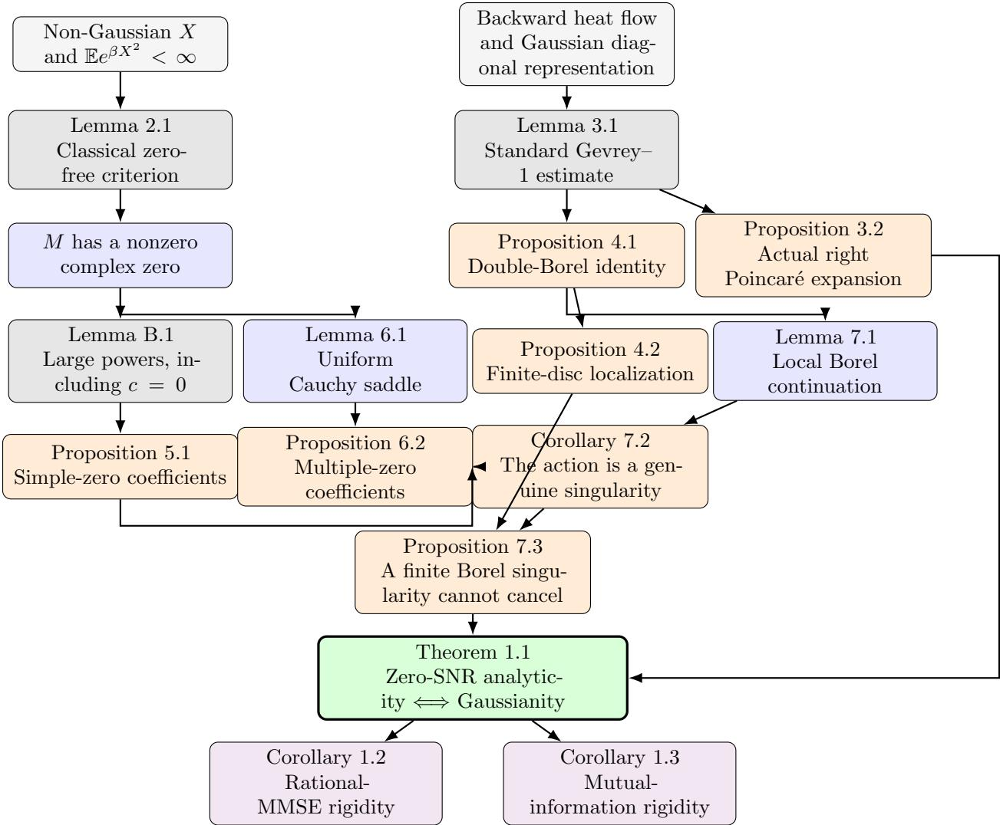

Let $Y _ { s } = { \sqrt { s } } X + Z$ , where Z is standard Gaussian and independent of the real random variable X. We prove that, under the square-exponential moment condition $\mathbb { E } e ^ { \beta X ^ { 2 } } < \infty$ for some $\beta > 0$ , the scalar minimum mean-square error mmse $x \left( s \right)$ is analytic at zero signal-to-noise ratio if and only if X is Gaussian, with constant random variables included as degenerate Gaussians.

# Zero-SNR Analyticity of the Scalar MMSE Is Equivalent to Gaussianity

Yixing Zhang yixing.zhang.duke@gmail.com

September 13, 2026

## Abstract

The proof converts estimation in the Gaussian channel into a backward heat flow acting on the moment-generating function $M ( z ) = \mathbb { E } e ^ { z X }$ . Under the stated tail condition, every non-Gaussian input forces M to have a nonzero complex zero. We show that each zero cluster produces a finite singularity in its localized Borel transform at the action $\xi = z _ { 0 } ^ { 2 } / 2$ . After removing the action scale, the Borel coeficients have a nonzero $n ^ { - 1 / 2 }$ prefactor for a simple zero. A zero of multiplicity $m \geq 2$ splits according to the roots of a Hermite polynomial and instead contributes a prefactor $n ^ { - m / 2 } e ^ { r _ { m } \sqrt { 2 n } }$ . A finite-disc localization and relative-cycle continuation argument then show that at least one such singularity survives in the full Borel transform. Thus, for every non-Gaussian input in the stated class, the formal zero-SNR expansion is Gevrey–1 but divergent. Rational-MMSE rigidity and the analogous analyticity criterion for mutual information follow as corollaries.

## Contents

1 Introduction 2   
2 Normalization and zeros of the MGF 4   
3 Backward heat flow and the zero-SNR expansion 6   
3.1 A heat representation of posterior energy 6   
3.2 The actual right asymptotic series 7   
4 The Borel transform and finite-disc localization 9   
4.1 An exact double-Borel identity 9   
4.2 Localization to finitely many zero clusters 10   
5 The singularity generated by a simple zero 11   
6 Multiple zeros and Hermite splitting 12   
6.1 The homogeneous normal form 13   
6.2 A uniform large-powers estimate 14   
6.3 The multiple-zero action . 15   
7 Borel continuation and noncancellation 20   
7.1 Continuation on the Abel double cover 21   
7.2 Distinct zeros cannot cancel . 24   
8 Completion, consequences, and interpretation 26   
A Detailed estimates for the zero-SNR expansion 27   
A.1 Joint holomorphy of the backward heat transform 27   
A.2 An explicit bound for the outer integral 27   
A.3 The parabolic Taylor remainder . 28   
B Uniform coeficient extraction for a simple zero 29   
C Proof-dependency summary 30

## 1 Introduction

Consider the scalar Gaussian channel

$$
Y _ { s } = \sqrt { s } X + Z , \qquad Z \sim N ( 0 , 1 ) , \quad Z \perp X ,\tag{1}
$$

and the minimum mean-square error

$$
\operatorname { m m s e } _ { X } ( s ) = \mathbb { E } \left[ ( X - \mathbb { E } [ X \mid Y _ { s } ] ) ^ { 2 } \right] , \qquad s \geq 0 .\tag{2}
$$

The MMSE is a central object in nonlinear estimation and information theory. In particular, the I– MMSE identity relates it to the derivative of mutual information with respect to signal-to-noise ratio [1]. Vector gradients, input-estimate representations, mismatched analogues, and pointwise versions of this identity were subsequently developed in [2, 3, 4, 5]. The monotonicity, smoothness, crossing, and higher-derivative properties of the MMSE have consequently been studied in considerable detail [6, 7, 8, 9, 10].

For positive SNR, Gaussian smoothing makes $s \mapsto \mathrm { m m s e } _ { X } ( s )$ real analytic under mild assumptions. The endpoint $s = 0$ is diferent. If all moments of X exist, the MMSE is infinitely right diferentiable at zero [6], but smoothness alone does not imply convergence of its Taylor series. A symmetric binary input is already known to be nonanalytic at zero [6]; Section 5 strengthens this observation by identifying the divergent coeficient scale and its controlling complex action. This raises a rigidity question: which input laws have a genuinely convergent zero-SNR expansion?

Low-SNR and wideband expansions have a long history in information theory; see, among others, [11, 12, 13, 14]. Beyond fixed-order expansions, Ledoux’s heat-flow identities [9] and the combinatorial analysis of Mansanarez, Poly, and Swan [15] study the algebraic structure of higher-order derivatives. The latter work also gives suficient conditions for the MMSE conjecture, which asks whether the full MMSE curve determines the input law up to translation and reflection. Our question is diferent: we ask whether analyticity at the zero-SNR endpoint alone forces Gaussianity, and study the large-order growth of the complete expansion rather than reconstructing a law from equality of two MMSE curves. Our posterior-mean representation is also related to the classical Robbins–Miyasawa–Tweedie identities and their modern higher-order extensions [16, 17, 18, 19, 20].

Our main result gives a complete answer under a square-exponential moment assumption.

Theorem 1.1 (Zero-SNR analyticity rigidity). Let X be a real random variable satisfying

$$
\mathbb { E } e ^ { \beta X ^ { 2 } } < \infty\tag{3}
$$

for some $\beta > 0$ . Then

$$
\mathrm { m m s e } _ { X } ( s ) \ i s \ a n a l y t i c \ a t \ s = 0 \quad \iff \quad X \ i s \ G a u s s i a n ,\tag{4}
$$

where a constant random variable is regarded as a degenerate Gaussian. Here analyticity means that the function defined for $s \geq 0$ agrees on some $[ 0 , \varepsilon )$ with a holomorphic function on a complex disc centered at zero.

For $X \sim N ( \mu , \sigma ^ { 2 } )$ , direct Gaussian conditioning gives

$$
{ \mathrm { m m s e } } _ { X } ( s ) = { \frac { \sigma ^ { 2 } } { 1 + \sigma ^ { 2 } s } } ,\tag{5}
$$

so the implication “Gaussian ⇒ analytic” in (4) is immediate. The content of the theorem is that no other sub-Gaussian input has an analytic MMSE at the zero-SNR boundary.

Corollary 1.2 (Rational MMSE rigidity). Under (3), suppose there exists a rational function $R \in \mathbb { R } ( s )$ such that

$$
\mathrm { m m s e } _ { X } ( s ) = R ( s ) , \qquad s > 0 .
$$

Then X is Gaussian and (5) holds.

Corollary 1.3 (Mutual-information rigidity). Let $I _ { X } ( s ) = I ( X ; { \sqrt { s } } X + Z ) $ . Under (3), $I _ { X }$ is analytic at $s = 0$ if and only if X is Gaussian. In that case

$$
I _ { X } ( s ) = { \frac { 1 } { 2 } } \log ( 1 + \sigma ^ { 2 } s ) .\tag{6}
$$

The main contributions are the analyticity characterization in Theorem 1.1 and the connection between complex MGF zeros and large-order coeficient growth. Corollaries 1.2 and 1.3 are direct consequences of that characterization.

The proof uses three ideas. First, the square-exponential hypothesis is a standard sub-Gaussian tail condition [21, 22]. It makes the moment-generating function $\begin{array} { r } { M ( z ) = \mathbb { E } e ^ { z X } } \end{array}$ entire of order at most two. Hadamard factorization implies that a zero-free M must be Gaussian; hence every non-Gaussian law in our class has a nonzero complex MGF zero. This is in the circle of ideas around the Marcinkiewicz theorem for entire characteristic functions [23, 24, 25, 26, 27]. Second, the posterior mean in (1) can be written through the backward heat evolution

$$
\begin{array} { r } { Q ( s , z ) = \mathbb { E } e ^ { z X - s X ^ { 2 } / 2 } , \qquad Q _ { s } = - \frac { 1 } { 2 } Q _ { z z } , } \end{array}\tag{7}
$$

and the captured posterior energy is a Gaussian diagonal integral of $F = Q _ { z } ^ { 2 } / Q$ . A simple zero of Q is therefore a pole of the integrand; higher-multiplicity zeros split into simple branches under the local heat flow analyzed below. Third, an exact double-Borel identity transfers the resulting spatial poles to finite singularities in the Borel plane. The use of heat evolution to study complex zeros has classical precedents in the de Bruijn–Newman theory and its later developments [28, 29, 30]; related connections between backward heat flow and Hermite-polynomial zero dynamics appear in [31].

The simple-zero mechanism is a moving-pole version of the identity

$$
B \left[ - \frac { r } { \zeta } \sum _ { n \geq 0 } ( 2 n - 1 ) ! ! \left( \frac { s } { \zeta ^ { 2 } } \right) ^ { n } \right] ( \xi ) = - \frac { r } { \zeta } \left( 1 - \frac { 2 \xi } { \zeta ^ { 2 } } \right) ^ { - 1 / 2 } .\tag{8}
$$

Multiple zeros require a finer local analysis. Backward heat flow splits a zero of multiplicity m along the roots of the probabilists’ Hermite polynomial $\mathrm { H e } _ { m }$ , and a uniform saddle-point estimate shows that the Borel coeficients contain the nonvanishing factor $n ^ { - m / 2 } e ^ { r _ { m } \sqrt { 2 n } }$ , where $r _ { m }$ is the largest root of $\mathrm { H e } _ { m }$ . We use standard facts about Hermite zeros and their asymptotics from [32, 33, 34, 35] and the classical framework of Borel summation and resurgence [36, 37, 38, 39, 40, 41].

The remainder of the paper is organized as follows. Section 2 normalizes the problem and proves the MGF zero lemma. Section 3 derives the backward-heat representation and identifies the actual zero-SNR asymptotic expansion. Section 4 establishes the double-Borel identity and finite-disc localization. Simple and multiple zeros are treated in Sections 5 and 6. Section 7 proves local continuation and excludes cancellation. The theorem and its consequences are completed in Section 8.

Figure 1 summarizes the logical structure of the proof. Gray nodes are classical or standard ingredients, blue nodes are problem-specific technical steps, orange nodes are the principal propositions, and the green node is the main rigidity theorem.

Notation. The Euclidean modulus on C is denoted by $\begin{array} { r } { | \cdot | . \mathrm { ~ I f ~ } G ( s ) = \sum _ { n > 0 } g _ { n } s ^ { n } } \end{array}$ is formal, then $[ s ^ { n } ] G = g _ { n }$ and its ordinary Borel transform is $\begin{array} { r } { B G ( \xi ) = \sum _ { n \ge 0 } g _ { n } \xi ^ { n } / n ! } \end{array}$ . We use the convention $( - 1 ) ! ! = 1$ and write

$$
d _ { n } = ( 2 n - 1 ) ! ! , \qquad d _ { 0 } = 1 .\tag{9}
$$

For a zero cluster coalescing at $z _ { \mathrm { 0 } }$ , its diagonal series and Borel transform are denoted by $\widehat { A } _ { z _ { 0 } }$ and $B _ { z _ { 0 } } = B \widehat { A } _ { z _ { 0 } }$ , respectively. All contours are positively oriented unless stated otherwise.

## 2 Normalization and zeros of the MGF

Translation and scaling of the input give

$$
\mathrm { m m s e } _ { X + c } ( s ) = \mathrm { m m s e } _ { X } ( s ) , \qquad \mathrm { m m s e } _ { a X } ( s ) = a ^ { 2 } \mathrm { m m s e } _ { X } ( a ^ { 2 } s ) .\tag{10}
$$

  
Figure 1: Dependency graph for the proof of the zero-SNR analyticity rigidity theorem. The graph distinguishes standard inputs from the problem-specific Borel and zero-cluster analysis.

Indeed, the observation generated by $X + c$ is ${ \sqrt { s } } X + Z + { \sqrt { s } } c ;$ subtracting the deterministic last term does not change the generated sigma-field, while

$$
( X + c ) - \mathbb { E } [ X + c \mid { \sqrt { s } } ( X + c ) + Z ] = X - \mathbb { E } [ X \mid { \sqrt { s } } X + Z ] .\tag{11}
$$

For scaling, the channel for $a X$ at SNR s is the channel for X at SNR $a ^ { 2 } s .$ , up to replacing the observation by its negative when $a \ < \ 0$ , and its conditional estimation error is multiplied by a. Squaring and taking expectations gives the second identity in (10). The square-exponential moment condition is preserved, with a possibly smaller exponent, under both operations. Indeed, $( x - c ) ^ { 2 } \leq 2 x ^ { 2 } + 2 c ^ { 2 }$ , and scaling merely replaces the admissible exponent by its quotient with $a ^ { 2 }$ Thus the normalization does not leave the class of input laws covered by the theorem. Thus, apart from the constant case, we may and do normalize

$$
\mathbb { E } X = 0 , \qquad \mathbb { E } X ^ { 2 } = 1 .\tag{12}
$$

Let

$$
M ( z ) = \mathbb { E } e ^ { z X } , \qquad z \in \mathbb { C } .\tag{13}
$$

By Young’s inequality,

$$
| z | | x | \leq \frac { \beta x ^ { 2 } } { 2 } + \frac { | z | ^ { 2 } } { 2 \beta } ,\tag{14}
$$

and hence

$$
\begin{array} { r } { | M ( z ) | \leq \mathbb { E } e ^ { | z | | X | } \leq \mathbb { E } e ^ { \beta X ^ { 2 } / 2 } e ^ { | z | ^ { 2 } / ( 2 \beta ) } . } \end{array}\tag{15}
$$

Consequently M is entire of order at most two and finite type.

The following zero-free criterion is classical. It is an immediate consequence of Hadamard factorization and is closely related to the Marcinkiewicz characterization of Gaussian laws [23, 25, 26, 27]. We include the short proof only to make the argument self-contained; no originality is claimed for this lemma.

Lemma 2.1 (Classical zero-free criterion). If the entire function M in (13) has no zero in $\mathbb { C } _ { i }$ , then $X$ is Gaussian.

Proof. Hadamard factorization for a zero-free entire function of finite order at most two gives

$$
M ( z ) = e ^ { P ( z ) } ,\tag{16}
$$

where P is a polynomial of degree at most two. Since $M ( 0 ) = 1$ , we choose $P ( 0 ) = 0$ . For real t, $M ( t ) > 0$ , so Im $P ( t ) \in 2 \pi \mathbb { Z }$ . This integer-valued continuous function of t vanishes at $t = 0$ and hence vanishes identically. Thus $P ( t )$ is real for every real $t ,$ and the identity theorem applied to $P ( z ) - \overline { { P ( \overline { { z } } ) } }$ shows that all coeficients of $P$ are real. Therefore

$$
P ( z ) = a z + b z ^ { 2 } , \qquad a , b \in \mathbb { R } .\tag{17}
$$

Moreover,

$$
a = P ^ { \prime } ( 0 ) = \mathbb { E } X , \qquad 2 b = P ^ { \prime \prime } ( 0 ) = \operatorname { V a r } ( X ) \geq 0 .\tag{18}
$$

Thus $M ( z ) = \exp ( \mu z + \sigma ^ { 2 } z ^ { 2 } / 2 )$ , the MGF of $N ( \mu , \sigma ^ { 2 } )$

In particular, a non-Gaussian input satisfying (3) has at least one nonzero complex MGF zero. The proof below shows that such zeros are exactly the obstruction to zero-SNR analyticity.

## 3 Backward heat flow and the zero-SNR expansion

## 3.1 A heat representation of posterior energy

Define

$$
Q ( s , z ) = \mathbb { E } \exp \left( z X - { \frac { s X ^ { 2 } } { 2 } } \right) .\tag{19}
$$

Condition (3) permits diferentiation under the expectation for $| s | < \beta$ , locally uniformly in $z .$ Therefore $Q$ is jointly holomorphic there, entire in $z ,$ and satisfies

$$
Q _ { s } = - { \frac { 1 } { 2 } } Q _ { z z } , \qquad Q ( 0 , z ) = M ( z ) .\tag{20}
$$

Formally, $Q ( s , \cdot ) = e ^ { - ( s / 2 ) \partial _ { z } ^ { 2 } } M$

Let $\phi ( y ) = ( 2 \pi ) ^ { - 1 / 2 } e ^ { - y ^ { 2 } / 2 }$ . The output density in (1) is

$$
p _ { s } ( y ) = \phi ( y ) Q ( s , \sqrt { s } y ) ,\tag{21}
$$

because

$$
p _ { s } ( y ) = \mathbb { E } \phi ( y - \sqrt { s } X )\tag{22}
$$

$$
= \phi ( y ) \mathbb { E } \exp \left( { \sqrt { s } } y X - { \frac { s X ^ { 2 } } { 2 } } \right) = \phi ( y ) Q ( s , { \sqrt { s } } y ) .\tag{23}
$$

Likewise, Bayes’ formula gives the conditional first moment as the ratio of the corresponding unnormalized integrals:

$$
\mathbb { E } [ X \mid Y _ { s } = y ] = { \frac { Q _ { z } ( s , { \sqrt { s } } y ) } { Q ( s , { \sqrt { s } } y ) } } .\tag{24}
$$

Indeed, the numerator after extracting $\phi ( y )$ is $\mathbb { E } [ X e ^ { \sqrt { s } y X - s X ^ { 2 } / 2 } ] = Q _ { z } ( s , { \sqrt { s } } y )$ , and the denominator is $Q ( s , { \sqrt { s } } y )$ . Set

$$
A ( s ) = \mathbb { E } { \big [ } \mathbb { E } [ X \mid Y _ { s } ] ^ { 2 } { \big ] } = \mathbb { E } X ^ { 2 } - { \mathrm { m m s e } } _ { X } ( s )\tag{25}
$$

and

$$
F ( s , z ) = \frac { Q _ { z } ( s , z ) ^ { 2 } } { Q ( s , z ) } .\tag{26}
$$

Using (21)–(24), we first obtain

$$
A ( s ) = \int _ { \mathbb { R } } \left( \frac { Q _ { z } ( s , \sqrt { s } y ) } { Q ( s , \sqrt { s } y ) } \right) ^ { 2 } \phi ( y ) Q ( s , \sqrt { s } y ) \mathrm { d } y\tag{27}
$$

$$
= \int _ { \mathbb { R } } \phi ( y ) { \frac { Q _ { z } ( s , { \sqrt { s } } y ) ^ { 2 } } { Q ( s , { \sqrt { s } } y ) } } \mathrm { d } y .\tag{28}
$$

Changing variables $z = { \sqrt { s } } y$ now gives the exact diagonal integral

$$
{ \bigg | } A ( s ) = { \frac { 1 } { \sqrt { 2 \pi s } } } \int _ { \mathbb { R } } e ^ { - z ^ { 2 } / ( 2 s ) } F ( s , z ) \mathrm { d } z . { \bigg | }\tag{29}
$$

Because $Q ( 0 , 0 ) = 1$ , the function F is holomorphic in a bidisc centered at (0, 0). Away from that bidisc, the moving zeros of $Q ( s , \cdot )$ are the poles responsible for divergence.

## 3.2 The actual right asymptotic series

Expand near (0, 0) as

$$
F ( s , z ) = \sum _ { k , \ell \geq 0 } f _ { k , \ell } s ^ { k } z ^ { \ell } .\tag{30}
$$

The centered Gaussian moments satisfy

$$
{ \frac { 1 } { \sqrt { 2 \pi s } } } \int _ { \mathbb { R } } e ^ { - z ^ { 2 } / ( 2 s ) } z ^ { 2 q } \mathrm { d } z = ( 2 q - 1 ) ! ! s ^ { q } ,\tag{31}
$$

whereas odd powers integrate to zero. This suggests the formal series

$$
\widehat { A } ( s ) = \sum _ { k , q \geq 0 } f _ { k , 2 q } ( 2 q - 1 ) ! ! s ^ { k + q } .\tag{32}
$$

The next lemma is a standard consequence of bidisc Cauchy estimates and the growth of Gaussian moments. It is recorded for later use and is not claimed as a new general Gevrey theorem; compare the standard treatments of Gevrey asymptotics and Borel summation in [38, 41].

Lemma 3.1 (Standard Gevrey–1 estimate). There are constants $C _ { 0 } , C _ { 1 } > 0$ such that

$$
\left| [ s ^ { n } ] { \widehat { A } } ( s ) \right| \leq C _ { 0 } C _ { 1 } ^ { n } n ! , \qquad n \geq 0 .\tag{33}
$$

Thus the formal zero-SNR expansion is Gevrey of order at most one.

Proof. Holomorphy of $F$ in a bidisc gives $| f _ { k , 2 q } | \le C \delta ^ { - k } \rho ^ { - 2 q }$ by Cauchy’s estimate. Since $( 2 q - 1 ) ! ! \leq$ $2 ^ { q } q ! \leq 2 ^ { q } n !$ when $k + q = n$ , summing the $n + 1$ diagonal terms and absorbing the polynomial factor into an exponential proves (33). □

Proposition 3.2 (Poincar´e expansion at zero). The series (32) is the right Poincar´e asymptotic expansion of $A ( s )$ : for every $N \geq 0$

$$
A ( s ) - \sum _ { n = 0 } ^ { N } [ s ^ { n } ] { \widehat { A } } ( s ) s ^ { n } = O ( s ^ { N + 1 } ) , \qquad s \downarrow 0 .\tag{34}
$$

Consequently, if A is analytic at zero, then (32) has positive ordinary radius of convergence.

Proof. For real $s > 0$ and $z \in \mathbb { R }$ , Cauchy–Schwarz under the positive tilted measure in (19) yields

$$
\begin{array} { r } { Q _ { z } ( s , z ) ^ { 2 } \leq Q ( s , z ) Q _ { z z } ( s , z ) , \qquad 0 \leq F ( s , z ) \leq Q _ { z z } ( s , z ) . } \end{array}\tag{35}
$$

Completing the square gives

$$
\frac { e ^ { - z ^ { 2 } / ( 2 s ) } } { \sqrt { 2 \pi s } } Q _ { z z } ( s , z ) = \mathbb { E } \left[ X ^ { 2 } \frac { e ^ { - ( z - s X ) ^ { 2 } / ( 2 s ) } } { \sqrt { 2 \pi s } } \right] .\tag{36}
$$

Fix a small $\delta > 0$ inside the spatial holomorphy disc. The integral of the right-hand side of (36) over $| z | > \delta$ equals

$$
{ \mathbb E } \left[ X ^ { 2 } { \mathbb P } \{ | s X + { \sqrt s } G | > \delta \mid X \} \right] ,\tag{37}
$$

where $G \sim N ( 0 , 1 )$ . The event is contained in

$$
\{ | X | > \delta / ( 2 s ) \} \cup \{ | G | > \delta / ( 2 { \sqrt { s } } ) \} .\tag{38}
$$

The square-exponential moment of X and the Gaussian tail bound imply that (37) is $O ( e ^ { - c / s } )$ for some $c > 0$ . Hence the outer part of (29) is flat at zero.

On $| z | < \delta ,$ , apply the two-variable Taylor formula to $F ,$ assigning parabolic degree $k + \ell / 2$ to $s ^ { k } z ^ { \ell }$ Termwise integration uses (31); the integrated Taylor remainder is $O ( s ^ { N + 1 } )$ . Combining the inner and outer estimates proves (34). Uniqueness of the Taylor expansion of a holomorphic extension proves the final assertion. A coeficientwise version of the Taylor-remainder estimate is given in Appendix A. □

## 4 The Borel transform and finite-disc localization

## 4.1 An exact double-Borel identity

Write

$$
F ( s , z ) = \sum _ { k \geq 0 } F _ { k } ( z ) s ^ { k }\tag{39}
$$

and take the exponential Borel transform only in the s index:

$$
\widetilde F ( u , z ) = \sum _ { k \geq 0 } F _ { k } ( z ) \frac { u ^ { k } } { k ! } .\tag{40}
$$

For a holomorphic function G, define its circular heat-Borel average by

$$
( { \mathcal { C } } G ) ( v ) = { \frac { 1 } { 2 \pi } } \int _ { 0 } ^ { 2 \pi } G ( { \sqrt { 2 v } } \cos \theta ) \mathrm { d } \theta .\tag{41}
$$

The value is understood through its power series near $v = 0$ , and thereafter by analytic continuation.

Proposition 4.1 (Double-Borel identity). The ordinary Borel transform of (32) obeys the formal identity

$$
\left| B \widehat { A } ( \xi ) = \frac { \mathrm { d } } { \mathrm { d } \xi } \left[ \xi \int _ { 0 } ^ { 1 } \mathcal { C } \widetilde { F } ( t \xi , \cdot ) ( ( 1 - t ) \xi ) \mathrm { d } t \right] . \right|\tag{42}
$$

It is an analytic identity wherever both sides converge near the origin.

Proof. The circular moments are

$$
\frac { 1 } { 2 \pi } \int _ { 0 } ^ { 2 \pi } \cos ^ { 2 q } \theta \mathrm { { d } } \theta = \frac { ( 2 q ) ! } { 2 ^ { 2 q } ( q ! ) ^ { 2 } } .\tag{43}
$$

Therefore

$$
\mathcal { C } \widetilde { F } ( u , \cdot ) ( v ) = \sum _ { k , q \geq 0 } f _ { k , 2 q } ( 2 q - 1 ) ! ! \frac { u ^ { k } } { k ! } \frac { v ^ { q } } { q ! } .\tag{44}
$$

Using

$$
\int _ { 0 } ^ { 1 } t ^ { k } ( 1 - t ) ^ { q } \mathrm { d } t = \frac { k ! q ! } { ( k + q + 1 ) ! } ,\tag{45}
$$

the coeficient of $f _ { k , 2 q }$ inside the brackets of (42) is

$$
{ \frac { ( 2 q - 1 ) ! ! } { ( k + q + 1 ) ! } } \xi ^ { k + q + 1 } .\tag{46}
$$

Diferentiation gives precisely the coeficient prescribed by the Borel transform of (32).

## 4.2 Localization to finitely many zero clusters

Fix $R > 0$ such that M has no zero on $| z | = R$ . Since $Q ( s , \cdot ) \to M$ uniformly on compact sets, Rouch´e’s theorem implies that, for small |s|, the number of zeros of $Q ( s , \cdot )$ in $| z | < R$ , counted with multiplicity, is constant. Surround the resulting finitely many zero clusters by disjoint circles $C _ { j }$ For z outside $C _ { j }$ , define

$$
P _ { j } ( s , z ) = { \frac { 1 } { 2 \pi i } } \int _ { C _ { j } } { \frac { F ( s , w ) } { z - w } } \mathrm { d } w .\tag{47}
$$

By residues, $P _ { j }$ is the sum of the principal parts of $F$ at the zeros in that cluster. The contour representation also shows that the cluster sum is holomorphic in $s ,$ even if the individual roots are only holomorphic in $\sqrt { s }$

Proposition 4.2 (Finite-disc localization). Let

$$
H ( s , z ) = F ( s , z ) - \sum _ { j } P _ { j } ( s , z ) .\tag{48}
$$

After decreasing the radii slightly, H is holomorphic on a bidisc $| s | < \delta , | z | < R$ . The Borel transform of the diagonal series generated by H is holomorphic for $\vert \xi \vert < R ^ { 2 } / 2$

Proof. For each fixed small $s ,$ the residue theorem identifies $P _ { j } ( s , \cdot )$ with the complete sum of the principal parts of $F ( s , \cdot )$ at the poles inside $C _ { j }$ . The removability is joint in $( s , z )$ , as can be seen without choosing individual zero branches. If z lies inside $C _ { j }$ and is temporarily kept away from the poles, Cauchy’s residue theorem gives

$$
F ( s , z ) - P _ { j } ( s , z ) = \frac { 1 } { 2 \pi i } \int _ { C _ { j } } \frac { F ( s , w ) } { w - z } \mathrm { d } w .\tag{49}
$$

The right-hand side is jointly holomorphic in $( s , z )$ throughout the interior of $C _ { j }$ , because $F$ is jointly holomorphic on the fixed contour. It therefore supplies the joint removable extension across every moving pole in that cluster. The terms $P _ { \ell }$ for $\ell \neq j$ are holomorphic near $C _ { j }$ , so the same conclusion holds for H. There are only finitely many clusters in $| z | < R ;$ decreasing δ if necessary gives joint holomorphy on $| s | < \delta , | z | < R$

Write $\begin{array} { r } { H ( s , z ) = \sum h _ { k , \ell } s ^ { k } z ^ { \ell } } \end{array}$ . Cauchy estimates give the desired bounds only on compactly contained bidiscs, so we keep the auxiliary radii explicit. Fix

$$
0 < \delta _ { 0 } < \delta , \qquad 0 < \rho < R .\tag{50}
$$

Since H is holomorphic on a neighborhood of the compact torus $\left| s \right| = \delta _ { 0 } , \left| z \right| = \rho .$ , there is a constant $C _ { \delta _ { 0 } , \rho }$ such that

$$
\begin{array} { r } { | h _ { k , 2 q } | \leq C _ { \delta _ { 0 } , \rho } \delta _ { 0 } ^ { - k } \rho ^ { - 2 q } . } \end{array}\tag{51}
$$

Let $b _ { n } ^ { H }$ be the coeficient of $\xi ^ { n }$ in the Borel transform of the diagonal series generated by H. Since

$$
( 2 q - 1 ) ! ! \leq 2 ^ { q } q ! , \qquad \frac { q ! } { ( q + k ) ! } \leq \frac { 1 } { k ! } ,\tag{52}
$$

we obtain

$$
| b _ { n } ^ { H } | \leq C _ { \delta _ { 0 } , \rho } \left( \frac { 2 } { \rho ^ { 2 } } \right) ^ { n } \sum _ { k = 0 } ^ { n } \frac { ( \rho ^ { 2 } / ( 2 \delta _ { 0 } ) ) ^ { k } } { k ! }\tag{53}
$$

$$
\leq C _ { \delta _ { 0 } , \rho } ^ { \prime } \left( \frac { 2 } { \rho ^ { 2 } } \right) ^ { n } .\tag{54}
$$

Thus the Borel transform is holomorphic for $| \xi | < \rho ^ { 2 } / 2$ . Because $\rho < R$ was arbitrary, these discs exhaust $\vert \xi \vert < R ^ { 2 } / 2$ , proving the assertion. Notice that no estimate on the open boundary $| z | = R$ has been used. □

Proposition 4.2 is the first noncancellation mechanism: zeros outside a fixed finite disc cannot remove a singularity generated by a zero strictly inside it.

## 5 The singularity generated by a simple zero

Suppose $M ( z _ { 0 } ) = 0$ and $M ^ { \prime } ( z _ { 0 } ) \neq 0$ . The implicit-function theorem gives a holomorphic zero $\zeta ( s )$ of $Q$ with $\zeta ( 0 ) = z _ { 0 }$ . From (20),

$$
\zeta ^ { \prime } ( 0 ) = - \frac { Q _ { s } ( 0 , z _ { 0 } ) } { Q _ { z } ( 0 , z _ { 0 } ) } = \frac { M ^ { \prime \prime } ( z _ { 0 } ) } { 2 M ^ { \prime } ( z _ { 0 } ) } .\tag{55}
$$

${ \mathrm { A t ~ } } z = \zeta ( s )$ , the principal part of $F$ is

$$
\frac { r ( s ) } { z - \zeta ( s ) } , \qquad r ( s ) = Q _ { z } ( s , \zeta ( s ) ) , \quad r ( 0 ) = M ^ { \prime } ( z _ { 0 } ) \neq 0 .\tag{56}
$$

Indeed, writing $Q ( s , z ) = ( z - \zeta ( s ) ) q ( s , z )$ gives $q ( s , \zeta ( s ) ) = Q _ { z } ( s , \zeta ( s ) ) = r ( s )$ and

$$
\frac { Q _ { z } ( s , z ) ^ { 2 } } { Q ( s , z ) } = \frac { r ( s ) } { z - \zeta ( s ) } + O ( 1 ) \qquad ( z  \zeta ( s ) ) .\tag{57}
$$

Its contribution to the diagonal series is

$$
\widehat { A } _ { z _ { 0 } } ( s ) = - \sum _ { q \geq 0 } ( 2 q - 1 ) ! ! r ( s ) \zeta ( s ) ^ { - 2 q - 1 } s ^ { q } .\tag{58}
$$

Proposition 5.1 (Simple-zero coeficient asymptotics). Let $d _ { n } = ( 2 n - 1 ) ! !$ . Then

$$
[ s ^ { n } ] \widehat { A } _ { z _ { 0 } } ( s ) \sim - \frac { M ^ { \prime } ( z _ { 0 } ) } { z _ { 0 } } \exp \left[ - \frac { z _ { 0 } M ^ { \prime \prime } ( z _ { 0 } ) } { 2 M ^ { \prime } ( z _ { 0 } ) } \right] d _ { n } z _ { 0 } ^ { - 2 n } .\tag{59}
$$

The prefactor is nonzero. Consequently the cluster Borel transform has radius $| z _ { 0 } | ^ { 2 } / 2$ in the action variable. Section 7 will identify the corresponding action

$$
\xi _ { 0 } = \frac { z _ { 0 } ^ { 2 } } { 2 } .\tag{60}
$$

as a nonremovable singularity.

Proof. Put

$$
a ( s ) = { \frac { r ( s ) } { r ( 0 ) } } , \qquad h ( s ) = \log { \frac { \zeta ( s ) } { z _ { 0 } } } , \qquad c = h ^ { \prime } ( 0 ) = { \frac { \zeta ^ { \prime } ( 0 ) } { z _ { 0 } } } .\tag{61}
$$

In the coeficient of $s ^ { n }$ in (58), put $q = n - k$ . After division by $- r ( 0 ) d _ { n } z _ { 0 } ^ { - 2 n - 1 }$ , the kth summand is

$$
T _ { n , k } = \frac { d _ { n - k } } { d _ { n } } z _ { 0 } ^ { 2 k } [ s ^ { k } ] a ( s ) e ^ { - N _ { n , k } h ( s ) } , \qquad N _ { n , k } = 2 ( n - k ) + 1 .\tag{62}
$$

Lemma B.1 gives, for every fixed $k ,$

$$
T _ { n , k } \longrightarrow \frac { ( - c z _ { 0 } ^ { 2 } ) ^ { k } } { k ! } ,\tag{63}
$$

including the zero-drift case $c = 0$ . Its majorant and tail estimates justify dominated convergence for this triangular array. Therefore

$$
\sum _ { k = 0 } ^ { n } T _ { n , k } \longrightarrow e ^ { - c z _ { 0 } ^ { 2 } } .\tag{64}
$$

Using $r ( 0 ) = M ^ { \prime } ( z _ { 0 } )$ and (55) yields (59).

Finally,

$$
\frac { d _ { n } } { n ! } = \frac { ( 2 n ) ! } { 2 ^ { n } ( n ! ) ^ { 2 } } \sim \frac { 2 ^ { n } } { \sqrt { \pi n } } .\tag{65}
$$

After the rescaling $\xi = ( z _ { 0 } ^ { 2 } / 2 ) x$ , the Borel coeficients are a nonzero constant times $n ^ { - 1 / 2 } ( 1 + o ( 1 ) )$ 2 proving the asserted radius. □

Remark 5.2 (The binary zero-drift check). For $M ( z ) = \cosh { z }$ one has $Q ( s , z ) = e ^ { - s / 2 }$ cosh z and $\zeta ( s ) \equiv z _ { 0 }$ at every zero of cosh, so $c = 0$ . The additive estimate in Lemma B.1 still applies. A multiplicative error relative to $( - 2 n c ) ^ { k } / k !$ would not be meaningful in this case.

Example 5.3 (Symmetric binary input). ${ \mathrm { I f ~ } } \mathbb { P } \{ X = 1 \} = \mathbb { P } \{ X = - 1 \} = 1 / 2$ , then $M ( z ) = \cosh { z }$ . Its nearest zeros are $z _ { 0 } = \pm i \pi / 2$ , so the nearest Borel action is

$$
\xi _ { 0 } = - { \frac { \pi ^ { 2 } } { 8 } } .\tag{66}
$$

Thus the zero-SNR series is alternating at leading order, Gevrey–1, and divergent. This recovers the classical nonanalyticity of the binary-input MMSE at zero and identifies its controlling complex action.

## 6 Multiple zeros and Hermite splitting

Suppose $z _ { \mathrm { 0 } }$ is a zero of M of multiplicity $m \geq 2$ . Write locally

$$
M ( z _ { 0 } + w ) = a w ^ { m } ( 1 + b w + O ( w ^ { 2 } ) ) , \qquad a \ne 0 .\tag{67}
$$

Set $s = \tau ^ { 2 }$ and $w = \tau x$ . Applying the backward heat operator to the Taylor germ yields

$$
Q ( \tau ^ { 2 } , z _ { 0 } + \tau x ) = a \tau ^ { m } \left[ \mathrm { H e } _ { m } ( x ) + b \tau \mathrm { H e } _ { m + 1 } ( x ) + O ( \tau ^ { 2 } ) \right] ,\tag{68}
$$

To verify (68), use the polynomial identity

$$
e ^ { - ( \tau ^ { 2 } / 2 ) \partial _ { w } ^ { 2 } } w ^ { \ell } = \sum _ { j = 0 } ^ { \lfloor \ell / 2 \rfloor } \frac { ( - 1 ) ^ { j } } { 2 ^ { j } j ! } \frac { \ell ! } { ( \ell - 2 j ) ! } \tau ^ { 2 j } w ^ { \ell - 2 j }\tag{69}
$$

$$
\begin{array} { r } { = \tau ^ { \ell } \mathrm { H e } _ { \ell } ( w / \tau ) . } \end{array}\tag{70}
$$

For related connections between backward heat flow and Hermite-polynomial zero dynamics, see [31]. The terms $\boldsymbol { a } \boldsymbol { w } ^ { m }$ and $a b w ^ { m + 1 }$ in (67) therefore become $a \tau ^ { m } \operatorname { H e } _ { m } ( x )$ and $a b \tau ^ { m + 1 } \mathrm { H e } _ { m + 1 } ( x )$ respectively. Every remaining Taylor monomial has degree at least $m + 2$ and contributes $O ( \tau ^ { m + 2 } )$ locally uniformly for bounded $x ,$ which proves the stated normal form. Here $\mathrm { H e } _ { m }$ is the probabilists Hermite polynomial. Its roots

$$
r _ { 1 } < \cdots < r _ { m }\tag{71}
$$

are real and simple. The implicit-function theorem in $( \tau , x )$ gives the split zeros

$$
\zeta _ { j } ( s ) = z _ { 0 } + r _ { j } \sqrt { s } + b s + O ( s ^ { 3 / 2 } ) .\tag{72}
$$

For the coeficient calculation, write $x _ { j } ( \tau ) = r _ { j } + c _ { j } \tau + O ( \tau ^ { 2 } )$ and substitute into the bracket in (68). The coeficient of $\tau$ is

$$
c _ { j } \mathrm { H e } _ { m } ^ { \prime } ( r _ { j } ) + b \mathrm { H e } _ { m + 1 } ( r _ { j } ) .\tag{73}
$$

The Hermite identities $\mathrm { H e } _ { m + 1 } ( x ) = x \mathrm { H e } _ { m } ( x ) - m \mathrm { H e } _ { m - 1 } ( x )$ and $\mathrm { H e } _ { m } ^ { \prime } ( x ) = m \mathrm { H e } _ { m - 1 } ( x )$ imply $\mathrm { H e } _ { m + 1 } ( r _ { j } ) = - \mathrm { H e } _ { m } ^ { \prime } ( r _ { j } )$ . Since the roots are simple, $\mathrm { H e } _ { m } ^ { \prime } ( { \boldsymbol { r } } _ { j } ) \neq 0$ , and the vanishing of the displayed coeficient $\mathrm { g i }$ ves $c _ { j } = b _ { \ast }$ . This proves (72).

The corresponding residues of $F$ are

$$
R _ { j } ( s ) = Q _ { z } ( s , \zeta _ { j } ( s ) ) = a \operatorname { H e } _ { m } ^ { \prime } ( r _ { j } ) s ^ { ( m - 1 ) / 2 } ( 1 + O ( \sqrt { s } ) ) .\tag{74}
$$

Indeed, a simple zero of Q at $z = \zeta _ { j } ( s )$ admits a factorization

$$
Q ( s , z ) = ( z - \zeta _ { j } ( s ) ) q _ { j } ( s , z ) , \qquad q _ { j } ( s , \zeta _ { j } ( s ) ) = Q _ { z } ( s , \zeta _ { j } ( s ) ) ,\tag{75}
$$

and hence

$$
\frac { Q _ { z } ( s , z ) ^ { 2 } } { Q ( s , z ) } = \frac { Q _ { z } ( s , \zeta _ { j } ( s ) ) } { z - \zeta _ { j } ( s ) } + O ( 1 ) .\tag{76}
$$

Diferentiating (68) with respect to $z = z _ { 0 } + \tau x$ contributes the factor $\tau ^ { - 1 }$ and gives (74). The individual branches use $\sqrt { s } ,$ , but their cluster sum is single-valued and holomorphic in s by (47).

## 6.1 The homogeneous normal form

For the leading germ $M ( z _ { 0 } + w ) = a w ^ { m }$

$$
Q = a s ^ { m / 2 } \mathrm { H e } _ { m } ( w / \sqrt { s } )\tag{77}
$$

and

$$
F = a s ^ { ( m - 2 ) / 2 } \frac { \mathrm { H e } _ { m } ^ { \prime } ( w / \sqrt { s } ) ^ { 2 } } { \mathrm { H e } _ { m } ( w / \sqrt { s } ) } = a \sum _ { k > 0 } c _ { m , k } s ^ { k } w ^ { m - 2 - 2 k } .\tag{78}
$$

Partial fractions give

$$
\frac { \mathrm { H e } _ { m } ^ { \prime } ( x ) ^ { 2 } } { \mathrm { H e } _ { m } ( x ) } = P _ { m } ( x ) + \sum _ { j = 1 } ^ { m } \frac { \mathrm { H e } _ { m } ^ { \prime } ( r _ { j } ) } { x - r _ { j } } ,\tag{79}
$$

so for all suficiently large k,

$$
c _ { m , k } = \sum _ { j = 1 } ^ { m } \mathrm { H e } _ { m } ^ { \prime } ( r _ { j } ) r _ { j } ^ { 2 k - m + 1 } .\tag{80}
$$

Let $r _ { m } > 0$ be the largest Hermite root. Parity makes the contributions of $r _ { m }$ and $- r _ { m }$ equal, and the remaining roots have smaller modulus. Hence

$$
c _ { m , k } \sim 2 \mathrm { H e } _ { m } ^ { \prime } ( r _ { m } ) r _ { m } ^ { 2 k - m + 1 } > 0 .\tag{81}
$$

This already predicts the scale of the later saddle. More explicitly, in the homogeneous model the positive extreme branch has $\alpha ( \tau ) = a \mathrm { H e } _ { m } ^ { \prime } ( r _ { m } ) \tau ^ { m - 1 }$ and $\beta ( \tau ) = z _ { 0 } + r _ { m } \tau$ . With $p = n - k$ and $L = 2 k - m + 1 \ge 0$ , the absolute value of its kth contribution, apart from a k-independent factor, is

$$
S _ { n , k } = d _ { p } r _ { m } ^ { L } \frac { ( 2 p + 1 ) _ { L } } { L ! } ,\tag{82}
$$

where $( N ) _ { L } = N ( N + 1 ) \cdots ( N + L - 1 )$ and $( N ) _ { 0 } = 1$ . This follows from $[ \sigma ^ { L } ] ( 1 + r _ { m } \sigma ) ^ { - N } =$ $( - r _ { m } ) ^ { L } ( N ) _ { L } / L !$ . For $p \geq 1$ , cancellation of the rising factorials gives the exact ratio

$$
{ \frac { S _ { n , k + 1 } } { S _ { n , k } } } = { \frac { 2 p r _ { m } ^ { 2 } } { ( L + 1 ) ( L + 2 ) } }\tag{83}
$$

$$
= \frac { r _ { m } ^ { 2 } n } { 2 k ^ { 2 } } \left( 1 + O ( n ^ { - 1 / 2 } ) \right) ,\tag{84}
$$

where the second line is uniform when $k / { \sqrt { n } }$ ranges over a compact subset of $( 0 , \infty )$ . The exact ratio is strictly decreasing in $k$ on the nonzero range of summands. Its crossing of 1 therefore locates the saddle at

$$
k _ { * } = r _ { m } \sqrt { n / 2 } + O ( 1 ) .\tag{85}
$$

The rising factorial cannot be replaced by $N ^ { L }$ when computing the leading constant: for $L = O ( { \sqrt { N } } )$

$$
\log \frac { ( N ) _ { L } } { N ^ { L } } = \frac { L ( L - 1 ) } { 2 N } + O \left( \frac { L ^ { 3 } } { N ^ { 2 } } \right) .
$$

At the saddle this correction tends to $r _ { m } ^ { 2 } / 2$ . It is retained below by the quadratic term in Lemma 6.1; in the homogeneous case that lemma has $B = 0$ and $D = - r _ { m } ^ { 2 } / 2$

## 6.2 A uniform large-powers estimate

The next lemma controls perturbations of the homogeneous germ. It is the main local asymptotic input for multiple zeros. Its saddle-point method is classical [42, 43, 44]; the precise uniform formulation below is tailored to the Hermite-split zero cluster considered in this paper.

Lemma 6.1 (Uniform Cauchy saddle). Let

$$
g ( \sigma ) = 1 + r \sigma + B \sigma ^ { 2 } + O ( \sigma ^ { 3 } ) , \qquad r > 0 ,\tag{86}
$$

be holomorphic and nonzero on $| \sigma | < \rho _ { 0 }$ . Let $N \to \infty$ and let $L = L _ { N }$ be integers satisfying

$$
c _ { 0 } \sqrt { N } \leq L \leq C _ { 0 } \sqrt { N }\tag{87}
$$

for fixed $0 < c _ { 0 } < C _ { 0 } < \infty$ . Put $D = B - r ^ { 2 } / 2$ . Then, uniformly in this range,

$$
[ \sigma ^ { L } ] g ( \sigma ) ^ { - N } = \frac { ( - N r ) ^ { L } } { L ! } \exp \left( - \frac { D L ^ { 2 } } { N r ^ { 2 } } \right) \left( 1 + O ( N ^ { - 1 / 4 } ) \right) .\tag{88}
$$

The same formula holds after multiplication by a holomorphic factor $q ( \sigma )$ with $q ( 0 ) = q _ { 0 } \neq 0$ , with the additional factor $q _ { 0 }$ on the right.

Proof. Set $\rho = L / ( N r )$ and use the circle

$$
\sigma = - \rho e ^ { i \theta } , \qquad - \pi \leq \theta \leq \pi .\tag{89}
$$

Since $\rho = O ( N ^ { - 1 / 2 } )$ , the circle lies inside the holomorphy disc for large N. Cauchy’s formula gives

$$
[ \sigma ^ { L } ] g ( \sigma ) ^ { - N } = \frac { ( - 1 ) ^ { L } \rho ^ { - L } } { 2 \pi } \int _ { - \pi } ^ { \pi } \exp \{ - i L \theta - N \log g ( - \rho e ^ { i \theta } ) \} \mathrm { d } \theta .\tag{90}
$$

Uniformly on this circle,

$$
\log g ( \sigma ) = r \sigma + D \sigma ^ { 2 } + O ( \sigma ^ { 3 } ) ,\tag{91}
$$

so, after removing the constant L, the angular phase is

$$
L ( e ^ { i \theta } - 1 - i \theta ) - N D \rho ^ { 2 } e ^ { 2 i \theta } + O ( N \rho ^ { 3 } ) .\tag{92}
$$

Here $N \rho ^ { 3 } = O ( N ^ { - 1 / 2 } )$ and $N D \rho ^ { 2 } = O ( 1 )$ .

On $| \theta | \leq L ^ { - 2 / 5 }$ 2

$$
L ( e ^ { i \theta } - 1 - i \theta ) = - \frac { L \theta ^ { 2 } } { 2 } + O ( L | \theta | ^ { 3 } ) .\tag{93}
$$

The quadratic perturbation in (92) may be replaced by $- N D \rho ^ { 2 }$ with relative error $O ( L ^ { - 1 / 2 } )$ on the efective window $| \theta | = { \cal O } ( L ^ { - 1 / 2 } )$ . Gaussian integration gives

$$
[ \sigma ^ { L } ] g ( \sigma ) ^ { - N } = ( - 1 ) ^ { L } \rho ^ { - L } \frac { e ^ { L } } { \sqrt { 2 \pi L } } e ^ { - N D \rho ^ { 2 } } \left( 1 + { \cal O } ( L ^ { - 1 / 2 } + N ^ { - 1 / 2 } ) \right) .\tag{94}
$$

For $L ^ { - 2 / 5 } < | \theta | \leq \theta _ { 0 }$ the real part drops by at least $c L \theta ^ { 2 }$ , while for $\theta _ { 0 } \le | \theta | \le \pi$ it drops by at least $c L .$ These arcs are exponentially smaller than the central contribution. Finally, Stirling’s formula and $\rho = L / ( N r )$ give

$$
\rho ^ { - L } \frac { e ^ { L } } { \sqrt { 2 \pi L } } = \frac { ( N r ) ^ { L } } { L ! } \left( 1 + { \cal O } ( L ^ { - 1 } ) \right) , \qquad N D \rho ^ { 2 } = \frac { D L ^ { 2 } } { N r ^ { 2 } } .\tag{95}
$$

This proves (88). Since $q ( - \rho e ^ { i \theta } ) = q _ { 0 } ( 1 + O ( N ^ { - 1 / 2 } ) )$ on the saddle circle, the assertion with q follows as well. □

## 6.3 The multiple-zero action

On the τ plane, the cluster principal part has the form

$$
P ( \tau ^ { 2 } , z ) = \sum _ { j = 1 } ^ { m } \frac { \alpha _ { j } ( \tau ) } { z - \beta _ { j } ( \tau ) } ,\tag{96}
$$

where

$$
\alpha _ { j } ( \tau ) = a \mathrm { H e } _ { m } ^ { \prime } ( r _ { j } ) \tau ^ { m - 1 } ( 1 + O ( \tau ) ) , \qquad \beta _ { j } ( \tau ) = z _ { 0 } + r _ { j } \tau + b \tau ^ { 2 } + O ( \tau ^ { 3 } ) .\tag{97}
$$

The sum is invariant under $\tau \mapsto - \tau$ . If $u _ { n }$ denotes its nth diagonal coeficient, then exactly

$$
u _ { n } = - \sum _ { k = 0 } ^ { n } d _ { n - k } [ \tau ^ { 2 k } ] \sum _ { j = 1 } ^ { m } \alpha _ { j } ( \tau ) \beta _ { j } ( \tau ) ^ { - 2 ( n - k ) - 1 } .\tag{98}
$$

Proposition 6.2 (Multiple-zero coeficient asymptotics). Let $z _ { \mathrm { 0 } }$ have multiplicity $m \geq 2$ and let $r _ { m }$ be the largest root of $\mathrm { H e } _ { m }$ . There is a constant $K _ { z _ { 0 } , m } \neq 0$ such that

$$
u _ { n } = K _ { z _ { 0 } , m } d _ { n } z _ { 0 } ^ { - 2 n } n ^ { - ( m - 1 ) / 2 } e ^ { r _ { m } \sqrt { 2 n } } \big ( 1 + o ( 1 ) \big ) .\tag{99}
$$

Consequently the corresponding cluster Borel transform has radius $| z _ { 0 } | ^ { 2 } / 2$

Proof. Fix a positive Hermite root r and substitute $\tau = z _ { 0 } \sigma$ in its summand in (98). From (97), for a constant $B _ { r }$ depending on the branch,

$$
\frac { \beta _ { r } ( z _ { 0 } \sigma ) } { z _ { 0 } } = 1 + r \sigma + B _ { r } \sigma ^ { 2 } + O ( \sigma ^ { 3 } ) .\tag{100}
$$

With $p = n - k$ and $L = 2 k - m + 1$ , one obtains

$$
\begin{array} { r l } & { [ \tau ^ { 2 k } ] \alpha _ { r } ( \tau ) \beta _ { r } ( \tau ) ^ { - 2 p - 1 } } \\ & { \quad = a \mathrm { H e } _ { m } ^ { \prime } ( r ) z _ { 0 } ^ { - 2 n + m - 2 } [ \sigma ^ { L } ] ( 1 + O ( \sigma ) ) ( 1 + r \sigma + B _ { r } \sigma ^ { 2 } + O ( \sigma ^ { 3 } ) ) ^ { - 2 p - 1 } . } \end{array}\tag{101}
$$

If $L < 0$ , the coeficient is exactly zero because the residue starts with $\tau ^ { m - 1 }$ ; thus only $L \geq 0$ remains. Let $T _ { n , k } ^ { ( r ) }$ denote the branch contribution, including the factor $d _ { p }$ and its sign.

For k in a fixed compact multiple of $\sqrt { n }$ , Lemma 6.1, with $N = 2 p + 1$ , gives uniformly

$$
\begin{array} { l } { { \displaystyle ( 1 0 1 ) = a \mathrm { H e } _ { m } ^ { \prime } ( r ) z _ { 0 } ^ { - 2 n + m - 2 } \frac { \left( - ( 2 p + 1 ) r \right) ^ { L } } { L ! } } } \\ { { \displaystyle ~ \times \exp \left[ - \frac { \left( B _ { r } - r ^ { 2 } / 2 \right) L ^ { 2 } } { ( 2 p + 1 ) r ^ { 2 } } \right] \left( 1 + { \cal O } ( n ^ { - 1 / 4 } ) \right) . } } \end{array}\tag{102}
$$

We next establish the global tail estimates, keeping track of the double-factorial ratio that determines the correct phase. For $0 \leq k < n$ , the product formula for $d _ { n }$ gives the exact identity

$$
\log \frac { d _ { n - k } } { d _ { n } } = - k \log ( 2 n ) - \sum _ { j = 0 } ^ { k - 1 } \log \left( 1 - \frac { 2 j + 1 } { 2 n } \right) .\tag{103}
$$

Consequently, for every suficiently small fixed $\varepsilon > 0$ , Taylor’s formula with a uniform remainder yields

$$
\log { \frac { d _ { n - k } } { d _ { n } } } = - k \log ( 2 n ) + { \frac { k ^ { 2 } } { 2 n } } + O \left( { \frac { k ^ { 3 } } { n ^ { 2 } } } \right) , \qquad 0 \leq k \leq \varepsilon n .\tag{104}
$$

Indeed, $\begin{array} { r } { \sum _ { i < k } ( 2 j + 1 ) = k ^ { 2 } } \end{array}$ , while $\begin{array} { r } { \sum _ { i < k } ( 2 j + 1 ) ^ { 2 } = O ( k ^ { 3 } ) } \end{array}$ ; choosing $\varepsilon < 1 / 4$ , say, keeps every argument of the logarithm uniformly away from zero.

Fix now $\delta > 0$ , and first choose $0 < \delta _ { 0 } < \delta$ . Put

$$
g _ { r } ( \sigma ) = 1 + r \sigma + B _ { r } \sigma ^ { 2 } + O ( \sigma ^ { 3 } ) .\tag{105}
$$

After decreasing the underlying disc, the Taylor expansion of the logarithm gives

$$
| \log g _ { r } ( \sigma ) | \le ( r + \delta _ { 0 } ) | \sigma | .\tag{106}
$$

Cauchy’s formula on

$$
| \sigma | = { \frac { L } { ( 2 p + 1 ) ( r + \delta _ { 0 } ) } }\tag{107}
$$

for $1 \leq L \leq 2 \varepsilon n + O ( 1 )$ yields, after choosing ε small enough that the circle stays in the underlying disc and applying Stirling’s formula,

$$
\big | [ \sigma ^ { L } ] ( 1 + O ( \sigma ) ) ( 1 + r \sigma + O ( \sigma ^ { 2 } ) ) ^ { - 2 p - 1 } \big | \leq C \sqrt { L + 1 } \frac { ( ( 2 p + 1 ) ( r + \delta _ { 0 } ) ) ^ { L } } { L ! } .\tag{108}
$$

The case $L = 0$ satisfies the same bound directly. Indeed, the maximum-modulus estimate for $L \geq 1$ gives $C ( e ( 2 p + 1 ) ( r + \delta _ { 0 } ) / L ) ^ { L }$ , and Stirling’s formula produces the displayed square-root factor. Its logarithm is $O ( \log n )$ throughout this range. We combine (104) and (108). Since $L = 2 k - m + 1$ and $2 p + 1 = 2 ( n - k ) + 1$ , Stirling’s formula gives

$$
\log L ! = L \log L - L + O ( \log n ) ,\tag{109}
$$

$$
\log \frac { 2 p + 1 } { 2 n } = - \frac { k } { n } + O \left( \frac { 1 } { n } + \frac { k ^ { 2 } } { n ^ { 2 } } \right) .\tag{110}
$$

Substituting these two relations and (104) into the logarithm of the right side of (108), and replacing L by $2 k + O ( 1 )$ , gives

$$
\log \frac { | T _ { n , k } ^ { ( r ) } | } { d _ { n } | z _ { 0 } | ^ { - 2 n } } \leq 2 k \left( 1 + \log \frac { ( r + \delta _ { 0 } ) \sqrt { n } } { \sqrt { 2 } k } \right) + O \left( \frac { k ^ { 2 } } { n } + \frac { k ^ { 3 } } { n ^ { 2 } } + \log n \right) .\tag{111}
$$

The implicit constant is uniform for $k \leq \varepsilon n$ . Choose ε suficiently small, depending on $\delta - \delta _ { 0 }$ . Then the two error terms containing k are absorbed by

$$
2 k \log \frac { r + \delta } { r + \delta _ { 0 } } ,\tag{112}
$$

and we obtain, uniformly for $k \leq \varepsilon n$ ，

$$
\log \frac { | T _ { n , k } ^ { ( r ) } | } { d _ { n } | z _ { 0 } | ^ { - 2 n } } \leq \sqrt { n } \Phi _ { r + \delta } ( k / \sqrt { n } ) + O ( \log n ) ,\tag{113}
$$

where

$$
\Phi _ { r } ( x ) = 2 x \left( 1 + \log \frac { r } { \sqrt { 2 } x } \right) .\tag{114}
$$

We set $\Phi _ { r } ( 0 ) = 0$ , its continuous limiting value. For $k > \varepsilon n$ , a fixed Cauchy circle and $d _ { n - k } / d _ { n } \leq 1 / d _ { k }$ give an $e ^ { - c n \log n }$ bound after normalization by $d _ { n } | z _ { 0 } | ^ { - 2 n }$ . Hence no k of order n contributes.

The phase is strictly concave:

$$
\Phi _ { r } ^ { \prime } ( x ) = 2 \log \frac { r } { \sqrt { 2 } x } , \qquad \Phi _ { r } ^ { \prime \prime } ( x ) = - \frac { 2 } { x } .\tag{115}
$$

It has its unique maximum at $\boldsymbol { x } _ { r } ~ = ~ \boldsymbol { r } / \sqrt { 2 }$ , with value $r \sqrt { 2 }$ . Here is the precise localization consequence. Choose $0 < a < x _ { r } < b$ . Strict maximality gives a number $c _ { 0 } > 0$ and a suficiently large fixed $M > b$ such that

$$
\operatorname* { s u p } _ { x \in [ 0 , a ] \cup [ b , M ] } \Phi _ { r } ( x ) \leq r \sqrt { 2 } - 3 c _ { 0 } , \qquad \operatorname* { s u p } _ { x \geq M } \Phi _ { r + 1 } ( x ) \leq r \sqrt { 2 } - 3 c _ { 0 } .\tag{116}
$$

By continuity, $\delta > 0$ may be chosen so small that the first inequality remains true with $\Phi _ { r + \delta }$ and right side $r \sqrt { 2 } - 2 c _ { 0 }$ . The second inequality controls all $x \ge M$ , because $\Phi _ { r + \delta } ( x ) \leq \Phi _ { r + 1 } ( x )$ when

$\delta < 1$ . Therefore (113), together with the $k > \varepsilon n$ estimate, makes every $k / { \sqrt { n } } \notin [ a , b ]$ exponentially smaller than $e ^ { r { \sqrt { 2 n } } }$ . Inside [a, b], strict concavity and (102) show that

$$
| k - r { \sqrt { n / 2 } } | > n ^ { 1 / 4 + \epsilon }\tag{117}
$$

is smaller by $e ^ { - c n ^ { 2 \epsilon } }$ for any fixed $0 < \epsilon < 1 / 4$

In the central window write

$$
k = r { \sqrt { n / 2 } } + y n ^ { 1 / 4 } .\tag{118}
$$

For completeness, we now calculate the leading constant rather than only asserting its nonvanishing. Set

$$
D _ { r } = B _ { r } - { \frac { r ^ { 2 } } { 2 } } .\tag{119}
$$

Using $d _ { j } = 2 ^ { j } \Gamma ( j + 1 / 2 ) / \sqrt { \pi }$ , Stirling’s expansion applied to $d _ { p } / d _ { n } , ( 2 p + 1 ) ^ { L }$ , and L! gives, uniformly for bounded $y .$

$$
\begin{array} { l } { \displaystyle \frac { d _ { p } } { d _ { n } } \frac { ( ( 2 p + 1 ) r ) ^ { L } } { L ! } } \\ { \displaystyle \quad = \frac { 2 ^ { - m / 2 - 1 / 4 } } { \sqrt { \pi r } } n ^ { - m / 2 + 1 / 4 } e ^ { r \sqrt { 2 n } } \exp \left( - \frac { \sqrt { 2 } } { r } y ^ { 2 } - \frac { 3 r ^ { 2 } } { 4 } \right) \left( 1 + o ( 1 ) \right) . } \end{array}\tag{120}
$$

One way to verify the constant in (120) is to take logarithms and use

$$
\log \Gamma ( x + c ) = ( x + c - { \textstyle { \frac { 1 } { 2 } } } ) \log x - x + { \textstyle { \frac { 1 } { 2 } } } \log ( 2 \pi ) + { \frac { c ( c - 1 ) / 2 + 1 / 1 2 } { x } } + { \cal O } ( x ^ { - 2 } ) ,\tag{121}
$$

first with $x = n$ and $x = p = n - k .$ , and then insert $k = r \sqrt { n / 2 } + y n ^ { 1 / 4 }$ and $L = 2 k - m + 1$ The terms of order $\sqrt { n }$ give $r \sqrt { 2 n }$ , those of order $y ^ { 2 } { \mathrm { ~ g i v e ~ } } - \dot { \sqrt { 2 } } y ^ { 2 } / r$ , the logarithmic terms give $( - m / 2 + 1 / 4 )$ log n, and the remaining constant is $- ( m / 2 + 1 / 4 ) \log 2 - { \textstyle { \frac { 1 } { 2 } } } \log ( \pi r ) - 3 r ^ { 2 } / 4$

Moreover,

$$
\frac { D _ { r } L ^ { 2 } } { ( 2 p + 1 ) r ^ { 2 } } = D _ { r } + o ( 1 ) ,\tag{122}
$$

and the analytic factor $1 + O ( \sigma )$ in (101) tends to 1 at the saddle $\sigma = - L / ( ( 2 p + 1 ) r ) = O ( n ^ { - 1 / 2 } )$ Finally, the minus sign in (98) and $( - 1 ) ^ { L } = ( - 1 ) ^ { m - 1 }$ produce the total $\mathrm { s i g n } ( - 1 ) ^ { m }$ . Hence (102) gives

$$
T _ { n , k } ^ { ( r ) } = D _ { z _ { 0 } , m , r } d _ { n } z _ { 0 } ^ { - 2 n } n ^ { - m / 2 + 1 / 4 } e ^ { r \sqrt { 2 n } } \exp \left( - \frac { \sqrt { 2 } } { r } y ^ { 2 } \right) ( 1 + o ( 1 ) ) ,\tag{123}
$$

where the constant is explicitly

$$
D _ { z _ { 0 } , m , r } = ( - 1 ) ^ { m } a \mathrm { H e } _ { m } ^ { \prime } ( r ) z _ { 0 } ^ { m - 2 } \frac { 2 ^ { - m / 2 - 1 / 4 } } { \sqrt { \pi r } } \exp \left( - \frac { 3 r ^ { 2 } } { 4 } - D _ { r } \right) .\tag{124}
$$

It is nonzero because $a \neq 0 .$ , every Hermite zero is simple, $z _ { 0 } \neq 0$ , and the exponential never vanishes. To justify summation, fix $0 < \eta < 1 / 1 2$ . The same expansion is uniform for $| y | \le n ^ { \eta }$ with an envelope $C e ^ { - c y ^ { 2 } }$ , because

$$
\sqrt { n } \big ( \Phi _ { r } ( x _ { r } + y n ^ { - 1 / 4 } ) - \Phi _ { r } ( x _ { r } ) \big ) = - \frac { \sqrt { 2 } } { r } y ^ { 2 } + O ( | y | ^ { 3 } n ^ { - 1 / 4 } ) .\tag{125}
$$

Strict concavity makes $n ^ { \eta } < | y | \le n ^ { \epsilon }$ smaller by $e ^ { - c n ^ { 2 \eta } }$ , while the preceding estimates control the rest. Thus the central lattice sum is a dominated Riemann sum.

The branches $r _ { m }$ and $- r _ { m }$ are exchanged by $\tau \mapsto - \tau$ . Because the cluster sum is even in $\tau ,$ their even-coeficient contributions are equal and add. Every other nonzero root satisfies $| r _ { j } | < r _ { m } .$ , and (113) makes it smaller by

$$
\exp \{ - ( r _ { m } - | r _ { j } | ) { \sqrt { 2 n } } + o ( { \sqrt { n } } ) \} .\tag{126}
$$

If m is odd, the root $r _ { j } = 0$ has $\beta _ { j } ( \tau ) = z _ { 0 } + O ( \tau ^ { 2 } )$ . We spell out why it is negligible. Put $q = ( m - 1 ) / 2$ . The branch fixed by $\tau \mapsto - \tau$ has the even form

$$
\alpha _ { 0 } ( \tau ) = \tau ^ { 2 q } A ( \tau ^ { 2 } ) , \qquad \beta _ { 0 } ( \tau ) = z _ { 0 } B ( \tau ^ { 2 } ) , \qquad A ( 0 ) \neq 0 , \quad B ( 0 ) = 1 .\tag{127}
$$

Writing $k = q + h$ , a Cauchy radius of order $( h + 1 ) / n$ gives

$$
\left| [ u ^ { h } ] A ( u ) B ( u ) ^ { - 2 ( n - k ) - 1 } \right| \leq C _ { 0 } { \frac { ( C _ { 1 } n ) ^ { h } } { h ! } } \qquad ( h \leq \varepsilon n ) .\tag{128}
$$

The prefactor covers $h = 0$ , for which the coeficient is $A ( 0 )$ . Together with $d _ { n - k } / d _ { n } \leq ( C / n ) ^ { q + h }$ the normalized sum over this range is at most

$$
C n ^ { - q } \sum _ { h \geq 0 } { \frac { C ^ { h } } { h ! } } = O ( n ^ { - q } ) .\tag{129}
$$

For $h > \varepsilon n$ , a fixed Cauchy circle and $d _ { n - k } / d _ { n } \leq 1 / d _ { k }$ give $e ^ { - c n \log n }$ , exactly as in the preceding large-k estimate. Thus the zero-root branch has only polynomial size and is exponentially negligible compared with $e ^ { r _ { m } { \sqrt { 2 n } } }$

Finally, the lattice spacing in $y$ is $n ^ { - 1 / 4 }$ . Summing (123) contributes

$$
n ^ { 1 / 4 } \int _ { \mathbb { R } } e ^ { - \sqrt { 2 } y ^ { 2 } / r _ { m } } \mathrm { d } y ( 1 + o ( 1 ) ) .\tag{130}
$$

The integral equals $\sqrt { \pi r _ { m } / \sqrt { 2 } }$ . Since the two extreme-root amplitudes are equal, the leading constant in (99) is

$$
\begin{array} { l } { { \displaystyle K _ { z _ { 0 } , m } = 2 D _ { z _ { 0 } , m , r _ { m } } \sqrt { \frac { \pi r _ { m } } { \sqrt 2 } } } } \\ { { \mathrm { = } ( - 1 ) ^ { m } 2 ^ { ( 1 - m ) / 2 } a \mathrm { H e } _ { m } ^ { \prime } ( r _ { m } ) z _ { 0 } ^ { m - 2 } \exp \left( - \frac { 3 r _ { m } ^ { 2 } } { 4 } - D _ { r _ { m } } \right) , } } \end{array}\tag{131}
$$

which is nonzero. This proves (99).

Using (65), the normalized Borel coeficients have the form

$$
K _ { z _ { 0 } , m } ^ { \prime } n ^ { - m / 2 } e ^ { r _ { m } \sqrt { 2 n } } ( 1 + o ( 1 ) ) , \qquad K _ { z _ { 0 } , m } ^ { \prime } \neq 0 .\tag{132}
$$

Their nth-root limit is one, which proves the asserted radius.

Example 6.3 (A double-zero example with an explicit cluster). Let $X = \varepsilon _ { 1 } + \varepsilon _ { 2 }$ , where the $\varepsilon _ { i }$ are independent symmetric signs. Then

$$
M ( z ) = \cosh ^ { 2 } z , \qquad Q ( s , z ) = { \frac { 1 } { 2 } } + { \frac { 1 } { 2 } } e ^ { - 2 s } \cosh ( 2 z ) .\tag{133}
$$

At $z _ { 0 } = i \pi / 2$ , the MGF has multiplicity two and

$$
M ( z _ { 0 } + w ) = - w ^ { 2 } ( 1 + O ( w ^ { 2 } ) ) ,\tag{134}
$$

so $m = 2 , a = - 1$ , and $b = 0$ . The exact zero equation near $z _ { \mathrm { 0 } }$ is

$$
\cosh ( 2 w ) = e ^ { 2 s } , \qquad w = \pm \frac { 1 } { 2 } \operatorname { a r c o s h } ( e ^ { 2 s } ) = \pm \bigl ( \sqrt { s } + O ( s ^ { 3 / 2 } ) \bigr ) .\tag{135}
$$

Choose the branch $w ( s ) = \sqrt { s } + O ( s ^ { 3 / 2 } )$ and set $D ( s ) = e ^ { - 2 s } \sinh ( 2 w ( s ) )$ . Direct diferentiation of the exact $Q$ gives residues $- D ( s )$ and $D ( s )$ at $z _ { 0 } + w ( s )$ and $z _ { 0 } - w ( s )$ , respectively. The principal part of this single cluster is therefore exactly

$$
P _ { z _ { 0 } } ( s , z ) = - \frac { D ( s ) } { z - z _ { 0 } - w ( s ) } + \frac { D ( s ) } { z - z _ { 0 } + w ( s ) } = - \frac { 2 D ( s ) w ( s ) } { ( z - z _ { 0 } ) ^ { 2 } - w ( s ) ^ { 2 } } .
$$

Both $D ( s ) w ( s )$ and $w ( s ) ^ { 2 }$ are holomorphic in s near zero, with $D ( s ) w ( s ) = 2 s + O ( s ^ { 2 } )$ and $w ( s ) ^ { 2 } = s + O ( s ^ { 2 } )$ . This directly verifies the local splitting and the leading residues, independently of the general coeficient asymptotics.

The splitting roots are the roots ±1 of $\mathrm { H e _ { 2 } }$ , while $B _ { r _ { 2 } } = 0$ and $D _ { r _ { 2 } } = - 1 / 2$ . Formula (131) gives

$$
K _ { z _ { 0 } , 2 } = - \sqrt { 2 } e ^ { - 1 / 4 } \neq 0 .\tag{136}
$$

Consequently the cluster coeficients satisfy

$$
u _ { n } \sim - \sqrt { 2 } e ^ { - 1 / 4 } d _ { n } z _ { 0 } ^ { - 2 n } n ^ { - 1 / 2 } e ^ { \sqrt { 2 n } } .\tag{137}
$$

The last two displays are consequences of Proposition 6.2, not an independent verification of its asymptotic constant. Here $u _ { n }$ refers only to the cluster at $z _ { \mathrm { 0 } } ;$ by symmetry, the cluster at $- z _ { 0 }$ has the same diagonal series.

Corollary 6.4 (Borel radius of a zero cluster). For a zero $z _ { \mathrm { 0 } }$ of any multiplicity $m \geq 1$ , the Borel transform of its diagonal cluster has ordinary radius of convergence $| z _ { 0 } | ^ { 2 } / 2$

Proof. For $m = 1$ , combine Proposition 5.1 with (65). For $m \geq 2$ , use Proposition 6.2. The factors $n ^ { - m / 2 } e ^ { r _ { m } \sqrt { 2 n } }$ have nth-root limit one, so in both cases the nth-root limit of the absolute Borel coeficients is $2 / \vert z _ { 0 } \vert ^ { 2 }$ □

## 7 Borel continuation and noncancellation

The coeficient estimates in Sections 5 and 6 determine the convergence radius of each cluster Borel transform, but a finite radius alone does not identify its singular point or exclude cancellation in the full sum. We address these two issues separately. First, continuation away from $z _ { 0 } ^ { 2 } / 2$ identifies that action as a singularity of the cluster’s Taylor branch. Second, we select a singular contribution at one action and continue every contribution at a diferent action to a regular germ there. The only clusters that can share an action are those at $z _ { \mathrm { 0 } }$ and $- z _ { 0 } $ ; their possible cancellation is handled explicitly.

## 7.1 Continuation on the Abel double cover

The deformation principle used below belongs to the classical Picard–Lefschetz and relative-homology framework [45]. Here the relevant family is an explicit two-sheeted curve. We give the contour and endpoint estimates needed for this family, including the behavior at infinity and at the degenerate fiber $v = 0$

Lemma 7.1 (Local Borel continuation). Let $P ( s , z )$ be the sum of the principal parts belonging to a zero cluster of $Q ( s , \cdot )$ that coalesces at $z _ { 0 } \neq 0$ when $s = 0$ . The Borel transform of the diagonal series generated by P admits analytic continuation along every piecewise smooth path in $\mathbb { C } \backslash \{ 0 , z _ { 0 } ^ { 2 } / 2 \}$ starting at a nonzero point of a suficiently small disc about zero, with the initial branch given by its Taylor series. No assertion about return to zero on other branches is needed here.

Proof. Step 1: the partial Borel transform. Expand $\begin{array} { r } { P ( s , z ) = \sum _ { k > 0 } P _ { k } ( z ) s ^ { k } } \end{array}$ . Diferentiating the contour formula $( 4 7 )$ $s = 0$ shows that every $P _ { k }$ is meromorphic on the Riemann sphere, vanishes at infinity, and has its only possible pole at $z _ { \mathrm { 0 } }$ . For every compact $K \Subset \mathbb { C } \setminus \{ z _ { 0 } \}$ , Cauchy’s estimate in s gives

$$
\operatorname* { s u p } _ { z \in K } | P _ { k } ( z ) | \leq C _ { K } \rho _ { K } ^ { - k } .\tag{138}
$$

Thus

$$
\widetilde { P } ( u , z ) = \sum _ { k \geq 0 } P _ { k } ( z ) \frac { u ^ { k } } { k ! }\tag{139}
$$

is entire in u and holomorphic in $z \neq z _ { 0 }$ , locally uniformly together with all u derivatives.

We also need uniform control at infinity. Fix a cluster contour in (47), and choose $\rho > 0$ so that F is holomorphic on that contour for $| s | \leq \rho$ . Since the contour is bounded, its integral representation gives $| P ( s , z ) | \leq C / | z |$ for suficiently large |z|, uniformly in $| s | \leq \rho .$ . Cauchy’s estimate then gives

$$
| P _ { k } ( z ) | \leq \frac { C \rho ^ { - k } } { | z | } , \qquad | \widetilde { P } ( u , z ) | \leq \frac { C e ^ { | u | / \rho } } { | z | } .\tag{140}
$$

Thus the partial Borel transform introduces no new spatial singularity away from $z _ { \mathrm { 0 } }$ , although its singularity at $z _ { \mathrm { 0 } }$ need not remain a pole.

Step 2: the Abel period and its normalization. For $v \in \mathbb { C }$ , introduce the Abel curve

$$
\Sigma _ { v } = \{ ( z , y ) \in \mathbb { C } ^ { 2 } : y ^ { 2 } = z ^ { 2 } - 2 v \} .\tag{141}
$$

For $v \neq 0$ , the diferential $\widetilde { P } ( u , z ) { \mathrm { d } } z / y$ is regular at the branch points unless $z = z _ { 0 } \mathrm { : }$ the identity d $z / y = \mathrm { d } y / z$ gives a local expression there. It is also regular at the two points at infinity on the compactified curve, since (140) gives $\widetilde P ( u , z ) \mathrm { d } z / y = O ( z ^ { - 2 } )$ dz. Consequently, filling in those two points does not change any of the periods under consideration.

For small nonzero $v ,$ let $\delta _ { v }$ be the lift, on the sheet $y \sim z$ at infinity, of a positively oriented loop surrounding the two branch points $\pm \sqrt { 2 v }$ and not $z _ { \mathrm { 0 } }$ . Then

$$
\mathcal { A } ( u , v ) = \frac { 1 } { 2 \pi i } \int _ { \delta _ { v } } \widetilde { P } ( u , z ) \frac { \mathrm { d } z } { y }\tag{142}
$$

agrees with the circular average in (41). At $v = 0$ the period extends holomorphically with value $\widetilde { P } ( u , 0 )$ , either by its circular power series or by shrinking $\delta _ { v }$ to the origin. The deleted point $z = z _ { 0 }$ lies over a branch point precisely when

$$
v = a _ { 0 } : = \frac { z _ { 0 } ^ { 2 } } { 2 } .\tag{143}
$$

For reference, the equality with the circular average follows from the explicit parametrization of the lifted cycle

$$
z = \sqrt { 2 v } \cos \theta , \qquad y = i \sqrt { 2 v } \sin \theta , \qquad 0 \leq \theta \leq 2 \pi .\tag{144}
$$

Along this parametrization, $\mathrm { d } z / y = i$ dθ after choosing the orientation of $\delta _ { v }$ consistently. Hence

$$
{ \frac { 1 } { 2 \pi i } } \int _ { \delta _ { v } } G ( z ) { \frac { \mathrm { d } z } { y } } = { \frac { 1 } { 2 \pi } } \int _ { 0 } ^ { 2 \pi } G ( { \sqrt { 2 v } } \cos \theta ) \mathrm { d } \theta .\tag{145}
$$

This calculation also fixes the normalization and orientation used below.

Step 3: deformation away from the moving collision. Before the final ξ derivative in (42), the cluster contribution is

$$
J ( \xi ) = \xi \int _ { 0 } ^ { 1 } A ( t \xi , ( 1 - t ) \xi ) \mathrm { d } t .\tag{146}
$$

This identity initially holds for |ξ| small. Let $\gamma : [ 0 , 1 ]  \mathbb { C } \setminus \{ 0 , a _ { 0 } \}$ be a piecewise smooth path starting at a nonzero point of that disc. For fixed $\xi ,$ the only value of t for which a branch point of the Abel curve lies over $z = z _ { 0 }$ is

$$
t _ { * } ( \xi ) = 1 - \frac { a _ { 0 } } { \xi } .\tag{147}
$$

Along $\gamma$ one has $t _ { * } ( \xi ) \neq 0$ because $\xi \neq a _ { 0 }$ , and $t _ { * } ( \xi ) \neq 1$ because $a _ { 0 } \neq 0$ . Thus the moving collision never reaches either endpoint of the t path. The separate degeneration at $t = 1$ , where $v = 0$ , will be treated in Step 4 rather than by smooth-fiber transport.

Fix a point $\gamma ( \lambda _ { 0 } )$ . Choose a piecewise smooth path L from 0 to 1 in the complex t plane avoiding $t _ { * } ( \gamma ( \lambda _ { 0 } ) )$ . After shrinking to a neighborhood U of this $\xi$ value, the same L avoids $t _ { * } ( \xi )$ for every $\xi \in U$ . For $( t , \xi ) \in L \times U$ , the parameter $v = ( 1 - t ) \xi$ never equals $a _ { 0 }$ . The fiber $\Sigma _ { 0 }$ is singular, so one must not invoke a homology local system across the endpoint $v = 0$ . We therefore separate that endpoint. Since $\gamma$ avoids zero, shrink U so that $0 \not \in { \overline { { U } } }$ , and choose L so that it meets $t = 1$ only at its terminal point. Parameterize it by a map $\ell : [ 0 , 1 ] \to \mathbb { C }$ with $\ell ( 1 ) = 1$ . Choose $\eta > 0$ and $v _ { 0 } < | a _ { 0 } | / 2$ so that

$$
| ( 1 - \ell ( \lambda ) ) \xi | < v _ { 0 } , \qquad 1 - \eta \leq \lambda \leq 1 , \quad \xi \in \overline { { U } } .\tag{148}
$$

On the truncated set $0 \leq \lambda \leq 1 - \eta$ , the parameter v stays in a compact subset of $\mathbb { C } \setminus \{ 0 , a _ { 0 } \}$ . The cycle may therefore be transported in the smooth punctured family

$$
\Sigma _ { v } \setminus \{ z = z _ { 0 } \} , \qquad v \ne 0 , a _ { 0 } .\tag{149}
$$

Equivalently, one transports its class in the first-homology local system. The pullback of this local system to $[ 0 , 1 - \eta ] \times U$ is trivial after U is chosen contractible.

Step $\it 4 :$ regularity at the terminal fiber. It remains to justify the terminal portion, where $v  0$ On the punctured disc $0 < | v | < v _ { 0 } .$ , choose a standard vanishing cycle $\delta _ { v } ^ { \mathrm { v a n } }$ around the two branch points. A transported class from the truncated portion can be represented, with integer coeficients independent of $( \lambda , \xi )$ , as an integer multiple of this vanishing class and finitely many small loops supported away from the node $z = 0 ;$ the only loops relevant to the holomorphic form on the punctured curve in (142) may be taken around the two points lying over $z ~ = ~ z _ { 0 }$ . This is the elementary local decomposition of the homology of a one-node degeneration.

Here is a direct justification of that decomposition. Choose $0 < \epsilon < | z _ { 0 } | / 3$ and reduce $v _ { 0 }$ so that $2 v _ { 0 } < \epsilon ^ { 2 } / 4$ . The inverse image of $| z | < \epsilon$ is an annulus, whose first homology is generated by $\delta _ { v } ^ { \mathrm { v a n } }$ On $| z | > \epsilon / 2$ , including infinity, the two sheets have the holomorphic expressions

$$
y _ { \pm } ( z , v ) = \pm z \left( 1 - \frac { 2 v } { z ^ { 2 } } \right) ^ { 1 / 2 } ,\tag{150}
$$

where the square root is given by its binomial series. Each outer sheet, with its point at infinity filled in, is a disc punctured at the point over $z _ { \mathrm { 0 } }$ . Its first homology is therefore generated by a small loop about that puncture. Gluing these two punctured discs to the inner annulus shows that the vanishing loop and the two puncture loops generate the homology needed for the transported period. Filling in infinity is legitimate by Step 2. The generators vary continuously on the termina parameter set, so a transported class has an expression with constant integer coeficients there.

Each resulting period is holomorphic at $v = 0$ . For the vanishing part this follows directly from the convergent circular expansion

$$
\frac { 1 } { 2 \pi } \int _ { 0 } ^ { 2 \pi } \widetilde { P } ( u , \sqrt { 2 v } \cos \theta ) \mathrm { d } \theta = \sum _ { q \ge 0 } \frac { \partial _ { z } ^ { 2 q } \widetilde { P } ( u , 0 ) } { ( 2 q ) ! } \frac { 1 } { 2 \pi } \int _ { 0 } ^ { 2 \pi } ( \sqrt { 2 v } \cos \theta ) ^ { 2 q } \mathrm { d } \theta ,\tag{151}
$$

which is locally uniformly convergent in $( u , v )$ . For a loop over z0, choose one of the two holomorphic branches of $y = \sqrt { z ^ { 2 } - 2 v }$ near $z _ { \mathrm { 0 } } ;$ this is possible because $| v | < v _ { 0 } < | z _ { 0 } | ^ { 2 } / 4$ . Its period is then a fixed small contour integral of a function holomorphic in $( u , v )$ on the contour, and hence is holomorphic at $v = 0$ . The same argument applies to every loop supported away from the node. Thus the transported period on the terminal portion has a holomorphic extension to $v = 0$ , regardless of the monodromy accumulated before entering the small v disc.

Step 5: holomorphic germs and their compatibility. On the truncated parameter set, compactness permits a finite collection of local contour representatives avoiding z0 and the branch points; the branch points themselves are regular points of the diferential by Step 2. The representatives may be taken in a bounded z set, since the diferential is regular at infinity. On each such contour, (138) gives locally uniform bounds for the partial Borel series and its parameter derivatives. On the terminal portion, the fixed puncture contours and the convergent series (151) give the same bounds, now up to $v = 0$ . These representations show that the transported period is locally holomorphic in its parameters and justify integration and diferentiation in $\xi .$ Thus

$$
J _ { U } ( \xi ) = \xi \int _ { L } A ( t \xi , ( 1 - t ) \xi ) \mathrm { d } t\tag{152}
$$

is holomorphic on $U .$ . On overlaps, two such germs agree by deforming the t paths without crossing $t _ { * } ( \xi )$ and transporting the Abel cycle in the same homology class. More precisely, cover $\gamma$ by a finite ordered chain of such neighborhoods and choose the path L inductively: on each new neighborhood it is a small deformation of the path already chosen on the preceding overlap. The two paths are then in the same relative homotopy class in $\mathbb { C } \setminus \{ t _ { * } ( \xi ) \}$ , so Cauchy’s theorem gives equality of the two germs. Paths with a diferent winding number may produce a diferent analytic branch, which is harmless for pathwise analytic continuation. The ordered chain therefore continues $^ { J , }$ and then its $\xi$ derivative, along the whole path $\gamma$

In local coordinates about a collision with $\xi _ { * } \neq 0 , u = t - t _ { * } , w = z - z _ { 0 }$ , and $\eta = \xi - \xi _ { * }$ , where $t _ { * } = 1 - a _ { 0 } / \xi _ { * }$ , the branch locus is

$$
2 z _ { 0 } w + w ^ { 2 } + 2 \xi _ { * } u - 2 ( 1 - t _ { * } ) \eta + 2 u \eta = 0 .\tag{153}
$$

Because $z _ { 0 } \neq 0$ , this is locally a graph $w = \lambda ( u , \eta )$ ; the double-cover coordinate is $y ,$ not $w$ . The homology transport above is the invariant way to bypass this moving branch point. □

Corollary 7.2 (The action is a genuine singularity). The Taylor branch of the cluster Borel transform has a nonremovable singularity at $a _ { 0 } = z _ { 0 } ^ { 2 } / 2$ and extends holomorphically across every other point of its convergence circle.

Proof. By Corollary 6.4, its Taylor series at zero has finite radius $\left| a _ { 0 } \right|$ . For a point b on $\left| \xi \right| = \left| a _ { 0 } \right|$ with $b \neq a _ { 0 }$ , start at a suficiently small nonzero point on the radius towards b and continue along that radius, including its endpoint. This path avoids 0 and $a _ { 0 } .$ , so Lemma 7.1 provides a holomorphic germ at b agreeing with the original Taylor branch on the inner part of the radius. Thus every such $b$ is regular for that branch. Since a Taylor series with finite radius has a singular point on its circle of convergence, that point must be $a _ { 0 }$ □

## 7.2 Distinct zeros cannot cancel

The action map is

$$
{ \mathfrak { a } } ( z ) = { \frac { z ^ { 2 } } { 2 } } .\tag{154}
$$

Two zeros have the same action only when they are z and −z. Accordingly, we first find a singular sum of the clusters sharing one action, and only then separate that sum from the remaining actions. This distinction is essential: analytic continuation separates diferent actions, but by itself says nothing about cancellation at a shared action.

Proposition 7.3 (No cancellation between zero clusters). If M has at least one zero, then the Borel transform of Ab has a nonremovable singularity at a finite action point.

Proof. Write $m ( z )$ for the multiplicity of a zero, with $m ( z ) = 0 { \mathrm { ~ i f ~ } } z$ is not a zero, and set $B _ { z } = 0$ when $m ( z ) = 0$ . We will select a zero $z _ { \mathrm { 0 } }$ for which

$$
S ( \xi ) = B _ { z _ { 0 } } ( \xi ) + B _ { - z _ { 0 } } ( \xi ) , \qquad a _ { 0 } = \frac { z _ { 0 } ^ { 2 } } { 2 } ,\tag{155}
$$

is holomorphic on $\left| \xi \right| < \left| a _ { 0 } \right|$ and singular at $a _ { 0 }$ on its Taylor branch. There are two cases, according to whether the zero divisor is invariant under reflection.

Case 1: the zero divisor is not invariant under $z \mapsto - z$ . Choose $z _ { \mathrm { 0 } }$ with $m ( z _ { 0 } ) > m ( - z _ { 0 } )$ . If $m ( - z _ { 0 } ) = 0$ , the required property of S follows directly from Corollary 7.2. Otherwise, both clusters have the same action scale. With $r _ { 1 } : = 0$ , their action-normalized Borel coeficients have a nonzero constant prefactor and the respective scales

$$
n ^ { - m / 2 } e ^ { r _ { m } \sqrt { 2 n } }\tag{156}
$$

by Propositions 5.1 and 6.2. Strict interlacing of Hermite zeros makes $r _ { m }$ strictly increasing in m. Hence the ratio of the smaller-multiplicity coeficient to the larger-multiplicity coeficient tends to zero, regardless of their complex prefactors. The sum $S$ therefore has Taylor radius $\left| a _ { 0 } \right|$ . Lemma 7.1 applies to both summands away from 0 and $a _ { 0 }$ . The radial argument in Corollary 7.2 then shows that $a _ { 0 }$ is the only singular point on the convergence circle of $S ,$ as required.

Case 2: the zero divisor is invariant under $z \mapsto - z$ . In the Hadamard factorizations of $M ( z )$ and $M ( - z )$ , choose the same genus-two canonical product. Pairing opposite zeros makes this product even, so it cancels in the quotient

$$
R _ { M } ( z ) = { \frac { M ( z ) } { M ( - z ) } }\tag{157}
$$

and gives $R _ { M } ( z ) = \exp ( p ( z ) - p ( - z ) )$ for a polynomial $p$ of degree at most two. Thus $R _ { M } ( z ) = e ^ { c z }$ and positivity on the real axis gives $c \in \mathbb { R }$ . Replacing X by $X - c / 2$ leaves its MMSE unchanged and preserves a square-exponential moment after decreasing its exponent if necessary. The corresponding posterior-energy function $A ( s ) = \mathbb { E } X ^ { 2 }$ − mmse (s) changes only by a constant, so its positive order coeficients and all finite Borel singularities are unchanged. The new MGF

$$
\widetilde { M } ( z ) = e ^ { - c z / 2 } M ( z )\tag{158}
$$

is even. The exponential factor is zero-free, so the zero divisor and all action points $z _ { 0 } ^ { 2 } / 2$ are unchanged. Uniqueness of the MGF makes the shifted law symmetric. It follows that

$$
Q ( s , - z ) = Q ( s , z ) , \qquad F ( s , - z ) = F ( s , z ) .\tag{159}
$$

The principal parts at $z _ { \mathrm { 0 } }$ and $- z _ { 0 }$ are reflections of one another, and the circular average (41) assigns them equal diagonal series. In particular, for the shifted law and any zero z0, $S = 2 B _ { z _ { 0 } }$ is holomorphic on $\left| \xi \right| < \left| a _ { 0 } \right|$ and singular at $a _ { 0 }$ by Corollary 7.2. Since translation changes the full Borel transform only by a constant, it sufices to finish the argument for this law.

Separation from all other actions. In either case we now have a zero $z _ { \mathrm { 0 } }$ and a sum $S$ with the required Taylor-branch singularity. Choose $R > | z _ { 0 } |$ with no zero on $| z | = R$ . Proposition 4.2 gives

$$
B \widehat { A } = S + \sum _ { | z _ { j } | < R \atop z _ { j } \neq \pm z _ { 0 } } B _ { z _ { j } } + B _ { H } ,\tag{160}
$$

where the sum is finite and $B _ { H }$ is holomorphic on $\vert \xi \vert < R ^ { 2 } / 2$ . Every action in the remaining sum difers from $a _ { 0 }$ , because the entire pair $\{ z _ { 0 } , - z _ { 0 } \}$ has already been included in S.

Start at a nonzero point on the radius towards $a _ { 0 }$ , inside the common initial convergence disc. Follow that radius towards $a _ { 0 }$ , making small detours around the finitely many other action points on it. The detours can all be taken inside $| \xi | < | a _ { 0 } |$ and away from zero, and the path can be radial in a final neighborhood of $a _ { 0 }$ . Along this path the terms in (160) behave as follows:

• The function $S$ remains on its original Taylor branch, since the entire path before its endpoint lies in its disc of holomorphy.

• For each remaining cluster, the path including its endpoint avoids both zero and that cluster’s own action. Lemma 7.1 therefore supplies a holomorphic germ across $a _ { 0 }$ on the continued branch.

• The remainder $B _ { H }$ is already holomorphic across $a _ { 0 } .$ , since $| a _ { 0 } | < R ^ { 2 } / 2$

The identity (160) is preserved along the path by uniqueness of analytic continuation. If the continued full sum admitted a holomorphic extension across $a _ { 0 } .$ , subtracting the regular germs in the last two items would extend the original Taylor branch of $S$ across $a _ { 0 }$ . This contradicts the choice of S and proves the proposition. □

The conclusion is the existence of a finite singularity of a continuation of the full Borel germ, which is enough to rule out an entire Borel transform. The argument does not require the selected action to have minimal modulus, nor does it assert that every cluster singularity survives in the full sum.

## 8 Completion, consequences, and interpretation

Proof of Theorem 1.1. If $X \sim N ( \mu , \sigma ^ { 2 } )$ , then (5) proves analyticity at zero.

Conversely, suppose X satisfies (3) and is non-Gaussian. Lemma 2.1 gives a complex zero of its MGF. Proposition 7.3 then shows that the ordinary Borel transform of the actual formal expansion Ab has a nonremovable singularity at a finite point.

If $\widehat { A } ( s ) = \sum a _ { n } s ^ { n }$ had positive ordinary convergence radius, then $\left| a _ { n } \right| \leq C R ^ { - n }$ for some $C , R > 0$ and

$$
\sum _ { n \geq 0 } a _ { n } { \frac { \xi ^ { n } } { n ! } }\tag{161}
$$

would be entire. This contradicts the finite Borel singularity. Therefore $\widehat { A }$ diverges. By Proposition 3.2, A, and hence mmse $\mathbf { \Psi } _ { X } = \mathbb { E } X ^ { 2 } - A \mathbf { \Psi } $ , cannot be analytic at zero. □

Proof of Corollary 1.2. Since

$$
\mathrm { m m s e } _ { X } ( s ) \longrightarrow \mathrm { V a r } ( X ) \qquad \mathrm { a s ~ } s \downarrow 0 ,
$$

the rational function R is bounded on a punctured one-sided neighborhood of zero. Hence zero is a removable singularity of R. After filling in this removable singularity, R, and therefore mmseX, is analytic at zero. Theorem 1.1 and (5) complete the proof. □

Proof of Corollary 1.3. The I–MMSE identity gives

$$
I _ { X } ^ { \prime } ( s ) = { \frac { 1 } { 2 } } \mathrm { m m s e } _ { X } ( s ) .\tag{162}
$$

If $I _ { X }$ is analytic at zero, so is its derivative, and Theorem 1.1 implies that X is Gaussian. The converse is the standard Gaussian mutual-information formula. □

The argument provides more than a binary analyticity criterion. It gives a complex spectrum controlling the large-order zero-SNR coeficients. For an individual simple-zero cluster at z0, Proposition 5.1 gives

$$
[ s ^ { n } ] \widehat { A } _ { z _ { 0 } } ( s ) \sim C _ { z _ { 0 } } ( 2 n - 1 ) ! ! z _ { 0 } ^ { - 2 n } ,\tag{163}
$$

with $C _ { z _ { 0 } } \neq 0$ . If several zeros have the same minimal action, the full coeficient is the sum of their cluster contributions, so a separate noncancellation argument is required. For an individual zero of multiplicity $m \geq 2$ , Hermite splitting adds the factor

$$
n ^ { - ( m - 1 ) / 2 } e ^ { r _ { m } \sqrt { 2 n } } .\tag{164}
$$

Thus the zero-SNR expansion is naturally Gevrey–1, while the MGF zero set acts as a complex non-Gaussianity spectrum through

$$
z _ { 0 } \longmapsto \mathfrak { a } ( z _ { 0 } ) = z _ { 0 } ^ { 2 } / 2 .\tag{165}
$$

The square-exponential moment condition is used twice: to make M an entire function of order at most two, and to obtain a jointly holomorphic backward heat evolution with exponentially flat spatial tails. Determining the weakest tail condition under which the same rigidity remains true is a natural open problem. Other directions include vector Gaussian channels, matrix-valued SNR, and a full resurgent description of the Stokes data associated with the MGF zero divisor.

Technical note. The most delicate ingredients of the proof are the uniform multiple-zero saddle analysis in Section 6 and the Abel-double-cover continuation argument in Section 7.

## A Detailed estimates for the zero-SNR expansion

This appendix supplies the uniform estimates used in Proposition 3.2. The point is to separate the exponentially small part of the Gaussian integral from the part on which ordinary Taylor expansion is uniform.

## A.1 Joint holomorphy of the backward heat transform

Fix $0 < \eta < \beta$ and $R < \infty$ . If $| s | \le \eta$ and $| z | \le R$ , then

$$
\left| e ^ { z X - s X ^ { 2 } / 2 } \right| \le e ^ { R | X | + \eta X ^ { 2 } / 2 } .\tag{166}
$$

Set $\delta = \beta - \eta / 2 > 0$ . Young’s inequality gives $R | x | \le \delta x ^ { 2 } / 2 + R ^ { 2 } / ( 2 \delta )$ . For every integer $j \geq 0$ $\begin{array} { r } { C _ { \delta , j } : = \operatorname* { s u p } _ { x \in \mathbb { R } } | x | ^ { j } e ^ { - \delta x ^ { 2 } / 2 } < \infty } \end{array}$ . Thus half of the positive margin δ absorbs the linear exponential, and the other half absorbs the polynomial factor. With $C _ { R , \eta , j } = e ^ { R ^ { 2 } / ( 2 \delta ) } C _ { \delta , j }$ , we obtain

$$
| X | ^ { j } e ^ { R | X | + \eta X ^ { 2 } / 2 } \leq C _ { R , \eta , j } e ^ { \beta X ^ { 2 } } , \qquad j \geq 0 .\tag{167}
$$

Taking $j = 2 a + b$ covers every polynomial factor arising from mixed derivatives, for all nonnegative integers $a , b$ . The right-hand side is integrable by (3). Thus every mixed derivative in s and z may be passed through the expectation, locally uniformly on $| s | < \beta ,$ , and

$$
\partial _ { s } ^ { a } \partial _ { z } ^ { b } Q ( s , z ) = \left( - \frac { 1 } { 2 } \right) ^ { a } \mathbb { E } \Big [ X ^ { 2 a + b } e ^ { z X - s X ^ { 2 } / 2 } \Big ] .\tag{168}
$$

This proves the joint holomorphy asserted before (20), rather than merely separate holomorphy.

## A.2 An explicit bound for the outer integral

Let $K _ { s } ( z ) = ( 2 \pi s ) ^ { - 1 / 2 } e ^ { - z ^ { 2 } / ( 2 s ) }$ for real $s > 0$ . From (35)–(36),

$$
0 \le \int _ { | z | > \delta } K _ { s } ( z ) F ( s , z ) \mathrm { d } z\tag{169}
$$

$$
\leq \mathbb { E } \left[ X ^ { 2 } \mathbb { P } \{ | s X + { \sqrt { s } } G | > \delta \mid X \} \right] .\tag{170}
$$

Using the union bound from the proof of Proposition 3.2, the right-hand side is at most

$$
{ \mathbb E } \big [ X ^ { 2 } \mathbf { 1 } _ { \{ | X | > \delta / ( 2 s ) \} } \big ] + { \mathbb E } X ^ { 2 } { \mathbb P } \{ | G | > \delta / ( 2 \sqrt { s } ) \} .\tag{171}
$$

For the first term, choose $0 < \beta _ { 0 } < \beta$ and write

$$
\begin{array} { r } { { \mathbb { E } } \big [ X ^ { 2 } \mathbf { 1 } _ { \{ | X | > \delta / ( 2 s ) \} } \big ] \leq e ^ { - \beta _ { 0 } \delta ^ { 2 } / ( 4 s ^ { 2 } ) } { \mathbb { E } } [ X ^ { 2 } e ^ { \beta _ { 0 } X ^ { 2 } } ] . } \end{array}\tag{172}
$$

For the second, the standard Gaussian estimate gives

$$
\mathbb { P } \{ | G | > \delta / ( 2 \sqrt { s } ) \} \le 2 e ^ { - \delta ^ { 2 } / ( 8 s ) } .\tag{173}
$$

Consequently, for suficiently small s,

$$
\int _ { | z | > \delta } K _ { s } ( z ) F ( s , z ) { \mathrm { d } } z \leq C e ^ { - c / s } .\tag{174}
$$

In particular, the outer integral is $O ( s ^ { N } )$ for every N.

## A.3 The parabolic Taylor remainder

Choose $\delta > 0$ and $s _ { 0 } > 0$ such that F is holomorphic on a neighborhood of the closed bidisc $| s | \leq s _ { 0 }$ $| z | \leq 2 \delta$ . Fix $N \geq 0$ . Taylor expansion first in s gives, uniformly for $| z | \leq \delta$

$$
F ( s , z ) = \sum _ { k = 0 } ^ { N } s ^ { k } F _ { k } ( z ) + s ^ { N + 1 } R _ { N } ( s , z ) , \qquad | R _ { N } ( s , z ) | \leq C _ { N } .\tag{175}
$$

For each $0 \leq k \leq N$ , expand $F _ { k }$ to the odd degree $2 ( N - k ) + 1$

$$
F _ { k } ( z ) = \sum _ { \ell = 0 } ^ { 2 ( N - k ) + 1 } f _ { k , \ell } z ^ { \ell } + z ^ { 2 ( N - k ) + 2 } R _ { k , N } ( z ) , \qquad | R _ { k , N } ( z ) | \leq C _ { N } .\tag{176}
$$

The remainder in (175) contributes $O ( s ^ { N + 1 } )$ after integration against $K _ { s }$ . The kth remainder in (176) contributes at most

$$
C _ { N } s ^ { k } \int _ { \mathbb { R } } K _ { s } ( z ) | z | ^ { 2 ( N - k ) + 2 } \mathrm { d } z = C _ { N } s ^ { N + 1 } \mathbb { E } | G | ^ { 2 ( N - k ) + 2 }\tag{177}
$$

$$
\begin{array} { r } { = O _ { N } ( s ^ { N + 1 } ) . } \end{array}\tag{178}
$$

Replacing the truncated polynomial integrals over $| z | < \delta$ by integrals over R changes them by $O ( e ^ { - c / s } )$ . Odd powers vanish by symmetry, and even powers are exactly (31). Hence the retained terms are precisely

$$
\sum _ { k + q \leq N } f _ { k , 2 q } ( 2 q - 1 ) ! ! s ^ { k + q } ,\tag{179}
$$

with a total error $O ( s ^ { N + 1 } )$ . This proves (34) with all remainders uniform.

## B Uniform coeficient extraction for a simple zero

We now justify the summation step in Proposition 5.1. The following elementary large-powers lemma is useful. It is a parameter-dependent restatement of standard estimates from singularity analysis and analytic combinatorics [46, 47]; no originality is claimed for the underlying large-powers principle.

Lemma B.1 (Large powers, including the zero-drift case). Let a and h be holomorphic on $| s | < \rho$ with $a ( 0 ) = a _ { 0 } \neq 0 , h ( 0 ) = 0$ , and $h ^ { \prime } ( 0 ) = c$ . Put

$$
N _ { n , k } = 2 ( n - k ) + 1 , \qquad 0 \leq k \leq n .\tag{180}
$$

Then, for each fixed k,

$$
[ s ^ { k } ] a ( s ) e ^ { - N _ { n , k } h ( s ) } = a _ { 0 } \frac { ( - 2 n c ) ^ { k } } { k ! } + O _ { k } ( n ^ { k - 1 } ) ,\tag{181}
$$

where the error for $k = 0$ is interpreted as zero. Fix also $z _ { 0 } \neq 0$ . There are $\varepsilon > 0$ and $C _ { 0 } , C _ { 1 } > 0$ such that

$$
\frac { d _ { n - k } } { d _ { n } } | z _ { 0 } | ^ { 2 k } \left| [ s ^ { k } ] a ( s ) e ^ { - N _ { n , k } h ( s ) } \right| \le C _ { 0 } \frac { C _ { 1 } ^ { k } } { k ! } , \qquad 0 \le k \le \varepsilon n ,\tag{182}
$$

and

$$
\sum _ { k > \varepsilon n } \frac { d _ { n - k } } { d _ { n } } | z _ { 0 } | ^ { 2 k } \left| [ s ^ { k } ] a ( s ) e ^ { - N _ { n , k } h ( s ) } \right| = o ( 1 ) .\tag{183}
$$

Proof. For fixed $k ,$ the coeficient $[ s ^ { k } ] a ( s ) e ^ { - N h ( s ) }$ is a polynomial in N of degree at most k. Indeed,

$$
e ^ { - N h ( s ) } = \sum _ { j = 0 } ^ { k } \frac { ( - N ) ^ { j } } { j ! } h ( s ) ^ { j } + O ( s ^ { k + 1 } ) ,\tag{184}
$$

and only $j \le k$ can contribute. Since $h ( s ) ^ { k } = c ^ { k } s ^ { k } + O ( s ^ { k + 1 } )$ , the coeficient of $N ^ { k }$ is $a _ { 0 } { \left( - c \right) } ^ { k } / k !$ Substituting $N = N _ { n , k } = 2 n + O _ { k } ( 1 )$ proves (181). This also covers $c = 0$ , when the degree simply drops below k.

For uniform bounds, take the Cauchy radius

$$
r _ { n , k } = \frac { k + 1 } { A n }\tag{185}
$$

with A large enough that $r _ { n , k } < \rho / 2$ whenever $k \leq \varepsilon n$ . Since $h ( s ) = O ( s )$ and a is bounded on the smaller disc, Cauchy’s formula gives

$$
\Big | [ s ^ { k } ] a ( s ) e ^ { - N _ { n , k } h ( s ) } \Big | \leq C _ { 0 } r _ { n , k } ^ { - k } e ^ { C _ { 0 } N _ { n , k } r _ { n , k } } \leq C _ { 0 } \frac { ( C _ { 1 } n ) ^ { k } } { k ! } ,\tag{186}
$$

where the constants may be enlarged in the second inequality, which follows from Stirling’s bound. The prefactor also covers $k = 0$ , when the coeficient is $a _ { 0 }$ . Also

$$
{ \frac { d _ { n - k } } { d _ { n } } } = \prod _ { j = n - k + 1 } ^ { n } { \frac { 1 } { 2 j - 1 } } \leq \left( { \frac { C _ { 2 } } { n } } \right) ^ { k }\tag{187}
$$

uniformly for $k \leq \varepsilon n$ after decreasing $\varepsilon { \mathrm { ~ i f ~ } }$ necessary. After absorbing $| z _ { 0 } | ^ { 2 k }$ and relabeling the constants this proves (182).

For $k > \varepsilon n$ , use a fixed Cauchy radius $r < \rho .$ . The coeficient is bounded by $r ^ { - k } e ^ { C n }$ . Since

$$
{ \frac { d _ { n - k } } { d _ { n } } } \leq { \frac { 1 } { d _ { k } } } \leq \left( { \frac { C _ { 3 } } { k } } \right) ^ { k } ,\tag{188}
$$

the normalized kth summand is bounded by $e ^ { C n } ( C _ { 4 } / k ) ^ { k }$ . Its sum for $k > \varepsilon n$ is $e ^ { - \Omega ( n \log n ) }$ , proving (183). □

Apply Lemma B.1 with

$$
a ( s ) = { \frac { r ( s ) } { r ( 0 ) } } , \qquad h ( s ) = \log { \frac { \zeta ( s ) } { z _ { 0 } } } .\tag{189}
$$

After factoring $- r ( 0 ) d _ { n } z _ { 0 } ^ { - 2 n - 1 }$ from (58), the term indexed by k converges to

$$
{ \frac { ( - c z _ { 0 } ^ { 2 } ) ^ { k } } { k ! } } .\tag{190}
$$

Dominated convergence for the sum over $k$ gives

$$
\sum _ { k \geq 0 } { \frac { ( - c z _ { 0 } ^ { 2 } ) ^ { k } } { k ! } } = e ^ { - c z _ { 0 } ^ { 2 } } .\tag{191}
$$

Using $c = \zeta ^ { \prime } ( 0 ) / z _ { 0 }$ and (55) now gives exactly (59).

## C Proof-dependency summary

For readers checking the argument line by line, the logical dependencies are as follows.

(i) Lemma 2.1 turns non-Gaussianity into the existence of an MGF zero. Its only external input is Hadamard factorization for an entire function of finite order.

(ii) Proposition 3.2, with Appendix $\mathrm { A } ,$ identifies the formal diagonal series with the actual right Taylor asymptotics of the MMSE.

(iii) Proposition 4.1 is a coeficient identity. No analytic continuation is used in its derivation.

(iv) Proposition 4.2 ensures that only finitely many zero clusters matter near a prescribed Borel action.

(v) Proposition 5.1 is completed by the large-powers estimate in Appendix B.

(vi) Proposition 6.2 follows from the uniform Cauchy saddle in Lemma 6.1, the global tail bound (113), the explicit central factor (120), and the dominated discrete-Gaussian summation in Section 6. The nonzero leading constant is given in (131). This is the most delicate coeficient calculation.

(vii) Lemma 7.1 transports the Abel cycle in the first homology local system of the smooth punctured double cover only while $v \neq 0 , a _ { 0 }$ . The singular endpoint $v = 0$ is handled separately by the vanishing-cycle/outer-cycle decomposition and the convergent series (151). The continuation paths in the Borel plane avoid both 0 and $a _ { 0 } { \mathrm { : } }$ ; no claim about return to zero on another branch is used. The local branch locus is (153), with double-cover coordinate $y .$ This is the most delicate analytic-continuation step.

(viii) Corollary 7.2 combines the coeficient radius with Lemma 7.1 to identify $z _ { 0 } ^ { 2 } / 2$ as the unique boundary obstruction for a zero cluster.

(ix) Proposition 7.3 combines finite-disc localization, local continuation, and the symmetry dichotomy. Paths to a target action remain inside its Taylor convergence disc until reaching the endpoint, so detours around other actions preserve the target’s original singular branch. The final contradiction uses only the elementary fact that the Borel transform of a convergent power series is entire.

## Acknowledgments

The author used OpenAI Codex through Prism to assist with language editing, restructuring and drafting portions of the proof exposition in Section 7, and checking cross-references and bibliographic metadata. The author takes full responsibility for the mathematical claims, proofs, and references in this article.

## References

[1] D. Guo, S. Shamai (Shitz), and S. Verd´u, “Mutual information and minimum mean-square error in Gaussian channels,” IEEE Transactions on Information Theory, vol. 51, no. 4, pp. 1261–1282, 2005.

[2] D. P. Palomar and S. Verd´u, “Gradient of mutual information in linear vector Gaussian channels,” IEEE Transactions on Information Theory, vol. 52, no. 1, pp. 141–154, 2006.

[3] D. P. Palomar and S. Verd´u, “Representation of mutual information via input estimates,” IEEE Transactions on Information Theory, vol. 53, no. 2, pp. 453–470, 2007.

[4] S. Verd´u, “Mismatched estimation and relative entropy,” IEEE Transactions on Information Theory, vol. 56, no. 8, pp. 3712–3720, 2010.

[5] K. Venkat and T. Weissman, “Pointwise relations between information and estimation in Gaussian noise,” IEEE Transactions on Information Theory, vol. 58, no. 10, pp. 6264–6281, 2012.

[6] D. Guo, Y. Wu, S. Shamai (Shitz), and S. Verd´u, “Estimation in Gaussian noise: Properties of the minimum mean-square error,” IEEE Transactions on Information Theory, vol. 57, no. 4, pp. 2371–2385, 2011.

[7] Y. Wu and S. Verd´u, “Functional properties of minimum mean-square error and mutual information,” IEEE Transactions on Information Theory, vol. 58, no. 3, pp. 1289–1301, 2012.

[8] R. Bustin, M. Payar´o, D. P. Palomar, and S. Shamai (Shitz), “On MMSE crossing properties and implications in parallel vector Gaussian channels,” IEEE Transactions on Information Theory, vol. 59, no. 2, pp. 818–844, 2013.

[9] M. Ledoux, “Heat flow derivatives and minimum mean-square error in Gaussian noise,” IEEE Transactions on Information Theory, vol. 62, no. 6, pp. 3401–3409, 2016.

[10] M.-T. Nguyen, “Derivatives of Mutual Information in Gaussian Channels,” IEEE Transactions on Information Theory, vol. 70, no. 11, pp. 7525–7531, 2024, doi: 10.1109/TIT.2024.3447224.

[11] S. Verd´u, “Spectral eficiency in the wideband regime,” IEEE Transactions on Information Theory, vol. 48, no. 6, pp. 1319–1343, 2002.

[12] V. V. Prelov and S. Verd´u, “Second-order asymptotics of mutual information,” IEEE Transactions on Information Theory, vol. 50, no. 8, pp. 1567–1580, 2004.

[13] M. Payar´o and D. P. Palomar, “Hessian and concavity of mutual information, diferential entropy, and entropy power in linear vector Gaussian channels,” IEEE Transactions on Information Theory, vol. 55, no. 8, pp. 3613–3628, 2009.

[14] W. Alghamdi and F. P. Calmon, “Measuring Information From Moments,” IEEE Transactions on Information Theory, vol. 70, no. 2, pp. 763–802, 2024, doi: 10.1109/TIT.2022.3202492. Also available as arXiv:2109.00649.

[15] P. Mansanarez, G. Poly, and Y. Swan, “Derivatives of entropy and the MMSE conjecture,” IEEE Transactions on Information Theory, vol. 70, no. 11, pp. 7647–7663, 2024, doi: 10.1109/TIT.2024.3466566.

[16] H. Robbins, “An empirical Bayes approach to statistics,” in Proceedings of the Third Berkeley Symposium on Mathematical Statistics and Probability, vol. 1. Berkeley, CA, USA: University of California Press, 1956, pp. 157–163.

[17] K. Miyasawa, “An empirical Bayes estimator of the mean of a normal population,” Bulletin of the International Statistical Institute, vol. 38, pp. 181–188, 1961.

[18] L. D. Brown, “Admissible estimators, recurrent difusions, and insoluble boundary value problems,” The Annals of Mathematical Statistics, vol. 42, no. 3, pp. 855–903, 1971.

[19] B. Efron, “Tweedie’s formula and selection bias,” Journal of the American Statistical Association, vol. 106, no. 496, pp. 1602–1614, 2011.

[20] H. Manor and T. Michaeli, “On the posterior distribution in denoising: Application to uncertainty quantification,” in Proceedings of the Twelfth International Conference on Learning Representations, 2024.

[21] V. V. Buldygin and Yu. V. Kozachenko, Metric Characterization of Random Variables and Random Processes. Providence, RI, USA: American Mathematical Society, 2000.

[22] R. Vershynin, High-Dimensional Probability: An Introduction with Applications in Data Science. Cambridge, U.K.: Cambridge University Press, 2018.

[23] J. Marcinkiewicz, “Sur une propri´et´e de la loi de Gauss,” Mathematische Zeitschrift, vol. 44, no. 1, pp. 612–618, 1939.

[24] E. Lukacs, Characteristic Functions, 2nd ed. London, U.K.: Grifin, 1970.

[25] A. Eremenko and A. Fryntov, “Stability in the Marcinkiewicz theorem,” Journal of Mathematical Physics, Analysis, Geometry, vol. 17, no. 4, pp. 463–467, 2021, doi: 10.15407/mag17.04.463.

[26] R. P. Boas, Jr., Entire Functions. New York, NY, USA: Academic Press, 1954.

[27] B. Ya. Levin, Lectures on Entire Functions. Providence, RI, USA: American Mathematical Society, 1996.

[28] N. G. de Bruijn, “The roots of trigonometric integrals,” Duke Mathematical Journal, vol. 17, no. 3, pp. 197–226, 1950.

[29] C. M. Newman, “Fourier transforms with only real zeros,” Proceedings of the American Mathematical Society, vol. 61, no. 2, pp. 245–251, 1976.

[30] M. Grifin, K. Ono, L. Rolen, and D. Zagier, “Jensen polynomials for the Riemann zeta function and other sequences,” Proceedings of the National Academy of Sciences, vol. 116, no. 23, pp. 11103–11110, 2019.

[31] Z. Kabluchko, “Lee–Yang zeroes of the Curie–Weiss ferromagnet, unitary Hermite polynomials, and the backward heat flow,” Annales Henri Lebesgue, vol. 8, pp. 1–34, 2025, doi: 10.5802/ahl.227.

[32] G. Szeg˝o, Orthogonal Polynomials, 4th ed. Providence, RI, USA: American Mathematical Society, 1975.

[33] D. Dominici, “Asymptotic analysis of the Hermite polynomials from their diferential–diference equation,” Journal of Diference Equations and Applications, vol. 13, no. 12, pp. 1115–1128, 2007.

[34] M. E. H. Ismail and X. Li, “Bound on the extreme zeros of orthogonal polynomials,” Proceedings of the American Mathematical Society, vol. 115, no. 1, pp. 131–140, 1992.

[35] P. Deift, Orthogonal Polynomials and Random Matrices: A Riemann–Hilbert Approach, Courant Lecture Notes in Mathematics, vol. 3. New York, NY, USA: New York University, Courant Institute of Mathematical Sciences, 1999.

[36] G. N. Watson, “A theory of asymptotic series,” Philosophical Transactions of the Royal Society of London. Series A, vol. 211, pp. 279–313, 1912.

[37] A. D. Sokal, “An improvement of Watson’s theorem on Borel summability,” Journal of Mathematical Physics, vol. 21, no. 2, pp. 261–263, 1980.

[38] W. Balser, From Divergent Power Series to Analytic Functions. Berlin, Germany: Springer, 1994.

[39] D. Sauzin, “Introduction to 1-summability and resurgence,” arXiv:1405.0356, 2014.

[40] D. Dorigoni, “An introduction to resurgence, trans-series and alien calculus,” Annals of Physics, vol. 409, Art. no. 167914, 2019.

[41] O. Costin, Asymptotics and Borel Summability. Boca Raton, FL, USA: Chapman & Hall/CRC, 2008.

[42] N. G. de Bruijn, Asymptotic Methods in Analysis, 3rd ed. New York, NY, USA: Dover, 1981.

[43] F. W. J. Olver, Asymptotics and Special Functions. Wellesley, MA, USA: A K Peters, 1997.

[44] R. Wong, Asymptotic Approximations of Integrals. Philadelphia, PA, USA: Society for Industrial and Applied Mathematics, 2001.

[45] F. Pham, “Vanishing homologies and the n variable saddlepoint method,” in Singularities, Part 2, Proc. Sympos. Pure Math., vol. 40, part 2. Providence, RI, USA: American Mathematical Society, 1983, pp. 319–333.

[46] P. Flajolet and A. Odlyzko, “Singularity analysis of generating functions,” SIAM Journal on Discrete Mathematics, vol. 3, no. 2, pp. 216–240, 1990.

[47] P. Flajolet and R. Sedgewick, Analytic Combinatorics. Cambridge, U.K.: Cambridge University Press, 2009.