# woma: a real-time foundation model and its fine-tuned models for endoscopy

Thang Tran∗   
CloudKites AI Lab   
New South Wales, Australia   
thang.tran@cloudkites.com

Lan Dang

Monash Business School, Monash University

Victoria, Australia

LanHong.Dang@monash.edu

September 2026

## Abstract

woma is a real-time foundation model for gastrointestinal endoscopy: a network trained without labels on about a million endoscopy frames, from which task models are fine-tuned. We contribute a systematic design for production. Requirements and pass marks were fixed before any run, eight candidates screened under pre-registered rules, self-supervised training taken to a stopping rule, then fine-tuning and deployment optimisation, all on one self-contained library, numbat. We also contribute woma itself with two fine-tuned models, every outcome reported met or missed. Our colonoscopy model finds and outlines polyps, names which colon segment is in view, suggests polyp type and grades bowel preparation. Our gastroscopy model names a station out of 22 protocol sites, flags and outlines lesions, and names one of seven findings. Every number was read on data never seen in training, and shipped weights were chosen on that record. In colonoscopy, 96 % of polyps in a six-hospital PolypGen set are found at precision ≥0.85, and 19 of 19 polyps across fifteen full REAL-Colon videos at 1.6 false alarms per procedure. In gastroscopy, landmark region is named correctly on 92 % of frames from unseen patients, and 37 of 39 held-out neoplasia frames are flagged at specificity 0.91. On one workstation GPU every task runs over 1080p video at about 100 frames per second, faster than PyTorch, ONNX Runtime and TensorRT in all four precision regimes tested. TensorRT comes closest: one pass of our foundation model takes it 3 to 27 % longer than ours, and we deliver 6 to 31 % more frames per second from frame to results. A second build links no vendor library at all — our own kernels over Vulkan — so a site deploys two files and needs no toolkit, no cuDNN and no framework; in f32 it beats the CUDA build on the same card.

Keywords: foundation model; self-supervised learning; real-time inference; colonoscopy; gastroscopy

## 1 Introduction

Computer-aided polyp detection has crossed from research into practice: a randomised trial showed a real-time detector raising the adenoma detection rate [1], a meta-analysis confirmed the efect [2], and a first device is sold with its design and validation described in print [3]. In the stomach, a system that watches for unexamined blind spots cut the blind-spot rate from 22 % to 6 % in a randomised trial [4], and a convolutional network found gastric cancer with a per-lesion sensitivity of 92 % [5]. What such reports rarely give is the whole path: how the network at the centre was chosen, what trained each head, what each number was read on, how the shipped weights were picked, and how fast the system runs when measured rather than estimated. This paper gives that path for one system, and it contributes two things.

1. A systematic design for production, from the first day. Requirements and pass marks were written before anything ran; eight candidate architectures were screened under pre-registered rules; data pipeline, trainer, label-free training to a stopping rule, fine-tuning of task models and deployment optimisation all ran on one self-contained library, numbat [6, 7]; and what came out is benchmarked against PyTorch, ONNX Runtime and TensorRT on one machine, for our foundation model and for both fine-tuned models end to end.

2. A real-time foundation model and its fine-tuned models for endoscopy, with transparent outcomes. woma, with colon and upper-GI models built on it, is reported against every pass mark met or missed, on data training never saw, alongside rival architectures fine-tuned on identical recipes.

Section 2 covers requirements, data, design experiment, fine-tuning recipes and evaluation protocol. Section 3 reports screening outcome, held-out results and speed. Section 4 weighs what both contributions are worth, why held-out evaluation matters, and what locally collected data would add. Every number here is retrospective, on public data.

## 2 Methods

## 2.1 Requirements, targets and criteria

The foundation model is the part of the network that turns a video frame into features; every task head reads those features (Figure 1). At 60 frames per second a frame lasts 16.7 milliseconds (ms), and the foundation model and its feature-pyramid neck may spend at most about half of that on a 640×640 pixel input, on one workstation graphics processing unit (GPU). Sixty is the demanding end of what endoscopy processors emit, and a stack that keeps up with it keeps up with the 25, 30 and 50 frames per second that others produce, so one budget serves every site. It is a requirement on deployment rather than a property of our material — nothing here was recorded at 60, and the two clips the delivered program is timed on run at 15 and 30 frames per second (Table S2) — so speed is measured against a fixed input under the protocol of Section 2.5, never inferred from the recordings the accuracy numbers come from. Beyond speed, it must serve four kinds of head at once (finding lesions, outlining them, naming the anatomical site and grading quality), it must do so in hospitals it never saw, and it must stay quiet on clean mucosa, because an alert that fires on nothing is what makes clinicians switch a system of. Pass marks came from published anchors, fixed before any run (Table 1).

## 2.2 Data

Figure 2 shows the data: about 1.5 million unlabelled frames for pretraining, labelled sets for the heads, and two sets walled of from training from the first day. PolypGen [14] holds polyp images from six hospitals and was built to test the unseen-hospital question; REAL-Colon [15] holds sixty full-length colonoscopy videos with histology for every polyp. Both are read only. Everything else is split by video or by patient, because consecutive endoscopy frames are near-identical: a split by frame once inflated our detection score from 0.67 to a fictitious 0.91. The colon and upper-GI training sets, their exclusions and their routing rules are given in Figures S1 and S2.

## 2.3 Designing the foundation model

Learning without labels, and three routes. A network can learn from unlabelled frames by solving a task that needs no labels, such as filling in a masked part of the image or agreeing with itself across two views of the same image. Figure 4 sorts objectives by three properties that matter here: whether the recipe works on a convolutional network, the kind that fits a 16.7 ms budget on a small GPU; whether it teaches every location of the feature map, which detection and outlining need; and whether it guards against collapse, the failure in which every feature drifts to the same value. Lesions are recognised by texture, which favours objectives that must rebuild texture over objectives that learn to ignore it. There are three routes to a pretrained network (Figure 5): from a random start on the unlabelled pool, from public weights continued on the pool, or by distilling a large foundation model into a small one. The selection experiment carried each route on at least two candidates, so that a route failing could be told apart from a candidate failing.

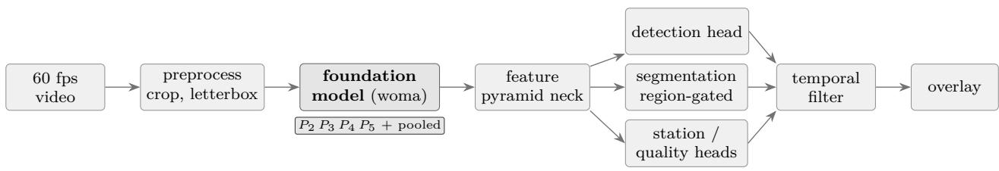  
frame budget 16.7 ms: model+neck ≤ 8 heads ≈ 5 temporal ≈ 2 margin ≈ 1.7

Figure 1: Where the foundation model sits. Every head reads its features, and the time budget of one video frame is split so that the foundation model and neck may spend at most about half of it.  
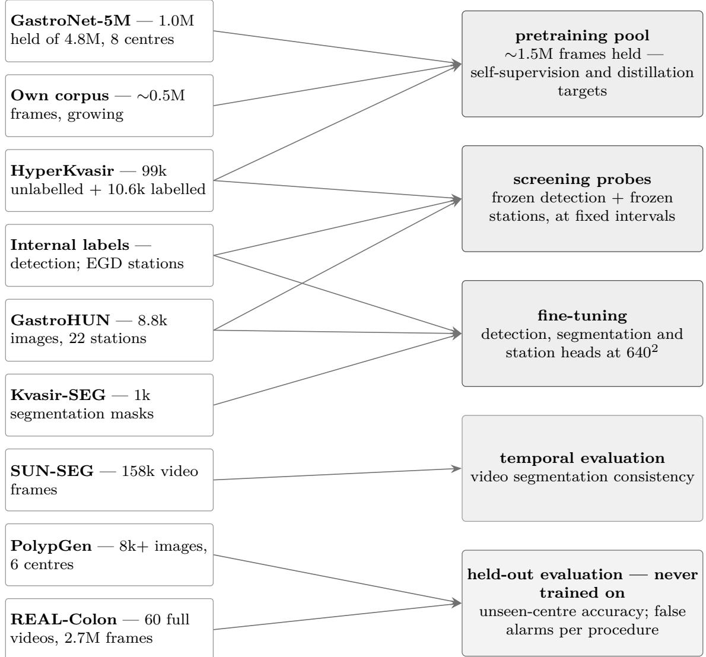  
Figure 2: Data pool: every dataset, its size, and the single role it plays. The bottom lane is walled of — PolypGen and REAL-Colon feed evaluation only, so the unseen-centre and false-alarm numbers mean what they say. Sources: GastroNet-5M [8], HyperKvasir [9], GastroHUN [10], Kvasir-SEG [11], SUN-SEG [12, 13], PolypGen [14], REAL-Colon [15].

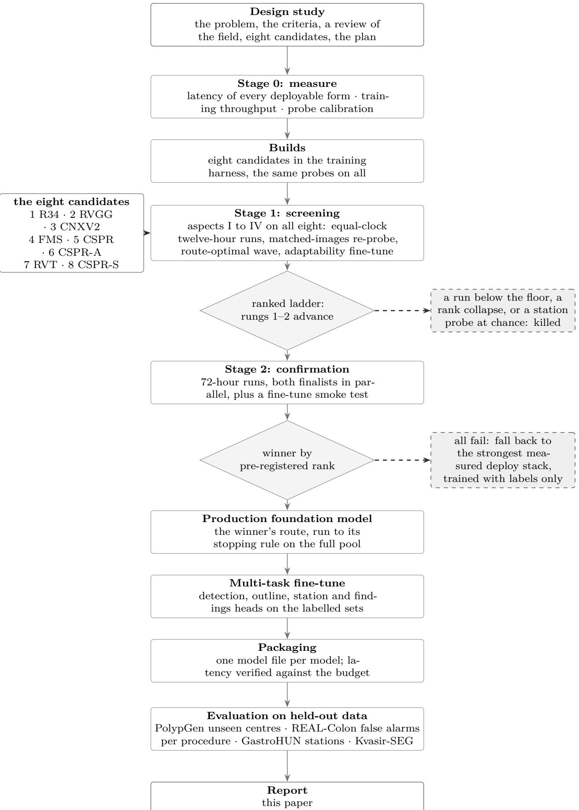  
Figure 3: Whole project from the design study to the evaluated models, with its two gates. Every exit is a decision that was written down before anything ran; the two “killed” branches are outcomes we were prepared to take.

Table 1: Pass marks, fixed before any run, and the published anchor each was set from. One row per mark; the corpora they are read on are named in Section 2.5.
<table><tr><td>instrument</td><td>mark anchor</td><td></td></tr><tr><td>colonoscopy</td><td></td><td></td></tr><tr><td>PolypGen sensitivity, precision ≥0.85</td><td>≥0.90</td><td>cross-centre transfer [14]</td></tr><tr><td>REAL-Colon per-polyp sensitivity</td><td>≥0.93</td><td>per-procedure reporting [15]</td></tr><tr><td>outline Dice, three other-hospital sets</td><td>≥0.82</td><td>PraNet protocol [16]</td></tr><tr><td>colon segment macro recall, ten segments</td><td>≥0.70</td><td>single-frame best [17]</td></tr><tr><td>colon segment accuracy, six merged classes</td><td>0.666</td><td>the same, at parity [17]</td></tr><tr><td>polyp type macro recall</td><td>≥0.80</td><td>reported, no published parity</td></tr><tr><td>bowel preparation adequacy F1</td><td>≥0.90</td><td>Boston scale [18]</td></tr><tr><td>gastroscopy</td><td></td><td></td></tr><tr><td>station landmark-region accuracy</td><td>≥0.92</td><td>0.887, the dataset paper [10]</td></tr><tr><td>station 23-code macro recall</td><td>≥0.85</td><td>the same, reported</td></tr><tr><td>lesion gate sensitivity, specificity &gt;0.90</td><td>≥0.93</td><td>0.922 per image [5]</td></tr><tr><td>findings macro recall, validation</td><td>≥0.85</td><td>0.916–0.939, FastUGI-Net [19]</td></tr><tr><td>findings accuracy, UGIAD coarse-5</td><td>≥0.90</td><td>the same</td></tr><tr><td>findings accuracy, GastroVision half</td><td>≥0.85</td><td>the same</td></tr><tr><td>speed, one workstation GPU</td><td></td><td></td></tr><tr><td>whole stack, per frame</td><td>≤16.7ms</td><td>≈10 ms, commercial [3]</td></tr><tr><td>foundation model and neck, per frame</td><td>≤8 ms</td><td>the same</td></tr></table>

The detection marks are read on PolypGen’s six hospitals [14, 20] and on REAL-Colon study 4 at no more than two sustained false alarms per procedure [15, 21]; the outline mark is the mean over CVC-ColonDB [22], ETIS [23] and CVC-300 [24]; the lesion gate is 39 neoplasia frames against 1,347 clean frames from another hospital. A mark with no published parity is stil fixed in advance and reported either way.

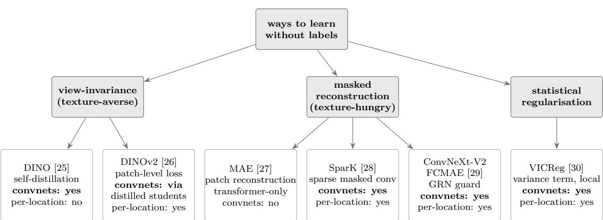  
Figure 4: Families of label-free training objectives, keyed to what matters here: does the recipe work on a convolutional network, does it teach every location of the feature map (“per-location”), and does it have a built-in guard against the features collapsing to the same value. The masked-reconstruction family with that guard is the one woma uses.

Table 2: Eight candidates and a Stage-0 latency gate (batch 1, $6 4 0 ^ { 2 }$ , f16, one forward of the network alone on an RTX 3090 as the engine proxy; the pass mark is 8 ms for network and neck). Route: A from scratch, B public weights then adaptation, C distillation. Candidate 8’s kernel path was deferred by design, so it was screened for representation quality only.
<table><tr><td>#</td><td>name</td><td>strategy</td><td>route</td><td>params</td><td>ms</td><td>gate</td></tr><tr><td>1</td><td>R34</td><td>ResNet-34-D, a plain residual network deployed as itself</td><td>B</td><td>21.8M</td><td>2.22</td><td>pass</td></tr><tr><td>2</td><td>RVGG</td><td>RepVGG-A2, trained with branches, folded to a plain 3×3 stack</td><td>B</td><td>25.5M</td><td>1.79</td><td>pass</td></tr><tr><td>3</td><td>CNXV2</td><td>ConvNeXt-V2-Nano, a masked-autoencoder convnet</td><td>B</td><td>15.6M</td><td>3.54</td><td>pass, flagged for its depthwise convolutions</td></tr><tr><td>4</td><td>FMS</td><td>CSP-R-13 distilled from an in-domain foundation teacher</td><td>C</td><td>12.7M</td><td>1.90</td><td>pass</td></tr><tr><td>5</td><td>CSPR</td><td>CSP-R-22, a detection trunk made safe for self-supervision</td><td>A</td><td>20.7M</td><td>2.42</td><td>pass, at the line</td></tr><tr><td>6</td><td>CSPR-A</td><td>candidate 4&#x27;s body with two attention blocks at the deepest scale</td><td>C</td><td>19.3M</td><td>1.97</td><td>pass</td></tr><tr><td>7</td><td>RVT</td><td>RepViT-M1.1, a reparameterised mobile hybrid</td><td>B</td><td>8.2M</td><td>4.14</td><td>pass, the mobile-regime trade-off made visible</td></tr><tr><td>8</td><td>CSPR-S</td><td>candidate 4&#x27;s body with a state-space layer at the deepest scale</td><td>C</td><td>14M</td><td></td><td>deferred</td></tr></table>

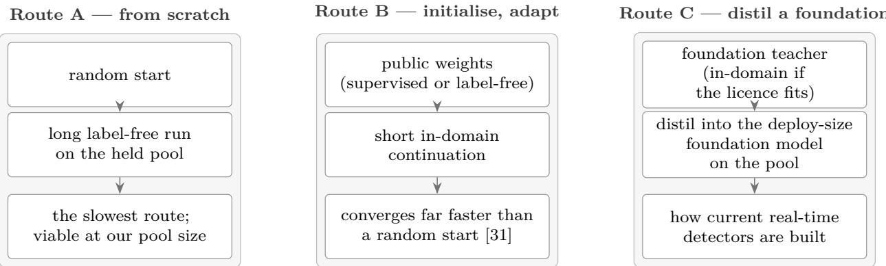  
Figure 5: Three routes to a pretrained foundation model. They compose: Route B can prepare the teacher that Route C distils. Every route was carried by at least two of the eight candidates, so a route failing could be told apart from a candidate failing.

Design principles. Our review compressed into eight rules, and those rules generated our candidate set. Measure cost on target hardware, never from operation counts. Prefer public weights or distillation for speed, keeping training from scratch as a control our pool size allows [31]. Pretrain a convolutional network only with an objective that teaches every location and guards against collapse [28–30]. Favour reconstruction objectives for texture-defined lesions. Hold an unbroken additive identity path through every stage [32]. Anti-alias each downsampling step [33], since aliasing causes flicker and flicker causes false alarms. Give a pooled endpoint real width. And keep our operator set boring, so a network compiles to any standard engine.

Candidate set. Table 2 and Figure 6 list the eight candidates. They are one pick per family of a 2025–26 landscape our survey found deployable within our latency requirement: plain residual networks, plain networks that fold into one branch at deployment, cross-stage-partial trunks that real-time detectors are built from, modernised convnets, and a mobile hybrid. Hierarchical vision transformers and state-space encoders were surveyed and excluded, transformers for unproven latency and quantisation at this resolution, state-space encoders for needing a custom kernel our engine rule forbids. This set samples every axis selection must price at least twice: topology, pretraining route, context at the deepest scale (a matched triplet 4, 6 and 8 difers in exactly one thing there) and deployment regime.

input 2242 (pretrain) / 6402 (deploy)   
V   
deep stem: 3×3 s2 (32) + 3×3   
(32) + 3×3 (64); blur-pool s2   
业   
S1: 3× basic residual — 64 ch — stride 4 P2   
  
S2: blur; 4× basic residual — 128 ch — stride 8 P3   
  
S3: blur; 6× basic residual — 256 ch — stride 16 P + probe 1×1→256   
  
S4: blur; 3× basic residual — 512 ch — stride 32 P5   
V   
1×1: 512 → 2048 — pretraining only   
V   
global average pool → 2048-d

(a) Candidate 1, R34: ResNet-34-D with a deep stem and blur-pooled downsampling, deployed as itself.

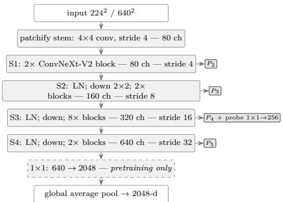

(c) Candidate 3, CNXV2: ConvNeXt-V2-Nano with the FCMAE pretraining endpoint; became woma.

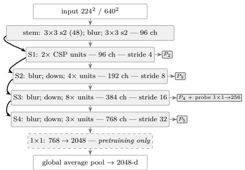

(e) Candidate 5, CSPR: CSP-R-22, the detector-family residual cross-stage-partial trunk; the runner-up.

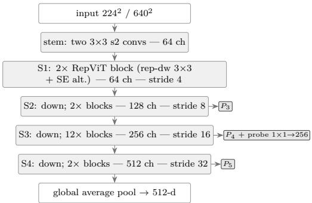  
(g) Candidate 7, RVT: RepViT-M1.1, a reparameterised mobile hybrid.

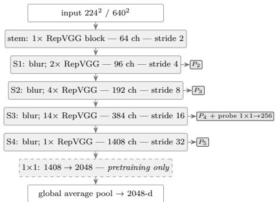

(b) Candidate 2, RVGG: RepVGG-A2, trained with parallel branches and folded into plain 3×3 convolutions for deployment.

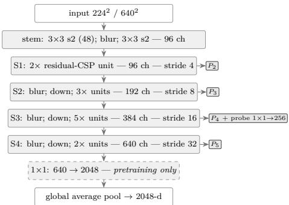

(d) Candidate 4, FMS: the CSP-R-13 student of a foundation-model teacher.

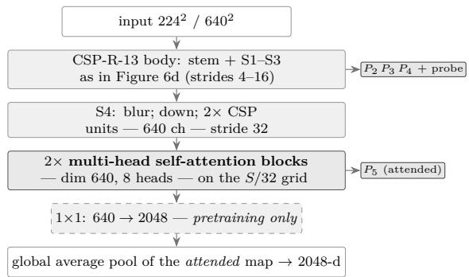

(f) Candidate 6, CSPR-A: CSP-R-13 with two selfattention blocks at the stride-32 stage.

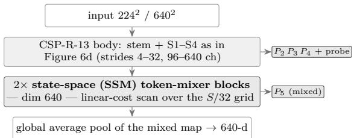  
(h) Candidate 8, CSPR-S: the state-space (selective-scan) sibling of candidate 5.

Figure 6: Eight candidate foundation models of the selection study. Every candidate exposes the same three feature maps (strides 8, 16 and 32, called $P _ { 3 }$ to $P _ { 5 } )$ for the heads; the dashed 1×1 layer and the pooled endpoint exist only for pretraining. Candidate 3 became woma; candidate 5, the runner-up, was fine-tuned on both models for comparison.

Plan, and its rules. Figure 3 shows this project whole, with its two gates; a guiding idea is to spend measurements before GPU-hours and GPU-hours before weeks. Stage 0 measures before anything trains and can already kill a candidate, for a latency miss in its deployable form or training throughput too low for a twelve-hour run to mean anything. Stage 1 trains every candidate for the same wall-clock budget and probes the frozen network at fixed intervals with two tests that need no fine-tuning: a linear station classifier on GastroHUN [10] (macro $F _ { 1 }$ over 22 stations) and a linear polyp-outline head on Kvasir-SEG [11] (Dice), each read against its untrained floor (0.056 and the image-independent null of 0.390). A third instrument, the efective rank of the dense feature map, watches for collapse, with a warning line at 64. Four views of each run (equal clock; matched images seen; a route-optimal second wave; and a short adaptability fine-tune of a whole network through one outline head, twelve epochs for every candidate) combine into a single ranked ladder. Our advance rule was fixed in advance: top two rungs go on, provided each clears three times its random-network floor, ends above that efective-rank warning line, and beats twice chance on our station probe. Stage 2 gives both finalists 72 hours each plus a short supervised fine-tune; whichever wins on detection and station together goes on, ties broken by measured latency. Winner’s route then runs to its stopping rule on the full pool: every twenty minutes we probe that frozen network as above, and a run stops once both probes have gained less than 0.005 over their last 3,000 steps, which is less than the spread between two random seeds.

## 2.4 Fine-tuned models

One forward of the foundation model serves every head (Table S1). Detection uses a light featurepyramid neck [34] under an anchor-free head of the YOLOv8 kind [35], with a single class in both models: a two-class upper-GI variant (Barrett’s segment against a focal lesion) lost, because a foca lesion often sits inside a Barrett’s field and one detector cannot serve a field and a focus at once. Polyp type and findings are read per frame in this version. Figures S1 and S2 give each model’s complete recipe: training sets, optimiser and schedule, augmentation, what is measured while a run trains, what is measured on held-out data for every snapshot, and the decision rule. Three choices deserve a sentence. Each training step draws one task by weight and runs one batch of it, so our foundation model sees every head’s gradient in proportion to those weights and no head’s batch statistics leak into another’s. The foundation model is pretrained while the heads start from random weights, so heads learn at ten times its rate. Weights we evaluate and save are a running average of live ones. Each model’s shipped snapshot is chosen on its held-out record: lesion gate filters first, then most pass marks met wins. Training curves are never consulted.

Every arm reported here was fine-tuned on one machine at one setting: three cards, four images each, efective batch twelve. The first pass was not — candidates 1 and 7 ran on the second box while the first was busy, and two cards reach twelve only at six images each. Normalisation statistics inside a trunk are estimated per replica and never synchronised, so a replica sees four samples or six, and for a trunk built of convolution and batch normalisation that is no detail. Both arms were re-run at four and it is the re-runs that Table 4 reports; the earlier pair is kept, and what it now measures is the split. Candidate 1, a residual network with batch normalisation throughout, reads PolypGen 0.860–0.889 at six across all ten snapshots and 0.912–0.970 at four: two bands that do not meet at any epoch, one wholly under the pass mark and one wholly over it, while every other instrument moves by less than 0.03. Candidate 7, a transformer with layer normalisation, does not move — 0.953–0.974 against 0.944–0.973. Machine and split changed together, on the same model of card and byte-identical data, and a pair cannot separate them; the matched re-runs are the answer to that, not an argument that it does not matter.

Repeats of one setting settle a diferent question: which instruments tolerate a single run at all. Across two seeds PolypGen sensitivity moves by at most 0.015 and in-domain detection by 0.023, against 0.18 for held-out segment recall — as large as the 0.19 that separates candidate $2 \mathrm { { ^ { \circ } s } }$ two batch settings, so we do not read that instrument as ordered between single arms. Detection comparisons in this paper therefore rest on ground the seeds support; segment-recall diferences smaller than about 0.2 do not, and we read them as indistinguishable rather than ordered.

## 2.5 Evaluation

Held-out instruments and metrics. Every result is read on data training never saw: for our colon model PolypGen [14], REAL-Colon study 4 [15] (15 full videos), 15 held-out CAS-Colon videos [36], HyperKvasir’s landmark folders [9], KUMC’s held-out patients [37] and three other-hospital PraNet outline sets; for our upper-GI model GastroHUN’s validation and test patients, 39 EDD2020 [38] neoplasia frames against 1,347 clean frames from another hospital, UGIAD’s published test split [19] and half of GastroVision [39]. Sensitivity is the share of true lesions found, specificity the share of clean frames left alone, macro recall that share averaged over classes, and Dice the overlap of a predicted outline with a true one. Every candidate carried to fine-tuning ran both recipes unchanged and was scored on these instruments at every second epoch.

Speed protocol. All four engines were timed in one sitting on one machine, on a card at its factory 370 W limit with no display attached; nothing else ran, and both cards were idle before and after. Foundation-model rows ran PyTorch first and frame-to-results rows numbat first, so neither system always met a cold box. Each engine runs 300 synchronised iterations after 30 warm-ups on the same layers: the same ConvNeXt-V2-Nano from timm for the foundation-model rows, and for the fine-tuned rows our own layers end to end — foundation model, neck, every head with its class counts, the box decode and non-maximum suppression (NMS) — from a frame in host memory to results in host memory. Every cell was measured three times and we report a median of three medians.

What those repeats show matters more than their number. Each numbat repeat is a separate launch, starting its allocator and selecting its kernels afresh, while framework repeats run inside one process after their warm-ups — friendlier of two arrangements, and not ours. Across all 31 timed cells, widest spread between repeats is 0.067 ms and median spread 0.014 ms, and in all 31 engine-to-engine comparisons numbat’s slowest repeat is faster than the fastest repeat of the engine it is set against: no pair of distributions overlaps anywhere in the table. The closest case is the bf16 foundation model, where numbat’s worst reading of 2.49 ms still beats TensorRT’s best of 2.57.

PyTorch is version 2.14.0 with CUDA 13 in eager mode, channels-last for its 16-bit rows; ONNX Runtime 1.29.0 and TensorRT 11.3.0 read one exported graph of those layers, TensorRT as an engine built at optimisation level 5; every engine’s outputs were checked against PyTorch’s on a fixed frame before anything was timed. numbat is the 0.9.14 release build, timed as the program’s own stages with a device sync after each stage, over 151-frame clips.

## 3 Results

## 3.1 Screening outcome

Table 3 gives our Stage-1 field. Candidate 3 ranked first: highest frozen station probe (0.772), an outline probe within 0.01 of best, efective rank well clear of its warning line, and highest fine-tuned Dice (0.869) in that adaptability test. Candidate 2 ranked second. Candidate 5, the only network trained from a random start, sat fifth on the frozen probes but showed the largest movement under fine-tuning (+0.268), which is what a detection-style trunk trained from scratch is expected to do, and it was carried forward as the from-scratch control. Three distillation candidates (4, 6 and 8) went unranked: their features collapsed to an efective rank near 6, and the cause was traced to the teacher’s dense target itself, which at matched positions carries an efective rank of 20.7, three points above what an untrained student already has. A whitening term repaired the collapse (efective rank 66 at step 1,000), but too late for the ladder. Candidate 3 then won the confirmation on both detection and station, and its route (public pretrain-only weights of ConvNeXt-V2-Nano, self-supervised on ImageNet photographs [40, 41], continued with the same masked autoencoder on the one-million-frame GastroNet-5M holding [8] plus in-house video) stopped under its rule at step 11,500. That checkpoint is woma. Its shape is that of ConvNeXt-V2-Nano (Figure 6c): a stem that turns each 4×4 patch into 80 features, four stages of 2, 2, 8 and 2 blocks at 80, 160, 320 and

Table 3: Stage-1 screening, all eight candidates at the exit of their equal-clock run: the two frozen probes (station macro $F _ { 1 }$ on GastroHUN, linear Dice on Kvasir-SEG), the efective rank of the dense map, the Dice after the twelve-epoch adaptability fine-tune with an identical head, and the outcome. Floors: station 0.056, Dice 0.390 (image-independent null), efective-rank warning line 64.
<table><tr><td>candidate</td><td>route</td><td>station</td><td>Dice</td><td>eff. rank</td><td>fine-tuned Dice</td><td>outcome</td></tr><tr><td>3 CNXV2</td><td>B, masked autoencoder</td><td>0.772</td><td>0.731</td><td>101.6</td><td>0.869</td><td>rung 1; won the confirmation; became</td></tr><tr><td>2 RVGG</td><td>B, ImageNet weights</td><td>0.761</td><td>0.717</td><td>105.3</td><td>0.862</td><td>woma rung  $2 ;$  finalist</td></tr><tr><td>1 R34</td><td>B, ImageNet weights</td><td>0.698</td><td>0.739</td><td>114.8</td><td>0.853</td><td>ranked third</td></tr><tr><td>7 RVT 5 CSPR</td><td>B, ImageNet weights</td><td>0.713</td><td>0.735</td><td>107.5</td><td>0.833</td><td>ranked fourth</td></tr><tr><td></td><td>A, from scratch</td><td>0.735</td><td>0.524</td><td>77.4</td><td>0.792 (+0.268)</td><td>fifth; carried as the from-scratch control and</td></tr><tr><td>4FMS</td><td>C, distilled</td><td>0.459</td><td>0.081</td><td>6.2</td><td></td><td>fine-tuned on both models unranked: collapsed on the teacher&#x27;s target</td></tr><tr><td>6 CSPR-A</td><td>C, distilled</td><td>0.517</td><td>0.204</td><td></td><td></td><td>unranked: collapsed</td></tr><tr><td>8 CSPR-S</td><td> $\mathrm { C } ,$  distilled</td><td>0.240</td><td>0.053</td><td></td><td></td><td>unranked: collapsed</td></tr></table>

640 channels, 15.6 million parameters; each block is a $7 \times 7$ depthwise convolution, a normalisation over channels, two 1×1 convolutions with a GELU (Gaussian error linear unit) between them, and the global response normalisation (GRN) that keeps channels diverse. Heads read stage outputs at strides 8, 16 and 32, called $P _ { 3 }$ to $P _ { 5 }$

## 3.2 Other candidates, same recipes

A screening is a claim about what a trunk is worth downstream, and the only way to test it is to spend the fine-tunes. Table 4 puts every candidate through both product recipes on the same data, schedule, augmentation, evaluation, pass marks and machine, four images per replica throughout (Section 2.4); Figures 7 and 8 plot each arm per snapshot on every held-out instrument.

Finding lesions barely separates them. Every candidate’s gastroscopy arm clears the lesion gate, several above woma (candidate 1 at 0.974, candidate 2 at 1.000, against 0.949), and every colonoscopy arm clears its detection gate at every snapshot but one — woma’s own epoch 20, at 0.898, where candidate 5 still reads 0.934, having matched woma at the peak (0.969 against 0.970) and faded less. A detector head on a reasonable trunk finds lesions.

Describing a frame separates them completely, and screening predicted that order. Stage 1’s frozen station probe ranked all five candidates $3 > 2 > 5 > 7 > 1$ (0.772, 0.761, 0.735, 0.713, 0.698, Table 3). Their landmark-region accuracies after a full gastroscopy fine-tune fall in the same order, with no inversion: 0.923, 0.738, 0.662, 0.634, 0.575. A twelve-hour probe on frozen features ordered five trunks exactly as two weeks of fine-tuning did, which is the case for spending measurements before GPU-hours. woma is also the only candidate whose region accuracy clears its bar at all, by a margin no other comes within 0.15 of.

One class can hide that. Candidate 5’s caecum recall on another centre climbs from 0.46 to 0.95 through training while its retroflexed-rectum recall falls from 0.42 to 0.11 and its ten-segment macro declines from 0.43 to 0.35: it answers caecum more often rather than recognising more segments, where woma’s macro holds between 0.48 and 0.52. Read on caecum alone it would look like a better station model, which is why we fixed that pass mark on macro recall before any run.

Candidate 1 reads that diference most clearly, being no from-scratch control but a supervised ImageNet residual network, most conventional trunk in our set. Its gastroscopy arm flags lesions as well as anything here — lesion gate 0.974, above woma — yet names landmark region on 57.5 % of frames where woma names it on 92.3 %, reads 23-code macro at 0.415 against 0.822, and meets two of six bars against five. Its colonoscopy arm is the counter-case and we report it as one: at the matched setting it clears the detection gate at every snapshot, meets the same two bars woma meets, and is not separated from woma by more than 0.08 on any of the four colonoscopy instruments. An earlier run of this arm at six images per replica missed the gate at every snapshot; that was the split, not the trunk (Section 2.4). What supervised ImageNet features do not substitute for is therefore narrower than a whole trunk’s worth, and sharper for being narrow: not finding a lesion, but naming where the frame was taken and what else is in it.

Table 4: Every candidate carried through both product recipes, identical in data, schedule, augmentation, evaluation and pass marks; only the foundation model difers. Each row is the snapshot the pre-registered rule selects — pass the anatomy’s gate, then meet the most bars. ⋆ marks a bar met; sel. is the snapshot, met counts the gated bars. A dash is an instrument not yet scored for that snapshot.
<table><tr><td>colonoscopy arm</td><td>sel.</td><td>PolypGen</td><td>REAL-Colon</td><td>Dice</td><td>segment</td><td>type</td><td>prep</td><td>met</td></tr><tr><td>woma (3 CNXV2)</td><td>6</td><td>0.960*</td><td>1.000*</td><td>0.807</td><td>0.521</td><td>0.634</td><td>0.737</td><td>2</td></tr><tr><td>5 CSPR</td><td>8</td><td>0.959*</td><td>1.000*</td><td>0.732</td><td>0.397</td><td>0.527</td><td>0.561</td><td>2</td></tr><tr><td>1 R34</td><td>8</td><td>0.954*</td><td>1.000*</td><td>0.749</td><td>0.449</td><td>0.629</td><td>0.666</td><td>2</td></tr><tr><td>2 RVGG</td><td>2</td><td>0.943*</td><td>0.947*</td><td>0.616</td><td>0.436</td><td>0.583</td><td>0.715</td><td>2</td></tr><tr><td>7 RVT</td><td>2</td><td>0.955*</td><td>0.947*</td><td>0.708</td><td>0.446</td><td>0.671</td><td>0.702</td><td>2</td></tr><tr><td>gastroscopy arm</td><td>sel.</td><td>gate</td><td>region</td><td>23-code</td><td>findings</td><td>UGIAD</td><td>GastroV.</td><td>met</td></tr><tr><td>woma (3 CNXV2)</td><td>asm10c2</td><td>0.949*</td><td>0.923*</td><td>0.822</td><td>0.877*</td><td>0.932*</td><td>0.861*</td><td>5</td></tr><tr><td>5 CSPR</td><td>asm14c4</td><td>0.974*</td><td>0.662</td><td>0.481</td><td>0.755</td><td>0.693</td><td>0.786</td><td>1</td></tr><tr><td>1 R34</td><td>asm18c2</td><td>0.974*</td><td>0.575</td><td>0.415</td><td>0.837</td><td>0.904*</td><td>0.837</td><td>2</td></tr><tr><td>2 RVGG</td><td>asm12c4</td><td>0.949*</td><td>0.738</td><td>0.624</td><td>0.830</td><td>0.856</td><td>0.835</td><td>1</td></tr><tr><td>7 RVT</td><td>asm2c4</td><td>0.974*</td><td>0.634</td><td>0.359</td><td>0.770</td><td>0.741</td><td>0.811</td><td>1</td></tr></table>

Colonoscopy bars: PolypGen sensitivity ≥0.90 at precision ≥0.85; REAL-Colon per-polyp sensitivity ≥0.93 at ≤2 false alarms per procedure; other-hospital Dice ≥0.82; segment recall ≥0.70. Gastroscopy bars: lesion gate sensitivity ≥0.93 at specificity ≥0.90; landmark-region accuracy ≥0.92; 23-code macro ≥0.85; findings macro ≥0.85; UGIAD coarse-5 ≥0.90; GastroVision-half ≥0.85.

Candidate 2 clears the gate and still loses on everything the gate does not test. Its colonoscopy arm meets both detection marks at epoch 2 — 0.943 of PolypGen polyps found at precision ≥0.85, and 0.947 of REAL-Colon polyps at two false alarms per procedure — and meets two bars, the count woma meets. Every descriptive head reads lower: other-hospital outline Dice 0.616 against 0.807, ten-segment recall 0.436 against 0.521, polyp type 0.583 against 0.634. Nor does it hold. By epoch 20 segment recall is 0.101 and Dice 0.305 while detection still reads 0.930, so the rule selects its second snapshot because that is the last one worth having. A trunk can keep what a detector needs while shedding what every other head reads, and this is the arm that shows it plainly.

The comparison also exposed a defect in our trainer that only a network with batch normalisation can show; it was fixed and verified before the candidate-5 runs were repeated, and no woma number changed.

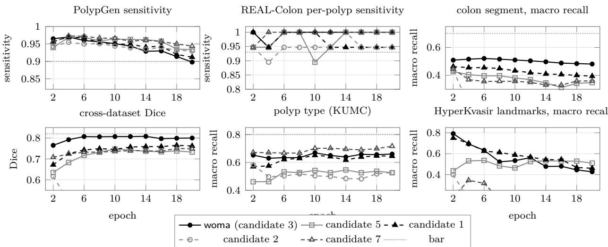  
Figure 7: Colonoscopy fine-tunes on one recipe, scored on held-out data at every second epoch: woma (candidate 3), candidate 5, candidate 1, candidate 2, candidate 7. Line dash and marker identify the arm. Dotted lines are the bars of Figure S1 (PolypGen sensitivity at precision ≥0.85; REAL-Colon per-polyp sensitivity at ≤2 false activations per procedure over 19 polyps; cross-dataset Dice over CVC-ColonDB, ETIS and CVC-300; polyp type on the KUMC held-out split). The last panel is HyperKvasir, another centre: the macro over its two well-supported landmarks, the caecum (1,009 frames) and the retroflexed rectum (391), which a head cannot raise by answering caecum more often; its ileum carries nine frames and is reported in Table 5 rather than plotted. Kept model is epoch 6 of woma.

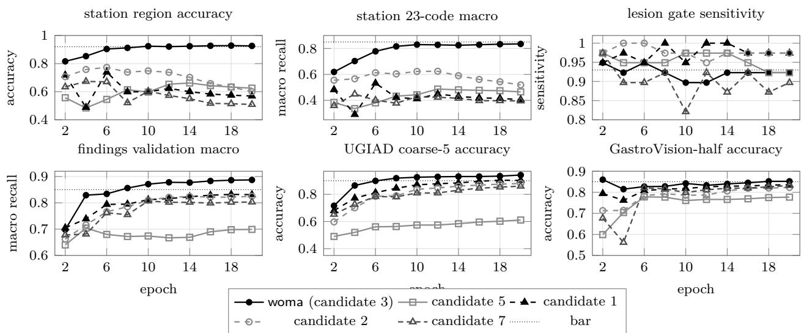  
Figure 8: Gastroscopy fine-tunes on one root and recipe, scored on held-out data at every second epoch: woma (candidate 3), candidate 5, candidate 1, candidate 2, candidate 7. Every arm clears the lesion gate and they separate on everything read from pooled features; at the snapshots the rule selects (Table 4) that separation runs in the order the frozen probe of Table 3 put them in. Bars of Figure S2 dotted; the shipped model is the assembled epoch-10 snapshot of Section 2.4.

## 3.3 Held-out results of the two models

Tables 5 and 6 give every held-out number against its pass mark. In both models the run’s own validation kept improving through the final learning-rate decay while every other-hospital number fell: in the colon run, PolypGen sensitivity peaked at epoch 4 (0.970) and fell to 0.898 by epoch 20 while the in-domain detection score plateaued, and an internal composite selector would have picked epoch 9. Epoch 6 is the colon keep, the only snapshot that passes both detection marks with margin. Upper-GI heads reach their marks at diferent epochs, so what ships is an assembly: epoch 10’s foundation model, detector, outline and station heads with a findings head retrained for two epochs on that frozen network; heads retrained the same way on the epoch-4, 6 and 8 networks clear every mark too.

Table 5: Colon model, epoch 6 as shipped, against its pass marks, every number read on data the training never saw. 95 % confidence intervals are Wilson score intervals from the frame or polyp counts [42].
<table><tr><td>instrument</td><td>value</td><td>95% CI</td><td>mark</td><td>met</td></tr><tr><td>polyp detection</td><td></td><td></td><td></td><td></td></tr><tr><td>PolypGen sensitivity, precision ≥0.85</td><td>0.960</td><td>0.948–0.969</td><td>≥0.90</td><td>yes</td></tr><tr><td>PolypGen sensitivity, half the clean frames flagged</td><td>0.897</td><td></td><td></td><td>reported</td></tr><tr><td>REAL-Colon per-polyp, 1.6 alarms/procedure</td><td>1.000</td><td>0.83-1.00</td><td>≥0.93</td><td>yes</td></tr><tr><td>REAL-Colon per-polyp, 0.2 alarms/procedure</td><td>17 of 19</td><td></td><td></td><td>reported</td></tr><tr><td>polyp outline, Dice</td><td></td><td></td><td></td><td></td></tr><tr><td>Kvasir-SEG, in domain</td><td>0.907</td><td></td><td></td><td>reported</td></tr><tr><td>CVC-ClinicDB [43], in domain</td><td>0.900</td><td></td><td></td><td>reported</td></tr><tr><td>CVC-ColonDB, another hospital</td><td>0.748</td><td></td><td></td><td>reported</td></tr><tr><td>ETIS, another hospital</td><td>0.752</td><td></td><td></td><td>reported</td></tr><tr><td>CVC-300, another hospital</td><td>0.922</td><td></td><td></td><td>reported</td></tr><tr><td>mean of the three other-hospital sets</td><td>0.807</td><td></td><td>≥0.82</td><td>no, by 0.013</td></tr><tr><td>colon segment, 15 held-out videos</td><td></td><td></td><td></td><td></td></tr><tr><td>ten segments, macro recall</td><td>0.521</td><td></td><td>≥0.70</td><td>no</td></tr><tr><td>ten segments, with an 8-second memory</td><td>0.574</td><td></td><td></td><td>reported</td></tr><tr><td>six merged classes, accuracy (Saito protocol)</td><td>0.655</td><td></td><td>0.666</td><td>parity</td></tr><tr><td>HyperKvasir, another hospital: caecum recall</td><td>0.737</td><td></td><td></td><td>reported</td></tr><tr><td>HyperKvasir: retroflexed-rectum recall</td><td>0.529</td><td></td><td></td><td>reported</td></tr><tr><td>HyperKvasir: terminal-ileum recall (9 frames)</td><td>0.220</td><td></td><td></td><td>reported</td></tr><tr><td>polyp type</td><td></td><td></td><td></td><td></td></tr><tr><td>per lesion, REAL-Colon: adenoma</td><td>4 of 15</td><td></td><td></td><td>no</td></tr><tr><td>per lesion, REAL-Colon: hyperplastic</td><td>2 of 2</td><td></td><td></td><td></td></tr><tr><td>per lesion, REAL-Colon: serrated</td><td>0 of 2</td><td></td><td></td><td></td></tr><tr><td>per frame, REAL-Colon: macro recall</td><td>0.617</td><td></td><td>≥0.80</td><td>no</td></tr><tr><td>per frame, KUMC held-out patients: macro recall</td><td>0.635</td><td></td><td>≥0.80</td><td>no</td></tr><tr><td>bowel preparation</td><td></td><td></td><td></td><td></td></tr><tr><td>macro recall over the four Boston classes</td><td>0.737</td><td></td><td></td><td>reported</td></tr><tr><td>weighted kappa</td><td>0.845</td><td></td><td></td><td>reported</td></tr><tr><td>grouped accuracy, adequate against not</td><td>0.985</td><td></td><td></td><td>reported</td></tr></table>

PolypGen is 1,347 polyp frames and 193 clean frames from six hospitals: at the operating point above, 1,293 polyps are found and 54 missed, of which only 20 carry no overlapping box at all (Section 4). REAL-Colon study 4 is 15 full videos holding 19 polyps, scored per polyp with a two-second persistence rule; the mark allows two sustained false alarms per procedure and the shipped model runs at 1.6.

Both detection marks are met. Read that per-frame number with its operating point: at the loosest threshold that holds precision at 0.85, nearly all of PolypGen’s 193 clean frames receive some box, which is why per-procedure counting is what a clinician should weigh and why our program ships at stricter confidence. Outlines miss their other-hospital mark by 0.013, on the two sets with the smallest and flattest polyps. Segment recall reads parity with published single-frame results on a merged six-class protocol, and 0.52 across ten classes; its errors sit in adjacent tube segments one frame cannot separate, and an 8-second memory adds 0.05. Polyp type falls far short on a class that matters, trained on 256 serrated frames. Our upper-GI model meets five of five gated marks in one set of weights, and region accuracy holds up on separate test patients; its 23-code

Table 6: Upper-GI model, assembled epoch-10 snapshot as shipped, against its pass marks, on data the training never saw. 95 % CI as in Table 5. The tiers are the order the selection rule reads the marks in: a snapshot must clear the lesion gate first.
<table><tr><td>instrument</td><td>value</td><td>95% CI</td><td>mark</td><td>met</td></tr><tr><td colspan="5">station, unseen patients — tier 1</td></tr><tr><td>validation, 793 frames: landmark-region accuracy validation: landmark-region macro recall</td><td>0.923 0.896</td><td>0.902–0.940</td><td>≥0.92</td><td>yes reported</td></tr><tr><td>validation: 23-code macro recall</td><td>0.822</td><td></td><td>≥0.85</td><td>no</td></tr><tr><td>validation: 23-code accuracy</td><td>0.836</td><td></td><td></td><td>reported</td></tr><tr><td>test, 803 frames from 59 other patients, read once</td><td>0.917</td><td>0.895-0.934</td><td>&gt;0.92</td><td>yes</td></tr><tr><td>test: 23-code macro recall</td><td>0.834</td><td></td><td></td><td>reported</td></tr><tr><td colspan="5">lesion gate and findings — tier 2</td></tr><tr><td>sensitivity, 39 neoplasia frames</td><td>0.949</td><td>0.83-0.99</td><td>≥0.93</td><td>yes</td></tr><tr><td>specificity, 1,347 clean frames, another hospital</td><td>0.912</td><td>0.895-0.926</td><td>≥0.90</td><td>yes</td></tr><tr><td>findings, validation macro recall over seven classes</td><td>0.877</td><td></td><td>≥0.85</td><td>yes</td></tr><tr><td>findings, UGIAD test: coarse-5 accuracy</td><td>0.932</td><td>0.910-0.950</td><td>≥0.90</td><td>yes</td></tr><tr><td>findings, UGIAD test: fine accuracy</td><td>0.866</td><td></td><td></td><td>reported</td></tr><tr><td>findings, UGIAD test: fine macro recall</td><td>0.828</td><td></td><td></td><td>reported</td></tr><tr><td colspan="5">other-hospital findings — tier 3</td></tr><tr><td>GastroVision half, two other hospitals: accuracy</td><td>0.861</td><td>0.840-0.880</td><td>≥0.85</td><td>yes</td></tr><tr><td colspan="5">outline EDD2020 validation, 52 masks: Dice 0.769</td></tr><tr><td colspan="5">The station corpus is GastroHUN&#x27;s patient split [10]; the landmark region merges the 23 codes into the seven anatomical regions a report names. The lesion gate is EDD2020&#x27;s neoplasia frames [38] against lesion-free landmark frames from HyperKvasir [9], a hit counted at a quarter overlap; 37 of the 39 are flagged. UĠIAD is 606 frames of its published test split [19] and GastroVision half is 1,152 frames [39]. The outline head is research-use-only because EDD2020 is.</td></tr></table>

macro is reported against its line, since codes it misses are neighbouring views of one landmark that annotators themselves disagreed on.

## 3.4 Speed

Table 7 sets numbat against three programs such a system would otherwise be built on: PyTorch, ONNX Runtime and TensorRT. Each was handed identical layers and identical weights on one card and asked to do two jobs — one pass of our foundation model, and a whole frame from video memory to finished results. Four precisions appear, meaning how many bits each number carries: ordinary 32-bit arithmetic (f32), NVIDIA’s faster 32-bit mode (TF32), and two 16-bit formats (bf16, f16). Fewer bits means quicker arithmetic and less trafic to memory; what that costs in accuracy we measured separately (Section 4).

numbat is fastest in every row. One pass of our foundation model takes TensorRT, strongest of the three, 12 % longer in ordinary 32-bit, 19 % in TF32, 3 % in bf16 and 27 % in f16, and takes ONNX Runtime and PyTorch 1.6 to 3.0 times longer. Frame to finished results — every head run, detections turned into boxes, overlapping boxes dropped — our colon model delivers 248 frames a second in f16 where TensorRT delivers 215, and 160 against 129 in ordinary 32-bit; our gastroscopy model 243 against 213, and 161 against 129.

Two rounds of work got there, each timing our own code step by step beside whichever program was beating us. Round one deleted work rather than speeding it up. A convolution block used to write its result to memory, read it back to add a bias, read it again to apply an activation, and again for a residual and a normalisation. Doing all of that inside the pass that already holds the numbers removes four journeys to memory and changes no answer — outputs stayed identical to the last digit. Round one also taught every part of the program, not our foundation model alone, to work in 16-bit numbers from end to end.

Round two compared single operations with TensorRT’s. Ours were already quicker at 1×1 convolutions, commonest operation in this network. Its 7×7 depthwise convolution — one filter per channel, which is what gives a ConvNeXt block its wide view of a frame — ran five times faster than ours, and that one operation was the whole remaining gap. Rewriting it closed that gap: a row of output now reads its strip of the frame once into the small fast memory beside the arithmetic units, one thread produces four neighbouring outputs, and 16-bit inputs stay 16-bit instead of being widened to 32. Two smaller changes followed. One normalisation step is folded into the weights of the layer after it, so it costs nothing while the program runs. And the pass that writes an activation now hands back the totals the next step needs, instead of that step reading the whole activation a second time to work them out.

Table 7: numbat against the engines a deployment is measured against, on the same GPU, the same layers, in one sitting under the protocol of Section 2.5. Each entry is the median of three repeats with their standard deviation, so every number in this table is a distribution rather than one run. The foundation model is one ConvNeXt-V2-Nano forward at 1×3×640×640 with the input already on the card, in milliseconds; each fine-tuned model is a frame in host memory to boxes, mask, station and findings in host memory, in frames per second. Best in each row in bold.
<table><tr><td>regime</td><td>numbat</td><td>PyTorch</td><td>ONNX Runtime</td><td>TensorRT</td></tr><tr><td colspan="5">foundation model, milliseconds, lower is better</td></tr><tr><td>strict f32</td><td> ${ \bf 4 . 3 0 \pm 0 . 0 1 }$ </td><td> $9 . 8 6 \pm 0 . 0 3$ </td><td> $1 1 . 9 4 \pm 0 . 0 4$ </td><td> $4 . 8 3 \pm 0 . 0 1$ </td></tr><tr><td>f32 with TF32</td><td> ${ \bf 3 . 7 4 \pm 0 . 0 1 }$ </td><td> $6 . 2 1 \pm 0 . 0 0$ </td><td> $9 . 8 7 \pm 0 . 0 0$ </td><td> $4 . 4 6 \pm 0 . 0 0$ </td></tr><tr><td>bf16</td><td> $\mathbf { 2 . 4 9 \ : \pm { \ : 0 . 0 0 } }$ </td><td> $3 . 8 8 \pm 0 . 0 1$ </td><td></td><td> $2 . 5 7 \pm 0 . 0 0$ </td></tr><tr><td>f16</td><td> $\mathbf { 2 . 4 2 \ : \pm { \ : 0 . 0 1 } }$ </td><td> $3 . 8 2 \pm 0 . 0 2$ </td><td> $7 . 1 5 \pm 0 . 0 1$ </td><td> $3 . 0 8 \pm 0 . 0 0$ </td></tr><tr><td colspan="5">upper-GI model, frames per second</td></tr><tr><td>strict f32</td><td> ${ \bf 1 6 1 . 3 \pm 0 . 4 }$ </td><td> $6 8 . 5 \pm 0 . 0$ </td><td> $6 1 . 7 \pm 0 . 1$ </td><td> $1 2 8 . 9 \pm 0 . 1$ </td></tr><tr><td>f32 with TF32</td><td> ${ \bf 1 7 5 . 4 \pm 0 . 5 }$ </td><td> $9 6 . 9 \pm 0 . 1$ </td><td> $7 5 . 4 \pm 0 . 1$ </td><td> $1 3 5 . 6 \pm 0 . 1$ </td></tr><tr><td>bf16</td><td> ${ \bf 2 3 7 . 0 \pm 0 . 9 }$ </td><td></td><td></td><td> $2 2 2 . 7 \pm 1 . 4$ </td></tr><tr><td>f16</td><td> ${ \bf 2 4 3 . 3 \pm 0 . 0 }$ </td><td> $1 5 5 . 3 \pm 0 . 3$ </td><td> $1 0 0 . 2 \pm 0 . 1$ </td><td> $2 1 3 . 2 \pm 0 . 9$ </td></tr><tr><td colspan="5">colon model, frames per second</td></tr><tr><td>strict f32</td><td> ${ \bf 1 5 9 . 7 \pm 0 . 1 }$ </td><td> $6 8 . 4 \pm 0 . 0$ </td><td> $6 1 . 7 \pm 0 . 1$ </td><td> $1 2 9 . 0 \pm 0 . 1$ </td></tr><tr><td>f32 with TF32</td><td> ${ \bf 1 7 7 . 9 \pm 0 . 2 }$ </td><td> $9 6 . 9 \pm 0 . 0$ </td><td> $7 5 . 3 \pm 0 . 1$ </td><td> $1 3 5 . 9 \pm 0 . 1$ </td></tr><tr><td>bf16</td><td> ${ \bf 2 4 3 . 3 \pm 0 . 0 }$ </td><td></td><td></td><td> $2 2 4 . 0 \pm 0 . 3$ </td></tr><tr><td>f16</td><td> $\mathbf { 2 4 7 . 5 \ : \pm { \ : 0 . 6 } }$ </td><td> $1 5 4 . 7 \pm 0 . 2$ </td><td> $9 9 . 8 \pm 0 . 2$ </td><td> $2 1 5 . 3 \pm 0 . 4$ </td></tr></table>

TF32 is the tensor-core mode every framework turns on by default for convolutions. A dash is a regime the engine has no path for: ONNX Runtime’s CUDA provider does not take a bf16 graph, and PyTorch’s bf16 rows are not run end to end. numbat 0.9.14; PyTorch 2.14.0 with CUDA 13 in eager mode, channels-last for its 16-bit rows, with torch.compile at max-autotune measured beside it (3.59 ms on the foundation model in bf16, its best compiled result, against 3.57 eager); ONNX Runtime 1.29.0 on its CUDA execution provider; TensorRT 11.3.0, engines built from the same ONNX graph at optimisation level 5. Every engine’s outputs were checked against PyTorch’s on a fixed frame before anything was timed. Repeats were taken in alternating order, numbat’s each from a separate launch of the program; in every row numbat’s slowest repeat is faster than the fastest repeat of every engine it is compared with.

f16 is what the program runs by default. Ordinary 32-bit stays available as a switch and is what every held-out number in this paper was read with, and the optimised build reproduces the previous release’s 32-bit output on every frame of both test clips.

A build that needs nothing installed. Everything above reaches the card through NVIDIA’s libraries — CUDA, cuBLAS, cuDNN — which a workstation must have installed, and kept in step with its graphics driver. numbat can run the same weights a second way. We write each GPU operation once and compile it to SPIR-V, a portable format for GPU programs that modern drivers accept, then send it to the card through Vulkan, which ships inside the driver itself. Nothing from any vendor is built in. What a site installs is then two files, one program and one model, and on Linux that program asks the system for its C library and loader and for nothing else. No toolkit, no cuDNN version to match, no PyTorch, no Python. Those two files run on any card whose driver can run Vulkan, which today means NVIDIA, AMD and Intel, and will mean Apple silicon once we have tested that route.

Portability usually costs speed. Table 8 runs one program both ways, on one card and on the same two clips, timed exactly as Table 7 timed the four engines — so the two tables can be read against each other. In 32-bit the portable build is the faster of the two, 185 frames a second against 162 on our colon model and 180 against 161 on our gastroscopy model, because our own code puts a 32-bit convolution on the card’s matrix-multiply units where cuDNN takes a slower route. In 16-bit it is behind by 12 and 16 %, 217 against 246 and 207 against 245, and cuDNN’s 7×7 depthwise convolution is most of that diference. It still clears 200 frames a second, eight times what a screen shows, and it finds the same things: identical box counts in every cell where both planes run. A department with no CUDA, or with a card that is not an NVIDIA one, gives up nothing in what this system finds and, in 32-bit, gains speed.

Table 8: numbat’s two GPU planes, measured under the protocol and in the units of Table 7: same clips, three repeats, and the same quantity — a whole frame from video memory to finished results, in frames per second. Both columns were timed together on numbat 0.9.16, and this CUDA column agrees with Table 7’s numbat column to within 1.5 %, which is the spread between sittings. What each plane finds is identical: 113 boxes in 32-bit and 112 in 16-bit on the colonoscopy clip, 2 on the gastroscopy clip, in every cell where both planes run. Faster of the two in bold.
<table><tr><td rowspan="2">regime</td><td colspan="2">colon model, FPS</td><td colspan="2">upper-GI model, FPS</td></tr><tr><td>CUDA</td><td>portable</td><td>CUDA</td><td>portable</td></tr><tr><td>strict f32</td><td>162.1</td><td>184.8</td><td>161.0</td><td>180.2</td></tr><tr><td>f32 with TF32</td><td>179.9</td><td></td><td>178.9</td><td></td></tr><tr><td>bf16</td><td>243.9</td><td></td><td>241.0</td><td></td></tr><tr><td>f16</td><td>245.7</td><td>217.4</td><td>244.5</td><td>206.6</td></tr></table>

CUDA is NVIDIA’s libraries (cuBLAS, cuDNN); portable is our own kernels through Vulkan, with no vendor library linked. A dash is a regime the portable plane has no path for: TF32 is a mode of NVIDIA’s tensor cores and has no counterpart, so its f32 row stands for both; bf16 kernels are not written for it yet and the program stops with UnsupportedType rather than guessing. One pass of the foundation model alone, the first block of Table 7, is not quoted for the portable plane: it queues work and returns before the card has run it, so a per-stage stopwatch measures the queueing, not the arithmetic. The whole-frame figure is sound on both planes because reading detections back forces the card to finish.

Table S2 gives our program as delivered: what ships is one file per model (66.6 MB, holding foundation model, every head, class names, thresholds and a fingerprint of every source weight) and one program on that same library, with video decoding and encoding compiled in and no framework at runtime. It runs as a three-stage pipeline (decode and letterbox; foundation model, heads and overlay; encode) whose numbers are identical to a serial program on every frame, and it draws nothing that obstructs the mucosa: four corner marks per detection, contours only for outlines, a station checklist that ticks a site only after a one-second vote, and a badge with the delivered rate.

## 4 Discussion

What the systematic design bought. Fixing requirements, candidates and decision rules before any run changed what the experiment could find. That funnel caught a whole route failing — three distilled candidates collapsing on a teacher target that was smooth rather than rich — and could say so because two candidates carried every route, keeping route failure distinguishable from candidate failure. It also caught what training curves hide: in both models in-domain validation kept rising through the final decay while every other-hospital number fell, so a selector reading those curves would have shipped a worse model. Running probes, trainer, evaluators and runtime on one library, with identical operators in training and inference, is what lets a shipped file reproduce its acceptance record to three decimals, and what made the speed work possible — profiling against TensorRT said which kernel was behind, and we could rewrite it that day. Re-scored in f16 both files move 6 of 141 upper-GI record fields and 5 of 41 colon fields, each by at most one frame; in bf16, 27 and 12. No pass mark changes status.

What the models are worth. woma is a 15.6-million-parameter network serving nine heads across two products inside a 16.7 ms budget. Three marks go unmet: colon segment (a single-frame ceiling, where an 8-second memory adds 0.05 and 0.7 needs a model with memory), polyp type (4 of 15 adenomas per lesion, on 256 serrated training frames) and other-hospital outline, short by 0.013 and 0.03 Dice under the best published Kvasir-SEG numbers [44] from single-task models several times as expensive. Other candidates make our choice of foundation model legible: on identical recipes they find lesions as well as woma yet describe a frame worse, in the order a frozen probe had already put them in. A supervised ImageNet residual network, most conventional among them, makes that point sharpest — it flags lesions as well as anything here and names a landmark region on 57.5 % of frames where woma names it on 92.3 %.

Where they fail. Of 1,347 PolypGen polyp frames the colon detector misses 54 at the half-overlap its sensitivity is read at, but only 20 carry no overlapping box at all: two thirds of the misses are a box on the lesion that is not tight enough, which costs a number and would not cost a polyp. All 19 REAL-Colon lesions are found while up to two sustained false activations per procedure are allowed; tightened to 0.2, two lesions are held only by boxes under that threshold. The upper-GI gate flags 37 of 39 held-out neoplasia frames while leaving 91 % of 1,347 clean frames from another hospital alone; the two it misses carry no box at a quarter overlap. The findings head fails where its training data is thinnest and in one direction: its largest single UGIAD error is neoplasia read as gastric inflammation (23 of 153 frames), and it recovers 7 of 32 GastroVision gastric polyps. Both classes are carried in the hundreds against tens of thousands of normal frames, and both err towards the benign reading — the direction that matters most in a screening tool, and what a local fine-tune is aimed at.

What held-out evaluation does not settle. Every number here was read on other hospitals, other patients or other videos, and shipped weights were chosen on that record. That is one step, not a destination: deciding samples are small. REAL-Colon study 4 holds 19 polyps, so 19 of 19 carries a 95 % lower bound of 0.83 [42], and the upper-GI gate has 39 positive frames, mostly oesophageal stills. Neither gate sees blur, bubbles, instruments or gastric cancers in motion, no endoscopist has used the overlay during a procedure, and the GPU is a workstation card rather than a procedure-room box. What is missing is a full-procedure gastroscopy set with per-lesion truth, and none is public. Data from our own institutions would serve twice — as unlabelled pretraining frames, and as the held-out set that finally measures a full procedure on local equipment — and everything here was built so it enters without a change of method: same splits by patient, same pass marks, same held-out selection.

## 5 Conclusion

We set out to build a real-time foundation model for endoscopy as one builds a product: requirements first, every decision written down before it was taken. Out came woma, chosen from eight candidates by a pre-registered experiment and trained without labels to a stopping rule, and two fine-tuned models on it that meet most of their pass marks on data training never saw and state the rest. Every step, from screening probes to shipped file, ran on one self-contained library, and both foundation model and fine-tuned models run faster than PyTorch, ONNX Runtime and TensorRT on the same GPU in every precision regime. What ships is one file per model and one program, and on a second build that program carries no vendor library at all.

## Declarations

Ethics. This study used only publicly available, de-identified datasets under their published licences, named with their roles in Figures 2, S1 and S2; the authors collected no data from patients, and no ethical approval was required. Datasets licensed for research use only (EDD2020, UGIAD, SAGE [45], GastroEndoNet [46], Kvasir v2 [47] and GastroVision) trained heads that are marked as research heads and are not ofered for clinical use. The models are research artefacts and not medical devices; no endoscopist has used them during a procedure.

Data and code availability. Every held-out score is a record written by one scorer, and every table and chart regenerates from those records. Records, both model files, our program and its benchmark scripts are available from the corresponding author. Our library, numbat, is described in Tran and Dang [6] and Tran and Dang [7].

Funding. This work received no grant or funding from any agency in the public, commercial or not-for-profit sectors.

Declaration of competing interests. T.T. develops numbat and is afiliated with CloudKites AI Lab, which may commercialise the library and the models described here. L.D. declares no competing interests.

CRediT author contributions. Thang Tran: conceptualisation, methodology, software, investigation, data curation, validation, visualisation, writing – original draft. Lan Dang: conceptualisation, methodology, project administration, writing – review and editing.

Acknowledgement. AI assistance was used under our direction to perform literature search, and to draft and edit text and figure code.

## References

[1] Alessandro Repici, Matteo Badalamenti, Roberta Maselli, Loredana Correale, Franco Radaelli, Emanuele Rondonotti, Elisa Ferrara, Marco Spadaccini, Asma Alkandari, Alessandro Fugazza, Andrea Anderloni, Piera Alessia Galtieri, Gaia Pellegatta, Silvia Carrara, Milena Di Leo, Vincenzo Craviotto, Laura Lamonaca, Roberto Lorenzetti, Alida Andrealli, Giulio Antonelli, Michael Wallace, Prateek Sharma, Thomas Rosch, and Cesare Hassan. Eficacy of real-time computer-aided detection of colorectal neoplasia in a randomized trial. Gastroenterology, 159 (2):512–520.e7, 2020. doi: 10.1053/j.gastro.2020.04.062.

[2] Cesare Hassan, Marco Spadaccini, Andrea Iannone, Roberta Maselli, Manol Jovani, Viveksandeep Thoguluva Chandrasekar, Giulio Antonelli, Honggang Yu, Miguel Areia, Mario Dinis-Ribeiro, Pradeep Bhandari, Prateek Sharma, Douglas K. Rex, Thomas Rösch, Michael Wallace, and Alessandro Repici. Performance of artificial intelligence in colonoscopy for adenoma and polyp detection: a systematic review and meta-analysis. Gastrointestinal Endoscopy, 93(1): 77–85.e6, 2021. doi: 10.1016/j.gie.2020.06.059.

[3] Andrea Cherubini and Nhan Ngo Dinh. A review of the technology, training, and assessment methods for the first real-time AI-enhanced medical device for endoscopy. Bioengineering, 10 (4):404, 2023. doi: 10.3390/bioengineering10040404.

[4] Lianlian Wu, Jun Zhang, Wei Zhou, Ping An, Lei Shen, Jun Liu, Xiaoda Jiang, Xu Huang, Ganggang Mu, Xinyue Wan, Xiaoguang Lv, Juan Gao, Ning Cui, Shan Hu, Yiyun Chen, Xiao Hu, Jiangjie Li, Di Chen, Dexin Gong, Xinqi He, Qianshan Ding, Xiaoyun Zhu, Suqin Li, Xiao Wei, Xia Li, Xuemei Wang, Jie Zhou, Mengjiao Zhang, and Hong Gang Yu. Randomised controlled trial of WISENSE, a real-time quality improving system for monitoring blind spots during esophagogastroduodenoscopy. Gut, 68(12):2161–2169, 2019. doi: 10.1136/gutjnl-2018-317366.

[5] Toshiaki Hirasawa, Kazuharu Aoyama, Tetsuya Tanimoto, Soichiro Ishihara, Satoki Shichijo, Tsuyoshi Ozawa, Tatsuya Ohnishi, Mitsuhiro Fujishiro, Keigo Matsuo, Junko Fujisaki, and Tomohiro Tada. Application of artificial intelligence using a convolutional neural network for detecting gastric cancer in endoscopic images. Gastric Cancer, 21(4):653–660, 2018. doi: 10.1007/s10120-018-0793-2.

[6] Thang Tran and Lan Dang. Numbat: Building and verifying a self-contained machine-learning stack. arXiv:2609.10632 [cs.SE], 2026.

[7] Thang Tran and Lan Dang. Cross-stack validation of language-model training: A clinical fine-tuning case study. arXiv:2608.24267 [cs.SE], 2026.

[8] Tim G. W. Boers, Kiki N. Fockens, Joost A. van der Putten, Tim J. M. Jaspers, Carolus H. J. Kusters, Jelmer B. Jukema, Martijn R. Jong, Maarten R. Struyvenberg, Jeroen de Groof, Jacques J. Bergman, Peter H. N. de With, and Fons van der Sommen. Foundation models in gastrointestinal endoscopic AI: Impact of architecture, pre-training approach and data eficiency. Medical Image Analysis, 98:103298, 2024. doi: 10.1016/j.media.2024.103298.

[9] Hanna Borgli, Vajira Thambawita, Pia H. Smedsrud, Steven Hicks, Debesh Jha, Sigrun L. Eskeland, Kristin Ranheim Randel, Konstantin Pogorelov, Mathias Lux, Duc Tien Dang Nguyen, Dag Johansen, Carsten Griwodz, Håkon K. Stensland, Enrique Garcia-Ceja, Peter T. Schmidt, Hugo L. Hammer, Michael A. Riegler, Pål Halvorsen, and Thomas de Lange. HyperKvasir, a comprehensive multi-class image and video dataset for gastrointestinal endoscopy. Scientific Data, 7:283, 2020. doi: 10.1038/s41597-020-00622-y.

[10] Diego Bravo, Juan Frias, Felipe Vera, Juan Trejos, Carlos Martínez, Martín Gómez, Fabio González, and Eduardo Romero. GastroHUN an endoscopy dataset of complete systematic screening protocol for the stomach. Scientific Data, 12:102, 2025. doi: 10.1038/s41597-025-04401-5.

[11] Debesh Jha, Pia H. Smedsrud, Michael A. Riegler, Pål Halvorsen, Thomas de Lange, Dag Johansen, and Håvard D. Johansen. Kvasir-SEG: A segmented polyp dataset. In MultiMedia Modeling (MMM 2020), volume 11962 of Lecture Notes in Computer Science, pages 451–462. Springer, 2020. doi: 10.1007/978-3-030-37734-2\_37.

[12] Masashi Misawa, Shin-ei Kudo, Yuichi Mori, Kinichi Hotta, Kazuo Ohtsuka, Takahisa Matsuda, Shoichi Saito, Toyoki Kudo, Toshiyuki Baba, Fumio Ishida, Hayato Itoh, Masahiro Oda, and Kensaku Mori. Development of a computer-aided detection system for colonoscopy and a publicly accessible large colonoscopy video database (with video). Gastrointestinal Endoscopy, 93(4):960–967.e3, 2021. doi: 10.1016/j.gie.2020.07.060.

[13] Ge-Peng Ji, Guobao Xiao, Yu-Cheng Chou, Deng-Ping Fan, Kai Zhao, Geng Chen, and Luc Van Gool. Video polyp segmentation: A deep learning perspective. Machine Intelligence Research, 19(6):531–549, 2022. doi: 10.1007/s11633-022-1371-y.

[14] Sharib Ali, Debesh Jha, Noha Ghatwary, Stefano Realdon, Renato Cannizzaro, Osama E. Salem, Dominique Lamarque, Christian Daul, Michael A. Riegler, Kim V. Anonsen, Andreas Petlund, Pål Halvorsen, Jens Rittscher, Thomas de Lange, and James E. East. A multi-centre polyp detection and segmentation dataset for generalisability assessment. Scientific Data, 10:75, 2023. doi: 10.1038/s41597-023-01981-y.

[15] Carlo Bifi, Giulio Antonelli, Sebastian Bernhofer, Cesare Hassan, Daizen Hirata, Mineo Iwatate, Andreas Maieron, Pietro Salvagnini, and Andrea Cherubini. REAL-Colon: A dataset for developing real-world AI applications in colonoscopy. Scientific Data, 11:539, 2024. doi: 10.1038/s41597-024-03359-0.

[16] Deng-Ping Fan, Ge-Peng Ji, Tao Zhou, Geng Chen, Huazhu Fu, Jianbing Shen, and Ling Shao. PraNet: Parallel reverse attention network for polyp segmentation. In Medical Image Computing and Computer Assisted Intervention – MICCAI 2020, volume 12266 of Lecture Notes in Computer Science, pages 263–273. Springer, 2020. doi: 10.1007/978-3-030-59725-2\_26.

[17] Hiroaki Saito, Tetsuya Tanimoto, Tsuyoshi Ozawa, Soichiro Ishihara, Mitsuhiro Fujishiro, Satoki Shichijo, Dai Hirasawa, Tomoki Matsuda, Yuma Endo, and Tomohiro Tada. Automatic anatomical classification of colonoscopic images using deep convolutional neural networks. Gastroenterology Report, 9(3):226–233, 2021. doi: 10.1093/gastro/goaa078.

[18] Edwin J. Lai, Audrey H. Calderwood, Gheorghe Doros, Oren K. Fix, and Brian C. Jacobson. The Boston bowel preparation scale: a valid and reliable instrument for colonoscopy-oriented research. Gastrointestinal Endoscopy, 69(3, Part 2):620–625, 2009. doi: 10.1016/j.gie.2008.05.057.

[19] In Neng Chan, Pak Kin Wong, Tao Yan, Yanyan Hu, Chon In Chan, Peixuan Ge, Zheng Li, Ying Hu, Shan Gao, and Hon Ho Yu. FastUGI-Net: Enhanced real-time endoscopic diagnosis with eficient multi-task learning. Expert Systems with Applications, 280:127444, 2025. doi: 10.1016/j.eswa.2025.127444.

[20] Sharib Ali, Noha Ghatwary, Debesh Jha, Ece Isik-Polat, Gorkem Polat, Chen Yang, Wuyang Li, Adrian Galdran, et al. Assessing generalisability of deep learning-based polyp detection and segmentation methods through a computer vision challenge. Scientific Reports, 14:2032, 2024. doi: 10.1038/s41598-024-52063-x.

[21] Erik A. Holzwanger, Mohammad Bilal, Jeremy R. Glissen Brown, Shailendra Singh, Aymeric Becq, Kenneth Ernest-Suarez, and Tyler M. Berzin. Benchmarking definitions of false-positive alerts during computer-aided polyp detection in colonoscopy. Endoscopy, 53(9):937–940, 2021. doi: 10.1055/a-1302-2942.

[22] Jorge Bernal, Javier Sánchez, and Fernando Vilariño. Towards automatic polyp detection with a polyp appearance model. Pattern Recognition, 45(9):3166–3182, 2012. doi: 10.1016/j.patcog. 2012.03.002.

[23] Juan Silva, Aymeric Histace, Olivier Romain, Xavier Dray, and Bertrand Granado. Toward embedded detection of polyps in WCE images for early diagnosis of colorectal cancer. International Journal of Computer Assisted Radiology and Surgery, 9:283–293, 2014. doi: 10.1007/s11548-013-0926-3.

[24] David Vázquez, Jorge Bernal, F. Javier Sánchez, Gloria Fernández-Esparrach, Antonio M. López, Adriana Romero, Michal Drozdzal, and Aaron Courville. A benchmark for endoluminal scene segmentation of colonoscopy images. Journal of Healthcare Engineering, 2017:4037190, 2017. doi: 10.1155/2017/4037190.

[25] Mathilde Caron, Hugo Touvron, Ishan Misra, Hervé Jégou, Julien Mairal, Piotr Bojanowski, and Armand Joulin. Emerging properties in self-supervised vision transformers. In Proceedings of the IEEE/CVF International Conference on Computer Vision (ICCV), pages 9650–9660, 2021. arXiv:2104.14294.

[26] Maxime Oquab, Timothée Darcet, Théo Moutakanni, Huy Vo, Marc Szafraniec, Vasil Khalidov, Pierre Fernandez, Daniel Haziza, Francisco Massa, Alaaeldin El-Nouby, et al. DINOv2: Learning robust visual features without supervision. Transactions on Machine Learning Research, 2024. arXiv:2304.07193; OpenReview a68SUt6zFt.

[27] Kaiming He, Xinlei Chen, Saining Xie, Yanghao Li, Piotr Dollár, and Ross Girshick. Masked autoencoders are scalable vision learners. In Proceedings of the IEEE/CVF Conference on Computer Vision and Pattern Recognition (CVPR), pages 16000–16009, 2022. doi: 10.1109/ CVPR52688.2022.01553. arXiv:2111.06377.

[28] Keyu Tian, Yi Jiang, Qishuai Diao, Chen Lin, Liwei Wang, and Zehuan Yuan. Designing BERT for convolutional networks: Sparse and hierarchical masked modeling. In International Conference on Learning Representations (ICLR), 2023. arXiv:2301.03580; ICLR 2023 spotlight, OpenReview NRxydtWup1S.

[29] Sanghyun Woo, Shoubhik Debnath, Ronghang Hu, Xinlei Chen, Zhuang Liu, In So Kweon, and Saining Xie. ConvNeXt V2: Co-designing and scaling ConvNets with masked autoencoders. In Proceedings of the IEEE/CVF Conference on Computer Vision and Pattern Recognition (CVPR), pages 16133–16142, 2023. arXiv:2301.00808.

[30] Adrien Bardes, Jean Ponce, and Yann LeCun. VICReg: Variance-invariance-covariance regularization for self-supervised learning. In International Conference on Learning Representations (ICLR), 2022. arXiv:2105.04906; ICLR 2022 poster.

[31] Colorado J. Reed, Xiangyu Yue, Ani Nrusimha, Sayna Ebrahimi, Vivek Vijaykumar, Richard Mao, Bo Li, Shanghang Zhang, Devin Guillory, Sean Metzger, Kurt Keutzer, and Trevor Darrell. Self-supervised pretraining improves self-supervised pretraining. In Proceedings of the IEEE/CVF Winter Conference on Applications of Computer Vision (WACV), pages 2584–2594, 2022. doi: 10.1109/WACV51458.2022.00112. arXiv:2103.12718.

[32] Kaiming He, Xiangyu Zhang, Shaoqing Ren, and Jian Sun. Deep residual learning for image recognition. In Proceedings of the IEEE Conference on Computer Vision and Pattern Recognition (CVPR), pages 770–778, 2016. doi: 10.1109/CVPR.2016.90.

[33] Richard Zhang. Making convolutional networks shift-invariant again. In Proceedings of the 36th International Conference on Machine Learning (ICML), volume 97 of Proceedings of Machine Learning Research, pages 7324–7334, 2019. URL https://proceedings.mlr.press/ v97/zhang19a.html. arXiv:1904.11486.

[34] Tsung-Yi Lin, Piotr Dollár, Ross Girshick, Kaiming He, Bharath Hariharan, and Serge Belongie. Feature pyramid networks for object detection. In Proceedings of the IEEE Conference on Computer Vision and Pattern Recognition (CVPR), pages 936–944, 2017. doi: 10.1109/CVPR. 2017.106.

[35] Glenn Jocher, Ayush Chaurasia, and Jing Qiu. Ultralytics YOLOv8, 2023. URL https: //github.com/ultralytics/ultralytics. AGPL-3.0.

[36] Yiming Song, Zhengjie Zhang, Ruilan Wang, Ling Zhong, Crystal Cai, Jinnan Chen, Yujie Zhou, Xinyuan Wang, Zhao Li, Liuyi Yang, Zeyu Li, Hao Yan, Qingwei Zhang, Dahong Qian, and Xiaobo Li. CAS-Colon: A comprehensive colonoscopy anatomical segmentation dataset for artificial intelligence development. Scientific Data, 12:1382, 2025. doi: 10.1038/ s41597-025-05588-3.

[37] Kaidong Li, Mohammad I. Fathan, Krushi Patel, Tianxiao Zhang, Cuncong Zhong, Ajay Bansal, Amit Rastogi, Jean S. Wang, and Guanghui Wang. Colonoscopy polyp detection and classification: Dataset creation and comparative evaluations. PLOS ONE, 16(8):e0255809, 2021. doi: 10.1371/journal.pone.0255809.

[38] Sharib Ali, Noha Ghatwary, Barbara Braden, Dominique Lamarque, Adam Bailey, Stefano Realdon, Renato Cannizzaro, Jens Rittscher, Christian Daul, and James East. Endoscopy disease detection challenge 2020, 2020. arXiv:2003.03376.

[39] Debesh Jha, Vanshali Sharma, Neethi Dasu, Nikhil Kumar Tomar, Steven Hicks, M. K. Bhuyan, Pradip K. Das, Michael A. Riegler, Pål Halvorsen, Ulas Bagci, and Thomas de Lange. GastroVision: A multi-class endoscopy image dataset for computer aided gastrointestinal disease detection. In Machine Learning for Multimodal Healthcare Data (ICML 2023 Workshop ML4MHD), volume 14315 of Lecture Notes in Computer Science. Springer, 2024. doi: 10.1007/ 978-3-031-47679-2\_10. arXiv:2307.08140.

[40] Ross Wightman. PyTorch image models, 2019. URL https://github.com/huggingface/ pytorch-image-models.

[41] Olga Russakovsky, Jia Deng, Hao Su, Jonathan Krause, Sanjeev Satheesh, Sean Ma, Zhiheng Huang, Andrej Karpathy, Aditya Khosla, Michael Bernstein, Alexander C. Berg, and Li Fei-Fei. ImageNet large scale visual recognition challenge. International Journal of Computer Vision, 115(3):211–252, 2015. doi: 10.1007/s11263-015-0816-y.

[42] Edwin B. Wilson. Probable inference, the law of succession, and statistical inference. Journal of the American Statistical Association, 22(158):209–212, 1927. doi: 10.1080/01621459.1927. 10502953.

[43] Jorge Bernal, F. Javier Sánchez, Gloria Fernández-Esparrach, Debora Gil, Cristina Rodríguez, and Fernando Vilariño. WM-DOVA maps for accurate polyp highlighting in colonoscopy: Validation vs. saliency maps from physicians. Computerized Medical Imaging and Graphics, 43: 99–111, 2015. doi: 10.1016/j.compmedimag.2015.02.007.

[44] Peng Li, Jianhua Ding, and Chia S. Lim. VMDU-net: a dual encoder multi-scale fusion network for polyp segmentation with Vision Mamba and Cross-Shape Transformer integration. Frontiers in Artificial Intelligence, 8:1557508, 2025. doi: 10.3389/frai.2025.1557508.

[45] Niyoj Oli, Sachin Acharya, Sandesh Pokhrel, Sanjay Bhandari, Ramesh Rana, Nikesh Mani Shrestha, Ram Bahadur Gurung, Yash Raj Shrestha, Prashnna K. Gyawali, and Binod Bhattarai. SAGE: An expert-annotated south asian GI endoscopy dataset for multimodal learning and hallucination analysis. arXiv preprint arXiv:2606.22144, 2026.

[46] Abu Kowshir Bitto, Md. Hasan Imam Bijoy, Kamrul Hassan Shakil, Aka Das, Khalid Been Badruzzaman Biplob, Imran Mahmud, and Syed Md. Minhaz Hossain. GastroEndoNet: Comprehensive endoscopy image dataset for GERD and polyp detection. Data in Brief, 60: 111572, 2025. doi: 10.1016/j.dib.2025.111572.

[47] Konstantin Pogorelov, Kristin Ranheim Randel, Carsten Griwodz, Sigrun Losada Eskeland, Thomas de Lange, Dag Johansen, Concetto Spampinato, Duc-Tien Dang-Nguyen, Mathias Lux, Peter Thelin Schmidt, Michael Riegler, and Pål Halvorsen. KVASIR: A multi-class image dataset for computer aided gastrointestinal disease detection. In Proceedings of the 8th ACM on Multimedia Systems Conference (MMSys’17), pages 164–169, 2017. doi: 10.1145/3083187. 3083212.

[48] Xiang Li, Wenhai Wang, Lijun Wu, Shuo Chen, Xiaolin Hu, Jun Li, Jinhui Tang, and Jian Yang. Generalized focal loss: Learning qualified and distributed bounding boxes for dense object detection. In Advances in Neural Information Processing Systems 33 (NeurIPS 2020), 2020. arXiv:2006.04388.

[49] Yiting Ma, Xuejin Chen, Kai Cheng, Yang Li, and Bin Sun. LDPolypVideo benchmark: A large-scale colonoscopy video dataset of diverse polyps. In Medical Image Computing and Computer Assisted Intervention – MICCAI 2021, volume 12905 of Lecture Notes in Computer Science, pages 387–396. Springer, 2021. doi: 10.1007/978-3-030-87240-3\_37.

[50] Debesh Jha, Nikhil Kumar Tomar, Vanshali Sharma, et al. PolypDB: A curated multi-center dataset for development of AI algorithms in colonoscopy, 2024.

[51] Konstantin Pogorelov, Kristin Ranheim Randel, Thomas de Lange, Sigrun Losada Eskeland, Carsten Griwodz, Dag Johansen, Concetto Spampinato, Mario Taschwer, Mathias Lux, Peter Thelin Schmidt, Michael Riegler, and Pål Halvorsen. Nerthus: A bowel preparation quality video dataset. In Proceedings of the 8th ACM on Multimedia Systems Conference (MMSys), pages 170–174, 2017. doi: 10.1145/3083187.3083216.

[52] Ilya Loshchilov and Frank Hutter. Decoupled weight decay regularization. In International Conference on Learning Representations (ICLR), 2019. arXiv:1711.05101.

[53] Alexey Bochkovskiy, Chien-Yao Wang, and Hong-Yuan Mark Liao. YOLOv4: Optimal speed and accuracy of object detection, 2020.

[54] F. Wang, W. Liao, H. Su, L. Xu, H. Xue, L. Jiang, Y. Yang, M. Piao, J. Sun, and T. Li. A histopathologically verified dataset of magnifying narrow-band imaging endoscopy for classifying the gastric precancerous cascade. Scientific Data, 2026. doi: 10.1038/s41597-026-07567-8.

[55] Zeyu Li, Yingying Fang, Yiming Song, Haotian Bai, Tianhao Li, Yaqi Wang, Qingwei Zhang, and Xiaobo Li. EGID: A comprehensive multi-label endoscopic image dataset for gastritis classification. Scientific Data, 2026. doi: 10.1038/s41597-026-07666-6. Online 22 June 2026.

[56] Mojgan Forootan, Mahziar Setayeshfar, Ali Darvishi, Mohammad Tashakoripour, and Hamidreza Bolhasani. GIM-ENDO: A multimodal endoscopic image and video dataset for gastric intestinal metaplasia morphology and pathology. arXiv preprint arXiv:2606.20919, 2026.

[57] Sharib Ali, Mariia Dmitrieva, Noha Ghatwary, Sophia Bano, Gorkem Polat, Alptekin Temizel, Adrian Krenzer, Amar Hekalo, Yun Bo Guo, Bogdan Matuszewski, Mourad Gridach, Irina Voiculescu, Vishnusai Yoganand, Arnav Chavan, Aryan Raj, Nhan T. Nguyen, Dat Q. Tran, Le Duy Huynh, Nicolas Boutry, Shahadate Rezvy, Haijian Chen, Yoon Ho Choi, Anand Subramanian, Velmurugan Balasubramanian, Xiaohong W. Gao, Hongyu Hu, Yusheng Liao, Danail Stoyanov, Christian Daul, Stefano Realdon, Renato Cannizzaro, Dominique Lamarque, Terry Tran-Nguyen, Adam Bailey, Barbara Braden, James E. East, and Jens Rittscher. Deep learning for detection and segmentation of artefact and disease instances in gastrointestinal endoscopy. Medical Image Analysis, 70:102002, 2021. doi: 10.1016/j.media.2021.102002.

[58] Kenshi Yao. The endoscopic diagnosis of early gastric cancer. Annals of Gastroenterology, 26 (1):11–22, 2013. PMID 24714327.

## Supplementary material

S1. Head designs. Table S1 gives every head’s design; both models share foundation model, the neck and the head designs, and only the class lists difer.

S2. How the two fine-tuned models were developed. Figures S1 and S2 give each model’s complete recipe: data and what was kept out of training, training settings, what is measured while a run trains, what is measured on held-out data for every snapshot, pass marks, and the rule that chose shipped weights.

S3. Program as delivered. Table S2 gives delivered rate, latency and per-stage cost on both test clips (Section 3.4).

Table S2: Program as delivered, on one GPU (f16 by default; medians over three runs). Delivered is the interval between finished frames, the badge’s number; the stage figures are per frame with a device sync after every GPU stage.

<table><tr><td></td><td>gastroscopy clip 1350×1080, 15 fps</td><td>colonoscopy clip 316×256, 30 fps</td></tr><tr><td>delivered FPS: mean</td><td>100.3</td><td>118.3</td></tr><tr><td>delivered FPS: median</td><td>99.2</td><td>117.6</td></tr><tr><td>delivered FPS: 5th percentile</td><td>90.4</td><td>114.3</td></tr><tr><td>delivered FPS: minimum</td><td>82.7</td><td>109.8</td></tr><tr><td>frames delivered at &gt;24 FPS</td><td>100 %</td><td>100%</td></tr><tr><td>frame to results, mean ms</td><td>6.9</td><td>6.9</td></tr><tr><td>frame to results, median ms</td><td>5.4</td><td>5.4</td></tr><tr><td>latency, frame read to encoded: mean ms</td><td>19.7</td><td>18.5</td></tr><tr><td>latency, frame read to encoded: median ms</td><td>15.3</td><td>14.1</td></tr></table>

Clips are 151 and 150 frames. Delivered is the interval between finished frames, the badge’s number; frame to results covers upload, foundation model, heads, decode and NMS. Stage medians on the gastroscopy clip, ms per frame: letterbox and normalise 8.9 (CPU, producer thread), upload 0.9, foundation model 2.8 (5.4 in f32), detection head and decode 0.55, outline head 1.1, station and findings 0.1, NMS and post 0.0, overlay 0.3, encode 6.5 mean (CPU, encoder thread).

S4. Station label spaces and their groupings. Table S3 lists every station class both models carry, and the coarser space each is also scored in. Grouping never changes a prediction: a model answers in its own space, and grouping is applied to both the answer and the reference before counting.

S5. Lesion, polyp-type and findings label spaces. Table S4 lists what each detector and each descriptive head answers in. Both detectors carry one class: a box says where, and a separate head says what.

S6. Bowel preparation scale. Table S5 gives the published segment scale the preparation head answers in [18].

Table S1: Head designs. Both models share the foundation model, the neck and the head designs; only the class lists difer.
<table><tr><td>head</td><td>reads</td><td>design and output</td></tr><tr><td>detection</td><td> $P _ { 3 } , P _ { 4 } , P _ { 5 }$ </td><td>feature-pyramid neck under an anchor-free head; box edges as distributions over 16 bins; one class</td></tr><tr><td>outline</td><td> $P _ { 4 } , P _ { 5 }$ </td><td>a small decoder to a  $6 4 0 ^ { 2 }$  mask</td></tr><tr><td>station</td><td>pooled  $P _ { 5 }$ </td><td>two-layer classifier to 10 colon segments or 22+1 gastric stations</td></tr><tr><td>polyp type / findings</td><td>pooled  $P _ { 5 }$ </td><td>linear classifier to 4 polyp types or 7 upper-GI findings</td></tr><tr><td>bowel preparation</td><td>pooled  $P _ { 5 }$ </td><td>linear classifier to the 4 Boston classes</td></tr><tr><td colspan="3">The neck follows Lin et al. [34], the head Jocher et al. [35] and the distributional box edges Li et al. [48]. A frame that carries no label for a head adds no loss through it, so a head is never trained on a guess.</td></tr></table>

Table S3: Station labels as shipped, with the coarser spaces used for reporting. Colon merges follow the published single-frame benchmark so accuracy is comparable to it; gastroscopy regions merge the four walls photographed at one protocol level.
<table><tr><td colspan="4">colonoscopy — CAS-Colon, ten classes, merged to six for comparison</td></tr><tr><td>index</td><td>label</td><td>segment</td><td>merge</td></tr><tr><td>0</td><td>termIleum</td><td>terminal ileum</td><td></td></tr><tr><td>1</td><td>cecum</td><td>caecum</td><td>0</td></tr><tr><td>2</td><td>ascend</td><td>ascending colon</td><td>2 2</td></tr><tr><td>3</td><td>hepFlex</td><td>hepatic flexure</td><td></td></tr><tr><td>4</td><td>transv</td><td>transverse colon</td><td>2</td></tr><tr><td>5</td><td>splFlex</td><td>splenic flexure</td><td>3 3</td></tr><tr><td>6</td><td>descend</td><td>descending colon</td><td></td></tr><tr><td>7</td><td>sigmoid</td><td>sigmoid colon</td><td>3</td></tr><tr><td>8</td><td>rectum</td><td>rectum</td><td>4</td></tr><tr><td>9</td><td>anal</td><td>anal canal</td><td>5</td></tr><tr><td colspan="4">gastroscopy — GastroHUN, 22 sites plus OTHERCLASS, merged to seven regions  $[ 1 0 ]$ </td></tr><tr><td>region codes</td><td></td><td>protocol level</td><td>view</td></tr><tr><td>1</td><td>A1 L1 P1 G1</td><td>antrum</td><td>anterograde</td></tr><tr><td>2</td><td>A2 L2 P2 G2</td><td>distal (lower) body</td><td>anterograde</td></tr><tr><td>3</td><td>A3 L3 P3 G3</td><td>upper-middle body</td><td>anterograde</td></tr><tr><td>4</td><td>A4 L4 P4 G4</td><td>fundus and cardia</td><td>retroflex</td></tr><tr><td>5</td><td>A5 L5 P5</td><td>body</td><td>retroflex</td></tr><tr><td>6</td><td>A6 L6 P6</td><td>incisura</td><td>retroflex</td></tr><tr><td>7</td><td>OTHERCLASS</td><td>none of the 22</td><td></td></tr></table>

A letter names the wall and a digit names the protocol level: A anterior wall, L lesser curvature, P posterior wall, G greater curvature, as the dataset’s own figure defines them, following the systematic screening protocol for the stomach [58]. Greater curvature is photographed at four levels rather than six, giving 22 sites. Each one: A1 antrum, anterior wall; L1 antrum, lesser curvature; P1 antrum, posterior wall; G1 antrum, greater curvature; A2 lower body, anterior wall; L2 lower body, lesser curvature; P2 lower body, posterior wall; G2 lower body, greater curvature; A3 middle-upper body, anterior wall; L3 middle-upper body, lesser curvature; P3 middle-upper body, posterior wall; G3 middle-upper body, greater curvature; A4 fundus and cardia, anterior wall; L4 fundus and cardia, lesser curvature; P4 fundus and cardia, posterior wall; G4 fundus and cardia, greater curvature; A5 body in retroflexion, anterior wall; L5 body in retroflexion, lesser curvature; P5 body in retroflexion, posterior wall; A6 incisura, anterior wall; L6 incisura, lesser curvature; P6 incisura, posterior wall. Levels 1–3 are photographed anterograde and 4–6 in retroflexion. Regions here merge the walls at one level, which is the grouping the landmark-region figure is read in; a seventh group holds OTHERCLASS, which the dataset assigns when the intended site is not clearly visible or a lesion is present, and which the live program never ticks. Protocol levels are named from the dataset paper’s withdrawal sequence, which describes steps rather than naming six levels; its count of 12 anterograde and 10 retroflex photographs matches digits 1–3 and 4–6 exactly. Colon merges drop the benchmark’s seventh class, “indistinguishable”, which CAS-Colon has no counterpart for. Six-class merge: 0 terminal ileum, 1 caecum, 2 ascending with hepatic flexure and transverse, 3 splenic flexure with descending and sigmoid, 4 rectum, 5 anal canal.

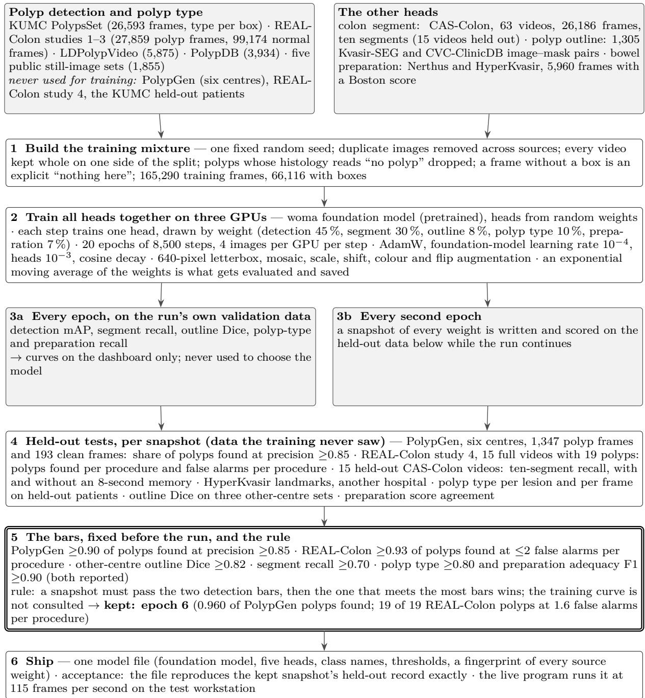  
Figure S1: How the colon model was developed: the data and what was kept out of training, the training settings, what is measured while the run trains, what is measured on held-out data for every snapshot, the bars, and the rule that chose the shipped weights. Sources: KUMC PolypsSet [37], REAL-Colon [15], LDPolypVideo [49], PolypDB [50], the five still-image sets [11, 22–24, 43], PolypGen [14], CAS-Colon [36], Nerthus [51], HyperKvasir [9]; optimiser [52], mosaic augmentation [53].

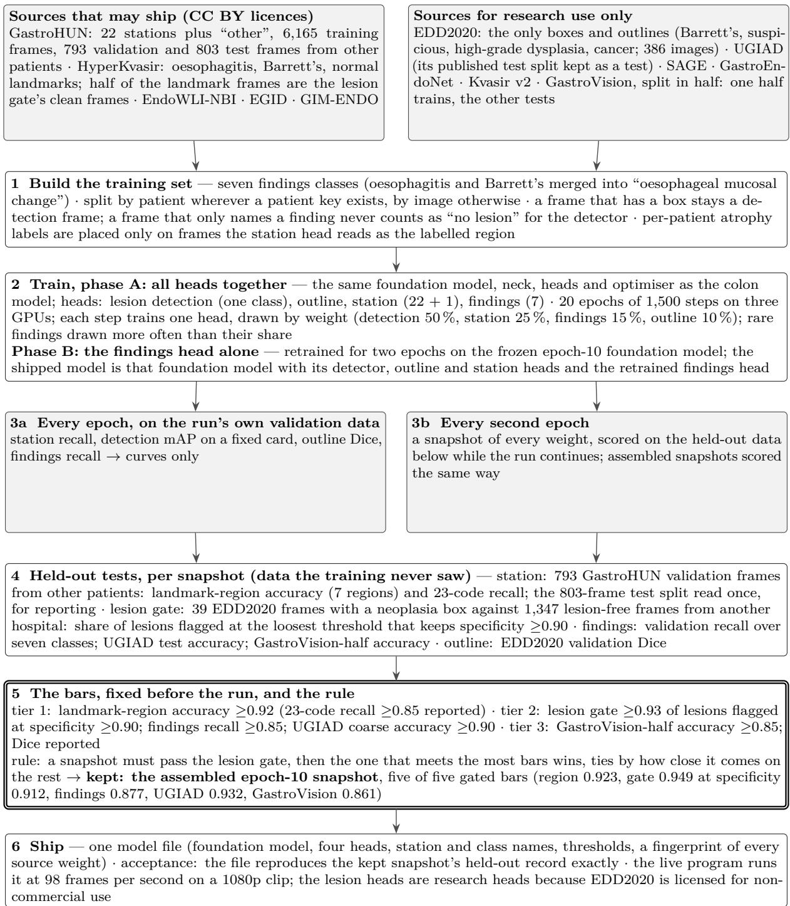  
Figure S2: How the upper-GI model was developed: the two licence classes of its data, the training set’s routing rules, the two-phase training, what is measured while training and on held-out data, the tiered bars, and the rule that chose the shipped weights. Sources: GastroHUN [10], HyperKvasir [9], EndoWLI-NBI [54], EGID [55], GIM-ENDO [56], EDD2020 [38, 57], UGIAD [19], SAGE [45], GastroEndoNet [46], Kvasir v2 [47], GastroVision [39].

Table S4: Lesion and finding labels as shipped, with the coarser space each is also scored in.
<table><tr><td colspan="4">colonoscopy</td></tr><tr><td>index</td><td>label</td><td>meaning</td><td>held-out reporting</td></tr><tr><td>polyp</td><td></td><td>detection, one class</td><td></td></tr><tr><td>0</td><td>adenoma</td><td>adenomatous polyp</td><td>reported</td></tr><tr><td>1</td><td>hyperplastic</td><td>hyperplastic polyp</td><td>reported</td></tr><tr><td>2</td><td>serrated</td><td>sessile serrated lesion</td><td>trained, not in the held-out split</td></tr><tr><td>3</td><td>other</td><td>any other histology</td><td>trained, not in the held-out split</td></tr><tr><td colspan="4">gastroscopy</td></tr><tr><td>index</td><td>label</td><td>meaning</td><td>UGIAD coarse-five</td></tr><tr><td></td><td>lesion</td><td>detection, one class</td><td></td></tr><tr><td>0</td><td>normal</td><td>no finding</td><td>normal</td></tr><tr><td>1</td><td>eso_mucosal</td><td>oesophagitis or Barrett&#x27;s</td><td>oesophageal mucosal change</td></tr><tr><td>2</td><td>neoplasia</td><td>suspicious, high-grade dysplasia, cancer</td><td>gastric lesion</td></tr><tr><td>3</td><td>gastric_polyp</td><td>gastric polyp</td><td>gastric lesion</td></tr><tr><td>4</td><td>gastric_inflammatory</td><td>ulcer, inflammation, blood</td><td>gastric lesion</td></tr><tr><td>5</td><td>gastric_metaplasia</td><td>intestinal metaplasia or atrophy</td><td>metaplasia</td></tr><tr><td>6</td><td>varices</td><td>oesophageal or gastric varices</td><td>varices</td></tr><tr><td colspan="4">Polyp type is a partial-label task: a frame whose polyp has no histology appears in no class list and contributes detection loss alone, so the head is never taught a class the record does not support. Its reported figure is macro recall over adenoma and hyperplastic, because the held-out patient split carries no serrated or other frame at all; both classes stay in the output space, and the model does predict them on other sets. Training keeps oesophagitis and Barrett&#x27;s apart as separate classes</td></tr></table>

Table S5: Boston Bowel Preparation Scale, scored per colonic segment.
<table><tr><td></td><td></td><td>score label segment as the published scale defines it</td></tr><tr><td>0</td><td></td><td>bbps0 Unprepared segment, mucosa not seen because of solid stool that cannot be cleared.</td></tr><tr><td>1</td><td></td><td>bbps1 Part of the mucosa seen, other parts not, because of staining, residual stool or opaque liquid.</td></tr><tr><td>2</td><td></td><td>bbps2 Minor residual staining, small stool fragments or opaque liquid, mucosa seen well.</td></tr><tr><td>3</td><td>bbps3</td><td>Entire mucosa seen well, no residual staining, stool fragments or opaque liquid.</td></tr></table>

Adequacy, the figure reported against a pass mark, treats 2 and 3 as adequate and 0 and 1 as inadequate. Training labels are partial where the source is: Nerthus frames carry an exact score, HyperKvasir frames carry a grouped one — either {0,1} or {2,3} — and the grouped ones train through a partial-label loss that asks only for the group to be right, rather than guessing which of the two the annotator meant.