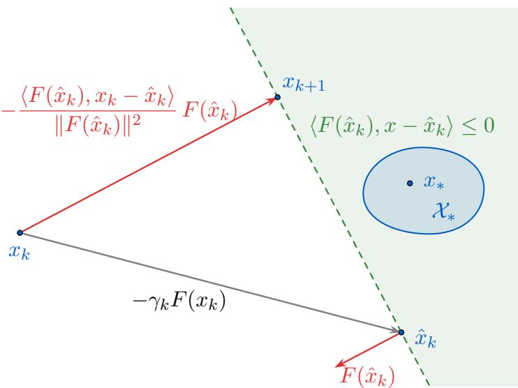
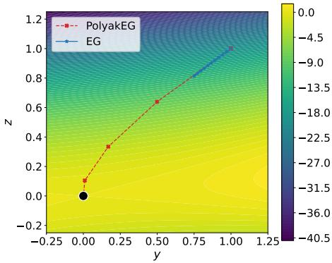
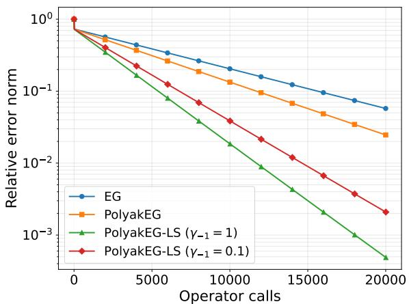
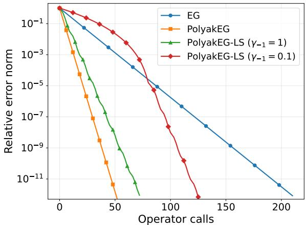
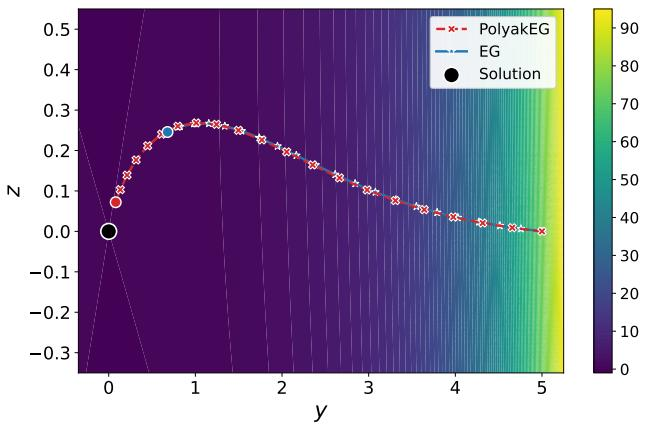
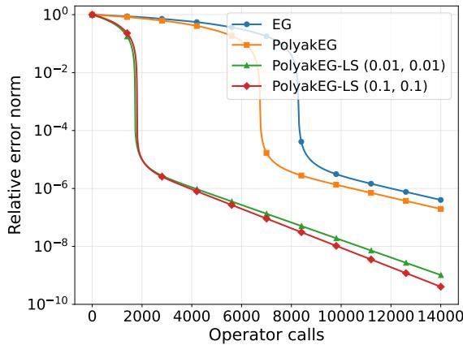
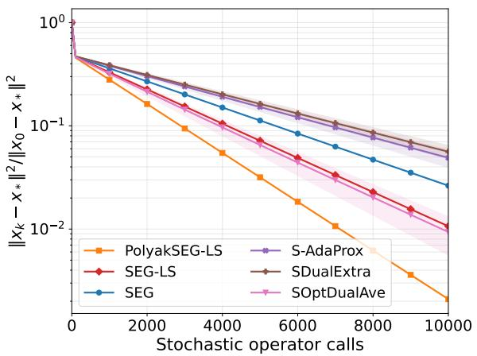
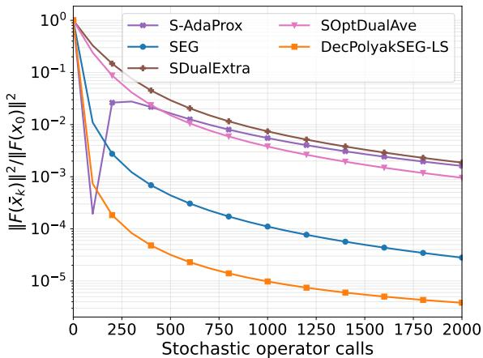

# Polyak-Type Extragradient Methods for Monotone Root-Finding Problems

TaeHo Yoon Sayantan Choudhury Ezra Greenberg Nicolas Loizou

Department of Applied Mathematics & Statistics Mathematical Institute for Data Science (MINDS) Johns Hopkins University

## Abstract

We study Polyak-type step-size selection for extragradient methods for solving deterministic and stochastic monotone root-finding problems. We show that the known projectiontype correction for deterministic extragradient arises from minimizing an upper bound on the distance to a solution, paralleling the classical Polyak step-size construction. Using this viewpoint, we provide a unified deterministic analysis of the Polyak-type Extragradient Method (PolyakEG), based on a local critical condition controlling the variation of operator F along the extrapolation direction. This analysis does not require global Lipschitz continuity, and covers sublinear convergence under broader conditions such as H¨older continuity or $( L _ { 0 } , L _ { 1 } ) -$ Lipschitzness and linear convergence under additional strong monotonicity, all through a single framework. We then study the stochastic extensions of this approach. We first prove convergence of a direct stochastic variant, PolyakSEG, when all stochastic component operators share a common solution. We also show that, without this condition, PolyakSEG with nonvanishing step-sizes may fail to converge to a zero of the mean operator. To address this limitation, we propose DecPolyakSEG, which combines decreasing step-sizes with Polyak-type updates, and establish a sublinear residual convergence result without requiring a common solution across the component operators. These results parallel recent developments in stochastic Polyak step-sizes from the convex minimization literature and establish an analogous research avenue in the broader root-finding regime.

Keywords: Extragradient methods; Polyak step-sizes, monotone root finding, adaptive stepsizes, stochastic approximation, line-search, (L<sub>0</sub>, L<sub>1</sub>)-Lipschitz continuity

Mathematics Subject Classification 65K15, 47H05, 90C33, 62L20

## Contents

1 Introduction 3   
1.1 Main Contributions . 6   
2 Polyak-Type Update for Extragradient: Derivation and Geometry 8   
2.1 Derivation of the Polyak Update Step-size 8   
2.2 Geometric Interpretation of Polyak Step-size for Extragradient 9   
Deterministic Setting 10   
3.1 Critical Condition for $\gamma _ { k }$ 10   
3.1.1 PolyakEG-LS: Parameter-free variant with backtracking line-search 10   
3.1.2 Suficient choices of $\gamma _ { k }$ for the critical condition 11   
3.2 Convergence of PolyakEG Under Critical Condition 12   
3.2.1 Unified convergence theorem 12   
3.2.2 Convergence results implied by the unified theorem . 15   
4 Stochastic Setting 17   
4.1 PolyakSEG: Convergence for Interpolated Problems 20   
4.2 DecPolyakSEG: Residual Convergence without Interpolation 23   
4.2.1 Residual convergence for monotone problems 23   
4.2.2 Step-size choices and line-search 27   
5 Numerical Experiments 30   
5.1 Deterministic Setting . 30   
5.2 Stochastic Setting 32   
6 Conclusion 34

## 1 Introduction

Let $F : \mathbb { R } ^ { d }  \mathbb { R } ^ { d }$ be a single-valued operator. In this work, we consider the root-finding problem:

$$
\mathrm { f i n d ~ } x _ { * } \in \mathbb { R } ^ { d } \quad \mathrm { s u c h ~ t h a t } \quad F ( x _ { * } ) = 0 .\tag{1}
$$

We assume throughout that the solution set $\mathcal { X } _ { \ast } : = \{ x \in \mathbb { R } ^ { d } : F ( x ) = 0 \}$ is nonempty. Problem (1), also known as a system of nonlinear equations when $F$ is nonlinear, encompasses several important classes of optimization and equilibrium problems, as it encodes the first-order optimality conditions for smooth convex minimization, saddle-point conditions for convex-concave min-max problems, and equilibrium conditions for smooth multiplayer games.

The breadth of the root-finding problem has motivated the development of an extensive algorithmic literature. Classical approaches include the proximal point method for maximal monotone operators [63], the extragradient method [39], Popov’s method [61], forward-backwardforward splitting [77], and the non-Euclidean prox and dual-extrapolation methods [51, 53]. More recent developments include the optimism interpretation and reflection methods that use one new operator evaluation per iteration [62, 32, 26, 12], accelerated methods based on adapting the optimized Halpern iteration [30, 65, 41, 37, 13] for proximal/fixed-point settings to the explicit/root-finding settings [15, 85, 40, 74, 72] or identifying distinct acceleration mechanisms [66, 87, 4, 88, 82], and their stochastic or randomized-coordinate extensions for large-scale problems [5, 73, 6, 10, 75, 83]. In this work, we are also interested in the natural stochastic setting where the objective operator $F$ is expressed as a finite sum $\begin{array} { r } { F ( x ) = \frac { 1 } { n } \sum _ { i = 1 } ^ { n } F _ { i } ( x ) } \end{array}$ and one can only access the evaluations of sample operators $F _ { i } \ [ 4 2 , 4 3 , 2 3 , 1 2 ]$

Our analysis focuses on monotone operators, the standard setting for extragradient methods. We also consider strong monotonicity, under which sharper convergence guarantees can be obtained. We recall these notions below.

Definition 1.1. An operator F is called monotone, if for all $x , y \in \mathbb { R } ^ { d }$ ,

$$
\langle F ( x ) - F ( y ) , x - y \rangle \geq 0 .\tag{2}
$$

For $\mu > 0$ , we say that F is µ-strongly monotone if, for all $x , y \in \mathbb { R } ^ { d }$ ,

$$
\langle F ( x ) - F ( y ) , x - y \rangle \geq \mu \Vert x - y \Vert ^ { 2 } .\tag{3}
$$

In parts of our stochastic analysis, we impose these properties samplewise; that is, each $F _ { i }$ is monotone or µ<sub>i</sub>-strongly monotone. These operator conditions arise naturally in the optimization and equilibrium models captured by the root-finding formulation, as we now illustrate.

First, consider unconstrained smooth convex minimization. Indeed, if $f \colon  { \mathbb { R } ^ { d } } \to  { \mathbb { R } }$ is continuously diferentiable and $\left( \mu { \mathrm { - s t r o n g l y } } \right)$ convex, then $\nabla f$ is a $\left( \mu { \mathrm { - s t r o n g l y } } \right)$ operator and $x _ { * }$ is a minimizer if and only if $\nabla f ( x _ { * } ) = 0$

Another important special case is the convex-concave min-max problem

$$
\operatorname* { m i n i m i z e } _ { \boldsymbol { x } ^ { 1 } \in \mathbb { R } ^ { d _ { 1 } } } \operatorname* { m a x i m i z e } _ { \boldsymbol { x } ^ { 2 } \in \mathbb { R } ^ { d _ { 2 } } } \quad g ( \boldsymbol { x } ^ { 1 } , \boldsymbol { x } ^ { 2 } ) ,\tag{4}
$$

where $g \colon  { \mathbb { R } } ^ { d _ { 1 } } \times  { \mathbb { R } } ^ { d _ { 2 } } \to  { \mathbb { R } }$ is continuously diferentiable. Writing $x = ( x ^ { 1 } , x ^ { 2 } ) \in \mathbb R ^ { d }$ with $d =$ $d _ { 1 } + d _ { 2 }$ , define the saddle operator

$$
\begin{array} { r } { F ( \boldsymbol { x } ) : = \left( \begin{array} { l } { \nabla _ { \boldsymbol { x } ^ { 1 } } g ( \boldsymbol { x } ^ { 1 } , \boldsymbol { x } ^ { 2 } ) } \\ { - \nabla _ { \boldsymbol { x } ^ { 2 } } g ( \boldsymbol { x } ^ { 1 } , \boldsymbol { x } ^ { 2 } ) } \end{array} \right) . } \end{array}\tag{5}
$$

If $g$ is convex in $x ^ { 1 }$ and concave in $x ^ { 2 }$ , then $F$ is monotone; if g is additionally µ-strongly convex in $x ^ { 1 }$ and $\mu -$ -strongly concave in $x ^ { 2 }$ , then $F$ is µ-strongly monotone. A point $x _ { * } = ( x _ { * } ^ { 1 } , x _ { * } ^ { 2 } )$ satisfies

$F ( x _ { * } ) = 0$ if and only if it is a saddle point of g: $g ( x _ { * } ^ { 1 } , x ^ { 2 } ) \leq g ( x _ { * } ^ { 1 } , x _ { * } ^ { 2 } ) \leq g ( x ^ { 1 } , x _ { * } ^ { 2 } )$ for every $x ^ { 1 } \in$ $\mathbb { R } ^ { d _ { 1 } }$ and $x ^ { 2 } \in \mathbb { R } ^ { d _ { 2 } }$ . This operator formulation underlies much of the literature on convex-concave min-max optimization. See, for example, [51, 53, 35, 23]. Such problems have a long history in mathematical programming and game theory and have become increasingly prominent in machine learning through applications including adversarial training [45], generative adversarial networks [22, 20], and distributionally robust optimization [50].

The same operator viewpoint extends to smooth multiplayer games. Suppose each player $j \in$ $\{ 1 , \ldots , m \}$ controls $x ^ { j }$ to minimize a loss $\ell ^ { j } ( x ^ { j } , x ^ { - j } )$ , where $x ^ { - j }$ denotes the decision variables of the other players. For $x = ( x ^ { 1 } , \ldots , x ^ { m } )$ , the corresponding pseudo-gradient operator is

$$
\begin{array} { r } { F ( \boldsymbol { x } ) : = \left( \begin{array} { c } { \nabla _ { \boldsymbol { x } ^ { 1 } } \ell ^ { 1 } ( \boldsymbol { x } ) } \\ { \vdots } \\ { \nabla _ { \boldsymbol { x } ^ { m } } \ell ^ { m } ( \boldsymbol { x } ) } \end{array} \right) . } \end{array}\tag{6}
$$

In an unconstrained game in which each player’s loss function $\ell ^ { j }$ is convex in their own decision variable $x ^ { j }$ , the zeros of (6) characterize Nash equilibria. Games with a monotone pseudogradient, commonly referred to as monotone games, therefore fall within the problem formulation (1) [64, 19]. The min-max problem (4) is the two-player, zero-sum special case obtained by taking $\ell ^ { 1 } = g$ and $\ell ^ { 2 } = - g$ Multiplayer game formulations are particularly relevant in multi-agent learning, distributed decision making, and reinforcement learning [91, 67].

Extragradient method. Although convex minimization, convex-concave min-max optimization, and monotone games all admit root-finding reformulations, their optimization dynamics are diferent. Unlike in convex minimization, where $F = \nabla f$ is the gradient of a scalar potential, saddle operators or pseudo-gradients in games need not be gradients, and may generally contain rotational components. Consequently, the direct forward iteration $x _ { k + 1 } = x _ { k } - \eta _ { k } F ( x _ { k } )$ may fail to converge under monotonicity and Lipschitz continuity of $F$ alone. A simple rotation operator $F ( u , v ) = ( - v , u )$ on 2D is a canonical example, where the forward iteration moves away from the unique root for every positive constant step-size [20, 3].

The Extragradient method (EG) is a foundational adjustment mechanism designed for monotone inclusion problems by Korpelevich [39]:

$$
\begin{array} { r l } { \mathrm { E x t r a p o l a t i o n ~ s t e p } { : } } & { \hat { x } _ { k } = x _ { k } - \gamma _ { k } F ( x _ { k } ) } \\ { \mathrm { U p d a t e ~ s t e p } { : } } & { x _ { k + 1 } = x _ { k } - \alpha _ { k } F ( \hat { x } _ { k } ) . } \end{array}\tag{EG}
$$

Here $\gamma _ { k } , \alpha _ { k } > 0$ are respectively called the extrapolation and update step-sizes. By using the operator evaluated at the extrapolated point $\hat { x } _ { k }$ as a “descent direction”, EG overcomes the outward divergence due to rotation. This idea has had a significant impact on the min-max optimization and monotone operator literature. Popov, optimistic-gradient, and forward-reflected methods [61, 62, 32, 26, 12] were developed and analyzed as a single-call variants of EG reusing previous operator evaluations rather than evaluating a fresh new operator value at an extrapolated point. Mirror-Prox and dual extrapolation algorithms extend EG-type update rules to non-Euclidean geometries [51, 53]. Interestingly, EG can be interpreted [48, 49] as an approximation of the proximal point method [63]. Recent accelerated algorithms combined anchoring with EG or its single-call variants [85, 40, 74, 7], and analogous interpretation of those algorithms as approximate Halpern iteration has also been established [86]. Stochastic Extragradient (SEG), which replaces $F ( x _ { k } )$ and $F ( \hat { x } _ { k } )$ in the update rule of EG with the corresponding stochastic sample operator evaluations, has also been extensively stuided [35, 89, 36, 20, 9, 46, 33, 47, 84].

Operator regularity and classical guarantees. The convergence analysis and step-size selections for EG and SEG are commonly stated under appropriate regularity conditions on $F$ or the sample operators $F _ { i }$ . A standard condition is the following (global) Lipschitz continuity.

Definition 1.2. An operator F is called L-Lipschitz if $\| F ( x ) - F ( y ) \| \leq L \| x - y \|$ .

This is a typical assumption in the analysis of EG and its variants [39, 51, 48, 20, 25]. For monotone Lipschitz root-finding problems, EG attains an $\mathcal { O } ( 1 / K )$ ergodic gap rate, which is optimal in the general first-order oracle model up to constants [51, 53]. More recently, lastiterate convergence guarantees have also been established for extragradient under monotonicity and Lipschitz continuity [24, 8]. Under strong monotonicity, suitable extragradient variants converge linearly with optimal condition-number dependence [76, 48, 3, 24]. These guarantees, together with its explicit first-order structure and direct stochastic extension, make EG a natural algorithmic foundation for the problems considered here.

Global Lipschitz continuity can nevertheless be restrictive—the local variation of the operator may not be uniformly bounded. To cover a broader range of problems, we also consider the following generalized regularity classes.

Definition 1.3 (H¨older continuity). We say that F is $( L , \nu )$ -H¨older (continuous) for some $0 < \nu \leq 1$ if, for all $x , y .$

$$
\| F ( x ) - F ( y ) \| \leq L \| x - y \| ^ { \nu } .
$$

H¨older continuity is a natural generalization of Lipschitz continuity (Definition 1.2), which is recovered by setting $\nu = 1$ in Definition 1.3. H¨older-continuous monotone variational inequalities have been studied using Mirror-Prox and EG methods [14], including universal variants that do not require prior knowledge of the H¨older exponent or constant [70, 38]. Recent work has also developed splitting methods for H¨older-continuous monotone inclusions [92].

Definition 1.4 $( ( L _ { 0 } , L _ { 1 } )$ -Lipschitzness). We say that F is $( L _ { 0 } , L _ { 1 } )$ -Lipschitz if, for all $x , y ,$

$$
\| F ( x ) - F ( y ) \| \leq \left( L _ { 0 } + L _ { 1 } \operatorname* { m a x } _ { \theta \in [ 0 , 1 ] } \| F ( \theta x + ( 1 - \theta ) y ) \| \right) \| x - y \| .
$$

The $( L _ { 0 } , L _ { 1 } )$ )-Lipschitz condition recovers global L-Lipschitz continuity by taking $L _ { 0 } = L$ and $L _ { 1 } = 0$ , while also allowing the local variation of the operator to grow with the operator’s magnitude. Such problem classes have recently been proposed in the context of minimization [90] and quickly gained popularity; then they have been extended to variational inequalities, and root-finding problems [78, 11]. In fact, Definition 1.4 implies the following bound [11, Proposition 3.1] for any x, y, which is more useful for convergence analyses:

$$
\begin{array} { r } { \| F ( { \boldsymbol x } ) - F ( { \boldsymbol y } ) \| \leq \left( L _ { 0 } + L _ { 1 } \left\| F ( { \boldsymbol x } ) \right\| \right) \exp \left( L _ { 1 } \left\| { \boldsymbol x } - { \boldsymbol y } \right\| \right) \left\| { \boldsymbol x } - { \boldsymbol y } \right\| . } \end{array}\tag{7}
$$

Note that monotonicity and regularity play diferent roles in our analysis. Monotonicity is the principal structural condition that enables the derivation of descent property, whereas conditions like Lipschitzness, H¨older continuity or $( L _ { 0 } , L _ { 1 } )$ -Lipschitzness quantitatively determine the range of stable step-sizes.

Adaptive step-sizes and Polyak’s principle. Typical analyses of EG and SEG select $\gamma _ { k }$ and $\alpha _ { k }$ using the global Lipschitz constant of F [51, 35, 20, 47, 16, 24, 23]. Similarly, known stepsize rules for EG for H¨older-continuous or $( L _ { 0 } , L _ { 1 } )$ -Lipschitz operators depend on the problem constants [14, 78, 11]. However, these parameters may be unknown, dificult to estimate, or overly conservative compared to the local geometry along the algorithm trajectory in practice. This motivated the adaptive extragradient schemes, including the AdaGrad-type step-sizes [1, 2]. More classically, projection-based corrections to the update step of EG were considered in [69, 71, 34, 68] and revisited in [59]. The goal of this work is aligned with these prior work: to design eficient variants of EG and SEG that adapts to the operator geometry without the knowledge of problem-defining parameters.

Table 1: Correspondence between Polyak-type step-sizes for gradient descent in minimization and the extragradient algorithm in root finding.
<table><tr><td rowspan=1 colspan=1>Setup</td><td rowspan=1 colspan=1> $\overline { { \mathrm { M i n i m i z a t i o n : ~ } \operatorname* { m i n } _ { x } ~ f ( x ) } }$  $\mathrm { G r a d i e n t ~ d e s c e n t }$ </td><td rowspan=1 colspan=1> $\overline { { { \mathrm { R o o t - f i n d i n g : ~ } } \mathrm { f i n d } _ { x } F ( x ) = 0 } }$ Extragradient</td></tr><tr><td rowspan=1 colspan=1>Deterministic</td><td rowspan=1 colspan=1> $\begin{array} { r } { \eta _ { k } = \frac { f ( x _ { k } ) - \operatorname* { m i n } _ { x } f ( x ) } { \left\| \nabla f ( x _ { k } ) \right\| ^ { 2 } } } \end{array}$  $\mathrm { P o l y a k \ s i e p { - } s i z e \ [ 6 0 ] }$ </td><td rowspan=1 colspan=1> $\begin{array} { r } { \overline { { \alpha _ { k } = \frac { \langle F ( \hat { x } _ { k } ) , x _ { k } - \hat { x } _ { k } \rangle } { \| F ( \hat { x } _ { k } ) \| ^ { 2 } } } } } \end{array}$  $\mathsf { P o l y a k E G : T h e o r e m 3 . 4 }$ </td></tr><tr><td rowspan=1 colspan=1>StochasticInterpolated</td><td rowspan=1 colspan=1> $\begin{array} { r }  \overline { { \eta _ { k } = \frac { f _ { S _ { k } } ( x _ { k } ) - \operatorname* { m i n } _ { x } f _ { S _ { k } } ( x ) } { \left\| \nabla f _ { S _ { k } } ( x _ { k } ) \right\| ^ { 2 } } } } \end{array}$  $\mathrm { S t o c h a s t i c ~ P o l y a k ~ s t e p  – s i z e ~ ( S P S ) ~ [ 4 4 ] }$ </td><td rowspan=1 colspan=1> $\begin{array} { r } { \alpha _ { k } = \frac { \left. F S _ { k } \left( \hat { x } _ { k } \right) , x _ { k } - \hat { x } _ { k } \right. } { | | \textbf { r } \quad \mathrm { ~ , ~ } } } \end{array}$ ||Fsk (æk)|| $\mathsf { P o l y a k S E G : T h e o r e m ~ 4 . 3 }$ </td></tr><tr><td rowspan=1 colspan=1>Stochastic</td><td rowspan=1 colspan=1> $\begin{array} { r } { \eta _ { k } = \frac { 1 } { c _ { k + 1 } } \operatorname* { m i n } \left\{ \frac { f _ { S _ { k } } ( x _ { k } ) - \operatorname* { m i n } _ { x } f _ { S _ { k } } ( x ) } { c \left\| \nabla f _ { S _ { k } } ( x _ { k } ) \right\| ^ { 2 } } , c _ { k } \eta _ { k - 1 } \right\} } \end{array}$  $\mathrm { D e c r e a s i n g ~ S P S ~ ( D e c S P S ) ~ [ 5 8 ] }$ </td><td rowspan=1 colspan=1> $\begin{array} { r } { \alpha _ { k } = \operatorname* { m i n } \left\{ \frac { \left. F _ { S _ { k } } ( \hat { x } _ { k } ) , x _ { k } - \hat { x } _ { k } \right. } { \left\| F _ { S _ { k } } ( \hat { x } _ { k } ) \right\| ^ { 2 } } , \alpha _ { k - 1 } \right\} } \end{array}$  $\mathsf { D e c P o l y a k S E G : T h e o r e m ~ 4 . 6 }$ </td></tr></table>

To this end, we draw inspiration from the observation that the projection-type update for EG studied in [71, 34, 68, 59] admits the interpretation as Polyak step-size, which was originally developed for gradient and subgradient methods in convex minimization. More precisely, Polyak step-size in minimization is derived by minimizing a one-step upper bound on the distance to an optimum, and we show that the update step-size $\alpha _ { k }$ in EG can be selected with the same principle. This eventually agrees with $\alpha _ { k }$ chosen via the projection interpretaion in prior work. However, we can leverage the Polyak viewpoint to further design and analyze Polyak-type stochastic EG methods, following the recent development of stochastic Polyak step-sizes from stochastic minimization literature [44, 58, 17, 28, 27, 29, 54, 55, 56, 57]. Table 1 summarizes the analogy between Polyak-type step-sizes in minimization and root-finding problems, and their corresponding stochastic and decreasing stochastic counterparts.

Now we summarize our main technical contributions as follows.

## 1.1 Main Contributions

• PolyakEG: Polyak-inspired Extragradient Update Step-size. In Section 2, we derive the update step-size $\begin{array} { r } { \alpha _ { k } = \frac { \{ F ( \hat { x } _ { k } ) , x _ { k } - \hat { x } _ { k } \} } { \| F ( \hat { x } _ { k } ) \| ^ { 2 } } } \end{array}$ via Polyak-type derivation, by minimizing an upper bound on $\| x _ { k + 1 } - x _ { * } \| ^ { 2 }$ , in direct analogy with the classical Polyak step-size for gradient methods. We then show that the projection-based correction for EG introduced by [71, 34, 68, 59] yields the same formula. This interpretation serves as a basis for the design and analysis principle for the stochastic extensions developed later in the paper.

• Unified deterministic analysis. We provide a unified convergence result (Theorem 3.4) for PolyakEG (Algorithm 1) based on a critical condition (Definition 3.1) controlling the variation of the operator along the extrapolation step. The analysis does not require global Lipschitz continuity and simultaneously captures distinct regularity conditions, and provides sublinear residual convergence under monotonicity and linear convergence under strong monotonicity.

– L-Lipschitz, $( L , \nu ) – \mathbf { H } \mathbf { \ " } \mathbf { d } \mathbf { e } \mathbf { r }$ and $( L _ { 0 } , L _ { 1 } )$ -Lipschitz operators. We show that the critical condition accommodates constant extrapolation steps for globally Lipschitz operators and adaptive extrapolation steps for H¨older-continuous or $( L _ { 0 } , L _ { 1 } )$ -Lipschitz operators.

Table 2: Comparison with representative prior work on deterministic extragradient-type algorithms. The “H¨older rates” and $^ { 6 6 } ( L _ { 0 } , L _ { 1 } )$ rates” columns indicate whether an explicit nonasymptotic analyses under the respective regularity conditions (beyond global Lipschitz continuity) were provided.
<table><tr><td>Representative works</td><td>Hölder rates</td><td> $( L _ { 0 } , L _ { 1 } )$  rates</td><td>Polyak-type correction</td></tr><tr><td>Projection-based step-sizes for EG Sun [71]; Iusem and Svaiter [34]; Solodov and Svaiter [68]a; Pethick et al. [59]</td><td>X</td><td>X</td><td>L</td></tr><tr><td>Hölder-continuous EG and Mirror-Prox Dang and Lan [14]; Stonyakin et al. [70]; Klimza et al. [38]</td><td>L</td><td>X</td><td>x</td></tr><tr><td>EG for  $( L _ { 0 } , L _ { 1 } )$  -Lipschitz problems Vankov et al. [78]b; Choudhury and Loizou [11]</td><td>X</td><td>L</td><td>X</td></tr><tr><td>PolyakEG / PolyakEG-LS (this work)</td><td></td><td></td><td></td></tr></table>

<sup>a</sup> [71, 34, 68] prove convergence under (generalized) monotonicity and continuity, but without explicit rates for H¨older-continuous, $( L _ { 0 } , L _ { 1 } )$ -Lipschitz or stochastic problems.  
<sup>b</sup> Vankov et al. [78] uses a condition called p-quasi-sharpness in their convergence analysis.

Consequently, we newly provide explicit quantitative guarantees for the last two problem classes (see Table 2).

Line-search implementations. We develop a unified line-search variant called PolyakEG-LS (Algorithm 2) encompassing Lipschitz, H¨older-continuous and $( L _ { 0 } , L _ { 1 } )$ -Lipschitz operators. This algorithm directly enforces the critical condition via backtracking, and does not require prior knowledge of $L , \nu , L _ { 0 }$ or $L _ { 1 }$ . In all settings, we bound the total complexity of backtracking trials, which shows that PolyakEG-LS retains the complexity comparable to choosing $\gamma _ { k }$ explicitly based on the problem-defining constants, while being parameter-free (Proposition 3.5).

• Stochastic extensions. We extend PolyakEG to the stochastic root-finding problems with finite-sum structure $\begin{array} { r } { F ( x ) = \frac { 1 } { n } \sum _ { i = 1 } ^ { n } F _ { i } ( x ) } \end{array}$ , where we draw a mini-batch $S _ { k } \subseteq [ n ]$ with replacement at each iteration $k ,$ and use the mini-batch operator $\begin{array} { r } { F _ { S _ { k } } = \frac { 1 } { | S _ { k } | } \sum _ { i \in S _ { k } } F _ { i } } \end{array}$ for making the updates. In particular, we propose and analyze two algorithms: PolyakSEG (Algorithm 3) and DecPolyakSEG (Algorithm 4).

– When all sample operators are monotone and share a common solution, we show that PolyakSEG achieves a $\mathcal { O } ( 1 / K )$ sublinear convergence on squared residual norm. When the expected strong-monotonicity modulus is positive, we additionally establish linear convergence (Theorem 4.3). We further show by an example that, with nonvanishing step-sizes, the interpolation (existence of a common solution) assumption cannot in general be removed (Proposition 4.4).

– For the general stochastic regime, we introduce DecPolyakSEG, which combines decreasing extrapolation and update step-sizes with Polyak-type update. When F is monotone and each $F _ { i }$ is Lipschitz, we establish an $\mathcal { O } ( K ^ { - 1 / 2 } )$ sublinear convergence on the expected squared residual under a trajectory localization condition (Corollary 4.7). We show that this rate is attained both by a predetermined decreasing-step schedule and by a line-search variation. We show that the localization condition can be guaranteed with additional problem structures such as strong monotonicity of the sample operators (Proposition 4.8).

• Numerical experiments. In Section 5, we evaluate the proposed Polyak-type algorithms on several representative root-finding and min-max problems. Our experiments examine the benefit of Polyak-type correction in EG, uniformly competitive performance over globally Lipschitz, H¨older-continuous and $( L _ { 0 } , L _ { 1 } )$ -Lipschitz settings, and the promising empirical performance of on stochastic problems.

## 2 Polyak-Type Update for Extragradient: Derivation and Geometry

In this section, we derive the PolyakEG update step-size, following the viewpoint of Polyak [60]. This is done by optimizing the progression toward a solution within the standard one-step upper bound in EG. Then we clarify its connection to the projection interpretation onto separating halfspace introduced in prior work [71, 34, 68].

## 2.1 Derivation of the Polyak Update Step-size

We first revisit how the classical Polyak step-size is derived for Gradient Descent, and then take the analogous approach to provide for EG.

Polyak step-size for Gradient Descent. Gradient Descent (GD) is arguably the most widely recognized method for minimization problems: $\operatorname* { m i n } _ { x \in \mathbb { R } ^ { d } } f ( x )$ . GD updates iterates by: $x _ { k + 1 } = x _ { k } - \eta _ { k } \nabla f ( x _ { k } )$ , where $\eta _ { k }$ is the step-size. Classical convergence analysis for convex, $L _ { - }$ smooth function $f ( x )$ (whose gradient $\nabla f$ is L-Lipschitz) assumes a constant step-size $\eta _ { k } \leq 1 / L$

On the other hand, Polyak [60] proposed an adaptive strategy of choosing $\eta _ { k }$ that minimizes the upper bound of $\| x _ { k + 1 } - x _ { * } \| ^ { 2 }$ for $x _ { * } \in$ argmin $_ { x \in \mathbb { R } ^ { d } } f ( x )$ :

$$
\| x _ { k + 1 } - x _ { * } \| ^ { 2 } \leq \| x _ { k } - x _ { * } \| ^ { 2 } - 2 \eta _ { k } \left( f ( x _ { k } ) - f ( x _ { * } ) \right) + \eta _ { k } ^ { 2 } \| \nabla f ( x _ { k } ) \| ^ { 2 }
$$

which follows from the update rule of GD and convexity of $f .$ Unless $x _ { k }$ is already a minimizer of $f$ so that $\nabla f ( x _ { k } ) = 0$ , the right-hand side is minimized with

$$
\eta _ { k } = \frac { f ( x _ { k } ) - f ( x _ { * } ) } { \| \nabla f ( x _ { k } ) \| ^ { 2 } } ,\tag{8}
$$

which is called the Polyak step-size for GD. The step-size (8) is computable only when the optimal function value $f ( x _ { * } )$ is accessible. While this seems to be a strong requirement, there are several classes of important problems where $f ( x _ { * } ) = 0$ is known even if $x _ { * }$ is unknown, such as consistent linear systems, convex feasibility problems or overparametrized learning problems [60, 31, 44].

Polyak step-size for Extragradient. We can follow the analogous strategy of optimally selecting the update step-size $\alpha _ { k }$ for EG. Fix $x _ { * } \in \mathcal { X } _ { * }$ , and recall ${ \hat { x } } _ { k } = x _ { k } - \gamma _ { k } F ( x _ { k } )$ . For any $\alpha _ { k } \geq 0$ , the update $x _ { k + 1 } = x _ { k } - \alpha _ { k } F ( { \hat { x } } _ { k } )$ satisfies:

$$
\begin{array} { r l } & { \| x _ { k + 1 } - x _ { * } \| ^ { 2 } = \| x _ { k } - x _ { * } \| ^ { 2 } - 2 \alpha _ { k } \left. F ( \hat { x } _ { k } ) , x _ { k } - \hat { x } _ { k } \right. - 2 \alpha _ { k } \left. F ( \hat { x } _ { k } ) , \hat { x } _ { k } - x _ { * } \right. + \alpha _ { k } ^ { 2 } \left\| F ( \hat { x } _ { k } ) \right\| ^ { 2 } } \\ & { \qquad \leq \left\| x _ { k } - x _ { * } \right\| ^ { 2 } - 2 \alpha _ { k } \left. F ( \hat { x } _ { k } ) , x _ { k } - \hat { x } _ { k } \right. + \alpha _ { k } ^ { 2 } \left\| F ( \hat { x } _ { k } ) \right\| ^ { 2 } } \end{array}
$$

where the second lines uses monotonicity of $F .$ . Now, following similar approach to Polyak [60], we minimize the bound on the right hand side with respect to $\alpha _ { k } \geq 0$ , which is attained with $\begin{array} { r } { \alpha _ { k } = \frac { [ \langle F ( \hat { x } _ { k } ) , x _ { k } - \hat { x } _ { k } \rangle ] + } { \| F ( \hat { x } _ { k } ) \| ^ { 2 } } } \end{array}$ , where $[ t ] _ { + } : = \operatorname* { m a x } \{ t , 0 \}$ . Later in Section in Section 3, we show that with

appropriate choice of $\gamma _ { k }$ , we have $\langle F ( \hat { x } _ { k } ) , x _ { k } - \hat { x } _ { k } \rangle > 0$ unless $\hat { x } _ { k }$ is a solution where $F ( \hat { x } _ { k } ) = 0$ Then we can remove the operation $[ \cdot ] _ { + }$ , and the update step-size simply becomes

$$
\boxed { \alpha _ { k } = \frac { \langle F ( \hat { x } _ { k } ) , x _ { k } - \hat { x } _ { k } \rangle } { \| F ( \hat { x } _ { k } ) \| ^ { 2 } } . }\tag{9}
$$

We highlight that this derivation inherits the spirit of Polyak step-size for GD, but does not require the knowledge of optimal function values or other inaccessible quantities.

We denote EG with update step-size (9) by PolyakEG (Algorithm 1). We highlight once again that this step-size selection is not new: early works including [71, 34, 68] considered a version of ${ \mathrm { i t } } ,$ and some recent works also studied it [21, 59]. However, to our knowledge, the interpretation of (9) as a Polyak-type step-size and the connection between the two literature has not been established before. In our work, we leverage this new insight to extend these ideas to stochastic settings and design new algorithms.

Algorithm 1 PolyakEG   
Require: Initial point $x _ { 0 } \in \mathbb { R } ^ { d }$ and a rule for choosing extrapolation steps $\left\{ \gamma _ { k } \right\} _ { k = 0 } ^ { \infty } .$   
1: for $k = 0 , 1 , . . . , K$ do   
2: ${ \hat { x } } _ { k } = x _ { k } - \gamma _ { k } F ( x _ { k } )$   
3: $\begin{array} { r } { \alpha _ { k } = \frac { \langle F ( \hat { x } _ { k } ) , x _ { k } - \hat { x } _ { k } \rangle } { \| F ( \hat { x } _ { k } ) \| ^ { 2 } } . } \end{array}$   
4: $x _ { k + 1 } = x _ { k } - \alpha _ { k } F ( { \hat { x } } _ { k } )$   
5: end for

  
Figure 1: Geometric interpretation of PolyakEG. The extrapolated point ${ \hat { x } } _ { k } = x _ { k } - \gamma _ { k } F ( x _ { k } )$ defines a halfspace $\mathcal { D } ( \hat { x } _ { k } )$ (colored in green), containing the solution set $\mathcal { X } _ { * }$ (colored in blue). The vector $F ( \hat { x } _ { k } )$ is an outward normal to $\mathcal { D } ( \hat { x } _ { k } )$ . PolyakEG projects the current iterate $x _ { k }$ onto $\mathcal { D } ( \hat { x } _ { k } ) , \mathrm { i . e . , } x _ { k + 1 } = \Pi _ { \mathcal { D } ( \hat { x } _ { k } ) } ( x _ { k } )$

## 2.2 Geometric Interpretation of Polyak Step-size for Extragradient

The preceding derivation characterizes PolyakEG through a one-step distance minimization. Figure 1 provides an alternative geometric illustration of PolyakEG due to Solodov and Svaiter [68]. Given the extrapolation point $\hat { x } _ { k }$ , assuming $F ( \hat { x } _ { k } ) \neq 0$ , consider the

$$
\mathcal { D } \left( \hat { x } _ { k } \right) : = \left\{ x \in \mathbb { R } ^ { d } \mid \langle F ( \hat { x } _ { k } ) , \hat { x } _ { k } - x \rangle \geq 0 \right\} .
$$

This is a halfspace, depicted as the green-shaded region in Figure 1, which contains any solution $x _ { * } \in \mathcal { X } _ { * }$ , by monotonicity of $F$ . Then, clearly, $\begin{array} { r } { x _ { k + 1 } = x _ { k } - \frac { \left. F ( \hat { x } _ { k } ) , \hat { x } _ { k } - \hat { x } _ { k } \right. } { \| F ( \hat { x } _ { k } ) \| ^ { 2 } } F ( \hat { x } _ { k } ) } \end{array}$ of PolyakEG is a projection onto this halfspace, provided that $\langle F ( { \hat { x } } _ { k } ) , x _ { k } - { \hat { x } } _ { k } \rangle \geq 0$ . This aligns with the intuition that $x _ { k + 1 } = x _ { k } - \alpha _ { k } F ( { \hat { x } } _ { k } )$ for $\alpha _ { k }$ that minimizes an upper bound on $\| x _ { k + 1 } - x _ { * } \| ^ { 2 }$ ; near $\hat { x } _ { k }$ , by only using the local observation $F ( \hat { x } _ { k } )$ and the fact that $F$ is monotone, the halfspace $\mathcal { D } \left( \hat { x } _ { k } \right)$ is the best geometric estimate of the region containing $\mathcal { X } _ { * }$ . As EG starts from $x _ { k }$ and updates it in the direction of − $- F ( \hat { x } _ { k } )$ , and selecting the point where the update direction meets the boundary of $\mathcal { D } \left( \hat { x } _ { k } \right)$ is the geometrically tightest choice.

## 3 Deterministic Setting

In this section, we provide an analysis of PolyakEG in the deterministic case. We provide a unified theorem under a critical condition, which captures a general requirement on the extrapolation step-size $\gamma _ { k }$ for which PolyakEG update step-size $\alpha _ { k }$ is efective. As a result, our main convergence theorem provides guarantees for PolyakEG without assuming global Lipschitz continuity of $F ;$ in particular, it covers the broader classes of $( L , \nu )$ -H¨older or $( L _ { 0 } , L _ { 1 } )$ -Lipschitz operators under the same unified framework. Depending on the problem class, $\gamma _ { k }$ can be constant, adaptive, or determined via line-search so that the critical condition is satisfied.

## 3.1 Critical Condition for $\gamma _ { k }$

While PolyakEG (Algorithm 1) specifies the update step-size $\alpha _ { k }$ , it does not specify the extrapolation step-size $\gamma _ { k }$ . In our approach, we propose a critical condition that captures the behavior of several choices for $\gamma _ { k }$

Definition 3.1. We say $\gamma _ { k } > 0$ satisfies the critical condition for some $A \in ( 0 , 1 ]$ if

$$
\| F ( { \hat { x } } _ { k } ) - F ( x _ { k } ) \| \leq A \| F ( x _ { k } ) \|\tag{10}
$$

for ${ \hat { x } } _ { k } = x _ { k } - \gamma _ { k } F ( x _ { k } ) .$

The importance of the critical condition (10) for selecting the extrapolation step-size $\gamma _ { k }$ is that it provides a natural lower bound on the update step-size $\alpha _ { k } ,$ thereby guaranteeing suficient progress per iteration. We defer the proof of Lemma 3.2 to Section 4, where we prove its generalized version, Lemma 4.2.

Lemma 3.2. If the critical condition (10) is satisfied with $A \in ( 0 , 1 ]$ , then we have

$$
\begin{array} { r } { \langle F ( \hat { x } _ { k } ) , F ( x _ { k } ) \rangle \geq \frac { 1 } { 2 } \left( \| F ( \hat { x } _ { k } ) \| ^ { 2 } + ( 1 - A ^ { 2 } ) \| F ( x _ { k } ) \| ^ { 2 } \right) } \end{array}
$$

which implies $\textstyle \alpha _ { k } \geq { \frac { \gamma _ { k } } { 1 + A } }$ .

Note that the critical condition (10) relies solely on the local geometry of $F$ near $x _ { k }$ . For example, under L-Lipschitzness (Definition 1.2), $\begin{array} { r } { 0 < \gamma _ { k } \le \frac { A } { L } } \end{array}$ will satisfy (10), but a larger $\gamma _ { k }$ might be admissible if the local Lipschitz constant of $F$ is smaller near $x _ { k }$ . This illustrates the flexibility of (10) to include diferent choices of $\gamma _ { k }$

## 3.1.1 PolyakEG-LS: Parameter-free variant with backtracking line-search

Proposition 3.3 shows several cases where $\gamma _ { k }$ can be chosen based on the parameters determining the problem class and A. On the other hand, we can simply enforce the critical condition to hold via taking it as an escaping criterion in backtracking line-search, as in Algorithm 2 (PolyakEG-LS). PolyakEG-LS is parameter-free in the sense that it works for any one of L-Lipschitz, $( L , \nu ) \cdot$ H¨older or $( L _ { 0 } , L _ { 1 } ) \ – \mathrm { I }$ ipschitz settings without requiring the knowledge of parameters such as $L , \nu , L _ { 0 }$ or $L _ { 1 }$ . Its design is inspired by [80] for $( L _ { 0 } , L _ { 1 } )$ )-smooth minimization, using the similar idea of increasing the estimate $\lambda _ { k } ^ { j }$ for $L _ { j } \ ( \mathrm { f o r } \ j = 0 , 1 )$ more aggressively when it contributes less to the denominator $\lambda _ { k } ^ { 0 } + \lambda _ { k } ^ { 1 } \parallel F ( \ddot { x } _ { k } ) \parallel$ , while taking turns to adjust each estimate via the ‘toggle’ variable. While we only allow $\lambda _ { k } ^ { j }$ to increase and $\gamma _ { k }$ to consequently decrease for simplicity of exposition, one can easily modify the line-search incorporate decreasing $\lambda _ { k } ^ { j }$ as in [80] or [52].

Algorithm 2 PolyakEG-LS   
Require: Initial point $\boldsymbol { x } _ { 0 } \in \mathbb { R } ^ { d } .$ , initial line-search estimates $\lambda _ { - 1 } ^ { 0 } > 0 , \lambda _ { - 1 } ^ { 1 } \ge 0$ , line-search factor $\beta > 2 ,$   
$0 < A \leq 1$ and $\nu _ { A } > 0$ such that $\nu _ { A } e ^ { \nu _ { A } } \leq A$   
1: toggle = 0   
2: for $k = 0 , 1 , . . . , K$ do   
3: if $F ( x _ { k } ) = 0$ then   
4: return $x _ { k }$   
5: end if   
6: $\lambda _ { k } ^ { 0 } = \lambda _ { k - 1 } ^ { 0 }$ and $\lambda _ { k } ^ { 1 } = \lambda _ { k - 1 } ^ { 1 }$   
7: γ<sub>k</sub> = $\frac { \nu _ { \mathrm { \tiny ~ A } } } { \lambda _ { k } ^ { 0 } + \lambda _ { k } ^ { 1 }   F ( x _ { k } )  \vert } _ { . }$ ν   
8: ${ \hat { x } } _ { k } = x _ { k } ^ { \top } - \gamma _ { k } F ( x _ { k } )$   
9: while $\| F ( { \dot { x } } _ { k } ) - F ( { \hat { x } } _ { k } ) \| > A \| F ( x _ { k } ) \|$ do   
10: if toggle = 0 then   
11: $\begin{array} { r } { \lambda _ { k } ^ { 0 } = \lambda _ { k } ^ { 0 } \left( \beta - \frac { \lambda _ { k } ^ { 0 } } { \lambda _ { k } ^ { 0 } + \lambda _ { k } ^ { 1 } \left. F ( x _ { k } ) \right. } \right) } \end{array}$ and toggle = 1   
12: else if toggle = 1 then   
13: $\begin{array} { r } { \lambda _ { k } ^ { 1 } = \lambda _ { k } ^ { 1 } \left( \beta - \frac { \lambda _ { k } ^ { 1 } \| F ( x _ { k } ) \| } { \lambda _ { k } ^ { 0 } + \lambda _ { k } ^ { 1 } \| F ( x _ { k } ) \| } \right) } \end{array}$ and toggle = 0   
14: end if   
15: $\begin{array} { r } { \gamma _ { k } = \frac { \nu _ { A } } { \lambda _ { k } ^ { 0 } + \lambda _ { k } ^ { 1 } \left. F ( x _ { k } ) \right. } } \end{array}$   
16: ${ \hat { x } } _ { k } = x _ { k } ^ { \top } - \gamma _ { k } F ( x _ { k } )$   
17: end while   
18: $\begin{array} { r } { \alpha _ { k } = \frac { \langle F ( \hat { x } _ { k } ) , x _ { k } - \hat { x } _ { k } \rangle } { \| F ( \hat { x } _ { k } ) \| ^ { 2 } } } \end{array}$   
19: $x _ { k + 1 } = x _ { k } - \alpha _ { k } F ( { \hat { x } } _ { k } )$   
20: end for

When the problem is L-Lipschitz or $( L , \nu ) – \mathrm { H \ " o l d e r }$ , we can simply set $\lambda _ { - 1 } ^ { 1 } = 0$ and all toggle = 1 cases can be safely ignored. In that case, the line-search loop will simply shrink the step-size by the factor of $\beta - 1$ until the critical condition is satisfied.

## 3.1.2 Suficient choices of $\gamma _ { k }$ for the critical condition

Proposition 3.3. Fix $A \in ( 0 , 1 ]$ and let ${ \hat { x } } _ { k } = x _ { k } - \gamma _ { k } F ( x _ { k } )$ Assuming $F ( x _ { k } ) \neq 0$ (10) is   
satisfied in each of the following cases:   
$F$ is L-Lipschitz (satisfies Definition 1.2) with constant $L > 0$ , and $\begin{array} { r } { 0 < \gamma _ { k } \le \frac { A } { L } . } \end{array}$   
• F is $( L , \nu )$ -H¨older (satisfies Definition 1.3), and $\begin{array} { r } { 0 < \gamma _ { k } \leq \left( \frac { A } { L } \right) ^ { \frac { 1 } { \nu } } \left. F ( x _ { k } ) \right. ^ { \frac { 1 - \nu } { \nu } } } \end{array}$   
• F is $( L _ { 0 } , L _ { 1 } )$ -Lipschitz (satisfies Definition 1.4), and $\begin{array} { r } { 0 < \gamma _ { k } \le \frac { \nu _ { A } } { L _ { 0 } + L _ { 1 } \| F ( x _ { k } ) \| } } \end{array}$ where $\nu _ { A } > 0$   
satisfies $\nu _ { A } e ^ { \nu _ { A } } \leq A$   
• F is L-Lipschit $\mathrm { z } , ~ ( L , \nu )$ -H¨older or $( L _ { 0 } , L _ { 1 } )$ -Lipschitz and $\gamma _ { k }$ is returned by the line-search   
rule in Algorithm 2.

Proof. If F is $( L , \nu )$ -H¨older and $\begin{array} { r } { 0 < \gamma _ { k } \leq \left( \frac { A } { L } \right) ^ { \frac { 1 } { \nu } } \| F ( x _ { k } ) \| ^ { \frac { 1 - \nu } { \nu } } } \end{array}$ , then

$$
\| F ( \hat { x } _ { k } ) - F ( x _ { k } ) \| \leq L \| \hat { x } _ { k } - x _ { k } \| ^ { \nu } = L \| \gamma _ { k } F ( x _ { k } ) \| ^ { \nu } \leq L \left\| \left( \frac { A } { L } \right) ^ { \frac { 1 } { \nu } } \| F ( x _ { k } ) \| ^ { \frac { 1 } { \nu } } \right\| ^ { \nu } = A \left\| F ( x _ { k } ) \right\| .
$$

This argument covers the Lipschitz case $\nu = 1$ as well. When F is $( L _ { 0 } , L _ { 1 } )$ -Lipschitz, using (7) with $x = \hat { x } _ { k }$ and $y = x _ { k }$ , we obtain

$$
\begin{array} { r l } & { \| F ( \hat { x } _ { k } ) - F ( x _ { k } ) \| \leq \left( L _ { 0 } + L _ { 1 } \| F ( x _ { k } ) \| \right) \exp \left( L _ { 1 } \| \hat { x } _ { k } - x _ { k } \| \right) \| \hat { x } _ { k } - x _ { k } \| } \\ & { \qquad = \gamma _ { k } \left( L _ { 0 } + L _ { 1 } \| F ( x _ { k } ) \| \right) \exp \left( L _ { 1 } \gamma _ { k } \| F ( x _ { k } ) \| \right) \| F ( x _ { k } ) \| } \\ & { \qquad \leq \nu _ { A } \exp \left( \frac { \nu _ { A } L _ { 1 } \| F ( x _ { k } ) \| } { L _ { 0 } + L _ { 1 } \| F ( x _ { k } ) \| } \right) \| F ( x _ { k } ) \| } \\ & { \qquad \leq \nu _ { A } e ^ { \nu _ { A } } \| F ( x _ { k } ) \| \leq A \| F ( x _ { k } ) \| } \end{array}
$$

where the third line uses $\begin{array} { r } { \gamma _ { k } \le \frac { \nu _ { A } } { L _ { 0 } + L _ { 1 } \| F ( x _ { k } ) \| } } \end{array}$ . Finally, the line-search in Algorithm 2 accepts $\gamma _ { k }$ only if (10) is satisfied, so there is nothing to prove. We later show in the proof of Proposition 3.5 that the line-search always terminates under any one of the regularity assumptions considered.

Having proved Proposition 3.3, let us provide some remarks on its final expressions and how it is connected with the convergence guarantees of Theorem 3.4.

Remark 1 (Role of the critical condition). Proposition 3.3 shows that the critical condition (10) can be enforced by several standard choices $o f \gamma _ { k }$ . This allows Theorem $\ 3 . 4$ below to be stated directly in terms of the critical condition, rather than in terms of a specific step-size rule. In this sense, the theorem is agnostic to the assumptions on the problem class or how $\gamma _ { k }$ is selected, and is capable of stating the convergence results in a general, unified manner.

Remark 2 (Role of the parameter A). The parameter A can be viewed a tolerance parameter; with larger A, a broader range $o f \gamma _ { k }$ is admissible. The most aggressive choice $A = 1$ is allowed when one only needs to bound $\| F ( \hat { x } _ { k } ) \|$ . However, we require $A \in ( 0 , 1 )$ in order to control $F ( x _ { k } )$ using $F ( \hat { x } _ { k } )$ , because

$$
\| F ( { \hat { x } } _ { k } ) \| \geq \| F ( x _ { k } ) \| - \| F ( { \hat { x } } _ { k } ) - F ( x _ { k } ) \| \geq ( 1 - A ) \| F ( x _ { k } ) \| .
$$

Contraction in the strongly monotone case also requires $A \in ( 0 , 1 )$

Remark 3 (Choice of $\nu _ { A }$ in the $( L _ { 0 } , L _ { 1 } )$ case). For a fixed value of A, the largest possible value $o f \nu _ { A }$ satisfying $\nu _ { A } e ^ { \nu _ { A } } \leq A$ is $\nu _ { A } = W ( A )$ , where W denotes the Lambert W function. One may use any smaller positive value of $\textstyle \nu _ { A } , e . g . , \nu _ { A } = { \frac { A } { 1 + A } }$ . There is no universally optimal choice of $A _ { \cdot }$ , and the best value depends on which bound one wants to optimize.

## 3.2 Convergence of PolyakEG Under Critical Condition

In this section, we present a unified analysis of PolyakEG under the critical condition (10) and discuss its consequences in distinct settings.

## 3.2.1 Unified convergence theorem

Theorem 3.4. Let $F$ be monotone. Suppose that we choose $\gamma _ { k } ~ > ~ 0$ so that the critical condition (10) holds for all $k \geq 0$ . Then, PolyakEG satisfies:

• If (10) is satisfied with $A \in ( 0 , 1 ]$ , then the extrapolation points $\hat { x } _ { k }$ satisfy:

$$
\operatorname* { m i n } _ { k = 0 , \dots , K } \gamma _ { k } ^ { 2 } \| F ( \hat { x } _ { k } ) \| ^ { 2 } \leq \frac { ( 1 + A ) ^ { 2 } \| x _ { 0 } - x _ { * } \| ^ { 2 } } { K + 1 } .\tag{11}
$$

• If (10) is satisfied with $A \in ( 0 , 1 )$ , then the iterates $x _ { k }$ satisfy:

$$
\operatorname* { m i n } _ { k = 0 , \dots , K } \gamma _ { k } ^ { 2 } \| F ( x _ { k } ) \| ^ { 2 } \leq \frac { ( 1 + A ) \| x _ { 0 } - x _ { * } \| ^ { 2 } } { ( 1 - A ) ( K + 1 ) } .\tag{12}
$$

• If $F$ is µ-strongly monotone and $A \in ( 0 , 1 )$ , then the iterates $x _ { k }$ satisfy:

$$
\left\| x _ { k + 1 } - x _ { * } \right\| ^ { 2 } \leq \prod _ { j = 0 } ^ { k } \left( 1 - \frac { 2 ( 1 - A ) \gamma _ { j } \mu } { ( 1 + A ) ^ { 2 } } \right) \left\| x _ { 0 } - x _ { * } \right\| ^ { 2 } .\tag{13}
$$

Proof. Let F satisfy $\langle F ( x ) - F ( y ) , x - y \rangle \geq \mu \left. x - y \right. ^ { 2 }$ for any $x , y \in \mathbb { R } ^ { d }$ , where we take $\mu = 0$ if $F$ is merely monotone. Then we have

$$
\begin{array} { r l } & { \| x _ { k + 1 } - x _ { * } \| ^ { 2 } = \| x _ { k } - \alpha _ { k } F ( \hat { x } _ { k } ) - x _ { * } \| ^ { 2 } } \\ & { \qquad = \| x _ { k } - x _ { * } \| ^ { 2 } - 2 \alpha _ { k } \left. F ( \hat { x } _ { k } ) , x _ { k } - x _ { * } \right. + \alpha _ { k } ^ { 2 } \left\| F ( \hat { x } _ { k } ) \right\| ^ { 2 } } \\ & { \qquad = \left\| x _ { k } - x _ { * } \right\| ^ { 2 } - 2 \alpha _ { k } \left. F ( \hat { x } _ { k } ) , x _ { k } - \hat { x } _ { k } \right. - 2 \alpha _ { k } \left. F ( \hat { x } _ { k } ) , \hat { x } _ { k } - x _ { * } \right. + \alpha _ { k } ^ { 2 } \left\| F ( \hat { x } _ { k } ) \right\| ^ { 2 } } \\ & { \qquad \leq \left\| x _ { k } - x _ { * } \right\| ^ { 2 } - 2 \alpha _ { k } \left. F ( \hat { x } _ { k } ) , x _ { k } - \hat { x } _ { k } \right. - 2 \alpha _ { k } \mu \left\| \hat { x } _ { k } - x _ { * } \right\| ^ { 2 } + \alpha _ { k } ^ { 2 } \left\| F ( \hat { x } _ { k } ) \right\| ^ { 2 } . } \end{array}
$$

Using Young’s inequality (with $\omega > 0$ to be determined later), we obtain

$$
\begin{array} { r l r } {  { \| x _ { k + 1 } - x _ { * } \| ^ { 2 } } } \\ & { \leq \| x _ { k } - x _ { * } \| ^ { 2 } - 2 \alpha _ { k }  F ( \hat { x } _ { k } ) , x _ { k } - \hat { x } _ { k }  - \frac { 2 \alpha _ { k } \mu } { 1 + \omega } \| x _ { k } - x _ { * } \| ^ { 2 } + \frac { 2 \alpha _ { k } \mu } { \omega } \| x _ { k } - \hat { x } _ { k } \| ^ { 2 } + \alpha _ { k } ^ { 2 } \| F ( \hat { x } _ { k } ) \| ^ { 2 } } \\ & { = ( 1 - \frac { 2 \alpha _ { k } \mu } { 1 + \omega } ) \| x _ { k } - x _ { * } \| ^ { 2 } + \frac { 2 \alpha _ { k } \mu } { \omega } \| x _ { k } - \hat { x } _ { k } \| ^ { 2 } - 2 \alpha _ { k }  F ( \hat { x } _ { k } ) , x _ { k } - \hat { x } _ { k }  + \alpha _ { k } ^ { 2 } \| F ( \hat { x } _ { k } ) \| ^ { 2 } } \\ & { = ( 1 - \frac { 2 \alpha _ { k } \mu } { 1 + \omega } ) \| x _ { k } - x _ { * } \| ^ { 2 } + \frac { 2 \alpha _ { k } \gamma _ { k } ^ { 2 } \mu } { \omega } \| F ( x _ { k } ) \| ^ { 2 } - \alpha _ { k }  F ( \hat { x } _ { k } ) , x _ { k } - \hat { x } _ { k }  } \\ & { = ( 1 - \frac { 2 \alpha _ { k } \mu } { 1 + \omega } ) \| x _ { k } - x _ { * } \| ^ { 2 } + \frac { 2 \alpha _ { k } \gamma _ { k } ^ { 2 } \mu } { \omega } \| F ( x _ { k } ) \| ^ { 2 } - \alpha _ { k }  F ( \hat { x } _ { k } ) , F ( x _ { k } )  } \\ &  = ( 1 - \frac  2 \alpha _ { k } \mu \end{array}
$$

Here, for the third line, we use the definition of $\alpha _ { k }$ to replace $\alpha _ { k } ^ { 2 } \left\| F ( \hat { x } _ { k } ) \right\| ^ { 2 } = \alpha _ { k } \left. F ( \hat { x } _ { k } ) , x _ { k } - \hat { x } _ { k } \right.$ • $F$ is monotone. Substituting $\mu = 0$ into (14) and using Lemma 3.2 we have

$$
\begin{array} { r l r } {  { \| x _ { k + 1 } - x _ { * } \| ^ { 2 } \leq \| x _ { k } - x _ { * } \| ^ { 2 } - \alpha _ { k } \gamma _ { k }  F ( \hat { x } _ { k } ) , F ( x _ { k } )  } } \\ & { } & { \leq \| x _ { k } - x _ { * } \| ^ { 2 } - \frac { \alpha _ { k } \gamma _ { k } } { 2 } ( \| F ( \hat { x } _ { k } ) \| ^ { 2 } + ( 1 - A ^ { 2 } ) \| F ( x _ { k } ) \| ^ { 2 } ) } \\ & { } & { \leq \| x _ { k } - x _ { * } \| ^ { 2 } - \frac { \gamma _ { k } ^ { 2 } } { 2 ( 1 + A ) } ( \| F ( \hat { x } _ { k } ) \| ^ { 2 } + ( 1 - A ^ { 2 } ) \| F ( x _ { k } ) \| ^ { 2 } ) . } \end{array}\tag{15}
$$

Summing the above inequality for $k = 0 , 1 , \ldots , K$ we obtain

$$
\sum _ { k = 0 } ^ { K } \frac { \gamma _ { k } ^ { 2 } } { 2 ( 1 + A ) } \left( \| F ( \hat { x } _ { k } ) \| ^ { 2 } + ( 1 - A ^ { 2 } ) \| F ( x _ { k } ) \| ^ { 2 } \right) \leq \| x _ { 0 } - x _ { * } \| ^ { 2 } - \| x _ { K + 1 } - x _ { * } \| ^ { 2 } \leq \| x _ { 0 } - x _ { * } \| ^ { 2 } .\tag{16}
$$

Now note that we have

$$
\| F ( \hat { x } _ { k } ) \| \leq \| F ( x _ { k } ) \| + \| F ( \hat { x } _ { k } ) - F ( x _ { k } ) \| \leq \| F ( x _ { k } ) \| + A \| F ( x _ { k } ) \| = ( 1 + A ) \| F ( x _ { k } ) \|\tag{17}
$$

and

$$
\begin{array} { r } { \| F ( \hat { x } _ { k } ) \| \ge \| F ( x _ { k } ) \| - \| F ( \hat { x } _ { k } ) - F ( x _ { k } ) \| \ge \| F ( x _ { k } ) \| - A \| F ( x _ { k } ) \| = ( 1 - A ) \| F ( x _ { k } ) \| . } \end{array}\tag{18}
$$

Therefore, further lower bounding the left hand side of (16) using (17) we have

$$
\begin{array} { r l } { \displaystyle \| x _ { 0 } - x _ { * } \| ^ { 2 } \geq \sum _ { k = 0 } ^ { K } \frac { \gamma _ { k } ^ { 2 } } { 2 ( 1 + A ) } \left( \| F ( \hat { x } _ { k } ) \| ^ { 2 } + \frac { 1 - A ^ { 2 } } { ( 1 + A ) ^ { 2 } } \| F ( \hat { x } _ { k } ) \| ^ { 2 } \right) } & { } \\ { \displaystyle = \sum _ { k = 0 } ^ { K } \frac { \gamma _ { k } ^ { 2 } } { ( 1 + A ) ^ { 2 } } \| F ( \hat { x } _ { k } ) \| ^ { 2 } } & { } \\ { \displaystyle } & { \geq \frac { \left( K + 1 \right) } { \left( 1 + A \right) ^ { 2 } } \underset { k = 0 , \ldots , K } { \operatorname* { m i n } } \gamma _ { k } ^ { 2 } \| F ( \hat { x } _ { k } ) \| ^ { 2 } . } \end{array}
$$

This proves the first part. On the other hand, lower bounding (16) in terms of $\| F ( x _ { k } ) \|$ using (18) we have

$$
\begin{array} { r l } { \displaystyle \| x _ { 0 } - x _ { * } \| ^ { 2 } \geq \displaystyle \sum _ { k = 0 } ^ { K } \frac { \gamma _ { k } ^ { 2 } } { 2 ( 1 + A ) } \left( ( 1 - A ) ^ { 2 } \| F ( x _ { k } ) \| ^ { 2 } + ( 1 - A ^ { 2 } ) \| F ( x _ { k } ) \| ^ { 2 } \right) } & { } \\ { = \displaystyle \sum _ { k = 0 } ^ { K } \frac { 1 - A } { 1 + A } \gamma _ { k } ^ { 2 } \| F ( x _ { k } ) \| ^ { 2 } } & { } \\ { \geq \displaystyle \frac { ( K + 1 ) ( 1 - A ) } { 1 + A } \operatorname* { m i n } _ { k = 0 , \ldots , K } \gamma _ { k } ^ { 2 } \| F ( x _ { k } ) \| ^ { 2 } . } \end{array}
$$

This proves the second part of the monotone setting.

• $F$ is µ-strongly monotone with $\mu > 0$ . Strong monotonicity of F implies

$$
\langle x _ { k } - { \hat { x } } _ { k } , F ( x _ { k } ) - F ( { \hat { x } } _ { k } ) \rangle \geq \mu \left. x _ { k } - { \hat { x } } _ { k } \right. ^ { 2 } .
$$

Substituting $x _ { k } - { \hat { x } } _ { k } = \gamma _ { k } F ( x _ { k } )$ in the above we get

$$
\langle F ( x _ { k } ) , F ( x _ { k } ) - F ( \hat { x } _ { k } ) \rangle \geq \gamma _ { k } \mu \left. F ( x _ { k } ) \right. ^ { 2 } .
$$

We apply the above inequality to (14), which yields:

$$
\begin{array} { r l } & { \| x _ { k + 1 } - x _ { * } \| ^ { 2 } } \\ & { \leq \left( 1 - \displaystyle \frac { 2 \alpha _ { k } \mu } { 1 + \omega } \right) \| x _ { k } - x _ { * } \| ^ { 2 } - \alpha _ { k } \gamma _ { k } \left( \langle F ( \hat { x } _ { k } ) , F ( x _ { k } ) \rangle - \displaystyle \frac { 2 } { \omega } \gamma _ { k } \mu \left\| F ( x _ { k } ) \right\| ^ { 2 } \right) } \\ & { \leq \left( 1 - \displaystyle \frac { 2 \alpha _ { k } \mu } { 1 + \omega } \right) \| x _ { k } - x _ { * } \| ^ { 2 } - \alpha _ { k } \gamma _ { k } \left( \langle F ( \hat { x } _ { k } ) , F ( x _ { k } ) \rangle - \displaystyle \frac { 2 } { \omega } \langle F ( x _ { k } ) , F ( x _ { k } ) - F ( \hat { x } _ { k } ) \rangle \right) } \\ & { = \left( 1 - \displaystyle \frac { 2 \alpha _ { k } \mu } { 1 + \omega } \right) \| x _ { k } - x _ { * } \| ^ { 2 } - \alpha _ { k } \gamma _ { k } \left( \left( 1 + \displaystyle \frac { 2 } { \omega } \right) \langle F ( \hat { x } _ { k } ) , F ( x _ { k } ) \rangle - \displaystyle \frac { 2 } { \omega } \left\| F ( x _ { k } ) \right\| ^ { 2 } \right) . } \end{array}
$$

Now we use Lemma 3.2 to obtain

$$
\begin{array} { r l r } {  { \| x _ { k + 1 } - x _ { * } \| ^ { 2 } \leq ( 1 - \frac { 2 \alpha _ { k } \mu } { 1 + \omega } ) \| x _ { k } - x _ { * } \| ^ { 2 } } } \\ & { } & { - \alpha _ { k } \gamma _ { k } ( \frac { 1 } { 2 } ( 1 + \frac { 2 } { \omega } ) ( \| F ( \hat { x } _ { k } ) \| ^ { 2 } + ( 1 - A ^ { 2 } ) \| F ( x _ { k } ) \| ^ { 2 } ) - \frac { 2 } { \omega } \| F ( x _ { k } ) \| ^ { 2 } ) } \\ & { } & { \leq ( 1 - \frac { 2 \alpha _ { k } \mu } { 1 + \omega } ) \| x _ { k } - x _ { * } \| ^ { 2 } } \\ & { } & { - \alpha _ { k } \gamma _ { k } ( \frac { 1 } { 2 } ( 1 + \frac { 2 } { \omega } ) ( ( 1 - A ) ^ { 2 } \| F ( x _ { k } ) \| ^ { 2 } + ( 1 - A ^ { 2 } ) \| F ( x _ { k } ) \| ^ { 2 } ) - \frac { 2 } { \omega } \| F ( x _ { k } ) \| ^ { 2 } ) } \\ & { } & { \leq ( 1 - \frac { 2 \alpha _ { k } \mu } { 1 + \omega } ) \| x _ { k } - x _ { * } \| ^ { 2 } - \alpha _ { k } \gamma _ { k } ( 1 - A - \frac { 2 A } { \omega } ) \| F ( x _ { k } ) \| ^ { 2 } . } \end{array}
$$

where the second inequality uses (18). Now taking $\begin{array} { r } { \omega = \frac { 2 A } { 1 - A } } \end{array}$ in the last inequality gives

$$
\Vert x _ { k + 1 } - x _ { * } \Vert ^ { 2 } \leq \left( 1 - \frac { 2 ( 1 - A ) } { 1 + A } \alpha _ { k } \mu \right) \Vert x _ { k } - x _ { * } \Vert ^ { 2 } \leq \left( 1 - \frac { 2 ( 1 - A ) } { ( 1 + A ) ^ { 2 } } \gamma _ { k } \mu \right) \Vert x _ { k } - x _ { * } \Vert ^ { 2 } .
$$

where for the second line we use Lemma 3.2. Unrolling the recursion gives the desired result.

Below, we discuss which specific convergence rates Theorem 3.4 implies for diferent settings and choices of $\gamma _ { k }$

## 3.2.2 Convergence results implied by the unified theorem

Constant $\gamma _ { k }$ for Lipschitz problems. Assuming F is L-Lipschitz, taking $A = 1$ and $\begin{array} { r } { \gamma _ { k } = \frac { 1 } { L } } \end{array}$ we can rewrite (11) as min $\begin{array} { r } { \cdot 0 { \le { k } } { \le { K } } { \left\| { F ( \hat { x } _ { k } ) } \right\| ^ { 2 } } \le \frac { { 4 { L ^ { 2 } } { \| x _ { 0 } - x _ { * } \| ^ { 2 } } } } { { K + 1 } } } \end{array}$ . This recovers the result of Pethick et al. [59, Corollary 3.2] for the unconstrained case. Moreover, with $A \in ( 0 , 1 )$ and $\begin{array} { r } { \gamma _ { k } = \frac { A } { L } } \end{array}$ , (12) reads as mi $\begin{array} { r } { \mathfrak { n } _ { 0 \le k \le K } \| F ( x _ { k } ) \| ^ { 2 } \le \frac { ( 1 + A ) L ^ { 2 } \| x _ { 0 } - x _ { * } \| ^ { 2 } } { A ^ { 2 } ( 1 - A ) ( K + 1 ) } } \end{array}$ . Unlike the case $A = 1$ , where convergence is stated only in terms of $\hat { x } _ { k }$ as in Pethick et al. [59], this ensures that one only needs to focus on the $x _ { k }$ sequence, regardless of the problem being strongly monotone or merely monotone.

The linear convergence of PolyakEG for strongly monotone F is classical; it was shown in Solodov and Tseng [69]. Nevertheless, we refine it into an explicit, tight, quantitative rate. In (13), for $A \in ( 0 , 1 )$ we can take $\begin{array} { r } { \gamma _ { k } = \frac { A } { L } } \end{array}$ and get $\begin{array} { r } { \| x _ { k + 1 } - x _ { * } \| ^ { 2 } \leq \left( 1 - \frac { 2 A ( 1 - A ) } { ( 1 + A ) ^ { 2 } } \frac { \mu } { L } \right) ^ { k + 1 } \| x _ { 0 } - x _ { * } \| ^ { 2 } } \end{array}$ With $\begin{array} { r } { A = \frac { 1 } { 3 } } \end{array}$ and $\begin{array} { r } { \gamma _ { k } = \frac { 1 } { 3 L } } \end{array}$ , the linear factor becomes $1 - \mu / { } _ { 4 L }$ , matching the state-of-the-art rate for EG [48, 3] that uses $\begin{array} { r } { \dot { \alpha } _ { k } = \gamma _ { k } = \frac { 1 } { 4 L } } \end{array}$ . It is perhaps interesting that PolyakEG can achieve the same rate with $\gamma _ { k }$ exceeding $\scriptstyle { \frac { 1 } { 4 L } } ;$ it also demonstrates a technically novel aspect of our analysis.

The case of H¨older-continuous problems. Taking $A \in ( 0 , 1 )$ and $\begin{array} { r } { \gamma _ { k } = \left( \frac { A } { L } \right) ^ { \frac { 1 } { \nu } } \| F ( x _ { k } ) \| ^ { \frac { 1 - \nu } { \nu } } } \end{array}$ we can rewrite (12) as $\begin{array} { r } { \operatorname* { m i n } _ { 0 \le k \le K } \left( \frac { A \| F ( x _ { k } ) \| } { L } \right) ^ { 2 / \nu } \le \frac { ( 1 + A ) \| x _ { 0 } - x _ { * } \| ^ { 2 } } { ( 1 - A ) ( K + 1 ) } } \end{array}$ . This yields the computation complexity of $\mathcal { O } \left( \epsilon ^ { - 2 / \nu } \right)$ for finding a point satisfying $\| F ( \cdot ) \| \leq \epsilon$ . In the unconstrained Euclidean setting, this matches the complexity of Dang and Lan [14, Theorem $4 . 4 ( \mathrm { a } ) ]$

The case of $( L _ { 0 } , L _ { 1 } )$ -Lipschitz problems. Given $A ~ \in ~ ( 0 , 1 )$ and $\nu _ { A } e ^ { \nu _ { A } } \leq A$ , consider $\begin{array} { r } { \gamma _ { k } = \frac { \nu _ { A } } { L _ { 0 } + L _ { 1 } \lVert F ( x _ { k } ) \rVert } . } \end{array}$ . Then (12) yields

$$
\operatorname* { m i n } _ { 0 \leq k \leq K } \frac { \nu _ { A } ^ { 2 } \| F ( x _ { k } ) \| ^ { 2 } } { ( L _ { 0 } + L _ { 1 } \| F ( x _ { k } ) \| ) ^ { 2 } } \leq \frac { ( 1 + A ) \| x _ { 0 } - x _ { * } \| ^ { 2 } } { ( 1 - A ) ( K + 1 ) } = \tau _ { K } ^ { 2 } \implies \operatorname* { m i n } _ { 0 \leq k \leq K } \| F ( x _ { k } ) \| \leq \frac { L _ { 0 } \tau _ { K } } { \nu _ { A } - L _ { 1 } \tau _ { K } }\tag{19}
$$

for suficiently large K where $\begin{array} { r } { \tau _ { K } : = \sqrt { \frac { 1 + A } { 1 - A } } \frac { \| x _ { 0 } - x _ { \star } \| } { \sqrt { K + 1 } } = \mathcal { O } \left( \frac { 1 } { \sqrt { K } } \right) } \end{array}$ , indicating an eventual sublinear convergence. When F is additionally µ-strongly monotone, (13) yields

$$
\| x _ { k + 1 } - x _ { * } \| ^ { 2 } \leq \prod _ { j = 0 } ^ { k } \left( 1 - { \frac { 2 ( 1 - A ) \nu _ { A } \mu } { ( 1 + A ) ^ { 2 } ( L _ { 0 } + L _ { 1 } \| F ( x _ { j } ) \| ) } } \right) \| x _ { 0 } - x _ { * } \| ^ { 2 } .\tag{20}
$$

This implies $\| x _ { k } - x _ { * } \| \leq \| x _ { 0 } - x _ { * } \|$ for all $k \geq 0$ and thus by (7)

$$
\begin{array} { r } { \| F ( x _ { k } ) \| = \| F ( x _ { k } ) - F ( x _ { * } ) \| \le L _ { 0 } \exp ( L _ { 1 } \| x _ { k } - x _ { * } \| ) \| x _ { k } - x _ { * } \| } \\ { \le L _ { 0 } \exp ( L _ { 1 } \| x _ { 0 } - x _ { * } \| ) \| x _ { 0 } - x _ { * } \| } \end{array}
$$

and combining this with (20) yields linear convergence with a fixed factor. This result and (19) are similar to the convergence guarantees for EG with $\alpha _ { k } = \gamma _ { k }$ from [78, 11] for $( L _ { 0 } , L _ { 1 } )$ )-Lipschitz root finding problems.

Complexity of PolyakEG-LS. To understand the computational complexity of PolyakEG-LS, we need to bound the total number of line-search loops and the resulting step-sizes as below.

Proposition 3.5. If F is L-Lipschitz, $( L , \nu ) – \mathrm { H \ " o l d e r }$ or $( L _ { 0 } , L _ { 1 } ) – \mathrm { L i p s c h i t z }$ , then at each iteration k, Algorithm 2 accepts a step-size $\gamma _ { k }$ satisfying the critical condition (10). Furthermore,

(a) When $F$ is L-Lipschitz or $( L _ { 0 } , L _ { 1 } ) -$ Lipschitz, then the total number of while-loop calls over all iterations is at most

$$
N : = 2 \operatorname* { m a x } \left\{ 0 , \left\lceil \frac { \log ( L _ { 0 } / \lambda _ { - 1 } ^ { 0 } ) } { \log ( \beta - 1 ) } \right\rceil , \left\lceil \frac { \log ( L _ { 1 } / \lambda _ { - 1 } ^ { 1 } ) } { \log ( \beta - 1 ) } \right\rceil \right\}\tag{21}
$$

where we disregard the last term involving $L _ { 1 } / \lambda _ { - } ^ { 1 }$ when $\lambda _ { - 1 } ^ { 1 } = L _ { 1 } = 0$ , and we require $\lambda _ { - 1 } ^ { 1 } > 0$ when $L _ { 1 } > 0$ . Consequently, for all accepted steps we have

$$
\lambda _ { k } ^ { 0 } \le \bar { \lambda } ^ { 0 } : = \beta ^ { N / 2 } \lambda _ { - 1 } ^ { 0 } , \qquad \lambda _ { k } ^ { 1 } \le \bar { \lambda } ^ { 1 } : = \beta ^ { N / 2 } \lambda _ { - 1 } ^ { 1 } .
$$

(b) Suppose $F$ is $( L , \nu ) – \mathrm { H \ " o l d e r }$ with $\nu \in ( 0 , 1 )$ . Then for any $\epsilon > 0$ , the number of while-loop calls $N _ { \epsilon }$ before reaching $\| F ( x _ { k } ) \| \leq \epsilon$ for the first time is bounded by $\mathcal { O } \left( \log \frac { 1 } { \epsilon } \right)$ , and the step-size satisfies $\begin{array} { r } { \gamma _ { k } \geq \operatorname* { m i n } \left\{ \frac { 1 } { \beta - 1 } \left( \frac { A } { L } \right) ^ { \frac { 1 } { \nu } } \epsilon ^ { \frac { 1 - \nu } { \nu } } , \frac { \nu _ { A } } { \lambda _ { - 1 } ^ { 0 } } \right\} } \end{array}$

The above result, combined with Theorem 3.4, shows that the complexity of line-search is dominated by the number of iterations needed to attain ϵ-residual. This is clear for the case of L-Lipschitz or $( L _ { 0 } , L _ { 1 } )$ -Lipschitz problems because the number of total line-search loops is finite. In the $( L , \nu )$ -H¨older case, if $\| F ( x _ { k } ) \| > \epsilon$ for all $k = 0 , \ldots , K$ , then combining Proposition 3.5(b) with Theorem 3.4 we obtain

$$
\frac { ( 1 + A ) \| x _ { 0 } - x _ { * } \| ^ { 2 } } { ( 1 - A ) ( K + 1 ) } \ge \operatorname* { m i n } _ { 0 \le k \le K } \gamma _ { k } ^ { 2 } \| F ( x _ { k } ) \| ^ { 2 } \ge \operatorname* { m i n } \left\{ \left( \frac { \nu _ { A } \left( \frac { A \epsilon } { L } \right) ^ { \frac { 1 } { \nu } } } { \beta - 1 } \right) ^ { 2 } , \left( \frac { \nu _ { A } \epsilon } { \lambda _ { - 1 } ^ { 0 } } \right) ^ { 2 } \right\} ,
$$

which yields an $\mathcal { O } \left( \epsilon ^ { - 2 / \alpha } \right)$ upper bound on $K$ . On the other hand, the number of line-search loops up to iteration K is ${ \mathcal { O } } \left( \log \epsilon ^ { - 1 } \right)$ , so the order of total complexity for finding a point with $\| F ( \cdot ) \| \le \epsilon$ remains $\mathcal { O } \left( \epsilon ^ { - 2 / \alpha } \right)$ Therefore, the theoretical complexity of PolyakEG-LS is comparable to the versions that select $\gamma _ { k }$ based on the knowledge of problem-dependent parameters such as $L , \nu , L _ { 0 }$ and $L _ { 1 }$ , despite the algorithm being parameter-free.

Proof of Proposition 3.5. (a) If $F$ is $( L _ { 0 } , L _ { 1 } ) -$ Lipschitz, then once we reach $\lambda _ { k } ^ { 0 } \geq L _ { 0 }$ and $\lambda _ { k } ^ { 1 } \geq$ $L _ { 1 }$ , we have (10) satisfied for any $x _ { k }$ by $( 7 )$ , and no further line-search loops are called. At each while loop call, we alternatingly increase either $\lambda _ { k } ^ { 0 }$ or $\lambda _ { k } ^ { 1 }$ by the factor

$$
\beta - \frac { \lambda _ { k } ^ { 0 } } { \lambda _ { k } ^ { 0 } + \lambda _ { k } ^ { 1 } \left\| F ( x _ { k } ) \right\| } \ge \beta - 1 > 1 \quad \mathrm { o r } \quad \beta - \frac { \lambda _ { k } ^ { 1 } \left\| F ( x _ { k } ) \right\| } { \lambda _ { k } ^ { 0 } + \lambda _ { k } ^ { 1 } \left\| F ( x _ { k } ) \right\| } \ge \beta - 1 > 1 ,
$$

respectively. The number of total while loop calls throughout the algorithm’s execution is therefore upper bounded by (21). Both $\lambda _ { k } ^ { 0 }$ or $\lambda _ { k } ^ { 1 }$ is increased at most $\frac { \breve { N } } { 2 }$ times, by a factor at most $\beta ,$ so we have $\lambda _ { k } ^ { i } \le \beta ^ { N / 2 } \lambda _ { - 1 } ^ { i }$ for $i = 0 , 1$

(b) It remains to show that the while loop run always terminates for $( L , \nu )$ -H¨older problems with $\nu \in ( 0 , 1 )$ , and the corresponding bound on the number of while-loop calls in this case. If $F ( x _ { k } ) = 0$ then $x _ { k }$ is already a solution, and the algorithm terminates. Otherwise, by Proposition 3.3 we know that (10) is satisfied if $\begin{array} { r } { \lambda _ { k } ^ { 0 } \geq \nu _ { A } \left( \frac { L } { A } \right) ^ { \frac { 1 } { \nu } } \| F ( x _ { k } ) \| ^ { - \frac { 1 - \nu } { \nu } } } \end{array}$ , so the line-search at iteration k terminates in finite steps. Additionally, because each rejected line-search loop increases $\lambda _ { k } ^ { 0 }$ by factor $\beta - 1$ , unless the initial $\lambda _ { k } ^ { 0 }$ already satisfies the stopping criterion, the accepted $\lambda _ { k } ^ { 0 }$ is at most $\begin{array} { r l } { ( \beta - 1 ) \nu _ { A } \left( \frac { L } { A } \right) ^ { \frac { 1 } { \nu } } \| F ( x _ { k } ) \| ^ { - \frac { 1 - \nu } { \nu } } } & { { } } \end{array}$ . Now suppose that ϵ-accuracy is not reached until the k-th iteration, i.e., $\| F ( x _ { j } ) \| > \epsilon { \mathrm { f o r } } j = 0 , \ldots , k$ . This implies $\lambda _ { k } ^ { 0 } \le$ max $\left\{ \lambda _ { - 1 } ^ { 0 } , ( \beta - 1 ) \nu _ { A } \left( \frac { L } { A } \right) ^ { \frac { 1 } { \nu } } \epsilon ^ { - \frac { 1 - \nu } { \nu } } \right\}$ and thus,

$$
\gamma _ { k } = \frac { \nu _ { A } } { \lambda _ { k } ^ { 0 } } \geq \operatorname* { m i n } \left\{ \frac { 1 } { \beta - 1 } \left( \frac { A } { L } \right) ^ { \frac { 1 } { \nu } } \epsilon ^ { \frac { 1 - \nu } { \nu } } , \frac { \nu _ { A } } { \lambda _ { - 1 } ^ { 0 } } \right\}
$$

and the number of line-search rejections up to iteration k is at most

$$
N _ { \epsilon } = \log _ { \beta - 1 } \left( \operatorname* { m a x } \left\{ 1 , \frac { ( \beta - 1 ) \nu _ { A } \left( \frac { L } { A } \right) ^ { \frac { 1 } { \nu } } \epsilon ^ { - \frac { 1 - \nu } { \nu } } } { \lambda _ { - 1 } ^ { 0 } } \right\} \right) = \left[ C + \frac { ( 1 - \nu ) } { \nu \log ( \beta - 1 ) } \log \frac { 1 } { \epsilon } \right] _ { + } = \mathcal { O } \left( \log \frac { 1 } { \epsilon } \right)
$$

where $C$ is a constant depending only on $L , \nu , A , \nu _ { A } , \beta$ and $\lambda _ { - 1 } ^ { 0 }$

## 4 Stochastic Setting

Stochastic Polyak step-size methods have recently received significant attention in stochastic convex minimization. In particular, Loizou et al. [44] showed that stochastic gradient methods with Polyak-type step-sizes can achieve strong convergence guarantees without requiring knowledge of problem-dependent constants, provided that the problem satisfies the interpolation condition, meaning that all component functions share a common minimizer. We consider the analogous interpolation condition for the stochastic root-finding setting: there exists $x _ { * } \in \mathbb { R } ^ { d }$ such that $F _ { i } ( x _ { * } ) = 0$ for every $i \in [ n ]$ . When this is the case, we refer to the problem as interpolated. The interpolation assumption is natural in overparameterized learning but restrictive in general stochastic optimization settings. Subsequently, Orvieto et al. [58] studied decreasing variants of the stochastic Polyak step-size that remove the interpolation requirement and handle a broader class of convex objectives, albeit under the assumption that the algorithm iterates remain bounded.

Motivated by these developments, we provide analogous guarantees for stochastic extensions of PolyakEG. We first consider the direct stochastic analogue of PolyakEG, named PolyakSEG (Algorithm 3), which replaces $F ( x _ { k } )$ and $F ( \hat { x } _ { k } )$ by stochastic estimates $F _ { S _ { k } } ( x _ { k } )$ and $F _ { S _ { k } } ( \hat { x } _ { k } )$

As in the stochastic minimization results of Loizou et al. [44], this naive extension naturally leads to convergence guarantees under the interpolation condition. To go beyond this restrictive regime, we then introduce and analyze Decreasing Polyak SEG (DecPolyakSEG; Algorithm 4), which adapts the decreasing-Polyak philosophy of Orvieto et al. [58] to stochastic extragradient methods for monotone root-finding problems.

Connection to Minimization. For stochastic convex minimization setting: minimize $f ( x ) =$ x∈R<sup>d</sup>   
$\textstyle { \frac { 1 } { n } } \sum _ { i = 1 } ^ { n } f _ { i } ( x )$ , Loizou et al. [44] and Orvieto et al. [58] respectively studied stochastic gradi  
ent descent $( \mathsf { S G D } ) \ x _ { k + 1 } - x _ { k } - \eta _ { k } \nabla f _ { S _ { k } } ( x _ { k } )$ with the Stochastic Polyak step-size $( \mathsf { S P S } ) \ \eta _ { k } =$   
$\begin{array} { r } { \underline { { f _ { S _ { k } } ( x _ { k } ) - \operatorname* { m i n } _ { x } { \dot { f } } _ { S _ { k } } ( x ) } } } \end{array}$ here $\begin{array} { r } { f _ { S _ { k } } ( x ) = \frac { 1 } { B } \sum _ { i \in S _ { k } } f _ { i } ( x ) \big ) } \end{array}$ , and its decreasing variant DecSPS $\| \nabla f _ { S _ { k } } ( x _ { k } ) \| ^ { 2 }$

$$
\eta _ { k } = \frac { 1 } { c _ { k + 1 } } \operatorname* { m i n } \left\{ \frac { f _ { S _ { k } } ( x _ { k } ) - \operatorname* { m i n } _ { x } f _ { S _ { k } } ( x ) } { c \| \nabla f _ { S _ { k } } ( x _ { k } ) \| ^ { 2 } } , c _ { k } \eta _ { k - 1 } \right\}
$$

where $c _ { k } > 0$ is a nondecreasing sequence. Specifically, Loizou et al. [44] showed that SPS converges linearly given that each $f _ { i }$ is smooth and strongly convex and $x _ { * }$ is an interpolating solution. Without interpolation, however, only the convergence to a neighborhood could be guaranteed. Orvieto et al. [58] introduced DecSPS to resolve this issue and proved its (sublinear) convergence without assuming an interpolated solution. Our PolyakSEG and DecPolyakSEG, introduced below, can be respectively viewed as analogues of SPS and DecSPS (see Table 1).

Algorithm 3 PolyakSEG   
Require: Initial point $x _ { 0 } \in \mathbb { R } ^ { d }$ and a rule for choosing $\left\{ \gamma _ { k } \right\} _ { k = 0 } ^ { \infty } .$   
1: for $k = 0 , 1 , . . . , K$ do   
2: Sample $S _ { k } \subseteq [ n ]$   
3: $\hat { x } _ { k } = x _ { k } - \gamma _ { k } F _ { S _ { k } } ( x _ { k } ) .$   
4: $\begin{array} { r } { \alpha _ { k } = \frac { \left. F _ { S _ { k } } ( \hat { x } _ { k } ) , x _ { k } - \hat { x } _ { k } \right. } { \| F _ { S _ { k } } ( \hat { x } _ { k } ) \| ^ { 2 } } . } \end{array}$   
5: $x _ { k + 1 } = x _ { k } - \alpha _ { k } F _ { S _ { k } } ( { \hat { x } } _ { k } )$   
6: end for

```latex
Algorithm 4 DecPolyakSEG
Require: Initial point $x _ { 0 } \in \mathbb { R } ^ { d } ,$ a non-decreasing positive sequence $\{ c _ { k } \} _ { k = - 1 } ^ { \infty } ,$ and a rule for choosing
$\{ \gamma _ { k } \} _ { k = - 1 } ^ { \infty }$ such that $\begin{array} { r } { 0 < \gamma _ { k } \le \frac { c _ { k - 1 } } { c _ { k } } \gamma _ { k - 1 } } \end{array}$ for $k \geq 0 .$
1: $\alpha _ { - 1 } = \infty .$
2: for $k = 0 , 1 , . . . , K$ do
3: Sample $S _ { k } \subseteq [ n ]$
4: $\hat { x } _ { k } = x _ { k } - \gamma _ { k } F _ { S _ { k } } ( x _ { k } )$
5: $\begin{array} { r } { \alpha _ { k } = \operatorname* { m i n } \bigg \{ \frac { \left. F _ { S _ { k } } ( \hat { x } _ { k } ) , x _ { k } - \hat { x } _ { k } \right. } { \| F _ { S _ { k } } ( \hat { x } _ { k } ) \| ^ { 2 } } , \alpha _ { k - 1 } \bigg \} . } \end{array}$
6: $x _ { k + 1 } = x _ { k } - \alpha _ { k } F _ { S _ { k } } ( \hat { x } _ { k } ) .$
7: end for
```

Avoiding division by zero. For deterministic PolyakEG, $F ( \hat { x } _ { k } ) = 0$ implies that $\hat { x } _ { k }$ is a solution, and we can terminate the algorithm before computing $\alpha _ { k } .$ . In the stochastic setting, however, $F _ { S _ { k } } ( \hat { x } _ { k } ) = 0$ does not necessarily imply that $\hat { x } _ { k }$ is a solution and we cannot simply terminate. To avoid division by zero in this case, we may set $\alpha _ { k } = \operatorname* { m i n } \{ \alpha _ { k - 1 } , \gamma _ { k } \}$ in both

Algorithms 3 and 4. In either case, $x _ { k + 1 } = x _ { k }$ since $F _ { S _ { k } } ( \hat { x } _ { k } ) = 0$ , so the k-th iteration produces no update. All subsequent convergence arguments remain unchanged under this convention.

Stochastic critical condition. We introduce the following critical condition, whose role is similar as in the deterministic analysis, but with the diference that we impose the condition on the sample operator $F _ { S _ { k } }$

Definition 4.1. We say $\gamma _ { k }$ satisfies the critical condition at iteration k with respect to $F _ { S _ { k } }$ for some $A \in ( 0 , 1 ]$ if

$$
\| F _ { S _ { k } } ( \hat { x } _ { k } ) - F _ { S _ { k } } ( x _ { k } ) \| \le A \| F _ { S _ { k } } ( x _ { k } ) \|\tag{22}
$$

$$
\mathrm { f o r } \hat { x } _ { k } = x _ { k } - \gamma _ { k } F _ { S _ { k } } ( x _ { k } ) .
$$

As before, we can enforce this condition by choosing $\gamma _ { k }$ according to theoretical assumptions. In particular, we will assume the uniform sample-wise L-Lipschitzness throughout this section for simplicity of the analysis, and in this case, (22) will be satisfied with any $\begin{array} { r } { 0 < \gamma _ { k } \le \frac { A } { L } } \end{array}$ However, this does not imply that stochastic PolyakEG methods are intrinsically limited to uniformly Lipschitz problems. We believe broader settings, such as non-uniformly Lipschitz or $( L _ { 0 } , L _ { 1 } )$ -Lipschitz problems, can be handled, e.g., by incorporating more flexible line-search schemes, which we do not formally pursue in this work.

Now we state some consequences of the stochastic critical condition (22) which would be useful for all the subsequent convergence analyses.

Lemma 4.2. Let $x _ { k }$ be an iterate from either PolyakSEG or DecPolyakSEG, and suppose that $\gamma _ { k }$ satisfies the critical condition (Definition 4.1). Then, for $k = 0 , 1 , \ldots ,$

$$
\mathrm { ( a ) } ~ ( 1 - A ) \| F _ { S _ { k } } ( x _ { k } ) \| \leq \| F _ { S _ { k } } ( \hat { x } _ { k } ) \| \leq ( 1 + A ) \| F _ { S _ { k } } ( x _ { k } ) \|
$$

$$
\mathrm { ( b ) } \langle F _ { S _ { k } } ( \hat { x } _ { k } ) , F _ { S _ { k } } ( x _ { k } ) \rangle \geq \operatorname* { m a x } \left\{ ( 1 - A ) \| F _ { S _ { k } } ( x _ { k } ) \| ^ { 2 } , \frac { \| F _ { S _ { k } } ( \hat { x } _ { k } ) \| ^ { 2 } } { 1 + A } \right\} \mathrm { i f } 0 < A < 1
$$

$$
\begin{array} { r } { \mathrm { ( c ) } \frac { \gamma _ { k } } { 1 + A } \leq \alpha _ { k } \leq \frac { \gamma _ { k } } { 1 - A } \mathrm { ~ i f ~ } 0 < A < 1 } \end{array}
$$

holds almost surely.

Proof. By the critical condition (22), we obtain

$$
\| F _ { S _ { k } } ( \hat { x } _ { k } ) \| \le \| F _ { S _ { k } } ( x _ { k } ) \| + \| F _ { S _ { k } } ( \hat { x } _ { k } ) - F _ { S _ { k } } ( x _ { k } ) \| \le \| F _ { S _ { k } } ( x _ { k } ) \| + A \| F _ { S _ { k } } ( x _ { k } ) \| = ( 1 + A ) \| F _ { S _ { k } } ( x _ { k } ) \|
$$

and

$$
\begin{array} { r } { \| F _ { S _ { k } } ( \hat { x } _ { k } ) \| \geq \| F _ { S _ { k } } ( x _ { k } ) \| - \| F _ { S _ { k } } ( \hat { x } _ { k } ) - F _ { S _ { k } } ( x _ { k } ) \| \geq \| F _ { S _ { k } } ( x _ { k } ) \| - A \| F _ { S _ { k } } ( x _ { k } ) \| \geq ( 1 - A ) \| F _ { S _ { k } } ( x _ { k } ) \| } \end{array}
$$

which proves (a). Next, observe that

$$
\begin{array} { l } { \langle F _ { S _ { k } } ( \hat { x } _ { k } ) , F _ { S _ { k } } ( x _ { k } ) \rangle = \displaystyle \frac { 1 } { 2 } \left( \| F _ { S _ { k } } ( \hat { x } _ { k } ) \| ^ { 2 } - \| F _ { S _ { k } } ( \hat { x } _ { k } ) - F _ { S _ { k } } ( x _ { k } ) \| ^ { 2 } + \| F _ { S _ { k } } ( x _ { k } ) \| ^ { 2 } \right) } \\ { \displaystyle \ge \frac { 1 } { 2 } \left( \| F _ { S _ { k } } ( \hat { x } _ { k } ) \| ^ { 2 } - A ^ { 2 } \| F _ { S _ { k } } ( x _ { k } ) \| ^ { 2 } + \| F _ { S _ { k } } ( x _ { k } ) \| ^ { 2 } \right) } \\ { \displaystyle = \frac { 1 } { 2 } \left( \| F _ { S _ { k } } ( \hat { x } _ { k } ) \| ^ { 2 } + ( 1 - A ^ { 2 } ) \| F _ { S _ { k } } ( x _ { k } ) \| ^ { 2 } \right) } \end{array}
$$

where the inequality uses (22). Applying the first inequality of (a) to the last expression, we obtain

$$
\langle F _ { S _ { k } } ( { \hat { x } } _ { k } ) , F _ { S _ { k } } ( x _ { k } ) \rangle \geq { \frac { 1 } { 2 } } \left( ( 1 - A ) ^ { 2 } \left. F _ { S _ { k } } ( x _ { k } ) \right. ^ { 2 } + ( 1 - A ^ { 2 } ) \left. F _ { S _ { k } } ( x _ { k } ) \right. ^ { 2 } \right) = ( 1 - A ) \left. F _ { S _ { k } } ( x _ { k } ) \right. ^ { 2 } ,
$$

while applying the second inequality of (a) gives

$$
\langle F _ { S _ { k } } ( \hat { x } _ { k } ) , F _ { S _ { k } } ( x _ { k } ) \rangle \geq \frac { 1 } { 2 } \left( \| F _ { S _ { k } } ( \hat { x } _ { k } ) \| ^ { 2 } + ( 1 - A ^ { 2 } ) \frac { 1 } { ( 1 + A ) ^ { 2 } } \| F _ { S _ { k } } ( \hat { x } _ { k } ) \| ^ { 2 } \right) = \frac { \| F _ { S _ { k } } ( \hat { x } _ { k } ) \| ^ { 2 } } { 1 + A } .
$$

This proves (b). Finally, for PolyakSEG we immediately obtain

$$
\alpha _ { k } = \frac { \langle F _ { S _ { k } } ( \hat { x } _ { k } ) , x _ { k } - \hat { x } _ { k } \rangle } { \left. F _ { S _ { k } } ( \hat { x } _ { k } ) \right. ^ { 2 } } = \frac { \gamma _ { k } \left. F _ { S _ { k } } ( \hat { x } _ { k } ) , F _ { S _ { k } } ( x _ { k } ) \right. } { \left. F _ { S _ { k } } ( \hat { x } _ { k } ) \right. ^ { 2 } } \geq \frac { \gamma _ { k } } { 1 + A } .
$$

For the case of $\mathsf { D e c P o l y a k S E G }$ , we have $\gamma _ { k } ~ \leq ~ \gamma _ { k - 1 }$ and $\alpha _ { k } ~ \leq ~ \alpha _ { k - 1 }$ for all $k = 0 , 1 , \ldots$ . by construction. $\mathrm { A s } \ \alpha _ { - 1 } = \infty$

$$
\alpha _ { 0 } = \operatorname* { m i n } \left\{ \frac { \langle F _ { S _ { 0 } } ( \hat { x } _ { 0 } ) , x _ { 0 } - \hat { x } _ { 0 } \rangle } { \| F _ { S _ { 0 } } ( \hat { x } _ { 0 } ) \| ^ { 2 } } , \alpha _ { - 1 } \right\} = \frac { \langle F _ { S _ { 0 } } ( \hat { x } _ { 0 } ) , x _ { 0 } - \hat { x } _ { 0 } \rangle } { \| F _ { S _ { 0 } } ( \hat { x } _ { 0 } ) \| ^ { 2 } } \geq \frac { \gamma _ { 0 } } { 1 + A } .
$$

Now we use induction on $k = 1 , 2 , \ldots \colon$ assuming that $\textstyle \alpha _ { k - 1 } \geq { \frac { \gamma _ { k - 1 } } { 1 + A } }$ , we have $\textstyle \alpha _ { k - 1 } \geq { \frac { \gamma _ { k } } { 1 + A } }$ (since $\gamma _ { k } \le \gamma _ { k - 1 } )$ . We further have $\begin{array} { r } { \frac { \left. F _ { S _ { k } } ( \hat { x } _ { k } ) , x _ { k } - \hat { x } _ { k } \right. } { \left\| F _ { S _ { k } } ( \hat { x } _ { k } ) \right\| ^ { 2 } } \geq \frac { \gamma _ { k } } { 1 + A } } \end{array}$ by (b), which implies

$$
\alpha _ { k } = \operatorname* { m i n } \left\{ \alpha _ { k - 1 } , \frac { \langle F _ { S _ { k } } ( \hat { x } _ { k } ) , x _ { k } - \hat { x } _ { k } \rangle } { \| F _ { S _ { k } } ( \hat { x } _ { k } ) \| ^ { 2 } } \right\} \geq \frac { \gamma _ { k } } { 1 + A } ,
$$

completing the induction. This proves the first inequality in (c). Finally, for the second inequality in (c), observe that for both PolyakSEG and DecPolyakSEG,

$$
\begin{array} { r l } & { \alpha _ { k } \leq \frac { \gamma _ { k } \left. F _ { S _ { k } } ( \hat { x } _ { k } ) , F _ { S _ { k } } ( x _ { k } ) \right. } { \left\| F _ { S _ { k } } ( \hat { x } _ { k } ) \right\| ^ { 2 } } \leq \frac { \gamma _ { k } } { 2 } \frac { \frac { 1 } { 1 - A } \left\| F _ { S _ { k } } ( \hat { x } _ { k } ) \right\| ^ { 2 } + ( 1 - A ) \left\| F _ { S _ { k } } ( x _ { k } ) \right\| ^ { 2 } } { \left\| F _ { S _ { k } } ( \hat { x } _ { k } ) \right\| ^ { 2 } } } \\ & { \quad \leq \frac { \gamma _ { k } } { 2 } \frac { \frac { 1 } { 1 - A } \left\| F _ { S _ { k } } ( \hat { x } _ { k } ) \right\| ^ { 2 } + \frac { 1 } { 1 - A } \left\| F _ { S _ { k } } ( \hat { x } _ { k } ) \right\| ^ { 2 } } { \left\| F _ { S _ { k } } ( \hat { x } _ { k } ) \right\| ^ { 2 } } = \frac { \gamma _ { k } } { 1 - A } } \end{array}
$$

where the third inequality uses (a).

## 4.1 PolyakSEG: Convergence for Interpolated Problems

In this section we consider PolyakSEG (Algorithm 3), which is an immediate extension of PolyakEG where F is replaced by $F _ { S _ { k } }$ , where $\boldsymbol { S _ { k } }$ is a mini-batch sampled at each iteration. For interpolated problems, the essentially same descent argument for deterministic PolyakEG can be applied samplewisely, yielding the following result.

Theorem 4.3. Suppose that each $F _ { i } \colon  { \mathbb { R } ^ { d } } \to  { \mathbb { R } ^ { d } }$ is monotone and there exists an interpolating solution $x _ { * }$ satisfying $F _ { i } ( x _ { * } ) = 0$ almost surely. Suppose that we choose $\gamma _ { k } > 0$ so that (22) holds with $A \in ( 0 , 1 )$ . Then PolyakSEG satisfies:

• Almost surely,

$$
\frac { 1 } { K + 1 } \sum _ { k = 0 } ^ { K } \gamma _ { k } ^ { 2 } \| F _ { S _ { k } } ( x _ { k } ) \| ^ { 2 } \leq \frac { ( 1 + A ) \| x _ { 0 } - x _ { * } \| ^ { 2 } } { ( 1 - A ) ( K + 1 ) } .\tag{23}
$$

• If, in addition, there exist constants $\mu _ { S } \geq 0$ such that $\langle F _ { S } ( x ) - F _ { S } ( y ) , x - y \rangle \geq \mu _ { S } \| x -$ $y \| ^ { 2 }$ for all $x , y \in \mathbb { R } ^ { d }$ and mini-batches $\boldsymbol { s }$ , then

$$
\mathbb { E } _ { k } \left[ \| x _ { k + 1 } - x _ { * } \| ^ { 2 } \right] \leq \left( 1 - \frac { 2 ( 1 - A ) } { ( 1 + A ) ^ { 2 } } \mathbb { E } _ { k } \left[ \gamma _ { k } \mu _ { S _ { k } } \right] \right) \| x _ { k } - x _ { * } \| ^ { 2 }\tag{24}
$$

where $\mathbb { E } _ { k } \left[ \cdot \right]$ denotes the conditional expectation with respect to the randomness revealed before drawing $\boldsymbol { S _ { k } }$

Proof. Because $F _ { i } ( x _ { * } ) = 0$ almost surely, we have $F _ { S _ { k } } ( x _ { * } ) = 0$ , and as in the deterministic case,

$$
\begin{array} { r l r } { \| x _ { k + 1 } - x _ { * } \| ^ { 2 } = \| x _ { k } - \alpha _ { k } F _ { S _ { k } } ( \hat { x } _ { k } ) - x _ { * } \| ^ { 2 } } & { } & \\ { = \| x _ { k } - x _ { * } \| ^ { 2 } - 2 \alpha _ { k }  F _ { S _ { k } } ( \hat { x } _ { k } ) , x _ { k } - x _ { * }  + \alpha _ { k } ^ { 2 } \| F _ { S _ { k } } ( \hat { x } _ { k } ) \| ^ { 2 } } \\ { } & { } & { = \| x _ { k } - x _ { * } \| ^ { 2 } - 2 \alpha _ { k }  F _ { S _ { k } } ( \hat { x } _ { k } ) , x _ { k } - \hat { x } _ { k }  - 2 \alpha _ { k }  F _ { S _ { k } } ( \hat { x } _ { k } ) , \hat { x } _ { k } - x _ { * }  + \alpha _ { k } ^ { 2 } \| F _ { S _ { k } } ( \hat { x } _ { k } ) \| ^ { 2 } } \\ { } & { } & { = \| x _ { k } - x _ { * } \| ^ { 2 } - 2 \alpha _ { k }  F _ { S _ { k } } ( \hat { x } _ { k } ) , x _ { k } - \hat { x } _ { k }  - 2 \alpha _ { k }  F _ { S _ { k } } ( \hat { x } _ { k } ) - F _ { S _ { k } } ( x _ { * } ) , \hat { x } _ { k } - x _ { * }  } \\ { } & { } & { + \alpha _ { k } ^ { 2 } \| F _ { S _ { k } } ( \hat { x } _ { k } ) \| ^ { 2 } } \\ { } & { } &  \leq \| x _ { k } - x _ { * } \| ^ { 2 } - 2 \alpha _ { k }  F _ { S _ { k } } ( \hat { x } _ { k } ) , x _ { k } - \hat { x } _ { k }  + \alpha _ { k } ^ { 2 } \| F _ { S _ { k } } \end{array}
$$

Note that by Lemma 4.2, we have

$$
\begin{array} { l } { \displaystyle \alpha _ { k } \left. F _ { S _ { k } } ( \hat { x } _ { k } ) , x _ { k } - \hat { x } _ { k } \right. = \alpha _ { k } \gamma _ { k } \left. F _ { S _ { k } } ( \hat { x } _ { k } ) , F _ { S _ { k } } ( x _ { k } ) \right. } \\ { \displaystyle \qquad \geq \alpha _ { k } \gamma _ { k } ( 1 - A ) \left. F _ { S _ { k } } ( x _ { k } ) \right. ^ { 2 } \geq \frac { ( 1 - A ) \gamma _ { k } ^ { 2 } } { 1 + A } \left. F _ { S _ { k } } ( x _ { k } ) \right. ^ { 2 } . } \end{array}\tag{26}
$$

We plug this back into (25), rearrange and telescope to obtain

$$
\frac { 1 } { K + 1 } \sum _ { k = 0 } ^ { K } \gamma _ { k } ^ { 2 } \| F _ { \mathcal { S } _ { k } } ( x _ { k } ) \| ^ { 2 } \leq \frac { ( 1 + A ) \| x _ { 0 } - x _ { * } \| ^ { 2 } } { ( 1 - A ) ( K + 1 ) } .
$$

Next, in the case where $F _ { S }$ have heterogeneous strong-monotonicity parameter $\mu _ { S } \geq 0$ , using $F _ { S _ { k } } ( x _ { * } ) = 0$ we have

$$
\begin{array} { r l r } { \| x _ { k + 1 } - x _ { * } \| ^ { 2 } = \| x _ { k } - \alpha _ { k } F _ { S _ { k } } ( \hat { x } _ { k } ) - x _ { * } \| ^ { 2 } } & { } \\ & { } & { = \| x _ { k } - x _ { * } \| ^ { 2 } - 2 \alpha _ { k }  F _ { S _ { k } } ( \hat { x } _ { k } ) , x _ { k } - x _ { * }  + \alpha _ { k } ^ { 2 } \| F _ { S _ { k } } ( \hat { x } _ { k } ) \| ^ { 2 } } \\ & { } & { = \| x _ { k } - x _ { * } \| ^ { 2 } - 2 \alpha _ { k }  F _ { S _ { k } } ( \hat { x } _ { k } ) , x _ { k } - \hat { x } _ { k }  - 2 \alpha _ { k }  F _ { S _ { k } } ( \hat { x } _ { k } ) , \hat { x } _ { k } - x _ { * }  + \alpha _ { k } ^ { 2 } \| F _ { S _ { k } } ( \hat { x } _ { k } ) \| ^ { 2 } } \\ & { } & { = \| x _ { k } - x _ { * } \| ^ { 2 } - 2 \alpha _ { k }  F _ { S _ { k } } ( \hat { x } _ { k } ) , x _ { k } - \hat { x } _ { k }  } \\ & { } & { \quad - 2 \alpha _ { k }  F _ { S _ { k } } ( \hat { x } _ { k } ) - F _ { S _ { k } } ( x _ { * } ) , \hat { x } _ { k } - x _ { * }  + \alpha _ { k } ^ { 2 } \| F _ { S _ { k } } ( \hat { x } _ { k } ) \| ^ { 2 } } \\ & { } &  \leq \| x _ { k } - x _ { * } \| ^ { 2 } - 2 \alpha _ { k }  F _ { S _ { k } } ( \hat { x } _ { k } ) , x _ { k } - \hat { x } _ { k }  - 2 \alpha _ { k } \mu _ { S _ { k } } \| \hat { x } _  \end{array}
$$

where the last line uses (26). By Young’s inequality, we can also bound

$$
\begin{array} { r l r } {  { 2 \alpha _ { k } \mu _ { S _ { k } } \| \hat { x } _ { k } - x _ { * } \| ^ { 2 } \geq 2 \alpha _ { k } \mu _ { S _ { k } } ( \frac { 1 - A } { 1 + A } ) \| x _ { k } - x _ { * } \| ^ { 2 } - \alpha _ { k } \mu _ { S _ { k } } ( \frac { 1 - A } { A } ) \| x _ { k } - \hat { x } _ { k } \| ^ { 2 } } } \\ & { } & { \geq \frac { 2 ( 1 - A ) \gamma _ { k } \mu _ { S _ { k } } } { ( 1 + A ) ^ { 2 } } \| x _ { k } - x _ { * } \| ^ { 2 } - ( \frac { 1 - A } { A } ) \alpha _ { k } \gamma _ { k } ^ { 2 } \mu _ { S _ { k } } \| F _ { S _ { k } } ( x _ { k } ) \| ^ { 2 } } \\ & { } & { \geq \frac { 2 ( 1 - A ) \gamma _ { k } \mu _ { S _ { k } } } { ( 1 + A ) ^ { 2 } } \| x _ { k } - x _ { * } \| ^ { 2 } - ( 1 - A ) \alpha _ { k } \gamma _ { k } \| F _ { S _ { k } } ( x _ { k } ) \| ^ { 2 } , \quad \quad } \end{array}\tag{28}
$$

where the last inequality uses the $\mu _ { S _ { k } }$ -strong monotonicity of $F _ { S _ { k } }$ and the critical condition:

$$
\begin{array} { r l } & { \langle x _ { k } - \hat { x } _ { k } , F _ { S _ { k } } ( x _ { k } ) - F _ { S _ { k } } ( \hat { x } _ { k } ) \rangle \geq \mu _ { S _ { k } } \| x _ { k } - \hat { x } _ { k } \| ^ { 2 } } \\ & { \implies \gamma _ { k } \mu _ { S _ { k } } \| F _ { S _ { k } } ( x _ { k } ) \| ^ { 2 } \leq \langle F _ { S _ { k } } ( x _ { k } ) , F _ { S _ { k } } ( x _ { k } ) - F _ { S _ { k } } ( \hat { x } _ { k } ) \rangle \leq A \| F _ { S _ { k } } ( x _ { k } ) \| ^ { 2 } . } \end{array}
$$

The desired bound follows by plugging (28) into (27) and taking the conditional expectation.

Implications of Theorem 4.3. If $\gamma _ { k }$ are uniformly bounded below by some $\underline { { \gamma } } > 0$ , then (23), together with Jensen’s inequality, implies

$$
\frac { 1 } { K + 1 } \sum _ { k = 0 } ^ { K } \mathbb { E } \left[ \| F ( x _ { k } ) \| ^ { 2 } \right] \leq \frac { ( 1 + A ) \| x _ { 0 } - x _ { * } \| ^ { 2 } } { \underline { { \gamma } } ^ { 2 } ( 1 - A ) ( K + 1 ) } .
$$

If additionally, there exists $\mu > 0$ such that $\mathbb { E } _ { k } [ \mu _ { S _ { k } } ] \ge \mu$ for all $k \geq 0$ , then (24) implies

$$
\mathbb { E } \left[ \left. x _ { k } - x _ { * } \right. ^ { 2 } \right] \leq \left( 1 - \frac { 2 ( 1 - A ) \underline { { \gamma } } \mu } { ( 1 + A ) ^ { 2 } } \right) ^ { k } \left. x _ { 0 } - x _ { * } \right. ^ { 2 }
$$

for any $k \geq 0$ . Note that this second result does not require all $\mu _ { i }$ to be positive (and consequently $F _ { i }$ to have $x _ { * }$ as a unique solution); we allow sample operators to be non-strongly monotone and have a larger zero set containing $x _ { * }$ , as long as they have positive curvature in expectation. This result is qualitatively similar to the linear convergence guarantee from [79], although they considered stochastic EG without Polyak step-size.

Line-search scheme for selecting $\gamma _ { k }$ . We can run a line-search scheme similar to the one used in Algorithm 2 (with $\lambda _ { - 1 } ^ { 1 } = 0 )$ , where we take the step-size from the previous iteration and shrink it by a fixed factor until (22) is satisfied. In the case where each sample operator $F _ { S }$ is L-Lipschitz, the line-search will always terminate successfully with a finite total while loop count and the step-size will be uniformly lower-bounded over stochastic paths by the arguments similar to Proposition 3.5. We omit the technical details to avoid repetition.

Necessity of interpolation. The preceding result assumes the interpolation condition, and this is not an artifact of the analysis. The following example shows that this assumption cannot be removed in general: even when all component operators are Lipschitz and strongly monotone, PolyakSEG may fail to converge even when the critical condition is satisfied at all iterations.

Proposition 4.4 (Failure of PolyakSEG without interpolation). There exists a non-interpolated stochastic root-finding problem where each sample operator is Lipschitz and strongly monotone, for which PolyakSEG fails to converge to x<sub>∗</sub> on every stochastic path with constant extrapolation step-size $\gamma _ { k } = \gamma$ satisfying the critical condition with $A \in ( 0 , 1 )$ for all $k \geq 0$

Proof. Consider $\begin{array} { r } { F ( x ) = \frac { F _ { 1 } ( x ) + F _ { 2 } ( x ) } { 2 } } \end{array}$ , where $F _ { i } \colon \mathbb { R }  \mathbb { R } ( i = 1 , 2 )$ are given by $F _ { 1 } ( x ) = x + 1$ and $F _ { 2 } ( x ) = x - 1$ . Clearly, $F ( x ) = x$ has unique zero $x _ { * } = 0$ but interpolation fails.

Suppose $S _ { k } \in \{ 1 , 2 \}$ is sampled uniformly and independently at each iteration, and write $F s _ { k } ( x ) = x + \xi _ { k }$ where $\xi _ { k } \in \{ + 1 , - 1 \}$ . Let $\gamma _ { k } \equiv \gamma = A \in ( 0 , 1 )$ for all $k \geq 0$ . Because $\hat { x } _ { k } = x _ { k } - \gamma ( x _ { k } + \xi _ { k } ) = ( 1 - \gamma ) x _ { k } - \gamma \xi _ { k }$ and $F _ { S _ { k } } ( \hat { x } _ { k } ) = \hat { x } _ { k } + \xi _ { k } = ( 1 - \gamma ) ( x _ { k } + \xi _ { k } )$ , we obtain

$$
| F _ { S _ { k } } ( \hat { x } _ { k } ) - F _ { S _ { k } } ( x _ { k } ) | = \gamma | x _ { k } + \xi _ { k } | = A | F _ { S _ { k } } ( x _ { k } ) |
$$

so (22) is satisfied. Starting from $x _ { 0 } = 0$ , PolyakSEG updates are always well-defined and $| x _ { k } | < 1$ for $k \geq 0$ . Indeed, i $\dot { | x _ { k } | } < \dot  |$ 1 then $x _ { k } + \xi _ { k } \neq 0$ , so $F _ { S _ { k } } ( \hat { x } _ { k } ) \neq 0$ and $\begin{array} { r } { \alpha _ { k } = \frac { \gamma } { 1 - \gamma } } \end{array}$ . This then implies $x _ { k + 1 } = x _ { k } - \alpha _ { k } F _ { S _ { k } } ( \hat { x } _ { k } ) = ( 1 - \gamma ) x _ { k } - \gamma \xi _ { k }$ and $| x _ { k + 1 } | < 1$ by induction hypothesis, completing the induction. Finally, because $\xi _ { k } \in \{ + 1 , - 1 \}$ , we have $\gamma = \left| ( 1 - \gamma ) x _ { k } - x _ { k + 1 } \right| \leq ( 1 - \gamma ) | x _ { k } | + | x _ { k + 1 } |$ for all $k \geq 0$ , so the sequence $x _ { k }$ cannot converge to $x _ { * } = 0$ □

The above example shows that interpolation cannot be simply removed from the convergence guarantee for PolyakSEG, and another mechanism is needed for convergence. The next section analyzes DecPolyakSEG (Algorithm 4), an algorithmic modification that restores convergence without interpolation.

## 4.2 DecPolyakSEG: Residual Convergence without Interpolation

Here, we propose and analyze DecPolyakSEG (Algorithm 4), whose convergence analysis does not require the interpolation condition used for PolyakSEG. The key distinction from PolyakSEG is that we let both step-size sequences decrease, as highlighted in green in Algorithm 4. Namely, we enforce

$$
\gamma _ { k } \leq { \frac { c _ { k - 1 } } { c _ { k } } } \gamma _ { k - 1 } \qquad { \mathrm { a n d } } \qquad \alpha _ { k } \leq \alpha _ { k - 1 } .
$$

The first condition is analogous to the decreasing step-size mechanism in DecSPS of Orvieto et al. [58], whereas the second condition is specific to our adaptive Polyak-type extragradient update. Similar to DecSPS, our analysis of DecPolyakSEG requires the following localization assumption on the trajectory, i.e., the iterates do not escape to infinity during its run.

Assumption 4.5. There exists a compact convex set $\mathcal { C } \subseteq \mathbb { R } ^ { d }$ with diameter $D ,$ containing a zero $x _ { * }$ of $F$ such that $x _ { k } , { \hat { x } } _ { k } \in { \mathcal { C } }$ during the runtime of DecPolyakSEG.

This condition can be derived if the problem has additional favorable structure such as strong monotonicity or interpolation, or if the algorithm has a stabilizing mechanism such as projection steps (with constrained problems). To keep the exposition coherent with the previous sections, here we focus on the unconstrained monotone case and the algorithm without projection, and present our convergence analysis under Assumption 4.5.

## 4.2.1 Residual convergence for monotone problems

We provide the convergence theorem in terms of the expected squared residual norm $\mathbb { E } \left[ \lVert F ( \overline { { x } } _ { K } ) \rVert ^ { 2 } \right]$ for the averaged iterate $\overline { { x } } _ { K }$ , where we use the same choice $c _ { k } = \sqrt { k + 1 }$ as in the decreasing-step construction used by Orvieto et al. [58] in the analysis of DecSPS.

Theorem 4.6. Let each $F _ { i } \colon  { \mathbb { R } ^ { d } } \to  { \mathbb { R } ^ { d } }$ be L-Lipschitz, and let F be monotone. Let $x _ { * } \in \mathcal { C }$ be a zero of $F , { \mathrm { i . e . , ~ } } F ( x _ { * } ) = 0$ . Let DecPolyakSEG run with $\gamma _ { - 1 } > 0 , c _ { - 1 } = 1 , c _ { k } = \sqrt { k + 1 }$ for $k \geq 0$ , and $\gamma _ { k }$ satisfying $\begin{array} { r } { \gamma _ { k } \le \frac { c _ { k - 1 } } { c _ { k } } \gamma _ { k - 1 } } \end{array}$ and the stochastic critical condition (22) for $k \geq 0$ with $A \in ( 0 , 1 )$ . If Assumption 4.5 holds, then $\begin{array} { r } { \overline { { x } } _ { K } : = \frac { 1 } { K + 1 } \sum _ { k = 0 } ^ { K } \hat { x } _ { k } } \end{array}$ satisfies

$$
\mathbb { E } \left[ \Vert F ( \bar { x } _ { K } ) \Vert ^ { 2 } \right] \leq 4 L \left[ \frac { 1 } { K + 1 } \mathbb { E } \left[ \frac { 9 D ^ { 2 } } { 8 \alpha _ { K } } \right] + \frac { 3 \sigma D } { 2 \sqrt { K + 1 } } + \frac { 2 \gamma _ { - 1 } } { ( 1 - A ) \sqrt { K + 1 } } \left( \sigma ^ { 2 } + 9 L ^ { 2 } D ^ { 2 } \right) \right]\tag{29}
$$

where $\sigma ^ { 2 } = 2 L ^ { 2 } D ^ { 2 } + 2 \mathbb { E } _ { S } \left[ \| F _ { S } ( x _ { * } ) \| ^ { 2 } \right]$ .

Proof. Note that since each component operator is L-Lipschitz, both $F _ { S _ { k } }$ and $F$ are L-Lipschitz. Fix any $u \in \mathbb { R } ^ { d }$ . From the update rule $x _ { k + 1 } = x _ { k } - \alpha _ { k } F _ { S _ { k } } ( { \hat { x } } _ { k } )$ , we obtain

$$
\begin{array} { r l } & { \| x _ { k + 1 } - u \| ^ { 2 } = \| x _ { k } - u - \alpha _ { k } F _ { S _ { k } } ( \hat { x } _ { k } ) \| ^ { 2 } } \\ & { \qquad = \| x _ { k } - u \| ^ { 2 } - 2 \alpha _ { k } \left. F _ { S _ { k } } ( \hat { x } _ { k } ) , x _ { k } - u \right. + \alpha _ { k } ^ { 2 } \| F _ { S _ { k } } ( \hat { x } _ { k } ) \| ^ { 2 } . } \end{array}\tag{30}
$$

Rearranging (30) gives

$$
\begin{array} { l } { \langle F _ { S _ { k } } ( \hat { x } _ { k } ) , \hat { x } _ { k } - u \rangle = \langle F _ { S _ { k } } ( \hat { x } _ { k } ) , x _ { k } - u \rangle - \langle F _ { S _ { k } } ( \hat { x } _ { k } ) , x _ { k } - \hat { x } _ { k } \rangle } \\ { = \displaystyle \frac { \| x _ { k } - u \| ^ { 2 } - \| x _ { k + 1 } - u \| ^ { 2 } } { 2 \alpha _ { k } } + \frac { \alpha _ { k } } { 2 } \| F _ { S _ { k } } ( \hat { x } _ { k } ) \| ^ { 2 } - \langle F _ { S _ { k } } ( \hat { x } _ { k } ) , x _ { k } - \hat { x } _ { k } \rangle } \\ { \leq \displaystyle \frac { \| x _ { k } - u \| ^ { 2 } - \| x _ { k + 1 } - u \| ^ { 2 } } { 2 \alpha _ { k } } - \displaystyle \frac { 1 } { 2 } \langle F _ { S _ { k } } ( \hat { x } _ { k } ) , x _ { k } - \hat { x } _ { k } \rangle } \\ { = \displaystyle \frac { \| x _ { k } - u \| ^ { 2 } - \| x _ { k + 1 } - u \| ^ { 2 } } { 2 \alpha _ { k } } - \displaystyle \frac { \gamma _ { k } } { 2 } \langle F _ { S _ { k } } ( \hat { x } _ { k } ) , F _ { S _ { k } } ( x _ { k } ) \rangle } \end{array}\tag{31}
$$

where the third line uses $\begin{array} { r } { \alpha _ { k } \le \frac { \left. F _ { S _ { k } } ( \hat { x } _ { k } ) , x _ { k } - \hat { x } _ { k } \right. } { \| F _ { S _ { k } ( \hat { x } _ { k } ) \| ^ { 2 } } } } \end{array}$ . Now combining the identity

$$
\langle F ( \hat { x } _ { k } ) , \hat { x } _ { k } - u \rangle = \langle F _ { S _ { k } } ( \hat { x } _ { k } ) , \hat { x } _ { k } - u \rangle + \langle F _ { S _ { k } } ( \hat { x } _ { k } ) - F ( \hat { x } _ { k } ) , u - \hat { x } _ { k } \rangle
$$

with (31) yields

$$
\begin{array} { r l } & { \langle F ( \hat { x } _ { k } ) , \hat { x } _ { k } - u \rangle \leq \displaystyle \frac { \| x _ { k } - u \| ^ { 2 } - \| x _ { k + 1 } - u \| ^ { 2 } } { 2 \alpha _ { k } } - \frac { \gamma _ { k } } { 2 } \langle F _ { S _ { k } } ( \hat { x } _ { k } ) , F _ { S _ { k } } ( x _ { k } ) \rangle } \\ & { \qquad + \left. F _ { S _ { k } } ( \hat { x } _ { k } ) - F ( \hat { x } _ { k } ) , u - \hat { x } _ { k } \right. . } \end{array}\tag{32}
$$

We control the last term in (32) as

$$
\begin{array} { r l } & { \langle F s _ { k } ( \hat { x } _ { k } ) - F ( \hat { x } _ { k } ) , u - \hat { x } _ { k } \rangle } \\ & { = \langle F s _ { k } ( \hat { x } _ { k } ) - F s _ { k } ( x _ { k } ) , u - \hat { x } _ { k } \rangle + \langle F ( x _ { k } ) - F ( \hat { x } _ { k } ) , u - \hat { x } _ { k } \rangle + \langle F s _ { k } ( x _ { k } ) - F ( x _ { k } ) , u - \hat { x } _ { k } \rangle } \\ & { \leq \| F s _ { k } ( \hat { x } _ { k } ) - F s _ { k } ( x _ { k } ) \| \| u - \hat { x } _ { k } \| + \| F ( x _ { k } ) - F ( \hat { x } _ { k } ) \| \| u - \hat { x } _ { k } \| + \langle F s _ { k } ( x _ { k } ) - F ( x _ { k } ) , u - \hat { x } _ { k } \rangle } \\ & { \leq 2 L \| x _ { k } - \hat { x } _ { k } \| \| u - \hat { x } _ { k } \| + \langle F s _ { k } ( x _ { k } ) - F ( x _ { k } ) , u - \hat { x } _ { k } \rangle . } \end{array}\tag{3}
$$

where the last inequality uses L-Lipschitzness of $F _ { S _ { k } }$ and F. Finally, for the last term,

$$
\begin{array} { r l } & { \langle F s _ { k } ( x _ { k } ) - F ( x _ { k } ) , u - \hat { x } _ { k } \rangle } \\ & { = \langle F s _ { k } ( x _ { k } ) - F ( x _ { k } ) , u - x _ { 0 } \rangle + \langle F s _ { k } ( x _ { k } ) - F ( x _ { k } ) , x _ { 0 } - x _ { k } \rangle + \langle F s _ { k } ( x _ { k } ) - F ( x _ { k } ) , x _ { k } - \hat { x } _ { k } \rangle } \\ & { \leq \langle F s _ { k } ( x _ { k } ) - F ( x _ { k } ) , u - x _ { 0 } \rangle + \langle F s _ { k } ( x _ { k } ) - F ( x _ { k } ) , x _ { 0 } - x _ { k } \rangle + \| F s _ { k } ( x _ { k } ) - F ( x _ { k } ) \| \| x _ { k } - \hat { x } _ { k } \| . } \end{array}\tag{34}
$$

Combining (33) and (34) and using $x _ { k } - { \hat { x } } _ { k } = \gamma _ { k } F _ { S _ { k } } ( x _ { k } )$ we obtain

$$
\begin{array} { r l } & { \langle F _ { S _ { k } } ( \hat { x } _ { k } ) - F ( \hat { x } _ { k } ) , u - \hat { x } _ { k } \rangle \leq \langle F _ { S _ { k } } ( x _ { k } ) - F ( x _ { k } ) , u - x _ { 0 } \rangle + \langle F _ { S _ { k } } ( x _ { k } ) - F ( x _ { k } ) , x _ { 0 } - x _ { k } \rangle } \\ & { \qquad + 2 L \gamma _ { k } \| F _ { S _ { k } } ( x _ { k } ) \| \| u - \hat { x } _ { k } \| + \gamma _ { k } \| F _ { S _ { k } } ( x _ { k } ) - F ( x _ { k } ) \| \| F _ { S _ { k } } ( x _ { k } ) \| . } \end{array}\tag{35}
$$

We plug (35) back into (32) and apply Lemma 4.2(b): $\langle F _ { S _ { k } } ( \hat { x } _ { k } ) , F _ { S _ { k } } ( x _ { k } ) \rangle \geq ( 1 - A ) \| F _ { S _ { k } } ( x _ { k } ) \| ^ { 2 } .$ and use Young’s inequality to bound the following terms:

$$
\begin{array} { c } { \displaystyle 2 L \| F _ { S _ { k } } ( x _ { k } ) \| \| u - \hat { x } _ { k } \| \le \frac { 1 - A } { 4 } \| F _ { S _ { k } } ( x _ { k } ) \| ^ { 2 } + \frac { 4 L ^ { 2 } } { 1 - A } \| u - \hat { x } _ { k } \| ^ { 2 } } \\ { \displaystyle \| F _ { S _ { k } } ( x _ { k } ) - F ( x _ { k } ) \| \| F _ { S _ { k } } ( x _ { k } ) \| \le \frac { 1 - A } { 4 } \| F _ { S _ { k } } ( x _ { k } ) \| ^ { 2 } + \frac { 1 } { 1 - A } \| F _ { S _ { k } } ( x _ { k } ) - F ( x _ { k } ) \| ^ { 2 } . } \end{array}
$$

The resulting bound is

$$
\begin{array} { c } { \displaystyle \langle F ( \hat { x } _ { k } ) , \hat { x } _ { k } - u \rangle \leq \frac { \| x _ { k } - u \| ^ { 2 } - \| x _ { k + 1 } - u \| ^ { 2 } } { 2 \alpha _ { k } } + \langle F _ { S _ { k } } ( x _ { k } ) - F ( x _ { k } ) , u - x _ { 0 } \rangle } \\ { + \langle F _ { S _ { k } } ( x _ { k } ) - F ( x _ { k } ) , x _ { 0 } - x _ { k } \rangle + \displaystyle \frac { \gamma _ { k } } { 1 - \lambda } \left( \| F _ { S _ { k } } ( x _ { k } ) - F ( x _ { k } ) \| ^ { 2 } + 4 L ^ { 2 } \| u - \hat { x } _ { k } \| ^ { 2 } \right) , } \end{array}\tag{36}
$$

The above holds pathwisely and for any $u \in \mathbb { R } ^ { d } ;$ ; hence, we can sum this up for $k = 0 , \ldots , K$ and substitute $\begin{array} { r } { u = u _ { K } : = \overline { { x } } _ { K } - \frac { 1 } { 2 L } F ( \overline { { x } } _ { K } ) } \end{array}$ . By Assumption 4.5, we have ${ \overline { { x } } } _ { K } \in { \mathcal { C } }$ (as it is a convex combination of ${ \hat { x } } _ { k } \in { \mathcal { C } } )$ , and therefore $\| \overline { { x } } _ { K } - x _ { * } \| \le D$ and $\| F ( { \overline { { x } } } _ { K } ) \| \leq L \left\| { \overline { { x } } } _ { K } - x _ { * } \right\| \leq L D$ This implies that for every $z \in { \mathcal { C } }$ 2

$$
\| u _ { K } - z \| \leq \| u _ { K } - \overline { { x } } _ { K } \| + \| \overline { { x } } _ { K } - z \| = \frac { \| F ( \overline { { x } } _ { K } ) \| } { 2 L } + D \leq \frac { 3 D } { 2 } : = R .\tag{37}
$$

Using (37) and nonincreasingness of $\alpha _ { k } .$ , we obtain

$$
\begin{array} { l } { \displaystyle \sum _ { k = 0 } ^ { K } \frac { \| x _ { k } - u _ { K } \| ^ { 2 } - \| x _ { k + 1 } - u _ { K } \| ^ { 2 } } { 2 \alpha _ { k } } } \\ { \displaystyle = \frac { \| x _ { 0 } - u _ { K } \| ^ { 2 } } { 2 \alpha _ { 0 } } - \frac { \| x _ { K + 1 } - u _ { K } \| ^ { 2 } } { 2 \alpha _ { K } } + \sum _ { k = 1 } ^ { K } \left( \frac { 1 } { 2 \alpha _ { k } } - \frac { 1 } { 2 \alpha _ { k - 1 } } \right) \| x _ { k } - u _ { K } \| ^ { 2 } } \\ { \displaystyle \leq \frac { R ^ { 2 } } { 2 \alpha _ { 0 } } + R ^ { 2 } \sum _ { k = 1 } ^ { K } \left( \frac { 1 } { 2 \alpha _ { k } } - \frac { 1 } { 2 \alpha _ { k - 1 } } \right) = \frac { R ^ { 2 } } { 2 \alpha _ { K } } . } \end{array}\tag{38}
$$

Summing (36) for $k = 0 , \ldots , K$ with $u = u _ { K }$ and using (38) and $\| u _ { K } - \hat { x } _ { k } \| \leq R$ yields

$$
\begin{array} { l } { { \displaystyle \sum _ { k = 0 } ^ { K } \langle F ( \hat { x } _ { k } ) , \hat { x } _ { k } - u _ { K } \rangle } } \\ { { \displaystyle \le \frac { R ^ { 2 } } { 2 \alpha _ { K } } + \left. \sum _ { k = 0 } ^ { K } \bigl ( F _ { S _ { k } } ( x _ { k } ) - F ( x _ { k } ) \bigr ) , u _ { K } - x _ { 0 } \right. } } \\ { { \displaystyle \quad + \sum _ { k = 0 } ^ { K } \langle F _ { S _ { k } } ( x _ { k } ) - F ( x _ { k } ) , x _ { 0 } - x _ { k } \rangle + \frac { 1 } { 1 - A } \sum _ { k = 0 } ^ { K } \gamma _ { k } \Bigl ( \| F _ { S _ { k } } ( x _ { k } ) - F ( x _ { k } ) \| ^ { 2 } + 4 L ^ { 2 } R ^ { 2 } \Bigr ) . } } \end{array}\tag{39}
$$

We next bound the right hand side of (39) in expectation. Again, denote by $\mathbb { E } _ { k } \left[ \cdot \right]$ the conditional expectation with respect to the randomness revealed before drawing $S _ { k }$ . Then

$$
\begin{array} { r l } & { \mathbb { E } _ { k } \left[ \| F _ { S _ { k } } ( x _ { k } ) - F ( x _ { k } ) \| ^ { 2 } \right] = \mathbb { E } _ { k } \left[ \| F _ { S _ { k } } ( x _ { k } ) \| ^ { 2 } \right] - \| F ( x _ { k } ) \| ^ { 2 } } \\ & { \qquad \leq 2 \mathbb { E } _ { k } \left[ \| F _ { S _ { k } } ( x _ { k } ) - F _ { S _ { k } } ( x _ { * } ) \| ^ { 2 } \right] + 2 \mathbb { E } _ { k } \left[ \| F _ { S _ { k } } ( x _ { * } ) \| ^ { 2 } \right] } \\ & { \qquad \leq 2 L ^ { 2 } \| x _ { k } - x _ { * } \| ^ { 2 } + 2 \mathbb { E } \left[ \| F _ { S } ( x _ { * } ) \| ^ { 2 } \right] \leq \sigma ^ { 2 } } \end{array}
$$

so E $\left\lceil \| F _ { S _ { k } } ( x _ { k } ) - F ( x _ { k } ) \| ^ { 2 } \right\rceil \leq \sigma ^ { 2 }$ by the tower property. Next, because $F s _ { i } \left( x _ { j } \right) - F ( x _ { j } )$ for $j < k$ is measurable with respect to information revealed before drawing $\boldsymbol { S _ { k } }$ and $\mathbb { E } _ { k } \left[ F _ { S _ { k } } ( x _ { k } ) - F ( x _ { k } ) \right] =$

0, we have $\begin{array} { r } { \mathbb { E } \left[ \left. F _ { S _ { j } } ( x _ { j } ) - F ( x _ { j } ) , F _ { S _ { k } } ( x _ { k } ) - F ( x _ { k } ) \right. \right] = 0 } \end{array}$ and therefore,

$$
\begin{array} { l } { \mathbb { E } \left[ \left\| \displaystyle \sum _ { k = 0 } ^ { K } \bigl ( F _ { S _ { k } } ( x _ { k } ) - F ( x _ { k } ) \bigr ) \right\| ^ { 2 } \right] } \\ { = \displaystyle \sum _ { k = 0 } ^ { K } \mathbb { E } \left[ \| F _ { S _ { k } } ( x _ { k } ) - F ( x _ { k } ) \| ^ { 2 } \right] + 2 \displaystyle \sum _ { 0 \leq j < k \leq K } \mathbb { E } \left[ \bigl \langle F _ { S _ { j } } ( x _ { j } ) - F ( x _ { j } ) , F _ { S _ { k } } ( x _ { k } ) - F ( x _ { k } ) \bigr \rangle \right] } \\ { = \displaystyle \sum _ { k = 0 } ^ { K } \mathbb { E } \left[ \| F _ { S _ { k } } ( x _ { k } ) - F ( x _ { k } ) \| ^ { 2 } \right] } \\ { \leq ( K + 1 ) \sigma ^ { 2 } . } \end{array}
$$

Using $\| u _ { k } - x _ { 0 } \| \leq R$ and Cauchy–Schwarz inequality, we then obtain

$$
\begin{array} { r l } { \mathbb { E } \left[ \left. \displaystyle \sum _ { k = 0 } ^ { K } \bigl ( F s _ { k } ( x _ { k } ) - F ( x _ { k } ) \bigr ) , u _ { K } - x _ { 0 } \right. \right] } & { \le \mathbb { E } \left[ \left\| \displaystyle \sum _ { k = 0 } ^ { K } \bigl ( F s _ { k } ( x _ { k } ) - F ( x _ { k } ) \bigr ) \right\| \| u _ { K } - x _ { 0 } \| \right] } \\ & { \le R \mathbb { E } \left[ \left\| \displaystyle \sum _ { k = 0 } ^ { K } \bigl ( F s _ { k } ( x _ { k } ) - F ( x _ { k } ) \bigr ) \right\| \right] } \\ & { \le R \left( \mathbb { E } \left[ \left\| \displaystyle \sum _ { k = 0 } ^ { K } \bigl ( F s _ { k } ( x _ { k } ) - F ( x _ { k } ) \bigr ) \right\| ^ { 2 } \right] \right) ^ { 1 / 2 } } \\ & { \le \sigma R \sqrt { K + 1 } . } \end{array}\tag{40}
$$

Furthermore, using $\mathbb { E } _ { k } \left[ F _ { S _ { k } } ( x _ { k } ) - F ( x _ { k } ) \right] = 0$ again and applying the tower rule, we have

$$
\mathbb { E } \left[ \sum _ { k = 0 } ^ { K } \langle F _ { S _ { k } } ( x _ { k } ) - F ( x _ { k } ) , x _ { 0 } - x _ { k } \rangle \right] = 0 .\tag{41}
$$

Finally, the step-size condition for DecPolyakSEG gives $c _ { k } \gamma _ { k } \leq c _ { k - 1 } \gamma _ { k - 1 } \leq \cdot \cdot \cdot \leq c _ { - 1 } \gamma _ { - 1 } = \gamma _ { - 1 }$ 2 and since we take $c _ { k } = \sqrt { k + 1 }$ , we have $\begin{array} { r } { \gamma _ { k } \le \frac { \gamma _ { - 1 } } { \sqrt { k + 1 } } } \end{array}$ . Hence

$$
\mathbb { E } \left[ \sum _ { k = 0 } ^ { K } \gamma _ { k } \Big ( \| F _ { \mathcal { S } _ { k } } ( x _ { k } ) - F ( x _ { k } ) \| ^ { 2 } + 4 L ^ { 2 } R ^ { 2 } \Big ) \right] \leq \sum _ { k = 0 } ^ { K } \frac { \gamma _ { - 1 } } { \sqrt { k + 1 } } \mathbb { E } \left[ \| F _ { \mathcal { S } _ { k } } ( x _ { k } ) - F ( x _ { k } ) \| ^ { 2 } + 4 L ^ { 2 } R ^ { 2 } \right]
$$

$$
\leq \gamma _ { - 1 } \left( \sigma ^ { 2 } + 4 L ^ { 2 } R ^ { 2 } \right) \sum _ { k = 0 } ^ { K } \frac { 1 } { \sqrt { k + 1 } } \leq 2 \gamma _ { - 1 } \left( \sigma ^ { 2 } + 4 L ^ { 2 } R ^ { 2 } \right) \sqrt { K + 1 } .\tag{42}
$$

Combining (39), (40), (41) and (42) gives

$$
\mathbb { E } \left[ \sum _ { k = 0 } ^ { K } \langle F ( \hat { x } _ { k } ) , \hat { x } _ { k } - u _ { K } \rangle \right] \leq \mathbb { E } \left[ \frac { R ^ { 2 } } { 2 \alpha _ { K } } \right] + \sigma R \sqrt { K + 1 } + \frac { 2 \gamma _ { - 1 } } { 1 - A } \left( \sigma ^ { 2 } + 4 L ^ { 2 } R ^ { 2 } \right) \sqrt { K + 1 } .\tag{43}
$$

By monotonicity of $F .$ , we have $\langle F ( \hat { x } _ { k } ) , \hat { x } _ { k } - u _ { K } \rangle \geq \langle F ( u _ { K } ) , \hat { x } _ { k } - u _ { K } \rangle$ . Using this to lower bound the left hand side of (43) and summing over $k = 0 , \ldots , K$ we obtain

$$
\mathbb { E } \left[ \sum _ { k = 0 } ^ { K } \langle F ( \hat { x } _ { k } ) , \hat { x } _ { k } - u _ { K } \rangle \right] \geq \mathbb { E } \left[ \sum _ { k = 0 } ^ { K } \langle F ( u _ { K } ) , \hat { x } _ { k } - u _ { K } \rangle \right] = ( K + 1 ) \mathbb { E } \left[ \langle F ( u _ { K } ) , \overline { { x } } _ { K } - u _ { K } \rangle \right] .
$$

Because $\begin{array} { r } { \overline { { x } } _ { K } - u _ { K } = \frac { 1 } { 2 L } F ( \overline { { x } } _ { K } ) } \end{array}$ , by L-Lipschitzness of F gives

$$
\begin{array} { l } { \displaystyle \mathbb { E } \left[ \langle F ( u _ { K } ) , \overline { { x } } _ { K } - u _ { K } \rangle \right] = \frac { 1 } { 2 L } \mathbb { E } \left[ \langle F ( u _ { K } ) , F ( \overline { { x } } _ { K } ) \rangle \right] } \\ { \displaystyle = \frac { 1 } { 2 L } \mathbb { E } \left[ \| F ( \overline { { x } } _ { K } ) \| ^ { 2 } + \langle F ( u _ { K } ) - F ( \overline { { x } } _ { K } ) , F ( \overline { { x } } _ { K } ) \rangle \right] } \\ { \displaystyle \geq \frac { 1 } { 2 L } \mathbb { E } \left[ \| F ( \overline { { x } } _ { K } ) \| ^ { 2 } - L \| u _ { K } - \overline { { x } } _ { K } \| \| F ( \overline { { x } } _ { K } ) \| \right] = \frac { 1 } { 4 L } \mathbb { E } \left[ \| F ( \overline { { x } } _ { K } ) \| ^ { 2 } \right] . } \end{array}
$$

Combining this with (43), dividing by $\frac { K + 1 } { 4 L }$ and plugging in $\begin{array} { r } { R = \frac { 3 D } { 2 } } \end{array}$ proves the desired bound.

## 4.2.2 Step-size choices and line-search

Theorem 4.6 does not require a particular procedure for selecting the extrapolation step-size $\gamma _ { k }$ It applies to any sequence satisfying $\begin{array} { r } { \gamma _ { k } \le \frac { c _ { k - 1 } } { c _ { k } } \gamma _ { k - 1 } } \end{array}$ and the stochastic critical condition (22). For example, when the Lipschitz constant L is known, a simple admissible choice is $\begin{array} { r } { \gamma _ { k } = \frac { A } { L \sqrt { k + 1 } } } \end{array}$ When L is unknown, the critical condition can instead be enforced by line-search. We provide a basic and efective implementation in Algorithm 5, which starts from the largest permitted choice $\begin{array} { r } { \gamma _ { k } \ = \ \frac { c _ { k - 1 } } { c _ { k } } \gamma _ { k - 1 } } \end{array}$ and geometrically decreases it (22) until is satisfied. We provide the corollary of Theorem 4.6, which captures both cases mentioned above.

Algorithm 5 DecPolyakSEG-LS   
Require: Initial point $x _ { 0 } \in \mathbb { R } ^ { d }$ , initial step-size $\gamma _ { - 1 } > 0 , \alpha _ { - 1 } = \infty$ , line-search factor $\beta > 1 , A \in ( 0 , 1 )$   
and a non-decreasing sequence $\{ c _ { k } \} _ { k = - 1 } ^ { \infty }$   
1: for $k = 0 , 1 , . . . , K$ do   
2: $\begin{array} { r } { \gamma _ { k } = \frac { c _ { k - 1 } } { c _ { k } } \gamma _ { k - 1 } . } \end{array}$   
3: Sample $\because \boldsymbol { \mathcal { S } } _ { k } \subseteq [ n ]$   
4: $\hat { x } _ { k } = x _ { k } - \gamma _ { k } F _ { S _ { k } } ( x _ { k } ) .$   
5: while $\| F _ { S _ { k } } ( x _ { k } ) ^ { * } - F _ { S _ { k } } ( \hat { x } _ { k } ) \| > A \| F _ { S _ { k } } ( x _ { k } ) \|$ do   
6: $\gamma _ { k } = \gamma _ { k } / \beta$   
7: $\hat { x } _ { k } = x _ { k } - \gamma _ { k } F _ { S _ { k } } ( x _ { k } )$   
8: end while   
9: $\begin{array} { r } { \alpha _ { k } = \operatorname* { m i n } \left\{ \frac { \left. F _ { S _ { k } } ( \hat { x } _ { k } ) , x _ { k } - \hat { x } _ { k } \right. } { \| F _ { S _ { k } } ( \hat { x } _ { k } ) \| ^ { 2 } } , \alpha _ { k - 1 } \right\} . } \end{array}$   
10: $x _ { k + 1 } = x _ { k } - \alpha _ { k } F _ { S _ { k } } ( \hat { x } _ { k } ) .$   
11: end for

## Corollary 4.7. Under the assumptions of Theorem 4.6, suppose

$$
\gamma _ { k } \geq \frac { \gamma } { \sqrt { k + 1 } } \qquad \forall k = 0 , 1 , \ldots .\tag{44}
$$

almost surely for some $\underline { { \gamma } } > 0$ . Then

$$
\mathbb { E } \left[ \Vert F ( \overline { { x } } _ { K } ) \Vert ^ { 2 } \right] \leq \frac { 4 L } { \sqrt { K + 1 } } \left[ \frac { 9 ( 1 + A ) D ^ { 2 } } { 8 \underline { { \gamma } } } + \frac { 3 \sigma D } { 2 } + \frac { 2 \gamma _ { - 1 } } { 1 - A } \left( \sigma ^ { 2 } + 9 L ^ { 2 } D ^ { 2 } \right) \right] = \mathcal { O } \left( \frac { 1 } { \sqrt { K + 1 } } \right)\tag{45}
$$

The condition (44) holds in both of the following cases:

1. For $\begin{array} { r } { \gamma _ { - 1 } = \frac { A } { L } } \end{array}$ and $\begin{array} { r } { \gamma _ { k } = \frac { A } { L \sqrt { k + 1 } } } \end{array}$ for $k \geq 0$ , we have (44) with $\begin{array} { r } { \underline { { \gamma } } = \frac { A } { L } } \end{array}$

2. For DecPolyakSEG-LS (Algorithm 5) with $c _ { k } = \sqrt { k + 1 }$ , we have (44) with

$$
\underline { { \gamma } } = \operatorname* { m i n } \left\{ \gamma _ { - 1 } , \frac { A } { \beta L } \right\} .
$$

Proof. Assuming (44), by Lemma 4.2, we have $\begin{array} { r } { \alpha _ { K } \geq \frac { \gamma _ { K } } { 1 + A } \geq \frac { \gamma } { ( 1 + A ) \sqrt { K + 1 } } } \end{array}$ , and thus

$$
\frac { 1 } { K + 1 } \mathbb { E } \left[ \frac { R ^ { 2 } } { \alpha _ { K } } \right] \leq \frac { ( 1 + A ) R ^ { 2 } } { \underline { { \gamma } } \sqrt { K + 1 } } .
$$

Substituting this into (29) immediately yields (45).

Since Case 1 is evident, we consider Case 2 on DecPolyakSEG-LS. Observe that any $\begin{array} { r } { \gamma _ { k } \le \frac { A } { L } } \end{array}$ satisfies the critical condition (22) by L-Lipschitzness of F. Thus, ${ \mathrm { i f ~ } } \gamma _ { - 1 } \leq { \frac { A } { L } }$ then we will have $\begin{array} { r } { \gamma _ { k } = \frac { c _ { - 1 } } { c _ { k } } \gamma _ { - 1 } = \frac { \gamma _ { - 1 } } { \sqrt { k + 1 } } } \end{array}$ . Hence, we may assume $\begin{array} { r } { \gamma _ { - 1 } > \frac { A } { L } } \end{array}$ . Now at any iteration $k \geq 0$ , let $\begin{array} { r } { \widetilde \gamma _ { k } = \frac { c _ { k - 1 } } { c _ { k } } \gamma _ { k - 1 } } \end{array}$ be the trial step-size where line-search starts from. If $\begin{array} { r } { \widetilde \gamma _ { k } \le \frac { A } { L } } \end{array}$ , it is accepted without backtracking. Otherwise, the accepted step-size will be $\gamma _ { k } = \beta ^ { - m _ { k } } \widetilde { \gamma } _ { k }$ for some $m _ { k } \geq 1$ 2 where $\beta ^ { - m _ { k } + 1 } \widetilde { \gamma } _ { k } > \frac { \breve { A } } { L }$ , which implies $\begin{array} { r } { \gamma _ { k } > \overset { \overline { { A } } } { \beta L } \geq \frac { \overline { { A } } } { \sqrt { k + 1 } \beta L } } \end{array}$ . Together with the case $\begin{array} { r } { \gamma _ { - 1 } \le \frac { A } { L } } \end{array}$ , this proves that (44) holds with $\underline { { \gamma } } = \operatorname* { m i n } \left\{ \gamma _ { - 1 } , \frac { A } { \beta L } \right\}$ □

The previous results rely on the localization condition (Assumption 4.5) to guarantee convergence as it is commonly done in analyses of stochastic and adaptive algorithms. This type of analysis isolates the stability requirement on the algorithm trajectory that does not necessarily hold for general monotone stochastic problems. Nevertheless, the localization assumption can be removed when the problem has an additional structure such as samplewise strong monotonicity, as the following proposition shows.

Proposition 4.8. Let each $F _ { i }$ be L-Lipschitz and µ-strongly monotone, and let $x _ { * }$ satisfy $F ( x _ { * } ) = 0$ . Let $\{ x _ { k } \}$ be generated by DecPolyakSEG with $\gamma _ { k }$ satisfying the stochastic critical condition (22) for $k \geq 0$ with $A \in ( 0 , 1 )$ . Then, almost surely,

$$
\operatorname* { s u p } _ { k \geq 0 } \| x _ { k } - x _ { * } \| ^ { 2 } \leq \operatorname* { m a x } \left\{ \| x _ { 0 } - x _ { * } \| ^ { 2 } , \frac { 1 } { \mu ^ { 2 } ( 1 - A ) } \operatorname* { m a x } _ { 1 \leq i \leq n } \| F _ { i } ( x _ { * } ) \| \right\} < \infty .\tag{46}
$$

Consequently, the extrapolated points $\hat { x } _ { k }$ also stay bounded almost surely.

Proof. First, note that since each $F _ { i }$ is L-Lipschitz and µ-strongly monotone, every mini-batch operator $F _ { S _ { k } }$ is also L-Lipschitz and µ-strongly monotone. By the choice of $\alpha _ { k }$ in DecPolyakSEG, we have $\alpha _ { k } \| F _ { S _ { k } } ( \hat { x } _ { k } ) \| ^ { 2 } \le \langle F _ { S _ { k } } ( \hat { x } _ { k } ) , x _ { k } - \hat { x } _ { k } \rangle$ , so

$$
\begin{array} { r l } & { \| x _ { k + 1 } - x _ { * } \| ^ { 2 } = \| x _ { k } - x _ { * } \| ^ { 2 } - 2 \alpha _ { k } \left. F _ { S _ { k } } ( \hat { x } _ { k } ) , x _ { k } - x _ { * } \right. + \alpha _ { k } ^ { 2 } \left\| F _ { S _ { k } } ( \hat { x } _ { k } ) \right\| ^ { 2 } } \\ & { \qquad \leq \left\| x _ { k } - x _ { * } \right\| ^ { 2 } - \alpha _ { k } \left. F _ { S _ { k } } ( \hat { x } _ { k } ) , x _ { k } - \hat { x } _ { k } \right. - 2 \alpha _ { k } \left. F _ { S _ { k } } ( \hat { x } _ { k } ) , \hat { x } _ { k } - x _ { * } \right. . } \end{array}\tag{47}
$$

Strong monotonicity of $F _ { S _ { k } }$ and ${ \mathrm { Y o u n g } } ^ { \mathrm {  ' } } { \mathrm { s } }$ inequality yield

$$
\begin{array} { r l } {  { - 2  F _ { S _ { k } } ( \hat { x } _ { k } ) , \hat { x } _ { k } - x _ { * }  = - 2  F _ { S _ { k } } ( \hat { x } _ { k } ) - F _ { S _ { k } } ( x _ { * } ) , \hat { x } _ { k } - x _ { * }  - 2  F _ { S _ { k } } ( x _ { * } ) , \hat { x } _ { k } - x _ { * }  } } \\ & { \leq - 2 \mu  \hat { x } _ { k } - x _ { * }  ^ { 2 } + \frac { 1 } { \mu }  F _ { S _ { k } } ( x _ { * } )  ^ { 2 } + \mu  \hat { x } _ { k } - x _ { * }  ^ { 2 } } \\ & { = - \mu  \hat { x } _ { k } - x _ { * }  ^ { 2 } + \frac { 1 } { \mu }  F _ { S _ { k } } ( x _ { * } )  ^ { 2 } . } \end{array}
$$

Applying this to (47) and using $x _ { k } - { \hat { x } } _ { k } = \gamma _ { k } F _ { S _ { k } } ( x _ { k } )$ , it follows that

$$
\| x _ { k + 1 } - x _ { * } \| ^ { 2 } \leq \| x _ { k } - x _ { * } \| ^ { 2 } - \alpha _ { k } \mu \| \hat { x } _ { k } - x _ { * } \| ^ { 2 } + \frac { \alpha _ { k } } { \mu } \| F _ { S _ { k } } ( x _ { * } ) \| ^ { 2 } - \alpha _ { k } \gamma _ { k } \left. F _ { S _ { k } } ( \hat { x } _ { k } ) , F _ { S _ { k } } ( x _ { k } ) \right. .\tag{48}
$$

Note that by Young’s inequality

$$
- \left\| { \hat { x } } _ { k } - x _ { * } \right\| ^ { 2 } \leq - ( 1 - A ) \left\| x _ { k } - x _ { * } \right\| ^ { 2 } + { \frac { 1 - A } { A } } \left\| x _ { k } - { \hat { x } } _ { k } \right\| ^ { 2 }
$$

holds, and strong monotonicity of $F _ { S _ { k } }$ gives

$$
\mu \left. x _ { k } - \hat { x } _ { k } \right. ^ { 2 } \leq \left. F _ { S _ { k } } ( x _ { k } ) - F _ { S _ { k } } ( \hat { x } _ { k } ) , x _ { k } - \hat { x } _ { k } \right. = \gamma _ { k } \left. F _ { S _ { k } } ( x _ { k } ) , F _ { S _ { k } } ( x _ { k } ) - F _ { S _ { k } } ( \hat { x } _ { k } ) \right.
$$

Substituting these two inequalities into (48) yields

$$
\begin{array} { r l } & { \| x _ { k + 1 } - x _ { * } \| ^ { 2 } \leq ( 1 - ( 1 - A ) \alpha _ { k } \mu ) \| x _ { k } - x _ { * } \| ^ { 2 } } \\ & { \qquad + \frac { \alpha _ { k } \gamma _ { k } } { A } \Big ( ( 1 - A ) \| F s _ { k } ( x _ { k } ) \| ^ { 2 } - \langle F s _ { k } ( x _ { k } ) , F s _ { k } ( \hat { x } _ { k } ) \rangle \Big ) + \frac { \alpha _ { k } } { \mu } \| F s _ { k } ( x _ { * } ) \| ^ { 2 } } \\ & { \qquad \leq ( 1 - ( 1 - A ) \alpha _ { k } \mu ) \| x _ { k } - x _ { * } \| ^ { 2 } + \frac { \alpha _ { k } } { \mu } \| F s _ { k } ( x _ { * } ) \| ^ { 2 } } \\ & { \qquad \leq ( 1 - ( 1 - A ) \alpha _ { k } \mu ) \| x _ { k } - x _ { * } \| ^ { 2 } + ( 1 - A ) \alpha _ { k } \mu \frac { \| F _ { S _ { k } } ( x _ { * } ) \| ^ { 2 } } { \mu ^ { 2 } ( 1 - A ) } } \end{array}\tag{49}
$$

where the second last inequality follows from Lemma 4.2(b). Applying this recursively, we obtain (46), provided that $( 1 - A ) \alpha _ { k } \mu \in [ 0 , 1 ]$ . This holds because

$$
\begin{array} { r l } & { \mu \left\| x _ { k } - \hat { x } _ { k } \right\| ^ { 2 } \leq \langle F _ { S _ { k } } ( x _ { k } ) - F _ { S _ { k } } ( \hat { x } _ { k } ) , x _ { k } - \hat { x } _ { k } \rangle } \\ & { \qquad \leq \left\| F _ { S _ { k } } ( x _ { k } ) - F _ { S _ { k } } ( \hat { x } _ { k } ) \right\| \left\| x _ { k } - \hat { x } _ { k } \right\| \leq A \left\| F _ { S _ { k } } ( x _ { k } ) \right\| \left\| x _ { k } - \hat { x } _ { k } \right\| } \end{array}\tag{50}
$$

by strong monotonicity of $F _ { S _ { k } }$ and the critical condition, so substituting $x _ { k } - { \hat { x } } _ { k } = \gamma _ { k } F _ { S _ { k } } ( x _ { k } )$ yields $\mu \gamma _ { k } \leq A$ and Lemma 4.2(c) gives $\alpha _ { k } \leq \frac { \gamma _ { k } } { 1 - A }$

Finally, by (50) and L-Lipschitzness of $F _ { S _ { k } }$ we have

$$
\begin{array} { r l r } {  { \| \hat { x } _ { k } - x _ { * } \| \leq \| x _ { k } - x _ { * } \| + \| x _ { k } - \hat { x } _ { k } \| } } \\ & { } & { \leq \| x _ { k } - x _ { * } \| + \frac { A } { \mu } \| F _ { S _ { k } } ( x _ { k } ) \| } \\ & { } & { \leq \| x _ { k } - x _ { * } \| + \frac { A } { \mu } ( \| F _ { S _ { k } } ( x _ { k } ) - F _ { S _ { k } } ( x _ { * } ) \| + \| F _ { S _ { k } } ( x _ { * } ) \| ) } \\ & { } & { \leq ( 1 + \frac { A L } { \mu } ) \| x _ { k } - x _ { * } \| + \frac { A } { \mu } \| F _ { S _ { k } } ( x _ { * } ) \| } \\ & { } & { \leq ( 1 + \frac { A L } { \mu } ) \| x _ { k } - x _ { * } \| + \frac { A } { \mu } \operatorname* { m a x } _ { \ast } \| F _ { i } ( x _ { * } ) \| } \end{array}
$$

which shows that $\hat { x } _ { k }$ also stays bounded almost surely.

Remark. While Proposition 4.8 uses the fact that $\begin{array} { r } { F = \frac { 1 } { n } \sum _ { i = 1 } ^ { n } F _ { i } } \end{array}$ has a finite-sum structure, all the other results of this section hold for stochastic problems given in general expectation form $F = \mathbb { E } _ { \xi } [ F _ { \xi } ]$ under the mild assumption $\mathbb { E } _ { \xi } \left[ \left\| F _ { \xi } ( x _ { * } ) \right\| ^ { 2 } \right] < \infty$

## 5 Numerical Experiments

We provide numerical evaluations to illustrate the two main algorithmic consequences of our theory. First, the Polyak correction can improve over the extragradient update using equal step-sizes, even for generalized Lipschitz and H¨older continuous problems in the deterministic setting. Second, the line-search procedure can efectively find $\gamma _ { k }$ satisfying the critical condition and provides an empirically competitive parameter-free algorithm. In the stochastic setting, we compare PolyakEG-LS and DecPolyakEG-LS with existing adaptive algorithms for stochastic monotone inclusion/variational inequality problems, respectively, on interpolated and non-interpolated problems. This experimentally demonstrates that the efectiveness of the Polyak idea extends beyond the deterministic setting. For performance plots, we plot the relative errors, either $\begin{array} { r } { \frac { \| x _ { k } - \check { x } _ { * } \| ^ { 2 } } { \| x _ { 0 } - x _ { * } \| ^ { 2 } } \mathrm { o r } \frac { \| F ( \overline { { x } } _ { k } ) \| ^ { 2 } } { \| F ( x _ { 0 } ) \| ^ { 2 } } } \end{array}$ , where $\overline { { x } } _ { k }$ is the ergodic average of extrapolated points, versus the number of operator evaluations, including rejected line-search trials. In all experiments, the standard EG or SEG uses the same update step-size as the extrapolation step-size, i.e., $\alpha _ { k } = \gamma _ { k }$

## 5.1 Deterministic Setting

Accelerating efect of the Polyak-type update step.

We consider the quadratic min-max game

$$
\operatorname* { m i n i m i z e } _ { y \in \mathbb { R } } \operatorname* { m a x i m i z e } _ { z \in \mathbb { R } } g ( y , z ) = { \scriptstyle { \frac { 1 } { 2 } } } y ^ { 2 } + 5 y z - 2 5 z ^ { 2 } ,\tag{51}
$$

equivalent to (1) with $F ( y , z ) = ( y + 5 z , - 5 y + 5 0 z )$ which has the unique solution $( 0 , 0 )$ . We plot in Figure 2 the first 10 iterations of EG and PolyakEG with $( y _ { 0 } , z _ { 0 } ) = ( 1 , 1 )$ , both using the extrapolation step-size $\begin{array} { r } { \gamma _ { k } = \frac { 1 } { L } } \end{array}$ with tight Lipschitz constant L. We observe that PolyakEG makes much larger progress per iteration compared to EG using $\alpha _ { k } ~ = ~ \gamma _ { k }$ , which can be attributed to the optimized choice of $\alpha _ { k }$ in PolyakEG, which is the step-size used for making the updates.

  
Figure 2: Trajectories of EG and PolyakEG for (51) using $\gamma _ { k } = 1 / L$ . The unique solution (0, 0) is marked in black.

$$
F ( x ) \ = \ M x + b ,
$$

$$
{ \cal M } _ { i } = \left\lceil \begin{array} { l l } { { A _ { i } } } & { { B _ { i } } } \\ { { - B _ { i } } } & { { C _ { i } } } \end{array} \right\rceil
$$

$$
[ 1 0 ^ { 3 } , 1 0 ^ { \bar { 4 } } ]
$$

$$
B _ { i }
$$

$$
A _ { i } , C _ { i }
$$

$$
\begin{array} { r } { \gamma _ { k } = \alpha _ { k } = \frac { 1 } { 4 L } } \end{array}
$$

$$
\begin{array} { r } { \gamma _ { k } = \frac { 1 } { 3 L } } \end{array}
$$

$$
\gamma _ { k }
$$

$$
\lambda _ { - 1 } ^ { 0 } \in \{ \nu _ { A } , 1 0 \nu _ { A } \}
$$

$$
L
$$

$$
\beta = 3 , A = 0 . 8 , \lambda _ { - 1 } ^ { 1 } = 0
$$

$$
\gamma _ { k }
$$

  
(a) Afine root finding

  
(b) H¨older-continuous root finding  
Figure 3: Performance on deterministic, Lipschitz/H¨older-continuous problems versus operator evaluations, including rejected line-search trials. Both plots report the relative error $\frac { \| x _ { k } - x _ { * } \| } { \| x _ { 0 } - x _ { * } \| }$

H¨older-continuous nongradient operator. We consider a test problem from Zhang [92]: for $x \in \mathbb { R } ^ { 2 0 0 0 }$ , define

$$
F ( x ) = \left\{ \begin{array} { l l } { \Vert x \Vert ^ { \nu - 1 } \left( I + B \right) x } & { \mathrm { i f ~ } x \neq 0 } \\ { 0 } & { \mathrm { i f ~ } x = 0 } \end{array} \right. \ \mathrm { w i t h } \quad B = \rho \left[ \begin{array} { c c } { 0 } & { I _ { 1 0 0 0 } } \\ { - I _ { 1 0 0 0 } } & { 0 } \end{array} \right] ,
$$

where we use $\nu = 0 . 8$ and $\rho = 0 . 1$ . This operator has the unique root $x _ { * } = 0$ and is monotone since $\rho < \frac { 2 \sqrt \nu } { 1 - \nu }$ . On the other hand, it is not the gradient of a function because $B$ is nonzero and skew-symmetric. F is globally $( L , \nu )$ -H¨older with $L = 2 ^ { 1 - \nu } \sqrt { 1 + \rho ^ { 2 } }$ . Starting from a normalized Gaussian vector, we run both EG and PolyakEG with

$$
\gamma _ { k } = \left( \frac { A } { L } \right) ^ { \frac { 1 } { \nu } } \| F ( x _ { k } ) \| ^ { \frac { 1 - \nu } { \nu } } , \qquad A = 0 . 9 5 .
$$

PolyakEG-LS instead uses $\beta = 3 , \lambda _ { - 1 } ^ { 1 } = 0$ , and $\gamma _ { - 1 } \in \lbrace 1 . 0 , 0 . 1 \rbrace$ , without access to $L$ or $\nu .$ As shown in Figure 3b, PolyakEG converges approximately four times faster than EG sharing the extrapolation step-size $\gamma _ { k }$ , while PolyakEG-LS converges with slightly slower but competitive rates. This illustrates that the Polyak correction can provide a clear gain for nonsmooth monotone problems, and the parameter-free version retains most of this improvement.

$( L _ { 0 } , L _ { 1 } ) – \mathbf { I }$ ipschitz saddle problem on 2D. Consider the minimax problem

$$
\displaystyle \operatorname* { m i n i m i z e } _ { y \in \mathbb { R } } \mathrm { m a x i m i z e } \quad g ( y , z ) = \cosh ( y ) + \rho y z - \cosh ( z )
$$

whose saddle gradient operator is

$$
F ( y , z ) = ( \sinh ( y ) + \rho z , \sinh ( z ) - \rho y ) .
$$

The operator is strongly monotone and not globally Lipschitz continuous. However, it is $( L _ { 0 } , L _ { 1 } ) -$ Lipschitz with ${ \cal L } _ { 0 } = \sqrt { 1 + \rho ^ { 2 } }$ and $L _ { 1 } = 1 + \rho .$ . Figure 4a, plotting the first 20 iterations of EG and PolyakEG using the common extrapolation step-size $\begin{array} { r } { \gamma _ { k } = \frac { 1 } { L _ { 0 } + L _ { 1 } \left. F \left( y _ { k } , z _ { k } \right) \right. } . } \end{array}$ shows PolyakEG trajectory more quickly reaching the unique solution $( y _ { * } , z _ { * } ) = ( 0 , 0 )$ . Indeed, the values of $\frac { | | ( y _ { 2 0 } , z _ { 2 0 } ) | | } { | | ( y _ { 0 } , z _ { 0 } ) | | }$ for EG and PolyakEG are respectively 0.144 and 0.022. This illustrates the efectiveness of Polyak-type correction beyond globally Lipschitz problems.

  
(a) 2D nonlinear $( L _ { 0 } , L _ { 1 } )$ -Lipschitz game

  
(b) High-dimensional $( L _ { 0 } , L _ { 1 } )$ -Lipschitz game  
Figure 4: Trajectory and performance (in terms of relative error) on $( L _ { 0 } , L _ { 1 } )$ -Lipschitz problems.

$( L _ { 0 } , L _ { 1 } )$ -Lipschitz saddle problem on higher dimensions. Next, we consider the following high-dimensional extension of the previous 2D $( L _ { 0 } , L _ { 1 } )$ -Lipschitz problem:

$$
\operatorname* { m i n i m i z e } _ { y \in \mathbb { R } ^ { 1 0 0 } } \operatorname* { m a x i m i z e } _ { z \in \mathbb { R } ^ { 1 0 0 } } \quad g ( y , z ) = \sum _ { i = 1 } ^ { 1 0 0 } a _ { y } \cosh \biggl ( \frac { u _ { i } ^ { \top } y } { s _ { i } ^ { y } } \biggr ) + y ^ { \top } C z - \sum _ { i = 1 } ^ { 1 0 0 } a _ { z } \cosh \biggl ( \frac { v _ { i } ^ { \top } z } { s _ { i } ^ { z } } \biggr ) .
$$

We take $a _ { y } = 1 , a _ { z } = 1$ .44 and $\rho = 0 . 0 5$ . Here $s _ { i } ^ { y }$ are geometrically spaced between 0.9 and 1.1 for $i = 1 , \ldots , 4 0 , ( s _ { i } ^ { y } ) ^ { - 2 }$ are linearly spaced between $2 \times 1 0 ^ { - 3 }$ and $2 \times 1 0 ^ { - 1 }$ for $i = 4 1 , \ldots , 1 0 0$ ， and $\begin{array} { r } { s _ { i } ^ { z } = \sqrt { \frac { a _ { z } } { a _ { y } } } s _ { i } ^ { y } } \end{array}$ for $i = 1 , \ldots , 1 0 0$ . We take $C = U \mathrm { d i a g } ( \rho d _ { 1 } , \dots , \rho d _ { 1 0 0 } ) V ^ { \top }$ , where $\begin{array} { r } { d _ { i } = \frac { a _ { y } } { ( s _ { i } ^ { y } ) ^ { 2 } } = } \end{array}$ $\frac { a _ { z } } { ( s _ { i } ^ { z } ) ^ { 2 } }$ . The saddle operator is strongly monotone with parameter min $d _ { i } = 2 \times 1 0 ^ { - 3 }$ , not globally Lipschitz, but is $( L _ { 0 } , L _ { 1 } ) – \mathrm { L i p s c h i t z }$ with $L _ { 0 } = \operatorname* { m a x } _ { i } d _ { i } { \sqrt { 1 + \rho ^ { 2 } } }$ and $\begin{array} { r } { L _ { 1 } = \frac { 1 } { ( 1 - \rho ) \operatorname* { m i n } _ { i } \{ s _ { i } ^ { y } , s _ { i } ^ { z } \} } } \end{array}$ . We take $\begin{array} { r } { \rho = 0 . 3 , A = \frac { 1 } { \sqrt { 2 } } , \gamma _ { k } = \frac { 1 } { L _ { 0 } + L _ { 1 } \left\| F ( x _ { k } ) \right\| } } \end{array}$ for EG and PolyakEG where $x _ { k } = ( y _ { k } , z _ { k } ) , \beta = 3$ and $( \lambda _ { - 1 } ^ { 0 } , \lambda _ { - 1 } ^ { 1 } ) \in \{ ( \mathrm { { 0 . 1 , 0 . 1 } } ) , ( 0 . 0 1 , 0 . \mathrm { { 0 1 } } ) \}$ for PolyakEG-LS. Figure 4b shows that PolyakEG with $\begin{array} { r } { \gamma _ { k } = \frac { 1 } { L _ { 0 } + L _ { 1 } \left. F \left( x _ { k } \right) \right. } } \end{array}$ displays faster convergence compared to EG with the same $\gamma _ { k }$ . Both linesearch variants make substantially faster progress, illustrating that the choice $\begin{array} { r } { \gamma _ { k } = \frac { 1 } { L _ { 0 } + L _ { 1 } \| F ( x _ { k } ) \| } } \end{array}$ can be conservative, while PolyakEG-LS can adapt to the local geometry of the problem to achieve rapid convergence.

## 5.2 Stochastic Setting

Interpolated stochastic afine root finding. We consider a stochastic counterpart of the afine experiment associated with Figure 3a, where the objective operator is $F ( x ) \ =$ $\textstyle { \frac { 1 } { n } } \sum _ { i = 1 } ^ { n } F _ { i } ( x )$ with $F _ { i } ( x ) = M _ { i } x + b _ { i }$ , where the matrices ${ \cal M } _ { i } = \left\lceil \begin{array} { l l } { { A _ { i } } } & { { B _ { i } } } \\ { { - B _ { i } } } & { { C _ { i } } } \end{array} \right\rceil$ have the same block form as in the deterministic problem and $A _ { i } , B _ { i } , C _ { i } \in \mathbb { S } ^ { 1 0 }$ . We take $n = 1 0 0$ , and generate $A _ { i } , \ B _ { i }$ and $C _ { i }$ to have uniformly random eigenvalues in $[ 1 0 ^ { 3 } , 1 0 ^ { 4 } ]$ , [0, 100] and [1, 10], respectively. A common solution $x _ { * }$ is drawn from a normal distribution, and we set $b _ { i } = - M _ { i } x .$ for $i = 1 , \ldots , n$ so that every component satisfies $F _ { i } ( x _ { * } ) = 0$ . Each stochastic sample operator evaluation uses a mini-batch of five components.

We consider the following baseline algorithms: SEG with constant step-size $\begin{array} { r } { \gamma _ { k } \ = \ \frac { 1 } { 2 L _ { \operatorname* { m a x } } } } \end{array}$ where $L _ { \operatorname* { m a x } } = \operatorname* { m a x } _ { i = 1 , \dots , n } \| M _ { i } \| _ { 2 }$ is the largest component Lipschitz constant; SEG-LS, which is the stochastic EG using the same line-search scheme as DecPolyakSEG-LS as considered in

  
(a) Interpolated stochastic afine root finding

  
(b) Stochastic robust least squares  
Figure 5: Performance plots for stochastic setting. Curves and shaded regions denote the mean and one standard deviation over (a) five trials and (b) ten trials. We report the relative squared distance to $x _ { * }$ for (a) where we have linear convergence, while we use the relative squared residual norm $\| F ( \overline { { x } } _ { k } ) \| ^ { 2 }$ for (b) where convergence is sublinear.

Vaswani et al. [79]; S-AdaProx, which is the independent-sampling stochastic variant of AdaProx from Antonakopoulos et al. [1]; and Stochastic Dual Extrapolation (SDualExtra) and Stochastic Optimistic Dual Averaging (SOptDualAve) algorithms from Antonakopoulos et al. [2].

For all line-search variants, we use $\begin{array} { r } { \gamma _ { - 1 } = 1 , A = \frac { 1 } { \sqrt { 2 } } } \end{array}$ and line-search contraction factor 0.3 (equivalent to $\begin{array} { r } { \beta = \frac { 1 0 } { 3 } ) } \end{array}$ . For adaptive baaseline algorithms, we use $\gamma _ { k } = ( L _ { \operatorname* { m a x } } ^ { - 2 } + D _ { k } ) ^ { - 1 / 2 }$ where $D _ { 0 } = 0$ and $D _ { k }$ accumulates the second moment of operator evaluations or their diferences, depending on the algorithm design. We observe that, as shown in Figure 5a, PolyakSEG-LS attains the smallest error within $1 0 ^ { 4 }$ oracle-call budget. Among the remaining baseline algorithms, SOptDualAve performs best and SEG-LS closely matches its performance, while S-AdaProx and SDualExtra make slower but steady progress.

Stochastic robust least squares. We next consider the robust least-squares problem [18, 81]

$$
\operatorname* { m i n i m i z e } _ { \boldsymbol { v } \in \mathbb { R } ^ { 1 0 } } \operatorname* { m a x i m i z e } _ { \boldsymbol { y } \in \mathbb { R } ^ { 4 4 2 } } \quad \left\| \mathbf { A } \boldsymbol { v } - \boldsymbol { y } \right\| ^ { 2 } - \lambda \left\| \boldsymbol { y } - \boldsymbol { y } _ { 0 } \right\| ^ { 2 }\tag{52}
$$

under stochastic operator oracle. We use the standardized diabetes design matrix $\mathbf { A } \in \mathbb { R } ^ { 4 4 2 \times 1 0 }$ from scikit-learn and set $\lambda = 1 0 0$ . We draw $v _ { * } \sim \mathcal { N } ( 0 , I _ { 1 0 } )$ and $\varepsilon \sim \mathcal { N } ( 0 , I _ { 4 4 2 } )$ and set $y _ { 0 } = \mathbf { A } v _ { * } + \varepsilon$ . The stochastic oracle is $F _ { \xi } ( x ) = F ( x ) + \xi$ , where $x = ( v , y ) , F ( x )$ is the saddle operator, and $\xi \sim \mathcal { N } ( 0 , I _ { 4 5 2 } )$

All methods use the initial point $( v _ { 0 } , y _ { 0 } ) = ( 0 , 0 )$ , and initial extrapolation step-size $1 0 ^ { - 2 }$ We compare DecPolyakSEG-LS with $c _ { - 1 } = 1$ and $c _ { k } = \sqrt { k + 1 }$ against decreasing-step SEG with $\begin{array} { r } { \gamma _ { k } = \overset { \mathbf { \bar { \rho } } } { \alpha _ { k } } = \frac { 1 0 ^ { - 2 } } { \sqrt { k + 1 } } } \end{array}$ , S-AdaProx, SDualExtra, and SOptDualAve. Following the respective theories, we take $\overline { { x } } _ { k }$ as uniform average of $\hat { x } _ { k }$ all algorithms except for S-AdaProx, while for S-AdaProx we take the average weighted by step-sizes. We observe that DecPolyakSEG-LS attains the smallest residual, while retaining the advantage that it can be run without the knowledge of the operator’s Lipschitz constant.

## 6 Conclusion

We develop a theory of monotone root-finding problem based on Polyak’s principle. Our results show that the idea of Polyak-type step-size correction extends beyond the minimization setting where the knowledge of optimal value is required, specifically to root-finding problems. Analysis of PolyakEG in the deterministic case separates two complementary roles of adaptivity. The extrapolation step $\gamma _ { k }$ controls local operator variation so that the update step can make a suficient progress, while the Polyak update step-size $\alpha _ { k }$ optimizes the guaranteed progress. Regularity assumptions quantify the range of admissible $\gamma _ { k }$ , but do not directly afect how $\alpha _ { k }$ is chosen—this separation explains why we are able to obtain a unified convergence theorem and line-search variant PolyakEG-LS that accommodates all of Lipschitz, H¨older-continuous, and $( L _ { 0 } , L _ { 1 } )$ -Lipschitz operators.

We explore extensions of PolyakEG to stochastic settings and their limitations, and they raise concrete questions for future work. Can the deterministic algorithm’s adaptivity to H¨older continuity and $( L _ { 0 } , L _ { 1 } ) -$ Lipschitzness be extended to stochastic operators? Which stability mechanisms can be incorporated into DecPolyakSEG to guarantee convergence for any stochastic monotone root-finding problems with adequate regularity assumptions? We believe that these questions will lead to a direction beyond simply transferring step-size formulas or proof techniques: developing a broader understanding of Polyak-type correction that can adapt to distinct operator geometry and stochastic noise.

## Acknowledgments

The authors’ contribution to this work was supported by NSF CCF 2504626 and NSF CAREER 2542902.

## References

[1] Kimon Antonakopoulos, E Veronica Belmega, and Panayotis Mertikopoulos. Adaptive extra-gradient methods for min-max optimization and games. International Conference on Learning Representations, 2021.

[2] Kimon Antonakopoulos, Thomas Pethick, Ali Kavis, Panayotis Mertikopoulos, and Volkan Cevher. Sifting through the noise: Universal first-order methods for stochastic variational inequalities. Neural Information Processing Systems, 2021.

[3] Wa¨ıss Azizian, Ioannis Mitliagkas, Simon Lacoste-Julien, and Gauthier Gidel. A tight and unified analysis of gradient-based methods for a whole spectrum of diferentiable games. International Conference on Artificial Intelligence and Statistics, 2020.

[4] Radu Ioan Bot¸, Ern¨o Robert Csetnek, and Dang-Khoa Nguyen. Fast Optimistic Gradient Descent Ascent (OGDA) Method in Continuous and Discrete Time. Foundations of Computational Mathematics, 25(1):163–222, 2025.

[5] Xufeng Cai, Chaobing Song, Crist´obal A Guzm´an, and Jelena Diakonikolas. Stochastic halpern iteration with variance reduction for stochastic monotone inclusions. Neural Information Processing Systems, 2022.

[6] Xufeng Cai, Ahmet Alacaoglu, and Jelena Diakonikolas. Variance reduced halpern iteration for finite-sum monotone inclusions. International Conference on Learning Representations, 2024.

[7] Yang Cai and Weiqiang Zheng. Accelerated single-call methods for constrained min-max optimization. International Conference on Learning Representations, 2023.

[8] Yang Cai, Argyris Oikonomou, and Weiqiang Zheng. Finite-Time Last-Iterate Convergence for Learning in Multi-Player Games. Neural Information Processing Systems, 2022.

[9] Tatjana Chavdarova, Gauthier Gidel, Fran¸cois Fleuret, and Simon Lacoste-Julien. Reducing noise in GAN training with variance reduced extragradient. Neural Information Processing Systems, 2019.

[10] Lesi Chen and Luo Luo. Near-optimal algorithms for making the gradient small in stochastic minimax optimization. Journal of Machine Learning Research, 25(387):1–44, 2024.

[11] Sayantan Choudhury and Nicolas Loizou. Extragradient method for $( L _ { 0 } , L _ { 1 } )$ -Lipschitz root-finding problems. Neural Information Processing Systems, 2025.

[12] Sayantan Choudhury, Eduard Gorbunov, and Nicolas Loizou. Single-call stochastic extragradient methods for structured non-monotone variational inequalities: Improved analysis under weaker conditions. Neural Information Processing Systems, 2023.

[13] Juan Pablo Contreras and Roberto Cominetti. Optimal error bounds for non-expansive fixed-point iterations in normed spaces. Mathematical Programming, 199(1):343–374, 2023.

[14] Cong D. Dang and Guanghui Lan. On the convergence properties of non-Euclidean extragradient methods for variational inequalities with generalized monotone operators. Computational Optimization and Applications, 60(2):277–310, 2015.

[15] Jelena Diakonikolas. Halpern iteration for near-optimal and parameter-free monotone inclusion and strong solutions to variational inequalities. Conference on Learning Theory, 2020.

[16] Jelena Diakonikolas, Constantinos Daskalakis, and Michael I. Jordan. Eficient Methods for Structured Nonconvex-Nonconcave Min-Max Optimization. International Conference on Artificial Intelligence and Statistics, 2021.

[17] Ryan D’Orazio, Nicolas Loizou, Issam H. Laradji, and Ioannis Mitliagkas. Stochastic Mirror Descent: Convergence Analysis and Adaptive Variants via the Mirror Stochastic Polyak Stepsize. Transactions on Machine Learning Research, 2023.

[18] Laurent El Ghaoui and Herv´e Lebret. Robust solutions to least-squares problems with uncertain data. SIAM Journal on Matrix Analysis and Applications, 18(4):1035–1064, 1997.

[19] Francisco Facchinei and Jong-Shi Pang. Finite-Dimensional Variational Inequalities and Complementarity Problems. Springer-Verlag, 2003.

[20] Gauthier Gidel, Hugo Berard, Ga¨etan Vignoud, Pascal Vincent, and Simon Lacoste-Julien. A variational inequality perspective on generative adversarial networks. International Conference on Learning Representations, 2019.

[21] Pontus Giselsson. Nonlinear Forward-Backward Splitting with Projection Correction. SIAM Journal on Optimization, 31(3):2199–2226, 2021.

[22] Ian Goodfellow, Jean Pouget-Abadie, Mehdi Mirza, Bing Xu, David Warde-Farley, Sherjil Ozair, Aaron Courville, and Yoshua Bengio. Generative adversarial nets. Neural Information Processing Systems, 2014.

[23] Eduard Gorbunov, Hugo Berard, Gauthier Gidel, and Nicolas Loizou. Stochastic extragradient: General analysis and improved rates. International Conference on Artificial Intelligence and Statistics, 2022.

[24] Eduard Gorbunov, Nicolas Loizou, and Gauthier Gidel. Extragradient method: O(1/K) last-iterate convergence for monotone variational inequalities and connections with cocoercivity. International Conference on Artificial Intelligence and Statistics, 2022.

[25] Eduard Gorbunov, Adrien Taylor, and Gauthier Gidel. Last-iterate convergence of optimistic gradient method for monotone variational inequalities. Neural Information Processing Systems, 2022.

[26] Eduard Gorbunov, Adrien Taylor, Samuel Horv´ath, and Gauthier Gidel. Convergence of Proximal Point and Extragradient-Based Methods Beyond Monotonicity: The Case of Negative Comonotonicity. International Conference on Machine Learning, 2023.

[27] Robert Gower, Othmane Sebbouh, and Nicolas Loizou. SGD for structured nonconvex functions: Learning rates, minibatching and interpolation. International Conference on Artificial Intelligence and Statistics, 2021.

[28] Robert M. Gower, Aaron Defazio, and Michael Rabbat. Stochastic Polyak Stepsize with a Moving Target. arXiv 2106:11851, 2021.

[29] Robert M. Gower, Guillaume Garrigos, Nicolas Loizou, Dimitris Oikonomou, Konstantin Mishchenko, and Fabian Schaipp. Analysis of an Idealized Stochastic Polyak Method and its Application to Black-Box Model Distillation. arXiv 2504:01898, 2025.

[30] Benjamin Halpern. Fixed points of nonexpanding maps. Bulletin of the American Mathematical Society, 73(6):957–961, 1967.

[31] Elad Hazan and Sham Kakade. Revisiting the Polyak step size. arXiv 1905:00313, 2019.

[32] Yu-Guan Hsieh, Franck Iutzeler, J´erˆome Malick, and Panayotis Mertikopoulos. On the convergence of single-call stochastic extra-gradient methods. Neural Information Processing Systems, 2019.

[33] Yu-Guan Hsieh, Franck Iutzeler, J´erˆome Malick, and Panayotis Mertikopoulos. Explore aggressively, update conservatively: Stochastic extragradient methods with variable stepsize scaling. Neural Information Processing Systems, 2020.

[34] A. N. Iusem and B. F. Svaiter. A variant of korpelevich’s method for variational inequalities with a new search strategy. Optimization. A Journal of Mathematical Programming and Operations Research, 42(4):309–321, 1997.

[35] Anatoli Juditsky, Arkadi Nemirovski, and Claire Tauvel. Solving variational inequalities with stochastic mirror-prox algorithm. Stochastic Systems, 1(1):17–58, 2011.

[36] Aswin Kannan and Uday V. Shanbhag. Optimal stochastic extragradient schemes for pseudomonotone stochastic variational inequality problems and their variants. Computational Optimization and Applications, 74(3):779–820, 2019.

[37] Donghwan Kim. Accelerated proximal point method for maximally monotone operators. Mathematical Programming, 190(1–2):57–87, 2021.

[38] Anton Klimza, Alexander Gasnikov, Fedor Stonyakin, and Mohammad Alkousa. Universal methods for variational inequalities: Deterministic and stochastic cases. Chaos, Solitons & Fractals, 187:115418, 2024.

[39] G. M. Korpelevich. The extragradient method for finding saddle points and other problems. Ekonomika i Matematicheskie Metody, 12(4):747–756, 1976.

[40] Sucheol Lee and Donghwan Kim. Fast extra gradient methods for smooth structured nonconvex-nonconcave minimax problems. Neural Information Processing Systems, 2021.

[41] Felix Lieder. On the convergence rate of the Halpern-iteration. Optimization Letters, 15 (2):405–418, 2021.

[42] Nicolas Loizou, Hugo Berard, Alexia Jolicoeur-Martineau, Pascal Vincent, Simon Lacoste-Julien, and Ioannis Mitliagkas. Stochastic hamiltonian gradient methods for smooth games. International Conference on Machine Learning, 2020.

[43] Nicolas Loizou, Hugo Berard, Gauthier Gidel, Ioannis Mitliagkas, and Simon Lacoste-Julien. Stochastic gradient descent-ascent and consensus optimization for smooth games: Convergence analysis under expected co-coercivity. Neural Information Processing Systems, 2021.

[44] Nicolas Loizou, Sharan Vaswani, Issam Hadj Laradji, and Simon Lacoste-Julien. Stochastic Polyak Step-size for SGD: An Adaptive Learning Rate for Fast Convergence. International Conference on Artificial Intelligence and Statistics, 2021.

[45] Aleksander Madry, Aleksandar Makelov, Ludwig Schmidt, Dimitris Tsipras, and Adrian Vladu. Towards deep learning models resistant to adversarial attacks. International Conference on Learning Representations, 2018.

[46] Panayotis Mertikopoulos, Bruno Lecouat, Houssam Zenati, C.-S. Foo, Vijay Chandrasekhar, and Georgios Piliouras. Optimistic mirror descent in saddle-point problems: Going the extra (gradient) mile. International Conference on Learning Representations, 2019.

[47] Konstantin Mishchenko, Dmitry Kovalev, Egor Shulgin, Peter Richt´arik, and Yura Malitsky. Revisiting stochastic extragradient. International Conference on Artificial Intelligence and Statistics, 2020.

[48] Aryan Mokhtari, Asuman Ozdaglar, and Sarath Pattathil. A unified analysis of extragradient and optimistic gradient methods for saddle point problems: Proximal point approach. International Conference on Artificial Intelligence and Statistics, 2020.

[49] Aryan Mokhtari, Asuman E. Ozdaglar, and Sarath Pattathil. Convergence rate of O(1/k) for optimistic gradient and extragradient methods in smooth convex-concave saddle point problems. SIAM Journal on Optimization, 30(4):3230–3251, 2020.

[50] Hongseok Namkoong and John C. Duchi. Stochastic Gradient Methods for Distributionally Robust Optimization with f-divergences. Neural Information Processing Systems, 2016.

[51] Arkadi Nemirovski. Prox-method with rate of convergence O(1/t) for variational inequalities with Lipschitz continuous monotone operators and smooth convex-concave saddle point problems. SIAM Journal on Optimization, 15(1):229–251, 2004.

[52] Yu. Nesterov. Gradient methods for minimizing composite functions. Mathematical Programming, 140(1):125–161, 2013.

[53] Yurii Nesterov. Dual extrapolation and its applications to solving variational inequalities and related problems. Mathematical Programming, 109(2):319–344, 2007.

[54] Dimitris Oikonomou and Nicolas Loizou. Stochastic Polyak Step-sizes and Momentum: Convergence Guarantees and Practical Performance. International Conference on Learning Representations, 2025.

[55] Dimitris Oikonomou and Nicolas Loizou. Safeguarded Stochastic Polyak Step Sizes for Nonsmooth Optimization: Robust Performance Without Small (Sub)Gradients. International Conference on Machine Learning, 2026.

[56] Dimitris Oikonomou and Nicolas Loizou. Adaptive Sharpness-Aware Minimization with a Polyak-type Step size: A Theory-Grounded Scheduler. International Conference on Machine Learning, 2026.

[57] Dimitris Oikonomou, Matthew Buchholz, Yuen-Man Pun, Robert M. Gower, and Nicolas Loizou. Taking the Road Less Scheduled with Adaptive Polyak Steps. arXiv 2511:07767, 2025.

[58] Antonio Orvieto, Simon Lacoste-Julien, and Nicolas Loizou. Dynamics of SGD with Stochastic Polyak Stepsizes: Truly Adaptive Variants and Convergence to Exact Solution. Neural Information Processing Systems, 2022.

[59] Thomas Pethick, Puya Latafat, Panagiotis Patrinos, Olivier Fercoq, and Volkan Cevher. Escaping limit cycles: Global convergence for constrained nonconvex-nonconcave minimax problems. International Conference on Learning Representations, 2022.

[60] Boris T Polyak. Introduction to optimization. Optimization Software, 1987.

[61] L. D. Popov. A modification of the Arrow-Hurwicz method for search of saddle points. Mathematical notes of the Academy of Sciences of the USSR, 28(5):845–848, 1980.

[62] Sasha Rakhlin and Karthik Sridharan. Optimization, learning, and games with predictable sequences. Neural Information Processing Systems, 2013.

[63] R. Tyrrell Rockafellar. Monotone operators and the proximal point algorithm. SIAM Journal on Control and Optimization, 14(5):877–898, 1976.

[64] J. B. Rosen. Existence and Uniqueness of Equilibrium Points for Concave N-Person Games. Econometrica, 33(3):520–534, 1965.

[65] Shoham Sabach and Shimrit Shtern. A first order method for solving convex bilevel optimization problems. SIAM Journal on Optimization, 27(2):640–660, 2017.

[66] Michael Sedlmayer, Dang-Khoa Nguyen, and Radu Ioan Bot. A fast optimistic method for monotone variational inequalities. Proceedings of the 40th international conference on machine learning, 2023.

[67] Samuel Sokota, Ryan D’Orazio, J Zico Kolter, Nicolas Loizou, Marc Lanctot, Ioannis Mitliagkas, Noam Brown, and Christian Kroer. A unified approach to reinforcement learning, quantal response equilibria, and two-player zero-sum games. International Conference on Learning Representations, 2023.

[68] M. V. Solodov and B. F. Svaiter. A new projection method for variational inequality problems. SIAM Journal on Control and Optimization, 37(3):765–776, 1999.

[69] Michael V Solodov and Paul Tseng. Modified projection-type methods for monotone variational inequalities. SIAM Journal on Control and Optimization, 34(5):1814–1830, 1996.

[70] Fedor Stonyakin, Alexander Gasnikov, Pavel Dvurechensky, Alexander Titov, and Mohammad Alkousa. Generalized Mirror Prox Algorithm for Monotone Variational Inequalities: Universality and Inexact Oracle. Journal of Optimization Theory and Applications, 194 (3):988–1013, 2022.

[71] D. Sun. A class of iterative methods for solving nonlinear projection equations. Journal of Optimization Theory and Applications, 91(1):123–140, 1996.

[72] Quoc Tran-Dinh. From Halpern’s fixed-point iterations to Nesterov’s accelerated interpretations for root-finding problems. Computational Optimization and Applications, 87(1): 181–218, 2024.

[73] Quoc Tran-Dinh. Variance-Reduced Fast Krasnoselkii-Mann Methods for Finite-Sum Root-Finding Problems. arXiv 2406:02413, 2024.

[74] Quoc Tran-Dinh and Yang Luo. Halpern-type accelerated and splitting algorithms for monotone inclusions. arXiv:2110.08150, 2021.

[75] Quoc Tran-Dinh and Yang Luo. Randomized block-coordinate optimistic gradient algorithms for root-finding problems. Mathematics of Operations Research, 51(1):746–782, 2026.

[76] Paul Tseng. On linear convergence of iterative methods for the variational inequality problem. Journal of Computational and Applied Mathematics, 60(1-2):237–252, 1995.

[77] Paul Tseng. A modified forward-backward splitting method for maximal monotone mappings. SIAM Journal on Control and Optimization, 38(2):431–446, 2000.

[78] Daniil Vankov, Angelia Nedich, and Lalitha Sankar. Generalized Smooth Variational Inequalities: Methods with Adaptive Stepsizes. International Conference on Machine Learning, 2024.

[79] Sharan Vaswani, Aaron Mishkin, Issam Laradji, Mark Schmidt, Gauthier Gidel, and Simon Lacoste-Julien. Painless stochastic gradient: Interpolation, line-search, and convergence rates. Neural Information Processing Systems, 2019.

[80] A. A. Vyguzov and F. S. Stonyakin. Frank-Wolfe Algorithms for (L0, L1)-smooth functions. arXiv 2510:16468, 2025.

[81] Junchi Yang, Negar Kiyavash, and Niao He. Global convergence and variance reduction for a class of nonconvex-nonconcave minimax problems. Neural Information Processing Systems, 2020.

[82] TaeHo Yoon and Benjamin Grimmer. A Theory of Composition and Duality of Extremal Optimal Fixed-Point Algorithms. arXiv:2605.02231, 2026.

[83] TaeHo Yoon and Nicolas Loizou. Direct Acceleration of Stochastic Root-Finding Without Variance Reduction and Regularization. arXiv 2608:12043, 2026.

[84] TaeHo Yoon and Nicolas Loizou. On Same and Independent Sample Stochastic Extragradient for Monotone Variational Inequality Problems. arXiv 2608:06182, 2026.

[85] TaeHo Yoon and Ernest K. Ryu. Accelerated algorithms for smooth convex-concave minimax problems with O(1/k<sup>2</sup>) rate on squared gradient norm. International Conference on Machine Learning, 2021.

[86] TaeHo Yoon and Ernest K. Ryu. Accelerated minimax algorithms flock together. SIAM Journal on Optimization, 35(1):180–209, 2025.

[87] TaeHo Yoon, Jaeyeon Kim, Jaewook J. Suh, and Ernest K. Ryu. Optimal acceleration for minimax and fixed-point problems is not unique. International Conference on Machine Learning, 2024.

[88] TaeHo Yoon, Ernest K. Ryu, and Benjamin Grimmer. H-invariance theory: A complete characterization of minimax optimal fixed-point algorithms. Mathematical Programming, 2026.

[89] Farzad Yousefian, Angelia Nedi´c, and Uday V. Shanbhag. On Stochastic Mirror-prox Algorithms for Stochastic Cartesian Variational Inequalities: Randomized Block Coordinate and Optimal Averaging Schemes. Set-Valued and Variational Analysis, 26(4):789–819, 2018.

[90] Jingzhao Zhang, Tianxing He, Suvrit Sra, and Ali Jadbabaie. Why Gradient Clipping Accelerates Training: A Theoretical Justification for Adaptivity. International Conference on Learning Representations, 2020.

[91] Kaiqing Zhang, Zhuoran Yang, and Tamer Ba¸sar. Multi-Agent Reinforcement Learning: A Selective Overview of Theories and Algorithms. In Handbook of Reinforcement Learning and Control, pages 321–384. Springer International Publishing, 2021.

[92] Yi Zhang. Convergence Rates of Tseng’s Splitting Method and Its Acceleration Schemes for Monotone Inclusion Problem with a Sum of H¨older Continuous Operators. arXiv 2606:22392, 2026.