# Recursive self-improvement of AI research agents

Dhruv Srikanth1, Bingchen Zhao1, Dixing Xu1, Yuxiang Wu1 and Zhengyao Jiang1 1Weco AI

AI agents are beginning to automate research and development across the AI stack, from improving training eficiency to optimizing inference. A natural next step is to improve the research eficiency of the agents themselves. When an AI research agent’s own code is the object of optimization, each accepted rewrite becomes the agent that the next round edits. We refer to this loop as recursive self-improvement. Its significance lies in a long-standing trend, in which increased cumulative spending on R&D yields diminishing returns. Sustained self-improvement ofers a way to counter this trend. We present AIDE2, a system that implements this loop for a frontier AI research agent. It proposes changes to its own code, benchmarks modified versions of itself on a suite of AI R&D tasks, and keeps the changes that perform best on hidden evaluations. In an autonomous 8-day run, AIDE2 discovered seven successive improvements, ranging from a new search policy to memory mechanisms that compress and manage the agent’s growing context. These gains generalize to four held-out benchmarks spanning machine learning engineering, heuristic algorithm engineering, and physics-based weather forecasting, the last of which is out of distribution from the selection tasks. On all four, the strongest discovered agent matches or exceeds a human-engineered production research agent that ranks among the strongest on FML-Bench. On a separate held-out task family, the discovered agents also exhibit reduced reward hacking, a property the loop never explicitly optimized for: the rate falls from 55% to 32% during the run, 7 percentage points below the human-engineered agent. Together, these results show that an AI research agent can improve its own research eficiency through recursive self-improvement, and that these gains transfer to tasks and domains the loop never encountered.

## 1. Introduction

AI agents are now used extensively to accelerate and automate parts of research and development (R&D) across the AI stack, from machine learning engineering (Jiang et al., 2025; Toledo et al., 2025; Karpathy, 2026) and GPU kernel engineering (Novikov et al., 2025; Liao et al., 2026) to algorithmic discovery (Liu et al., 2024; Lange et al., 2026) and the design of agent pipelines and harnesses (Zhang et al., 2025; Agrawal et al., 2026b; Hu et al., 2025; Lee et al., 2026). Beyond individual components, agents now run complete research workflows, from generating research ideas (Si et al., 2025b; Baek et al., 2025) to executing experiments and writing papers (Schmidgall et al., 2025; Lu et al., 2026; Jansen et al., 2025). Such systems improve the eficiency of the artifacts they produce, such as training and inference eficiency, yet the eficiency of the research process producing them remains fixed. In conventional R&D, further progress requires increased human efort, making continued improvement increasingly costly as research becomes more dificult (Bloom et al., 2020). Recursive self-improvement (RSI) points the research process at itself. The prospect of an AI system that improves itself more eficiently than human researchers has been discussed since the earliest days of computing (Good, 1965) and remains an active subject of debate (Yudkowsky, 2013; Weston and Foerster, 2025). Recent self-improving systems show promise in coding and other domains (Zelikman et al., 2024; Zhang et al., 2026a; Wang et al., 2026; Zhang et al., 2026b), yet the efectiveness of their improvement loops at optimizing frontier AI research eficiency remains unclear.

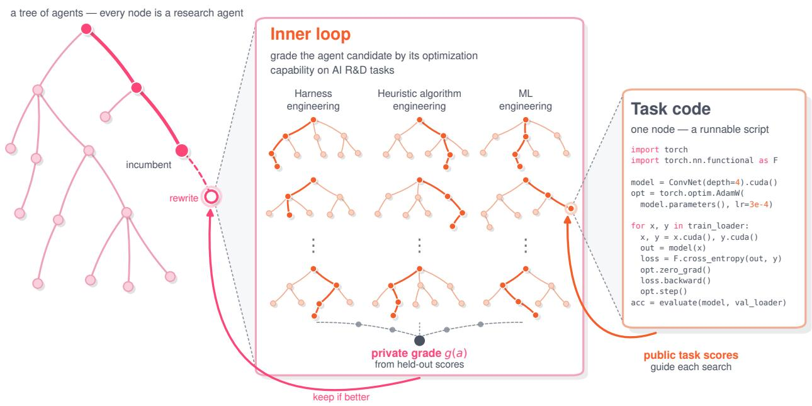  
Figure 1 | One step of recursive self-improvement, shown at three levels of magnification. Left: the outer loop searches a tree of agents, where every node is a complete research agent. The outer-loop agent proposes a rewrite of the current incumbent’s code. Middle: the candidate is graded by running it as an optimizer on AI R&D tasks. Held-out scores across the tasks aggregate into the private grade �(�). The rewrite is kept only if �(�) improves on the incumbent’s grade. Right: each solution node is a runnable script for its task.

In this work, we study how recursive self-improvement can efectively advance frontier AI R&D. Our experiments target the harness layer, the code that surrounds a model and controls an agent’s search, context, and verification. As shown in appendix C, a substantial share of an agent’s realized capability is determined here. We present $\mathrm { A I D E } ^ { \bar { 2 } }$ , a two-loop system that carries out recursive self- improvement at the harness layer. In the inner loop, a research agent optimizes code against a measurable objective on problems drawn from a diverse set of AI R&D tasks. The outer loop performs a meta-level optimization over this inner-loop research process, rewriting the research agent with the objective of improving the research eficiency of the inner-loop agent. Figure 1 illustrates this two-loop process structured as a nested tree search.

In one autonomous 8-day run, $\mathrm { \ A I D E ^ { 2 } }$ discovered seven successive improvements, each accepted only after it improved results on held-out data that the agent being rewritten never observes. We compare the discovered agents against $\mathrm { \ A I D E _ { h u m a n } } ,$ a production research agent developed over two years of human-driven R&D that ranks among the strongest on FML-Bench (Zou et al., 2026). The strongest discovered agent matches or exceeds this baseline on four external benchmarks that never influenced the run. On a separate held-out task family, the reward hacking rate falls from 55% to 32%, below the 39% of the human-engineered agent. When used as the outer-loop agent, a discovered agent continues to produce accepted improvements, though due to compounding noise across both loops and the prohibitive cost of running additional seeds, its performance in that role cannot be decisively distinguished from the strong baseline.

In summary, we present $\mathrm { A I D E } ^ { 2 }$ , a recursive self-improvement system in which an AI research agent improves its own research eficiency. Across the recursive self-improvement run, the loop repeatedly finds and accepts improvements under a fixed evaluation budget. Those improvements generalize beyond the tasks used to select them, carry over to a domain the loop never encountered, and come with a reduction in reward hacking that was not part of the objective being optimized for. Measured against a strong baseline developed over two years of human-driven R&D, the discovered agents match or outperform it on the held-out benchmarks.

## 2. Method

We frame recursive self-improvement as a bi-level optimization problem consisting of two loops that iteratively optimize an agent against a measurable outcome. The inner loop acts on specific tasks designed to capture an agent’s ability to optimize code within a subset of AI R&D domains. The outer loop operates on a meta-level, working to improve the inner-loop agent’s optimization capability. Each inner-loop agent is evaluated at a fixed budget; therefore, improving the optimization capability directly improves the research eficiency of the inner-loop agent. Each accepted rewrite becomes the agent that the next step edits and evaluates. Both loops are driven by agents of the same tree-search design. Figure 1 illustrates this bi-level optimization process.

## 2.1. Recursive self-improvement

The inner loop. Given a codebase and a measurable metric, an inner-loop agent, denoted $^ { a , }$ iteratively edits the code to improve performance under that metric. We write � for a candidate solution and $r _ { t } ^ { \mathrm { p u b } }$ for the signal the agent observes on a task �. Let $x _ { 0 }$ denote the task’s existing codebase and $x _ { < i }$ the edits produced so far. The agent repeatedly proposes candidates (eq. (1)) until a fixed dollar budget $b _ { t }$ is spent, covering the agent’s tokens and the cost of executing its solutions.

$$
x _ { i } = a \big ( x _ { < i } , ~ r _ { t } ^ { \mathrm { p u b } } ( x _ { < i } ) \big )\tag{1}
$$

The agent then returns one solution of its own choosing, which we denote $\hat { x } _ { t }$ . Which candidate to edit next, which to return, and how to structure the agent’s memory are all part of the agent’s code and are editable by the outer loop.

Grading an agent. When evaluated, an agent receives a fixed set of tasks spanning three families of AI R&D work, which we refer to as the selection benchmark (detailed in section 2.2). We construct the task set to be diverse in order to induce evolutionary pressure on the types of improvements that are made to the inner-loop agent, namely general mechanisms over task-specific tricks. Once the agent is run on each task, it returns a candidate solution to be scored on private held-out data using $r _ { t } ^ { \mathrm { p r i v } }$ . The resulting private scores are then aggregated:

$$
g ( a ) = \frac { 1 } { T } \sum _ { t = 1 } ^ { T } r _ { t } ^ { \mathrm { p r i v } } \big ( \hat { x } _ { t } \big ) ,\tag{2}
$$

where $\hat { x } _ { t }$ is the solution returned by the agent � on task � and � is the number of tasks in the selection benchmark. In practice, each task is run several times independently and the scores are averaged across runs.

The outer loop. An agent is itself written in code. Therefore, the same procedure can be applied one level up. At step $k ,$ the outer-loop agent $a ^ { \mathrm { o u t } }$ reads the previously proposed agents and their grades and proposes a rewrite. Under the substitution $( a , x , r _ { t } ^ { \mathrm { p u b } } ) \mapsto ( a ^ { \mathrm { o u t } } , a , g )$ , we can rewrite eq. (1) as:

$$
a _ { k } = a ^ { \mathrm { o u t } } \big ( a _ { < k } , ~ g ( a _ { < k } ) \big )\tag{3}
$$

In practice, the outer-loop agent edits the current incumbent, so each accepted rewrite becomes the codebase that is edited at the next step. At step $k ,$ the incumbent is the best agent graded so far.

Candidate selection difers between the two levels: inner-loop selection is part of the agent’s editable policy and is repeatedly rewritten during the run, whereas outer-loop selection is fixed by:

$$
a _ { k } ^ { * } = \operatorname * { a r g m a x } _ { a \in a \leq k } g ( a )\tag{4}
$$

Since the outer loop selects inner-loop agents according to $^ { g , }$ two properties of $g$ shape the resulting selection pressure. First, separating the inner loop’s optimization signal $r _ { t } ^ { \mathrm { p u b } }$ from the outer loop’s selection signal $g$ (driven by $r _ { t } ^ { \mathrm { p r i v } } )$ prevents the inner-loop agent from directly optimizing the criterion used for outer-loop selection. Second, evaluating all agents under the same per-task budget $b _ { t }$ constrains improvements to arise from a better algorithm rather than from spending additional compute. We describe the procedure for recursive self-improvement in alg. 1.

Algorithm 1 Recursive self-improvement   
Require: initial agent $a _ { 0 } ,$ , outer-loop agent $a ^ { \mathrm { o u t } } .$ , tasks {�} with budgets $\left\{ b _ { t } \right\}$ , trajectory length �   
1: function Grade(�)   
2: for all tasks $t = 1 , \dots , T$ do ⊲ run � on each task   
3: �0 ← task $t ^ { \prime } s$ existing codebase; $i \gets 0$   
4: while total cost $< b _ { t }$ do ⊲ agent tokens + solution execution   
5: $i \gets i + 1$   
6: $x _ { i } \gets a \big ( x _ { < i } , r _ { t } ^ { \mathrm { p u b } } ( x _ { < i } ) \big )$ ⊲ propose the next solution   
7: end while   
8: $\hat { x } _ { t } \gets$ the solution � selects from $x _ { \leq i }$   
9: end for   
10: return $\begin{array} { r } { \frac { 1 } { T } \sum _ { t = 1 } ^ { T } r _ { t } ^ { \mathrm { p r i v } } \big ( \hat { x } _ { t } \big ) } \end{array}$ ⊲ private held-out grading   
11: end function   
12: $g ( a _ { 0 } ) \gets \mathrm { G R A D E } ( a _ { 0 } )$ ⊲ establish the baseline grade   
13: for $k = 1 , \ldots , K - 1$ do   
14: $a _ { k }  a ^ { \mathrm { o u t } } ( a _ { < k } , g ( a _ { < k } ) )$ ⊲ propose an agent rewrite   
15: $g ( a _ { k } ) \gets \mathrm { G R A D E } ( a _ { k } )$   
16: end for   
17: return $a _ { K - 1 } ^ { * } = \arg \operatorname* { m a x } _ { a \in a _ { < K } } g ( a )$

## 2.2. AIDE2

We instantiate alg. 1 through our system $\mathrm { A I D E } ^ { 2 }$ . The inner-loop agent $a _ { 0 }$ starts from $\mathrm { { A I D E } } _ { 0 } ,$ a pared- down refactor of AIDE (Jiang et al., 2025). AIDE was originally designed for ML engineering and performed well on MLE-Bench (Chan et al., 2025). However, due to the diversity of tasks we run RSI on, we require a more general-purpose optimization agent. To this end, we remove the ML-specific machinery but maintain the same tree-search procedure. $\mathrm { A I D E } _ { 0 }$ grows a tree of candidate solutions rooted in an existing codebase, optimizing against a prespecified metric. The agent consists of several operators designed for diferent purposes: draft to explore broad sets of new ideas, debug to repair a solution with a bug or execution error, and improve to refine a promising direction. Which solution is operated on is determined by the agent’s search policy. In $\mathrm { { A I D E } } _ { 0 } ,$ , the selection is greedy: the highest-scoring solution becomes the parent for the next operation. $\mathrm { A I D E } _ { 0 }$ employs a reviewer agent that reads execution outputs from evaluating solutions and extracts a score and any relevant feedback.

The outer-loop agent $a ^ { \mathrm { o u t } }$ is driven by $\mathrm { \ A I D E _ { h u m a n } } ,$ an autonomous research agent used in production and developed by Weco’s R&D team. $\mathtt { A I D E _ { h u m a n } }$ largely follows the same design choices and agent architecture as AIDE0. In addition to serving as the outer-loop agent, $\mathtt { A I D E _ { h u m a n } }$ is used as a strong baseline developed through human-driven R&D when testing generalization at various levels: on the selection benchmark (section 3.2), on held-out tasks in and out of distribution (section 3.3), and in the discovered agents’ ability to act as a better self-improver (section 3.6). In appendix B, we show that $\mathtt { A I D E _ { \mathrm { h u m a n } } }$ is competitive with existing code optimization agents, supporting its use as a strong baseline. During the recursive self-improvement run, we hold the model fixed within each loop. The outer-loop agent runs on claude opus 4.7 (Anthropic, 2026b), while every inner-loop agent is evaluated with gemini 3 flash (Google DeepMind, 2025). At the task-specific budgets $b _ { t } ,$ gemini 3 flash matched or slightly exceeded the more expensive models tested on the selection tasks, so we use it for all inner-loop evaluations. Because evaluating each candidate dominates the cost of proposing it, we use the more capable model to drive the outer-loop agent. For the same reason, the inner-loop reviewer makes a single LLM call over each solution’s execution output, while the outer-loop agent’s reviewer explores the evaluation artifacts over several steps.

The selection benchmark consists of three task families. ML engineering asks the agent to train a model against a target metric. Heuristic algorithm engineering covers competitive-programming-style combinatorial problems where progress comes from iterating on algorithms and heuristics. Harness engineering targets improvements to an agent’s prompts, context management, and feedback loops— the code and algorithms that turn LLM API calls into working agentic systems. As shown in fig. 1, every inner-loop agent $a _ { k }$ is run across the task families under a fixed budget and evaluated on a private held-out set. Its private scores are then aggregated to produce a grade $g ( a _ { k } )$ , which $\mathtt { A I D E _ { h u m a n } }$ uses as the selection signal to drive subsequent improvements of the inner-loop agent.

## 3. Experiments

## 3.1. Experimental design

To better understand the efectiveness of recursive self-improvement on AI R&D tasks, we use the following criteria and constraints when designing our experiments. The same run must produce several new incumbents throughout the optimization, as one favorable rewrite cannot show that the loop repeatedly finds useful improvements. In order to distinguish a sustained trend from a one-of gain, we test whether the recursive self-improvement run contains repeated improvements. We evaluate every agent produced during the recursive self-improvement run under a fixed evaluation budget so that a measured gain reflects a better algorithm rather than additional compute. At a fixed cost, a gain in optimization capability represents a gain in research eficiency. Improvements selected on a set of tasks must remain useful on tasks that were not involved in selection. We test for this generalization to rule out overfitting to the selection benchmark. Lastly, we evaluate the discovered agents against a strong baseline: $\mathrm { A I D E } _ { \mathrm { h u m a n } } , \mathrm { a }$ production research agent developed through human- driven R&D that performs competitively on FML-Bench (Zou et al., 2026), a benchmark of AI R&D tasks (see appendix B).

## 3.2. A sustained trend of improvements

We ran $\mathrm { A I D E } ^ { 2 }$ over 8 days of wall-clock time, producing a 100-node trajectory, containing the initial agent and 99 rewrite proposals. As shown in fig. 2, we observe seven accepted improvements at steps 2, 6, 28, 39, 47, 63, and 85, with the incumbent grade rising from 0.703 to 0.778, evidence of a sustained trend. Two further complete runs of the same protocol also produced sustained improvements, accepting two and four rewrites, respectively. Because candidates were selected on $^ { g , }$ the recursive self-improvement trace is not meant to demonstrate generalization beyond the selection benchmark. However, given that the inner-loop agents use $r _ { t } ^ { \mathrm { p u b } }$ as their optimization signal and $g$ is a function of $r _ { t } ^ { \mathrm { p r i v } }$ , we use the grades to test each candidate agent’s ability to produce solutions that generalize from the public signal to the private held-out data within each task. Figure 2 shows that the improved agents eventually outperform $\mathtt { A I D E _ { h u m a n } }$ on the selection benchmark; we refer to this as first-order generalization. We test whether these gains transfer to held-out benchmarks in section 3.3.

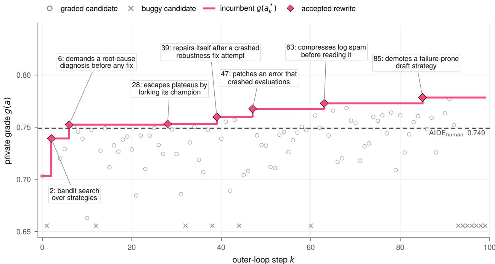  
Figure 2 | A sustained trend of improvements. Private grades $g ( a _ { k } )$ across the 100-node trajectory of an RSI run. Circles show graded candidates, crosses show buggy proposals, and diamonds mark the seven accepted rewrites that lift the incumbent grade $g ( a _ { k } ^ { * } )$ from 0.703 to 0.778. The dashed line marks $\mathtt { A I D E _ { h u m a n } }$ at 0.749 under the same grade. The vertical axis is truncated at 0.644. Buggy proposals receive no grade and are drawn in a row near the bottom edge. One early candidate scored 0.565 and falls outside the plotted range.

## 3.3. Generalization to held-out benchmarks

The private grades used during recursive self-improvement cannot by themselves establish gen- eralization beyond candidate selection. We instead test second-order generalization: whether the improvements remain useful on four external benchmarks that never afected candidate selection.

ALE-Bench (Imajuku et al., 2025) evaluates agents on long-horizon combinatorial optimization from AtCoder programming contests. MLE-Bench (Chan et al., 2025) evaluates agents on autonomous ML engineering across various Kaggle competitions. FML-Bench (Zou et al., 2026) evaluates agents on realistic research codebases, covering tasks from core ML problems including continual learning, causality, privacy, and robustness. These three benchmarks belong to task families represented during recursive self-improvement but have no overlap with the selection tasks, so we treat them as in-distribution at the task-family level. We use WeatherBench 2 (Rasp et al., 2024) as the basis for a physics-based forecasting optimization task. Because neither weather forecasting nor physics-engine optimization is represented in the task set used for recursive self-improvement, we treat this as out-of-distribution. Additional details can be found in appendix A.

We compare the agents $\mathrm { A I D E } _ { 0 } , \mathrm { A I D E } _ { 4 7 } , \mathrm { A I D E } _ { 8 5 }$ , and $\mathtt { A I D E _ { h u m a n } }$ under a fixed set of per-benchmark constraints described in appendix $\mathrm { A . \ A I D E _ { 0 } }$ is the baseline for measuring performance changes along the discovered lineage, while $\mathrm { \ A I D E _ { h u m a n } }$ is the strong baseline developed through human-driven R&D. $\mathrm { \ A I D E { 4 7 } }$ is the incumbent within the first 50 nodes, while $\mathrm { \ A I D E { 8 5 } }$ is the final incumbent from the recursive self-improvement trajectory described in section 3.2.

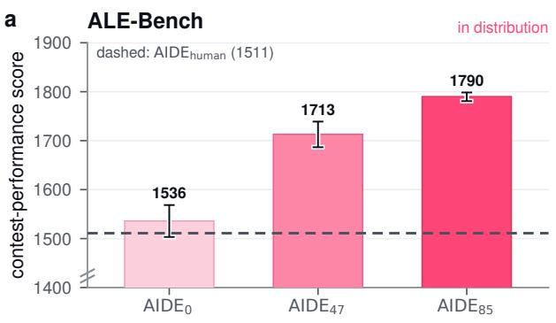

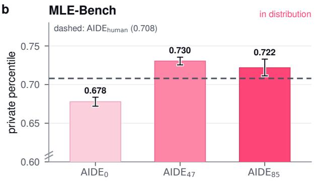

c  
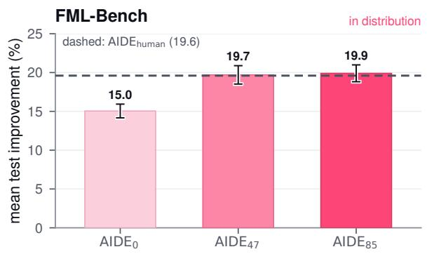

d  
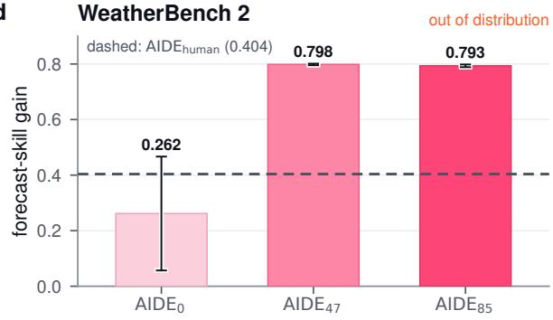  
Figure 3 | Gains from recursive self-improvement transfer to held-out benchmarks. a, Mean private contest performance on ALE-Bench (10 tasks, 10 seeds per task). b, Mean private percentile on MLE-Bench (22 tasks, 3 seeds per task). c, Mean normalized test improvement on FML-Bench (18 tasks, 3 seeds per task). d, Forecast-skill ain on WeatherBench 2 (one task 3 seeds). Bars show benchmark means. Dashed lines mark $\mathtt { A I D E _ { h u m a n } }$ under the same protocol. Error bars show ±1 standard error of the benchmark mean. Higher is better. The axes in a and b are truncated, as indicated by the break marks. Further details are in appendix A.

As shown in fig. 3, both evolved checkpoints improve on $\mathrm { A I D E } _ { 0 }$ , and $\mathrm { \ A I D E { 8 5 } }$ matches or exceeds $\mathtt { A I D E _ { \mathrm { h u m a n } } }$ on all four external benchmarks. The gains are positive throughout but not monotone across checkpoints: $\mathrm { \ A I D E { 8 5 } }$ performs best on ALE-Bench and FML-Bench, whereas $\mathrm { \ A I D E { 4 7 } }$ performs best on MLE-Bench and WeatherBench 2. Because candidate selection during the recursive self-improvement run aggregates performance over a heterogeneous selection benchmark, some non-monotonicity among strong checkpoints is expected. Nevertheless, the gains transfer from the recursive self- improvement run to benchmarks that are external to the run.

Interestingly, some of the largest performance gains appear on the out-of-distribution benchmark, WeatherBench 2, where the agents optimize the core of a physics-based weather-forecasting model, a domain and type of problem absent from the selection tasks. On every seed, both evolved checkpoints independently converged on the same family of changes to the forecasting model’s numerics, reaching nearly identical gains with almost no variation across runs. $\mathrm { A I D E } _ { 0 }$ and $\mathtt { A I D E _ { \mathrm { h u m a n } } }$ reach a comparable solution on at most one seed and vary widely across the rest. This suggests that the accepted rewrites improve optimization behavior that is general enough to extend to an unfamiliar scientific-computing domain.

In sections 3.2 and 3.3, we demonstrate improvements concerning the agents’ core capability of optimizing code against a specified metric. Section 3.4 examines how recursive self-improvement afects the discovered agents’ behavior on objectives the agents were not explicitly optimizing for.

## 3.4. An emergent behavior: reduced reward hacking

As alg. 1 selects agents by a numeric grade, the discovered agents could plausibly favor mech- anisms that inflate their scores without corre- sponding downstream gains. As discussed in section 2.1, we design alg. 1 to limit this risk by decoupling the inner- and outer-loop opti- mization signals. In addition, the generalization results in section 3.3 show no indication that the improvements overfit or exploit the selec- tion grade. To examine this further, we measure the discovered agents’ reward hacking rate on kernel engineering tasks, a task family not in the selection benchmark.

Reward hacking occurs when optimizing an imperfect proxy improves measured perfor-mance without a corresponding improvement in the intended objective (Krakovna et al., 2020; Skalse et al., 2022). Recent coding-agent studies measure this divergence by comparing agent- visible feedback with held-out outcomes, and

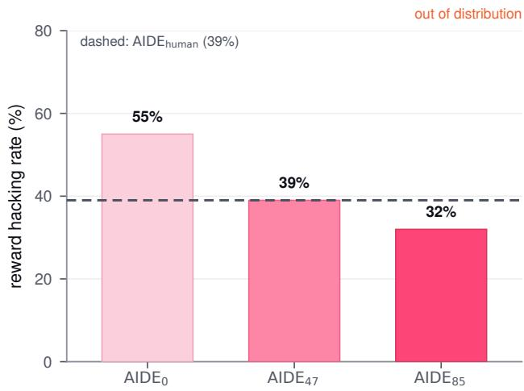  
Figure 4 | Reward hacking declines along the discovered lineage (lower is better). Bars show the percentage of 38 held-out (kernel, training-context) pairs on which each discovered agent reward hacks. The dashed line marks $\mathrm { \ A I D E _ { h u m a n } }$ at 39% under the same protocol. Appendix A describes how the pairs are scored.

find that the gap widens in longer-horizon and more complex tasks (Zhao et al., 2026). We follow the proxy-to-downstream design applied to GPU kernel engineering in Zhao et al. (2026) and evaluate agents on a subset of KernelBench (Ouyang et al., 2025), a benchmark in which agents replace PyTorch reference modules with custom GPU kernels, scored on numerical correctness against the reference and on wall-clock speedup over it. Each agent optimizes kernels for an isolated speedup measurement—the proxy it observes—and we then insert its kernels into GPT-2 (Radford et al., 2019), ViT (Dosovitskiy et al., 2021), and CNN $( \mathrm { L e C u n }$ et al., 1998) training loops to measure how much of the proxy gain survives. As shown in fig. 4, the measured reward hacking rates decline along the discovered lineage: 55% for $\mathrm { A I D E } _ { 0 }$ , 39% for $\mathrm { \ A I D E { 4 7 } } .$ , and 32% for $\mathrm { \ A I D E { 8 5 } }$ , compared to 39% for $\mathtt { A I D E _ { \mathrm { h u m a n } } }$ . These reward hacking rates establish a held-out behavioral change, though they do not identify which rewrites produced it. As recursive self-improvement progresses, cumulative harness rewrites selected on a grade shift a behavior that the grade never measured, specifically the agents tendency to reward hack.

## 3.5. The self-improved agent: AIDE85

In this section, we examine $\mathrm { \ A I D E { 8 5 } }$ , the agent discovered through recursive self-improvement. Two properties of $\mathrm { A I D E } _ { 0 }$ are relevant to the changes $\mathrm { \ A I D E { 8 5 } }$ introduces. First, $\mathrm { A I D E } _ { 0 }$ selects greedily, building on the highest-scoring candidate, with no explicit control over the trade-of between exploring new approaches and refining the current best. Second, it performs minimal history compaction—each drafting and improvement prompt receives the full concatenated history of prior candidates and their execution output, so prompts grow as the run proceeds. $\mathrm { \ A I D E { 8 5 } }$ redesigns both components and adds robustness mechanisms that may account for the reduced reward hacking observed in section 3.4.

Search policy. $\mathrm { \ A I D E { 8 5 } }$ employs bandit selection over drafting strategies with periodic forking. Where $\mathrm { A I D E } _ { 0 }$ greedily improves the highest-scoring candidate with little control over when to explore, $\mathrm { \ A I D E { 8 5 } }$ runs a bandit policy (Auer et al., 2002) over drafting strategies. Drafts are generated under one of five fixed strategies (conservative, aggressive\_rewrite, ensemble, tuned\_specialist, robust\_simple), and each new node inherits the label from its parent. At each step a strategy arm is chosen by UCB1, with 30% of steps instead sampling an arm by a softmax over the arms’ best scores. The highest-scoring node carrying the chosen arm’s label is then expanded with a new node. Selecting over strategy arms rather than individual nodes gives the agent a lever on the diversity of approach, not just on which local optimum to polish.

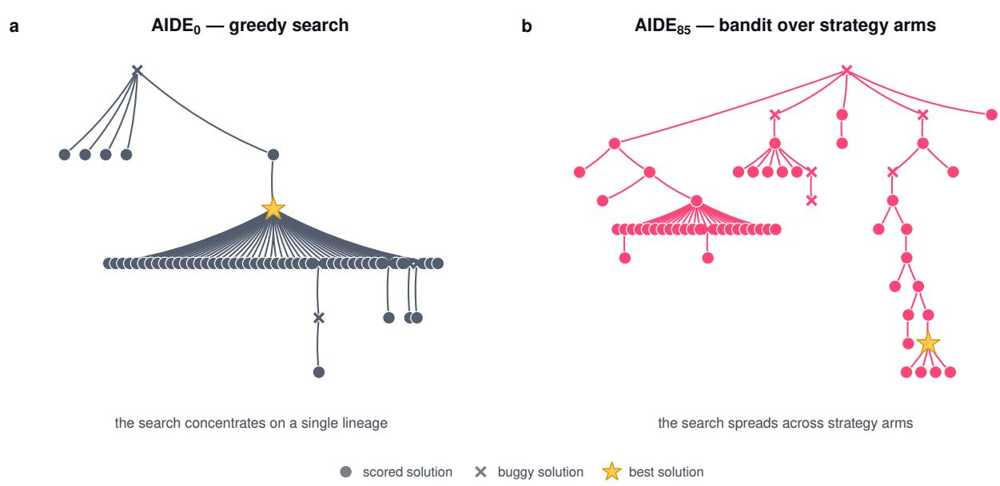  
Figure 5 | Two search policies allocate the same budget diferently. Both agents run the same held-out ALE-Bench task, with the first 60 nodes shown. a, AIDE0 improves the highest-scoring candidate, so nearly every solution descends from one draft. b $\mathrm { A I D E } _ { 8 5 }$ kee s several arms alive balancin ex loration and refinement.

$\mathrm { \ A I D E { 8 5 } }$ is also designed to handle stagnation of performance in the optimization process. Every five search steps, $\mathrm { \ A I D E { 8 5 } }$ forks the global best node, improving it under a diferent strategy arm. $\mathrm { A I D E } ^ { 2 }$ discovered that when the leading strategy plateaus, further refinement within that lineage yields diminishing returns, but restarting from a fresh draft would discard the strong solution already found. Forking avoids both failure modes by continuing to improve the current best node under a new strategy arm, and the five-step bound keeps this from interrupting otherwise productive refinement. Figure 5 shows how the two policies spend the same budget on a held-out task.

Context management. $\mathrm { \ A I D E { 8 5 } }$ uses bounded and role-specific prompts with a bug-rate-gated failure memory to compress and manage the agent’s growing context. In $\mathrm { \ A I D E _ { 0 } } .$ , every drafting and improve- ment prompt contains the full history, so the prompt size grows with the search. $\mathrm { \ A I D E { 8 5 } }$ instead has the draft and improve operators read a compact summary of the root and recent candidates rather than the full history. $\mathrm { \ A I D E { 8 5 } }$ also uses a form offailure memory in the context. When a run’s candidates show a bug rate of at least 15%, the agent injects up to three recurring error signatures (the final error lines of recent buggy candidates, deduplicated) into draft and improve prompts. This 15% threshold is a design choice from $\mathrm { A I D E } ^ { 2 }$ . The mechanism stays dormant where bugs are rare and only activates when evaluation errors are frequent enough. These mechanisms keep per-step prompt size roughly constant while $\mathrm { \ A I D E { 0 } } ^ { \prime } s$ prompts grow with history. The median task-level reduction in per-LLM-call prompt size compounds over a run, reaching $7 \times$ on MLE-Bench, over 40× on WeatherBench 2, and about 50× on ALE-Bench and FML-Bench (fig. 6; see appendix E for additional details). Under fixed per-run constraints, shorter prompts let the agent make more efective use of each step and buy more search steps in cost-bound runs.

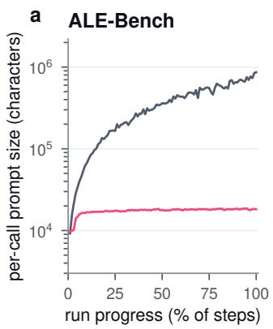

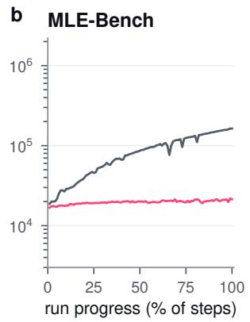

$$
\begin{array} { r l } { - } & { { } \mathsf { A I D E } _ { 0 } \ - \ \mathsf { A I D E } _ { 8 5 } } \end{array}
$$

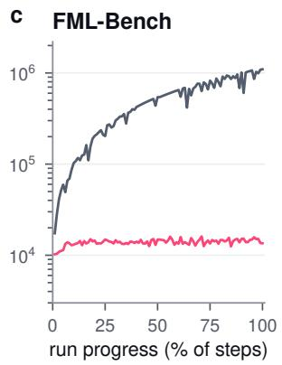

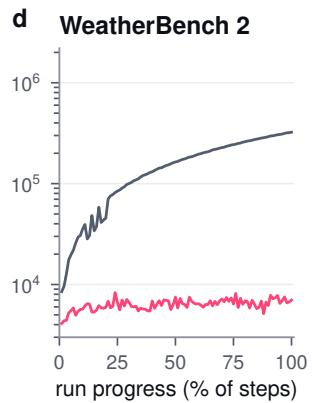  
Figure 6 | The discovered agent holds per-call prompts to a bounded size. Per LLM call prompt size in characters (log scale) across held-out runs on ALE-Bench, MLE-Bench, FML-Bench, and WeatherBench 2. Lines show the median over task means. $\mathrm { \ A I D E { 0 } } ^ { \prime } s$ prompts grow with run history, while $\mathrm { \ A I D E { _ { 8 5 } } } ^ { \prime } s$ stay roughly constant. A broader comparison between AIDE0, AIDE47, AIDE85, and $\mathtt { A I D E _ { h u m a n } }$ can be found in fig. 10.

Robustness. $\mathrm { \ A I D E { 8 5 } }$ adds three robustness mechanisms. The first is a pair of prompt-level safeguards: a fixed instruction in every code-generation prompt reminding the model that solutions are scored on a private split it cannot see and that it should prefer robust, generalizable approaches, and a guard that re-prompts when generated code is nearly empty (under 40 characters, e.g. a stub or placeholder). The second is a selection rule meant to avoid picking a lucky one-of high score, penalizing each candidate by its distance from the median of the top candidates. Because the penalty preserves the ordering of the candidates, replaying the rule over the held-out runs shows that it never changed which candidate the agent selected. The most substantive change fixes a flaw in the evaluation itself rather than in the agent. One task’s held-out scoring script crashed on all of its test cases whenever any single test case failed, and $\mathrm { \ A I D E { 8 5 } }$ adds a small patch, which the agent described as “a narrow, low-risk intervention targeting a verified failure mode . . . without altering search dynamics”, that stops a single failed test case from taking down the whole evaluation. Interestingly, rather than exploiting the broken evaluation, $\mathrm { \ A I D E ^ { 2 } }$ repaired it.

## 3.6. Ignition test

For the gains in recursive self-improvement to turn diminishing returns into accelerating ones, we hypothesize that the discovered agents must be better at driving recursive self-improvement than the agent that discovered them. We call this comparison the ignition test. A self-improved agent should be promoted to the outer loop only if it drives the loop more efectively than the agent that produced it. We run the ignition test using the incumbent agent after 50 outer-loop steps from the run described in section 3.2. The test comprises two independent arms of recursive self-improvement, each with three seeds run for 50 steps. Both arms start from the same inner-loop agent, $\mathrm { A I D E } _ { 4 7 } ,$ , and difer only in the agent used in the outer loop. The treatment arm uses $\mathrm { \ A I D E { 4 7 } }$ , the agent being tested, while the reference arm uses $\mathtt { A I D E _ { \mathrm { h u m a n } } }$ in the outer loop.

Averaged across seeds, the two arms reach similar mean endpoints in the outer loop, with the reference arm finishing slightly higher, as shown in fig. 7. The treatment mean reaches its final score region after roughly 20 steps, compared with roughly 40 steps for the reference. However, with only three seeds per outer-loop agent, we find these results to be inconclusive; they do not establish that $\mathrm { \ A I D E { 4 7 } }$ is more sample-eficient as a self-improver than $\mathtt { A I D E _ { h u m a n } }$ . Given the variance in final performance across seeds, we also do not claim that either agent is better than the other at driving recursive self-improvement. What the treatment arm does show is that there is no obvious degradation in $\mathrm { \ A I D E { _ { 4 7 } } { ' } } s$ ability to drive the recursive self-improvement run compared to $\mathrm { \sf A I D E _ { \mathrm { h u m a n } } . }$ Stronger conclusions are prohibitively costly as they would require additional outer-loop seeds and the evaluation of each seed’s final agent on benchmarks external to the selection benchmark, following the protocol used in section 3.3.

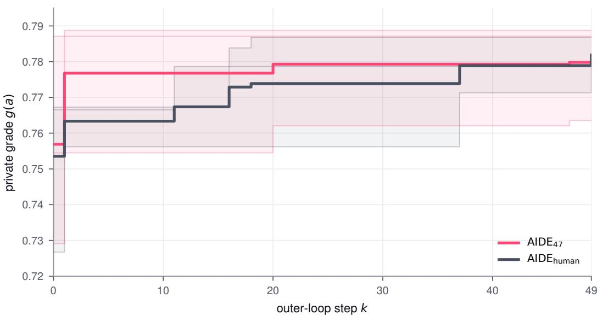  
Figure 7 | The ignition test. Both arms complete three independent 50-step runs, starting from the same inner-loop agent, $\mathrm { \ A I D E { 4 7 } }$ . Lines trace the incumbent private grade $g ( a _ { k } ^ { * } )$ . Line color identifies the outer-loop agent driving recursive self-improvement: pink for $\mathrm { \ A I D E { 4 7 } } ,$ gray for $\mathrm { \ A I D E _ { \mathrm { h u m a n } } }$ . Thin lines show individual runs, shaded bands span the min–max range within each arm, and bold lines show each arm’s average, ending at 0.780 and 0.782 for $\mathrm { \ A I D E { 4 7 } }$ and $\mathtt { A I D E _ { h u m a n } }$ respectively.

## 4. Related work

LLM-driven search. As LLM capabilities improve, a growing body of work has focused on LLM-driven optimization loops that improve a candidate solution against a measurable objective (Lehman et al., 2022; Liu et al., 2024; Toledo et al., 2025; Liao et al., 2026; Cemri et al., 2026; Hambardzumyan et al., 2026). These loops difer mainly in how they structure the search. The simplest approach repeatedly edits a single artifact, keeping each edit that improves a validation metric (Karpathy, 2026). AIDE (Jiang et al., 2025) structures this as a tree search over candidate scripts, where each node represents a candidate solution and each edge a mutation between solutions. Building on ideas from genetic programming and quality-diversity search (Koza, 1994; Mouret and Clune, 2015), several approaches widen this search structure to entire populations of programs (Romera-Paredes et al., 2024; Novikov et al., 2025; Sharma, 2025; Lange et al., 2026; Ray et al., 2026). These systems have yielded impressive improvements from discovering preference-optimization losses (Lu et al., 2024) to generating an archive of diverse adversarial prompts against a fixed target (Samvelyan et al., 2024). Such open-ended generation of artifacts has been argued to be a prerequisite for reaching superhuman capability (Hughes et al., 2024). These systems optimize an artifact that aims to solve a given problem. The procedure that drives the optimization remains largely hand-designed through human-driven R&D.

Automated research. A natural application of such search is the research process itself. The AI Scientist (Lu et al., 2026; Yamada et al., 2025) automates ideation, experimentation, writing, and review in a single pipeline. Related systems automate individual stages in the research pipeline, from idea generation to experiment execution (Baek et al., 2025; Schmidgall et al., 2025; Jansen et al., 2025; Foster et al., 2026; Murphy, 2026). Empirical accounts of such pipelines catalog recurring failure modes, from implementation drift to premature declarations of success (Trehan and Chopra, 2026). In the natural sciences, such systems have produced hypotheses and experimental protocols later validated in the laboratory (Gottweis et al., 2026; Ghareeb et al., 2026; Schmidgall et al., 2026). LLM-driven systems have also entered the domain of LLM development, including training data generation (Kulikov et al., 2026), pre-training data selection (Meng et al., 2026), environment engineering for continual learning (Liu et al., 2026a), and improving the pretraining procedure itself (Tan et al., 2026). Studies of these automated research pipelines find that LLM-generated research ideas can be judged more novel than those of expert humans (Si et al., 2025b), though the advantage narrows once ideas are executed rather than only reviewed (Si et al., 2025a). This gap motivates roundin automated research in execution outcomes (Si et al., 2026). A arallel efort measures how much of the research workflow agents can carry out, from replicating published papers to research engineering compared to human experts (Huang et al., 2024; Wijk et al., 2024; Nathani et al., 2025; Starace et al., 2025; Zhao et al., 2025; Lupidi et al., 2026; Falck et al., 2026). Recent work also stresses guarding such benchmarks against exploitable shortcuts (Lange et al., 2025) and separating the tasks used to develop a method from those used to evaluate it (Goldie et al., 2026).

Automated harness search. Some works focus on applying the same automated loop at the harness layer, studying whether this can yield better prompts, parameters, or workflows for entire agent pipelines (Zhou et al., 2023; Pryzant et al., 2023; Yang et al., 2024; Guo et al., 2024; Khattab et al., 2024; Wang et al., 2024b; Cheng et al., 2024; Zhang et al., 2025; Agrawal et al., 2026a). GEPA (Agrawal et al., 2026b) demonstrates that prompt evolution can outperform reinforcement learning. TextGrad (Yuksekgonul et al., 2025) draws an analogy to gradient descent and treats text components as parameters, updating them by backpropagating natural-language feedback in place of gradients. Some works extend the optimization target to the entire harness design, so the loop directly yields an agent ready for downstream tasks (Hu et al., 2025; Lee et al., 2026). Harness designs difer along several axes, such as whether the agent accumulates reflections or skills as it acts (Shinn et al., 2023; Wang et al., 2024a) or jointly adapts model weights with prompts or broader harness code (Tiwari et al., 2026; Kim et al., 2026). In these works, the harness being optimized is separate from the procedure that optimizes it.

Self-referential improvement. Self-referential improvement refers to when the optimization machinery itself becomes an object of optimization (Schmidhuber, 1993; Yang et al., 2026; Gao et al., 2026; Lin et al., 2026). The Gödel machine (Schmidhuber, 2007) permits any self-rewrite that provably yields higher expected utility than not making it. Because such proofs are generally impractical, empirical successors substitute evaluation for proof. Some optimizers evolve their own mutation prompts or search strategies (Fernando et al., 2024; Liu et al., 2026b) while others let a single agent rewrite its own code, from an improver scafold (Zelikman et al., 2024) to a full agent codebase (Yin et al., 2025; Robeyns et al., 2025), keeping the changes that improve task performance. The Darwin Gödel Machine (Zhang et al., 2026a) keeps an archive of such self-rewriting coding agents. Subsequent work select ancestors by the aggregate success of their descendants (Wang et al., 2026) or let rewrites reach the routine that proposes them (Zhang et al., 2026b). Evaluation signals can be noisy or misleading, so related work strengthens the evidence required to accept a modification by gating each one behind a statistical measure (Wu et al., 2025) or co-evolving the evaluators with the agents they score (Iacob et al., 2026). These works typically use a proxy metric to steer self-modification. Agent performance on software engineering, for example, can serve as a proxy for the ability to write code that improves the agent’s own architecture (Zhang et al., 2026a). AIDE2 instead targets the agent’s own capability on AI R&D tasks.

Meta-learning and learned optimizers. Meta-learning seeks to improve a learning procedure using experience across tasks. Early work represented learning algorithms with recurrent neural networks (Hochreiter et al., 2001), an approach developed further in neural optimizers that learn parameter updates (Andrychowicz et al., 2016) and black-box search strategies (Chen et al., 2017). Related approaches learn model initializations (Finn et al., 2017) or training hyperparameters (Maclaurin et al., 2015) from erformance after ada tation. These settin s can be formulated as bi-level o timization (Franceschi et al., 2018), with GIMLI providing a general framework for diferentiable inner-loop meta-learning and higher supporting its implementation (Grefenstette et al., 2019). In reinforcement learning, meta-learned update rules have also yielded algorithms that transfer to environments outside those used for discover (Oh et al., 2020, 2025).

Alongside these neural approaches, AutoML-Zero (Real et al., 2020) and the work introducing Lion (Chen et al., 2023) search directly over programs that implement learning algorithms and parameter-update rules. $\mathrm { A I D E } ^ { 2 }$ applies this broader idea of optimizing an optimization procedure to AI research agents, searching over harness code and evaluating candidates by their downstream research performance under fixed budgets.

## 5. Discussion

AIDE2 demonstrates that recursive self-improvement at the harness layer can produce transferable gains in an AI research agent’s research eficiency. During the recursive self-improvement run, the loop accepted seven rewrites, each under a fixed evaluation budget (section 3.2). Under this fixed evaluation budget, gains in optimization capability on AI R&D tasks translate to gains in research eficiency. The accepted rewrites concentrate on problems that practitioners face when building efective agentic systems: recovering from search plateaus, managing context under fixed budgets, and guarding against untrustworthy wins (section 3.5). On four held-out benchmarks spanning in- and out-ofdistribution tasks, $\mathrm { \ A I D E { 8 5 } }$ equals or surpasses $\mathtt { A I D E _ { \mathrm { h u m a n } } }$ (section 3.3), a strong baseline developed through human-driven R&D (appendix B). On a separate held-out task family, the reward hacking rate fell from 55% to 32%, a property the loop never explicitly optimized for (section 3.4). Such improvements have traditionally drawn on human-driven R&D through engineering time, expertise, and domain understanding. However, a loop that proposes and validates potential improvements autonomously makes the harness layer amenable to search and learning, shifting part of the bottleneck from expert engineering efort toward compute.

Noise compounds across both loops of the bi-level optimization process. The trajectory of the inner-loop search varies across seeds, and the evaluation of any given solution from the trajectory can itself be noisy. The private grade $g ( a )$ that determines the acceptance of a candidate rewrite reflects both sources. If the noise is high enough, a falsely accepted rewrite becomes the new incumbent (eq. (4)), so a single noisy comparison can derail the outer loop’s subsequent search. This same noise limits the conclusiveness of the ignition test (section 3.6). The results for $\mathrm { \ A I D E { _ { 4 7 } } }$ show a possible gain in sample eficiency as the outer-loop agent without obvious degradation in performance after 50 steps relative to the $\mathtt { A I D E _ { \mathrm { h u m a n } } }$ reference arm. However, a definitive comparison would be prohibitively costly, requiring additional seeds of recursive self-improvement and a full held-out evaluation of each seed’s final agent. This makes cost and access to compute limiting factors when evaluating such systems.

Despite the gains across various benchmarks, the discovered agents present practical challenges. They remain complex and dificult to interpret. It is unclear which components drive performance and which, if any, are unused artifacts of earlier recursive self-improvement steps. This complexity can increase deployment friction due to the requirements of production systems such as maintaining compatibility with existing product features and adhering to the constraints of the deployment infrastructure.

## Acknowledgments

We thank Jean Kaddour, Minqi Jiang, Morgan McGuire, George Zhang, Ross Taylor, Ofir Press and Christian Schwarz for their helpful feedback. We also thank Qiran Zou for sharing the FML-Bench results used in our comparison against other code optimization agents.

## References

L. A. Agrawal, D. Lee, S. Tan, W. Ma, K. Elmaaroufi, R. Sandadi, S. A. Seshia, K. Sen, D. Klein, I. Stoica, J. E. Gonzalez, O. Khattab, A. G. Dimakis, and M. Zaharia. optimize\_anything: Unified text optimization can outperform specialized systems. In Proceedings of the ACM Conference on AI and Agentic Systems, pages 1–16. ACM, 2026a. URL https://doi.org/10.1145/3786335.3813167. 12

L. A. Agrawal, S. Tan, D. Soylu, N. Ziems, R. Khare, K. Opsahl-Ong, A. Singhvi, H. Shandilya, M. J. Ryan, M. Jiang, C. Potts, K. Sen, A. G. Dimakis, I. Stoica, D. Klein, M. Zaharia, and O. Khattab. GEPA: Reflective prompt evolution can outperform reinforcement learning. In International Conference on Learning Representations, 2026b. URL https://arxiv.org/abs/2507.19457. Oral presentation. 1, 12

M. Andrychowicz, M. Denil, S. Gómez, M. W. Hofman, D. Pfau, T. Schaul, B. Shillingford, and N. de Freitas. Learning to learn by gradient descent by gradient descent. In Advances in Neural Information Processing Systems, volume 29, 2016. 13

Anthropic. Claude Fable 5. https://www.anthropic.com/news/claude-fable-5-mythos-5, 2026a. 26

Anthropic. System card: Claude Opus 4.7. https://www-cdn.anthropic.com/ 037f06850df7fbe871e206dad004c3db5fd50340.pdf, Apr. 2026b. 5

J.-Y. Audibert, R. Munos, and C. Szepesvári. Exploration–exploitation tradeof using variance estimates in multi- armed bandits. Theoretical Computer Science, 410(19):1876–1902, 2009. doi: 10.1016/j.tcs.2009.01.016. URL https://doi.org/10.1016/j.tcs.2009.01.016. 27

P. Auer, N. Cesa-Bianchi, and P. Fischer. Finite-time analysis of the multiarmed bandit problem. Machine Learning, 47(2–3):235–256, May 2002. doi: 10.1023/A:1013689704352. URL https://doi.org/10.1023/A: 1013689704352. 8

J. Baek, S. K. Jauhar, S. Cucerzan, and S. J. Hwang. ResearchAgent: Iterative research idea generation over scientific literature with large language models. In Proceedings of the 2025 Conference of the Nations of the Americas Chapter of the Association for Computational Linguistics: Human Language Technologies (Volume 1: Long Papers), pages 6709–6738. Association for Computational Linguistics, 2025. doi: 10.18653/v1/2025. naacl-long.342. URL https://aclanthology.org/2025.naacl-long.342/. 1, 12

R. Battiti, M. Brunato, and F. Mascia. Reactive Search and Intelligent Optimization, volume 45 of Operations Research/Computer Science Interfaces Series. Springer, New York, NY, 2008. ISBN 978-0-387-09623-0. doi: 10.1007/978-0-387-09624-7. URL https://doi.org/10.1007/978-0-387-09624-7. 27

N. Bloom, C. I. Jones, J. Van Reenen, and M. Webb. Are ideas getting harder to find? American Economic Review, 110(4):1104–1144, Apr. 2020. doi: 10.1257/aer.20180338. URL https://doi.org/10.1257/ aer.20180338. 1

L. Breiman. Bagging predictors. Machine Learning, 24(2):123–140, 1996. doi: 10.1007/BF00058655. URL https://doi.org/10.1007/BF00058655. 27

E. Cantú-Paz. A survey of parallel genetic algorithms. Calculateurs parallèles, réseaux et systèmes répartis, 10 (2):141–171, 1998. ISSN 1260-3198. 27

M. Cemri, S. Agrawal, A. Gupta, S. Liu, A. Cheng, Q. Mang, A. Naren, L. E. Erdogan, K. Sen, M. Zaharia, A. Dimakis, and I. Stoica. AdaEvolve: Adaptive LLM driven zeroth-order optimization. arXiv preprint arXiv:2602.20133, 2026. URL https://arxiv.org/abs/2602.20133. 11

J. S. Chan, N. Chowdhury, O. Jafe, J. Aung, D. Sherburn, E. Mays, G. Starace, K. Liu, L. Maksin, T. Patwardhan, A. Mądry, and L. Weng. MLE-bench: Evaluating machine learning agents on machine learning engineering. In International Conference on Learning Representations, 2025. URL https://proceedings.iclr.cc/paper\_files/paper/2025/hash/ 7e3767db483c942b883eb4f8cfb74e31-Abstract-Conference.html. Oral presentation. 4, 6, 24

X. Chen, C. Liang, D. Huang, E. Real, K. Wang, H. Pham, X. Dong, T. Luong, C.-J. Hsieh, Y. Lu, and Q. V. Le. Symbolic discovery of optimization algorithms. In Advances in Neural Information Processing Systems, volume 36, 2023. URL https://proceedings.neurips.cc/paper\_files/paper/2023/hash/ 9a39b4925e35cf447ccba8757137d84f-Abstract-Conference.html. 13

Y. Chen, M. W. Hofman, S. Gómez Colmenarejo, M. Denil, T. P. Lillicrap, M. Botvinick, and N. de Freitas. Learning to learn without gradient descent by gradient descent. In Proceedings of the 34th International Conference on Machine Learning, volume 70 of Proceedings of Machine Learning Research, pages 748–756. PMLR, 2017. URL https://proceedings.mlr.press/v70/chen17e.html. 13

C.-A. Cheng, A. Nie, and A. Swaminathan. Trace is the next AutoDif: Generative optimization with rich feedback, execution traces, and LLMs. In Advances in Neural Information Processing Systems, volume 37, 2024. URL https://arxiv.org/abs/2406.16218. 12

A. Dosovitski , L. Be er, A. Kolesnikov, D. Weissenborn, X. Zhai, T. Unterthiner, M. Deh hani, M. Minderer, G. Heigold, S. Gelly, J. Uszkoreit, and N. Houlsby. An image is worth 16x16 words: Transformers for image recognition at scale. In International Conference on Learning Representations, 2021. URL https: //arxiv.org/abs/2010.11929. 8

D. Falck, S. Sabri, A. Surina, T. Foster, A. Sims, S. Devlin, D. Rogers, T. Collins, K. Aleksiev, L. Kirsch, and E. Hughes. Training AI scientists to replicate research. arXiv preprint arXiv:2608.13331, 2026. URL https://arxiv.org/abs/2608.13331. 12

C. Fernando, D. S. Banarse, H. Michalewski, S. Osindero, and T. Rocktäschel. Promptbreeder: Self-referential self-improvement via prompt evolution. In International Conference on Machine Learning, volume 235 of Proceedings ofMachine Learning Research, pages 13481–13544. PMLR, 2024. URL https://proceedings. mlr.press/v235/fernando24a.html. 12

C. Finn, P. Abbeel, and S. Levine. Model-agnostic meta-learning for fast adaptation of deep networks. In Proceedings of the 34th International Conference on Machine Learning, volume 70 of Proceedings of Machine Learning Research, pages 1126–1135. PMLR, 2017. URL https://proceedings.mlr.press/v70/finn17a.html. 13

T. S. Foster, B. Al Omari, T. Fu, T. Mann, C. Domond, L. Cipolina-Kun, B. Gauri, M. Aghamelu, A. D. Goldie, E. Helenowski, J.-C. Gagnon-Audet, A. Pepe, S. Nazir, D. Izcovich, N. Levi, R. Hazra, K. Hambardzumyan, N. Baldwin, X. Li, M. Josifoski, P. Giampouras, M. Jalili Sabet, A. Sims, H. Momand, T. Shavrina, D. Magka, J. Weston, Y. Wang, A. Goyal, J. Henriques, Y. Bachrach, E. McMilin, and J. N. Foerster. AI research preference models. arXiv preprint arXiv:2608.13940, 2026. URL https://arxiv.org/abs/2608.13940. 12

L. Franceschi, P. Frasconi, S. Salzo, R. Grazzi, and M. Pontil. Bilevel programming for hyperparameter optimization and meta-learning. In Proceedings of the 35th International Conference on Machine Learning, volume 80 of Proceedings of Machine Learning Research, pages 1568–1577. PMLR, 2018. URL https: //proceedings.mlr.press/v80/franceschi18a.html. 13

H.-a. Gao, J. Geng, W. Hua, M. Hu, X. Juan, H. Liu, S. Liu, J. Qiu, X. Qi, Y. Wu, H. Wang, H. Xiao, Y. Zhou, S. Zhang, J. Zhang, J. Xiang, Y. Fang, Q. Zhao, D. Liu, Q. Ren, C. Qian, Z. Wang, M. Hu, H. Wang, Q. Wu,

H. Ji, and M. Wang. A survey of self-evolving agents: What, when, how, and where to evolve on the path to artificial super intelligence. Transactions on Machine Learning Research, 2026. URL https://arxiv.org/ abs/2507.21046. 12

A. E. Ghareeb, B. Chang, L. Mitchener, A. Yiu, C. J. Szostkiewicz, D. Shved, G. J. Gyimesi, J. M. Laurent, S. M. Wright, M. T. Razzak, A. D. White, S. C. Finnemann, M. M. Hinks, and S. G. Rodriques. A multi-agent system for automating scientific discovery. Nature, 655(8122):497–505, 2026. doi: 10.1038/s41586-026-10652-y. URL https://doi.org/10.1038/s41586-026-10652-y. 12

D. E. Goldberg and K. Deb. A comparative analysis of selection schemes used in genetic algorithms. In G. J. E. Rawlins, editor, Foundations of Genetic Algorithms, volume 1, pages 69–93. Morgan Kaufmann, San Mateo, CA, 1991. ISBN 1-55860-170-8. doi: 10.1016/B978-0-08-050684-5.50008-2. URL https: //doi.org/10.1016/B978-0-08-050684-5.50008-2. 27

A. D. Goldie, Z. Wang, A. Hayler, D. Nathani, E. Toledo, K. Thampiratwong, A. Kalisz, M. Beukman, H. Erlebach, A. Letcher, S. Reddy, C. Wibault, T. Wolf, C. O’Neill, U. Berdica, N. Roberts, S. Rahmani, R. Raileanu, S. Whiteson, and J. N. Foerster. DiscoGen: Procedural generation of algorithm discovery tasks in machine learning. In International Conference on Machine Learning, 2026. URL https://arxiv.org/abs/2603. 17863. 12

I. J. Good. Speculations concerning the first ultraintelligent machine. In F. L. Alt and M. Rubinof, editors, Advances in Computers, volume 6, pages 31–88. Academic Press, 1965. doi: 10.1016/S0065-2458(08) 60418-0. URL https://doi.org/10.1016/S0065-2458(08)60418-0. 1

Google DeepMind. Gemini 3 Flash model card. https://storage.googleapis.com/deepmind-media/ Model-Cards/Gemini-3-Flash-Model-Card.pdf, Dec. 2025. 5, 24

Google DeepMind. Gemini 3.1 Pro model card. https://storage.googleapis.com/deepmind-media/ Model-Cards/Gemini-3-1-Pro-Model-Card.pdf, Feb. 2026. 24

J. Gottweis, W.-H. Weng, A. Daryin, T. Tu, P. Sirkovic, A. Myaskovsky, G. Glowaty, F. Weissenberger, A. Orlandi, D. Popovici, A. Palepu, K. Rong, R. Tanno, K. Saab, F. Zhang, J. Blum, A. Carroll, K. Kulkarni, N. Tomasev, D. Zverinski, I. Rendulic, E. Vedadi, F. Hasler, L. Rimanic, M. Boia, I. Budiselic, B. Feinstein, M. Bellaiche, T. Shefer, J. Freyberg, J. Ratclif, O. Bertolli, K. Chou, A. Hassidim, B. Gokturk, A. Vahdat, Y. Guan, V. Dhillon, E. D. Vaishnav, B. Lee, T. R. D. Costa, J. R. Penadés, G. Peltz, Y. Matias, J. Manyika, D. Hassabis, Y. Xu, P. Kohli, A. Pawlosky, A. Karthikesalingam, and V. Natarajan. Accelerating scientific discovery with Co-Scientist. Nature, 655(8122):487–496, 2026. doi: 10.1038/s41586-026-10644-y. URL https: //doi.org/10.1038/s41586-026-10644-y. 12

E. Grefenstette, B. Amos, D. Yarats, P. M. Htut, A. Molchanov, F. Meier, D. Kiela, K. Cho, and S. Chintala. Generalized inner loop meta-learning. arXiv preprint arXiv:1910.01727, 2019. URL https://arxiv.org/ abs/1910.01727. 13

Q. Guo, R. Wang, J. Guo, B. Li, K. Song, X. Tan, G. Liu, J. Bian, and Y. Yang. Connecting large language models with evolutionary algorithms yields powerful prompt optimizers. In International Conference on Learning Representations, 2024. URL https://arxiv.org/abs/2309.08532. 12

K. Hambardzumyan, N. Baldwin, E. Toledo, R. Hazra, M. Kuchnik, B. Al Omari, T. S. Foster, A. Protopopov, J.-C. Gagnon-Audet, I. Mediratta, K. Niu, M. Shvartsman, A. Lupidi, A. Audran-Reiss, P. Pathak, T. Shavrina, D. Magka, H. Momand, D. Dunfield, N. Cancedda, P. Stenetorp, C.-J. Wu, J. N. Foerster, Y. Bachrach, and M. Josifoski. AIRA2: Overcoming bottlenecks in AI research agents. arXiv preprint arXiv:2603.26499, 2026. URL https://arxiv.org/abs/2603.26499. 11

S. Hochreiter, A. S. Younger, and P. R. Conwell. Learning to learn using gradient descent. In Artificial Neural Networks — ICANN 2001, pages 87–94. Springer, 2001. doi: 10.1007/3-540-44668-0\_13. URL https://link.springer.com/chapter/10.1007/3-540-44668-0\_13. 13

S. Hu, C. Lu, and J. Clune. Automated design of agentic systems. In International Conference on Learning Representations, 2025. URL https://proceedings.iclr.cc/paper\_files/paper/2025/hash/ 36b7acf6f6010652b3f2a433774a66fe-Abstract-Conference.html. Poster presentation. 1, 12

Q. Huang, J. Vora, P. Liang, and J. Leskovec. MLAgentBench: Evaluating language agents on machine learning experimentation. In International Conference on Machine Learning, volume 235 of Proceedings of Machine Learning Research, pages 20271–20309. PMLR, 2024. URL https://proceedings.mlr.press/v235/ huang24y.html. 12

E. Hughes, M. Dennis, J. Parker-Holder, F. Behbahani, A. Mavalankar, Y. Shi, T. Schaul, and T. Rocktäschel. Position: Open-endedness is essential for artificial superhuman intelligence. In International Conference on Machine Learning, 2024. URL https://arxiv.org/abs/2406.04268. 11

A. Iacob, A. Jovanović, W. F. Shen, D. Burkhardt, M. Kurmanji, N. Tastan, L. Sani, N. A. E. Venanzi, A. Odonnat, Z. Cao, B. Marino, X. Qiu, and N. D. Lane. The Red Queen Gödel machine: Co-evolving agents and their evaluators. arXiv preprint arXiv:2606.26294, 2026. URL https://arxiv.org/abs/2606.26294. 12

Y. Imajuku, K. Horie, Y. Iwata, K. Aoki, N. Takahashi, and T. Akiba. ALE-bench: A benchmark for longhorizon objective-driven algorithm engineering. In Advances in Neural Information Processing Systems, volume 38, 2025. URL https://proceedings.neurips.cc/paper\_files/paper/2025/hash/ e555eab2c68f886052f404397ea52001-Abstract-Datasets\_and\_Benchmarks\_Track.html. Datasets and Benchmarks Track. 6, 24

P. Jansen, O. Tafjord, M. Radensky, P. Siangliulue, T. Hope, B. D. Mishra, B. P. Majumder, D. S. Weld, and P. Clark. CodeScientist: End-to-end semi-automated scientific discovery with code-based experimentation. In Findings of the Association for Computational Linguistics: ACL 2025, pages 13370–13467. Association for Computational Linguistics, 2025. doi: 10.18653/v1/2025.findings-acl.692. URL https://aclanthology. org/2025.findings-acl.692/. 1, 12

Z. Jiang, D. Schmidt, D. Srikanth, D. Xu, I. Kaplan, D. Jacenko, and Y. Wu. AIDE: AI-driven exploration in the space of code. arXiv preprint arXiv:2502.13138, 2025. URL https://arxiv.org/abs/2502.13138. 1, 4, 11, 25

A. Karpathy. autoresearch. GitHub repository, Mar. 2026. URL https://github.com/karpathy/ autoresearch. Accessed 2026-08-06. 1, 11, 25

O. Khattab, A. Singhvi, P. Maheshwari, Z. Zhang, K. Santhanam, S. Vardhamanan, S. Haq, A. Sharma, T. T. Joshi, H. Moazam, H. Miller, M. Zaharia, and C. Potts. DSPy: Compiling declarative language model calls into state-of-the-art pipelines. In International Conference on Learning Representations, 2024. URL https://arxiv.org/abs/2310.03714. 12

H. Kim, Y. Lee, G. Lee, C. Finn, and K. Lee. WHALE: A simple recipe for joint harness-weight optimization. arXiv preprint arXiv:2609.00196, 2026. URL https://arxiv.org/abs/2609.00196. 12

L. Kocsis and C. Szepesvári. Bandit based Monte-Carlo planning. In J. Fürnkranz, T. Schefer, and M. Spiliopoulou, editors, Machine Learning: ECML 2006, volume 4212 of Lecture Notes in Computer Science, pages 282–293, Berlin, Heidelberg, 2006. Springer. ISBN 978-3-540-45375-8. doi: 10.1007/11871842\_29. URL https://doi.org/10.1007/11871842\_29. 27

J. R. Koza. Genetic programming as a means for programming computers by natural selection. Statistics and Computing, 4(2), 1994. 11

V. Krakovna, J. Uesato, V. Mikulik, M. Rahtz, T. Everitt, R. Kumar, Z. Kenton, J. Leike, and S. Legg. Specification gaming: The flip side of AI ingenuity. Google DeepMind blog, Apr. 2020. URL https://deepmind. google/blog/specification-gaming-the-flip-side-of-ai-ingenuity/. 8

I. Kulikov, C. Whitehouse, T. Wu, Y. Nie, S. Saha, E. Helenowski, W. Yuan, O. Golovneva, J. Lanchantin, Y. Bachrach, J. Foerster, X. Li, H. Fang, S. Sukhbaatar, and J. Weston. Autodata: An agentic data scientist to create high quality synthetic data. arXiv preprint arXiv:2606.25996, 2026. URL https://arxiv.org/ abs/2606.25996. 12

R. T. Lange, Q. Sun, A. Prasad, M. Faldor, Y. Tang, and D. Ha. Towards robust agentic CUDA kernel benchmarking, verification, and optimization. arXiv preprint arXiv:2509.14279, 2025. URL https://arxiv.org/abs/ 2509.14279. 12

R. T. Lange, Y. Imajuku, and E. Cetin. ShinkaEvolve: Towards open-ended and sample-eficient program evolution. In International Conference on Learning Representations, 2026. URL https://openreview.net/ forum?id=lKEdGCoDNC. Poster presentation. 1, 11

Y. LeCun, L. Bottou, Y. Bengio, and P. Hafner. Gradient-based learning applied to document recognition. Proceedings of the IEEE, 86(11):2278–2324, 1998. 8

Y. Lee, R. S. Nair, Q. Zhang, K. Lee, O. Khattab, and C. Finn. Meta-Harness: End-to-end optimization of model harnesses. In Conference on Language Modeling, 2026. URL https://arxiv.org/abs/2603.28052. 1, 12

J. Lehman, J. Gordon, S. Jain, K. Ndousse, C. Yeh, and K. O. Stanley. Evolution through large models. arXiv preprint arXiv:2206.08896, 2022. URL https://arxiv.org/abs/2206.08896. 11

G. Liao, H. Qin, Y. Wang, A. Golden, M. Kuchnik, Y. Yetim, R. Xiao, J. J. Ang, C. Fu, Y. He, S. Hsia, Z. Jiang, R. Levenstein, D. Li, L. Li, A. Mathews, V. Puvvada, F. Shi, N. Yan, X. Yu, U. Pashkevich, M. Steiner, C.-J. Wu, and G. Liu. KernelEvolve: Scaling agentic kernel coding for heterogeneous AI accelerators at Meta. In 2026 ACM/IEEE 53rd Annual International Symposium on Computer Architecture (ISCA), pages 733–747, 2026. doi: 10.1109/ISCA66397.2026.00063. 1, 11

M. Lin, H. Lu, Z. Shi, B. He, R. Mao, Z. Zhang, Z. Wu, X. Tang, H. Liu, Z. Dai, X. Zhang, S. Wang, B. Dumoulin, and J. Pei. Position: Agentic evolution is the path to evolving LLMs. arXiv preprint arXiv:2602.00359, 2026. URL https://arxiv.org/abs/2602.00359. 12

B. Liu, S. Yu, Y. Jiang, A. Qu, A. Zhao, Z. Liu, J. Kim, Z. Zhou, S. Kim, T. Ren, M. Liu, H. Yu, Z. Chen, W. Shi, P. P. Liang, L. Zettlemoyer, Y. Choi, and N. Jaques. SPADE: Self-play in adaptive synthetic executable environments. arXiv preprint arXiv:2608.19197, 2026a. URL https://arxiv.org/abs/2608.19197. 12

F. Liu, R. Zhang, Z. Xie, R. Sun, K. Li, Q. Hu, P. Guo, X. Lin, X. Tong, M. Yuan, Z. Wang, Z. Lu, and Q. Zhang. LLM4AD: A platform for algorithm design with large language model. arXiv preprint arXiv:2412.17287, 2024. URL https://arxiv.org/abs/2412.17287. 1, 11

S. Liu, S. Agarwal, M. Maheswaran, M. Cemri, Z. Li, Q. Mang, A. Naren, E. Boneh, A. Cheng, M. Z. Pan, A. Du, K. Keutzer, A. Cheung, A. G. Dimakis, K. Sen, M. Zaharia, and I. Stoica. EvoX: Meta-evolution for automated discovery. arXiv preprint arXiv:2602.23413, 2026b. URL https://arxiv.org/abs/2602.23413. 12

C. Lu, S. Holt, C. Fanconi, A. J. Chan, J. Foerster, M. van der Schaar, and R. T. Lange. Discovering preference optimization algorithms with and for large language models. In Advances in Neural Information Processing Systems, volume 37, 2024. URL https://arxiv.org/abs/2406.08414. 11

C. Lu, C. Lu, R. T. Lange, Y. Yamada, S. Hu, J. Foerster, D. Ha, and J. Clune. Towards end-to-end automation of AI research. Nature, 651(8107):914–919, Mar. 2026. doi: 10.1038/s41586-026-10265-5. URL https: //doi.org/10.1038/s41586-026-10265-5. 1, 11, 25

M. Luby, A. Sinclair, and D. Zuckerman. Optimal speedup of Las Vegas algorithms. Information Processing Letters, 47(4):173–180, 1993. doi: 10.1016/0020-0190(93)90029-9. URL https://doi.org/10.1016/ 0020-0190(93)90029-9. 27

A. Lu idi B. Gauri T. S. Foster B. Al Omari D. Ma ka A. Pe e A. Audran-Reiss M. A hamelu N. Baldwin L. Cipolina-Kun, J.-C. Gagnon-Audet, C. H. Leow, S. Lefdal, H. Mossalam, A. Moudgil, S. Nazir, E. Tewolde, I. Urrego, J. Armengol Estape, A. Budhiraja, G. Chaurasia, A. Charnalia, D. Dunfield, K. Hambardzumyan, D. Izcovich, M. Josifoski, I. Mediratta, K. Niu, P. Pathak, M. Shvartsman, E. Toledo, A. Protopopov, R. Raileanu, A. Miller, T. Shavrina, J. Foerster, and Y. Bachrach. AIRS-bench: a suite of tasks for frontier AI research science agents. arXiv preprint arXiv:2602.06855, 2026. URL https://arxiv.org/abs/2602.06855. 12

D. Maclaurin, D. Duvenaud, and R. Adams. Gradient-based hyperparameter optimization through reversible learning. In Proceedings of the 32nd International Conference on Machine Learning, volume 37 of Proceedings of Machine Learning Research, pages 2113–2122. PMLR, 2015. URL https://proceedings.mlr.press/ v37/maclaurin15.html. 13

Y. Meng, D. Srikanth, B. Zhao, Z. Jiang, and Y. Wu. AutoData: Agentic search for pre-training data selection. arXiv preprint arXiv:2609.19754, 2026. URL https://arxiv.org/abs/2609.19754. 12

J.-B. Mouret and J. Clune. Illuminating search spaces by mapping elites. arXiv preprint arXiv:1504.04909, 2015. URL https://arxiv.org/abs/1504.04909. 11

K. Murphy. Model discovery agent: LLM-assisted Bayesian experiment design for data-eficient discovery of mechanistic world models. arXiv preprint arXiv:2608.09696, 2026. URL https://arxiv.org/abs/2608. 09696. 12

D. Nathani, L. Madaan, N. Roberts, N. Bashlykov, A. Menon, V. Moens, A. Budhiraja, D. Magka, V. Vorotilov, G. Chaurasia, D. Hupkes, R. S. Cabral, T. Shavrina, J. Foerster, Y. Bachrach, W. Y. Wang, and R. Raileanu. MLGym: A new framework and benchmark for advancing AI research agents. arXiv preprint arXiv:2502.14499, 2025. URL https://arxiv.org/abs/2502.14499. 12

A. Novikov, N. Vu, M. Eisenberger, E. Dupont, P.-S. Huang, A. Z. Wagner, S. Shirobokov, B. Kozlovskii, F. J. R. Ruiz,˜ A. Mehrabian, M. P. Kumar, A. See, S. Chaudhuri, G. Holland, A. Davies, S. Nowozin, P. Kohli, and M. Balog. AlphaEvolve: A coding agent for scientific and algorithmic discovery. arXiv preprint arXiv:2506.13131, 2025. URL https://arxiv.org/abs/2506.13131. 1, 11

J. Oh, M. Hessel, W. M. Czarnecki, Z. Xu, H. P. van Hasselt, S. P. Singh, and D. Silver. Discovering reinforcement learning algorithms. In Advances in Neural Information Processing Systems, volume 33, pages 1060–1070, 2020. URL https://proceedings.neurips.cc/paper/2020/hash/ 0b96d81f0494fde5428c7aea243c9157-Abstract.html. 13

J. Oh, G. Farquhar, I. Kemaev, D. A. Calian, M. Hessel, L. Zintgraf, S. Singh, H. van Hasselt, and D. Silver. Discovering state-of-the-art reinforcement learning algorithms. Nature, 648:312–319, 2025. doi: 10.1038/ s41586-025-09761-x. URL https://www.nature.com/articles/s41586-025-09761-x. 13

OpenAI. GPT-5.4 model documentation. https://developers.openai.com/api/docs/models/gpt-5. 4, Mar. 2026a. 24

OpenAI. GPT-5.6 Sol model documentation. https://developers.openai.com/api/docs/models/ gpt-5.6-sol, 2026b. 26

A. Ouyang, S. Guo, S. Arora, A. L. Zhang, W. Hu, C. Ré, and A. Mirhoseini. KernelBench: Can LLMs write eficient GPU kernels? In International Conference on Machine Learning, volume 267 of Proceedings ofMachine Learning Research, pages 47356–47415. PMLR, 2025. URL https://proceedings.mlr.press/v267/ ouyang25a.html. 8, 24

R. Pryzant, D. Iter, J. Li, Y. T. Lee, C. Zhu, and M. Zeng. Automatic prompt optimization with “gradient descent” and beam search. In Proceedings of the 2023 Conference on Empirical Methods in Natural Language Processing, 2023. URL https://arxiv.org/abs/2305.03495. 12

A. Radford, J. Wu, R. Child, D. Luan, D. Amodei, and I. Sutskever. Language models are unsupervised multitask learners. OpenAI blog, 1(8):9, 2019. 8

S. Rasp, S. Hoyer, A. Merose, I. Langmore, P. Battaglia, T. Russell, A. Sanchez-Gonzalez, V. Yang, R. Carver, S. Agrawal, M. Chantry, Z. Ben Bouallegue, P. Dueben, C. Bromberg, J. Sisk, L. Barrington, A. Bell, and F. Sha. WeatherBench 2: A benchmark for the next generation of data-driven global weather models. Journal of Advances in Modeling Earth Systems, 16(6):e2023MS004019, June 2024. doi: 10.1029/2023MS004019. URL https://doi.org/10.1029/2023MS004019. 6, 25

P. Ray, P. P. Brahma, Z. Liu, and E. Barsoum. AdaptEvolve: Improving eficiency of evolutionary AI agents through adaptive model selection. In Findings of the Association for Computational Linguistics: ACL 2026, pages 40625–40633, 2026. doi: 10.18653/v1/2026.findings-acl.2019. URL https://aclanthology. org/2026.findings-acl.2019/. 11

E. Real, C. Liang, D. So, and Q. Le. AutoML-Zero: Evolving machine learning algorithms from scratch. In Proceedings of the 37th International Conference on Machine Learning, volume 119 of Proceedings of Machine Learning Research, pages 8007–8019. PMLR, 2020. URL https://proceedings.mlr.press/v119/ real20a.html. 13

M. Robeyns, M. Szummer, and L. Aitchison. A self-improving coding agent. arXiv preprint arXiv:2504.15228, 2025. URL https://arxiv.org/abs/2504.15228. 12

B. Romera-Paredes, M. Barekatain, A. Novikov, M. Balog, M. P. Kumar, E. Dupont, F. J. R. Ruiz, J. S. Ellenberg, P. Wang, O. Fawzi, P. Kohli, and A. Fawzi. Mathematical discoveries from program search with large language models. Nature, 625(7995):468–475, 2024. doi: 10.1038/s41586-023-06924-6. URL https: //www.nature.com/articles/s41586-023-06924-6. 11

M. Samvelyan, S. C. Raparthy, A. Lupu, E. Hambro, A. H. Markosyan, M. Bhatt, Y. Mao, M. Jiang, J. Parker-Holder, J. Foerster, T. Rocktäschel, and R. Raileanu. Rainbow teaming: Open-ended generation of diverse adversarial prompts. In Advances in Neural Information Processing Systems, volume 37, 2024. URL https: //arxiv.org/abs/2402.16822. 11

S. Schmidgall, Y. Su, Z. Wang, X. Sun, J. Wu, X. Yu, J. Liu, M. Moor, Z. Liu, and E. Barsoum. Agent Laboratory: Using LLM agents as research assistants. In Findings of the Association for Computational Linguistics: EMNLP 2025, pages 5977–6043. Association for Computational Linguistics, 2025. doi: 10.18653/v1/2025. findings-emnlp.320. URL https://aclanthology.org/2025.findings-emnlp.320/. 1, 12

S. Schmidgall, X. Zhu, M. Shaw, L. Yang, V. Liévin, J. Yang, Y. Zhuang, T. Strother, A. Bijamov, M. W. Sun, A. Palepu, J. Chen, D. Steiner, J. Shreibati, W.-H. Weng, Y. Zhao, X. Hu, N. Zahn, S. Garg, J. Kirby, Y. Gan, J. Li, D. Thakkar, S. Azizi, D. Racz, J. Gottweis, V. Natarajan, C. Wu, T. Danino, K. Rong, H. Wang, B. Schillings, Y. Cheng, Q. V. Le, and T. Tu. Accelerating scientific research with Gemini in the real-world. arXiv preprint arXiv:2608.26701, 2026. URL https://arxiv.org/abs/2608.26701. 12

J. Schmidhuber. A ‘self-referential’ weight matrix. In ICANN ’93: Proceedings of the International Conference on Artificial Neural Networks, Amsterdam, pages 446–450. Springer, 1993. doi: 10.1007/978-1-4471-2063-6\_ 107. 12

J. Schmidhuber. Gödel Machines: Fully self-referential optimal universal self-improvers. In B. Goertzel and C. Pennachin, editors, Artificial General Intelligence, Cognitive Technologies, pages 199–226. Springer, Berlin, Heidelberg, 2007. doi: 10.1007/978-3-540-68677-4\_7. URL https://doi.org/10.1007/ 978-3-540-68677-4\_7. 12

A. Sharma. OpenEvolve: an open-source evolutionary coding agent. GitHub repository, 2025. URL https: //github.com/algorithmicsuperintelligence/openevolve. 11, 25

N. Shinn, F. Cassano, E. Berman, A. Gopinath, K. Narasimhan, and S. Yao. Reflexion: Language agents with verbal reinforcement learning. In Advances in Neural Information Processing Systems, volume 36, 2023. URL https://arxiv.org/abs/2303.11366. 12

C. Si, T. Hashimoto, and D. Yang. The ideation-execution gap: Execution outcomes of LLM-generated versus human research ideas. arXiv preprint arXiv:2506.20803, 2025a. URL https://arxiv.org/abs/2506. 20803. 12

C. Si, D. Yang, and T. Hashimoto. Can LLMs generate novel research ideas? A large-scale human study with 100+ NLP researchers. In International Conference on Learning Representations, 2025b. URL https: //arxiv.org/abs/2409.04109. 1 12

C. Si, Z. Yang, Y. Choi, E. Candès, D. Yang, and T. Hashimoto. Towards execution-grounded automated AI research. arXiv preprint arXiv:2601.14525, 2026. URL https://arxiv.org/abs/2601.14525. 12

J. Skalse, N. H. R. Howe, D. Krasheninnikov, and D. Krueger. Defining and characterizing reward hacking. In Advances in Neural Information Processing Systems, volume 35, pages 9460–9471, 2022. URL https://proceedings.neurips.cc/paper\_files/paper/2022/file/ 3d719fee332caa23d5038b8a90e81796-Paper-Conference.pdf. 8

J. E. Smith and R. L. Winkler. The optimizer’s curse: Skepticism and postdecision surprise in decision analysis. Management Science, 52(3):311–322, 2006. doi: 10.1287/mnsc.1050.0451. URL https://doi.org/10. 1287/mnsc.1050.0451. 27

G. Starace, O. Jafe, D. Sherburn, J. Aung, J. S. Chan, L. Maksin, R. Dias, E. Mays, B. Kinsella, W. Thompson, J. Heidecke, A. Glaese, and T. Patwardhan. PaperBench: Evaluating AI’s ability to replicate AI research. In International Conference on Machine Learning, volume 267 of Proceedings of Machine Learning Research, pages 56843–56873. PMLR, 2025. URL https://proceedings.mlr.press/v267/starace25a.html. 12

R. S. Sutton and A. G. Barto. Reinforcement Learning: An Introduction. The MIT Press, Cambridge, MA, 2 edition, 2018. ISBN 978-0-262-03924-6. URL https://mitpress.mit.edu/9780262039246/ reinforcement-learning/. 27

E. X. Tan, J. Lanchantin, S. Dhuliawala, D. Li, T. Nguyen, J. Xu, P. Yu, I. Kulikov, S. Sukhbaatar, J. Weston, X. Li, and O. Golovneva. Self-improving pretraining: using post-trained models to pretrain better models. arXiv preprint arXiv:2601.21343, 2026. URL https://arxiv.org/abs/2601.21343. 12

R. Tanese. Distributed genetic algorithms. In J. D. Schafer, editor, Proceedings of the Third International Conference on Genetic Algorithms, pages 434–439, San Mateo, CA, 1989. Morgan Kaufmann. ISBN 1-55860- 066-3. URL https://dl.acm.org/doi/10.5555/645512.657245. 27

R. Tiwari, K. Sareen, L. A. Agrawal, J. E. Gonzalez, M. Zaharia, K. Keutzer, I. S. Dhillon, R. Agarwal, and D. Khatri. Learning, fast and slow: Towards LLMs that adapt continually. arXiv preprint arXiv:2605.12484, 2026. URL https://arxiv.org/abs/2605.12484. 12

E. Toledo, K. Hambardzumyan, M. Josifoski, R. Hazra, N. Baldwin, A. Audran-Reiss, M. Kuchnik, D. Magka, M. Jiang, A. M. Lupidi, A. Lupu, R. Raileanu, T. Shavrina, K. Niu, J.-C. Gagnon-Audet, M. Shvartsman, S. Sodhani, A. H. Miller, A. Charnalia, D. Dunfield, C.-J. Wu, P. Stenetorp, N. Can-cedda, J. N. Foerster, and Y. Bachrach. AI research agents for machine learning: Search, ex- ploration, and generalization in MLE-bench. In Advances in Neural Information Processing Systems, volume 38, 2025. URL https://proceedings.neurips.cc/paper\_files/paper/2025/hash/ 328b81881da145412f2bc56c998dfb6a-Abstract-Conference.html. Spotlight presentation. 1, 11, 25

D. Trehan and P. Chopra. Why LLMs aren’t scientists yet: Lessons from four autonomous research attempts. arXiv preprint arXiv:2601.03315, 2026. URL https://arxiv.org/abs/2601.03315. 12

G. Wang, Y. Xie, Y. Jiang, A. Mandlekar, C. Xiao, Y. Zhu, L. Fan, and A. Anandkumar. Voyager: An open-ended embodied agent with large language models. Transactions on Machine Learning Research, 2024a. URL https://arxiv.org/abs/2305.16291. 12

W. Wang, P. Piękos, N. Li, F. Laakom, Y. Chen, M. Ostaszewski, M. Zhuge, and J. Schmidhuber. Huxley-Gödel Machine: Human-level coding agent development by an approxima- tion of the optimal self-improving machine. In International Conference on Learning Representations, 2026. URL https://proceedings.iclr.cc/paper\_files/paper/2026/hash/ 821d20219c2f14850af1b5220f0ed13f-Abstract-Conference.html. Oral presentation. 1, 12

X. Wang, J. Wei, D. Schuurmans, Q. V. Le, E. H. Chi, S. Narang, A. Chowdhery, and D. Zhou. Self-consistency improves chain of thought reasoning in language models. In International Conference on Learning Representations, 2023. URL https://openreview.net/forum?id=1PL1NIMMrw. 27

X. Wang, C. Li, Z. Wang, F. Bai, H. Luo, J. Zhang, N. Jojic, E. P. Xing, and Z. Hu. PromptAgent: Strategic planning with language models enables expert-level prompt optimization. In International Conference on Learning Representations, 2024b. URL https://arxiv.org/abs/2310.16427. 12

J. Weston and J. Foerster. AI & human co-improvement for safer co-superintelligence. arXiv preprint arXiv:2512.05356, 2025. URL https://arxiv.org/abs/2512.05356. 1

H. Wijk, T. Lin, J. Becker, S. Jawhar, N. Parikh, T. Broadley, L. Chan, M. Chen, J. Clymer, J. Dhyani, E. Ericheva, K. Garcia, B. Goodrich, N. Jurkovic, H. Karnofsky, M. Kinniment, A. Lajko, S. Nix, L. Sato, W. Saunders, M. Taran, B. West, and E. Barnes. RE-Bench: Evaluating frontier AI R&D capabilities of language model agents against human experts. arXiv preprint arXiv:2411.15114, 2024. URL https://arxiv.org/abs/ 2411.15114. 12

X. Wu, S. Yin, Y. Kang, X. Zhang, Q. Xu, Z. Chen, and W. Zhang. SGM: A statistical Gödel machine for risk-controlled recursive self-modification. arXiv preprint arXiv:2510.10232, 2025. URL https://arxiv. org/abs/2510.10232. 12

Y. Yamada, R. T. Lange, C. Lu, S. Hu, C. Lu, J. Foerster, J. Clune, and D. Ha. The AI Scientist-v2: Workshop- level automated scientific discovery via agentic tree search. arXiv preprint arXiv:2504.08066, 2025. URL https://arxiv.org/abs/2504.08066. 11, 25

C. Yang, X. Wang, Y. Lu, H. Liu, Q. V. Le, D. Zhou, and X. Chen. Large language models as optimizers. In International Conference on Learning Representations, 2024. URL https://arxiv.org/abs/2309.03409. 12

H. Yang, M. Xerri, S. Park, H. Zhang, Y. Feng, S. A. Kogilathota, and J. Zhou. Self-improvement of large language models: A technical overview and future outlook. Transactions on Machine Learning Research, 2026. URL https://arxiv.org/abs/2603.25681. 12

X. Yin, X. Wang, L. Pan, L. Lin, X. Wan, and W. Y. Wang. Gödel agent: A self-referential agent framework for recursively self-improvement. In Proceedings of the 63rd Annual Meeting of the Association for Computational Linguistics (Volume 1: Long Papers), pages 27890–27913. Association for Computational Linguistics, 2025. doi: 10.18653/v1/2025.acl-long.1354. URL https://aclanthology.org/2025.acl-long.1354/. 12

E. Yudkowsky. Intelligence explosion microeconomics. Technical Report 2013-1, Machine Intelligence Research Institute, 2013. URL https://intelligence.org/files/IEM.pdf. 1

M. Yuksekgonul, F. Bianchi, J. Boen, S. Liu, P. Lu, Z. Huang, C. Guestrin, and J. Zou. Optimizing generative AI by backpropagating language model feedback. Nature, 639(8055):609–616, 2025. doi: 10.1038/ s41586-025-08661-4. URL https://www.nature.com/articles/s41586-025-08661-4. 12

E. Zelikman, E. Lorch, L. Mackey, and A. T. Kalai. Self-taught optimizer (STOP): Recursively self-improving code generation. In Conference on Language Modeling, 2024. URL https://openreview.net/forum? id=46Zgqo4QIU. Spotlight presentation. 1, 12

J. Zhang, J. Xiang, Z. Yu, F. Teng, X. Chen, J. Chen, M. Zhuge, X. Cheng, S. Hong, J. Wang, B. Zheng, B. Liu, Y. Luo, and C. Wu. AFlow: Automating agentic workflow generation. In International Conference on Learning Representations, 2025. URL https://arxiv.org/abs/2410.10762. 1, 12

J. Zhang, S. Hu, C. Lu, R. T. Lange, and J. Clune. Darwin Gödel Machine: Open-ended evolution of self-improving agents. In International Conference on Learning Representations, 2026a. URL https://proceedings.iclr.cc/paper\_files/paper/2026/hash/ aa5f5e6eb6f613ec412f1d948dfa21a5-Abstract-Conference.html. Poster presentation. 1, 12

J. Zhang, B. Zhao, W. Yang, J. Foerster, J. Clune, M. Jiang, S. Devlin, and T. Shavrina. HyperAgents. arXiv preprint arXiv:2603.19461, 2026b. URL https://arxiv.org/abs/2603.19461. 1, 12

B. Zhao, D. Magka, M. Jiang, X. Li, R. Raileanu, T. Shavrina, J.-C. Gagnon-Audet, K. Niu, S. Sodhani, M. Shvartsman, A. Lupu, A. Lupidi, E. Toledo, K. Hambardzumyan, M. Josifoski, T. Foster, L. Cipolina-Kun, A. Charnalia, D. Dunfield, A. H. Miller, O. Mac Aodha, J. Foerster, and Y. Bachrach. The automated LLM speedrunning benchmark: Reproducing NanoGPT improvements. In Advances in Neural Information Processing Systems, volume 38, pages 31311–31355, 2025. doi: 10.52202/085713-0928. 12

B. Zhao, D. Srikanth, Y. Wu, and Z. Jiang. SpecBench: Measuring reward hacking in long-horizon coding agents. arXiv preprint arXiv:2605.21384, 2026. URL https://arxiv.org/abs/2605.21384. 8

L. Zheng, W.-L. Chiang, Y. Sheng, S. Zhuang, Z. Wu, Y. Zhuang, Z. Lin, Z. Li, D. Li, E. P. Xing, H. Zhang, J. E. Gonzalez, and I. Stoica. Judging LLM-as-a-judge with MT-bench and chatbot arena. In Advances in Neural Information Processing Systems, volume 36, pages 46595–46623. Curran Associates, Inc., 2023. doi: 10.52202/075280-2020. URL https://proceedings.neurips.cc/paper\_files/paper/2023/ hash/91f18a1287b398d378ef22505bf41832-Abstract-Datasets\_and\_Benchmarks.html. 27

Y. Zhou, A. I. Muresanu, Z. Han, K. Paster, S. Pitis, H. Chan, and J. Ba. Large language models are human-level prompt engineers. In International Conference on Learning Representations, 2023. URL https://arxiv. org/abs/2211.01910. 12

Q. Zou, H. H. Lam, W. Zhao, T. Chen, Y. Tang, S. Yu, Y. Zhu, S. Anumasa, Z. Zhang, T. Zhang, C. Liu, Z. Jiang, A. Goyal, and D. Liu. FML-bench: A controlled study of AI research agent strategies from the perspective of search dynamics. arXiv preprint arXiv:2605.17373, 2026. URL https://arxiv.org/abs/2605.17373. 2, 5, 6, 25

## Appendix

## A. Held-out benchmark details

In section 3.3, we evaluate the four agents $\mathrm { A I D E } _ { 0 } , \mathrm { A I D E } _ { 4 7 } , \mathrm { A I D E } _ { 8 5 }$ , and $\mathtt { A I D E _ { \mathrm { h u m a n } } }$ across various benchmarks external to the selection benchmark. The held-out benchmark scores from fig. 3 are shown in table 1. Within each comparison, all agents run under the same fixed protocol, the details of which are shown in table 2. We use a per-run cost cap on ALE-Bench, MLE-Bench, and WeatherBench 2, and a per-run step cap on FML-Bench and KernelBench (used to measure reward hacking in section 3.4) as the primary constraints. Additional constraints listed in table 2 are safeguards that keep a run from continuing unbounded and are selected such that in most cases, they are not the binding constraint. A run that reaches a non-primary constraint, for example, the 12 hour time limit for ALE-Bench which uses cost as the primary constraint, is scored on the best candidate available at that point. When evaluating $\mathrm { \ A I D E _ { 0 } }$ , 5 FML-Bench runs and 48 ALE-Bench larger budget runs from appendix C terminated early due to errors related to context-window limits of the underlying LLM. These runs were also scored on the best candidate available at termination. ALE-Bench solutions run on 128-vCPU x86\_64 machines with 512 GB of RAM. MLE-Bench solutions are executed on CPU-only x86\_64 containers on Modal, from 4 vCPU with 16 GB of memory to 24 vCPU with 192 GB depending on the size of the dataset. WeatherBench 2, FML-Bench, and KernelBench use NVIDIA A100 GPUs to evaluate solutions.

Table 1 | Held-out benchmark results. We measure ALE-Bench using mean private contest performance, MLE-Bench using mean private percentile, WeatherBench 2 using forecast-skill gain, and FML-Bench using mean normalized test im rovement and re ort one standard error of the benchmark mean. The best score in each column is in bold.
<table><tr><td>Agent</td><td>ALE-Bench</td><td>MLE-Bench</td><td></td><td>WeatherBench 2 FML-Bench (%)</td></tr><tr><td> $\mathrm { { A D E } _ { 0 } }$ </td><td> $1 5 3 6 \pm 3 3$ </td><td> $0 . 6 7 8 \pm 0 . 0 0 6$ </td><td> $0 . 2 6 2 \pm 0 . 2 0 5$ </td><td> $1 5 . 0 \pm 0 . 9$ </td></tr><tr><td> $\mathrm { \ A I D E { 4 7 } }$ </td><td> $1 7 1 3 \pm 2 6$ </td><td> $\mathbf { 0 . 7 3 0 \pm 0 . 0 0 5 }$ </td><td> $\mathbf { 0 . 7 9 8 \pm 0 . 0 0 3 }$ </td><td> $1 9 . 7 \pm 1 . 2$ </td></tr><tr><td> $\mathrm { A I D E } _ { 8 5 }$ </td><td> ${ \bf 1 7 9 0 \pm 9 }$ </td><td> $0 . 7 2 2 \pm 0 . 0 1 1$ </td><td> $0 . 7 9 3 \pm 0 . 0 0 5$ </td><td> ${ \bf 1 9 . 9 \pm 1 . 1 }$ </td></tr><tr><td> $\mathrm { \ A I D E _ { h u m a n } }$ </td><td> $1 5 1 1 \pm 3 5$ </td><td> $0 . 7 0 8 \pm 0 . 0 0 7$ </td><td> $0 . 4 0 4 \pm 0 . 1 9 3$ </td><td> $1 9 . 6 \pm 1 . 0$ </td></tr></table>

Table 2 | Evaluation protocols per task within each benchmark.
<table><tr><td>Benchmark</td><td>Tasks</td><td>Seeds</td><td colspan="3">Constraint</td><td>Model</td></tr><tr><td></td><td></td><td></td><td>Cost ($)</td><td>Steps</td><td>Time (h)</td></tr><tr><td>ALE-Bench (lite)</td><td>10</td><td>10</td><td>5</td><td>200</td><td>12</td><td>gemini 3 flash (Google DeepMind, 2025)</td></tr><tr><td>MLE-Bench (lite)</td><td>22</td><td>3</td><td>5</td><td>500</td><td>24</td><td>gemini 3 flash (Google DeepMind, 2025)</td></tr><tr><td>WeatherBench 2</td><td>1</td><td>3</td><td>15</td><td>200</td><td>一</td><td>gemini 3.1 pro (Google DeepMind, 2026)</td></tr><tr><td>FML-Bench</td><td>18</td><td>3</td><td></td><td>100</td><td></td><td>gpt-5.4 (OpenAI, 2026a)</td></tr><tr><td>KernelBench</td><td>38 pairs</td><td>3</td><td>一</td><td>20</td><td></td><td>gemini 3 flash (Google DeepMind, 2025)</td></tr></table>

For ALE-Bench and MLE-Bench, we use the benchmarks’ own recommended lite sets. ALE-Bench lite contains 10 of the benchmark’s 40 problems, curated by its authors (Imajuku et al., 2025). MLE-Bench lite contains 22 of the benchmark’s 75 competitions, the split its authors recommend when the full set is too resource-intensive (Chan et al., 2025). For FML-Bench, we use the full 18-task benchmark to evaluate agents. KernelBench (Ouyang et al., 2025) is used in section 3.4 to study reward hacking. It scores an optimized GPU kernel by timing it in isolation on a fixed test input, a procedure an agent can game by producing a kernel that looks fast on that test but breaks or slows down when used inside a real model. To measure this, we consider kernels that can be used in training pipelines for GPT-2, ViT, or CNN models. For each (kernel, training-context) pair, we compare the isolated-benchmark speedup the agent optimized for against the speedup the kernel actually delivers inside the training loop, each averaged over the three seeds. A kernel counts as reward hacking when its isolated speedup exceeds 1.02× and either less than half of that speedup survives inside training or the kernel crashes at runtime there. On WeatherBench 2 (Rasp et al., 2024) we treat forecast quality as the objective the agent optimizes. The starting point is a dynamical core and for four headline fields (500 hPa geopotential, 2 m temperature, mean sea-level pressure, and 10 m zonal wind) at lead times from 1 to 15 days, we score the forecast against ERA5 and turn the error into a skill number relative to a persistence forecast. We report the forecast-skill gain: how much an agent’s optimized dynamical core improves over the unmodified starting core. This measures a relative improvement over its own starting point rather than an absolute score on the WeatherBench 2 leaderboard.

## $\mathbf { B } . \ \mathbf { A I D E _ { \mathrm { h u m a n } } }$ is a strong baseline

FML-Bench (Zou et al., 2026) comprises 18 ML research tasks across 10 domains. All agents here are evaluated under the protocol in table 2. Figure 8 places $\mathtt { A I D E _ { \mathrm { h u m a n } } }$ alongside six agents evaluated by the benchmark’s authors. We omit AdaptiveSearch (Zou et al., 2026), the agent introduced with the benchmark itself, because the comparison is meant to measure $\mathtt { A I D E _ { \mathrm { h u m a n } } }$ against other strong agents developed independently to this benchmark. $\mathtt { A I D E _ { \mathrm { h u m a n } } }$ scores above all six agents, namely AI Scientist v2 (Yamada et al., 2025), Autoresearch (Karpathy, 2026), the original AIDE agent (Jiang et al., 2025), OpenEvolve (Sharma, 2025), AI Scientist v1 (Lu et al., 2026), and AIRA (Toledo et al., 2025). Figure 8 demonstrates that $\mathtt { A I D E _ { \mathrm { h u m a n } } }$ is a competitive AI research agent. The margins separating the leading agents are small relative to the seed-level standard error.

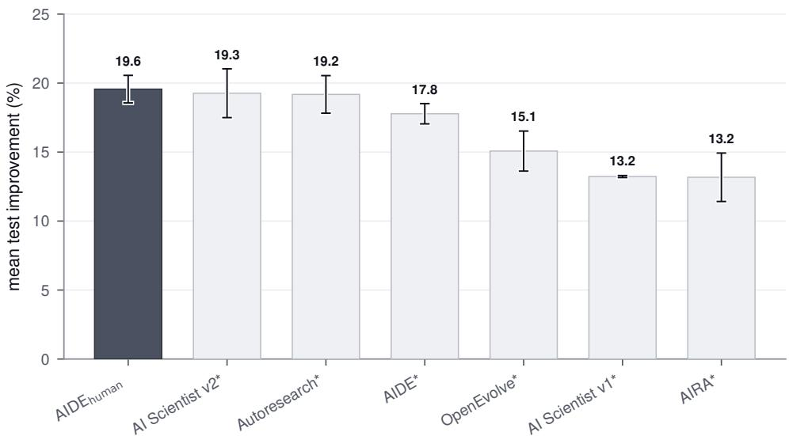  
Figure 8 | $\mathbf { A I D E _ { h u m a n } }$ ranks among the strongest code optimization agents on FML-Bench. $\mathrm { \ A I D E _ { h u m a n } }$ outperforms all six agents evaluated by the benchmark’s authors and represents a strong baseline when comparing agents discovered by $\mathrm { A I D E } ^ { 2 }$ . We show mean normalized test improvement over 18 tasks and 3 seeds with ±1 standard error of the mean across the three seed-level means. Asterisks mark agents whose per-round results were provided by the FML-Bench authors (Zou et al., 2026).

## C. Harness gains from recursive self-improvement transfer across models

We isolate how the harness interacts with the strength of the underlying model by studying agent performance on ALE-Bench and MLE-Bench, using $\mathrm { A I D E } _ { 0 }$ and $\mathrm { \ A I D E { 8 5 } }$ , which efectively mark the start and end of the recursive self-improvement run described in section 3.2. We evaluate their performance using gemini 3 flash, gpt-5.6-sol (OpenAI, 2026b), and fable 5 (Anthropic, 2026a). Note that gemini 3 flash is the model used during the selection process while running recursive self-improvement. We follow the protocol summarized in table 2. However, since the latter two models are substantially more expensive, we increase the per-run cost from \$5 to \$20 on both benchmarks and the ALE-Bench time limit from 12 to 36 hours. Figure 9 shows that $\mathrm { \ A I D E { _ { 8 5 } } } ^ { \prime } s$ gains over $\mathrm { \ A I D E _ { 0 } }$ transfer across all three models on both benchmarks. On ALE-Bench, gemini 3 flash with $\mathrm { \ A I D E { 8 5 } }$ reaches $1 8 5 8 \pm 2 2$ and exceeds fable 5 with $\mathrm { A I D E } _ { 0 }$ at $1 7 9 6 \pm 2 4$ under the same budget. On MLE-Bench, the gains are smaller. $\mathrm { \ A I D E { 8 5 } }$ with fable $^ { 5 , }$ the strongest model on this benchmark, stays within one standard error of its $\mathrm { \ A I D E _ { 0 } }$ score.

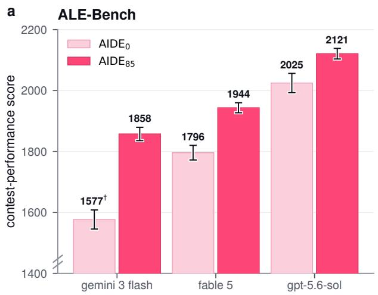

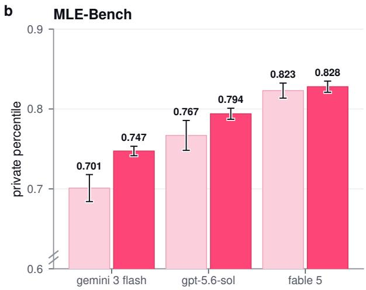  
Figure 9 | Gains from recursive self-improvement transfer across models. a, Mean private contest performance on ALE-Bench (10 tasks, 10 seeds per task). b, Mean private percentile on MLE-Bench (22 tasks, 3 seeds per task). Bars show benchmark means for $\mathrm { { A D E } _ { 0 } }$ and $\mathrm { A I D E } _ { 8 5 }$ with each of three models at a \$20 budget per run. Error bars show ±1 standard error of the benchmark mean. †48 runs reached the model’s context-window limit and are scored on the best candidate available at termination. The vertical axes are truncated.

## D. Rejected proposals

From the rejected proposals pooled across three recursive self-improvement runs, table 3 reports representative graded instances and maps them to related methods. The labels identify conceptual analogues rather than direct implementations. $\Delta g$ is the candidate’s grade relative to the incumbent at that step. Deltas of approximately −0.004 to −0.007 are small relative to observed run-to-run variability. Out of the graded rewrites that were rejected, about a quarter scored higher than the incumbent on the agent-visible public signal and were rejected on the private grade.

The rejected proposals span a portion of the classical search and learning toolbox, from populationbased and restart-driven exploration to robust selection and ensembling. Proposals concentrated most heavily on the search policy and on selection mechanics, followed by context management and robustness changes. Ensembling methods were explored during the recursive self-improvement run but were never retained, with the agent’s analyses consistently noting that ensembling LLM calls consumes budget that could otherwise fund additional search steps.

Table 3 | Representative rejected proposals from the recursive self-improvement trajectories. Scores report $g ( a _ { k } )$ ; deltas report $\Delta g$ relative to the incumbent.
<table><tr><td>What the loop proposed</td><td>Related method</td><td> $g ( a _ { k } ) \cdot \Delta g$ </td></tr><tr><td>gration and crossover</td><td>island populations with periodic mi- distributed and island-model genetic algo- 0.685 · -0.021 rithms (Tanese, 1989; Cantú-Paz, 1998)</td><td></td></tr><tr><td>pairwise LLM-judge tournaments for selection</td><td>tournament selection (Goldberg and Deb, 1991) and pairwise LLM judging (Zheng et al., 2023)</td><td>0.654·-0.090</td></tr><tr><td>stagnation-triggered exploration es- calation</td><td>reactive search and adaptive restarts (Battiti et al., 2008)</td><td>0.704·-0.040</td></tr><tr><td>keep-refining vs. restart decisions majority-vote ensembles at submis- bagging-style ensemble voting (Breiman, 1996)</td><td>restart policies (Luby et al., 1993)</td><td>0.666·-0.078 up to 0.723 · -0.031 (3 vari-</td></tr><tr><td>sion</td><td>and self-consistency-style majority voting (Wang et al., 2023)</td><td>ants)</td></tr><tr><td>ules</td><td>explore-rate tuning and decay sched- decaying e-greedy exploration (Sutton and 0.748 · -0.006, within noise Barto, 2018)</td><td></td></tr><tr><td>variance-adaptive exploration boosts</td><td>UCB-V (Audibert et al., 2009)</td><td>0.674·-0.080</td></tr><tr><td>ancestor-descendant trend propaga- tion in selection</td><td>MCTS value backup (Kocsis and Szepesvári, 0.7497 · -0.004, within noise 2006)</td><td></td></tr><tr><td>near-tie overrides</td><td>promote-second-best and robust selection under the optimizer&#x27;s curse (Smith 5+ variants · best -0.007, and Winkler, 2006)</td><td>within noise</td></tr><tr><td>treating heavy revisits of one node as no direct analogue identified overfitting suspicion</td><td></td><td>0.7498 · -0.004, within noise</td></tr></table>

## E. Prompt compression

As discussed in section 3.5, one of the mechanisms evolved during recursive self-improvement is the context management system. Figure 10 measures its efect on prompt size over the course of a run. For every run of $\mathrm { \ A I D E _ { 0 } }$ , AIDE47, AIDE85, and $\mathtt { A I D E _ { h u m a n } }$ on the held-out benchmarks used in section 3.3, we rebuild the prompt each agent assembled at every step. $\mathrm { \ A I D E _ { 0 } }$ concatenates the code and execution output of every prior candidate into each drafting and improvement prompt, so its prompts grow as its run progresses. The discovered agents replace this history with a bounded summary, so their prompts stay small in comparison. This bounded history also removes a concrete failure mode. $\mathrm { A D E } _ { 0 }$ terminates when its assembled prompt exceeds the model’s context window, a failure that ended five of its FML-Bench runs (fig. 3) and 48 of its ALE-Bench runs at the larger per-run budget in appendix $\mathrm { C } . \mathrm { \ A I D E { 8 5 } , \ A I D E { 4 7 } }$ and $\mathtt { A I D E _ { \mathrm { h u m a n } } }$ did not encounter any such issues. Since run lengths can difer across agents and tasks, we express progress as a fraction of each run’s steps. At each point of run progress, prompt sizes are averaged over seeds within a task. We express this as task-paired prompt reduction factors by dividing $\mathrm { { A D E } } _ { 0 } { \mathrm { { : } } }$ task-mean prompt size by the other agents’ at the same progress point. This provides us with the compression achieved over AIDE0. Figure 10 shows the median and interquartile range of the task means, with Figure 6 following the same approach. WeatherBench 2 contributes a single task, so its panels show that task’s seed-mean curve without any interquartile band. The median reduction grows throughout the run, reaching 7× on MLE-Bench, over 40× on WeatherBench 2, and about 50× on ALE-Bench and FML-Bench. When measured against $\mathrm { \ A I D E _ { h u m a n } }$ , the discovered agents’ prompts are 2.6–5.7× smaller on ALE-Bench, MLE-Bench, and FML-Bench and 13–14× smaller on WeatherBench 2 by the end of the run, while $\mathrm { \ A I D E _ { 0 } }$ ’s are 3–14× larger.

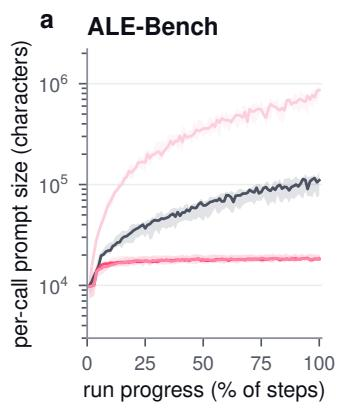

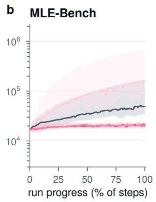

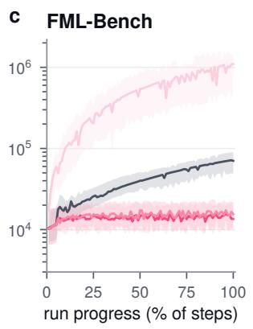

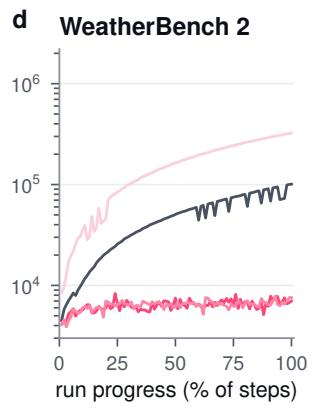  
Figure 10 | The discovered agents hold prompts to a bounded size, while ${ \bf A I D E } _ { 0 } { \bf \dot { s } }$ prompts grow with run history. a–d, Per LLM call prompt size in characters (log scale) across every held-out run on ALE-Bench (10 tasks), MLE-Bench (22 tasks), FML-Bench (18 tasks), and WeatherBench 2 (1 task). Lines and bands show the median and interquartile range over the task means. WeatherBench 2’s single task carries no band.