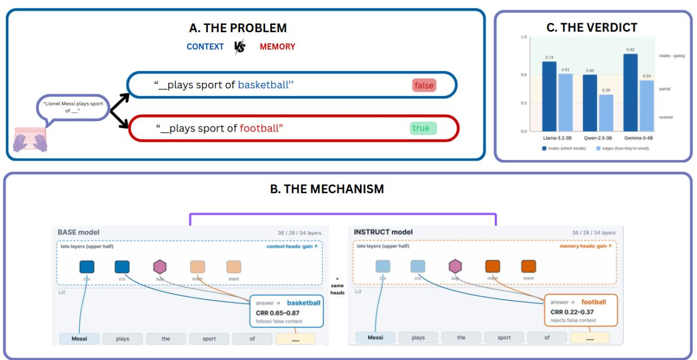
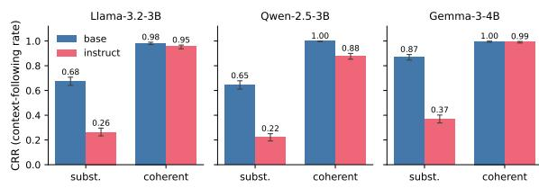
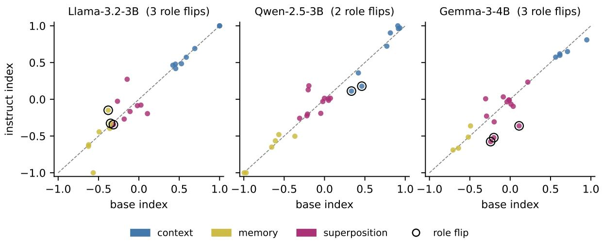
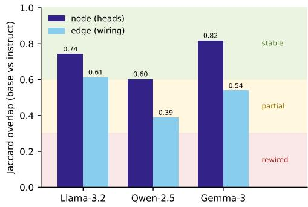
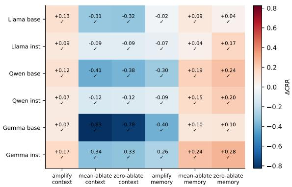
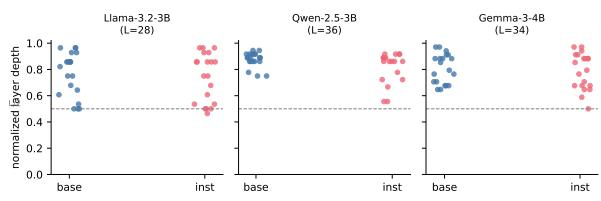

# Rewired or Gated? How Instruction Tuning Shapes Knowledge-Conflict Circuits in LLMs

Shubham Pandere\* Gautam Ranka\* Ritika Varshney Navya Deshmukh† Roushni Sareen† Roshan Kumar Singh IvLabs, VNIT

{shubham.pandere, gautam.ranka}@ivlabs.in

## Abstract

In language models, the choice between believing the prompt and believing the weights is made by a handful of identifiable attention heads. Instruction tuning changes how models behave under conflict, but whether it rewires the underlying circuit or merely gates/reweights already present components, remains unknown. We provide the first mechanistic base-vsinstruct comparison of conflict-resolution circuits, across three families (Llama-3.2-3B, Qwen-2.5-3B, Gemma-3-4B). Five independent methods, node and edge attribution, superposition role analysis, causal ablation, and path patching, converge on gating, with the same heads, in the same late-layers, are found to be reweighted rather than replaced with a high node overlap (0.60–0.82). Behaviorally, tuning shifts models toward parametric memory, making instruct models reject a terse counterfactual context far more than base ones, the opposite of a naive user-following expectation. Yet this added skepticism is a factor of framing since it disappears when the same false claim is delivered as a coherent, evidential passage. The robustness that instruction tuning buys against terse injection is therefore real but narrow. More broadly, we believe that because the conflict circuit is preserved rather than rebuilt, interpretability and control tools calibrated on base models should transfer di rectly to their deployed instruct siblings.

## 1 Introduction

Large language models store facts in their parameters, yet they must also read facts from their context. When the two disagree, say, the prompt asserts that an athlete plays a sport they do not, or that a capital is a city it is not, the model must choose which source to trust. Prior mechanistic work has localized this choice to a small set of later-layer attention heads: memory heads that surface parametric knowledge and context heads that surface the prompt (Jin et al., 2024), with the most influential heads often in superposition, doing both jobs at once (Li et al., 2025a).

A separate question concerns how instruction tuning changes how models behave under conflict, but its effect on the underlying circuit remains unknown. This line of work asks how fine-tuning changes circuits in general, and reaches two different answers: for entity tracking, fine-tuning enhances an existing circuit without replacing it (Prakash et al., 2024); for arithmetic, the important nodes stay the same but the edges between them shift (Wang et al., 2025). No prior mechanistic work, however, examined knowledge conflict, where the tuning objective (“follow the user”) intersects far more directly with the task (“which source do I trust?”). In this work, we aim to provide the first mechanistic, base-vs-instruct comparison of conflict-resolution circuits, across three model families.

We phrase the question as a binary i.e. does tuning rewire the circuit (a largely new set of heads become critical) or merely gate it (the same heads get reweighted), and then decompose the answer along three axes that the literature treats as separable: which nodes (heads) matter, how they are wired (edges), and how behavior shifts, leading to our three claims (summarized in Figure 1).

• C1 (Gating, not rewiring). Tuning preserves the conflict circuit: the same heads, roles, and wiring carry the circuit, reweighted rather than relocated.

• C2 (Memory-ward robustness). Tuning shifts conflict behavior towards parametric memory opposite the naive prior as instruct models reject terse counterfactual context far more than base ones. This effect is a factorframing (C2a) since a coherently written false passage reduces it

  
Figure 1: Instruction tuning gates the knowledge-conflict circuit rather than rewiring it. (A) Under a conflict prompt, the model must arbitrate between a false fact injected in context (basketball) and the true fact stored in its weights (football). (B) The same later-layer context, memory, and superposition heads carry the decision in both base and instruct variants. All head identity, role, and layer position are preserved; only their gain changes. Tuning reweights this fixed set memory-ward, dropping contextual reliance (CRR) from 0.65–0.87 in base models to 0.22–0.37 in their instruct siblings under terse substitution conflict. (C) Across all three families, base-vs-instruct node (head) overlap sits in the stable band (J = 0.60–0.82), with edge overlap equal or lower (0.39–0.61) but never reaching the rewiring threshold. Hence, we label Llama as strict gating and, Qwen and Gemma as gating with an ambiguous edge sub-type.

heavily.

• C3 (Localization preserved). Conflict heads stay in the upper half of the network in both base and instruct models, and instruction tuning reweights late heads without moving them.

The distinction carries practical weight. If tuning gates rather than rewires, then interpretability and control tools built on base models, such as head-level steering, pruning, and probes, should transfer to their deployed instruct siblings without being rediscovered. And the behavioral direction bears directly on safety: whether tuning makes a model easier or harder to fool with injected context determines how far a retrieval or agent pipeline can trust what it reads. We return to both implications in §5.

## 2 Background and Related Work

Knowledge conflicts. Xu et al. (2024) taxonomize conflicts into context–memory, inter-context, and intra-memory. Behavioral studies treat the model as an oracle to measure context-following (Longpre et al., 2021; Xie et al., 2024), and recent work shows context-faithfulness depends on how evidence is framed (Zhou et al., 2023; Li et al., 2025b) and that a model’s own parametric answer biases it against updates (Kortukov et al., 2024). Benchmarks such as Ming et al. (2025) show even strong models struggle with counterfactual context. Together these works characterize what models do under conflict, largely treating the network as a black box.

Mechanistic conflict resolution. Closest to our setting, Jin et al. (2024) localize conflict resolution to a small set of later-layer memory and context heads and show that pruning them (PH3) steers reliance without retraining; we adopt their head taxonomy and their path-patching validation. Li et al. (2025a) find that the most influential of these heads operate in superposition (Elhage et al., 2022), doing both jobs at once, which motivates the perhead superposition index we track across tuning. Niu et al. (2025) give a complementary account of how any in-context token amplifies its own logits, and Zheng et al. (2025) survey attention-head functions more broadly. This line of work localizes and characterizes conflict circuits within individual models.

Fine-tuning and circuits. Prakash et al. (2024) find that fine-tuning enhances the entity-tracking circuit rather than replacing it, while Wang et al. (2025) find node-stable but edge-shifting circuits for arithmetic, measured with edge attribution. These two results point in different directions (enhancement vs. edge-drift), and neither addresses knowledge conflict. Wu et al. (2024) further show that instruction tuning concentrates its changes in lower and middle layers; set against the later-layer conflict heads, this tension motivates our localization sub-question (discussed in claim C3).

Attribution methods. We use logit-derivative saliency (LDS) for a cheap per-head node score, edge attribution patching with integrated gradients (EAP-IG) for edges (Hanna et al., 2024; Syed et al., 2024), and path patching (Wang et al., 2023) as a causal cross-check; automated circuit discovery (Conmy et al., 2023) and causal tracing (Meng et al., 2022) are the methodological backdrop. EAP-family methods are cheap approximations with known saturation (Zhang et al., 2025) and variance (Méloux et al., 2025) issues, which we treat explicitly.

Our position. Prior work thus establishes either the behavior of conflict resolution or the circuits of fine-tuning, but not their intersection. We give the first base-vs-instruct comparison of conflictresolution circuits, decomposing it into the node, edge, and behavioral axes formalized next.

## 3 Setup and Methods

Hypotheses and decision rule. We combine the three axes into the decision table of Table 1. Crucially, the node axis decides gating versus rewiring where gating means the same heads still matter. The edge axis only sub-types a gating result into strict gating (wiring also preserved) or rewirededges (wiring changed) and cannot by itself overturn a node-level gating verdict. The behavioral (CRR) axis separates a real change from a null.

Measures. We measure four quantities. Contextual Reliance Rate (CRR) is the fraction of conflict prompts where the model follows the injected context instead of its parametric memory. Node overlap (Jaccard of top-k head sets and Spearman of full head rankings), edge overlap (Jaccard of top-k EAP-IG edges) and, finally, a per-head memory/context superposition index are the other axes which we use in our evaluation. Two validation experiments, path-patching triangulation and causal ablation, test whether the cheap node screen is causally trustworthy.

<table><tr><td>Node</td><td>Edge</td><td>CRR</td><td>Outcome</td></tr><tr><td>High</td><td>High</td><td>Small</td><td>Null (no behavioral change)</td></tr><tr><td>High</td><td>High</td><td>Large</td><td>Strict gating (wiring preserved)</td></tr><tr><td>High</td><td>Low</td><td>Large</td><td>Gating, rewired edges</td></tr><tr><td>Low</td><td>Low</td><td>Large</td><td>Rewiring</td></tr></table>

Table 1: Decision rule mapping the three axes to an outcome. Node overlap decides gating (High) vs. rewiring (Low); edge overlap only sub-types a gating result; a large, significant CRR shift rules out the null. Bands (pre-registered): overlap > 0.6 high, < 0.3 low.

Models. Three families, each a base model paired with its instruction-tuned sibling were evaluated to ensure cross family effect, namely Llama-3.2-3B (Grattafiori et al., 2024), Qwen-2.5-3B (Yang et al., 2024), and Gemma-3-4B (Gemma Team, 2025). We analyze inference-time behavior only, using publicly available pretrained weights; no additional training is performed.

Data. We use a factual dataset, derived from Para-Conflict (Li et al., 2025a), filtered to single-token answers so that every attribution method scores a clean next-token contrast, spanning the Athlete– Sport, Official–Language, Company–Headquarter, and World–Capital domains. After filtering, 764 prompts survive for Llama and Qwen and 870 for Gemma. For each fact we pin the memory answer to the deterministic tokenizer-only target, so base and instruct share an identical target word and CRR deltas are not confounded by tokenization. Prompt templates, the single-token filter, and the attribution counterfactual are detailed in Appendix A.

Conflict forms. We contrast 2 ways of injecting the same false fact. Substitution injects the false fact as a terse single-sentence swap, whereas Coherent elaborates the same false fact into a multisentence, evidential passage. For the fact “Lionel Messi playsfootball,” the false target basketball is delivered as:

• Substitution: “Lionel Messi plays the sport of basketball.”

• Coherent: “Lionel Messi is a professional basketball player, drafted into the NBA and celebrated for his play on the court. Messi plays the sport of basketball.”

Methods. Node importance uses logit-derivative saliency (LDS), a first-order saliency for each (layer, head) against the contrast target $L \quad = \quad$ $\mathrm { \ l o g i t _ { c t x } - \ l o g i t _ { m e m } ; }$ a head scores highly when a small change in its output moves the model between the context and memory answers. We report this logit-derivative flavor as the primary score (denoted LDS-eap in the appendix tables) and confirm robustness to two alternative saliency flavors, gradient-norm and gradient×activation, in Appendix B.

Edges use EAP-IG (Hanna et al., 2024; Syed et al., 2024) over the full edge graph (87k–390k edges) with 5 integration steps. The superposition index of a head is,

$$
S = \frac { \left( \mathrm { c t x \_ p u l l } - \mathrm { m e m \_ p u l l } \right) } { \left( \left| \mathrm { c t x \_ p u l l } \right| + \left| \mathrm { m e m \_ p u l l } \right| \right) } , S \in \left[ - 1 , 1 \right]
$$

So +1 marks a pure context head and −1 a pure memory head. Validation uses PH3-style path patching (Jin et al., 2024; Wang et al., 2023) on the top heads and causal ablation, in which we amplify or suppress the identified heads and re-measure CRR against an a-priori predicted sign.

Node-level attribution (LDS) and path patching are run on both conflict forms. We report the coherent-form node results in §4.2. Edge-level attribution (EAP-IG) runs on the substitution form only, for a methodological reason, that is the coherent passage repeats and rephrames the injected distractor (injected false context), and EAP-IG’s contrast window admits only a common prefix and suffix. The single-token backbone makes every swap length-preserving, which lets the node and path-patching aligner match position-by-position and keep the full prompt on both forms which is not shared by EAP-IG aligner. The single-token design lets us measure the node and behavioral axes on both conflict forms, while the edge (wiring) axis is confined to the substitution form, a scope we return to in §5.

## 4 Results

We first establish the behavioral phenomenon that the circuit analysis must explain (§4.1). We then test whether instruction tuning rewires or merely gates the conflict circuit (§4.2), before examining whether the circuit’s layer localization is preserved (§4.3).

<table><tr><td>Family</td><td>Form</td><td>base</td><td>inst</td><td>∆</td></tr><tr><td>Llama</td><td>subst.</td><td>0.675</td><td>0.263</td><td>-0.412</td></tr><tr><td>Llama</td><td>coher.</td><td>0.983</td><td>0.954</td><td>-0.029</td></tr><tr><td>Qwen</td><td>subst.</td><td>0.645</td><td>0.220</td><td>-0.425</td></tr><tr><td>Qwen</td><td>coher.</td><td>1.000</td><td>0.878</td><td>-0.122</td></tr><tr><td>Gemma</td><td>subst.</td><td>0.870</td><td>0.369</td><td>-0.501</td></tr><tr><td>Gemma</td><td>coher.</td><td>0.997</td><td>0.992</td><td>-0.005</td></tr></table>

Table 2: Contextual Reliance Rate (CRR), base vs. instruct. All substitution deltas are significant at $p \ <$ $1 0 ^ { - 1 5 } ( z = 1 6 { - } 2 2 )$ . Coherent deltas are small.  
  
Figure 2: CRR base vs. instruct across families and conflict forms. The tuning effect is large under terse substitution and nearly vanishes under a coherent passage.

## 4.1 The behavioral shift, and its dissociation (C2)

Why measure this first. Every mechanistic claim is vacuous unless behavior actually changed. CRR is the behavior; a large, significant shift is what licenses the rest of the paper.

Instruction tuning produces a large behavioral change, but not the one the naive prior predicts. On the terse substitution conflict, CRR decreases substantially from base to instruct in all three families (Table 2, Figure 2 and 1B): instruct models are markedly more likely to reject the injected false context and fall back on parametric memory, and the shift is large and highly significant in every family (Table 2). A continuous log-prob variant of CRR (comparing mean teacher-forced log-probability of the context vs. memory answer, rather than the argmax) agrees with the argmax metric within 2.6 points in every cell, so the effect is not an artifact of near-ties.

This direction is counterintuitive: instruction tuning is meant to make models follow the user, yet here the instruct models follow the injected context less. The resolution is that the injected context is false ; rejecting a terse, unsupported falsehood and falling back on parametric memory is the calibrated response, consistent with the parametric-bias effect of Kortukov et al. (2024) rather than with naive compliance. The negative $\Delta$ therefore means instruct rejects false context more, not that it ignores true context; and, as the coherent condition below shows, the same models stay fully persuadable when the false fact is delivered as a credible passage.

Why the second conflict form. If tuning simply made models trust context less, the effect should not depend on how the false fact is phrased. However, it does. Under the coherent, evidential passage the base/instruct gap nearly disappears and both variants follow the false context near ceiling (0.88–1.00) (Table 2). Instruction tuning’s added skeptical behaviour is therefore specific to terse, unsupported contradictions, matching the evidencestyle sensitivity that Li et al. (2025b) observe behaviorally. This specificity also surfaces as abstention: under terse conflict the instruct models more often decline to answer with either candidate, so their “neither” rate rises (e.g., Gemma from 0 to 48 prompts). This dissociation (C2a) both bounds the behavioral claim and justifies restricting the mechanistic analysis to the substitution form.

## 4.2 Gating, not rewiring (C1)

No single attribution method is decisive, and four of our five views are observational (node screens are cheap but correlational, edge methods see wiring but not causation, superposition sees function but not location, and path patching only corroborates the node screen). Causal ablation is an interventional test, but only for the heads it targets. We therefore triangulate rather than lean on any single method.

Nodes The same heads matter after tuning. The top-head Jaccard between base and instruct models is $\mathrm { J } @ 1 0 = 0 . 6 7 – 0 . 8 2$ and the importance-ranking is highly correlated (Spearman 0.82–0.91) supporting a gating verdict. An independent node crosscheck from the superposition pipeline gives mean head-set Jaccard 0.74 (Llama), 0.60 (Qwen), 0.82 (Gemma) agreeing to the label. The verdict is robust to the saliency formula (Appendix B) and no variant approaches the rewiring line. Every node overlap far exceeds a random-top-k null(all exact hypergeometric $p \leq 7 \times 1 0 ^ { - 1 5 } , z = 2 4 \AA { - 4 0 } ;$ App. C), so the overlap is significant. Nor is the verdict an artifact of the terse conflict form: repeating the node screen on the coherent prompts gives basevs-instruct J@10 = 1.00 (Qwen), 0.67 (Llama), 0.67 (Gemma) and $\mathrm { J } @ 2 0 = 0 . 8 2 / 0 . 6 7 / 0 . 9 0$ , every cell clearing the 0.6 gating bar and far above the random-top-k null (hypergeometric $p \leq 3 { \times } 1 0 ^ { - 1 2 } )$ .

The same heads remain the important conflict heads after tuning, under both conflictforms.

Roles The superposition index gives each head a memory-vs-context role. Only 2–3 heads per family flip role (Figure 3), and the mean index drift is near zero, slightly memory-ward $( - 0 . 0 0 9 , + 0 . 0 0 3 ,$ −0.046). Tuning neither sharpens nor blurs superposition. It does lightly reweight stable heads toward memory.

Edges Edge overlap (EAP-IG, top-50) sub-types the gating result (Figure 4). Llama is high on both axes (edge J@50 = 0.613), so we label it strict gating. Qwen (0.389) and Gemma (0.539) sit in the partial band, showing that their wiring overlaps less than their heads do, the direction predicted by Wang et al. (2025). But neither reaches the less than 0.3 rewired threshold, so we read them as gating with an ambiguous edge sub-type, rather than rewired. The full-edge ranking still agrees everywhere (Spearman 0.69–0.72;top-50 sign-agreement 60–65 of a 62–72-edge union - Llama 61/62, Qwen 65/72, Gemma 60/65), so the drift is about which mid-tail edges reach the very top, not an overall reordering.

Cause The observational axes could be fooled by heads that correlate with the answer without causing it, so we test causation directly by ablation. We amplify or suppress the identified context/memory heads and re-measure CRR, with the sign predicted a priori. In all six model variants, all six conditions match the predicted sign (36/36; binomial $p \approx 2 ^ { - 3 6 }$ ; Figure 5): suppressing context heads drives CRR down and amplifying them drives it up, while suppressing memory heads drives CRR up.

We also find that the circuit is sparse and asymmetric: suppressing just the five top context heads collapses context-following in the base models (Figure 5; ∆CRR: Gemma −0.83, Qwen −0.41, Llama −0.31), while the five memory heads move CRR far less (+0.04 to +0.25). Effects are large for base and attenuated for instruct, a floor effect, since instruct already follows context rarely. The same heads are causal in both variants.

Crucially, this effect is specific to the heads LDS selects, not a generic consequence of perturbing late-layer attention. Ablating an equal number of random late-layer heads leaves CRR essentially unchanged, whereas ablating the LDS-selected context heads collapses context-following in every model variant (Table 10, App. C). The heads LDS identifies are therefore load-bearing rather than having incidental correlation with the answer, with a 36/36 sign match result.

  
Figure 3: Per-head superposition index, base (x) vs. instruct (y). Points hug the diagonal (roles stable); ringed points are the 2–3 heads that flip role.

  
Figure 4: Node (head) vs. edge (wiring) overlap, base vs. instruct. All nodes are in the “stable” band (gating); Llama’s wiring is also stable (strict gating), while Qwen and Gemma drift into “partial” without reaching “rewired”.

Validity. The whole node analysis leans on LDS, so we cross-check it with path patching on the top-20 heads (the top-10 context and top-10 memory heads). Path patching on these top-20 heads agrees with the LDS ranking in all six cells (Spearman 0.62–0.85, all six correlations positive, every cell passing its pre-registered noise floor).Per-cell pvalues are not individually significant (0.10–0.42). Instead, confidence comes from the consistency of the effect across all six cells rather than from any single statistical test, so we treat this triangulation as corroborative.

Placement. Table 3 places every family in the decision rule as gating (Figure 1C; all node-high with a large CRR shift): Llama as strict gating, Qwen and Gemma as gating with an ambiguous edge sub-type, and none as rewired.

  
Figure 5: Causal ablation. ∆CRR for six interventions across six model variants; ✓ marks a match to the apriori sign (36/36). Each column is an intervention on a head set: we amplify (scale up), mean-ablate (replace activations with their mean, a soft knock-out), or zeroablate (set to zero, a harsher knock-out) either the top context heads or the top memory heads, then re-measure CRR.

## 4.3 Localization is preserved (C3)

Jin et al. (2024) places conflict resolution in later layers, while Wu et al. (2024) place instructiontuning’s changes in lower/middle layers. If both hold, tuning should reweight the late conflict heads without moving them, which is what we see. The top LDS heads sit in the upper half of the network in both variants (Figure 6) with the shared base ∩ instruct heads are 81–100% in the upper half, and the median conflict-head layer moves by at most two layers (base→instruct: 24 → 22, 32 → 31, 28→28 for the 28/36/34-layer models). The edge attribution also agrees that more than 95% of the importance of answer-feeding edges is in the upperlayer in both variants. Instruction tuning reweights and reroutes these late heads without relocating them, dissociating the two priors.

<table><tr><td>Family</td><td></td><td>node J edge J@50</td><td>|∆CRR|</td><td>Verdict</td></tr><tr><td>Llama</td><td>0.74</td><td>0.61</td><td>0.41</td><td>strict gating</td></tr><tr><td>Qwen</td><td>0.60</td><td>0.39</td><td>0.43</td><td>gating (amb.)</td></tr><tr><td>Gemma</td><td>0.82</td><td>0.54</td><td>0.50</td><td>gating (amb.)</td></tr></table>

Table 3: Four-way placement. Node overlap is high everywhere ⇒ gating; edge overlap sub-types Llama as strict and leaves Qwen/Gemma ambiguous (partial band, not rewired).

  
Figure 6: Normalized layer depth of the top-20 LDS conflict heads, base vs. instruct. Heads stay above the $L / 2$ line (dashed) in both variants.

## 5 Discussion

Instruction tuning gates the knowledge-conflict circuit. The same later-layer heads, in the same superposition roles, wired in largely the same way, are reweighted to trust terse counterfactual context less. This replicates Prakash et al. (2024) in a structurally different task, arbitration rather than tracking, and shows the Wang et al. (2025) edge-shift as a tendency (in Qwen and Gemma) that does not, here, reach rewiring. That the circuit is preserved has a practical implication: steering and pruning methods developed on base models (e.g., PH3) should transfer to their instruct siblings, because the components they target are still the operative ones.

The behavioral reversal reframes “contextfaithfulness.” Tuning did not make these models more contextual, rather it made them more skeptical of contradictions while leaving them persuadable by a coherent passage. Whether this is desirable depends on the deployment: it is a feature against adversarial one-line injections and a liability for legitimate but tersely-stated updates. The mechanism, a small memory-ward reweighting of stable heads, is the same in both readings.

Implications. Two consequences follow for how the field builds on and deploys these models. First, because the conflict circuit is preserved under tuning, mechanistic tools calibrated on a base model, including head-level steering, pruning such as PH3, and superposition probes, should carry over to its instruct sibling; safety and interpretability work can therefore be conducted on the cheaper, openly released base checkpoint and still describe the deployed model. Second, the robustness that tuning buys is real but narrow. Instruct models resist terse, unsupported counterfactuals, a common promptinjection pattern, yet remain fully persuadable by a fluent, coherent false passage, so instruction tuning should not be treated as a defense against wellwritten misinformation: the vulnerability moves from terse to coherent injection rather than closing. The same skepticism can conversely under-trust legitimate but tersely stated retrieved facts, a failure mode retrieval-augmented systems can mitigate either by elaborating the evidence or by intervening directly on the context heads, which remain the operative ones precisely because tuning leaves the circuit intact.

## Limitations and Future Work

• Scale. Our experiments are limited to 3–4B models, parameter range. Whether the observed gating behavior extends to substantially larger instruction-tuned models remains an open question.

• Substitution-only edges. EAP-IG and edge analysis cover only the substitution conflict form due to the single token filter constraint. The coherent behavioral effect (C2a) therefore has a node-level but no edge-level mechanistic counterpart.

• Metric scope. The dataset is restricted to facts whose memory and context answers are each a single token under the model’s own tokenizer, which the gradient-based methods (EAP-IG) require for a clean contrastive target. CRR itself is a next-token, single-token-answer measure. Multi-token and free-generation following are therefore out of scope due to methodological constraints.

• Single corpus. Although the prompts span four relation domains, they derive from one dataset (ParaConflict). A second, naturally occurring conflict corpus, held-out-domain attribution, and a cross-model activation-patching guard for the ambiguous sub-types remain future work.

## Acknowledgments

We sincerely thank our Lab Advisor, Dr. Shital Chiddarwar, for her support and guidance throughout our work in the lab. We are grateful for her continued support of the lab and its members, which provided a conducive environment for us to carry out this work.

## Ethics Statement

This work analyzes publicly available pre-trained models on synthetic factual prompts; no human subjects or private data are involved. The counterfactual prompts are used only to probe internal mechanisms. A dual-use consideration is that the same head-level interventions we use for analysis could steer a model toward or away from injected context; we report them to support interpretability and robustness research, not to facilitate manipulation.

## Code

Code is available at https://github.com/ IvLabs/Rewired-or-Gated

## References

Arthur Conmy, Augustine N. Mavor-Parker, Aengus Lynch, Stefan Heimersheim, and Adrià Garriga-Alonso. 2023. Towards automated circuit discovery for mechanistic interpretability. In Advances in Neural Information Processing Systems (NeurIPS).

Nelson Elhage, Tristan Hume, Catherine Olsson, Nicholas Schiefer, Tom Henighan, Shauna Kravec, Zac Hatfield-Dodds, Robert Lasenby, Dawn Drain, Carol Chen, Roger Grosse, Sam McCandlish, Jared Kaplan, Dario Amodei, Martin Wattenberg, and Christopher Olah. 2022. Toy models of superposition. Transformer Circuits Thread.

Gemma Team. 2025. Gemma 3 technical report. arXiv preprint arXiv:2503.19786.

Aaron Grattafiori et al. 2024. The Llama 3 herd of models. arXiv preprint arXiv:2407.21783.

Michael Hanna, Sandro Pezzelle, and Yonatan Belinkov. 2024. Have faith in faithfulness: Going beyond circuit overlap when finding model mechanisms. In Conference on Language Modeling (COLM).

Zhuoran Jin, Pengfei Cao, Hongbang Yuan, Yubo Chen, Jiexin Xu, Huaijun Li, Xiaojian Jiang, Kang Liu, and Jun Zhao. 2024. Cutting off the head ends the conflict: A mechanism for interpreting and mitigating knowledge conflicts in language models. In Findings of the Association for Computational Linguistics: ACL 2024.

Evgenii Kortukov, Alexander Rubinstein, Elisa Nguyen, and Seong Joon Oh. 2024. Studying large language model behaviors under context-memory conflicts with real documents. arXiv preprint arXiv:2404.16032.

Gaotang Li, Yuzhong Chen, and Hanghang Tong. 2025a. Taming knowledge conflicts in language models. In Proceedings of the 42nd International Conference on Machine Learning.

Yuepei Li, Kang Zhou, Qiao Qiao, Bach Nguyen, Qing Wang, and Qi Li. 2025b. Investigating contextfaithfulness in large language models: The roles of memory strength and evidence style. In Findings of the 63rd Annual Meeting of the Association for Computational Linguistics (ACL).

Shayne Longpre, Kartik Perisetla, Anthony Chen, Nikhil Ramesh, Chris DuBois, and Sameer Singh. 2021. Entity-based knowledge conflicts in question answering. In Proceedings ofthe 2021 Conference on Empirical Methods in Natural Language Processing (EMNLP).

Maxime Méloux, François Portet, and Maxime Peyrard. 2025. Mechanistic interpretability as statistical estimation: A variance analysis. arXiv preprint arXiv:2510.00845.

Kevin Meng, David Bau, Alex Andonian, and Yonatan Belinkov. 2022. Locating and editing factual associations in GPT. In Advances in Neural Information Processing Systems (NeurIPS).

Yifei Ming, Senthil Purushwalkam, Shrey Pandit, Zixuan Ke, Xuan-Phi Nguyen, Caiming Xiong, and Shafiq Joty. 2025. FaithEval: Can your language model stay faithful to context, even if “the moon is made of marshmallows”. In The Thirteenth International Conference on Learning Representations (ICLR).

Jingcheng Niu, Xingdi Yuan, Tong Wang, Hamidreza Saghir, and Amir H. Abdi. 2025. Llama see, llama do: A mechanistic perspective on contextual entrainment and distraction in LLMs. In Proceedings ofthe 63rd Annual Meeting ofthe Associationfor Computational Linguistics (ACL).

Nikhil Prakash, Tamar Rott Shaham, Tal Haklay, Yonatan Belinkov, and David Bau. 2024. Fine-tuning enhances existing mechanisms: A case study on entity tracking. In The Twelfth International Conference on Learning Representations (ICLR).

Aaquib Syed, Can Rager, and Arthur Conmy. 2024. Attribution patching outperforms automated circuit

discovery. In Proceedings ofthe 7th BlackboxNLP Workshop: Analyzing and Interpreting Neural Networksfor NLP.

Kevin Wang, Alexandre Variengien, Arthur Conmy, Buck Shlegeris, and Jacob Steinhardt. 2023. Interpretability in the wild: a circuit for indirect object identification in GPT-2 small. In The Eleventh International Conference on Learning Representations (ICLR).

Xu Wang, Yan Hu, Wenyu Du, Reynold Cheng, Benyou Wang, and Difan Zou. 2025. Towards understanding fine-tuning mechanisms of llms via circuit analysis. In Proceedings ofthe 42nd International Conference on Machine Learning (ICML).

Xuansheng Wu, Wenlin Yao, Jianshu Chen, Xiaoman Pan, Xiaoyang Wang, Ninghao Liu, and Dong Yu. 2024. From language modeling to instruction following: Understanding the behavior shift in llms after instruction tuning. In Proceedings ofthe 2024 Conference of the North American Chapter of the Associationfor Computational Linguistics (NAACL).

Jian Xie, Kai Zhang, Jiangjie Chen, Renze Lou, and Yu Su. 2024. Adaptive chameleon or stubborn sloth: Revealing the behavior of large language models in knowledge conflicts. In The Twelfth International Conference on Learning Representations (ICLR).

Rongwu Xu, Zehan Qi, Zhijiang Guo, Cunxiang Wang, Hongru Wang, Yue Zhang, and Wei Xu. 2024. Knowledge conflicts for llms: A survey. In Proceedings ofthe 2024 Conference on Empirical Methods in Natural Language Processing (EMNLP).

An Yang et al. 2024. Qwen2.5 technical report. arXiv preprint arXiv:2412.15115.

Lin Zhang, Wenshuo Dong, Zhuoran Zhang, Shu Yang, Lijie Hu, Ninghao Liu, Pan Zhou, and Di Wang. 2025. EAP-GP: Mitigating saturation effect in gradientbased automated circuit identification. arXiv preprint arXiv:2502.06852.

Zifan Zheng, Yezhaohui Wang, Yuxin Huang, Shichao Song, Mingchuan Yang, Bo Tang, Feiyu Xiong, and Zhiyu Li. 2025. Attention heads of large language models. Patterns, 6(2):101176.

Wenxuan Zhou, Sheng Zhang, Hoifung Poon, and Muhao Chen. 2023. Context-faithful prompting for large language models. In Findings of the Associationfor Computational Linguistics: EMNLP 2023.

## A Prompt construction and dataset composition

Tokenization. Prompts are tokenized with each model’s native tokenizer through TransformerLens with default special-token handling: a leading BOS for Llama-3.2 (<|begin\_of\_text|>) and Gemma-3 (<bos>); Qwen2.5 defines no BOS token. No chat template, system prompt, or few-shot exemplar is applied, and a family’s base and instruct model receive byte-identical token sequences. Every prompt ends immediately before the answer slot, so the next-token distribution is the arbitration point between the injected context answer and parametric memory.

Memory-target selection. ParaConflict gives each fact an alias list (e.g. ["mixed martial arts", "Mixed Martial Arts", "MMA", . . . ]). We take the memory target to be the first alias that is a single token under the model’s tokenizer (MMA in that example), falling back to the first alias if none is — in which case the row fails the single-token filter below. This rule is tokenizeronly and therefore returns the same target for a family’s base and instruct model by construction.

Single-token filter. A row is kept for a given model iff both its distractor and its selected memory target tokenize to exactly one token under that model’s tokenizer. Person-name relations (Book– Author, Company–Founder; 703 rows) survive for no model, leaving the four domains of Table 4. Llama and Qwen produce the identical 764-row set; Gemma’s 870 is a strict superset (the same 764 rows plus 106). Athlete–Sport dominates the surviving pool (70% for Llama/Qwen, 61% for Gemma), so the circuits are found on a sportdominated set. This does not drive the family-level differences, however: Llama and Qwen, scored on the exact same 764 rows, still receive different edge sub-types (§4.2), and Gemma’s verdict is unchanged across its 106 extra rows.

<table><tr><td>Relation</td><td>ParaConflict Llama/Qwen Gemma</td><td></td></tr><tr><td>Athlete-Sport</td><td>532 532</td><td>532</td></tr><tr><td>Book-Author</td><td>500</td><td>0 0</td></tr><tr><td>Company-Headquarter</td><td>500 88</td><td>138</td></tr><tr><td>World-Capital</td><td>218 20</td><td>50</td></tr><tr><td>Company-Founder</td><td>203 0</td><td>0</td></tr><tr><td>Official Language</td><td>193 124</td><td>150</td></tr><tr><td>Total</td><td>2146</td><td>764 870</td></tr></table>

Table 4: Prompts surviving the single-token filter, by relation. Llama and Qwen yield the identical 764-row set; Gemma’s 870 is a strict superset. Book–Author and Company–Founder are removed entirely.

Substitution prompts. One false clause, then a verbatim restatement of the stem. One surviving example per domain (false → true):

Athlete–Sport. Conor McGregor plays the   
sport of basketball. Conor McGregor   
plays the sport of basketball → MMA

Official Language. The official language   
of Afghanistan is French. The   
official language of Afghanistan is   
French → Persian

Company–Headquarter. The headquarters of Wesco International are located in the city of Burlington. The headquarters of Wesco International are located in the city of Burlington → Pittsburgh

World–Capital. The name of the capital   
city of Russia is Tokyo. The name   
of the capital city of Russia is   
Tokyo → Moscow

Coherent prompts. The same falsehood expanded into an evidential passage (template varies by relation) that repeats the distractor and closes with a Question:/Answer: turn:

The name of the capital city of Russia   
is Tokyo. This can be seen in the   
official government website of Russia,   
where it is listed as the capital city.   
Additionally, Tokyo is home to the royal   
palace and the seat of the government   
of Russia. . . Question: What is the   
capital city of Russia? Answer: The   
capital city of Russia is

Attribution counterfactual. Node and edge attribution contrast the conflict prompt against an in-place counterfactual in which every occurrence of the distractor is replaced by the memory target, leaving the rest of the string untouched:

conflict: Lionel Messi plays the sport of   
basketball. Lionel Messi plays the sport   
of   
counterfactual: Lionel Messi plays the   
sport of soccer. Lionel Messi plays the   
sport of

Because both answers are single-token, the swap is length-preserving: Substitution has one occurrence and yields a single contiguous edit; Coherent has three to five occurrences, all swapped, and the two token sequences still align position-by-position (identical length), so LDS and path patching keep every matching position. EAP-IG instead aligns only on a common prefix and suffix, which the repeated coherent distractor breaks, hence its restriction to Substitution.

Behavioral metric (CRR). CRR is measured separately, by greedy generation of up to 10 tokens from the prompt and a case-insensitive substring match of the continuation against the full memory alias list vs. the distractor; prompts matching neither form the “neither” (abstention) bucket reported in §4.1. The single-token target is used only for the gradient- and patching-based contrasts, not for CRR.

## B Additional overlap tables

Table 5 shows the cut-off dependence of edge overlap that motivates fixing the operative cut-off in advance. Node overlap is additionally robust across saliency flavors (gradient-norm Spearman 0.92–0.94; the primary logit-derivative 0.82–0.91; a gradient×activation flavor is noisier at 0.46–0.70 but never near rewiring).

<table><tr><td>Family</td><td>J@10</td><td>J@20</td><td>J@50 J@100</td><td>J@1000</td></tr><tr><td>Llama</td><td>0.67</td><td>0.60</td><td>0.61</td><td>0.64 0.47</td></tr><tr><td>Qwen</td><td>0.67</td><td>0.60</td><td>0.39 0.35</td><td>0.35</td></tr><tr><td>Gemma</td><td>0.67</td><td>0.48</td><td>0.54 0.42</td><td>0.40</td></tr></table>

Table 5: Edge Jaccard (base vs. instruct) by cut-off. Reading at J@10 would call all three “high”; reading deep in the tail (J@1000) would call all three “low”. Neither is the operative cut-off (top-50).

Node overlap by conflict form. Table 6 reports base-vs-instruct node overlap separately for the two conflict forms, ranked by |LDS-eap|. The gating verdict holds on both: every J@10 clears the 0.6 bar, Qwen’s coherent top-10 is preserved exactly (10/10 heads), and every cell sits far above the random-top-k null. This is the node-level replication cited in §4.2; the edge axis has no coherent counterpart for the alignment reason given in §3.

<table><tr><td>Family</td><td>Form ∩@10</td><td>J@10 J@20</td><td>ρ</td><td>exact p</td></tr><tr><td>Llama</td><td>subst.</td><td>8/10 0.67 0.67</td><td>0.84</td><td>2×10−15</td></tr><tr><td>Llama</td><td>coher.</td><td>8/10 0.67 0.67</td><td>0.74</td><td>2×10−15</td></tr><tr><td>Qwen</td><td>subst. 9/10</td><td>0.82 0.54</td><td>0.65</td><td>6×10−18</td></tr><tr><td>Qwen</td><td>coher. 10/10</td><td>1.00 0.82</td><td>0.78</td><td>1×10−21</td></tr><tr><td>Gemma</td><td>subst. 9/10</td><td>0.82 0.82</td><td>0.77</td><td>5×10−15</td></tr><tr><td>Gemma</td><td>coher.</td><td>8/10 0.67 0.90</td><td>0.70</td><td>3×10−12</td></tr></table>

Table 6: Node overlap (base vs. instruct) by conflict form, top-k heads ranked by |LDS-eap|. ∩@10 = heads shared by the two top-10 sets; ρ = signed-score Spearman on the full head ranking (the |score| variant quoted in §4.2 is 0.82–0.91); exact p = hypergeometric tail for the observed top-10 intersection against two random top-10 sets from the same L×H universe. Every cell clears the 0.6 gating bar at J@10 and none approaches the < 0.3 rewiring line: the node verdict is not an artifact of the terse conflict form.

## C Overlap significance and cross-method agreement

The three analyses here are read-only derivations of the committed attribution outputs . They address, respectively, the absence of an overlap null, reliance on a single similarity metric, and whether the methods agree head-to-head rather than only in aggregate.

Overlap significance (permutation null). We test each reported overlap against the null of two random top-k sets drawn from the same head (edge) universe, whose intersection is Hypergeometric, giving an exact tail probability. Table 7 shows every node and edge overlap is far above chance: the null 95th percentile is $\approx 0 . 0 5$ for k=10 node sets and ≈ 0 for k=50 edge sets, while the observed overlaps carry exact $p \leq 7 { \times } 1 0 ^ { - 1 5 }$ (nodes) and $p \leq 3 { \times } 1 0 ^ { - 9 3 }$ (edges). Even Qwen’s weakest cell (memory $J @ 1 0 { = } 0 . 5 4 )$ is significant. This establishes that the gating-level overlaps are not threshold artifacts; it does not test differences between families, which remains future work.

<table><tr><td>Overlap</td><td>Family</td><td>obs J</td><td>exact p</td><td>z</td></tr><tr><td>Node ctx J@10</td><td>Llama</td><td>0.82</td><td> $2 \times 1 0 ^ { - 2 2 }$ </td><td>40</td></tr><tr><td rowspan="4">Node mem J@10</td><td>Qwen</td><td>0.67</td><td> $6 \times 1 0 ^ { - 1 8 }$ </td><td>30</td></tr><tr><td>Gemma</td><td>0.82</td><td> $2 \times 1 0 ^ { - 1 8 }$ </td><td>25</td></tr><tr><td>Llama</td><td>0.67</td><td> $1 \times 1 0 ^ { - 1 8 }$ </td><td>33</td></tr><tr><td>Qwen</td><td>0.54</td><td> $7 \times 1 0 ^ { - 1 5 }$ </td><td>24</td></tr><tr><td rowspan="4">Edge J@50</td><td>Gemma</td><td>0.82</td><td> $2 \times 1 0 ^ { - 1 8 }$ </td><td>25</td></tr><tr><td>Llama</td><td>0.61</td><td> $3 \times 1 0 ^ { - 1 4 6 }$ </td><td>779</td></tr><tr><td>Qwen</td><td>0.39</td><td> $3 \times 1 0 ^ { - 9 3 }$ </td><td>370</td></tr><tr><td>Gemma</td><td>0.54</td><td> $7 \times 1 0 ^ { - 1 0 9 }$ </td><td>316</td></tr></table>

Table 7: Permutation null on base-vs-instruct overlap. Null = two random top-k sets from the L×H head (or full-edge) universe; exact p from the Hypergeometric intersection. All overlaps significant.

A second agreement metric. Jaccard is setmembership at one cut-off. We add Rank-Biased Overlap (RBO, top-weighted, p=0.9) and Kendall’s $\tau _ { b }$ on the full rankings (Table 8). The node story is unchanged (RBO 0.72–0.80, $\tau _ { b }$ 0.64–0.75). On edges, RBO exposes a nuance consistent with the main text: the very top edges are preserved in Llama and Gemma (RBO 0.83) but drift even near the head of the list in Qwen (RBO 0.53), matching Qwen’s lower J@50. (The node importance-ranking Spearman quoted in §4.2, 0.82–0.91, is computed on |score|; the signed-score Spearman is 0.65/0.84/0.77 for Qwen/Llama/Gemma, still far from rewiring.)

<table><tr><td>Family</td><td>node RBO</td><td>node  $\tau _ { b }$ </td><td>edge RBO</td><td>edge  $\tau _ { b }$ </td></tr><tr><td>Llama</td><td>0.76</td><td>0.75</td><td>0.83</td><td>0.66</td></tr><tr><td>Qwen</td><td>0.72</td><td>0.64</td><td>0.53</td><td>0.70</td></tr><tr><td>Gemma</td><td>0.80</td><td>0.72</td><td>0.83</td><td>0.67</td></tr></table>

Table 8: Second agreement metrics (base vs. instruct). RBO at $p { = } 0 . 9$ (top-weighted) and Kendall’s $\tau _ { b }$ on the full |LDS-eap| / |edge| rankings.

Cross-method head-level convergence. The path-patching and ablation head sets are LDSselected, so their membership overlap with LDS is not independent evidence. The superposition role, however, is computed from an independent DLA pull ratio. Table 9 reports that the LDS-assigned context/memory direction of the ablation-target heads matches the sign of the independent superposition index on 55/60 head assignments (context 27/30, memory 28/30); the five misses are 3 context and 2 memory heads, all weak-index heads near the superposition threshold. Path-patching direction agrees with the superposition role on 14–18 of 20 heads per cell. The node screen and the functional axis thus agree head-by-head, not only in aggregate.

<table><tr><td>Family</td><td>variant</td><td>ctx</td><td>mem</td><td>PP dir</td></tr><tr><td>Llama</td><td>base</td><td>5/5</td><td>4/5</td><td>17/20</td></tr><tr><td>Llama</td><td>inst</td><td>3/5</td><td>5/5</td><td>17/20</td></tr><tr><td>Qwen</td><td>base</td><td>5/5</td><td>5/5</td><td>18/20</td></tr><tr><td>Qwen</td><td>inst</td><td>5/5</td><td>5/5</td><td>15/20</td></tr><tr><td>Gemma</td><td>base</td><td>5/5</td><td>5/5</td><td>18/20</td></tr><tr><td>Gemma</td><td>inst</td><td>4/5</td><td>4/5</td><td>14/20</td></tr></table>

Table 9: Cross-method convergence. “ctx”/“mem” = how many of the 5 LDS-selected context/memory ablation targets carry the matching independent superposition-index sign; “PP dir” = path-patching direction agreeing with the superposition role.

Random-head ablation floor (specificity). To check that the causal effect is specific to the LDSselected heads rather than a generic effect of perturbing late-layer attention, we mean-ablate 10 random 5-head sets per direction, drawn from the same upper-half layers and excluding the selected heads, and compare their ∆CRR to the selected heads’ (Table 10). Each set of 5 heads is ablated jointly, so every entry is one ∆CRR over the full prompt set. Random ablation moves CRR by essentially zero on average (−0.03 to +0.02), whereas the selected context heads move it by −0.31 to −0.83: the selected effect exceeds the most extreme of 10 random sets in all six variants for context sup-

pression, and in four for memory suppression, the two exceptions being Llama, whose memory-head effect is small in absolute terms.
<table><tr><td></td><td></td><td colspan="2">Context supp.</td><td colspan="2">Memory supp.</td></tr><tr><td>Family</td><td> $\operatorname { V a r } .$ </td><td></td><td>sel rand (mean±sd)</td><td></td><td>sel rand (mean±sd)</td></tr><tr><td>Llama</td><td></td><td>base -0.31</td><td> $- 0 . 0 0 \pm 0 . 0 2$ </td><td> $+ 0 . 0 8$ </td><td> $+ 0 . 0 1 \pm 0 . 0 4$ </td></tr><tr><td>Llama</td><td>inst</td><td>-0.10</td><td> $- 0 . 0 1 \pm 0 . 0 1$ </td><td> $+ 0 . 0 4$ </td><td> $+ 0 . 0 0 \pm 0 . 0 2$ </td></tr><tr><td>Qwen</td><td></td><td>base -0.41</td><td> $- 0 . 0 3 \pm 0 . 0 6$ </td><td> ${ \bf + 0 . 2 0 }$ </td><td> $+ 0 . 0 0 \pm 0 . 0 7$ </td></tr><tr><td>Qwen</td><td></td><td>inst -0.12</td><td> $+ 0 . 0 2 \pm 0 . 0 8$ </td><td> ${ \bf + 0 . 1 5 }$ </td><td> $- 0 . 0 1 \pm 0 . 0 3$ </td></tr><tr><td>Gemma base -0.83</td><td></td><td></td><td> $+ 0 . 0 0 \pm 0 . 0 3$ </td><td>+0.10</td><td> $+ 0 . 0 1 \pm 0 . 0 2$ </td></tr><tr><td>Gemma inst -0.34</td><td></td><td></td><td> $+ 0 . 0 0 \pm 0 . 0 3$ </td><td>+0.25</td><td> $+ 0 . 0 0 \pm 0 . 0 2$ </td></tr></table>

Table 10: Random-head ablation floor. $\mathbf { \ddot { \omega } } _ { \mathrm { s e l } } \mathbf { \vec { \omega } } _ { \mathrm { = } } \Delta \mathbf { C } \mathbf { R } \mathbf { R }$ from jointly mean-ablating the 5 LDS-selected context (resp. memory) heads; $\mathbf { \tilde { \Delta } r a n d ^ { 3 } } = \mathrm { m e a n } \pm \mathbf { \Delta }$ sd of ∆CRR over 10 random 5-head sets from the same upper-half layers.