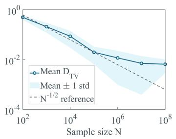
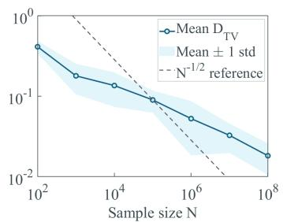
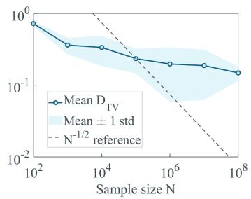
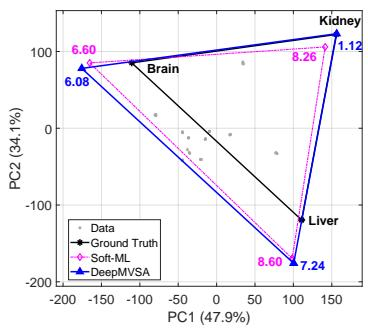
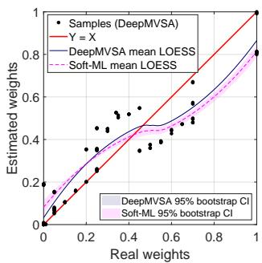
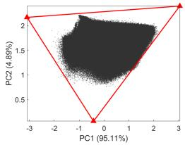
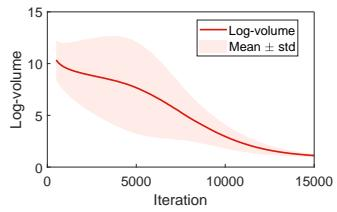
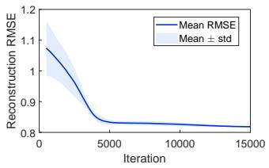

# SCALABLE MINIMUM-VOLUME SIMPLEX ESTIMATION WITH NON-ASYMPTOTIC ANALYSIS

BY JUN LI1,a, YANLONG GUO1,b AND ZHAOZHAO ZENG1,c

1School of Computer Science, China University of Geosciences; corresponding author: Jun Li, alijuncug@cug.edu.cn, bguoyanlong@cug.edu.cn, czengzhaozhao@cug.edu.cn

We study the estimation of a K-dimensional simplex from N i.i.d. points sampled uniformly from its interior; the observations are convex combinations of $K + 1$ unknown prototypes. Existing polynomial-time estimators need cubic per-sample work or $O ( N K )$ storage and are impractical at $N \sim 1 0 ^ { 6 } – 1 0 ^ { 8 }$ . We propose DeepMVSA, which re-expresses the minimumvolume principle in neural implicit form: a lightweight coordinate network generates the mixing weights and a triangular LU-type parameterization the dual simplex matrix, reducing the trainable-state memory to $O ( K ^ { 2 } )$ , independent of N, and the cost per data pass to $O ( N K ^ { 2 } )$ . We prove a nonasymptotic sample-complexity bound of the polynomial-time benchmark order for a localized surrogate estimator; an oracle inequality for every global minimizer of the neural objective, with volume-inflation control and an explicit shrinkage bias; a conditional end-to-end error budget separating statistical, approximation, optimization, and enclosure-residual terms on an explicit envelope event; and two-point lower bounds: at any noise level $\sigma > 0$ fixed independently of $N ,$ , the $\bar { N } ^ { - 1 / 2 }$ scaling is unimprovable in its N-exponent. Experiments with up to $N = { { 1 0 } ^ { 8 } }$ synthetic observations are consistent with the predicted accuracy and scaling, and feasibility on real scenes of $\sim { 1 0 } ^ { 7 }$ pixels is demonstrated.

1. Introduction. Let $\mathbb { S } _ { K }$ denote the set of all K-dimensional simplices in $\mathbb { R } ^ { K }$ . Consider N i.i.d. random points $X _ { 1 } , \ldots , X _ { N }$ drawn uniformly from a fixed but unknown simplex $\boldsymbol { S } _ { T } \in$ $\mathbb { S } _ { K }$ . The problem of statistical learning of simplices—called unmixing in the literature— asks for an estimator $\widehat { s }$ whose uniform distribution is within total-variation distance ϵ of that on $\boldsymbol { S _ { T } }$ , with probability at least $1 - \zeta \ [ 2 7 ]$ . It underlies methodologies in hyperspectral remote sensing, computational biology, and non-negative matrix factorization, where each observation is modeled as an unknown convex mixture of $K + 1$ latent sources [16, 34].

The maximum-likelihood estimator for $\boldsymbol { S _ { T } }$ is the minimum-volume simplex containing all observations [27]; it attains the fastest sample complexity known for this model $N \ge O ( \epsilon ^ { - 1 } [ K ^ { 2 } \log ( K / \epsilon ) + \log ( 1 / \zeta ) ] )$ but is NP-hard to compute [29]. A polynomial-time algorithm with a polynomial sample-size guarantee was first given by Anderson, Goyal and Rademacher [1], answering a question of Frieze, Jerrum and Kannan [15] via a reduction to independent component analysis, though without an explicit statistical rate. The first polynomial-time estimator with an explicit rate of convergence is due to Najafi et al. [27], whose Continuously Relaxed Risk (Soft-ML) estimator

$$
\widehat { S } _ { \mathrm { S O F T } } = \arg \operatorname* { m i n } _ { { \mathcal { S } } \in { \mathfrak { S } } _ { K } } \frac { 1 } { \sqrt { N } } \sum _ { i = 1 } ^ { N } \ell ( d _ { S } ( X _ { i } ) ) + \gamma \mathrm { V o l } ( S ) ,\tag{1}
$$

with $d _ { S } ( \cdot )$ the planar distance to the simplex, $\gamma > 0$ a volume weight, and $\ell ( u ) = 1 - e ^ { - b u } :$ a smooth increasing loss, satisfies $\mathrm { D } _ { \mathrm { T V } } ( \mathbb { P } _ { S _ { T } } , \mathbb { P } _ { \widehat { S } } ) \leq \epsilon$ whenever

$$
N \ge O \left( \frac { 1 } { \epsilon ^ { 2 } } \left[ K ^ { 2 } \log \frac { K } { \epsilon } + \log \frac { 1 } { \zeta } \right] \right) ,\tag{2}
$$

under an isoperimetricity assumption on $ { \boldsymbol { S } } _ { T }$ . Complementary polynomial-time algorithms exist under separability-type structural assumptions orthogonal to the uniform-sampling model studied here [2, 4, 5, 19, 31].

Three questions, however, remain open. First, existing guarantees apply only to estimators that optimize explicitly over simplex vertices subject to per-sample enclosure or distance evaluations; nothing is known, non-asymptotically, about implicit estimators for simplex estimation and unmixing—such as neural coordinate-network estimators, whose hypothesis class has capacity independent of $N$ , even though non-asymptotic guarantees for implicit (neural) estimators exist in other learning problems [36, 38]. Second, existing analyses control an idealized surrogate minimizer; no end-to-end guarantee addresses the estimator that is actually deployed, namely a trained network carrying approximation and optimization error on top of the statistical error. Third, the rate (2) is only an upper bound: the noiseless minimax-optimal sample complexity at fixed K is of order $K / \epsilon$ [33], and minimax rates for polytope and set estimation exist under different models and error metrics [6, 10], but no lower bound certifies the optimality of (2) among polynomial-time estimators, and the sharpness of the localization constants driving it has never been tested.

In this paper we propose Deep Minimum Volume Simplex Analysis (DeepMVSA), a neural implicit simplex estimator whose memory footprint and parameter complexity are independent of $N .$ , and we answer all three questions for it; whether any polynomial-time estimator can attain the noiseless minimax rate $\Theta ( K / N )$ [33] remains open. DeepMVSA retains the minimum-volume principle in the dual domain—the simplex is recovered through a dual matrix $Q$ without ever estimating the N mixing weights—but replaces the explicit abundance matrix and the hard enclosure constraint $Q X \geq 0$ by an implicit coordinate network and a differentiable quadratic enclosure penalty, respectively. Our contributions are threefold:

1. A non-asymptotic statistical theory for the deployed estimator, conditional on an explicit envelope event. The surrogate estimator associated with DeepMVSA attains the benchmark rate (2) with explicit localization constants (Theorem 3.1), for N beyond an explicitly quantified fixed- $K$ threshold, and four refinements go beyond it: an oracle inequality transferring the guarantee to every global minimizer of the practical objective, with an explicit volume-inflation factor and a shrinkage-bias scaling guideline for the enclosure weight (Proposition 3.2); a conditional end-to-end error budget separating statistical, approximation, optimization, and enclosure-residual terms on an explicit envelope event (Theorem 3.2); a quantitative approximation rate whose capacity prescription is independent of N (Proposition 3.3); and two-point minimax lower bounds together with a homothetic construction certifying the necessity of the $\gamma _ { \mathrm { v o l } }$ -dependent gap cap (Proposition 3.4). The benchmark rate moreover persists under bounded observation noise of magnitude $O ( \epsilon ^ { 2 } / K )$ (Proposition 3.1). The logical status of these statements is labeled as such throughout: Theorem 3.1 and Propositions 3.1 and 3.4 are unconditional; Proposition 3.2 is an unconditional oracle inequality for global minimizers of the practical objective; Theorem 3.2 is conditional on an envelope event and on the residual $\eta _ { \mathrm { o p t } }$ , neither certified for the Adam output, whose statistical behavior is empirical.

2. An estimator with N-independent cost. Each sample obtains its abundance vector implicitly through a lightweight coordinate network with $O ( K ^ { 2 } )$ parameters, so the trainable-model and optimizer-state memory is $O ( K ^ { 2 } )$ , independent of $N _ { \ast }$ , and the cost per full data pass is reduced from the $O ( N K ^ { 3 } )$ of the Soft-ML implementation used here to $O ( N K ^ { 2 } )$ (Theorem 3.3). A triangular (LU-type) parameterization of the dual matrix guarantees strictly positive simplex volume for all finite parameter values (Section 3.1, Remark 3.1). Throughout, “polynomial time” refers to the estimator class of the benchmark, not to DeepMVSA’s nonconvex training (see the discussion following Theorem 3.3).

3. Evidence at scale. On synthetic simplices, cell-type deconvolution, and real hyperspectral scenes, DeepMVSA matches or improves the accuracy of minimum-volume baselines while scaling to $N \sim 1 0 ^ { 8 }$ observations, two to three orders of magnitude beyond the largest instances reported for neural re-expressions of $\left( 3 \right) \left( \sim 1 0 ^ { 5 } \right.$ samples) (Section 4).

Related work. The minimum-volume (MV) family formulates simplex estimation after subspace projection, centering, and whitening [23, 27], as the constrained reconstruction problem

$$
\operatorname* { m i n } _ { \widetilde { M } , A } \frac { 1 } { N } \sum _ { j = 1 } ^ { N } \| X _ { j } - \widetilde { M } a _ { j } \| _ { 2 } ^ { 2 } - \gamma \log | \operatorname* { d e t } Q | \quad \mathrm { s . t . } \quad \mathbf { 1 } ^ { \top } a _ { j } = 1 , a _ { j } \geq 0 ,\tag{3}
$$

where $\widetilde { M } \in \mathbb { R } ^ { K \times ( K + 1 ) }$ is the vertex matrix, $A \in \mathbb { R } ^ { ( K + 1 ) \times N }$ the abundance matrix, and $Q =$ $\widetilde { M } _ { \mathrm { c e n } } ^ { - 1 }$ the dual matrix of the centered vertex matrix, so that $\mathrm { V o l } ( \widetilde { M } ) \propto 1 / |$ det Q|. MVSA [23] and its robust variant [41], from the first author’s prior work, eliminate A and solve directly for $Q ;$ other geometrical methods include N-FINDR [39], VCA [28], SISAL [9], the maximum-volume-inscribed-ellipsoid framework [24], and volume maximization [11]; Bayesian [14] methods have also been developed. Statistical guarantees for related simplexstructured problems include optimal-rate estimation of topic models [7, 21] and probabilistic simplex component analysis [40], under models different from the uniform-sampling model studied here. Neural re-expressions of (3)—autoencoder-based [17, 20] and attention-based [18] designs—are architectural rather than statistical: none carries a non-asymptotic samplecomplexity guarantee on the estimated simplex, and their memory or per-pass cost grows with N (the largest images treated there contain $\sim 1 0 ^ { 5 }$ samples), so we restrict numerical comparisons to estimators sharing the minimum-volume objective (3). A critical comparison of autoencoder-based unmixers appears in [30]; such a comparison would in any case conflate architecture, initialization, and tuning, and no rate statement about the present model could be inferred from it.

Organization. Section 2 fixes notation and assumptions; Section 3 develops DeepMVSA and its guarantees; Section 4 reports experiments; Section 5 concludes. All proofs, a sensitivity study, and reproducibility details are in the supplement [25], whose items carry an S prefix and are cited as “Lemma S1 of [25]”.

2. Preliminaries. For $S ( \widetilde { M } ) \in \mathbb { S } _ { K }$ , the simplex with vertex matrix $\widetilde { M }$ (whose $K + 1$ columns are its vertices), $\operatorname { V o l } ( S )$ denotes its Lebesgue measure. Let $\mathcal { H } _ { k } = \{ \pmb { x } \in \mathbb { R } ^ { K } : \pmb { w } _ { k } ^ { \top } \pmb { x } +$ $b _ { k } = 0 \}$ be the hyperplane containing the k-th facet, with outward unit normal $\boldsymbol { w } _ { k } \in \mathbb { R } ^ { \dot { K } }$ and bias $b _ { k } \in \mathbb { R }$ . Three representations of a simplex recur and are kept distinct throughout: the geometric object $\begin{array} { r } { \boldsymbol { S } \in \mathbb { S } _ { K } ; } \end{array}$ its vertex matrix $\widetilde { M } \in \mathbb { R } ^ { K \times ( K + 1 ) }$ (M in whitened coordinates); and the learned dual representation $( \theta _ { 0 } , Q )$ of Section 3. The target is always $\boldsymbol { S _ { T } }$ ; hatted symbols such as $\widehat { s }$ denote estimators.

DEFINITION 2.1 (Planar distance, [27]). For any $\mathbf { \boldsymbol { x } } \in \mathbb { R } ^ { K }$ , the planar distance from x to $\boldsymbol { s }$ is

$$
d _ { S } ( \pmb { x } ) = \operatorname* { m a x } \biggr \{ 0 , \operatorname* { m a x } _ { k = 0 , \ldots , K } \pmb { w } _ { k } ^ { \top } \pmb { x } + b _ { k } \biggr \} .
$$

Let $\mathbb { P } _ { S }$ be the uniform distribution on S with density $\rho _ { S } ( { \pmb x } ) = \mathbf { 1 } _ { S } ( { \pmb x } ) / \operatorname { V o l } ( S )$ , where $\mathbf { 1 } _ { \mathcal { S } } ( \cdot )$ is the indicator function of S. The total-variation distance between $\mathbb { P } _ { S }$ and $\mathbb { P } _ { S ^ { \prime } }$ , the uniform distribution on another simplex $S ^ { \prime } \in \mathbb { S } _ { K }$ , is denoted $\mathrm { D } _ { \mathrm { T V } } ( \mathbb { P } _ { S } , \mathbb { P } _ { S ^ { \prime } } )$ . We assume the following data-generating model and regularity condition:

Throughout, observation and sample refer to a statistical draw from the sampling model, whereas pixel refers to an observation indexed by a position on an image grid.

ASSUMPTION 2.1 (Uniform simplex sampling). $X _ { 1 } , \ldots , X _ { N } \stackrel { \mathrm { i . i . d . } } { \sim } \mathbb { P } _ { S _ { T } }$ for some fixed $S _ { T } \in \mathbb { S } _ { K }$

ASSUMPTION 2.2 (Isoperimetricity, [27]). $\mathcal { S } _ { T } \mathrm { ~ i s } \left( \underline { { \lambda } } , \bar { \lambda } \right)$ -isoperimetric for some positive constants $\underline { { \lambda } } , \bar { \lambda } > 0 \mathrm { { ; } }$ ; that is,

$$
\operatorname* { m a x } _ { k , k ^ { \prime } } \| \theta _ { k } - \theta _ { k ^ { \prime } } \| _ { 2 } \leq \underline { { \lambda } } K \operatorname { V o l } ( \mathcal { S } _ { T } ) ^ { 1 / K } , \qquad \operatorname* { m a x } _ { k } \operatorname { V o l } ( \mathcal { S } _ { T , - k } ) \leq \bar { \lambda } \operatorname { V o l } ( \mathcal { S } _ { T } ) ^ { \frac { K - 1 } { \kappa } } ,
$$

where $S _ { T , - k }$ denotes the k-th facet of $\boldsymbol { S _ { T } }$ (the $( K - 1 )$ -simplex obtained by removing the k-th vertex); here and throughout, the vertices $\theta _ { k }$ and facets of the simplex are indexed by $k \in \{ 0 , \ldots , K \}$

Under Assumptions 2.1 and 2.2, the uniform distribution $\mathbb { P } _ { S _ { T } }$ identifies $\boldsymbol { S _ { T } }$ (it is the minimum-volume simplex of probability one [27]); the strength of the identification depends on the simplex geometry through $( \underline { { \lambda } } , \bar { \lambda } )$ , which quantify the separation of the target simplex from degenerate competitors, and the diameter $D _ { T } ;$ ; the facet-angle floor of Lemma S3 of [25] is controlled by the volume $V _ { T }$ and the diameter $D _ { T }$ alone.

Our goal is to construct an estimator whose trainable-state memory is independent of N and whose cost per full data pass is linear in $N .$ , and to equip it with a non-asymptotic theory that the existing literature does not provide for any estimator in this model: guarantees for the implicit estimator class itself, a conditional end-to-end error budget for the trained network, and lower bounds certifying the sharpness of the rates and localization caps. The guarantees below are stated against the statistical benchmark (2), while the estimator, its risk, and the phenomena that govern it are distinct.

## 3. DeepMVSA: Neural Implicit Estimator.

3.1. Triangular parameterization of the dual matrix. We re-parameterize the problem in the dual space. Recall from (3) that $Q = \widetilde { M } _ { \mathrm { c e n } } ^ { - 1 }$ is the dual matrix of the centered vertex matrix, with $\mathrm { V o l } \propto 1 / |$ det $Q |$ . Rather than optimizing $Q$ as an unstructured matrix, we set

$$
Q ( \psi ) = L ( \psi _ { L } ) Q _ { 0 } R ( \psi _ { R } , \psi _ { r } ) ,\tag{4}
$$

where $\psi = ( \psi _ { L } , \psi _ { R } , \psi _ { r } )$ collects all learnable parameters, $Q _ { 0 }$ is a deterministic initialization (e.g., from VCA [28]), and

(5)

$$
{ \cal L } ( \psi _ { L } ) = I _ { K } + \Lambda ( \psi _ { L } ) ,\tag{6}
$$

$$
R ( \psi _ { R } , \psi _ { r } ) = \mathrm { d i a g } ( e ^ { \psi _ { r } } ) + \Upsilon ( \psi _ { R } ) ,
$$

where $\Lambda ( \psi _ { L } )$ and $\Upsilon ( \psi _ { R } )$ denote, respectively, the strict lower- and strict upper-triangular matrices whose off-diagonal nonzero entries are given by $\psi _ { L }$ and $\psi _ { R }$ , and $I _ { K }$ is the identity matrix. We refer to the learnable map (4) as the triangular dual parameterization of $Q$ (the $Q \ – \ / t o w$ for short). The three factors contribute $K ( K - 1 ) / 2 , K ( K - 1 ) / 2$ , and $K$ entries, so the $Q \cdot$ -flow comprises exactly $K ^ { 2 }$ learnable parameters. Both factors are triangular—unit diagonal (L) and diagonal entries $e ^ { \psi _ { r , k } } ~ ( R ) { - } s _ { 0 }$ det $\begin{array} { r } { Q = \operatorname* { d e t } Q _ { 0 } \cdot \prod _ { k = 1 } ^ { K } e ^ { \psi _ { r , k } } \ne 0 } \end{array}$ for all finite $\psi , \psi _ { r , k }$ the k-th component of $\psi _ { r }$ . Consequently, the volume regularizer simplifies to − log | det $\begin{array} { r } { Q | = - \log | \operatorname* { d e t } Q _ { 0 } | - \sum _ { k } \psi _ { r , k } } \end{array}$ , linear in $\psi _ { r }$ and globally well-defined, and the zero-measure degeneracy set $\{ S \in \tilde { \mathbb { S } _ { K } } : \mathrm { V o l } ( S ) = 0 \}$ is avoided by construction, removing the need for the infinitesimal noise injection of [27, Sec. 3].

REMARK 3.1 (Triangular dual parameterization; relation to invertible flows). The factorization (4) is a re-parameterization of $Q$ by triangular factors with a tractable log-determinant; we refer to it as the triangular dual parameterization (or triangular chart) of $Q$ . It is a local chart of the general linear group around $Q _ { 0 } \colon$ Gaussian elimination without pivoting succeeds exactly when all leading principal minors of $Q _ { 0 } ^ { - 1 } Q$ are nonzero, so every matrix in a Zariskiopen dense subset of $\operatorname { G L } ( K )$ admits such an L·diag · R factorization (a Bruhat-type cell). The construction is inspired by the affine coupling and $1 \times 1$ convolution layers of normalizing flows [13, 22], but it is not a generative flow and no density estimation is involved; the flow terminology is retained only as motivation.

REMARK 3.2 (Learnable anchor and the vertex map). The dual matrix $Q \in \mathbb { R } ^ { K \times K }$ determines the facets of the estimated simplex only up to a translation. We therefore augment ψ with a learnable anchor $\theta _ { 0 } \in \mathbb { R } ^ { K }$ and define

$$
\begin{array} { r } { S ( Q ^ { - 1 } ; \theta _ { 0 } ) : = \mathrm { c o n v } \big \{ \theta _ { 0 } , \theta _ { 0 } + Q ^ { - 1 } e _ { 1 } , \ldots , \theta _ { 0 } + Q ^ { - 1 } e _ { K } \big \} , } \end{array}\tag{7}
$$

the simplex whose $K + 1$ vertices are the anchor and the anchor shifted by the columns of $Q ^ { - 1 }$ . Its volume is $\mathrm { V o l } ( { \cal S } ( Q ^ { - 1 } ; \theta _ { 0 } ) ) = 1 / ( K ! | \operatorname* { d e t } Q | )$ , and the barycentric coordinates of a point $\boldsymbol { x } \in \mathbb { R } ^ { K }$ relative to (7) are

$$
a _ { k } ( x ) = \left( Q ( x - \theta _ { 0 } ) \right) _ { k } , \quad k = 1 , \ldots , K , \qquad a _ { 0 } ( x ) = 1 - { \bf 1 } ^ { \top } Q ( x - \theta _ { 0 } ) ,\tag{8}
$$

so that $\textstyle \sum _ { k = 0 } ^ { K } a _ { k } ( x ) = 1$ identically and $x \in { \mathcal { S } } ( Q ^ { - 1 } ; \theta _ { 0 } )$ if and only if $a _ { k } ( x ) \geq 0$ for all $k = 0 , \ldots , K$ . The anchor contributes K further parameters, bringing the total to $K ^ { 2 } + K =$ $O ( K ^ { 2 } )$ , independent of N. The representation (7) singles out one vertex as the anchor and is not symmetric in the vertices, although the simplex it describes is: any vertex can serve as the anchor, with $Q$ re-expressing the rest as shifts from it. The asymmetry belongs to the parameterization, not the object; the permutation-invariance discussion of Section S1.9 of the supplement [25] applies verbatim.

3.2. Neural implicit abundance estimation. A key distinction between DeepMVSA and prior simplex learners is that we do not treat the abundance matrix A as an explicit optimization variable. Instead, we adopt a neural implicit parameterization: the abundance vector $a _ { j }$ of each observation $j$ is generated by a lightweight network (A-Net) with parameters ξ. Concretely, we construct a differentiable mapping

$$
a _ { j } = f _ { \xi } ( c _ { j } ) ,\tag{9}
$$

where $c _ { j } \in \mathbb { R } ^ { d }$ is the normalized spatial coordinate of observation $j ~ ( d = 2$ for imagery on a rectangular grid and $d = 1$ for vectorized data). This is an instance of the coordinate-based implicit neural representation paradigm [26, 35, 37], in which a whole signal is stored in network weights, transplanted here from signal reconstruction to abundance estimation. The analogy is architectural only: the abundances of the index-coordinate experiments of Sections 4.1–4.2 are independent of the coordinate, so the network does not compress them; its role there is to provide a differentiable reconstruction term (Remark 3.5), not to store the abundance matrix.

Two-branch architecture. The design of the A-Net is guided by the linear mixing model (LMM) underlying (3): each observation is a convex combination of the K + 1 vertices. Since convexity underlies volume-based identification, the A-Net keeps the LMM as its structural backbone and delegates departures from it (multiple scattering, intimate mixing, illumination variation) to a local gated correction: a base branch producing valid convex mixtures and a nonlinear modulation branch learning sample-specific deviations while preserving the global simplex structure.

Specifically, the base branch is a two-layer MLP with tanh activation:

(10)

$$
h _ { j } ^ { ( 1 ) } = \operatorname { t a n h } \left( W _ { 1 } c _ { j } + b _ { 1 } \right) \in \mathbb { R } ^ { h } ,\tag{11}
$$

$$
h _ { j } ^ { ( 2 ) } = \operatorname { t a n h } ( W _ { 2 } h _ { j } ^ { ( 1 ) } + b _ { 2 } ) \in \mathbb { R } ^ { h } ,\tag{12}
$$

$$
\bar { a } _ { j } = \mathrm { s o f t m a x } \big ( W _ { 3 } h _ { j } ^ { ( 2 ) } + b _ { 3 } \big ) \in \mathbb { R } ^ { K + 1 } ,
$$

where $W _ { 1 } \in \mathbb { R } ^ { h \times d } , W _ { 2 } \in \mathbb { R } ^ { h \times h } , W _ { 3 } \in \mathbb { R } ^ { ( K + 1 ) \times h }$ , and $b _ { 1 } , b _ { 2 } , b _ { 3 }$ are bias vectors. The hidden width h is a small constant (we use $h = 3 2$ in all experiments). The softmax enforces $\mathbf { 1 } ^ { \top } \bar { a } _ { j } =$ 1 and $\bar { a } _ { j } \geq 0$ , so $\bar { a } _ { j }$ lies in the interior of the probability simplex and serves as a valid linearmixing abundance vector.

To model deviations from linear mixing, the nonlinear modulation branch computes a gating vector $g _ { j } \in ( 0 , 1 ) ^ { K + 1 }$ :

$$
g _ { j } = \sigma \big ( W _ { g 2 } \operatorname { t a n h } ( W _ { g 1 } c _ { j } + b _ { g 1 } ) + b _ { g 2 } \big ) ,\tag{13}
$$

where $W _ { g 1 } \in \mathbb { R } ^ { h \times d } , W _ { g 2 } \in \mathbb { R } ^ { ( K + 1 ) \times h } , b _ { g 1 } \in \mathbb { R } ^ { h }$ and $b _ { g 2 } \in \mathbb { R } ^ { K + 1 }$ are bias vectors, and $\sigma ( \cdot )$ is the element-wise sigmoid. The corrected abundance is then formed by adding a samplespecific nonlinear correction to the base vector:

$$
\tilde { a } _ { j } = \bar { a } _ { j } + \kappa ( g _ { j } \odot \bar { a } _ { j } ^ { 2 } ) ,\tag{14}
$$

where κ is a global learnable scalar controlling the magnitude of the nonlinear correction. The quadratic form $\bar { a } _ { j } ^ { 2 }$ amplifies the correction for dominant components, and the sigmoid gate $g _ { j }$ provides per-sample control. Since $\bar { a } _ { j }$ is element-wise positive and $g _ { j } \odot \bar { a } _ { j } ^ { 2 }$ is elementwise nonnegative, $\tilde { a } _ { j }$ remains elementwise positive whenever $\kappa \geq 0 \mathrm { : }$ ; the sum-to-one requirement is enforced by a penalty in the empirical risk. The parameters of the implicit mapping (9) are thus $\xi = \{ W _ { 1 } , b _ { 1 } , W _ { 2 } , b _ { 2 } , W _ { 3 } , b _ { 3 } , W _ { g 1 } , b _ { g 1 } , W _ { g 2 } , b _ { g 2 } , \kappa \}$ ; they are optimized jointly with the flow parameters ψ. The gated correction vanishes as $\kappa  0 ,$ , recovering the linear mixing model as a special case; $\kappa _ { 0 }$ denotes its released value. The calibration identity below assumes $\kappa \geq 0$ , enforced by a one-line softplus re-parameterization, and the correction is inert on the linear-mixing benchmarks of Section 4 (insensitivity to $\kappa _ { 0 } .$ , including $\kappa _ { 0 } = 0$ , in Table S1 of [25]).

Scalability. The A-Net contains $O ( h ^ { 2 } + h K )$ parameters; with $h = O ( K )$ this is $O ( K ^ { 2 } )$ independent of N (the implementation fixes $h = 3 2 ;$ ; the experiments of Section 4 study values up to $K = 2 0 )$ , in stark contrast to classical methods storing an explicit $N \times K$ abundance matrix $( O ( N K )$ memory, often $O ( N K ^ { 3 } )$ work per full pass); in DeepMVSA the only Ndependent cost is the A-Net evaluation at the sampled coordinates, $O ( K ^ { 2 } )$ per sample and iteration

REMARK 3.3 (The coordinate network as a structural assumption). Replacing the $N ( K + 1 )$ free abundance variables of the template (3) by $a _ { j } = f _ { \xi } ( c _ { j } )$ is not merely a computational compression: it restricts the abundance field to network-representable functions. Two statistical formulations make this explicit. (i) Under a spatial model $a _ { j } = g ( c _ { j } ) + \varepsilon _ { j }$ with a sufficiently regular field g—natural for imagery—the A-Net estimates g, and Assumption 3.1(ii) is a regularity statement about g. (ii) Under the i.i.d. simplex-sampling model of

Assumption 2.1, the abundances carry no coordinate dependence; the network then acts as a structured compression of the abundance matrix, whose representational error enters through $\eta _ { \mathrm { a p x } }$ and propagates linearly through Proposition 3.2. For the synthetic experiments of Section 4.1 the coordinates are vectorized sample indices $( d = 1 )$ : no spatial structure is assumed, and the network functions as a compressor monitored through the reconstruction term.

3.3. Empirical risk and optimization. Throughout, the roles of the objects involved are distinct: the unknown statistical parameter is the simplex $\boldsymbol { S _ { T } }$ (equivalently, its vertex matrix $M _ { T } ) ;$ ; the abundances $a _ { j }$ are latent random variables, not parameters; and $( \psi , \xi )$ are optimization variables indexing the estimator, with no statistical interpretation of their own.

The empirical risk is assembled from quantities already introduced: the observations $x _ { j }$ collected in $Y = [ x _ { 1 } , \dots , x _ { N } ] \in \mathbb { R } ^ { L \times N }$ , and their projected counterparts $X _ { j }$ (throughout, lowercase $x _ { j }$ denotes the raw L-dimensional observation and uppercase $X _ { j }$ its whitened $K \cdot$ dimensional counterpart; all statements below are made in whitened coordinates, in which $\boldsymbol { S _ { T } }$ denotes the true simplex); the dual matrix $Q = Q ( \psi )$ of (4); and the abundances $a _ { j } = f _ { \xi } ( c _ { j } )$ generated implicitly by the A-Net (9). The per-sample reconstruction is computed in these whitened coordinates, $\widehat { X } _ { j } = \widetilde { M } a _ { j }$ ; writing $M \in \mathbb { R } ^ { L \times ( K + 1 ) }$ for the ambient-space counterpart of $\widetilde { M }$ in (3), the ambient reconstruction $\hat { x } _ { j } = M a _ { j }$ differs from it only by the fixed whitening map, so working in whitened coordinates reduces the per-sample cost from $O ( L K ) \tan O ( K ^ { 2 } )$ and removes the whitening-conditioning factor from the transfer analysis (Proposition $3 . 2 )$ Total-variation distances, barycentric coordinates, simplex membership, and the identification of $\boldsymbol { S _ { T } }$ are invariant under the whitening transformation, whereas volumes and the geometric constants $( \underline { { \lambda } } , \bar { \lambda } , D _ { T } , h _ { \operatorname* { m i n } } , \sigma _ { \operatorname* { m a x } } ( M _ { T } ) )$ are coordinate-dependent and are always understood in whitened coordinates. The vertex matrix is not a free variable: in whitened ${ \underset { \sim } { \underbrace { \mathrm { c o - } } } }$ ordinates its columns are $\theta _ { 0 }$ and $\theta _ { 0 } + Q ^ { - 1 } e _ { k } , k = 1 , \ldots , K$ ((7)), so $( Q , \theta _ { 0 } )$ determines $M$ and hence M. We minimize the empirical risk

$$
\begin{array} { r } { \widehat { R } _ { \mathrm { { D E E P } } } ( \psi , \xi ; Y ) = \displaystyle \frac { 1 } { N } \sum _ { j = 1 } ^ { N } \| X _ { j } - \widetilde { M } a _ { j } \| _ { 2 } ^ { 2 } + \gamma _ { \mathrm { v o l } } \Big ( { - \sum _ { k = 1 } ^ { K } \psi _ { r , k } } \Big ) } \\ { + \gamma _ { \mathrm { e n c } } \displaystyle \frac { 1 } { N } \sum _ { j = 1 } ^ { N } e _ { \psi } \big ( X _ { j } \big ) + \gamma _ { \mathrm { s o } } \displaystyle \frac { 1 } { N } \sum _ { j = 1 } ^ { N } ( { \bf 1 } ^ { \top } a _ { j } - 1 ) ^ { 2 } . } \end{array}\tag{15}
$$

Here

$$
\begin{array} { r } { ( 1 6 ) \ e _ { \psi } ( x ) : = \left\| \operatorname* { m i n } \bigl ( Q ( x - \theta _ { 0 } ) , 0 \bigr ) \right\| _ { 2 } ^ { 2 } + \operatorname* { m i n } \bigl ( 1 - \mathbf { 1 } ^ { \top } Q ( x - \theta _ { 0 } ) , 0 \bigr ) ^ { 2 } = \left\| \operatorname* { m i n } \bigl ( a ( x ) , 0 \bigr ) \right\| _ { 2 } ^ { 2 } . } \end{array}
$$

is the completed enclosure penalty: by (8) it equals the squared violation of all $K + 1$ barycentric constraints, including the zeroth constraint $a _ { 0 } ( x ) \bar { = } 1 - \mathbf { 1 } ^ { \top } Q ( x - \theta _ { 0 } ) \geq 0$ associated with the anchor vertex. Penalizing only $\lVert \operatorname* { m i n } ( Q X , \dot { 0 } ) \rVert _ { 2 } ^ { 2 }$ would cover just the last K constraints; the completed form (16) is labeling-invariant and is what the analysis requires. The released implementation realizes the same construction in homogeneous coordinates, augmenting the whitened observations to $X _ { j } ^ { h } = ( X _ { j } , 1 / \sqrt { K + 1 } ) \in \mathbf { \bar { \mathbb { R } } } ^ { K + 1 }$ ; the two forms are Schur-complement equivalent and their log-volume terms and gradients coincide (details in Section S3 of [25]). The four terms correspond to (i) reconstruction fidelity; (ii) minimumvolume regularization; (iii) soft containment in $S ( Q ^ { - 1 } ; \theta _ { 0 } )$ (min(·, 0) componentwise); and (iv) sum-to-one regularization, with $\gamma _ { \mathrm { v o l } } , \gamma _ { \mathrm { e n c } } , \gamma _ { \mathrm { s o } } > 0$ the respective penalty weights. The sum-to-one constraint thus enters as a differentiable penalty rather than a hard constraint, so that (15) can be minimized end-to-end: all parameters $( \psi , \xi )$ are updated jointly by Adam. Unlike the hard enclosure constraint $Q X \geq 0$ of MVSA, which imposes exact containment, the quadratic penalty enforces containment only softly; the analysis quantifies the resulting slack through the enclosure residual of Proposition 3.2; Table S2 of the supplement [25] summarizes the status of each term of (15) in the surrogate risk.

Implementation safeguards. Two additions complete the practical objective; both vanish at any feasible solution and hence leave the population risk unchanged. The first is an abundance nonnegativity penalty $\lambda _ { \mathrm { n n } } N ^ { - 1 } \sum _ { j } \parallel$ min $( a _ { j } , 0 ) \| _ { 2 } ^ { 2 } \mathrm { . }$ the elementwise positivity of the A-Net output is guaranteed by construction only for $\kappa \geq 0$ , and the penalty enforces it throughout training. The second is a centroid-calibration penalty $\lambda _ { \mathrm { e q } } \big ( \mathbf { 1 } ^ { \top } Q ( \bar { X } - \theta _ { 0 } ) - K / ( K + 1 ) \big ) ^ { 2 }$ where $\begin{array} { r } { { \bf \bar { \cal X } } : = N ^ { - 1 } \sum _ { j } { \cal X } _ { j } } \end{array}$ is the projected sample mean: at any enclosing simplex the barycentric coordinates average to the sample centroid’s, an $\sqrt { N }$ -consistent estimate of $\mathbb { E } a ( X ) =$ $1 / ( K + 1 )$ , whose first K coordinates sum to $K / ( K + 1 )$ . The penalty thus anchors the column sums of $Q$ to a correctly specified target and vanishes at the oracle up to $O _ { p } ( \lambda _ { \mathrm { e q } } / N )$ (an $O _ { p } ( \cdot )$ term inside an intersection of events is a deterministic bound on that intersection), negligible at the $\epsilon ^ { - 2 }$ sample scale of Theorem 3.1; the default weight is $\lambda _ { \mathrm { e q } } = 8 0$ (Table S2 of [25]). Its square-root appearance in Theorem 3.2 reflects the cross-term structure of the budget: the squared residual, itself $O _ { p } ( N ^ { - 1 } )$ , is balanced against the enclosure weight by Young’s inequality, giving the error contribution $\sqrt { \lambda _ { \mathrm { e q } } / ( \gamma _ { \mathrm { e n c } } N ) }$ —the root of an $O _ { p } ( 1 / N )$ objective term, consistent since both sides of (31) are error magnitudes—and the sensitivity study of Table S1 of [25] shows only mild degradation over a $\times \frac { 1 } { 4 } { - } \times 4$ range around this default. Training proceeds in two stages: a warm-up stage with κ frozen at zero, so the simplex geometry is learned under linear mixing, followed by joint optimization with κ released at $\kappa _ { 0 } = 0 . 0 5$ , the safeguards active mainly in the first stage. A sensitivity protocol (supplement) varies each weight over a five-point grid spanning two octaves around its default: the mean total-variation distance changes by less than a factor 1.2, with degradations only in the directions predicted by the theory (Table S1 of [25]).

REMARK 3.4 (Comparison to Soft-ML). Najafi et al.’s Soft-ML risk (1) penalizes the planar distance $d _ { S } ( X _ { i } )$ , which requires $O ( K ^ { 3 } )$ work per sample to identify the active facet and compute the pseudo-inverse in Theorem 3.3 of [27]. In contrast, the whitened reconstruction term and the enclosure penalty (16) are matrix-vector products costing $O ( K ^ { 2 } )$ per sample—evaluated in ambient coordinates they would cost $O ( L K )$ , which is why the implementation operates on the whitened stream—and the A-Net forward pass is also $O ( K ^ { 2 } )$ Hence each gradient step scales as $O ( N K ^ { 2 } )$ rather than $O ( N K ^ { 3 } )$ , with trainable-state memory $O ( K ^ { 2 } )$ , independent of $N$ . The two risks also fail differently: the saturating loss $\ell ( u ) = 1 - e ^ { - b u }$ of Soft-ML has vanishing gradient away from the simplex boundary, so the volume term dominates at large K and the estimator collapses inward, whereas the quadratic enclosure of (15) has constant curvature and, by Proposition 3.2(i), bounds the volume inflation by an explicit factor converging to one as the approximation error vanishes—the failure modes of the three estimator classes are thus disjoint. On the statistical side, the novelty over [27] is threefold: (i) explicit localization constants (the missing-mass/volume-inflation dichotomy of Lemma S1 and the gap $c _ { 3 } = 1 / 3 2$ of Lemma S4 of [25]), where [27, Theorem 3.2] leaves constants implicit; (ii) a network-free surrogate risk (21), tied to the practical objective by an oracle inequality (Proposition 3.2); and (iii) the lower bounds and end-to-end budget (Proposition 3.4, Theorem 3.2), with no counterpart in [27].

3.4. Theoretical guarantees. We now establish the statistical guarantee of the surrogate simplex estimator associated with the DeepMVSA formulation. Although the resulting rate coincides with the benchmark (2), the analysis must control a different risk: the quadratic enclosure penalty is flat at the origin, so the enclosure signal enters the estimation error only through the shrinkage-bias mechanism quantified in Proposition 3.2 below—a phenomenon with no analogue in the saturating-loss analysis of [27]. The analysis is carried out in the noiseless model $X _ { j } \in S _ { T }$ of Assumption 2.1 (in whitened coordinates), and Theorem 3.1 is stated in this noiseless, subspace-reduced setting; bounded additive noise is treated in

Proposition 3.1, which shows the same rate persists for noise levels $\sigma = { O } ( { \epsilon } ^ { 2 } / K )$ , and the noisier regime is examined empirically in Section 4.1. The noisy regime has also been studied information-theoretically: an exponential-time estimator attains the noiseless order once $\mathrm { S N R } \gtrsim \sqrt { K }$ [32]; Proposition 3.1 instead quantifies the noise level at which the present polynomial-time surrogate retains the benchmark rate.

Estimation domain. Because the log-volume term − log | det $Q |$ rewards arbitrarily small simplices on the event where the data fail to enclose them, the analysis restricts the flow parameters to a volume window. We use a data-driven window rather than an oracle one. Let

$$
\widehat V _ { N } : = \mathrm { V o l } \bigl ( \mathrm { c o n v } \{ X _ { 1 } , \ldots , X _ { N } \} \bigr ) , \qquad \widehat D _ { N } : = \operatorname* { m a x } _ { j , l \leq N } \| X _ { j } - X _ { l } \| _ { 2 }
$$

denote the volume of the empirical convex hull and the data diameter, and define

$$
\begin{array} { r } { \hat { \widehat { \Psi } } _ { N } : = \Big \{ ( \psi , \theta _ { 0 } ) : \frac { 1 } { 2 } \widehat { V } _ { N } \leq \mathrm { V o l } \big ( { S } ( Q ( \psi ) ^ { - 1 } ; \theta _ { 0 } ) \big ) \leq 2 \widehat { V } _ { N } , } \end{array}\tag{17}
$$

$$
\mathrm { d i a m } \big ( \boldsymbol { S } ( \boldsymbol { Q } ( \psi ) ^ { - 1 } ; \theta _ { 0 } ) \big ) \leq 2 \widehat { \boldsymbol { D } } _ { N } , \quad \operatorname* { m a x } _ { k } \mathrm { d i s t } \big ( \boldsymbol { v } _ { k } , \{ \boldsymbol { X } _ { j } \} _ { j = 1 } ^ { N } \big ) \leq 2 \widehat { \boldsymbol { D } } _ { N } \Big \} ,
$$

where $v _ { 0 } , \ldots , v _ { K }$ denote the vertices of $S ( Q ( \psi ) ^ { - 1 } ; \theta _ { 0 } )$ ; the last constraint is a positional localization, requiring every vertex to lie within twice the data diameter of the sample. On an event $E _ { N }$ of probability at least $1 - 2 / N$ one has

$$
\begin{array} { r } { \frac 1 2 V _ { T } \leq \widehat { V } _ { N } \leq V _ { T } , \qquad \frac 1 2 D _ { T } \leq \widehat { D } _ { N } \leq D _ { T } , } \end{array}\tag{18}
$$

for all $N \geq N _ { 0 } ( K )$ , where $V _ { T } = \mathrm { V o l } ( S _ { T } )$ and $D _ { T } = \mathrm { d i a m } ( S _ { T } )$ ; consequently, on $E _ { N }$ (19)

$$
S _ { T } \in \left\{  { \mathcal { S } } ( Q ( \psi ) ^ { - 1 } ; \theta _ { 0 } ) : ( \psi , \theta _ { 0 } ) \in \widehat { \Psi } _ { N } \right\} \subseteq \mathfrak { S } _ { T } ,
$$

$$
\mathfrak { S } _ { T } : = \left\{ \mathcal { S } \in \mathbb { S } _ { K } : \ \frac { 1 } { 4 } V _ { T } \leq \mathrm { V o l } ( \mathcal { S } ) \leq 2 V _ { T } , \mathrm { d i a m } ( \mathcal { S } ) \leq 2 D _ { T } , \ m _ { k } \mathrm { a x } \ \mathrm { d i s t } ( v _ { k } ( \mathcal { S } ) , \mathcal { S } _ { T } ) \leq 2 D _ { T } \right\} .
$$

The lower bound $\widehat { V } _ { N } \geq V _ { T } / 2$ follows from a covering argument over the $K + 1$ vertex caps of $\boldsymbol { S _ { T } }$ , and the bounds on $\widehat { D } _ { N }$ from the isoperimetric lower bound on the mass of diametral caps (Lemma S2 of [25]). The same cap argument verifies the positional constraint of (17) for $\boldsymbol { S _ { T } }$ on $E _ { N }$ ; conversely, every window simplex has all vertices within $2 \widehat { D } _ { N } \leq 2 D _ { T }$ of the data, hence of $\boldsymbol { S _ { T } }$ —the positional clause of (19). On $\widehat { \Psi } _ { N }$ the volume reward is bounded by $\gamma _ { \mathrm { v o l } } \log ( 4 / V _ { T } )$ and the parameterization ranges over a bounded set, so the population risk is coercive and a minimizer exists; the deterministic envelope ${ \mathfrak { S } } _ { T }$ of (19) is the class over which the uniform deviation bound of the supplement is proved. Because that bound is uniform over the deterministic class ${ \mathfrak { S } } _ { T }$ and the inclusion (19) holds on the single event $E _ { N }$ the data dependence of $\widehat { \Psi } _ { N }$ requires no uniform control over a random class: the window $\widehat { \Psi } _ { N }$ is a localization device entering only the analysis of the surrogate minimizer (22), never computed by the deployed algorithm, an unconstrained first-order method; the analysis below therefore concerns the empirical risk minimizer over $\widehat { \Psi } _ { N }$ rather than the Adam iterates.

ASSUMPTION 3.1 (Realizability). (i) There exist $\psi ^ { * }$ , with anchor $\theta _ { 0 } ^ { * }$ , satisfying

$$
S ( Q ( \psi ^ { * } ) ^ { - 1 } ; \theta _ { 0 } ^ { * } ) = S _ { T } .
$$

On the event $E _ { N }$ of (18), Lemma S2 of [25] then gives $( \psi ^ { * } , \theta _ { 0 } ^ { * } ) \in \widehat { \Psi } _ { N }$ . (ii) There exist A-Net parameters $\xi ^ { * }$ , taken in the base branch (gating scalar $\kappa ^ { * } = 0 )$ , such that

$$
\frac { 1 } { N } \sum _ { j = 1 } ^ { N } \bigl \| X _ { j } - M _ { T } f _ { \xi ^ { * } } ( c _ { j } ) \bigr \| _ { 2 } ^ { 2 } \leq \eta _ { \mathrm { a p x } } ,
$$

for a small constant $\eta _ { \mathrm { a p x } } \geq 0$ , where $M _ { T } \in \mathbb { R } ^ { K \times ( K + 1 ) }$ denotes the vertex matrix of the true simplex $\boldsymbol { S _ { T } }$ . Clause (ii) is required only in the spatially structured regime of Remark 3.3(i); in the index-coordinate regime an irreducible floor applies (Remark 3.5 below).

Clause (i) is a representability condition: the factorization (4) ranges over an open dense subset of the invertible dual matrices, so it only asks that the whitened dual $Q _ { T }$ admit such a factorization—a generic condition, failing only on a measure-zero set.

REMARK 3.5 (Approximation floor of the coordinate network). Clause (ii) asks the A-Net to approximate the latent abundances at the observed coordinates. Whether a small ηapx is achievable depends on the coordinate model. Under the spatial model of Remark 3.3(i), abundances are a regular function of the spatial coordinates and universal approximation yields small $\eta _ { \mathrm { a p x } } ;$ the gating branch (14) accommodates small nonlinear deviations. Under the i.i.d. model of Assumption 2.1 with index coordinates $( d = 1 )$ , however, the abundances are independent of the coordinates, and no coordinate network can drive $\eta _ { \mathrm { a p x } }$ to zero. Indeed, for any coordinate-measurable predictor $\hat { x } ( c )$ of $X$

$$
\begin{array} { r } { \mathbb { E } \| X - \hat { x } ( c ) \| _ { 2 } ^ { 2 } \geq \mathbb { E } \big \| X - \mathbb { E } [ X \mid c ] \big \| _ { 2 } ^ { 2 } = \mathbb { E } \big \| M _ { T } ( a - \mathbb { E } a ) \big \| _ { 2 } ^ { 2 } = \mathrm { t r } \big ( M _ { T } \mathrm { C o v } ( a ) M _ { T } ^ { \top } \big ) = : \eta _ { \mathrm { d o o r } } , } \end{array}\tag{20}
$$

because $\mathbb { E } [ X \mid c ] = M _ { T } \mathbb { E } a$ is the $L ^ { 2 }$ -optimal predictor and c is independent of a. With a uniform on the probability simplex, $\begin{array} { r } { \mathrm { C o v } ( a ) = \big ( ( K + 1 ) ( K + 2 ) \big ) ^ { - 1 } \big ( I _ { K + 1 } - \frac { 1 } { K + 1 } \mathbf { 1 1 } ^ { \top } \big ) } \end{array}$ , so $\eta _ { \mathrm { f l o o r } } = \Theta \big ( \bar { \sigma } _ { T } ^ { 2 } K / ( ( K + 1 ) ( K + 2 ) ) \big ) = \Omega ( \bar { \sigma } _ { T } ^ { 2 } / K )$ , where $\bar { \sigma } _ { T } ^ { 2 }$ denotes the average squared singular value of the centered vertex matrix. Clause (ii) with small $\eta _ { \mathrm { a p x } }$ is therefore a spatialregularity condition; in the index-coordinate regime the condition $\eta _ { \mathrm { a p x } } \leq \bar { c } _ { 3 } \epsilon / ( 8 C _ { 2 } )$ (the second condition of (27), with the constants $\bar { c } _ { 3 } , C _ { 2 }$ defined there) of the enclosure event in Section 3.4 can hold only for target accuracies $\epsilon \gtrsim \eta _ { \mathrm { f l o o r } }$ . The experiments of Sections 4.1 and 4.2 use (one-dimensional) index coordinates and operate in this floor-limited regime, where the enclosure residual of Proposition 3.2—not the enclosure event—is the operative control; those of Sections 4.3–4.4 operate in the small $- \eta _ { \mathrm { a p x } }$ regime. The floor (20) is populationlevel, whereas Assumption 3.1(ii) is empirical; they differ by the A-Net class’s uniform deviation, $O _ { p } ( K / \sqrt { N } )$ at capacity $P = O ( K ^ { 2 } )$ (a pseudo-dimension bound as in [3]), so the floor binds empirically for $\mathrm { \Delta \ddot { } } N \gg { \cal K } ^ { 2 } / \eta _ { \mathrm { f l o o r } } ^ { 2 }$ —mild at the $\epsilon ^ { - 2 }$ scale of Theorem 3.1. The floor (20) also settles the permutation question raised by the index coordinates, for every deterministic coordinate assignment; see Section S1.9 of [25]. In the spatially structured regime, the quantitative counterpart of this floor is Proposition 3.3 below. Two models are thus used, and each statement is tagged to one: the i.i.d. uniform-sampling model of Section 2 (Theorem 3.1, Propositions 3.1, 3.2 and 3.4, Theorem 3.2) and the spatial abundance-field model of Assumption 3.2 (Proposition 3.3). Under the former the coordinate network is subject to the floor (20), and the approximation-transfer chain applies only under the latter.

Surrogate risk. The analysis is formulated at the level of simplices. For $\boldsymbol { \mathcal { S } } \in \mathbb { S } _ { K }$ , let $a ( x ; \bar { S } ) \in \mathbb { R } ^ { K + 1 }$ denote the barycentric coordinates of x relative to S, so that $x \in S$ if and only if $a ( x ; S ) \geq 0$ , and define

$$
R _ { N } ( \boldsymbol { S } ) : = \gamma _ { \mathrm { v o l } } \log \mathrm { V o l } ( \boldsymbol { S } ) + \frac { 1 } { N } \sum _ { j = 1 } ^ { N } \ell _ { b } \big ( d _ { \boldsymbol { \mathcal { S } } } ( \boldsymbol { X } _ { j } ) \big ) + \gamma _ { \mathrm { e n c } } \frac { 1 } { N } \sum _ { j = 1 } ^ { N } \big \| \operatorname* { m i n } \big ( a ( \boldsymbol { X } _ { j } ; \boldsymbol { S } ) , 0 \big ) \big \| _ { 2 } ^ { 2 } ,\tag{21}
$$

where $b : = ( K / \epsilon ) \operatorname* { m a x } \{ 1 , 2 / \kappa _ { T } \}$ , with $\kappa _ { T } : = K V _ { T } / \big ( 4 ( K + 1 ) ( 2 D _ { T } ) ^ { K - 1 } \big )$ an explicit geometry-dependent constant derived in Lemma S4 of [25]; the choice of b ensures $1 - e ^ { - b t } \geq$ $1 / 2$ in the gap lemma without any mid-proof adjustment of b. In the anchored parameterization (7) the enclosure term coincides with (16): ∥ min(a(x; S), 0)∥2 = ∥ min(Q(x − $\theta _ { 0 } ) , 0 ) \| _ { 2 } ^ { 2 } + \operatorname* { m i n } ( 1 - \mathbf { 1 } ^ { \top } Q ( x - \theta _ { 0 } ) , 0 ) ^ { 2 }$ by (8), so (21) penalizes the violation of all $K + 1$ facet constraints, including the facet opposite the anchor.

The practical risk (15) implements the same three components—volume, data attraction, and enclosure—with two deliberate changes. First, the whitened reconstruction term $\| X _ { j } -$ $\widetilde { M } a _ { j }$ ∥22 plays the data-attraction role of the planar-distance term $\ell _ { b } ( d _ { \cal S } ( X _ { j } ) )$ , but is a matrixvector product costing $O ( K ^ { 2 } )$ per sample instead of $O ( K ^ { 3 } )$ (Remark 3.4); both are evaluated in the same whitened coordinates, so no conditioning factor enters the comparison. Second, the simplex is no longer a free variable in $\mathbb { S } _ { K } \colon$ it is parameterized by the flow parameters $\psi _ { : }$ , while the abundances entering the reconstruction are parameterized by $\xi .$ . The estimator analyzed below is the minimizer of the surrogate risk over the simplex class generated by the flow on the volume window:

$$
\widehat { S } _ { \mathrm { D E E P } } : = \operatorname * { a r g m i n } _ { \mathcal { S } \in \mathcal { C } _ { N } } R _ { N } ( \mathcal { S } ) , \qquad \mathcal { C } _ { N } : = \big \{ S ( Q ( \psi ) ^ { - 1 } ; \theta _ { 0 } ) : ( \psi , \theta _ { 0 } ) \in \widehat { \Psi } _ { N } \big \} ,\tag{22}
$$

with $\widehat { \Psi } _ { N }$ the data-driven window (17). The analysis class is denoted C rather than $\mathcal { Q }$ to avoid confusion with the dual matrix.

THEOREM 3.1 (Sample complexity of the surrogate DeepMVSA estimator). Suppose Assumptions $2 . l { - } 2 . 2$ and $3 . I ( i )$ hold, and let $N \geq N _ { 0 }$ so that the window event $E _ { N }$ of (18) has probability at least $1 - 2 / N$ . The threshold $N _ { 0 } = N _ { 0 } ( K )$ is explicit: $N _ { 0 } = O \big ( ( 4 ( K +$ $1 ) ) ^ { K } K \log K ) = K ^ { O ( K ) }$ (Lemma S2 of [25]), so the theorem is a fixed-K guarantee and does not cover regimes in which K grows with $N ;$ the probability below is informative only for $N \ge \operatorname* { m a x } \{ N _ { 0 } ( K ) , 4 \}$ . The exponential dependence ofthe explicit threshold on K places the certified regime beyond the sample sizes of Section 4: the bound on $N _ { 0 }$ is of order $1 0 ^ { 1 1 }$ already at $K = 7 ,$ , while the largest experiments use $N = 1 0 ^ { 8 }$ . The experiments therefore probe the mechanisms identified by the theory—the approximation floor of Remark 3.5, the capacity prescription of Proposition 3.3, and the scaling laws of Theorem 3.3—rather than verifying the theorem’s constants; narrowing the gap between the combinatorial threshold, inherited from the window argument of Lemma S2 of [25], and practical sample sizes remains open. Fix the penalty weights once and for all: $\gamma _ { \mathrm { e n c } } > 0$ arbitrary and

$$
0 < \gamma _ { \mathrm { v o l } } \leq C ^ { \prime } , \qquad C ^ { \prime } : = \operatorname* { m i n } \Bigl \{ \frac { c _ { 1 } } { 2 } , \frac { 1 } { 3 2 \log ( 1 / v _ { 0 } ) } \Bigr \} ,\tag{23}
$$

where $v _ { 0 } = 1 / 4$ is the lower volume fraction of the envelope ${ \mathfrak { S } } _ { T }$ in (19) and $c _ { 1 } = 1 / 1 6$ is the localization constant of Lemma S4 of [25]; no lower bound on $\gamma _ { \mathrm { v o l } }$ is needed, because the volume inflation case is vacuous at the minimizer (Lemma S3 of [25]). Condition (23) makes explicit the requirement that the log-volume reward not overwhelm the planar-distance and enclosure costs of simplices that cut into the data cloud. Then there exists a constant $C ( K , \underline { { \lambda } } , \bar { \lambda } )$ such that,for any $\epsilon , \zeta > 0 ,$ if

$$
N \ge C ( K , \underline { { { \lambda } } } , \bar { \lambda } ) \frac { 1 } { \epsilon ^ { 2 } } \left[ K ^ { 2 } \log \frac { K } { \epsilon } + \log \frac { 1 } { \zeta } \right] ,
$$

the DeepMVSA estimator (22) satisfies $\mathrm { D } _ { \mathrm { T V } } ( \mathbb { P } _ { S _ { T } } , \mathbb { P } _ { \widehat { S } _ { D E E P } } ) \leq \epsilon$ with probability at least 1 − $\zeta - 2 / N$

The asymptotic regime of the theorem holds with the simplex dimension and the geometry $( K , \underline { { \lambda } } , \bar { \lambda } )$ fixed as $N  \infty \colon$ the dependence on K displayed in the rate is explicit, and all remaining dependence on $K$ and on the simplex geometry enters through the constant $C ( K , \underline { { \lambda } } , \bar { \lambda } )$ , as in the benchmark result [27, Corollary 3.1] whose order it matches. The constant is not asserted to be uniform in $K \colon$ ; the explicit K-dependence of the displayed rate is the operative guarantee at the moderate dimensions of the experiments. The proof is deferred to the supplement. The argument combines a localization step, which confines the empirical minimizer to a class of simplices with uniformly bounded volume, diameter, and facet angles, with VC-type uniform deviation bounds: every simplex at total-variation distance at least ϵ from $\boldsymbol { S _ { T } }$ raises the population risk by at least $c _ { 3 } \epsilon$ , with $c _ { 3 } = 1 / 3 2$ explicit (Lemma S4 of [25]), and this gap dominates the uniform deviation of $R _ { N }$ from R once N reaches the stated rate. The localization–deviation architecture follows [27, Theorem 3.2]; the geometric core is new and self-contained (Remark 3.4).

Theorem 3.1 concerns the minimizer (22) of the surrogate risk (21), not the output of an optimization routine—as in [27], whose analysis likewise concerns the minimizer of their relaxed risk; the estimator-versus-algorithm distinction and two associated clarifications are deferred to Section S1.9 of [25].

PROPOSITION 3.1 (Stability to bounded noise). Let $\widetilde { X } _ { j } = X _ { j } + \varepsilon _ { j }$ with $X _ { j } \in S _ { T }$ and $\| \varepsilon _ { j } \| _ { 2 } \leq \sigma$ almost surely, and let Rσ denote the population risk (21) under the noisy law of $\ddot { X }$ . Then, with $h _ { \mathrm { m i n } }$ the altitude floor of Lemma S3 of [25] and $a _ { \mathrm { m a x } } : = 1 + 3 D _ { T } / h _ { \mathrm { m i n } } { \overline { { - h _ { \mathrm { m i n } } } } }$ enters twice here: through $a _ { \mathrm { m a x } } ,$ a uniform bound on the barycentric coordinates over the envelope ${ \mathfrak { S } } _ { T }$ , and directly in the enclosure sensitivity $\sigma / h _ { \operatorname* { m i n } }$ below,

$$
\operatorname* { s u p } _ { S \in \mathfrak { S } _ { T } } \big | R ^ { \sigma } ( S ) - R ( S ) \big | \le b \sigma + \gamma _ { \mathrm { e n c } } ( K + 1 ) \Big ( \frac { 2 a _ { \mathrm { m a x } } \sigma } { h _ { \mathrm { m i n } } } + \frac { \sigma ^ { 2 } } { h _ { \mathrm { m i n } } ^ { 2 } } \Big ) = : \Delta _ { \sigma } .\tag{24}
$$

Consequently, for $\sigma \le c \epsilon ^ { 2 } / K$ with $c = c ( K , \underline { { { \lambda } } } , \bar { \lambda } , \gamma _ { \mathrm { e n c } } , D _ { T } , h _ { \operatorname* { m i n } } ) > 0$ sufficiently small that $\Delta _ { \sigma } \leq \bar { c } _ { 3 } \epsilon / 4$ , the conclusion ofTheorem 3.1 holds under the noisy model at the same sample complexity, with $\bar { c } _ { 3 } / 2$ replacing $c _ { 3 }$ , where $\bar { c } _ { 3 } : = \operatorname* { m i n } \{ c _ { 3 } , \gamma _ { \mathrm { v o l } } c _ { \mathrm { g } } / 2 \}$ and $c _ { \mathrm { g } } = 1 / 2$ is the dichotomy constant of Lemma S1 of [25] entering the proof of Lemma S4 of [25]: the second entry accounts for the volume-inflation branch of that lemma, which is no longer excluded under noise since the identity (S1) of[25]fails, and in which the volume term alone contributes the gap $\gamma _ { \mathrm { v o l } } \log ( 1 + c _ { \mathrm { g } } \epsilon ) \geq \gamma _ { \mathrm { v o l } } c _ { \mathrm { g } } \epsilon / 2$

The proof is deferred to the supplement. The bound (24) is dimensionally sharp in its leading term: the planar-distance loss has slope b of (21) at the origin, and balancing the resulting perturbation bσ against the gap c3ϵ yields the threshold $\sigma = \bar { O } ( \epsilon ^ { 2 } / K )$ ; equivalently, noise of magnitude $\sigma$ caps the achievable accuracy at $\epsilon \gtrsim \sqrt { 4 K \sigma / \bar { c } _ { 3 } }$ , a noise floor independent of $N$ The uniform deviation bound of the supplement is unaffected by bounded noise, since the index class is unchanged.

PROPOSITION 3.2 (Oracle transfer to the practical minimizer). Suppose Assumption 3.1 holds, together with Assumptions 2.1–2.2, the sample-size condition $N \geq N _ { 0 }$ ofTheorem 3.1, and the weight condition $\gamma _ { \mathrm { v o l } } \leq C ^ { \prime }$ of (23). Let $( \widehat { \psi } , \widehat { \xi } )$ , with anchor ${ \widehat { \theta } } _ { 0 } ,$ , be any global minimizer ofthe practical objective ofSection 3.3, namely (15) augmented by the implementation safeguards described there, and write $\widehat { S } : = { \cal S } ( Q ( \widehat { \psi } ) ^ { - 1 } ; \widehat { \theta } _ { 0 } )$ . Let b be as in (21), and

$$
\mathrm { e n c } _ { N } ( \boldsymbol { S } ) : = \frac { 1 } { N } \sum _ { j = 1 } ^ { N } \bigl \| \operatorname* { m i n } \bigl ( \boldsymbol { a } ( \boldsymbol { X } _ { j } ; \boldsymbol { S } ) , 0 \bigr ) \bigr \| _ { 2 } ^ { 2 }
$$

the empirical enclosure term of (21). Then there exist constants $C _ { 2 } , c _ { 4 } > 0 ,$ , with $C _ { 2 } : = 1$ because the reconstruction term of (15) is evaluated in the whitened coordinates ofAssumption $3 . I ( i i )$ , and $c _ { 4 }$ depending only on K and the geometry of $s _ { T } ,$ the oracle is taken in the base branch (Assumption $3 . I ( i i ) )$ , so the safeguard weights $( \gamma _ { \mathrm { s o } } , \lambda _ { \mathrm { n n } } )$ do not enter, such that thefollowing holds. (i) Unconditional bounds. From global optimality alone,

$$
\mathrm { e n c } _ { N } ( \widehat { \mathcal S } ) \leq \frac { C _ { 2 } \eta _ { \mathrm { a p x } } + \gamma _ { \mathrm { v o l } } \big [ \mathrm { l o g } \big ( V _ { T } / \mathrm { V o l } ( \widehat { \mathcal S } ) \big ) \big ] _ { + } } { \gamma _ { \mathrm { e n c } } } + O _ { p } \Big ( \frac { \lambda _ { \mathrm { e q } } } { \gamma _ { \mathrm { e n c } } N } \Big ) ,\tag{25}
$$

and $\mathrm { V o l } ( \widehat { \mathcal { S } } ) \leq V _ { T } \exp \bigl ( ( C _ { 2 } \eta _ { \mathrm { a p x } } + o _ { p } ( 1 ) ) / \gamma _ { \mathrm { v o l } } \bigr )$ . (ii) Transfer. If moreover $\widehat { s }$ lies in the envelope ST of (19)—as holds on the event $E _ { N }$ for the minimizer over $\mathcal { C } _ { N }$ , by Lemma S3 of [25]—then

$$
R _ { N } ( { \widehat S } ) \leq R _ { N } ( S _ { T } ) + C _ { 2 } \eta _ { \mathrm { a p x } } + b c _ { 4 } \sqrt { \mathrm { e n c } _ { N } ( { \widehat S } ) } + O _ { p } \Big ( \frac { \lambda _ { \mathrm { e q } } } { N } \Big ) ,\tag{26}
$$

with $c _ { 4 } : = 2 D _ { T }$ . Substituting (25) into (26) removes the implicit dependence ofthe right-hand side on ${ \widehat { s } } ,$ the remaining term $[ \log ( V _ { T } / \operatorname { V o l } ( \widehat { \cal S } ) ) ]$ being at most log 4 on the envelope. The same conclusions hold for any ηopt-approximate minimizer of (15), with $C _ { 2 } \eta _ { \mathrm { a p x } }$ replaced by $C _ { 2 } \eta _ { \mathrm { a p x } } + \eta _ { \mathrm { o p t } }$ throughout; see Remark 3.7. Since an ηopt-approximate minimizer exists for every $\eta _ { \mathrm { o p t } } > 0$ by definition of the infimum, this approximate form of the statement requires no existence assumption on global minimizers ofthe noncoercive objective (15). No convergence guarantee for $\eta _ { \mathrm { o p t } }$ under Adam is claimed or available: $\eta _ { \mathrm { o p t } }$ enters the budget as a free parameter, and the guarantees are informative only to the extent that training drives it below the target accuracy scale.

Part (i) shows that the volume inflation of the practical minimizer is bounded by the explicit factor exp $\left( ( C _ { 2 } \eta _ { \mathrm { a p x } } + o _ { p } ( 1 ) ) / \gamma _ { \mathrm { v o l } } \right)$ , which converges to one as $\eta _ { \mathrm { a p x } }  0$ at fixed $\gamma _ { \mathrm { v o l } } ;$ the bound is informative precisely when the approximation error is small relative to the volume weight, and it degenerates as $\gamma _ { \mathrm { v o l } }  0$ , the volume term being what controls inflation. This stands in contrast to hard-enclosure estimators, which impose exact containment of every observation, so that a single point lying far from $\boldsymbol { S _ { T } }$ forces the estimated volume to grow correspondingly; under unbounded observation noise their volume is not controlled by any such factor. The two roles of $\gamma _ { \mathrm { v o l } }$ are in tension: Lemma S4 of [25] requires $\gamma _ { \mathrm { v o l } } \leq C ^ { \prime }$ so that the volume reward cannot mask the enclosure gap, while the inflation bound of part (i) is informative only when $\eta _ { \mathrm { a p x } }$ is small relative to $\gamma _ { \mathrm { v o l } } ;$ both requirements are compatible whenever $\eta _ { \mathrm { a p x } } \ll C ^ { \prime }$ , and the default $\gamma _ { \mathrm { v o l } } = 0 . 0 1$ used throughout Section 4 respects the former restriction, since $C ^ { \prime } =$ min $\{ 1 / 3 2 , 1 / ( 3 2 \log 4 ) \} \approx 0 . 0 2 2 5$ . With $\bar { c } _ { 3 }$ as in Proposition 3.1, the standing restriction $\gamma _ { \mathrm { v o l } } \leq C ^ { \prime }$ of (23) gives $\bar { c } _ { 3 } = \gamma _ { \mathrm { v o l } } / 4 < c _ { 3 }$ throughout the feasible range, since $\gamma _ { \mathrm { v o l } } / 4 \le C ^ { \prime } / 4 < 1 / 3 2 = c _ { 3 }$ . Moreover, under the conditions

$$
\mathrm { e n c } _ { N } ( \widehat { S } ) \leq \frac { \bar { c } _ { 3 } ^ { 2 } \epsilon ^ { 2 } } { 1 6 b ^ { 2 } c _ { 4 } ^ { 2 } } \qquad \mathrm { a n d } \qquad \eta _ { \mathrm { a p x } } \leq \frac { \bar { c } _ { 3 } \epsilon } { 8 C _ { 2 } } ,\tag{27}
$$

the argument of Theorem 3.1 applies with $c _ { 3 }$ replaced by $\bar { c } _ { 3 }$ of Proposition 3.1: the volumeinflation branch of Lemma S4 of [25], excluded for the windowed minimizer by Lemma S3 of [25], is not excluded for the practical minimizer; otherwise the steps are unchanged: the slack in (26) is then at most $\bar { c } _ { 3 } \epsilon / 8 + b c _ { 4 } \sqrt { \bar { c } _ { 3 } ^ { 2 } \epsilon ^ { 2 } / \big ( 1 6 b ^ { 2 } c _ { 4 } ^ { 2 } \big ) } = 3 \bar { c } _ { 3 } \epsilon / 8 < \bar { c } _ { 3 } \epsilon ,$ , so $\mathrm { D } _ { \mathrm { T V } } ( \mathbb { P } _ { S _ { T } } , \mathbb { P } _ { \widehat { S } } ) \leq \epsilon$ at the same sample complexity, up to a constant factor in N—more precisely, at fixed $\gamma _ { \mathrm { e n c } }$ the additional sample-size conditions imposed by the localized enclosure analysis (Lemma S5 of [25]) are of order at most $\epsilon ^ { - 2 }$ , matching the benchmark scale, so the stated invariance holds; under the ϵ-dependent weight choice of Theorem 3.2 these conditions become binding and are imposed explicitly there (see (33)); the equality-slack term $O _ { p } ( \lambda _ { \mathrm { { e q } } } / N )$ of (26) is absorbed into the remaining $\bar { c } _ { 3 } \epsilon / 8$ margin at this sample scale at the cost of an additional probability $\zeta ,$ and vanishes identically under the noiseless design choice $\lambda _ { \mathrm { e q } } = 0$ . The two conditions of (27) are of different origin: the first is enforced by the weight scaling of Remark 3.6 below, whereas the second constrains the approximation quality of the A-Net (Remark 3.5); both are needed for the conjunction. A noisy analogue of the proposition follows from the uniform perturbation bound (24): under the noisy model of Proposition 3.1, both the population gap and the oracle comparison are perturbed by at most $\Delta _ { \sigma }$ each, uniformly over ${ \mathfrak { S } } _ { T }$ ; hence for $\Delta _ { \sigma } \leq \bar { c } _ { 3 } \epsilon / 8$ the conclusion persists with ϵ replaced by $5 \epsilon / 4$ (the perturbation adds at most $2 \Delta _ { \sigma } \leq \bar { c } _ { 3 } \epsilon / 4$ to the right-hand side, and $( u - \epsilon ) _ { + } - \epsilon / 4 = ( u - 5 \epsilon / 4 )$ whenever u $\geq 5 \epsilon / 4 ) ;$ we omit the parallel argument.

REMARK 3.6 (A scaling guideline for $\gamma _ { \mathrm { e n c } } )$ When do the conditions (27) hold? The quadratic enclosure penalty is flat at zero: with $s : = \log ( V _ { T } / \operatorname { V o l } ( S ) )$ , the log-volume reward is exactly $\gamma _ { \mathrm { v o l } } s$ , while the enclosure cost rises only as $\gamma _ { \mathrm { e n c } } c _ { 5 } s ^ { 3 }$ (violations grow quadratically with depth; the constant $c _ { 5 }$ depends on K and on the facet geometry of $s _ { T } )$ , so shrinkage up to $\sqrt { \gamma _ { \mathrm { v o l } } / ( c _ { 5 } \gamma _ { \mathrm { e n c } } ) }$ is profitable from the reward–cost balance alone; the full oracle comparison with the approximation term ((S5) of [25]) yields the threshold $s ^ { * } = \sqrt { 2 \gamma _ { \mathrm { v o l } } / ( c _ { 5 } \gamma _ { \mathrm { e n c } } ) }$ This computation is a population-level heuristic, ignoring the uniform deviation (S3) of [25]; combined with (25), a weight scaling polynomially in $K / \epsilon$ relative to the volume weight, together with $\eta _ { \mathrm { a p x } } \lesssim \gamma _ { \mathrm { e n c } } \epsilon ^ { 4 } / K ^ { 2 }$ , makes the first condition of (27) hold—the precise statement is (S5) of [25]. The quantitative development of this guideline (its equivalent prescription at the benchmark accuracy, three caveats, and a hinge-type alternative removing the flatness) is deferred to Section S1.9 of [25]. The formal sufficient condition behind the heuristic is (32) of Theorem 3.2; no transfer guarantee is claimed for the fixed experimental weights, whose sensitivity is examined numerically (Table S1 of [25]).

ASSUMPTION 3.2 (Lipschitz abundance field). The coordinates satisfy $c _ { j } \in [ 0 , 1 ] ^ { d }$ and the latent abundances obey $a _ { j } = g ( c _ { j } )$ for a field $g : [ 0 , 1 ] ^ { d } \to \Delta _ { K }$ that is componentwise L-Lipschitz: $| g _ { k } ( c ) - g _ { k } ( c ^ { \prime } ) | \overset { \cdot } { \leq } L \| c - c ^ { \prime } \| _ { 2 }$ for all $k = 0 , \ldots , K$ and $c , c ^ { \prime } \in [ 0 , 1 ] ^ { d }$

PROPOSITION 3.3 (Approximation rate of the coordinate network). Suppose Assumption 3.2 holds and write $\sigma _ { \operatorname* { m a x } } ( M _ { T } )$ for the largest singular value of the vertex matrix. For every hidden width h there exist base-branch A-Net parameters $\xi$ (gating scalar $\kappa = 0 )$ such that

$$
\operatorname* { s u p } _ { c \in [ 0 , 1 ] ^ { d } } \left\| f _ { \xi } ( c ) - g ( c ) \right\| _ { 2 } ^ { 2 } \leq C _ { 0 } ( K + 1 ) ( K + 2 ) L h ^ { - 1 / d } ,\tag{28}
$$

where $C _ { 0 }$ depends only on the coordinate dimension d; consequently, deterministically over every sample,

$$
\frac { 1 } { N } \sum _ { j = 1 } ^ { N } \bigl \| X _ { j } - M _ { T } f _ { \xi } ( c _ { j } ) \bigr \| _ { 2 } ^ { 2 } \le \sigma _ { \operatorname* { m a x } } ( M _ { T } ) ^ { 2 } C _ { 0 } ( K + 1 ) ( K + 2 ) L h ^ { - 1 / d } = : \bar { \eta } _ { \mathtt { d p x } } ( h ) ,\tag{29}
$$

so Assumption 3.1(ii) holds with $\eta _ { \mathrm { a p x } } = \bar { \eta } _ { \mathrm { a p x } } ( h )$ . If in addition $g _ { k } ( c ) \geq \rho > 0$ for all $k , c ,$ the bound improves to sup $\begin{array} { r } { \mathfrak { \varrho } _ { c } \| f _ { \xi } ( c ) - g ( \bar { c } ) \| _ { 2 } ^ { 2 } \le \dot { C } _ { 0 } ^ { \prime } ( K + 1 ) L ^ { 2 } \rho ^ { - 2 } h ^ { - 2 / d } } \end{array}$ , with $C _ { 0 } ^ { \prime }$ again depending only on d.

The A-Net is used at width $h = \Theta ( \sqrt { P } )$ at capacity $P = \Theta ( h ^ { 2 } + h K )$ , presuming $h \gtrsim K$ (in the complementary regime $\dot { h } \lesssim \dot { K } , P = \Theta ( \dot { h } K )$ and $h = \Theta ( P / K ) )$ . The deployed width $h = 3 2$ of Section 4 obeys $h \geq K$ , so the former regime is operative and (28) reads $\eta _ { \mathrm { a p x } } = O \bigl ( \sigma _ { \mathrm { m a x } } ( M _ { T } ) ^ { 2 } K ^ { 2 } L \bar { P ^ { - 1 / ( 2 d ) } } \bigr )$ ; in the latter regime the same bound reads $O \big ( \sigma _ { \operatorname* { m a x } } ( M _ { T } ) ^ { 2 } K ^ { 2 } L ( K / P ) ^ { 1 / d } \big )$ , with the P-exponent doubled: the approximation term decays polynomially in the network capacity, at a rate governed by the coordinate dimension d alone, while Remark 3.5 supplies the matching capacity-independent floor of the indexcoordinate regime. Combined with the approximation requirement $\eta _ { \mathrm { a p x } } \lesssim \gamma _ { \mathrm { e n c } } \epsilon ^ { 4 } / K ^ { 2 }$ of (27) (Remark 3.6), a target accuracy ϵ is formally achievable at capacity

$$
P \gtrsim \Big ( \frac { c _ { 4 } ^ { 2 } C _ { 0 } \sigma _ { \mathrm { m a x } } ( M _ { T } ) ^ { 2 } ( K + 1 ) ( K + 2 ) L K ^ { 2 } \operatorname* { m a x } \{ 1 , 2 / \kappa _ { T } \} ^ { 2 } } { \gamma _ { \mathrm { e n c } } \bar { c } _ { 3 } ^ { 2 } \epsilon ^ { 4 } } \Big ) ^ { 2 d } ,\tag{30}
$$

polynomial in $( K , L , 1 / \epsilon , 1 / \gamma _ { \mathrm { e n c } } )$ for fixed d and, crucially, independent of $N { : }$ the capacity that certifies accuracy ϵ does not grow with the sample size, which is precisely what makes the N-independent memory of Theorem 3.3 compatible with the statistical guarantee. This is a scaling property (N-independence), not a practicality statement: the prescribed capacity grows with a steep ϵ-exponent—reflecting the flatness of the quadratic enclosure at the origin (Remark 3.6)—and whether the experimental widths satisfy it is not established. Because the underlying scaling guideline is a population-level heuristic whose computation presupposes the diameter control diam $( \widehat { S } ) \leq \bar { 2 } \widehat { D _ { T } }$ —available only on the envelope event of Theorem 3.2— (30) is a design prescription, not a guarantee; the formal end-to-end statement remains the conditional one of Theorem 3.2. Under a spatial noise component $a _ { j } = g ( c _ { j } ) + \varepsilon _ { j }$ as in Remark 3.3(i), the bound (29) gains an additive $\begin{array} { r } { { \bf \hat { O } } \big ( N ^ { - 1 } \sum _ { j } \| \varepsilon _ { j } \| _ { 2 } ^ { 2 } \big ) } \end{array}$

REMARK 3.7 (Statistical, approximation, and optimization error). Three distinct objects appear in this paper: the population risk $R ;$ the empirical minimizer $\widehat { S } _ { \mathrm { D E E P } }$ of the surrogate risk (21), addressed by Theorem $3 . 1 ;$ and the output $\widehat { S } _ { \mathrm { A d a m } }$ of the practical nonconvex optimization of (15). For any distance d on $\mathbb { S } _ { K }$ obeying the triangle inequality, the total error of the deployed estimator decomposes as

$$
\begin{array} { r } { d \big ( \widehat { S } _ { \mathrm { A d a m } } , S _ { T } \big ) \ \leq \ \underbrace { d \big ( \widehat { S } _ { \mathrm { A d a m } } , \widehat { S } _ { \mathrm { D E E P } } \big ) } _ { \mathrm { a p p r o x i m a t i o n / o p t i m i z a t i o n } } + \underbrace { d \big ( \widehat { S } _ { \mathrm { D E E P } } , S _ { T } \big ) } _ { \mathrm { s t a t i s t i c a l ~ e r r o r } } . } \end{array}
$$

Theorem 3.1 controls the second term at the benchmark rate; Proposition 3.2 controls the first term at the level of global minimizers, through the reconstruction accuracy $\eta _ { \mathrm { a p x } }$ and the enclosure residual (25); and the gap between the Adam output and the global minimizer of (15) is an optimization error, which we now make explicit: writing $\eta _ { \mathrm { o p t } } : = \widehat { R } _ { \mathrm { D E E P } } ( \widehat { \psi } _ { \mathrm { A d a m } } , \widehat { \xi } _ { \mathrm { A d a m } } ; Y ) - \operatorname* { i n f } _ { \psi , \xi } \widehat { R } _ { \mathrm { D E E P } } ( \psi , \xi ; Y )$ , every conclusion of Proposition 3.2 remains valid for the Adam output with $C _ { 2 } \eta _ { \mathrm { a p x } }$ replaced by $C _ { 2 } \eta _ { \mathrm { a p x } } + \eta _ { \mathrm { o p t } }$ , its proof using the global-minimizer property only through the comparison ${ \widehat { R } } _ { \mathrm { D E E P } } ( \widehat { \psi } , \widehat { \xi } ; Y ) \leq$ $\widehat { R } _ { \mathrm { D E E P } } ( \psi ^ { * } , \xi ^ { * } ; Y )$ . Theorem 3.2 below upgrades this decomposition to a single formal bound.

THEOREM 3.2 (End-to-end error budget). Suppose Assumptions 2.1–2.2 and 3.1 hold, $N \geq N _ { 0 }$ , and $\gamma _ { \mathrm { v o l } } \leq C ^ { \prime }$ as in (23). Let $( \widehat { \psi } , \widehat { \xi } )$ , with anchor ${ \widehat { \theta _ { 0 } } } ,$ be any $\eta _ { \mathrm { o p t } } { - } a p p r o x i m a t e$ minimizer of the practical objective (15), augmented by the implementation safeguards of Section 3.3, and write $\widehat { S } : = \widehat { S } ( Q ( \widehat { \psi } ) ^ { - 1 } ; \widehat { \theta } _ { 0 } )$ . Then, on the intersection of the window event $E _ { N }$ , the deviation event $o f ( S 3 )$ and the relative-deviation event of Lemma S5 of [25] (joint probability at least $1 - 2 \zeta - 2 / N )$ , and the event $\{ \widehat { S } \in \mathfrak { S } _ { T } \}$

$$
\begin{array} { r l } { { \varepsilon } _ { 3 } \left( \mathrm { D } _ { \mathbb { T } \mathbb { V } } \big ( \mathbb { P } _ { \delta } , \mathbb { P } _ { \varepsilon \mathbb { r } } \big ) - \epsilon \right) _ { + } \leq } & { 2 C _ { 1 } ^ { \prime } \sqrt { \frac { K ^ { 2 } \log ( N / K ) + \log ( 1 / \zeta ) } { N } } } \\ & { \qquad + C _ { 2 } \eta _ { \mathrm { a l t } } - \eta _ { \mathrm { o p t } } + b c _ { 4 } \Big ( \frac { E _ { \mathrm { o p t } } } { \gamma \exp } \Big ) ^ { 1 / 2 } } \\ & { \qquad + 2 \Big ( \frac { \gamma _ { \mathrm { o r t } } C _ { 1 } ^ { \prime } M L _ { N } C _ { \mathrm { a p t } } } { N } \Big ) ^ { 1 / 2 } + \frac { 6 \gamma _ { \mathrm { o r t } } C _ { 1 } ^ { \prime } M L _ { N } } { N } } \\ & { \qquad + b c _ { 4 } O _ { p } \Big ( \sqrt { \frac { \lambda _ { \mathrm { o q t } } } { \gamma _ { \mathrm { e r e } } \sqrt { N } } } \Big ) + O _ { p } \Big ( \frac { \lambda _ { \mathrm { o q } } } { N } \Big ) } \\ & { \qquad + O _ { p } \Big ( \frac { \sqrt { \gamma _ { \mathrm { e r e } } C _ { 1 } ^ { \prime } M L _ { N } \lambda _ { \mathrm { e q } } } } { N } \Big ) , } \end{array}\tag{31}
$$

with $C _ { 2 } = 1 , \ c _ { 4 } = 2 D _ { T }$ and b as in (21), $E _ { \mathrm { a p x } } : = C _ { 2 } \eta _ { \mathrm { a p x } } + \eta _ { \mathrm { o p t } } + \gamma _ { \mathrm { v o l } } \log 4 ,$ $L _ { N } : =$ $K ^ { 2 } \log ( N / K ) + \log ( 1 / \zeta ) , \ : M : = ( K + 1 ) a _ { \mathrm { m a x } } ^ { 2 }$ with $a _ { \mathrm { m a x } } : = 1 + 3 D _ { T } / h _ { \mathrm { m i n } } , C _ { 1 } ^ { \prime }$ the universal uniform-deviation constant of the planar-distance class alone—unlike the constant $C _ { 1 }$ of (S3) of [25], which grows linearly with $\gamma _ { \mathrm { e n c } } ,$ , it is free of $( \gamma _ { \mathrm { e n c } } , D _ { T } , h _ { \operatorname* { m i n } } ) { - a n d }$

$C _ { 1 } ^ { e }$ the universal relative-deviation constant of the enclosure class of Lemma S5 of [25], $\bar { c } _ { 3 } : = \operatorname* { m i n } \{ c _ { 3 } , \gamma _ { \mathrm { v o l } } c _ { \mathrm { g } } / 2 \}$ the effective gap constant, and ϵ the target resolution calibrating b in (21). The budget thus controls the total variation beyond the target resolution; the proof in fact establishes the activated form: whenever $\begin{array} { r } { \mathrm { D } _ { \mathrm { T V } } ( \bar { \mathbb { P } } _ { \hat { \mathcal { S } } } , \mathbb { P } _ { \mathcal { S } _ { T } } ) \geq \epsilon , } \end{array}$ , the same display holds with the unsubtracted left-hand side $\bar { c } _ { 3 } \mathrm { D } _ { \mathrm { T V } } ( \mathbb { P } _ { \widehat { S } } , \mathbb { P } _ { S _ { T } } )$ . The conditioning on $\{ \widehat { S } \in \mathfrak { S } _ { T } \}$ is essential and is not certified by the theory for the output of a first-order solver: the oracle comparison controls only the combination $\gamma _ { \mathrm { v o l } } \log ( \mathrm { V o l } ( \widehat { \mathcal { S } } ) / V _ { T } ) + \gamma _ { \mathrm { e n c } } \mathrm { e n c } _ { N } ( \widehat { \mathcal { S } } )$ of (25), constraining the volume $o f \hat { \mathcal { S } }$ but neither its diameter nor its position, so the event can fail for an approximate minimizer with objective value arbitrarily close to the oracle value. Membership of $\widehat { s }$ in ${ \mathfrak { S } } _ { T }$ cannot be certified from the data alone, since the envelope is defined through the unknown target quantities $( V _ { T } , D _ { T } , h _ { \mathrm { m i n } } )$ ; evaluating the barycentric coordinates of the samples against $\widehat { s }$ checks containment ofthe data, not membership in ${ \mathfrak { S } } _ { T }$ . Proposition 3.2(ii) and Theorem 3.2 are therefore conditional guarantees—an error budgetfor an approximate minimizer, valid on the envelope event—and are stated as such throughout.

The terms of (31) are, in order, the statistical fluctuation of the surrogate risk over the simplex class—network-free by construction, as noted in Remark 3.7, and free of the enclosure weight through the variance-adaptive bound of Lemma S5 of [25]—the approximation and optimization terms entering linearly, and the enclosure residual of the soft containment penalty, followed by the two localized enclosure-deviation terms supplied by Lemma S5; the equality-slack terms, proportional to $\lambda _ { \mathrm { e q } }$ , vanish identically in the noiseless model. In particular, suppose that

$$
C _ { 2 } \eta _ { \mathrm { a p x } } + \eta _ { \mathrm { o p t } } \leq \frac { \overline { { c } } _ { 3 } \epsilon } { 8 } , \qquad C _ { 2 } \eta _ { \mathrm { a p x } } + \eta _ { \mathrm { o p t } } + \gamma _ { \mathrm { v o l } } \log 4 \leq \frac { \gamma _ { \mathrm { e n c } } \overline { { c } } _ { 3 } ^ { 2 } \epsilon ^ { 2 } } { 1 6 b ^ { 2 } c _ { 4 } ^ { 2 } } ,\tag{32}
$$

hold. The second condition is stated in expanded form to make the closure of the budget manifest: substituting it into the square-root term of (31) gives

$$
b c _ { 4 } \bigg ( \frac { C _ { 2 } \eta _ { \mathrm { a p x } } + \eta _ { \mathrm { o p t } } + \gamma _ { \mathrm { v o l } } \log 4 } { \gamma _ { \mathrm { e n c } } } \bigg ) ^ { 1 / 2 } \leq b c _ { 4 } \cdot \frac { \bar { c } _ { 3 } \epsilon } { 4 b c _ { 4 } } = \frac { \bar { c } _ { 3 } \epsilon } { 4 } ,
$$

with no residual $\sqrt { b c _ { 4 } }$ factor. Then, on the envelope event, the planar statistical term is below $\bar { c } _ { 3 } \epsilon / 4$ once $N \ge 6 4 C _ { 1 } ^ { \prime 2 } L _ { N } / ( \bar { c } _ { 3 } ^ { 2 } \epsilon ^ { 2 } ) - \mathrm { a n } \ \epsilon ^ { - 2 }$ scale at fixed $K$ , as in Theorem 3.1—while the two localized enclosure-deviation terms are below $\bar { c } _ { 3 } \epsilon / 1 6$ each once

$$
N \ge \mathrm { m a x } \Big \{ \frac { 1 0 2 4 \gamma _ { \mathrm { e n c } } C _ { 1 } ^ { e } M L _ { N } E _ { \mathrm { a p x } } } { \bar { c } _ { 3 } ^ { 2 } \epsilon ^ { 2 } } , \frac { 9 6 \gamma _ { \mathrm { e n c } } C _ { 1 } ^ { e } M L _ { N } } { \bar { c } _ { 3 } \epsilon } \Big \} ,\tag{33}
$$

and the linear term is at most $\displaystyle \bar { c } _ { 3 } \epsilon / 8 ,$ , and the explicit part of the square-root term is at most $\bar { c } _ { 3 } \epsilon / 4$ , so the right-hand side of (31) is below $1 5 \bar { c } _ { 3 } \epsilon / 1 6 < \bar { c } _ { 3 } \epsilon$ up to the equality-slack residual discussed next. Because (32) constrains only the weights and errors while (33) constrains the sample size, composing the two makes the $\gamma _ { \mathrm { e n c } }$ scaling explicit: at the minimal enclosure weight admitted by the second condition of (32), $\gamma _ { \mathrm { e n c } } \asymp b ^ { 2 } c _ { 4 } ^ { 2 } \gamma _ { \mathrm { v o l } }$ log $4 / ( \bar { c } _ { 3 } ^ { 2 } \epsilon ^ { 2 } ) = \Theta ( \epsilon ^ { - 4 } )$ at fixed $K ,$ , the first branch of (33) dominates and the end-to-end budget closes at an effective sample size of order $\epsilon ^ { - 6 }$ at fixed K (up to $L _ { N }$ and geometry constants)—polynomially above, though not of the same order as, the $\epsilon ^ { - 2 }$ surrogate scale of Theorem 3.1. The remaining equality-slack residual $b c _ { 4 } \cdot O _ { p } ( \sqrt { \lambda _ { \mathrm { e q } } / ( \gamma _ { \mathrm { e n c } } N ) } )$ is the one term not governed by (32)–(33): it is $o ( 1 )$ as N grows, but at the minimal $\epsilon ^ { - 2 }$ sample scale of Theorem 3.1 it is of order $\sqrt { \lambda _ { \mathrm { e q } } / ( \gamma _ { \mathrm { e n c } } \log ( 1 / \epsilon ) ) }$ rather than $O ( \epsilon )$ when $\lambda _ { \mathrm { { e q } } } > 0$ . It vanishes under the noiseless design choice $\lambda _ { \mathrm { e q } } = 0$ , and in general it is below $\bar { c } _ { 3 } \epsilon / 1 6$ once $N \gtrsim b ^ { 2 } c _ { 4 } ^ { 2 } \lambda _ { \mathrm { e q } } / ( \gamma _ { \mathrm { e n c } } \bar { c } _ { 3 } ^ { 2 } \epsilon ^ { 2 } )$ , an $\epsilon ^ { - 4 }$ scale. Under either provision the right-hand side of (31) is below $\bar { c } _ { 3 } \epsilon .$ , so its activated form forces $\mathrm { D } _ { \mathrm { T V } } ( \mathbb { P } _ { \mathcal { \hat { S } } } , \mathbb { P } _ { S _ { T } } ) \leq \epsilon$ with probability at least $1 - 3 \zeta - 2 / N$ on $\{ \widehat { S } \in \mathfrak { S } _ { T } \}$ . The second condition of (32) is a weight condition of the same type as Remark 3.6, its coarser exponent inherited from the envelope bound $[ \log ( V _ { T } / \operatorname { V o l } ( S ) ) ] _ { + } \leq$ log 4. Under Assumption 3.2 the first condition is met at the capacity (30) of Proposition 3.3. A final scope remark: the theorem analyzes the surrogate (21) alone; the additional components of the deployed objective (15) (the safeguard penalties and the nonconvex gating branch) enter the budget only through $\eta _ { \mathrm { a p x } }$ and $\eta _ { \mathrm { o p t } }$ , and nothing in (31) certifies their effect beyond those residuals.

PROPOSITION 3.4 (Lower bounds and necessity of the gap cap). We write $\mathbb { S } _ { K } ( \underline { { \lambda } } , \bar { \lambda } , D _ { T } )$ for the class ofsimplices obeying Assumption 2.2 with constants $( \underline { { \lambda } } , \bar { \lambda } )$ and diameter at most $D _ { T } ,$ ; suprema over ST range over this class.

(i) Noisy companion model. Let $\widetilde { X } _ { j } = X _ { j } + \varepsilon _ { j }$ with $X _ { j } \stackrel { \mathrm { i . i . d . } } { \sim } \mathbb { P } _ { S _ { T } }$ and $\varepsilon _ { j } \stackrel { \mathrm { i . i . d . } } { \sim } N ( 0 , \sigma ^ { 2 } I _ { K } )$ $\sigma > \bar { 0 . } I f N \bar { \geq } K ^ { 2 } \sigma ^ { 2 } / ( 4 D _ { T } ^ { 2 } )$ , then

$$
\operatorname* { i n f } _ { \hat { \mathcal { S } } } \operatorname* { s u p } _ { S _ { T } } \mathbb { P } \big ( \mathrm { D } _ { \mathrm { T V } } ( \mathbb { P } _ { \hat { \mathcal { S } } } , \mathbb { P } _ { S _ { T } } ) \geq \epsilon _ { \sigma } \big ) \geq \frac { 3 } { 8 } , \qquad \epsilon _ { \sigma } : = \frac { K \sigma } { 8 D _ { T } \sqrt { N } } ,
$$

the infimum ranging over all estimators ofthe simplex.

(ii) Noiseless model. Under Assumption 2.1,

$$
\operatorname* { i n f } _ { \widehat { S } } \operatorname* { s u p } _ { S _ { T } } \mathbb { P } \big ( \mathrm { D } _ { \mathrm { T V } } ( \mathbb { P } _ { \widehat { S } } , \mathbb { P } _ { S _ { T } } ) \geq \epsilon _ { 0 } \big ) \geq \frac { 3 } { 8 } , \qquad \epsilon _ { 0 } : = \frac { 1 } { 6 4 N } .
$$

(iii) Sharpness of the gap. For every $s \in ( 0 , 2 ^ { 1 / K } - 1 ]$ the outward homothety $S ^ { s } : = { }$ $c _ { T } + ( 1 + s ) ( S _ { T } - c _ { T } )$ about the centroid $c _ { T } \ o f { S _ { T } }$ lies in the envelope ${ \mathfrak { S } } _ { T }$ and satisfies $\mathrm { D } _ { \mathrm { T V } } ( \mathbb { P } _ { S ^ { s } } , \mathbb { P } _ { S _ { T } } ) = 1 - ( 1 + s ) ^ { - K }$ and

$$
R ( S ^ { s } ) - R ( S _ { T } ) = \gamma _ { \mathrm { v o l } } K \log ( 1 + s ) \leq 2 \gamma _ { \mathrm { v o l } } \operatorname { D } _ { \mathrm { T V } } \bigl ( \mathbb { P } _ { S ^ { s } } , \mathbb { P } _ { S _ { T } } \bigr ) .
$$

Three conclusions follow. First, in the noisy regime the $N ^ { - 1 / 2 }$ dependence of Theorem 3.1 is unimprovable in its N-exponent: by part (i), at any fixed $\sigma > 0$ every estimator, of any computational cost, incurs a total-variation error of order $\sigma / \sqrt { N }$ up to the geometry factor $K / D _ { T }$ as soon as the observations carry arbitrarily small Gaussian noise—slower than the $\sim 1 / N$ noiseless benchmark certified by part (ii)—while Theorem 3.1 attains this exponent whenever the noise level admits it $( \sigma = \bar { O ( \epsilon ^ { 2 } / K ) } )$ . Part (i) certifies only this exponent: at fixed σ the noise-induced floor of Proposition 3.1 is bounded away from zero while $\epsilon _ { \sigma }  0$ , so the noisymodel minimax rate as a joint function of $( N , \sigma )$ remains open. Second, in the strict noiseless model the two-point argument of part (ii) certifies a $1 / N$ lower bound: with uniform sampling, information about a small homothetic perturbation is carried by the boundary mass. Combined with the maximum-likelihood upper bound, whose error decays as ${ \widetilde { O } } ( K ^ { 2 } / N )$ part (ii) sandwiches the noiseless minimax error between $\Omega ( 1 / N )$ and ${ \widetilde { O } } ( K ^ { 2 } / N )$ : its order in N is thus $1 / N$ up to factors polynomial in K and logarithmic in $N$ , strictly faster than $N ^ { - 1 / 2 }$ . This N-dependence is not new: Saberi et al. [33] establish the sharper lower bound $\Omega ( K / N )$ in the noiseless model, of the same order in N as part (ii) and carrying the optimal factor of $K \colon$ ; their analysis also gives the noisy lower bound $\mathbf { \bar {  { N } } } \geq \Omega ( K ^ { 3 } \sigma ^ { 2 } / \epsilon ^ { \bar { 2 } } + \mathbf { \bar {  { K } } } / \epsilon )$ , which at fixed σ is consistent with, though looser in N than, the $\sigma / \sqrt { N }$ scaling of part (i). Relative to [33], the contribution of part (ii) is a fully explicit two-point homothetic construction with numerical constants and no factor of $K$ , stated in the total-variation metric under the present uniform-sampling model; the same construction is what part (iii) reuses to certify the sharp $\gamma _ { \mathrm { v o l } }$ -dependence of the localization gap. Earlier minimax results for set estimation give related rates under different geometries and error metrics, such as the log $n / n$ rate for polytopes with a fixed number of vertices [10] and the minimax analysis of [6]. What remains open is whether any polynomial-time algorithm can beat the $N ^ { - \dot { 1 } / 2 }$ benchmark in the noiseless model, the information-theoretic rate $\Theta ( K / N )$ being attained by the NP-hard maximum-likelihood estimator. Third, part (iii) shows that the localization gap of Lemma S4 of [25] is linear in ϵ with sharp $\gamma _ { \mathrm { v o l } }$ -dependence: the homothetic family attains a gap of $\gamma _ { \mathrm { v o l } } ( 1 + o ( 1 ) )$ ϵ as $\epsilon \downarrow 0$ , so no localization constant exceeding $\gamma _ { \mathrm { v o l } } ( 1 + o ( 1 ) )$ is valid in general, and the γ -dependent cap in $\bar { c } _ { 3 }$ is necessary rather than conservative; the residual factor $2 / c _ { \mathrm { g } } = 4$ between $\gamma _ { \mathrm { v o l } } ( 1 + o ( 1 ) )$ and $\gamma _ { \mathrm { v o l } } c _ { \mathrm { g } } / 2$ lies within the slack of the slab argument of Lemma S4 of [25]. The $\epsilon ^ { - 2 }$ sample scale of Theorem 3.1 thus reflects the linear geometry of the volume–enclosure trade-off against the class fluctuation (S3) of [25], not looseness of the gap lemma.

THEOREM 3.3 (Computational complexity). Let P denote the total number oflearnable parameters $( P = O ( K ^ { 2 } )$ for the Q-flow, the anchor, and the A-Net). Each stochastic gradient evaluation on a mini-batch of size B requires $O ( B K ^ { 2 } + K ^ { 3 } )$ arithmetic operations, and each full data pass therefore requires $O ( N K ^ { 2 } + N K ^ { 3 } / B )$ , which is $O ( N K ^ { 2 } )$ whenever $B = \Omega ( K )$ ; the $O ( K ^ { 3 } )$ term accounts for assembling the triangular factors of Q once per iteration. The parameter and optimizer-state memory—Adam maintains two moment vectors of the same size as the parameter vector—is $O ( K ^ { 2 } )$ , plus $O ( B K )$ working memory for a mini-batch of size $B ;$ the $O ( N K )$ input storage is common to every method that reads the scene, ours included, and can be streamed in batches. In the typical regime $K \ll N$ , this is $O ( N K ^ { 2 } )$ time per full pass and $O ( K ^ { 2 } )$ parameter memory. $B y$ contrast, the Soft-ML implementation used here requires $O ( N K ^ { 3 } )$ time and $O ( N K )$ memory—a count that is implementation-specific, not intrinsic to the Soft-ML objective.

The proof is deferred to the supplement. The argument is a direct operation count: each full data pass is dominated by the $\bar { O } ( N K ^ { 2 } )$ matrix–vector products in the reconstruction and enclosure terms, the $O ( K ^ { 3 } )$ assembly of $Q$ from its triangular factors occurs only once per iteration, and the parameter and optimizer-state memory is a constant multiple of $P$

Throughout, “polynomial time” qualifies the per-sample arithmetic of the estimator class, as opposed to the $O ( N K ^ { 3 } )$ per-pass cost of the Soft-ML class of [27] (Remark 3.4); it does not qualify the nonconvex training of (15), for which no polynomial-time convergence guarantee is claimed (Section S1.9 of [25]).

4. Experiments. All experiments were conducted on a standard desktop PC (Intel Core i7-10700 CPU, 32 GB RAM; no distributed or cloud resources were used); in particular, DeepMVSA itself, including the training of its coordinate network, runs CPU-only in MAT-LAB R2022b.

The experimental design follows the structure of the theory. Section 4.1 examines the scaling of the estimation error with N and K on synthetic data with known ground truth; because this design uses index coordinates, it operates in the floor-limited regime of Remark 3.5, probing the surrogate-level statistical error, not the approximation-transfer chain of Proposition 3.2. Section 4.2 checks the estimator on the biological benchmark of [27, 34]—a small-N cross-domain applicability check that does not exercise the large-N scalability mechanism. Sections 4.3 and 4.4 assess practical relevance against a reference library and computational feasibility on real scenes of increasing size, up to $N \approx 1 0 ^ { 7 }$ pixels.

No existing coordinate/implicit neural simplex estimator enforces a minimum-volume penalty, so no technically meaningful implicit baseline is available; the comparisons below establish computational advantages over classical minimum-volume formulations, not universal superiority over neural unmixing methods.

Baseline configurations follow the original papers [23, 27], with a uniform one-hour wallclock budget; implementation and reproducibility details are collected in the supplement [25].

TABLE 1  
Runtime and peak memory on synthetic data, averaged over 20 independent replications; each cell reports runtime /peak memory. Upper panel: varying N atfixed $K = 2 ;$ lower panel: varying K atfixed $N \bar { = } { 1 0 } ^ { 6 }$ “>1 hour” marks censored runs exceeding the wall-clock budget (no runtime imputed). Memoryfigures report peak workspace storage (MATLAB whos/memory profiling), not resident-set size.
<table><tr><td></td><td>Soft-ML [27]</td><td>MVSA [23]</td><td>DeepMVSA</td></tr><tr><td colspan="4">Fixed K = 2, varying N</td></tr><tr><td> $N = 1 0 ^ { 4 }$ </td><td> $0 . 1 0 \mathrm { ~ s ~ / ~ } 0 . 6 1 \mathrm { ~ M B }$ </td><td> $0 . 1 3 \mathrm { ~ s ~ } / 0 . 4 7 \mathrm { ~ M B }$ </td><td> $7 . 9 1 \mathrm { ~ s ~ } / \mathrm { ~ } 1 3 . 3 1 \mathrm { ~ M B }$ </td></tr><tr><td> $N = 1 0 ^ { 5 }$ </td><td> $0 . 1 6 \mathrm { ~ s ~ } / 6 . 1 0 \mathrm { M B }$ </td><td> $1 . 2 3 \mathrm { ~ s ~ } / 4 . 5 9 \mathrm { ~ M B }$ </td><td> $7 . 8 7 \mathrm { ~ s ~ / ~ } 1 3 . 2 8 \mathrm { ~ M B }$ </td></tr><tr><td> $N = 1 0 ^ { 6 }$ </td><td> $1 . 1 4 \mathrm { ~ s ~ } / 6 1 . 0 3 \mathrm { ~ M B }$ </td><td> $4 . 0 9 \mathrm { ~ s ~ } / 4 5 . 7 9 \mathrm { M B }$ </td><td> $8 . 1 4 \mathrm { ~ s ~ } / \mathrm { ~ } 1 3 . 3 0 \mathrm { ~ M B }$ </td></tr><tr><td> $N = 1 0 ^ { 7 }$ </td><td> $1 1 . 0 7 \mathrm { s } / 0 . 5 9 \mathrm { G B }$ </td><td> $1 1 9 . 6 0 \mathrm { ~ s ~ / ~ } 0 . 4 5 \mathrm { ~ G B }$ </td><td> $8 . 5 6 \mathrm { ~ s ~ } / \mathrm { ~ } 1 3 . 2 8 \mathrm { ~ M B }$ </td></tr><tr><td> $N = 1 0 ^ { 8 }$ </td><td> $1 9 6 . 7 7 \mathrm { ~ s ~ } / 5 . 9 6 \mathrm { ~ G B }$ </td><td> ${ > } 1 \mathrm { \ h o u r }$ </td><td> $3 5 . 5 4 \mathrm { ~ s ~ } / \mathrm { ~ } 1 3 . 3 1 \mathrm { ~ M B }$ </td></tr><tr><td colspan="4">Fixed  $N = { 1 0 } ^ { 6 } ,$  , varying K</td></tr><tr><td> $K = 5$ </td><td> $1 . 5 7 \mathrm { ~ s ~ } / \ : 0 . 1 0 \mathrm { G B }$ </td><td> $1 9 . 1 4 \mathrm { ~ s ~ } / 9 1 . 5 7 \mathrm { ~ M B }$ </td><td> $8 . 6 1 \mathrm { ~ s ~ } / \mathrm { ~ } 1 4 . 5 3 \mathrm { ~ M B }$ </td></tr><tr><td> $K = 1 0$ </td><td> ${ > } 1 \mathrm { \ h o u r }$ </td><td> $6 1 . 7 7 \mathrm { s } / 0 . 1 6 \mathrm { G B }$ </td><td> $9 . 1 6 \mathrm { ~ s ~ } / \mathrm { ~ } 1 6 . 5 7 \mathrm { ~ M B }$ </td></tr><tr><td> $K = 2 0$ </td><td> ${ > } 1$  hour</td><td> $1 3 6 . 9 1 \mathrm { ~ s ~ } / \ : 0 . 3 1 \mathrm { ~ G B }$ </td><td> $1 0 . 5 0 \mathrm { ~ s ~ } / \mathrm { ~ 2 0 . 6 5 ~ M B }$ </td></tr></table>

4.1. Synthetic simplices: scaling with N and K. Following Section 4.2 of [27], we generate N points uniformly from a K-simplex, varying N and K to examine the error rate of Theorem 3.1 and the time–memory scaling of Theorem 3.3; to probe the extreme end of the linear-scaling regime, we additionally run DeepMVSA with up to $N = 1 0 ^ { 8 }$ observations. The scaling and consistency experiments of Table 1 and Figure 1 use noiseless data, $\rho = 0$ in the normalized scale of [27]; the accuracy comparison of Table 2 is conducted under additive Gaussian noise. The grid covers moderate K (beyond the $K = 2$ of [27]) and $\mathrm { S N R } \approx 2 0 -$ 30 dB, with the noiseless and large-N cells probing the theoretical boundary. Two baselines are compared: MVSA [23], which minimizes the simplex volume under hard enclosure constraints, and Soft-ML [27].

Table 1 reports runtime and peak memory for varying N (upper panel, K = 2) and varying K (lower panel, $N = 1 0 ^ { 6 } )$ , corroborating the two predictions of Theorem 3.3. DeepMVSA’s peak memory is essentially independent of N, staying within 13.3 MB as N grows from $\mathrm { \bar { 1 0 ^ { 4 } } ~ t o ~ 1 0 ^ { 8 } }$ , whereas the baselines’ footprints grow linearly (34–45-fold above DeepMVSA’s 13.3 MB at the same N), both exceeding the one-hour budget at $N = 1 0 ^ { 8 }$ . DeepMVSA’s runtime carries a fixed training overhead of about 8 s, amortized once $N \geq 1 0 ^ { 7 } ;$ at $N = 1 0 ^ { 7 }$ it outperforms MVSA by more than an order of magnitude, and at $N = 1 0 ^ { 8 }$ it is about 5.5 times faster than Soft-ML with 450 times less memory; the mild runtime increase at $N = 1 0 ^ { 8 }$ reflects the O(NK) streaming cost, not growth of the model state. A scope note: with the fixed iteration count (supplement), the $N = 1 0 ^ { 8 }$ run draws about $6 \times 1 0 ^ { 6 }$ sample presentations, roughly 6% of the data, certifying throughput and memory feasibility rather than statistical convergence at $N = 1 0 ^ { 8 }$ , for which the iteration budget would have to grow with N. In the lower panel, DeepMVSA grows only moderately with K (10.50 s, 20.65 MB at $K = 2 0 ) ;$ Soft-ML exceeds the one-hour budget already at $K = 1 0$ . The wall-clock gap exceeds the operation-count prediction, the Soft-ML bottleneck being per-sample pseudo-inverse loop overhead rather than its asymptotic $O ( N K ^ { 3 } )$ cost; all comparisons use the published MVSA code and our reimplementation of Soft-ML, with baselines run to convergence or the onehour limit—a protocol favoring the baselines at small N.

Figure 1 displays the total-variation distance of Theorem 3.1, estimated by Monte Carlo integration against fresh draws from both simplices (common point count across cells, recorded in the released code), against N on log–log axes for $K = 3 , 5 , 7 .$ The error decays monotonically, at a polynomial rate close to the $\bar { N } ^ { - 1 / 2 }$ reference line for $K = 3$ over the intermediate range; the $K = 5$ and $K = 7$ panels decay more slowly, consistent with the growth of the localization and deviation constants with K rather than with the N-exponent itself. At the largest sample sizes the decay slows and, for $K = 3$ , flattens into a plateau slightly below $1 0 ^ { - 2 }$ ; this flattening is computational rather than statistical—the training budget is fixed across N (at $N = 1 0 ^ { 8 }$ , 1500 iterations of batch size 4096 cover about 6% of the data), while Theorem 3.1 bounds the empirical risk minimizer, not a fixed-budget output. At $N = 1 0 ^ { 4 }$ (the configuration of Table 2), the noiseless errors lie below the corresponding noisy entries at both SNR levels, quantifying the degradation due to noise. With index coordinates these experiments operate in the floor-limited regime of Remark 3.5 (Section 4); Figure 1 is accordingly evidence for the soft-enclosure mechanism, to which the coordinate network supplies a differentiable parameterization. The wider variability bands at isolated large N reflect growing relative Monte Carlo error as the true distance approaches zero, together with a few suboptimal local solutions, without reversing the decay of the mean.

  
(a)

  
(b)

  
(c)  
Fig 1: Total-variation distance $\mathrm { D } _ { \mathrm { T V } } ( \mathbb { P } _ { S _ { T } } , \mathbb { P } _ { \widehat { S } } )$ versus sample size $N$ on synthetic simplices for $K = 3 , 5 , 7$ (log–log axes). Solid curves: mean over 20 independent replications; shaded bands: ±1 standard deviation. Dashed line: the $N ^ { - 1 / 2 }$ reference rate of Theorem 3.1.

Table 2 evaluates the estimation accuracy at $N = 1 0 ^ { 4 }$ for $K \in \{ 3 , 5 , 7 \}$ , under additive white Gaussian noise at $\mathrm { S N R } = 3 0$ and 20 dB $( \mathrm { S N R } : = 1 0 \log _ { 1 0 } ( \| Y \| _ { F } ^ { 2 } / \| E \| _ { F } ^ { 2 } )$ , where Y is the generated noiseless data matrix in the normalized scale of [27] and E has i.i.d. Gaussian entries whose variance is fixed by this ratio, harsher than the 50–70 dB regimes of [23]), in terms of the total-variation distance, the vertex error [27], and the abundance RMSE. At both noise levels DeepMVSA attains the smallest total-variation distance and vertex error in all six configurations, its advantage widening with K (at SNR = 30 dB, $K = 7 \mathrm { : D _ { T V } = 0 . 6 4 }$ against 0.96 and 0.99; vertex error 0.29 against 0.77 and 0.89). Baseline failure is systematic—Soft-ML already at $K = 5$ at both noise levels $\left( \mathrm { D } _ { \mathrm { T V } } = 0 . 9 8 { - } 0 . 9 9 \right)$ , both baselines at $K = 7 -$ whereas DeepMVSA stays bounded away from one in all six configurations (largest value 0.90). The volume control of Proposition 3.2(i) precludes the inflation mode for DeepMVSA, consistent with its vertex errors remaining below one in every configuration. For the abundance RMSE, MVSA is lowest at SNR = 30 dB, closely followed by DeepMVSA; this does not indicate superior recovery, since MVSA’s failure mode is an overly large simplex that still encloses the data, on which constrained least squares refits the abundances almost exactly. We therefore report total-variation distance and vertex error as the primary metrics, deliberately not the reconstruction error, which an overly large simplex drives near zero with vertices arbitrarily far from the truth. Taken together, Table 1, Figure 1, and Table 2 establish the claims of this subsection: scalability to $N = 1 0 ^ { 8 }$ within constant memory, error decay with N as predicted by Theorem 3.1, and the highest accuracy under noise, most pronouncedly where both baselines fail to localize the simplex.

4.2. Computational biology: cell-type deconvolution. The purpose of this experiment is to assess accuracy and stability on a real biological deconvolution task. Following the biological deconvolution protocol of [27, 34], we deconvolve cell-type-specific gene-expression

Estimation accuracy on synthetic scenes at $N = 1 0 ^ { 4 } f o r K \in \{ 3 , 5 , 7 \}$ , under additive white Gaussian noise at SNR = 30 and 20 dB; means over 20 independent replications (standard deviations in parentheses). A total-variation distance near one indicatesfailure to localize the simplex. Entries marked with a dagger † report total-variation distances of 0.96 or above under the adopted display criterion; the threshold 0.96 is a visualization conventionforflagging such entries, not a statistical criterion. Best results in bold. A standard deviation displayed as 0.00 rounds a value below 0.005 (thefailed runs concentrate at the boundary ofthe simplex class). The MVSA abundance RMSE is not directly comparable: MVSA’s high-dimensionalfailure mode is an overly large simplex that still encloses the data, on which the abundance RMSE stays small even when the vertices are not recovered; the total-variation distance and the vertex error are the comparable metrics (Section 4.1).
<table><tr><td rowspan="2">K Metric</td><td colspan="3">SNR = 20 dB</td><td colspan="3">SNR = 30 dB</td></tr><tr><td></td><td>MVSA Soft-ML</td><td>DeepMVSA</td><td>MVSA</td><td>Soft-ML</td><td>DeepMVSA</td></tr><tr><td rowspan="3">3</td><td> $\mathrm { D } _ { \mathrm { T V } }$  distance</td><td>0.65(0.16)</td><td>0.86(0.26)</td><td>0.36(0.19)</td><td>0.34(0.12)</td><td>0.71(0.42)</td><td>0.19(0.10)</td></tr><tr><td>Vertex error</td><td>0.67(0.27)</td><td>1.01(0.48)</td><td>0.26(0.11)</td><td>0.28(0.17)</td><td>1.01(0.67)</td><td>0.20(0.14)</td></tr><tr><td>Abundance RMSE</td><td>0.07(0.02)</td><td>0.34(0.15)</td><td>0.05(0.02)</td><td>0.03(0.02)</td><td>0.30(0.21)</td><td>0.04(0.01)</td></tr><tr><td rowspan="3"></td><td> $\mathrm { D } _ { \mathrm { T V } }$  distance</td><td>0.96(0.03)†</td><td>0.99(0.01)†</td><td>0.74(0.13)</td><td>0.76(0.12)</td><td>0.98(0.01)†</td><td>0.43(0.13)</td></tr><tr><td>5 Vertex error</td><td>1.19(0.38)</td><td>0.95(0.21)</td><td>0.45(0.26)</td><td>0.53(0.47)</td><td>1.01(0.30)</td><td>0.25(0.10)</td></tr><tr><td>Abundance RMSE</td><td>0.09(0.01)</td><td>0.26(0.06)</td><td>0.08(0.03)</td><td>0.04(0.01)</td><td>0.27(0.07)</td><td>0.04(0.02)</td></tr><tr><td rowspan="3"></td><td> $\mathrm { D } _ { \mathrm { T V } }$  distance</td><td> $0 . 9 9 ( 0 . 0 0 ) ^ { \dagger }$ </td><td>0.99(0.00)†</td><td>0.90(0.06)</td><td> $0 . 9 6 ( 0 . 0 4 ) ^ { \dag }$ </td><td> $0 . 9 9 ( 0 . 0 0 ) ^ { \dag }$ </td><td>0.64(0.13)</td></tr><tr><td>7 Vertex error</td><td>1.50(0.25)</td><td>0.91(0.24)</td><td>0.53(0.19)</td><td>0.77(0.31)</td><td>0.89(0.11)</td><td>0.29(0.13)</td></tr><tr><td>Abundance RMSE 0.08(0.01)</td><td></td><td>0.24(0.04)</td><td>0.11(0.01)</td><td>0.05(0.01)</td><td>0.19(0.05)</td><td>0.05(0.02)</td></tr></table>

profiles from bulk tissue samples. The dataset consists of $N = 4 2$ micro-array samples in which $K + 1 = 3$ tissues (brain, liver, and kidney) were mixed in known proportions [34]. The initial gene-expression dimension is $K _ { \mathrm { i n i t } } = 3 1 1 0 0 ;$ because $N \le K _ { \mathrm { i n i t } }$ , the data are linearly projected onto the leading 41 principal components via PCA, an exact reduction here since 42 centered samples span a subspace of dimension at most 41.

We compare DeepMVSA with Soft-ML [27], the convex-hull-based initialization strategy analyzed in Section 2. Accuracy is assessed by the vertex error against the ground-truth tissue profiles; following [27], the Pearson correlation and mean squared error between the estimated and real mixture coefficients are reported as benchmark-specific metrics. All reported metrics are averaged over 50 independent replications of each algorithm, with standard deviations reported alongside. Since the $N = 4 2$ samples are fixed, these replications measure optimization variability (random initialization and mini-batch order), not statistical sampling variability; the latter is assessed in Section 4.1.

In Figure 2a, the simplex estimated by DeepMVSA closely tracks the ground-truth tissue simplex in the first two principal-component directions: all three tissue vertices are located more accurately than Soft-ML’s (6.08, 7.24, 1.12 versus 6.60, 8.60, 8.26 for brain, liver, kidney), the mean vertex error reduced from 7.82 to 4.81, approximately 38%. The Deep-MVSA estimates are also markedly more stable across replications: the standard deviations of the vertex errors are 1.18, 1.34 and 0.005 for the liver, brain and kidney vertices, against 6.41, 4.29 and 16.99 for Soft-ML, whose spread reflects occasional severe vertex misplacements. Figure 2b compares the inferred mixture weights with the known mixture proportions: DeepMVSA attains Pearson correlation 0.912(0.011) and mean squared error 0.015(0.001), clearly improving on Soft-ML (0.797(0.282) and 0.033(0.043), approximately 54% lower); since the Soft-ML mean is inflated by occasional failed replications, this is primarily a stability gain; the per-replication values are released with the code. The mean LOESS trends of both methods track the point cloud closely, DeepMVSA’s closer to the identity line, with a barely discernible 95% bootstrap confidence band; both attenuate toward the center of the simplex (small proportions overestimated, large underestimated), a bias typical of minimumvolume estimates under measurement noise, visibly milder for DeepMVSA. These results indicate optimization stability and applicability at small $N ;$ as noted in Section 4, this experiment does not exercise the large-N scalability mechanism.

  
(a) Projection of the micro-array data onto the first two PCs, which explain 47.9% and 34.1% of the total variance.

  
(b) Scatter plot of inferred mixture coefficients against the ground-truth proportions.  
Fig 2: Cell-type identification from micro-array data given in [34]. (a) Projection onto the first two PCs, with the ground-truth tissue simplex and the Soft-ML and DeepMVSA estimates; vertex labels report the vertex error (the Euclidean distance between the estimated and the ground-truth tissue vertex, in the measurement units of the gene-expression data) of each method, averaged over 50 independent replications. (b) Inferred mixture coefficients against ground-truth proportions, with the identity reference line, the mean LOESS trends, and 95% bootstrap confidence bands.

4.3. Real hyperspectral data with a reference library: AVIRIS Cuprite. This experiment validates DeepMVSA on a real hyperspectral scene collected by NASA’s Jet Propulsion Laboratory against a reference library. The benchmark is the full $2 5 0 \times 1 9 1$ Airborne Visible Infra-Red Imaging Spectrometer (AVIRIS) Cuprite subscene $( N = 4 7 5 0 0$ pixels, 183 spectral bands after removing water-absorption channels); in contrast to the 10 000-pixel subset used in [27], we process the full subscene. Following [23], the data are projected onto a K = 13-dimensional subspace, so that the model has $K + 1 = 1 4$ vertices.

We compare DeepMVSA with MVSA [23] and Soft-ML [27] on runtime, peak memory, vertex matching error, and reconstruction RMSE. The first two are as in Section 4.1. Since no ground-truth vertices exist for this scene, each estimated vertex $\widehat { m } _ { k }$ is matched against the USGS spectral library [12]: the vertex matching error is ${ \mathrm { V M E } } : = ( K +$ $\begin{array} { r l } { 1 ) ^ { - 1 } \sum _ { k = 1 } ^ { K + 1 } \operatorname* { m i n } _ { m \in { \mathcal { R } } } \| \widehat { m } _ { k } - m \| _ { 2 } / \| m \| _ { 2 } } & { { } } \end{array}$ , with R the library’s reference spectra. The reconstruction RMSE is reported as a goodness-of-fit measure only, being insensitive to vertex displacement (Section 4.1).

Table 3 reports the results (means over 20 independent replications). The number of recovered vertices is the primary indicator on this benchmark: Soft-ML reliably estimates only five of the fourteen vertices—the inward-collapse failure mode of the saturating loss identified in Remark 3.4, observed here on real data—and its vertex matching error of 0.16 is computed conditionally on those five, as the table note states, while the DeepMVSA and MVSA figures average over all fourteen vertices. With this conditioning made explicit, DeepMVSA attains the smallest vertex matching error (0.14, against 0.18 for MVSA and 0.16 for Soft-ML) and the smallest reconstruction RMSE (0.01), while completing the full subscene in 9.10 s with 17.76 MB of peak memory. At this moderate sample size Soft-ML is the fastest and lightest of the three methods, as expected from Table 1. The VME comparison is asymmetric— conditional on successful recovery, five vertices against fourteen—does not reflect Soft-ML’s failure to return nine of the fourteen vertices, and should not be read as an accuracy advan-

## TABLE 3

Comparison on the AVIRIS Cuprite scene (full 47 500-pixel subscene, $K + 1 = 1 4$ vertices): runtime, peak   
memory, vertex matching error (VME) against the USGS spectral library, and reconstruction RMSE; means over 20 independent replications (standard deviations in parentheses; peak memory is deterministic across   
replications and reported without one). Soft-ML is limited to reliably estimating onlyfive vertices. Best results in   
bold. The Soft-ML VME is computedfor itsfive reliable vertices and matched to the nearest library spectra; it is   
therefore conditioned on the subset ofvertices the method successfully returns, rather than on all 14 requested vertices, and is not directly comparable to thefull-set errors ofthe other two columns.

<table><tr><td>Metric</td><td>MVSA [23]</td><td>Soft-ML [27]</td><td>DeepMVSA</td></tr><tr><td>Runtime</td><td>21.25(5.41) s</td><td> $\mathbf { 0 . 8 2 ( 0 . 0 1 ) \ s }$ </td><td>9.10(0.16) s</td></tr><tr><td>Peak memory</td><td>10.54 MB</td><td>4.37 MB</td><td>17.76 MB</td></tr><tr><td>Vertex matching error (VME)</td><td>0.18(0.01)</td><td>0.16(0.03)</td><td>0.14(0.02)</td></tr><tr><td>Reconstruction RMSE</td><td>0.06(0.001)</td><td>0.02(0.008)</td><td>0.01(0.001)</td></tr></table>

  
(a)

  
(b)

  
(c)  
Fig 3: Estimation results for the Geology-1 scene, averaged over 20 independent replications. (a) Projected data cloud (first two PCs, 95.11% and 4.89% of variance) and the simplex of the mean estimated vertices. (b) Log-volume and (c) reconstruction RMSE versus training iteration (mean ±1 standard deviation).

tage for Soft-ML; the recovered-vertex count—fourteen for MVSA and DeepMVSA, five for Soft-ML—is therefore the primary indicator for this scene.

4.4. Large-scale real hyperspectral data without a reference library. We process a Geology-1 Hyperspectral Satellite scene of $N = 9 \times 1 0 ^ { 6 }$ pixels $( 3 0 0 0 \times 3 0 0 0 )$ and $L = 1 6$ spectral bands—nearly two hundred times the Cuprite scene of Section 4.3. Following the HySime estimate [8], the data are projected onto a $K = 2$ -dimensional subspace $( K + 1 = 3$ vertices), so the cloud and fitted simplex display exactly in the plane. Evaluation is qualitative and computational: the tier certifies that the $O ( N K ^ { 2 } )$ time and $O ( K ^ { 2 } )$ memory of Theorem 3.3 yield a completed, stable run at $N \approx 1 0 ^ { 7 } \mathrm { \mathrm { - } a }$ feasibility demonstration, not accuracy evidence. Competing estimators maintain per-pixel variables growing linearly in N or require $N \times N$ attention matrices infeasible at $\bar { N } \approx 1 0 ^ { 7 }$ [18, 20]; we therefore report DeepMVSA only.

Figure 3 summarizes the geometry and training dynamics, averaged over 20 independent replications. The log-volume (Figure 3b) decreases rapidly during the first 5,000 iterations and slowly thereafter; the reconstruction RMSE (Figure 3c), a goodness-of-fit measure rather than an accuracy metric, plateaus $\mathrm { a t } \approx 0 . 8 3$ . The residual volume decay reflects progressive tightening of the facets against the extremal pixels: under the soft-enclosure objective, residual slack along a facet can always be traded for a small log-volume gain at negligible reconstruction cost. The mean estimated simplex (Figure 3a) encloses essentially the entire projected cloud, its vertices near the extremal directions of the pixel distribution—the signature of a minimum-volume enclosing simplex. DeepMVSA completes the full scene in 86.59 s with 14.12 MB peak memory—below the 17.76 MB for Cuprite despite nearly two hundred times as many pixels—directly illustrating the N-independent $O ( K ^ { 2 } )$ memory of Theorem 3.3.

5. Conclusion. We have introduced DeepMVSA, a neural implicit estimator re-expressing the minimum-volume principle in a scalable form, with trainable-state memory $O ( K ^ { 2 } )$ independent of $N$ , and cost $O ( N K ^ { 2 } )$ per data pass. The surrogate estimator retains the best sample complexity known to be attainable in polynomial time, and the analysis is rounded out by a conditional end-to-end error budget (Theorem 3.2), a quantitative approximation rate with an N-independent capacity prescription (Proposition 3.3), and two-point lower bounds certifying the noisy rate exponent and the necessity of the $\gamma _ { \mathrm { v o l } }$ -dependent gap cap (Proposition 3.4). Experiments, including a $1 0 ^ { 7 }$ -pixel satellite scene, are consistent with the predicted accuracy and scaling; the largest runs probe the computational scaling, not the statistical rate, and the biological benchmark of Section 4.2 is a small-N applicability check, not scaling evidence. The theory concerns the surrogate minimizer and its oracle transfer to global minimizers of the practical objective; the Adam-trained implementation’s statistical behavior is not covered by the conditional budget.

Funding. This work was supported by the National Natural Science Foundation of China under Grants T2225019 and 62631026.

## SUPPLEMENTARY MATERIAL

## Supplement to “Scalable minimum-volume simplex estimation with non-asymptotic analysis”

All proofs and deferred quantitative discussions (Section S1), the sensitivity study (Section S2), reproducibility details (Section S3), and a notation table. DOI to be supplied upon assignment.

## MATLAB code for DeepMVSA

MATLAB implementation of the estimator, the synthetic-data demo, per-replication logs, and baseline configurations, publicly available at

https://github.com/ASDFFGG121EAA/DeepMVSA.

## Data availability

Synthetic data are generated as in Section 4 and [25]; the micro-array dataset is that of [34]; the Cuprite scene is distributed by the U.S. Geological Survey; the Geology-1 scene was provided by the satellite operator.

## REFERENCES

[1] ANDERSON, J., GOYAL, N. AND RADEMACHER, L. (2013). Efficient learning of simplices. In Proc. 26th COLT, PMLR 30 1020–1045.

[2] ANANDKUMAR, A., GE, R., HSU, D., KAKADE, S. M. AND TELGARSKY, M. (2014). Tensor decompositions for learning latent variable models. J. Mach. Learn. Res. 15 2773–2832.

[3] ANTHONY, M. AND BARTLETT, P. L. (1999). Neural Network Learning: Theoretical Foundations. Cambridge Univ. Press, Cambridge.

[4] ARORA, S., GE, R., KANNAN, R. AND MOITRA, A. (2012). Computing a nonnegative matrix factorization—provably. In Proc. 44th ACM STOC 145–162.

[5] ARORA, S., GE, R., HALPERN, Y., MIMNO, D., MOITRA, A., SONTAG, D., WU, Y. AND ZHU, M. (2013). A practical algorithm for topic modeling with provable guarantees. In Proc. ICML, PMLR 28(2) 280–288.

[6] BALDIN, N. AND REISS, M. (2016). Unbiased estimation of the volume of a convex body. Stochastic Process. Appl. 126 3716–3732.

[7] BING, X., BUNEA, F. AND WEGKAMP, M. (2020). Optimal estimation of sparse topic models. J. Mach. Learn. Res. 21(177) 1–45.

[8] BIOUCAS-DIAS, J. M. AND NASCIMENTO, J. M. P. (2008). Hyperspectral subspace identification. IEEE Trans. Geosci. Remote Sens. 46 2435–2445.

[9] BIOUCAS-DIAS, J. M. (2009). A variable splitting augmented Lagrangian approach to linear spectral unmixing. In Proc. WHISPERS 1–4.

[10] BRUNEL, V.-E. (2013). Adaptive estimation of convex polytopes and convex sets from noisy data. Electron. J. Stat. 7 1301–1327.

[11] CHAN, T.-H., MA, W.-K., AMBIKAPATHI, A. AND CHI, C.-Y. (2011). A simplex volume maximization framework fo hyperspectral endmember extraction. IEEE Trans. Geosci. Remote Sens. 49 4177–4193.

[12] CLARK, R. N., SWAYZE, G. A., WISE, R. A., LIVO, K. E., HOEFEN, T. M., KOKALY, R. F. AND SUTLEY, S. J. (2007). USGS digital spectral library splib06a. U.S. Geological Survey Data Series 231. https://doi.org/10.3133/ds231.

[13] DINH, L., SOHL-DICKSTEIN, J. AND BENGIO, S. (2017). Density estimation using Real NVP. In Proc. ICLR.

[14] DOBIGEON, N., MOUSSAOUI, S., COULON, M., TOURNERET, J.-Y. AND HERO, A. O. (2009). Joint Bayesian end member extraction and linear unmixing for hyperspectral imagery. IEEE Trans. Signal Process. 57 4355–4368.

[15] FRIEZE, A., JERRUM, M. AND KANNAN, R. (1996). Learning linear transformations. In Proc. 37th FOCS 359–368.

[16] FU, X., HUANG, K., SIDIROPOULOS, N. D. AND MA, W.-K. (2019). Nonnegative matrix factorization for signal and data analytics: Identifiability, algorithms, and applications. IEEE Signal Process. Mag. 36 59–80.

[17] GAO, L., HAN, Z., HONG, D., ZHANG, B. AND CHANUSSOT, J. (2022). CyCU-Net: Cycle-consistency unmixing network by learning cascaded autoencoders. IEEE Trans. Geosci. Remote Sens. 60 1–14

[18] GHOSH, P., ROY, S. K., KOIRALA, B., RASTI, B. AND SCHEUNDERS, P. (2022). Hyperspectral unmixing using transformer network. IEEE Trans. Geosci. Remote Sens. 60 1–16.

[19] GILLIS, N. (2014). The why and how of nonnegative matrix factorization. In Regularization, Optimization, Kernels, and Support Vector Machines 257–291. Chapman & Hall/CRC, Boca Raton.

[20] HONG, D., GAO, L., YAO, J., YOKOYA, N., CHANUSSOT, J., HEIDEN, U. AND ZHANG, B. (2022). Endmember-guided unmixing network (EGU-Net): A general deep learning framework for self-supervised hyperspectral unmixing. IEEE Trans. Neural Netw. Learn. Syst. 33 6518–6531.

[21] KE, Z. T. AND WANG, M. (2024). Using SVD for topic modeling. J. Amer. Statist. Assoc. 119 434–449.

[22] KINGMA, D. P. AND DHARIWAL, P. (2018). Glow: Generative flow with invertible 1 × 1 convolutions. In Adv. Neural Inf. Process. Syst. 31 10215–10224.

[23] LI, J., AGATHOS, A., ZAHARIE, D., BIOUCAS-DIAS, J. M., PLAZA, A. AND LI, X. (2015). Minimum volume simplex analysis: A fast algorithm for linear hyperspectral unmixing. IEEE Trans. Geosci. Remote Sens. 53 5067–5082.

[24] LIN, C.-H., WU, R., MA, W.-K., CHI, C.-Y. AND WANG, Y. (2018). Maximum volume inscribed ellipsoid: A new simplex-structured matrix factorization framework via facet enumeration and convex optimization. SIAM J. Imaging Sci. 11 1651–1679.

[25] LI, J., GUO, Y. AND ZENG, Z. (2026). Supplement to “Scalable minimum-volume simplex estimation with non asymptotic analysis.” Submitted to Ann. Statist. DOI to be supplied upon assignment.

[26] MILDENHALL, B., SRINIVASAN, P. P., TANCIK, M., BARRON, J. T., RAMAMOORTHI, R. AND NG, R. (2020). NeRF: Representing scenes as neural radiance fields for view synthesis. In Proc. ECCV 405–421.

[27] NAJAFI, A., ILCHI, S., SABERI, A. H., MOTAHARI, S. A., KHALAJ, B. H. AND RABIEE, H. R. (2021). On statistica learning of simplices: Unmixing problem revisited. Ann. Statist. 49 1626–1655.

[28] NASCIMENTO, J. M. P. AND BIOUCAS-DIAS, J. M. (2005). Vertex component analysis: A fast algorithm to unmix hyperspectral data. IEEE Trans. Geosci. Remote Sens. 43 898–910.

[29] PACKER, A. (2002). NP-hardness of largest contained and smallest containing simplices for V - and H-polytopes. Discrete Comput. Geom. 28 349–377.

[30] PALSSON, B., SVEINSSON, J. R. AND ULFARSSON, M. O. (2022). Blind hyperspectral unmixing using autoencoders: A critical comparison. IEEE J. Sel. Top. Appl. Earth Obs. Remote Sens. 15 1340–1372.

[31] RECHT, B., RE, C., TROPP, J. AND BITTORF, V. (2012). Factoring nonnegative matrices with linear programs. In Adv. Neural Inf. Process. Syst. 25 1214–1222.

[32] SABERI, S. A. H., NAJAFI, A., MOTAHARI, S. A. AND KHALAJ, B. H. (2023). Sample complexity bounds for learning high-dimensional simplices in noisy regimes. In Proc. 40th ICML, PMLR 202 29514–29541.

[33] SABERI, S. A. H., NAJAFI, A., MOTAHARI, S. A. AND KHALAJ, B. H. (2025). Fundamental limits of learning high dimensional simplices in noisy regimes. arXiv:2506.10101.

[34] S -O , S. S., T , R., K , P., B , D. L., S , F., P , N. M., H , T., S - WAL, M. M., DAVIS, M. M. AND BUTTE, A. J. (2010). Cell type-specific gene expression differences in complex tissues. Nat. Methods 7 287–289.

[35] SITZMANN, V., MARTEL, J. N. P., BERGMAN, A. W., LINDELL, D. B. AND WETZSTEIN, G. (2020). Implicit neural representations with periodic activation functions. In Adv. Neural Inf. Process. Syst. 33 7462–7473.

[36] SREEKUMAR, S., ZHANG, Z. AND GOLDFELD, Z. (2021). Non-asymptotic performance guarantees for neural estimation of f-divergences. In Proc. AISTATS, PMLR 130 3322–3330.

[37] TANCIK, M., SRINIVASAN, P. P., MILDENHALL, B., FRIDOVICH-KEIL, S., RAGHAVAN, N., SINGHAL, U., RA-MAMOORTHI, R., BARRON, J. T. AND NG, R. (2020). Fourier features let networks learn high frequency functions in low dimensional domains. In Adv. Neural Inf. Process. Syst. 33 7537–7547.

[38] TSUR, D., GOLDFELD, Z. AND GREENEWALD, K. (2023). Max-sliced mutual information. In Adv. Neural Inf. Process. Syst. 36.

[39] WINTER, M. E. (1999). N-FINDR: An algorithm for fast autonomous spectral end-member determination in hyperspectral data. In Proc. SPIE 3753 266–275

[40] WU, R., MA, W.-K., LI, Y., SO, A. M.-C. AND SIDIROPOULOS, N. D. (2022). Probabilistic simplex component analysis. IEEE Trans. Signal Process. 70 582–599.

[41] ZHANG, S., AGATHOS, A. AND LI, J. (2017). Robust minimum volume simplex analysis for hyperspectral unmixing. IEEE Trans. Geosci. Remote Sens. 55 6431–6439.

# SUPPLEMENTARY MATERIAL FOR “SCALABLE MINIMUM-VOLUMESIMPLEX ESTIMATION WITH NON-ASYMPTOTIC ANALYSIS”

BY JUN LI1,a, YANLONG GUO1,b AND ZHAOZHAO ZENG1,c

1School of Computer Science, China University of Geosciences; corresponding author: Jun Li, alijuncug@cug.edu.cn, bguoyanlong@cug.edu.cn, czengzhaozhao@cug.edu.cn

This supplement contains a self-contained geometric dichotomy underpinning the localization arguments, complete proofs of all theoretical results stated in the main text, the hyperparameter-sensitivity protocol, and implementation and reproducibility details.

S1. Proofs. Throughout this supplement, references to displays numbered $\left( 1 \right) - \left( 3 3 \right)$ and to theorem-like environments numbered by the main text (e.g. Theorem 3.1, Assumption 2.2) point to the main paper; lemmas, equations, and tables numbered with an S prefix are local to this supplement. The subsections of Section S1 are ordered by logical dependence rather than by statement number: the oracle transfer (Proposition 3.2) and the operation count (Theorem 3.3) precede the noise stability (Proposition 3.1) and approximation-rate (Proposition 3.3) proofs that rely on the notation they fix.

The table below collects the notation used throughout the paper and this supplement; constants $c _ { 1 } , c _ { 3 } , c _ { 4 } , c _ { 5 } , c _ { g } , C ^ { \prime }$ are explicit, and their roles and values are recalled in the third column.

Table of principal notation.
<table><tr><td>Symbol</td><td>Meaning</td><td>Value/role</td></tr><tr><td> $N , K , L$   $d$ </td><td>sample size; simplex dimension; ambient dimension coordinate dimension of the A-Net input</td><td> $K + 1$  vertices  $d = 2 { \mathrm { ~ i m a g e r y , } } d = 1$  vectorized</td></tr><tr><td> $s _ { T } , M _ { T } , \theta _ { k }$   $\Delta _ { K } , a _ { j }$ </td><td>true simplex, vertex matrix, vertices probability simplex; abundance vector</td><td> $k = 0 , \ldots , K$   $a _ { j } \in \Delta _ { K }$ </td></tr><tr><td> $x _ { j } , X _ { j }$ </td><td>raw observation; projected/whitened observation</td><td> $\mathbb { R } ^ { L } ; \mathbb { R } ^ { K }$ </td></tr><tr><td> $c _ { j }$ </td><td>normalized coordinate input</td><td> $c _ { j } \in [ 0 , 1 ] ^ { d }$ </td></tr><tr><td> $\dot { \psi } = ( Q , \theta _ { 0 } ) , \xi , f _ { \xi }$ </td><td></td><td></td></tr><tr><td></td><td>dual simplex parameters; A-Net parameters/map</td><td> $\gamma _ { \mathrm { v o l } } \leq C ^ { \prime }$ </td></tr><tr><td> $\gamma _ { \mathrm { v o l } } , \gamma _ { \mathrm { e n c } }$   $\gamma _ { \mathrm { s o } } , \lambda _ { \mathrm { n n } } , \lambda _ { \mathrm { e q } } , \kappa _ { \mathrm { 0 } }$ </td><td>volume and enclosure weights calibration/safeguard/gating weights</td><td></td></tr><tr><td> $D _ { T } , h _ { \operatorname* { m i n } } , V _ { T }$ </td><td>diameter, minimum facet height, volume of  $s _ { T }$ </td><td></td></tr><tr><td> $\epsilon , \zeta$ </td><td>target accuracy; confidence level</td><td></td></tr><tr><td></td><td></td><td></td></tr><tr><td> $R _ { N } , \mathrm { e n c } _ { N }$ </td><td>empirical surrogate risk; empirical enclosure violation</td><td></td></tr><tr><td> $\eta _ { \mathrm { a p x } } , \eta _ { \mathrm { o p t } }$ </td><td>approximation and optimization errors</td><td></td></tr><tr><td> $b$ </td><td>slope scale of the surrogate risk</td><td> $( K / \epsilon ) \operatorname* { m a x } \{ 1 , 2 / \kappa _ { T } \}$ </td></tr><tr><td> $\kappa _ { T }$ </td><td>geometry constant of Lemma S4</td><td> $K V _ { T } / ( 4 ( K + 1 ) ( 2 D _ { T } ) ^ { K - 1 } )$ </td></tr><tr><td> $c _ { 1 }$ </td><td>localization constant of Lemma S4</td><td> $1 / 1 6$ </td></tr><tr><td> $c _ { 3 }$ </td><td>population gap constant of Lemma S4</td><td> $1 / 3 2$ </td></tr><tr><td></td><td>dichotomy constant of Lemma S1</td><td> $1 / 2$ </td></tr><tr><td> $c _ { g }$ </td><td>effective gap constant</td><td>mir  $\scriptstyle 1 \left\{ c _ { 3 } , \gamma _ { \mathrm { v o l } } c _ { g } / 2 \right\}$ </td></tr><tr><td> $\bar { c } _ { 3 }$ </td><td></td><td> $2 D _ { T }$ </td></tr><tr><td> $c _ { 4 }$ </td><td>enclosure-deviation constant</td><td>depends on  $K$  and facet geometry </td></tr><tr><td> $c _ { 5 }$   $C ^ { \prime }$ </td><td>facet-partition constant</td><td> $\operatorname* { m i n } \{ 1 / 3 2 , 1 / ( 3 2 \log 4 ) \} \approx 0 . 0 2 2 5$ </td></tr><tr><td></td><td>admissible cap on  $\gamma _ { \mathrm { v o l } }$ </td><td></td></tr><tr><td> $C _ { 1 } , C _ { 2 }$ </td><td>uniform-deviation constant; transfer constant</td><td> $( \mathrm { S } 3 ) ; C _ { 2 } = 1$ </td></tr><tr><td> $N _ { 0 } ( K )$ </td><td>window-event threshold of Theorem 3.1</td><td> $O ( ( 4 ( K + 1 ) ) ^ { K } K \log K )$ </td></tr><tr><td> $v _ { 0 }$ </td><td>lower volume fraction of the envelope</td><td> $1 / 4$ </td></tr></table>

A few letters carry two context-separated roles, disambiguated as follows. The surrogate slope b of (21) never shares a display with the network biases $b _ { 1 } , b _ { 2 } , b _ { 3 } , b _ { g 1 } , b _ { g 2 }$ of (10)– (13) or the facet biases $b _ { k }$ of Section 2. The A-Net hidden width h is distinct from the facet altitudes $h _ { k } , h _ { \operatorname* { m i n } }$ and from the homogeneous-coordinate superscript in $X _ { i } ^ { h } , Q _ { h }$ (Section S3). The ambient dimension $L ,$ the Lipschitz constant of Assumption 3.2, and the triangular factor $L ( \psi _ { L } )$ of (5) never occur in the same display; the spectral library of Section 4.3 is denoted $\mathcal { R }$ . The coordinate dimension $d$ is distinct from the planar distance $d _ { S }$ , which is always subscripted. The gating scalar κ of (14) is distinct from the geometry constant $\kappa _ { T }$ of (21). Among script letters, $\boldsymbol { s }$ denotes a generic simplex, $\mathbb { S } _ { K }$ the simplex class, $\boldsymbol { S _ { T } }$ the truth, ${ \mathfrak { S } } _ { T }$ the envelope, and $S ^ { s } , S _ { s }$ homothetic copies; the noisy observations of Propositions 3.1 and $3 . 4 ( \mathrm { i } )$ are denoted $\widetilde { X } _ { j }$ , reserving Y for the data matrix $[ x _ { 1 } , \ldots , x _ { N } ]$

S1.1. A geometric dichotomy. The localization arguments below rest on a set-theoretic dichotomy between missing mass and volume inflation. We state and prove it here in full; the statement plays the role of Claim 1 of [4] in earlier analyses, but is self-contained and carries the explicit constant $1 / 2$

LEMMA S1 (Missing mass or volume inflation). Let $S , S _ { T } \in \mathbb { S } _ { K }$ and write $t : =$ $\mathrm { D } _ { \mathrm { T V } } ( \mathbb { P } _ { S } , \mathbb { P } _ { S _ { T } } )$ and $V _ { T } : = \mathrm { V o l } ( S _ { T } )$ . Then at least one of

$$
{ \mathrm { ( i ) ~ ~ } } \mathrm { V o l } ( S _ { T } \setminus S ) \geq { \frac { t } { 2 } } V _ { T } , \qquad { \mathrm { ( i i ) ~ } } \mathrm { V o l } ( S ) \geq \left( 1 + { \frac { t } { 2 } } \right) V _ { T }
$$

holds.

PROOF. For uniform distributions on sets of finite positive volume,

$$
t = 1 - \frac { \mathrm { V o l } ( S \cap S _ { T } ) } { \operatorname* { m a x } \{ \mathrm { V o l } ( S ) , V _ { T } \} } .
$$

If $\mathrm { V o l } ( S ) \le V _ { T }$ , then $\mathrm { V o l } ( S _ { T } \setminus S ) = V _ { T } - \mathrm { V o l } ( S \cap S _ { T } ) = t V _ { T }$ , so (i) holds. If $\mathrm { V o l } ( S ) > V _ { T }$ and (i) fails, then $\operatorname { V o l } ( S \cap { \mathcal { S } } _ { T } ) = V _ { T } - \operatorname { V o l } ( S _ { T } \setminus S ) > ( 1 - t / 2 ) V _ { T }$ , while $\mathrm { V o l } ( S \cap S _ { T } ) =$ $( 1 - t ) \operatorname { V o l } ( S )$ ; combining,

$$
\mathrm { V o l } ( \mathcal { S } ) > \frac { 1 - t / 2 } { 1 - t } V _ { T } \geq \Big ( 1 + \frac { t } { 2 } \Big ) V _ { T } ,
$$

because $( 1 - t ) ( 1 + t / 2 ) = 1 - t / 2 - t ^ { 2 } / 2 \leq 1 - t / 2 .$

S1.2. Proof of Theorem 3.1. The proof follows the strategy of [4], Theorem 3.2 and Corollary 3.1, adapted to the windowed log-volume surrogate (21). Throughout, we work in the whitened coordinate system, write $\bar { V _ { T } } = \mathrm { V o l } ( S _ { T } ) , \bar { D _ { T } } = \mathrm { d i a m } ( S _ { T } )$ , and take the loss steepness b as in (21), agreeing with Corollary 3.1 of [4] up to the geometry-dependent factor max $\{ 1 , 2 / \kappa _ { T } \}$ . The population risk is

$$
\begin{array} { r } { \begin{array} { r } { R ( S ) : = \gamma _ { \mathrm { v o l } } \log \mathrm { V o l } ( S ) + \mathbb { E } \ell _ { b } \big ( d _ { S } ( X ) \big ) + \gamma _ { \mathrm { e n c } } \mathbb { E } \big \| \operatorname* { m i n } \big ( a ( X ; S ) , 0 \big ) \big \| _ { 2 } ^ { 2 } , \qquad X \sim \mathbb { P } _ { S _ { T } } . } \end{array} } \end{array}
$$

Since $X _ { j } \in S _ { T }$ almost surely, $d _ { S _ { T } } ( X _ { j } ) = 0$ and $a ( X _ { j } ; S _ { T } ) \ge 0$ , so both loss terms vanish at the true simplex and

$$
R _ { N } ( S _ { T } ) = R ( S _ { T } ) = \gamma _ { \mathrm { v o l } } \log V _ { T } .\tag{S1}
$$

LEMMA S2 (Data-driven window). There exists $N _ { 0 } = N _ { 0 } ( K )$ , of order $K ^ { O ( K ) }$ (quantified at the end ofthe proof), such that,for all $N \geq N _ { 0 } ,$ , the event $E _ { N } \ o f ( I \delta )$ has probability at least $1 - 2 / N$ . On $E _ { N } ,$ , every parameter pair $( \psi , \theta _ { 0 } )$ with $S ( Q ( \psi ) ^ { - 1 } ; \theta _ { 0 } ) = S _ { T }$ satisfies $( \psi , \theta _ { 0 } ) \in \widehat { \Psi } _ { N }$ , and the class $\mathcal { C } _ { N } o f ( 2 2 )$ is contained in the deterministic envelope $\mathfrak { S } _ { T } o f ( I ^ { g } )$

PROOF. The upper bounds $\widehat { V } _ { N } \leq V _ { T }$ and $\widehat { D } _ { N } \leq D _ { T }$ hold almost surely, since $X _ { j } \in S _ { T }$ For the lower bound on ${ \widehat { D } } _ { N }$ , let $u , v \in S _ { T }$ attain the diameter, $\lVert u - v \rVert _ { 2 } = D _ { T }$ . For any $r \le D _ { T }$ and any $z \in S _ { T }$ , convexity gives $u + t ( z - u ) \in { \cal S } _ { T } \cap B ( u , r )$ for $t \leq r / D _ { T }$ , so

$$
\mathrm { V o l } \big ( { \cal S } _ { T } \cap { \cal B } ( u , r ) \big ) \geq \Big ( \frac { r } { D _ { T } } \Big ) ^ { K } V _ { T } ,\tag{S2}
$$

and the same bound holds at v. With $r = D _ { T } / 4$ 9

$$
\begin{array} { r } { \mathbb { P } \big ( \{ X _ { j } \} _ { j = 1 } ^ { N } \cap B ( u , r ) = \varnothing \big ) \le \big ( 1 - 4 ^ { - K } \big ) ^ { N } \le e ^ { - N 4 ^ { - K } } , } \end{array}
$$

and likewise at v; on the complement of these two events, $\widehat { D } _ { N } \geq D _ { T } - 2 r = D _ { T } / 2$ . For the lower bound on $\widehat { V } _ { N }$ , write $\boldsymbol { a } ( \boldsymbol { x } ) \in \mathbb { R } ^ { K + 1 }$ for the barycentric coordinates of x relative to $\boldsymbol { S _ { T } }$ and consider the $K + 1$ vertex caps $C _ { k } : = \{ x \in S _ { T } : a _ { k } ( x ) \geq 1 - \eta \}$ with $\eta : = 1 / ( 4 ( K + 1 ) ) ;$ each cap is a scaled copy of $ { \boldsymbol { S } } _ { T }$ with Vol $( C _ { k } ) = \eta ^ { K } V _ { T }$ (for $K = 1$ a cap is an interval adjacent to an endpoint, the facet hyperplanes being points). If every cap contains a sample point $x _ { l } \in$ $C _ { l }$ , the barycentric matrix $A _ { k l } : = a _ { k } ( x _ { l } )$ has diagonal entries at least $1 - \eta$ and unit column sums, so each column is strictly diagonally dominant: $\begin{array} { r } { a _ { l l } - \sum _ { k \neq l } a _ { k l } \geq ( 1 - \eta ) - \eta = 1 - 2 \eta } \end{array}$ The Ostrowski–Hadamard theorem, applied to the (row diagonally dominant) transpose $A ^ { \top }$ therefore gives

$$
\frac { \mathrm { V o l } ( \mathrm { c o n v } \{ x _ { 0 } , \ldots , x _ { K } \} ) } { V _ { T } } = | \operatorname* { d e t } A | \ge \prod _ { l = 0 } ^ { K } \Bigl ( a _ { l l } - \sum _ { k \neq l } a _ { k l } \Bigr ) \ge ( 1 - 2 \eta ) ^ { K + 1 } \ge \frac { 1 } { 2 } ,
$$

the last bound holding since $1 - 2 \eta = 1 - 1 / ( 2 ( K + 1 ) )$ and $( 1 - 1 / ( 2 m ) ) ^ { m }$ is increasing in m with limit $e ^ { - 1 / 2 }$ , with value $9 / 1 6$ at $K = 1$ . Hence

$$
\mathbb { P } \big ( \widehat { V } _ { N } < V _ { T } / 2 \big ) \le \sum _ { k = 0 } ^ { K } \mathbb { P } \big ( \{ X _ { j } \} \cap C _ { k } = \varnothing \big ) \le ( K + 1 ) e ^ { - N \eta ^ { K } } .
$$

Choosing $N _ { 0 } = N _ { 0 } ( K )$ so that $( K + 1 ) e ^ { - N \eta ^ { K } } + 2 e ^ { - N 4 ^ { - K } } \le 2 / N$ for all $N \geq N _ { 0 }$ yields $\mathbb { P } ( E _ { N } ) \ge 1 - 2 / N$ . Solving the two inequalities with $\eta = 1 / ( 4 ( K + 1 ) )$ gives $N _ { 0 }$ of order $\dot { K } \eta ^ { - \dot { K } } \log ( 1 / \eta ) + K 4 ^ { K }$ , that is, $N _ { 0 } = \hat { O } \big ( ( 4 ( K + 1 ) ) ^ { \dot { K } } K \dot { \log | } K \big ) = \dot { K } ^ { \hat { O ( K ) } }$ ; the diagonaldominance argument above is what improves the cap mass from $( 2 ( K + 1 ) ! ) ^ { - K }$ —which a permutation expansion of det A would require—to ${ \bar { ( } } 4 ( K + 1 ) ) ^ { - \dot { K } }$ . The threshold $N _ { 0 }$ nevertheless grows exponentially in K log K, so Theorem 3.1 is a fixed-K guarantee: it does not cover regimes in which $K$ grows with N, and the probability guarantee $1 - \zeta - 2 / N$ is informative only for $N \geq \operatorname* { m a x } \{ N _ { 0 } , 4 \}$ . This threshold enters the results only through the probability $2 / N$ of the window event and not through the rate of Theorem 3.1. On $E _ { N }$ $\mathrm { V o l } ( S _ { T } ) = V _ { T } \in [ \widehat { V } _ { N } / 2 , 2 \widehat { V } _ { N } ]$ and diam $( S _ { T } ) = D _ { T } \leq 2 \widehat { D } _ { N }$ ; moreover, the sample point in the cap $C _ { k }$ lies within $\eta D _ { T } \leq D _ { T } \leq 2 \widehat { D } _ { N }$ of vertex k of ${ \cal { S } } _ { T } ,$ , so $ { \boldsymbol { S } } _ { T }$ also satisfies the positional constraint of (17), so any parameterization of $\boldsymbol { S _ { T } }$ lies in $\widehat { \Psi } _ { N } ;$ ; and for every $( \psi , \theta _ { 0 } ) \in \widehat { \Psi } _ { N }$ $\mathrm { V o l } \ge \widehat { V } _ { N } / 2 \ge V _ { T } / 4$ , Vol $\leq 2 \widehat { V } _ { N } \leq 2 V _ { T }$ , diam $\leq 2 \widehat { \cal D } _ { N } \leq 2 { \cal D } _ { T }$ , and every vertex lies within $2 \widehat { D } _ { N } \leq 2 D _ { T }$ of the data, hence of $\boldsymbol { S _ { T } }$ , which is $\mathcal { C } _ { N } \subseteq \mathfrak { S } _ { T }$ □

LEMMA S3 (Localization). On the event $E _ { N }$ ofLemma $S 2 ,$ , any minimizer ${ \widehat { S } } o f ( 2 l )$ over $\mathcal { C } _ { N }$ satisfies $V _ { T } / 4 \le \mathrm { V o l } ( \widehat { \mathcal { S } } ) \le V _ { T }$ , diam $( \widehat { S } ) \leq 2 \dot { D } _ { T }$ , and max dist $( v _ { k } ( \widehat { S } ) , S _ { T } ) \leq 2 D _ { T }$ . In particular, $\widehat { s }$ is a bounded-degree simplex: all of its facet angles are bounded below by a constant $c ( D _ { T } , K ) > 0$

PROOF. The bounds $\mathrm { V o l } ( \widehat { \mathcal { S } } ) \geq \widehat { V } _ { N } / 2 \geq V _ { T } / 4$ and diam $\phantom { } _ { 1 } ( \widehat { S } ) \leq 2 \widehat { D } _ { N } \leq 2 D _ { T }$ are imposed directly by the data-driven window (17) on $E _ { N }$ . For the volume upper bound, the planardistance and enclosure terms of (21) are nonnegative, so $R _ { N } ( \widehat { \mathcal { S } } ) \geq \gamma _ { \mathrm { v o l } } \log \mathrm { V o l } ( \widehat { \mathcal { S } } )$ , while $\boldsymbol { S _ { T } } \in \boldsymbol { \mathcal { C } } _ { N }$ by Assumption 3.1(i) and Lemma S2, and hence $R _ { N } ( { \widehat { S } } ) \leq R _ { N } ( S _ { T } ) = \gamma _ { \mathrm { v o l } } \log V _ { T }$ by (S1). Combining the two inequalities gives $\mathrm { V o l } ( \widehat { \cal S } ) \le V _ { T }$ . Finally, a simplex with $\mathrm { V o l } \ge V _ { T } / 4$ and diam $\leq 2 D _ { T }$ has every altitude bounded below by a constant multiple of $V _ { T } / ( 4 ( 2 \dot { D } _ { T } ) ^ { K - 1 } )$ , because $\textstyle \operatorname { V o l } = { \frac { 1 } { K } }$ · (facet area) · (altitude) and all facet areas are at most $( 2 D _ { T } ) ^ { K - 1 }$ ; the facet angles are therefore bounded below by a constant $c ( D _ { T } , K ) > 0$ □

Recall the deterministic envelope

$$
\mathfrak { S } _ { T } = \left\{ \mathcal { S } \in \mathbb { S } _ { K } : \frac { 1 } { 4 } V _ { T } \leq \mathrm { V o l } ( \mathcal { S } ) \leq 2 V _ { T } , \mathrm { ~ d i a m } ( \mathcal { S } ) \leq 2 D _ { T } , \mathrm { ~ m a x ~ d i s t } ( v _ { k } ( \mathcal { S } ) , \mathcal { S } _ { T } ) \leq 2 D _ { T } \right\}
$$

of (19), which contains both $\widehat { S } _ { \mathrm { D E E P } }$ (Lemma S3) and $\boldsymbol { S _ { T } }$ on $E _ { N } ;$ the remaining arguments are uniform over ${ \mathfrak { S } } _ { T }$ and therefore do not depend on the realized sample through the window.

LEMMA S4 (Population gap). Let b be as in $( 2 I ) , c _ { 1 } : = 1 / 1 6 ,$ and $c _ { 3 } : = c _ { 1 } / 2 = 1 / 3 2$ Whenever $\gamma _ { \mathrm { v o l } } \leq C ^ { \prime } : = \operatorname* { m i n } \{ c _ { 1 } / 2 , 1 / ( 3 2 \log ( 1 / v _ { 0 } ) ) \}$ with $v _ { 0 } = 1 / 4$

$$
R ( S ) - R ( S _ { T } ) \geq c _ { 3 } \epsilon
$$

for every ${ \mathcal { S } } \in { \mathfrak { S } } _ { T }$ with $\mathrm { V o l } ( S ) \le V _ { T }$ and $\mathrm { D } _ { \mathrm { T V } } ( \mathbb { P } _ { S } , \mathbb { P } _ { S _ { T } } ) \geq \epsilon .$

PROOF. Fix such an S and write $t _ { 0 } : = \mathrm { D } _ { \mathrm { T V } } ( \mathbb { P } _ { S } , \mathbb { P } _ { S _ { T } } ) \geq \epsilon$ . Since $\mathrm { V o l } ( S ) \le V _ { T }$ , Lemma S1 places us in alternative (i): with $\scriptstyle A : = S _ { T } \setminus S$ and $\delta : = \mathrm { V o l } ( \mathcal { A } ) / V _ { T }$

$$
\delta \ge \frac { t _ { 0 } } { 2 } \ge \frac { \epsilon } { 2 } .
$$

(The restriction $\mathrm { V o l } ( S ) \le V _ { T }$ is legitimate because the lemma is applied only to the minimizer ${ \widehat { s } } ,$ which satisfies it by Lemma ${ \bf S } 3 ;$ it also excludes alternative (ii), so no lower bound $0 \mathrm { n } \gamma _ { \mathrm { v o l } }$ is required.)

The points of A within distance t of $\boldsymbol { s }$ are covered by the $K + 1$ facet slabs $\{ x \in S _ { T }$ $0 \leq w _ { k } ^ { \top } x + b _ { k } \leq t \}$ of ${ \mathcal { S } } ,$ , since for $x \not \in S$ the planar distance $d _ { S } ( \boldsymbol { x } ) = \operatorname* { m a x } _ { k } ( \boldsymbol { w } _ { k } ^ { \top } \boldsymbol { x } + b _ { k } )$ is attained at some facet k. Each slab has volume at most $( 2 D _ { T } ) ^ { K - 1 } t$ , because every hyperplane slice of $\boldsymbol { S _ { T } }$ has $( K - 1 )$ -area at most $( 2 D _ { T } ) ^ { K - 1 }$ : the slice is a $( K - 1 )$ )-dimensional set of diameter at most $D _ { T } , { \bf s } 0$ by the isodiametric inequality in $\mathbb { R } ^ { K - 1 }$ its $( K - 1 )$ -area is at most $\omega _ { K - 1 } ( D _ { T } / 2 ) ^ { K - 1 } \bar { \leq } ( 2 \bar { D _ { T } } ) ^ { K - 1 }$ (with the convention $\omega _ { 0 } : = 1$ , a 0-area being a counting measure, so the bound reads $1 \leq 1$ at $K = 1 )$ . Taking

$$
t : = \frac { \mathrm { { V o l } } ( \mathcal { A } ) } { 2 ( K + 1 ) ( 2 D _ { T } ) ^ { K - 1 } }
$$

therefore places at least half of A at distance at least t from S. By $b = ( K / \epsilon ) \operatorname* { m a x } \{ 1 , 2 / \kappa _ { T } \}$ with $\kappa \tau \stackrel { \cdot \bigcirc } { : = } K V _ { T } \big / \big ( 4 ( K + 1 ) ( 2 D _ { T } ) ^ { K - 1 } \big )$

$$
b t \geq \frac { K } { \epsilon } \cdot \frac { \delta V _ { T } } { 2 ( K + 1 ) ( 2 D _ { T } ) ^ { K - 1 } } \cdot \operatorname* { m a x } \{ 1 , 2 / \kappa _ { T } \} \geq \kappa _ { T } \operatorname* { m a x } \{ 1 , 2 / \kappa _ { T } \} = \operatorname* { m a x } \{ \kappa _ { T } , 2 \} \geq 2 ,
$$

so $1 - e ^ { - b t } \geq 1 - e ^ { - 2 } \geq 1 / 2$ and, integrating over the far half of A,

$$
\mathbb E \ell _ { b } \big ( d _ { \mathcal S } ( X ) \big ) \geq \frac { 1 } { V _ { T } } \int _ { \mathcal A \cap \{ d _ { \mathcal S } \geq t \} } \big ( 1 - e ^ { - b d _ { \mathcal S } ( x ) } \big ) d x \geq \frac { \mathrm { V o l } ( \mathcal A ) } { 4 V _ { T } } ( 1 - e ^ { - 2 } ) \geq \frac { \delta } { 8 } = : 2 c _ { 1 } \delta .
$$

Meanwhile, the volume reward of shrinking is controlled by the missing mass itself: since ${ \mathrm { V o l } } ( S ) \geq { \mathrm { V o l } } ( S \cap S _ { T } ) = ( 1 - \delta ) V _ { T }$

$$
\gamma _ { \mathrm { v o l } } \log \frac { V _ { T } } { \mathrm { V o l } ( \mathcal { S } ) } \le \gamma _ { \mathrm { v o l } } \log \frac { V _ { T } } { \mathrm { V o l } ( \mathcal { S } \cap \mathcal { S } _ { T } ) } = \gamma _ { \mathrm { v o l } } \log \frac { 1 } { 1 - \delta } \le 2 \gamma _ { \mathrm { v o l } } \delta
$$

for $\delta \leq 1 / 2$ , and it suffices to treat $\epsilon \leq 1$ since the claim is monotone in $\epsilon ;$ for $\delta > 1 / 2$ the loss bound $\mathbb { E } \ell _ { b } \big ( d _ { \mathcal { S } } ( X ) \big ) \geq \delta / 8 \geq 1 / 1 6$ is already of constant order, while the reward is at most $\gamma _ { \mathrm { v o l } } \log ( 1 / \dot { v _ { 0 } } )$ on the envelope, so $\gamma _ { \mathrm { v o l } } \leq 1 / ( 3 2 \log ( 1 / v _ { 0 } ) )$ yields a gap of at least $1 / 1 6 - 1 / 3 2 = 1 / 3 2 \geq c _ { 3 } \epsilon$ , because $\epsilon \leq 1$ and $c _ { 3 } = 1 / 3 2$ . The enclosure term is nonnegative. For $\delta \leq 1 / 2 , \gamma _ { \mathrm { v o l } } \leq c _ { 1 } / 2$ yields

$$
R ( S ) - R ( S _ { T } ) \geq 2 c _ { 1 } \delta - 2 \gamma _ { \mathrm { v o l } } \delta \geq c _ { 1 } \delta \geq c _ { 1 } \frac { \epsilon } { 2 } = c _ { 3 } \epsilon .
$$

The enclosure term is nonnegative throughout and only enlarges the gap; in the noisy model it is the term that controls simplices whose facets cut through regions of positive data mass.

Uniform deviation. All three empirical terms of (21) are indexed by $S \in { \mathfrak { S } } _ { T }$ and are uniformly bounded on the support of $\mathbb { P } _ { S _ { T } : }$ the planar-distance loss takes values in $[ 0 , 1 ] ;$ the log-volume term in $[ \log ( V _ { T } / 4 ) , \log ( 2 V _ { T } ) ]$ ; and the enclosure integrand satisfies $\| \operatorname* { m i n } ( a ( x ; S ) , 0 ) \| _ { 2 } ^ { 2 } \leq ( K + 1 ) \big ( 1 + 3 D _ { T } / h _ { \operatorname* { m i n } } \big ) ^ { 2 }$ for $x \in S _ { T }$ , because $a _ { k } ( \cdot ; S )$ is affine, equals one at the k-th vertex $v _ { k }$ of ${ \mathcal { S } } ,$ , and has gradient norm $1 / h _ { k }$ , so $| a _ { k } ( x ; S ) | \leq$ $1 + \| x - v _ { k } \| _ { 2 } / h _ { k }$ , and the positional clause of ${ \mathfrak { S } } _ { T }$ gives $\| x - v _ { k } \| _ { 2 } \leq D _ { T } + 2 D _ { T } = 3 D _ { T }$ for $x \in S _ { T } ;$ every altitude $h _ { k }$ of $S \in { \mathfrak { S } } _ { T }$ obeys $h _ { k } \ge h _ { \operatorname* { m i n } } : = c ( K ) V _ { T } / ( 2 D _ { T } ) ^ { K - 1 } > 0$ by the altitude argument of Lemma S3. Each class has pseudo-dimension $O ( K ^ { 2 } \log K )$ . For the planar-distance class: affine functionals on $\mathbb { R } ^ { K }$ form a VC-subgraph class whose growth function obeys the Sauer bound $\Pi _ { \mathrm { a f f } } ( N ) \leq ( N e / ( K + 1 ) ) ^ { K + 1 }$ ; the pointwise maximum of $K + 1$ such functionals has at most $\ddot { \Pi } _ { \mathrm { a f f } } ( N ) ^ { K + 1 ^ { ' } } \overset { \cdot } { \leq } ( N e / ( K + 1 ) ) ^ { ( \dot { K + } 1 ) ^ { 2 } }$ restrictions to any N-point set, since each restriction is determined by those of its $K + 1$ affine components; composing with a fixed increasing univariate function preserves the growth function; and the growth-function–pseudo-dimension relation converts $( N e / ( K + \breve { 1 } ) ) ^ { ( K + 1 ) ^ { 2 } }$ to pseudodimension $O ( K ^ { 2 } \log K ) \left[ 1 \right]$ . The enclosure class consists of a fixed quadratic composed with the $K + 1$ truncated affine maps $x \mapsto \operatorname* { m i n } ( a _ { k } ( x ; S ) , 0 )$ , each of pseudo-dimension $O ( K )$ , so the standard composition rules for pseudo-dimension [1] give $O ( K ^ { 2 } \log K )$ ; and the logvolume term is non-random and identical in $R _ { N }$ and $R ,$ so it cancels exactly in the deviation. Applying the standard symmetrization-and-chaining uniform-deviation bound for bounded function classes of finite pseudo-dimension [1] to each of the three classes, followed by a union bound, with probability at least $1 - \zeta .$

$$
\operatorname* { s u p } _ { \mathcal { S } \in \mathfrak { S } _ { T } } \left| R _ { N } ( \mathcal { S } ) - R ( \mathcal { S } ) \right| \le C _ { 1 } \sqrt { \frac { K ^ { 2 } \log ( N / K ) + \log ( 1 / \zeta ) } { N } } ,\tag{S3}
$$

where $C _ { 1 } = C _ { 1 } ( K , \gamma _ { \mathrm { e n c } } , D _ { T } , h _ { \operatorname* { m i n } } )$ does not depend on $( N , \epsilon , \zeta )$ . Explicitly, the bound scales with the ranges of the two non-degenerate empirical terms—the planar-distance class takes values in [0, 1] and the weighted enclosure class in $[ 0 , \gamma _ { \mathrm { e n c } } ( \bar { K _ { \mathrm { } } } + 1 ) a _ { \mathrm { m a x } } ^ { 2 } ]$ with $a _ { \mathrm { m a x } } : =$ $1 + 3 D _ { T } / \bar { h } _ { \mathrm { m i n } } \bar { - } s \mathrm { o } C _ { 1 } = c \left( \bar { 1 } + \gamma _ { \mathrm { e n c } } ( K + 1 ) a _ { \mathrm { m a x } } ^ { 2 } \right)$ for a universal constant c absorbing the pseudo-dimension constants of both classes; in particular $C _ { 1 }$ grows linearly with the enclosure weight $\gamma _ { \mathrm { e n c } } .$ a dependence that the end-to-end analysis of Theorem 3.2 removes through the variance-adaptive bound of Lemma S5. Note that $\mathcal { S } _ { T } \in \mathfrak { S } _ { T }$ , so the deviation bound applies at $\boldsymbol { S _ { T } }$ as well.

Conclusion. We work on the intersection of $E _ { N }$ (Lemma S2) and the deviation event of (S3), which has probability at least $1 - \zeta - 2 / N$ . Suppose $\mathrm { D } _ { \mathrm { T V } } ( \mathbb { P } _ { \widehat { S } _ { \mathrm { D E E P } } } , \mathbb { P } _ { S _ { T } } ) \geq \epsilon$ . Since $\mathrm { V o l } ( \widehat { S } _ { \mathrm { D E E P } } ) \le V _ { T }$ by Lemma S3, Lemma S4 applies; combining it with the comparison $R _ { N } ( \widehat { S } _ { \mathrm { D E E P } } ) \leq R _ { N } ( S _ { T } )$ established in Lemma S3 and (S3) applied to $\widehat { S } _ { \mathrm { D E E P } }$ and $\boldsymbol { S _ { T } }$

$$
c _ { 3 } \epsilon \le R ( \widehat { S } _ { \mathrm { D E E P } } ) - R ( S _ { T } ) \le 2 C _ { 1 } \sqrt { \frac { K ^ { 2 } \log ( N / K ) + \log ( 1 / \zeta ) } { N } } .
$$

For $N \ge C ( K ) \epsilon ^ { - 2 } \bigl [ K ^ { 2 } \log ( K / \epsilon ) + \log ( 1 / \zeta ) \bigr ]$ the right-hand side is strictly smaller than c3ϵ (the $\log ( N / K )$ factor satisfies log $( N / K ) \asymp \bar { \log } ( K / \epsilon )$ at the stated rate, so it is absorbed into the constant C), which is a contradiction. Hence $\mathrm { D } _ { \mathrm { T V } } ( \mathbb { P } _ { S _ { T } } , \mathbb { P } _ { \widehat { S } _ { \mathrm { D E E P } } } ) \leq \epsilon$ with probability at least $1 - \zeta - 2 / N$

Remark. The reconstruction accuracy $\eta _ { \mathrm { a p x } }$ of Assumption 3.1(ii) does not enter the above chain: the comparison step uses only the representability clause (i), since the surrogate risk of the true simplex equals $\gamma _ { \mathrm { v o l } }$ log $V _ { T }$ exactly by (S1). Clause (ii) instead calibrates the practical objective (15) at the oracle parameter, as discussed in the remark following Theorem 3.1.

## S1.3. Proof of Proposition 3.2.

Oracle value of the practical objective. Evaluate the practical objective at the oracle parameter $( \psi ^ { * } , \xi ^ { * } )$ of Assumption 3.1, with anchor $\theta _ { 0 } ^ { * }$ . Since $X _ { i } \in S _ { T }$ , the completed enclosure term (16) vanishes. Take the oracle A-Net parameters $\xi ^ { * }$ of Assumption 3.1(ii) in the base branch, that is, with gating scalar $\kappa ^ { * } = ($ 0: the output $a _ { j } = f _ { \xi ^ { * } } ( c _ { j } )$ is then the softmax vector (12), which satisfies $\mathbf { 1 } ^ { \top } a _ { j } = 1$ and $a _ { j } \geq 0$ exactly. The sum-to-one and nonnegativity safeguard penalties of (15) therefore vanish at the oracle parameter, irrespective of the weights $( \gamma _ { \mathrm { s o } } , \lambda _ { \mathrm { n n } } )$ . The reconstruction term of (15) is evaluated in the whitened coordinates of Assumption 3.1(ii), so at the oracle it is at most $\eta _ { \mathrm { a p x } } ;$ no whitening-conditioning factor enters. For the centroid-calibration penalty, the barycentric coordinates of $X _ { j }$ relative to $\boldsymbol { S _ { T } }$ satisfy $\begin{array} { r } { \mathbf { 1 } ^ { \top } Q _ { T } ( X _ { j } - \theta _ { 0 } ^ { * } ) = \sum _ { k = 1 } ^ { K } a _ { k } ^ { * } ( X _ { j } ) = 1 - a _ { 0 } ^ { * } ( X _ { j } ) } \end{array}$ , so

$$
\mathbf { 1 } ^ { \top } Q _ { T } ( \bar { X } - \theta _ { 0 } ^ { * } ) - \frac { K } { K + 1 } = \frac { 1 } { N } \sum _ { j = 1 } ^ { N } \Bigl ( \frac { 1 } { K + 1 } - a _ { 0 } ^ { * } ( X _ { j } ) \Bigr ) ,
$$

an average of centered bounded random variables; its square is $O _ { p } ( 1 / N )$ , and the penalty contributes $O _ { p } ( \lambda _ { \mathrm { e q } } / N )$ , negligible at the $\epsilon ^ { - 2 }$ sample scale of Theorem 3.1. Finally, the volume term $- \sum _ { k } \psi _ { r , k }$ differs from log $\operatorname { V o l } ( \boldsymbol { S } ( \boldsymbol { Q } ( \psi ) ^ { - 1 } ; \boldsymbol { \theta } _ { 0 } ) )$ by a parameter-independent constant (the initialization offset); replacing it by log Vol shifts the objective by that constant, leaves the minimizer unchanged, and cancels in the comparison below. Collecting terms and using (S1),

$$
\widehat { R } _ { \mathrm { D E E P } } ( \psi ^ { * } , \xi ^ { * } ; Y ) \leq R _ { N } ( S _ { T } ) + C _ { 2 } \eta _ { \mathrm { a p x } } + O _ { p } ( \lambda _ { \mathrm { e q } } / N ) ,\tag{S4}
$$

with $C _ { 2 } : = 1$ in these whitened coordinates; the safeguard weights $( \gamma _ { \mathrm { s o } } , \lambda _ { \mathrm { n n } } )$ do not enter the comparison, since the corresponding penalties vanish at the base-branch oracle.

Comparison at the global minimizer. All terms of (15) except the volume term are nonnegative, so global optimality $\widehat { R } _ { \mathrm { D E E P } } ( \widehat { \psi } , \widehat { \xi } ; Y ) \leq \widehat { R } _ { \mathrm { D E E P } } ( \psi ^ { * } , \xi ^ { * } ; \bar { Y } )$ together with (S4) yields

$$
\gamma _ { \mathrm { v o l } } \log \frac { \mathrm { V o l } ( \widehat { S } ) } { V _ { T } } \leq C _ { 2 } \eta _ { \mathrm { a p x } } + O _ { p } ( \lambda _ { \mathrm { e q } } / N ) ,
$$

$$
\gamma _ { \mathrm { e n c } } \mathrm { e n c } _ { N } ( \widehat { S } ) \leq C _ { 2 } \eta _ { \mathrm { a p x } } + \gamma _ { \mathrm { v o l } } \Big [ \mathrm { l o g } \frac { V _ { T } } { \mathrm { V o l } ( \widehat { S } ) } \Big ] _ { + } + O _ { p } ( \lambda _ { \mathrm { e q } } / N ) .
$$

which is consequence (i) and (25); no property of $\widehat { s }$ beyond global optimality is used.

Enclosure controls the planar distance. For any simplex $\boldsymbol { s }$ and any $x ,$ , let $a ( x ) \in \mathbb { R } ^ { K + 1 }$ denote the barycentric coordinates of x with respect to S, so that $x = M _ { S } a ( x )$ and $\mathbf { 1 } ^ { \top } a ( x ) =$ 1; in the anchored parameterization (7), (8) gives the identity

$$
\| \operatorname* { m i n } ( a ( x ) , 0 ) \| _ { 2 } ^ { 2 } = \left\| \operatorname* { m i n } \big ( Q _ { S } ( x - \theta _ { 0 } ) , 0 \big ) \right\| _ { 2 } ^ { 2 } + \operatorname* { m i n } \big ( 1 - \mathbf { 1 } ^ { \top } Q _ { S } ( x - \theta _ { 0 } ) , 0 \big ) ^ { 2 } ,
$$

which is exactly the completed enclosure term of (21); both barycentric violations, including the one opposite the anchor vertex, are penalized. Let $w _ { k } ^ { \top } x + \beta _ { k } = 0$ be the hyperplane containing the facet opposite vertex k of ${ \mathcal { S } } ,$ with $w _ { k }$ the outward unit normal, and let $h _ { k } \leq$ $\mathrm { d i a m } ( S )$ be the altitude from vertex k to this facet. Since $a _ { k }$ is affine, equals one at vertex $k ,$ and vanishes on the opposite facet, $a _ { k } ( x ) = - ( w _ { k } ^ { \top } x + \beta _ { k } ) / h _ { k }$ . Definition 2.1 therefore gives

$$
d _ { S } ( \boldsymbol { x } ) = \operatorname* { m a x } \bigl \{ 0 , \operatorname* { m a x } _ { k } \left( w _ { k } ^ { \top } \boldsymbol { x } + \beta _ { k } \right) \bigr \} = \operatorname* { m a x } _ { k } h _ { k } \left( - a _ { k } ( \boldsymbol { x } ) \right) _ { + } \leq \dim ( S ) \| \operatorname* { m i n } ( a ( \boldsymbol { x } ) , 0 ) \| _ { 2 } .
$$

On the envelope ${ \mathfrak { S } } _ { T }$ , diam $. ( S ) \le 2 D _ { T }$ (Lemma S3). Since $\ell _ { b } ( u ) = 1 - e ^ { - b u } \leq b u$

$$
\frac { 1 } { N } \sum _ { j = 1 } ^ { N } \ell _ { b } \bigl ( d _ { \widehat { S } } ( X _ { j } ) \bigr ) \leq b \frac { 1 } { N } \sum _ { j = 1 } ^ { N } d _ { \widehat { S } } ( X _ { j } ) \leq b c _ { 4 } \sqrt { \mathrm { e n c } _ { N } ( \widehat { S } ) } , \qquad c _ { 4 } : = 2 D _ { T } ,
$$

by Jensen’s inequality. Adding the volume and enclosure terms back yields (26).

Shrinkage bias and the scaling guideline. Let $s : = \log ( V _ { T } / \operatorname { V o l } ( \mathcal { S } ) ) \in [ 0 , 1 ]$ , so that the log-volume reward of S relative to $ { \boldsymbol { S } } _ { T }$ is exactly $\gamma _ { \mathrm { v o l } } s$ . Then $\mathrm { V o l } ( { \mathcal { S } } _ { T } \setminus { \mathcal { S } } ) \geq ( 1 - e ^ { - s } ) V _ { T } \geq$ $( s / 2 ) V _ { T }$ . Partition the missed region $\mathcal { A } = \mathcal { S } _ { T } \mathrm { ~ } \backslash \mathrm { ~ } \mathcal { S }$ according to a violated facet; on the part violating facet $k , \| \operatorname* { m i n } ( a ( x ) , 0 ) \| _ { 2 } \geq | a _ { k } ( x ) | = u _ { k } ( x ) / h _ { k }$ , where $u _ { k } ( x )$ is the distance to the corresponding facet hyperplane and $h _ { k } \le \mathrm { d i a m } ( S ) \le 2 D _ { T }$ is the altitude. Among sets of prescribed volume outside a fixed facet, the second moment of $u _ { k }$ is minimized by a slab adjacent to that facet, whose $( K - 1 )$ -area is at most $( 2 D _ { T } ) ^ { K - 1 }$ ; hence, by the power-mean inequality applied to the facet partition,

$$
\mathbb { E } \| \operatorname* { m i n } ( a ( X ) , 0 ) \| _ { 2 } ^ { 2 } \geq \frac { \mathrm { V o l } ( \mathcal { A } ) ^ { 3 } } { 3 ( K + 1 ) ^ { 2 } ( 2 D _ { T } ) ^ { 2 K } V _ { T } } \geq c _ { 5 } s ^ { 3 } , \qquad c _ { 5 } = \frac { V _ { T } ^ { 2 } } { 2 4 ( K + 1 ) ^ { 2 } ( 2 D _ { T } ) ^ { 2 K } } .
$$

At the population level (ignoring the deviation (S3)), comparison with the oracle value therefore gives $\gamma _ { \mathrm { e n c } } c _ { 5 } s ^ { 3 } \leq \gamma _ { \mathrm { v o l } } s + C _ { 2 } \eta _ { \mathrm { a p x } }$ for the shrinkage s of any global minimizer, and solving this inequality yields

$$
\begin{array} { r } { s \leq \operatorname* { m a x } \biggl \{ \sqrt { \frac { 2 \gamma _ { \mathrm { v o l } } } { c _ { 5 } \gamma _ { \mathrm { e n c } } } } , \ : \biggl ( \frac { 2 C _ { 2 } \eta _ { \mathrm { a p x } } } { c _ { 5 } \gamma _ { \mathrm { e n c } } } \biggr ) ^ { 1 / 3 } \biggr \} . } \end{array}
$$

Under the scalings

$$
\gamma _ { \mathrm { e n c } } \geq 2 \gamma _ { \mathrm { v o l } } c _ { 5 } ^ { - 1 / 3 } K ^ { 4 / 3 } \epsilon ^ { - 8 / 3 } \qquad \mathrm { a n d } \qquad \eta _ { \mathrm { a p x } } \leq \frac { \gamma _ { \mathrm { e n c } } \epsilon ^ { 4 } } { 2 C _ { 2 } K ^ { 2 } } ,\tag{S5}
$$

both terms on the right-hand side of (25) are at most $\epsilon ^ { 4 } / ( 2 K ^ { 2 } )$ up to a constant factor; hence $\mathrm { e n c } _ { N } ( \widehat { \mathcal { S } } ) \leq \epsilon ^ { 4 } / K ^ { 2 }$ up to the same factor, which is the first condition of (27) with b as in (21), since $\bar { c } _ { 3 } = \gamma _ { \mathrm { v o l } } / 4$ and $c _ { 4 } = 2 D _ { T }$ are constant at fixed $( \gamma _ { \mathrm { v o l } } , D _ { T } )$ . The second condition of (27), $\eta _ { \mathrm { a p x } } \leq \bar { c } _ { 3 } \epsilon / ( 8 C _ { 2 } )$ , is independent of the penalty weights and must be supplied by the approximation quality of the A-Net (Remark 3.5). □

S1.4. ProofofTheorem 3.3. The Q-flow contributes $O ( K ^ { 2 } )$ parameters, the anchor contributes $K$ , and the A-Net with hidden width $h = O ( K )$ contributes $O ( h ^ { 2 } + h K + d h ) =$ $O ( K ^ { 2 } )$ parameters, so $P = O ( K ^ { 2 } )$ ; Adam maintains two auxiliary buffers of the same size, so the parameter and optimizer-state memory is $3 P = O ( K ^ { 2 } )$ . In each stochastic gradient evaluation on a mini-batch of size B, the forward pass through the A-Net for the B sampled pixels costs $O ( B ( h ^ { 2 } + h K ) ) = O ( B K ^ { 2 } )$ ; the reconstruction term is evaluated in the whitened K-dimensional space and costs $O ( B K ( K + 1 ) ) = O ( B K ^ { 2 } )$ ; the enclosure term requires the matrix–vector products $Q ( X _ { j } - \theta _ { 0 } )$ and the completed form (16), costing $O ( B K ^ { 2 } )$ ; and the volume term costs $O ( K )$ . Assembling $Q = L ( \psi _ { L } ) Q _ { 0 } R ( \psi _ { R } , \psi _ { r } )$ from its triangular factors costs $O ( K ^ { 3 } )$ once per iteration, as does forming the vertex matrix from $Q ^ { - 1 }$ , and back-propagation is a constant multiple of the forward cost. The total is therefore $O ( B K ^ { 2 } + K ^ { 3 } )$ per stochastic step and ${ \cal O } ( N \hat { K ^ { 2 } } + N K ^ { 3 } / B ) = { \cal O } ( N K ^ { 2 } )$ per full data pass when $B = \Omega ( K )$ and $K \ll N$

Peak memory decomposes as follows: parameters and optimizer states $O ( K ^ { 2 } )$ ; mini-batch activations and the batch slice of $X , O ( B K )$ for batch size $B ;$ and input storage $O ( N K )$ which is common to every method that reads the full scene and can be streamed in batches. The N-independent working memory is therefore $O ( K ^ { 2 } )$ whenever $B = O ( K )$ . By contrast, the Soft-ML implementation used here requires $O ( N K ^ { 3 } )$ time and $O ( N K )$ memory (an implementation-specific count), and the MVSA family instantiates constraint matrices with $O ( N K )$ rows. □

S1.5. Proof of Proposition 3.1. Fix $S \in { \mathfrak { S } } _ { T }$ . The planar-distance map $x \mapsto d \boldsymbol { s } ( \boldsymbol { x } )$ is 1- Lipschitz, since it is the positive part of a maximum of affine functions with unit gradients, and $\ell _ { b }$ is b-Lipschitz; hence

$$
\begin{array} { r } { \left| \mathbb { E } \ell _ { b } ( d _ { S } ( \widetilde { X } ) - \mathbb { E } \ell _ { b } ( d _ { S } ( X ) ) \right| \le b \mathbb { E } \| \varepsilon \| _ { 2 } \le b \sigma . } \end{array}
$$

For the enclosure term, the barycentric coordinates $a _ { k } ( \cdot ; S )$ are affine with gradient norm $1 / h _ { k } \leq 1 / h _ { \operatorname* { m i n } } , \mathrm { s o } \ \lvert a _ { k } ( X + \varepsilon ; \mathcal { S } ) - a _ { k } ( X ; \mathcal { S } ) \rvert \leq \sigma / h _ { \operatorname* { m i n } }$ , and on $\boldsymbol { S _ { T } }$ they obey $| a _ { k } | \leq a _ { \operatorname* { m a x } } ,$ since $a _ { k }$ equals one at the k-th vertex $v _ { k }$ of $\boldsymbol { \mathcal { S } }$ and the positional clause of ${ \mathfrak { S } } _ { T }$ gives $\parallel X -$ $v _ { k } \| _ { 2 } \le D _ { T } + 2 D _ { T } = 3 D _ { T }$ , hence $| a _ { k } ( X ) | \leq 1 + \| X ^ { \ ' } - v _ { k } \| _ { 2 } / h _ { k } \leq 1 + 3 D _ { T } / \bar { h } _ { \operatorname* { m i n } }$ . Using $| \operatorname* { m i n } ( u + \delta , 0 ) ^ { 2 } - \operatorname* { m i n } ( u , 0 ) ^ { 2 } | \leq 2 | u | | \delta | + \delta ^ { 2 }$ coordinatewise and summing over $k = 0 , \ldots , K$

$$
\left. \| \operatorname* { m i n } ( a ( \widetilde { X } ; \mathcal { S } ) , 0 ) \| _ { 2 } ^ { 2 } - \| \operatorname* { m i n } ( a ( X ; \mathcal { S } ) , 0 ) \| _ { 2 } ^ { 2 } \right. \le ( K + 1 ) \Bigl ( \frac { 2 a _ { \operatorname* { m a x } } \sigma } { h _ { \operatorname* { m i n } } } + \frac { \sigma ^ { 2 } } { h _ { \operatorname* { m i n } } ^ { 2 } } \Bigr ) .
$$

Both bounds are uniform in $S \in { \mathfrak { S } } _ { T }$ , and the volume term is noise-free, which gives (24). For the second claim, repeat the concluding argument of Theorem 3.1 with R replaced by $R ^ { \sigma }$ : the comparison $R _ { N } ( \widehat { \mathcal { S } } ) \leq R _ { N } ( { \mathcal { S } } _ { T } )$ is unaltered; the window event $E _ { N }$ persists under noise with inflated constants—for $\sigma \leq \operatorname* { m i n } \{ D _ { T } / 8 , \eta h _ { \operatorname* { m i n } } \}$ , absorbed into the smallness of c—where $h _ { \mathrm { m i n } }$ in this bound is the minimal altitude of $ { \boldsymbol { S } } _ { T }$ , governing the cap geometry of Lemma $S 2 .$ , and is not the envelope altitude floor of Lemma S3 entering $a _ { \mathrm { m a x } } -$ , the noisy data diameter and hull volume obey $\widehat { D } _ { N } ^ { \sigma } \in [ D _ { T } / 4 , 2 D _ { T } ]$ and $\widehat { V } _ { N } ^ { \sigma } \leq ( 1 + \sigma / r _ { T } ) ^ { K } V _ { T }$ with $r _ { T }$ the inradius of $\boldsymbol { S _ { T } }$ , since the noisy points lie in $S _ { T } + \sigma B$ . The volume bound is a determinant perturbation made precise: every hull vertex is a noisy point, so conv $X _ { j } + \varepsilon _ { j } \} \subseteq S _ { T } + \sigma B$ and, writing $c _ { T }$ for an incenter of $\boldsymbol { S _ { T } }$ , the inclusion $B ( c _ { T } , r _ { T } ) \subseteq S _ { T }$ implies $S _ { T } + \sigma B \subseteq$ $c _ { T } + ( 1 + \sigma / r _ { T } ) ( S _ { T } - c _ { T } )$ : for $x + u \in S _ { T } + \sigma B$ , the point $( 1 + \sigma / r _ { T } ) ^ { - 1 } ( x - c _ { T } ) + ( 1 +$ $\sigma / r _ { T } ) ^ { - 1 } u$ is a convex combination of $x - c _ { T } \in S _ { T } - c _ { T }$ and $( r _ { T } / \sigma ) u \in B ( 0 , r _ { T } ) \subseteq S _ { T } -$ $c _ { T }$ with weights $( 1 + \sigma / r _ { T } ) ^ { - 1 }$ and $( \sigma / r _ { T } ) ( 1 + \sigma / r _ { T } ) ^ { - 1 }$ summing to one, hence lies in $S _ { T } - c _ { T }$ . Since Vol $( \boldsymbol { S } ) = | \operatorname* { d e t } ( \boldsymbol { v } _ { 1 } - \boldsymbol { v } _ { 0 } , \ldots , \boldsymbol { v } _ { K } - \boldsymbol { v } _ { 0 } ) | / K !$ scales by the factor $( 1 + \sigma / r _ { T } ) ^ { K }$ under the homothety, $\widehat { V } _ { N } ^ { \sigma } \leq ( 1 + \sigma / r _ { T } ) ^ { K } V _ { T }$ , and the cap events of Lemma S2 apply with η replaced by 2η—so the localization of Lemmas S2 and S3 is retained on an event of the same probability; the population gap of Lemma S4 applies to $R ;$ under noise $\mathrm { V o l } ( \widehat { \cal S } ) \leq V _ { T }$ is unavailable, so the volume-inflation alternative of Lemma S1 is no longer excluded, and in that branch $\mathrm { V o l } ( S ) \geq ( 1 + c _ { \mathrm { g } } \epsilon ) V _ { T }$ , so the volume term alone contributes $\gamma _ { \mathrm { v o l } } \log ( 1 +$ $c _ { \mathrm { g } } \epsilon ) \geq \gamma _ { \mathrm { v o l } } c _ { \mathrm { g } } \epsilon / 2$ (using $\log ( 1 + u ) \geq u / 2$ on $[ 0 , 1 ] )$ —the same computation as in the proof of (S8) in Section S1.7, recorded here so that this proof is self-contained; the effective gap constant is therefore min $\{ c _ { 3 } , \gamma _ { \mathrm { v o l } } c _ { \mathrm { g } } / 2 \} = \bar { c } _ { 3 }$ , and the two replacements cost at most $2 \Delta _ { \sigma } \leq$ $\bar { c } _ { 3 } \epsilon / 2$ , leaving a residual gap of $\bar { c } _ { 3 } \epsilon / 2$ against the uniform deviation; the same sample-size condition then yields the contradiction. Sub-Gaussian noise with parameter $\sigma _ { 0 }$ reduces to the bounded case at level $\sigma = \sigma _ { 0 } \sqrt { 2 K \log ( 2 K N ^ { 2 } ) }$ on an event of probability $1 - 1 / N$ , by a union bound over the NK coordinates: $2 N K e ^ { - t ^ { 2 } / ( 2 \sigma _ { 0 } ^ { 2 } ) } \le 1 / N$ at $t = \sigma _ { 0 } \sqrt { 2 \log ( 2 K N ^ { 2 } ) }$ and $\| \varepsilon _ { j } \| _ { 2 } \leq \sqrt { K } t ,$ , and the threshold condition becomes $\sigma _ { 0 } = O \big ( \epsilon ^ { 2 } / ( K ^ { 3 / 2 } \sqrt { \log N } ) \big )$ , of unchanged order since $\log ( 2 K N ^ { 2 } ) = O ( \log N )$ for $K \leq N$ . This is a perturbation analysis around the noiseless model of [4], whose guarantees require exact containment $X _ { j } \in S _ { T }$ ; the information-theoretic noisy-regime sample complexity of [6] is complementary, as discussed after Proposition 3.1. □

S1.6. Proof of Proposition 3.3. Set $\tau \in ( 0 , 1 ]$ to be chosen below and write $z _ { k } ( c ) : =$ $\log ( g _ { k } ( c ) + \tau ) , k = 0 , \ldots , K$ . Since $0 \leq g _ { k } \leq 1$ and $g _ { k }$ is L-Lipschitz, $z _ { k }$ is $( L / \tau ) \ – \mathrm { I }$ ipschitz and log $\tau \leq z _ { k } \leq \log ( 1 + \tau )$ . By the quantitative sup-norm approximation theorem for sigmoidal networks [3]—whose smoothness and nonpolynomiality requirements are met by tanh, and whose one-hidden-layer construction embeds into the two-hidden-layer base branch by letting the first hidden layer realize the cited construction and the second act as an approximate identity, tanh $( \lambda u ) / \lambda = u + O ( \lambda ^ { 2 } )$ uniformly on compacta as λ ↓ 0—applied to a mollification of $z _ { k }$ at the scale $h ^ { - 1 / d }$ (a standard reduction: the mollified field is $\bar { C } ^ { 1 }$ with gradient norm at most $L / \tau$ , to which the $C ^ { 1 }$ case of the theorem applies, and the mollification error $( L / \tau ) h ^ { - 1 / d }$ is of the same order), each $z _ { k }$ admits an approximation $\widehat { z } _ { k }$ of the form (10)–(12) with hidden width h such that

$$
\operatorname* { s u p } _ { c \in [ 0 , 1 ] ^ { d } } \left| { \widehat z } _ { k } ( c ) - z _ { k } ( c ) \right| \leq C _ { a } \frac { L } { \tau } h ^ { - 1 / d } ,
$$

with $C _ { a }$ depending only on $d ;$ the construction localizes to a regular partition of $[ 0 , 1 ] ^ { d }$ into $\Theta ( h )$ cells, so the hidden features are shared across the $K + 1$ components—the partition is a function-independent regular grid, and since every $z _ { k }$ is $( L / \tau )$ -Lipschitz the same partition certifies all $K + 1$ approximations simultaneously, so the simultaneous claim does follow from the scalar theorem—and only the readout layer $W _ { 3 }$ of (12) is componentspecific, in keeping with the base-branch architecture. The weights of the cited construction grow polynomially with $h ^ { 1 / d }$ ; the result is an existence statement at the stated width and makes no claim about the norm of the trained weights, which the theory does not constrain. Take $f _ { \xi } ( c ) = \mathrm { s o f t m a x } ( \widehat { z } ( c ) )$ (base branch, $\kappa = 0 )$ . The softmax map satisfies | softmax $\begin{array} { r } { ( u ) _ { k } - \mathrm { s o f t m a x } ( v ) _ { k } | \leq \frac { 1 } { 2 } \| u - v \| _ { \infty } \colon } \end{array}$ its Jacobian di $\arg ( p ) - p p ^ { \intercal }$ has row absolute sums $2 p _ { k } ( 1 - p _ { k } ) \leq 1 / 2 .$ so its $\ell _ { \infty } \to \ell _ { \infty }$ operator norm is at most $1 / 2 ;$ and a direct expansion gives | softmax $( z ( c ) ) _ { k } - g _ { k } ( c ) | \le ( K + 2 ) \tau$ , because softmax $( z ( c ) ) _ { k } =$ $( g _ { k } ( c ) + \tau ) / ( 1 + ( K + 1 ) \tau )$ . Hence

$$
\left| f _ { \xi } ( c ) _ { k } - g _ { k } ( c ) \right| \le \frac { C _ { a } L } { 2 \tau } h ^ { - 1 / d } + ( K + 2 ) \tau \le \sqrt { 2 C _ { a } ( K + 2 ) L } h ^ { - 1 / ( 2 d ) } ,
$$

where the second inequality is AM–GM applied at the optimizer $\tau _ { * } -$ the balance point displayed below—at which it holds with equality; it is therefore valid whenever $\tau _ { * } \leq 1$ , independently of the size of $2 C _ { a } ( K + 2 ) L$ . At the balance $\tau = \sqrt { C _ { a } L / ( 2 ( K + 2 ) ) } h ^ { - 1 / ( 2 d ) }$ ; if this balance point exceeds 1, i.e. $h < \left( C _ { a } L / ( 2 ( K + 2 ) ) \right) ^ { d }$ , the right-hand side of (28) exceeds $4 ( K + \bar { 1 } ) ( K + 2 ) ^ { 2 } \geq 2$ , while $\begin{array} { r } { \operatorname* { s u p } _ { c } \| f _ { \xi } ( c ) - g ( c ) \| _ { 2 } ^ { 2 } \leq 2 } \end{array}$ for simplex-valued $f _ { \xi }$ and $^ { g , }$ so the claim holds trivially and the restriction $\tau \leq 1$ is legitimate. Squaring and summing over $k = 0 , \ldots , K$ gives (28) with $C _ { 0 } : = 2 C _ { a }$ , and (29) follows from

$$
\begin{array} { r l } & { \left\| X _ { j } - M _ { T } f _ { \xi } ( c _ { j } ) \right\| _ { 2 } ^ { 2 } = \left\| M _ { T } \big ( g ( c _ { j } ) - f _ { \xi } ( c _ { j } ) \big ) \right\| _ { 2 } ^ { 2 } } \\ & { \qquad \leq \sigma _ { \operatorname* { m a x } } ( M _ { T } ) ^ { 2 } \left\| g ( c _ { j } ) - f _ { \xi } ( c _ { j } ) \right\| _ { 2 } ^ { 2 } , } \end{array}
$$

deterministically, since $X _ { j } = M _ { T } g ( c _ { j } )$ under Assumption 3.2. Under the interior condition $g _ { k } \ge \rho > 0$ , the same argument with τ removed and $z _ { k } : = \log g _ { k }$ , which is $( L / \rho ) { \mathrm { - L i p s c h i t z } } ,$ yields the $O ( h ^ { - 2 / d } )$ rate. □

## S1.7. Proof of Theorem 3.2.

LEMMA S5 (Relative deviation of the enclosure term). For $S \in { \mathfrak { S } } _ { T }$ write $g _ { S } ( x ) : =$ $\lVert \operatorname* { m i n } ( a ( x ; \mathcal { S } ) , 0 ) \rVert _ { 2 } ^ { 2 }$ and $\operatorname { e n c } ( S ) : = \mathbb { E } g _ { S } ( X ) , \ X \sim \mathbb { P } _ { S _ { T } }$ . By the altitude argument of the uniform-deviation step of Theorem 3.1’s proof, $0 \leq g _ { S } \leq M$ on the support $o f \mathbb { P } _ { S _ { T } }$ , where $M : = ( K + 1 ) a _ { \mathrm { m a x } } ^ { 2 }$ and $a _ { \mathrm { m a x } } : = 1 + 3 D _ { T } / h _ { \mathrm { m i n } } ,$ and the class $\{ g _ { S } : S \in \mathfrak { S } _ { T } \}$ has pseudodimension $O ( K ^ { 2 } \log K )$ . Then, with probability at least $1 - \zeta ,$ , simultaneously over $\mathcal { S } \in \mathfrak { S } _ { T }$

$$
\mathrm { e n c } ( \mathcal S ) - \mathrm { e n c } _ { N } ( \mathcal S ) \leq \sqrt { \frac { 2 M C _ { 1 } ^ { e } \mathrm { e n c } ( \mathcal S ) L _ { N } } { N } } + \frac { 4 M C _ { 1 } ^ { e } L _ { N } } { 3 N } ,\tag{S6}
$$

where $L _ { N } : = K ^ { 2 } \log ( N / K ) + \log ( 1 / \zeta )$ and $C _ { 1 } ^ { e }$ is a universal constant. Consequently, with $B _ { N } : = C _ { 1 } ^ { e } M L _ { N } / N$

$$
\begin{array} { r } { \mathrm { ~ \ ' e n c } ( S ) \le 2 \mathrm { e n c } _ { N } ( S ) + \frac { 3 2 } { 3 } B _ { N } \qquad a n d \qquad \mathrm { e n c } ( S ) - \mathrm { e n c } _ { N } ( S ) \le 2 \sqrt { B _ { N } \mathrm { e n c } _ { N } ( S ) } + 6 B _ { N } . } \end{array}\tag{S7}
$$

PROOF. The display (S6) is the variance-adaptive (relative) analogue of the uniform deviation (S3): for a fixed S, Bernstein’s inequality with $\mathrm { V a r } ( g _ { S } ) \bar { \leq } \mathbb { E } g _ { S } ^ { 2 } \leq M \mathrm { e n c } ( S )$ gives the bound with $L _ { N }$ replaced by $\log ( 1 / \zeta )$ , and uniformity over ${ \mathfrak { S } } _ { T }$ follows by the same symmetrization and growth-function union bound underlying (S3), with Bernstein’s inequality in place of Hoeffding’s; the entropy factor of a bounded class of pseudodimension $\mathcal { O } ( \dot { K } ^ { 2 } \log K )$ is absorbed into the same $L _ { N }$ up to the universal constant $C _ { 1 } ^ { e }$ [1]. For (S7), write $\mu : = \operatorname { e n c } ( S ) , \nu : = \operatorname { e n c } _ { N } ( S )$ and $A : = \sqrt { 2 B _ { N } }$ , so that (S6) reads $\begin{array} { r } { \mu \le \nu + A \sqrt { \mu } + \frac { 4 } { 3 } B _ { N } . \mathrm { ~ I f ~ } \mu > 2 \nu + 4 A ^ { 2 } + \frac { 8 } { 3 } B _ { N } } \end{array}$ then $\nu < ( \mu - 4 A ^ { 2 } - \textstyle \frac { 8 } { 3 } B _ { N } ) / 2$ , and substitution gives $\mu - 2 A \sqrt { \mu } + 4 A ^ { 2 } < 0$ , i.e. $\overset { \circ } ( \sqrt { \mu } - A ) ^ { 2 } + 3 A ^ { 2 } < 0$ , which is impossible; hence $\textstyle \mu \leq 2 \nu + 4 A ^ { 2 } + \dot { \frac { 8 } { 3 } } B _ { N } = 2 \nu + \frac { 3 2 } { 3 } B _ { N }$ . Substituting this back under the square root, $\begin{array} { r } { \mu - \nu \leq A \sqrt { 2 \nu + \frac { 3 2 } { 3 } B _ { N } + \frac { 4 } { 3 } B _ { N } \leq 2 \sqrt { B _ { N } \nu } + \big ( \sqrt { \frac { 6 4 } { 3 } + \frac { 4 } { 3 } } \big ) B _ { N } \leq 2 \sqrt { B _ { N } \nu } + 6 B _ { N } } } \end{array}$ , since $\sqrt { 6 4 / 3 } + 4 / 3 < 6 .$ □

Work on the stated intersection of events, enlarged by the relative-deviation event of Lemma S5, so that it has probability at least $1 - 2 \zeta - 2 / N$

Split the population gap as

$$
R ( \widehat { S } ) - R ( S _ { T } ) = \left[ R _ { N } ( \widehat { S } ) - R _ { N } ( S _ { T } ) \right] + \Delta _ { N } ( \widehat { S } ) - \Delta _ { N } ( S _ { T } ) + \gamma _ { \mathrm { e n c } } \left( \mathrm { e n c } ( \widehat { S } ) - \mathrm { e n c } _ { N } ( \widehat { S } ) \right) ,
$$

where $\Delta _ { N } ( S )$ is the deviation of the planar-distance term: the log-volume term is nonrandom and cancels exactly, and the enclosure term of $\boldsymbol { S _ { T } }$ vanishes identically, both empirically and in population, since $X _ { j } \in S _ { T }$ almost surely. The planar-distance class has range [0, 1], so the uniform deviation (S3) restricted to it gives $| \Delta _ { N } ( \widehat { S } ) | + | \Delta _ { N } ( S _ { T } ) | \leq$

$2 C _ { 1 } ^ { \prime } \sqrt { L _ { N } / N }$ , with $L _ { N }$ as in (S6) and $C _ { 1 } ^ { \prime }$ a universal constant free of $( \gamma _ { \mathrm { e n c } } , D _ { T } , h _ { \operatorname* { m i n } } ) ;$ unlike the full constant $C _ { 1 }$ of (S3), the enclosure weight does not enter the statistical term. Lemma S5 at $\widehat { s }$ controls the remaining piece, $\gamma _ { \mathrm { e n c } } \big ( \mathrm { e n c } ( \widehat { \mathcal { S } } ) - \mathrm { e n c } _ { N } ( \widehat { \mathcal { S } } ) \big ) \ \leq$ $2 \gamma _ { \mathrm { e n c } } \sqrt { B _ { N } \mathrm { e n c } _ { N } ( \widehat { S } ) + 6 \gamma _ { \mathrm { e n c } } B _ { N } }$

The transfer inequality (26) of Proposition 3.2, in its $\eta _ { \mathrm { o p t } }$ -approximate form, bounds the empirical comparison by $C _ { 2 } \eta _ { \mathrm { a p x } } + \eta _ { \mathrm { o p t } } + b c _ { 4 } \sqrt { \mathrm { e n c } _ { N } ( \widehat { S } ) + O _ { p } ( \lambda _ { \mathrm { e q } } / N ) }$ , and part (i) of the same proposition bounds the enclosure residual: on ${ \mathfrak { S } } _ { T }$ one has $[ \log ( V _ { T } / \operatorname { V o l } ( \widehat { \cal S } ) ) ] _ { + } \leq \log 4$ so

$$
\mathrm { e n c } _ { N } ( \widehat S ) \leq \frac { C _ { 2 } \eta _ { \mathrm { a p x } } + \eta _ { \mathrm { o p t } } + \gamma _ { \mathrm { v o l } } \log 4 } { \gamma _ { \mathrm { e n c } } } + O _ { p } \Big ( \frac { \lambda _ { \mathrm { e q } } } { \gamma _ { \mathrm { e n c } } N } \Big ) ,
$$

and ${ \sqrt { a + t } } \leq { \sqrt { a } } + { \sqrt { t } } \left( a , t \geq 0 \right)$ separates the equality-slack contribution from the square root, yielding the enclosure square-root term and the last two terms of (31).

The same substitution bounds the localized cross term:

$$
\begin{array} { r l } & { 2 \gamma _ { \mathrm { e n c } } \sqrt { B _ { N } \mathrm { e n c } _ { N } ( \widehat { S } ) } \leq 2 \sqrt { \frac { \gamma _ { \mathrm { e n c } } C _ { 1 } ^ { e } M L _ { N } } { N } } \big ( C _ { 2 } \eta _ { \mathrm { a p x } } + \eta _ { \mathrm { o p t } } + \gamma _ { \mathrm { v o l } } \log 4 \big ) } \\ & { \qquad + 2 \gamma _ { \mathrm { e n c } } \sqrt { B _ { N } } O _ { p } \Big ( \sqrt { \frac { \lambda _ { \mathrm { e q } } } { \gamma _ { \mathrm { e n c } } N } } \Big ) , } \end{array}
$$

and the second piece equals $O _ { p } \big ( \sqrt { \gamma _ { \mathrm { e n c } } C _ { 1 } ^ { e } M L _ { N } \lambda _ { \mathrm { e q } } } / N \big )$ , since

$$
2 \gamma _ { \mathrm { e n c } } \sqrt { B _ { N } } \cdot \sqrt { \lambda _ { \mathrm { e q } } Z _ { N } / ( \gamma _ { \mathrm { e n c } } N ) } = 2 \sqrt { \gamma _ { \mathrm { e n c } } C _ { 1 } ^ { e } M L _ { N } \lambda _ { \mathrm { e q } } Z _ { N } } / N ,
$$

with $Z _ { N } = O _ { p } ( 1 )$ the centered fluctuation of the equality-slack term analyzed below. Collecting terms gives (31).

It remains to relate the left-hand side to the total variation. Write $t _ { \mathcal { S } } : = \mathrm { D } _ { \mathrm { T V } } ( \mathbb { P } _ { \mathcal { S } } , \mathbb { P } _ { \mathcal { S } _ { T } } )$ and recall that ϵ is the target resolution calibrating b in (21). We claim the linear localization gap

$$
R ( S ) - R ( S _ { T } ) \geq \bar { c } _ { 3 } t _ { S } , \qquad \bar { c } _ { 3 } = \operatorname * { m i n } \{ c _ { 3 } , \gamma _ { \mathrm { v o l } } c _ { \mathrm { g } } / 2 \} ,\tag{S8}
$$

for every $S \in { \mathfrak { S } } _ { T }$ with $t _ { S } \geq \epsilon$ , where $c _ { \mathrm { g } } = 1 / 2$ is the dichotomy constant of Lemma S1. Indeed, fix such an S. If $\mathrm { V o l } ( S ) \le V _ { T }$ then $t _ { \cal S } = \mathrm { V o l } ( { \cal S } _ { \cal T } \backslash { \cal S } ) / V _ { \cal T }$ exactly, and the slab argument of Lemma S4 applies verbatim with $t _ { \mathcal { S } }$ in place of ϵ: the slab thickness is proportional to the missing mass $\bar { \mathrm { V o l } } ( S _ { T } \backslash S )$ , the saturation $b t \geq 2$ follows from that computation since $b \ge K / \epsilon$ and $t _ { S } \geq \epsilon ,$ , and the shrinkage reward is at most $2 \gamma _ { \mathrm { v o l } } t _ { S }$ for $t _ { S } \leq 1 / 2$ , while for $t _ { S } > 1 / 2$ the loss bound is already of constant order $1 / 3 2 \geq c _ { 3 } t _ { S }$ because $c _ { \mathrm { g } } \leq 1 / 2 ;$ since $\gamma _ { \mathrm { v o l } } \leq c _ { 1 } / 2$ this gives $R ( S ) - R ( S _ { T } ) \geq c _ { 1 } t _ { S } \geq c _ { 3 } t _ { S }$ . I $\mathrm { \nabla { \cdot } } \mathrm { V o l } ( S ) > V _ { T }$ , Lemma S1, applied at $t _ { S }$ , gives either missing mass $\mathrm { V o l } ( S _ { T } \backslash S ) \geq c _ { \mathrm { g } } t _ { S } V _ { T }$ , in which case the same slab argument— the volume term being now nonnegative—yields $R ( S ) - R ( S _ { T } ) \geq c _ { 1 } c _ { \mathrm { g } } t _ { S } = c _ { 3 } t _ { S }$ , or containment with $\mathrm { V o l } ( \mathcal { S } ) \geq ( 1 + c _ { \mathrm { g } } t _ { \mathcal { S } } ) V _ { T }$ , in which case the volume term alone contributes $\gamma _ { \mathrm { v o l } } \log ( 1 + c _ { \mathrm { g } } t _ { S } ) \geq \gamma _ { \mathrm { v o l } } c _ { \mathrm { g } } t _ { S } / 2$ since log $( 1 + u ) \ge u / 2$ on $[ 0 , 1 ]$ . This proves (S8). Now set $\widehat { t } : = \operatorname { D } _ { \operatorname { T V } } ( \mathbb { P } _ { \widehat { S } } , \mathbb { P } _ { S _ { T } } )$ . If $\widehat { t } \geq \epsilon , ( \mathsf { S } 8 )$ combined with the three preceding displays yields the activated form of (31); if $\widehat { t } < \epsilon$ there is nothing to prove. Together these give (31). For the sufficient conditions: under (32) the linear term is at most $\bar { c } _ { 3 } \epsilon / 8$ and the explicit part of the square-root term at most $\bar { c } _ { 3 } \epsilon / 4 ;$ ; the planar statistical term is below $\bar { c } _ { 3 } \epsilon / 4$ once $\mathrm { { \dot { N } } \geq 6 4 C _ { 1 } ^ { \prime 2 } { \cal L } _ { N } / ( \bar { c } _ { 3 } ^ { 2 } \epsilon ^ { 2 } ) }$ , an $\epsilon ^ { - 2 }$ scale at fixed $K$ , and the two localized enclosure terms are below $\bar { c } _ { 3 } \epsilon / 1 6$ each once

$$
N \geq \operatorname* { m a x } \Bigl \{ \frac { 1 0 2 4 \gamma _ { \mathrm { e n c } } C _ { 1 } ^ { e } M L _ { N } \left( C _ { 2 } \eta _ { \mathrm { a p x } } + \eta _ { \mathrm { o p t } } + \gamma _ { \mathrm { v o l } } \log 4 \right) } { \bar { c } _ { 3 } ^ { 2 } \epsilon ^ { 2 } } , \frac { 9 6 \gamma _ { \mathrm { e n c } } C _ { 1 } ^ { e } M L _ { N } } { \bar { c } _ { 3 } \epsilon } \Bigr \} .\tag{S9}
$$

Composing the first of these with the minimal enclosure weight admitted by the second condition of (32), namely $\gamma _ { \mathrm { e n c } } \asymp b ^ { 2 } c _ { 4 } ^ { 2 } \gamma _ { \mathrm { v o l } } \log 4 / ( \bar { c } _ { 3 } ^ { 2 } \epsilon ^ { 2 } ) = \bar { \Theta } ( \epsilon ^ { - 4 } )$ at fixed $K ,$ , gives an effective sample requirement of order $\epsilon ^ { - 6 }$ at fixed $K$ , up to the logarithmic factor $L _ { N }$ and geometry constants: the end-to-end budget therefore closes at a sample size polynomially above, though not of the same order as, the $\epsilon ^ { - 2 }$ scale of Theorem 3.1. (Routing the enclosure term through the uniform bound (S3) instead, whose constant $C _ { 1 }$ is linear in $\gamma _ { \mathrm { e n c } }$ , would close the budget only at order $\epsilon ^ { - 1 0 }$ ; the localized analysis of Lemma S5 is what removes the weight from the statistical constant.) For the equality-slack term, write $b c _ { 4 } \cdot O _ { p } ( \sqrt { \lambda _ { \mathrm { e q } } / ( \gamma _ { \mathrm { e n c } } N ) } ) = b c _ { 4 } \sqrt { \lambda _ { \mathrm { e q } } Z _ { N } / ( \gamma _ { \mathrm { e n c } } N ) }$ with $Z _ { N } : = N \big ( \mathbf { 1 } ^ { \top } Q _ { T } ( \bar { X } -$ $\theta _ { 0 } ^ { * } ) - K / ( K + 1 ) ) ^ { 2 } = O _ { p } ( 1 )$ the centered fluctuation underlying the equality-slack contribution in the proof of Proposition 3.2; enlarging the failure probability by $\zeta$ bounds $Z _ { N }$ by a ζ-dependent constant, so $b c _ { 4 } \sqrt { \lambda _ { \mathrm { e q } } Z _ { N } / ( \gamma _ { \mathrm { e n c } } N ) } \le \bar { c } _ { 3 } \epsilon / 1 6$ whenever $\lambda _ { \mathrm { e q } } = 0$ or $N \gtrsim \dot { b } ^ { 2 } c _ { 4 } ^ { 2 } \dot { \lambda } _ { \mathrm { e q } } / \dot { ( \gamma } _ { \mathrm { e n c } } \bar { c } _ { 3 } ^ { 2 } \epsilon ^ { 2 } )$ ; the additive $\ O _ { p } ( \lambda _ { \mathrm { e q } } / N )$ term is below $\bar { c } _ { 3 } \epsilon / 1 6$ at the same scale, and the localized slack $O _ { p } ( \sqrt { \gamma _ { \mathrm { e n c } } C _ { 1 } ^ { e } M L _ { N } \lambda _ { \mathrm { e q } } } / N )$ is below $\bar { c } _ { 3 } \epsilon / 1 6$ whenever $\lambda _ { \mathrm { e q } } = 0$ or $N \gtrsim \sqrt { \gamma _ { \mathrm { e n c } } C _ { 1 } ^ { e } M L _ { N } \lambda _ { \mathrm { e q } } } / ( \bar { c } _ { 3 } \epsilon )$ , an $\epsilon ^ { - 3 }$ scale at the composed weights of (S9), still dominated by its leading $\epsilon ^ { - 6 }$ branch. The right-hand side of (31) is then at most $\bar { c } _ { 3 } \epsilon ( 1 / 4 + 1 / 8 +$ $1 / 4 + 1 / 1 6 + 1 / 1 6 + 3 / 1 6 ) = 1 5 \bar { c } _ { 3 } \epsilon / 1 6 < \bar { c } _ { 3 } \epsilon$ , so its activated form forces $\hat { t } \leq \epsilon .$ □

S1.8. Proof of Proposition 3.4. All three parts use homothetic subfamilies of the class $\mathbb { S } _ { K } ( \underline { { \lambda } } , \bar { \lambda } , D _ { T } )$ . For the inward family $\mathcal { S } _ { s } : = c _ { T } + ( 1 - s ) ( \mathcal { S } _ { T } - c _ { T } ) , s \in [ 0 , 1 ]$ , homothety about the centroid scales all vertex distances and $\mathrm { V o l } ^ { 1 / K }$ by the same factor $1 - s ,$ so $S _ { s }$ satisfies Assumption 2.2 with the same constants and has diameter $( 1 - s ) D _ { T } \leq D _ { T } \mathrm { ; }$ moreover $\mathcal { S } _ { s } \subseteq$ $\boldsymbol { S _ { T } }$ , so

$$
\mathrm { D _ { T V } } \big ( \mathbb { P } _ { \mathcal { S } _ { s } } , \mathbb { P } _ { \mathcal { S } _ { T } } \big ) = 1 - \frac { \mathrm { V o l } ( \mathcal { S } _ { s } ) } { \mathrm { V o l } ( \mathcal { S } _ { T } ) } = 1 - ( 1 - s ) ^ { K } \ge \frac { K s } { 2 } \qquad \mathrm { f o r ~ } s \le \frac { 1 } { K } ,\tag{S10}
$$

since $\begin{array} { r } { ( 1 - s ) ^ { K } \le 1 - K s + \binom { K } { 2 } s ^ { 2 } \le 1 - K s / 2 } \end{array}$ whenever $( K - 1 ) s \leq 1$ . We use the twopoint form of Le Cam’s lemma: if two simplex laws $s _ { 0 } , s _ { 1 }$ are separated as in (S10) and the observation laws $P _ { 0 } , P _ { 1 }$ satisfy $\mathrm { D } _ { \mathrm { T V } } ( P _ { 0 } ^ { N } , \mathbf { \hat { { P } } } _ { 1 } ^ { N } ) \leq 1 / 4$ , then

$$
\operatorname* { i n f } _ { \widehat { \mathcal { S } } } \operatorname* { m a x } _ { i = 0 , 1 } P _ { i } \Big ( \mathrm { D } _ { \mathrm { T V } } \big ( \mathbb { P } _ { \widehat { \mathcal { S } } } , \mathbb { P } _ { { \mathcal { S } } _ { i } } \big ) \geq \frac { K s } { 4 } \Big ) \geq \frac { 1 - 1 / 4 } { 2 } = \frac { 3 } { 8 } .
$$

(i) Write $P _ { s }$ for the law of ${ \widetilde { X } } = T _ { s } ( X ) + \varepsilon \ \mathrm { w i t h } \ T _ { s } ( x ) : = c _ { T } + ( 1 - s ) ( x - c _ { T } ) , X \sim \mathbb { P } _ { S _ { T } } .$ and $\varepsilon \sim N ( 0 , \sigma ^ { 2 } I _ { K } )$ independent; then $P _ { 0 }$ and $P _ { s }$ are the observation laws under $\boldsymbol { S _ { T } }$ and $\boldsymbol { S _ { s } }$ respectively. Coupling through the joint laws of $( X , { \tilde { X } } )$ , applying data processing to the second marginal, and using the Gaussian shift identity K $. ( { \bar { N } } ( \mu ^ { \prime } , \sigma ^ { 2 } I _ { K } ) { \bar { \| } } N ( \mu , \sigma ^ { 2 } I _ { K } ) ) =$ $\| \mu ^ { \prime } - \mu \| _ { 2 } ^ { 2 } / ( 2 \sigma ^ { 2 } )$

$$
\mathrm { K L } ( P _ { s } \| P _ { 0 } ) \le \mathbb { E } _ { X } \mathrm { K L } \big ( N ( T _ { s } ( X ) , \sigma ^ { 2 } I _ { K } ) \big \| N ( X , \sigma ^ { 2 } I _ { K } ) \big ) = \frac { s ^ { 2 } \mathbb { E } \| X - c _ { T } \| _ { 2 } ^ { 2 } } { 2 \sigma ^ { 2 } } \le \frac { s ^ { 2 } D _ { T } ^ { 2 } } { 2 \sigma ^ { 2 } } .
$$

For N i.i.d. observations, Pinsker’s inequality gives $\mathrm { D _ { T V } } ( P _ { s } ^ { N } , P _ { 0 } ^ { N } ) \leq \sqrt { N \mathrm { K L } ( P _ { s } \| P _ { 0 } ) / 2 } \leq$ $s D _ { T } \sqrt { N } / ( 2 \sigma )$ , which equals $1 / 4$ at $s ^ { * } : = \sigma / ( 2 D _ { T } \sqrt { N } )$ ; the condition $N \ge K ^ { 2 } \sigma ^ { 2 } / ( 4 D _ { T } ^ { 2 } )$ ensures $s ^ { * } \leq 1 / K , \mathrm { s o } \ ( \mathrm { S } 1 0 )$ applies and Le Cam’s lemma yields part (i) with threshold $K s ^ { * } / 4 = K \sigma / ( 8 D _ { T } \sqrt { N } )$

(ii) With $\sigma = 0$ , the single-sample Hellinger affinity is

$$
\int \sqrt { d P _ { s } d P _ { 0 } } = \frac { \mathrm { V o l } ( S _ { s } ) } { \sqrt { \mathrm { V o l } ( S _ { s } ) \mathrm { V o l } ( S _ { T } ) } } = ( 1 - s ) ^ { K / 2 } ,
$$

so the product affinity is $( 1 - s ) ^ { K N / 2 }$ and

$$
\begin{array} { r } { \mathrm { D } _ { \mathrm { T V } } ( P _ { s } ^ { N } , P _ { 0 } ^ { N } ) \leq \sqrt { 2 \big ( 1 - ( 1 - s ) ^ { K N / 2 } \big ) } \leq \sqrt { K N s } . } \end{array}
$$

At $s : = 1 / ( 1 6 K N )$ this is at most $1 / 4 ,$ and Le Cam’s lemma with separation $K s / 2$ gives part (ii) with threshold $K s / 4 = 1 / ( 6 4 N )$

(iii) Since $S _ { T } \subseteq S ^ { s }$ , every $X \in { \cal S } _ { T }$ satisfies $a ( X ; S ^ { s } ) \geq 0$ and $d _ { S ^ { s } } ( X ) = 0$ , so the planardistance and enclosure terms of (21) vanish $\mathbb { P } _ { S _ { \mathrm { 2 } } }$ -almost surely and $R ( S ^ { s } ) = \gamma _ { \mathrm { v o l } } \log \mathrm { V o l } ( S ^ { s } ) ;$ by (S1), $R ( S _ { T } ) = \gamma _ { \mathrm { v o l } }$ log $V _ { T }$ , which gives the gap identity $R ( S ^ { s } ) - R ( S _ { T } ) = \gamma _ { \mathrm { v o l } } K \log ( 1 +$ $s )$ . The total-variation identity follows from $S _ { T } \subseteq S ^ { s }$ , and for $v : = K \log ( 1 + s ) \leq \log 2$

$$
\gamma _ { \mathrm { v o l } } K \log ( 1 + s ) \leq \frac { \gamma _ { \mathrm { v o l } } } { 1 - e ^ { - 1 } } \bigl ( 1 - e ^ { - v } \bigr ) = \frac { \gamma _ { \mathrm { v o l } } } { 1 - e ^ { - 1 } } \operatorname { D } _ { \mathrm { T V } } \bigl ( \mathbb { P } _ { \mathcal { S } ^ { s } } , \mathbb { P } _ { \mathcal { S } _ { T } } \bigr ) ,
$$

since $1 - e ^ { - v } \geq ( 1 - e ^ { - 1 } ) \tau$ for $v \in [ 0 , 1 ]$ and $( 1 - e ^ { - 1 } ) ^ { - 1 } < 2$ . Finally, $S ^ { s } \in { \mathfrak { S } } _ { T } \colon { \mathrm { V o l } } ( S ^ { s } ) =$ $( 1 + s ) ^ { K } V _ { T } \leq 2 \dot { V } _ { T }$ since $K \log ( 1 + s ) \leq \log 2$ , and each displaced vertex moves from its counterpart in $ { \boldsymbol { S } } _ { T }$ by s maxk $\| \theta _ { k } - c _ { T } \| _ { 2 } \leq s D _ { T } \leq 2 D _ { T } / K$ , within the positional clause of ${ \mathfrak { S } } _ { T }$ □

S1.9. Deferred quantitative discussions of Section 3. This subsection collects two quantitative discussions deferred from Section 3 of the main paper.

The scaling guideline at the benchmark accuracy (deferred from Remark 3.6). Equivalently, at the benchmark accuracy $\epsilon _ { N } \asymp K ( \log ( K / \epsilon _ { N } ) / N ) ^ { 1 / 2 }$ of (2), the guideline prescribes $\gamma _ { \mathrm { e n c } } \gtrsim 2 \gamma _ { \mathrm { v o l } } c _ { 5 } ^ { - 1 / 3 } \bigl ( N / \bigl ( K \log ( K / \epsilon _ { N } ) \bigr ) \bigr ) ^ { 4 / 3 }$ : at the statistically optimal accuracy the enclosure weight grows polynomially with the sample size, while its ratio to the volume weight is governed by the simplex geometry through $c _ { 5 }$ . Quantitatively, the facet-partition constant $c _ { 5 }$ decreases exponentially in $K$ , so this sufficient condition is increasingly conservative as $K$ grows; the deployed defaults are empirical: $\gamma _ { \mathrm { v o l } } = 0 . 0 1$ respects the restriction $\gamma _ { \mathrm { v o l } } \leq C ^ { \prime } \approx 0 . 0 2 2 5$ of (23), and $\gamma _ { \mathrm { e n c } } = 1 0$ lies in a region over which the sensitivity study of Section S2 finds the accuracy essentially flat, with mild degradation only at the underweighted end, in the direction the guideline predicts. This guideline has no counterpart in the Soft-ML framework, whose saturating loss has slope $b = K / \epsilon$ at the origin. Three caveats are in order. First, Theorem 3.1 treats the weights as fixed constants, while this guideline quantifies how they must scale as $( K , \epsilon )$ vary; the two viewpoints are consistent for any fixed $( K , \epsilon )$ , and the guideline should be read as a scaling principle. Second, the guideline delivers only the first condition of (27); the second is an independent approximation requirement (Remark 3.5). Third, at the $\epsilon ^ { - 2 }$ sample scale, the uniform deviation bound of Section S1 is of order ϵ and masks enclosure signals below order $\epsilon ^ { 1 / 3 } ;$ ; closing this residual gap requires a variance-adaptive (localized) deviation analysis. Finally, a hinge-type enclosure penalty with slope matched to b of (21) would remove the flatness altogether, at the price of the differentiability and noise robustness of the quadratic form.

Permutation invariance ofthe index-coordinatefloor (deferredfrom Remark 3.5). The floor (20) also settles the permutation question raised by the index coordinates: the bound applies to every deterministic coordinate assignment, since a permuted index grid is still independent of the i.i.d. abundances. The statistical guarantee of Theorem 3.1 is exactly permutationinvariant, and an arbitrary ordering of the sample can enter the deployed objective (15) only through the approximation term, whose ordering-independent floor is (20).

Scope of the complexity theorem (deferred from Section 3).. The complexity theorem of the main paper concerns arithmetic and memory complexity per iteration. Since the practical objective (15) is nonconvex and is optimized by Adam, no polynomial-time guarantee is claimed for computing a global minimizer of it; the phrase “attainable in polynomial time” used for the benchmark rate refers to the estimator class of [4], whose per-sample work is polynomial. Arithmetic complexity per iteration, memory complexity, the number of optimization iterations, convergence to stationary points, and global statistical estimation error are distinct notions, and only the first two are addressed by that theorem.

Estimator versus algorithm (deferred from Section 3).. Theorem 3.1 concerns the minimizer (22) of the surrogate risk (21), in the same spirit as the analysis of [4], who likewise analyze the minimizer of their relaxed risk rather than the output of a specific optimization routine; we do not claim convergence of the Adam iterates to this minimizer. The role of the reconstruction accuracy $\eta _ { \mathrm { a p x } }$ in Assumption 3.1(ii) is to calibrate the practical objective (15) against the surrogate at the oracle parameter: at $( \psi ^ { * } , \xi ^ { * } )$ the safeguard terms vanish up to $O _ { p } ( \lambda _ { \mathrm { { e q } } } / N )$ and the reconstruction term is at most $\eta _ { \mathrm { a p x } } .$ , so (15) achieves the oracle value $\gamma _ { \mathrm { v o l } }$ log $V _ { T } + \eta _ { \mathrm { a p x } } + O _ { p } ( \lambda _ { \mathrm { e q } } / N )$ (the oracle-value step in the proof of Proposition 3.2). Whether the minimizer of (15) inherits the guarantee of Theorem 3.1 in full generality is partially answered by Proposition 3.2. The total error of the deployed estimator decomposes into statistical, approximation, and optimization components (Remark 3.7). Two clarifications are in order. First, the surrogate risk (21) is an analysis device whose planar-distance term inherits the $O ( K ^ { 3 } )$ per-sample cost of [4]; the scalability claims concern the practical objective (15), whose terms are matrix–vector products (Theorem 3.3). Second, in the noiseless model the enclosure term of (21) is inactive at the population level—it vanishes at $\boldsymbol { S _ { T } }$ and is dominated by the planar-distance gap elsewhere—so Theorem 3.1 uses only its nonnegativity; its operative roles are the noisy-model stability of Proposition 3.1 and the shrinkage control of Proposition 3.2.

S2. Hyperparameter sensitivity: experimental design. This appendix specifies the protocol assessing the sensitivity of the accuracy results of Table 2 to the weights $( \gamma _ { \mathrm { v o l } } , \gamma _ { \mathrm { e n c } } , \gamma _ { \mathrm { s o } } , \lambda _ { \mathrm { n n } } , \lambda _ { \mathrm { e q } } , \kappa _ { 0 } )$ of the practical objective (15) and the two-stage training scheme of Section 3.3.

Base configuration and grid. The base configuration is the $K = 5 , N = 1 0 ^ { 4 } , \mathrm { S N R } = 3 0$ dB cell of Table 2, with all remaining settings as in Section 4.1 and 20 independent replications. One factor is varied at a time over a five-point grid around its default value— multiplicative factors $\{ { \textstyle \frac { 1 } { 4 } } , { \frac { 1 } { 2 } } , 1 , 2 , 4 \}$ of the default for the five weights and the absolute grid $\kappa _ { 0 } \in \{ 0 , 0 . 0 2 5 , 0 . 0 5 , 0 . \overset { . } { 1 } , \overset { . } { 0 } . 2 \}$ for the gating release—with all other factors held at their defaults of Section 3.3. The primary metric is $\mathrm { D } _ { \mathrm { T V } } ( \mathbb { P } _ { S _ { T } } , \mathbb { P } _ { \widehat { S } } )$ ; the vertex error and the abundance RMSE are recorded as secondary metrics.

Acceptance criterion. The estimator is deemed insensitive to a factor if the mean totalvariation distance varies by less than a factor 1.2 across the grid while remaining below the MVSA and Soft-ML entries of Table 2 at the same configuration (0.76 and 0.98, respectively); the two clauses test distinct properties, insensitivity to the weight and superiority to the baselines, and are reported separately in Table S1 rather than being conflated into a single condition. Every factor meets this criterion: the observed means range from 0.42 to 0.49—a factor 1.17—and remain far below both baselines throughout the grid.

Findings. Four of the six factors $( \gamma _ { \mathrm { v o l } } , \gamma _ { \mathrm { s o } } , \lambda _ { \mathrm { n n } } , \kappa _ { 0 } )$ leave the mean total-variation distance essentially unchanged across the full two-octave grid. The two exceptions vary in the direction predicted by the analysis. First, $\gamma _ { \mathrm { e n c } }$ degrades only on the small side (0.48 at $\times \textstyle { \frac { 1 } { 4 } }$ versus

## TABLE S1

Sensitivity ofthe estimation accuracy to the weights of(15) at $K = 5 , N = 1 0 ^ { 4 } , { \mathrm { S N R } } = 3 0 d B .$ mean total-variation distance over 20 independent replications (standard deviations in parentheses), onefactor varied at a time around its default. The default column reports the same 20 runs in every row. Rows whose entries are identical across the whole grid correspond to penalties that are inactive throughout training on this benchmark: λnn (the A-Net output remains positive, so the safeguard gradient is identically zero) and $\kappa _ { 0 }$ (the nonlinear branch is inert under linear mixing); with the per-replication random seedsfixed across the grid, the training trajectories—and hence the displayed numbers—coincide exactly. The raw per-replication logs are released with the code accompanying this submission.
<table><tr><td>Factor</td><td> $\times \frac { 1 } { 4 }$ </td><td> $\times \frac { 1 } { 2 }$ </td><td>default</td><td> $\times 2$ </td><td>×4</td></tr><tr><td>γvol</td><td>0.44(0.13)</td><td>0.43 (0.13)</td><td>0.43 (0.13)</td><td>0.43 (0.13)</td><td>0.43 (0.13)</td></tr><tr><td>γenc</td><td>0.48 (0.14)</td><td>0.46 (0.14)</td><td>0.43 (0.13)</td><td>0.42 (0.11)</td><td>0.43 (0.11)</td></tr><tr><td>γso</td><td>0.43 (0.14)</td><td>0.43 (0.14)</td><td>0.43 (0.13)</td><td>0.43 (0.13)</td><td>0.43 (0.13)</td></tr><tr><td>λnn</td><td>0.43 (0.13)</td><td>0.43 (0.13)</td><td>0.43 (0.13)</td><td>0.43 (0.13)</td><td>0.43 (0.13)</td></tr><tr><td> $\lambda _ { \mathrm { e q } }$ </td><td>0.42 (0.11)</td><td>0.42 (0.11)</td><td>0.43 (0.13)</td><td>0.46 (0.14)</td><td>0.49 (0.14)</td></tr><tr><td> $\kappa _ { 0 }$ </td><td>0.43 (0.13)</td><td>0.43 (0.13)</td><td>0.43 (0.13)</td><td>0.43 (0.13)</td><td>0.43 (0.13)</td></tr></table>

0.42–0.43 at and above the default): an under-weighted quadratic enclosure lets the logvolume reward profit from inward shrinkage—the flatness mechanism quantified in Proposition 3.2 and the scaling-guideline remark of Section 3.4—whereas over-weighting the enclosure is harmless on this range, in line with the one-sided nature of the scaling guideline (S5). Second, $\lambda _ { \mathrm { e q } }$ degrades monotonically on the large side (0.42 at $\times \textstyle { \frac { 1 } { 4 } }$ rising to 0.49 at ×4): tying the column sums of $Q$ too strongly to the centroid target $K / ( K + 1 )$ biases the simplex geometry, so a small centroid-calibration weight is advisable. The insensitivity to $\kappa _ { \mathrm { 0 } } .$ —including the value 0, at which the A-Net reduces to its base branch—is expected on this linear-mixing benchmark, where the nonlinear modulation branch has no model mismatch to capture, and confirms that the two-stage scheme is stable to the release value. The one-factor-at-a-time design does not probe interactions; the interaction between $\gamma _ { \mathrm { v o l } }$ and γenc is theoretically the most relevant, since the shrinkage analysis and the scaling guideline (S5) involve their ratio. A two-dimensional factorial or Latin-hypercube study over $( \gamma _ { \mathrm { v o l } } , \gamma _ { \mathrm { e n c } } )$ at several (K, N, SNR) is a natural extension of Table S1.

S3. Implementation and reproducibility details. All runtimes report the wall-clock time of the estimation pipeline after one-time data loading and subspace projection, costs that are common to all methods compared; peak memory is the peak workspace storage of the algorithm’s variables, obtained from MATLAB memory profiling (whos-based accounting of live arrays), measured identically for every method; it is not the resident-set size of the MATLAB process, which includes the interpreter overhead. All reported quantities are averaged over independent replications—20 for the synthetic and hyperspectral experiments, 50 for the biological benchmark—and all computations use double precision (no mixed precision). Standard deviations rather than confidence intervals are displayed for compactness; at 20 replications the 95% confidence half-width for the mean is $2 . 0 9 3 / \sqrt { 2 0 } \approx 0 . 4 7$ times the reported standard deviation $( t _ { 1 9 , 0 . 9 7 5 } = 2 . 0 9 3 )$ , so entries separated by more than one standard deviation differ significantly at that level. The coordinate input $c _ { j }$ is the normalized two-dimensional spatial location for the image scenes (Sections 4.3–4.4) and the normalized one-dimensional sample index for the vectorized synthetic and biological data (Sections 4.1– 4.2). The A-Net uses hidden width $h = 3 2$ throughout, giving $6 4 d + 1 1 2 1 + 6 6 ( K + 1 )$ trainable parameters—a direct count of the weights and biases in eqs. (10)–(14)—and the $Q -$ flow contributes a further $K ^ { 2 }$ , together with $\bar { K }$ parameters for the learnable anchor $\theta _ { 0 }$ . The released implementation realizes the anchored enclosure (16) in homogeneous coordinates:

TABLE S2  
Terms ofthe practical objective (15) ofthe main paper and their status in the theory; all weights are those of (15) and the paragraphfollowing it. The two implementation safeguards vanish at anyfeasible solution and are absentfrom the surrogate risk (21); the reconstruction term plays the data-attraction role ofthe planar-distance loss of the surrogate.
<table><tr><td>Term</td><td>Role</td><td></td><td>Weight In surrogate risk (21)</td></tr><tr><td>Reconstruction  $\| X _ { j } - \widetilde { M } a _ { j } \| _ { 2 } ^ { 2 }$ </td><td>data attraction</td><td></td><td>planar-distance analogue</td></tr><tr><td>Volume  $- \sum _ { k } \psi _ { r , k }$ </td><td>minimum volume</td><td> $\gamma _ { \mathrm { v o l } }$ </td><td>yes</td></tr><tr><td>Enclosure  $e _ { \psi } ( X _ { j } ) ( 1 6 )$ </td><td>soft containment</td><td> $\gamma _ { \mathrm { e n c } }$ </td><td>yes</td></tr><tr><td>Sum-to-one  $( \mathbf { 1 } ^ { \top } a _ { j } - 1 ) ^ { 2 }$ </td><td>calibration</td><td> $\gamma _ { \mathrm { s o } }$ </td><td>no</td></tr><tr><td>Nonnegativity safeguard</td><td>feasibility</td><td> $\lambda _ { \mathrm { n n } }$ </td><td>no</td></tr><tr><td>Centroid calibration</td><td>feasibility</td><td> $\lambda _ { \mathrm { e q } }$ </td><td>no</td></tr></table>

TABLE S3

Training configuration of each experiment: learning rate, batch size, and iteration count of Adam. The last column lists the default penalty weights $( \gamma _ { \mathrm { v o l } }$ , γenc, γso, λnn, $\lambda _ { \mathrm { e q } } , \kappa _ { 0 } )$ ; thefinal row gives the configuration underlying the sensitivity study of Table S1. In Section 4.2 the batch size 4 096 exceeds $N = 4 2 ,$ , so each step there is a full-batch gradient step.
<table><tr><td>Experiment</td><td>Learning rate</td><td>Batch size</td><td>Iterations</td><td>Default weights</td></tr><tr><td>Section 4.1</td><td> $1 0 ^ { - 3 }$ </td><td>4096</td><td>1500</td><td>(0.01, 10, 2, 5, 80, 0.05)</td></tr><tr><td>Section 4.2</td><td> $3 \times 1 0 ^ { - 4 }$ </td><td>4096</td><td>20000</td><td>(0.01, 10, 2, 5, 80, 0.05)</td></tr><tr><td>Section 4.3</td><td> $5 \times 1 0 ^ { - 4 }$ </td><td>4096</td><td>1500</td><td>(0.01, 10, 2, 3, 80, 0.05)</td></tr><tr><td>Section 4.4</td><td> $1 0 ^ { - 3 }$ </td><td>4096</td><td>15000</td><td>(0.01, 20, 2, 5,80, 0.05)</td></tr><tr><td>Section S2</td><td> $1 0 ^ { - 3 }$ </td><td>4096</td><td>1500</td><td>(0.01, 10, 2, 5, 80, 0.05)</td></tr></table>

the whitened observations are augmented to $X _ { j } ^ { h } = ( X _ { j } , 1 / \sqrt { K + 1 } ) \in \mathbb { R } ^ { K + 1 }$ and the dual matrix is a $( K + 1 ) \times ( K + 1 )$ factor $Q _ { h } = L Q _ { 0 } { \ ' } R$ of the same triangular form (4), initialized at the inverse of the augmented VCA vertex matrix; the penalty $\lVert \operatorname* { m i n } ( Q _ { h } X ^ { h } , 0 ) \rVert _ { 2 } ^ { 2 }$ then acts on all $K + 1$ facet constraints simultaneously. The anchored form (16) used in the analysis is the reduced parameterization of the same object: eliminating the homogeneous coordinate recovers the first K terms of (16), the zeroth constraint is enforced with the slightly stronger threshold $1 - 1 / \sqrt { K + 1 }$ , and det $Q _ { h } = \operatorname* { d e t } Q$ by the Schur complement, so the log-volume term and its gradient coincide in the two forms. Training uses Adam throughout, with VCA [5] initialization and the fixed iteration count as the stopping rule; for the biological experiment the batch size exceeds the sample size $( 4 0 9 6 > N = 4 2 )$ , so every step is a full-batch gradient and the replication variance there reflects random initialization rather than mini-batch order; the learning rate, batch size, iteration count, and default penalty weights of each experiment are collected in Table S3. The sensitivity of the results to these weights is assessed in Section S2. The baselines are run with the configurations recommended in the original publications: MVSA [2] with its default regularization and the enclosure constraints solved by its published active-set routine; Soft-ML [4] with the loss steepness $b = K / \epsilon$ of its Corollary 3.1, initialized by VCA identically to our method, and stopped at convergence of its projected-gradient iteration. All methods share the same one-hour wall-clock budget, and the baseline scripts are part of the code accompanying this submission. All methods receive the same whitened data stream in the same ordering and with the same preprocessing; initialization information is identical where applicable (VCA for both Soft-ML and our method), and sensitivity to initialization is reflected in the replication dispersion reported in all tables.

Funding, conflict-of-interest, and data-availability statements appear in the main paper.

## REFERENCES

[1] ANTHONY, M. AND BARTLETT, P. L. (1999). Neural Network Learning: Theoretical Foundations. Cambridge Univ. Press, Cambridge.

[2] LI, J., AGATHOS, A., ZAHARIE, D., BIOUCAS-DIAS, J. M., PLAZA, A. AND LI, X. (2015). Minimum volume simplex analysis: A fast algorithm for linear hyperspectral unmixing. IEEE Trans. Geosci. Remote Sens. 53 5067–5082.

[3] MHASKAR, H. N. (1996). Neural networks for optimal approximation of smooth and analytic functions. Neural Comput. 8 164–177.

[4] NAJAFI, A., ILCHI, S., SABERI, A. H., MOTAHARI, S. A., KHALAJ, B. H. AND RABIEE, H. R. (2021). On statistical learning of simplices: Unmixing problem revisited. Ann. Statist. 49 1626–1655.

[5] NASCIMENTO, J. M. P. AND BIOUCAS-DIAS, J. M. (2005). Vertex component analysis: A fast algorithm to unmix hyperspectral data. IEEE Trans. Geosci. Remote Sens. 43 898–910.

[6] SABERI, S. A. H., NAJAFI, A., MOTAHARI, S. A. AND KHALAJ, B. H. (2023). Sample complexity bounds for learning high-dimensional simplices in noisy regimes. In Proc. 40th International Conference on Machine Learning (ICML), PMLR 202 29514–29541.

[7] SHEN-ORR, S. S., TIBSHIRANI, R., KHATRI, P., BODIAN, D. L., STAEDTLER, F., PERRY, N. M., HASTIE, T., SARWAL, M. M., DAVIS, M. M. AND BUTTE, A. J. (2010). Cell type-specific gene expression differences in complex tissues. Nat. Methods 7 287–289.