# Statistical Gains from Looped Estimation under Parameter Budgets

Xinyu Tian Xiaotong Shen

School of Statistics, University of Minnesota

## Abstract

Growing memory demands in artificial intelligence motivate learning with fewer trainable parameters. We ask whether a looped estimator, which repeatedly applies one fitted operator with parameters shared across iterations, can improve statistical accuracy under a common parameter budget. Its conventional untied counterpart uses separate parameters at each iteration. For general likelihood models, we establish an upper bound on squared Hellinger risk for looped sieve maximum likelihood and a minimax lower bound over the tuned untied family. These bounds reveal a parameter–iteration–accuracy tradeof: repeated computation can improve approximation without adding parameters, while increasing computational cost and fitted-class complexity. For targets of known H¨older smoothness, looped residual feedforward networks and a specified post-layer-normalized Transformer attain the minimax polynomial rate up to logarithmic factors with a fixed number of bounded real parameters. At suficiently large fixed budgets, looped worst-case risk vanishes as sample size grows, whereas optimal worst-case untied risk remains bounded away from zero. Under specified growing-budget conditions, the loop-to-untied risk ratio also tends to zero. Gaussian and Laplace regression, binary response, and energy-based density estimation illustrate the theory.

Keywords: nonparametric estimation; looped estimators; parameter sharing; Hellinger risk;   
Transformer; sieve maximum likelihood.

## 1 Introduction

Growth in the parameter counts of large artificial-intelligence models creates memory and data-movement pressure: parameters, optimizer states, and activations compete for accelerator memory during training [Rajbhandari et al., 2020], while parameter transfers and communication can limit prediction throughput [Pope et al., 2023]. This pressure motivates learning procedures that use trainable parameters more eficiently. Recent reports link OpenAI’s Astra model [OpenAI, 2026] to recurrent-depth, or looped-Transformer, computation [Efrati et al., 2026, Raschka, 2026]. These reports renew interest in parameter reuse. They also raise a statistical question: when the number of trainable parameters is capped, can repeated computation with shared parameters improve attainable accuracy?

We formulate this question as looped estimation under a parameter budget. The budget is an upper bound on the number of distinct trainable scalar coeficients. A candidate function composes an input map, T applications of an update operator, and an output map. A looped representation uses the same update parameters at every application; its conventional untied counterpart uses a separate parameter vector at each application. Fitting the first representation gives a looped estimator. Under a common budget, the loop can increase T without adding distinct parameters, whereas the untied family must allocate its parameters among the endpoint maps, block capacity, and iteration count. The comparison is therefore between the attainable risks of the two budgeted families, rather than between representations with matched dimensions and depth. We allow the untied competitor to select its dimensions and depth from the data and to use any measurable fitting rule within the specified family.

Main finding. A looped estimator can attain vanishing nonparametric risk with a fixed number of trainable coeficients, while every estimator in the corresponding fixed-budget untied family has a positive worst-case error floor. To see the statistical balance, fix an admissible residual feedforward network (FFN) or post-layer-normalized (post-LN) Transformer, a likelihood example, and a H¨older target class of known smoothness s in dimension d. Write $a = 2 s / d$ . For this overview, let $R _ { L } ( n , T )$ be the worst-case squared Hellinger risk of the loop sieve maximum likelihood estimator and let $R _ { U } ( n , B )$ be the optimal worst-case risk among estimators valued in the budget-B untied family. Above the construction’s initialization threshold, and with average-log-likelihood tolerance at most $n ^ { - 1 }$ , the bounds have the form

$$
\begin{array} { l } { \ R _ { L } ( n , T ) \lesssim \underbrace { \left\{ \displaystyle \frac { \log ( e T ) } { T } \right\} ^ { a } } _ { \mathrm { a p p r o x i m a t i o n } } + \underbrace { \frac { T + \log ( e n ) } { n } } _ { \mathrm { e s t i m a t i o n } } , } \\ { R _ { U } ( n , B ) \gtrsim \{ B ^ { 2 } \log ( e B ) \} ^ { - a } . } \end{array}
$$

The first inequality follows from Theorem 4.1 at fixed neural dimensions; the second is Proposition 4.3. Choosing

$$
T _ { n } = \Big \lceil n ^ { 1 / ( a + 1 ) } \{ \log ( e n ) \} ^ { a / ( a + 1 ) } \Big \rceil \quad \mathrm { g i v e s } \quad R _ { L } ( n , T _ { n } ) \lesssim \left\{ \frac { \log ( e n ) } { n } \right\} ^ { 2 s / ( 2 s + d ) } .
$$

For every suficiently large fixed cap $B _ { 0 }$ admitting this loop, $R _ { L } ( n , T _ { n } ) / R _ { U } ( n , B _ { 0 } )  0$ . Theorem 4.4 states the result with all resource conditions, and Theorem 4.2 supplies the unrestricted minimax benchmark for each likelihood example. The rate has the classical H¨older minimax polynomial exponent [Stone, 1982], with a logarithmic factor.

Statistical mechanism. The parameter dimension stays fixed, but the fitted function class changes with $T _ { n }$ . For each suficiently large $T _ { n }$ , the construction supplies a target-specific candidate whose approximation error satisfies a bound tending to zero as $T _ { n }$ grows. The complexity bound used to control fitting grows with the iteration count, producing the estimation term increasing in $T$ in Theorem 4.1. Choosing $T _ { n }$ is therefore an approximation–estimation balance within a fixed parameter dimension, with the additional cost paid in computation rather than in coeficients. The untied lower bound is diferent: it is a representation-induced error floor that applies regardless of sample size, fitting rule, or data-dependent selection within the budgeted union.

The analysis separates three ingredients. First, a target-specific construction shows what one shared operator can approximate through repeated application. Second, a uniform complexity bound controls the entire fitted class. Third, target packing and a cover of the entire untied union limit the approximation that union can attain. Sieve-likelihood theory [Shen and Wong, 1994, Wong and Shen, 1995] converts the first two ingredients into a risk upper bound, and the third supplies the common-budget comparison. The neural constructions encode local Taylor information in bounded real coeficients whose precision can increase with target resolution, as can the number of executed operations. The fixed-budget theorem counts scalar coeficients, rather than bits of memory or total computation.

The fixed-budget theorem is the central separation result. A growing budget also admits the same fixed-dimensional loop. Theorem 4.5 goes further by specifying a loop sieve whose state width, hidden width, and iteration count all grow, controlling fitting over that larger class, and retaining separation under the stated budget schedule. Both comparisons are worst-case statements for the specified common-width compositional families. They hold in Gaussian and Laplace regression, binary response, and energy-based density estimation through likelihoodspecific metric relationships.

Relation to existing work. Parameter reuse is present in Universal Transformers [Dehghani et al., 2019], deep equilibrium models [Bai et al., 2019], looped residual language models $[ \mathrm { N g }$ and Wang, 2024], and recurrent-depth models [Geiping et al., 2025], in contrast to conventional separately parameterized Transformer blocks [Vaswani et al., 2017]. Computational analyses study program execution [Giannou et al., 2023], iterative in-context learning [Yang et al., 2024, Gatmiry et al., 2024, Chen et al., 2025], time-invariant reasoning generators [Joshi et al., 2025], and programmable looped ReLU networks [Liang et al., 2025]. These studies motivate an explicit comparison of statistical risk under a common parameter constraint.

For smooth-function estimation, approximation and statistical theory typically balance increasing width or depth against the complexity of a growing neural sieve [Yarotsky, 2017, 2018, Lu et al., 2021, Schmidt-Hieber, 2020]. Recurrent networks also attain H¨older approximation and near-minimax least-squares rates [Jiao et al., 2024], while depth-separation results identify representational gains under prescribed resource constraints [Eldan and Shamir, 2016, Telgarsky, 2016]. Work on reuse itself gives quantitative approximation bounds for repeated composition of a fixed-size ReLU network [Zhang et al., 2023], fixed-dimensional recurrence for univariate continuous functions [Abadie et al., 2026], and looped-Transformer approximation of continuous permutation-equivariant maps [Xu and Sato, 2025]. Existing complexity bounds quantify the efects of depth [Bartlett et al., 2019] and recurrence length [Chen et al., 2020] alongside parameter count. Model-selection theory accounts for the additional complexity of choosing among candidate models [Barron et al., 1999]. Our analysis combines H¨older approximation by networks with bounded coeficients and entropy bounds to control the risk of looped estimators. We compare this risk with a lower bound for the union of untied architectures satisfying the same parameter constraint.

Organization. Section 2 formulates looped estimation under a parameter budget and develops its general likelihood-risk comparison with the untied benchmark. Section 3 verifies its ingredients for the four likelihood models and two neural realizations. Section 4 derives the fixed-budget separation and its growing-sieve extension. Section 5 gives numerical illustrations, and Section 6 discusses the statistical interpretation and remaining resource questions. Proofs, constructions, and experimental details are in the appendices.

## 2 Looped estimation under a parameter budget

This section formalizes the statistical perspective. A parameter budget bounds the number of distinct trainable scalar coeficients in a fitted representation, while the iteration count records how often its update map is executed. A looped representation counts one update parameter vector and reuses it; an untied composition counts a separate vector at each application. Parameter sharing therefore changes which computations are feasible under the same fitted dimension. We first define the two budgeted representations and then the likelihood experiment and risk through which they are compared.

Throughout, is the input space, is a set of candidate functions on $x ,$ , and $\mathcal { F } \subseteq \mathcal { V }$ is a fixed target family containing the unknown $f _ { 0 } ;$ the unsubscripted $\mathcal { F }$ always denotes this target family. The likelihood model indexed by $\nu$ is introduced after the representation classes. We use computational class for a set of candidate functions generated by parameterized maps, and reserve estimator for a measurable, data-dependent selection from such a class.

Notation. Write $\mathbb { N } = \{ 1 , 2 , \ldots \}$ , and let log denote the natural logarithm. For real $x , y ,$ write $x \vee y = \operatorname* { m a x } \{ x , y \}$ and $x \wedge y = \operatorname* { m i n } \{ x , y \}$ . For functions, $\| \cdot \| _ { 2 }$ denotes the $L ^ { 2 }$ norm with respect to the measure specified in context; for finite-dimensional vectors, it denotes the Euclidean norm.

Unless explicitly fixed, $C , c > 0$ denote constants that may change from line to line. They may depend on the fixed target family and the stated likelihood and computational-class constants, and are uniform in the sample size, varying resources, and target function. For positive quantities $x , y ,$ , write $x \lesssim y \mathrm { ~ i f ~ } x \le C y$ for such a constant, $x \gtrsim y \mathrm { ~ i f ~ } y \lesssim x .$ , and $x \asymp y$ if both inequalities hold. Subscripts on these comparison symbols indicate the permitted dependence of the constants.

## 2.1 Looped and untied representations

Let  be the input space, containing the possible values of x. The model tuning parameter λ specifies the form and dimensions of the input, update, and output maps, including the intermediate representation space $\mathcal { Z } _ { \lambda }$ . For example, for a fixed feedforward block design, $\lambda = ( q , r )$ specifies the representation dimension q and hidden width r, with $\mathcal { Z } _ { \lambda } = \mathbb { R } ^ { q }$ . These widths determine the model class; its numerical coeficients are fitted to data. Let $\eta , \theta ;$ and ω denote the parameter vectors for the input, update, and output maps, respectively. Write $\Theta _ { \eta } ( \lambda )$ for the parameter space for $\eta , \Theta _ { \theta } ( \lambda )$ for the parameter space for $\theta ,$ and $\Theta _ { \omega } ( \lambda )$ for the parameter space for $\omega .$ . These spaces are finite-dimensional. The input map $E _ { \eta } : \mathcal { X } \to \mathcal { Z } _ { \lambda }$ , the update operator $\Phi _ { \theta } : { \mathcal { Z } } _ { \lambda } \to { \mathcal { Z } } _ { \lambda }$ , and the scalar output map $O _ { \omega } : \mathcal { Z } _ { \lambda } \to$ R act in sequence: $E _ { \eta }$ maps x to an intermediate representation, $\Phi _ { \theta }$ updates that representation, and $O _ { \omega }$ produces the candidate function value. We also call the intermediate representation a state. The iteration count T is separate from $\lambda ,$ so $( \lambda , T )$ specifies the full computation.

Definition 2.1 (Looped and untied representations). Fix a model tuning parameter λ and an iteration count $T \geq 1$ . For $x \in \mathcal { X } , \eta \in \Theta _ { \eta } ( \lambda ) , \omega \in \Theta _ { \omega } ( \lambda ) , \theta \in \Theta _ { \theta } ( \lambda )$ , and $\theta _ { t } \in \Theta _ { \theta } ( \lambda )$ for $t = 1 , \dots , T$ , define the looped and untied candidate functions by

$$
\begin{array} { r l } & { f _ { L } ( x ; \eta , \theta , \omega ) = O _ { \omega } \big ( \Phi _ { \theta } ^ { \circ T } ( E _ { \eta } ( x ) ) \big ) , } \\ & { f _ { U } ( x ; \eta , \theta _ { 1 } , \ldots , \theta _ { T } , \omega ) = O _ { \omega } \big ( \Phi _ { \theta _ { T } } \circ \cdots \circ \Phi _ { \theta _ { 1 } } ( E _ { \eta } ( x ) ) \big ) , } \end{array}
$$

where $\Phi _ { \theta } ^ { \circ T }$ denotes the T-fold composition of the same update operator. The parameter space for the looped vector $( \eta , \theta , \omega ) \operatorname { i s } \Theta _ { L } ( \lambda )$ , and the parameter space for the untied vector $( \eta , \theta _ { 1 } , \dots , \theta _ { T } , \omega )$ is $\Theta _ { U } ( \lambda , T )$ , where

$$
\begin{array} { c } { { \displaystyle \Theta _ { L } ( \lambda ) = \Theta _ { \eta } ( \lambda ) \times \Theta _ { \theta } ( \lambda ) \times \Theta _ { \omega } ( \lambda ) , } } \\ { { \displaystyle \Theta _ { U } ( \lambda , T ) = \Theta _ { \eta } ( \lambda ) \times \prod _ { t = 1 } ^ { T } \Theta _ { \theta } ( \lambda ) \times \Theta _ { \omega } ( \lambda ) . } } \end{array}
$$

The corresponding function classes are

$$
\begin{array} { r l } & { \mathcal { F } _ { L } ( \lambda , T ) = \{ f _ { L } ( \cdot ; \eta , \theta , \omega ) : ( \eta , \theta , \omega ) \in \Theta _ { L } ( \lambda ) \} , } \\ & { \mathcal { F } _ { U } ( \lambda , T ) = \{ f _ { U } ( \cdot ; \eta , \theta _ { 1 } , \dots , \theta _ { T } , \omega ) : ( \eta , \theta _ { 1 } , \dots , \theta _ { T } , \omega ) \in \Theta _ { U } ( \lambda , T ) \} . } \end{array}
$$

The subscripts $L , U$ denote looped and untied classes. Both use the same input and output map families and difer only in whether the update parameters are shared across iterations; the construction is otherwise architecture-agnostic. Fitting a looped class by a data-dependent rule gives a looped estimator.

The total parameter counts are

$$
\begin{array} { c } { { D _ { L } ( \lambda ) = \dim \Theta _ { L } ( \lambda ) = \dim \Theta _ { \eta } ( \lambda ) + \dim \Theta _ { \theta } ( \lambda ) + \dim \Theta _ { \omega } ( \lambda ) , } } \\ { { D _ { U } ( \lambda , T ) = \dim \Theta _ { U } ( \lambda , T ) = \dim \Theta _ { \eta } ( \lambda ) + T \dim \Theta _ { \theta } ( \lambda ) + \dim \Theta _ { \omega } ( \lambda ) . } } \end{array}
$$

By construction, $D _ { L } ( \boldsymbol { \lambda } )$ is independent of $T \colon$ iteration changes the computed class and its entropy while the number of distinct loop parameters remains constant.

Definition 2.2 (Looped estimation under a parameter budget). For a budget B, looped estimation under $B$ chooses resources $( \lambda , T )$ with $D _ { L } ( \lambda ) \leq B$ and returns a measurable, datadependent element of $\mathcal { F } _ { L } ( \lambda , T )$ . The update parameters are fitted once and shared across all $T$ applications. Its untied counterpart may select among resource pairs satisfying $D _ { U } ( \lambda , T ) \leq B _ { \mathrm { i } }$ the benchmark below ranges over all such pairs and all measurable fitting rules. Thus the budget constrains the dimension of the fitted representation, while $T$ remains an explicit computational resource.

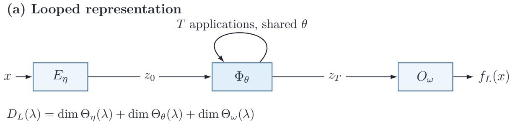

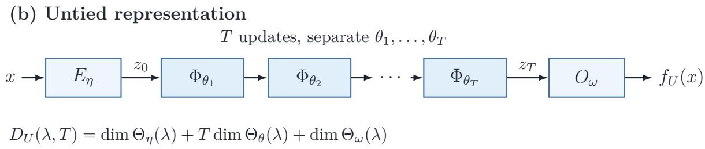  
Figure 1: Looped and untied representations at a fixed model tuning parameter λ. Both use the input map $E _ { \eta }$ and output map $O _ { \omega }$ . Here $z _ { 0 } = E _ { \eta } ( x )$ is the encoded input and $z _ { T }$ is the state after $T$ update applications. In (a), the same update $\Phi _ { \theta }$ is applied $T$ times; in (b), the updates $\Phi _ { \theta _ { 1 } } , \hdots , \Phi _ { \theta _ { T } }$ have separate parameter vectors. The counts below each panel include the input, update, and output parameters. Thus $D _ { L } ( \boldsymbol { \lambda } )$ is independent of $T ,$ whereas $D _ { U } ( \lambda , T )$ grows linearly with $T$

Figure 1 shows the common input–composition–output form and contrasts repeated use of one shared update operator with separately parameterized updates.

Let $\Lambda _ { 0 }$ be the set of candidate values of λ. Under a parameter budget B, define the admissible loop tuning parameters and untied tuning pairs $( \lambda , T )$ by

$$
\Lambda _ { L } ( B ) = \{ \lambda \in \Lambda _ { 0 } : D _ { L } ( \lambda ) \leq B \} , \qquad \mathcal { T } _ { U } ( B ) = \{ ( \lambda , T ) \in \Lambda _ { 0 } \times \mathbb { N } : D _ { U } ( \lambda , T ) \leq B \} .
$$

Assume that $\mathcal { T } _ { U } ( B )$ is finite for each B. Because $D _ { L } ( \boldsymbol { \lambda } )$ does not depend on $T ,$ membership in $\Lambda _ { L } ( B )$ places no restriction on the iteration count. Each additional untied iteration instead adds dim $\Theta _ { \theta } ( \lambda )$ parameters and can carry the pair outside $\mathcal { T } _ { U } ( B )$ . The budgeted untied family includes every admissible resource pair:

$$
\mathcal { F } _ { U } [ B ] = \bigcup _ { ( \lambda , T ) \in \mathbb { Z } _ { U } ( B ) } \mathcal { F } _ { U } ( \lambda , T ) .
$$

For the looped FFN and looped Transformer introduced in Section 3.2, each corresponding untied stack has common dimensions across updates, and the union ranges jointly over those dimensions and $T .$

## 2.2 Likelihood risk and sieve maximum likelihood

Let $\{ \mathbb { P } _ { v } : v \in \mathcal { V } \}$ be a likelihood model with densities $p _ { v }$ relative to a common measure ν. We observe independent $Z _ { 1 } , \dots , Z _ { n } \sim \mathbb { P } _ { f _ { 0 } }$ for an unknown $f _ { 0 } \in \mathcal { F }$ and use squared Hellinger

distance,

$$
h ^ { 2 } ( \mathbb { P } _ { f } , \mathbb { P } _ { g } ) = \int ( \sqrt { p _ { f } } - \sqrt { p _ { g } } ) ^ { 2 } d \nu , \qquad 0 \le h ^ { 2 } \le 2 .
$$

We admit only values of λ for which all functions in the corresponding looped and untied classes belong to .

For looped estimation at sample size $n ,$ choose deterministic resources $B = B _ { n } , \lambda = \lambda _ { n } \in$ $\Lambda _ { L } ( B _ { n } )$ , and $T = T _ { n } \geq 1$ before fitting. These resources may depend on $n ;$ their n subscripts are suppressed below. The selected loop sieve is $\mathcal { F } _ { L } ( \lambda , T )$ . For any deterministic candidate sieve $\mathcal { C } _ { n } \subseteq \mathcal { V }$ , possibly depending on $n ,$ write ${ \mathcal { P } } _ { n } = \{ p _ { g } : g \in { \mathcal { C } } _ { n } \}$ for its induced density class.

Definition 2.3 (Sieve maximum likelihood estimator). Fix a deterministic sieve ${ \mathcal { C } } _ { n }$ . For a deterministic optimization tolerance $\varepsilon _ { n } \geq 0$ in the average log likelihood, the sieve MLE is any measurable $\widehat { f } _ { n } \in \mathcal { C } _ { n }$ satisfying

$$
{ \frac { 1 } { n } } \sum _ { i = 1 } ^ { n } \log p _ { \widehat { f _ { n } } } ( Z _ { i } ) \geq \operatorname* { s u p } _ { g \in { \mathcal { C } } _ { n } } { \frac { 1 } { n } } \sum _ { i = 1 } ^ { n } \log p _ { g } ( Z _ { i } ) - \varepsilon _ { n } .
$$

Existence of a measurable approximate maximizer is assumed.

Taking $\mathcal { C } _ { n } = \mathcal { F } _ { L } ( \lambda , T )$ defines the loop sieve MLE. We study its worst-case squared Hellinger risk over $f _ { 0 } \in { \mathcal { F } }$ . The risk bound separates approximation by the selected sieve from the complexity of fitting over it. For a deterministic sieve ${ \mathcal { C } } _ { n } .$ , define the worst-case squared Hellinger approximation error by

$$
A ( \mathcal { C } _ { n } ) = \operatorname* { s u p } _ { f _ { 0 } \in \mathcal { F } } \operatorname* { i n f } _ { g \in \mathcal { C } _ { n } } h ^ { 2 } ( \mathbb { P } _ { f _ { 0 } } , \mathbb { P } _ { g } ) .\tag{1}
$$

For a density class $\mathcal { P }$ , let $N ( \epsilon , \mathcal { P } , h )$ be its Hellinger bracketing number and $H ( \epsilon , \mathcal { P } , h ) =$ log $N ( \epsilon , \mathcal { P } , h )$ its bracketing entropy. A bracket $[ p ^ { - } , p ^ { + } ]$ has width $\| \sqrt { p ^ { + } } - \sqrt { p ^ { - } } \| _ { L ^ { 2 } ( \nu ) } $ the detailed pointwise and common-null-set conventions are given in the appendix.

Likelihood estimation also requires an approximating candidate that is close in the one-sided likelihood quantity

$$
\rho _ { \gamma } ( p _ { 0 } , p _ { 1 } ) = \frac { 1 } { \gamma } \int p _ { 0 } \left\{ \left( \frac { p _ { 0 } } { p _ { 1 } } \right) ^ { \gamma } - 1 \right\} d \nu , \qquad 0 < \gamma \leq 1 .\tag{2}
$$

For the selected sieve $\mathcal { C } _ { n }$ , set

$$
\delta ( f _ { 0 } ; { \mathcal C } _ { n } ) = \operatorname* { i n f } _ { g \in { \mathcal C } _ { n } } \rho _ { 1 / 2 } ( p _ { f _ { 0 } } , p _ { g } ) .
$$

The next result combines a bracketing bound for the complete sieve with a comparison between likelihood and Hellinger approximation.

Corollary 2.4 (Sieve-MLE oracle inequality). Let $C _ { 1 } , C _ { 2 } , C _ { 3 } > 0$ be the absolute constants in the sieve-likelihood bound stated in the appendix. Let $e _ { n } > 0$ be a deterministic critical radius for $\mathcal { P } _ { n }$ such that n $^ { - 1 } \leq e _ { n } ^ { 2 } \leq 2$ and, for every $e _ { n } \leq t \leq { \sqrt { 2 } }$

$$
\int _ { t ^ { 2 } / 2 ^ { 8 } } ^ { \sqrt { 2 } t } \sqrt { H ( u / C _ { 1 } , \mathcal { P } _ { n } , h ) } d u \leq C _ { 2 } \sqrt { n } t ^ { 2 } .\tag{3}
$$

Thus $e _ { n }$ depends on the selected sieve through the entropy of $\mathcal { P } _ { n }$ . If, for the fixed constant $C _ { 4 }$ independent of n and f , $f _ { 0 }$

$$
\operatorname* { s u p } _ { f _ { 0 } \in { \mathcal { F } } } \delta ( f _ { 0 } ; { \mathcal { C } } _ { n } ) \leq C _ { 4 } A ( { \mathcal { C } } _ { n } ) ,\tag{4}
$$

then there is a constant $C _ { 5 }$ , depending only on $C _ { 3 } , C _ { 4 }$ and independent of n and $f _ { 0 } ,$ such that

$$
\operatorname* { s u p } _ { f _ { 0 } \in \mathcal { F } } \mathbb { E } _ { f _ { 0 } } h ^ { 2 } ( \mathbb { P } _ { f _ { 0 } } , \mathbb { P } _ { \widehat { f _ { n } } } ) \leq C _ { 5 } \left\{ \underbrace { A ( \mathcal { C } _ { n } ) } _ { s i e v e \ a p p r o x i m a t i o n } + \underbrace { e _ { n } ^ { 2 } } _ { f i t t e d - s i e v e \ e s t i m a t i o n } + \underbrace { \varepsilon _ { n } } _ { o p t i m i z a t i o n } \right\} .\tag{5}
$$

The result follows from the one-sided truncated likelihood-ratio argument of Wong and Shen [1995]; the appendix records the bound and derivation. Its two conditions play diferent roles. The bracketing integral controls fitting over the complete sieve, while the likelihood bridge certifies that an approximating member is close to the truth in the one-sided likelihood quantity as well as in Hellinger distance. An accurate estimator therefore needs a small approximation term, a controlled cost of fitting the selected class, and an optimization tolerance kept at the required scale. A parameter budget constrains the first term by limiting the coeficients available for approximation, but it does not by itself control the second. The question is whether approximation can keep improving under a fixed cap while the estimation term remains controlled. Repeated computation supplies an additional sieve index without introducing new coeficients at each step.

For the loop sieve, take $\mathcal { C } _ { n } = \mathcal { F } _ { L } ( \lambda , T )$ and write $A _ { L } ( \lambda , T ) = A ( { \mathcal { F } } _ { L } ( \lambda , T ) )$ . Let $e _ { n , L }$ be a critical radius satisfying the hypotheses of Corollary 2.4 for the induced density class. If the likelihood bridge (4) holds for this sieve, its MLE $\widehat { f } _ { L , n }$ satisfies

$$
\operatorname* { s u p } _ { f _ { 0 } \in \mathcal { F } } \mathbb { E } _ { f _ { 0 } } h ^ { 2 } ( \mathbb { P } _ { f _ { 0 } } , \mathbb { P } _ { \widehat { f } _ { L , n } } ) \leq C _ { 5 } \{ A _ { L } ( \lambda , T ) + e _ { n , L } ^ { 2 } + \varepsilon _ { n } \} .\tag{6}
$$

For fixed λ, increasing $T$ leaves $D _ { L } ( \boldsymbol { \lambda } )$ unchanged but can afect both approximation and estimation. Section 3 derives these two contributions for the looped FFN and Transformer; Section 4 uses them to select the iteration count and obtain risk rates.

## 2.3 Untied lower bounds and risk comparison

We now compare the loop sieve MLE with estimators taking values in the untied union $\mathcal { F } _ { U } [ B ]$ , under the same likelihood model, target family, squared Hellinger risk, and parameter budget. For a candidate class $\mathcal { C } \subseteq \mathcal { V }$ , define its class-constrained worst-case risk by

$$
\operatorname* { i n f } _ { \widehat { f } : \widehat { f } \in \mathscr { C } } \operatorname* { s u p } _ { f _ { 0 } \in \mathscr { F } } \mathbb { E } _ { f _ { 0 } } h ^ { 2 } ( \mathbb { P } _ { f _ { 0 } } , \mathbb { P } _ { \widehat { f } } ) .\tag{7}
$$

The infimum ranges over all measurable -valued estimators. Taking $\mathcal { C } = \mathcal { F } _ { U } [ B ]$ gives the untied benchmark. This benchmark allows data-dependent selection of the model tuning parameter λ and iteration count T, together with any measurable fitting rule whose output belongs to $\mathcal { F } _ { U } [ B ]$

A lower bound for this benchmark follows by comparing a packing of the target laws with a cover of the untied union. We first state the required packing condition, then derive the lower bound and combine it with the loop risk bound to obtain the comparison.

Assumption 2.5 (Hellinger packing of the target family). There exist an exponent $a > 0$ and constants $c _ { \mathrm { p a c k } } , \delta _ { 0 } > 0$ such that, for every $0 < \delta \leq \delta _ { 0 }$ , the target family contains $f _ { 1 , \delta } , \ldots , f _ { M _ { \delta } , \delta }$ satisfying

$$
\operatorname* { m i n } _ { 1 \leq j \neq k \leq M _ { \delta } } h ( \mathbb { P } _ { f _ { j , \delta } } , \mathbb { P } _ { f _ { k , \delta } } ) \geq 8 \delta , \qquad \log M _ { \delta } \geq c _ { \mathrm { p a c k } } \delta ^ { - 2 / a } .\tag{8}
$$

For a class of probability laws , let $\mathcal { N } ( \epsilon , \mathcal { Q } , h )$ denote the smallest cardinality of an internal Hellinger cover of radius ϵ, with every center belonging to . Write ${ \mathcal { P } } _ { U } [ B ] = \{ p _ { g } : g \in { \mathcal { F } } _ { U } [ B ] \}$ for the laws induced by the budgeted untied union.

Theorem 2.6 (Untied minimax lower bound under a parameter budget). Suppose there is a constant $C > 0$ such that, for suficiently large B and $0 < \epsilon < 1$ ，

$$
\log \mathcal { N } ( \epsilon , \mathcal { P } _ { U } [ B ] , h ) \leq C \{ B ^ { \kappa } \log ^ { b } ( e B ) + B \log ( 1 / \epsilon ) \} , \qquad \kappa , b \geq 1 .\tag{9}
$$

Under Assumption 2.5, there is a constant $c _ { \mathrm { l o w } } > 0$ , depending only on the fixed packing and covering constants, such that every $n \geq 1$ and all suficiently large B satisfy

$$
\operatorname* { i n f } _ { \widehat { f } : \widehat { f } \in \mathcal { F } _ { U } [ B ] } \operatorname* { s u p } _ { f _ { 0 } \in \mathcal { F } } \mathbb { E } _ { f _ { 0 } } h ^ { 2 } ( \mathbb { P } _ { f _ { 0 } } , \mathbb { P } _ { \widehat { f } } ) \geq c _ { \mathrm { l o w } } \{ B ^ { \kappa } \log ^ { b } ( e B ) \} ^ { - a } .\tag{10}
$$

The lower bound is uniform in n and in B over the stated range. At any fixed suficiently large B, it therefore applies for every sample size and represents a limitation of the available parameterized representations rather than of a particular fitting rule. Theorem 2.6 follows from the packing–cover bound in Lemma A.1 with squared Hellinger risk.

Corollary 2.7 (Loop-versus-untied risk separation). Let $B = B _ { n } , \lambda = \lambda _ { n } \in \Lambda _ { L } ( B _ { n } )$ , and $T = T _ { n } \geq 1$ be deterministic resource sequences satisfying the hypotheses of the loop risk bound (6) and Theorem 2.6. If

$$
\{ A _ { L } ( \lambda , T ) + e _ { n , L } ^ { 2 } + \varepsilon _ { n } \} \{ B ^ { \kappa } \log ^ { b } ( e B ) \} ^ { a } \longrightarrow 0 \qquad a s \ n \to \infty ,
$$

then the ratio of the worst-case squared Hellinger risk of the loop sieve MLE to the untied benchmark over $\mathcal { F } _ { U } [ B ]$ tends to zero.

The corollary establishes a statistical gain from looping under the common parameter budget. Section 3 next verifies the required approximation and complexity bounds for concrete likelihood and neural examples, and Section 4 identifies fixed- and growing-budget regimes in which this condition holds.

## 3 Likelihood models and neural realizations

The general comparison separates the statistical model from the parameterized representation. A likelihood model determines how function approximation and covering translate into probabilitylaw distances. A neural architecture determines what can be approximated and the complexity of its complete fitted class. This section verifies both sets of conditions for four likelihood models and two neural realizations. The resulting approximation and complexity bounds are combined into risk statements in Section 4.

## 3.1 Likelihood models and metric calibration

We consider three conditional-prediction models and one energy-based generative model, each indexed by a bounded H¨older-smooth function. For the conditional models, squared Hellinger distance is comparable to squared $L ^ { 2 } ( \mu )$ distance between the model functions. For the energy model, the corresponding comparison uses $L ^ { 2 } ( \mu )$ distance modulo additive constants.

Definition 3.1 (H¨older class). Fix $d \geq 1 , s > 0$ and $H > 0$ . Write $k = \lfloor s \rfloor$ when s is not an integer and $k = s - 1$ otherwise, and put $\alpha = s - k \in ( 0 , 1 ]$ . Let $\mathcal { H } _ { d } ^ { s } ( H )$ consist of functions $f : [ 0 , 1 ] ^ { d } \to [ - H , H ]$ that are $C ^ { k }$ on $( 0 , 1 ) ^ { d }$ , whose coordinate partial derivatives through order k are bounded by H there, and whose order-k partial derivatives satisfy

$$
\begin{array} { r } { | \partial ^ { \nu } f ( x ) - \partial ^ { \nu } f ( y ) | \leq H \| x - y \| _ { \infty } ^ { \alpha } , \qquad | \nu | = k , \quad x , y \in ( 0 , 1 ) ^ { d } . } \end{array}
$$

Here $\| x - y \| _ { \infty } = \operatorname* { m a x } _ { i } | x _ { i } - y _ { i } |$ . Boundary values are bounded by $H ;$ no boundary derivative condition is imposed.

Throughout this section, $\mathcal { X } = [ 0 , 1 ] ^ { d } , \mu$ is uniform probability measure on $\mathcal { X } , \mathcal { F } = \mathcal { H } _ { d } ^ { s } ( H )$ 1 and

$$
a = 2 s / d .\tag{11}
$$

For these examples, let be the measurable functions from into $[ - H , H ]$ ; this likelihood index space extends beyond the H¨older target class ${ \mathcal F } .$

We now introduce conditional models and an energy-based model as examples of the sieve maximum likelihood framework in Section 2.

Conditional Model. Observe independent pairs $( X _ { i } , Y _ { i } )$ with $X _ { i } \sim \mu$ and, for $f _ { 0 } \in \mathcal { H } _ { d } ^ { s } ( H )$ ), consider

$$
\begin{array} { r l } & { Y _ { i } \mid X _ { i } = x \sim N ( f _ { 0 } ( x ) , \sigma ^ { 2 } ) , } \\ & { Y _ { i } \mid X _ { i } = x \sim \mathrm { L a p l a c e } ( f _ { 0 } ( x ) , \tau ) , } \\ & { Y _ { i } \mid X _ { i } = x \sim \mathrm { B e r n o u l l i } ( ( 1 + e ^ { - f _ { 0 } ( x ) } ) ^ { - 1 } ) . } \end{array}\tag{12}
$$

Write $m = { \mathrm { G } } , { \mathrm { L a } }$ , Be for these three models and $\mathbb { P } _ { f } ^ { m } , p _ { f } ^ { m }$ for the joint law and density indexed by $f .$ Here $f$ is respectively the conditional mean, location, or logit.

Energy-Based Generative Model. Observe independent $X _ { 1 } , \ldots , X _ { n } \sim \mathbb { P } _ { f _ { 0 } } ^ { \mathrm { E } }$ , where

$$
Z _ { f } = \int _ { \mathcal { X } } e ^ { f ( u ) } d \mu ( u ) , \qquad p _ { f } ^ { \mathrm { E } } ( x ) = \frac { e ^ { f ( x ) } } { Z _ { f } } , \qquad f _ { 0 } \in \mathcal { H } _ { d } ^ { s } ( H ) .\tag{13}
$$

Here $f$ is a log-density potential, or negative energy [Song and Kingma, 2021]. Adding a constant to $f$ leaves the density unchanged, so define

$$
d _ { \mathrm { c } } ( f , g ) ^ { 2 } = \operatorname* { i n f } _ { c \in \mathbb { R } } \| f - g - c \| _ { L ^ { 2 } ( \mu ) } ^ { 2 } .
$$

For $m \in \{ \mathrm { G , L a , B e , E } \}$ , set

$$
\begin{array} { r }  d _ { m } ( f , g ) = \{ \Vert f - g \Vert _ { L ^ { 2 } ( \mu ) } , \begin{array} { l l } { \operatorname { \overline { { f } } } \bot \operatorname { \mathrm { ~ ( } f , \mu _ { \mathrm { ~ } } ) } \operatorname { \mathrm { ~ } } \operatorname { \overline { { f } } } \operatorname { \mathrm { ~ ( } f , \mu _ { \mathrm { ~ } } , \operatorname { B e } \} , } \\ { d _ { \mathrm { { c } } } ( f , g ) , \quad \quad \mathrm { ~ } \operatorname { \overline { { m } } } = \operatorname { \mathrm { E } } . } \end{array}  } \end{array}
$$

For a function class ${ \mathcal { G } } .$ let $\mathcal { N } ( \epsilon , \mathcal { G } , \| \cdot \| _ { \infty } )$ denote its internal covering number in the uniform norm.

The next proposition connects these models to the general likelihood theory. Its metric and likelihood bounds transfer function approximation to likelihood risk, while its bracket conversion and target packing provide the complexity conditions used in the upper and lower bounds.

Proposition 3.2 (Metric and likelihood bounds for the examples). For $m \in \{ \mathrm { G , L a , B e , E } \}$ , let ${ \mathcal { P } } ^ { m } ( { \mathcal { G } } ) = \{ p _ { q } ^ { m } : g \in { \mathcal { G } } \}$ for a function class ${ \mathcal { G } } ,$ and let $d _ { m }$ be the pseudometric defined above. There are constants $0 < c _ { m } < C _ { m } < \infty$ , depending only on H and on the fixed σ or τ , such that the following statements hold uniformly over measurable $f , g : \mathcal { X }  [ - H , H ]$

(i) Metric equivalence.

$$
c _ { m } d _ { m } ( f , g ) ^ { 2 } \leq h ^ { 2 } ( { \mathbb P } _ { f } ^ { m } , { \mathbb P } _ { g } ^ { m } ) \leq C _ { m } d _ { m } ( f , g ) ^ { 2 } , \qquad d _ { m } ( f , g ) \leq \| f - g \| _ { L ^ { 2 } ( \mu ) } .\tag{14}
$$

(ii) One-sided likelihood bridge.

$$
\rho _ { 1 / 2 } ( p _ { f } ^ { m } , p _ { g } ^ { m } ) \leq C _ { m } h ^ { 2 } ( \mathbb { P } _ { f } ^ { m } , \mathbb { P } _ { g } ^ { m } ) .\tag{15}
$$

(iii) Bracket and cover conversion. For every $\mathcal G \subseteq \{ g : \mathcal X \to [ - H , H ] \}$ and $0 < u < 1$

$$
H ( u , \mathcal { P } ^ { m } ( \mathcal { G } ) , h ) \leq \log \mathcal { N } ( u / C _ { m } , \mathcal { G } , \| \cdot \| _ { \infty } ) .\tag{16}
$$

An internal uniform u-cover of $\mathcal { G }$ also induces an internal Hellinger $C _ { m } u  – c o v e r$ of ${ \mathcal { P } } ^ { m } ( { \mathcal { G } } )$

(iv) Target packing. The H¨older target family satisfies Assumption 2.5 in every model with exponent $a = 2 s / d$ from (11).

For the energy model, the upper comparison $d _ { \mathrm { c } } ( f , g ) \leq \| f - g \| _ { L ^ { 2 } ( \mu ) }$ is suficient for the analysis.

The proof is in Section B.2, with the likelihood calculations in Appendix C. In particular, $d _ { \mathrm { c } } \leq \| \cdot \| _ { L ^ { 2 } ( \mu ) }$ means that the same ordinary $L ^ { 2 } ( \mu )$ approximation bound in Section 3.3 sufices for all four models. Section 3.4 applies the bracket and cover conversion to the neural classes defined next.

## 3.2 Looped FFN and Transformer

We specialize Definition 2.1 to residual FFNs and post-LN Transformers, indexed by $j = \operatorname { F }$ and $j = \operatorname { T r }$ , respectively. Let q denote the state width and r the hidden width of the update block. For both architectures, fix $M _ { \mathrm { p a r } } > 0$ and restrict every trainable scalar to $[ - M _ { \mathrm { p a r } } , M _ { \mathrm { p a r } } ]$ Write $\Pi _ { H } ( u ) = \operatorname* { m i n } \{ H , \operatorname* { m a x } \{ - H , u \} \}$ for the fixed output clipping map, which adds no trainable parameters.

Looped FFN. The encoder $E _ { \eta }$ is an afine map from $\mathbb { R } ^ { d }$ to $\mathbb { R } ^ { q }$ . For a state $z \in \mathbb { R } ^ { q }$ , the shared residual block is

$$
\begin{array} { r } { \Phi _ { \theta } ( z ) = z + W _ { 2 } \operatorname { R e L U } ( W _ { 1 } z + b _ { 1 } ) + b _ { 2 } , \quad W _ { 1 } \in \mathbb { R } ^ { r \times q } , \ b _ { 1 } \in \mathbb { R } ^ { r } , \ W _ { 2 } \in \mathbb { R } ^ { q \times r } , \ b _ { 2 } \in \mathbb { R } ^ { q } . } \end{array}
$$

The output map $O _ { \omega }$ is an afine scalar map on $\mathbb { R } ^ { q }$ followed by $\Pi _ { H }$ . Applying the same block $T$ times gives the class $\mathcal { F } _ { L , \mathrm { F } } ( q , r , T )$ . All encoder, block, and readout coeficients range over the prescribed parameter box, with their shapes fixed before the class is formed. Allowing a separate update vector at each application defines $\mathcal { F } _ { U , \mathrm { F } } ( q , r , T )$

Looped Transformer. Fix a partition $I _ { 1 } , \ldots , I _ { M }$ of $\{ 1 , \ldots , d \}$ into nonempty sets and put $N = M + 3$ . The state $S \in \mathbb { R } ^ { N \times q }$ consists of M data tokens, one controller row, and two reference rows. The encoder assigns data token $j \leq M$ the row

$$
S _ { 0 , j } = A _ { j } x _ { I _ { j } } + a _ { j } , \qquad A _ { j } \in \mathbb { R } ^ { q \times | I _ { j } | } , \quad a _ { j } \in \mathbb { R } ^ { q } .
$$

The controller and reference rows are input-independent free constant vectors in $\mathbb { R } ^ { q }$

Writing Attn for self-attention, FFN for the row-wise feedforward subnetwork, and $\mathrm { L N } _ { 1 } , \mathrm { L N } _ { 2 }$ for layer normalization, the shared post-LN block is

$$
Y = \mathrm { L N } _ { 1 } \{ S + \mathrm { A t t n } ( S ) \} , \qquad \Phi _ { \theta } ( S ) = \mathrm { L N } _ { 2 } \{ Y + \mathrm { F F N } ( Y ) \} .
$$

Attention has one q-dimensional softmax head with $1 / { \sqrt { q } }$ scaling, no mask, and four afine projections from $\mathbb { R } ^ { q }$ to $\mathbb { R } ^ { q }$ . The FFN has one ReLU hidden layer of width $r .$ . Each layer normalization has trainable coordinatewise gain and bias and a fixed positive stabilizer $\varepsilon _ { \mathrm { L N } }$ . The output map $O _ { \omega }$ is an afine scalar map of $\mathrm { v e c } ( S ) \in \mathbb { R } ^ { N q }$ followed by $\Pi _ { H }$

Applying this block T times with shared parameters defines $\mathcal { F } _ { L , \mathrm { T r } } ( q , r , T )$ ; using separate update vectors defines $\mathcal { F } _ { U , \mathrm { T r } } ( q , r , T )$ . Both classes use the same token protocol, parameter box, and endpoint shapes. Reference values and zero coordinates used by an approximation witness remain free coordinates in the complete parameterized classes. Figure 2 displays the two update blocks within the common structure of Figure 1.

Estimation and parameter counts. For $j \in \{ \mathrm { F } , \mathrm { T r } \}$ , Table 1 gives the total numbers of trainable scalar coeficients, including the input and output maps. The formulas count every matrix entry, bias, layer-normalization gain, and layer-normalization shift in the definitions above. Appendix F.2 gives the corresponding dense counts for the residual FFNs used in the numerical studies.

Under a parameter budget $B _ { ; }$ define

$$
\mathcal { Z } _ { U , j } ( B ) = \{ ( q , r , T ) : D _ { U } ^ { j } ( q , r , T ) \leq B \} , \qquad \mathcal { F } _ { U , j } [ B ] = \bigcup _ { ( q , r , T ) \in \mathcal { Z } _ { U , j } ( B ) } \mathcal { F } _ { U , j } ( q , r , T ) ,
$$

where $\boldsymbol { q } , \boldsymbol { r } , T$ are positive integers. For likelihood model $m ,$ the induced density classes are

$$
\mathcal { P } _ { L , j } ^ { m } ( q , r , T ) = \{ p _ { g } ^ { m } : g \in \mathcal { F } _ { L , j } ( q , r , T ) \} , \qquad \mathcal { P } _ { U , j } ^ { m } [ B ] = \{ p _ { g } ^ { m } : g \in \mathcal { F } _ { U , j } [ B ] \} .
$$

For deterministic, possibly sample-size-dependent resources satisfying $D _ { L } ^ { j } ( q , r ) \leq B$ , let $\widehat { f } _ { L , n } ^ { m , j }$ be the sieve MLE of Definition 2.3 over $\mathcal { F } _ { L , j } ( q , r , T )$ , with average-log-likelihood tolerance $\varepsilon _ { n }$ . The untied competitor may be any measurable estimator valued in $\mathcal { F } _ { U , j } [ B ]$ , allowing data-dependent selection of $( q , r , T )$ and any fitting rule.

(a) Residual feedforward block  
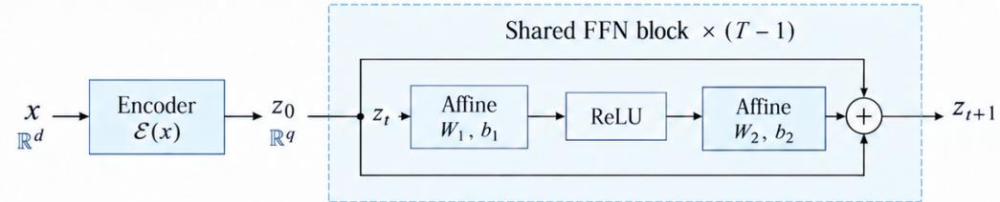

(b) Post-LN Transformer block  
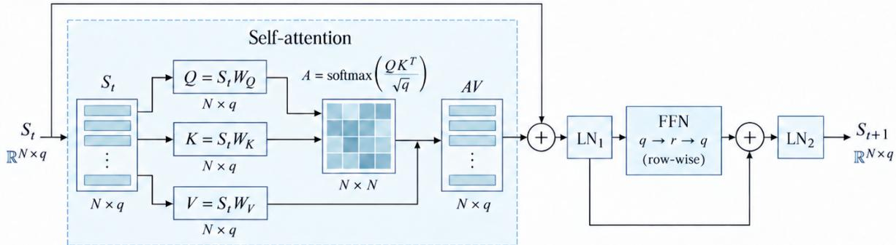  
Figure 2: Neural realizations of one shared state-update operator. The residual FFN applies an afine–ReLU–afine map with a residual connection. The Transformer applies self-attention and a row-wise FFN, with layer normalization after each residual update. The schematic shows the query, key, and value projections; the output projection and projection biases are omitted. In both architectures, the displayed update is applied T times with the same parameters, which are counted once toward the parameter budget.

Table 1: Total numbers of distinct trainable parameters. The looped count $D _ { L } ^ { j } ( q , r )$ is independent of T, whereas the untied count $D _ { U } ^ { j } ( q , r , T )$ grows linearly with T. Here $N = M + 3$ is the Transformer token count.
<table><tr><td>Architecture</td><td> $D _ { L } ^ { j } ( q , r )$ </td><td> $\overrightarrow { D _ { U } ^ { j } ( q , r , T ) }$ </td></tr><tr><td>Residual ReLU FFN</td><td> $\overline { { q ( d + 3 ) + 1 + ( 2 q + 1 ) r } }$ </td><td> $\overline { { q ( d + 2 ) + 1 + T \{ ( 2 q + 1 ) r + q \} } }$ </td></tr><tr><td>Post-LN Transformer</td><td> $4 q ^ { 2 } + q ( d + 2 N + 9 ) + 1 + ( 2 q + 1 ) r$ </td><td> $q ( d + 2 N ) + 1 + T \{ 4 q ^ { 2 } + ( 2 q + 1 ) r + 9 q \}$ </td></tr></table>

## 3.3 Approximation error

Approximation error measures how closely a computational class can represent the target before data are used to fit its coeficients. For each architecture $j$ and likelihood model $m _ { \colon }$ , define the worst-case squared Hellinger approximation error

$$
A _ { L , j } ^ { m } ( q , r , T ) = \operatorname* { s u p } _ { f _ { 0 } \in \mathcal { H } _ { d } ^ { s } ( H ) } \operatorname* { i n f } _ { g \in \mathcal { F } _ { L , j } ( q , r , T ) } h ^ { 2 } ( \mathbb { P } _ { f _ { 0 } } ^ { m } , \mathbb { P } _ { g } ^ { m } ) .
$$

We first bound ordinary $L ^ { 2 } ( \mu )$ approximation of the H¨older index and then use Proposition 3.2 to transfer the result to all four likelihood models. The following theorem establishes the rate in terms of hidden width $r$ and iteration count $T ,$ , with $a = 2 s / d$

Theorem 3.3 (Looped neural approximation in index and Hellinger distance). $F i x \ d , s , H$ For $j = \operatorname { T r }$ , also fix the token partition and $\varepsilon _ { \mathrm { L N } } > 0$ . There exist constants $C , c > 0$ and architecture-specific thresholds $q _ { 0 } ^ { j } , r _ { 0 } ^ { j } , M _ { 0 } ^ { j } ,$ , depending only on these fixed quantities, such that, for fixed $M _ { \mathrm { p a r } } \geq M _ { 0 } ^ { j }$ , integers $q \geq q _ { 0 } ^ { \mathcal { I } } , r \geq r _ { 0 } ^ { \mathcal { I } } ;$ and suficiently large $T ,$ the following hold.

(i) Index approximation.

$$
\operatorname* { s u p } _ { f _ { 0 } \in \mathcal { H } _ { d } ^ { s } ( H ) } \operatorname* { i n f } _ { g \in \mathcal { F } _ { L , j } ( q , r , T ) } \Vert f _ { 0 } - g \Vert _ { L ^ { 2 } ( \mu ) } ^ { 2 } \leq C \left\{ \left[ \frac { \log ( e r T ) } { r T } \right] ^ { a } + e ^ { - c T ^ { 1 / h _ { 0 } ^ { j } } } \right\} ,\tag{17}
$$

where $h _ { 0 } ^ { \mathrm { F } } = 1$ and $h _ { 0 } ^ { \mathrm { T r } } = 2$ . The exponential term may be omitted when $T \geq C \log ( e r T )$ for the residual FFN and when $T \geq C \log ^ { 2 } ( e r T )$ for the Transformer.

(ii) Hellinger approximation. For every likelihood model m introduced in Section ${ \it 3 . 1 , }$ there is a constant $C _ { m } > 0$ , depending additionally on the fixed parameters of that likelihood, such that

$$
A _ { L , j } ^ { m } ( q , r , T ) \leq C _ { m } \left\{ \left[ \frac { \log ( e r T ) } { r T } \right] ^ { a } + e ^ { - c T ^ { 1 / h _ { 0 } ^ { j } } } \right\} .\tag{18}
$$

For fixed admissible $q , r , D _ { L } ^ { j } ( q , r )$ is independent of $T$ . Once the initialization condition above holds, the Hellinger approximation bound simplifies to

$$
A _ { L , j } ^ { m } ( q , r , T ) \lesssim \left\{ \frac { \log ( e T ) } { T } \right\} ^ { a } , \qquad a = \frac { 2 s } { d } .
$$

The same simplified rate holds for the index approximation in (17). Hence any budget $B \geq$ $D _ { L } ^ { j } ( q , r )$ admits the loop class for every $T _ { i }$ , and its approximation error tends to zero as $T$ increases.

The proof is in Section B.2. Appendix D gives the residual FFN construction, and Appendix E gives the Transformer construction, including attention routing, layer normalization, and the afine readout.

How repetition improves approximation. At a chosen resolution, local Taylor information describes the target on a spatial grid. The construction encodes this information in bounded real coeficients and repeatedly applies one evaluator to decode and evaluate the relevant records. Above the initialization threshold, hidden width $r$ and iteration count $T$ resolve order $r T / \log ( e r T )$ grid cells. This yields the leading squared approximation bound $\{ \log ( e r T ) / ( r T ) \} ^ { a }$ while leaving the number of coeficients independent of $T .$

Both coeficient precision and executed computation may grow with resolution; the budget here counts trainable scalar coeficients.

## 3.4 Complexity of the looped and untied classes

Approximation requires a suitable candidate for each target; estimation requires control of the complete class over which fitting takes place. We therefore bound uniform covering numbers of the neural index classes and transfer them to density-space complexity using Proposition 3.2. For the loop sieve, Hellinger bracketing entropy controls estimation error. For the budgeted untied union defined in Section 3.2, a Hellinger covering bound combines with target packing to yield a lower bound that remains valid after data-dependent architecture selection. For any class equipped with a pseudometric $d , { \mathcal { N } } ( \epsilon , { \mathcal { C } } , d )$ denotes its internal covering number at radius ϵ.

Fix a numerical constant $C _ { 6 } \geq 2$ and define

$$
G ( q , r , T ) = \log ( T + 1 ) + ( T + 1 ) \log ( C _ { 6 } ( q + 1 ) ( r + 1 ) ) .\tag{19}
$$

This factor records the parameter sensitivity accumulated over T applications of the update block. The complexity bound therefore retains an explicit dependence on iteration count even at fixed parameter dimension.

Proposition 3.4 (Index covering and Hellinger complexity). Fix $M _ { \mathrm { p a r } } > 0$ and $j \in \{ \mathrm { F } , \mathrm { T r } \}$ There exists a constant $C > 1$ , depending only on the fixed problem and implementation parameters, such that the following bounds hold.

(i) Index covering. For positive integers $\boldsymbol { q } , \boldsymbol { r } , T$ and $0 < \epsilon < 1$ 2

$$
\log \mathcal { N } ( \epsilon , \mathcal { F } _ { L , j } ( q , r , T ) , \Vert \cdot \Vert _ { \infty } ) \leq C D _ { L } ^ { j } ( q , r ) \{ \log ( C / \epsilon ) + G ( q , r , T ) \} .\tag{20}
$$

For all suficiently large B,

$$
\begin{array} { r } { \log \mathcal { N } ( \epsilon , \mathcal { F } _ { U , j } [ B ] , \lVert \cdot \rVert _ { \infty } ) \le C \{ B ^ { 2 } \log ( e B ) + B \log ( C / \epsilon ) \} . } \end{array}\tag{21}
$$

(ii) Hellinger complexity. For each likelihood model m introduced above and $0 < u < 1$ 2

$$
H ( u , \mathcal { P } _ { L , j } ^ { m } ( q , r , T ) , h ) \leq C D _ { L } ^ { j } ( q , r ) \{ \log ( C / u ) + G ( q , r , T ) \} ,\tag{22}
$$

and

$$
\log \mathcal { N } ( \epsilon , \mathcal { P } _ { U , j } ^ { m } [ B ] , h ) \le C \{ B ^ { 2 } \log ( e B ) + B \log ( C / \epsilon ) \} .\tag{23}
$$

For fixed admissible $q , r , D _ { L } ^ { j } ( q , r ) = O ( 1 )$ and $G ( q , r , T ) = O ( T )$ . Thus the looped-class entropy bound in (22) has the simpler form

$$
H ( u , \mathcal { P } _ { L , j } ^ { m } ( q , r , T ) , h ) \lesssim T + \log ( C / u ) , \qquad 0 < u < 1 .
$$

The proof is in Section B.2, with parameter-sensitivity estimates in Section C.6.

Repeated computation therefore afects both sides of the loop’s statistical balance. At fixed admissible widths, its leading approximation error decreases as $\{ \log ( e T ) / T \} ^ { a }$ , whereas the entropy controlling estimation grows linearly in $T _ { i }$ , up to the resolution term $\log ( C / u )$ . The next section selects resources to balance these efects.

## 4 Risk under fixed and growing parameter budgets

We apply the approximation and complexity bounds of Section 3 to compare looped and untied estimation under a common parameter budget. With a suficiently large fixed budget, a suitable choice of iteration count allows the loop sieve MLE to attain the H¨older minimax rate up to logarithmic factors, while the optimal worst-case risk over the untied family remains bounded away from zero. We also identify growing-budget regimes in which the loop-to-untied risk ratio tends to zero as the neural dimensions and iteration count increase together. The analysis begins with a loop risk upper bound and lower bounds for unrestricted estimation and the budgeted untied family, followed by the fixed- and growing-budget comparisons.

Throughout this section, $m \in \{ \mathrm { G , L a , B e , E } \}$ indexes the four likelihood models of Section 3, and $j \in \{ \mathrm { F } , \mathrm { T r } \}$ indexes the residual FFN and Transformer of Section 3.2. The target class is $\mathcal { H } _ { d } ^ { s } ( H )$ , and $a = 2 s / d$

## 4.1 Risk bounds: estimation and representation

For a loop sieve with resources $( q , r , T )$ , let $\widehat { f } _ { L , n } ^ { m , j }$ denote its sieve MLE and set

$$
R _ { L , j , n } ^ { m } = \operatorname* { s u p } _ { f _ { 0 } \in \mathcal { H } _ { d } ^ { s } ( H ) } \mathbb { E } _ { f _ { 0 } } h ^ { 2 } ( \mathbb { P } _ { f _ { 0 } } ^ { m } , \mathbb { P } _ { \widehat { f } _ { L , n } ^ { m } } ^ { m } ) .
$$

Define the best achievable worst-case squared Hellinger risk over the budgeted untied family by

$$
R _ { U , j , n } ^ { m } ( B ) = \operatorname* { i n f } _ { \substack { \widehat f \colon \widehat f \in \mathscr { F } _ { U , j } [ B ] } } \operatorname* { s u p } _ { f _ { 0 } \in \mathscr { H } _ { d } ^ { s } ( H ) } \mathbb { E } _ { f _ { 0 } } h ^ { 2 } ( \mathbb { P } _ { f _ { 0 } } ^ { m } , \mathbb { P } _ { \widehat { f } } ^ { m } ) .\tag{24}
$$

The infimum permits every measurable fitting and resource-selection rule whose output lies in the corresponding budgeted union.

The two lower bounds below have diferent roles. The unrestricted minimax benchmark ranges over all distribution estimators and calibrates the best sample-size rate for each likelihood model. By contrast, $R _ { U , j , n } ^ { m } ( B )$ restricts the estimator’s output to the tuned untied family under budget B and supplies the denominator in the loop-versus-untied risk comparison.

Theorem 4.1 (Sieve-MLE Hellinger risk for the likelihood examples). Fix a likelihood model m G, La, Be, E and an architecture $j \in \{ \mathrm { F } , \mathrm { T r } \}$ . Take admissible $q , r , M _ { \mathrm { p a r } } , T$ from Theorem ${ \it 3 . 3 , }$ and let $\widehat { f } _ { L , n } ^ { m , j }$ be a measurable sieve MLE over $\mathcal { F } _ { L , j } ( q , r , T )$ with average-log-likelihood tolerance $\varepsilon _ { n }$ There exist constants $C , c > 0$ , depending only on the fixed model and implementation parameters. Set

$$
e _ { n , j } ^ { 2 } = 1 \wedge { \frac { C D _ { L } ^ { j } ( q , r ) \{ \log ( e n ) + G ( q , r , T ) \} } { n } } .
$$

Then, for $n \geq 2$ , the first line below holds. For the second line, fix $q , r ,$ and $M _ { \mathrm { p a r } }$ and suppose that $T$ satisfies the initialization condition in Theorem 3.3 and $\varepsilon _ { n } \leq n ^ { - 1 }$ . Fixed $q , r$ give $D _ { L } ^ { j } ( q , r ) =$ $O ( 1 ) , G ( q , r , T ) = O ( T )$ , and $\log ( e r T ) / ( r T ) \lesssim \log ( e T ) / T ,$ the initialization refinement removes the exponential term, and $\varepsilon _ { n }$ is absorbed into the fitting term. Thus, for a constant $C ^ { \prime } > 0$ depending on the fixed quantities,

$$
\begin{array} { l } { \displaystyle R _ { L , j , n } ^ { m } \leq C \left\{ \underbrace { \left[ \frac { \log \left( e r T \right) } { r T } \right] ^ { a } + e ^ { - c T ^ { 1 / h _ { 0 } ^ { j } } } } _ { a p p r o x i m a t i o n } + \underbrace { e _ { n , j } ^ { 2 } + \varepsilon _ { n } } _ { f t t i n g ~ a n d ~ o p t i m i z a t i o n } \right\} , } \\ { \leq C ^ { \prime } \left\{ \underbrace { \left[ \frac { \log \left( e T \right) } { T } \right] ^ { a } } _ { a p p r o x i m a t i o n } + \underbrace { \frac { T + \log \left( e n \right) } { n } } _ { f t t i n g ~ a n d ~ o p t i m i z a t i o n } \right\} , \qquad a = \frac { 2 s } { d } . } \end{array}\tag{25}
$$

At fixed neural dimensions, the approximation bound decreases with $T ,$ whereas the estimation bound increases through $G ( q , r , T )$ . This is the statistical cost of using repeated computation to improve representation at a fixed parameter count. Sections 4.2 and 4.3 balance these terms.

The proof combines the approximation in Theorem 3.3, the full-class entropy in Proposition 3.4, and the likelihood bridge in Proposition 3.2 through Corollary 2.4. To assess the rate attainable from this upper bound, we first give a minimax lower bound over all measurable distribution estimators. This benchmark quantifies the sampling limitation common to the four likelihood models.

Theorem 4.2 (Unrestricted minimax benchmark for the likelihood examples). For every $m \in \{ \mathrm { G , L a , B e , E } \}$ , there is a constant $c _ { \operatorname* { m i n } } > 0$ , depending only on the fixed likelihood-model and H¨older-class parameters, such that, for all suficiently large $n _ { \scriptscriptstyle . }$

$$
\operatorname* { i n f } _ { \widehat { P } } \operatorname* { s u p } _ { f _ { 0 } \in \mathcal { H } _ { d } ^ { s } ( H ) } \mathbb { E } _ { f _ { 0 } } h ^ { 2 } ( \mathbb { P } _ { f _ { 0 } } ^ { m } , \widehat { P } ) \geq c _ { \operatorname* { m i n } } n ^ { - a / ( a + 1 ) } ,\tag{26}
$$

where the infimum is over all measurable distribution estimators.

Theorem 4.2 applies independently of the parameterized representation. Restricting the estimator to $\mathcal { F } _ { U , j } [ B ]$ imposes an additional limitation: the next proposition gives a lower bound determined by the parameter budget that holds uniformly in sample size.

Proposition 4.3 (Untied minimax lower bound under a parameter budget). Fix $m ~ \in ~ \{ \mathrm { G } , \mathrm { L a } , \mathrm { B e } , \mathrm { E } \}$ and $j ~ \in ~ \{ \mathrm { F } , \mathrm { T r } \}$ . With $R _ { U , j , n } ^ { m } ( B )$ defined in (24), there is a constant $c _ { \mathrm { U } } > 0 .$ , depending only on the fixed model, architecture, and H¨older-class parameters, such that, uniformly over every $n \geq 1$ and all suficiently large B,

$$
R _ { U , j , n } ^ { m } ( B ) \geq c _ { \mathrm { U } } \{ B ^ { 2 } \log ( e B ) \} ^ { - a } .\tag{27}
$$

Taken together, Theorem 4.2 and Proposition 4.3 give, for suficiently large n and $B$

$$
R _ { U , j , n } ^ { m } ( B ) \gtrsim \underbrace { n ^ { - a / ( a + 1 ) } } _ { \mathrm { s a m p l i n g ~ l i m i t a t i o n } } \vee \underbrace { \{ B ^ { 2 } \log ( e B ) \} ^ { - a } } _ { \mathrm { r e p r e s e n t a t i o n ~ l i m i t a t i o n } } .
$$

The first term is a property of the statistical experiment. The second comes from restricting the estimator’s output to the budgeted untied family and persists even with arbitrarily many observations. Its proof combines the budgeted cover (23), the target packing in Proposition 3.2, and Theorem 2.6. This distinction explains the fixed-budget separation below.

## 4.2 Main result: separation at a fixed parameter budget

We now fix the neural dimensions and choose $T _ { n }$ to balance the approximation and estimation terms in Theorem 4.1. Combining the resulting loop upper bound with Proposition 4.3 gives a risk separation under a common fixed parameter budget. Theorem 4.2 provides the benchmark for assessing the rate of the loop estimator.

Theorem 4.4 (Fixed budget: an untied risk floor and a vanishing loop rate). Fix a likelihood model $m \in \{ \mathrm { G , L a , B e , E } \}$ , one architecture $j \in \{ \mathrm { F } , \mathrm { T r } \}$ , and admissible constants $q \geq q _ { 0 } ^ { j } , r \geq r _ { 0 } ^ { j } $ $M _ { \mathrm { p a r } } \geq M _ { 0 } ^ { j }$ . Let $\widehat { f } _ { L , n } ^ { m , j }$ be the sieve MLE over the corresponding loop class and take $\varepsilon _ { n } \leq n ^ { - 1 }$ Choose

$$
T _ { n } = \left\lceil n ^ { 1 / ( a + 1 ) } \{ \log ( e n ) \} ^ { a / ( a + 1 ) } \right\rceil .\tag{28}
$$

Then the parameter dimension $D _ { L } ^ { j } ( q , r )$ is constant in $n _ { ; }$ and there is a constant $C _ { 7 } > 0$ , possibly depending on the fixed admissible $q , r , M _ { \mathrm { p a r } }$ but independent of n and the target, such that

$$
R _ { L , j , n } ^ { m } \leq C _ { 7 } n ^ { - a / ( a + 1 ) } \{ \log ( e n ) \} ^ { a / ( a + 1 ) } .\tag{29}
$$

Let $B _ { 0 } \geq D _ { L } ^ { j } ( q , r )$ be any suficiently large fixed parameter budget. Every estimator valued in the corresponding untied family obeys the positive floor supplied by Proposition $4 . 3 ,$

$$
R _ { U , j , n } ^ { m } ( B _ { 0 } ) \geq c _ { \mathrm { U } } \{ B _ { 0 } ^ { 2 } \log ( e B _ { 0 } ) \} ^ { - a } ,
$$

a bound that does not decrease with n. Comparing it with (29) gives

$$
\frac { R _ { L , j , n } ^ { m } } { R _ { U , j , n } ^ { m } ( B _ { 0 } ) } \longrightarrow 0 .\tag{30}
$$

At fixed $B _ { 0 } .$ , the untied lower bound is independent of sample size, fitting rule, and datadependent selection within the budgeted union. The loop bound (29) tends to zero at the polynomial exponent that Theorem 4.2 identifies as minimax for all four likelihood examples. At fixed $( q , r )$ , the estimation and approximation terms in the risk upper bound have orders $T _ { n } / n$ and $( \log T _ { n } / T _ { n } ) ^ { a }$ , respectively; the schedule (28) balances the two.

The parameter vector has fixed dimension, but its fitted values and the map from parameters to functions change with $n ,$ so the statistical class is a changing sieve indexed by $T _ { n }$

## 4.3 Extension: expanding sieves under a growing budget

When $B = B _ { n }$ grows, the untied lower bound in Proposition 4.3 also decreases, so separation requires a comparison of the two rates. The fixed-dimensional loop of Theorem 4.4 remains admissible and already gives separation in the budget range considered below. The next theorem uses the additional budget to increase the state width and hidden width together with the iteration count. It gives joint choices of these resources for which the loop sieve MLE retains the minimax polynomial rate and its risk is of smaller order than the untied benchmark.

Theorem 4.5 (Growing budget: jointly tuned rate and risk separation). Fix a likelihood model $m \in \{ \mathrm { G } , \mathrm { L a } , \mathrm { B e } , \mathrm { E } \}$ and one architecture $j \in \{ \mathrm { F } , \mathrm { T r } \}$ , using the token protocol of Section 3.2 when $j = \operatorname { T r }$ , and let $M _ { \mathrm { p a r } } \geq M _ { 0 } ^ { j }$ . Set $B = B _ { n } \asymp n ^ { \gamma _ { B } }$ with

$$
0 < \gamma _ { B } < \frac { 1 } { 2 ( a + 1 ) } = \frac { d } { 4 s + 2 d } .\tag{31}
$$

Take $q _ { n } \asymp \log ( e n )$ , eventually above $q _ { 0 } ^ { j }$ , and set

$$
r _ { n } = r _ { n } ^ { j } = \operatorname* { m a x } \{ r \in \mathbb { N } : D _ { L } ^ { j } ( q _ { n } , r ) \leq B _ { n } \} ,
$$

which is well defined for all suficiently large n and, by Table 1, equals $\lfloor \{ B _ { n } - q _ { n } ( d + 3 ) -$ $1 \} / ( 2 q _ { n } + 1 ) \rfloor$ when $j = \mathrm { F }$ and $\lfloor \{ B _ { n } - 4 q _ { n } ^ { 2 } - q _ { n } ( d + 2 N + 9 ) - 1 \} / ( 2 q _ { n } + 1 ) \rfloor$ when $j = \operatorname { T r }$ . Define

$$
\ell _ { n } = \log ( C _ { 6 } ( q _ { n } + 1 ) ( r _ { n } + 1 ) ) , \qquad W _ { n } = \left\{ { \frac { n \{ \log ( e n ) \} ^ { a } } { q _ { n } \ell _ { n } } } \right\} ^ { 1 / ( a + 1 ) } , \qquad T _ { n } = \lceil W _ { n } / r _ { n } \rceil .
$$

Let $\widehat { f } _ { L , n } ^ { m , j }$ be the sieve MLE over the resulting loop class with $\varepsilon _ { n } \leq n ^ { - 1 }$ . The loop parameter count is at most $B _ { n }$ , all three resources grow, and there is a constant $C _ { 8 } > 0$ , depending only on the fixed model, architecture, H¨older-class parameters, and constants implicit in the displayed schedules, such that

$$
R _ { L , j , n } ^ { m } \leq C _ { 8 } n ^ { - a / ( a + 1 ) } \{ \log ( e n ) \} ^ { 3 a / ( a + 1 ) } .\tag{32}
$$

Moreover, Proposition 4.3 gives

$$
R _ { U , j , n } ^ { m } ( B _ { n } ) \geq c _ { \mathrm { U } } \{ B _ { n } ^ { 2 } \log ( e B _ { n } ) \} ^ { - a } ,\tag{33}
$$

and the strict budget window implies

$$
\frac { R _ { L , j , n } ^ { m } } { R _ { U , j , n } ^ { m } ( B _ { n } ) } \longrightarrow 0 .\tag{34}
$$

Both the approximation and estimation terms in (25) are controlled by (32). In the strict budget window (31), this upper bound is negligible relative to the untied floor (33). The polynomial exponent is the one already obtained in (29), with a larger logarithmic factor. The theorem controls estimation over an explicitly expanding loop sieve.

## 5 Numerical illustrations

The numerical studies illustrate the parameter-budget comparison with trained residual FFNs. They compare one block executed once (Single), one learned block executed repeatedly (Loop), and separately parameterized blocks (Untied). Single is the $T = 1$ empirical baseline. Each comparison uses a common cap B on all trainable encoder, block, readout, and bias coeficients; admissible architectures can use fewer than B coeficients. Executed computation can difer. The Transformer realization is studied in the theory.

We present known-function regression, energy-based density estimation, and real-data prediction. Architecture, hyperparameter, and checkpoint selection uses validation data. Confirmation entries report arithmetic means and standard errors (SEs) over eight paired replications, one per seed. The parenthetical SEs describe individual method means. Comparisons are descriptive, and boldface marks the smallest displayed mean. In the density and real-regression studies, development data select favorable operating points for Loop before independent test scoring. These results illustrate performance at those selected points rather than average performance over the full budget grid. Appendix F gives the full protocols.

Regression is evaluated by mean squared error (MSE), classification by predictive log loss, and density estimation by squared Hellinger distance. For bounded Gaussian regression, Proposition 3.2 relates integrated squared error to Hellinger risk. Expected log loss difers from Kullback–Leibler divergence by a method-independent term, and that divergence bounds squared Hellinger distance from above. The multiclass tasks extend the empirical comparison beyond the theoretical binary-response model. These experiments describe finite-sample behavior under their fitting procedures; the theorems concern worst-case risk of full-class sieve MLEs.

## 5.1 Simulation results under the same parameter budget

We use localized smooth bumps, a smooth recurrence, and scaled Friedman1, with input dimensions two, three, and five, respectively. The recurrence examines the reuse of an iterative rule; the other two families examine spatial variation and smooth interactions. Table 2 compares the methods at the prespecified cap $B = 1 2 8$ in the parameter-budget study. Loop has the smallest mean $f _ { 0 }$ MSE for all three families. Relative to Single and Untied, respectively, its reductions are 9.5% and 14.4% for smooth bumps, 46.5% and 70.4% for the recurrence, and 17.2% and 50.2% for scaled Friedman1. The largest reduction occurs for the recurrence, whose construction permits repeated use of the same update rule.

<table><tr><td>Simulation</td><td>Single</td><td></td><td>Loop</td><td>Untied</td></tr><tr><td>Smooth bumps</td><td> $2 . 9 1 9 3 \ : ( 0 . 0 6 3 ) \times 1 0 ^ { - 3 }$ </td><td> $\mathbf { 2 . 6 4 1 2 \ ( 0 . 1 1 ) \times 1 0 ^ { - 3 } }$ </td><td></td><td> $3 . 0 8 7 3 \ ( 0 . 0 8 7 ) \times 1 0 ^ { - 3 }$ </td></tr><tr><td>Smooth recurrence</td><td>2.6431  $( 0 . 1 8 ) \times 1 0 ^ { - 4 }$ </td><td>1.4133  $\mathbf { ( 0 . 2 6 ) \times 1 0 ^ { - 4 } }$ </td><td></td><td> $4 . 7 7 2 4 \ : ( 2 . 6 ) \times 1 0 ^ { - 4 }$ </td></tr><tr><td>Scaled Friedman1</td><td>1.9482  $( 0 . 7 2 ) \times 1 0 ^ { - 3 }$ </td><td>1.6124  $\mathbf { ( 0 . 7 3 ) \times 1 0 ^ { - 3 } }$ </td><td></td><td> $3 . 2 3 6 3 ( 0 . 6 7 ) \times 1 0 ^ { - 3 }$ </td></tr></table>

Table 2: MSE against known $f _ { 0 }$ at the prespecified parameter cap 128. Loop uses $T = 1 6$ with 4096 training and 1024 validation observations. Entries are mean (SE) over eight paired replications, one per seed. The models are the cap-128 points in the upper row of Figure 3. Boldface marks the smallest displayed mean.

## 5.2 Efects of the parameter budget and sample size

We next examine the parameter budget and sample size in separate studies. Figure 3 places the parameter-budget study in the upper row and the sample-size study in the lower row. The columns correspond to the same three simulation families.

In the upper row, the fitting sample has 4096 training and 1024 validation observations, and B varies from 64 to 1024. Loop executes $T = 1 6$ times throughout these panels, so a larger cap changes the parameterization available to each method. Loop has the smallest mean at every displayed budget for smooth bumps and the recurrence, and its mean error decreases as B grows for all three families. For scaled Friedman1, Loop leads at $B = 1 2 8 , 5 1 2 , 1 0 2 4$ ; Single has a smaller mean at $B = 6 4 , 2 5 6$ , and Untied also has a smaller mean at $B = 2 5 6$ . Thus, the ranking at the same parameter cap depends on the target function and on how the available parameters are allocated.

In the lower row, B = 128 and the parameterized modules are fixed. The total development sample increases from $n = 6 4 0 \ { \mathrm { t o } } \ n = 2 0 4 8 0$ , with 80% used for training and 20% for validation. Loop has the smallest mean at all six sample sizes for each family. From $n = 6 4 0$ to $n = 2 0 4 8 0$ its mean MSE decreases by 27.6%, 81.2%, and 90.8% for smooth bumps, the recurrence, and scaled Friedman1, respectively. The mean error of every learner decreases at each successive sample size. Under this fitting procedure, additional data improve all three methods while preserving Loop’s ranking in these panels.

The sample-size panels are learning curves at fixed iteration count. The asymptotic sequence in Theorem 4.4 also increases $T _ { n }$ with n. The two rows retain their separately frozen architectures and training protocols. Each follows a continuation path, and larger resources can also entail more cumulative training updates. The corresponding configurations and cumulative update limits are reported in Appendix F.

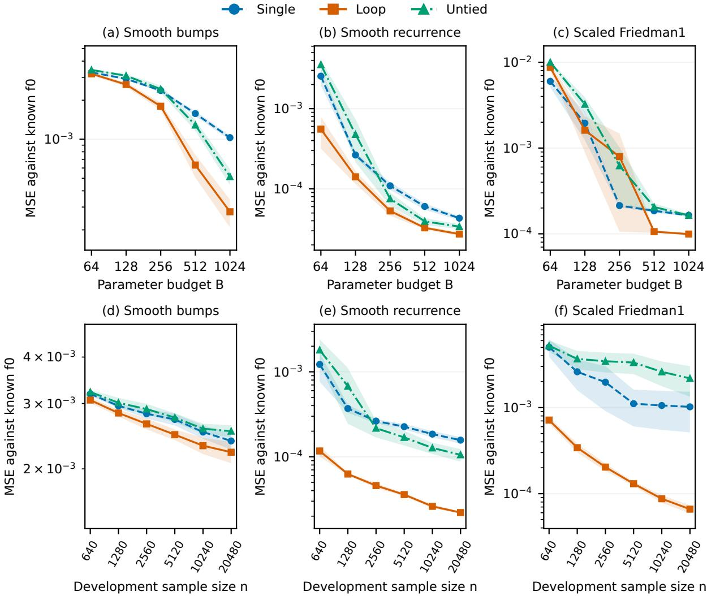  
Figure 3: Efects of the parameter budget and sample size. Upper row $\displaystyle ( \mathrm { a - c } ) ;$ : dense parameter cap B varies. Lower row (d–f): total development sample size n varies at cap 128, with 80% used for training and 20% for validation. Columns show smooth bumps, the smooth recurrence, and scaled Friedman1. Loop uses 16 iterations. Points are mean $f _ { 0 }$ MSE over eight paired replications, one per seed; shading is mean plus or minus one SE. Both axes are logarithmic. The two rows retain their respective frozen protocols (Appendix F).

## 5.3 Sensitivity to the number of loop iterations

Figure 4 displays Loop at cap B = 128 with fixed state dimension and hidden width. The iteration counts are $T = 1 , 2 , 4 , 8 , 1 6 , 3 2 , 6 4$ . At each count, one fitted block is shared across all iterations. Training continues as $T$ increases, so the fitted coeficients may change along the curve while the parameter count remains fixed.

From one to 64 iterations, mean $f _ { 0 }$ MSE decreases by 36.9% for smooth bumps, 80.6% for the recurrence, and 41.6% for scaled Friedman1. The bump and Friedman1 means decrease at every displayed count. For the recurrence, the reduction from one to two iterations is already 79.5%; later values fluctuate around a much lower plateau. In particular, its mean increases from four to eight and from eight to 16 iterations before decreasing again. Friedman1 gains little from 32 to 64 iterations. The incremental benefit of further repetitions therefore varies across these targets.

Iteration count and cumulative training updates increase together, so the curves reflect their combined efect.

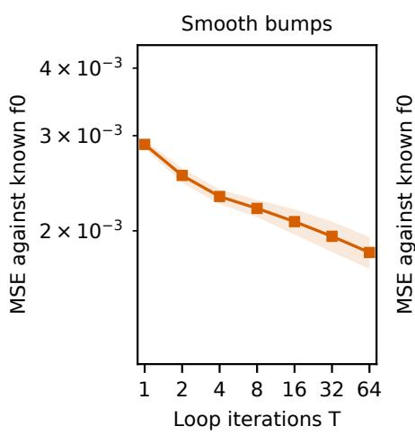

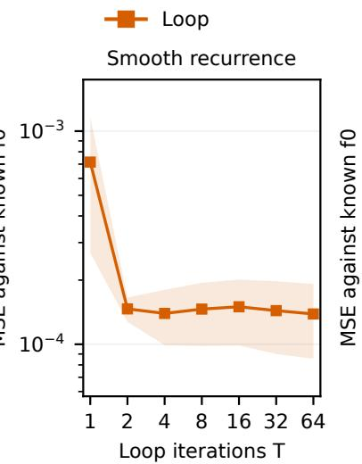

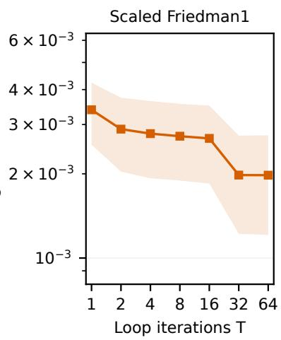  
Figure 4: Loop iteration sensitivity at fixed block dimensions and cap 128. Each panel reports mean $f _ { 0 }$ MSE with one-SE shading over eight paired replications, one per seed. Axes follow Figure 3. Iteration count and cumulative training budget change jointly under the continuation protocol.

## 5.4 Energy-based generative-model simulation

We next evaluate density estimation with a fixed, smooth four-mode target distribution in the energy-based family, constructed independently of the fitted architectures. Using three development seeds, we screen the grid $B \in \{ 9 6 , 1 2 8 , 1 6 0 , 1 9 2 \}$ and $n _ { \mathrm { t r } } \in \{ 1 0 2 4 , 2 0 4 8 , 4 0 9 6 \}$ Within each setting and method, validation negative log likelihood (NLL) selects the architecture, optimizer setting, and checkpoint. A setting enters confirmation only if Loop has the smallest mean development squared Hellinger error and wins at least two of the three paired seeds. Before any confirmation sample is generated, this rule freezes the single strongest eligible setting, $B = 1 6 0$ and $n _ { \mathrm { t r } } = 2 0 4 8$ . Confirmation therefore evaluates whether the development-stage advantage persists on fresh samples at this favorable, development-selected setting.

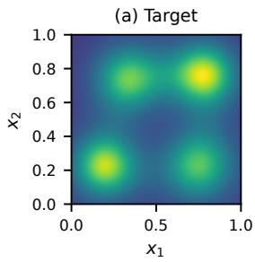

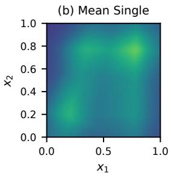

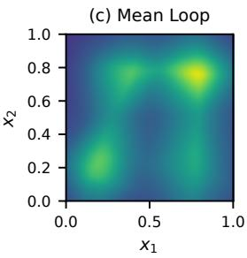

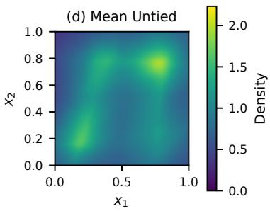

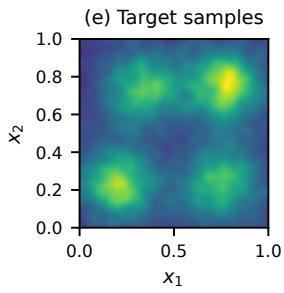

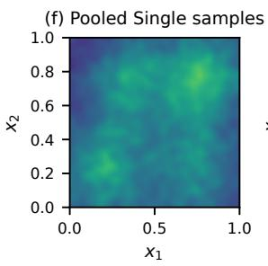

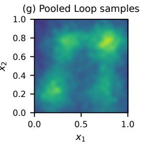

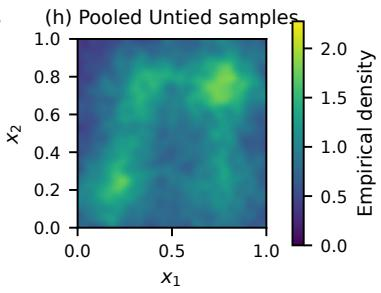  
Figure 5: Smooth four-mode energy-based generative-model simulation at $B = 1 6 0$ and $n _ { \mathrm { t r } } =$ 2048. Top: target and mean fitted densities over eight confirmation replications on one common scale. Bottom: smoothed empirical densities from 32768 target draws or equally pooled exact rejection samples from the eight selected models per method. Scenario, architecture, optimizer, and checkpoint selection are frozen before test scoring.

Table 3: Smooth four-mode energy-based generative-model simulation at parameter cap B = 160 and $n _ { \mathrm { t r } } = 2 0 4 8$ . Squared Hellinger errors are numerical midpoint-grid approximations. Entries are mean (SE) over eight paired confirmation replications, one per seed. Architecture, optimizer, and checkpoint selection use validation NLL before test scoring. Boldface marks the smallest displayed mean.
<table><tr><td>Metric</td><td>Single</td><td>Loop</td><td>Untied</td></tr><tr><td>Hellinger²</td><td>0.01511 (0.0020)</td><td>0.008919 (0.0014)</td><td>0.01339 (0.0017)</td></tr><tr><td>Test NLL</td><td>-0.03623 (0.0039)</td><td>–0.04884 (0.0027)</td><td>-0.03996 (0.0033)</td></tr></table>

Loop’s mean squared Hellinger error is 0.00892, compared with 0.01511 for Single and 0.01339 for Untied, a reduction of 33.4% relative to the second-lowest mean at the selected operating point. The test NLL means have the same ordering. In Figure 5, the top row averages the eight fitted densities for each method. The bottom row pools an equal 4096 exact rejection draws from each fitted model, so every method panel contains 32768 generated observations. Analytic-density panels share one color scale, and sample panels use one fixed histogram, smoothing bandwidth, and color scale.

## 5.5 Real-data experiments

Table 4 reports held-out comparisons on nine regression and four multiclass data sets. For regression, the source-specific caps were chosen during exploratory development by maximizing the smaller validation advantage of Loop over Single and Untied across the budget grid. The caps, candidate structures, and validation rules were then fixed before test scoring. The regression rows are therefore favorable-regime illustrations at validation-selected budgets. The nine sources are the complete set included in the supplied computational supplement.

Loop has the smallest displayed mean on seven of the nine regression tasks and three of the four classification tasks. The clearest mean margins occur for SGEMM and RT-IoT. Several other orderings are small relative to the reported method-specific SEs: for example, the Wall Robot means for Loop and Single are 0.5673 and 0.5680, with SEs 0.029 and 0.036. Untied has the smallest displayed mean on Power plant, while Single does so on White wine and Room Occupancy.

Table 4: Held-out real-data comparisons under the same parameter caps. Regression rows report MSE. Classification rows report predictive log loss, the prespecified secondary endpoint. Entries are mean (SE) over eight paired replications, one per seed. Boldface marks the smallest displayed mean.
<table><tr><td>Source</td><td>Metric</td><td>B</td><td>Single</td><td>Loop</td><td>Untied</td></tr><tr><td>Regression</td><td colspan="5"></td></tr><tr><td>Airfoil</td><td>MSE</td><td>64</td><td>9.5361 (0.17)</td><td>8.9303 (0.23)</td><td>9.7895 (0.27)</td></tr><tr><td>Power plant</td><td>MSE</td><td>32</td><td>17.937 (0.10)</td><td>18.146 (0.36)</td><td>17.916 (0.095)</td></tr><tr><td>Fish toxicity</td><td>MSE</td><td>32</td><td>0.94739 (0.024)</td><td>0.94596 (0.015)</td><td>0.95003 (0.026)</td></tr><tr><td>White wine</td><td>MSE</td><td>64</td><td>0.59428 (0.0066)</td><td>0.59577 (0.0063)</td><td>0.59469 (0.0066)</td></tr><tr><td>Concrete</td><td>MSE</td><td>128</td><td>36.730 (0.81)</td><td>35.633 (0.85)</td><td>36.944 (0.42)</td></tr><tr><td>California housing</td><td>MSE</td><td>64</td><td>0.36494 (0.0017)</td><td>0.36079 (0.0024)</td><td>0.36365 (0.0012)</td></tr><tr><td>Abalone</td><td>MSE</td><td>64</td><td>4.4706 (0.016)</td><td>4.4297 (0.019)</td><td>4.4652 (0.0098)</td></tr><tr><td>SGEMM</td><td>MSE</td><td>64</td><td>9.2061 (0.83) × 103</td><td>6.2200 (0.15) × 103</td><td>8.4769 (0.72) × 103</td></tr><tr><td>SARCOS</td><td>MSE</td><td>512</td><td>14.765 (0.22)</td><td>14.005 (0.19)</td><td>14.224 (0.21)</td></tr><tr><td colspan="4">Multiclass classification</td><td></td><td></td></tr><tr><td>Wall Robot</td><td>log loss</td><td>1024</td><td>0.5680 (0.036)</td><td>0.5673 (0.029)</td><td>0.6283 (0.044)</td></tr><tr><td>Maternal Risk</td><td>log loss</td><td>512</td><td>0.7294 (0.015)</td><td>0.7201 (0.013)</td><td>0.7280 (0.013)</td></tr><tr><td>RT-IoT</td><td>log loss</td><td>4096</td><td>0.04230 (0.0016)</td><td>0.03782 (0.0012)</td><td>0.04095 (0.0011)</td></tr><tr><td>Room Occupancy</td><td>log loss</td><td>1024</td><td>0.04824 (0.023)</td><td>0.04968 (0.027)</td><td>0.05580 (0.027)</td></tr></table>

## 6 Discussion

The main statistical finding is that repeated computation can support a sequence of increasingly accurate estimators without increasing parameter dimension. Theorem 4.4 establishes this conclusion for H¨older targets in four likelihood models. The loop approximation guarantee improves as $T _ { n }$ grows, while its complexity bound also increases. Balancing these efects yields the minimax rate up to a logarithmic factor. Under the same fixed parameter cap, the specified untied family retains a positive worst-case representation error. The separation is therefore an approximation advantage that remains after accounting for statistical estimation.

Fixed and expanding sieves. The fixed-dimensional loop already gives the central separation. Theorem 4.5 shows that the conclusion also holds when state width, hidden width, and iteration count grow together and likelihood fitting ranges over the enlarged coeficient class. At polynomial order, hidden width satisfies $r \asymp B / q ;$ ; the approximation bound has order $( B T ) ^ { - 2 s / d }$ up to logarithmic factors when q is fixed or logarithmic. The fitted-class entropy determines the statistical cost of this expansion. Sharper entropy and approximation bounds may reduce the logarithmic factors.

Numerical findings. The residual FFN experiments show gains from looping in several prediction and density-estimation settings, with their size and occurrence depending on the target and the allocation of the parameter budget. The relative performance of the three architectures varies across the budget settings and real-data tasks. The sample-size experiments keep the iteration count fixed, and the iteration experiments also increase cumulative training. The latter therefore describe the combined efect of iteration and additional training.

Parameters, computation, and precision. The budget counts scalar parameter slots, and the theorems isolate eficiency in that resource. Sharing makes an additional iteration free in parameter slots while retaining its computational cost. In the separation regime, $T _ { n } / B _ { n } \to \infty$ whereas untied depth is at most $O ( B _ { n } ) ;$ a dense residual FFN loop uses order $B _ { n } T _ { n }$ parameterassociated operations per forward pass, compared with order $B _ { n }$ for an untied stack. Coeficient magnitudes remain bounded, while the approximation constructions encode increasingly precise Taylor-table codes and the FFN construction uses growing intermediate states. The likelihood bound also includes an optimization tolerance. These facts identify the broader statistical problem suggested by the present result: jointly constrain parameter count, numerical precision, optimization, and executed computation, and characterize their tradeof with statistical risk.

Scope and future directions. The concrete comparisons cover the dense residual ReLU and post-LN Transformer families specified in Section 3.2, with bounded coeficients, afine endpoints, and common block dimensions within each stack. The Transformer has one softmax head, the specified position-dependent input maps and special tokens, and a fixed positive normalization stabilizer. Diferent normalization or masking conventions, variable-width stacks, growing token counts, and compressed parameter descriptions require their own approximation and complexity analysis. For another likelihood or evaluation risk, the general framework requires the corresponding metric calibration and estimation bound. The energy-based example shows how normalization and an index defined modulo constants fit into this framework.

The resource schedules use known smoothness s. Adapting their statistical balance to unknown smoothness is a natural next question. Another is the sharp untied budget threshold. For polynomial budgets, the proved lower bound gives the necessary exponent condition $\gamma _ { B } \geq$ $d / ( 4 s + 2 d )$ for attaining the classical rate. Copying the shared block into separate untied blocks gives a larger suficient budget. Sharper untied approximation and lower bounds are needed to close this gap.

## Funding

This research was supported in part by the National Science Foundation under Grant DMS–2513668.

## References

Valentin Abadie, Clemens Hutter, and Helmut B¨olcskei. Recurrent neural networks approximate continuous functions. arXiv preprint arXiv:2606.20325, 2026. URL https://arxiv.org/ab s/2606.20325.

Shaojie Bai, J. Zico Kolter, and Vladlen Koltun. Deep equilibrium models. In Advances in Neural Information Processing Systems, volume 32, 2019. URL https://arxiv.org/abs/19 09.01377.

Andrew R. Barron, Lucien Birg´e, and Pascal Massart. Risk bounds for model selection via penalization. Probability Theory and Related Fields, 113(3):301–413, 1999. doi: 10.1007/s004400050210.

Peter L. Bartlett, Nick Harvey, Christopher Liaw, and Abbas Mehrabian. Nearly-tight VCdimension and pseudodimension bounds for piecewise linear neural networks. Journal of Machine Learning Research, 20(63):1–17, 2019. URL https://jmlr.org/papers/v20/17-6 12.html.

Minshuo Chen, Xingguo Li, and Tuo Zhao. On generalization bounds of a family of recurrent neural networks. In Proceedings of the Twenty Third International Conference on Artificial Intelligence and Statistics, volume 108 of Proceedings of Machine Learning Research, pages 1233–1243, 2020. URL https://proceedings.mlr.press/v108/chen20d.html.

Bo Chen, Xiaoyu Li, Yingyu Liang, Zhenmei Shi, and Zhao Song. Bypassing the exponential dependency: Looped transformers eficiently learn in-context by multi-step gradient descent. In Proceedings of the 28th International Conference on Artificial Intelligence and Statistics, volume 258 of Proceedings of Machine Learning Research, pages 4447–4455, 2025. URL https://proceedings.mlr.press/v258/chen25i.html.

Mostafa Dehghani, Stephan Gouws, Oriol Vinyals, Jakob Uszkoreit, and Lukasz Kaiser. Universal transformers. In International Conference on Learning Representations, 2019. URL https: //arxiv.org/abs/1807.03819.

Amir Efrati, Stephanie Palazzolo, and Rocket Drew. OpenAI technique in “Astra” model sparks security concerns. The Information, September 1, 2026. URL https://www.theinformation .com/articles/secret-technique-behind-openais-astra-model-sparks-security-c oncerns.

Ronen Eldan and Ohad Shamir. The power of depth for feedforward neural networks. In Proceedings of the 29th Annual Conference on Learning Theory, volume 49 of Proceedings of Machine Learning Research, pages 907–940, 2016. URL https://proceedings.mlr.press/ v49/eldan16.html.

Khashayar Gatmiry, Nikunj Saunshi, Sashank J. Reddi, Stefanie Jegelka, and Sanjiv Kumar. Can looped transformers learn to implement multi-step gradient descent for in-context learning? In Proceedings of the 41st International Conference on Machine Learning, volume 235 of Proceedings of Machine Learning Research, pages 15130–15152, 2024. URL https://procee dings.mlr.press/v235/gatmiry24b.html.

Jonas Geiping, Sean McLeish, Neel Jain, John Kirchenbauer, Siddharth Singh, Brian R. Bartoldson, Bhavya Kailkhura, Abhinav Bhatele, and Tom Goldstein. Scaling up test-time compute with latent reasoning: A recurrent depth approach. In Advances in Neural Information Processing Systems, 2025. URL https://arxiv.org/abs/2502.05171.

Angeliki Giannou, Shashank Rajput, Jy-Yong Sohn, Kangwook Lee, Jason D. Lee, and Dimitris Papailiopoulos. Looped transformers as programmable computers. In Proceedings of the 40th International Conference on Machine Learning, volume 202 of Proceedings of Machine Learning Research, pages 11398–11442, 2023. URL https://proceedings.mlr.press/v202 /giannou23a.html.

Yuling Jiao, Yang Wang, and Bokai Yan. Approximation bounds for recurrent neural networks with application to regression. arXiv preprint arXiv:2409.05577, 2024. Revised 2025. URL https://arxiv.org/abs/2409.05577.

Nirmit Joshi, Gal Vardi, Adam Block, Surbhi Goel, Zhiyuan Li, Theodor Misiakiewicz, and Nathan Srebro. A theory of learning with autoregressive chain of thought. In Proceedings of Thirty Eighth Conference on Learning Theory, volume 291 of Proceedings of Machine Learning Research, pages 3161–3212, 2025. URL https://proceedings.mlr.press/v291/joshi25a. html.

Yingyu Liang, Zhizhou Sha, Zhenmei Shi, Zhao Song, and Yufa Zhou. Looped ReLU MLPs may be all you need as practical programmable computers. In Proceedings of the 28th International Conference on Artificial Intelligence and Statistics, volume 258 of Proceedings of Machine

Learning Research, pages 2647–2655, 2025. URL https://proceedings.mlr.press/v258/l iang25a.html.

Jianfeng Lu, Zuowei Shen, Haizhao Yang, and Shijun Zhang. Deep network approximation for smooth functions. SIAM Journal on Mathematical Analysis, 53(5):5465–5506, 2021. doi: 10.1137/20M134695X. URL https://arxiv.org/abs/2001.03040.

Kei-Sing Ng and Qingchen Wang. Loop neural networks for parameter sharing. arXiv preprint arXiv:2409.14199, 2024. URL https://arxiv.org/abs/2409.14199.

OpenAI. GPT-6 Astra model. OpenAI API documentation, 2026. URL https://developers .openai.com/api/docs/models/gpt-6-astra.

Reiner Pope, Sholto Douglas, Aakanksha Chowdhery, Jacob Devlin, James Bradbury, Jonathan Heek, Kefan Xiao, Shivani Agrawal, and Jef Dean. Eficiently scaling Transformer inference. Proceedings of Machine Learning and Systems, 5:606–624, 2023. URL https://proceedings. mlsys.org/paper\_files/paper/2023/hash/c4be71ab8d24cdfb45e3d06dbfca2780-Abstr act-mlsys2023.html.

Samyam Rajbhandari, Jef Rasley, Olatunji Ruwase, and Yuxiong He. ZeRO: Memory optimizations toward training trillion parameter models. In Proceedings of the International Conference for High Performance Computing, Networking, Storage and Analysis, pages 1–16, 2020. doi: 10.1109/SC41405.2020.00024.

Sebastian Raschka. GPT-6 Astra, looped transformers, and hidden reasoning. Ahead of AI, September 9, 2026. URL https://magazine.sebastianraschka.com/p/gpt-6-astra-loo ped-transformers-and.

Johannes Schmidt-Hieber. Nonparametric regression using deep neural networks with ReLU activation function. Annals of Statistics, 48(4):1875–1897, 2020. doi: 10.1214/19-AOS1875. URL https://arxiv.org/abs/1708.06633.

Xiaotong Shen and Wing Hung Wong. Convergence rate of sieve estimates. Annals of Statistics, 22(2):580–615, 1994. doi: 10.1214/aos/1176325486.

Yang Song and Diederik P. Kingma. How to train your energy-based models. arXiv preprint arXiv:2101.03288, 2021. URL https://arxiv.org/abs/2101.03288.

Charles J. Stone. Optimal global rates of convergence for nonparametric regression. Annals of Statistics, 10:1040–1053, 1982.

Matus Telgarsky. Benefits of depth in neural networks. In Proceedings of the 29th Annual Conference on Learning Theory, volume 49 of Proceedings of Machine Learning Research, pages 1517–1539, 2016. URL https://proceedings.mlr.press/v49/telgarsky16.html.

Ashish Vaswani, Noam Shazeer, Niki Parmar, Jakob Uszkoreit, Llion Jones, Aidan N. Gomez, Lukasz Kaiser, and Illia Polosukhin. Attention is all you need. In Advances in Neural Information Processing Systems, volume 30, 2017. URL https://arxiv.org/abs/1706.037 62.

Wing Hung Wong and Xiaotong Shen. Probability inequalities for likelihood ratios and convergence rates of sieve MLEs. Annals of Statistics, 23(2):339–362, 1995. doi: 10.1214/aos/1176324524.

Kevin Xu and Issei Sato. On expressive power of looped transformers: Theoretical analysis and enhancement via timestep encoding. In Proceedings of the 42nd International Conference on Machine Learning, volume 267 of Proceedings of Machine Learning Research, pages 69613– 69646, 2025. URL https://proceedings.mlr.press/v267/xu25x.html.

Liu Yang, Kangwook Lee, Robert D. Nowak, and Dimitris Papailiopoulos. Looped transformers are better at learning learning algorithms. In International Conference on Learning Representations, 2024. URL https://arxiv.org/abs/2311.12424.

Dmitry Yarotsky. Error bounds for approximations with deep ReLU networks. Neural Networks, 94:103–114, 2017. doi: 10.1016/j.neunet.2017.07.002. URL https://arxiv.org/abs/1610.0 1145.

Dmitry Yarotsky. Optimal approximation of continuous functions by very deep ReLU networks. In Proceedings of the 31st Conference On Learning Theory, volume 75 of Proceedings of Machine Learning Research, pages 639–649. PMLR, 2018. URL https://proceedings.mlr. press/v75/yarotsky18a.html.

Shijun Zhang, Jianfeng Lu, and Hongkai Zhao. On enhancing expressive power via compositions of single fixed-size ReLU network. In Proceedings of the 40th International Conference on Machine Learning, volume 202 of Proceedings of Machine Learning Research, pages 41452– 41487. PMLR, 2023. URL https://proceedings.mlr.press/v202/zhang23ad.html.

## A General risk and likelihood tools

We use the statistical experiment and notation of Section 2. The following tools provide a class-constrained lower bound for calibrated risks and a likelihood upper bound for a fitted sieve.

## A.1 A packing–cover lower-bound lemma

For a pseudometric d on the target and candidate indices, let $\mathcal { N } ( \delta , \mathcal { C } , d )$ be the internal covering number, as in Section 2.3, and let ${ \mathcal { M } } ( \delta , { \mathcal { F } } , d )$ be the supremum of the cardinalities of finite subsets of $\mathcal { F }$ with pairwise distances at least δ.

Lemma A.1 (Packing–cover lower bound). Let $\mathcal { C } \subseteq \mathcal { V }$ be a nonempty candidate class and $R ( f , g ) \geq 0$ an evaluation risk whose value at each estimator under consideration is measurable. Suppose that, for constants $c _ { d } , p > 0$ ，

$$
R ( f , g ) \geq c _ { d } d ( f , g ) ^ { p } , \qquad f \in \mathcal { F } , \quad g \in \mathcal { C } .
$$

If, for some $\delta > 0$

$$
\mathcal { M } ( 8 \delta , \mathcal { F } , d ) > { \mathcal { N } } ( \delta , \mathcal { C } , d ) , \qquad { \mathcal { N } } ( \delta , \mathcal { C } , d ) < \infty ,
$$

then there is an $f _ { * } \in \mathcal { F }$ such that $d ( f _ { * } , g ) \geq \delta$ for every $g \in { \mathcal { C } }$ . Consequently, for every sample size $n \geq 1$ ，

$$
\operatorname* { i n f } _ { g : \mathcal { G } \in \mathcal { C } } \operatorname* { s u p } _ { f \in \mathcal { F } } \mathbb { E } _ { f } R ( f , \widehat { g } ) \geq c _ { d } \delta ^ { p } ,\tag{35}
$$

where the infimum ranges over all measurable -valued estimators.

Proof. Choose an 8δ-packing $f _ { 1 } , \ldots , f _ { M }$ and an internal δ-cover $g _ { 1 } , \ldots , g _ { N }$ of with $M > N$ . If each $f _ { j }$ were within distance less than δ of some member of ${ \mathcal { C } } ,$ it would be within distance less than 2δ of a cover center. Two targets assigned to the same center would have distance less than 4δ, contrary to their separation. The assignment would therefore be injective, contradicting $M > N$ Hence some $f _ { * }$ is at distance at least δ from every candidate. For this target, $R ( f _ { * } , \widehat { g } ) \geq c _ { d } \delta ^ { p }$ for every sample. Taking expectation, the supremum over targets, and the infimum over estimators proves the bound. □

The lemma permits arbitrary data-dependent fitting and selection within . Theorem 2.6 uses squared Hellinger risk and $d = h$

## A.2 A sieve-likelihood risk bound

Use the density model and Hellinger distance of Section $2 ,$ and the one-sided likelihood quantity $\rho _ { \gamma }$ in (2). Fix measurable density versions on one common set $\mathcal { Z } _ { \nu }$ whose complement has ν-measure zero. All pointwise comparisons below use this set. Density ratios use $0 / 0 = 0$ and $a / 0 = + \infty$ for $a > 0$ , and log $0 = - \infty$

A bracket $[ p ^ { - } , p ^ { + } ]$ consists of densities satisfying $p ^ { - } \leq p \leq p ^ { + }$ on $\mathcal { Z } _ { \nu } .$ , where the endpoints are nonnegative measurable functions with $\int \boldsymbol { p } ^ { + }$ dν $< \infty$ . Its width is $\lVert \sqrt { p ^ { + } } - \sqrt { p ^ { - } } \rVert _ { L ^ { 2 } ( \nu ) }$ ; the endpoints need not be densities. As in Section 2.2, $N ( u , \mathcal { P } , h )$ counts brackets of width at most u and $H ( u , \mathcal { P } , h ) = \log N ( u , \mathcal { P } , h )$ . In particular, a pointwise envelope $| { \sqrt { p } } - { \sqrt { p _ { j } } } | \leq u L$ , with nonnegative $L \in L ^ { 2 } ( \nu )$ , gives the bracket

$$
\left[ \{ ( \sqrt { p _ { j } } - u L ) _ { + } \} ^ { 2 } , ( \sqrt { p _ { j } } + u L ) ^ { 2 } \right]
$$

of width at most $2 u \Vert L \Vert _ { 2 }$ , where $t _ { + } = \operatorname* { m a x } \{ t , 0 \}$ . Choosing a member of each nonempty bracket gives $\mathcal { N } ( u , \mathcal { P } , h ) \leq N ( u , \mathcal { P } , h )$ ; an ordinary metric cover alone does not supply the pointwise envelopes. Appendix C constructs the required brackets for the likelihood examples.

For a deterministic sieve ${ \mathcal { S } } _ { n } \subseteq { \mathcal { V } } .$ , write ${ \mathcal { P } } _ { n } = \{ p _ { g } : g \in { \mathcal { S } } _ { n } \}$ and let ${ \widehat { f } } _ { n }$ be a measurable approximate maximizer with average-log-likelihood tolerance $\varepsilon _ { n } ,$ as in Definition 2.3 with ${ \mathcal { C } } _ { n }$ replaced by $S _ { n }$ . The next result combines Theorem 1 of Wong and Shen [1995] with a comparison to one approximating sieve density.

Theorem A.2 (Sieve-MLE Hellinger bound). For the sieve MLE and density class specified above, set

$$
\delta _ { n } ( f _ { 0 } ) = \operatorname* { i n f } _ { q \in \mathcal { P } _ { n } } \rho _ { 1 / 2 } ( p _ { f _ { 0 } } , q ) .
$$

Let $C _ { 1 } , C _ { 2 } > 0$ be the absolute constants in Theorem 1 of Wong and Shen [1995]; they are independent of the sieve, sample size, and target. Suppose that $e _ { n } > 0$ is deterministic, $n ^ { - 1 } \leq$ $e _ { n } ^ { 2 } \leq 2$ , and, for every $e _ { n } \leq t \leq { \sqrt { 2 } }$

$$
\int _ { t ^ { 2 } / 2 ^ { 8 } } ^ { \sqrt { 2 } t } \sqrt { H ( u / C _ { 1 } , \mathcal { P } _ { n } , h ) } d u \leq C _ { 2 } \sqrt { n } t ^ { 2 } .\tag{36}
$$

The resolution $e _ { n }$ may depend on the selected sieve $\mathcal { P } _ { n }$ . Then an absolute constant $C _ { 3 }$ satisfies

$$
\begin{array} { r } { \mathbb { E } _ { f _ { 0 } } h ^ { 2 } ( \mathbb { P } _ { f _ { 0 } } , \mathbb { P } _ { \widehat { f _ { n } } } ) \leq C _ { 3 } \{ \delta _ { n } ( f _ { 0 } ) + e _ { n } ^ { 2 } + \varepsilon _ { n } \} . } \end{array}\tag{37}
$$

The bound holds uniformly over any target set on which the right-hand side is uniformly bounded.

Proof. Fix $f _ { 0 }$ and put $p _ { 0 } = p _ { f _ { 0 } }$ and $\begin{array} { r } { L _ { n } ( q ) = \prod _ { i = 1 } ^ { n } q ( Z _ { i } ) / p _ { 0 } ( Z _ { i } ) } \end{array}$ . Theorem 1 of Wong and Shen [1995], under (36), gives absolute constants $c _ { 1 } , c _ { 2 } > 0$ such that

$$
\mathbb { P } _ { f _ { 0 } } ^ { * } \left\{ \operatorname* { s u p } _ { q \in \mathcal { P } _ { n } : h ( p _ { 0 } , q ) \geq t } L _ { n } ( q ) \geq e ^ { - c _ { 1 } n t ^ { 2 } } \right\} \leq 4 e ^ { - c _ { 2 } n t ^ { 2 } } , \qquad e _ { n } \leq t \leq { \sqrt { 2 } } .\tag{38}
$$

Outer probability permits a supremum over a general density class; the selected estimator is measurable by hypothesis.

If $\delta _ { n } ( f _ { 0 } ) = \infty$ , the conclusion is immediate. Otherwise, fix $\eta > 0$ and choose a deterministic $q _ { * } \in \mathcal { P } _ { n }$ such that $\rho _ { 1 / 2 } ( p _ { 0 } , q _ { * } ) \leq \delta _ { n } ( f _ { 0 } ) + \eta$ . Independence and the definition of $\rho _ { 1 / 2 }$ imply

$$
\begin{array} { r } { \mathbb { E } _ { f _ { 0 } } L _ { n } ( q _ { * } ) ^ { - 1 / 2 } = \Big \{ 1 + \frac { 1 } { 2 } \rho _ { 1 / 2 } ( p _ { 0 } , q _ { * } ) \Big \} ^ { n } \leq \exp \{ n ( \delta _ { n } ( f _ { 0 } ) + \eta ) / 2 \} . } \end{array}
$$

Markov’s inequality therefore gives

$$
\mathbb { P } _ { f _ { 0 } } \{ L _ { n } ( q _ { * } ) \leq e ^ { - c _ { 1 } n t ^ { 2 } + n \varepsilon _ { n } } \} \leq \exp \biggl \{ - \frac { n } { 2 } [ c _ { 1 } t ^ { 2 } - \varepsilon _ { n } - \delta _ { n } ( f _ { 0 } ) - \eta ] \biggr \} .\tag{39}
$$

The approximate maximum-likelihood property gives $L _ { n } ( p _ { \widehat { t _ { n } } } ) \geq e ^ { - n \varepsilon _ { n } } L _ { n } ( q _ { * } )$ . If $h ( p _ { 0 } , p _ { \widehat { f } _ { n } } ) > t$ either the event in (38) or the event in (39) must occur. For a suficiently large absolute $K _ { i }$ , set

$$
t ^ { 2 } = K \{ \delta _ { n } ( f _ { 0 } ) + \eta + e _ { n } ^ { 2 } + \varepsilon _ { n } + x / n \} , \qquad x \geq 0 .
$$

When $t ^ { 2 } < 2$ , the two probability bounds give a tail at most $C e ^ { - c x } ;$ ; when $t ^ { 2 } \geq 2$ , the event $\{ h ^ { 2 } ( p _ { 0 } , p _ { \widehat { t } _ { n } } ) > t ^ { 2 } \}$ is empty. Integrating this bound and using $n ^ { - 1 } \leq e _ { n } ^ { 2 }$ proves (37) with an additional Cη. Letting $\eta \downarrow 0$ completes the proof. □

## B Proofs of the main results

This appendix gives the proofs of the results in Sections 2–4, in their order of appearance. Appendix A supplies the general risk tools, Appendix C collects auxiliary likelihood and complexity bounds, and Appendices D and E give the neural constructions.

## B.1 Proofs for Section 2

Proof of Corollary 2.4. Apply Theorem A.2 with $\boldsymbol { S } _ { n } = \boldsymbol { \mathcal { C } } _ { n }$ . Then $\delta _ { n } ( f _ { 0 } ) = \delta ( f _ { 0 } ; { \mathcal { C } } _ { n } )$ , and the bridge condition (4) gives $\begin{array} { r } { \operatorname* { s u p } _ { f _ { 0 } \in \mathcal { F } } \delta _ { n } ( f _ { 0 } ) \leq C _ { 4 } A ( \mathcal { C } _ { n } ) } \end{array}$ . Taking the supremum in (37) proves (5) with $C _ { 5 } = C _ { 3 }$ max 1, C4 . □

Proof of Theorem 2.6. Set $W _ { B } = B ^ { \kappa } \log ^ { b } ( e B )$ and $\delta _ { B } = c _ { 0 } W _ { B } ^ { - a / 2 }$ , where $0 < c _ { 0 } < 1$ will be chosen below. Use the Hellinger pseudometric on indices, $d ( f , g ) = h ( \mathbb { P } _ { f } , \mathbb { P } _ { g } )$ , so

$$
\mathcal N ( \delta , \mathcal F _ { U } [ B ] , d ) = \mathcal N ( \delta , \mathcal P _ { U } [ B ] , h ) .
$$

For all suficiently large $B , \delta _ { B } < 1$ , and (9) with $\kappa , b \geq 1$ gives

$$
\log \mathcal { N } ( \delta _ { B } , \mathcal { F } _ { U } [ B ] , d ) \leq C ^ { \prime } \{ 1 + \log ( 1 / c _ { 0 } ) \} W _ { B } .
$$

Assumption 2.5 supplies a target packing with logarithmic cardinality at least $c _ { \mathrm { p a c k } } c _ { 0 } ^ { - 2 / a } W _ { B }$ whenever $\delta _ { B } \leq \delta _ { 0 }$ . Choose $c _ { 0 }$ suficiently small that

$$
c _ { \mathrm { p a c k } } c _ { 0 } ^ { - 2 / a } > C ^ { \prime } \{ 1 + \log ( 1 / c _ { 0 } ) \} .
$$

The packing is then larger than the candidate cover. Applying Lemma A.1 with $R ( f , g ) =$ $h ^ { 2 } ( \mathbb { P } _ { f } , \mathbb { P } _ { g } ) , p = 2 , c _ { d } = 1$ , and $\mathcal { C } = \mathcal { F } _ { U } [ B ]$ gives the lower bound $\delta _ { B } ^ { 2 } = c _ { 0 } ^ { 2 } W _ { B } ^ { - a }$ , proving $( 1 0 ) . \quad \sqcup$

Proof of Corollary 2.7. Divide the loop upper bound (6) by the untied lower bound (10).

## B.2 Proofs for Section 3

Proof of Proposition 3.2. Conditional models. The calculations in Sections C.1–C.3 establish the two-sided metric equivalence in part (i). Lemma C.1 establishes part (ii). The root-density envelope converts uniform index covers into Hellinger brackets and internal Hellinger covers, proving part (iii). Finally, Lemma C.3 and the lower metric equivalence give part (iv), after a fixed rescaling of the packing radius, with $a = 2 s / d$

Energy-based model. Lemma C.2 proves parts (i)–(iii), using $d _ { \mathrm { E } } ~ = ~ d _ { \mathrm { c } }$ and $d _ { \mathrm { c } } ( f , g ) \ \leq$ $\| f - g \| _ { L ^ { 2 } ( \mu ) }$ . For part (iv), use the zero-mean packing in Lemma C.3. Its elements satisfy $d _ { \mathrm { c } } ( f _ { j , \delta } , f _ { k , \delta } ) = \lVert f _ { j , \delta } - f _ { k , \delta } \rVert _ { L ^ { 2 } ( \mu ) }$ . The lower bound in (40) transfers this packing to Hellinger distance after a fixed rescaling of the radius, with exponent $a = 2 s / d$ □

Existence of the neural sieve MLE. For fixed $( q , r , T )$ , the closed, bounded coeficient box is compact, and the network output is continuous in its coeficients. The stabilized layer normalizations preserve this continuity. In each of the four models, the sample log likelihood is jointly measurable in the observations and coeficients and is continuous in the coeficients. For the energy model, continuity of the normalizing constant follows from bounded convergence, since $| g | \leq H$ . The measurable maximum theorem therefore supplies a measurable exact maximizer on the coeficient box, and hence an estimator satisfying Definition 2.3 for every $\varepsilon _ { n } \geq 0$

Proof of Theorem 3.3. (i) Index approximation. For $j \in \{ \mathrm { F } , \mathrm { T r } \}$ , Theorems D.1 and E.1 give squared index error at most $C K ^ { - 2 s }$ at every dyadic resolution K whenever

$$
T \geq C \{ \log ^ { h _ { 0 } ^ { j } } ( e K ) + ( K ^ { d } / r ) \log ( e K ) \} , \qquad h _ { 0 } ^ { \mathrm { F } } = 1 , \quad h _ { 0 } ^ { \mathrm { T r } } = 2 .
$$

Write $L = \log ( e r T )$ . For suficiently small constants $c _ { 1 } , c _ { 2 } > 0$ , set

$$
J _ { 0 } = \operatorname * { m i n } \{ c _ { 1 } r T / L , \exp ( c _ { 2 } T ^ { 1 / h _ { 0 } ^ { j } } ) \} , \qquad K = 2 ^ { \lfloor d ^ { - 1 } \log _ { 2 } J _ { 0 } \rfloor } .
$$

For all suficiently large $T _ { i }$ uniformly over the admissible widths, $K \geq 2$ and $K ^ { d } \asymp J _ { 0 }$ . Moreover, log $( e K ) \le C L$ and $\log ( e K ) \leq C + c _ { 2 } T ^ { 1 / h _ { 0 } ^ { j } } / d$ . The two iteration costs are therefore at most $C ^ { \prime } c _ { 2 } ^ { h _ { 0 } ^ { j } } T$ and $C ^ { \prime \prime } c _ { 1 } T$ , after absorbing the fixed additive constant. Choosing $c _ { 1 } , c _ { 2 }$ suficiently small makes their sum at most $T .$ . The construction at this resolution consequently gives

$$
\operatorname* { s u p } _ { f _ { 0 } \in \mathcal { H } _ { d } ^ { s } ( H ) } \operatorname* { i n f } _ { g \in \mathcal { F } _ { L , j } ( q , r , T ) } \| f _ { 0 } - g \| _ { L ^ { 2 } ( \mu ) } ^ { 2 } \leq C \{ [ L / ( r T ) ] ^ { a } + \exp ( - c T ^ { 1 / h _ { 0 } ^ { j } } ) \} , \qquad a = 2 s / d .
$$

When $T \geq C L ^ { h _ { 0 } ^ { j } }$ , taking $J _ { 0 } = c _ { 1 } r T / L$ alone satisfies the same iteration bound and removes the exponential term. This proves (17) and both initialization conditions.

(ii) Hellinger approximation. Proposition 3.2(i) bounds squared Hellinger distance by a constant times squared $L ^ { 2 } ( \mu )$ distance in every likelihood model, using $d _ { \mathrm { c } } ( f , g ) \leq \| f - g \| _ { L ^ { 2 } ( \mu ) }$ for the energy model. Applying this bound to the candidates from part (i) proves (18). Table 1 shows that $D _ { L } ^ { j } ( q , r )$ is independent of $T$ , giving the final budget statement. □

Proof of Proposition $\ 3 . 4 \cdot$ For part (i), use the parameter-sensitivity recurrence and grid bound in Section C.6. We first verify the required sensitivity bounds on the full parameter boxes.

Residual FFN. We bound parameter sensitivity uniformly over the full coeficient box. Put $L = C ( q + 1 ) ^ { C } ( r + 1 ) ^ { C } \geq 2$ . The residual recurrence gives $\| z _ { t } \| _ { \infty } + 1 \leq L ^ { t + 1 }$ . The state Lipschitz factor is at most $L$ and the parameter derivative is at most $L ^ { t + 2 }$ . Thus (42) gives $\Gamma \overset { \cdot } { \leq } ( T + 1 ) L ^ { C ( T + 1 ) }$ , also for arbitrary untied sequences. Hence (19) is valid, after changing constants.

The full predictor box satisfies (43). Since log $\Gamma \le C G ( q , r , T )$ , this proves the residual-FFN instance of (20). The same sensitivity calculation applies to arbitrary untied sequences and is used for (21).

Post-LN Transformer. For every parameter value in the full box, the layer-normalized state obeys the uniform bound

$$
\| \mathrm { L N } ( z ) \| _ { \infty } \leq M _ { \mathrm { p a r } } ( \sqrt { q } + 1 ) .
$$

Fixed positive stabilization makes its derivative polynomially bounded in $q . \mathrm { O n }$ these bounded sets, afine projections, softmax, and ReLU have state and parameter Lipschitz constants polynomial in $q , r$ at fixed token count. The first input set is bounded by the afine encoder as well. Thus (19) and (43) prove (20) for the complete post-LN class; the same calculation covers arbitrary untied sequences and is used for (21).

Budgeted union and Hellinger complexity. For a budgeted untied class, the same calculations give log $\begin{array} { r } { \Gamma \leq C ( T + 1 ) } \end{array}$ log(eB) for every tuning triple in $\mathcal { T } _ { U , j } ( B )$ . Since $D _ { U } ^ { j } ( q , r , T ) \le B$ and $T \leq B$ , the parameter grid in (43) has logarithmic cardinality at most

$$
C \{ B ^ { 2 } \log ( e B ) + B \log ( C / \epsilon ) \} .
$$

There are at most $B ^ { C }$ admissible integer triples. Adding their logarithmic cardinality proves (21). This proves part (i).

For part (ii), Proposition 3.2(iii) converts the loop uniform cover into Hellinger brackets and converts the budgeted uniform cover into an internal Hellinger cover. A fixed rescaling of the radius is absorbed into log $( C / u )$ or log $( C / \epsilon )$ , giving (22) and (23). □

## B.3 Proofs for Section 4

Proof of Theorem 4.1. Existence of a measurable exact sieve MLE was established in Section B.2. Theorem 3.3 supplies the Hellinger approximation bound (18). Proposition 3.4 gives (22), and Lemma C.4 verifies (3) with $e _ { n , L } = e _ { n , j }$ whenever $e _ { n , j } < 1$ . Proposition 3.2(ii) supplies the one-sided bridge (4). If $e _ { n , j } = 1$ , the conclusion follows after enlarging the constant because $h ^ { 2 } \leq 2 ;$ otherwise Corollary 2.4 gives (25). □

Proof of Theorem 4.2. For $m \in \{ \mathrm { G } , \mathrm { L a } , \mathrm { B e } \}$ , use the packing in Lemma C.3 at scale $\delta _ { n } = K _ { n } ^ { - s }$ ， where $K _ { n } \asymp n ^ { 1 / ( 2 s + d ) }$ . Lemma C.1 and Jensen’s inequality give

$$
\mathrm { K L } ( \mathbb { P } _ { f } ^ { m } \| \mathbb { P } _ { 0 } ^ { m } ) \leq \rho _ { 1 / 2 } ( p _ { f } ^ { m } , p _ { 0 } ^ { m } ) \leq C \| f \| _ { L ^ { 2 } ( \mu ) } ^ { 2 } .
$$

The packing has logarithmic cardinality at least $c K _ { n } ^ { d } .$ , and every member satisfies $\| f \| _ { L ^ { 2 } ( \mu ) } ^ { 2 } \leq$ $C K _ { n } ^ { - 2 s }$ . Choosing the fixed multiplicative constant in $K _ { n }$ suficiently large makes the product-law divergences a fixed small fraction of the logarithmic packing cardinality. Fano’s inequality and the lower metric equivalence in Proposition 3.2(i) give the stated rate.

For $m = \mathrm { E }$ , use the zero-mean packing of the same lemma. Equation (40) gives $\mathrm { K L } ( \mathbb { P } _ { f } ^ { \mathrm { E } } | | \mathbb { P } _ { 0 } ^ { \mathrm { E } } ) \leq$ $C K _ { n } ^ { - 2 s }$ for every packing member. The same Fano argument applies. Assigning an arbitrary distribution estimator to its closest packing member converts an incorrect assignment into Hellinger error at least half the packing separation; estimates not dominated by $\mu$ are handled with a common dominating measure. In every model the resulting squared Hellinger risk is at least $c K _ { n } ^ { - 2 s } \asymp n ^ { - 2 s / ( 2 s + d ) } = n ^ { - a / ( a + 1 ) }$ ), proving (26). □

Proof of Proposition $4 . 3 .$ Equation (23) gives (9) with $\kappa = 2$ and $b = 1$ for the induced law class, while Proposition $3 . 2 ( \mathrm { i v } )$ verifies the target-packing assumption. Theorem 2.6 yields (27), uniformly in n and over all suficiently large $B$ □

Proof of Theorem $4 { \cdot } 4$ . Fix the family j and its admissible $( q , r )$ . The parameter dimension is constant, and (19) gives $G ( q , r , T _ { n } ) = O ( T _ { n } )$ . Hence the fitted-sieve term $e _ { n , j } ^ { 2 }$ is $O ( T _ { n } / n )$ . With the choice (28),

$$
\left\{ \frac { \log ( e r T _ { n } ) } { r T _ { n } } \right\} ^ { a } + \frac { T _ { n } } { n } \leq C n ^ { - a / ( a + 1 ) } \{ \log ( e n ) \} ^ { a / ( a + 1 ) } .
$$

The architecture-specific initialization remainder is negligible and $\varepsilon _ { n } \leq n ^ { - 1 }$ . Theorem 4.1 proves (29).

At the fixed cap $B _ { 0 }$ , Proposition 4.3 bounds the untied risk below by $c _ { \mathrm { U } } \{ B _ { 0 } ^ { 2 } \log ( e B _ { 0 } ) \} ^ { - a }$ Dividing (29) by this bound proves the limit in (30). □

Proof of Theorem 4.5. By Table $1 , D _ { L } ^ { j } ( q , r )$ is afine and strictly increasing in r with slope $2 q + 1$ Thus the maximizing choice of $r _ { n }$ satisfies the parameter budget. Since $q _ { n } \asymp$ log n and $B _ { n } \asymp n ^ { \gamma _ { B } }$ the counts give $r _ { n } \asymp n ^ { \gamma _ { B } } /$ log n for all suficiently large n. The condition $\gamma _ { B } < 1 / ( a + 1 )$ implies

that $W _ { n } / r _ { n }$ diverges at a positive polynomial rate. Thus rounding $T _ { n }$ up changes its order by at most a constant, $r _ { n } T _ { n } \asymp W _ { n }$ , and both initialization thresholds hold.

Because $\ell _ { n } \asymp$ log n, the approximation term in (25) is bounded by

$$
C \left( \frac { \log n } { W _ { n } } \right) ^ { a } .
$$

Moreover, $D _ { L } ^ { j } ( q _ { n } , r _ { n } ) \asymp B _ { n }$ and $G ( q _ { n } , r _ { n } , T _ { n } ) \asymp T _ { n } \ell _ { n } .$ , so the fitted-sieve term is

$$
e _ { n , j } ^ { 2 } \leq C \frac { B _ { n } T _ { n } \ell _ { n } } { n } \asymp C \frac { W _ { n } q _ { n } \ell _ { n } } { n } .
$$

Since $q _ { n } \ell _ { n } \asymp ( \log n ) ^ { 2 }$ , the definition of $W _ { n }$ gives the order in (32) for both displays. This order tends to zero, so $e _ { n , j } < 1$ eventually and the entropy lemma applies. The tolerance is smaller, completing the upper bound. Proposition 4.3 at $B = B _ { n }$ gives (33). Dividing the upper bound by the untied lower bound produces the power $- a / ( a + 1 ) + 2 a \gamma _ { B } < 0$ , which dominates the logarithmic factors and proves (34). □

## C Auxiliary likelihood and complexity bounds

This appendix collects the likelihood calculations, H¨older target packing, and parametersensitivity estimates used in Appendix B. In the likelihood calculations, f and $g$ take values in $[ - H , H ]$

## C.1 Gaussian regression

Suppose $Y = f ( X ) + \varepsilon ,$ where $X \sim \mu$ and $\varepsilon \sim N ( 0 , \sigma ^ { 2 } )$ is independent of $X$ , with known $\sigma ^ { 2 } > 0$ . Direct calculation gives

$$
h ^ { 2 } ( \mathbb { P } _ { f } , \mathbb { P } _ { g } ) = 2 \int \left[ 1 - \exp \left\{ - \frac { ( f - g ) ^ { 2 } } { 8 \sigma ^ { 2 } } \right\} \right] d \mu .
$$

Because $| f - g | \leq 2 H$ , positive constants depending only on H and $\sigma$ bound this display above and below by $\| f - g \| _ { L ^ { 2 } ( \mu ) } ^ { 2 }$ . Maximum likelihood over an index-function class is empirical least squares.

## C.2 Laplace regression

Suppose $X ~ \sim ~ \mu$ and $Y ~ = ~ f ( X ) + \varepsilon .$ , where ε is independent of X and has density $( 2 \tau ) ^ { - 1 } \exp ( - | u | / \tau )$ for fixed $\tau > 0$ . For $v = | f ( x ) - g ( x ) | / \tau$ , the conditional Hellinger afinity is $( 1 + v / 2 ) e ^ { - v / 2 }$ , and hence

$$
h ^ { 2 } ( \mathbb { P } _ { f } , \mathbb { P } _ { g } ) = 2 \int \{ 1 - ( 1 + v / 2 ) e ^ { - v / 2 } \} d \mu .
$$

On the bounded range $0 \leq v \leq 2 H / \tau$ , this quantity is uniformly equivalent to $\| f - g \| _ { L ^ { 2 } ( \mu ) } ^ { 2 }$ Maximum likelihood is empirical absolute deviation.

## C.3 Bernoulli binary-response model

Suppose $Y \mid X = x$ is Bernoulli with success probability sigmoid $\{ f ( x ) \}$ . On the bounded logit interval, the derivatives of both square-root probabilities are bounded. The derivative of the increasing coordinate is also bounded away from zero, so the mean value theorem gives constants $c _ { \mathrm { B e } } , C _ { \mathrm { B e } } > 0$ , depending only on H, such that

$$
c _ { \mathrm { B e } } \Vert f - g \Vert _ { L ^ { 2 } ( \mu ) } ^ { 2 } \leq h ^ { 2 } ( \mathbb { P } _ { f } , \mathbb { P } _ { g } ) \leq C _ { \mathrm { B e } } \Vert f - g \Vert _ { L ^ { 2 } ( \mu ) } ^ { 2 } .
$$

Maximum likelihood is empirical logistic-loss minimization.

For all three families, the square-root conditional densities are absolutely continuous in the bounded index parameter and admit an $L ^ { 2 }$ envelope L for their almost-everywhere derivative. Here the norm is under the joint dominating measure $\mu \otimes \nu _ { Y }$ , where $\nu _ { Y }$ is Lebesgue measure for the regression families and counting measure for Bernoulli. Thus

$$
| \sqrt { p _ { t } } - \sqrt { p _ { s } } | \leq L | t - s | , \qquad \| L \| _ { L ^ { 2 } ( \mu \otimes \nu _ { Y } ) } < \infty .
$$

A uniform ϵ-net of index functions therefore yields density brackets with endpoints $( \sqrt { p _ { g _ { j } } } - \epsilon L ) _ { + } ^ { 2 }$ and $( \sqrt { p _ { g _ { j } } } + \epsilon L ) ^ { 2 }$ , of Hellinger width at most $2 \epsilon \| L \| _ { L ^ { 2 } ( \mu \otimes \nu _ { Y } ) }$ . Predictor covers therefore lift to Hellinger brackets of the target density family and to Hellinger covers of the architecture families with the same logarithmic order. The metric equivalences transfer the loop approximation and the disjoint-bump packing from $L ^ { 2 } ( \mu )$ to Hellinger distance. The positive likelihood approximation condition is verified next.

Lemma C.1 (Positive likelihood approximation on the bounded index range). For each of the Gaussian, Laplace, and Bernoulli conditional models, there is a constant $C$ such that

$$
\begin{array} { r } { \rho _ { 1 / 2 } ( p _ { f } , p _ { g } ) \le C \| f - g \| _ { L ^ { 2 } ( \mu ) } ^ { 2 } \le C h ^ { 2 } ( \mathbb { P } _ { f } , \mathbb { P } _ { g } ) , \qquad f , g : \mathcal { X } \to [ - H , H ] . } \end{array}
$$

Proof. Condition on $X = x$ and put $\Delta = f ( x ) - g ( x )$ . In the Gaussian model,

$$
\int p _ { f } ^ { 3 / 2 } p _ { g } ^ { - 1 / 2 } d \nu _ { Y } = \exp \{ 3 \Delta ^ { 2 } / ( 8 \sigma ^ { 2 } ) \} .
$$

For Laplace regression, with $v = | \Delta | / \tau _ { \ast }$ , the corresponding integral is

$$
\{ 3 e ^ { v / 2 } + e ^ { - 3 v / 2 } \} / 4 .
$$

For Bernoulli regression, write $b ( t ) = \log ( 1 + e ^ { t } )$ . The integral is

$$
\exp \left\{ b \bigg ( \frac { 3 f - g } { 2 } \bigg ) - \frac { 3 } { 2 } b ( f ) + \frac { 1 } { 2 } b ( g ) \right\} .
$$

Each display equals one at $\Delta = 0 .$ , has first derivative zero there, and has uniformly bounded second derivative on the bounded index range. Thus it is at most $1 + C \Delta ^ { 2 }$ . Integrating in x and using $\begin{array} { r } { \rho _ { 1 / 2 } ( p _ { f } , p _ { g } ) = 2 \{ \int p _ { f } ^ { 3 / 2 } p _ { g } ^ { - 1 / 2 } d ( \mu \otimes \nu _ { Y } ) - 1 \} } \end{array}$ proves the first inequality. The second is the metric equivalence proved in the three preceding subsections. □

## C.4 Energy-based generative models

Throughout this subsection, $\mu$ is uniform probability measure on $[ 0 , 1 ] ^ { d }$ and $f , g$ take values in $[ - H , H ]$ . Densities are defined by (13). Then $e ^ { - 2 H } \le p _ { f } \le e ^ { 2 H }$

Lemma C.2 (Geometry and likelihood approximation of bounded energy-based generative models). There exist constants $C , c > 0$ , depending only on $H$ , such that the Kullback–Leibler divergence KL satisfies

$$
c d _ { \mathrm { c } } ( f , g ) ^ { 2 } \leq h ^ { 2 } ( \mathbb { P } _ { f } , \mathbb { P } _ { g } ) \leq \mathrm { K L } ( \mathbb { P } _ { f } \Vert \mathbb { P } _ { g } ) \leq C d _ { \mathrm { c } } ( f , g ) ^ { 2 } ,\tag{40}
$$

and

$$
\rho _ { 1 / 2 } ( p _ { f } , p _ { g } ) \leq C h ^ { 2 } ( \mathbb { P } _ { f } , \mathbb { P } _ { g } ) .\tag{41}
$$

A uniform u-cover of a bounded index class induces density brackets of Hellinger width at most $2 \sinh ( u )$ with the same cardinality.

Proof. Put $\delta = g - f$ and $f _ { t } = f + t \delta$ . Diferentiation of the log normalizer, justified by boundedness, gives

$$
\frac { d ^ { 2 } } { d t ^ { 2 } } \log Z _ { f _ { t } } = \operatorname { V a r } _ { \mathbb { P } _ { f _ { t } } } ( \delta ) .
$$

Consequently,

$$
\mathrm { K L } ( \mathbb { P } _ { f } \| \mathbb { P } _ { g } ) = \int _ { 0 } ^ { 1 } ( 1 - t ) \operatorname { V a r } _ { \mathbb { P } _ { f _ { t } } } ( \delta ) d t \leq \frac { 1 } { 2 } e ^ { 2 H } \operatorname* { i n f } _ { c \in \mathbb { R } } \| \delta - c \| _ { 2 } ^ { 2 } .
$$

For the lower bound, the logarithm is $e ^ { H } { \mathrm { - L i p s c h i t z } }$ on $[ e ^ { - H } , e ^ { H } ]$ , the range of the square-root densities. Thus

$$
\begin{array} { r l } & { d _ { \mathrm { c } } ( f , g ) \leq \| f - g - \log Z _ { f } + \log Z _ { g } \| _ { 2 } } \\ & { \qquad = \| \log p _ { f } - \log p _ { g } \| _ { 2 } \leq 2 e ^ { H } \| \sqrt { p _ { f } } - \sqrt { p _ { g } } \| _ { 2 } . } \end{array}
$$

Together with $h ^ { 2 } \leq \mathrm { K L }$ , this proves (40).

To prove (41), put $t = p _ { f } / p _ { g }$ . Then $e ^ { - 4 H } \leq t \leq e ^ { 4 H }$ and $\textstyle \int p _ { g } ( t - 1 ) d \mu = 0$ , so

$$
\rho _ { 1 / 2 } ( p _ { f } , p _ { g } ) = 2 \int p _ { g } \{ t ^ { 3 / 2 } - 1 - { \textstyle \frac { 3 } { 2 } } ( t - 1 ) \} d \mu .
$$

The identity $2 \{ t ^ { 3 / 2 } - 1 - \textstyle { \frac { 3 } { 2 } } ( t - 1 ) \} = ( \sqrt { t } - 1 ) ^ { 2 } ( 2 \sqrt { t } + 1 )$ therefore gives

$$
\rho _ { 1 / 2 } ( p _ { f } , p _ { g } ) \leq ( 2 e ^ { 2 H } + 1 ) h ^ { 2 } ( \mathbb { P } _ { f } , \mathbb { P } _ { g } ) ,
$$

which proves (41).

If $\| f - f _ { j } \| _ { \infty } \leq u$ , then | log $Z _ { f } - \log Z _ { f _ { i } } | \leq u$ and

$$
e ^ { - 2 u } p _ { f _ { j } } \le p _ { f } \le e ^ { 2 u } p _ { f _ { j } } .
$$

The square-root width of this bracket is $( e ^ { u } - e ^ { - u } ) \| \sqrt { p _ { f _ { j } } } \| _ { 2 } = 2 \sinh ( u )$

## C.5 H¨older target packing

Lemma C.3 (Local packing of the H¨older class). Fix $d \geq 1 , s > 0$ and $H > 0$ , and let $\mu$ be uniform probability measure on $[ 0 , 1 ] ^ { d }$ . There exist constants $c , C , \delta _ { 0 } > 0$ , depending only on $d , s , H$ , such that, for every $0 < \delta \leq \delta _ { 0 }$ , the class $\mathcal { H } _ { d } ^ { s } ( H )$ contains $f _ { 1 , \delta } , \ldots , f _ { M _ { \delta } , \delta }$ satisfying

$$
\operatorname* { m i n } _ { j \neq k } \| f _ { j , \delta } - f _ { k , \delta } \| _ { L ^ { 2 } ( \mu ) } \geq 8 \delta , \qquad \operatorname* { m a x } _ { j } \| f _ { j , \delta } \| _ { L ^ { 2 } ( \mu ) } \leq C \delta , \qquad \log M _ { \delta } \geq c \delta ^ { - d / s } .
$$

The functions can additionally be chosen so that $\textstyle \int f _ { j , \delta } d \mu = 0$ for every $j$ .

Proof. Choose a nonzero smooth function $\psi$ supported strictly inside $( 0 , 1 ) ^ { d }$ with integral zero. Such a function is obtained by diferentiating a suitable compactly supported smooth function in one coordinate. For an integer $m \geq 1$ and $\omega \in \{ 0 , 1 \} ^ { m ^ { d } }$ , define

$$
f _ { \omega } ( x ) = c _ { * } m ^ { - s } \sum _ { j \in \{ 0 , \ldots , m - 1 \} ^ { d } } \omega _ { j } \psi ( m x - j ) .
$$

For suficiently small fixed $c _ { * } > 0$ , depending only on $d , s , H$ and $\psi _ { ; }$ these functions belong to $\mathcal { H } _ { d } ^ { s } ( H )$ . Derivatives of order $v \leq k$ are bounded by $C m ^ { v - s }$ , and the order-k derivatives have uniformly bounded α-H¨older seminorm. Separation of the bump supports gives the same bound across distinct cells. Every $f _ { \omega }$ has integral zero, and disjointness of the supports gives

$$
\| f _ { \omega } - f _ { \omega ^ { \prime } } \| _ { L ^ { 2 } ( \mu ) } ^ { 2 } = c _ { * } ^ { 2 } m ^ { - 2 s - d } \| \psi \| _ { L ^ { 2 } ( \mathbb { R } ^ { d } ) } ^ { 2 } \sum _ { j } | \omega _ { j } - \omega _ { j } ^ { \prime } | .
$$

A binary code with Hamming separation at least a fixed positive fraction of $m ^ { d }$ has logarithmic cardinality at least $c m ^ { d }$ for all suficiently large m. The corresponding functions therefore have pairwise $L ^ { 2 } ( \mu )$ distances at least $c _ { \mathrm { s e p } } m ^ { - s }$ , while every function has norm at most $C m ^ { - s }$ , for a fixed $c _ { \mathrm { s e p } } > 0$

For suficiently small δ, take $m = \lfloor ( c _ { \mathrm { s e p } } / ( 8 \delta ) ) ^ { 1 / s } \rfloor$ . Then $m \asymp \delta ^ { - 1 / s }$ and the pairwise distances are at least 8δ. The norm bound and logarithmic cardinality become Cδ and $c \delta ^ { - d / s }$ , respectively. Relabeling these functions proves the lemma, including the zero-mean assertion. □

## C.6 Parameter sensitivity and architecture covers

Let $\xi , { \widetilde { \xi } }$ be two parameter vectors and put $\delta = \| \boldsymbol { \xi } - \widetilde { \boldsymbol { \xi } } \| _ { \infty }$ . Write $e _ { t }$ for a uniform bound on the distance between their states after t iterations. Suppose that nonnegative constants, uniform on the full parameter box, satisfy

$$
\begin{array} { r } { e _ { 0 } \leq c _ { E } \delta , \qquad e _ { t + 1 } \leq a _ { t } e _ { t } + b _ { t } \delta , \qquad | f _ { \xi } - f _ { \widetilde { \xi } } | \leq c _ { R } e _ { T } + d _ { R } \delta . } \end{array}
$$

For the untied class, assume the same bounds hold for every admissible sequence of block parameters. Iteration gives

$$
\Gamma = \operatorname* { m a x } \left\{ 1 , d _ { R } + c _ { R } \left( c _ { E } \prod _ { t < T } a _ { t } + \sum _ { j < T } b _ { j } \prod _ { t = j + 1 } ^ { T - 1 } a _ { t } \right) \right\} , \qquad \| f _ { \xi } - f _ { \widetilde { \xi } } \| _ { \infty } \le \Gamma \delta .\tag{42}
$$

Partition the D-dimensional parameter box into cells of $\ell ^ { \infty }$ diameter at most $\epsilon / \Gamma$ and choose one parameter vector from each nonempty cell. Their predictors form an internal cover, so

$$
\log \mathcal { N } ( \epsilon , \mathcal { G } , \lVert \cdot \rVert _ { \infty } ) \leq D \log ( 1 + 4 M _ { \mathrm { p a r } } \Gamma / \epsilon ) .\tag{43}
$$

The same recurrence applies to shared and untied parameters, while their parameter dimensions difer. Applied to the loop classes and the budgeted unions, this calculation gives the two uniform covering bounds in Proposition 3.4. Proposition 3.2(iii) transfers these predictor covers into Hellinger brackets and internal Hellinger covers.

Lemma C.4 (Bracketing resolution for a complete parameter class). Suppose $D \geq 1 , G \geq 0$ and, for some constant $C > 1 , H ( u , \mathcal { P } , h ) \leq C D \{ \log ( C / u ) + G \} \ f o r \ 0 < u < 1$ . For a suficiently large constant K, put $e _ { n } ^ { 2 } = K D \{ \log ( e n ) + G \} / n . \ I f e _ { n } < 1$ , then (36) holds for $e _ { n } \leq t \leq { \sqrt { 2 } }$

Proof. Monotonicity of bracketing entropy extends its bound to bounded positive u by increasing the constant. On the integration interval, its square root is at most $C \sqrt { D \{ \log ( C / t ^ { 2 } ) + G \} }$ . The interval has length at most $\sqrt { 2 } t$ . Since $t \geq e _ { n } \geq n ^ { - 1 / 2 }$ , its integral is bounded by

$$
C t \sqrt { D \{ \log ( e n ) + G \} } \leq C K ^ { - 1 / 2 } \sqrt { n } t ^ { 2 } .
$$

Choosing K suficiently large proves the assertion for the fixed Wong–Shen constants. □

Lemma C.5 (Untied budget-union entropy). Suppose there is a constant $C > 1$ such that every architecture in the untied budget union satisfies $D _ { U } \leq B , T \leq B$ , the induced-law map satisfies $h ( \mathbb { P } _ { f } , \mathbb { P } _ { g } ) \leq C \| f - g \| _ { \infty }$ , and

$$
\log \Gamma \leq C ( T + 1 ) ^ { \beta } \log ( e B ) , \qquad \beta \geq 1 ,
$$

uniformly over its full parameter box. $I f \left| { \mathcal { I } } _ { U } ( B ) \right| \leq B ^ { C }$ , then (9) holds with $\kappa = \beta + 1$ and $b = 1$ Proof. For each architecture, the metric transfer, (43), and $T \leq B$ give

$$
\begin{array} { r } { \log \mathcal { N } ( \epsilon , \mathcal { P } _ { U } , h ) \leq C \{ B ^ { \beta + 1 } \log ( e B ) + B \log ( 1 / \epsilon ) \} . } \end{array}
$$

Taking the union adds at most log $| \mathcal { I } _ { U } ( B ) | \le C \log ( e B )$ , which is absorbed by the first term. This proves the claim. □

In the FFN and post-LN examples, the dense counts imply $q , r \le B$ . Because each untied update contains at least one fitted scalar, $T \leq B$ . Thus there are at most $B ^ { 3 }$ integer triples. Their sensitivity bounds have $\beta = 1$ , so the lemma gives $\kappa = 2$ separately for the complete FFN and Transformer unions.

## D Residual FFN approximation construction

We construct a shared residual block that approximates a H¨older target at a prescribed dyadic resolution. The following result is the finite-resolution input to Theorem 3.3.

Theorem D.1 (Finite-resolution construction for looped residual FFNs). Fix $d \geq 1 , s > 0$ and $H > 0$ , and let µ be uniform probability measure on $[ 0 , 1 ] ^ { d }$ . There exist a constant $C > 0$ and thresholds $q _ { 0 } ^ { \mathrm { F } } , r _ { 0 } ^ { \mathrm { F } } , M _ { 0 } ^ { \mathrm { F } } > 0$ , depending only on $d , s , H$ , with the following property. For every $M _ { \mathrm { p a r } } \geq M _ { 0 } ^ { \mathrm { F } }$ , integers $q \ge q _ { 0 } ^ { \mathrm { F } } , r \ge r _ { 0 } ^ { \mathrm { F } }$ , dyadic resolution $K = 2 ^ { m }$ with $m \geq 1$ , and $f _ { 0 } \in \mathcal { H } _ { d } ^ { s } ( H )$ , there is one admissible encoder–block–readout parameter choice for the residual FFN of Section 3.2 whose looped candidates $g _ { T } \in \mathcal { F } _ { L , \mathrm { F } } ( q , r , T )$ satisfy

$$
\| g _ { T } - f _ { 0 } \| _ { L ^ { 2 } ( \mu ) } ^ { 2 } \le C K ^ { - 2 s }\tag{44}
$$

for every integer

$$
T \geq C \{ \log ( e K ) + ( K ^ { d } / r ) \log ( e K ) \} .\tag{45}
$$

The parameter choice may depend on $f _ { 0 } , K , q , r$ , but is the same for all such T. Every scalar coeficient belongs to $[ - M _ { \mathrm { p a r } } , M _ { \mathrm { p a r } } ]$ , and all endpoint and block coordinates are counted in $D _ { L } ^ { \mathrm { F } } ( q , r )$ , which is independent of T.

The construction uses one fixed-dimensional evaluator and a spatial selector. A fine grid of $K ^ { d }$ cells determines local Taylor records. The selector partitions these records into $N _ { \mathrm { g r p } }$ coarse groups and loads only the code of the group containing the input. The evaluator scans its $K ^ { d } / N _ { \mathrm { g r p } }$ records, while a fine-cell gate permits at most one record to contribute to the output. Hidden width controls the number of available groups rather than the number of simultaneous evaluators. The resource counts include timer initialization, identity instructions, and terminal phases.

## D.1 Shared Taylor-table evaluator

Fix $k = \lceil s \rceil - 1$ and $\alpha = s - k \in ( 0 , 1 ]$ . Index Taylor terms by ordered coordinate lists

$$
\mathcal { W } _ { k } = \prod _ { \ell = 0 } ^ { k } \{ 1 , \dots , d \} ^ { \ell } , \qquad M _ { \mathrm { T a y } } = | \mathcal { W } _ { k } | = \sum _ { \ell = 0 } ^ { k } d ^ { \ell } , \qquad V = \sum _ { w \in \mathcal { W } _ { k } } | w | = \sum _ { \ell = 0 } ^ { k } \ell d ^ { \ell } .
$$

The empty list is included. Diferent lists may represent the same monomial; they remain separate entries in the fixed term enumeration. Thus $M _ { \mathrm { T a y } }$ counts ordered terms, not distinct multi-indices. Put $B _ { \mathrm { e v a l } } = 3 2 ( M _ { \mathrm { T a y } } + 1 ) + 1$ . The evaluator dimensions are

$$
q _ { 0 } = 9 d + 7 M _ { \mathrm { T a y } } + 5 V + 2 9 , \qquad r _ { 0 } = ( 7 d + 7 M _ { \mathrm { T a y } } + 5 V + 1 4 ) ( 8 d + 6 2 ) .\tag{46}
$$

For $K = 2 ^ { m } , m \geq 1$ , use the integer precisions

$$
b = J = ( k + 1 ) m , \qquad G = ( 2 ( k + 1 ) + 1 ) m + 2 .
$$

These choices give $2 ^ { - b } , 4 ^ { - J } = O _ { s } ( K ^ { - s } )$ . Define

$$
\tau _ { m } = d ( 5 + 2 m ) + M _ { \mathrm { T a y } } ( 5 + 2 b ) + V ( 3 + 2 J ) + 2 G + 1 1 .\tag{47}
$$

Lemma D.2 (Taylor-table engine). Assume $M _ { \mathrm { p a r } } \geq$ max $\{ 3 B _ { \mathrm { e v a l } } , H \}$ . There is one residual FFN block with dimensions (46) and coeficients bounded by $3 B _ { \mathrm { e v a l } }$ that has the following property. For every $f _ { 0 } \in \mathcal { H } _ { d } ^ { s } ( H )$ and every ordered list of $1 \leq N _ { * } \leq K ^ { d }$ distinct fine-grid cells, initialize it with $x \in [ 0 , 1 ] ^ { d }$ and the base-four code of their quantized Taylor records. After $N _ { * } \tau _ { m }$ iterations it is in an absorbing terminal state. Every evaluator data coordinate, including its timer, is bounded in magnitude by two; the returned normalized output u satisfies $| u | \leq 1$ . Its returned value $g _ { \mathcal { I } } = H$ u obeys

$$
| g _ { \mathcal { T } } ( x ) - f _ { 0 } ( x ) | \le C _ { d , s } H K ^ { - s }
$$

inside any listed cell at distance at least $2 ^ { - G }$ from every face. For a list of all cells, $\| g _ { \mathcal { T } } - f _ { 0 } \| _ { 2 } ^ { 2 } \leq$ $C _ { d , s } H ^ { 2 } K ^ { - 2 s }$ . The same block works for all targets and lists at fixed $d , s , K$ ; the target and list enter only through the initial code. Its afine encoder and readout satisfy the stated parameter bound.

## D.1.1 Ordered Taylor records and scalar encoding

Partition $[ 0 , 1 ] ^ { d }$ into cells of side $h = K ^ { - 1 }$ . If $a _ { j }$ is a cell’s lower corner, put $x _ { j } = a _ { j } + ( h / 2 ) { \bf 1 }$ For $w = ( i _ { 1 } , \dots , i _ { \ell } ) \in \mathcal { W } _ { k }$ , write $\partial _ { w } f = \partial _ { i _ { 1 } } \cdot \cdot \cdot \partial _ { i _ { \ell } } f$ and $\begin{array} { r } { ( x - x _ { j } ) ^ { w } = \prod _ { t = 1 } ^ { \ell } ( x _ { i _ { t } } - x _ { j , i _ { t } } ) } \end{array}$ , with the usual empty-product convention. The normalized polynomial is

$$
P _ { j } ( x ) = \sum _ { w \in \mathcal { W } _ { k } } c _ { j , w } ( x - x _ { j } ) ^ { w } , \qquad c _ { j , w } = \frac { \partial _ { w } f _ { 0 } ( x _ { j } ) } { H | w | ! } .\tag{48}
$$

This is the ordinary multivariate Taylor polynomial: an order-ℓ Fr´echet derivative expands into all $d ^ { \ell }$ ordered coordinate choices, each with factor $1 / \ell !$ . Merging equal monomials gives the usual multi-index coeficients, but the evaluator does not perform that merge. All $c _ { j , w }$ belong to $[ - 1 , 1 ]$

Taylor expansion along the segment from $x _ { j }$ to an interior point x in the cell gives

$$
| H P _ { j } ( x ) - f _ { 0 } ( x ) | \leq d ^ { k } H h ^ { k + \alpha } = d ^ { k } H h ^ { s } .\tag{49}
$$

For $k = 0$ , this is the H¨older condition. For $k \geq 1$ , subtract the order-k derivative at $x _ { j }$ in the integral remainder. Expanding the directional derivative into its $d ^ { k }$ coordinate terms bounds its variation by $d ^ { k } H \lVert x - x _ { j } \rVert _ { \infty } ^ { k + \alpha }$ . The integral weight has mass at most one. This argument includes $\alpha = 1$ and uses no regularity outside the cube. Quantize $c \in [ - 1 , 1 ]$ by

$$
n _ { b } ( c ) = \operatorname* { m i n } \{ 2 ^ { b } - 1 , \lfloor 2 ^ { b - 1 } ( c + 1 ) \rfloor \} , \qquad \widetilde { c } = 2 ^ { 1 - b } n _ { b } ( c ) - 1 .
$$

Then $\widetilde { c } \in [ - 1 , 1 ]$ and $| \widetilde { c } - c | \le 2 ^ { 1 - b }$ . Each cell record contains its d global lower-corner numerators in m-bit words, the $M _ { \mathrm { T a y } }$ quantized coeficient numerators in b-bit words, and one continuation bit. All words are read least significant bit first. The continuation bit is one except after the last record, where it is zero. For a list of $N _ { * }$ cells, encode the stream by

$$
c = \sum _ { i = 1 } ^ { L } 2 \beta _ { i } 4 ^ { - i } , \qquad L = N _ { * } ( d m + M _ { \mathrm { T a y } } b + 1 ) , \qquad \beta _ { i } \in \{ 0 , 1 \} .\tag{50}
$$

Every sufix code belongs to $[ 0 , 2 / 3 ]$ . The ReLU decoder

$$
D ( c ) = 3 { \mathrm { R e L U } } ( c - 1 / 6 ) - 3 { \mathrm { R e L U } } ( c - 1 / 2 )
$$

returns its first bit: a leading zero gives $c \leq 1 / 6$ , and a leading one gives $c \ge 1 / 2$ . The simultaneous updates

$$
c ^ { + } = 4 c - 2 D ( c ) , \qquad a ^ { + } = ( a + D ( c ) ) / 2
$$

remove this bit and accumulate its word. Starting from $a = 0$ , after ℓ reads the accumulator equals the encoded integer divided by $2 ^ { \ell } { \mathrm { : } }$ a coeficient is recovered as $2 a - 1$ . The code is one counted encoder bias for the standalone evaluator and one counted lookup coeficient per group for the spatial construction.

## D.1.2 Shared square and multiplication recurrences

Lemma D.3 (Bounded square registers). For $x \in [ 0 , 1 ]$ , initialize $( v _ { 0 } , w _ { 0 } , S _ { 0 } ) = ( x , 1 , x )$ and iterate

$$
\begin{array} { r l } & { v _ { j + 1 } = v _ { j } / 2 - \mathrm { R e L U } ( v _ { j } - w _ { j } / 2 ) , \qquad w _ { j + 1 } = w _ { j } / 4 , } \\ & { S _ { j + 1 } = S _ { j } - v _ { j } / 2 + \mathrm { R e L U } ( v _ { j } - w _ { j } / 2 ) . } \end{array}\tag{51}
$$

For every $j \ge 0 , 0 < w _ { j } = 4 ^ { - j } , 0 \le v _ { j } \le w _ { j } , 0 \le S _ { j } \le 1$ , and

$$
w _ { j } ( S _ { j } - x ^ { 2 } ) = w _ { j } v _ { j } - v _ { j } ^ { 2 } , \qquad 0 \le S _ { j } - x ^ { 2 } \le 4 ^ { - j } / 4 .
$$

The same update coeficients apply at every iteration.

Proof. The displayed invariant holds at initialization. Substitution into (51), separately for $v _ { j } \leq w _ { j } / 2$ and $v _ { j } \geq w _ { j } / 2$ , preserves it and gives $0 \leq v _ { j + 1 } \leq w _ { j + 1 }$ . Consequently $S _ { j } - x ^ { 2 }$ = $v _ { j } ( w _ { j } - v _ { j } ) / w _ { j } \in [ 0 , w _ { j } / 4 ]$ . Also $S _ { j + 1 } = S _ { j } - v _ { j + 1 } \leq S _ { j } \leq x \leq 1$ , while the invariant implies $S _ { j } \geq x ^ { 2 } \geq 0$ . This proves all claims. □

The recurrence is a rescaled shared-coeficient form of the dyadic square construction in Yarotsky [2017]. For $u , v \in [ - 1 , 1 ]$ , run two square channels for J updates and put

$$
\mathsf { M } _ { J } ( u , v ) = S _ { J } ( | u + v | / 2 ) - S _ { J } ( | u - v | / 2 ) .\tag{52}
$$

They share the register w. Absolute values are sums of two ReLUs, and $w v = ( ( u + v ) / 2 ) ^ { 2 } -$ $( ( u - v ) / 2 ) ^ { 2 }$ gives

$$
| \mathsf { M } _ { J } ( u , v ) - u v | \leq 4 ^ { - J } / 2 , \qquad | \mathsf { M } _ { J } ( u , v ) | \leq 1 .\tag{53}
$$

Start each term at $\widetilde { c } _ { j , w }$ and successively multiply by the coordinates listed in w. Every intermediate value stays in $[ - 1 , 1 ]$ , since $x _ { i } - x _ { j , i } \in [ - 1 , 1 ]$ for all inputs in the cube. Hence

$$
| \widetilde { t } _ { j , w } ( x ) - c _ { j , w } ( x - x _ { j } ) ^ { w } | \leq 2 ^ { 1 - b } + | w | 4 ^ { - J } / 2 .
$$

Summing over the ordered term list gives

$$
\left| \sum _ { w } \widetilde { t } _ { j , w } ( x ) - P _ { j } ( x ) \right| \le M _ { \mathrm { T a y } } 2 ^ { 1 - b } + V 4 ^ { - J } / 2 \le C _ { d , s } K ^ { - s } .\tag{54}
$$

Accumulate $\widetilde { t } _ { j , w } / M _ { \mathrm { T a y } }$ in a register p and set $v _ { j } = \Pi _ { 1 } ( M _ { \mathrm { T a y } } p )$ . Every partial normalized sum has magnitude at most one. Clipping cannot increase the error relative to $f _ { 0 } / H$ , so

$$
| H v _ { j } ( x ) - f _ { 0 } ( x ) | \leq C _ { d , s } H K ^ { - s }\tag{55}
$$

for interior points of cell j. This calculation separates the analytic Taylor remainder from the errors of the actual decoded coeficients and shared multiplication recurrence.

## D.1.3 A fixed finite-phase evaluation program

The data registers are x, $a _ { j } \in \mathbb { R } ^ { d }$ and

$$
c , a , t , p , d _ { \mathrm { f a c e } } , \psi , v , u , \beta , v _ { + } , v _ { - } , S _ { + } , S _ { - } , w ,
$$

together with a separate repetition timer $\tau _ { \mathrm { e v a l } }$ . There are $D _ { \mathrm { d a t a } } = 2 d + 1 5$ such coordinates.   
A phase vector records one active instruction, including a distinguished absorbing halt phase.   
Initially only x, the code c, and the first phase are nonzero.

An atomic simultaneous assignment takes one iteration. A counted operation of length ℓ has three phases: timer initialization, operation, and check. Initialization sets $\tau _ { \mathrm { e v a l } } = 2 ^ { - ( \ell - 1 ) }$ ;

each check doubles it and exits precisely when its old value is one, using $\mathrm { R e L U } ( 2 \tau _ { \mathrm { e v a l } } - 1 )$ Thus a positive-length counted operation takes $1 + 2 \ell$ iterations. A zero-length operation exits immediately after initialization. The phase count is three independently of ℓ. All right-hand sides and tests read the old state.

A word routine resets $^ { a , }$ executes the counted decoder, and returns its value; it has four phases and costs $2 + 2 \ell$ iterations. Saving a lower corner or coeficient is a separate atomic assignment. A multiplication initializes the two square channels, executes a counted square operation, and assigns $t = S _ { + } - S _ { - }$ , using five phases and $3 + 2 J$ iterations. Finite coordinate, factor, term, and face lists end with an explicit one-step identity instruction. All resource counts below include these identity steps. Each record is processed as follows. First reset $p = 0 .$ decode its d lower-corner words, and save them in $a _ { j }$ . Next, for each ordered term w, decode its coeficient, set $t = 2 a - 1$ , multiply by its w factors $x _ { i } - a _ { j , i } - h / 2$ , and add $t / M _ { \mathrm { T a y } }$ to $p .$ The term register remains in [ 1, 1] and every partial polynomial accumulator in [ 1, 1].

For localization, set $v = \Pi _ { 1 } ( M _ { \mathrm { T a y } } p )$ and $d _ { \mathrm { f a c e } } = 1$ . Process the d lower faces and then the d upper faces with

$$
d _ { \mathrm { f a c e } } ^ { + } = d _ { \mathrm { f a c e } } - \operatorname { R e L U } ( d _ { \mathrm { f a c e } } - \xi ) , \qquad \xi = x _ { i } - a _ { j , i } \ \mathrm { o r } \ a _ { j , i } + h - x _ { i } .
$$

The result is the minimum signed distance to a cell face. Initialize $\psi = \mathrm { R e L U } ( d _ { \mathrm { f a c e } } )$ and execute $G$ counted updates $\psi ^ { + } = 2 \psi - \mathrm { R e L U } ( 2 \psi - 1 )$ . They produce

$$
\psi _ { j } ( x ) = \mathrm { m i n } \{ 1 , 2 ^ { G } \mathrm { R e L U } ( d _ { \mathrm { f a c e } , j } ( x ) ) \} .
$$

The output update is

$$
u ^ { + } = u + \mathrm { R e } \mathrm { L U } ( v + \psi ) - \mathrm { R e } \mathrm { L U } ( v - \psi ) - \psi = u + \Pi _ { \psi } ( v ) .
$$

Its increment vanishes outside the cell interior and equals v when $\psi = 1$ . Distinct cells have disjoint localization supports, so every partial output sum is in $[ - 1 , 1 ]$ . Finally read the marker $\beta = D ( c )$ , update $c ^ { + } = 4 c - 2 D ( c )$ , and use a separate marker-check phase to restart or halt. For valid lists the marker is exactly zero or one. The bounds above, Lemma D.3, and the decoder bounds keep every data register within [ 2, 2] throughout the program.

## D.1.4 Compilation into one residual ReLU block

Each phase updates every data coordinate by an afine residual plus at most two ReLU hinges. Allocate two neurons for the signed afine part and two for the hinges, including zero-output neurons when fewer are needed. If $e _ { a }$ indicates phase $^ { a , }$ gate these preactivations by adding $\Lambda _ { \mathrm { e v a l } } ( e _ { a } - 1 )$ , where $\Lambda _ { \mathrm { e v a l } } = 2 B _ { \mathrm { e v a l } }$ . All afine coeficient sums, including absolute bias, and hinge output coeficients are bounded by $B _ { \mathrm { e v a l } }$ . Their preactivations on the data box are therefore bounded by $2 B _ { \mathrm { e v a l } }$ , so inactive features vanish. A signed afine residual A is represented by

$$
\mathrm { R e L U } \{ A + \Lambda _ { \mathrm { e v a l } } ( e _ { a } - 1 ) \} - \mathrm { R e L U } \{ - A + \Lambda _ { \mathrm { e v a l } } ( e _ { a } - 1 ) \} .
$$

For each phase allocate two more units: $\mathrm { R e L U } ( e _ { a } )$ makes the default phase move and supplies a phase-specific constant residual, and ReL $\mathrm { { J } } \{ \ell _ { a } ( z ) + \Lambda _ { \mathrm { { e v a l } } } ( e _ { a } - 1 ) \}$ redirects that move when the branch test is one. Here $\ell _ { a }$ is zero, $2 \tau _ { \mathrm { e v a l } } - 1$ , or $\beta$ . The test reads the old data state and is exactly binary on reachable active checks. Hence one-hot phases are preserved.

Concatenating all these features gives one afine–ReLU–afine residual map, with $b _ { 2 } = 0$ No feature reads another hidden neuron’s output. For P allocated phases the hidden width is $P ( 4 D _ { \mathrm { d a t a } } + 2 )$ . The following counts follow directly from the composition just described; the halt allocation is included even though its residual is zero. Every block coeficient is bounded by $B _ { \mathrm { e v a l } } + \Lambda _ { \mathrm { e v a l } } = 3 B _ { \mathrm { e v a l } }$

<table><tr><td>Program group</td><td>Phase coordinates</td><td>Iterations per record</td></tr><tr><td>Reset polynomial accumulator</td><td></td><td>1</td></tr><tr><td>Coordinate words, saves, and final identity</td><td> $5 d + 1$ </td><td> $d ( 3 + 2 m ) + 1$ </td></tr><tr><td>Terms, additions, and list identities</td><td> $7 M _ { \mathrm { T a y } } + 5 V + 1$ </td><td> $M _ { \mathrm { T a y } } ( 5 + 2 b ) + V ( 3 + 2 J ) + 1$ </td></tr><tr><td>Clip, face comparisons, and gate</td><td> $2 d + 7$ </td><td> $2 d + 5 + 2 G$ </td></tr><tr><td>Output accumulation</td><td></td><td>1</td></tr><tr><td>Marker read and check</td><td></td><td>2</td></tr><tr><td>Absorbing halt</td><td></td><td>0</td></tr><tr><td>Total</td><td> $7 d + 7 M _ { \mathrm { T a y } } + 5 V + 1 4$ </td><td> $\tau _ { m }$ </td></tr></table>

Adding $D _ { \mathrm { d a t a } } = 2 d + 1 5$ to the phase count gives $q _ { 0 }$ in (46); multiplying that count by $4 D _ { \mathrm { d a t a } } + 2$ gives $r _ { 0 }$ . The iteration column gives exactly (47). The matrices depend on the precision constants and fixed term list, not on the target, the input, or the number of encoded cell records. An all-zero evaluator phase vector leaves its initially bounded data unchanged until the selector activates its first phase.

## D.1.5 Correctness, error, and precision

Proof of Lemma D.2. Induct first over the bits of each word, then over its factor and term lists, and finally over the cell records. The decoder removes exactly the prescribed word and preserves its sufix code. The square invariant bounds every arithmetic operation. The separate counted-loop initialization and checks give their specified lengths; the marker returns to the same record program or enters halt. The bounds established above justify all inactive gates at each step. Thus the compiled block executes the complete program and returns

$$
u ( x ) = \sum _ { j \in \mathcal { I } } \Pi _ { \psi _ { j } ( x ) } ( v _ { j } ( x ) )
$$

at time $N _ { * } \tau _ { m }$ . At most one summand is nonzero. In a listed cell whose face distances are at least $2 ^ { - G }$ , its gate is one and (55) applies. The halt state is fixed by the block, so the entire terminal state persists under all additional iterations.

For the full grid, let $S _ { G }$ be the union, inside the cube, of the open strips of half-width $\delta = 2 ^ { - G }$ around all grid hyperplanes, including the boundary. A union bound gives

$$
\mu ( S _ { G } ) \leq 2 d ( K + 1 ) \delta \leq d K ^ { - 2 s } .
$$

Indeed $G = ( 2 ( k + 1 ) + 1 ) m + 2$ and $s \leq k + 1$ . Of $S _ { G }$ the containing cell has gate one, giving pointwise error at most $C _ { d , s } H K ^ { - s }$ . On $S _ { G }$ , both the returned value and target are bounded by H. Therefore

$$
\lVert g _ { \mathrm { a l l } } - f _ { 0 } \rVert _ { 2 } ^ { 2 } \leq C _ { d , s } H ^ { 2 } K ^ { - 2 s } .\tag{56}
$$

The encoder uses input copies, the code, and phase constants of magnitude at most one; the readout coeficient is H. This proves the lemma. □

The code in (50) is dyadic with denominator $2 ^ { 2 L }$ and uses at most $2 L = O _ { d , s } ( N _ { * } m )$ binary fractional bits. The mesh and timer constants require $O _ { s } ( m )$ bits. Coeficient magnitudes remain uniformly bounded, while the required precision grows with the resolution.

## D.2 Spatial selection and proof of Theorem D.1

Choose $0 \leq u \leq m$ , put $A = 2 ^ { u }$ and $N _ { \mathrm { g r p } } = A ^ { d }$ , and divide the fine grid into $N _ { \mathrm { g r p } }$ coarse cubes. Every group contains $2 ^ { d ( m - u ) }$ cells. For $a = ( a _ { 1 } , \dotsc , a _ { d } ) \in \{ 0 , \dotsc , A - 1 \} ^ { d }$ , number its group by $\begin{array} { r } { j ( a ) = \sum _ { i = 1 } ^ { d } A ^ { i - 1 } a _ { i } } \end{array}$ and encode its cell list as $\gamma _ { a } \in [ 0 , 2 / 3 ]$ . These target-specific scalars are counted lookup output weights. Only one list is loaded into the evaluator.

## D.2.1 A bounded-weight front end

Set

$$
L _ { m } = G + d m , \qquad C _ { * } = 2 ^ { L _ { m } } , \qquad \ell = d u .
$$

Thus $\ell \ \leq \ L _ { m } , \ C _ { * } \ \geq \ N _ { \mathrm { g r p } }$ , and $C _ { * } ^ { - 1 } \ \leq \ 2 ^ { - G }$ . The front end has $d + 5$ data registers $U _ { 1 } , \dots , U _ { d } , C , I , \tau _ { \mathrm { f r o n t } } , c _ { \mathrm { f r o n t } } , \eta _ { \mathrm { s t a r t } }$ and five phases: warm-up, address, scaling, lookup, and halt. Its active phase coordinate equals C. Initialize $U _ { i } = x _ { i } , C = 1 , \tau _ { \mathrm { f r o n t } } = 2 ^ { - ( L _ { m } - 1 ) }$ , and the warm-up phase to one; all other front-end coordinates are zero. Independently initialize the evaluator input to $x ,$ but its code, timer, and every phase to zero. During warm-up use the simultaneous updates

$$
\begin{array} { r l } & { U _ { i } ^ { + } = 2 U _ { i } , \qquad C ^ { + } = 2 C , \qquad \quad \tau _ { \mathrm { f r o n t } } ^ { + } = 4 \tau _ { \mathrm { f r o n t } } , } \\ & { e _ { \mathrm { w } } ^ { + } = 2 e _ { \mathrm { w } } - 2 F , \qquad e _ { \mathrm { a } } ^ { + } = e _ { \mathrm { a } } + 2 F , \qquad \quad \quad F = \mathrm { R e L U } ( 2 \tau _ { \mathrm { f r o n t } } - C ) . } \end{array}
$$

Before update $j , C = 2 ^ { j }$ and $\tau _ { \mathrm { f r o n t } } / C = 2 ^ { j - ( L _ { m } - 1 ) }$ . The branch is zero until the last update, when it is $C .$ Exactly $L _ { m }$ updates give $U _ { i } = C _ { * } x _ { i } , C = C _ { * } , \tau _ { \mathrm { f r o n t } } = 2 C _ { * }$ , and $e _ { \mathrm { a } } = C _ { * }$ . Repeated doubling generates the required state scale using bounded coeficients.

One address iteration writes

$$
I = \sum _ { i = 1 } ^ { d } \frac { A ^ { i - 1 } } { N _ { \mathrm { g r p } } } \sum _ { j = 1 } ^ { A } \big [ \mathrm { R e L U } ( U _ { i } - j C / A + 1 ) - \mathrm { R e L U } ( U _ { i } - j C / A ) \big ] .\tag{57}
$$

For an input whose distances from all faces of coarse group a are at least $C _ { * } ^ { - 1 } ,$ the inner sum is exactly $a _ { i } .$ . Thus $I = j ( a ) / N _ { \mathrm { g r p } }$ . The endpoint term $j = A$ is retained in this implementation and is zero on these inputs. If $\ell \geq 1$ , the address phase also sets $\tau _ { \mathrm { f r o n t } } = 2 ^ { - ( \ell - 1 ) } C$ and activates scaling. Execute ℓ updates $I ^ { + } = 2 I , \tau _ { \mathrm { f r o n t } } ^ { + } = 2 \tau _ { \mathrm { f r o n t } }$ , exiting when the old timer equals $C ,$ with branch ReL $\mathrm { U } ( 2 \tau _ { \mathrm { f r o n t } } - C )$ . If $\ell = 0$ , skip scaling. In either case, lookup starts with $I = j ( a )$ and $\tau _ { \mathrm { f r o n t } } = 2 C _ { * }$ . The lookup iteration assigns, from initially zero payload registers,

$$
\begin{array} { l } { \displaystyle c _ { \mathrm { f r o n t } } = \sum _ { a } \gamma _ { a } \big [ \mathrm { R e L U } ( I - j ( a ) + 1 ) - 2 \mathrm { R e L U } ( I - j ( a ) ) + \mathrm { R e L U } ( I - j ( a ) - 1 ) \big ] , } \\ { \displaystyle } \\ { \eta _ { \mathrm { s t a r t } } = C / C _ { * } . } \end{array}\tag{58}
$$

At integer addresses the bracket is a Kronecker indicator. Each shift $j ( a )$ is implemented as $( j ( a ) / C _ { * } ) C$ , with a coeficient of magnitude at most one. Lookup enters a scaled halt phase; thereafter the entire front-end state is fixed, with $c _ { \mathrm { f r o n t } } = \gamma _ { a }$ and $\eta _ { \mathrm { s t a r t } } = 1$

Every phase is an afine residual plus ReLU hinges. Gate a front-end preactivation $A ( z )$ by adding $1 6 ( e - C )$ , where $e = C$ in its active phase. On the valid trajectories the data are bounded by a fixed multiple of $C _ { i }$ and all inactive preactivations are at most 16C. This includes the warm-up timer residual $3 \tau _ { \mathrm { f r o n t } }$ , the scaled lookup shifts, and the branch $2 \tau _ { \mathrm { f r o n t } } - C$ . The phase branch is zero or $C ;$ its output is multiplied by two at warm-up and by one elsewhere. Consequently all five phases are compiled into one residual block.

Allocate, for each phase, $2 ( d + 5 )$ signed-linear units, 2dA address hinges, $3 N _ { \mathrm { g r p } }$ lookup hinges, and two clock/branch units. Inactive phase-specific output columns are zero. The front-end dimensions and coeficient bound are therefore

$$
q _ { \mathrm { f r o n t } } = d + 1 0 , \qquad r _ { \mathrm { f r o n t } } = 1 0 d A + 1 0 d + 1 5 N _ { \mathrm { g r p } } + 6 0 , \qquad M _ { \mathrm { f r o n t } } = 2 2 .
$$

## D.2.2 One-block handof and resource bounds

Let $\Phi _ { \mathrm { e v } }$ and $\Phi _ { \mathrm { f r o n t } }$ denote the two compiled maps. Let L copy the front-end code coordinate into the evaluator code and the start-pulse coordinate into its first phase, and be zero elsewhere. Use the single combined update

$$
( z , y ) ^ { + } = ( \Phi _ { \mathrm { e v } } ( z ) + L \{ \Phi _ { \mathrm { f r o n t } } ( y ) - y \} , \Phi _ { \mathrm { f r o n t } } ( y ) ) .\tag{59}
$$

This is one residual ReLU block: concatenate the two hidden layers and copy the indicated front-end output rows to the evaluator outputs. No composition of hidden layers or multiplication of computed states is used.

Before lookup, both payload coordinates and their increments vanish, so the evaluator remains dormant. The lookup increment loads the valid code and sets its first phase to one in the same iteration. Once the front end halts, its residual is zero and the evaluator follows its own recurrence. Thus selection takes $L _ { m } + d u + 2$ steps and the selected table then takes $2 ^ { d ( m - u ) } \tau _ { m }$ steps. The total finishing time is

$$
S _ { m , u } = L _ { m } + d u + 2 + 2 ^ { d ( m - u ) } \tau _ { m } .\tag{60}
$$

The combined dimensions and a suficient coeficient bound are

$$
\begin{array} { c } { { q _ { \ast } = q _ { 0 } + d + 1 0 , } } \\ { { \begin{array} { r l } { { r ( u ) = r _ { 0 } + 1 0 d 2 ^ { u } + 1 0 d + 1 5 2 ^ { d u } + 6 0 , } } \\ { { B _ { \ast } = 2 ( 3 B _ { \mathrm { e v a l } } + 2 2 ) . } } \end{array} } } \end{array}\tag{61}
$$

All these parameter slots, including zeros, are included in the dense fitted class. Extra coordinates and hidden units can be zero-padded, without changing the output or increasing the coeficient bound.

## D.2.3 Finite-resolution error and width selection

Proof of Theorem D.1. Fix the target and $K = 2 ^ { m }$ . Put

$$
b _ { 0 } = r _ { 0 } + 1 0 d + 6 0 , \qquad b _ { 1 } = 1 0 d + 1 5 , \qquad R ( u ) = b _ { 0 } + b _ { 1 } 2 ^ { d u } .
$$

For $d \geq 1 , 2 ^ { u } \leq 2 ^ { d u }$ and $r ( u ) \leq R ( u )$ . The following fixed thresholds sufice:

$$
\begin{array} { r } { q \geq q _ { * } = q _ { 0 } + d + 1 0 , \qquad r \geq r _ { * } = b _ { 0 } + b _ { 1 } , \qquad M _ { \mathrm { p a r } } \geq M _ { * } : = \operatorname* { m a x } \{ 1 , H , B _ { * } \} . } \end{array}\tag{62}
$$

Choose the largest $u \in \{ 0 , \ldots , m \}$ with $R ( u ) \leq r . { \mathrm { ~ I f ~ } } u = m$ , each group has one cell. Otherwise $r < R ( u + 1 ) \leq ( b _ { 0 } + 2 ^ { d } b _ { 1 } ) 2 ^ { d u }$ . In either case the group count is comparable to min $\{ r , K ^ { d } \}$ , with constants depending only on $d , s .$ . Since $\tau _ { m } \leq C _ { d , s } m$ , (60) gives

$$
S _ { m , u } \leq C _ { d , s } m \left( 1 + \frac { K ^ { d } } { r } \right) \leq C _ { d , s } \left\{ \log ( e K ) + \frac { K ^ { d } } { r } \log ( e K ) \right\} .\tag{63}
$$

Let $S _ { G }$ be the fine-grid strip set from the evaluator proof. Every coarse face is a fine-grid hyperplane and $C _ { * } ^ { - 1 } \leq 2 ^ { - G }$ . Hence outside $S _ { G }$ the input has the coarse-face margins needed for exact selection, and the loaded group contains its fine cell. The fused block then returns the correct local value at time $S _ { m , u }$ and preserves it at all later iterations. On $S _ { G }$ , the final clipping always bounds the error by 2H, even for a nonvalid interpolated code. Thus

$$
\| g _ { T } - f _ { 0 } \| _ { 2 } ^ { 2 } \leq C _ { d , s } H ^ { 2 } K ^ { - 2 s } , \qquad T \geq S _ { m , u } .\tag{64}
$$

Take $q _ { 0 } ^ { \mathrm { F } } = q _ { * } , r _ { 0 } ^ { \mathrm { F } } = r _ { * }$ , and $M _ { 0 } ^ { \mathrm { F } } = M _ { * }$ . The encoder is afine, the final readout is $H u$ followed by clipping, and (59) is one shared residual block. All entries are bounded by $M _ { * }$ and are counted in $D _ { L } ^ { \mathrm { F } } ( q , r )$ . The group count, encoded tables, and precision constants are chosen using $f _ { 0 } , K , q , r$ before the eventual iteration count is specified. Both the front end and evaluator halt on valid inputs; clipping handles the exceptional set at every time. Enlarging the common constant $C$ to include the fixed $H ^ { 2 }$ proves (44)–(45) for all admissible $T$ with one parameter choice. □

The inversion from an iteration budget to a resolution remains in the proof of Theorem 3.3 in Section B.2.

## E Transformer approximation construction

We implement the shared Taylor evaluator of Appendix D in the post-LN Transformer of Section 3.2. Attention aggregates the distributed input and selects a coeficient table; homogeneous coordinates preserve the native computation through layer normalization; a terminal correction makes its output accessible to an afine readout.

Theorem E.1 (Finite-resolution construction for looped post-LN Transformers). Fix $d \geq 1$ $s > 0$ and $H > 0$ , the token partition of Section 3.2, and $\varepsilon _ { \mathrm { L N } } > 0$ . Let µ be uniform probability measure on $[ 0 , 1 ] ^ { d }$ . There exist a constant $C > 0$ and thresholds $q _ { 0 } ^ { \mathrm { T r } } , r _ { 0 } ^ { \mathrm { T r } } , M _ { 0 } ^ { \mathrm { T r } } > 0$ , depending only on these fixed quantities, with the following property. For every $M _ { \mathrm { p a r } } \geq M _ { 0 } ^ { \mathrm { T r } }$ , integers $q \ge q _ { 0 } ^ { \mathrm { T r } } , r \ge r _ { 0 } ^ { \mathrm { T r } }$ , dyadic resolution $K = 2 ^ { m }$ with $m \geq 1$ , and $f _ { 0 } \in \mathcal { H } _ { d } ^ { s } ( H )$ , there is one admissible encoder–block–readout parameter choice for the post-LN Transformer whose looped candidates $g _ { T } \in \mathcal { F } _ { L , \mathrm { T r } } ( q , r , T )$ satisfy

$$
\| g _ { T } - f _ { 0 } \| _ { L ^ { 2 } ( \mu ) } ^ { 2 } \le C K ^ { - 2 s }\tag{65}
$$

for every integer

$$
T \geq C \{ \log ^ { 2 } ( e K ) + ( K ^ { d } / r ) \log ( e K ) \} .\tag{66}
$$

The parameter choice may depend on $f _ { 0 } , K , q , r$ , but is the same for all such T. Every scalar coeficient belongs to $[ - M _ { \mathrm { p a r } } , M _ { \mathrm { p a r } } ]$ , and all endpoint and block coordinates are counted in $D _ { L } ^ { \mathrm { T r } } ( q , r )$ , which is independent of T.

Section E.1 establishes the homogeneous representation. Section E.2 specifies the fixed attention projections, binary routing program, and handof to the Taylor evaluator. Section E.3 constructs the terminal readout and completes the proof of Theorem E.1. The native-state dimension and number of tokens are fixed independently of the grid resolution.

## E.1 Homogeneous simulation through layer normalization

We call z the native state and $\alpha \mathcal { T } _ { q } ( z )$ its physical token state. Three reference quantities have diferent roles. The fixed +1 entry of the paired encoding has physical value $\alpha ;$ it supplies homogeneous afine biases. The native register C belongs to the spatial selector and may grow during initialization. The two reference tokens, whose native key coordinates are +1 and 1, generate the attention comparison signal. Neither C nor a reference token is the homogeneous reference coordinate.

## E.1.1 Exact simulation of a native residual update

Consider the block

$$
Y = \mathrm { L N } _ { 1 } \{ S + \mathrm { A t t n } _ { \phi } ( S ) \} , \qquad \Phi ^ { \mathrm { p o s t L N } } ( S ) = \mathrm { L N } _ { 2 } \{ Y + \mathrm { F F N } _ { \theta } ( Y ) \} .\tag{67}
$$

Both normalizations have fixed stabilization $\varepsilon _ { \mathrm { L N } } > 0$ and trainable gains and biases. The block has

$$
D _ { \theta } ^ { \mathrm { p o s t L N } } ( q , r ) = 4 q ^ { 2 } + ( 2 q + 1 ) r + 9 q\tag{68}
$$

dense parameters. The local-input encoder and readout are counted in (73) below. Throughout the construction the parameter bound $M _ { \mathrm { p a r } }$ is fixed above a threshold depending only on the fixed model quantities, including $\sqrt { 1 + \varepsilon _ { \mathrm { L N } } }$

Lemma E.2 (Homogeneous state representation). Let a residual map on $\mathbb { R } ^ { p }$ have the form

$$
\Phi ^ { \mathrm { r e s } } ( z ) = z + V \operatorname { R e L U } ( U z + b ) .\tag{69}
$$

Set $q _ { 0 } = 2 ( p + 1 )$ and, for $q \geq q _ { 0 }$ , let $L _ { q } = \lfloor q / q _ { 0 } \rfloor$ . Define $\mathcal { T } _ { q } ( z )$ by repeating $( z , 1 , - z , - 1 )$ exactly $L _ { q }$ times and padding with zeros to dimension q. Then

$$
\lambda _ { q } = \frac { 2 L _ { q } } { q } , \qquad \frac { 1 } { q _ { 0 } } \leq \lambda _ { q } \leq \frac { 2 } { q _ { 0 } } .
$$

There is a post-LN block with zero attention output and the same FFN hidden width as $\Phi ^ { \mathrm { r e s } }$ such that

$$
S = \alpha { \mathcal { I } } _ { q } ( z ) , \quad \alpha > 0 \quad \Longrightarrow \quad \Phi ^ { \mathrm { p o s t L N } } ( S ) = \alpha ^ { \prime } { \mathcal { I } } _ { q } ( \Phi ^ { \mathrm { r e s } } ( z ) ) , \quad \alpha ^ { \prime } > 0 .\tag{70}
$$

The representation does not increase the magnitudes of the copied FFN coeficients. If the entries of $U , V , b$ have magnitude at most M, the block is admissible whenever $M _ { \mathrm { p a r } } \geq \operatorname* { m a x } \{ M , \sqrt { 1 + \varepsilon _ { \mathrm { L N } } } \}$

Proof. Set both normalization gains to $\sqrt { 1 + \varepsilon _ { \mathrm { L N } } }$ and their biases to zero. The coordinates of $\mathcal { T } _ { q } ( z )$ have mean zero, so the first normalization produces $\widetilde { \alpha } \mathcal { T } _ { q } ( z )$ for some $\widetilde { \alpha } > 0$ . Each hidden unit reads $U z$ from the first copy and represents its bias b as a coeficient on that copy’s reference coordinate. Its preactivation is therefore $\widetilde { \alpha } ( U z + b )$ . Positive homogeneity of ReLU gives the desired residual increment on every positive state copy and its negative on every negative copy. The reference and padding coordinates receive zero increments. The intermediate state is exactly $\widetilde { \alpha } \mathcal { T } _ { q } \bigl ( \Phi ^ { \mathrm { r e s } } ( z ) \bigr )$ ), which again has mean zero. The second normalization changes only its positive common scale. All actual FFN biases are zero, and copying the output columns does not change their coeficient magnitudes. □

Ratios to a reference coordinate identify the represented state in the proof. The network output will instead be obtained by the afine map constructed below. Repeating the paired representation keeps $\lambda _ { q }$ between fixed positive constants as $q$ increases; all repeated matrix entries are included in the dense parameter count. Throughout the homogeneous construction, every constant in an active preactivation is represented as a multiple of the current reference coordinate; consequently, each clipping and threshold operation is unchanged by the positive common scale.

## E.1.2 Scale recurrence and homogeneous instructions

For a represented token $\alpha \mathcal { T } _ { q } ( z )$ , set $d _ { \alpha } = \alpha ^ { - 2 }$ and $\rho _ { \mathrm { L N } } = \varepsilon _ { \mathrm { L N } } / ( 1 + \varepsilon _ { \mathrm { L N } } )$ . Since the coordinate mean is zero and the mean square is $\alpha ^ { 2 } \lambda _ { q } ( \| z \| _ { 2 } ^ { 2 } + 1 )$ , one normalization gives exactly

$$
d _ { \alpha } ^ { \prime } = \frac { \lambda _ { q } ( \| z \| _ { 2 } ^ { 2 } + 1 ) + \varepsilon _ { \mathrm { L N } } d _ { \alpha } } { 1 + \varepsilon _ { \mathrm { L N } } } .\tag{71}
$$

When attention is active, the first normalization uses the native state $a f t e r$ its attention increment. The second uses the state after the row-wise FFN. The projections below write paired increments and leave the homogeneous reference unchanged, so both normalized states retain the same representation. Thus the FFN instructions operate on native values even when physical token scales difer.

The native instructions below use simultaneous assignments: every right-hand side and transition test reads the old state. For a phase e whose active value is $C = 1$ , a signed afine residual $A ( z )$ uses

$$
\mathrm { R e L U } \{ A ( z ) + \Lambda ( e - C ) \} - \mathrm { R e L U } \{ - A ( z ) + \Lambda ( e - C ) \} ,
$$

and a hinge ReL $\mathrm { ~ U } ( B ( z ) )$ uses $\mathrm { R e L U } \{ B ( z ) + \Lambda ( e - C ) \}$ . Active instructions are exact; inactive ones vanish when $| A | , | B | < \Lambda C$ . Every numerical constant in these forms multiplies the homogeneous reference coordinate, not the selector register C. The selector’s own phases instead have active value $C ,$ as in Section D.2. These gates use only one ReLU hidden layer.

## E.2 Attention routing and table evaluation

The routing program aggregates the local inputs into one control token, extracts a coarse spatial address, and loads the corresponding Taylor code. The attention and FFN matrices remain fixed through routing, evaluation, and the terminal readout.

## E.2.1 Token protocol, native registers, and parameter counts

Use the fixed partition $I _ { 1 } , \ldots , I _ { M }$ of the input coordinates, with M data tokens, one control token, and two reference tokens. Thus

$$
N = M + 3 .\tag{72}
$$

The data-token encoder at position j reads only $x _ { I _ { j } } ,$ and the other three encoders are constant. Counting all afine endpoints, projections, biases, and normalization gains gives

$$
\begin{array} { r l } & { \quad D _ { \mathrm { e n d } } = q ( d + 2 N ) + 1 , } \\ & { \quad D _ { \mathrm { b l o c k } } = 4 q ^ { 2 } + ( 2 q + 1 ) r + 9 q , } \\ & { \quad D _ { L } ^ { \mathrm { T r } } = D _ { \mathrm { e n d } } + D _ { \mathrm { b l o c k } } , \qquad D _ { U } ^ { \mathrm { T r } } = D _ { \mathrm { e n d } } + T D _ { \mathrm { b l o c k } } . } \end{array}\tag{73}
$$

These are the full dense counts, including entries assigned special values by the construction.

Use the $q _ { 0 }$ native coordinates of the evaluator in Section D.1. The attention-addressed front end below uses $d + 7$ further coordinates; reserve three zero coordinates so their total allocation is $q _ { * } = q _ { 0 } + d + 1 0$ , as in Appendix D. This front end receives its address from attention, loads the evaluator directly, and clears its four clocks after lookup. Its realization and count are specified below. Reserve the 15 data and 18 phase coordinates for the readout in Section E.3. Add a key register $k ,$ an attention-signal register $a _ { \mathrm { a t t } }$ , a boot phase $e _ { \mathrm { b o o t } } .$ d local-input registers $x ^ { \mathrm { l o c } }$ , d aggregate registers $x ^ { \mathrm { a g g } }$ , and, for each $i = 0 , \ldots , d - 1$ , the nine routing registers

$$
\big ( u _ { i } , w _ { i } , \tau _ { \mathrm { c m p } , i } , \tau _ { \mathrm { l e v e l } , i } , b _ { i } , p _ { i } , e _ { C , i } , e _ { M , i } , e _ { H , i } \big ) .
$$

Here $u _ { i }$ is a centered binary remainder, $w _ { i }$ a saturating comparator, $b _ { i }$ a prefix, and $p _ { i }$ the next bit-weight scale. The two timers control comparisons per bit and bits per coordinate. The three phases are comparison, commit, and handof. The total native dimension and encoding threshold are

$$
p _ { \mathrm { n a t } } = q _ { * } + 1 1 d + 3 6 , \qquad q _ { \mathrm { h o m } } = 2 ( p _ { \mathrm { n a t } } + 1 ) .\tag{74}
$$

Apply Lemma E.2 with $p = p _ { \mathrm { n a t } }$ at any $q \geq q _ { \mathrm { h o m } } .$ , so $1 / q _ { \mathrm { h o m } } \leq \lambda _ { q } \leq 2 / q _ { \mathrm { h o m } }$ . The constant $q _ { \mathrm { h o m } }$ is independent of $q , r , K$ . All tokens start with physical scale one and native $C = 1$ . Data tokens contain their local input coordinates; the reference tokens have $k = 1$ and $k = - 1$ . The controller contains $e _ { \mathrm { b o o t } } = 1$ , the front-end timer prescribed in Appendix D, and the readout code prescribed below. All other native coordinates are zero. These initializations obey the local-input protocol and are afine in each token’s allowed inputs.

## E.2.2 Fixed attention projections and input aggregation

For token $j$ with physical state $\alpha _ { j } \mathcal { T } _ { q } ( z _ { j } )$ , choose projections whose query, key, and nonzero value channels are

$$
\begin{array} { l } { { Q _ { j } = \alpha _ { j } \Big ( \sum _ { i } u _ { j , i } \Big ) { \bf 1 } _ { q } , ~ K _ { j } = \frac { \alpha _ { j } k _ { j } } { \sqrt { q } } { \bf 1 } _ { q } , } } \\ { { V _ { j } = \alpha _ { j } ( k _ { j } , N x _ { j , 0 } ^ { \mathrm { l o c } } , \dots , N x _ { j , d - 1 } ^ { \mathrm { l o c } } , 0 , \dots , 0 ) . } } \end{array}\tag{75}
$$

Each projection reads the first positive copy. The output projection writes value channel zero into $a _ { \mathrm { a t t } }$ and the next d channels into $x ^ { \mathrm { a g g } }$ , with opposite signs in negative copies. All biases are zero; every projection entry has magnitude at most $\operatorname* { m a x } \{ N , 1 \}$ . In particular, $\begin{array} { r } { Q _ { j } K _ { l } ^ { \top } / \sqrt { q } = \alpha _ { j } \alpha _ { l } ( \sum _ { i } u _ { j , i } ) k _ { l } } \end{array}$ , including the prescribed head scaling.

At boot all queries vanish. Uniform attention therefore gathers the complete input x into every token’s aggregate registers, while the reference values cancel in the signal channel. The first normalization changes only the common scale of each row. The controller’s boot instruction copies the aggregate into the Taylor input and selector registers $U _ { i }$ . At every FFN application, in every token, unconditional signed-linear updates clear $x ^ { \mathrm { l o c } } , x ^ { \mathrm { a g g } } , a _ { \mathrm { a t t } }$ . All assignments read the old state, so these clears do not erase the input before it is copied or the signal before the comparator uses it. Subsequently, local-input values remain zero, and only the two reference tokens supply nonzero values.

## E.2.3 Uniform comparison signal

The reference rows difer only in the sign of $k ,$ so they retain a common physical scale $\eta _ { t }$ After boot, their native states consist of $C = 1$ and $k = \pm 1 \colon$ ; data rows retain only $C = 1$ . Before the first normalization, the reference native squared norm including the homogeneous reference is $3 + \| x \| ^ { 2 }$ , and after clearing it is three. Since $q _ { \mathrm { h o m } } \geq 2 ( d + 3 )$ , the scale recurrence gives

$$
3 / q _ { \mathrm { h o m } } \leq \eta _ { t } ^ { - 2 } \leq 1 , \qquad 1 \leq \eta _ { t } \leq \sqrt { q _ { \mathrm { h o m } } / 3 } .\tag{76}
$$

The controller has scale $0 < \alpha _ { t } \le \sqrt { q _ { \mathrm { h o m } } }$ , since its homogeneous reference remains fixed and (71) preserves $\alpha _ { t } ^ { - 2 } \geq 1 / q _ { \mathrm { h o m } }$

Only one controller remainder $u _ { i }$ is active at a time. Writing it as $u ,$ the two reference logits are $\pm \alpha _ { t } \eta _ { t } u$ and the other logits are zero. The signal in native coordinates, unchanged by the first normalization, is therefore

$$
a _ { t } ( u ) = \frac { \eta _ { t } } { \alpha _ { t } } F _ { N } ( \alpha _ { t } \eta _ { t } u ) , \qquad F _ { N } ( t ) = \frac { 2 \sinh t } { N - 2 + 2 \cosh t } .\tag{77}
$$

For $t \ge 0 , F _ { N } ( t ) \ge ( 2 / N )$ tanh $t ,$ and $F _ { N } ^ { \prime } ( t )$ is the variance of a softmax-distributed variable in   
$\{ - 1 , 0 , 1 \}$ , hence is at most one. Put $C _ { \mathrm { a t t } } = q _ { \mathrm { h o m } } / \sqrt { 3 }$ . For $| u | \leq 1$ $| \alpha _ { t } \eta _ { t } u | \le C _ { \mathrm { a t t } }$ . Monotonicity 2   
of tanh $( t ) / t$ and (76) consequently give

$$
\begin{array} { l } { \displaystyle \mathrm { s i g n } a _ { t } ( u ) = \mathrm { s i g n } u , \qquad \displaystyle c _ { \mathrm { s i g } } | u | \leq | a _ { t } ( u ) | \leq ( q _ { \mathrm { h o m } } / 3 ) | u | , } \\ { \displaystyle c _ { \mathrm { s i g } } = \frac { 2 } { N } \frac { \operatorname { t a n h } C _ { \mathrm { a t t } } } { C _ { \mathrm { a t t } } } > 0 . } \end{array}\tag{78}
$$

These constants do not depend on the iteration, grid resolution, or padded width. No lower bound on the controller scale is needed for this comparison.

## E.2.4 Complete binary-routing program

For $K = 2 ^ { m }$ , choose $A = 2 ^ { h }$ with $0 \leq h \leq$ m and let $N _ { \mathrm { g r p } } = A ^ { d }$ . The desired coarse address and normalized prefixes are

$$
j _ { i } ( x ) = \operatorname * { m i n } \{ A - 1 , \lfloor A x _ { i } \rfloor \} , \qquad I ( x ) = \sum _ { i = 0 } ^ { d - 1 } A ^ { i } j _ { i } ( x ) , \qquad b _ { i } = j _ { i } ( x ) / A .\tag{79}
$$

For $h \geq 1$ , choose a comparison length $L$ as specified below and write $\zeta _ { k } = 2 ^ { - ( k - 1 ) }$ . Initializing coordinate i means setting

$$
( u _ { i } , w _ { i } , \tau _ { \mathrm { c m p } , i } , \tau _ { \mathrm { l e v e l } , i } , b _ { i } , p _ { i } ) = ( 2 x _ { i } - 1 , 0 , \zeta _ { L } , \zeta _ { h } , 0 , 1 )\tag{80}
$$

and activating $e _ { C , i }$ . Unused coordinates already have $w _ { i } = b _ { i } = 0$ , so only $u _ { i } , p _ { i }$ and the two timers require nonzero assignments. The boot instruction performs this initialization for $i = 0$ and clears $e _ { \mathrm { b o o t } }$ . In that instruction $x _ { 0 }$ is read from the old aggregate.

In comparison phase $C _ { i }$ , the FFN uses the current native attention signal:

$$
w _ { i } ^ { + } = \Pi _ { 1 } ( 2 w _ { i } + a _ { \mathrm { a t t } } ) , \qquad \tau _ { \mathrm { c m p } , i } ^ { + } = 2 \tau _ { \mathrm { c m p } , i } .\tag{81}
$$

It stays in $C _ { i }$ unless the old timer equals one, in which case it moves to commit phase $M _ { i }$ . Thus exactly L comparisons precede every commit. The commit assignments are

$$
\begin{array} { r l r l r } & { u _ { i } ^ { + } = \Pi _ { 1 } ( 2 u _ { i } - w _ { i } ) , } & { b _ { i } ^ { + } = b _ { i } + \mathrm { R e L U } ( ( p _ { i } + w _ { i } - 1 ) / 2 ) , } & { p _ { i } ^ { + } = p _ { i } / 2 , } \\ & { w _ { i } ^ { + } = 0 , } & { \tau _ { \mathrm { c m p } , i } ^ { + } = \zeta _ { L } , } & { \tau _ { \mathrm { l e v e l } , i } ^ { + } = 2 \tau _ { \mathrm { l e v e l } , i } . } \end{array}\tag{82}
$$

It returns to $C _ { i }$ unless the old level timer equals one, in which case it moves to handof phase $H _ { i }$ This performs exactly h commits. At $H _ { i } ,$ , set $u _ { i } , w _ { i } , \tau _ { \mathrm { c m p } , i } , \tau _ { \mathrm { l e v e l } , i } , p _ { i }$ to zero and remove $e _ { H , i }$ . If $i < d - 1$ , retain $b _ { i } .$ , initialize coordinate $i + 1$ by (80), and activate $e _ { C , i + 1 }$ . For $i = d - 1$ , instead assign the old prefixes to the selector index,

$$
I \longleftarrow \sum _ { i = 0 } ^ { d - 1 } { \frac { A ^ { i + 1 } } { N _ { \mathrm { g r p } } } } b _ { i } = I ( x ) / N _ { \mathrm { g r p } } ,\tag{83}
$$

clear every $b _ { i } .$ and activate the selector warm-up phase $e _ { \mathrm { w } } = 1$ . All coeficients in this address assignment are at most one. These simultaneous assignments preserve the prefixes until they have been read.

For $h = 0 .$ , boot copies the input and passes directly to $e _ { \mathrm { w } }$ with index zero; no routing timer is used. In either case, at handof all routing registers in the controller are zero. Its input, front-end timer, and readout code remain intact. The query coordinates are then zero, the local values are zero, and the equal-scale reference values cancel. Attention is therefore exactly zero in every subsequent iteration without changing its matrices.

## E.2.5 Correctness and exceptional inputs

For a fixed remainder with $| u _ { i } | \geq \delta$ , every comparison signal has the same sign and magnitude at least $c _ { \mathrm { s i g } } \delta$ . Starting from $w _ { i } = 0$ , induction in (81) gives

$$
| w _ { i } ^ { ( j ) } | \geq \operatorname* { m i n } \{ 1 , c _ { \mathrm { s i g } } \delta ( 2 ^ { j } - 1 ) \} .
$$

Once it reaches one it stays there until the commit. Thus L comparisons return $w _ { i } =$ sign ui when $c _ { \mathrm { s i g } } \delta ( 2 ^ { L } - 1 ) \geq 1$ . For this exact sign, the remainder update is the centered binary shift, and the prefix increment is $p _ { i } / 2$ for sign +1 and zero for sign 1. Hence the initialized program returns the prefixes in (79) after h bits.

Exclude inputs for which one of the dh ideal centered binary remainders has magnitude below $\delta ,$ , together with the measure-zero endpoint faces $x _ { i } = 1$ . Under uniform measure, each remainder event has measure $\delta ,$ so the exceptional set satisfies $\mu ( B _ { \mathrm { r o u t e } } ) \leq d h \delta$ . Choose

$$
\delta = K ^ { - 2 s } / ( d h ) , \qquad L = \left\lceil \log _ { 2 } \left( 1 + \frac { 1 } { c _ { \mathrm { s i g } } \delta } \right) \right\rceil .\tag{84}
$$

Then $\mu (  { B _ { \mathrm { r o u t e } } } ) \le K ^ { - 2 s }$ and $L = O _ { d , s , N } ( m + \log ( h + 1 ) )$ . Of this set, induction over commits justifies the use of the ideal remainders and makes the selected address exact. On the exceptional set the phases and timers still run for their prescribed lengths: $| u _ { i } | , | w _ { i } | \leq 1 , p _ { i } = 2 ^ { - j }$ after $j$ commits, and every prefix increment lies in $[ 0 , p _ { i } / 2 ]$ . Thus $b _ { i } \in [ 0 , 1 ]$ and both timers are at most two throughout routing. The program takes exactly $1 + d \{ h ( L + 1 ) + 1 \}$ blocks, including boot and handofs.

## E.2.6 ReLU features and routing resource count

Use the homogeneous gates from Section E.1 with $\Lambda = 6 4 ( q _ { \mathrm { h o m } } + 1 )$ . During routing $C = 1$ and $| a _ { \mathrm { a t t } } | \le q _ { \mathrm { h o m } } / 3$ . At later stages the routing coordinates are zero and the selector coordinates are $O ( C )$ . Thus every inactive afine or hinge feature is suppressed. Reference and data tokens have zero phases, so their native states remain fixed after unconditional clearing. Every feature reads the same old state.

A signed afine residual requires two units. A clipped assignment $y ^ { + } = \Pi _ { 1 } ( v )$ has residual $- 1 - y + \mathrm { R e L U } ( v + 1 ) - \mathrm { R e L U } ( v - 1 )$ and requires four units. A counter test uses

$$
\mathrm { R e L U } \{ 2 \tau _ { \mathrm { c m p } , i } - 1 + \Lambda ( e _ { C , i } - C ) \} \quad \mathrm { o r } \quad \mathrm { R e L U } \{ 2 \tau _ { \mathrm { l e v e l } , i } - 1 + \Lambda ( e _ { M , i } - C ) \} .
$$

These are exact zero-one indicators at the active checks. The first alone moves $C _ { i }$ to $M _ { i }$ when needed. At a commit, one $\mathrm { R e L U } ( e _ { M , i } )$ unit makes the default move to $C _ { i }$ , and the second test redirects it to $H _ { i }$ . An unconditional handof uses one ReL $. \mathrm { U } ( e _ { H , i } )$ unit.

Comparison uses four units for its clipped update, two for its timer, and one for the conditional phase move, at most eight in total. Commit uses four for the remainder, one for the prefix hinge, eight for bit-weight, comparator, and timer updates, and two for the phase move, at most sixteen. Handof clears five data registers with ten units and uses one phase unit. The following are suficient allocations; unused units are zero-padded:

<table><tr><td>Update group</td><td>Hidden units</td></tr><tr><td>Boot input copies and first-coordinate initialization Comparison, commit, and handoff clears Initialization of each following coordinate</td><td> $4 d + 9$   $( 8 + 1 6 + 1 1 ) d$   $8 ( d - 1 )$ </td></tr><tr><td>Final index assignment and prefix clearing Unconditional local-input, aggregate, and signal clearing</td><td> $2 + 2 d$ </td></tr><tr><td>Total additional routing allocation</td><td> $4 d + 2$   $5 3 d + 5$ </td></tr></table>

Boot counts two units for each of the 2d input copies, two for each of $u _ { 0 } , p _ { 0 }$ and its two timers, and one phase transition. The next-coordinate initializations each use eight units because their comparator and prefix are already zero. Final index assignment and prefix clearing are gated by $H _ { d - 1 }$ and share its already counted phase transition.

## E.2.7 Handof to the Taylor evaluator

The attention-addressed front end uses $U _ { 1 } , \dots , U _ { d } , C , I , \tau _ { \mathrm { f r o n t } }$ and four clocks $e _ { \mathrm { w } } , e _ { \mathrm { a } } , e _ { \mathrm { s } } , e _ { \mathrm { l } }$ . It has no separate code or start-pulse register. Initially $C = 1 , U _ { i } = x _ { i }$ , and $\tau _ { \mathrm { f r o n t } } = 2 ^ { - ( L _ { m } - 1 ) }$ , with $L _ { m } = G +$ dm from Appendix D. Routing has already written the normalized address into I. Warm-up uses the same bounded-weight doubling updates as Section D.2, leaving I unchanged, and produces $C = C _ { * } = 2 ^ { L _ { m } }$ . The next phase only initializes the scaling timer and advances its clock; it does not evaluate (57) or reset I. For $d h \ge 1$ it sets $\tau _ { \mathrm { f r o n t } } = 2 ^ { - ( \bar { d } h - 1 ) } C$ and enters $e _ { \mathrm { s } } ;$ for $h = 0$ it goes directly to lookup. The scaling phase performs dh updates $I ^ { + } = 2 I , \tau _ { \mathrm { f r o n t } } ^ { + } = 2 \tau _ { \mathrm { f r o n t } }$ and exits at the old condition $\tau _ { \mathrm { f r o n t } } = C$ . Thus the lookup address is the integer $I ( x )$ on valid routing inputs.

The lookup hinges are

$$
\begin{array} { r } { H _ { j } ( I , C ) = \mathrm { R e L U } ( I - j C / C _ { * } + 1 ) - 2 \mathrm { R e L U } ( I - j C / C _ { * } ) + \mathrm { R e L U } ( I - j C / C _ { * } - 1 ) . } \end{array}
$$

In that phase, add $\begin{array} { r } { \sum _ { j } \gamma _ { j } H _ { j } ( I , C ) } \end{array}$ directly to the initially zero evaluator code. Remove $e _ { \mathrm { l } }$ and initialize the evaluator’s first phase to one using $C _ { * } ^ { - 1 } \mathrm { R e L U } ( e _ { 1 } )$ . Simultaneously rescale

$$
( C , U _ { i } , I , \tau _ { \mathrm { f r o n t } } ) \longleftarrow C _ { * } ^ { - 1 } ( C , U _ { i } , I , \tau _ { \mathrm { f r o n t } } ) .\tag{85}
$$

Every right-hand side uses the old state, so rescaling does not change the selected code or first-phase activation. It uses $2 ( d + 3 )$ additional signed-afine units, with residual coeficients $\left( 1 - C _ { * } ^ { - 1 } \right)$ . Afterwards $C = 1 , | U _ { i } | , | I | \leq 1 , | \tau _ { \mathrm { f r o n t } } | \leq 2$ , and all four front-end clocks are zero. The three reserved coordinates stay zero. The evaluator’s first instruction resets its polynomial accumulator; its separate timer $\tau _ { \mathrm { e v a l } }$ is initialized only when the first counted word routine is reached. This is the program in Section D.1, including its explicit identity steps. Outside $B _ { \mathrm { r o u t e } } .$ it evaluates $K ^ { d } / N _ { \mathrm { g r p } }$ valid records in $K ^ { d } \tau _ { m } / N _ { \mathrm { g r p } }$ iterations. At $h = 0$ the one full-grid code is loaded in the same way.

This direct front end uses $2 d + 6$ warm-up units, three timer/transition units, five addressscaling units, and $3 N _ { \mathrm { g r p } } +$ 1 lookup/handof units. Their sum is $3 N _ { \mathrm { g r p } } + 2 d -$ + 15. The rescaling units are counted with the readout allocation $C _ { \mathrm { a d d } } = 2 q _ { * } + 2 d +$ 184 below. Together with the evaluator width $r _ { 0 }$ from (46) and the 53d + 5 routing units, the suficient hidden width is

$$
r _ { \mathrm { i m p l } } = r _ { 0 } + C _ { \mathrm { a d d } } + 3 N _ { \mathrm { g r p } } + 5 5 d + 2 0 .\tag{86}
$$

This count corresponds to the direct attention-addressed construction above. The same allocation covers $h = 0$ with inactive units zero-padded. Front-end gates use $\Lambda ( e - C )$ and evaluator gates use their own $\Lambda _ { \mathrm { e v a l } } ( e - 1 )$ before homogenization. After handof, the front end’s auxiliary registers do not enter evaluator features. These bounds therefore suppress inactive instructions in all subsequent phases.

## E.3 Terminal readout and proof of Theorem E.1

After table evaluation, attention is zero and the controller contains the normalized Taylor output $u \in [ - 1 , 1 ]$ . A coordinate ratio would recover u from its physical state, but the readout is afine. We instead transform u within the shared block, clear the other native coordinates, and let the normalization scale settle. This subsection specifies that transformation and then completes the finite-resolution bound.

## E.3.1 Approximation of the inverse normalization map

The required native transformation is

$$
g _ { \mathrm { i n v } } ( u ) = \frac { u } { \sqrt { 1 - u ^ { 2 } / 2 } } , \qquad \frac { \sqrt { 2 } g _ { \mathrm { i n v } } ( u ) } { \sqrt { g _ { \mathrm { i n v } } ( u ) ^ { 2 } + 2 } } = u .\tag{87}
$$

For $| u | \leq 1 , | g _ { \mathrm { i n v } } ( u ) | \leq \sqrt { 2 }$ and

$$
g _ { \mathrm { i n v } } ( u ) = u \sum _ { j = 0 } ^ { \infty } c _ { j } ( u ^ { 2 } / 2 ) ^ { j } , \qquad c _ { j } = { \binom { 2 j } { j } } 4 ^ { - j } \in [ 0 , 1 ] .
$$

The integers $J , b , \ell$ below are readout accuracies, distinct from the Taylor-word parameters of Appendix D. Compute $t = S _ { \ell } ( | u | ) / 2 \in [ 0 , 1 / 2 ]$ using Lemma D.3. Round $c _ { j } / 4$ down to a b-digit dyadic value $a _ { j }$ , and encode $a _ { J } , \ldots , a _ { 0 }$ with continuation digits in one base-four scalar. This code is a counted encoder bias of magnitude at most $2 / 3$ and uses $O ( ( J + 1 ) b )$ binary digits. Starting at $p _ { J + 1 } = 0$ , evaluate

$$
p _ { j } = a _ { j } + \mathsf { M } _ { \ell } ( t , p _ { j + 1 } ) , \qquad v = 4 \mathsf { M } _ { \ell } ( u , p _ { 0 } ) .\tag{88}
$$

Since $a _ { j } \leq 1 / 4 , t \leq 1 / 2 $ and the multiplication error is at most $4 ^ { - \ell } / 2 \le 1 / 8$ , induction gives $| p _ { j } | \le 1 / 4 + | p _ { j + 1 } | / 2 + 1 / 8 \le 7 / 8 < 1$ whenever $| p _ { j + 1 } | \leq 1$ . All multiplication inputs therefore remain admissible.

Put $t _ { 0 } = u ^ { 2 } / 2$ and let $P _ { j }$ be the exact truncated Horner values with coeficients $c _ { j } / 4$ and argument $t _ { 0 }$ . Then $0 \leq P _ { j } \leq 1 / 2$ and $| t - t _ { 0 } | \leq 4 ^ { - \ell } / 8$ . Thus

$$
\begin{array} { r } { | p _ { j } - P _ { j } | \leq \frac { 1 } { 2 } | p _ { j + 1 } - P _ { j + 1 } | + 2 ^ { - b } + \frac { 9 } { 1 6 } 4 ^ { - \ell } . } \end{array}
$$

Summing this contracting recursion, allowing for the final multiplication, and bounding the series tail gives

$$
| v - g _ { \mathrm { i n v } } ( u ) | \leq 8 2 ^ { - b } + 7 4 ^ { - \ell } + 2 ^ { - J } .\tag{89}
$$

For $K = 2 ^ { m }$ , choose

$$
b = \lceil s m \rceil + 6 , \qquad \ell = \lceil s m / 2 \rceil + 4 , \qquad J = \lceil s m \rceil + 6 .
$$

The error is $O _ { s } ( K ^ { - s } )$ and is less than $1 / 8 , \mathrm { ~ s o ~ } | v | < 2$ . The phase implementation below uses 15 data and 18 phase registers and, including selector rescaling and the Taylor-to-readout handof, at most

$$
C _ { \mathrm { a d d } } = 2 q _ { * } + 2 d + 1 8 4\tag{90}
$$

additional hidden units. Its runtime is at most

$$
( J + 1 ) ( 2 b + 2 \ell + 8 ) + 4 \ell + 1 2 = O _ { s } ( \log ^ { 2 } ( e K ) ) .\tag{91}
$$

All assignments and phase tests below are simultaneous and read the old state; unlisted coordinates are unchanged. The timer $\tau _ { \mathrm { r e a d } }$ is separate from ${ \tau _ { \mathrm { e v a l } } } , { \tau _ { \mathrm { f r o n t } } }$ and both routing timers.

## E.3.2 Coordinates and initialization

Use the following 15 additional data coordinates:

$$
c , \ a , \ t , \ p , \ v _ { s } , \ S _ { s } , \ w _ { s } , v _ { + } , \ v _ { - } , \ S _ { + } , \ S _ { - } , \ w , \ \tau _ { \mathrm { r e a d } } , \ \beta , \ v .
$$

Here c encodes the coeficient code, a its current decoded word, t the computed half-square and p the Horner value. The next eight coordinates are the square and multiplication states; $\tau _ { \mathrm { r e a d } }$ is the counter, $\beta$ a continuation digit and v the output. These names are local to this subsection and denote the reserved readout coordinates, separate from the Taylor and routing states. Its output u remains in the old state and is unchanged until the terminal transition.

Initially, c contains the coeficient code and the other 14 data coordinates are zero. Add 18 phase coordinates $e _ { 1 } , \ldots , e _ { 1 8 }$ , all initially zero. One hidden unit transfers the Taylor terminal phase into $e _ { 1 }$ . Let

$$
D ( c ) = 3 \mathrm { R e L U } ( c - 1 / 6 ) - 3 \mathrm { R e L U } ( c - 1 / 2 ) , \qquad \zeta _ { k } = 2 ^ { - ( k - 1 ) } .
$$

The code contains $a _ { J } , \ldots , a _ { 0 }$ , each with b digits read from least to most significant. A continuation digit follows every word; all are one except the last, which is zero.

## E.3.3 Square evaluation and coeficient decoding

The first six phases have the following assignments and transitions. The notation $h _ { s } =$ ReL $. \mathrm { U } ( v _ { s } - w _ { s } / 2 )$ denotes an expression in the current state, not an additional coordinate.

<table><tr><td>Phase</td><td>Assignments</td></tr><tr><td>1</td><td> $v _ { s } = S _ { s } = | u | , \ w _ { s } = 1 , \ \tau _ { \mathrm { r e a d } } = \zeta _ { \ell }$  2</td></tr><tr><td>2  $w _ { s } ^ { + } = w _ { s } / 4$ </td><td> $v _ { s } ^ { + } = v _ { s } / 2 - h _ { s } , ~ S _ { s } ^ { + } = S _ { s } - v _ { s } / 2 + h _ { s }$  3</td></tr><tr><td>3</td><td>4 if  $\tau _ { \mathrm { r e a d } } = 1 ;$  otherwise 2</td></tr><tr><td>4</td><td> $\tau _ { \mathrm { r e a d } } ^ { + } = 2 \tau _ { \mathrm { r e a d } }$   $t = S _ { s } / 2 , \ p = a = 0 , \ \tau _ { \mathrm { r e a d } } = \zeta _ { b }$ </td></tr><tr><td>5</td><td> $c ^ { + } = 4 c - 2 D ( c ) , \ a ^ { + } = ( a + D ( c ) ) / 2$  6</td></tr><tr><td>6</td><td> $\tau _ { \mathrm { r e a d } } ^ { + } = 2 \tau _ { \mathrm { r e a d } }$  7 if</td></tr></table>

Absolute values are represented by $| x | = \mathrm { R e L U } ( x ) + \mathrm { R e L U } ( - x )$ . At the checks of a lengthk iteration, the old counter values are $\zeta _ { k } , \ldots , 1 / 2 , 1$ . Thus precisely k iteration/check pairs are performed. The final check writes two into the counter, which is reset by the following initialization.

## E.3.4 Multiplication and Horner updates

Each multiplication uses four phases. For inputs $a _ { * } , b _ { * }$ that remain fixed until the final assignment, put $w _ { + } = ( a _ { * } + b _ { * } ) / 2 , w _ { - } = ( a _ { * } - b _ { * } ) / 2$ and $h _ { \pm } = \mathrm { R e L U } ( v _ { \pm } - w / 2 )$ . The assignments are

<table><tr><td></td><td>Phase Assignments</td><td>Next phase</td></tr><tr><td>2</td><td> $v _ { \pm } = S _ { \pm } = | w _ { \pm } | , \ w = 1 , \ \tau _ { \mathrm { r e a d } } = \zeta _ { \ell }$ </td><td> $i + 1$ </td></tr><tr><td> $i + 1$ </td><td> $v _ { \pm } ^ { + } = v _ { \pm } / 2 - h _ { \pm } , \ S _ { \pm } ^ { + } = S _ { \pm } - v _ { \pm } / 2 + h _ { \pm }$ </td><td> $i + 2$ </td></tr><tr><td> $i + 2$ </td><td> $w ^ { + } = w / 4$   $\tau _ { \mathrm { r e a d } } ^ { + } = 2 \tau _ { \mathrm { r e a d } }$ </td><td> $i + 3 \ \mathrm { i f } \ \tau _ { \mathrm { r e a d } } = 1 ;$  otherwise  $i + 1$ </td></tr><tr><td> $i + 3$ </td><td> $y = \lambda ( S _ { + } - S _ { - } ) + a _ { \mathrm { a d d } }$ </td><td>specified below</td></tr></table>

Use these four phases twice, with the following fixed assignments:

<table><tr><td>2</td><td> $( a _ { * } , b _ { * } )$ </td><td>y</td><td>λ</td><td> $a _ { \mathrm { a d d } }$ </td><td>Next phase</td></tr><tr><td>7</td><td> $( t , p )$ </td><td>p</td><td>1</td><td>a</td><td>11</td></tr><tr><td>14</td><td> $( u , p )$ </td><td>v</td><td>4</td><td>0</td><td>18</td></tr></table>

The two sets of phases use the same data coordinates. They implement $p \gets a _ { j } + \mathsf { M } _ { \ell } ( t , p )$ and $v  4 \mathsf { M } _ { \ell } ( u , p )$ , respectively. The coeficient four occurs only in the final assignment and does not change the multiplication input domain.

## E.3.5 Continuation and terminal transition

The four remaining phases are

<table><tr><td>Phase</td><td>Assignments</td><td>Next phase</td></tr><tr><td>11</td><td> $c ^ { + } = 4 c - 2 D ( c ) , \ \beta = D ( c )$ </td><td>12</td></tr><tr><td>12</td><td>none</td><td>13 if  $\beta = 1 ;$  otherwise 14</td></tr><tr><td>13</td><td> $a = 0 , \tau _ { \mathrm { r e a d } } = \zeta _ { b }$ </td><td>5</td></tr><tr><td>18</td><td>all old coordinates except C set to zero; all new data coordinates except v set to zero</td><td>none</td></tr></table>

At phase 18, $C = 1$ and the other 17 new phase coordinates vanish. All extra routing coordinates of the controller have already been cleared; the terminal instructions need only clear the $q _ { * }$ original coordinates and the readout registers listed in the table. Removing e18 leaves only $C = 1$ and v. All residual updates subsequently vanish, and the normalization convergence established below applies.

## E.3.6 ReLU realization and resource bounds

For a phase coordinate e and an assignment

$$
z _ { i } \longleftarrow F ( z ) + \sum _ { \nu } a _ { \nu } \mathrm { R e L U } ( G _ { \nu } ( z ) ) ,
$$

where $F , G _ { \nu }$ are afine, use the preactivations

$$
\pm ( F ( z ) - z _ { i } ) + \Lambda ( e - C ) , \qquad G _ { \nu } ( z ) + \Lambda ( e - C ) .
$$

The first pair represents the signed afine residual; each additional hinge uses one unit. At the active phase, $e = C = 1$ and the update is exact. At every other phase, the $O ( C )$ bounds on the relevant coordinates make these units inactive for the same suficiently large $\Lambda = 6 4 ( q _ { \mathrm { h o m } } + 1 )$ Every feature reads the same old state, so all phases are represented in one hidden layer.

An unconditional transition uses one $\mathrm { R e L U } ( e )$ unit with output coeficients 1 on the old phase and 1 on the next phase. A conditional transition adds one feature to this default move:

$$
\mathrm { R e L U } ( 2 \tau _ { \mathrm { r e a d } } - 1 + \Lambda ( e - C ) ) \quad \mathrm { o r } \quad \mathrm { R e L U } ( \beta + \Lambda ( e - C ) ) .
$$

On the admissible counter and continuation values, these are exact zero-one indicators. Counting two units for every signed afine residual, without merging repeated hinges, gives
<table><tr><td>Phases</td><td>Units per phase</td><td>Total</td></tr><tr><td>Square (1–4)</td><td>13,9,4,9</td><td>35</td></tr><tr><td>Coefficient decoding (5–6)</td><td>9,4</td><td>13</td></tr><tr><td>Horner multiplication (7–10)</td><td>21, 15, 4, 3</td><td>43</td></tr><tr><td>Continuation (11-13)</td><td>9,2,5</td><td>16</td></tr><tr><td>Final multiplication (14–17)</td><td>21, 15, 4, 3</td><td>43</td></tr><tr><td>Terminal transition (18)</td><td> $2 ( q _ { * } - 1 ) + 2 \cdot 1 4 + 1$ </td><td> $2 q _ { * } + 2 7$ </td></tr></table>

For example, phase 1 uses four units for each absolute-value assignment, two for each constant assignment and one for the phase transition, totaling $4 + 4 + 2 + 2 + 1 = 1 3$ . The first five rows sum to 150. Adding the $2 ( d + 3 )$ units for (85) and one terminal-to-readout transition gives $2 q _ { * } + 2 d + 1 8 4$ units in total and proves (90). The 15 data and 18 phase coordinates are precisely those reserved in $( 7 4 )$ ; no further native coordinates are needed.

Each coeficient requires at most $2 b + 2 \ell + 5$ iterations. Initialization, final multiplication and the two terminal transitions require at most another $4 \ell + 6$ . This proves the slightly looser bound (91). Neither the coordinate count nor the number of phases depends on $b , \ell , J$

## E.3.7 Normalization convergence and afine readout

After the terminal transition, the controller’s only nonzero native coordinates are $C = 1$ and $v ;$ its homogeneous reference remains one. All native updates and attention increments vanish. In (71), $\| z \| _ { 2 } ^ { 2 } + 1 = v ^ { 2 } + 2$ , so, writing $d _ { \alpha , 0 }$ for the inverse-square scale after this transition,

$$
d _ { * } = \lambda _ { q } ( v ^ { 2 } + 2 ) , \qquad d _ { \alpha , j } = d _ { * } + \rho _ { \mathrm { L N } } ^ { 2 j } ( d _ { \alpha , 0 } - d _ { * } ) .\tag{92}
$$

On valid inputs, routing data are uniformly bounded, selector data grow at most as $C K ^ { 2 ( k + 1 ) + d + 1 }$ and evaluator and readout data are bounded. The contracting scale recurrence therefore gives $1 / q _ { \mathrm { h o m } } \leq d _ { \alpha , 0 } \leq C K ^ { C _ { d , s } }$ , uniformly over the padded widths. Since $| v | < 2$ and $\lambda _ { q } \geq 1 / q _ { \mathrm { h o m } } .$ at most $C _ { d , s , \varepsilon _ { \mathrm { L N } } } \log ( e K )$ additional blocks ensure $| d _ { \alpha , j } / d _ { * } - 1 | \le C K ^ { - s }$ and also at most $1 / 2$

Choose the afine readout to read the first positive copy of the controller’s v coordinate with weight

$$
w _ { q } = H \sqrt { 2 \lambda _ { q } } .\tag{93}
$$

At the limiting scale its value is $H \sqrt { 2 } v / \sqrt { v ^ { 2 } + 2 } .$ . The map $v \mapsto \sqrt { 2 } v / \sqrt { v ^ { 2 } + 2 }$ is 1-Lipschitz, so (87) and (89) bound its error relative to Hu by $C H K ^ { - s }$ . The finite-scale error has the same order by (92). Further iterations contract the scale discrepancy, so this bound persists. The readout weight is uniformly bounded and included in the dense endpoint count.

## E.3.8 Finite-resolution error and runtime

Proof of Theorem E.1. Fix $f _ { 0 } \in \mathcal { H } _ { d } ^ { s } ( H )$ and $K = 2 ^ { m }$ . Take $q _ { 0 } ^ { \mathrm { T r } } = q _ { \mathrm { h o m } }$ and $r _ { 0 } ^ { \mathrm { T r } } = r _ { 0 } + C _ { \mathrm { a d d } } +$ 55d + 23. For each $r \geq r _ { 0 } ^ { \mathrm { T r } }$ , choose the largest $0 \leq h \leq m$ whose width in (86) is at most r. Since this width is a fixed additive constant plus $3 \cdot 2 ^ { d h }$ , bounded consecutive ratios give $N _ { \mathrm { g r p } } = 2 ^ { d h } \asymp _ { d , s }$ min $\{ r , K ^ { d } \}$ . The constructions above fit every $q \geq q _ { \mathrm { h o m } }$ by repeated paired encoding and every larger hidden width by zero padding.

All native instructions are afine residuals and ReLU hinges, homogenized as in Lemma E.2. They coexist in one FFN hidden layer. The initialization, routing, evaluation, and readout phases are disjoint; their inactive features vanish under the bounds verified above. It sufices to take

$$
M _ { 0 } ^ { \mathrm { T r } } = \operatorname * { m a x } \{ 3 B _ { \mathrm { e v a l } } , 6 4 ( q _ { \mathrm { h o m } } + 1 ) + 2 , N , \sqrt { 1 + \varepsilon _ { \mathrm { L N } } } , 2 H \} .
$$

This bounds every coeficient, including the encoded tables, homogeneous bias columns, normalization gains, and afine readout. The same fixed block performs every phase, and all parameter slots are counted in $D _ { L } ^ { \mathrm { T r } } ( q , r )$ from (73).

For $h \geq 1$ , routing takes $1 + d \{ h ( L + 1 ) + 1 \} = O _ { d , s , N } ( m ^ { 2 } )$ blocks; for $h = 0$ it takes only boot. Selector initialization and address scaling cost $O _ { d , s } ( m )$ . The $K ^ { d } / N _ { \mathrm { g r p } }$ Taylor records cost $O _ { d , s } ( ( K ^ { d } / N _ { \mathrm { g r p } } ) m )$ blocks by Lemma D.2. The readout costs $O _ { s } ( m ^ { 2 } )$ and normalization settling costs $O _ { d , s , \varepsilon _ { \mathrm { L N } } } ( m )$ . Consequently, a common finishing time satisfies

$$
T _ { \mathrm { r e q } } \leq C \left\{ \log ^ { 2 } ( e K ) + \frac { K ^ { d } } { r } \log ( e K ) \right\} .\tag{94}
$$

The first term also covers the saturation case of one record per group.

Let be the union of the routing exceptional set and the fine-cell localization strips of Appendix D. Then $\mu ( B ) \leq C K ^ { - 2 s }$ . On its complement, routing selects the correct integer address, the selector loads a valid table, and the Taylor output satisfies $| H u - f _ { 0 } ( x ) | \le C H K ^ { - s }$ The readout calculation adds at most $C H K ^ { - s }$ for every $T \geq T _ { \mathrm { r e q } } ,$ and clipping cannot increase this error. On , the final clipped error is always at most 2H. For the resulting candidate $g _ { T } { \mathrm { . } }$

$$
\| g _ { T } - f _ { 0 } \| _ { L ^ { 2 } ( \mu ) } ^ { 2 } \leq C H ^ { 2 } K ^ { - 2 s } + 4 H ^ { 2 } \mu ( \mathcal { B } ) \leq C H ^ { 2 } K ^ { - 2 s } .
$$

The table codes, phase timers, block coeficients, and afine endpoints were fixed using only $f _ { 0 } , K , q , r$ . After evaluation and readout, further iterations only contract the remaining scale discrepancy on valid inputs; clipping remains available elsewhere. Enlarging C to absorb the fixed $H ^ { 2 }$ proves (65)–(66) for every admissible T with this same parameter choice. The selection of K from a prescribed iteration budget is made only in Section B.2, in the proof of Theorem 3.3.

## F Experimental configurations and implementation details

## F.1 Simulation functions, data streams, and error metric

For each family, inputs are independent and uniform on $[ 0 , 1 ] ^ { d }$ . Training and validation responses are $Y = f _ { 0 } ( X ) + \varepsilon$ , with independent Gaussian noise. The three functions are as follows.

## F.1.1 Smooth bumps

Let $k = 3 , a _ { 0 } = 0 . 7 5$ , and let $c _ { j } \in \{ - 1 , 1 \}$ be independent equiprobable signs for the nine cells $j \in \{ 0 , 1 , 2 \} ^ { 2 }$ . For $x \in [ 0 , 1 ] ^ { 2 }$ , put jℓ = min $\{ \lfloor k x _ { \ell } \rfloor , k - 1 \}$ and $t _ { \ell } = 4 ( k x _ { \ell } - j _ { \ell } - 1 / 2 )$ . Define

$$
\phi ( t ) = \left\{ \begin{array} { l l } { \exp \left( \displaystyle \sum _ { \ell = 1 } ^ { 2 } \left[ 1 - \frac { 1 } { 1 - t _ { \ell } ^ { 2 } } \right] \right) , } & { | t _ { 1 } | < 1 , ~ | t _ { 2 } | < 1 , } \\ { 0 , } & { \mathrm { o t h e r w i s e } , } \end{array} \right. \qquad f _ { 0 } ( x ) = \frac { a _ { 0 } } { k } c _ { j } \phi ( t ) .
$$

The compact bumps are smooth, with supremum bound 0.25 and Lipschitz bound $0 . 7 5 ( 3 2 / e ) \sqrt { 2 }$ The noise SD is 0.02. The cell count k is unrelated to the model’s dense parameter count.

## F.1.2 Smooth recurrence

For $x \in [ 0 , 1 ] ^ { 3 }$ , set $u _ { 0 } = x _ { 3 } - 1 / 2$ and iterate

$$
u _ { j + 1 } = 0 . 2 5 u _ { j } + 0 . 1 \operatorname { t a n h } \{ 2 u _ { j } + 3 ( x _ { 1 } - 1 / 2 ) \} + 0 . 0 8 \sin \{ 2 \pi ( x _ { 2 } + u _ { j } ) \} , \qquad j = 0 , \ldots , 1 1 .
$$

The target is $f _ { 0 } ( x ) = u _ { 1 2 }$ and the noise SD is 0.02. The state remains in $[ - 1 / 2 , 1 / 2 ]$ . A conservative Lipschitz bound is

$$
1 + \frac { \sqrt { 0 . 3 ^ { 2 } + ( 0 . 1 6 \pi ) ^ { 2 } } } { 1 - ( 0 . 4 5 + 0 . 1 6 \pi ) } .
$$

This target deliberately contains a repeated smooth rule; its construction should be considered when interpreting Loop’s advantage.

## F.1.3 Scaled Friedman1

For $x \in [ 0 , 1 ] ^ { 5 }$ , the target is

$$
f _ { 0 } ( x ) = 0 . 5 \sin ( \pi x _ { 1 } x _ { 2 } ) + ( x _ { 3 } - 1 / 2 ) ^ { 2 } + 0 . 5 x _ { 4 } + 0 . 2 5 x _ { 5 } .
$$

This is Friedman1 divided by 20. Its supremum is bounded by 1.5, its Lipschitz constant by $\sqrt { 2 ( \pi / 2 ) ^ { 2 } + 1 + 0 . 2 5 + 0 . 0 6 2 5 }$ , and the noise SD is 0.05. Each family’s displayed supremumplus-Lipschitz bound is below 32, consistent with the $s = 1$ smoothness setting.

For $B / T$ , each seed spawns separate random streams for function coeficients, training inputs, validation inputs, test inputs, and the corresponding noises. A family and seed share nested input prefixes across resource values. The n study retains its own frozen random-stream implementation, likewise using nested fitting prefixes and a fixed independent test sample within each seed. Each model is evaluated on $N _ { \mathrm { t e s t } } = 3 2 7 6 8$ independent uniform test inputs using

$$
\widehat { \mathrm { M S E } } _ { f _ { 0 } } = \frac { 1 } { N _ { \mathrm { t e s t } } } \sum _ { i = 1 } ^ { N _ { \mathrm { t e s t } } } \{ \widehat { f } ( X _ { i } ^ { \mathrm { t e s t } } ) - f _ { 0 } ( X _ { i } ^ { \mathrm { t e s t } } ) \} ^ { 2 } .
$$

Thus synthetic test scores exclude response noise. All means are arithmetic across eight paired replications, one per seed. The reported SE is the sample SD, computed with denominator seven, divided by ${ \sqrt { 8 } } .$ . Plot shading shows the mean plus or minus one ${ \mathrm { S E } } ,$ and table entries use mean (SE); these are descriptive standard-error summaries. Target centering and scaling use only the current training responses; test predictions are transformed back to the original target scale. Synthetic inputs remain on their original uniform scale.

## F.2 Architectures and dense coeficient accounting

The encoder is afine from $\mathbb { R } ^ { d }$ to $\mathbb { R } ^ { q }$ . Regression and density-estimation models use an afine scalar readout. A C-class model uses an afine readout from $\mathbb { R } ^ { q } \mathrm { ~ t o ~ } \mathbb { R } ^ { C }$ , followed by the softmax map to class probabilities. Every residual block has the form

$$
\begin{array} { r } { \Phi _ { \theta } ( z ) = z + W _ { 2 } \operatorname { R e L U } ( W _ { 1 } z + b _ { 1 } ) + b _ { 2 } , \qquad W _ { 1 } \in \mathbb { R } ^ { r \times q } , \quad W _ { 2 } \in \mathbb { R } ^ { q \times r } . } \end{array}
$$

Single executes one block once. Loop executes one learned block $T$ times. Untied executes $T$ independently parameterized blocks of common dimensions. The networks contain no attention or normalization layers. For a scalar output, the actual dense coeficient counts are

$$
\begin{array} { r l } & { D _ { \mathrm { S i n g l e } } = D _ { \mathrm { L o o p } } = q ( d + 2 ) + 1 + ( 2 q + 1 ) r + q , } \\ & { \qquad D _ { \mathrm { U n t i e d } } = q ( d + 2 ) + 1 + T \{ ( 2 q + 1 ) r + q \} . } \end{array}
$$

For a C-class output, the corresponding counts are

$$
\begin{array} { r l } & { D _ { \mathrm { S i n g l e } } ^ { ( C ) } = D _ { \mathrm { L o o p } } ^ { ( C ) } = q ( d + 1 ) + C ( q + 1 ) + ( 2 q + 1 ) r + q , } \\ & { ~ D _ { \mathrm { U n t i e d } } ^ { ( C ) } = q ( d + 1 ) + C ( q + 1 ) + T \{ ( 2 q + 1 ) r + q \} . } \end{array}
$$

Counts include every trainable dense matrix entry and bias, even when initialized to zero. A cap B is an upper bound on these counts, while iteration count and total optimization cost are tracked separately. Table 5 lists the frozen simulation configurations. The smooth-bump modules difer between the B, T, and n studies; the two rows of Figure 3 therefore retain distinct protocols.

(a) Simulation protocols
<table><tr><td></td><td>Study Parameter cap</td><td>Training / validation observations</td><td>Loop iterations</td><td>Maximum cumulative updates</td></tr><tr><td> $B$ </td><td>64, 128, 256, 512,1024</td><td>4096/1024</td><td>16</td><td>36000</td></tr><tr><td> $T$ </td><td>128</td><td>4096/1024</td><td>1,2, 4, 8, 16,32, 64</td><td>60000</td></tr><tr><td>n</td><td>128</td><td> $n _ { \mathrm { t r } } = { 2 ^ { 9 } } , \ldots , { 2 ^ { 1 4 } } ;$   $n _ { \mathrm { v a l } } = n _ { \mathrm { t r } } / 4$ </td><td>16</td><td>48000</td></tr></table>

(b) Module dimensions and actual dense parameter counts
<table><tr><td>Study</td><td>Simulation</td><td>Single  $( q , r , T , D )$ </td><td>Loop  $( q , r , T , D )$ </td><td>Untied  $( q , r , T , D )$ </td></tr><tr><td>B</td><td>Smooth bumps</td><td>(4, 11, 1,120)</td><td>(4, 11,16, 120)</td><td>(6, 2, 3, 121)</td></tr><tr><td>B</td><td>Smooth recurrence</td><td>(3, 15, 1, 124)</td><td>(2, 23, 16, 128)</td><td>(2, 5, 4, 119)</td></tr><tr><td>B</td><td>Scaled Friedman1</td><td>(4, 10, 1,123)</td><td>(5, 7, 16, 118)</td><td>(4, 3, 3, 122)</td></tr><tr><td> $T$ </td><td>Smooth bumps</td><td></td><td>(3, 16, T, 128)</td><td></td></tr><tr><td>T</td><td>Smooth recurrence</td><td></td><td>(2, 23, T, 128)</td><td></td></tr><tr><td> $T$ </td><td>Scaled Friedman1</td><td></td><td>(5, 7, T, 118)</td><td></td></tr><tr><td>n</td><td>Smooth bumps</td><td>(3, 16, 1, 128)</td><td>(2, 23, 16, 126)</td><td>(4, 3, 3, 110)</td></tr><tr><td>n</td><td>Smooth recurrence</td><td>(3, 15, 1, 124)</td><td>(2, 23, 16, 128)</td><td>(2, 5, 4, 119)</td></tr><tr><td>n</td><td>Scaled Friedman1</td><td>(4, 10, 1, 123)</td><td>(5, 7, 16, 118)</td><td>(4, 3, 3, 122)</td></tr></table>

Table 5: Frozen simulation configurations. Here $q$ is the state dimension, r the residual hidden width, T the iteration count, and D the actual dense coeficient count. Panel (b) gives the B study at its cap-128 anchor and the fixed modules for the $T$ and n studies; in the T-study rows, $T \in \mathcal { T } = \{ 1 , 2 , 4 , 8 , 1 6 , 3 2 , 6 4 \}$ . Maximum cumulative updates refer to one selected checkpoint ancestry, including initialization stages. Per-fit caps and continuation procedures are specified below.

## F.3 Validation selection and common optimization settings

The $B / T$ studies use diagnostic seeds 7700–7701 and confirmation seeds 7800–7807. For smooth bumps, each learner and curve receives three candidate state dimensions, obtained by adding 0, 1, 2 to its development dimension. One dimension is chosen by validation loss averaged over both diagnostic seeds and all values of that curve. The recurrence and Friedman1 retain their development dimensions. These choices are frozen before confirmation, and test evaluation begins at the confirmation stage. The cap-128 main-table rule is also recorded before confirmation test scoring; its models are exactly those used at B = 128 in the upper row of Figure 3. The n study retains its separate diagnostic at seeds 7501–7502 and its confirmation seeds 7600–7607.

At the first stage, each learner evaluates two initializations and four hyperparameter combinations: learning rate 0.001 or 0.003 and weight decay 0 or 0.001. At every subsequent stage, the four settings start from the preceding validation-selected checkpoint. Selection uses the current validation MSE and includes the step-zero checkpoint. Each fit receives its full update allowance; the selected checkpoint can occur earlier. Adam is reset for every fit, with cosine learning-rate decay to 5% of its starting value, batch size 128, and validation evaluation every 200 updates. Gradient norm is capped at five; coeficients are clamped to [ 128, 128] after each update. Predictions are clipped to [ 8, 8] on the training-target standardized scale. Computation uses deterministic 32-bit floating-point operations on a central processing unit (CPU).

For $B / T$ , the outgoing residual matrix is initialized with multiplier 0.05/T and its bias is zero. The outgoing matrix and bias use Adam learning rate equal to the base rate divided by the architecture’s actual iteration count; other layers use the base rate. This rule applies to all three learners. The independently frozen n protocol uses multiplier 0.05 and the base rate uniformly across parameter groups.

## F.4 Continuation paths and cumulative update budgets

## F.4.1 Parameter-cap path

The displayed caps are 64, 128, 256, 512, 1024, with 4096 training and 1024 validation observations and 16 Loop iterations. Each path first trains at cap 64 using 512 training and 128 validation observations, then uses the full fitting sample at cap 64 before proceeding to larger caps. State dimensions are fixed. Hidden width is the largest positive integer satisfying the cap; baseline depths follow the development allocation, reduced only when needed for feasibility at the initial cap. Increasing width pads the old weights and sets new outgoing coeficients to zero; additional untied blocks are initialized as identities. This embedding preserves the previous function. When training-target normalization changes, the readout is remapped to preserve the unclipped predictions on the original response scale. The clipped predictions are also preserved wherever clipping is inactive under both normalizations. Each fit has at most 6000 updates. The longest selected checkpoint ancestry has at most 18000 updates at the cap-128 main-table point and 36000 at cap 1024.

## F.4.2 Iteration path

The iteration grid is 1, 2, 4, 8, 16, 32, 64 at cap 128. Loop’s fixed $( q , r )$ values are (3, 16), (2, 23), and (5, 7) for the three families. Each path begins at $T = 1$ with 512 training and 128 validation observations, continues at $T = 1$ with 4096 training and 1024 validation observations, then increases iterations. On changing T, the outgoing residual coeficients are multiplied by $T _ { \mathrm { o l d } } / T _ { \mathrm { n e w } }$ . For nonlinear blocks this provides an approximate continuation of the preceding function. Fits at $T \leq 1 6$ receive 6000 updates each; those at 32 and 64 receive 12000 each. The longest selected path at $T = 6 4$ is bounded by 60000 cumulative updates. The corresponding Single and Untied fits use their fixed architecture depths but receive the same stage counts, hyperparameter counts, and per-stage update caps. Figure 4 displays Loop’s iteration sensitivity, with iteration count and cumulative training budget changing together.

## F.4.3 Sample-size path

At fixed cap 128 and the modules in Table 5, the training sizes are 512, 1024, 2048, 4096, 8192, 16384. Validation size is one quarter of training size, so the plotted total sample sizes are 640, 1280, 2560, 5120, 10240, 20480. All three learners use the same nested fitting samples within each seed. At larger samples, the readout is remapped for the new training-target normalization, preserving unclipped original-scale predictions before further fitting. Per-fit caps are 6000 updates for training sizes at most 4096 and 12000 for 8192 and 16384. The longest selected path therefore has at most 48000 updates. This experiment uses its independently frozen modules and optimization rule.

Maximum cumulative updates sum the upper bounds along one selected checkpoint ancestry, including initialization stages. They exclude rejected hyperparameter and initialization candidates. Actual selected paths can be shorter because validation may select an earlier checkpoint. Each individual fit is capped at 12000 updates. Total computation over all candidate fits is a separate resource recorded in the logs.

## F.5 Energy-based generative-model simulation protocol

The experiment has support $[ 0 , 1 ] ^ { 2 }$ . The target log-density index, equal to the negative energy under the convention of (13), is a sum of four broad Gaussian radial basis terms centered at (0.20, 0.23), (0.74, 0.24), (0.34, 0.73), and (0.78, 0.76), with scales between 0.16 and 0.18, plus a shallow central depression. Its index lies in [0.0634, 1.814] on a $5 1 2 ^ { 2 }$ reference grid, inside the bound [ 3, 3]. Every update computes the log normalizer on the same deterministic $3 2 \times 3 2$ midpoint grid. The development screen crosses $B \in \{ 9 6 , 1 2 8 , 1 6 0 , 1 9 2 \}$ with $n _ { \mathrm { t r } } ~ \in$ 1024, 2048, 4096 using seeds 9000–9002, while holding the target fixed. Candidate state dimensions are $q \in \{ 4 , 8 , 1 2 \}$ , Loop iterations are $T \in \{ 2 , 4 , 8 \}$ , and Untied depths are $T \in \{ 2 , 4 \}$ Learning rates are 0.001, 0.003 and weight decays are 0, 0.001 for every method. Development uses 300 warm and 2500 refinement updates.

The development screen retains settings where Loop has the smallest mean development squared Hellinger error and at least two of three paired wins, then ranks eligible settings by relative advantage. The top-ranked setting, $B = 1 6 0 , n _ { \mathrm { t r } } = 2 0 4 8$ , is frozen before confirmation. Confirmation seeds 9100–9107 use 2048 training draws, 2048 validation draws, 65536 test draws, 800 warm updates, and 8000 refinement updates. Development keeps three structures per method. Within confirmation, validation NLL selects structure, learning rate, weight decay, and checkpoint before test samples or Hellinger scores are computed. Test squared Hellinger error is approximated on a $2 5 6 \times 2 5 6$ midpoint grid. The scenario and model-selection choices are fixed before confirmation. Sample-panel pooling and smoothing afect only visualization.

## F.6 Real-data protocols

Table 6 records the dimensions and parameter caps for exactly the real-data results displayed in Table 4. The dense coeficient formulas above determine which architectures satisfy each cap B, using the scalar readout for regression and the C-logit readout for classification.

Table 6: Dimensions and parameter caps for the real-data experiments in Table 4. A dash in the class column denotes a regression task.
<table><tr><td>Data set</td><td>Observations</td><td>d</td><td>Classes</td><td>B</td></tr><tr><td>Airfoil</td><td>1,503</td><td>5</td><td></td><td>64</td></tr><tr><td>Power plant</td><td>9,568</td><td>4</td><td></td><td>32</td></tr><tr><td>Fish toxicity</td><td>908</td><td>6</td><td></td><td>32</td></tr><tr><td>White wine</td><td>4,898</td><td>11</td><td></td><td>64</td></tr><tr><td>Concrete</td><td>1,030</td><td>8</td><td></td><td>128</td></tr><tr><td>California housing</td><td>20,640</td><td>8</td><td></td><td>64</td></tr><tr><td>Abalone</td><td>4,177</td><td>10</td><td></td><td>64</td></tr><tr><td>SGEMM</td><td>241,600</td><td>14</td><td></td><td>64</td></tr><tr><td>SARCOS</td><td>48,933</td><td>21</td><td></td><td>512</td></tr><tr><td>Wall Robot</td><td>5,456</td><td>24</td><td>4</td><td>1,024</td></tr><tr><td>Maternal Risk</td><td>1,014</td><td>6</td><td>3</td><td>512</td></tr><tr><td>RT-IoT</td><td>30,000</td><td>93</td><td>12</td><td>4,096</td></tr><tr><td>Room Occupancy</td><td>10,129</td><td>19</td><td>4</td><td>1,024</td></tr></table>

For the nine regression tasks, each seed reserves a fixed, group-disjoint 20% test split and divides the remaining pool into 75% training and 25% validation data. Imputation and standardization are fitted on the training split only. The candidate state dimensions are $q \in \{ 1 , 2 , 3 , 4 , 6 , 8 , 1 4 \}$ ; Loop uses $T \in \{ 2 , 4 , 8 , 1 6 \}$ and Untied uses depths 1, 2, 3, 4, 8, 16 . For every candidate state dimension and iteration count, the residual hidden width r is the largest positive integer whose full dense coeficient count does not exceed the row’s cap. For every architecture, the learning rate is selected from 0.001, 0.003 and weight decay from 0, 0.001 . Training uses a batch size of 128, 1,000 warm updates, and at most 6,000 refinement updates, with validation every 100 updates. Adam uses cosine learning-rate decay to 5% of its initial value, gradient-norm clipping at 5, a dense-coeficient clamp to [ 128, 128], and a prediction clip of 8 on the standardized response scale. Validation MSE selects the architecture, optimizer setting, and checkpoint. Table 4 reports test MSE in the original response units as mean (SE) over eight paired confirmation replications, corresponding to seeds 8200–8207.

The four classification tasks use the same group-disjoint 20% test split, 75/25 training– validation division of the remaining data, and training-only preprocessing. Exact duplicate feature rows remain in one split group. Wall Robot uses all 5,456 observations and 24 sensor variables, with contiguous blocks of 60 readings grouped together. Room Occupancy uses all 10,129 rows; the date and time variables are converted to a day ordinal and daily sine and cosine terms, and contiguous blocks of 120 rows define groups. Maternal Risk uses all 1,014 rows and groups duplicate feature rows. RT-IoT uses a prespecified stratified sample of 30,000 rows (sampling seed 20261101) and also groups exact duplicates.

For Wall Robot, development seeds 9700–9703 and confirmation seeds 9800–9807 use candidate state dimensions $q \in \{ 2 , 4 , 6 , 8 , 1 2 , 1 6 , 2 4 \}$ , Loop iterations $T \in \{ 2 , 4 , 8 \}$ , and Untied depths 2, 3, 4 . Development uses 300 warm and 2,200 refinement updates; confirmation uses 600 warm and 5,000 refinement updates. For Room Occupancy, Maternal Risk, and RT-IoT, development seeds 9900–9903 and confirmation seeds 10000–10007 use $q \in \{ 2 , 4 , 8 , 1 2 , 1 6 \}$ , the same Loop and Untied depth grids, and the same maximal feasible hidden-width rule, with 300 warm plus 1,800 refinement updates in development, and 600 warm plus 4,500 refinement updates in confirmation. Both protocols use batch size 256, validation every 100 updates, learning rates 0.001, 0.003 , and weight decays 0, 0.001 . Validation log loss selects the architecture, optimizer setting, and checkpoint. The primary endpoint recorded for these campaigns is classification error; log loss is the prespecified secondary endpoint and is the common metric reported in Table 4. Each table entry is mean (SE) across eight paired confirmation replications, one per seed.

## F.7 Measured-source links

• Airfoil: https://archive.ics.uci.edu/dataset/291.

• Power plant: https://archive.ics.uci.edu/dataset/294/combined+cycle+power+p lant.

• Fish toxicity: https://archive.ics.uci.edu/dataset/504.

• White wine: https://archive.ics.uci.edu/dataset/186.

• Concrete: https://archive.ics.uci.edu/dataset/165/concrete+compressive+str ength.

• California housing: https://scikit-learn.org/stable/modules/generated/sklearn. datasets.fetch\_california\_housing.html.

• Abalone: https://archive.ics.uci.edu/dataset/1/abalone.

• SGEMM: https://archive.ics.uci.edu/dataset/440/sgemm+gpu+kernel+perform ance.

• SARCOS: https://gaussianprocess.org/gpml/data/.

• Wall Following Robot Navigation: https://archive.ics.uci.edu/dataset/194/wall +following+robot+navigation+data.

• Room Occupancy Estimation: https://archive.ics.uci.edu/dataset/864/room+occ upancy+estimation.

• Maternal Health Risk: https://archive.ics.uci.edu/dataset/863/maternal+healt h+risk.

• RT-IoT2022: https://archive.ics.uci.edu/dataset/942/rt+iot2022.