# TIMEINTERACT: TOWARDS REAL-TIME INTERACTIVEINTELLIGENCE FOR STREAMING TIME SERIES

Sheng Pan1, Yongli Gu1, Yiqing Guo2, Warren Jin2, Bo Du1, Shirui Pan1∗, Ming Jin1∗

1Griffith University

2CSIRO

sheng.pan@griffithuni.edu.au, xgtx.weiyi@gmail.com

Dataset Code

## ABSTRACT

Real-world time series evolve continuously, with meaningful changes potentially emerging at any moment. However, existing time-series language models (TSLMs) remain inherently static. They either receive complete sequences for offline processing or alternate between streaming input and response generation, which prevents processing of new observations during interaction. We introduce a new regime, Time-Series Interaction: a model continuously perceives incoming time-series observations and user intent, autonomously decides when to remain silent or respond, and continues processing new observations during response generation. To realize this, we develop TIMEINTERACT with three key designs: a dual-view streaming TS encoder that captures local variations and historical dynamics, a response control mechanism that learns when to trigger a response, and a decoupled streaming inference mechanism that separates control from response generation to avoid blocking subsequent observations. We further formulate a hierarchy of interaction capabilities, progressing from Understanding to Adaptivity. Based on this hierarchy, we construct STREAMTSI-34K, a large-scale streaming TS interaction dataset with 34,588 episodes and 77,505 responses across synthetic and real-world time series in single- and multi-turn settings. Across all four interaction levels, TIMEINTERACT consistently outperforms existing LLMs, VLMs, and TSLMs, with gains of up to 23.92 points on challenging tasks. It also improves response triggering while achieving near-zero stream stall and up to 2.15× inference speedup.

## 1 INTRODUCTION

Streaming time series are prevalent across a wide range of real-world domains, including healthcare monitoring, industrial systems, financial markets, and the energy sector (Huang et al., 2026; Helwig et al., 2015; Jiang et al., 2024; Dong et al., 2026; Rogers et al., 2026). In these scenarios, observations arrive incrementally as the underlying dynamics evolve (Wei et al., 2026; Li et al., 2026), while users may issue new queries, set monitoring objectives, or adjust their goals throughout the stream (Yu et al., 2025; Kong et al., 2026). This requires continuously tracking the evolving data stream and providing timely responses as new observations arrive and user intent changes (Lau et al., 2025).

In recent years, large language models (LLMs) have substantially broadened the scope of timeseries analysis through their strong capabilities in language understanding, reasoning, and zero-shot generalization (Jin et al., 2024; Wang et al., 2024a; Qiao et al., 2026). Beyond conventional tasks such as forecasting (Zhou et al., 2025) and imputation (Guan et al., 2026), LLM-based methods have enabled richer forms of time-series analysis, including question answering (Xie et al., 2024) and temporal reasoning (Langer et al., 2025). Despite these advances, unlocking the potential of LLMs for streaming TS interaction remains challenging. ❶ Offline TS language models (Fig. 1(a)) operate on fixed input segments and respond only after the full sequence is available (Xie et al., 2024; Langer et al., 2025). This works for low-frequency or post-hoc analysis, but introduces substantial latency on high-frequency streams. ❷ Interleaved streaming models (Fig. 1(b)) reduce this latency by processing inputs incrementally and generating responses between successive input segments (Xie et al., 2026; Wang et al., 2026). However, response generation still blocks subsequent observations, leaving additional latency during interaction. Although both designs can accommodate streaming inputs to some extent, they still fall short of real-time interaction because input reception and response generation remain coupled. ❸ Ideally, TS interaction models (Fig. 1(c)) should continuously track the evolving stream, determine when a response is needed, and generate responses without interrupting subsequent inputs (Lab, 2026). This requires decoupling stream processing from response generation, allowing input and output to proceed concurrently.

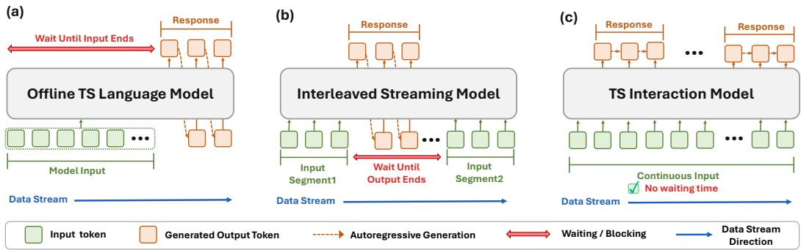  
Figure 1: Overview of LLM-based paradigms for streaming time series. (a) Offline TS language models wait for the complete input before responding. (b) Interleaved streaming models alternate between input and output, causing input blocking during generation. (c) TS interaction models process incoming observations continuously while generating responses concurrently.

However, several key gaps remain in the development of TS interaction models. First, existing models do not naturally support streaming TS interaction (Xie et al., 2024; Langer et al., 2025). They lack key capabilities such as efficient stream encoding, response triggering, and concurrent generation. Second, streaming TS interaction tasks lack a systematic formulation, with different interaction forms and capability levels yet to be clearly defined. Third, large-scale streaming TS interaction data remain scarce. Most existing time-series QA datasets focus on isolated tasks or static question answering (Kong et al., 2025; Yu et al., 2026), with limited coverage of user queries, monitoring instructions, and multi-turn interactions over evolving streams.

To bridge these gaps, we develop TIMEINTERACT specifically for streaming time-series interaction. It combines efficient stream encoding, response triggering, and concurrent generation, enabling the model to continuously follow incoming observations, determine when interaction is needed, and generate responses without interrupting the ongoing stream. We then formulate a hierarchy of streaming time-series interaction tasks that captures diverse interaction forms and difficulty levels, providing a structured basis for defining and evaluating interaction capabilities over evolving streams. Building on this task hierarchy, we construct STREAMTSI-34K, a large-scale dataset built from both synthetic and real-world time series, where interactions are grounded in the temporal evidence observed throughout the stream. It encompasses diverse streaming interaction scenarios across domains and difficulty levels, enabling models to learn appropriate interaction behaviors over continuously evolving time-series streams. Our main contributions are summarized as follows:

1. A specialized model for streaming TS interaction. We propose TIMEINTERACT with three key designs: a dual-view streaming TS encoder for efficient stream encoding, a response triggering mechanism for deciding when to respond, and a parallel control–response KV cache that decouples stream processing from response generation. These designs decouple continuous input processing from response generation to support real-time TS interaction.

2. A systematic formulation of TS interaction tasks. To capture the capability progression of TS interaction, we formulate a four-level hierarchy of TS interaction tasks with increasing interaction difficulty: L1: Understanding → L2: Persistence → L3: Initiative → L4: Adaptivity. This hierarchy offers a unified way to organize and compare TS interaction capabilities at different levels of difficulty and enables models to be evaluated at different capability levels.

3. A large-scale streaming TS interaction dataset. We construct STREAMTSI-34K, a large-scale dataset for streaming TS interaction. It combines controllable synthetic scenarios with diverse real-world time series and includes both single-turn and multi-turn interactions, capturing localized interaction behaviors as well as interaction continuity and cross-turn dependencies. These interactions cover multiple interaction tasks across the proposed capability hierarchy.

## 2 RELATED WORK

LLM-Based Time-Series Analysis. In recent years, LLMs have been increasingly adopted for time-series analysis (Zhang et al., 2024; Liu et al., 2025; Qin et al., 2026). Initial efforts focused on transferring the knowledge and generalization ability of pretrained LLMs to conventional tasks such as forecasting and anomaly detection (Jia et al., 2024; Jin et al., 2024; Sun et al., 2024b). The scope has since expanded beyond numerical tasks toward language-based time-series understanding (Cai et al., 2024). Time-series language models (TSLMs) incorporate temporal signals through either textual inputs (Gruver et al., 2023; Zhou et al., 2023) or temporal representations interleaved with language (Xie et al., 2024; Langer et al., 2025; Parker et al., 2025), enabling description, question answering, and temporal reasoning. Recent work has moved toward more complex reasoning settings, including diverse reasoning capabilities and multi-turn analytical workflows (Guan et al., 2026; Yu et al., 2026; Kong et al., 2026). However, these methods largely operate on time-series context that is available in advance, rather than observations that continuously arrive and evolve during interaction.

Streaming Multimodal Interaction. Real-time capability has become increasingly important for models processing continuously arriving multimodal signals (Lu et al., 2026; Chen & Yu, 2025; Hu et al., 2026). In audio, streaming ASR and spoken-dialogue systems reduce latency through incremental processing (Gao et al., 2022; Xie & Wu, 2024; Defossez et al., 2024). Recent work further´ explores richer interaction behaviors. Audio Interaction Model (Xie et al., 2026) unifies perception, response decisions, and generation, while JoyAI-VL-Interaction (Yao et al., 2026) extends such interaction to live video by learning when to respond, remain silent, or delegate. These developments shift the focus from simply generating responses to deciding whether and when to interact (Wang et al., 2024b; Lab, 2026; Hu et al., 2026). However, existing interaction models remain centered on audio and visual modalities. To the best of our knowledge, we introduce the first interaction model specifically designed for streaming time series.

## 3 TIMEINTERACT

Problem Definition. Offline time-series language models receive a complete multivariate time series $\mathbf { X } \in \mathbb { R } ^ { L \times M }$ and generate a response to a given query or instruction as $r = f _ { \boldsymbol { \theta } } ( \mathbf { X } , \mathcal { E } )$ , where L and M denote the sequence length and number of variables, respectively. TIMEINTERACT instead operates over a continuously evolving time-series stream $\mathbf { C } _ { \leq t }$ with optional queries or instructions $\mathcal { E } _ { \leq t }$ , determining whether a response is required whenever new information becomes available:

$$
\left( d _ { t } , r _ { t } \right) = f _ { \theta } \left( \mathbf { C } _ { \leq t } , \mathcal { E } _ { \leq t } , d _ { < t } , r _ { < t } \right) ,\tag{1}
$$

where each incoming chunk is represented as $\mathbf { C } _ { t } \in \mathbb { R } ^ { L _ { t } \times M }$ and $\mathbf { C } _ { < t }$ denotes the observations up to step t. $\mathcal { E } _ { < t }$ denotes the user queries or instructions received by that time, while $d _ { < t }$ and $r _ { < t }$ record previous decisions and responses. The current decision $d _ { t } \in \{ \mathrm { s } \mathrm { i } \} .$ lent, respond} determines the model’s behavior: $d _ { t } = s \mathrm { \ i } .$ lent continues stream processing without textual output, whereas $d _ { t } = { \tt r e s p } { \tt _ { 0 } }$ ond initiates response generation while new observations continue to arrive.

## 3.1 DUAL-VIEW STREAMING TS ENCODER

Dual-Reference Normalization. Offline time-series language models typically normalize a complete input sequence $\mathbf { X } \in \mathbb { R } ^ { L \times M }$ using statistics derived from the input itself (Langer et al., 2025). In streaming settings, however, the incoming chunk $\mathbf { C } _ { t } \in \mathbb { R } ^ { L _ { t } \times \tilde { M } }$ contains both local temporal dynamics and changes relative to the accumulated historical stream (Lau et al., 2025; Li et al., 2026). A current view alone is therefore insufficient, and we construct two complementary views:

$$
\hat { \mathbf { C } } _ { t } ^ { F } = \frac { \mathbf { C } _ { t } - \pmb { \mu } _ { t } ^ { c } } { \pmb { \sigma } _ { t } ^ { c } + \epsilon } , \qquad \hat { \mathbf { C } } _ { t } ^ { H } = \frac { \mathbf { C } _ { t } - \pmb { \mu } _ { t - 1 } ^ { h } } { \pmb { \sigma } _ { t - 1 } ^ { h } + \epsilon } ,\tag{2}
$$

where $\mu _ { t } ^ { c } , \pmb { \sigma } _ { t } ^ { c } \in \mathbb { R } ^ { M }$ are computed from the current chunk, while $\pmb { \mu } _ { t - 1 } ^ { h } , \pmb { \sigma } _ { t - 1 } ^ { h } \in \mathbb { R } ^ { M }$ summarize the historical stream before step t. (1) The Fast View $\hat { \mathbf { C } } _ { t } ^ { F }$ emphasizes local variations within the current chunk. (2) The Historical View $\hat { \mathbf { C } } _ { t } ^ { H }$ captures how observations differ from the accumulated historical stream. Historical statistics are updated only after processing $\mathbf { C } _ { t }$ , preventing the current chunk from affecting its own historical view. The detailed update procedure is provided in Appendix A.

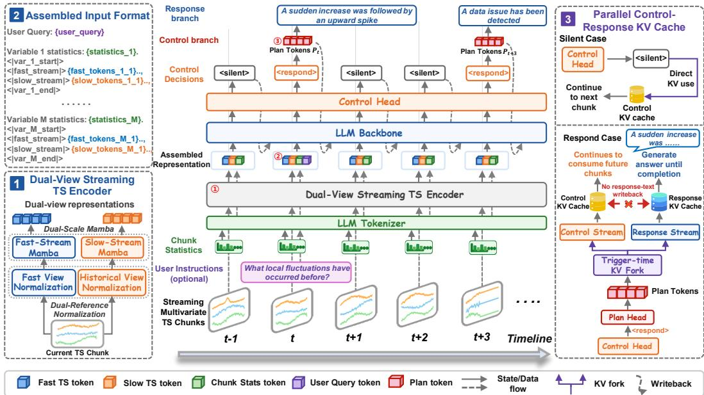  
Figure 2: Overview of TIMEINTERACT. (1) The dual-view streaming TS encoder captures local variations and historical dynamics. (2) Input assembly combines temporal tokens, chunk statistics, and user instructions. (3) KV forking supports concurrent stream processing and response generation.

Fast–Slow Stream Encoding. The normalized views $\hat { \mathbf { C } } _ { t } ^ { F }$ and $\hat { \mathbf { C } } _ { t } ^ { H }$ are first transformed into patchlevel representations. Specifically, each variable is segmented along the temporal dimension into J ordered patches and projected into an H-dimensional hidden space, yielding $\mathbf { E } _ { t } ^ { F } , \mathbf { E } _ { t } ^ { H } \in \mathbb { R } ^ { M \times J \times H }$ We then encode the two representations with independent Fast and Slow Mamba encoders:

$$
\begin{array} { r } { ( \mathbf { Z } _ { t } ^ { F } , \mathbf { S } _ { t } ^ { F } ) = \mathcal { M } _ { F } ( \mathbf { E } _ { t } ^ { F } , \mathbf { S } _ { t - 1 } ^ { F } ; \alpha _ { F } ) , \qquad ( \mathbf { Z } _ { t } ^ { S } , \mathbf { S } _ { t } ^ { S } ) = \mathcal { M } _ { S } ( \mathbf { E } _ { t } ^ { H } , \mathbf { S } _ { t - 1 } ^ { S } ; \alpha _ { S } ) . } \end{array}\tag{3}
$$

where $\mathcal { M } _ { F }$ and $\mathcal { M } _ { S }$ are independent Mamba encoders (Gu & Dao, 2023), and $\mathbf { S } _ { t } ^ { F }$ and $\mathbf { S } _ { t } ^ { S }$ are persistent SSM states carried across chunks. Their update rates satisfy $\alpha _ { F } > \alpha _ { S }$ , allowing the Slow Stream to retain history longer while the Fast Stream responds more rapidly to recent changes. This persistent state enables incremental encoding without revisiting the full history. The resulting trajectories $\mathbf { Z } _ { t } ^ { F } , \mathbf { Z } _ { t } ^ { S } \in \mathbb { R } ^ { M \times J \times H }$ are further projected into the LLM hidden space:

$$
\mathbf { T } _ { t } ^ { F } = \operatorname { R M S N o r m } \left( \Pi _ { F } ( \mathbf { Z } _ { t } ^ { F } ) \right) , \qquad \mathbf { T } _ { t } ^ { S } = \operatorname { R M S N o r m } \left( \Pi _ { S } ( \mathbf { Z } _ { t } ^ { S } ) \right) ,\tag{4}
$$

where $\Pi _ { F } , \Pi _ { S } : \mathbb { R } ^ { H }  \mathbb { R } ^ { D }$ are learned projections and $\mathbf { T } _ { t } ^ { F } , \mathbf { T } _ { t } ^ { S } \in \mathbb { R } ^ { M \times J \times D }$ denote the ordered Fast and Slow soft tokens. RMSNorm stabilizes temporal token scales via root mean square normalization and learned scaling. Each valid patch contributes one token per stream, and the tokens are inserted into the LLM context, where cross-variable dependencies are modeled through self-attention.

## 3.2 STREAMING INTERACTION TRAINING

Response Control and Latent Plans. At each streaming step, TIMEINTERACT forms a causal context $\mathcal { H } _ { t } ^ { P }$ from the Fast and Slow tokens $\mathbf { T } _ { \leq t } ^ { F } , \mathbf { T } _ { \leq t } ^ { S }$ , user queries or instructions $\boldsymbol { \mathcal { E } } _ { \leq t } ,$ previous decisions $d _ { < t }$ , and Plans $\mathbf { P } _ { < t }$ representing previous responses $r _ { < t }$ . A control head $G _ { \mathrm { c t r l } }$ predicts $d _ { t } \in$ {silent, respond}. Silent decisions continue stream processing without text, while response decisions activate a Plan head $G _ { \mathrm { p l a n } }$ to produce continuous Plan tokens $\mathbf { P } _ { t }$ before decoding $r _ { t } \colon$

$$
p _ { \theta } \big ( d _ { t } \mid \mathcal { H } _ { t } ^ { P } \big ) = \mathrm { S o f t m a x } \big ( G _ { \mathrm { c t r l } } ( \mathbf { h } _ { t } ^ { d } ) \big ) ,\tag{5}
$$

$$
\mathbf { P } _ { t } = G _ { \mathrm { p l a n } } ( \mathbf { h } _ { t } ^ { p } ) \in \mathbb { R } ^ { K \times D } , \qquad { \mathrm { i f ~ } } d _ { t } = { \mathrm { r e s p o n d } } ,\tag{6}
$$

where $\mathbf { h } _ { t } ^ { d }$ and $\mathbf { h } _ { t } ^ { p }$ are the LLM hidden states used by the control and Plan heads, respectively, K is the number of Plan tokens, and D is the LLM hidden dimension. We supervise response decisions with weighted cross-entropy $\mathcal { L } _ { \mathrm { c o n t r o l } }$ to account for sparse response events. The Plan tokens $\mathbf { P } _ { t }$ provide a compact representation of the intended response and remain in the control history to inform future decisions, allowing stream processing to continue without waiting for the complete response $r _ { t }$

Full-to-Plan Distillation. To maintain a compact response history during inference, Plan tokens should preserve the information needed for subsequent interactions. We train the same language model under two aligned views: the Full View $\mathcal { H } _ { t } ^ { F }$ augments $\mathcal { H } _ { t } ^ { P }$ with previous ground-truth responses $r _ { < t } ^ { * }$ while the Plan View retains only $\mathcal { H } _ { t } ^ { P }$ , excluding previous response text. Both views condition on the current Plan tokens $\mathbf { P } _ { t }$ and the same target response prefix $r _ { t , < j } ^ { * }$ . We supervise Full-View response generation and distill its token distributions into the Plan View at every target response position:

$$
\mathcal { L } _ { \mathrm { f u l l } } = - \frac { 1 } { N _ { r } } \sum _ { t \in \mathcal { R } } \sum _ { j = 1 } ^ { \lvert r _ { t } ^ { * } \rvert } \log p _ { \theta } \left( r _ { t , j } ^ { * } \mid \mathcal { H } _ { t } ^ { F } , \mathbf { P } _ { t } , r _ { t , < j } ^ { * } \right) ,\tag{7}
$$

$$
\mathcal { L } _ { \mathrm { d i s t i l l } } = \frac { \tau ^ { 2 } } { N _ { r } } \sum _ { t \in \mathcal { R } } \sum _ { j = 1 } ^ { | r _ { t } ^ { * } | } D _ { \mathrm { K L } } \big [ \mathrm { s g } ( q _ { t , j } ^ { F } ) \big | \big | q _ { t , j } ^ { P } \big ] ,\tag{8}
$$

where R indexes response steps and $\begin{array} { r } { N _ { r } = \sum _ { t \in \mathcal { R } } | r _ { t } ^ { * } | } \end{array}$ | is the total number of supervised response tokens. For view $v \in \{ F , P \} , q _ { t , j } ^ { v } =$ Softmax $( \mathbf { z } _ { t , j } ^ { v } / \tau )$ denotes the vocabulary distribution obtained from logits $\mathbf { z } _ { t , j } ^ { v }$ at temperature τ. The operator $\operatorname { s g } ( \cdot )$ stops gradients through the Full-View targets in distillation, while ${ \mathcal { L } } _ { \mathrm { f u l l } }$ trains the shared model and Plan head. The distillation loss encourages the Plan tokens to preserve information required by future responses without retaining past replies.

Three-Stage Training Pipeline. We adopt a three-stage training pipeline to learn the target sequence format, acquire the interaction mechanism, and scale training to diverse streaming settings. Training progressively introduces more complex interaction scenarios, in which previous Plan tokens inform subsequent response decisions and generation. At each stage, we optimize a weighted combination of the Response Control, Full-View generation, and Full-to-Plan distillation losses:

$$
\begin{array} { r } { \mathcal { L } ^ { ( s ) } = \lambda _ { c } ^ { ( s ) } \mathcal { L } _ { \mathrm { c o n t r o l } } + \lambda _ { f } ^ { ( s ) } \mathcal { L } _ { \mathrm { f u l l } } + \lambda _ { d } ^ { ( s ) } \mathcal { L } _ { \mathrm { d i s t i l l } } , \qquad s \in \{ 1 , 2 , 3 \} , } \end{array}\tag{9}
$$

where s indexes the training stage and $\lambda _ { c } ^ { ( s ) } , \lambda _ { f } ^ { ( s ) } , \lambda _ { d } ^ { ( s ) }$ are nonnegative loss weights. (1) Stage I: Temporal-Language Alignment. we use simple interaction tasks in single-turn scenarios to learn the interaction format, training the streaming TS encoder and control and Plan heads with the LLM backbone frozen and distillation disabled $( \lambda _ { d } ^ { ( 1 ) } = 0 )$ . (2) Stage II: Interaction Mechanism Learning. we train on all interaction tasks within single-turn scenarios, unfreeze the language model, and jointly optimize all three losses to learn response timing and how previous Plan tokens inform subsequent decisions. (3) Stage III: Large-Scale Streaming Interaction Training. we extend joint training to the full data covering all interaction tasks in complex scenarios, including multi-turn sessions with mixed interaction forms and dependencies on earlier instructions, responses, and user feedback.

## 3.3 DECOUPLED STREAMING INFERENCE VIA KV FORKING

Autoregressive response generation may span multiple time-series chunks $\{ \mathbf { C } _ { t } \}$ . In an interleaved setting, the model must finish generating the current response before processing subsequent input, causing response generation to block the incoming stream. To remove this dependency, TIMEINTER-ACT separates inference into a persistent Control Stream and temporary Response Streams, using the same language model with distinct KV caches. The control cache $\mathbf { K V } ^ { \mathrm { c t r l } }$ follows the Plan View $\mathcal { H } _ { t } ^ { P } ;$ it accumulates temporal tokens, user instructions, decisions, and Plan tokens, while the TS encoder carries its states across input chunks.

At streaming step t, ENCODE operation encodes Algorithm 1 Decoupled Streaming Inference   
the incoming chunk $\mathbf { C } _ { t }$ into the temporal block   
Input: TS stream {Ct}, optional user inputs {Et}   
$\mathbf { B } _ { t }$ , and CONTROL predicts and commits the bi- 1: Initialize $\mathbf { K V } ^ { \mathrm { c i r l } }$ and encoder states   
nary response $d _ { t }$ . User input is optional: $\mathcal { E } _ { t } = \emptyset$ 2: Q ← ∅; no active response   
when no new query or instruction arrives. A 3: while stream open or $\supsetneq \emptyset$ do   
silent decision closes the control step with- 4: if a new chunk $\mathbf { C } _ { t }$ is available then   
out creating a response request. For respond, 5: Bt ← ENCODE(Ct)   
PLAN appends $\bar { \mathbf { P } _ { t } }$ and returns the cache $\mathbf { \bar { K } V } _ { t } ^ { * }$ 6: $( d _ { t } , \mathbf { K } \mathbf { V } ^ { \mathrm { c t r l } } ) \longleftarrow \mathrm { C O N T R O L } ( \mathbf { B } _ { t } , \boldsymbol { \mathcal { E } } _ { t } , \mathbf { K } \mathbf { V } ^ { \mathrm { c t r l } } )$   
and hidden state $\mathbf { h } _ { t } ^ { r }$ used to predict the first re- 7: if $\cdot d _ { t } = \tt { r e }$ spond then   
sponse token. The cache is then forked into 8: $( \mathbf { \widetilde { P } } _ { t } , \mathbf { K } \mathbf { V } _ { t } ^ { \star } , \mathbf { h } _ { t } ^ { r } ) \gets \mathrm { P L A N } ( \mathbf { K } \mathbf { V } ^ { \operatorname { c t r l } } )$   
the continuing control branch $\mathbf { K V } ^ { \mathrm { c t r l } }$ and a re- 9: $( \mathbf { K } \mathbf { V } ^ { \mathrm { c t r l } } , \mathbf { K } \mathbf { V } _ { t } ^ { \mathrm { r e s p } } ) \gets \mathrm { F o R K } ( \mathbf { K } \mathbf { V } _ { t } ^ { * } )$   
sponse branch $\mathbf { K V } _ { t } ^ { \mathrm { r e s p } }$ . FINISHSTEP closes the 10: $\mathbf { K V } ^ { \mathrm { c t r l } }  \mathrm { F I N I S H S T E P } ( \mathbf { K V } ^ { \mathrm { c t r l } } )$   
current control step without modifying the re- 11: $\mathbf { L A U N C H R E S P O N S E } ( \mathcal { Q } , \mathbf { \dot { K } V } _ { t } ^ { \mathrm { r e s p } } , \mathbf { \dot { h } } _ { t } ^ { r } )$   
12: else // silent   
sponse branch. Subsequent cache updates re- 13: ${ \bf K V } ^ { \mathrm { c t r l } }  \mathrm { F I N I S H S T E P } ( { \bf K V } ^ { \mathrm { c t r l } } )$   
main isolated: new observations extend the con- 14: end $\mathbf { i f }$   
trol history, while generated text extends only 15: end if   
the response branch. Each response stream 16: COLLECTFINISHED(Q)   
is launched asynchronously by LAUNCHRE- 17: end while   
SPONSE and tracked in Q. Once a response

completes, its cache is released, while the corresponding Plan tokens remain in the control history.   
Algorithm 1 summarizes the overall inference and response scheduling procedure.

## 4 STREAMTSI-34K

Overview. STREAMTSI-34K is a large-scale dataset designed for streaming time-series interaction. The dataset comprises 34,588 interaction episodes and 77,505 annotated responses (1–10 per episode), drawing on both controllable synthetic signals and real-world time series from six domains. Across these diverse streams, we annotate four interaction tasks: Instant Query Answering (IQA), Persistent Instruction Following (PIF), Proactive Temporal Warning (PTW), and User-Guided Adaptation (UGA). These tasks are organized into single-turn episodes (56.9%) and composed multi-turn interactions (43.1%). Single-turn tasks ground response timing and content in temporal evidence and user intent, while multi-turn interactions capture cross-turn dependencies and interaction continuity.

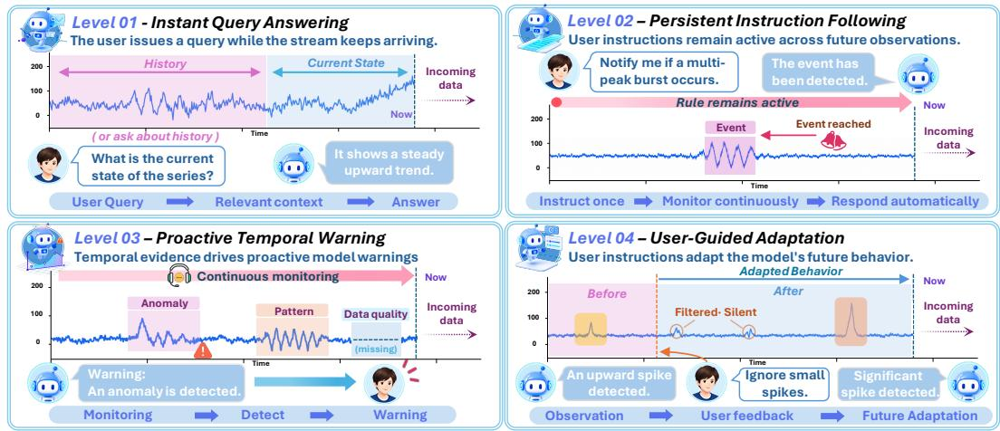  
Figure 3: Representative cases of four streaming time-series interaction levels, from IQA to PIF, PTW, and UGA, corresponding to the capabilities of Understanding, Persistence, Initiative, and Adaptivity.

Data Sources. We collect synthetic and real-world time series in both univariate and multivariate settings. Following ChatTS (Xie et al., 2024), synthetic data are generated from configurable trends, seasonal patterns, local events, and noise, with event attributes, temporal locations, and cross-variable relationships retained as metadata. We further manually curate real-world recordings from 12 datasets across six domains: energy, finance, healthcare, human activity, environment, and manufacturing. These data introduce diverse domain-specific dynamics and natural variability.

(a) Data Pipeline
<table><tr><td>1 Data Sources Synthetic</td><td rowspan="5">2</td><td rowspan="5">②Component Grounding Events interval patterns</td><td rowspan="5"></td><td rowspan="5">Interaction Construction</td><td></td><td rowspan="5"></td><td>4 Quality Control</td></tr><tr><td>Real-world</td><td>Ω</td><td>Single-turn · Multi-turn Ω</td><td>Rule / LLM verification</td></tr><tr><td>Univariate Multivariate</td><td>Relations data issues</td><td>IQA·PIF·PTW·UGA</td><td>Human review</td></tr><tr><td>Controllable / Diverse</td><td>Metadata / Rules / LLM</td><td>Task-Specific Annotation</td><td>Repair / Retain / Reject</td></tr></table>

(b) Interaction Task Hierarchy
<table><tr><td>Level</td><td>Interaction Level</td><td></td><td>Core Capability</td><td>Capability Facets</td><td>Representative Tasks</td></tr><tr><td rowspan="2">1</td><td rowspan="2">日</td><td>Instant Query</td><td rowspan="2">Understanding</td><td>Interpret</td><td>Current State QA</td></tr><tr><td>Answering (IQA)</td><td>Review</td><td>Historical Review</td></tr><tr><td>L2</td><td>C</td><td>Persistent Instruction Following (PIF)</td><td>Persistence</td><td>Remember Persist</td><td>Event Watch Repeated Reporting</td></tr><tr><td rowspan="2">L3</td><td rowspan="2">A</td><td rowspan="2">Proactive Temporal Warning (PTW)</td><td rowspan="2">Initiative</td><td>Monitor</td><td>Pattern Warning</td></tr><tr><td>Initiate</td><td>Data-quality Warning</td></tr><tr><td>L4</td><td>O</td><td>User-Guided Adaptation (UGA)</td><td>Adaptivity</td><td>Adapt Learn</td><td>Feedback-Based Monitoring</td></tr></table>

(c) Sources and Domains  
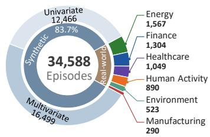

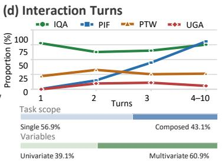

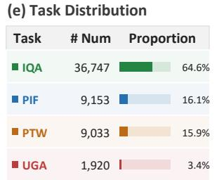  
Figure 4: Construction and composition of STREAMTSI-34K. (a) Four-step data construction pipeline. (b) Interaction levels, capabilities, and representative tasks. (c) Source composition and real-world domain breakdown. (d) Task proportions by response count, alongside task scope and variable dimensionality. (e) Distribution of task instances, including tasks within composed episodes.

Component Grounding. We then identify interaction-relevant temporal components spanning local events, interval-level patterns, cross-variable relationships, and data-quality issues. These components range from isolated spikes and sustained upward or downward trends to inter-variable dependencies and corrupted signal segments. ❶ Synthetic data use generation metadata to provide known temporal locations, whereas ❷ real-world data are processed through LLM-assisted annotation to identify plausible interaction scenarios and localize the corresponding temporal evidence. The resulting components provide explicit temporal evidence for subsequent interaction data construction.

Interaction Construction. The grounded temporal evidence is converted into task-specific interactions for IQA, PIF, PTW, and UGA. Generation combines task-specific templates and rules with LLM-based generation to balance controllability and diversity. Each interaction specifies an optional user query or instruction, a response position, and the corresponding response text, with responses grounded only in observations available at or before the annotated position. Single-turn episodes are constructed to capture individual interaction behaviors, while multi-turn sessions compose multiple tasks so that earlier instructions, responses, and user feedback can influence subsequent interactions.

Quality Control. The generated interaction data first undergo LLM-based verification to ensure task consistency, appropriate response timing, and that each response relies only on observations available at the annotated position. Data that fail verification are regenerated using verifier feedback and re-evaluated, with this process repeated until they pass. Rule-based filtering then removes samples that violate task-specific requirements. High-confidence samples are retained directly, while low-confidence cases are manually reviewed to determine whether they should be accepted, corrected, or rejected. The complete data collection and construction procedure is provided in Appendix C.

## 5 EXPERIMENT

Baselines. We compare against three categories of representative models. General LLMs: Qwen2.5-7B-Instruct (Yang et al., 2025b), Mistral-7B-Instruct-v0.3 (Jiang et al., 2023), and Qwen3-14B (Yang et al., 2025a). Vision-Language Models: Qwen2.5-VL-7B (Bai et al., 2025) and InternVL3.5-8B (Wang et al., 2025). Time-Series Language Models: ChatTS (Xie et al., 2024) and TimeOmni-1 (Guan et al., 2026). We report TIMEINTERACT as the time-series interaction model.

Evaluation. The evaluation covers all four interaction levels using task-specific metrics, including Semantic Correctness (SC) for Understanding and Instruction Fulfillment Rate (IFR) for Persistence, alongside metrics for Initiative and Adaptivity. Results are reported for both single-turn and multi-turn settings to capture interaction quality under different conversational contexts. Real-time efficiency is assessed using latency and responsiveness measures, including Time to First Token (TTFT) and Completion Latency, etc. Detailed metric definitions are provided in Appendix B.

## 5.1 MAIN RESULTS

We summarize the main results in Tables 1 and 2. [Res.1] Strong interaction capability. TIMEIN-TERACT ranks first across all four interaction levels in both settings, with the largest gains on UGA of +22.22 points in single-turn and +23.92 points in multi-turn interactions. [Res.2] Superior multi-turn performance. As the number of interaction turns increases, performance remains stable across all four levels (e.g., IQA: 67.34 → 64.56; PTW: 45.95 → 38.03), while consistently outperforming all baselines. [Res.3] Effective response triggering. TIMEINTERACT achieves the highest F1 and NQ-F1 in both settings, indicating a better balance between responding and remaining silent. In multi-turn interactions, InternVL3.5-8B tends to over-trigger, reaching 98.24 recall but only 23.66 precision, whereas TimeOmni-1 is overly conservative and tends to suppress necessary responses.

Table 1: Performance on the four interaction levels of STREAMTSI-34K in single-turn and multi-turn settings. Native Streaming indicates whether the model natively supports streaming TS data input.
<table><tr><td rowspan="2">Model</td><td rowspan="2">Size</td><td rowspan="2">Model Input</td><td rowspan="2">Native Streaming</td><td colspan="4">Single-turn</td><td colspan="4">Multi-turn</td></tr><tr><td>IQA (SC)</td><td>PIF (IFR)</td><td>PTW (CEHR)</td><td>UGA (ASR)</td><td>IQA (SC)</td><td>PIF (IFR)</td><td>PTW (CEHR)</td><td>UGA (ASR)</td></tr><tr><td colspan="10">General LLMs</td></tr><tr><td></td><td></td><td></td><td></td><td>44.14</td><td>3.45</td><td></td><td></td><td></td><td></td><td></td><td></td></tr><tr><td>Qwen2.5-7B-Instruct Mistral-7B-Instruct-v0.3</td><td>7B 7B</td><td>Text Text</td><td></td><td>38.06</td><td>0.00</td><td>2.70 5.41</td><td>0.00 0.00</td><td>48.30 35.13</td><td>2.52 0.00</td><td>1.41</td><td>0.00</td></tr><tr><td>Qwen3-14B</td><td>14B</td><td>Text</td><td>×××</td><td></td><td>55.63 36.21</td><td>16.22</td><td>14.81</td><td>55.95 24.37</td><td></td><td>1.41 14.08</td><td>0.00 13.04</td></tr><tr><td colspan="10">Vision-Language Models</td></tr><tr><td></td><td>7B</td><td>Figure+Text</td><td></td><td></td><td>48.20 5.17 10.81 0.00 44.30 4.20</td><td></td><td></td><td></td><td></td><td></td><td></td></tr><tr><td>Qwen2.5-VL-7B InternVL3.5-8B</td><td>8B</td><td>Figure+Text</td><td>××</td><td></td><td>55.18 43.10 35.14 22.22 53.16 33.61 25.35 8.70</td><td></td><td></td><td></td><td></td><td>7.04 0.00</td><td></td></tr><tr><td colspan="10">Time-Series Language Models</td></tr><tr><td>ChatTS</td><td>14B</td><td>TS+Text</td><td>X</td><td></td><td>38.06 5.17 27.03 7.41 43.81 5.88</td><td></td><td></td><td></td><td></td><td></td><td>19.72 2.17</td></tr><tr><td>TimeOmni-1</td><td>7B</td><td>TS+Text</td><td>x</td><td></td><td>35.81 0.00 0.00 0.00 41.87 0.00 2.82 0.00</td><td></td><td></td><td></td><td></td><td></td><td></td></tr><tr><td colspan="10">TS Interaction Model</td></tr><tr><td>TIMEINTERACT</td><td></td><td>4B Streaming TS+Text</td><td>1</td><td></td><td>67.34 55.17 45.95 44.44 64.56 43.70 38.03 36.96</td><td></td><td></td><td></td><td></td><td></td><td></td></tr></table>

Table 2: Response-triggering performance on STREAMTSI-34K in single-turn and multi-turn settings. P, R, F1, and NQ-F1 denote triggering precision, recall, F1 score, and No-Query F1, respectively.
<table><tr><td rowspan="2">Model</td><td rowspan="2">Size</td><td rowspan="2">Model Input</td><td rowspan="2">Native Streaming</td><td colspan="4">Single-turn</td><td colspan="4">Multi-turn</td></tr><tr><td></td><td>R</td><td>F1</td><td>NQ-F1</td><td>P</td><td>R</td><td>F1</td><td>NQ-F1</td></tr><tr><td colspan="10">General LLMs</td><td colspan="3"></td></tr><tr><td>Qwen2.5-7B-Instruct</td><td>7B</td><td>Text</td><td>××</td><td>54.67</td><td>53.56</td><td>54.11</td><td>5.30</td><td>83.60</td><td>62.87</td><td>71.77</td><td></td><td>7.60</td></tr><tr><td>Mistral-7B-Instruct-v0.3</td><td>7B</td><td>Text</td><td></td><td>15.54</td><td>41.36</td><td>22.59</td><td>7.09</td><td>46.27</td><td>36.99</td><td></td><td>41.11</td><td>10.26</td></tr><tr><td>Qwen3-14B</td><td>14B</td><td>Text</td><td>x</td><td>15.81</td><td>74.92</td><td>26.11</td><td>10.06</td><td>33.88</td><td>86.86</td><td></td><td>48.75</td><td>18.08</td></tr><tr><td colspan="10">Vision-Language Models</td><td colspan="3"></td></tr><tr><td>Qwen2.5-VL-7B</td><td>7B</td><td>Figure+Text</td><td>x</td><td>14.91</td><td>49.49</td><td>22.92</td><td>5.67</td><td>48.55</td><td></td><td>58.94</td><td>53.24</td><td>9.80</td></tr><tr><td colspan="10">InternVL3.5-8B</td><td colspan="3">98.24 38.14</td></tr><tr><td>Time-Series Language Models</td><td>8B</td><td>Figure+Text</td><td>x</td><td>8.76</td><td>98.98</td><td>16.10</td><td>7.65</td><td>23.66</td><td></td><td></td><td></td><td>16.91</td></tr><tr><td colspan="10">ChatTS</td><td colspan="3">29.35 19.36</td></tr><tr><td>TimeOmni-1</td><td>14B 7B</td><td>TS+Text TS+Text</td><td>x x</td><td>7.83 45.60</td><td>58.31 38.64</td><td>13.80 41.83</td><td>7.43 8.76</td><td>22.00 94.01</td><td></td><td>44.04 46.75</td><td>62.44</td><td>8.12</td></tr><tr><td colspan="10">TS Interaction Model</td><td colspan="3"></td></tr><tr><td>TIMEINTERACT</td><td></td><td>4B Streaming TS+Text</td><td>√</td><td>87.46</td><td>82.71</td><td>85.02</td><td>63.56</td><td>89.97</td><td></td><td>83.88 86.82</td><td></td><td>55.87</td></tr></table>

## 5.2 STREAMING INTERACTION EFFICIENCY

Beyond interaction quality, we assess real-time latency. Table 3 reports response latency, stream processing efficiency, and speedup across response lengths. (1) Low first-token latency. TIMEIN-TERACT exhibits similar TTFT to interleaved inference, with negligible overhead from the Plan and control heads. (2) Higher efficiency for longer responses. By avoiding blocking between input processing and output generation, TIMEINTERACT achieves greater speedups for longer responses (offline: 1.80× → 2.15×; interleaved: 1.26× → 1.59×). (3) Efficient streaming interaction. Nearzero stall time and the lowest time per step across all groups enable efficient real-time interaction.

Table 3: Inference efficiency across different response lengths, reported in terms of response latency, stream processing, and overall speedup. Bold values indicate the best latency results in each group.
<table><tr><td rowspan="2">Response Length</td><td rowspan="2">Inference Strategy</td><td colspan="2">Response Latency</td><td colspan="2">Stream Processing</td><td>Overall</td></tr><tr><td>TTFT ↓ (ms) Completion Lat. ↓ (ms)</td><td></td><td>Avg. Stall Time ↓ (ms) Time / Step ↓ (ms)</td><td></td><td>Speedup ↑(×)</td></tr><tr><td rowspan="3">&lt; 50 tokens</td><td>Offline</td><td>1368.05</td><td>2944.94</td><td></td><td>0.56</td><td>1.80</td></tr><tr><td>Interleaved</td><td>74.45</td><td>2065.39</td><td>856.50</td><td>0.39</td><td>1.26</td></tr><tr><td>TIMEINTERACT (Ours)</td><td>74.07</td><td>1636.33</td><td>≈ 0</td><td>0.31</td><td></td></tr><tr><td rowspan="3"></td><td>Offline</td><td>1578.12</td><td>3714.37</td><td></td><td>0.44</td><td>1.94</td></tr><tr><td>50–70 tokens Interleaved</td><td>73.98</td><td>2703.60</td><td>1286.19</td><td></td><td>1.41</td></tr><tr><td>TIMEINTERACT (Ours)</td><td>72.30</td><td>1913.09</td><td>≈ 0</td><td>0.33</td><td></td></tr><tr><td rowspan="3">&gt; 70 tokens</td><td>Offline</td><td>2041.13</td><td>5175.18</td><td></td><td>0.67</td><td>2.15</td></tr><tr><td>Interleaved</td><td>72.12</td><td>3829.70</td><td>2044.13</td><td>0.50</td><td>1.59</td></tr><tr><td>TIMEINTERACT (Ours)</td><td>73.32</td><td>2403.82</td><td>≈0</td><td>0.31</td><td></td></tr></table>

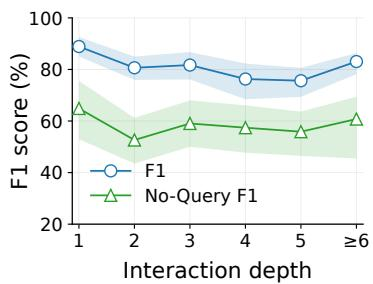

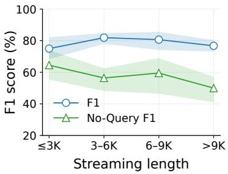

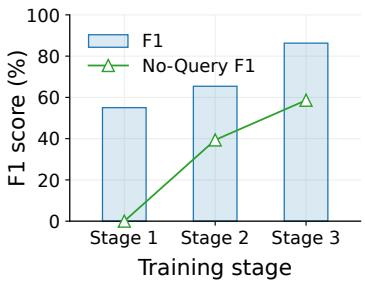  
Figure 5: Analysis of interaction robustness and three-stage training. Left and middle: performance across interaction depths and stream lengths. Right: performance across three training stages.

## 5.3 ADDITIONAL ANALYSIS

Effectiveness of Three-Stage Training. Figure 5 shows that the three-stage training progressively improves the model’s interaction capability. F1 increases from $5 5  6 5  8 6 ,$ while No-Query F1 rises substantially from 0 to 59. The gains from Stage I to Stage II suggest improved interaction understanding, while Stage III further boosts performance through large-scale streaming training.

Information Retention in Plan Tokens. Figure 6 examines whether Plan Tokens preserve information across interaction turns. After identifying a peak of 3406.9 ppm, TIMEINTERACT correctly answers the follow-up as 3506.9 ppm using the Plan Token, despite the previous response text being absent. Replacing the Plan Token with a random embedding changes the answer to 1100 ppm. The token distribution also assigns lower probability to the correct continuation. These results show that Plan Tokens effectively retain information from previous interactions.

Ablation Study. We evaluate the contribution of each component by perturbing the embeddings of Slow TS tokens, Fast TS tokens, and Plan tokens. As shown in Table 4, all three perturbations reduce both F1 and NQ-F1. Perturbing Slow TS embed-

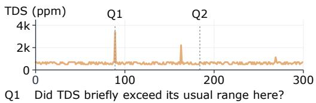  
Q1 Did TDS briefly exceed its usual range here? GT = Model: Yes, it’s now 3406.900 ppm.  
Q2 What is 100 ppm above the peak you reported? w Plan Token: The value is 3506.900 ppm. Replaced Plan Token: The value is 1100 ppm.

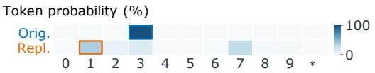  
Figure 6: Visualization of Plan Token effectiveness in preserving multi-turn information.

Table 4: Ablation study of temporal representations and interaction mechanisms for triggering.
<table><tr><td>Variant</td><td>F1</td><td>NQ-F1</td></tr><tr><td>Temporal Representation</td><td></td><td></td></tr><tr><td>Repl. Slow TS token</td><td></td><td>62.85 36.02</td></tr><tr><td>Repl. Fast TS token</td><td>71.16</td><td>45.05</td></tr><tr><td>Interaction Mechanism</td><td></td><td></td></tr><tr><td>Repl. Plan token</td><td>76.13 48.53</td><td></td></tr><tr><td>TIMEINTERACT</td><td>86.30 58.61</td><td></td></tr></table>

dings causes the largest degradation, indicating their greatest impact on response triggering. The performance drop caused by perturbing Plan embeddings further highlights the importance of retained interaction information for subsequent response decisions.

Robustness to Longer Interactions. Figure 5 evaluates response triggering as interaction depth and stream length increase. Both metrics exhibit only moderate degradation as the interaction horizon grows, with F1 remaining consistently above 75 across all settings. This indicates that TIMEINTERACT maintains stable response triggering over long interaction histories and streams.

## 6 CONCLUSION

In this work, we introduce Time-Series Interaction, where models track evolving observations and user intent, decide when to respond, and continue processing inputs during generation. TIMEINTER-ACT combines a dual-view streaming TS encoder, a response control mechanism, and decoupled streaming inference. We also establish a four-level interaction hierarchy and construct STREAMTSI-34K. Experiments show that TIMEINTERACT achieves strong interaction quality and effective response triggering. Our work marks a step toward interactive intelligence for streaming time series.

## REFERENCES

Amey Agrawal, Nitin Kedia, Ashish Panwar, Jayashree Mohan, Nipun Kwatra, Bhargav Gulavani, Alexey Tumanov, and Ramachandran Ramjee. Taming Throughput-Latency tradeoff in LLM inference with Sarathi-Serve. In 18th USENIX symposium on operating systems design and implementation (OSDI 24), pp. 117–134, 2024.

Shuai Bai, Keqin Chen, Xuejing Liu, Jialin Wang, Wenbin Ge, Sibo Song, Kai Dang, Peng Wang, Shijie Wang, Jun Tang, Humen Zhong, Yuanzhi Zhu, Mingkun Yang, Zhaohai Li, Jianqiang Wan, Pengfei Wang, Wei Ding, Zheren Fu, Yiheng Xu, Jiabo Ye, Xi Zhang, Tianbao Xie, Zesen Cheng, Hang Zhang, Zhibo Yang, Haiyang Xu, and Junyang Lin. Qwen2.5-vl technical report, 2025. URL https://arxiv.org/abs/2502.13923.

Yifu Cai, Arjun Choudhry, Mononito Goswami, and Artur Dubrawski. Timeseriesexam: A time series understanding exam. arXiv preprint arXiv:2410.14752, 2024.

Yuxuan Chen and Haoyuan Yu. From turn-taking to synchronous dialogue: A survey of full-duplex spoken language models. arXiv preprint arXiv:2509.14515, 2025.

Sylvain W Combettes, Paul Boniol, Antoine Mazarguil, Danping Wang, Diego Vaquero-Ramos, Marion Chauveau, Laurent Oudre, Nicolas Vayatis, Pierre-Paul Vidal, Alexandra Roren, et al. Armcoda: A data set of upper-limb human movement during routine examination. Image Processing On Line, 14:1–13, 2024.

Alexandre Defossez, Laurent Mazar ´ e, Manu Orsini, Am ´ elie Royer, Patrick P ´ erez, Herv ´ e J ´ egou,´ Edouard Grave, and Neil Zeghidour. Moshi: a speech-text foundation model for real-time dialogue. arXiv preprint arXiv:2410.00037, 2024.

Yawei Dong, He Jiang, Bo Zeng, and Sheng Pan. Reinforcement learning driven periodic kernel fusion for probabilistic forecasting of market dynamics. Knowledge-Based Systems, pp. 115770, 2026.

Jiawei Gao, Bochao Chen, and Su-Kit Tang. Water quality monitoring: A water quality dataset from an on-site study in macao. Applied Sciences, 15(8):4130, 2025.

Yixin Gao, S Swaroop Vedula, Carol E Reiley, Narges Ahmidi, Balakrishnan Varadarajan, Henry C Lin, Lingling Tao, Luca Zappella, Benjamın Bejar, David D Yuh, et al. Jhu-isi gesture and skill´ assessment working set (jigsaws): A surgical activity dataset for human motion modeling. In MICCAI workshop: M2cai, volume 3, pp. 1–10, 2014.

Zhifu Gao, Shiliang Zhang, Ian McLoughlin, and Zhijie Yan. Paraformer: Fast and accurate parallel transformer for non-autoregressive end-to-end speech recognition. arXiv preprint arXiv:2206.08317, 2022.

Mohammad M Ghassemi, Benjamin E Moody, Li-Wei H Lehman, Christopher Song, Qiao Li, Haoqi Sun, Roger G Mark, M Brandon Westover, and Gari D Clifford. You snooze, you win: the physionet/computing in cardiology challenge 2018. In 2018 Computing in Cardiology Conference (CinC), volume 45, pp. 1–4. IEEE, 2018.

Nate Gruver, Marc Finzi, Shikai Qiu, and Andrew G Wilson. Large language models are zero-shot time series forecasters. Advances in neural information processing systems, 36:19622–19635, 2023.

Albert Gu and Tri Dao. Mamba: Linear-time sequence modeling with selective state spaces. arXiv preprint arXiv:2312.00752, 2023.

Tong Guan, Zijie Meng, Dianqi Li, Shiyu Wang, Chao-Han Huck Yang, Qingsong Wen, Zuozhu Liu, Sabato Siniscalchi, Ming Jin, and Shirui Pan. Timeomni-1: Incentivizing complex reasoning with time series in large language models. In International Conference on Learning Representations, volume 2026, pp. 152139–152170, 2026.

Valerio Guerrini, Thibaut Germain, Charles Truong, Laurent Oudre, and Paul Boniol. Time series motif discovery: a comprehensive evaluation. Proceedings of the VLDB Endowment (PVLDB), 18 (7):2226–2239, 2025.

Nikolai Helwig, Eliseo Pignanelli, and Andreas Schutze. Condition monitoring of a complex hydraulic¨ system using multivariate statistics. In 2015 IEEE International Instrumentation and Measurement Technology Conference (I2MTC) Proceedings, pp. 210–215. IEEE, 2015.

Yibo Hu, Yu Qian, Mao Gu, Yingfan Tao, Yuhao Chen, Yongdong Luo, Zhuoqun Liu, Meiguang Jin, and Junfeng Ma. Tlive-omni: An omni-modal understanding model for e-commerce live streaming. arXiv preprint arXiv:2608.20958, 2026.

Bosong Huang, Panzhen Zhao, Zengxiang Li, Patricia Lee, Wei Jin, Alan Wee-Chung Liew, Ming Jin, and Shirui Pan. Learning cardiac latent representations in vectorcardiogram space. arXiv preprint arXiv:2605.31249, 2026.

Furong Jia, Kevin Wang, Yixiang Zheng, Defu Cao, and Yan Liu. Gpt4mts: Prompt-based large language model for multimodal time-series forecasting. In Proceedings ofthe AAAI conference on artificial intelligence, volume 38, pp. 23343–23351, 2024.

Albert Q. Jiang, Alexandre Sablayrolles, Arthur Mensch, Chris Bamford, Devendra Singh Chaplot, Diego de las Casas, Florian Bressand, Gianna Lengyel, Guillaume Lample, Lucile Saulnier, Lelio Renard Lavaud, Marie-Anne Lachaux, Pierre Stock, Teven Le Scao, Thibaut Lavril, Thomas´ Wang, Timothee Lacroix, and William El Sayed. Mistral 7b, 2023. URL´ https://arxiv. org/abs/2310.06825.

He Jiang, Sheng Pan, Yao Dong, and Jianzhou Wang. Probabilistic electricity price forecasting based on penalized temporal fusion transformer. Journal ofForecasting, 43(5):1465–1491, 2024.

Ming Jin, Shiyu Wang, Lintao Ma, Zhixuan Chu, James Zhang, Xiaoming Shi, Pin-Yu Chen, Yuxuan Liang, Yuan-Fang Li, Shirui Pan, et al. Time-llm: Time series forecasting by reprogramming large language models. In International conference on learning representations, volume 2024, pp. 23857–23880, 2024.

Iurii D. Katser and Vyacheslav O. Kozitsin. Skoltech anomaly benchmark (skab). https://www. kaggle.com/dsv/1693952, 2020.

Yaxuan Kong, Yiyuan Yang, Yoontae Hwang, Wenjie Du, Stefan Zohren, Zhangyang Wang, Ming Jin, and Qingsong Wen. Time-mqa: Time series multi-task question answering with context enhancement. In Proceedings ofthe 63rd Annual Meeting ofthe Associationfor Computational Linguistics (Volume 1: Long Papers), pp. 29736–29753, 2025.

Yaxuan Kong, Qingren Yao, Yuqi Nie, Yichen Li, Yilei Shao, Stefan Zohren, Anna Vettoruzzo, Joaquin Vanschoren, Ming Jin, and Qingsong Wen. Timesage-mt: A multi-turn benchmark for evaluating agentic time series reasoning. arXiv preprint arXiv:2606.01498, 2026.

Thinking Machines Lab. Interaction models: A scalable approach to human-ai collaboration. Thinking Machines Lab: Connectionism, May 2026. doi: 10.64434/tml.20260511. https://thinkingmachines.ai/blog/interaction-models/.

Patrick Langer, Thomas Kaar, Max Rosenblattl, Maxwell A Xu, Winnie Chow, Martin Maritsch, Robert Jakob, Ning Wang, Juncheng Liu, Aradhana Verma, et al. Opentslm: Time-series language models for reasoning over multivariate medical text-and time-series data. arXiv preprint arXiv:2510.02410, 2025.

Ying-yee Ava Lau, Zhiwen Shao, and Dit-Yan Yeung. Fast and slow streams for online time series forecasting without information leakage. In International Conference on Learning Representations, volume 2025, pp. 28736–28762, 2025.

Zechen Li, Keerthana Natarajan, Weizhi Zhang, Menglian Zhou, Simon A Lee, Yuwei Zhang, Maxwell A Xu, Zeinab Esmaeilpour, Flora D Salim, Mark Malhotra, et al. Glucofm: A dualstream foundation model for continuous glucose monitoring. arXiv preprint arXiv:2605.30865, 2026.

Chenxi Liu, Qianxiong Xu, Hao Miao, Sun Yang, Lingzheng Zhang, Cheng Long, Ziyue Li, and Rui Zhao. Timecma: Towards llm-empowered multivariate time series forecasting via cross-modality alignment. In Proceedings of the AAAI Conference on Artificial Intelligence, volume 39, pp. 18780–18788, 2025.

Jingyu Lu, Yuhan Wang, Jianming Luo, Yifu Chen, Tianle Liang, Shengpeng Ji, Ziyue Jiang, Xiaoda Yang, Yu Zhang, Xize Cheng, et al. A survey of full-duplex spoken dialogue systems: Architectural hierarchy, interaction ontology, and decision state machine. arXiv preprint arXiv:2606.19453, 2026.

George B Moody and Roger G Mark. The impact of the mit-bih arrhythmia database. IEEE engineering in medicine and biology magazine, 20(3):45–50, 2001.

David Murray, Lina Stankovic, and Vladimir Stankovic. An electrical load measurements dataset of united kingdom households from a two-year longitudinal study. Scientific data, 4(1):160122, 2017.

Felix Parker, Nimeesha Chan, Chi Zhang, and Kimia Ghobadi. Tsllm: Augmenting llms for general time series understanding and prediction. arXiv preprint arXiv:2510.01111, 2025.

Tom Pollard, Benjamin E Moody, Li-wei H Lehman, Brian J Gow, Chrystinne Fernandes, Chen Xie, Alistair Johnson, Roger G Mark, and Thomas Heldt. Physionet as a global platform for biomedical research. Nature Health, pp. 1–4, 2026.

Zhongzheng Qiao, Sheng Pan, Anni Wang, Viktoriya Zhukova, Yong Liu, Xudong Jiang, Qingsong Wen, Mingsheng Long, Ming Jin, and Chenghao Liu. It’s time: Towards the next generation of time series forecasting benchmarks. arXiv preprint arXiv:2602.12147, 2026.

Jianyang Qin, Chaoyang Li, Jinhao Cui, Lingzhi Wang, Zhao Liu, and Qing Liao. Bridging time and linguistics: Llms as time series analyzer through symbolization and segmentation. Advances in Neural Information Processing Systems, 38:124618–124650, 2026.

Attila Reiss and Didier Stricker. Introducing a new benchmarked dataset for activity monitoring. In 2012 16th international symposium on wearable computers, pp. 108–109. IEEE, 2012.

Stephen Rogers, Huidong Jin, Rose Roche, and Danielle A Way. Improved forecasting of cotton canopy temperature for irrigation scheduling. Agricultural and Forest Meteorology, 385:111192, 2026.

Changho Shin, Eunjung Lee, Jeongyun Han, Jaeryun Yim, Wonjong Rhee, and Hyoseop Lee. The enertalk dataset, 15 hz electricity consumption data from 22 houses in korea. Scientific data, 6(1): 193, 2019.

Biao Sun, Ziming Huang, Hanyu Zhao, Wencong Xiao, Xinyi Zhang, Yong Li, and Wei Lin. Llumnix: Dynamic scheduling for large language model serving. In 18th USENIX symposium on operating systems design and implementation (OSDI 24), pp. 173–191, 2024a.

Chenxi Sun, Hongyan Li, Yaliang Li, and Shenda Hong. Test: Text prototype aligned embedding to activate llm’s ability for time series. In International Conference on Learning Representations, volume 2024, pp. 37854–37881, 2024b.

Lu Wang, Zhuoran Jin, Yupu Hao, Yubo Chen, Kang Liu, Yulong Ao, and Jun Zhao. Think while watching: Online streaming segment-level memory for multi-turn video reasoning in multimodal large language models. arXiv preprint arXiv:2603.11896, 2026.

Weiyun Wang, Zhangwei Gao, Lixin Gu, Hengjun Pu, Long Cui, Xingguang Wei, Zhaoyang Liu, Linglin Jing, Shenglong Ye, Jie Shao, et al. Internvl3.5: Advancing open-source multimodal models in versatility, reasoning, and efficiency. arXiv preprint arXiv:2508.18265, 2025.

Xinlei Wang, Maike Feng, Jing Qiu, Jinjin Gu, and Junhua Zhao. From news to forecast: Integrating event analysis in llm-based time series forecasting with reflection. Advances in Neural Information Processing Systems, 37:58118–58153, 2024a.

Xiong Wang, Yangze Li, Chaoyou Fu, Yunhang Shen, Lei Xie, Ke Li, Xing Sun, and Long Ma. Freeze-omni: A smart and low latency speech-to-speech dialogue model with frozen llm. arXiv preprint arXiv:2411.00774, 2024b.

Qing Wei, Hao Miao, Yan Zhao, Kai Zheng, Bin Yang, Volker Markl, and Christian S Jensen. Evolving proxy kills drift: Data-efficient streaming time series anomaly detection. In Proceedings ofthe ACM Web Conference 2026, pp. 7295–7306, 2026.

B. P. Welford. Note on a method for calculating corrected sums of squares and products. Technometrics, 4(3):419–420, 1962. doi: 10.1080/00401706.1962.10490022.

Zhe Xie, Zeyan Li, Xiao He, Longlong Xu, Xidao Wen, Tieying Zhang, Jianjun Chen, Rui Shi, and Dan Pei. Chatts: Aligning time series with llms via synthetic data for enhanced understanding and reasoning. arXiv preprint arXiv:2412.03104, 2024.

Zhifei Xie and Changqiao Wu. Mini-omni: Language models can hear, talk while thinking in streaming. arXiv preprint arXiv:2408.16725, 2024.

Zhifei Xie, Zihang Liu, Ze An, Xiaobin Hu, Yue Liao, Ziyang Ma, Dongchao Yang, Mingbao Lin, Deheng Ye, Shuicheng Yan, et al. Audio interaction model. arXiv preprint arXiv:2606.05121, 2026.

An Yang, Anfeng Li, Baosong Yang, Beichen Zhang, Binyuan Hui, Bo Zheng, Bowen Yu, Chang Gao, Chengen Huang, Chenxu Lv, et al. Qwen3 technical report. arXiv preprint arXiv:2505.09388, 2025a.

An Yang, Baosong Yang, Beichen Zhang, Binyuan Hui, Bo Zheng, Bowen Yu, Chengyuan Li, Dayiheng Liu, Fei Huang, Haoran Wei, Huan Lin, Jian Yang, Jianhong Tu, Jianwei Zhang, Jianxin Yang, Jiaxi Yang, Jingren Zhou, Junyang Lin, Kai Dang, Keming Lu, Keqin Bao, Kexin Yang, Le Yu, Mei Li, Mingfeng Xue, Pei Zhang, Qin Zhu, Rui Men, Runji Lin, Tianhao Li, Tianyi Tang, Tingyu Xia, Xingzhang Ren, Xuancheng Ren, Yang Fan, Yang Su, Yichang Zhang, Yu Wan, Yuqiong Liu, Zeyu Cui, Zhenru Zhang, and Zihan Qiu. Qwen2.5 technical report, 2025b. URL https://arxiv.org/abs/2412.15115.

Dingyu Yao, Junhao Zhou, Chenxu Yang, Chuanyu Qin, Haowen Hou, Zheming Liang, Congcong Wang, Yuhang Cao, Shenglong Ye, Shuai Xie, et al. Joyai-vl-interaction: Real-time vision-language interaction intelligence. arXiv preprint arXiv:2606.14777, 2026.

Fangxu Yu, Xingang Guo, Lingzhi Yuan, Haoqiang Kang, Hongyu Zhao, Lianhui Qin, Furong Huang, Bin Hu, and Tianyi Zhou. Tsrbench: A comprehensive multi-task multi-modal time series reasoning benchmark for generalist models. arXiv preprint arXiv:2601.18744, 2026.

Xiaofan Yu, Lanxiang Hu, Benjamin Reichman, Dylan Chu, Rushil Chandrupatla, Xiyuan Zhang, Larry Heck, and Tajana S Rosing. Sensorchat: Answering qualitative and quantitative questions during long-term multimodal sensor interactions. Proceedings of the ACM on Interactive, Mobile Wearable and Ubiquitous Technologies, 9(3):1–35, 2025.

Xiyuan Zhang, Ranak Roy Chowdhury, Rajesh K Gupta, and Jingbo Shang. Large language model for time series: A survey. arXiv preprint arXiv:2402.01801, 2024.

Yinmin Zhong, Shengyu Liu, Junda Chen, Jianbo Hu, Yibo Zhu, Xuanzhe Liu, Xin Jin, and Hao Zhang. DistServe: Disaggregating prefill and decoding for goodput-optimized large language model serving. In 18th USENIX symposium on operating systems design and implementation (OSDI 24), pp. 193–210, 2024.

Tian Zhou, Peisong Niu, Liang Sun, Rong Jin, et al. One fits all: Power general time series analysis by pretrained lm. Advances in neural information processing systems, 36:43322–43355, 2023.

Yitong Zhou, Yucong Luo, Mingyue Cheng, Qi Liu, Jiahao Wang, Daoyu Wang, and Enhong Chen. Time series forecasting as reasoning: A slow-thinking approach with reinforced llms. arXiv preprint arXiv:2506.10630, 2025.

## A ONLINE HISTORICAL STATISTICS UPDATE

We maintain the historical reference without storing or revisiting past observations. At each streaming step, we construct both normalized views before merging the current chunk into the historical statistics. This ordering avoids leakage from the current chunk into its historical reference.

Reference Statistics and Normalization. Before processing $\mathbf { C } _ { t } .$ , vectors n, $\pmb { \mu } , \mathbf { s } \in \mathbb { R } ^ { M }$ store historical counts, means, and centered sums of squares. They are initialized to zero. The current chunk yields statistics $\mathbf { n } ^ { c } , \pmb { \mu } ^ { c } , \mathbf { s } ^ { c }$ from valid observations. For positive counts and valid positions, standard deviations and normalized views are computed element-wise with $\epsilon = 1 0 ^ { - 5 }$

$$
\pmb { \sigma } ^ { c } = \sqrt { \mathrm { m a x } \bigg ( \frac { \mathbf { s } ^ { c } } { \mathbf { n } ^ { c } } , \epsilon ^ { 2 } \bigg ) } , \qquad \pmb { \sigma } = \sqrt { \mathrm { m a x } \bigg ( \frac { \mathbf { s } } { \mathbf { n } } , \epsilon ^ { 2 } \bigg ) } ,\tag{10}
$$

$$
\hat { \mathbf { C } } _ { t } ^ { F } = \frac { \mathbf { C } _ { t } - \pmb { \mu } ^ { c } } { \pmb { \sigma } ^ { c } + \epsilon } , \qquad \hat { \mathbf { C } } _ { t } ^ { H } = \frac { \mathbf { C } _ { t } - \pmb { \mu } } { \pmb { \sigma } + \epsilon } .\tag{11}
$$

The statistics are broadcast over time for each variable. The Fast View captures local shape within the current chunk, while the Historical View measures deviations from the preceding stream. For $\mathbf { n } = 0$ , both views use $\pmb { \mu } ^ { c } , \pmb { \sigma } ^ { c }$ . Padding values are excluded from statistics and zeroed in both views.

Historical State Update. After forming both normalized views, we merge the current-chunk statistics into the historical state using a chunk-wise Welford update (Welford, 1962). Let $\pmb { \delta } = \pmb { \mu } ^ { c } - \pmb { \mu }$ denote the mean difference, and let primes indicate updated quantities. For entries with $\mathbf { n } ^ { c } > 0 _ { : }$ the historical statistics are updated element-wise to incorporate the current chunk as follows:

$$
\begin{array} { c } { { { \bf n } ^ { \prime } = { \bf n } + { \bf n } ^ { c } , \qquad \displaystyle { { \mu } ^ { \prime } } = \mu + \frac { { \bf n } ^ { c } } { { \bf n } ^ { \prime } } \odot \delta , } } \\ { { \displaystyle { { \bf s } ^ { \prime } } = { \bf s } + { \bf s } ^ { c } + \frac { { \bf n } \odot { \bf n } ^ { c } } { { \bf n } ^ { \prime } } \odot \delta ^ { 2 } . } } \end{array}\tag{12}
$$

Observation counts determine the relative weights of the historical and current-chunk means, while the correction in $\mathbf { s } ^ { \prime }$ accounts for their difference. The merged statistics represent all valid observations accumulated up to the current chunk and provide the reference for normalizing the next chunk, leaving the current normalized views unchanged. Entries with $\mathbf { n } ^ { c } = 0$ retain their previous statistics.

## B IMPLEMENTATION DETAILS

Training Setup. We initialize TIMEINTERACT with Qwen3-4B-Instruct-2507 and follow the threestage training pipeline. Stage I optimizes the streaming TS encoder, control and Plan heads while freezing the pretrained language model; Stages II and III jointly fine-tune all modules. Each subsequent stage starts from the preceding stage’s model weights. All stages use AdamW with cosine learning-rate decay, 5% warmup, BF16 precision, and DeepSpeed ZeRO-2. Training takes approximately five days on four H100 GPUs (94 GB each). Table 5 summarizes the training configuration.

Interaction Quality. We evaluate the four interaction tasks using metrics aligned with their respective objectives. For IQA, Semantic Correctness (SC) assigns each response a score $s _ { i } ^ { \mathrm { S C } } \in [ \dot { 0 } , 1 0 0 ]$ averaged over $N _ { \mathrm { I Q A } }$ instances. For PIF, Instruction Fulfillment Rate (IFR) aggregates binary fulfillment indicators $f _ { i } \in \{ 0 , 1 \}$ over NPIF instances. For PTW, Correct Event Hit Rate (CEHR) measures the proportion of correctly warned events, denoted by $N _ { \mathrm { h i t } }$ , among $N _ { \mathrm { e v e n t } }$ annotated events. For UGA, Adaptation Success Rate (ASR) measures the proportion of successful adaptations, denoted by $N _ { \mathrm { s u c c e s s } } .$ , among $N _ { \mathrm { U G A } }$ evaluated adaptations. These metrics are defined as follows:

$$
\begin{array} { r l } { { \displaystyle \mathrm { S C } = \frac { 1 } { N _ { \mathrm { I Q A } } } \sum _ { i = 1 } ^ { N _ { \mathrm { I Q A } } } s _ { i } ^ { \mathrm { S C } } } , } & { { \qquad \mathrm { I F R } = \frac { 1 0 0 } { N _ { \mathrm { P I F } } } \sum _ { i = 1 } ^ { N _ { \mathrm { P I F } } } f _ { i } , } } \\ { { \displaystyle \mathrm { C E H R } = 1 0 0 \frac { N _ { \mathrm { h i t } } } { N _ { \mathrm { e v e n t } } } } , } & { { \qquad \mathrm { A S R } = 1 0 0 \frac { N _ { \mathrm { s u c c e s s } } } { N _ { \mathrm { U G A } } } . } } \end{array}\tag{13}
$$

Interaction Efficiency. We evaluate real-time efficiency through response latency, stream continuity, and processing cost. Time to First Token (TTFT) (Zhong et al., 2024) and Completion Latency (Agrawal et al., 2024) measure the delays from triggering to response initiation and completion, respectively. We denote the trigger time, first-token generation time, and response completion time by $t _ { \mathrm { t r i g } } , t _ { \mathrm { f i r s t } }$ , and $t _ { \mathrm { e n d } }$ . Average Stall Time measures how much response generation blocks incoming observations, averaging the blocked duration $\Delta t _ { i } ^ { \mathrm { s t a l l } }$ over $N _ { r }$ triggered responses. Time per Step (Sun et al., 2024a) measures the average processing cost of an incoming step, using the total stream-processing time $T _ { \mathrm { s t r e a m } }$ over $N _ { \mathrm { s t e p } }$ steps. Their mathematical definitions are as follows:

Table 5: Hyperparameters and computational settings for the three-stage training pipeline.
<table><tr><td>Parameter</td><td>Stage I</td><td>Stage II</td><td>Stage III</td></tr><tr><td colspan="4">Optimization</td></tr><tr><td>Epochs</td><td>1</td><td>1</td><td>3</td></tr><tr><td>LLM learning rate</td><td>Frozen</td><td> $1 \times 1 0 ^ { - 6 }$ </td><td> $1 \times 1 0 ^ { - 5 }$ </td></tr><tr><td>TS encoder and heads learning rate</td><td> $2 \times 1 0 ^ { - 4 }$ </td><td> $5 \times 1 0 ^ { - 5 }$ </td><td> $1 \times 1 0 ^ { - 5 }$ </td></tr><tr><td>Optimizer</td><td>AdamW</td><td>AdamW</td><td>AdamW</td></tr><tr><td>Adam  $( \beta _ { 1 } , \beta _ { 2 } )$ </td><td>(0.9, 0.999)</td><td>(0.9, 0.999)</td><td>(0.9, 0.999)</td></tr><tr><td>Adam €</td><td>10-8</td><td>10⁻8</td><td>10⁻8</td></tr><tr><td>Learning-rate schedule</td><td>Cosine decay</td><td>Cosine decay</td><td>Cosine decay</td></tr><tr><td>Warmup ratio</td><td>0.05</td><td>0.05</td><td>0.05</td></tr><tr><td>Weight decay</td><td>0.01</td><td>0.01</td><td>0.01</td></tr><tr><td>Maximum gradient norm</td><td>1.0</td><td>1.0</td><td>1.0</td></tr><tr><td colspan="4">Training objectives</td></tr><tr><td>Loss weights  $\left( \lambda _ { c } , \lambda _ { f } , \lambda _ { d } \right)$ </td><td>(0.2, 1,0)</td><td>(1, 0.5, 0.5)</td><td>(1, 0.5, 0.5)</td></tr><tr><td>Control weights (silent:respond)</td><td>1:5</td><td>1:5</td><td>1:5</td></tr><tr><td>Distillation temperature τ</td><td></td><td>2</td><td>2</td></tr><tr><td colspan="4">Execution</td></tr><tr><td>GPUs</td><td colspan="3">4× H100 (94 GB each)</td></tr><tr><td>Precision</td><td colspan="3">BF16</td></tr><tr><td>Sharding</td><td colspan="3"></td></tr><tr><td>Total training time (all stages)</td><td colspan="3">DeepSpeed ZeRO-2 5 days (approx.)</td></tr></table>

$$
\begin{array} { r l } & { \mathrm { T T F T } = t _ { \mathrm { f i r s t } } - t _ { \mathrm { t r i g } } , \qquad } & { T _ { \mathrm { c o m p } } = t _ { \mathrm { e n d } } - t _ { \mathrm { t r i g } } , } \\ & { \bar { T } _ { \mathrm { s t a l l } } = \displaystyle \frac { 1 } { N _ { r } } \sum _ { i = 1 } ^ { N _ { r } } \Delta t _ { i } ^ { \mathrm { s t a l l } } , \qquad } & { T _ { \mathrm { s t e p } } = \frac { T _ { \mathrm { s t r e a m } } } { N _ { \mathrm { s t e p } } } . } \end{array}\tag{14}
$$

All four metrics are reported in milliseconds, with lower values indicating better efficiency. Nearzero stall time indicates that incoming observations can be processed with minimal interruption during response generation. We further report Speedup to compare inference strategies, computed as Speedup $\dot { = } T _ { \mathrm { c o m p } } ^ { \mathrm { b a \breve { s } e l i n e } } / T _ { \mathrm { c o m p } } ^ { \mathrm { o u r s } } ,$ , where $T _ { \mathrm { c o m p } } ^ { \mathrm { o u r \bar { s } } }$ denotes the completion latency of TIMEINTERACT. This dimensionless ratio measures acceleration over the corresponding baseline.

## C DATASET DETAILS

## C.1 REAL-WORLD DATA SOURCES

The real-world portion of STREAMTSI-34K contains 5,623 interaction episodes constructed from 12 public datasets across six domains: energy, finance, healthcare, human activity, environment, and manufacturing. These sources cover heterogeneous temporal dynamics, sampling frequencies, signal modalities, and annotation schemes in both univariate and multivariate settings. For each source, we select variables suitable for streaming interaction and retain available event information for subsequent component grounding. Table 6 provides detailed information about the datasets.

Energy. We use electricity-consumption signals from ENERTALK (Shin et al., 2019) and REFIT (Murray et al., 2017). For ENERTALK, we retain active-power channels from House 06, align independently timestamped measurements to a common temporal grid, and fill missing values. For REFIT, we combine dishwasher, washing-machine, and tumble-dryer loads from selected households into univariate sequences sampled at 8-second intervals (Guerrini et al., 2025).

Table 6: Statistics and composition of the real-world data in STREAMTSI-34K, covering 12 public datasets across six domains. The sources span diverse sampling frequencies, sequence lengths, and signal dimensionalities, providing a heterogeneous basis for constructing time-series interactions
<table><tr><td rowspan="2">Dataset</td><td rowspan="2"></td><td rowspan="2">Dim Freq. (Hz)</td><td colspan="3">Length</td><td colspan="2">Episodes</td><td colspan="2">Responses</td><td rowspan="2">Source</td><td rowspan="2">License</td></tr><tr><td>Min</td><td>Max</td><td>Avg</td><td>Count Share (%) Count Share (%)</td><td></td><td></td><td></td></tr><tr><td>Energy</td><td></td><td></td><td></td><td></td><td></td><td></td><td></td><td></td><td></td><td></td><td></td></tr><tr><td>ENERTALK</td><td>6</td><td>15</td><td>5,018</td><td>7,997</td><td>6,665.10</td><td>1,467</td><td>26.09</td><td>4,781</td><td>31.63</td><td>Figshare</td><td>CC0 1.0</td></tr><tr><td>REFIT</td><td>1</td><td>0.13</td><td>5,000</td><td>7,989</td><td>5,763.90</td><td>100</td><td>1.78</td><td>200</td><td>1.32</td><td>Strathclyde</td><td>CC BY 4.0</td></tr><tr><td>Finance</td><td></td><td></td><td></td><td></td><td></td><td></td><td></td><td></td><td></td><td></td><td></td></tr><tr><td>BTCUSDT</td><td>4</td><td>4</td><td>5,000</td><td></td><td>5,000 5,000.00</td><td>1,304</td><td>23.19</td><td>3,904</td><td>25.83</td><td>Kaggle</td><td>MITa</td></tr><tr><td>Healthcare</td><td></td><td></td><td></td><td></td><td></td><td></td><td></td><td></td><td></td><td></td><td></td></tr><tr><td>JIGSAWMaster</td><td>1</td><td>30</td><td>3,000</td><td>3,000</td><td>3,000.00</td><td>245</td><td>4.36</td><td>769</td><td>5.09</td><td>JHU-ISI</td><td>Academicb</td></tr><tr><td>PhysioNet 2018</td><td>6</td><td>200</td><td>8,000</td><td>8,000</td><td>8,000.00</td><td>459</td><td>8.16</td><td>715</td><td>4.73</td><td>PhysioNet</td><td>ODC-By 1.0</td></tr><tr><td>MIT-BIH</td><td>2</td><td>360</td><td>2,920</td><td>16,675</td><td>6,703.00</td><td>345</td><td>6.14</td><td>1,019</td><td>6.74</td><td>PhysioNet</td><td>ODC-By 1.0</td></tr><tr><td>Human Activity</td><td></td><td></td><td></td><td></td><td></td><td></td><td></td><td></td><td></td><td></td><td></td></tr><tr><td>PAMAP2</td><td>6</td><td>100</td><td>6,000</td><td>8,000</td><td>7,381.80</td><td>598</td><td>10.63</td><td>1,196</td><td>7.91</td><td>UCI</td><td>CC BY 4.0</td></tr><tr><td>Arm-CODA</td><td>1</td><td>100</td><td>6,603</td><td>9,420</td><td>8,047.40</td><td>192</td><td>3.41</td><td>384</td><td>2.54</td><td>IPOL</td><td>CC BY-NC-SA 3.0</td></tr><tr><td>PTT PPG</td><td>1</td><td>500</td><td>1,061</td><td>3,296</td><td>2,169.30</td><td>100</td><td>1.78</td><td>350</td><td>2.32</td><td>PhysioNet</td><td>ODbL 1.0</td></tr><tr><td>Environment</td><td></td><td></td><td></td><td></td><td></td><td></td><td></td><td></td><td></td><td></td><td></td></tr><tr><td>Macao Water</td><td>4</td><td>0.20</td><td>6,000</td><td></td><td>6,000 6,000.00</td><td>523</td><td>9.30</td><td>1,109</td><td>7.34</td><td>GitHub</td><td>Not stated</td></tr><tr><td>Manufacturing</td><td></td><td></td><td></td><td></td><td></td><td></td><td></td><td></td><td></td><td></td><td></td></tr><tr><td>SKAB</td><td>5</td><td>1</td><td>745</td><td></td><td>1,327 1,133.10</td><td>30</td><td>0.53</td><td>30</td><td>0.20</td><td>GitHub</td><td>GPL-3.0c</td></tr><tr><td>UCI Hydraulic</td><td>3</td><td>100</td><td></td><td></td><td>6,00024,00014,571.40</td><td>260</td><td>4.62</td><td>659</td><td>4.36</td><td>UCI</td><td>CC BY 4.0</td></tr></table>

Finance. Financial sequences are drawn from BTCUSDT, which records the limit order book of Binance’s Bitcoin–Tether perpetual contract. The source covers January 9–20, 2023, with approximately 3.73 million observations, providing high-frequency market recordings for interaction construction.

Healthcare. The healthcare sources cover surgical motion, sleep physiology, and cardiac activity. For JIGSAWMaster, we use selected single-channel sequences from JIGSAWS (Gao et al., 2014), with labeled gesture examples and recurrence intervals supporting interactions around demonstrated and recurring motion patterns. From PhysioNet 2018 (Ghassemi et al., 2018), we select intervals from ten records and retain six synchronized channels. For MIT–BIH (Moody & Mark, 2001), we extract ECG segments using cardiologist-reviewed beat annotations and AAMI beat-group labels.

Human Activity. We combine wearable motion measurements, optical motion recordings, and physiological signals collected during physical activity. From PAMAP2 (Reiss & Stricker, 2012), we retain six wrist and ankle accelerometer channels and construct contiguous 60–80-second windows. For Arm-CODA (Combettes et al., 2024), we derive univariate displacement sequences from upperlimb motion recordings and use repeated segments to construct interactions involving movement recurrence. Pulse Transit Time PPG (Pollard et al., 2026) provides physiological and motion recordings collected during sitting, walking, and running, covering different activity conditions.

Environment. Environmental data come from the Macao Water Quality dataset (Gao et al., 2025), which monitors household tap-water conditions. Its four channels measure pH, turbidity, water temperature, and total dissolved solids, capturing changes in water quality.

Manufacturing. We use industrial sensor recordings from SKAB (Katser & Kozitsin, 2020) and the UCI Hydraulic dataset (Helwig et al., 2015). SKAB records a laboratory water-circulation system under normal and abnormal conditions, with vibration, electrical, pressure, temperature, and flow measurements accompanied by anomaly and change-point annotations. The UCI Hydraulic dataset provides pressure, electrical power, flow, temperature, vibration, and efficiency measurements from repeated 60-second operating cycles, together with cycle-level condition labels.

## C.2 SYNTHETIC TIME-SERIES GENERATION

Following ChatTS (Xie et al., 2024), we synthesize base signals as $x _ { i } = g ( i ) + s ( i ) + \epsilon ( i ) + \ell ( i )$ for $i = 1 , \ldots , L$ , where L is the sequence length and the four terms represent trend, seasonality, noise, and local events, respectively. Their parameters control component shape, magnitude, and temporal extent. Multivariate and recurrent variants introduce shared shapes, temporally aligned events, and

repeated templates. Table 7 summarizes representative constructions and their controlled parameters;   
the corresponding metadata supports subsequent interaction annotation (Appendix C.4).

Table 7: Representative mechanisms and controlled parameters for synthetic time-series generation.
<table><tr><td>Structure</td><td>Generation mechanism</td><td>Controlled parameters</td></tr><tr><td colspan="3">Component composition</td></tr><tr><td>Trend g</td><td>e.g., constant, monotonic, or piecewise curves</td><td>Direction, magnitude, turning points</td></tr><tr><td>Seasonality s</td><td>e.g., harmonic, square, or triangular waves</td><td>Waveform, period, amplitude</td></tr><tr><td>Noise €</td><td>e.g., Gaussian noise with optional oscillations</td><td>Noise magnitude relative to signal scale</td></tr><tr><td>Local events l</td><td>e.g., spikes, dips, excursions, and level changes</td><td>Type, onset, duration, magnitude</td></tr><tr><td colspan="3">Multivariate composition</td></tr><tr><td>Shared shape</td><td>Shared shape with trend, seasonality, and noise</td><td>Prototype perturbation, mixing weights, scale, offset</td></tr><tr><td>Aligned events</td><td>Aligned events with trend, seasonality, and noise</td><td>Timing jitter, event type, width, amplitude</td></tr><tr><td>Pattern recurrence</td><td></td><td></td></tr><tr><td>Repeated template</td><td>Shifted and rescaled copies of a fixed waveform</td><td>Occurrence count, spacing, amplitude, target channel</td></tr></table>

## C.3 REAL-WORLD INTERACTION ANNOTATION PIPELINE

Model Configuration. We use GPT-5.6-Terra (gpt-5.6-terra) with xhigh reasoning effort as LLM1 for scenario design, temporal grounding, interaction generation, and reannotation. DeepSeek V4-Pro (deepseek-v4-pro) serves as LLM2 for independent interaction verification, with a sampling temperature of 0.7. The two models are assigned distinct roles to separate interaction construction from quality assessment during annotation. Algorithm 2 summarizes the complete annotation workflow, and the corresponding prompt templates are provided in Appendix C.5.

Repeated Verification. We perform $n _ { v } = 3$ independent verification runs for each time series in every round. In each run, LLM2 evaluates the complete interaction set and returns a PASS or FAIL verdict, a confidence score, and an explanation for each failed interaction. The verification criteria cover temporal grounding, task consistency, response timing, future-information leakage, and unsupported claims. We aggregate the three independent judgments by majority vote to improve the robustness of the verification process. An interaction is selected for reannotation when at least $m \ = \ \lfloor n _ { v } / 2 \rfloor$ + 1 runs return FAIL. Under our setting, this corresponds to at least two failed judgments. Only interactions meeting this criterion are passed to the subsequent reannotation stage.

Failed-Interaction Reannotation. LLM1 receives the time series, interaction scenarios and temporal evidence, the interaction set, and verification feedback. It regenerates only the interactions selected for reannotation, while all others remain unchanged. Each revised interaction may update the response position, user input, and response content. The updated interaction set is then evaluated through nv fresh LLM2 runs, with votes recomputed independently at each round rather than accumulated across rounds. This process continues until no interaction receives a majority of FAIL verdicts. With R reannotation rounds, the procedure requires $n _ { v } ( R + 1 )$ verification calls during the full process.

Final Curation. After LLM-based verification is completed, we first apply rule-based checks to enforce annotation structure and task-specific constraints. Samples that pass these checks are then evaluated using a confidence threshold $\tau _ { \mathrm { c o n f } }$ based on the verification confidence scores. Highconfidence samples are retained automatically, while samples with confidence below $\tau _ { \mathrm { c o n f } }$ are sent for manual review and are subsequently accepted, corrected, or rejected.

## C.4 SYNTHETIC INTERACTION ANNOTATION

We generate synthetic interactions from temporal metadata using task-specific templates, with the component–task mappings summarized in Table 8. (1) Task assignment: we select relevant component attributes and variables to construct current-state queries, historical reviews, and monitoring instructions, while other components remain as background. (2) Response generation: templates determine response timing and content. IQA answers describe the requested evidence; PIF notifications follow matching events or reporting schedules; PTW warnings target salient events or injected data corruption; and UGA adapts response behavior according to user instructions or feedback, while also learning user-provided concepts and identifying their subsequent occurrences. (3) Multi-turn composition: we construct multi-turn interactions by combining compatible single-turn interactions from the same time series in chronological order, preserving user instructions and responses. Each multi-turn interaction contains at most ten model responses along the time-series stream.

Algorithm 2 Streaming Interaction Annotation and Curation   
Input: series/metadata $\{ ( \mathbf { X } _ { i } , \mathcal { M } _ { i } ) \}$ , templates/rules T, verification count $n _ { v } .$ , confidence threshold $\tau _ { \mathrm { c o n f } }$   
Output: curated dataset D   
1: $\mathbf { \dot { \mathcal { D } } } \gets \emptyset ; m \gets \lfloor n _ { v } / 2 \rfloor + 1$   
2: for each $( \mathbf { X } _ { i } , \bar { \mathcal { M } } _ { i } )$ do   
▷ Phase 1: Interaction Construction $/ / S { \mathrm { : } }$ scenarios; G: evidence   
3: (S, G) ← LLM1-DESIGNANDGROUND $( \mathbf { X } _ { i } , \mathcal { M } _ { i } , \mathcal { T } )$   
4: $\begin{array} { r } { \dot { \boldsymbol { \mathcal { A } } } = ( a _ { j } ) _ { j } \gets \mathrm { L L M 1 - G E N E R A T E } ( \mathbf { X } _ { i } , \boldsymbol { \mathcal { S } } , \boldsymbol { \mathcal { G } } , \mathcal { T } ) } \end{array}$   
5: repeat   
▷ Phase 2: Repeated Verification // v: verdict; c: confidence; f: feedback   
6: for verification run $k = 1 , \ldots , n _ { \imath }$ do   
7: $\boldsymbol { \underline { \gamma } } ^ { ( k ) } = \{ \big ( \boldsymbol { v } _ { j } ^ { ( k ) } , \boldsymbol { c } _ { j } ^ { ( k ) } , \boldsymbol { f } _ { j } ^ { ( k ) } \big ) \} _ { j } \gets \mathrm { L L M 2 - V E R I F Y } \big ( \mathbf { X } _ { i } , \boldsymbol { \mathcal { S } } , \boldsymbol { \mathcal { G } } , \boldsymbol { \mathcal { A } } \big )$   
8: end for   
9: $\begin{array} { r } { \mathcal { F }  \{ j : \sum _ { k = 1 } ^ { n _ { v } } \mathbf { 1 } [ v _ { j } ^ { ( k ) } = \mathrm { F A I L } ] \geq m \} } \end{array}$   
10: if $\mathcal { F } \neq \emptyset$ then   
▷ Phase 3: Selective Reannotation   
11: $\begin{array} { r } { \mathcal { A } _ { \mathcal { F } } \gets \mathrm { L L M 1 - R E A N N O T A T E } ( \mathbf { X } _ { i } , \mathcal { S } , \mathcal { G } , \mathcal { A } , \{ \mathcal { V } ^ { ( k ) } \} _ { k = 1 } ^ { n _ { v } } , \mathcal { F } ) } \end{array}$   
12: end if   
13: until ${ \mathcal { F } } = \emptyset$   
▷ Phase 4: Final Curation   
14: for j ∈ RULEFILTER $( A , \tau )$ do   
15: $a _ { j } ^ { \prime }  a _ { j }$   
16: if AGGREGATECONFIDENCE $( \{ c _ { j } ^ { ( k ) } \} _ { k = 1 } ^ { n _ { v } } )$ < τconf then   
17: $a _ { j } ^ { \prime } \gets \mathrm { H U M A N R E V I E W } \big ( \mathbf { X } _ { i } , \mathcal { S } , \mathcal { G } , a _ { j } \big )$ // ∅ if rejected   
18: end if   
19: $\mathcal { D }  \mathcal { D } \cup ( \{ a _ { j } ^ { \prime } \} \setminus \{ \emptyset \} )$   
20: end for   
21: end for   
22: return D

## C.5 ANNOTATION PROMPT TEMPLATES

We provide the prompt templates for scenario design and temporal grounding, interaction generation, verification, and regeneration. Instructions and input placeholders are retained; detailed examples and output schemas are abbreviated as {Example Return} and {Output Format}, respectively.

Prompt 01: Scenario Design and Component Grounding   
Role   
You are a time-series interaction annotator responsible for designing interactive scenarios and   
identifying the temporal evidence that supports each scenario.   
Task   
• From Instant Query Answering (IQA), Persistent Instruction   
Following (PIF), Proactive Temporal Warning (PTW), and   
User-Guided Adaptation (UGA), select the most suitable task types for the   
provided time series and design one or more appropriate interaction scenarios.   
• Multiple scenarios may belong to the same task type.

Table 8: Task-specific temporal evidence and interaction construction patterns for synthetic annotation. ✓ denotes eligible evidence and – unused evidence for each task. Eligible sources may be used independently or jointly, while other components remain as background throughout the sequence.
<table><tr><td rowspan="2">Level</td><td rowspan="2">Task</td><td colspan="4">Temporal Evidence</td><td rowspan="2">Interaction Pattern</td></tr><tr><td>Trend</td><td>Season- Cross- ality</td><td>var.</td><td>Event Corrupt.</td></tr><tr><td rowspan="2">IQA</td><td>Current State QA</td><td>了</td><td></td><td>√</td><td></td><td>Attribute query → current-state response</td></tr><tr><td>Historical Review</td><td>√</td><td></td><td>√</td><td></td><td>Past interval → trend/event review</td></tr><tr><td rowspan="2">PIF</td><td>Event Watch</td><td></td><td></td><td></td><td></td><td>Monitoring instruction → event-triggered report</td></tr><tr><td>Repeated Reporting</td><td></td><td></td><td></td><td></td><td>Reporting schedule → periodic notification</td></tr><tr><td rowspan="2">PTW</td><td>Pattern Warning</td><td></td><td></td><td></td><td></td><td>Salient event → proactive warning</td></tr><tr><td>Data-Quality Warning</td><td></td><td></td><td></td><td></td><td>Corrupted interval → data-quality warning</td></tr><tr><td rowspan="2">UGA</td><td>Feedback-Based Monitoring</td><td></td><td></td><td>V</td><td>了</td><td>Feedback-adjusted criterion → selective alert</td></tr><tr><td>Demonstration-Guided Concept Learning</td><td></td><td></td><td></td><td></td><td>New example → recurrence-triggered report</td></tr></table>

• For each scenario:

– Describe the interaction that could naturally occur based on the observed temporal behavior.

– Identify temporal evidence instances in the time series that support the scenario.

• One scenario may contain multiple temporal evidence instances occurring at different intervals.

• Only construct scenarios and temporal evidence that are clearly supported by the data.

• Do not infer unsupported causes or explanations.

## Example

{example return}

Variable Descriptions

{variable descriptions}

Time-Series Data

{time series data}

## Output Format

{output format}

## Prompt 02: Scenario-Grounded Interaction Generation

## Role

You are a time-series interaction annotator responsible for generating user-assistant interactions based on given interaction scenarios and their temporal evidence.

## Scenarios

The following JSON array contains all scenarios for one time-series sample. Process the scenarios in the listed order.

{scenarios}

## Task

Generate user-assistant interaction samples that naturally instantiate the given scenarios.

• Generate one interaction for each appropriate response-triggering temporal evidence, in the same order as the supplied temporal evidences.

• Select an appropriate query point where sufficient evidence is available to support the response.

• Use only observations at or before query point.

• Ground each interaction in the corresponding temporal evidence and scenario.

• Keep the interactions concise and consistent with the corresponding scenario and task type.

• If no user input occurs at the response point, set question to an empty string.

• Do not use future observations or infer unsupported causes or explanations.

## Example

{example return}

## Variable Descriptions

{variable descriptions}

## Time-Series Data

{time series data}

## Output Format

{output format}

## Prompt 03: Evidence-Grounded Interaction Verification

## Role

You are a time-series interaction verifier responsible for evaluating generated user-assistant interactions against the given scenarios and temporal evidence.

## Scenarios

{scenarios}

## Generated Interactions

{generated interactions}

## Task

Evaluate whether each generated interaction is valid with respect to its corresponding scenario and temporal evidence.

• Check whether each interaction is consistent with the corresponding scenario, task type, and temporal evidence.

• Check whether each query point is appropriate and whether sufficient evidence is available at that point.

• Check whether each question and answer accurately reflects the observed time-series behavior.

• Check whether any interaction uses future observations or introduces unsupported claims.

• Return PASS only if the interaction is valid.

• Report confidence from 0.0 to 1.0 for each interaction verdict.

## Example

{example return}

Variable Descriptions

{variable descriptions}

Time-Series Data

<table><tr><td>Prompt 04: Verification-Guided Interaction Regeneration</td><td></td></tr><tr><td>Role</td><td rowspan="3"></td></tr><tr><td>You are a time-series interaction annotator responsible for regenerating user-assistant interactions that did not pass verification based on given interaction scenarios and their temporal evidence.</td></tr><tr><td>Scenarios</td></tr><tr><td>The following JSON array contains the scenarios corresponding to the failed interactions.</td><td rowspan="3"></td></tr><tr><td>{scenarios}</td></tr><tr><td>Failed Verification Result {failed_verification_result}</td></tr><tr><td>Task</td><td rowspan="3"></td></tr><tr><td>Regenerate user-assistant interaction samples that instantiate the given scenarios while</td></tr><tr><td>correcting the problems identified during verification. • Generate new interactions rather than reproducing the failed interactions.</td></tr><tr><td>• Correct all problems identified in the corresponding verification result.</td><td rowspan="3"></td></tr><tr><td>• Generate one interaction for each appropriate response-triggering temporal evidence, in</td></tr><tr><td>the same order as the supplied temporal evidences. • Select an appropriate query-point where sufficient evidence is available to support the</td></tr><tr><td>response.</td><td rowspan="3"></td></tr><tr><td>• Use only observations at or before query-point.</td></tr><tr><td>• Ground each interaction in the corresponding temporal evidence and scenario. • Keep the interactions concise and consistent with the corresponding scenario and task type. • If no user input occurs at the response point, set quest i on to an empty string.</td></tr></table>

## D ADDITIONAL EXPERIMENTS

Analysis of Plan Tokens. Figure 7 examines the role of Plan Tokens in subsequent response triggering and history compression. On PIF (left), perturbing Plan embeddings widens the F1 gap across the first three interaction rounds, with third-round F1 dropping from 81 to 42. For history compression (right), we compare retaining only Plan Tokens with retaining the full response history. In the pooled ≥ 6 bin, mean history length drops from 190 to 25 tokens, a reduction of 86.8%. These results show that Plan Tokens serve as a compact history representation for subsequent response triggering.

Out-of-Domain Evaluation. We further evaluate response triggering on an additional OOD dataset containing 200 interaction episodes from eight real-world domains, with 100 episodes from each annotated single-turn and multi-turn subset. All eight models are evaluated on the same sampled episodes, each containing at most six variables. We retain the model settings and response-triggering metrics used in the main evaluation and report precision, recall, F1, and NQ-F1.

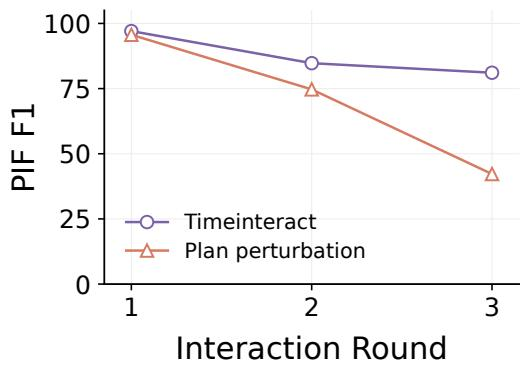

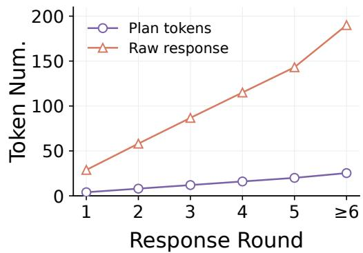  
Figure 7: Analysis of Plan Tokens. Left: PIF F1 across rounds with original and perturbed Plan embeddings. Right: mean history token counts for Plan Tokens and full response history.

As shown in Table 9, TIMEINTERACT achieves the highest precision, F1, and NQ-F1 in both single-turn and multi-turn OOD settings. In the multi-turn setting, its No-Query F1 reaches 37.40%, outperforming the strongest baseline by 21.87 percentage points. These results indicate that TIMEIN-TERACT generalizes well to OOD streams while maintaining effective response triggering.

Table 9: Response-triggering performance on the OOD test set. All scores are percentages. Bold and underlined values indicate the best and second-best results in each column, respectively.
<table><tr><td rowspan="2">Model</td><td rowspan="2">Size</td><td rowspan="2">Model Input</td><td rowspan="2">Native Streaming</td><td colspan="4">Single-turn</td><td colspan="4">Multi-turn</td></tr><tr><td>P</td><td>R</td><td>F1</td><td>NQ-F1</td><td>P</td><td>R</td><td>F1</td><td>NQ-F1</td></tr><tr><td colspan="10">General LLMs</td><td colspan="3"></td></tr><tr><td>Qwen2.5-7B-Instruct</td><td>7B</td><td>Text</td><td>x</td><td>55.86</td><td>43.78</td><td>49.09</td><td>26.00</td><td>82.67</td><td>65.23</td><td></td><td>72.93</td><td>9.60</td></tr><tr><td>Mistral-7B-Instruct-v0.3</td><td>7B</td><td>Text</td><td>x</td><td>16.31</td><td>57.30</td><td>25.39</td><td>13.94</td><td>35.94</td><td>60.94</td><td></td><td>45.22</td><td>7.96</td></tr><tr><td>Qwen3-14B</td><td>14B</td><td>Text</td><td>x</td><td>22.11</td><td>71.35</td><td>33.76</td><td>20.03</td><td>36.63</td><td>72.27</td><td></td><td>48.62</td><td>15.53</td></tr><tr><td colspan="10">Vision-Language Models</td><td colspan="3"></td></tr><tr><td>Qwen2.5-VL-7B</td><td>7B</td><td>Figure+Text</td><td>x</td><td>10.07</td><td>23.24</td><td>14.05</td><td>8.53</td><td></td><td>17.68</td><td>22.66</td><td>19.86</td><td>9.68</td></tr><tr><td>InternVL3.5-8B</td><td>8B</td><td>Figure+Text</td><td>x</td><td>9.92</td><td>100.00</td><td>18.05</td><td>11.58</td><td>13.95</td><td></td><td>100.00</td><td>24.49</td><td>9.62</td></tr><tr><td colspan="10">Time-Series Language Models</td><td colspan="3"></td></tr><tr><td>ChatTS</td><td>14B</td><td>TS+Text</td><td>x</td><td>10.85</td><td>60.00</td><td>18.38</td><td>13.84</td><td>11.07</td><td></td><td>32.81</td><td>16.55</td><td>9.77</td></tr><tr><td>TimeOmni-1</td><td>7B</td><td>TS+Text</td><td>x</td><td>51.25</td><td>22.16</td><td>30.94</td><td>11.39</td><td>80.21</td><td>30.08</td><td></td><td>43.75</td><td>5.66</td></tr><tr><td colspan="10">TS Interaction Model</td><td colspan="3"></td></tr><tr><td>TIMEINTERACT</td><td></td><td>4B Streaming TS+Text</td><td>J</td><td>69.01</td><td>63.78</td><td>66.29</td><td>41.75</td><td></td><td>92.42</td><td>76.17</td><td>83.51</td><td>37.40</td></tr></table>

## E BROADER IMPACT

Toward interactive time-series intelligence. To the best of our knowledge, this work is the first to introduce the concept of Time-Series Interaction, extending time-series language models from offline question answering toward real-time interaction over continuously evolving streams. Rather than treating time series as static inputs that are analyzed only after they are fully observed, our formulation emphasizes continuous perception, response timing, persistent instructions, proactive interaction, and adaptation to user feedback. We hope this perspective can stimulate further exploration of interactive intelligence for time-series data, including new model architectures, learning paradigms, benchmarks, and evaluation protocols for continuously evolving environments.

Potential for Edge Deployment. The streaming design of TIMEINTERACT shows strong potential for deployment on edge devices. Since observations are processed incrementally rather than repeatedly reencoding the entire historical sequence, TIMEINTERACT is naturally suited to continuously generated sensor streams. With further advances in lightweight model design, model compression, and efficient inference, such systems could potentially operate on wearable devices, mobile platforms, industrial controllers, and embedded monitoring systems, enabling low-latency interaction.

Human-centered Time-Series Interaction. TIMEINTERACT places users at the center of time-series interaction by allowing them to continuously express their needs through queries, instructions, and feedback. Users can decide what information is relevant, how the analysis should be presented, and how the interaction behavior should change as their goals evolve. Rather than forcing users to adapt to a fixed analysis procedure, the system can follow and refine its behavior according to user intent throughout the stream. This provides a more flexible and natural way for people to interact with evolving time-series data and supports more effective human–AI collaboration.

## F LIMITATIONS AND FUTURE WORK

Although STREAMTSI-34K provides large-scale time-series interaction data spanning both synthetic and real-world time series across multiple domains, the current interaction construction still relies primarily on synthetic scenarios. In practice, real-world settings involve much richer and more diverse interaction scenarios and user behaviors. Future work should therefore extend Time-Series Interaction to a broader range of real-world systems with native interactive capabilities, enabling the collection and study of more naturally occurring interaction scenarios and user behaviors. In addition, as Time-Series Interaction is still an emerging problem setting, establishing more standardized learning paradigms, benchmarks, and evaluation protocols will be important for advancing this direction.

## G CASE STUDIES

We provide six examples of streaming time-series interaction, comparing the response decisions and generated answers of TIMEINTERACT with representative baselines. Each case includes time-series observations, user queries or instructions when present, and reference responses to contextualize the model outputs. Figures 8–11 illustrate IQA, PIF, PTW, and UGA, respectively, covering query answering, instruction persistence, proactive warnings, and adaptation to user guidance. Figures 12 and 13 present two multi-turn scenarios combining PTW with PIF and IQA with PTW, respectively.

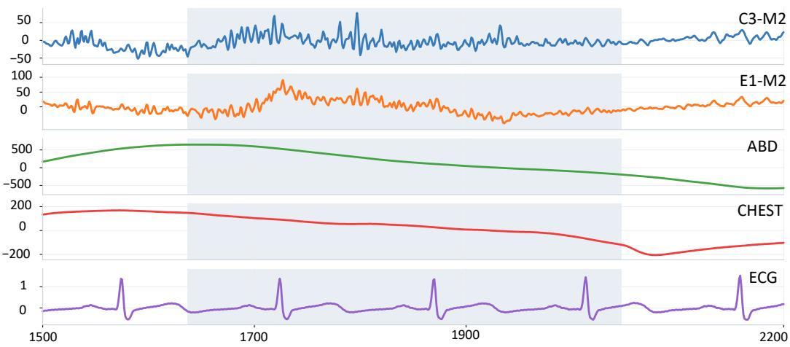  
User Query: What physiological pattern is represented by these highlighted signals?

GT: Repeated large transient deflections in C3-M2 and E1-M2, with transient ECG and respiratory changes, are most consistent with an arousal, such as a periodic-limb-movement-associated arousal. Expected Action: Respond
<table><tr><td rowspan=1 colspan=1>Model</td><td rowspan=1 colspan=1>Action</td><td rowspan=1 colspan=1>Response</td></tr><tr><td rowspan=1 colspan=1>Timelnteract</td><td rowspan=1 colspan=1>Respond</td><td rowspan=1 colspan=1>The sustained changes in C3-M2 and E1-M2, with transient ECG variationand comparatively continuous respiratory signals, areconsistent with anarousal-associated physiological change.</td></tr><tr><td rowspan=1 colspan=1>Qwen2.5-7B</td><td rowspan=1 colspan=1>Respond</td><td rowspan=1 colspan=1>... Overall, these patterns suggest a response to a stimulus or an eventthat causes a decrease in respiratory and cardiac activity while incre-)asing brain activity.</td></tr><tr><td rowspan=1 colspan=1>ChatTS-14B</td><td rowspan=1 colspan=1>Failed</td><td rowspan=1 colspan=1>The observed pattern is characterized by a sudden increase in EOGsignal between E1 and M2, with an amplitude of 30.31, ...Although nonew user request is present, it is advisable to inform the user aboutthis event due to its notable magnitude.</td></tr></table>

Figure 8: An example of IQA. TIMEINTERACT interprets the highlighted physiological signals as arousal-related changes, consistent with the reference response.

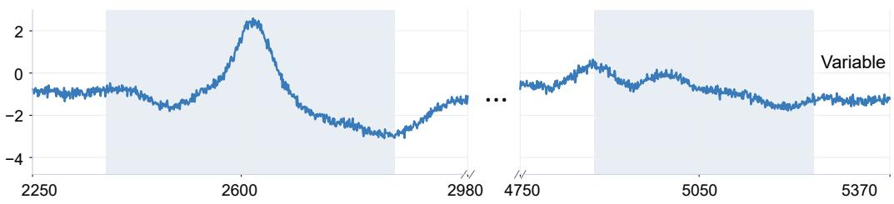  
User Instruction: Please watch this time series and report once every 2618 points.

GT: [1] This is Point 2618: first scheduled report.  
[2] This is Point 5236: second scheduled report.  
Expected Action: Respond
<table><tr><td rowspan=1 colspan=1>Model</td><td rowspan=1 colspan=1>[1] Response</td><td rowspan=1 colspan=1>[2] Response</td></tr><tr><td rowspan=2 colspan=1>Timelnteract</td><td rowspan=2 colspan=1>Action: RespondThis is Point 2618: first scheduled report.</td><td rowspan=1 colspan=1>Action: Respond</td></tr><tr><td rowspan=1 colspan=1>This is Point 5236: second scheduledreport.</td></tr><tr><td rowspan=1 colspan=1>Qwen2.5-7B</td><td rowspan=1 colspan=1>Action:Silence[No response – empty output]</td><td rowspan=1 colspan=1>Action:Silence[No response – empty output]</td></tr><tr><td rowspan=1 colspan=1>TimeOmni-1Ze</td><td rowspan=1 colspan=1>Action:Silence[No response – empty output]</td><td rowspan=1 colspan=1>Action:Silence[No response – empty output]</td></tr></table>

Figure 9: An example of PIF. TIMEINTERACT follows the user’s periodic-reporting instruction and responds at both scheduled points, while the baselines remain silent.

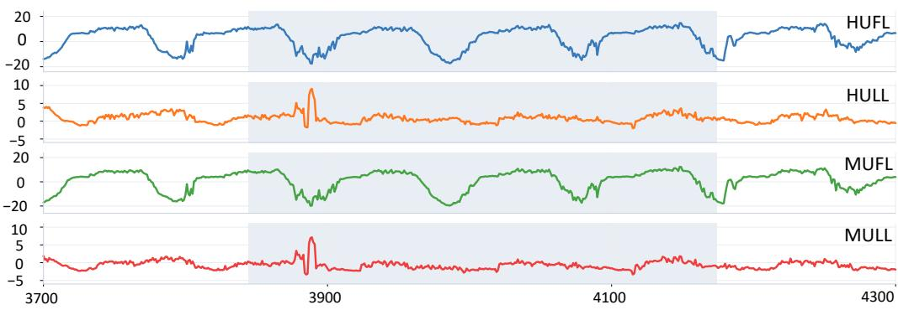

GT: Warning: From points 3884 to 3889, HULL and MULL swung from -1.407 and -2.878 to 9.109 and 7.143. Expected Action: Respond
<table><tr><td rowspan=1 colspan=1>Model</td><td rowspan=1 colspan=1>Action</td><td rowspan=2 colspan=1>ResponseWarning:Variable 2 is undergoingan upward spike.</td></tr><tr><td rowspan=1 colspan=1>Timelnteract</td><td rowspan=1 colspan=1>Respond</td></tr><tr><td rowspan=1 colspan=1>Mistral-7B-Instruct-v0.3</td><td rowspan=1 colspan=1>Respond</td><td rowspan=1 colspan=1>No significant anomalies or abrupt changes detected in the time-series data at this moment. Monitoring continues.</td></tr><tr><td rowspan=1 colspan=1>TimeOmni-1-7B</td><td rowspan=1 colspan=1>Silence</td><td rowspan=1 colspan=1>[No response – empty output]</td></tr></table>

Figure 10: An example of PTW. TIMEINTERACT warns of an upward spike without an explicit user query, while the baselines either report no anomaly or remain silent.

Question: [None]

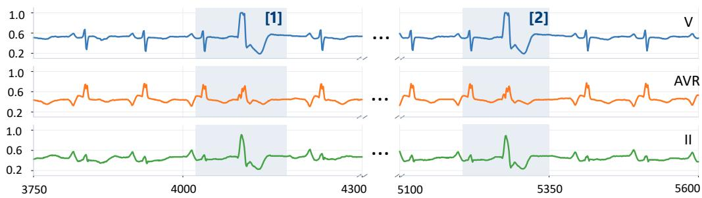  
User Instruction: Use the multi-channel excursion as my reference pattern and let me know when a similar pattern appears later.  
GT: A similar multi-channel excursion appeared again: V rose to 1.001, AVR to 0.709, and II to 0.890 before the readings declined.

GT: Understood. I will use the pattern as the reference and watch for later similar excursions. Expected Action: Respond

<table><tr><td rowspan=1 colspan=1>Model</td><td rowspan=1 colspan=1>[1] Response</td><td rowspan=1 colspan=1>[2] Response</td></tr><tr><td rowspan=2 colspan=1>Timelnteract</td><td rowspan=1 colspan=1>Action: RespondUnderstood. I willuse this pattern as</td><td rowspan=2 colspan=1>Action: RespondThe same multi-channel excursion as thereference pattern has appeared again.</td></tr><tr><td rowspan=1 colspan=1>occurrence.</td></tr><tr><td rowspan=1 colspan=1>Mistral-7B-Instruct-v0.3</td><td rowspan=1 colspan=1>Action: RespondI will monitor the time-series data andnotify you when a similar pattern tothe reference pattern appears later inthe data.</td><td rowspan=1 colspan=1>Action:Silence[No response – empty output]</td></tr><tr><td rowspan=1 colspan=1>ChatTS-14B</td><td rowspan=1 colspan=1>Action: FailedRaw_output:A similar pattern occurredbetween points 208–222, where Variable1 showed a slow rise followed by a rapiddecline, similar to the reference pattern.</td><td rowspan=1 colspan=1>Action:FailedRaw_output: Variable 2&#x27;s final value is0.43, which is lower than its startingvalue of 0.34. This decrease is due to theoverall trend being steady ...</td></tr></table>

Figure 11: An example of UGA. TIMEINTERACT adopts the demonstrated multichannel pattern as a reference and reports its later recurrence.

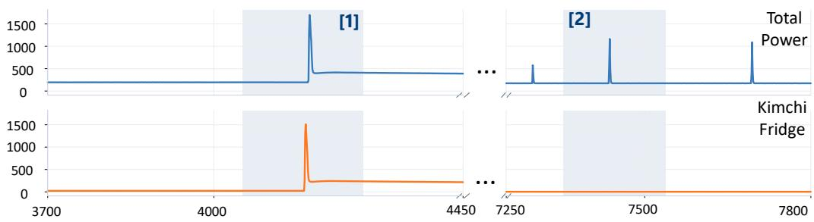  
User Query: [None].

GT: Warning: Whole-house and kimchi-fridge power underwent an extreme abrupt surge. Total power reached about 1700 W and kimchi-fridge power exceeded 1500 W before both declined. Expected action: Respond

User Instruction: Please notify me whenever whole-house power shows a brief, sharp spike from its nearby baseline.

GT: Notification: Another brief whole-house power spike occurred, reaching about 1166 W before returning toward baseline. Expected action: Respond

<table><tr><td rowspan=1 colspan=1>Model</td><td rowspan=1 colspan=1>[1] Proactive Temporal Warning</td><td rowspan=1 colspan=1>[2] Persistent InstructionFollowing</td></tr><tr><td rowspan=2 colspan=1>Timelnteract</td><td rowspan=2 colspan=1>Action: RespondWarning: Whole-house powerrose from about197 W to above 1,700 Wwhile kimchi-refrigeratorpower rose from about 23 W to above 1,500 W inthe same transient interval.</td><td rowspan=1 colspan=1>Action: RespondNotification: Whole-housepower briefly rose from about</td></tr><tr><td rowspan=1 colspan=1>174 W to above 1160 W andreturned near baseline.</td></tr><tr><td rowspan=1 colspan=1>Qwen2.5-7B</td><td rowspan=1 colspan=1>Action: RespondThere is a significant anomaly in Variable 1, wherethe values suddenlydrop to much lower levels(e.g., 249.82, 1305.86, 1701.33, etc.) ..</td><td rowspan=1 colspan=1>Action:Silence[No response – empty output]</td></tr><tr><td rowspan=2 colspan=1>Qwen3-14B</td><td rowspan=2 colspan=1>Action:Silence[No response – empty output]</td><td rowspan=1 colspan=1>Action:Silence</td></tr><tr><td rowspan=1 colspan=1>[No response – empty output]</td></tr></table>

Figure 12: An example of multi-turn interaction combining PTW and PIF. TIMEINTERACT first warns of a power surge, then follows a user instruction to report a later power spike.

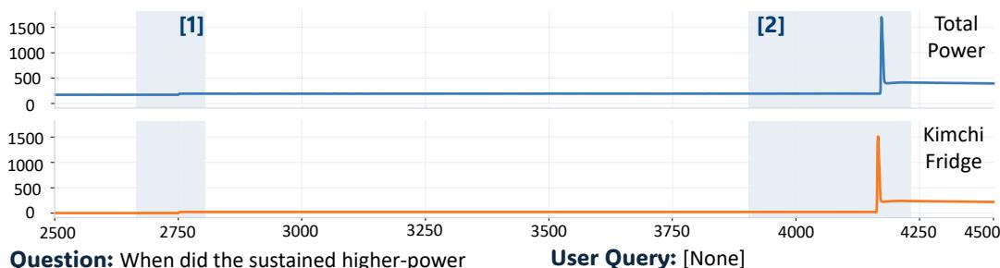  
Question: When did the sustained higher-power interval begin?  
GT: The sustained higher-power interval began around timestep 2751, when kimchi-fridge power rose from about 1.6 W toward 23 W and total power increased into the mid-190 W range.  
GT: Warning: Whole-house and kimchi-fridge power underwent an extreme abrupt surge. Total power reached about 1700 W and kimchi-fridge power exceeded 1500 W before both declined. Expected action: Respond

Expected action: Respond
<table><tr><td rowspan=1 colspan=1>Model</td><td rowspan=1 colspan=1>[1] Instant Query Answering</td><td rowspan=1 colspan=1>[2] Proactive Temporal Warning</td></tr><tr><td rowspan=1 colspan=1>Timelnteract</td><td rowspan=1 colspan=1>Action: RespondAround timestep 2800, total power rosefromabout 174 W to roughly 196 Wandremained near that higher level.</td><td rowspan=1 colspan=1>Action: RespondWarning: Whole-house power rosefrom about197 W to above 1700 Wwhile kimchi-refrigerator power rosefrom about23 W to above 1500 W inthe same transient interval.</td></tr><tr><td rowspan=2 colspan=1>Qwen2.5-7B</td><td rowspan=1 colspan=1>Action: RespondThe sustained higher-power interval began</td><td rowspan=2 colspan=1>Action:Silence[No response – empty output]</td></tr><tr><td rowspan=1 colspan=1>around the 13th observation. This intervallasted until the 25th observation.</td></tr><tr><td rowspan=1 colspan=1>Mistral-7B-Instruct-v0.3</td><td rowspan=1 colspan=1>Action: RespondThe sustained higher-power intervalappears to have started around the171stobservation,where Variable 1 value was172.62.</td><td rowspan=1 colspan=1>Action:Silence[No response – empty output]</td></tr></table>

Figure 13: An example of multi-turn interaction combining IQA and PTW. TIMEINTERACT estimates the onset of a higher-power interval and subsequently warns of a surge without a new query.