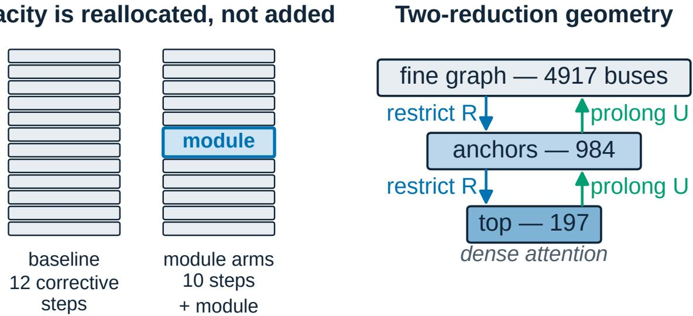
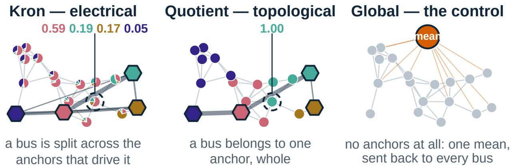
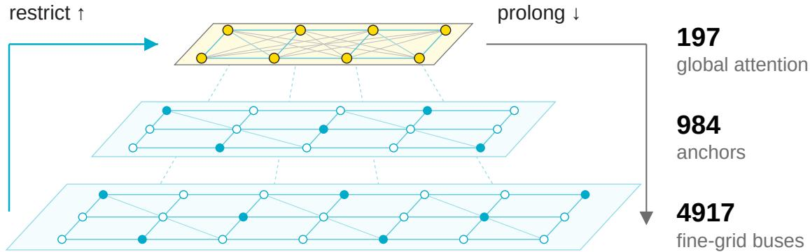
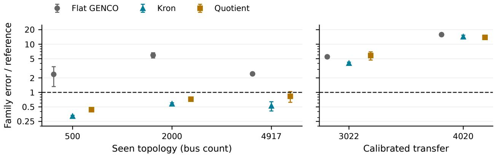
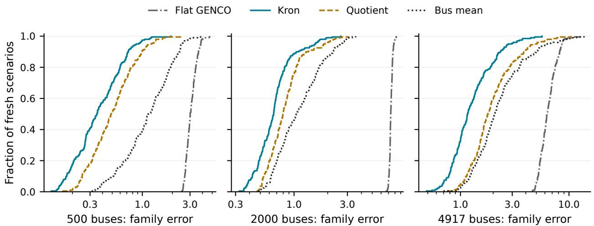
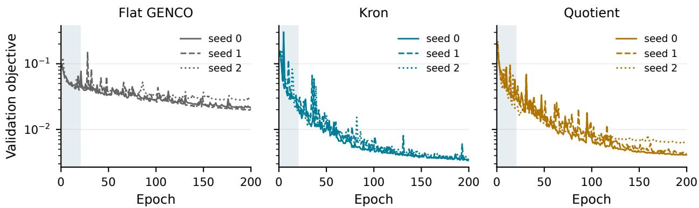

# TOWARDS HIERARCHICAL GNNS FOR MULTI-GRID POWER FLOW:GENERALIZATION ACROSS OPERATING SCENARIOS

PREPRINT

Carmine Delle Femine1,2, Leire Garin Atxaga1, Asier Diaz-Iglesias1, Juan Pablo Maroto Herrera1, Ane Miren Florez-Tapia1, Marco Quartulli1, Izaro Goienetxea Urkizu2

1Vicomtech Foundation, Department of Energy, Basque Research and Technology Alliance (BRTA), Donostia/San Sebastián, Spain

2Department of Languages and Information Systems, University of the Basque Country (UPV/EHU), Donostia/San Sebastián, Spain cdellefemine@vicomtech.org

22 September 2026

## ABSTRACT

Hierarchical latent communication improves the generalization of a multi-grid power-flow model to new operating scenarios. The module exchanges information through two reduced graphs within a GENCO-based corrective network. We compare Kron-derived transports, a same-anchor Quotient construction and a flat backbone in preliminary trainings of 200 epochs on three grid topologies, with three initialization seeds per model. Evaluation uses 200 newly generated, preselected scenarios per grid. On the training topologies, Kron reduces the macro family-balanced voltage error from 5.660 ± 0.899 to 0.851 ± 0.110: an 85.0% reduction relative to Flat GENCO and 31.0% relative to Quotient, which reaches 1.235 ± 0.225. Both hierarchical models outperform a per-bus mean fitted on training solutions on every training topology in all three seeds. These results demonstrate generalization across operating scenarios within the studied topologies, with one set of learned parameters shared across grids. Evaluation on two additional topologies distinguishes this achievement from cross-topology generalization: the current models do not yet outperform the fitted reference in that calibratedtransfer setting. This preprint presents the architecture and preliminary evidence for hierarchical communication as a component of multi-grid power-flow learning, with generalization to unseen topologies as the next development objective.

Keywords power flow · graph neural networks · hierarchical communication · Kron reduction

## 1 Introduction

A power-flow model must connect local electrical constraints with a voltage field that depends on the network as a whole. Corrective graph neural networks address this task through repeated local exchanges, intermediate voltage predictions and feedback from power-balance residuals. A hierarchy provides a complementary route: compress bus representations, exchange information on a smaller graph, and return the updated context to the original buses. This route is particularly relevant when one model serves several grid topologies and many operating conditions.

We introduce a two-reduction latent communication module within the GENCO solver in the GridFM development framework1. The module takes the place of two local corrective layers. One construction uses Kron-derived weights; another uses a graph quotient with the same retained buses. Both preserve the solver’s local correction and decoding machinery, while giving bus features a route through a compact graph with global attention (Figure 1).

The central result is generalization to new operating scenarios on the training topologies. In preliminary 200-epoch trainings on three grids, Kron reduces error on fresh scenarios by 85.0% relative to the flat backbone and by 31.0% relative to Quotient. Both hierarchical models outperform a per-bus mean of training solutions on every training grid in all three seeds. The improvement therefore extends to operating points outside the training set and exceeds a predictor that only stores an average state for each bus.

We distinguish two evaluation settings throughout the paper. Scenario generalization keeps the topology fixed and evaluates newly generated operating conditions. Topology generalization evaluates a grid absent from optimization. The present trainings demonstrate the former; the two additional-grid evaluations identify the latter as the next objective. This distinction locates the contribution within the broader development of models shared across grids.

This preprint develops three elements: the hierarchical exchange and its two transport constructions; a fresh-scenario comparison across three training topologies and three initialization seeds; and a separate assessment on two additional topologies. The trainings are preliminary: their fixed 200-epoch endpoints provide the current evidence while architecture and training design continue to develop.

  
Figure 1: Architecture schematic from the accompanying poster. The flat backbone has twelve corrective layers; the hierarchical variants use five layers, one module, and five further layers. The right panel shows the two reductions for the 4,917-bus grid, with 984 first-level anchors and 197 top-level nodes. Restriction aggregates latent features, attention exchanges global context, and prolongation returns it to the finer levels.

## 2 Related work

Graph learning for power flow. Donon et al. formulate a graph neural solver trained through Kirchhoff-law residuals and evaluate changes in operating conditions and grid structure [1]. PowerFlowNet uses message passing and higherorder graph convolutions for power-flow approximation, including transmission systems with thousands of buses [2]. Böttcher et al. study physics-based training under realistic distribution-grid constraints and across different grid topologies and supply tasks [3]. These studies motivate graph architectures that combine network structure with physical information. Our contribution is a latent hierarchical exchange within a corrective backbone, assessed by separating fresh operating scenarios on training topologies from calibrated transfer to additional topologies.

Electrical reduction and graph signals. Dörfler and Bullo analyze Kron reduction through Schur complements, including the reduced current–voltage relation and graph properties [4]. Van der Schaft characterizes resistive behavior at network terminals and the associated dissipation-minimizing interior voltages [5]. Shuman et al. combine node selection, Kron reduction and interpolation in a multiscale graph-signal transform [6]. Together these works explain how retained nodes can represent interactions mediated by eliminated paths. We use that construction to define latent transports and coarse edge features, then learn the feature updates inside the power-flow model.

Cell aggregation and learned pooling. Multilevel partitioning constructs coarse graphs by merging vertices and accumulating inter-cell edge weights; METIS provides a practical partitioning scheme [7]. Loukas formalizes aggregation and lifting and derives spectral and cut guarantees under restricted-approximation conditions [8]. DiffPool instead learns soft assignments and uses a bilinear assignment transform to build coarse adjacency matrices [9]. Our Quotient variant uses fixed one-hot cells with the same anchors as Kron. This makes the cell-based and electrical transports directly comparable within a common learned module; the partition is determined from geometry rather than learned from power-flow labels.

  
Figure 2: The coarsening comparison from the poster, computed on an illustrative 18-node weighted graph with four shared anchors. Each interior-node pie shows a row of the prolongation matrix U: several anchor weights for Kron, one unit weight for Quotient. Coarse-edge thickness represents coupling magnitude. The third panel illustrates a single global average as a conceptual comparison; the empirical study here compares Flat, Kron and Quotient. These are schematic constructions on a toy graph, not experimental grid measurements.

Multiscale physical models and shared grid representations. Bi-stride multi-scale GNNs use graph hierarchies for mesh-based simulation [10]; MG-GNN learns components of multilevel domain-decomposition methods [11]. These approaches motivate exchanging information over reduced graphs when local neighborhoods alone provide limited communication. The broader grid-foundation-model perspective emphasizes representations shared across operating conditions, tasks and networks [12]. The present preliminary study develops one such architectural component: a common set of learned transforms acting through grid-specific geometry, with scenario and topology generalization evaluated separately.

## 3 Kron and Quotient hierarchical communication

## 3.1 Backbone, notation and the poster schematic

The input is a heterogeneous graph of buses, generators and electrical connections. Each GENCO corrective layer exchanges features, decodes provisional voltages and generator quantities, computes branch flows and nodal mismatches, and reinjects the mismatch into the bus latent. Prescribed quantities are retained through the backbone’s known-value projection. The final decoder produces the power-flow state.

The flat model has twelve corrective layers. The hierarchical models have ten and apply the module after layer five (Figure 1). All use hidden size 48 and eight attention heads in the backbone; the bus latent entering the module has d = 384 channels. Parameter counts are 20,069,187 for Flat GENCO and 19,882,947 for each hierarchical model. The module updates bus features, while generator latents pass through unchanged.

At one reduction level, let N be the number of nodes, B the m retained buses (anchors), and I the N − m interior buses. Write the complex nodal admittance as $\boldsymbol { Y } \in \mathbb { C } ^ { \tilde { N } \times N }$ and the real latent features as $\dot { Z } \in \mathbb { R } ^ { N \times d }$ . We order nodes as (B, I) in the formulas. Both constructions retain the same anchors, but define different interior-to-anchor relations. Figure 2 shows this distinction on the poster’s small example: Kron assigns a distribution of weights to each interior bus, while Quotient assigns it to one cell.

anchor (kept)

eliminated bus

coarse edge, thicker = stronger

## 3.2 Kron reduction: eliminate interior variables

Kron reduction starts from the nodal current–voltage relation and eliminates the interior voltages [4]:

$$
\left[ i _ { B } \right] = \left[ Y _ { B B } \quad Y _ { B I } \right] \left[ \begin{array} { l } { v _ { B } } \\ { v _ { I } } \end{array} \right] .\tag{1}
$$

If $Y _ { I I }$ is invertible, the second block row gives

$$
v _ { I } = P v _ { B } + Y _ { I I } ^ { - 1 } i _ { I } , \qquad P = - Y _ { I I } ^ { - 1 } Y _ { I B } .\tag{2}
$$

Substitution into the first row yields the reduced system

$$
\underbrace { i _ { B } - Y _ { B I } Y _ { I I } ^ { - 1 } i _ { I } } _ { i _ { B } ^ { \mathrm { r e d } } } = S v _ { B } , \qquad S = Y _ { B B } - Y _ { B I } Y _ { I I } ^ { - 1 } Y _ { I B } .\tag{3}
$$

Thus $S \in \mathbb { C } ^ { m \times m }$ is the Schur complement, and $P \in \mathbb { C } ^ { ( N - m ) \times m }$ describes how retained voltages extend into the interior when $i _ { I } = 0$ . Equation (3) also shows explicitly how nonzero interior injections enter the reduced right-hand side. The reduced graph can couple anchors connected through eliminated paths, even when no direct fine-grid edge joins them. In computation, sparse linear solves produce $P$ and $S ;$ a dense inverse of the fine-grid matrix is unnecessary.

A real resistive network gives an intuitive interpretation. Let $L = L ^ { \mathsf { T } }$ be a connected weighted graph Laplacian with nonnegative conductances and no shunts, and let $\mathrm { ~ \textit ~ { ~ B ~ } ~ }$ be nonempty. Then $L _ { I I }$ is positive definite. In this paragraph, $P$ and S are Eqs. (2)–(3) evaluated with $Y = L$ . With anchor values z fixed, the interior values minimize the dissipation [5]:

$$
\operatorname* { m i n } _ { x } { \frac { 1 } { 2 } } \left[ z \right] ^ { \mathsf { T } } L \left[ z \right] = { \frac { 1 } { 2 } } z ^ { \mathsf { T } } S z , \qquad x = P z .\tag{4}
$$

Indeed, differentiating with respect to x gives $L _ { I I } x + L _ { I B } z = 0$ . With the full extension $E = [ I _ { m } ; P ]$ , this also gives $S = E ^ { \mathsf { T } } L E$ . Here $P$ is nonnegative and $P \mathbf { 1 } _ { m } = \mathbf { 1 } _ { N - m } \colon$ an interior value is a convex combination of anchor values [4]. These positivity and energy statements concern the real Laplacian setting. Equation (3) itself also applies to complex admittances whenever the required block is invertible.

## 3.3 From electrical extension to latent transport

The neural module uses the electrical construction to define fixed feature transports. Let $\widetilde { P }$ denote the retained extension coefficients after sparsification, and set $A = | \widetilde { P } |$ entrywise. Introduce the row and column sums

$$
a = A { \bf 1 } _ { m } , \qquad b = A ^ { \mathsf { T } } { \bf 1 } _ { N - m } , \qquad D _ { a } = \mathrm { d i a g } ( a ) , \quad D _ { b } = \mathrm { d i a g } ( b ) .
$$

The implemented prolongation and restriction are

$$
U = D _ { a } ^ { - 1 } A \in \mathbb { R } ^ { ( N - m ) \times m } , \qquad R = D _ { b } ^ { \dagger } A ^ { \mathsf { T } } \in \mathbb { R } ^ { m \times ( N - m ) } .\tag{5}
$$

Here $\boldsymbol { D } _ { b } ^ { \dagger }$ reciprocates positive diagonal entries and leaves zeros at zero; every row of A has positive mass. Consequently,

$$
( U C ) _ { i } = \sum _ { j \in B } \frac { A _ { i j } } { \sum _ { k } A _ { i k } } C _ { j } , \qquad ( R Z _ { I } ) _ { j } = \frac { \sum _ { i \in I } A _ { i j } Z _ { i } } { \sum _ { i \in I } A _ { i j } } ,\tag{6}
$$

with the latter defined as zero for an empty column. Prolongation mixes coarse features for each interior node; restriction averages interior features for each anchor. Their normalizations differ, so R is generally neither $U ^ { \mathsf { T } }$ nor an inverse of $U$

In the poster’s circled example, the Kron weights are approximately 0.59, 0.19, 0.17 and 0.05, ordered by the displayed colors and magnitudes. The corresponding interior bus receives a blend of four coarse features. The pies therefore visualize $U ;$ restriction uses the same coefficient magnitudes with the column normalization in Eq. (5). This distinction matters when reading the drawing as an aggregation rule.

At the first level, at most sixteen extension coefficients are retained per interior bus; the upper extension is untruncated. Coarse edges use the eight largest off-diagonal magnitudes per row above $1 0 ^ { - 3 }$ in the construction’s per-unit scale. Taking magnitudes and normalizing produces a nonnegative latent transport, while the retained coarse edge attributes carry real part, imaginary part, magnitude and phase. The feature update operates in $\mathbb { R } ^ { d } ;$ it uses the structure supplied by Kron reduction rather than directly solving Eq. (1) for AC voltages.

## 3.4 Quotient reduction: aggregate cells

Quotient reduction begins with a partition of all nodes into disjoint cells $\mathcal { C } _ { 1 } , \ldots , \mathcal { C } _ { m } .$ , each containing its retained anchor. The binary membership matrix is

$$
H _ { i j } = \left\{ { \begin{array} { l l } { 1 , } & { i \in { \mathcal { C } } _ { j } , } \\ { 0 , } & { { \mathrm { o t h e r w i s e } } , } \end{array} } \right. \qquad H \mathbf { 1 } _ { m } = \mathbf { 1 } _ { N } .\tag{7}
$$

The coarse admittance is

$$
Q = H ^ { \mathsf { T } } Y H , \qquad Q _ { j k } = \sum _ { u \in \mathcal { C } _ { j } } \sum _ { v \in \mathcal { C } _ { k } } Y _ { u v } .\tag{8}
$$

Each coarse entry therefore combines interactions between two cells. For a real weighted Laplacian $L ,$ an off-diagonal entry is minus the total conductance crossing the two cells; edges inside a cell cancel in $H ^ { \top } \dot { L } H$ . This is the usual hard graph-coarsening construction [8]. Assignment-based neural pooling uses a related bilinear construction, with learned soft assignments in place of the fixed one-hot H [9].

For a coarse signal $c ,$ Hc is piecewise constant: every node in a cell receives that cell’s value. Averaging a full fine-grid signal uses

$$
R _ { H } = ( H ^ { \mathsf { T } } H ) ^ { - 1 } H ^ { \mathsf { T } } , \qquad R _ { H } H = I _ { m } ,\tag{9}
$$

since $H ^ { \mathsf { T } } H$ is diagonal with the nonzero cell sizes [8]. This formula describes full-cell averaging. The module treats retained features separately, so its actual transports use only the interior rows $H _ { I } { : }$

$$
U _ { \mathrm { { Q } } } = H _ { I } , \qquad R _ { \mathrm { { Q } } } = \mathrm { d i a g } ( H _ { I } ^ { \mathsf { T } } \mathbf { 1 } ) ^ { \dagger } H _ { I } ^ { \mathsf { T } } .\tag{10}
$$

Each interior node receives one anchor feature, and each anchor receives the mean of its cell’s interior features. An anchor with no interior members receives zero as the input to the learned restriction map, while its own feature follows the direct retained-node path. In the poster, the same circled bus is entirely assigned to the green anchor, giving a unit weight instead of the four-way Kron blend.

The first-level cells are obtained with METIS [7]; one retained anchor per cell is supplied by the precomputed geometry. At the second level, nodes are assigned to the nearest retained anchor on the undirected support of the first quotient graph, with a deterministic anchor-order tie rule. Both variants use the same retained anchor sets. Hence Quotient changes the assignments and coarse couplings while preserving the hierarchy sizes used for comparison.

## 3.5 Why elimination and aggregation differ

Kron selects an interior extension by solving a linear equilibrium equation. Quotient selects a piecewise-constant subspace by fixing the cells. The difference is particularly explicit for a real Laplacian with the same retained anchors In $( \grave { B } , I )$ order, write $H = [ I _ { m } ; C ]$ and $E = [ \bar { I } _ { m } ; P ]$ . Completing the square in the quadratic form gives

$$
H ^ { \mathsf { T } } L H - S = ( C - P ) ^ { \mathsf { T } } L _ { I I } ( C - P ) \succeq 0 .\tag{11}
$$

For fixed anchor values, the harmonic extension minimizes dissipation, whereas the cell-constant extension imposes an additional constraint. Equation (11) is a comparison of exact real-Laplacian reductions. Neural prediction error is then measured separately after sparsification, magnitude normalization and learned feature updates.

As a small worked example, connect one interior node to two anchors by conductances a and b, with no direct anchor edge. Then

$$
\begin{array} { r } { P = \left[ \frac { a } { a + b } \quad \frac { b } { a + b } \right] , \qquad S = \frac { a b } { a + b } \left[ \begin{array} { l l } { 1 } & { - 1 } \\ { - 1 } & { 1 } \end{array} \right] . } \end{array}\tag{12}
$$

Kron interpolates between the anchor values and creates the series-equivalent conductance $a b / ( a + b )$ . If Quotient assigns the interior node to the first anchor, the edge of conductance a becomes internal to that cell, and the remaining inter-cell conductance is b. For $a = 3$ and $b = 1$ , Kron uses weights (0.75, 0.25) and a coarse conductance of 0.75; Quotient uses weights (1, 0) and a coarse conductance of 1. The same distinction appears across the many interior nodes of Figure 2.

<table><tr><td></td><td>Kron</td><td>Quotient</td></tr><tr><td>Exact coarse operator</td><td> $S = Y _ { B B } - Y _ { B I } Y _ { I I } ^ { - 1 } Y _ { I B }$ </td><td> $Q = H ^ { \mathsf { T } } Y H$ </td></tr><tr><td>Interior relation</td><td>Weighted electrical extension</td><td>One cell per node</td></tr><tr><td>Latent prolongation</td><td> $U = D _ { a } ^ { - 1 } | \widetilde { P } |$ </td><td> $U _ { \mathrm { Q } } = H _ { I }$ </td></tr><tr><td>Latent restriction</td><td>Column-normalized magnitudes</td><td>Mean over interior cell members</td></tr><tr><td>Poster encoding</td><td>Multi-color pies</td><td>Single-color nodes</td></tr><tr><td>Shared components</td><td colspan="2">Anchor sets, hierarchy sizes and learned update blocks</td></tr></table>

Table 1: The two constructions at a reduction level. Exact electrical/coarse operators define geometry; the neural module uses the stated real-valued latent transports. The poster’s colors encode prolongation weights.

## 3.6 Two reductions and the learned return path

Multiscale graph-signal constructions motivate repeated reduction and interpolation [6], while multiscale GNNs use coarse representations to exchange information across a physical domain [10, 11]. Our two reductions have approximate ratios of five to one. For the 4,917-bus grid, $n _ { 0 } = 4 9 1 7 , n _ { 1 } = 9 8 4$ and $n _ { 2 } = 1 9 7$ . The upper anchors are selected by a farthest-point rule on a relative-strength graph of the first Schur complement and shared between both variants. The two middle-level message-passing blocks use the sparsified first Schur or quotient graph; the top level uses dense attention.

At level $\ell \in \{ 0 , 1 \}$ , define the learned restriction step

$$
\mathcal { D } _ { \ell } ( Z ) = Z _ { B _ { \ell } } + \phi _ { \downarrow } ( R _ { \ell } Z _ { I _ { \ell } } ) .\tag{13}
$$

The retained feature is carried directly into its coarse representative, and a learned map adds the restricted interior context. With $\mathcal { M } _ { \mathrm { p r e } }$ and $\mathcal { M } _ { \mathrm { p o s t } }$ denoting the two coarse message-passing blocks and $\dot { \tau }$ the top attention block, the downward path is

$$
Z ^ { ( 1 ) } = \mathcal { M } _ { \mathrm { p r e } } ( \mathcal { D } _ { 0 } ( Z ^ { ( 0 ) } ) ) , \qquad Z ^ { ( 2 ) } = \mathcal { T } ( \mathcal { D } _ { 1 } ( Z ^ { ( 1 ) } ) ) .\tag{14}
$$

The top block has four attention heads, with each head computing softmax $( Q _ { h } K _ { h } ^ { \top } / \sqrt { d _ { h } } ) V _ { h }$ , followed by the output projection and residual feed-forward update. Here $Q _ { h } , K _ { h } , V _ { h }$ are learned projections of normalized top-level features, distinct from the quotient matrix Q in Eq. (8).

For the return path, let $\mathcal { L } _ { \ell } ( Z , C )$ restore the fine-level features from a saved state Z and evolved coarse state C:

$$
[ \mathcal { L } _ { \ell } ( Z , C ) ] _ { B _ { \ell } } = C , \qquad [ \mathcal { L } _ { \ell } ( Z , C ) ] _ { I _ { \ell } } = Z _ { I _ { \ell } } + \phi _ { \uparrow } ( [ Z _ { I _ { \ell } } , U _ { \ell } C ] ) .\tag{15}
$$

Brackets denote feature concatenation. Interior nodes receive an additive update combining their own state and prolonged context; retained nodes receive the evolved coarse state. The complete upward path is

$$
\widehat Z ^ { ( 1 ) } = \mathcal { M } _ { \mathrm { p o s t } } \Big ( \mathcal { L } _ { 1 } \big ( Z ^ { ( 1 ) } , Z ^ { ( 2 ) } \big ) \Big ) , \qquad \widehat Z ^ { ( 0 ) } = \mathcal { L } _ { 0 } \big ( Z ^ { ( 0 ) } , \widehat Z ^ { ( 1 ) } \big ) .\tag{16}
$$

The learned maps $\phi _ { \downarrow }$ and $\phi _ { \uparrow }$ are shared between levels. Geometry is computed from each grid’s topology and admittance, while the learned transforms are shared across grids. Figure 3 places these equations on the poster’s restriction–attention–prolongation path.

  
Figure 3: The poster’s multilevel communication diagram. The upward path follows Eqs. (13)–(14); the return follows Eqs. (15)– (16). Dense attention exchanges information among the 197 top-level nodes in the 4,917-bus example. Labels give actual hierarchy sizes; the network planes and displayed nodes are schematic.

## 4 Experimental setup

## 4.1 Preliminary multi-grid trainings

Each model is trained jointly on three GOC grids in the project’s PGLib-based collection2: 500, 2,000 and 4,917 buses. Two additional grids, with 3,022 and 4,020 buses, are reserved for the topology-transfer evaluation and supply no optimization or validation batches. Flat GENCO, Kron and Quotient each use three initialization seeds. All nine runs complete the planned 200 epochs; we evaluate their final checkpoints and include every seed. These are preliminary training runs in an ongoing architecture study.

The training splits contain 1,864 scenarios for each of the 500- and 2,000-bus grids and 1,664 for the 4,917-bus grid, with 217 validation scenarios per training topology. A balanced sampler draws 1,856 examples from each grid per epoch. Batches contain sixteen scenarios from one grid, giving 348 optimizer updates per epoch: 69,600 updates in total, or 23,200 per training topology.

The primary test uses fresh scenarios generated separately from the development splits. New generation seeds produce a pool of 2,331 scenarios per grid; 200 scenario identifiers per grid are selected before generation. The resulting 1,000 test scenarios are shared by all nine final checkpoints. Normalizers and per-bus reference predictors retain their fits from the training or calibration splits. The fresh solutions are used only for evaluation. We also report the original 234-scenario test panels as development context.

## 4.2 Objective and normalization

Training uses AdamW with initial learning rate $5 \times 1 0 ^ { - 4 } , ( \beta _ { 1 } , \beta _ { 2 } ) = ( 0 . 9 , 0 . 9 9 9 )$ ) and full precision. The learning rate is held fixed through the first twenty validation monitors. Thereafter a plateau scheduler multiplies it by 0.7 after five non-improving monitors. The common objective combines masked bus mean-squared error and intermediate physics residuals:

$$
\mathcal { L } _ { t } = 0 . 9 \mathcal { L } _ { \mathrm { b u s } } + 0 . 1 \operatorname* { m i n } \biggl ( 1 , \frac { t } { 6 9 6 0 } \biggr ) \mathcal { L } _ { \mathrm { p h y s i c s } } .\tag{17}
$$

The bus term uses voltage magnitudes and angles in per-unit/radian representation. The physics term averages intermediate residuals with normalized geometric weights of base 0.5, favoring later corrective layers. Validation and test use the stationary full-strength objective; the ramp applies during training. All models share this scheduler policy, with learning-rate trajectories determined by their validation losses.

Normalization is fitted once per training grid. Each additional topology uses a separate calibration split to fit the same scalar normalizer. This scalar depends on a percentile of loads and solved generator powers; the additional-grid evaluation is therefore calibrated transfer. Calibration scenarios contribute to preprocessing and reference fitting, while optimization uses only the three training topologies. Coarsening uses each grid’s topology and admittance.

## 4.3 Metrics, references and aggregation

For each scenario, we compute voltage-magnitude RMSE over unknown magnitude entries and wrapped angle RMSE over unknown angle entries. The family-balanced error is

$$
e = { \sqrt { { \frac { 1 } { 2 } } \left[ \left( { \frac { r _ { V } } { 0 . 0 1 { \mathrm { p . u . } } } } \right) ^ { 2 } + \left( { \frac { r _ { \theta } } { 1 ^ { \circ } } } \right) ^ { 2 } \right] } } .\tag{18}
$$

The fixed scaling balances the two voltage families. We average scenario errors within each grid and then weight grids equally, separately for the three training and two additional topologies. Reported means and sample standard deviations describe the three initialization seeds. Physical residuals provide a complementary measure: per-bus Euclidean active/reactive mismatch, averaged over buses after known-value projection and converted to a common 100-MVA base.

The nominal reference predicts unit voltage magnitude and zero angle, retaining prescribed quantities. The bus-mean reference predicts each bus’s mean solved voltage fitted on training or calibration scenarios. Comparing the learned model with this same-scenario reference tests whether it improves on a topology-specific average state.

The prespecified descriptive comparisons require Kron’s macro-error ratio to be at most 0.90 in each seed, together with a lower three-seed mean on all three training grids. The same criterion is applied against Flat and Quotient. For topology transfer, the target additionally requires improving on Flat and the fitted reference on each additional grid in every seed. These are descriptive evaluation rules for the preliminary study.

## 5 Results

## 5.1 Generalization across operating scenarios

The hierarchical models generalize to new operating points on the three training topologies. Kron reaches a macro family error of 0.851 ± 0.110, compared with 5.660 ± 0.899 for Flat GENCO and 1.235 ± 0.225 for Quotient (Table 2). This is an 85.0% reduction relative to Flat and 31.0% relative to Quotient. The fitted bus-mean reference reaches

<table><tr><td>Model</td><td>Fresh: seen</td><td>Fresh: transfer</td><td>Dev: seen</td><td>Dev: transfer</td></tr><tr><td>Flat GENCO</td><td> $5 . 6 6 0 \pm 0 . 8 9 9$ </td><td> $1 0 . 6 0 7 \pm 0 . 1 0 8$ </td><td> $5 . 6 4 0 \pm 0 . 9 0 7$ </td><td> $1 0 . 6 1 5 \pm 0 . 1 0 3$ </td></tr><tr><td>Kron</td><td> $0 . 8 5 1 \pm 0 . 1 1 0$ </td><td> $8 . 9 8 3 \pm 0 . 5 2 1$ </td><td> $0 . 8 5 5 \pm 0 . 1 0 3$ </td><td> $9 . 0 1 2 \pm 0 . 4 9 5$ </td></tr><tr><td>Quotient</td><td> $1 . 2 3 5 \pm 0 . 2 2 5$ </td><td> $9 . 9 7 2 \pm 0 . 9 1 2$ </td><td> $1 . 2 4 7 \pm 0 . 2 2 2$ </td><td> $9 . 9 7 7 \pm 0 . 9 5 2$ </td></tr><tr><td>Bus-mean reference</td><td>1.747</td><td>1.106</td><td>1.762</td><td>1.116</td></tr><tr><td>Nominal reference</td><td>19.825</td><td>17.450</td><td>19.863</td><td>17.491</td></tr></table>

Table 2: Macro family error after 200 training epochs, mean ± sample standard deviation over three seeds. Seen and transfer macros average three and two grids equally. Fresh panels contain 200 scenarios per grid; development panels contain 234. Reference fits are fixed across both evaluations. Lower is better.

1.747. Results on the fresh and development panels are close, showing that the measured gains extend to the separately generated scenarios.

Both hierarchical models outperform the bus-mean reference on each training topology in all three seeds. Figure 4 places the gain relative to this reference, and Table 3 gives the per-grid values. The comparison uses each seed’s mean over 200 fresh scenarios. Even the closest comparison, Quotient on the 4,917-bus grid in seed 2, favors the learned model: 2.675 versus 2.686.

  
Figure 4: Fresh-scenario family error relative to each grid’s fitted bus-mean reference. Markers show means over three seeds; error bars show one sample standard deviation, scaled by the fixed reference. Values below one improve on the reference. The left panel demonstrates scenario generalization on training topologies; the right separately shows the present calibrated-transfer results on additional topologies.

Figure 5 shows the distribution over individual fresh operating scenarios for each training grid. Each model curve uses the mean error across its three initialization seeds for each scenario. This complements the grid-level summaries by displaying the range of operating-point errors alongside the bus-mean predictor.

Kron/Flat macro ratios are 0.157, 0.150 and 0.145 for seeds 0, 1 and 2; Kron/Quotient ratios are 0.840, 0.585 and 0.680. Kron also has lower three-seed mean error on all three training grids for both comparisons. It therefore meets both prespecified descriptive rules within this training recipe.
<table><tr><td>Grid</td><td>Role</td><td>Bus mean</td><td>Flat GENCO</td><td>Kron</td><td>Quotient</td></tr><tr><td>500</td><td>Seen</td><td>1.310</td><td> $3 . 1 0 4 \pm 1 . 3 7 2$ </td><td> $0 . 4 2 1 \pm 0 . 0 1 7$ </td><td> $0 . 5 7 4 \pm 0 . 0 3 8$ </td></tr><tr><td>2000</td><td>Seen</td><td>1.245</td><td> $7 . 3 6 1 \pm 0 . 9 1 9$ </td><td> $0 . 7 2 2 \pm 0 . 0 3 7$ </td><td> $0 . 9 0 0 \pm 0 . 0 9 1$ </td></tr><tr><td>4917</td><td>Seen</td><td>2.686</td><td> $6 . 5 1 6 \pm 0 . 4 0 8$ </td><td> $1 . 4 1 1 \pm 0 . 3 0 7$ </td><td> $2 . 2 3 0 \pm 0 . 5 5 8$ </td></tr><tr><td>3022</td><td>Transfer</td><td>1.333</td><td> $7 . 3 0 4 \pm 0 . 5 5 5$ </td><td> $5 . 3 8 9 \pm 0 . 2 6 1$ </td><td> $7 . 7 5 4 \pm 1 . 5 0 7$ </td></tr><tr><td>4020</td><td>Transfer</td><td>0.880</td><td> $1 3 . 9 1 0 \pm 0 . 7 6 8$ </td><td> $1 2 . 5 7 6 \pm 0 . 9 7 5$ </td><td> $1 2 . 1 9 0 \pm 0 . 9 6 6$ </td></tr></table>

Table 3: Family error on fresh scenarios, mean ± sample standard deviation across three seeds. Each seed uses the same 200 scenarios per grid. “Seen” denotes a topology included in training; all evaluated operating scenarios are new. Bus-mean references use only training or calibration solutions.

  
Figure 5: Error distributions on fresh operating scenarios for the three training topologies. Each curve is an empirical cumulative distribution over the same 200 scenarios; neural-model errors are averaged over three seeds separately for each scenario. The reference uses its own error on each matching scenario. A curve further left reaches the same fraction of scenarios at a lower error. The curves describe scenario variation; they are not confidence intervals across seeds.

## 5.2 Topology transfer as the next development stage

The two additional grids distinguish scenario generalization from topology generalization. On the 3,022-bus grid, Kron reduces mean family error from Flat’s 7.304 to 5.389; Quotient reaches 7.754. On the 4,020-bus grid, Kron and Quotient reach 12.576 and 12.190 versus Flat’s 13.910. Their fitted references are 1.333 and 0.880, respectively. All three models remain above those references in every seed, so these preliminary trainings do not yet demonstrate useful cross-topology generalization by the stated criterion.

Physical residuals give a complementary target for the next stage. Both hierarchical models reduce mean residual relative to Flat on all three training topologies. On the additional topologies their residuals are higher: 1.169 and 1.554 for Kron and Quotient versus 0.432 for Flat on the 3,022-bus grid, and 1.944 and 2.086 versus 0.419 on the 4,020-bus grid (Table 5). Further topology-transfer development therefore needs to address both voltage accuracy and power-balance consistency.

## 5.3 Learning in the preliminary training regime

Figure 6 shows the nine validation trajectories. The hierarchical models attain lower final validation objectives than Flat under the common training policy. The first twenty epochs combine a training physics ramp with a fixed learning rate, while validation remains full strength throughout. These curves document the current 200-epoch learning regime; further training and recipe development remain available directions rather than established explanations for topology transfer.

  
Figure 6: Validation trajectories of all nine preliminary trainings on a common logarithmic scale. Line style identifies the initialization seed. During the shaded first twenty epochs, training ramps the physics term and holds the learning rate fixed; validation uses the stationary full-strength objective throughout. This objective differs from the family-balanced test error.

## 6 Discussion and next steps

The main outcome is positive scenario generalization from preliminary multi-grid training. One shared hierarchical model predicts fresh operating conditions across the three training topologies, and both transport constructions outperform a topology-specific average-state reference in every seed. Kron’s stronger result against both Flat and Quotient makes the electrical transport construction a useful direction for further development within this architecture

The distinction between scenarios and topologies provides the next research question. New loads and operating conditions preserve the grid’s structure; a new topology also changes the geometry through which latent information travels. The present results establish the first capability on the selected grids. The additional-grid evaluation places cross-topology generalization at the next stage, including transfer of physical consistency. Those grids use solved calibration data for normalization and reference fitting, so this evaluation concerns calibrated transfer.

These 200-epoch trainings are provisional endpoints in an ongoing study. Broader topology coverage and further training-policy development can now be assessed using the same separation between fresh scenarios and additional grids. Depth-matched comparisons and interventions on the transport operators would help explain the source of the gain: the current module replaces two corrective layers, and the two hierarchical variants share retained anchors. Three seeds describe initialization variation for the studied grids.

Recorded training times span 5.17–7.13 hours for Flat, 5.96–8.79 for Kron and 5.94–8.83 for Quotient across H100 nodes. Peak allocated CUDA memory spans 35.51–35.52, 32.24–32.26 and 31.75–31.77 GiB, respectively. These values describe the current training workflow. A dedicated resource study can assess time and cost to reach a specified accuracy, including geometry preprocessing.

## 7 Conclusion

Preliminary multi-grid trainings demonstrate generalization to fresh operating scenarios on three training topologies. A hierarchical latent exchange reduces Kron’s macro family error to 0.851, compared with 5.660 for Flat and 1.235 for Quotient. Both hierarchical models improve on the fitted bus-mean reference on every training grid in all three seeds. The architecture thus provides a useful component for learning across operating conditions with shared model parameters. Generalization to unseen topologies remains the next objective, supported by a separate evaluation of voltage accuracy and physical consistency.

## Acknowledgments

This work was carried out in the context of SYSTEMICO, supported by the European Union under grant agreement 101269929. The authors thank the GridFM community for the open-source development framework.

## References

[1] B. Donon, R. Clément, B. Donnot, A. Marot, I. Guyon, and M. Schoenauer, “Neural networks for power flow: Graph neural solver,” Electric Power Systems Research, vol. 189, p. 106547, 2020. [Online]. Available: https://doi.org/10.1016/j.epsr.2020.106547

[2] N. Lin, S. Orfanoudakis, N. O. Cardenas, J. S. Giraldo, and P. P. Vergara, “PowerFlowNet: Power flow approximation using message passing graph neural networks,” International Journal ofElectrical Power & Energy Systems, vol. 160, p. 110112, 2024. [Online]. Available: https://doi.org/10.1016/j.ijepes.2024.110112

[3] L. Böttcher et al., “Solving AC power flow with graph neural networks under realistic constraints,” in 2023 IEEE Belgrade PowerTech, 2023, pp. 1–7. [Online]. Available: https://doi.org/10.1109/PowerTech55446.2023.10202246

[4] F. Dörfler and F. Bullo, “Kron Reduction of Graphs With Applications to Electrical Networks,” IEEE Transactions on Circuits and Systems I: Regular Papers, vol. 60, no. 1, pp. 150–163, 2013.

[5] A. van der Schaft, “Characterization and partial synthesis of the behavior of resistive circuits at their terminals,” Systems & Control Letters, vol. 59, no. 7, pp. 423–428, 2010. [Online]. Available: https://doi.org/10.1016/j.sysconle.2010.05.005

[6] D. I. Shuman, M. J. Faraji, and P. Vandergheynst, “A multiscale pyramid transform for graph signals,” IEEE Transactions on Signal Processing, vol. 64, no. 8, pp. 2119–2134, 2016. [Online]. Available: https://doi.org/10.1109/TSP.2015.2512529

[7] G. Karypis and V. Kumar, “A Fast and High Quality Multilevel Scheme for Partitioning Irregular Graphs,” SIAM Journal on Scientific Computing, vol. 20, no. 1, pp. 359–392, 1998.

[8] A. Loukas, “Graph reduction with spectral and cut guarantees,” Journal of Machine Learning Research, vol. 20, no. 116, pp. 1–42, 2019. [Online]. Available: https://jmlr.org/papers/v20/18-680.html

[9] Z. Ying, J. You, C. Morris, X. Ren, W. Hamilton, and J. Leskovec, “Hierarchical graph representation learning with differentiable pooling,” in Advances in Neural Information Processing Systems, S. Bengio, H. Wallach, H. Larochelle, K. Grauman, N. Cesa-Bianchi, and R. Garnett, Eds., vol. 31. Curran Associates, Inc., 2018, pp. 4800–4810. [Online]. Available: https://proceedings.neurips.cc/paper\_files/paper/2018/file/e77dbaf6759253c7c6d0efc5690369c7-Paper.pdf

[10] Y. Cao, M. Chai, M. Li, and C. Jiang, “Efficient Learning of Mesh-Based Physical Simulation with Bi-Stride Multi-Scale Graph Neural Network,” in Proceedings of the 40th International Conference on Machine Learning, ser. Proceedings of Machine Learning Research, vol. 202. PMLR, 2023, pp. 3541–3558. [Online]. Available: https://proceedings.mlr.press/v202/cao23a.html

[11] A. Taghibakhshi, N. Nytko, T. U. Zaman, S. Maclachlan, L. Olson, and M. West, “MG-GNN: Multigrid Graph Neural Networks for Learning Multilevel Domain Decomposition Methods,” in Proceedings ofthe 40th International Conference on Machine Learning, ser. Proceedings of Machine Learning Research, vol. 202. PMLR, 2023, pp. 33 381–33 395. [Online]. Available: https://proceedings.mlr.press/v202/taghibakhshi23a.htm

[12] H. F. Hamann et al., “Foundation models for the electric power grid,” Joule, vol. 8, no. 12, pp. 3245–3258, 2024.

## A Additional numerical results

<table><tr><td>Model</td><td>Grid group</td><td>Seed 0</td><td>Seed 1</td><td>Seed 2</td><td> $\mathbf { M e a n } \pm \mathbf { S D }$ </td></tr><tr><td>Flat GENCO</td><td>Seen</td><td>5.274</td><td>5.019</td><td>6.688</td><td> $5 . 6 6 0 \pm 0 . 8 9 9$ </td></tr><tr><td>Kron</td><td>Seen</td><td>0.830</td><td>0.753</td><td>0.971</td><td> $0 . 8 5 1 \pm 0 . 1 1 0$ </td></tr><tr><td>Quotient</td><td>Seen</td><td>0.988</td><td>1.287</td><td>1.428</td><td> $1 . 2 3 5 \pm 0 . 2 2 5$ </td></tr><tr><td>Flat GENCO</td><td>Transfer</td><td>10.637</td><td>10.696</td><td>10.487</td><td> $1 0 . 6 0 7 \pm 0 . 1 0 8$ </td></tr><tr><td>Kron</td><td>Transfer</td><td>8.809</td><td>8.571</td><td>9.568</td><td> $8 . 9 8 3 \pm 0 . 5 2 1$ </td></tr><tr><td>Quotient</td><td>Transfer</td><td>10.949</td><td>9.823</td><td>9.144</td><td> $9 . 9 7 2 \pm 0 . 9 1 2$ </td></tr></table>

Table 4: Fresh-scenario macro family errors for each initialization seed, separately for the three training and two calibrated-transfer topologies. Every run completes 200 epochs and uses its final checkpoint. Means and sample standard deviations are computed across the displayed seed macros.

<table><tr><td>Grid</td><td>Model</td><td>Family error</td><td>Vm [p.u.]</td><td>Angle [deg]</td><td>Residual</td></tr><tr><td>3022</td><td>Flat GENCO</td><td>7.304</td><td>0.0162</td><td>10.20</td><td>0.432</td></tr><tr><td>3022</td><td>Kron</td><td>5.389</td><td>0.0131</td><td>7.50</td><td>1.169</td></tr><tr><td>3022</td><td>Quotient</td><td>7.754</td><td>0.0158</td><td>10.85</td><td>1.554</td></tr><tr><td>4020</td><td>Flat GENCO</td><td>13.910</td><td>0.0303</td><td>19.43</td><td>0.419</td></tr><tr><td>4020</td><td>Kron</td><td>12.576</td><td>0.0297</td><td>17.52</td><td>1.944</td></tr><tr><td>4020</td><td>Quotient</td><td>12.190</td><td>0.0360</td><td>16.76</td><td>2.086</td></tr></table>

Table 5: Fresh-scenario transfer channels, averaged first over 200 scenarios and then over three seeds. Voltage-magnitude and angle entries are means of scenario RMSEs. Physical residuals use the common 100-MVA base.

<table><tr><td>Model</td><td>Seed 0</td><td>Seed 1</td><td>Seed 2</td><td> $\mathbf { M e a n } \pm \mathbf { S D }$ </td></tr><tr><td>Flat GENCO</td><td>10.687</td><td>10.795</td><td>10.576</td><td> $1 0 . 6 8 6 \pm 0 . 1 1 0$ </td></tr><tr><td>Kron</td><td>5.731</td><td>8.724</td><td>8.190</td><td> $7 . 5 4 8 \pm 1 . 5 9 6$ </td></tr><tr><td>Quotient</td><td>8.936</td><td>9.489</td><td>9.191</td><td> $9 . 2 0 5 \pm 0 . 2 7 7$ </td></tr><tr><td>Flat, constant physics</td><td>10.899</td><td>39.103</td><td>10.753</td><td> $2 0 . 2 5 2 \pm 1 6 . 3 2 6$ </td></tr></table>

Table 6: Context from earlier twenty-epoch trainings on ten topologies, with a bus-mean macro reference of 1.412. This training regime used 2,320 updates per topology and a different scheduler policy, compared with 23,200 updates per topology in the main study. The topology set also differs; this table supplies training context rather than a controlled comparison of training duration. All seeds of the optional constant-physics control are included.