# TRAIN WHERE THE QUANTIZED MODEL GOES:ON-POLICY DISTILLATION FOR LOW-BIT REASONING

Yuanteng Chen1,2,3,\*, Zhilei Liu1,2,\*, Peisong Wang1,2,†, Yuantian Shao1,5, Chuangyi Li1,2, Weining Wang1,2,3, Shuang Qiu4, Gang Li1,2, Jing Liu1,2,3, Jian Cheng1,2,3,†

1 Institute of Automation, Chinese Academy of Sciences

2 School of Artificial Intelligence, University of Chinese Academy of Sciences 3 Zhongguancun Academy 4 City University of Hong Kong 5 NJUST 水 Equal contribution † Corresponding authors

## ABSTRACT

Quantization-aware distillation (QAD) restores much of the short-form questionanswering performance lost to sub-3-bit quantization, yet leaves mathematical and code reasoning substantially impaired. Long generations often degenerate into repetitive loops, exhausting the decoding budget without completing a solution. We trace this gap to quantization-amplified exposure bias: QAD trains on fixed corpus prefixes, while quantization-induced deviations compound along the model’s own autoregressive trajectories. To address this mismatch, we introduce an on-policy distillation (OPD) stage that places teacher supervision where the quantized model actually goes. Starting from a QAD checkpoint, the student generates through the quantized forward path used at deployment and receives feedback from a frozen full-precision teacher on its own prefixes, combining dense token-level guidance with task-verifier rewards. Across four models at 2.79 and 1.88 effective bits, OPD raises average BF16 performance retention from 35% to 70% on MATH-500 and from 66% to 91% on HumanEval while preserving shortform performance, with reasoning gains substantially exceeding those of continued teacher-forced QAD in matched-budget comparisons. By coupling QAD’s stable low-bit initialization with OPD’s on-policy reasoning recovery, our framework provides a comprehensive sub-3-bit solution that preserves broad capabilities while restoring long-form reasoning. Code is available at GitHub.

## 1 INTRODUCTION

Large language models (DeepSeek-AI, 2025) impose substantial memory and bandwidth demands, limiting inference efficiency and deployment on constrained hardware. Quantization (Dettmers et al., 2022) reduces these costs by representing model weights at lower precision while retaining the original architecture. Pushing precision below three bits offers substantial compression, making extreme low-bit quantization an attractive route to deploying capable models with fewer resources.

At four bits and above, post-training quantization (PTQ) (Frantar et al., 2023; Shao et al., 2024a) often preserves performance with only a small calibration set. Below three bits, however, quantization errors become harder to compensate for, and direct PTQ can severely degrade or even collapse model performance. This makes quantization-aware training (QAT) (Liu et al., 2024; Ma et al., 2024) essential for adapting the model to low-bit computation. Conventional QAT typically relies on pretraining-style data and objectives, while modern models acquire much of their instructionfollowing and reasoning capabilities during post-training. Quantization-aware distillation (QAD) provides a practical route to recovering these capabilities: a full-precision teacher supervises its quantized counterpart on a manageable distillation corpus.

Our study reveals a sharp imbalance in what QAD recovers. Across four models and two effective bit widths, QAD retains an average of 82% of BF16 performance on short-form question answering, but only 35% on MATH-500. Long generations expose a striking failure mode: the quantized model enters repetitive loops and exhausts its decoding budget without completing a solution. The recovery deficit becomes more pronounced on tasks requiring longer generations, making the ability to sustain and complete extended reasoning a central target of low-bit recovery.

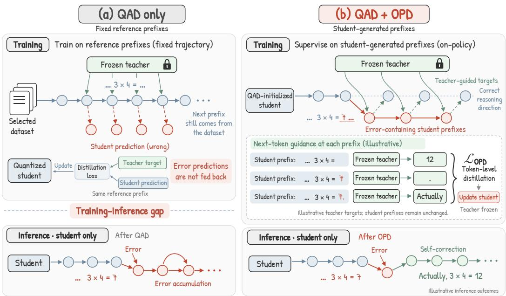  
Normal token Erroneous token Teacher target / recovered token  
Figure 1: Two-stage recovery below three bits. QAD provides a stable low-bit initialization through teacher supervision on fixed corpus prefixes, but that supervision leaves a training–inference gap on reasoning: the model is never trained on the trajectories it actually generates at deployment. OPD closes this gap by sampling through the deployment quantized path and combining token-level teacher guidance on student prefixes with verifier rewards.

We trace this gap to quantization-amplified exposure bias. QAD trains the quantized student to match its teacher on prefixes drawn from a fixed corpus. During deployment, the student instead conditions on its own previous predictions. Quantization perturbs the next-token distribution at every step, and each departure changes the context for the predictions that follow. Even a locally plausible continuation can move the model away from the trajectories covered during training. Over a long generation, these deviations accumulate, exposing the student to states on which it has received little supervision. The missing guidance therefore lies along the reasoning trajectories the quantized model actually generates.

We address this gap with a two-stage recovery framework that follows QAD initialization with on-policy distillation (OPD). QAD first restores broad capabilities and provides a viable low-bit policy. OPD then places teacher supervision on that policy’s own trajectories. The student samples completions through the quantized forward path used at deployment, and a frozen BF16 teacher provides token-level feedback on the prefixes it produces. Generating through the low-bit path makes quantization-induced changes in the student’s behavior part of the training distribution itself. Task verifiers supply complementary rewards for final-answer correctness in mathematics and successful test execution in code. By shifting teacher supervision from fixed corpus prefixes to the quantized student’s own trajectories, OPD targets the accumulated deviations that disrupt long-form reasoning.

We evaluate this framework on Qwen3-0.6B, Qwen3-1.7B, Qwen3-4B, and Falcon3-1B at 2.79 and 1.88 effective bits. Building on QAD initialization, OPD raises average BF16 retention from 35% to 70% on MATH-500 and from 66% to 91% on HumanEval while preserving short-form performance, with reasoning gains substantially exceeding those of continued teacher-forced QAD under matched corpora and optimizer-step budgets. OPD accounts for a larger share of recovery at lower bit widths, making on-policy recovery increasingly valuable under aggressive quantization. With only a few hundred additional optimizer steps, the combined pipeline couples QAD’s stable low-bit initialization with OPD’s reasoning recovery to preserve broad capabilities and restore longform reasoning below three bits.

## 2 RELATED WORK

## 2.1 EXTREME LOW-BIT QUANTIZATION AND REASONING RECOVERY

Post-training quantization (PTQ) compresses pretrained models using a small calibration set (Frantar et al., 2023; Shao et al., 2024a). Techniques such as activation-aware scaling (Xiao et al., 2023; Lin et al., 2024), rotations (Ashkboos et al., 2024), mixed precision, and vector quantization (Chee et al., 2023; Egiazarian et al., 2024) reduce quantization error and preserve performance at moderate precision. More aggressive compression motivates quantization-aware training (QAT), which updates model parameters through a simulated low-bit forward pass so that the model adapts to quantization during training (Liu et al., 2024; Ma et al., 2024). Quantization-aware distillation (QAD) augments this process with a full-precision teacher, transferring output distributions or intermediate representations to recover the quantized student’s capabilities (Du et al., 2024). In teacher-forced QAD, this supervision is evaluated on prefixes drawn from a fixed corpus.

Recent studies examine the particular challenges of reasoning under extreme quantization. Lee et al. (2026) identify how quantization errors concentrated on low-entropy tokens propagate along a chain of thought. Lv et al. (2026) show that reinforcement learning applied to a collapsed low-bit model requires a distillation cold start to establish a viable policy.

## 2.2 EXPOSURE BIAS AND ON-POLICY DISTILLATION

Exposure bias arises when a model is trained on reference prefixes but conditions on its own predictions during autoregressive inference. Once generation departs from the reference trajectory, subsequent predictions depend on contexts that training may not have covered. Work in imitation learning (Ross et al., 2011) and sequence modeling addresses this mismatch by exposing the learner to its own outputs, including through scheduled sampling (Bengio et al., 2015) and sequence-level training (Ranzato et al., 2016).

On-policy distillation brings teacher supervision directly onto these student-generated trajectories (Gu et al., 2024; Agarwal et al., 2024). The student samples completions, and the teacher supplies targets on the prefixes the student actually visits. Relative to teacher-forced distillation (Kim & Rush, 2016), OPD changes the distribution of prefixes receiving supervision (Ko et al., 2024). Relative to reward-only training, it provides token-level teacher feedback throughout each completion. This combination supports reasoning recovery by aligning dense supervision with the student’s own generation behavior. We adapt this idea, established in full-precision post-training (Lu & Thinking Machines Lab, 2025), to extreme low-bit quantization.

## 3 WHAT TEACHER-FORCED RECOVERY LEAVES BEHIND

To understand what QAD recovers and what it leaves behind, we quantize Qwen3-0.6B, Qwen3- 1.7B, and Qwen3-4B using round-to-nearest (RTN) at effective weight precisions of 2.79 and 1.88 bits, with 8-bit activations and 4-bit embedding and output-head weights. We then recover the resulting six quantized checkpoints using the EdgeRazor QAD recipe (Zhang et al., 2026). Evaluation covers mathematical reasoning on GSM8K, MATH-500, and AMC23, code generation on HumanEval and MBPP, and 9 short-form question-answering benchmarks (QA9), with retention defined as each checkpoint’s performance as a percentage of the corresponding BF16 reference.

RTN leaves these models with zero accuracy on all five generative benchmarks. QAD restores useful behavior, but the recovery is strikingly uneven across short answers and extended reasoning.

## 3.1 SHORT ANSWERS RECOVER, LONG DERIVATIONS DO NOT

The performance recovered by QAD separates into three distinct bands in Figure 2. Averaged over the six settings, the QAD checkpoints retain 86% of BF16 performance on QA9. Retention falls to 56% on GSM8K and 59% on MBPP, then drops further to 27% on MATH-500 and 16% on AMC23.

What distinguishes these bands is how much the model must generate for itself. QA9 scores answer options by likelihood and requires no autoregressive generation. The BF16 reference generates roughly 130 tokens on GSM8K and MBPP, compared with about 410 on MATH-500 and 3,200

(a) averaged over the six settings  
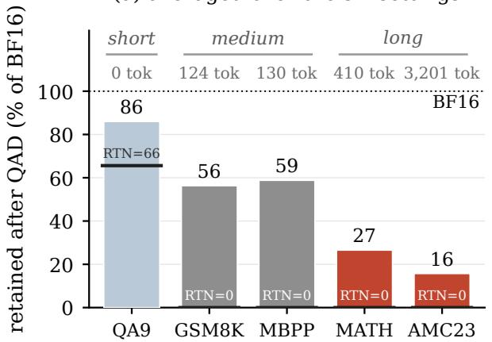  
shorter ⟵ required response ⟶ longer

(b) each of the six settings  
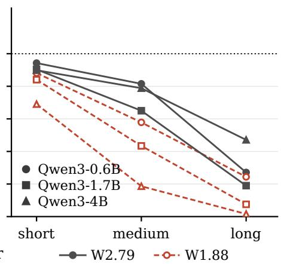  
Figure 2: QAD retention relative to BF16 across three Qwen3 scales and two bit widths. (a) Benchmarks ordered by mean BF16 generation length (shown above the bars); horizontal marks indicate RTN retention. QA9 uses answer-option likelihoods without generation; MATH denotes MATH-500. (b) Mean retention decreases from short- to medium- to long-form tasks in every setting.

on AMC23. GSM8K and MBPP require different outputs, an arithmetic derivation and a working program, yet their comparable generation lengths are accompanied by similar retention.

Figure 2(b) shows the same decline from short to medium to long responses in every model–bitwidth setting. The recovery gap therefore grows where the student must sustain a longer chain of its own predictions.

## 3.2 QUANTIZATION AMPLIFIES EXPOSURE BIAS

This dependence on the student’s own predictions exposes a mismatch in teacher-forced QAD. Its teacher supervision is evaluated on fixed prefixes taken from the training corpus, while deployment visits prefixes the quantized student generates for itself. Quantization amplifies this mismatch by changing the trajectories the student follows.

At each generation step, quantization perturbs the next-token distribution. Once this changes the selected token, every subsequent prediction conditions on a different prefix. The continuation need not be incorrect: even a plausible alternative can carry the student beyond the trajectories covered by teacher forcing. Further predictions then combine quantization error with the effects of that altered context, allowing deviations to accumulate along the sequence. Lower precision increases the disruption, and longer generations provide more opportunities for it to compound.

This mechanism predicts a breakdown that unfolds during generation: as deviations accumulate, responses become harder to terminate and increasingly prone to repetition.

## 3.3 QAD LOSES THE TRAJECTORY, NOT THE ARITHMETIC

We track these two behaviors in the BF16 and W2.79 QAD checkpoints of Qwen3-0.6B, using greedy generation on 200 problems each from GSM8K and MATH-500. Figure 3(a, b) shows the fraction of responses still generating after t tokens, while Figure 3(c) shows the fraction whose closing words repeat an 8-gram.

The clearest breakdown appears on MATH-500: 95% of QAD generations exhaust the decoding budget, compared with 27% for BF16. Moreover, 70% of QAD outputs end in repeated 8-grams, against 12% for BF16. The model continues producing tokens, but its reasoning becomes trapped in repetitions that prevent it from reaching a conclusion.

The curves reveal how this gap develops. BF16 and QAD have similar termination patterns over the first few dozen tokens, but their curves separate as generation continues. Shorter GSM8K responses follow the same pattern with smaller gaps: 32% of QAD responses exhaust the budget, versus 5% for BF16, while repetition rates are 30% and 2%. The longer reasoning required by MATH-500 exposes a much greater breakdown in the ability to sustain and complete a solution.

(a) GSM8K  
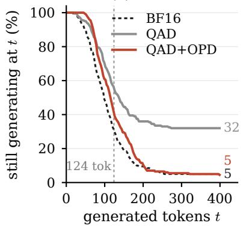

(b) MATH-500  
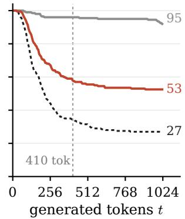

(c) ends in a loop (%)  
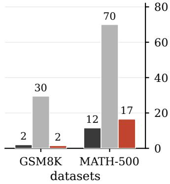  
Figure 3: OPD restores trajectory control after QAD. Qwen3-0.6B at W2.79 is evaluated with greedy decoding on 200 problems per benchmark. (a, b) Fraction of responses still generating after t tokens on GSM8K and MATH-500. Vertical dashed lines mark mean BF16 response lengths; endpoint labels report budget exhaustion rates. (c) Fraction of responses ending in repeated 8-grams.

These failed generations make the supervision gap concrete. QAD teaches the student how to continue demonstrated trajectories, but the model must complete its reasoning from prefixes produced by its own perturbed predictions. Recovering this missing ability calls for extending teacher supervision to the reasoning trajectories the quantized model actually generates.

## 4 ON-POLICY DISTILLATION FOR LOW-BIT REASONING

Long-form reasoning breaks down along the quantized model’s own trajectories; recovering it calls for teacher guidance along those same paths. We therefore combine QAD initialization with onpolicy distillation. QAD first restores broad capabilities and establishes a viable low-bit policy, providing the foundation for rollout-based recovery: a round-to-nearest model at these widths has nothing worth sampling and earns no reward to bootstrap from. OPD then trains the student on trajectories sampled through its deployment quantized forward path, with a frozen BF16 teacher guiding its continuations and task verifiers rewarding successful solutions. The two stages divide the work of recovery: QAD restores policy viability; OPD restores trajectory control.

## 4.1 FROM TEACHER FORCING TO STUDENT FORCING

Let $\pi _ { \mathrm { T } }$ denote a frozen BF16 teacher and $\pi _ { \theta }$ the student policy evaluated through the quantized forward path used at deployment. Teacher-forced QAD learns from a corpus D of prompt–response pairs by minimizing

$$
\mathcal { L } _ { \mathrm { T F } } ( \theta ) = \mathbb { E } _ { ( x , y ) \sim \mathcal { D } } \left[ \sum _ { t = 1 } ^ { | y | } \mathrm { K L } ( \pi _ { \mathrm { T } } ( \cdot \mid x , y _ { < t } ) \parallel \pi _ { \theta } ( \cdot \mid x , y _ { < t } ) ) \right] .\tag{1}
$$

Here, each prefix $y _ { < t }$ comes from a fixed reference response. Student forcing instead draws prompts x from a set X and samples a completion ${ \hat { y } } \sim \pi _ { \theta } ( \cdot \mid x )$ , placing teacher supervision on the resulting student-generated prefixes:

$$
\mathcal { L } _ { \mathrm { S F } } ( \theta ) = \mathbb { E } _ { x \sim \mathcal { X } } \mathbb { E } _ { \hat { y } \sim \pi _ { \theta } ( \cdot | x ) } \left[ \sum _ { t = 1 } ^ { | \hat { y } | } \mathrm { K L } ( \pi _ { \theta } ( \cdot \mid x , \hat { y } _ { < t } ) \parallel \pi _ { \mathrm { T } } ( \cdot \mid x , \hat { y } _ { < t } ) ) \right] .\tag{2}
$$

Sampling through the quantized forward path makes the effects of low-bit computation part of the training distribution itself. The teacher therefore guides the student on continuations shaped by quantization, including departures from the reference trajectories. We use reverse KL because it can be estimated from student samples and penalizes continuations that the student favors but the teacher assigns low probability to.

## 4.2 LEARNING FROM QUANTIZED ROLLOUTS

To translate this supervision into successful reasoning, we combine on-policy teacher feedback with task-verifier rewards. For each prompt $x \in \mathcal { X }$ , the student generates $G$ completions through the quantized forward path. The frozen teacher scores those same token sequences, and a verifier assigns each completion a reward $r ( x , \hat { y } )$ : final-answer correctness for mathematics and test execution for code. We optimize

$$
\mathcal { L } _ { \mathrm { O P D } } ( \theta ) = - \mathbb { E } \left[ \sum _ { t } \hat { A } ( x , \hat { y } ) \log \pi _ { \theta } ( \hat { y } _ { t } \mid x , \hat { y } _ { < t } ) \right] ~ + ~ \beta \mathbb { E } \left[ \sum _ { t } \log \frac { \pi _ { \theta } ( \hat { y } _ { t } \mid x , \hat { y } _ { < t } ) } { \pi _ { \mathrm { T } } ( \hat { y } _ { t } \mid x , \hat { y } _ { < t } ) } \right] ,\tag{3}
$$

where $\hat { A }$ is the advantage of $r ( x , \hat { y } )$ relative to the other completions for the same prompt (Shao et al., 2024b), both expectations are over $x \sim \mathcal { X }$ and ${ \hat { y } } \sim \pi _ { \theta } ( \cdot \mid x )$ , and $\beta$ controls the strength of teacher guidance. We use $\beta = 1$ in every run reported here, so the balance between the two terms is never tuned per setting. The two signals guide recovery at complementary scales: the sampled reverse-KL term supplies token-level feedback on the prefixes the student actually generates, while the group-relative advantage promotes completions that reach verified solutions.

## 4.3 OPD RESTORES TRAJECTORY CONTROL

Training on these trajectories directly improves the generation behaviors that break down after QAD. For the Qwen3-0.6B W2.79 checkpoint examined above, Figure 3(a–c) shows the clearest recovery on MATH-500. OPD reduces the loop rate from 70% to 17%, close to the BF16 rate of 12%, and cuts budget exhaustion from 95% to 53%. Accuracy rises alongside this behavioral recovery, from 10.4% to 24.2%, approaching the BF16 reference of 27.2%.

On GSM8K, the loop rate falls from 30% to 2% and budget exhaustion from 32% to 5%, matching the BF16 reference on both measures. The larger improvement on MATH-500 mirrors the greater disruption on longer generations: OPD recovers more ground where QAD’s trajectory failures are most severe. By extending teacher guidance onto the student’s own prefixes, OPD helps the low-bi model sustain a derivation and bring it to a conclusion.

## 5 EXPERIMENTS

We evaluate reasoning recovery across four models and two effective bit widths, examining the preservation of broad capabilities, the contribution of OPD at lower precision, OPD’s recovery efficiency relative to QAD, and how the recovered models compare with existing methods.

## 5.1 EXPERIMENTAL SETUP

Models and quantization. We evaluate Qwen3-0.6B, 1.7B, and 4B (Qwen Team, 2025), together with Falcon3-1B-Instruct (Falcon-LLM Team, 2024), spanning model scales and architectures. Following Zhang et al. (2026), we use 2.79 and 1.88 effective bits per weight, allocating 50% and 12.5% of weight groups to 4 bits, respectively, and the remainder to 1.58 bits. Embedding and output-head weights use 4 bits and activations 8 bits. Appendix A details how we reproduced the QAD stage.

Table 1: OPD phases. The code phase resumes from the selected mathematics checkpoint. Each optimizer step draws 8 prompts and G completions. GSM8K, MATH L1–3, and MBPP are taken from the training splits and do not overlap the evaluation sets.
<table><tr><td>Phase</td><td>Training corpus</td><td>Steps</td><td>LR</td><td>G</td><td>Rollouts</td></tr><tr><td>Math</td><td>GSM8K, MATH L1–3, DAPO-Math</td><td>80-140</td><td> $3 \times 1 0 ^ { - 6 }$ </td><td>4</td><td>32</td></tr><tr><td>Code</td><td>MBPP, KodCode</td><td>80-150</td><td> $3 \times 1 0 ^ { - 6 }$ </td><td>8</td><td>64</td></tr></table>

Table 2: Four models at two effective bit widths, from the BF16 reference down to RTN and back up through QAD and OPD; the shaded row is the OPD result for each line.
<table><tr><td colspan="3"></td><td>GSM8K</td><td>MATH-500</td><td>AMC23</td><td>MBPP</td><td>HumanEval</td><td>QA9 (avg)</td></tr><tr><td rowspan="7">Qwen3-0.6B</td><td colspan="2">BF16</td><td>41.62</td><td>27.20</td><td>7.81</td><td>40.0</td><td>36.6</td><td>46.08</td></tr><tr><td rowspan="5"></td><td>W2.79 RTN</td><td>0.00</td><td>0.00</td><td>0.00</td><td>0.0</td><td>0.0</td><td>34.87</td></tr><tr><td>QAD</td><td>32.75</td><td>10.40</td><td>1.25</td><td>33.7</td><td>29.9</td><td>43.43</td></tr><tr><td>+OPD</td><td>43.14</td><td>24.20</td><td>4.69</td><td>37.7</td><td>35.4</td><td>43.64</td></tr><tr><td>W1.88RTN</td><td>0.00</td><td>0.00</td><td>0.00</td><td>0.0</td><td>0.0</td><td>34.74</td></tr><tr><td>QAD +OPD</td><td>23.05 37.65</td><td>2.40</td><td>3.12</td><td>24.1</td><td>22.0</td><td>40.62</td></tr><tr><td rowspan="6"></td><td>BF16</td><td></td><td></td><td>15.00</td><td>3.12</td><td>35.7</td><td>35.4</td><td>41.83</td></tr><tr><td>W2.79 RTN</td><td></td><td>68.76</td><td>54.40</td><td>31.72</td><td>54.0</td><td>67.1</td><td>54.54</td></tr><tr><td></td><td></td><td>0.00</td><td>0.00</td><td>0.00</td><td>0.0</td><td>0.0</td><td>35.49</td></tr><tr><td rowspan="4"></td><td>QAD</td><td>44.50</td><td>19.60</td><td>0.62</td><td>35.3</td><td>41.5</td><td>49.28</td></tr><tr><td>+ OPD</td><td>54.28</td><td>45.60</td><td>19.38</td><td>52.0</td><td>59.1</td><td>51.81</td></tr><tr><td>W1.88RTN</td><td>0.00</td><td>0.00</td><td>0.00</td><td>0.0</td><td>0.0</td><td>35.22</td></tr><tr><td>QAD + OPD</td><td>26.46 44.05</td><td>8.20</td><td>0.00</td><td>26.1</td><td>24.4</td><td>45.85</td></tr><tr><td rowspan="8">Qwen3-4B</td><td>BF16</td><td></td><td></td><td>24.20</td><td>3.12</td><td>41.3</td><td>45.1</td><td>47.90</td></tr><tr><td>W2.79 RTN</td><td></td><td>86.35</td><td>68.80</td><td>55.00</td><td>67.6</td><td>82.3</td><td>61.63</td></tr><tr><td rowspan="5"></td><td></td><td>0.00</td><td>0.00</td><td>0.00</td><td>0.0</td><td>0.0</td><td>34.80</td></tr><tr><td>QAD</td><td>69.45</td><td>39.80</td><td>20.00</td><td>52.2</td><td>62.2</td><td>55.38</td></tr><tr><td>+OPD</td><td>77.86</td><td>54.40</td><td>39.38</td><td>57.8</td><td>64.0</td><td>57.37</td></tr><tr><td>W1.88 RTN</td><td>0.00</td><td>0.00</td><td>0.00</td><td>0.0</td><td>0.0</td><td>34.78</td></tr><tr><td>QAD +OPD</td><td>17.36</td><td>2.20</td><td>0.00</td><td>11.6</td><td>11.0</td><td>42.56</td></tr><tr><td></td><td></td><td>64.59</td><td>36.00</td><td>16.25</td><td>48.7</td><td>60.4</td><td>52.83</td></tr><tr><td rowspan="8">Falcon3-1B -Instruct</td><td>BF16</td><td></td><td>41.55</td><td>23.00</td><td>6.25</td><td>26.8</td><td>17.7</td><td>54.17</td></tr><tr><td></td><td>W2.79 RTN</td><td>0.00</td><td>0.40</td><td>0.00</td><td>0.0</td><td>0.0</td><td>37.74</td></tr><tr><td></td><td>QAD</td><td>36.32</td><td>16.00</td><td>5.00</td><td>24.6</td><td>20.7</td><td>52.89</td></tr><tr><td>W1.88 RTN</td><td>+OPD</td><td>38.89</td><td>19.20</td><td>2.50</td><td>24.1</td><td>20.7</td><td>53.03</td></tr><tr><td></td><td></td><td>0.00</td><td>0.60</td><td>0.00</td><td>0.0</td><td>0.0</td><td>35.36</td></tr><tr><td></td><td>QAD</td><td>31.61</td><td>12.40</td><td>2.50</td><td>21.0</td><td>14.6</td><td>49.53</td></tr><tr><td></td><td>+OPD</td><td>35.03</td><td>16.20</td><td>6.25</td><td>24.3</td><td>20.1</td><td>49.58</td></tr></table>

Implementation. Every OPD run starts from the reported QAD checkpoint, which keeps the QAD and OPD numbers measured from a common starting point. Recovery then proceeds in two phases, a mathematics phase followed by a code phase that resumes from the selected mathematics checkpoint; Table 1 lists the corpora, step budgets, and rollout settings, including the DAPO-Math (Yu et al., 2025) and KodCode (Xu et al., 2025) training sets. We train with verl (Sheng et al., 2025) and generate with vLLM (Kwon et al., 2023), using non-thinking mode at temperature 1. The two precisions stay separate within a step: BF16 master weights receive the updates, while rollouts pass through the deployment quantized forward path. Each student is supervised by its own BF16 counterpart as the frozen teacher, with a shared tokenizer; Qwen3-0.6B is the one exception and takes Qwen3-1.7B. Appendix F examines teacher choice. The learning rate is $3 \times 1 0 ^ { - 6 }$ , except for the Falcon3 code phase, which uses $1 \times 1 0 ^ { - 6 }$ . We checkpoint every 20 steps during OPD and select by validation on the current phase’s metric. Appendix E plots the phase-1 curves as an example.

Evaluation. GSM8K (Cobbe et al., 2021) and MATH-500 (Lightman et al., 2024) follow the lmeval protocol (Gao et al., 2024). AMC23 uses avg@16 over 40 problems. Code generation is measured by pass@1 on 448 MBPP problems (Austin et al., 2021) and 164 HumanEval problems (Chen et al., 2021). QA9 averages ARC-Easy, ARC-Challenge, HellaSwag, SocialIQA, OpenBookQA, PIQA, WinoGrande, TruthfulQA and MMLU, with per-task scores in Appendix B.

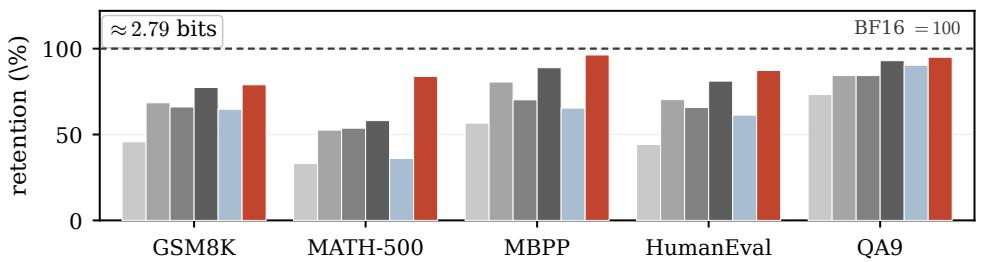

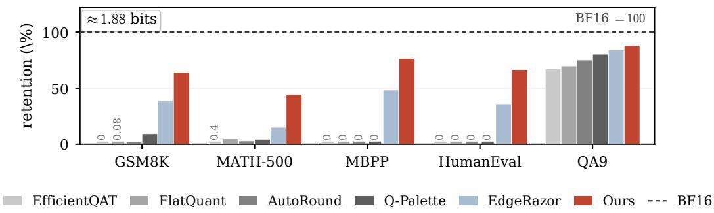  
Figure 4: Qwen3-1.7B as retention of the BF16 reference. Baselines are aligned to our deployment setting of W2.79/W1.88 with INT8 activations, and to INT4 embedding and lm head. Methods without mixed-precision support fall back to the next whole width, 3 and 2 bits in the two bands, which leaves them above our budget; Appendix C gives the builds.

## 5.2 RECOVERING REASONING WHILE PRESERVING BROAD CAPABILITIES

For each configuration, Table 2 compares four arms: the BF16 reference, RTN, QAD, and QAD+OPD. Building on QAD initialization, OPD substantially restores mathematical and code reasoning. OPD doubles average BF16 retention on MATH-500 from 35.3% to 69.7% and raises GSM8K retention from 62.7% to 85.0%. Across the six Qwen3 configurations, GSM8K accuracy improves by 8.41–47.23 percentage points. Code generation improves alongside mathematical reasoning. At 2.79 bits, Qwen3-1.7B raises MBPP from 35.3% to 52.0% and HumanEval from 41.5% to 59.1%, approaching the corresponding BF16 scores of 54.0% and 67.1%.

OPD successfully preserves the broad capabilities restored by QAD, with mean QA9 retention increasing from 88.1% to 92.1%, so the combined pipeline restores reasoning while maintaining short-form performance. OPD’s contribution grows as precision falls. Across all four models, OPD accounts for a larger share of total GSM8K recovery from RTN at 1.88 bits than at 2.79 bits. For Qwen3-4B, this share rises from 11% to 73%: at 1.88 bits, OPD raises GSM8K accuracy from 17.36% to 64.59% and MBPP from 11.6% to 48.7%.

## 5.3 RECOVERY EFFICIENCY

Table 3: Training cost of QAD initialization and OPD recovery.
<table><tr><td>Model</td><td>Stage</td><td>Steps</td><td>Wall- clock</td><td>GPU- hours</td></tr><tr><td>Qwen3-4B</td><td>QAD</td><td>6,400</td><td>102h</td><td>820</td></tr><tr><td>(W1.88)</td><td>OPD</td><td>260</td><td>14h</td><td>57</td></tr><tr><td>Falcon3-1B</td><td>QAD</td><td>6,400</td><td>32h</td><td>253</td></tr><tr><td>(W2.79)</td><td>OPD</td><td>245</td><td>2.8 h</td><td>11</td></tr></table>

approximately 14–23× fewer GPU-hours than QAD initialization. QAD initialization.

OPD converts training steps into reasoning gains far more efficiently than continued teacher-forced QAD, yielding more GSM8K points per thousand optimizer steps from the same starting checkpoint by up to 42× where continued QAD still gains at all. This translates into substantially lower cost. Table 3 reports the two stages from the training logs: the OPD stage uses 57 GPU-hours against 820 for QAD on Qwen3-4B at 1.88 bits, and 11 against 253 on Falcon3-1B at 2.79 bits, completing recovery with

Table 4: Controlled comparison of OPD and continued QAD under a matched budget. Both arms share starting checkpoints, corpora, phase schedules, step counts, learning rates, and samples per step. OPD leads in all 16 comparisons. Baselines are re-evaluated separately for this control.
<table><tr><td>Model</td><td>Width Arm</td><td></td><td>GSM8K</td><td>MATH-500</td><td>MBPP</td><td>HumanEval</td></tr><tr><td rowspan="6">Qwen3-0.6B</td><td rowspan="3"></td><td>QAD start</td><td>33.21</td><td>10.00</td><td>33.7</td><td>29.9</td></tr><tr><td>W2.79 + QAD, matched</td><td>35.10</td><td>15.60</td><td>31.7</td><td>30.5</td></tr><tr><td>+OPD</td><td>43.14</td><td>24.20</td><td>37.7</td><td>35.4</td></tr><tr><td rowspan="3"></td><td>QAD start</td><td>22.52</td><td>2.60</td><td>24.1</td><td>22.0</td></tr><tr><td>W1.88 + QAD, matched</td><td>27.41</td><td>8.20</td><td>24.3</td><td>18.3</td></tr><tr><td>+ OPD</td><td>37.65</td><td>15.00</td><td>35.7</td><td>35.4</td></tr><tr><td rowspan="5">Qwen3-1.7B</td><td rowspan="3"></td><td>QAD start</td><td>44.58</td><td>20.60</td><td>35.3</td><td>41.5</td></tr><tr><td>W2.79 + QAD, matched</td><td>44.28</td><td>23.20</td><td>39.7</td><td>42.7</td></tr><tr><td>+ OPD</td><td>54.28</td><td>45.60</td><td>52.0</td><td>59.1</td></tr><tr><td rowspan="3"></td><td>QAD start</td><td>26.54</td><td>8.40</td><td>26.1</td><td>24.4</td></tr><tr><td>W1.88 + QAD, matched</td><td>31.01</td><td>15.80</td><td>31.7</td><td>32.3</td></tr><tr><td>+OPD</td><td>44.05</td><td>24.20</td><td>41.3</td><td>45.1</td></tr></table>

## 5.4 COMPARISON WITH QUANTIZATION BASELINES

The comparison in Figure 4 places our pipeline on Qwen3-1.7B against baselines spanning all three regimes of low-bit recovery: PTQ, QAT, and QAD. Three PTQ methods cover signed-gradient rounding (Cheng et al., 2024), learned affine transformations (Sun et al., 2025), and fractional-bit codebook quantizers (Lee & Song, 2025), while a block-wise method (Chen et al., 2025) represents QAT, and the QAD arm is EdgeRazor, which our own recovery also starts from.

At 2.79 bits the ordering separates short-form from long-form ability. The strongest baseline, Q-Palette, retains 93% of BF16 on QA9 and 89% on MBPP, confirming that a well-designed quantizer preserves knowledge and short code completions. Its retention falls to 58% on MATH-500, while OPD reaches 84%. The pattern repeats across the other baselines: on MATH-500 they retain 33– 58%, and none exceeds 59%, whereas OPD retains 84% while running at 2.79 bits.

Below two bits the baselines stop producing usable derivations altogether. Every post-training and quantization-aware baseline scores zero on MBPP and HumanEval, and at most 9% retention on GSM8K, while still retaining 67–80% on QA9: the knowledge a likelihood-scored suite measures survives a width at which derivations do not. EdgeRazor lifts the generative benchmarks off zero, and OPD then multiplies what QAD recovers by 1.6–2.9× on each of them, reaching 64% on GSM8K and 77% on MBPP. Short-form performance is unaffected by this shift: QA9 retention moves from 84% to 88%. The methods that compete with us on knowledge retention are therefore not the ones that recover reasoning.

## 6 ABLATIONS

To quantify the benefit of switching to on-policy recovery after QAD initialization, we compare OPD with continued teacher-forced QAD under matched training conditions. Both arms use the same starting checkpoints, corpora, mathematics-to-code schedule, and optimizer-step budgets. For continued QAD, we generate reference responses with the same teacher on the training prompts.

Across Qwen3-0.6B and Qwen3-1.7B at both bit widths, OPD outperforms continued QAD on all four benchmarks, winning all 16 comparisons (Table 4). For Qwen3-1.7B at 2.79 bits, OPD nearly doubles the MATH-500 accuracy of continued QAD, reaching 45.6% versus 23.2%. The same configuration gains 9.70 GSM8K percentage points with OPD, while continued QAD leaves accuracy essentially unchanged. More importantly, extending the QAD mathematics phase to two and three times the matched budget yields essentially no further gain across the benchmarks (Appendix G). By contrast, switching to on-policy training after QAD initialization unlocks reasoning gains that continued teacher forcing fails to reach.

## 7 CONCLUSION

Teacher-forced QAD restores broad short-form capabilities after extreme quantization, yet leaves long reasoning trajectories vulnerable to accumulated deviations and repetitive loops. OPD extends teacher supervision to prefixes generated through the deployment quantized path, targeting the trajectories where these failures arise. Across four models at 2.79 and 1.88 effective bits, OPD doubles average BF16 retention on MATH-500 from 35% to 70%, improves code generation, and preserves the broad capabilities restored by QAD. These gains arrive in a few hundred optimizer steps, alongside improved termination and reduced repetition.

## REFERENCES

Rishabh Agarwal, Nino Vieillard, Yongchao Zhou, Piotr Stanczyk, Sabela Ramos Garea, Matthieu Geist, and Olivier Bachem. On-policy distillation of language models: Learning from selfgenerated mistakes. In International Conference on Learning Representations (ICLR), 2024.

Saleh Ashkboos, Amirkeivan Mohtashami, Maximilian L. Croci, Bo Li, Pashmina Cameron, Martin Jaggi, Dan Alistarh, Torsten Hoefler, and James Hensman. QuaRot: Outlier-free 4-bit inference in rotated LLMs. In Advances in Neural Information Processing Systems (NeurIPS), 2024.

Jacob Austin, Augustus Odena, Maxwell Nye, Maarten Bosma, Henryk Michalewski, David Dohan, Ellen Jiang, Carrie Cai, Michael Terry, Quoc Le, and Charles Sutton. Program synthesis with large language models. arXiv preprint arXiv:2108.07732, 2021.

Samy Bengio, Oriol Vinyals, Navdeep Jaitly, and Noam Shazeer. Scheduled sampling for sequence prediction with recurrent neural networks. In Advances in Neural Information Processing Systems (NeurIPS), 2015.

Jerry Chee, Yaohui Cai, Volodymyr Kuleshov, and Christopher De Sa. QuIP: 2-bit quantization of large language models with guarantees. In Advances in Neural Information Processing Systems (NeurIPS), 2023.

Mark Chen, Jerry Tworek, Heewoo Jun, Qiming Yuan, Henrique Ponde de Oliveira Pinto, Jared Kaplan, Harri Edwards, Yuri Burda, Nicholas Joseph, Greg Brockman, et al. Evaluating large language models trained on code. arXiv preprint arXiv:2107.03374, 2021.

Mengzhao Chen, Wenqi Shao, Peng Xu, Jiahao Wang, Peng Gao, Kaipeng Zhang, and Ping Luo. EfficientQAT: Efficient quantization-aware training for large language models. In Annual Meeting of the Association for Computational Linguistics (ACL), 2025.

Wenhua Cheng, Weiwei Zhang, Haihao Shen, Yiyang Cai, Xin He, Kaokao Lv, and Yi Liu. Optimize weight rounding via signed gradient descent for the quantization of LLMs. In Findings of the Associationfor Computational Linguistics: EMNLP, pp. 11332–11350, 2024.

Karl Cobbe, Vineet Kosaraju, Mohammad Bavarian, Mark Chen, Heewoo Jun, Lukasz Kaiser, Matthias Plappert, Jerry Tworek, Jacob Hilton, Reiichiro Nakano, Christopher Hesse, and John Schulman. Training verifiers to solve math word problems. arXiv preprint arXiv:2110.14168, 2021.

DeepSeek-AI. DeepSeek-R1: Incentivizing reasoning capability in LLMs via reinforcement learning. arXiv preprint arXiv:2501.12948, 2025.

Tim Dettmers, Mike Lewis, Younes Belkada, and Luke Zettlemoyer. LLM.int8(): 8-bit matrix multiplication for transformers at scale. In Advances in Neural Information Processing Systems (NeurIPS), 2022.

Dayou Du, Yijia Zhang, Shijie Cao, Jiaqi Guo, Ting Cao, Xiaowen Chu, and Ningyi Xu. BitDistiller: Unleashing the potential of sub-4-bit LLMs via self-distillation. In Annual Meeting of the Associationfor Computational Linguistics (ACL), 2024.

Vage Egiazarian, Andrei Panferov, Denis Kuznedelev, Elias Frantar, Artem Babenko, and Dan Alistarh. Extreme compression of large language models via additive quantization. In International Conference on Machine Learning (ICML), 2024.

Falcon-LLM Team. The Falcon 3 family of open models. https://huggingface.co/blog/ falcon3, 2024.

Elias Frantar, Saleh Ashkboos, Torsten Hoefler, and Dan Alistarh. OPTQ: Accurate quantization for generative pre-trained transformers. In International Conference on Learning Representations (ICLR), 2023.

Leo Gao, Jonathan Tow, Baber Abbasi, Stella Biderman, Sid Black, Anthony DiPofi, Charles Foster, Laurence Golding, Jeffrey Hsu, et al. The language model evaluation harness. https: //github.com/EleutherAI/lm-evaluation-harness, 2024.

Yuxian Gu, Li Dong, Furu Wei, and Minlie Huang. MiniLLM: Knowledge distillation of large language models. In International Conference on Learning Representations (ICLR), 2024.

Yoon Kim and Alexander M. Rush. Sequence-level knowledge distillation. In Empirical Methods in Natural Language Processing (EMNLP), 2016.

Jongwoo Ko, Sungnyun Kim, Tianyi Chen, and Se-Young Yun. DistiLLM: Towards streamlined distillation for large language models. In International Conference on Machine Learning (ICML), 2024.

Woosuk Kwon, Zhuohan Li, Siyuan Zhuang, Ying Sheng, Lianmin Zheng, Cody Hao Yu, Joseph E. Gonzalez, Hao Zhang, and Ion Stoica. Efficient memory management for large language model serving with PagedAttention. In ACM Symposium on Operating Systems Principles (SOSP), 2023.

Deokjae Lee and Hyun Oh Song. Q-Palette: Fractional-bit quantizers toward optimal bit allocation for efficient LLM deployment. In Advances in Neural Information Processing Systems (NeurIPS), 2025.

Janghwan Lee, Sihwa Lee, Jinseok Kim, Yongjik Kim, Jieun Lim, Jinwook Oh, and Jungwook Choi. ReQAT: Achieving full-precision reasoning accuracy with 4-bit floating-point quantization-aware training. In International Conference on Machine Learning (ICML), 2026.

Hunter Lightman, Vineet Kosaraju, Yura Burda, Harri Edwards, Bowen Baker, Teddy Lee, Jan Leike, John Schulman, Ilya Sutskever, and Karl Cobbe. Let’s verify step by step. In International Conference on Learning Representations (ICLR), 2024.

Ji Lin, Jiaming Tang, Haotian Tang, Shang Yang, Wei-Ming Chen, Wei-Chen Wang, Guangxuan Xiao, Xingyu Dang, Chuang Gan, and Song Han. AWQ: Activation-aware weight quantization for LLM compression and acceleration. Proceedings ofMachine Learning and Systems (MLSys), 2024.

Zechun Liu, Barlas Oguz, Changsheng Zhao, Ernie Chang, Pierre Stock, Yashar Mehdad, Yangyang Shi, Raghuraman Krishnamoorthi, and Vikas Chandra. LLM-QAT: Data-free quantization aware training for large language models. In Findings of the Association for Computational Linguistics (ACL Findings), 2024.

Kevin Lu and Thinking Machines Lab. On-policy distillation. Thinking Machines Lab: Connectionism, 2025. doi: 10.64434/tml.20251026. https://thinkingmachines.ai/blog/ on-policy-distillation/.

Keyu Lv, Manyi Zhang, Xiaobo Xia, Jingchen Ni, Shannan Yan, Xianzhi Yu, Lu Hou, Chun Yuan, and Haoli Bai. What makes low-bit quantization-aware training work for reasoning LLMs? a systematic study. arXiv preprint arXiv:2601.14888, 2026.

Shuming Ma, Hongyu Wang, Lingxiao Ma, Lei Wang, Wenhui Wang, Shaohan Huang, Li Dong, Ruiping Wang, Jilong Xue, and Furu Wei. The era of 1-bit LLMs: All large language models are in 1.58 bits. arXiv preprint arXiv:2402.17764, 2024.

Qwen Team. Qwen3 technical report. arXiv preprint arXiv:2505.09388, 2025.

Marc’Aurelio Ranzato, Sumit Chopra, Michael Auli, and Wojciech Zaremba. Sequence level training with recurrent neural networks. In International Conference on Learning Representations (ICLR), 2016.

Stephane Ross, Geoffrey Gordon, and Drew Bagnell. A reduction of imitation learning and struc-´ tured prediction to no-regret online learning. In International Conference on Artificial Intelligence and Statistics (AISTATS), 2011.

Wenqi Shao, Mengzhao Chen, Zhaoyang Zhang, Peng Xu, Lirui Zhao, Zhiqian Li, Kaipeng Zhang, Peng Gao, Yu Qiao, and Ping Luo. OmniQuant: Omnidirectionally calibrated quantization for large language models. In International Conference on Learning Representations (ICLR), 2024a.

Zhihong Shao, Peiyi Wang, Qihao Zhu, Runxin Xu, Junxiao Song, Xiao Bi, Haowei Zhang, Mingchuan Zhang, Y. K. Li, Y. Wu, and Daya Guo. DeepSeekMath: Pushing the limits of mathematical reasoning in open language models. arXiv preprint arXiv:2402.03300, 2024b.

Guangming Sheng, Chi Zhang, Zilingfeng Ye, Xibin Wu, Wang Zhang, Ru Zhang, Yanghua Peng, Haibin Lin, and Chuan Wu. HybridFlow: A flexible and efficient RLHF framework. In European Conference on Computer Systems (EuroSys), 2025.

Yuxuan Sun, Ruikang Liu, Haoli Bai, Han Bao, Kang Zhao, Yuening Li, Jiaxin Hu, Xianzhi Yu, Lu Hou, Chun Yuan, Xin Jiang, Wulong Liu, and Jun Yao. FlatQuant: Flatness matters for LLM quantization. In International Conference on Machine Learning (ICML), pp. 57587–57613, 2025.

Guangxuan Xiao, Ji Lin, Mickael Seznec, Hao Wu, Julien Demouth, and Song Han. SmoothQuant: Accurate and efficient post-training quantization for large language models. In International Conference on Machine Learning (ICML), 2023.

Zhangchen Xu, Yang Liu, Yueqin Yin, Mingyuan Zhou, and Radha Poovendran. Kodcode: A diverse, challenging, and verifiable synthetic dataset for coding. In Findings of the Association for Computational Linguistics: ACL 2025, 2025.

Qiying Yu, Zheng Zhang, Ruofei Zhu, Yufeng Yuan, Xiaochen Zuo, Yu Yue, Weinan Dai, Tiantian Fan, Gaohong Liu, et al. Dapo: An open-source llm reinforcement learning system at scale. In Advances in Neural Information Processing Systems, 2025.

Shu-Hao Zhang, Le-Tong Huang, Xiang-Sheng Deng, Xin-Yi Zou, Chen Wu, Nan Li, Shao-Qun Zhang, and Zhi-Hua Zhou. EdgeRazor: A lightweight framework for large language models via mixed-precision quantization-aware distillation. arXiv preprint arXiv:2605.04062, 2026.

## A THE EDGERAZOR QAD INITIALIZATION

Every arm in this paper starts from a checkpoint produced by EdgeRazor’s mixed-precision QAD recipe (Zhang et al., 2026), so what that stage does and how faithfully we reproduced it bounds every number we report.

The quantizer. Weights are quantized per block of 256 input channels. A block is taken either to ternary values {−1, 0, 1}, which costs $\log _ { 2 } { 3 } \approx 1 . 5 8 { \mathrm { ~ b i t s } } ,$ or to INT4. The ternary scale is not an absmax: it is twice the block’s mean absolute weight, so the rounding clips outliers rather than stretching the grid to reach them, while INT4 blocks do use a per-block absmax. Which blocks get the wider format is decided by position alone. With a mixed-precision proportion p, rows of the output dimension are selected at spacing $1 / p$ and a selected row is INT4 across all of its blocks; $p = 0 . 5$ takes every second row and gives $\dot { 0 . 5 } \cdot 4 + 0 . 5 \cdot 1 . 5 8 = 2 . 7 9$ effective bits, and $p = 0 . 1 2 5$ takes every eighth row for 1.88. Because the rule is positional rather than saliency-based, it needs no calibration data and reproduces exactly. Embedding and output-head weights bypass the mixture and are taken to per-block INT4. Activations on the decoder linears are INT8, symmetric absmax over the same block size. Our arms leave the KV cache at 16 bits, one step looser than the released a8kv8 configuration; we note it because the direction of that deviation favours us. Mathematics and QA are evaluated on deployment exports of these weights; code is evaluated on the trainable quantized checkpoint.

Our QAD run. We reproduce the QAD stage ourselves, on the same models, from the released repository and recipe, and every OPD arm in this paper starts from a checkpoint of that reproduction. It distils on a general instruction mixture, not on the mathematics and code pools OPD later uses, with the student’s own BF16 copy as teacher. The objective is an online logit KL against that teacher plus a small task loss. We follow the released hyperparameters – learning rate $2 \times 1 \bar { 0 } ^ { - 5 }$ held constant after warmup, sequence length 1024, 8-bit AdamW, ZeRO-3 on eight GPUs – with one deviation that matters and one we judged not to. The effective batch is 768, below the 1024 and 1536 the recipe uses for Qwen3-0.6B and Qwen3-1.7B: the KL term materialises logits over a 151,936-token vocabulary, which at the published per-device batch exceeds 70 GB on its own, so we reduced the per-device batch and recovered part of it through gradient accumulation, taking more optimizer steps inside a fixed token budget instead of restoring the batch. We also skipped the optional offline step that regenerates each assistant turn with the teacher, because the released training code reads the original files rather than the regenerated ones, and because the recipe’s supervision is the online KL either way.

Table 5 gives the per-arm budgets of that reproduction.

Table 5: QAD budgets for the six Qwen3 arms. Per-device batch times gradient accumulation gives 96 sequences per GPU per optimizer step, so the effective batch is 768 on eight GPUs throughout. Wall-clock is the full QAD run.
<table><tr><td>Model</td><td>Width</td><td>Steps</td><td>Epochs</td><td>Per-device × accum</td><td>Effective batch</td><td>Wall-clock</td></tr><tr><td rowspan="2">Qwen3-0.6B</td><td>W2.79</td><td>12,800</td><td>2.0</td><td>12 × 8</td><td>768</td><td>55h</td></tr><tr><td>W1.88</td><td>12,800</td><td>2.0</td><td>12 × 8</td><td>768</td><td>55h</td></tr><tr><td rowspan="2">Qwen3-1.7B</td><td>W2.79</td><td>6,400</td><td>1.0</td><td>6× 16</td><td>768</td><td>44h</td></tr><tr><td>W1.88</td><td>12,800</td><td>2.0</td><td>6×16</td><td>768</td><td>87h</td></tr><tr><td rowspan="2">Qwen3-4B</td><td>W2.79</td><td>9,600</td><td>1.5</td><td>6× 16</td><td>768</td><td>124h</td></tr><tr><td>W1.88</td><td>6,400</td><td>1.0</td><td>6 × 16</td><td>768</td><td>102h</td></tr></table>

## B QA9 PER TASK

Table 6 expands the QA9 column of Table 2 into its nine tasks, for every model, width and recovery stage. Table 7 does the same for the QA9 column of Figure 4.

## C BASELINE ALIGNMENT

Every baseline in Figure 4 is brought onto the setting our own arms run at, so that a score difference is the quantization method rather than a difference in what was quantized.

Activations and embeddings. All arms carry INT8 activations on the decoder linears, symmetric absmax over blocks of 256 input channels, the quantizer our configuration uses. On QA9 the embedding and lm head are also taken to INT4 over blocks of 256, matching the override in our recipe; the generative benchmarks leave them in BF16, which favours the baselines. The isolated cost of the embedding override is small: on Qwen3-1.7B it moves GSM8K by −0.23 points for BF16 weights and −0.45 for FlatQuant at 4 bits.

Width. Our arms mix INT1.58 and INT4 rows, 0.5 of each, for 2.79 effective bits, and the analogous mixture for 1.88. Q-Palette constructs fractional widths natively and is run at the same two widths. EfficientQAT, FlatQuant and AutoRound emit a single width per run, so they fall back to the next whole width, 3 bits against our 2.79 and 2 bits against our 1.88. Rounding up rather than down keeps the fallback in the baseline’s favour.

Width-matched QA9. On QA9 the extra bit was large enough to reorder the comparison, so the upper band also matches the width. Our row rule is positional – every second output row of every decoder linear is INT4 – so it can be reproduced without a saliency criterion. Lacking an INT1.58

Table 6: QA9 by task. Columns are ARC-Easy, ARC-Challenge, HellaSwag, SocialIQA, Open-BookQA, PIQA, WinoGrande, TruthfulQA and MMLU, each scored under the protocol of Section 5.1; MMLU is its own 57-subject aggregate and enters the mean as one task. The last column is the equally weighted mean and reproduces the QA9 column of Table 2.
<table><tr><td></td><td></td><td>ARC-e ARC-c</td><td>HellaS</td><td>SIQA</td><td>OBQA</td><td>PIQA</td><td>WinoG</td><td>TQA</td><td>MMLU</td><td>QA9</td></tr><tr><td colspan="11">Qwen3-0.6B</td></tr><tr><td>BF16</td><td>56.19</td><td>33.79</td><td>47.26</td><td>39.25</td><td>31.40</td><td>67.36</td><td>56.27</td><td>42.84</td><td>40.34</td><td>46.08</td></tr><tr><td>W2.79 RTN</td><td>25.51</td><td>25.77</td><td>26.44</td><td>34.29</td><td>27.20</td><td>53.32</td><td>48.46</td><td>48.00</td><td>24.82</td><td>34.87</td></tr><tr><td>W2.79 QAD</td><td>53.45</td><td>30.20</td><td>37.57</td><td>40.89</td><td>28.20</td><td>64.15</td><td>54.70</td><td>44.01</td><td>37.70</td><td>43.43</td></tr><tr><td>W2.79 +OPD</td><td>53.20</td><td>30.97</td><td>38.75</td><td>40.43</td><td>29.00</td><td>65.07</td><td>53.91</td><td>45.23</td><td>36.17</td><td>43.64</td></tr><tr><td>W1.88 RTN</td><td>25.97</td><td>26.28</td><td>26.16</td><td>33.16</td><td>27.20</td><td>50.92</td><td>48.78</td><td>49.65</td><td>24.56</td><td>34.74</td></tr><tr><td>W1.88 QAD</td><td>47.90</td><td>28.07</td><td>33.53</td><td>37.67</td><td>28.00</td><td>63.06</td><td>52.49</td><td>43.98</td><td>30.89</td><td>40.62</td></tr><tr><td>W1.88 + OPD</td><td>50.63</td><td>28.67</td><td>35.53</td><td>40.43</td><td>27.20</td><td>64.31</td><td>53.75</td><td>41.31</td><td>34.65</td><td>41.83</td></tr><tr><td colspan="11">Qwen3-1.7B</td></tr><tr><td>BF16</td><td>70.20</td><td>43.43</td><td>60.37</td><td>45.09</td><td>37.40</td><td>72.25</td><td>60.85</td><td>45.84</td><td>55.45</td><td>54.54</td></tr><tr><td>W2.79 RTN</td><td>26.05</td><td></td><td>25.00 26.55</td><td>33.52</td><td>29.60</td><td>52.39</td><td>50.59</td><td>49.84</td><td>25.85</td><td>35.49</td></tr><tr><td>W2.79 QAD</td><td>63.80</td><td>37.12</td><td>49.65</td><td>43.65</td><td>32.20</td><td>69.15</td><td>54.54</td><td>48.84</td><td>44.54</td><td>49.28</td></tr><tr><td>W2.79</td><td>+OPD 68.98</td><td>41.21</td><td>56.77</td><td>48.26</td><td>33.00</td><td>71.33</td><td>59.27</td><td>44.30</td><td>43.21</td><td>51.81</td></tr><tr><td>W1.88 RTN</td><td>26.30</td><td>25.94</td><td>26.10</td><td>34.08</td><td>28.20</td><td>51.69</td><td>48.62</td><td>50.23</td><td>25.86</td><td>35.22</td></tr><tr><td>W1.88 QAD</td><td>58.00</td><td>32.94</td><td>44.41</td><td>41.66</td><td>31.00</td><td>66.21</td><td>55.41</td><td>43.44</td><td>39.56</td><td>45.85</td></tr><tr><td>W1.88</td><td>+OPD 61.99</td><td>36.86</td><td>46.59</td><td>43.81</td><td>34.00</td><td>68.61</td><td>54.22</td><td>44.64</td><td>40.34</td><td>47.90</td></tr><tr><td colspan="11">Qwen3-4B</td></tr><tr><td>BF16</td><td>78.58</td><td>53.75</td><td>68.40</td><td>49.95</td><td>40.40</td><td>75.03</td><td>65.59</td><td>54.68</td><td>68.30</td><td>61.63</td></tr><tr><td>W2.79 RTN</td><td></td><td>25.46</td><td>25.26</td><td>26.43 33.21</td><td>27.60</td><td>51.36</td><td>50.83</td><td>49.07</td><td>24.02</td><td>34.80</td></tr><tr><td>W2.79 QAD</td><td>73.53</td><td>45.73</td><td>57.83</td><td>47.13</td><td>37.00</td><td>72.58</td><td>61.56</td><td>51.16</td><td>51.93</td><td>55.38</td></tr><tr><td>W2.79 + OPD</td><td>75.59</td><td>49.23</td><td>60.08</td><td>48.52</td><td>38.00</td><td>74.05</td><td>64.72</td><td>49.62</td><td>56.54</td><td>57.37</td></tr><tr><td>W1.88 RTN</td><td>24.96</td><td>26.02</td><td>26.57</td><td>33.93</td><td>29.00</td><td>50.38</td><td>48.70</td><td>49.34</td><td>24.08</td><td>34.78</td></tr><tr><td>W1.88 QAD</td><td>45.41</td><td>28.92</td><td>37.41</td><td>42.63</td><td>28.80</td><td>64.53</td><td>55.09</td><td>44.08</td><td>36.16</td><td>42.56</td></tr><tr><td>W1.88 +OPD</td><td>70.79</td><td>44.28</td><td>52.76</td><td>47.95</td><td>33.00</td><td>72.52</td><td>59.91</td><td>49.52</td><td>44.74</td><td>52.83</td></tr><tr><td colspan="11">Falcon3-1B-Instruct</td></tr><tr><td>BF16</td><td>68.18</td><td>45.56</td><td>63.10</td><td>45.60</td><td>40.40</td><td>74.92</td><td>60.30</td><td>45.59</td><td>43.85</td><td>54.17</td></tr><tr><td>W2.79 RTN</td><td></td><td>37.88</td><td>25.85</td><td>35.80 35.57</td><td>25.60</td><td>58.49</td><td>50.59</td><td>45.59</td><td>24.25</td><td>37.74</td></tr><tr><td>W2.79 QAD</td><td>70.33</td><td>44.03</td><td>57.97</td><td>49.18</td><td>38.00</td><td>73.72</td><td>59.67</td><td>42.02</td><td>41.13</td><td>52.89</td></tr><tr><td>W2.79</td><td>+OPD 71.13</td><td></td><td>44.71 57.65</td><td>50.05</td><td>37.80</td><td>73.07</td><td>59.51</td><td>42.05</td><td>41.28</td><td>53.03</td></tr><tr><td>W1.88 RTN</td><td>30.56</td><td>22.53</td><td>26.69</td><td>34.03</td><td>27.60</td><td>52.50</td><td>51.62</td><td>48.99</td><td>23.71</td><td>35.36</td></tr><tr><td>W1.88 QAD</td><td>66.71</td><td></td><td>39.33</td><td>51.55 47.54</td><td>34.60</td><td>72.09</td><td>56.99</td><td>40.28</td><td>36.72</td><td>49.53</td></tr><tr><td>W1.88 + OPD</td><td>66.75</td><td>39.59</td><td>51.35</td><td>47.44</td><td>34.80</td><td>72.31</td><td>57.30</td><td>40.20</td><td>36.51</td><td>49.58</td></tr></table>

output, a baseline reaches 2.79 from the widths it does produce, taking a fraction p of its 2-bit solution and $1 - p$ of a wider one: $p = 0 . 2 1$ against 3 bits, $p = 0 . 6 0 5$ against 4 bits. Both are built and the better one reported. Mixing is row-wise for AutoRound and EfficientQAT, whose saved weights approximate the original layer directly. FlatQuant folds a per-channel scale into the preceding LayerNorm, so a row taken from one width would be expressed in the other’s basis; its mixture is therefore layer-wise, with each layer’s norms travelling with its linears.

Reproduction details. Baselines run from their released implementations, with one exception. Q-Palette’s official entrypoints are Llama-only and depend on custom CUDA kernels, so its arm is our own pure-PyTorch reimplementation: a Walsh–Hadamard rotation, then output rows split across two adjacent codebook levels so the mean width matches the target. It is data-free, and it is also the arm that leads QA9 and MBPP, so the comparison there is against our reading of the method rather than the authors’ code. The methods that do calibrate share one corpus, the 10k-document Pile subset that AutoRound uses by default, which we substituted for FlatQuant’s WikiText-2 and EfficientQAT’s RedPajama defaults so that no arm differs from another in what it saw; weight group size is 128 wherever a method exposes it, and sample counts and epoch budgets follow each method’s published recipe. One asymmetry is left uncorrected because it favours the baselines: on the generative benchmarks their embedding and lm head stay in BF16 while ours are INT4.

Table 7: QA9 by task for the Qwen3-1.7B arms of Figure 4. Columns are as in Table 6; Ret. is the mean as a percentage of the BF16 row and is what the figure plots. The BF16 row is the same unquantized reference as in Table 6, and the EdgeRazor and Ours rows are that table’s QAD and + OPD rows for this model.
<table><tr><td colspan="10">ARC-e ARC-c HellaS SIQA OBQA PIQA WinoG TQA MMLU</td><td>QA9 Ret.</td></tr><tr><td>BF16</td><td>70.20</td><td>43.43</td><td>60.37</td><td>45.09</td><td>37.40</td><td>72.25</td><td>60.85</td><td>45.84</td><td>55.45 54.54</td><td></td></tr><tr><td>≈ 2.79 bits</td><td></td><td></td><td></td><td></td><td></td><td></td><td></td><td></td><td></td><td></td></tr><tr><td>EfficientQAT</td><td>40.32</td><td>27.99</td><td>42.90</td><td>37.31</td><td>26.60</td><td>62.84 51.30</td><td>45.80</td><td>24.88</td><td>39.99</td><td>73.3</td></tr><tr><td>FlatQuant</td><td>52.57</td><td>33.70</td><td>48.98</td><td>38.54</td><td>30.00</td><td>66.87</td><td>56.04 44.22</td><td>42.99</td><td>45.99</td><td>84.3</td></tr><tr><td>AutoRound</td><td>54.08</td><td>32.17</td><td>49.06</td><td>41.86</td><td>32.60</td><td>66.87</td><td>56.35</td><td>44.19</td><td>36.65 45.98</td><td>84.3</td></tr><tr><td>Q-Palette</td><td>59.39</td><td>39.33</td><td>55.77</td><td>41.56</td><td>36.20</td><td>69.70</td><td>59.04</td><td>43.69</td><td>51.69 50.71</td><td>93.0</td></tr><tr><td>EdgeRazor</td><td>63.80</td><td>37.12</td><td>49.65</td><td>43.65</td><td>32.20</td><td>69.15</td><td>54.54</td><td>48.84</td><td>44.54 49.28</td><td>90.4</td></tr><tr><td>Ours</td><td>68.98</td><td>41.21</td><td>56.77</td><td>48.26</td><td>33.00</td><td>71.33</td><td>59.27</td><td>44.30 43.21</td><td></td><td>51.81 95.0</td></tr><tr><td>≈ 1.88 bits</td><td></td><td></td><td></td><td></td><td></td><td></td><td></td><td></td><td></td><td></td></tr><tr><td>EfficientQAT</td><td>33.75</td><td>23.81</td><td>33.09</td><td>35.06</td><td>25.80</td><td>58.87</td><td>50.67</td><td>45.29</td><td>22.95 36.59</td><td>67.1</td></tr><tr><td>FlatQuant</td><td>39.39</td><td>25.09</td><td>34.28</td><td>35.41</td><td>26.40</td><td>58.81</td><td>52.96</td><td>47.02</td><td>23.14</td><td>38.06 69.8</td></tr><tr><td>AutoRound</td><td>44.78</td><td>27.22</td><td>40.03</td><td>38.64</td><td>30.20</td><td>61.48</td><td>55.49</td><td>41.56</td><td>29.11</td><td>40.94 75.1</td></tr><tr><td>Q-Palette</td><td>48.65</td><td>31.31</td><td>45.45</td><td>39.92</td><td>31.60</td><td>64.91</td><td>54.22</td><td>42.31</td><td>35.42</td><td>43.76 80.2</td></tr><tr><td>EdgeRazor</td><td>58.00</td><td>32.94</td><td>44.41</td><td>41.66</td><td>31.00</td><td>66.21</td><td>55.41</td><td>43.44</td><td>39.56 45.85</td><td>84.1</td></tr><tr><td>Ours</td><td>61.99</td><td>36.86</td><td>46.59</td><td>43.81</td><td>34.00</td><td>68.61</td><td>54.22</td><td>44.64</td><td>40.34</td><td>47.90 87.8</td></tr></table>

## D TRAINING EFFICIENCY

Figure 5 gives the per-step comparison behind Section 5: across the four models, OPD yields more GSM8K points per thousand optimizer steps than continued teacher-forced QAD from the same starting checkpoint. For Qwen3-4B at 2.79 bits, just 20 OPD steps gain 4.32 points, exceeding the 4.09-point gain from 800 QAD steps.

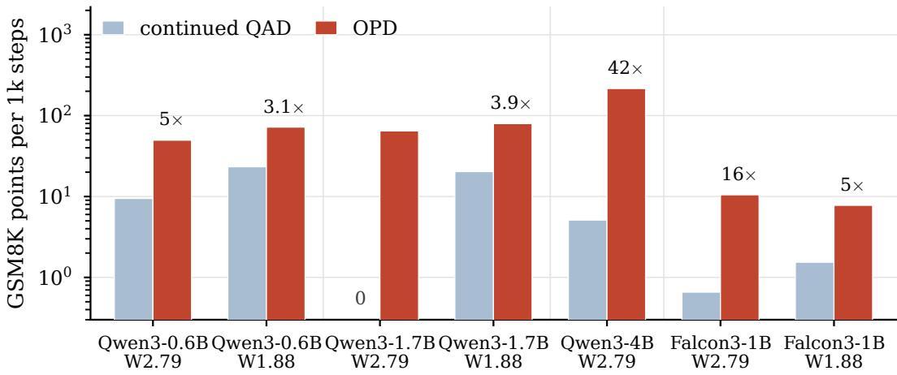  
Figure 5: OPD versus continued QAD on GSM8K, in points per thousand optimizer steps from the same starting checkpoint. Qwen3-0.6B and Qwen3-1.7B use the matched step budget of Table 4; Qwen3-4B and Falcon3-1B use a late QAD segment. The vertical axis is logarithmic. A zero marks a non-positive QAD gain.

## E OPD TRAINING CURVES

Figure 6 shows the phase-1 run for Qwen3-4B at 1.88 bits, the arm whose QAD start is the most degraded of the six and where the recovery is therefore easiest to read. The run divides into a short repair phase and a long plateau. Over the first thirty steps the policy entropy falls from about 10 nats per token, an effective support of tens of thousands of tokens, to 0.35: the quantized start is close to emitting arbitrary text, and teacher supervision on its own prefixes restores a usable output

(c) policy entropy

distribution almost immediately. The distillation term falls from 2.07 to 0.25 over the same interval and the verifier reward rises from −0.39 to roughly +0.15. The remaining ninety steps hold the reward between 0.1 and 0.2.

The two terms of Equation 3 sit on very different scales. With $\beta = 1$ the distillation term accounts for almost all of the total loss, while the policy-gradient term stays near 0.05 throughout. Single-step reward spans roughly ±0.5 because a step scores only 32 sequences, so the smoothed curve rather than the raw trace carries the trend.

(a) verifier reward  
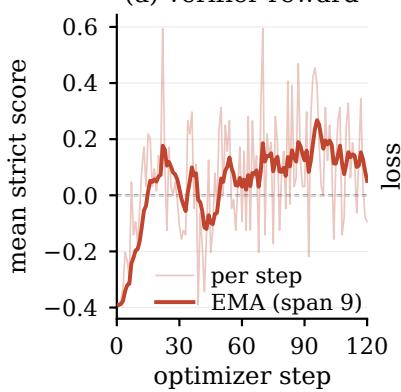

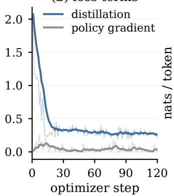

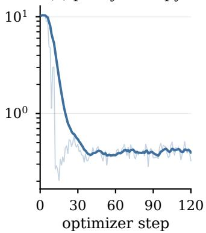  
Figure 6: OPD phase-1 training for Qwen3-4B at W1.88: 120 optimizer steps on the clean mathematics pool. Faint lines are per-step values and solid lines an exponential moving average over nine steps. (a) mean strict verifier score over the 32 sequences of a step. (b) the two terms of Equation 3. (c) policy entropy, logarithmic axis.

## F TEACHER CHOICE

A natural worry is that OPD’s gain is borrowed capacity from a stronger teacher rather than the on-policy objective. The default recipe uses each student’s own BF16 weights; Qwen3-0.6B is the one exception, because that model’s BF16 copy is too weak to supervise. Table 8 separates the two cases.

From 1.7B up, a larger teacher does not help. On Qwen3-1.7B at 2.79 bits, self-distillation matches or beats 4B and 8B teachers on both GSM8K and MATH-500, within run-to-run variation on GSM8K and ahead by 1.9 points on MATH-500. On Qwen3-4B at 2.79 bits, switching the teacher to 8B after the self-teacher mathematics checkpoint does not improve either metric. At 1.88 bits the same student’s own BF16 weights are not merely sufficient but better: matched 80-step arms from the same QAD start gain +18.88 GSM8K with the self teacher against +15.62 and +15.84 for the 4B and 8B teachers, and lead MATH-500 by 6.4 and 6.8 points. On Qwen3-4B at 1.88 bits the two teachers are level instead: from a start that quantization had driven down to 17.36 GSM8K, the self teacher recovers +48.60 against +47.77 for the 8B teacher, and MATH-500 splits the other way, +34.20 against +35.40. Across both widths and all three students, then, no teacher larger than the student buys anything its own BF16 copy does not: the recovery reported in the main text is the method, not a stronger model.

Qwen3-0.6B is a special case. A probe on the mathematics training pool, four samples per problem, gives teacher pass@4 of 62% for Qwen3-0.6B against 83% for 1.7B and 89% for both 4B and 8B, while the quantized 0.6B student sits at 36–39%. Its own BF16 teacher is barely ahead of the student, so there is little to transfer. Matched OPD arms confirm the gap: self-distillation gains only +2.80 and +6.44 GSM8K points at the two widths, whereas every teacher of 1.7B or above gains +11.0 to +14.1. Scaling past 1.7B buys nothing: at 2.79 bits the 8B teacher adds 0.23 GSM8K points, below the spread between adjacent checkpoints of a single arm, and at 1.88 bits the 4B and 8B teachers fall 1.8 and 3.1 points behind it, losing MATH-500 at both widths. We therefore keep Qwen3-1.7B as the 0.6B teacher and use every larger student’s own BF16 weights.

Table 8: Teacher size. Entries are gains over a QAD baseline fixed per student and width, so a row reports what OPD recovered rather than what the model scores. Baselines, as GSM8K / MATH-500: Qwen3-0.6B 33.21 / 10.00 at 2.79 bits and 22.52 / 2.60 at 1.88; Qwen3-1.7B 44.35 / 17.80 and 26.46 / 8.20; Qwen3-4B 69.45 / 39.80 and 17.36 / 2.20. A baseline is shared by every row of its block, so the differences between teachers do not depend on it. Steps counts OPD steps, and both columns of a row come from the same checkpoint. Every teacher within a block is trained to the same budget except Qwen3-4B at 2.79 bits, whose two rows are not matched. Shaded rows are the teacher used in the main experiments.
<table><tr><td>Student</td><td>Teacher</td><td>Width Steps</td><td>∆GSM8K</td><td>∆MATH-500</td></tr><tr><td rowspan="6">Qwen3-0.6B</td><td rowspan="2">self</td><td>W2.79 80</td><td>+2.80</td><td>+9.40</td></tr><tr><td>W1.88 90</td><td>+6.44</td><td>+9.20</td></tr><tr><td rowspan="2">1.7B</td><td>W2.79 80</td><td>+13.87</td><td>+13.80</td></tr><tr><td>W1.88 90</td><td>+14.10</td><td>+9.00</td></tr><tr><td rowspan="2">4B</td><td>W2.79 80 90</td><td>+11.75</td><td>+10.00</td></tr><tr><td>W1.88</td><td>+12.35</td><td>+3.00</td></tr><tr><td rowspan="6">Qwen3-1.7B</td><td rowspan="2">8B</td><td>W2.79 80 90</td><td>+14.10 +10.99</td><td>+11.00 +7.40</td></tr><tr><td>W1.88</td><td></td><td></td></tr><tr><td rowspan="2">self</td><td>W2.79 200 W1.88 80</td><td>+9.20 +18.88</td><td>+13.55 +16.40</td></tr><tr><td>W2.79</td><td>+8.77</td><td>+11.65</td></tr><tr><td rowspan="2">4B 8B</td><td>200 W1.88 80</td><td>+15.62</td><td>+10.00</td></tr><tr><td>W2.79 200</td><td>+8.34</td><td>+13.05</td></tr><tr><td rowspan="4">Qwen3-4B</td><td rowspan="2">self</td><td>W1.88 80</td><td>+15.84</td><td>+9.60</td></tr><tr><td>W2.79 80</td><td>+8.41</td><td>+14.60</td></tr><tr><td rowspan="2">8B</td><td>W1.88 120</td><td>+48.60</td><td>+34.20</td></tr><tr><td>W2.79 60 W1.88 120</td><td>+7.20</td><td>+13.40 +35.40</td></tr></table>

## G EXTENDED QAD BUDGET

The matched-budget control in Table 4 equalizes optimizer steps, so a remaining objection is that teacher-forced QAD simply needs a longer run. We therefore keep the same starting checkpoints and mathematics corpus, and extend the QAD mathematics phase to 2× and 3× the matched step budget; the 3× run covers roughly one epoch of the training pool. Table 9 compares these arms with the OPD mathematics phase alone.

Extra teacher-forced steps do not close the gap. At 3×, QAD still trails OPD by 8.9–18.1 GSM8K points on every configuration, and on Qwen3-0.6B at 2.79 bits the 3× run falls below the 1× baseline. The advantage of switching to on-policy recovery after QAD is therefore not an artifact of the matched step count.

Table 9: Mathematics-only recovery with QAD trained for 2× and 3× the matched budget of Table 4. The OPD column is the mathematics phase only; the gap is OPD minus QAD at 3×. Baselines are re-evaluated separately for this control.
<table><tr><td>Model</td><td>Width</td><td>QAD 1×</td><td>QAD 2×</td><td>QAD 3×</td><td>OPD phase 1</td><td>gap</td></tr><tr><td rowspan="2">Qwen3-0.6B</td><td>W2.79</td><td>33.43</td><td>36.39</td><td>27.67</td><td>45.72</td><td>+18.1</td></tr><tr><td>W1.88</td><td>30.63</td><td>26.16</td><td>27.29</td><td>37.23</td><td>+9.9</td></tr><tr><td rowspan="2">Qwen3-1.7B</td><td>W2.79</td><td>45.34</td><td>48.75</td><td>44.05</td><td>52.92</td><td>+8.9</td></tr><tr><td>W1.88</td><td>34.87</td><td>38.06</td><td>36.32</td><td>45.34</td><td>+9.0</td></tr></table>