# Target alignment, dilution and forecast selection when cross-sectional forecasts share a common target

Masoud Soleimani

Department of Information Engineering, University of Pisa, Pisa, Italy

## Abstract

Forecasters often score the same units per date against one standardized realized outcome. We show that every standardized forecast splits exactly into a component aligned with this common target and a component uncorrelated with it. Three consequences follow: forecasterror correlation largely mirrors forecast correlation and is therefore a poor measure of diversity; an equally weighted combination beats a no-information forecast only when average alignment is large relative to the combination’s dispersion; and the gain from adding a forecaster separates into genuine improvement and mere dilution, which equal-weight admission can mistakenly reward. We develop a cautious selection rule, study it in simulations, and apply it to language-model forecasts of US equity rankings and mechanical signals ranking exchange-traded funds. Selection removes most dilution losses, but no combination beats the no-information forecast.

Keywords: Forecast combination, Forecast evaluation, Forecast diversity, Encompassing, Multiple testing, Large language models

## 1. Introduction

Forecast combination ranks among the most reliable routes to improved accuracy (Bates and Granger, 1969; Clemen, 1989; Timmermann, 2006; Wang et al., 2023), and simple averages are notoriously dificult to beat (Stock and Watson, 2004; Genre et al., 2013; Claeskens et al., 2016). The conventional rationale rests on diversification: forecasts whose errors behave diferently ofset one another’s mistakes (Batchelor and Dua, 1995; Lichtendahl and Winkler, 2020). Accordingly, the value of adding a forecaster is typically gauged by how weakly its errors correlate with those already included (Krogh and Vedelsby, 1995; Brown et al., 2005; Magnus and Vasnev, 2023; Kim et al., 2026).

This paper investigates a setting where that rule of thumb turns ambiguous. On each date a forecaster scores a large number of units (assets, products, regions), the scores are standardized across units, and accuracy is measured against the standardized realized outcome. Examples include rankings of expected relative returns (Jegadeesh and Titman, 1993; Asness et al., 2013), relative demand across stores, and relative growth across regions. Every forecast on a given date is evaluated against the same standardized target. Consequently, the correlation of forecast deviations from that target confounds how strongly forecasts move together with how strongly each moves with the target.

The framework rests on a single exact decomposition. Each standardized forecast equals the sum of its projection onto the standardized target, whose coeficient is the forecaster’s target alignment, and a target-orthogonal component. The forecast correlation matrix therefore equals the outer product of the alignments plus the covariance of the orthogonal components. The paper makes three contributions.

1. Geometry of common-target combination. We derive exact implications of the split for relative-score risk. Deviation correlation equals a translation of forecast correlation plus an alignment term. A closed-form condition characterizes when a combination beats the no-information forecast, and an in-sample bound yields the best risk achievable by any linear combination. After time aggregation, the average within-date orthogonal covariance and the pooled Schur complement difer by the time variation of alignment.

2. Incremental risk of equal-weight admission. We derive exact marginal and batch conditions for adding forecasts to an equal-weight pool, and decompose the incremental risk into a scale-free component and a scale-mismatch component. A dilution bound reveals why equal-weight admission into a large pool is unresponsive to aligned candidates. It further demonstrates why the unscaled rule can admit forecasts that merely shrink the composite toward zero. On this foundation we develop a three-way admission rule (admit, reject, undecided) with simultaneous heteroskedasticity- and autocorrelation-consistent (HAC) bounds inside nested rolling-origin validation.

3. Evidence on what the geometry implies in practice. Seven simulation designs encompass: when combination can help at all (a phase diagram); which history statistics rank candidates by their future incremental risk (criterion validity); how selection, subset averaging and regression-type combination trade of across history lengths and instability mechanisms; and behavior under misspecification of the generating geometry. Two empirical panels, a date-shifted placebo, a mechanical control panel and a planted-signal positive control illustrate the framework on real data and calibrate the power behind its null findings.

Although the empirical findings pertain to the two panels examined, they replicate across both: forecast correlation accounts for nearly all of the common-target deviation correlation; equal-weight admission rewards dilution; selection and weighting eliminate most of the dilution loss carried by the full equal-weight pool, yet fail to improve on the no-information forecast; and neither panel displays detectable alignment. A date-shifted placebo, together with planted-signal experiments, establishes what these null results can and cannot support.

We do not assert that one dependence measure is universally superior, that equal-weight admission is optimal, that the three-way rule controls error rates along an adaptive selection path, or that large language models (LLMs) cannot forecast returns. Table 2 summarizes the status of each result.

## 1.1. Relation to existing work and what is new

Ambiguity and bias–variance–covariance decompositions decompose ensemble loss into individual losses and disagreement (Krogh and Vedelsby, 1995; Ueda and Nakano, 1996; Brown et al., 2005; Wood et al., 2023). We derive their relative-score analogue (Proposition 4). The novel element is the decomposition of dependence itself into alignment and orthogonal parts, which reveals that disagreement is target-free while deviation correlation is not.

Error-covariance and encompassing approaches weight or test forecasts through their error covariance (Bates and Granger, 1969; Granger and Ramanathan, 1984; Chong and Hendry, 1986; Harvey et al., 1998). With a common standardized target, the error covariance becomes an explicit function of forecast correlation and alignment (Proposition 5). The scale-free component of incremental risk constitutes an equal-weight, pool-level analogue of an incremental- $R ^ { 2 }$ encompassing statistic, batch admission is the corresponding analogue of multiple encompassing (Harvey and Newbold, 2000), and the scale-mismatch component represents the risk of a miscalibrated composite in the sense of Mincer and Zarnowitz (1969).

Factor and idiosyncratic decompositions distinguish common from forecaster-specific components of forecasts or errors and exploit the latter for combination (Lee and Lee, 2026; Lee and Seregina, 2026). In that literature, the split constitutes a statistical model estimated from the data. Ours is an exact, model-free projection on the realized target, and the orthogonal component is defined relative to the target rather than to the other forecasts.

Model-importance measures evaluate the loss of an ensemble with and without a component (Budescu and Chen, 2015; Kim et al., 2026). Under relative-score loss our incremental risk constitutes such a measure in closed form. The novel element is its exact split into scale-free and scale-mismatch parts, and the dilution bound demonstrating that equal-weight contributions diminish with pool size.

Selection before averaging, by trimming, clustering, performance screening or model confidence sets, can outperform the simple average (Aiolfi and Timmermann, 2006; Hansen et al., 2011; Bürgi and Sinclair, 2017; Matsypura et al., 2018; Diebold and Shin, 2019), while estimated weights sufer from estimation error (Stock and Watson, 2004; Smith and Wallis, 2009; Claeskens et al., 2016) and may involve negative weights for similar forecasters (Radchenko et al., 2023); constraining the weights or shrinking them toward equality mitigates this (Conflitti et al., 2015; Roccazzella et al., 2022). We compare three-way admission, the partially egalitarian LASSO (peLASSO) of Diebold and Shin (2019) and regression-type combination within one geometry. We report where each wins, including cases where selection is dominated.

Table 1: Position relative to adjacent approaches. “Scale separated” means the method distinguishes a change in the composite’s correlation with the target from a change in its scale.
<table><tr><td>Approach</td><td>Object</td><td>Weights</td><td>Scale separated</td><td>Status</td></tr><tr><td>Ambiguity / bias-variance-covariance</td><td>disagreement, error covariance</td><td>convex</td><td>no</td><td>identity</td></tr><tr><td>Forecast encompassing</td><td>incremental predictive content of one forecast</td><td>regression</td><td>implicitly (by regression)</td><td>test</td></tr><tr><td>Regression combination and shrinkage</td><td>error covariance and means</td><td>unrestricted or penalized</td><td>implicitly</td><td>estimator</td></tr><tr><td>Factor / idiosyncratic decompositions</td><td>estimated common and specific parts</td><td>penalized</td><td>no</td><td>estimated model</td></tr><tr><td>Model-importance measures</td><td>ensemble loss with and without a member</td><td>equal or given</td><td>no</td><td>estimated measure</td></tr><tr><td>Subset averaging (e.g. peLASSO)</td><td>support of a penalized fit</td><td>equal on support</td><td>no</td><td>estimator</td></tr><tr><td>This paper</td><td>alignment and target-orthogonal dependence</td><td>any, incl. equal and rescaled</td><td>yes, exactly</td><td>identity + decision rule</td></tr></table>

Table 2: Status of the main results. “Identity” results hold exactly for any sample and any weights; “procedure” results depend on estimation and on assumptions stated in the text.
<table><tr><td>Result</td><td>Status</td><td>Scope</td></tr><tr><td>Propositions 1–5, 6, 8–9; Corollary 1</td><td>Algebraic identity</td><td>Exact for standardized forecasts on a common support; no distributional assumptions</td></tr><tr><td>Corollary 2 (attainable risk)</td><td>Identity, in-sample</td><td>e A bound for the sample moments; not an operationally attainable out-of-sample risk</td></tr><tr><td>Proposition 7 (joint shrinkage)</td><td>Estimator property</td><td>PSD preservation for valid inputs; not a repair for pair- wise deletion</td></tr><tr><td>Three-way rule</td><td>Procedure</td><td>Simultaneous per-step bands conditional on the incum- bent pool, asymptotically valid under HAC consistency;</td></tr><tr><td>Joint zero-alignment tests</td><td>Procedure</td><td>no guarantee along the adaptive greedy path Bootstrap Wald and max-[t| size and power assessed by simulation; asymptotic Wald oversized</td></tr><tr><td>Decision error rates, criterion validity, method rankings Simulation finding Geometry, nulls, admission and positive-control results Application finding</td><td></td><td>Specific to the designs in Section 8</td></tr><tr><td></td><td></td><td>Specific to the two panels in Sections 9 and 10: a retro- spective fixed-panel language-model experiment and a cross-asset exchange-traded fund (ETF) panel</td></tr><tr><td>Placebo (date-shifted target)</td><td>Application finding</td><td>A randomization reference for the alignment statistics; it requires no distributional assumption</td></tr></table>

## 2. Estimand, geometry and notation

## 2.1. Common support, standardization and the estimand

At date $t ,$ let $r _ { t }$ denote the realized cross-sectional target and $x _ { i t }$ the raw score vector of forecaster $i \in \{ 1 , \ldots , N \}$ . All inner products at t are calculated on the common support M∗ of units possessing a valid target and valid forecasts from every forecaster, with $M _ { t } = | \mathcal { M } _ { t } ^ { * } |$ Pairwise deletion is employed solely as a robustness check, since it destroys the Gram-matrix structure and can produce indefinite matrices that would require a nearest-correlation repair (Higham, 2002). Define $\langle a , b \rangle _ { t } = M _ { t } ^ { - 1 } a ^ { \prime } b$ and standardize using the same $1 / M _ { t }$ normalization:

$$
s _ { i t } = \frac { x _ { i t } - \bar { x } _ { i t } { \bf 1 } } { \hat { \sigma } _ { x _ { i } , t } } , \qquad y _ { t } = \frac { r _ { t } - \bar { r } _ { t } { \bf 1 } } { \hat { \sigma } _ { r , t } } , \qquad \| s _ { i t } \| _ { t } = \| y _ { t } \| _ { t } = 1 .\tag{1}
$$

Dates whose target is degenerate $\left( \hat { \sigma } _ { r , t } ~ \le ~ \varepsilon _ { r } \right)$ are excluded. A forecaster with $\hat { \sigma } _ { x _ { i } , t } ~ \le ~ \varepsilon _ { x }$ is unavailable at t, which eliminates that date in the fixed-membership analysis. Missing outputs are not imputed.

The loss of a combination $\begin{array} { r } { s _ { w , t } = \sum _ { i } w _ { i } s _ { i t } \mathrm { ~ i s ~ } \lVert s _ { w , t } - y _ { t } \rVert _ { t } ^ { 2 } } \end{array}$ . It evaluates relative forecasts after each date’s location and scale of the target have been removed, which is appropriate for tasks whose outputs constitute rankings or relative scores with arbitrary level and dispersion. For a unit-norm composite, the loss equals $2 ( 1 - \operatorname { c o r r } _ { t } )$ , twice one minus the cross-sectional correlation. For an unscaled composite, it additionally penalizes the composite’s norm (Proposition 3). Rank correlations and top-minus-bottom return spreads are reported as diagnostics. The loss does not constitute a portfolio utility, and statistical and economic rankings of forecasts need not coincide (Leitch and Tanner, 1991; Gneiting, 2011). The zero forecast $w = 0$ has loss exactly one. We term it the no-information forecast: it serves as the natural benchmark under this estimand, and “beating” it signifies improving the standardized relative-score risk, not generating economic value.

## 2.2. Target alignment and the target-orthogonal component

Definition 1. Target alignment is $\gamma _ { i t } = \langle s _ { i t } , y _ { t } \rangle _ { t }$ , a correlation since both vectors possess unit norm. The target-orthogonal component is $u _ { i t } = s _ { i t } - \gamma _ { i t } y _ { t }$ . The forecast correlation matrix is $C _ { t } = [ \langle s _ { i t } , s _ { j t } \rangle _ { t } ]$ with entries $\rho _ { i j , t } ^ { s }$ , and the target-orthogonal covariance is $K _ { t } = [ \langle u _ { i t } , u _ { j t } \rangle _ { t } ]$

The orthogonal component constitutes an exact geometric residual. It is not a latent signal, an independent economic factor, or a source of predictive value. Table 3 assembles the notation.

Proposition 1 (Target-orthogonal decomposition). $\begin{array} { r } { \langle u _ { i t } , y _ { t } \rangle _ { t } = 0 , \| u _ { i t } \| _ { t } ^ { 2 } = 1 - \gamma _ { i t } ^ { 2 } } \end{array}$ , and $C _ { t } = \gamma _ { t } \gamma _ { t } ^ { \prime } + K _ { t }$ with $K _ { t } \succeq 0$ . Furthermore rank $( C _ { t } ) \le \operatorname* { m i n } ( N , M _ { t } - 1 )$ and rank $( K _ { t } ) \le$ min $( N , M _ { t } - 2 )$

## 3. Relative-score risk

Proposition 2 (Risk decomposition). For any $w \in \mathbb { R } ^ { N }$ (afine, convex, rescaled $o r \ z e r o )$ $\begin{array} { r } { \Vert s _ { w , t } - y _ { t } \Vert _ { t } ^ { 2 } = ( 1 - w ^ { \prime } \gamma _ { t } ) ^ { 2 } + w ^ { \prime } K _ { t } w = 1 - 2 w ^ { \prime } \gamma _ { t } + w ^ { \prime } C _ { t } w } \end{array}$ . Consequently $\mathcal { R } ( w ) = 1 - 2 g _ { w } + q _ { w }$

We refer to $( 1 - w ^ { \prime } \gamma _ { t } ) ^ { 2 }$ as the alignment term and $w ^ { \prime } K _ { t } w$ as the target-orthogonal term.

Table 3: Notation. Date-level objects carry $t ;$ bars denote averages over a window with weights $a _ { t }$ (uniform here); tildes denote shrinkage estimates.
<table><tr><td>Object</td><td>Definition</td><td>Measures</td></tr><tr><td> $\gamma _ { i t } , \gamma _ { t }$ </td><td> $\langle s _ { i t } , y _ { t } \rangle _ { t }$ </td><td>target alignment (correlation with the standardized target)</td></tr><tr><td> $C _ { t } , \rho _ { i j , t } ^ { s }$ </td><td> $\langle s _ { i t } , s _ { j t } \rangle _ { t }$ </td><td>forecast correlation (target-free)</td></tr><tr><td> $K _ { t }$ </td><td> $\langle u _ { i t } , u _ { j t } \rangle _ { t } = C _ { t } - \gamma _ { t } \gamma _ { t } ^ { \prime }$ </td><td>target-orthogonal covariance</td></tr><tr><td> $\rho _ { i j , t } ^ { e }$ </td><td>correlation of  $s _ { i t } - y _ { t }$  and  $s _ { j t } - y _ { t }$ </td><td>common-target deviation correlation</td></tr><tr><td> $\bar { C } , \bar { \gamma } , \bar { K } , G$ </td><td> $\begin{array} { r } { \sum _ { t } a _ { t } C _ { t } , \sum _ { t } a _ { t } \gamma _ { t } , \sum _ { t } a _ { t } K _ { t } , \sum _ { t } a _ { t } \gamma _ { t } \gamma _ { t } ^ { \prime } } \end{array}$ </td><td>time-averaged objects</td></tr><tr><td> $K ^ { \mathrm { p o o l } }$ </td><td> $\bar { C } - \bar { \gamma } \bar { \gamma } ^ { \prime } = \bar { K } + \mathrm { C o v } _ { a } ( \gamma _ { t } )$ </td><td>pooled orthogonal covariance</td></tr><tr><td> $\mathcal { R } ( w )$ </td><td> $\begin{array} { r } { \sum _ { t } a _ { t } \| s _ { w , t } - y _ { t } \| _ { t } ^ { 2 } } \end{array}$ </td><td>relative-score risk</td></tr><tr><td>gw,  $q _ { w } , \ c _ { w } , \ \rho _ { w }$ </td><td> $w ^ { \prime } \bar { \gamma } , \ w ^ { \prime } \bar { C } w , \ g _ { w } / q _ { w } , \ g _ { w } / \sqrt { q _ { w } }$ </td><td>mean alignment, squared norm, risk-minimizing scale, pooled correlation</td></tr><tr><td>Vp,  $\Delta _ { A | P }$ </td><td>risk of the equal-weight pool  $P ; V _ { P \cup A } - V _ { P }$ </td><td>incremental relative-score risk</td></tr><tr><td> $\Delta _ { A | P } ^ { \mathrm { s f } } , ~ \dot { \Delta } _ { A | P } ^ { \mathrm { s c a l e } }$ </td><td> $\rho _ { P } ^ { 2 } - \rho _ { P \cup A } ^ { 2 } ; \Delta _ { A | P } - \Delta _ { A | P } ^ { \mathrm { s f } }$ </td><td>scale-free and scale-mismatch components</td></tr><tr><td>δ</td><td>minimum practically relevant improvement</td><td>threshold of the three-way rule</td></tr></table>

Corollary 1 (Improving on the no-information forecast). $\mathcal { R } ( w ) < 1$ if and only if $g _ { w } > { \textstyle \frac { 1 } { 2 } } q _ { w }$ For equal weights across N forecasters with mean alignment $\bar { \gamma } _ { \mathrm { E W } }$ and mean of-diagonal correlation ${ \bar { \rho } } ,$

$$
\begin{array} { r } { \mathcal { R } ( \mathbf { 1 } / N ) < 1 \iff \bar { \gamma } _ { \mathrm { E W } } > \frac { 1 } { 2 } \big [ \bar { \rho } + ( 1 - \bar { \rho } ) / N \big ] , } \end{array}\tag{2}
$$

and the margin $\begin{array} { r } { m = { \bar { \gamma } _ { \mathrm { E W } } } - \frac { 1 } { 2 } { \bf 1 } ^ { \prime } \bar { C } { \bf 1 } / N ^ { 2 } } \end{array}$ satisfies $\mathcal { R } ( \mathbf { 1 } / N ) - 1 = - 2 m$

Averaging standardized forecasts draws the composite toward zero. Unless mean alignment exceeds half the composite’s squared norm, the no-information forecast exhibits lower risk, regardless of how many forecasters are averaged.

Corollary 2 (In-sample attainable risk). min $\{ 1 - 2 v ^ { \prime } \bar { \gamma } + v ^ { \prime } \bar { C } v \} = 1 - \bar { \gamma } ^ { \prime } \bar { C } ^ { + } \bar { \gamma } \in [ 0 , 1 ]$ , achieved at $v ^ { * } = \bar { C } ^ { + } \bar { \gamma }$ . The quantity $\bar { \gamma } ^ { \prime } \bar { C } ^ { + } \bar { \gamma }$ represents the pooled squared multiple correlation of the standardized target on the forecasts in the window.

Proposition 3 (Scale split). For $q _ { w } > 0$ , min ${ \mathcal R } ( c w ) = { \mathcal R } ( c _ { w } w ) = 1 - \rho _ { w } ^ { 2 }$ and

$$
\begin{array} { r } { \mathcal { R } ( w ) = ( 1 - \rho _ { w } ^ { 2 } ) + q _ { w } ( 1 - c _ { w } ) ^ { 2 } . } \end{array}\tag{3}
$$

The first term constitutes the risk of the optimal rescaling of w and depends solely on the pooled correlation $\rho _ { w }$ . The second is the scale-mismatch penalty of the unscaled composite. When alignment is weak, $c _ { w } \approx 0$ and the penalty approximates $q _ { w } .$ , so ranking unscaled combinations by risk largely amounts to ranking them by their norm.

## 4. Disagreement and common-target deviation correlation

Proposition 4 (Ambiguity). For convex w, $\begin{array} { r } { \mathcal { A } _ { t } ( w ) = \sum _ { i } w _ { i } \| s _ { i t } - s _ { w , t } \| _ { t } ^ { 2 } = 1 - w ^ { \prime } C _ { t } w } \end{array}$ , and with $\begin{array} { r } { L _ { i t } = \| s _ { i t } - y _ { t } \| _ { t } ^ { 2 } = 2 ( 1 - \gamma _ { i t } ) , \sum _ { i } w _ { i } L _ { i t } = \| s _ { w , t } - y _ { t } \| _ { t } ^ { 2 } + \mathcal { A } _ { t } ( w ) } \end{array}$

Disagreement depends on $C _ { t }$ alone; alignment enters through individual losses. Disagreement therefore does not on its own imply a forecasting benefit.

Proposition 5 (Common-target deviation correlation). With $e _ { i t } = s _ { i t } - y _ { t } , \ \langle e _ { i t } , e _ { j t } \rangle _ { t } =$ $1 + \rho _ { i j , t } ^ { s } - \gamma _ { i t } - \gamma _ { j t } , \| e _ { i t } \| _ { t } ^ { 2 } = 2 ( 1 - \gamma _ { i t } )$ , and for $\gamma _ { i t } , \gamma _ { j t } < 1$

$$
\rho _ { i j , t } ^ { e } = \frac { 1 + \rho _ { i j , t } ^ { s } - \gamma _ { i t } - \gamma _ { j t } } { 2 \sqrt { ( 1 - \gamma _ { i t } ) ( 1 - \gamma _ { j t } ) } } .\tag{4}
$$

At zero alignment $\rho _ { i j , t } ^ { e } = ( 1 + \rho _ { i j , t } ^ { s } ) / 2$ . For small alignments $\rho _ { i j , t } ^ { e } - ( 1 + \rho _ { i j , t } ^ { s } ) / 2 = - \frac { 1 } { 4 } ( \gamma _ { i t } +$ $\gamma _ { j t } ) ( 1 - \rho _ { i j , t } ^ { s } ) + O ( \gamma ^ { 2 } )$

The claim that $^ { \ast } \rho ^ { e }$ is a translation of $\rho ^ { s \mathfrak { N } }$ is not merely a restatement of the error covariance. What matters is that, with a common standardized target, the translation is fixed $( [ - 1 , 1 ] \mapsto [ 0 , 1 ]$ at zero alignment, halving dispersion). Its departure from $( 1 + \rho ^ { s } ) / 2$ is driven by alignment alone. The statistic is therefore not, in general, a clean measure of forecast-output diversity. Nor is it useless: because it embeds alignment, it can rank candidates better than forecast correlation (Section 8). The equal-weight variance-equivalent ensemble size $N _ { \mathrm { e f f } } ~ = ~ N / [ 1 + ( N - 1 ) \bar { \rho } ]$ is a variance ratio, not a count of independent models, although under exchangeable dependence it coincides with the equivalent number of independent experts of Clemen and Winkler (1985). Computed from $\bar { \rho } ^ { e }$ it inherits the translation.

## 5. Time aggregation and joint shrinkage

Proposition 6 (Aggregation). $\bar { C } = G + \bar { K }$ and $K ^ { \mathrm { p o o l } } = \bar { C } - \bar { \gamma } \bar { \gamma } ^ { \prime } = \bar { K } + \mathrm { C o v } _ { a } ( \gamma _ { t } )$ . Consequently $\begin{array} { r } { \mathcal { R } ( w ) = \sum _ { t } a _ { t } ( 1 - w ^ { \prime } \gamma _ { t } ) ^ { 2 } + w ^ { \prime } \bar { K } w = ( 1 - g _ { w } ) ^ { 2 } + w ^ { \prime } K ^ { \mathrm { p o o l } } w } \end{array}$

The two exact decompositions attribute the same risk in diferent ways. Time variation of $w ^ { \prime } \gamma _ { t }$ is charged to the alignment term within dates and to the orthogonal term once pooled. Risks, not daily ratios, are aggregated.

For dependence estimation we shrink the joint matrix $\widehat { R } = \left( \begin{array} { l } { \bar { C } } \\ { \bar { \gamma } ^ { \prime } } \end{array} \bar { 1 } \right)$ toward a structured target $R _ { 0 }$ . The target has an equicorrelated block with the history mean correlation $\rho ^ { \star }$ , as in constant-correlation shrinkage (Ledoit and Wolf, 2004a), and a common alignment $g ^ { \star }$ projected onto $( g ^ { \star } ) ^ { 2 } \leq [ 1 + ( N - 1 ) \rho ^ { \star } ] / N$ if necessary. The estimate is $\widetilde { R } = ( 1 - \lambda ) \widehat { R } + \lambda R _ { 0 }$ with λ chosen by Frobenius fit from a fit window to a validation window, and $\widetilde { K } = \widetilde { C } - \widetilde { \gamma } \widetilde { \gamma } ^ { \prime }$

Proposition 7 (Structure preservation). If $\widehat { R } \succeq 0$ and $R _ { 0 } \succeq 0$ have unit diagonals, then $\widetilde { R }$ is a valid correlation matrix and $\widetilde K \succeq 0$ for all $\lambda \in [ 0 , 1 ]$

Joint shrinkage keeps $C , \gamma$ and K mutually compatible (cf. Ledoit and Wolf, 2004b). It serves the weighted benchmarks and diagnostics; admission decisions rely on realized losses.

## 6. Incremental risk of equal-weight admission

For an equal-weight pool P of size n let $\begin{array} { r } { e _ { P , t } = n ^ { - 1 } \sum _ { i \in P } s _ { i t } - y _ { t } , V _ { P } = \sum _ { t } a _ { t } \Vert e _ { P , t } \Vert _ { t } ^ { 2 } } \end{array}$ , and for a batch A of size q let $\begin{array} { r } { C _ { P A } ^ { e } = \sum _ { t } a _ { t } \langle e _ { P , t } , e _ { A , t } \rangle _ { i } } \end{array}$ t be the pool–batch deviation covariance.

Proposition 8 (Admission algebra). $V _ { P \cup A } = [ n ^ { 2 } V _ { P } + q ^ { 2 } V _ { A } + 2 n q C _ { P A } ^ { e } ] / ( n + q ) ^ { 2 }$ and $\Delta _ { A | P } =$ $V _ { P \cup A } - V _ { P }$ . For an individual candidate k, $\Delta _ { k | P } = [ V _ { k } + 2 n C _ { P k } ^ { e } - ( 2 n + 1 ) V _ { P } ] / ( n + 1 ) ^ { 2 }$ Provided $V _ { P } > 0 , \Lambda _ { k | P } ^ { E W } = ( V _ { k } + 2 n C _ { P k } ^ { e } ) / [ ( 2 n + 1 ) V _ { P } ] < 1$ if and only if $\Delta _ { k | P } < 0$

$\Delta$ serves as the decision statistic; $\Lambda ^ { E W }$ is purely descriptive. Equal-weight admission addresses a particular question: does incorporating A at equal weight reduce the risk of this pool? Proposition 3 reveals what that question entails.

Proposition 9 (Scale-free and scale-mismatch components).

$$
\Delta _ { A | P } = \underbrace { \rho _ { P } ^ { 2 } - \rho _ { P \cup A } ^ { 2 } } _ { \Delta _ { A | P } ^ { \mathrm { s f } } } + \underbrace { q _ { P \cup A } ( 1 - c _ { P \cup A } ) ^ { 2 } - q _ { P } ( 1 - c _ { P } ) ^ { 2 } } _ { \Delta _ { A | P } ^ { \mathrm { s c a l e } } } ,\tag{5}
$$

where, with $m = | A |$ , pool mean alignments ${ \bar { g } } _ { P } , { \bar { g } } _ { A }$ , squared norms $q _ { P } , q _ { A }$ and $q _ { P A } = w _ { P } ^ { \prime } \bar { C } w _ { A }$ ，

$$
\rho _ { P \cup A } ^ { 2 } = \frac { ( n \bar { g } _ { P } + m \bar { g } _ { A } ) ^ { 2 } } { n ^ { 2 } q _ { P } + m ^ { 2 } q _ { A } + 2 n m q _ { P A } } .\tag{6}
$$

If $\bar { g } _ { P } = 0$ and $q _ { P A } = 0$ , then $- \Delta _ { A | P } ^ { \mathrm { s f } } \leq ( m \bar { g } _ { A } ) ^ { 2 } / ( n ^ { 2 } q _ { P } )$

This yields two implications. First, under weak alignment, $\Delta \approx \Delta ^ { \mathrm { s c a l e } }$ : a candidate that shrinks the composite’s norm, such as one that is negatively correlated with or orthogonal to the incumbent, reduces risk even when no alignment can be detected. Second, the scale-free benefit of an aligned batch decays like $( m / n ) ^ { 2 }$ , which means that equal-weight admission into a large pool is inherently unresponsive to aligned candidates. The scale-free rule subjects $\Delta ^ { \mathrm { s f } }$ to the three-way decision, with each composite retaining its own history scale. An envelope argument shows that estimating this scale influences the aggregated risk only to second order (Appendix A). The scale-free rule determines whether a candidate lifts the pooled correlation of this equal-weight pool. It is not a universal test of whether a candidate carries predictive value; from-scratch selection or regression-type weighting serve that purpose.

## 7. Inference and evaluation design

Nested rolling origin. Following rolling-origin evaluation (Tashman, 2000), each outer origin constructs its history from those dates whose targets are realized prior to the first test date. This history is split into two segments: a fit window and a trailing 52-date validation window. Tuning of the ridge penalties, the practical margins $\delta$ and $\delta ^ { \mathrm { s f } }$ , the peLASSO penalty, and the shrinkage intensity proceeds by fitting on the fit window while scoring realized validation risk. Selection statistics are subsequently recomputed over the full history, after which the pools and weights are frozen for a 26-date outer test block. That block serves a single purpose: evaluation, together with the retrospective regret oracle.

Three-way rule. Consider an incumbent P and a candidate family $\{ A _ { j } \}$ . Constructing the date-level diferences $d _ { j , t } = \ell _ { P \cup A _ { j } , t } - \ell _ { P , t }$ produces $\begin{array} { r } { \hat { \Delta } _ { j } = \sum _ { t } a _ { t } d _ { j , t } } \end{array}$ . The Newey–West standard errors employ lag $\lfloor 4 ( T / 1 0 0 ) ^ { 2 / 9 } \rfloor$ (Newey and West, 1987, 1994). Define the max-t critical value c as the (1 − α) quantile of $\operatorname* { m a x } _ { j } | Z _ { j } |$ evaluated under the estimated HAC correlation (Hothorn et al., 2008; Romano and Wolf, 2005). Truncation of its factor to eigenvalues exceeding a relative tolerance permits non-positive-definite estimates to be processed without repair. Admission occurs when $\widehat { \Delta } _ { j } + c \widehat { S E } _ { j } < - \delta ;$ rejection occurs when $\widehat { \Delta } _ { j } - c \widehat { S E } _ { j } > 0 ;$ otherwise the candidate remains undecided; $\alpha = 0 . 0 5$ . Deciding by the position of a simultaneous band relative to a practical margin follows the interval-inclusion logic of equivalence testing (Schuirmann, 1987). The minimum detectable efect $\delta + ( c + z _ { 0 . 8 } ) \widehat { S E } _ { j }$ is reported. Greedy selection commences from the forecaster exhibiting the highest history alignment (highest squared alignment under the scale-free rule), and each step admits the candidate whose $\hat { \Delta }$ is smallest. Termination occurs once no candidate is admitted.

Remark 1 (What is and is not controlled). Fix the incumbent P and the candidate family. Provided the date-level diferences satisfy a central limit theorem and the HAC estimator is consistent, the bands jointly cover all $\Delta _ { { A } _ { j } | { P } }$ with asymptotic probability $1 - \alpha$ . Consequently, the probability of admitting any candidate whose $\Delta _ { A _ { j } | P } \geq - \delta$ is asymptotically bounded by $\alpha / 2$ , conditionally on $P .$ . Greedy selection, by contrast, renders the incumbent, the initial forecaster, and the family at subsequent steps all data-dependent. The per-step guarantee therefore fails to propagate to the path, and no selective-inference correction (Berk et al., 2013) is imposed. Assessment of path-level behavior is restricted to simulation (Section 8).

Benchmarks.

• Selection: greedy three-way admission using the equal-weight basis (with and without multiplicity adjustment) and the scale-free basis; greedy admission relying on point estimates; exhaustive search across all $2 ^ { N } - 1$ pools of history risk; size-matched selection via minimum mean deviation correlation, minimum mean forecast correlation, or maximum alignment; and the partially egalitarian LASSO (Diebold and Shin, 2019), that is, a nonnegative LASSO (Tibshirani, 1996) on the aggregated moments with an equal-weighted support.

• Weighting: equal weights; nonnegative, afine, and ridge-to-equal quadratic weights on shrunk moments; and the unconstrained ridge projection $( \widetilde C + \eta I ) ^ { - 1 } \widetilde \gamma$

• Rescaling and null: each pool and weight vector is additionally evaluated in a scalecalibrated version with its history scale held fixed, and against the no-information forecast.

Joint test of zero alignment. We assess $H _ { 0 } \colon E [ \gamma _ { i t } ] = 0$ for all i using a HAC Wald statistic $\bar { \gamma } ^ { \prime } \widehat \Omega ^ { + } \bar { \gamma }$ , calibrated via a moving-block bootstrap (Künsch, 1989) of the recentered statistic (block length 4, 999 draws), alongside a simultaneous max-|t| test.

Criterion validity. For incumbents comprising the greedy path plus 30 random pools per origin, we calculate the within-incumbent Spearman correlation between each history criterion and the candidate’s future incremental risk, as well as the pick regret associated with each criterion’s top choice.

Evaluation. Our reported metrics include mean test risk with HAC intervals for diferences from equal weighting and from the no-information forecast (Diebold and Mariano, 1995; Giacomini and White, 2006), the exact decomposition of Proposition 2, composite correlation and rank information coeficients, a top-minus-bottom quintile return spread, weight diagnostics, and regret relative to the exhaustive test oracle.

The procedures and evaluation design were refined during the project using the same data. Consequently, tests across the 20 reported procedures are exposed to data snooping (Romano and Wolf, 2005) and are descriptive; we indicate Bonferroni thresholds where relevant.

## 8. Simulations

We generate forecasts according to $x _ { i t , m } = \sigma _ { i } [ \beta _ { i t } r _ { t , m } + a _ { 0 i } z _ { t , m } + a _ { 1 i } z _ { t , m } ^ { c ( i ) } + \sqrt { \psi _ { i } } \varepsilon _ { i t , m } ] + \mu _ { i }$ 2 where $\beta _ { i t } = \beta _ { i } + \phi \xi _ { t }$ . In this specification, z represents a common factor, $z ^ { c }$ a cluster factor, $\xi _ { t }$ a unit-variance AR(1) process, and $( \sigma _ { i } , \mu _ { i } )$ denote unequal scales that standardization eliminates. For each cell, the truth corresponds to the expected within-date geometry at identical (N, M), estimated from 20,000 simulated dates; the resulting Monte Carlo standard error for mean correlations remains under 0.001. Each replication executes the complete nested procedure described in Section 7, employing 156 history dates unless otherwise noted, alongside a 52-date validation window and a 52-date test block. Table 4 summarizes the designs, while parameter values and code are included in the replication package described under Data and code availability.

Table 4: Simulation designs (N = 24, M = 60 unless stated). Truth values: mean alignment γ¯ and mean forecast correlation $\bar { \rho } ^ { s }$
<table><tr><td></td><td>Design Content</td></tr><tr><td>A</td><td>Recovery of  $\bar { C } , \bar { \gamma } , \bar { K } , K ^ { \mathrm { p o o l } }$  and PSD behavior under missing outputs;  $N \in$  {12, 24},  $M \in \{ 2 0 , 3 0 , 6 0 , 2 4 0 \}$   $T \in \{ 5 2 , 1 5 6 , 5 2 0 \}$  ; 100 reps</td></tr><tr><td>B</td><td>Eight scenarios, 100 reps: S1 heterogeneous alignment with clusters  $( { \bar { \gamma } } =$  0.091,  $\bar { \rho } ^ { s } = 0 . 1 4 )$  ; S2 redundant near-clone clusters; S3 one third pure- noise forecasters; S4 exchangeable; S5 weak alignment  $( \bar { \gamma } = 0 . 0 2 2 )$  with heavy-tailed target; S6 time-varying alignment plus a break; S7 negatively</td></tr><tr><td>C</td><td> $N / M$  grid across the within-date rank boundary</td></tr><tr><td>D</td><td>Phasediagram: alignment  $\{ 0 , 0 . 0 3 , 0 . 0 8 , 0 . 1 5 , 0 . 2 5 \} \times$   $\{ 0 , 0 . 1 5 , 0 . 3 , 0 . 6 \} \times N \in \{ 1 2 , 2 4 \}$  ; 40 reps</td></tr><tr><td>E</td><td>History length  $T \in \{ 5 2 , 1 0 4 , 2 6 0 \}$  for S1, S2, S6; 60 reps Instability mechanisms separated, 60 reps: F1 time-varying alignment</td></tr><tr><td>F</td><td>only; F2 abrupt loss of the top quarter&#x27;s alignment; F3 the same loss phased in over the test block; F4 dependence shift (common and cluster loadings rise, alignment loadings unchanged); F5 sign reversal of the top</td></tr><tr><td>G</td><td>quarter&#x27;s alignment Misspecification of the generating geometry, 60 reps: G1 monotone non- linear distortion of the scores before standardization; G2 cross-sectionally heteroskedastic, heavy-tailed target; G3 a test-period break hitting ran-</td></tr></table>

Geometry recovery and dimensionality (Designs A, C). Estimation errors decline approximately at the rate $1 / \sqrt { T M }$ . Joint shrinkage proves beneficial only when both T and M are small, reducing errors by 8–13% at $( M , T ) = ( 2 0 , 5 2 )$ . Employing $K ^ { \mathrm { p o o l } }$ rather than $\bar { K }$ leaves a non-vanishing error as T grows. Common-support matrices remained PSD across all replications. Pairwise deletion rendered 91–100% of date-level matrices indefinite near the rank boundary, while shrinkage at the tuned intensity still left 5–26% indefinite. Performance deteriorates smoothly through $M = N + 2$ because aggregation restores full rank.

Table 5: Design B: proportion of truly improving candidates remaining undecided, together with true test risk minus 1 (negative values indicate improvement over the no-information forecast). “Scaled”: historycalibrated composite. Monte Carlo standard errors fall below 0.004.
<table><tr><td></td><td>S1</td><td>S2</td><td>S3</td><td>S4</td><td>S5</td><td>S6</td><td>S7</td><td>S8</td></tr><tr><td>Improving candidates left undecided</td><td></td><td></td><td></td><td></td><td></td><td></td><td></td><td></td></tr><tr><td>Three-way, equal weight</td><td>0.23</td><td>0.10</td><td>0.29</td><td>0.24</td><td>0.27</td><td>0.24</td><td>0.22</td><td>0.31</td></tr><tr><td>Three-way, unadjusted</td><td>0.18</td><td>0.06</td><td>0.23</td><td>0.19</td><td>0.22</td><td>0.18</td><td>0.16</td><td>0.25</td></tr><tr><td>Three-way, scale-free</td><td>0.60</td><td>0.68</td><td>0.80</td><td>0.94</td><td>1.00</td><td>0.70</td><td>0.59</td><td>0.77</td></tr><tr><td>True test risk minus 1</td><td></td><td></td><td></td><td></td><td></td><td></td><td></td><td></td></tr><tr><td>Equal weight, all</td><td>-0.004</td><td>0.074</td><td>0.010</td><td>0.129</td><td>0.230</td><td>0.072</td><td>0.049</td><td>-0.006</td></tr><tr><td>Three-way, equal weight</td><td>-0.022</td><td>0.008</td><td>0.030</td><td>0.173</td><td>0.248</td><td>0.252</td><td>-0.023</td><td>-0.013</td></tr><tr><td>Equal weight, all (scaled)</td><td>-0.046</td><td>-0.021</td><td>-0.020</td><td>-0.024</td><td>-0.002</td><td>-0.008</td><td>-0.022</td><td>-0.047</td></tr><tr><td>Three-way, equal weight (scaled)</td><td>-0.079</td><td>-0.053</td><td>-0.026</td><td>-0.021</td><td>-0.007</td><td>0.069</td><td>-0.080</td><td>-0.078</td></tr><tr><td>Three-way, scale-free (scaled)</td><td>-0.070</td><td>-0.042</td><td>-0.022</td><td>-0.009</td><td>-0.003</td><td>0.063</td><td>-0.071</td><td>-0.058</td></tr><tr><td>Ridge weights (scaled)</td><td>-0.081</td><td>-0.053</td><td>-0.028</td><td>-0.024</td><td>-0.005</td><td>0.025</td><td>-0.081</td><td>-0.081</td></tr><tr><td>Ridge projection</td><td>-0.101</td><td>-0.215</td><td>-0.038</td><td>-0.024</td><td>-0.019</td><td>0.050</td><td>-0.224</td><td>-0.100</td></tr></table>

Joint tests. Under the null, the asymptotic HAC Wald test rejects in 20–38% of replications when N = 12 and in 53–70% when N = 24 (nominal 5%). The bootstrap Wald test rejects in no more than 2.5% of cases, and max-|t| in 0–10%. At alignment 0.03, their power ranges from 0.82 to 1.00.

Decisions and performance (Design B). Table 5 presents decision rates and risk. Across scenarios, 2,200–6,600 non-improving candidate evaluations per procedure yielded at most 0.1% false admissions. The one-sided 95% Clopper–Pearson upper bound (Clopper and Pearson, 1934) never surpasses 0.26%. Recall, by contrast, difers markedly. The equalweight rule leaves 10–31% of truly improving candidates undecided; removing the multiplicity adjustment reduces this to 6–25%, whereas the scale-free rule leaves 59–100% undecided. After composites are scale-calibrated, the equal-weight rule, exhaustive search and ridge weights lie within 0.005 of one another outside the break scenario. The unconstrained ridge projection achieves the best performance or ties in every stationary scenario; under the break (S6), only the calibrated full equal-weight composite improves upon the no-information forecast.

When can combination help? (Design D). Every Design D cell is located by Figure 1 along the exact line $\mathcal { R } ( \mathbf { 1 } / N ) - 1 = - 2 m$ derived in Corollary 1. Only in regions where alignment stands suficiently high relative to dependence does equal weighting outperform the noinformation forecast. With alignment at 0.03 and zero correlation, the strategy sacrifices 0.026 when N = 12 yet gains 0.017 when N = 24—precisely what the $( 1 - \bar { \rho } ) / N$ term predicts. When alignment reaches 0.15 alongside correlation 0.6 (N = 24), the attainable improvement equals −0.136; the ridge projection nearly achieves this at −0.132, while calibrated selections together with ridge weights attain approximately −0.06.

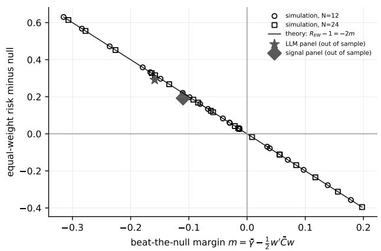

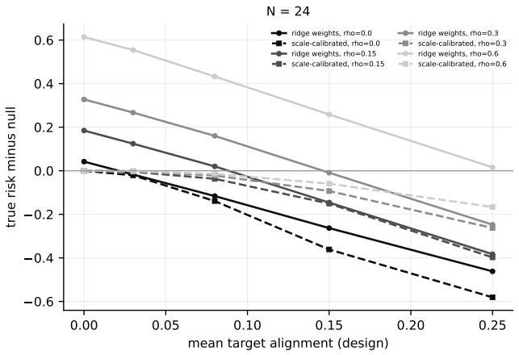  
Figure 1: Left: equal-weight true risk minus 1 plotted against the margin m of Corollary 1 for all Design D cells, displaying the exact line $- 2 m$ and the two empirical panels (out of sample). Right: ridge weights alongside their scale-calibrated version across alignment levels $( N = 2 4 )$

Which history statistic ranks candidates? (Designs B, D). Criterion validity results appear in Table 6 and Figure 2.

• Exchangeable dependence (Design D). Once alignment reaches at least 0.08, $\hat { \Delta }$ achieves near-perfect ranking of candidates according to their true incremental risk. This ranking derives from its alignment component; alignment alone performs equally well.

• Forecast correlation ranks backwards. Its Spearman correlation ranges from −0.39 to −0.96. The identity $C = \gamma \gamma ^ { \prime } + K$ implies that better-aligned forecasters are mechanically more correlated with each other, rendering the “most diverse” candidate the least aligned. The target-orthogonal correlation likewise ranks backwards, since its normalization $K _ { i i } = 1 - \gamma _ { i } ^ { 2 }$ incorporates alignment.

• Heterogeneous dependence (Design B). $\hat { \Delta }$ dominates: 0.98 in S2 versus 0.51 for alignment alone, and 0.87 in S3 versus 0.20. Outside the break scenario, its pick regret remains at most 0.002, compared with up to 0.074 for forecast correlation.

Misspecification (Design G). Although the identities hold irrespective of the generating process, the procedures could nevertheless be tuned to it. Under a monotone nonlinear distortion of the scores and under a heteroskedastic, heavy-tailed target, the ordering remains unchanged: the ridge projection achieves the best performance (−0.095 and −0.131 relative to the no-information forecast, compared with attainable values of −0.098 and −0.133), calibrated selections attain −0.066 to −0.079, and calibrated equal weighting reaches −0.046 to −0.061. When a break strikes randomly chosen forecasters rather than the most aligned ones, every calibrated method remains slightly below the no-information forecast (−0.013 to −0.026), whereas the unscaled equal-weight pool lies above it (+0.059). Criterion validity is likewise unafected: $\hat { \Delta }$ achieves the best candidate ranking (Spearman 0.97, 0.98 and 0.40), while forecast correlation proves uninformative or negative (0.02, −0.09, 0.16).

Table 6: Criterion validity: mean within-incumbent Spearman correlation between history criteria and the true incremental risk (higher values indicate better performance). Design D results are averaged across dependence levels and N.
<table><tr><td rowspan="2">Criterion</td><td colspan="4">Design D: alignment</td><td colspan="4">Design B: scenario</td></tr><tr><td>0.03</td><td>0.08</td><td>0.15</td><td>0.25</td><td>S1</td><td>S2</td><td>S3</td><td>S5</td></tr><tr><td> $\hat { \Delta }$  (realized history risk)</td><td>0.64</td><td>0.91</td><td>0.97</td><td>0.99</td><td>0.97</td><td>0.98</td><td>0.87</td><td>0.94</td></tr><tr><td>alignment part</td><td>0.68</td><td>0.92</td><td>0.98</td><td>0.99</td><td>0.89</td><td>0.51</td><td>0.20</td><td>0.69</td></tr><tr><td>target-orthogonal part</td><td>-0.01</td><td>0.07</td><td>0.28</td><td>0.59</td><td>0.41</td><td>0.73</td><td>0.39</td><td>0.51</td></tr><tr><td>Scale-free  $\hat { \Delta } ^ { \mathrm { s f } }$ </td><td>0.68</td><td>0.92</td><td>0.97</td><td>0.99</td><td>0.93</td><td>0.82</td><td>0.37</td><td>0.70</td></tr><tr><td>Mean deviation correlation  $\rho ^ { e } ( k , P )$ </td><td>0.40</td><td>0.73</td><td>0.84</td><td>0.74</td><td>0.87</td><td>0.96</td><td>0.65</td><td>0.84</td></tr><tr><td>Mean forecast correlation  $\rho ^ { s } ( k , P )$ </td><td>-0.08</td><td>-0.39</td><td>-0.80</td><td>-0.96</td><td>0.00</td><td>0.50</td><td>0.30</td><td>0.46</td></tr><tr><td>Mean orthogonal correlation</td><td>-0.04</td><td>-0.13</td><td>-0.30</td><td>-0.48</td><td>0.28</td><td>0.65</td><td>0.36</td><td>0.50</td></tr><tr><td>Alignment of k</td><td>0.68</td><td>0.92</td><td>0.98</td><td>0.99</td><td>0.89</td><td>0.51</td><td>0.20</td><td>0.69</td></tr></table>

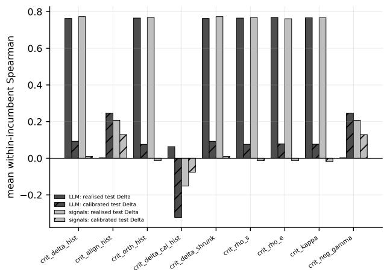

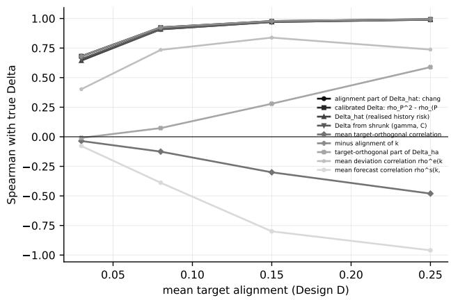  
Figure 2: Criterion validity. Left: LLM and signal panels versus realized and calibrated test outcomes. Right: Design D versus true incremental risk.

History length and instability (Designs E, F). Table 7 presents the following findings.

• Stationary designs. At every history length, even 52 dates, the ridge projection exhibits the lowest risk. The calibrated equal-weight rule, peLASSO, exhaustive search and ridge weights lie within approximately 0.005 of one another, and the scale-free rule

Table 7: Designs E and F: true test risk minus 1. All pools and weights are scale-calibrated except the unconstrained ridge projection. “Attainable”: Corollary 2 under the test-period truth. 60 replications; Monte Carlo standard errors fall below 0.004.
<table><tr><td rowspan="2"></td><td colspan="2">E: S1</td><td colspan="2">E: S2</td><td colspan="5">F: instability mechanism</td></tr><tr><td>T = 52</td><td>T = 260</td><td>T = 52</td><td>T = 260</td><td>F1</td><td>F2</td><td>F3</td><td>F4</td><td>F5</td></tr><tr><td>Equal weight, all</td><td>-0.046</td><td>-0.046</td><td>-0.021</td><td>-0.021</td><td>-0.043</td><td>-0.010</td><td>-0.028</td><td>0.003</td><td>0.028</td></tr><tr><td>Three-way, equal weight</td><td>-0.074</td><td>-0.080</td><td>-0.049</td><td>-0.053</td><td>-0.077</td><td>0.068</td><td>-0.006</td><td>-0.022</td><td>0.222</td></tr><tr><td>Three-way, scale-free</td><td>-0.047</td><td>-0.076</td><td>-0.019</td><td>-0.048</td><td>-0.061</td><td>0.068</td><td>-0.001</td><td>-0.023</td><td>0.212</td></tr><tr><td>peLASSO</td><td>-0.077</td><td>-0.080</td><td>-0.052</td><td>-0.053</td><td>-0.076</td><td>0.034</td><td>-0.023</td><td>-0.013</td><td>0.154</td></tr><tr><td>Exhaustive search</td><td>-0.077</td><td>-0.078</td><td>-0.053</td><td>-0.053</td><td>-0.075</td><td>0.010</td><td>-0.034</td><td>-0.009</td><td>0.103</td></tr><tr><td>Ridge weights</td><td>-0.078</td><td>-0.082</td><td>-0.052</td><td>-0.053</td><td>-0.078</td><td>0.025</td><td>-0.029</td><td>-0.007</td><td>0.134</td></tr><tr><td>Ridge projection</td><td>-0.096</td><td>-0.102</td><td>-0.211</td><td>-0.216</td><td>-0.098</td><td>0.050</td><td>-0.026</td><td>-0.051</td><td>0.210</td></tr><tr><td>Attainable (truth)</td><td></td><td></td><td></td><td></td><td>-0.103</td><td>-0.073</td><td>-0.056</td><td>-0.076</td><td>-0.256</td></tr></table>

improves as T grows.

• Projection weights. In S2, the projection’s advantage relies on large ofsetting weights across near-clones: gross exposure 5.1–5.4, with half of the weights negative and maximum absolute weight 0.39. Its gross exposure in S1 equals 1.04–1.16.

## • Instability mechanisms matter.

– Time-varying alignment without a break (F1) behaves similarly to the stationary case.

– When the top forecasters abruptly lose alignment (F2) or reverse it (F5), every estimated weighting and selection performs worse than the no-information forecast. The calibrated full equal-weight composite proves least harmful (F2 constitutes the only case in which it remains below it).

– When the loss occurs gradually (F3), calibrated equal weights, ridge weights, exhaustive search and the projection perform comparably.

– When only dependence shifts (F4), the projection achieves the best result (−0.051), while the calibrated full equal-weight composite performs slightly worse than the no-information forecast (+0.003).

No single rule proves robust to all mechanisms. The geometry identifies which term moved: alignment breaks harm estimated weights, whereas dependence shifts harm equal weighting. The former pattern agrees with the case for pooling under structural breaks (Hendry and Clements, 2004).

## 9. A retrospective stress test with language-model forecasters

## 9.1. Design and its limits

The ensemble crosses four base models drawn from four developer lineages (gpt-5-nano, deepseek-v4-flash, Llama-3.1-8B-Instruct, gemini-3.5-flash-lite) with three personas (momentum, value reversal, macro defensive) and two information subsets. The priceonly subset comprises trailing 1-, 3- and 12-month returns; the price-plus-volatility subset additionally includes 63-day volatility and 6-month maximum drawdown. This yields N = 24 forecasters. At each weekly date, every forecaster receives a point-in-time cross-section of 60 US large-capitalization equities and assigns scores in [−1, 1] to every ticker as a relative ranking of the forward five-day return.

Three features of the design constrain what it can demonstrate.

• Retrospective forecasts. All forecasts were produced retrospectively in 2026 from point-in-time inputs. Because they constitute outputs of models whose training data may postdate the forecast dates, they do not represent real-time forecasts (on lookahead bias in LLM-based return prediction, see Glasserman and Lin, 2024). The stated training cutofs are December 2023 (Llama) and May 2024 (gpt); the remaining two models state March 2026 (gemini) and April 2026 (deepseek), corresponding to the end of the sample.

• Fixed universe. The equity universe was fixed once, at the end of the sample, so the cross-section is conditioned on survival (Brown et al., 1992). The application constitutes a fixed-panel ranking experiment, not an investable backtest.

• Scope. Prompts, decoding settings, response hashes and access timestamps are included in the replication package described under Data and code availability.

We employ the panel as a stress test of the framework: a case featuring many forecasters, strong redundancy and weak alignment, in which the geometry, admission rules and power can be examined. It does not constitute evidence about real-time LLM forecasting ability; in other settings, aggregated LLM forecasts have rivaled human crowds (Schoenegger et al., 2024).

Of 285 weekly dates from January 2021 to June 2026, 261 enter the fixed-membership panel. The 24 exclusions comprise dates on which at least one of the 6,840 forecaster-date cells failed (21 constant outputs, 4 unparsable responses). The failures concentrate in one model (19 of 25 failed cells), one persona (20) and the price-plus-volatility subset (17). They show no relation to market conditions: excluded and retained dates exhibit similar crosssectional return dispersion (0.038 against 0.036, p = 0.65), mean return (p = 0.82), absolute mean return $( p = 0 . 4 0 )$ and trailing market volatility (0.160 against 0.152, $p = 0 . 6 1 )$ . The common support ranges from 49 to 60 tickers (median 60). Six nested outer origins with 104 initial history dates, 52 validation dates and 26-date test blocks yield 157 test dates (March 2023 to June 2026); the residual date at the end of the sample is absorbed into the final block, which therefore covers 27.

## 9.2. Geometry

Table 8 presents the geometry together with 95% moving-block bootstrap intervals.

• Alignment is negligible. Mean alignment equals 0.006 [−0.010, 0.020].

• Deviation correlation is a translation of forecast correlation. Mean forecast correlation equals 0.300 and mean deviation correlation 0.645, lying within 0.005 of the zero-alignment benchmark 0.650. Across the 276 pairs, deviation correlation constitutes almost exactly a linear function of forecast correlation $( R ^ { 2 } = 0 . 9 9 9 9$ ; Figure 3): 29% of forecast correlations are negative, yet no deviation correlation is. The equalweight variance-equivalent size equals 3.03 from forecast correlation and 1.52 from deviation correlation.

$\bar { K }$ and $K ^ { \mathrm { p o o l } }$ difer. Time variation in alignment accounts for 5.9% of the trace of $K ^ { \mathrm { p o o l } }$ , so the two decompositions of equal-weight risk difer $( 1 . 0 1 0 + 0 . 3 0 8$ within dates, $0 . 9 8 8 + 0 . 3 3 0 \ \mathrm { p o o l e d } )$

• Dependence is concentrated. The leading eigenvalue of $\bar { C }$ carries 66% of its trace. Descriptively, it loads on the momentum and macro-defensive personas, and samepersona pairs correlate at 0.47 versus 0.23 otherwise.

• No evidence of alignment anywhere in the ensemble. The bootstrap Wald test yields $p = 0 . 0 6 5$ and $\operatorname* { m a x } - | t |$ yields $p = 0 . 2 5$ ; the asymptotic Wald p-value of 0.0001 is invalid (Section 8). Equal weighting misses the condition of Corollary 1 by $m = - 0 . 1 5 9$ $[ - 0 . 1 7 7 , - 0 . 1 4 2 ]$ , and the in-sample attainable risk of any linear combination equals 0.994.

## 9.3. Selection and out-of-sample risk

Selected pools.

• At every origin, the equal-weight three-way rule selects exactly two forecasters. The pair always exhibits negative correlation (mean within-pool $\rho ^ { s } = - 0 . 7 8 )$ and remains identical under every multiplicity and α variant.

Table 8: Geometry of the LLM panel (261 dates, N = 24); 95% moving-block bootstrap intervals (block length 4, 999 draws).
<table><tr><td>Quantity</td><td>Estimate</td><td>95% interval</td></tr><tr><td>Mean forecast correlation  $\bar { \rho } ^ { s } \mathrm { ~ / ~ }$  deviation correlation  $\bar { \rho } ^ { e }$ </td><td>0.300 / 0.645</td><td>[0.284, 0.317] / [0.637, 0.654]</td></tr><tr><td> $\bar { \rho } ^ { e } - ( 1 + \bar { \rho } ^ { s } ) / 2$ </td><td>-0.005</td><td>[-0.008, -0.002]</td></tr><tr><td>Mean target alignment γ</td><td>0.006</td><td>[–0.010, 0.020]</td></tr><tr><td> $N _ { \mathrm { e f f } }$  from  $\bar { \rho } ^ { s } \mathrm { ~ / ~ }$  from  $\bar { \rho } ^ { e }$ </td><td>3.03 / 1.52</td><td>[2.89, 3.19] / [1.50, 1.53]</td></tr><tr><td>Trace share of  $\operatorname { C o v } _ { a } ( \gamma _ { t } )$  in  $K ^ { \mathrm { p o o l } }$ </td><td>0.059</td><td>[0.049, 0.065]</td></tr><tr><td>Equal-weight risk / margin m</td><td>1.318 / -0.159</td><td>[1.285, 1.354] / [−0.177, −0.142]</td></tr><tr><td>In-sample attainable risk; joint zero-alignment p (bootstrap Wald  $/ \operatorname* { m a x } - | t | )$ </td><td>0.994; 0.065 / 0.25</td><td></td></tr></table>

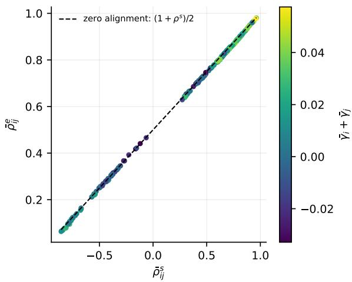

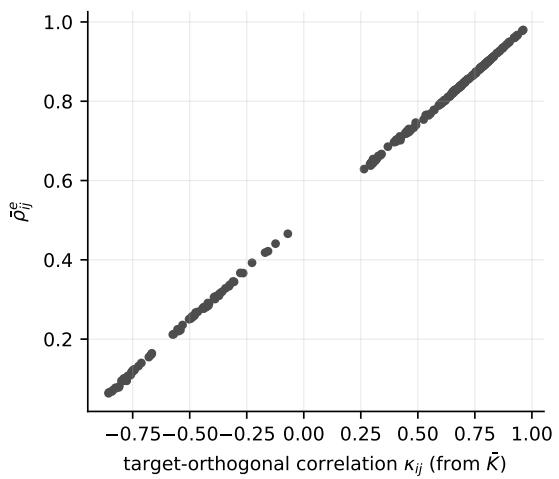  
Figure 3: Pairwise deviation correlation plotted against forecast correlation (left, with the zero-alignment line) and against target-orthogonal correlation (right).

• The rule’s decisions prove independent of the practical margin. For every $\delta$ from 0.0001 to 0.1, the same pool is selected, and the scale-free rule retains only its starting forecaster for every $\delta ^ { \mathrm { s f } }$ from $1 0 ^ { - 5 }$ to 0.01. The margin is therefore not identified in this application, and no result depends on it.

• Exhaustive search selects six forecasters, while peLASSO selects 3.3 on average.

• Although selected pools are unstable (bootstrap Jaccard similarity 0.35–0.49), the risk surface is flat: at each origin, 19–57 pools lie within 0.005 of the history optimum, and that optimum (1.037–1.052) exceeds the no-information forecast at every origin.

Out-of-sample risk. Table 9 presents the following findings.

• Against equal weighting, quadratic weightings and the pools chosen by exhaustive search, three-way admission and diversity criteria reduce risk by 0.20–0.27.

• Against the no-information forecast, none improves. The best performer, shrunk ridge weights, exhibits a diference of +0.019 [0.006, 0.032].

Table 9: Out-of-sample results (157 test dates, six origins). Diferences in relative-score risk with 95% HAC intervals; “Align.” and “Orth.” decompose risk exactly; spread: top-minus-bottom quintile forward return of the composite (% per five days, HAC t).
<table><tr><td>Method</td><td>Size</td><td>Risk</td><td>vs equal weight</td><td></td><td>vs no-information</td><td>Align.</td><td>Orth.</td><td>Spread (t)</td></tr><tr><td>Equal weight, all</td><td>24</td><td>1.292</td><td></td><td></td><td>0.292 [0.247, 0.337]</td><td>0.991</td><td>0.301</td><td>0.36 (1.4)</td></tr><tr><td>Three-way, equal weight</td><td>2.0</td><td>1.079</td><td></td><td>−0.213 [−0.262, −0.164]</td><td>0.079 [0.055, 0.103]</td><td>0.978</td><td>0.101</td><td>0.19 (1.0)</td></tr><tr><td>Pairwise batch</td><td>2.3</td><td>1.063</td><td>-0.229 </td><td>[−0.276, -0.182]</td><td>0.063 [0.042, 0.084]</td><td>0.975</td><td>0.088</td><td>0.23 (1.1)</td></tr><tr><td>peLASSO</td><td>3.3</td><td>1.247</td><td>-0.045</td><td>[−0.160, 0.069]</td><td>0.247 [0.123, 0.371]</td><td>0.986</td><td>0.260</td><td>0.50 (2.1)</td></tr><tr><td>Exhaustive search</td><td>6.0</td><td>1.033</td><td>-0.259</td><td>[−0.298, -0.220]</td><td>0.033 [0.016, 0.050]</td><td>0.986</td><td>0.047</td><td>0.24 (1.1)</td></tr><tr><td>Min. deviation correlation</td><td>2.0</td><td>1.089</td><td>-0.203</td><td>[−0.249, -0.157]</td><td>0.089 [0.062, 0.116]</td><td>0.984</td><td>0.105</td><td>0.17 (0.8)</td></tr><tr><td>Ridge weights (shrunk)</td><td></td><td>1.019</td><td>-0.273</td><td>[−0.315, -0.230]</td><td>0.019 [0.006, 0.032]</td><td>0.988</td><td>0.031</td><td>0.14 (0.6)</td></tr><tr><td>Affine weights (raw)</td><td></td><td>1.020</td><td></td><td>−0.272 [−0.316, −0.229]</td><td>0.020 [0.006, 0.034]</td><td>0.985</td><td>0.035</td><td>0.24 (1.0)</td></tr><tr><td>Ridge projection</td><td></td><td>1.000</td><td>-0.292</td><td></td><td>0.000 [−0.001, 0.002]</td><td>1.000</td><td>0.001</td><td>−0.10 (−0.5)</td></tr><tr><td>No-information forecast</td><td>0</td><td>1.000</td><td></td><td>-0.292 [−0.337, −0.247]</td><td></td><td>1.000</td><td>0.000</td><td></td></tr></table>

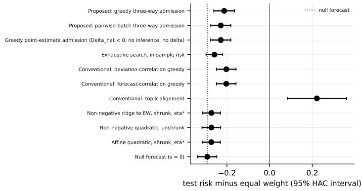

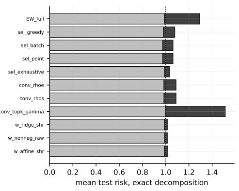  
Figure 4: Left: test risk minus equal-weight risk with 95% HAC intervals (dotted: no-information forecast). Right: exact decomposition into alignment and target-orthogonal terms.

• The gains come from the orthogonal term. The target-orthogonal term falls from 0.301 to 0.031–0.105, while the alignment term remains between 0.975 and 0.991.

• Scale-free diagnostics agree. Composite correlations range from 0.025 to 0.043, and no method difers from equal weighting $( | t | \leq 0 . 8 4 )$ . Top-minus-bottom quintile return spreads range from −0.10% to 0.50% per five days, with no |t| exceeding the Bonferroni threshold of 3.0 for 20 procedures. History-calibrated composites sit at the no-information forecast (0.9981–1.0014).

• The regression-type benchmarks efectively abstain. The ridge projection’s weights sum to 0.018 with gross exposure 0.11, and the raw afine weights carry 18% negative mass.

Table 10: Cross-panel admission (six origins; simultaneous max-t bands over each family; $\delta = 0 . 0 0 5 , \delta ^ { \mathrm { s f } } =$ 0.0005). Test $\Delta$ pooled over 157 test dates (HAC t).
<table><tr><td>Candidate → incumbent</td><td>Basis</td><td> $\hat { \Delta }$ </td><td>of which  $\Delta ^ { \mathrm { s f } }$ </td><td>Admit</td><td>Reject</td><td>Test ∆ (t)</td></tr><tr><td>Value-reversal LLMs (8) → signals</td><td>equal weight</td><td>-0.130</td><td>-0.000</td><td>6/6</td><td>0/6</td><td>−0.114 (−9.8)</td></tr><tr><td>Momentum LLMs (8) → signals</td><td>equal weight</td><td>0.072</td><td>-0.000</td><td>0/6</td><td>4/6</td><td>0.087 (4.7)</td></tr><tr><td>All 24 LLMs → signals</td><td>equal weight</td><td>-0.001</td><td>-0.000</td><td>0/6</td><td>0/6</td><td>0.008 (0.4)</td></tr><tr><td>All nine signals → LLMs</td><td>equal weight</td><td>-0.097</td><td>-0.000</td><td>6/6</td><td>0/6</td><td>-0.090 (−11.5)</td></tr><tr><td>Any batch, either direction</td><td>scale-free</td><td>[-0.0001, 0.0000]</td><td></td><td>0/6</td><td>0/6</td><td>[−0.0003, 0.0005]</td></tr></table>

## 9.4. Control panel and cross-panel admission

To distinguish uninformative forecasters from an uninformative feature set, we construct nine mechanical signals using exactly the features provided to the LLMs: 1-month reversal (Jegadeesh, 1990), 3-, 12- and 12–1-month momentum (Jegadeesh and Titman, 1993), low volatility (Ang et al., 2006), low drawdown, and three persona-emulation rules. These signals likewise exhibit no detectable alignment (mean 0.003, largest |t| 1.82, bootstrap Wald $p =$ 0.22, attainable risk 0.997), and no combination of them improves upon the no-information forecast. We thus find no detectable alignment for this feature set and these deterministic transformations in this panel. This does not demonstrate that the target is unforecastable from other information, transformations or conditioning variables.

The comparison also characterizes the forecasters descriptively. Momentum-persona forecasts correlate 0.74 with the momentum-emulation rule and −0.82 with the reversal rule. Macro-defensive forecasts behave similarly to momentum (0.61 and −0.73). Value-reversal forecasts are essentially uncorrelated with every rule (mean 0.05).

The admission experiment adds LLM batches (by lineage, persona and information subset, and all 24) to the equal-weight signal pool, and signal batches to the LLM pool, at each origin (Table 10).

• Equal-weight basis. At all six origins, the value-reversal batch is admitted into the signal pool with $\hat { \Delta } = - 0 . 1 3 0$ , of which the scale-free component equals −0.0001 and the scale mismatch −0.130. Its test $\Delta$ equals −0.114 (t = −9.8): pure dilution by forecasts uncorrelated with the incumbent.

• Scale-free basis. Every batch in both directions remains undecided at every origin, and realized scale-free test $\Delta$ lies within ±0.0005.

## 9.5. Positive control: what could have been detected

Only if signal could have been detected does a null result carry information. Three forecasters are planted per replicate, $p _ { j t } = a y _ { t } + 0 . 7 u _ { j t } ^ { \perp } + \sqrt { 0 . 5 1 - a ^ { 2 } } e _ { j t }$ . In this specification, u⊥ denotes the target-orthogonal component of a randomly drawn real LLM forecast, thereby generating real dependence and exactly zero alignment at $a = 0$ , while e represents noise (40 replicates, six origins). Because the planted forecasters employ the realized target, they serve solely as a validation device. Table 11 and Figure 5 present the results.

• Admission into large pools. Discrimination proves impossible for equal-weight admission: zero-loading planted forecasters are admitted 24% of the time into the LLM pool and 62% into the signal pool. Even at $a = 0 . 1 0$ , scale-free admission never admits into either large pool, consistent with the dilution bound (three candidates with alignment 0.10 added to 24 incumbents gain at most about 0.0005 in squared correlation).

• Selection from scratch exhibits a precision–recall trade-of.

– Essentially nothing is recovered by the scale-free rule at a = 0. At $a = 0 . 0 4$ う 0.06 and 0.10, recovery rates reach 38%, 49% and 77% of planted forecasters with precision 1.00, 1.00 and 0.94.

– Recovery rates for the equal-weight rule range from 48–82% with precision 0.36– 0.69.

– peLASSO achieves recovery rates of 89–99% with precision 0.76–0.82, but includes 12% of zero-loading forecasters.

• Risk. Similar performance is exhibited by the calibrated composites of the three selections: 0.027–0.031 below the no-information forecast at $a = 0 . 1 0$ , and at it when a = 0.

• Alignment that varies over time is harder to find. With autocorrelated alignment of the same mean, recovery remains essentially unchanged (0.42 at $a = 0 . 0 6$ for the scale-free rule). When the planted alignment is present only in the second half of the sample, recovery falls to 0.19 at $a = 0 . 0 6$ and 0.25 at $a = 0 . 1 0$ , with precision 0.57–0.66. Detection power therefore constitutes a statement about stable alignment.

## 9.6. Placebo, per-origin results and efective sample size

What the null can support is constrained by three diagnostics.

• Placebo. Forecast dependence is preserved exactly, and alignment destroyed, by circularly shifting the realized target through random ofsets (50 shifts). Mean forecast correlation remains unchanged at 0.3005, while the alignment statistics of the actual data sit in the middle of the placebo distribution: mean placebo alignment equals 0.0042 versus 0.0061 actual, and mean placebo max |t| equals 2.29 (range 0.77 to 5.10) versus 2.13 actual. No distributional assumption is required for the resulting placebocalibrated p-values, which equal 0.55 for mean alignment, 0.53 for max |t|, 0.22 for the Wald statistic and 0.61 for the equal-weight composite t. At the nominal 5% level, rejection occurs in 22% of placebos for the bootstrap Wald test and in 14% for the max |t| test; thus, in this dependence structure, both overstate the evidence, and the placebo serves as our reference.

Table 11: Positive control: selection from scratch in the LLM-plus-planted universe (40 replicates $\times \textit { 6 }$ origins). Recovery denotes the share of planted forecasters selected; precision denotes the planted share of the selected pool; risk denotes the calibrated selected pool minus the no-information forecast.
<table><tr><td></td><td colspan="3">Three-way, scale-free</td><td colspan="3">Three-way, equal weight</td><td colspan="3">peLASSO</td></tr><tr><td>Loading a</td><td>Recovery</td><td>Precision</td><td>Risk</td><td>Recovery</td><td>Precision</td><td>Risk</td><td>Recovery</td><td>Precision</td><td>Risk</td></tr><tr><td>0.00</td><td>0.00</td><td>0.00</td><td>0.002</td><td>0.02</td><td>0.01</td><td>-0.002</td><td>0.12</td><td>0.08</td><td>-0.002</td></tr><tr><td>0.02</td><td>0.21</td><td>0.62</td><td>0.001</td><td>0.32</td><td>0.25</td><td>-0.001</td><td>0.74</td><td>0.62</td><td>-0.001</td></tr><tr><td>0.04</td><td>0.38</td><td>1.00</td><td>-0.002</td><td>0.48</td><td>0.36</td><td>-0.003</td><td>0.89</td><td>0.76</td><td>-0.004</td></tr><tr><td>0.06</td><td>0.49</td><td>1.00</td><td>-0.007</td><td>0.62</td><td>0.52</td><td>-0.010</td><td>0.96</td><td>0.81</td><td>-0.009</td></tr><tr><td>0.10</td><td>0.77</td><td>0.94</td><td>-0.027</td><td>0.82</td><td>0.69</td><td>-0.031</td><td>0.99</td><td>0.82</td><td>-0.031</td></tr></table>

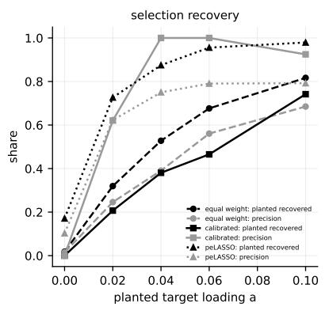

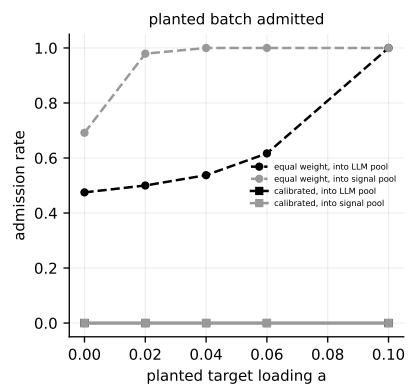

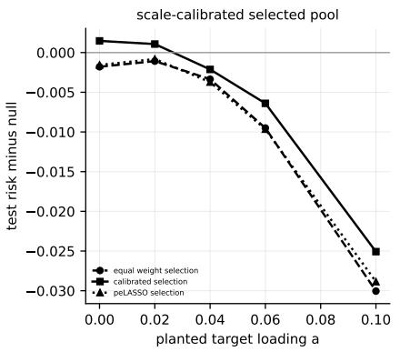  
Figure 5: Positive control: recovery and precision (left panel), admission of the planted batch into large pools (middle panel), and risk of calibrated selections (right panel).

• Per-origin results. At every origin, the ordering is preserved: equal weighting 1.224– 1.367, three-way selection 1.039–1.119, exhaustive search 1.005–1.076, ridge weights 1.007–1.037, the ridge projection 0.999–1.001, and the no-information forecast at 1 by construction.

• Efective sample size. Non-overlapping test observations result from the five-session spacing of weekly dates combined with the five-session horizon. First-order autocorrelations of the loss series fall below 0.11 in absolute value for all methods except peLASSO (0.68), yielding efective sample sizes of 146–166 against a nominal 157, and 22 for peLASSO. Agreement with the HAC intervals is exhibited by moving-block bootstrap intervals at block lengths 2, 4 and 8.

## 9.7. Robustness

Under the following variants (Appendix C), the conclusions remain valid:

• dynamic forecaster availability (285 dates), allowing entry and exit of forecasters (Capistrán and Timmermann, 2009);

• pairwise deletion (eight indefinite date-level matrices, PSD aggregates) and mean imputation;

• Bonferroni, Holm (Holm, 1979), max-t and unadjusted multiplicity with $\alpha \in$ {0.05, 0.10} (identical pools);

• HAC lags 1–8 and bootstrap blocks 2–8 (standard errors within 10%);

• two alternative rolling-origin designs;

• the 93 post-cutof test dates.

Where estimable, alignment proves higher after a model’s stated cutof than before (pre minus post, t = −1.17 and −0.75, with HAC standard errors computed separately on the two windows). The 60-day window following each stated cutof is quarantined, leaving 254 of the 261 panel dates in each comparison, and the contrast is taken on the lineage-average alignment. Training-data contamination cannot be ruled out by this weak comparison, yet detectable alignment is exhibited by no model in either period.

## 10. A second panel: cross-asset funds at a monthly horizon

Because the language-model panel is retrospective and built on a static equity crosssection, we ask whether the same conclusions survive on data that share none of those traits. To that end, we carry over the identical estimand, geometry, admission rules and engine to a second panel built entirely without language models: 42 exchange-traded funds that span country equity markets, US sectors, broad equity indices, real estate and bonds, ranked each month according to their expected 21-session relative return. The same nine mechanical forecasters from Section 9 are used; cross-sectional momentum is documented across asset classes (Asness et al., 2013). Because funds are picked for long, uninterrupted histories, the cross-section is not screened on constituent survival; with 60 initial history dates, a 24-date inner validation window and 12-date test blocks, the panel yields 256 monthly dates (2005– 2026), sixteen outer origins and 196 test dates (the final block absorbs four residual dates and covers 16), in contrast to the six origins and 157 test dates of the first panel.

Results appear in Table 12: the geometry of the first panel carries over to independent data.

• Deviation correlation remains a translation. Forecast correlation averages 0.149, while deviation correlation averages 0.564, a mere 0.010 short of the 0.575 zeroalignment benchmark. Computing the variance-equivalent size from the translated statistic, rather than the raw one, lowers the equal-weight figure from 4.10 to 1.63.

• Alignment remains undetectable. Alignment averages −0.011. The bestperforming single forecaster, 12–1 momentum, reaches $\bar { \gamma } = 0 . 0 3 3$ with $t = 1 . 8 2 $ ; the bootstrap Wald test returns $p = 0 . 3 7$ , and max |t| returns $p = 0 . 2 0$ . In-sample attainable risk is 0.995, and the equal-weight portfolio falls −0.133 short of Corollary 1. Here alignment varies more over time: 14.1% of the trace of $K ^ { \mathrm { p o o l } }$ , versus 5.9% in the first panel.

• Selection eliminates dilution but contributes nothing further. Equal weighting across all nine signals leaves risk at 1.283, whereas three-way selection and exhaustive search bring it down to 1.076 and 1.061 with two members, and shrunk afine weights bring it to 1.035. Each of these stays above the no-information forecast $( t = 3 . 1 \mathrm { t o } 9 . 4 )$ and every history-calibrated composite lands on it (0.9998–1.0034). Top-minus-bottom quintile spreads carry no significance (largest $| t | = 1 . 0 )$

• Dilution replicates precisely. Under equal weighting, the reversal rules clear admission at all sixteen origins (1-month reversal $\hat { \Delta } = - 0 . 0 6 0$ with realized test $\Delta = - 0 . 0 7 4$ ; the reversal persona rule −0.087 and −0.110), while low-drawdown and defensive rules fail admission. Under the scale-free basis, none of the nine candidates is resolved at any origin: $| \hat { \Delta } ^ { \mathrm { s f } } | \le 0 . 0 0 0 4$ , against median minimum detectable efects between 0.0009 and 0.0027.

Two conclusions emerge. First, dilution is not a by-product of language-model forecasts: wherever alignment is weak relative to dependence, it shows up, and an equal-weight admission rule is built to reward exactly that pattern. Second, a second null that draws on more origins and does not screen the cross-section for survivorship reinforces how the first should be read: across these horizons and cross-sections, none of the mechanical or language-model forecasters studied here displays alignment that the framework can pick up.

Table 12: Panel B: 42 cross-asset funds, monthly horizon, nine mechanical forecasters, 256 dates, sixteen origins, 196 test dates. Left: geometry, with the first panel for comparison. Right: out-of-sample risk and admission.
<table><tr><td>Geometry</td><td>Panel B</td><td>Panel A</td><td>Out of sample</td><td>Risk</td><td>vs no-inf. (t)</td><td>Size</td></tr><tr><td>Mean forecast correlation ρ⁸</td><td>0.149</td><td>0.300</td><td>Equal weight, all</td><td>1.283</td><td>0.283 (9.4)</td><td>9</td></tr><tr><td>Mean deviation correlation ρe</td><td>0.564</td><td>0.645</td><td>Three-way, equal weight</td><td>1.076</td><td>0.076 (5.7)</td><td>2.0</td></tr><tr><td>Zero-alignment benchmark</td><td>0.575</td><td>0.650</td><td>Exhaustive search</td><td>1.061</td><td>0.061 (5.2)</td><td>2.0</td></tr><tr><td>Mean alignment γ</td><td>-0.011</td><td>0.006</td><td>peLASSO</td><td>1.703</td><td>0.703 (12.9)</td><td>1.8</td></tr><tr><td> $N _ { \mathrm { e f f } }$  from ρ⁸ / ρe</td><td>4.10 / 1.63</td><td>3.03 / 1.52</td><td>Affine weights, shrunk</td><td>1.035</td><td>0.035 (3.1)</td><td></td></tr><tr><td>Trace share of  $\operatorname { C o v } _ { a } ( \gamma _ { t } )$ </td><td>0.141</td><td>0.059</td><td>Ridge projection</td><td>1.001</td><td>0.001 (0.5)</td><td></td></tr><tr><td>Equal-weight risk / margin m</td><td>1.265 / −0.133</td><td>1.318 / −0.159</td><td>Best calibrated composite</td><td>1.000</td><td>0.000 (0.0)</td><td></td></tr><tr><td>Attainable risk; p (bootstrap Wald / max |t|)</td><td>0.995; 0.37 / 0.20</td><td>0.994; 0.065 / 0.25</td><td>No-information forecast</td><td>1.000</td><td></td><td>0</td></tr></table>

## 11. Discussion

Practical implications, conditional on the estimand.

• Measuring diversity. Keep the three quantities apart when reporting: forecast correlation, alignment and deviation correlation. Given a common standardized target, deviation correlation makes redundancy look worse than it is whenever alignment is weak, while forecast correlation makes aligned forecasters look less valuable than they are.

• Before combining, examine both the margin of Corollary 1 and the attainable risk. Should the two sit near the no-information forecast, no combination can be expected to deliver a gain.

• Judging a candidate by equal-weight admission, decompose ∆ as in Proposition 9. What the scale-mismatch component captures is dilution, not predictive content.

• Choosing a tool. Turn to the scale-free three-way rule when the goal is to identify which forecasters demonstrably lift the correlation of an equal-weight pool and when admitting a false candidate is costly (say, when running forecasters is expensive). It errs on the side of caution and is structurally insensitive when a large pool gains a few additional candidates. Turn to peLASSO when recall outweighs precision.

• Combining under instability. Under stationarity, regression-type weights attain the lowest risk, though they may take large ofsetting positions among near-duplicate forecasters. If alignment is lost or reversed, calibrated equal weighting of the entire pool proves least harmful in our designs; if only dependence shifts, it does not.

What is not claimed.

• No claim is made that forecast correlation always dominates error correlation, nor that K represents latent economic information.

• $N _ { \mathrm { e f f } }$ should not be read as the number of independent models.

• The three-way rule does not deliver error-rate control along an adaptive path.

• Failing to clear admission is not evidence that predictive value is absent.

• Nothing in the empirical results establishes that LLMs cannot forecast returns, that LLM diversity is generally low, or that relative returns at these horizons are unforecastable from other information.

• In the first panel’s dependence structure, bootstrap inference for the joint alignment test is oversized, which is precisely why the placebo serves as the reference.

## Limitations.

• The first application is retrospective, rests on a fixed end-of-sample universe, and covers a single horizon with six outer origins; the second draws on funds already in existence in 2004 and a single monthly horizon.

• The procedures were tuned on the very data used to evaluate them.

• The stated cutof dates of two models extend across the sample.

• Measured correlations are shaped by the personas and by the instruction to spread scores.

• Real-world dependence and instability exceed what the simulation designs can capture.

• A theorem establishing path-level error control for greedy admission, together with selective-inference adjustments, remains for future work.

## 12. Conclusion

When standardized cross-sectional forecasts target the same quantity, their combination risk admits an exact decomposition into target alignment and target-orthogonal depen dence. Three insights follow from this decomposition: common-target deviation correlation can make redundancy appear larger than it is whenever alignment is weak; equal-weight admission is able to reward scale dilution; and scale-free admission leans conservative once incumbent pools are large. Across two panels, a retrospective fixed-universe equity-ranking experiment with language-model forecasters and a cross-asset fund panel with mechanical forecasters, selection and weighting eliminate most of the dilution loss carried by the full equal-weight pool, and yet no combination we evaluate beats the no-information forecast, nor is any alignment detectable. A date-shifted placebo reproduces the alignment statistics we observe, while planted-signal experiments reveal which alignment strengths the procedures would have recovered. These empirical findings hold only for the estimand, universes, information sets, model versions and periods studied.

## CRediT authorship contribution statement

Masoud Soleimani: Conceptualization, Methodology, Software, Formal analysis, Investigation, Data curation, Validation, Visualization, Writing – original draft, Writing – review & editing.

## Funding

This research did not receive any specific grant from funding agencies in the public, commercial, or not-for-profit sectors.

## Declaration of competing interest

The author declares no competing financial or non-financial interests.

## Data and code availability

The complete replication package will be released in a public repository with a persistent identifier upon the paper’s acceptance for publication. It contains the notebook that implements the full pipeline (panel construction, target geometry, admission and weighting procedures, inference, the nested rolling-origin engine, simulation Designs A–G, both empirical panels, the placebo and the positive control); run presets and configuration files; prompt templates, persona instructions and the forecaster registry; the cached model responses with SHA-256 hashes, access timestamps and model provenance; the generation-failure log; every result table, including per-origin decision and tuning logs; the figures; the run manifest with package versions and random seeds; and the self-test report. The raw market prices are excluded because the terms of their public source prohibit redistribution; the package instead contains the code that rebuilds both price panels from that source.

## References

Aiolfi, M. & Timmermann, A. (2006). Persistence in forecasting performance and conditional combination strategies. Journal of Econometrics, 135, 31–53. https://doi.org/10.1016/ j.jeconom.2005.07.015.

Ang, A., Hodrick, R.J., Xing, Y. & Zhang, X. (2006). The cross-section of volatility and expected returns. Journal of Finance, 61, 259–299. https://doi.org/10.1111/ j.1540-6261.2006.00836.x.

Asness, C.S., Moskowitz, T.J. & Pedersen, L.H. (2013). Value and momentum everywhere. Journal of Finance, 68, 929–985. https://doi.org/10.1111/jofi.12021.

Batchelor, R. & Dua, P. (1995). Forecaster diversity and the benefits of combining forecasts. Management Science, 41, 68–75. https://doi.org/10.1287/mnsc.41.1.68.

Bates, J.M. & Granger, C.W.J. (1969). The combination of forecasts. Operational Research Quarterly, 20, 451–468. https://doi.org/10.1057/jors.1969.103.

Berk, R., Brown, L., Buja, A., Zhang, K. & Zhao, L. (2013). Valid post-selection inference. Annals of Statistics, 41, 802–837. https://doi.org/10.1214/12-AOS1077.

Brown, G., Wyatt, J., Harris, R. & Yao, X. (2005). Diversity creation methods: A survey and categorisation. Information Fusion, 6, 5–20. https://doi.org/10.1016/j.inffus. 2004.04.004.

Brown, S.J., Goetzmann, W., Ibbotson, R.G. & Ross, S.A. (1992). Survivorship bias in performance studies. Review of Financial Studies, 5, 553–580. https://doi.org/10. 1093/rfs/5.4.553.

Budescu, D.V. & Chen, E. (2015). Identifying expertise to extract the wisdom of crowds. Management Science, 61, 267–280. https://doi.org/10.1287/mnsc.2014.1909.

Bürgi, C. & Sinclair, T.M. (2017). A nonparametric approach to identifying a subset of forecasters that outperforms the simple average. Empirical Economics, 53, 101–115. https://doi.org/10.1007/s00181-016-1152-y.

Capistrán, C. & Timmermann, A. (2009). Forecast combination with entry and exit of experts. Journal of Business & Economic Statistics, 27, 428–440. https://doi.org/10. 1198/jbes.2009.07211.

Chong, Y.Y. & Hendry, D.F. (1986). Econometric evaluation of linear macro-economic models. Review of Economic Studies, 53, 671–690. https://doi.org/10.2307/2297611.

Claeskens, G., Magnus, J.R., Vasnev, A.L. & Wang, W. (2016). The forecast combination puzzle: A simple theoretical explanation. International Journal of Forecasting, 32, 754– 762. https://doi.org/10.1016/j.ijforecast.2015.12.005.

Clemen, R.T. (1989). Combining forecasts: A review and annotated bibliography. International Journal of Forecasting, 5, 559–583. https://doi.org/10.1016/0169-2070(89) 90012-5.

Clemen, R.T. & Winkler, R.L. (1985). Limits for the precision and value of information from dependent sources. Operations Research, 33, 427–442. https://doi.org/10.1287/ opre.33.2.427.

Clopper, C.J. & Pearson, E.S. (1934). The use of confidence or fiducial limits illustrated in the case of the binomial. Biometrika, 26, 404–413. https://doi.org/10.1093/biomet/ 26.4.404.

Conflitti, C., De Mol, C. & Giannone, D. (2015). Optimal combination of survey forecasts. International Journal of Forecasting, 31, 1096–1103. https://doi.org/10.1016/ j.ijforecast.2015.03.009.

Diebold, F.X. & Mariano, R.S. (1995). Comparing predictive accuracy. Journal of Business & Economic Statistics, 13, 253–263. https://doi.org/10.1080/07350015.1995. 10524599.

Diebold, F.X. & Shin, M. (2019). Machine learning for regularized survey forecast combination: Partially-egalitarian LASSO and its derivatives. International Journal of Forecasting, 35, 1679–1691. https://doi.org/10.1016/j.ijforecast.2018.09.006.

Genre, V., Kenny, G., Meyler, A. & Timmermann, A. (2013). Combining expert forecasts: Can anything beat the simple average? International Journal of Forecasting, 29, 108–121. https://doi.org/10.1016/j.ijforecast.2012.06.004.

Giacomini, R. & White, H. (2006). Tests of conditional predictive ability. Econometrica, 74, 1545–1578. https://doi.org/10.1111/j.1468-0262.2006.00718.x.

Glasserman, P. & Lin, C. (2024). Assessing look-ahead bias in stock return predictions generated by GPT sentiment analysis. Journal of Financial Data Science, 6, 25–42.

Gneiting, T. (2011). Making and evaluating point forecasts. Journal of the American Statistical Association, 106, 746–762. https://doi.org/10.1198/jasa.2011.r10138.

Granger, C.W.J. & Ramanathan, R. (1984). Improved methods of combining forecasts. Journal of Forecasting, 3, 197–204. https://doi.org/10.1002/for.3980030207.

Hansen, P.R., Lunde, A. & Nason, J.M. (2011). The model confidence set. Econometrica, 79, 453–497. https://doi.org/10.3982/ECTA5771.

Harvey, D.I., Leybourne, S.J. & Newbold, P. (1998). Tests for forecast encompassing. Journal of Business & Economic Statistics, 16, 254–259. https://doi.org/10.1080/07350015. 1998.10524759.

Harvey, D.I. & Newbold, P. (2000). Tests for multiple forecast encompassing. Journal of Applied Econometrics, 15, 471–482.

Hendry, D.F. & Clements, M.P. (2004). Pooling of forecasts. Econometrics Journal, 7, 1–31. https://doi.org/10.1111/j.1368-423X.2004.00119.x.

Higham, N.J. (2002). Computing the nearest correlation matrix—A problem from finance. IMA Journal of Numerical Analysis, 22, 329–343. https://doi.org/10.1093/imanum/ 22.3.329.

Holm, S. (1979). A simple sequentially rejective multiple test procedure. Scandinavian Journal of Statistics, 6, 65–70. URL: https://www.jstor.org/stable/4615733.

Hothorn, T., Bretz, F. & Westfall, P. (2008). Simultaneous inference in general parametric models. Biometrical Journal, 50, 346–363. https://doi.org/10.1002/bimj.200810425.

Jegadeesh, N. (1990). Evidence of predictable behavior of security returns. Journal of Finance, 45, 881–898. https://doi.org/10.1111/j.1540-6261.1990.tb05110.x.

Jegadeesh, N. & Titman, S. (1993). Returns to buying winners and selling losers: Implications for stock market eficiency. Journal of Finance, 48, 65–91. https://doi.org/10. 1111/j.1540-6261.1993.tb04702.x.

Kim, M., Ray, E.L. & Reich, N.G. (2026). Beyond forecast leaderboards: Measuring individual model importance based on contribution to ensemble accuracy. International Journal of Forecasting, 42, 924–936. https://doi.org/10.1016/j.ijforecast.2025.12.006.

Krogh, A. & Vedelsby, J. (1995). Neural network ensembles, cross validation, and active learning, in: Tesauro, G., Touretzky, D.S. & Leen, T.K. (Eds.), Advances in Neural Information Processing Systems 7, MIT Press, Cambridge, MA. pp. 231–238.

Künsch, H.R. (1989). The jackknife and the bootstrap for general stationary observations. Annals of Statistics, 17, 1217–1241. https://doi.org/10.1214/aos/1176347265.

Ledoit, O. & Wolf, M. (2004a). Honey, I shrunk the sample covariance matrix. Journal of Portfolio Management, 30, 110–119. https://doi.org/10.3905/jpm.2004.110.

Ledoit, O. & Wolf, M. (2004b). A well-conditioned estimator for large-dimensional covariance matrices. Journal of Multivariate Analysis, 88, 365–411. https://doi.org/10.1016/ S0047-259X(03)00096-4.

Lee, S. & Lee, T.H. (2026). Improving the simple average combined forecast via factoradjusted regularization. Working Paper 202603. Department of Economics, University of California, Riverside. URL: https://economics.ucr.edu/repec/ucr/wpaper/202603. pdf.

Lee, T.H. & Seregina, E. (2026). Combining forecasts under structural breaks using graphical LASSO. International Journal of Forecasting, 42, 126–137. https://doi.org/10.1016/ j.ijforecast.2025.04.003.

Leitch, G. & Tanner, J.E. (1991). Economic forecast evaluation: Profits versus the conventional error measures. American Economic Review, 81, 580–590.

Lichtendahl, Kenneth C., J. & Winkler, R.L. (2020). Why do some combinations perform better than others? International Journal of Forecasting, 36, 142–149. https://doi.org/ 10.1016/j.ijforecast.2019.03.027.

Magnus, J.R. & Vasnev, A.L. (2023). On the uncertainty of a combined forecast: The critical role of correlation. International Journal of Forecasting, 39, 1895–1908. https: //doi.org/10.1016/j.ijforecast.2022.10.002.

Matsypura, D., Thompson, R. & Vasnev, A.L. (2018). Optimal selection of expert forecasts with integer programming. Omega, 78, 165–175. https://doi.org/10.1016/j.omega. 2017.06.010.

Mincer, J.A. & Zarnowitz, V. (1969). The evaluation of economic forecasts, in: Mincer, J.A. (Ed.), Economic Forecasts and Expectations: Analysis of Forecasting Behavior and Performance. National Bureau of Economic Research, New York, pp. 3–46.

Newey, W.K. & West, K.D. (1987). A simple, positive semi-definite, heteroskedasticity and autocorrelation consistent covariance matrix. Econometrica, 55, 703–708. https: //doi.org/10.2307/1913610.

Newey, W.K. & West, K.D. (1994). Automatic lag selection in covariance matrix estimation. Review of Economic Studies, 61, 631–653. https://doi.org/10.2307/2297912.

Radchenko, P., Vasnev, A.L. & Wang, W. (2023). Too similar to combine? On negative weights in forecast combination. International Journal of Forecasting, 39, 18–38. https: //doi.org/10.1016/j.ijforecast.2021.08.002.

Roccazzella, F., Gambetti, P. & Vrins, F. (2022). Optimal and robust combination of forecasts via constrained optimization and shrinkage. International Journal of Forecasting, 38, 97–116. https://doi.org/10.1016/j.ijforecast.2021.04.002.

Romano, J.P. & Wolf, M. (2005). Stepwise multiple testing as formalized data snooping. Econometrica, 73, 1237–1282. https://doi.org/10.1111/j.1468-0262.2005.00615.x.

Schoenegger, P., Tuminauskaite, I., Park, P.S., Bastos, R.V.S. & Tetlock, P.E. (2024). Wisdom of the silicon crowd: LLM ensemble prediction capabilities rival human crowd accuracy. Science Advances, 10, eadp1528. https://doi.org/10.1126/sciadv.adp1528.

Schuirmann, D.J. (1987). A comparison of the two one-sided tests procedure and the power approach for assessing the equivalence of average bioavailability. Journal of Pharmacokinetics and Biopharmaceutics, 15, 657–680. https://doi.org/10.1007/BF01068419.

Smith, J. & Wallis, K.F. (2009). A simple explanation of the forecast combination puzzle. Oxford Bulletin of Economics and Statistics, 71, 331–355. https://doi.org/10.1111/ j.1468-0084.2008.00541.x.

Stock, J.H. & Watson, M.W. (2004). Combination forecasts of output growth in a sevencountry data set. Journal of Forecasting, 23, 405–430. https://doi.org/10.1002/for. 928.

Tashman, L.J. (2000). Out-of-sample tests of forecasting accuracy: An analysis and review. International Journal of Forecasting, 16, 437–450. https://doi.org/10.1016/ S0169-2070(00)00065-0.

Tibshirani, R. (1996). Regression shrinkage and selection via the lasso. Journal of the Royal Statistical Society: Series B (Methodological), 58, 267–288. https://doi.org/10.1111/ j.2517-6161.1996.tb02080.x.

Timmermann, A. (2006). Forecast combinations, in: Elliott, G., Granger, C.W.J. & Timmermann, A. (Eds.), Handbook of Economic Forecasting. Elsevier, Amsterdam. volume 1, pp. 135–196. https://doi.org/10.1016/S1574-0706(05)01004-9.

Ueda, N. & Nakano, R. (1996). Generalization error of ensemble estimators, in: Proceedings of the International Conference on Neural Networks (ICNN’96), IEEE. pp. 90–95. https: //doi.org/10.1109/ICNN.1996.548872.

Wang, X., Hyndman, R.J., Li, F. & Kang, Y. (2023). Forecast combinations: An over 50- year review. International Journal of Forecasting, 39, 1518–1547. https://doi.org/10. 1016/j.ijforecast.2022.11.005.

Wood, D., Mu, T., Webb, A.M., Reeve, H.W.J., Luján, M. & Brown, G. (2023). A unified theory of diversity in ensemble learning. Journal of Machine Learning Research, 24, 1–49. URL: http://jmlr.org/papers/v24/23-0041.html.

## Appendix A. Proofs

Proposition 1. $\langle u _ { i t } , y _ { t } \rangle _ { t } = \gamma _ { i t } - \gamma _ { i t } \| y _ { t } \| _ { t } ^ { 2 } = 0$ and $\| u _ { i t } \| _ { t } ^ { 2 } = 1 - 2 \gamma _ { i t } ^ { 2 } + \gamma _ { i t } ^ { 2 }$ . Expanding $\left. \gamma _ { i t } y _ { t } + \right.$ $u _ { i t } , \gamma _ { j t } y _ { t } + u _ { j t } \rangle _ { \mathrm { { \scriptsize ; } } }$ t gives $C _ { t } = \gamma _ { t } \gamma _ { t } ^ { \prime } + K _ { t } . ~ K _ { t }$ is a Gram matrix. Centered vectors span at most $M _ { t } - 1$ dimensions; the $u _ { i t }$ are also orthogonal to the nonzero centered $y _ { t }$ , leaving $M _ { t } - 2$

Proposition 2. $s _ { w , t } - y _ { t } = ( w ^ { \prime } \gamma _ { t } - 1 ) y _ { t } + u _ { w , t }$ with $u _ { w , t } ~ \perp ~ y _ { t }$ and $\| u _ { w , t } \| _ { t } ^ { 2 } = w ^ { \prime } K _ { t } w ;$ no constraint on w is used.

Corollary 1. $\mathcal { R } ( w ) - 1 = q _ { w } - 2 g _ { w }$ . For $w = \mathbf { 1 } / N$ , the unit diagonal of $\bar { C }$ gives $q _ { w } =$ $\bar { \rho } + ( 1 - \bar { \rho } ) / N$

Corollary 2. $\begin{array} { r } { \bar { R } = \sum _ { t } a _ { t } R _ { t } \succeq 0 } \end{array}$ as an average of Gram matrices of $\left( s _ { 1 t } , \ldots , s _ { N t } , y _ { t } \right)$ . Hence $\bar { \gamma } \in \mathrm { r a n g e } ( \bar { C } )$ and $1 - \bar { \gamma } ^ { \prime } \bar { C } ^ { + } \bar { \gamma } \ge 0$ . The convex objective is minimized where $\bar { C } v = \bar { \gamma }$

Proposition 3. $\mathcal { R } ( c w ) = 1 - 2 c g _ { w } + c ^ { 2 } q _ { w }$ is minimized at $c _ { w }$ with value $1 - g _ { w } ^ { 2 } / q _ { w }$ , and $\mathscr { R } ( w ) - \mathscr { R } ( c _ { w } w ) = q _ { w } - 2 g _ { w } + g _ { w } ^ { 2 } / q _ { w } = q _ { w } ( 1 - c _ { w } ) ^ { 2 }$

Proposition 4. For convex w, $\begin{array} { r } { \sum _ { i } w _ { i } \| s _ { i t } - s _ { w , t } \| _ { t } ^ { 2 } = \sum _ { i } w _ { i } \| s _ { i t } \| _ { t } ^ { 2 } - \| s _ { w , t } \| _ { t } ^ { 2 } } \end{array}$ . The loss identity follows from $s _ { i t } - y _ { t } = ( s _ { i t } - s _ { w , t } ) + ( s _ { w , t } - y _ { t } )$ and $\begin{array} { r } { \sum _ { i } w _ { i } ( s _ { i t } - s _ { w , t } ) = 0 } \end{array}$

Proposition 5. Expand with unit norms. With $a = \gamma _ { i t } , b = \gamma _ { j t } , \rho = \rho _ { i j , t } ^ { s }$ and $\sqrt { ( 1 - a ) ( 1 - b ) } = 1 - ( a + b ) / 2 + O ( \gamma ^ { 2 } )$ , the diference from $( 1 + \rho ) / 2 { \mathrm { ~ i s ~ } } [ ( 1 + \rho ) ( a +$ b) $/ 2 - ( a + b ) ] / 2 + O ( \gamma ^ { 2 } ) = - ( a + b ) ( 1 - \rho ) / 4 + O ( \gamma ^ { 2 } )$

Proposition 6. Average $C _ { t } = \gamma _ { t } \gamma _ { t } ^ { \prime } + K _ { t }$ over $t ;$ then $G - \bar { \gamma } \bar { \gamma } ^ { \prime } = \mathrm { C o v } _ { a } ( \gamma _ { t } )$ and $\begin{array} { r } { \sum _ { t } a _ { t } \big ( 1 - w ^ { \prime } \gamma _ { t } \big ) ^ { 2 } = } \end{array}$ $( 1 - g _ { w } ) ^ { 2 } + w ^ { \prime } \mathrm { C o v } _ { a } ( \gamma _ { t } ) w$

Proposition 7. Convex combinations of unit-diagonal PSD matrices are unit-diagonal and PSD; the Schur complement with respect to a unit entry is PSD. $R _ { 0 } \succeq 0 \mathrm { ~ i f f ~ } E _ { N } ( \rho ^ { \star } ) \succeq 0$ and $1 - ( g ^ { \star } ) ^ { 2 } \mathbf { 1 } ^ { \prime } E _ { N } ^ { - 1 } \mathbf { 1 } \geq 0$ , with $\mathbf { 1 } ^ { \prime } E _ { N } ( \rho ) ^ { - 1 } \mathbf { 1 } = N / [ 1 + ( N - 1 ) \rho ]$

Proposition 8. $e _ { P \cup A , t } = ( n e _ { P , t } + q e _ { A , t } ) / ( n + q )$ ; take squared norms and aggregate. For $q = 1$ $\Delta _ { k | P } = ( 2 n + 1 ) V _ { P } ( \Lambda _ { k | P } ^ { E W } - 1 ) / ( n + 1 ) ^ { 2 }$

Proposition 9. Apply Proposition 3 to P and $P \cup A$ . The composite of $P \cup A$ has mean alignment $( n \bar { g } _ { P } + m \bar { g } _ { A } ) / ( n + m )$ and squared norm $( n ^ { 2 } q _ { P } + m ^ { 2 } q _ { A } + 2 n m q _ { P A } ) / ( n + m ) ^ { 2 }$ . With $\bar { g } _ { P } = q _ { P A } = 0 , \rho _ { P } ^ { 2 } = 0$ and $\rho _ { P \cup A } ^ { 2 } \leq ( m \bar { g } _ { A } ) ^ { 2 } / ( n ^ { 2 } q _ { P } )$

Plug-in scales. If $\hat { c } = c _ { H } + \epsilon$ , then $\mathcal { R } _ { H } ( \hat { c } w ) = \mathcal { R } _ { H } ( c _ { H } w ) + \epsilon ^ { 2 } q _ { w }$ because the first derivative vanishes at $c _ { H }$

## Appendix B. Implementation settings

We set the tolerances to $\varepsilon _ { r } = \varepsilon _ { x } = 1 0 ^ { - 8 }$ and $\varepsilon _ { P S D } ~ = ~ 1 0 ^ { - 9 }$ , with a minimum common support of 20 units. The tuning grids are $\delta \in \{ 0 . 0 0 1 , 0 . 0 0 2 5 , 0 . 0 0 5 , 0 . 0 1 , 0 . 0 2 \}$ , $\delta ^ { \mathrm { s f } } \ \in \ \{ 0 . 0 0 0 1 , \ldots , 0 . 0 0 2 \}$ and $\eta \in \{ 0 , 0 . 0 1 , 0 . 0 3 , 0 . 1 , 0 . 3 , 1 , 3 \}$ , while the peLASSO penalties range over $\{ 0 . 9 , 0 . 5 , 0 . 2 5 , 0 . 1 , 0 . 0 5 , 0 . 0 2 \} \times 2 \operatorname* { m a x } _ { j } \bar { \gamma } _ { j }$ . Max-t critical values are obtained from 4,000 draws, and selection stability from 200 moving-block bootstrap replications. The replication notebook verifies every identity in Propositions 1–9 numerically on both synthetic and empirical panels (175 of 177 checks passed; the two exceptions are a storage notice and the placebo rejection-rate warning discussed in Section 9). Rolling-origin blocks are formed by cutting the post-history dates into blocks of the stated length; a final block shorter than half that length is merged into its predecessor, which is why the last test block covers 27 dates in the first panel and 16 in the second. Dates falling within 60 days after a model’s stated training cutof are quarantined from the pre/post comparison of Section 9, which is reported only when at least 20 dates remain on each side. All random numbers are generated from a single documented seed.

Appendix C. Supplementary results

Table C.13: Robustness of the empirical results and further diagnostics.
<table><tr><td>Variant</td><td>Result</td></tr><tr><td>Dynamic availability</td><td>285 dates, 23.9 active forecasters on average; risks coincide on com- mon dates; out of sample (168 dates): greedy 1.085, exhaustive 1.031, equal weight 1.301</td></tr><tr><td>Pairwise deletion / imputation</td><td>8 indefinite pairwise  $C _ { t } ,$  PSD aggregates,  $\bar { \rho } ^ { s } \ = \ 0 . 3 0 0 5 \ / \ \bar { \rho } ^ { s } \ =$  0.3004, equal-weight risk 1.318</td></tr><tr><td>Multiplicity and α</td><td>Bonferroni, Holm, max-t, none;  $\alpha \in \{ 0 . 0 5 , 0 . 1 0 \}$  : pools coincide, test risk 1.079</td></tr><tr><td>Margin saturation</td><td>equal-weight pool unchanged across  $\delta \in [ 0 . 0 0 0 1 , 0 . 1 ]$  scale-free rule picks one forecaster for  $\bar { \delta ^ { \mathrm { s f } } } \in [ 1 0 ^ { - 5 } , 0 . 0 1 ]$ </td></tr><tr><td>Standard errors</td><td>greedy minus equal weight: HAC lags 1–8 yield 0.025–0.026; blocks 2, 4, 8 yield 0.024–0.026</td></tr><tr><td>Rolling designs</td><td>78/13/39: equal weight 1.299, greedy 1.120, exhaustive 1.048, ridge 1.032; 130/52/52: 1.291, 1.067, 1.037, 1.021; no-information 1.000</td></tr><tr><td>Post-cutoff test dates (93)</td><td>in both equal weight 1.299, greedy 1.068, exhaustive 1.047, ridge 1.026; cal- ibrated composites 0.9996-1.0006; composite-correlation  $t \leq 1 . 9 3$ </td></tr><tr><td>Weight diagnostics</td><td>ridge (nonnegative, shrunk): max weight 0.26, origin-to-origin turnover 0.16, correlation 0.98; raw affine: gross 1.58, 18% neg- ative mass; projection: sum 0.018, gross 0.11</td></tr><tr><td>Design axes</td><td>same minus different: persona +0.244 [0.224, 0.262]; lineage +0.069 [0.062, 0.076]; information subset -0.032 [-0.034, -0.029]</td></tr><tr><td>Stated cutoffs</td><td>60-day quarantine after each cutoff (7 of 261 panel dates dropped); t is pre minus post on the lineage-average alignment. Llama (Dec 2023; 138 pre/116 post):  $t = - 0 . 7 5 ;$  gpt (May 2024; 159/95): t = -1.17; deepseek (Apr 2026), gemini (Mar 2026): not estimable</td></tr><tr><td>Placebo (shifted target, 50 shifts)</td><td>(fewer than 20 post-cutoff dates) forecast correlation unchanged (0.3005); placebo alignment 0.0042 versus 0.0061 actual; placebo max |t| 2.29 (0.77–5.10) versus 2.13; placebo-calibrated  $p \mathrm { : }$  alignment 0.55, max |t| 0.53, Wald 0.22, equal-weight composite t 0.61; nominal 5% rejections under the</td></tr><tr><td>Per-origin risk</td><td>placebo: bootstrap Wald 22%, max |t| 14% equal weight 1.224–1.367, three-way 1.039–1.119, exhaustive 1.005–1.076, ridge 1.007–1.037, projection 0.999–1.001</td></tr><tr><td>Overlap and effective sample</td><td>spacing five sessions, horizon five sessions;  $| \mathrm { a c f } _ { 1 } | \le 0 . 1 1$  except peLASSO (0.68); effective sample 146–166 (peLASSO 22); block</td></tr><tr><td>Exclusion mechanism</td><td>bootstrap at blocks 2, 4, 8 agrees with HAC excluded and retained dates match on return dispersion  $( p = 0 . 6 5 )$  mean and absolute mean return  $( p ~ = ~ 0 . 8 2 , ~ 0 . 4 0 )$  and trailing volatility  $( p = 0 . 6 1 )$  ; failures cluster in one model (19 of 25 cells), one persona (20) and one information subset (17)</td></tr></table>