# Targeted Review for AI-Assisted Biodiversity Surveys: Active Continuous-Score Occupancy Modeling

Timm Haucke MIT haucke@mit.edu

Lauren Harrell Google Research

Justin Kay MIT

Mary Clapp The Institute for Bird Populations

Sara Beery MIT

## Abstract

We increasingly use machine learning to label scientific datasets. The models we develop and deploy are improving all the time, but they are not and will likely never be perfect. Mistakes matter, as errors can propagate into our scientific understanding, particularly when systematically biased. Very reasonably, scientists thus review substantial proportions of ML-generated labels to verify or correct mistakes in pursuit of ensuring their scientific findings are not biased by ML. In this work, we focus on helping scientists optimally allocate this reviewing effort relative to their scientific goals. We focus on a specific class of scientists (ecologists) and a specific, widespread, and impactful modeling target (occupancy modeling, which estimates where species are likely to occur, conditioned on environmental factors). We introduce Active Continuous-Score Occupancy Modeling (ACORN), a method that incorporates ML predictions into occupancy models and strategically selects samples for expert review that are maximally informative for downstream ecological analysis. Across camera-trap and bioacoustic datasets, our method recovers ecological conclusions close to those obtained from fully human-labeled data, while requiring substantially fewer expert reviews than non-targeted review policies. Our results suggest that ML-assisted scientific workflows should optimize expert effort for downstream inference, rather than for classifier accuracy alone, especially when human review budget is limited. Our code is available at https: //github.com/timmh/acorn

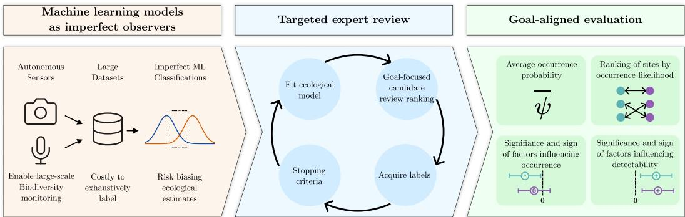  
Figure 1: ACORN turns imperfect ML classifications into targeted ecological inference. Largescale camera-trap and bioacoustic surveys produce datasets that are costly to label exhaustively, but naively relying on ML predictions can bias occupancy estimates and covariate conclusions. ACORN combines continuous classifier scores with a hierarchical occupancy model, actively prioritizes expert review using goal-directed Bayesian experimental design, and evaluates progress using ecological quantities that matter for downstream decision-making: occurrence probabilities, site rankings, and occupancy- and detection-factor conclusions.

## 1 Introduction

Machine learning (ML) is rapidly changing how ecological data is processed [56]. Data from camera traps and passive acoustic sensors, which passively collect images and audio in situ, are increasingly collected at such massive scales that they are often infeasible to review manually. ML models can classify species per example (e.g. image or audio window) far quicker than human experts [43, 54, 30]. However, in many ecological studies, the final objective is not per-example classification (e.g. identifying every species in every image of the dataset). Rather, the goal is often to use perexample classifications for population-level inference, such as estimating whether a species is present at a site (occupancy), how its detectability varies with survey conditions, and relating environmental factors (covariates) to the probability of a species occurring in a given place [63, 41].

Population-level statistical ecological models typically assume the per-example classifications they are built on are (by construction) correct. However, when we move to ML-generated classifications, this assumption breaks. Small error rates in per-example classification, i.e. even a single missed detection or false positive, can have substantial effects on downstream inference depending on the place, time, and type of mistake, biasing estimates and distorting estimated covariate relationships [37, 49, 51]. As a result, many ecologists are reasonably reluctant to rely on ML-generated observations in ecological workflows [58]. In practice, classifiers are frequently used to filter obvious negatives or otherwise de-prioritize uninformative samples, while experts continue to manually review large fractions of data [51]. This review burden is expensive and slow, limiting the extent to which data collected from large-scale sensor networks translates into timely ecological insights or conservation actions [42, 23].

Instead, we seek to use ML outputs directly in the downstream ecological model while explicitly accounting for classifier error. As an illustrative example we focus on occupancy models, hierarchical latent variable models that disentangle the probability of species presence from the probability of observing it. Because occupancy models facilitate unbiased inference from noisy observations, their use is widespread in ecology and conservation. They are explicitly recognized in IUCN Red List guidance as an appropriate tool for quantitative extinction-risk analysis [29], and have been applied to invasive species monitoring [2], identifying high-priority conservation areas [12], and used to inform conservation management [20]. However, our approach is adaptable to, and would be similarly impactful for, other population-level inference tasks built from ML-generated classifications.

Recent work has shown that it is possible to combine human reviews and ML predictions to estimate occupancy more efficiently than with human reviews alone [48]. But the question remains: which datapoints are most useful to review? Building heuristics for prioritizing which reviews should be collected is extremely difficult, since the information each reviewed example provides depends on where and when it was captured, the ecological context, and how redundant it is with respect to previously acquired reviews. Bayesian experimental design [36, 10] provides a natural informationtheoretic framework to prioritize the collection of new observations (in our case, human reviews) that maximize information gained about a quantity of interest.

We propose Active Continuous-Score Occupancy Modeling (ACORN), a method that combines noisy machine learning classifications with targeted review to maximize information gain towards a user-specified ecological inference target, based on Bayesian experimental design. Rather than targeting review to optimize classifier performance, as you would in active learning, our review acquisition policy is constructed to align with the posterior quantities that matter for ecological analysis, such as occupancy parameters, detection parameters, and derived occurrence estimates. We additionally propose a stopping criterion to determine when additional expert effort is no longer worthwhile, motivated by practical deployment needs. We systematically benchmark our method on two representative ecological datasets capturing observations of species across deployed networks of static sensors, one capturing species observations through images and one through bioacoustic recordings. We compare methods that only use verified reviews for inference and methods which additionally make use of ML scores on unverified data, and across both inference methods compare five different review policies. Evaluated across four metrics that measure recovery of ecological con clusions, we find that our method, ACORN which uses ML scores across the data to inform a targeted information gain review policy, consistently converges more quickly towards estimates consistent with fully labeled datasets. Overall, this work emphasizes the importance of developing systems that enable scientists to work with imperfect models to improve targeted scientific understanding.

## 2 Related work

ML-based species identification and occupancy modeling. ML models can label camera-trap and acoustic biodiversity data at scale, but deployment remains limited by frequent errors related to geographic or visual shifts, rare species, and poorly-calibrated predictions [43, 54, 61, 4, 5, 30, 22]. ML scores are often used to speed up human labeling via thresholding, filtering, or active learning [43, 60, 42, 8, 34, 31, 38]. However, nearly all such pipelines are still classifier-centric: they choose thresholds or queried examples to improve classification performance, domain adaptation, or annotation efficiency, rather than to directly reduce uncertainty in a downstream ecological posterior.

Occupancy modeling with imperfect detection and uncertain labels. Occupancy models are a natural target when moving beyond per-example classification toward population-level inference. They separate latent site occupancy from imperfect detection, allowing a species to be present at a site even if it is not detected during one or more repeated surveys, or “replicates”, and they allow occupancy and detection probabilities to depend on ecological covariates [37]. Classical occupancy models account for false negatives through imperfect detection, but ML-derived observations also introduce false positives. Ignoring these additional error processes can materially bias inference [49, 39, 17, 11, 62], though occupancy inference has been shown to be robust to classifier errors in some settings [6, 55, 32]. Recently, a joint continuous-score model was proposed which directly models ML score distributions conditional on latent detection states, optionally anchored by human labels [48]. This retains more information than thresholding and provides a probabilistic interface between ML outputs and ecological inference. However, that framework does not address the practical allocation problem created by limited expert review: which samples should be prioritized by experts, and when can review stop? Prior design work for occupancy studies has optimized field visits and survey schedules [37, 25]. In contrast, we treat expert verification itself as the design problem: given an existing set of ML-scored observations, which sample should be reviewed next?

Prediction-assisted inference under scarce labels. Methods that use ML predictions to inform downstream statistical inference with few verified labels include post-prediction inference [59], semi-supervised and surrogate-outcome methods [24], and prediction-powered inference (PPI), which combines a small labeled sample with many ML predictions to obtain tighter confidence intervals for low-dimensional population parameters [1]. Standard PPI formulations are typically fixed-design: labeled and unlabeled samples are representative draws from the target population, and labels serve as a correction or calibration sample. Follow-up work extends this paradigm to actively collected labels [64]. Our approach is complementary but distinct: labels are acquired intentionally non-representatively to reduce uncertainty in an entire ecological posterior.

Bayesian experimental design, Bayesian optimal design, and Bayesian active learning. Bayesian experimental design underpins our decision-theoretic approach for active review, prioritizing experiments, measurements, or labels by maximizing expected utility under the current posterior and predictive distribution [36, 10, 50, 47]. In the canonical information-theoretic formulation, the utility is expected information gain, or expected posterior entropy reduction. Classical works distinguish parameter-, prediction-, and decision-focused utilities, which matters when the target is not classifier accuracy but an ecological summary [10]. Bayesian active learning methods such as BALD select labels informative about the model posterior [28]. Bayesian experimental design underlies related work in active testing and model selection [35, 33]. We adapt this view to biodiversity surveys: the experiment is asking an expert to verify one ML-scored replicate, the outcome is a binary detection / non-detection label, and the utility targets ecological conclusions rather than classifier performance.

## 3 Methods

Active Continuous-Score Occupancy Modeling treats expert review prioritization for ML-supported species occupancy inference as an iterative Bayesian experimental design problem. Two main design components of ACORN are the ecological model (Section 3.1) and the review policy (Section 3.2).

## 3.1 The ecological model

The classic Bernoulli occupancy model [37] models latent occupancy of site $i \in S$ as

$$
z _ { i } \sim \mathrm { B e r n o u l l i } ( \psi _ { i } )\tag{1}
$$

where $\psi _ { i }$ is the probability of occupancy and is modeled using logistic regression:

$$
\log \left( \frac { \psi _ { i } } { 1 - \psi _ { i } } \right) = \beta _ { 0 } + X _ { i } ^ { \top } \beta\tag{2}
$$

To account for the fact that species can be present even if unobserved, we further model a detection probability $p _ { i j }$ for replicate $j \in { 1 , . . . , J _ { i } } ;$

$$
\log \left( \frac { p _ { i j } } { 1 - p _ { i j } } \right) = \alpha _ { 0 } + W _ { i j } ^ { \top } \alpha\tag{3}
$$

Occupancy covariates $X _ { i }$ vary per site and include environmental variables like average temperature or elevation. Detection covariates $W _ { i j }$ vary per site and per replicate and include factors that influence how easy a species is to detect, such as time of day. The full set of covariates used across acoustic and camera trap models can be found in Appendix A.

Expert-verified binary labels $f _ { i j }$ indicate whether the focal species was detected at site i and replicate j. These detections are then modeled conditional on the occupancy status:

$$
f _ { i j } | z _ { i } \sim \mathrm { B e r n o u l l i } ( z _ { i } p _ { i j } )\tag{4}
$$

## Our decoupled continuous-score occupancy model.

We now introduce our decoupled continuous-score occupancy model, which builds upon the classic Bernoulli occupancy model to incorporate expert-reviewed observations and upon the joint continuousscore occupancy model [48] to utilize noisy ML classifier scores. To do so, we specify a score model based on two class-conditional Normal densities,

$$
s _ { i j } \mid f _ { i j } = 0 \sim \mathcal { N } ( \mu _ { 0 } , \sigma _ { 0 } ^ { 2 } ) , \qquad s _ { i j } \mid f _ { i j } = 1 \sim \mathcal { N } ( \mu _ { 1 } , \sigma _ { 1 } ^ { 2 } ) , \qquad \mu _ { 1 } > \mu _ { 0 } ,\tag{5}
$$

where the lower component corresponds to observations without the focal species and the upper component to replicates containing the focal species.

The original joint formulation [48] estimates the score parameters $\left( \mu _ { 0 } , \sigma _ { 0 } , \mu _ { 1 } , \sigma _ { 1 } \right)$ and the ecological parameters in one posterior. This is statistically appealing when the Normal score model is well specified, because occupancy structure and score separation can inform one another. In our data, however, the score distribution is often much better identified by the marginal classifier-score distribution and the reviewed labels than by the ecological process itself. If the score mixture is misspecified, joint estimation can therefore create a problematic feedback loop: the occupancy and detection model can pull the score components toward a configuration that explains the spatial pattern of scores, while the distorted score components then feed back into occupancy inference.

We therefore use a “decoupled” version of the Normal score model. At each review round, we first fit the two-component score model to the finite classifier scores and the currently reviewed labels. Unreviewed scores contribute through the marginal mixture likelihood, while reviewed scores are assigned to the component indicated by the expert label. This produces a posterior $q ^ { ( t ) } ( \eta )$ over the score-calibration parameters $\eta = \left( \pi , \mu _ { 0 } , \sigma _ { 0 } , \mu _ { 1 } , \sigma _ { 1 } \right)$ , where $\pi$ is the marginal prevalence of true detections in the score distribution. Crucially, this posterior is conditioned only on scores and reviewed labels, not on the occupancy likelihood. The ecological model subsequently receives the resulting score evidence, but it cannot update the calibration parameters. In this sense, information flows from the score calibration into the occupancy model, while there is no feedback from occupancy into calibration.

For each score, the calibrated evidence is summarized as a log Bayes factor

$$
\ell _ { i j } = \log \mathbb { E } _ { \eta \sim q ^ { ( t ) } } [ p ( s _ { i j } \mid f _ { i j } = 1 , \eta ) ] - \log \mathbb { E } _ { \eta \sim q ^ { ( t ) } } [ p ( s _ { i j } \mid f _ { i j } = 0 , \eta ) ] .\tag{6}
$$

A value $\ell _ { i j } = 0$ is neutral evidence, $\ell _ { i j } > 0$ means the score is more typical of a true detection, and $\ell _ { i j } < \bar { 0 }$ means the score is more typical of a non-detection. For acquisition functions, we also retain a small ensemble of calibration draws $\ell _ { i j } ^ { ( r ) }$ so that uncertainty in score calibration contributes to uncertainty about candidate labels.

Conditional on an occupied site, an unreviewed score adds directly to the log odds that replicate j contains the focal species:

$$
\log \left( \frac { \operatorname* { P r } ( f _ { i j } = 1 \mid z _ { i } = 1 , s _ { i j } ) } { 1 - \operatorname* { P r } ( f _ { i j } = 1 \mid z _ { i } = 1 , s _ { i j } ) } \right) = \log \left( \frac { p _ { i j } } { 1 - p _ { i j } } \right) + \ell _ { i j } .\tag{7}
$$

Equivalently, an unreviewed score contributes the replicate-level occupancy evidence $( 1 - p _ { i j } ) +$ $p _ { i j } \exp ( \ell _ { i j } )$ after the common negative-score density has been absorbed into the normalizing constant.

In other words, a high score is not treated as ultimate proof that the site is occupied, rather, it is treated as evidence that this particular replicate may contain the species, which in turn makes site occupancy more plausible. When a replicate is reviewed, we use the expert label directly in the same Bernoulli detection model as above. Intuitively, this replaces the probabilistic evidence of the score with definite evidence of the reviewed human label. The reviewed score remains useful for calibrating future scores, but once the label is available, the score is not also counted as separate evidence about whether the site is occupied.

## 3.2 The review policy

We interpret choosing the next replicate to review as a Bayesian experimental design problem. Let a denote a candidate review action and let θ denote the entire posterior. A natural utility is the expected information gain

$$
\operatorname { E I G } ( a ) = H { \Big [ } p ( \theta \mid { \mathcal { D } } ^ { ( t ) } ) { \Big ] } - \mathbb { E } _ { f _ { a } \sim p ( f _ { a } | { \mathcal { D } } ^ { ( t ) } ) } { \Big [ } H { \Big [ } p ( \theta \mid { \mathcal { D } } ^ { ( t ) } , f _ { a } ) { \Big ] } { \Big ] } ,\tag{8}
$$

where $\mathcal { D } ^ { ( t ) }$ denotes all information available after t review rounds. This criterion asks which review is expected to reduce posterior uncertainty across the entire posterior the most.

However, ecological analyses often care about a more specific set of quantities rather than the full posterior. We therefore propose a targeted expected information gain criterion (which we call Target EIG) that focuses on the specific set of quantities we care about. We define a target vector $\phi = g ( \theta )$ containing the site-level occupancy probabilities and the occupancy and detection regression coefficients, and score a candidate by

$$
\mathrm { T a r g e t E I G } ( a ) = H \Big [ p ( \phi \mid \mathcal { D } ^ { ( t ) } ) \Big ] - \mathbb { E } _ { f _ { a } \sim p ( f _ { a } \mid \mathcal { D } ^ { ( t ) } ) } \Big [ H \Big [ p ( \phi \mid \mathcal { D } ^ { ( t ) } , f _ { a } ) \Big ] \Big ] .\tag{9}
$$

We approximate this criterion with posterior draws by estimating the entropy of $\phi$ with a Gaussian approximation. For each candidate review, the hypothetical positive and negative outcomes reweight the existing posterior draws according to the candidate-specific posterior probabilities $\mathrm { P r } ( f _ { a } = \bar { 1 } |$ $\theta , \mathcal { D } ^ { ( t ) } )$ and $\operatorname* { P r } ( f _ { a } = 0 \mid \theta , \mathcal { D } ^ { ( t ) } )$ , avoiding a full model refit for every possible label. Because ϕ includes many site-level occupancy probabilities, we compute this entropy after standardizing the target summaries and projecting them to a low-dimensional principal-component representation that preserves most posterior variation.

## 4 Experiments

## 4.1 Data

We evaluate on one dataset of passive-acoustic recordings and one camera-trap dataset, using the same downstream review loop in both settings. Acoustic: We use the acoustic forest soundscape dataset [44] together with Perch v2 [57] outputs. Camera trap: We use the iWildCam 2022 camera-trap dataset [3] together with SpeciesNet [21] outputs. Each camera trap is a site, and each day of collected data represents a replicate. Both datasets are represented as single-species, single-season occupancy problems. We fit individual models across the 50 most prevalent bird species in the acoustic data and across the 25 most prevalent species in the camera trap data. This eliminates a long tail of extremely rare species that are difficult to model, even with complete labels, and thus difficult to evaluate. The acoustic and camera-trap experiments otherwise differ only in how data is filtered, how replicate-level scores and labels are constructed, and which covariates are used. More details can be found in Appendix A.

## 4.2 Baselines

Ecological models. We compare our proposed decoupled continuous-score occupancy model to two baseline models: the original Bernoulli model fit only using reviewed labels and no ML classifier scores (Section 3.1), and the original joint continuous-score model [48].

Review policies. We compare our proposed Target EIG policy to another information-theoretic review policy: BALD [28], a computationally simpler equivalent to the expected information gain

(Section 3.2) that does not require estimating posterior distributions for each candidate review:

$$
\mathrm { B A L D } ( a ) = I ( f _ { a } ; \theta \mid \mathcal { D } ^ { ( t ) } ) = H \Big [ p ( f _ { a } \mid \mathcal { D } ^ { ( t ) } ) \Big ] - \mathbb { E } _ { \theta \sim p ( \theta \mid \mathcal { D } ^ { ( t ) } ) } \Big [ H \Big [ p ( f _ { a } \mid \theta , \mathcal { D } ^ { ( t ) } ) \Big ] \Big ] ,\tag{10}
$$

It favors observations whose reviewed label is both uncertain under the full current posterior and diagnostically useful for reducing that uncertainty.

We furthermore compare with three simpler baseline policies. Random review samples uniformly across reviewable replicates without replacement. Max-score selects the reviewable replicates with maximum classifier scores and is a heuristic commonly deployed in ecological practice (since positive observations are frequently rare and thus particularly valuable). Posterior predictive uncertainty uses

$$
\mathrm { P P U } ( a ) = H \Big [ p ( f _ { a } \mid \mathcal { D } ^ { ( t ) } ) \Big ]\tag{11}
$$

and selects the $m$ reviewable replicates with largest utility. This captures ambiguity in the next reviewed label without explicitly asking whether that ambiguity is informative about the posterior.

## 4.3 Evaluation

Our comparison target for models fit on partially reviewed data is a Bernoulli occupancy model (Section 3.1) fit on all ground-truth dataset labels and without ML scores (the oracle). In our evaluation, we focus on metrics that directly evaluate the agreement in ecological conclusions with the oracle. We denote posteriors after t reviews using superscripts (t) and the corresponding oracle posteriors using superscripts of $O .$ . For site $i ,$ let $\bar { \psi } _ { i } ^ { ( t ) }$ and $\bar { \psi } _ { i } ^ { O }$ be the posterior mean occupancy probabilities, let S be the set of sites, and write $\bar { \psi } _ { S } ^ { ( t ) }$ and $\bar { \psi } _ { S } ^ { O }$ for the corresponding vectors over $S .$ For a coefficient $\omega ,$ define the 90% credible-interval conclusion using the quantile function q:

$$
c ( \omega ) = \left\{ \begin{array} { l l } { + , } & { q _ { 0 . 0 5 } ( \omega ) > 0 , } \\ { - , } & { q _ { 0 . 9 5 } ( \omega ) < 0 , } \\ { 0 , } & { \mathrm { o t h e r w i s e } , } \end{array} \right.\tag{12}
$$

where $+ , -$ , and 0 denote positive, negative, and uncertain effects, respectively.

Site-level recovery is measured both on the probability scale and by the induced ranking of sites:

$$
A _ { \psi } = 1 - \frac { \lVert \bar { \psi } ^ { ( t ) } - \bar { \psi } ^ { O } \rVert _ { 1 } } { | S | } , \qquad \rho _ { \psi } = \rho \left( R \left[ \bar { \psi } ^ { ( t ) } \right] , R \left[ \bar { \psi } ^ { O } \right] \right)\tag{13}
$$

The occupancy agreement $A _ { \psi }$ compares posterior mean occupancy probabilities directly to the oracle and thus assesses overall prevalence, while the site-rank Spearman correlation $\rho _ { \psi }$ asks whether the current posterior ranks high- and low-occupancy sites in the same order as the oracle and thus has implications for prioritizing sites for conservation and restoration. For covariate conclusions, we compute the fraction of coefficients with the same positive, negative, or uncertain conclusion as the oracle, separately for occupancy and detection covariates:

$$
A _ { \beta } = \operatorname* { m e a n } \left( \mathbf { 1 } \left\{ c ( \beta ^ { ( t ) } ) = c ( \beta ^ { O } ) \right\} \right) , \qquad A _ { \alpha } = \operatorname* { m e a n } \left( \mathbf { 1 } \left\{ c ( \alpha ^ { ( t ) } ) = c ( \alpha ^ { O } ) \right\} \right)\tag{14}
$$

We furthermore denote the average of $A _ { \psi } , \rho _ { \psi } , A _ { \beta } , A _ { \alpha }$ as $\overline { { A } }$

## 4.4 Stopping criteria

We perform a post-hoc analysis of three stopping criteria on the Target EIG review trajectories. For a candidate stopping point t, we compute regret separately for the four oracle-agreement metrics (Section 4.3). The plotted regret is the mean difference between the best value achieved by that trajectory and the value at t, averaged over these four metrics.

We evaluate each criterion at different operating points by sweeping over a set of criterion-specific thresholds. Let $\bar { R } ^ { ( t ) }$ be the MCMC Rˆ diagnostic at step $t , G ^ { ( t ) }$ be the maximum acquisition score among reviewable samples, and $\Delta ^ { ( t ) }$ be the mean posterior distance from the previous review step. The MCMC diagnostic stops at the first step with $\bar { R ^ { ( t ) } } \leq \tau _ { R }$ . The expected-gain criterion stops after two consecutive steps with $G ^ { ( t ) } / G _ { 0 } \leq \tau _ { G }$ . The posterior-shift criterion stops after two consecutive steps with $\Delta ^ { ( t ) } / \Delta _ { 0 } \leq \tau _ { \Delta }$

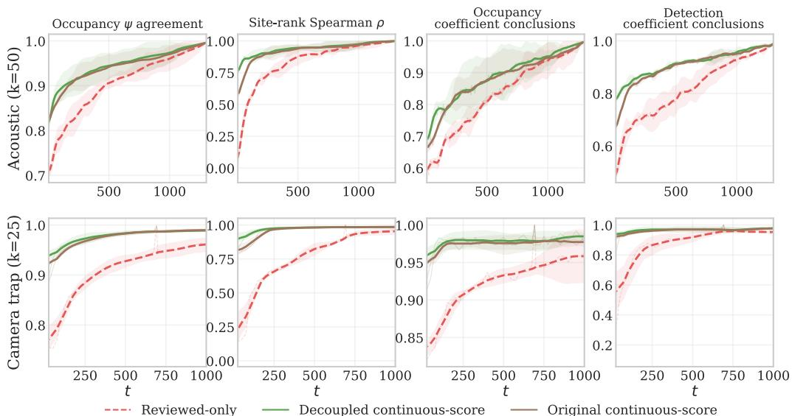  
Figure 2: Using ML scores as noisy evidence enables continuous-score models to start off closer to the ecological conclusions made by the oracle model, and converge more quickly. The x-axis shows the total number of reviews, while the y-axis shows agreement with the oracle averaged over review policies and species (higher is better). Shaded bands show 95% confidence intervals across shared review-policy means after averaging species within each policy. Acoustic reviews go up to 100% of available data, while camera trap reviews are capped at 1,000 reviews for computational tractability.

## 4.5 Review loop

At each review step t, we select m replicates for review according to the review policy. We use m = 5 for the acoustic and m = 25 for the camera trap data. We reveal the true labels corresponding to the m replicates to simulate review and refit the occupancy model with this added information, yielding a new posterior at t + m.

## 5 Results and discussion

## 5.1 The positive impact of incorporating ML scores

The decoupled continuous-score model (which benefits from information contained in classifier scores) begins much closer to the oracle posterior across all species than the reviewed-only Bernoulli model (Figure 2). Even before reviews, mean agreement across the four ecological-conclusion metrics (Section 4.3) increases from 0.434 to 0.693 for acoustic and from 0.232 to 0.623 for camera traps when comparing the reviewed-only model to the decoupled continuous-score model. This gain enables our targeted review to start from a stronger posterior.

Within the continuous-score family, the original joint formulation [48] also benefits from classifier scores, but is less robust when the score model is misspecified (Section 3.1). The underlying cause for this misspecification is score-distribution heterogeneity: nominal non-detections at occupied sites had higher scores than non-detections at likely unoccupied sites (sites without detections) for the majority of species. Factors that contribute this heterogeneity include label errors (Figure 6) and potential classifier bias. Under joint estimation, this misspecification can create a feedback loop where the occupancy and detection model pull the shared score components toward a configuration that explains spatial score patterns, and the distorted score components then feed back into occupancy inference. Decoupling cuts that feedback by fitting score calibration outside the occupancy posterior and particularly improves oracle agreement at low review counts (Figure 2). This improvement is particularly strong among acoustic species in the top quartile of heterogeneity: agreement improved by 0.129 at zero reviews and 0.084 at 100 reviews, compared with 0.052 and 0.022 among the remaining species. We discuss this phenomenon in detail in Appendix C.

<table><tr><td rowspan="2">Dataset</td><td rowspan="2">Metric</td><td colspan="4">Reviewed-only Bernoulli</td><td colspan="3">Decoupled continuous-score</td><td rowspan="2">ACORN (ours)</td><td rowspan="2">Speedup vs. Max-score</td></tr><tr><td>Random</td><td>Max-score</td><td>BALD</td><td>Target EIG</td><td>Random</td><td>Max-score</td><td>BALD</td></tr><tr><td rowspan="5">Acoustic</td><td>ψ agreement ≥ 0.90</td><td>335</td><td>125</td><td>280</td><td>255</td><td>230</td><td>130</td><td>55</td><td>30</td><td>4.3×</td></tr><tr><td>Site-rank Spearman ρ ≥ 0.90</td><td>370</td><td>120</td><td>165</td><td>155</td><td>90</td><td>25</td><td>20</td><td>10</td><td>2.5×</td></tr><tr><td>Perfect occ. coeff. agreement</td><td>535</td><td>180</td><td>405</td><td>280</td><td>405</td><td>175</td><td>95</td><td>75</td><td>2.3×</td></tr><tr><td>Perfect det. coeff. agreement</td><td>525</td><td>685</td><td>325</td><td>565</td><td>165</td><td>35</td><td>30</td><td>50</td><td>0.7×</td></tr><tr><td>ψ agreement ≥ 0.95</td><td>825</td><td>750</td><td>400</td><td>375</td><td>300</td><td>125</td><td></td><td></td><td>2.5×</td></tr><tr><td>Camera</td><td>Site-rank Spearman ρ ≥ 0.95</td><td>600</td><td>400</td><td>175</td><td>250</td><td>125</td><td>100</td><td>75 50</td><td>50 50</td><td>2.0×</td></tr><tr><td rowspan="3">trap</td><td>Perfect occ. coeff. agreement</td><td>275</td><td>25</td><td>150</td><td>125</td><td>0</td><td>0</td><td>0</td><td>0</td><td></td></tr><tr><td>Perfect det. coeff. agreement</td><td>100</td><td>850</td><td>75</td><td>125</td><td>0</td><td></td><td>0</td><td></td><td>一</td></tr><tr><td></td><td></td><td></td><td></td><td></td><td></td><td>0</td><td></td><td>0</td><td></td></tr></table>

Table 1: Median number of reviews required per species to reach dataset-specific agreement thresholds. Results of the best-performing method(s) are bolded. Thresholds are shown beside each metric name and are higher for camera-trap datasets, where lower thresholds are frequently reached at zero reviews by continuous-score models. The speedup column reports the decoupled continuous-score max-score median review count divided by the ACORN median review count.

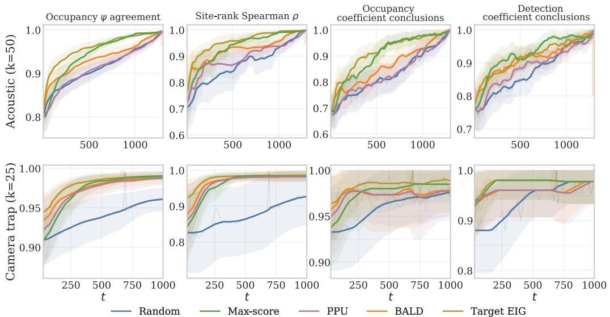  
Figure 3: Agreement in ecological conclusions over the number of reviews across review policies. We measure agreement in ecological conclusions by comparing the overall occupancy probability (Eq. (13)), the agreement in ranking of individual sites by occupancy probability (Eq. (13)), the significance and sign of occupancy coefficients (Eq. (14)), and significance and sign of detection coefficients (Eq. (14)). Results are averaged over all species and shaded bands show 95% confidence intervals across species. Colors indicate the review policy (PPU = posterior predictive uncertainty).

## 5.2 Targeting information gain in review increases efficiency

When combined with the decoupled continuous-score occupancy model, Target EIG results in the quickest overall convergence to the fully reviewed oracle, particularly in low- and medium-budget regimes (Figure 3). Its advantage over BALD comes from target alignment: BALD favors hardto-predict labels, but difficult replicates are not necessarily useful for ecological inference. They may be already-resolved, redundant, or unlikely to change the posterior. Target EIG instead scores expected entropy reduction in ecological target quantities, so it can choose lower-uncertainty labels if they better resolve site states, detection processes, or covariate conclusions. Acquisition diagnostics support this interpretation: Target EIG selections are neither simply the highest-BALD nor highestscore reviews, often choosing lower-entropy points than BALD while avoiding many nearly certain high-score detections.

Despite its simplicity, max-score is a surprisingly strong baseline. Confirmed detections are rare in our data, and positive reviews can anchor site occupancy, inform detection probability, and supply signal for covariate effects. Because classifier scores already rank likely detections well, max-score prioritizes many labels that occupancy models need. Its weakness is redundancy: the highest-score labels are often predictable from the continuous-score model and can repeat information across visits or sites. Thus Target EIG leads at small budgets, while max-score catches up, and sometimes overtakes Target EIG on particular thresholds, once positive-label accumulation outweighs redundancy.

Overall, our results imply substantial expert time savings. To reach all four agreement thresholds in Table 1, ACORN requires 75 reviews per acoustic species and 50 reviews per camera-trap species, taking the maximum across the metric-specific thresholds. The corresponding decoupled continuousscore max-score policy requires 175 and 125 reviews. For acoustic data, where each replicate is a ten-minute recording, ACORN reduces review time from 217.0 hours for all 1,302 recordings to 12.5 hours, saving 204.5 expert-hours per species. Relative to max-score, it saves 100 reviews, or 16.7 hours. This assumes a conservative 1 minute of annotation effort for 1 minute of audio [52]. For camera traps, the iWildCam location-day replicates used in our sweep contain 35.4 images on average. Assuming one expert-hour per 500 images [16], ACORN reduces expected review time from 125.4 hours to 3.5 hours, saving 121.9 expert-hours per species. Relative to max-score, it saves 75 reviews, or 5.3 hours per species.

## 5.3 Our stopping criterion balances cost and value

To be useful in practice, ACORN needs to know when to stop reviewing. Crucially, we cannot rely on the oracle model, since that requires datasets that are labeled upfront, thereby defeating the purpose of active review. We therefore evaluate three intuitive stopping criteria based on how well they recover most of the benefit of a full review process (Figure 4). The tradeoff curves show that low Rˆ is best interpreted as a screen for whether a fitted model is usable, not as evidence that additional labels have stopped changing the ecological conclusions. The expected-gain and posterior-shift rules more directly track whether review remains scientifically useful: the former asks whether any unreviewed sample still has substantial acquisition value, while the latter asks whether successive review steps continue to move the ecological posterior.

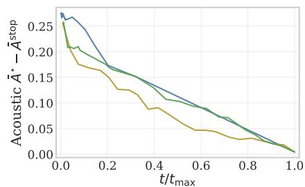

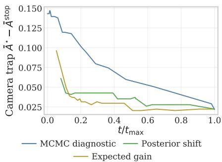

These results suggest that stopping should be treated as a decision problem rather than as a convergence diagnostic. Conservative thresholds spend more of the review budget but reduce agreement regret, while aggressive thresholds save review effort at the cost of stopping before coefficient and detection conclusions have stabilized. A practical workflow could choose an expected-gain or posterior-shift threshold based on expert review cost and tolerance for disagreement with the fully reviewed oracle, with different species allowed to stop at different review counts.

Figure 4: Post-hoc stopping-rule tradeoff for the continuous-score Target EIG trajectories. Each line shows, for one stopping criterion and one dataset, the mean fraction of the full review budget used versus agreement regret relative to the best observed step on that same trajectory, averaged across the four agreement metrics used in Figure 3. Criteria farther down and to the left are preferable.

## 6 Conclusion

We propose Active Continuous-Score Occupancy Modeling (ACORN), a method that combines a novel occupancy model formulation that robustly incorporates ML classifier scores with a novel information-theoretic active review policy that prioritizes reviews that are maximally informative for ecological quantities of interest. Across a systematic comparison to alternative combinations of ecological models and review policies on datasets covering two ecological data modalities (camera trap images and acoustic recordings), ACORN both provides a much stronger initial starting point and better prioritizes expert reviews, resulting in models that recover oracle-like ecological posteriors with substantially less manual review than unguided strategies.

Limitations and future work. Future work should investigate: 1) more complex settings, including allocating review effort across multiple species in multi-species models or across space in spatial random effect models, 2) the tradeoffs between allocating review effort to fine-tune classifiers vs. providing evidence to downstream models, and 3) providing convergence guarantees to complement our empirical evidence that our method converges to the oracle solution.

## References

[1] Anastasios N Angelopoulos, Stephen Bates, Clara Fannjiang, Michael I Jordan, and Tijana Zrnic. Prediction-powered inference. Science, 382(6671):669–674, 2023.

[2] Alex W Bajcz, Wesley J Glisson, Jeffrey W Doser, Daniel J Larkin, and John R Fieberg. A within-lake occupancy model for starry stonewort, nitellopsis obtusa, to support early detection and monitoring. Scientific reports, 14(1):2644, 2024.

[3] Sara Beery, Arushi Agarwal, Elijah Cole, and Vighnesh Birodkar. The iwildcam 2021 competition dataset. arXiv preprint arXiv:2105.03494, 2021.

[4] Sara Beery, Grant Van Horn, Oisin Mac Aodha, and Pietro Perona. The iwildcam 2018 challenge dataset. arXiv preprint arXiv:1904.05986, 2019.

[5] Sara Beery, Grant Van Horn, and Pietro Perona. Recognition in terra incognita. In Proceedings of the European conference on computer vision (ECCV), pages 456–473, 2018.

[6] Peggy A Bevan, Omiros Pantazis, Holly AI Pringle, Guilherme Braga Ferreira, Daniel J Ingram, Emily K Madsen, Liam Thomas, Dol Raj Thanet, Thakur Silwal, Santosh Rayamajhi, et al. Deep learning-based ecological analysis of camera trap images is impacted by training data quality and quantity. Remote Sensing in Ecology and Conservation, 2025.

[7] Eli Bingham, Jonathan P. Chen, Martin Jankowiak, Fritz Obermeyer, Neeraj Pradhan, Theofanis Karaletsos, Rohit Singh, Paul A. Szerlip, Paul Horsfall, and Noah D. Goodman. Pyro: Deep universal probabilistic programming. J. Mach. Learn. Res., 20:28:1–28:6, 2019.

[8] Ludwig Bothmann, Lisa Wimmer, Omid Charrakh, Tobias Weber, Hendrik Edelhoff, Wibke Peters, Hien Nguyen, Caryl Benjamin, and Annette Menzel. Automated wildlife image classification: An active learning tool for ecological applications. Ecological Informatics, 77:102231, 2023.

[9] Center For International Earth Science Information Network-CIESIN-Columbia University. Gridded population of the world, version 4 (gpwv4): Population density, revision 11, 2017.

[10] Kathryn Chaloner and Isabella Verdinelli. Bayesian experimental design: A review. Statistical science, pages 273–304, 1995.

[11] Thierry Chambert, Evan H Campbell Grant, David AW Miller, James D Nichols, Kevin P Mulder, and Adrianne B Brand. Two-species occupancy modelling accounting for species misidentification and non-detection. Methods in Ecology and Evolution, 9(6):1468–1477, 2018.

[12] Amielle A De Wan, Patrick J Sullivan, Arthur J Lembo, Charles R Smith, John C Maerz, James P Lassoie, and Milo E Richmond. Using occupancy models of forest breeding birds to prioritize conservation planning. Biological Conservation, 142(5):982–991, 2009.

[13] Simon Duane, Anthony D Kennedy, Brian J Pendleton, and Duncan Roweth. Hybrid monte carlo. Physics letters B, 195(2):216–222, 1987.

[14] Ralph Dubayah, Michelle Hofton, James Blair, John Armston, Hao Tang, and Scott Luthcke. Gedi l2a elevation and height metrics data global footprint level v002, 2021.

[15] Tom G Farr, Paul A Rosen, Edward Caro, Robert Crippen, Riley Duren, Scott Hensley, Michael Kobrick, Mimi Paller, Ernesto Rodriguez, Ladislav Roth, et al. The shuttle radar topography mission. Reviews of geophysics, 45(2), 2007.

[16] Mitchell Fennell, Christopher Beirne, and A Cole Burton. Use of object detection in camera trap image identification: Assessing a method to rapidly and accurately classify human and animal detections for research and application in recreation ecology. Global Ecology and Conservation, 35:e02104, 2022.

[17] Paige FB Ferguson, Michael J Conroy, and Jeffrey Hepinstall-Cymerman. Occupancy models for data with false positive and false negative errors and heterogeneity across sites and surveys. Methods in Ecology and Evolution, 6(12):1395–1406, 2015.

[18] Stephen E Fick and Robert J Hijmans. Worldclim 2: new 1-km spatial resolution climate surfaces for global land areas. International journal ofclimatology, 37(12):4302–4315, 2017.

[19] Mark Friedl and Damien Sulla-Menashe. Modis/terra+aqua land cover type yearly l3 global 500m sin grid v061, 2022.

[20] Angela K Fuller, Daniel W Linden, and J Andrew Royle. Management decision making for fisher populations informed by occupancy modeling. The Journal of Wildlife Management, 80(5):794–802, 2016.

[21] Tomer Gadot, S, tefan Istrate, Hyungwon Kim, Dan Morris, Sara Beery, Tanya Birch, and Jorge Ahumada. To crop or not to crop: Comparing whole-image and cropped classification on a large dataset of camera trap images. IET Computer Vision, 18(8):1193–1208, 2024.

[22] Burooj Ghani, Tom Denton, Stefan Kahl, and Holger Klinck. Global birdsong embeddings enable superior transfer learning for bioacoustic classification. Scientific Reports, 13(1):22876, 2023.

[23] Rory Gibb, Ella Browning, Paul Glover-Kapfer, and Kate E. Jones. Emerging opportunities and challenges for passive acoustics in ecological assessment and monitoring. Methods in Ecology and Evolution, 10(2):169–185, 2019.

[24] Jessica L Gronsbell and Tianxi Cai. Semi-supervised approaches to efficient evaluation of model prediction performance. Journal of the Royal Statistical Society Series B: Statistical Methodology, 80(3):579–594, 2018.

[25] Gurutzeta Guillera-Arroita, Martin S Ridout, and Byron JT Morgan. Two-stage bayesian study design for species occupancy estimation. Journal ofAgricultural, Biological, and Environmental Statistics, 19(2):278–291, 2014.

[26] Timm Haucke, Lauren Harrell, and Sara Beery. Biolith: Bayesian ecological modeling in python, March 2026.

[27] Matthew D Hoffman, Andrew Gelman, et al. The no-u-turn sampler: adaptively setting path lengths in hamiltonian monte carlo. J. Mach. Learn. Res., 15(1):1593–1623, 2014.

[28] Neil Houlsby, Ferenc Huszár, Zoubin Ghahramani, and Máté Lengyel. Bayesian active learning for classification and preference learning. arXiv preprint arXiv:1112.5745, 2011.

[29] IUCN Standards and Petitions Committee. Guidelines for using the IUCN red list categories and criteria. version 16. Technical report, International Union for Conservation of Nature, Gland, Switzerland and Cambridge, UK, March 2024. Prepared by the Standards and Petitions Committee of the IUCN Species Survival Commission.

[30] Stefan Kahl, Connor M Wood, Maximilian Eibl, and Holger Klinck. Birdnet: A deep learning solution for avian diversity monitoring. Ecological Informatics, 61:101236, 2021.

[31] Hannes Kath, Patricia P Serafini, Ivan B Campos, Thiago S Gouvêa, and Daniel Sonntag. Leveraging transfer learning and active learning for data annotation in passive acoustic monitoring of wildlife. Ecological Informatics, 82:102710, 2024.

[32] Lydia KD Katsis, Tessa A Rhinehart, Elizabeth Dorgay, Emma E Sanchez, Jake L Snaddon, C Patrick Doncaster, and Justin Kitzes. A comparison of statistical methods for deriving occupancy estimates from machine learning outputs. Scientific Reports, 15(1):14700, 2025.

[33] Justin Kay, Grant Van Horn, Subhransu Maji, Daniel Sheldon, and Sara Beery. Consensusdriven active model selection. In Proceedings of the IEEE/CVF International Conference on Computer Vision, pages 4594–4604, 2025.

[34] Mahnoosh Kholghi, Yvonne Phillips, Michael Towsey, Laurianne Sitbon, and Paul Roe. Active learning for classifying long-duration audio recordings of the environment. Methods in Ecology and Evolution, 9(9):1948–1958, 2018.

[35] Jannik Kossen, Sebastian Farquhar, Yarin Gal, and Thomas Rainforth. Active surrogate estimators: An active learning approach to label-efficient model evaluation. Advances in Neural Information Processing Systems, 35:24557–24570, 2022.

[36] Dennis V Lindley. On a measure of the information provided by an experiment. The Annals of Mathematical Statistics, 27(4):986–1005, 1956.

[37] Darryl I MacKenzie, James D Nichols, Gideon B Lachman, Sam Droege, J Andrew Royle, and Catherine A Langtimm. Estimating site occupancy rates when detection probabilities are less than one. Ecology, 83(8):2248–2255, 2002.

[38] Zhongqi Miao, Ziwei Liu, Kaitlyn M Gaynor, Meredith S Palmer, Stella X Yu, and Wayne M Getz. Iterative human and automated identification of wildlife images. Nature Machine Intelligence, 3(10):885–895, 2021.

[39] David A Miller, James D Nichols, Brett T McClintock, Evan H Campbell Grant, Larissa L Bailey, and Linda A Weir. Improving occupancy estimation when two types of observational error occur: Non-detection and species misidentification. Ecology, 92(7):1422–1428, 2011.

[40] Radford M Neal. Mcmc using hamiltonian dynamics. Handbook ofmarkov chain monte carlo, pages 47–95, 2011.

[41] James D Nichols and Byron K Williams. Monitoring for conservation. Trends in ecology & evolution, 21(12):668–673, 2006.

[42] Mohammad Sadegh Norouzzadeh, Dan Morris, Sara Beery, Neel Joshi, Nebojsa Jojic, and Jeff Clune. A deep active learning system for species identification and counting in camera trap images. Methods in ecology and evolution, 12(1):150–161, 2021.

[43] Mohammad Sadegh Norouzzadeh, Anh Nguyen, Margaret Kosmala, Alexandra Swanson, Meredith S Palmer, Craig Packer, and Jeff Clune. Automatically identifying, counting, and describing wild animals in camera-trap images with deep learning. Proceedings ofthe National Academy ofSciences, 115(25):E5716–E5725, 2018.

[44] Pooja Panwar, Wyatt J. Cummings, Sharon Martinson, David A. Lutz, Hannah ter Hofstede, Aaron Weed, Matthew P. Ayres, and Laurel B. Symes. Large-scale, stratified, fully annotated acoustic forest soundscape dataset of avian vocalizations from eastern north america, 2025.

[45] Brent S. Pease, Krishna Pacifici, Roland Kays, and Brian Reich. What drives spatially varying ecological relationships in a wide-ranging species? Diversity and Distributions, 28(9):1752– 1768, 2022.

[46] Du Phan, Neeraj Pradhan, and Martin Jankowiak. Composable effects for flexible and accelerated probabilistic programming in numpyro. arXiv preprint arXiv:1912.11554, 2019.

[47] Tom Rainforth, Adam Foster, Desi R Ivanova, and Freddie Bickford Smith. Modern bayesian experimental design. Statistical Science, 39(1):100–114, 2024.

[48] Tessa A Rhinehart, Daniel Turek, and Justin Kitzes. A continuous-score occupancy model that incorporates uncertain machine learning output from autonomous biodiversity surveys. Methods in Ecology and Evolution, 13(8):1778–1789, 2022.

[49] J Andrew Royle and William A Link. Generalized site occupancy models allowing for false positive and false negative errors. Ecology, 87(4):835–841, 2006.

[50] Elizabeth G Ryan, Christopher C Drovandi, James M McGree, and Anthony N Pettitt. A review of modern computational algorithms for bayesian optimal design. International Statistical Review, 84(1):128–154, 2016.

[51] Simone Santoro, Santiago Gutiérrez-Zapata, Javier Calzada, Nuria Selva, Diego Marín-Santos, Sara Beery, Kate Brandis, Iñaki Fernández de Viana, Paul Meek, Alessio Mortelliti, et al. Essential tools but overlooked bias: Artificial intelligence and citizen science classification affect camera trap data. Methods in Ecology and Evolution, 16(11):2638–2652, 2025.

[52] Taylor Shaw, Sina-Rebekka Schönamsgruber, João M Cordeiro Pereira, and Grzegorz Mikusinski. Refining manual annotation effort of acoustic data to estimate bird species richness´ and composition: The role of duration, intensity, and time. Ecology and Evolution, 12(11):e9491, 2022.

[53] US Geological Survey. 3d elevation program 1-meter resolution digital elevation model, 2019.

[54] Michael A Tabak, Mohammad S Norouzzadeh, David W Wolfson, Steven J Sweeney, Kurt C VerCauteren, Nathan P Snow, Joseph M Halseth, Paul A Di Salvo, Jesse S Lewis, Michael D White, et al. Machine learning to classify animal species in camera trap images: Applications in ecology. Methods in Ecology and Evolution, 10(4):585–590, 2019.

[55] D. Thornton, D. Morris, T. King, L. Perera-Romero, A. Anderson, R. Garcia-Anleu, S. Fitkin, and C. Vynne. Identification of camera trap images by artificial intelligence and human experts produces similar multi-species occupancy models. Journal ofApplied Ecology, 2026.

[56] Devis Tuia, Benjamin Kellenberger, Sara Beery, Blair R Costelloe, Silvia Zuffi, Benjamin Risse, Alexander Mathis, Mackenzie W Mathis, Frank Van Langevelde, Tilo Burghardt, et al. Perspectives in machine learning for wildlife conservation. Nature communications, 13(1):792, 2022.

[57] Bart van Merriënboer, Vincent Dumoulin, Jenny Hamer, Lauren Harrell, Andrea Burns, and Tom Denton. Perch 2.0: The bittern lesson for bioacoustics, 2026.

[58] Juliana Vélez, William McShea, Hila Shamon, Paula J Castiblanco-Camacho, Michael A Tabak, Carl Chalmers, Paul Fergus, and John Fieberg. An evaluation of platforms for processing camera-trap data using artificial intelligence. Methods in Ecology and Evolution, 14(2):459–477, 2023.

[59] Siruo Wang, Tyler H. McCormick, and Jeffrey T. Leek. Methods for correcting inference based on outcomes predicted by machine learning. Proceedings ofthe National Academy ofSciences, 117(48):30266–30275, 2020.

[60] Robin C Whytock, J˛edrzej Swie´ zewski, Joeri A Zwerts, Tadeusz Bara-Słupski, Aurélie Flore˙ Koumba Pambo, Marek Rogala, Laila Bahaa-el din, Kelly Boekee, Stephanie Brittain, Anabelle W Cardoso, et al. Robust ecological analysis of camera trap data labelled by a machine learning model. Methods in Ecology and Evolution, 12(6):1080–1092, 2021.

[61] Marco Willi, Ross T. Pitman, Anabelle W. Cardoso, Christina Locke, Alexandra Swanson, Amy Boyer, Marten Veldthuis, and Lucy Fortson. Identifying animal species in camera trap images using deep learning and citizen science. Methods in Ecology and Evolution, 10(1):80–91, 2019.

[62] Wilson J. Wright, Kathryn M. Irvine, Emily S. Almberg, and Andrea R. Litt. Modelling misclassification in multi-species acoustic data when estimating occupancy and relative activity. Methods in Ecology and Evolution, 11(1):71–81, 2020.

[63] Nigel G Yoccoz, James D Nichols, and Thierry Boulinier. Monitoring of biological diversity in space and time. Trends in ecology & evolution, 16(8):446–453, 2001.

[64] Tijana Zrnic and Emmanuel Candes. Active statistical inference. In Forty-first International Conference on Machine Learning, 2024.

## A Additional details on datasets and covariates

We use different preprocessing pipelines for the acoustic forest soundscape and iWildCam camera-trap data before representing each focal species as a single-season occupancy problem.

Acoustic. We use the acoustic forest soundscape dataset [44] with Perch v2 classifier outputs [57]. This dataset is openly available [44] and licensed under the Creative Commons Attribution 4.0 International license. We treat each recording (typically 10 minutes long) as one occupancy replicate. We keep recordings from the ACAD, MABI, and SIMR subcollections and assign a positive label when the ground truth labels for a file contain the focal species. The classifier score is the maximum target-species Perch v2 logit over an entire recording. Each of the 50 focal bird species is modeled on the same 104 recorder sites and 1,302 reviewable recordings, with at most 28 recordings per site. Across these species and recording labels, there are 8,962 positive detections. The number of per-species detections ranges from 20 to 1,012, with median 116.

The acoustic occupancy model uses three site-level environmental covariates summarized around each recorder: mean tree-canopy cover percentage from MODIS [19], median canopy height from GEDI [14], and mean elevation from USGS 3DEP [53], sampled using Google Earth Engine. The detection covariates are hours since local sunrise, day of year, and binary indicators for the MABI and SIMR subcollections, with ACAD as the reference level. Covariates are median-imputed and z-score normalized.

Camera trap. We use iWildCam 2022 [3] with SpeciesNet outputs [21] for our camera-trap analysis. iWildCam 2022 is available at https://lila.science/datasets/iwildcam-2022/ and licensed under the Community Data License Agreement (CDLA). We use only the training split, since the test split does not contain ground truth labels. We discard sites that lack geographic locations, and discard images whose capture datetime cannot be parsed. The occupancy site is an iWildCam location and the replicate is a location-day. For each focal species, a location-day is positive when any image from that location-day has the target category, and its classifier score is the maximum SpeciesNet target logit over images from that location-day. We summarize daily effort as the number of unique image sequences on the location-day and use log(max(sequence count, 1)) as a detection covariate.

Because sites in iWildCam are distributed across the globe and our goal is to model regional occupancy processes at fine rather than continental scales, we apply species-specific geographic filtering before fitting the occupancy model. We form deterministic connected-component clusters of locations using a 250 km Haversine-distance radius and, for each species, keep only clusters that contain at least one positive location-day. This removes distant negative-only clusters that are unlikely to be informative about the same regional occupancy process as the target detections. The 25 focal camera-trap species have 29 to 98 sites per species (median 42), 692 to 2,365 reviewable location-days per species (median 2,133), and at most 24 to 93 location-days per retained site. Across these species-specific location-day labels there are 44,231 samples and 4,622 positives. The per-species positive count ranges from 41 to 479, with median 151.

The camera-trap occupancy model uses five site-level covariates loosely based on [45]: elevation from SRTM [15], forest cover from MODIS [19], annual mean temperature and annual mean precipitation from WorldClim [18], and mean human population density from GPW 2020 [9], sampled using Google Earth Engine. The camera-trap detection model uses the log daily sequence-count covariate described above as a proxy for sampling effort and trigger sensitivity. Just as for the acoustic data, covariates are median-imputed and z-score normalized.

## B Experimental details

The Bernoulli and continuous-score occupancy models are implemented using the Biolith library [26]. To sample from the posterior, we use the No-U-Turn Sampler (NUTS, [27]), a variant of Hamiltonian Monte Carlo [40, 13], implemented using NumPyro [46, 7]. We use a warmup of 500 steps and draw 500 posterior samples.

Each active-review iteration has two computationally relevant stages: refitting the current ecological model and ranking candidate reviews. The refitting stage dominates due to computationally intensive MCMC sampling. For the decoupled continuous-score model, the reported fitting time combines the occupancy-model fit with the separate score-mixture calibration fit. For the original continuous-score model, the score-mixture parameters are fit jointly inside the occupancy-model sampler. Candidate ranking is much cheaper in comparison. Random and max-score selection require only simple ordering or sampling over reviewable replicates, PPU and BALD additionally average over posterior draws, and Target EIG is the most expensive ranking rule because it recomputes a target-posterior entropy approximation for each candidate label outcome. Even for Target EIG, however, acquisition is a few seconds per iteration and remains smaller than posterior fitting (Table 2).

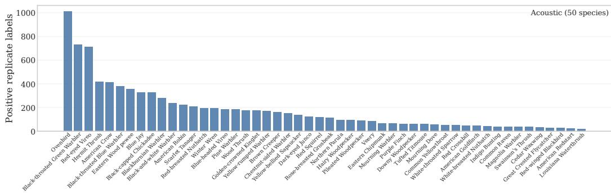

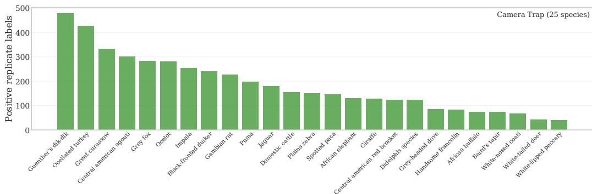  
Figure 5: Class distribution of focal species used in the real-data experiments. Bars show the number of positive replicate-level labels for the 50 acoustic species and 25 iWildCam camera-trap species used in the main sweep, sorted from most to least common within each dataset. Acoustic replicates are recordings. Camera-trap replicates are location-days after train-split, geocoding, and positive-geographic-cluster filtering.

All experiments were executed without GPUs on a Slurm cluster with one job per species. Each job ran on 16 cores of an x86\_64 AMD EPYC 9554 64-Core CPU with 32 GB of memory.

For the 75 species used in our analysis, each species averaged around 2 hours of wall-clock time. If P species jobs can run concurrently, the estimated wall-clock time to reproduce the current 50 acoustic and 25 camera-trap experiments is

$$
{ \mathrm { 2 ~ h o u r s } } \times { \frac { 7 5 } { \operatorname* { m i n } ( 7 5 , P ) } } .
$$

While this is the approximate time required to reproduce our experiments given the specified hardware, the full research project required more resources in total.

## C Score distribution heterogeneity

The continuous-score model assumes that classifier scores are generated from a mixture of normal score distributions that are shared between all sites. In practice, this approximation is not equally good for all species. In post-hoc experiments on both acoustic and iWildCam camera-trap data, several species were well described by a simple two-component score model, but others showed clear score-distribution heterogeneity: scores from non-detection replicates at occupied sites were not always distributed like scores from truly unoccupied sites. Some high-confidence “no-detection” days in iWildCam then appeared on manual inspection to contain real detections missed by the annotation process (see Figure 6), creating a high-score tail among nominal negatives (see Table 3 for illustration). Another contributing factor may be classifier bias caused by spurious correlations: visual or acoustic backgrounds that are more likely to contain the focal species might be scored higher, even if the focal species is not present.

<table><tr><td>Dataset</td><td>Model</td><td>Review method</td><td>Species</td><td>Model fitting (s, mean ± 95% CI)</td><td>Ranking (s, mean ± 95% CI)</td><td>Total (s, mean ± 95% CI)</td></tr><tr><td rowspan="10">Acoustic</td><td rowspan="5">Reviewed-only Bernoulli</td><td>Random Max-score</td><td>50 50</td><td> $1 3 . 6 3 \pm 2 . 5 4$   $1 2 . 9 2 \pm 2 . 4 1$ </td><td> $0 . 0 1 \pm 0 . 0 0$ </td><td> $1 3 . 9 8 \pm 2 . 5 7$   $1 3 . 2 3 \pm 2 . 4 3$ </td></tr><tr><td></td><td></td><td></td><td> $< 0 . 0 1$ </td><td></td></tr><tr><td>PPU</td><td>50</td><td> $1 1 . 4 5 \pm 1 . 1 1$ </td><td>&lt; 0.01</td><td> $1 1 . 7 2 \pm 1 . 1 2$ </td></tr><tr><td>BALD</td><td>50</td><td> $1 3 . 5 2 \pm 2 . 4 6$ </td><td>&lt; 0.01</td><td> $1 3 . 8 5 \pm 2 . 4 9$ </td></tr><tr><td>Target EIG</td><td>50</td><td> $1 1 . 7 5 \pm 0 . 7 6$ </td><td> $3 . 4 5 \pm 0 . 1 6$ </td><td> $1 5 . 5 6 \pm 0 . 8 6$ </td></tr><tr><td rowspan="5">Decoupled continuous-score</td><td>Random</td><td>50</td><td> $1 7 . 0 7 \pm 3 . 5 3$ </td><td> $0 . 0 1 \pm 0 . 0 0$ </td><td> $1 7 . 7 9 \pm 3 . 5 9$ </td></tr><tr><td>Max-score</td><td>50</td><td> $1 5 . 6 7 \pm 2 . 6 7$ </td><td> $< 0 . 0 1$ </td><td> $1 6 . 3 4 \pm 2 . 7 3$ </td></tr><tr><td>PPU</td><td>50</td><td> $1 5 . 1 9 \pm 2 . 7 6$ </td><td>&lt; 0.01</td><td> $1 5 . 8 2 \pm 2 . 8 1$ </td></tr><tr><td>BALD</td><td>50</td><td> $1 4 . 2 3 \pm 2 . 2 0$ </td><td>&lt; 0.01</td><td> $1 4 . 8 4 \pm 2 . 2 6$ </td></tr><tr><td>Target EIG</td><td>50</td><td> $1 3 . 3 3 \pm 1 . 7 6$ </td><td> $3 . 1 3 \pm 0 . 3 2$ </td><td> $1 7 . 0 2 \pm 2 . 0 7$ </td></tr><tr><td rowspan="3">Original continuous-score</td><td>BALD</td><td>50</td><td> $1 4 . 9 6 \pm 1 . 2 6$ </td><td> $0 . 0 1 \pm 0 . 0 1$ </td><td> $1 5 . 2 8 \pm 1 . 2 8$ </td></tr><tr><td>Target EIG</td><td>50</td><td> $1 5 . 4 5 \pm 1 . 9 1$ </td><td> $2 . 9 0 \pm 0 . 3 3$ </td><td> $1 8 . 6 5 \pm 2 . 2 3$ </td></tr><tr><td>Random</td><td>25 25 5 25 25</td><td> $7 . 0 1 \pm 1 . 4 4$ </td><td> $0 . 0 2 \pm 0 . 0 1$ </td><td> $7 . 2 9 \pm 1 . 5 0$ </td></tr><tr><td rowspan="10">Camera trap</td><td rowspan="5">Reviewed-only Bernoulli</td><td>Max-score</td><td></td><td> $7 . 1 8 \pm 1 . 4 5$ </td><td> $< 0 . 0 1$ </td><td> $7 . 3 9 \pm 1 . 4 9$ </td></tr><tr><td>PPU</td><td></td><td> $7 . 4 2 \pm 1 . 5 7$ </td><td>&lt; 0.01</td><td> $7 . 6 2 \pm 1 . 6 1$ </td></tr><tr><td>BALD</td><td></td><td> $7 . 4 3 \pm 1 . 6 7$ </td><td>&lt; 0.01</td><td> $7 . 6 3 \pm 1 . 7 1$ </td></tr><tr><td>Target EIG</td><td></td><td> $5 . 3 2 \pm 0 . 4 1$ </td><td> $1 . 7 5 \pm 0 . 0 4$ </td><td> $7 . 2 7 \pm 0 . 4 6$ </td></tr><tr><td>Random</td><td></td><td> $1 3 . 2 4 \pm 2 . 9 4$ </td><td></td><td> $1 3 . 9 6 \pm 3 . 1 3$ </td></tr><tr><td rowspan="5">Decoupled continuous-score</td><td>Max-score</td><td>5 25 25 25 5</td><td> $1 3 . 1 5 \pm 2 . 9 0$ </td><td> $< 0 . 0 1$  &lt; 0.01</td><td> $1 3 . 8 7 \pm 3 . 0 9$ </td></tr><tr><td>PPU</td><td></td><td> $1 3 . 0 2 \pm 2 . 8 2$ </td><td>&lt; 0.01</td><td> $1 3 . 7 2 \pm 3 . 0 1$ </td></tr><tr><td>BALD</td><td></td><td> $1 3 . 0 5 \pm 2 . 8 3$ </td><td> $0 . 0 1 \pm 0 . 0 1$ </td><td> $1 3 . 7 6 \pm 3 . 0 1$ </td></tr><tr><td>Target EIG</td><td></td><td> $1 3 . 1 0 \pm 2 . 8 4$ </td><td> $3 . 3 4 \pm 0 . 6 2$ </td><td> $1 7 . 1 3 \pm 3 . 6 2$ </td></tr><tr><td></td><td></td><td></td><td></td><td></td></tr><tr><td>Original continuous-score</td><td>BALD  ${ \mathrm { T a r g e t E I G } }$ </td><td>25 25</td><td> $1 4 . 5 7 \pm 1 . 4 6$   $1 4 . 5 3 \pm 1 . 4 5$ </td><td> $0 . 0 1 \pm 0 . 0 0$   $1 . 8 5 \pm 0 . 0 8$ </td><td> $1 4 . 8 3 \pm 1 . 4 7$   $1 6 . 6 0 \pm 1 . 5 5$ </td></tr></table>

Table 2: Mean wall-clock time per active-review iteration, averaged over species-experiment trajectories. Model fitting is the occupancy-model MCMC time plus score-mixture calibration for the decoupled continuous-score model. Ranking is the time used to score and order candidate reviews. Total includes recorded per-iteration overhead in addition to these two components. Plus-minus values are 95% confidence-interval half-widths across species-experiment trajectory means. Intervals are omitted for entries below 0.01 s.

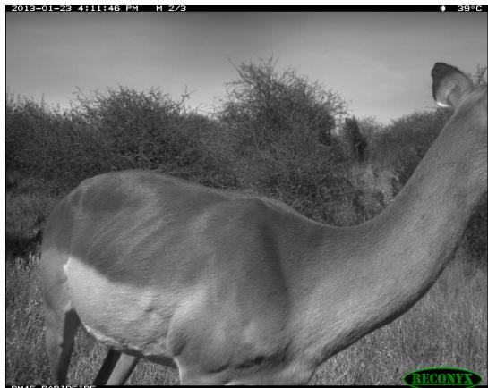

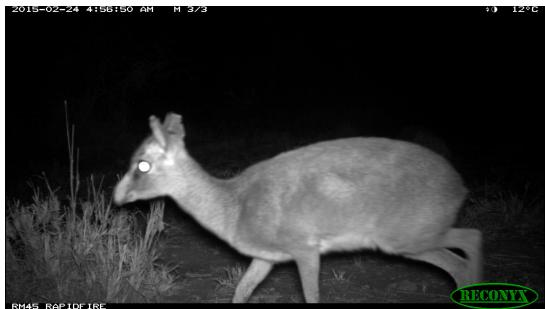  
(a) Top-scoring nominal negative sample for Impala (SpeciesNet logit for Impala: 14.09, Ground-truth label: Plains zebra, Image ID: 9214d000-21bc-11eaa13a-137349068a90)  
(b) Top-scoring nominal negative sample for Günther’s dik-dik (SpeciesNet logit for Günther’s dik-dik: 17.08, Ground-truth label: Plains zebra, Image ID: 8fbd0584- 21bc-11ea-a13a-137349068a90)  
Figure 6: Example camera trap images corresponding to obvious ground-truth label errors surfaced by highly scoring nominal negatives across two species.

This heterogeneity makes the original joint continuous-score formulation more fragile than the calibrated variant used in our main experiments. In the original continuous-score occupancy model formulation [48], the score-mixture parameters and ecological parameters are estimated together, so misspecification of the score likelihood can feed back into occupancy and detection estimates. The sampler can also encounter weakly identified mixture geometries, because shifts in the score distributions, detection probability, and occupancy probability can explain similar patterns in the observed scores. Our calibrated model is less susceptible because the score calibration is fit outside the occupancy sampler and then passed in as fixed log Bayes factors. Moreover, once a replicate is reviewed, the reviewed binary label replaces the score contribution in the occupancy likelihood, preventing a small number of reviewed high-score outliers from directly distorting the ecological posterior through the score model.

<table><tr><td>Dataset</td><td>Species</td><td>Positive Mean</td><td>Negative Mean at Occupied Sites</td><td>Negative Mean at Likely Unoccu- pied Šites</td></tr><tr><td rowspan="3">Acoustic</td><td>Scarlet Tanager</td><td>10.96</td><td>8.36</td><td>7.26</td></tr><tr><td>Ovenbird</td><td>12.48</td><td>8.25</td><td>7.23</td></tr><tr><td>Rose-breasted Grosbeak</td><td>10.00</td><td>7.31</td><td>6.39</td></tr><tr><td rowspan="3">Camera trap</td><td>Impala</td><td>14.00</td><td>6.74</td><td>5.00</td></tr><tr><td>Puma</td><td>18.92</td><td>4.46</td><td>2.80</td></tr><tr><td>Jaguar</td><td>17.25</td><td>4.53</td><td>2.94</td></tr></table>

Table 3: Nominal negative score distributions can differ between occupied and likely unoccupied sites. Values are mean raw logits. Occupied sites have at least one positive observation $( \exists j : f _ { i j } = 1 )$ , whereas likely unoccupied sites are defined as sites without positive observations $( f _ { i j } = 0 \forall j )$ . The table shows species with large positive gaps between negative replicates at occupied and likely unoccupied sites within each dataset.

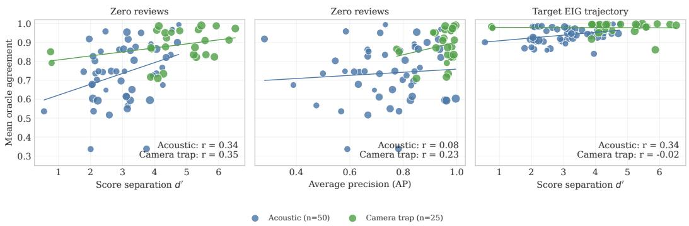  
Figure 7: Species-level classifier metrics only partially explain downstream ecological agreement. Each point is one species. Agreement is the mean of the four oracle-agreement metrics (Section 4.3). Left: zero-review agreement versus score separation $d ^ { \prime } .$ Middle: zero-review agreement versus average precision (AP). Right: Target EIG reviewed-trajectory agreement versus d′. Point size is proportional to empirical site occupancy prevalence.

We experimented with several alternative joint models to address this misspecification directly, includ ing a separate false-score distribution for occupied sites, noisy-annotation models, and annotationprimary variants with a missed-label score component. These variants sometimes improved agreement with the oracle in particular review regimes, especially at higher review counts, but no single alternative was robust across species and review budgets. The more flexible models often introduced weakly identified mixture components and convergence problems, while fixed-tail annotation-primary models required species- and review-count-specific tuning. We therefore use the calibrated continuous-score model for the main analysis and treat models that allow richer score heterogeneity, particularly for difficult to label species, as an important direction for future work.

## D Impact of classifier quality

We summarize classifier quality in two ways. First, we use score separation $d ^ { \prime }$ as the distance between the positive- and negative-score calibration means in units of standard-deviation. Second, we use average precision (AP), which is the mean precision achieved as true positive replicates are swept from high to low classifier score. Species with larger $d ^ { \prime }$ tended to start closer to the oracle at zero reviews, but the association was only moderate (Figure 7). AP was an even weaker predictor of zero-review agreement. After review using the Target EIG policy (Section 3.2), agreement was high independently from classifier quality. This indicates that improvements in classification accuracy translate into improvements in low-review regimes, but review remains valuable independently from classifier quality.

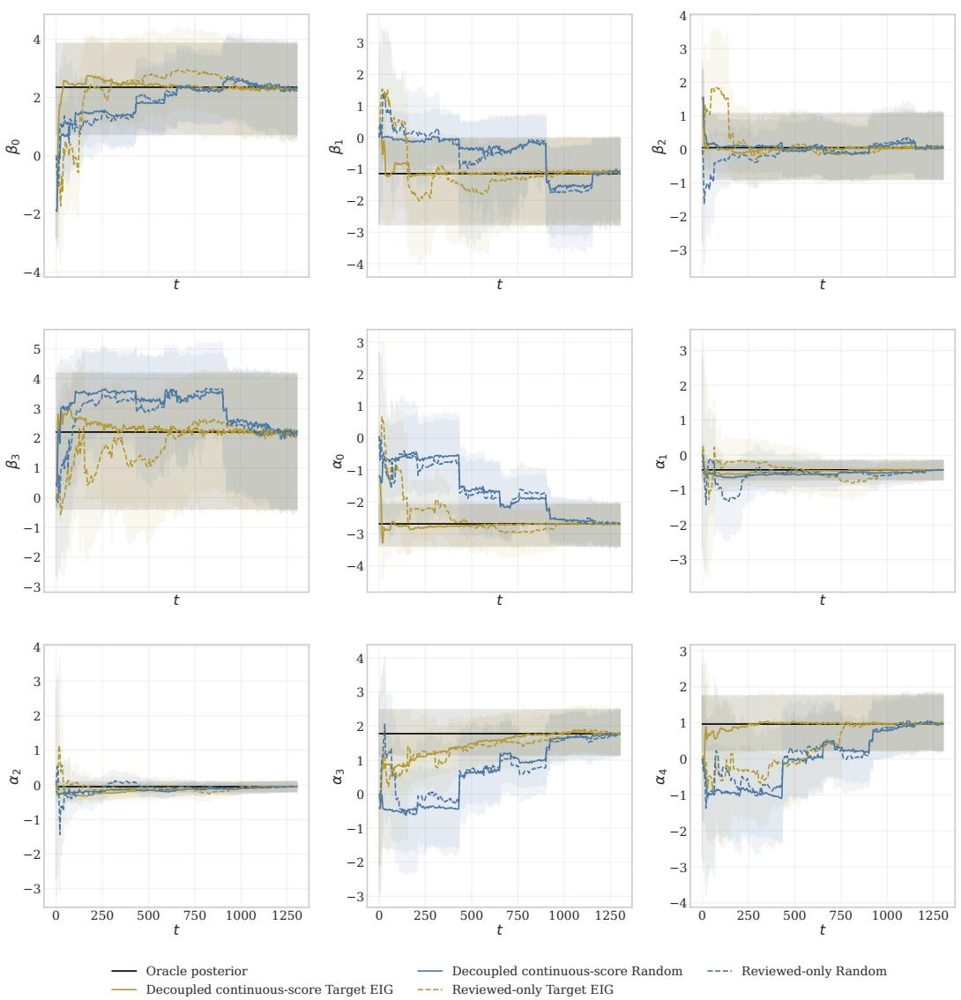  
Figure 8: Parameter estimates for the Scarlet Tanager.

## E Additional results

To illustrate qualitatively how parameter estimates converge to the oracle estimates, we visualize species-specific parameter trajectories in Figures 8 and 9.

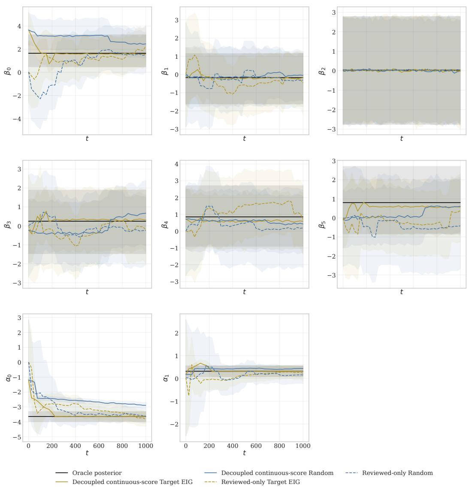  
Figure 9: Parameter estimates for the White-tailed deer.