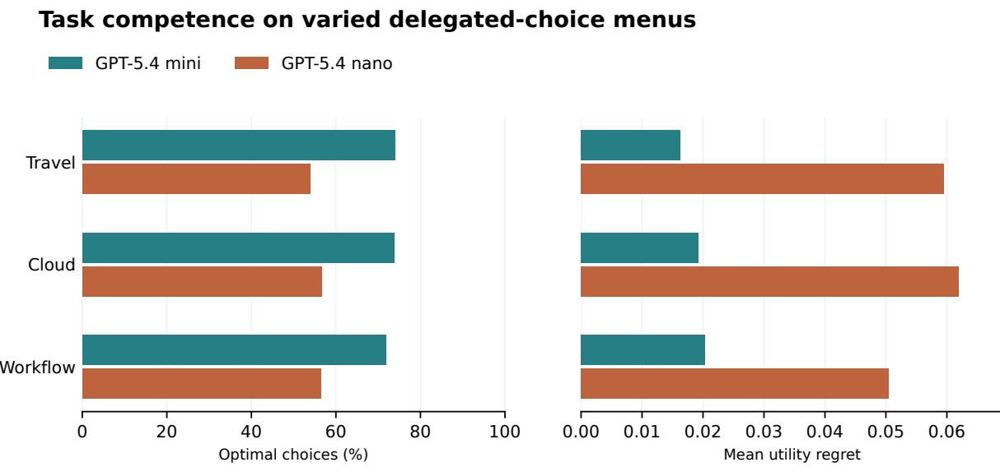
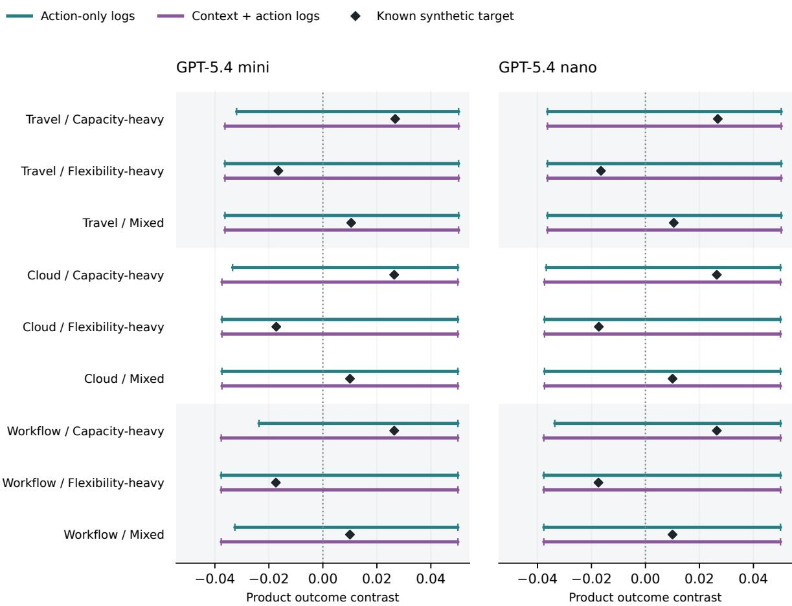
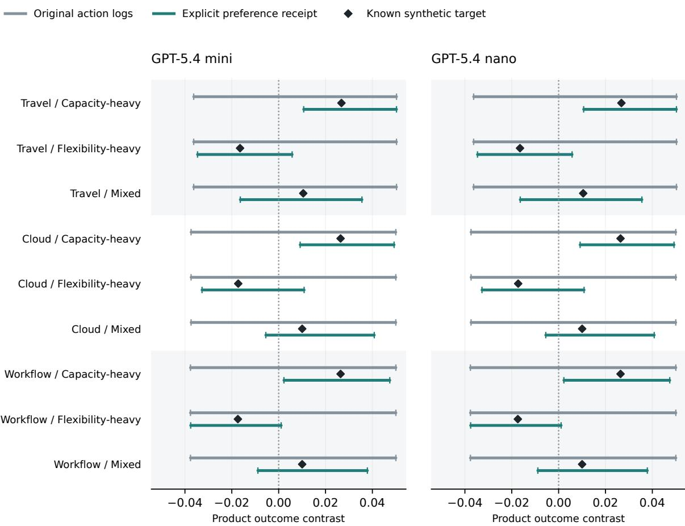
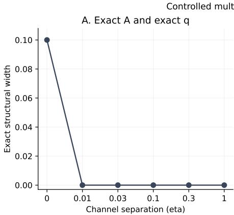
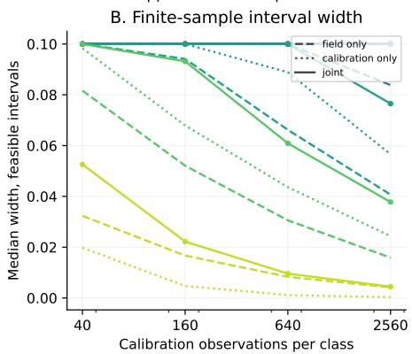
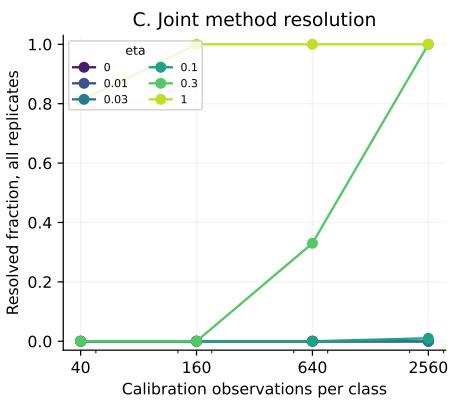
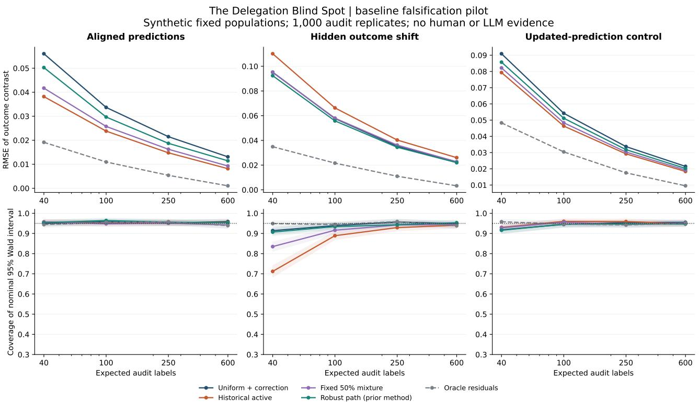

# The Delegation Blind Spot Auditing Product Decisions from Agent Choices

Shivam Gupta

Independent Research

shivam1720406@gmail.com

20 September 2026

## Abstract

Successful agent execution need not identify which future product improvement its user would value. We present a decision-specific audit that maps a declared observation channel and product-value contrast to compatible intervals and witness populations. Its foundations are established identification and decision theory; the contribution is an executable measurement workflow and a controlled study of its limits. A frozen experiment makes 4,800 requests to two pinned model snapshots on shared synthetic tasks. All 36 conservative primary intervals remain unresolved despite diferent execution accuracy. An exploratory 2,400-call follow-up records supplied preferences and resolves three of nine comparisons per model. A deterministic extractor resolves seven of nine without model calls or calibration observations, exposing unnecessary uncertainty introduced by model-generated reports. A further 14,400 controlled multinomial simulations distinguish structural ambiguity from weak identification and finite calibration precision. We propose a sourcelabeled decision receipt and provide an ofline viewer for inspecting the audit. These results motivate preserving decision-relevant structured input and diagnosing why a decision is unresolved before collecting more telemetry. The study contains no human participants or real customer outcomes. Full proofs, raw model provenance, controlled experiments, and reproducible analyses accompany the report.

## 1 Introduction

Two customers ask their agents to book the same hotel. One values quiet; the other values proximity to a meeting. At current prices, the same hotel is best for both. Both agents execute perfectly, and the platform records indistinguishable transactions. The platform’s next question is diferent: should it invest in soundproofing or transport links? Successful bookings need not distinguish the populations that would favor those investments.

This ambiguity is possible with human choices as well. We do not claim that delegation creates nonidentification, or that more capable agents necessarily remove information. Instead, we study a precise operational question: does a specified stream of delegated activity support a specified future product decision? This requires distinguishing execution utility, information available to the company, and the customer’s value from a future change.

Our contribution is a reproducible decision-oriented audit. It reports bounds and competing compatible populations, then separates reasons the evidence may remain inconclusive. Structural ambiguity can require a diferent observation; sampling uncertainty can require better calibration or more data. These interventions are not interchangeable. The computational evaluation combines actual model responses, a deterministic extraction baseline, and controlled channels with analytically known identification properties.

The audit operationalizes existing identification principles for a declared future product contrast. Its mathematical results and linear programs have direct antecedents. The study evaluates this workflow on constructed preferences and utilities; it does not establish market prevalence, customer adoption, or commercial value.

## 2 Related work

Blackwell’s comparison of experiments connects observations to decision value [2]. Linear partial monitoring makes the relation between payof contrasts and observation spans explicit [6]. Optimal recovery relates inverse estimation to distances and moduli of continuity [4]. These supply the conceptual basis for our observability and lower-bound results.

The channel equation used here is closely related to label-shift estimation: a calibrated confusion matrix maps latent class prevalence to observable predictions [11]. Full prevalence recovery can require invertibility, whereas a particular contrast may remain identifiable without full recovery. Partial identification under measurement error provides linear-programming bounds and confidence-set propagation [5]. We use these established principles and expose their assumptions to product decisions.

Delegated choice itself has been studied through rationalization and menu interpretation [7], consumer preference transmission [8], and controlled tests of agent responses to product attributes and stated profiles [3]. Revealed-preference analysis can identify aspects of human-agent alignment from choices across menus under a mixture-of-Luce model [12]. That target and its menu variation difer from our calibrated population contrast and coarse logs. Unresolved intervals here do not refute identification from richer observations. Synthetic profiles are not equivalent to the human evidence in preferencetransmission studies. Prediction-powered inference and active sampling address eficient acquisition of true outcome labels [1, 10, 13]; our initial audit pilot uses those methods as antecedents and controls.

## 3 A decision-specific observation model

Let $p \in \Delta _ { K } = \{ p \in \mathbb { R } ^ { K } : p \geq 0 , \mathbf { 1 } ^ { T } p = 1 \}$ denote a population’s proportions across a declared finite intent taxonomy. A fixed agent, interface, and task distribution induce an $m \times K$ column-stochastic channel A, with

$$
A _ { a k } = \operatorname* { P r } ( Y = a \mid Z = k ) , \qquad q = A p .\tag{1}
$$

Here Y is a logged action category. Its definition is part of the measurement design. Logging a selected product type, logging type together with context, and logging the entire continuous menu are diferent experiments.

For product variants 1 and 0, let $d _ { k }$ be their independently specified diference in customer outcome for class k. The target is

$$
\Delta ( p ) = d ^ { T } p .\tag{2}
$$

This is a value contrast, not automatically a causal efect or financial return. Its causal interpretation requires an appropriate outcome design; an investment decision additionally requires costs and constraints. In the computational study, d is a known mean over an independent finite bank of synthetic menus. We analyze uncertainty in estimated d separately.

The compatible population set is $\mathcal { P } _ { q } = \{ p \in \Delta _ { K } \ :$ $A p \ = \ q \}$ Define $\begin{array} { r } { L ( q ) \ = \ \operatorname* { m i n } _ { p \in { \mathcal P } _ { q } } d ^ { T } p } \end{array}$ and $U ( q ) =$ $\operatorname* { m a x } _ { p \in \mathcal { P } _ { q } } d ^ { T } p$ . Compactness guarantees attainment. A positive lower endpoint supports variant 1 throughout the supplied model; a negative upper endpoint supports variant 0. A straddling interval supplies witness populations favoring opposite decisions. An interval touching zero may represent a tie, not a strict reversal.

## 4 Identification, ambiguity, and decision loss

The following results are stated in our notation for auditability. Full proofs and further extensions appear in Appendix A.

Theorem 1 (Global and local identification). For known A, the contrast is identified for every feasible q if and only $i f d \in \operatorname { r o w } ( A )$ . At a fixed q, identification holds if and only if d is orthogonal to span $\left( \mathcal { P } _ { q } - \mathcal { P } _ { q } \right)$

Proof sketch. If $d = A ^ { T } v .$ , then $d ^ { T } p = v ^ { T } q .$ . Otherwise a null vector h with $A h = 0$ and $d ^ { T } h \neq 0$ exists. Column normalization gives $\mathbf { 1 } ^ { T } h \ = \ 0 ;$ ; perturbing an interior population in directions ±h constructs indistinguishable populations. The local statement follows from constancy over feasible diferences. □

The quantifiers matter. A rank-deficient channel can identify all contrasts at a boundary observation that isolates one class. Conversely, reconstructing all class proportions is stronger than learning one particular product contrast.

Theorem 2 (Worst compatible contrast width). Let $\begin{array} { r } { W ( A , d ) = \operatorname* { m a x } _ { p , r \in \Delta _ { K } : A p = A r } | d ^ { T } ( p - r ) | } \end{array}$ . Then

$$
W ( A , d ) = \operatorname* { m a x } _ { A h = 0 , \| h \| _ { 1 } \leq 2 } d ^ { T } h\tag{3}
$$

$$
\quad = 2 \operatorname* { m i n } _ { \boldsymbol { v } } \left\| \boldsymbol { d } - \boldsymbol { A } ^ { T } \boldsymbol { v } \right\| _ { \infty } .\tag{4}
$$

Every feasible diference has zero total mass and $\ell _ { 1 }$ norm at most two. Conversely, its positive and negative parts can be completed with a common population mass. Linear-programming duality gives the distance expression. This is a standard inverse-problem quantity specialized to a decision contrast, not a new duality principle. W is global: the interval at an actual q can be narrower.

For action $b \in \{ 0 , 1 \}$ , value regret is $\ell ( b , \Delta ) \ =$ max $( 0 , \Delta ) - b \Delta$

Theorem 3 (Irreducible decision loss). Fix an exactly known q with attainable interval $[ L , U ]$ . Every estimator based only on any number of iid draws from q has worst compatible mean absolute error at least $( U - L ) / 2$ and mean squared error at least $( U - L ) ^ { 2 } / 4 . \ I f L < 0 < U$ the exact-observation minimax randomized value regret is

$$
R ^ { * } ( q ) = \frac { - L U } { U - L } , \qquad t ^ { * } ( q ) = \frac { U } { U - L } ,\tag{5}
$$

where t∗ is the probability of choosing variant 1. Outside the straddling case, minimum regret is zero.

Endpoint populations generate the same observation law. Estimation lower bounds follow from triangle and squared-loss identities; balancing endpoint regrets $( - L ) t$ and $U ( 1 - t )$ proves the decision result. Randomization is a theoretical decision rule, not a recommendation to randomize a costly business commitment. Deterministic minimax regret is min $( - L , U )$ in the straddling case.

Example. With identical columns $A _ { \cdot 1 } = A _ { \cdot 2 } =$ $( 0 . 8 , 0 . { \overset { v } { 2 } } ) ^ { T }$ and $d = ( - 0 . 3 , 0 . 5 ) ^ { T }$ , all populations have the same action law. The interval is $[ - 0 . 3 , 0 . 5 ]$ and $R ^ { * } = 0 . 1 8 7 5$ . More samples from this channel cannot resolve it. Direct outcome feedback or a new informative channel can.

## 5 Uncertainty and measurement design

## 5.1 Attainable bounds with uncertain channels

Suppose $0 \leq \underline { { A } } \leq \overline { { A } } \leq 1$ , every channel-column box intersects the probability simplex, and field frequencies lie in $[ \underline { { q } } , \overline { { q } } ]$ . Introduce joint masses $J _ { a k } = A _ { a k } p _ { k }$ and impose

$$
p \in \Delta _ { K } , \quad J \geq 0 , \quad \sum _ { a } J _ { a k } = p _ { k } ,\tag{6}
$$

$$
\underline { { { A } } } _ { a k } p _ { k } \le J _ { a k } \le \overline { { { A } } } _ { a k } p _ { k } ,\tag{7}
$$

$$
\underline { { q } } _ { a } \le \sum _ { k } J _ { a k } \le \overline { { q } } _ { a } .\tag{8}
$$

Minimize and maximize $d ^ { T } p$ over this linear feasible set. The reparameterization is exact for the declared rectangular model: divide each positive-mass column of $J$ by $p _ { k }$ to recover its channel; choose any feasible channel column when $p _ { k } = 0$ . Every original model maps back to such a joint mass. Sharpness is relative to this uncertainty description, not to unspecified correlated constraints.

The implementation verifies solver witnesses against the constraints and returns failure for infeasibility. Empty feasible sets must not become confident recommendations. If the channel and field sets cover with error probabilities $\alpha _ { A }$ and $\alpha _ { q } .$ the target interval covers with probability at least $1 - \alpha _ { A } - \alpha _ { q } .$ conditional on model correctness. Independence of these coverage events is unnecessary for the union bound. We use simultaneous coordinate Clopper–Pearson boxes within each channel/field calculation. Their iid sampling assumptions must match the experiment.

If $d \in [ d , \overline { { d } } ]$ , optimize $\boldsymbol { \underline { { d } } ^ { T } p }$ for the lower endpoint and $\boldsymbol { \overline { { d } } ^ { T } } \boldsymbol { p }$ for the upper endpoint. Nonnegativity of p makes this exact for a rectangular outcome set. Its failure probability adds to the preceding bound. Unknown classes and channel drift are not automatically covered by these sampling intervals. Separately constructed coordinate boxes for coarse and fine logs need not be nested. Thus finite-sample interval widths across schemas are not ordered by the exact-channel coarsening theorem.

## 5.2 A bias-aware linear certificate

For a known reference channel, select action weights v before observing the field sample. Write $\epsilon = \left\| d - A ^ { T } v \right\| _ { \infty }$ and $s = \textstyle \operatorname* { m a x } _ { a } v _ { a } - \textstyle \operatorname* { m i n } _ { a } v _ { a }$ . For n iid observations from a deployed channel whose class columns are within total variation τ of the reference,

$$
\left| \frac { 1 } { n } \sum _ { i } v _ { Y _ { i } } - d ^ { T } p \right| \leq \epsilon + s \left( \tau + \sqrt { \frac { \log ( 2 / \alpha ) } { 2 n } } \right)\tag{9}
$$

with probability at least $1 - \alpha .$ The terms separate approximation, channel drift, and sampling error. Our code minimizes this bound by linear programming independently of field observations. Estimated calibration must be covered by τ or another uncertainty argument; substituting a point-estimated channel is not a coverage guarantee.

## 5.3 Record the measurement condition

Suppose a probe e is independently assigned with probability $\rho _ { e } > 0 ,$ , logged, and preserves population composition. Its joint channel is $B = \mathrm { v s t a c k } ( \rho _ { e } A _ { e } )$ . It identifies d exactly when d belongs to the joint row span. Discarding the probe label replaces this with $\textstyle \sum _ { e } \rho _ { e } A _ { e }$ and can destroy information. For example, equally likely identity and row-swapped identity channels are fully informative when the probe is recorded but completely pooled when it is omitted. This is an implication of coarsening and classical experiment comparison, not evidence that any particular agent update is a coarsening.

## 6 Computational experiment

## 6.1 Frozen design and provenance

The main design was committed and pushed before its API calls. It is an exploratory, prospectively frozen computational study, not an externally preregistered human experiment. A separate one-call connectivity test is excluded. The main run queries GPT-5.4 Mini and GPT-5.4 Nano, both pinned to their 17 March 2026 snapshots, on identical task records, interleaving model requests to reduce timing confounds. Prompts, exact requests, response identifiers, returned model versions, token usage, errors, and source hashes are retained. There are no tools or adaptive prompt changes during the run.

Three domain framings (travel, cloud plans, workflow software) share a mathematical generator. Each task has four alternatives with independently perturbed attributes, one of three context regimes, and randomized option order. Four declared intent classes use explicit numerical weights and a noncompensatory minimumattribute penalty. Models choose an option ID under a strict output schema. These are synthetic utility objectives, not elicited human preferences; domain framings are not independent real-world datasets.

For each model and domain, calibration samples 80 tasks per intent class. Three independently sampled field cohorts (160 tasks each) have specified class mixtures: positive (.65, .10, .15, .10), negative (.15, .10, .65, .10), and near (.42, .18, .27, .13). Thus each model is assigned 2,400 requests, totaling 4,800. Successful responses and transport failures are reported separately. Separate random streams generate calibration, field cohorts, futureoutcome banks, and outcome samples. The target contrasts compare best attainable utility after capacity versus flexibility investment, each with an identical afordability tradeof, over 4,096 independent synthetic menus per domain. This assumes optimal future selection; it is not measured utility of the tested model under those future variants.

## 6.2 Targets, schemas, and baselines

The primary target uses exact mean class contrasts from that finite outcome bank. It isolates observation-channel measurement from outcome estimation. A secondary analysis uses 2,048 samples from the bank and boundedoutcome uncertainty. Neither establishes real customer value.

We compare two declared logs: selected semantic product type (plus failure), and type paired with the three context regimes (plus failure). Both omit full continuous menu information. Unresolved intervals under these schemas are not proof of nonidentification from every possible observable feature.

Baselines include constrained least-squares prevalence estimation inspired by label-shift correction, a percentile bootstrap conditional on the estimated channel, and the joint-mass uncertainty diagnostic. The fixed-channel bootstrap omits calibration uncertainty and has no claimed finite-sample coverage. Exact-optimum, uniformrandom, and fixed-default choosers are algorithmic controls, not additional models or participants. We measure task success, synthetic utility regret, interval width, decision resolution, compatibility with the known synthetic target, and provider failures.

Primary intervals allocate $\alpha _ { A } = \alpha _ { q } = . 0 2 \ :$ , giving at least 96% marginal coverage per contrast under the stated assumptions. Secondary outcome uncertainty adds .01, giving 95%. These are not simultaneous guarantees across the model/domain/cohort/schema comparisons. We report all conditions and do not treat their observed coverage fraction as an independent repeated-sampling validation of the theorem.

## 6.3 Exploratory explicit-preference receipts

After observing that all primary intervals were unresolved, we froze a separate follow-up before its new API calls. It asks the agent to report the largest of the four preference weights already present in its input. Selection uses the first 40 lexicographic calibration task IDs per domain/class and the first 80 field IDs per domain/cohort, without consulting their response correctness or utility. This yields 1,200 new requests per model. The original actions for exactly those task IDs provide an equal-count baseline. The primary follow-up comparison is attributeonly reporting against action-only logging, with nine domain/cohort conditions per model.

The receipt removes the ofer menu. Its 1,200 calls per model repeat only 12 distinct prompts: four supplied weight profiles in three framings. Each profile has a unique leading attribute, so an accurate receipt directly reveals its synthetic class. It tests whether this explicit report produces a useful observation channel in the constructed problem. It does not test inference of private preferences or independently validate the supplied weights. A deterministic parser could recover these weights directly; a language model is not necessary for that operation in a deployed system. Matched observation counts do not equalize tokens, monetary cost, privacy exposure, or human elicitation burden.

The snapshots are unchanged. Receipt requests explicitly set reasoning efort to none; the primary requests use the documented default of none. The prompt and task change, rather than isolating a passive logging intervention. Repeated calls require a stable, independent response mechanism for the categorical sampling model. Moreover, the follow-up was chosen after the primary results and reuses original field draws and actions. Its fixed-design marginal interval statements are not selective guarantees conditional on that choice. Resolution counts are exploratory descriptions, not a confirmatory significance test.

## 6.4 AI-assisted research development and verification

OpenAI Codex was used in an iterative author-directed workflow for problem formulation, literature retrieval, proof drafts, experiment protocols, code, analysis, visualizations, and manuscript text. Internal AI critiques informed revisions; they are not external peer review. Verification includes primary-source comparison, mathematical counterexamples, numerical constraint checks, automated tests, recorded API provenance, and exact reanalysis. These automated and source-based checks do not certify human-author review. The author is responsible for scrutinizing the work and its claims before submission. Research assistance is distinct from the two pinned models evaluated in the experiments.

<table><tr><td>Field metric</td><td>Mini</td><td>Nano</td></tr><tr><td>Tasks</td><td>1,440</td><td>1,440</td></tr><tr><td>Utility-maximizing choice</td><td>73.19%</td><td>55.69%</td></tr><tr><td>Mean synthetic regret</td><td>0.0186</td><td>0.0573</td></tr><tr><td>Field delivery failures</td><td>0.35%</td><td>0.28%</td></tr></table>

Table 1: Real model responses to constructed utility objectives. Regret is best available utility minus delivered utility, on the declared [0, 1] scale.

## 7 Results

## 7.1 Execution competence and decision uncertainty

The primary run recorded 4,800 attempts, 4,783 valid choices, and 17 transport failures. Both returned model identifiers match their pinned requested snapshots. Failed records are retained as an observable category. No retries replace them.

Table 1 reports field-task performance, counting a failure as no delivered utility. Mini chooses a utility maximizer more often and incurs lower mean synthetic regret. These are descriptive results for the frozen generator, not a general model ranking. Calibration tasks are excluded from these field-performance denominators.

The joint-mass diagnostic leaves all 18 conditions per model unresolved. It contains each known synthetic target, but this does not establish an empirical coverage rate: conditions share calibration data, and the set is small and selected. Zero wrong certified decisions is achieved here by abstaining on every condition. Even the optimal-choice control leaves all 18 corresponding intervals unresolved. At this budget, conservative coordinate boxes are not a practically suficient product-selection procedure.

The constrained point baseline selects the wrong sign in 2 of 18 Mini conditions and 4 of 18 Nano conditions. The fixed-channel percentile bootstrap contains the known target in 14 of 18 and 16 of 18 conditions, respectively. These are descriptive counts, not a calibrated coverage comparison. The bootstrap omits calibration error; the conservative method includes it but sacrifices decisiveness. This experiment does not isolate intrinsic channel nonidentification from finite-sample uncertainty.

## 7.2 Compute and interpretation

Recorded tokens imply an estimated US\$1.113 for the primary run at the documented standard rates. This is not an invoice: failed transport requests may have unreported billable usage. Timeouts and connection resets are not evidence of model reasoning errors. Their temporal clustering also cautions against treating every operational error as an independent stationary draw. Conditional mathematical coverage statements must not be mistaken for verified provider independence.

<table><tr><td>Paired measure, per model</td><td>Actions</td><td>Receipts</td></tr><tr><td>Calibration per class/domain</td><td>40</td><td>40</td></tr><tr><td>Field per cohort/domain</td><td>80</td><td>80</td></tr><tr><td>Resolved contrasts / conditions</td><td>0/9</td><td>3/9</td></tr><tr><td>Incorrect resolved contrasts</td><td>0</td><td>0</td></tr><tr><td>Mean interval width</td><td>0.0872</td><td>0.0436</td></tr></table>

Table 2: Exploratory comparison. Both models have the same reported interval summaries. Perfectly reporting the supplied leading attribute directly reveals the constructed intent class. Counts do not equalize monetary cost or elicitation burden.

The secondary analysis also propagates synthetic outcome estimation error and is more conservative. Exact outcome-bank values describe best attainable utility after future investment, not realized future behavior of the tested models. The primary findings justify investigating additional measurement channels, not declaring that all delegated product activity is inherently uninformative.

## 7.3 Explicit preference information at matched counts

The exploratory follow-up recorded 2,400 completed receipt requests, with no delivery failures. Both models returned their requested snapshots and correctly reported the largest supplied weight on every calibration and field request. This is accuracy on 12 repeated, explicitly specified prompts, not evidence of general preference understanding. The two models therefore induce identical empirical receipt channels and identical receipt intervals on the shared task subset.

Each model’s receipt channel resolves three of nine primary follow-up conditions, compared with zero of nine using the matched original actions. All three resolved conditions are the positive cohort, one per domain; none contradicts the known synthetic target. The negative and near cohorts remain unresolved. Mean interval width decreases from 0.0872 for action logs to 0.0436 for receipts, a 50.0% reduction. These figures summarize the selected conditions and do not constitute a significance test or a post-selection coverage guarantee.

The result separates two limitations. Even a directly observed class does not resolve every small contrast under this finite-sample procedure. Yet the same number of observations is more useful when it records a relevant class attribute instead of a behavioral proxy. The receipt’s remaining uncertainty is sampling and channelcalibration uncertainty within the declared model, rather than a demonstrated loss of the supplied class information. Since a deterministic extractor would provide the same field, this experiment supports explicit measurement design, not the necessity of an LLM receipt generator.

  
Observed field performance. Synthetic utilities; failures remain in the denominator and receive utility zero.  
Figure 1: Primary field-task performance by semantic framing. The three framings share a mathematical generator. Real provider failures remain in the operational scores.

Reported usage implies an additional US\$0.372 for the follow-up. Across the two studies, there are 7,200 attempted API requests, 7,183 valid responses, and 17 retained transport failures. The excluded connectivity test is not part of these counts. All preferences and product outcomes remain synthetic.

## 7.4 A deterministic baseline for supplied preferences

The receipt experiment asks models to recover information already in a structured input. A new ofline control parses those supplied weights directly and checks membership in the declared four-profile taxonomy. It uses the same 720 field records across the nine conditions, without their private intent labels. The known identity channel eliminates report-calibration uncertainty. With $\alpha _ { q } = . 0 4$ field-frequency bounds resolve seven of nine comparisons, with zero incorrect resolutions and mean width 0.02285. There are no calibration observations or new API calls. A direct Hoefding interval for the bounded variable $d _ { Z } .$ using the same .04 error budget, also resolves seven; its mean width is 0.02727. The methods are reported separately, not intersected.

This baseline changes the engineering interpretation of the receipt result. Given these structured inputs, routing the supplied attribute through an LLM and estimating its error channel is unnecessary. Preserving the field is simpler and produces more decisive intervals in this selected benchmark. It still does not validate the supplied profile against a real customer. These reanalyses use the previously selected field draws and remain exploratory.

## 7.5 Structural ambiguity versus finite precision

A separate controlled simulation isolates limitations conflated by the primary model experiment. Let

$$
A _ { \eta } = ( 1 - \eta ) \mathbf { 1 1 } ^ { T } / 4 + \eta I _ { 4 } , \quad d = ( . 0 6 , . 0 2 , - . 0 4 , - . 0 2 ) ^ { T } .\tag{10}
$$

The channel eigenvalues are $1 , \eta , \eta , \eta . \mathrm { A t } \eta = 0 .$ , every population has the same action law and the compatible contrast interval is [−.04, .06]. For every $\eta > 0 , A _ { \eta }$ is invertible and the exact-observation interval has zero width. Identification alone therefore does not describe the dificulty of the finite-sample inverse problem.

For known $A _ { \eta }$ and $\eta > 0$ , write $\bar { d } = \mathbf { 1 } ^ { T } d / 4$ . The weights $v = \bar { d } \mathbf { 1 } + ( d - \bar { d } \mathbf { 1 } ) / \eta$ satisfy $A _ { \eta } ^ { T } v = d ,$ , with range $\mathrm { r a n g e } ( d ) / \eta$ . The certificate in Section 5.2 gives error at most

$$
{ \frac { \mathrm { r a n g e } ( d ) } { \eta } } { \sqrt { \frac { \log ( 2 / \alpha ) } { 2 n } } } .\tag{11}
$$

Thus $n \geq \mathrm { r a n g e } ( d ) ^ { 2 } \log ( 2 / \alpha ) / ( 2 \eta ^ { 2 } \epsilon ^ { 2 } )$ sufices for radius ϵ with these fixed weights. This is a suficient Hoefding bound, not an optimal sample-complexity or impossibility claim. Channel estimation adds another uncertainty source.

The sweep uses $\eta \in \{ 0 , . 0 1 , . 0 3 , . 1 , . 3 , 1 \}$ , calibration counts per class $c \in \{ 4 0 , 1 6 0 , 6 4 0 , 2 5 6 0 \}$ , field counts 2c, and the three original population mixtures. Each of 72

What the logs support about the next product decision  
  
Contrast: capacity minus flexibility investment. Calibration and field uncertainty included; synthetic outcomes known.  
At least 96% marginal coverage under the stated stable-channel assumptions; no simultaneous-coverage claim.

Figure 2: Primary decision intervals for the known finite-bank synthetic contrast. Each row uses the same independent calibration within a domain. Markers show the evaluation-only true target. All intervals cross zero. Nominal margina coverage is at least 96% under the stated model and sampling assumptions; this is not a simultaneous guarantee.

cells has 200 independent complete repetitions, totaling 14,400 multinomial simulations and 43,200 interval calculations. The three methods use exact A with uncertain field frequencies, uncertain A with exact q, or uncertainty in both. The first two have 98% marginal guarantees, and the joint procedure has 96%; these are uncertainty-source ablations, not an equal-confidence ranking. Methods share samples within a repetition; repetitions and cells use independent streams. All outcomes are constructed, and no new model or human observations are generated.

For the positive mixture with $\eta = . 0 1$ , even c = 2560 and 5,120 field observations leave every joint interval unresolved: the median width remains .10 although structural width is zero. At $\eta = . 1$ and the same counts, field-only, calibration-only, and joint resolution rates are 98%, 54%, and 1%, respectively. The joint median width is 0.07651. These examples expose calibration and weak-signal costs; they do not identify the unknown population channels of the earlier LLM experiment.

All cells and repetitions are released. Coverage and resolution denominators retain infeasible cases; width quantiles condition on feasibility. There are 84 infeasible intervals and four incorrect resolutions, all in the field-only ablation. Observed field-only coverage ranges from 96% to 100% across cells, with Monte Carlo errors and exact binomial intervals reported. All joint and calibration-only intervals contain the target in these runs. A 200/200 count has a two-sided 95% binomial lower bound of approximately .982, so it is not evidence of perfect coverage. No simultaneous claim over cells is made.

Exploratory follow-up: repeated extraction from 12 supplied-preference prompts. No human participants.

Equal observation counts: actions and preference receipts  
  
Same task IDs and observation counts. Nominal 96% marginal method; no correction for follow-up selection.

Figure 3: Action-only and attribute-only intervals on the same selected task IDs. The receipt collects explicit preference information omitted from the action log; it does not discover an unobserved human preference. The follow-up was chosen after the primary results, so these are exploratory comparisons without selective-inference correction.

## 8 From telemetry to a decision receipt

The accompanying ofline viewer exposes the recorded audit to an analyst. Its selectors cover model, domain framing, field mixture, and logging condition. It displays observation counts, the known synthetic contrast, the interval, and its endpoint witness populations. The viewer renders precomputed LP results and their provenance; it neither silently reruns inference nor asks an LLM to recommend an investment. Its implementation is an inspectable prototype, with no measured usability or efect on analyst decisions.

The practical unit of measurement need not be a complete customer profile. For a declared future decision, it is enough to collect evidence about the corresponding contrast. This suggests a decision receipt: a compact record of the measurement condition and the evidence the decision actually requires. We use this term for a proposed interface artifact, not an established standard or a claim of terminology priority.

A useful receipt distinguishes an observed action, preferences explicitly supplied to the agent, an agent’s inference, and an outcome confirmed by the customer. Those sources have diferent evidentiary status. It records the agent and interface versions, relevant constraints, a missing-information state, and the specific decision for which the record is intended. A supplied preference does not become validated because an agent repeats it confidently. The receipt experiment tests only one minimal field, a reported leading attribute; it does not validate the entire proposed artifact.

Three design consequences follow. First, preserve the assigned measurement condition: pooling probe identities can erase the information gained from probing. Second, ask whether a cheaper measurement identifies the current contrast before trying to reconstruct all preferences. Third, revisit the receipt when the decision changes. Evidence suficient for capacity versus flexibility need not identify willingness to pay, trust, or the value of an unrelated feature. Direct, consented outcome measurement may be both more informative and simpler than recovering a latent taxonomy. The research package includes a receipt specification separating these cases, with no claim of deployed customer efectiveness.

  
Figure 4: Controlled separation of structural and statistical limitations. The figure displays the positive mixture; all three mixtures are in the released tables. Exact identification at every η > 0 coexists with wide finite-sample intervals Width summaries condition on feasibility; resolution denominators retain all repetitions. These are multinomial simulations, not additional LLM calls.

## 9 Implications and limitations

A valid interpretation starts with a specific product decision and outcome. Stable activity need not imply stable preference composition, and changed activity after an agent update need not imply changed demand. These are possible confoundings, not findings of widespread market failure. Calibration should record the agent, interface, prompt distribution, and time window.

The diagnostic is most useful when it makes the disagreement inspectable. A witness pair identifies which customer mixtures still fit the same declared evidence but favor diferent changes. That can motivate targeted, consented feedback. It does not prove that the proposed question is unbiased, cost-efective, or privacy preserving. An agent’s explanation is another potentially useful observation channel, not ground truth about its customer.

Ordinary A/B testing remains valid for measured outcomes under its assumptions. The concern is substituting agent activity for unmeasured value. If a sound experiment directly measures the relevant customer outcome, this particular gap may already be resolved. Retention and support contacts can also supply information, subject to their own timing and selection issues.

The model assumes a declared finite taxonomy, stable within-class behavior, and a meaningful contrast.

Missing classes, preference elicitation errors, selective feedback, correlated API calls, and channel drift can invalidate calibration transport. The proofs are conditional mathematical statements. The experiment uses two snapshots and one synthetic task family, so it cannot establish a general relationship between agent capability and product-learning value. Conservative intervals can be too wide to act on; confident point estimates can obscure unmeasured uncertainty. Both costs matter.

Human validation. No human participants were recruited, and no simulated profile is counted as a person. The released ofline instrument is an investigator preview. It labels its aid as a deterministic reference chooser and its exports as non-evidence. A customer study still requires a reviewed protocol, genuine recruitment, informed consent, an independently meaningful outcome measure, and actual responses. This paper’s empirical claims are restricted to computation.

## 10 Conclusion

Successful execution and evidence for a future product decision are distinct objectives. A calibrated channel model makes that distinction testable for a declared contrast and logging scheme. Bounds and witness populations expose what the observations leave unresolved; uncertainty accounting prevents calibration estimates from becoming unwarranted certainty. The deterministic parser and controlled channels sharpen the practical lesson: preserve useful structured input, and distinguish structural ambiguity from statistical imprecision before changing the interface or collecting more logs. The released package provides proofs, actual model traces, controls, and reproducible analysis for this task. Extending its conclusions to customers requires customer evidence.

Availability. Code, source, numerical records, and experiment provenance are at https: //github.com/shi1720/delegation-blind-spot. The repository documents limitations and venue-specific requirements. This is a technical preprint, not a claim of peer review or acceptance.

## References

[1] Anastasios N. Angelopoulos, Stephen Bates, Clara Fannjiang, Michael I. Jordan, and Tijana Zrnic. Prediction-powered inference. Science, 382(6671): 669–674, 2023. doi: 10.1126/science.adi6000. URL https://arxiv.org/abs/2301.09633.

[2] David Blackwell. Equivalent comparisons of experiments. The Annals of Mathematical Statistics, 24 (2):265–272, June 1953. doi: 10.1214/aoms/1177729032.

[3] Manuel Cherep, Chengtian Ma, Abigail Xu, Maya Shaked, Pattie Maes, and Nikhil Singh. A framework for studying AI agent behavior: Evidence from consumer choice experiments. In International Conference on Learning Representations, 2026. URL https://openreview.net/forum?id=LUrToUPS4x.

[4] David L. Donoho. Statistical estimation and optimal recovery. The Annals of Statistics, 22(1):238–270, 1994. doi: 10.1214/aos/1176325367.

[5] Noam Finkelstein, Roy Adams, Suchi Saria, and Ilya Shpitser. Partial identifiability in discrete data with measurement error. In Cassio de Campos and Marloes H. Maathuis, editors, Proceedings of the Thirty-Seventh Conference on Uncertainty in Artificial Intelligence, volume 161 of Proceedings of Machine Learning Research, pages 1798–1808. PMLR, 2021. URL https://proceedings.mlr.press/v161/ finkelstein21b.html.

[6] Johannes Kirschner, Tor Lattimore, and Andreas Krause. Linear partial monitoring for sequential decision making: Algorithms, regret bounds and applications. Journal of Machine Learning Research, 24 (346):1–45, 2023. URL https://jmlr.org/papers/v24/22-1248.html.

[7] Christopher Kops and Elias Tsakas. Choice via AI, February 2026. URL https://arxiv.org/abs/2602.04526. arXiv preprint.

[8] Andreas Kraft and Poet Larsen. Consumer preference transmission in agentic markets. SSRN Working Paper 6864181, June 2026. URL https://ssrn.com/abstract=6864181.

[9] Tor Lattimore and Csaba Szepesvári. Bandit Algorithms. Cambridge University Press, 2020. doi: 10.1017/9781108571401. URL https://torlattimore.com/downloads/book/book.pdf.

[10] Puheng Li, Tijana Zrnic, and Emmanuel Candes. Robust sampling for active statistical inference. In D. Belgrave, C. Zhang, H. Lin, R. Pascanu, P. Koniusz,

M. Ghassemi, and N. Chen, editors, Advances in Neural Information Processing Systems, volume 38, Main Conference, pages 68727–68756. Curran Associates, Inc., 2025. doi: 10.52202/085713-2312. URL https: //proceedings.neurips.cc/paper\_files/paper/ 2025/file/6389470564214983604d1ac81631c2c5- Paper-Conference.pdf.

[11] Zachary Lipton, Yu-Xiang Wang, and Alexander Smola. Detecting and correcting for label shift with black box predictors. In Jennifer Dy and Andreas Krause, editors, Proceedings of the 35th International Conference on Machine Learning, volume 80 of Proceedings of Machine Learning Research, pages 3122–3130. PMLR, 2018. URL https: //proceedings.mlr.press/v80/lipton18a.html.

[12] Elchin Suleymanov. A revealed preference framework for AI alignment, March 2026. URL https://arxiv.org/abs/2603.27868. arXiv preprint.

[13] Tijana Zrnic and Emmanuel Candes. Active statistical inference. In Ruslan Salakhutdinov, Zico Kolter, Katherine Heller, Adrian Weller, Nuria Oliver, Jonathan Scarlett, and Felix Berkenkamp, editors, Proceedings of the 41st International Conference on Machine Learning, volume 235 of Proceedings of Machine Learning Research, pages 62993–63010. PMLR, 2024. URL https: //proceedings.mlr.press/v235/zrnic24a.html.

## A Proofs and extensions

The results below make the observation assumptions explicit and provide verifiable foundations for the implementation. They are applications of established identification, convex duality, concentration, and decision-theoretic arguments, not claims of new general mathematical principles. Relevant antecedents include partial monitoring [6], partial identification under measurement error [5], optimal recovery [4], and comparison of experiments [2].

Let $A \in \mathbb { R } ^ { m \times K }$ be nonnegative and column-stochastic. Write $S _ { K } = \{ p \in \mathbb { R } ^ { K } : p \geq 0 , ~ \mathbf { 1 } ^ { \top } p = 1 \} , q = A p$ , and $\Delta ( p ) = d ^ { \top } p$ for a fixed known vector $d \in \mathbb { R } ^ { K }$ . For $q \in A S _ { K }$ , define

$$
\mathcal { P } _ { q } = \{ p \in \mathcal { S } _ { K } : A p = q \} , \qquad L ( q ) = \operatorname* { m i n } _ { p \in \mathcal { P } _ { q } } d ^ { \top } p , \quad U ( q ) = \operatorname* { m a x } _ { p \in \mathcal { P } _ { q } } d ^ { \top } p .
$$

These extrema are attained because $\mathcal { P } _ { q }$ is nonempty and compact. The target is a population contrast. It is not recovery of individual private preferences.

Theorem 4 (Global and local identification). The contrast $d ^ { \top } p$ is identified for every feasible q if and only if $d \in \operatorname { r o w } ( A )$ . At a particular q, it is identified if and only $i f d \perp \mathrm { s p a n } ( \mathcal { P } _ { q } - \mathcal { P } _ { q } )$

Proof. If $d = A ^ { \top } v$ , then $d ^ { \top } p = v ^ { \top } q$ for every compatible population. Conversely, if $d \not \in { \mathrm { r o w } } ( A )$ , there is an $h \in \ker ( A )$ with $d ^ { \top } h \neq 0$ . Column normalization gives 1 $^ \top h = 0$ . Choose an interior $p _ { 0 } \in { S } _ { K }$ and suficiently small $t > 0$ so that $p _ { 0 } \pm t h \ge 0$ . Both populations belong to the simplex, produce $A p _ { 0 }$ , and have diferent contrasts. The local statement follows because constancy of $d ^ { \top } p$ on $\mathcal { P } _ { q }$ is equivalent to orthogonality to every pairwise diference, hence to their span. □

The global condition need not hold at an identified boundary point. For example, the channel with columns $( 1 , 0 ) ^ { \top } , \top 0 , 1 ) ^ { \top } , ( 0 , 1 ) ^ { \top }$ cannot generally separate classes two and three, but $q = ( 1 , 0 ) ^ { \top }$ uniquely determines $p =$ $( 1 , 0 , 0 ) ^ { \top }$ . This distinction prevents a rank-only test from replacing the feasible-set calculation. Observation-span conditions have direct antecedents in partial monitoring [6].

Theorem 5 (Magnitude of the globally hidden contrast). Define

$$
W ( A , d ) = \operatorname* { m a x } _ { \substack { p , r \in S _ { K } : A p = A r } } | d ^ { \top } ( p - r ) | .
$$

Then

$$
W ( \boldsymbol { A } , \boldsymbol { d } ) = \operatorname* { m a x } _ { \boldsymbol { A } \boldsymbol { h } = 0 , \ \| \boldsymbol { h } \| _ { 1 } \le 2 } \boldsymbol { d } ^ { \top } \boldsymbol { h } = 2 \operatorname* { m i n } _ { v \in \mathbb { R } ^ { m } } \| \boldsymbol { d } - \boldsymbol { A } ^ { \top } \boldsymbol { v } \| _ { \infty } .\tag{12}
$$

Proof. Every $h = p - r$ in the first optimization satisfies $A h = 0$ and $\| h \| _ { 1 } \leq 2$ . Conversely, $A h = 0$ implies $\mathbf { 1 } ^ { \top } h = 0$ Let $h _ { + } , h _ { - }$ be its positive and negative parts, with common mass $s = \| h \| _ { 1 } / 2 \le 1$ . For any $u \in S _ { K } .$ the vectors $p = h _ { + } + ( 1 - s )$ u and $r = h _ { - } + ( 1 - s ) \bar { \ O }$ u are compatible simplex points and satisfy $p - r = h$ . The feasible set is symmetric, so maximizing the absolute contrast equals maximizing the signed contrast.

For the second equality, consider

$$
\operatorname* { m i n } _ { \boldsymbol { v } , t } \quad t \quad \mathrm { s u b j e c t ~ t o } \quad \boldsymbol { d } - \boldsymbol { A } ^ { \top } \boldsymbol { v } \leq t \mathbf { 1 } , \quad \boldsymbol { A } ^ { \top } \boldsymbol { v } - \boldsymbol { d } \leq t \mathbf { 1 } , \quad t \geq 0 .
$$

Assign nonnegative multipliers $a , b$ to these two inequalities. Minimizing the Lagrangian over unrestricted v requires $A ( a - b ) = 0 ;$ minimizing over $t \geq 0$ requires $\mathbf { 1 } ^ { \top } ( a + b ) \leq 1$ . The dual objective is $d ^ { \top } ( a - b )$ . Writing $z = a - b$ gives precisely $A z = 0 , \ \| z \| _ { 1 } \leq 1$ : the reverse direction uses $a = z _ { + } , b = z _ { - }$ . Primal feasibility follows by taking $v = 0$ and $t = \| d \| _ { \infty } ;$ the primal is bounded below, so finite-dimensional LP strong duality applies. Rescaling $h = 2 z$ proves the identity. □

W $( A , d )$ is a worst-case width over all possible q; the interval at an observed q may be narrower. The dual quantity is a standard distance to an observable subspace, with conceptual antecedents in optimal recovery [4]. It is not, by itself, a measured market efect.

Theorem 6 (Irreducible estimation and decision loss). Fix q and write $L = L ( q ) , U = U ( q )$ , and $w = U - L$ . Suppose the data consist of any finite number of iid actions from q, together with independent analyst randomization. Every estimator has worst-case mean absolute error at least $w / 2$ and worst-case mean squared error at least $w ^ { 2 } / 4$ over $\mathcal { P } _ { q }$ ${ \mathit { I f q } }$ is supplied exactly, the midpoint attains both bounds.

If $L < 0 < U$ , the minimax customer-value regret for choosing between variants zero and one, when $q$ is known exactly, is

$$
R ^ { \ast } ( q ) = \frac { - L U } { U - L } .\tag{13}
$$

It is attained $b y$ choosing variant one with probability $t ^ { * } = U / ( U - L )$ . The minimax regret among deterministic decisions is min $\{ - L , U \}$ . If the interval does not strictly straddle zero, minimax regret is zero.

Proof. All compatible populations yield the same data distribution. Let T have the common distribution of an estimator at populations attaining the endpoints. Pointwise,

$$
| T - L | + | T - U | \ge w , \qquad \frac { ( T - L ) ^ { 2 } + ( T - U ) ^ { 2 } } { 2 } = \left( T - \frac { L + U } { 2 } \right) ^ { 2 } + \frac { w ^ { 2 } } { 4 } .
$$

Taking expectations bounds the larger endpoint risk from below. The constant midpoint attains both lower bounds over the whole interval when $q$ is known.

For a randomized decision rule let t be its common probability of selecting variant one. Its regrets at the lower and upper endpoints are $( - L ) t$ and $U ( 1 - t )$ , respectively; intermediate contrasts give no larger regret. Minimizing max $\{ ( - L ) t , U ( 1 - t ) \}$ over $t \in [ 0 , 1 ]$ equates the terms and gives (13). Restricting t to zero or one gives the deterministic result. If the interval lies weakly on one side of zero, a single variant is weakly optimal throughout. □

For strict opposite-sign endpoints, the decision error probabilities are t and $1 - t ,$ so their equally weighted average is $1 / 2$ . These are fixed-channel indistinguishability statements, a standard lower-bound argument [9]. The attainability claims presume exact $q ;$ finite-sample uncertainty can add loss. A probe that changes the observation channel can break the indistinguishability.

Theorem 7 (Coarsening). Let G be column-stochastic and set $B = G A$ . For every feasible $q ,$

$$
{ \mathcal { P } } ( A , q ) \subseteq { \mathcal { P } } ( B , G q ) .
$$

The interval under B at Gq therefore contains the interval under A at $q ,$ and $W ( B , d ) \geq W ( A , d )$

Proof. $A p = q$ implies $B p = G A p = G q$ . Minimization over the enlarged set cannot increase the lower bound, and maximization cannot decrease the upper bound. Every pair with $A p = A r$ also has $B p = B r$ , proving the global inequality. □

This finite-channel implication belongs to the comparison-of-experiments viewpoint [2]. It does not establish that a more competent agent is a coarsening of another agent. That is an additional, testable relationship, not an assumption licensed by higher task success

Theorem 8 (A bias-aware finite-sample certificate). Let $Y _ { 1 } , \dots , Y _ { n }$ be iid categorical actions from $q = A p$ . Choose $v \in \mathbb { R } ^ { m }$ independently of these data and define $\epsilon ( v ) = \| d - A ^ { \top } v \| _ { \infty }$ and $\begin{array} { r } { \mathrm { r n g } ( v ) = \operatorname* { m a x } _ { a } v _ { a } - \operatorname* { m i n } _ { a } v _ { a } } \end{array}$ . With probability at least $1 - \alpha$

$$
\left| { \frac { 1 } { n } } \sum _ { i = 1 } ^ { n } v _ { Y _ { i } } - d ^ { \top } p \right| \leq \epsilon ( v ) + \operatorname { r n g } ( v ) { \sqrt { \frac { \log ( 2 / \alpha ) } { 2 n } } } .\tag{14}
$$

If the deployed channel is $A ^ { \prime }$ and max $\begin{array} { r } { \mathrm { \tilde { \rho } } _ { k } \mathrm { T V } ( A _ { \cdot k } ^ { \prime } , A _ { \cdot k } ) \leq \tau } \end{array}$ , the bound holds for iid data from A′p after adding $\tau \mathrm { r n g } ( v )$

Proof. The mean of $v _ { Y _ { i } }$ under A is $v ^ { \top } A p$ . Since p is a probability vector, its diference from $d ^ { \top } p$ has absolute value at most $\| A ^ { \top } v - d \| _ { \infty }$ . Hoefding’s inequality for variables in $\left[ \operatorname* { m i n } _ { a } v _ { a } , \operatorname* { m a x } _ { a } v _ { a } \right]$ bounds the sampling deviation by the second term with probability at least $1 - \alpha$ . The triangle inequality proves (14).

For distributions $r , s .$ , write $b = \operatorname* { m i n } _ { a } v _ { a }$ and use $\begin{array} { r } { \sum _ { a } ( r _ { a } - s _ { a } ) = 0 } \end{array}$ to obtain $| v ^ { \top } ( r - s ) | \leq \mathrm { r n g } ( v ) \mathrm { T V } ( r , s )$ . Applying this bound to every channel column and averaging over p bounds the additional drift bias by $\tau \mathrm { r n g } ( v )$ □

Minimizing the right-hand side over v using only $A , d , n , \alpha , \tau$ preserves the guarantee. Choosing v against the same field observations requires a separate argument. An estimated channel is not automatically a known channel; its uncertainty must be covered by a valid drift bound or the joint confidence set. Bias-aware linear estimation and concentration are established tools [4, 9].

Theorem 9 (Identification from logged probes). Let probe $e \in \{ 1 , \ldots , E \}$ be assigned independently of latent class with probability $\rho _ { e } > 0$ , where $\textstyle \sum _ { e } \rho _ { e } = 1$ , and let its channel be $A _ { e }$ . Suppose the probe identity is recorded and all probes share the same population composition $p .$ . The joint probe/action channel is $B = \mathrm { v s t a c k } ( \rho _ { 1 } A _ { 1 } , \dots , \rho _ { E } A _ { E } )$ , and

$$
d ^ { \top } p { \mathrm { ~ } } i s { \mathrm { ~ } } g l o b a l l y { \mathrm { ~ } } i d e n t i f i e d { \mathrm { ~ } } \iff { \mathrm { ~ } } d \in \operatorname { r o w } ( B ) = \operatorname { s p a n } \left( \bigcup _ { e } \operatorname { r o w } ( A _ { e } ) \right) .
$$

Proof. B is column-stochastic and ker $\begin{array} { r } { ( B ) = \bigcap _ { e } \ker ( A _ { e } ) } \end{array}$ because every $\rho _ { e }$ is positive. Apply Theorem 4 and orthogonalcomplement identities. □

If probe labels are discarded, the channel is instead $\sum _ { e } \rho _ { e } A _ { e }$ . For example, $A _ { 1 } = I _ { 2 }$ and $A _ { 2 }$ equal to $I _ { 2 }$ with its rows exchanged are each fully revealing. At equal assignment probabilities their unlogged average has identical columns $( 1 / 2 , 1 / 2 ) ^ { \top }$ . Logged experimental variation can therefore be informative when unlogged variation is not. Probe choice and its costs connect directly to experimental design and partial monitoring [6, 9].

Proposition 10 (Continuous cost allocation for fixed weights). Suppose independent samples from probe e have size $n _ { e } > 0$ , and fixed weights $v _ { e }$ satisfy $\textstyle \sum _ { e } A _ { e } ^ { \top } v _ { e } = d$ . Write $\sigma _ { e } ^ { 2 } = \mathrm { V a r } _ { A _ { e } p } ( v _ { e , Y } )$ and assume $\sigma _ { e } > 0$ . The estimator $\begin{array} { r } { \sum _ { e } n _ { e } ^ { - 1 } \sum _ { i } v _ { e , Y _ { e i } } } \end{array}$ is unbiased, with variance $\textstyle \sum _ { e } \sigma _ { e } ^ { 2 } / n _ { e }$ . Under positive costs $c _ { e }$ and the continuous budget $\begin{array} { r } { \sum _ { e } c _ { e } n _ { e } = C } \end{array}$ its minimum variance and optimal allocation are

$$
V _ { \mathrm { m i n } } = \frac { ( \sum _ { e } \sigma _ { e } \sqrt { c _ { e } } ) ^ { 2 } } { C } , \qquad n _ { e } ^ { * } = \frac { C \sigma _ { e } / \sqrt { c _ { e } } } { \sum _ { j } \sigma _ { j } \sqrt { c _ { j } } } .
$$

Proof. The weight identity gives unbiasedness. Independence gives the variance. Cauchy–Schwarz yields

$$
( \sum _ { e } \sigma _ { e } \sqrt { c _ { e } } ) ^ { 2 } \leq ( \sum _ { e } \sigma _ { e } ^ { 2 } / n _ { e } ) ( \sum _ { e } c _ { e } n _ { e } ) .
$$

Equality holds at the displayed allocation.

This familiar calculation is not a new acquisition algorithm. Integer sample sizes, unknown variances, adaptive weights, or required minimum allocations need additional treatment. Zero variances require the corresponding limiting allocation or explicit minimum-count constraints.

Proposition 11 (Rectangular uncertainty and coverage). Suppose channel columns lie in coordinate boxes $\underline { { A } } _ { a k } \le$ $A _ { a k } \leq \overline { { A } } _ { a k }$ , with $0 \leq \underline { { A } } \leq \overline { { A } } \leq 1$ and each containing at least one simplex vector. Frequencies lie in $\underline { { { q } } } \le q \le \overline { { { q } } }$ Introduce $J _ { a k }$ and impose

$$
\begin{array} { c } { { p \ge 0 , \quad J \ge 0 , } } \\ { { \displaystyle \sum _ { a } J _ { a k } = p _ { k } , } } \\ { { \displaystyle \quad \underline { { q } } _ { a } \le \sum _ { k } J _ { a k } \le \overline { { q } } _ { a } . } } \end{array}
$$

$$
\begin{array} { c } { { \mathrm { \bf ~ 1 } ^ { \top } p = 1 , } } \\ { { \ } } \\ { { A _ { a k } p _ { k } \leq J _ { a k } \leq \overline { { { A } } } _ { a k } p _ { k } , } } \end{array}\tag{15}
$$

Minimizing and maximizing $d ^ { \top } p$ over these constraints gives attainable bounds within the supplied rectangular model. If the channel and frequency boxes cover their true values with probabilities at least $1 - \alpha _ { A }$ and $1 - \alpha _ { q }$ , respectively, the interval covers $d ^ { \top } p$ with probability at least $1 - \alpha _ { A } - \alpha _ { q }$

Proof. Every admissible $( A , p )$ maps to $J = A \deg ( p )$ satisfying (15). Conversely, if $p _ { k } > 0$ , define $A _ { a k } = J _ { a k } / p _ { k }$ The resulting column sums to one and satisfies its box constraints. If $p _ { k } = 0$ , the constraints force the entire column of J to zero; choose any simplex vector from that column’s nonempty channel box. These choices produce an admissible channel with frequencies $\textstyle \sum _ { k } J . _ { k }$ . This establishes exactness, including zero-mass columns.

On the intersection of the two coverage events, the true pair $( p , A \mathrm { d i a g } ( p ) )$ is feasible. Its contrast lies between the extrema. The union bound gives the asserted probability without requiring independence of the confidence events.

This confidence-set propagation is already present in the measurement-error literature, including the supplementary Proposition 1 of Finkelstein et al. [5]. An infeasible program is a failure state, not a narrow confidence interval. Fixed-sample intervals do not justify optional stopping.

Uncertain outcomes. If d lies in an independent coordinate rectangle $[ \underline { { d } } , \overline { { d } } ]$ , sharp rectangular-model endpoints are min ${ } _ { p } \underline { { d } } ^ { \top } p$ and $\operatorname* { m a x } _ { p } \overline { d } ^ { \top } )$ p over the same feasible set. This follows because $p \geq 0$ makes the coordinate endpoints optimal for each fixed $p .$ . If this outcome rectangle has error probability $\alpha _ { d } .$ , the same proof gives coverage at least $1 - \alpha _ { A } - \alpha _ { q } - \alpha _ { d }$ . Parameter correlations excluded by the rectangle can make these bounds conservative.

Omitted classes. A separate contamination model is needed if some customers lie outside the calibrated taxonomy. Let their mass be $\eta \in [ 0 , \bar { \eta } ]$ , their total action masses be $u _ { a } \geq 0$ , and known-class masses be $z _ { k } \ge 0$ . Replace the mass and frequency constraints by

$$
\sum _ { k } z _ { k } = 1 - \eta , \quad \sum _ { a } u _ { a } = \eta , \quad \underline { { q } } _ { a } \leq \sum _ { k } J _ { a k } + u _ { a } \leq \overline { { q } } _ { a } ,
$$

and replace p by z in the channel constraints. If unknown-class contrasts lie in $[ - D , D ]$ , introduce t with $- D \eta \le t \le D \eta$ and optimize $d ^ { \top } z + t .$ . These constraints are linear. Every allowed contaminated model maps to these masses. Conversely, normalize nonzero known-class columns as in the proof above; when $\eta > 0$ , one unknown class with channel $u / \eta$ and contrast $t / \eta$ realizes the residual. At $\eta = 0 .$ , both residuals vanish. Thus the extension is exact for this broad contamination model. Merely widening an interval computed from contaminated frequencies without modifying the observation constraints does not establish such protection.

Proposition 12 (Calibration on a fixed heterogeneous panel). For class $k ,$ let $Y _ { k 1 } , \dots , Y _ { k n _ { k } }$ be independent responses to a prespecified, possibly heterogeneous prompt panel. Define

$$
\bar { A } _ { a k } = \frac 1 { n _ { k } } \sum _ { i } \mathrm { P r } ( Y _ { k i } = a ) , \qquad \widehat { A } _ { a k } = \frac 1 { n _ { k } } \sum _ { i } { \bf 1 } \{ Y _ { k i } = a \} .
$$

For m categories and K classes, simultaneous coordinate intervals with radius

$$
r _ { k } = \sqrt { \frac { \log ( 2 m K / \alpha _ { A } ) } { 2 n _ { k } } }
$$

cover $\bar { A }$ with probability at least $1 - \alpha _ { A }$ . Endpoints may be clipped to [0, 1].

Proof. For fixed $a , k ,$ , the indicators are independent variables in $[ 0 , 1 ]$ , though they need not have identical expectations. Hoefding’s inequality gives

$$
\operatorname* { P r } ( | \widehat { A } _ { a k } - \bar { A } _ { a k } | > r _ { k } ) \leq 2 e ^ { - 2 n _ { k } r _ { k } ^ { 2 } } = \frac { \alpha _ { A } } { m K } .
$$

A union bound over all coordinates proves simultaneous coverage. Clipping to the probability range cannot exclude a true coordinate already covered. □

The result targets the fixed-panel average channel, not an arbitrary deployment channel. Matching prompt composition or an explicit transport bound is still required. Alternatively, independently sampled prompts from a prespecified distribution, combined with independent stable responses, support the iid multinomial interpretation used by the benchmark’s calibration intervals. Refusals and errors must remain declared categories or enter a missing-data model. Dependence across calls or adaptive prompt selection is not covered by the elementary panel argument. Simulated profiles remain synthetic experimental inputs, irrespective of model fluency.

## B Exploratory audit-estimator pilot

Before the model experiment, we evaluated established audit-corrected estimators on fixed synthetic pools of 4,000 records. Five scenarios, four expected audit budgets, and five sampling policies each received 1,000 independent audit replicates, yielding 100,000 estimator evaluations. These are numerical evaluations, not model calls or people. Expected audit budgets are matched; independent Bernoulli selection makes realized counts random and their distribution is recorded.

The estimator adds an inverse-probability weighted residual correction to proxy predictions. Uniform, historicalerror active, fixed-mixture, and robust linear-path sampling use observable information; a separate oracle accesses unavailable outcome residuals. The robust-path policy adapts Li et al. [10] to a declared box uncertainty set. It is not a new method or a full reproduction of that paper’s experiments.

In the deliberately constructed strong hidden-shift case, the target contrast changes from .0065 to −.104 while visible records and the proxy contrast .0105 stay fixed. At 100 expected audits, historical active sampling has RMSE .0663 and nominal 95% Wald coverage 88.9%; uniform sampling has .0577 and 93.9%; the robust-path adaptation has .0558 and 93.4%. Coverage Monte Carlo standard errors are approximately 1.0, .8, and .8 percentage points. Conservative Bernstein intervals cover in all recorded runs but are often uninformative. Point-estimator unbiasedness does not guarantee adequate finite-sample Wald coverage. Two complete runs reproduce all four numerical CSV outputs byte for byte.

  
Figure 5: Exploratory synthetic audit pilot. Error panels use diferent scales; oracle information is privileged. No claim of an efect in real delegated behavior follows from this construction.

## C Artifact and claim audit

<table><tr><td>Claim</td><td>Evidence</td><td>Limit</td></tr><tr><td></td><td>numerical checks</td><td>Decision-specific identification Theorems, LP witnesses, independent Standard mathematics under a finite channel model</td></tr><tr><td></td><td>Sampling and drift certificates Full proofs, exhaustive small examples</td><td>Conditional on sampling, taxonomy, and drift assumptions</td></tr><tr><td>Named model behavior</td><td>Frozen prompts and raw API records</td><td>Synthetic utilities, two model snapshots</td></tr><tr><td>Product-decision uncertainty</td><td>clared logging schemes</td><td>Held-out synthetic mixtures and de- No conclusion about every possible telemetry schema</td></tr><tr><td>Customer validity</td><td>Protocol and preview instrument only</td><td>No completed human study</td></tr></table>

The source package includes pinned scientific dependencies, tests, exact preparation and analysis commands, checksums, an MIT license, and a citation file. Regenerating an API request does not guarantee an identical remote response. Ofline analysis reproduces figures from the recorded responses. Public traces contain constructed inputs only and exclude credentials.