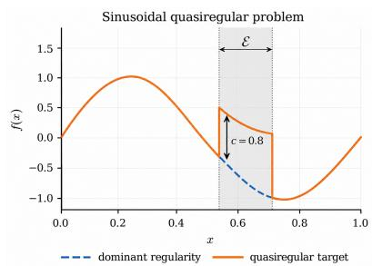
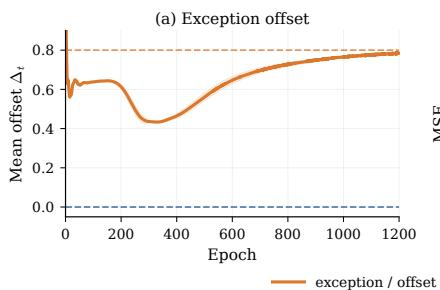
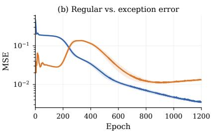
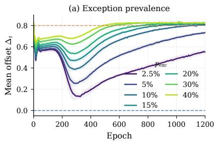
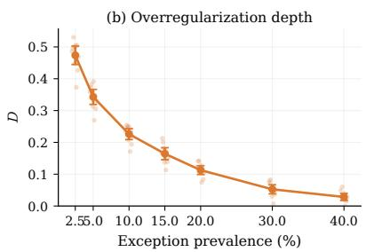
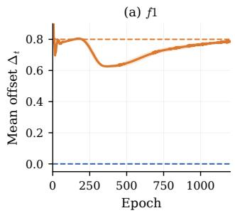
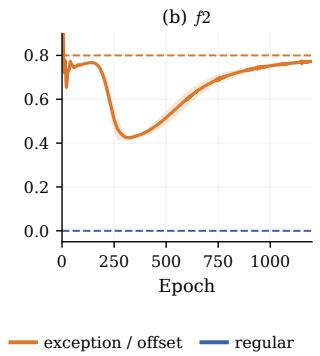
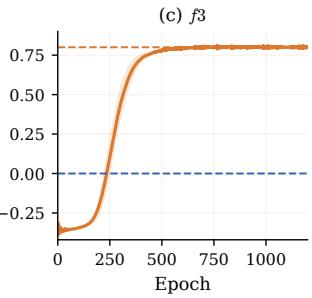

# The Dynamics of Quasiregular Neural Learning

Matthia Sabatelli

Department of Artificial Intelligence, University of Groningen Groningen, The Netherlands

Abstract. Many learning problems combine a dominant regularity with systematic exceptions. Motivated by U-shaped learning in language acquisition, we study this interaction in controlled quasiregular regression problems where regular and exceptional solutions are explicitly known. Neural networks can partially acquire exceptions, subsequently regress toward the dominant regularity, and finally recover. This overregularization becomes substantially stronger when exceptions are rare, despite their early acquisition, but does not emerge equally across all regularities considered. Our results isolate a simple form of competition between regularities and exceptions during neural learning.

## 1 Introduction

Learning is not always monotonic. A striking example comes from language acquisition, where children learning the English past tense may initially produce an irregular form correctly (e.g., go → went), later overregularize it (go $ \ g o e d )$ , and eventually recover the correct form. This U-shaped trajectory played a central role in debates over whether rule-like behaviour requires explicit symbolic mechanisms or can emerge from distributed learning [5, 3]. More recently, similar dynamics have been revisited using modern neural architectures [2]. One particularly interesting aspect of U-shaped learning is that exceptions are not simply acquired late. Correct exceptional behaviour can appear before overregularization and subsequently deteriorate as learning progresses [3]. The resulting trajectory therefore raises a more general question than whether a learner can eventually represent both rules and exceptions: how does learning a dominant regularity afect exception information that has already been acquired? This question is dificult to isolate in linguistic settings, where lexical frequency, input representation, and properties of the language itself are intertwined with the learning dynamics of interest. Here, we abstract away from these factors and study quasiregular learning: learning a dominant regularity while accommodating systematic exceptions. While quasiregular structure has previously been studied in distributed neural models [1], our focus is specifically on how the interaction between regularities and exceptions unfolds during gradient-based training. We construct controlled regression problems in which the regular and exceptional solutions are explicitly known. This allows us to go beyond observing that exception performance temporarily deteriorates and ask whether predictions specifically regress toward the competing regular solution. We then use this setting to study how these dynamics depend on the relative prevalence of exceptions and on the structure of the underlying regularity.

## 2 Methods

## 2.1 Quasiregular learning problems

We study one-dimensional regression problems combining a dominant regularity with systematic exceptions. Inputs $x \in [ 0 , 1 ]$ are associated with targets

$$
f ( x ) = \left\{ { \begin{array} { l l } { f _ { \mathrm { r e g } } ( x ) + c , } & { x \in \mathcal { E } , } \\ { f _ { \mathrm { r e g } } ( x ) , } & { { \mathrm { o t h e r w i s e } } , } \end{array} } \right.\tag{1}
$$

where $f _ { \mathrm { r e g } }$ defines the dominant regularity, E the exception region, and $c$ the exception ofset. Our main setting uses

$$
f _ { \mathrm { r e g } } ( x ) = \sin ( 2 \pi x ) ,\tag{2}
$$

with $\mathcal { E } = ( 0 . 5 5 , 0 . 7 0 )$ and $c = 0 . 8 ~ \mathrm { ( F i g . ~ 1 ) }$

To investigate whether the resulting dynamics are specific to this regularity, we additionally consider

$$
\begin{array} { r } { f _ { 1 } ( x ) = \sin ( 2 \pi x ) + 0 . 3 \sin ( 6 \pi x ) , } \end{array}\tag{3}
$$

$$
f _ { 2 } ( x ) = \sin ( 2 \pi x ) + 0 . 6 \exp [ - ( x - 0 . 3 ) ^ { 2 } / 0 . 0 2 ] ,\tag{4}
$$

$$
f _ { 3 } ( x ) = 4 ( x - 0 . 5 ) ^ { 3 } + 0 . 5 \sin ( 4 \pi x ) .\tag{5}
$$

The same exception region and ofset are used for all four regularities, allowing us to vary the dominant structure while leaving the exceptional structure unchanged.

## 2.2 Experimental setup and metrics

We train a fully connected neural network with two hidden layers of 128 tanh units using Adam $( \eta = 1 0 ^ { - 3 } )$ and mean squared error for 1200 epochs. Training sets contain 256 samples and evaluation is performed on 2000 uniformly spaced test points.

In the main setting, inputs are sampled uniformly from [0, 1], resulting in approximately 15% exceptional training examples. Regular and exceptional examples are therefore present together throughout training, and the training distribution does not change over time. We repeat all experiments over 20 random seeds. A useful property of this construction is that the regular and ex-

  
Fig. 1: Sinusoidal quasiregular problem. The dominant regularity (dashed) is shifted by $c = 0 . 8$ within the exception region $\mathcal { E } .$

ceptional solutions provide two known reference points. Within $\mathcal { E } .$ the regular solution predicts $f _ { \mathrm { r e g } } ( x )$ , while the correct exceptional solution predicts $f _ { \mathrm { r e g } } ( x ) + c .$

We can therefore measure where the network lies relative to these solutions by subtracting the regular prediction from its output. Let $\hat { f } _ { t } ( x )$ denote the network prediction for input x at epoch t. We define the mean exception ofset as

$$
\Delta _ { t } = \mathbb { E } _ { x \in \mathcal { E } _ { \mathrm { i n t } } } [ \hat { f } _ { t } ( x ) - f _ { \mathrm { r e g } } ( x ) ] ,\tag{6}
$$

where $\mathcal { E } _ { \mathrm { i n t } } = ( 0 . 5 8 , 0 . 6 7 )$ excludes points close to the boundaries of the exception region, where the target transitions between regular and exceptional solutions. Thus, $\Delta _ { t } = 0$ corresponds to the regular solution, whereas $\Delta _ { t } = c = 0 . 8$ corresponds to the correct exceptional solution. A decrease in $\Delta _ { t }$ following an initial improvement in exception performance therefore indicates that predictions are moving back toward the regular solution. We additionally measure mean squared error separately on regular and exceptional inputs. We refer to a temporary regression of the exception ofset toward the regular solution following an initial improvement in exception performance as overregularization 1. To quantify its strength, we define the overregularization depth

$$
D = \Delta _ { \mathrm { p e a k } } - \Delta _ { \mathrm { t r o u g h } } ,\tag{7}
$$

where $\Delta _ { \mathrm { p e a k } }$ is the ofset reached before regression and $\Delta _ { \mathrm { t r o u g h } }$ its subsequent minimum. Larger D therefore indicates stronger overregularization. Finally, to study the role of exception frequency, we vary the probability of sampling training points from E as

$$
p _ { \mathrm { e x c } } \in \{ 2 . 5 , 5 , 1 0 , 1 5 , 2 0 , 3 0 , 4 0 \} \% ,\tag{8}
$$

while keeping the exception region, ofset, and total number of training examples fixed. This changes the empirical prevalence of exceptions without changing their location or target geometry.

## 3 Results

## 3.1 Overregularization during learning

We first ask how exception predictions evolve while the network learns the dominant regularity. The error trajectories in the right panel of Fig. 2 (note the logarithmic scale) show a clear non-monotonic pattern for the exceptions. Early in training, exception error decreases substantially, with MSE decreasing by approximately a factor of 1.5–2, demonstrating that the network initially improves its predictions on exceptional examples. Exception performance then deteriorates sharply, with exception error increasing several-fold while regular error continues to decrease. Finally, exception error decreases again as training progresses.

The exception ofset in the left panel reveals the direction of this intermediate deterioration. As exception error increases, $\Delta _ { t }$ decreases from approximately 0.65 to 0.43, indicating that exceptional predictions shift toward the competing regular solution. The ofset subsequently recovers and approaches the correct exceptional value of 0.8. Together, the two panels reveal three stages of exception learning: initial improvement, regression toward the regular solution, and recovery.

## 3.2 Efect of exception prevalence

Having established this trajectory, we next ask what determines its strength. A natural candidate is the relative frequency of the exceptions.

Fig. 3 shows a clear dependence on exception prevalence. When exceptions represent only 2.5% of the training data, the network initially moves substantially toward the exceptional solution, reaching an ofset above 0.5. Its predictions then regress strongly toward the regular solution before eventually recovering. As exception prevalence increases, this intermediate regression becomes progressively smaller; at 30% and 40%, the U-shaped trajectory is strongly reduced. This trend is summarized by the overregularization depth in the right panel of Fig. 3. The depth decreases from approximately 0.5 when exceptions represent 2.5% of the training data to almost zero at 40%. Importantly, the rare-exception condition does not simply approach the exceptional solution more slowly: even at 2.5%, predictions initially move toward the exceptional reference before undergoing a pronounced regression. Rarity therefore primarily afects the degree of subsequent regression: the rarer the exceptions, the stronger their overregularization.

Fig. 2: Learning dynamics on the sinusoidal quasiregular problem. Left: mean exception ofset $\Delta _ { t }$ over 20 seeds. Right: mean squared error on regular and exceptional inputs. Shaded regions denote 95% confidence intervals.  

  
Fig. 3: Efect of exception prevalence. Left: mean exception ofset $\Delta _ { t }$ for diferent exception frequencies. Right: overregularization depth $D .$

## 3.3 Dependence on the regularity

Exception prevalence is, however, not the only possible determinant of these dynamics. We finally ask whether overregularization persists when the dominant regularity itself is changed while keeping the exception structure fixed.

  
Fig. 4: Exception learning dynamics for the three additional quasiregular problems.

The trajectories in ${ \mathrm { F i g . } }$ 4 show that the behaviour observed in the sinusoidal problem is not unique to that particular regularity. For both $f _ { 1 }$ and $f _ { 2 }$ , the network initially moves toward the exceptional solution, subsequently regresses toward the regular solution, and finally recovers. The efect is particularly pronounced for $f _ { 2 } ,$ , where the mean exception ofset decreases from 0.768 to 0.412, corresponding to an overregularization depth of $D \ : = \ : 0 . 3 5 6$ . In contrast, $f _ { 3 }$ shows a qualitatively diferent trajectory. Its exception ofset approaches the exceptional solution without a comparable intermediate regression $( D = 0 . 0 0 5 )$ Overregularization is therefore neither specific to the sinusoidal problem nor an inevitable consequence of quasiregular learning.

## 4 Discussion & Conclusion

We studied quasiregular learning in controlled regression problems where the regular and exceptional solutions are explicitly known. Across several problems, neural networks exhibit a characteristic U-shaped trajectory: they partially acquire exception information, regress toward the dominant regularity, and finally recover the exceptional solution. Crucially, this deterioration occurs while regular performance continues to improve. We have also shown that overregularization becomes substantially stronger as exceptions become rarer, despite exception information being acquired early in training. However, its absence for $f _ { 3 }$ shows that rarity alone does not determine the trajectory: the structure of the dominant regularity also matters. Our setting relates to previous work on quasiregularity in distributed connectionist models [1], while shifting the focus to the training-time interaction between regular and exceptional solutions in gradient-trained neural networks. Our observations also connect to systematic biases in the order in which neural networks learn structure, such as the tendency to learn lower-frequency components faster [4]. Our results show that such biases need not yield a monotonic ordering in which the dominant regularity is learned first and exceptions afterwards: exception information can emerge early, regress as the dominant regularity is learned, and subsequently recover. An important open question is what properties of a learning problem determine whether this competition produces overregularization. Characterizing these properties may connect quasiregular learning to broader accounts of neural-network learning dynamics, including the non-monotonic generalization dynamics of double descent.

## Acknowledgements

The authors would like to thank Gido van de Ven for insightful discussions about this topic and Erwan Escudie for helpful feedback on preliminary versions of the manuscript.

AI disclosure. ChatGPT (OpenAI) was used for spell-checking and to improve the clarity and readability of the manuscript. All scientific ideas, experimental design, analysis, and conclusions are those of the authors.

## References

[1] Woojae Kim, Mark A. Pitt, and Jay I. Myung. How do PDP models learn quasiregularity? Psychological Review, 120(4):903–916, 2013.

[2] Christo Kirov and Ryan Cotterell. Recurrent neural networks in linguistic theory: Revisiting pinker and prince (1988) and the past tense debate. Transactions of the Association for Computational Linguistics, 6:651–665, 2018.

[3] Gary F. Marcus, Steven Pinker, Michael Ullman, Michelle Hollander, T. John Rosen, and Fei Xu. Overregularization in language acquisition. Monographs of the Society for Research in Child Development, 57(4):1–178, 1992.

[4] Nasim Rahaman, Aristide Baratin, Devansh Arpit, Felix Draxler, Min Lin, Fred A. Hamprecht, Yoshua Bengio, and Aaron Courville. On the spectral

bias of neural networks. In Proceedings of the 36th International Conference on Machine Learning, volume 97 of Proceedings of Machine Learning Research, pages 5301–5310, 2019.

[5] David E. Rumelhart and James L. McClelland. On learning the past tenses of english verbs. In James L. McClelland and David E. Rumelhart, editors, Parallel Distributed Processing: Explorations in the Microstructure of Cognition, Volume 2. MIT Press, Cambridge, MA, 1986.