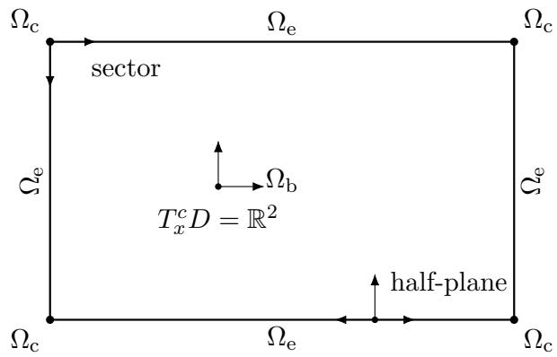
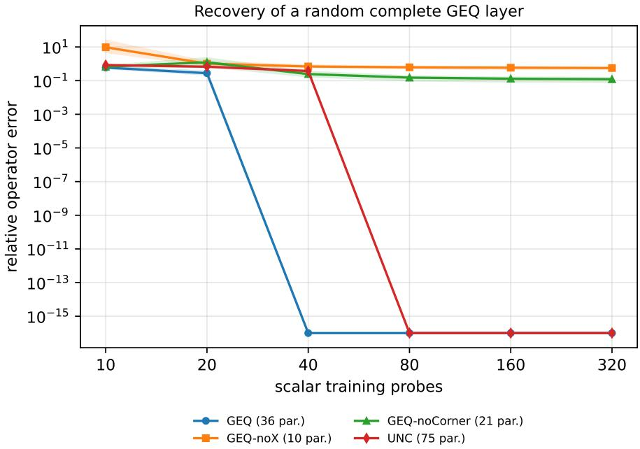
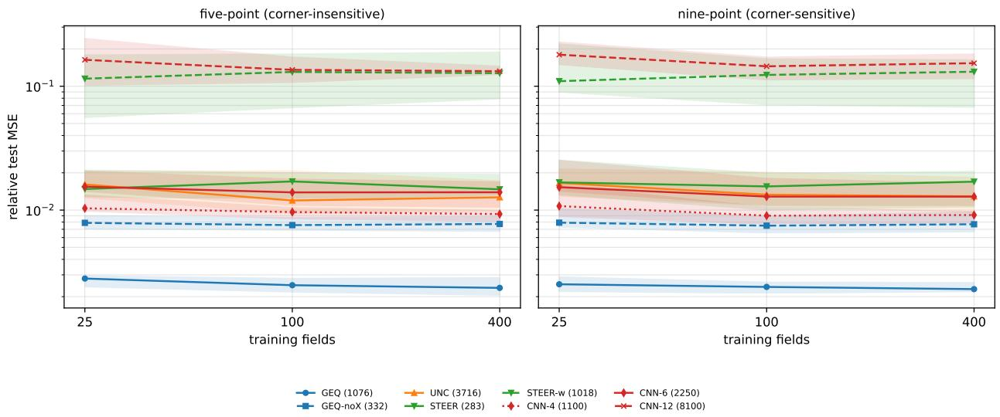
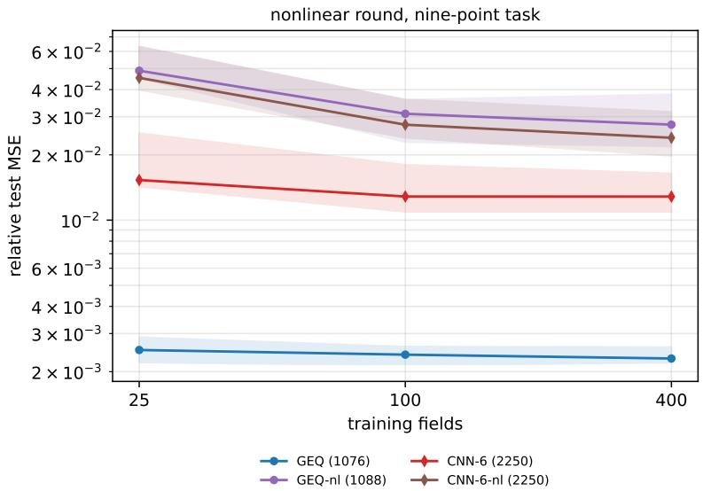

# Theory for groupoid equivariant neural networks: an approach for steerable CNNs on bounded domains

A. Ibort1,2,4 , M. Jim´enez-V´azquez1,5 , J.M. P´erez-Pardo1,6

1 Universidad Carlos III de Madrid, ROR: 03ths8210, Departamento de Matem´aticas, Avenida de la Universidad 30 (edificio Sabatini), 28911 Legan´es (Madrid), Espa˜na.

2 Instituto de Ciencias Matem´aticas ICMAT (CSIC-UAM-UC3M-UCM), ROR: 05e9bn444, Campus de Cantoblanco UAM, Calle Nicol´as Cabrera 13-15, 28049 Madrid, Espa˜na.

4albertoi[at]math.uc3m.es, 5mjvazque[at]pa.uc3m.es, 6jmppardo[at]math.uc3m.es

## Abstract

Equivariant convolutional neural networks are usually built from a group acting globally on the space of signals. This hypothesis is inappropriate for many bounded or stratified domains: an ambient rigid motion may be admissible only on part of the domain, and the boundary introduces geometric types that are invisible to a transitive group action. We develop a theory of groupoid-equivariant neural networks in which the symmetry datum consists of a groupoid, a selected pseudogroup of local bisections, a measure, and input and output representation bundles. For integral channels on the object space, we prove a bisection-equivariant kernel theorem: equivariance is equivalent to a transport constraint on the two-point kernel, and its solutions are classified by one joint-stabilizer intertwiner on each orbit of pairs. The usual steerable convolution constraint on homogeneous spaces is recovered as a special case.

As a case study we apply the theory to bounded planar domains. Requiring Euclidean arrows to preserve tangent cones produces a groupoid whose orbits distinguish bulk, smooth-edge, and corner points. On a rectangle their isotropy groups are O(2), $\mathbb { Z } _ { 2 } ,$ and $\mathbb { Z } _ { 2 }$ respectively, and the kernel theorem yields a complete boundary-aware layer with diagonal and cross-stratum couplings. On a pixel grid, the edge and corner isotropy subgroups are nonconjugate copies of $\mathbb { Z } _ { 2 }$ inside $D _ { 4 } ,$ , leading to diferent branching rules and closed parameter-count formulas for ten geometric block families. We also show that partial equivariance is filtered under composition: finite-propagation layers remain equivariant on explicitly eroded bisection domains, whereas global symmetries are preserved exactly at arbitrary depth.

The resulting architecture is implemented through ofline nullspace bases and sparse gather– transform–scatter operations. Numerical certificates verify the kernel constraints and the composition theorem to machine precision, and a synthetic identification experiment confirms completeness and reduced sample complexity. A Poisson–Dirichlet kernel study is used separately to assess boundary-aware inductive bias; the exact inverse is shown to preserve the global symmetries of the rectangle but not general proper local bisections. The numerical results show that the proposed architectures provide significant advantages when symmetries cannot be globally implemented by group actions and provide an accuracy improvement of at least one order of magnitude with respect to the models tested.

## Contents

## 1 Introduction

Groupoid symmetry data and equivariant kernels 6   
2 Groupoids, bisections, and symmetry data 6   
2.1 Groups, global actions, and partial transformations 7   
2.2 Groupoids, orbits, isotropy, and restrictions 7   
2.3 Local bisections and admissible pseudogroups 9   
2.4 Linear representations and reduction to isotropy 10   
2.5 Measures and the symmetry datum of a channel 11   
2.6 Basic examples and standing assumptions 12   
3 Equivariant channels and the bisection-equivariant kernel theorem 13   
3.1 Representation bundles and spaces of sections 14   
3.2 Pointwise equivariant channels 14   
3.3 Transport by local bisections 16   
3.4 Bisection-equivariant nonlocal channels . 17   
3.5 The bisection-equivariant kernel theorem 17   
3.6 Pair orbits and joint stabilizers 18   
3.7 Recovery of homogeneous and steerable kernels 20   
II Euclidean and tangent-cone groupoids 21   
4 The Euclidean groupoid and bounded domains 21   
4.1 The Euclidean group and its compact isotropy types 21   
4.2 The Euclidean action groupoid and its feature bundles 22   
4.3 Restriction to a bounded domain 23   
5 Tangent-cone groupoids and stratified representations 23   
5.1 Tangent cones and the refined groupoid 24   
5.2 Orbit and isotropy stratification . 24   
5.3 Stratified representation bundles and measures 25   
5.4 Rigid bisections and the polygonal ampleness theorem 25   
6 Boundary pairs of orbits and kernel blocks 26   
6.1 Setup and block decomposition 26   
6.2 Diagonal blocks . 27   
6.3 Bulk–edge and bulk–corner blocks in the small-filter regime 28   
6.4 Edge–corner and corner-adjacent edge blocks in the small-filter regime 28   
6.5 Small-filter regime normal form 29   
7 Discrete tangent-cone groupoids and parameter counts 30   
7.1 The finite tangent-cone groupoid 30   
7.2 Branching rules and gauge cocycles 30   
7.3 Finite pair orbits and completeness 31   
7.4 Closed parameter-count formulas 31   
III Filtered equivariance under composition 33   
8 Finite propagation, erosion, and composition 33   
8.1 Metric symmetry data and finite propagation 33   
8.2 Eroded bisection domains 34   
8.3 The two-layer composition theorem 35   
8.4 The n-layer path theorem 36   
9 Deep networks and filtered equivariance 38   
9.1 The filtration by erosion radius . 38   
9.2 Pointwise nonlinearities and afine maps 38   
9.3 Sums, parallel branches, and residual connections 39   
9.4 Deep groupoid-steerable networks . 39   
IV Groupoid-steerable architectures 41   
10 Stratified feature types and neural layers 41   
10.1 Layerwise feature spaces 41   
10.2 Lifting raw inputs 43   
10.3 Afine layers and admissible biases 43   
10.4 Readout and task-dependent outputs 44   
10.5 Complete and restricted architectures 44   
11 Equivariant nonlinearities, normalization, and residual blocks 45   
11.1 The isotropy principle for pointwise nonlinearities 45   
11.2 Practical nonlinearities by representation type . 45   
11.3 Equivariant normalization . . . 46   
11.4 Residual, parallel, and type-changing blocks 47   
12 Discrete implementation and computational structure 48   
12.1 Stratified tensor layout . . 48   
12.2 Ofline construction of kernel bases 48   
12.3 From reference slots to grid taps 49   
12.4 Complexity and parameter scaling 49   
12.5 Gauge covariance of the implementation 50   
12.6 Diferentiable layer assembly and reference workflow 50   
12.7 Correctness checks and present scope 51   
V Experiments 52   
13 Exact algebraic and equivariance certificates 52   
13.1 Constraint dimensions and implementation agreement 52   
13.2 Exhaustive rigid-motion tests on a finite grid 53   
14 Recovery of exactly equivariant target operators 53   
15 Boundary-aware operator learning 55   
15.1 Symmetry diagnostic for the Poisson–Dirichlet inverse 55   
15.2 Benchmark design and executed protocol 56   
15.3 Sample eficiency and completeness ablations 57   
15.4 A corner-sensitive diagnostic: harmonic extension of corner data 58   
15.5 Nonlinear round . . 58   
15.6 Transport certificates of trained operators 59   
16 Conclusions and outlook 60

## 1 Introduction

Symmetry is one of the principal mechanisms by which prior geometric knowledge is incorporated into machine learning (see, for instance, [1] and references therein). A neural map is equivariant when transforming its input and then applying the map is equivalent to first applying the map and then transforming its output. In convolutional architectures this requirement restricts the admissible kernels, produces systematic weight sharing, and often improves sample eficiency and interpretability. Group-equivariant CNNs and steerable CNNs formalize this principle for transformations generated by a group acting on the signal space [2, 3, 4, 5]. Their representation-theoretic foundations are particularly transparent on homogeneous spaces, where equivariant linear maps are characterized by convolutions with constrained kernels $\lbrack 6 , 7 \rbrack$

The global-action hypothesis is nevertheless too restrictive in many geometric problems. Consider a signal on a bounded domain $D \subset \mathbb { R } ^ { 2 }$ . The ambient Euclidean group $E ( 2 ) = \mathbb { R } ^ { 2 } \rtimes O ( 2 )$ acts transitively on the plane, but a generic rigid motion does not map D to itself. It may still map one region of D to another, and hence remains meaningful as a partial symmetry. At the same time, the boundary distinguishes interior points, smooth-edge points, and corners. Treating every pixel as though it belonged to a homogeneous copy of the plane suppresses this information and leaves boundary handling to padding, masking, or other auxiliary conventions. Padding is not neutral: standard convolutions can exploit the absolute-position information created by the boundary of the padded array [9, 10].

Groupoids provide a natural language for the invertible partial symmetries that survive this restriction. An arrow relates a source point to a target point only when the corresponding transformation is admissible; a local bisection assembles such arrows into a coherent partial transformation of a region. The groupoid alone, however, does not determine a notion of network equivariance. One must also specify which local bisections are to be regarded as admissible symmetries, how the object space is measured, and how the feature fibres transform. The basic symmetry datum (see Sect. 2.5, Def. 2.14) of this paper is therefore

$$
\begin{array} { r } { \mathfrak { S } _ { \mathrm { i n , o u t } } = \Big ( \Gamma \Longrightarrow \Omega , \ B , \nu ; ( E ^ { \mathrm { i n } } , R ^ { \mathrm { i n } } ) , ( E ^ { \mathrm { o u t } } , R ^ { \mathrm { o u t } } ) \Big ) , } \end{array}\tag{1}
$$

where B is a selected pseudogroup of local bisections and the two bundles $E ^ { \mathrm { i n } } , E ^ { \mathrm { o u t } }$ , carry representations $R ^ { \mathrm { i n } } , R ^ { \mathrm { o u t } }$ of the groupoid that implements the symmetry, $\Gamma \Longrightarrow \Omega$ . This formulation contains global group equivariance as the special case in which the relevant bisections are global.

The central analytical question is then the following. Given the datum (1), which nonlocal linear maps between fields of features are equivariant? A single groupoid arrow acts only between two fibres and cannot by itself constrain an operator that mixes values at many points. Local bisections are the correct objects because they move regions coherently. We prove that an integral channel with two-point kernel $K ( y , x )$ is equivariant under B precisely when

$$
K { \big ( } \tau _ { b } ( y ) , \tau _ { b } ( x ) { \big ) } = R ^ { \mathrm { o u t } } { \big ( } b ( y ) { \big ) } K ( y , x ) R ^ { \mathrm { i n } } { \big ( } b ( x ) { \big ) } ^ { - 1 }\tag{2}
$$

for every admissible local bisection b and almost every pair in its domain (see Sect. 3.5, Thm. 3.12). The free kernel data reduce, orbit by orbit in $\Omega \times \Omega$ , to intertwiners of the corresponding joint stabilizers. In the homogeneous Euclidean case, translations reduce $K ( y , x )$ to a function of $y - x .$ , and (2) becomes the familiar steerable-kernel constraint. Our object-space kernel theorem should be distinguished from Haar-system convolution on the arrow space of a Lie groupoid: the two are related in important examples, but they are not the same construction.

The geometric model developed here is the tangent-cone restricted Euclidean groupoid of a bounded planar domain. The ordinary restriction of the action groupoid $( E ( 2 ) \ltimes \mathbb { R } ^ { 2 } ) | _ { D }$ remains transitive and therefore does not distinguish boundary types at the level of object orbits and isotropy. We refine it by retaining only arrows whose orthogonal part transports the tangent cone at the source to the tangent cone at the target. For a piecewise-smooth domain this separates the interior, smooth boundary, and corners of each opening angle. On a rectangle the three strata have isotropy O(2), $\mathbb { Z } _ { 2 }$ , and $\mathbb { Z } _ { 2 }$ , respectively (see Sect. 5.2, Thm. 5.4). Applying (2) to pair orbits produces not only the stratum-preserving kernels, but also the bulk–edge, bulk–corner, and edge–corner couplings needed to exchange information across the stratification (see Sect. 6). These cross-stratum blocks are the symmetry-constrained alternative to treating the boundary by an external padding rule.

The discrete theory contains an additional representation-theoretic feature. On a rectangular pixel grid the ambient point group is $D _ { 4 }$ . Edge isotropy is generated by an axis reflection, whereas corner isotropy is generated by a diagonal reflection. These subgroups are isomorphic but nonconjugate in $D _ { 4 }$ , and the restrictions of the $B _ { 1 }$ and $B _ { 2 }$ irreducible types are therefore exchanged between edges and corners. The finite kernel constraints form homogeneous linear systems. Their nullspaces provide complete bases of the admissible layers, with closed parameter-count formulas for ten geometric block families: the nine source–target stratum blocks, with the edge–edge block separated into same-edge and across-corner interactions (see Sect. 7.4, Thm. 7.3).

A second structural issue arises when such layers are stacked. Global equivariance is stable under composition, but a proper partial symmetry moves only a restricted region. Intermediate points in a multi-layer computation must also remain inside the domain of the bisection. We formalize this through finite propagation and erosion. A layer is exactly equivariant on every maximal admissible bisection domain, while a composition is equivariant on an explicitly eroded domain determined by the propagation radii of its factors (see Sect. 8). For n equal-radius layers, the balanced path estimate gives the erosion radius $\lfloor n / 2 \rfloor r _ { 0 } ;$ global bisections require no erosion. This produces a filtration of equivariant operator classes and makes precise the way in which depth converts a partial symmetry into a controlled boundary layer.

Relation with existing approaches. The present construction is complementary to several established directions. Gauge-equivariant CNNs formulate covariance under changes of local frame on a manifold [8]; our adapted edge and corner gauges use the same representation-theoretic principle, but the bisections encode partial rigid motions of a fixed bounded domain rather than only changes of frame. Work on partial or learned equivariance relaxes or estimates the symmetry constraint from data [11]; here the surviving partial symmetry is specified geometrically and imposed exactly at the layer level. Recent categorical and Lie-groupoid approaches formulate equivariant architectures using naturality or convolution on groupoid arrows [12, 13]. Our focus is more specific: we derive a boundary stratification from tangent cones, classify the complete object-space kernel on all source–target stratum pairs, and analyze the filtered behavior of these kernels under composition.

Finally, neural operators learn maps between function spaces and have become a standard tool for PDE surrogates [14, 15]; the present framework supplies a representation-theoretic way of encoding bounded-domain geometry, while our experiments also emphasize that a useful architectural bias need not coincide with an exact symmetry of the target operator (see Sect. 15).

The main results can be summarized as follows.

(i) We define the measured groupoid symmetry datum (1), separating the groupoid of arrows from the selected pseudogroup of coherent partial transformations and from the feature representations.

(ii) We classify pointwise equivariant channels by isotropy intertwiners and prove the bisectionequivariant kernel theorem (Theorem 3.12). Its pair-orbit reduction (Proposition 3.17) identifies one joint-stabilizer intertwiner per orbit of pairs and recovers ordinary steerable convolution as Corollary 3.21.

(iii) We introduce the tangent-cone restricted Euclidean groupoid and prove its bulk–edge–corner orbit and isotropy classification (Theorem 5.4). For a rectangle we derive a complete normal form for all diagonal and cross-stratum kernels (Theorem 6.1).

(iv) We develop the finite $D _ { 4 }$ theory, including the distinct edge and corner branching rules, finite completeness, and closed parameter counts for the ten geometric block families (Theorem 7.3).

(v) We prove sharp two-layer and multi-layer composition results in terms of eroded bisection domains (Theorems 8.5 and 8.9), and extend the result to pointwise nonlinearities, afine maps, parallel branches, and residual networks.

(vi) We turn the classification into a practical architecture with stratified feature types, equivariant nonlinearities and normalization, ofline nullspace bases, and sparse gather–transform–scatter implementations. The resulting parameterization is complete for the chosen finite symmetry datum.

(vii) We verify the algebraic constraints and filtered composition theorem to machine precision. A synthetic operator-identification experiment confirms completeness and reduced identification complexity. A Poisson–Dirichlet kernel example is reported as a test of boundary-aware inductive bias after showing that the fixed-domain inverse is globally, but not generally locally, equivariant.

Organization. Part I develops the abstract symmetry datum, transport operators, pointwise channels, and the bisection-equivariant kernel theorem. Part II studies the Euclidean action groupoid, its tangent-cone refinement, the boundary-aware pair-orbit classification, and the finite $D _ { 4 }$ parameter counts. Part III introduces finite propagation and proves the erosion theorems for compositions and deep networks. Part IV specifies the corresponding neural architecture, including nonlinearities, normalization, residual connections, gauges, and the sparse implementation. Part V reports exact certificates, synthetic recovery, and the boundary-value experiment. The final section summarizes the results and discusses the principal mathematical and computational extensions.

## Part I

## Groupoid symmetry data and equivariant kernels

## 2 Groupoids, bisections, and symmetry data

The purpose of this section is to isolate the geometric and representation-theoretic data that determine the notion of equivariance used throughout the article. A groupoid records which points of the object space can be related by admissible arrows. A selected family of local bisections records which arrows can be assembled into coherent partial transformations of regions. A measure determines the spaces of fields on which the network acts, and representations of the groupoid determine how the internal feature fibres transform. Equivariance is therefore attached not to an abstract groupoid alone, but to the complete collection of these data.

This formulation contains ordinary group equivariance as a special case. It also covers situations in which an ambient group acts on a larger space but not on the domain supporting the signals. In that case the surviving rigid motions are naturally partial transformations; the corresponding arrows and local bisections remain available even though no global group action on the domain exists.

## 2.1 Groups, global actions, and partial transformations

We begin with the classical global picture.

Definition 2.1 (Group action). Let G be a group and let X be a set. A left action of G on X is a map

$$
G \times X \longrightarrow X , \qquad ( g , x ) \longmapsto g \cdot x ,
$$

such that

$$
e \cdot x = x , \qquad ( g h ) \cdot x = g \cdot ( h \cdot x )
$$

for all $g , h \in G$ and $x \in X$ . When G and X carry topological or smooth structures, the action is required to have the corresponding regularity.

A group action provides one transformation of the whole space for every element of G. This globality is precisely what fails after restricting the space of signals. Let $D \subseteq X$ . Even if G acts on $X$ , a generic $g \in G$ need not satisfy $g D \subseteq D$ . It nevertheless defines a partial transformation

$$
g \colon D \cap g ^ { - 1 } D \longrightarrow D \cap g D , \qquad x \longmapsto g \cdot x .\tag{3}
$$

The domains in (3) depend on ${ g } ;$ consequently, the surviving transformations do not in general form a group acting on D. They are closed instead under restriction, partially defined composition, and inverse. Groupoids record these pointwise admissible transformations, while local bisections assemble them into coherent motions of subsets of D.

Remark 2.2 (Scope of the groupoid language). Groupoids are not the only formalism for partial symmetry: partial group actions, inverse semigroups, pseudogroups, and more general categories are closely related alternatives. The advantage relevant here is that groupoids combine invertible partial transformations with orbit, isotropy, and representation theory. Our claim is therefore not that every conceivable notion of symmetry must be a groupoid, but that groupoids are a natural and efective language for the invertible local symmetries considered in this article.

## 2.2 Groupoids, orbits, isotropy, and restrictions

Definition 2.3 (Groupoid). A groupoid consists of two sets Γ and Ω, source and target maps

$$
s , t \colon \Gamma \longrightarrow \Omega ,
$$

and a partially defined multiplication (or composition) ◦. It is customarily displayed as $\Gamma \implies \Omega$ Elements of Ω are called objects. An element $\alpha \in \Gamma$ with $s ( \alpha ) = a$ and $t ( \alpha ) = b$ is written $\alpha \colon a  b$ and is called an arrow. Two arrows $\beta$ , α are composable $i f s ( \beta ) = t ( \alpha )$ , in which case their multiplication $\beta \circ \alpha$ is an arrow $\beta \circ \alpha \colon s ( \alpha )  t ( \beta )$ . Multiplication is associative: $\gamma \circ ( \beta \circ \alpha ) = ( \gamma \circ \beta )$ ◦ α, provided $s ( \gamma ) = t ( \beta )$ and $s ( \beta ) = t ( \alpha )$ ; each object $a \in \Omega$ has a unit arrow $1 _ { a } \colon a  a \colon \alpha \circ 1 _ { a } = 1 _ { b } \circ \alpha = \alpha \ f o r$ every $\alpha \colon a  b ;$ and every arrow α: $a  b$ has an inverse $\alpha ^ { - 1 } \colon b \to a \colon \alpha ^ { - 1 } \circ \alpha = 1 _ { a } , \alpha \circ \alpha ^ { - 1 } = 1 _ { b }$

For $a , b \in \Omega$ we use the notation

$$
\Gamma _ { a } = s ^ { - 1 } ( a ) , \qquad \Gamma ^ { b } = t ^ { - 1 } ( b ) , \qquad \Gamma _ { a } ^ { b } = \Gamma _ { a } \cap \Gamma ^ { b } .
$$

that represent, respectively, the subset of arrows with source $^ { a , }$ the subset of arrows with target b and the subset of arrows with source a and target b. The isotropy group at a is defined as:

$$
\Gamma ( a ) : = \Gamma _ { a } ^ { a } ,\tag{4}
$$

and the orbit through a is

$$
\mathcal { O } ( a ) : = \{ b \in \Omega : \Gamma _ { a } ^ { b } \neq \emptyset \} .\tag{5}
$$

The orbits partition $\Omega ;$ their set is denoted by $\pi _ { 0 } ( \Gamma )$ . The groupoid is transitive when it has a single orbit.

Definition 2.4 (Restriction). Let $D \subseteq \Omega$ . The restriction, or full subgroupoid, of Γ to D is

$$
\Gamma | _ { D } : = \{ \alpha \in \Gamma : s ( \alpha ) , t ( \alpha ) \in D \} \Rightarrow D .\tag{6}
$$

Restriction is the elementary operation that will allow us to retain the arrows of an ambient symmetry that remain meaningful on a bounded domain. Notice that restricting a transitive groupoid need not preserve the original global transformations, although the restricted groupoid may still have many arrows and may itself remain transitive.

Example 2.5 (Action groupoid). Let G act on X. The associated action groupoid is

$$
G \ltimes X \ni X .
$$

Its arrows are pairs $( g , x ) \in G \times X$ , with

$$
s ( g , x ) = x , \qquad t ( g , x ) = g \cdot x .
$$

Composition and inversion are

$$
( h , g \cdot x ) \circ ( g , x ) = ( h g , x ) , \qquad ( g , x ) ^ { - 1 } = ( g ^ { - 1 } , g \cdot x ) .
$$

Thus every global group action determines a groupoid. The isotropy group of the action groupoid at x is the stabilizer

$$
G _ { x } = \{ g \in G : g \cdot x = x \} .
$$

Example 2.6 (A restricted translation symmetry). Let Z act on R by translations and let $D =$ $[ a , b ]$ . The group $\mathbb { Z }$ does not act on D, unless the interval is replaced by a translation-invariant set. The restricted action groupoid is nevertheless well defined:

$$
( \mathbb { Z } \ltimes \mathbb { R } ) | _ { D } = \{ ( n , x ) \in \mathbb { Z } \times D : x + n \in D \} \Longrightarrow D .\tag{7}
$$

Its arrows are exactly the integer translations whose source and target lie in D. The same construction applies to a lattice action on $\mathbb { R } ^ { d }$ and a bounded image domain. This elementary example contains the basic mechanism used later for Euclidean motions on domains with boundary.

Remark 2.7 (Regularity). In the applications below, Ω will be a manifold, a manifold with corners, a stratified space, or a finite pixel grid. Correspondingly, Γ will be a Lie groupoid, a groupoid compatible with a stratification, or a finite groupoid. For a Lie groupoid, the arrow and object spaces are smooth manifolds, the source and target maps are submersions, and all structure maps are smooth; see, for example, [16]. Whenever the object space has strata of diferent dimensions, all regularity statements are to be understood stratum by stratum unless explicitly stated otherwise.

## 2.3 Local bisections and admissible pseudogroups

A single arrow relates two fibres of the source or target maps. For instance, if α : $a  b \in \Gamma$ , then left composition with α defines a map $L _ { \alpha } \colon \Gamma ^ { a } \to \Gamma ^ { b } , L _ { \alpha } ( \beta ) = \alpha \circ \beta ,$ . Equivariance of a nonlocal operator, however, requires a coherent transformation of a whole region. This is the role that local bisections are going to play.

Definition 2.8 (Local bisection). Let $\Gamma \implies \Omega$ be a topological groupoid. A local bisection is a continuous map

$$
b \colon U _ { b } \longrightarrow \Gamma
$$

defined on an open set $U _ { b } \subseteq \Omega$ such that

$$
s \circ b = \mathrm { i d } _ { U _ { b } }
$$

and

$$
\tau _ { b } : = t \circ b \colon U _ { b } \longrightarrow U _ { b } ^ { \prime } : = \tau _ { b } ( U _ { b } )
$$

is $a$ homeomorphism onto an open subset $U _ { b } ^ { \prime } \subseteq \Omega$ . We will also call $U _ { b }$ the domain of the local bisection $b \colon U _ { b } \to \Gamma$ , and we will denote it as $U _ { b } = \operatorname { d o m } \left( b \right)$ . In the smooth setting b and $\tau _ { b }$ are required to be smooth, with $\tau _ { b }$ a difeomorphism onto its image. In the purely algebraic or finite setting, $\boldsymbol { \mathbf { \mathit { \tilde { \ o p e n } } } } ^ { \prime \prime }$ and “homeomorphism” are replaced $b y$ “subset” and “bijection”. A bisection is global if $U _ { b } = U _ { b } ^ { \prime } = \Omega$

Remark 2.9. Alternatively, a local bisection can be defined as a subset $\Sigma \subset \Gamma$ , such that the restriction of the source and target maps to $\Sigma$ are homeomorphisms. Denoting by $b = ( s | _ { \Sigma } ) ^ { - 1 }$ we recover Def. 2.8.

If b : $U \to \Gamma$ and $b ^ { \prime } \colon U ^ { \prime } \to \Gamma$ are local bisections, their composition is defined wherever $\tau _ { b } ( x ) \in U ^ { \prime }$ for $x \in U$ , by

$$
( b ^ { \prime } \circ b ) ( x ) = b ^ { \prime } { \bigl ( } \tau _ { b } ( x ) { \bigr ) } \circ b ( x ) ,\tag{8}
$$

and then, $b ^ { \prime } \circ b$ is a local bisection with domain $\tau _ { b } ^ { - 1 } ( U ^ { \prime } ) = \tau _ { b } ^ { - 1 } ( \mathrm { d o m } ( b ^ { \prime } ) ) \subseteq U = \mathrm { d o m } ( b )$ . The inverse bisection $b ^ { - 1 }$ is defined as:

$$
b ^ { - 1 } ( y ) = b \big ( \tau _ { b } ^ { - 1 } ( y ) \big ) ^ { - 1 } .\tag{9}
$$

with domain dom $( b ^ { - 1 } ) = \tau _ { b } ( U ) = \tau _ { b } ( \mathrm { d o m } ( b ) )$ . Note that both $b ^ { - 1 }$ ◦b and $b { \circ } b ^ { - 1 }$ are well defined local bisections with domains $U = \operatorname { d o m } \left( b \right)$ and $U ^ { \prime } = \mathrm { d o m } \left( b ^ { - 1 } \right)$ respectively, and $b ^ { - 1 } \circ b = : 1 _ { U } \colon U \to \Gamma$ $1 _ { U } ( x ) = 1 _ { x }$ for all $x \in U ; b \circ b ^ { - 1 } = : 1 _ { U ^ { \prime } } : U ^ { \prime } \to \Gamma , 1 _ { U ^ { \prime } } ( y ) = 1 _ { y }$ , for all $y \in U ^ { \prime }$ . The local bisections $1 _ { U }$ are called identity local bisections.

Local bisections are stable under restriction of their domains. Local bisections form an inverse semigroup denoted as $\mathrm { { B i s } _ { l o c } ( T ) }$ ; the composition of local bisections is associative and $b ^ { - 1 } \circ b \circ b ^ { - 1 } =$ $b ^ { - 1 } , b \circ b ^ { - 1 } \circ b = b \ [ 1 8 ]$ . Their associated local transformations $\tau _ { b }$ form a pseudogroup1 after closure under compatible unions. $\mathrm { O n }$ the other hand global bisections form a group Bis(Γ). In what follows we will not make use of the theory of inverse semigroups and $1 / \mathrm { o r }$ pseudogroups as we will concentrate on concrete families of local bisections determined by the structure of the supporting groupoid.

Constant and rigid bisections: For the action groupoid $G \ltimes X$ , every $g \in G$ defines a constant global bisection

$$
b _ { g } ( x ) = ( g , x ) , \qquad \tau _ { b _ { g } } ( x ) = g \cdot x .\tag{10}
$$

Thus the original group G embeds into $\operatorname { B i s } ( G \ltimes X )$ in a canonical way. If the action groupoid is restricted to $D \subseteq X$ , the same formula, Eq. (10), defines a local bisection on every open set

$$
U \subseteq D \cap g ^ { - 1 } D .
$$

We denote it by

$$
b _ { g , U } ( x ) = ( g , x )\tag{11}
$$

and call it a rigid local bisection. Its associated partial transformation is $g | _ { U } \colon U \to g U$ . These bisections formalize the ambient rigid motions that survive only locally on the restricted domain.

The complete family $\mathrm { { B i s } _ { l o c } ( T ) }$ of local bisections of a groupoid is often larger than the geometric symmetries one wishes to impose on a model. We therefore select an admissible subfamily.

Definition 2.10 (Admissible and ample families of bisections). An admissible family of local bisections is a subset $B \subseteq \operatorname { B i s } _ { \mathrm { l o c } } ( \Gamma )$ that contains the identity local bisections and is closed under restriction, inversion, and every defined composition. It is called ample if every arrow is attained by a member of the family: for every $\alpha \in \Gamma$ there exists $b \in B$ such that

$$
s ( \alpha ) \in U _ { b } , \qquad b \bigl ( s ( \alpha ) \bigr ) = \alpha .
$$

The choice of B is part of the model. Two diferent admissible families on the same groupoid can impose diferent equivariance constraints. For example, the full family of local bisections permits all coherent local motions encoded by the groupoid, whereas the rigid family of Example 10 retains only those assembled from a single ambient transformation on each local domain. The latter is the family used for the Euclidean constructions in Part II.

## 2.4 Linear representations and reduction to isotropy

The arrows of a groupoid “move” points of the object space. A representation specifies how they transport the internal feature spaces attached to those points.

Definition 2.11 (Linear representation of a groupoid). Let p: $E \to \Omega$ be a field offinite-dimensional complex vector spaces, with fibre $E _ { a } = p ^ { - 1 } ( a )$ . A linear representation of $\Gamma \Longrightarrow \Omega$ on E is an assignment

$$
\alpha \colon a  b \longmapsto R ( \alpha ) \colon E _ { a } \longrightarrow E _ { b }
$$

of linear isomorphisms satisfying

$$
R ( \beta \circ \alpha ) = R ( \beta ) R ( \alpha ) , \qquad R ( 1 _ { a } ) = I _ { E _ { a } } .\tag{12}
$$

If the fibres are Hermitian spaces and every $R ( \alpha )$ is unitary, the representation is called unitary. Measurability, continuity, or smoothness is required according to the category in which E and Γ are considered.

A representation may equivalently be viewed as a functor from the groupoid Γ to the category of vector spaces and linear isomorphisms. An intertwiner between representations $( E , R )$ and $( E ^ { \prime } , R ^ { \prime } )$ is a family of linear maps $T _ { a } \colon E _ { a } \to E _ { a } ^ { \prime }$ such that

$$
T _ { b } R ( \alpha ) = R ^ { \prime } ( \alpha ) T _ { a }\tag{13}
$$

for every arrow $\alpha \colon a \  \ b$ . Alternatively, in categorical language, an intertwiner is a natural transformation between the functors R and $R ^ { \prime }$ . The representations are equivalent if the maps $T _ { a }$ can be chosen invertible.

The restriction of R to the isotropy group Γ(a) is a linear representation

$$
\mu _ { a } \colon \Gamma ( a ) \longrightarrow \mathrm { G L } ( E _ { a } ) ,
$$

called the isotropy representation at a. If a and b belong to the same orbit and $\gamma \colon a  b ;$ conjugation by $\gamma$ identifies $\Gamma ( a )$ with $\Gamma ( b )$ , while $R ( \gamma )$ identifies the corresponding isotropy representations, thus isotropy representations at objects a, b in the same orbit are equivalent.

Proposition 2.12 (Reduction of a transitive groupoid to isotropy). Let $\Gamma \implies \Omega$ be a transitive algebraic groupoid and fix $a _ { 0 } ~ \in ~ \Omega$ . Restriction to the isotropy group defines an equivalence of categories

$$
\mathrm { R e p } ( \Gamma ) \simeq \mathrm { R e p } \big ( \Gamma ( a _ { 0 } ) \big ) .\tag{14}
$$

More explicitly, if $\mu \colon \Gamma ( a _ { 0 } ) \to \mathrm { G L } ( V )$ is a linear representation, the corresponding linear representation $R _ { \mu }$ of Γ is carried by the associated bundle

$$
E _ { \mu } : = \Gamma _ { a _ { 0 } } \times _ { \Gamma ( a _ { 0 } ) } V \longrightarrow \Omega , \qquad [ \gamma , v ] \longmapsto t ( \gamma ) ,\tag{15}
$$

where $\Gamma _ { a _ { 0 } } = s ^ { - 1 } ( a _ { 0 } )$ and

$$
( \gamma \circ h , v ) \sim ( \gamma , \mu ( h ) v ) , \qquad h \in \Gamma ( a _ { 0 } ) .
$$

An arrow α: $a \to b$ acts by

$$
R _ { \mu } ( \alpha ) [ \gamma , v ] = [ \alpha \circ \gamma , v ] , \qquad t ( \gamma ) = a .\tag{16}
$$

For a nontransitive groupoid, the same construction is applied independently on every orbit.

Proof. Restriction gives a functor from representations of Γ to representations of $\Gamma ( a _ { 0 } )$ . Conversely, (15)–(16) induce a representation from any isotropy representation. The two constructions are inverse up to natural equivalence. In the topological and smooth settings the same statement holds in the corresponding categories, provided the groupoid, the associated bundle, and the representation satisfy the required regularity; see [16] and [17]. □

Remark 2.13 (Complete reducibility). The equivalence (14) does not by itself imply an isotypic decomposition. Whenever Schur orthogonality and multiplicity formulas are used later, the fibres will be finite-dimensional and the relevant isotropy groups will be compact (or finite), so that unitary representations are completely reducible. We work over C in the abstract theory. Real implementations will be obtained by choosing real forms of the representations; this avoids the additional real, complex, and quaternionic commutant cases in the abstract form of Schur’s lemma.

## 2.5 Measures and the symmetry datum of a channel

To pass from fibrewise representations to spaces of signals, the object space must be equipped with a measure. Let ν be a σ-finite Borel measure on Ω. A local bisection b: $U _ { b }  \Gamma$ is ν-preserving if

$$
( \tau _ { b } ) _ { * } ( \nu | _ { U _ { b } } ) = \nu | _ { U _ { b } ^ { \prime } } .\tag{17}
$$

In the continuous Euclidean examples, ν will be Lebesgue measure in the bulk, arclength on smooth boundary strata, and counting measure on corner strata. In the discrete theory it will be counting measure on every stratum.

Definition 2.14 (Measured bisection symmetry datum). A measured bisection symmetry datum for a channel is a tuple

$$
\mathfrak { S } _ { \mathrm { i n , o u t } } = \Big ( \Gamma \Longrightarrow \Omega , B , \nu ; ( E ^ { \mathrm { i n } } , R ^ { \mathrm { i n } } ) , ( E ^ { \mathrm { o u t } } , R ^ { \mathrm { o u t } } ) \Big ) ,\tag{18}
$$

where

(i) $\Gamma \Longrightarrow \Omega$ is a groupoid in the chosen regularity category;

(ii) $B \subseteq \operatorname { B i s } _ { \mathrm { l o c } } ( \Gamma )$ is an admissible family of local bisections;

(iii) ν is a σ-finite measure preserved by the bisections in $B ;$

(iv) $( E ^ { \mathrm { i n } } , R ^ { \mathrm { i n } } )$ and $( E ^ { \mathrm { o u t } } , R ^ { \mathrm { o u t } } )$ are measurable finite-dimensional unitary representations of Γ.

Each entry of (18) has a distinct role. The groupoid determines the background “symmetry” of the problem, that is, the admissible pointwise arrows and their isotropy groups. The family B determines which arrows are required to assemble into coherent partial transformations and hence which equivariance identities are imposed. The measure ν determines the Hilbert spaces of sections and the change-of-variables rule. Finally, the two representations specify how input and output feature fibres transform. Omitting any one of these ingredients leaves the equivariance problem underdetermined.

Remark 2.15 (Quasi-invariant measures). The measure-preserving assumption is suficient for all applications in this article and keeps the transport formulas transparent. The construction extends to quasi-invariant measures by inserting the appropriate Radon–Nikodym factor, or equivalently by working with half-densities. We do not pursue that extension here in order to keep the formulas as simple as possible.

## 2.6 Basic examples and standing assumptions

Example 2.16 (Ordinary group equivariance). Suppose that a group G acts on a measured space $( X , \nu )$ by measure-preserving transformations. Set

$$
\Gamma = G \ltimes X , \qquad \ l { \cal B } _ { G } = \{ b _ { g } : g \in G \} ,
$$

where $b _ { g }$ is the constant global bisection associated to g. A symmetry datum based on $( \Gamma , B _ { G } , \nu )$ reproduces the usual global notion of G-equivariance. Enlarging $B _ { G }$ to include restrictions of the $b _ { g }$ does not change a global intertwining relation, but it prepares the formalism for domains on which only the restricted bisections survive.

Example 2.17 (Restriction of an ambient symmetry). Let G act on X and let $D \subseteq X$ be the signal domain. Define

$$
\Gamma _ { D } : = ( G \ltimes X ) | _ { D } = \{ ( g , x ) : x \in D , \ g \cdot x \in D \} \Rightarrow D\tag{19}
$$

and let $B _ { D } ^ { \mathrm { r i g } }$ be the admissible family generated by the rigid bisections $b _ { g , U }$ of (11). Even in the situations where the global symmetry group

$$
G _ { D } = \{ g \in G : g D = D \}
$$

becomes very small or even trivial, the datum

$$
( \Gamma _ { D } , { \cal B } _ { D } ^ { \mathrm { r i g } } , \nu , { \cal R } ^ { \mathrm { i n } } , { \cal R } ^ { \mathrm { o u t } } )
$$

can retain a rich collection of partial ambient symmetries. For instance consider that D is a rectangle in the plane. The full Euclidean group reduces to those transformations preserving D. If D is a generic domain, there are no non-trivial Euclidean motions preserving it. This is the prototype for the Euclidean construction developed in Part II.

Example 2.18 (Boundary-sensitive refinement). The restriction $\Gamma _ { D }$ remembers which ambient motions have source and target in D, but it need not distinguish interior points from boundary or corner points at the level of object orbits and isotropy. If D has boundary, one may replace $\Gamma _ { D }$ by a subgroupoid whose arrows also preserve local geometric data, such as tangent cones. The resulting groupoid has separate bulk, edge, and corner orbits. Its rigid bisections, stratified measure, and orbitwise representations define the boundary-aware symmetry datum used in Parts II and IV.

For clarity, the general results of Part I will be proved under the following standing assumptions, which are satisfied by the continuous Euclidean and finite-grid models studied later:

(A1) Ω is a second-countable locally compact Hausdorf space, a compatible stratified variant, or a finite set, and ν is a σ-finite Borel measure.

(A2) $\Gamma \Longrightarrow \Omega$ is a topological, Lie, stratified, or finite groupoid compatible with the structure of Ω.

(A3) B is an admissible family of ν-preserving local bisections. It will be assumed ample whenever a classification in terms of all arrows or isotropy data is invoked.

(A4) The input and output fields are finite-dimensional measurable Hermitian bundles carrying unitary representations of Γ.

(A5) Whenever irreducible decompositions or character formulas are used, the relevant isotropy and joint-stabilizer groups are compact or finite.

The next section constructs the partial transport operators associated with a symmetry datum, defines pointwise and nonlocal equivariant channels, and proves the bisection-equivariant kernel theorem. The homogeneous group case will then be recovered as a special case before the theory is applied to bounded Euclidean domains.

## 3 Equivariant channels and the bisection-equivariant kernel theorem

The symmetry datum of Definition 2.14 determines two levels of equivariance. A pointwise channel acts independently on each fibre and is therefore constrained directly by the arrows of the groupoid. A nonlocal channel mixes fibres over diferent objects; to constrain such a map one must transport a whole region coherently, which is the role of the chosen family B of local bisections. The main result of this section shows that equivariance of an integral channel is equivalent to a transport law for its two-point kernel. The solutions are then classified orbit by orbit on $\Omega \times \Omega$ , with one joint-stabilizer intertwiner attached to each orbit of pairs.

Throughout the section we work under assumptions $( \mathrm { A 1 } ) { - } ( \mathrm { A 4 } )$ . Compactness or finiteness of isotropy and joint-stabilizer groups is invoked only when irreducible decompositions or character formulas are used.

## 3.1 Representation bundles and spaces of sections

Let $( E , R )$ be a finite-dimensional measurable Hermitian representation of $\Gamma \implies \Omega$ . Thus every arrow $\alpha \colon a  b$ determines a unitary map

$$
\ R ( \alpha ) : E _ { a } \longrightarrow E _ { b } ,
$$

compatible with units and composition. The corresponding Hilbert space of square-integrable feature fields is the direct integral

$$
L ^ { 2 } ( \Omega , E ; \nu ) : = \int _ { \Omega } ^ { \oplus } E _ { a } d \nu ( a ) ,\tag{20}
$$

consisting of measurable sections $\psi$ satisfying

$$
\| \psi \| _ { L ^ { 2 } } ^ { 2 } = \int _ { \Omega } \| \psi ( a ) \| _ { E _ { a } } ^ { 2 } d \nu ( a ) < \infty .
$$

For a measurable set $U \subseteq \Omega$ , let

$$
P _ { U } ^ { E } \colon L ^ { 2 } ( \Omega , E ; \nu ) \longrightarrow L ^ { 2 } ( \Omega , E ; \nu ) , \qquad ( P _ { U } ^ { E } \psi ) ( a ) = \mathbf { 1 } _ { U } ( a ) \psi ( a ) ,\tag{21}
$$

be the orthogonal projection onto sections supported in $U .$ When the bundle is clear from the context we simply write $P _ { U }$

A linear channel is a bounded operator

$$
\Phi \colon L ^ { 2 } ( \Omega , E ^ { \mathrm { i n } } ; \nu ) \longrightarrow L ^ { 2 } ( \Omega , E ^ { \mathrm { o u t } } ; \nu ) .
$$

The distinction between pointwise and nonlocal channels concerns how Φ interacts with the directintegral decomposition (20).

## 3.2 Pointwise equivariant channels

Definition 3.1 (Pointwise channel). A pointwise channel is an essentially bounded measurable bundle map

$$
\varphi = \{ \varphi _ { a } \} _ { a \in \Omega } , \varphi _ { a } \colon E _ { a } ^ { \mathrm { i n } } \longrightarrow E _ { a } ^ { \mathrm { o u t } } ,
$$

covering the identity of Ω. It acts on sections by

$$
( \varphi \psi ) ( a ) = \varphi _ { a } \psi ( a ) .
$$

It is Γ-equivariant $i f ,$ for every arrow $\alpha \colon a  b$

$$
\varphi _ { b } { \cal R } ^ { \mathrm { i n } } ( \alpha ) = { \cal R } ^ { \mathrm { o u t } } ( \alpha ) \varphi _ { a } .\tag{22}
$$

Condition (22) says that $\varphi$ is a natural transformation between the two representations. Equivalently, the diagram

$$
\begin{array} { r l } & { \quad E _ { a } ^ { \mathrm { i n } } \xrightarrow { \quad \varphi _ { a } \quad } E _ { a } ^ { \mathrm { o u t } } } \\ & { \quad R ^ { \mathrm { i n } } ( \alpha ) \Biggl \downarrow \qquad } \\ & { \qquad E _ { b } ^ { \mathrm { i n } } \xrightarrow [ \quad \varphi _ { b } \quad ] { } E _ { b } ^ { \mathrm { o u t } } } \end{array}
$$

commutes for every arrow. In convolutional terminology, pointwise channels are the fibrewise linear maps usually implemented as $1 \times 1$ convolutions.

The next proposition gives the orbitwise classification in its most useful form.

Proposition 3.2 (Reduction of pointwise channels to isotropy). Let $\mathcal { O } \subseteq \Omega$ be an orbit and choose $a _ { 0 } \in \mathcal { O }$ . Restriction to the fibre over $a _ { 0 }$ defines a linear isomorphism

$$
\left\{ \begin{array} { c } { \Gamma | \mathcal { O } ^ { - } e q u i v a r i a n t } \\ { p o i n t w i s e \ c h a n n e l s } \end{array} \right\} \simeq \mathrm { H o m } _ { \Gamma ( a _ { 0 } ) } \big ( E _ { a _ { 0 } } ^ { \mathrm { i n } } , E _ { a _ { 0 } } ^ { \mathrm { o u t } } \big ) .\tag{23}
$$

More explicitly, $i f C \in \mathrm { H o m } _ { \Gamma ( a _ { 0 } ) } ( E _ { a _ { 0 } } ^ { \mathrm { i n } } , E _ { a _ { 0 } } ^ { \mathrm { o u t } } )$ and $\alpha \colon a _ { 0 }  a$ , then

$$
\varphi _ { a } = R ^ { \mathrm { o u t } } ( \alpha ) C R ^ { \mathrm { i n } } ( \alpha ) ^ { - 1 }\tag{24}
$$

defines a Γ|O-equivariant pointwise channel, and the right-hand side is independent of the chosen arrow α.

Proof. $\mathrm { I f ~ } \varphi$ is equivariant, then (22) restricted to the isotropy group $\Gamma ( a _ { 0 } )$ shows that $\varphi _ { a _ { 0 } }$ is an isotropy intertwiner. Conversely, let C be such an intertwiner and define $\varphi _ { a }$ by (24). If $\widetilde { \alpha } \colon a _ { 0 }  a$ is another arrow, then $h = \alpha ^ { - 1 } \circ \widetilde \alpha \in \Gamma ( a _ { 0 } )$ and

$$
R ^ { \mathrm { o u t } } ( \widetilde { \alpha } ) C R ^ { \mathrm { i n } } ( \widetilde { \alpha } ) ^ { - 1 } = R ^ { \mathrm { o u t } } ( \alpha ) R ^ { \mathrm { o u t } } ( h ) C R ^ { \mathrm { i n } } ( h ) ^ { - 1 } R ^ { \mathrm { i n } } ( \alpha ) ^ { - 1 } ,
$$

which equals (24) because C intertwines the isotropy representations. Equivariance under an arbitrary arrow in the orbit follows by composition. □

If the chosen family B is ample, arrowwise equivariance can be checked entirely through bisections: every arrow occurs as $b ( a )$ for some $b \in B$ . Thus Proposition 3.2 is also the pointwise specialization of the bisection formalism developed below.

Suppose now that $\Gamma ( a _ { 0 } )$ is compact or finite. Over C, the two isotropy representations admit isotypic decompositions

$$
E _ { a _ { 0 } } ^ { \mathrm { i n } } \simeq \bigoplus _ { \lambda \in \widehat { \Gamma ( a _ { 0 } ) } } M _ { \lambda } ^ { \mathrm { i n } } \otimes W _ { \lambda } , \qquad E _ { a _ { 0 } } ^ { \mathrm { o u t } } \simeq \bigoplus _ { \lambda \in \widehat { \Gamma ( a _ { 0 } ) } } M _ { \lambda } ^ { \mathrm { o u t } } \otimes W _ { \lambda } ,\tag{25}
$$

where $W _ { \lambda }$ carries the irreducible representation λ and $M _ { \lambda } ^ { \mathrm { { i n / o u t } } }$ are multiplicity spaces.

Theorem 3.3 (Structure of pointwise equivariant channels). Under the preceding compactness $o r$ finiteness hypothesis, every isotropy intertwiner has the form

$$
C = \bigoplus _ { \lambda } C _ { \lambda } \otimes I _ { W _ { \lambda } } , \qquad C _ { \lambda } \in { \mathrm { H o m } } \big ( M _ { \lambda } ^ { \mathrm { i n } } , M _ { \lambda } ^ { \mathrm { o u t } } \big ) .\tag{26}
$$

Consequently, on each orbit, a pointwise equivariant channel is determined by one arbitrary matrix $\mathrm { C } _ { \lambda } ~ f o r$ every irreducible isotropy type occurring in both the input and output fibres. In particular,

$$
\dim \mathrm { H o m } _ { \Gamma ( a _ { 0 } ) } \bigl ( E _ { a _ { 0 } } ^ { \mathrm { i n } } , E _ { a _ { 0 } } ^ { \mathrm { o u t } } \bigr ) = \sum _ { \lambda } \dim M _ { \lambda } ^ { \mathrm { i n } } \dim M _ { \lambda } ^ { \mathrm { o u t } } .\tag{27}
$$

Proof. This is Schur’s lemma applied to the isotypic decompositions (25), followed by Proposition 3.2. □

Corollary 3.4 (Schur alternative). If the two representations are irreducible on a transitive orbit, a pointwise equivariant channel is zero unless they are equivalent. If they are equivalent, the intertwiner space is one-dimensional over C.

Remark 3.5 (Real representations). The scalar conclusion in Corollary $\ 3 . 4$ is stated over C. For real irreducible representations the commutant may be isomorphic to R, C, or the quaternions. All later finite-grid calculations are made with explicit real matrix representations, so the relevant intertwiner spaces are computed directly and no scalar-commutant assumption is needed.

Remark 3.6 (Equivariant quantum channels). For a quantum channel one replaces a feature fibre by an operator space such as $B ( \mathcal { H } _ { a } )$ and lets the groupoid act by ∗-automorphisms or unitary conjugations. The equivariance condition remains linear and is therefore governed by the same intertwiner spaces. Complete positivity is then positivity of the Choi operator inside the corresponding invariant subspace, while trace preservation is an afine constraint. This situation will be pursued elsewhere.

## 3.3 Transport by local bisections

A single arrow compares two fibres, but a nonlocal channel depends on many source and target points simultaneously. A local bisection supplies one arrow at every point of a region and therefore induces a partial transport operator on sections.

Definition 3.7 (Transport operator). Let $( E , R )$ be a unitary representation and let $b \colon U _ { b } \to \Gamma$ be a ν-preserving local bisection, with $U _ { b } ^ { \prime } = \tau _ { b } ( U _ { b } )$ . The transport operator associated with b is

$$
\Lambda _ { R } ( b ) \colon L ^ { 2 } ( \Omega , E ; \nu ) \longrightarrow L ^ { 2 } ( \Omega , E ; \nu ) ,\tag{28}
$$

defined by

$$
\left( \Lambda _ { R } ( b ) \psi \right) ( y ) = \left\{ \begin{array} { l l } { R \big ( b ( \tau _ { b } ^ { - 1 } y ) \big ) \psi ( \tau _ { b } ^ { - 1 } y ) , } & { y \in U _ { b } ^ { \prime } , } \\ { 0 , } & { y \notin U _ { b } ^ { \prime } . } \end{array} \right.\tag{29}
$$

We write $\Lambda ^ { \mathrm { i n } } ( b )$ and $\Lambda ^ { \mathrm { o u t } } ( b )$ for the operators associated with the two representations in the symmetry datum.

Proposition 3.8 (Partial representation of the bisection pseudogroup). For every $b \in B , \Lambda _ { R } ( b )$ is a partial isometry satisfying

$$
\Lambda _ { R } ( b ) ^ { * } \Lambda _ { R } ( b ) = { \cal P } _ { U _ { b } } ^ { E } ,
$$

$$
\Lambda _ { R } ( b ) \Lambda _ { R } ( b ) ^ { * } = { \cal P } _ { U _ { b } ^ { \prime } } ^ { E } ,\tag{30}
$$

$$
\Lambda _ { R } ( b ) ^ { * } = \Lambda _ { R } ( b ^ { - 1 } ) .\tag{31}
$$

If b′ and b are composable, then

$$
\Lambda _ { R } ( b ^ { \prime } ) \Lambda _ { R } ( b ) = \Lambda _ { R } ( b ^ { \prime } \circ b )\tag{32}
$$

on the natural initial space. In particular, a global bisection acts unitarily.

Proof. The measure-preserving property of $\tau _ { b }$ and unitarity of $R ( b ( x ) )$ give

$$
\| \Lambda _ { R } ( b ) \psi \| _ { L ^ { 2 } } ^ { 2 } = \int _ { U _ { b } } \| \psi ( x ) \| ^ { 2 } d \nu ( x ) = \| P _ { U _ { b } } ^ { E } \psi \| _ { L ^ { 2 } } ^ { 2 } .
$$

The formulas for the adjoint and final projection follow by applying the same calculation to $b ^ { - 1 }$ Equation (32) follows from the representation law for R and the composition law for local bisections.

Remark 3.9 (Recovery of the usual induced action on feature fields). For an action groupoid $G \ltimes X$ and a constant global bisection $b _ { g }$ , Definition 3.7 recovers the usual induced action of g on feature fields. On a restricted domain, the same formula gives only a partial isometry because the transformation is defined on a proper subset.

## 3.4 Bisection-equivariant nonlocal channels

We now formulate equivariance for a bounded operator that mixes diferent fibres. The projections in the definition are essential: a local bisection can constrain only the part of the input and output that it actually transports.

Definition 3.10 (B-equivariant channel). Let

$$
\Phi \colon L ^ { 2 } ( \Omega , E ^ { \mathrm { i n } } ; \nu ) \longrightarrow L ^ { 2 } ( \Omega , E ^ { \mathrm { o u t } } ; \nu )
$$

be bounded. We say that Φ is B-equivariant $i f ,$ for every $b \in B$ , with source domain $U = U _ { b }$ and image domain $U ^ { \prime } = U _ { b } ^ { \prime } .$ , one has

$$
P _ { U ^ { \prime } } ^ { E ^ { \mathrm { o u t } } } \Phi \Lambda ^ { \mathrm { i n } } ( b ) = \Lambda ^ { \mathrm { o u t } } ( b ) P _ { U } ^ { E ^ { \mathrm { o u t } } } \Phi P _ { U } ^ { E ^ { \mathrm { i n } } } .\tag{33}
$$

The left-hand side transports an input supported in $U$ to $U ^ { \prime }$ , applies the channel, and observes the output in $U ^ { \prime }$ . The right-hand side first applies the channel inside the source window U and then transports the resulting output to $U ^ { \prime }$ . If b is global, all projections are identities and (33) reduces to the ordinary intertwining relation

$$
\Phi \Lambda ^ { \mathrm { i n } } ( b ) = \Lambda ^ { \mathrm { o u t } } ( b ) \Phi .
$$

For a proper local bisection, the projected identity is the natural analogue of global equivariance.

Remark 3.11 (Layerwise character). Unlike ordinary global equivariance, the identity (33) on a maximal partial domain is not generally preserved under unrestricted composition: intermediate points may leave the domain on which the bisection is defined. The resulting erosion of admissible domains is developed systematically in Part III. The present section concerns the exact classification of a single linear layer.

An integral channel is specified by a measurable section

$$
K \in \Gamma _ { \mathrm { m e a s } } \big ( \Omega \times \Omega , \mathrm { H o m } ( p _ { 2 } ^ { * } E ^ { \mathrm { i n } } , p _ { 1 } ^ { * } E ^ { \mathrm { o u t } } ) \big ) ,
$$

where $p _ { 1 } ( y , x ) = y$ and $p _ { 2 } ( y , x ) = x , { \mathrm { i . e . , } } K ( y , x ) \colon E _ { x } ^ { \mathrm { i n } } \to E _ { y } ^ { \mathrm { o u t } }$ , through

$$
( \Phi _ { K } \psi ) ( y ) = \int _ { \Omega } K ( y , x ) \psi ( x ) d \nu ( x ) .\tag{34}
$$

We assume that K is locally integrable and satisfies a standard boundedness condition, for example a Schur bound on the relevant domains, so that (34) defines a bounded operator and locally integrable kernels are unique up to ν × ν-null sets. These hypotheses are automatic for the finite models and for the compactly supported bounded-domain kernels used later.

## 3.5 The bisection-equivariant kernel theorem

Theorem 3.12 (Bisection-equivariant kernel theorem). Let $\mathfrak { S } _ { \mathrm { i n , o u t } } = ( \Gamma , B , \nu ; ( E ^ { \mathrm { i n } } , R ^ { \mathrm { i n } } ) , ( E ^ { \mathrm { o u t } } , R ^ { \mathrm { o u t } } ) )$ be a measured bisection symmetry datum and let $\Phi _ { K }$ be an integral channel of the class just described. Then $\Phi _ { K }$ is B-equivariant if and only if, for every $b \in B$

$$
K { \big ( } \tau _ { b } ( y ) , \tau _ { b } ( x ) { \big ) } = R ^ { \mathrm { o u t } } { \big ( } b ( y ) { \big ) } K ( y , x ) R ^ { \mathrm { i n } } { \big ( } b ( x ) { \big ) } ^ { - 1 }\tag{35}
$$

for ν × ν-almost every $( y , x ) \in U _ { b } \times U _ { b }$

Proof. Fix $b \in B$ , write $U = U _ { b } , U ^ { \prime } = U _ { b } ^ { \prime }$ , and evaluate (33) at $y ^ { \prime } = \tau _ { b } ( y )$ with $y \in U$ . For an input section $\psi .$ , Definition 3.7 and the change of variables $x ^ { \prime } = \tau _ { b } ( x )$ give

$$
\begin{array} { l } { { \displaystyle \left( P _ { U ^ { \prime } } ^ { E ^ { \mathrm { o u t } } } \Phi _ { K } \Lambda ^ { \mathrm { i n } } ( b ) \psi \right) ( \tau _ { b } ( y ) ) } } \\ { { \displaystyle \quad = \int _ { U ^ { \prime } } K ( \tau _ { b } ( y ) , x ^ { \prime } ) R ^ { \mathrm { i n } } \big ( b ( \tau _ { b } ^ { - 1 } x ^ { \prime } ) \big ) \psi ( \tau _ { b } ^ { - 1 } x ^ { \prime } ) d \nu ( x ^ { \prime } ) } } \\ { { \displaystyle \quad = \int _ { U } K \big ( \tau _ { b } ( y ) , \tau _ { b } ( x ) \big ) R ^ { \mathrm { i n } } \big ( b ( x ) \big ) \psi ( x ) d \nu ( x ) . } } \end{array}
$$

On the other hand,

$$
\begin{array} { l } { { \displaystyle \big ( \Lambda ^ { \mathrm { o u t } } ( b ) P _ { U } ^ { E ^ { \mathrm { o u t } } } \Phi _ { K } P _ { U } ^ { E ^ { \mathrm { i n } } } \psi \big ) \big ( \tau _ { b } ( y ) \big ) } } \\ { { \displaystyle ~ = R ^ { \mathrm { o u t } } \big ( b ( y ) \big ) \int _ { U } K ( y , x ) \psi ( x ) d \nu ( x ) . } } \end{array}
$$

If (35) holds, the two expressions coincide. Conversely, if the operator identity holds for all compactly supported essentially bounded sections $\psi _ { : }$ , uniqueness of locally integrable kernels implies

$$
K { \big ( } \tau _ { b } ( y ) , \tau _ { b } ( x ) { \big ) } R ^ { \mathrm { i n } } { \big ( } b ( x ) { \big ) } = R ^ { \mathrm { o u t } } { \big ( } b ( y ) { \big ) } K ( y , x )
$$

for almost every $( y , x ) \in U \times U$ , which is equivalent to (35).

Remark 3.13 (Object-space kernels versus groupoid convolution). Theorem 3.12 concerns kernels on the object-pair space $\Omega \times \Omega$ , transported by local bisections. This should be distinguished from the standard convolution algebra of functions on the arrow space of a locally compact groupoid, where multiplication is defined using a Haar system on source or target fibres. The two constructions are related in action-groupoid and induced-representation settings, but they are not identical. The term “bisection-equivariant kernel theorem” will be used throughout to avoid this ambiguity.

Remark 3.14 (Distributional kernels). The theorem was stated for ordinary locally integrable kernels because that is the class needed in the continuous bounded-domain and finite-grid models. Pointwise channels correspond formally to kernels supported on the diagonal, $K ( y , x ) = \delta _ { x } ( y ) \varphi _ { x }$ and restriction or trace maps may require kernels supported on lower-dimensional correspondences. On smooth manifolds, the Schwartz kernel theorem extends the discussion to continuous maps from compactly supported test sections to distributional sections. This does not mean that every bounded operator on an arbitrary $L ^ { 2 } - s p a c e$ has an ordinary measurable kernel.

Remark 3.15 (Diagonal kernels). If $K ( y , x ) = \delta _ { x } ( y ) \varphi _ { x }$ , condition (35) reduces to (22) for every arrow attained by B. Hence, when B is ample, the pointwise theory is the diagonal specialization of Theorem 3.12.

## 3.6 Pair orbits and joint stabilizers

The kernel constraint (35) has an orbit-theoretic interpretation. Every local bisection acts diagonally on the part of $\Omega \times \Omega$ contained in its domain:

$$
( y , x ) \longmapsto b \cdot ( y , x ) : = { \big ( } \tau _ { b } ( y ) , \tau _ { b } ( x ) { \big ) } , \qquad ( y , x ) \in U _ { b } \times U _ { b } .\tag{36}
$$

Because $\boldsymbol { B }$ is closed under restriction, inverse, and composition, these partial transformations generate an equivalence relation on $\Omega \times \Omega$ . Its equivalence classes will be called B-orbits of pairs and denoted by $\mathcal { O } _ { B } ( y , x )$

Definition 3.16 (Joint stabilizer). For a pair $p = ( y , x )$ , its joint stabilizer relative to B is

$$
S _ { p } ^ { \mathcal { B } } : = \left\{ \big ( b ( y ) , b ( x ) \big ) \in \Gamma ( y ) \times \Gamma ( x ) : \begin{array} { l } { b \in \mathcal { B } , \ y , x \in U _ { b } , } \\ { \tau _ { b } ( y ) = y , \ \tau _ { b } ( x ) = x } \end{array} \right\} .\tag{37}
$$

It is a subgroup of $\Gamma ( y ) \times \Gamma ( x )$ under componentwise composition.

The joint stabilizer acts on Hom $( E _ { x } ^ { \mathrm { i n } } , E _ { y } ^ { \mathrm { o u t } } )$ by

$$
( \beta , \alpha ) \cdot C : = R ^ { \mathrm { o u t } } ( \beta ) C R ^ { \mathrm { i n } } ( \alpha ) ^ { - 1 } .\tag{38}
$$

We denote the fixed subspace by

$$
\mathrm { H o m } _ { S _ { p } ^ { \mathsf { B } } } \big ( E _ { x } ^ { \mathrm { i n } } , E _ { y } ^ { \mathrm { o u t } } \big ) : = \big \{ C : R ^ { \mathrm { o u t } } ( \beta ) C R ^ { \mathrm { i n } } ( \alpha ) ^ { - 1 } = C \mathrm { ~ f o r ~ a l l ~ } ( \beta , \alpha ) \in S _ { p } ^ { \beta } \big \} .\tag{39}
$$

Proposition 3.17 (Reduction to pair orbits). Let K satisfy the kernel constraint (35).

(i) For every pair $p = ( y , x )$

$$
K ( y , x ) \in { \mathrm { H o m } } _ { S _ { p } ^ { B } } \left( E _ { x } ^ { \mathrm { i n } } , E _ { y } ^ { \mathrm { o u t } } \right) .\tag{40}
$$

(ii) $I f q = b \cdot p$ for some $b \in B$ , then $K ( q )$ is determined by $K ( p )$ through

$$
K { \big ( } \tau _ { b } ( y ) , \tau _ { b } ( x ) { \big ) } = R ^ { \mathrm { o u t } } { \big ( } b ( y ) { \big ) } K ( y , x ) R ^ { \mathrm { i n } } { \big ( } b ( x ) { \big ) } ^ { - 1 } .\tag{41}
$$

(iii) Conversely, choose one representative p in each pair orbit and an element $C _ { p }$ of the fixed space (39). Transporting $C _ { p }$ by (41) gives a well-defined orbitwise solution of the kernel constraint. Diferent choices of a bisection carrying p to the same pair give the same result precisely because $C _ { p }$ is fixed by the joint stabilizer.

Proof. If $( \beta , \alpha ) = ( b ( y ) , b ( x ) ) \in S _ { p } ^ { B }$ , then $\tau _ { b } ( y ) = y$ and $\tau _ { b } ( x ) = x$ . Substitution into (35) yields (40). The second statement is the kernel constraint itself. For the converse, suppose b and $\widetilde { b }$ both carry p to q. The composite $\widetilde { b } ^ { - 1 } \circ b$ fixes $p ,$ and the two transported values difer by the action of an element of $S _ { p } ^ { B }$ . They therefore coincide when $C _ { p }$ lies in the fixed space. □

Proposition 3.17 is the nonlocal analogue of Proposition 3.2. Pointwise channels are classified by isotropy intertwiners on orbits of objects; integral channels are classified by joint-stabilizer intertwiners on orbits of pairs.

Remark 3.18 (Measurability of orbitwise data). The proposition is an algebraic classification on each pair orbit. To obtain a globally measurable kernel one must choose orbit representatives and free data measurably, or work with explicit invariants that parameterize the orbit space. This is automatic for finite groupoids and will be carried out constructively for the Euclidean and pixel-grid examples below.

If $S _ { p } ^ { B }$ is compact or finite, let $d \mu _ { S _ { p } }$ be its normalized Haar measure and let

$$
\chi _ { p } ^ { \mathrm { o u t } } ( \beta , \alpha ) : = \mathrm { t r } R ^ { \mathrm { o u t } } ( \beta ) , \qquad \chi _ { p } ^ { \mathrm { i n } } ( \beta , \alpha ) : = \mathrm { t r } R ^ { \mathrm { i n } } ( \alpha ) .
$$

Schur orthogonality gives

$$
\dim \mathrm { H o m } _ { S _ { p } ^ { \mathscr { B } } } \bigl ( E _ { x } ^ { \mathrm { i n } } , E _ { y } ^ { \mathrm { o u t } } \bigr ) = \int _ { S _ { p } ^ { \mathscr { B } } } \chi _ { p } ^ { \mathrm { o u t } } ( s ) \overline { { \chi _ { p } ^ { \mathrm { i n } } ( s ) } } d \mu _ { S _ { p } } ( s ) .\tag{42}
$$

Equivalently, after restricting the two fibre representations to the two projections of $S _ { p } ^ { B }$ and decomposing them into irreducibles, the dimension is the sum of the products of matching multiplicities. If the joint stabilizer is trivial, the full matrix space is allowed:

$$
\dim \operatorname { H o m } _ { S _ { p } ^ { \mathcal { B } } } \left( E _ { x } ^ { \mathrm { i n } } , E _ { y } ^ { \mathrm { o u t } } \right) = \dim E _ { x } ^ { \mathrm { i n } } \dim E _ { y } ^ { \mathrm { o u t } } .
$$

Remark 3.19 (Mixed object orbits). A bisection preserves the groupoid orbit of each individual object, but it may act simultaneously on a pair whose two entries belong to diferent object orbits. Therefore a disconnected or stratified groupoid does not force a nonlocal kernel to be block diagonal with respect to object orbits. Mixed pair orbits give rise to constrained cross-orbit, and later crossstratum, couplings. This observation is central to the boundary-aware layers of Part II.

## 3.7 Recovery of homogeneous and steerable kernels

We finish Part I by checking that the familiar steerable convolution constraint is recovered when the symmetry is global and homogeneous.

Proposition 3.20 (Action-groupoid kernel constraint). Let a group G act on Ω, let $\Gamma = G \ltimes \Omega$ and let $B = \{ b _ { g } : g \in G \}$ be the family of constant global bisections. If $R ^ { \mathrm { i n / o u t } } ( g , x )$ denote the fibre actions of the arrow $( g , x )$ , then an integral channel is B- equivariant if and only if it is G-equivariant, that is if and only if

$$
K ( g \cdot y , g \cdot x ) = R ^ { \mathrm { o u t } } ( g , y ) K ( y , x ) R ^ { \mathrm { i n } } ( g , x ) ^ { - 1 }\tag{43}
$$

for every $g \in G$ and almost every $( y , x )$

Proof. This is Theorem 3.12 applied to the constant global bisections of the action groupoid.

The standard Euclidean steerable-CNN setting is obtained from a semidirect product. Let $H \leq O ( d )$ be compact and let

$$
G = \mathbb { R } ^ { d } \rtimes H
$$

act on $\mathbb { R } ^ { d }$ by $( t , h ) \cdot x = h x + t .$ . Let $\rho ^ { \mathrm { i n / o u t } }$ be unitary representations of H, and use the usual trivializations of the associated homogeneous bundles so that

$$
R ^ { \operatorname { i n } / \operatorname { o u t } } ( ( t , h ) , x ) = \rho ^ { \operatorname { i n } / \operatorname { o u t } } ( h ) .\tag{44}
$$

Corollary 3.21 (Steerable convolution kernel). Under the preceding assumptions, an integral channel is $\mathbb { R } ^ { d } \rtimes H$ -equivariant if and only if it has the convolutional form

$$
K ( y , x ) = k ( y - x ) , \qquad ( \Phi \psi ) ( y ) = \int _ { \mathbb { R } ^ { d } } k ( y - x ) \psi ( x ) d x ,\tag{45}
$$

where

$$
k ( h \xi ) = \rho ^ { \mathrm { o u t } } ( h ) k ( \xi ) \rho ^ { \mathrm { i n } } ( h ) ^ { - 1 } , \qquad h \in H .\tag{46}
$$

Proof. Apply (43) first to translations $( t , I )$ . Since their fibre action is trivial, $K ( y + t , x + t ) =$ $K ( y , x )$ , hence $K ( y , x ) = k ( y - x )$ . Applying the same constraint to (0, h) gives (46). The converse follows by combining the two identities. □

Remark 3.22 (Pair stabilizers in the homogeneous case). The pair orbits $o f \mathbb { R } ^ { d } \rtimes H$ are the Horbits of the displacement $\xi = y - x$ . The joint stabilizer of a pair with displacement $\xi$ is isomorphic to

$$
H _ { \xi } = \{ h \in H : h \xi = \xi \} .
$$

Thus the free value of the kernel on an orbit lies in an $H _ { \xi }$ -intertwiner space. For $H = O ( 2 )$ and $\xi \neq 0 , H _ { \xi } \simeq \mathbb { Z } _ { 2 }$ , generated by the reflection across the line spanned by $\xi ;$ at $\xi = 0$ the stabilizer is the full group $O ( 2 )$ . This is the pair-orbit form of the harmonic kernel classification used in steerable CNNs.

Remark 3.23 (What changes on a bounded domain). On a bounded domain, the constant bisections of the ambient Euclidean group survive only locally, and the relevant pair orbits are no longer determined solely by displacement. After refining the restricted action groupoid by tangent-cone data, the object space separates into bulk, edge, and corner orbits. Proposition 3.17 then produces both the familiar bulk steerable kernels and new mixed pair orbits coupling diferent strata. The explicit geometric and discrete classifications are the subject of Part II.

## Part II

## Euclidean and tangent-cone groupoids

## 4 The Euclidean groupoid and bounded domains

Part I developed the kernel theory for an abstract symmetry datum $( \Gamma \preceq \Omega , B , \nu ; R ^ { \mathrm { i n } } , R ^ { \mathrm { o u t } } )$ . We now specialize that theory to signals supported on bounded subsets of the Euclidean plane. The ambient group is the full Euclidean group E(2), but the bounded domain is not, in general, invariant under its action. The action groupoid and its restrictions retain the admissible point-to-point rigid motions, while a further tangent-cone condition will separate the interior, smooth boundary, and corner strata.

## 4.1 The Euclidean group and its compact isotropy types

Let $\mathbb { R } ^ { 2 }$ carry its standard Euclidean metric. Every Euclidean isometry is afine, hence has the form

$$
x \longmapsto A x + v , \qquad v \in \mathbb { R } ^ { 2 } , \quad A \in \mathrm { O } ( 2 ) .
$$

Accordingly,

$$
\begin{array} { r } { { \bf E } ( 2 ) = \mathbb { R } ^ { 2 } \rtimes { \bf O } ( 2 ) , } \end{array}\tag{47}
$$

with multiplication and inversion

$$
( v , A ) ( w , B ) = ( v + A w , A B ) , \qquad ( v , A ) ^ { - 1 } = ( - A ^ { - 1 } v , A ^ { - 1 } ) .\tag{48}
$$

The connected orientation-preserving subgroup is $\mathrm { S E } ( 2 ) = \mathbb { R } ^ { 2 } \rtimes \mathrm { S O } ( 2 )$ . The orthogonal factor, rather than the full noncompact group $\mathrm { E } ( 2 )$ , will control the internal feature types of the Euclidean action groupoid.

For later reference we recall the irreducible finite-dimensional representations of $\mathrm { O } ( 2 )$

$$
\widehat { \mathrm { O ( 2 ) } } = \mathrm { I r r } ( \mathrm { O ( 2 ) } ) = \{ { \bf 1 } , \operatorname* { d e t } \} \cup \{ \rho _ { n } : n \geq 1 \} .\tag{49}
$$

Here 1 is the trivial representation, det is the determinant character, and $\rho _ { n }$ is the two-dimensional representation determined by

$$
\rho _ { n } ( R _ { \theta } ) = \left( \begin{array} { c c } { { \cos ( n \theta ) } } & { { - \sin ( n \theta ) } } \\ { { \sin ( n \theta ) } } & { { \cos ( n \theta ) } } \end{array} \right) , \qquad \rho _ { n } ( \sigma ) = \left( \begin{array} { c c } { { 1 } } & { { 0 } } \\ { { 0 } } & { { - 1 } } \end{array} \right)\tag{50}
$$

for a fixed reflection $\sigma \in \mathrm { O } ( 2 )$ . After restriction to any reflection subgroup $\langle \sigma \rangle \simeq \mathbb { Z } _ { 2 }$

$$
\mathbf { 1 } | _ { \mathbb { Z } _ { 2 } } = \mathbf { 1 } , \qquad \operatorname* { d e t } | _ { \mathbb { Z } _ { 2 } } = \mathrm { s g n } , \qquad \rho _ { n } | _ { \mathbb { Z } _ { 2 } } \simeq \mathbf { 1 } \oplus \mathrm { s g n } .\tag{51}
$$

The irreducible unitary representations of $\mathbb { Z } _ { 2 }$ are

$$
\widehat { \mathbb { Z } _ { 2 } } = \{ { \bf 1 } , \mathrm { s g n } \} .\tag{52}
$$

Remark 4.1. The irreducible unitary representations of the group $\mathrm { E ( 2 ) }$ itself are classified by Mackey’s theory and are not exhausted by $\widehat { \mathrm { O } ( 2 ) }$ . In the present construction the relevant object is the transitive action groupoid over the configuration space, whose representation category is equivalent to that of an isotropy group. It is this distinction that makes $\mathrm { O } ( 2 )$ , and later the smaller boundary isotropy groups, the feature-type groups.

## 4.2 The Euclidean action groupoid and its feature bundles

The standard action of E(2) on $\mathbb { R } ^ { 2 }$ gives the action groupoid

$$
\Gamma _ { \mathbb { R } ^ { 2 } } : = \mathrm { E } ( 2 ) \ltimes \mathbb { R } ^ { 2 } \Longrightarrow \mathbb { R } ^ { 2 } ,\tag{53}
$$

with

$$
s ( g , x ) = x , \qquad t ( g , x ) = g \cdot x , \qquad ( h , g x ) \circ ( g , x ) = ( h g , x ) .
$$

Proposition 4.2 (Euclidean action groupoid). The groupoid $\Gamma _ { \mathbb { R } ^ { 2 } }$ is transitive. Its isotropy group at every $\boldsymbol { x } \in \mathbb { R } ^ { 2 }$ is canonically isomorphic, after choosing the origin at x, to O(2). At the origin,

$$
\Gamma _ { \mathbb { R } ^ { 2 } } ( 0 ) = \{ ( 0 , A ) , 0 ) : A \in \operatorname { O } ( 2 ) \} \simeq \operatorname { O } ( 2 ) .\tag{54}
$$

Consequently, $\mathrm { R e p } ( \Gamma _ { \mathbb { R } ^ { 2 } } ) \simeq \mathrm { R e p } ( \mathrm { O } ( 2 ) )$

Proof. Transitivity follows because the translation $( y - x , I )$ sends x to y. An isometry fixes x precisely when it has the form $z \mapsto x + A ( z - x )$ with $A \in \mathrm { O } ( 2 )$ . The representation statement is then Theorem 2.12. □

Let $\rho : \mathrm { O } ( 2 ) \to U ( V _ { \rho } )$ be a finite-dimensional unitary representation. The associated groupoid representation bundle is

$$
E _ { \rho } = \mathrm { E } ( 2 ) \times _ { \mathrm { O } ( 2 ) } V _ { \rho } \longrightarrow \mathrm { E } ( 2 ) / \mathrm { O } ( 2 ) \simeq \mathbb { R } ^ { 2 } .\tag{55}
$$

The translation section $x \mapsto ( x , I )$ trivializes this bundle. In the resulting identification $E _ { \rho } \simeq$ $\mathbb { R } ^ { 2 } \times V _ { \rho }$ , an arrow $( ( v , A ) , x ) : x \to A x + v$ acts by

$$
R _ { \rho } ( ( v , A ) , x ) ( x , \xi ) = ( A x + v , \rho ( A ) \xi ) .\tag{56}
$$

Thus the translation part moves the base point and the orthogonal part acts on the internal feature fibre. Corollary 3.21 is the corresponding homogeneous steerable-kernel theorem.

## 4.3 Restriction to a bounded domain

Let $D \subset \mathbb { R } ^ { 2 }$ be a nonempty domain, not assumed invariant under $\mathrm { E ( 2 ) }$

Definition 4.3 (Restricted Euclidean groupoid). The restriction of the Euclidean action groupoid to D is

$$
\Gamma _ { D } : = (  { \mathrm { E } } ( 2 ) \ltimes  { \mathbb { R } } ^ { 2 } ) | _ { D } = \{ ( g , x ) \mid x \in D , \ g \cdot x \in D \} \Longrightarrow D .\tag{57}
$$

Proposition 4.4 (Object-orbit and isotropy structure of $\Gamma _ { D } )$ . The groupoid $\Gamma _ { D }$ is transitive, and its isotropy group at every point is isomorphic to $\mathrm { O } ( 2 )$ . Hence

$$
\mathrm { R e p } ( \Gamma _ { D } ) \simeq \mathrm { R e p } ( \mathrm { O } ( 2 ) ) .\tag{58}
$$

In particular, the object-orbit and isotropy data of $: \Gamma _ { D }$ do not distinguish interior points from boundary points.

Proof. For x, $y \in D$ , the translation $y - x$ defines an arrow from x to y. The isotropy computation is unchanged from Proposition 4.2. □

The restricted groupoid should not be confused with the action groupoid of the global symmetry group of the domain,

$$
\begin{array} { r } { \operatorname { E } ( 2 ) _ { D } \ltimes D , \qquad \operatorname { E } ( 2 ) _ { D } : = \{ g \in \operatorname { E } ( 2 ) \mid g D = D \} . } \end{array}\tag{59}
$$

For a generic bounded domain, $\mathrm { E } ( 2 ) _ { D }$ is trivial or finite, whereas $\Gamma _ { D }$ contains all ambient rigid motions whose source and target happen to lie in D.

Remark 4.5 (In what sense is $\Gamma _ { D }$ boundary-blind?). Proposition $4 { \cdot } 4$ is a statement about object orbits and isotropy groups. The full arrow set, the domains of local bisections, and the induced pair-orbit geometry still depend on D. Thus $\Gamma _ { D }$ is not devoid of boundary information; rather, it fails to encode the boundary as a separate object stratum. The tangent-cone refinement below is designed precisely to introduce that stratification.

Remark 4.6 (Rigid bisections need not be ample for $\Gamma _ { D } )$ . The distinction between the groupoid and the selected bisection family is already visible here. A rigid bisection has the form $b _ { g , U } ( x ) = ( g , x )$ with $g U \subset D$ . If an arrow $o f \Gamma _ { D }$ sends an interior point to a boundary point, no open neighborhood of the source can be carried by that same rigid motion entirely into D. Hence the rigid family is generally not ample for ΓD. Indeed, with the stratified topology such an interior-to-boundary arrow need not lie on any local bisection at all. The tangent-cone condition removes precisely these cross-stratum arrows; for polygonal domains the remaining arrows are attained by rigid bisections, as shown in Lemma 5.5.

## 5 Tangent-cone groupoids and stratified representations

The ordinary restriction $\Gamma _ { D }$ relates any two points of D. To make the local boundary geometry part of the symmetry datum, we now retain only those arrows whose linear part identifies the tangent cones of the domain. For polygonal domains this produces a groupoid with bulk, edge, and corner orbits and with a rich ample pseudogroup of rigid local bisections.

## 5.1 Tangent cones and the refined groupoid

Assume that $D \subset \mathbb { R } ^ { 2 }$ is compact and that its boundary is piecewise $C ^ { 1 }$ , with finitely many corner points. The following curve definition is suficient in this setting and agrees with the usual Bouligand tangent cone [19].

Definition 5.1 (Tangent cone). For $x \in D$ , the tangent cone of D at x is

$$
T _ { x } ^ { c } D : = \{ \dot { \gamma } ( 0 ) \mid \gamma : [ 0 , \varepsilon )  D \ i s \ C ^ { 1 } , \ \gamma ( 0 ) = x \} \subset T _ { x } \mathbb { R } ^ { 2 } .\tag{60}
$$

At an interior point, $T _ { x } ^ { c } D = \mathbb { R } ^ { 2 }$ . At a smooth boundary point it is the closed inward half-plane, and at a corner it is a closed sector whose opening angle is the interior angle of D at that corner.

Definition 5.2 (Tangent-cone restricted Euclidean groupoid). The tangent-cone groupoid of D is the subgroupoid

$$
\Gamma _ { D } ^ { \mathrm { t c } } : = \{ ( ( v , A ) , x ) \in \Gamma _ { D } \mid A ( T _ { x } ^ { c } D ) = T _ { A x + v } ^ { c } D \} \Rightarrow D .\tag{61}
$$

Proposition 5.3. The set $\Gamma _ { D } ^ { \mathrm { t c } }$ is a subgroupoid of $\Gamma _ { D }$ .

Proof. The unit arrow has linear part I and preserves every tangent cone. If $A ( T _ { x } ^ { c } D ) = T _ { y } ^ { c } D$ and $B ( T _ { y } ^ { c } D ) = T _ { z } ^ { c } D$ , then $( B A ) ( T _ { x } ^ { c } D ) = T _ { z } ^ { c } D$ , so the condition is closed under composition. Finally, equality rather than inclusion gives $A ^ { - 1 } ( T _ { y } ^ { c } D ) = T _ { x } ^ { c } D$ , proving closure under inverses. □

## 5.2 Orbit and isotropy stratification

Write $\partial _ { \mathrm { s m } } D$ for the smooth part of the boundary and $\mathcal { C } _ { \alpha } ( D )$ for the set of corners of interior angle α.

Theorem 5.4 (Tangent-cone orbit classification). For a compact piecewise-C1 planar domain, the orbits $o f \Gamma _ { D } ^ { \mathrm { t c } }$ are determined by the orthogonal congruence type of the tangent cone:

(i) all interior points form one orbit $\Omega _ { \mathrm { b } } = \mathrm { I n t } ( D )$ ;

(ii) all smooth boundary points form one orbit $\Omega _ { \mathrm { e } } = \partial _ { \mathrm { s m } } D _ { \mathrm { \Omega } }$

(iii) two corners lie in the same orbit if and only if they have the same interior angle, so the corner orbits are the nonempty sets $\mathcal { C } _ { \alpha } ( D )$

The isotropy groups are

$$
\Gamma _ { D } ^ { \mathrm { t c } } ( x ) \simeq \left\{ \begin{array} { l l } { \mathrm { O ( 2 ) } , } & { x \in \Omega _ { \mathrm { b } } , } \\ { \mathbb { Z } _ { 2 } , } & { x \in \Omega _ { \mathrm { e } } , } \\ { \mathbb { Z } _ { 2 } , } & { x \in \mathcal { C } _ { \alpha } ( D ) . } \end{array} \right.\tag{62}
$$

At a smooth boundary point the nontrivial isotropy element is reflection in the inward normal line;   
at a corner it is reflection in the bisector of the sector.

Proof. An arrow identifies the tangent cones by an orthogonal map, so cone type is constant on every orbit. Conversely, any two full planes, any two closed half-planes, and any two sectors with the same opening angle are related by an orthogonal map. After choosing such a map A, the translation $v = y - A x$ gives an arrow from x to y.

For isotropy, an interior cone is the whole plane and is preserved by all of $\mathrm { O } ( 2 )$ . The subgroup preserving a closed half-plane fixes its inward normal and consists of the identity and reflection in the normal line. The subgroup preserving a proper sector consists of the identity and reflection in its bisector. □

For a rectangle all four corner angles are $\pi / 2$ , and there are exactly three orbits:

$$
D = \Omega _ { \mathrm { b } } \sqcup \Omega _ { \mathrm { e } } \sqcup \Omega _ { \mathrm { c } } , \qquad \Omega _ { \mathrm { b } } = \mathrm { I n t } ( D ) , \quad \Omega _ { \mathrm { e } } = \partial D \setminus \Omega _ { \mathrm { c } } , \quad \left| \Omega _ { \mathrm { c } } \right| = 4 .\tag{63}
$$

  
Figure 1: The tangent-cone stratification of a rectangle. The ordinary restricted groupoid has one object orbit, whereas $\Gamma _ { D } ^ { \mathrm { t c } }$ has bulk, edge, and corner orbits.

## 5.3 Stratified representation bundles and measures

Because $\Gamma _ { D } ^ { \mathrm { t c } }$ is the disjoint union of its transitive orbit restrictions, its representation category decomposes orbit by orbit. For a rectangle,

$$
\mathrm { R e p } ( \Gamma _ { D } ^ { \mathrm { t c } } ) \simeq \mathrm { R e p } ( \mathrm { O } ( 2 ) ) \times \mathrm { R e p } ( \mathbb { Z } _ { 2 } ) \times \mathrm { R e p } ( \mathbb { Z } _ { 2 } ) .\tag{64}
$$

A global feature type is therefore specified by a triple

$$
( \rho , \varepsilon , \delta ) , \qquad \rho \in \mathrm { R e p } ( \mathrm { O } ( 2 ) ) , \quad \varepsilon , \delta \in \mathrm { R e p } ( \mathbb { Z } _ { 2 } ) ,\tag{65}
$$

with induced bundles $E _ { \mathrm { b } , \rho } , E _ { \mathrm { e } , \varepsilon } .$ , and $E _ { \mathrm { c } , \delta }$ over the three strata. The triple is not, in general, an irreducible representation of the disconnected groupoid: an irreducible is supported on a single orbit. The triple is the natural datum for a feature field defined over the whole stratified domain.

To retain boundary and corner features as independent components, we use the stratified measure

$$
\nu = \nu _ { \mathrm { b } } \oplus \nu _ { \mathrm { e } } \oplus \nu _ { \mathrm { c } } ,\tag{66}
$$

where $\nu _ { \mathrm { b } }$ is area measure, $\nu _ { \mathrm { e } }$ is arclength, and $\nu _ { \mathrm { c } }$ is counting measure. The corresponding section space is

$$
\mathcal { H } _ { \rho , \varepsilon , \delta } = L ^ { 2 } ( \Omega _ { \mathrm { b } } , E _ { \mathrm { b } , \rho } ; \nu _ { \mathrm { b } } ) \oplus L ^ { 2 } ( \Omega _ { \mathrm { e } } , E _ { \mathrm { e } , \varepsilon } ; \nu _ { \mathrm { e } } ) \oplus \ell ^ { 2 } ( \Omega _ { \mathrm { c } } , E _ { \mathrm { c } , \delta } ) .\tag{67}
$$

The use of $\nu$ is a modeling choice, not the restriction of planar Lebesgue measure: with area measure alone the boundary and corner components would have measure zero.

## 5.4 Rigid bisections and the polygonal ampleness theorem

Let $B _ { D } ^ { \mathrm { r i g } }$ be the inverse semigroup generated by the rigid local bisections

$$
b _ { g , U } ( { \boldsymbol { x } } ) = ( g , { \boldsymbol { x } } ) , \qquad U \subset D { \mathrm { ~ r e l a t i v e l y ~ o p e n , } } \qquad ( g , { \boldsymbol { x } } ) \in \Gamma _ { D } ^ { \mathrm { t c } } { \mathrm { ~ f o r ~ a l l ~ } } { \boldsymbol { x } } \in U .\tag{68}
$$

We allow U to be disconnected; this convention is useful when a bisection is required to transport two separated points simultaneously.

Lemma 5.5 (Rigid ampleness for polygonal domains). If D is polygonal, $B _ { D } ^ { \mathrm { r i g } }$ is ample for Γtc: every arrow of the tangent-cone groupoid lies on a rigid local bisection.

Proof. Let $( ( v , A ) , x ) : x \to y$ be an arrow. If x is interior, choose a ball $U \Subset \operatorname { I n t } ( D )$ around x small enough that $A U + v \Subset \operatorname { I n t } ( D )$ . If x lies in the relative interior of an edge, the cone condition forces A to map the supporting line and inward half-plane at x to those at y. Since the boundary is locally straight at both points, a suficiently small relative neighborhood of x is mapped into a relative neighborhood of $y ,$ with tangent cones preserved at every point. At a corner the same argument applies to the two incident rays and the sector between them. □

Remark 5.6 (Curved boundaries and higher-order data). For a curved boundary, equality of tangent cones at two points is only a first-order condition. A rigid motion matching the tangent and inward normal at one point need not map a boundary arc to a boundary arc; curvature already provides a second-order obstruction. Therefore $B _ { D } ^ { \mathrm { r i g } }$ need not be ample for $\Gamma _ { D } ^ { \mathrm { t c } }$ . There are two distinct extensions: one may enlarge the selected bisection family to non-rigid local bisections of the tangent-cone groupoid, or refine the arrows by requiring equality of higher boundary jets. The present paper uses polygonal domains, for which Lemma 5.5 is exact.

## 6 Boundary pairs of orbits and kernel blocks

We now apply Proposition 3.17 to a rectangle. This is the step at which the tangent-cone groupoid produces layer types that do not occur in homogeneous steerable CNNs. The object orbits are the three strata, but a nonlocal kernel is defined on ordered pairs of points. Pair orbits may therefore have their target and source in diferent strata, and the associated cross-stratum blocks are constrained rather than forbidden.

## 6.1 Setup and block decomposition

Let $D = [ 0 , L _ { 1 } ] \times [ 0 , L _ { 2 } ]$ with the strata $\Omega _ { \mathrm { b } } , \Omega _ { \mathrm { e } } , \Omega _ { \mathrm { c } }$ of (63). Input and output feature types are

$$
( \rho _ { \mathrm { i n } } , \varepsilon _ { \mathrm { i n } } , \delta _ { \mathrm { i n } } ) , \qquad ( \rho _ { \mathrm { o u t } } , \varepsilon _ { \mathrm { o u t } } , \delta _ { \mathrm { o u t } } ) .\tag{69}
$$

We use adapted gauges: the ambient Cartesian frame in the bulk; a tangent–inward normal frame $( t _ { y } , n _ { y } )$ on an edge; and a frame aligned with the two rays, or equivalently the bisector, at a corner. A diferent coherent gauge changes the matrix representatives by fibrewise conjugation but not the orbit spaces or parameter dimensions.

Fix a support radius

$$
\begin{array} { r } { 0 < r _ { 0 } < \frac { 1 } { 2 } \operatorname* { m i n } \{ L _ { 1 } , L _ { 2 } \} , \qquad K ( y , x ) = 0 \quad \mathrm { i f ~ } | y - x | > r _ { 0 } . } \end{array}\tag{70}
$$

The previous condition (70) will be called the small-filter regime. This excludes interactions between opposite edges and between distinct corners; adjacent-edge interactions near a common corner remain present. The domains of rigid bisections are allowed to be disconnected, as in Section 5.4.

Relative to the direct sums in (67), a kernel is a $3 \times 3$ block matrix

$$
K ( y , x ) = \left( \begin{array} { l l l } { K ^ { \mathrm { b b } } } & { K ^ { \mathrm { b e } } } & { K ^ { \mathrm { b c } } } \\ { K ^ { \mathrm { e b } } } & { K ^ { \mathrm { e e } } } & { K ^ { \mathrm { e c } } } \\ { K ^ { \mathrm { c b } } } & { K ^ { \mathrm { c e } } } & { K ^ { \mathrm { c c } } } \end{array} \right) ( y , x ) ,\tag{71}
$$

where the first superscript is the target stratum and the second is the source stratum. The corresponding channel is

$$
( \Phi \psi ) ^ { s } ( y ) = \sum _ { s ^ { \prime } \in \{ \mathrm { b } , \mathrm { e } , \mathrm { c } \} } \int _ { \Omega _ { s ^ { \prime } } } K ^ { s s ^ { \prime } } ( y , x ) \psi ^ { s ^ { \prime } } ( x ) d \nu _ { s ^ { \prime } } ( x ) , \qquad y \in \Omega _ { s } .\tag{72}
$$

Because every tangent-cone arrow preserves the object stratum, the nine blocks transform independently under the diagonal pair action. They need not vanish.

For the reference edge frame $( t , n )$ , write

$$
\sigma _ { \mathrm { a x } } = { \binom { - 1 } { 0 } } \ 1 \int { } \ \mathrm { ~ }\tag{73}
$$

the reflection fixing the inward normal. For the reference right-angle corner write

$$
\sigma _ { \mathrm { d i a g } } = { \binom { 0 } { 1 } } , 1 ) ,\tag{74}
$$

the bisector reflection.

## 6.2 Diagonal blocks

Bulk to bulk. For two bulk points, rigid Euclidean motions act exactly as in the free plane. Translations give $K ^ { \mathrm { b b } } ( y , x ) = k ^ { \mathrm { b b } } ( y - x )$ , and the orthogonal part gives

$$
k ^ { \mathrm { b b } } ( A \xi ) = \rho _ { \mathrm { o u t } } ( A ) k ^ { \mathrm { b b } } ( \xi ) \rho _ { \mathrm { i n } } ( A ) ^ { - 1 } , \qquad A \in \mathrm { O } ( 2 ) .\tag{75}
$$

For $\xi \neq 0$ , the joint stabilizer is the reflection subgroup fixing the line $\mathbb { R } \xi ;$ at $\xi = 0$ it is the full $\mathrm { O } ( 2 )$ Hence the free data may be described as one HomZ ${ \it \Omega } _ { 2 } ( \rho _ { \mathrm { i n } } , \rho _ { \mathrm { o u t } } )$ -valued radial function for positive radius, together with an $\mathrm { O } ( 2 )$ -intertwiner at the center. This is precisely the usual steerable bulk kernel.

Edge to edge on one edge. Let u be the signed arclength of the source relative to the target in the adapted edge frame. Translation along an edge removes the absolute position, while reflection in the inward normal line sends u to −u. Thus

$$
K ^ { \mathrm { e e } } ( y , x ) = k ^ { \mathrm { e e } } ( u ) , \qquad k ^ { \mathrm { e e } } ( - u ) = \varepsilon _ { \mathrm { o u t } } ( \sigma ) k ^ { \mathrm { e e } } ( u ) \varepsilon _ { \mathrm { i n } } ( \sigma ) ^ { - 1 } .\tag{76}
$$

For $u \ne 0$ the ordered pair has trivial joint stabilizer. At $u = 0$ the stabilizer is the full edge $\mathbb { Z } _ { 2 }$ so the center value lies in Hom $\mathfrak { l } _ { 2 } \left( \varepsilon _ { \mathrm { i n } } , \varepsilon _ { \mathrm { o u t } } \right)$ . In an irreducible parity basis, equal-parity components are even in u and opposite-parity components are odd.

Corner to corner. Condition (70) excludes distinct corners. The only corner–corner pairs are $( p , p )$ , and the four diagonal pairs form one pair orbit. Their common kernel value satisfies

$$
\begin{array} { r } { k ^ { \mathrm { { c c } } } \in \mathrm { H o m } _ { \mathbb { Z } _ { 2 } } ( \delta _ { \mathrm { i n } } , \delta _ { \mathrm { o u t } } ) . } \end{array}\tag{77}
$$

If $\delta _ { \mathrm { i n } } = m _ { + } ^ { \mathrm { i n } } \mathbf { 1 } \oplus m _ { - } ^ { \mathrm { i n } }$ sgn and similarly for the output, then

$$
\dim \mathrm { H o m } _ { \mathbb { Z } _ { 2 } } ( \delta _ { \mathrm { i n } } , \delta _ { \mathrm { o u t } } ) = m _ { + } ^ { \mathrm { i n } } m _ { + } ^ { \mathrm { o u t } } + m _ { - } ^ { \mathrm { i n } } m _ { - } ^ { \mathrm { o u t } } .\tag{78}
$$

## 6.3 Bulk–edge and bulk–corner blocks in the small-filter regime

Edge target, bulk source. Let $y \in \Omega _ { \mathrm { e } } , x \in \Omega _ { \mathrm { b } }$ , and write

$$
x - y = \xi _ { t } t _ { y } + \xi _ { n } n _ { y } , \qquad \xi _ { n } > 0 .\tag{79}
$$

The pair orbit is represented by $\left( \xi _ { t } , \xi _ { n } \right)$ modulo $\xi _ { t } \mapsto - \xi _ { t }$ , and

$$
\begin{array} { r } { k ^ { \mathrm { e b } } ( - \xi _ { t } , \xi _ { n } ) = \varepsilon _ { \mathrm { o u t } } ( \sigma ) k ^ { \mathrm { e b } } ( \xi _ { t } , \xi _ { n } ) \rho _ { \mathrm { i n } } ( \sigma _ { \mathrm { a x } } ) ^ { - 1 } . } \end{array}\tag{80}
$$

Generic pairs $\xi _ { t } \neq 0$ have trivial stabilizer. On the normal axis $\xi _ { t } = 0$ , the reflection fixes both points and the kernel value is an intertwiner for the edge reflection subgroup.

Bulk target, edge source. The reverse block has the same orbit space and satisfies

$$
k ^ { \mathrm { b e } } ( - \xi _ { t } , \xi _ { n } ) = \rho _ { \mathrm { o u t } } ( \sigma _ { \mathrm { a x } } ) k ^ { \mathrm { b e } } ( \xi _ { t } , \xi _ { n } ) \varepsilon _ { \mathrm { i n } } ( \sigma ) ^ { - 1 } .\tag{81}
$$

These two blocks are, respectively, an equivariant boundary readout from the bulk and an equivariant injection of edge data into nearby bulk features.

Corner target, bulk source. Let $p \in \Omega _ { \mathfrak { c } }$ c and express $x - p = \xi$ in the reference quadrant frame at $p .$ . The bisector reflection identifies $\xi$ with $\sigma _ { \mathrm { d i a g } } \xi$ , and

$$
\begin{array} { r } { k ^ { \mathrm { c b } } ( \sigma _ { \mathrm { d i a g } } \xi ) = \delta _ { \mathrm { o u t } } ( \sigma ) k ^ { \mathrm { c b } } ( \xi ) \rho _ { \mathrm { i n } } ( \sigma _ { \mathrm { d i a g } } ) ^ { - 1 } . } \end{array}\tag{82}
$$

The stabilizer is trivial away from the bisector and is $\mathbb { Z } _ { 2 }$ on the bisector.

Bulk target, corner source. The reverse block satisfies

$$
\begin{array} { r } { k ^ { \mathrm { b c } } ( \sigma _ { \mathrm { d i a g } } \xi ) = \rho _ { \mathrm { o u t } } ( \sigma _ { \mathrm { d i a g } } ) k ^ { \mathrm { b c } } ( \xi ) \delta _ { \mathrm { i n } } ( \sigma ) ^ { - 1 } . } \end{array}\tag{83}
$$

## 6.4 Edge–corner and corner-adjacent edge blocks in the small-filter regime

Let $p$ be a corner and $e _ { 1 } , e _ { 2 }$ its two incident open edges. Choose coherent edge gauges, and let $u > 0$ denote arclength away from the corner. The bisector reflection exchanges $e _ { 1 }$ and $e _ { 2 }$ . In a gauge symmetric under that reflection, the corner–edge and edge–corner relations are

$$
k _ { e _ { 2 } } ^ { \mathrm { c e } } ( u ) = \delta _ { \mathrm { o u t } } ( \sigma ) k _ { e _ { 1 } } ^ { \mathrm { c e } } ( u ) , \qquad k _ { e _ { 2 } } ^ { \mathrm { e c } } ( u ) = k _ { e _ { 1 } } ^ { \mathrm { e c } } ( u ) \delta _ { \mathrm { i n } } ( \sigma ) ^ { - 1 } .\tag{84}
$$

In a diferent coherent gauge, the right-hand sides acquire the corresponding edge-fibre cocycles. This does not alter the number of free parameters: one unconstrained matrix-valued function of u determines each of the two blocks.

The edge–edge block has an additional family when target and source lie on the two diferent edges adjacent to the same corner. Such an ordered pair is represented by $( u _ { y } , u _ { x } )$ , with the support restriction $\sqrt { u _ { y } ^ { 2 } + u _ { x } ^ { 2 } } \le r _ { 0 }$ . The bisector reflection exchanges the two ordered edge configurations. The generic joint stabilizer is trivial, so one arbitrary matrix-valued function of $( u _ { y } , u _ { x } )$ determines the second configuration by transport. We denote this contribution by $K _ { \mathrm { c o r n e r } } ^ { \mathrm { e e } } ;$ together with the same-edge contribution it forms the single matrix block $K ^ { \mathrm { e e } }$ in (71).

## 6.5 Small-filter regime normal form

Theorem 6.1 (Boundary-aware kernel classification on a rectangle). Under the assumptions of (70), i.e., in the small-filter regime, an integral kernel is $B _ { D } ^ { \mathrm { r i g } }$ -equivariant if and only if its nine blocks have the forms and transport relations described in Sections $6 . 2 \mathrm { - } 6 . 4 .$ Equivalently, the free data consist of one joint-stabilizer intertwiner for each rigid pair orbit listed in Table 1. In particular, all six cross-stratum matrix blocks are permitted by equivariance.

Proof. By Lemma 5.5, the selected rigid pseudogroup is ample. The bisection-equivariant kernel theorem reduces each block to the diagonal action of that pseudogroup on its ordered source–target pair space. Rigid Euclidean motions identify precisely the representatives described above: distance and orthogonal direction in the bulk, signed arclength on one edge, normal or sector coordinates for mixed pairs, and the two configurations exchanged by a corner bisector. The fixed loci of the corresponding reflections give the exceptional stabilizers. Proposition 3.17 then proves both necessity and suficiency. □
<table><tr><td>Block</td><td>Pair-orbit representative</td><td>Stabilizer</td><td>Free datum</td></tr><tr><td> $\overline { { \mathrm { ~ b ~ }  \mathrm { ~ b ~ } } }$ </td><td> ${ \overline { { r = | y - x | ; } } }$  angular transport by O(2)</td><td>O(2) at  $r \ = \ 0 ; \ \mathbb { Z } _ { 2 }$  for  $r > 0$ </td><td>center intertwiner plus ra- dial  $\mathbb { Z } _ { 2 } \mathrm { . }$  -intertwiner func- tion</td></tr><tr><td> $\textrm { \textbf { e } } \gets \textrm { \textbf { e } }$  edge)</td><td>(same signed separation u modulo  $u \sim - u$ </td><td> $\mathbb { Z } _ { 2 }$  at  $u = 0 ;$  trivial oth- erwise</td><td>one matrix function for  $u > 0 ,$  mirror determined</td></tr><tr><td> ${ \mathrm { c } } \gets { \mathrm { c } }$ </td><td>one diagonal corner pair orbit</td><td>corner  $\mathbb { Z } _ { 2 }$ </td><td>one  $\mathbb { Z } _ { 2 } .$  -intertwiner</td></tr><tr><td> $\mathrm { e  b , b  e }$ </td><td>inward half-disk modulo tan- gential reflection</td><td> $\mathbb { Z } _ { 2 }$  on normal axis; triv- ial otherwise</td><td>matrix function on a half fundamental domain</td></tr><tr><td> $\mathrm { c \gets b , b \gets c }$ </td><td>corner sector modulo bisector reflection</td><td> $\mathbb { Z } _ { 2 }$  on bisector; trivial otherwise</td><td>matrix function on half- sector</td></tr><tr><td> $\mathrm { c } \gets \mathrm { e } , \mathrm { e } \gets \mathrm { c }$ </td><td> $u > 0$  on either incident edge,</td><td>trivial</td><td>one matrix function of u</td></tr><tr><td> $\mathrm { ~ \textbf ~ { ~ e ~ } ~ } \gets \mathrm { ~ \textbf ~ { ~ e ~ } ~ }$  (across corner)</td><td>edges exchanged  $( u _ { y } , u _ { x } )$  two ordered edge trivial configurations exchanged</td><td></td><td>one matrix function of  $( u _ { y } , u _ { x } )$ </td></tr></table>

Table 1: Rigid pair-orbit reduction of a boundary-aware kernel on a rectangle. The nine matrix blocks are obtained by grouping the two edge–edge orbit families into the single block $K ^ { \mathrm { e e } }$

Remark 6.2 (Why cross-stratum blocks do not contradict orbit separation). The groupoid has no arrows from the bulk orbit to the edge or corner orbits, so pointwise equivariant maps are block diagonal by stratum. A nonlocal kernel, however, is defined on ordered pairs. A local bisection acts simultaneously on a bulk point and an edge point without changing either point’s object orbit. The mixed pair therefore has a legitimate orbit and joint stabilizer. This is why nonlocal equivariance constrains cross-stratum couplings instead of eliminating them.

Remark 6.3 (Beyond the small-filter regime). For larger support, additional pair families appear: opposite edges, distinct corners, and pairs whose transport is obstructed by the finite geometry of the domain. The pair-orbit theorem remains valid, but the orbit invariants and stabilizers must be refined. The small-filter regime isolates the local boundary geometry that is most directly relevant to convolutional layers.

## 7 Discrete tangent-cone groupoids and parameter counts

The pixel-grid model is an exact finite realization of the preceding symmetry datum. It should not be confused with an exact preservation of the continuous O(2) symmetry: the point group is reduced to $D _ { 4 }$ , and the continuous pair-orbit variables are sampled on a lattice. What is exact is the finite groupoid equivariance constraint itself, which becomes a finite homogeneous linear system.

## 7.1 The finite tangent-cone groupoid

Let

$$
\Omega _ { W , H } = \{ 0 , \dots , W - 1 \} \times \{ 0 , \dots , H - 1 \} \subset \mathbb { Z } ^ { 2 } , \qquad W , H \geq 4 ,\tag{85}
$$

and let the ambient wallpaper group be

$$
{ \mathrm { p 4 m } } = \mathbb { Z } ^ { 2 } \rtimes D _ { 4 } .\tag{86}
$$

We use

$$
r = { \binom { 0 } { 1 } } \cdot { \begin{array} { l } { - 1 } \\ { 0 } \end{array} } , \qquad \sigma _ { \mathrm { a x } } = { \binom { - 1 } { 0 } } \cdot { \begin{array} { l } { 0 } \\ { 1 } \end{array} } , \qquad \sigma _ { \mathrm { d i a g } } = { \binom { 0 } { 1 } } \cdot { \begin{array} { l } { 1 } \\ { 0 } \end{array} } .\tag{87}
$$

as a quarter-turn, an axis reflection, and a diagonal reflection. At each pixel we use the same full-plane, half-plane, or quadrant cone as in the continuum rectangle. Define

$$
\Gamma _ { W , H } ^ { \mathrm { t c } } = \{ ( ( t , A ) , x ) : x , ( A x + t ) \in \Omega _ { W , H } , \ A ( T _ { x } ^ { c } \Omega _ { W , H } ) = T _ { A x + t } ^ { c } \Omega _ { W , H } \} \supseteq \Omega _ { W , H } .\tag{88}
$$

Proposition 7.1 (Discrete orbit and isotropy structure). The groupoid $\Gamma _ { W , H } ^ { \mathrm { t c } }$ has exactly three orbits: interior pixels, boundary non-corner pixels, and the four corners. Their isotropy groups are

$$
D _ { 4 } , \qquad \mathbb { Z } _ { 2 } ^ { \mathrm { a x } } = \langle \sigma _ { \mathrm { a x } } \rangle , \qquad \mathbb { Z } _ { 2 } ^ { \mathrm { d i a g } } = \langle \sigma _ { \mathrm { d i a g } } \rangle ,\tag{89}
$$

respectively. The two reflection subgroups are non-conjugate in $D _ { 4 }$ . The four edges form one groupoid orbit even when $W \neq H$

Proof. Translations act transitively on the interior. Along the boundary, translations parallel to an edge connect pixels on the same edge, and a quarter-turn followed by a translation connects a horizontal edge pixel to a vertical edge pixel while carrying its half-plane cone to the corresponding half-plane. Quarter-turns and translations likewise connect all four corners. The stabilizer of the full lattice cone is $D _ { 4 } ;$ the stabilizer of the reference half-plane is generated by $\sigma _ { \mathrm { a x } }$ ; and the stabilizer of the reference quadrant is generated by $\sigma _ { \mathrm { d i a g } }$ . Axis and diagonal reflections form the two distinct reflection conjugacy classes of $D _ { 4 }$ □

## 7.2 Branching rules and gauge cocycles

Let $A _ { 1 } , A _ { 2 } , B _ { 1 } , B _ { 2 }$ , E denote the standard irreducible real representations of $D _ { 4 }$ , with $A _ { 1 }$ trivial, $A _ { 2 } = \operatorname* { d e t }$ , and E the standard two-dimensional representation. With the conventions of (87), their restrictions are shown in Table 2.

A discrete feature type is a triple

$$
( \rho , \varepsilon , \delta ) , \qquad \rho \in \mathrm { R e p } ( D _ { 4 } ) , \quad \varepsilon \in \mathrm { R e p } ( \mathbb { Z } _ { 2 } ^ { \mathrm { a x } } ) , \quad \delta \in \mathrm { R e p } ( \mathbb { Z } _ { 2 } ^ { \mathrm { d i a g } } ) .\tag{90}
$$

To write matrices in fixed reference fibres, choose for every edge and corner pixel a gauge $A _ { x } \in D _ { 4 }$ carrying the reference half-plane or quadrant to the cone at x. For an arrow $( ( t , A ) , x ) : x \to y$ , the fibre action on a boundary stratum is represented by the isotropy cocycle

$$
\eta ( ( t , A ) , x ) = A _ { y } ^ { - 1 } A A _ { x } .\tag{91}
$$

<table><tr><td></td><td> $\overline { { A _ { 1 } } }$ </td><td> $\overline { { A _ { 2 } } }$ </td><td> $\overline { { B _ { 1 } } }$ </td><td> $\overline { { B _ { 2 } } }$ </td><td> $\overline { { E } }$ </td></tr><tr><td> $\begin{array} { l } { \overline { { \mathbb { Z } _ { 2 } ^ { \mathrm { a x } } } } } \\ { \mathbb { Z } _ { 2 } ^ { \mathrm { d i a g } } } \end{array}$ </td><td>1</td><td> $\mathrm { s g n }$ </td><td>1</td><td> $\mathrm { s g n }$ </td><td>1 ⊕ sgn</td></tr><tr><td></td><td>1</td><td>sgn</td><td>sgn</td><td>1</td><td>1 ⊕ sgn</td></tr></table>

Table 2: Branching of $D _ { 4 }$ irreducibles to the edge and corner isotropy subgroups. The exchange of $B _ { 1 }$ and $B _ { 2 }$ distinguishes edge from corner couplings on the lattice.

For an edge, $\eta \in \mathbb { Z } _ { 2 } ^ { \mathrm { a x } }$ ; for a corner, $\eta \in \mathbb { Z } _ { 2 } ^ { \mathrm { d i a g } }$ . Changing the gauges conjugates all fibre and kernel matrices coherently and therefore leaves the equivariant layer space and its dimension unchanged.

## 7.3 Finite pair orbits and completeness

Fix a sup-norm radius $r _ { 0 }$ satisfying

$$
2 r _ { 0 } + 2 \leq \operatorname* { m i n } \{ W , H \} .\tag{92}
$$

Let $\mathcal { P } _ { r _ { 0 } }$ be the finite set of ordered pixel pairs $( y , x )$ with $\| y - x \| _ { \infty } \leq r _ { 0 }$ , together with their source and target strata. The rigid pseudogroup acts on $\mathcal { P } _ { r _ { 0 } } ,$ and every kernel tap belongs to one finite pair orbit.

Proposition 7.2 (Finite completeness). For fixed input and output feature types, the vector space of radius-r0 $B ^ { \mathrm { r i g } }$ -equivariant linear layers is canonically isomorphic to

$$
\bigoplus _ { [ p ] \in \mathcal { P } _ { r _ { 0 } } / { B ^ { \mathrm { r i g } } } } { \mathrm { H o m } } _ { S _ { p } } ( V _ { p } ^ { \mathrm { i n } } , V _ { p } ^ { \mathrm { o u t } } ) ,\tag{93}
$$

where $p$ is one representative of each ordered-pair orbit and $S _ { p }$ its joint stabilizer. Equivalently, solving the finite kernel transport equations produces a basis of the entire equivariant layer space, not merely a subfamily.

Proof. This is Proposition 3.17 applied to the finite pair set. There are no measurability issues, and transport from an orbit representative is a finite collection of matrix identities. □

## 7.4 Closed parameter-count formulas

For a finite subgroup S, write

$$
h _ { S } ( \pi _ { \mathrm { i n } } , \pi _ { \mathrm { o u t } } ) : = \dim \mathrm { H o m } _ { S } ( \pi _ { \mathrm { i n } } , \pi _ { \mathrm { o u t } } ) .\tag{94}
$$

When one argument is a bulk $D _ { 4 } \mathrm { - r e p r e s e n t a t i o n }$ and the other an edge or corner representation, the bulk representation is first restricted to the indicated reflection subgroup. Let $d _ { \rho } , d _ { \varepsilon } , d _ { \delta }$ denote fibre dimensions, with input and output superscripts when needed, and set $q ( r _ { 0 } ) = r _ { 0 } ( r _ { 0 } - 1 ) / 2$

Theorem 7.3 (Parameter counts for the ten geometric block families). The dimensions of the

radius-r0 kernel spaces are

$$
N _ { \mathrm { b }  \mathrm { b } } = h _ { D _ { 4 } } ( \rho _ { \mathrm { i n } } , \rho _ { \mathrm { o u t } } ) + r _ { 0 } \Big [ h _ { \mathbb { Z } _ { 2 } ^ { \mathrm { a x } } } ( \rho _ { \mathrm { i n } } , \rho _ { \mathrm { o u t } } ) + h _ { \mathbb { Z } _ { 2 } ^ { \mathrm { d i a g } } } ( \rho _ { \mathrm { i n } } , \rho _ { \mathrm { o u t } } ) \Big ] + q ( r _ { 0 } ) d _ { \rho _ { \mathrm { i n } } } d _ { \rho _ { \mathrm { o u t } } } ,\tag{95a}
$$

$$
N _ { \mathrm { e {  } e } } = h _ { \mathbb { Z } _ { 2 } } ( \varepsilon _ { \mathrm { i n } } , \varepsilon _ { \mathrm { o u t } } ) + r _ { 0 } d _ { \varepsilon _ { \mathrm { i n } } } d _ { \varepsilon _ { \mathrm { o u t } } } ,\tag{95b}
$$

$$
N _ { \mathrm { c {  } c } } = h _ { \mathbb { Z } _ { 2 } } ( \delta _ { \mathrm { i n } } , \delta _ { \mathrm { o u t } } ) ,\tag{95c}
$$

$$
N _ { \mathrm { e {  } b } } = r _ { 0 } h _ { \mathbb { Z } _ { 2 } ^ { \mathrm { a x } } } ( \rho _ { \mathrm { i n } } , \varepsilon _ { \mathrm { o u t } } ) + r _ { 0 } ^ { 2 } d _ { \rho _ { \mathrm { i n } } } d _ { \varepsilon _ { \mathrm { o u t } } } ,\tag{95d}
$$

$$
N _ { \mathrm { b {  } e } } = r _ { 0 } h _ { \mathbb { Z } _ { 2 } ^ { \mathrm { a x } } } ( \varepsilon _ { \mathrm { i n } } , \rho _ { \mathrm { o u t } } ) + r _ { 0 } ^ { 2 } d _ { \varepsilon _ { \mathrm { i n } } } d _ { \rho _ { \mathrm { o u t } } } ,\tag{95e}
$$

$$
N _ { \mathrm { c  b } } = r _ { 0 } h _ { \mathbb { Z } _ { 2 } ^ { \mathrm { d i a g } } } ( \rho _ { \mathrm { i n } } , \delta _ { \mathrm { o u t } } ) + q ( r _ { 0 } ) d _ { \rho _ { \mathrm { i n } } } d _ { \delta _ { \mathrm { o u t } } } ,\tag{95f}
$$

$$
N _ { \mathrm { b  c } } = r _ { 0 } h _ { \mathbb { Z } _ { 2 } ^ { \mathrm { d i a g } } } ( \delta _ { \mathrm { i n } } , \rho _ { \mathrm { o u t } } ) + q ( r _ { 0 } ) d _ { \delta _ { \mathrm { i n } } } d _ { \rho _ { \mathrm { o u t } } } ,\tag{95g}
$$

$$
N _ { \mathrm { c }  \mathrm { e } } = r _ { 0 } d _ { \varepsilon _ { \mathrm { i n } } } d _ { \delta _ { \mathrm { o u t } } } ,\tag{95h}
$$

$$
N _ { \mathrm { e {  } c } } = r _ { 0 } d _ { \delta _ { \mathrm { i n } } } d _ { \varepsilon _ { \mathrm { o u t } } } ,\tag{95i}
$$

$$
N _ { \mathrm { e  e } } ^ { \mathrm { c o r n e r } } = r _ { 0 } ^ { 2 } d _ { \varepsilon _ { \mathrm { i n } } } d _ { \varepsilon _ { \mathrm { o u t } } } .\tag{95j}
$$

Their sum is the dimension of the complete equivariant layer space.

Proof. For the bulk block, the center tap has stabilizer $D _ { 4 } ;$ each of the $r _ { 0 }$ nonzero axis radii and $r _ { 0 }$ diagonal radii has the corresponding reflection stabilizer; the remaining generic $D _ { 4 ^ { - } } \mathrm { o r b i t s }$ are represented by $0 < b < a \leq r _ { 0 }$ , of which there are $q ( r _ { 0 } )$ , and have trivial stabilizer. The same-edge block has one central Z2-intertwiner and one full matrix for each positive displacement. The edge– bulk blocks have $r _ { 0 }$ normal-axis orbits with reflection stabilizer and $r _ { 0 } ^ { 2 }$ generic mirror-pair orbits. The corner–bulk blocks have $r _ { 0 }$ bisector orbits and $q ( r _ { 0 } )$ generic of-bisector orbits. The remaining corner–edge and across-corner edge families have trivial stabilizer and the indicated numbers of representatives. Proposition 7.2 completes the count. □

Example 7.4 (A parameter-count check). Take

$$
\begin{array} { r l r } & { \rho _ { \mathrm { i n } } = A _ { 1 } \oplus E , } & \\ & { \varepsilon _ { \mathrm { i n } } = { \bf 1 } \oplus \mathrm { s g n } , } & \\ & { \delta _ { \mathrm { i n } } = { \bf 1 } \oplus \mathrm { s g n } , } & \end{array}
$$

$$
\begin{array} { r l } & { \rho _ { \mathrm { o u t } } = A _ { 1 } \oplus B _ { 1 } \oplus E , } \\ & { \varepsilon _ { \mathrm { o u t } } = 2 \mathbf { 1 } \oplus \mathrm { s g n } , } \\ & { \delta _ { \mathrm { o u t } } = \mathbf { 1 } \oplus 2 \mathrm { s g n } , } \end{array}
$$

and $r _ { 0 } = 2$ . The ten dimensions are

$$
( 4 0 , 1 5 , 3 , 4 6 , 4 0 , 1 7 , 1 6 , 1 2 , 1 2 , 2 4 ) ,\tag{96}
$$

for a total of 225 parameters. The accompanying finite constraint solver2 groupoid\_cnn.py returns nullspaces of exactly these dimensions.

Remark 7.5 (Exact finite constraints versus continuum discretization). Once the finite groupoid, gauges, feature types, and support set are fixed, the transport equations are exact algebraic identities. Numerical nullspace computation may introduce floating-point error, but there is no approximation in the definition of equivariance. This should be distinguished from the approximation incurred by replacing O(2) with $D _ { 4 }$ , replacing the continuous domain with a grid, and sampling continuous pair-orbit variables.

Part II has classified individual finite-propagation layers. The next part studies what remains of the same partial equivariance when such layers are composed. Global bisections compose exactly, whereas properly local bisections require an “erosion” of their admissible domains.

## Part III

## Filtered equivariance under composition

The kernel theorem of Part I classifies a single layer exactly. A new issue appears when such layers are composed. For a global bisection, the usual intertwining relation is stable under composition. For a proper local bisection, however, an input may influence an output through intermediate points that do not belong to the bisection domain. Exact partial equivariance is therefore retained only after removing a boundary layer from that domain.

The purpose of this part is to make this statement precise. We first work with finite-propagation integral channels and prove a two-layer composition theorem. We then establish an n-layer version in which the required erosion is determined by the geometry of paths through the receptive field. Finally, we formulate the resulting filtered notion of equivariance and show how pointwise nonlinearities, biases, residual branches, and global symmetries fit into it.

## 8 Finite propagation, erosion, and composition

## 8.1 Metric symmetry data and finite propagation

Throughout this part, the object space Ω is equipped with a metric d compatible with its topology and measurable structure. We assume that every $b \in B$ acts by a local isometry3,

$$
d \big ( \tau _ { b } ( x ) , \tau _ { b } ( y ) \big ) = d ( x , y ) , \qquad x , y \in U _ { b } .\tag{97}
$$

This is automatic for the rigid Euclidean bisections used in Part II. On the pixel grid we use the $\ell ^ { \infty }$ metric, so that a kernel of radius r is supported on a $( 2 r + 1 ) \times ( 2 r + 1 )$ patch.

For measurable subsets $A , C \subseteq \Omega$ , write

$$
d ( A , C ) : = \operatorname* { i n f } \{ d ( a , c ) : a \in A , \ c \in C \} ,
$$

with the convention $d ( A , { \mathcal { D } } ) = + \infty$

Definition 8.1 (Finite propagation). Let

$$
\Phi \colon L ^ { 2 } ( \Omega , E ^ { \mathrm { i n } } ; \nu ) \longrightarrow L ^ { 2 } ( \Omega , E ^ { \mathrm { o u t } } ; \nu )
$$

be a bounded linear operator. We say that Φ has propagation at most $r \geq 0$ if

$$
P _ { A } ^ { E ^ { \mathrm { o u t } } } \Phi P _ { C } ^ { E ^ { \mathrm { i n } } } = 0 \qquad w h e n e v e r \qquad d ( A , C ) > r .\tag{98}
$$

The infimum of such r is denoted by prop(Φ).

For an integral channel $\Phi _ { K }$ , condition (98) is equivalent, up to null sets, to

$$
K ( y , x ) = 0 \qquad { \mathrm { w h e n e v e r } } \qquad d ( y , x ) > r .\tag{99}
$$

Pointwise channels have propagation zero. The following standard estimate will be useful later.

Proposition 8.2 (Propagation under composition). $I f \Phi _ { 1 }$ and $\Phi _ { 2 }$ have propagation at most $r _ { 1 }$ and $r _ { 2 }$ , respectively, then

$$
\begin{array} { r } { \mathrm { p r o p } ( \Phi _ { 2 } \Phi _ { 1 } ) \le r _ { 1 } + r _ { 2 } . } \end{array}\tag{100}
$$

More generally, an n-fold composite $\Phi _ { n } \cdot \cdot \cdot \Phi _ { 1 }$ has propagation at most $\textstyle \sum _ { j = 1 } ^ { n } r _ { j }$

Proof. For integral kernels, a nonzero contribution to the composite kernel

$$
K _ { 2 1 } ( z , x ) = \int _ { \Omega } K _ { 2 } ( z , y ) K _ { 1 } ( y , x ) d \nu ( y )
$$

requires $d ( z , y ) \leq r _ { 2 }$ and $d ( y , x ) \leq r _ { 1 }$ . Hence $d ( z , x ) \leq r _ { 1 } + r _ { 2 }$ . The projection formulation follows by the same neighbourhood argument, and the n-layer statement follows inductively. □

Propagation controls how far information may travel. It does not itself imply equivariance; throughout the composition results below, every factor is also assumed to satisfy Definition 3.10 on the maximal domains of the bisections in B.

## 8.2 Eroded bisection domains

Let $b \in B$ have source domain $U _ { b }$ and image domain $U _ { b } ^ { \prime } = \tau _ { b } ( U _ { b } )$ . For $x \in \Omega$ and a subset $F \subseteq \Omega$ let $d ( x , F ) = \operatorname* { i n f } _ { z \in F } d ( x , z )$ , with $d ( x , \mathcal { D } ) = + \infty$

Definition 8.3 (Symmetric erosion of a bisection domain). For $r \geq 0$ , define

$$
U _ { b } ^ { \ominus r } : = \left\{ x \in U _ { b } : \begin{array} { l } { d \big ( x , \Omega \setminus U _ { b } \big ) > r , } \\ { d \big ( \tau _ { b } ( x ) , \Omega \setminus U _ { b } ^ { \prime } \big ) > r } \end{array} \right\} .\tag{101}
$$

The corresponding restricted bisection is

$$
b ^ { \ominus r } : = b | _ { U _ { b } ^ { \ominus r } } , \qquad ( U _ { b } ^ { \prime } ) ^ { \ominus _ { b } r } : = \tau _ { b } ( U _ { b } ^ { \ominus r } ) .\tag{102}
$$

The second condition in (101) is essential: the source and target sides of the partial symmetry must both contain the neighbourhoods through which information propagates. Because $\boldsymbol { B }$ is closed under restriction, $b ^ { \ominus r }$ is again an admissible local bisection whenever its domain is nonempty.

Lemma 8.4 (Elementary properties of erosion). For every $b \in B$ and $0 \leq r \leq s .$

(i) $U _ { b } ^ { \ominus 0 } = U _ { b }$ and $U _ { b } ^ { \ominus s } \subseteq U _ { b } ^ { \ominus r }$ ;

(ii) $i f x \in U _ { b } ^ { \ominus r }$ and $d ( x , y ) \leq r ,$ then $y \in U _ { b } ,$

(iii) $i f x \in U _ { b } ^ { \ominus r } , y \in U _ { b }$ , and $d ( x , y ) \leq r$ , then $\tau _ { b } ( y ) \in U _ { b } ^ { \prime }$ and $d ( \tau _ { b } ( x ) , \tau _ { b } ( y ) ) = d ( x , y )$ ;

(iv) if b is global, then $U _ { b } ^ { \ominus r } = \Omega$ for every $r \geq 0$

Proof. The first statement follows directly from the definition and openness of the bisection domains. ${ \mathrm { I f ~ } } y \notin U _ { b }$ , then $d ( x , \Omega \setminus U _ { b } ) \leq d ( x , y ) \leq r ;$ contradicting $x \in U _ { b } ^ { \ominus r }$ ; this proves (ii). Statement (iii) follows from (ii), the definition of a bisection, and the local-isometry hypothesis (97). If b is global, both complements in (101) are empty, proving (iv). □

In the finite grid, Definition 8.3 is equivalent to requiring the complete closed r-neighbourhood of $x$ to lie in $U _ { b }$ and the complete closed r-neighbourhood of $\tau _ { b } ( x )$ to lie in $U _ { b } ^ { \prime } .$ . This is the erosion used by the discrete certificates of Part V.

## 8.3 The two-layer composition theorem

We now prove the basic structural result. The erosion radius is the smaller of the two propagation radii. Indeed, every intermediate point contributing to the composite lies simultaneously within distance $r _ { 1 }$ of the source and within distance $r _ { 2 }$ of the target; it is therefore enough that either one of these two neighbourhoods remain inside the bisection domain.

Theorem 8.5 (Two-layer composition and erosion). Let

$$
\Phi _ { 1 } \colon \mathcal { H } _ { 0 } \longrightarrow \mathcal { H } _ { 1 } , \qquad \Phi _ { 2 } \colon \mathcal { H } _ { 1 } \longrightarrow \mathcal { H } _ { 2 }
$$

be B-equivariant integral channels with propagation at most $r _ { 1 }$ and $r _ { 2 }$ . Assume that the composite has the iterated kernel obtained by Fubini’s theorem. Set

$$
r _ { 1 2 } : = \mathrm { m i n } \{ r _ { 1 } , r _ { 2 } \} .\tag{103}
$$

Then, for every $b \in \ B$ , the composite $\Phi _ { 2 } \Phi _ { 1 }$ is equivariant under the restricted bisection $b ^ { \ominus r _ { 1 2 } }$ Equivalently, if $V = U _ { b } ^ { \ominus r _ { 1 2 } }$ and $V ^ { \prime } = \tau _ { b } ( V )$ , then

$$
P _ { V ^ { \prime } } ^ { E _ { 2 } } \Phi _ { 2 } \Phi _ { 1 } \Lambda _ { 0 } ( b ^ { \ominus r _ { 1 2 } } ) = \Lambda _ { 2 } ( b ^ { \ominus r _ { 1 2 } } ) P _ { V } ^ { E _ { 2 } } \Phi _ { 2 } \Phi _ { 1 } P _ { V } ^ { E _ { 0 } } .\tag{104}
$$

Proof. Let $K _ { 1 }$ and $K _ { 2 }$ be the kernels of the two channels. The composite kernel is

$$
K _ { 2 1 } ( z , x ) = \int _ { \Omega } K _ { 2 } ( z , y ) K _ { 1 } ( y , x ) d \nu ( y ) .\tag{105}
$$

Fix $x , z \in V$ . A nonzero integrand in (105) satisfies

$$
d ( y , x ) \leq r _ { 1 } , \qquad d ( z , y ) \leq r _ { 2 } .
$$

If $r _ { 1 } \le r _ { 2 }$ , the first inequality and $x \in U _ { b } ^ { \ominus r _ { 1 } }$ imply $y \in U _ { b }$ . If $r _ { 2 } \leq r _ { 1 }$ , the second inequality and $z \in U _ { b } ^ { \ominus r _ { 2 } }$ imply the same conclusion. Thus, in either case, the integral may be restricted to $U _ { b }$ The corresponding integral defining $K _ { 2 1 } ( \tau _ { b } ( z ) , \tau _ { b } ( x ) )$ may likewise be restricted to $U _ { b } ^ { \prime } .$ . Changing variables $y ^ { \prime } = \tau _ { b } ( y )$ and using preservation of ν gives

$$
K _ { 2 1 } { \big ( } \tau _ { b } ( z ) , \tau _ { b } ( x ) { \big ) } = \int _ { U _ { b } } K _ { 2 } { \big ( } \tau _ { b } ( z ) , \tau _ { b } ( y ) { \big ) } K _ { 1 } { \big ( } \tau _ { b } ( y ) , \tau _ { b } ( x ) { \big ) } d \nu ( y ) .
$$

Apply the kernel constraint (35) to both factors. The representation matrices on the intermediate fibre cancel:

$$
\begin{array} { r l } & { K _ { 2 } \big ( \tau _ { b } ( z ) , \tau _ { b } ( y ) \big ) K _ { 1 } \big ( \tau _ { b } ( y ) , \tau _ { b } ( x ) \big ) } \\ & { \quad = R _ { 2 } ( b ( z ) ) K _ { 2 } ( z , y ) \underbrace { R _ { 1 } ( b ( y ) ) ^ { - 1 } R _ { 1 } ( b ( y ) ) } _ { I } K _ { 1 } ( y , x ) R _ { 0 } ( b ( x ) ) ^ { - 1 } . } \end{array}
$$

Consequently,

$$
K _ { 2 1 } ( \tau _ { b } ( z ) , \tau _ { b } ( x ) ) = R _ { 2 } ( b ( z ) ) K _ { 2 1 } ( z , x ) R _ { 0 } ( b ( x ) ) ^ { - 1 }
$$

a.e. on $V \times V$ . The bisection-equivariant kernel theorem applied to $b ^ { \ominus r _ { 1 2 } }$ yields (104). □

Remark 8.6 (A safe but non-sharp radius). The larger choice max $\{ r _ { 1 } , r _ { 2 } \}$ is also suficient, but it erodes more of the bisection domain than the proof requires. The radius (103) is the natural balanced bound: every intermediate point is controlled from both endpoints, and the shorter of the two legs is enough to keep it inside the admissible region.

Corollary 8.7 (Global bisections). If b is global, then $\Phi _ { 2 } \Phi _ { 1 }$ is exactly b-equivariant on all of Ω, with no erosion. In particular, the class of operators equivariant under a global symmetry group is closed under composition.

Proof. By Lemma $8 . 4 ( \mathrm { i v } ) , U _ { b } ^ { \ominus r } = \Omega$ for every r.

The erosion is not merely an artefact of the proof.

Example 8.8 (Composition may fail on the maximal partial domain). Let $\Omega \ = \ \{ 0 , 1 , 2 , 3 , 4 \}$ with the usual distance and counting measure, and let b be the partial translation $i \mapsto i + 1$ from $U = \{ 0 , 1 , 2 , 3 \}$ to $U ^ { \prime } = \{ 1 , 2 , 3 , 4 \}$ . Take scalar fibres and let

$$
L = \left( \begin{array} { c c c c c } { { 0 } } & { { 1 } } & { { 0 } } & { { 0 } } & { { 0 } } \\ { { 1 } } & { { 0 } } & { { 1 } } & { { 0 } } & { { 0 } } \\ { { 0 } } & { { 1 } } & { { 0 } } & { { 1 } } & { { 0 } } \\ { { 0 } } & { { 0 } } & { { 1 } } & { { 0 } } & { { 1 } } \\ { { 0 } } & { { 0 } } & { { 0 } } & { { 1 } } & { { 0 } } \end{array} \right) .\tag{106}
$$

The operator L has propagation one and satisfies the partial equivariance identity for b. Its square is

$$
L ^ { 2 } = \left( \begin{array} { c c c c c } { { 1 } } & { { 0 } } & { { 1 } } & { { 0 } } & { { 0 } } \\ { { 0 } } & { { 2 } } & { { 0 } } & { { 1 } } & { { 0 } } \\ { { 1 } } & { { 0 } } & { { 2 } } & { { 0 } } & { { 1 } } \\ { { 0 } } & { { 1 } } & { { 0 } } & { { 2 } } & { { 0 } } \\ { { 0 } } & { { 0 } } & { { 1 } } & { { 0 } } & { { 1 } } \end{array} \right) .
$$

For the basis vector $e _ { 0 }$ one obtains

$$
P _ { U ^ { \prime } } L ^ { 2 } \Lambda ( b ) e _ { 0 } = 2 e _ { 1 } + e _ { 3 } , \qquad \Lambda ( b ) P _ { U } L ^ { 2 } P _ { U } e _ { 0 } = e _ { 1 } + e _ { 3 } ,
$$

so $L ^ { 2 }$ is not equivariant on the maximal domain U. The one-step erosion is $U ^ { \ominus 1 } = \{ 1 , 2 \}$ , with image {2, 3}, and a direct calculation shows that the equivariance identity holds on this restricted domain, exactly as predicted by Theorem 8.5.

## 8.4 The n-layer path theorem

For a deeper composite, the required erosion is governed not by the total receptive-field radius alone, but by the largest distance of an intermediate site from the nearer endpoint of a contributing path.

Let $r _ { 1 } , \ldots , r _ { n } \geq 0$ and define the prefix and sufix radii

$$
P _ { i } : = \sum _ { j = 1 } ^ { i } r _ { j } , \qquad S _ { i } : = \sum _ { j = i + 1 } ^ { n } r _ { j } , \qquad 1 \leq i \leq n - 1 .\tag{107}
$$

The balanced path radius is

$$
\rho _ { n } : = \operatorname* { m a x } _ { 1 \leq i \leq n - 1 } \operatorname* { m i n } \{ P _ { i } , S _ { i } \} , \qquad \rho _ { 1 } : = 0 .\tag{108}
$$

Theorem 8.9 (Multi-layer filtered equivariance). Let

$$
\Phi _ { i } \colon \mathcal H _ { i - 1 } \longrightarrow \mathcal H _ { i } , \qquad 1 \le i \le n ,
$$

be B-equivariant integral channels with propagation at most $r _ { i }$ . Assume that their iterated composite kernel is well defined. Then, for every $b \in B ,$ the network

$$
\Phi ^ { ( n ) } : = \Phi _ { n } \Phi _ { n - 1 } \cdot \cdot \cdot \Phi _ { 1 }\tag{109}
$$

is equivariant under $b ^ { \ominus \rho _ { n } }$ , where $\rho _ { n }$ is given by (108).

Proof. Write $x _ { 0 } = x , x _ { n } = z$ and express the composite kernel as

$$
K ^ { ( n ) } ( x _ { n } , x _ { 0 } ) = \int _ { \Omega ^ { n - 1 } } K _ { n } ( x _ { n } , x _ { n - 1 } ) \cdot \cdot \cdot K _ { 1 } ( x _ { 1 } , x _ { 0 } ) d \nu ( x _ { 1 } ) \cdot \cdot \cdot d \nu ( x _ { n - 1 } ) .\tag{110}
$$

A nonzero contribution determines a path $x _ { 0 } , x _ { 1 } , \ldots , x _ { n }$ satisfying $d ( x _ { i } , x _ { i - 1 } ) \leq r _ { i }$ . Hence, for every intermediate index i,

$$
d ( x _ { i } , x _ { 0 } ) \leq P _ { i } , \qquad d ( x _ { i } , x _ { n } ) \leq S _ { i } .\tag{111}
$$

Let $x _ { 0 } , x _ { n } \in U _ { b } ^ { \ominus \rho _ { n } }$ . By definition of $\rho _ { n } .$ , at least one of $P _ { i }$ and $S _ { i }$ is no larger than $\rho _ { n }$ . Equation (111) and Lemma $8 . 4 ( \mathrm { i i } )$ therefore imply $x _ { i } \in U _ { b }$ for every i. The same argument on the image side shows that every transformed intermediate point lies in $U _ { b } ^ { \prime }$

We may thus change variables $x _ { i } ^ { \prime } = \tau _ { b } ( x _ { i } )$ in all $n { - } 1$ integrations and apply the kernel constraint to each factor. The internal representation matrices telescope:

$$
R _ { n } ( b ( x _ { n } ) ) K _ { n } \underbrace { R _ { n - 1 } ( b ( x _ { n - 1 } ) ) ^ { - 1 } R _ { n - 1 } ( b ( x _ { n - 1 } ) ) } _ { I } \cdot \cdot \underbrace { R _ { 1 } ( b ( x _ { 1 } ) ) ^ { - 1 } R _ { 1 } ( b ( x _ { 1 } ) ) } _ { I } K _ { 1 } R _ { 0 } ( b ( x _ { 0 } ) ) ^ { - 1 } .
$$

It follows that

$$
K ^ { ( n ) } { \left( \tau _ { b } ( x _ { n } ) , \tau _ { b } ( x _ { 0 } ) \right) } = R _ { n } ( b ( x _ { n } ) ) K ^ { ( n ) } ( x _ { n } , x _ { 0 } ) R _ { 0 } ( b ( x _ { 0 } ) ) ^ { - 1 }
$$

on $U _ { b } ^ { \ominus \rho _ { n } } \times U _ { b } ^ { \ominus \rho _ { n } }$ . The kernel theorem completes the proof.

Corollary 8.10 (Equal-radius layers). If every layer has propagation at most $r _ { 0 }$ , then

$$
\rho _ { n } = \left\lfloor { \frac { n } { 2 } } \right\rfloor r _ { 0 } .\tag{112}
$$

Thus a depth-n linear network is exactly transported on the region lying more than $\lfloor n / 2 \rfloor r _ { 0 }$ from the source and image frontiers of the partial motion.

Proof. In this case $P _ { i } = i r _ { 0 }$ and $S _ { i } = ( n - i ) r _ { 0 }$ . The maximum of min $\{ i , n - i \}$ over $1 \leq i \leq n - 1$ is $\lfloor n / 2 \rfloor$ □

Remark 8.11 (A convenient conservative bound). The balanced radius is bounded by

$$
\rho _ { n } \leq { \widehat { \rho } } _ { n } : = \operatorname* { m a x } \left\{ \sum _ { j = 1 } ^ { n - 1 } r _ { j } , \sum _ { j = 2 } ^ { n } r _ { j } \right\} .\tag{113}
$$

For equal radii, $\widehat { \rho } _ { n } = ( n - 1 ) r _ { 0 }$ . Theorem 8.9 shows that it is generally over-conservative. Using the balanced radius produces larger, less frequently empty certification domains.

Remark 8.12 (Why the radius is balanced). Definition 3.10 restricts both the support of the input and the observation window of the output. Every contributing path is therefore controlled from both endpoints, which explains the minimum in (108). A one-sided statement that allowed arbitrary inputs throughout $U _ { b }$ while controlling only outputs near one endpoint would instead involve a cumulative receptive-field radius.

## 9 Deep networks and filtered equivariance

## 9.1 The filtration by erosion radius

The preceding theorems motivate a graded weakening of maximal-domain partial equivariance.

Definition 9.1 (Filtered equivariance class). For $r \geq 0$ , let $\mathcal { E } _ { r } ( \mathfrak { S } _ { \mathrm { i n , o u t } } )$ be the class of maps F between the corresponding section spaces such that, for every $b \in B _ { i }$ , the equivariance identity holds for the restricted bisection $b ^ { \ominus r }$ . Explicitly, with $V = U _ { b } ^ { \ominus r }$ and $V ^ { \prime } = \tau _ { b } ( V )$

$$
P _ { V ^ { \prime } } ^ { E ^ { \mathrm { o u t } } } F \Lambda ^ { \mathrm { i n } } ( b ^ { \ominus r } ) = \Lambda ^ { \mathrm { o u t } } ( b ^ { \ominus r } ) P _ { V } ^ { E ^ { \mathrm { o u t } } } F P _ { V } ^ { E ^ { \mathrm { i n } } } .\tag{114}
$$

For nonlinear $F ,$ , equation (114) is understood pointwise as an identity of maps applied to arbitrary input sections.

Thus $\mathcal { E } _ { 0 } ^ { \mathrm { { 0 } } }$ is the class of maximally B-equivariant maps of Definition 3.10. Because larger erosion radii produce smaller domains,

$$
\mathcal { E } _ { r } \subseteq \mathcal { E } _ { s } , \qquad 0 \leq r \leq s .\tag{115}
$$

The family $\scriptstyle ( { \mathcal { E } } _ { r } ^ { \circ } ) _ { r \geq 0 }$ is therefore an increasing filtration. Theorems 8.5 and 8.9 state that composites of exact finite-propagation layers move from $\mathcal { E } _ { 0 } ^ { \mathrm { { 0 } } }$ to a controlled higher level of this filtration.

It is useful to record the smallest certified erosion.

Definition 9.2 (Equivariance erosion index). For a map F, define

$$
\epsilon _ { B } ( F ) : = \operatorname* { i n f } \{ r \geq 0 : F \in \mathcal { E } _ { r } \} ,\tag{116}
$$

with value $\rangle + \infty$ if no finite radius is available. The index is a worst-case guarantee over all bisections in $B ;$ individual bisections may admit larger domains.

For a single layer classified by Part I, ϵB = 0 $\epsilon _ { B } = 0 .$ . For a composite, the balanced path radius gives an upper bound rather than necessarily the exact index, because the learned kernels may have smaller efective support or cancellations may enlarge the equivariant domain.

## 9.2 Pointwise nonlinearities and afine maps

A practical network also contains nonlinear maps. The relevant class is fiberwise and therefore has locality radius zero.

Definition 9.3 (Equivariant pointwise nonlinearity). Let $E \to \Omega$ and $F \to \Omega$ carry representations $R ^ { E }$ and $R ^ { F }$ . A measurable family of maps $\sigma _ { x } : E _ { x }  F _ { x }$ is pointwise equivariant if

$$
\sigma _ { \tau _ { b } ( x ) } \big ( R ^ { E } ( b ( x ) ) v \big ) = R ^ { F } ( b ( x ) ) \sigma _ { x } ( v )\tag{117}
$$

for every $b \in B , x \in U _ { b }$ , and $v \in E _ { x }$ . It acts on sections by $( \Sigma \psi ) ( x ) = \sigma _ { x } ( \psi ( x ) )$

Proposition 9.4 (Pointwise maps are exact and zero-local). Every pointwise equivariant map Σ belongs to ${ \mathcal { E } } _ { 0 }$ and has locality radius zero. However, inserting nonlinear pointwise maps between linear layers does not preserve the balanced path radius of Theorem 8.9: the balanced bound relies on the multilinear path decomposition ofthe composite kernel, which fails for nonlinear composites. The erosion certified for such composites is given by Corollary $g . 7 ( i i )$ below, and Section 15.6 exhibits a trained network attaining it, so no radius smaller than the cumulative one can be certified in general.

Proof. The first two statements are as before: (24) gives the transport identity independently at every point of the bisection domain, and the value at x depends only on the fibre at x. For the negative statement, see the counterexample of Section 15.6: a composite $\Phi _ { 2 } \Sigma \Phi _ { 1 }$ of exactly equivariant layers with a pointwise equivariant nonlinearity Σ between them need not satisfy the transport identity on the domain eroded by min $\{ r _ { 1 } , r _ { 2 } \}$ □

An afine pointwise map $v \mapsto A _ { x } v + c _ { x }$ is equivariant precisely when the linear part is a pointwise intertwiner and the bias field satisfies

$$
c _ { \tau _ { b } ( x ) } = R ^ { \mathrm { o u t } } ( b ( x ) ) c _ { x } .\tag{118}
$$

In particular, a constant scalar bias is admissible on a trivial feature type, whereas a bias in a nontrivial irreducible type must lie in its invariant subspace. The detailed construction of nonlinearities for the bulk, edge, and corner representations is deferred to Section 11.

Remark 9.5 (Spatial normalization and attention). Pointwise norm and gated nonlinearities are zero-local. By contrast, a normalization using spatial averages, global pooling, or unrestricted selfattention is generally nonlocal and may have infinite propagation. The finite-erosion theorems then provide no nontrivial guarantee unless the operation is windowed or supplied with a separate equivariance proof.

## 9.3 Sums, parallel branches, and residual connections

The filtration behaves naturally under the elementary operations used to assemble neural architectures.

Proposition 9.6 (Algebraic stability). Suppose F and G have compatible input and output types.

(i) If $F \in \mathcal { E } _ { r } ^ { \circ }$ and $G \in { \mathcal { E } } _ { s }$ , then $F + G \in \mathcal { E } _ { \operatorname* { m a x } \{ r , s \} }$

(ii) Their direct sum or channel-wise concatenation belongs to $\mathcal { E } _ { \operatorname* { m a x } \{ r , s \} }$

(iii) If F is $r _ { F }$ -local and G is rG-local, then $F + G$ and the parallel map $( F , G )$ are max $\{ r _ { F } , r _ { G } \}$ local.

(iv) The identity map belongs to $\mathcal { E } _ { 0 } ^ { \mathrm { { 0 } } }$ and is zero-local. Hence a residual block $I + F$ has the same certified erosion and locality bounds as $F .$

Proof. All statements follow by adding or juxtaposing the corresponding transport identities on the common eroded domain. For the locality statements, the larger of the two neighbourhoods contains all inputs required by either branch. The identity commutes with every transport operator. □

The maximum in this proposition is important for multi-branch networks: the least local or most strongly eroded branch determines the certificate for the combined output. Skip connections themselves do not worsen the bound.

## 9.4 Deep groupoid-steerable networks

Combining the linear and pointwise results gives the form needed for the architectures of Part IV.

Corollary 9.7 (Filtered equivariance of a feed-forward network). Consider

$$
N = \Sigma _ { n } \Phi _ { n } \Sigma _ { n - 1 } \Phi _ { n - 1 } \cdot \cdot \cdot \Sigma _ { 1 } \Phi _ { 1 } ,\tag{119}
$$

where every $\Phi _ { i }$ is a B-equivariant finite-propagation linear layer of radius $r _ { i }$ and every $\Sigma _ { i }$ is a pointwise equivariant map.

(i) If every $\Sigma _ { i }$ is linear (in particular, if all $\Sigma _ { i }$ are identities or pointwise intertwiners), then $N \in$ $\mathcal { E } _ { \rho _ { n } }$ with the balanced path radius $\rho _ { n } = \mathrm { m a x } _ { 1 \leq i \leq n - 1 }$ 1 min $\begin{array} { r } { \{ \sum _ { j \leq i } r _ { j } , \sum _ { j > i } r _ { j } \} } \end{array}$ of Theorem 8.9.

(ii) For general (nonlinear) pointwise equivariant $\Sigma _ { i }$

$$
N \in \mathcal { E } _ { \hat { \rho } _ { n } } , \qquad \hat { \rho } _ { n } = \sum _ { j = 2 } ^ { n } r _ { j } ,\tag{120}
$$

which equals $( n - 1 ) r _ { 0 }$ for equal radii.

(iii) If a bisection is global, N is exactly equivariant on all of Ω at any depth, in either case.

Proof. (i) Linear pointwise maps may be absorbed into the adjacent integral kernels without changing their propagation radii, and Theorem 8.9 applies to the resulting linear composite.

(ii) Fix $b \in B$ with maximal source domain U, let $\boldsymbol { V } = \boldsymbol { U } ^ { \ominus \hat { \rho } _ { n } }$ and $V ^ { \prime } = \tau _ { b } ( V )$ , and abbreviate the two inputs of the identity (114) by $\psi _ { R } : = P _ { V }$ ψ and $\psi _ { L } : = \Lambda ^ { ( 0 ) } ( b | _ { V } ) \psi _ { R }$ . We show by induction that the intermediate feature fields $\begin{array} { r } { h _ { L } ^ { ( k ) } : = ( \Sigma _ { k } \Phi _ { k } \cdot \cdot \cdot \Sigma _ { 1 } \Phi _ { 1 } ) ( \psi _ { L } ) } \end{array}$ and $\begin{array} { r } { h _ { R } ^ { ( k ) } : = ( \Sigma _ { k } \Phi _ { k } \cdot \cdot \cdot \Sigma _ { 1 } \Phi _ { 1 } ) ( \psi _ { R } ) } \end{array}$ satisfy the pointwise transport relation

$$
h _ { L } ^ { ( k ) } \big ( \tau _ { b } ( y ) \big ) \ = \ R ^ { ( k ) } \big ( b ( y ) \big ) \ h _ { R } ^ { ( k ) } ( y ) \qquad \mathrm { f o r ~ a l l ~ } y \in V ^ { ( k ) } : = V ^ { \ominus \sum _ { j = 2 } ^ { k } r _ { j } } ,\tag{121}
$$

where the erosion in $V ^ { ( k ) }$ is taken inside $U _ { : }$ so that $V ^ { ( k ) } \subseteq V \subseteq U$ throughout.

For $k = 1$ no erosion is needed: since $\psi _ { R }$ vanishes outside V and $\psi _ { L }$ vanishes outside $V ^ { \prime }$ , the value $h _ { L } ^ { ( 1 ) } ( \tau _ { b } ( y ) )$ for any $y \in V$ is an integral over sources $x \in V$ only, on which the kernel constraint (35) applies because $( y , x ) \in U \times U ;$ ; the change of variables and unitarity of the fibre maps give (121) for $\Phi _ { 1 } .$ , and the pointwise equivariance of $\Sigma _ { 1 }$ preserves it. This step uses the masking of the inputs built into the identity (114); it is the only layer that receives such a free pass.

For the inductive step, intermediate features are not masked: for $y \in V ^ { ( k ) }$ with $d ( y , \cdot ) \leq r _ { k } .$ , the layer $\Phi _ { k }$ at $\tau _ { b } ( y )$ reads $h _ { L } ^ { ( k - 1 ) }$ at sites $\tau _ { b } ( z )$ with $d ( y , z ) \leq r _ { k }$ , and the relation (121) at level $k - 1$ covers exactly the sites $z \in V ^ { ( k - 1 ) }$ . By Lemma 8.4, $y \in V ^ { ( k ) }$ and $d ( y , z ) \leq r _ { k }$ imply $z \in V ^ { ( k - 1 ) }$ and $( y , z ) \in U \times U$ , so every contributing source is matched and transported; the kernel constraint then yields (121) at level $k ,$ , and $\Sigma _ { k }$ preserves it. Contributions from sites outside $V ^ { ( k - 1 ) }$ are excluded precisely by the erosion, unlike in the linear case, they cannot be cancelled against the transported side, because the nonlinearities preclude the path decomposition used in Theorem 8.9.

Applying (121) at $k = n \mathrm { o n } V ^ { ( n ) } = V ^ { \ominus \hat { \rho } _ { n } }$ the certified domain and projecting to $V ^ { \prime }$ gives (114) for $b ^ { \ominus \hat { \rho } _ { n } }$

(iii) For a global bisection all erosions are trivial by Lemma $8 . 4 ( \mathrm { i v } )$ , and the argument of (ii) applies with $V = \Omega$ at every level. □

Remark 9.8 (The balanced radius is a linear phenomenon). The gap between $( i )$ and $( i i )$ is not an artifact of proof technique. Section 15.6 reports a trained depth-four network with $r _ { 0 } = 2$ whose transport residual under a partial quarter-turn is 0.11 on the domain eroded by the balanced radius 4, is 0.096 at erosion 5, and is $1 . 1 \times 1 0 ^ { - 1 5 }$ at the cumulative radius 6, while the corresponding linear network satisfies the identity at erosion 4 to $1 . 1 \times 1 0 ^ { - 1 5 }$ . Thus (120) is attained, and for nonlinear composites the conservative bound of Remark 8.11 is in general the correct one. Intuitively, the balanced radius certifies a point whenever every path through the receptive field can be controlled from its nearer endpoint; a nonlinearity destroys the decomposition of the output into path contributions, and control must then be propagated one-sidedly from the masked inputs, eroding once per subsequent layer.

Remark 9.9 (Approximate finite propagation). Real implementations may use kernels with rapidly decaying rather than compactly supported tails. Truncating such a kernel at radius r yields an exactly filtered-equivariant finite-propagation part plus a remainder. The end-to-end equivariance defect can then be bounded in operator norm by the norms of the tails and of the remaining layers. We do not develop the quantitative estimate here, but this observation provides a direct route from exact filtered equivariance to approximate equivariance for noncompact kernels.

Remark 9.10 (Beyond local isometries). The local-isometry hypothesis was chosen because it matches the rigid bisections of the Euclidean examples. For locally bi-Lipschitz bisections, the same arguments remain valid after multiplying source and image erosion radii by the relevant Lipschitz constants. A fully intrinsic treatment may instead use a bisection-invariant coarse structure on the groupoid object space.

Part III has separated three levels of symmetry: exact layerwise equivariance, filtered end-toend equivariance for proper local bisections, and exact end-to-end equivariance for global bisections. The next part uses this distinction to design practical groupoid-steerable architectures, including admissible feature types, nonlinearities, residual blocks, and sparse implementations of the crossstratum kernels.

## Part IV

## Groupoid-steerable architectures

Parts I and II classified the linear maps compatible with the selected groupoid symmetry data, while Part III described how their partial equivariance behaves under composition. We now turn those results into a neural architecture. The essential design principle is that the network does not represent a bounded-domain signal as one homogeneous stack of channels. At every depth it carries a stratified field with separate bulk, edge, and corner fibres, and every nonlocal layer contains al kernel blocks allowed by the pair-orbit classification.

The discussion has two levels. The first is intrinsic and applies to the continuous rectangle and, more generally, to any stratified groupoid for which the kernel spaces of Part I can be computed. The second is the finite pixel-grid realization of Section 7. In the finite model, the complete space of equivariant layers is represented by fixed nullspace bases and a small collection of learnable coeficient vectors.

## 10 Stratified feature types and neural layers

## 10.1 Layerwise feature spaces

For a rectangle, let the feature type at depth ℓ be

$$
\tau ^ { ( \ell ) } = ( \rho ^ { ( \ell ) } , \varepsilon ^ { ( \ell ) } , \delta ^ { ( \ell ) } ) ,\tag{122}
$$

where $\rho ^ { ( \ell ) }$ is a representation of the bulk isotropy group, $\varepsilon ^ { ( \ell ) }$ a representation of the edge isotropy group, and $\delta ^ { ( \ell ) }$ a representation of the corner isotropy group. In the continuous model these groups are $\mathrm { O } ( 2 ) , \mathbb { Z } _ { 2 } , \mathbb { Z } _ { 2 } ;$ on the pixel grid they are $D _ { 4 } , \mathbb { Z } _ { 2 } ^ { \mathrm { a x } } , \mathbb { Z } _ { 2 } ^ { \mathrm { d i a g } }$ . The corresponding feature space is

$$
\begin{array} { r } { \mathcal { H } ^ { ( \ell ) } : = \mathcal { H } _ { \rho ^ { ( \ell ) } , \varepsilon ^ { ( \ell ) } , \delta ^ { ( \ell ) } } = \mathcal { H } _ { \mathrm { b } } ^ { ( \ell ) } \oplus \mathcal { H } _ { \mathrm { e } } ^ { ( \ell ) } \oplus \mathcal { H } _ { \mathrm { c } } ^ { ( \ell ) } , } \end{array}\tag{123}
$$

with the three summands defined as in (67). A feature field is written

$$
h ^ { ( \ell ) } = \big ( h _ { \mathrm { b } } ^ { ( \ell ) } , h _ { \mathrm { e } } ^ { ( \ell ) } , h _ { \mathrm { c } } ^ { ( \ell ) } \big ) .\tag{124}
$$

The three components should not be interpreted as unrelated branches. They are the restrictions of one groupoid representation to its object orbits, and the nonlocal layers exchange information between them through the cross-stratum kernels of Theorem 6.1. The decomposition in (123) records geometric type, not architectural separation.

Definition 10.1 (Complete stratified linear layer). Fix input and output types $\tau ^ { \mathrm { i n } }$ and $\tau ^ { \mathrm { o u t } }$ and a propagation radius r0. A complete radius-r0 groupoid-steerable layer is an arbitrary element of the full vector space of $B _ { D } ^ { \mathrm { r i g } }$ -equivariant linear maps

$$
\mathrm { G E Q } _ { r _ { 0 } } \left( \tau ^ { \mathrm { i n } } , \tau ^ { \mathrm { o u t } } \right) \subset \mathcal { L } \left( \mathcal { H } ^ { \mathrm { i n } } , \mathcal { H } ^ { \mathrm { o u t } } \right)\tag{125}
$$

whose kernel is supported at distance at most $r _ { 0 }$

For the rectangle, the action of such a layer is the block formula (72). On the grid, the edge– edge entry separates into same-edge and across-corner families, so the $3 \times 3$ matrix of strata is implemented by the ten geometric block families of Theorem 7.3.

Proposition 10.2 (Orbitwise parameterization of a complete layer). Let Q denote the orbit space of supported ordered pairs. For every $q \in Q$ , let $\mathcal { T } _ { q }$ be the corresponding joint-stabilizer intertwiner space. A complete continuous kernel is equivalently a measurable section

$$
\kappa : q \longmapsto \kappa ( q ) \in \mathcal { I } _ { q } ,\tag{126}
$$

transported from the orbit representatives by the kernel constraint. In a measurable local frame $\{ \Psi _ { q , a } \} _ { a = 1 } ^ { n _ { q } }$ 1 of the intertwiner spaces, it has the fibrewise form

$$
\kappa ( \boldsymbol { q } ) = \sum _ { a = 1 } ^ { n _ { q } } \theta _ { a } ( \boldsymbol { q } ) \Psi _ { \boldsymbol { q } , a } ,\tag{127}
$$

where the $\theta _ { a }$ are scalar coeficient functions on the pair-orbit space.

For the finite rectangle, Q is finite and the coeficient functions reduce to scalars. Every complete layer then has the unique expansion

$$
\Phi _ { \theta } = \sum _ { q \in Q } \sum _ { a = 1 } ^ { n _ { q } } \theta _ { q , a } \Psi _ { q , a } ,\tag{128}
$$

and

$$
\dim \mathrm { G E Q } _ { r _ { 0 } } \bigl ( \tau ^ { \mathrm { i n } } , \tau ^ { \mathrm { o u t } } \bigr ) = \sum _ { q \in Q } n _ { q } .\tag{129}
$$

This dimension is the sum of the ten formulas in (95).

Proof. The continuous statement is the orbitwise normal form of Theorem 6.1, including its measurable coeficient data. The finite statement is the direct-sum decomposition (93); once bases are fixed, the expansion coeficients are ordinary coordinates in the finite direct sum. □

Thus equivariance is enforced by the fixed intertwiner frames, not by a penalty in the loss function. In a continuous numerical model the coeficient functions in (127) must themselves be parameterized, for example by radial or spline bases. On the finite grid, gradient-based training takes place directly in the free coeficient space of (128), and every value of θ gives an equivariant layer.

## 10.2 Lifting raw inputs

A raw data set may provide diferent physical quantities on diferent strata. For example, an image supplies a scalar value at every pixel, while a boundary-value problem may supply an interior source and an independent boundary datum. The lifting map should preserve this distinction rather than encode it through padding.

Let the raw fibres over the three strata carry representations $\tau ^ { \mathrm { r a w } } = ( \rho ^ { \mathrm { r a w } } , \varepsilon ^ { \mathrm { r a w } } , \delta ^ { \mathrm { r a w } } )$ . A pointwise lifting into the first hidden type $\tau ^ { ( 0 ) }$ is specified orbitwise by intertwiners

$$
L _ { \mathrm { b } } \in \mathrm { H o m } _ { H _ { \mathrm { b } } } \bigl ( V _ { \rho ^ { \mathrm { r a w } } } , V _ { \rho ^ { \mathrm { ( 0 ) } } } \bigr ) , \quad L _ { \mathrm { e } } \in \mathrm { H o m } _ { H _ { \mathrm { e } } } \bigl ( V _ { \mathrm { c } ^ { \mathrm { r a w } } } , V _ { \varepsilon ^ { \mathrm { ( 0 ) } } } \bigr ) , \quad L _ { \mathrm { c } } \in \mathrm { H o m } _ { H _ { \mathrm { c } } } \bigl ( V _ { \delta ^ { \mathrm { r a w } } } , V _ { \delta ^ { ( 0 ) } } \bigr ) .\tag{130}
$$

By the pointwise classification of Section 3.2, these intertwiners determine a unique groupoidequivariant lifting over each stratum.

For an ambient scalar field, the canonical split is

$$
\mathcal { L } _ { D } f = \big ( f | _ { \Omega _ { \mathrm { b } } } , f | _ { \Omega _ { \mathrm { e } } } , f | _ { \Omega _ { \mathrm { c } } } \big ) ,\tag{131}
$$

with trivial fibre type on every stratum. On the discrete rectangle this is simply a re-indexing of pixels into the interior array, the ordered edge list, and the four corner sites. If an input quantity exists only on one stratum, its other components are set to zero.

In particular, independent Dirichlet data belong natively to the edge and corner components; they need not be written into an image channel and then recovered from a padding convention. This will be relevant for the experiments described in Section 15.

Remark 10.3 (Lifting is part of the model). The canonical split (131) is appropriate for a scalar image, but it is not compulsory. A vector, tensor, or orientation field must be lifted using its actual isotropy representation. Likewise, a learned pointwise lift may create multiplicity channels only through the intertwiner spaces in (130). An arbitrary matrix at the input would generally destroy equivariance before the first nonlocal layer.

## 10.3 Afine layers and admissible biases

A trainable afine layer has the form

$$
h \longmapsto \Phi _ { \theta } h + c ,\tag{132}
$$

where $\Phi _ { \theta }$ is a complete or restricted equivariant linear layer and c is an equivariant section. On a transitive stratum with reference isotropy group $H _ { s }$ , an admissible bias is determined by a vector in the fixed subspace

$$
c _ { s } ^ { 0 } \in ( V _ { s } ^ { \mathrm { o u t } } ) ^ { H _ { s } } : = \{ v : R _ { s } ( h ) v = v \mathrm { ~ f o r ~ e v e r y ~ } h \in H _ { s } \} ,\tag{133}
$$

transported coherently to all fibres of the stratum. Consequently,

• in a bulk $D _ { 4 }$ feature, biases occur only in copies of the trivial type $A _ { 1 } ;$ ;

• in an edge or corner $\mathbb { Z } _ { 2 }$ feature, biases occur only in the even summands;

• a nontrivial irreducible feature has no nonzero constant bias.

This is the concrete form of (118). In the finite implementation, one learnable vector is stored in each allowed multiplicity space and is broadcast using the chosen gauges.

## 10.4 Readout and task-dependent outputs

The output type should reflect the task.

Dense prediction. For a scalar field on the interior, choose a final bulk type containing $A _ { 1 }$ and apply a pointwise intertwiner onto that component. Boundary and corner outputs may be retained when the target contains traces, fluxes, or boundary labels. A full stratified prediction therefore has the same form as (124) and may be compared with losses weighted separately on the three strata.

Invariant scalar outputs. For a global symmetry, invariant pooling may be performed stratum by stratum: first project each fibre onto its invariant subspace and then integrate or sum over the corresponding orbit. For example,

$$
\mathcal { P } _ { s } ( h _ { s } ) = \int _ { \Omega _ { s } } P _ { s } ^ { \mathrm { i n v } } h _ { s } ( x ) d \nu _ { s } ( x ) , \qquad P _ { s } ^ { \mathrm { i n v } } : V _ { s } \to V _ { s } ^ { H _ { s } } .\tag{134}
$$

The resulting summaries can be concatenated and passed to an ordinary multilayer perceptron.

Remark 10.4 (Pooling and partial symmetries). Equation (134) is invariant under bisections that act globally on the stratum and preserve its measure. A proper local bisection moves only a subset, so a global integral is not governed by the local transport identity unless the pooling window is transported together with the bisection. Global pooling is therefore suitable for globally invariant classification, but it should not be included in an end-to-end filtered-equivariance certificate for proper local symmetries without a separate argument.

## 10.5 Complete and restricted architectures

The word equivariant does not imply that an architecture spans every equivariant operator. We distinguish the following nested choices.

Definition 10.5 (Restricted groupoid-equivariant layer). A restricted layer is any linear subspace

$$
{ \mathcal { V } } \subseteq { \mathrm { G E Q } } _ { r _ { 0 } } ( \tau ^ { \mathrm { i n } } , \tau ^ { \mathrm { o u t } } )\tag{135}
$$

used as the trainable layer class. It remains equivariant, but it is complete only when equality holds in (135).

Examples include removing all cross-stratum blocks, forbidding interactions across a corner, tying additional coeficients, or keeping only the free-plane steerable bulk kernel and extending it by a fixed padding rule. Such restrictions may be useful regularizers or computational compromises, but they are additional modeling assumptions not forced by the groupoid. In particular, the diagonal-only model cannot communicate independent boundary data to the bulk, even though the complete equivariant class permits such communication.

This distinction is important experimentally. An equivariance certificate checks that a model lies in the admissible class; it does not show that the class is complete. Completeness is instead guaranteed by Proposition 7.2 and tested numerically by matching nullspace dimensions and by recovering target operators drawn from the full class.

## 11 Equivariant nonlinearities, normalization, and residual blocks

Linear equivariant layers alone produce a linear network. Nonlinearities, normalizations, and skip connections must also respect the fibre representations. The requirement is pointwise, so these operations introduce no additional spatial propagation when constructed as below.

## 11.1 The isotropy principle for pointwise nonlinearities

Proposition 11.1 (Nonlinear isotropy reduction). Let O be a transitive orbit of a groupoid representation, choose $a _ { 0 } \in { \mathcal { O } }$ , and let

$$
\sigma _ { 0 } : V _ { a _ { 0 } } ^ { \mathrm { i n } } \longrightarrow V _ { a _ { 0 } } ^ { \mathrm { o u t } }\tag{136}
$$

be a measurable map satisfying

$$
\sigma _ { 0 } \bigl ( R ^ { \mathrm { i n } } ( h ) v \bigr ) = R ^ { \mathrm { o u t } } ( h ) \sigma _ { 0 } ( v ) , \qquad h \in \Gamma ( a _ { 0 } ) .\tag{137}
$$

Then $\sigma _ { 0 }$ extends uniquely to a pointwise groupoid-equivariant family on O by

$$
\sigma _ { a } ( v ) = R ^ { \mathrm { o u t } } ( \alpha ) \sigma _ { 0 } \bigl ( R ^ { \mathrm { i n } } ( \alpha ) ^ { - 1 } v \bigr ) , \qquad \alpha : a _ { 0 } \to a .\tag{138}
$$

Conversely, every pointwise groupoid-equivariant nonlinearity restricts to an isotropy-equivariant map at $a _ { 0 }$

Proof. If $\alpha ^ { \prime }$ is another arrow from $a _ { 0 }$ to $^ { a , }$ then $h = \alpha ^ { - 1 } \circ \alpha ^ { \prime } \in \Gamma ( a _ { 0 } )$ . Equation (137) shows that the two expressions in (138) coincide. Equivariance under an arbitrary arrow follows by composing the transporting arrows. Uniqueness and the converse are immediate. □

Thus nonlinear design reduces stratum by stratum to the finite or compact isotropy groups already used to classify the linear kernels. The same nonlinearity, expressed in transported gauges, is shared at all points of an orbit.

## 11.2 Practical nonlinearities by representation type

The following constructions are suficient for the feature types used in the discrete architecture.

Trivial one-dimensional types. If the isotropy acts trivially, any scalar activation is equivariant. ReLU, GELU, sigmoid, and standard smooth activations are therefore admissible on $A _ { 1 }$ bulk channels and on even edge or corner channels.

One-dimensional sign types. If the group acts through a nontrivial character $\chi \in \{ \pm 1 \}$ , a scalar activation $\varphi$ must satisfy

$$
\varphi ( - t ) = - \varphi ( t ) .\tag{139}
$$

Hence odd activations such as tanh, odd polynomials, or $t \mapsto t g ( t ^ { 2 } )$ are admissible. An ordinary ReLU is not equivariant on a sign channel. This applies to the one-dimensional $D _ { 4 }$ types $A _ { 2 } , B _ { 1 } , B _ { 2 }$ and to the odd summands of the edge and corner $\mathbb { Z } _ { 2 }$ representations.

A single orthogonal vector type. Let an irreducible fibre W carry an orthogonal representation. Every map of the form

$$
\sigma ( v ) = a ( \| v \| ^ { 2 } ) v\tag{140}
$$

with scalar function a is equivariant. In particular, for the standard $D _ { 4 }$ type $E \cong \mathbb { R } ^ { 2 }$ , (140) gives a radial nonlinearity. Componentwise ReLU on the two coordinates of E is generally not equivariant because a rotation or reflection mixes those coordinates.

Multiplicity spaces and invariant gates. Suppose an isotypic component is

$$
V = M \otimes W , \qquad R ( h ) = I _ { M } \otimes \rho _ { W } ( h ) ,\tag{141}
$$

with m = dim M copies of an orthogonal irreducible W. Write $v = ( v _ { 1 } , \dots , v _ { m } )$ with $v _ { i } \in W$ and form the invariant Gram matrix

$$
G ( v ) _ { i j } = \langle v _ { i } , v _ { j } \rangle .\tag{142}
$$

For any matrix-valued function A of $G ( v )$ , the map

$$
\sigma ( v ) _ { i } = \sum _ { j = 1 } ^ { m } A ( G ( v ) ) _ { i j } v _ { j }\tag{143}
$$

is equivariant. It permits nonlinear mixing between copies of the same type without selecting a preferred orientation in W. A simpler gated nonlinearity uses an invariant scalar channel to multiply a nontrivial feature.

General $\mathbb { Z } _ { 2 }$ fibres. For $V = V _ { + } \oplus V _ { - }$ with the nontrivial element acting by $( v _ { + } , v _ { - } ) \mapsto ( v _ { + } , - v _ { - } )$ a map $\sigma = ( \sigma _ { + } , \sigma _ { - } )$ is equivariant exactly when

$$
\begin{array} { l } { { \sigma _ { + } ( v _ { + } , - v _ { - } ) = \sigma _ { + } ( v _ { + } , v _ { - } ) , } } \\ { { \sigma _ { - } ( v _ { + } , - v _ { - } ) = - \sigma _ { - } ( v _ { + } , v _ { - } ) . } } \end{array}\tag{144}
$$

This parity rule allows even features to depend on invariants of the odd features and odd features to be modulated by even gates.

Tensor-product nonlinearities. More general couplings between inequivalent irreducible types can be produced by tensor products followed by equivariant projections onto irreducible summands. Such Clebsch–Gordan constructions enlarge expressivity, but they also enlarge the feature type and parameter count. They are not required by the reference implementation, which uses norm and gated nonlinearities.

## 11.3 Equivariant normalization

A normalization must commute with the isotropy action. For an isotypic decomposition

$$
V = \bigoplus _ { \lambda } M _ { \lambda } \otimes W _ { \lambda } ,\tag{145}
$$

an equivariant fixed linear rescaling has the form

$$
N = \bigoplus _ { \lambda } A _ { \lambda } \otimes I _ { W _ { \lambda } } ,\tag{146}
$$

with arbitrary maps $A _ { \lambda }$ on multiplicity spaces. Centering is allowed only in invariant components, by the bias criterion (133).

A data-dependent pointwise normalization may use only isotropy invariants. For one orthogonal irrep, a typical choice is

$$
\mathrm { N o r m } ( v ) = \frac { v } { \sqrt { \| v \| ^ { 2 } + \epsilon } } ,\tag{147}
$$

possibly followed by a learned scalar gain. For repeated irreps, the Gram matrix (142) can be used to normalize or whiten the multiplicity channels while preserving the representation factor.

Remark 11.2 (Spatial and batch statistics). Statistics aggregated over spatial points are nonlocal. They preserve a global symmetry when the aggregation domain is globally preserved and the same rule is used on every fibre of an orbit. For proper local bisections, however, global batch or instance statistics need not satisfy the filtered equivariance identity and may have propagation comparable to the entire domain. Pointwise norm normalization, or normalization over explicitly transported local windows, is the safe default when an end-to-end partial symmetry certificate is required.

Standard channel-wise batch normalization is also unsafe when a representation mixes coordinates: assigning diferent gains or ofsets to the coordinates of one irreducible block generally breaks equivariance. Gains should instead be tied according to (146), and ofsets restricted to invariant subspaces.

## 11.4 Residual, parallel, and type-changing blocks

A basic nonlinear layer is

$$
h ^ { ( \ell + 1 ) } = \Sigma ^ { ( \ell ) } \Big ( N ^ { ( \ell ) } \big ( \Phi _ { \theta ^ { ( \ell ) } } h ^ { ( \ell ) } + c ^ { ( \ell ) } \big ) \Big ) ,\tag{148}
$$

where $N ^ { ( \ell ) }$ and $\Sigma ^ { ( \ell ) }$ are pointwise equivariant. Its spatial propagation is the propagation of $\Phi _ { \theta ^ { ( \ell ) } }$ If the input and output types agree, a residual block may be written

$$
\begin{array} { r } { \mathcal { R } ( h ) = h + F ( h ) . } \end{array}\tag{149}
$$

If the types difer, the identity is replaced by a pointwise equivariant projection

$$
P _ { s } \in \mathrm { H o m } _ { H _ { s } } ( V _ { s } ^ { \mathrm { i n } } , V _ { s } ^ { \mathrm { o u t } } )\tag{150}
$$

on each stratum. Proposition 9.6 implies that skip connections do not increase the certified erosion radius beyond that of the nontrivial branch.

Parallel branches are combined by direct sum, concatenation of multiplicity spaces, or an equivariant pointwise mixing layer. The output type must record the resulting multiplicities. In contrast, arbitrary concatenation followed by an unconstrained 1 × 1 matrix can mix inequivalent irreducible types and break equivariance.

Remark 11.3 (Downsampling and multiscale architectures). Downsampling changes the object space and is not automatically covered by a pointwise intertwiner. A multiscale model requires a morphism between the fine and coarse symmetry data, together with compatible lifting and restriction maps. On rectangular grids one may use subgroup-compatible sampling schemes, but their analysis is separate from the fixed-grid architecture developed here. The reference implementation therefore keeps the spatial grid fixed.

## 12 Discrete implementation and computational structure

We now describe the finite realization used by the reference code. The goal is not to assemble a dense matrix on the full stratified feature space, but to materialize a small set of constrained kernels and apply them through standard convolution and sparse gather/scatter primitives.

## 12.1 Stratified tensor layout

For a batch of size B, a feature type $\tau = ( \rho , \varepsilon , \delta )$ is stored as

$$
\begin{array} { r l } & { h _ { \mathrm { b } } \in \mathbb { R } ^ { B \times d _ { \rho } \times H \times W } , } \\ & { h _ { \mathrm { e } } \in \mathbb { R } ^ { B \times d _ { \varepsilon } \times N _ { \mathrm { e } } } , } \\ & { h _ { \mathrm { c } } \in \mathbb { R } ^ { B \times d _ { \delta } \times 4 } , } \end{array}\tag{151}
$$

where the bulk array is masked outside the interior and $N _ { \mathrm { e } } = 2 ( W + H ) - 8$ is the number of non-corner boundary pixels. Edge sites are stored in a fixed oriented boundary order, and the four corner sites are stored counterclockwise. The gauges of Section 7.2 identify every fibre with its reference bulk, edge, or corner representation space.

This layout preserves the geometric decomposition while remaining compatible with dense tensor libraries. It also makes it impossible to confuse a corner pixel with an ordinary edge pixel merely because both occupy the boundary of the image array.

## 12.2 Ofline construction of kernel bases

Fix one geometric block family $q .$ . Let $S _ { q }$ be its finite list of reference kernel slots and let $d _ { q } ^ { \mathrm { i n } } , d _ { q } ^ { \mathrm { o u t } }$ be its fibre dimensions. Vectorize all slot matrices into

$$
k _ { q } \in \mathbb { R } ^ { m _ { q } } , \qquad m _ { q } = | S _ { q } | d _ { q } ^ { \mathrm { o u t } } d _ { q } ^ { \mathrm { i n } } .\tag{152}
$$

Every generator of the relevant pair-orbit transport produces a homogeneous linear equation in $k _ { q } .$ Stacking them gives

$$
C _ { q } k _ { q } = 0 .\tag{153}
$$

Choose a matrix $Q _ { q }$ whose columns form a basis of ker $C _ { q } .$ . The learnable kernel is then

$$
k _ { q } = Q _ { q } \theta _ { q } , \qquad \theta _ { q } \in \mathbb { R } ^ { n _ { q } } , \qquad n _ { q } = \dim \ker C _ { q } .\tag{154}
$$

Proposition 12.1 (Constraint-basis implementation). For every parameter vector $\theta _ { q } ,$ the kernel (154) satisfies all transport constraints of block q. Conversely, every admissible kernel in that block has a unique coeficient vector after a basis $Q _ { q }$ has been fixed. Taking the direct sum over the ten block families implements the complete layer space of Proposition 7.2.

Proof. The first statement follows from $C _ { q } Q _ { q } = 0$ . The second is the defining property of a basis of ker $C _ { q }$ . Completeness follows by summing the block nullspaces, whose dimensions are the formulas of Theorem 7.3. □

The basis matrices $Q _ { q } ,$ slot lists, tap indices, and gauge cocycles depend only on the geometry, feature types, and support radius. They are computed once and stored as non-trainable bufers. Only the vectors $\theta _ { q }$ are optimized.

Remark 12.2 (Numerical and exact bases). The current code obtains $Q _ { q }$ by singular-value decomposition with a fixed rank tolerance. The equivariance equations themselves are finite algebraic identities; for the real $D _ { 4 }$ and $\mathbb { Z } _ { 2 }$ representations used here their coeficients can be chosen in {0, ±1}, so exact rational nullspaces are also possible. Floating-point bases are adequate provided that $\| C _ { q } Q _ { q } \|$ and the resulting transport residuals are checked.

## 12.3 From reference slots to grid taps

A realized tap t of block q consists of a target site $y _ { t }$ , a source site $x _ { t }$ , a reference slot $s ( t ) \in S _ { q }$ and gauge matrices $M _ { t } ^ { \mathrm { o u t } } , M _ { t } ^ { \mathrm { i n } }$ . Its contribution is

$$
M _ { t } ^ { \mathrm { o u t } } K _ { q } \bigl ( s ( t ) \bigr ) M _ { t } ^ { \mathrm { i n } } h ( x _ { t } ) .\tag{155}
$$

The full block action is therefore

$$
( \Phi _ { q } h ) ( y ) = \sum _ { t : y _ { t } = y } M _ { t } ^ { \mathrm { o u t } } K _ { q } \bigl ( s ( t ) \bigr ) M _ { t } ^ { \mathrm { i n } } h ( x _ { t } ) .\tag{156}
$$

All geometric and sign bookkeeping is contained in the precomputed tap list and cocycles; the trainable code only expands $Q _ { q } \theta _ { q }$ and evaluates (156).

The natural computational primitive depends on the block.

<table><tr><td>Block family</td><td>Natural implementation</td></tr><tr><td>b←b</td><td>Standard  $\overline { { D _ { 4 } } }$  -steerable two-dimensional convolution on the masked interior array.</td></tr><tr><td>e ← e on one edge</td><td>One-dimensional convolution along the oriented edge chains, with the parity relation at opposite offsets.</td></tr><tr><td>c←c</td><td>A small batched pointwise intertwiner shared by the four cor- ners.</td></tr><tr><td>e ↔ b</td><td>Indexed gather from one stratum, gauge transform, matrix mul- tiplication, and scatter-add to the other.</td></tr><tr><td>c ↔ b c↔ e</td><td>Corner-sector gather/scatter with diagonal-reflection cocycles.</td></tr><tr><td>e ← e across a corner</td><td>Gather/scatter along the two edge rays adjacent to each corner. Sparse coupling of pairs on adjacent edge rays, related by the</td></tr><tr><td></td><td>corner reflection.</td></tr></table>

Table 3: Computational realization of the ten geometric block families. The nine entries of the stratum matrix yield ten families because the edge–edge entry splits into same-edge and acrosscorner components.

The block outputs are accumulated in their target stratum. This additive assembly is exactly the discrete form of (72).

## 12.4 Complexity and parameter scaling

Let $T _ { q }$ denote the number of realized directed taps of block q on the grid. A direct evaluation of (156) has arithmetic cost

$$
O \left( B \sum _ { q } T _ { q } d _ { q } ^ { \mathrm { i n } } d _ { q } ^ { \mathrm { o u t } } \right) ,\tag{157}
$$

and stores $\textstyle \sum _ { q } n _ { q }$ trainable parameters. The basis expansion costs $O ( \sum _ { q } m _ { q } n _ { q } )$ when materialized naively; it is independent of the batch size and can be fused or cached between weight updates.

In the small-filter regime, the leading tap counts scale schematically as

<table><tr><td>family</td><td>number of realized taps</td></tr><tr><td> $\overline { { \mathrm { ~ b ~ } \gets \mathrm { ~ b ~ } } }$   $\mathrm { ~ e ~ } { \gets } \mathrm { ~ e ~ } ( \mathrm { s a m e ~ e d g e } )$ </td><td> $\overline { { O ( W H r _ { 0 } ^ { 2 } ) } }$   $O ( ( W + H ) r _ { 0 } )$ </td></tr><tr><td> $\textrm { b }  \textrm { e }$ </td><td> $O ( ( W + H ) r _ { 0 } ^ { 2 } )$ </td></tr><tr><td>b  $ c$ </td><td> $O ( r _ { 0 } ^ { 2 } )$ </td></tr><tr><td> $\mathrm { ~ e ~ }  \mathrm { ~ c ~ }$ </td><td> $O ( r _ { 0 } )$ </td></tr><tr><td>e ← e (across corner)</td><td> $O ( r _ { 0 } ^ { 2 } ) .$ </td></tr></table>

(158)

The constants include the four edges or corners and the fibre matrix sizes. The trainable parameter count, by contrast, is independent of W and H for fixed feature types and $r _ { 0 } \colon$ parameters are shared over pair orbits, while computational work grows with the number of sites at which the shared kernels are applied.

The implementation is therefore sparse in the object-space variables. It never constructs the full matrix of size dim $\mathcal { H } ^ { \mathrm { o u t } } \times \mathrm { d i m } \mathcal { H } ^ { \mathrm { i n } }$ , except in small reference tests.

## 12.5 Gauge covariance of the implementation

The numerical arrays depend on the chosen edge and corner gauges, whereas the geometric layer does not.

Proposition 12.3 (Change of gauge). Let $S ^ { \mathrm { { i n } } }$ and $S ^ { \mathrm { o u t } }$ be the block-diagonal changes of fibre coordinates induced by two coherent gauge choices. $I f \Phi$ is the matrix assembled in the first gauges, the matrix assembled in the second is

$$
\widetilde { \Phi } = S ^ { \mathrm { o u t } } \Phi ( S ^ { \mathrm { i n } } ) ^ { - 1 } .\tag{159}
$$

Consequently, $\widetilde { h } ^ { \mathrm { o u t } } = S ^ { \mathrm { o u t } } h ^ { \mathrm { o u t } }$ whenever $\tilde { h } ^ { \mathrm { i n } } = S ^ { \mathrm { i n } } h ^ { \mathrm { i n } }$ , and the represented geometric operator is gauge independent.

Proof. Every source coordinate change contributes $( S _ { x } ^ { \mathrm { i n } } ) ^ { - 1 }$ on the right of a kernel tap, and every target coordinate change contributes $S _ { y } ^ { \mathrm { o u t } }$ on the left. These factors assemble into the global blockdiagonal matrices in (159). □

Gauge covariance is useful as an implementation test: changing all gauges and conjugating the inputs must conjugate the outputs without changing any coordinate-free prediction.

## 12.6 Diferentiable layer assembly and reference workflow

A practical forward pass follows these steps.

1. For every block family, expand its trainable vector through $k _ { q } = Q _ { q } \theta _ { q }$ and reshape the result into reference slot matrices.

2. Materialize the bulk kernel in a standard convolution tensor and apply it to the masked interior array.

3. For every remaining block, gather the indexed source fibres, apply the precomputed input gauges, slot matrices, and output gauges, and scatter-add the result at the target indices.

4. Sum all contributions in each target stratum, add the admissible bias, and apply the chosen pointwise normalization and nonlinearity.

All operations are diferentiable with respect to $\theta _ { q }$ . The basis and geometric tensors are fixed bufers, so automatic diferentiation returns gradients only for the admissible coeficients. A dense reference assembly is retained for small-grid unit tests but is not required for training.

The architecture supports several controlled variants without altering the geometric infrastructure:

• the complete model includes all ten constrained block families;

• a no-cross ablation keeps only the bulk–bulk, same-edge edge–edge, and corner–corner blocks;

• an unconstrained-connectivity control keeps the same tap lists but replaces each nullspace basis by the identity, so every slot matrix is learned independently;

• a free-plane steerable control keeps only a homogeneous $D _ { 4 }$ kernel on the image grid and imposes a chosen padding convention.

The first two are equivariant, but only the first is complete. The third has matched geometric connectivity but not matched symmetry. The fourth is a more strongly tied subfamily whose boundary behavior is inherited from the extension rule rather than from independent edge and corner fibres.

## 12.7 Correctness checks and present scope

Before training, the implementation should verify four independent facts:

(i) the numerical nullity of every $C _ { q }$ agrees with the closed parameter count of Theorem 7.3;

(ii) $\| C _ { q } Q _ { q } \|$ is below the selected tolerance;

(iii) the sparse forward pass agrees with a dense matrix assembled from the same coeficients on small grids;

(iv) single-layer transport residuals vanish for a non-vacuous collection, or preferably an exhaustive finite list, of rigid bisections.

End-to-end certificates for stacked networks must use the balanced erosion radius of Theorem 8.9; empty eroded domains are reported as not applicable. These checks are developed experimentally in Section 13.

The present reference implementation is deliberately limited to a fixed rectangular pixel grid, the small-filter regime, real $D _ { 4 }$ and $\mathbb { Z } _ { 2 }$ representations, and fixed-resolution layers. These restrictions concern the implementation, not the abstract kernel theorem. Curved boundaries require the jet refinement of Remark 5.6; other polygonal domains require new orbit and tap enumerations; and multiscale networks require compatible maps between diferent object spaces.

Part IV has now specified the complete trainable layer space, admissible pointwise operations, residual constructions, and a sparse finite implementation. Part V will test separately the algebraic correctness of this implementation, recovery of operators known to belong to the complete equivariant class, and the usefulness of the resulting boundary-aware inductive bias on operator-learning problems.

## Part V

## Experiments

The experiments have three distinct purposes. First, we verify the finite representation-theoretic construction itself: the dimensions of the constraint nullspaces, the agreement of the dense and sparse realizations, and the transport identities of Part III. Second, we test recovery of target operators that are known by construction to belong to the complete groupoid-equivariant layer space. This separates completeness and sample complexity from questions of model misspecification. Third, we examine a boundary-value problem for which the proposed architecture is a natural boundary-aware inductive bias. In that last case we first test the symmetry of the exact discrete solution operator; this prevents an empirical advantage from being incorrectly interpreted as exact local-bisection equivariance.

All algebraic certificates and synthetic recovery experiments were performed in double precision. The finite constraint matrices, geometric tap lists, and transport operators were generated by the reference implementation specified in Section 12. Numerical values and plotting scripts are available at the associated GitHub repository.

## 13 Exact algebraic and equivariance certificates

## 13.1 Constraint dimensions and implementation agreement

We first repeat the worked representation-theoretic example of Theorem 7.3. On an $1 1 \times 9$ grid with $r _ { 0 } = 2$ , take

$$
\begin{array} { r l r } { \rho ^ { \mathrm { i n } } = A _ { 1 } \oplus E , } & { { } \quad \rho ^ { \mathrm { o u t } } = A _ { 1 } \oplus B _ { 1 } \oplus E , } & { } \\ { \quad \quad \varepsilon ^ { \mathrm { i n } } = { \bf 1 } \oplus \mathrm { s g n } , } & { { } \quad \varepsilon ^ { \mathrm { o u t } } = { \bf 2 1 } \oplus \mathrm { s g n } , } & { } \end{array}
$$

and

$$
{ \delta } ^ { \mathrm { i n } } = { \bf 1 } \oplus \mathrm { s g n } , \qquad { \delta } ^ { \mathrm { o u t } } = { \bf 1 } \oplus 2 \mathrm { s g n } .
$$

For every block family, the numerical nullity of its finite constraint matrix agrees with the closed representation-theoretic formula; see Table 4. The resulting complete layer has 225 trainable coefficients.

<table><tr><td>Block family</td><td>Formula</td><td>Numerical nullity</td></tr><tr><td>bulk ← bulk</td><td>40</td><td>40</td></tr><tr><td>edge ← edge, same edge</td><td>15</td><td>15</td></tr><tr><td>corner ← corner</td><td>3</td><td>3</td></tr><tr><td>edge ← bulk</td><td>46</td><td>46</td></tr><tr><td>bulk ← edge</td><td>40</td><td>40</td></tr><tr><td>corner ← bulk</td><td>17</td><td>17</td></tr><tr><td>bulk ← corner</td><td>16</td><td>16</td></tr><tr><td>corner ← edge</td><td>12</td><td>12</td></tr><tr><td>edge ← corner</td><td>12</td><td>12</td></tr><tr><td>edge ← edge, across a corner</td><td>24</td><td>24</td></tr><tr><td>Total</td><td>225</td><td>225</td></tr></table>

Table 4: Closed parameter counts and numerically computed nullities for the worked $D _ { 4 }$ example.

To test the realization of these bases, we sampled random admissible coeficients and random input fields. The maximal absolute diference between the dense matrix implementation and the

sparse gather–transform–scatter implementation was

$$
5 . 3 3 \times 1 0 ^ { - 1 5 } .\tag{160}
$$

Thus the sparse layer used for training realizes, to floating-point accuracy, the same linear operator as the finite constraint construction.

## 13.2 Exhaustive rigid-motion tests on a finite grid

We next test the transport identities independently of any training procedure. To make exhaustive enumeration inexpensive, we use scalar feature types on all three strata of a $7 \times 6$ grid and radius $r _ { 0 } = 1$ We enumerate every pair $( A , t )$ with $A \ \in \ D _ { 4 }$ and integer translation t for which the maximal admissible rigid bisection is nonempty. This gives 310 nonempty partial rigid motions.

For a random complete layer $\Phi _ { 1 }$ , the maximal absolute residual of the single-layer identity

$$
P _ { U ^ { \prime } } \Phi _ { 1 } \Lambda ( b ) - \Lambda ( b ) P _ { U } \Phi _ { 1 } P _ { U }
$$

over all 310 motions is $2 . 2 2 \times 1 0 ^ { - 1 5 }$ . We then compose two independent random layers of radius one. Among the enumerated motions, 82 have a nonempty one-pixel eroded domain. On those domains the worst residual of the two-layer composite is $3 . 1 1 \times 1 0 ^ { - 1 5 }$ . On the maximal, non-eroded domains, by contrast, the worst residual is 1.92, and 276 of the 310 motions violate the identity above tolerance $1 0 ^ { - 8 }$ . Finally, on a square grid the eight global $D _ { 4 }$ motions remain exact for the two-layer composite, with worst residual $1 . 7 8 \times 1 0 ^ { - 1 5 }$

<table><tr><td>Certificate</td><td>Worst absolute residual</td></tr><tr><td>Single layer, all 310 nonempty rigid motions Two layers, 82 nonempty eroded domains</td><td> $\overline { { 2 . 2 2 \times 1 0 ^ { - 1 5 } } }$ </td></tr><tr><td>Two layers, maximal domains</td><td> $3 . 1 1 \times 1 0 ^ { - 1 5 }$ </td></tr><tr><td>Two layers, global  $D _ { 4 }$  on a square</td><td>1.92  $1 . 7 8 \times 1 0 ^ { - 1 5 }$ </td></tr></table>

Table 5: Exact transport certificates. The order-one residual on maximal partial domains confirms the necessity of erosion under composition; global symmetries do not erode.

These tests verify separately the three claims proved earlier: individual layers satisfy the bisection-equivariant kernel theorem; composition is exact on the eroded domains predicted by Theorem 8.9; and global equivariance is preserved at arbitrary depth. They also show why an empty eroded domain must be recorded as not applicable rather than as a zero-residual certificate.

## 14 Recovery of exactly equivariant target operators

The preceding certificates show that the implementation satisfies the desired identities, but they do not test whether the parameterization is complete or whether the symmetry restriction reduces the amount of data needed to identify an operator. We therefore construct targets that lie in the complete finite-dimensional layer space by design.

We use a $9 \times 8 ~ \mathrm { g r i d }$ , radius $r _ { 0 } = 2$ , and scalar feature types on the bulk, edge, and corner strata. In this case the four model spaces have dimensions

<table><tr><td>model</td><td></td><td></td><td>GEQ GEQ-noX GEQ-noCorner</td><td>UNC</td></tr><tr><td>parameters</td><td>36</td><td>10</td><td>21</td><td>75.</td></tr></table>

Here GEQ is the complete equivariant layer; GEQ-noX retains only the three diagonal stratum blocks; GEQ-noCorner removes every block involving a corner; and UNC retains the same geometric tap connectivity but learns every reference slot independently.

For each of 40 independent trials, we draw a random complete GEQ target Φ⋆ and normalize its Frobenius norm. A scalar training observation is a random bilinear probe

$$
\begin{array} { r } { z _ { i } = \ell _ { i } ^ { \mathsf { T } } \Phi _ { \star } \psi _ { i } , } \end{array}\tag{161}
$$

where $\psi _ { i }$ is an isotropic Gaussian input field and $\ell _ { i }$ is an independent isotropic Gaussian output functional. Each model is fitted by minimum-norm least squares from n such scalar observations. We evaluate the relative squared operator error

$$
\mathcal { E } ( \widehat { \Phi } ) = \frac { \Vert \widehat { \Phi } - \Phi _ { \star } \Vert _ { \mathrm { F } } ^ { 2 } } { \Vert \Phi _ { \star } \Vert _ { \mathrm { F } } ^ { 2 } } .\tag{162}
$$

For isotropic input and output probes, this quantity is also the relative expected mean-squared error of (161).

Figure 2 reports the median error and the interquartile range over the 40 trials. Representative median values are listed in Table 6.

Figure 2: Recovery of a random complete groupoid-equivariant layer from scalar bilinear probes. Curves show medians over 40 independent targets.
<table><tr><td>Model</td><td> $n = 2 0$ </td><td> $n = 4 0$ </td><td> $n = 8 0$ </td><td> $n = 3 2 0$ </td></tr><tr><td>GEQ</td><td> $2 . 7 6 \times 1 0 ^ { - 1 }$ </td><td> $5 . 1 1 \times 1 0 ^ { - 3 0 }$ </td><td> $\overline { { 3 . 0 2 \times 1 0 ^ { - 3 0 } } }$ </td><td> $\overline { { 2 . 5 4 \times 1 0 ^ { - 3 0 } } }$  一</td></tr><tr><td>GEQ-noX</td><td>1.02</td><td> $6 . 9 3 \times 1 0 ^ { - 1 }$ </td><td> $6 . 1 7 \times 1 0 ^ { - 1 }$ </td><td> $5 . 6 1 \times 1 0 ^ { - 1 }$ </td></tr><tr><td>GEQ-noCorner</td><td>1.23</td><td> $2 . 4 4 \times 1 0 ^ { - 1 }$ </td><td> $1 . 5 1 \times 1 0 ^ { - 1 }$ </td><td> $1 . 2 1 \times 1 0 ^ { - 1 }$ </td></tr><tr><td>UNC</td><td> $6 . 7 0 \times 1 0 ^ { - 1 }$ </td><td> $3 . 7 1 \times 1 0 ^ { - 1 }$ </td><td> $1 . 5 8 \times 1 0 ^ { - 2 9 }$ </td><td> $4 . 1 4 \times 1 0 ^ { - 3 0 }$ </td></tr></table>

Table 6: Median relative operator error in the exact-recovery experiment.

The complete GEQ model reaches numerical precision once the number of generic scalar probes exceeds its 36-dimensional parameter space. The unconstrained model also contains the target, but requires approximately twice as many probes, consistently with its 75 free slot parameters. The two restricted equivariant models do not contain a generic complete target: their errors approach nonzero approximation floors. In particular, removing the corner sector and its incident blocks leaves a median relative error of about 0.12 even at 320 probes. Thus the corner and crossstratum components are not merely decorative additions to an otherwise homogeneous convolution; they span directions of the complete equivariant operator space that cannot be recovered by the corresponding ablations.

This experiment is deliberately linear and optimization-free. Its purpose is not to model a natural-data task, but to isolate two structural consequences of the theory: completeness of the ten-block parameterization and the reduction of identification complexity obtained by solving the equivariance constraints before learning.

## 15 Boundary-aware operator learning

The certificates of Section 13 and the synthetic study of Section 14 concern targets inside the exact equivariant class. This section tests the architecture as an inductive bias outside that class, on discrete Poisson–Dirichlet solution operators. We first verify that the target operators are not exactly equivariant under proper local bisections, so that any advantage must be interpreted as approximation and regularization rather than as membership of the hypothesis class. We then report a controlled benchmark executed under a pre-specified protocol: independent training, validation, and test sets; normalization constants estimated on training data only; per-model learning rates selected on validation data; early stopping on validation with the test set evaluated exactly once per run, at the best-validation checkpoint; and ten independent seeds, each with fresh data and initialization. Means, standard deviations, medians and interquartile ranges are reported throughout. Finally, we measure the transport residuals of the trained operators, which yields two results of independent interest: unconstrained models do not acquire even approximate partial equivariance from training on this family of tasks, and a trained nonlinear network furnishes a numerical counterexample showing that the balanced erosion radius of Theorem 8.9 certifies linear composites only (see the corrected Corollary 9.7).

## 15.1 Symmetry diagnostic for the Poisson–Dirichlet inverse

Consider the discrete Dirichlet problem

$$
- \Delta _ { h } u = f \mathrm { o n t h e ~ i n t e r i o r ~ p i x e l s , } \qquad u = g \mathrm { o n ~ t h e ~ b o u n d a r y , }\tag{163}
$$

where $\Delta _ { h }$ is either the five-point Laplace stencil or the nine-point Mehrstellen stencil $2 0 u _ { p } \ : -$ $\begin{array} { r } { 4 \sum _ { \mathrm { c r o s s } } u - \sum _ { \mathrm { d i a g } } u = 6 f _ { p } } \end{array}$ . Both stencils are compatible with rigid local motions, but their inverses on a fixed rectangle depend on the Green operator of the entire domain. Assembling the exact solution operator $S _ { D } \colon ( f , g ) \mapsto u$ on an $8 \times 6$ grid and evaluating the relative transport residual:

$$
\frac { \| P _ { U ^ { \prime } } S _ { D } \Lambda ( b ) - \Lambda ( b ) P _ { U } S _ { D } P _ { U } \| _ { \mathrm { F } } } { \| \Lambda ( b ) P _ { U } S _ { D } P _ { U } \| _ { \mathrm { F } } }\tag{164}
$$

confirms the expectation: the global dihedral symmetries $D _ { 2 }$ of the rectangle are preserved to $2 . 8 \times 1 0 ^ { - 1 6 }$ , whereas proper partial motions (partial translations and a partial quarter-turn) produce residuals between 0.14 and 0.26. Consequently the experiments below test the value of a boundaryaware inductive bias; they are not exact-recovery experiments, and empirical advantages must not be read as target equivariance.

The two stencils were chosen as a matched pair with diferent information flow from the corner stratum. In the five-point problem no interior equation reads a corner value, so the target is exactly corner-blind. In the nine-point problem the interior equation adjacent to each corner reads the corner Dirichlet value through its diagonal neighbour, with weight 1/20; the corner data therefore influence the target, but weakly. Section 15.4 adds a third task in which the corner influence is total.

## 15.2 Benchmark design and executed protocol

Tasks and data. All experiments use a $1 6 \times 1 2$ grid. Inputs are a smooth random interior source f and independent smooth random Dirichlet data g; the target is the exact finite-diference solution of (163) for the corresponding stencil. For every task and seed we draw a fresh training pool of 400 fields, a validation set of 200, and a test set of 400. A run trained on n fields normalizes all targets by the standard deviation of its own n training targets; validation and test data are never used for any estimation other than the final evaluation.

Models. All trained networks have depth four and propagation radius $r _ { 0 } = 2$ per layer. The stratified models use the hidden type $\rho ^ { ( \ell ) } = A _ { 1 } \oplus A _ { 2 } \oplus B _ { 1 } \oplus B _ { 2 } \oplus E , \varepsilon ^ { ( \ell ) } = 2 \cdot { \bf 1 } \oplus \mathrm { s g n } , \delta ^ { ( \ell ) } = { \bf 1 } \oplus \mathrm { s g n }$ with scalar types on input and output.

The main benchmark reported in Table 7 and Figure 3 comprises the complete model GEQ (1076 parameters); GEQ-noX (all cross-stratum blocks removed, 332); the connectivity-matched unconstrained control UNC (3716); the zero-padded free-plane $D _ { 4 } .$ -steerable network STEER (283) and its width-matched variant STEER-w (1018); and zero-padded ordinary CNNs of widths 4, 6, 12 (1100, 2250, 8100 parameters), where CNN-4 is parameter-matched to GEQ.

The finer block ablations reported in Table 8 are GEQ-noEB (bulk↔edge blocks removed, 624), GEQ-noC (all four corner cross-blocks $c  b ,$ c ↔ e removed, 880), and GEQ-noXC (across-corner edge block removed, 980); GEQ-noX is included there again as the fully cross-stratum-ablated reference.

Finally, the nonlinear round on the nine-point task reported in Section 15.5 and Figure 4 adds GEQ-nl (1088): the same linear layers interleaved with the pointwise equivariant nonlinearities of Section 11.2 (GELU on invariant channels, odd tanh on sign channels, norm gating on E) and admissible biases per (153); and CNN-6-nl (2250) with GELU between convolutions.

Optimization. Adam with cosine annealing, batch size min $( 6 4 , n )$ ; stratified models train 300 steps, image-format models 600 (their per-step cost is far lower and their deep-linear optimization is slower). Validation is evaluated every 50 steps with patience-based early stopping; the parameters achieving the best validation error are restored and the test error computed once. Learning rates are selected per model and task from $\{ 3 \times 1 0 ^ { - 2 } , 1 0 ^ { - 2 } , 3 \times 1 0 ^ { - 3 } \}$ on validation data of a held-out selection seed; the three GEQ block ablations reuse GEQ’s rate. The selections difer across models (GEQ-noX selects $1 0 ^ { - 2 }$ on both tasks, while CNN-12 selects $1 0 ^ { - 2 }$ on the five-point task and $3 \times 1 0 ^ { - 3 }$ on the nine-point task), confirming that a shared budget distorts comparisons. Training is in single precision; all transport certificates of Section 15.6 are evaluated in double precision.

<table><tr><td colspan="5">five-point</td><td colspan="3">nine-point</td></tr><tr><td>Model</td><td>Par.</td><td> $n { = } 2 5$ </td><td> $n { = } 1 0 0$ </td><td> $n { = } 4 0 0$ </td><td> $n { = } 2 5$ </td><td> $n { = } 1 0 0$ </td><td> $n { = } 4 0 0$ </td></tr><tr><td>GEQ</td><td>1076</td><td> $\overline { { . 0 0 2 7 { \pm } . 0 0 0 5 } }$ </td><td> $\overline { { . 0 0 2 4 { \pm } . 0 0 0 4 } }$ </td><td> $\overline { { . 0 0 2 5 { \pm } . 0 0 0 6 } }$ </td><td> $\overline { { . 0 0 2 6 { \pm } . 0 0 0 5 } }$ </td><td> $\overline { { . 0 0 2 4 { \pm } . 0 0 0 4 } }$ </td><td> $\overline { { . 0 0 2 4 { \pm } . 0 0 0 4 } }$ </td></tr><tr><td>GEQ-noX</td><td>332</td><td> $. 0 0 8 6 { \pm } . 0 0 2 6$ </td><td> $. 0 0 8 4 { \pm } . 0 0 2 3$ </td><td> $. 0 0 9 2 { \pm } . 0 0 5 0$ </td><td> $. 0 0 9 0 { \pm } . 0 0 2 8$ </td><td> $. 0 0 8 4 { \pm } . 0 0 2 9$ </td><td> $. 0 0 8 9 { \pm } . 0 0 4 2$ </td></tr><tr><td>UNC</td><td>3716</td><td> $. 0 1 6 1 { \pm } . 0 0 4 9$ </td><td> $. 0 1 4 7 { \scriptstyle \pm . 0 0 6 7 }$ </td><td> $. 0 1 4 1 { \pm } . 0 0 6 0$ </td><td> $. 0 2 2 5 { \pm } . 0 2 0 6$ </td><td> $. 0 1 6 3 { \pm } . 0 1 0 0$ </td><td> $. 0 1 5 2 { \pm } . 0 0 9 0$ </td></tr><tr><td>STEER</td><td>283</td><td> $. 0 2 8 7 { \pm } . 0 4 1 1$ </td><td>.0298±.0455</td><td> $. 0 3 0 5 { \pm } . 0 4 9 2$ </td><td> $. 0 3 2 0 { \pm } . 0 4 8 3$ </td><td> $. 0 2 8 4 { \pm } . 0 4 6 3$ </td><td> $. 0 3 1 2 { \pm } . 0 4 9 9$ </td></tr><tr><td>STEER-w</td><td>1018</td><td>.1532±.1520</td><td>.2455±.4034</td><td> $. 2 3 1 6 { \pm } . 3 3 9 5$ </td><td> $. 4 2 3 2 { \pm } . 9 4 3 8$ </td><td> $. 3 2 6 0 { \pm } . 6 7 2 7$ </td><td> $. 2 7 7 9 { \pm } . 5 1 8 3$ </td></tr><tr><td>CNN-4</td><td>1100</td><td> $. 0 1 1 7 { \pm } . 0 0 3 3$ </td><td>.0104±.0034</td><td> $. 0 0 9 9 { \pm } . 0 0 3 8$ </td><td> $. 0 1 3 0 { \pm } . 0 0 5 5$ </td><td> $. 0 1 0 0 { \pm } . 0 0 3 1$ </td><td> $. 0 0 9 8 { \pm } . 0 0 3 3$ </td></tr><tr><td>CNN-6</td><td>2250</td><td>.0213±.0189</td><td>.0161±.0086</td><td> $. 0 1 5 6 { \pm } . 0 0 7 6$ </td><td> $. 0 1 9 6 { \pm } . 0 0 7 7$ </td><td> $. 0 1 6 1 { \pm } . 0 0 8 2$ </td><td> $. 0 1 5 4 { \pm } . 0 0 8 5$ </td></tr><tr><td>CNN-12</td><td>8100</td><td>.1833±.1065</td><td>.1559±.0754</td><td> $. 1 4 1 9 2 . 0 5 6 7$ </td><td> $. 1 9 5 7 { \pm } . 0 8 1 1$ </td><td> $. 1 5 0 3 { \pm } . 0 4 4 6$ </td><td> $. 1 4 6 0 { \pm } . 0 4 1 9$ </td></tr></table>

Table 7: Relative test MSE (mean ± standard deviation over ten seeds) for the two Poisson– Dirichlet solution operators under the executed protocol. Depth four, $r _ { 0 } = 2$ throughout.

## 15.3 Sample eficiency and completeness ablations

Table 7 and Figure 3 report the benchmark.

Four conclusions are stable across both tasks. First, the complete groupoid model attains 0.0024–0.0027 and is essentially flat in n from 25 to 400 training fields, consistent with a 1076- parameter hypothesis class that tightly brackets the target; its margin over the strongest baseline is a factor of about four, and over the remaining baselines a factor of six or more. Second, the strongest baseline is the parameter-matched ordinary CNN (CNN-4, 0.0098–0.0099): a small zeropadded convolutional network exploiting absolute position through padding [9, 10] is a genuinely competitive boundary heuristic. The groupoid model outperforms it fourfold at comparable parameter count while additionally carrying exact certificates (Section 15.6). Third, the unconstrained control UNC, with identical geometric connectivity and 3.5× the parameters of GEQ, is a further 50% worse than CNN-4 and never approaches $\operatorname { G E Q } ;$ symmetry, not connectivity, drives the gap. Fourth, the zero-padded steerable model STEER stagnates at 0.028–0.032 at every training size. Its width-matched variant STEER-w fails to train under any validated rate (median error 0.11–0.13); a 2500-step diagnostic run still plateaus near 0.042, above the plain STEER floor, so enlarging the steerable family’s types makes its deep-linear optimization harder rather than its hypothesis class efectively richer. The GEQ–STEER gap is therefore not a parameter-count artifact.

  
Figure 3: Sample-eficiency curves for the Poisson–Dirichlet benchmark.

<table><tr><td>Model</td><td>Par.</td><td> $\overline { { \mathrm { f i v e } \mathrm { - } \mathrm { p o i n t } , n { = } 4 0 0 } }$ </td><td> $\overline { { \mathrm { n i n e } \mathrm { - p o i n t } , { n } { = } 4 0 0 } }$ </td></tr><tr><td>GEQ</td><td>1076</td><td> $\overline { { . 0 0 2 5 \pm . 0 0 0 6 } }$ </td><td> $\overline { { . 0 0 2 4 \pm . 0 0 0 4 } }$ </td></tr><tr><td> $\mathrm { G E Q - n o X C }$ </td><td>980</td><td> $. 0 0 2 3 \pm . 0 0 0 4$ </td><td> $. 0 0 2 1 \pm . 0 0 0 3$ </td></tr><tr><td> $\mathrm { G E Q - n o C }$ </td><td>880</td><td> $. 0 0 2 3 \pm . 0 0 0 4$ </td><td> $. 0 0 2 4 \pm . 0 0 0 4$ </td></tr><tr><td> $\mathrm { G E Q - n o E B }$ </td><td>624</td><td> $. 0 0 5 2 \pm . 0 0 1 6$ </td><td> $. 0 0 5 7 \pm . 0 0 1 6$ </td></tr><tr><td> $\mathrm { G E Q - n o X }$ </td><td>332</td><td> $. 0 0 9 2 \pm . 0 0 5 0$ </td><td> $. 0 0 8 9 \pm . 0 0 4 2$ </td></tr></table>

Table 8: Per-block ablation at $n = 4 0 0$ (ten seeds). Removing the bulk↔edge blocks degrades both tasks by a factor 2.1–2.4; removing the corner-incident or across-corner blocks has no measurable efect on either PDE task.
<table><tr><td>Model</td><td>Par.</td><td>relative test MSE (n=100, ten seeds)</td></tr><tr><td>GEQ</td><td>1076</td><td> $\overline { { 0 . 0 0 2 4 \pm 0 . 0 0 0 4 } }$ </td></tr><tr><td>GEQ-noC</td><td>880</td><td> $1 . 0 0 0 0 \pm 0 . 0 0 0 0$ </td></tr><tr><td>STEER</td><td>283</td><td> $0 . 0 0 1 5 \pm 0 . 0 0 0 1$ </td></tr><tr><td>CNN-6</td><td>2250</td><td> $0 . 0 0 1 6 \pm 0 . 0 0 0 1$ </td></tr></table>

Table 9: Corner-extension diagnostic. The corner-ablated model fails identically, as predicted; the image-format baselines succeed through the corner pixels visible to their padded convolutions.

The per-block ablation (Table 8) resolves which cross-stratum channels carry the advantage. On both stencils the entire efect is carried by the bulk↔edge blocks: their removal alone accounts for most of the gap to the fully diagonal model, while the corner-incident and across-corner ablations are statistically indistinguishable from the complete model. For the five-point stencil this null result is a structural prediction confirmed, the target is provably corner-blind, and for the ninepoint stencil it shows that a corner coupling of relative weight $1 / 2 0$ in a single interior equation per corner is buried beneath the locality-approximation floor of $\approx 0 . 0 0 2 4$ . The empirical case for the corner machinery therefore cannot be made on these two tasks, and Section 15.4 supplies the task on which it can.

## 15.4 A corner-sensitive diagnostic: harmonic extension of corner data

We pose the nine-point problem with $f \equiv 0$ and Dirichlet data supported only at the four corners, so that the target is the discrete (Mehrstellen) harmonic extension of four scalars and every path from input to output passes through the corner stratum. The complete model can express this map only through its classified corner→bulk couplings; GEQ-noC provably has no such pathway and its best attainable prediction is zero, with relative error one. Table 9 confirms the prediction exactly.

Two remarks keep the interpretation honest. The image-format baselines also solve the task, because a padded convolution reads the corner pixels of its input array directly; the diagnostic separates corner information pathways, not architectures. And taken together with Table 8, the three tasks show the ablation pattern tracking the information flow of the target operator in every case: bulk↔edge blocks necessary exactly when edge data drives the solution, corner blocks necessary exactly when corner data does. This is the operational content of the completeness theorem: the classified blocks are not interchangeable capacity but distinct, geometrically indexed communication channels.

## 15.5 Nonlinear round

On the nine-point task we additionally train GEQ-nl and CNN-6-nl; the results are shown in Figure 4. GEQ-nl reaches 0.0565 ± 0.0188, 0.0341 ± 0.0160, and $0 . 0 3 3 2 \pm 0 . 0 1 6 2$ at n = 25, 100, 400;

  
Figure 4: Nonlinear-round results on the nine-point Poisson–Dirichlet task. Median relative test MSE is shown as a function of the number of training fields, with shaded interquartile ranges. GEQ-nl and CNN-6-nl denote the nonlinear counterparts of GEQ and CNN-6, respectively.

CNN-6-nl reaches $0 . 0 5 7 6 \pm 0 . 0 2 5 1 , 0 . 0 3 3 8 \pm 0 . 0 1 8 7 , 0 . 0 2 9 8 \pm 0 . 0 1 7 7$ . Both are worse than their linear counterparts, as they must be: the target operator is linear, and a nonlinear network can only approach it by learning to operate in the quasi-linear regime of its activations. The round is included not as a benchmark claim but as an end-to-end validation of Section 11: the gated equivariant nonlinearities, parity rules, and admissible biases train stably under gradient descent, preserve exact global equivariance at any depth, and satisfy the (corrected) filtered transport identities measured next.

## 15.6 Transport certificates of trained operators

For every trained model (seed $0 , n = 4 0 0 )$ we evaluate, in double precision, the relative transport residual on: the partial translations (1, 0) and (2, 1) and the partial quarter-turn about a corner, each on the domain eroded by the balanced radius $\rho _ { 4 } = \lfloor 4 / 2 \rfloor r _ { 0 } = 4$ of Theorem 8.9 (60, 4, and 49 transported pairs respectively), Corollary 8.10; the partial translation (3, 2), whose radius-4 eroded domain is empty; and the three nontrivial global $D _ { 2 }$ symmetries of the $1 6 \times 1 2$ rectangle, which require no erosion at any depth.

Three conclusions. First, the trained GEQ family satisfies every certificate to machine precision, as guaranteed by construction: the certificates are parameter-independent. STEER also passes, as the classification theorem predicts for a position-independent sub-family of the B-equivariant class; the distinction between STEER and GEQ is completeness of parameterization, never certificate satisfaction. Second, the unconstrained models, UNC and the ordinary CNNs, including the nonlinear one, exhibit order-one residuals on the rotation and global reflection certificates after training. On this family of tasks, training does not induce even approximate partial equivariance; whatever boundary competence CNN-4 acquires, it is not of transport type.

Third, and most consequentially, the trained nonlinear network GEQ-nl fails the quarter-turn certificate on the balanced-radius domain (0.11 at erosion 4; 0.096 at erosion 5) and passes at the cumulative radius $\begin{array} { r } { \sum _ { j \geq 2 } r _ { j } = ( n - 1 ) r _ { 0 } = 6 } \end{array}$ with residual $1 . 1 \times 1 0 ^ { - 1 5 }$ , while the linear GEQ passes at radius 4 with residual $1 . 1 \times 1 0 ^ { - 1 5 }$ and both preserve the global $D _ { 2 }$ symmetries exactly. The balanced radius $\lfloor n / 2 \rfloor r _ { 0 }$ is a strictly multilinear phenomenon, whereas nonlinear composites are certified on the one-sided cumulative erosion, which the experiment shows to be attained here. We regard this as the strongest argument for reporting trained-operator certificates routinely: they audit not only implementations but theorems.

<table><tr><td>Model</td><td>partial motions,  $\overline { { \rho _ { 4 } - \mathrm { e r o d e d } } }$ </td><td>global  $\overline { { D _ { 2 } } }$ </td></tr><tr><td>GEQ and all GEQ ablations</td><td> $\overline { { \leq 3 . 0 \times 1 0 ^ { - 1 5 } } }$ </td><td> $\overline { { \leq 3 . 0 \times 1 0 ^ { - 1 5 } } }$ </td></tr><tr><td>STEER, STEER-w</td><td> $\leq 4 . 7 \times 1 0 ^ { - 1 5 }$ </td><td> $\leq 6 . 3 \times 1 0 ^ { - 1 5 }$ </td></tr><tr><td>UNC</td><td>1.5-1.7</td><td> $1 . 6 { - } 1 . 8$ </td></tr><tr><td>CNN-4, CNN-6, CNN-12</td><td>1.2-2.0</td><td> $1 . 3 { - } 1 . 4$ </td></tr><tr><td>GEQ-nl (at  $\rho _ { 4 } = 4 )$ </td><td>0.11 (quarter-turn)</td><td> $\overline { { 1 . 8 \times 1 0 ^ { - 1 5 } } }$ </td></tr><tr><td>GEQ-nl (at  $( n - 1 ) r _ { 0 } = 6 )$ </td><td> $1 . 1 \times 1 0 ^ { - 1 5 }$ </td><td></td></tr><tr><td>CNN-6-nl</td><td>1.4</td><td>1.5</td></tr></table>

Table 10: Worst relative transport residuals of trained operators. Translations are exact for all models (zero padding coincides with the input masking of the transport identity); the reflection and rotation certificates separate the classes.

Taken together, the experiments support the following conclusions at stated levels of strength. The algebraic certificates verify the implementation, the composition theorem, and through the nonlinear counterexample the corrected erosion radii, to floating-point precision. The synthetic study of Section 14 verifies completeness and identification complexity inside the exact class. The boundary benchmark shows a four- to six-fold accuracy advantage for the complete stratified parameterization over connectivity-, parameter-, and width-matched controls on operators outside the exact class, with the per-block ablations tracking the information flow of each target; and the trained-certificate audit shows that this advantage coexists with exact partial-symmetry guarantees that unconstrained training does not discover on its own.

## 16 Conclusions and outlook

This paper develops a theory of equivariant neural networks for situations in which symmetry is not represented by a group acting globally on the signal space. The basic object is the measured groupoid symmetry datum

$$
( \Gamma \Longrightarrow \Omega , B , \nu ; R ^ { \mathrm { i n } } , R ^ { \mathrm { o u t } } ) ,
$$

which records admissible arrows, coherent partial transformations, the measure on the object space, and the transformation laws of the feature fibres. This separation is essential: the same groupoid may support diferent notions of equivariance depending on the chosen bisections and representations.

The principal abstract result is the bisection-equivariant kernel theorem. It reduces equivariance of an object-space integral channel to the transport law

$$
K { \big ( } \tau _ { b } ( y ) , \tau _ { b } ( x ) { \big ) } = R ^ { \mathrm { o u t } } { \big ( } b ( y ) { \big ) } K ( y , x ) R ^ { \mathrm { i n } } { \big ( } b ( x ) { \big ) } ^ { - 1 } .
$$

The solution space is controlled by the diagonal action of the bisection pseudogroup on pairs of objects: one chooses an intertwiner of the joint stabilizer at each pair-orbit representative and transports it along the orbit. This both recovers the classical steerable-kernel constraint on homogeneous spaces and explains what replaces translational weight sharing when homogeneity is lost.

For bounded planar domains, the tangent-cone groupoid captures the boundary part of the symmetry model. Its object orbits distinguish bulk, edge, and corner geometry; its pair orbits classify all admissible communication between these strata. The resulting layer is not a direct sum of three independent networks. The bulk–edge, bulk–corner, and edge–corner kernels are allowed and constrained by equivariance, and hence provide intrinsic channels through which boundary information enters the interior. On the pixel grid, the nonconjugate edge and corner reflection subgroups of $D _ { 4 }$ produce distinct branching rules. The complete finite layer is obtained by solving explicit homogeneous constraint systems, and its trainable dimension agrees with the closed representation-theoretic formulas.

Partial symmetry also changes the algebra of depth. Individual finite-range layers satisfy the full local transport identity, but their composition can route information through points outside the domain of a proper local bisection. The erosion theorems quantify the exact region on which the composite remains equivariant. This leads to filtered equivariance rather than a binary distinction: the depth and propagation radii determine a controlled boundary layer, while global symmetries remain exact at every depth. Pointwise equivariant nonlinearities, admissible biases, normalization, parallel branches, and residual connections fit naturally into this filtered structure.

The numerical results separate three diferent claims that are often conflated. First, the nullspace dimensions, sparse implementation, and transport identities verify the mathematical construction to floating-point precision. Second, the synthetic identification experiment shows that the complete parameterization spans the exact equivariant class and requires fewer generic observations than an unconstrained model with the same geometric connectivity. Third, the Poisson–Dirichlet experiment illustrates the use of the architecture as a boundary-aware inductive bias outside the exact class. The direct symmetry diagnostic is important: the inverse Dirichlet operator on a fixed rectangle preserves the global symmetries of that rectangle, but not general proper rigid local bisections. The empirical advantage observed in this experiment must therefore be interpreted as approximation and regularization, not as exact target equivariance.

## Several questions remain open.

Curved boundaries and higher-order geometry. Tangent cones capture first-order boundary type and are suficient for polygonal domains. For curved boundaries, matching tangent cones does not ensure that a rigid motion maps one boundary germ to another; curvature and higher jets provide additional obstructions. A natural extension is to replace the tangent-cone groupoid by a hierarchy of jet-refined groupoids. This would separate boundary points by curvature or other local invariants and produce correspondingly refined isotropy and kernel spaces. It would also clarify the transition between exact local isometries and approximate geometric matching.

Manifolds and the choice of geometric groupoid. On a general Riemannian manifold there need not be a rich pseudogroup of local isometries. Extending the construction therefore requires an explicit choice of geometry: the groupoid of germs of local isometries, a frame or gauge groupoid, a holonomy groupoid, a jet groupoid, or a groupoid supplied by the application. These choices encode diferent notions of symmetry and should not be identified. Similar questions arise for Lorentzian, gauge-theoretic, and constrained systems.

Morita invariance and presentation independence. A groupoid may admit several equivalent presentations of the same underlying stack or orbit geometry. The present construction is expressed using a specific object space, measure, family of bisections, and bundle trivialization. It is therefore important to determine which parts of the architecture are invariant under Morita equivalence and how symmetry data, kernel spaces, and learned operators should be transported between equivalent groupoids.

Relation with arrow-space convolution and categorical models. The kernel theorem classifies operators on fields over the object space, whereas the standard convolution algebra of a Lie groupoid is defined on the arrow space using a Haar system. Establishing precise transforms between these constructions is an important next step. More general categories may also be needed when the relevant relations are noninvertible. Trace maps, restriction from bulk to boundary, incidence maps between cells, and coarse- to-fine maps are naturally categorical rather than groupoidal. Combining the present invertible local symmetries with such noninvertible geometric maps may lead to a unified architecture for stratified and cellular domains.

Approximation theory and statistical complexity. The finite layer space is completely characterized, but universal approximation for nonlinear groupoid-steerable networks remains to be established in the present measured and partially equivariant setting. One would like criteria ensuring density in spaces of continuous or measurable maps satisfying the relevant filtered transport laws, together with estimates of sample complexity in terms of pair-orbit and stabilizer data. The synthetic experiment suggests that the dimension of the equivariant operator space governs generic identification complexity; a statistical theory should make this relation precise.

Multiscale architectures. The reference model works at fixed resolution. Pooling, subsampling, mesh coarsening, and multigrid operations change the object space and hence the symmetry datum. Their equivariance should be formulated through morphisms between groupoids or through compatible functors between stratified resolutions. Such a theory would enable U-net, multiresolution, and neural- operator architectures while retaining explicit control of local symmetry and erosion across scales.

Boundary-value and operator-learning problems. The most informative applied tests should distinguish local diferential operators from their domain-dependent inverses. Promising directions include learning an ambient equivariant core together with a stratified boundary correction, using families of transformed domains as inputs, and studying corner-sensitive finite-element or mixedboundary problems. These experiments should report both prediction error and transport residuals, use independent validation and test sets, and include matched ablations of individual cross-stratum blocks. Domains with holes, nonconvex polygons, and varying boundary types would test whether the learned representation genuinely exploits the groupoid stratification.

Broader representation classes. The present implementation uses finite-dimensional orthogonal or unitary feature types and measure-preserving bisections. Quasi-invariant measures would introduce Radon–Nikodym factors in the transport operators. Projective, nonunitary, graded, and operator-algebraic representations could encode additional physical structure. In particular, imposing complete positivity and normalization on the pointwise or integral channels leads toward symmetry-constrained quantum channels and groupoid-based quantum neural architectures.

The main conclusion is that boundaries and other failures of global homogeneity need not be treated as defects of an otherwise homogeneous CNN. They can be incorporated into the symmetry datum itself. Groupoids then do more than rephrase group equivariance: their object orbits identify geometric strata, their pair orbits determine the admissible kernels between those strata, and their local bisections provide an exact, computable notion of partial symmetry whose behavior under depth can be quantified.

## Acknowledgements

A.I. acknowledges financial support from the Spanish Ministry of Economy and Competitiveness, through the Severo Ochoa Program for Centers of Excellence in RD (SEV-2015/0554). The au-

thors acknowledge the MINECO research project PID2024-160539NB-I00, and the Comunidad de Madrid project TEC-2024/COM-84 QUITEMAD-CM. M.J.V. acknowledges the partial support of CaLIGOLA HERP 101086123.

## Tool and computational resource disclosure

The authors of this article adhere to the Leiden Declaration on Artificial Intelligence and Mathematics ( https://leidendeclaration.ai ). In accordance with that we acknowledge that the code as well as part of the text used in the certificates and experiments described in Parts IV-V was done with the help of Claude Fable 5 (Anthropic) and ChatGPT 5.6 (OpenAI) and it was independently drafted and verified by the authors.

## References

[1] M. M. Bronstein, J. Bruna, T. Cohen, and P. Veliˇckovi´c, Geometric deep learning: grids, groups, graphs, geodesics, and gauges, arXiv:2104.13478 (2021).

[2] T.S. Cohen and M. Welling, Group Equivariant Convolutional Networks, Proceedings of the 33rd International Conference on Machine Learning, PMLR 48, 2990–2999 (2016). Also available as arXiv:1602.07576.

[3] T.S. Cohen and M. Welling, Steerable CNNs, International Conference on Learning Representations (2017). Also available as arXiv:1612.08498.

[4] T.S. Cohen, M. Geiger, J. K¨ohler and M. Welling, Spherical CNNs, arXiv preprint arXiv:1801.10130. Published as a conference paper at ICLR 2018.

[5] M. Weiler and G. Cesa, General E(2)-equivariant steerable CNNs, Advances in Neural Information Processing Systems 32 (2019). Also available as arXiv:1911.08251.

[6] R. Kondor and S. Trivedi, On the generalization of equivariance and convolution in neural networks to the action of compact groups, Proceedings of the 35th International Conference on Machine Learning, PMLR 80, 2747–2755 (2018). Also available as arXiv:1802.03690.

[7] T.S. Cohen, M. Geiger, and M. Weiler, A general theory of equivariant CNNs on homogeneous spaces, Advances in Neural Information Processing Systems 32 (2019). Also available as arXiv:1811.02017.

[8] T.S. Cohen, M. Weiler, B. Kicanaoglu, and M. Welling, Gauge equivariant convolutional networks and the icosahedral CNN, Proceedings of the 36th International Conference on Machine Learning, PMLR 97, 1321–1330 (2019). Also available as arXiv:1902.04615.

[9] O.S. Kayhan and J.C. van Gemert, On translation invariance in CNNs: convolutional layers can exploit absolute spatial location, Proceedings of the IEEE/CVF Conference on Computer Vision and Pattern Recognition, 14274–14285 (2020). Also available as arXiv:2003.07064.

[10] M.A. Islam, S. Jia, and N.D.B. Bruce, How much position information do convolutional neural networks encode?, International Conference on Learning Representations (2020). Also available as arXiv:2001.08248.

[11] D.W. Romero and S. Lohit, Learning partial equivariances from data, Advances in Neural Information Processing Systems 35 (2022). Also available as arXiv:2110.10211.

[12] Y. Maruyama, Categorical equivariant deep learning: category-equivariant neural networks and universal approximation theorems, arXiv:2511.18417 (2025).

[13] M.R. Astwood, Theoretical aspects of Lie groupoid and Lie algebroid equivariant convolutional neural networks, arXiv:2606.02758 (2026).

[14] Z. Li, N. Kovachki, K. Azizzadenesheli, B. Liu, K. Bhattacharya, A. Stuart, and A. Anandkumar, Fourier neural operator for parametric partial diferential equations, International Conference on Learning Representations (2021). Also available as arXiv:2010.08895.

[15] N. Kovachki, Z. Li, B. Liu, K. Azizzadenesheli, K. Bhattacharya, A. Stuart, and A. Anandkumar, Neural operator: learning maps between function spaces with applications to PDEs, Journal of Machine Learning Research 24(89), 1–97 (2023).

[16] K.C.H. Mackenzie, General Theory of Lie Groupoids and Lie Algebroids, London Mathematical Society Lecture Note Series 213, Cambridge University Press (2005).

[17] A. Ibort, G. Marmo, A. Mas-Dorca, and L. Schiavone, A groupoidal classification of elementary particles, International Journal of Geometric Methods in Modern Physics, 2650184 (2026). DOI: 10.1142/S0219887826501847. Also available as arXiv:2506.14296.

[18] Alan L. T. Paterson. Groupoids, inverse semigroups, and their operator algebras, Progress in Mathematics 170, Birkhuser (1999).

[19] Aubin, J.-P.; Frankowska, H. Tangent Cones. Set-Valued Analysis. Modern Birkhuser Classics. Birkhuser. pp. 117–177 (2009).