# ToolCompass: Guiding Tool Trialing, Not Suppressing It

Junlin Fang1 Chong Zhang Do Nguyen-Thanh1 Xiaogang Xu2 Zhen Fang3 Sean Du1,\*

1College of Computing and Data Science, Nanyang Technological University

2Zhejiang University

3Australian Artificial Intelligence Institute, University of Technology Sydney

\*Corresponding author

Large language model (LLM) agents must generalize from tools seen during training to unseen tools at deployment. A key challenge is tool trialing, i.e., excessive trials waste the interaction budget, whereas selective trials enable exploration of unfamiliar tools. Existing outcome-based post-training leaves wasteful trials unguided, while turn-level supervision may suppress necessary exploration. We introduce ToolCompass, a post-training framework that guides tool trialing by organizing tool-call representations according to shared functions. Specifically, ToolCompass models each function class as a von Mises–Fisher distribution and jointly reduces intra-function variation across domains and increases inter-function separation. This structure transfers experience from seen tools to functionally similar unseen tools, directing exploration away from unrelated alternatives. ToolCompass requires no ground-truth call traces or unseen-tool access and incurs no inference overhead. Experiments on AppWorld and FTRL show consistent gains across GRPO, RFT, and DMPO. ToolCompass improves AppWorld OOD task success by up to 10.71 percentage points over vanilla post-training and performs best among competitive baselines on both benchmarks.

Contact: junlin001@e.ntu.edu.sg; xuefeng.du@ntu.edu.sg

## 1 Introduction

Large language model (LLM) agents interact with external environments through tools such as search engines and application APIs [26, 28, 29, 32, 51]. A reliable agent should not only use tools seen during training, but also transfer learned functions to unseen tools in out-of-distribution (OOD) environments [8, 23, 41]. For example, experience with amazon.search\_products should help the agent invoke spotify.search\_songs. In multi-turn environments, an agent may try a plausible call, observe an error, and revise its tool choice or arguments. We refer to this trial-and-correction behavior as tool trialing [5]. Unnecessary trials consume the interaction budget and can cause solvable tasks to fail [18, 21]. Yet trialing might be essential for unfamiliar tools, whose behavior must be learned through environment feedback. The agent must therefore reduce wasteful calls without losing the exploration required for OOD transfer (Figure 1a).

Existing post-training methods do not efectively resolve this trade-of. Outcome-based methods for tool use [4, 10, 27], such as GRPO [33], assign the same trajectory-level advantage across tool turns, learning wasteful trials together with useful solution steps. Recent methods instead introduce turn-level supervision [53, 56], either by matching predicted calls to a ground-truth trace (MatchTIR [30]) or estimating each turn’s contribution to the final outcome (TRACE [42]; StepTool [53]). Despite the promise, such supervision can discourage deviations from known trajectories, including exploration that becomes necessary for unseen tools. Our pilot study confirms this limitation on held-out AppWorld applications [44]: MatchTIR substantially reduces tool calls and rarely reaches the turn limit, yet achieves lower task success than GRPO (Figure 1b). This motivates the central question of our work:

## How can post-training enable OOD exploration without reinforcing wasteful tool trialing?

To understand this failure, we examine the rollouts and tool-call representations of a Qwen3.5-9B [43] agent post-trained with GRPO on AppWorld. When an unseen tool shares a function with a seen tool, the agent does not exploit this similarity to narrow its exploration. Instead, it trials unrelated tools before reaching a useful call (related examples in Appendix B.5). The representation space exhibits a corresponding pattern that calls from the same domain lie close together despite performing diferentfunctions, whereas calls sharing afunction remainfar apart across domains (Figure 2a). The learned representations therefore encode domain identity rather than the function-level commonality needed to transfer experience across tools.

Motivated by this finding, we propose ToolCompass, a vMF-based post-training framework that shapes tool-call representations by shared function. Our key idea is to promote low intra-function variation across domains and high inter-function separation. Specifically, ToolCompass maps each tool-call representation onto the unit hypersphere. Each function class can then be naturally modeled as a von Mises–Fisher (vMF) distribution [22] centered at a prototype (Figure 3). A variation loss draws calls toward their function prototype, while a separation loss keeps diferent prototypes apart. The resulting objective is optimized jointly with the original post-training objective. By organizing the policy’s hidden representations around tool functions, ToolCompass makes experience with seen tools more transferable to functionally similar unseen tools, directing exploration away from unrelated alternatives (Figure 2b).

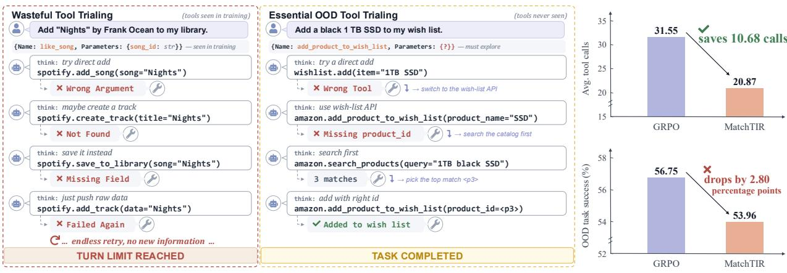  
(a) Tool trialing: wasteful on seen tools, essential for OOD exploration  
(b) Suppressing trials lowers OOD success  
Figure 1. Tool trialing should be guided rather than suppressed. (a) Excessive trialing wastes the interaction budget to find the needed tool “like\_song", whereas selective trialing enables exploration of unfamiliar tools of “add\_product\_to\_wish\_list". (b) On held-out AppWorld applications, MatchTIR makes fewer calls than GRPO but achieves lower task success, revealing the cost of suppressed exploration.

Importantly, ToolCompass requires only the function-class assignments of seen tools, without ground-truth call traces, access to unseen tools, or frozen turn-level models during training. It can be readily combined with GRPO [33], RFT [54], and DMPO [35]. The projection head and prototypes are removed after post-training, introducing no additional inference overhead. ToolCompass therefore guides where the agent trials rather than directly penalizing how much it trials. Extensive experiments on AppWorld and FTRL [52], using Qwen3.5-4B and Qwen3.5-9B, show that ToolCompass consistently improves task success across all three post-training methods, with strong performance on OOD tasks requiring unseen tools. On AppWorld, ToolCompass improves OOD task success over vanilla GRPO by up to 8.87 percentage points, reaching 70.02% with Qwen3.5-9B. Further analyses show that ToolCompass produces shorter trajectories, reduces trials of unrelated tools, increases the adoption of task-relevant unseen tools, and organizes representations by shared function rather than domain (Section 4.3). Our key contributions are summarized as follows:

• We identify a tool-trialing trade-of in OOD tool use, i.e., outcome rewards leave wasteful trials unguided, whereas strict turn-level supervision can suppress necessary exploration. We further connect this failure to representations organized by domain rather than function.

• We propose ToolCompass, a vMF-based framework that reduces intra-function variation and increases interfunction separation during post-training, guiding exploration without ground-truth call traces, unseen-tool access, or additional inference computation.

• Extensive experiments on AppWorld and FTRL demonstrate consistent improvements across models and posttraining objectives, including on OOD tasks, alongside more eficient trialing and stronger adoption of unseen tools.

## 2 Problem Setup

Formally, we describe the tool-use agent, post-training and deployment settings, and learning goal.

Post-training for tool-use agents. A tool-use agent is a policy $\pi _ { \theta }$ that interacts with an environment over a trajectory $\tau = ( s _ { 1 } , a _ { 1 } , o _ { 1 } , \dots , s _ { T } , a _ { T } , o _ { T } )$ . At turn �, the state $s _ { t }$ contains the user request, interaction history, and specifications of the available tools; the action $a _ { t }$ is either a language response or a call to tool $u _ { t } \in \mathcal { U }$ ; and the observation $o _ { t }$ is the resulting environment feedback, such as an execution result or error message.

Tools from diferent domains may implement the same function. For example, amazon.search\_products and spotify.search\_songs both perform Search. We group such tools intofunction classes and denote the function class of tool � by $c ( u ) \in C$ . The agent is post-trained on tasks involving a fixed set of seen tools ${ \mathcal { U } } _ { \mathrm { t r a i n } }$ using an objective ${ \mathcal { L } } _ { \mathrm { p o s t } } ( \theta )$

OOD tool generalization. At deployment, the agent encounters in-distribution (ID) tasks solvable with tools in ${ \mathcal { U } } _ { \mathrm { t r a i n } } .$ as well as OOD tasks requiring tools from an unseen set $\mathcal { U } _ { \mathrm { u n s e c n } }$ , where $\mathcal { U } _ { \mathrm { t r a i n } } \cap \mathcal { U } _ { \mathrm { u n s e e n } } = \emptyset$ . These unseen tools belong to held-out domains but may share similar functions with the seen tools. Their specifications are provided to the agent only at deployment through $s _ { t } ;$ ; neither the tools nor their annotations are available during post-training. Our goal is to transfer function-level knowledge from ${ \mathcal { U } } _ { \mathrm { t r a i n } }$ to ${ \mathcal { U } } _ { \mathrm { u n s e c n } }$ while preserving performance on ID tasks.

Challenge and learning goal. A tool-use trajectory may contain useful trials of functionally plausible tools as well as unproductive trials of unrelated tools. The latter consume the interaction budget and can cause a solvable task to fail [18, 21], whereas the former provide feedback needed to use unfamiliar tools. This challenge is reflected in the representation space learned by standard post-training: as shown in Figure $2 ( \mathrm { a } )$ , GRPO organizes tool calls primarily by domain (e.g., diferent applications) rather than by shared function, providing little structure for transferring experience to unseen tools. Penalties that indiscriminately discourage trialing may instead suppress both useful and unproductive calls. We therefore aim to learn function-level representations, as shown in Fig-

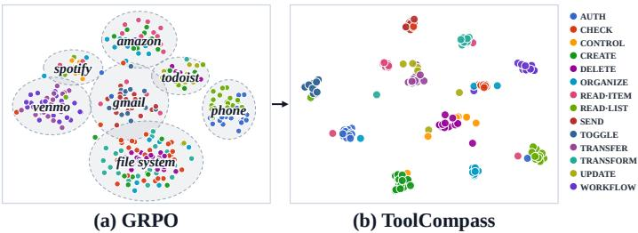  
Figure 2. Tool-call representations on AppWorld. After GRPO post-training (a), representations cluster primarily by application domain (dashed ellipses) rather than function class (colors). In contrast, ToolCompass (b) aligns tool calls sharing the same function across domains.

ure 2(b), that guide trialing toward functionally relevant tools without suppressing the exploration required for OOD generalization.

## 3 Method

Framework overview. Our framework ToolCompass guides tool trialing by shaping the representations of tool calls according to their functions. Central to our framework is to reduce variation among calls implementing the same function across domains, while separating calls implementing diferent functions. As illustrated in Figure 3, ToolCompass first extracts and normalizes tool-call representations (Section 3.1). It then models each function class with a von Mises–Fisher (vMF) distribution and optimizes intra-function variation and inter-function separation (Section 3.2). The resulting objective is trained jointly with the original post-training objective (Section 3.3).

## 3.1 Tool-Call Representation

Representation extraction. For each tool call $a _ { t }$ in a sampled trajectory, we extract the hidden representation from the agent (with parameter $\theta ) { \mathrm { : } }$

$$
\mathbf { h } _ { t } = H _ { \theta } ^ { ( l ) } ( s _ { t } , a _ { t } ) \in \mathbb { R } ^ { d _ { h } } ,\tag{1}
$$

where $H _ { \theta } ^ { ( l ) }$ returns the hidden state at layer � and the final token of $a _ { t } .$ , and $d _ { h }$ is the hidden dimension. Since the final token attends to the preceding context, h summarizes the selected tool, its arguments, and the current interaction state. We study the choice of layer � in Section 4.

Hyperspherical normalization. A lightweight projection head $g _ { \psi } : \mathbb { R } ^ { d _ { h } }  \mathbb { R } ^ { d }$ maps h� to $\begin{array} { r } { \mathbf { z } _ { t } = \frac { g _ { \psi } ( \mathbf { h } _ { t } ) } { \| g _ { \psi } ( \mathbf { h } _ { t } ) \| _ { 2 } } \in \mathbb { S } ^ { d - 1 } } \end{array}$ The unit norm places all tool-call representations on the unit hypersphere, where angular similarity characterizes their relationships and the vMF distribution is naturally defined [22].

## 3.2 Modeling Tool Functions with vMF Distributions

Our core idea is to model each function class as a compact directional distribution, allowing calls from diferent domains to share a common direction whenever they implement the same function.

vMF model. For each function class $k \in { \cal C }$ , we model its normalized representations with a vMF distribution, which is analogous to spherical Gaussian distributions for embeddings with unit norms:

$$
p ( \mathbf { z } \mid c = k ) = C _ { d } ( \boldsymbol { \beta } ) \exp { \big ( } \beta \mu _ { k } ^ { \top } \mathbf { z } { \big ) } ,\tag{2}
$$

where $\pmb { \mu _ { k } } \in \mathbb { S } ^ { d - 1 }$ is the prototype direction, $\beta \geq 0$ is the concentration, and $C _ { d } ( \beta )$ is the normalizing constant. A larger $\beta$ concentrates the distribution more tightly around $\pmb { \mu } _ { k }$ , whereas $\beta = 0$ yields a uniform distribution on the hypersphere.

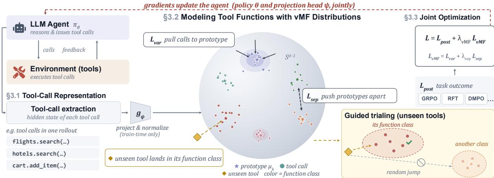  
Figure 3. Overview of ToolCompass. For each tool call, ToolCompass extracts its final-token representation and maps it onto the unit hypersphere. Calls implementing the same function are aligned with a shared vMF prototype, while calls implementing diferent functions are separated. The resulting objective is optimized jointly with the post-training objective. The projection head and prototypes are not used at deployment.

Under this probability model, the posterior probability of function class � is

$$
p ( c = k \mid \mathbf { z } ) = \frac { C _ { d } ( \boldsymbol { \beta } ) \exp ( \boldsymbol { \beta } \mu _ { k } ^ { \top } \mathbf { z } ) } { \sum _ { j \in C } C _ { d } ( \boldsymbol { \beta } ) \exp ( \boldsymbol { \beta } \mu _ { j } ^ { \top } \mathbf { z } ) } = \frac { \exp ( \mu _ { k } ^ { \top } \mathbf { z } / \tau ) } { \sum _ { j \in C } \exp ( \mu _ { j } ^ { \top } \mathbf { z } / \tau ) } , \qquad \boldsymbol { \beta } = \frac { 1 } { \tau } .\tag{3}
$$

where $\tau > 0$ is the temperature. Since $\pmb { \mu } _ { k }$ and z have unit norm, their inner product is the cosine similarity. A smaller �, equivalently a larger $\beta ,$ produces a more concentrated function distribution.

Reducing intra-function variation. Consider a minibatch of tool calls $\mathbf { \mathcal { B } } = \{ ( \mathbf { z } _ { i } , c _ { i } ) \} _ { i = 1 } ^ { N }$ , where $c _ { i } = c ( u _ { i } )$ is the function class of the called training tool. We minimize the negative log-likelihood of the observed function assignments:

$$
\mathcal { L } _ { \mathrm { v a r } } = - \frac { 1 } { N } \sum _ { i = 1 } ^ { N } \log p ( c = c _ { i } \mid \mathbf { z } _ { i } ) .\tag{4}
$$

Minimizing ${ \mathcal { L } } _ { \mathrm { v a r } }$ aligns each tool call with its function prototype, thereby reducing intra-function variation across tools, domains, and interaction contexts.

Increasing inter-function separation. The softmax denominator in ${ \mathcal { L } } _ { \mathrm { v a r } }$ already contrasts calls with competing prototypes; $\mathcal { L } _ { \mathrm { s e p } }$ adds class-level separation. For each function class represented in the minibatch, we compute its normalized batch direction $\begin{array} { r } { \bar { \mathbf { z } } _ { k } = \sum _ { i \in { \mathcal { I } _ { k } } } { \mathbf { z } _ { i } } / \big \| \sum _ { i \in { \mathcal { I } _ { k } } } { \mathbf { z } _ { i } } \big \| _ { \mathcal { D } } \mathrm { , } \mathcal { I } _ { k } = \{ i : c _ { i } = k \ \} \mathrm { , } k \in C _ { \mathcal { B } } } \end{array}$ , where $C _ { \mathcal { B } } = \{ c _ { i } : ( \mathbf { z } _ { i } , c _ { i } ) \in \mathcal { B } \}$ denotes the function classes appearing in the minibatch. We then define

$$
\mathcal { L } _ { \mathrm { s e p } } = \frac { 1 } { \left| C _ { \mathcal { B } } \right| } \sum _ { k \in C _ { \mathcal { B } } } \log \left[ \frac { 1 } { \left| C \right| - 1 } \sum _ { j \in C , j \neq k } \exp \left( \frac { \bar { \bf z } _ { k } ^ { \top } \pmb { \mu } _ { j } } { \tau } \right) \right] .\tag{5}
$$

Minimizing $\mathcal { L } _ { \mathrm { s e p } }$ pushes each batch direction away from the prototypes of other function classes, increasing their angular separation. The prototypes are treated as stop-gradient targets when computing both losses, so ${ \mathcal { L } } _ { \mathrm { v a r } }$ and $\mathcal { L } _ { \mathrm { s e p } }$ update the policy and projection head through the current representations.

Prototype estimation. We maintain each function prototype using an exponential moving average. After processing a minibatch, the prototype of every observed class is updated as

$$
\mu _ { k }  \mathrm { N o r m a l i z e } ( \alpha \mu _ { k } + ( 1 - \alpha ) \bar { \mathbf { z } } _ { k } ) , \qquad k \in C _ { \mathcal { B } } ,\tag{6}
$$

where $\alpha \in [ 0 , 1 )$ is the update factor. The prototypes track the evolving tool-call representations.

Representation-shaping objective. The complete objective is

$$
\mathcal { L } _ { \mathrm { v M F } } = \mathcal { L } _ { \mathrm { v a r } } + \lambda _ { \mathrm { s e p } } \mathcal { L } _ { \mathrm { s e p } } ,\tag{7}
$$

where $\lambda _ { \mathrm { s e p } }$ is the weight coeficient modulating the relative importance of the two losses. The two losses organize tool-call representations into compact and separated function clusters. This structure makes knowledge learned from a seen tool transferable to unseen tools implementing the same function, directing trialing toward functionally plausible tools rather than unrelated alternatives.

(b) ToolCompass

(a) GRPO

Comparison with existing methods. Outcome-based methods such as GRPO apply the same trajectory-level advantage to the tool calls within a rollout, indicating whether the trajectory succeeds but not what function each call performs. In contrast, ${ \mathcal { L } } _ { \mathrm { v M F } }$ provides function-level supervision: calls implementing the same function share a directional target even when they involve diferent tools or domains. Unlike trace-matching supervision [30], ToolCompass does not prescribe a gold sequence of calls; unlike turn-contribution methods [42, 48], it does not require estimating the contribution of individual turns. It therefore complements outcome supervision by guiding where the agent trials without directly penalizing exploration. Figure 4 visualizes the normalized representation space, with the spherical surface showing the kernel density of a representative function class; compared with GRPO’s difuse distribution, ToolCompass forms a compact cluster across tools (see Appendix B.9).

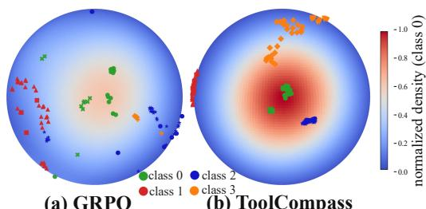  
Figure 4. The surface shows the spherical kernel density of one function class (class 0) under GRPO (a) and ToolCompass (b), on a shared color scale. We showcase four classes for visual clarity; colors denote function classes and markers denote tools.

## 3.3 Joint Optimization with Post-Training

We optimize the representation-shaping objective jointly with the original post-training objective:

$$
\begin{array} { r } { \mathcal { L } ( \theta , \psi ) = \mathcal { L } _ { \mathrm { p o s t } } ( \theta ) + \lambda _ { \mathrm { v M F } } \mathcal { L } _ { \mathrm { v M F } } ( \theta , \psi ) . } \end{array}\tag{8}
$$

Here, $\mathcal { L } _ { \mathrm { p o s t } }$ uses task feedback to learn which tool-use behaviors help complete the task. ${ \mathcal { L } } _ { \mathrm { v M F } }$ aligns call representations across tools that perform the same function. Joint training encourages the policy to transfer useful tool-use experience from seen tools to unseen tools with matching functions. The host objective can be instantiated with GRPO [33], RFT [54], or DMPO [35] without changing its original formulation. The overall procedure is provided in Algorithm A.1 in Appendix A.

Our training components consist only of the projection head $g _ { \psi }$ and one prototype per function class. Both are not utilized at deployment. Since ${ \mathcal { L } } _ { \mathrm { v M F } }$ has already shaped the policy parameters �, the agent uses its original policy without an auxiliary scoring module or additional inference pass.

## 4 Experiments

## 4.1 Setup

Benchmarks models and evaluation. We evaluate ToolCompass on AppWorld [44] and FTRL [52], two multi-turn tool-use benchmarks with executable tools and verifiable task outcomes. We additionally evaluate semantic OOD transfer to three jointly held-out function classes on FTRL (Appendix B.1). In the main experiments, we partition the available tools into a seen set ${ \mathcal { U } } _ { \mathrm { t r a i n } }$ and a held-out set ${ \mathcal { U } } _ { \mathrm { u n s e c n } }$ . ID tasks can be completed using tools from ${ \mathcal { U } } _ { \mathrm { t r a i n } } .$ whereas OOD tasks require at least one tool from ${ \mathcal { U } } _ { \mathrm { u n s e c h } } .$ . The unseen tools and their function annotations are inaccessible during post-training; their specifications are provided to the agent only at evaluation time. The AppWorld test set contains 168 ID and 417 OOD tasks, and the FTRL test set contains 168 ID and 32 OOD tasks. We use Qwen3.5-4B and Qwen3.5-9B [43] as policy backbones. Throughout all experiments, we adopt the ReAct interaction scafold [51], in which the agent interleaves language reasoning with executable tool calls and revises its subsequent decisions based on environment observations, including execution results and error messages. Following AppWorld [44], we use its state-based evaluator and report Task Success Rate, defined as the percentage of tasks for which all task-specific evaluation tests are passed. Following MatchTIR [30], we report Solve-F1 on FTRL, which balances tool-invocation precision and task-completion recall. For both benchmarks, we report performance on the ID subset, the OOD subset, and the entire test set. Detailed benchmark versions, post-training data, ID/OOD split construction, function-class annotations, prompts, interaction protocols, metric implementations, training and inference configurations, and computational resources are provided in Appendix A.

Baselines. We compare ToolCompass against six categories of baselines. First, prompting-based agents include GPT-5.5 [25], Claude Opus 4.8 [1], GLM-5.2 [55], and DeepSeek V4 Pro [49]. These agents use the same ReAct scafold [51], tool specifications, interaction budget, and evaluation protocol described above. Second, general post-training objectives include GRPO [33], RFT [54], and DMPO [35]; we additionally augment each objective with ToolCompass to evaluate its compatibility with diferent host objectives. Unless otherwise stated, ToolCompass uses GRPO as the base objective in all remaining experiments. Third, turn-level tool-use post-training methods include StepTool [53], FTRL-M [52], MatchTIR [30], SOAR [13], and TRACE [42]. Fourth, tool-use RL methods include SimpleTIR [50], ToolMaster [5], and LOOP [2]. Fifth, we include SEAL [15] as a representation-learning baseline. Finally, the OOD-generalization comparison includes CORAL [40], Group DRO [31], ToolRL [27], and PAFT [20]. All trainable baselines use the same policy initialization, post-training data, tool specifications, and interaction budget whenever applicable. Baseline-specific adaptations and reproduction details are provided in Appendix A.6.

Table 1. ToolCompass across post-training objectives. Results are task success rate (%) on AppWorld and Solve-F1 (%) on FTRL. Each objective is compared with its ToolCompass-augmented counterpart under the same backbone and training setup.
<table><tr><td rowspan="2">Method</td><td rowspan="2">Variant</td><td colspan="3">AppWorld</td><td colspan="3">FTRL</td></tr><tr><td>ID</td><td>OOD</td><td>Total</td><td>ID</td><td>OOD</td><td>Total</td></tr><tr><td colspan="9">Qwen3.5-4B</td></tr><tr><td rowspan="2">GRPO [33]</td><td>Original</td><td>58.33</td><td>56.83</td><td>57.26</td><td>34.82</td><td>60.40</td><td>38.91</td></tr><tr><td>+TOOLCOMPASS</td><td>70.63</td><td>64.75</td><td>66.44</td><td>46.97</td><td>64.01</td><td>49.70</td></tr><tr><td rowspan="2">RFT [54]</td><td>Original</td><td>44.64</td><td>35.01</td><td>37.78</td><td>34.93</td><td>52.17</td><td>37.69</td></tr><tr><td>+TooLCOMPASS</td><td>46.43</td><td>39.09</td><td>41.20</td><td>40.98</td><td>55.78</td><td>43.35</td></tr><tr><td rowspan="2">DMPO [35]</td><td>Original</td><td>39.29</td><td>30.94</td><td>33.33</td><td>36.79</td><td>45.68</td><td>38.21</td></tr><tr><td>+TOOLCOMPASS</td><td>44.44</td><td>33.97</td><td>36.98</td><td>42.37</td><td>52.92</td><td>44.06</td></tr><tr><td colspan="8">Qwen3.5-9B</td></tr><tr><td rowspan="2">GRPO [33]</td><td>Original</td><td>70.83</td><td>61.15</td><td>63.93</td><td>38.70</td><td>61.20</td><td>42.30</td></tr><tr><td>+ToOLCOMPASS</td><td>78.17</td><td>70.02</td><td>72.36</td><td>48.99</td><td>64.98</td><td>51.55</td></tr><tr><td rowspan="2">RFT [54]</td><td>Original</td><td>55.36</td><td>40.05</td><td>44.44</td><td>35.94</td><td>46.70</td><td>37.66</td></tr><tr><td>+TOOLCOMPASS</td><td>60.12</td><td>50.76</td><td>53.45</td><td>40.70</td><td>57.39</td><td>43.37</td></tr><tr><td rowspan="2">DMPO [35]</td><td>Original</td><td>60.71</td><td>49.16</td><td>52.48</td><td>37.63</td><td>53.93</td><td>40.24</td></tr><tr><td>+TOOLCOMPASS</td><td>65.67</td><td>55.32</td><td>58.29</td><td>46.90</td><td>55.73</td><td>48.31</td></tr></table>

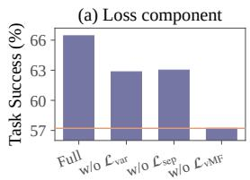  
Variant

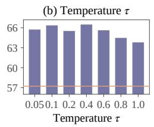

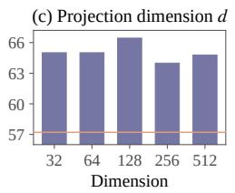

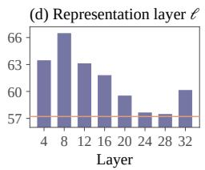  
Figure 5. Ablation studies. (a) Efect of loss components, (b) efect of the vMF temperature �, (c) efect of projection dimension �, and (d) efect of representation layer �. Results are AppWorld task success rates using Qwen3.5-4B with GRPO and are averaged over three seeds. The orange horizontal line denotes vanilla GRPO.

## 4.2 Main Results

ToolCompass benefits across post-training objectives. Table 1 compares each post-training objective with its ToolCompass-augmented counterpart. ToolCompass improves every reported ID, OOD, and total score across both benchmarks and model scales. On Qwen3.5-4B, it improves the AppWorld and FTRL total scores by 9.18 and 10.79 percentage points with GRPO, 3.42 and 5.66 points with RFT, and 3.65 and 5.85 points with DMPO, respectively. The improvements remain consistent on Qwen3.5-9B, reaching up to 9.01 points on AppWorld and 9.25 points on FTRL. These results demonstrate that ToolCompass is consistently efective across diferent post-training objectives and model scales.

Comparison with competitive baselines. Table 2 compares ToolCompass with prompting-based agents and trainable tool-use methods. ToolCompass achieves the best OOD and total scores across both benchmarks and model scales. On AppWorld with Qwen3.5-9B, it reaches a total task success rate of 72.36%, compared with 68.26% for LOOP [2], the strongest baseline on this metric, a gain of 4.10 percentage points. We note that a few proprietary models remain competitive on the AppWorld ID split, likely because their training corpora may already cover related applications and tool-use data, yet ToolCompass surpasses all prompting-based agents on every OOD and total score.

Comparison with OOD-generalization methods. Table 3 compares ToolCompass with general and agent-oriented OOD-generalization methods under GRPO with Qwen3.5-4B. On AppWorld, ToolCompass achieves an OOD score of 64.75% and a total score of 66.44%, exceeding CORAL, the strongest baseline on both metrics, by 6.48 and 6.27 percentage points, respectively. On FTRL, ToolCompass reaches an OOD score of 64.01% and a total score of 49.70%, exceeding GRPO by 3.61 points on OOD and ToolRL by 7.12 points on total performance. ToolCompass thus generalizes to tasks requiring unseen tools more efectively than the compared baselines.

## 4.3 Analysis

Efect of loss components. We ablate each loss component by removing it from the full objective. As shown in Figure 5 (a), removing any component degrades performance. Removing $\mathcal { \bar { L } } _ { \mathrm { v M F } }$ causes the largest drop, from 66.44% to 57.21%, as the policy no longer receives function-level representation shaping. Removing $\mathcal { L } _ { \mathrm { v a r } }$ allows tool calls implementing the same function to spread apart, while removing $\mathcal { L } _ { \mathrm { s e p } }$ reduces the separation between diferent function prototypes. Both losses contribute to the performance of the full objective.

Table 2. Main comparison on AppWorld and FTRL. Results are task success rate (%) on AppWorld and Solve-F1 (%) on FTRL. All prompting models use the same ReAct scafold [51]. Rep. learning abbreviates representation learning, and FTRL-M is the multi-turn variant of the FTRL method. For brevity, we report mean ± standard deviation over the same three seeds for LOOP, SEAL, and ToolCompass.
<table><tr><td rowspan="2">Method</td><td rowspan="2">Category</td><td colspan="3">AppWorld</td><td colspan="3">FTRL</td></tr><tr><td>ID</td><td>OOD</td><td>Total</td><td>ID</td><td>OOD</td><td>Total</td></tr><tr><td colspan="8">Prompting-based</td></tr><tr><td>GPT-5.5 [25]</td><td>Prompting</td><td>70.24</td><td>63.07</td><td>65.13</td><td>33.06</td><td>54.32</td><td>36.46</td></tr><tr><td>Claude Opus 4.8 [1]</td><td>Prompting</td><td>70.83</td><td>58.51</td><td>62.05</td><td>44.18</td><td>49.64</td><td>45.05</td></tr><tr><td>GLM-5.2 [55]</td><td>Prompting</td><td>58.33</td><td>54.92</td><td>55.90</td><td>40.64</td><td>43.85</td><td>41.15</td></tr><tr><td>DeepSeek V4 Pro [49]</td><td>Prompting</td><td>70.24</td><td>55.64</td><td>59.83</td><td>35.52</td><td>52.23</td><td>38.20</td></tr><tr><td colspan="8"></td></tr><tr><td>GRPO [33]</td><td>Base RL</td><td>58.33</td><td>Qwen3.5-4B 56.83</td><td>57.26</td><td>34.82</td><td>60.40</td><td>38.91</td></tr><tr><td>DMPO [35]</td><td>Base RL</td><td>39.29</td><td>30.94</td><td>33.33</td><td>36.79</td><td>45.68</td><td>38.21</td></tr><tr><td>StepTool [53]</td><td>Turn-level RL</td><td>65.48</td><td>52.76</td><td>56.41</td><td>40.11</td><td>49.59</td><td>41.63</td></tr><tr><td>FTRL-M [52]</td><td>Turn-level RL</td><td>65.48</td><td>53.00</td><td>56.58</td><td>36.81</td><td>59.01</td><td>40.36</td></tr><tr><td>MatchTIR [30]</td><td>Turn-level RL</td><td>69.05</td><td>53.96</td><td>58.29</td><td>39.91</td><td>50.41</td><td>41.59</td></tr><tr><td>SOAR [13]</td><td>Turn-level RL</td><td>64.88</td><td>50.12</td><td>54.36</td><td>35.55</td><td>57.64</td><td>39.08</td></tr><tr><td>TRACE [42]</td><td>Turn-level RL</td><td>69.05</td><td>55.16</td><td>59.15</td><td>39.26</td><td>55.94</td><td>41.93</td></tr><tr><td>SimpleTIR [50]</td><td>Tool RL</td><td>63.69</td><td>55.64</td><td>57.95</td><td>42.94</td><td>55.45</td><td>44.95</td></tr><tr><td>ToolMaster [5]</td><td>Tool RL</td><td>60.12</td><td>57.55</td><td>58.29</td><td>42.85</td><td>48.26</td><td>43.71</td></tr><tr><td>LOOP [2]</td><td>Tool RL</td><td> $6 5 . 8 7 _ { \pm 0 . 4 3 }$ </td><td> $5 8 . 9 9 _ { \pm 0 . 9 2 }$ </td><td> $6 0 . 9 7 _ { \pm 0 . 6 5 }$ </td><td> $4 1 . 8 3 _ { \pm 1 . 0 3 }$ </td><td> $5 7 . 7 2 _ { \pm 2 . 1 4 }$ </td><td> $4 4 . 3 7 _ { \pm 1 . 0 7 }$ </td></tr><tr><td>SEAL [15]</td><td>Rep. learning</td><td> $6 7 . 2 6 _ { \pm 1 . 1 9 }$ </td><td> $5 9 . 2 3 _ { \pm 0 . 9 6 }$ </td><td> $6 1 . 5 4 _ { \pm 1 . 0 3 }$ </td><td> $3 8 . 0 2 _ { \pm 1 . 4 9 }$ </td><td> $5 7 . 9 4 _ { \pm 2 . 5 1 }$ </td><td> $4 1 . 2 1 _ { \pm 1 . 6 3 }$ </td></tr><tr><td>ToOLCoMPASs (ours)</td><td>Rep. learning</td><td> $\mathbf { 7 0 . 6 3 _ { \pm 0 . 9 1 } }$ </td><td> $\mathbf { 6 4 . 7 5 _ { \pm 1 . 2 7 } }$ </td><td> ${ \bf 6 6 . 4 4 _ { \pm 1 . 0 9 } }$ </td><td> $4 6 . 9 7 _ { \pm 1 . 7 6 }$ </td><td> ${ \bf 6 4 . 0 1 _ { \pm 2 . 3 9 } }$ </td><td> $\mathbf { 4 9 . 7 0 _ { \pm 1 . 5 3 } }$ </td></tr><tr><td colspan="8">Qwen3.5-9B</td></tr><tr><td>GRPO [33]</td><td>Base RL</td><td>70.83</td><td>61.15</td><td>63.93</td><td>38.70</td><td>61.20</td><td>42.30</td></tr><tr><td>DMPO [35]</td><td>Base RL</td><td>60.71</td><td>49.16</td><td>52.48</td><td>37.63</td><td>53.93</td><td>40.24</td></tr><tr><td>StepTool [53]</td><td>Turn-level RL</td><td>74.40</td><td>59.95</td><td>64.10</td><td>46.50</td><td>44.23</td><td>46.13</td></tr><tr><td>FTRL-M [52]</td><td>Turn-level RL</td><td>72.02</td><td>61.63</td><td>64.62</td><td>42.79</td><td>51.36</td><td>44.16</td></tr><tr><td>MatchTIR [30]</td><td>Turn-level RL</td><td>75.60</td><td>58.27</td><td>63.25</td><td>48.41</td><td>45.36</td><td>47.93</td></tr><tr><td>SOAR [13]</td><td>Turn-level RL</td><td>62.50</td><td>53.24</td><td>55.90</td><td>42.85</td><td>52.28</td><td>44.36</td></tr><tr><td>TRACE [42]</td><td>Turn-level RL</td><td>74.40</td><td>57.79</td><td>62.56</td><td>48.89</td><td>49.92</td><td>49.05</td></tr><tr><td>SimpleTIR [50]</td><td>Tool RL</td><td>72.02</td><td>65.71</td><td>67.52</td><td>46.04</td><td>58.27</td><td>47.99</td></tr><tr><td>ToolMaster [5]</td><td>Tool RL</td><td>71.43</td><td>61.87</td><td>64.62</td><td>44.67</td><td>54.96</td><td>46.31</td></tr><tr><td>LOOP [2]</td><td>Tool RL</td><td> $7 1 . 0 3 _ { \pm 0 . 5 7 }$ </td><td> $6 7 . 1 5 _ { \pm 0 . 9 1 }$ </td><td> $6 8 . 2 6 _ { \pm 0 . 7 1 }$ </td><td> $4 3 . 6 1 _ { \pm 1 . 2 7 }$ </td><td> $5 8 . 5 5 _ { \pm 1 . 4 1 }$ </td><td> $4 6 . 0 0 _ { \pm 0 . 9 9 }$ </td></tr><tr><td>SEAL [15]</td><td>Rep. learning</td><td> $7 6 . 7 9 _ { \pm 1 . 1 9 }$ </td><td> $6 3 . 4 7 _ { \pm 0 . 9 7 }$ </td><td> $6 7 . 2 9 _ { \pm 1 . 0 3 }$ </td><td> $4 6 . 9 2 _ { \pm 1 . 4 8 }$ </td><td> $5 8 . 5 3 _ { \pm 2 . 4 6 }$ </td><td> $4 8 . 7 8 _ { \pm 1 . 5 7 }$ </td></tr><tr><td>ToOLCoMPASs (ours)</td><td>Rep. learning</td><td> ${ \bf 7 8 . 1 7 _ { \pm 1 . 3 7 } }$ </td><td> ${ \bf 7 0 . 0 2 _ { \pm 1 . 8 7 } }$ </td><td> $7 2 . 3 6 _ { \pm 1 . 5 5 }$ </td><td> $\mathbf { 4 8 . 9 9 _ { \pm 1 . 2 1 } }$ </td><td> $\mathbf { 6 4 . 9 8 _ { \pm 2 . 1 8 } }$ </td><td> $\mathbf { 5 1 . 5 5 _ { \pm 1 . 0 7 } }$ </td></tr></table>

Efect of the temperature �. We vary the temperature � of the vMF objective. Figure 5 (b) shows that performance peaks at $\tau = 0 . 4$ and remains competitive across a wide range, suggesting that ToolCompass is robust to the temperature setting.

Efect of the output dimension �. We vary the output dimension of the projection head. As shown in Figure 5 (c), performance peaks at $d = 1 2 8$ and remains competitive across a wide range, showing that ToolCompass is not sensitive to a specific projection dimension.

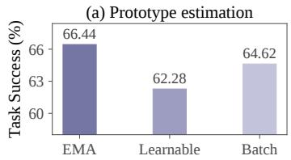

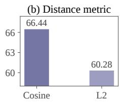  
Figure 6. Analysis of design choices. (a) Efect of prototype estimation and (b) efect of distance metric. Results are AppWorld task success rates using Qwen3.5-4B with GRPO and are averaged over three seeds.

How do diferent layers impact ToolCompass? In Figure 5 (d), we extract tool-call representations from diferent layers. Performance peaks at layer � = 8, suggesting that early-to-intermediate layers preserve the most transferable function-level information. ToolCompass remains above vanilla GRPO across all tested layers, indicating that it does not rely on a specific layer depth to be efective. Performance at the top layers degrades, likely because their representations become specialized for next-token prediction and drift away from the function-level semantics of the call.

Efect of prototype estimation. We compare EMA prototypes with learnable and batch-estimated prototypes. As shown in Figure 6(a), EMA prototype estimation achieves the best performance, suggesting that smoothly tracking the evolving representation space provides more stable function-level targets. We further ablate the EMA factor � in Appendix B.4.

Table 3. Comparison with OOD generalization methods. All methods use GRPO with Qwen3.5-4B. Results are task success rate (%) on AppWorld and Solve-F1 (%) on FTRL.
<table><tr><td rowspan="2">Method</td><td rowspan="2">Category</td><td colspan="3">AppWorld</td><td colspan="3">FTRL</td></tr><tr><td>ID</td><td>OOD</td><td>Total</td><td>ID</td><td>OOD</td><td>Total</td></tr><tr><td>GRPO [33]</td><td>Vanilla RL</td><td>58.33</td><td>56.83</td><td>57.26</td><td>34.82</td><td>60.40</td><td>38.91</td></tr><tr><td>CORAL [40]</td><td>General OOD</td><td>64.88</td><td>58.27</td><td>60.17</td><td>33.73</td><td>58.98</td><td>37.77</td></tr><tr><td>Group DRO [31]</td><td>General OOD</td><td>67.86</td><td>54.68</td><td>58.46</td><td>35.55</td><td>58.98</td><td>39.30</td></tr><tr><td>ToolRL [27]</td><td>Agentic OOD</td><td>68.45</td><td>56.12</td><td>59.66</td><td>39.20</td><td>60.32</td><td>42.58</td></tr><tr><td>PAFT [20]</td><td>Agentic OOD</td><td>60.12</td><td>51.56</td><td>54.02</td><td>36.47</td><td>57.84</td><td>39.89</td></tr><tr><td>TooLCoMPAss (ours)</td><td>Agentic OOD</td><td>70.63</td><td>64.75</td><td>66.44</td><td>46.97</td><td>64.01</td><td>49.70</td></tr></table>

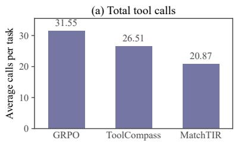

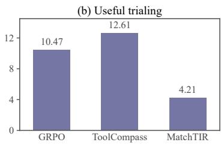

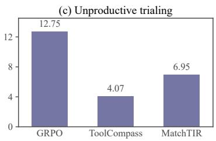  
Figure 7. Tool-call analysis on AppWorld OOD tasks. (a) Total tool calls, (b) useful trialing, and (c) unproductive trialing. ToolCompass shows more useful trialing and less unproductive trialing than GRPO.

Efect of distance metric. We compare cosine similarity with negative unsquared L2 scores at a fixed temperature (Appendix A.3). Figure 6(b) shows that cosine achieves 66.44% task success, compared with 60.28% for L2 under the same configuration.

Generalization across datasets. We train GRPO and Tool-Compass on a source dataset and directly evaluate them on a diferent target dataset. As shown in Table 4, ToolCompass outperforms vanilla GRPO in both transfer directions. For example, training ToolCompass on FTRL yields 60.51% task success on AppWorld, compared with 66.44% when trained on AppWorld itself. These results suggest that the benefits of ToolCompass extend to cross-dataset transfer.

Does ToolCompass guide rather than suppress tool trialing? We categorize tool calls following Appendix B.8. Figure 7 shows that ToolCompass makes fewer calls than GRPO (26.51 vs. 31.55) but more than MatchTIR (20.87). It retains more useful trials than GRPO and MatchTIR (12.61 vs. 10.47 and 4.21) and fewer unproductive trials than GRPO (4.07 vs. 12.75). These results are consistent with guided tool trialing: ToolCompass retains more useful trials while reducing unproductive ones.

Table 4. Generalization across datasets. Results (%) compare vanilla GRPO and ToolCompass using Qwen3.5-4B.
<table><tr><td>Test dataset</td><td>GRPO</td><td>TOOLCOMPASS</td></tr><tr><td colspan="2">Training dataset: AppWorld</td><td></td></tr><tr><td>AppWorld</td><td>57.21</td><td>66.44</td></tr><tr><td>FTRL</td><td>35.72</td><td>42.31</td></tr><tr><td colspan="3">Training dataset: FTRL</td></tr><tr><td>AppWorld</td><td>53.03</td><td>60.51</td></tr><tr><td>FTRL</td><td>38.91</td><td>49.70</td></tr></table>

Additional analysis. We provide further analyses in the Appendix: (1) semantic OOD analysis on FTRL with three jointly held-out function classes (Appendix B.1); (2) comparisons with alternative training objectives (Appendix B.2); (3) ablations on loss weights (Appendix B.3) and the EMA factor � in Equation 6 (Appendix B.4); (4) qualitative case studies on AppWorld OOD tasks (Appendix B.5); and (5) AppWorld metrics on Scenario Goal Completion (Appendix B.6).

## 5 Related Work

OOD generalization. Conventional OOD generalization improves robustness through domain alignment, robust optimization, or representation learning [31, 40]. These methods study fixed prediction, whereas tool-use agents face shifts in tasks, tools, observations, and interactions. Recent studies expose weak transfer across agent environments [20, 47], while tool-specific work uses synthetic environments [3, 8, 39, 41], self-verification or interface optimization [7, 23], open-world retrieval [9, 24, 46, 59], generalization-aware rewards [27, 57], and documentation adaptation for evolving tools [45]. ToolCompass instead organizes tool-call representations by shared function during post-training, enabling transfer to unseen tools without accessing them or adding test-time adaptation.

Tool-use agents. LLM agents use external tools through prompting, pretraining, and instruction tuning [14, 17, 26, 28, 32, 34, 51]. Post-training methods optimize trajectory outcomes [2, 4, 10, 27, 50, 57], while environment-feedback and teacher-guided methods learn self-correction and trial-and-error [6, 36, 37, 38]. Sparse long-horizon rewards motivate turn-level and error-localized supervision [12, 16, 19, 30, 42, 48, 53, 56], which matches gold traces, estimates turn contributions, or localizes irrecoverable actions. ToolMaster [5] is a related approach to tool trialing; however, it requires an additional teacher model to generate trialing trajectories. ToolCompass instead guides trialing through shared-function representations, without additional trajectory supervision, frozen turn scorers, or inference overhead.

## 6 Conclusion

We propose ToolCompass, a novel framework for guiding tool trialing to improve OOD tool use. Our framework leverages function-class assignments and a vMF objective to shape the tool-call representation space, enabling experience to transfer from seen tools to functionally related unseen tools. ToolCompass requires neither ground-truth call traces nor unseen-tool access, introduces no inference overhead, and can be readily plugged into diverse post-training methods. Extensive experiments show that ToolCompass consistently improves tool-use performance across benchmarks, model scales, and post-training methods. We hope our work can inspire future research on guided tool trialing and more broadly on building generalizable tool-use agents in the wild.

## References

[1] Anthropic. Claude Opus 4.8 system card. Technical report, Anthropic, May 2026.

[2] Kevin Chen, Marco Cusumano-Towner, Brody Huval, Aleksei Petrenko, Jackson Hamburger, Vladlen Koltun, and Philipp Krähenbühl. Reinforcement learning for long-horizon interactive llm agents. arXiv preprint arXiv:2502.01600, 2025.

[3] Weihua Du, Hailei Gong, Zhan Ling, Kang Liu, Lingfeng Shen, Xuesong Yao, Yufei Xu, Dingyuan Shi, Yiming Yang, and Jiecao Chen. Generalizable end-to-end tool-use RL with synthetic codegym. In The Fourteenth International Conference on Learning Representations, 2026. URL https://openreview.net/forum?id=QRSeFZfu8E

[4] Jiazhan Feng, Shijue Huang, Xingwei Qu, Ge Zhang, Yujia Qin, Baoquan Zhong, Chengquan Jiang, Jinxin Chi, and Wanjun Zhong. ReTool: Reinforcement learning for strategic tool use in LLMs. In International Conference on Learning Representations, volume 2026, pages 37909–37926, 2026.

[5] Xingjie Gao, Pengcheng Huang, Zhenghao Liu, Yukun Yan, Shuo Wang, Zulong Chen, Chen Qian, Ge Yu, and Yu Gu. Teaching LLMs to learn tool trialing and execution through environment interaction. arXiv preprint arXiv:2601.12762, 2026.

[6] Zhibin Gou, Zhihong Shao, Yeyun Gong, yelong shen, Yujiu Yang, Nan Duan, and Weizhu Chen. CRITIC: Large language models can self-correct with tool-interactive critiquing. In International Conference on Learning Representations, volume 2024, pages 57734–57811, 2024.

[7] Ruocheng Guo, Kaiwen Dong, Xiang Gao, and Kamalika Das. Learning to rewrite tool descriptions for reliable llm-agent tool use. arXiv preprint arXiv:2602.20426, 2026.

[8] Jie He, Jennifer Neville, Mengting Wan, Longqi Yang, Hui Liu, Xiaofeng Xu, Xia Song, Jef Z Pan, and Pei Zhou. GenTool: Enhancing tool generalization in language models through zero-to-one and weak-to-strong simulation. In Findings ofthe Associationfor Computational Linguistics: ACL 2025, pages 1097–1122, 2025.

[9] Shouzheng Huang, Meishan Zhang, Baotian Hu, and Min Zhang. Toolomni: Enabling open-world tool use via agentic learning with proactive retrieval and grounded execution. In Proceedings ofthe 64th Annual Meeting ofthe Associationfor Computational Linguistics (Volume 1: Long Papers), pages 37421–37439, 2026.

[10] Bowen Jin, Hansi Zeng, Zhenrui Yue, Jinsung Yoon, Sercan Arik, Dong Wang, Hamed Zamani, and Jiawei Han. Search-R1: Training LLMs to reason and leverage search engines with reinforcement learning. arXiv preprint arXiv:2503.09516, 2025.

[11] Prannay Khosla, Piotr Teterwak, Chen Wang, Aaron Sarna, Yonglong Tian, Phillip Isola, Aaron Maschinot, Ce Liu, and Dilip Krishnan. Supervised contrastive learning. Advances in neural information processing systems, 33:18661–18673, 2020.

[12] Junbo Li, Peng Zhou, Rui Meng, Meet P Vadera, Lihong Li, and Yang Li. Turn-ppo: Turn-level advantage estimation with ppo for improved multi-turn rl in agentic llms. In Findings of the Association for Computational Linguistics: EACL 2026, pages 6227–6243, 2026.

[13] Meng Li, Lei Li, Xiting Wang, Yi Yuan, Zheng Wei, Zang Li, et al. Soar: Supervision from observation for agentic reinforcement learning. In Proceedings of the 64th Annual Meeting of the Association for Computational Linguistics (Volume 1: Long Papers), pages 35175–35197, 2026.

[14] Minghao Li, Yingxiu Zhao, Bowen Yu, Feifan Song, Hangyu Li, Haiyang Yu, Zhoujun Li, Fei Huang, and Yongbin Li. Api-bank: A comprehensive benchmark for tool-augmented llms. In Proceedings of the 2023 conference on empirical methods in natural language processing, pages 3102–3116, 2023.

[15] Wendi Li, Shawn Im, and Sharon Li. Cyclical entropy eruption: Entropy dynamics in agent reinforcement learning. arXiv preprint arXiv:2605.27954, 2026.

[16] Qiao Liang, Yuke Zhu, Chao Ge, Lei Yang, Ying Shen, Bo Zheng, and Sheng Guo. Learning from the irrecoverable: Error-localized policy optimization for tool-integrated llm reasoning. In Proceedings of the 64th Annual Meeting of the Associationfor Computational Linguistics (Volume 1: Long Papers), pages 11008–11028, 2026.

[17] Yaobo Liang, Chenfei Wu, Ting Song, Wenshan Wu, Yan Xia, Yu Liu, Yang Ou, Shuai Lu, Lei Ji, Shaoguang Mao, et al. Taskmatrix. ai: Completing tasks by connecting foundation models with millions of apis. Intelligent Computing, 3:0063, 2024.

[18] Tengxiao Liu, Zifeng Wang, Jin Miao, I Hsu, Jun Yan, Jiefeng Chen, Rujun Han, Fangyuan Xu, Yanfei Chen, Ke Jiang, et al. Budget-aware tool-use enables efective agent scaling. arXiv preprint arXiv:2511.17006, 2025.

[19] Xufang Luo, Yuge Zhang, Zhiyuan He, Zilong Wang, Siyun Zhao, Dongsheng Li, Luna K Qiu, and Yuqing Yang. Agent lightning: Train any ai agents with reinforcement learning. arXiv preprint arXiv:2508.03680, 2025.

[20] Song-Lin Lv, Weiming Wu, Rui Zhu, Zi-Jian Cheng, and Lan-Zhe Guo. Can agents generalize to the open world? unveiling the fragility of static training in tool use. arXiv preprint arXiv:2607.01084, 2026.

[21] Isham Kalappurackal Mansoor, Abhishek Phadke, and Pratip Rana. Verified tool calls improve llm agent reliability under non-atomic failures. arXiv preprint arXiv:2608.02645, 2026.

[22] Kanti V Mardia and Peter E Jupp. Directional statistics. John Wiley & Sons, 2009.

[23] Dheeraj Mekala, Jason E Weston, Jack Lanchantin, Roberta Raileanu, Maria Lomeli, Jingbo Shang, and Jane Dwivedi-Yu. ToolVerifier: Generalization to new tools via self-verification. In Findings ofthe Associationfor Computational Linguistics: EMNLP 2024, pages 5026–5041, 2024.

[24] Lorenzo Molfetta, Giacomo Frisoni, Nicolò Monaldini, and Gianluca Moro. Ports: Preference-optimized retrievers for tool selection with large language models. In Proceedings of the 2025 Conference on Empirical Methods in Natural Language Processing, pages 10018–10041, 2025.

[25] OpenAI. GPT-5.5 system card. Technical report, OpenAI, April 2026.

[26] Shishir G Patil, Tianjun Zhang, Xin Wang, and Joseph E Gonzalez. Gorilla: Large language model connected with massive APIs. Advances in Neural Information Processing Systems, 37:126544–126565, 2024.

[27] Cheng Qian, Emre Can Acikgoz, Qi He, Hongru WANG, Xiusi Chen, Dilek Hakkani-Tur, Gokhan Tur, and Heng Ji. ToolRL: Reward is all tool learning needs. In Advances in Neural Information Processing Systems, volume 38, Main Conference, pages 105523–105553, 2025. doi: 10.52202/085713-3524.

[28] Yujia Qin, Shihao Liang, Yining Ye, Kunlun Zhu, Lan Yan, Yaxi Lu, Yankai Lin, Xin Cong, Xiangru Tang, Bill Qian, et al. ToolLLM: Facilitating large language models to master 16000+ real-world APIs. In International Conference on Learning Representations, volume 2024, pages 9695–9717, 2024.

[29] Changle Qu, Sunhao Dai, Xiaochi Wei, Hengyi Cai, Shuaiqiang Wang, Dawei Yin, Jun Xu, and Ji-Rong Wen. Tool learning with large language models: A survey. Frontiers ofComputer Science, 19(8):198343, 2025.

[30] Changle Qu, Sunhao Dai, Hengyi Cai, Jun Xu, Shuaiqiang Wang, and Dawei Yin. MatchTIR: Fine-grained supervision for tool-integrated reasoning via bipartite matching. In Proceedings of the 64th Annual Meeting of the Association for Computational Linguistics (Volume 1: Long Papers), pages 11953–11968, 2026.

[31] Shiori Sagawa, Pang Wei Koh, Tatsunori B. Hashimoto, and Percy Liang. Distributionally robust neural networks. In International Conference on Learning Representations, 2020. URL https://openreview.net/forum?id=ryxGuJrFvS.

[32] Timo Schick, Jane Dwivedi-Yu, Roberto Dessì, Roberta Raileanu, Maria Lomeli, Eric Hambro, Luke Zettlemoyer, Nicola Cancedda, and Thomas Scialom. Toolformer: Language models can teach themselves to use tools. Advances in neural information processing systems, 36:68539–68551, 2023.

[33] Zhihong Shao, Peiyi Wang, Qihao Zhu, Runxin Xu, Junxiao Song, Xiao Bi, Haowei Zhang, Mingchuan Zhang, YK Li, Yang Wu, et al. DeepSeekMath: Pushing the limits of mathematical reasoning in open language models. arXiv preprint arXiv:2402.03300, 2024.

[34] Yongliang Shen, Kaitao Song, Xu Tan, Dongsheng Li, Weiming Lu, and Yueting Zhuang. Hugginggpt: Solving ai tasks with chatgpt and its friends in hugging face. Advances in Neural Information Processing Systems, 36:38154–38180, 2023.

[35] Wentao Shi, Mengqi Yuan, Junkang Wu, Qifan Wang, and Fuli Feng. Direct multi-turn preference optimization for language agents. In Conference on Empirical Methods in Natural Language Processing (EMNLP), 2024.

[36] Noah Shinn, Federico Cassano, Ashwin Gopinath, Karthik Narasimhan, and Shunyu Yao. Reflexion: Language agents with verbal reinforcement learning. Advances in neural information processing systems, 36:8634–8652, 2023.

[37] Yifan Song, Da Yin, Xiang Yue, Jie Huang, Sujian Li, and Bill Yuchen Lin. Trial and error: Exploration-based trajectory optimization of LLM agents. In Proceedings ofthe 62nd Annual Meeting ofthe Associationfor Computational Linguistics (Volume 1: Long Papers), pages 7584–7600, 2024.

[38] Junhao Su, Yuanliang Wan, Junwei Yang, Hengyu Shi, Tianyang Han, Yurui Qiu, and Junfeng Luo. Failure makes the agent stronger: Enhancing accuracy through structured reflection for reliable tool interactions. In Findings of the Association for Computational Linguistics: ACL 2026, pages 12712–12734, 2026.

[39] Michael Sullivan, Mareike Hartmann, and Alexander Koller. Procedural environment generation for tool-use agents. In Proceedings ofthe 2025 Conference on Empirical Methods in Natural Language Processing, pages 18555–18573, 2025.

[40] Baochen Sun and Kate Saenko. Deep coral: Correlation alignment for deep domain adaptation. In European conference on computer vision, pages 443–450. Springer, 2016.

[41] Qiaoyu Tang, Ziliang Deng, Hongyu Lin, Xianpei Han, Qiao Liang, Boxi Cao, and Le Sun. ToolAlpaca: Generalized tool learning for language models with 3000 simulated cases. arXiv preprint arXiv:2306.05301, 2023.

[42] Leitian Tao, Baolin Peng, Wenlin Yao, Tao Ge, Hao Cheng, Mike Hang Wang, Jianfeng Gao, and Sharon Li. TRACE: Turn-level reward assignment via credit estimation for long-horizon agents. arXiv preprint arXiv:2607.13988, 2026.

[43] Qwen Team. Qwen3.5: Accelerating productivity with native multimodal agents, February 2026. URL https://qwen.ai/ blog?id=qwen3.5.

[44] Harsh Trivedi, Tushar Khot, Mareike Hartmann, Ruskin Manku, Vinty Dong, Edward Li, Shashank Gupta, Ashish Sabharwal, and Niranjan Balasubramanian. AppWorld: A controllable world of apps and people for benchmarking interactive coding agents. In Proceedings of the 62nd Annual Meeting of the Association for Computational Linguistics (Volume 1: Long Papers), pages 16022–16076, 2024.

[45] Bin Wu, Edgar Meij, and Emine Yilmaz. Beyond static toolsets: Self-evolving llm tool agents via continual documentation adaptation. In Findings ofthe Associationfor Computational Linguistics: ACL 2026, pages 21519–21539, 2026.

[46] Mengsong Wu, Tong Zhu, Han Han, Xiang Zhang, Wenbiao Shao, and Wenliang Chen. Chain-of-tools: Utilizing massive unseen tools in the cot reasoning of frozen language models. arXiv preprint arXiv:2503.16779, 2025.

[47] Zhiheng Xi, Xin Guo, Jiaqi Liu, Jiazheng Zhang, Yutao Fan, Zhihao Zhang, Shichun Liu, Mingxu Chai, Xiaowei Shi, Yitao Zhai, et al. Can rl improve generalization of llm agents? an empirical study. arXiv preprint arXiv:2603.12011, 2026.

[48] Yutao Xie, Nathaniel Thomas, Nick Hansen, Yang Fu, Li Li, and Xiaolong Wang. TIPS: Turn-level information-potential reward shaping for search-augmented LLMs. In International Conference on Learning Representations, volume 2026, pages 156549–156584, 2026.

[49] Anyi Xu, Bangcai Lin, Bing Xue, Bingxuan Wang, Bingzheng Xu, Bochao Wu, Bowei Zhang, Chaofan Lin, Chen Dong, Chenchen Ling, et al. Deepseek-v4: Towards highly eficient million-token context intelligence. arXiv preprint arXiv:2606.19348, 2026.

[50] Zhenghai Xue, Longtao Zheng, Qian Liu, Yingru Li, Xiaosen Zheng, Zejun Ma, and Bo An. Simpletir: End-to-end reinforcement learning for multi-turn tool-integrated reasoning. In International Conference on Learning Representations, volume 2026, pages 8424–8449, 2026.

[51] Shunyu Yao, Jefrey Zhao, Dian Yu, Nan Du, Izhak Shafran, Karthik R Narasimhan, and Yuan Cao. ReAct: Synergizing reasoning and acting in language models. In The Eleventh International Conference on Learning Representations, 2023.

[52] Junjie Ye, Changhao Jiang, Zhengyin Du, Yufei Xu, Xuesong Yao, Zhiheng Xi, Xiaoran Fan, Qi Zhang, Tao Gui, Xuan-Jing Huang, et al. Feedback-driven tool-use improvements in large language models via automated build environments. In Findings ofthe Associationfor Computational Linguistics: ACL 2026, pages 2293–2323, 2026.

[53] Yuanqing Yu, Zhefan Wang, Weizhi Ma, Shuai Wang, Chuhan Wu, Zhiqiang Guo, and Min Zhang. StepTool: Enhancing multi-step tool usage in LLMs via step-grained reinforcement learning. In Proceedings of the 34th ACM International Conference on Information and Knowledge Management, pages 3952–3962, 2025.

[54] Zheng Yuan, Hongyi Yuan, Chengpeng Li, Guanting Dong, Keming Lu, Chuanqi Tan, Chang Zhou, and Jingren Zhou. Scaling relationship on learning mathematical reasoning with large language models. arXiv preprint arXiv:2308.01825, 2023.

[55] Aohan Zeng, Xin Lv, Zhenyu Hou, Zhengxiao Du, Qinkai Zheng, Bin Chen, Da Yin, Chendi Ge, Chenghua Huang, Chengxing Xie, et al. Glm-5: from vibe coding to agentic engineering. arXiv preprint arXiv:2602.15763, 2026.

[56] Siliang Zeng, Quan Wei, William Brown, Oana Frunza, Yuriy Nevmyvaka, Yang Katie Zhao, and Mingyi Hong. Reinforcing multi-turn reasoning in LLM agents via turn-level credit assignment. In ICML 2025 Workshop on Computer Use Agents, 2025.

[57] Yirong Zeng, Xiao Ding, Yutai Hou, Yuxian Wang, Li Du, Juyi Dai, Qiuyang Ding, Duyu Tang, Dandan Tu, Weiwen Liu, et al. Tool zero: Training tool-augmented llms via pure rl from scratch. In EMNLP (Findings), pages 9135–9147, 2025.

[58] Lianmin Zheng, Wei-Lin Chiang, Ying Sheng, Siyuan Zhuang, Zhanghao Wu, Yonghao Zhuang, Zi Lin, Zhuohan Li, Dacheng Li, Eric Xing, et al. Judging llm-as-a-judge with mt-bench and chatbot arena. Advances in neural information processing systems, 36:46595–46623, 2023.

[59] Luyao Zhuang, Qinggang Zhang, Huachi Zhou, Yujing Zhang, and Xiao Huang. Losemb: Logic-guided semantic bridging for inductive tool retrieval. In Proceedings of the ACM Web Conference 2026, pages 3835–3846, 2026.

## Appendix

## A Additional Experimental Details

## A.1 Dataset Details

We evaluate ToolCompass on two multi-turn tool-use benchmarks, AppWorld and FTRL, both of which provide executable tools and verifiable task outcomes. For each benchmark, we describe the dataset contents, the ID/OOD split construction, and the evaluation protocol below.

AppWorld. We use the publicly released AppWorld benchmark [44],1 with 90 training tasks across 30 scenarios and 473 APIs. The benchmark provides two oficial test splits: Test-C contains all tasks that require at least one API from the designated unseen applications (i.e., Amazon and Gmail), and Test-N contains the test tasks that do not require them. Therefore, we treat Test-N as the ID test set and Test-C as the OOD test set, containing 168 and 417 tasks, respectively. No training task requires the unseen applications. Each task is scored by the oficial state-based evaluator, which runs task-specific tests against the final environment state. Post-training uses the outcome reward returned by this evaluator. We report the task success rate, i.e., the percentage of tasks that pass all evaluation tests. Results under the stricter Scenario Goal Completion (SGC) metric are provided in Appendix B.6.

FTRL. FTRL [52] covers single-hop and multi-hop tool-use queries, each associated with a subject domain. To construct a covariate-shift OOD split, we hold out five domains: Health, Medicine and Public Health; Music and Performing Arts; Politics, Governance and Law; Sports and Competitions; and Zoology and Animal Science. Their tools are excluded during post-training, while their function classes remain covered by the seen domains. The test set contains 168 ID queries and 32 OOD queries; an OOD query requires at least one held-out-domain tool. Post-training uses 1,615 training instances that do not require these tools. Following the oficial protocol, we compute the metrics per query: for a trajectory with � tool calls that solves � of the � required sub-questions, Solve- $\mathbf { \nabla \cdot P } = q / p$ measures tool-invocation precision, $\operatorname { S o l v e - R } = q / n$ measures task-completion recall, and Solve-F1 is their harmonic mean.

## A.2 Input Prompts

We use the oficial task prompts of AppWorld [44] and FTRL [52], shown in Figures A.1 and A.2.

## A.3 Implementation Details

General setup. We use Qwen3.5-4B and Qwen3.5-9B [43] as policy backbones and adopt the same ReAct interaction scafold [51] for all methods. Unless otherwise specified, ToolCompass uses GRPO as the host objective. All trainable methods are optimized with Adam. Following AppWorld [44], we select hyperparameters on its oficial development split. On FTRL [52], we follow MatchTIR’s released protocol [30], using the test split for hyperparameter selection. We apply the same selection protocol to ToolCompass and all baselines. The default online training configurations for both benchmarks are summarized in Table A.1.

Interaction and inference. We follow the released interaction protocol of each benchmark. In AppWorld, the agent retrieves app descriptions and API specifications on demand through the api\_docs interface, and the specifications of Amazon and Gmail become available only at evaluation time. In FTRL, each query is paired with a fixed candidate set of tool schemas, which is passed to the policy through the native tool-calling interface. Training rollouts and evaluation both use sampled decoding with temperature 1.0 and top- $\cdot p = 1 . 0$ . Each reported three-seed result trains and evaluates the complete pipeline with three random seeds, which control the initialization of the projection head and prototypes, the data order, and rollout sampling.

ToolCompass confi uration. For each tool call, we extract the hidden state of the call’s final token from layer $l = 8$ of the policy backbone; Appendix A.4 illustrates the extraction. The projection head $g _ { \psi }$ is implemented as a two-layer MLP with output dimension $d = 1 2 8$ . Function prototypes are randomly initialized as unit vectors and updated with an exponential moving average (EMA). We set the temperature $\tau = 0 . 4$ , the loss weights $\lambda _ { \mathrm { v M F } } = 0 . 0 2$ and $\lambda _ { \mathrm { s e p } } = 2$ , and the EMA factor $\alpha = 0 . 9$ . Both the projection head and the prototypes are not used at deployment, so ToolCompass adds no inference-time overhead. For the distance-metric ablation in Figure 6(b), we replace the cosine score ${ \mathbf a } ^ { \top } { \mathbf b } / \tau$ with the negative unsquared Euclidean score $- \| \mathbf { a } - \mathbf { b } \| _ { 2 } / \tau$ in both ${ \mathcal { L } } _ { \mathrm { v a r } }$ and $\mathcal { L } _ { \mathrm { s e p } }$ . Here, a is the unit-normalized tool-call representation or batch direction, and b is the unit prototype. Both variants use $\tau = 0 . 4$ with the projection head, EMA update, and loss weights unchanged.

AppWorld ReAct Prompt   
I am your supervisor and you are a super intelligent AI Assistant whose job is   
to achieve my day-to-day tasks completely autonomously.   
You will interact with apps using their associated APIs through a multi-step   
conversation in a Python REPL. Write Python code; the environment will execute   
it and return the result, which you can use in the next step.   
# List the available apps.   
print(apis.api\_docs.show\_app\_descriptions())   
# List the APIs of an app.   
print(apis.api\_docs.show\_api\_descriptions(app\_name=’<app\_name>’))   
# Show the specification of an API.   
print(apis.api\_docs.show\_api\_doc(   
app\_name=’<app\_name>’, api\_name=’<api\_name>’))   
Use only the provided APIs. Write one small code block at each step and use   
results from previous steps when needed. When the task is complete, call   
apis.supervisor.complete\_task(); if an answer is required, pass it through the   
answer argument.   
My name is: {supervisor\_first\_name} {supervisor\_last\_name}.   
My personal email is {supervisor\_email} and phone number is   
{supervisor\_phone\_number}.   
Your task is: {task\_description}   
Reason about the next API call within <think> </think> tags and place the code   
body within <code> </code> tags.

Figure A.1. Task-facing AppWorld ReAct prompt. The demonstration and standard environment disclaimers in the released prompt are omitted for space.  
FTRL ReAct Prompt   
Please call given tools to answer the question. Please note that all your   
information must be obtained by calling tools and not by answering the question   
directly. If the call fails, you need to try to correct it and continue until   
you arrive at an answer.   
Question: {question}  
Figure A.2. Task prompt used for FTRL. The query-specific tool schemas are supplied through the native tool-calling interface.

## A.4 Tool-Call Representation Extraction

ToolCompass represents each tool call by the hidden state of the call’s final token. When a code block contains multiple API calls, we extract a separate representation for each call at its own final token. Figure A.3 illustrates a code block with two API calls. For call �, we take the layer-� = 8 hidden state at its final token as h� and compute $\mathbf { z } _ { i } = \mathrm { N o r m a l i z e } ( g _ { \psi } ( \mathbf { h } _ { i } ) )$ . The two calls therefore contribute two representations to the representation-shaping objective. The same extraction rule applies to the FTRL tool-calling format.

## A.5 Domain and Function-Class Annotations

Following Zheng et al. [58], we use GPT-5.6-sol to annotate the tools in both benchmarks with domain labels and function-class labels.

Table A.1. Default online training configuration.
<table><tr><td>Hyperparameter</td><td>AppWorld</td><td>FTRL</td></tr><tr><td>Prompts per update</td><td>40</td><td>256</td></tr><tr><td>Rollouts per prompt</td><td>6</td><td>16</td></tr><tr><td>Global batch size</td><td>240</td><td>4,096</td></tr><tr><td>Maximum training turns</td><td>40</td><td>10</td></tr><tr><td>Maximum evaluation turns</td><td>40</td><td>20</td></tr><tr><td>Maximum generated tokens per turn</td><td>2,000</td><td>4,096</td></tr><tr><td>Maximum response length</td><td>2,000</td><td>23,000</td></tr><tr><td>Learning rate</td><td>1 × 10-6</td><td></td></tr><tr><td>Weight decay</td><td>0.01</td><td></td></tr><tr><td>KL coefficient</td><td>0.001</td><td></td></tr><tr><td>Entropy coefficient</td><td>0.001</td><td></td></tr><tr><td>Clipping range</td><td>0.2</td><td></td></tr><tr><td>Gradient clipping</td><td>1.0</td><td></td></tr><tr><td>Training duration</td><td>10 epochs</td><td>3 epochs</td></tr></table>

## Tool-Call Representation Extraction

<think> I first find the artist, then search for their songs. </think>   
<code>   
artists = apis.spotify.search\_artists(query="Lily Moon") # call 1 ends here   
artist\_id = artists[0]["artist\_id"]   
songs = apis.spotify.search\_songs(   
query="Lily Moon", artist\_id=artist\_id   
) # call 2 ends here   
</code>  
Figure A.3. Tool-call representation extraction from a code block containing two AppWorld API calls. The final token of each call provides its own layer-� = 8 hidden state, h and h , which are independently projected and normalized.

Table A.2. Statistics of the function-class annotations. The ten AppWorld meta APIs are excluded from the representation-shaping objective.
<table><tr><td>Dataset</td><td>Tools/APIs</td><td>Function classes</td><td>Average class size</td></tr><tr><td>AppWorld</td><td>463</td><td>14</td><td>33.1</td></tr><tr><td>FTRL</td><td>4,545</td><td>9</td><td>505.0</td></tr></table>

Domain annotation. Both benchmarks share the same domain-annotation prompt, shown in Figure A.4; the closed taxonomy is instantiated per benchmark. This yields nine application domains for AppWorld and 27 subject domains for FTRL. The ten AppWorld meta APIs (api\_docs and supervisor) are infrastructure and receive no domain label.

Function-class annotation. GPT-5.6-sol assigns a function-class label to each of the 473 AppWorld APIs and 4,545 FTRL tools. The 463 ordinary AppWorld APIs are grouped into 14 function classes, while the ten meta APIs are labeled META and excluded from the representation-shaping objective; the FTRL tools are grouped into nine function classes. Only the labels of tools observed during post-training enter the objective, and the annotations of OOD tools are never accessed. The prompts are shown in Figures A.5 and A.6, and Table A.2 summarizes the statistics of the resulting annotations.

Annotation verification. To assess annotation quality, three annotators independently verify all 463 AppWorld APIs and a random sample of 200 FTRL tools, and we compute Fleiss’s kappa over the three sets of labels. The kappa scores are 0.86 on AppWorld and 0.83 on FTRL, with raw agreement rates of 88.77% and 85.17%, respectively; the remaining disagreements are resolved by discussion. The strong agreement indicates that the function classes can be consistently identified from tool specifications.

## A.6 Baseline Details

We follow the baseline formulations in the cited papers and use the interaction and evaluation protocols described in Appendix A.3. Baseline-specific objectives are summarized below.

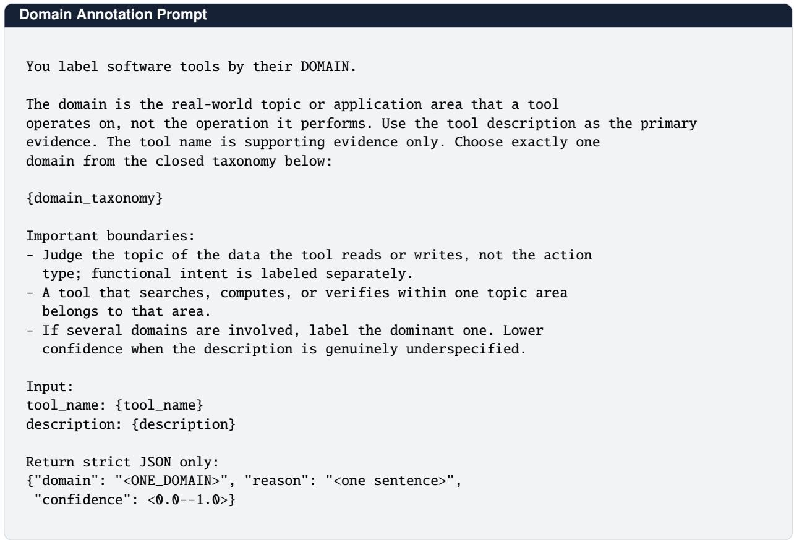  
Figure A.4. Prompt used to annotate tool domains with GPT-5.6-sol. The closed taxonomy is instantiated per benchmark.

Prompting-based agents. GPT-5.5 [25], Claude Opus 4.8 [1], GLM-5.2 [55], and DeepSeek V4 Pro [49] are evaluated without any post-training. Each model receives the same ReAct prompt, tool specifications, observations, and interaction budget as in the main setup.

General post-training objectives. GRPO [33] optimizes the outcome reward and applies the same trajectory-level advantage to all tool calls in a rollout. RFT [54] fine-tunes on successful rollouts selected by the task evaluator, while DMPO [35] constructs trajectory-level preference pairs from the same evaluator scores.

Turn-level tool-use post-training methods. StepTool [53] and FTRL-M [52] assign turn-level rewards, where FTRL-M denotes the multi-turn variant of FTRL. MatchTIR [30] uses the KM variant with AppWorld’s reference API calls and FTRL’s released tool-call annotations, combining turn-level and trajectory-level advantages. SOAR [13] derives supervision from observation tokens, while TRACE [42] follows the authors’ turn-level credit-assignment setup.

Tool-use RL methods. SimpleTIR [50] applies void-turn filtering during training, and ToolMaster [5] combines trajectory-based supervised fine-tuning with subsequent reinforcement learning. LOOP [2] retains its leave-one-out advantage estimation and rollout reuse.

Representation-learning method. SEAL [15] is run with its released implementation without further modification.

OOD-generalization methods. CORAL [40] aligns representation covariances, while Group DRO [31] reweights training-group losses. On AppWorld, CORAL aligns tool-call representations across training applications, and Group DRO reweights application-group policy losses. ToolRL [27] and PAFT [20] use their tool-call reward and training-time trajectory perturbations, respectively.

## A.7 Compute Resources and Time

Software and hardware. We conduct all experiments using Python 3.12.13 and PyTorch 2.11.0 with CUDA 12.8 on four NVIDIA H200 GPUs with 141 GB memory.

Training time. With Qwen3.5-4B, a complete ToolCompass run takes approximately 6.6 hours on AppWorld and 21.9 hours on FTRL. Compared with vanilla GRPO under the same configuration, the projection head, the prototype updates, and the representation-shaping losses add less than 1% training time.

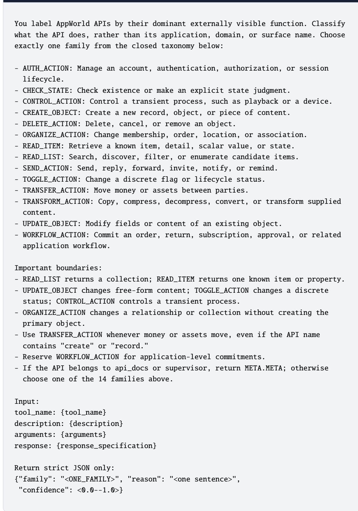  
Figure A.5. Prompt used to annotate AppWorld APIs with GPT-5.6-sol.

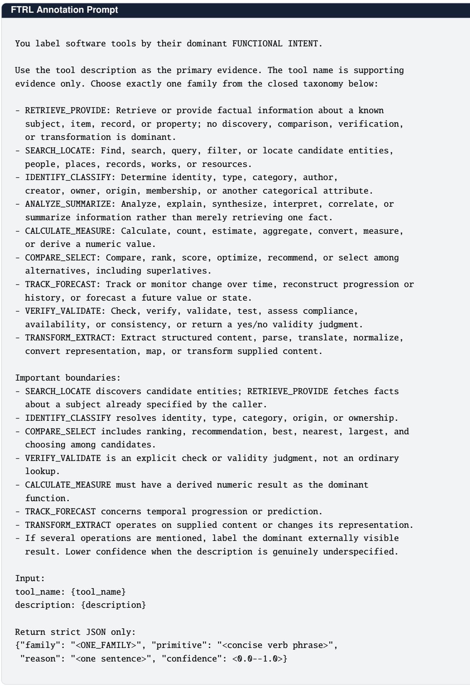  
Figure A.6. Prompt used to annotate FTRL tools with GPT-5.6-sol.

Algorithm A.1. Post-training with TOOLCOMPASS   
Input: Policy $\pi _ { \boldsymbol { \theta } } ;$ projection head $g _ { \psi } ;$ function labels $c ( u ) ;$ host objective $\mathcal { L } _ { \mathrm { p o s t } } ;$ layer �; temperature �; loss   
weights $\lambda _ { \mathrm { v M F } }$ and $\lambda _ { \mathrm { s e p } } ;$ EMA factor $\alpha$   
Randomly initialize the projection head $g _ { \psi }$ and unit prototypes $\{ \mu _ { k } \} _ { k \in C }$   
for each post-training update do   
Sample a batch of trajectories with $\pi _ { \theta }$ and compute $\mathcal { L } _ { \mathrm { p o s t } }$   
Initialize the minibatch of tool-call representations $\mathcal { B }  \emptyset$   
for each observed tool call $a _ { i }$ invoking tool $u _ { i }$ do   
Extract $\mathbf { h } _ { i }$ from layer $l \left( \mathrm { E q . 1 } \right)$ and compute $\mathbf { z } _ { i } = \mathrm { N }$ ormalize $\left( g _ { \psi } ( \mathbf { h } _ { i } ) \right)$   
Assign $c _ { i } = c ( u _ { i } )$ and add $\left( \mathbf { z } _ { i } , c _ { i } \right)$ to $\mathcal { B }$   
Compute $\mathcal { L } _ { \mathrm { v a r } } \left( \mathrm { E q . ~ 4 } \right)$ and $\mathcal { L } _ { \mathrm { s e p } } \left( \mathrm { E q . } 5 \right)$ from ${ \mathcal { B } } ,$ , treating the prototypes as stop-gradient targets   
Update � and � using $\mathcal { L } _ { \mathrm { p o s t } } + \dot { \lambda } _ { \mathrm { v M F } } ( \mathcal { L } _ { \mathrm { v a r } } + \lambda _ { \mathrm { s e p } } \mathcal { L } _ { \mathrm { s e p } } )$ (Eqs. 7 and 8)   
for eachfunction class $\hat { k }$ observed in $\mathcal { B }$ do   
Compute its normalized batch direction $\bar { \mathbf { z } } _ { k }$   
Update ${ \pmb \mu } _ { k } \gets \mathrm { N o r m a l i z e } ( \alpha { \pmb \mu } _ { k } + ( 1 - \alpha ) \bar { \bf z } _ { k } ) ( \mathrm { E q . } 6 )$   
return the post-trained policy ��

Table B.1. Semantic OOD results (%) on FTRL using Qwen3.5-4B.
<table><tr><td>Method</td><td>Solve-P</td><td>Solve-R</td><td>Solve-F1</td></tr><tr><td>GRPO</td><td>50.84</td><td>64.09</td><td>56.70</td></tr><tr><td>TOOLCOMPASS</td><td>53.02</td><td>70.21</td><td>60.42</td></tr></table>

## A.8 Training Algorithm

We provide the complete post-training procedure of ToolCompass in Algorithm A.1, which summarizes the joint optimization of the host objective and the representation-shaping objective, together with the EMA prototype updates.

## B Additional Analysis

Unless otherwise specified, we use Qwen3.5-4B with GRPO as the host objective.

## B.1 Semantic OOD Analysis

We evaluate semantic OOD transfer on FTRL by jointly holding out CALCULATE\_MEASURE, ANALYZE\_SUMMARIZE, and IDENTIFY\_CLASSIFY during post-training. GRPO and ToolCompass use the same Qwen3.5-4B initialization and filtered training data. We hold out 300 examples from the training data as a validation set. Evaluation includes test queries requiring at least one held-out function. Table B.1 reports Solve-P, Solve-R, and Solve-F1; other configurations follow Appendix A.3.

Table B.1 shows that ToolCompass improves Solve-P and Solve-R over GRPO by 2.18 and 6.12 points, respectively, on semantic OOD tasks. We attribute this gain to function-level supervision, which encourages the shared backbone to capture operational intent across tools. Together with pretrained semantic knowledge and tool descriptions, this abstraction helps the policy select appropriate calls for functions unseen during post-training.

To further examine this transfer, we visualize tool-call representations for the three held-out functions with t-SNE (Figure B.1). The visualization shows more coherent within-function groups and clearer separation under ToolCompass than GRPO, illustrating how function-level organization can extend to unseen functions.

## B.2 Comparison of Auxiliary Objectives

We compare ToolCompass with Function CE (linear classification) and SupCon [11] under the same function labels, representation layer, projection head, normalization, and training budget. Each objective uses the same development-set tuning budget.

ToolCompass outperforms Function CE and SupCon by 7.44 and 3.12 percentage points in OOD task success, respectively, supporting the benefit of the proposed objective beyond generic function supervision.

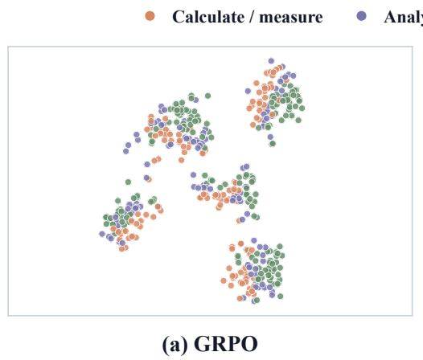

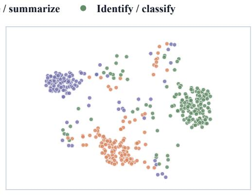  
(b) ToolCompass

Figure B.1. t-SNE visualization of jointly held-out functions. Colors denote the three function classes excluded from post-training. The two panels compare tool-call representations under GRPO and TOOLCOMPASS.  
Table B.2. Comparison of auxiliary objectives on AppWorld with Qwen3.5-4B and GRPO. Values are task success rates (%).
<table><tr><td>Method</td><td>ID</td><td>OOD</td><td>Total</td></tr><tr><td>GRPO</td><td>58.33</td><td>56.83</td><td>57.26</td></tr><tr><td>GRPO + Function CE</td><td>69.05</td><td>57.31</td><td>60.68</td></tr><tr><td> $\mathrm { G R P O } + \mathrm { S u p C o n }$ </td><td>60.71</td><td>61.63</td><td>61.37</td></tr><tr><td>TOOLCOMPASS</td><td>70.63</td><td>64.75</td><td>66.44</td></tr></table>

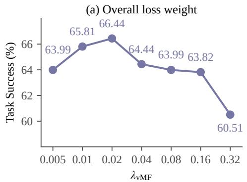

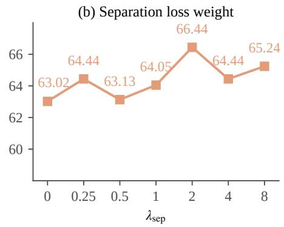  
Figure B.2. Efect of loss weights on AppWorld task success. We vary one weight while fixing the other to its default value.

## B.3 Effect of Loss Weights

ToolCompass uses two weighting hyperparameters: $\lambda _ { \mathrm { v M F } }$ balances the representation-shaping objective against the host objective, and $\lambda _ { \mathrm { s e p } }$ controls the strength of inter-function separation within it. We independently vary each weight while fixing the other to its default value, and report the task success rate in Figure B.2.

As shown in Figure B.2(a), performance peaks at $\lambda _ { \mathrm { v M F } } = 0 . 0 2$ , reaching 66.44%, and remains competitive for nearby values, indicating that ToolCompass is not overly sensitive to the precise choice of this weight. A very small weight provides insuficient function-level supervision, whereas an overly large weight overemphasizes representation shaping relative to the host objective. Figure B.2(b) shows a similar trend for $\lambda _ { \mathrm { s e p } } ,$ which performs best at 2.0 with 66.44%: weaker separation does not suficiently distinguish diferent function classes, while stronger separation reduces th flexibility within each class.

## B.4 Effect of the EMA Factor

We vary the EMA factor � of the prototype update in Eq. 6 while keeping all other hyperparameters at their default values. The endpoint $\alpha = 0$ reduces to the batch-estimated prototypes in Figure 6(a), and $\alpha = 1 . 0$ freezes the prototypes at their initial estimates. As shown in Figure B.3, performance peaks at $\alpha = 0 . 9$ , reaching 66.44%: a small � lets the prototypes fluctuate with individual minibatches, while a large � makes them adapt too slowly to the evolving representations.

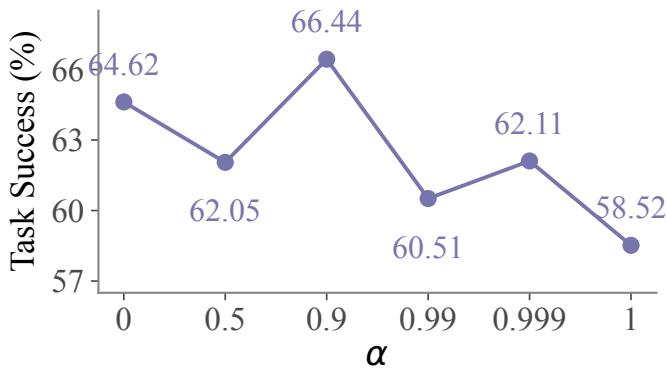  
Figure B.3. Efect of the EMA factor � on AppWorld task success.

Table B.3. AppWorld SGC results (%) using Qwen3.5-4B.
<table><tr><td>Method</td><td>ID</td><td>OOD</td><td>Total</td></tr><tr><td>LOOP</td><td>39.88</td><td>24.22</td><td>28.72</td></tr><tr><td>SEAL</td><td>41.07</td><td>26.38</td><td>30.60</td></tr><tr><td>TOOLCOMPASS</td><td>48.21</td><td>29.50</td><td>34.87</td></tr></table>

Table B.4. FTRL results (%) using Qwen3.5-4B. Each cell reports Solve-P / Solve-R / Solve-F1.
<table><tr><td>Method</td><td>ID</td><td>OOD</td><td>Total</td></tr><tr><td>LOOP</td><td>37.80 / 57.60 / 41.83</td><td>51.90 / 76.40 / 57.72</td><td>40.06 / 60.61 / 44.37</td></tr><tr><td>SEAL</td><td>33.40 / 56.70 / 38.02</td><td>53.70 / 73.80 / 57.94</td><td>36.65 / 59.44 / 41.21</td></tr><tr><td>TOOLCOMPASS</td><td>43.20 / 63.70 / 46.97</td><td>59.50 / 80.20 / 64.01</td><td>45.81 / 66.34 / 49.70</td></tr></table>

## B.5 Qualitative Analysis

We present two AppWorld Test-C case studies to show how ToolCompass guides tool trialing on tasks that require the unseen applications. For each task, we show the complete trajectories of GRPO, MatchTIR, and ToolCompass, and every call is labeled as direct tool use, useful trialing, or unproductive trialing following the protocol in Appendix B.8. The task instructions, resource identifiers, and environment observations come from the executable benchmark instances; authentication and API-documentation calls are omitted. Sample 1 (Figure B.4) requires comparing two gift-wrapping options and completing a checkout on Amazon. Sample 2 (Figure B.5) requires replacing an attachment in a Gmail draft with a file from the file system.

The two cases show the same pattern from diferent sides. ToolCompass explores when exploration is needed: its trials stay on functionally related APIs, and each error is followed by a corrective call. GRPO explores without guidance, which wastes the budget in Sample 2 and causes a failure in Sample 1. MatchTIR suppresses exploration and terminates before the required final actions in both cases. This matches the aggregate behavior in Figure 7: ToolCompass keeps the useful trials while cutting the unproductive ones.

## B.6 AppWorld SGC Results

In addition to the task success rate, we report Scenario Goal Completion (SGC), a stricter metric that credits a scenario only when all of its task variants are completed successfully. The results are shown in Table B.3.

As shown in Table B.3, ToolCompass achieves the best SGC on all splits. In particular, it improves OOD SGC by 5.28 points over LOOP and by 3.12 points over SEAL. These results indicate that the gains of ToolCompass extend beyond individual tasks and remain consistent across the task variants of the same scenario.

## B.7 FTRL Solve-P, Solve-R, and Solve-F1 Results

We compare ToolCompass with LOOP and SEAL on FTRL using Solve-P and Solve-R to distinguish tool-invocation precision from task-completion recall. Table B.4 reports Solve-P, Solve-R, and Solve-F1 on the ID, OOD, and entire test sets using Qwen3.5-4B.

ToolCompass achieves the best results on all three metrics across the ID, OOD, and total test sets. The gains cover both tool-invocation precision and task-completion recall.

Sample 1

Task. Buy one Samsung Galaxy Buds Pro and use the cheaper option: Amazon direct gift wrapping or a separately purchased wrapper. OOD app. Amazon

AppWorld Test-C ec437da 2. Target: product 735 (\$200); cheapest separate wrapper: product 2323 (\$10); direct wrap fee: \$5

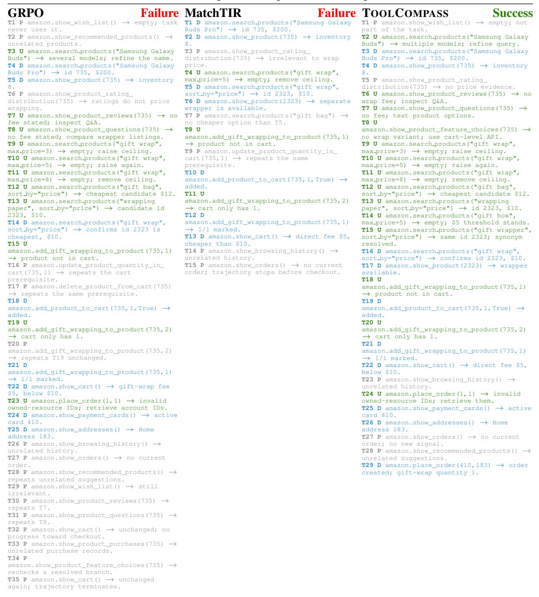

<table><tr><td>Method</td><td>Calls</td><td>Direct</td><td>Useful</td><td>Unproductive</td><td>Outcome</td></tr><tr><td>GRPO</td><td>35</td><td>8</td><td>11</td><td>16</td><td>Failure</td></tr><tr><td>MatchTIR</td><td>15</td><td>7</td><td>3</td><td>5</td><td>Failure</td></tr><tr><td>TOOLCOMPASS</td><td>29</td><td>10</td><td>14</td><td>5</td><td>Success</td></tr></table>

Figure B.4. Sample 1 (Amazon: compare gift-wrapping options and check out). ToolCompass turns each error into a corrective next step and keeps its trials on checkout-relevant APIs, completing the order in 29 calls with only 5 unproductive ones. GRPO finds the same evidence but spends 16 calls on unrelated or repeated queries and exhausts the interaction budget before checkout. MatchTIR stops after 15 calls without attempting checkout.

# Task. In the reply draft to my manager, replace the mistakenly attached resume with the headshot stored in my file system, then send the email. OOD app. Gmail

AppWorld Test-C bcb9696 1. Manager: Brandon Weber; target draft 518; resume attachment 8483; distractor thread 47823.

## D: Direct tool use U: Useful trialing P: Unproductive trialing

GRPO Success T1 U gmail.show\_inbox\_threads("manager") many threads; refine by headshot.   
T2 D gmail.show\_inbox\_threads("headshot") threads 47821 and 47823.   
T3 U gmail.show\_thread(47823)  Adrian, not the manager; rule out.   
T4 D gmail.show\_thread(47821) → Brandon request, email 20867.   
T5 U gmail.show\_drafts(query="headshot") empty; filter by recipient.   
T6 D gmail.show\_drafts(recipient\_email=   
"brandon-webe@gmail.com") draft 518.   
T7 P gmail.show\_outbox\_threads("headshot") distractor only.   
T8 P gmail.show\_spam\_threads("headshot") empty.   
T9 P gmail.show\_snoozed\_threads("headshot") empty.   
T10 U gmail.remove\_attachment\_from\_   
draft(518,20867) no such attachment;   
inspect draft IDs.   
T11 D gmail.show\_draft(518) resume   
attachment 8483.   
T12 D gmail.remove\_attachment\_from\_   
draft(518,8483) deleted.   
T13 U file\_system.file\_exists("/home/   
norman/headshot.jpeg")  false; search directories.   
T14 P file\_system.show\_file("/home/norman/ headshot.jpeg") repeats T13 as an error. T15 U file\_system.show\_directory("/home/ norman","headshot","files",False)   
empty; descend.   
T16 U file\_system.show\_directory("/home/ norman/documents","headshot","files",False) empty; recurse.   
T17 U file\_system.show\_directory("/home/ norman/documents","headshot","files",True) exact work path.   
T18 D file\_system.show\_file(".../work/   
professional\_headshot.jpeg") → target   
file.   
T19 P file\_system.show\_directory("/",   
"resume","files") irrelevant files.   
T20 P file\_system.show\_directory("/home/ norman/downloads")  irrelevant folder. T21 U   
gmail.upload\_attachments\_to\_draft(518,[]) at least one path required.   
T22 P gmail.upload\_attachments\_to\_   
draft(518,["/home/norman/headshot.jpeg"]) repeats resolved path error.   
T23 D   
gmail.upload\_attachments\_to\_draft(518,["... /professional\_headshot.jpeg"]) id 8485. T24 P gmail.show\_thread(47823)  repeats distractor branch.   
T25 P gmail.show\_outbox\_threads("Brandon") premature check.   
T26 P gmail.show\_inbox\_threads("headshot") repeats T2.   
T27 D gmail.show\_draft(518) only   
headshot 8485 remains.   
T28 D gmail.send\_email\_from\_draft(518) sent email 20870 to Brandon. MatchTIR Failure T1 D gmail.show\_inbox\_threads("headshot") threads 47821 and 47823.   
T2 U gmail.show\_thread(47823) Adrian, not the manager; rule out.   
T3 D gmail.show\_thread(47821) Brandon request, email 20867.   
T4 D gmail.show\_email(20867) confirms the headshot request.   
T5 P gmail.show\_email(20869) revisits distractor evidence.   
T6 D gmail.show\_drafts(recipient\_email=   
"brandon-webe@gmail.com") draft 518.   
T7 P gmail.show\_outbox\_threads("headshot") no target draft.   
T8 P   
gmail.show\_archived\_threads("headshot") empty.   
T9 P gmail.show\_starred\_threads("headshot") empty.   
T10 P gmail.show\_spam\_threads("headshot") empty.   
T11 U gmail.remove\_attachment\_from\_   
draft(518,20867) no such attachment;   
inspect IDs.   
T12 D gmail.show\_draft(518) resume   
attachment 8483.   
T13 D gmail.remove\_attachment\_from\_   
draft(518,8483) deleted.   
T14 U file\_system.file\_exists("/home/   
norman/headshot.jpeg") false.   
T15 P file\_system.show\_file("/home/norman/ headshot.jpeg") repeats T14.   
T16 U file\_system.show\_directory("/home/ norman","headshot","files",False)   
empty; recurse.   
T17 U file\_system.show\_directory("/home/ norman/documents","headshot","files",False) empty; enable recursion.   
T18 D file\_system.show\_directory("/home/ norman","headshot","files",True) exact work path.   
T19 D file\_system.show\_file(".../work/   
professional\_headshot.jpeg") target   
file.   
T20 D   
gmail.upload\_attachments\_to\_draft(518,["... /professional\_headshot.jpeg"]) id 8485. T21 D gmail.show\_draft(518) only   
headshot remains.   
T22 P   
gmail.show\_snoozed\_threads("headshot") empty.   
T23 P gmail.show\_inbox\_threads("headshot") repeats T1; still unsent.   
T24 P file\_system.show\_directory("/home/ norman/downloads")  unrelated folder;   
stops before send. OOL OMPASS Success T1 U gmail.show\_inbox\_threads("manager") broad results; refine by headshot.   
T2 D gmail.show\_inbox\_threads("headshot") threads 47821 and 47823.   
T3 U gmail.show\_thread(47823) Adrian, not the manager; rule out.   
T4 D gmail.show\_thread(47821) Brandon request, email 20867.   
T5 U gmail.show\_drafts(query="headshot") → empty; change filter.   
T6 D gmail.show\_drafts(recipient\_email=   
"brandon-webe@gmail.com") draft 518.   
T7 P   
gmail.show\_archived\_threads("headshot") empty.   
T8 U gmail.remove\_attachment\_from\_   
draft(518,20867) no such attachment;   
inspect IDs.   
T9 D gmail.show\_draft(518) resume   
attachment 8483.   
T10 D gmail.remove\_attachment\_from\_   
draft(518,8483) deleted.   
T11 U file\_system.file\_exists("/home/   
norman/headshot.jpeg")  false; search. T12 U file\_system.show\_directory("/home/ norman","headshot","files",False)   
empty; descend.   
T13 U file\_system.show\_directory("/home/ norman/documents","headshot","files",False) empty; recurse.   
T14 U file\_system.show\_directory("/home/ norman/documents","headshot","files",True) exact work path.   
T15 D file\_system.show\_file(".../work/   
professional\_headshot.jpeg") target   
file.   
T16 P file\_system.show\_directory("/",   
"resume","files")  irrelevant files.   
T17 U   
gmail.upload\_attachments\_to\_draft(518,[]) at least one path required.   
T18 U gmail.upload\_attachments\_to\_   
draft(518,["/home/norman/documents/work"]) file path, not directory, required.   
T19 D   
gmail.upload\_attachments\_to\_draft(518,["... /professional\_headshot.jpeg"]) id 8485. T20 P gmail.show\_thread(47823) one   
redundant distractor recheck.   
T21 D gmail.show\_draft(518) only   
headshot 8485 remains.   
T22 D gmail.send\_email\_from\_draft(518) sent email 20870 to Brandon.

<table><tr><td>Method</td><td>Calls</td><td>Direct</td><td>Useful</td><td>Unproductive</td><td>Outcome</td></tr><tr><td>GRPO</td><td>28</td><td>9</td><td>9</td><td>10</td><td>Success</td></tr><tr><td>MatchTIR</td><td>24</td><td>10</td><td>5</td><td>9</td><td>Failure</td></tr><tr><td>TOOLCOMPASS</td><td>22</td><td>9</td><td>10</td><td>3</td><td>Success</td></tr></table>

Figure B.5. Sample 2 (Gmail: replace a draft attachment and send). All three methods locate the correct thread and draft, but they spend the remaining budget diferently. ToolCompass resolves the path and upload-format errors with targeted follow-ups and finishes in 22 calls with only 3 unproductive ones. GRPO also succeeds but spends 10 of its 28 calls on unrelated mailbox checks and repeats. MatchTIR ends after 24 calls without sending the email.

Tool-Call Categorization Prompt   
You label the current call using only the task, tool specifications, prior   
history, current call, and its immediate feedback. Choose one label:   
- DIRECT\_TOOL\_USE: Directly performs a required operation or obtains   
information needed to complete the task.   
- USEFUL\_TRIALING: A plausible exploration that provides new, task-relevant   
information about tool capabilities, arguments, or execution conditions.   
- UNPRODUCTIVE\_TRIALING: An unrelated or redundant call, or an exploration   
that provides no new task-relevant information.   
Apply DIRECT\_TOOL\_USE first. Assess novelty against the tool specifications   
and prior history. Errors can be useful if they reveal new relevant information.   
Do not use later actions or the final task outcome.   
Input:   
task: {task\_instruction}   
tools: {tool\_specifications}   
history: {prior\_interaction\_history}   
call: {current\_call}   
feedback: {current\_feedback}   
Return strict JSON only:   
{"turn": <turn\_id>, "label": "<ONE\_LABEL>", "reason": "<one sentence>"}  
Figure B.6. Prompt used to categorize tool calls with GPT-5.6-sol.

## B.8 Tool-Call Categorization

For the tool-use behavior analysis in Figure 7 and Appendix B.5, GPT-5.6-sol serves as the LLM-as-a-judge [58] and assigns each tool call to one of three categories: direct tool use, which performs a required operation or obtains information needed to complete the task; useful trialing, a plausible exploratory call that provides new, task-relevant information about tool capabilities, argument requirements, or execution conditions; and unproductive trialing, which is unrelated, redundant, or provides no new task-relevant information. The judge receives the task instruction, tool specifications, prior interaction history, current call, and its immediate feedback. The full prompt is shown in Figure B.6.

Information novelty is assessed against the supplied tool specifications and prior interaction history. Subsequent actions and final task outcomes are excluded from the judgment.

To assess annotation quality, three annotators independently verify a random sample of 200 tool calls with the same information provided to the judge, and we compute Fleiss’s kappa over the three sets of labels. The kappa score is 0.73, with a raw agreement rate of 82.00%; the remaining disagreements are resolved by discussion. Moreover, the LLM annotations agree with the final reviewed labels on 86.00% of the calls, supporting their use for the full behavior analysis.

## B.9 Representation-Space Visualization Details

For the visualization in Figure 4, we select four function classes and extract their raw layer-� = 8 backbone hidden states, without applying the projection head. These states are normalized and mapped onto the three-dimensional unit sphere for rendering. The two panels share the same viewpoint and a jointly normalized color scale, and the surface shows the spherical kernel density of the displayed class.